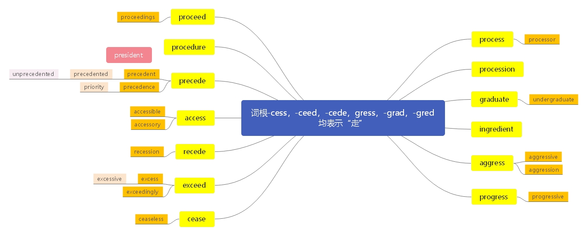

# 一、 词根： -cess， -ceed， -cede， -gress， -gred， -grad

> **本节课目标**
>
> **1、 介绍整体授课方式和重点注意事项**
>
> **2、 掌握词根-cess、 -ceed、 -cede、 -gress、 -gred、 -grad 含义**
>
> **3、 掌握单词 83 个**

***

**一、 词根：“-cess， -ceed， -cede， -gress， -gred， -grad”全部都表示“go：走”的含义。**

> 词源： processlate
>
> 14c., “to go on,” also “to emanate from, result from,” from Old French proceder (13c., Modern French procéder) and directly from Latin procedere (past participle  processus) “go before, go forward, advance, make
>
> progress; come forward,” from pro “forward”(from PIE root \*per-(1) “forward”)+cedere “togo”(from PIE root \*ked-“to go, yield”).
>
> &#x20;Related: proceeded; proceeding.

***

**process** \[ˈprəuses] [英音](https://dict.youdao.com/dictvoice?audio=process\&type=1)  [美音](https://dict.youdao.com/dictvoice?audio=process\&type=2)  n. 过程，进程； v. 处理，加工 392

&#x9;**助记：** pro (向前) +cess (走) → (列队) 前进；过程，程序；加工，处理

&#x9;**搭配：**	data processing (考)： 数据处理

&#x9;			information processing (考)： 信息处理	&#x9;

**双语例句:** You participate in the creative process. [播放](https://dict.youdao.com/dictvoice?audio=You+participate+in+the+creative+process.&le=eng)

你参与了这个创造的过程。 

**原声例句:** Professor Prusinkiewicz is on sabbatical leave in Australia, but he sent us an e-mail suggesting a simple way to understand the process. [播放](http://dict.youdao.com/pureaudio?docid=-9196061109484153481)

**权威例句:** This can usually be handled through your broker, and the paperwork will take a few weeks to process. [播放](https://dict.youdao.com/dictvoice?audio=This+can+usually+be+handled+through+your+broker%2C+and+the+paperwork+will+take+a+few+weeks+to+process.+)

***

**processor** \[ˈprəusesə] [英音](https://dict.youdao.com/dictvoice?audio=processor\&type=1)  [美音](https://dict.youdao.com/dictvoice?audio=processor\&type=2)  n. 处理器 4663

**助记：** process (处理) +or (名词后缀，表东西) →处理器

\*\*搭配：\*\*image processor (考)： 图像处理器

***

**processed** \[pˈrəsest] [英音](https://dict.youdao.com/dictvoice?audio=processed\&type=1)  [美音](https://dict.youdao.com/dictvoice?audio=processed\&type=2)  adj. 处理的，加工过的 12340

***

**processing** \[prəˈsesɪŋ] [英音](https://dict.youdao.com/dictvoice?audio=processing\&type=1)  [美音](https://dict.youdao.com/dictvoice?audio=processing\&type=2)  v. 处理；加工；对……起诉（ process的ing形式） 4074

***

**procession** \[prəˈseʃ(ə)n] [英音](https://dict.youdao.com/dictvoice?audio=procession\&type=1)  [美音](https://dict.youdao.com/dictvoice?audio=procession\&type=2)  n. 队伍，行列；一列，一排；列队行进 7783

**助记：** pro（向前） +cess（走） +ion（名词后缀） →（一群人） 向前走→

**释义和用法：** (N-COUNT) （走路、骑马、开车等的）队伍，行列

&#x20;A procession is a group of people who are walking, riding, or driving in a line as part of a public event

> **【课堂笔记】**
>
> 1.  词跟 + u (连接符号) +后缀 如： stimulate
>
> （u 连接词根和后缀的符号；方便发音更加顺滑；流畅；没有任何实际含义）除 u 连接符号外；还包括 ul； o; ol 三个
>
> 2.元音字母发生改变，含义不变的后缀
>
> \-ate -ite -ute
>
> *   用作动词后缀；表示“使”或不翻译
> *   用作形容词后缀；
> *   极少数情况下，可做名词后缀，即可表示“人”还可表示“物”

**双语例句:** Who is in front of the procession? [播放](https://dict.youdao.com/dictvoice?audio=Who+is+in+front+of+the+procession%3F&le=eng)

谁在队伍的前头？ 

**原声例句:** A seventh horse carries the leader of the procession. [播放](http://dict.youdao.com/pureaudio?docid=8678418037857598368)

**权威例句:** The week began with a procession of anti-agreement figures to Drumcree to pay respects. [播放](https://dict.youdao.com/dictvoice?audio=The+week+began+with+a+procession+of+anti-agreement+figures+to+Drumcree+to+pay+respects.+)

***

**graduate** \[ˈgrædjueit] [英音](https://dict.youdao.com/dictvoice?audio=graduate\&type=1)  [美音](https://dict.youdao.com/dictvoice?audio=graduate\&type=2)  v. 毕业； n.（本科）毕业生 2133

**助记：** grad（走） +u（链接符号） +ate（名词或者名词后缀）→要走（要离开学校） →毕业；毕业生

**双语例句:** Your Columbia degree will take you far, even if you don't graduate with honors. [播放](https://dict.youdao.com/dictvoice?audio=Your+Columbia+degree+will+take+you+far%2C+even+if+you+don%27t+graduate+with+honors.&le=eng)

即便你毕业时没有获得优异的成绩，你的哥伦比亚学位也将带你走得很远。 

**原声例句:** Costs for graduate study in the United States also differ from school to school, and even from program to program. [播放](http://dict.youdao.com/pureaudio?docid=-9203842181096211182)

**权威例句:** Your technique is strikingly similar to Bok (Pak), a graduate who played the first trumpet... [播放](https://dict.youdao.com/dictvoice?audio=Your+technique+is+strikingly+similar+to+Bok+%28Pak%29%2C+a+graduate+who+played+the+first+trumpet...+)

***

**undergraduate** \[ˌʌndəˈgrædjuət] [英音](https://dict.youdao.com/dictvoice?audio=undergraduate\&type=1)  [美音](https://dict.youdao.com/dictvoice?audio=undergraduate\&type=2)  n. 大学本科生 4804

**助记：** under (下，未达到) +graduate (本科毕业) →还未本科毕业生→大学本科生

**双语例句:** Yale is a major research university that focuses primarily on undergraduate education and encourages students to become energetic citizens of their communities, the nation, and the world. [播放](https://dict.youdao.com/dictvoice?audio=Yale+is+a+major+research+university+that+focuses+primarily+on+undergraduate+education+and+encourages+students+to+become+energetic+citizens+of+their+communities%2C+the+nation%2C+and+the+world.&le=eng)

耶鲁是一所主要集中于大学生教育的重要的研究型大学，鼓励学生成为社区、国家和世界的积极公民。 

**原声例句:** Forty percent said they were discouraged from pursuing their chosen career, typically in college and often by their professors, an experience Jemison remembers from her undergraduate days. [播放](http://dict.youdao.com/pureaudio?docid=-9070873807575978118)

**权威例句:** While at Berkeley Sehat met and married Weili Dai, a sprightly undergraduate programmer from Shanghai. [播放](https://dict.youdao.com/dictvoice?audio=While+at+Berkeley+Sehat+met+and+married+Weili+Dai%2C+a+sprightly+undergraduate+programmer+from+Shanghai.+)

***

**ingredient** \[inˈgri\:diənt] [英音](https://dict.youdao.com/dictvoice?audio=ingredient\&type=1)  [美音](https://dict.youdao.com/dictvoice?audio=ingredient\&type=2)  n. 原料，要素，组成部分 2613

**助记：** in (进入) +gredi (=go走) +ent (名词后缀) →走进去 (构成新物体) 的材料→原料，要 素，组成部分

**例句：** This means topsoil contains few of the ingredients needed for long-termsuccessful farming.这意味着表层土壤没有包含对于长期成功的农耕来说必须的成分。

&#x20;**(** **写作，阅读 ) 重点：“组成部分，要素”的表达：** ingredient, component,constituent

**例句：** 林肯的名言清楚地表达了：充分的准备是成功的要素之一。

Lincoln’s famous remark makes it clear that full preparation is a component/constituent for those who want to succeed.

Lincoln’s well-known saying clearly expresses the idea that making full preparation is an ingredient for success.

**双语例句:** You need a third ingredient: abuse or violence in one's childhood. [播放](https://dict.youdao.com/dictvoice?audio=You+need+a+third+ingredient%3A+abuse+or+violence+in+one%27s+childhood.&le=eng)

你需要有第三个要素:在童年时期受到虐待或暴力。 

**原声例句:** And worse,he says, there is no listing of the amount of each ingredient. [播放](http://dict.youdao.com/pureaudio?docid=-7615832981198426725)

**权威例句:** The Perdue chickens that produce the magic ingredient for Organic Choice soil don't eat organic feed. [播放](https://dict.youdao.com/dictvoice?audio=The+Perdue+chickens+that+produce+the+magic+ingredient+for+Organic+Choice+soil+don%27t+eat+organic+feed.+)

***

**aggressive** \[əˈgresiv] [英音](https://dict.youdao.com/dictvoice?audio=aggressive\&type=1)  [美音](https://dict.youdao.com/dictvoice?audio=aggressive\&type=2)  adj. 侵略性的，激进的 2538

**助记：** ag (加强语气) +gress (=go：走) +ive (形容词后缀) →强行走进去的→侵略性的，激进的

**搭配：** aggressive behavior (考)： 激进的行为

**双语例句:** You had to be tactically more aggressive. [播放](https://dict.youdao.com/dictvoice?audio=You+had+to+be+tactically+more+aggressive.&le=eng)

你既要进退有度，也要更加激进。 

**原声例句:** McCain said he wants to see McChrystal use the same aggressive approach employed during the troop surge in Iraq. [播放](http://dict.youdao.com/pureaudio?docid=-9038618296703315221)

**权威例句:** Would The New York Times refer to its own aggressive public relations program as superficial? [播放](https://dict.youdao.com/dictvoice?audio=Would+The+New+York+Times+refer+to+its+own+aggressive+public+relations+program+as+superficial%3F+)

***

**aggress** \[əˈgres] [英音](https://dict.youdao.com/dictvoice?audio=aggress\&type=1)  [美音](https://dict.youdao.com/dictvoice?audio=aggress\&type=2)  v. 侵略 76

**助记：** ag (加强语气) +gress (走) →强行走进去→侵略

> **【课堂笔记】**
>
> 1.  字母 a 后跟两个连续辅音字母时，如 abb; acc; add; aff … (标记为 axx)
>
> ax (前缀) + x 归为词根部分, 如 aggress,
>
> ag（前缀；表示加强语气） + gress（词根；表示“走”）→强行走进去→侵略
>
> 1.  a- /ad-
>
> *   to 去
> *   表加强语气，没有实际含义；（同中文“啊”，加强语气）

***

**aggression** \[əˈgreʃ(ə)n] [英音](https://dict.youdao.com/dictvoice?audio=aggression\&type=1)  [美音](https://dict.youdao.com/dictvoice?audio=aggression\&type=2)  n. 进攻；侵略；侵犯；侵害 4572

***

**aggressively** \[əˈgresɪvli] [英音](https://dict.youdao.com/dictvoice?audio=aggressively\&type=1)  [美音](https://dict.youdao.com/dictvoice?audio=aggressively\&type=2)  adv. 侵略地；攻击地；有闯劲地 6322

**双语例句:** You might run into a supplier who will react more aggressively than I did in that same situation (pursuing the matter wasn't worth it for me). [播放](https://dict.youdao.com/dictvoice?audio=You+might+run+into+a+supplier+who+will+react+more+aggressively+than+I+did+in+that+same+situation+%28pursuing+the+matter+wasn%27t+worth+it+for+me%29.&le=eng)

同样情况下，你也许碰到过比我表现还要积极的供应商(追究此事对我毫无价值)。 

**原声例句:** Until now,the Paris Institute of Political Studies, commonly known as Sciences Po, is the only grande ecole to have aggressively sought out a more diverse student body. [播放](http://dict.youdao.com/pureaudio?docid=7877575211416897496)

**权威例句:** While China punishes political dissent aggressively, it has been somewhat more tolerant of environmental complaints. [播放](https://dict.youdao.com/dictvoice?audio=While+China+punishes+political+dissent+aggressively%2C+it+has+been+somewhat+more+tolerant+of+environmental+complaints.+)

***

**aggressiveness** \[əˈgrɛsɪvnɪs] [英音](https://dict.youdao.com/dictvoice?audio=aggressiveness\&type=1)  [美音](https://dict.youdao.com/dictvoice?audio=aggressiveness\&type=2)  n. 有侵略性的 15655

***

**aggressor** \[əˈgresə] [英音](https://dict.youdao.com/dictvoice?audio=aggressor\&type=1)  [美音](https://dict.youdao.com/dictvoice?audio=aggressor\&type=2)  n. 侵略者；侵略国；挑衅者 13815

***

**progress** \[ˈprəugres] [英音](https://dict.youdao.com/dictvoice?audio=progress\&type=1)  [美音](https://dict.youdao.com/dictvoice?audio=progress\&type=2)  v. / n. 前进，进步 1517

**助记：** pro (向前) +gress (走) →前进，进步

**例句：** It was only after some progress had been made in the use anddevelopment of electric current that men began to realize the importanceand possibilities of magnetism.

当在使用和发展电流取得一些进步之后，人们才开始意识到电磁学的重要性和潜力。

**仿写例句：** 当一些悲剧发生在学校中之后，人们才开始意识到大学生心理健康的重要性。

It was only after some tragedies had taken place in campus that men beganto realize the importance of mental health among colleges students.

**双语例句:** You should start managing changes and configurations at maturity level 2 and track its progress until you achieve the goal for maturity level 4. [播放](https://dict.youdao.com/dictvoice?audio=You+should+start+managing+changes+and+configurations+at+maturity+level+2+and+track+its+progress+until+you+achieve+the+goal+for+maturity+level+4.&le=eng)

您应该在成熟度等级2上开始管理变更及配置，并且跟踪其发展，直到您实现了成熟度等级4的目标。 

**原声例句:** A government report notes that little progress has been made in reducing what are called health care-associated infections. [播放](http://dict.youdao.com/pureaudio?docid=-9189941753530173782)

**权威例句:** Yet the drift to the dollar standard was somehow judged as a sign of progress. [播放](https://dict.youdao.com/dictvoice?audio=Yet+the+drift+to+the+dollar+standard+was+somehow+judged+as+a+sign+of+progress.+)

***

**progression** \[prəˈgreʃ(ə)n] [英音](https://dict.youdao.com/dictvoice?audio=progression\&type=1)  [美音](https://dict.youdao.com/dictvoice?audio=progression\&type=2)  n. 前进；连续 7717

***

**progressive** \[prəˈgresɪv] [英音](https://dict.youdao.com/dictvoice?audio=progressive\&type=1)  [美音](https://dict.youdao.com/dictvoice?audio=progressive\&type=2)  adj. 进步的；先进的 4268

**双语例句:** You build increased energy capacity slowly through progressive training. [播放](https://dict.youdao.com/dictvoice?audio=You+build+increased+energy+capacity+slowly+through+progressive+training.&le=eng)

你通过逐步的训练慢慢提高你的精力。 

**原声例句:** And they continued to re-elect him. In this way, the conservative Republican policies of the nineteen twenties changed to the more progressive policies of Roosevelt in the nineteen thirties. [播放](http://dict.youdao.com/pureaudio?docid=883079234393212942)

**权威例句:** Yet really, dear progressive reader (if any), brace yourself: Civil servants are not superheroes. [播放](https://dict.youdao.com/dictvoice?audio=Yet+really%2C+dear+progressive+reader+%28if+any%29%2C+brace+yourself%3A+Civil+servants+are+not+superheroes.+)

***

**progressively** \[prəˈgresɪvli] [英音](https://dict.youdao.com/dictvoice?audio=progressively\&type=1)  [美音](https://dict.youdao.com/dictvoice?audio=progressively\&type=2)  adv. 渐进地；日益增多地 10732

***

**proceed** \[prəuˈsi\:d] [英音](https://dict.youdao.com/dictvoice?audio=proceed\&type=1)  [美音](https://dict.youdao.com/dictvoice?audio=proceed\&type=2)  vi. 前进，继续进行，开始 2720

**助记：** pro (向前) +ceed (=go：走) →向前走→前进， (继续) 进行，开始

**搭配：** proceed with (考)： 开始进行proceed to：进入

**例句：** Writer-director Paul Greengrass has gone to great lengths to be respectfulin his depiction of what occurred, proceeding with the film only aftersecuring the approval of every victim’s family.

编剧兼导演Paul Greengrass已经竭尽全力去使自己的描述忠实于事实，在确保每一位受害者的家属同意之后，他才开始进行电影拍摄。

**仿写例句：** 很多大学生都竭尽全力去考各种证书，以确保能找到一个有前途的工作。

In order to secure a promising job, many college students have gone togreat lengths to get a variety of/various/all kinds of/all sorts of certificates.

**例句：** Subscribers can customize the information they want to receive andproceed directly to a company’s web site.

订阅者能够定制他们想要接收的信息并且直接进入到一个公司的网站。

**仿写例句：** 通过互联网，顾客们可以直接进入到一个公司的网站，定制他们想要的任何数字化产品。Customers can proceed directly to a company’s web site and customize/order the digital products they want.

> **【课堂笔记】**
>
> &#x20;**词义辨析：**
>
> 以下一组词， 词根相同，表示向前走，区别在于其使用语境不同：
>
> progress：（事业/事情）向前走， 前进；
>
> process：强调事情发展的过程
>
> procedure：强调事情进行的程序
>
> proceed：强调事情继续前进，将事情推进下去
>
> procession: 一群人/一组人列队向前走

**双语例句:** You can proceed with the migration page by page by repeating this step, if you wish. [播放](https://dict.youdao.com/dictvoice?audio=You+can+proceed+with+the+migration+page+by+page+by+repeating+this+step%2C+if+you+wish.&le=eng)

如果您愿意，您可以通过重复这个步骤，一页一页地继续移动页面。 

**原声例句:** "In light of the accused voluntarily and unequivocally waiving his right to be present at these proceedings, the chamber is of the view that this hearing can proceed in his absence," [播放](http://dict.youdao.com/pureaudio?docid=-8560959866223576231)

**权威例句:** The other three levels of active defense are where companies need to proceed with caution. [播放](https://dict.youdao.com/dictvoice?audio=The+other+three+levels+of+active+defense+are+where+companies+need+to+proceed+with+caution.+)

***

**proceedings** \[prəˈsi\:diŋz] [英音](https://dict.youdao.com/dictvoice?audio=proceedings\&type=1)  [美音](https://dict.youdao.com/dictvoice?audio=proceedings\&type=2)  n. 诉讼，议程 5436

**搭配：** legal proceedings (考)： 法律诉讼

***

**proceeds** \[ˈprəʊsi\:dz] [英音](https://dict.youdao.com/dictvoice?audio=proceeds\&type=1)  [美音](https://dict.youdao.com/dictvoice?audio=proceeds\&type=2)  n. 实收款项；收入，收益 8059

***

**procedure** \[prəˈsi\:dʒə] [英音](https://dict.youdao.com/dictvoice?audio=procedure\&type=1)  [美音](https://dict.youdao.com/dictvoice?audio=procedure\&type=2)  n. 程序，步骤 1376

**助记：** pro (向前) +ced (走) +ure (名词后缀) → (一步步) 向前走→程序，步骤

**搭配：** surgical procedures (考)： 手术程序/步骤legal procedures (考)： 法律程序

**双语例句:** You can use it on production systems to turn on or off stored procedure logging on the fly, and it will help you understand and manage your stored procedures. [播放](https://dict.youdao.com/dictvoice?audio=You+can+use+it+on+production+systems+to+turn+on+or+off+stored+procedure+logging+on+the+fly%2C+and+it+will+help+you+understand+and+manage+your+stored+procedures.&le=eng)

可以在产品系统中使用这个框架，在系统运行时激活或关闭存储过程的日志功能，它可以帮助我们理解和管理存储过程。 

**原声例句:** And why would they take him out of the country instead of following a procedure inside the country?,". [播放](http://dict.youdao.com/pureaudio?docid=9157949396657833611)

**权威例句:** Yet the PIN procedure, says the IRS, counts as a signature for all purposes. [播放](https://dict.youdao.com/dictvoice?audio=Yet+the+PIN+procedure%2C+says+the+IRS%2C+counts+as+a+signature+for+all+purposes.+)

***

**procedural** \[prəˈsi\:dʒərəl] [英音](https://dict.youdao.com/dictvoice?audio=procedural\&type=1)  [美音](https://dict.youdao.com/dictvoice?audio=procedural\&type=2)  adj. 程序上的 9160

**双语例句:** We are carrying out our work according to procedural law, so please cooperate. [播放](https://dict.youdao.com/dictvoice?audio=We+are+carrying+out+our+work+according+to+procedural+law%2C+so+please+cooperate.&le=eng)

我们是依据诉讼法开展工作的，请您配合我们。 

**原声例句:** With Republicans maintaining their wall of opposition, the Senate completed a series of final procedural votes, including one formally declaring debate on the legislation at an end. [播放](http://dict.youdao.com/pureaudio?docid=8226468391652857770)

**权威例句:** While the Senate is stuck on the procedural question, violence is surging in Baghdad. [播放](https://dict.youdao.com/dictvoice?audio=While+the+Senate+is+stuck+on+the+procedural+question%2C+violence+is+surging+in+Baghdad.+)

***

**precede** \[pri:ˈsi\:d] [英音](https://dict.youdao.com/dictvoice?audio=precede\&type=1)  [美音](https://dict.youdao.com/dictvoice?audio=precede\&type=2)  v. 领先于，优于 5675

**助记：** pre (提前，前面) +cede→走在前面的→领先于，在……之前

> **【课堂笔记】**
>
> 前缀
>
> pre- 提前；前面 静态（向前）
>
> pro-=forward 向前 动态（向前）

**双语例句:** You can precede it with a line number, range, pattern to match, or enclosed in slashes. [播放](https://dict.youdao.com/dictvoice?audio=You+can+precede+it+with+a+line+number%2C+range%2C+pattern+to+match%2C+or+enclosed+in+slashes.&le=eng)

您可以在它前面附加行号、范围、要匹配或包括在斜杠中的模式。 

**原声例句:** It just sounds a tiny bit fancier than precede and actually means something totally different,". [播放](http://dict.youdao.com/pureaudio?docid=8050658273986021768)

**权威例句:** With luck, they will outclass the stereotypes that precede them, starting with Selena Gomez. [播放](https://dict.youdao.com/dictvoice?audio=With+luck%2C+they+will+outclass+the+stereotypes+that+precede+them%2C+starting+with+Selena+Gomez.+)

***

**preceding** \[priˈsi\:diŋ] [英音](https://dict.youdao.com/dictvoice?audio=preceding\&type=1)  [美音](https://dict.youdao.com/dictvoice?audio=preceding\&type=2)  adj. 领先的，在前的 7208

**双语例句:** You must verify whether the column selected to be sorted is the immediately preceding column to have been sorted and, if it is, in which direction (ascending or descending) it was previously sorted. [播放](https://dict.youdao.com/dictvoice?audio=You+must+verify+whether+the+column+selected+to+be+sorted+is+the+immediately+preceding+column+to+have+been+sorted+and%2C+if+it+is%2C+in+which+direction+%28ascending+or+descending%29+it+was+previously+sorted.&le=eng)

您必须检查要排序的选定列是否刚好在已排序的列的前面，如果是这样，还需要确定已经排序的列的排序方向(升序或降序)。 

**权威例句:** You materially participated in the activity for any five of the ten immediately preceding tax years. [播放](https://dict.youdao.com/dictvoice?audio=You+materially+participated+in+the+activity+for+any+five+of+the+ten+immediately+preceding+tax+years.+)

***

**precedent** \[ˈpresidənt] [英音](https://dict.youdao.com/dictvoice?audio=precedent\&type=1)  [美音](https://dict.youdao.com/dictvoice?audio=precedent\&type=2)  n. 先例，前例； adj. 先前的 5698

**助记：** pre (前) +ced (走) +ent (=ant：名词或形容词) →前面走过 (有过) 的(东西) →先例，前例；在前的，先前的

**例句：** In the workplace, men have long had well defined precedents and rolemodels for achieving success.

在工作场地，对于取得成功而言，人们一直都有很明确的先例和行为榜样。

> **【课堂笔记】**
>
> \-ent -ant
>
> *   N. 后缀，表示“人”或“物
> *   形容词后缀， …的

The Internet had its in a 1969 U.S. Defense Department computernetwork called ARPA net, which stood for Advanced Research ProjectsAgency Network.

A． samples B． sources C． origins D． precedents

**解析**： 原文翻译：互联网最早起源于1969年美国国防部建立的被称为“阿帕网” (即美国高级研究计划署网络) 的计算机网络。故选C； A意思为“样本，样品”； B：来源； D：先例

***

**unprecedented** \[ˌʌnˈpresidəntid] [英音](https://dict.youdao.com/dictvoice?audio=unprecedented\&type=1)  [美音](https://dict.youdao.com/dictvoice?audio=unprecedented\&type=2)  adj. 史无前例的，空前的 4450

**助记：** un (表否定) +precedent (先例) +ed (的) →没有先例的→史无前例的，空前的

**例句：** During the middle of the 19th century, Germany, along with other European nations, experienced an unprecedented rash of workplacedeaths and accidents as a result of growing industrialization.

在19世纪中期，由于工业化的不断发展，德国和其他欧洲国家经历了史无前例的工作地死亡和事故的大量出现。

**仿写例句：** 在过去的几年内，整个世界经历了史无前例的数字化产品激增。

During the past few years, the whole world experienced an unprecedentedrash of digital products.

***

**precedence** \[ˈpresidəns] [英音](https://dict.youdao.com/dictvoice?audio=precedence\&type=1)  [美音](https://dict.youdao.com/dictvoice?audio=precedence\&type=2)  n. 优先，居先 13362

**助记：** pre (前面) +ced (走) +ence (名词后缀) →走在前面→ 优先，居先

同义：priority 2130

> **【课堂笔记】**
>
> 1.  \-ance -ence -ancy -ency 名词后缀；没有实际含义
> 2.  句型 give precedence/priority to sth. 优先考虑某事

***

**priority** \[prai’ɔrəti] [英音](https://dict.youdao.com/dictvoice?audio=priority\&type=1)  [美音](https://dict.youdao.com/dictvoice?audio=priority\&type=2)  n. 优先权，优先 2130

**助记：** prior (优先于，先于) +ity (名词后缀) →优先权，优先

**双语例句:** Your content should be the highest priority. [播放](https://dict.youdao.com/dictvoice?audio=Your+content+should+be+the+highest+priority.&le=eng)

你的内容应该是拥有最高优先级的。 

**原声例句:** It has been asking state governments to give priority to development projects aimed at providing livelihood for tribal groups. [播放](http://dict.youdao.com/pureaudio?docid=925294351940640325)

**权威例句:** We continue to make it a priority for us to go after natural gas. [播放](https://dict.youdao.com/dictvoice?audio=We+continue+to+make+it+a+priority+for+us+to+go+after+natural+gas.+)

***

**prior** \[ˈpraɪə] [英音](https://dict.youdao.com/dictvoice?audio=prior\&type=1)  [美音](https://dict.youdao.com/dictvoice?audio=prior\&type=2)  adj. 在先的，在前的；优先的 2879

**双语例句:** You should have done this prior to beginning your script. [播放](https://dict.youdao.com/dictvoice?audio=You+should+have+done+this+prior+to+beginning+your+script.&le=eng)

你应该在动手写剧本之前完成这一步。 

**原声例句:** "Clearly the pictures are disturbing," "but what I would also say to people is that as I think members of the committee have correctly pointed out, pictures are a snapshot,all right, and what we will not do and what I will not do is make assumptions prior to the completion of our investigation. [播放](http://dict.youdao.com/pureaudio?docid=8830109136014728019)

**权威例句:** We were knocking down prices by hundreds of thousands by finding relevant prior art. [播放](https://dict.youdao.com/dictvoice?audio=We+were+knocking+down+prices+by+hundreds+of+thousands+by+finding+relevant+prior+art.+)

***

**prioritize** \[praɪˈɔrətaɪz] [英音](https://dict.youdao.com/dictvoice?audio=prioritize\&type=1)  [美音](https://dict.youdao.com/dictvoice?audio=prioritize\&type=2)  vt. 给……排出优先级；优先处理；优先考虑 13871

> **（写作，阅读）重点：“优先考虑……”的表达：** give priority/precedence to sth.

**例句：** 在传统书和电子书中选择的时候，很多人会因价格和方便等原因优先考虑电子书。

Choosing between e-books and traditional books, a large number ofpeople will give priority/precedence to e-books with respect to price andconvenience.

***

**access** \[ˈækses] [英音](https://dict.youdao.com/dictvoice?audio=access\&type=1)  [美音](https://dict.youdao.com/dictvoice?audio=access\&type=2)  v. / n. 接近，进入；使用，获取 4416

**助记：** ac (加强语气) +cess (走) →走过去→接近，进入；获取，

使用**搭配：** access email (考)： 查收邮件have access to (考)： 进入，使用

**例句：**

1.  More poor and non-white students will be denied access to college.

&#x20;更多贫困的，非白人学生将被拒绝进入大学。

1.  “If systems are set up properly, staff can have access to all the resourcesthey have in the office wherever they have an internet connection,” saysAndy Poulton, e-business advisor at Business Link for Berkshire andWiltshire.

“如果系统安装正确，只要能上网，员工就可以使用办公室的所有资源，”伯克郡和威尔特郡商业网的电子商务顾问Andy Poulton如是说。

**双语例句:** You need to restrict access to those machines. [播放](https://dict.youdao.com/dictvoice?audio=You+need+to+restrict+access+to+those+machines.&le=eng)

您需要限制对这些计算机的访问。 

**原声例句:** "These freedoms of expression and worship, of access to information and political participation, we believe are universal rights. [播放](http://dict.youdao.com/pureaudio?docid=9062789581251967299)

**权威例句:** Traders use stock loan desks to access securities to buy or to borrow to sell short. [播放](https://dict.youdao.com/dictvoice?audio=Traders+use+stock+loan+desks+to+access+securities+to+buy+or+to+borrow+to+sell+short.+)

***

**accessible** \[əkˈsesəbl] [英音](https://dict.youdao.com/dictvoice?audio=accessible\&type=1)  [美音](https://dict.youdao.com/dictvoice?audio=accessible\&type=2)  adj. 可接近的，可使用的，可获得的 4423

**助记：** access (接近，使用，获取) +ible (可以……的) →可接近的，可获取的，可使用的

**搭配：** accessible capital (考)： 可用资金写作

**例句：** 伴随信息技术的发展，电子图书正在变得容易获取，因此人们很少去图书馆了。

As the development of information technology, E-books are becomingeasily accessible to the general public, people therefore seldom/rarely/barely go to libraries.

> **【课堂笔记】**
>
> sb. is accessible 某人易接近的；随和的；平易近人的

**双语例句:** You just need to have the server installed and running on an accessible machine. [播放](https://dict.youdao.com/dictvoice?audio=You+just+need+to+have+the+server+installed+and+running+on+an+accessible+machine.&le=eng)

只需在一台可访问的机器上安装和运行服务器即可。 

**原声例句:** "If we are going to build something -- how we build it, how we construct it, so that it would be accessible to people of all types of disabilities. [播放](http://dict.youdao.com/pureaudio?docid=-978961161886515838)

**权威例句:** While the Great Barrier lies far offshore, accessible only by boat, the Ningaloo is yards away. [播放](https://dict.youdao.com/dictvoice?audio=While+the+Great+Barrier+lies+far+offshore%2C+accessible+only+by+boat%2C+the+Ningaloo+is+yards+away.+)

***

**accessibility** \[əkˌsesəˈbɪlətɪ] [英音](https://dict.youdao.com/dictvoice?audio=accessibility\&type=1)  [美音](https://dict.youdao.com/dictvoice?audio=accessibility\&type=2)  n. 易接近；可亲；可以得到 10651

***

**accession** \[əkˈseʃ(ə)n] [英音](https://dict.youdao.com/dictvoice?audio=accession\&type=1)  [美音](https://dict.youdao.com/dictvoice?audio=accession\&type=2)  n. 增加；就职；到达 17037

***

**accessory** \[əkˈsesəri] [英音](https://dict.youdao.com/dictvoice?audio=accessory\&type=1)  [美音](https://dict.youdao.com/dictvoice?audio=accessory\&type=2)  n. 附件，配件，从犯 6532

**助记：** ac (=to：去) +cess (走) +ory (名词后缀) →走进去，加入的东西→附件，从犯 (“附件”就是“走进，加入”到主要元件里的东西，“从犯”就是“加入”主犯的人)

**双语例句:** You can get extra hiking accessory equipment based on this knowledge. [播放](https://dict.youdao.com/dictvoice?audio=You+can+get+extra+hiking+accessory+equipment+based+on+this+knowledge.&le=eng)

你可以在此基础上额外远足配套装备知识。 

**权威例句:** While hardware sales rose 12% from a year ago, and accessory sales improved 13%, software sales slumped 16%. [播放](https://dict.youdao.com/dictvoice?audio=While+hardware+sales+rose+12%25+from+a+year+ago%2C+and+accessory+sales+improved+13%25%2C+software+sales+slumped+16%25.+)

***

**recession** \[riˈseʃən] [英音](https://dict.youdao.com/dictvoice?audio=recession\&type=1)  [美音](https://dict.youdao.com/dictvoice?audio=recession\&type=2)  n. 衰退；凹处；后退；不景气 3611

**助记：** re (回) +cess (走) +ion (名词后缀) → (经济) 往回走→衰退，不景气

> **【课堂笔记】**
>
> re-
>
> *   相反 resent
> *   返回；回来 return
> *   反复 ; 又；再 repeat

**双语例句:** You, the dreaded recession, appeared from the rubble. [播放](https://dict.youdao.com/dictvoice?audio=You%2C+the+dreaded+recession%2C+appeared+from+the+rubble.&le=eng)

而你，可怕的衰退先生，从瓦砾中现身。 

**原声例句:** Spending on weddings has reportedly dropped about ten percent in recent years because of the economic recession. [播放](http://dict.youdao.com/pureaudio?docid=-8616914431572420249)

**权威例句:** What will our government do if a double-dip recession occurs in the near future? [播放](https://dict.youdao.com/dictvoice?audio=What+will+our+government+do+if+a+double-dip+recession+occurs+in+the+near+future%3F+)

***

**recede** \[rɪˈsi\:d] [英音](https://dict.youdao.com/dictvoice?audio=recede\&type=1)  [美音](https://dict.youdao.com/dictvoice?audio=recede\&type=2)  vi. 后退；减弱 7814

***

**recess** \[rɪˈses; ˈri\:ses] [英音](https://dict.youdao.com/dictvoice?audio=recess\&type=1)  [美音](https://dict.youdao.com/dictvoice?audio=recess\&type=2)  n. 休息；休会；凹处 7897

**双语例句:** With one of my children, the powerful girl in their group of four friends convinced the others—in second grade—to ditch my daughter at recess. [播放](https://dict.youdao.com/dictvoice?audio=With+one+of+my+children%2C+the+powerful+girl+in+their+group+of+four+friends+convinced+the+others%E2%80%94in+second+grade%E2%80%94to+ditch+my+daughter+at+recess.&le=eng)

我的孩子就有一个，她们四个朋友的团体中的有感召力的女孩说服了其他人——在二年级——在课间孤立我女儿。 

**原声例句:** Reform supporters found themselves on the defensive during the congressional August recess when opponents used town hall forums with lawmakers around the country to complain about the Obama plan. [播放](http://dict.youdao.com/pureaudio?docid=931294324095455531)

**权威例句:** With Congress in recess, there were no major demonstrations planned in the nation's capital. [播放](https://dict.youdao.com/dictvoice?audio=With+Congress+in+recess%2C+there+were+no+major+demonstrations+planned+in+the+nation%27s+capital.+)

***

**excess** \[ɪkˈses; ek-; ˈekses] [英音](https://dict.youdao.com/dictvoice?audio=excess\&type=1)  [美音](https://dict.youdao.com/dictvoice?audio=excess\&type=2)  n. 无节制；过度，过量；超过，超额 5825

**助记：** ex (向外，出去) +cess (走) →走出去了 (走过线了) →超过，过度

**搭配：** global excess demand (考)： 全球需求过剩excess weight (考)： 体重过重

> **e- ex- es-**
>
> *   **向外；出去**
> *   **出；超出**

**双语例句:** You have a business that generates excess cash. Now, either you milk the cow, or you sell the cow to someone else. [播放](https://dict.youdao.com/dictvoice?audio=You+have+a+business+that+generates+excess+cash.+Now%2C+either+you+milk+the+cow%2C+or+you+sell+the+cow+to+someone+else.&le=eng)

你有了这样一个可以产生额外现金的生意，你可以选择挤牛奶，也可以选择把它卖给别人。 

**原声例句:** In Australia more than 130 people have died of swine flu and the number of infections is in excess of 32,000 as the country approaches the end of the southern hemisphere winter. [播放](http://dict.youdao.com/pureaudio?docid=-7276302269734414987)

**权威例句:** With oil prices high and excess liquidity in the world, there aren't reasons for massive worry. [播放](https://dict.youdao.com/dictvoice?audio=With+oil+prices+high+and+excess+liquidity+in+the+world%2C+there+aren%27t+reasons+for+massive+worry.+)

***

**excessive** \[ikˈsesiv] [英音](https://dict.youdao.com/dictvoice?audio=excessive\&type=1)  [美音](https://dict.youdao.com/dictvoice?audio=excessive\&type=2)  adj. 过分的；过多的，极度的 4620

**助记：** excess (超过) +ive (大，多) →超过很多的→过多的，过度的

后缀\*\*“-ive”一般为形容词后缀\*\*，可以表示“多，大”，比如：expensive： expense (花费) +ive (多) → 多费很多→贵的

&#x20;productive： product (产品，产量) +ive (多) →产量多的→高产的当然，

**“-ive”偶尔还能作为名词后缀**，表示“人或物”，比如：incentive：刺激物； representative：代表写作

**例句：** 过多的证书不一定能体现出一个人的价值。

Excessive certificates do not necessarily embody/reflect individual value.

**双语例句:** Will this change actually reduce excessive executive pay? [播放](https://dict.youdao.com/dictvoice?audio=Will+this+change+actually+reduce+excessive+executive+pay%3F&le=eng)

这样的变化会降低高层过多的薪酬吗？ 

**原声例句:** Congressman Price, who is also a medical doctor, rejects the president's claim that his initiative would not put excessive power to make medical decisions in the hands of the government. [播放](http://dict.youdao.com/pureaudio?docid=-8412224551846017587)

**权威例句:** What has and continues to impede growth in Japan excessive government market intervention and regulation. [播放](https://dict.youdao.com/dictvoice?audio=What+has+and+continues+to+impede+growth+in+Japan+excessive+government+market+intervention+and+regulation.+)

***

**excessively** \[ekˈsesɪvlɪ] [英音](https://dict.youdao.com/dictvoice?audio=excessively\&type=1)  [美音](https://dict.youdao.com/dictvoice?audio=excessively\&type=2)  adv. 过分地；极度 12893

**双语例句:** You may find that when people understand the dangers of excessively using plastic, and what it is doing to our environment, they may go on the 30 day plastic bag diet themselves! [播放](https://dict.youdao.com/dictvoice?audio=You+may+find+that+when+people+understand+the+dangers+of+excessively+using+plastic%2C+and+what+it+is+doing+to+our+environment%2C+they+may+go+on+the+30+day+plastic+bag+diet+themselves%21&le=eng)

你会发现，当人们了解到过度使用塑料袋的弊端及其对环境造成的危害时，他们会自觉地加入到30天塑料袋“节食”计划中来。 

**原声例句:** Dr.Lo Veasnakiry, who heads the Ministry of Health's planning unit, blames the lack of success, on a shortage of funds and expertise, but he also says the target was excessively optimistic. [播放](http://dict.youdao.com/pureaudio?docid=6116068500044798070)

**权威例句:** Yet the code—drafted not by Mr Higgs, but mostly by civil servants—appears excessively detailed and prescriptive. [播放](https://dict.youdao.com/dictvoice?audio=Yet+the+code%E2%80%94drafted+not+by+Mr+Higgs%2C+but+mostly+by+civil+servants%E2%80%94appears+excessively+detailed+and+prescriptive.+)

***

**exceed** \[ɪkˈsi\:d; ek-] [英音](https://dict.youdao.com/dictvoice?audio=exceed\&type=1)  [美音](https://dict.youdao.com/dictvoice?audio=exceed\&type=2)  vt. 胜过；超过 3308

**助记：** ex (向外，出) +ceed (走) →走出去，走过→超过，超出

**例句：** If current trends continue, experts predict annual vehicle thefts couldexceed two million by the end of the decade.

专家预测，如果当前的趋势继续，每年的车辆盗窃事件十年后将超过200万起。

**（写作，阅读）重点：“超过”的表达方式： exceed/surpass**

**仿写例句：** 近些年来，大学生学英语的时间已经超过了对中文的学习，如果这种趋势继续，有专家认为，在文学方面有所建树的人将会越来越少。

In recent years, the time spent in learning English has exceeded/surpassedChinese among college students. If the current trend continues, expertsmaintain that those succeeding in Chinese literature will become less and less.

Readers will be required to pay when they have （ ） a set number of itsonline articles per month.

A． exceeded B． multiplied C． assumed D． revealed

**解析：** 原文翻译“当每月在线阅读的文章超过一定数量时，读者就被要求付钱”，因而选A； B：加倍； C：假定，假设； D：揭露

**双语例句:** With the sales of so-called smartphones projected to exceed the sales of PCs by 2011, they are no longer an isolated nuisance for corporate it departments but an integral part of their it ecology. [播放](https://dict.youdao.com/dictvoice?audio=With+the+sales+of+so-called+smartphones+projected+to+exceed+the+sales+of+PCs+by+2011%2C+they+are+no+longer+an+isolated+nuisance+for+corporate+it+departments+but+an+integral+part+of+their+it+ecology.&le=eng)

根据预测，随着被称为智能手机的设备销售量在2011年超越PC，它们不再是IT部门眼中被隔离的讨厌鬼，而是IT生态环境中不可分割的一部分。 

**原声例句:** The rules would require the investment houses to register with the Securities and Exchange Commission if their assets exceed a yet to be determined size. [播放](http://dict.youdao.com/pureaudio?docid=8997904780702684382)

**权威例句:** We picked the 10 highest whose margin of error did not exceed the average. [播放](https://dict.youdao.com/dictvoice?audio=We+picked+the+10+highest+whose+margin+of+error+did+not+exceed+the+average.+)

***

**exceedingly** \[ikˈsi\:diŋli] [英音](https://dict.youdao.com/dictvoice?audio=exceedingly\&type=1)  [美音](https://dict.youdao.com/dictvoice?audio=exceedingly\&type=2)  adv. 非常；极其；极端；极度地 11078

**搭配：** exceedingly polite forms (考)： 极其礼貌的形式

**双语例句:** Well, first, addiction is exceedingly difficult to treat and devastatingly subject to relapse. [播放](https://dict.youdao.com/dictvoice?audio=Well%2C+first%2C+addiction+is+exceedingly+difficult+to+treat+and+devastatingly+subject+to+relapse.&le=eng)

首先，成瘾症极度难以治疗，而且极度容易复发。 

**原声例句:** "There's a new recognition in the global debate that while security efforts in Afghanistan are exceedingly important,critical, we can never succeed if we don't manage to build a basic state with basic governance that can provide basic security in the area between Central Asia and South Asia,". [播放](http://dict.youdao.com/pureaudio?docid=-830151957702340933)

**权威例句:** Zoo managers say they did this to permit an investigation, but that is exceedingly hard to believe. [播放](https://dict.youdao.com/dictvoice?audio=Zoo+managers+say+they+did+this+to+permit+an+investigation%2C+but+that+is+exceedingly+hard+to+believe.+)

***

**cease** \[si\:s] [英音](https://dict.youdao.com/dictvoice?audio=cease\&type=1)  [美音](https://dict.youdao.com/dictvoice?audio=cease\&type=2)  vt. / vi. / n. 停止；终了 4518

**助记：** ceas (=cess：走；而且-eas部分还在刻意模仿单词end：结束，尽头；s， d音似， n的增减合理) →走到尽头→终止，停止；

&#x20;s， d读音音似，可以相互转变的例证： decide→decision； divide→division

**搭配：** a ceaselessly changing world (考)： 一个永无休止变化的世界

**双语例句:** You cease from your own doings. [播放](https://dict.youdao.com/dictvoice?audio=You+cease+from+your+own+doings.&le=eng)

你停止你自己的活动。 

**原声例句:** Friday's IAEA resolution criticized Tehran for building the secret nuclear enrichment plant at Fordoo, which it disclosed in September, and demanded that it cease construction on the plant immediately. [播放](http://dict.youdao.com/pureaudio?docid=89447662471354942)

**权威例句:** Without it, free-riders would ruin such groups, because playing fair would cease to have any value. [播放](https://dict.youdao.com/dictvoice?audio=Without+it%2C+free-riders+would+ruin+such+groups%2C+because+playing+fair+would+cease+to+have+any+value.+)

***

**cease-fire** \[ˈsi\:sˈfaiə] n. 停火 7188

***

**ceaseless** \[ˈsi\:slɪs] [英音](https://dict.youdao.com/dictvoice?audio=ceaseless\&type=1)  [美音](https://dict.youdao.com/dictvoice?audio=ceaseless\&type=2)  adj. 不断的；不停的 526

***

## 思维导图

***

1

