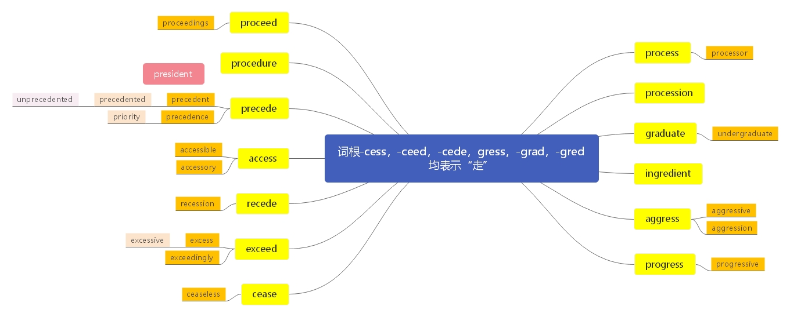

# 一、 词根： -cess， -ceed， -cede， -gress， -gred， -grad

> **本节课目标**
>
> **1、 介绍整体授课方式和重点注意事项**
>
> **2、 掌握词根-cess、 -ceed、 -cede、 -gress、 -gred、 -grad 含义**
>
> **3、 掌握单词 83 个**

***

**一、 词根：“-cess， -ceed， -cede， -gress， -gred， -grad”全部都表示“go：走”的含义。**

> 词源： processlate
>
> 14c., “to go on,” also “to emanate from, result from,” from Old French proceder (13c., Modern French procéder) and directly from Latin procedere (past participle  processus) “go before, go forward, advance, make
>
> progress; come forward,” from pro “forward”(from PIE root \*per-(1) “forward”)+cedere “togo”(from PIE root \*ked-“to go, yield”).
>
> &#x20;Related: proceeded; proceeding.

***

**process** \[ˈprəuses] [英音](https://dict.youdao.com/dictvoice?audio=process\&type=1)  [美音](https://dict.youdao.com/dictvoice?audio=process\&type=2)  n. 过程，进程； v. 处理，加工 392

&#x9;**助记：** pro (向前) +cess (走) → (列队) 前进；过程，程序；加工，处理

&#x9;**搭配：**	data processing (考)： 数据处理

&#x9;			information processing (考)： 信息处理	&#x9;

**双语例句:** The process was needlessly slow. [播放](https://dict.youdao.com/dictvoice?audio=The process was needlessly slow.&le=eng&type=2)

进程过于缓慢了。 

**双语例句:** History is an interpretive process. [播放](https://dict.youdao.com/dictvoice?audio=History is an interpretive process.&le=eng&type=2)

历史是一个解释过程。 

**双语例句:** The whole process started all over again. [播放](https://dict.youdao.com/dictvoice?audio=The whole process started all over again.&le=eng&type=2)

整个过程又重新开始了。 

**原声例句:** Plants naturally take in carbon dioxide they need for photosynthesis, the **process** of changing light energy to chemical energy. [播放](https://dict.youdao.com/pureaudio?docid=-4864549346902531600)

**原声例句:** They are being honored for their work in the nineteen eighties about the health of cells and the aging **process**. [播放](https://dict.youdao.com/pureaudio?docid=-3024824325115862569)

**原声例句:** Homogenization is a **process** that reduces the size of the fat particles and mixes the fat all through the milk. [播放](https://dict.youdao.com/pureaudio?docid=-2083909442028368086)

**权威例句:** In that **process**, three leaks were identified, the most recent coming just last Wednesday evening.  [播放](https://dict.youdao.com/dictvoice?audio=In+that+process%2C+three+leaks+were+identified%2C+the+most+recent+coming+just+last+Wednesday+evening.+&le=eng&type=2)

**权威例句:** Construction crews are hauling in heavy equipments to start the long and tedious clean-up **process**.  [播放](https://dict.youdao.com/dictvoice?audio=Construction+crews+are+hauling+in+heavy+equipments+to+start+the+long+and+tedious+clean-up+process.+&le=eng&type=2)

**权威例句:** Sutter is a firm believer in involving readers and viewers in the storytelling **process**.  [播放](https://dict.youdao.com/dictvoice?audio=Sutter+is+a+firm+believer+in+involving+readers+and+viewers+in+the+storytelling+process.+&le=eng&type=2)

***

**processor** \[ˈprəusesə] [英音](https://dict.youdao.com/dictvoice?audio=processor\&type=1)  [美音](https://dict.youdao.com/dictvoice?audio=processor\&type=2)  n. 处理器 4663

**助记：** process (处理) +or (名词后缀，表东西) →处理器

\*\*搭配：\*\*image processor (考)： 图像处理器

**双语例句:** You can download the file and edit it on your word processor. [播放](https://dict.youdao.com/dictvoice?audio=You can download the file and edit it on your word processor.&le=eng&type=2)

你可以把文件下载，用文字处理系统做编辑。 

**双语例句:** He would often be working away on his word processor late into the night. [播放](https://dict.youdao.com/dictvoice?audio=He would often be working away on his word processor late into the night.&le=eng&type=2)

他经常会在他的文字处理机上持续工作到深夜。 

**双语例句:** The computer acts as a word processor where the text of a speech can be input at any time. [播放](https://dict.youdao.com/dictvoice?audio=The computer acts as a word processor where the text of a speech can be input at any time.&le=eng&type=2)

计算机起着文字处理器的作用，一篇讲话的文本可随时输入。 

**原声例句:** Microsoft Bob was kind of like a low end Word **processor** and spreadsheet but the screen look like a house and this dog walked around and talked to you about writing your book reports or something.

**原声例句:** It's more like a word **processor** than it is a simple text editor.

**原声例句:** Or get to run on the right **processor**.

**权威例句:** It will be like the flow of electrons in a Pentium **processor**, says Pfost.  [播放](https://dict.youdao.com/dictvoice?audio=It+will+be+like+the+flow+of+electrons+in+a+Pentium+processor%2C+says+Pfost.+&le=eng&type=2)

**权威例句:** For what it's worth, though, most configurations have the same 3.2GHz Core i7 **processor**.  [播放](https://dict.youdao.com/dictvoice?audio=For+what+it%27s+worth%2C+though%2C+most+configurations+have+the+same+3.2GHz+Core+i7+processor.+&le=eng&type=2)

**权威例句:** The unit's **processor** gets a bump up to 400 Mhz, with RAM at 64MB.  [播放](https://dict.youdao.com/dictvoice?audio=The+unit%27s+processor+gets+a+bump+up+to+400+Mhz%2C+with+RAM+at+64MB.+&le=eng&type=2)

***

**processed** \[pˈrəsest] [英音](https://dict.youdao.com/dictvoice?audio=processed\&type=1)  [美音](https://dict.youdao.com/dictvoice?audio=processed\&type=2)  adj. 处理的，加工过的 12340

**双语例句:** Our sales information is processed by computer. [播放](https://dict.youdao.com/dictvoice?audio=Our sales information is processed by computer.&le=eng&type=2)

我们的销售信息是用计算机处理的。 

**双语例句:** I sent three rolls of film away to be processed. [播放](https://dict.youdao.com/dictvoice?audio=I sent three rolls of film away to be processed.&le=eng&type=2)

我送了三个胶卷去冲印。 

**双语例句:** Most of the food we buy is processed in some way. [播放](https://dict.youdao.com/dictvoice?audio=Most of the food we buy is processed in some way.&le=eng&type=2)

我们买的大部分食品都用某种方法加工过。 

**原声例句:** Some friends are at an eating place that only serves a **processed** meat product from the United States called SPAM. [播放](https://dict.youdao.com/pureaudio?docid=-6265707741647097051)

**原声例句:** But the oil is **processed** and exported -- at least for now -- from Port Sudan in the north. [播放](https://dict.youdao.com/pureaudio?docid=-2439978889231904580)

**原声例句:** The investors want the bank to buy back any improperly **processed** loans included in those securities. [播放](https://dict.youdao.com/pureaudio?docid=4303956587106385796)

**权威例句:** And there's no way to see the result until the film has been **processed**.  [播放](https://dict.youdao.com/dictvoice?audio=And+there%27s+no+way+to+see+the+result+until+the+film+has+been+processed.+&le=eng&type=2)

**权威例句:** Yet the cheap system **processed** a trade in 50 milliseconds, one-fourth the time needed by the Sun system.  [播放](https://dict.youdao.com/dictvoice?audio=Yet+the+cheap+system+processed+a+trade+in+50+milliseconds%2C+one-fourth+the+time+needed+by+the+Sun+system.+&le=eng&type=2)

**权威例句:** Earlier this year Europe's horsemeat scandal revealed how **processed** meat can get mislabelled in a complicated supply chain.  [播放](https://dict.youdao.com/dictvoice?audio=Earlier+this+year+Europe%27s+horsemeat+scandal+revealed+how+processed+meat+can+get+mislabelled+in+a+complicated+supply+chain.+&le=eng&type=2)

***

**processing** \[prəˈsesɪŋ] [英音](https://dict.youdao.com/dictvoice?audio=processing\&type=1)  [美音](https://dict.youdao.com/dictvoice?audio=processing\&type=2)  v. 处理；加工；对……起诉（ process的ing形式） 4074

**双语例句:** America sent cotton to England for processing. [播放](https://dict.youdao.com/dictvoice?audio=America sent cotton to England for processing.&le=eng&type=2)

美国把棉花运到英格兰加工。 

**双语例句:** Nitrates are used as preservatives in food processing. [播放](https://dict.youdao.com/dictvoice?audio=Nitrates are used as preservatives in food processing.&le=eng&type=2)

硝酸盐在食品加工中被用作防腐剂。 

**双语例句:** WYSIWYG editing makes your word processing smoother and more flexible. [播放](https://dict.youdao.com/dictvoice?audio=WYSIWYG editing makes your word processing smoother and more flexible.&le=eng&type=2)

“所见即所得”编辑使你的文字信息处理更加顺畅和灵活。 

**原声例句:** It includes both Liberty Island, where the statue stands, and nearby Ellis Island, the former federal immigration **processing** center. [播放](https://dict.youdao.com/pureaudio?docid=4550179840347721843)

**原声例句:** But Steve Graham at Vanderbilt says word **processing** is rarely done in elementary school, especially in the early years. [播放](https://dict.youdao.com/pureaudio?docid=-5652236743744780725)

**原声例句:** White House spokesman Robert Gibbs says several agencies are looking into the way banks have been **processing** bad loans. [播放](https://dict.youdao.com/pureaudio?docid=-5907718184714154545)

**权威例句:** New video-processing chips, meanwhile, let agents merge images from infrared cameras with regular video.  [播放](https://dict.youdao.com/dictvoice?audio=New+video-processing+chips%2C+meanwhile%2C+let+agents+merge+images+from+infrared+cameras+with+regular+video.+&le=eng&type=2)

**权威例句:** But a judge agreed with Burger King that assembling salads and broiling burgers counted as **processing**.  [播放](https://dict.youdao.com/dictvoice?audio=But+a+judge+agreed+with+Burger+King+that+assembling+salads+and+broiling+burgers+counted+as+processing.+&le=eng&type=2)

**权威例句:** There is an effective way to prevent contamination of meat in our **processing** plants: irradiation.  [播放](https://dict.youdao.com/dictvoice?audio=There+is+an+effective+way+to+prevent+contamination+of+meat+in+our+processing+plants%3A+irradiation.+&le=eng&type=2)

***

**procession** \[prəˈseʃ(ə)n] [英音](https://dict.youdao.com/dictvoice?audio=procession\&type=1)  [美音](https://dict.youdao.com/dictvoice?audio=procession\&type=2)  n. 队伍，行列；一列，一排；列队行进 7783

**助记：** pro（向前） +cess（走） +ion（名词后缀） →（一群人） 向前走→

**释义和用法：** (N-COUNT) （走路、骑马、开车等的）队伍，行列

&#x20;A procession is a group of people who are walking, riding, or driving in a line as part of a public event

> **【课堂笔记】**
>
> 1.  词跟 + u (连接符号) +后缀 如： stimulate
>
> （u 连接词根和后缀的符号；方便发音更加顺滑；流畅；没有任何实际含义）除 u 连接符号外；还包括 ul； o; ol 三个
>
> 2.元音字母发生改变，含义不变的后缀
>
> \-ate -ite -ute
>
> *   用作动词后缀；表示“使”或不翻译
> *   用作形容词后缀；
> *   极少数情况下，可做名词后缀，即可表示“人”还可表示“物”

**双语例句:** The procession made its way down the hill. [播放](https://dict.youdao.com/dictvoice?audio=The procession made its way down the hill.&le=eng&type=2)

队伍走下山了。 

**双语例句:** The procession passed right by my front door. [播放](https://dict.youdao.com/dictvoice?audio=The procession passed right by my front door.&le=eng&type=2)

队伍正好从我家门前经过。 

**双语例句:** The procession snaked its way through narrow streets. [播放](https://dict.youdao.com/dictvoice?audio=The procession snaked its way through narrow streets.&le=eng&type=2)

队伍沿着狭窄的街道曲折穿行。 

**原声例句:** Some in the funeral **procession** held aloft the green banners of the opposition movement, while others chanted anti-government slogans. [播放](https://dict.youdao.com/pureaudio?docid=3624681961423317813)

**原声例句:** and the New Year's **procession** will be led by grand marshal Chesley \"Sully\" Sullenberger, the celebrated airline pilot. [播放](https://dict.youdao.com/pureaudio?docid=4152099754015422532)

**原声例句:** A group of Venetian residents concerned about this marked the city's population decline with a mock funeral **procession**. [播放](https://dict.youdao.com/pureaudio?docid=-8551630704808955327)

**权威例句:** The memorial started with a candle-lit **procession**, then Governor Tim Pawlenty gave the opening remarks.  [播放](https://dict.youdao.com/dictvoice?audio=The+memorial+started+with+a+candle-lit+procession%2C+then+Governor+Tim+Pawlenty+gave+the+opening+remarks.+&le=eng&type=2)

**权威例句:** On Sunday, police were interspersed with marchers in the **procession** called a second line parade.  [播放](https://dict.youdao.com/dictvoice?audio=On+Sunday%2C+police+were+interspersed+with+marchers+in+the+procession+called+a+second+line+parade.+&le=eng&type=2)

**权威例句:** Following their meal, a carriage **procession** will convey the royal party to Buckingham palace.  [播放](https://dict.youdao.com/dictvoice?audio=Following+their+meal%2C+a+carriage+procession+will+convey+the+royal+party+to+Buckingham+palace.+&le=eng&type=2)

***

**graduate** \[ˈgrædjueit] [英音](https://dict.youdao.com/dictvoice?audio=graduate\&type=1)  [美音](https://dict.youdao.com/dictvoice?audio=graduate\&type=2)  v. 毕业； n.（本科）毕业生 2133

**助记：** grad（走） +u（链接符号） +ate（名词或者名词后缀）→要走（要离开学校） →毕业；毕业生

**双语例句:** After all his hard work, he now needs only two credit hours to graduate. [播放](https://dict.youdao.com/dictvoice?audio=After all his hard work, he now needs only two credit hours to graduate.&le=eng&type=2)

通过努力学习，他现在只需再修两个学分就可以毕业了。 

**双语例句:** The Voyager workload is divided among 157 scientists and scads of graduate students. [播放](https://dict.youdao.com/dictvoice?audio=The Voyager workload is divided among 157 scientists and scads of graduate students.&le=eng&type=2)

航行者的工作量被分给157位科学家和大批研究生。 

**双语例句:** Fifty-nine percent of its residents have attended graduate school – quadruple the national average. [播放](https://dict.youdao.com/dictvoice?audio=Fifty-nine percent of its residents have attended graduate school – quadruple the national average.&le=eng&type=2)

该地区59％的居民读过研究生–是全国平均水平的4倍。 

**原声例句:** The share of foreign new students in **graduate** schools fell from eighteen percent to sixteen and a half percent. [播放](https://dict.youdao.com/pureaudio?docid=-1469208768074599087)

**原声例句:** But she has suggestions for students entering their final year of college who want a job when they **graduate**. [播放](https://dict.youdao.com/pureaudio?docid=3774657513980657908)

**原声例句:** Foreign students who will be attending **graduate** school can apply for some jobs before they come to the United States. [播放](https://dict.youdao.com/pureaudio?docid=5404740848142176755)

**权威例句:** He was a **graduate** of the School of Medicine at Padua, the best in Europe.  [播放](https://dict.youdao.com/dictvoice?audio=He+was+a+graduate+of+the+School+of+Medicine+at+Padua%2C+the+best+in+Europe.+&le=eng&type=2)

**权威例句:** Smerconish is a 1984 Phi Beta Kappa **graduate** of Lehigh University where he majored in government and journalism.  [播放](https://dict.youdao.com/dictvoice?audio=Smerconish+is+a+1984+Phi+Beta+Kappa+graduate+of+Lehigh+University+where+he+majored+in+government+and+journalism.+&le=eng&type=2)

**权威例句:** The Salem Educational Foundation and Alumni Association have established a scholarship in memory of Ward, a 2007 **graduate**.  [播放](https://dict.youdao.com/dictvoice?audio=The+Salem+Educational+Foundation+and+Alumni+Association+have+established+a+scholarship+in+memory+of+Ward%2C+a+2007+graduate.+&le=eng&type=2)

***

**undergraduate** \[ˌʌndəˈgrædjuət] [英音](https://dict.youdao.com/dictvoice?audio=undergraduate\&type=1)  [美音](https://dict.youdao.com/dictvoice?audio=undergraduate\&type=2)  n. 大学本科生 4804

**助记：** under (下，未达到) +graduate (本科毕业) →还未本科毕业生→大学本科生

**双语例句:** Every day, there's going to be a TA in the undergraduate lounge. [播放](https://dict.youdao.com/dictvoice?audio=Every day, there's going to be a TA in the undergraduate lounge.&le=eng&type=2)

每天都会有一名助教在本科休息室里。 

**双语例句:** One idea is to allow people to study law as an undergraduate degree. [播放](https://dict.youdao.com/dictvoice?audio=One idea is to allow people to study law as an undergraduate degree.&le=eng&type=2)

一个想法是允许人们在本科阶段学习法律。 

**双语例句:** This leaves today's average law-school graduate with $100000 of debt on top of undergraduate debts. [播放](https://dict.youdao.com/dictvoice?audio=This leaves today's average law-school graduate with $100000 of debt on top of undergraduate debts.&le=eng&type=2)

这让如今的法学院毕业生平均承担10万美元的债务，居本科生债务之首。 

**原声例句:** The average published price for **undergraduate** study at a four-year public college was about seven thousand dollars. [播放](https://dict.youdao.com/pureaudio?docid=-8917947313850630601)

**原声例句:** However,the law does not bar sex discrimination in admissions at private **undergraduate** schools, only public ones. [播放](https://dict.youdao.com/pureaudio?docid=3164368408301386724)

**原声例句:** John Anderson wants to know the costs of **undergraduate** and graduate study in the United States. [播放](https://dict.youdao.com/pureaudio?docid=5473715973362536349)

**权威例句:** We obtained figures from both universities for the months of birth of **undergraduate** applicants for places in 2012.  [播放](https://dict.youdao.com/dictvoice?audio=We+obtained+figures+from+both+universities+for+the+months+of+birth+of+undergraduate+applicants+for+places+in+2012.+&le=eng&type=2)

**权威例句:** Stanford University sweeps the education category again this year, with the most graduate and **undergraduate** alumni.  [播放](https://dict.youdao.com/dictvoice?audio=Stanford+University+sweeps+the+education+category+again+this+year%2C+with+the+most+graduate+and+undergraduate+alumni.+&le=eng&type=2)

**权威例句:** He earned an **undergraduate** degree from Columbia University and worked for a time as a reporter.  [播放](https://dict.youdao.com/dictvoice?audio=He+earned+an+undergraduate+degree+from+Columbia+University+and+worked+for+a+time+as+a+reporter.+&le=eng&type=2)

***

**ingredient** \[inˈgri\:diənt] [英音](https://dict.youdao.com/dictvoice?audio=ingredient\&type=1)  [美音](https://dict.youdao.com/dictvoice?audio=ingredient\&type=2)  n. 原料，要素，组成部分 2613

**助记：** in (进入) +gredi (=go走) +ent (名词后缀) →走进去 (构成新物体) 的材料→原料，要 素，组成部分

**例句：** This means topsoil contains few of the ingredients needed for long-termsuccessful farming.这意味着表层土壤没有包含对于长期成功的农耕来说必须的成分。

&#x20;**(** **写作，阅读 ) 重点：“组成部分，要素”的表达：** ingredient, component,constituent

**例句：** 林肯的名言清楚地表达了：充分的准备是成功的要素之一。

Lincoln’s famous remark makes it clear that full preparation is a component/constituent for those who want to succeed.

Lincoln’s well-known saying clearly expresses the idea that making full preparation is an ingredient for success.

**双语例句:** What is the active ingredient in aspirin? [播放](https://dict.youdao.com/dictvoice?audio=What is the active ingredient in aspirin?&le=eng&type=2)

什么是阿司匹林中的有效成分？ 

**双语例句:** Coconut is a basic ingredient for many curries. [播放](https://dict.youdao.com/dictvoice?audio=Coconut is a basic ingredient for many curries.&le=eng&type=2)

椰子是多种咖喱菜的基本成分。 

**双语例句:** Speed is the essential ingredient of all athletics. [播放](https://dict.youdao.com/dictvoice?audio=Speed is the essential ingredient of all athletics.&le=eng&type=2)

速度是所有体育运动的基本要素。 

**原声例句:** And worse,he says, there is no listing of the amount of each **ingredient**. [播放](https://dict.youdao.com/pureaudio?docid=-7615832981198426725)

**原声例句:** Cooking shows offer an **ingredient** missing from other programs. [播放](https://dict.youdao.com/pureaudio?docid=3205850795825444751)

**原声例句:** And since natural gas is a major **ingredient** in fertilizer, the cost of this essential farm supply could go up,too. [播放](https://dict.youdao.com/pureaudio?docid=-3073550561436879790)

**权威例句:** Meema, well, Meema crochets a mean Afghan and uses a secret **ingredient** in her chicken soup.  [播放](https://dict.youdao.com/dictvoice?audio=Meema%2C+well%2C+Meema+crochets+a+mean+Afghan+and+uses+a+secret+ingredient+in+her+chicken+soup.+&le=eng&type=2)

**权威例句:** First he was an industrial pharmacist, and then he opened up an **ingredient** import business, which eventually failed.  [播放](https://dict.youdao.com/dictvoice?audio=First+he+was+an+industrial+pharmacist%2C+and+then+he+opened+up+an+ingredient+import+business%2C+which+eventually+failed.+&le=eng&type=2)

**权威例句:** For example a popular **ingredient** for weight loss supplements today is Green Coffee Bean extract.  [播放](https://dict.youdao.com/dictvoice?audio=For+example+a+popular+ingredient+for+weight+loss+supplements+today+is+Green+Coffee+Bean+extract.+&le=eng&type=2)

***

**aggressive** \[əˈgresiv] [英音](https://dict.youdao.com/dictvoice?audio=aggressive\&type=1)  [美音](https://dict.youdao.com/dictvoice?audio=aggressive\&type=2)  adj. 侵略性的，激进的 2538

**助记：** ag (加强语气) +gress (=go：走) +ive (形容词后缀) →强行走进去的→侵略性的，激进的

**搭配：** aggressive behavior (考)： 激进的行为

**双语例句:** These fish are very aggressive. [播放](https://dict.youdao.com/dictvoice?audio=These fish are very aggressive.&le=eng&type=2)

这些鱼十分好斗。 

**双语例句:** Some children are much more aggressive than others. [播放](https://dict.youdao.com/dictvoice?audio=Some children are much more aggressive than others.&le=eng&type=2)

一些孩子比其他孩子好斗得多。 

**双语例句:** We decided that in the game we would be physical and aggressive. [播放](https://dict.youdao.com/dictvoice?audio=We decided that in the game we would be physical and aggressive.&le=eng&type=2)

我们决定，在比赛中我们将积极拼抢，大胆进攻。 

**原声例句:** Charles Wortmann at the University of Nebraska-Lincoln says a one-time tillage may be used to correct a problem like **aggressive** weeds. [播放](https://dict.youdao.com/pureaudio?docid=-1056703798850895955)

**原声例句:** He was also known as a very **aggressive** hitter, swinging hard and fast at almost any ball. [播放](https://dict.youdao.com/pureaudio?docid=3708644750550222940)

**原声例句:** The scientists say that studies based on the new genome may help explain, in the short-term, why the organism has been so **aggressive**. [播放](https://dict.youdao.com/pureaudio?docid=-6539504477505996668)

**权威例句:** In the late 1970s **aggressive** poaching took the rhino to the brink of extinction.  [播放](https://dict.youdao.com/dictvoice?audio=In+the+late+1970s+aggressive+poaching+took+the+rhino+to+the+brink+of+extinction.+&le=eng&type=2)

**权威例句:** Human rights lawyer Sir Geoffrey Bindman told BBC Radio 4 the Iraq war was an illegal **aggressive** war.  [播放](https://dict.youdao.com/dictvoice?audio=Human+rights+lawyer+Sir+Geoffrey+Bindman+told+BBC+Radio+4+the+Iraq+war+was+an+illegal+aggressive+war.+&le=eng&type=2)

**权威例句:** So, in the case of NetSuite, it has been **aggressive** with its business development.  [播放](https://dict.youdao.com/dictvoice?audio=So%2C+in+the+case+of+NetSuite%2C+it+has+been+aggressive+with+its+business+development.+&le=eng&type=2)

***

**aggress** \[əˈgres] [英音](https://dict.youdao.com/dictvoice?audio=aggress\&type=1)  [美音](https://dict.youdao.com/dictvoice?audio=aggress\&type=2)  v. 侵略 76

**助记：** ag (加强语气) +gress (走) →强行走进去→侵略

> **【课堂笔记】**
>
> 1.  字母 a 后跟两个连续辅音字母时，如 abb; acc; add; aff … (标记为 axx)
>
> ax (前缀) + x 归为词根部分, 如 aggress,
>
> ag（前缀；表示加强语气） + gress（词根；表示“走”）→强行走进去→侵略
>
> 1.  a- /ad-
>
> *   to 去
> *   表加强语气，没有实际含义；（同中文“啊”，加强语气）

**双语例句:** Comehere, I never aggress others. [播放](https://dict.youdao.com/dictvoice?audio=Comehere, I never aggress others.&le=eng&type=2)

如果劳拉指责我试图侵犯或者杀死她，那她是疯了。 

**双语例句:** While in ghost form, you will not be able to start battles, aggress, or run. [播放](https://dict.youdao.com/dictvoice?audio=While in ghost form, you will not be able to start battles, aggress, or run.&le=eng&type=2)

处于幽灵状态时，你不能战斗，攻击，或者跑。 

**双语例句:** In the scoring percentage, 71% in serve-then-aggress part, 37% in receive-then - aggress part, 51% in rally part. [播放](https://dict.youdao.com/dictvoice?audio=In the scoring percentage, 71% in serve-then-aggress part, 37% in receive-then - aggress part, 51% in rally part.&le=eng&type=2)

在得分率方面，发球抢攻段得分率为71%，接发球抢攻段得分率为37%，相持段得分率为51%。 

**原声例句:** 

**原声例句:** 

**原声例句:** 

**权威例句:** Granting someone the power to **aggress** against others gives him the power to indulge his pathologies (racism, perhaps) at the expense of everyone else in society.  [播放](https://dict.youdao.com/dictvoice?audio=Granting+someone+the+power+to+aggress+against+others+gives+him+the+power+to+indulge+his+pathologies+%28racism%2C+perhaps%29+at+the+expense+of+everyone+else+in+society.+&le=eng&type=2)

***

**aggression** \[əˈgreʃ(ə)n] [英音](https://dict.youdao.com/dictvoice?audio=aggression\&type=1)  [美音](https://dict.youdao.com/dictvoice?audio=aggression\&type=2)  n. 进攻；侵略；侵犯；侵害 4572

**双语例句:** Aggression is by no means a male-only trait. [播放](https://dict.youdao.com/dictvoice?audio=Aggression is by no means a male-only trait.&le=eng&type=2)

攻击性决不是男性独有的特征。 

**双语例句:** We must demonstrate that aggression will not pay. [播放](https://dict.youdao.com/dictvoice?audio=We must demonstrate that aggression will not pay.&le=eng&type=2)

我们必须证明侵犯是没有好处的。 

**双语例句:** Sport became the perfect outlet for his aggression. [播放](https://dict.youdao.com/dictvoice?audio=Sport became the perfect outlet for his aggression.&le=eng&type=2)

运动成为他攻击性心理的最佳出路。 

**原声例句:** The United Nations Security Council has the lead responsibility for deciding that an act of **aggression** has taken place. [播放](https://dict.youdao.com/pureaudio?docid=-2556877021549507730)

**原声例句:** I.C.C.countries also agreed to delay any action by the court on **aggression** until they re-examine the issue in seven years. [播放](https://dict.youdao.com/pureaudio?docid=4916992186613589780)

**原声例句:** He said the attempt by the United States to strengthen its force at Fort Sumter was clearly an act of **aggression**. [播放](https://dict.youdao.com/pureaudio?docid=6713240111266093857)

**权威例句:** The crickets were even tickled with a straw stick before a fight to increase their **aggression**.  [播放](https://dict.youdao.com/dictvoice?audio=The+crickets+were+even+tickled+with+a+straw+stick+before+a+fight+to+increase+their+aggression.+&le=eng&type=2)

**权威例句:** To explain this litany of anti-U.S. **aggression** we search doggedly for evidence of our own malfeasance.  [播放](https://dict.youdao.com/dictvoice?audio=To+explain+this+litany+of+anti-U.S.+aggression+we+search+doggedly+for+evidence+of+our+own+malfeasance.+&le=eng&type=2)

**权威例句:** If we do not retaliate for acts of **aggression**, we enter into a cycle of victimization.  [播放](https://dict.youdao.com/dictvoice?audio=If+we+do+not+retaliate+for+acts+of+aggression%2C+we+enter+into+a+cycle+of+victimization.+&le=eng&type=2)

***

**aggressively** \[əˈgresɪvli] [英音](https://dict.youdao.com/dictvoice?audio=aggressively\&type=1)  [美音](https://dict.youdao.com/dictvoice?audio=aggressively\&type=2)  adv. 侵略地；攻击地；有闯劲地 6322

**双语例句:** They'll react aggressively. [播放](https://dict.youdao.com/dictvoice?audio=They'll react aggressively.&le=eng&type=2)

他们会凶猛地作出反应。 

**双语例句:** 'What do you want?' he demanded aggressively. [播放](https://dict.youdao.com/dictvoice?audio='What do you want?' he demanded aggressively.&le=eng&type=2)

“你要怎么样？”他挑衅地问道。 

**双语例句:** She swished her racket aggressively through the air. [播放](https://dict.youdao.com/dictvoice?audio=She swished her racket aggressively through the air.&le=eng&type=2)

她咄咄逼人地把球拍挥舞得呼呼作响。 

**原声例句:** But public health officials point out that flu viruses can return more **aggressively** after a few months. [播放](https://dict.youdao.com/pureaudio?docid=-2649885531754413487)

**原声例句:** The aim should be to **aggressively** create what he calls a \"protective barrier\" against loneliness. [播放](https://dict.youdao.com/pureaudio?docid=4407260091652059147)

**原声例句:** The document added to criticisms that federal officials did not act **aggressively** enough against Toyota. [播放](https://dict.youdao.com/pureaudio?docid=3420282022977128168)

**权威例句:** Consumer groups or parents with evidence of games **aggressively** marketing in-game extras should contact the OFT, it said.  [播放](https://dict.youdao.com/dictvoice?audio=Consumer+groups+or+parents+with+evidence+of+games+aggressively+marketing+in-game+extras+should+contact+the+OFT%2C+it+said.+&le=eng&type=2)

**权威例句:** The congresswoman called it an \ [播放](https://dict.youdao.com/dictvoice?audio=The+congresswoman+called+it+an+%22honest%22+mistake%2C+but+Democrats+criticized+her+aggressively+on+the+issue.+&le=eng&type=2)

**权威例句:** Bhurji believes that Facebook has not as **aggressively** chased the under-20s market as has rival, Bebo.  [播放](https://dict.youdao.com/dictvoice?audio=Bhurji+believes+that+Facebook+has+not+as+aggressively+chased+the+under-20s+market+as+has+rival%2C+Bebo.+&le=eng&type=2)

***

**aggressiveness** \[əˈgrɛsɪvnɪs] [英音](https://dict.youdao.com/dictvoice?audio=aggressiveness\&type=1)  [美音](https://dict.youdao.com/dictvoice?audio=aggressiveness\&type=2)  n. 有侵略性的 15655

**双语例句:** In many species, such characteristics include aggressiveness. [播放](https://dict.youdao.com/dictvoice?audio=In many species, such characteristics include aggressiveness.&le=eng&type=2)

在许多物种中，这些特征包括侵略性。 

**双语例句:** Since both are strong on tact not so strong on the aggressiveness and tend to crave affection. [播放](https://dict.youdao.com/dictvoice?audio=Since both are strong on tact not so strong on the aggressiveness and tend to crave affection.&le=eng&type=2)

因为他们都很老练，不太有攻击性，也都渴望感情。 

**双语例句:** One is that people's capacity to outwit other species, not their aggressiveness, appears to be the dominant factor in human survival. [播放](https://dict.youdao.com/dictvoice?audio=One is that people's capacity to outwit other species, not their aggressiveness, appears to be the dominant factor in human survival.&le=eng&type=2)

一个是人类生存的首要因素似乎是人类在智力上胜过其他物种的能力，而不是他们的侵略性。 

**原声例句:** \"I like all the **aggressiveness** of all the teams and how they play and I just want to see more drama. [播放](https://dict.youdao.com/pureaudio?docid=-2327667098328815120)

**原声例句:** It is the unique source of human assertiveness and **aggressiveness**   as well as the source of resistance to the aggression of others.

**原声例句:** 

**权威例句:** China's **aggressiveness** grows-Beijing is targeting hundreds of ballistic missiles at Taiwan to intimidate this thriving democracy.  [播放](https://dict.youdao.com/dictvoice?audio=China%27s+aggressiveness+grows-Beijing+is+targeting+hundreds+of+ballistic+missiles+at+Taiwan+to+intimidate+this+thriving+democracy.+&le=eng&type=2)

**权威例句:** That often hinders decision-making and creates a lot of passive-aggressiveness between teams that should be cooperating.  [播放](https://dict.youdao.com/dictvoice?audio=That+often+hinders+decision-making+and+creates+a+lot+of+passive-aggressiveness+between+teams+that+should+be+cooperating.+&le=eng&type=2)

**权威例句:** Credit for Orix's **aggressiveness** goes to Miyauchi Yoshihiko, 63, the company's president and chief executive officer.  [播放](https://dict.youdao.com/dictvoice?audio=Credit+for+Orix%27s+aggressiveness+goes+to+Miyauchi+Yoshihiko%2C+63%2C+the+company%27s+president+and+chief+executive+officer.+&le=eng&type=2)

***

**aggressor** \[əˈgresə] [英音](https://dict.youdao.com/dictvoice?audio=aggressor\&type=1)  [美音](https://dict.youdao.com/dictvoice?audio=aggressor\&type=2)  n. 侵略者；侵略国；挑衅者 13815

**双语例句:** Baleful aggressor can pass this account to control your computer arbitrarily. [播放](https://dict.youdao.com/dictvoice?audio=Baleful aggressor can pass this account to control your computer arbitrarily.&le=eng&type=2)

恶意的攻击者可以通过这个账户任意地控制你的计算机。 

**双语例句:** The Zhang number information purloin, game installs aggressor to wait fully sell off gain profit; [播放](https://dict.youdao.com/dictvoice?audio=The Zhang number information purloin, game installs aggressor to wait fully sell off gain profit;&le=eng&type=2)

攻击者将盗取的账号信息、游戏装备等变卖获利； 

**双语例句:** I'd like to share my thoughts based on my week on the Aggressor, and I don't intend to judge anyone. [播放](https://dict.youdao.com/dictvoice?audio=I'd like to share my thoughts based on my week on the Aggressor, and I don't intend to judge anyone.&le=eng&type=2)

我只想分享一下我在Aggressor船宿一周的经历，我不想对任何人进行评判。 

**原声例句:** If someone violates the law of nature, he is an **aggressor**.

**原声例句:** 

**原声例句:** 

**权威例句:** The principle of absolute equality between **aggressor** and victim was clearly fundamental to the bargain.  [播放](https://dict.youdao.com/dictvoice?audio=The+principle+of+absolute+equality+between+aggressor+and+victim+was+clearly+fundamental+to+the+bargain.+&le=eng&type=2)

**权威例句:** Secondly, he's making the point to her that she was the **aggressor**, not me.  [播放](https://dict.youdao.com/dictvoice?audio=Secondly%2C+he%27s+making+the+point+to+her+that+she+was+the+aggressor%2C+not+me.+&le=eng&type=2)

**权威例句:** Which individuals within those **\ [播放](https://dict.youdao.com/dictvoice?audio=Which+individuals+within+those+%22aggressor%22+states+exercised+control+or+direction+over+the+military+actions+in+question%3F+&le=eng&type=2)

***

**progress** \[ˈprəugres] [英音](https://dict.youdao.com/dictvoice?audio=progress\&type=1)  [美音](https://dict.youdao.com/dictvoice?audio=progress\&type=2)  v. / n. 前进，进步 1517

**助记：** pro (向前) +gress (走) →前进，进步

**例句：** It was only after some progress had been made in the use anddevelopment of electric current that men began to realize the importanceand possibilities of magnetism.

当在使用和发展电流取得一些进步之后，人们才开始意识到电磁学的重要性和潜力。

**仿写例句：** 当一些悲剧发生在学校中之后，人们才开始意识到大学生心理健康的重要性。

It was only after some tragedies had taken place in campus that men beganto realize the importance of mental health among colleges students.

**双语例句:** Progress is maddeningly slow. [播放](https://dict.youdao.com/dictvoice?audio=Progress is maddeningly slow.&le=eng&type=2)

进展慢得令人心烦。 

**双语例句:** Progress was frustratingly slow. [播放](https://dict.youdao.com/dictvoice?audio=Progress was frustratingly slow.&le=eng&type=2)

进展慢得使人沮丧。 

**双语例句:** Progress is disappointingly slow. [播放](https://dict.youdao.com/dictvoice?audio=Progress is disappointingly slow.&le=eng&type=2)

进展慢得令人失望。 

**原声例句:** Now,United Nations officials say representatives from more than sixty countries have made **progress** on an international agreement to control fish piracy. [播放](https://dict.youdao.com/pureaudio?docid=-691790839199379353)

**原声例句:** The workers made good **progress** on the project until they started working near Big Bend Mountain in West Virginia. [播放](https://dict.youdao.com/pureaudio?docid=-152163391373407325)

**原声例句:** Poets called it the Golden Age. A golden age now describes a historical period of great artistic,scientific or economic **progress**. [播放](https://dict.youdao.com/pureaudio?docid=4165391620855776921)

**权威例句:** Anglesey council said it supported the recommendations and that it was already making good **progress**.  [播放](https://dict.youdao.com/dictvoice?audio=Anglesey+council+said+it+supported+the+recommendations+and+that+it+was+already+making+good+progress.+&le=eng&type=2)

**权威例句:** And Iraqis achieved all this while determined enemies used violence and destruction to stop the **progress**.  [播放](https://dict.youdao.com/dictvoice?audio=And+Iraqis+achieved+all+this+while+determined+enemies+used+violence+and+destruction+to+stop+the+progress.+&le=eng&type=2)

**权威例句:** Mullen acknowledged that slow **progress** in Iraq is hurting U.S. credibility and emboldening Iran's regional ambitions.  [播放](https://dict.youdao.com/dictvoice?audio=Mullen+acknowledged+that+slow+progress+in+Iraq+is+hurting+U.S.+credibility+and+emboldening+Iran%27s+regional+ambitions.+&le=eng&type=2)

***

**progression** \[prəˈgreʃ(ə)n] [英音](https://dict.youdao.com/dictvoice?audio=progression\&type=1)  [美音](https://dict.youdao.com/dictvoice?audio=progression\&type=2)  n. 前进；连续 7717

**双语例句:** The progression of the disease can be retarded by early surgery. [播放](https://dict.youdao.com/dictvoice?audio=The progression of the disease can be retarded by early surgery.&le=eng&type=2)

早期手术可以抑制病情的发展。 

**双语例句:** Both drugs slow the progression of HIV, but neither cures the disease. [播放](https://dict.youdao.com/dictvoice?audio=Both drugs slow the progression of HIV, but neither cures the disease.&le=eng&type=2)

两种药都能减缓艾滋病病毒的发展，但都不能治愈艾滋病。 

**双语例句:** Fossil formations like the Burgess Shale show that evolution cannot always be thought of as a slow progression. [播放](https://dict.youdao.com/dictvoice?audio=Fossil formations like the Burgess Shale show that evolution cannot always be thought of as a slow progression.&le=eng&type=2)

像波基斯页岩这样的化石层表明进化不应该总被看作是一个缓慢的过程。 

**原声例句:** It is really just a look at alcohol, how it affects students, how it can be a detriment to their **progression** as a student.\" [播放](https://dict.youdao.com/pureaudio?docid=-9199235979176549938)

**原声例句:** \"There are many trials going on now,\" \"We're actually looking at new drugs both to improve symptoms, but also to modify the disease, essentially to slow the **progression**. [播放](https://dict.youdao.com/pureaudio?docid=-8707993214351188581)

**原声例句:** And in the eighteenth and nineteenth centuries this **progression** was viewed as an advance, which is not very surprising because the whole theory was put forward by scholars who were basically western monotheists.

**权威例句:** The elevator up the spire is manually operated and represents its **progression** in feet, not floors.  [播放](https://dict.youdao.com/dictvoice?audio=The+elevator+up+the+spire+is+manually+operated+and+represents+its+progression+in+feet%2C+not+floors.+&le=eng&type=2)

**权威例句:** The FDA says the drugs clearly shorten survival and speed the **progression** of cancer.  [播放](https://dict.youdao.com/dictvoice?audio=The+FDA+says+the+drugs+clearly+shorten+survival+and+speed+the+progression+of+cancer.+&le=eng&type=2)

**权威例句:** Identify the conflicts early so that building a more collaborative business feels like a natural **progression**.  [播放](https://dict.youdao.com/dictvoice?audio=Identify+the+conflicts+early+so+that+building+a+more+collaborative+business+feels+like+a+natural+progression.+&le=eng&type=2)

***

**progressive** \[prəˈgresɪv] [英音](https://dict.youdao.com/dictvoice?audio=progressive\&type=1)  [美音](https://dict.youdao.com/dictvoice?audio=progressive\&type=2)  adj. 进步的；先进的 4268

**双语例句:** One prominent symptom of the disease is progressive loss of memory. [播放](https://dict.youdao.com/dictvoice?audio=One prominent symptom of the disease is progressive loss of memory.&le=eng&type=2)

这种病的一个突出症状是记忆的逐步丧失。 

**双语例句:** Willan was able to point to the progressive changes he had already introduced. [播放](https://dict.youdao.com/dictvoice?audio=Willan was able to point to the progressive changes he had already introduced.&le=eng&type=2)

威兰能够指出他已经带来的有进步意义的变化。 

**双语例句:** Halsey was identified as a leading proponent of the values of progressive education. [播放](https://dict.youdao.com/dictvoice?audio=Halsey was identified as a leading proponent of the values of progressive education.&le=eng&type=2)

哈尔西被认为是进步教育价值观的首要支持者。 

**原声例句:** The Edison2 is an experimental car that was one of the winners of the ten-million-dollar **Progressive** Insurance Automotive X Prize. [播放](https://dict.youdao.com/pureaudio?docid=-2350252930464639743)

**原声例句:** It became a campaign song for Walter O'Brien, a **Progressive** Party candidate for mayor of Boston,Massachusetts. [播放](https://dict.youdao.com/pureaudio?docid=-8046353633766354182)

**原声例句:** And Roosevelt's increasingly **progressive** policies in nineteen thirty-five made many richer Americans fear that the president was a socialist, a dictator or a madman. [播放](https://dict.youdao.com/pureaudio?docid=-70817570541719339)

**权威例句:** It seems that in this **progressive** mood, sitting on the fence has become increasingly uncomfortable.  [播放](https://dict.youdao.com/dictvoice?audio=It+seems+that+in+this+progressive+mood%2C+sitting+on+the+fence+has+become+increasingly+uncomfortable.+&le=eng&type=2)

**权威例句:** For thirty years, Australia's The Church has produced music along the lines of New Wave, psychedelic, progressive-rock.  [播放](https://dict.youdao.com/dictvoice?audio=For+thirty+years%2C+Australia%27s+The+Church+has+produced+music+along+the+lines+of+New+Wave%2C+psychedelic%2C+progressive-rock.+&le=eng&type=2)

**权威例句:** The hospital famously spearheaded **progressive** treatment for children with mental health issues in the late 19th century.  [播放](https://dict.youdao.com/dictvoice?audio=The+hospital+famously+spearheaded+progressive+treatment+for+children+with+mental+health+issues+in+the+late+19th+century.+&le=eng&type=2)

***

**progressively** \[prəˈgresɪvli] [英音](https://dict.youdao.com/dictvoice?audio=progressively\&type=1)  [美音](https://dict.youdao.com/dictvoice?audio=progressively\&type=2)  adv. 渐进地；日益增多地 10732

**双语例句:** Her symptoms became progressively worse. [播放](https://dict.youdao.com/dictvoice?audio=Her symptoms became progressively worse.&le=eng&type=2)

她的症状逐步恶化。 

**双语例句:** The relative proportion of different species of animals hunted by people in the region also changed progressively. [播放](https://dict.youdao.com/dictvoice?audio=The relative proportion of different species of animals hunted by people in the region also changed progressively.&le=eng&type=2)

该地区被人们猎杀的各种动物的相对比例也在逐步变化。 

**双语例句:** The pain got progressively worse. [播放](https://dict.youdao.com/dictvoice?audio=The pain got progressively worse.&le=eng&type=2)

疼痛越来越厉害。 

**原声例句:** We're going to have some that change, and we're going to work through this **progressively** in just a moment.

**原声例句:** So I think that that's going to change **progressively**

**原声例句:** Just to get you oriented, this is energy decreasing from zero to **progressively** negative numbers.

**权威例句:** Indeed, as Hellman becomes more powerful, eventually moving to San Francisco, his tale becomes **progressively** less interesting.  [播放](https://dict.youdao.com/dictvoice?audio=Indeed%2C+as+Hellman+becomes+more+powerful%2C+eventually+moving+to+San+Francisco%2C+his+tale+becomes+progressively+less+interesting.+&le=eng&type=2)

**权威例句:** At least 4 years of **progressively** responsible professional experience in human resources management and administration.  [播放](https://dict.youdao.com/dictvoice?audio=At+least+4+years+of+progressively+responsible+professional+experience+in+human+resources+management+and+administration.+&le=eng&type=2)

**权威例句:** Which of course it was, back in 2010, and it has been **progressively** taking effect since.  [播放](https://dict.youdao.com/dictvoice?audio=Which+of+course+it+was%2C+back+in+2010%2C+and+it+has+been+progressively+taking+effect+since.+&le=eng&type=2)

***

**proceed** \[prəuˈsi\:d] [英音](https://dict.youdao.com/dictvoice?audio=proceed\&type=1)  [美音](https://dict.youdao.com/dictvoice?audio=proceed\&type=2)  vi. 前进，继续进行，开始 2720

**助记：** pro (向前) +ceed (=go：走) →向前走→前进， (继续) 进行，开始

**搭配：** proceed with (考)： 开始进行proceed to：进入

**例句：** Writer-director Paul Greengrass has gone to great lengths to be respectfulin his depiction of what occurred, proceeding with the film only aftersecuring the approval of every victim’s family.

编剧兼导演Paul Greengrass已经竭尽全力去使自己的描述忠实于事实，在确保每一位受害者的家属同意之后，他才开始进行电影拍摄。

**仿写例句：** 很多大学生都竭尽全力去考各种证书，以确保能找到一个有前途的工作。

In order to secure a promising job, many college students have gone togreat lengths to get a variety of/various/all kinds of/all sorts of certificates.

**例句：** Subscribers can customize the information they want to receive andproceed directly to a company’s web site.

订阅者能够定制他们想要接收的信息并且直接进入到一个公司的网站。

**仿写例句：** 通过互联网，顾客们可以直接进入到一个公司的网站，定制他们想要的任何数字化产品。Customers can proceed directly to a company’s web site and customize/order the digital products they want.

> **【课堂笔记】**
>
> &#x20;**词义辨析：**
>
> 以下一组词， 词根相同，表示向前走，区别在于其使用语境不同：
>
> progress：（事业/事情）向前走， 前进；
>
> process：强调事情发展的过程
>
> procedure：强调事情进行的程序
>
> proceed：强调事情继续前进，将事情推进下去
>
> procession: 一群人/一组人列队向前走

**双语例句:** They had to take the finely balanced decision to let the visit proceed. [播放](https://dict.youdao.com/dictvoice?audio=They had to take the finely balanced decision to let the visit proceed.&le=eng&type=2)

他们不得不做出仔细权衡后的决定，让访问继续下去。 

**双语例句:** Don't wait until you feel 100 percent confident before you proceed. [播放](https://dict.youdao.com/dictvoice?audio=Don't wait until you feel 100 percent confident before you proceed.&le=eng&type=2)

不要等到你感到有百分之百的信心之后才继续进行。 

**双语例句:** In November 2013, after an unnecessary round of additional consultation, health minister Jane Ellison said the government was minded to proceed after all. [播放](https://dict.youdao.com/dictvoice?audio=In November 2013, after an unnecessary round of additional consultation, health minister Jane Ellison said the government was minded to proceed after all.&le=eng&type=2)

2013年11月，在进行了一轮不必要的额外商议后，英国卫生部长简·埃里森表示，政府最终还是打算继续进行。 

**原声例句:** first stage engine on ascent. **Proceed**.Beautiful.Twenty-six . [播放](https://dict.youdao.com/pureaudio?docid=-5609512528495959834)

**原声例句:** He has offered to host a summit in London early next year to discuss how the international community should **proceed**. [播放](https://dict.youdao.com/pureaudio?docid=-2494983269355004078)

**原声例句:** FIFA's hope is that the off-field problems will not affect play, and that the tournament can **proceed** with some semblance of normalcy. [播放](https://dict.youdao.com/pureaudio?docid=-1121534846384855601)

**权威例句:** Parliamentarians have tried to introduce a measure specifically designed to allow the Rodney case to **proceed**.  [播放](https://dict.youdao.com/dictvoice?audio=Parliamentarians+have+tried+to+introduce+a+measure+specifically+designed+to+allow+the+Rodney+case+to+proceed.+&le=eng&type=2)

**权威例句:** Firstly, he appears authentically angry at the failure to **proceed** with the Longannet carbon capture scheme.  [播放](https://dict.youdao.com/dictvoice?audio=Firstly%2C+he+appears+authentically+angry+at+the+failure+to+proceed+with+the+Longannet+carbon+capture+scheme.+&le=eng&type=2)

**权威例句:** \ [播放](https://dict.youdao.com/dictvoice?audio=%22The+government+is+asking+your+honor+to+proceed+on+a+perilous+path%2C+%22+Snyder+said.+&le=eng&type=2)

***

**proceedings** \[prəˈsi\:diŋz] [英音](https://dict.youdao.com/dictvoice?audio=proceedings\&type=1)  [美音](https://dict.youdao.com/dictvoice?audio=proceedings\&type=2)  n. 诉讼，议程 5436

**搭配：** legal proceedings (考)： 法律诉讼

**双语例句:** She was cited in the divorce proceedings. [播放](https://dict.youdao.com/dictvoice?audio=She was cited in the divorce proceedings.&le=eng&type=2)

她在离婚诉讼中被传唤。 

**双语例句:** You want to avoid costly legal proceedings if you can. [播放](https://dict.youdao.com/dictvoice?audio=You want to avoid costly legal proceedings if you can.&le=eng&type=2)

如果能够的话你希望避免昂贵的法律诉讼。 

**双语例句:** The proceedings of the inquiry will take place in private. [播放](https://dict.youdao.com/dictvoice?audio=The proceedings of the inquiry will take place in private.&le=eng&type=2)

调查行动将秘密进行。 

**原声例句:** At least that is the finding of a report in the British publication, **Proceedings** of the Royal Society B. [播放](https://dict.youdao.com/pureaudio?docid=2706475109611821212)

**原声例句:** Geographers from three American colleges did a study that will appear in the **Proceedings** of the National Academy of Sciences. [播放](https://dict.youdao.com/pureaudio?docid=-2904014090307268729)

**原声例句:** A report on the team's discovery was published recently in the **Proceedings** of the National Academy of Sciences. [播放](https://dict.youdao.com/pureaudio?docid=2868232760944485896)

**权威例句:** He has broken with the tradition of the secretive committee, whose members rarely discuss **proceedings**.  [播放](https://dict.youdao.com/dictvoice?audio=He+has+broken+with+the+tradition+of+the+secretive+committee%2C+whose+members+rarely+discuss+proceedings.+&le=eng&type=2)

**权威例句:** The results were released Monday by the journal **Proceedings** of the National Academy of Sciences.  [播放](https://dict.youdao.com/dictvoice?audio=The+results+were+released+Monday+by+the+journal+Proceedings+of+the+National+Academy+of+Sciences.+&le=eng&type=2)

**权威例句:** The FA is postponing its action until the court **proceedings** are concluded early this year.  [播放](https://dict.youdao.com/dictvoice?audio=The+FA+is+postponing+its+action+until+the+court+proceedings+are+concluded+early+this+year.+&le=eng&type=2)

***

**proceeds** \[ˈprəʊsi\:dz] [英音](https://dict.youdao.com/dictvoice?audio=proceeds\&type=1)  [美音](https://dict.youdao.com/dictvoice?audio=proceeds\&type=2)  n. 实收款项；收入，收益 8059

**双语例句:** The proceeds of the concert went to charity. [播放](https://dict.youdao.com/dictvoice?audio=The proceeds of the concert went to charity.&le=eng&type=2)

音乐会的收入给了慈善机构。 

**双语例句:** Proceeds from the concert will go to charity. [播放](https://dict.youdao.com/dictvoice?audio=Proceeds from the concert will go to charity.&le=eng&type=2)

音乐会的收入将捐赠给慈善事业。 

**双语例句:** The proceeds of the concert will go to charity. [播放](https://dict.youdao.com/dictvoice?audio=The proceeds of the concert will go to charity.&le=eng&type=2)

这次音乐会的收入将捐给慈善机构。 

**原声例句:** \"But what has not yet happened is setting up the complicated vehicles inside the institution to convert that gold and the **proceeds** from selling it into money for low income countries. [播放](https://dict.youdao.com/pureaudio?docid=-2519871579847903904)

**原声例句:** So if we have a negative change in energy for any reaction as it's written, what that actually means is we're giving off energy as the reaction **proceeds**.

**原声例句:** She's released from her paralysis and she **proceeds** happily with her brothers, by the end of the poem, to honor their father in Wales.

**权威例句:** Also, the fees are calculated as a percentage of the sale **proceeds**, not a percentage of the gain.  [播放](https://dict.youdao.com/dictvoice?audio=Also%2C+the+fees+are+calculated+as+a+percentage+of+the+sale+proceeds%2C+not+a+percentage+of+the+gain.+&le=eng&type=2)

**权威例句:** With **proceeds** from its initial offering, DryShips bought six ships that had recently been picked up by Kandylidis.  [播放](https://dict.youdao.com/dictvoice?audio=With+proceeds+from+its+initial+offering%2C+DryShips+bought+six+ships+that+had+recently+been+picked+up+by+Kandylidis.+&le=eng&type=2)

**权威例句:** DJs will perform before kick and **proceeds** from ticket sales go the U.K. housing charity, Shelter.  [播放](https://dict.youdao.com/dictvoice?audio=DJs+will+perform+before+kick+and+proceeds+from+ticket+sales+go+the+U.K.+housing+charity%2C+Shelter.+&le=eng&type=2)

***

**procedure** \[prəˈsi\:dʒə] [英音](https://dict.youdao.com/dictvoice?audio=procedure\&type=1)  [美音](https://dict.youdao.com/dictvoice?audio=procedure\&type=2)  n. 程序，步骤 1376

**助记：** pro (向前) +ced (走) +ure (名词后缀) → (一步步) 向前走→程序，步骤

**搭配：** surgical procedures (考)： 手术程序/步骤legal procedures (考)： 法律程序

**双语例句:** The next day I repeated the procedure. [播放](https://dict.youdao.com/dictvoice?audio=The next day I repeated the procedure.&le=eng&type=2)

第二天我重复了这个程序。 

**双语例句:** Christina dimly recalled the procedure. [播放](https://dict.youdao.com/dictvoice?audio=Christina dimly recalled the procedure.&le=eng&type=2)

克里斯蒂娜隐约地记起了那个步骤。 

**双语例句:** He diverged from established procedure. [播放](https://dict.youdao.com/dictvoice?audio=He diverged from established procedure.&le=eng&type=2)

他违背了既定程序。 

**原声例句:** The former president had a **procedure** called an angioplasty. [播放](https://dict.youdao.com/pureaudio?docid=-3778387590744433709)

**原声例句:** It doesn't have to put federal bureaucrats in charge of what **procedure** is covered and what medication is not.\" [播放](https://dict.youdao.com/pureaudio?docid=-2025935628612609628)

**原声例句:** The **procedure** takes just seven minutes. The patient passes a wand over his chest, collecting data on heart pressure. [播放](https://dict.youdao.com/pureaudio?docid=-1711454385564951835)

**权威例句:** \ [播放](https://dict.youdao.com/dictvoice?audio=%22My+credibility+with+myself+has+been+very+severely+dented+by+this+procedure%2C+%22+he+added.+&le=eng&type=2)

**权威例句:** It has stirred memories of the 1990s, when contract killings were standard **procedure** for settling commercial disputes.  [播放](https://dict.youdao.com/dictvoice?audio=It+has+stirred+memories+of+the+1990s%2C+when+contract+killings+were+standard+procedure+for+settling+commercial+disputes.+&le=eng&type=2)

**权威例句:** The error relates to the scope of estoppel in a **procedure** called post-grant review (PGR).  [播放](https://dict.youdao.com/dictvoice?audio=The+error+relates+to+the+scope+of+estoppel+in+a+procedure+called+post-grant+review+%28PGR%29.+&le=eng&type=2)

***

**procedural** \[prəˈsi\:dʒərəl] [英音](https://dict.youdao.com/dictvoice?audio=procedural\&type=1)  [美音](https://dict.youdao.com/dictvoice?audio=procedural\&type=2)  adj. 程序上的 9160

**双语例句:** A Spanish judge rejected the suit on procedural grounds. [播放](https://dict.youdao.com/dictvoice?audio=A Spanish judge rejected the suit on procedural grounds.&le=eng&type=2)

一名西班牙法官以程序理由驳回了该起诉。 

**双语例句:** The two sides have spent most of their time wrangling over procedural problems. [播放](https://dict.youdao.com/dictvoice?audio=The two sides have spent most of their time wrangling over procedural problems.&le=eng&type=2)

双方花了大部分的时间争论程序上的一些问题。 

**双语例句:** All five cases share the same basic procedural history. [播放](https://dict.youdao.com/dictvoice?audio=All five cases share the same basic procedural history.&le=eng&type=2)

这五个案件都有相同的基本历审程序。 

**原声例句:** Democrats outnumber Republicans in the Senate, but do not possess a majority large enough to block Republicans from using a **procedural** motion known as a filibuster to prevent a vote from going forward. [播放](https://dict.youdao.com/pureaudio?docid=-3120014250371884123)

**原声例句:** The distinction I made in the paper that we talked about in the class is between **procedural** justice and substance of justice in the university.

**原声例句:** So **procedural** justice is sort of easier to deal with.

**权威例句:** Sheriff Katherine Mackie continued the case to a **procedural** hearing at Edinburgh Sheriff Court in June.  [播放](https://dict.youdao.com/dictvoice?audio=Sheriff+Katherine+Mackie+continued+the+case+to+a+procedural+hearing+at+Edinburgh+Sheriff+Court+in+June.+&le=eng&type=2)

**权威例句:** The decision to move him from his home to police headquarters appears to be largely **procedural**.  [播放](https://dict.youdao.com/dictvoice?audio=The+decision+to+move+him+from+his+home+to+police+headquarters+appears+to+be+largely+procedural.+&le=eng&type=2)

**权威例句:** Reid told reporters he hoped to get a bipartisan deal before the **procedural** vote on Thursday.  [播放](https://dict.youdao.com/dictvoice?audio=Reid+told+reporters+he+hoped+to+get+a+bipartisan+deal+before+the+procedural+vote+on+Thursday.+&le=eng&type=2)

***

**precede** \[pri:ˈsi\:d] [英音](https://dict.youdao.com/dictvoice?audio=precede\&type=1)  [美音](https://dict.youdao.com/dictvoice?audio=precede\&type=2)  v. 领先于，优于 5675

**助记：** pre (提前，前面) +cede→走在前面的→领先于，在……之前

> **【课堂笔记】**
>
> 前缀
>
> pre- 提前；前面 静态（向前）
>
> pro-=forward 向前 动态（向前）

**双语例句:** He gestured to Alice to precede them from the room. [播放](https://dict.youdao.com/dictvoice?audio=He gestured to Alice to precede them from the room.&le=eng&type=2)

他示意艾丽斯从房间里出来走在他们前面。 

**双语例句:** Capitalize all proper nouns but not the articles (a, an) that precede them. [播放](https://dict.youdao.com/dictvoice?audio=Capitalize all proper nouns but not the articles (a, an) that precede them.&le=eng&type=2)

把所有的专有名词大写，它们之前的冠词(a, an)则不用。 

**双语例句:** This factor must precede an ice age and have the effect of slightly lowering Earth's temperature. [播放](https://dict.youdao.com/dictvoice?audio=This factor must precede an ice age and have the effect of slightly lowering Earth's temperature.&le=eng&type=2)

这一因素一定出现在冰川期之前，并有稍微降低地球温度的效果。 

**原声例句:** It sounds like **precede** but it means prevent. [播放](https://dict.youdao.com/pureaudio?docid=-3457803796427997141)

**原声例句:** \"For instance,using the word 'preclude' to mean '**precede**.' Yeah,it sounds like '**precede**,' but it means 'prevent.' And yet 'preclude' is not a particularly erudite term. [播放](https://dict.youdao.com/pureaudio?docid=-4259025603211231051)

**原声例句:** It just sounds a tiny bit fancier than **precede** and actually means something totally different,\". [播放](https://dict.youdao.com/pureaudio?docid=8050658273986021768)

**权威例句:** The furlough days will either **precede** a federal holiday or be on a Friday or Monday.  [播放](https://dict.youdao.com/dictvoice?audio=The+furlough+days+will+either+precede+a+federal+holiday+or+be+on+a+Friday+or+Monday.+&le=eng&type=2)

**权威例句:** Accomplishments rack up all around them and both their names and reputations **precede** them.  [播放](https://dict.youdao.com/dictvoice?audio=Accomplishments+rack+up+all+around+them+and+both+their+names+and+reputations+precede+them.+&le=eng&type=2)

**权威例句:** With luck, they will outclass the stereotypes that **precede** them, starting with Selena Gomez.  [播放](https://dict.youdao.com/dictvoice?audio=With+luck%2C+they+will+outclass+the+stereotypes+that+precede+them%2C+starting+with+Selena+Gomez.+&le=eng&type=2)

***

**preceding** \[priˈsi\:diŋ] [英音](https://dict.youdao.com/dictvoice?audio=preceding\&type=1)  [美音](https://dict.youdao.com/dictvoice?audio=preceding\&type=2)  adj. 领先的，在前的 7208

**双语例句:** As we saw in the preceding chapter, groups can be powerful agents of socialization. [播放](https://dict.youdao.com/dictvoice?audio=As we saw in the preceding chapter, groups can be powerful agents of socialization.&le=eng&type=2)

如我们在前一章所见，团组可以是社会化的有力动因。 

**双语例句:** She informed us that eighteen members of the staff had left during the preceding year. [播放](https://dict.youdao.com/dictvoice?audio=She informed us that eighteen members of the staff had left during the preceding year.&le=eng&type=2)

她当时告知我们，18位教职员在此前的一年里离开了。 

**双语例句:** We shall be known better than any preceding generations. [播放](https://dict.youdao.com/dictvoice?audio=We shall be known better than any preceding generations.&le=eng&type=2)

我们将比前几代人更出名。 

**原声例句:** So the exodus is a paradigm for salvation, but it would be a mistake, I think, to view the Exodus as the climax of the **preceding** narrative.

**原声例句:** We can also see in this phrase \"in the Beginning\" - we can see it applying to the end of the **preceding** clause, \"That Shepherd who first taught the chosen Seed / in the Beginning.\"

**原声例句:** Let me just review the **preceding** lecture briefly for that purpose.

**权威例句:** Each of the three bear markets **preceding** the current one has that same characteristic.  [播放](https://dict.youdao.com/dictvoice?audio=Each+of+the+three+bear+markets+preceding+the+current+one+has+that+same+characteristic.+&le=eng&type=2)

**权威例句:** Like bubble teams, they lose them in the weeks and months **preceding** the big moment.  [播放](https://dict.youdao.com/dictvoice?audio=Like+bubble+teams%2C+they+lose+them+in+the+weeks+and+months+preceding+the+big+moment.+&le=eng&type=2)

**权威例句:** More than 80 were killed in accidents in garment factories in the **preceding** year.  [播放](https://dict.youdao.com/dictvoice?audio=More+than+80+were+killed+in+accidents+in+garment+factories+in+the+preceding+year.+&le=eng&type=2)

***

**precedent** \[ˈpresidənt] [英音](https://dict.youdao.com/dictvoice?audio=precedent\&type=1)  [美音](https://dict.youdao.com/dictvoice?audio=precedent\&type=2)  n. 先例，前例； adj. 先前的 5698

**助记：** pre (前) +ced (走) +ent (=ant：名词或形容词) →前面走过 (有过) 的(东西) →先例，前例；在前的，先前的

**例句：** In the workplace, men have long had well defined precedents and rolemodels for achieving success.

在工作场地，对于取得成功而言，人们一直都有很明确的先例和行为榜样。

> **【课堂笔记】**
>
> \-ent -ant
>
> *   N. 后缀，表示“人”或“物
> *   形容词后缀， …的

The Internet had its in a 1969 U.S. Defense Department computernetwork called ARPA net, which stood for Advanced Research ProjectsAgency Network.

A． samples B． sources C． origins D． precedents

**解析**： 原文翻译：互联网最早起源于1969年美国国防部建立的被称为“阿帕网” (即美国高级研究计划署网络) 的计算机网络。故选C； A意思为“样本，样品”； B：来源； D：先例

**双语例句:** They were determined to break from precedent. [播放](https://dict.youdao.com/dictvoice?audio=They were determined to break from precedent.&le=eng&type=2)

他们决心打破先例。 

**双语例句:** The ruling set a precedent for future libel cases. [播放](https://dict.youdao.com/dictvoice?audio=The ruling set a precedent for future libel cases.&le=eng&type=2)

这项裁决为今后的诽谤案提供了判例。 

**双语例句:** The trial could set an important precedent for dealing with similar cases. [播放](https://dict.youdao.com/dictvoice?audio=The trial could set an important precedent for dealing with similar cases.&le=eng&type=2)

这次审判能为处理类似案件开创一个重要先例。 

**原声例句:** \"It's a dangerous **precedent** for the government to get so heavily involved in the economy and so it concerns me, but the financial system did not go under,\". [播放](https://dict.youdao.com/pureaudio?docid=-8005215642402412215)

**原声例句:** \"Any discussion of settlements, any discussion of the issues of living in East Jerusalem, should not take **precedent** over the primary focus of import which is the growing threat of a nuclear Iran,\" [播放](https://dict.youdao.com/pureaudio?docid=-5674030098153033717)

**原声例句:** \"You might take this as a general principle, that if you have revolutionary transformations, it's extremely difficult to go back to legal,legitimized, constitutional transfers of power that revolutionary settlements, in fact,are quite dangerous as a **precedent**. [播放](https://dict.youdao.com/pureaudio?docid=-4449992516587897538)

**权威例句:** If the claims turned out to be true, they would not be without **precedent**.  [播放](https://dict.youdao.com/dictvoice?audio=If+the+claims+turned+out+to+be+true%2C+they+would+not+be+without+precedent.+&le=eng&type=2)

**权威例句:** There is but one **precedent** for a strong prime minister and a weak head of state.  [播放](https://dict.youdao.com/dictvoice?audio=There+is+but+one+precedent+for+a+strong+prime+minister+and+a+weak+head+of+state.+&le=eng&type=2)

**权威例句:** Is there not any concern that the administration has that there is **precedent** being set?  [播放](https://dict.youdao.com/dictvoice?audio=Is+there+not+any+concern+that+the+administration+has+that+there+is+precedent+being+set%3F+&le=eng&type=2)

***

**unprecedented** \[ˌʌnˈpresidəntid] [英音](https://dict.youdao.com/dictvoice?audio=unprecedented\&type=1)  [美音](https://dict.youdao.com/dictvoice?audio=unprecedented\&type=2)  adj. 史无前例的，空前的 4450

**助记：** un (表否定) +precedent (先例) +ed (的) →没有先例的→史无前例的，空前的

**例句：** During the middle of the 19th century, Germany, along with other European nations, experienced an unprecedented rash of workplacedeaths and accidents as a result of growing industrialization.

在19世纪中期，由于工业化的不断发展，德国和其他欧洲国家经历了史无前例的工作地死亡和事故的大量出现。

**仿写例句：** 在过去的几年内，整个世界经历了史无前例的数字化产品激增。

During the past few years, the whole world experienced an unprecedentedrash of digital products.

**双语例句:** The mission has been hailed as an unprecedented success. [播放](https://dict.youdao.com/dictvoice?audio=The mission has been hailed as an unprecedented success.&le=eng&type=2)

这次使命已被宣布为一次空前的成功。 

**双语例句:** We are now witnessing an unprecedented increase in violent crime. [播放](https://dict.youdao.com/dictvoice?audio=We are now witnessing an unprecedented increase in violent crime.&le=eng&type=2)

我们现在看到暴力犯罪空前增多。 

**双语例句:** Such policies would require unprecedented cooperation between nations. [播放](https://dict.youdao.com/dictvoice?audio=Such policies would require unprecedented cooperation between nations.&le=eng&type=2)

这样的一些政策会要求国与国之间前所未有的合作。 

**原声例句:** \"In these past 60 years, NATO has contributed to an **unprecedented** period of peace, freedom and prosperity for all its citizens. [播放](https://dict.youdao.com/pureaudio?docid=9132456991830419409)

**原声例句:** The **unprecedented** access to Aung San Suu Kyi comes just days after her house arrest was extended to another 18 months. [播放](https://dict.youdao.com/pureaudio?docid=-9097387729050609739)

**原声例句:** Now the automobile crisis. There is no doubt that we are going to government intervention everywhere, government ownership **unprecedented** in this country. [播放](https://dict.youdao.com/pureaudio?docid=4286969512835577837)

**权威例句:** Because this leak is unique and **unprecedented**, it could take many days to stop.  [播放](https://dict.youdao.com/dictvoice?audio=Because+this+leak+is+unique+and+unprecedented%2C+it+could+take+many+days+to+stop.+&le=eng&type=2)

**权威例句:** Teachers and students can now tap into an **unprecedented** amount of open or premium digital content.  [播放](https://dict.youdao.com/dictvoice?audio=Teachers+and+students+can+now+tap+into+an+unprecedented+amount+of+open+or+premium+digital+content.+&le=eng&type=2)

**权威例句:** Mr Ford said the the scale of change facing the Prison Service (NIPS) was **\ [播放](https://dict.youdao.com/dictvoice?audio=Mr+Ford+said+the+the+scale+of+change+facing+the+Prison+Service+%28NIPS%29+was+%22unprecedented+in+its+complexity%22.+&le=eng&type=2)

***

**precedence** \[ˈpresidəns] [英音](https://dict.youdao.com/dictvoice?audio=precedence\&type=1)  [美音](https://dict.youdao.com/dictvoice?audio=precedence\&type=2)  n. 优先，居先 13362

**助记：** pre (前面) +ced (走) +ence (名词后缀) →走在前面→ 优先，居先

同义：priority 2130

> **【课堂笔记】**
>
> 1.  \-ance -ence -ancy -ency 名词后缀；没有实际含义
> 2.  句型 give precedence/priority to sth. 优先考虑某事

**双语例句:** All existing supplies of helium ought to be conserved and released only by permit, with medical uses receiving precedence over other commercial or recreational demands. [播放](https://dict.youdao.com/dictvoice?audio=All existing supplies of helium ought to be conserved and released only by permit, with medical uses receiving precedence over other commercial or recreational demands.&le=eng&type=2)

现有的所有氦供给应该被保存下来，并且只有在获得许可的情况下才能释放，医疗用途优先于其他商业或娱乐需求。 

**双语例句:** Before the rules of diplomatic precedence were worked out in the early sixteenth century, rival ambassadors often fought for the most honourable seating position at a ceremony. [播放](https://dict.youdao.com/dictvoice?audio=Before the rules of diplomatic precedence were worked out in the early sixteenth century, rival ambassadors often fought for the most honourable seating position at a ceremony.&le=eng&type=2)

在16世纪早期外交优先规则制定之前，敌对的大使经常在仪式上争夺最尊贵的座位。 

**双语例句:** Firstly, all existing supplies of helium ought to be conserved and released only by permit, with medical uses receiving precedence over other commercial or recreational demands. [播放](https://dict.youdao.com/dictvoice?audio=Firstly, all existing supplies of helium ought to be conserved and released only by permit, with medical uses receiving precedence over other commercial or recreational demands.&le=eng&type=2)

首先，所有现有的氦供应应该被保存下来，并且只有在获得许可的情况下才能释放，医疗用途应优先于其他商业或娱乐需求。 

**原声例句:** So the point is, there is something here called operator **precedence**, which is what the gentleman said.

**原声例句:** And that sets a bit of **precedence** for people working on their own.

**原声例句:** 

**权威例句:** Giving **precedence** to late borrowers, over on time accounts is another form of lending discrimination.  [播放](https://dict.youdao.com/dictvoice?audio=Giving+precedence+to+late+borrowers%2C+over+on+time+accounts+is+another+form+of+lending+discrimination.+&le=eng&type=2)

**权威例句:** The safety and security of Americans takes, and should take, **precedence** over economic interests.  [播放](https://dict.youdao.com/dictvoice?audio=The+safety+and+security+of+Americans+takes%2C+and+should+take%2C+precedence+over+economic+interests.+&le=eng&type=2)

**权威例句:** American free trade agreements like Nafta don't help either, since state laws controlling alcohol take **precedence**.  [播放](https://dict.youdao.com/dictvoice?audio=American+free+trade+agreements+like+Nafta+don%27t+help+either%2C+since+state+laws+controlling+alcohol+take+precedence.+&le=eng&type=2)

***

**priority** \[prai’ɔrəti] [英音](https://dict.youdao.com/dictvoice?audio=priority\&type=1)  [美音](https://dict.youdao.com/dictvoice?audio=priority\&type=2)  n. 优先权，优先 2130

**助记：** prior (优先于，先于) +ity (名词后缀) →优先权，优先

**双语例句:** Club members will be given priority. [播放](https://dict.youdao.com/dictvoice?audio=Club members will be given priority.&le=eng&type=2)

俱乐部成员享有优先权。 

**双语例句:** Buses have priority at this junction. [播放](https://dict.youdao.com/dictvoice?audio=Buses have priority at this junction.&le=eng&type=2)

在这个路口，公共汽车有优先通行权。 

**双语例句:** Cleaning up the water supply is their top priority. [播放](https://dict.youdao.com/dictvoice?audio=Cleaning up the water supply is their top priority.&le=eng&type=2)

清洗供水系统是他们的首要任务。 

**原声例句:** That's why creating jobs has to be our number one **priority** in two thousand and ten.\" [播放](https://dict.youdao.com/pureaudio?docid=3684460645154452214)

**原声例句:** \"Safety and security of our volunteers is absolutely our top **priority** and we are continually looking at this topic and I have to say that in the last few years we have done an amazing amount of work to try to improve both our systems to support volunteers, to ensure confidentiality and to strengthen their preparedness and training.\" [播放](https://dict.youdao.com/pureaudio?docid=882759326587349043)

**原声例句:** \"That's the wonderful thing about Earth Day is that it really provides a platform, an opportunity for grassroots organizations and community organizations to really focus on what's happening in their neighborhoods and their homes in their communities, in their businesses and to focus on the **priority** problems and to engage people maybe for the first time in taking environmental action.\" [播放](https://dict.youdao.com/pureaudio?docid=-3893432007199730203)

**权威例句:** The intolerable conflicts that arise, arise purely and simply from this rule of **priority**.  [播放](https://dict.youdao.com/dictvoice?audio=The+intolerable+conflicts+that+arise%2C+arise+purely+and+simply+from+this+rule+of+priority.+&le=eng&type=2)

**权威例句:** For the salary-cap-constrained Knicks, re-signing the 36-year-old Prigioni should become a bigger **priority** now.  [播放](https://dict.youdao.com/dictvoice?audio=For+the+salary-cap-constrained+Knicks%2C+re-signing+the+36-year-old+Prigioni+should+become+a+bigger+priority+now.+&le=eng&type=2)

**权威例句:** And this is not, and should not be, a Democratic **priority** or a Republican **priority**.  [播放](https://dict.youdao.com/dictvoice?audio=And+this+is+not%2C+and+should+not+be%2C+a+Democratic+priority+or+a+Republican+priority.+&le=eng&type=2)

***

**prior** \[ˈpraɪə] [英音](https://dict.youdao.com/dictvoice?audio=prior\&type=1)  [美音](https://dict.youdao.com/dictvoice?audio=prior\&type=2)  adj. 在先的，在前的；优先的 2879

**双语例句:** Visits are by prior arrangement. [播放](https://dict.youdao.com/dictvoice?audio=Visits are by prior arrangement.&le=eng&type=2)

参观需要事先安排。 

**双语例句:** The firm I wanted to use had prior commitments. [播放](https://dict.youdao.com/dictvoice?audio=The firm I wanted to use had prior commitments.&le=eng&type=2)

我选择的那家公司有优先承诺。 

**双语例句:** He claimed he had no prior knowledge of the protest. [播放](https://dict.youdao.com/dictvoice?audio=He claimed he had no prior knowledge of the protest.&le=eng&type=2)

他声称他事先对那次抗议一无所知。 

**原声例句:** \"Even among those with no history of major depression **prior** to their injury, of depression in the year following their injury.\" [播放](https://dict.youdao.com/pureaudio?docid=7442340382623901298)

**原声例句:** The White House said **prior** to the meeting that Webb would convey \"strong\" U.S.views on Burma's political future. [播放](https://dict.youdao.com/pureaudio?docid=6191293914545198255)

**原声例句:** (SAYING) \"Also colorectal cancer screening another very important tool that can detect changes in the colon **prior** to the incurrence of the cancer.\" [播放](https://dict.youdao.com/pureaudio?docid=6772863750087924178)

**权威例句:** **Prior** to NBC, Bittermann was a Toronto-based correspondent and producer for the Canadian Broadcasting Corp.  [播放](https://dict.youdao.com/dictvoice?audio=Prior+to+NBC%2C+Bittermann+was+a+Toronto-based+correspondent+and+producer+for+the+Canadian+Broadcasting+Corp.+&le=eng&type=2)

**权威例句:** **Prior** to that, Phillips served as an investigative reporter and anchor for KCBS-TV in Los Angeles.  [播放](https://dict.youdao.com/dictvoice?audio=Prior+to+that%2C+Phillips+served+as+an+investigative+reporter+and+anchor+for+KCBS-TV+in+Los+Angeles.+&le=eng&type=2)

**权威例句:** On Sunday 19 April **Prior** Park Landscape Garden played host to World Heritage Day in Bath.  [播放](https://dict.youdao.com/dictvoice?audio=On+Sunday+19+April+Prior+Park+Landscape+Garden+played+host+to+World+Heritage+Day+in+Bath.+&le=eng&type=2)

***

**prioritize** \[praɪˈɔrətaɪz] [英音](https://dict.youdao.com/dictvoice?audio=prioritize\&type=1)  [美音](https://dict.youdao.com/dictvoice?audio=prioritize\&type=2)  vt. 给……排出优先级；优先处理；优先考虑 13871

> **（写作，阅读）重点：“优先考虑……”的表达：** give priority/precedence to sth.

**例句：** 在传统书和电子书中选择的时候，很多人会因价格和方便等原因优先考虑电子书。

Choosing between e-books and traditional books, a large number ofpeople will give priority/precedence to e-books with respect to price andconvenience.

**双语例句:** The organization was formed to prioritize the needs of older people. [播放](https://dict.youdao.com/dictvoice?audio=The organization was formed to prioritize the needs of older people.&le=eng&type=2)

这个机构是为优先满足老年人的需要而成立的。 

**双语例句:** Prioritize what is essential to their best advantage. [播放](https://dict.youdao.com/dictvoice?audio=Prioritize what is essential to their best advantage.&le=eng&type=2)

优先考虑对他们最有利的重要因素。 

**双语例句:** They prioritize their favored activity over what they should do. [播放](https://dict.youdao.com/dictvoice?audio=They prioritize their favored activity over what they should do.&le=eng&type=2)

他们优先考虑他们喜欢的活动而不是他们应该做的事情。 

**原声例句:** \"It was a complete balancing act,\" \"Sometimes I had to **prioritize** family over schoolwork without falling behind, but I somehow did it,\" [播放](https://dict.youdao.com/pureaudio?docid=4442373860239313744)

**原声例句:** And what this means is they don't really care that much about things. They can't **prioritize**.

**原声例句:** And again, as a result of this, Elliot was not struck blind or deaf or retarded, and he didn't become the sort of profane character that Phineas Gage became, but he lost the ability to **prioritize**.

**权威例句:** While it would be nice to have both, most politicians **prioritize** between being loved or feared.  [播放](https://dict.youdao.com/dictvoice?audio=While+it+would+be+nice+to+have+both%2C+most+politicians+prioritize+between+being+loved+or+feared.+&le=eng&type=2)

**权威例句:** Mr. DEMARTINO: For me, it's just - it helped me to realign and pre-prioritize my life.  [播放](https://dict.youdao.com/dictvoice?audio=Mr.+DEMARTINO%3A+For+me%2C+it%27s+just+-+it+helped+me+to+realign+and+pre-prioritize+my+life.+&le=eng&type=2)

**权威例句:** The blurring of what is considered upscale and downscale also helps them **prioritize** their luxury purchases.  [播放](https://dict.youdao.com/dictvoice?audio=The+blurring+of+what+is+considered+upscale+and+downscale+also+helps+them+prioritize+their+luxury+purchases.+&le=eng&type=2)

***

**access** \[ˈækses] [英音](https://dict.youdao.com/dictvoice?audio=access\&type=1)  [美音](https://dict.youdao.com/dictvoice?audio=access\&type=2)  v. / n. 接近，进入；使用，获取 4416

**助记：** ac (加强语气) +cess (走) →走过去→接近，进入；获取，

使用**搭配：** access email (考)： 查收邮件have access to (考)： 进入，使用

**例句：**

1.  More poor and non-white students will be denied access to college.

&#x20;更多贫困的，非白人学生将被拒绝进入大学。

1.  “If systems are set up properly, staff can have access to all the resourcesthey have in the office wherever they have an internet connection,” saysAndy Poulton, e-business advisor at Business Link for Berkshire andWiltshire.

“如果系统安装正确，只要能上网，员工就可以使用办公室的所有资源，”伯克郡和威尔特郡商业网的电子商务顾问Andy Poulton如是说。

**双语例句:** We have unrestricted access to all the facilities. [播放](https://dict.youdao.com/dictvoice?audio=We have unrestricted access to all the facilities.&le=eng&type=2)

我们可随意使用一切设施。 

**双语例句:** All employees can access the parts of the Intranet that are not ring-fenced. [播放](https://dict.youdao.com/dictvoice?audio=All employees can access the parts of the Intranet that are not ring-fenced.&le=eng&type=2)

所有雇员都可进入内联网中无使用权限制的部分。 

**双语例句:** The group is working to promote the adoption of broadband wireless access over long distances. [播放](https://dict.youdao.com/dictvoice?audio=The group is working to promote the adoption of broadband wireless access over long distances.&le=eng&type=2)

该集团正在致力于推广远距离宽带无线访问的采用。 

**原声例句:** 

**原声例句:** 

**原声例句:** 

**权威例句:** Steve Wilkinson is well-known in Newcastle and beyond for his campaigning zeal on disability **access**.  [播放](https://dict.youdao.com/dictvoice?audio=Steve+Wilkinson+is+well-known+in+Newcastle+and+beyond+for+his+campaigning+zeal+on+disability+access.+&le=eng&type=2)

**权威例句:** **Access**, for instance, is as much about thinking differently as it is spending money.  [播放](https://dict.youdao.com/dictvoice?audio=Access%2C+for+instance%2C+is+as+much+about+thinking+differently+as+it+is+spending+money.+&le=eng&type=2)

**权威例句:** Traders use stock loan desks to **access** securities to buy or to borrow to sell short.  [播放](https://dict.youdao.com/dictvoice?audio=Traders+use+stock+loan+desks+to+access+securities+to+buy+or+to+borrow+to+sell+short.+&le=eng&type=2)

***

**accessible** \[əkˈsesəbl] [英音](https://dict.youdao.com/dictvoice?audio=accessible\&type=1)  [美音](https://dict.youdao.com/dictvoice?audio=accessible\&type=2)  adj. 可接近的，可使用的，可获得的 4423

**助记：** access (接近，使用，获取) +ible (可以……的) →可接近的，可获取的，可使用的

**搭配：** accessible capital (考)： 可用资金写作

**例句：** 伴随信息技术的发展，电子图书正在变得容易获取，因此人们很少去图书馆了。

As the development of information technology, E-books are becomingeasily accessible to the general public, people therefore seldom/rarely/barely go to libraries.

> **【课堂笔记】**
>
> sb. is accessible 某人易接近的；随和的；平易近人的

**双语例句:** The centre is easily accessible to the general public. [播放](https://dict.youdao.com/dictvoice?audio=The centre is easily accessible to the general public.&le=eng&type=2)

该中心对于广大公众来讲很便利。 

**双语例句:** All now buildings must be made accessible, and existing facilities must remove barriers if the removal can be accomplished without much difficulty or expense. [播放](https://dict.youdao.com/dictvoice?audio=All now buildings must be made accessible, and existing facilities must remove barriers if the removal can be accomplished without much difficulty or expense.&le=eng&type=2)

现在所有的建筑都必须是无障碍的，如果拆除没有太大困难或不用花费过多的话，现有的设施必须拆除障碍。 

**双语例句:** The museum is easily accessible by car. [播放](https://dict.youdao.com/dictvoice?audio=The museum is easily accessible by car.&le=eng&type=2)

开车可以方便地到达博物馆。 

**原声例句:** Her music is often described as complex but **accessible**, appealing to wider audiences. [播放](https://dict.youdao.com/pureaudio?docid=-7146149859383959857)

**原声例句:** \"If we are going to build something -- how we build it, how we construct it, so that it would be **accessible** to people of all types of disabilities. [播放](https://dict.youdao.com/pureaudio?docid=-978961161886515838)

**原声例句:** \"They're **accessible**, I mean they go all around D.C. [播放](https://dict.youdao.com/pureaudio?docid=-283775142898049615)

**权威例句:** At 6, 400 feet, the Sunrise Area of Mount Rainier is the highest point **accessible** by vehicle.  [播放](https://dict.youdao.com/dictvoice?audio=At+6%2C+400+feet%2C+the+Sunrise+Area+of+Mount+Rainier+is+the+highest+point+accessible+by+vehicle.+&le=eng&type=2)

**权威例句:** Another 102 sites remain **accessible** because they were licensed or seeking registration, it said.  [播放](https://dict.youdao.com/dictvoice?audio=Another+102+sites+remain+accessible+because+they+were+licensed+or+seeking+registration%2C+it+said.+&le=eng&type=2)

**权威例句:** The change is publicly **accessible** by a track-changes function on the ClinicalTrials.gov website.  [播放](https://dict.youdao.com/dictvoice?audio=The+change+is+publicly+accessible+by+a+track-changes+function+on+the+ClinicalTrials.gov+website.+&le=eng&type=2)

***

**accessibility** \[əkˌsesəˈbɪlətɪ] [英音](https://dict.youdao.com/dictvoice?audio=accessibility\&type=1)  [美音](https://dict.youdao.com/dictvoice?audio=accessibility\&type=2)  n. 易接近；可亲；可以得到 10651

**双语例句:** In other words, Voltaire's amateurism in science \"was a source of his contemporary appeal, demonstrating for the first time the accessibility of Newton's ideas to nonspecialists\". [播放](https://dict.youdao.com/dictvoice?audio=In other words, Voltaire's amateurism in science \"was a source of his contemporary appeal, demonstrating for the first time the accessibility of Newton's ideas to nonspecialists\".&le=eng&type=2)

换句话说，伏尔泰在科学上的业余性“是他当时吸引力的一个来源，第一次证明了牛顿的思想对非专业人士的可接受性”。 

**双语例句:** Seminar topics are chosen for their accessibility to a general audience. [播放](https://dict.youdao.com/dictvoice?audio=Seminar topics are chosen for their accessibility to a general audience.&le=eng&type=2)

专题讨论会的话题是根据普通听众的理解力来选定的。 

**双语例句:** A new accessibility manager role. [播放](https://dict.youdao.com/dictvoice?audio=A new accessibility manager role.&le=eng&type=2)

新的易访问性经理角色。 

**原声例句:** \"Accountability for the insurance companies, affordability for the middle class, **accessibility** for many,many more people.\" [播放](https://dict.youdao.com/pureaudio?docid=-1031630735010543276)

**原声例句:** The president faced a tough audience. There is consensus in the medical community about the need for reform to improve the affordability and **accessibility** of quality care. [播放](https://dict.youdao.com/pureaudio?docid=4204697862598346149)

**原声例句:** 

**权威例句:** We study user patterns and know based on business type, etc. what layouts, content, **accessibility** work.  [播放](https://dict.youdao.com/dictvoice?audio=We+study+user+patterns+and+know+based+on+business+type%2C+etc.+what+layouts%2C+content%2C+accessibility+work.+&le=eng&type=2)

**权威例句:** Most people think of wheelchair ramps and wide hallways as **accessibility** issues, and they are.  [播放](https://dict.youdao.com/dictvoice?audio=Most+people+think+of+wheelchair+ramps+and+wide+hallways+as+accessibility+issues%2C+and+they+are.+&le=eng&type=2)

**权威例句:** When disruptive enablers emerge, the leaders disparage and discourage them because of their simplicity and **accessibility**.  [播放](https://dict.youdao.com/dictvoice?audio=When+disruptive+enablers+emerge%2C+the+leaders+disparage+and+discourage+them+because+of+their+simplicity+and+accessibility.+&le=eng&type=2)

***

**accession** \[əkˈseʃ(ə)n] [英音](https://dict.youdao.com/dictvoice?audio=accession\&type=1)  [美音](https://dict.youdao.com/dictvoice?audio=accession\&type=2)  n. 增加；就职；到达 17037

**双语例句:** What's your view on China's accession to WTO? [播放](https://dict.youdao.com/dictvoice?audio=What's your view on China's accession to WTO?&le=eng&type=2)

你对中国加入WTO有什么看法？ 

**双语例句:** In 2005 the accession negotiations were opened. [播放](https://dict.youdao.com/dictvoice?audio=In 2005 the accession negotiations were opened.&le=eng&type=2)

他说：“入盟谈判2005年开始进行。” 

**双语例句:** Regulation as last amended by the 2003 Act of Accession. [播放](https://dict.youdao.com/dictvoice?audio=Regulation as last amended by the 2003 Act of Accession.&le=eng&type=2)

2003年加入法最后修正的条例。 

**原声例句:** 

**原声例句:** 

**原声例句:** 

**权威例句:** Since 2009 Greece has blocked it from offering Macedonia a date for **accession** talks.  [播放](https://dict.youdao.com/dictvoice?audio=Since+2009+Greece+has+blocked+it+from+offering+Macedonia+a+date+for+accession+talks.+&le=eng&type=2)

**权威例句:** The **accession** soon afterwards of the first north African country, Morocco, helped to prolong Europe's boom.  [播放](https://dict.youdao.com/dictvoice?audio=The+accession+soon+afterwards+of+the+first+north+African+country%2C+Morocco%2C+helped+to+prolong+Europe%27s+boom.+&le=eng&type=2)

**权威例句:** The Golden Jubilee 10 years ago marked the 50th anniversary of the queen's **accession**.  [播放](https://dict.youdao.com/dictvoice?audio=The+Golden+Jubilee+10+years+ago+marked+the+50th+anniversary+of+the+queen%27s+accession.+&le=eng&type=2)

***

**accessory** \[əkˈsesəri] [英音](https://dict.youdao.com/dictvoice?audio=accessory\&type=1)  [美音](https://dict.youdao.com/dictvoice?audio=accessory\&type=2)  n. 附件，配件，从犯 6532

**助记：** ac (=to：去) +cess (走) +ory (名词后缀) →走进去，加入的东西→附件，从犯 (“附件”就是“走进，加入”到主要元件里的东西，“从犯”就是“加入”主犯的人)

**双语例句:** He was charged with being an accessory to murder. [播放](https://dict.youdao.com/dictvoice?audio=He was charged with being an accessory to murder.&le=eng&type=2)

他被控为谋杀罪的从犯。 

**双语例句:** The company serves the national automotive aftermarket with a broad range of accessory and recreational-vehicle products. [播放](https://dict.youdao.com/dictvoice?audio=The company serves the national automotive aftermarket with a broad range of accessory and recreational-vehicle products.&le=eng&type=2)

该公司为全国机动车售后市场提供各种配件和休闲车产品。 

**双语例句:** For this reason, the watch industry has become an accessory business in recent years. [播放](https://dict.youdao.com/dictvoice?audio=For this reason, the watch industry has become an accessory business in recent years.&le=eng&type=2)

正因如此，手表行业近年来已成为配件行业。 

**原声例句:** One of them,by the way,just about ten years ago, the Orleanist family suffered kind of an embarrassing reversal when one of the Orleanists, sort of the third in line if there was ever an Orleanist restoration of the throne,was arrested for burglary, as being an **accessory** for burglary in the Pyrenees-Orientales.

**原声例句:** 

**原声例句:** 

**权威例句:** Instead of a crew-neck tee, reach for a clean-cut **accessory** in a chalky shade.  [播放](https://dict.youdao.com/dictvoice?audio=Instead+of+a+crew-neck+tee%2C+reach+for+a+clean-cut+accessory+in+a+chalky+shade.+&le=eng&type=2)

**权威例句:** Her eponymous clothing and **accessory** line is synonymous with fashionistas of all ages and backgrounds.  [播放](https://dict.youdao.com/dictvoice?audio=Her+eponymous+clothing+and+accessory+line+is+synonymous+with+fashionistas+of+all+ages+and+backgrounds.+&le=eng&type=2)

**权威例句:** An AF Illuminator and **accessory** FL-LM1 flash, included with both cameras, adds to their low-light performance.  [播放](https://dict.youdao.com/dictvoice?audio=An+AF+Illuminator+and+accessory+FL-LM1+flash%2C+included+with+both+cameras%2C+adds+to+their+low-light+performance.+&le=eng&type=2)

***

**recession** \[riˈseʃən] [英音](https://dict.youdao.com/dictvoice?audio=recession\&type=1)  [美音](https://dict.youdao.com/dictvoice?audio=recession\&type=2)  n. 衰退；凹处；后退；不景气 3611

**助记：** re (回) +cess (走) +ion (名词后缀) → (经济) 往回走→衰退，不景气

> **【课堂笔记】**
>
> re-
>
> *   相反 resent
> *   返回；回来 return
> *   反复 ; 又；再 repeat

**双语例句:** The country was mired in recession. [播放](https://dict.youdao.com/dictvoice?audio=The country was mired in recession.&le=eng&type=2)

这个国家陷入了经济衰退的困境。 

**双语例句:** The region is in a fearful recession. [播放](https://dict.youdao.com/dictvoice?audio=The region is in a fearful recession.&le=eng&type=2)

该地区处于极严重的经济衰退中。 

**双语例句:** We're over the worst of the recession. [播放](https://dict.youdao.com/dictvoice?audio=We're over the worst of the recession.&le=eng&type=2)

我们已渡过了经济衰退的最艰难时期。 

**原声例句:** These come at a time of **recession** when banks are reporting billions in losses in their credit card divisions. [播放](https://dict.youdao.com/pureaudio?docid=5446267377321065505)

**原声例句:** It has been one year since President Obama signed the economic recovery bill aimed at pulling the country out of **recession**. [播放](https://dict.youdao.com/pureaudio?docid=7570002109919817270)

**原声例句:** On Thursday the president noted estimates that nearly six million more have joined the uninsured since the **recession** intensified last September. [播放](https://dict.youdao.com/pureaudio?docid=7829702662537823439)

**权威例句:** Additional factors are low unemployment, great social standards and a growing economy in the global **recession**.  [播放](https://dict.youdao.com/dictvoice?audio=Additional+factors+are+low+unemployment%2C+great+social+standards+and+a+growing+economy+in+the+global+recession.+&le=eng&type=2)

**权威例句:** The folk at Capital Economics have started to use another word for it: **Recession**.  [播放](https://dict.youdao.com/dictvoice?audio=The+folk+at+Capital+Economics+have+started+to+use+another+word+for+it%3A+Recession.+&le=eng&type=2)

**权威例句:** The eurozone **recession** deepened in the final three months of 2012, official figures show.  [播放](https://dict.youdao.com/dictvoice?audio=The+eurozone+recession+deepened+in+the+final+three+months+of+2012%2C+official+figures+show.+&le=eng&type=2)

***

**recede** \[rɪˈsi\:d] [英音](https://dict.youdao.com/dictvoice?audio=recede\&type=1)  [美音](https://dict.youdao.com/dictvoice?audio=recede\&type=2)  vi. 后退；减弱 7814

**双语例句:** Just as I started to think that I was never going to get well, the illness began to recede. [播放](https://dict.youdao.com/dictvoice?audio=Just as I started to think that I was never going to get well, the illness began to recede.&le=eng&type=2)

就在我开始认为我将永远不会好起来的时候，我的病开始好转。 

**双语例句:** The hills recede into the distance and now we are in vast grasslands dotted with termite mounds, skyscraper sandcastles of the insect world. [播放](https://dict.youdao.com/dictvoice?audio=The hills recede into the distance and now we are in vast grasslands dotted with termite mounds, skyscraper sandcastles of the insect world.&le=eng&type=2)

群山渐渐隐去，我们现在是在广阔的草原上，白蚁丘星罗棋布，那是昆虫世界的摩天大楼。 

**双语例句:** Afterwards during the season of subsidence, the water would subside, or recede, revealing a new layer of fertile black silt and allowing for the planting of various crops. [播放](https://dict.youdao.com/dictvoice?audio=Afterwards during the season of subsidence, the water would subside, or recede, revealing a new layer of fertile black silt and allowing for the planting of various crops.&le=eng&type=2)

在随后的沉降季节，水会退去，并露出一层新的肥沃的黑色淤泥，可以在这上面种植各种作物。 

**原声例句:** 

**原声例句:** 

**原声例句:** 

**权威例句:** Though high prices may persist for several more years, the danger of disruption will **recede**.  [播放](https://dict.youdao.com/dictvoice?audio=Though+high+prices+may+persist+for+several+more+years%2C+the+danger+of+disruption+will+recede.+&le=eng&type=2)

**权威例句:** \ [播放](https://dict.youdao.com/dictvoice?audio=%22The+floodwaters+need+to+recede+3+feet+before+they+can+go+back%2C+%22+he+said.+&le=eng&type=2)

**权威例句:** \ [播放](https://dict.youdao.com/dictvoice?audio=%22In+this+moment%2C+people+are+seeing+the+old+ways+of+life+recede%2C+%22+he+said.+&le=eng&type=2)

***

**recess** \[rɪˈses; ˈri\:ses] [英音](https://dict.youdao.com/dictvoice?audio=recess\&type=1)  [美音](https://dict.youdao.com/dictvoice?audio=recess\&type=2)  n. 休息；休会；凹处 7897

**双语例句:** She decides to visit the school library during recess. [播放](https://dict.youdao.com/dictvoice?audio=She decides to visit the school library during recess.&le=eng&type=2)

她准备课间休息的时候去参观学校图书馆。 

**双语例句:** It seemed to him that the noon recess would never come. [播放](https://dict.youdao.com/dictvoice?audio=It seemed to him that the noon recess would never come.&le=eng&type=2)

在他看来，中午的休息时间总是不会到来。 

**双语例句:** At recess Tom continued his flirtation with Amy with jubilant self-satisfaction. [播放](https://dict.youdao.com/dictvoice?audio=At recess Tom continued his flirtation with Amy with jubilant self-satisfaction.&le=eng&type=2)

休息的时候，汤姆继续同艾美调情，一副兴高采烈，心满意足的样子。 

**原声例句:** 

**原声例句:** 

**原声例句:** 

**权威例句:** Plenty there for MPs - and hacks - to think about as we disappear for the parliamentary **recess**.  [播放](https://dict.youdao.com/dictvoice?audio=Plenty+there+for+MPs+-+and+hacks+-+to+think+about+as+we+disappear+for+the+parliamentary+recess.+&le=eng&type=2)

**权威例句:** His goal: to get a bill through each house of Congress by the August **recess**.  [播放](https://dict.youdao.com/dictvoice?audio=His+goal%3A+to+get+a+bill+through+each+house+of+Congress+by+the+August+recess.+&le=eng&type=2)

**权威例句:** And using the dodge of a **recess** appointment could cripple any new defence secretary.  [播放](https://dict.youdao.com/dictvoice?audio=And+using+the+dodge+of+a+recess+appointment+could+cripple+any+new+defence+secretary.+&le=eng&type=2)

***

**excess** \[ɪkˈses; ek-; ˈekses] [英音](https://dict.youdao.com/dictvoice?audio=excess\&type=1)  [美音](https://dict.youdao.com/dictvoice?audio=excess\&type=2)  n. 无节制；过度，过量；超过，超额 5825

**助记：** ex (向外，出去) +cess (走) →走出去了 (走过线了) →超过，过度

**搭配：** global excess demand (考)： 全球需求过剩excess weight (考)： 体重过重

> **e- ex- es-**
>
> *   **向外；出去**
> *   **出；超出**

**双语例句:** Excess food is stored as fat. [播放](https://dict.youdao.com/dictvoice?audio=Excess food is stored as fat.&le=eng&type=2)

多余的食物作为脂肪贮存起来。 

**双语例句:** He pleaded guilty to driving with excess alcohol. [播放](https://dict.youdao.com/dictvoice?audio=He pleaded guilty to driving with excess alcohol.&le=eng&type=2)

他对过量饮酒后驾车一事表示服罪。 

**双语例句:** In an excess of enthusiasm I agreed to work late. [播放](https://dict.youdao.com/dictvoice?audio=In an excess of enthusiasm I agreed to work late.&le=eng&type=2)

我一时热情过度答应了工作到很晚。 

**原声例句:** Engineers discovered the problem during fueling, and worried that any **excess** hydrogen on the launch pad could cause an explosion during engine ignition. [播放](https://dict.youdao.com/pureaudio?docid=-3781106979929545945)

**原声例句:** \"The agreement verifiably limits, reduces **excess** Russian and US nuclear stockpiles, and it provides for an updated,streamlined, modern set of verification, monitoring and transparency provisions.\" [播放](https://dict.youdao.com/pureaudio?docid=-5779873235547991231)

**原声例句:** The French prime minister said the crisis was created by an **excess** of public debt and that it will not be solved by creating even more. [播放](https://dict.youdao.com/pureaudio?docid=-1315364252368688131)

**权威例句:** Extravagant relics of their centuries of folly, intrigue, **excess** and war are everywhere you look.  [播放](https://dict.youdao.com/dictvoice?audio=Extravagant+relics+of+their+centuries+of+folly%2C+intrigue%2C+excess+and+war+are+everywhere+you+look.+&le=eng&type=2)

**权威例句:** Any losses in **excess** of this amount will result in no current income tax benefit.  [播放](https://dict.youdao.com/dictvoice?audio=Any+losses+in+excess+of+this+amount+will+result+in+no+current+income+tax+benefit.+&le=eng&type=2)

**权威例句:** The **excess** insulin triggers the liver to produce an overabundance of triglycerides, which gum up already-narrow arteries.  [播放](https://dict.youdao.com/dictvoice?audio=The+excess+insulin+triggers+the+liver+to+produce+an+overabundance+of+triglycerides%2C+which+gum+up+already-narrow+arteries.+&le=eng&type=2)

***

**excessive** \[ikˈsesiv] [英音](https://dict.youdao.com/dictvoice?audio=excessive\&type=1)  [美音](https://dict.youdao.com/dictvoice?audio=excessive\&type=2)  adj. 过分的；过多的，极度的 4620

**助记：** excess (超过) +ive (大，多) →超过很多的→过多的，过度的

后缀\*\*“-ive”一般为形容词后缀\*\*，可以表示“多，大”，比如：expensive： expense (花费) +ive (多) → 多费很多→贵的

&#x20;productive： product (产品，产量) +ive (多) →产量多的→高产的当然，

**“-ive”偶尔还能作为名词后缀**，表示“人或物”，比如：incentive：刺激物； representative：代表写作

**例句：** 过多的证书不一定能体现出一个人的价值。

Excessive certificates do not necessarily embody/reflect individual value.

**双语例句:** Excessive conformity is usually caused by fear of disapproval. [播放](https://dict.youdao.com/dictvoice?audio=Excessive conformity is usually caused by fear of disapproval.&le=eng&type=2)

过分随大流通常是由于担心不被认同造成的。 

**双语例句:** Excessive pressure can lead to perforation of the stomach wall. [播放](https://dict.youdao.com/dictvoice?audio=Excessive pressure can lead to perforation of the stomach wall.&le=eng&type=2)

过大的压力会导致胃壁穿孔。 

**双语例句:** The police vigorously denied that excessive force had been used. [播放](https://dict.youdao.com/dictvoice?audio=The police vigorously denied that excessive force had been used.&le=eng&type=2)

警方坚决否认曾过度使用武力。 

**原声例句:** \"Talking about unwanted or **excessive** text messaging, or breaking into someone's Facebook account. [播放](https://dict.youdao.com/pureaudio?docid=6952250464852448060)

**原声例句:** And,House Republican Leader John Boehner said Americans are concerned that Mr.Obama's proposal will involve **excessive** government involvement in people's lives. [播放](https://dict.youdao.com/pureaudio?docid=-26253450083519037)

**原声例句:** But despite allegations of **excessive** use of force, Mr.Netanyahu praised Israeli troops for what he described as \"remarkable courage.\" [播放](https://dict.youdao.com/pureaudio?docid=5652284740495024412)

**权威例句:** Commodity prices, a barometer of **excessive** money creation, are depressed, except for OPEC-manipulated oil.  [播放](https://dict.youdao.com/dictvoice?audio=Commodity+prices%2C+a+barometer+of+excessive+money+creation%2C+are+depressed%2C+except+for+OPEC-manipulated+oil.+&le=eng&type=2)

**权威例句:** Our **excessive** government spending, too, is increasingly financed by Chinese purchasers of our government debt.  [播放](https://dict.youdao.com/dictvoice?audio=Our+excessive+government+spending%2C+too%2C+is+increasingly+financed+by+Chinese+purchasers+of+our+government+debt.+&le=eng&type=2)

**权威例句:** **Excessive** debt can bulk up and fuel an economy for many years before it is understood.  [播放](https://dict.youdao.com/dictvoice?audio=Excessive+debt+can+bulk+up+and+fuel+an+economy+for+many+years+before+it+is+understood.+&le=eng&type=2)

***

**excessively** \[ekˈsesɪvlɪ] [英音](https://dict.youdao.com/dictvoice?audio=excessively\&type=1)  [美音](https://dict.youdao.com/dictvoice?audio=excessively\&type=2)  adv. 过分地；极度 12893

**双语例句:** Managers are also accused of paying themselves excessively high salaries. [播放](https://dict.youdao.com/dictvoice?audio=Managers are also accused of paying themselves excessively high salaries.&le=eng&type=2)

经理们还被指责给自己发过高的工资。 

**双语例句:** Hardy has often been criticized for an excessively pessimistic view of life. [播放](https://dict.youdao.com/dictvoice?audio=Hardy has often been criticized for an excessively pessimistic view of life.&le=eng&type=2)

哈迪因其过分悲观的人生观而经常受到批评。 

**双语例句:** They were so afraid of me, and yet they were so excessively fond of me. [播放](https://dict.youdao.com/dictvoice?audio=They were so afraid of me, and yet they were so excessively fond of me.&le=eng&type=2)

他们那么怕我，可是他们又那么喜欢我。 

**原声例句:** They say the changes **excessively** limit the rights of the individual and could lead to abuse. [播放](https://dict.youdao.com/pureaudio?docid=1837917247334432889)

**原声例句:** Dr.Lo Veasnakiry, who heads the Ministry of Health's planning unit, blames the lack of success, on a shortage of funds and expertise, but he also says the target was **excessively** optimistic. [播放](https://dict.youdao.com/pureaudio?docid=6116068500044798070)

**原声例句:** 

**权威例句:** Americans generally recognize now that our nation's health care system has become **excessively** expensive, ineffective, and unjust.  [播放](https://dict.youdao.com/dictvoice?audio=Americans+generally+recognize+now+that+our+nation%27s+health+care+system+has+become+excessively+expensive%2C+ineffective%2C+and+unjust.+&le=eng&type=2)

**权威例句:** \ [播放](https://dict.youdao.com/dictvoice?audio=%22A+market+with+excessively+loose+capital+is+a+comparatively+negative+one+for+great+businesses+and+entrepreneurs%2C+%22+Gurley+says.+&le=eng&type=2)

**权威例句:** Conversely, during market crashes (and huge losses), the traders became apathetic and **excessively** risk-averse.  [播放](https://dict.youdao.com/dictvoice?audio=Conversely%2C+during+market+crashes+%28and+huge+losses%29%2C+the+traders+became+apathetic+and+excessively+risk-averse.+&le=eng&type=2)

***

**exceed** \[ɪkˈsi\:d; ek-] [英音](https://dict.youdao.com/dictvoice?audio=exceed\&type=1)  [美音](https://dict.youdao.com/dictvoice?audio=exceed\&type=2)  vt. 胜过；超过 3308

**助记：** ex (向外，出) +ceed (走) →走出去，走过→超过，超出

**例句：** If current trends continue, experts predict annual vehicle thefts couldexceed two million by the end of the decade.

专家预测，如果当前的趋势继续，每年的车辆盗窃事件十年后将超过200万起。

**（写作，阅读）重点：“超过”的表达方式： exceed/surpass**

**仿写例句：** 近些年来，大学生学英语的时间已经超过了对中文的学习，如果这种趋势继续，有专家认为，在文学方面有所建树的人将会越来越少。

In recent years, the time spent in learning English has exceeded/surpassedChinese among college students. If the current trend continues, expertsmaintain that those succeeding in Chinese literature will become less and less.

Readers will be required to pay when they have （ ） a set number of itsonline articles per month.

A． exceeded B． multiplied C． assumed D． revealed

**解析：** 原文翻译“当每月在线阅读的文章超过一定数量时，读者就被要求付钱”，因而选A； B：加倍； C：假定，假设； D：揭露

**双语例句:** It is dangerous to exceed the recommended dose. [播放](https://dict.youdao.com/dictvoice?audio=It is dangerous to exceed the recommended dose.&le=eng&type=2)

超过建议使用的剂量会有危险。 

**双语例句:** Your intake of alcohol should not exceed two units per day. [播放](https://dict.youdao.com/dictvoice?audio=Your intake of alcohol should not exceed two units per day.&le=eng&type=2)

你每天酒精摄入量不能超过两个单位。 

**双语例句:** You risk incurring bank charges if you exceed your overdraft limit. [播放](https://dict.youdao.com/dictvoice?audio=You risk incurring bank charges if you exceed your overdraft limit.&le=eng&type=2)

如果超出了透支限额，就有被银行加收费用的风险。 

**原声例句:** But,he said the tasks **exceed** the capacity of the United States alone and that collective efforts, are needed including by critics of past U.S.policy. [播放](https://dict.youdao.com/pureaudio?docid=266127817438871816)

**原声例句:** The rules would require the investment houses to register with the Securities and Exchange Commission if their assets **exceed** a yet to be determined size. [播放](https://dict.youdao.com/pureaudio?docid=8997904780702684382)

**原声例句:** The Kremlin leader says expenditures will **exceed** revenues for the first time in ten years, creating a budget deficit of no less than seven percent of the country's gross domestic product. [播放](https://dict.youdao.com/pureaudio?docid=-3904171419188992492)

**权威例句:** Currently, teams essentially cannot have debt **exceed** 10 times earnings before interest, taxes, depreciation and amortization.  [播放](https://dict.youdao.com/dictvoice?audio=Currently%2C+teams+essentially+cannot+have+debt+exceed+10+times+earnings+before+interest%2C+taxes%2C+depreciation+and+amortization.+&le=eng&type=2)

**权威例句:** Not only did she **exceed** our expectations, but she added tremendous value to the team.  [播放](https://dict.youdao.com/dictvoice?audio=Not+only+did+she+exceed+our+expectations%2C+but+she+added+tremendous+value+to+the+team.+&le=eng&type=2)

**权威例句:** Once an airline **exceed** its allowance, it has to pay to buy extra permits.  [播放](https://dict.youdao.com/dictvoice?audio=Once+an+airline+exceed+its+allowance%2C+it+has+to+pay+to+buy+extra+permits.+&le=eng&type=2)

***

**exceedingly** \[ikˈsi\:diŋli] [英音](https://dict.youdao.com/dictvoice?audio=exceedingly\&type=1)  [美音](https://dict.youdao.com/dictvoice?audio=exceedingly\&type=2)  adv. 非常；极其；极端；极度地 11078

**搭配：** exceedingly polite forms (考)： 极其礼貌的形式

**双语例句:** We had an exceedingly good lunch. [播放](https://dict.youdao.com/dictvoice?audio=We had an exceedingly good lunch.&le=eng&type=2)

我们吃了一顿极其丰盛的午餐。 

**双语例句:** Even in summer this place did not look exactly hospitable: in winter, conditions must have been exceedingly harsh. [播放](https://dict.youdao.com/dictvoice?audio=Even in summer this place did not look exactly hospitable: in winter, conditions must have been exceedingly harsh.&le=eng&type=2)

即使在夏天，这个地方看上去也并不太宜人：在冬天，条件一定非常恶劣。 

**双语例句:** I am exceedingly delighted to hear from you. [播放](https://dict.youdao.com/dictvoice?audio=I am exceedingly delighted to hear from you.&le=eng&type=2)

我非常高兴收到你的来信。 

**原声例句:** \"There's a new recognition in the global debate that while security efforts in Afghanistan are **exceedingly** important,critical, we can never succeed if we don't manage to build a basic state with basic governance that can provide basic security in the area between Central Asia and South Asia,\". [播放](https://dict.youdao.com/pureaudio?docid=-830151957702340933)

**原声例句:** Further, the nucleus is assumed to be the seat of the essential part of the mass of the atom, and to have linear dimensions **exceedingly** small compared with the linear dimensions of the whole atom.\"

**原声例句:** or any of the countries that used to be in the empire for **exceedingly** good  charity work

**权威例句:** Zoo managers say they did this to permit an investigation, but that is **exceedingly** hard to believe.  [播放](https://dict.youdao.com/dictvoice?audio=Zoo+managers+say+they+did+this+to+permit+an+investigation%2C+but+that+is+exceedingly+hard+to+believe.+&le=eng&type=2)

**权威例句:** It now looks **exceedingly** unlikely that the White House will give Mr Rumsfeld the push.  [播放](https://dict.youdao.com/dictvoice?audio=It+now+looks+exceedingly+unlikely+that+the+White+House+will+give+Mr+Rumsfeld+the+push.+&le=eng&type=2)

**权威例句:** May I recommend, instead, any of these **exceedingly** strange hangover tips compiled by 40Cozy.com.  [播放](https://dict.youdao.com/dictvoice?audio=May+I+recommend%2C+instead%2C+any+of+these+exceedingly+strange+hangover+tips+compiled+by+40Cozy.com.+&le=eng&type=2)

***

**cease** \[si\:s] [英音](https://dict.youdao.com/dictvoice?audio=cease\&type=1)  [美音](https://dict.youdao.com/dictvoice?audio=cease\&type=2)  vt. / vi. / n. 停止；终了 4518

**助记：** ceas (=cess：走；而且-eas部分还在刻意模仿单词end：结束，尽头；s， d音似， n的增减合理) →走到尽头→终止，停止；

&#x20;s， d读音音似，可以相互转变的例证： decide→decision； divide→division

**搭配：** a ceaselessly changing world (考)： 一个永无休止变化的世界

**双语例句:** They voted to cease strike action immediately. [播放](https://dict.youdao.com/dictvoice?audio=They voted to cease strike action immediately.&le=eng&type=2)

他们投票决定立即停止罢工。 

**双语例句:** Heavy fighting erupted there today after a two-day cease-fire. [播放](https://dict.youdao.com/dictvoice?audio=Heavy fighting erupted there today after a two-day cease-fire.&le=eng&type=2)

激烈的战斗在两天的停火之后今天在那里爆发了。 

**双语例句:** Dos Santos has demanded that UNITA sign a cease-fire and demobilize its troops. [播放](https://dict.youdao.com/dictvoice?audio=Dos Santos has demanded that UNITA sign a cease-fire and demobilize its troops.&le=eng&type=2)

多斯·桑托斯强烈要求安哥拉彻底独立全国同盟签订停火协议并遣散它的军队。 

**原声例句:** There were fierce battles in Gaza on Friday as Hamas and Israel both rejected a United Nations call for an immediate **cease**-fire. [播放](https://dict.youdao.com/pureaudio?docid=-6482036340552960060)

**原声例句:** The United States did not vote on the **cease**-fire resolution passed Thursday by the Security Council. [播放](https://dict.youdao.com/pureaudio?docid=2046130755239033513)

**原声例句:** Always learn from others and never **cease** trying to be the best you could be. [播放](https://dict.youdao.com/pureaudio?docid=6866828582729781583)

**权威例句:** Asian Network will increase its music content, and **cease** to broadcast between midnight and 06:00.  [播放](https://dict.youdao.com/dictvoice?audio=Asian+Network+will+increase+its+music+content%2C+and+cease+to+broadcast+between+midnight+and+06%3A00.+&le=eng&type=2)

**权威例句:** Mark Tucker, a founding member of the company, said without the funds the service would \ [播放](https://dict.youdao.com/dictvoice?audio=Mark+Tucker%2C+a+founding+member+of+the+company%2C+said+without+the+funds+the+service+would+%22simply+cease%22.+&le=eng&type=2)

**权威例句:** The U.N. agencies called for an immediate cease-fire to allow civilians to leave the town.  [播放](https://dict.youdao.com/dictvoice?audio=The+U.N.+agencies+called+for+an+immediate+cease-fire+to+allow+civilians+to+leave+the+town.+&le=eng&type=2)

***

**cease-fire** \[ˈsi\:sˈfaiə] n. 停火 7188

***

**ceaseless** \[ˈsi\:slɪs] [英音](https://dict.youdao.com/dictvoice?audio=ceaseless\&type=1)  [美音](https://dict.youdao.com/dictvoice?audio=ceaseless\&type=2)  adj. 不断的；不停的 526

**双语例句:** There is a ceaseless struggle from noon to night. [播放](https://dict.youdao.com/dictvoice?audio=There is a ceaseless struggle from noon to night.&le=eng&type=2)

有一场从中午到深夜的持续冲突。 

**双语例句:** Their bundle of characteristics echoes the ceaseless curiosity and willingness to take risks noted by other experts. [播放](https://dict.youdao.com/dictvoice?audio=Their bundle of characteristics echoes the ceaseless curiosity and willingness to take risks noted by other experts.&le=eng&type=2)

他们的一系列特征与其他专家指出的无休止的好奇心和冒险意愿相呼应。 

**双语例句:** Note I said \"ceaseless.\" [播放](https://dict.youdao.com/dictvoice?audio=Note I said \"ceaseless.\"&le=eng&type=2)

记下我说的“无休止的”。 

**原声例句:** I think more maturity can be one of the effects, one of the products of undergoing an endless, a **ceaseless** activity of Paiddeia, of deep education, because moral maturity comes from courage.

**原声例句:** 

**原声例句:** 

**权威例句:** The painting commenced on a Tuesday because on the Monday there was **ceaseless** rain.  [播放](https://dict.youdao.com/dictvoice?audio=The+painting+commenced+on+a+Tuesday+because+on+the+Monday+there+was+ceaseless+rain.+&le=eng&type=2)

**权威例句:** The coaches who came to Louisville sat in the stands and watched that **ceaseless** activity and despaired.  [播放](https://dict.youdao.com/dictvoice?audio=The+coaches+who+came+to+Louisville+sat+in+the+stands+and+watched+that+ceaseless+activity+and+despaired.+&le=eng&type=2)

**权威例句:** Perhaps the **ceaseless** vigilance of the police has dramatically reduced the availability of drugs on the street.  [播放](https://dict.youdao.com/dictvoice?audio=Perhaps+the+ceaseless+vigilance+of+the+police+has+dramatically+reduced+the+availability+of+drugs+on+the+street.+&le=eng&type=2)

***

## 思维导图

***

1

