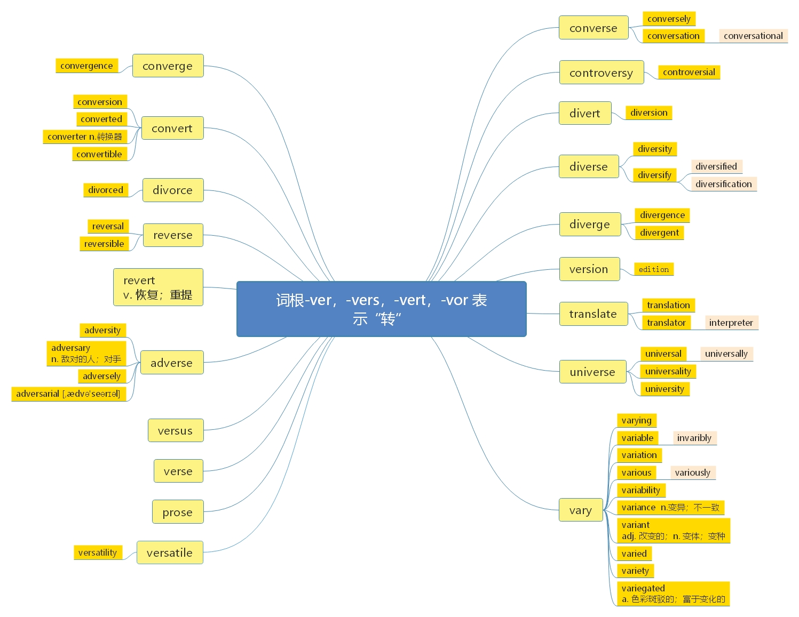

# 第七节 词根-ver， -vers， -vert， -vol， -var

***

> **一、本节课目标**
>
> 1、掌握词根-ver， -vers， -vert， -vol， -var 的含义
>
> 2、掌握新词 200 个
>
> 3、复习本节课所有单词

***

# **词根-ver， -vers， -vert， -vol， -var =to turn 转，旋转，转动**

***

# 核心词汇：

***

**converse** \[kən'və\:s] [英音](https://dict.youdao.com/dictvoice?audio=converse\&type=1)  [美音](https://dict.youdao.com/dictvoice?audio=converse\&type=2)  adj. 相反的， 逆向的； 颠倒的； v. 交谈 11755

**双语例句:** The two deaf actors converse solely in signing. [播放](https://dict.youdao.com/dictvoice?audio=The+two+deaf+actors+converse+solely+in+signing.&le=eng&le=eng&type=2)

两位聋哑演员只靠打手势语交谈。 

**双语例句:** The child, feeling free and comfortable, started to converse with Peter, and he had to answer many questions. [播放](https://dict.youdao.com/dictvoice?audio=The+child%2C+feeling+free+and+comfortable%2C+started+to+converse+with+Peter%2C+and+he+had+to+answer+many+questions.&le=eng&le=eng&type=2)

孩子感到自由自在，很舒服，开始和彼得交谈，他不得不回答许多问题。 

**双语例句:** The sad thing is that people presume that a nearby stranger doesn't want to converse and don't start a conversation. [播放](https://dict.youdao.com/dictvoice?audio=The+sad+thing+is+that+people+presume+that+a+nearby+stranger+doesn%27t+want+to+converse+and+don%27t+start+a+conversation.&le=eng&le=eng&type=2)

令人难过的是，人们认为附近的陌生人不想交谈，因此也不会主动发起谈话。 

**原声例句:** There is a detail here of course that Zooey, in making a second attempt to **converse** with Franny about this, impersonates his brother, Buddy, on the phone.

**原声例句:** A happy marriage for Milton was founded on a couple of like-minded opinions and values, - their ability to **converse** with one another -- and so this is why the notion of divorce for reasons of incompatibility is so important to Milton, because compatibility in marriage is the very essence of marriage.

**权威例句:** Twitter is a tool to **converse** with your customers on their terms, not yours.  [播放](https://dict.youdao.com/dictvoice?audio=Twitter+is+a+tool+to+converse+with+your+customers+on+their+terms%2C+not+yours.+&le=eng&type=2)

**权威例句:** I'm sorry I'm not a guy who wants to **converse** about everything during the playoffs.  [播放](https://dict.youdao.com/dictvoice?audio=I%27m+sorry+I%27m+not+a+guy+who+wants+to+converse+about+everything+during+the+playoffs.+&le=eng&type=2)

**权威例句:** But experts say its **converse**, foreign hiring of American workers, won't cease anytime soon.  [播放](https://dict.youdao.com/dictvoice?audio=But+experts+say+its+converse%2C+foreign+hiring+of+American+workers%2C+won%27t+cease+anytime+soon.+&le=eng&type=2)

***

**conversely** \['kɒnvɜ\:slɪ; kən'vɜ\:slɪ] [英音](https://dict.youdao.com/dictvoice?audio=conversely\&type=1)  [美音](https://dict.youdao.com/dictvoice?audio=conversely\&type=2)  adv. 相反地，逆向地 8223

**双语例句:** You can add the fluid to the powder, or, conversely, the powder to the fluid. [播放](https://dict.youdao.com/dictvoice?audio=You+can+add+the+fluid+to+the+powder%2C+or%2C+conversely%2C+the+powder+to+the+fluid.&le=eng&le=eng&type=2)

可把液体加入粉末，或者相反，把粉末加入液体。 

**双语例句:** Malaysia and Indonesia rely on open markets for forest and fishery products. Conversely, some Asian countries are highly protectionist. [播放](https://dict.youdao.com/dictvoice?audio=Malaysia+and+Indonesia+rely+on+open+markets+for+forest+and+fishery+products.+Conversely%2C+some+Asian+countries+are+highly+protectionist.&le=eng&le=eng&type=2)

马来西亚和印度尼西亚依靠开放的市场获取林业和渔业产品。与之相反的是，一些亚洲国家是高度的保护贸易论者。 

**双语例句:** Conversely, \"cycle to work\" days have done their job by creating pollution lows. [播放](https://dict.youdao.com/dictvoice?audio=Conversely%2C+%22cycle+to+work%22+days+have+done+their+job+by+creating+pollution+lows.&le=eng&le=eng&type=2)

相反，“骑车上班”的日子创造了污染低值，效果明显。 

**原声例句:** **Conversely**, if I knew the velocity of this object, I also know what time it is, provided I knew the initial velocity.

**原声例句:** **Conversely**, if he goes on the hard pass and you defend the easy pass, he's going to lose one of those battalions.

**原声例句:** So it's initialized outside the loop when it should be initialized inside the loop. Or **conversely**, inside the loop when it should be outside the loop. So look carefully at when variables are being initialized.

**权威例句:** **Conversely**, during market crashes (and huge losses), the traders became apathetic and excessively risk-averse.  [播放](https://dict.youdao.com/dictvoice?audio=Conversely%2C+during+market+crashes+%28and+huge+losses%29%2C+the+traders+became+apathetic+and+excessively+risk-averse.+&le=eng&type=2)

**权威例句:** And, **conversely**, it puts him in the top 10%, as far as many Latinos are concerned.  [播放](https://dict.youdao.com/dictvoice?audio=And%2C+conversely%2C+it+puts+him+in+the+top+10%25%2C+as+far+as+many+Latinos+are+concerned.+&le=eng&type=2)

**权威例句:** **Conversely**, the economics of the NFL and NBA for top young players are totally different.  [播放](https://dict.youdao.com/dictvoice?audio=Conversely%2C+the+economics+of+the+NFL+and+NBA+for+top+young+players+are+totally+different.+&le=eng&type=2)

***

**conversation** \[kɒnvə'seɪʃ(ə)n] [英音](https://dict.youdao.com/dictvoice?audio=conversation\&type=1)  [美音](https://dict.youdao.com/dictvoice?audio=conversation\&type=2)  n. 会话；交谈；社交 1168

**双语例句:** She was engrossed in conversation. [播放](https://dict.youdao.com/dictvoice?audio=She+was+engrossed+in+conversation.&le=eng&le=eng&type=2)

她聚精会神地谈话。 

**双语例句:** The subject came up in conversation. [播放](https://dict.youdao.com/dictvoice?audio=The+subject+came+up+in+conversation.&le=eng&le=eng&type=2)

谈话中提到了这个话题。 

**双语例句:** I heard snatches of the conversation. [播放](https://dict.youdao.com/dictvoice?audio=I+heard+snatches+of+the+conversation.&le=eng&le=eng&type=2)

我听到几段零星的谈话。 

**原声例句:** I heard part of their **conversation**.\" [播放](https://dict.youdao.com/pureaudio?docid=-7295949830967391103)

**原声例句:** Some consider it an election ploy. But other surveys show the majority of French believe it is a useful **conversation**. [播放](https://dict.youdao.com/pureaudio?docid=7895366765980804986)

**原声例句:** Army spokesman, Major General Athar Abbas, says security forces were able to intercept a phone **conversation** of Pakistani Taliban deputy leader,Wali-ur-Rehman. [播放](https://dict.youdao.com/pureaudio?docid=-3783113358125399233)

**权威例句:** On now-crowded commuter trains, a frequent **conversation** topic is where to find the cheapest gas.  [播放](https://dict.youdao.com/dictvoice?audio=On+now-crowded+commuter+trains%2C+a+frequent+conversation+topic+is+where+to+find+the+cheapest+gas.+&le=eng&type=2)

**权威例句:** Her **conversation** with him on his 90th birthday was the last official interview he gave.  [播放](https://dict.youdao.com/dictvoice?audio=Her+conversation+with+him+on+his+90th+birthday+was+the+last+official+interview+he+gave.+&le=eng&type=2)

**权威例句:** The hum of improvised **conversation**, the rustling of newspapers turning, the clinking of cutlery.  [播放](https://dict.youdao.com/dictvoice?audio=The+hum+of+improvised+conversation%2C+the+rustling+of+newspapers+turning%2C+the+clinking+of+cutlery.+&le=eng&type=2)

***

**conversational** \[kɒnvə'seɪʃ(ə)n(ə)l] [英音](https://dict.youdao.com/dictvoice?audio=conversational\&type=1)  [美音](https://dict.youdao.com/dictvoice?audio=conversational\&type=2)  adj. 对话的；健谈的 13936

> **【课堂笔记】**
>
> conversational 健谈的，会聊天的
>
> 如： sb. is conversational.

**双语例句:** I learnt conversational Spanish at evening classes. [播放](https://dict.youdao.com/dictvoice?audio=I+learnt+conversational+Spanish+at+evening+classes.&le=eng&le=eng&type=2)

我在夜校班学过西班牙语会话。 

**双语例句:** It's possible that we all have compromised conversational intelligence. [播放](https://dict.youdao.com/dictvoice?audio=It%27s+possible+that+we+all+have+compromised+conversational+intelligence.&le=eng&le=eng&type=2)

我们都有可能会向会话智能妥协。 

**双语例句:** Mary is ambitious enough to aspire to conversational fluency in Chinese in four months. [播放](https://dict.youdao.com/dictvoice?audio=Mary+is+ambitious+enough+to+aspire+to+conversational+fluency+in+Chinese+in+four+months.&le=eng&le=eng&type=2)

玛丽雄心很大， 竟立志在四个月里学会用汉语流利地会话。 

**原声例句:** Out here, people talk to you, very **conversational**

**权威例句:** The process begins with a **conversational** free-for-all among a select 30 of LeapFrog's 250 employees.  [播放](https://dict.youdao.com/dictvoice?audio=The+process+begins+with+a+conversational+free-for-all+among+a+select+30+of+LeapFrog%27s+250+employees.+&le=eng&type=2)

**权威例句:** The movie has an easy **conversational** rhythm, but, after a while, we become puzzled.  [播放](https://dict.youdao.com/dictvoice?audio=The+movie+has+an+easy+conversational+rhythm%2C+but%2C+after+a+while%2C+we+become+puzzled.+&le=eng&type=2)

**权威例句:** He is a compulsive talker, his incessant **conversational** stream tracking the course of his volatile emotions.  [播放](https://dict.youdao.com/dictvoice?audio=He+is+a+compulsive+talker%2C+his+incessant+conversational+stream+tracking+the+course+of+his+volatile+emotions.+&le=eng&type=2)

***

**controversy** \['kɔntrə,və\:si] [英音](https://dict.youdao.com/dictvoice?audio=controversy\&type=1)  [美音](https://dict.youdao.com/dictvoice?audio=controversy\&type=2)  n. 争端、争议 2898

**助记：** contro（ =contra： 相反） +vers（ 转） +y→转向相反面→（ 引发） 争端、 争论；

**搭配：** lead to controversy（考）：导致争端/争议

> **【课堂笔记】**
>
> counter adj. 相反的
>
> contrary adj. 相反的，对立的

**双语例句:** He is no stranger to controversy. [播放](https://dict.youdao.com/dictvoice?audio=He+is+no+stranger+to+controversy.&le=eng&le=eng&type=2)

他对争论见得多了。 

**双语例句:** The issue engendered controversy. [播放](https://dict.youdao.com/dictvoice?audio=The+issue+engendered+controversy.&le=eng&le=eng&type=2)

这个问题引起了争论。 

**双语例句:** He is a lightning rod for controversy. [播放](https://dict.youdao.com/dictvoice?audio=He+is+a+lightning+rod+for+controversy.&le=eng&le=eng&type=2)

他是个富有争议的人物. 

**原声例句:** (Speaking in French) Still, the **controversy** has not stopped French from attending debates taking place in government buildings across the country. [播放](https://dict.youdao.com/pureaudio?docid=9040976495094511017)

**原声例句:** The **controversy** started on December 31, when the Malaysian High Court allowed Roman Catholics to use \"Allah\" to refer to God. [播放](https://dict.youdao.com/pureaudio?docid=3216463538713156397)

**原声例句:** Speaking for the first time since the outbreak of the **controversy**, Semenya spoke animatedly of the final she won. [播放](https://dict.youdao.com/pureaudio?docid=-1165232439254523154)

**权威例句:** But pharmaceutical executives admit they have been too slow to react to critics and **controversy**.  [播放](https://dict.youdao.com/dictvoice?audio=But+pharmaceutical+executives+admit+they+have+been+too+slow+to+react+to+critics+and+controversy.+&le=eng&type=2)

**权威例句:** Some people listen and hear **controversy**, lyrics that celebrate violence or disrespect women or gays.  [播放](https://dict.youdao.com/dictvoice?audio=Some+people+listen+and+hear+controversy%2C+lyrics+that+celebrate+violence+or+disrespect+women+or+gays.+&le=eng&type=2)

**权威例句:** Propositions to legalise or expand commercial gambling are never without **controversy**, yet they never stop surfacing.  [播放](https://dict.youdao.com/dictvoice?audio=Propositions+to+legalise+or+expand+commercial+gambling+are+never+without+controversy%2C+yet+they+never+stop+surfacing.+&le=eng&type=2)

***

**controversial** \[,kɔntrə'və:ʃəl] [英音](https://dict.youdao.com/dictvoice?audio=controversial\&type=1)  [美音](https://dict.youdao.com/dictvoice?audio=controversial\&type=2)  a. 有争议的 3115

**例句：** In the United States, the need to protect plant and animal species has become a highly controversial and sharply political issue since the passage of the Endangered Species Act in 1973.

在美国，自从濒危物种法案在 1973 年通过以来，保护动物和植物的需要就成了一个有高度

争议的和尖锐的政治问题。

&#x20;**仿写例句：** 大学排名可不可靠一直都是一个有高度争议的话题。

Whether college ranking is reliable or not is a highly controversial issue.

**双语例句:** Immigration is a controversial issue in many countries. [播放](https://dict.youdao.com/dictvoice?audio=Immigration+is+a+controversial+issue+in+many+countries.&le=eng&le=eng&type=2)

移民在很多国家都是一个有争议的问题。 

**双语例句:** The distinction between craft and fine art is more controversial. [播放](https://dict.youdao.com/dictvoice?audio=The+distinction+between+craft+and+fine+art+is+more+controversial.&le=eng&le=eng&type=2)

工艺和美术之间的区别更有争议。 

**双语例句:** Winston Churchill and Richard Nixon were both controversial figures. [播放](https://dict.youdao.com/dictvoice?audio=Winston+Churchill+and+Richard+Nixon+were+both+controversial+figures.&le=eng&le=eng&type=2)

温斯顿•邱吉尔和理查德•尼克松都是有争议的人物。 

**原声例句:** He made his remarks as Pakistani lawmakers ponder a **controversial** American aid package which President Barack Obama signed on Thursday. [播放](https://dict.youdao.com/pureaudio?docid=-2731044903455758048)

**原声例句:** Under the **controversial** pact, the government agreed to the cleric's main demand of imposing Islamic law in the insurgency-hit districts. [播放](https://dict.youdao.com/pureaudio?docid=6232489235896381018)

**原声例句:** Football fans and analysts for years have called for the introduction of video replays to allow referees to review **controversial** calls. [播放](https://dict.youdao.com/pureaudio?docid=7812158016512433283)

**权威例句:** Mr Li also said that the six-party talks on the North's **controversial** programme must resume.  [播放](https://dict.youdao.com/dictvoice?audio=Mr+Li+also+said+that+the+six-party+talks+on+the+North%27s+controversial+programme+must+resume.+&le=eng&type=2)

**权威例句:** The European Parliament has voted for sweeping reforms of the **controversial** EU Common Fisheries Policy.  [播放](https://dict.youdao.com/dictvoice?audio=The+European+Parliament+has+voted+for+sweeping+reforms+of+the+controversial+EU+Common+Fisheries+Policy.+&le=eng&type=2)

**权威例句:** Even as street art becomes more accessible, it remains just **controversial** enough to be cutting edge.  [播放](https://dict.youdao.com/dictvoice?audio=Even+as+street+art+becomes+more+accessible%2C+it+remains+just+controversial+enough+to+be+cutting+edge.+&le=eng&type=2)

***

**divert** \[dai'və\:t] [英音](https://dict.youdao.com/dictvoice?audio=divert\&type=1)  [美音](https://dict.youdao.com/dictvoice?audio=divert\&type=2)  v. 转移；转向 5750

**助记：** dis（ 不同） +vert（ 转、 转移） →转向不同（ 方向） →转移、 转向

**搭配：** divert attention（考）：转移注意力

Subway said that it worked hard to \_\_\_\_\_\_ the impact of litter on communities, but it was “still

down to the individual customer to dispose of their litter responsibly”.

A) suspend B) degrade C) minimize D) divert

**解析：** 原文翻译“Subway 说它已经努力去使垃圾对社区的影响最小化， 但仍然取决于每一位

顾客去负责任地处理垃圾”， 故选 C； A： 中止、 吊销； B： 降级； D： 转移

**双语例句:** Even using a \"hands-free\" device can divert a driver's attention to an alarming extent. [播放](https://dict.youdao.com/dictvoice?audio=Even+using+a+%22hands-free%22+device+can+divert+a+driver%27s+attention+to+an+alarming+extent.&le=eng&le=eng&type=2)

即使使用“免提”设备，也会在令人担忧的程度上转移司机的注意力。 

**双语例句:** It works in compression to divert the weight above it out to the sides, where the weight is borne by the vertical elements on either side of the arch. [播放](https://dict.youdao.com/dictvoice?audio=It+works+in+compression+to+divert+the+weight+above+it+out+to+the+sides%2C+where+the+weight+is+borne+by+the+vertical+elements+on+either+side+of+the+arch.&le=eng&le=eng&type=2)

在受到压力时，拱形结构能够起到将其上面的压力转移到侧面，在侧面的重量则由拱形结构两侧的垂直部分来承受。 

**双语例句:** They want to divert the attention of the people from the real issues. [播放](https://dict.youdao.com/dictvoice?audio=They+want+to+divert+the+attention+of+the+people+from+the+real+issues.&le=eng&le=eng&type=2)

他们想把人民的注意力从真正的问题上转移开。 

**权威例句:** India's dam will **divert** some of the river down a 22km (14-mile) mountain tunnel to turbines.  [播放](https://dict.youdao.com/dictvoice?audio=India%27s+dam+will+divert+some+of+the+river+down+a+22km+%2814-mile%29+mountain+tunnel+to+turbines.+&le=eng&type=2)

**权威例句:** Radzinski was fortunate to be in the way and **divert** Helguson's header into the net.  [播放](https://dict.youdao.com/dictvoice?audio=Radzinski+was+fortunate+to+be+in+the+way+and+divert+Helguson%27s+header+into+the+net.+&le=eng&type=2)

**权威例句:** You create channels to **divert** it, and you hope that it flows the right way.  [播放](https://dict.youdao.com/dictvoice?audio=You+create+channels+to+divert+it%2C+and+you+hope+that+it+flows+the+right+way.+&le=eng&type=2)

***

**diversion** \[daɪ'vɜ:ʃ(ə)n; dɪ-] [英音](https://dict.youdao.com/dictvoice?audio=diversion\&type=1)  [美音](https://dict.youdao.com/dictvoice?audio=diversion\&type=2)  n. 转移；消遣； 分散注意力 7651

**双语例句:** A smoke bomb created a diversion while the robbery took place. [播放](https://dict.youdao.com/dictvoice?audio=A+smoke+bomb+created+a+diversion+while+the+robbery+took+place.&le=eng&le=eng&type=2)

劫案发生时，一枚烟雾弹转移了人们的视线。 

**双语例句:** Thou'lt find it good diversion. [播放](https://dict.youdao.com/dictvoice?audio=Thou%27lt+find+it+good+diversion.&le=eng&le=eng&type=2)

你会发现这是一种很好的消遣。 

**双语例句:** Strangers and travelers were welcome sources of diversion, and brought news of the outside world. [播放](https://dict.youdao.com/dictvoice?audio=Strangers+and+travelers+were+welcome+sources+of+diversion%2C+and+brought+news+of+the+outside+world.&le=eng&le=eng&type=2)

陌生人和旅行者是受欢迎的消遣来源，他们带来了外面世界的新闻。 

**原声例句:** I think that there isn't a faculty point of view, it's a faculty's **diversion**, reasonably large.

**权威例句:** After a few rounds at ABC, the foosball table makes for a fine **diversion**.  [播放](https://dict.youdao.com/dictvoice?audio=After+a+few+rounds+at+ABC%2C+the+foosball+table+makes+for+a+fine+diversion.+&le=eng&type=2)

**权威例句:** It is expected to take 19 weeks and means an 18-mile **diversion** for some.  [播放](https://dict.youdao.com/dictvoice?audio=It+is+expected+to+take+19+weeks+and+means+an+18-mile+diversion+for+some.+&le=eng&type=2)

**权威例句:** Water management, for example, is probably a bigger worry than the size of the **diversion**.  [播放](https://dict.youdao.com/dictvoice?audio=Water+management%2C+for+example%2C+is+probably+a+bigger+worry+than+the+size+of+the+diversion.+&le=eng&type=2)

***

**diverse** \[daɪ'vɜ\:s; 'daɪvɜ\:s] [英音](https://dict.youdao.com/dictvoice?audio=diverse\&type=1)  [美音](https://dict.youdao.com/dictvoice?audio=diverse\&type=2)  adj. 不同的；变化多的；多种多样的 2837

**助记：** di（ =dis： 不同） +vers（ 转） →可以转向不同（ 情况的） →变化多的、 多种多样的、不同的

**搭配：** diverse coalition（考）：多样化联盟 diverse courses（考）：多样的课程

diverse market segments（考）：不同的细分市场

**双语例句:** Cuba is a composite of diverse traditions and people. [播放](https://dict.youdao.com/dictvoice?audio=Cuba+is+a+composite+of+diverse+traditions+and+people.&le=eng&le=eng&type=2)

古巴是一个不同传统和民族的融合体。 

**双语例句:** The company owns a very diverse library of Arabic music. [播放](https://dict.youdao.com/dictvoice?audio=The+company+owns+a+very+diverse+library+of+Arabic+music.&le=eng&le=eng&type=2)

公司收藏有多种多样的阿拉伯音乐。 

**双语例句:** It is geographically more diverse than any other continent. [播放](https://dict.youdao.com/dictvoice?audio=It+is+geographically+more+diverse+than+any+other+continent.&le=eng&le=eng&type=2)

它在地理上比其他任何大陆都更具多样性。 

**原声例句:** The author,Aife Murray, writes that over the years, Dickinson employed an ethnically **diverse** group of servants. [播放](https://dict.youdao.com/pureaudio?docid=3532932220100129255)

**原声例句:** So it's not necessarily imposing other religions on them, but just kind of creating a sense of awareness in celebration of how different and **diverse** just within our classroom we are.\" [播放](https://dict.youdao.com/pureaudio?docid=-3155827225122958920)

**原声例句:** \"The U.S.is very **diverse** in its cultures. [播放](https://dict.youdao.com/pureaudio?docid=-7562116203218960545)

**权威例句:** The **diverse** representation at the event gave a fascinating insight into different global cinema cultures.  [播放](https://dict.youdao.com/dictvoice?audio=The+diverse+representation+at+the+event+gave+a+fascinating+insight+into+different+global+cinema+cultures.+&le=eng&type=2)

**权威例句:** The last three days of riding highlighted just how **diverse** La Route Verte can be.  [播放](https://dict.youdao.com/dictvoice?audio=The+last+three+days+of+riding+highlighted+just+how+diverse+La+Route+Verte+can+be.+&le=eng&type=2)

**权威例句:** The Office for National Statistics said the findings showed a **\"divers**e\" and \"changing\" picture.  [播放](https://dict.youdao.com/dictvoice?audio=The+Office+for+National+Statistics+said+the+findings+showed+a+%22diverse%22+and+%22changing%22+picture.+&le=eng&type=2)

***

**diversify** \[daɪˈvɜ\:sɪˌfaɪ] [英音](https://dict.youdao.com/dictvoice?audio=diversify\&type=1)  [美音](https://dict.youdao.com/dictvoice?audio=diversify\&type=2)  vt. 使多样化，使变化；增加产品种类以扩大 8719

**助记：** divers（ 多样的、 不同的） +ify（ 动词后缀， 一般可翻译成“ 使” ） →使多样化， 使不同

**搭配：** diversify energy supply（考）：使能源供应多样化

**双语例句:** The key word here is diversify; don't put all your eggs in one basket. [播放](https://dict.youdao.com/dictvoice?audio=The+key+word+here+is+diversify%3B+don%27t+put+all+your+eggs+in+one+basket.&le=eng&le=eng&type=2)

这里的关键词是多样化投资，不要孤注一掷。 

**双语例句:** Rules need to be set to diversify online services. [播放](https://dict.youdao.com/dictvoice?audio=Rules+need+to+be+set+to+diversify+online+services.&le=eng&le=eng&type=2)

需要制定规则以促进在线服务多样化。 

**双语例句:** Admonished by government entomologists, farmers began to diversify. [播放](https://dict.youdao.com/dictvoice?audio=Admonished+by+government+entomologists%2C+farmers+began+to+diversify.&le=eng&le=eng&type=2)

在政府昆虫学家的告诫下，农民们开始多样化种植。 

**原声例句:** Economists say India has bought gold to **diversify** its assets and hold fewer dollars at a time when the U.S.currency is weakening against other currencies. [播放](https://dict.youdao.com/pureaudio?docid=-3578186207104866108)

**原声例句:** He appeals to the donor community to **diversify** its aid to these many sectors. [播放](https://dict.youdao.com/pureaudio?docid=-732012579003462167)

**原声例句:** She is a beneficiary of Science Po's efforts to **diversify** its student body. [播放](https://dict.youdao.com/pureaudio?docid=-6432724768847452143)

**权威例句:** Aside from trying to gild the plastic, Hayek is determined to **diversify** beyond timekeeping.  [播放](https://dict.youdao.com/dictvoice?audio=Aside+from+trying+to+gild+the+plastic%2C+Hayek+is+determined+to+diversify+beyond+timekeeping.+&le=eng&type=2)

**权威例句:** To **diversify**, Tata would enter, at great expense, the less volatile passenger car market.  [播放](https://dict.youdao.com/dictvoice?audio=To+diversify%2C+Tata+would+enter%2C+at+great+expense%2C+the+less+volatile+passenger+car+market.+&le=eng&type=2)

**权威例句:** Which naturally raises the question: What took the famously acquisitive Singleton so long to **diversify**?  [播放](https://dict.youdao.com/dictvoice?audio=Which+naturally+raises+the+question%3A+What+took+the+famously+acquisitive+Singleton+so+long+to+diversify%3F+&le=eng&type=2)

***

**diversified** \[daɪ'vɜ\:sɪfaɪd] [英音](https://dict.youdao.com/dictvoice?audio=diversified\&type=1)  [美音](https://dict.youdao.com/dictvoice?audio=diversified\&type=2)  adj. 多样化的；各种的 15602

> **【 课堂笔记】**
>
> diverse 多种多样的，多元的
>
> diversified 使多样化了的，使多元化的（由 diversify 转化而来，具有一定地动词性质，
>
> 强调被转化了的）

**双语例句:** The company's troubles started only when it diversified into new products. [播放](https://dict.youdao.com/dictvoice?audio=The+company%27s+troubles+started+only+when+it+diversified+into+new+products.&le=eng&le=eng&type=2)

该公司的麻烦从实现产品多样化时才开始。 

**双语例句:** City College of New York has one of the most diversified student bodies in the nation. [播放](https://dict.youdao.com/dictvoice?audio=City+College+of+New+York+has+one+of+the+most+diversified+student+bodies+in+the+nation.&le=eng&le=eng&type=2)

纽约城市大学有全美最多元化的学生群体之一。 

**双语例句:** During my Mindsets coaching session, I was taught how to recruit a diversified workforce. [播放](https://dict.youdao.com/dictvoice?audio=During+my+Mindsets+coaching+session%2C+I+was+taught+how+to+recruit+a+diversified+workforce.&le=eng&le=eng&type=2)

在我的思维训练课程中，我学习了如何招募多样化的劳动力。 

**原声例句:** During her visit to Angola, Clinton witnessed the signing of a Memorandum of Understanding between Angola's petroleum ministry, the US Agency for International Development and the oil firm Chevron to support more **diversified** agricultural production. [播放](https://dict.youdao.com/pureaudio?docid=1429709867103037562)

**原声例句:** Just by putting money into a broadly **diversified** portfolio of stocks you would have gotten 3,077 times your money.

**原声例句:** The overall conclusions are that, with respect to asset allocation, you want to create an equity-oriented **diversified** portfolio.

**权威例句:** Our list consists of no-load **diversified** U.S. equity funds with the best records since March 2000.  [播放](https://dict.youdao.com/dictvoice?audio=Our+list+consists+of+no-load+diversified+U.S.+equity+funds+with+the+best+records+since+March+2000.+&le=eng&type=2)

**权威例句:** More **diversified** and hedged energy companies like ExxonMobil are better able to withstand such a problem.  [播放](https://dict.youdao.com/dictvoice?audio=More+diversified+and+hedged+energy+companies+like+ExxonMobil+are+better+able+to+withstand+such+a+problem.+&le=eng&type=2)

**权威例句:** This company is more **diversified** as it builds single-family detached homes and condos in 28 states.  [播放](https://dict.youdao.com/dictvoice?audio=This+company+is+more+diversified+as+it+builds+single-family+detached+homes+and+condos+in+28+states.+&le=eng&type=2)

***

**diversification** \[daɪ,vɜ\:sɪfɪ'keɪʃən] [英音](https://dict.youdao.com/dictvoice?audio=diversification\&type=1)  [美音](https://dict.youdao.com/dictvoice?audio=diversification\&type=2)  n. 多样化；变化 13880

**双语例句:** The analysis also suggests that pink iguana is one of the earliest examples of species diversification on the islands. [播放](https://dict.youdao.com/dictvoice?audio=The+analysis+also+suggests+that+pink+iguana+is+one+of+the+earliest+examples+of+species+diversification+on+the+islands.&le=eng&le=eng&type=2)

分析还表明，粉红色鬣蜥是这一群岛上物种多样化的最早例子之一。 

**双语例句:** Our species originated around 200,000 years ago, and underwent tremendous diversification, culturally, technologically, linguistically, artistically, for 130,000 years. [播放](https://dict.youdao.com/dictvoice?audio=Our+species+originated+around+200%2C000+years+ago%2C+and+underwent+tremendous+diversification%2C+culturally%2C+technologically%2C+linguistically%2C+artistically%2C+for+130%2C000+years.&le=eng&le=eng&type=2)

我们的物种起源于大约20万年前，并经历了13万年的惊人的多样化进程，包括文化、技术、语言和艺术等方面。 

**双语例句:** The seminar was to discuss diversification of agriculture. [播放](https://dict.youdao.com/dictvoice?audio=The+seminar+was+to+discuss+diversification+of+agriculture.&le=eng&le=eng&type=2)

该研讨会讨论的是农业多种经营。 

**原声例句:** We need sustainable energy security that includes **diversification** of supplies and transit routes,\". [播放](https://dict.youdao.com/pureaudio?docid=473909150881288898)

**原声例句:** What I think the mutual fund industry has turned into, largely, is a stock picking industry, not a portfolio **diversification** industry.

**原声例句:** figuring out there is no such thing as a free lunch but Markowitz tells us that **diversification** is a free lunch.

**权威例句:** We believe there are many smaller developed markets and emerging markets that offer good **diversification** benefits.  [播放](https://dict.youdao.com/dictvoice?audio=We+believe+there+are+many+smaller+developed+markets+and+emerging+markets+that+offer+good+diversification+benefits.+&le=eng&type=2)

**权威例句:** To help ensure success, we pay attention to things like proper **diversification** and risk.  [播放](https://dict.youdao.com/dictvoice?audio=To+help+ensure+success%2C+we+pay+attention+to+things+like+proper+diversification+and+risk.+&le=eng&type=2)

**权威例句:** \"The online game business is not unlike the movie business, \" says Nguyen, in pushing **diversification**.  [播放](https://dict.youdao.com/dictvoice?audio=%22The+online+game+business+is+not+unlike+the+movie+business%2C+%22+says+Nguyen%2C+in+pushing+diversification.+&le=eng&type=2)

***

**diversity** \[daɪ'vɜ\:sɪtɪ; dɪ-] [英音](https://dict.youdao.com/dictvoice?audio=diversity\&type=1)  [美音](https://dict.youdao.com/dictvoice?audio=diversity\&type=2)  n. 多样性；差异 2553

**搭配：** diversity of religious belief（考）：宗教信仰的多样化

**例句：** But schools rarely dig down to find out what really makes an applicant succeed, to create a class which also contains diversity of attitude and approach—arguably the only diversity that, in a business context, really matters.

学校几乎从不去探究真正让一名申请者成功的原因， 去创造一种包含多样性态度和方法的课堂——可以说， 在商业背景下， 这是唯一重要的多样化。

**仿写例句：** 学校几乎从不去探究真正让一名学生成功的原因，去创造一种包含多样性态度和方法的课堂——可以说， 在商业背景下， 这是唯一重要的东西。

&#x20;But schools rarely dig down to find out what really makes a student succeed, to create a class which also contains diversity of attitude and approach—arguably the only thing that, in a business context, really matters.

> **【 课堂笔记】**
>
> 常用名词后缀： -ity, -lity, -ility
>
> 例如： university（大学） , universality（普遍性） , variability（ 可变性，变异性）

**双语例句:** Two of our greatest strengths are diversity and community. [播放](https://dict.youdao.com/dictvoice?audio=Two+of+our+greatest+strengths+are+diversity+and+community.&le=eng&le=eng&type=2)

我们的两个最大优点是多样性和团体精神。 

**双语例句:** There is a need for greater diversity and choice in education. [播放](https://dict.youdao.com/dictvoice?audio=There+is+a+need+for+greater+diversity+and+choice+in+education.&le=eng&le=eng&type=2)

教育方面需要更加多元化和更大的选择性。 

**双语例句:** We have nothing against diversity; indeed, we want more of it. [播放](https://dict.youdao.com/dictvoice?audio=We+have+nothing+against+diversity%3B+indeed%2C+we+want+more+of+it.&le=eng&le=eng&type=2)

我们并不反对多样化；其实，我们希望有更多的多样化。 

**原声例句:** They have also provided forests for use by local communities and native peoples and for the protection of biological **diversity**. [播放](https://dict.youdao.com/pureaudio?docid=6221260906775457061)

**原声例句:** The scientists say the current level of **diversity** within cattle breeds is at least as great as within humans. [播放](https://dict.youdao.com/pureaudio?docid=8697024131791908463)

**原声例句:** In the last generation or so, different groups have encouraged public schools to celebrate **diversity** and cultural differences. [播放](https://dict.youdao.com/pureaudio?docid=7431203321846515704)

**权威例句:** Alas, this **diversity** strategy, combined with old-fashioned pay-to-play politics, has enveloped the state in scandal.  [播放](https://dict.youdao.com/dictvoice?audio=Alas%2C+this+diversity+strategy%2C+combined+with+old-fashioned+pay-to-play+politics%2C+has+enveloped+the+state+in+scandal.+&le=eng&type=2)

**权威例句:** The **diversity** of the collection ranges from photographs, patient letters, admission certificates and application forms.  [播放](https://dict.youdao.com/dictvoice?audio=The+diversity+of+the+collection+ranges+from+photographs%2C+patient+letters%2C+admission+certificates+and+application+forms.+&le=eng&type=2)

**权威例句:** Lake Malawi is classified as a Unesco World Heritage site due to its **diversity** of endemic fish.  [播放](https://dict.youdao.com/dictvoice?audio=Lake+Malawi+is+classified+as+a+Unesco+World+Heritage+site+due+to+its+diversity+of+endemic+fish.+&le=eng&type=2)

***

**diverge** \[daɪ'vɜ\:dʒ; dɪ-] [英音](https://dict.youdao.com/dictvoice?audio=diverge\&type=1)  [美音](https://dict.youdao.com/dictvoice?audio=diverge\&type=2)  vi. 分歧；分叉；偏离；离题 14341

**助记：** dis（ =apart 分开， 不同方向） +verg（ =-vert 转） +e（ 后缀） →转向另一个方向去了→偏离，偏题；分叉

**双语例句:** Opinions diverge greatly on this issue. [播放](https://dict.youdao.com/dictvoice?audio=Opinions+diverge+greatly+on+this+issue.&le=eng&le=eng&type=2)

在这个问题上意见分歧很大。 

**双语例句:** The parallel lines appear to diverge. [播放](https://dict.youdao.com/dictvoice?audio=The+parallel+lines+appear+to+diverge.&le=eng&le=eng&type=2)

这些平行线像是岔开了。 

**双语例句:** Second, it appears that closely related populations of fishes on both sides of the isthmus are starting to genetically diverge from each other. [播放](https://dict.youdao.com/dictvoice?audio=Second%2C+it+appears+that+closely+related+populations+of+fishes+on+both+sides+of+the+isthmus+are+starting+to+genetically+diverge+from+each+other.&le=eng&le=eng&type=2)

其次，地峡两侧紧密相关的鱼类种群似乎开始在基因上彼此分化。 

**原声例句:** There's a pretty interesting and potentially important gender factor going on here where the women in the orange line, after about this point, start to **diverge**.

**权威例句:** But the tactics of respect for the storm and its victims are going to **diverge**.  [播放](https://dict.youdao.com/dictvoice?audio=But+the+tactics+of+respect+for+the+storm+and+its+victims+are+going+to+diverge.+&le=eng&type=2)

**权威例句:** Shortly afterwards, the scores started to **diverge**, reaching respectively -1 and 10 by mid-July.  [播放](https://dict.youdao.com/dictvoice?audio=Shortly+afterwards%2C+the+scores+started+to+diverge%2C+reaching+respectively+-1+and+10+by+mid-July.+&le=eng&type=2)

**权威例句:** The iShares Russell 2000 ( IWM) has started to **diverge** from the SPY.  [播放](https://dict.youdao.com/dictvoice?audio=The+iShares+Russell+2000+%28+IWM%29+has+started+to+diverge+from+the+SPY.+&le=eng&type=2)

***

**divergence** \[daɪ'vɜ\:dʒ(ə)ns] [英音](https://dict.youdao.com/dictvoice?audio=divergence\&type=1)  [美音](https://dict.youdao.com/dictvoice?audio=divergence\&type=2)  n. 分歧；离题；分叉 15140

**双语例句:** There's a substantial divergence of opinion within the party. [播放](https://dict.youdao.com/dictvoice?audio=There%27s+a+substantial+divergence+of+opinion+within+the+party.&le=eng&le=eng&type=2)

党内意见严重分歧。 

**双语例句:** Can divergence occur if no physical barriers are in place to separate individuals who continue to live and reproduce in the same habitat? [播放](https://dict.youdao.com/dictvoice?audio=Can+divergence+occur+if+no+physical+barriers+are+in+place+to+separate+individuals+who+continue+to+live+and+reproduce+in+the+same+habitat%3F&le=eng&le=eng&type=2)

如果没有物理屏障将继续在同一栖息地生活和繁殖的个体隔离开来，分化是否会出现？ 

**双语例句:** Certainly, the limitations imposed by manual labor and the locally available materials of mud-brick and timber necessitated a divergence from the original European church model. [播放](https://dict.youdao.com/dictvoice?audio=Certainly%2C+the+limitations+imposed+by+manual+labor+and+the+locally+available+materials+of+mud-brick+and+timber+necessitated+a+divergence+from+the+original+European+church+model.&le=eng&le=eng&type=2)

当然，由于手工劳动和当地可利用的泥砖和木材等材料的限制，与最初的欧洲教会模式产生了分歧。 

**权威例句:** The **divergence** is particularly marked after age 55 exactly the European group projected to grow the fastest.  [播放](https://dict.youdao.com/dictvoice?audio=The+divergence+is+particularly+marked+after+age+55+exactly+the+European+group+projected+to+grow+the+fastest.+&le=eng&type=2)

**权威例句:** So always start with **divergence** first, and then schedule a different meeting for the convergence process.  [播放](https://dict.youdao.com/dictvoice?audio=So+always+start+with+divergence+first%2C+and+then+schedule+a+different+meeting+for+the+convergence+process.+&le=eng&type=2)

**权威例句:** To Hsu, culture explains the growing **divergence** between ethnic markets and those of the general population.  [播放](https://dict.youdao.com/dictvoice?audio=To+Hsu%2C+culture+explains+the+growing+divergence+between+ethnic+markets+and+those+of+the+general+population.+&le=eng&type=2)

***

**divergent** \[daɪ'vɜ\:dʒ(ə)nt; dɪ-] [英音](https://dict.youdao.com/dictvoice?audio=divergent\&type=1)  [美音](https://dict.youdao.com/dictvoice?audio=divergent\&type=2)  adj. 相异的，分歧的；散开的 11455

**双语例句:** Two people who have divergent views on this question are George Watt and Bob Marr. [播放](https://dict.youdao.com/dictvoice?audio=Two+people+who+have+divergent+views+on+this+question+are+George+Watt+and+Bob+Marr.&le=eng&le=eng&type=2)

在这个问题上意见相左的两个人是乔治·瓦特和鲍勃·马尔。 

**双语例句:** These writers represent community as dynamic, as something that must be negotiated and renegotiated because of its members' divergent histories, positions, expectations, and beliefs. [播放](https://dict.youdao.com/dictvoice?audio=These+writers+represent+community+as+dynamic%2C+as+something+that+must+be+negotiated+and+renegotiated+because+of+its+members%27+divergent+histories%2C+positions%2C+expectations%2C+and+beliefs.&le=eng&le=eng&type=2)

这些作家代表了一个充满活力的社区，由于其成员有着不同的历史、立场、期望和信仰，这个社区必须经过不断的协商和再协商。 

**双语例句:** List three divergent boundaries. [播放](https://dict.youdao.com/dictvoice?audio=List+three+divergent+boundaries.&le=eng&le=eng&type=2)

列出三个离散边界。 

**原声例句:** As Congress grapples with still uncompleted fiscal year 2010 defense spending legislation, containing more than $100 billion for Afghanistan and Iraq, **divergent** views have also been heard from other congressional Democrats. [播放](https://dict.youdao.com/pureaudio?docid=-2634813170271651253)

**权威例句:** As Josh Wright has ably demonstrated, AAG Barnett and counsel-to-Expedia Barnett have wildly **divergent** views.  [播放](https://dict.youdao.com/dictvoice?audio=As+Josh+Wright+has+ably+demonstrated%2C+AAG+Barnett+and+counsel-to-Expedia+Barnett+have+wildly+divergent+views.+&le=eng&type=2)

**权威例句:** Each automaker has wildly **divergent** problems that it would like to address at contract time.  [播放](https://dict.youdao.com/dictvoice?audio=Each+automaker+has+wildly+divergent+problems+that+it+would+like+to+address+at+contract+time.+&le=eng&type=2)

**权威例句:** While some have predicted **divergent** paths for print and online journalism, Zuckerman predicts the opposite.  [播放](https://dict.youdao.com/dictvoice?audio=While+some+have+predicted+divergent+paths+for+print+and+online+journalism%2C+Zuckerman+predicts+the+opposite.+&le=eng&type=2)

***

**version** \['və:ʃən] [英音](https://dict.youdao.com/dictvoice?audio=version\&type=1)  [美音](https://dict.youdao.com/dictvoice?audio=version\&type=2)  n. 译本、 版本 1133

**助记：** ver（ 转） +ion（ 名词后缀） →（ 用另外一种语言） 转译出来的东西→版本、 译本

**搭配：** printed versions（考）：印刷版本

It’s not that I had any particular expertise in immigration policy, but I understood

something about green cards, because I had one (the American \_\_\_\_\_\_).

A) heritage B) revision C) notion D) version

> **【 课堂笔记】**
>
> version 两个不同东西之间的转换或转化，例如不同语言之间的翻译
>
> edition 一版一版的编辑升级、修改补充，着重版次， 例如第一版、第二版

**双语例句:** Could you fax me the latest version? [播放](https://dict.youdao.com/dictvoice?audio=Could+you+fax+me+the+latest+version%3F&le=eng&le=eng&type=2)

你可不可以把最新版本传真给我？ 

**双语例句:** I only knew the official version of events. [播放](https://dict.youdao.com/dictvoice?audio=I+only+knew+the+official+version+of+events.&le=eng&le=eng&type=2)

我对事情的了解仅限于官方的版本。 

**双语例句:** The original version featured a guitar solo. [播放](https://dict.youdao.com/dictvoice?audio=The+original+version+featured+a+guitar+solo.&le=eng&le=eng&type=2)

原版以吉他独奏为特色。 

**原声例句:** The researchers found the presence of carbon thirteen, a **version** of the carbon atom that is usually found in space. [播放](https://dict.youdao.com/pureaudio?docid=-1725130932258876716)

**原声例句:** Reports from Hollywood, California say that several actors, writers and producers are working on a movie **version** of \"Atlas Shrugged.\" [播放](https://dict.youdao.com/pureaudio?docid=588605567168934609)

**原声例句:** The latest **version** of the box uses mobile phone technology, and solar panels in case the electrical power fails. [播放](https://dict.youdao.com/pureaudio?docid=5329336555197367224)

**权威例句:** Unlike TIPS, which are taxable, the municipal bond **version** offers a real aftertax return.  [播放](https://dict.youdao.com/dictvoice?audio=Unlike+TIPS%2C+which+are+taxable%2C+the+municipal+bond+version+offers+a+real+aftertax+return.+&le=eng&type=2)

**权威例句:** In mid-May, the company launched an iPhone app, after releasing its Android **version** in April.  [播放](https://dict.youdao.com/dictvoice?audio=In+mid-May%2C+the+company+launched+an+iPhone+app%2C+after+releasing+its+Android+version+in+April.+&le=eng&type=2)

**权威例句:** It also pushes a **version** of its flagship database geared for clusters of Linux-on-Intel machines.  [播放](https://dict.youdao.com/dictvoice?audio=It+also+pushes+a+version+of+its+flagship+database+geared+for+clusters+of+Linux-on-Intel+machines.+&le=eng&type=2)

***

**translate** \['træns'leit] [英音](https://dict.youdao.com/dictvoice?audio=translate\&type=1)  [美音](https://dict.youdao.com/dictvoice?audio=translate\&type=2)  v. 翻译、转变为 2753

**搭配：** translate A into B（考）：把 A 转变成/翻译成 B

> **（写作、阅读）重点：**“转变成”的表达方式：
>
> &#x20;  translate/turn/transform/change/convert into

**例句：** Whether all that attention has translated into sufficient action is another question.&#x20;

是否这些关注已经转变成了足够的行动又是另外一个问题。

&#x20;**仿写例句：** 是否一个好的名字能转变成人生的成功是一个未知问题。

Whether a good name will translate/ turn/ transform/ change/convert into the success in life is still unknown.

**双语例句:** Many parents see these lessons translate into the real world. [播放](https://dict.youdao.com/dictvoice?audio=Many+parents+see+these+lessons+translate+into+the+real+world.&le=eng&le=eng&type=2)

许多家长见证了这些课程转化为现实。 

**双语例句:** The study also indicated that once touch becomes part of the process, it could translate into a sense of possession. [播放](https://dict.youdao.com/dictvoice?audio=The+study+also+indicated+that+once+touch+becomes+part+of+the+process%2C+it+could+translate+into+a+sense+of+possession.&le=eng&le=eng&type=2)

这项研究还表明，一旦触摸成为过程的一部分，它可以转化为拥有感。 

**双语例句:** \"I look forward to seeing researchers expand our understanding of the issue so we can translate it into effective education and policy,\" he says. [播放](https://dict.youdao.com/dictvoice?audio=%22I+look+forward+to+seeing+researchers+expand+our+understanding+of+the+issue+so+we+can+translate+it+into+effective+education+and+policy%2C%22+he+says.&le=eng&le=eng&type=2)

“我期待研究人员可以拓展对这个问题的理解，这样我们就能将其转化为有效的教学和政策。”他说。 

**原声例句:** They wanted to help returning troops **translate** their leadership skills to private business. [播放](https://dict.youdao.com/pureaudio?docid=7810425674754019536)

**原声例句:** Then,Stovall uses his artistic skills to **translate** that work into a print version. [播放](https://dict.youdao.com/pureaudio?docid=91607098493572012)

**原声例句:** \"So in Brazil,I would **translate** as 'the Day of the Couple. [播放](https://dict.youdao.com/pureaudio?docid=-6346057537789224191)

**权威例句:** Eventually, Californians convinced one of their representatives, Senator John Conness, to **translate** rhetoric to action.  [播放](https://dict.youdao.com/dictvoice?audio=Eventually%2C+Californians+convinced+one+of+their+representatives%2C+Senator+John+Conness%2C+to+translate+rhetoric+to+action.+&le=eng&type=2)

**权威例句:** \"The voters see it as leadership competence, and then that can **translate** into many different things, \" Dowd said.  [播放](https://dict.youdao.com/dictvoice?audio=%22The+voters+see+it+as+leadership+competence%2C+and+then+that+can+translate+into+many+different+things%2C+%22+Dowd+said.+&le=eng&type=2)

**权威例句:** At some point, all that firepower will most likely **translate** into much higher asset prices.  [播放](https://dict.youdao.com/dictvoice?audio=At+some+point%2C+all+that+firepower+will+most+likely+translate+into+much+higher+asset+prices.+&le=eng&type=2)

***

**translation** \[træns'leɪʃ(ə)n; trɑ\:ns-; -nz-] [英音](https://dict.youdao.com/dictvoice?audio=translation\&type=1)  [美音](https://dict.youdao.com/dictvoice?audio=translation\&type=2)  n. 翻译；译文；转化；调任 4335

**双语例句:** I have only read Tolstoy in translation. [播放](https://dict.youdao.com/dictvoice?audio=I+have+only+read+Tolstoy+in+translation.&le=eng&le=eng&type=2)

我只读过托尔斯泰作品的译本。 

**双语例句:** He specializes in translation from Danish into English. [播放](https://dict.youdao.com/dictvoice?audio=He+specializes+in+translation+from+Danish+into+English.&le=eng&le=eng&type=2)

他专门从事把丹麦文译成英文的工作。 

**双语例句:** Most of the translation he did for me was complete nonsense. [播放](https://dict.youdao.com/dictvoice?audio=Most+of+the+translation+he+did+for+me+was+complete+nonsense.&le=eng&le=eng&type=2)

他给我做的大多数译文完全不知所云。 

**原声例句:** They help people with **translation** services,tutoring, immigration paperwork and other work. [播放](https://dict.youdao.com/pureaudio?docid=-2061944869777302838)

**原声例句:** (**TRANSLATION**) \"It is a clear sign that the United States is taking Russia and its arguments as seriously as their national security considerations.\" [播放](https://dict.youdao.com/pureaudio?docid=-3915703316160799591)

**原声例句:** And so whether it's here or in any of the other press centers, our spokes-people are able to answer questions in both French and English and not rely on the simultaneous or the consecutive **translation**.\" [播放](https://dict.youdao.com/pureaudio?docid=-3287326950415903215)

**权威例句:** Either some meaning has been lost in **translation** or the owners are trying to out-baffle English-speaking tourists.  [播放](https://dict.youdao.com/dictvoice?audio=Either+some+meaning+has+been+lost+in+translation+or+the+owners+are+trying+to+out-baffle+English-speaking+tourists.+&le=eng&type=2)

**权威例句:** And I'll probably need a **translation**, though, if you're asking the question in Korean.  [播放](https://dict.youdao.com/dictvoice?audio=And+I%27ll+probably+need+a+translation%2C+though%2C+if+you%27re+asking+the+question+in+Korean.+&le=eng&type=2)

**权威例句:** Well, I mean the literal **translation**, veni, veni, venias - come, come, oh come.  [播放](https://dict.youdao.com/dictvoice?audio=Well%2C+I+mean+the+literal+translation%2C+veni%2C+veni%2C+venias+-+come%2C+come%2C+oh+come.+&le=eng&type=2)

***

**translator** \[træns'leɪtə; trɑ\:ns-; -nz-] [英音](https://dict.youdao.com/dictvoice?audio=translator\&type=1)  [美音](https://dict.youdao.com/dictvoice?audio=translator\&type=2)  n. 译者； 翻译器 6888

> **【 课堂笔记】**
>
> \-or 多为名词后缀
>
> 指人：……者
>
> 指物：……机/器

**双语例句:** To work as a translator, you need fluency in at least one foreign language. [播放](https://dict.youdao.com/dictvoice?audio=To+work+as+a+translator%2C+you+need+fluency+in+at+least+one+foreign+language.&le=eng&le=eng&type=2)

要做一名译员，你至少要一门外语流利。 

**双语例句:** I am at present employed as a translator in a medical research organization and also act as interpreter there. [播放](https://dict.youdao.com/dictvoice?audio=I+am+at+present+employed+as+a+translator+in+a+medical+research+organization+and+also+act+as+interpreter+there.&le=eng&le=eng&type=2)

我目前在一家医学研究机构负责笔译工作，也在这里负责口译工作。 

**双语例句:** Join online translator directories. [播放](https://dict.youdao.com/dictvoice?audio=Join+online+translator+directories.&le=eng&le=eng&type=2)

加入网上译者录。 

**权威例句:** Mr. MIKHAIL GRISHANKOV (Anti-Organized Crime Committee): (Through **translator**) It's a very powerful multi-headed system.  [播放](https://dict.youdao.com/dictvoice?audio=Mr.+MIKHAIL+GRISHANKOV+%28Anti-Organized+Crime+Committee%29%3A+%28Through+translator%29+It%27s+a+very+powerful+multi-headed+system.+&le=eng&type=2)

**权威例句:** He's 17 and he tells a **translator** the Americans came to raid his father's house once before.  [播放](https://dict.youdao.com/dictvoice?audio=He%27s+17+and+he+tells+a+translator+the+Americans+came+to+raid+his+father%27s+house+once+before.+&le=eng&type=2)

**权威例句:** Mr. RASHID NURGALIYEV (Russian Interior Minister): (Through **translator**) Experienced organized crime investigators went to the scene right away.  [播放](https://dict.youdao.com/dictvoice?audio=Mr.+RASHID+NURGALIYEV+%28Russian+Interior+Minister%29%3A+%28Through+translator%29+Experienced+organized+crime+investigators+went+to+the+scene+right+away.+&le=eng&type=2)

***

**universe** \['ju\:nɪvɜ\:s] [英音](https://dict.youdao.com/dictvoice?audio=universe\&type=1)  [美音](https://dict.youdao.com/dictvoice?audio=universe\&type=2)  n. 宇宙；世界；领域 2138

**助记：** uni（ =one： 一） +vers（ 转） +e→一个不停在转的东西→宇宙

**搭配：** astronomical universe（考）：天文学领域

> **【 课堂笔记】**
>
> **助记：** uni（ =one：一）
>
> （注意两词的重音，避免造成误会）
>
> **unique** \[juː'niːk] [英音](https://dict.youdao.com/dictvoice?audio=unique\&type=1)  [美音](https://dict.youdao.com/dictvoice?audio=unique\&type=2)  adj. 独特的， 独一无二的 n. 独一无二的人或物
>
> **eunuch** \['juːnək] [英音](https://dict.youdao.com/dictvoice?audio=eunuch\&type=1)  [美音](https://dict.youdao.com/dictvoice?audio=eunuch\&type=2)  n. 太监； 阉人

**双语例句:** I only know he dressed like an eunuch. [播放](https://dict.youdao.com/dictvoice?audio=I+only+know+he+dressed+like+an+eunuch.&le=eng&le=eng&type=2)

我只记得他穿着像个太监。 

**双语例句:** Did you know that Lord Varys is a eunuch? [播放](https://dict.youdao.com/dictvoice?audio=Did+you+know+that+Lord+Varys+is+a+eunuch%3F&le=eng&le=eng&type=2)

你知道瓦里斯大人就是个太监吧？ 

**双语例句:** Who are they? Eunuch: I am SherlockHolmes. [播放](https://dict.youdao.com/dictvoice?audio=Who+are+they%3F+Eunuch%3A+I+am+SherlockHolmes.&le=eng&le=eng&type=2)

他们是谁？太监：我是福尔摩斯。 

**权威例句:** She often owned large landed estates in her own name and controlled them through black **eunuch** servants.  [播放](https://dict.youdao.com/dictvoice?audio=She+often+owned+large+landed+estates+in+her+own+name+and+controlled+them+through+black+eunuch+servants.+&le=eng&type=2)

**权威例句:** There is an interesting thing with the **eunuch**, who's the third sex character that Meera Syal develops.  [播放](https://dict.youdao.com/dictvoice?audio=There+is+an+interesting+thing+with+the+eunuch%2C+who%27s+the+third+sex+character+that+Meera+Syal+develops.+&le=eng&type=2)

**权威例句:** Meanwhile, the Saudis, our paramount enemies, just sit back and smirk after making a court **eunuch** of yet another American president.  [播放](https://dict.youdao.com/dictvoice?audio=Meanwhile%2C+the+Saudis%2C+our+paramount+enemies%2C+just+sit+back+and+smirk+after+making+a+court+eunuch+of+yet+another+American+president.+&le=eng&type=2)

**双语例句:** Each person's signature is unique. [播放](https://dict.youdao.com/dictvoice?audio=Each+person%27s+signature+is+unique.&le=eng&le=eng&type=2)

每个人的签名是独一无二的。 

**双语例句:** Everyone's fingerprints are unique. [播放](https://dict.youdao.com/dictvoice?audio=Everyone%27s+fingerprints+are+unique.&le=eng&le=eng&type=2)

每个人的指纹都是独一无二的。 

**双语例句:** They are priceless, unique and irreplaceable. [播放](https://dict.youdao.com/dictvoice?audio=They+are+priceless%2C+unique+and+irreplaceable.&le=eng&le=eng&type=2)

它们是无价的、独一无二的，不可替代的。 

**原声例句:** \"As a former prosecutor, commercial litigator, district court judge and appellate judge, she certainly brings a wealth of **unique** experience.\" [播放](https://dict.youdao.com/pureaudio?docid=4041053363477484307)

**原声例句:** \"Each of the characters has a **unique** characteristic that we think is not often represented by their ethnicities, broadly speaking,in the media.\" [播放](https://dict.youdao.com/pureaudio?docid=-2695330888064270615)

**原声例句:** \"The only way that I can stay patient is to recognize that this is not **unique** to G.M.foods, and it is not new.\" [播放](https://dict.youdao.com/pureaudio?docid=-8220804303886874570)

**权威例句:** Because this leak is **unique** and unprecedented, it could take many days to stop.  [播放](https://dict.youdao.com/dictvoice?audio=Because+this+leak+is+unique+and+unprecedented%2C+it+could+take+many+days+to+stop.+&le=eng&type=2)

**权威例句:** Like pasta in Italy, each community adds its own **unique** flavour to the world of hummus.  [播放](https://dict.youdao.com/dictvoice?audio=Like+pasta+in+Italy%2C+each+community+adds+its+own+unique+flavour+to+the+world+of+hummus.+&le=eng&type=2)

**权威例句:** Humans have around 100, 000 genes, each one encoding, in DNA, the recipe for a **unique** protein.  [播放](https://dict.youdao.com/dictvoice?audio=Humans+have+around+100%2C+000+genes%2C+each+one+encoding%2C+in+DNA%2C+the+recipe+for+a+unique+protein.+&le=eng&type=2)

**双语例句:** The universe is slowly yielding up its secrets. [播放](https://dict.youdao.com/dictvoice?audio=The+universe+is+slowly+yielding+up+its+secrets.&le=eng&le=eng&type=2)

宇宙慢慢地展现出它的秘密。 

**双语例句:** The idea of a parallel universe is hard to grasp. [播放](https://dict.youdao.com/dictvoice?audio=The+idea+of+a+parallel+universe+is+hard+to+grasp.&le=eng&le=eng&type=2)

认为另有一个平行宇宙的概念是很难理解的。 

**双语例句:** The clear inference is that the universe is expanding. [播放](https://dict.youdao.com/dictvoice?audio=The+clear+inference+is+that+the+universe+is+expanding.&le=eng&le=eng&type=2)

显然结论是宇宙在扩大。 

**原声例句:** Mister Watson says the **universe** shown in the series sparks the imagination by creating a sense of wonder. [播放](https://dict.youdao.com/pureaudio?docid=-2200691314627853693)

**原声例句:** By nineteen twenty-five, he had made enough observations to say that the **universe** is organized into galaxies of many shapes and sizes. [播放](https://dict.youdao.com/pureaudio?docid=-4721879410500169294)

**原声例句:** Newton used his great skill in mathematics to form a better understanding of the world and the **universe**. [播放](https://dict.youdao.com/pureaudio?docid=-4603891739790190840)

**权威例句:** Regardless, listen up, BPP **universe**, because it's time to crack open the BPP Jukebox.  [播放](https://dict.youdao.com/dictvoice?audio=Regardless%2C+listen+up%2C+BPP+universe%2C+because+it%27s+time+to+crack+open+the+BPP+Jukebox.+&le=eng&type=2)

**权威例句:** In retrospect, though, my decision was not impulsive: the **universe** had been giving me signs all along.  [播放](https://dict.youdao.com/dictvoice?audio=In+retrospect%2C+though%2C+my+decision+was+not+impulsive%3A+the+universe+had+been+giving+me+signs+all+along.+&le=eng&type=2)

**权威例句:** In 1929 Edwin Hubble discovered that the **Universe** is expanding, which led to the Big Bang theory.  [播放](https://dict.youdao.com/dictvoice?audio=In+1929+Edwin+Hubble+discovered+that+the+Universe+is+expanding%2C+which+led+to+the+Big+Bang+theory.+&le=eng&type=2)

***

**universal** \[ju\:nɪ'vɜ\:s(ə)l] [英音](https://dict.youdao.com/dictvoice?audio=universal\&type=1)  [美音](https://dict.youdao.com/dictvoice?audio=universal\&type=2)  adj. 通用的；宇宙的；普遍的；全世界的 2665

**双语例句:** Agreement on this issue is almost universal. [播放](https://dict.youdao.com/dictvoice?audio=Agreement+on+this+issue+is+almost+universal.&le=eng&le=eng&type=2)

这个问题几乎取得全体一致的意见。 

**双语例句:** Several writers have posited the idea of a universal consciousness. [播放](https://dict.youdao.com/dictvoice?audio=Several+writers+have+posited+the+idea+of+a+universal+consciousness.&le=eng&le=eng&type=2)

几个作者都假设一种普遍意识的思想。 

**双语例句:** It is an almost universal truth that the more we are promoted in a job, the less we actually exercise the skills we initially used to perform it. [播放](https://dict.youdao.com/dictvoice?audio=It+is+an+almost+universal+truth+that+the+more+we+are+promoted+in+a+job%2C+the+less+we+actually+exercise+the+skills+we+initially+used+to+perform+it.&le=eng&le=eng&type=2)

一个几乎普遍的真理是，工作上提升得越高，我们最初的那些工作技能实际上就用得越少。 

**原声例句:** Stop and listen to the **universal** language of music and bring that positive energy with you everywhere you go.\" [播放](https://dict.youdao.com/pureaudio?docid=-3412454642432756142)

**原声例句:** \"These freedoms of expression and worship, of access to information and political participation, we believe are **universal** rights. [播放](https://dict.youdao.com/pureaudio?docid=9062789581251967299)

**原声例句:** UNESCO's World Heritage list includes over nine hundred natural or cultural places considered to have **universal** value. [播放](https://dict.youdao.com/pureaudio?docid=-8691313231442777328)

**权威例句:** \"We have to defend the principle of universality and **universal** access, \" he told BBC News.  [播放](https://dict.youdao.com/dictvoice?audio=%22We+have+to+defend+the+principle+of+universality+and+universal+access%2C+%22+he+told+BBC+News.+&le=eng&type=2)

**权威例句:** Only half of all countries have achieved the most watched goal of **universal** primary enrolment.  [播放](https://dict.youdao.com/dictvoice?audio=Only+half+of+all+countries+have+achieved+the+most+watched+goal+of+universal+primary+enrolment.+&le=eng&type=2)

**权威例句:** Art is a **universal** language and a great nonverbal way to express emotions and experiences.  [播放](https://dict.youdao.com/dictvoice?audio=Art+is+a+universal+language+and+a+great+nonverbal+way+to+express+emotions+and+experiences.+&le=eng&type=2)

***

**universality** \[,ju\:nɪvɜ:'sælətɪ] [英音](https://dict.youdao.com/dictvoice?audio=universality\&type=1)  [美音](https://dict.youdao.com/dictvoice?audio=universality\&type=2)  n. 普遍性；一般性；广泛性；多方面性 17038

**双语例句:** Now researchers are applying scientific methods to the study of the universality of art. [播放](https://dict.youdao.com/dictvoice?audio=Now+researchers+are+applying+scientific+methods+to+the+study+of+the+universality+of+art.&le=eng&le=eng&type=2)

现在，研究人员正在运用科学的方法来研究艺术的普遍性。 

**双语例句:** It is precisely in the particularity of contradiction that the universality of contradiction resides. [播放](https://dict.youdao.com/dictvoice?audio=It+is+precisely+in+the+particularity+of+contradiction+that+the+universality+of+contradiction+resides.&le=eng&le=eng&type=2)

矛盾的普遍性即寓于矛盾的特殊性之中。 

**双语例句:** Explain the universality of management concept. [播放](https://dict.youdao.com/dictvoice?audio=Explain+the+universality+of+management+concept.&le=eng&le=eng&type=2)

解释管理普遍性概念的含义。 

**原声例句:** She has read the book four times. \"I think if anything, this story talks about humanity and the **universality** of humans and how there's goodness in people and you just have to get to know one another.\" [播放](https://dict.youdao.com/pureaudio?docid=1867825453064435366)

**原声例句:** Both of these empires had aspired to a kind of **universality**.

**原声例句:** And this **universality** was given expression in Dante's famous treatise, De Monarchia, of monarchy, that set out a model for a universal Christian state, based on the unity and oneness of the human race under a Christian ruler.

**权威例句:** \"We have to defend the principle of **universality** and universal access, \" he told BBC News.  [播放](https://dict.youdao.com/dictvoice?audio=%22We+have+to+defend+the+principle+of+universality+and+universal+access%2C+%22+he+told+BBC+News.+&le=eng&type=2)

**权威例句:** First, by seizing every opportunity to reaffirm the **universality** and indivisibility of human rights.  [播放](https://dict.youdao.com/dictvoice?audio=First%2C+by+seizing+every+opportunity+to+reaffirm+the+universality+and+indivisibility+of+human+rights.+&le=eng&type=2)

**权威例句:** First, the **universality** of its menu that makes it easier to expand in different world markets.  [播放](https://dict.youdao.com/dictvoice?audio=First%2C+the+universality+of+its+menu+that+makes+it+easier+to+expand+in+different+world+markets.+&le=eng&type=2)

***

**universally** \[ju\:nɪ'vɜ\:səlɪ] [英音](https://dict.youdao.com/dictvoice?audio=universally\&type=1)  [美音](https://dict.youdao.com/dictvoice?audio=universally\&type=2) adv. 普遍地；到处；人人 9140

**双语例句:** The disadvantage is that it is not universally available. [播放](https://dict.youdao.com/dictvoice?audio=The+disadvantage+is+that+it+is+not+universally+available.&le=eng&le=eng&type=2)

不利之处是它并非到处都能找到。 

**双语例句:** Mr. Guber and Mr. Peters aren't universally loved in Hollywood but they are well-connected. [播放](https://dict.youdao.com/dictvoice?audio=Mr.+Guber+and+Mr.+Peters+aren%27t+universally+loved+in+Hollywood+but+they+are+well-connected.&le=eng&le=eng&type=2)

古贝尔先生和彼得斯先生在好莱坞并不普遍受人爱戴，但他们有着良好的社会关系。 

**双语例句:** Children universally prefer to live in peace and security, even if that means living with only one parent. [播放](https://dict.youdao.com/dictvoice?audio=Children+universally+prefer+to+live+in+peace+and+security%2C+even+if+that+means+living+with+only+one+parent.&le=eng&le=eng&type=2)

孩子们普遍愿意过平静安宁的生活，即使那意味着只能和单亲生活在一起。 

**原声例句:** Coming after a week of almost-**universally** upbeat economic data that buoyed U.S.markets, Wednesday's more-somber news is a reality-check, according to Alan Brown of Schroders, an asset management company. [播放](https://dict.youdao.com/pureaudio?docid=-6002939501339987003)

**原声例句:** To be sure, the coverage has not been **universally** positive. [播放](https://dict.youdao.com/pureaudio?docid=-8836583275493914858)

**原声例句:** These laws are **universally** valid.

**权威例句:** And we are thanking them with our dollars every day for making wine more accessible and **universally** palatable.  [播放](https://dict.youdao.com/dictvoice?audio=And+we+are+thanking+them+with+our+dollars+every+day+for+making+wine+more+accessible+and+universally+palatable.+&le=eng&type=2)

**权威例句:** San Francisco plans to set up free, **universally** available wireless access to the Internet, otherwise known as Wi-Fi.  [播放](https://dict.youdao.com/dictvoice?audio=San+Francisco+plans+to+set+up+free%2C+universally+available+wireless+access+to+the+Internet%2C+otherwise+known+as+Wi-Fi.+&le=eng&type=2)

**权威例句:** They show a hatred amongst the left that against any other group would be **universally** condemned.  [播放](https://dict.youdao.com/dictvoice?audio=They+show+a+hatred+amongst+the+left+that+against+any+other+group+would+be+universally+condemned.+&le=eng&type=2)

***

**university**\[ju\:nɪ'vɜ\:sɪtɪ] [英音](https://dict.youdao.com/dictvoice?audio=\&type=1)  [美音](https://dict.youdao.com/dictvoice?audio=\&type=2)  n. 大学；综合性大学；大学校舍 1229

***

**vary** \['veərɪ] [英音](https://dict.youdao.com/dictvoice?audio=vary\&type=1)  [美音](https://dict.youdao.com/dictvoice?audio=vary\&type=2)  vi. 变化；违反； \[生]变异 2391

**助记：** var（ =ver： 转、 转变） +y →转变、 改变； 不同

**双语例句:** Her novels vary in length. [播放](https://dict.youdao.com/dictvoice?audio=Her+novels+vary+in+length.&le=eng&le=eng&type=2)

她的小说篇幅长短不一。 

**双语例句:** Other services vary dramatically in quality. [播放](https://dict.youdao.com/dictvoice?audio=Other+services+vary+dramatically+in+quality.&le=eng&le=eng&type=2)

其它服务在质量上差异很大。 

**双语例句:** Prices vary according to the quantity ordered. [播放](https://dict.youdao.com/dictvoice?audio=Prices+vary+according+to+the+quantity+ordered.&le=eng&le=eng&type=2)

价格根据所订数量而变化。 

**原声例句:** \"It seems like the differences in opinion **vary** as many as there are different organizations or groups. [播放](https://dict.youdao.com/pureaudio?docid=3908840632434515698)

**原声例句:** Estimates of the number of diamond cutters and polishers in the city **vary** between 400,000 to 600,000. [播放](https://dict.youdao.com/pureaudio?docid=4069139477048305495)

**原声例句:** Now,a new study shows that stock returns during the Muslim Holy Month of Ramadan, **vary** significantly from those at other times of the year. [播放](https://dict.youdao.com/pureaudio?docid=2087143041246521330)

**权威例句:** Dr. ANDERSON: Well, it affects at a great deal because living conditions **vary** very sharply with income.  [播放](https://dict.youdao.com/dictvoice?audio=Dr.+ANDERSON%3A+Well%2C+it+affects+at+a+great+deal+because+living+conditions+vary+very+sharply+with+income.+&le=eng&type=2)

**权威例句:** Festivities **vary** according to the store, with special commemorative releases, one-off discounts and free pizza being popular choices.  [播放](https://dict.youdao.com/dictvoice?audio=Festivities+vary+according+to+the+store%2C+with+special+commemorative+releases%2C+one-off+discounts+and+free+pizza+being+popular+choices.+&le=eng&type=2)

**权威例句:** The reality is that the cost of BYOD is likely to **vary** from company to company.  [播放](https://dict.youdao.com/dictvoice?audio=The+reality+is+that+the+cost+of+BYOD+is+likely+to+vary+from+company+to+company.+&le=eng&type=2)

***

**varying** \['vɛəriŋ] [英音](https://dict.youdao.com/dictvoice?audio=varying\&type=1)  [美音](https://dict.youdao.com/dictvoice?audio=varying\&type=2)  adj. 变化的； 不同的 5952

**双语例句:** Recent presidents have used television, as well as radio, with varying degrees of success. [播放](https://dict.youdao.com/dictvoice?audio=Recent+presidents+have+used+television%2C+as+well+as+radio%2C+with+varying+degrees+of+success.&le=eng&le=eng&type=2)

新近的总统们已经利用了电视和收音机，取得了不同程度的成功。 

**双语例句:** If you put an infant on Mars, they would adapt to varying degrees of the new environment. [播放](https://dict.youdao.com/dictvoice?audio=If+you+put+an+infant+on+Mars%2C+they+would+adapt+to+varying+degrees+of+the+new+environment.&le=eng&le=eng&type=2)

如果你把一个婴儿放在火星上，他们就会适应不同程度的新环境。 

**双语例句:** I have achieved varying degrees of fluency in 12 languages, and look forward to learning more. [播放](https://dict.youdao.com/dictvoice?audio=I+have+achieved+varying+degrees+of+fluency+in+12+languages%2C+and+look+forward+to+learning+more.&le=eng&le=eng&type=2)

我已经在12门语言上达到了不同程度的流利，还期待学更多种语言。 

**原声例句:** Although the three witnesses have **varying** accounts of the events police in South Africa say the stones given to Campbell are diamonds. [播放](https://dict.youdao.com/pureaudio?docid=3826547658764460632)

**原声例句:** \"Even though,as Leo pointed out, it looks like a thriller, the glue that holds it together is **varying** levels of tenderness: for your wife,for your child, for your patient,for your friend.\" [播放](https://dict.youdao.com/pureaudio?docid=-9203926394896983660)

**原声例句:** It's something that things in the empirical world can participate in or partake of to **varying** degrees.

**权威例句:** Perhaps more than anything, it reminds us that different ethnic groups take **varying** paths to successful integration.  [播放](https://dict.youdao.com/dictvoice?audio=Perhaps+more+than+anything%2C+it+reminds+us+that+different+ethnic+groups+take+varying+paths+to+successful+integration.+&le=eng&type=2)

**权威例句:** Indeed, CAHI published a paper in 2009 comparing premium spikes under **varying** reform scenarios.  [播放](https://dict.youdao.com/dictvoice?audio=Indeed%2C+CAHI+published+a+paper+in+2009+comparing+premium+spikes+under+varying+reform+scenarios.+&le=eng&type=2)

**权威例句:** All major news agencies supported the right-wing and demonstrated **varying** degrees of anti-reformist bias.  [播放](https://dict.youdao.com/dictvoice?audio=All+major+news+agencies+supported+the+right-wing+and+demonstrated+varying+degrees+of+anti-reformist+bias.+&le=eng&type=2)

***

**variable** \['veərɪəb(ə)l] [英音](https://dict.youdao.com/dictvoice?audio=variable\&type=1)  [美音](https://dict.youdao.com/dictvoice?audio=variable\&type=2)  adj. 易变的，多变的；可变的； \[生]变异的，畸变的； 1876

> **【 课堂笔记】**
>
> variables n.变量

**双语例句:** The drill has variable speed control. [播放](https://dict.youdao.com/dictvoice?audio=The+drill+has+variable+speed+control.&le=eng&le=eng&type=2)

这钻机有变速控制。 

**双语例句:** The potassium content of foodstuffs is very variable. [播放](https://dict.youdao.com/dictvoice?audio=The+potassium+content+of+foodstuffs+is+very+variable.&le=eng&le=eng&type=2)

食品中钾的含量是多变的。 

**双语例句:** The temperature remained constant while pressure was a variable in the experiment. [播放](https://dict.youdao.com/dictvoice?audio=The+temperature+remained+constant+while+pressure+was+a+variable+in+the+experiment.&le=eng&le=eng&type=2)

做这实验时温度保持不变，但压力可变。 

**原声例句:** His first great discovery was made when he recognized a Cepheid **variable** star. [播放](https://dict.youdao.com/pureaudio?docid=5431347673665885478)

**原声例句:** Cepheid **variable** stars are stars whose brightness changes at regular periods. [播放](https://dict.youdao.com/pureaudio?docid=1745636603337651911)

**原声例句:** Right? I've allocated a **variable**, it happens to be a pointer; it's still a **variable**, who know what's in it, right?

**权威例句:** These **variable** annuities include a guaranteed death benefit that pays on the death of the insured.  [播放](https://dict.youdao.com/dictvoice?audio=These+variable+annuities+include+a+guaranteed+death+benefit+that+pays+on+the+death+of+the+insured.+&le=eng&type=2)

**权威例句:** How well a person recovers from stroke is highly **variable** and highly individual, Antoniello said.  [播放](https://dict.youdao.com/dictvoice?audio=How+well+a+person+recovers+from+stroke+is+highly+variable+and+highly+individual%2C+Antoniello+said.+&le=eng&type=2)

**权威例句:** However, the **variable** invariably overlooked by the imaginative and passionate ed-tech crowd is human nature itself.  [播放](https://dict.youdao.com/dictvoice?audio=However%2C+the+variable+invariably+overlooked+by+the+imaginative+and+passionate+ed-tech+crowd+is+human+nature+itself.+&le=eng&type=2)

***

**invariably** \[ɪn'veərɪəblɪ] [英音](https://dict.youdao.com/dictvoice?audio=invariably\&type=1)  [美音](https://dict.youdao.com/dictvoice?audio=invariably\&type=2)  adv. 不变地；总是；一定地 7219

**例句：** Almost invariably, the better looking the person in the picture, the higher the person is rated.

几乎不变地是，照片里的人越好看，他的评价也就越高。

**双语例句:** This is not invariably the case. [播放](https://dict.youdao.com/dictvoice?audio=This+is+not+invariably+the+case.&le=eng&le=eng&type=2)

事情并非总是如此。 

**双语例句:** They almost invariably get it wrong. [播放](https://dict.youdao.com/dictvoice?audio=They+almost+invariably+get+it+wrong.&le=eng&le=eng&type=2)

他们几乎总是将它弄错。 

**双语例句:** The needs of patients invariably overlap. [播放](https://dict.youdao.com/dictvoice?audio=The+needs+of+patients+invariably+overlap.&le=eng&le=eng&type=2)

患者们的各种需求总是相互重合的。 

**原声例句:** India's external affairs minister, S.M.Krishna,is expressing concern about terrorist forces in Pakistan that,he says, \"**invariably**\" have India as the object of their attacks. [播放](https://dict.youdao.com/pureaudio?docid=3521364739924043346)

**原声例句:** And in this battle contentious battle **invariably** the public will lose,\". [播放](https://dict.youdao.com/pureaudio?docid=-8972353189340204982)

**原声例句:** Whenever Johnson is being arrogant and mean about Paradise Lost, **invariably** he's on to something, and here he's telling us that Milton's gone too far. He's taken his allegory too far.

**权威例句:** **Invariably**, the cloud forest will seem well named, as tendrils of mist drift through the canopy.  [播放](https://dict.youdao.com/dictvoice?audio=Invariably%2C+the+cloud+forest+will+seem+well+named%2C+as+tendrils+of+mist+drift+through+the+canopy.+&le=eng&type=2)

**权威例句:** With the help of obliging paparazzi, pictures **invariably** end up in magazines devoted to obsessive star coverage.  [播放](https://dict.youdao.com/dictvoice?audio=With+the+help+of+obliging+paparazzi%2C+pictures+invariably+end+up+in+magazines+devoted+to+obsessive+star+coverage.+&le=eng&type=2)

**权威例句:** Inside the room the stench that **invariably** accompanies a competent disemboweling has grown stronger since my first visit.  [播放](https://dict.youdao.com/dictvoice?audio=Inside+the+room+the+stench+that+invariably+accompanies+a+competent+disemboweling+has+grown+stronger+since+my+first+visit.+&le=eng&type=2)

***

**variation** \[veərɪ'eɪʃ(ə)n] [英音](https://dict.youdao.com/dictvoice?audio=variation\&type=1)  [美音](https://dict.youdao.com/dictvoice?audio=variation\&type=2)  n. 变异，变种；变化 2950

**搭配：** genetic variation（考）：基因变异

**双语例句:** This delicious variation on an omelette is quick and easy to prepare. [播放](https://dict.youdao.com/dictvoice?audio=This+delicious+variation+on+an+omelette+is+quick+and+easy+to+prepare.&le=eng&le=eng&type=2)

这种略有变化的美味煎蛋饼做起来又快又容易。 

**双语例句:** Variation among humans is limited to the possible permutations of our genes. [播放](https://dict.youdao.com/dictvoice?audio=Variation+among+humans+is+limited+to+the+possible+permutations+of+our+genes.&le=eng&le=eng&type=2)

人类的变化形式受限于我们基因可能的那些排列。 

**双语例句:** This variation shows up in the trees growth rings. [播放](https://dict.youdao.com/dictvoice?audio=This+variation+shows+up+in+the+trees+growth+rings.&le=eng&le=eng&type=2)

这种变化表现在树木的年轮中。 

**原声例句:** \"The remaining 88 percent of the **variation** from one  center to another are unmeasured factors, that we don't quite know what those factors are.\" [播放](https://dict.youdao.com/pureaudio?docid=5857995378340511306)

**原声例句:** Again,where I think there is at least a moderate impact from genetic **variation**.\" [播放](https://dict.youdao.com/pureaudio?docid=2852267267287112498)

**原声例句:** are very similar genetically. \"And that's a real problem when you're trying to overcome new insect or disease threats or pressures, or trying to breed a plant that's more water efficient, or even finding genetic **variation** for water production.\" [播放](https://dict.youdao.com/pureaudio?docid=-6228730766139752251)

**权威例句:** Each of these halls is a **variation** on the theme of Do It Yourself.  [播放](https://dict.youdao.com/dictvoice?audio=Each+of+these+halls+is+a+variation+on+the+theme+of+Do+It+Yourself.+&le=eng&type=2)

**权威例句:** There have been **variation** interpretations of his motivation   winning more games v. social change.  [播放](https://dict.youdao.com/dictvoice?audio=There+have+been+variation+interpretations+of+his+motivation+++winning+more+games+v.+social+change.+&le=eng&type=2)

**权威例句:** Figure 1 illustrates the **variation** in three-year relative return performance of four value and growth strategies.  [播放](https://dict.youdao.com/dictvoice?audio=Figure+1+illustrates+the+variation+in+three-year+relative+return+performance+of+four+value+and+growth+strategies.+&le=eng&type=2)

***

**various** \['veərɪəs] [英音](https://dict.youdao.com/dictvoice?audio=various\&type=1)  [美音](https://dict.youdao.com/dictvoice?audio=various\&type=2)  adj. 各种各样的；多方面的 862

**双语例句:** He directed various TV shows. [播放](https://dict.youdao.com/dictvoice?audio=He+directed+various+TV+shows.&le=eng&le=eng&type=2)

他导演过各种电视节目。 

**双语例句:** The methods are many and various. [播放](https://dict.youdao.com/dictvoice?audio=The+methods+are+many+and+various.&le=eng&le=eng&type=2)

方法很多而且各不相同。 

**双语例句:** There are various courses open to us. [播放](https://dict.youdao.com/dictvoice?audio=There+are+various+courses+open+to+us.&le=eng&le=eng&type=2)

我们有多种处理方法可采取。 

**原声例句:** \"They're looking at putting money into **various** programs at NASA but not having any goals. [播放](https://dict.youdao.com/pureaudio?docid=5306159235329601220)

**原声例句:** Farmers harvest it in pieces of **various** lengths and up to one meter wide. [播放](https://dict.youdao.com/pureaudio?docid=-5334240865379592488)

**原声例句:** \"There's a huge range of difference among the **various** institutions. [播放](https://dict.youdao.com/pureaudio?docid=3532082305127335164)

**权威例句:** The pay rise attracted criticism from **various** consumer groups, including the National Campaign for Water Justice.  [播放](https://dict.youdao.com/dictvoice?audio=The+pay+rise+attracted+criticism+from+various+consumer+groups%2C+including+the+National+Campaign+for+Water+Justice.+&le=eng&type=2)

**权威例句:** The bulk of the work will center on setting the **various** standards, contends Scardamalia.  [播放](https://dict.youdao.com/dictvoice?audio=The+bulk+of+the+work+will+center+on+setting+the+various+standards%2C+contends+Scardamalia.+&le=eng&type=2)

**权威例句:** Of the **various** courses on offer, the most practical is the two-hour introduction to gladiatorial combat.  [播放](https://dict.youdao.com/dictvoice?audio=Of+the+various+courses+on+offer%2C+the+most+practical+is+the+two-hour+introduction+to+gladiatorial+combat.+&le=eng&type=2)

***

**variously** \['vɛrɪəsli] [英音](https://dict.youdao.com/dictvoice?audio=variously\&type=1)  [美音](https://dict.youdao.com/dictvoice?audio=variously\&type=2)  adv. 不同地；多方面地；个别地；多彩地 13479

> **【 课堂笔记】**
>
> \-ous 形容词后缀，表示“大，多”，
>
> 例如： various, famous, spacious

**双语例句:** He has been variously described as a hero, a genius and a bully. [播放](https://dict.youdao.com/dictvoice?audio=He+has+been+variously+described+as+a+hero%2C+a+genius+and+a+bully.&le=eng&le=eng&type=2)

他被描述为英雄、天才、恶霸，不一而足。 

**双语例句:** Serious photographers variously claim to be finding, recording, impartially observing, witnessing events, exploring themselves—anything but making works of art. [播放](https://dict.youdao.com/dictvoice?audio=Serious+photographers+variously+claim+to+be+finding%2C+recording%2C+impartially+observing%2C+witnessing+events%2C+exploring+themselves%E2%80%94anything+but+making+works+of+art.&le=eng&le=eng&type=2)

认真的摄影师以各种各样的方式声称自己在寻找、记录、公正地观察、见证事件或者探索自身，而不是制作艺术作品。 

**双语例句:** He lives variously in town and in the country. [播放](https://dict.youdao.com/dictvoice?audio=He+lives+variously+in+town+and+in+the+country.&le=eng&le=eng&type=2)

他有时住在城里，有时住在乡下。 

**原声例句:** And so in Milton's verse here, sense or meaning is **variously** drawn out from one verse into another. Sense, the very spirit of meaning, is infused throughout an entire line rather than being singled out and separated or segregated to the end of the line in the form of the rhyme word.

**权威例句:** Mr bin Laden's cadre has shown considerable flexibility, **variously** deploying planes, trucks and boats as weapons.  [播放](https://dict.youdao.com/dictvoice?audio=Mr+bin+Laden%27s+cadre+has+shown+considerable+flexibility%2C+variously+deploying+planes%2C+trucks+and+boats+as+weapons.+&le=eng&type=2)

**权威例句:** Within it they are admired and feared, and viewed **variously** as powerful, greedy and sharp-elbowed.  [播放](https://dict.youdao.com/dictvoice?audio=Within+it+they+are+admired+and+feared%2C+and+viewed+variously+as+powerful%2C+greedy+and+sharp-elbowed.+&le=eng&type=2)

**权威例句:** Outfits like these, **variously** called unbranded, proprietary or \"private branders, \" are on the rise.  [播放](https://dict.youdao.com/dictvoice?audio=Outfits+like+these%2C+variously+called+unbranded%2C+proprietary+or+%22private+branders%2C+%22+are+on+the+rise.+&le=eng&type=2)

***

**variability** \[,veərɪə'bɪlətɪ] [英音](https://dict.youdao.com/dictvoice?audio=variability\&type=1)  [美音](https://dict.youdao.com/dictvoice?audio=variability\&type=2)  n. 可变性，变化性；变异性 8581

**双语例句:** There's a great deal of variability between individuals. [播放](https://dict.youdao.com/dictvoice?audio=There%27s+a+great+deal+of+variability+between+individuals.&le=eng&le=eng&type=2)

个体之间存在着很大的可变性。 

**双语例句:** A high degree of soil variability in a small area is common, particularly within forests. [播放](https://dict.youdao.com/dictvoice?audio=A+high+degree+of+soil+variability+in+a+small+area+is+common%2C+particularly+within+forests.&le=eng&le=eng&type=2)

小范围内的高度土壤变异是很常见的，特别是在森林里。 

**双语例句:** Studies suggest that to date the variability in computer simulations is considerably smaller than in data obtained from the proxy records. [播放](https://dict.youdao.com/dictvoice?audio=Studies+suggest+that+to+date+the+variability+in+computer+simulations+is+considerably+smaller+than+in+data+obtained+from+the+proxy+records.&le=eng&le=eng&type=2)

研究表明，迄今为止，计算机模拟的可变性比从代理记录中获得的数据要小得多。 

**原声例句:** Scientists think that such unseasonal temperatures are the result of both global warming and natural climate **variability**. [播放](https://dict.youdao.com/pureaudio?docid=4720327933962243404)

**原声例句:** \"And what we found is that there was a large **variability** in outcome among centers, that ranged between and 60 percent at five years.\" [播放](https://dict.youdao.com/pureaudio?docid=2817397425174312139)

**原声例句:** It just doesn't have any risk to it, it has no **variability**.

**权威例句:** \"The gene pool is really protected best by **variability** along that dimension, \" Cacioppo said.  [播放](https://dict.youdao.com/dictvoice?audio=%22The+gene+pool+is+really+protected+best+by+variability+along+that+dimension%2C+%22+Cacioppo+said.+&le=eng&type=2)

**权威例句:** This **variability** makes it hard for Little Caesars to post calorie counts on its menu.  [播放](https://dict.youdao.com/dictvoice?audio=This+variability+makes+it+hard+for+Little+Caesars+to+post+calorie+counts+on+its+menu.+&le=eng&type=2)

**权威例句:** It said the majority of the production **variability** stems from changes in mining conditions.  [播放](https://dict.youdao.com/dictvoice?audio=It+said+the+majority+of+the+production+variability+stems+from+changes+in+mining+conditions.+&le=eng&type=2)

***

**variance** \['veərɪəns] [英音](https://dict.youdao.com/dictvoice?audio=variance\&type=1)  [美音](https://dict.youdao.com/dictvoice?audio=variance\&type=2)  n. 变异；变化；不一致；分歧；【数】方差 5092

**双语例句:** Many of his statements were at variance with the facts. [播放](https://dict.youdao.com/dictvoice?audio=Many+of+his+statements+were+at+variance+with+the+facts.&le=eng&le=eng&type=2)

他的许多陈述都与事实相矛盾。 

**双语例句:** These conclusions are totally at variance with the evidence. [播放](https://dict.youdao.com/dictvoice?audio=These+conclusions+are+totally+at+variance+with+the+evidence.&le=eng&le=eng&type=2)

这些结论与证据完全相悖。 

**双语例句:** Although qualitative variance among nerve energies was never rigidly disproved, the doctrine was generally abandoned in favor of the opposing view. [播放](https://dict.youdao.com/dictvoice?audio=Although+qualitative+variance+among+nerve+energies+was+never+rigidly+disproved%2C+the+doctrine+was+generally+abandoned+in+favor+of+the+opposing+view.&le=eng&le=eng&type=2)

尽管神经能量之间的质量差异从未被严格否定，但这一学说普遍被放弃，相反的观点则被支持。 

**原声例句:** There's no correlation between them ... and that means that the **variance**-- and I want to talk about equally-weighted portfolio.

**原声例句:** There's also another **variance** measure, which we use in the sample-- There's also another **variance** measure, which is for the sample.

**原声例句:** So in return to, we have a slight **variance** here, -- where I'm defining apparently -- declaring a function called cube.

**权威例句:** First, there is surprisingly little **variance** in strategy among universities, in the U.S. in particular.  [播放](https://dict.youdao.com/dictvoice?audio=First%2C+there+is+surprisingly+little+variance+in+strategy+among+universities%2C+in+the+U.S.+in+particular.+&le=eng&type=2)

**权威例句:** What separated life from death in their adventure was not the average, but the **variance**.  [播放](https://dict.youdao.com/dictvoice?audio=What+separated+life+from+death+in+their+adventure+was+not+the+average%2C+but+the+variance.+&le=eng&type=2)

**权威例句:** There was no difference in the **variance** of responses before or after the warning was announced.  [播放](https://dict.youdao.com/dictvoice?audio=There+was+no+difference+in+the+variance+of+responses+before+or+after+the+warning+was+announced.+&le=eng&type=2)

***

**variant** \['veərɪənt] [英音](https://dict.youdao.com/dictvoice?audio=variant\&type=1)  [美音](https://dict.youdao.com/dictvoice?audio=variant\&type=2)  adj. 不同的；多样的 n. 变体；变种 9062

**双语例句:** The quagga was a strikingly beautiful variant of the zebra. [播放](https://dict.youdao.com/dictvoice?audio=The+quagga+was+a+strikingly+beautiful+variant+of+the+zebra.&le=eng&le=eng&type=2)

白氏斑马是一种极其美丽的斑马变种。 

**双语例句:** The ASCOD features a Lockheed-designed turret for the Scout variant. [播放](https://dict.youdao.com/dictvoice?audio=The+ASCOD+features+a+Lockheed-designed+turret+for+the+Scout+variant.&le=eng&le=eng&type=2)

ASCOD 机械化步兵战车具有由洛克希德设计的 Scout 侦察车变型炮塔的特征。 

**双语例句:** It does, however, have earlier origins in other senses. It is a variant of hallo, which dates to 1840 and is a cry of surprise. [播放](https://dict.youdao.com/dictvoice?audio=It+does%2C+however%2C+have+earlier+origins+in+other+senses.+It+is+a+variant+of+hallo%2C+which+dates+to+1840+and+is+a+cry+of+surprise.&le=eng&le=eng&type=2)

然而，它确实在其他意义上有更早的起源。它是hallo的变体，可追溯到1840年，是一种表示惊讶的叫声。 

**原声例句:** \"All that we can say is that by carrying this particular **variant**, you have a greater chance of being a stutterer.\" [播放](https://dict.youdao.com/pureaudio?docid=2887728611036513304)

**原声例句:** Then a **variant**, by the way, of number one the falsifying things, is whether the record-keeping itself is reactive.

**原声例句:** Well, let's take a look at this high7 **variant** that also use loops that also uses a loop. So this one is a little cute, I like to think. So notice this.

**权威例句:** This discrepancy between then and now has my **variant** perception detector on full alert.  [播放](https://dict.youdao.com/dictvoice?audio=This+discrepancy+between+then+and+now+has+my+variant+perception+detector+on+full+alert.+&le=eng&type=2)

**权威例句:** All deliver unprecedented range, with the 85 kWh **variant** achieving an EPA-certified range of 265 miles.  [播放](https://dict.youdao.com/dictvoice?audio=All+deliver+unprecedented+range%2C+with+the+85+kWh+variant+achieving+an+EPA-certified+range+of+265+miles.+&le=eng&type=2)

**权威例句:** In the USA, the vehicle is being introduced onto the market exclusively as the electric **variant**.  [播放](https://dict.youdao.com/dictvoice?audio=In+the+USA%2C+the+vehicle+is+being+introduced+onto+the+market+exclusively+as+the+electric+variant.+&le=eng&type=2)

***

**varied** \['veərɪd] [英音](https://dict.youdao.com/dictvoice?audio=varied\&type=1)  [美音](https://dict.youdao.com/dictvoice?audio=varied\&type=2)  adj. 多变的；杂色的；各式各样的；形形色色的 6481

**双语例句:** He led a full and varied life. [播放](https://dict.youdao.com/dictvoice?audio=He+led+a+full+and+varied+life.&le=eng&le=eng&type=2)

他过着丰富多彩的生活。 

**双语例句:** She leads a rich and varied life. [播放](https://dict.youdao.com/dictvoice?audio=She+leads+a+rich+and+varied+life.&le=eng&le=eng&type=2)

她过着丰富多彩的生活。 

**双语例句:** This is a fabulous album. It's fresh, varied, fun. [播放](https://dict.youdao.com/dictvoice?audio=This+is+a+fabulous+album.+It%27s+fresh%2C+varied%2C+fun.&le=eng&le=eng&type=2)

这是个极好的专辑。它是新颖的、多样的、有趣的。 

**原声例句:** I hear America singing, the **varied** carols I hear; [播放](https://dict.youdao.com/pureaudio?docid=-6727614985440281883)

**原声例句:** The topics discussed at these science cafs are as **varied** as scientific research itself: from black holes to biological clocks to botany. [播放](https://dict.youdao.com/pureaudio?docid=-4738167332939597549)

**原声例句:** Global reaction was swift and **varied**. U.N.Secretary-General Ban Ki-moon described the peace prize as \"great news\". [播放](https://dict.youdao.com/pureaudio?docid=-3537990188981526732)

**权威例句:** It is the must-see state of India, brimming with **varied**, startling and incredible attractions.  [播放](https://dict.youdao.com/dictvoice?audio=It+is+the+must-see+state+of+India%2C+brimming+with+varied%2C+startling+and+incredible+attractions.+&le=eng&type=2)

**权威例句:** In order to guarantee a **varied** and balanced diet, Geoff relies on his prescriptions for gluten-free food.  [播放](https://dict.youdao.com/dictvoice?audio=In+order+to+guarantee+a+varied+and+balanced+diet%2C+Geoff+relies+on+his+prescriptions+for+gluten-free+food.+&le=eng&type=2)

**权威例句:** Time saved **varied** from around 4 minutes in Germany to 81 minutes in the United States.  [播放](https://dict.youdao.com/dictvoice?audio=Time+saved+varied+from+around+4+minutes+in+Germany+to+81+minutes+in+the+United+States.+&le=eng&type=2)

***

**variety** \[və'raɪətɪ] [英音](https://dict.youdao.com/dictvoice?audio=variety\&type=1)  [美音](https://dict.youdao.com/dictvoice?audio=variety\&type=2)  n. 种类；多样；杂耍 1175

> **【 课堂笔记】**
>
> a variety of 多种多样的，各种各样的

**双语例句:** We all need variety in our diet. [播放](https://dict.youdao.com/dictvoice?audio=We+all+need+variety+in+our+diet.&le=eng&le=eng&type=2)

我们都需要饮食多样化。 

**双语例句:** There is little tonal variety in his voice. [播放](https://dict.youdao.com/dictvoice?audio=There+is+little+tonal+variety+in+his+voice.&le=eng&le=eng&type=2)

他的嗓音中几乎没有声调的变化。 

**双语例句:** This tool can be used in a variety of ways. [播放](https://dict.youdao.com/dictvoice?audio=This+tool+can+be+used+in+a+variety+of+ways.&le=eng&le=eng&type=2)

这一工具有多种用途。 

**原声例句:** Based on their research, the experts suggest that farmers plant a **variety** of crops and not just depend on rice. [播放](https://dict.youdao.com/pureaudio?docid=1768273177067194164)

**原声例句:** Using the same amount of land, the new wheat **variety** could produce three to four times as much food. [播放](https://dict.youdao.com/pureaudio?docid=5409959287599942000)

**原声例句:** Still,there is reason to celebrate the **variety** and energy of music created in the United States today. [播放](https://dict.youdao.com/pureaudio?docid=3800094957112854006)

**权威例句:** Pupils at the Priory Ruskin Academy in Grantham, Lincolnshire, have a **variety** of revision techniques.  [播放](https://dict.youdao.com/dictvoice?audio=Pupils+at+the+Priory+Ruskin+Academy+in+Grantham%2C+Lincolnshire%2C+have+a+variety+of+revision+techniques.+&le=eng&type=2)

**权威例句:** The Financial Services segment services include secured loans to the middle market across a **variety** of industries.  [播放](https://dict.youdao.com/dictvoice?audio=The+Financial+Services+segment+services+include+secured+loans+to+the+middle+market+across+a+variety+of+industries.+&le=eng&type=2)

**权威例句:** Owners often offer a **variety** of food from their own land and local growers such as Olafsson.  [播放](https://dict.youdao.com/dictvoice?audio=Owners+often+offer+a+variety+of+food+from+their+own+land+and+local+growers+such+as+Olafsson.+&le=eng&type=2)

***

**variegated** \['veərɪgeɪtɪd; 'veərɪə-] [英音](https://dict.youdao.com/dictvoice?audio=variegated\&type=1)  [美音](https://dict.youdao.com/dictvoice?audio=variegated\&type=2)  adj. 斑驳的；杂色的；富于变化的 19773

**助记：** vari（ 改变） +eg（ =ag： 做） +ated（ 形容词后缀） →做出外形上（ 尤其指颜色上） 的改变→色彩斑驳的； 形形色色的； 富于变化的

**双语例句:** The leaves are a variegated red. [播放](https://dict.youdao.com/dictvoice?audio=The+leaves+are+a+variegated+red.&le=eng&le=eng&type=2)

这些树叶呈斑驳的红色。 

**双语例句:** This specimen is richly variegated in color. [播放](https://dict.youdao.com/dictvoice?audio=The+flowers+of+pansies+are+often+variegated+.&le=eng&le=eng&type=2)

风中尤显你更是美丽的紫罗兰花。 

**双语例句:** This specimen is richly variegated in colour. [播放](https://dict.youdao.com/dictvoice?audio=Semidouble+dark+blue-violet.+Variegated.+Large.&le=eng&le=eng&type=2)

半重瓣深蓝色到紫色花。斑叶。大型。 

**权威例句:** Lapus Lapus Island, an easy dive for beginners, has **variegated** soft corals, spiny lionfish and rainbow-coloured nudibranches (molluscs).  [播放](https://dict.youdao.com/dictvoice?audio=Lapus+Lapus+Island%2C+an+easy+dive+for+beginners%2C+has+variegated+soft+corals%2C+spiny+lionfish+and+rainbow-coloured+nudibranches+%28molluscs%29.+&le=eng&type=2)

**权威例句:** While there is some merit to these criticisms, the actual explanations are more **variegated**.  [播放](https://dict.youdao.com/dictvoice?audio=While+there+is+some+merit+to+these+criticisms%2C+the+actual+explanations+are+more+variegated.+&le=eng&type=2)

**权威例句:** We risk tossing away as mere methodological noise the richly **variegated** quality of life.  [播放](https://dict.youdao.com/dictvoice?audio=We+risk+tossing+away+as+mere+methodological+noise+the+richly+variegated+quality+of+life.+&le=eng&type=2)

***

**convert** \[kən'vɜ\:t] [英音](https://dict.youdao.com/dictvoice?audio=convert\&type=1)  [美音](https://dict.youdao.com/dictvoice?audio=convert\&type=2)  vt. 使转变；转换；使...改变信仰 2918

**助记：** con（ 加强语气） +vert（ 转） →转变， 转化

**搭配：** convert A into B（考）：把 A 转变成 B

**例句：** They fail to convert knowledge into money. 他们没能把知识转变成钱。

**双语例句:** This requires open investments to help doctors convert. [播放](https://dict.youdao.com/dictvoice?audio=This+requires+open+investments+to+help+doctors+convert.&le=eng&le=eng&type=2)

这需要开放投资来帮助医生们完成这一转变。 

**双语例句:** Joseph has learned that a farmer has to have a certain mindset to successfully convert. [播放](https://dict.youdao.com/dictvoice?audio=Joseph+has+learned+that+a+farmer+has+to+have+a+certain+mindset+to+successfully+convert.&le=eng&le=eng&type=2)

约瑟夫了解到，一个农民必须具备一定的心态才能成功地作出转变。 

**双语例句:** Another grass-fed booster spurring farmers to convert is EPIC, which makes meat-based protein bars. [播放](https://dict.youdao.com/dictvoice?audio=Another+grass-fed+booster+spurring+farmers+to+convert+is+EPIC%2C+which+makes+meat-based+protein+bars.&le=eng&le=eng&type=2)

另一个促使农民进行转变的草饲推动者是 EPIC，它生产肉类蛋白棒。 

**原声例句:** So,first of all, let me assert my firm belief that the only thing we have to fear is fear itself-- nameless,unreasoning,unjustified terror which paralyzes needed efforts to **convert** retreat into advance.\" [播放](https://dict.youdao.com/pureaudio?docid=3167057860216829142)

**原声例句:** So,first of all,let me assert my firm belief that the only thing we have to fear is fear itself - nameless,unreasoning,unjustified terror which paralyzes needed efforts to **convert** retreat into advance.\" [播放](https://dict.youdao.com/pureaudio?docid=-5281909414762461537)

**原声例句:** The president said government grants are helping to **convert** that and other factories to plants where electric automobiles will be built. [播放](https://dict.youdao.com/pureaudio?docid=6629649942537785450)

**权威例句:** To **convert**, you declare the entire balance in the IRA as taxable income and pay tax on it.  [播放](https://dict.youdao.com/dictvoice?audio=To+convert%2C+you+declare+the+entire+balance+in+the+IRA+as+taxable+income+and+pay+tax+on+it.+&le=eng&type=2)

**权威例句:** So far, at least, Packard has been able to **convert** them to his gospel of self-reliance and penny-pinching.  [播放](https://dict.youdao.com/dictvoice?audio=So+far%2C+at+least%2C+Packard+has+been+able+to+convert+them+to+his+gospel+of+self-reliance+and+penny-pinching.+&le=eng&type=2)

**权威例句:** The defender was on hand to **convert** Brian Howard's right-wing corner with four minutes of the match remaining.  [播放](https://dict.youdao.com/dictvoice?audio=The+defender+was+on+hand+to+convert+Brian+Howard%27s+right-wing+corner+with+four+minutes+of+the+match+remaining.+&le=eng&type=2)

***

**conversion** \[kən'vɜ:ʃ(ə)n] [英音](https://dict.youdao.com/dictvoice?audio=conversion\&type=1)  [美音](https://dict.youdao.com/dictvoice?audio=conversion\&type=2)  n. 转换；变换；改变信仰；兑换 4717

**双语例句:** No conversion from analogue to digital data is needed. [播放](https://dict.youdao.com/dictvoice?audio=No+conversion+from+analogue+to+digital+data+is+needed.&le=eng&le=eng&type=2)

没有必要把模拟转换为数字数据。 

**双语例句:** Currency-conversion costs remain one of the biggest obstacles to cross-border trade. [播放](https://dict.youdao.com/dictvoice?audio=Currency-conversion+costs+remain+one+of+the+biggest+obstacles+to+cross-border+trade.&le=eng&le=eng&type=2)

货币兑换成本仍是跨境贸易的最大障碍之一。 

**双语例句:** This whole conversion process relies on a particular enzyme. [播放](https://dict.youdao.com/dictvoice?audio=This+whole+conversion+process+relies+on+a+particular+enzyme.&le=eng&le=eng&type=2)

这整个转化过程依赖于一种特殊的酶。 

**原声例句:** These workers did the **conversion** themselves, building loyalty and pride. [播放](https://dict.youdao.com/pureaudio?docid=-8892369948208416639)

**原声例句:** Also to point out, a lot of times you'll see electron volts instead of joules, this is the **conversion** factor here just so you all have it in your notes.

**原声例句:** And I'll just point out here also, this is a **conversion** factor you'll use quite frequently -- many of you, quite on accident, will memorize it as you use it over and over again.

**权威例句:** Despite a catastrophic **conversion** rate that generated unnecessary inflation, the move has been a heartening success.  [播放](https://dict.youdao.com/dictvoice?audio=Despite+a+catastrophic+conversion+rate+that+generated+unnecessary+inflation%2C+the+move+has+been+a+heartening+success.+&le=eng&type=2)

**权威例句:** The high temperature suppresses the **conversion** of nitrates into the more toxic nitrites, which ultimately yield tobacco-specific nitrosamines.  [播放](https://dict.youdao.com/dictvoice?audio=The+high+temperature+suppresses+the+conversion+of+nitrates+into+the+more+toxic+nitrites%2C+which+ultimately+yield+tobacco-specific+nitrosamines.+&le=eng&type=2)

**权威例句:** But I owe most of my **conversion** to the fresh perspective of my three-year-old daughter.  [播放](https://dict.youdao.com/dictvoice?audio=But+I+owe+most+of+my+conversion+to+the+fresh+perspective+of+my+three-year-old+daughter.+&le=eng&type=2)

***

**converted**\[kən'vɜ\:tɪd] [英音](https://dict.youdao.com/dictvoice?audio=\&type=1)  [美音](https://dict.youdao.com/dictvoice?audio=\&type=2)  adj. 修改的；改变信仰的 14662

***

**converter** \[kən'vɜ\:tə] [英音](https://dict.youdao.com/dictvoice?audio=converter\&type=1)  [美音](https://dict.youdao.com/dictvoice?audio=converter\&type=2)  n. 变流器，整流器；转化器 15893

**双语例句:** Many students own Bugari's Bajan converter instruments. [播放](https://dict.youdao.com/dictvoice?audio=Many+students+own+Bugari%27s+Bajan+converter+instruments.&le=eng&le=eng&type=2)

许多学生都有布加里的巴巴多斯人的转换工具。 

**双语例句:** The A/D converter function chart and parallel converter circuit is given. [播放](https://dict.youdao.com/dictvoice?audio=The+A%2FD+converter+function+chart+and+parallel+converter+circuit+is+given.&le=eng&le=eng&type=2)

并给出了 A/D 转换器并行工作的实现框图和实用电路。 

**双语例句:** Generally, converter provides pair hardlines heading to of all the houses. [播放](https://dict.youdao.com/dictvoice?audio=Generally%2C+converter+provides+pair+hardlines+heading+to+of+all+the+houses.&le=eng&le=eng&type=2)

一般转换器提供对所有房子的线路走向。 

**原声例句:** they will have an A-D **converter** that fill data into the laptop.

**权威例句:** Offshore specialists VerdErg said its Spectral Marine Energy **Converter** (SMEC) would be used to generate electricity.  [播放](https://dict.youdao.com/dictvoice?audio=Offshore+specialists+VerdErg+said+its+Spectral+Marine+Energy+Converter+%28SMEC%29+would+be+used+to+generate+electricity.+&le=eng&type=2)

**权威例句:** Dr Eisenberger's proposal employs ceramic blocks similar to those found in a car's catalytic **converter**.  [播放](https://dict.youdao.com/dictvoice?audio=Dr+Eisenberger%27s+proposal+employs+ceramic+blocks+similar+to+those+found+in+a+car%27s+catalytic+converter.+&le=eng&type=2)

**权威例句:** \"We thought there had been a problem getting the **converter** to work properly, \" he said.  [播放](https://dict.youdao.com/dictvoice?audio=%22We+thought+there+had+been+a+problem+getting+the+converter+to+work+properly%2C+%22+he+said.+&le=eng&type=2)

***

**convertible** \[kən'vɜ\:tɪb(ə)l] [英音](https://dict.youdao.com/dictvoice?audio=convertible\&type=1)  [美音](https://dict.youdao.com/dictvoice?audio=convertible\&type=2)  adj. 可改变的；同意义的；可交换的； n. 敞篷车 10610

**双语例句:** In order to keep the currency convertible, they had to keep interest rates high to prevent people from demanding to exchange the gold. [播放](https://dict.youdao.com/dictvoice?audio=In+order+to+keep+the+currency+convertible%2C+they+had+to+keep+interest+rates+high+to+prevent+people+from+demanding+to+exchange+the+gold.&le=eng&le=eng&type=2)

为了保持货币的转换性，他们不得不将利率提高，以防人们向他们索求金子的兑换。 

**双语例句:** Switzerland has already chosen one version of this approach by forcing its two big banks to issue new contingent convertible (CoCo) bonds. [播放](https://dict.youdao.com/dictvoice?audio=Switzerland+has+already+chosen+one+version+of+this+approach+by+forcing+its+two+big+banks+to+issue+new+contingent+convertible+%28CoCo%29+bonds.&le=eng&le=eng&type=2)

瑞士已经采取了类似的做法，规定其两家大银行发行新的或有可转换（CoCo）债券。 

**双语例句:** Her own car is a convertible VW. [播放](https://dict.youdao.com/dictvoice?audio=Her+own+car+is+a+convertible+VW.&le=eng&le=eng&type=2)

她的车是一辆大众敞篷汽车。 

**原声例句:** In order to keep the currency **convertible** they had to keep interest rates high to prevent people from demanding the gold.

**原声例句:** So it's all fairly well **convertible** from one to the other.

**原声例句:** Of course the price of gold never changed in the gold standard because that was the whole point of the gold standard that's if currency was **convertible** into gold.

**权威例句:** With no minivan blocking your garage, you have room for that Corvette **convertible**.  [播放](https://dict.youdao.com/dictvoice?audio=With+no+minivan+blocking+your+garage%2C+you+have+room+for+that+Corvette+convertible.+&le=eng&type=2)

**权威例句:** A123 recently issued new **convertible** bonds in 2011 that will subsequently dilute EPS upon conversion.  [播放](https://dict.youdao.com/dictvoice?audio=A123+recently+issued+new+convertible+bonds+in+2011+that+will+subsequently+dilute+EPS+upon+conversion.+&le=eng&type=2)

**权威例句:** And Germany conquered inflation by controlling money supply and declaring marks **convertible** into land.  [播放](https://dict.youdao.com/dictvoice?audio=And+Germany+conquered+inflation+by+controlling+money+supply+and+declaring+marks+convertible+into+land.+&le=eng&type=2)

***

**converge** \[kən'vɜ\:dʒ] [英音](https://dict.youdao.com/dictvoice?audio=converge\&type=1)  [美音](https://dict.youdao.com/dictvoice?audio=converge\&type=2)  vi. 集中于一点；聚合 8337

**助记：** con（ 共同、 一起） +verg（ 转） +e（ 后缀） →转到一起→汇聚、 聚合

**双语例句:** The adult ones converge on remaining portions of healthy coral and feed hungrily. [播放](https://dict.youdao.com/dictvoice?audio=The+adult+ones+converge+on+remaining+portions+of+healthy+coral+and+feed+hungrily.&le=eng&le=eng&type=2)

成年珊瑚聚集在健康珊瑚的剩余部分上，饥饿地进食。 

**双语例句:** As they flow south, the five rivers converge. [播放](https://dict.youdao.com/dictvoice?audio=As+they+flow+south%2C+the+five+rivers+converge.&le=eng&le=eng&type=2)

这5条河向南流，最终汇合在一起。 

**双语例句:** Hundreds of tractors will converge on the capital. [播放](https://dict.youdao.com/dictvoice?audio=Hundreds+of+tractors+will+converge+on+the+capital.&le=eng&le=eng&type=2)

成百上千的拖拉机将向首都聚集。 

**原声例句:** Here in Can Tho,in southern Vietnam, boats carrying goods **converge** on the Mekong River to trade. [播放](https://dict.youdao.com/pureaudio?docid=-354026869128720173)

**原声例句:** They insist they will overcome the security cordon and **converge** on Islamabad's downtown. [播放](https://dict.youdao.com/pureaudio?docid=-6140976547609477615)

**原声例句:** Normally, when we look at things nearby, our eyes **converge**. [播放](https://dict.youdao.com/pureaudio?docid=-6592056676838380831)

**权威例句:** Gaming and Hollywood continues to **converge** and these creatives are forging ahead with new cross-platform experiences.  [播放](https://dict.youdao.com/dictvoice?audio=Gaming+and+Hollywood+continues+to+converge+and+these+creatives+are+forging+ahead+with+new+cross-platform+experiences.+&le=eng&type=2)

**权威例句:** At what point do those two things **converge** and eliminate unique celebrities all together?  [播放](https://dict.youdao.com/dictvoice?audio=At+what+point+do+those+two+things+converge+and+eliminate+unique+celebrities+all+together%3F+&le=eng&type=2)

**权威例句:** More than 700 innovative educators from more than 75 countries will **converge** on Washington D.  [播放](https://dict.youdao.com/dictvoice?audio=More+than+700+innovative+educators+from+more+than+75+countries+will+converge+on+Washington+D.+&le=eng&type=2)

***

**convergence** \[kən'vɜ\:dʒəns] [英音](https://dict.youdao.com/dictvoice?audio=convergence\&type=1)  [美音](https://dict.youdao.com/dictvoice?audio=convergence\&type=2)  n. 会聚，集合 10253

**双语例句:** A survey conducted earlier this year shows how this convergence on similar types of work has blurred class boundaries. [播放](https://dict.youdao.com/dictvoice?audio=A+survey+conducted+earlier+this+year+shows+how+this+convergence+on+similar+types+of+work+has+blurred+class+boundaries.&le=eng&le=eng&type=2)

今年早些时候进行的一项调查显示，类似工作类型的趋同是如何模糊了阶级界限的。 

**双语例句:** The difference in regular red-wine consumption has been narrowing, but no similar convergence in heart-disease rates has occurred. [播放](https://dict.youdao.com/dictvoice?audio=The+difference+in+regular+red-wine+consumption+has+been+narrowing%2C+but+no+similar+convergence+in+heart-disease+rates+has+occurred.&le=eng&le=eng&type=2)

在定期饮用红酒方面的差异正在缩小，但在心脏病发病率方面没有出现类似的趋同现象。 

**双语例句:** The series converges uniformly on compact subsets of the interior of the annulus of convergence. [播放](https://dict.youdao.com/dictvoice?audio=The+series+converges+uniformly+on+compact+subsets+of+the+interior+of+the+annulus+of+convergence.&le=eng&le=eng&type=2)

该级数一致收敛于收敛环内的紧子集上。 

**原声例句:** \"What we are seeing China is that wages are gradually converging to those levels in the U.S.and Europe, but this **convergence** is going to take a very long time.\" [播放](https://dict.youdao.com/pureaudio?docid=-2334944334775180223)

**原声例句:** Let's begin with the internet people. The internet people wanted **convergence** with the telephone and later television networks, because they wanted ubiquitous.

**原声例句:** Then after that you began to see the **convergence** of the old and new, the integration of the old and new.

**权威例句:** This is a **convergence** of mobile portability with the speed and multifunctionality of fixed-line broadband.  [播放](https://dict.youdao.com/dictvoice?audio=This+is+a+convergence+of+mobile+portability+with+the+speed+and+multifunctionality+of+fixed-line+broadband.+&le=eng&type=2)

**权威例句:** Now AirClic and Digital: **Convergence** are adding to this cornucopia of codes with their own special designs.  [播放](https://dict.youdao.com/dictvoice?audio=Now+AirClic+and+Digital%3A+Convergence+are+adding+to+this+cornucopia+of+codes+with+their+own+special+designs.+&le=eng&type=2)

**权威例句:** Others say this is the perfect time for portals to be talking about **convergence**.  [播放](https://dict.youdao.com/dictvoice?audio=Others+say+this+is+the+perfect+time+for+portals+to+be+talking+about+convergence.+&le=eng&type=2)

***

**divorce** \[dɪ'vɔ\:s] [英音](https://dict.youdao.com/dictvoice?audio=divorce\&type=1)  [美音](https://dict.youdao.com/dictvoice?audio=divorce\&type=2)  vt. 使离婚，使分离；与...离婚 3003

**助记：** di（ 两个） +vorc（ =vers： 转） +e（ 后缀） →转向两个方向→离婚（ 即“ 夫妻双方走向两个不同的方向”）

**搭配：** divorce rate（考）：离婚率

**双语例句:** Divorce was legalized in 1981. [播放](https://dict.youdao.com/dictvoice?audio=Divorce+was+legalized+in+1981.&le=eng&le=eng&type=2)

离婚在1981年被合法化了。 

**双语例句:** The divorce was not contested. [播放](https://dict.youdao.com/dictvoice?audio=The+divorce+was+not+contested.&le=eng&le=eng&type=2)

这桩离婚案没有人提出异议。 

**双语例句:** Divorce is bad for children. [播放](https://dict.youdao.com/dictvoice?audio=Divorce+is+bad+for+children.&le=eng&le=eng&type=2)

离婚对孩子不好。 

**权威例句:** The more years I put between myself and my **divorce**, the more I healed.  [播放](https://dict.youdao.com/dictvoice?audio=The+more+years+I+put+between+myself+and+my+divorce%2C+the+more+I+healed.+&le=eng&type=2)

**权威例句:** They may wake up when their wives walk out the door or hand them **divorce** papers.  [播放](https://dict.youdao.com/dictvoice?audio=They+may+wake+up+when+their+wives+walk+out+the+door+or+hand+them+divorce+papers.+&le=eng&type=2)

**权威例句:** Following her **divorce** Gail moved back to her home state and needed to find a new gynecologist.  [播放](https://dict.youdao.com/dictvoice?audio=Following+her+divorce+Gail+moved+back+to+her+home+state+and+needed+to+find+a+new+gynecologist.+&le=eng&type=2)

***

**divorced** \[dɪ'vɔrst] [英音](https://dict.youdao.com/dictvoice?audio=divorced\&type=1)  [美音](https://dict.youdao.com/dictvoice?audio=divorced\&type=2)  adj. 离婚的 8244

**双语例句:** Are they going to get divorced ? [播放](https://dict.youdao.com/dictvoice?audio=Are+they+going+to+get+divorced+%3F&le=eng&le=eng&type=2)

他们打算离婚吗？ 

**双语例句:** He and Lillian had got divorced. [播放](https://dict.youdao.com/dictvoice?audio=He+and+Lillian+had+got+divorced.&le=eng&le=eng&type=2)

他和莉莲离婚了。 

**双语例句:** He is divorced, with a young son. [播放](https://dict.youdao.com/dictvoice?audio=He+is+divorced%2C+with+a+young+son.&le=eng&le=eng&type=2)

他离婚了，带着一个年幼的儿子。 

**原声例句:** The couple never legally **divorced** because of their Catholic faith, but they did sign a separation agreement. [播放](https://dict.youdao.com/pureaudio?docid=-1766695765721797807)

**原声例句:** She was **divorced**. She worked in a world of influential men, and earned their praise and support. [播放](https://dict.youdao.com/pureaudio?docid=-2944431824041499859)

**原声例句:** Five years later they **divorced**, and she married the film producer Mike Todd. [播放](https://dict.youdao.com/pureaudio?docid=5342045449453856016)

**权威例句:** NPR's Kim Masters explores why right now retirement commercials seem totally **divorced** from financial reality.  [播放](https://dict.youdao.com/dictvoice?audio=NPR%27s+Kim+Masters+explores+why+right+now+retirement+commercials+seem+totally+divorced+from+financial+reality.+&le=eng&type=2)

**权威例句:** And the law which prevented **divorced** couples living on the island has been repealed.  [播放](https://dict.youdao.com/dictvoice?audio=And+the+law+which+prevented+divorced+couples+living+on+the+island+has+been+repealed.+&le=eng&type=2)

**权威例句:** Its health sciences division may need to be **divorced** from its chemicals and agriculture businesses.  [播放](https://dict.youdao.com/dictvoice?audio=Its+health+sciences+division+may+need+to+be+divorced+from+its+chemicals+and+agriculture+businesses.+&le=eng&type=2)

***

**reverse** \[rɪ'vɜ\:s] [英音](https://dict.youdao.com/dictvoice?audio=reverse\&type=1)  [美音](https://dict.youdao.com/dictvoice?audio=reverse\&type=2)  n. 背面；相反；倒退；失败； vt. 颠倒；倒转； adj. 反面的；颠倒的； 3529

**助记：** re（ 相反） +verse（ 转） →反转、 颠倒（ v.） 相反（ n.）

**例句：** "Google has reversed this – it has simply copied all these works without bothering to ask."

谷歌已经颠覆了这个做法——没问一句就复制了所有这些作品。

\*\*仿写例句：\*\*电子书的出现已经颠覆了人们传统的阅读方式。

The emergence/appearance of E-books has reversed traditional/conventional way of reading.

**双语例句:** In the south, the reverse applies. [播放](https://dict.youdao.com/dictvoice?audio=In+the+south%2C+the+reverse+applies.&le=eng&le=eng&type=2)

在南方，情况相反。 

**双语例句:** In 2002 economic growth went into reverse. [播放](https://dict.youdao.com/dictvoice?audio=In+2002+economic+growth+went+into+reverse.&le=eng&le=eng&type=2)

2002年，经济增长发生了逆转。 

**双语例句:** You should reverse the order of these pages. [播放](https://dict.youdao.com/dictvoice?audio=You+should+reverse+the+order+of+these+pages.&le=eng&le=eng&type=2)

你该把这几页的顺序颠倒过来。 

**原声例句:** This is Lena Reyna reading part of her winning poem, \"The Weight of Words in **Reverse**.\" [播放](https://dict.youdao.com/pureaudio?docid=2993878901878142081)

**原声例句:** The MDC accuses Mr.Mugabe of failing to **reverse** appointments of allies to key political and administrative posts. [播放](https://dict.youdao.com/pureaudio?docid=-6388562272802580688)

**原声例句:** The payment crisis marked a turning point for India's economy as it prompted the government to **reverse** decades of closed-door, socialist style economic policies. [播放](https://dict.youdao.com/pureaudio?docid=-7890188369685894500)

**权威例句:** When the crowd is too bullish or bearish, the trend is about to **reverse**.  [播放](https://dict.youdao.com/dictvoice?audio=When+the+crowd+is+too+bullish+or+bearish%2C+the+trend+is+about+to+reverse.+&le=eng&type=2)

**权威例句:** The user then needs to **reverse** the gesture to return to where they were.  [播放](https://dict.youdao.com/dictvoice?audio=The+user+then+needs+to+reverse+the+gesture+to+return+to+where+they+were.+&le=eng&type=2)

**权威例句:** Finally, Congress must **reverse** many of the burdensome regulations imposed by the Obama administration.  [播放](https://dict.youdao.com/dictvoice?audio=Finally%2C+Congress+must+reverse+many+of+the+burdensome+regulations+imposed+by+the+Obama+administration.+&le=eng&type=2)

***

**reversal** \[rɪ'vɜ\:s(ə)l] [英音](https://dict.youdao.com/dictvoice?audio=reversal\&type=1)  [美音](https://dict.youdao.com/dictvoice?audio=reversal\&type=2)  n. 反转；逆转；（角色）交换；失败 7347

> **【 课堂笔记】**
>
> \-al, -an, -ar 常作形容词后缀，也可用作名词后缀；
>
> 作名词后缀时既可指人，也可指物
>
> 例如： propose → proposal n. 求婚&#x20;
>
> dispose → disposal n. 解决， 应对， 处理

**双语例句:** The government suffered a total reversal of fortune(s) last week. [播放](https://dict.youdao.com/dictvoice?audio=The+government+suffered+a+total+reversal+of+fortune%28s%29+last+week.&le=eng&le=eng&type=2)

上星期，政府的命运发生逆转。 

**双语例句:** The paper says the move represents a complete reversal of previous U.S. policy. [播放](https://dict.youdao.com/dictvoice?audio=The+paper+says+the+move+represents+a+complete+reversal+of+previous+U.S.+policy.&le=eng&le=eng&type=2)

报上说这一举动反映了之前美国政策的彻底逆转。 

**双语例句:** It's not hard to imagine a similar reversal happening in London. [播放](https://dict.youdao.com/dictvoice?audio=It%27s+not+hard+to+imagine+a+similar+reversal+happening+in+London.&le=eng&le=eng&type=2)

不难想象，伦敦也会发生类似的逆转。 

**原声例句:** A statement by ACLU executive director Anthony Romero says the president's **reversal** commitment to transparency and the rule of law.\" [播放](https://dict.youdao.com/pureaudio?docid=-1872822572347527360)

**原声例句:** And it's still adiabatic, but now it's constant volume. And it's also **reversal** right.

**原声例句:** One of them,by the way,just about ten years ago, the Orleanist family suffered kind of an embarrassing **reversal** when one of the Orleanists, sort of the third in line if there was ever an Orleanist restoration of the throne,was arrested for burglary, as being an accessory for burglary in the Pyrenees-Orientales.

**权威例句:** In a **reversal** of history, Wall Street took its cue from Sand Hill Road.  [播放](https://dict.youdao.com/dictvoice?audio=In+a+reversal+of+history%2C+Wall+Street+took+its+cue+from+Sand+Hill+Road.+&le=eng&type=2)

**权威例句:** For the roughly 2, 800 citizens of Leadville, the sudden **reversal** of fortune has proved disappointing.  [播放](https://dict.youdao.com/dictvoice?audio=For+the+roughly+2%2C+800+citizens+of+Leadville%2C+the+sudden+reversal+of+fortune+has+proved+disappointing.+&le=eng&type=2)

**权威例句:** Such a radical **reversal** in the flow of funds is bound to be controversial.  [播放](https://dict.youdao.com/dictvoice?audio=Such+a+radical+reversal+in+the+flow+of+funds+is+bound+to+be+controversial.+&le=eng&type=2)

***

**reversible**\[rɪ'vɜ\:sɪb(ə)l] [英音](https://dict.youdao.com/dictvoice?audio=\&type=1)  [美音](https://dict.youdao.com/dictvoice?audio=\&type=2)  adj. 可逆的；可撤消的；可反转的 17922

***

**revert** \[rɪ'vɜ\:t] [英音](https://dict.youdao.com/dictvoice?audio=revert\&type=1)  [美音](https://dict.youdao.com/dictvoice?audio=revert\&type=2)  vi. 恢复（到以前的状态）；重提；返祖遗传；归还 10316

**助记：** re（ 返回） +vert（ 转） →转回到以前（ 的状态） →恢复； 回复； 重提

**双语例句:** Otherwise, they revert to graphite or burn. [播放](https://dict.youdao.com/dictvoice?audio=Otherwise%2C+they+revert+to+graphite+or+burn.&le=eng&le=eng&type=2)

否则，它们会变成石墨或燃烧。 

**双语例句:** Thanks to slowing population growth, land currently ploughed up for crops might be able to revert to forest or wilderness. [播放](https://dict.youdao.com/dictvoice?audio=Thanks+to+slowing+population+growth%2C+land+currently+ploughed+up+for+crops+might+be+able+to+revert+to+forest+or+wilderness.&le=eng&le=eng&type=2)

由于人口增长放缓，目前用于种植作物的耕地可能会恢复成森林或荒野。 

**双语例句:** Eric can revert back to a prior change. [播放](https://dict.youdao.com/dictvoice?audio=Eric+can+revert+back+to+a+prior+change.&le=eng&le=eng&type=2)

Eric可以撤销之前的更改。 

**原声例句:** \"Let's hope that that is a short term, temporary situation and that BP will **revert** to paying their dividends out in full.\" [播放](https://dict.youdao.com/pureaudio?docid=-61665987853689967)

**原声例句:** We will **revert**, as others **revert** to Lycidas, to Tony the Tow Truck for the purpose of introducing questions of applied theory.

**原声例句:** We'll **revert** especially to the notion of \"pushing\" in other contexts later in the course, but for the moment you can see the way in which there is a tension between that which pulls and that which pushes which is one of the motive forces of the story.

**权威例句:** To **revert** to Mr Holbrooke's question, Islamist militancy is not the only crisis of Pakistan.  [播放](https://dict.youdao.com/dictvoice?audio=To+revert+to+Mr+Holbrooke%27s+question%2C+Islamist+militancy+is+not+the+only+crisis+of+Pakistan.+&le=eng&type=2)

**权威例句:** \"We're seeing a number of companies **revert** back to discounts\" they offered previously, he says.  [播放](https://dict.youdao.com/dictvoice?audio=%22We%27re+seeing+a+number+of+companies+revert+back+to+discounts%22+they+offered+previously%2C+he+says.+&le=eng&type=2)

**权威例句:** He will **revert** back to 15 for Friday night's friendly at Championship outfit Doncaster Knights.  [播放](https://dict.youdao.com/dictvoice?audio=He+will+revert+back+to+15+for+Friday+night%27s+friendly+at+Championship+outfit+Doncaster+Knights.+&le=eng&type=2)

***

**adverse** \['ædvɜ\:s] [英音](https://dict.youdao.com/dictvoice?audio=adverse\&type=1)  [美音](https://dict.youdao.com/dictvoice?audio=adverse\&type=2)  adj. 不利的；相反的；敌对的 6396

**助记：** ad（ =to： 去） +vers（ 转、 反转） +e→反转（ 立场等） →相反的， 敌对的， 不利的

**搭配：** adverse reactions（考）：不利的回应

&#x9;		adverse effect（考）：不利的影响

**双语例句:** This drug is known to have adverse side effects. [播放](https://dict.youdao.com/dictvoice?audio=This+drug+is+known+to+have+adverse+side+effects.&le=eng&le=eng&type=2)

众所周知，这种药具有不良副作用。 

**双语例句:** The improper use of medicine could lead to severe adverse reactions. [播放](https://dict.youdao.com/dictvoice?audio=The+improper+use+of+medicine+could+lead+to+severe+adverse+reactions.&le=eng&le=eng&type=2)

用药不当会引起严重的不良反应。 

**双语例句:** Lack of money will have an adverse effect on our research programme. [播放](https://dict.youdao.com/dictvoice?audio=Lack+of+money+will+have+an+adverse+effect+on+our+research+programme.&le=eng&le=eng&type=2)

缺少资金将对我们的研究方案有不利影响。 

**原声例句:** \"There's unequivocal relationship between use of antibiotics in animals and transmission of antibiotic-resistant bacteria causing **adverse** effects in humans.\" [播放](https://dict.youdao.com/pureaudio?docid=7777814313353563172)

**原声例句:** (Speaking) Waxler says the agency should have provided better oversight and employed tougher standards for dealing with **adverse** effects of LASIK. [播放](https://dict.youdao.com/pureaudio?docid=-3976611812315718551)

**原声例句:** Wolfenbarger says insect-resistant GE crops have fewer **adverse** effects because farmers don't have to spray as many toxic insecticides. [播放](https://dict.youdao.com/pureaudio?docid=-7873439363567756422)

**权威例句:** Planners said the development would have an **adverse** environmental and visual impact on the area.  [播放](https://dict.youdao.com/dictvoice?audio=Planners+said+the+development+would+have+an+adverse+environmental+and+visual+impact+on+the+area.+&le=eng&type=2)

**权威例句:** \"We've had no **adverse** actions and nobody seems to be against them, \" he added.  [播放](https://dict.youdao.com/dictvoice?audio=%22We%27ve+had+no+adverse+actions+and+nobody+seems+to+be+against+them%2C+%22+he+added.+&le=eng&type=2)

**权威例句:** With this in mind, adaptation to the **adverse** impacts of climate change will be critical.  [播放](https://dict.youdao.com/dictvoice?audio=With+this+in+mind%2C+adaptation+to+the+adverse+impacts+of+climate+change+will+be+critical.+&le=eng&type=2)

***

**adversely** \[əd'vɜ\:slɪ] [英音](https://dict.youdao.com/dictvoice?audio=adversely\&type=1)  [美音](https://dict.youdao.com/dictvoice?audio=adversely\&type=2)  adv. 逆地；反对地；不利地 12961

**双语例句:** Nicotine adversely affects the functioning of the heart and arteries. [播放](https://dict.youdao.com/dictvoice?audio=Nicotine+adversely+affects+the+functioning+of+the+heart+and+arteries.&le=eng&le=eng&type=2)

尼古丁对心脏和动脉功能有负面影响。 

**双语例句:** Price changes must not adversely affect the living standards of the people. [播放](https://dict.youdao.com/dictvoice?audio=Price+changes+must+not+adversely+affect+the+living+standards+of+the+people.&le=eng&le=eng&type=2)

价格变化一定不能负面地影响人们的生活水平。 

**双语例句:** People are not adversely affected in the workplace by false self-perception of body weight. [播放](https://dict.youdao.com/dictvoice?audio=People+are+not+adversely+affected+in+the+workplace+by+false+self-perception+of+body+weight.&le=eng&le=eng&type=2)

人们在职场不会因对自身体重有错误的认知而受到负面影响。 

**原声例句:** Bosnian Foreign Minister Sven Alkalaj said the current political crisis would not **adversely** impact its role on the council or prevent it from taking common positions. [播放](https://dict.youdao.com/pureaudio?docid=-2423696758997742473)

**原声例句:** She says the pictures could play a role but one would have to be in a predisposed state then one may see the morbid murals with very different eyes, which could **adversely** affect someone. [播放](https://dict.youdao.com/pureaudio?docid=-5889871845636665923)

**权威例句:** In many cases, back pay was awarded to those employees who were **adversely** affected by the pay disparities.  [播放](https://dict.youdao.com/dictvoice?audio=In+many+cases%2C+back+pay+was+awarded+to+those+employees+who+were+adversely+affected+by+the+pay+disparities.+&le=eng&type=2)

**权威例句:** Our substantial indebtedness could **adversely** affect our financial condition, our cash flow and our operating flexibility.  [播放](https://dict.youdao.com/dictvoice?audio=Our+substantial+indebtedness+could+adversely+affect+our+financial+condition%2C+our+cash+flow+and+our+operating+flexibility.+&le=eng&type=2)

**权威例句:** Almost 6% said they felt their wanderings in cyberspace **adversely** affected their relationships with other people.  [播放](https://dict.youdao.com/dictvoice?audio=Almost+6%25+said+they+felt+their+wanderings+in+cyberspace+adversely+affected+their+relationships+with+other+people.+&le=eng&type=2)

***

**adversarial** \[,ædvə'seərɪəl] [英音](https://dict.youdao.com/dictvoice?audio=adversarial\&type=1)  [美音](https://dict.youdao.com/dictvoice?audio=adversarial\&type=2)  adj. 对立的；敌对的 15682

> **【 课堂笔记】**
>
> \-arial 复合形容词后缀，由-ary 变 y 为 i，再加-al 形成。后缀-ary 和-al 没有实际含义，只表明单词词性。

**双语例句:** In our country there is an adversarial relationship between government and business. [播放](https://dict.youdao.com/dictvoice?audio=In+our+country+there+is+an+adversarial+relationship+between+government+and+business.&le=eng&le=eng&type=2)

在我们的国家，在政府和商界之间存有一种敌对关系。 

**双语例句:** While eye contact may be a sign of connection or trust in friendly situations, it's more likely to be associated with dominance or intimidation in adversarial situations. [播放](https://dict.youdao.com/dictvoice?audio=While+eye+contact+may+be+a+sign+of+connection+or+trust+in+friendly+situations%2C+it%27s+more+likely+to+be+associated+with+dominance+or+intimidation+in+adversarial+situations.&le=eng&le=eng&type=2)

在友好的情境中，眼神交流可能是一种联结或信任的标志，而在敌对的情况下，它更倾向于与支配或恐吓联系在一起。 

**双语例句:** You’ve heard of our adversarial system of justice? [播放](https://dict.youdao.com/dictvoice?audio=You%E2%80%99ve+heard+of+our+adversarial+system+of+justice%3F&le=eng&le=eng&type=2)

你听说过咱们的对抗式诉讼模式吧？ 

**权威例句:** The basic posture of government regulation and law enforcement is, and must be, **adversarial**.  [播放](https://dict.youdao.com/dictvoice?audio=The+basic+posture+of+government+regulation+and+law+enforcement+is%2C+and+must+be%2C+adversarial.+&le=eng&type=2)

**权威例句:** Neither side wants an **adversarial** relationship, but both worry that it may become unavoidable.  [播放](https://dict.youdao.com/dictvoice?audio=Neither+side+wants+an+adversarial+relationship%2C+but+both+worry+that+it+may+become+unavoidable.+&le=eng&type=2)

**权威例句:** He certainly dislikes the idea of an **adversarial** type, such as Mr Klaus, replacing him.  [播放](https://dict.youdao.com/dictvoice?audio=He+certainly+dislikes+the+idea+of+an+adversarial+type%2C+such+as+Mr+Klaus%2C+replacing+him.+&le=eng&type=2)

***

**adversary**\['ædvəs(ə)rɪ] [英音](https://dict.youdao.com/dictvoice?audio=\&type=1)  [美音](https://dict.youdao.com/dictvoice?audio=\&type=2)  n. 对手；敌手 7378

***

**adversity** \[əd'vɜ\:sɪtɪ] [英音](https://dict.youdao.com/dictvoice?audio=adversity\&type=1)  [美音](https://dict.youdao.com/dictvoice?audio=adversity\&type=2)  n. 逆境；不幸；灾祸；灾难 11635

**双语例句:** He showed courage in adversity. [播放](https://dict.youdao.com/dictvoice?audio=He+showed+courage+in+adversity.&le=eng&le=eng&type=2)

他在逆境中显示出了勇气。 

**双语例句:** Cole's past work has linked various kinds of chronic adversity to a particular gene expression pattern. [播放](https://dict.youdao.com/dictvoice?audio=Cole%27s+past+work+has+linked+various+kinds+of+chronic+adversity+to+a+particular+gene+expression+pattern.&le=eng&le=eng&type=2)

科尔过去的研究将各种长期性的逆境与特定的基因表达模式联系起来。 

**双语例句:** She has found that positive emotions broaden a person's perspective and help protect people against adversity. [播放](https://dict.youdao.com/dictvoice?audio=She+has+found+that+positive+emotions+broaden+a+person%27s+perspective+and+help+protect+people+against+adversity.&le=eng&le=eng&type=2)

她发现积极的情绪可以拓宽一个人的视野，帮助人们抵抗逆境。 

**原声例句:** General Xu said the U.S.-China military relationship might have to endure what he called some more \"shocks of **adversity**.\" [播放](https://dict.youdao.com/pureaudio?docid=-3134988718711184909)

**原声例句:** Semenya and the other athletes were invited to lunch by President Jacob Zuma who praised the young woman for her achievement in the face of **adversity**. [播放](https://dict.youdao.com/pureaudio?docid=-3234256158987275916)

**原声例句:** The Black Satellites have battled through some **adversity** to reach the final, edging South Africa in extra time in the first elimination match, and surviving a pair of exciting 3-2 games that came down to the wire in the quarter and semifinals. [播放](https://dict.youdao.com/pureaudio?docid=5530476548934544320)

**权威例句:** Like the city itself, Guyton's masterpiece, the Heidelberg Project, has seen its share of **adversity**.  [播放](https://dict.youdao.com/dictvoice?audio=Like+the+city+itself%2C+Guyton%27s+masterpiece%2C+the+Heidelberg+Project%2C+has+seen+its+share+of+adversity.+&le=eng&type=2)

**权威例句:** One of the secrets of successful travel lies in always turning **adversity** to your advantage.  [播放](https://dict.youdao.com/dictvoice?audio=One+of+the+secrets+of+successful+travel+lies+in+always+turning+adversity+to+your+advantage.+&le=eng&type=2)

**权威例句:** The professional sailor from Weston-super-Mare is \"used to dealing with **adversity**\", according to his father Charles.  [播放](https://dict.youdao.com/dictvoice?audio=The+professional+sailor+from+Weston-super-Mare+is+%22used+to+dealing+with+adversity%22%2C+according+to+his+father+Charles.+&le=eng&type=2)

***

**versus** \['vɜ\:səs] [英音](https://dict.youdao.com/dictvoice?audio=versus\&type=1)  [美音](https://dict.youdao.com/dictvoice?audio=versus\&type=2)  prep. 对；与...相对；对抗 3187

**助记：** vers（ 反转） +us（ 后缀） →反转立场， 调转矛头→对抗， 相对

> **【 课堂笔记】**
>
> versus 常简写为 vs

**双语例句:** It is France versus Brazil in the final. [播放](https://dict.youdao.com/dictvoice?audio=It+is+France+versus+Brazil+in+the+final.&le=eng&le=eng&type=2)

决赛是法国队对巴西队。 

**双语例句:** Italy versus Japan is turning out to be a surprisingly well matched competition. [播放](https://dict.youdao.com/dictvoice?audio=Italy+versus+Japan+is+turning+out+to+be+a+surprisingly+well+matched+competition.&le=eng&le=eng&type=2)

意大利对日本队的比赛结果是一场出人意料地势均力敌的比赛。 

**双语例句:** Only 18.8% of the class of 1982 had some kind of diploma four years after high school, versus 45% of the class of 1972. [播放](https://dict.youdao.com/dictvoice?audio=Only+18.8%25+of+the+class+of+1982+had+some+kind+of+diploma+four+years+after+high+school%2C+versus+45%25+of+the+class+of+1972.&le=eng&le=eng&type=2)

相对于1972届学生中有45%在中学毕业4年后获得了某种文凭来说，1982届学生的这一比例只有18.8%。 

**原声例句:** \"I like to throw them at the boys. It's boys **versus** girls. [播放](https://dict.youdao.com/pureaudio?docid=-8446709403011546126)

**原声例句:** These include colonialism,immigration, folk culture **versus** modernity, and women's sexuality. [播放](https://dict.youdao.com/pureaudio?docid=4856715093507016987)

**原声例句:** \"Actually my first name is Charles. When I was in the military they would always assume that somebody had mis-keyed the M **versus** the F and would house me with a male roommate or such.\" [播放](https://dict.youdao.com/pureaudio?docid=7039191494102546093)

**权威例句:** All the acquisitions mean a high debt-to-capital ratio of 49%, **versus** 35% for peers.  [播放](https://dict.youdao.com/dictvoice?audio=All+the+acquisitions+mean+a+high+debt-to-capital+ratio+of+49%25%2C+versus+35%25+for+peers.+&le=eng&type=2)

**权威例句:** But there was definitely some confusion about, as Mariko said, net worth **versus** self worth.  [播放](https://dict.youdao.com/dictvoice?audio=But+there+was+definitely+some+confusion+about%2C+as+Mariko+said%2C+net+worth+versus+self+worth.+&le=eng&type=2)

**权威例句:** It also sold 100, 000 Mercury Grand Marquis **versus** the Ford Crown Victoria, with 109, 000 sales.  [播放](https://dict.youdao.com/dictvoice?audio=It+also+sold+100%2C+000+Mercury+Grand+Marquis+versus+the+Ford+Crown+Victoria%2C+with+109%2C+000+sales.+&le=eng&type=2)

***

**verse** \[vɜ\:s] [英音](https://dict.youdao.com/dictvoice?audio=verse\&type=1)  [美音](https://dict.youdao.com/dictvoice?audio=verse\&type=2)  n. 诗，诗篇；韵文；诗节 5516

**词源：** late Old English (replacing Old English fers, an early West Germanic borrowing directly from Latin), "line or section of a psalm or canticle," later "line of poetry" (late 14c.), from Anglo-French and Old French vers "line of verse; rhyme, song," from Latin versus "a line, row, line of verse, line of writing," from PIE root \*wer- (2) "to turn, bend." The metaphor is of plowing, of "turning" from one line to another (vertere = "to turn") as a plowman does.

**双语例句:** This verse describes three signs of spring. [播放](https://dict.youdao.com/dictvoice?audio=This+verse+describes+three+signs+of+spring.&le=eng&le=eng&type=2)

这节诗描述了春天的3个征兆。 

**双语例句:** He recited a verse of the twenty-third psalm. [播放](https://dict.youdao.com/dictvoice?audio=He+recited+a+verse+of+the+twenty-third+psalm.&le=eng&le=eng&type=2)

他背诵了《诗篇》中的第二十三个诗节。 

**双语例句:** Walker has published four books of her verse. [播放](https://dict.youdao.com/dictvoice?audio=Walker+has+published+four+books+of+her+verse.&le=eng&le=eng&type=2)

沃克已经出版了4本诗集。 

**原声例句:** It had only twelve poems. The poems are written in free **verse**. [播放](https://dict.youdao.com/pureaudio?docid=1820579882766253507)

**原声例句:** The German words to the first **verse** mean: Still,still,still For the baby wants to sleep The angels jubilate with beauty Making music by the manger Still,still,still For the baby wants to sleep The Putamayo World Music company's seasonal album is called \"World Christmas Party.\" [播放](https://dict.youdao.com/pureaudio?docid=-2048746379922150149)

**原声例句:** According to the **verse**, the Prophet Mohammed said pebbles should not be tossed at adversaries because they neither kill game nor defeat enemies. [播放](https://dict.youdao.com/pureaudio?docid=571806745113972613)

**权威例句:** In fact, intelligent simplicity is the keynote of the acting and the **verse** speaking in general.  [播放](https://dict.youdao.com/dictvoice?audio=In+fact%2C+intelligent+simplicity+is+the+keynote+of+the+acting+and+the+verse+speaking+in+general.+&le=eng&type=2)

**权威例句:** To access Easy Remote, customers must subscribe to both U-verse TV and U-verse High-Speed Internet.  [播放](https://dict.youdao.com/dictvoice?audio=To+access+Easy+Remote%2C+customers+must+subscribe+to+both+U-verse+TV+and+U-verse+High-Speed+Internet.+&le=eng&type=2)

**权威例句:** The charity's original name, drawn from the famous biblical **verse** about family responsibility, was Brother's Keeper.  [播放](https://dict.youdao.com/dictvoice?audio=The+charity%27s+original+name%2C+drawn+from+the+famous+biblical+verse+about+family+responsibility%2C+was+Brother%27s+Keeper.+&le=eng&type=2)

***

**prose** \[prəʊz] [英音](https://dict.youdao.com/dictvoice?audio=prose\&type=1)  [美音](https://dict.youdao.com/dictvoice?audio=prose\&type=2)  n. 散文；白话文；单调 7588

**词源：** c. 1300, "story, narration," from Old French prose (13c.), from Latin prosa oratio

"straightforward or direct speech" (without the ornaments of verse), from prosa, fem. of  prosus, earlier prorsus "straightforward, direct," from Old Latin provorsus "(moving) straight ahead," from pro "forward" (from PIE root \*per- (1) "forward") + vorsus "turned," past participle of vertere "to turn" (from PIE root \*wer- (2) "to turn, bend").

**双语例句:** Shute's prose is stark and chillingly unsentimental. [播放](https://dict.youdao.com/dictvoice?audio=Shute%27s+prose+is+stark+and+chillingly+unsentimental.&le=eng&le=eng&type=2)

舒特的散文刻板而冷峻。 

**双语例句:** Most of the play is written in verse, but some of it is in prose. [播放](https://dict.youdao.com/dictvoice?audio=Most+of+the+play+is+written+in+verse%2C+but+some+of+it+is+in+prose.&le=eng&le=eng&type=2)

这剧本大部分是用韵文写的，不过有一些是用散文。 

**双语例句:** Her prose style is not always felicitous; she tends to repetition. [播放](https://dict.youdao.com/dictvoice?audio=Her+prose+style+is+not+always+felicitous%3B+she+tends+to+repetition.&le=eng&le=eng&type=2)

她的散文文风并非一直恰到好处，她会赘叙。 

**原声例句:** Mark LaFramboise is a book buyer for Politics and **Prose**. [播放](https://dict.youdao.com/pureaudio?docid=-537962882961845328)

**原声例句:** \"The Nobel Prize in literature for 2009 is awarded to the German author Herta Mueller, who with the concentration of poetry and the frankness of **prose** depicts the landscape of the dispossessed,\" [播放](https://dict.youdao.com/pureaudio?docid=-8833797103987206647)

**原声例句:** The wonderful line he has in his last **prose**-fiction \"Worstward Ho\", Try again, fail again, fail better.

**权威例句:** The narrative steers clear of flowery **prose**, but its simplicity only makes it more powerful.  [播放](https://dict.youdao.com/dictvoice?audio=The+narrative+steers+clear+of+flowery+prose%2C+but+its+simplicity+only+makes+it+more+powerful.+&le=eng&type=2)

**权威例句:** She uses her power of **prose** to create moral ambiguity and the real uncertainty of political life.  [播放](https://dict.youdao.com/dictvoice?audio=She+uses+her+power+of+prose+to+create+moral+ambiguity+and+the+real+uncertainty+of+political+life.+&le=eng&type=2)

**权威例句:** Of course, as Winston Churchill famously said, you campaign in poetry but govern in **prose**.  [播放](https://dict.youdao.com/dictvoice?audio=Of+course%2C+as+Winston+Churchill+famously+said%2C+you+campaign+in+poetry+but+govern+in+prose.+&le=eng&type=2)

***

**versatile** \['vɜ\:sətaɪl] [英音](https://dict.youdao.com/dictvoice?audio=versatile\&type=1)  [美音](https://dict.youdao.com/dictvoice?audio=versatile\&type=2)  adj. 多才多艺的；通用的，万能的；多面手的 8910

**助记：** vers（ 转） +atile（ =ate+ile： 复合形容词后缀， ile 表“可以、 容易”） →可以转向多个

领域的→多才多艺的

**搭配：** a very versatile person（考）：一个多才多艺的人

**双语例句:** He is sparkling and versatile in front of the camera. [播放](https://dict.youdao.com/dictvoice?audio=He+is+sparkling+and+versatile+in+front+of+the+camera.&le=eng&le=eng&type=2)

他在摄影机前聪颖机智、多才多艺。 

**双语例句:** He is a nimble and versatile wit. [播放](https://dict.youdao.com/dictvoice?audio=He+is+a+nimble+and+versatile+wit.&le=eng&le=eng&type=2)

他是一个机敏而又多才多艺的才子。 

**双语例句:** She is really versatile. [播放](https://dict.youdao.com/dictvoice?audio=She+is+really+versatile.&le=eng&le=eng&type=2)

她真是多才多艺。 

**原声例句:** The Washington Post praised him for being \"as **versatile** an artist as Nashville has produced in years,\" [播放](https://dict.youdao.com/pureaudio?docid=6554501473533389173)

**原声例句:** And,I also think just  songs that I picked were all over the place. It's so **versatile**. [播放](https://dict.youdao.com/pureaudio?docid=1869770956413031221)

**原声例句:** Geringer has nothing but praise for the vehicle. \"The MRAP ATV for this type of terrain I feel is more **versatile**, with the tire inflation system. [播放](https://dict.youdao.com/pureaudio?docid=-3673389108433229961)

**权威例句:** The chemical giant wanted a polypropylene **versatile** enough to go from stiff to soft.  [播放](https://dict.youdao.com/dictvoice?audio=The+chemical+giant+wanted+a+polypropylene+versatile+enough+to+go+from+stiff+to+soft.+&le=eng&type=2)

**权威例句:** Bireli is **versatile**: You'll hear his love for American guitarist Wes Montgomery and even Frank Sinatra.  [播放](https://dict.youdao.com/dictvoice?audio=Bireli+is+versatile%3A+You%27ll+hear+his+love+for+American+guitarist+Wes+Montgomery+and+even+Frank+Sinatra.+&le=eng&type=2)

**权威例句:** For maths, pupils at this higher level should show they are **\"versatil**e and can manage abstraction\".  [播放](https://dict.youdao.com/dictvoice?audio=For+maths%2C+pupils+at+this+higher+level+should+show+they+are+%22versatile+and+can+manage+abstraction%22.+&le=eng&type=2)

***

versatility \[,vɜ\:sə'tɪləti:] n. 多才多艺；用途广泛；多功能性 12703

***

# 思维导图

***

