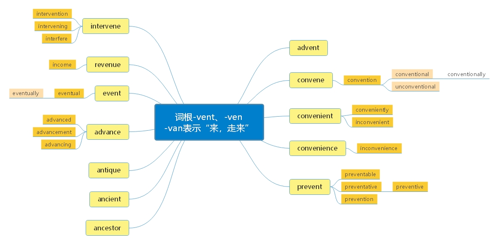

# 三、词根“-van， -ven， -vent”=come、 go

***

> **一、本节课目标**
>
> **1、掌握词根-van， -ven， -vent 的含义**
>
> **2、掌握前缀 anc-， ant-的功能**
>
> **3、掌握新词 72 个**
>
> **4、复习本节课所有单词**

***

## 词根“-van， -ven， -vent”=come、 go 表示“来、 走来”

***

> Advent
>
> "important arrival," 1742, an extended sense of Advent "season preceding Christmas" (in reference to the"coming" of Christ), late Old English, from Latin adventus "a coming, approach, arrival," in Church Latin "thecoming of the Savior," from past participle stem of advenire "arrive at, come to," from ad "to" (see ad-)+ venire "to come," from a suffixed form of PIE root \*gwa- "to go, come." Related: Adventual.

***

> **【 课堂笔记】**
>
> **1. 词源学网站： [www.etymonline](http://www.etymonline)**
>
> **2. ad- = to, 表示“去”**

***

## 核心词汇：

***

**advent** \['ædvənt] [英音](https://dict.youdao.com/dictvoice?audio=advent\&type=1)  [美音](https://dict.youdao.com/dictvoice?audio=advent\&type=2)  n. 来临、 出现 8282

**助记：** ad（=to） +vent（来临、 出现） →走过来、 走来了→来临、 出现

**搭配：** the advent of sth.（考）： …的出现写作

\*\*例句：\*\*伴随着电子书的出现，人们的阅读方式发生了巨大的变化。

With the advent/appearance/emergence of E-books, the way of reading for ordinary people havechanged/varied/transformed drastically.

> **【 课堂笔记】短语： with the advent of sth.伴随…的来临/出现**

**双语例句:** The advent of the computer has brought this sort of task within the bounds of possibility. [播放](https://dict.youdao.com/dictvoice?audio=The+advent+of+the+computer+has+brought+this+sort+of+task+within+the+bounds+of+possibility.&le=eng&le=eng&type=2)

电脑的出现使这种任务的完成成为可能。 

**双语例句:** Since the advent of television people have been prophesying the death of the book. [播放](https://dict.youdao.com/dictvoice?audio=Since+the+advent+of+television+people+have+been+prophesying+the+death+of+the+book.&le=eng&le=eng&type=2)

自从电视出现以来，人们一直在预言书的消亡。 

**双语例句:** The advent of new technologies has added about 4.2 million barrels per day to the crude oil market. [播放](https://dict.youdao.com/dictvoice?audio=The+advent+of+new+technologies+has+added+about+4.2+million+barrels+per+day+to+the+crude+oil+market.&le=eng&le=eng&type=2)

新技术的出现使原油市场每天增加了约420万桶的交易。 

**原声例句:** Analysts say the **advent** of the born-frees has changed political discourse and obliged leaders to stop relying for votes on their role in the independence struggle. [播放](https://dict.youdao.com/pureaudio?docid=2716374975874631779)

**原声例句:** \"You have seen massive evidence of huge social impacts in South America,farmers, up to 90,000 farmers, being displaced from their land in places like Paraguay because of the **advent** of massive GM intensive mono cultures, urban poverty increasing, food security has decreased all across the southern corner of Latin America dramatically over the last decade,\" [播放](https://dict.youdao.com/pureaudio?docid=-2413422741052426790)

**权威例句:** Many eras also proclaimed storytelling's demise: the **advent** of the printing press, radio, television, the Internet.  [播放](https://dict.youdao.com/dictvoice?audio=Many+eras+also+proclaimed+storytelling%27s+demise%3A+the+advent+of+the+printing+press%2C+radio%2C+television%2C+the+Internet.+&le=eng&type=2)

**权威例句:** The **advent** of coloured contact lenses has also enabled the darker skinned to westernise their eyes.  [播放](https://dict.youdao.com/dictvoice?audio=The+advent+of+coloured+contact+lenses+has+also+enabled+the+darker+skinned+to+westernise+their+eyes.+&le=eng&type=2)

**权威例句:** And most important, the Indian low-cost carrier arrived in 2003 with the **advent** of Air Deccan.  [播放](https://dict.youdao.com/dictvoice?audio=And+most+important%2C+the+Indian+low-cost+carrier+arrived+in+2003+with+the+advent+of+Air+Deccan.+&le=eng&type=2)

***

**convene** \[kən'vi\:n] [英音](https://dict.youdao.com/dictvoice?audio=convene\&type=1)  [美音](https://dict.youdao.com/dictvoice?audio=convene\&type=2)  v. 集合、 召集、 聚集 7956

**助记：** con（共同、 一起） +ven（=come： 来） +e→来到一起→集合、 召集、 聚集

**双语例句:** The UN had the foresight to convene a \"world assembly on ageing\" back in 1982, but that came and went. [播放](https://dict.youdao.com/dictvoice?audio=The+UN+had+the+foresight+to+convene+a+%22world+assembly+on+ageing%22+back+in+1982%2C+but+that+came+and+went.&le=eng&le=eng&type=2)

联合国早在1982年就有远见地召开了“老龄化问题世界大会”，但后来还是不了了之。 

**双语例句:** The committee will convene at 11.30 next Thursday. [播放](https://dict.youdao.com/dictvoice?audio=The+committee+will+convene+at+11.30+next+Thursday.&le=eng&le=eng&type=2)

委员会将在下星期四上午11:30开会。 

**双语例句:** We'd convene probably at least every week. [播放](https://dict.youdao.com/dictvoice?audio=We%27d+convene+probably+at+least+every+week.&le=eng&le=eng&type=2)

可能会每个星期召集他们一次。 

**原声例句:** He will **convene** the Cabinet in special session on Monday, possibly to finalize the agreement. [播放](https://dict.youdao.com/pureaudio?docid=8413926382971857340)

**原声例句:** Whether such an agreement is negotiated will only be known when the world's leaders **convene** in Copenhagen for the United Nations climate change summit early next month. [播放](https://dict.youdao.com/pureaudio?docid=812683066367437841)

**原声例句:** So we thought this was the time to actually **convene** policy makers together with civil society with small communities of people living with HIV, to get together under one roof and start talking what's next. [播放](https://dict.youdao.com/pureaudio?docid=-7887401639778708344)

**权威例句:** So I will **convene** a White House summit aimed at strengthening these lifelines of learning.  [播放](https://dict.youdao.com/dictvoice?audio=So+I+will+convene+a+White+House+summit+aimed+at+strengthening+these+lifelines+of+learning.+&le=eng&type=2)

**权威例句:** For example, it might be appropriate to **convene** an annual conference on security issues.  [播放](https://dict.youdao.com/dictvoice?audio=For+example%2C+it+might+be+appropriate+to+convene+an+annual+conference+on+security+issues.+&le=eng&type=2)

**权威例句:** The Tanzanian parliament has announced plans to **convene** a two-day debate to discuss options.  [播放](https://dict.youdao.com/dictvoice?audio=The+Tanzanian+parliament+has+announced+plans+to+convene+a+two-day+debate+to+discuss+options.+&le=eng&type=2)

***

**convention** \[kən'venʃən] [英音](https://dict.youdao.com/dictvoice?audio=convention\&type=1)  [美音](https://dict.youdao.com/dictvoice?audio=convention\&type=2)  n. 开会； 习俗 2494

**助记：** con（共同、 一起） +vent（=come： 来） +ion→来到一起→开会； 习俗、 惯例（“习俗、 惯例“等都是在“会议、 讨论”中规定出来的）

**双语例句:** The convention does not apply to us. [播放](https://dict.youdao.com/dictvoice?audio=The+convention+does+not+apply+to+us.&le=eng&le=eng&type=2)

该协定对我们不适用。 

**双语例句:** By convention the deputy leader was always a woman. [播放](https://dict.youdao.com/dictvoice?audio=By+convention+the+deputy+leader+was+always+a+woman.&le=eng&le=eng&type=2)

按惯例，这一领导职务的副职总是由女性担任。 

**双语例句:** The party hired her to stage-manage their convention. [播放](https://dict.youdao.com/dictvoice?audio=The+party+hired+her+to+stage-manage+their+convention.&le=eng&le=eng&type=2)

该党雇她精心策划他们的大会。 

**原声例句:** This year's show in Santa Fe took place over four days in March at the city's **convention** center and nearby hotels. [播放](https://dict.youdao.com/pureaudio?docid=711978461162650038)

**原声例句:** They said the constitutional **convention** had only given them the right to vote for limited slavery or unlimited slavery. [播放](https://dict.youdao.com/pureaudio?docid=8973897225309095568)

**原声例句:** So,a few months before the presidential election of eighteen ninety-two, America's agricultural Alliances held a joint **convention** in Omaha,Nebraska. [播放](https://dict.youdao.com/pureaudio?docid=-6547677788006737282)

**权威例句:** This **Convention** aims to provide adequate and effective protection of the rights of authors and artists.  [播放](https://dict.youdao.com/dictvoice?audio=This+Convention+aims+to+provide+adequate+and+effective+protection+of+the+rights+of+authors+and+artists.+&le=eng&type=2)

**权威例句:** The **Convention** helps to ensure the effectiveness of the World Anti-Doping Code (the Code).  [播放](https://dict.youdao.com/dictvoice?audio=The+Convention+helps+to+ensure+the+effectiveness+of+the+World+Anti-Doping+Code+%28the+Code%29.+&le=eng&type=2)

**权威例句:** Issues covered by the **Convention** include education, health, justice, care, safety, employment and culture.  [播放](https://dict.youdao.com/dictvoice?audio=Issues+covered+by+the+Convention+include+education%2C+health%2C+justice%2C+care%2C+safety%2C+employment+and+culture.+&le=eng&type=2)

***

**conventional** \[kən'venʃənəl] [英音](https://dict.youdao.com/dictvoice?audio=conventional\&type=1)  [美音](https://dict.youdao.com/dictvoice?audio=conventional\&type=2)  a. 传统的、 符合习俗的 2576

**搭配：** conventional values（考）：传统价值观 conventional lanes（考）：常规车道

> **【 课堂笔记】value （ 价值） → values （价值观）**

**双语例句:** Biofuels can be mixed with conventional fuels. [播放](https://dict.youdao.com/dictvoice?audio=Biofuels+can+be+mixed+with+conventional+fuels.&le=eng&le=eng&type=2)

生物燃料能够和传统燃料混合。 

**双语例句:** Months are a conventional subdivision of the year. [播放](https://dict.youdao.com/dictvoice?audio=Months+are+a+conventional+subdivision+of+the+year.&le=eng&le=eng&type=2)

月份是年的常规分支。 

**双语例句:** It's taken a long time to break out of my own conventional training. [播放](https://dict.youdao.com/dictvoice?audio=It%27s+taken+a+long+time+to+break+out+of+my+own+conventional+training.&le=eng&le=eng&type=2)

摆脱我自己的传统训练花了很长一段时间。 

**原声例句:** Mister Galbraith also used the term \"**conventional** wisdom\" in the book. [播放](https://dict.youdao.com/pureaudio?docid=-4953912383265319945)

**原声例句:** I hated **conventional** art. I began to live.\" [播放](https://dict.youdao.com/pureaudio?docid=7274142568534957611)

**原声例句:** And that sparse array of wires has exactly the same light absorption and electricity-collection properties as the **conventional** silicon wafer cell.\" [播放](https://dict.youdao.com/pureaudio?docid=5603561699048667130)

**权威例句:** The combination produces a combined 438 horsepower, with smooth transitions between battery-powered mode and **conventional** mode.  [播放](https://dict.youdao.com/dictvoice?audio=The+combination+produces+a+combined+438+horsepower%2C+with+smooth+transitions+between+battery-powered+mode+and+conventional+mode.+&le=eng&type=2)

**权威例句:** Despite **conventional** wisdom about the danger of shark attacks, diving with threshers is relatively safe.  [播放](https://dict.youdao.com/dictvoice?audio=Despite+conventional+wisdom+about+the+danger+of+shark+attacks%2C+diving+with+threshers+is+relatively+safe.+&le=eng&type=2)

**权威例句:** Coeur uses **conventional** means to process the ore, first blasting it from open pits and tunnels.  [播放](https://dict.youdao.com/dictvoice?audio=Coeur+uses+conventional+means+to+process+the+ore%2C+first+blasting+it+from+open+pits+and+tunnels.+&le=eng&type=2)

***

**conventionally** \[kən'vɛnʃənəli] [英音](https://dict.youdao.com/dictvoice?audio=conventionally\&type=1)  [美音](https://dict.youdao.com/dictvoice?audio=conventionally\&type=2)  adv. 照惯例，照常套 16023

**双语例句:** Men still wore their hair short and dressed conventionally. [播放](https://dict.youdao.com/dictvoice?audio=Men+still+wore+their+hair+short+and+dressed+conventionally.&le=eng&le=eng&type=2)

男人还是留着短发，着装传统。 

**双语例句:** Organically grown produce does not differ greatly in appearance from conventionally grown crops. [播放](https://dict.youdao.com/dictvoice?audio=Organically+grown+produce+does+not+differ+greatly+in+appearance+from+conventionally+grown+crops.&le=eng&le=eng&type=2)

有机农产品与传统方法种植的农产品在外观上没有太大的区别。 

**双语例句:** However, by showing that television promotes none of the dangerous effects as conventionally believed, Anderson suggests that television cannot be condemned without considering other influences. [播放](https://dict.youdao.com/dictvoice?audio=However%2C+by+showing+that+television+promotes+none+of+the+dangerous+effects+as+conventionally+believed%2C+Anderson+suggests+that+television+cannot+be+condemned+without+considering+other+influences.&le=eng&le=eng&type=2)

然而，通过表明电视并不像人们通常认为的那样产生任何有害作用，安德森认为在没有考虑其他影响因素的情况下，不能单单归咎于电视。 

**原声例句:** \"In general,we find that genetically engineered crops have had fewer adverse effects on the environment than non-GE crops produced **conventionally**.\" [播放](https://dict.youdao.com/pureaudio?docid=-1367480812124703047)

**原声例句:** And as in all of these early lyrics, Jove **conventionally** throughout the Renaissance is used as a name within these classical fictions to signify the Christian God.

**原声例句:** We don't know precisely what Plato thought, but we are helped, at least, by a kind of intellectual autobiography that he wrote and that we still have, in what is \" **conventionally** referred to as The Seventh Letter.

**权威例句:** Young companies are even making bets that this much data cannot be looked at **conventionally**.  [播放](https://dict.youdao.com/dictvoice?audio=Young+companies+are+even+making+bets+that+this+much+data+cannot+be+looked+at+conventionally.+&le=eng&type=2)

**权威例句:** Where trading costs are not available, the **conventionally** reported expense ratio is shown in italics.  [播放](https://dict.youdao.com/dictvoice?audio=Where+trading+costs+are+not+available%2C+the+conventionally+reported+expense+ratio+is+shown+in+italics.+&le=eng&type=2)

**权威例句:** As **conventionally** measured, stock prices quadrupled in the 1990s and then came crashing down.  [播放](https://dict.youdao.com/dictvoice?audio=As+conventionally+measured%2C+stock+prices+quadrupled+in+the+1990s+and+then+came+crashing+down.+&le=eng&type=2)

***

**unconventional** \[ʌnkən'venʃ(ə)n(ə)l] [英音](https://dict.youdao.com/dictvoice?audio=unconventional\&type=1)  [美音](https://dict.youdao.com/dictvoice?audio=unconventional\&type=2)  adj. 非常规的；非传统的；不依惯例的 10196

**双语例句:** The vaccine had been produced by an unconventional technique. [播放](https://dict.youdao.com/dictvoice?audio=The+vaccine+had+been+produced+by+an+unconventional+technique.&le=eng&le=eng&type=2)

这种疫苗是用非常规的技术生产出来的。 

**双语例句:** Despite his unconventional methods, he has inspired students more than anyone else. [播放](https://dict.youdao.com/dictvoice?audio=Despite+his+unconventional+methods%2C+he+has+inspired+students+more+than+anyone+else.&le=eng&le=eng&type=2)

虽然用的是非常规的方法，他却比其他人更多地启发了学生。 

**双语例句:** You're deliberately unconventional. Even your choice of clothes is a statement of your nonconformity. [播放](https://dict.youdao.com/dictvoice?audio=You%27re+deliberately+unconventional.+Even+your+choice+of+clothes+is+a+statement+of+your+nonconformity.&le=eng&le=eng&type=2)

你故意有悖传统，甚至连着装都在表明你与众不同。 

**原声例句:** Bernanke's strategy to boost the economy includes **unconventional** lending programs, to unlock credit and stabilize the financial markets. [播放](https://dict.youdao.com/pureaudio?docid=-2587582566248022659)

**原声例句:** Israeli officials say the capture of the ship is a message to Iran that Israel is prepared to take **unconventional** steps to defend itself. [播放](https://dict.youdao.com/pureaudio?docid=2672934502077806943)

**原声例句:** Her literary style is instantly recognizable - short sentences,partial rhymes and **unconventional** punctuation. [播放](https://dict.youdao.com/pureaudio?docid=9105598887394825793)

**权威例句:** EatWith is only one of several sites that bring strangers together for **unconventional** dining experiences.  [播放](https://dict.youdao.com/dictvoice?audio=EatWith+is+only+one+of+several+sites+that+bring+strangers+together+for+unconventional+dining+experiences.+&le=eng&type=2)

**权威例句:** He came back to Motown in 1978, joined GM and established a reputation for **unconventional** ideas.  [播放](https://dict.youdao.com/dictvoice?audio=He+came+back+to+Motown+in+1978%2C+joined+GM+and+established+a+reputation+for+unconventional+ideas.+&le=eng&type=2)

**权威例句:** Their **unconventional** nature makes it hard to compare binary options with regular commodity contracts.  [播放](https://dict.youdao.com/dictvoice?audio=Their+unconventional+nature+makes+it+hard+to+compare+binary+options+with+regular+commodity+contracts.+&le=eng&type=2)

***

**convenience** \[kən'viːnɪəns] [英音](https://dict.youdao.com/dictvoice?audio=convenience\&type=1)  [美音](https://dict.youdao.com/dictvoice?audio=convenience\&type=2)  n. 便利；便利的事物；厕所 4945

**双语例句:** They may use a credit card for convenience. [播放](https://dict.youdao.com/dictvoice?audio=They+may+use+a+credit+card+for+convenience.&le=eng&le=eng&type=2)

他们可以为了方便而使用信用卡。 

**双语例句:** The hotel combines comfort with convenience. [播放](https://dict.youdao.com/dictvoice?audio=The+hotel+combines+comfort+with+convenience.&le=eng&le=eng&type=2)

这家旅馆既舒适又方便。 

**双语例句:** Frozen fish is a very healthy convenience food. [播放](https://dict.youdao.com/dictvoice?audio=Frozen+fish+is+a+very+healthy+convenience+food.&le=eng&le=eng&type=2)

冻鱼是一种非常健康的方便食品。 

**原声例句:** Consumers like cloud computing because of the **convenience** and fun of getting email and social network information anywhere. [播放](https://dict.youdao.com/pureaudio?docid=3385045447805822830)

**原声例句:** \"It might be privacy, it might be personal liberty, it might be the **convenience** of the traveling public. [播放](https://dict.youdao.com/pureaudio?docid=-6300526021602134814)

**原声例句:** \"As the supply increases, we do think that access and **convenience** and ease of getting vaccinated will improve,\" [播放](https://dict.youdao.com/pureaudio?docid=-6306400163877542120)

**权威例句:** It serves consumers through its retail websites with a focus on selection, price, and **convenience**.  [播放](https://dict.youdao.com/dictvoice?audio=It+serves+consumers+through+its+retail+websites+with+a+focus+on+selection%2C+price%2C+and+convenience.+&le=eng&type=2)

**权威例句:** Panamera S E-Hybrid sets new standards in performance, efficiency, and **convenience** in everyday use.  [播放](https://dict.youdao.com/dictvoice?audio=Panamera+S+E-Hybrid+sets+new+standards+in+performance%2C+efficiency%2C+and+convenience+in+everyday+use.+&le=eng&type=2)

**权威例句:** In addition, an expanded lineup of assistance systems is available for safety and **convenience**.  [播放](https://dict.youdao.com/dictvoice?audio=In+addition%2C+an+expanded+lineup+of+assistance+systems+is+available+for+safety+and+convenience.+&le=eng&type=2)

***

**convenient** \[kən'viːnɪənt] [英音](https://dict.youdao.com/dictvoice?audio=convenient\&type=1)  [美音](https://dict.youdao.com/dictvoice?audio=convenient\&type=2)  adj. 方便的 5438

> 【 课堂笔记】
>
> 1\. convenient \[kən'viːnɪənt] adj. 方便的
>
> \*\* 助记：\*\* con （加强语气） + ven（走） + ent （形容词后缀） →靠走就能到的→附近的
>
> 2\. 便利店： convenience store
>
> 3\. -ance-ence -ancy -ency 大多数情况下为名词后缀；没有实际含义极少数情况下为动词后缀， 如
>
> finance v. 资助

**双语例句:** If it's convenient I can come tomorrow. [播放](https://dict.youdao.com/dictvoice?audio=If+it%27s+convenient+I+can+come+tomorrow.&le=eng&le=eng&type=2)

方便的话，我可以明天过来。 

**双语例句:** I'll call back at a more convenient time. [播放](https://dict.youdao.com/dictvoice?audio=I%27ll+call+back+at+a+more+convenient+time.&le=eng&le=eng&type=2)

在方便的时候我会回电话的。 

**双语例句:** It is very convenient to pay by credit card. [播放](https://dict.youdao.com/dictvoice?audio=It+is+very+convenient+to+pay+by+credit+card.&le=eng&le=eng&type=2)

用信用卡付款非常方便。 

**原声例句:** It is in a **convenient** downtown location in the multi-story Wosk Center, which is part of Simon Fraser University. [播放](https://dict.youdao.com/pureaudio?docid=-3193191082786329940)

**原声例句:** Funk says it's not the same as one-on-one counseling, but she points out that the personal approach may not always be possible or **convenient**. [播放](https://dict.youdao.com/pureaudio?docid=-6511676246618346099)

**原声例句:** Arkhipov says honest bureaucrats are outcasts who are surrounded by an atmosphere of intolerance, because they are not **convenient** to bureaucrats or embezzlers, whose main goal is to cast the minority aside. [播放](https://dict.youdao.com/pureaudio?docid=9033879813670862376)

**权威例句:** In addition to its historical appeal, Pangani is a **convenient** jumping-off point for many other nearby attractions.  [播放](https://dict.youdao.com/dictvoice?audio=In+addition+to+its+historical+appeal%2C+Pangani+is+a+convenient+jumping-off+point+for+many+other+nearby+attractions.+&le=eng&type=2)

**权威例句:** And it's **convenient**, too, as the catfish farms in the South are close to the cotton fields.  [播放](https://dict.youdao.com/dictvoice?audio=And+it%27s+convenient%2C+too%2C+as+the+catfish+farms+in+the+South+are+close+to+the+cotton+fields.+&le=eng&type=2)

**权威例句:** Congress sometimes distributes these subsidies through the tax code because it is administratively more **convenient**.  [播放](https://dict.youdao.com/dictvoice?audio=Congress+sometimes+distributes+these+subsidies+through+the+tax+code+because+it+is+administratively+more+convenient.+&le=eng&type=2)

***

**conveniently** \[kən'vi\:njəntli] [英音](https://dict.youdao.com/dictvoice?audio=conveniently\&type=1)  [美音](https://dict.youdao.com/dictvoice?audio=conveniently\&type=2)  adv. 便利地；合宜地 11879

> 【 课堂笔记】正常情况下：&#x20;
>
> 名词 + ly →形容词形容词&#x20;
>
> \+ ly →副词例如：coward（胆小鬼） + ly → cowardly (胆小的)

**双语例句:** The hotel is conveniently situated close to the beach. [播放](https://dict.youdao.com/dictvoice?audio=The+hotel+is+conveniently+situated+close+to+the+beach.&le=eng&le=eng&type=2)

那家旅馆坐落在海滩附近，非常方便。 

**双语例句:** It was very conveniently situated just across the road from the City Reference Library. [播放](https://dict.youdao.com/dictvoice?audio=It+was+very+conveniently+situated+just+across+the+road+from+the+City+Reference+Library.&le=eng&le=eng&type=2)

它所处位置非常便利，就在市参考图书馆的马路对面。 

**双语例句:** Tom could lift it, after an awkward fashion, but could not carry it conveniently. [播放](https://dict.youdao.com/dictvoice?audio=Tom+could+lift+it%2C+after+an+awkward+fashion%2C+but+could+not+carry+it+conveniently.&le=eng&le=eng&type=2)

汤姆勉强能把它提起来，但提着走很不方便。 

**原声例句:** On Thursday, we'll look at why that allows you to do lots of things more **conveniently** than you can do without mutation.

**原声例句:** So this series is broken into two terms that are **conveniently** representing two physical ideas.

**原声例句:** We overlook, we **conveniently** overlook a number of facts about him, his hostility to democracy, we'll see that in the Republic but we've seen it already to some degree in the Apology.

**权威例句:** The next step in Zeneca's research called for another service **conveniently** available at Incyte.  [播放](https://dict.youdao.com/dictvoice?audio=The+next+step+in+Zeneca%27s+research+called+for+another+service+conveniently+available+at+Incyte.+&le=eng&type=2)

**权威例句:** This approach **conveniently** excluded Perkins, and Dunn pointed out that he was likely to be furious.  [播放](https://dict.youdao.com/dictvoice?audio=This+approach+conveniently+excluded+Perkins%2C+and+Dunn+pointed+out+that+he+was+likely+to+be+furious.+&le=eng&type=2)

**权威例句:** Thanks to its connected services, it can be **conveniently** checked and configured via the internet.  [播放](https://dict.youdao.com/dictvoice?audio=Thanks+to+its+connected+services%2C+it+can+be+conveniently+checked+and+configured+via+the+internet.+&le=eng&type=2)

***

**inconvenience** \[ɪnkən'viːnɪəns] [英音](https://dict.youdao.com/dictvoice?audio=inconvenience\&type=1)  [美音](https://dict.youdao.com/dictvoice?audio=inconvenience\&type=2)  n. 麻烦；不便 11019

> 【 课堂笔记】im- in- il- ir- i
>
> &#x20;1\) not 表示“相反/否定”
>
> 2） =in 表示“进入”
>
> 3） =en 表示“使”
>
> 以上前缀的功能是一样的，都是由前缀 in-发生辅音同化转化而来， 如 in- 遇到 regular →irregular

**双语例句:** The airline regrets any inconvenience. [播放](https://dict.youdao.com/dictvoice?audio=The+airline+regrets+any+inconvenience.&le=eng&le=eng&type=2)

航空公司对所造成的任何不便表示歉意。 

**双语例句:** I have already been put to considerable inconvenience. [播放](https://dict.youdao.com/dictvoice?audio=I+have+already+been+put+to+considerable+inconvenience.&le=eng&le=eng&type=2)

我已经被添了相当的麻烦了。 

**双语例句:** We apologize for any inconvenience caused during the repairs. [播放](https://dict.youdao.com/dictvoice?audio=We+apologize+for+any+inconvenience+caused+during+the+repairs.&le=eng&le=eng&type=2)

我们对在修理过程中所造成的任何不便表示歉意。 

**原声例句:** Hong Kong's leader Donald Tsang has apologized for the **inconvenience**. [播放](https://dict.youdao.com/pureaudio?docid=6612827530228879615)

**原声例句:** The main **inconvenience** is that everyone can enforce the law of nature.

**原声例句:** And Locke observes that when people are the judges of their own cases, they tend to get carried away, and this gives rise to the **inconvenience** in the state of nature.

**权威例句:** Raymond Shaw, defending, told the court that Brodkin wanted to apologise for the **inconvenience** he caused.  [播放](https://dict.youdao.com/dictvoice?audio=Raymond+Shaw%2C+defending%2C+told+the+court+that+Brodkin+wanted+to+apologise+for+the+inconvenience+he+caused.+&le=eng&type=2)

**权威例句:** She derided the sanctions as little more than an **\"inconvenienc**e\" to a relative few.  [播放](https://dict.youdao.com/dictvoice?audio=She+derided+the+sanctions+as+little+more+than+an+%22inconvenience%22+to+a+relative+few.+&le=eng&type=2)

**权威例句:** Bus Eireann apologised to passengers for any **inconvenience** caused due to the industrial action.  [播放](https://dict.youdao.com/dictvoice?audio=Bus+Eireann+apologised+to+passengers+for+any+inconvenience+caused+due+to+the+industrial+action.+&le=eng&type=2)

***

**inconvenient** \[ɪnkən'viːnɪənt] [英音](https://dict.youdao.com/dictvoice?audio=inconvenient\&type=1)  [美音](https://dict.youdao.com/dictvoice?audio=inconvenient\&type=2)  adj. 不便的；打扰的 13872

**双语例句:** For administrative purposes, it was very inconvenient to have years of different lengths. [播放](https://dict.youdao.com/dictvoice?audio=For+administrative+purposes%2C+it+was+very+inconvenient+to+have+years+of+different+lengths.&le=eng&le=eng&type=2)

就管理而言，年份长度不同很不方便。 

**双语例句:** People still found coins inconvenient to carry, when they wanted to buy something expensive. [播放](https://dict.youdao.com/dictvoice?audio=People+still+found+coins+inconvenient+to+carry%2C+when+they+wanted+to+buy+something+expensive.&le=eng&le=eng&type=2)

当人们想要买贵重物品时，仍然觉得携带硬币不方便。 

**双语例句:** \"It's no disgrace to be colored,\" the black entertainer Bert Williams famously observed early in the century, \"but it is awfully inconvenient.\" [播放](https://dict.youdao.com/dictvoice?audio=%22It%27s+no+disgrace+to+be+colored%2C%22+the+black+entertainer+Bert+Williams+famously+observed+early+in+the+century%2C+%22but+it+is+awfully+inconvenient.%22&le=eng&le=eng&type=2)

黑人表演者伯特·威廉姆斯在本世纪初提出了一条著名的观点：“作为有色人种并不丢脸，但是极其不方便。” 

**权威例句:** We think Al Gore would agree - it is an **inconvenient** truth that can no longer be ignored.  [播放](https://dict.youdao.com/dictvoice?audio=We+think+Al+Gore+would+agree+-+it+is+an+inconvenient+truth+that+can+no+longer+be+ignored.+&le=eng&type=2)

**权威例句:** An **inconvenient** truth, not adequately addressed by Al Gore in his movie, is that environmentalism makes life complicated.  [播放](https://dict.youdao.com/dictvoice?audio=An+inconvenient+truth%2C+not+adequately+addressed+by+Al+Gore+in+his+movie%2C+is+that+environmentalism+makes+life+complicated.+&le=eng&type=2)

**权威例句:** As soon as the OBR provide **inconvenient** facts John Swinney resorts to trashing its reputation.  [播放](https://dict.youdao.com/dictvoice?audio=As+soon+as+the+OBR+provide+inconvenient+facts+John+Swinney+resorts+to+trashing+its+reputation.+&le=eng&type=2)

***

**prevent** \[pri'vent] [英音](https://dict.youdao.com/dictvoice?audio=prevent\&type=1)  [美音](https://dict.youdao.com/dictvoice?audio=prevent\&type=2)  v. 防止、预防、阻止 1087

**助记：** pre（提前、 先） +vent（来） →先来（演练） 一遍→预防

**搭配：** prevent them from being marginalized（考）：阻止他们被同化

**例句：** At last, Greater London Council took actions to prevent this disaster from happening again.

最终，伦敦市议会采取行动去防止这个灾难再次发生。

**仿写例句：** 教育相关部门应该采取行动其防止中文被边缘化。

The Ministry of Education should take some actions/measures/steps to prevent Chinese frombeing marginalized.

> **【 课堂笔记】**
>
> **前缀**
>
> **pre- 提前；前面 静态（向前）**
>
> **pro- =forward 向前 动态（向前）**

**preventable** \[pri'vɛntəbl] [英音](https://dict.youdao.com/dictvoice?audio=preventable\&type=1)  [美音](https://dict.youdao.com/dictvoice?audio=preventable\&type=2)  adj. 可预防的；可阻止的；可防止的 16996

> 【 课堂笔记】
>
> \-able -ible -ile 形容词后缀&#x20;
>
> 1） 可以…的； 能够…的，
>
> 2） 容易…的
>
> 3） 极少数情况下， 做名词后缀， 如 vary→variables（变量）
>
> &#x20;字母“b”不发音，如 tomb/climb/numb, 没有含义，常被省略掉。
>
> &#x20;中文和英文的区别：中文是象形文字：煎、煮英文是语音文字：如果一个字母不发音，则其是没有实际含义的，而字母“b”经常不参与发音， 因此， 字母“b”没有实际含义。 如： number→numerous

**双语例句:** He added that he had warned McLaughlin that three preventable accidents in one year could lead to his discharge, as indeed it should. [播放](https://dict.youdao.com/dictvoice?audio=He+added+that+he+had+warned+McLaughlin+that+three+preventable+accidents+in+one+year+could+lead+to+his+discharge%2C+as+indeed+it+should.&le=eng&le=eng&type=2)

他补充说，他曾警告过麦克劳克林，一年内发生三起可预防的事故他可能会被解雇，事实上也应该如此。 

**双语例句:** Forty thousand children a day die from preventable diseases. [播放](https://dict.youdao.com/dictvoice?audio=Forty+thousand+children+a+day+die+from+preventable+diseases.&le=eng&le=eng&type=2)

每天有四万儿童死于本可以防止的疾病。 

**双语例句:** Smoking is the biggest preventable cause of death and disease. [播放](https://dict.youdao.com/dictvoice?audio=Smoking+is+the+biggest+preventable+cause+of+death+and+disease.&le=eng&le=eng&type=2)

吸烟是造成不必要疾病和死亡的最大原因。 

**权威例句:** The Health and Safety Executive (HSE) said at the time that Steven's death was \"entirely **preventable**\".  [播放](https://dict.youdao.com/dictvoice?audio=The+Health+and+Safety+Executive+%28HSE%29+said+at+the+time+that+Steven%27s+death+was+%22entirely+preventable%22.+&le=eng&type=2)

**权威例句:** In any given year, between 40, 000 and 98, 000 people die from **preventable** medical errors.  [播放](https://dict.youdao.com/dictvoice?audio=In+any+given+year%2C+between+40%2C+000+and+98%2C+000+people+die+from+preventable+medical+errors.+&le=eng&type=2)

**权威例句:** \"Almost all newborn deaths originate from **preventable** and treatable causes, \" the report authors write.  [播放](https://dict.youdao.com/dictvoice?audio=%22Almost+all+newborn+deaths+originate+from+preventable+and+treatable+causes%2C+%22+the+report+authors+write.+&le=eng&type=2)

**双语例句:** These methods prevent pregnancy. [播放](https://dict.youdao.com/dictvoice?audio=These+methods+prevent+pregnancy.&le=eng&le=eng&type=2)

这些方法预防怀孕。 

**双语例句:** We are taking steps to prevent pollution. [播放](https://dict.youdao.com/dictvoice?audio=We+are+taking+steps+to+prevent+pollution.&le=eng&le=eng&type=2)

我们正在采取措施防止污染。 

**双语例句:** Regular exercise helps prevent weight gain. [播放](https://dict.youdao.com/dictvoice?audio=Regular+exercise+helps+prevent+weight+gain.&le=eng&le=eng&type=2)

经常锻炼有助于防止体重增加。 

**原声例句:** Farmers may not be able to **prevent** natural disasters, but they can at least try their best to reduce losses. [播放](https://dict.youdao.com/pureaudio?docid=-8057322405724607929)

**原声例句:** University of Arizona extension experts say covering plants and small trees with cloth or paper can help **prevent** frost damage. [播放](https://dict.youdao.com/pureaudio?docid=-3759478288267886560)

**原声例句:** The American Cancer Society says governments can do things to help **prevent** the increase in cancer cases and deaths. [播放](https://dict.youdao.com/pureaudio?docid=-3337680946646488765)

**权威例句:** We can **prevent** violence by enhancing early brain development and reducing exposure to toxins.  [播放](https://dict.youdao.com/dictvoice?audio=We+can+prevent+violence+by+enhancing+early+brain+development+and+reducing+exposure+to+toxins.+&le=eng&type=2)

**权威例句:** Ratings would have to be confidential to **prevent** investors from free-riding on each other.  [播放](https://dict.youdao.com/dictvoice?audio=Ratings+would+have+to+be+confidential+to+prevent+investors+from+free-riding+on+each+other.+&le=eng&type=2)

**权威例句:** Is there anything you can do to **prevent** MRSA in any of its variants?  [播放](https://dict.youdao.com/dictvoice?audio=Is+there+anything+you+can+do+to+prevent+MRSA+in+any+of+its+variants%3F+&le=eng&type=2)

***

**preventative** \[prɪ'ventətɪv] [英音](https://dict.youdao.com/dictvoice?audio=preventative\&type=1)  [美音](https://dict.youdao.com/dictvoice?audio=preventative\&type=2)  adj. 预防性的; 19828

> 【 课堂笔记】释义： =preventive 预防性的；防备的&#x20;
>
> Preventive actions are intended to help preventthings such as disease or crime.
>
> **例句：** People accused the ministry of failing to take adequate preventive measures.人们谴责该政府部门未能采取足够的预防措施。

**双语例句:** The main preventative agent is simply water. [播放](https://dict.youdao.com/dictvoice?audio=The+main+preventative+agent+is+simply+water.&le=eng&le=eng&type=2)

主要的防护剂就是水。 

**双语例句:** They cover preventative care for the local resident. [播放](https://dict.youdao.com/dictvoice?audio=They+cover+preventative+care+for+the+local+resident.&le=eng&le=eng&type=2)

他们为当地居民提供预防保健服务。 

**双语例句:** All information used in the development of national preventative policies would become generally available. [播放](https://dict.youdao.com/dictvoice?audio=All+information+used+in+the+development+of+national+preventative+policies+would+become+generally+available.&le=eng&le=eng&type=2)

制定国家预防政策所使用的所有信息将普遍可用。 

**权威例句:** Nichols said the ban was not prompted by any specific threat, but is a **preventative** measure.  [播放](https://dict.youdao.com/dictvoice?audio=Nichols+said+the+ban+was+not+prompted+by+any+specific+threat%2C+but+is+a+preventative+measure.+&le=eng&type=2)

**权威例句:** Importantly, abortion and addiction and HIV-AIDS and love are different issues from **preventative** mastectomy.  [播放](https://dict.youdao.com/dictvoice?audio=Importantly%2C+abortion+and+addiction+and+HIV-AIDS+and+love+are+different+issues+from+preventative+mastectomy.+&le=eng&type=2)

**权威例句:** With more **preventative** care, the theory goes, the less clogged those clinics should be.  [播放](https://dict.youdao.com/dictvoice?audio=With+more+preventative+care%2C+the+theory+goes%2C+the+less+clogged+those+clinics+should+be.+&le=eng&type=2)

***

**prevention** \[prɪ'venʃn] [英音](https://dict.youdao.com/dictvoice?audio=prevention\&type=1)  [美音](https://dict.youdao.com/dictvoice?audio=prevention\&type=2)  n. 预防；阻止；妨碍 3996

> 【 课堂笔记】
>
> \-ion 99.9%情况下，为名词后缀；极少数情况下，为动词后缀，如 mention n/v. 提及/提到

**双语例句:** Crime prevention had to be given more prominence. [播放](https://dict.youdao.com/dictvoice?audio=Crime+prevention+had+to+be+given+more+prominence.&le=eng&le=eng&type=2)

犯罪预防得给予更多重视。 

**双语例句:** Calcium may aid in the prevention of colon cancer. [播放](https://dict.youdao.com/dictvoice?audio=Calcium+may+aid+in+the+prevention+of+colon+cancer.&le=eng&le=eng&type=2)

钙可能有助于预防结肠癌。 

**双语例句:** Stores spend more and more on crime prevention every year. [播放](https://dict.youdao.com/dictvoice?audio=Stores+spend+more+and+more+on+crime+prevention+every+year.&le=eng&le=eng&type=2)

商店每年在防止犯罪方面的花费越来越多。 

**原声例句:** In Kenya,a project aims to educate girls about H.I.V.**prevention** while helping them stay in school during their monthly periods. [播放](https://dict.youdao.com/pureaudio?docid=8558473088085596893)

**原声例句:** The Centers for Disease Control and **Prevention** says heart disease is the leading cause of death in the United States. [播放](https://dict.youdao.com/pureaudio?docid=-5488691266712780742)

**原声例句:** In the past,the W.H.O.and experts with America's Centers for Disease Control and **Prevention** noted guidance for disease spread on airplanes. [播放](https://dict.youdao.com/pureaudio?docid=335326994408679155)

**权威例句:** It is broadly accepted that there is a balance to be struck between crime **prevention** and individual freedom.  [播放](https://dict.youdao.com/dictvoice?audio=It+is+broadly+accepted+that+there+is+a+balance+to+be+struck+between+crime+prevention+and+individual+freedom.+&le=eng&type=2)

**权威例句:** It encourages doctors, clinics, hospitals and insurers to join forces and beef up prevention-oriented services.  [播放](https://dict.youdao.com/dictvoice?audio=It+encourages+doctors%2C+clinics%2C+hospitals+and+insurers+to+join+forces+and+beef+up+prevention-oriented+services.+&le=eng&type=2)

**权威例句:** Now reputation is beginning to be used to improve the effectiveness of Intrusion **Prevention** Systems (IPS).  [播放](https://dict.youdao.com/dictvoice?audio=Now+reputation+is+beginning+to+be+used+to+improve+the+effectiveness+of+Intrusion+Prevention+Systems+%28IPS%29.+&le=eng&type=2)

***

**preventive** \[prɪ'ventɪv] [英音](https://dict.youdao.com/dictvoice?audio=preventive\&type=1)  [美音](https://dict.youdao.com/dictvoice?audio=preventive\&type=2)  n. 预防药；预防法； adj. 预防的，防止的 7745

**双语例句:** We must take preventive measures to reduce crime in the area. [播放](https://dict.youdao.com/dictvoice?audio=We+must+take+preventive+measures+to+reduce+crime+in+the+area.&le=eng&le=eng&type=2)

我们必须采取预防措施来减少这个地区的犯罪。 

**双语例句:** The police were able to take preventive action and avoid a possible riot. [播放](https://dict.youdao.com/dictvoice?audio=The+police+were+able+to+take+preventive+action+and+avoid+a+possible+riot.&le=eng&le=eng&type=2)

警方及时采取防范措施，避免了可能发生的骚乱。 

**双语例句:** Too much is spent on curative medicine and too little on preventive medicine. [播放](https://dict.youdao.com/dictvoice?audio=Too+much+is+spent+on+curative+medicine+and+too+little+on+preventive+medicine.&le=eng&le=eng&type=2)

在治疗医学上花费太多，而在预防医学上花费太少。 

**原声例句:** They include making sure that every adult and child has a right to **preventive** medical services. [播放](https://dict.youdao.com/pureaudio?docid=5089221116433319565)

**原声例句:** The U.N.AIDS agency gives credit to better use of **preventive** measures. [播放](https://dict.youdao.com/pureaudio?docid=-7022383136267185768)

**原声例句:** The guidelines are from the United States **Preventive** Services Task Force. [播放](https://dict.youdao.com/pureaudio?docid=-190636757816282464)

**权威例句:** Or if you've gotten more **preventive** care or more contraception services covered under your policy.  [播放](https://dict.youdao.com/dictvoice?audio=Or+if+you%27ve+gotten+more+preventive+care+or+more+contraception+services+covered+under+your+policy.+&le=eng&type=2)

**权威例句:** It's also important to recognize that even a **preventive** mastectomy is not a guarantee against cancer.  [播放](https://dict.youdao.com/dictvoice?audio=It%27s+also+important+to+recognize+that+even+a+preventive+mastectomy+is+not+a+guarantee+against+cancer.+&le=eng&type=2)

**权威例句:** Because they are not deterrable, the argument for taking **preventive** measures against them becomes more compelling.  [播放](https://dict.youdao.com/dictvoice?audio=Because+they+are+not+deterrable%2C+the+argument+for+taking+preventive+measures+against+them+becomes+more+compelling.+&le=eng&type=2)

***

**intervene** \[,intə'vi\:n] [英音](https://dict.youdao.com/dictvoice?audio=intervene\&type=1)  [美音](https://dict.youdao.com/dictvoice?audio=intervene\&type=2)  v. 干涉、 干预 5157

**助记：** inter（=between： 之间） +ven（来） +e→来到两者之间→干涉、 干预

**双语例句:** The problem lies in deciding when to intervene. [播放](https://dict.youdao.com/dictvoice?audio=The+problem+lies+in+deciding+when+to+intervene.&le=eng&le=eng&type=2)

问题在于决定何时介入。 

**双语例句:** We may have to intervene militarily in the area. [播放](https://dict.youdao.com/dictvoice?audio=We+may+have+to+intervene+militarily+in+the+area.&le=eng&le=eng&type=2)

我们可能只好对这一地区进行军事干涉。 

**双语例句:** The security forces had to intervene to prevent the situation worsening. [播放](https://dict.youdao.com/dictvoice?audio=The+security+forces+had+to+intervene+to+prevent+the+situation+worsening.&le=eng&le=eng&type=2)

那些安全部队不得不干预以阻止形势变得更糟。 

**原声例句:** She spent the next four years documenting the events and the world's failure the **intervene**. [播放](https://dict.youdao.com/pureaudio?docid=-4123843890654118725)

**原声例句:** China also asked the World Trade Organization to **intervene**, to avoid a trade war. [播放](https://dict.youdao.com/pureaudio?docid=-3605943716142386437)

**原声例句:** But,something would **intervene** that would change the direction of Winslow Homer's artistic work. [播放](https://dict.youdao.com/pureaudio?docid=3381344466478198643)

**权威例句:** That's the core of the problem and the reason Buffett was asked to **intervene**.  [播放](https://dict.youdao.com/dictvoice?audio=That%27s+the+core+of+the+problem+and+the+reason+Buffett+was+asked+to+intervene.+&le=eng&type=2)

**权威例句:** Unless other factors **intervene**, adding more of these gases will tend to warm the atmosphere.  [播放](https://dict.youdao.com/dictvoice?audio=Unless+other+factors+intervene%2C+adding+more+of+these+gases+will+tend+to+warm+the+atmosphere.+&le=eng&type=2)

**权威例句:** That means they're prone to **intervene** and take positive action when no one else will.  [播放](https://dict.youdao.com/dictvoice?audio=That+means+they%27re+prone+to+intervene+and+take+positive+action+when+no+one+else+will.+&le=eng&type=2)

***

**intervention** \[ɪntə'venʃən] [英音](https://dict.youdao.com/dictvoice?audio=intervention\&type=1)  [美音](https://dict.youdao.com/dictvoice?audio=intervention\&type=2)  n. 干涉、 干预 1940

**搭配：** policy interventions（考）：政策干预

**双语例句:** The incident was used as a pretext for intervention in the area. [播放](https://dict.youdao.com/dictvoice?audio=The+incident+was+used+as+a+pretext+for+intervention+in+the+area.&le=eng&le=eng&type=2)

这次事件成了干涉那个地区的借口。 

**双语例句:** Military intervention will only aggravate the conflict even further. [播放](https://dict.youdao.com/dictvoice?audio=Military+intervention+will+only+aggravate+the+conflict+even+further.&le=eng&le=eng&type=2)

军事介入只会使冲突加剧。 

**双语例句:** Many people felt he would be hostile to the idea of foreign intervention. [播放](https://dict.youdao.com/dictvoice?audio=Many+people+felt+he+would+be+hostile+to+the+idea+of+foreign+intervention.&le=eng&le=eng&type=2)

许多人觉得他会反对外来干预。 

**原声例句:** In his second term, he will have to consider how and when to withdraw heavy **intervention** in the financial industry and raise interest rates. [播放](https://dict.youdao.com/pureaudio?docid=890932881303081423)

**原声例句:** \"The hotline has given us an opportunity to take advantage of cell phone technology, to reach people outside of our **intervention** zone with family planning messaging. [播放](https://dict.youdao.com/pureaudio?docid=-201965990348353749)

**原声例句:** The official also warned against foreign military **intervention** in Yemen,saying that could strengthen al-Qaida. [播放](https://dict.youdao.com/pureaudio?docid=-552561959568197171)

**权威例句:** Dr. Ferlic proposed a surgical **intervention** that reflects precisely the high-tech ethos of contemporary American medicine.  [播放](https://dict.youdao.com/dictvoice?audio=Dr.+Ferlic+proposed+a+surgical+intervention+that+reflects+precisely+the+high-tech+ethos+of+contemporary+American+medicine.+&le=eng&type=2)

**权威例句:** With that, a certain skepticism crept into my soul about this high-tech medical **intervention**.  [播放](https://dict.youdao.com/dictvoice?audio=With+that%2C+a+certain+skepticism+crept+into+my+soul+about+this+high-tech+medical+intervention.+&le=eng&type=2)

**权威例句:** Needless to say, not all skiing near major cities has to end with police **intervention**.  [播放](https://dict.youdao.com/dictvoice?audio=Needless+to+say%2C+not+all+skiing+near+major+cities+has+to+end+with+police+intervention.+&le=eng&type=2)

***

**intervening** \[,ɪntɚ'vinɪŋ] [英音](https://dict.youdao.com/dictvoice?audio=intervening\&type=1)  [美音](https://dict.youdao.com/dictvoice?audio=intervening\&type=2)  adj. 介于中间的；发生于期间的 13024

> 【课堂笔记】释义：
>
> 1\) (时间段)介于中间的，发生于其间的
>
> An intervening period of time is one that separates two events or points in time.
>
> **例句：** I had spent the intervening time in Beijing, with Leo， my Ex-boyfriend.
>
> 2\) (物体、地区)介于中间的
>
> An intervening object or area comes between two other objects or areas.

**双语例句:** Little had changed in the intervening years. [播放](https://dict.youdao.com/dictvoice?audio=Little+had+changed+in+the+intervening+years.&le=eng&le=eng&type=2)

这些年间没有发生什么变化。 

**双语例句:** They had scoured the intervening miles of desert. [播放](https://dict.youdao.com/dictvoice?audio=They+had+scoured+the+intervening+miles+of+desert.&le=eng&le=eng&type=2)

他们已经搜索了那介于中间几英里宽的沙漠地带。 

**双语例句:** During those intervening years Bridget had married her husband Robert. [播放](https://dict.youdao.com/dictvoice?audio=During+those+intervening+years+Bridget+had+married+her+husband+Robert.&le=eng&le=eng&type=2)

在其间的那些年里，布里奇特与罗伯特结为夫妻。 

**原声例句:** Okay, have to stop there--might add a word or two-- but on Thursday we turn, I'm afraid with a certain awkwardness; I wish there were an **intervening** weekend, to Freud and Peter Brooks.

**原声例句:** And then in the **intervening** periods, they are on distant learning modules that the students complete.

**原声例句:** You're not **intervening** with people, you're observing usually large numbers of people in a population.

**权威例句:** In the **intervening** year, Russia has sold advanced weapons systems to both Iran and Syria.  [播放](https://dict.youdao.com/dictvoice?audio=In+the+intervening+year%2C+Russia+has+sold+advanced+weapons+systems+to+both+Iran+and+Syria.+&le=eng&type=2)

**权威例句:** By **intervening** to eliminate failure, government has nullified this natural selection of the better producers.  [播放](https://dict.youdao.com/dictvoice?audio=By+intervening+to+eliminate+failure%2C+government+has+nullified+this+natural+selection+of+the+better+producers.+&le=eng&type=2)

**权威例句:** However, Mr Baggott said officers had to weigh up whether **intervening** would create a greater disturbance.  [播放](https://dict.youdao.com/dictvoice?audio=However%2C+Mr+Baggott+said+officers+had+to+weigh+up+whether+intervening+would+create+a+greater+disturbance.+&le=eng&type=2)

***

**interfere** \[,intə'fiə] [英音](https://dict.youdao.com/dictvoice?audio=interfere\&type=1)  [美音](https://dict.youdao.com/dictvoice?audio=interfere\&type=2)  v. 干涉、 干预 4473

**例句：** A new generation of GPS cell phones with tracking software make it easier than ever to follow a child’s every movement via the Internet—without seeming to interfere or hover.

新一代的 GPS 手机配备了跟踪软件使得人们比起以往任何时候都更容易通过互联网去追踪孩子的一举一动，似乎无需去干涉或守在他们旁边。

\*\*写作例句：\*\*现在有不少孩子都被家长强迫去参加各种艺术班，而不管他们是否喜欢，这干涉了孩子的自由选择权。

Like it or not, many children are forced by their parents to attend various art classes, which interfere with/intervene in children’s right of free choice.

**例句：** Janet told me that she would rather her mother hadn’t interfered with her marriage.（不干涉她的婚姻） .

**双语例句:** We take the view that it would be wrong to interfere. [播放](https://dict.youdao.com/dictvoice?audio=We+take+the+view+that+it+would+be+wrong+to+interfere.&le=eng&le=eng&type=2)

我们所持的态度是：干涉是错误的。 

**双语例句:** I try not to let work interfere with my personal life. [播放](https://dict.youdao.com/dictvoice?audio=I+try+not+to+let+work+interfere+with+my+personal+life.&le=eng&le=eng&type=2)

我尽量不让工作干扰我的私生活。 

**双语例句:** She never allows her personal feelings to interfere with her work. [播放](https://dict.youdao.com/dictvoice?audio=She+never+allows+her+personal+feelings+to+interfere+with+her+work.&le=eng&le=eng&type=2)

她从不让她的个人感情妨碍工作。 

**原声例句:** He also proposed that Congress declare that it had no power to **interfere** with the slave trade between states. [播放](https://dict.youdao.com/pureaudio?docid=-1039430699138634615)

**原声例句:** \" I have no purpose,\" he said, \"either directly or indirectly, to **interfere** with slavery where it exists. [播放](https://dict.youdao.com/pureaudio?docid=-2015107811457139185)

**原声例句:** This interferes with the friends' discussion C just as unwanted sales messages **interfere** with communication over the Internet. [播放](https://dict.youdao.com/pureaudio?docid=3980418145695609737)

**权威例句:** Up to now Syrian government forces have not tried to **interfere** with the US-led air campaign.  [播放](https://dict.youdao.com/dictvoice?audio=Up+to+now+Syrian+government+forces+have+not+tried+to+interfere+with+the+US-led+air+campaign.+&le=eng&type=2)

**权威例句:** Goglia didn't hedge in stating his opinion that the FAA let politics **interfere** with passenger safety.  [播放](https://dict.youdao.com/dictvoice?audio=Goglia+didn%27t+hedge+in+stating+his+opinion+that+the+FAA+let+politics+interfere+with+passenger+safety.+&le=eng&type=2)

**权威例句:** Alas, advocates of the Libya war refuse to let the facts **interfere** with their propaganda.  [播放](https://dict.youdao.com/dictvoice?audio=Alas%2C+advocates+of+the+Libya+war+refuse+to+let+the+facts+interfere+with+their+propaganda.+&le=eng&type=2)

***

**interference** \[,intə'fiərəns] [英音](https://dict.youdao.com/dictvoice?audio=interference\&type=1)  [美音](https://dict.youdao.com/dictvoice?audio=interference\&type=2)  n. 干涉、 介入 6500

**搭配：** interference with natural ecosystems（考）：干扰自然生态系统

> 【 课堂笔记】interfere in sth&#x20;
>
> 用法释义 to get involved in and try to influence a situation that doesnot concern you, in a way that annoys other people&#x20;
>
> 干涉；干预；介入interfere with sth/sb： 和…有冲突

**双语例句:** Any outside criticism is routinely dismissed as interference. [播放](https://dict.youdao.com/dictvoice?audio=Any+outside+criticism+is+routinely+dismissed+as+interference.&le=eng&le=eng&type=2)

任何外来批评照例都被当作干涉而不予理睬。 

**双语例句:** They resent foreign interference in the internal affairs of their country. [播放](https://dict.youdao.com/dictvoice?audio=They+resent+foreign+interference+in+the+internal+affairs+of+their+country.&le=eng&le=eng&type=2)

他们憎恶对他们国家内政的外来干涉。 

**双语例句:** Furthermore, they claim that any such interference is completely ineffective. [播放](https://dict.youdao.com/dictvoice?audio=Furthermore%2C+they+claim+that+any+such+interference+is+completely+ineffective.&le=eng&le=eng&type=2)

此外，他们声称任何此类干涉都是完全无效的。 

**原声例句:** They also feared that any **interference** with slavery would end their way of life. [播放](https://dict.youdao.com/pureaudio?docid=-3934626466019371401)

**原声例句:** Their **interference**,he said, had created a great fear of slave rebellions in the South. [播放](https://dict.youdao.com/pureaudio?docid=-5766722860014150604)

**原声例句:** The company said the loss caused little **interference** with its service at the time. [播放](https://dict.youdao.com/pureaudio?docid=-4721268431148021613)

**权威例句:** \"I wish SCE was an independent company again, \" he says, complaining about **interference** from Sony management.  [播放](https://dict.youdao.com/dictvoice?audio=%22I+wish+SCE+was+an+independent+company+again%2C+%22+he+says%2C+complaining+about+interference+from+Sony+management.+&le=eng&type=2)

**权威例句:** These causes of actions include breach of contract, intentional **interference** with contractual relations, and defamation.  [播放](https://dict.youdao.com/dictvoice?audio=These+causes+of+actions+include+breach+of+contract%2C+intentional+interference+with+contractual+relations%2C+and+defamation.+&le=eng&type=2)

**权威例句:** Any curfew breaches or **interference** with the tag is reported to a control centre.  [播放](https://dict.youdao.com/dictvoice?audio=Any+curfew+breaches+or+interference+with+the+tag+is+reported+to+a+control+centre.+&le=eng&type=2)

***

**revenue** \['revənju] [英音](https://dict.youdao.com/dictvoice?audio=revenue\&type=1)  [美音](https://dict.youdao.com/dictvoice?audio=revenue\&type=2)  n. 收入 1691

**助记：** re（回） +ven（=come： 来） +ue（名词后缀） →回来的钱（因为 venue 整体在模仿money） →收入（该单词可与单词“income： 收入”联合记忆， 都表示“走回来或者走进来的钱”）

> 【 课堂笔记】
>
> re-
>
> 相反 resent
>
> 返回；回来 return
>
> 反复;又；再 repeat

**搭配：** tax revenues（考）：收税 abandon readership revenue（考）：放弃读者收入

**同义：**

&#x20;**income** \['inkʌm] [英音](https://dict.youdao.com/dictvoice?audio=income\&type=1)  [美音](https://dict.youdao.com/dictvoice?audio=income\&type=2)  n. 收入

**助记：** in（进） +come（来） →进来的钱→收入

**搭配：** income inequality（考）：收入不平等upper-income population（考）：高收入人群

**双语例句:** All income must be declared. [播放](https://dict.youdao.com/dictvoice?audio=All+income+must+be+declared.&le=eng&le=eng&type=2)

所有收益必须申报。 

**双语例句:** Income from sales tax went down. [播放](https://dict.youdao.com/dictvoice?audio=Income+from+sales+tax+went+down.&le=eng&le=eng&type=2)

来自销售税的收入下降了。 

**双语例句:** Income per head rose perceptibly. [播放](https://dict.youdao.com/dictvoice?audio=Income+per+head+rose+perceptibly.&le=eng&le=eng&type=2)

各人的收入明显提高了。 

**原声例句:** Forbes Magazine estimates the league had an **income** of about one hundred sixty-five million dollars in two thousand eight. [播放](https://dict.youdao.com/pureaudio?docid=1412223003923935005)

**原声例句:** \"In high **income** countries such as the United States, the U.K.and Australia,death rates are around forty-five per hundred thousand per year. [播放](https://dict.youdao.com/pureaudio?docid=1706000477225841297)

**原声例句:** Today we talk about a method that helps provide low-**income** people with the financial services they need to improve their lives. [播放](https://dict.youdao.com/pureaudio?docid=4054819325010221799)

**权威例句:** If the deductions cause him to show a loss, he can use it against other **income**.  [播放](https://dict.youdao.com/dictvoice?audio=If+the+deductions+cause+him+to+show+a+loss%2C+he+can+use+it+against+other+income.+&le=eng&type=2)

**权威例句:** The concept of Roth IRAs: You pay your **income** tax going in, rather than going out.  [播放](https://dict.youdao.com/dictvoice?audio=The+concept+of+Roth+IRAs%3A+You+pay+your+income+tax+going+in%2C+rather+than+going+out.+&le=eng&type=2)

**权威例句:** Either way, the assets grow tax-deferred and withdrawals are taxed as ordinary **income**, not capital gain.  [播放](https://dict.youdao.com/dictvoice?audio=Either+way%2C+the+assets+grow+tax-deferred+and+withdrawals+are+taxed+as+ordinary+income%2C+not+capital+gain.+&le=eng&type=2)

**双语例句:** If they overestimate, they lose revenue. [播放](https://dict.youdao.com/dictvoice?audio=If+they+overestimate%2C+they+lose+revenue.&le=eng&le=eng&type=2)

如果他们过高地估算，就会损失收入。 

**双语例句:** France derives 16% of revenue from air freight. [播放](https://dict.youdao.com/dictvoice?audio=France+derives+16%25+of+revenue+from+air+freight.&le=eng&le=eng&type=2)

法国国家税收的16%来自于航空货运。 

**双语例句:** This contract represents 20% of the company's annual revenue. [播放](https://dict.youdao.com/dictvoice?audio=This+contract+represents+20%25+of+the+company%27s+annual+revenue.&le=eng&le=eng&type=2)

这份合约相当于公司20%的年收入。 

**原声例句:** A million charities and foundations are recognized as tax-exempt organizations by the Internal **Revenue** Service. [播放](https://dict.youdao.com/pureaudio?docid=-5037076027654717209)

**原声例句:** I can tell you around 50 percent of the total water that we produce becomes non-**revenue** for the system.\" [播放](https://dict.youdao.com/pureaudio?docid=2275746284579161913)

**原声例句:** The villages produced handicrafts before the quake, but the IOM helped them develop their skills into a **revenue** earner. [播放](https://dict.youdao.com/pureaudio?docid=-2323180796096857022)

**权威例句:** The purpose, though, would be not just to raise **revenue** but to change behavior.  [播放](https://dict.youdao.com/dictvoice?audio=The+purpose%2C+though%2C+would+be+not+just+to+raise+revenue+but+to+change+behavior.+&le=eng&type=2)

**权威例句:** Smarter and deeper journalism combined with community involvement will lead to new **revenue** streams.  [播放](https://dict.youdao.com/dictvoice?audio=Smarter+and+deeper+journalism+combined+with+community+involvement+will+lead+to+new+revenue+streams.+&le=eng&type=2)

**权威例句:** It's a vision that requires patience and investment to build these new **revenue** streams.  [播放](https://dict.youdao.com/dictvoice?audio=It%27s+a+vision+that+requires+patience+and+investment+to+build+these+new+revenue+streams.+&le=eng&type=2)

***

**event** \[ɪ'vent] [英音](https://dict.youdao.com/dictvoice?audio=event\&type=1)  [美音](https://dict.youdao.com/dictvoice?audio=event\&type=2)  n. 事件，大事；结果；项目 526

**助记：** e（ 出来） + vent （ 来） →出来的（ 东西） →事件

> 【 课堂笔记】
>
> 1.  e- ex- es-
>
> &#x20;1\) 向外;出来
>
> &#x20;2） 超出
>
> &#x20;3） ex- “前” ex-boyfriend

**双语例句:** The event was voted a great success. [播放](https://dict.youdao.com/dictvoice?audio=The+event+was+voted+a+great+success.&le=eng&le=eng&type=2)

大家认为这项活动很成功。 

**双语例句:** The event will kick off with a potluck. [播放](https://dict.youdao.com/dictvoice?audio=The+event+will+kick+off+with+a+potluck.&le=eng&le=eng&type=2)

该活动将以吃一顿百家饭启动。 

**双语例句:** The election was the main event of 2004. [播放](https://dict.youdao.com/dictvoice?audio=The+election+was+the+main+event+of+2004.&le=eng&le=eng&type=2)

那次选举是2004年的主要大事。 

**原声例句:** It has grown into a huge **event** that brings together musicians, record companies,filmmakers, reporters and radio programmers from around the world. [播放](https://dict.youdao.com/pureaudio?docid=-5992965052585439586)

**原声例句:** Masses of these monocytes leave the spleen in the **event** of an injury like a heart attack, wound,or infection. [播放](https://dict.youdao.com/pureaudio?docid=-464930932426564434)

**原声例句:** The **event** normally brings about three million Muslims from one hundred sixty countries to the holy city of Mecca. [播放](https://dict.youdao.com/pureaudio?docid=872671123629034379)

**权威例句:** In the **event**, though, their only other prize came for best long form music video.  [播放](https://dict.youdao.com/dictvoice?audio=In+the+event%2C+though%2C+their+only+other+prize+came+for+best+long+form+music+video.+&le=eng&type=2)

**权威例句:** The **event** was attended by David Cameron and the new Defence Secretary Philip Hammond.  [播放](https://dict.youdao.com/dictvoice?audio=The+event+was+attended+by+David+Cameron+and+the+new+Defence+Secretary+Philip+Hammond.+&le=eng&type=2)

**权威例句:** Only when the shareholder actually sells his own shares is there a taxable **event**.  [播放](https://dict.youdao.com/dictvoice?audio=Only+when+the+shareholder+actually+sells+his+own+shares+is+there+a+taxable+event.+&le=eng&type=2)

***

&#x20;**eventual** \[ɪ'ven(t)ʃʊəl] [英音](https://dict.youdao.com/dictvoice?audio=eventual\&type=1)  [美音](https://dict.youdao.com/dictvoice?audio=eventual\&type=2)  adj. 最后的，结果的；终于的；可能的 7419

**双语例句:** It is impossible to predict what the eventual outcome will be. [播放](https://dict.youdao.com/dictvoice?audio=It+is+impossible+to+predict+what+the+eventual+outcome+will+be.&le=eng&le=eng&type=2)

无法预测最终结果。 

**双语例句:** There are many who believe that civil war will be the eventual outcome of the racial tension in the country. [播放](https://dict.youdao.com/dictvoice?audio=There+are+many+who+believe+that+civil+war+will+be+the+eventual+outcome+of+the+racial+tension+in+the+country.&le=eng&le=eng&type=2)

有许多人认为内战将是该国种族关系紧张的最终结果。 

**双语例句:** Do you take an opening position in a negotiation which differs from the eventual goal you are heading for? [播放](https://dict.youdao.com/dictvoice?audio=Do+you+take+an+opening+position+in+a+negotiation+which+differs+from+the+eventual+goal+you+are+heading+for%3F&le=eng&le=eng&type=2)

在与最终目标相背离的谈判中，你会采取开放的姿态吗？ 

**原声例句:** The Obama administration says it is not closing the door to **eventual** dialogue with Iran on such issues as its support of terrorism and nuclear program. [播放](https://dict.youdao.com/pureaudio?docid=-4391671913354541377)

**原声例句:** Ron Pundak, director of Israel's Peres Center for Peace, was among the Israeli officials who negotiated the 1993 Oslo accords that opened the way for **eventual** Palestinian statehood. [播放](https://dict.youdao.com/pureaudio?docid=-585409722436807475)

**原声例句:** Also on Friday, Secretary General Rasmussen said the NATO defense ministers agreed to begin a process of identifying criteria for an **eventual** handover of security responsibility to Afghan forces. [播放](https://dict.youdao.com/pureaudio?docid=1013075042946644245)

**权威例句:** The problem for us now is that picking the **eventual** winner will be even tougher.  [播放](https://dict.youdao.com/dictvoice?audio=The+problem+for+us+now+is+that+picking+the+eventual+winner+will+be+even+tougher.+&le=eng&type=2)

**权威例句:** The 25-year-old was knocked out of the compound discipline by **eventual** silver medallist Gladys Willems from Belgium.  [播放](https://dict.youdao.com/dictvoice?audio=The+25-year-old+was+knocked+out+of+the+compound+discipline+by+eventual+silver+medallist+Gladys+Willems+from+Belgium.+&le=eng&type=2)

**权威例句:** Delaying that fiscal responsibility only makes the **eventual** debt reconciliation much more difficult or even an unviable option.  [播放](https://dict.youdao.com/dictvoice?audio=Delaying+that+fiscal+responsibility+only+makes+the+eventual+debt+reconciliation+much+more+difficult+or+even+an+unviable+option.+&le=eng&type=2)

***

**eventually** \[ɪ'ventʃʊəlɪ] [英音](https://dict.youdao.com/dictvoice?audio=eventually\&type=1)  [美音](https://dict.youdao.com/dictvoice?audio=eventually\&type=2)  adv. 最后，终于 1110

**双语例句:** The camera eventually tracked away. [播放](https://dict.youdao.com/dictvoice?audio=The+camera+eventually+tracked+away.&le=eng&le=eng&type=2)

摄影机最终将镜头推远。 

**双语例句:** Troops eventually quelled the unrest. [播放](https://dict.youdao.com/dictvoice?audio=Troops+eventually+quelled+the+unrest.&le=eng&le=eng&type=2)

部队最终镇压了动乱。 

**双语例句:** Eventually the search was called off. [播放](https://dict.youdao.com/dictvoice?audio=Eventually+the+search+was+called+off.&le=eng&le=eng&type=2)

搜查最后被取消了。 

**原声例句:** \"We are helping establish a local beef herd, a regional beef herd, and **eventually** a national beef herd.\" [播放](https://dict.youdao.com/pureaudio?docid=5211352557942086608)

**原声例句:** \"He hated me because of the problem that I had. He **eventually** left me and married another woman.\" [播放](https://dict.youdao.com/pureaudio?docid=3305529673327980396)

**原声例句:** It's what we'd use to go to, **eventually**,to Mars or to the moons of Mars.\" [播放](https://dict.youdao.com/pureaudio?docid=-3160387670103937568)

**权威例句:** He was **eventually** released unharmed, but we're told that both sides are currently holding hostages.  [播放](https://dict.youdao.com/dictvoice?audio=He+was+eventually+released+unharmed%2C+but+we%27re+told+that+both+sides+are+currently+holding+hostages.+&le=eng&type=2)

**权威例句:** **Eventually**, Californians convinced one of their representatives, Senator John Conness, to translate rhetoric to action.  [播放](https://dict.youdao.com/dictvoice?audio=Eventually%2C+Californians+convinced+one+of+their+representatives%2C+Senator+John+Conness%2C+to+translate+rhetoric+to+action.+&le=eng&type=2)

**权威例句:** **Eventually** in March 1998, I had a colonoscopy and a 10cm (4in) tumour was found.  [播放](https://dict.youdao.com/dictvoice?audio=Eventually+in+March+1998%2C+I+had+a+colonoscopy+and+a+10cm+%284in%29+tumour+was+found.+&le=eng&type=2)

***

**advance** \[əd'va\:ns] [英音](https://dict.youdao.com/dictvoice?audio=advance\&type=1)  [美音](https://dict.youdao.com/dictvoice?audio=advance\&type=2)  n/v. 前进、 提前 2316

**助记：** ad（=to） +vanc（=vent： 来； 另外， -anc 还有“前”的意思） +e→来到前面→前进、提前（v./n）

> 【 课堂笔记】
>
> a- ad-
>
> 1.  \=to 去
>
> 2）表加强语气，没有实际含义；（同中文“啊”，加强语气）
>
> a- ab-
>
> 1.  \=to 去
>
> 2）表加强语气，没有实际含义；（同中文“啊”，加强语气）
>
> 3）相反

**双语例句:** We will advance you the money. [播放](https://dict.youdao.com/dictvoice?audio=We+will+advance+you+the+money.&le=eng&le=eng&type=2)

我们将把款子预付给你。 

**双语例句:** A 10% deposit is payable in advance. [播放](https://dict.youdao.com/dictvoice?audio=A+10%25+deposit+is+payable+in+advance.&le=eng&le=eng&type=2)

须预付10%的押金。 

**双语例句:** The general gave the order to advance. [播放](https://dict.youdao.com/dictvoice?audio=The+general+gave+the+order+to+advance.&le=eng&le=eng&type=2)

将军下令前进。 

**原声例句:** These are all reasons why GAVI chose the pneumococcal vaccine for its first **Advance** Market Commitment project. [播放](https://dict.youdao.com/pureaudio?docid=918013544209235162)

**原声例句:** It must allow human rights monitors to have access to cities like Dara'a, and start a serious dialogue to **advance** a democratic transition.\" [播放](https://dict.youdao.com/pureaudio?docid=-31128353238806714)

**原声例句:** Pfizer and GlaxoSmithKline signed the historic **Advance** Market Commitment agreement last week. [播放](https://dict.youdao.com/pureaudio?docid=-5350330592722728574)

**权威例句:** **Advance** tickets are cheaper but there is no solid data on the cost or number sold.  [播放](https://dict.youdao.com/dictvoice?audio=Advance+tickets+are+cheaper+but+there+is+no+solid+data+on+the+cost+or+number+sold.+&le=eng&type=2)

**权威例句:** Plan at least six months in **advance** to track down ancestors and new relatives.  [播放](https://dict.youdao.com/dictvoice?audio=Plan+at+least+six+months+in+advance+to+track+down+ancestors+and+new+relatives.+&le=eng&type=2)

**权威例句:** Game Boy **Advance** and Nintendo 64 games are scheduled to be added in the future.  [播放](https://dict.youdao.com/dictvoice?audio=Game+Boy+Advance+and+Nintendo+64+games+are+scheduled+to+be+added+in+the+future.+&le=eng&type=2)

***

**advanced** \[əd'va\:nst] [英音](https://dict.youdao.com/dictvoice?audio=advanced\&type=1)  [美音](https://dict.youdao.com/dictvoice?audio=advanced\&type=2)  a. 高级的、 先进的 2824

**搭配：** advanced medical technologies（考）：先进的医学技术

**双语例句:** Oil shares advanced amid economic recovery hopes. [播放](https://dict.youdao.com/dictvoice?audio=Oil+shares+advanced+amid+economic+recovery+hopes.&le=eng&le=eng&type=2)

在一片经济复苏的希望中石油股票价格上涨。 

**双语例句:** For this course, you need two GCE Advanced Level passes. [播放](https://dict.youdao.com/dictvoice?audio=For+this+course%2C+you+need+two+GCE+Advanced+Level+passes.&le=eng&le=eng&type=2)

要学这个学程，就须要通过普通教育证书两门学科的高级证书考试。 

**双语例句:** Medicare is available to victims of advanced kidney disease. [播放](https://dict.youdao.com/dictvoice?audio=Medicare+is+available+to+victims+of+advanced+kidney+disease.&le=eng&le=eng&type=2)

晚期肾病患者可获得医疗保障。 

**原声例句:** MAHMOUD AHMADINEJAD (translator): \"The Sejil-2 missile, which has very **advanced** technology, was launched from Semnan and it landed precisely on the target.\" [播放](https://dict.youdao.com/pureaudio?docid=-6676225970941411853)

**原声例句:** She attended Columbia University at night and received an **advanced** degree in early childhood education in nineteen fifty-two. [播放](https://dict.youdao.com/pureaudio?docid=8744891275644891876)

**原声例句:** Such companies say their writers have **advanced** degrees, and will target the papers to any educational level. [播放](https://dict.youdao.com/pureaudio?docid=5140178081494983158)

**权威例句:** But **advanced** pedal-pushers often aim straight for the tough Top of the World Trail.  [播放](https://dict.youdao.com/dictvoice?audio=But+advanced+pedal-pushers+often+aim+straight+for+the+tough+Top+of+the+World+Trail.+&le=eng&type=2)

**权威例句:** Drivers will experience richer sound and customizable audio settings with Sony's **Advanced** Sound Engine.  [播放](https://dict.youdao.com/dictvoice?audio=Drivers+will+experience+richer+sound+and+customizable+audio+settings+with+Sony%27s+Advanced+Sound+Engine.+&le=eng&type=2)

**权威例句:** The Advantix cameras are based on a hybrid digital-and-conventional technology called APS, for **Advanced** Photography System.  [播放](https://dict.youdao.com/dictvoice?audio=The+Advantix+cameras+are+based+on+a+hybrid+digital-and-conventional+technology+called+APS%2C+for+Advanced+Photography+System.+&le=eng&type=2)

***

**advancement** \[əd'vɑːnsm(ə)nt] [英音](https://dict.youdao.com/dictvoice?audio=advancement\&type=1)  [美音](https://dict.youdao.com/dictvoice?audio=advancement\&type=2)  n. 前进，进步；提升 6733

> 【 课堂笔记】
>
> \-ment
>
> 1）多数情况下， 名词后缀
>
> 2）极少数情况下，动词后缀
>
> 如： comment n/v.

**双语例句:** Her work for the advancement of the status of women in India was recognized by the whole nation. [播放](https://dict.youdao.com/dictvoice?audio=Her+work+for+the+advancement+of+the+status+of+women+in+India+was+recognized+by+the+whole+nation.&le=eng&le=eng&type=2)

她为促进印度妇女地位的提升所做的工作得到了全国人民的认可。 

**双语例句:** Shared experience, not just common amusement or advancement, is the ground of friendship. [播放](https://dict.youdao.com/dictvoice?audio=Shared+experience%2C+not+just+common+amusement+or+advancement%2C+is+the+ground+of+friendship.&le=eng&le=eng&type=2)

分享经历，而不是普通的娱乐或者进步，是友谊的基础。 

**双语例句:** He cared little for social advancement. [播放](https://dict.youdao.com/dictvoice?audio=He+cared+little+for+social+advancement.&le=eng&le=eng&type=2)

他几乎不在乎社会地位的升迁。 

**原声例句:** She gave money to the National Association for the **Advancement** of Colored People,to churches and to cultural centers. [播放](https://dict.youdao.com/pureaudio?docid=1912107714603155824)

**原声例句:** He was also influential in the founding of the National Association for the **Advancement** of Colored People, though he himself was white. [播放](https://dict.youdao.com/pureaudio?docid=-5117017784111521875)

**原声例句:** Together,they worked for the local group of the National Association for the **Advancement** of Colored People. [播放](https://dict.youdao.com/pureaudio?docid=-2215366647084064739)

**权威例句:** Fortunately, travellers like Manuel could soon benefit from the **advancement** of anti-fraud passport technology.  [播放](https://dict.youdao.com/dictvoice?audio=Fortunately%2C+travellers+like+Manuel+could+soon+benefit+from+the+advancement+of+anti-fraud+passport+technology.+&le=eng&type=2)

**权威例句:** Furthermore, economist DeFrietas says women continue to experience lower **advancement** rates, which substantially impacts pay.  [播放](https://dict.youdao.com/dictvoice?audio=Furthermore%2C+economist+DeFrietas+says+women+continue+to+experience+lower+advancement+rates%2C+which+substantially+impacts+pay.+&le=eng&type=2)

**权威例句:** The prize is awarded for \"exceptional achievements in the creation and **advancement** of music\".  [播放](https://dict.youdao.com/dictvoice?audio=The+prize+is+awarded+for+%22exceptional+achievements+in+the+creation+and+advancement+of+music%22.+&le=eng&type=2)

***

**advancing** \[əd'vænsɪŋ] [英音](https://dict.youdao.com/dictvoice?audio=advancing\&type=1)  [美音](https://dict.youdao.com/dictvoice?audio=advancing\&type=2)  adj. 前进的； 年长的 9483

> 【 课堂笔记】
>
> 释义： \~ years/age used as a polite way of referring to the fact of time passing and of
>
> sb growing older 年事渐高
>
> **例句：** She is still very active, in spite of her advancing years.
>
> 她尽管年事渐高，仍然十分活跃。

**双语例句:** The city was liberated by the advancing army. [播放](https://dict.youdao.com/dictvoice?audio=The+city+was+liberated+by+the+advancing+army.&le=eng&le=eng&type=2)

军队向前挺进，解放了那座城市。 

**双语例句:** The last thing you want in the face of an advancing zombie horde is a blown fuel sensor. [播放](https://dict.youdao.com/dictvoice?audio=The+last+thing+you+want+in+the+face+of+an+advancing+zombie+horde+is+a+blown+fuel+sensor.&le=eng&le=eng&type=2)

面对一群不断前进的僵尸，你最不想看到的就是一个爆炸的燃料传感器。 

**双语例句:** All of these mechanisms will help us increase mutual understanding and trust, which will be crucial to advancing our relationship in the 21st century. [播放](https://dict.youdao.com/dictvoice?audio=All+of+these+mechanisms+will+help+us+increase+mutual+understanding+and+trust%2C+which+will+be+crucial+to+advancing+our+relationship+in+the+21st+century.&le=eng&le=eng&type=2)

所有这些机制将帮助我们增进相互了解和信任，它们在推进我们在21世纪的关系上将是至关重要的。 

**原声例句:** \"We made our choice help the small businesses, targeted tax cuts for millions and **advancing** our investment in roads,rail and education. [播放](https://dict.youdao.com/pureaudio?docid=-1435249767507828502)

**原声例句:** Despite **advancing** age and regular hospitalization, he remained strongly involved in the IOC after his retirement in 2001. [播放](https://dict.youdao.com/pureaudio?docid=-3882876649797153834)

**原声例句:** McChrystal described a situation in which the Taliban and related groups are **advancing**, and said he needs more resources to avoid mission failure. [播放](https://dict.youdao.com/pureaudio?docid=4726633247393482643)

**权威例句:** Depressingly, treatments do not seem to be **advancing** as they have done with adult cancer.  [播放](https://dict.youdao.com/dictvoice?audio=Depressingly%2C+treatments+do+not+seem+to+be+advancing+as+they+have+done+with+adult+cancer.+&le=eng&type=2)

**权威例句:** Professor Ashcroft was chosen for **advancing** our understanding of insulin secretion and of neonatal diabetes.  [播放](https://dict.youdao.com/dictvoice?audio=Professor+Ashcroft+was+chosen+for+advancing+our+understanding+of+insulin+secretion+and+of+neonatal+diabetes.+&le=eng&type=2)

**权威例句:** For more than a decade I have been focused on **advancing** the promise of digital entertainment.  [播放](https://dict.youdao.com/dictvoice?audio=For+more+than+a+decade+I+have+been+focused+on+advancing+the+promise+of+digital+entertainment.+&le=eng&type=2)

***

## 词根-anc、 -ant 可以表示“前、 前面”， 例如：

**ancient** \['einʃənt] [英音](https://dict.youdao.com/dictvoice?audio=ancient\&type=1)  [美音](https://dict.youdao.com/dictvoice?audio=ancient\&type=2)  a. 古老的、 古代的

**助记：** anci（以前） +ent（=ant： 的） →古老的、 古代的

**ancestor** \['ænsestə] [英音](https://dict.youdao.com/dictvoice?audio=ancestor\&type=1)  [美音](https://dict.youdao.com/dictvoice?audio=ancestor\&type=2)  n. 祖先、 始祖

**助记：** anc（前） +cest（=cess 走） +or（人） →走在前面的人→祖先、 始祖

**antique** \[æn'ti\:k] [英音](https://dict.youdao.com/dictvoice?audio=antique\&type=1)  [美音](https://dict.youdao.com/dictvoice?audio=antique\&type=2)  n. 古董； a. 古老的

**助记：** anti（以前） +que（名词或形容词缀） →以前的东西→古董、 古玩； 古老的

**双语例句:** This isn't a genuine antique—you've been done. [播放](https://dict.youdao.com/dictvoice?audio=This+isn%27t+a+genuine+antique%E2%80%94you%27ve+been+done.&le=eng&le=eng&type=2)

这不是真正的古董—你上当了。 

**双语例句:** They were trying to palm the table off as a genuine antique. [播放](https://dict.youdao.com/dictvoice?audio=They+were+trying+to+palm+the+table+off+as+a+genuine+antique.&le=eng&le=eng&type=2)

他们在设法把那张普通桌子当真正的古董推销出去。 

**双语例句:** Antique Pu'er tea commands the highest prices. [播放](https://dict.youdao.com/dictvoice?audio=Antique+Pu%27er+tea+commands+the+highest+prices.&le=eng&le=eng&type=2)

古董普洱茶价格最高。 

**原声例句:** Doug Goudey prepares the **antique** cars used in the recreation We do have a couple of cars that come here on a regular basis. [播放](https://dict.youdao.com/pureaudio?docid=737558592664974978)

**原声例句:** **Antique** cars are another prominent feature of the painting. [播放](https://dict.youdao.com/pureaudio?docid=-8053956441412755012)

**原声例句:** Yes. It's, well,  it's famous really for its **antique**.

**权威例句:** Try the Museo del Juguete Antiguo Mexico (MUJAM), or Mexican **Antique** Toy Museum.  [播放](https://dict.youdao.com/dictvoice?audio=Try+the+Museo+del+Juguete+Antiguo+Mexico+%28MUJAM%29%2C+or+Mexican+Antique+Toy+Museum.+&le=eng&type=2)

**权威例句:** Serdar Ogecan's antiques at faik pasa yokusu 21 features exquisite and whimsical **antique** lighting and furniture.  [播放](https://dict.youdao.com/dictvoice?audio=Serdar+Ogecan%27s+antiques+at+faik+pasa+yokusu+21+features+exquisite+and+whimsical+antique+lighting+and+furniture.+&le=eng&type=2)

**权威例句:** On one side, there is a more traditional, antique-filled living room for Mr. Gouw's parents.  [播放](https://dict.youdao.com/dictvoice?audio=On+one+side%2C+there+is+a+more+traditional%2C+antique-filled+living+room+for+Mr.+Gouw%27s+parents.+&le=eng&type=2)

**双语例句:** Her Chinese friends referred to the empress as their venerable ancestor. [播放](https://dict.youdao.com/dictvoice?audio=Her+Chinese+friends+referred+to+the+empress+as+their+venerable+ancestor.&le=eng&le=eng&type=2)

她的中国朋友们称那位皇后是令他们尊敬的祖先。 

**双语例句:** Their ancestor is different from that of micro bats. [播放](https://dict.youdao.com/dictvoice?audio=Their+ancestor+is+different+from+that+of+micro+bats.&le=eng&le=eng&type=2)

它们的祖先与微型蝙蝠的祖先不同。 

**双语例句:** My ancestor was a preacher, traveling around the countryside. [播放](https://dict.youdao.com/dictvoice?audio=My+ancestor+was+a+preacher%2C+traveling+around+the+countryside.&le=eng&le=eng&type=2)

我的祖先是一位游历于乡间的传教士。 

**原声例句:** Some other experts say that the **ancestor** of the modern guitar was brought to Spain from Persia sometime in the twelfth century. [播放](https://dict.youdao.com/pureaudio?docid=-1822867988886255788)

**原声例句:** More than forty percent of Americans have an **ancestor** who passed through Ellis Island. [播放](https://dict.youdao.com/pureaudio?docid=-10401807843220496)

**原声例句:** Rebecca Skloot says she hopes that scientific companies that have gained from HeLa cells will give back to the family whose **ancestor** changed the history of medicine. [播放](https://dict.youdao.com/pureaudio?docid=-5709144423724335464)

**权威例句:** On Lunar New Year and the autumn harvest holiday Chuseok, the entire country takes part in **ancestor** rites.  [播放](https://dict.youdao.com/dictvoice?audio=On+Lunar+New+Year+and+the+autumn+harvest+holiday+Chuseok%2C+the+entire+country+takes+part+in+ancestor+rites.+&le=eng&type=2)

**权威例句:** The differences among the subjects, however, showed how they may indicate a common **ancestor**.  [播放](https://dict.youdao.com/dictvoice?audio=The+differences+among+the+subjects%2C+however%2C+showed+how+they+may+indicate+a+common+ancestor.+&le=eng&type=2)

**权威例句:** But the semantic web is pretty much a direct **ancestor** of these stone age efforts.  [播放](https://dict.youdao.com/dictvoice?audio=But+the+semantic+web+is+pretty+much+a+direct+ancestor+of+these+stone+age+efforts.+&le=eng&type=2)

**双语例句:** Lettuce was grown by the ancient Romans. [播放](https://dict.youdao.com/dictvoice?audio=Lettuce+was+grown+by+the+ancient+Romans.&le=eng&le=eng&type=2)

莴苣是由古罗马人种植的。 

**双语例句:** Tai Chi is an ancient form of self-defence. [播放](https://dict.youdao.com/dictvoice?audio=Tai+Chi+is+an+ancient+form+of+self-defence.&le=eng&le=eng&type=2)

太极拳是一种古老的自卫手段。 

**双语例句:** The town is notable for its ancient harbour. [播放](https://dict.youdao.com/dictvoice?audio=The+town+is+notable+for+its+ancient+harbour.&le=eng&le=eng&type=2)

这座小镇因其古老的港口而出名。 

**原声例句:** It is about a bird named Francine who travels back in time to learn about her **ancient** relatives, the dinosaurs. [播放](https://dict.youdao.com/pureaudio?docid=-3617107085233963026)

**原声例句:** Three were plant-eaters. They were the western horse, the **ancient** bison and a two-meter tall animal called the Harlan's ground sloth. [播放](https://dict.youdao.com/pureaudio?docid=133071045701099531)

**原声例句:** Other experts say glass making first started four to five thousand years ago in **ancient** Mesopotamia, present day Iraq and Syria. [播放](https://dict.youdao.com/pureaudio?docid=1492661365183573814)

**权威例句:** An **ancient** drawing of a gladiator has been carved into the rock, probably with a nail.  [播放](https://dict.youdao.com/dictvoice?audio=An+ancient+drawing+of+a+gladiator+has+been+carved+into+the+rock%2C+probably+with+a+nail.+&le=eng&type=2)

**权威例句:** The games in **Ancient** Greece also commissioned the Epinicians, poems to commemorate the athletic events.  [播放](https://dict.youdao.com/dictvoice?audio=The+games+in+Ancient+Greece+also+commissioned+the+Epinicians%2C+poems+to+commemorate+the+athletic+events.+&le=eng&type=2)

**权威例句:** Ethnographers are entranced by a distinct dialect that continues to contain words from **ancient** Dorian Greek.  [播放](https://dict.youdao.com/dictvoice?audio=Ethnographers+are+entranced+by+a+distinct+dialect+that+continues+to+contain+words+from+ancient+Dorian+Greek.+&le=eng&type=2)

***

# 思维导图

*** 

