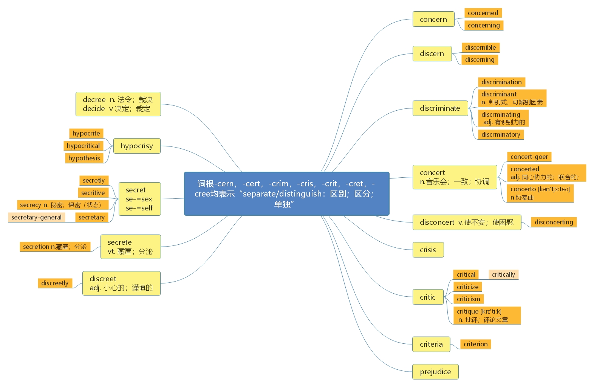
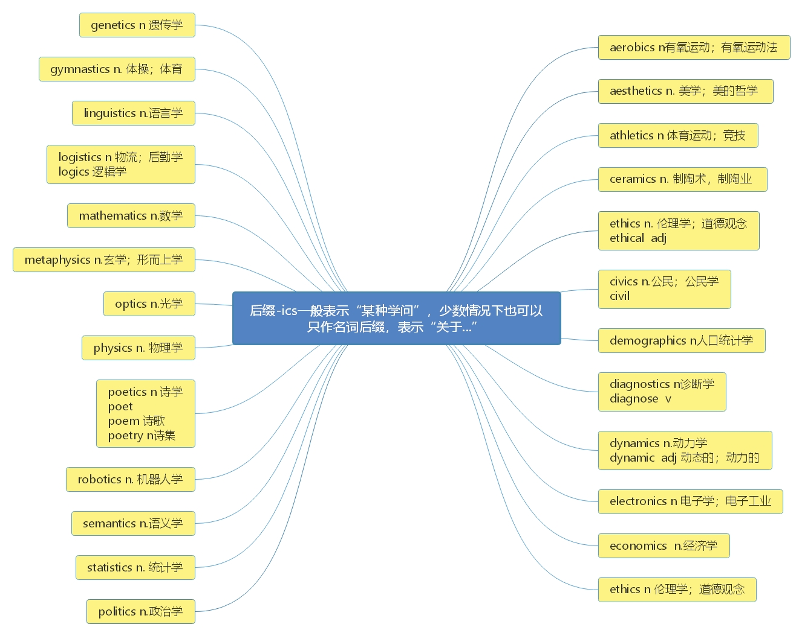

# 第九节 词 根 -cern ， -crim ， -cert ， -cris ， -crit ， -cree ， -cret

> **本节课目标**
>
> 1、掌握词根-cern， -crim， -cert， -cris， -crit， -cree， -cret 的含义
>
> 2、掌握 38+单词
>
> 3、复习本节课所有单词

***

# 词 根 -cern ， -crim ， -cert ， -cris ， -crit ， -cree ， -cret 均 表 示“separate/distinguish： 区别； 区分； 单独”

***

# 核心词汇：

***

**concern** \[kən'sɜ\:n] [英音](https://dict.youdao.com/dictvoice?audio=concern\&type=1)  [美音](https://dict.youdao.com/dictvoice?audio=concern\&type=2)  vt. 涉及，关系到；使担心 718

**搭配：** be concerned about/with（ 考）： 对…很关心

**例句：** There is considerable and justified concern that the United States is falling behind much of the rest of the developed world in these essential disciplines.&#x20;

人们有很大的并且是合理的担心，美国在这些重要学科上面正在落后于世界上的很多发达国家。

**仿写例句：** 人们有很大的并且是合理的担心：过西方节日太多会使人们渐渐忘记自己本国的一些传统节日。

There is considerable and justified concern that celebrating too many western festivals will lead people to forget their own traditional festivals gradually.

> **【 课堂笔记】**
>
> **助记：** con-（ 加强语气） + -cern（ =separate/distinguish； 分开； 区分） →要被分开， 被区分对待→使担心； 涉及

**双语例句:** He assumed an air of concern. [播放](https://dict.youdao.com/dictvoice?audio=He+assumed+an+air+of+concern.&le=eng&le=eng&type=2)

他装出关心的样子。 

**双语例句:** There is no cause for concern. [播放](https://dict.youdao.com/dictvoice?audio=There+is+no+cause+for+concern.&le=eng&le=eng&type=2)

没有理由担忧。 

**双语例句:** I didn't concern myself with politics. [播放](https://dict.youdao.com/dictvoice?audio=I+didn%27t+concern+myself+with+politics.&le=eng&le=eng&type=2)

我不关心政治。 

**原声例句:** With this latest discovery, the researchers say noise pollution in coral environments raises yet another cause for **concern** for these organisms. [播放](https://dict.youdao.com/pureaudio?docid=3475205166461726737)

**原声例句:** They say the **concern** is that players might see the training room as not the place even for well-qualified women. [播放](https://dict.youdao.com/pureaudio?docid=6844021079035407217)

**原声例句:** Another study found that almost half of American workers expressed **concern** about their ability to provide for immediate family needs. [播放](https://dict.youdao.com/pureaudio?docid=-2072887227021131105)

**权威例句:** The administrators said they hope to sell most of the business as a going **concern**.  [播放](https://dict.youdao.com/dictvoice?audio=The+administrators+said+they+hope+to+sell+most+of+the+business+as+a+going+concern.+&le=eng&type=2)

**权威例句:** Of greater **concern** though was London Midland, which has had a number of reliability problems.  [播放](https://dict.youdao.com/dictvoice?audio=Of+greater+concern+though+was+London+Midland%2C+which+has+had+a+number+of+reliability+problems.+&le=eng&type=2)

**权威例句:** The reality is that the sustainability of this fragile desert environment is a huge **concern**.  [播放](https://dict.youdao.com/dictvoice?audio=The+reality+is+that+the+sustainability+of+this+fragile+desert+environment+is+a+huge+concern.+&le=eng&type=2)

***

**concerned** \[kən'sɜ\:nd] [英音](https://dict.youdao.com/dictvoice?audio=concerned\&type=1)  [美音](https://dict.youdao.com/dictvoice?audio=concerned\&type=2)  adj. 关心的；有关的 1131

**搭配：** the person concerned（考）：相关人员

> **【 课堂笔记】**
>
> **助记：** the person concerned（ concerned 是形容词做后置定语）
>
> \= the person who is concerned

**双语例句:** We are concerned about the child's welfare. [播放](https://dict.youdao.com/dictvoice?audio=We+are+concerned+about+the+child%27s+welfare.&le=eng&le=eng&type=2)

我们关注那个孩子的福祉。 

**双语例句:** They are seriously concerned about security. [播放](https://dict.youdao.com/dictvoice?audio=They+are+seriously+concerned+about+security.&le=eng&le=eng&type=2)

他们非常关注安全问题。 

**双语例句:** We're concerned about your spiritual welfare. [播放](https://dict.youdao.com/dictvoice?audio=We%27re+concerned+about+your+spiritual+welfare.&le=eng&le=eng&type=2)

我们担心你的心理健康。 

**原声例句:** But five major groups in the food industry say they are **concerned** that the new maize could enter the food supply. [播放](https://dict.youdao.com/pureaudio?docid=3102351635161852093)

**原声例句:** Eighty percent of those questioned said they were **concerned** about skin cancer and believed it was important to protect themselves. [播放](https://dict.youdao.com/pureaudio?docid=-3783229870911270143)

**原声例句:** They were **concerned** that the Supreme Court would require a test of some kind that could limit what can be patented. [播放](https://dict.youdao.com/pureaudio?docid=3983886564319054050)

**权威例句:** And the only way up, as far as we are **concerned**, is via the Peak Tram.  [播放](https://dict.youdao.com/dictvoice?audio=And+the+only+way+up%2C+as+far+as+we+are+concerned%2C+is+via+the+Peak+Tram.+&le=eng&type=2)

**权威例句:** But as far as I am **concerned**, that is the end of the matter.  [播放](https://dict.youdao.com/dictvoice?audio=But+as+far+as+I+am+concerned%2C+that+is+the+end+of+the+matter.+&le=eng&type=2)

**权威例句:** But I'm also **concerned** about your safety and whether you're going to stay with your mom.  [播放](https://dict.youdao.com/dictvoice?audio=But+I%27m+also+concerned+about+your+safety+and+whether+you%27re+going+to+stay+with+your+mom.+&le=eng&type=2)

***

**concerning** \[kən'sɜ\:nɪŋ] [英音](https://dict.youdao.com/dictvoice?audio=concerning\&type=1)  [美音](https://dict.youdao.com/dictvoice?audio=concerning\&type=2)  prep. 关于； 就…而言 3425

**双语例句:** He asked several questions concerning the future of the company. [播放](https://dict.youdao.com/dictvoice?audio=He+asked+several+questions+concerning+the+future+of+the+company.&le=eng&le=eng&type=2)

他问了几个有关公司前途的问题。 

**双语例句:** All cases concerning children are dealt with in a special children's court. [播放](https://dict.youdao.com/dictvoice?audio=All+cases+concerning+children+are+dealt+with+in+a+special+children%27s+court.&le=eng&le=eng&type=2)

所有涉及儿童的案件均由儿童特别法庭审理。 

**双语例句:** His work is full of profundities and asides concerning the human condition. [播放](https://dict.youdao.com/dictvoice?audio=His+work+is+full+of+profundities+and+asides+concerning+the+human+condition.&le=eng&le=eng&type=2)

他的作品充满了有关人类境况的深邃见解和话外音。 

**原声例句:** Blaine had written the letters several years earlier during a shameful incident **concerning** the sale of railroad stock. [播放](https://dict.youdao.com/pureaudio?docid=-7146179335496071999)

**原声例句:** Another naturalist,Alfred Russel Wallace, had independently written a paper that contained ideas similar to Darwin's **concerning** evolution. [播放](https://dict.youdao.com/pureaudio?docid=3669475087346197775)

**原声例句:** And a mystery from the Old West **concerning** empty graves, a faraway homeland and long-forgotten papers. [播放](https://dict.youdao.com/pureaudio?docid=6908498272323495403)

**权威例句:** Training, or supervising the training of, language staff and advising them on matters **concerning** their work.  [播放](https://dict.youdao.com/dictvoice?audio=Training%2C+or+supervising+the+training+of%2C+language+staff+and+advising+them+on+matters+concerning+their+work.+&le=eng&type=2)

**权威例句:** The public is becoming immune to the constant performance-enhancing-drug headlines, with the exception of those **concerning** Bonds.  [播放](https://dict.youdao.com/dictvoice?audio=The+public+is+becoming+immune+to+the+constant+performance-enhancing-drug+headlines%2C+with+the+exception+of+those+concerning+Bonds.+&le=eng&type=2)

**权威例句:** \"Obviously media reports regarding a recent incident are very **concerning**, \" the country's governing tennis body said.  [播放](https://dict.youdao.com/dictvoice?audio=%22Obviously+media+reports+regarding+a+recent+incident+are+very+concerning%2C+%22+the+country%27s+governing+tennis+body+said.+&le=eng&type=2)

***

**discern** \[dɪ'sɜ\:n] [英音](https://dict.youdao.com/dictvoice?audio=discern\&type=1)  [美音](https://dict.youdao.com/dictvoice?audio=discern\&type=2)  vt. 分辨； 领悟， 察觉 7851

**助记：** dis（ 不同） +cern（ =distinguish： 区别、 辨别） →能区别出不同→分辨； 察觉

discern（ =distinguish：区别，辨别；前缀均为 dis，词根部分： c， t 音似， n 相同， g 无意义，

u 是连接， ish 是动词后缀， 二者同源， 含义相同） → 区别， 识别， 辨别

> **【 课堂笔记】**
>
> dis 相反/不同的  分开

**双语例句:** The adult observers were able to reliably discern an assortment of emotions on the babies' faces. [播放](https://dict.youdao.com/dictvoice?audio=The+adult+observers+were+able+to+reliably+discern+an+assortment+of+emotions+on+the+babies%27+faces.&le=eng&le=eng&type=2)

成年观察者能够有依据地辨别出婴儿脸上的各种情绪。 

**双语例句:** In the real world, problems rarely come neatly packaged, so being able to discern their deep structure is key. [播放](https://dict.youdao.com/dictvoice?audio=In+the+real+world%2C+problems+rarely+come+neatly+packaged%2C+so+being+able+to+discern+their+deep+structure+is+key.&le=eng&le=eng&type=2)

在现实世界中，问题很少会被完美地包装起来，因此能够识别它们的深层结构是关键。 

**双语例句:** We could just discern the house in the distance. [播放](https://dict.youdao.com/dictvoice?audio=We+could+just+discern+the+house+in+the+distance.&le=eng&le=eng&type=2)

我们只能勉强分辨出远处的房子。 

**原声例句:** So with his optic glass, his telescope, Galileo was able to **discern** spots on the orb of the moon.

**原声例句:** Similarly, divination. Divination is an attempt to **discern** the future that, once again, heads right to the source of power.

**原声例句:** Because sometimes when I was in Israel and West Bank I could not **discern** who is Arab and who is Israeli because my eyes didn't allow.

**权威例句:** At the same time, I sought to **discern** the point around which my own transition would pivot.  [播放](https://dict.youdao.com/dictvoice?audio=At+the+same+time%2C+I+sought+to+discern+the+point+around+which+my+own+transition+would+pivot.+&le=eng&type=2)

**权威例句:** In any sport, it takes only a glance--two seconds, tops--to **discern** that sport's particular defining talent.  [播放](https://dict.youdao.com/dictvoice?audio=In+any+sport%2C+it+takes+only+a+glance--two+seconds%2C+tops--to+discern+that+sport%27s+particular+defining+talent.+&le=eng&type=2)

**权威例句:** Sometimes, the Court might find it difficult to **discern** Congressional intent when interpreting a law.  [播放](https://dict.youdao.com/dictvoice?audio=Sometimes%2C+the+Court+might+find+it+difficult+to+discern+Congressional+intent+when+interpreting+a+law.+&le=eng&type=2)

***

**discernible** \[dɪ'sɜ\:nɪbl] [英音](https://dict.youdao.com/dictvoice?audio=discernible\&type=1)  [美音](https://dict.youdao.com/dictvoice?audio=discernible\&type=2)  adj. 可辨别的；可识别的 13537

**双语例句:** His face was barely discernible in the gloom. [播放](https://dict.youdao.com/dictvoice?audio=His+face+was+barely+discernible+in+the+gloom.&le=eng&le=eng&type=2)

在黑暗中很难看得清他的脸。 

**双语例句:** Far away the outline of the island is just discernible. [播放](https://dict.youdao.com/dictvoice?audio=Far+away+the+outline+of+the+island+is+just+discernible.&le=eng&le=eng&type=2)

远远的，那岛的轮廓依稀可见。 

**双语例句:** There is often no discernible difference between rival brands. [播放](https://dict.youdao.com/dictvoice?audio=There+is+often+no+discernible+difference+between+rival+brands.&le=eng&le=eng&type=2)

相互竞争的品牌之间往往看不出明显的区别。 

**原声例句:** It's a positive force, and it exerts an actual and somehow palpable, **discernible** force in the world.

**原声例句:** There are a lot of perspectives **discernible** or extractable from this treatise, Areopagitica, from which the fallen state seems in so many ways, maybe in every way, superior to its unfallen counterpart.

**权威例句:** JetBlue tells a similar story, with no **discernible** impact on bookings or customers asking for refunds.  [播放](https://dict.youdao.com/dictvoice?audio=JetBlue+tells+a+similar+story%2C+with+no+discernible+impact+on+bookings+or+customers+asking+for+refunds.+&le=eng&type=2)

**权威例句:** When I turn to mega-capitalizations, I cannot parse any clearly **discernible** pattern that is conclusively bullish.  [播放](https://dict.youdao.com/dictvoice?audio=When+I+turn+to+mega-capitalizations%2C+I+cannot+parse+any+clearly+discernible+pattern+that+is+conclusively+bullish.+&le=eng&type=2)

**权威例句:** Take out military and government spending, and the pulse of the economy is barely **discernible**.  [播放](https://dict.youdao.com/dictvoice?audio=Take+out+military+and+government+spending%2C+and+the+pulse+of+the+economy+is+barely+discernible.+&le=eng&type=2)

***

**discerning** \[dɪ'sɜ\:nɪŋ] [英音](https://dict.youdao.com/dictvoice?audio=discerning\&type=1)  [美音](https://dict.youdao.com/dictvoice?audio=discerning\&type=2)  adj. 有辨识能力的； 眼光敏锐的 17734

**双语例句:** More difficult, in the moment, is discerning precisely how these lean times are affecting society's character. [播放](https://dict.youdao.com/dictvoice?audio=More+difficult%2C+in+the+moment%2C+is+discerning+precisely+how+these+lean+times+are+affecting+society%27s+character.&le=eng&le=eng&type=2)

目前，准确地辨别这些萧条时期如何影响社会特性是更困难的。 

**双语例句:** I think that sums up the feelings of most discerning and intelligent Indians. [播放](https://dict.youdao.com/dictvoice?audio=I+think+that+sums+up+the+feelings+of+most+discerning+and+intelligent+Indians.&le=eng&le=eng&type=2)

我认为那综合了最有眼力和智慧的印第安人的观点。 

**双语例句:** Even the most accomplished writers show their work-in-progress to discerning readers. [播放](https://dict.youdao.com/dictvoice?audio=Even+the+most+accomplished+writers+show+their+work-in-progress+to+discerning+readers.&le=eng&le=eng&type=2)

即使最有造诣的作家们都会展示他们创作中的作品给有鉴赏力的读者们看。 

**权威例句:** Of course, this raises the question, what exactly the **discerning** chap or chap-ette wear to the event?  [播放](https://dict.youdao.com/dictvoice?audio=Of+course%2C+this+raises+the+question%2C+what+exactly+the+discerning+chap+or+chap-ette+wear+to+the+event%3F+&le=eng&type=2)

**权威例句:** Because they are the primary tool we use for **discerning** the intentions of those around us.  [播放](https://dict.youdao.com/dictvoice?audio=Because+they+are+the+primary+tool+we+use+for+discerning+the+intentions+of+those+around+us.+&le=eng&type=2)

**权威例句:** Again, I have made some mistakes and try to use a more **discerning** eye.  [播放](https://dict.youdao.com/dictvoice?audio=Again%2C+I+have+made+some+mistakes+and+try+to+use+a+more+discerning+eye.+&le=eng&type=2)

***

**discriminate** \[dɪ'skrɪmɪneɪt] [英音](https://dict.youdao.com/dictvoice?audio=discriminate\&type=1)  [美音](https://dict.youdao.com/dictvoice?audio=discriminate\&type=2)  vt. 区别；辨别；歧视 6896

**助记：** discrim（ =discern：辨别、区别；前缀相同，词根部分首辅音均为 c， r 相同， m， n音似， 二者同源） +inate（ =ine+ate： 复合动词后缀） →区别； 歧视（ 即： 有区别的对待）

**双语例句:** When do babies learn to discriminate voices? [播放](https://dict.youdao.com/dictvoice?audio=When+do+babies+learn+to+discriminate+voices%3F&le=eng&le=eng&type=2)

婴儿什么时候学会辨别嗓音呢？ 

**双语例句:** Employers cannot discriminate on grounds of age. [播放](https://dict.youdao.com/dictvoice?audio=Employers+cannot+discriminate+on+grounds+of+age.&le=eng&le=eng&type=2)

雇主不得有年龄歧视。 

**双语例句:** The tests discriminate unfairly against older people. [播放](https://dict.youdao.com/dictvoice?audio=The+tests+discriminate+unfairly+against+older+people.&le=eng&le=eng&type=2)

这些测验使年纪较大的人受到歧视。 

**原声例句:** Title seven of that federal law says employers cannot **discriminate** based on race,color,religion, sex and national origin. [播放](https://dict.youdao.com/pureaudio?docid=3109609543526428777)

**原声例句:** She says many laws **discriminate** against women in the areas of property, labor force and marriage. [播放](https://dict.youdao.com/pureaudio?docid=3336565520897240711)

**原声例句:** One would say Internet providers could not **discriminate** against content or applications. [播放](https://dict.youdao.com/pureaudio?docid=4682984482708075618)

**权威例句:** Aho admits the law \"doesn't **discriminate**\" about what kind of filters you would create.  [播放](https://dict.youdao.com/dictvoice?audio=Aho+admits+the+law+%22doesn%27t+discriminate%22+about+what+kind+of+filters+you+would+create.+&le=eng&type=2)

**权威例句:** The researchers' unavoidable and unpalatable conclusion is that old-fashioned jealousy led the women to **discriminate** against pretty candidates.  [播放](https://dict.youdao.com/dictvoice?audio=The+researchers%27+unavoidable+and+unpalatable+conclusion+is+that+old-fashioned+jealousy+led+the+women+to+discriminate+against+pretty+candidates.+&le=eng&type=2)

**权威例句:** If actuaries had a free hand, they would **discriminate** against all sorts of statistically dubious groups.  [播放](https://dict.youdao.com/dictvoice?audio=If+actuaries+had+a+free+hand%2C+they+would+discriminate+against+all+sorts+of+statistically+dubious+groups.+&le=eng&type=2)

***

**discrimination** \[dɪ,skrɪmɪ'neɪʃ(ə)n] [英音](https://dict.youdao.com/dictvoice?audio=discrimination\&type=1)  [美音](https://dict.youdao.com/dictvoice?audio=discrimination\&type=2)  n. 歧视；区别，辨别；识别力 3194

**搭配：** racial discrimination（考）：种族歧视

&#x9;	 discrimination against sb.（考）：歧视某人

**双语例句:** She is exempt from sex discrimination laws. [播放](https://dict.youdao.com/dictvoice?audio=She+is+exempt+from+sex+discrimination+laws.&le=eng&le=eng&type=2)

她不用遵守性别歧视法规。 

**双语例句:** Women's groups denounced sexual discrimination. [播放](https://dict.youdao.com/dictvoice?audio=Women%27s+groups+denounced+sexual+discrimination.&le=eng&le=eng&type=2)

妇女组织谴责性别歧视。 

**双语例句:** \"This,\" huffed Mr. Buthelezi, \"was discrimination.\" [播放](https://dict.youdao.com/dictvoice?audio=%22This%2C%22+huffed+Mr.+Buthelezi%2C+%22was+discrimination.%22&le=eng&le=eng&type=2)

“这么做” 布特莱齐先生愤怒地说，“是歧视。” 

**原声例句:** Sexual harassment is one of the areas of job **discrimination** investigated by the Equal Employment Opportunity Commission. [播放](https://dict.youdao.com/pureaudio?docid=1440156059671289523)

**原声例句:** Lena Horne said the experience and other **discrimination** led to her work in the civil rights movement. [播放](https://dict.youdao.com/pureaudio?docid=5065920600416541132)

**原声例句:** Frank Ricci was among a group of white and Hispanic firefighters who sued the city for **discrimination**. [播放](https://dict.youdao.com/pureaudio?docid=-5036872121491697074)

**权威例句:** The panellists were Anwar Kemal, Chairperson, Committee on the Elimination of Racial **Discrimination** (CERD), Sgt.  [播放](https://dict.youdao.com/dictvoice?audio=The+panellists+were+Anwar+Kemal%2C+Chairperson%2C+Committee+on+the+Elimination+of+Racial+Discrimination+%28CERD%29%2C+Sgt.+&le=eng&type=2)

**权威例句:** It said such a ban was unconstitutional and singled out gays and lesbians for **discrimination**.  [播放](https://dict.youdao.com/dictvoice?audio=It+said+such+a+ban+was+unconstitutional+and+singled+out+gays+and+lesbians+for+discrimination.+&le=eng&type=2)

**权威例句:** She took early retirement and sued for illegal gender **discrimination** under the Civil Rights Act.  [播放](https://dict.youdao.com/dictvoice?audio=She+took+early+retirement+and+sued+for+illegal+gender+discrimination+under+the+Civil+Rights+Act.+&le=eng&type=2)

***

**discriminant** \[dɪ'skrɪmɪnənt] [英音](https://dict.youdao.com/dictvoice?audio=discriminant\&type=1)  [美音](https://dict.youdao.com/dictvoice?audio=discriminant\&type=2)  n. 判别式；可辨别的因素（或特点） 18171

**【 课堂笔记】**

**助记：** discrim（ =discern 辨别、区别） + in（连接作用） + ant（名词后缀，表示物） → 能够用来识别或辨别的事物 → 可辨别的因素（ 或特点） ； 判别式（ 判别式（数学公式）就是用来识别或辨别特点的）

> **【 课堂笔记】**
>
> \-ant -ent
>
> 1） 形容词后缀， 表示. …的
>
> 2） 名词后缀， 表示人/物

**双语例句:** In this paper, a novel tensor subspace learning algorithm, tensor locality discriminant projection, is proposed. [播放](https://dict.youdao.com/dictvoice?audio=In+this+paper%2C+a+novel+tensor+subspace+learning+algorithm%2C+tensor+locality+discriminant+projection%2C+is+proposed.&le=eng&le=eng&type=2)

本文提出了一种新的张量子空间的学习算法：张量局部判别投影。 

**双语例句:** Governing the results we have gotten, we can use step-by-step discriminant functions to identify non-core well flow units and take quantitative research. [播放](https://dict.youdao.com/dictvoice?audio=Governing+the+results+we+have+gotten%2C+we+can+use+step-by-step+discriminant+functions+to+identify+non-core+well+flow+units+and+take+quantitative+research.&le=eng&le=eng&type=2)

依据对关键井流动单元划分的结果，运用逐步判别程序，确定了非关键井的流动单元判别函数，达到流动单元研究的定量化研究。 

**双语例句:** In the paper, the discriminant function is derived from the Fisher principle to distinguish large pore paths in sandstone oil layers based on logging curves. [播放](https://dict.youdao.com/dictvoice?audio=In+the+paper%2C+the+discriminant+function+is+derived+from+the+Fisher+principle+to+distinguish+large+pore+paths+in+sandstone+oil+layers+based+on+logging+curves.&le=eng&le=eng&type=2)

根据测井曲线，运用费歇准则导出了识别砂岩油层大孔道的判别函数，判别函数是测井曲线的线性组合。 

**原声例句:** The question of whether **discriminant** conditioning has been used with babies to explore what sort of concepts they have.

**权威例句:** Once this **discriminant** application of force has been utilized, there will be ample time   and a far more tractable climate   for diplomatic negotiations.  [播放](https://dict.youdao.com/dictvoice?audio=Once+this+discriminant+application+of+force+has+been+utilized%2C+there+will+be+ample+time+++and+a+far+more+tractable+climate+++for+diplomatic+negotiations.+&le=eng&type=2)

**权威例句:** The score is called the **Discriminant** Inventory Function, or DIF. "}]}},currentLe:{language:aW,name:"中英 [播放](https://dict.youdao.com/dictvoice?audio=The+score+is+called+the+Discriminant+Inventory+Function%2C+or+DIF.+&le=eng&type=2)

***

**discriminating** \[dɪ'skrɪmɪneɪtɪŋ] [英音](https://dict.youdao.com/dictvoice?audio=discriminating\&type=1)  [美音](https://dict.youdao.com/dictvoice?audio=discriminating\&type=2)  adj. 有识别力的； 识别的； 有差别的 19727

释义： Someone who is discriminating has the ability to recognize things that are of good quality.

**双语例句:** More discriminating visitors now tend to shun the area. [播放](https://dict.youdao.com/dictvoice?audio=More+discriminating+visitors+now+tend+to+shun+the+area.&le=eng&le=eng&type=2)

更多有鉴别能力的游客现在趋向于避开此地。 

**双语例句:** He is incapable of discriminating between a good idea and a terrible one. [播放](https://dict.youdao.com/dictvoice?audio=He+is+incapable+of+discriminating+between+a+good+idea+and+a+terrible+one.&le=eng&le=eng&type=2)

他没能力在一个好主意和一个坏主意之间进行区分。 

**双语例句:** Carême's creations soon captured the discriminating eye of a French diplomat, Charles Maurice de Talleyrand-Périgord. [播放](https://dict.youdao.com/dictvoice?audio=Car%C3%AAme%27s+creations+soon+captured+the+discriminating+eye+of+a+French+diplomat%2C+Charles+Maurice+de+Talleyrand-P%C3%A9rigord.&le=eng&le=eng&type=2)

卡莱姆的作品很快吸引了颇具鉴赏目光的法国外交官查尔斯·莫里斯·德·塔利兰·佩里戈尔德的注意。 

**权威例句:** Critics accuse the retail giant of destroying neighborhoods, exploiting its workers and **discriminating** against female employees.  [播放](https://dict.youdao.com/dictvoice?audio=Critics+accuse+the+retail+giant+of+destroying+neighborhoods%2C+exploiting+its+workers+and+discriminating+against+female+employees.+&le=eng&type=2)

**权威例句:** Both male and female participants were guilty of **discriminating** against talkative women, she notes.  [播放](https://dict.youdao.com/dictvoice?audio=Both+male+and+female+participants+were+guilty+of+discriminating+against+talkative+women%2C+she+notes.+&le=eng&type=2)

**权威例句:** We have a thing going on now, people **discriminating** against homosexuality in this country.  [播放](https://dict.youdao.com/dictvoice?audio=We+have+a+thing+going+on+now%2C+people+discriminating+against+homosexuality+in+this+country.+&le=eng&type=2)

***

**discriminatory** \[dɪ'skrɪmɪnətərɪ] [英音](https://dict.youdao.com/dictvoice?audio=discriminatory\&type=1)  [美音](https://dict.youdao.com/dictvoice?audio=discriminatory\&type=2)  adj.（ 法规、 做法） 不公平的， 歧视的 11656

**释义：** Discriminatory laws or practices are unfair because they treat one group of people worse

than other groups.

> **【 课堂笔记】**
>
> \-ory -ery -ary
>
> 1） n. …地点/物/人， 例如： factory
>
> 2） adj. …的

**双语例句:** These reforms will abolish racially discriminatory laws. [播放](https://dict.youdao.com/dictvoice?audio=These+reforms+will+abolish+racially+discriminatory+laws.&le=eng&le=eng&type=2)

这些改革将废除种族歧视法律。 

**双语例句:** This discriminatory policy has really been a blight on America. [播放](https://dict.youdao.com/dictvoice?audio=This+discriminatory+policy+has+really+been+a+blight+on+America.&le=eng&le=eng&type=2)

这项歧视政策一直以来确实是美国的一个祸因。 

**双语例句:** The dual system is rigid and discriminatory. [播放](https://dict.youdao.com/dictvoice?audio=The+dual+system+is+rigid+and+discriminatory.&le=eng&le=eng&type=2)

双轨制僵化，带有歧视性。 

**权威例句:** According to the convention, contracting parties are required to abolish any **discriminatory** policies in the field of education.  [播放](https://dict.youdao.com/dictvoice?audio=According+to+the+convention%2C+contracting+parties+are+required+to+abolish+any+discriminatory+policies+in+the+field+of+education.+&le=eng&type=2)

**权威例句:** \"The allocation of polling place resources is plainly irrational, non-uniform and likely **discriminatory**, \" the suit states.  [播放](https://dict.youdao.com/dictvoice?audio=%22The+allocation+of+polling+place+resources+is+plainly+irrational%2C+non-uniform+and+likely+discriminatory%2C+%22+the+suit+states.+&le=eng&type=2)

**权威例句:** Her legal team argued that the ban on assisted suicide is **discriminatory** towards severely disabled people.  [播放](https://dict.youdao.com/dictvoice?audio=Her+legal+team+argued+that+the+ban+on+assisted+suicide+is+discriminatory+towards+severely+disabled+people.+&le=eng&type=2)

***

**concert** \['kɒnsət] [英音](https://dict.youdao.com/dictvoice?audio=concert\&type=1)  [美音](https://dict.youdao.com/dictvoice?audio=concert\&type=2)  n. 音乐会；和谐；一致 2537

\*\*词源：\*\*Sense of "public musical performance," usually of a series of separate pieces, is from 1680s,

from Italian (Klein suggests Latin concentare "to sing together," from con- + cantare "to sing," as

the source of the Italian word in the musical sense). The general sense of "any harmonious

agreement or orderly union" is from 1796. Concert-master "first violinist of an orchestra" is from

1815, translating German Konzertmeister.

**【 课堂笔记】**

**助记：** con-（ 共同， 一起） + -cert（ =separate， 分开） → 把单独的曲子放在一起表演 → 音乐会， 演奏会； 和谐

**双语例句:** When does the concert begin? [播放](https://dict.youdao.com/dictvoice?audio=When+does+the+concert+begin%3F&le=eng&le=eng&type=2)

音乐会什么时间开始？ 

**双语例句:** Their concert there was a sell-out. [播放](https://dict.youdao.com/dictvoice?audio=Their+concert+there+was+a+sell-out.&le=eng&le=eng&type=2)

他们在那儿的音乐会座无虚席。 

**双语例句:** The concert had been a great success. [播放](https://dict.youdao.com/dictvoice?audio=The+concert+had+been+a+great+success.&le=eng&le=eng&type=2)

音乐会非常成功。 

**原声例句:** When they had shut him out of the theater and the **concert** hall, Paul knew he had to leave. [播放](https://dict.youdao.com/pureaudio?docid=1922149865098216053)

**原声例句:** In November of that year, New York Philharmonic conductor Bruno Walter became sick and could not conduct an important **concert**. [播放](https://dict.youdao.com/pureaudio?docid=2330016989169397911)

**原声例句:** After all,the influence of drugs at the **concert** led to the saying that if you can remember Woodstock, you weren't there. [播放](https://dict.youdao.com/pureaudio?docid=-4549172140025958303)

**权威例句:** The product was such a hit that women wore them as accessories around **concert** grounds.  [播放](https://dict.youdao.com/dictvoice?audio=The+product+was+such+a+hit+that+women+wore+them+as+accessories+around+concert+grounds.+&le=eng&type=2)

**权威例句:** Each **concert** is different, depending on the interaction between the conductor, the musicians and the crowd.  [播放](https://dict.youdao.com/dictvoice?audio=Each+concert+is+different%2C+depending+on+the+interaction+between+the+conductor%2C+the+musicians+and+the+crowd.+&le=eng&type=2)

**权威例句:** Just a few days before this **concert**, the WDR sent the Lausanne Big Band the parts.  [播放](https://dict.youdao.com/dictvoice?audio=Just+a+few+days+before+this+concert%2C+the+WDR+sent+the+Lausanne+Big+Band+the+parts.+&le=eng&type=2)

***

**concerted**\[kən'sɜ\:tɪd] [英音](https://dict.youdao.com/dictvoice?audio=\&type=1)  [美音](https://dict.youdao.com/dictvoice?audio=\&type=2)  adj. 同心协力的； 联合的； 尽力的； 竭力的 11579

**释义和用法：** If you make a concerted effort to do something, you try very hard to do it.

A concerted action is done by several people or groups working together.

一个协调一致的行动是由几个人或团体一起工作完成的。

***

**concerto** \[kən'tʃɜ\:təʊ; -'tʃeətəʊ] [英音](https://dict.youdao.com/dictvoice?audio=concerto\&type=1)  [美音](https://dict.youdao.com/dictvoice?audio=concerto\&type=2)  n. 协奏曲 19954

协奏曲 A concerto is a piece of music written for one or more solo instruments and an orchestra.

**disconcert** \[ˌdɪskənˈsɜ\:t] [英音](https://dict.youdao.com/dictvoice?audio=disconcert\&type=1)  [美音](https://dict.youdao.com/dictvoice?audio=disconcert\&type=2)  vt. 使不安； 使困惑； 使尴尬

**助记：** dis（ 相反） + concert（ 一致； 和谐） →（ 出现了） 不一致， 不和谐→使不安； 使困惑

If something disconcerts you, it makes you feel anxious, confused, or embarrassed.

**双语例句:** To disrupt the composure of; disconcert. [播放](https://dict.youdao.com/dictvoice?audio=To+disrupt+the+composure+of%3B+disconcert.&le=eng&le=eng&type=2)

打扰打乱…的安静； 

**双语例句:** Reporter: When they went to the farm, didn't he disconcert visitors by the way he named some of the animals? [播放](https://dict.youdao.com/dictvoice?audio=Reporter%3A+When+they+went+to+the+farm%2C+didn%27t+he+disconcert+visitors+by+the+way+he+named+some+of+the+animals%3F&le=eng&le=eng&type=2)

记者：他们去农场的时候，你爸爸有没有因为他给一些动物取名而让参观的人觉得为难？ 

**双语例句:** The two women looked on without uttering a word, without a gesture, without a look which could disconcert the Bishop. [播放](https://dict.youdao.com/dictvoice?audio=The+two+women+looked+on+without+uttering+a+word%2C+without+a+gesture%2C+without+a+look+which+could+disconcert+the+Bishop.&le=eng&le=eng&type=2)

那两个妇人没有说一个字、做一个手势或露一点神气去阻扰主教，她们瞧着他行动。 

**权威例句:** Anything that could potentially offend or **disconcert** a potential employer, or disrupt the office, is not a good idea.  [播放](https://dict.youdao.com/dictvoice?audio=Anything+that+could+potentially+offend+or+disconcert+a+potential+employer%2C+or+disrupt+the+office%2C+is+not+a+good+idea.+&le=eng&type=2)

**权威例句:** But scrabbling around in a miniature maze can **disconcert** only a little when the polished wood floors of the gallery are but a few steps away.  [播放](https://dict.youdao.com/dictvoice?audio=But+scrabbling+around+in+a+miniature+maze+can+disconcert+only+a+little+when+the+polished+wood+floors+of+the+gallery+are+but+a+few+steps+away.+&le=eng&type=2)

**权威例句:** It is much harder for him to maintain that counter-narrative of peaceful democratic change, which was supposed to **disconcert** Iran and al-Qaeda, while American missiles rain on Libya.  [播放](https://dict.youdao.com/dictvoice?audio=It+is+much+harder+for+him+to+maintain+that+counter-narrative+of+peaceful+democratic+change%2C+which+was+supposed+to+disconcert+Iran+and+al-Qaeda%2C+while+American+missiles+rain+on+Libya.+&le=eng&type=2)

**双语例句:** It is allegro from Concerto Number One \"Spring\" from the \"Four Seasons\". [播放](https://dict.youdao.com/dictvoice?audio=It+is+allegro+from+Concerto+Number+One+%22Spring%22+from+the+%22Four+Seasons%22.&le=eng&le=eng&type=2)

这是来自《四季》第一协奏曲《春天》的快板。 

**双语例句:** The concerto is another genre. [播放](https://dict.youdao.com/dictvoice?audio=The+concerto+is+another+genre.&le=eng&le=eng&type=2)

协奏曲是另外一种风格。 

**双语例句:** I I especially like the piano concerto. [播放](https://dict.youdao.com/dictvoice?audio=I+I+especially+like+the+piano+concerto.&le=eng&le=eng&type=2)

我特别喜欢那首钢琴协奏曲。 

**原声例句:** In a recent **concerto** piece called \"On a Wire\" she had the musicians play a bowed piano. [播放](https://dict.youdao.com/pureaudio?docid=8757527722805247570)

**原声例句:** in nineteen twenty-five. Koussevitzky also conducted Copland's \"**Concerto** for Piano and Orchestra\" in nineteen twenty-seven. [播放](https://dict.youdao.com/pureaudio?docid=3854250234751625158)

**原声例句:** This work was unusual because Copland used ideas from jazz music in his **concerto**. [播放](https://dict.youdao.com/pureaudio?docid=-8684341946524940474)

**权威例句:** Earlier this month, pianist Marcus Roberts performed an original piano **concerto** with the Atlanta Symphony Orchestra.  [播放](https://dict.youdao.com/dictvoice?audio=Earlier+this+month%2C+pianist+Marcus+Roberts+performed+an+original+piano+concerto+with+the+Atlanta+Symphony+Orchestra.+&le=eng&type=2)

**权威例句:** Anderson composed more than 200 pieces, including a **concerto** and a Broadway musical called Goldilocks.  [播放](https://dict.youdao.com/dictvoice?audio=Anderson+composed+more+than+200+pieces%2C+including+a+concerto+and+a+Broadway+musical+called+Goldilocks.+&le=eng&type=2)

**权威例句:** S. Bach's Second Brandenburg **Concerto** (ca. 1721) includes a part for solo trumpet in this style.  [播放](https://dict.youdao.com/dictvoice?audio=S.+Bach%27s+Second+Brandenburg+Concerto+%28ca.+1721%29+includes+a+part+for+solo+trumpet+in+this+style.+&le=eng&type=2)

***

**disconcerting** \[ˌdɪskənˈsɜ\:tɪŋ] [英音](https://dict.youdao.com/dictvoice?audio=disconcerting\&type=1)  [美音](https://dict.youdao.com/dictvoice?audio=disconcerting\&type=2)  adj. 令人不安的； 令人困惑的； 令人尴尬的 14694

**双语例句:** This silence is disconcerting, according to Mr Holt. [播放](https://dict.youdao.com/dictvoice?audio=This+silence+is+disconcerting%2C+according+to+Mr+Holt.&le=eng&le=eng&type=2)

霍尔特表示，这种沉默令人不安。 

**双语例句:** It doesn't feel disconcerting, but you feel distant. [播放](https://dict.youdao.com/dictvoice?audio=It+doesn%27t+feel+disconcerting%2C+but+you+feel+distant.&le=eng&le=eng&type=2)

那不令人恐慌，但是你感觉很疏远。 

**双语例句:** A disconcerting number of Americans take \"24\" seriously. [播放](https://dict.youdao.com/dictvoice?audio=A+disconcerting+number+of+Americans+take+%2224%22+seriously.&le=eng&le=eng&type=2)

数数把24当真的美国人，还真是当头一棒。 

**权威例句:** And it is **disconcerting** when religious and ethnic parochialism is apparent in reformasi rhetoric.  [播放](https://dict.youdao.com/dictvoice?audio=And+it+is+disconcerting+when+religious+and+ethnic+parochialism+is+apparent+in+reformasi+rhetoric.+&le=eng&type=2)

**权威例句:** But the research keeps revealing unexpected, sometimes **disconcerting**, evidence to explain just how true this is.  [播放](https://dict.youdao.com/dictvoice?audio=But+the+research+keeps+revealing+unexpected%2C+sometimes+disconcerting%2C+evidence+to+explain+just+how+true+this+is.+&le=eng&type=2)

**权威例句:** This can be especially **disconcerting** when the investor has reason to believe wrongdoing may be involved.  [播放](https://dict.youdao.com/dictvoice?audio=This+can+be+especially+disconcerting+when+the+investor+has+reason+to+believe+wrongdoing+may+be+involved.+&le=eng&type=2)

***

**crisis** \['kraɪsɪs] [英音](https://dict.youdao.com/dictvoice?audio=crisis\&type=1)  [美音](https://dict.youdao.com/dictvoice?audio=crisis\&type=2)  n. 危机；决定性时刻；危险期 1210

**助记：** cris（ =-cern=separate： 分开； 分裂） +is（ 名词后缀） →到了要分裂的时刻→

**词源：** early 15c., crise, crisis, "decisive point in the progress of a disease," also "vitally important

or decisive state of things, point at which change must come, for better or worse," from Latinized

form of Greek krisis "turning point in a disease, that change which indicates recovery or death"

(used as such by Hippocrates and Galen), literally "judgment, result of a trial, selection," from

krinein "to separate, decide, judge," from PIE root \*krei- "to sieve," thus "discriminate,

distinguish."

**双语例句:** At home a crisis was brewing. [播放](https://dict.youdao.com/dictvoice?audio=At+home+a+crisis+was+brewing.&le=eng&le=eng&type=2)

家里一场危机正在酝酿着。 

**双语例句:** The fever has passed its crisis. [播放](https://dict.youdao.com/dictvoice?audio=The+fever+has+passed+its+crisis.&le=eng&le=eng&type=2)

发烧已过危险期。 

**双语例句:** There was a crisis looming. [播放](https://dict.youdao.com/dictvoice?audio=There+was+a+crisis+looming.&le=eng&le=eng&type=2)

危机迫在眉睫。 

**原声例句:** Leaders of the European Union met Sunday in Brussels to discuss measures to deal with the world financial **crisis**. [播放](https://dict.youdao.com/pureaudio?docid=-5830393905030622146)

**原声例句:** We'll talk more next week about how the researchers link that change to the effects of the recent food **crisis**. [播放](https://dict.youdao.com/pureaudio?docid=-4485249274831855350)

**原声例句:** In the next few weeks, the administration is expected to announce details of a plan for the housing **crisis**. [播放](https://dict.youdao.com/pureaudio?docid=2795687468392651943)

**权威例句:** It is testament to the depth of a **crisis** which continues to defy solution.  [播放](https://dict.youdao.com/dictvoice?audio=It+is+testament+to+the+depth+of+a+crisis+which+continues+to+defy+solution.+&le=eng&type=2)

**权威例句:** Those structured products have fallen on hard times as the mortgage sector sinks deeper into **crisis**.  [播放](https://dict.youdao.com/dictvoice?audio=Those+structured+products+have+fallen+on+hard+times+as+the+mortgage+sector+sinks+deeper+into+crisis.+&le=eng&type=2)

**权威例句:** When the world is in **crisis**, it is right to consider boosting the IMF.  [播放](https://dict.youdao.com/dictvoice?audio=When+the+world+is+in+crisis%2C+it+is+right+to+consider+boosting+the+IMF.+&le=eng&type=2)

***

**critic** \['krɪtɪk] [英音](https://dict.youdao.com/dictvoice?audio=critic\&type=1)  [美音](https://dict.youdao.com/dictvoice?audio=critic\&type=2)  n. 批评家， 评论家； 爱挑剔的人 1362

**助记：** crit（ =separate/distinguish： 区分， 判断） +ic（ 少见的名词后缀： 表人） →能做出区

分/判断的人→评论家、 批评家

> **【 课堂笔记】**
>
> \-ic
>
> 形容词后缀， 表示…的
>
> 名词后缀， 表示人/物

**双语例句:** Turner is a writer and critic. [播放](https://dict.youdao.com/dictvoice?audio=Turner+is+a+writer+and+critic.&le=eng&le=eng&type=2)

特纳是一位作家和评论家。 

**双语例句:** He was also for a time an art critic. [播放](https://dict.youdao.com/dictvoice?audio=He+was+also+for+a+time+an+art+critic.&le=eng&le=eng&type=2)

他曾有相当长的一段时间是一位艺术评论家。 

**双语例句:** Mather was a film critic for many years. [播放](https://dict.youdao.com/dictvoice?audio=Mather+was+a+film+critic+for+many+years.&le=eng&le=eng&type=2)

马瑟做过多年的电影评论家。 

**原声例句:** He did not want any of them. Then,the music **critic** of the New York Times newspaper suggested Todd Duncan. [播放](https://dict.youdao.com/pureaudio?docid=-1446344691367558948)

**原声例句:** He called it \"The Last Tycoon.\" Fitzgerald's friend from Princeton University, the literary **critic** Edmund Wilson, helped to get it published. [播放](https://dict.youdao.com/pureaudio?docid=-2885147698709119469)

**原声例句:** The **critic** Malcolm Cowley says, Faulkner's \"early novels had been praised too much, usually for the wrong reasons. [播放](https://dict.youdao.com/pureaudio?docid=7107686196961056748)

**权威例句:** Salon book **critic** Laura Miller picks novel Bangkok Tattoo as her top summer read.  [播放](https://dict.youdao.com/dictvoice?audio=Salon+book+critic+Laura+Miller+picks+novel+Bangkok+Tattoo+as+her+top+summer+read.+&le=eng&type=2)

**权威例句:** And one Alaska industry **critic**, Richard Fineberg of Fairbanks, says corrosion problems have not been adequately monitored.  [播放](https://dict.youdao.com/dictvoice?audio=And+one+Alaska+industry+critic%2C+Richard+Fineberg+of+Fairbanks%2C+says+corrosion+problems+have+not+been+adequately+monitored.+&le=eng&type=2)

**权威例句:** It is not some hostile remark from Barney Frank, or left-wing **critic** of capitalism.  [播放](https://dict.youdao.com/dictvoice?audio=It+is+not+some+hostile+remark+from+Barney+Frank%2C+or+left-wing+critic+of+capitalism.+&le=eng&type=2)

***

**critical** \['krɪtɪk(ə)l] [英音](https://dict.youdao.com/dictvoice?audio=critical\&type=1)  [美音](https://dict.youdao.com/dictvoice?audio=critical\&type=2)  adj. 批评的，爱挑剔的；决定性的；危险的； 1129

**助记：** critic（ 评论家） +al（ 的） →评论的、 批评的、 批判性的；

crit（ =crisis： 危机） +ical（ 形容词后缀： 的） →危机时刻的→关键的、 重要

**搭配：** play a critical part in（考）：在...方面扮演了一个重要角色

critical view（考）：批判性观点

**双语例句:** We need to become critical text-readers. [播放](https://dict.youdao.com/dictvoice?audio=We+need+to+become+critical+text-readers.&le=eng&le=eng&type=2)

我们需要成为批判性的文本阅读者。 

**双语例句:** A few twentieths of a gram can be critical. [播放](https://dict.youdao.com/dictvoice?audio=A+few+twentieths+of+a+gram+can+be+critical.&le=eng&le=eng&type=2)

二十分之几克可能是关键的。 

**双语例句:** She viewed the findings with a critical eye. [播放](https://dict.youdao.com/dictvoice?audio=She+viewed+the+findings+with+a+critical+eye.&le=eng&le=eng&type=2)

她以批评的眼光看待这些研究结果。 

**原声例句:** In nineteen fifty-one she played the character \"Gigi\" in the Broadway play of the same name to great **critical** praise. [播放](https://dict.youdao.com/pureaudio?docid=3100718784444487499)

**原声例句:** There are fundamental and relatable relationships, broken families in some form,often friendships that are really **critical** and important.\" [播放](https://dict.youdao.com/pureaudio?docid=-6076981991207729289)

**原声例句:** And as more **critical** writers of America, like those of Britain, feel no need of it, the sooner it is forgotten,the better.\" [播放](https://dict.youdao.com/pureaudio?docid=4181062563206534231)

**权威例句:** The UK MEP Andrew Duff spoke of \"a **critical** year to save the EU\".  [播放](https://dict.youdao.com/dictvoice?audio=The+UK+MEP+Andrew+Duff+spoke+of+%22a+critical+year+to+save+the+EU%22.+&le=eng&type=2)

**权威例句:** We have virtually all of the patents as far as the **critical** materials are concerned.  [播放](https://dict.youdao.com/dictvoice?audio=We+have+virtually+all+of+the+patents+as+far+as+the+critical+materials+are+concerned.+&le=eng&type=2)

**权威例句:** And African-American voters are **critical** to us, **critical** to Democratic Party, **critical** to this country.  [播放](https://dict.youdao.com/dictvoice?audio=And+African-American+voters+are+critical+to+us%2C+critical+to+Democratic+Party%2C+critical+to+this+country.+&le=eng&type=2)

***

**critically** \['krɪtɪklɪ] [英音](https://dict.youdao.com/dictvoice?audio=critically\&type=1)  [美音](https://dict.youdao.com/dictvoice?audio=critically\&type=2)  adv. 危急地；精密地；批评性地； 6661

**双语例句:** Wyman watched them critically. [播放](https://dict.youdao.com/dictvoice?audio=Wyman+watched+them+critically.&le=eng&le=eng&type=2)

怀曼批判地注视着他们。 

**双语例句:** You know, you have to be careful, think critically. [播放](https://dict.youdao.com/dictvoice?audio=You+know%2C+you+have+to+be+careful%2C+think+critically.&le=eng&le=eng&type=2)

但你知道，你得仔细一点，要批判性地思考。 

**双语例句:** Though we should respect our elders, we should also take their words critically. [播放](https://dict.youdao.com/dictvoice?audio=Though+we+should+respect+our+elders%2C+we+should+also+take+their+words+critically.&le=eng&le=eng&type=2)

虽然我们应该尊重前辈，但我们也应该批判性地听取他们的话。 

**原声例句:** It's really important no matter what career you go into if it's accounting or human resources or science career that you can think **critically** and creatively, you can work in teams, you can adapt to change and that's important for everybody.\" [播放](https://dict.youdao.com/pureaudio?docid=-2622971392514423017)

**原声例句:** \"And the services you get, for whatever it is you need, depends **critically** on where you live. [播放](https://dict.youdao.com/pureaudio?docid=-7691456031701368938)

**原声例句:** The mission focused on treating the most **critically** injured patients in order to free up Haitian hospitals for those with less severe injuries. [播放](https://dict.youdao.com/pureaudio?docid=-9216495552766687076)

**权威例句:** Staff Sergeant Edgar D Bledsoe, of Olive Branch, Illinois, cradles a **critically** ill Vietnamese infant.  [播放](https://dict.youdao.com/dictvoice?audio=Staff+Sergeant+Edgar+D+Bledsoe%2C+of+Olive+Branch%2C+Illinois%2C+cradles+a+critically+ill+Vietnamese+infant.+&le=eng&type=2)

**权威例句:** Radiohead's **critically** acclaimed third album OK Computer has now sold more than three million copies in Europe.  [播放](https://dict.youdao.com/dictvoice?audio=Radiohead%27s+critically+acclaimed+third+album+OK+Computer+has+now+sold+more+than+three+million+copies+in+Europe.+&le=eng&type=2)

**权威例句:** One top-end option is Cordelia, a **critically** acclaimed French restaurant by renowned Israeli chef Nir Zook.  [播放](https://dict.youdao.com/dictvoice?audio=One+top-end+option+is+Cordelia%2C+a+critically+acclaimed+French+restaurant+by+renowned+Israeli+chef+Nir+Zook.+&le=eng&type=2)

***

**criticize** \['krɪtɪsaɪz] [英音](https://dict.youdao.com/dictvoice?audio=criticize\&type=1)  [美音](https://dict.youdao.com/dictvoice?audio=criticize\&type=2)  vt. 批评； 非难； 评论 2584

**助记：** critic（ 评论、 批评） +ize（ 动词后缀） →批评、 评论

**搭配：** criticize one’s view on sth.（ 考）： 批评某人在某事上的观点

**双语例句:** All you ever do is criticize! [播放](https://dict.youdao.com/dictvoice?audio=All+you+ever+do+is+criticize%21&le=eng&le=eng&type=2)

你就知道批评！ 

**双语例句:** We were taught how to criticize poems. [播放](https://dict.youdao.com/dictvoice?audio=We+were+taught+how+to+criticize+poems.&le=eng&le=eng&type=2)

我们学习了怎样评论诗歌。 

**双语例句:** You were quite right to criticize him. [播放](https://dict.youdao.com/dictvoice?audio=You+were+quite+right+to+criticize+him.&le=eng&le=eng&type=2)

你批评他批评得很对。 

**原声例句:** And many Republicans **criticize** the Fed chief himself a Republican for what they see as too much spending. [播放](https://dict.youdao.com/pureaudio?docid=-5561592748585397751)

**原声例句:** Some people **criticize** his art for only showing a false or very limited image of America, one that is white and middle-class. [播放](https://dict.youdao.com/pureaudio?docid=-7537675708859351390)

**原声例句:** She says people who **criticize** Barbie should tell girls the story of the businesswoman who created her. [播放](https://dict.youdao.com/pureaudio?docid=-8981055755679337286)

**权威例句:** But he insists he has the right, even the obligation, to **criticize** the war.  [播放](https://dict.youdao.com/dictvoice?audio=But+he+insists+he+has+the+right%2C+even+the+obligation%2C+to+criticize+the+war.+&le=eng&type=2)

**权威例句:** Cooperman regarded the comments as a declaration of class warfare, and began to **criticize** Obama publicly.  [播放](https://dict.youdao.com/dictvoice?audio=Cooperman+regarded+the+comments+as+a+declaration+of+class+warfare%2C+and+began+to+criticize+Obama+publicly.+&le=eng&type=2)

**权威例句:** Citizens are sometimes allowed to **criticize** local officials and offer suggestions for improving government services.  [播放](https://dict.youdao.com/dictvoice?audio=Citizens+are+sometimes+allowed+to+criticize+local+officials+and+offer+suggestions+for+improving+government+services.+&le=eng&type=2)

***

**criticism** \['krɪtɪsɪz(ə)m] [英音](https://dict.youdao.com/dictvoice?audio=criticism\&type=1)  [美音](https://dict.youdao.com/dictvoice?audio=criticism\&type=2)  n. 批评；批判；评论 2111

**搭配：** vigorous criticism（考）：犀利的批评

**例句：** In broad terms, these opponents have leveled two sets of criticisms at Google. 从广义上来

说，这些反对者针对谷歌做出了两种批判。（ 2011.12）

**阅读难点：** level... at...：针对...、将...对准...

> **【 课堂笔记】**
>
> \-ism
>
> 1） 形容词后缀， 表示…主义
>
> 例： social → socialism（ 社会主义） capital → capitalism（ 资本主义）
>
> 2） 名词后缀，一般不翻译。例： optimism， pessimism

**双语例句:** He shrugged off the criticism. [播放](https://dict.youdao.com/dictvoice?audio=He+shrugged+off+the+criticism.&le=eng&le=eng&type=2)

他对批评不予理睬。 

**双语例句:** I deeply resented her criticism. [播放](https://dict.youdao.com/dictvoice?audio=I+deeply+resented+her+criticism.&le=eng&le=eng&type=2)

我对她的批评感到非常气愤。 

**双语例句:** He was stung by their criticism. [播放](https://dict.youdao.com/dictvoice?audio=He+was+stung+by+their+criticism.&le=eng&le=eng&type=2)

他们的批评使他心烦意乱。 

**原声例句:** Larsson and the writers he worked with would quickly become the target of threats and hateful **criticism** from neo-Nazi groups. [播放](https://dict.youdao.com/pureaudio?docid=-2988839948713727822)

**原声例句:** For example,Wal-Mart has received **criticism** over the years for its labor policies and lack of environmentally friendly efforts. [播放](https://dict.youdao.com/pureaudio?docid=-5439497545315143911)

**原声例句:** In the United States and around the world, there was praise for the decision, but also **criticism**. [播放](https://dict.youdao.com/pureaudio?docid=-5633603189388421692)

**权威例句:** The pay rise attracted **criticism** from various consumer groups, including the National Campaign for Water Justice.  [播放](https://dict.youdao.com/dictvoice?audio=The+pay+rise+attracted+criticism+from+various+consumer+groups%2C+including+the+National+Campaign+for+Water+Justice.+&le=eng&type=2)

**权威例句:** At a campaign rally in Virginia, Mr Romney did not respond directly to the president's **criticism**.  [播放](https://dict.youdao.com/dictvoice?audio=At+a+campaign+rally+in+Virginia%2C+Mr+Romney+did+not+respond+directly+to+the+president%27s+criticism.+&le=eng&type=2)

**权威例句:** Despite the success of this first substantial venture into literary **criticism**, or what F.  [播放](https://dict.youdao.com/dictvoice?audio=Despite+the+success+of+this+first+substantial+venture+into+literary+criticism%2C+or+what+F.+&le=eng&type=2)

***

**critique** \[krɪ'ti\:k] [英音](https://dict.youdao.com/dictvoice?audio=critique\&type=1)  [美音](https://dict.youdao.com/dictvoice?audio=critique\&type=2)  n. 批评；评论文章 5040

**助记：** criti（ 批评； 评论） +que（ =technique： 技艺； 艺术） →批评的艺术(art of critic)→评

论文章；批评

**双语例句:** Remind the person that this is your point of view, and then invite critique. [播放](https://dict.youdao.com/dictvoice?audio=Remind+the+person+that+this+is+your+point+of+view%2C+and+then+invite+critique.&le=eng&le=eng&type=2)

提醒对方这是你的观点，然后请对方发表评论。 

**双语例句:** Neuroscientists, on the other hand, armed with brain scans and EEGs, have not been subject to the same degree of critique. [播放](https://dict.youdao.com/dictvoice?audio=Neuroscientists%2C+on+the+other+hand%2C+armed+with+brain+scans+and+EEGs%2C+have+not+been+subject+to+the+same+degree+of+critique.&le=eng&le=eng&type=2)

另一方面，配有脑部扫描和脑电图的神经科学家却未受到同等的批判。 

**双语例句:** Milton's power from this perspective of the radical cultural critique is really not so different from the power of the late Jerry Falwell. [播放](https://dict.youdao.com/dictvoice?audio=Milton%27s+power+from+this+perspective+of+the+radical+cultural+critique+is+really+not+so+different+from+the+power+of+the+late+Jerry+Falwell.&le=eng&le=eng&type=2)

从激进文化批判的角度来看，弥尔顿的力量与已故的杰里·福尔韦尔的力量并没有太大的不同。 

**原声例句:** Milton ultimately is a pious man and wants us to frown on Satan's **critique** of the Judeo-Christian conception of divinity.

**原声例句:** But this very **critique** leveled against Levi-Strauss, he could have found in Levi-Strauss and does find it on other occasions.

**原声例句:** You can also hear Satan's **critique** of the tyranny of heaven in this account of the rhyme as well. Like kingship, rhyme is a custom.

**权威例句:** Earlier on Tuesday, he had written on his blog a **critique** of the same-sex marriage bill.  [播放](https://dict.youdao.com/dictvoice?audio=Earlier+on+Tuesday%2C+he+had+written+on+his+blog+a+critique+of+the+same-sex+marriage+bill.+&le=eng&type=2)

**权威例句:** There is a really good realist **critique** of the Obama foreign policy to be made.  [播放](https://dict.youdao.com/dictvoice?audio=There+is+a+really+good+realist+critique+of+the+Obama+foreign+policy+to+be+made.+&le=eng&type=2)

**权威例句:** There is a really good isolationist **critique** of the Obama foreign policy to be made.  [播放](https://dict.youdao.com/dictvoice?audio=There+is+a+really+good+isolationist+critique+of+the+Obama+foreign+policy+to+be+made.+&le=eng&type=2)

***

**criteria** \[kraɪ'tɪərɪə] [英音](https://dict.youdao.com/dictvoice?audio=criteria\&type=1)  [美音](https://dict.youdao.com/dictvoice?audio=criteria\&type=2)  n. 标准，条件（ criterion 的复数） 2597

**助记：** crit（ =distinguish/judge： 区分； 判断） +eria（ 复合名词后缀） →（ 区分/判断的） 准则、标准

**搭配：** advance new criteria（考）： 提出新的标准提出（理论、论点）&#x20;

When a theory or argument is advanced, it is put forward for discussion.

**双语例句:** The bank is reassessing its criteria for lending money. [播放](https://dict.youdao.com/dictvoice?audio=The+bank+is+reassessing+its+criteria+for+lending+money.&le=eng&le=eng&type=2)

银行正在重新评估其贷款标准。 

**双语例句:** No candidate fulfils all the criteria for this position. [播放](https://dict.youdao.com/dictvoice?audio=No+candidate+fulfils+all+the+criteria+for+this+position.&le=eng&le=eng&type=2)

没有一个候选人完全符合这个职位的标准。 

**双语例句:** What criteria are used for assessing a student's ability? [播放](https://dict.youdao.com/dictvoice?audio=What+criteria+are+used+for+assessing+a+student%27s+ability%3F&le=eng&le=eng&type=2)

用什么标准来评定一个学生的能力？ 

**原声例句:** \"Joining NATO means meeting the **criteria** for joining NATO countries can't simply fill out an application and become a member the next day,\". [播放](https://dict.youdao.com/pureaudio?docid=8403192353370324042)

**原声例句:** In one study of photojournalists, they had been exposed to events that mental health professionals would deem traumatic, while roughly one in sixteen met the **criteria** for PTSD. [播放](https://dict.youdao.com/pureaudio?docid=-3643553351395617523)

**原声例句:** Also on Friday, Secretary General Rasmussen said the NATO defense ministers agreed to begin a process of identifying **criteria** for an eventual handover of security responsibility to Afghan forces. [播放](https://dict.youdao.com/pureaudio?docid=1013075042946644245)

**权威例句:** Rather I am calling for consideration of such **criteria** only in addition to many other factors.  [播放](https://dict.youdao.com/dictvoice?audio=Rather+I+am+calling+for+consideration+of+such+criteria+only+in+addition+to+many+other+factors.+&le=eng&type=2)

**权威例句:** All-in-all, nuclear power plants still meet the most stringent design **criteria** of any structure.  [播放](https://dict.youdao.com/dictvoice?audio=All-in-all%2C+nuclear+power+plants+still+meet+the+most+stringent+design+criteria+of+any+structure.+&le=eng&type=2)

**权威例句:** From about 800 initial ideas, we then select according to **criteria**: New, Unique, and Not Feasible.  [播放](https://dict.youdao.com/dictvoice?audio=From+about+800+initial+ideas%2C+we+then+select+according+to+criteria%3A+New%2C+Unique%2C+and+Not+Feasible.+&le=eng&type=2)

***

**prejudice** \['predʒudis] [英音](https://dict.youdao.com/dictvoice?audio=prejudice\&type=1)  [美音](https://dict.youdao.com/dictvoice?audio=prejudice\&type=2)  n. 偏见 4517

**助记：** pre（ 提前） +jud（ =judge： 判断） +ice（ 名词后缀） →提前做出的判断→偏见

**搭配：** prejudice against minority groups（考）：歧视少数民族

> **【 课堂笔记】**
>
> Pride and Prejudice 《 傲慢与偏见》

**双语例句:** I try to rise above prejudice. [播放](https://dict.youdao.com/dictvoice?audio=I+try+to+rise+above+prejudice.&le=eng&le=eng&type=2)

我尽力摆脱偏见。 

**双语例句:** He was a victim of racial prejudice. [播放](https://dict.youdao.com/dictvoice?audio=He+was+a+victim+of+racial+prejudice.&le=eng&le=eng&type=2)

他是种族偏见的一个牺牲品。 

**双语例句:** His judgement was warped by prejudice. [播放](https://dict.youdao.com/dictvoice?audio=His+judgement+was+warped+by+prejudice.&le=eng&le=eng&type=2)

他因偏见而判断有误。 

**原声例句:** Children are particularly vulnerable to the hurt caused by discrimination and **prejudice** and we have lost many young people over the years to suicide. [播放](https://dict.youdao.com/pureaudio?docid=2776811912173446758)

**原声例句:** Such laws provide more investigative resources or longer sentences,or both, for crimes driven by **prejudice**. [播放](https://dict.youdao.com/pureaudio?docid=-9207001068683427304)

**原声例句:** \"Let us not forget that we have miles to go to overturn the **prejudice** and oppression facing the world's one hundred eighty million citizens with intellectual disabilities.\" [播放](https://dict.youdao.com/pureaudio?docid=3442679305004686417)

**权威例句:** He said on occasions reporting on public spending on Gaelic degenerated into inaccuracy, **prejudice** and mockery.  [播放](https://dict.youdao.com/dictvoice?audio=He+said+on+occasions+reporting+on+public+spending+on+Gaelic+degenerated+into+inaccuracy%2C+prejudice+and+mockery.+&le=eng&type=2)

**权威例句:** The data shows that active funds underperform without **prejudice** to asset classes, sector or style.  [播放](https://dict.youdao.com/dictvoice?audio=The+data+shows+that+active+funds+underperform+without+prejudice+to+asset+classes%2C+sector+or+style.+&le=eng&type=2)

**权威例句:** Even people who would hotly deny any racial **prejudice** unconsciously associate other racial groups with anger.  [播放](https://dict.youdao.com/dictvoice?audio=Even+people+who+would+hotly+deny+any+racial+prejudice+unconsciously+associate+other+racial+groups+with+anger.+&le=eng&type=2)

***

**decree** \[dɪ'kri:] [英音](https://dict.youdao.com/dictvoice?audio=decree\&type=1)  [美音](https://dict.youdao.com/dictvoice?audio=decree\&type=2)  n. 法令；判决 8565

**助记：** de（ 下） +decr 整体在模仿 decide： 确定， 裁定→（ 官方） 已经确定/裁定的→

英文释义： A decree is an official order or decision, especially one made by the ruler of a country.

**词源：** "special ordinance or regulation promulgated by authority," early 14c., originally ecclesiastical, secular use is by late 14c., from Old French decre, variant of decret (12c., Modern French décret), from Latin decretum, neuter of decretus, past participle of decernere "to decree, decide, pronounce a decision," from de (see de-) + cernere "to separate" (from PIE root \*krei- "to sieve," thus "discriminate, distinguish").

> **【 课堂笔记】**
>
> decision 裁决，裁定
>
> 最高法院的裁定 the Supreme Court decision

**双语例句:** The decree imposed strict censorship of the media. [播放](https://dict.youdao.com/dictvoice?audio=The+decree+imposed+strict+censorship+of+the+media.&le=eng&le=eng&type=2)

这个法令强制实行严格的媒体审查制度。 

**双语例句:** An official decree invalidated the vote in the capital. [播放](https://dict.youdao.com/dictvoice?audio=An+official+decree+invalidated+the+vote+in+the+capital.&le=eng&le=eng&type=2)

一项官方法令使首都的投票失去了效力。 

**双语例句:** In July he issued a decree ordering all unofficial armed groups in the country to disband. [播放](https://dict.youdao.com/dictvoice?audio=In+July+he+issued+a+decree+ordering+all+unofficial+armed+groups+in+the+country+to+disband.&le=eng&le=eng&type=2)

7月份，他颁布了一项法令，命令解散该国所有非官方武装团体。 

**原声例句:** This here office will give a **decree** of divorce and stand on it, unless the Supreme Court says otherwise.\" [播放](https://dict.youdao.com/pureaudio?docid=8086022320873301320)

**原声例句:** Emperor Norton's **decree** said John Brown had tried to capture the state of Virginia with only seventeen men. [播放](https://dict.youdao.com/pureaudio?docid=4947626191448253531)

**原声例句:** For example,Emperor Norton said that Governor Wise of Virginia was to be removed from office by royal **decree**. [播放](https://dict.youdao.com/pureaudio?docid=-2896976141558481115)

**权威例句:** This **decree** belongs where those PCBs are buried in the silt of the Hudson.  [播放](https://dict.youdao.com/dictvoice?audio=This+decree+belongs+where+those+PCBs+are+buried+in+the+silt+of+the+Hudson.+&le=eng&type=2)

**权威例句:** The otherwise worthless piece of paper in your wallet conveys value because of government **decree**.  [播放](https://dict.youdao.com/dictvoice?audio=The+otherwise+worthless+piece+of+paper+in+your+wallet+conveys+value+because+of+government+decree.+&le=eng&type=2)

**权威例句:** Morsy signed a **decree** shortly after, putting into effect his country's newly approved constitution.  [播放](https://dict.youdao.com/dictvoice?audio=Morsy+signed+a+decree+shortly+after%2C+putting+into+effect+his+country%27s+newly+approved+constitution.+&le=eng&type=2)

***

**hypocrisy**\[hɪ'pɒkrɪsɪ] [英音](https://dict.youdao.com/dictvoice?audio=\&type=1)  [美音](https://dict.youdao.com/dictvoice?audio=\&type=2)  n. 虚伪； 伪善 9420

**助记：** hypo（ =under： 达不到） +cris（ =-cern： 区别， 区分） →没有达到真正的区别， 只是

在模仿， 模拟→假冒， 虚假，（ 人） 虚伪

***

**hypocrite** \['hɪpəkrɪt] [英音](https://dict.youdao.com/dictvoice?audio=hypocrite\&type=1)  [美音](https://dict.youdao.com/dictvoice?audio=hypocrite\&type=2) n. 伪君子；伪善者 16231

> **【 课堂笔记】**
>
> \-ate -ite -ute
>
> 1） 绝大部分情况，动词后缀
>
> 2） 少数情况，形容词后缀
>
> 3） 极少数情况，名词后缀

**双语例句:** The magazine wrongly suggested he was a liar and a hypocrite. [播放](https://dict.youdao.com/dictvoice?audio=The+magazine+wrongly+suggested+he+was+a+liar+and+a+hypocrite.&le=eng&le=eng&type=2)

该杂志错误地暗示他是个骗子和伪君子。 

**双语例句:** The newspapers branded her a hypocrite. [播放](https://dict.youdao.com/dictvoice?audio=The+newspapers+branded+her+a+hypocrite.&le=eng&le=eng&type=2)

报章指她是伪君子。 

**双语例句:** People think he is a hypocrite. [播放](https://dict.youdao.com/dictvoice?audio=People+think+he+is+a+hypocrite.&le=eng&le=eng&type=2)

人们认为他是一个伪君子。 

**权威例句:** He kept thinking also of 1 Timothy and the **hypocrite** therein who disputeth over words.  [播放](https://dict.youdao.com/dictvoice?audio=He+kept+thinking+also+of+1+Timothy+and+the+hypocrite+therein+who+disputeth+over+words.+&le=eng&type=2)

**权威例句:** Senator Skelos accused Baldwin of being a **hypocrite** for buying tony New York property.  [播放](https://dict.youdao.com/dictvoice?audio=Senator+Skelos+accused+Baldwin+of+being+a+hypocrite+for+buying+tony+New+York+property.+&le=eng&type=2)

**权威例句:** Or is it his duty to don the hypocrite's mask in order to serve the greater good?  [播放](https://dict.youdao.com/dictvoice?audio=Or+is+it+his+duty+to+don+the+hypocrite%27s+mask+in+order+to+serve+the+greater+good%3F+&le=eng&type=2)

***

**hypocritical** \[,hɪpə'krɪtɪkl] [英音](https://dict.youdao.com/dictvoice?audio=hypocritical\&type=1)  [美音](https://dict.youdao.com/dictvoice?audio=hypocritical\&type=2)  adj. 伪善的；虚伪的 14470

**双语例句:** It would be hypocritical of me to have a church wedding when I don't believe in God. [播放](https://dict.youdao.com/dictvoice?audio=It+would+be+hypocritical+of+me+to+have+a+church+wedding+when+I+don%27t+believe+in+God.&le=eng&le=eng&type=2)

我不信上帝却到教堂举行婚礼，那就是我的虚伪了。 

**双语例句:** I would just like to say that this is the most hypocritical thing I have ever heard in my life. [播放](https://dict.youdao.com/dictvoice?audio=I+would+just+like+to+say+that+this+is+the+most+hypocritical+thing+I+have+ever+heard+in+my+life.&le=eng&le=eng&type=2)

我只想说这是我一生中听到过的最虚伪的事。 

**双语例句:** This ideology was hypocritical. [播放](https://dict.youdao.com/dictvoice?audio=This+ideology+was+hypocritical.&le=eng&le=eng&type=2)

这种意识形态是虚伪的。 

**原声例句:** Jefferson:\"Northerners are cool, sober, laborious, persevering, independent, jealous of their own liberties, chicaning, superstitious, and **hypocritical** in their religion.\"

**原声例句:** that it seems a little bit **hypocritical** for people to be like,

**原声例句:** The whole thing--the presentation in the press is is absolutely **hypocritical** and just bizarre.

**权威例句:** It reminds me of a lot of things about culture and how it's kind of **hypocritical**.  [播放](https://dict.youdao.com/dictvoice?audio=It+reminds+me+of+a+lot+of+things+about+culture+and+how+it%27s+kind+of+hypocritical.+&le=eng&type=2)

**权威例句:** That was the most disgusting, sexist, slanted, **hypocritical** piece of writing I have encountered in present-day journalism.  [播放](https://dict.youdao.com/dictvoice?audio=That+was+the+most+disgusting%2C+sexist%2C+slanted%2C+hypocritical+piece+of+writing+I+have+encountered+in+present-day+journalism.+&le=eng&type=2)

**权威例句:** They are the most **hypocritical** bunch of self-serving egomanics that we've ever had in Congress.  [播放](https://dict.youdao.com/dictvoice?audio=They+are+the+most+hypocritical+bunch+of+self-serving+egomanics+that+we%27ve+ever+had+in+Congress.+&le=eng&type=2)

***

**secret** \['si\:krɪt] [英音](https://dict.youdao.com/dictvoice?audio=secret\&type=1)  [美音](https://dict.youdao.com/dictvoice?audio=secret\&type=2)  n. 秘密；秘诀；机密 1884

**助记：** se（ =self： 自己） +cret（ =separate： 分开的， 单独的） →自己单独的东西→秘密

**双语例句:** The meeting was held in secret. [播放](https://dict.youdao.com/dictvoice?audio=The+meeting+was+held+in+secret.&le=eng&le=eng&type=2)

会议是秘密召开的。 

**双语例句:** What's the secret of your success? [播放](https://dict.youdao.com/dictvoice?audio=What%27s+the+secret+of+your+success%3F&le=eng&le=eng&type=2)

你成功的秘诀是什么？ 

**双语例句:** Can you keep a secret ? [播放](https://dict.youdao.com/dictvoice?audio=Can+I+rely+on+you+to+keep+this+secret%3F&le=eng&le=eng&type=2)

我能相信你会保守这个秘密吗？ 

**原声例句:** Susan Larson reads a scene from Nancy Drew's first adventure, \"The **Secret** of the Old Clock\": \"Nancy struggled to get away. [播放](https://dict.youdao.com/pureaudio?docid=7251185260536032106)

**原声例句:** He says the released documents do not include any top-**secret** reports or names of informants or information like troop movements. [播放](https://dict.youdao.com/pureaudio?docid=-4943939801485785522)

**原声例句:** But the next year, the Academy decided to keep the names of the winners a **secret** until the awards ceremony. [播放](https://dict.youdao.com/pureaudio?docid=6473724210679965578)

**权威例句:** Meema, well, Meema crochets a mean Afghan and uses a **secret** ingredient in her chicken soup.  [播放](https://dict.youdao.com/dictvoice?audio=Meema%2C+well%2C+Meema+crochets+a+mean+Afghan+and+uses+a+secret+ingredient+in+her+chicken+soup.+&le=eng&type=2)

**权威例句:** His **secret** weapon at Nextlink is its chairman, Daniel Akerson, the former president of MCI.  [播放](https://dict.youdao.com/dictvoice?audio=His+secret+weapon+at+Nextlink+is+its+chairman%2C+Daniel+Akerson%2C+the+former+president+of+MCI.+&le=eng&type=2)

**权威例句:** But the final third - the reasons why the police suspected her son - remain **secret**.  [播放](https://dict.youdao.com/dictvoice?audio=But+the+final+third+-+the+reasons+why+the+police+suspected+her+son+-+remain+secret.+&le=eng&type=2)

***

**secretly** \['si\:krɪtlɪ] [英音](https://dict.youdao.com/dictvoice?audio=secretly\&type=1)  [美音](https://dict.youdao.com/dictvoice?audio=secretly\&type=2)  adv. 秘密地；背地里 6197

**双语例句:** She secretly nurtured a hope of becoming famous. [播放](https://dict.youdao.com/dictvoice?audio=She+secretly+nurtured+a+hope+of+becoming+famous.&le=eng&le=eng&type=2)

她暗暗滋生出成名的愿望。 

**双语例句:** The police had secretly filmed the conversations. [播放](https://dict.youdao.com/dictvoice?audio=The+police+had+secretly+filmed+the+conversations.&le=eng&le=eng&type=2)

警察已秘密地把几次谈话拍摄下来。 

**双语例句:** His wife Marie secretly entered him for the championship. [播放](https://dict.youdao.com/dictvoice?audio=His+wife+Marie+secretly+entered+him+for+the+championship.&le=eng&le=eng&type=2)

他的妻子玛丽偷偷给他报名参加锦标赛。 

**原声例句:** The American,British and French leaders announced that Iran has been **secretly** building a second enrichment center for several years. [播放](https://dict.youdao.com/pureaudio?docid=-8316840677509040796)

**原声例句:** Mister Hearst sent a reporter to Cuba in eighteen ninety-seven to **secretly** rescue nineteen-year-old Evangelina Cisneros from a prison in Havana. [播放](https://dict.youdao.com/pureaudio?docid=-1593598351955403510)

**原声例句:** It says the aim is to bring air guitarists out of the house where they **secretly** perform and onto the world's stage. [播放](https://dict.youdao.com/pureaudio?docid=-1608449412294362827)

**权威例句:** They urged the government to prosecute those responsible and give information about people **secretly** detained.  [播放](https://dict.youdao.com/dictvoice?audio=They+urged+the+government+to+prosecute+those+responsible+and+give+information+about+people+secretly+detained.+&le=eng&type=2)

**权威例句:** While many customers may **secretly** harbor this kind of daydream, it's not likely to happen.  [播放](https://dict.youdao.com/dictvoice?audio=While+many+customers+may+secretly+harbor+this+kind+of+daydream%2C+it%27s+not+likely+to+happen.+&le=eng&type=2)

**权威例句:** Is Apple **secretly** searching for a new chief executive to replace Tim Cook?  [播放](https://dict.youdao.com/dictvoice?audio=Is+Apple+secretly+searching+for+a+new+chief+executive+to+replace+Tim+Cook%3F+&le=eng&type=2)

***

**secretive** \['si\:krɪtɪv] [英音](https://dict.youdao.com/dictvoice?audio=secretive\&type=1)  [美音](https://dict.youdao.com/dictvoice?audio=secretive\&type=2)  adj. 秘密的；偷偷摸摸的；促进分泌的 11758

深藏不露的；讳莫如深的

&#x20;If you are secretive, you like to have secrets and to keep your knowledge, feelings, or intentions hidden.

> **【 课堂笔记】**
>
> \-ive ： adj. 大/多

**双语例句:** While the terror group established a large, secretive external operations wing bent on attacking the West, it has also cultivated a backup strategy of enabling and inspiring attacks by individuals. [播放](https://dict.youdao.com/dictvoice?audio=While+the+terror+group+established+a+large%2C+secretive+external+operations+wing+bent+on+attacking+the+West%2C+it+has+also+cultivated+a+backup+strategy+of+enabling+and+inspiring+attacks+by+individuals.&le=eng&le=eng&type=2)

虽然这个恐怖组织建立了一个庞大的、秘密的外部行动部门，致力于攻击西方，但它也形成了一种支持和鼓励个人发动袭击的后备战略。 

**双语例句:** He's very secretive about his work. [播放](https://dict.youdao.com/dictvoice?audio=He%27s+very+secretive+about+his+work.&le=eng&le=eng&type=2)

他对自己的工作讳莫如深。 

**双语例句:** Everyone is being very secretive—there's something cooking. [播放](https://dict.youdao.com/dictvoice?audio=Everyone+is+being+very+secretive%E2%80%94there%27s+something+cooking.&le=eng&le=eng&type=2)

人人都讳莫如深—准是在搞什么鬼把戏。 

**原声例句:** \"It is very difficult because the Americans, the support for such groups, in as much as it does exist, is very **secretive**,\". [播放](https://dict.youdao.com/pureaudio?docid=3932657164199525457)

**原声例句:** The Pakistanis and the Indians are now very **secretive** about how much material they produce. [播放](https://dict.youdao.com/pureaudio?docid=992461006952971598)

**原声例句:** \"I think it's the biggest kept secret in the world because of its value. Meanwhile,**secretive** parts of the secret government are sitting on suppressed technology for free energy.\" [播放](https://dict.youdao.com/pureaudio?docid=3783755771004660243)

**权威例句:** He has broken with the tradition of the **secretive** committee, whose members rarely discuss proceedings.  [播放](https://dict.youdao.com/dictvoice?audio=He+has+broken+with+the+tradition+of+the+secretive+committee%2C+whose+members+rarely+discuss+proceedings.+&le=eng&type=2)

**权威例句:** Milk and Honey, a **secretive** bar on the Lower East Side, recently tightened its admission policy.  [播放](https://dict.youdao.com/dictvoice?audio=Milk+and+Honey%2C+a+secretive+bar+on+the+Lower+East+Side%2C+recently+tightened+its+admission+policy.+&le=eng&type=2)

**权威例句:** The book is being billed as the first serious journalistic investigation of the highly **secretive** organization.  [播放](https://dict.youdao.com/dictvoice?audio=The+book+is+being+billed+as+the+first+serious+journalistic+investigation+of+the+highly+secretive+organization.+&le=eng&type=2)

***

**secrecy** \['si\:krɪsɪ] [英音](https://dict.youdao.com/dictvoice?audio=secrecy\&type=1)  [美音](https://dict.youdao.com/dictvoice?audio=secrecy\&type=2)  n. 保密；秘密（状态） 7256

**释义：** Secrecy is the act of keeping something secret, or the state of being kept secret.

**双语例句:** They were sworn to secrecy. [播放](https://dict.youdao.com/dictvoice?audio=They+were+sworn+to+secrecy.&le=eng&le=eng&type=2)

他们被要求发誓保密。 

**双语例句:** They were all pledged to secrecy. [播放](https://dict.youdao.com/dictvoice?audio=They+were+all+pledged+to+secrecy.&le=eng&le=eng&type=2)

他们都宣誓保密。 

**双语例句:** Everyone involved was sworn to secrecy. [播放](https://dict.youdao.com/dictvoice?audio=Everyone+involved+was+sworn+to+secrecy.&le=eng&le=eng&type=2)

所有相关人员均宣誓保密。 

**原声例句:** From Nazis to modern-day criminals, Switzerland's legendary bank **secrecy** has long been exploited by those with assets to hide. [播放](https://dict.youdao.com/pureaudio?docid=5897551193947178715)

**原声例句:** Tehran denies there was any **secrecy** involved, and that the plant hadn't reached the point where the government needed to disclose its existence. [播放](https://dict.youdao.com/pureaudio?docid=-7079133941161552496)

**原声例句:** One of the pilots in training - identified as Major C to preserve military **secrecy** - says having the drones in Afghanistan will be invaluable. [播放](https://dict.youdao.com/pureaudio?docid=8948310264794963161)

**权威例句:** I've walked with the foragers a few times, attempting to understand their **secrecy** and fanaticism.  [播放](https://dict.youdao.com/dictvoice?audio=I%27ve+walked+with+the+foragers+a+few+times%2C+attempting+to+understand+their+secrecy+and+fanaticism.+&le=eng&type=2)

**权威例句:** They work in deep **secrecy**: Inventors who sell to Intellectual Ventures often sign nondisclosure agreements.  [播放](https://dict.youdao.com/dictvoice?audio=They+work+in+deep+secrecy%3A+Inventors+who+sell+to+Intellectual+Ventures+often+sign+nondisclosure+agreements.+&le=eng&type=2)

**权威例句:** Delaware provides a degree of corporate **secrecy** for those who operate there that makes it highly significant.  [播放](https://dict.youdao.com/dictvoice?audio=Delaware+provides+a+degree+of+corporate+secrecy+for+those+who+operate+there+that+makes+it+highly+significant.+&le=eng&type=2)

***

**secretary** \[ˈsekrətrɪ] [英音](https://dict.youdao.com/dictvoice?audio=secretary\&type=1)  [美音](https://dict.youdao.com/dictvoice?audio=secretary\&type=2) n. 秘书；书记；大臣；部长 2025

**双语例句:** She can't do without a secretary. [播放](https://dict.youdao.com/dictvoice?audio=She+can%27t+do+without+a+secretary.&le=eng&le=eng&type=2)

她不能没有秘书。 

**双语例句:** We hired a new secretary. [播放](https://dict.youdao.com/dictvoice?audio=We+hired+a+new+secretary.&le=eng&le=eng&type=2)

我们雇了一名新秘书。 

**双语例句:** I was a lousy secretary. [播放](https://dict.youdao.com/dictvoice?audio=I+was+a+lousy+secretary.&le=eng&le=eng&type=2)

我曾是个蹩脚的秘书。 

**原声例句:** Treasury **Secretary** Tim Geithner wrote in the Washington Post that the deep financial crisis is close to the end. [播放](https://dict.youdao.com/pureaudio?docid=-2109104256916738814)

**原声例句:** President-elect Obama has chosen the chief executive officer of the Chicago schools, Arne Duncan, to become his education **secretary**. [播放](https://dict.youdao.com/pureaudio?docid=-379068310737750356)

**原声例句:** **Secretary**-General Ban Ki-moon said many of the three million people in the Port-au-Prince area lack food,water, shelter and electricity. [播放](https://dict.youdao.com/pureaudio?docid=788283572714242311)

**权威例句:** The event was attended by David Cameron and the new Defence **Secretary** Philip Hammond.  [播放](https://dict.youdao.com/dictvoice?audio=The+event+was+attended+by+David+Cameron+and+the+new+Defence+Secretary+Philip+Hammond.+&le=eng&type=2)

**权威例句:** Mr Lundestad served as the committee's influential, but non-voting, **secretary** from 1990 to 2015.  [播放](https://dict.youdao.com/dictvoice?audio=Mr+Lundestad+served+as+the+committee%27s+influential%2C+but+non-voting%2C+secretary+from+1990+to+2015.+&le=eng&type=2)

**权威例句:** Scott McClellan, Mr Bush's press **secretary**, repeats banalities while trying to raise the bar for wrongdoing.  [播放](https://dict.youdao.com/dictvoice?audio=Scott+McClellan%2C+Mr+Bush%27s+press+secretary%2C+repeats+banalities+while+trying+to+raise+the+bar+for+wrongdoing.+&le=eng&type=2)

***

**secretary-general** \['sɛkrətərɪ'dʒɛnərəl] n. 秘书长，总书记，书记长； 11935

> **【 课堂笔记】**
>
> general
>
> adj. 总的，一般的
>
> n. 将军，总司令

***

# 高难度词汇

***

**discreet** \[dɪ'skri\:t] [英音](https://dict.youdao.com/dictvoice?audio=discreet\&type=1)  [美音](https://dict.youdao.com/dictvoice?audio=discreet\&type=2)  adj. 小心的；谨慎的 11449

**助记：** dis（ 不同） +creet（ =distinguish 区别； 区分） →在区分不同点时→(言行)谨慎的，考虑周到的&#x20;

If you are discreet, you are polite and careful in what you do or say,because you want to avoid embarrassing or offending someone.

**双语例句:** They were gossipy and not always discreet. [播放](https://dict.youdao.com/dictvoice?audio=They+were+gossipy+and+not+always+discreet.&le=eng&le=eng&type=2)

他们爱说闲话，而且不总是言语谨慎。 

**双语例句:** Emporio Armani, the Italian fashion house, has made a discreet foray into furnishings. [播放](https://dict.youdao.com/dictvoice?audio=Emporio+Armani%2C+the+Italian+fashion+house%2C+has+made+a+discreet+foray+into+furnishings.&le=eng&le=eng&type=2)

意大利时装公司恩波利·阿玛尼已谨慎地涉足室内装饰业。 

**双语例句:** Irish-born Leesa Whisker is the utterly discreet woman in charge of Kate's new look. [播放](https://dict.youdao.com/dictvoice?audio=Irish-born+Leesa+Whisker+is+the+utterly+discreet+woman+in+charge+of+Kate%27s+new+look.&le=eng&le=eng&type=2)

爱尔兰出生的 Leesa Whisker 是一个非常谨慎的人，她负责凯特的新造型。 

**原声例句:** So if we superimpose our radial probability distribution onto the Bohr radius, we see it's much more complicated than just having a **discreet** radius.

**原声例句:** Eventually, what they did was to separate these lines into more **discreet** places, or more **discreet** pitches.

**原声例句:** So, what he did was kind of impose a quantum mechanical model, not a full one, just the idea that those energy levels were quantized on to the classical picture of an atom that has a **discreet** orbit.

**权威例句:** The patrons of offshore tax havens may not think too hard about naming their **discreet** entities.  [播放](https://dict.youdao.com/dictvoice?audio=The+patrons+of+offshore+tax+havens+may+not+think+too+hard+about+naming+their+discreet+entities.+&le=eng&type=2)

**权威例句:** One of the marshals gave him a **discreet** pat on the back on the way out.  [播放](https://dict.youdao.com/dictvoice?audio=One+of+the+marshals+gave+him+a+discreet+pat+on+the+back+on+the+way+out.+&le=eng&type=2)

**权威例句:** Further, the Shariah authorities are clear: SCF is not some **discreet** or segregable component of Shariah.  [播放](https://dict.youdao.com/dictvoice?audio=Further%2C+the+Shariah+authorities+are+clear%3A+SCF+is+not+some+discreet+or+segregable+component+of+Shariah.+&le=eng&type=2)

***

**discreetly** \[dɪ'skri\:tlɪ] [英音](https://dict.youdao.com/dictvoice?audio=discreetly\&type=1)  [美音](https://dict.youdao.com/dictvoice?audio=discreetly\&type=2)  adv. 谨慎地； 小心地 13835

**双语例句:** I took the phone, and she went discreetly into the living room. [播放](https://dict.youdao.com/dictvoice?audio=I+took+the+phone%2C+and+she+went+discreetly+into+the+living+room.&le=eng&le=eng&type=2)

我拿了电话，她就谨慎地到客厅去了。 

**双语例句:** Dozens of company boards are now discreetly sounding out venture capitalists to see if they will support management buyouts. [播放](https://dict.youdao.com/dictvoice?audio=Dozens+of+company+boards+are+now+discreetly+sounding+out+venture+capitalists+to+see+if+they+will+support+management+buyouts.&le=eng&le=eng&type=2)

十几家公司的董事会正在谨慎地试探风险投资者，以了解他们是否支持管理层收购。 

**双语例句:** She coughed discreetly to announce her presence. [播放](https://dict.youdao.com/dictvoice?audio=She+coughed+discreetly+to+announce+her+presence.&le=eng&le=eng&type=2)

她审慎地咳了一声以让人注意自己在场。 

**权威例句:** The chic lobby features modern seating with international power outlets **discreetly** placed at the base of each.  [播放](https://dict.youdao.com/dictvoice?audio=The+chic+lobby+features+modern+seating+with+international+power+outlets+discreetly+placed+at+the+base+of+each.+&le=eng&type=2)

**权威例句:** By late spring, everyone had agreed to rely on advertising, with the ads **discreetly** presented.  [播放](https://dict.youdao.com/dictvoice?audio=By+late+spring%2C+everyone+had+agreed+to+rely+on+advertising%2C+with+the+ads+discreetly+presented.+&le=eng&type=2)

**权威例句:** Many were cleared by DNA testing, including a significantly older married man Mirack was **discreetly** dating.  [播放](https://dict.youdao.com/dictvoice?audio=Many+were+cleared+by+DNA+testing%2C+including+a+significantly+older+married+man+Mirack+was+discreetly+dating.+&le=eng&type=2)

***

**secrete** \[sɪ'kri\:t] [英音](https://dict.youdao.com/dictvoice?audio=secrete\&type=1)  [美音](https://dict.youdao.com/dictvoice?audio=secrete\&type=2)  vt. 藏匿； 私下侵吞； \[生]分泌 15567

If you **secrete** something somewhere, you hide it there so that nobody will find it. **藏匿**

If part of a plant, animal, or huma

**双语例句:** The lungs of a fetus secrete a liquid that mixes with its mother's amniotic fluid. [播放](https://dict.youdao.com/dictvoice?audio=The+lungs+of+a+fetus+secrete+a+liquid+that+mixes+with+its+mother%27s+amniotic+fluid.&le=eng&le=eng&type=2)

胎儿的肺部会分泌一种能与母亲的羊水混合的液体。 

**双语例句:** Farmer ants secrete antibiotics to control other fungi that might act as \"weeds\ [播放](https://dict.youdao.com/dictvoice?audio=Farmer+ants+secrete+antibiotics+to+control+other+fungi+that+might+act+as+%22weeds%22%2C+and+spread+waste+to+fertilise+the+crop.&le=eng&le=eng&type=2)

农民蚂蚁分泌抗生素来控制其他可能充当“杂草”的真菌，并传播排泄物来给作物施肥。 

**双语例句:** We know they smear a liquid on the tube, but we don't know where they secrete it from or what its chemical composition is. [播放](https://dict.youdao.com/dictvoice?audio=We+know+they+smear+a+liquid+on+the+tube%2C+but+we+don%27t+know+where+they+secrete+it+from+or+what+its+chemical+composition+is.&le=eng&le=eng&type=2)

我们知道它们在管上涂抹了一种液体，但我们不知道它们从哪里分泌出这种液体，也不知道它的化学成分是什么。 

**原声例句:** The toads have been devastating to Australia's unique wildlife freshwater crocodiles, snakes and marsupials that try to eat the toads have been no match for the toxins they **secrete**. [播放](https://dict.youdao.com/pureaudio?docid=190436696681546000)

**原声例句:** When it does your pancreas receives a signal that your blood glucose has started to go up, and it will **secrete** insulin.

**原声例句:** So maybe - and here thinking about the pancreas has many functions but one of its important functions is to **secrete** insulin.

**权威例句:** Only a small percentage of carcinoid tumors **secrete** the chemicals that cause carcinoid syndrome.  [播放](https://dict.youdao.com/dictvoice?audio=Only+a+small+percentage+of+carcinoid+tumors+secrete+the+chemicals+that+cause+carcinoid+syndrome.+&le=eng&type=2)

**权威例句:** Bees also **secrete** an enzyme that adds a small amount of hydrogen peroxide.  [播放](https://dict.youdao.com/dictvoice?audio=Bees+also+secrete+an+enzyme+that+adds+a+small+amount+of+hydrogen+peroxide.+&le=eng&type=2)

**权威例句:** The system is an attractive arrangement for customers who need to **secrete** large quantities of cash out of China.  [播放](https://dict.youdao.com/dictvoice?audio=The+system+is+an+attractive+arrangement+for+customers+who+need+to+secrete+large+quantities+of+cash+out+of+China.+&le=eng&type=2)

n ***secretes*** a liquid, it produces it.***分泌***

> **【 课堂笔记】**
>
> secret = se- (= apart/self) + cret (= separate) → 把钱分给自己 → 私藏， 私吞

***

**secretion** \[sɪ'kri:ʃ(ə)n] [英音](https://dict.youdao.com/dictvoice?audio=secretion\&type=1)  [美音](https://dict.youdao.com/dictvoice?audio=secretion\&type=2)  n. 分泌；分泌物；藏匿；隐藏 17496

**后缀-ics 的功能**

economic \[,i\:kə'nɔmik] a. 经济的、 经济学的

**搭配：** economic factor（考）：经济因素

chaotic economic conditions（考）：混乱的经济状况

economy \[i'kɔnəmi] n. 经济； 节约； 节俭

economical \[,i\:kə'nɔmikəl] adj. 节约的、 节俭的、 经济实惠的

**搭配：** economical source（考）：经济实惠的来源

> **【 课堂笔记】**
>
> economic adj. 经济（学）的；与经济学相关的
>
> economical adj. 实惠的，经济的

economics \[,i\:kə'nɔmiks] n. 经济学

# **-ics 结尾一般表示“某种学问”， 少数情况下也可以只作为名词后缀， 表示“关于...”如：**

**双语例句:** It stirs gastric secretion, increases the acidity of the gastric juice and provokes flatulency. [播放](https://dict.youdao.com/dictvoice?audio=It+stirs+gastric+secretion%2C+increases+the+acidity+of+the+gastric+juice+and+provokes+flatulency.&le=eng&le=eng&type=2)

它会刺激胃液分泌，增加胃液的酸度并引起肠胃气胀。 

**双语例句:** Immunofluorescence co-localization analysis was used to examine the synthesis and secretion of the mutant protein. [播放](https://dict.youdao.com/dictvoice?audio=Immunofluorescence+co-localization+analysis+was+used+to+examine+the+synthesis+and+secretion+of+the+mutant+protein.&le=eng&le=eng&type=2)

免疫荧光共定位分析用于检查突变蛋白的合成和分泌。 

**双语例句:** The detection rate of Staphylococcus saprophyticus was the highest in secretion of omphalitis, and the next was Escherichia coli. [播放](https://dict.youdao.com/dictvoice?audio=The+detection+rate+of+Staphylococcus+saprophyticus+was+the+highest+in+secretion+of+omphalitis%2C+and+the+next+was+Escherichia+coli.&le=eng&le=eng&type=2)

在细菌性眼炎的分泌物中，腐生葡萄球菌的检出率最高，其次是大肠杆菌。 

**权威例句:** Professor Ashcroft was chosen for advancing our understanding of insulin **secretion** and of neonatal diabetes.  [播放](https://dict.youdao.com/dictvoice?audio=Professor+Ashcroft+was+chosen+for+advancing+our+understanding+of+insulin+secretion+and+of+neonatal+diabetes.+&le=eng&type=2)

**权威例句:** It is the first approval for an incretin mimetic drug, which stimulates insulin **secretion**.  [播放](https://dict.youdao.com/dictvoice?audio=It+is+the+first+approval+for+an+incretin+mimetic+drug%2C+which+stimulates+insulin+secretion.+&le=eng&type=2)

**权威例句:** They suggested this was important because it also had implications for a person's growth hormone **secretion**.  [播放](https://dict.youdao.com/dictvoice?audio=They+suggested+this+was+important+because+it+also+had+implications+for+a+person%27s+growth+hormone+secretion.+&le=eng&type=2)

***

**aerobics** \[eə'rəʊbɪks] [英音](https://dict.youdao.com/dictvoice?audio=aerobics\&type=1)  [美音](https://dict.youdao.com/dictvoice?audio=aerobics\&type=2)  n. 有氧运动；增氧健身法 12552

**词源：** "able to live or living only in the presence of oxygen, requiring or using free oxygen from

the air," 1875, after French aérobie (n.), coined 1863 by Louis Pasteur in reference to certain

bacteria; from Greek aero- "air" (see aero-) + bios "life," from PIE root \*gwei- "to live." Aerobian

and aerobious also were used in English. Hence aerobe "type of micro-organism which lives on

oxygen from the air." Meaning "pertaining to aerobics is from 1968.

**助记：** aero（ =air： 空气） +bi（ 生活） +ics（ 学） →依靠氧气来生活/活动→有氧运动

**双语例句:** I've joined an aerobics class. [播放](https://dict.youdao.com/dictvoice?audio=I%27ve+joined+an+aerobics+class.&le=eng&le=eng&type=2)

我参加了有氧健身班。 

**双语例句:** I do aerobics once a week. [播放](https://dict.youdao.com/dictvoice?audio=I+do+aerobics+once+a+week.&le=eng&le=eng&type=2)

我每周做一次有氧健身运动。 

**双语例句:** I don't do aerobics any more—it's too knackering. [播放](https://dict.youdao.com/dictvoice?audio=I+don%27t+do+aerobics+any+more%E2%80%94it%27s+too+knackering.&le=eng&le=eng&type=2)

我再不做有氧健身操了—太累人了。 

**权威例句:** And he began exercising for an hour and a half a day--yoga, **aerobics**, kickboxing.  [播放](https://dict.youdao.com/dictvoice?audio=And+he+began+exercising+for+an+hour+and+a+half+a+day--yoga%2C+aerobics%2C+kickboxing.+&le=eng&type=2)

**权威例句:** And maybe best of all, I now had time to go to an evening **aerobics** class.  [播放](https://dict.youdao.com/dictvoice?audio=And+maybe+best+of+all%2C+I+now+had+time+to+go+to+an+evening+aerobics+class.+&le=eng&type=2)

**权威例句:** Mary Primis, 26, an **aerobics** instructor who is 10 weeks pregnant, was shot twice.  [播放](https://dict.youdao.com/dictvoice?audio=Mary+Primis%2C+26%2C+an+aerobics+instructor+who+is+10+weeks+pregnant%2C+was+shot+twice.+&le=eng&type=2)

***

**aesthetics** \[i\:s'θetɪks; es-] [英音](https://dict.youdao.com/dictvoice?audio=aesthetics\&type=1)  [美音](https://dict.youdao.com/dictvoice?audio=aesthetics\&type=2)  n. 美学；美的哲学 9507

**双语例句:** Instead he was obsessed with product design and aesthetics, and with making advanced technology simple to use. [播放](https://dict.youdao.com/dictvoice?audio=The+general+topic+I+chose+is+aesthetics%2C+but+that%27s+as+far+as+I%27ve+got+I+don%27t+really+know+where+to+go+from+there.&le=eng&le=eng&type=2)

我选择的主题是美学，但就我所知，我真的不知道该怎么做。 

**双语例句:** Aesthetics only gets you so far. [播放](https://dict.youdao.com/dictvoice?audio=Aesthetics+only+gets+you+so+far.&le=eng&le=eng&type=2)

美学只能带你走那么远。 

**双语例句:** And yes, both share similar aesthetics. [播放](https://dict.youdao.com/dictvoice?audio=And+yes%2C+both+share+similar+aesthetics.&le=eng&le=eng&type=2)

没错，两者都有类似的美学设计。 

**原声例句:** I'd like to look with you at \"The Song of the Wandering Aengus\" as a kind of model of the kind of poem I'm talking about and its **aesthetics**.

**原声例句:** So temperature in Fahrenheit maybe with a space, just to get the **aesthetics** to look a little interesting.

**原声例句:** called Reality Transform It's a book very largely in **aesthetics** of film.

**权威例句:** Regardless of version, both NUC models are plain, plasticky affairs that place function ahead of **aesthetics**.  [播放](https://dict.youdao.com/dictvoice?audio=Regardless+of+version%2C+both+NUC+models+are+plain%2C+plasticky+affairs+that+place+function+ahead+of+aesthetics.+&le=eng&type=2)

**权威例句:** Apple ( AAPL - news - people ) made **aesthetics** important.  [播放](https://dict.youdao.com/dictvoice?audio=Apple+%28+AAPL+-+news+-+people+%29+made+aesthetics+important.+&le=eng&type=2)

**权威例句:** In addition to improved **aesthetics** and organization, kitchen remodels also hold reasonable resale value.  [播放](https://dict.youdao.com/dictvoice?audio=In+addition+to+improved+aesthetics+and+organization%2C+kitchen+remodels+also+hold+reasonable+resale+value.+&le=eng&type=2)

***

**athletics** \[æθ'letɪks] [英音](https://dict.youdao.com/dictvoice?audio=athletics\&type=1)  [美音](https://dict.youdao.com/dictvoice?audio=athletics\&type=2)  n. 体育运动； 竞技（ athletic 的复数形式） 8720

> **【 课堂笔记】**
>
> athlete n. 运动员

**双语例句:** Speed is the essential ingredient of all athletics. [播放](https://dict.youdao.com/dictvoice?audio=Speed+is+the+essential+ingredient+of+all+athletics.&le=eng&le=eng&type=2)

速度是所有体育运动的基本要素。 

**双语例句:** My school did nothing whatsoever in the way of athletics. [播放](https://dict.youdao.com/dictvoice?audio=My+school+did+nothing+whatsoever+in+the+way+of+athletics.&le=eng&le=eng&type=2)

我的学校就体育运动而言没有任何作为。 

**双语例句:** Livingston faces a four-year disqualification from athletics. [播放](https://dict.youdao.com/dictvoice?audio=Livingston+faces+a+four-year+disqualification+from+athletics.&le=eng&le=eng&type=2)

利文斯顿面临着为期4年的体育禁赛。 

**原声例句:** Four years later, North Carolina State University hired her as the school's first full-time women's basketball coach and **athletics** coordinator. [播放](https://dict.youdao.com/pureaudio?docid=-5598816395825093084)

**原声例句:** She became the women's **athletics** coordinator and women's basketball coach at Elon College in North Carolina. [播放](https://dict.youdao.com/pureaudio?docid=-7044954108946719046)

**原声例句:** But in nineteen ten it was the Washington Senators against the Philadelphia **Athletics**. [播放](https://dict.youdao.com/pureaudio?docid=4800559296131671556)

**权威例句:** The real question: How did Barchi fail to understand the reach of a college **athletics** scandal?  [播放](https://dict.youdao.com/dictvoice?audio=The+real+question%3A+How+did+Barchi+fail+to+understand+the+reach+of+a+college+athletics+scandal%3F+&le=eng&type=2)

**权威例句:** And they had a whole slogan that said you can succeed in **athletics** and science.  [播放](https://dict.youdao.com/dictvoice?audio=And+they+had+a+whole+slogan+that+said+you+can+succeed+in+athletics+and+science.+&le=eng&type=2)

**权威例句:** Though well played by the **athletics** department, I would argue that it is still not enough.  [播放](https://dict.youdao.com/dictvoice?audio=Though+well+played+by+the+athletics+department%2C+I+would+argue+that+it+is+still+not+enough.+&le=eng&type=2)

***

**ceramics** \[sə'ræmɪks] [英音](https://dict.youdao.com/dictvoice?audio=ceramics\&type=1)  [美音](https://dict.youdao.com/dictvoice?audio=ceramics\&type=2)  n. 制陶术， 制陶业（ ceramic 的复数） 8157

**双语例句:** The popular ceramics industry expanded toward the middle of the 19th century. [播放](https://dict.youdao.com/dictvoice?audio=The+popular+ceramics+industry+expanded+toward+the+middle+of+the+19th+century.&le=eng&le=eng&type=2)

大众陶瓷业在19世纪中叶得到了发展。 

**双语例句:** Silk, jade, ceramics and iron went west to Rome. [播放](https://dict.youdao.com/dictvoice?audio=Silk%2C+jade%2C+ceramics+and+iron+went+west+to+Rome.&le=eng&le=eng&type=2)

丝绸、玉器、陶瓷和铁被西传至罗马。 

**双语例句:** Apart from silk, jade, ceramics and iron went west to Rome. [播放](https://dict.youdao.com/dictvoice?audio=Apart+from+silk%2C+jade%2C+ceramics+and+iron+went+west+to+Rome.&le=eng&le=eng&type=2)

除了丝绸，玉、陶瓷和铁也西进罗马。 

**原声例句:** As early as the tenth century, the Chinese traded their **ceramics** throughout the Middle East and southeast Asia. [播放](https://dict.youdao.com/pureaudio?docid=2062959415436059754)

**原声例句:** They are painted in bright colors. These traditions are just a few of the examples of Mexican **ceramics**. [播放](https://dict.youdao.com/pureaudio?docid=-7232987008650436210)

**原声例句:** Europeans started to copy the fine traditions of Japanese and Chinese **ceramics** as early as the eighteenth century. [播放](https://dict.youdao.com/pureaudio?docid=-1459153934957743906)

**权威例句:** It is also, surprisingly, a renowned spot to buy handicrafts and artisan goods such as tapestries and **ceramics**.  [播放](https://dict.youdao.com/dictvoice?audio=It+is+also%2C+surprisingly%2C+a+renowned+spot+to+buy+handicrafts+and+artisan+goods+such+as+tapestries+and+ceramics.+&le=eng&type=2)

**权威例句:** Exhibitions include sculpture, wood carving, painting, drawing, photography, wearable art, textile art, mixed media and **ceramics**.  [播放](https://dict.youdao.com/dictvoice?audio=Exhibitions+include+sculpture%2C+wood+carving%2C+painting%2C+drawing%2C+photography%2C+wearable+art%2C+textile+art%2C+mixed+media+and+ceramics.+&le=eng&type=2)

**权威例句:** Broomer, a native Londoner, opened her antique store in Manhattan in 1987, selling mainly **ceramics**.  [播放](https://dict.youdao.com/dictvoice?audio=Broomer%2C+a+native+Londoner%2C+opened+her+antique+store+in+Manhattan+in+1987%2C+selling+mainly+ceramics.+&le=eng&type=2)

***

**civics** \['sɪvɪks] [英音](https://dict.youdao.com/dictvoice?audio=civics\&type=1)  [美音](https://dict.youdao.com/dictvoice?audio=civics\&type=2)  n. 公民；公民学 19153

> **【 课堂笔记】**
>
> civil n. 公民，市民

**双语例句:** Many districts have reduced time for the arts, history, science, civics, foreign languages, physical education, literature, and geography. [播放](https://dict.youdao.com/dictvoice?audio=Many+districts+have+reduced+time+for+the+arts%2C+history%2C+science%2C+civics%2C+foreign+languages%2C+physical+education%2C+literature%2C+and+geography.&le=eng&le=eng&type=2)

许多地区减少了艺术、历史、科学、公民学、外语、体育、文学和地理的时间。 

**双语例句:** \"Civics,\" I answered. [播放](https://dict.youdao.com/dictvoice?audio=%22Civics%2C%22+I+answered.&le=eng&le=eng&type=2)

“这些是公民，”我应声回答。 

**双语例句:** Christina's love of American civics began early. [播放](https://dict.youdao.com/dictvoice?audio=Christina%27s+love+of+American+civics+began+early.&le=eng&le=eng&type=2)

克里斯蒂娜对于美国民众的热爱由来甚早。 

**权威例句:** Do not teach **civics** or history except to describe America as a hopelessly fascistic, reactionary pit.  [播放](https://dict.youdao.com/dictvoice?audio=Do+not+teach+civics+or+history+except+to+describe+America+as+a+hopelessly+fascistic%2C+reactionary+pit.+&le=eng&type=2)

**权威例句:** He graduated from Harvard Law School and is currently general counsel of the American **Civics** Exchange.  [播放](https://dict.youdao.com/dictvoice?audio=He+graduated+from+Harvard+Law+School+and+is+currently+general+counsel+of+the+American+Civics+Exchange.+&le=eng&type=2)

**权威例句:** In darkened theaters around the country, millions of Americans have been getting a **civics** lesson.  [播放](https://dict.youdao.com/dictvoice?audio=In+darkened+theaters+around+the+country%2C+millions+of+Americans+have+been+getting+a+civics+lesson.+&le=eng&type=2)

***

**demographics** n. 人口统计数据； adj. 人口统计学的 8881

> **【 课堂笔记】**
>
> demo- ： 人，人民
>
> \-graph： 写；记录（ record）
>
> democracy = demo（ 人民） + cracy（ = rule） → 人民当家作主 → 民主

***

**diagnostics** \[,daɪəɡ'nɒstɪks] [英音](https://dict.youdao.com/dictvoice?audio=diagnostics\&type=1)  [美音](https://dict.youdao.com/dictvoice?audio=diagnostics\&type=2)  n. 诊断学（ 用作单数） 19574

**双语例句:** Diagnostics: Where's my message? [播放](https://dict.youdao.com/dictvoice?audio=Diagnostics%3A+Where%27s+my+message%3F&le=eng&le=eng&type=2)

问题诊断：我的消息去哪了？ 

**双语例句:** Very useful for diagnostics. [播放](https://dict.youdao.com/dictvoice?audio=Very+useful+for+diagnostics.&le=eng&le=eng&type=2)

这对诊断特别有用。 

**双语例句:** All diagnostics, which are errors and warnings. [播放](https://dict.youdao.com/dictvoice?audio=All+diagnostics%2C+which+are+errors+and+warnings.&le=eng&le=eng&type=2)

所有诊断信息，包括错误和警告。 

**权威例句:** That's why it's so important to have faster and better **diagnostics** and drug delivery.  [播放](https://dict.youdao.com/dictvoice?audio=That%27s+why+it%27s+so+important+to+have+faster+and+better+diagnostics+and+drug+delivery.+&le=eng&type=2)

**权威例句:** Orlando Health Care has some very creative apps for everything from patient admissions to remote **diagnostics**.  [播放](https://dict.youdao.com/dictvoice?audio=Orlando+Health+Care+has+some+very+creative+apps+for+everything+from+patient+admissions+to+remote+diagnostics.+&le=eng&type=2)

**权威例句:** The DNA sequencing and the data analysis will be compliant with regulations for lab **diagnostics**.  [播放](https://dict.youdao.com/dictvoice?audio=The+DNA+sequencing+and+the+data+analysis+will+be+compliant+with+regulations+for+lab+diagnostics.+&le=eng&type=2)

***

**dynamics** \[daɪ'næmɪks] [英音](https://dict.youdao.com/dictvoice?audio=dynamics\&type=1)  [美音](https://dict.youdao.com/dictvoice?audio=dynamics\&type=2)  n. 动力学，力学 4137

**双语例句:** I don't think he understood the dynamics of how the police and the city administration relate. [播放](https://dict.youdao.com/dictvoice?audio=I+don%27t+think+he+understood+the+dynamics+of+how+the+police+and+the+city+administration+relate.&le=eng&le=eng&type=2)

我认为他不理解警方与市政部门如何发生联系的动态原理。 

**双语例句:** As the article explains, forest dynamics affects pedodiversity. [播放](https://dict.youdao.com/dictvoice?audio=As+the+article+explains%2C+forest+dynamics+affects+pedodiversity.&le=eng&le=eng&type=2)

正如文章所解释的，森林动态会影响土壤多样性。 

**双语例句:** The answer is the dynamics of earth's motions, the same thing that caused the Ice Age by the way. [播放](https://dict.youdao.com/dictvoice?audio=The+answer+is+the+dynamics+of+earth%27s+motions%2C+the+same+thing+that+caused+the+Ice+Age+by+the+way.&le=eng&le=eng&type=2)

答案是地球运动的动力学，顺便说一下，这也是导致冰河时代的原因。 

**原声例句:** After Congress provided the money, the General **Dynamics** company began building Nautilus in Groton,Connecticut. [播放](https://dict.youdao.com/pureaudio?docid=-1374609996332235697)

**原声例句:** She examined information from the United States Panel of Study of Income **Dynamics**. [播放](https://dict.youdao.com/pureaudio?docid=-5841232427935987723)

**原声例句:** Added to the mix of challenges facing the new U.S.and NATO commander are the **dynamics** of Afghanistan's August presidential election. [播放](https://dict.youdao.com/pureaudio?docid=-6279266761490912387)

**权威例句:** Instead, he realized, he was fascinated by the **dynamics** of change and innovation in the market.  [播放](https://dict.youdao.com/dictvoice?audio=Instead%2C+he+realized%2C+he+was+fascinated+by+the+dynamics+of+change+and+innovation+in+the+market.+&le=eng&type=2)

**权威例句:** The **dynamics** of a global free market can do a better, longer lasting job.  [播放](https://dict.youdao.com/dictvoice?audio=The+dynamics+of+a+global+free+market+can+do+a+better%2C+longer+lasting+job.+&le=eng&type=2)

**权威例句:** Its isolated location provides the ideal context for studying the **dynamics** of insular evolution and natural selection.  [播放](https://dict.youdao.com/dictvoice?audio=Its+isolated+location+provides+the+ideal+context+for+studying+the+dynamics+of+insular+evolution+and+natural+selection.+&le=eng&type=2)

***

**economics** \[i\:kə'nɒmɪks; ek-] [英音](https://dict.youdao.com/dictvoice?audio=economics\&type=1)  [美音](https://dict.youdao.com/dictvoice?audio=economics\&type=2)  n. 经济学；国家的经济状况 3213

**双语例句:** Economics is an inexact science. [播放](https://dict.youdao.com/dictvoice?audio=Economics+is+an+inexact+science.&le=eng&le=eng&type=2)

经济学是一门不精确的科学。 

**双语例句:** He studied History and Economics. [播放](https://dict.youdao.com/dictvoice?audio=He+studied+History+and+Economics.&le=eng&le=eng&type=2)

他学过历史和经济学。 

**双语例句:** I've got a master's in economics. [播放](https://dict.youdao.com/dictvoice?audio=I%27ve+got+a+master%27s+in+economics.&le=eng&le=eng&type=2)

我已经获得了经济学硕士学位。 

**原声例句:** We'll lose our homes, we'll lose everything.\" And that's the VOA Special English **Economics** Report, written by Mario Ritter. [播放](https://dict.youdao.com/pureaudio?docid=8580706529382310670)

**原声例句:** And that's the VOA Special English **Economics** Report, written by Mario Ritter with additional reporting by Faiza Elmasry. [播放](https://dict.youdao.com/pureaudio?docid=2624408227250429481)

**原声例句:** And that's the VOA Special English **Economics** report, written by Mario Ritter and with reporting by Jim Randle. [播放](https://dict.youdao.com/pureaudio?docid=-1022474613006202708)

**权威例句:** The folk at Capital **Economics** have started to use another word for it: Recession.  [播放](https://dict.youdao.com/dictvoice?audio=The+folk+at+Capital+Economics+have+started+to+use+another+word+for+it%3A+Recession.+&le=eng&type=2)

**权威例句:** Further, he adds populist bite to the argument for those who perhaps find oil **economics** somewhat arcane.  [播放](https://dict.youdao.com/dictvoice?audio=Further%2C+he+adds+populist+bite+to+the+argument+for+those+who+perhaps+find+oil+economics+somewhat+arcane.+&le=eng&type=2)

**权威例句:** Unfortunately, physics, **economics** and entrepreneurship take a backseat to our legalistic, third-party payment system.  [播放](https://dict.youdao.com/dictvoice?audio=Unfortunately%2C+physics%2C+economics+and+entrepreneurship+take+a+backseat+to+our+legalistic%2C+third-party+payment+system.+&le=eng&type=2)

***

**electronics** \[ɪlek'trɒnɪks; el-] [英音](https://dict.youdao.com/dictvoice?audio=electronics\&type=1)  [美音](https://dict.youdao.com/dictvoice?audio=electronics\&type=2)  n. 电子学；电子工业 4920

**双语例句:** Racal Electronics shares have been in a strong uptrend. [播放](https://dict.youdao.com/dictvoice?audio=Racal+Electronics+shares+have+been+in+a+strong+uptrend.&le=eng&le=eng&type=2)

瑞卡尔电子公司的股票已处在强劲上升趋势中。 

**双语例句:** Thorn's electronics operation employs around 5,000 people. [播放](https://dict.youdao.com/dictvoice?audio=Thorn%27s+electronics+operation+employs+around+5%2C000+people.&le=eng&le=eng&type=2)

索恩的电子公司雇佣了大约五千名员工。 

**双语例句:** The term electronics refers to electrically induced action. [播放](https://dict.youdao.com/dictvoice?audio=The+term+electronics+refers+to+electrically+induced+action.&le=eng&le=eng&type=2)

电子学描述的是电力产生的作用。 

**原声例句:** Gary Shapiro, president of the Consumer **Electronics** Association, predicted that one area of strong sales this year will be mobile phones. [播放](https://dict.youdao.com/pureaudio?docid=-5998151377501360264)

**原声例句:** The Consumer **Electronics** Show has an area for companies to demonstrate products that save energy,reduce waste and use recycled materials. [播放](https://dict.youdao.com/pureaudio?docid=-7145149093188822414)

**原声例句:** Breaking down **electronics** into small parts for refiners to melt and purify is another part of the business. [播放](https://dict.youdao.com/pureaudio?docid=-4230875090444850353)

**权威例句:** Leave your shoes, phone, camera and any other **electronics** outside and enter the Zen-like space.  [播放](https://dict.youdao.com/dictvoice?audio=Leave+your+shoes%2C+phone%2C+camera+and+any+other+electronics+outside+and+enter+the+Zen-like+space.+&le=eng&type=2)

**权威例句:** Today, 79% of American households own digital cameras, according to the Consumer **Electronics** Association.  [播放](https://dict.youdao.com/dictvoice?audio=Today%2C+79%25+of+American+households+own+digital+cameras%2C+according+to+the+Consumer+Electronics+Association.+&le=eng&type=2)

**权威例句:** The greatest amount of growth in the latest quarter came from its **electronics** and communications business.  [播放](https://dict.youdao.com/dictvoice?audio=The+greatest+amount+of+growth+in+the+latest+quarter+came+from+its+electronics+and+communications+business.+&le=eng&type=2)

***

**ethics** \['eθɪks] [英音](https://dict.youdao.com/dictvoice?audio=ethics\&type=1)  [美音](https://dict.youdao.com/dictvoice?audio=ethics\&type=2)  n. 伦理学；伦理观；道德标准 3259

**双语例句:** It is a question of the relation of ethics to economics. [播放](https://dict.youdao.com/dictvoice?audio=It+is+a+question+of+the+relation+of+ethics+to+economics.&le=eng&le=eng&type=2)

这是个道德和经济之间关系的问题。 

**双语例句:** Personal ethics and professional ethics sometimes conflict. [播放](https://dict.youdao.com/dictvoice?audio=Personal+ethics+and+professional+ethics+sometimes+conflict.&le=eng&le=eng&type=2)

个人道德与职业道德之间有时会相冲突。 

**双语例句:** Refugee workers said such action was a violation of medical ethics. [播放](https://dict.youdao.com/dictvoice?audio=Refugee+workers+said+such+action+was+a+violation+of+medical+ethics.&le=eng&le=eng&type=2)

难民工作者称这种行为违背了医学道德。 

**原声例句:** The foundation also started centers for the study of medical **ethics** at Harvard University and Georgetown University. [播放](https://dict.youdao.com/pureaudio?docid=-2778381815949527261)

**原声例句:** The news media and self-appointed **ethics** \"watchdog\" groups observe how lobbying is carried out. [播放](https://dict.youdao.com/pureaudio?docid=-4374539341508083157)

**原声例句:** She interviewed many doctors, scientists,lawyers, reporters and experts on medical **ethics**. [播放](https://dict.youdao.com/pureaudio?docid=623050906445751706)

**权威例句:** The management department at the university had a focus on **ethics** and innovation that appealed to him.  [播放](https://dict.youdao.com/dictvoice?audio=The+management+department+at+the+university+had+a+focus+on+ethics+and+innovation+that+appealed+to+him.+&le=eng&type=2)

**权威例句:** They stressed on the need for the senior journalists to guide the junior media professionals on media **ethics**.  [播放](https://dict.youdao.com/dictvoice?audio=They+stressed+on+the+need+for+the+senior+journalists+to+guide+the+junior+media+professionals+on+media+ethics.+&le=eng&type=2)

**权威例句:** It resulted in one of the three admonishments issued to DeLay last fall by the House **ethics** committee.  [播放](https://dict.youdao.com/dictvoice?audio=It+resulted+in+one+of+the+three+admonishments+issued+to+DeLay+last+fall+by+the+House+ethics+committee.+&le=eng&type=2)

***

**genetics** \[dʒɪ'netɪks] [英音](https://dict.youdao.com/dictvoice?audio=genetics\&type=1)  [美音](https://dict.youdao.com/dictvoice?audio=genetics\&type=2)  n. 遗传学 7789

**双语例句:** Genetics is also bringing about dramatic changes in our understanding of cancer. [播放](https://dict.youdao.com/dictvoice?audio=Genetics+is+also+bringing+about+dramatic+changes+in+our+understanding+of+cancer.&le=eng&le=eng&type=2)

遗传学也正使我们对癌症的理解发生巨大的变化。 

**双语例句:** The study of psychology has recently been widely cross-fertilized by new discoveries in genetics. [播放](https://dict.youdao.com/dictvoice?audio=The+study+of+psychology+has+recently+been+widely+cross-fertilized+by+new+discoveries+in+genetics.&le=eng&le=eng&type=2)

心理学研究最近从遗传学的新发现中受益匪浅。 

**双语例句:** McClintock started in a temporary job with the genetics department. [播放](https://dict.youdao.com/dictvoice?audio=McClintock+started+in+a+temporary+job+with+the+genetics+department.&le=eng&le=eng&type=2)

麦克林托克在遗传学系开始了一份临时工作。 

**原声例句:** Now we know that **genetics** makes this connection even deeper and we are linked to our ancestors by DNA. [播放](https://dict.youdao.com/pureaudio?docid=4010236026791018698)

**原声例句:** Professor Warren Schmaus of the Illinois Institute of Technology says the union of evolution and **genetics** only started around the nineteen thirties. [播放](https://dict.youdao.com/pureaudio?docid=7447069411006654774)

**原声例句:** Neil Risch is director of the University of California, San Francisco, Institute for Human **Genetics** and a leader of the new study. [播放](https://dict.youdao.com/pureaudio?docid=-7652000231915442353)

**权威例句:** **Genetics** largely determine which women will still be fertile at 40 and which ones won't.  [播放](https://dict.youdao.com/dictvoice?audio=Genetics+largely+determine+which+women+will+still+be+fertile+at+40+and+which+ones+won%27t.+&le=eng&type=2)

**权威例句:** D. program in **genetics** at Harvard, in 1988, she seldom spoke of her brother.  [播放](https://dict.youdao.com/dictvoice?audio=D.+program+in+genetics+at+Harvard%2C+in+1988%2C+she+seldom+spoke+of+her+brother.+&le=eng&type=2)

**权威例句:** Joseph Parnes, editor of Shortex, recommends buying Salt Lake City-based Myriad **Genetics** .  [播放](https://dict.youdao.com/dictvoice?audio=Joseph+Parnes%2C+editor+of+Shortex%2C+recommends+buying+Salt+Lake+City-based+Myriad+Genetics+.+&le=eng&type=2)

***

**gymnastics** \[dʒɪm'næstɪks] [英音](https://dict.youdao.com/dictvoice?audio=gymnastics\&type=1)  [美音](https://dict.youdao.com/dictvoice?audio=gymnastics\&type=2)  n. 体操； 体育； 体操运动 10709

**双语例句:** China made a clean sweep of the medals in the gymnastics events. [播放](https://dict.youdao.com/dictvoice?audio=China+made+a+clean+sweep+of+the+medals+in+the+gymnastics+events.&le=eng&le=eng&type=2)

中国队在体操比赛中包揽了所有的奖牌。 

**双语例句:** She competes in gymnastics, with hopes of making it to the Olympics. [播放](https://dict.youdao.com/dictvoice?audio=She+competes+in+gymnastics%2C+with+hopes+of+making+it+to+the+Olympics.&le=eng&le=eng&type=2)

她参加体操比赛，希望能进军奥运会。 

**双语例句:** I also like basketball and gymnastics. [播放](https://dict.youdao.com/dictvoice?audio=I+also+like+basketball+and+gymnastics.&le=eng&le=eng&type=2)

我也喜欢篮球和体操。 

**原声例句:** Six activities produced seventy percent of all injuries: running,basketball,football,volleyball, soccer and **gymnastics**. [播放](https://dict.youdao.com/pureaudio?docid=1107748026102321489)

**原声例句:** Drinking and listening to the flute, at another time downing water and dieting, now practicing **gymnastics** and again idling and neglecting everything, and sometimes spending his time as though he were occupied with philosophizing.

**原声例句:** That's really fun and do **gymnastics** and stuff. It's really cool. I like it.

**权威例句:** There are some **gymnastics** involved and invariably I break a glass on average one a month.  [播放](https://dict.youdao.com/dictvoice?audio=There+are+some+gymnastics+involved+and+invariably+I+break+a+glass+on+average+one+a+month.+&le=eng&type=2)

**权威例句:** She was on track to compete for Olympic stardom in **gymnastics** up until Junior High School.  [播放](https://dict.youdao.com/dictvoice?audio=She+was+on+track+to+compete+for+Olympic+stardom+in+gymnastics+up+until+Junior+High+School.+&le=eng&type=2)

**权威例句:** But in women's **gymnastics**, experience also means less flexibility and the increased chance of injuries.  [播放](https://dict.youdao.com/dictvoice?audio=But+in+women%27s+gymnastics%2C+experience+also+means+less+flexibility+and+the+increased+chance+of+injuries.+&le=eng&type=2)

***

**italics** \[ɪ'tælɪks] [英音](https://dict.youdao.com/dictvoice?audio=italics\&type=1)  [美音](https://dict.youdao.com/dictvoice?audio=italics\&type=2)  n. 斜体字， 斜体 19186

**词源：** "type of printing with lines sloping to the right," 1610s, from Latin italicus "Italian, of

Italy," from Italia (see Italy). So called because it was introduced in 1501 by Aldus Manutius,

printer of Venice (who also gave his name to Aldine), and first used in his edition of Virgil, which

was dedicated to Italy. As a noun, "italic type," 1670s.

**双语例句:** Examples in this dictionary are in italics. [播放](https://dict.youdao.com/dictvoice?audio=Examples+in+this+dictionary+are+in+italics.&le=eng&le=eng&type=2)

本词典中的例子用斜体显示。 

**双语例句:** There's a lot of italics. [播放](https://dict.youdao.com/dictvoice?audio=There%27s+a+lot+of+italics.&le=eng&le=eng&type=2)

有很多的斜体字。 

**双语例句:** The title is printed in italics. [播放](https://dict.youdao.com/dictvoice?audio=The+title+is+printed+in+italics.&le=eng&le=eng&type=2)

标题被印成斜体。 

**原声例句:** Yeah. Absolutely. A lot of emphasis, a lot of variation in tone, and the **italics** are part of the representation of that.

**原声例句:** A lot of **italics**. What does that connote to you?

**原声例句:** There's a lot of **italics**.

**权威例句:** Where trading costs are not available, the conventionally reported expense ratio is shown in **italics**.  [播放](https://dict.youdao.com/dictvoice?audio=Where+trading+costs+are+not+available%2C+the+conventionally+reported+expense+ratio+is+shown+in+italics.+&le=eng&type=2)

**权威例句:** Quotes from The Prince and The 48 Laws of Power are highlighted in **Italics**.  [播放](https://dict.youdao.com/dictvoice?audio=Quotes+from+The+Prince+and+The+48+Laws+of+Power+are+highlighted+in+Italics.+&le=eng&type=2)

**权威例句:** How about **italics**: there has to be strong currency policy in combination with tax cuts.  [播放](https://dict.youdao.com/dictvoice?audio=How+about+italics%3A+there+has+to+be+strong+currency+policy+in+combination+with+tax+cuts.+&le=eng&type=2)

***

**linguistics** \[lɪŋ'gwɪstɪks] [英音](https://dict.youdao.com/dictvoice?audio=linguistics\&type=1)  [美音](https://dict.youdao.com/dictvoice?audio=linguistics\&type=2)  n. 语言学 16221

**双语例句:** These ideas rapidly became the new orthodoxy in linguistics. [播放](https://dict.youdao.com/dictvoice?audio=These+ideas+rapidly+became+the+new+orthodoxy+in+linguistics.&le=eng&le=eng&type=2)

这些观点很快就成了语言学中新的正统观念。 

**双语例句:** Students may pursue research in any aspect of computational linguistics. [播放](https://dict.youdao.com/dictvoice?audio=Students+may+pursue+research+in+any+aspect+of+computational+linguistics.&le=eng&le=eng&type=2)

学生可以在计算机语言学的任何方面进行研究。 

**双语例句:** Modern linguistics emerged as a distinct field in the nineteenth century. [播放](https://dict.youdao.com/dictvoice?audio=Modern+linguistics+emerged+as+a+distinct+field+in+the+nineteenth+century.&le=eng&le=eng&type=2)

现代语言学在19世纪作为一个独立的领域出现。 

**原声例句:** The federal government paid for the survey by the Center for Applied **Linguistics**. [播放](https://dict.youdao.com/pureaudio?docid=1927979390885842551)

**原声例句:** Like the Russian formalists--and in a way like the New Critics -talking about their \"academic\" colleagues, Saussure is vexed by the messiness and lack of system in the study of **linguistics**.

**原声例句:** Well, if I had the option, I would really like to go to grad school for **linguistics**.

**权威例句:** The discipline of **linguistics** has a history of giving uncredentialled amateurs a seat at the table.  [播放](https://dict.youdao.com/dictvoice?audio=The+discipline+of+linguistics+has+a+history+of+giving+uncredentialled+amateurs+a+seat+at+the+table.+&le=eng&type=2)

**权威例句:** The couple, then doctoral candidates at Stanford (he in physics, she in **linguistics**), bought carefully.  [播放](https://dict.youdao.com/dictvoice?audio=The+couple%2C+then+doctoral+candidates+at+Stanford+%28he+in+physics%2C+she+in+linguistics%29%2C+bought+carefully.+&le=eng&type=2)

**权威例句:** And the opinions you'll find about it   this week in particular   often transcend mere **linguistics**.  [播放](https://dict.youdao.com/dictvoice?audio=And+the+opinions+you%27ll+find+about+it+++this+week+in+particular+++often+transcend+mere+linguistics.+&le=eng&type=2)

***

**logistics** \[lə'dʒɪstɪks] [英音](https://dict.youdao.com/dictvoice?audio=logistics\&type=1)  [美音](https://dict.youdao.com/dictvoice?audio=logistics\&type=2)  n. 后勤； 后勤学； 物流 10151

词源 "art of moving, quartering, and supplying troops," 1846, from French (l'art) logistique "(art)

of quartering troops," which apparently is from Middle French logis "lodging" (from Old

French logeiz "shelter for an army, encampment," from loge; see lodge (n.)) + Greek-derived

suffix -istique (see -istic). The form in French was influenced by logistique, from the Latin source

of English logistic. Related: Logistical.

**双语例句:** The skills and logistics of getting such a big show on the road pose enormous practical problems. [播放](https://dict.youdao.com/dictvoice?audio=The+skills+and+logistics+of+getting+such+a+big+show+on+the+road+pose+enormous+practical+problems.&le=eng&le=eng&type=2)

这样的一个大型节目进行巡演在技术和后勤方面都会面临大量实际问题。 

**双语例句:** Mail companies are logistics companies,which puts them in a special position to help when disaster strikes. [播放](https://dict.youdao.com/dictvoice?audio=Mail+companies+are+logistics+companies%2Cwhich+puts+them+in+a+special+position+to+help+when+disaster+strikes.&le=eng&le=eng&type=2)

邮件公司是物流公司，他们在灾难降临时能够提供特殊帮助。 

**双语例句:** Mail companies are logistics companies, which puts them in a special position to help when disaster strikes. [播放](https://dict.youdao.com/dictvoice?audio=Mail+companies+are+logistics+companies%2C+which+puts+them+in+a+special+position+to+help+when+disaster+strikes.&le=eng&le=eng&type=2)

邮政公司也就是物流公司，在灾难降临时能够提供特殊帮助。 

**原声例句:** Afghan officials said they detained three Italian Emergency workers Saturday, a doctor,a nurse and a **logistics** worker. [播放](https://dict.youdao.com/pureaudio?docid=-1023691347580650791)

**原声例句:** But,although the **logistics** of putting together an international soccer tournament may be complicated, Nigerians seem to be experts at making their guests feel welcome. [播放](https://dict.youdao.com/pureaudio?docid=6429595672882488167)

**原声例句:** The report says more and more Iraqi military units are taking the lead in fighting insurgents, but they continue to need help from the United States and other coalition countries for air support,**logistics**,intelligence and related capabilities. [播放](https://dict.youdao.com/pureaudio?docid=3148375354329859569)

**权威例句:** It was from **logistics** and procedures that point and again, that's been my career for 20 years.  [播放](https://dict.youdao.com/dictvoice?audio=It+was+from+logistics+and+procedures+that+point+and+again%2C+that%27s+been+my+career+for+20+years.+&le=eng&type=2)

**权威例句:** Transportation outfits have been merging, acquiring and adding services to position themselves as full-service **logistics** companies.  [播放](https://dict.youdao.com/dictvoice?audio=Transportation+outfits+have+been+merging%2C+acquiring+and+adding+services+to+position+themselves+as+full-service+logistics+companies.+&le=eng&type=2)

**权威例句:** But the **logistics** are extremely tricky, he says, and a trial design has not been finalized.  [播放](https://dict.youdao.com/dictvoice?audio=But+the+logistics+are+extremely+tricky%2C+he+says%2C+and+a+trial+design+has+not+been+finalized.+&le=eng&type=2)

***

**mathematics** \[mæθ(ə)'mætɪks] [英音](https://dict.youdao.com/dictvoice?audio=mathematics\&type=1)  [美音](https://dict.youdao.com/dictvoice?audio=mathematics\&type=2)  n. 数学；数学运算 4302

**双语例句:** He tutors students in mathematics. [播放](https://dict.youdao.com/dictvoice?audio=He+tutors+students+in+mathematics.&le=eng&le=eng&type=2)

他教学生数学。 

**双语例句:** He can't grasp the basic concepts of mathematics. [播放](https://dict.youdao.com/dictvoice?audio=He+can%27t+grasp+the+basic+concepts+of+mathematics.&le=eng&le=eng&type=2)

他无法掌握数学的基本概念。 

**双语例句:** Mathematics was once dubbed the handmaiden of the sciences. [播放](https://dict.youdao.com/dictvoice?audio=Mathematics+was+once+dubbed+the+handmaiden+of+the+sciences.&le=eng&le=eng&type=2)

数学曾一度被视为各门科学的基础。 

**原声例句:** In two thousand six, the United States had lower scores in **mathematics** than twenty-three of the other twenty-nine OECD countries. [播放](https://dict.youdao.com/pureaudio?docid=-7687336985236259990)

**原声例句:** It offers programs that help young people learn more about science,technology, engineering and **mathematics**, while building life skills. [播放](https://dict.youdao.com/pureaudio?docid=-739377384545026385)

**原声例句:** Roger Norton is dean of the School of Computer Science and **Mathematics** at Marist College in Poughkeepsie,New York. [播放](https://dict.youdao.com/pureaudio?docid=-5480596487605746319)

**权威例句:** For the first time, applications were invited in the fields of Computer Science, Engineering and **Mathematics**.  [播放](https://dict.youdao.com/dictvoice?audio=For+the+first+time%2C+applications+were+invited+in+the+fields+of+Computer+Science%2C+Engineering+and+Mathematics.+&le=eng&type=2)

**权威例句:** Candidates must be undertaking research in the life or physical sciences, computer science, engineering, **mathematics**.  [播放](https://dict.youdao.com/dictvoice?audio=Candidates+must+be+undertaking+research+in+the+life+or+physical+sciences%2C+computer+science%2C+engineering%2C+mathematics.+&le=eng&type=2)

**权威例句:** One hundred years later, the Clay **Mathematics** Institute, which was founded by Landon T.  [播放](https://dict.youdao.com/dictvoice?audio=One+hundred+years+later%2C+the+Clay+Mathematics+Institute%2C+which+was+founded+by+Landon+T.+&le=eng&type=2)

***

**metaphysics** \[metə'fɪzɪks] [英音](https://dict.youdao.com/dictvoice?audio=metaphysics\&type=1)  [美音](https://dict.youdao.com/dictvoice?audio=metaphysics\&type=2)  n. 玄学，形而上学 15591

**助记：** meta（ =higher： 更高一级） +physics（ 物理学） →比物理学更为高级的学问→玄学；形而上学

Metaphysics is a part of philosophy which is concerned with understanding reality and developing

theories about what exists and how we know that it exists.

> **【 课堂笔记】**
>
> meta- higher 更高级别的
>
> change 改变

**双语例句:** Promote materialist dialectics and oppose metaphysics and scholasticism. [播放](https://dict.youdao.com/dictvoice?audio=Promote+materialist+dialectics+and+oppose+metaphysics+and+scholasticism.&le=eng&le=eng&type=2)

要提倡唯物辩证法，反对形而上学和烦琐哲学。 

**双语例句:** Suppose we accept all that metaphysics. [播放](https://dict.youdao.com/dictvoice?audio=Suppose+we+accept+all+that+metaphysics.&le=eng&le=eng&type=2)

假设我们承认这些形而上学。 

**双语例句:** So relativism is also a kind of metaphysics. [播放](https://dict.youdao.com/dictvoice?audio=So+relativism+is+also+a+kind+of+metaphysics.&le=eng&le=eng&type=2)

因此，相对主义也是一种形而上学。 

**原声例句:** He claims that this is a hidden bias in the whole history of **metaphysics**.

**原声例句:** That view's also worth taking seriously in a **metaphysics** class, but for our purposes, I mention it and put it aside.

**原声例句:** He begins his **Metaphysics**, his great book the **Metaphysics**, : with the famous opening statement, \" \"All men have a desire to know.\"

**权威例句:** And **metaphysics**, the extension of science in metaphysical ways, is not subject to empirical test.  [播放](https://dict.youdao.com/dictvoice?audio=And+metaphysics%2C+the+extension+of+science+in+metaphysical+ways%2C+is+not+subject+to+empirical+test.+&le=eng&type=2)

**权威例句:** The problem was that the new, Western astronomy was embedded in a very different **metaphysics**.  [播放](https://dict.youdao.com/dictvoice?audio=The+problem+was+that+the+new%2C+Western+astronomy+was+embedded+in+a+very+different+metaphysics.+&le=eng&type=2)

**权威例句:** But Brooks supplies neither drama, high emotion, nor the mindbending **metaphysics** of aging without time.  [播放](https://dict.youdao.com/dictvoice?audio=But+Brooks+supplies+neither+drama%2C+high+emotion%2C+nor+the+mindbending+metaphysics+of+aging+without+time.+&le=eng&type=2)

***

**optics** \['ɒptɪks] [英音](https://dict.youdao.com/dictvoice?audio=optics\&type=1)  [美音](https://dict.youdao.com/dictvoice?audio=optics\&type=2)  n. 光学 9530

> **【 课堂笔记】**
>
> opt- ： 光
>
> optical adj. 与光有关的

**双语例句:** If such materials became generally available to the optics industry the payoffs from such a breakthrough would be enormous. [播放](https://dict.youdao.com/dictvoice?audio=If+such+materials+became+generally+available+to+the+optics+industry+the+payoffs+from+such+a+breakthrough+would+be+enormous.&le=eng&le=eng&type=2)

如果此类材料能够普遍用于光学产业，这一突破带来的收益将是巨大的。 

**双语例句:** Scientists studying optics and chromatics today still marvel at his findings. [播放](https://dict.youdao.com/dictvoice?audio=Scientists+studying+optics+and+chromatics+today+still+marvel+at+his+findings.&le=eng&le=eng&type=2)

今天研究光学和色彩学的科学家们仍对他的发现感到惊奇。 

**双语例句:** Astronomers have devised a technique called adaptive optics that can beat Earth atmosphere at its own game of blurring. [播放](https://dict.youdao.com/dictvoice?audio=Astronomers+have+devised+a+technique+called+adaptive+optics+that+can+beat+Earth+atmosphere+at+its+own+game+of+blurring.&le=eng&le=eng&type=2)

天文学家已经发明出一种叫做自适应光学的技术，可以以自己的模糊方式突破大气层。 

**原声例句:** Because it came from **optics**, you know, rays of sunlight and so on And in fact, even when we first started pulling synthetic fiber, the first synthetic fiber cellulose was referred to as ray on, because it looked like a ray that was being pulled.

**原声例句:** This is the equivalent to ray **optics**, isn't it?

**原声例句:** This is ray **optics**.

**权威例句:** After Nasdaq's spring crash **optics** were one area that continued to show relentless appreciation.  [播放](https://dict.youdao.com/dictvoice?audio=After+Nasdaq%27s+spring+crash+optics+were+one+area+that+continued+to+show+relentless+appreciation.+&le=eng&type=2)

**权威例句:** It is why **optics** has been used mostly to zap data between cities and under oceans.  [播放](https://dict.youdao.com/dictvoice?audio=It+is+why+optics+has+been+used+mostly+to+zap+data+between+cities+and+under+oceans.+&le=eng&type=2)

**权威例句:** Advanced Medical Optics's shares jumped 143% on Jan. 12, 2009, the day the deal was announced.  [播放](https://dict.youdao.com/dictvoice?audio=Advanced+Medical+Optics%27s+shares+jumped+143%25+on+Jan.+12%2C+2009%2C+the+day+the+deal+was+announced.+&le=eng&type=2)

***

**physics** \['fɪzɪks] [英音](https://dict.youdao.com/dictvoice?audio=physics\&type=1)  [美音](https://dict.youdao.com/dictvoice?audio=physics\&type=2)  n. 物理学；物理现象 3446

**双语例句:** Have you read this month's 'Physics World'? [播放](https://dict.youdao.com/dictvoice?audio=Have+you+read+this+month%27s+%27Physics+World%27%3F&le=eng&le=eng&type=2)

你看过这个月的《物理世界》吗？ 

**双语例句:** I wasn't too keen on physics and chemistry. [播放](https://dict.youdao.com/dictvoice?audio=I+wasn%27t+too+keen+on+physics+and+chemistry.&le=eng&le=eng&type=2)

我对物理和化学并不太热衷。 

**双语例句:** Physics used to be very much a male domain. [播放](https://dict.youdao.com/dictvoice?audio=Physics+used+to+be+very+much+a+male+domain.&le=eng&le=eng&type=2)

物理学曾在很大程度上是男人的领域。 

**原声例句:** She became the first African-American woman to earn a degree in **physics** from the Massachusetts Institute of Technology. [播放](https://dict.youdao.com/pureaudio?docid=-6334935972997726457)

**原声例句:** In nineteen sixty-three, Maria Goeppert-Mayer won the Nobel Prize in **physics** along with two other scientists. [播放](https://dict.youdao.com/pureaudio?docid=9156547538365166905)

**原声例句:** At the time there was almost no **physics** education offered in Italy He married Laura Capon, who also was a scientist, in nineteen twenty-eight. [播放](https://dict.youdao.com/pureaudio?docid=-8825007261421906694)

**权威例句:** In 2011 **physics** was the fourth most popular subject for A-levels for boys in England.  [播放](https://dict.youdao.com/dictvoice?audio=In+2011+physics+was+the+fourth+most+popular+subject+for+A-levels+for+boys+in+England.+&le=eng&type=2)

**权威例句:** Their continued exponential climb upward relies on **physics** and human ingenuity, less on capital.  [播放](https://dict.youdao.com/dictvoice?audio=Their+continued+exponential+climb+upward+relies+on+physics+and+human+ingenuity%2C+less+on+capital.+&le=eng&type=2)

**权威例句:** Superfluids are also used to study the fundamentals of matter and test major tenets of quantum **physics**.  [播放](https://dict.youdao.com/dictvoice?audio=Superfluids+are+also+used+to+study+the+fundamentals+of+matter+and+test+major+tenets+of+quantum+physics.+&le=eng&type=2)

***

**poetics** \[pəʊ'etɪks] [英音](https://dict.youdao.com/dictvoice?audio=poetics\&type=1)  [美音](https://dict.youdao.com/dictvoice?audio=poetics\&type=2)  n. 诗学；诗论；诗情 16718

**robotics** \[rəʊ'bɒtɪks] [英音](https://dict.youdao.com/dictvoice?audio=robotics\&type=1)  [美音](https://dict.youdao.com/dictvoice?audio=robotics\&type=2)  n. 机器人学（ robotic 的复数） 1748

**双语例句:** Isaac Asimov evaded the whole notion of morality in devising his three laws of robotics. [播放](https://dict.youdao.com/dictvoice?audio=Isaac+Asimov+evaded+the+whole+notion+of+morality+in+devising+his+three+laws+of+robotics.&le=eng&le=eng&type=2)

艾萨克·阿西莫夫在设计他的机器人三定律时，避开了整个道德概念。 

**双语例句:** A roboticist at the Bristol Robotics Laboratory programmed a robot to save human proxies called \"H-bots\" from danger. [播放](https://dict.youdao.com/dictvoice?audio=A+roboticist+at+the+Bristol+Robotics+Laboratory+programmed+a+robot+to+save+human+proxies+called+%22H-bots%22+from+danger.&le=eng&le=eng&type=2)

一位布里斯托机器人实验室的机器人专家设计让机器人将名为“人机者”的人类替身救出险境。 

**双语例句:** To be sure, robotics are not the only job killers out there, with outsourcing stealing far more gigs than automation. [播放](https://dict.youdao.com/dictvoice?audio=To+be+sure%2C+robotics+are+not+the+only+job+killers+out+there%2C+with+outsourcing+stealing+far+more+gigs+than+automation.&le=eng&le=eng&type=2)

可以肯定的是，机器人并不是唯一的工作杀手，外包偷走的工作比自动化多得多。 

**权威例句:** \"The state of the art search-and-rescue **robotics** is actually quite limited, \" he told the BBC.  [播放](https://dict.youdao.com/dictvoice?audio=%22The+state+of+the+art+search-and-rescue+robotics+is+actually+quite+limited%2C+%22+he+told+the+BBC.+&le=eng&type=2)

**权威例句:** The Pittsburgh-based company was spun out of Carnegie Mellon University and its **Robotics** Institute.  [播放](https://dict.youdao.com/dictvoice?audio=The+Pittsburgh-based+company+was+spun+out+of+Carnegie+Mellon+University+and+its+Robotics+Institute.+&le=eng&type=2)

**权威例句:** As for **robotics**, the big immediate area of interest is in telerobotics, Loeb said.  [播放](https://dict.youdao.com/dictvoice?audio=As+for+robotics%2C+the+big+immediate+area+of+interest+is+in+telerobotics%2C+Loeb+said.+&le=eng&type=2)

**双语例句:** Aristotle is considered the ancestor of the varying sorts of thought about form, and it's this move that he makes in Poetics that engenders this possibility. [播放](https://dict.youdao.com/dictvoice?audio=Aristotle+is+considered+the+ancestor+of+the+varying+sorts+of+thought+about+form%2C+and+it%27s+this+move+that+he+makes+in+Poetics+that+engenders+this+possibility.&le=eng&le=eng&type=2)

亚里士多德被认为是各种形式思想的始祖，正是他在《诗学》中做出的这一举动，才产生了这种可能性。 

**双语例句:** He talked about poetics in architecture. [播放](https://dict.youdao.com/dictvoice?audio=He+talked+about+poetics+in+architecture.&le=eng&le=eng&type=2)

他讲述关于建筑的诗意。 

**双语例句:** Textual poetics is an original form of poetics. [播放](https://dict.youdao.com/dictvoice?audio=Textual+poetics+is+an+original+form+of+poetics.&le=eng&le=eng&type=2)

本文诗学是诗学的原初形态。 

**原声例句:** This is one of the reasons why in the golden age of Arabic scholarship in the Middle Ages, there was so much dispute about the **Poetics**.

**原声例句:** Pity\" and \"terror,\" these become crucial terms, the terms that Aristotle, in his **Poetics**, used to define tragedy.

**原声例句:** Aristotle's **Poetics** we know actually not to have been one of the texts written by Aristotle but rather to be a compendium of lecture notes put together by his students.

**权威例句:** The difference is that the **poetics** of YouTube favors authenticity over production values.  [播放](https://dict.youdao.com/dictvoice?audio=The+difference+is+that+the+poetics+of+YouTube+favors+authenticity+over+production+values.+&le=eng&type=2)

**权威例句:** No immortal lines this week, and my boyfriend, or ex-boyfriend, I should say, has decided that our **poetics** are incompatible.  [播放](https://dict.youdao.com/dictvoice?audio=No+immortal+lines+this+week%2C+and+my+boyfriend%2C+or+ex-boyfriend%2C+I+should+say%2C+has+decided+that+our+poetics+are+incompatible.+&le=eng&type=2)

**权威例句:** See also \"Ghazali and the **Poetics** of Imagination, \" by Ebrahim Moosa (June 2005) in which he argues that Ghazali's work has lasting relevance today.  [播放](https://dict.youdao.com/dictvoice?audio=See+also+%22Ghazali+and+the+Poetics+of+Imagination%2C+%22+by+Ebrahim+Moosa+%28June+2005%29+in+which+he+argues+that+Ghazali%27s+work+has+lasting+relevance+today.+&le=eng&type=2)

***

**semantics**\[sɪ'mæntɪks] [英音](https://dict.youdao.com/dictvoice?audio=\&type=1)  [美音](https://dict.youdao.com/dictvoice?audio=\&type=2)  n. \[语]语义学；语义论 18540

Semantics is the branch of linguistics that deals with the meanings of words and sentences.

***

**statistics** \[stə'tɪstɪks] [英音](https://dict.youdao.com/dictvoice?audio=statistics\&type=1)  [美音](https://dict.youdao.com/dictvoice?audio=statistics\&type=2)  n. 统计； 统计学； 统计资料 2733

来自德语 Statistik,统计学，等同于 statist,政治家， -ics,学问，学说。即管理国家的学问和学

说，而对国计民生的统计是制定政策和进行有效管理的基础，引申词义统计数据，统计学。

**双语例句:** These statistics are misleading. [播放](https://dict.youdao.com/dictvoice?audio=These+statistics+are+misleading.&le=eng&le=eng&type=2)

这些统计资料会引起误解。 

**双语例句:** These statistics are not very meaningful. [播放](https://dict.youdao.com/dictvoice?audio=These+statistics+are+not+very+meaningful.&le=eng&le=eng&type=2)

这些统计数字说明不了什么问题。 

**双语例句:** Statistics should be treated with caution. [播放](https://dict.youdao.com/dictvoice?audio=Statistics+should+be+treated+with+caution.&le=eng&le=eng&type=2)

对待统计数字要慎重。 

**原声例句:** Banner says coaches can tell if a player is only trying to improve his **statistics** or wants to help his team win. [播放](https://dict.youdao.com/pureaudio?docid=-8502600460432255448)

**原声例句:** Susan Teltscher is head of the agency's Market Information and **Statistics** Division in Switzerland. [播放](https://dict.youdao.com/pureaudio?docid=-714670379164776224)

**原声例句:** He uses math,physics and **statistics** to study climate change patterns. [播放](https://dict.youdao.com/pureaudio?docid=-2486540539900687673)

**权威例句:** The science of **statistics** tells us that positive correlations range from 0.0 to 1.0.  [播放](https://dict.youdao.com/dictvoice?audio=The+science+of+statistics+tells+us+that+positive+correlations+range+from+0.0+to+1.0.+&le=eng&type=2)

**权威例句:** Marx, the son of a former Harvard **statistics** professor, grew up in Cambridge, Mass.  [播放](https://dict.youdao.com/dictvoice?audio=Marx%2C+the+son+of+a+former+Harvard+statistics+professor%2C+grew+up+in+Cambridge%2C+Mass.+&le=eng&type=2)

**权威例句:** The Office for National **Statistics** said the findings showed a \"diverse\" and \"changing\" picture.  [播放](https://dict.youdao.com/dictvoice?audio=The+Office+for+National+Statistics+said+the+findings+showed+a+%22diverse%22+and+%22changing%22+picture.+&le=eng&type=2)

***

**politics** \[ˈpɒlətɪks] [英音](https://dict.youdao.com/dictvoice?audio=politics\&type=1)  [美音](https://dict.youdao.com/dictvoice?audio=politics\&type=2)  n. 政治， 政治学； 政治活动； 政纲 954

**双语例句:** Politics and sports don't mix. [播放](https://dict.youdao.com/dictvoice?audio=Politics+and+sports+don%27t+mix.&le=eng&le=eng&type=2)

政治与体育无法协调一致。 

**双语例句:** Politics doesn't interest me. [播放](https://dict.youdao.com/dictvoice?audio=Politics+doesn%27t+interest+me.&le=eng&le=eng&type=2)

我对政治不感兴趣。 

**双语例句:** Japanese politics are sui generis. [播放](https://dict.youdao.com/dictvoice?audio=Japanese+politics+are+sui+generis.&le=eng&le=eng&type=2)

日本的政治独一无二。 

**原声例句:** He proposed a new civil service system that would let ability -- not **politics** -- decide who got government jobs. [播放](https://dict.youdao.com/pureaudio?docid=-4733350703105222122)

**原声例句:** Experts say it will be hard to find a nominee with as much experience in both health issues and **politics**. [播放](https://dict.youdao.com/pureaudio?docid=-2881043989256414539)

**原声例句:** He became a lawyer. He moved to another northeastern state -- Massachusetts -- where he became active in Republican Party **politics**. [播放](https://dict.youdao.com/pureaudio?docid=-5507754780790427102)

**权威例句:** All week Democrats hammered Mrs Palin for her lack of experience of national or international **politics**.  [播放](https://dict.youdao.com/dictvoice?audio=All+week+Democrats+hammered+Mrs+Palin+for+her+lack+of+experience+of+national+or+international+politics.+&le=eng&type=2)

**权威例句:** And the wheelchair user has been asked whether he would be interested in entering **politics**.  [播放](https://dict.youdao.com/dictvoice?audio=And+the+wheelchair+user+has+been+asked+whether+he+would+be+interested+in+entering+politics.+&le=eng&type=2)

**权威例句:** Last year the government began offering grants to disabled people with aspirations to enter **politics**.  [播放](https://dict.youdao.com/dictvoice?audio=Last+year+the+government+began+offering+grants+to+disabled+people+with+aspirations+to+enter+politics.+&le=eng&type=2)

***

**political** \[ˈpə'litikəl] [英音](https://dict.youdao.com/dictvoice?audio=political\&type=1)  [美音](https://dict.youdao.com/dictvoice?audio=political\&type=2)  adj. 政治的

**双语例句:** What is his political creed? [播放](https://dict.youdao.com/dictvoice?audio=What+is+his+political+creed%3F&le=eng&le=eng&type=2)

他的政治信仰是什么？ 

**双语例句:** He claimed political asylum. [播放](https://dict.youdao.com/dictvoice?audio=He+claimed+political+asylum.&le=eng&le=eng&type=2)

他要求政治避难。 

**双语例句:** She enjoyed political life. [播放](https://dict.youdao.com/dictvoice?audio=She+enjoyed+political+life.&le=eng&le=eng&type=2)

她喜爱政治生活。 

**原声例句:** A group of international students and a professor discuss current social and **political** issues and take questions from the audience. [播放](https://dict.youdao.com/pureaudio?docid=-5986092322535063617)

**原声例句:** It was not unusual to see him exchange handshakes, smiles and jokes with men who were his **political** enemies. [播放](https://dict.youdao.com/pureaudio?docid=-5674713746582241100)

**原声例句:** The United States Supreme Court has cleared the way for independent spending by businesses and labor unions in **political** campaigns. [播放](https://dict.youdao.com/pureaudio?docid=-5203628448170931748)

**权威例句:** The timing and the positioning of these events were dictated by the **political** season.  [播放](https://dict.youdao.com/dictvoice?audio=The+timing+and+the+positioning+of+these+events+were+dictated+by+the+political+season.+&le=eng&type=2)

**权威例句:** This is an American attempt to use a humanitarian situation for a **political** agenda.  [播放](https://dict.youdao.com/dictvoice?audio=This+is+an+American+attempt+to+use+a+humanitarian+situation+for+a+political+agenda.+&le=eng&type=2)

**权威例句:** The statement dismissed the Wikileaks outpourings as \"media games and bubbles motivated by known **political** goals\".  [播放](https://dict.youdao.com/dictvoice?audio=The+statement+dismissed+the+Wikileaks+outpourings+as+%22media+games+and+bubbles+motivated+by+known+political+goals%22.+&le=eng&type=2)

***

**politician** \[,pɔli'tiʃən] [英音](https://dict.youdao.com/dictvoice?audio=politician\&type=1)  [美音](https://dict.youdao.com/dictvoice?audio=politician\&type=2)  n. 政客， 政治家（ =statesman： 政治家） 7624

**双语例句:** This is a wily politician. [播放](https://dict.youdao.com/dictvoice?audio=This+is+a+wily+politician.&le=eng&le=eng&type=2)

这是一个狡猾的政客。 

**双语例句:** He represents a new breed of politician. [播放](https://dict.youdao.com/dictvoice?audio=He+represents+a+new+breed+of+politician.&le=eng&le=eng&type=2)

他代表着新一类的政治家。 

**双语例句:** As a politician he has often courted controversy. [播放](https://dict.youdao.com/dictvoice?audio=As+a+politician+he+has+often+courted+controversy.&le=eng&le=eng&type=2)

作为政治人物，他常常招致争议。 

**原声例句:** The last hurrah also can mean the last acts of a **politician**, before his term in office ends. [播放](https://dict.youdao.com/pureaudio?docid=4927293198565591383)

**原声例句:** Now to the wordplay. Commentators and bloggers often use the word \"gate\" when a **politician** is accused of trying to hide the truth. [播放](https://dict.youdao.com/pureaudio?docid=3732528948570029509)

**原声例句:** The expression may be used to describe a **politician**'s last campaign, his final attempt to win the cheers and votes of the people. [播放](https://dict.youdao.com/pureaudio?docid=4273151803721630950)

**权威例句:** You can see why this impolitic ex-lieutenant governor did not last long as a **politician**.  [播放](https://dict.youdao.com/dictvoice?audio=You+can+see+why+this+impolitic+ex-lieutenant+governor+did+not+last+long+as+a+politician.+&le=eng&type=2)

**权威例句:** The judge wanted to determine how often the **politician** had met Mrs Bettencourt in 2007.  [播放](https://dict.youdao.com/dictvoice?audio=The+judge+wanted+to+determine+how+often+the+politician+had+met+Mrs+Bettencourt+in+2007.+&le=eng&type=2)

**权威例句:** However, Mr Weiner may have taken encouragement from another disgraced **politician** who recently made a comeback.  [播放](https://dict.youdao.com/dictvoice?audio=However%2C+Mr+Weiner+may+have+taken+encouragement+from+another+disgraced+politician+who+recently+made+a+comeback.+&le=eng&type=2)

***

***

# 思维导图

***

1.

2\.

***

