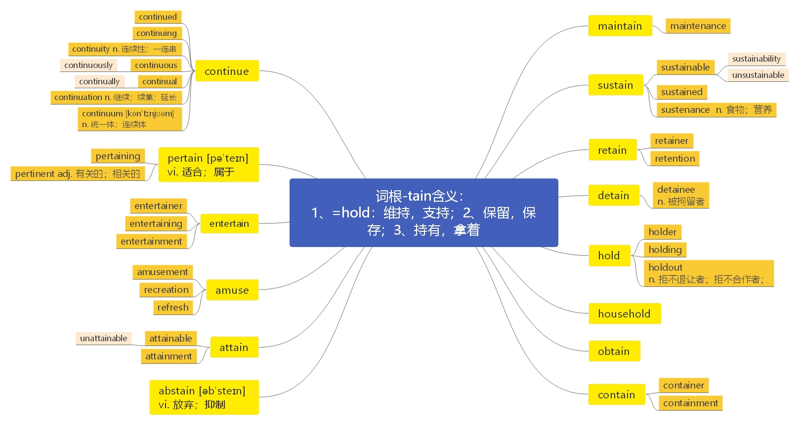
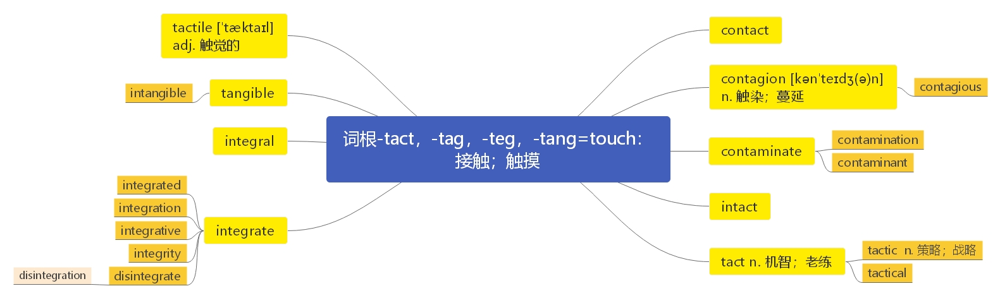
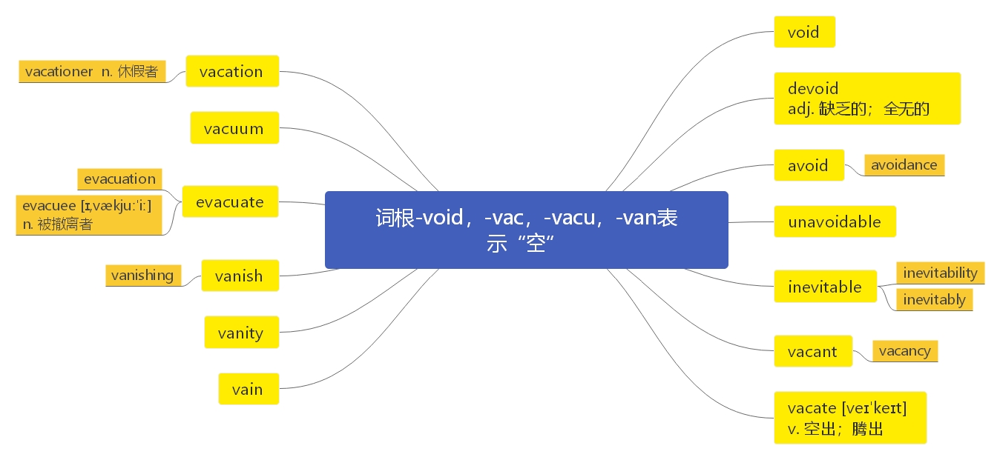

# 第二十一节 掌握 hold 和其派生词

***

> # 本节课目标
>
> 1、 掌握 hold 和其派生词；
>
> 2、掌握词根-tain 构成的相关词汇；
>
> 3、掌握词根-tact， -tag， -teg， -tang 的含义和相关词汇；
>
> 4、掌握词根-void, -vac, -vacu, -van 的含义和相关词汇；

***

# 词根-tain=hold 表示（ 1） “持有； 维持”；（ 2） “保留； 保存”；（ 3） “拿着； 拥有”的含义。

## 1） 词根-tain=hold 表示“持有；维持”时：

***

**hold**  \[həuld] v.  [英音](https://dict.youdao.com/dictvoice?audio=hold\&type=1)  [美音](https://dict.youdao.com/dictvoice?audio=hold\&type=2) 持有， 获得； 保存， 留存； 支持， 持续； 认为； 抓住， 拿住

> **【课堂笔记】**
>
> sb. holds that… 某人认为…

**双语例句:** Does your offer still hold? [播放](https://dict.youdao.com/dictvoice?audio=Does+your+offer+still+hold%3F&le=eng&le=eng&type=2)

你的报价仍然有效吗？ 

**双语例句:** Employees hold 30% of the shares. [播放](https://dict.youdao.com/dictvoice?audio=Employees+hold+30%25+of+the+shares.&le=eng&le=eng&type=2)

雇员持有30%的股份。 

**双语例句:** They hold differing views. [播放](https://dict.youdao.com/dictvoice?audio=They+hold+differing+views.&le=eng&le=eng&type=2)

他们持有不同的观点。 

**原声例句:** \"I,Catherine Elizabeth, take thee,William Arthur Philip Louis, to my wedded husband, to have and to **hold** from this day forward ...\" [播放](https://dict.youdao.com/pureaudio?docid=-3857524047779022970)

**原声例句:** It began as part of the effort for the United States to **hold** the nineteen ninety-four World Cup competition. [播放](https://dict.youdao.com/pureaudio?docid=-1389671596604874331)

**原声例句:** Some cities and communities will **hold** Earth Day activities and celebrations for an entire week, not just on April twenty-second. [播放](https://dict.youdao.com/pureaudio?docid=-279914232853594093)

**权威例句:** Floating sensors **hold** the oxygen to between 2 and 2.5 parts per million of water.  [播放](https://dict.youdao.com/dictvoice?audio=Floating+sensors+hold+the+oxygen+to+between+2+and+2.5+parts+per+million+of+water.+&le=eng&type=2)

**权威例句:** Floating sensors **hold** the oxygen to between 2.0 and 2.5 parts per million of water.  [播放](https://dict.youdao.com/dictvoice?audio=Floating+sensors+hold+the+oxygen+to+between+2.0+and+2.5+parts+per+million+of+water.+&le=eng&type=2)

**权威例句:** Is it possible to get **hold** of a copy of the last company accounts?  [播放](https://dict.youdao.com/dictvoice?audio=Is+it+possible+to+get+hold+of+a+copy+of+the+last+company+accounts%3F+&le=eng&type=2)

***

## 核心词汇：

***

**maintain**  \[meɪn'teɪn; mən'teɪn] vt.  [英音](https://dict.youdao.com/dictvoice?audio=maintain\&type=1)  [美音](https://dict.youdao.com/dictvoice?audio=maintain\&type=2) 维持； 维修； 供养； 继续； 主张 925

**助记：** main（ =-man： 手） +tain（ =hold： 维持； 拿着； 认为） →拿在手里/维持在手里→维持；维修；认为

**搭配：** maintain their living standard（考）：维持他们的生活标准

例句： The New York Times is among the few that can claim national scope—as well as 16 bureaus

in the New York area, it has 11 offices around the US and \_\_\_\_\_\_\_\_ 26 bureaus elsewhere in the

world.

［ A］ contributes ［ B］ disposes ［ C］ maintains ［ D］ encounters

解析： 原文翻译“纽约时报声称自己是为数不多的全国性报刊之一， 它在纽约地区有 16 家分

社，在美国设有 11 个办公室，在世界其他地区另有 26 个分社。故选择 C：维持; 持

有； A：贡献； B：解决； D：遭遇

> **【课堂笔记】**
>
> sb. maintains that… 某人认为…

**双语例句:** The house costs a fortune to maintain. [播放](https://dict.youdao.com/dictvoice?audio=The+house+costs+a+fortune+to+maintain.&le=eng&le=eng&type=2)

维修这房子花费巨大。 

**双语例句:** It's hard to maintain competitive pricing. [播放](https://dict.youdao.com/dictvoice?audio=It%27s+hard+to+maintain+competitive+pricing.&le=eng&le=eng&type=2)

很难保持有竞争力的定价。 

**双语例句:** The government struggled to maintain law and order. [播放](https://dict.youdao.com/dictvoice?audio=The+government+struggled+to+maintain+law+and+order.&le=eng&le=eng&type=2)

政府努力维持治安。 

**原声例句:** FIFA's goal is to **maintain** the rules of football. [播放](https://dict.youdao.com/pureaudio?docid=6937752773523476567)

**原声例句:** \"All genes are encoded by DNA and the DNA is present in the chromosomes in the cell nucleus and telomeres, they are the ends of the chromosomes and they have an important function to protect the chromosomes and **maintain** the integrity of the chromosomes.\" [播放](https://dict.youdao.com/pureaudio?docid=-4846469738442008730)

**原声例句:** \"I don't think this is going to have that big an effect on either side, whether it's the states who want to **maintain** their territorial integrity against the aspirations of some of their own indigenous people or, for that matter, movements that want to seek their own independence and freedom.\" [播放](https://dict.youdao.com/pureaudio?docid=1443874981026446289)

**权威例句:** PricewaterhouseCoopers periodically inspects the walls of protection Credit Suisse has created to **maintain** its competitive advantage.  [播放](https://dict.youdao.com/dictvoice?audio=PricewaterhouseCoopers+periodically+inspects+the+walls+of+protection+Credit+Suisse+has+created+to+maintain+its+competitive+advantage.+&le=eng&type=2)

**权威例句:** We help people understand how we still **maintain** our cultural rituals living in urban society.  [播放](https://dict.youdao.com/dictvoice?audio=We+help+people+understand+how+we+still+maintain+our+cultural+rituals+living+in+urban+society.+&le=eng&type=2)

**权威例句:** Notes are redesigned on a relatively frequent basis, in order to **maintain** security and prevent forgeries.  [播放](https://dict.youdao.com/dictvoice?audio=Notes+are+redesigned+on+a+relatively+frequent+basis%2C+in+order+to+maintain+security+and+prevent+forgeries.+&le=eng&type=2)

***

**maintenance**  \[ˈmeɪntənəns] n.  [英音](https://dict.youdao.com/dictvoice?audio=maintenance\&type=1)  [美音](https://dict.youdao.com/dictvoice?audio=maintenance\&type=2) 维护，维修；保持；生活费用 3091

**助记：** mainten（ =maintain： 维持、 维修） +ance（ 名词后缀） →维修； 保养

**搭配：** a maintenance man（考）：一个维修工人

> **【课堂笔记】**
>
> constant maintenance 经常性地维修

**双语例句:** Small gardens can be high maintenance. [播放](https://dict.youdao.com/dictvoice?audio=Small+gardens+can+be+high+maintenance.&le=eng&le=eng&type=2)

小花园也会有很高的维护费。 

**双语例句:** Careful maintenance can extend the life of your car. [播放](https://dict.youdao.com/dictvoice?audio=Careful+maintenance+can+extend+the+life+of+your+car.&le=eng&le=eng&type=2)

精心保养可延长汽车寿命。 

**双语例句:** Other than blowing up a tyre I hadn't done any car maintenance. [播放](https://dict.youdao.com/dictvoice?audio=Other+than+blowing+up+a+tyre+I+hadn%27t+done+any+car+maintenance.&le=eng&le=eng&type=2)

除了给一个轮胎充气外，我没有做过任何汽车保养。 

**原声例句:** And Twitter, at the request of the State Department, delayed a planned shutdown of its service for **maintenance**. [播放](https://dict.youdao.com/pureaudio?docid=6675760929126606775)

**原声例句:** Seiko wrote there was a similar fire in Kabukicho,Japan in two thousand one: \"The building had a fire alarm apparatus but the switch was turned off because of poor **maintenance**. [播放](https://dict.youdao.com/pureaudio?docid=-4914400618275170603)

**原声例句:** However,most agencies can't afford those. You have to have a hangar, it costs quite a bit for **maintenance** and fuel.\" [播放](https://dict.youdao.com/pureaudio?docid=6030632992391544315)

**权威例句:** Where then is the market failure that would invite federal **maintenance** of a stockpile?  [播放](https://dict.youdao.com/dictvoice?audio=Where+then+is+the+market+failure+that+would+invite+federal+maintenance+of+a+stockpile%3F+&le=eng&type=2)

**权威例句:** The companies believe these innovations will drive down **maintenance** costs and help to maximise energy production.  [播放](https://dict.youdao.com/dictvoice?audio=The+companies+believe+these+innovations+will+drive+down+maintenance+costs+and+help+to+maximise+energy+production.+&le=eng&type=2)

**权威例句:** So Mom can use the 5% for a luxury cruise, then tap the principal for condo **maintenance**.  [播放](https://dict.youdao.com/dictvoice?audio=So+Mom+can+use+the+5%25+for+a+luxury+cruise%2C+then+tap+the+principal+for+condo+maintenance.+&le=eng&type=2)

***

**sustain**  \[sə'steɪn] vt.  [英音](https://dict.youdao.com/dictvoice?audio=sustain\&type=1)  [美音](https://dict.youdao.com/dictvoice?audio=sustain\&type=2) 支撑； 持续； 维持； 忍受 3011

**助记：** sus（ =sub： 从下往上） +tain（ =hold： 维持、 持续） →（ 向上） 维持; 支持； 承担

**搭配：** sustained roar（考）：持续的咆哮声

例句： No, what they fear was that the political challenges of sustaining support for global economic

integration will be more difficult in the United States because of what has happened to the

distribution of income and economic insecurity.&#x20;

他们真正担心的是，由于收入分配不均和经济不稳定， 继续支持全球经济一体化的政治挑战在美国将会更加艰难。

**双语例句:** Which planets can sustain life? [播放](https://dict.youdao.com/dictvoice?audio=Which+planets+can+sustain+life%3F&le=eng&le=eng&type=2)

哪些行星可以维持生命的存在？ 

**双语例句:** The ice will not sustain your weight. [播放](https://dict.youdao.com/dictvoice?audio=The+ice+will+not+sustain+your+weight.&le=eng&le=eng&type=2)

这冰承受不了你的体重。 

**双语例句:** The cash dividends they get from the cash crop would sustain them during the lean season. [播放](https://dict.youdao.com/dictvoice?audio=The+cash+dividends+they+get+from+the+cash+crop+would+sustain+them+during+the+lean+season.&le=eng&le=eng&type=2)

他们从经济作物中得到的那些现金红利能支撑他们度过歉收季节。 

**原声例句:** Batstone-Carr says he thinks BP is strong enough to **sustain** this double-blow to its bank balance and its reputation. [播放](https://dict.youdao.com/pureaudio?docid=2530262424250880933)

**原声例句:** That sums up much of NATO's strategy for Afghanistan: Get Afghans working so they can **sustain** their own country. [播放](https://dict.youdao.com/pureaudio?docid=4931057699686752032)

**原声例句:** His theory was that the devices and body should remain firm, allowing the strings to vibrate longer and **sustain** a sound. [播放](https://dict.youdao.com/pureaudio?docid=-7390968019276289948)

**权威例句:** There's one group of fiscal conservatives nearly enough to **sustain** a filibuster of the spending bill.  [播放](https://dict.youdao.com/dictvoice?audio=There%27s+one+group+of+fiscal+conservatives+nearly+enough+to+sustain+a+filibuster+of+the+spending+bill.+&le=eng&type=2)

**权威例句:** Second, we will **sustain** what have been among the most extensive sanctions in UN history.  [播放](https://dict.youdao.com/dictvoice?audio=Second%2C+we+will+sustain+what+have+been+among+the+most+extensive+sanctions+in+UN+history.+&le=eng&type=2)

**权威例句:** Although Argentina's recovery is more or less complete, it must now introduce policies to **sustain** growth.  [播放](https://dict.youdao.com/dictvoice?audio=Although+Argentina%27s+recovery+is+more+or+less+complete%2C+it+must+now+introduce+policies+to+sustain+growth.+&le=eng&type=2)

***

**sustainability**  \[sə'steɪnəbɪlətɪ] n.  [英音](https://dict.youdao.com/dictvoice?audio=sustainability\&type=1)  [美音](https://dict.youdao.com/dictvoice?audio=sustainability\&type=2) 持续性 9275

**双语例句:** If these messages of ethics and sustainability resonate with them, you get a ripple effect. [播放](https://dict.youdao.com/dictvoice?audio=If+these+messages+of+ethics+and+sustainability+resonate+with+them%2C+you+get+a+ripple+effect.&le=eng&le=eng&type=2)

如果这些道德和可持续性的讯息可以让他们产生共鸣，你就可以得到连锁反应。 

**双语例句:** She exhibits the idealism common to many advocates of sustainability, be it in food or in energy. [播放](https://dict.youdao.com/dictvoice?audio=She+exhibits+the+idealism+common+to+many+advocates+of+sustainability%2C+be+it+in+food+or+in+energy.&le=eng&le=eng&type=2)

无论是在食品领域还是能源领域，她都展示了许多可持续发展倡导者所共有的理想主义。 

**双语例句:** I'll pose some of the questions and the challenges we are facing in the area of access in sustainability. [播放](https://dict.youdao.com/dictvoice?audio=I%27ll+pose+some+of+the+questions+and+the+challenges+we+are+facing+in+the+area+of+access+in+sustainability.&le=eng&le=eng&type=2)

我将提出，我们在可持续性这方面所面临的问题和挑战。 

**原声例句:** A report last month from a government committee, the **Sustainability** Task Force, outlined goals for Hawaii's future. [播放](https://dict.youdao.com/pureaudio?docid=-1050959677677670209)

**原声例句:** Ms.Chapple-Brown says the school also offers one hundred forty different classes in **sustainability** and the environment. [播放](https://dict.youdao.com/pureaudio?docid=-2514948970396451169)

**原声例句:** William Paddock is founder and director of a business consulting company in Tennessee called WAP **Sustainability**. [播放](https://dict.youdao.com/pureaudio?docid=-1254215644045169160)

**权威例句:** The reality is that the **sustainability** of this fragile desert environment is a huge concern.  [播放](https://dict.youdao.com/dictvoice?audio=The+reality+is+that+the+sustainability+of+this+fragile+desert+environment+is+a+huge+concern.+&le=eng&type=2)

**权威例句:** Other Asian countries are also moving quickly in reducing greenhouse gas emissions and fostering **sustainability**.  [播放](https://dict.youdao.com/dictvoice?audio=Other+Asian+countries+are+also+moving+quickly+in+reducing+greenhouse+gas+emissions+and+fostering+sustainability.+&le=eng&type=2)

**权威例句:** Improving access to education and information is vital to the development and **sustainability** of the Pacific.  [播放](https://dict.youdao.com/dictvoice?audio=Improving+access+to+education+and+information+is+vital+to+the+development+and+sustainability+of+the+Pacific.+&le=eng&type=2)

***

**sustainable**  \[sə'steɪnəb(ə)l] adj.  [英音](https://dict.youdao.com/dictvoice?audio=sustainable\&type=1)  [美音](https://dict.youdao.com/dictvoice?audio=sustainable\&type=2) 可持续的； 足可支撑的 4955

**助记：** sustain（ 持续） +able（ 可以…的） →可以持续的

**搭配：** sustainable competitive advantage（考）：可持续的竞争优势

例句： In a report entitled “Averting the Old Age Crisis”, it argued that pension arrangements in most countries were unsustainable.&#x20;

在一个标题为“避免老年危机”的报道中， 认为大多数国家的养老金安排都是不可持续的。

写作例句：节约资源是经济得以可持续发展的一个重要因素。

A favorale environment is a vital/crucial/critical/important/essential element/factor for the sustainable development of the economy.

**双语例句:** The creation of an efficient and sustainable transport system is critical. [播放](https://dict.youdao.com/dictvoice?audio=The+creation+of+an+efficient+and+sustainable+transport+system+is+critical.&le=eng&le=eng&type=2)

一个高效而可持续发展的交通系统的创建是非常重要的。 

**双语例句:** The farming methods of ants are at least sustainable. [播放](https://dict.youdao.com/dictvoice?audio=The+farming+methods+of+ants+are+at+least+sustainable.&le=eng&le=eng&type=2)

蚂蚁的养殖方式至少是可持续的。 

**双语例句:** We've talked recently about the importance of sustainable energy. [播放](https://dict.youdao.com/dictvoice?audio=We%27ve+talked+recently+about+the+importance+of+sustainable+energy.&le=eng&le=eng&type=2)

最近我们谈到了可持续能源的重要性。 

**原声例句:** Still,EU Fisheries Commissioner Maria Damanaki said the meeting took \"a step in the right direction for **sustainable** management\" of bluefin tuna. [播放](https://dict.youdao.com/pureaudio?docid=2762081363927005466)

**原声例句:** CARLOS AMAYA: \"By then, I had already developed my own idea of what **sustainable** was, and where it needed to go.\" [播放](https://dict.youdao.com/pureaudio?docid=-3930383656966954465)

**原声例句:** \"It shows mangroves are probably pretty good candidates for things like carbon-market trading to encourage **sustainable** forest management.\" [播放](https://dict.youdao.com/pureaudio?docid=2887731375946267958)

**权威例句:** Loyalty can bring just as good results as fear or greed, and probably more **sustainable** growth.  [播放](https://dict.youdao.com/dictvoice?audio=Loyalty+can+bring+just+as+good+results+as+fear+or+greed%2C+and+probably+more+sustainable+growth.+&le=eng&type=2)

**权威例句:** They play a central role in **sustainable** development by supplying all our fresh water.  [播放](https://dict.youdao.com/dictvoice?audio=They+play+a+central+role+in+sustainable+development+by+supplying+all+our+fresh+water.+&le=eng&type=2)

**权威例句:** Research conducted by the UKNC for the post-2015 **Sustainable** Development Goals helped develop this Bill.  [播放](https://dict.youdao.com/dictvoice?audio=Research+conducted+by+the+UKNC+for+the+post-2015+Sustainable+Development+Goals+helped+develop+this+Bill.+&le=eng&type=2)

***

**sustained**  \[sə'steɪnd] adj.  [英音](https://dict.youdao.com/dictvoice?audio=sustained\&type=1)  [美音](https://dict.youdao.com/dictvoice?audio=sustained\&type=2) 持久的； 持续的； 持久不变的 6608

**双语例句:** Witnesses say the firing was deliberate and sustained. [播放](https://dict.youdao.com/dictvoice?audio=Witnesses+say+the+firing+was+deliberate+and+sustained.&le=eng&le=eng&type=2)

目击者说这次射击是蓄意的，而且还持续了一段时间。 

**双语例句:** He appeared embarrassed and ill at ease with the sustained applause that greeted him. [播放](https://dict.youdao.com/dictvoice?audio=He+appeared+embarrassed+and+ill+at+ease+with+the+sustained+applause+that+greeted+him.&le=eng&le=eng&type=2)

他对持久的掌声显得尴尬、不自在。 

**双语例句:** Speech is generally clear, fluid and sustained. [播放](https://dict.youdao.com/dictvoice?audio=Speech+is+generally+clear%2C+fluid+and+sustained.&le=eng&le=eng&type=2)

演讲通常清晰、流畅、持续。 

**原声例句:** The global downward market trend accelerated Thursday with two economic reports that cast doubt on the **sustained** vitality of the U.S.economic recovery. [播放](https://dict.youdao.com/pureaudio?docid=-8110519079580844161)

**原声例句:** Geithner said one key to a **sustained** economic recovery will be to reduce U.S.federal deficits and stop adding to America's national debt. [播放](https://dict.youdao.com/pureaudio?docid=-5633295549587614662)

**原声例句:** The increase to level 5 indicates that there is **sustained** human-to-human transmission in communities in different geographical locations. [播放](https://dict.youdao.com/pureaudio?docid=-1133085128954297619)

**权威例句:** It will require a political solution arrived at through **sustained** Iraqi and region-wide diplomacy and engagement.  [播放](https://dict.youdao.com/dictvoice?audio=It+will+require+a+political+solution+arrived+at+through+sustained+Iraqi+and+region-wide+diplomacy+and+engagement.+&le=eng&type=2)

**权威例句:** This eight day tour provided the first **sustained** opportunity to observe Camilla in action as a royal.  [播放](https://dict.youdao.com/dictvoice?audio=This+eight+day+tour+provided+the+first+sustained+opportunity+to+observe+Camilla+in+action+as+a+royal.+&le=eng&type=2)

**权威例句:** Haringey Council was severely criticised following the death, after **sustained** abuse, of 17-month-old Baby P in August 2007.  [播放](https://dict.youdao.com/dictvoice?audio=Haringey+Council+was+severely+criticised+following+the+death%2C+after+sustained+abuse%2C+of+17-month-old+Baby+P+in+August+2007.+&le=eng&type=2)

***

**sustenance**  \['sʌst(ə)nəns; -tɪn-] n.  [英音](https://dict.youdao.com/dictvoice?audio=sustenance\&type=1)  [美音](https://dict.youdao.com/dictvoice?audio=sustenance\&type=2) 食物； 营养； 养料 14664

**助记：** susten（ =sustain： 维持） +ance（ 名词后缀） →维持生命的东西→食物； 营养； 养料

**释义和用法：**

(N-UNCOUNT) 食物；营养；养料&#x20;

Sustenance is food or drink which a person, animal, or plant needs to remain alive and healthy.

**双语例句:** There's not much sustenance in a bowl of soup. [播放](https://dict.youdao.com/dictvoice?audio=There%27s+not+much+sustenance+in+a+bowl+of+soup.&le=eng&le=eng&type=2)

一碗汤没多少营养。 

**双语例句:** Arguing would only give further sustenance to his allegations. [播放](https://dict.youdao.com/dictvoice?audio=Arguing+would+only+give+further+sustenance+to+his+allegations.&le=eng&le=eng&type=2)

越是争论，他越会觉得自己那些说法有道理。 

**双语例句:** Elections are essential for the sustenance of parliamentary democracy. [播放](https://dict.youdao.com/dictvoice?audio=Elections+are+essential+for+the+sustenance+of+parliamentary+democracy.&le=eng&le=eng&type=2)

选举制度是维持议会民主所必不可少的。 

**原声例句:** At the end, the writer doesn't depict him as needing the sacrifice for food or **sustenance**.

**原声例句:** And moreover during the period of the flood they don't have food,they don't have **sustenance**.

**原声例句:** It was a set of beliefs in the **sustenance** of a social order as it is.

**权威例句:** Called whale-fall, the layers of blubber, internal organs and bones can provide **sustenance** for many years.  [播放](https://dict.youdao.com/dictvoice?audio=Called+whale-fall%2C+the+layers+of+blubber%2C+internal+organs+and+bones+can+provide+sustenance+for+many+years.+&le=eng&type=2)

**权威例句:** The sub-text to these misadventures is that terrorists, whether \"bungling amateurs or lethal professionals, \" require **sustenance**.  [播放](https://dict.youdao.com/dictvoice?audio=The+sub-text+to+these+misadventures+is+that+terrorists%2C+whether+%22bungling+amateurs+or+lethal+professionals%2C+%22+require+sustenance.+&le=eng&type=2)

**权威例句:** Both companies have used a kind of sandwich not for **sustenance** but for tax minimization.  [播放](https://dict.youdao.com/dictvoice?audio=Both+companies+have+used+a+kind+of+sandwich+not+for+sustenance+but+for+tax+minimization.+&le=eng&type=2)

***

**unsustainable**  \[ʌnsə'steɪnəb(ə)l] adj.  [英音](https://dict.youdao.com/dictvoice?audio=unsustainable\&type=1)  [美音](https://dict.youdao.com/dictvoice?audio=unsustainable\&type=2) 不可持续的； 无法维持的 17844

**双语例句:** Life on Earth will become unsustainable unless population growth is held in check. [播放](https://dict.youdao.com/dictvoice?audio=Life+on+Earth+will+become+unsustainable+unless+population+growth+is+held+in+check.&le=eng&le=eng&type=2)

地球上的生命将无法延续，除非人口增长得到控制。 

**双语例句:** It's not only unsustainable for workers, but also for the companies that employ them. [播放](https://dict.youdao.com/dictvoice?audio=It%27s+not+only+unsustainable+for+workers%2C+but+also+for+the+companies+that+employ+them.&le=eng&le=eng&type=2)

这不仅对工人是不可持续的，对雇佣他们的公司也是如此。 

**双语例句:** Peter Orszag, Obama's Budget Director, recently called the US budget deficits unsustainable and he's right. [播放](https://dict.youdao.com/dictvoice?audio=Peter+Orszag%2C+Obama%27s+Budget+Director%2C+recently+called+the+US+budget+deficits+unsustainable+and+he%27s+right.&le=eng&le=eng&type=2)

奥巴马政府的预算主管彼得·奥斯泽格最近称，美国的预算赤字是不可持续的，他是对的。 

**权威例句:** The counter-narratives put forward by the Bishops and by Ginny Polio are also **unsustainable**.  [播放](https://dict.youdao.com/dictvoice?audio=The+counter-narratives+put+forward+by+the+Bishops+and+by+Ginny+Polio+are+also+unsustainable.+&le=eng&type=2)

**权威例句:** Here is the corollary of that unfortunate nexus between weak trade and **unsustainable** high government borrowing.  [播放](https://dict.youdao.com/dictvoice?audio=Here+is+the+corollary+of+that+unfortunate+nexus+between+weak+trade+and+unsustainable+high+government+borrowing.+&le=eng&type=2)

**权威例句:** But what is true is that the path we're on right now is **unsustainable**.  [播放](https://dict.youdao.com/dictvoice?audio=But+what+is+true+is+that+the+path+we%27re+on+right+now+is+unsustainable.+&le=eng&type=2)

***

## 2） 词根-tain=hold 表示“保留； 保存”时：

***

**retain**  \[rɪ'teɪn] vt.  [英音](https://dict.youdao.com/dictvoice?audio=retain\&type=1)  [美音](https://dict.youdao.com/dictvoice?audio=retain\&type=2) 保留；雇；记住 2748

**助记：** re（ 返回） +tain（ =hold： 保存， 留存） →拿回家（ 放好） →保留， 保存

例句： If he failed to achieve the dream of a better life for himself, he could still retain it for his

children. 如果他自己没能实现一个更好生活的梦想，他仍然能为他的孩子保留着该梦想。

写作例句：环境优美的景点总是能够留住大量游客。

Scenic spots with beautiful landscape can always retain a large body of tourists.

**双语例句:** He struggled to retain control of the situation. [播放](https://dict.youdao.com/dictvoice?audio=He+struggled+to+retain+control+of+the+situation.&le=eng&le=eng&type=2)

他曾努力保持对局势的控制。 

**双语例句:** She has a good memory and finds it easy to retain facts. [播放](https://dict.youdao.com/dictvoice?audio=She+has+a+good+memory+and+finds+it+easy+to+retain+facts.&le=eng&le=eng&type=2)

她记忆力好，很容易记住事情。 

**双语例句:** Daily facial exercises help to retain the skin's elasticity. [播放](https://dict.youdao.com/dictvoice?audio=Daily+facial+exercises+help+to+retain+the+skin%27s+elasticity.&le=eng&le=eng&type=2)

每日的面部运动有助于保持皮肤弹性。 

**原声例句:** Preservationists have been working to **retain** the site's status by promoting awareness among Lebanese and reaching out to the media. [播放](https://dict.youdao.com/pureaudio?docid=3794975793365259612)

**原声例句:** The Vienna museum will **retain** the painting, but the display will now include signage indicating its Nazi-looted past. [播放](https://dict.youdao.com/pureaudio?docid=-1749917913128459586)

**原声例句:** \"How are we going to grow, recruit and **retain** experts or cyber cops and experts in cyber security. [播放](https://dict.youdao.com/pureaudio?docid=-4061188514872832515)

**权威例句:** At the same time, Santa Teresa has managed to **retain** its friendly, village-like vibe.  [播放](https://dict.youdao.com/dictvoice?audio=At+the+same+time%2C+Santa+Teresa+has+managed+to+retain+its+friendly%2C+village-like+vibe.+&le=eng&type=2)

**权威例句:** Had Roberts considered ObamaCare constitutional, perhaps Pandora could **retain** hope and a pretense of limited government.  [播放](https://dict.youdao.com/dictvoice?audio=Had+Roberts+considered+ObamaCare+constitutional%2C+perhaps+Pandora+could+retain+hope+and+a+pretense+of+limited+government.+&le=eng&type=2)

**权威例句:** Spanish bank Santander will sponsor Ferrari next year, although they will still **retain** a smaller presence with McLaren.  [播放](https://dict.youdao.com/dictvoice?audio=Spanish+bank+Santander+will+sponsor+Ferrari+next+year%2C+although+they+will+still+retain+a+smaller+presence+with+McLaren.+&le=eng&type=2)

***

**retainer**  \[rɪ'teɪnə] n.  [英音](https://dict.youdao.com/dictvoice?audio=retainer\&type=1)  [美音](https://dict.youdao.com/dictvoice?audio=retainer\&type=2) 保持者；家臣；定金；预付费用 17907

**双语例句:** I'll need a five-hundred-dollar retainer. [播放](https://dict.youdao.com/dictvoice?audio=I%27ll+need+a+five-hundred-dollar+retainer.&le=eng&le=eng&type=2)

我将需要一笔500美元的预付聘金。 

**双语例句:** The agency will pay you a monthly retainer. [播放](https://dict.youdao.com/dictvoice?audio=The+agency+will+pay+you+a+monthly+retainer.&le=eng&le=eng&type=2)

这个机构将会每月付给你聘用金。 

**双语例句:** Middle-class families contract with a puller to take a child to school and pick him up; the puller essentially becomes a family retainer. [播放](https://dict.youdao.com/dictvoice?audio=Middle-class+families+contract+with+a+puller+to+take+a+child+to+school+and+pick+him+up%3B+the+puller+essentially+becomes+a+family+retainer.&le=eng&le=eng&type=2)

中产阶级家庭与车夫签订合同，让他送孩子去学校以及接孩子放学。车夫实际上变成了一位家仆。 

**权威例句:** Unless you buy an awful lot of art, keeping an adviser on **retainer** can get needlessly expensive.  [播放](https://dict.youdao.com/dictvoice?audio=Unless+you+buy+an+awful+lot+of+art%2C+keeping+an+adviser+on+retainer+can+get+needlessly+expensive.+&le=eng&type=2)

**权威例句:** If unbundling fees means firms having to pay a fat **retainer** for advisory work, so be it.  [播放](https://dict.youdao.com/dictvoice?audio=If+unbundling+fees+means+firms+having+to+pay+a+fat+retainer+for+advisory+work%2C+so+be+it.+&le=eng&type=2)

**权威例句:** For a monthly **retainer** fee, a patient can have access to their family physician at any time.  [播放](https://dict.youdao.com/dictvoice?audio=For+a+monthly+retainer+fee%2C+a+patient+can+have+access+to+their+family+physician+at+any+time.+&le=eng&type=2)

***

**retention**  \[rɪ'tenʃ(ə)n] n.  [英音](https://dict.youdao.com/dictvoice?audio=retention\&type=1)  [美音](https://dict.youdao.com/dictvoice?audio=retention\&type=2) 扣留， 滞留； 保留； 记忆力； 6633

**双语例句:** Eating too much salt can cause fluid retention. [播放](https://dict.youdao.com/dictvoice?audio=Eating+too+much+salt+can+cause+fluid+retention.&le=eng&le=eng&type=2)

摄盐过多会导致体液潴留。 

**双语例句:** He argues strongly for retention of NATO as a guarantee of peace. [播放](https://dict.youdao.com/dictvoice?audio=He+argues+strongly+for+retention+of+NATO+as+a+guarantee+of+peace.&le=eng&le=eng&type=2)

他据理力争北大西洋公约组织作为一个和平保障的保留。 

**双语例句:** The Citizens' Forum supported special powers for Quebec but also argued for the retention of a strong central government. [播放](https://dict.youdao.com/dictvoice?audio=The+Citizens%27+Forum+supported+special+powers+for+Quebec+but+also+argued+for+the+retention+of+a+strong+central+government.&le=eng&le=eng&type=2)

《市民论坛》支持魁北克的特殊权力，但是也主张保留一个强有力的中央政府。 

**原声例句:** the **retention** bonuses were put in place at the beginning of 2008, before AIG received any bail-out money. [播放](https://dict.youdao.com/pureaudio?docid=-4629071100710070202)

**原声例句:** **Retention** went up for them; performance went up; they were more likely to advance in their organization and stay in their organization.

**原声例句:** But I mean, if you launch a feature, obviously **retention** is going to go up.

**权威例句:** It is two years in a row now that we've had a 60% **retention** rate.  [播放](https://dict.youdao.com/dictvoice?audio=It+is+two+years+in+a+row+now+that+we%27ve+had+a+60%25+retention+rate.+&le=eng&type=2)

**权威例句:** U.'s Article 29 Working Party recommended that laws limit data **retention** to only six months.  [播放](https://dict.youdao.com/dictvoice?audio=U.%27s+Article+29+Working+Party+recommended+that+laws+limit+data+retention+to+only+six+months.+&le=eng&type=2)

**权威例句:** Most of us spend a lot of time thinking about talent recruitment and **retention**.  [播放](https://dict.youdao.com/dictvoice?audio=Most+of+us+spend+a+lot+of+time+thinking+about+talent+recruitment+and+retention.+&le=eng&type=2)

***

**detain**  \[dɪ'teɪn] vt.  [英音](https://dict.youdao.com/dictvoice?audio=detain\&type=1)  [美音](https://dict.youdao.com/dictvoice?audio=detain\&type=2) 拘留； 留住； 耽搁 7694

**助记：** de（ 加强语气） +tain（ =hold： 保存， 留存） →强行留下→拘留

**双语例句:** He caught her arm in a subconscious attempt to detain her. [播放](https://dict.youdao.com/dictvoice?audio=He+caught+her+arm+in+a+subconscious+attempt+to+detain+her.&le=eng&le=eng&type=2)

他下意识地抓住了她的胳膊，试图留住她。 

**双语例句:** Millson stood up. \"Thank you. We won't detain you any further, Mrs. Stebbing.\" [播放](https://dict.youdao.com/dictvoice?audio=Millson+stood+up.+%22Thank+you.+We+won%27t+detain+you+any+further%2C+Mrs.+Stebbing.%22&le=eng&le=eng&type=2)

米尔森站起来。“谢谢您。我们不再耽搁您了，斯特宾太太。” 

**双语例句:** It is against the law to detain you against your will for any length of time. [播放](https://dict.youdao.com/dictvoice?audio=It+is+against+the+law+to+detain+you+against+your+will+for+any+length+of+time.&le=eng&le=eng&type=2)

违反你的意愿拘留你无论多久都是违法的。 

**权威例句:** Just because you're poor, that doesn't mean you can cross borders and **detain** people for ransom.  [播放](https://dict.youdao.com/dictvoice?audio=Just+because+you%27re+poor%2C+that+doesn%27t+mean+you+can+cross+borders+and+detain+people+for+ransom.+&le=eng&type=2)

**权威例句:** Nor will it **detain** party politicians, keener to win power than to take stands.  [播放](https://dict.youdao.com/dictvoice?audio=Nor+will+it+detain+party+politicians%2C+keener+to+win+power+than+to+take+stands.+&le=eng&type=2)

**权威例句:** First, closing the detention facility there does not mean that we cannot **detain** people.  [播放](https://dict.youdao.com/dictvoice?audio=First%2C+closing+the+detention+facility+there+does+not+mean+that+we+cannot+detain+people.+&le=eng&type=2)

***

**detainee**  \[,dɪteɪ'niː; ,diː-] n. ( [英音](https://dict.youdao.com/dictvoice?audio=detainee\&type=1)  [美音](https://dict.youdao.com/dictvoice?audio=detainee\&type=2) 因其政治观点或活动而)被拘留者， 被扣押者 8160

**释义和用法：** (N-COUNT) (因其政治观点或活动而)被拘留者，被扣押者 A detainee is someone

who is held prisoner by a government because of his or her political views or activities.

**双语例句:** I work in the Detainee Holding Area. [播放](https://dict.youdao.com/dictvoice?audio=I+work+in+the+Detainee+Holding+Area.&le=eng&le=eng&type=2)

我工作中的被拘留者控股区。 

**双语例句:** A detainee stands by an interior fence in the prison. [播放](https://dict.youdao.com/dictvoice?audio=A+detainee+stands+by+an+interior+fence+in+the+prison.&le=eng&le=eng&type=2)

一名囚犯站在内部围栏边上。 

**双语例句:** Hence, also, the urgent need for a coherent detainee policy. [播放](https://dict.youdao.com/dictvoice?audio=Hence%2C+also%2C+the+urgent+need+for+a+coherent+detainee+policy.&le=eng&le=eng&type=2)

因此急切需要一直连贯的拘留政策。 

**权威例句:** Those issues, she says, include the Guantanamo Bay facility, **detainee** treatment and interrogation practices.  [播放](https://dict.youdao.com/dictvoice?audio=Those+issues%2C+she+says%2C+include+the+Guantanamo+Bay+facility%2C+detainee+treatment+and+interrogation+practices.+&le=eng&type=2)

**权威例句:** However it is noted that the **detainee** attempted suicide twice before being taken into custody.  [播放](https://dict.youdao.com/dictvoice?audio=However+it+is+noted+that+the+detainee+attempted+suicide+twice+before+being+taken+into+custody.+&le=eng&type=2)

**权威例句:** Like, if we catch someone kicking a **detainee**, we just knock it off right there.  [播放](https://dict.youdao.com/dictvoice?audio=Like%2C+if+we+catch+someone+kicking+a+detainee%2C+we+just+knock+it+off+right+there.+&le=eng&type=2)

***

## 3） hold 表示“持有； 获得； 拿着”时：

***

**holder**  \['həʊldə] n.  [英音](https://dict.youdao.com/dictvoice?audio=holder\&type=1)  [美音](https://dict.youdao.com/dictvoice?audio=holder\&type=2) 所有人；持有人；（台、架等）支持物； 5511

> **【课堂笔记】**
>
> stockholder n. 股票持有人

**搭配：** copyright holders（考）：版权拥有者

**双语例句:** The lease entitles the holder to use the buildings and any land attached thereto. [播放](https://dict.youdao.com/dictvoice?audio=The+lease+entitles+the+holder+to+use+the+buildings+and+any+land+attached+thereto.&le=eng&le=eng&type=2)

本租约持有人有权使用此建筑物以及所附属的土地。 

**双语例句:** Doing so will entitle the ticket holder to unlimited free parking. [播放](https://dict.youdao.com/dictvoice?audio=Doing+so+will+entitle+the+ticket+holder+to+unlimited+free+parking.&le=eng&le=eng&type=2)

这样做可以使持票人享有无限的免费停车权。 

**双语例句:** Andy Holder—the chief economist at The Bank of England—suggested that the UK move towards a government-backed digital currency. [播放](https://dict.youdao.com/dictvoice?audio=Andy+Holder%E2%80%94the+chief+economist+at+The+Bank+of+England%E2%80%94suggested+that+the+UK+move+towards+a+government-backed+digital+currency.&le=eng&le=eng&type=2)

英格兰银行的首席经济学家安迪·霍尔德认为，英国正朝着一种由政府支持的数字货币的方向发展。 

**原声例句:** Attorney General Eric **Holder** has called the case one of the most serious threats since the attacks of September eleventh, two thousand one. [播放](https://dict.youdao.com/pureaudio?docid=-6887459167284350684)

**原声例句:** China was the single largest foreign **holder** of Treasury securities, followed by Japan and Britain. [播放](https://dict.youdao.com/pureaudio?docid=-5875944905407798292)

**原声例句:** The copyright **holder** owns the rights to the song for a period governed by law. [播放](https://dict.youdao.com/pureaudio?docid=4493845799031037320)

**权威例句:** But if you die, the account bypasses your estate and belongs to the joint **holder**.  [播放](https://dict.youdao.com/dictvoice?audio=But+if+you+die%2C+the+account+bypasses+your+estate+and+belongs+to+the+joint+holder.+&le=eng&type=2)

**权威例句:** \"I'm really relieved that it is over more than anything, \" said the new world title **holder**.  [播放](https://dict.youdao.com/dictvoice?audio=%22I%27m+really+relieved+that+it+is+over+more+than+anything%2C+%22+said+the+new+world+title+holder.+&le=eng&type=2)

**权威例句:** This past May, Susan Buffett was the second largest **holder** of Berkshire shares behind her husband.  [播放](https://dict.youdao.com/dictvoice?audio=This+past+May%2C+Susan+Buffett+was+the+second+largest+holder+of+Berkshire+shares+behind+her+husband.+&le=eng&type=2)

***

**holding**  \['həʊldɪŋ] n.  [英音](https://dict.youdao.com/dictvoice?audio=holding\&type=1)  [美音](https://dict.youdao.com/dictvoice?audio=holding\&type=2) 股份；举办；收藏品 5395

> **【课堂笔记】**
>
> hold a sports meeting 举办运动会

**双语例句:** She has a 40% holding in the company. [播放](https://dict.youdao.com/dictvoice?audio=She+has+a+40%25+holding+in+the+company.&le=eng&le=eng&type=2)

她持有公司40%的股份。 

**双语例句:** You're not holding it the right way up. [播放](https://dict.youdao.com/dictvoice?audio=You%27re+not+holding+it+the+right+way+up.&le=eng&le=eng&type=2)

你把它拿倒了。 

**双语例句:** They're holding a press briefing tomorrow. [播放](https://dict.youdao.com/dictvoice?audio=They%27re+holding+a+press+briefing+tomorrow.&le=eng&le=eng&type=2)

他们明天将召开新闻发布会。 

**原声例句:** But possibly the biggest story of this year's World Cup is the history of the nation **holding** the huge event. [播放](https://dict.youdao.com/pureaudio?docid=4270371017979843918)

**原声例句:** In everyday speech, **holding** your cards close to your vest means not letting other know what you are doing or thinking. [播放](https://dict.youdao.com/pureaudio?docid=4755949174574173215)

**原声例句:** Just as a keystone holds together a stone arch, Pennsylvania was seen as **holding** together the young American republic. [播放](https://dict.youdao.com/pureaudio?docid=-8003278682147393658)

**权威例句:** And so Darfur's camps have become giant prisons, **holding** almost two million people now.  [播放](https://dict.youdao.com/dictvoice?audio=And+so+Darfur%27s+camps+have+become+giant+prisons%2C+holding+almost+two+million+people+now.+&le=eng&type=2)

**权威例句:** He was eventually released unharmed, but we're told that both sides are currently **holding** hostages.  [播放](https://dict.youdao.com/dictvoice?audio=He+was+eventually+released+unharmed%2C+but+we%27re+told+that+both+sides+are+currently+holding+hostages.+&le=eng&type=2)

**权威例句:** But Professor of Government Stephen Haseler certainly won't be **holding** his tongue this time around.  [播放](https://dict.youdao.com/dictvoice?audio=But+Professor+of+Government+Stephen+Haseler+certainly+won%27t+be+holding+his+tongue+this+time+around.+&le=eng&type=2)

***

**holdout**  \['həʊldaʊt] n.  [英音](https://dict.youdao.com/dictvoice?audio=holdout\&type=1)  [美音](https://dict.youdao.com/dictvoice?audio=holdout\&type=2) 拒不退让者；拒不合作者；拒不参加者 18253

释义和用法:

拒不退让者；拒不合作者；拒不参加者 A holdout is someone who refuses to agree or act with

other people in a particular situation and by doing so stops the situation from progressing or being

resolved.

**双语例句:** France has been the holdout in trying to negotiate an end to the dispute. [播放](https://dict.youdao.com/dictvoice?audio=France+has+been+the+holdout+in+trying+to+negotiate+an+end+to+the+dispute.&le=eng&le=eng&type=2)

法国在解决这次争端的谈判中拒不让步。 

**双语例句:** How long can Gadhafi holdout? [播放](https://dict.youdao.com/dictvoice?audio=How+long+can+Gadhafi+holdout%3F&le=eng&le=eng&type=2)

卡扎菲要多久才能被抓获？ 

**双语例句:** In contrast to Samsung, Apple is a holdout. [播放](https://dict.youdao.com/dictvoice?audio=In+contrast+to+Samsung%2C+Apple+is+a+holdout.&le=eng&le=eng&type=2)

与三星相比，苹果没有屈服。 

**权威例句:** Once again, some SDTV **holdout** is ranting about how HDTV is ruining the game.  [播放](https://dict.youdao.com/dictvoice?audio=Once+again%2C+some+SDTV+holdout+is+ranting+about+how+HDTV+is+ruining+the+game.+&le=eng&type=2)

**权威例句:** He needs only the blessing of one last **holdout**, the FCC, which could rule within weeks.  [播放](https://dict.youdao.com/dictvoice?audio=He+needs+only+the+blessing+of+one+last+holdout%2C+the+FCC%2C+which+could+rule+within+weeks.+&le=eng&type=2)

**权威例句:** But it could be the beginning of the end as the last **holdout** evolves.  [播放](https://dict.youdao.com/dictvoice?audio=But+it+could+be+the+beginning+of+the+end+as+the+last+holdout+evolves.+&le=eng&type=2)

***

**household**  \['haʊshəʊld] adj.  [英音](https://dict.youdao.com/dictvoice?audio=household\&type=1)  [美音](https://dict.youdao.com/dictvoice?audio=household\&type=2) 家庭的； 日常的； 王室的； n. 家庭 1981

**助记：** house+hold（ 持有、 拥有） →每家都有的→家庭的、 家喻户晓的

**搭配：** household expenses（考）：家庭开支 stockholder（考）：股票持有人

例句： Parents worry about the possibility of toxic chemicals making their way from \_\_\_\_\_\_\_\_ plastic

into children's bloodstreams.

A) household B) family C) internal D) civil

解析： 原文翻译“父母们担心有毒化学成分可能通过家用塑料制品进入孩子的血液”， 故选 A：

household：家用的； B：家庭的； C：内部的； D：公民的、民间的

> **【课堂笔记】**
>
> household appliance 家用电器
>
> per household 每一个家庭

**双语例句:** She became a household name in the 1960s. [播放](https://dict.youdao.com/dictvoice?audio=She+became+a+household+name+in+the+1960s.&le=eng&le=eng&type=2)

她在20世纪60年代成为家喻户晓的人物。 

**双语例句:** Today, fashion designers are household names. [播放](https://dict.youdao.com/dictvoice?audio=Today%2C+fashion+designers+are+household+names.&le=eng&le=eng&type=2)

如今，服装设计师们家喻户晓。 

**双语例句:** Many household products give off noxious fumes. [播放](https://dict.youdao.com/dictvoice?audio=Many+household+products+give+off+noxious+fumes.&le=eng&le=eng&type=2)

很多家用产品散发有害气体。 

**原声例句:** The ten finalists presented their inventions made of common **household** products then competed in a series of events. [播放](https://dict.youdao.com/pureaudio?docid=2511579894723725765)

**原声例句:** They say the levels of Mycobacterium avium were one hundred times higher than that of normal **household** water. [播放](https://dict.youdao.com/pureaudio?docid=6498104378480004518)

**原声例句:** Last week,the United States Department of Agriculture released its \"**household** food security\" report for two thousand eight. [播放](https://dict.youdao.com/pureaudio?docid=-5279982611336774529)

**权威例句:** Aubel recalled that it was firmly decided that Welsh would be the language of the **household**.  [播放](https://dict.youdao.com/dictvoice?audio=Aubel+recalled+that+it+was+firmly+decided+that+Welsh+would+be+the+language+of+the+household.+&le=eng&type=2)

**权威例句:** With the economy being as it is, it takes both adults in an average **household**, to work.  [播放](https://dict.youdao.com/dictvoice?audio=With+the+economy+being+as+it+is%2C+it+takes+both+adults+in+an+average+household%2C+to+work.+&le=eng&type=2)

**权威例句:** I'm one of those people who didn't grow up with two parents in a **household**.  [播放](https://dict.youdao.com/dictvoice?audio=I%27m+one+of+those+people+who+didn%27t+grow+up+with+two+parents+in+a+household.+&le=eng&type=2)

***

**obtain**  \[əb'teɪn] vi.  [英音](https://dict.youdao.com/dictvoice?audio=obtain\&type=1)  [美音](https://dict.youdao.com/dictvoice?audio=obtain\&type=2) 获得； 流行 1604

**助记：** ob（ 加强语气=to： 去） +tain（ =hold： 获得、 持有） →获得、 取得

**搭配：** obtain American citizenship（考）：获得美国国籍

obtain funding from the government（考）：从政府获得资助

例句： Getting to know someone is a never-ending task, largely because people are constantly&#x20;

changing and the methods we use to obtain information are often imprecise.&#x20;

了解一个人是一项无止境的任务，主要是因为人们一直在变，我们获取信息的方法通常也不精确。

仿写例句：大学排名的结果通常都会引起争议，主要是因为包含的因素太多，研究者获取信

息的方法也不够准确。

The result of college ranking is usually controversial, largely because there are multitudes of factors

involved in it and the methods researchers use to obtain information are often imprecise.

**双语例句:** He admitted conspiring to obtain property by deception. [播放](https://dict.youdao.com/dictvoice?audio=He+admitted+conspiring+to+obtain+property+by+deception.&le=eng&le=eng&type=2)

他承认曾密谋通过欺骗获取财产。 

**双语例句:** Can plants obtain adequate nourishment from such poor soil? [播放](https://dict.youdao.com/dictvoice?audio=Can+plants+obtain+adequate+nourishment+from+such+poor+soil%3F&le=eng&le=eng&type=2)

土壤这样贫瘠，植物能获得足够的养分吗？ 

**双语例句:** Underage youths can obtain alcohol from their older friends. [播放](https://dict.youdao.com/dictvoice?audio=Underage+youths+can+obtain+alcohol+from+their+older+friends.&le=eng&le=eng&type=2)

未到法定年龄的孩子可以从他们年长的朋友那里得到酒。 

**原声例句:** \"Haitian nationals will be able to remain in the United States legally, be able to **obtain** authorization to work legally in the United States, be eligible to **obtain** permission to travel outside the United States, and return to their T.P.S.status.\" [播放](https://dict.youdao.com/pureaudio?docid=-6598195115838982987)

**原声例句:** There are lots of rules to follow, forms to fill out, licenses to **obtain**, job descriptions to be approved. [播放](https://dict.youdao.com/pureaudio?docid=-1006624875530222906)

**原声例句:** Gates said the U.S.and Israel are in full agreement on the negative consequences of having Iran **obtain** nuclear weapons capabilities. [播放](https://dict.youdao.com/pureaudio?docid=-5051499367205858248)

**权威例句:** Before contemplating such an extreme step Bob should **obtain** independent financial advice in writing.  [播放](https://dict.youdao.com/dictvoice?audio=Before+contemplating+such+an+extreme+step+Bob+should+obtain+independent+financial+advice+in+writing.+&le=eng&type=2)

**权威例句:** Texas is one of 48 states that require companies to **obtain** money-transmission licenses to operate.  [播放](https://dict.youdao.com/dictvoice?audio=Texas+is+one+of+48+states+that+require+companies+to+obtain+money-transmission+licenses+to+operate.+&le=eng&type=2)

**权威例句:** The Star said it did not **obtain** the video or pay to watch it.  [播放](https://dict.youdao.com/dictvoice?audio=The+Star+said+it+did+not+obtain+the+video+or+pay+to+watch+it.+&le=eng&type=2)

***

**contain** \[kən'teɪn] vt.  [英音](https://dict.youdao.com/dictvoice?audio=contain\&type=1)  [美音](https://dict.youdao.com/dictvoice?audio=contain\&type=2) 包含； 容纳； 控制； 牵制（ 敌军） 935

**双语例句:** Most vegetables contain fibre. [播放](https://dict.youdao.com/dictvoice?audio=Most+vegetables+contain+fibre.&le=eng&le=eng&type=2)

大多数蔬菜含有纤维。 

**双语例句:** This drink doesn't contain any alcohol. [播放](https://dict.youdao.com/dictvoice?audio=This+drink+doesn%27t+contain+any+alcohol.&le=eng&le=eng&type=2)

这种饮料不含任何酒精。 

**双语例句:** Some mushrooms contain a deadly poison. [播放](https://dict.youdao.com/dictvoice?audio=Some+mushrooms+contain+a+deadly+poison.&le=eng&le=eng&type=2)

有些蘑菇含有致命毒素。 

**原声例句:** Ben Bernanke led the central bank through extraordinary efforts to **contain** the worst economic crisis since the nineteen thirties. [播放](https://dict.youdao.com/pureaudio?docid=-7010293754696391098)

**原声例句:** But counterfeit drugs may **contain** too much, too little or none of the active ingredients of the real thing. [播放](https://dict.youdao.com/pureaudio?docid=-3566558623051133777)

**原声例句:** They say passengers who sit for hours need to drink plenty of water not liquids that **contain** alcohol or caffeine. [播放](https://dict.youdao.com/pureaudio?docid=1217923839579875793)

**权威例句:** To **contain** polio, hospitals confined children like Tenley, allowing only minimal contact with the outside world.  [播放](https://dict.youdao.com/dictvoice?audio=To+contain+polio%2C+hospitals+confined+children+like+Tenley%2C+allowing+only+minimal+contact+with+the+outside+world.+&le=eng&type=2)

**权威例句:** The ground below 150 metres (500 feet) deep is said to **contain** much less arsenic.  [播放](https://dict.youdao.com/dictvoice?audio=The+ground+below+150+metres+%28500+feet%29+deep+is+said+to+contain+much+less+arsenic.+&le=eng&type=2)

**权威例句:** Ethnographers are entranced by a distinct dialect that continues to **contain** words from ancient Dorian Greek.  [播放](https://dict.youdao.com/dictvoice?audio=Ethnographers+are+entranced+by+a+distinct+dialect+that+continues+to+contain+words+from+ancient+Dorian+Greek.+&le=eng&type=2)

***

**container**  \[kən'teɪnə] n.  [英音](https://dict.youdao.com/dictvoice?audio=container\&type=1)  [美音](https://dict.youdao.com/dictvoice?audio=container\&type=2) 容器； 集装箱 3390

**双语例句:** The metal container began to emit a clicking sound. [播放](https://dict.youdao.com/dictvoice?audio=The+metal+container+began+to+emit+a+clicking+sound.&le=eng&le=eng&type=2)

金属容器开始发出咔嗒咔嗒的声音。 

**双语例句:** Do not fill the container more than two-thirds full. [播放](https://dict.youdao.com/dictvoice?audio=Do+not+fill+the+container+more+than+two-thirds+full.&le=eng&le=eng&type=2)

加入的量不要超过容器总容量的2/3。 

**双语例句:** Food will last longer if kept in an airtight container. [播放](https://dict.youdao.com/dictvoice?audio=Food+will+last+longer+if+kept+in+an+airtight+container.&le=eng&le=eng&type=2)

如果贮藏在密封的容器里，食物能保持比较久的时间。 

**原声例句:** A stopper device on the tube-like **container** held food for the ants as they traveled to their new homes. [播放](https://dict.youdao.com/pureaudio?docid=5929266822768569425)

**原声例句:** The **container** ship,Maersk Alabama, was sailing through the Gulf of Aden to the port of Mombasa,Kenya, on the east coast of Africa. [播放](https://dict.youdao.com/pureaudio?docid=4916830728066040350)

**原声例句:** Once the solid glass object cools, an artist uses special tools to carve an opening in the **container**. [播放](https://dict.youdao.com/pureaudio?docid=4159167664868213171)

**权威例句:** The **container** terminal is controlled by Hong Kong billionaire, and Asia's richest man, Li Ka-shing.  [播放](https://dict.youdao.com/dictvoice?audio=The+container+terminal+is+controlled+by+Hong+Kong+billionaire%2C+and+Asia%27s+richest+man%2C+Li+Ka-shing.+&le=eng&type=2)

**权威例句:** When I go to The **Container** Store I may want one of many things.  [播放](https://dict.youdao.com/dictvoice?audio=When+I+go+to+The+Container+Store+I+may+want+one+of+many+things.+&le=eng&type=2)

**权威例句:** This is then put on a **container** ship to England, where it is emptied and bottled.  [播放](https://dict.youdao.com/dictvoice?audio=This+is+then+put+on+a+container+ship+to+England%2C+where+it+is+emptied+and+bottled.+&le=eng&type=2)

***

**containment**  \[kən'teɪnm(ə)nt] n.  [英音](https://dict.youdao.com/dictvoice?audio=containment\&type=1)  [美音](https://dict.youdao.com/dictvoice?audio=containment\&type=2) 包含；牵制；容量；密闭度 9786

**双语例句:** Fire crews are hoping they can achieve full containment of the fire before the winds pick up. [播放](https://dict.youdao.com/dictvoice?audio=Fire+crews+are+hoping+they+can+achieve+full+containment+of+the+fire+before+the+winds+pick+up.&le=eng&le=eng&type=2)

消防队员们希望他们能够在起风前对大火做到完全控制。 

**双语例句:** The second scenario is containment. [播放](https://dict.youdao.com/dictvoice?audio=The+second+scenario+is+containment.&le=eng&le=eng&type=2)

第二种情况是相互遏制。 

**双语例句:** Use boxes inside boxes for containment. [播放](https://dict.youdao.com/dictvoice?audio=Use+boxes+inside+boxes+for+containment.&le=eng&le=eng&type=2)

使用方框中的方框来表示包含。 

**原声例句:** Officials say oil is moving onto land, in spite of boom and other **containment** measures. [播放](https://dict.youdao.com/pureaudio?docid=-7593261392400658313)

**原声例句:** But the Illinois Department of Natural Resources is confident their **containment** measures are working, as they have yet to find more Asian carp above the electric barrier. [播放](https://dict.youdao.com/pureaudio?docid=-2943420770391278129)

**权威例句:** That letter was opened at the city government's mail facility, in a biochemical **containment** box.  [播放](https://dict.youdao.com/dictvoice?audio=That+letter+was+opened+at+the+city+government%27s+mail+facility%2C+in+a+biochemical+containment+box.+&le=eng&type=2)

**权威例句:** Similarly, drug firms are struggling to come to grips with cost **containment** and demanding purchasers.  [播放](https://dict.youdao.com/dictvoice?audio=Similarly%2C+drug+firms+are+struggling+to+come+to+grips+with+cost+containment+and+demanding+purchasers.+&le=eng&type=2)

**权威例句:** An analysis of its performance showed its **containment** capacity did, indeed, match a tokamak's.  [播放](https://dict.youdao.com/dictvoice?audio=An+analysis+of+its+performance+showed+its+containment+capacity+did%2C+indeed%2C+match+a+tokamak%27s.+&le=eng&type=2)

***

**continue**  \[kən'tɪnjuː] vi.  [英音](https://dict.youdao.com/dictvoice?audio=continue\&type=1)  [美音](https://dict.youdao.com/dictvoice?audio=continue\&type=2) 仍旧， 连续； 继续， 延续 294

**助记：** contin（ =contain： 含有、 有） +ue（ 动词后缀） →继续、 延续（ 即： 还有）

例句： As the nation moves further into the Obama presidency, will politically engaged young people

continue to support the president and his agenda, or will they gradually drift away?&#x20;

伴随着这个国家进一步进入到奥巴马政权，参政的年轻人会继续去支持他和他的计划，还是会渐渐远离？

**双语例句:** They'll continue to fight injustice. [播放](https://dict.youdao.com/dictvoice?audio=They%27ll+continue+to+fight+injustice.&le=eng&le=eng&type=2)

他们将继续与不公正的现象抗争。 

**双语例句:** He will continue as chairman emeritus. [播放](https://dict.youdao.com/dictvoice?audio=He+will+continue+as+chairman+emeritus.&le=eng&le=eng&type=2)

他将会继续担任荣誉主席。 

**双语例句:** NATO will continue to thin out its forces. [播放](https://dict.youdao.com/dictvoice?audio=NATO+will+continue+to+thin+out+its+forces.&le=eng&le=eng&type=2)

北约将继续裁军。 

**原声例句:** Rivers on the east side of the Potomac Highlands flow into the Potomac River and **continue** on toward the Atlantic Ocean. [播放](https://dict.youdao.com/pureaudio?docid=-2974784142612330704)

**原声例句:** Pierce agreed. This week on our series, Ray Freeman and Steve Ember **continue** the story of the presidency of Franklin Pierce. [播放](https://dict.youdao.com/pureaudio?docid=-2010212709013062053)

**原声例句:** This week in our series, Jack Moyles and Lew Roland **continue** the story of the Compromise of Eighteen Fifty. [播放](https://dict.youdao.com/pureaudio?docid=-1622801845799512529)

**权威例句:** Some farmers called the threat crude propaganda and **continue** to send their crops for animal use.  [播放](https://dict.youdao.com/dictvoice?audio=Some+farmers+called+the+threat+crude+propaganda+and+continue+to+send+their+crops+for+animal+use.+&le=eng&type=2)

**权威例句:** His successor, Yasuo Fukuda, has pledged to **continue** along the path of reform while addressing inequality.  [播放](https://dict.youdao.com/dictvoice?audio=His+successor%2C+Yasuo+Fukuda%2C+has+pledged+to+continue+along+the+path+of+reform+while+addressing+inequality.+&le=eng&type=2)

**权威例句:** And he commented that Nato would **continue** following the strategy put in place by General McChrystal.  [播放](https://dict.youdao.com/dictvoice?audio=And+he+commented+that+Nato+would+continue+following+the+strategy+put+in+place+by+General+McChrystal.+&le=eng&type=2)

***

**continued**  \[kən'tɪnjuːd] adj.  [英音](https://dict.youdao.com/dictvoice?audio=continued\&type=1)  [美音](https://dict.youdao.com/dictvoice?audio=continued\&type=2) 继续的； 持久的 3296

> **【课堂笔记】**
>
> to be continued 未完待续

**双语例句:** Susan continued to live uptown. [播放](https://dict.youdao.com/dictvoice?audio=Susan+continued+to+live+uptown.&le=eng&le=eng&type=2)

苏珊继续住在市郊。 

**双语例句:** The dollar continued to slide. [播放](https://dict.youdao.com/dictvoice?audio=The+dollar+continued+to+slide.&le=eng&le=eng&type=2)

美元继续下跌。 

**双语例句:** The bird continued to warble. [播放](https://dict.youdao.com/dictvoice?audio=The+bird+continued+to+warble.&le=eng&le=eng&type=2)

鸟儿继续啁啾。 

**原声例句:** The Modern Jazz Quartet **continued** to perform all over the world for sold-out crowds until the late nineteen seventies. [播放](https://dict.youdao.com/pureaudio?docid=6906246434686879510)

**原声例句:** Borman and Lovell **continued** to circle the Earth, day after day, as workers hurried to meet the new launch date. [播放](https://dict.youdao.com/pureaudio?docid=-8734296774715997388)

**原声例句:** The reports she wrote led to legal cases that **continued** all the way to the Supreme Court of the United States. [播放](https://dict.youdao.com/pureaudio?docid=-8607509107350328158)

**权威例句:** After that, Herzig **continued** to seek out documents, recordings and other items related to celebrity deaths.  [播放](https://dict.youdao.com/dictvoice?audio=After+that%2C+Herzig+continued+to+seek+out+documents%2C+recordings+and+other+items+related+to+celebrity+deaths.+&le=eng&type=2)

**权威例句:** Weak financial markets and **continued** poor performance from the unit have kept that initiative in limbo.  [播放](https://dict.youdao.com/dictvoice?audio=Weak+financial+markets+and+continued+poor+performance+from+the+unit+have+kept+that+initiative+in+limbo.+&le=eng&type=2)

**权威例句:** Their **continued** exponential climb upward relies on physics and human ingenuity, less on capital.  [播放](https://dict.youdao.com/dictvoice?audio=Their+continued+exponential+climb+upward+relies+on+physics+and+human+ingenuity%2C+less+on+capital.+&le=eng&type=2)

***

**continuing**  \[kən'tɪnjʊɪŋ] adj.  [英音](https://dict.youdao.com/dictvoice?audio=continuing\&type=1)  [美音](https://dict.youdao.com/dictvoice?audio=continuing\&type=2) 连续的； 持续的； 继续的 3682

**双语例句:** I am continuing to apply for jobs. [播放](https://dict.youdao.com/dictvoice?audio=I+am+continuing+to+apply+for+jobs.&le=eng&le=eng&type=2)

我在继续申请工作。 

**双语例句:** The board of inquiry is continuing its investigations. [播放](https://dict.youdao.com/dictvoice?audio=The+board+of+inquiry+is+continuing+its+investigations.&le=eng&le=eng&type=2)

调查委员会在继续做调查。 

**双语例句:** No one would look with favour on the continuing military rule. [播放](https://dict.youdao.com/dictvoice?audio=No+one+would+look+with+favour+on+the+continuing+military+rule.&le=eng&le=eng&type=2)

没有人会支持继续的军事统治。 

**原声例句:** In nineteen fifty-seven, he won a special award from the Academy of Television Arts and Sciences for the best **continuing** performance. [播放](https://dict.youdao.com/pureaudio?docid=5748962616324118050)

**原声例句:** One reason for the **continuing** popularity of \"The Fantasticks\" was that it was different from large musicals playing in Broadway theaters. [播放](https://dict.youdao.com/pureaudio?docid=6829963651035386478)

**原声例句:** As a result,the report says, the rate of plant and animal species disappearing is **continuing** faster than ever before. [播放](https://dict.youdao.com/pureaudio?docid=-5782687107444161716)

**权威例句:** And how will it break Qualcomm's **continuing** grip on smartphone audio in the US?  [播放](https://dict.youdao.com/dictvoice?audio=And+how+will+it+break+Qualcomm%27s+continuing+grip+on+smartphone+audio+in+the+US%3F+&le=eng&type=2)

**权威例句:** However, earnings from **continuing** operations have exceeded consensus estimates in the past four quarters.  [播放](https://dict.youdao.com/dictvoice?audio=However%2C+earnings+from+continuing+operations+have+exceeded+consensus+estimates+in+the+past+four+quarters.+&le=eng&type=2)

**权威例句:** And as tourism explodes in Iceland, it is set to be a **continuing** problem.  [播放](https://dict.youdao.com/dictvoice?audio=And+as+tourism+explodes+in+Iceland%2C+it+is+set+to+be+a+continuing+problem.+&le=eng&type=2)

***

**continuity**  \[,kɒntɪ'njuːɪtɪ] n.  [英音](https://dict.youdao.com/dictvoice?audio=continuity\&type=1)  [美音](https://dict.youdao.com/dictvoice?audio=continuity\&type=2) 连续性；一连串；分镜头剧本 6528

**双语例句:** Natives give it solidity and continuity; but the settlers give it passion. [播放](https://dict.youdao.com/dictvoice?audio=Natives+give+it+solidity+and+continuity%3B+but+the+settlers+give+it+passion.&le=eng&le=eng&type=2)

当地人赋予它稳定性和延续性；但是定居者赋予了它激情。 

**双语例句:** It may seem that this cultural continuity gives us a huge advantage over ants. [播放](https://dict.youdao.com/dictvoice?audio=It+may+seem+that+this+cultural+continuity+gives+us+a+huge+advantage+over+ants.&le=eng&le=eng&type=2)

似乎这种文化延续性使我们与蚂蚁相比占有巨大的优势。 

**双语例句:** It provides visual continuity to a campaign that may also be appearing in other media. [播放](https://dict.youdao.com/dictvoice?audio=It+provides+visual+continuity+to+a+campaign+that+may+also+be+appearing+in+other+media.&le=eng&le=eng&type=2)

它为也可能出现在其他媒体上的广告活动提供了视觉连续的效果。 

**原声例句:** Mr.Zuma,in remarks on national television, pledged **continuity** and good governance. [播放](https://dict.youdao.com/pureaudio?docid=-4519869541777219078)

**原声例句:** condemned acts of intimidation against the Brazilian Embassy and called upon the de facto government of Honduras to cease harassing the Brazilian embassy, and to provide all necessary utilities and services, including water,electricity,food, and **continuity** of communications,\". [播放](https://dict.youdao.com/pureaudio?docid=3978404989567953358)

**原声例句:** Now it's not that Gadamer is insisting on absolute **continuity**.

**权威例句:** Eating together is the foundation of the cultural identity and **continuity** of communities throughout the Mediterranean basin.  [播放](https://dict.youdao.com/dictvoice?audio=Eating+together+is+the+foundation+of+the+cultural+identity+and+continuity+of+communities+throughout+the+Mediterranean+basin.+&le=eng&type=2)

**权威例句:** Cut off from the rest of the world, the Icelanders have maintained an extraordinary **continuity** with their ancestors.  [播放](https://dict.youdao.com/dictvoice?audio=Cut+off+from+the+rest+of+the+world%2C+the+Icelanders+have+maintained+an+extraordinary+continuity+with+their+ancestors.+&le=eng&type=2)

**权威例句:** At the time, dissident republicans, the **Continuity** IRA, claimed they were responsible for the shooting.  [播放](https://dict.youdao.com/dictvoice?audio=At+the+time%2C+dissident+republicans%2C+the+Continuity+IRA%2C+claimed+they+were+responsible+for+the+shooting.+&le=eng&type=2)

***

**continuous**  \[kən'tɪnjʊəs] adj.  [英音](https://dict.youdao.com/dictvoice?audio=continuous\&type=1)  [美音](https://dict.youdao.com/dictvoice?audio=continuous\&type=2) 连续的，持续的；继续的；连绵不断的 3452

**搭配：** continuous exploration（考）：持续不断的探索 continuous innovation（考）：持续创新

**双语例句:** The continuous rain had saturated the soil. [播放](https://dict.youdao.com/dictvoice?audio=The+continuous+rain+had+saturated+the+soil.&le=eng&le=eng&type=2)

连绵不断的雨把土地淋了个透。 

**双语例句:** For four days the town suffered continuous attacks. [播放](https://dict.youdao.com/dictvoice?audio=For+four+days+the+town+suffered+continuous+attacks.&le=eng&le=eng&type=2)

那座城市连续四天遭到了袭击。 

**双语例句:** Residents report that they heard continuous gunfire. [播放](https://dict.youdao.com/dictvoice?audio=Residents+report+that+they+heard+continuous+gunfire.&le=eng&le=eng&type=2)

居民们说他们听到了持续的枪声。 

**原声例句:** But what I do remember was, at the end of that long, **continuous** coverage it must have been about two a.m. [播放](https://dict.youdao.com/pureaudio?docid=252485973817639671)

**原声例句:** So the I.O.M.proposed that residents be required to get five **continuous** hours of rest for every sixteen hours on duty. [播放](https://dict.youdao.com/pureaudio?docid=7318083478215804615)

**原声例句:** So the Institute of Medicine proposed that residents be required to get five **continuous** hours of rest for every sixteen hours on duty. [播放](https://dict.youdao.com/pureaudio?docid=-5922339655714494447)

**权威例句:** The MediaPad 10 FHD's 6600mAh battery provides more than 10 hours of **continuous** usage.  [播放](https://dict.youdao.com/dictvoice?audio=The+MediaPad+10+FHD%27s+6600mAh+battery+provides+more+than+10+hours+of+continuous+usage.+&le=eng&type=2)

**权威例句:** This book explains how the Japanese continuous-improvement philosophy of Kaizen can be applied to personal and business matters.  [播放](https://dict.youdao.com/dictvoice?audio=This+book+explains+how+the+Japanese+continuous-improvement+philosophy+of+Kaizen+can+be+applied+to+personal+and+business+matters.+&le=eng&type=2)

**权威例句:** We will also be able to encourage a **continuous** stream of creativity and engagement.  [播放](https://dict.youdao.com/dictvoice?audio=We+will+also+be+able+to+encourage+a+continuous+stream+of+creativity+and+engagement.+&le=eng&type=2)

***

**continuously**  \[kən'tɪnjʊəsli] adv.  [英音](https://dict.youdao.com/dictvoice?audio=continuously\&type=1)  [美音](https://dict.youdao.com/dictvoice?audio=continuously\&type=2) 连续不断地 7052

**双语例句:** Your baby's heartbeat will be monitored continuously. [播放](https://dict.youdao.com/dictvoice?audio=Your+baby%27s+heartbeat+will+be+monitored+continuously.&le=eng&le=eng&type=2)

您小宝宝的心跳将会受到持续监听。 

**双语例句:** The civil war has raged almost continuously since 1976. [播放](https://dict.youdao.com/dictvoice?audio=The+civil+war+has+raged+almost+continuously+since+1976.&le=eng&le=eng&type=2)

自1976年以来，激烈的内战几乎持续不断。 

**双语例句:** The orientation of the planet's orbit is changing continuously. [播放](https://dict.youdao.com/dictvoice?audio=The+orientation+of+the+planet%27s+orbit+is+changing+continuously.&le=eng&le=eng&type=2)

该行星轨道的方向不断变化。 

**原声例句:** They must be taken **continuously** and include side effects such as an increased risk of infection. [播放](https://dict.youdao.com/pureaudio?docid=-1353557452562396699)

**原声例句:** This causes her to **continuously** leak urine or feces. [播放](https://dict.youdao.com/pureaudio?docid=4102701919087982595)

**原声例句:** Mr.Hatoyama's Democratic Party of Japan won the August 30 elections, unseating the Liberal Democratic Party that had led Japan almost **continuously** since 1955. [播放](https://dict.youdao.com/pureaudio?docid=-5465697618446869948)

**权威例句:** BlackBerry 10 gives customers a faster and smarter experience that **continuously** adapts to their needs.  [播放](https://dict.youdao.com/dictvoice?audio=BlackBerry+10+gives+customers+a+faster+and+smarter+experience+that+continuously+adapts+to+their+needs.+&le=eng&type=2)

**权威例句:** He is also, of course, **continuously** focused on his foreign policy and national security agenda.  [播放](https://dict.youdao.com/dictvoice?audio=He+is+also%2C+of+course%2C+continuously+focused+on+his+foreign+policy+and+national+security+agenda.+&le=eng&type=2)

**权威例句:** It **continuously** measures body temperature, and heat flow to come up with a more accurate reading.  [播放](https://dict.youdao.com/dictvoice?audio=It+continuously+measures+body+temperature%2C+and+heat+flow+to+come+up+with+a+more+accurate+reading.+&le=eng&type=2)

***

**continual**  \[kən'tɪnjʊəl] adj.  [英音](https://dict.youdao.com/dictvoice?audio=continual\&type=1)  [美音](https://dict.youdao.com/dictvoice?audio=continual\&type=2) 频繁的； 持续不断的 10291

**助记：** continu（ =continue： 继续） +al（ 的） → 不间断的、 继续的

> **【课堂笔记】**
>
> 同义词： continuous 连续的， 持续的

**双语例句:** They felt continual pressure to perform well. [播放](https://dict.youdao.com/dictvoice?audio=They+felt+continual+pressure+to+perform+well.&le=eng&le=eng&type=2)

他们感受到持续不断的、要表演得好的压力。 

**双语例句:** She finds the continual confrontation very wearing. [播放](https://dict.youdao.com/dictvoice?audio=She+finds+the+continual+confrontation+very+wearing.&le=eng&le=eng&type=2)

她发现持续的对峙使人精疲力竭。 

**双语例句:** Due to the continual rain, the school's sports meet has been postponed again till further notice from the principal's office. [播放](https://dict.youdao.com/dictvoice?audio=Due+to+the+continual+rain%2C+the+school%27s+sports+meet+has+been+postponed+again+till+further+notice+from+the+principal%27s+office.&le=eng&le=eng&type=2)

由于连续下雨，学校的运动会再次推迟，要等校长办公室另行通知时间。 

**原声例句:** Throughout most of the eighteen fifties, war was a **continual** threat between the North and the South over the issue of slavery. [播放](https://dict.youdao.com/pureaudio?docid=-9208418173470397209)

**原声例句:** People with the condition often suffer **continual** frightening thoughts, feelings of anger and unease. [播放](https://dict.youdao.com/pureaudio?docid=-4271102892934272008)

**原声例句:** Dean Fidelman says it is a **continual** challenge and a beautiful form of movement. [播放](https://dict.youdao.com/pureaudio?docid=-4274884522845575733)

**权威例句:** They are totally dependent upon adult humans for constant, **continual** support just to live.  [播放](https://dict.youdao.com/dictvoice?audio=They+are+totally+dependent+upon+adult+humans+for+constant%2C+continual+support+just+to+live.+&le=eng&type=2)

**权威例句:** But uncontrolled growth without **continual** pruning and streamlining is a potential recipe for disaster.  [播放](https://dict.youdao.com/dictvoice?audio=But+uncontrolled+growth+without+continual+pruning+and+streamlining+is+a+potential+recipe+for+disaster.+&le=eng&type=2)

**权威例句:** Following **continual** pleas, his team eventually caved him and let him retire from the race.  [播放](https://dict.youdao.com/dictvoice?audio=Following+continual+pleas%2C+his+team+eventually+caved+him+and+let+him+retire+from+the+race.+&le=eng&type=2)

***

**continually**  \[kən'tɪnjʊəlɪ]adv.  [英音](https://dict.youdao.com/dictvoice?audio=continually\&type=1)  [美音](https://dict.youdao.com/dictvoice?audio=continually\&type=2) 频繁地；不断地 5582

**双语例句:** New products are continually being developed. [播放](https://dict.youdao.com/dictvoice?audio=New+products+are+continually+being+developed.&le=eng&le=eng&type=2)

新产品正源源不断地开发出来。 

**双语例句:** The horses were continually pestered by flies. [播放](https://dict.youdao.com/dictvoice?audio=The+horses+were+continually+pestered+by+flies.&le=eng&le=eng&type=2)

马不断地被苍蝇叮咬。 

**双语例句:** He had been continually dispatching scouts ahead. [播放](https://dict.youdao.com/dictvoice?audio=He+had+been+continually+dispatching+scouts+ahead.&le=eng&le=eng&type=2)

他一直不断地派遣侦察员到前面去。 

**原声例句:** The Palace of the Governors on the central plaza is the oldest **continually** occupied public building in the country. [播放](https://dict.youdao.com/pureaudio?docid=-8386287206223130140)

**原声例句:** Questions about Eleanor Dare and the other lost colonists **continually** bring historians and other researchers to Roanoke Island. [播放](https://dict.youdao.com/pureaudio?docid=2857118189630480567)

**原声例句:** The report said information requests by scientists not connected with the Climatic Research Unit, the C.R.U.,were **continually** rejected. [播放](https://dict.youdao.com/pureaudio?docid=449043996671112816)

**权威例句:** Milk Tray, which dates back to 1915, is **continually** being updated to reflect consumer tastes, he says.  [播放](https://dict.youdao.com/dictvoice?audio=Milk+Tray%2C+which+dates+back+to+1915%2C+is+continually+being+updated+to+reflect+consumer+tastes%2C+he+says.+&le=eng&type=2)

**权威例句:** Mr Obama and Mr Romney both **continually** stress that they offer a very different vision of America's future.  [播放](https://dict.youdao.com/dictvoice?audio=Mr+Obama+and+Mr+Romney+both+continually+stress+that+they+offer+a+very+different+vision+of+America%27s+future.+&le=eng&type=2)

**权威例句:** Scramble the desks, force them to regroup and **continually** rewire their brains to know more.  [播放](https://dict.youdao.com/dictvoice?audio=Scramble+the+desks%2C+force+them+to+regroup+and+continually+rewire+their+brains+to+know+more.+&le=eng&type=2)

***

**continuation**  \[kəntɪnjʊ'eɪʃ(ə)n] n.  [英音](https://dict.youdao.com/dictvoice?audio=continuation\&type=1)  [美音](https://dict.youdao.com/dictvoice?audio=continuation\&type=2) 继续； 续集； 延长； 附加部分； 扩建物 9022

**双语例句:** This chapter is a continuation of Chapter 8. [播放](https://dict.youdao.com/dictvoice?audio=This+chapter+is+a+continuation+of+Chapter+8.&le=eng&le=eng&type=2)

本章是第8章的延续。 

**双语例句:** He predicts a continuation of healthy profits in the current financial year. [播放](https://dict.youdao.com/dictvoice?audio=He+predicts+a+continuation+of+healthy+profits+in+the+current+financial+year.&le=eng&le=eng&type=2)

他预测本财政年度能继续保持可观的利润。 

**双语例句:** This lesson is a continuation of our last lesson. [播放](https://dict.youdao.com/dictvoice?audio=This+lesson+is+a+continuation+of+our+last+lesson.&le=eng&le=eng&type=2)

这课是上一课的延续部分。 

**原声例句:** She says feelings of anger and hate will only lead to more misery and a **continuation** of the conflict. [播放](https://dict.youdao.com/pureaudio?docid=-1598735444820689537)

**原声例句:** Toor and others described Pakistan's civilian government as a **continuation** of former President Pervez Musharraf's administration. [播放](https://dict.youdao.com/pureaudio?docid=6440969879046172740)

**原声例句:** \"It is simply a **continuation** of something I started a long time ago. [播放](https://dict.youdao.com/pureaudio?docid=924682848951929300)

**权威例句:** Still, the prospects for a **continuation** of low rates are nevertheless friendly for precious metals.  [播放](https://dict.youdao.com/dictvoice?audio=Still%2C+the+prospects+for+a+continuation+of+low+rates+are+nevertheless+friendly+for+precious+metals.+&le=eng&type=2)

**权威例句:** The daily chart shows several **continuation** patterns (dotted lines) that were brief interruptions in the downtrend.  [播放](https://dict.youdao.com/dictvoice?audio=The+daily+chart+shows+several+continuation+patterns+%28dotted+lines%29+that+were+brief+interruptions+in+the+downtrend.+&le=eng&type=2)

**权威例句:** Is there any rational in permitting the **continuation** of commercial 'hunting' of wild fish?  [播放](https://dict.youdao.com/dictvoice?audio=Is+there+any+rational+in+permitting+the+continuation+of+commercial+%27hunting%27+of+wild+fish%3F+&le=eng&type=2)

***

**continuum**  \[kən'tɪnjʊəm]n.  [英音](https://dict.youdao.com/dictvoice?audio=continuum\&type=1)  [美音](https://dict.youdao.com/dictvoice?audio=continuum\&type=2) 连续统；连续统一体；连续发生的事情 8712

释义和用法:

(1) (N-COUNT) 统一体；连续体 A continuum is a set of things on a scale, which have a particular

characteristic to different degrees.

(2) (N-COUNT) 连续发生的事情 A continuum is a continuous series of closely connected events.

**双语例句:** These various complaints are part of a continuum of ill-health. [播放](https://dict.youdao.com/dictvoice?audio=These+various+complaints+are+part+of+a+continuum+of+ill-health.&le=eng&le=eng&type=2)

这些不同的抱怨是健康连续欠佳的一部分。 

**双语例句:** Along the continuum of abilities are hundreds of thousands of gifted men and women, boys and girls. [播放](https://dict.youdao.com/dictvoice?audio=Along+the+continuum+of+abilities+are+hundreds+of+thousands+of+gifted+men+and+women%2C+boys+and+girls.&le=eng&le=eng&type=2)

成千上万的天才男女都处在能力的连续统上。 

**双语例句:** What Hall believes is that cultures can be classified by placing them on a continuum ranging from what he called high-context to low-context. [播放](https://dict.youdao.com/dictvoice?audio=What+Hall+believes+is+that+cultures+can+be+classified+by+placing+them+on+a+continuum+ranging+from+what+he+called+high-context+to+low-context.&le=eng&le=eng&type=2)

霍尔认为，文化可以通过将其放在一个连续统一体上进行分类，从他所说的高语境到低语境。 

**原声例句:** \"These treatments and interventions need to be provided as a **continuum**.\" [播放](https://dict.youdao.com/pureaudio?docid=-2625990717869949912)

**原声例句:** So it's not a **continuum** of energy that we can have, it's only these punctuated points of energy that are possible.

**原声例句:** There's a steady cultural **continuum**, not evidence of destruction as we would expect for a big invasion.

**权威例句:** But the past three years have seen two fundamental changes across the smartphone-laptop **continuum**.  [播放](https://dict.youdao.com/dictvoice?audio=But+the+past+three+years+have+seen+two+fundamental+changes+across+the+smartphone-laptop+continuum.+&le=eng&type=2)

**权威例句:** \"It's a **continuum** and it's a question of where do you draw the line, \" she added.  [播放](https://dict.youdao.com/dictvoice?audio=%22It%27s+a+continuum+and+it%27s+a+question+of+where+do+you+draw+the+line%2C+%22+she+added.+&le=eng&type=2)

**权威例句:** Broadly, that independence and devo max should be placed in conflict, not in **continuum**.  [播放](https://dict.youdao.com/dictvoice?audio=Broadly%2C+that+independence+and+devo+max+should+be+placed+in+conflict%2C+not+in+continuum.+&le=eng&type=2)

***

**pertain**  \[pə'teɪn] vi.  [英音](https://dict.youdao.com/dictvoice?audio=pertain\&type=1)  [美音](https://dict.youdao.com/dictvoice?audio=pertain\&type=2) 适合； 属于； 关于 12558

**助记：** per（ =through： 穿过去） +tain（ =hold： 拿） →拿过去（ 给另一个） →适合于， 关于，属于

**双语例句:** Those laws no longer pertain. [播放](https://dict.youdao.com/dictvoice?audio=Those+laws+no+longer+pertain.&le=eng&le=eng&type=2)

那些法律已不适用了。 

**双语例句:** The applied arts are thus bound by the laws of physics, which pertain to both the materials used in their making and the substances and things to be contained, supported, and sheltered. [播放](https://dict.youdao.com/dictvoice?audio=The+applied+arts+are+thus+bound+by+the+laws+of+physics%2C+which+pertain+to+both+the+materials+used+in+their+making+and+the+substances+and+things+to+be+contained%2C+supported%2C+and+sheltered.&le=eng&le=eng&type=2)

因此，应用艺术受限于物理定律，而物理定律与所使用的材料、将要容纳、支撑和遮蔽的物质都息息相关。 

**双语例句:** The attributes that pertain to transparency are in bold. [播放](https://dict.youdao.com/dictvoice?audio=The+attributes+that+pertain+to+transparency+are+in+bold.&le=eng&le=eng&type=2)

适合于透明度的属性存在于 bold中。 

**原声例句:** Professor Yoshino explains. \"Shakespeare calls this a problem of ocular proof, the idea that we need to see evidence before we believe in it -- and that,oftentimes, when metaphysical questions of guilt or innocence are difficult for us to answer, we have a tendency to reduce them to questions that **pertain** to physical evidence. [播放](https://dict.youdao.com/pureaudio?docid=-173950871433672264)

**原声例句:** How does this interesting human rights, the value of human rights **pertain** to the United States?

**原声例句:** You can go to medical school. And then,this is the specialty topics that **pertain** to the devices engineering systems.

**权威例句:** In our discussions that **pertain** to regional issues, Syria was at the top of our agenda.  [播放](https://dict.youdao.com/dictvoice?audio=In+our+discussions+that+pertain+to+regional+issues%2C+Syria+was+at+the+top+of+our+agenda.+&le=eng&type=2)

**权威例句:** And that is looking out for the interests that **pertain** to our national security.  [播放](https://dict.youdao.com/dictvoice?audio=And+that+is+looking+out+for+the+interests+that+pertain+to+our+national+security.+&le=eng&type=2)

**权威例句:** Supply sliders remind us of the importance of incentives, especially as they **pertain** to marginal tax rates.  [播放](https://dict.youdao.com/dictvoice?audio=Supply+sliders+remind+us+of+the+importance+of+incentives%2C+especially+as+they+pertain+to+marginal+tax+rates.+&le=eng&type=2)

***

**pertaining**  \[pɜː'teɪnɪŋ] adj.  [英音](https://dict.youdao.com/dictvoice?audio=pertaining\&type=1)  [美音](https://dict.youdao.com/dictvoice?audio=pertaining\&type=2) 附属的； 与…有关的 11511

**双语例句:** Living conditions are vastly different from those pertaining in their country of origin. [播放](https://dict.youdao.com/dictvoice?audio=Living+conditions+are+vastly+different+from+those+pertaining+in+their+country+of+origin.&le=eng&le=eng&type=2)

生活条件与他们祖国大不相同。 

**双语例句:** Prior to the interview, acquaint yourself with the laws pertaining to job discrimination. [播放](https://dict.youdao.com/dictvoice?audio=Prior+to+the+interview%2C+acquaint+yourself+with+the+laws+pertaining+to+job+discrimination.&le=eng&le=eng&type=2)

面试前，先熟悉与工作歧视有关的法律。 

**双语例句:** We all have goals pertaining to our role. [播放](https://dict.youdao.com/dictvoice?audio=We+all+have+goals+pertaining+to+our+role.&le=eng&le=eng&type=2)

我们所有人都有与我们的角色相关的目标。 

**权威例句:** The court is scheduled to hear arguments **pertaining** to that motion on May 17.  [播放](https://dict.youdao.com/dictvoice?audio=The+court+is+scheduled+to+hear+arguments+pertaining+to+that+motion+on+May+17.+&le=eng&type=2)

**权威例句:** Attorney General Dustin McDaniel asked the company to keep all documents **pertaining** to Friday's spill.  [播放](https://dict.youdao.com/dictvoice?audio=Attorney+General+Dustin+McDaniel+asked+the+company+to+keep+all+documents+pertaining+to+Friday%27s+spill.+&le=eng&type=2)

**权威例句:** He told her she had to sign a document **pertaining** to the sale of their house.  [播放](https://dict.youdao.com/dictvoice?audio=He+told+her+she+had+to+sign+a+document+pertaining+to+the+sale+of+their+house.+&le=eng&type=2)

***

**pertinent**  \['pɜːtɪnənt] adj.  [英音](https://dict.youdao.com/dictvoice?audio=pertinent\&type=1)  [美音](https://dict.youdao.com/dictvoice?audio=pertinent\&type=2) 相关的， 相干的； 中肯的； 切题的 10127

**双语例句:** She had asked some pertinent questions. [播放](https://dict.youdao.com/dictvoice?audio=She+had+asked+some+pertinent+questions.&le=eng&le=eng&type=2)

她问了一些相关的问题。 

**双语例句:** Mrs. Southern listened keenly, occasionally breaking in with pertinent questions. [播放](https://dict.youdao.com/dictvoice?audio=Mrs.+Southern+listened+keenly%2C+occasionally+breaking+in+with+pertinent+questions.&le=eng&le=eng&type=2)

萨瑟恩夫人兴致勃勃地听着,偶尔插入一个相关的问题。 

**双语例句:** More pertinent right now is whether or not the craze has reached a tipping point. [播放](https://dict.youdao.com/dictvoice?audio=More+pertinent+right+now+is+whether+or+not+the+craze+has+reached+a+tipping+point.&le=eng&le=eng&type=2)

现在更重要的是，这股狂热是否已经达到临界点。 

**原声例句:** The poll,by the University of Maryland and Zogby International, examines public opinion on issues **pertinent** to Arabs in the Middle East. [播放](https://dict.youdao.com/pureaudio?docid=-1000710693428854388)

**原声例句:** Much more on that 1857 panic, as they were called then, a little later in the course, because it's absolutely **pertinent** to what happened in the great political debates of the late 1850s.

**原声例句:** who is studying Physics, typically something **pertinent** to your class.

**权威例句:** Federal estate tax rates remains constant at the current rates for all **pertinent** times.  [播放](https://dict.youdao.com/dictvoice?audio=Federal+estate+tax+rates+remains+constant+at+the+current+rates+for+all+pertinent+times.+&le=eng&type=2)

**权威例句:** That question seems to be even more **pertinent** now given what you were just discussing.  [播放](https://dict.youdao.com/dictvoice?audio=That+question+seems+to+be+even+more+pertinent+now+given+what+you+were+just+discussing.+&le=eng&type=2)

**权威例句:** For one thing, libraries are not mentioned anywhere in the **pertinent** Patriot Act provision.  [播放](https://dict.youdao.com/dictvoice?audio=For+one+thing%2C+libraries+are+not+mentioned+anywhere+in+the+pertinent+Patriot+Act+provision.+&le=eng&type=2)

***

**entertain**  \[entə'teɪn] vt.  [英音](https://dict.youdao.com/dictvoice?audio=entertain\&type=1)  [美音](https://dict.youdao.com/dictvoice?audio=entertain\&type=2) 招待； 娱乐； 怀抱； 容纳 5004

**助记：** enter（ =inter： 在…之间、 里面） +tain（ =hold： 拿、 抓） →拿在…里面→容纳、 怀抱；款待（ 即： 把客人“拿”回家）

**双语例句:** I don't like to entertain guests anymore. [播放](https://dict.youdao.com/dictvoice?audio=I+don%27t+like+to+entertain+guests+anymore.&le=eng&le=eng&type=2)

我不再喜欢招待客人。 

**双语例句:** She had to entertain some boring local bigwigs. [播放](https://dict.youdao.com/dictvoice?audio=She+had+to+entertain+some+boring+local+bigwigs.&le=eng&le=eng&type=2)

她不得不款待当地一些无聊的大人物。 

**双语例句:** The aim of the series is both to entertain and inform. [播放](https://dict.youdao.com/dictvoice?audio=The+aim+of+the+series+is+both+to+entertain+and+inform.&le=eng&le=eng&type=2)

这个系列节目旨在集知识和娱乐为一体。 

**原声例句:** \"In our culture we never say goodbye, and we are going to **entertain** you. [播放](https://dict.youdao.com/pureaudio?docid=2793302887716313559)

**原声例句:** As a result,he stayed home and read books and drew pictures to **entertain** himself. [播放](https://dict.youdao.com/pureaudio?docid=5471670102655422305)

**原声例句:** She told reporters from Access Hollywood that her first job is to **entertain**. [播放](https://dict.youdao.com/pureaudio?docid=5609837694935260094)

**权威例句:** The tournament begins in Guyana on Friday with Sri Lanka facing New Zealand before West Indies **entertain** Ireland.  [播放](https://dict.youdao.com/dictvoice?audio=The+tournament+begins+in+Guyana+on+Friday+with+Sri+Lanka+facing+New+Zealand+before+West+Indies+entertain+Ireland.+&le=eng&type=2)

**权威例句:** We are happy to buy a movie ticket and pay actors to **entertain** us.  [播放](https://dict.youdao.com/dictvoice?audio=We+are+happy+to+buy+a+movie+ticket+and+pay+actors+to+entertain+us.+&le=eng&type=2)

**权威例句:** It's not our job to **entertain** the crowd, it's our job to try to win.  [播放](https://dict.youdao.com/dictvoice?audio=It%27s+not+our+job+to+entertain+the+crowd%2C+it%27s+our+job+to+try+to+win.+&le=eng&type=2)

***

**entertainer**  \[entə'teɪnə] n.  [英音](https://dict.youdao.com/dictvoice?audio=entertainer\&type=1)  [美音](https://dict.youdao.com/dictvoice?audio=entertainer\&type=2) 演艺人员， 表演者 8708

**双语例句:** He's the world's highest paid entertainer. [播放](https://dict.youdao.com/dictvoice?audio=He%27s+the+world%27s+highest+paid+entertainer.&le=eng&le=eng&type=2)

他是世界上薪金最高的演艺人。 

**双语例句:** A typical lion tamer in people's mind is an entertainer holding a whip and a chair. [播放](https://dict.youdao.com/dictvoice?audio=A+typical+lion+tamer+in+people%27s+mind+is+an+entertainer+holding+a+whip+and+a+chair.&le=eng&le=eng&type=2)

人们心目中典型的驯狮师是拿着鞭子和椅子的表演者。 

**双语例句:** \"It's no disgrace to be colored,\" the black entertainer Bert Williams famously observed early in the century, \"but it is awfully inconvenient.\" [播放](https://dict.youdao.com/dictvoice?audio=%22It%27s+no+disgrace+to+be+colored%2C%22+the+black+entertainer+Bert+Williams+famously+observed+early+in+the+century%2C+%22but+it+is+awfully+inconvenient.%22&le=eng&le=eng&type=2)

黑人表演者伯特·威廉姆斯在本世纪初提出了一条著名的观点：“作为有色人种并不丢脸，但是极其不方便。” 

**原声例句:** Tyminski and his album are nominated for awards including Album of the Year, **Entertainer** of the Year and Male Vocalist of the Year. [播放](https://dict.youdao.com/pureaudio?docid=-1473031099569348058)

**原声例句:** This week on our program, we remember three Irish-Americans: the labor activist Mother Jones, the early photographer Matthew Brady and the **entertainer** Bing Crosby. [播放](https://dict.youdao.com/pureaudio?docid=97684144416862861)

**原声例句:** It was a song called \"Swanee.\" A popular **entertainer**, Al Jolson,sang the song. [播放](https://dict.youdao.com/pureaudio?docid=1173023847656860083)

**权威例句:** First and foremost, I am an **entertainer**, but all I need is the Federal credentials.  [播放](https://dict.youdao.com/dictvoice?audio=First+and+foremost%2C+I+am+an+entertainer%2C+but+all+I+need+is+the+Federal+credentials.+&le=eng&type=2)

**权威例句:** Cedric the **Entertainer** does soft-bellied dance steps and offers candid imitations of ordinary folks.  [播放](https://dict.youdao.com/dictvoice?audio=Cedric+the+Entertainer+does+soft-bellied+dance+steps+and+offers+candid+imitations+of+ordinary+folks.+&le=eng&type=2)

**权威例句:** His mother, Jane, was for a time an assistant to the great **entertainer** Jimmy Durante.  [播放](https://dict.youdao.com/dictvoice?audio=His+mother%2C+Jane%2C+was+for+a+time+an+assistant+to+the+great+entertainer+Jimmy+Durante.+&le=eng&type=2)

***

**entertaining**  \[entə'teɪnɪŋ] adj.  [英音](https://dict.youdao.com/dictvoice?audio=entertaining\&type=1)  [美音](https://dict.youdao.com/dictvoice?audio=entertaining\&type=2) 令人愉快的 6579

**双语例句:** She was always so funny and entertaining. [播放](https://dict.youdao.com/dictvoice?audio=She+was+always+so+funny+and+entertaining.&le=eng&le=eng&type=2)

她总是那么风趣，令人愉快。 

**双语例句:** The pool area is perfect for entertaining. [播放](https://dict.youdao.com/dictvoice?audio=The+pool+area+is+perfect+for+entertaining.&le=eng&le=eng&type=2)

游泳池一带最适合娱乐。 

**双语例句:** I've had my fill of entertaining for one week. [播放](https://dict.youdao.com/dictvoice?audio=I%27ve+had+my+fill+of+entertaining+for+one+week.&le=eng&le=eng&type=2)

我已足足享受了一周的娱乐活动。 

**原声例句:** But if people enjoy fine dining, if people enjoy **entertaining**, they're always looking for ways to enjoy their friends and family and impress them and have wonderful food, but not everyone has the time these days to prepare things themselves. [播放](https://dict.youdao.com/pureaudio?docid=-680005124993643510)

**原声例句:** By combining larger-than-life sets and a mind-bending plot, Nolan creates an intelligent, highly **entertaining** and dramatic film. [播放](https://dict.youdao.com/pureaudio?docid=-5632274790419798087)

**原声例句:** I know you found it the most **entertaining**.

**权威例句:** He is now the clown of the group, **entertaining** the others and initiating play.  [播放](https://dict.youdao.com/dictvoice?audio=He+is+now+the+clown+of+the+group%2C+entertaining+the+others+and+initiating+play.+&le=eng&type=2)

**权威例句:** An airy living room overlooks the pool and outdoor **entertaining** area that features a cabana.  [播放](https://dict.youdao.com/dictvoice?audio=An+airy+living+room+overlooks+the+pool+and+outdoor+entertaining+area+that+features+a+cabana.+&le=eng&type=2)

**权威例句:** His tweets are often **entertaining** and Hsieh does tweet about his Delivering Happiness tour.  [播放](https://dict.youdao.com/dictvoice?audio=His+tweets+are+often+entertaining+and+Hsieh+does+tweet+about+his+Delivering+Happiness+tour.+&le=eng&type=2)

***

**entertainment**  \[ˌentə'teɪnmənt] n.  [英音](https://dict.youdao.com/dictvoice?audio=entertainment\&type=1)  [美音](https://dict.youdao.com/dictvoice?audio=entertainment\&type=2) 娱乐； 款待； 消遣 2372

**搭配：** various forms of entertainments（考）：各种各样的娱乐形式

entertainment industry（考）：娱乐业

**双语例句:** It was typical family entertainment. [播放](https://dict.youdao.com/dictvoice?audio=It+was+typical+family+entertainment.&le=eng&le=eng&type=2)

这是典型的家庭娱乐活动。 

**双语例句:** What do you do for entertainment out here? [播放](https://dict.youdao.com/dictvoice?audio=What+do+you+do+for+entertainment+out+here%3F&le=eng&le=eng&type=2)

你在这里有什么消遣？ 

**双语例句:** The newscast covers topical events and entertainment. [播放](https://dict.youdao.com/dictvoice?audio=The+newscast+covers+topical+events+and+entertainment.&le=eng&le=eng&type=2)

该新闻广播涉及时事和娱乐。 

**原声例句:** Visitors to Baltimore find **entertainment** in areas like the redeveloped Inner Harbor and the waterfront community of Fells Point. [播放](https://dict.youdao.com/pureaudio?docid=487089435403967974)

**原声例句:** And the planner organizes all the details for the celebration, from the flowers to the food to the **entertainment**. [播放](https://dict.youdao.com/pureaudio?docid=-8356192590615408812)

**原声例句:** These comedies, with plenty of songs, were a popular form of **entertainment** in the nineteen twenties and nineteen thirties. [播放](https://dict.youdao.com/pureaudio?docid=-4558750329966919814)

**权威例句:** He bought the **entertainment** and merchandising rights to Olie from creator William Joyce of Shreveport, La.  [播放](https://dict.youdao.com/dictvoice?audio=He+bought+the+entertainment+and+merchandising+rights+to+Olie+from+creator+William+Joyce+of+Shreveport%2C+La.+&le=eng&type=2)

**权威例句:** This part of the building was where the afternoon's **entertainment** used to cower pre-performance.  [播放](https://dict.youdao.com/dictvoice?audio=This+part+of+the+building+was+where+the+afternoon%27s+entertainment+used+to+cower+pre-performance.+&le=eng&type=2)

**权威例句:** That night, as we sat round the campfire, the staff laid on **entertainment** Namibian- style.  [播放](https://dict.youdao.com/dictvoice?audio=That+night%2C+as+we+sat+round+the+campfire%2C+the+staff+laid+on+entertainment+Namibian-+style.+&le=eng&type=2)

***

**amuse**  \[ə'mju\:z] v.  [英音](https://dict.youdao.com/dictvoice?audio=amuse\&type=1)  [美音](https://dict.youdao.com/dictvoice?audio=amuse\&type=2) 娱乐、 消遣

**助记：** a（ 加强语气） + muse（ =-vert： 转移） →是（ 从工作中的紧张） 转移出来→娱乐， 消遣

**搭配：** amusement park（考）：游乐园 amuse the local tribes people（考）：娱乐当地部落人

> **【课堂笔记】**
>
> the Muses 缪斯女神
>
> 与之相关的词有：
>
> music n. 音乐
>
> museum n. 博物馆

**双语例句:** This will amuse you. [播放](https://dict.youdao.com/dictvoice?audio=This+will+amuse+you.&le=eng&le=eng&type=2)

这个会逗你笑的。 

**双语例句:** She suggested several ideas to help Laura amuse the twins. [播放](https://dict.youdao.com/dictvoice?audio=She+suggested+several+ideas+to+help+Laura+amuse+the+twins.&le=eng&le=eng&type=2)

她给劳拉出了一些主意，好逗这对双胞胎开心。 

**双语例句:** I need distractions. I need to amuse myself so I won't keep thinking about things. [播放](https://dict.youdao.com/dictvoice?audio=I+need+distractions.+I+need+to+amuse+myself+so+I+won%27t+keep+thinking+about+things.&le=eng&le=eng&type=2)

我需要娱乐。我需要自我消遣，这样我才不会一直想事情。 

**原声例句:** Didn't I know anything about turn about to right, but now I think I know enough to **amuse** them and to entertain them.

**原声例句:** And you can **amuse** yourself as you're driving along, saying, \"Well, that guy from Chateauroux is off to visit his cousin in Besancon.\"

**原声例句:** But after dinner, they do what they do to **amuse** themselves.

**权威例句:** Adults may in fact come away thinking there is more to **amuse** them than there is for children.  [播放](https://dict.youdao.com/dictvoice?audio=Adults+may+in+fact+come+away+thinking+there+is+more+to+amuse+them+than+there+is+for+children.+&le=eng&type=2)

**权威例句:** At 16, George Parker invented a game to **amuse** his brothers on a wet afternoon.  [播放](https://dict.youdao.com/dictvoice?audio=At+16%2C+George+Parker+invented+a+game+to+amuse+his+brothers+on+a+wet+afternoon.+&le=eng&type=2)

**权威例句:** College students sometimes **amuse** themselves by throwing JELL-O against the wall to see if it sticks.  [播放](https://dict.youdao.com/dictvoice?audio=College+students+sometimes+amuse+themselves+by+throwing+JELL-O+against+the+wall+to+see+if+it+sticks.+&le=eng&type=2)

***

**comedy**  \['kɔmidi] n.  [英音](https://dict.youdao.com/dictvoice?audio=comedy\&type=1)  [美音](https://dict.youdao.com/dictvoice?audio=comedy\&type=2) 喜剧

> **【课堂笔记】**
>
> 反义词： tragedy → tragic adj. 悲剧的
>
> comedian n. 喜剧演员

**双语例句:** The movie is a romantic comedy. [播放](https://dict.youdao.com/dictvoice?audio=The+movie+is+a+romantic+comedy.&le=eng&le=eng&type=2)

这部电影是一个浪漫喜剧。 

**双语例句:** The play is a black comedy. [播放](https://dict.youdao.com/dictvoice?audio=The+play+is+a+black+comedy.&le=eng&le=eng&type=2)

那是个黑色喜剧。 

**双语例句:** I don't look down my nose at comedy. [播放](https://dict.youdao.com/dictvoice?audio=I+don%27t+look+down+my+nose+at+comedy.&le=eng&le=eng&type=2)

我不轻视喜剧。 

**原声例句:** For example,in his play \"The **Comedy** of Errors\" Shakespeare borrows certain structural details from the ancient Roman playwright Plautus. [播放](https://dict.youdao.com/pureaudio?docid=5478916966211617573)

**原声例句:** It was the sequel, funnier than the first one,matter of fact.\" \"So are you more a **comedy** fan.\" [播放](https://dict.youdao.com/pureaudio?docid=8251374152221433516)

**原声例句:** Last month,the Hollywood Foreign Press Association nominated \"Glee\" for four Golden Globe Awards, including Best **Comedy** Series. [播放](https://dict.youdao.com/pureaudio?docid=4928115975351552917)

**权威例句:** Other winners included Glee's Ryan Murphy TV **comedy**, The New Normal, and former president Bill Clinton.  [播放](https://dict.youdao.com/dictvoice?audio=Other+winners+included+Glee%27s+Ryan+Murphy+TV+comedy%2C+The+New+Normal%2C+and+former+president+Bill+Clinton.+&le=eng&type=2)

**权威例句:** Adam Sandler, Richard Belzer and others dropped by in later years to host **comedy** nights.  [播放](https://dict.youdao.com/dictvoice?audio=Adam+Sandler%2C+Richard+Belzer+and+others+dropped+by+in+later+years+to+host+comedy+nights.+&le=eng&type=2)

**权威例句:** It was adapted for the cinema in a 1949 Ealing **comedy** starring Basil Radford.  [播放](https://dict.youdao.com/dictvoice?audio=It+was+adapted+for+the+cinema+in+a+1949+Ealing+comedy+starring+Basil+Radford.+&le=eng&type=2)

***

**recreation**  \[,rekri'eiʃən] n.  [英音](https://dict.youdao.com/dictvoice?audio=recreation\&type=1)  [美音](https://dict.youdao.com/dictvoice?audio=recreation\&type=2) 消遣、 娱乐

**助记：** recreat（ =refresh： 使…恢复精神、 使振作精神） +ion（ 名词后缀） →使恢复精神、 振作精神的东西→消遣、 娱乐

**搭配：** thrilling forms of recreation（考）：刺激的娱乐方式

recreation facilities（考）：娱乐设施

> **【课堂笔记】**
>
> 动词： recreate =re（ 又/再） +create（ v. 创造） →再造/消遣

**双语例句:** I play the flute in a wind band for recreation. [播放](https://dict.youdao.com/dictvoice?audio=I+play+the+flute+in+a+wind+band+for+recreation.&le=eng&le=eng&type=2)

我在管乐队吹长笛消遣。 

**双语例句:** His only form of recreation is playing football. [播放](https://dict.youdao.com/dictvoice?audio=His+only+form+of+recreation+is+playing+football.&le=eng&le=eng&type=2)

他唯一的娱乐就是踢足球。 

**双语例句:** Saturday afternoon is for recreation and outings. [播放](https://dict.youdao.com/dictvoice?audio=Saturday+afternoon+is+for+recreation+and+outings.&le=eng&le=eng&type=2)

周六下午是娱乐和外出的时间。 

**原声例句:** But they may be permitted in areas established as national preserves, **recreation** areas, seashores or lakeshores. [播放](https://dict.youdao.com/pureaudio?docid=6388530648092602563)

**原声例句:** The sixteen exhibits include a film **recreation** of the sit-in story as well as the four counter seats used by the first four protesters. [播放](https://dict.youdao.com/pureaudio?docid=3507986612846255240)

**原声例句:** For example, one **recreation** plays out the gunfight that killed Billy Claiborne, a member of the Cowboys gang who ran from the OK Corral. [播放](https://dict.youdao.com/pureaudio?docid=3988441204540547543)

**权威例句:** They like trails and **recreation** center, but they also want to be centrally located.  [播放](https://dict.youdao.com/dictvoice?audio=They+like+trails+and+recreation+center%2C+but+they+also+want+to+be+centrally+located.+&le=eng&type=2)

**权威例句:** It's not therapy, she says, it's just **recreation** time so that the kids can be kids.  [播放](https://dict.youdao.com/dictvoice?audio=It%27s+not+therapy%2C+she+says%2C+it%27s+just+recreation+time+so+that+the+kids+can+be+kids.+&le=eng&type=2)

**权威例句:** Griffith Park is known as a place for **recreation** and hiking, as well as events.  [播放](https://dict.youdao.com/dictvoice?audio=Griffith+Park+is+known+as+a+place+for+recreation+and+hiking%2C+as+well+as+events.+&le=eng&type=2)

***

**refresh**  \[ri'freʃ] v.  [英音](https://dict.youdao.com/dictvoice?audio=refresh\&type=1)  [美音](https://dict.youdao.com/dictvoice?audio=refresh\&type=2) 使…恢复精神、 使…清新

**助记：** re（ 又、 再） +fresh（ 新鲜的、 精神的、 清新的） →又、 再使…有精神→使有精神、使..清新

在单词“attain： 达到、 实现”中， 词根-tain 表示“touch： 触碰、 触及、 达到”的含义， 则有同源词根“-tact、 -tang、 -teg“均表示“接触、 碰”（ 首辅音均为 t， 尾辅音 ch、 g、 k 音似可互转）

**双语例句:** There is a hypothesis that we sleep so that our brain can repair and refresh itself. [播放](https://dict.youdao.com/dictvoice?audio=There+is+a+hypothesis+that+we+sleep+so+that+our+brain+can+repair+and+refresh+itself.&le=eng&le=eng&type=2)

有一种假设是，我们睡觉是为了让大脑自我修复和更新。 

**双语例句:** If technological diffusion and implementation develop faster, workers will have to constantly refresh their skills. [播放](https://dict.youdao.com/dictvoice?audio=If+technological+diffusion+and+implementation+develop+faster%2C+workers+will+have+to+constantly+refresh+their+skills.&le=eng&le=eng&type=2)

如果技术的传播和应用发展得更快，工人们将不得不持续更新他们的技能。 

**双语例句:** Let me refresh your glass. [播放](https://dict.youdao.com/dictvoice?audio=Let+me+refresh+your+glass.&le=eng&le=eng&type=2)

我给你再斟一杯吧。 

**原声例句:** President Obama said the time is right to renew and **refresh** the partnership between Washington and Tokyo. [播放](https://dict.youdao.com/pureaudio?docid=1081612908885129236)

**原声例句:** Just to **refresh** our memories, we looked at the average valence electron energy as a measure of reactivity.

**原声例句:** And he said:\" But every organization need refreshing. You **refresh** it as you think you need to do.\"

**权威例句:** Just like Windows XP, Lindows initially sets the screen to a flickery, eye-busting 60Hz **refresh** rate.  [播放](https://dict.youdao.com/dictvoice?audio=Just+like+Windows+XP%2C+Lindows+initially+sets+the+screen+to+a+flickery%2C+eye-busting+60Hz+refresh+rate.+&le=eng&type=2)

**权威例句:** Do you **refresh** Facebook fifteen times an hour to track the likes on your status?  [播放](https://dict.youdao.com/dictvoice?audio=Do+you+refresh+Facebook+fifteen+times+an+hour+to+track+the+likes+on+your+status%3F+&le=eng&type=2)

**权威例句:** You might want to change your strategy, try different things, or take a break to **refresh**.  [播放](https://dict.youdao.com/dictvoice?audio=You+might+want+to+change+your+strategy%2C+try+different+things%2C+or+take+a+break+to+refresh.+&le=eng&type=2)

***

**attain**  \[ə'teɪn] vt.  [英音](https://dict.youdao.com/dictvoice?audio=attain\&type=1)  [美音](https://dict.youdao.com/dictvoice?audio=attain\&type=2) 达到， 实现； 获得； 到达 5390

例句： All too often, it is the lack of action that ultimately holds people back from attaining their

ideals.&#x20;

通常，正是缺乏行动最终阻止人们达到他们的理想。

仿写例句：通常，正是缺乏行动最终阻止人们取得成功。

All too often, it is the lack of action that ultimately holds people back from attaining success.

**双语例句:** Students with high hope set themselves higher goals and know how to work to attain them. [播放](https://dict.youdao.com/dictvoice?audio=Students+with+high+hope+set+themselves+higher+goals+and+know+how+to+work+to+attain+them.&le=eng&le=eng&type=2)

被寄予厚望的学生为自己设定更高的目标，并知道如何努力实现这些目标。 

**双语例句:** Thus they are not able to \"experience life\" and so they attain a high life span in captivity. [播放](https://dict.youdao.com/dictvoice?audio=Thus+they+are+not+able+to+%22experience+life%22+and+so+they+attain+a+high+life+span+in+captivity.&le=eng&le=eng&type=2)

因此，他们不能“体验生活”，从而在囚禁中获得了较长的寿命。 

**双语例句:** Many of these people acquired far more experience of exploration than most Europeans could hope to attain. [播放](https://dict.youdao.com/dictvoice?audio=Many+of+these+people+acquired+far+more+experience+of+exploration+than+most+Europeans+could+hope+to+attain.&le=eng&le=eng&type=2)

这些人中有很多人获得了探险经验，远比大多数欧洲人希望获得的更多。 

**原声例句:** And they helped me with my resume writing, with mock interviews, with just about any type of resource that you can think of that will help someone **attain** a job, and retain their job also,\". [播放](https://dict.youdao.com/pureaudio?docid=7410233555864989158)

**原声例句:** As Socrates puts it at one point, \"The impure cannot **attain** the pure.\"

**原声例句:** Moses enumerates additional misfortunes and sufferings that will befall Israel if she sins. But he emphasizes the choice is Israel's: God has been clear regarding what's required, and it's not beyond Israel's reach to **attain** life and prosperity. She needs to only choose.

**权威例句:** And the riskier the investments, the less likely that you will **attain** your goals.  [播放](https://dict.youdao.com/dictvoice?audio=And+the+riskier+the+investments%2C+the+less+likely+that+you+will+attain+your+goals.+&le=eng&type=2)

**权威例句:** One could not **attain** extra utility, so why adjust what was already the best portfolio composition?  [播放](https://dict.youdao.com/dictvoice?audio=One+could+not+attain+extra+utility%2C+so+why+adjust+what+was+already+the+best+portfolio+composition%3F+&le=eng&type=2)

**权威例句:** With reusable rockets, space travel could be easier to **attain** for more people, he said.  [播放](https://dict.youdao.com/dictvoice?audio=With+reusable+rockets%2C+space+travel+could+be+easier+to+attain+for+more+people%2C+he+said.+&le=eng&type=2)

***

**attainable** \[ə'teɪnəbl] adj.  [英音](https://dict.youdao.com/dictvoice?audio=attainable\&type=1)  [美音](https://dict.youdao.com/dictvoice?audio=attainable\&type=2) 可达到的； 可到达的； 可得到的 18444

**双语例句:** This standard is easily attainable by most students. [播放](https://dict.youdao.com/dictvoice?audio=This+standard+is+easily+attainable+by+most+students.&le=eng&le=eng&type=2)

这个标准大多数学生都容易达到。 

**双语例句:** It is unrealistic to believe perfection is an attainable goal. [播放](https://dict.youdao.com/dictvoice?audio=It+is+unrealistic+to+believe+perfection+is+an+attainable+goal.&le=eng&le=eng&type=2)

相信可以达到完美是不现实的。 

**双语例句:** Do Americans still believe in that path, and if they do, is it attainable? [播放](https://dict.youdao.com/dictvoice?audio=Do+Americans+still+believe+in+that+path%2C+and+if+they+do%2C+is+it+attainable%3F&le=eng&le=eng&type=2)

美国人还相信这条道路吗？如果相信，这能够实现吗？ 

**原声例句:** so it really makes it seem a lot more **attainable**  to, to be at that level in academia,

**权威例句:** Some say growth at home would be more **attainable** if the Web could be better harnessed.  [播放](https://dict.youdao.com/dictvoice?audio=Some+say+growth+at+home+would+be+more+attainable+if+the+Web+could+be+better+harnessed.+&le=eng&type=2)

**权威例句:** The book's less demanding recipes, however, offer an **attainable** version of Mr. Chang's singular approach.  [播放](https://dict.youdao.com/dictvoice?audio=The+book%27s+less+demanding+recipes%2C+however%2C+offer+an+attainable+version+of+Mr.+Chang%27s+singular+approach.+&le=eng&type=2)

**权威例句:** That makes getting the lowest **attainable** price on a given pre-owned model more difficult than usual.  [播放](https://dict.youdao.com/dictvoice?audio=That+makes+getting+the+lowest+attainable+price+on+a+given+pre-owned+model+more+difficult+than+usual.+&le=eng&type=2)

***

**unattainable**  \[ʌnə'teɪnəb(ə)l] adj.  [英音](https://dict.youdao.com/dictvoice?audio=unattainable\&type=1)  [美音](https://dict.youdao.com/dictvoice?audio=unattainable\&type=2) 做不到的；难到达的 19948

**双语例句:** There are those who argue that true independent advice is unattainable. [播放](https://dict.youdao.com/dictvoice?audio=There+are+those+who+argue+that+true+independent+advice+is+unattainable.&le=eng&le=eng&type=2)

有些人辩称无法获得真正独立的建议。 

**双语例句:** When will advertisers stop bombarding women with images of unattainable beauty? [播放](https://dict.youdao.com/dictvoice?audio=When+will+advertisers+stop+bombarding+women+with+images+of+unattainable+beauty%3F&le=eng&le=eng&type=2)

什么时候广告客户们才会停止用不可企及的美丽形象来持续轰炸女性？ 

**双语例句:** \"Madam came in,\" she said, \"as chill as an icicle, and as unattainable as a princess.\" [播放](https://dict.youdao.com/dictvoice?audio=%22Madam+came+in%2C%22+she+said%2C+%22as+chill+as+an+icicle%2C+and+as+unattainable+as+a+princess.%22&le=eng&le=eng&type=2)

“夫人走进来了，”她说，“像个冰柱似的冷冰冰，又像个公主似的高不可攀。” 

**权威例句:** Subsidies offload investor and operator costs and risks to the public while retaining otherwise **unattainable** profits.  [播放](https://dict.youdao.com/dictvoice?audio=Subsidies+offload+investor+and+operator+costs+and+risks+to+the+public+while+retaining+otherwise+unattainable+profits.+&le=eng&type=2)

**权威例句:** In an interview broadcast Wednesday on ABC, Obama warned that compromise may prove **unattainable**.  [播放](https://dict.youdao.com/dictvoice?audio=In+an+interview+broadcast+Wednesday+on+ABC%2C+Obama+warned+that+compromise+may+prove+unattainable.+&le=eng&type=2)

**权威例句:** Today, students with disabilities are reaching achievements considered **unattainable** just a few decades ago.  [播放](https://dict.youdao.com/dictvoice?audio=Today%2C+students+with+disabilities+are+reaching+achievements+considered+unattainable+just+a+few+decades+ago.+&le=eng&type=2)

***

**attainment**  \[ə'teɪnm(ə)nt]n.  [英音](https://dict.youdao.com/dictvoice?audio=attainment\&type=1)  [美音](https://dict.youdao.com/dictvoice?audio=attainment\&type=2) 达到；成就；学识 11076

**双语例句:** Although children of Mexican immigrants do better, in terms of educational and professional attainment than their parents, UCLA sociologist Edward Telles has found that the gains don't continue. [播放](https://dict.youdao.com/dictvoice?audio=Although+children+of+Mexican+immigrants+do+better%2C+in+terms+of+educational+and+professional+attainment+than+their+parents%2C+UCLA+sociologist+Edward+Telles+has+found+that+the+gains+don%27t+continue.&le=eng&le=eng&type=2)

尽管墨西哥移民的孩子在教育和职业成就方面比他们的父母做得更好，加州大学洛杉矶分校的社会学家爱德华·特勒斯发现这种增长不会持续下去。 

**双语例句:** The attainment of his ambitions was still a dream. [播放](https://dict.youdao.com/dictvoice?audio=The+attainment+of+his+ambitions+was+still+a+dream.&le=eng&le=eng&type=2)

他要实现的抱负仍然是一个梦想。 

**双语例句:** The attainment of happiness becomes the ultimate or highest good for Aristotle. [播放](https://dict.youdao.com/dictvoice?audio=The+attainment+of+happiness+becomes+the+ultimate+or+highest+good+for+Aristotle.&le=eng&le=eng&type=2)

对亚里士多德来说，获得幸福成为了终极的或最高形式的善。 

**权威例句:** Since, educational **attainment** rises over time, we should expect this to occur quite often.  [播放](https://dict.youdao.com/dictvoice?audio=Since%2C+educational+attainment+rises+over+time%2C+we+should+expect+this+to+occur+quite+often.+&le=eng&type=2)

**权威例句:** \"Once attendance dips below 95% the child's **attainment** really starts to drop away, \" he said.  [播放](https://dict.youdao.com/dictvoice?audio=%22Once+attendance+dips+below+95%25+the+child%27s+attainment+really+starts+to+drop+away%2C+%22+he+said.+&le=eng&type=2)

**权威例句:** President Obama is committed to increasing access, **attainment**, and affordability of higher education programs.  [播放](https://dict.youdao.com/dictvoice?audio=President+Obama+is+committed+to+increasing+access%2C+attainment%2C+and+affordability+of+higher+education+programs.+&le=eng&type=2)

***

# 高难度词汇：

***

**abstain**  \[əb'steɪn] vi.（  [英音](https://dict.youdao.com/dictvoice?audio=abstain\&type=1)  [美音](https://dict.youdao.com/dictvoice?audio=abstain\&type=2) 投票时） 放弃； 抑制； 戒除 14293

**助记：** abs（ =away： 远离； 相反） +tain（ =hold： 维持） →不再维持→放弃； 抑制； 戒除

**释义和用法：**

1）戒绝；抑制 If you abstain from something, usually something you want to do, you deliberately

do not do it.

2）（投票时）弃权 If you abstain during a vote, you do not use your vote.

**双语例句:** Peter Dutton was also the only Opposition front bencher to abstain from the apology. [播放](https://dict.youdao.com/dictvoice?audio=Peter+Dutton+was+also+the+only+Opposition+front+bencher+to+abstain+from+the+apology.&le=eng&le=eng&type=2)

彼得·达顿也是唯一一位放弃道歉的反对党前座议员。 

**双语例句:** Many may abstain through fear. [播放](https://dict.youdao.com/dictvoice?audio=Many+may+abstain+through+fear.&le=eng&le=eng&type=2)

很多人可能由于害怕而弃权。 

**双语例句:** He swore to abstain from smoking. [播放](https://dict.youdao.com/dictvoice?audio=He+swore+to+abstain+from+smoking.&le=eng&le=eng&type=2)

他发誓要戒烟。 

**原声例句:** Dr.Ahmed says people can also adjust their lifestyles: such as **abstain**,from smoking, indiscriminate sexual inter-course and refrain from factors known to be associated with cancer, such as drug abuse. The Nigeria Cancer Society is working with NGOs to create public awareness campaigns that include radio and television advertisements, handbills,pamphlets and other educational materials that are distributed in schools, hospitals and other public places. [播放](https://dict.youdao.com/pureaudio?docid=-6739709674653492018)

**原声例句:** How many people abstained? Not allowed to **abstain**: let's try it again. Alpha in this case? No abstentions here.

**原声例句:** However evil those books are in and of themselves, we have to read them so that we might see and know and yet **abstain**.

**权威例句:** The Conservatives and Liberal Democrats have hinted that they may **abstain** in any assembly vote on a referendum.  [播放](https://dict.youdao.com/dictvoice?audio=The+Conservatives+and+Liberal+Democrats+have+hinted+that+they+may+abstain+in+any+assembly+vote+on+a+referendum.+&le=eng&type=2)

**权威例句:** Recent criticism of its stance by Venezuela's ambassador will probably force Ms Bachelet to **abstain**.  [播放](https://dict.youdao.com/dictvoice?audio=Recent+criticism+of+its+stance+by+Venezuela%27s+ambassador+will+probably+force+Ms+Bachelet+to+abstain.+&le=eng&type=2)

**权威例句:** Islam the dominant religion in Malaysia forbids the eating of pork while Hindus generally **abstain** from beef.  [播放](https://dict.youdao.com/dictvoice?audio=Islam+the+dominant+religion+in+Malaysia+forbids+the+eating+of+pork+while+Hindus+generally+abstain+from+beef.+&le=eng&type=2)

***

**abstinence**  \['æbstɪnəns] n.  [英音](https://dict.youdao.com/dictvoice?audio=abstinence\&type=1)  [美音](https://dict.youdao.com/dictvoice?audio=abstinence\&type=2) 节制；节欲；戒酒；禁食 11047

词根-tact、 -tag、 -teg、 -tang 表示“touch： 接触； 触摸”

**双语例句:** Never mind abstinence. [播放](https://dict.youdao.com/dictvoice?audio=Never+mind+abstinence.&le=eng&le=eng&type=2)

不要在意禁欲。 

**双语例句:** Abstinence can increase the fun, more happy. [播放](https://dict.youdao.com/dictvoice?audio=Abstinence+can+increase+the+fun%2C+more+happy.&le=eng&le=eng&type=2)

节制能增加乐趣，更增大快乐。 

**双语例句:** He never put an expiration date on his abstinence. [播放](https://dict.youdao.com/dictvoice?audio=He+never+put+an+expiration+date+on+his+abstinence.&le=eng&le=eng&type=2)

他就这么不喝，如果戒酒有个期限，他的期限是永远。 

**原声例句:** The pope said **abstinence** is the best way to fight the disease and he said distributing condoms \"aggravates the problem.\" [播放](https://dict.youdao.com/pureaudio?docid=-8711411110025294723)

**原声例句:** He dismisses his brother's entirely practical argument, because for him chastity is a lot more than a simple exercise of sexual **abstinence**.

**原声例句:** Orpheus had provided Milton with a paradigm of the poet, the poet whose discipline and whose **abstinence** nourished and strengthened his poetry.

**权威例句:** \"The market is very much alive ... after a year of **abstinence**, \" said auctioneer Tobias Meyer.  [播放](https://dict.youdao.com/dictvoice?audio=%22The+market+is+very+much+alive+...+after+a+year+of+abstinence%2C+%22+said+auctioneer+Tobias+Meyer.+&le=eng&type=2)

**权威例句:** It promotes **abstinence** until marriage because this makes people healthier and happier, says Ms Hayes.  [播放](https://dict.youdao.com/dictvoice?audio=It+promotes+abstinence+until+marriage+because+this+makes+people+healthier+and+happier%2C+says+Ms+Hayes.+&le=eng&type=2)

**权威例句:** Abstinence-only education programmes have been controversial ever since they were introduced under Ronald Reagan in 1981.  [播放](https://dict.youdao.com/dictvoice?audio=Abstinence-only+education+programmes+have+been+controversial+ever+since+they+were+introduced+under+Ronald+Reagan+in+1981.+&le=eng&type=2)

***

**contact**  \['kɒntækt] n.  [英音](https://dict.youdao.com/dictvoice?audio=contact\&type=1)  [美音](https://dict.youdao.com/dictvoice?audio=contact\&type=2) 接触， 联系 1489

**助记：** con（ 共同） +tact（ =touch： 接触） →接触、 联系

**搭配：** maintain/keep/have a close contact with sb（ 考）： 与…保持紧密联系

写作例句：我们通过互联网和朋友保持密切联系。

We keep/maintain/have a close contact with our friends by the Internet.（ contact 用作名词）

We contact our friends closely by the Internet.（ contact 用作动词）

例句： These things seem to be so common that it is practically impossible to avoid coming into

\_\_\_\_\_\_\_\_ with them," says Frederick vom Saal, a biologist at the University of Missouri.

A) fashion B) approach C) contact D) agreement

解析： 原文翻译“这些东西似乎太过寻常， 以至于实际上人们不可能避免和他们接触”， 密苏

里大学生物学家 Frederick vom saal 说。因而选 C， contact：接触； A：时尚； B：

方法、方式； D：协议

**双语例句:** I will contact you by letter. [播放](https://dict.youdao.com/dictvoice?audio=I+will+contact+you+by+letter.&le=eng&le=eng&type=2)

我会给你写信联系的。 

**双语例句:** You can contact us by e-mail. [播放](https://dict.youdao.com/dictvoice?audio=You+can+contact+us+by+e-mail.&le=eng&le=eng&type=2)

你可以通过电子邮件跟我们联系。 

**双语例句:** He tends to avoid all physical contact. [播放](https://dict.youdao.com/dictvoice?audio=He+tends+to+avoid+all+physical+contact.&le=eng&le=eng&type=2)

他倾向于避免一切身体接触。 

**原声例句:** Some applicants **contact** many. An important part of the application usually is the Medical College Admission Test, or MCAT. [播放](https://dict.youdao.com/pureaudio?docid=6326327425113874353)

**原声例句:** The Coast Guard Academy says interested students should **contact** the defense attache at their local United States embassy. [播放](https://dict.youdao.com/pureaudio?docid=311653136829151498)

**原声例句:** Tim Disher,head of international programs, says those interested should **contact** the agency that includes their own naval department. [播放](https://dict.youdao.com/pureaudio?docid=-2749189541225329332)

**权威例句:** She told the court when she tried to **contact** her again, there was no reply.  [播放](https://dict.youdao.com/dictvoice?audio=She+told+the+court+when+she+tried+to+contact+her+again%2C+there+was+no+reply.+&le=eng&type=2)

**权威例句:** To contain polio, hospitals confined children like Tenley, allowing only minimal **contact** with the outside world.  [播放](https://dict.youdao.com/dictvoice?audio=To+contain+polio%2C+hospitals+confined+children+like+Tenley%2C+allowing+only+minimal+contact+with+the+outside+world.+&le=eng&type=2)

**权威例句:** When he got the letter, he became distraught, terrified that agents would **contact** his bank anyway.  [播放](https://dict.youdao.com/dictvoice?audio=When+he+got+the+letter%2C+he+became+distraught%2C+terrified+that+agents+would+contact+his+bank+anyway.+&le=eng&type=2)

***

**contagion** \[kən'teɪdʒ(ə)n] n.  [英音](https://dict.youdao.com/dictvoice?audio=contagion\&type=1)  [美音](https://dict.youdao.com/dictvoice?audio=contagion\&type=2) 触染；蔓延；传染病 19660

> **【课堂笔记】**
>
> **助记：** con（ 加强语气） +tag（ 触染/蔓延/传染） +ion（ 名词后缀） →触染； 蔓延； 传染病

**双语例句:** There is no risk of contagion. [播放](https://dict.youdao.com/dictvoice?audio=There+is+no+risk+of+contagion.&le=eng&le=eng&type=2)

没有接触传染的风险。 

**双语例句:** They have been reluctant to admit AIDS patients, in part because of unfounded fears of contagion. [播放](https://dict.youdao.com/dictvoice?audio=They+have+been+reluctant+to+admit+AIDS+patients%2C+in+part+because+of+unfounded+fears+of+contagion.&le=eng&le=eng&type=2)

他们一直不愿意接收艾滋病人，部分原因是因为毫无根据对传染的恐惧。 

**双语例句:** A second risk is contagion. [播放](https://dict.youdao.com/dictvoice?audio=A+second+risk+is+contagion.&le=eng&le=eng&type=2)

第二个危险是危机蔓延。 

**原声例句:** Analysts are keeping a close eye on Wednesday's trading. \"I think that today we will have a lot of pressure as well because there is this fear of **contagion**. [播放](https://dict.youdao.com/pureaudio?docid=-7503250921766318616)

**原声例句:** We wanted to protect our banks from **contagion**.

**原声例句:** There's something else about smiles which is going to come up, which your question raises, I think, which is going to come up in when we talk about emotional **contagion** and actually, some issues of morality.

**权威例句:** Within minutes, her intensity and passion for the product had spread like **contagion** throughout the panel.  [播放](https://dict.youdao.com/dictvoice?audio=Within+minutes%2C+her+intensity+and+passion+for+the+product+had+spread+like+contagion+throughout+the+panel.+&le=eng&type=2)

**权威例句:** But from a bond market analyst's perspective, fears of a broader **contagion** are overblown.  [播放](https://dict.youdao.com/dictvoice?audio=But+from+a+bond+market+analyst%27s+perspective%2C+fears+of+a+broader+contagion+are+overblown.+&le=eng&type=2)

**权威例句:** The plan was working until fears about European banks and American **contagion** created a massive sell-off.  [播放](https://dict.youdao.com/dictvoice?audio=The+plan+was+working+until+fears+about+European+banks+and+American+contagion+created+a+massive+sell-off.+&le=eng&type=2)

***

**contagious**  \[kən'teɪdʒəs] adj.  [英音](https://dict.youdao.com/dictvoice?audio=contagious\&type=1)  [美音](https://dict.youdao.com/dictvoice?audio=contagious\&type=2) 会蔓延的；感染性的 11848

**双语例句:** Scarlet fever is highly contagious. [播放](https://dict.youdao.com/dictvoice?audio=Scarlet+fever+is+highly+contagious.&le=eng&le=eng&type=2)

猩红热的接触传染性很强。 

**双语例句:** Laughing is contagious. [播放](https://dict.youdao.com/dictvoice?audio=Laughing+is+contagious.&le=eng&le=eng&type=2)

笑是有感染力的。 

**双语例句:** This disease is not contagious [infectious]. [播放](https://dict.youdao.com/dictvoice?audio=This+disease+is+not+contagious+%5Binfectious%5D.&le=eng&le=eng&type=2)

这病不传染。 

**原声例句:** The researchers found that happiness really is **contagious**. [播放](https://dict.youdao.com/pureaudio?docid=2847629197829452255)

**原声例句:** Indeed,Dr.Strebel says measles, one of the most **contagious** diseases, is making a rapid comeback. [播放](https://dict.youdao.com/pureaudio?docid=-4069569114987814214)

**原声例句:** He indicated that other **contagious** or infectious diseases were also kept in check. [播放](https://dict.youdao.com/pureaudio?docid=7221756703975456335)

**权威例句:** When Lisa speaks of education for girls, passion emanates in her voice and it is **contagious**.  [播放](https://dict.youdao.com/dictvoice?audio=When+Lisa+speaks+of+education+for+girls%2C+passion+emanates+in+her+voice+and+it+is+contagious.+&le=eng&type=2)

**权威例句:** Then in July came foot-and-mouth, a highly **contagious** virus that affects cows, sheep and pigs.  [播放](https://dict.youdao.com/dictvoice?audio=Then+in+July+came+foot-and-mouth%2C+a+highly+contagious+virus+that+affects+cows%2C+sheep+and+pigs.+&le=eng&type=2)

**权威例句:** Measles is a highly **contagious** disease characterised by a high fever and a rash.  [播放](https://dict.youdao.com/dictvoice?audio=Measles+is+a+highly+contagious+disease+characterised+by+a+high+fever+and+a+rash.+&le=eng&type=2)

***

**contaminant**  \[kən'tæmɪnənt] 10607

**双语例句:** Experts say testing needs to be done on each contaminant to determine the long-term effects on humans. [播放](https://dict.youdao.com/dictvoice?audio=Experts+say+testing+needs+to+be+done+on+each+contaminant+to+determine+the+long-term+effects+on+humans.&le=eng&le=eng&type=2)

专家说需要对每种污染物进行测试，以查明对人类的长期影响。 

**双语例句:** The results show that man's movement affects air pressure, air velocity and contaminant distribution, while the impact on air temperature can be ignored. [播放](https://dict.youdao.com/dictvoice?audio=The+results+show+that+man%27s+movement+affects+air+pressure%2C+air+velocity+and+contaminant+distribution%2C+while+the+impact+on+air+temperature+can+be+ignored.&le=eng&le=eng&type=2)

结果表明，人体活动会对室内气流压力、速度及污染物分布产生一定程度的影响，对温度分布的影响可以忽略。 

**双语例句:** High purity water systems are primarily composed of austenitic stainless steel (ss) materials due to their corrosion resistant and contaminant free properties. [播放](https://dict.youdao.com/dictvoice?audio=High+purity+water+systems+are+primarily+composed+of+austenitic+stainless+steel+%28ss%29+materials+due+to+their+corrosion+resistant+and+contaminant+free+properties.&le=eng&le=eng&type=2)

考虑到铬镍不锈钢(SS)的抗腐蚀和防污染性，高纯水系统基本上都是由铬镍不锈钢材料构成。 

**权威例句:** Shuanghui apologized on its website and said it discontinued partnerships with producers using the **contaminant**.  [播放](https://dict.youdao.com/dictvoice?audio=Shuanghui+apologized+on+its+website+and+said+it+discontinued+partnerships+with+producers+using+the+contaminant.+&le=eng&type=2)

**权威例句:** For example, **contaminant** removal may include the separation of unwanted materials like electronics, PVC and minerals.  [播放](https://dict.youdao.com/dictvoice?audio=For+example%2C+contaminant+removal+may+include+the+separation+of+unwanted+materials+like+electronics%2C+PVC+and+minerals.+&le=eng&type=2)

**权威例句:** The difference is that plastics with their accumulated **contaminant** load are directly ingestible by organisms.  [播放](https://dict.youdao.com/dictvoice?audio=The+difference+is+that+plastics+with+their+accumulated+contaminant+load+are+directly+ingestible+by+organisms.+&le=eng&type=2)

***

contaminate \[kən'tæmɪneɪt] vt.  [英音](https://dict.youdao.com/dictvoice?audio=contaminant\&type=1)  [美音](https://dict.youdao.com/dictvoice?audio=contaminant\&type=2) 污染，弄脏 7531

**助记：** con（共同、大家） +tam（ =-tang：碰、摸， m、 n 音似， g 无意义） +inate（ =ine+ate：

复合使动词后缀） →使大家都来碰， 来摸→弄脏、 污染

**搭配：** bacterially contaminated chicken（考）：被细菌污染的鸡肉

***

**contaminated**  \[kən'tæməneɪtɪd] adj.  [英音](https://dict.youdao.com/dictvoice?audio=contaminated\&type=1)  [美音](https://dict.youdao.com/dictvoice?audio=contaminated\&type=2) 受污染的；弄脏的 10335

**双语例句:** There is a strong possibility that the cat contracted the condition by eating contaminated pet food. [播放](https://dict.youdao.com/dictvoice?audio=There+is+a+strong+possibility+that+the+cat+contracted+the+condition+by+eating+contaminated+pet+food.&le=eng&le=eng&type=2)

有一种极大的可能性就是那只猫吃了受污染的宠物食品而染上了病。 

**双语例句:** When a carpet was contaminated, less than 1% of the bacteria were transferred. [播放](https://dict.youdao.com/dictvoice?audio=When+a+carpet+was+contaminated%2C+less+than+1%25+of+the+bacteria+were+transferred.&le=eng&le=eng&type=2)

当地毯被污染时，只有不到1%的细菌会被转移。 

**双语例句:** Fields across Europe are contaminated with dangerous levels of the antibiotics given to farm animals. [播放](https://dict.youdao.com/dictvoice?audio=Fields+across+Europe+are+contaminated+with+dangerous+levels+of+the+antibiotics+given+to+farm+animals.&le=eng&le=eng&type=2)

欧洲各地的农田都被注射给农场动物的抗生素污染到了危险水平。 

**原声例句:** At least 200 others have contracted the disease, which is caused by **contaminated** food or water and can be fatal if not treated. [播放](https://dict.youdao.com/pureaudio?docid=-2832789029950001525)

**原声例句:** \"Working in a field hospital outside of a nuclear,**contaminated** zone is a little different than working in a combat zone in Iraq or Afghanistan.\" [播放](https://dict.youdao.com/pureaudio?docid=-1197541475197566732)

**原声例句:** She says when state regulators tested imported shrimp they found it was **contaminated** with antibiotics and other chemical residues that are illegal in the U.S. [播放](https://dict.youdao.com/pureaudio?docid=-8854698773591376022)

**权威例句:** It said the likely cause of infection was a **contaminated** agent used to cut the heroin.  [播放](https://dict.youdao.com/dictvoice?audio=It+said+the+likely+cause+of+infection+was+a+contaminated+agent+used+to+cut+the+heroin.+&le=eng&type=2)

**权威例句:** It said MJC workers wore normal work clothes that became **contaminated** with asbestos fibres.  [播放](https://dict.youdao.com/dictvoice?audio=It+said+MJC+workers+wore+normal+work+clothes+that+became+contaminated+with+asbestos+fibres.+&le=eng&type=2)

**权威例句:** The idea is that the glove may have been **contaminated** at the crime scene.  [播放](https://dict.youdao.com/dictvoice?audio=The+idea+is+that+the+glove+may+have+been+contaminated+at+the+crime+scene.+&le=eng&type=2)

***

**contamination**  \[kən,tæmɪ'neɪʃən] n.  [英音](https://dict.youdao.com/dictvoice?audio=contamination\&type=1)  [美音](https://dict.youdao.com/dictvoice?audio=contamination\&type=2) 污染，玷污；污染物 6625

**双语例句:** The contamination of the ocean around Puget Sound may be just the beginning. [播放](https://dict.youdao.com/dictvoice?audio=The+contamination+of+the+ocean+around+Puget+Sound+may+be+just+the+beginning.&le=eng&le=eng&type=2)

普吉特海湾周围海域的污染可能才开始。 

**双语例句:** Some people are still suffering ill effects from the contamination of their water. [播放](https://dict.youdao.com/dictvoice?audio=Some+people+are+still+suffering+ill+effects+from+the+contamination+of+their+water.&le=eng&le=eng&type=2)

一些人仍在遭受其水质污染的恶果。 

**双语例句:** It's not just dropping food on the floor that can lead to bacterial contamination. [播放](https://dict.youdao.com/dictvoice?audio=It%27s+not+just+dropping+food+on+the+floor+that+can+lead+to+bacterial+contamination.&le=eng&le=eng&type=2)

不仅仅是食物掉在地上会导致细菌污染。 

**权威例句:** There is an effective way to prevent **contamination** of meat in our processing plants: irradiation.  [播放](https://dict.youdao.com/dictvoice?audio=There+is+an+effective+way+to+prevent+contamination+of+meat+in+our+processing+plants%3A+irradiation.+&le=eng&type=2)

**权威例句:** There are other reasons to worry about the Pacific bluefin, such as overfishing and mercury **contamination**.  [播放](https://dict.youdao.com/dictvoice?audio=There+are+other+reasons+to+worry+about+the+Pacific+bluefin%2C+such+as+overfishing+and+mercury+contamination.+&le=eng&type=2)

**权威例句:** Cross-contamination is the cooking or serving of different foods with the same utensils and surfaces.  [播放](https://dict.youdao.com/dictvoice?audio=Cross-contamination+is+the+cooking+or+serving+of+different+foods+with+the+same+utensils+and+surfaces.+&le=eng&type=2)

***

**intact**  \[ɪn'tækt] adj.  [英音](https://dict.youdao.com/dictvoice?audio=intact\&type=1)  [美音](https://dict.youdao.com/dictvoice?audio=intact\&type=2) 完整的；原封不动的；未受损伤的 4679

> **【课堂笔记】**
>
> **助记：** in（ 表否定） +tact（ =touch） →某东西没有被摸过/碰触过的→完整的； 原封不动的

**双语例句:** This vase has been preserved intact. [播放](https://dict.youdao.com/dictvoice?audio=This+vase+has+been+preserved+intact.&le=eng&le=eng&type=2)

这个花瓶保存得完好无损。 

**双语例句:** Few buildings survived the war intact. [播放](https://dict.youdao.com/dictvoice?audio=Few+buildings+survived+the+war+intact.&le=eng&le=eng&type=2)

战争之后没几座完好的建筑了。 

**双语例句:** Most of the house remains intact even after two hundred years. [播放](https://dict.youdao.com/dictvoice?audio=Most+of+the+house+remains+intact+even+after+two+hundred+years.&le=eng&le=eng&type=2)

虽然过了两百年，这房子的大部分还保持完好。 

**原声例句:** Nick Cox,the WWF's Dry Forest and Tiger Program coordinator for the countries along Southeast Asia's Mekong River, says the forests of Cambodia's eastern plains offer an **intact** habitat for reviving wild tigers. [播放](https://dict.youdao.com/pureaudio?docid=-1157508012257744665)

**原声例句:** One is that cells form tissues that are mechanically **intact**, they have mechanical integrity because they can adhere to one another.

**原声例句:** Their eyes are **intact** but rather what happens in agnosia is they lose the ability to recognize certain things.

**权威例句:** Its walls enclose a still-intact 12th-century round tower, 13th-century Gothic cathedral and exquisite 12th-century Romanesque chapel.  [播放](https://dict.youdao.com/dictvoice?audio=Its+walls+enclose+a+still-intact+12th-century+round+tower%2C+13th-century+Gothic+cathedral+and+exquisite+12th-century+Romanesque+chapel.+&le=eng&type=2)

**权威例句:** As they grow they use their political power to keep their protection **intact**.  [播放](https://dict.youdao.com/dictvoice?audio=As+they+grow+they+use+their+political+power+to+keep+their+protection+intact.+&le=eng&type=2)

**权威例句:** Girls are expected to go from their father's house to their husband's, virginity **intact**.  [播放](https://dict.youdao.com/dictvoice?audio=Girls+are+expected+to+go+from+their+father%27s+house+to+their+husband%27s%2C+virginity+intact.+&le=eng&type=2)

***

**tact**  \[tækt] n.  [英音](https://dict.youdao.com/dictvoice?audio=tact\&type=1)  [美音](https://dict.youdao.com/dictvoice?audio=tact\&type=2) 机智；老练；圆滑；鉴赏力 18260

> **【课堂笔记】**
>
> 词根-tact =touch 接触 单词 tact 表示“ 机智；老练；圆滑；鉴赏力”
>
> 词根-man 表示“ 手” 单词 man 表示“ 人”
>
> 词根-leg 表示“ 法律” 单词 leg 表示“ 腿”

**双语例句:** Tact was never Mr. Moore's strength. [播放](https://dict.youdao.com/dictvoice?audio=Tact+was+never+Mr.+Moore%27s+strength.&le=eng&le=eng&type=2)

老练从来不是穆尔先生的长处。 

**双语例句:** Since both are strong on tact not so strong on the aggressiveness and tend to crave affection. [播放](https://dict.youdao.com/dictvoice?audio=Since+both+are+strong+on+tact+not+so+strong+on+the+aggressiveness+and+tend+to+crave+affection.&le=eng&le=eng&type=2)

因为他们都很老练，不太有攻击性，也都渴望感情。 

**双语例句:** Her tact and intuition never failed. [播放](https://dict.youdao.com/dictvoice?audio=Her+tact+and+intuition+never+failed.&le=eng&le=eng&type=2)

她的得体和直觉从不出错。 

**权威例句:** Follow their advice and your job and your sanity will still be in **tact** in 2011.  [播放](https://dict.youdao.com/dictvoice?audio=Follow+their+advice+and+your+job+and+your+sanity+will+still+be+in+tact+in+2011.+&le=eng&type=2)

**权威例句:** The amount of missing data is a vexing issue, but it is not unique to **TACT**.  [播放](https://dict.youdao.com/dictvoice?audio=The+amount+of+missing+data+is+a+vexing+issue%2C+but+it+is+not+unique+to+TACT.+&le=eng&type=2)

**权威例句:** After a couple of years, Ross grew bored with **TACT** and went into finance instead.  [播放](https://dict.youdao.com/dictvoice?audio=After+a+couple+of+years%2C+Ross+grew+bored+with+TACT+and+went+into+finance+instead.+&le=eng&type=2)

***

**tactic**  \['tæktɪk] n.  [英音](https://dict.youdao.com/dictvoice?audio=tactic\&type=1)  [美音](https://dict.youdao.com/dictvoice?audio=tactic\&type=2) 策略，战略 3316

**双语例句:** It's thought the fires were started by the prisoners as a diversionary tactic. [播放](https://dict.youdao.com/dictvoice?audio=It%27s+thought+the+fires+were+started+by+the+prisoners+as+a+diversionary+tactic.&le=eng&le=eng&type=2)

人们认为火是囚犯们放的，是一种使人分心的策略。 

**双语例句:** One tactic involves where to display the goods. [播放](https://dict.youdao.com/dictvoice?audio=One+tactic+involves+where+to+display+the+goods.&le=eng&le=eng&type=2)

其中一个策略涉及到在哪里展示商品。 

**双语例句:** This was the first time he'd used the card tactic. [播放](https://dict.youdao.com/dictvoice?audio=This+was+the+first+time+he%27d+used+the+card+tactic.&le=eng&le=eng&type=2)

这是他第一次使用纸牌策略。 

**原声例句:** That is because 'terrorism' is but a **tactic** -- a means to an end, which in al-Qaida's case is global domination by an Islamic caliphate. [播放](https://dict.youdao.com/pureaudio?docid=-8027348770420956328)

**原声例句:** Gates told Asian defense officials they were all familiar with North Korea's **tactic** of creating a crisis and then demanding payment to end the crisis. [播放](https://dict.youdao.com/pureaudio?docid=-5808170715156355345)

**原声例句:** The use of suicide attacks is a relatively new **tactic** in Somalia's long-running conflicts. [播放](https://dict.youdao.com/pureaudio?docid=7441797169807636100)

**权威例句:** While the **tactic** works for discounters like Wal-Mart, it has not motivated department-store shoppers.  [播放](https://dict.youdao.com/dictvoice?audio=While+the+tactic+works+for+discounters+like+Wal-Mart%2C+it+has+not+motivated+department-store+shoppers.+&le=eng&type=2)

**权威例句:** This is a **tactic** that the company took to extremes while under Warner's control.  [播放](https://dict.youdao.com/dictvoice?audio=This+is+a+tactic+that+the+company+took+to+extremes+while+under+Warner%27s+control.+&le=eng&type=2)

**权威例句:** But this **tactic** poses a long-term threat both to companies and to the economy as a whole.  [播放](https://dict.youdao.com/dictvoice?audio=But+this+tactic+poses+a+long-term+threat+both+to+companies+and+to+the+economy+as+a+whole.+&le=eng&type=2)

***

**tactical**  \['tæktɪk(ə)l]adj.  [英音](https://dict.youdao.com/dictvoice?audio=tactical\&type=1)  [美音](https://dict.youdao.com/dictvoice?audio=tactical\&type=2) 战术的；策略的；善于策略的 7313

**双语例句:** He had made a humiliating tactical error and he had to go. [播放](https://dict.youdao.com/dictvoice?audio=He+had+made+a+humiliating+tactical+error+and+he+had+to+go.&le=eng&le=eng&type=2)

他犯下了一个令他耻辱的战术错误，被迫离职。 

**双语例句:** They have removed all tactical nuclear missiles that could strike Europe. [播放](https://dict.youdao.com/dictvoice?audio=They+have+removed+all+tactical+nuclear+missiles+that+could+strike+Europe.&le=eng&le=eng&type=2)

他们已经拆走了所有可能攻击欧洲的战术性核导弹。 

**双语例句:** I think he made a tactical blunder by announcing it so far ahead of time. [播放](https://dict.youdao.com/dictvoice?audio=I+think+he+made+a+tactical+blunder+by+announcing+it+so+far+ahead+of+time.&le=eng&le=eng&type=2)

我认为他如此提早宣布消息是犯了战术上的错误。 

**原声例句:** \"General McChrystal and the NATO investigators should bear this fact in mind that regardless of the support to the Taliban, those killed were non-combatants and their killing was a violation of the **tactical** order General McChrystal issued a few while ago in order to prevent such incidents,\". [播放](https://dict.youdao.com/pureaudio?docid=-8462797824100958621)

**原声例句:** Let's talk sort of at a more **tactical** level, about what do we want you to know in this course.

**原声例句:** And then, finally, the last **tactical** skill that you're going to get out of this course is you're going to have the ability to map scientific problems into a computational frame.

**权威例句:** New **tactical** trading plays will evolve quickly, while longer term strategies will evolve more slowly.  [播放](https://dict.youdao.com/dictvoice?audio=New+tactical+trading+plays+will+evolve+quickly%2C+while+longer+term+strategies+will+evolve+more+slowly.+&le=eng&type=2)

**权威例句:** And I think it is McCain, once again, showing how **tactical** he can be.  [播放](https://dict.youdao.com/dictvoice?audio=And+I+think+it+is+McCain%2C+once+again%2C+showing+how+tactical+he+can+be.+&le=eng&type=2)

**权威例句:** In fact our **tactical** team smelled the wood smoke coming before they actually saw it.  [播放](https://dict.youdao.com/dictvoice?audio=In+fact+our+tactical+team+smelled+the+wood+smoke+coming+before+they+actually+saw+it.+&le=eng&type=2)

***

**tactile**  \['tæktaɪl] adj.  [英音](https://dict.youdao.com/dictvoice?audio=tactile\&type=1)  [美音](https://dict.youdao.com/dictvoice?audio=tactile\&type=2) 触觉的， 有触觉的； 能触知的 14295

**双语例句:** Babies who sleep with their parents receive much more tactile stimulation than babies who sleep in a crib. [播放](https://dict.youdao.com/dictvoice?audio=Babies+who+sleep+with+their+parents+receive+much+more+tactile+stimulation+than+babies+who+sleep+in+a+crib.&le=eng&le=eng&type=2)

和父母睡在一块儿的婴儿比单独睡在婴儿床上的婴儿得到更多的触觉刺激。 

**双语例句:** These factors could definitely affect the degree to which someone is comfortable with tactile communication and physical intimacy. [播放](https://dict.youdao.com/dictvoice?audio=These+factors+could+definitely+affect+the+degree+to+which+someone+is+comfortable+with+tactile+communication+and+physical+intimacy.&le=eng&le=eng&type=2)

这些因素肯定会影响人们对触觉交流和身体亲密的舒适程度。 

**双语例句:** Tweed is timeless, tactile and tough. [播放](https://dict.youdao.com/dictvoice?audio=Tweed+is+timeless%2C+tactile+and+tough.&le=eng&le=eng&type=2)

粗花呢从不过时，手感很好，结实耐磨。 

**原声例句:** \"So what we're hoping to do is build this device that would transform basically visual information into auditory information and then tap this amazing reservoir of the blind brain to process sounds and **tactile** information.\" [播放](https://dict.youdao.com/pureaudio?docid=6737024138803639346)

**原声例句:** This **tactile** mastery attests to something remarkable that's happened over the course of the poem, somewhere below the surface of the poem, somewhere between the lines.

**权威例句:** The cones provide the same information as the beeping signal but in **tactile** form.  [播放](https://dict.youdao.com/dictvoice?audio=The+cones+provide+the+same+information+as+the+beeping+signal+but+in+tactile+form.+&le=eng&type=2)

**权威例句:** It comes loaded with artificial intelligence and **tactile** sensations, which allow you to feel the image.  [播放](https://dict.youdao.com/dictvoice?audio=It+comes+loaded+with+artificial+intelligence+and+tactile+sensations%2C+which+allow+you+to+feel+the+image.+&le=eng&type=2)

**权威例句:** Bath time is stretched to a leisurely 22 minutes per child to extend **tactile** human contact.  [播放](https://dict.youdao.com/dictvoice?audio=Bath+time+is+stretched+to+a+leisurely+22+minutes+per+child+to+extend+tactile+human+contact.+&le=eng&type=2)

***

**tangible**  \['tæn(d)ʒɪb(ə)l] adj.  [英音](https://dict.youdao.com/dictvoice?audio=tangible\&type=1)  [美音](https://dict.youdao.com/dictvoice?audio=tangible\&type=2) 有形的；可触摸的；切实的 7300

**助记：** tang（ =touch： 接触、 碰） +ible（ 可以） →可以接触到的→可触碰的、 有形的

**搭配：** tangible commodity（考）：有形商品

**双语例句:** Unlike meditation, craft activities result in tangible and often useful products that can enhance self-esteem. [播放](https://dict.youdao.com/dictvoice?audio=Unlike+meditation%2C+craft+activities+result+in+tangible+and+often+useful+products+that+can+enhance+self-esteem.&le=eng&le=eng&type=2)

与冥想不同的是，手工活动会产生有形的、往往有用的产品，这些产品可以增强自尊。 

**双语例句:** But unlike meditation, craft activities result in tangible and often useful products that can enhance self-esteem. [播放](https://dict.youdao.com/dictvoice?audio=But+unlike+meditation%2C+craft+activities+result+in+tangible+and+often+useful+products+that+can+enhance+self-esteem.&le=eng&le=eng&type=2)

但与冥想不同的是，手工活动会产生有形的、往往有用的产品，可以增强自尊心。 

**双语例句:** They would have to concentrate on natural processes that continue at a constant rate and that also leave some sort of tangible record in the rocks. [播放](https://dict.youdao.com/dictvoice?audio=They+would+have+to+concentrate+on+natural+processes+that+continue+at+a+constant+rate+and+that+also+leave+some+sort+of+tangible+record+in+the+rocks.&le=eng&le=eng&type=2)

他们必须专注于以恒定速度持续的自然过程，并且在岩石中留下某种有形的记录。 

**原声例句:** He said NEPAD aims to have **tangible** results with its agricultural initiative within the next few years. [播放](https://dict.youdao.com/pureaudio?docid=-8730062095935305628)

**原声例句:** In a Middle East policy address Thursday night, Clinton urged Arab countries to back up verbal statements of support for the Palestinian Authority with **tangible** financial aid. [播放](https://dict.youdao.com/pureaudio?docid=-7621544823501511022)

**原声例句:** \"That is very **tangible** proof that we are doing the right thing.\" [播放](https://dict.youdao.com/pureaudio?docid=7736226955697798071)

**权威例句:** About the only **tangible** emotion Poizner seems to get from his teaching experience is frustration.  [播放](https://dict.youdao.com/dictvoice?audio=About+the+only+tangible+emotion+Poizner+seems+to+get+from+his+teaching+experience+is+frustration.+&le=eng&type=2)

**权威例句:** The company is trading cheaply at 1.2 times **tangible** book and 7 times trailing earnings.  [播放](https://dict.youdao.com/dictvoice?audio=The+company+is+trading+cheaply+at+1.2+times+tangible+book+and+7+times+trailing+earnings.+&le=eng&type=2)

**权威例句:** Wallace has seen patients with large dents in their breasts and **tangible** masses within.  [播放](https://dict.youdao.com/dictvoice?audio=Wallace+has+seen+patients+with+large+dents+in+their+breasts+and+tangible+masses+within.+&le=eng&type=2)

***

**intangible** \[ɪn'tæn(d)ʒɪb(ə)l] adj.  [英音](https://dict.youdao.com/dictvoice?audio=intangible\&type=1)  [美音](https://dict.youdao.com/dictvoice?audio=intangible\&type=2) 无形的， 触摸不到的； 难以理解的 14351

> **【课堂笔记】**
>
> The World Intangible Cultural Heritage 世界非物质文化遗产

**双语例句:** To compete effectively in international markets, a nation's businesses must sustain investment in intangible as well as physical assets. [播放](https://dict.youdao.com/dictvoice?audio=To+compete+effectively+in+international+markets%2C+a+nation%27s+businesses+must+sustain+investment+in+intangible+as+well+as+physical+assets.&le=eng&le=eng&type=2)

为了在国际市场上有效地竞争，一个国家的企业必须维持对无形资产和有形资产的投资。 

**双语例句:** Being the particular icons of Chinese culture, traditional festivals are also precious intangible cultural heritage that we have carried down from our ancestors. [播放](https://dict.youdao.com/dictvoice?audio=Being+the+particular+icons+of+Chinese+culture%2C+traditional+festivals+are+also+precious+intangible+cultural+heritage+that+we+have+carried+down+from+our+ancestors.&le=eng&le=eng&type=2)

作为中国文化的特有标志，传统节日也是我们从祖先那里继承下来的宝贵的非物质文化遗产。 

**双语例句:** And perhaps faintly, they hint that people should look to intangible qualities like character and intellect rather than dieting their way to size zero or wasp-waist physiques. [播放](https://dict.youdao.com/dictvoice?audio=And+perhaps+faintly%2C+they+hint+that+people+should+look+to+intangible+qualities+like+character+and+intellect+rather+than+dieting+their+way+to+size+zero+or+wasp-waist+physiques.&le=eng&le=eng&type=2)

它们或许隐晦地暗示，人们应该关注性格和智力等无形的品质，而不是通过节食来达到零号身材或蜂腰身材。 

**原声例句:** UNESCO says **intangible** heritage is important to give people a sense of identity and belonging. [播放](https://dict.youdao.com/pureaudio?docid=-1982997769978434971)

**原声例句:** UNESCO's recognition last year of batik as part of Indonesia's **intangible** cultural heritage has also improved its allure. [播放](https://dict.youdao.com/pureaudio?docid=-8407227878501359711)

**原声例句:** With consumers increasingly able to purchase the big items, their aspirations turn to more **intangible** things. [播放](https://dict.youdao.com/pureaudio?docid=4566604714858963207)

**权威例句:** The element was inscribed on the Representative List of **Intangible** Cultural Heritage of Humanity in 2009.  [播放](https://dict.youdao.com/dictvoice?audio=The+element+was+inscribed+on+the+Representative+List+of+Intangible+Cultural+Heritage+of+Humanity+in+2009.+&le=eng&type=2)

**权威例句:** The progress made by specific countries in implementing the 2003 Convention for the Safeguarding of **Intangible** Cultural Heritage.  [播放](https://dict.youdao.com/dictvoice?audio=The+progress+made+by+specific+countries+in+implementing+the+2003+Convention+for+the+Safeguarding+of+Intangible+Cultural+Heritage.+&le=eng&type=2)

**权威例句:** The Representative List of the **Intangible** Cultural Heritage of Humanity has 213 items in 68 countries.  [播放](https://dict.youdao.com/dictvoice?audio=The+Representative+List+of+the+Intangible+Cultural+Heritage+of+Humanity+has+213+items+in+68+countries.+&le=eng&type=2)

***

**intact**  \[in'tækt] a.  [英音](https://dict.youdao.com/dictvoice?audio=intact\&type=1)  [美音](https://dict.youdao.com/dictvoice?audio=intact\&type=2) 完整的、完好的、没有被碰过的

**助记：** in（ 表否定） +tact（ 接触、 触碰） →没有被碰过的、 完好的、 完整的

**双语例句:** This vase has been preserved intact. [播放](https://dict.youdao.com/dictvoice?audio=This+vase+has+been+preserved+intact.&le=eng&le=eng&type=2)

这个花瓶保存得完好无损。 

**双语例句:** Few buildings survived the war intact. [播放](https://dict.youdao.com/dictvoice?audio=Few+buildings+survived+the+war+intact.&le=eng&le=eng&type=2)

战争之后没几座完好的建筑了。 

**双语例句:** Most of the house remains intact even after two hundred years. [播放](https://dict.youdao.com/dictvoice?audio=Most+of+the+house+remains+intact+even+after+two+hundred+years.&le=eng&le=eng&type=2)

虽然过了两百年，这房子的大部分还保持完好。 

**原声例句:** Nick Cox,the WWF's Dry Forest and Tiger Program coordinator for the countries along Southeast Asia's Mekong River, says the forests of Cambodia's eastern plains offer an **intact** habitat for reviving wild tigers. [播放](https://dict.youdao.com/pureaudio?docid=-1157508012257744665)

**原声例句:** One is that cells form tissues that are mechanically **intact**, they have mechanical integrity because they can adhere to one another.

**原声例句:** Their eyes are **intact** but rather what happens in agnosia is they lose the ability to recognize certain things.

**权威例句:** Its walls enclose a still-intact 12th-century round tower, 13th-century Gothic cathedral and exquisite 12th-century Romanesque chapel.  [播放](https://dict.youdao.com/dictvoice?audio=Its+walls+enclose+a+still-intact+12th-century+round+tower%2C+13th-century+Gothic+cathedral+and+exquisite+12th-century+Romanesque+chapel.+&le=eng&type=2)

**权威例句:** As they grow they use their political power to keep their protection **intact**.  [播放](https://dict.youdao.com/dictvoice?audio=As+they+grow+they+use+their+political+power+to+keep+their+protection+intact.+&le=eng&type=2)

**权威例句:** Girls are expected to go from their father's house to their husband's, virginity **intact**.  [播放](https://dict.youdao.com/dictvoice?audio=Girls+are+expected+to+go+from+their+father%27s+house+to+their+husband%27s%2C+virginity+intact.+&le=eng&type=2)

***

**integral**  \[ˈɪntɪɡrəl] adj.  [英音](https://dict.youdao.com/dictvoice?audio=integral\&type=1)  [美音](https://dict.youdao.com/dictvoice?audio=integral\&type=2) 完整的，整体的； \[数学]积分的 5970

**助记：** in（ 表否定） +tegr（ =touch： 触碰； r 增减无影响） +al（ 的） →没被碰过的→完整的、

整体的

**搭配：** an integral whole（考）：一个整体

**双语例句:** As an integral part of learning, it brings about positive changes, making people develop and grow. [播放](https://dict.youdao.com/dictvoice?audio=As+an+integral+part+of+learning%2C+it+brings+about+positive+changes%2C+making+people+develop+and+grow.&le=eng&le=eng&type=2)

作为学习的一个组成部分，它带来了积极的变化，使人发展和成长。 

**双语例句:** Materials and methods of construction are integral parts of the design of architecture structures. [播放](https://dict.youdao.com/dictvoice?audio=Materials+and+methods+of+construction+are+integral+parts+of+the+design+of+architecture+structures.&le=eng&le=eng&type=2)

建筑材料和施工方法是建筑结构设计的重要组成部分。 

**双语例句:** Graphics are included not merely as a means of making the information easier for the student to grasp, but as an integral part of the way social scientists think. [播放](https://dict.youdao.com/dictvoice?audio=Graphics+are+included+not+merely+as+a+means+of+making+the+information+easier+for+the+student+to+grasp%2C+but+as+an+integral+part+of+the+way+social+scientists+think.&le=eng&le=eng&type=2)

加入图形不仅是让学生更容易掌握信息的手段，也是社会科学家思考方式的一个组成部分。 

**原声例句:** Prime Minister Soro has insisted, though,that confirming the validity of voter applications is **integral** in ensuring the success of the election. [播放](https://dict.youdao.com/pureaudio?docid=-8775642420130550164)

**原声例句:** In Dagestan, Mr.Medvedev reminded Russians that the Caucasus is not a foreign province, but an **integral** part of Russia. [播放](https://dict.youdao.com/pureaudio?docid=-7099978562488785334)

**原声例句:** India has said there is no question of its joining the Nuclear Non-Proliferation Treaty as a nuclear weapon state, saying nuclear weapons are an **integral** part of its national security. [播放](https://dict.youdao.com/pureaudio?docid=323677844413801753)

**权威例句:** Stan Lee remains an **integral** part of the annual San Diego Comic-Con convention.  [播放](https://dict.youdao.com/dictvoice?audio=Stan+Lee+remains+an+integral+part+of+the+annual+San+Diego+Comic-Con+convention.+&le=eng&type=2)

**权威例句:** The gaming mechanics of the app are an **integral** part of the shopping experience.  [播放](https://dict.youdao.com/dictvoice?audio=The+gaming+mechanics+of+the+app+are+an+integral+part+of+the+shopping+experience.+&le=eng&type=2)

**权威例句:** New technologies are no longer new but are an **integral** part of our everyday lives.  [播放](https://dict.youdao.com/dictvoice?audio=New+technologies+are+no+longer+new+but+are+an+integral+part+of+our+everyday+lives.+&le=eng&type=2)

***

**integrate**  \['ɪntɪgreɪt] vt.  [英音](https://dict.youdao.com/dictvoice?audio=integrate\&type=1)  [美音](https://dict.youdao.com/dictvoice?audio=integrate\&type=2) 使…完整； 使…成整体； 求…的积分； 表示…的总和 3459

**助记：** integr（ =integral： 完整的） +ate（ 使动词后缀） →使完整、 使成整体、 整合

例句： Perhaps most significant, according to Mannaz, is the increasing interest large companies

have in more collaborative management models, such as those prevalent in Scandinavia,

which seek to integrate the hard and soft aspects of leadership and encourage delegated

responsibility and accountability.&#x20;

根据曼娜兹公司，或许最重要的是大型企业对协作管理模式的兴趣不断增加，就像那些在斯堪的纳维亚盛行的一样，试图融合领导力的软和硬两方面， 并且鼓励仿写遗物与责任。

写作例句：如何把外国的先进文化融入到我国文化中是一个棘手的问题。

How to integrate advanced cultures from abroad into our own is a tough issue.

It is a tough issue to integrate foreign countries’ advanced cultures into Chinese culture.

**双语例句:** He didn't integrate successfully into the Italian way of life. [播放](https://dict.youdao.com/dictvoice?audio=He+didn%27t+integrate+successfully+into+the+Italian+way+of+life.&le=eng&le=eng&type=2)

他没有成功融入到意大利的生活方式中去。 

**双语例句:** They have not made any effort to integrate with the local community. [播放](https://dict.youdao.com/dictvoice?audio=They+have+not+made+any+effort+to+integrate+with+the+local+community.&le=eng&le=eng&type=2)

他们完全没有尝试融入本地社区。 

**双语例句:** The strategy is to integrate the development of these cities for a better economic structure. [播放](https://dict.youdao.com/dictvoice?audio=The+strategy+is+to+integrate+the+development+of+these+cities+for+a+better+economic+structure.&le=eng&le=eng&type=2)

策略就是整合这些城市的发展，以便形成更好的经济结构。 

**原声例句:** \"We want to **integrate** further with the European Union and Cyprus is a problem. [播放](https://dict.youdao.com/pureaudio?docid=1198738737586582657)

**原声例句:** A new way of making solar cells promises a cheaper way to generate electricity from the sun and new ways to **integrate** solar power into other products. [播放](https://dict.youdao.com/pureaudio?docid=-564784682100869538)

**原声例句:** He says first of all, the strategy emphasizes a stronger regional factor, and a greater variety of approaches that **integrate** military measures with civil, social and economic efforts. [播放](https://dict.youdao.com/pureaudio?docid=7511648409479084900)

**权威例句:** At the same time, Singleton is looking to **integrate** the Internet into his grand scheme.  [播放](https://dict.youdao.com/dictvoice?audio=At+the+same+time%2C+Singleton+is+looking+to+integrate+the+Internet+into+his+grand+scheme.+&le=eng&type=2)

**权威例句:** Thomas Msingana insists that it is more about cultural grounding than a conscious decision not to **integrate**.  [播放](https://dict.youdao.com/dictvoice?audio=Thomas+Msingana+insists+that+it+is+more+about+cultural+grounding+than+a+conscious+decision+not+to+integrate.+&le=eng&type=2)

**权威例句:** The industry-first capability puts Ford out front in the race to **integrate** smartphone apps into the car.  [播放](https://dict.youdao.com/dictvoice?audio=The+industry-first+capability+puts+Ford+out+front+in+the+race+to+integrate+smartphone+apps+into+the+car.+&le=eng&type=2)

***

**integrated** \['ɪntɪgreɪtɪd] adj.  [英音](https://dict.youdao.com/dictvoice?audio=integrated\&type=1)  [美音](https://dict.youdao.com/dictvoice?audio=integrated\&type=2) 综合的； 完整的； 互相协调的 4850

**双语例句:** These programs can be integrated with your existing software. [播放](https://dict.youdao.com/dictvoice?audio=These+programs+can+be+integrated+with+your+existing+software.&le=eng&le=eng&type=2)

这些程序能和你的已有的软件整合成一体。 

**双语例句:** \"As new observations are collected,\" he explains, \"they must be integrated into the web.\" [播放](https://dict.youdao.com/dictvoice?audio=%22As+new+observations+are+collected%2C%22+he+explains%2C+%22they+must+be+integrated+into+the+web.%22&le=eng&le=eng&type=2)

他解释说：“随着新的观测数据的收集，它们必须被整合到网络中。” 

**双语例句:** If your project is developing an integrated circuit, you will have to take a module on advanced concepts in microelectronics. [播放](https://dict.youdao.com/dictvoice?audio=If+your+project+is+developing+an+integrated+circuit%2C+you+will+have+to+take+a+module+on+advanced+concepts+in+microelectronics.&le=eng&le=eng&type=2)

如果你的项目是开发集成电路，你就必须学习一个课程，这个课程是关于微电子领域的先进概念。 

**原声例句:** President Sarkozy formally announced that France is rejoining NATO's **integrated** military command, after a more than 40 year hiatus. [播放](https://dict.youdao.com/pureaudio?docid=7998422243191096415)

**原声例句:** \"In short, our intelligence community needs to work as one **integrated** team that produces quality,timely and accurate intelligence. [播放](https://dict.youdao.com/pureaudio?docid=530136820954650605)

**原声例句:** This summit will also see France re-joining the alliance's **integrated** command after a more than 40 year hiatus. [播放](https://dict.youdao.com/pureaudio?docid=3330301559328814727)

**权威例句:** Public transport is excellent in Prague, with a well-integrated Metro, tram and bus system.  [播放](https://dict.youdao.com/dictvoice?audio=Public+transport+is+excellent+in+Prague%2C+with+a+well-integrated+Metro%2C+tram+and+bus+system.+&le=eng&type=2)

**权威例句:** There are highly optimized performance bundles, highly optimized low-power bundles and **integrated** hardware-software-service bundles.  [播放](https://dict.youdao.com/dictvoice?audio=There+are+highly+optimized+performance+bundles%2C+highly+optimized+low-power+bundles+and+integrated+hardware-software-service+bundles.+&le=eng&type=2)

**权威例句:** Already **integrated** into tablets, smartphones and online, the Connected TV app fully completes the portfolio.  [播放](https://dict.youdao.com/dictvoice?audio=Already+integrated+into+tablets%2C+smartphones+and+online%2C+the+Connected+TV+app+fully+completes+the+portfolio.+&le=eng&type=2)

***

**integration**  \[ɪntɪ'greɪʃ(ə)n] n.  [英音](https://dict.youdao.com/dictvoice?audio=integration\&type=1)  [美音](https://dict.youdao.com/dictvoice?audio=integration\&type=2) 综合；集成 3609

**双语例句:** The aim is to promote closer economic integration. [播放](https://dict.youdao.com/dictvoice?audio=The+aim+is+to+promote+closer+economic+integration.&le=eng&le=eng&type=2)

目的是进一步促进经济一体化。 

**双语例句:** She became a leading promoter of European integration. [播放](https://dict.youdao.com/dictvoice?audio=She+became+a+leading+promoter+of+European+integration.&le=eng&le=eng&type=2)

她成为欧洲一体化的主要支持者。 

**双语例句:** His music is an integration of tradition and new technology. [播放](https://dict.youdao.com/dictvoice?audio=His+music+is+an+integration+of+tradition+and+new+technology.&le=eng&le=eng&type=2)

他的音乐结合了传统和新技术。 

**原声例句:** There's even an Internet site where Eric Besson, France's minister for immigration, **integration** and national identity, invites French to air their views. [播放](https://dict.youdao.com/pureaudio?docid=-1805020076446482117)

**原声例句:** South Ossetia and Abkhazia are heavily populated by ethnic Russians and have resisted **integration** with Georgia. [播放](https://dict.youdao.com/pureaudio?docid=5642122797447074143)

**原声例句:** He also hailed what he termed the complimentary nature of the two nations' economies,saying that both can be made more competitive through cooperation and **integration**. [播放](https://dict.youdao.com/pureaudio?docid=3478991246823707687)

**权威例句:** Perhaps more than anything, it reminds us that different ethnic groups take varying paths to successful **integration**.  [播放](https://dict.youdao.com/dictvoice?audio=Perhaps+more+than+anything%2C+it+reminds+us+that+different+ethnic+groups+take+varying+paths+to+successful+integration.+&le=eng&type=2)

**权威例句:** Uganda's President Yoweri Museveni said he backed economic **integration** but said Africa was too diverse for one government.  [播放](https://dict.youdao.com/dictvoice?audio=Uganda%27s+President+Yoweri+Museveni+said+he+backed+economic+integration+but+said+Africa+was+too+diverse+for+one+government.+&le=eng&type=2)

**权威例句:** Lesson Three: Solutions become harder when economic arguments have been used to justify **integration**.  [播放](https://dict.youdao.com/dictvoice?audio=Lesson+Three%3A+Solutions+become+harder+when+economic+arguments+have+been+used+to+justify+integration.+&le=eng&type=2)

***

**integrative**  \['ɪntɪɡreɪtɪv] adj.  [英音](https://dict.youdao.com/dictvoice?audio=integrative\&type=1)  [美音](https://dict.youdao.com/dictvoice?audio=integrative\&type=2) 综合的 14961

**双语例句:** Building on these findings, the latest research examined how a growth mindset of interest can boost integrative thinking across the traditional disciplinary boundaries of arts and sciences. [播放](https://dict.youdao.com/dictvoice?audio=Building+on+these+findings%2C+the+latest+research+examined+how+a+growth+mindset+of+interest+can+boost+integrative+thinking+across+the+traditional+disciplinary+boundaries+of+arts+and+sciences.&le=eng&le=eng&type=2)

在这些发现的基础上，最新的研究检验了兴趣增长型思维是如何促进跨人文和科学的传统学科边界的综合性思维的。 

**双语例句:** Hi-tech products can boost people's integrative thinking. [播放](https://dict.youdao.com/dictvoice?audio=Hi-tech+products+can+boost+people%27s+integrative+thinking.&le=eng&le=eng&type=2)

高科技产品可以促进人们的整合思维。 

**双语例句:** They are integrative. [播放](https://dict.youdao.com/dictvoice?audio=They+are+integrative.&le=eng&le=eng&type=2)

它们都是综合性的。 

**权威例句:** Dr. Kaminski is the Director and Founder of the Institute for **Integrative** Psychiatry in New York.  [播放](https://dict.youdao.com/dictvoice?audio=Dr.+Kaminski+is+the+Director+and+Founder+of+the+Institute+for+Integrative+Psychiatry+in+New+York.+&le=eng&type=2)

**权威例句:** The concept of Biosphere Reserve is an **integrative** tool that allows addressing these challenges.  [播放](https://dict.youdao.com/dictvoice?audio=The+concept+of+Biosphere+Reserve+is+an+integrative+tool+that+allows+addressing+these+challenges.+&le=eng&type=2)

**权威例句:** His doctorate in engineering systems is an **integrative** discipline that combines systems engineering, economics, and management.  [播放](https://dict.youdao.com/dictvoice?audio=His+doctorate+in+engineering+systems+is+an+integrative+discipline+that+combines+systems+engineering%2C+economics%2C+and+management.+&le=eng&type=2)

***

**integrity**  \[ɪn'tegrɪtɪ] n.  [英音](https://dict.youdao.com/dictvoice?audio=integrity\&type=1)  [美音](https://dict.youdao.com/dictvoice?audio=integrity\&type=2) 正直； 诚实； 廉正； 完整 3494

**助记：** integr（ =integral： 完整的） +ity→完整、 正直、 诚实（ 不管是正直、 清廉、 还是诚实，都表示人很“完整、 完美”）

**搭配：** integrity of character（考）：诚实的品质

**双语例句:** His integrity was unchallenged. [播放](https://dict.youdao.com/dictvoice?audio=His+integrity+was+unchallenged.&le=eng&le=eng&type=2)

他的诚实正直未受到过质疑。 

**双语例句:** Mayhew is a man of rock-solid integrity. [播放](https://dict.youdao.com/dictvoice?audio=Mayhew+is+a+man+of+rock-solid+integrity.&le=eng&le=eng&type=2)

梅休是一个正直可靠的男人。 

**双语例句:** I have always regarded him as a man of integrity. [播放](https://dict.youdao.com/dictvoice?audio=I+have+always+regarded+him+as+a+man+of+integrity.&le=eng&le=eng&type=2)

我一直把他看作个正直的男人。 

**原声例句:** And we did it without compromising the values that we were taught as we grew up -- honor,**integrity**,patriotism,service, faith and commitment. [播放](https://dict.youdao.com/pureaudio?docid=-3509355435266786932)

**原声例句:** \"I have selected a nominee who I think embodies that same excellence,independence, **integrity** and passion for the law.\" [播放](https://dict.youdao.com/pureaudio?docid=-4748126946564902597)

**原声例句:** Yet this is not the company's first corporate **integrity** agreement with the government. [播放](https://dict.youdao.com/pureaudio?docid=-7443214234712646567)

**权威例句:** She was a musician, a woman who, I think, had a courage and an **integrity** and a determination.  [播放](https://dict.youdao.com/dictvoice?audio=She+was+a+musician%2C+a+woman+who%2C+I+think%2C+had+a+courage+and+an+integrity+and+a+determination.+&le=eng&type=2)

**权威例句:** They tend to be a process that everybody is trying to protect the **integrity** of.  [播放](https://dict.youdao.com/dictvoice?audio=They+tend+to+be+a+process+that+everybody+is+trying+to+protect+the+integrity+of.+&le=eng&type=2)

**权威例句:** However, these had not been the result of any \"lack of **integrity**\", it said.  [播放](https://dict.youdao.com/dictvoice?audio=However%2C+these+had+not+been+the+result+of+any+%22lack+of+integrity%22%2C+it+said.+&le=eng&type=2)

***

**disintegrate**  \[dɪs'ɪntɪgreɪt] vt.  [英音](https://dict.youdao.com/dictvoice?audio=disintegrate\&type=1)  [美音](https://dict.youdao.com/dictvoice?audio=disintegrate\&type=2) 使分解；使碎裂；使崩溃； \[核]使衰变 10662

**助记：** dis（ 表相反） +integrate（ 整合、 合并） →使不完整→分解、 瓦解（写作、阅读）

例句： 死亡是正常的； 我们生来就被基因设定成会瓦解和毁灭，即使在理想的条件也不例外。 而精神则是永恒的，是不死的。

Death is normal; we are genetically programmed to disintegrate and perish, even under ideal conditions. But spirit will be everlasting/permanent/eternal/perpetual and will not die.

**双语例句:** During October 1918 the Austro-Hungarian Empire began to disintegrate. [播放](https://dict.youdao.com/dictvoice?audio=During+October+1918+the+Austro-Hungarian+Empire+began+to+disintegrate.&le=eng&le=eng&type=2)

1918年10月期间奥匈帝国开始瓦解。 

**双语例句:** Worse, biodegradable plastics designed to disintegrate, are increasingly common. [播放](https://dict.youdao.com/dictvoice?audio=Worse%2C+biodegradable+plastics+designed+to+disintegrate%2C+are+increasingly+common.&le=eng&le=eng&type=2)

更糟糕的是，可生物降解塑料的设计正日益普遍。 

**双语例句:** We are genetically programmed to disintegrate and perish, even under ideal conditions. [播放](https://dict.youdao.com/dictvoice?audio=We+are+genetically+programmed+to+disintegrate+and+perish%2C+even+under+ideal+conditions.&le=eng&le=eng&type=2)

我们生来就注定要分解死亡，即使在理想的条件下也是如此。 

**权威例句:** During the three and a half months of his trial, he seemed to **disintegrate**.  [播放](https://dict.youdao.com/dictvoice?audio=During+the+three+and+a+half+months+of+his+trial%2C+he+seemed+to+disintegrate.+&le=eng&type=2)

**权威例句:** Komen's leaders had good reason to believe their organization could **disintegrate** under Planned Parenthood's assault.  [播放](https://dict.youdao.com/dictvoice?audio=Komen%27s+leaders+had+good+reason+to+believe+their+organization+could+disintegrate+under+Planned+Parenthood%27s+assault.+&le=eng&type=2)

**权威例句:** And as the country threatens to **disintegrate**, its army has its hands full enough already.  [播放](https://dict.youdao.com/dictvoice?audio=And+as+the+country+threatens+to+disintegrate%2C+its+army+has+its+hands+full+enough+already.+&le=eng&type=2)

***

**disintegration**  \[dɪs,ɪntɪ'greɪʃ(ə)n] n.  [英音](https://dict.youdao.com/dictvoice?audio=disintegration\&type=1)  [美音](https://dict.youdao.com/dictvoice?audio=disintegration\&type=2) 分解；瓦解，崩溃 12436

**双语例句:** The report describes the catastrophic disintegration of the aircraft after the explosion. [播放](https://dict.youdao.com/dictvoice?audio=The+report+describes+the+catastrophic+disintegration+of+the+aircraft+after+the+explosion.&le=eng&le=eng&type=2)

该报道描述了爆炸后飞机的灾难性崩解。 

**双语例句:** The incident has hastened the disintegration of the club. [播放](https://dict.youdao.com/dictvoice?audio=The+incident+has+hastened+the+disintegration+of+the+club.&le=eng&le=eng&type=2)

这一事件加速了该俱乐部的解体。 

**双语例句:** Some of this can be attributed to the disintegration of traditional communities, in which neighbors looked out for one another, she says. [播放](https://dict.youdao.com/dictvoice?audio=Some+of+this+can+be+attributed+to+the+disintegration+of+traditional+communities%2C+in+which+neighbors+looked+out+for+one+another%2C+she+says.&le=eng&le=eng&type=2)

她说，这其中的一部分原因可以归结于邻里和睦、互相照顾的传统社区的解体。 

**原声例句:** He says he signed it to try and prevent further **disintegration** of the country's infrastructure and was prepared to take the political risk to try and move Zimbabwe forward. [播放](https://dict.youdao.com/pureaudio?docid=-6365520566837530345)

**权威例句:** The subject of his thesis: the **disintegration** of the family in the plays of Eugene O'Neill.  [播放](https://dict.youdao.com/dictvoice?audio=The+subject+of+his+thesis%3A+the+disintegration+of+the+family+in+the+plays+of+Eugene+O%27Neill.+&le=eng&type=2)

**权威例句:** After more than a decade of his rule, the risk of **disintegration** is greater than ever.  [播放](https://dict.youdao.com/dictvoice?audio=After+more+than+a+decade+of+his+rule%2C+the+risk+of+disintegration+is+greater+than+ever.+&le=eng&type=2)

**权威例句:** \"It was a catastrophic **disintegration** of the ship once it hit the water, \" Zitarosa said.  [播放](https://dict.youdao.com/dictvoice?audio=%22It+was+a+catastrophic+disintegration+of+the+ship+once+it+hit+the+water%2C+%22+Zitarosa+said.+&le=eng&type=2)

***

### 词根-void, -vac, -vacu, -van 表示“空”

***

**void**  \[vɒɪd] adj.  [英音](https://dict.youdao.com/dictvoice?audio=void\&type=1)  [美音](https://dict.youdao.com/dictvoice?audio=void\&type=2) 空的； 无效的； 无人的 6918

**词源：** c. 1300, "unoccupied, vacant," from Anglo-French and Old French voide, viude "empty, vast,

wide, hollow, waste, uncultivated, fallow," as a noun, "opening, hole; loss," from Latin vocivos

"unoccupied, vacant," related to vacare "be empty," from PIE \*wak-, extended form of root \*eue-

"to leave, abandon, give out." Meaning "lacking or wanting" (something) is recorded from early 15c.

Meaning "legally invalid, without legal efficacy" is attested from mid-15c.

14 世纪， 来自盎格鲁-法语和古法语词 voide 和 viude， 意为“空的; 广阔的; 空; 荒废的； 休

耕的”； 作为名词， 意为“空缺； 洞； 损失”来自拉丁语中的 vocivos 一词， 意为“空闲的； 空

的”， 与 vacare 有关， 意为“空的”， 来自 PIE wak-， 是词根eue-” 的扩展形式， 表示“离开；

放弃”。 从 15 世纪早期就有记载， 作为“缺乏或欠缺（ 某物） ”讲。 从 15 世纪中期开始， “法

律上无效的， 无法律效力的”的含义得到证实。

**双语例句:** The contract was declared void. [播放](https://dict.youdao.com/dictvoice?audio=The+contract+was+declared+void.&le=eng&le=eng&type=2)

这份合同被宣布无效。 

**双语例句:** The agreement was declared void. [播放](https://dict.youdao.com/dictvoice?audio=The+agreement+was+declared+void.&le=eng&le=eng&type=2)

该协议已宣布无效。 

**双语例句:** The contract was declared null and void. [播放](https://dict.youdao.com/dictvoice?audio=The+contract+was+declared+null+and+void.&le=eng&le=eng&type=2)

合同被宣布无效。 

**原声例句:** Failure to hold the vote by the end of January, a deadline set by the constitution, threatened the creation of a political **void**. [播放](https://dict.youdao.com/pureaudio?docid=-3552142576764664368)

**原声例句:** \"This proposed legislation would fill a significant **void** in the current financial services regulatory structure.\" [播放](https://dict.youdao.com/pureaudio?docid=5097272365075293960)

**原声例句:** She was born in Hollywood,California,in 1946 to a liberal Jewish family While her parents were kind and loving, they were not religious, which left Kabeer Faye with a spiritual **void**. [播放](https://dict.youdao.com/pureaudio?docid=-1943174312216826995)

**权威例句:** The Fed will have to step up to fill the **void**, but at what price level?  [播放](https://dict.youdao.com/dictvoice?audio=The+Fed+will+have+to+step+up+to+fill+the+void%2C+but+at+what+price+level%3F+&le=eng&type=2)

**权威例句:** He avoids reminders of the past that would call attention to the **void** in their lives.  [播放](https://dict.youdao.com/dictvoice?audio=He+avoids+reminders+of+the+past+that+would+call+attention+to+the+void+in+their+lives.+&le=eng&type=2)

**权威例句:** It rises in a **void**, wide open to every floor there is no conventional stairwell.  [播放](https://dict.youdao.com/dictvoice?audio=It+rises+in+a+void%2C+wide+open+to+every+floor+there+is+no+conventional+stairwell.+&le=eng&type=2)

***

**devoid**  \[dɪ'vɒɪd] adj.  [英音](https://dict.youdao.com/dictvoice?audio=devoid\&type=1)  [美音](https://dict.youdao.com/dictvoice?audio=devoid\&type=2) 缺乏的； 全无的 9989

**助记：** de（ 加强语气） +void（ 空） →完全空的→缺乏的； 全无的

**原声例句:** \"The scene here at the bottom of the hill where hundreds of houses have been destroyed by a landslide caused by the earthquake, the scene is one of rescue, it's just pure rescue effort that seems **devoid** of emotion,\". [播放](https://dict.youdao.com/pureaudio?docid=-194313594436561028)

**权威例句:** They do if capitalism, as they define it, is **devoid** of any underlying morality.  [播放](https://dict.youdao.com/dictvoice?audio=They+do+if+capitalism%2C+as+they+define+it%2C+is+devoid+of+any+underlying+morality.+&le=eng&type=2)

**权威例句:** At one and the same time it's **devoid** of reality and insufferably full of itself.  [播放](https://dict.youdao.com/dictvoice?audio=At+one+and+the+same+time+it%27s+devoid+of+reality+and+insufferably+full+of+itself.+&le=eng&type=2)

**权威例句:** The players were short and almost entirely **devoid** of talent a carbon copy of the Fordham Rams.  [播放](https://dict.youdao.com/dictvoice?audio=The+players+were+short+and+almost+entirely+devoid+of+talent+a+carbon+copy+of+the+Fordham+Rams.+&le=eng&type=2)

***

**avoid**  \[ə'vɒɪd] vt.  [英音](https://dict.youdao.com/dictvoice?audio=avoid\&type=1)  [美音](https://dict.youdao.com/dictvoice?audio=avoid\&type=2) 避免； 避开， 躲避； 消除 911

**助记：** a（ 加强语气） +void（ 空） →使…成空→消失； 避开， 避免（ 即“使…不发生， 使成空”）

**搭配：** avoid (doing) sth.： 避免做… avoid running a risk： 避免冒险

写作例句：我们应该保持一个健康的心理， 避免显得过度自信和过分自卑。

We should keep a healthy psychology and avoid appearing over-confident and excessively humble.

**双语例句:** I had to swerve to avoid a cat. [播放](https://dict.youdao.com/dictvoice?audio=I+had+to+swerve+to+avoid+a+cat.&le=eng&le=eng&type=2)

为了避免轧到一只猫，我只好猛然将车转向。 

**双语例句:** I left early to avoid the rush hour. [播放](https://dict.youdao.com/dictvoice?audio=I+left+early+to+avoid+the+rush+hour.&le=eng&le=eng&type=2)

我早早动身以避开交通高峰时刻。 

**双语例句:** We have tried to avoid any moralizing. [播放](https://dict.youdao.com/dictvoice?audio=We+have+tried+to+avoid+any+moralizing.&le=eng&le=eng&type=2)

我们已力图避免任何形式的说教。 

**原声例句:** However,the Office of Dietary Supplements of the National Institutes of Health notes that pregnant women may want to **avoid** it. [播放](https://dict.youdao.com/pureaudio?docid=6096161094002732829)

**原声例句:** She nodded her head as she touched and smelled the flowers that her father had been so careful to **avoid**. [播放](https://dict.youdao.com/pureaudio?docid=6880271885398888611)

**原声例句:** They announced their new album only a week before it went on sale to **avoid** the usual publicity created by critics. [播放](https://dict.youdao.com/pureaudio?docid=8925438868642908129)

**权威例句:** No-one following events could **avoid** the depth of unease at the heart of Europe.  [播放](https://dict.youdao.com/dictvoice?audio=No-one+following+events+could+avoid+the+depth+of+unease+at+the+heart+of+Europe.+&le=eng&type=2)

**权威例句:** Your counsel says that you wished to **avoid** causing further distress to Tia's family.  [播放](https://dict.youdao.com/dictvoice?audio=Your+counsel+says+that+you+wished+to+avoid+causing+further+distress+to+Tia%27s+family.+&le=eng&type=2)

**权威例句:** To **avoid** mishaps, Daphne Muller, a recent UNC grad working at a prominent New...  [播放](https://dict.youdao.com/dictvoice?audio=To+avoid+mishaps%2C+Daphne+Muller%2C+a+recent+UNC+grad+working+at+a+prominent+New...+&le=eng&type=2)

***

**avoidance**  \[ə'vɒɪdəns] n.  [英音](https://dict.youdao.com/dictvoice?audio=avoidance\&type=1)  [美音](https://dict.youdao.com/dictvoice?audio=avoidance\&type=2) 逃避； 避开； 回避 9369

**助记：** avoid（ 避免） +ance（ 名词后缀） →避免； 逃避；

**双语例句:** A person's health improves with the avoidance of stress. [播放](https://dict.youdao.com/dictvoice?audio=A+person%27s+health+improves+with+the+avoidance+of+stress.&le=eng&le=eng&type=2)

一个人只要避免紧张，健康状况就会改善。 

**双语例句:** The perennial vegetation adjusts to the aridity by means of various avoidance mechanisms. [播放](https://dict.youdao.com/dictvoice?audio=The+perennial+vegetation+adjusts+to+the+aridity+by+means+of+various+avoidance+mechanisms.&le=eng&le=eng&type=2)

多年生植物会采用各种躲避机制以适应干旱。 

**双语例句:** Building large new hospitals in the bistate area would constitute a wasteful use of resources, on the basis of avoidance of duplicated facilities alone. [播放](https://dict.youdao.com/dictvoice?audio=Building+large+new+hospitals+in+the+bistate+area+would+constitute+a+wasteful+use+of+resources%2C+on+the+basis+of+avoidance+of+duplicated+facilities+alone.&le=eng&le=eng&type=2)

仅在避免重复设施的基础上，在双州地区新建大型医院就是对资源的浪费。 

**原声例句:** And already we have cars that park themselves,collision **avoidance** systems that the car tells you that you're about to hit something or back into something. [播放](https://dict.youdao.com/pureaudio?docid=-3205332250907195452)

**原声例句:** He is so pinched and straightened in his environment that his leaving is more an **avoidance** than an embrace.

**原声例句:** The Hobbesian state was intended to secure the conditions of life, even a highly civilized and cultivated life but one calculated in terms of self-interest and risk **avoidance**.

**权威例句:** Itineraries are assembled by areas of interest, distance (sometimes requiring private jets), and crowd **avoidance**.  [播放](https://dict.youdao.com/dictvoice?audio=Itineraries+are+assembled+by+areas+of+interest%2C+distance+%28sometimes+requiring+private+jets%29%2C+and+crowd+avoidance.+&le=eng&type=2)

**权威例句:** This will put them in the front line of the debate about corporation tax **avoidance** around the world.  [播放](https://dict.youdao.com/dictvoice?audio=This+will+put+them+in+the+front+line+of+the+debate+about+corporation+tax+avoidance+around+the+world.+&le=eng&type=2)

**权威例句:** Strict **avoidance** is by far the most effective means of surviving successfully with this medical condition.  [播放](https://dict.youdao.com/dictvoice?audio=Strict+avoidance+is+by+far+the+most+effective+means+of+surviving+successfully+with+this+medical+condition.+&le=eng&type=2)

***

**unavoidable**  \[ʌnə'vɒɪdəb(ə)l] adj.  [英音](https://dict.youdao.com/dictvoice?audio=unavoidable\&type=1)  [美音](https://dict.youdao.com/dictvoice?audio=unavoidable\&type=2) 不可避免的；不能废除的 11885

**助记：** un（ 表否定） +avoid（ 避免） +able（ 可以…的） →不可避免的

**双语例句:** Managers said the job losses were unavoidable. [播放](https://dict.youdao.com/dictvoice?audio=Managers+said+the+job+losses+were+unavoidable.&le=eng&le=eng&type=2)

经理们说失业是不可避免的。 

**双语例句:** Sometimes anxiety is unavoidable. [播放](https://dict.youdao.com/dictvoice?audio=Sometimes+anxiety+is+unavoidable.&le=eng&le=eng&type=2)

有时焦虑是不可避免的。 

**双语例句:** Red packet is unavoidable in Chinese new year. [播放](https://dict.youdao.com/dictvoice?audio=Red+packet+is+unavoidable+in+Chinese+new+year.&le=eng&le=eng&type=2)

红包在中国新年里是不可避免的。 

**原声例句:** But she said they were **unavoidable**. [播放](https://dict.youdao.com/pureaudio?docid=8886554508719264066)

**原声例句:** Campaign staffers for President Karzai say a second-round election is **unavoidable** and the only constitutional means to establisha new government. [播放](https://dict.youdao.com/pureaudio?docid=-1178973050164542453)

**原声例句:** It's true, these questions have been debated for a very long time but the very fact that they have recurred and persisted may suggest that though they're impossible in one sense, they're **unavoidable** in another.

**权威例句:** He said responsible beekeepers try to keep swarming to a minimum but it was \"frequently **unavoidable**\".  [播放](https://dict.youdao.com/dictvoice?audio=He+said+responsible+beekeepers+try+to+keep+swarming+to+a+minimum+but+it+was+%22frequently+unavoidable%22.+&le=eng&type=2)

**权威例句:** Once an **unavoidable** part of communication over distance, the phone number is quickly receding into irrelevance.  [播放](https://dict.youdao.com/dictvoice?audio=Once+an+unavoidable+part+of+communication+over+distance%2C+the+phone+number+is+quickly+receding+into+irrelevance.+&le=eng&type=2)

**权威例句:** What I think is missing in many enterprises is a rational approach to **unavoidable** novelty.  [播放](https://dict.youdao.com/dictvoice?audio=What+I+think+is+missing+in+many+enterprises+is+a+rational+approach+to+unavoidable+novelty.+&le=eng&type=2)

***

**inevitable**  \[ɪn'evɪtəb(ə)l] adj.  [英音](https://dict.youdao.com/dictvoice?audio=inevitable\&type=1)  [美音](https://dict.youdao.com/dictvoice?audio=inevitable\&type=2) 必然的，不可避免的 3597

**助记：** in（ 表否定） +evit（ =avoid： 避免； 元音 a→e 是最合理变化， 首辅音均是 v， 尾辅音t、 d 音似， 二者含义相同） +able（ 能...的） →不能避免的→必然发生的、 不可避免的

写作例句：几乎不可避免的是，终有一天，人类的所有文明和繁荣都将从地球上消失。但是

我们绝不能说所有这些都是徒劳的，因为至少在我们存在之时，地球因我们而大不同。（人类文明相关话题）

It is almost inevitable/unavoidable that all human civilization and prosperity will vanish/perish

from the earth one day. However, it is far from saying that all these will be in vain because， at least,

we once made it so different during our existence.

**双语例句:** You have to accept the inevitable. [播放](https://dict.youdao.com/dictvoice?audio=You+have+to+accept+the+inevitable.&le=eng&le=eng&type=2)

你得接受必然发生的事。 

**双语例句:** Bureaucratic delays are inevitable. [播放](https://dict.youdao.com/dictvoice?audio=Bureaucratic+delays+are+inevitable.&le=eng&le=eng&type=2)

官僚主义所致的延误是不可避免的。 

**双语例句:** Compromise is an inevitable part of life. [播放](https://dict.youdao.com/dictvoice?audio=Compromise+is+an+inevitable+part+of+life.&le=eng&le=eng&type=2)

妥协是生活不可避免的一部分。 

**原声例句:** Experts say the runway at Mangalore airport makes a bad crash **inevitable** if the landing is not accurate. [播放](https://dict.youdao.com/pureaudio?docid=-3785646535375063801)

**原声例句:** And number two because of the **inevitable** collateral damage that occurs from even the most carefully planned and skillfully executed military operations,\". [播放](https://dict.youdao.com/pureaudio?docid=-7735780228211832792)

**原声例句:** He says,if it goes forward, a response by the international community will clearly be **inevitable**. [播放](https://dict.youdao.com/pureaudio?docid=-1321238414659910277)

**权威例句:** Insider selling, commercial risk and the **inevitable** problems new products face may be giving investors pause.  [播放](https://dict.youdao.com/dictvoice?audio=Insider+selling%2C+commercial+risk+and+the+inevitable+problems+new+products+face+may+be+giving+investors+pause.+&le=eng&type=2)

**权威例句:** Doubtless, the next president will implement policies and take credit for helping this **inevitable** transformation.  [播放](https://dict.youdao.com/dictvoice?audio=Doubtless%2C+the+next+president+will+implement+policies+and+take+credit+for+helping+this+inevitable+transformation.+&le=eng&type=2)

**权威例句:** The **inevitable** rush to complete construction has raised concerns that quality could be compromised.  [播放](https://dict.youdao.com/dictvoice?audio=The+inevitable+rush+to+complete+construction+has+raised+concerns+that+quality+could+be+compromised.+&le=eng&type=2)

***

**inevitability**  \[ɪn,evɪtə'bɪlətɪ] n.  [英音](https://dict.youdao.com/dictvoice?audio=inevitability\&type=1)  [美音](https://dict.youdao.com/dictvoice?audio=inevitability\&type=2) 必然性； 不可逃避 14573

**助记：** in（ 表否定） +evit（ =avoid： 避免） +able（ 能...的） +ity (表性质)→不能避免→必然性；不可逃避

**双语例句:** There was an inevitability about their defeat. [播放](https://dict.youdao.com/dictvoice?audio=There+was+an+inevitability+about+their+defeat.&le=eng&le=eng&type=2)

他们的失败自有其必然。 

**双语例句:** We are all bound by the inevitability of death. [播放](https://dict.youdao.com/dictvoice?audio=We+are+all+bound+by+the+inevitability+of+death.&le=eng&le=eng&type=2)

我们都免不了一死。 

**双语例句:** There is a certain inevitability that ebook sales have now overtaken paperback sales on Amazon's US site. [播放](https://dict.youdao.com/dictvoice?audio=There+is+a+certain+inevitability+that+ebook+sales+have+now+overtaken+paperback+sales+on+Amazon%27s+US+site.&le=eng&le=eng&type=2)

电子书在亚马逊美国网站上的销量已经超过平装书，这是不可避免的。 

**原声例句:** And here I want to distinguish between the individual question about the **inevitability** of death, and the universal question.

**原声例句:** We have the dialectic of suspense on the one hand, how will this be resolved, and **inevitability** on the other, \"Oh, it's a folk tale, it'll be resolved, don't worry about it.\"

**原声例句:** We talked about the **inevitability** of death; we talked about the variability, that people have different lengths of time before they die.

**权威例句:** While Bezos does not see physical books disappearing anytime soon, he sees a certain **inevitability** to their eclipse.  [播放](https://dict.youdao.com/dictvoice?audio=While+Bezos+does+not+see+physical+books+disappearing+anytime+soon%2C+he+sees+a+certain+inevitability+to+their+eclipse.+&le=eng&type=2)

**权威例句:** These men pooh-pooh the notion that there was anything approaching **inevitability** as to how events unfolded.  [播放](https://dict.youdao.com/dictvoice?audio=These+men+pooh-pooh+the+notion+that+there+was+anything+approaching+inevitability+as+to+how+events+unfolded.+&le=eng&type=2)

**权威例句:** \"There is a sense of **inevitability** but we'll go and enjoy the occasion, \" he said.  [播放](https://dict.youdao.com/dictvoice?audio=%22There+is+a+sense+of+inevitability+but+we%27ll+go+and+enjoy+the+occasion%2C+%22+he+said.+&le=eng&type=2)

***

**inevitably**  \[ɪ'nevɪtəblɪ; ɪn'evɪtəblɪ] adv.  [英音](https://dict.youdao.com/dictvoice?audio=inevitably\&type=1)  [美音](https://dict.youdao.com/dictvoice?audio=inevitably\&type=2) 必然地；不可避免地 4701

**助记：** inevitable +ly（ 表副词“…地”）

**双语例句:** Are mothers and teens inevitably at loggerheads? [播放](https://dict.youdao.com/dictvoice?audio=Are+mothers+and+teens+inevitably+at+loggerheads%3F&le=eng&le=eng&type=2)

母亲与青少年不可避免地会发生争执吗？ 

**双语例句:** Older cars inevitably lack the latest safety refinements. [播放](https://dict.youdao.com/dictvoice?audio=Older+cars+inevitably+lack+the+latest+safety+refinements.&le=eng&le=eng&type=2)

较老式的汽车难免缺乏最新的安全改进。 

**双语例句:** Inevitably she took out her frustrations on the children. [播放](https://dict.youdao.com/dictvoice?audio=Inevitably+she+took+out+her+frustrations+on+the+children.&le=eng&le=eng&type=2)

她不可避免地把气出在孩子们身上。 

**原声例句:** Those attacks will **inevitably** claim more Turkish soldiers lives, that will further fuel public anger and calls for tougher military action. [播放](https://dict.youdao.com/pureaudio?docid=1522186879560711680)

**原声例句:** And the lack of any good governance oversight has meant that **inevitably** some of the money has gone to bribery, kickbacks and corruption. [播放](https://dict.youdao.com/pureaudio?docid=-4210872077867906649)

**原声例句:** News stories about the singer **inevitably** recall suspicions surrounding his close friendships with children. [播放](https://dict.youdao.com/pureaudio?docid=4406265210585820847)

**权威例句:** Meals unfurl with great ceremony - they are joyful, boisterous and almost **inevitably** communal.  [播放](https://dict.youdao.com/dictvoice?audio=Meals+unfurl+with+great+ceremony+-+they+are+joyful%2C+boisterous+and+almost+inevitably+communal.+&le=eng&type=2)

**权威例句:** If everyone starts sending hand written thank you notes they will **inevitably** lose their magic.  [播放](https://dict.youdao.com/dictvoice?audio=If+everyone+starts+sending+hand+written+thank+you+notes+they+will+inevitably+lose+their+magic.+&le=eng&type=2)

**权威例句:** This is **inevitably** tied to what gamers are actually willing (and able) to pay.  [播放](https://dict.youdao.com/dictvoice?audio=This+is+inevitably+tied+to+what+gamers+are+actually+willing+%28and+able%29+to+pay.+&le=eng&type=2)

***

**vacant**  \['veɪk(ə)nt] adj.  [英音](https://dict.youdao.com/dictvoice?audio=vacant\&type=1)  [美音](https://dict.youdao.com/dictvoice?audio=vacant\&type=2) 空的；空闲的；空缺的；空虚的；茫然的 6858

**助记：** vac（ 空） +ant（ 形容词后缀） →空的； 空缺的

**搭配：** a vacant position（考）：空缺职位

**双语例句:** A clothing shop is to be a key anchor in a new development planned on the vacant lot. [播放](https://dict.youdao.com/dictvoice?audio=A+clothing+shop+is+to+be+a+key+anchor+in+a+new+development+planned+on+the+vacant+lot.&le=eng&le=eng&type=2)

一个服装店将成为在这块空地上计划新开发项目中的一个关键主体商店。 

**双语例句:** They always give the vacant seats to whoever comes first. [播放](https://dict.youdao.com/dictvoice?audio=They+always+give+the+vacant+seats+to+whoever+comes+first.&le=eng&le=eng&type=2)

他们总是把空座位让给先到的人。 

**双语例句:** All three sets of houses are vacant, and she's making no attempt to rent them out. [播放](https://dict.youdao.com/dictvoice?audio=All+three+sets+of+houses+are+vacant%2C+and+she%27s+making+no+attempt+to+rent+them+out.&le=eng&le=eng&type=2)

三套房子都是空的，她也不打算把将它们出租出去。 

**权威例句:** As the years passed, many of the buildings were left **vacant** above street level.  [播放](https://dict.youdao.com/dictvoice?audio=As+the+years+passed%2C+many+of+the+buildings+were+left+vacant+above+street+level.+&le=eng&type=2)

**权威例句:** With more than 43 percent of the land **vacant**, Youngstown is slowly being erased.  [播放](https://dict.youdao.com/dictvoice?audio=With+more+than+43+percent+of+the+land+vacant%2C+Youngstown+is+slowly+being+erased.+&le=eng&type=2)

**权威例句:** The **vacant** seat was won by Liberal Democrat candidate Mike Thornton in a by-election.  [播放](https://dict.youdao.com/dictvoice?audio=The+vacant+seat+was+won+by+Liberal+Democrat+candidate+Mike+Thornton+in+a+by-election.+&le=eng&type=2)

***

**vacate**  \[veɪ'keɪt; və'keɪt] vi.  [英音](https://dict.youdao.com/dictvoice?audio=vacate\&type=1)  [美音](https://dict.youdao.com/dictvoice?audio=vacate\&type=2) **空出，腾出；辞职；**  \[美]\[ [英音](https://dict.youdao.com/dictvoice?audio=空出，腾出；辞职；\&type=1)  [美音](https://dict.youdao.com/dictvoice?audio=空出，腾出；辞职；\&type=2) 口]休假 12965

**双语例句:** Guests should vacate their rooms by 10.30 a.m. [播放](https://dict.youdao.com/dictvoice?audio=Guests+should+vacate+their+rooms+by+10.30+a.m.&le=eng&le=eng&type=2)

旅客应在上午10:30以前腾出房间。 

**双语例句:** Guests are requested to vacate their rooms by noon on the day of departure. [播放](https://dict.youdao.com/dictvoice?audio=Guests+are+requested+to+vacate+their+rooms+by+noon+on+the+day+of+departure.&le=eng&le=eng&type=2)

房客务请在离开之日的中午以前腾出房间。 

**双语例句:** After the Second World War, for example, businesses and government sought to persuade women to vacate jobs in factories, thus making room in the labor force for returning veterans. [播放](https://dict.youdao.com/dictvoice?audio=After+the+Second+World+War%2C+for+example%2C+businesses+and+government+sought+to+persuade+women+to+vacate+jobs+in+factories%2C+thus+making+room+in+the+labor+force+for+returning+veterans.&le=eng&le=eng&type=2)

例如，第二次世界大战后，企业和政府试图说服妇女腾出工厂的工作岗位，将岗位留给退伍军人。 

**原声例句:** So, you'd have a whole bunch of people selling securities down there and they could **vacate** quickly if the authorities challenged you.

**权威例句:** First, did the Petitioners have legal standing under the Act to bring a motion to **vacate**?  [播放](https://dict.youdao.com/dictvoice?audio=First%2C+did+the+Petitioners+have+legal+standing+under+the+Act+to+bring+a+motion+to+vacate%3F+&le=eng&type=2)

**权威例句:** Craig's announcement on Saturday that he would **vacate** his seat, effective Sept. 30, was inevitable.  [播放](https://dict.youdao.com/dictvoice?audio=Craig%27s+announcement+on+Saturday+that+he+would+vacate+his+seat%2C+effective+Sept.+30%2C+was+inevitable.+&le=eng&type=2)

**权威例句:** Authorities say local residents, armed with axes and crossbows, would not **vacate** the area.  [播放](https://dict.youdao.com/dictvoice?audio=Authorities+say+local+residents%2C+armed+with+axes+and+crossbows%2C+would+not+vacate+the+area.+&le=eng&type=2)

***

**vacancy**  \['veɪk(ə)nsɪ] n.  [英音](https://dict.youdao.com/dictvoice?audio=vacancy\&type=1)  [美音](https://dict.youdao.com/dictvoice?audio=vacancy\&type=2) 空缺； 空位； 空白； 空虚 10539

**助记：** vac（ 空） +ancy（ 名词后缀） →空缺； 空白； 空缺职位（ =opening： 空缺； 开始、开端 n.）

例句： Sue was given the first promotion when there came a vacancy.&#x20;

当空缺职位出现的时候，Sue 第一次得到晋升。

写作例句：我写信（给您）是想问一问是否有我可以申请的空缺职位。

I am writing this letter to ask if there is any vacancies/vacant positions/openings I can apply for.

**双语例句:** The vacancy has already been filled. [播放](https://dict.youdao.com/dictvoice?audio=The+vacancy+has+already+been+filled.&le=eng&le=eng&type=2)

该空缺已有人接任。 

**双语例句:** How did the woman get to know about the job vacancy? [播放](https://dict.youdao.com/dictvoice?audio=How+did+the+woman+get+to+know+about+the+job+vacancy%3F&le=eng&le=eng&type=2)

那个女人是怎么知道职位空缺的？ 

**双语例句:** His resignation left a vacancy on the board of directors. [播放](https://dict.youdao.com/dictvoice?audio=His+resignation+left+a+vacancy+on+the+board+of+directors.&le=eng&le=eng&type=2)

他的辞职给董事会留下了一个空缺。 

**权威例句:** There are reports of **vacancy** rates as high as 50% in Shanghai's commercial market.  [播放](https://dict.youdao.com/dictvoice?audio=There+are+reports+of+vacancy+rates+as+high+as+50%25+in+Shanghai%27s+commercial+market.+&le=eng&type=2)

**权威例句:** Since then, **vacancy** rates have dropped a little in most markets and rents have stabilized.  [播放](https://dict.youdao.com/dictvoice?audio=Since+then%2C+vacancy+rates+have+dropped+a+little+in+most+markets+and+rents+have+stabilized.+&le=eng&type=2)

**权威例句:** Bernard Cohn was mayor briefly in 1878, after being appointed to fill a **vacancy**.  [播放](https://dict.youdao.com/dictvoice?audio=Bernard+Cohn+was+mayor+briefly+in+1878%2C+after+being+appointed+to+fill+a+vacancy.+&le=eng&type=2)

***

**vacation**  \[vəˈkeɪʃn] n.  [英音](https://dict.youdao.com/dictvoice?audio=vacation\&type=1)  [美音](https://dict.youdao.com/dictvoice?audio=vacation\&type=2) 假期；（房屋）搬出 2645

**助记：** vac（ 空） +ation（ =ate+ion： 复合名词后缀） →空闲、 假期

**搭配：** cancel vacation（考）：取消假期 summer vacation（考）：暑假

**双语例句:** We're going to the beach for vacation. [播放](https://dict.youdao.com/dictvoice?audio=We%27re+going+to+the+beach+for+vacation.&le=eng&le=eng&type=2)

我们要去海滨度假。 

**双语例句:** They're on vacation in Hawaii right now. [播放](https://dict.youdao.com/dictvoice?audio=They%27re+on+vacation+in+Hawaii+right+now.&le=eng&le=eng&type=2)

他们此时正在夏威夷度假。 

**双语例句:** The job includes two weeks' paid vacation. [播放](https://dict.youdao.com/dictvoice?audio=The+job+includes+two+weeks%27+paid+vacation.&le=eng&le=eng&type=2)

这份工作包括两周的带薪假期。 

**原声例句:** (THE BEACH BOYS - \"ALL SUMMER LONG\") However,for some teenagers, summer **vacation** was not all fun and games. [播放](https://dict.youdao.com/pureaudio?docid=-4052929165052329547)

**原声例句:** But the computer security company F-Secure points out the risk even in posting information like **vacation** plans. [播放](https://dict.youdao.com/pureaudio?docid=-1748460484588396240)

**原声例句:** That is easier to do these days because more hotels and **vacation** areas permit pets. [播放](https://dict.youdao.com/pureaudio?docid=-2415993020765658811)

**权威例句:** But some farms tell guests just to relax -- it is a **vacation** after all.  [播放](https://dict.youdao.com/dictvoice?audio=But+some+farms+tell+guests+just+to+relax+--+it+is+a+vacation+after+all.+&le=eng&type=2)

**权威例句:** Most people don't return from a **vacation** with an album's worth of new songs under their belts.  [播放](https://dict.youdao.com/dictvoice?audio=Most+people+don%27t+return+from+a+vacation+with+an+album%27s+worth+of+new+songs+under+their+belts.+&le=eng&type=2)

**权威例句:** Finding a mix of total relaxation and newfound inspiration on his tech-free **vacation**, Tristan Wright agreed.  [播放](https://dict.youdao.com/dictvoice?audio=Finding+a+mix+of+total+relaxation+and+newfound+inspiration+on+his+tech-free+vacation%2C+Tristan+Wright+agreed.+&le=eng&type=2)

***

**vacationer**  \[və'keiʃnə(r)] n.  [英音](https://dict.youdao.com/dictvoice?audio=vacationer\&type=1)  [美音](https://dict.youdao.com/dictvoice?audio=vacationer\&type=2) 休假者；度假者 18710

**助记：** vacation（ 度假） + er（ 人） →度假的人→度假者， 休假者

**双语例句:** The vacationer never has any reason to explore the island. [播放](https://dict.youdao.com/dictvoice?audio=The+vacationer+never+has+any+reason+to+explore+the+island.&le=eng&le=eng&type=2)

度假者从来没有任何理由去探索这个岛屿。 

**双语例句:** Sorry, I have no idea, I am just a vacationer here. [播放](https://dict.youdao.com/dictvoice?audio=Sorry%2C+I+have+no+idea%2C+I+am+just+a+vacationer+here.&le=eng&le=eng&type=2)

对不起，我不知道，我只是来这里度假的。 

**双语例句:** They are really offering cost-effective services and can work for a vacationer in an advanced way. [播放](https://dict.youdao.com/dictvoice?audio=They+are+really+offering+cost-effective+services+and+can+work+for+a+vacationer+in+an+advanced+way.&le=eng&le=eng&type=2)

他们简直是提供具有成本效益的服务，可以为游客工作中的先进方法。 

**权威例句:** In tony, stuffy Aspen, where he owns a home, he's just another affluent **vacationer**.  [播放](https://dict.youdao.com/dictvoice?audio=In+tony%2C+stuffy+Aspen%2C+where+he+owns+a+home%2C+he%27s+just+another+affluent+vacationer.+&le=eng&type=2)

**权威例句:** Nearby, a shocked **vacationer** dropped her snack as a gull swooped in from behind.  [播放](https://dict.youdao.com/dictvoice?audio=Nearby%2C+a+shocked+vacationer+dropped+her+snack+as+a+gull+swooped+in+from+behind.+&le=eng&type=2)

**权威例句:** In tony Aspen, where he owns a home, he's just another affluent **vacationer**.  [播放](https://dict.youdao.com/dictvoice?audio=In+tony+Aspen%2C+where+he+owns+a+home%2C+he%27s+just+another+affluent+vacationer.+&le=eng&type=2)

***

**vacuum**  \['vækjʊəm]n.  [英音](https://dict.youdao.com/dictvoice?audio=vacuum\&type=1)  [美音](https://dict.youdao.com/dictvoice?audio=vacuum\&type=2) 真空；真空吸尘器；空间 4987

**助记：** vacu（ 空） +um（ 名词后缀） →真空、 真空吸尘器； 用真空吸尘器清扫

**搭配：** vacuum cleaners（考）：真空吸尘器

**双语例句:** Vacuum cleaners work by suction. [播放](https://dict.youdao.com/dictvoice?audio=Vacuum+cleaners+work+by+suction.&le=eng&le=eng&type=2)

真空吸尘器靠抽吸除尘。 

**双语例句:** The vacuum has an unpleasant smell. [播放](https://dict.youdao.com/dictvoice?audio=The+vacuum+has+an+unpleasant+smell.&le=eng&le=eng&type=2)

这个真空吸尘器有股难闻的气味。 

**双语例句:** Exclusion of air creates a vacuum in the bottle. [播放](https://dict.youdao.com/dictvoice?audio=Exclusion+of+air+creates+a+vacuum+in+the+bottle.&le=eng&le=eng&type=2)

瓶子里的空气排除后就产生真空。 

**原声例句:** The Henry Milker is a hand-operated **vacuum** pump. [播放](https://dict.youdao.com/pureaudio?docid=6434488406136868530)

**原声例句:** The module called Kibo or \"Hope\" in Japanese will allow astronauts to conduct experiments that involve exposing materials to the **vacuum** of space. [播放](https://dict.youdao.com/pureaudio?docid=6227621843856308555)

**原声例句:** The hope is that it will not take too long, for fear a power **vacuum** could develop. [播放](https://dict.youdao.com/pureaudio?docid=1122423455514240100)

**权威例句:** Cezanne's death created a **vacuum** and challenge: Who would or could pick up the great man's gauntlet?  [播放](https://dict.youdao.com/dictvoice?audio=Cezanne%27s+death+created+a+vacuum+and+challenge%3A+Who+would+or+could+pick+up+the+great+man%27s+gauntlet%3F+&le=eng&type=2)

**权威例句:** But it also points out that neither RBS nor the FSA were operating in a **vacuum**.  [播放](https://dict.youdao.com/dictvoice?audio=But+it+also+points+out+that+neither+RBS+nor+the+FSA+were+operating+in+a+vacuum.+&le=eng&type=2)

**权威例句:** \"There is an enormous **vacuum** between the huge producers and our guys, \" acknowledges Owens.  [播放](https://dict.youdao.com/dictvoice?audio=%22There+is+an+enormous+vacuum+between+the+huge+producers+and+our+guys%2C+%22+acknowledges+Owens.+&le=eng&type=2)

***

**evacuate**  \[ɪ'vækjʊeɪt] vt.  [英音](https://dict.youdao.com/dictvoice?audio=evacuate\&type=1)  [美音](https://dict.youdao.com/dictvoice?audio=evacuate\&type=2) 排泄； 疏散， 撤退 7028

**助记：** e（ 出来） +vacu（ 空） +ate（ 使动词） →使空出来→排空、 撤退（ “撤退”后， 地方就“空出来”）

**双语例句:** It has forced politicians to think again about the wisdom of trying to evacuate refugees. [播放](https://dict.youdao.com/dictvoice?audio=It+has+forced+politicians+to+think+again+about+the+wisdom+of+trying+to+evacuate+refugees.&le=eng&le=eng&type=2)

这已迫使政客们重新考虑试图疏散难民是否明智。 

**双语例句:** The United States is sending a naval task force to the area to evacuate American citizens. [播放](https://dict.youdao.com/dictvoice?audio=The+United+States+is+sending+a+naval+task+force+to+the+area+to+evacuate+American+citizens.&le=eng&le=eng&type=2)

美国正派遣一支海军特遣队赶赴该地区疏散美国公民。 

**双语例句:** Remember that hearing a siren or tone alert radio does not mean you should evacuate. [播放](https://dict.youdao.com/dictvoice?audio=Remember+that+hearing+a+siren+or+tone+alert+radio+does+not+mean+you+should+evacuate.&le=eng&le=eng&type=2)

记住，听到警报或人声广播并不意味着你需要撤离。 

**原声例句:** \"That's really the biggest issue. When there is really a big sudden fire, the time to **evacuate** is extremely limited and extremely dangerous. [播放](https://dict.youdao.com/pureaudio?docid=-2299980098330486047)

**原声例句:** For the next 12 hours, the medevac teams and machines will be on call to **evacuate** wounded troops from anywhere in eastern Afghanistan to Bagram's military-run trauma hospital. [播放](https://dict.youdao.com/pureaudio?docid=-7791270582403762729)

**原声例句:** \"Evacuation also requires enough time for people to **evacuate**,\" [播放](https://dict.youdao.com/pureaudio?docid=8135055128455936783)

**权威例句:** The cruelty of a tornado is that so often there is no time to **evacuate**.  [播放](https://dict.youdao.com/dictvoice?audio=The+cruelty+of+a+tornado+is+that+so+often+there+is+no+time+to+evacuate.+&le=eng&type=2)

**权威例句:** Police said they had to **evacuate** again after the EOD team was called back.  [播放](https://dict.youdao.com/dictvoice?audio=Police+said+they+had+to+evacuate+again+after+the+EOD+team+was+called+back.+&le=eng&type=2)

**权威例句:** As the Mason fire approached Michael Laskowski's 160-acre ranch, officials asked him to **evacuate**.  [播放](https://dict.youdao.com/dictvoice?audio=As+the+Mason+fire+approached+Michael+Laskowski%27s+160-acre+ranch%2C+officials+asked+him+to+evacuate.+&le=eng&type=2)

***

**evacuation**  \[ɪ,vækjʊ'eɪʃ(ə)n] n.  [英音](https://dict.youdao.com/dictvoice?audio=evacuation\&type=1)  [美音](https://dict.youdao.com/dictvoice?audio=evacuation\&type=2) 疏散；撤离；排泄 8382

**助记：** e（ 出） + vacu（ 空） + -ation（ =ate+ion 复合名词后缀） →使出来→疏散； 撤离

**双语例句:** Each house had a helipad for a fast evacuation. [播放](https://dict.youdao.com/dictvoice?audio=Each+house+had+a+helipad+for+a+fast+evacuation.&le=eng&le=eng&type=2)

每所房子都有一个供快速撤离用的直升机升降坪。 

**双语例句:** He had acted heroically during the liner's evacuation. [播放](https://dict.youdao.com/dictvoice?audio=He+had+acted+heroically+during+the+liner%27s+evacuation.&le=eng&le=eng&type=2)

他在疏散客轮乘客的过程中表现得很英勇。 

**双语例句:** An evacuation of the city's four-million inhabitants is planned for later this week. [播放](https://dict.youdao.com/dictvoice?audio=An+evacuation+of+the+city%27s+four-million+inhabitants+is+planned+for+later+this+week.&le=eng&le=eng&type=2)

该市400万居民的撤离计划本周晚些时候进行。 

**权威例句:** Mr Poots said the **evacuation** had been \"a truly integrated response\" by the three emergency services.  [播放](https://dict.youdao.com/dictvoice?audio=Mr+Poots+said+the+evacuation+had+been+%22a+truly+integrated+response%22+by+the+three+emergency+services.+&le=eng&type=2)

**权威例句:** In 1940, in World War II, the **evacuation** of allied troops from Dunkirk was completed.  [播放](https://dict.youdao.com/dictvoice?audio=In+1940%2C+in+World+War+II%2C+the+evacuation+of+allied+troops+from+Dunkirk+was+completed.+&le=eng&type=2)

**权威例句:** If it came to an **evacuation**, the United States could renege on its commitment to help.  [播放](https://dict.youdao.com/dictvoice?audio=If+it+came+to+an+evacuation%2C+the+United+States+could+renege+on+its+commitment+to+help.+&le=eng&type=2)

***

**evacuee**  \[ɪ,vækjuː'iː] n. （  [英音](https://dict.youdao.com/dictvoice?audio=evacuee\&type=1)  [美音](https://dict.youdao.com/dictvoice?audio=evacuee\&type=2) 尤指战争时期的） 撤离者， 被疏散者 19702

**助记：** evacu(=evacuate 撤退)+ -ee（ 名词后缀； 表“动作的接受者”） →被撤离的人→撤离者

**双语例句:** Not quite true, said Tom, a 42-year-old evacuee. [播放](https://dict.youdao.com/dictvoice?audio=Not+quite+true%2C+said+Tom%2C+a+42-year-old+evacuee.&le=eng&le=eng&type=2)

但汤姆吗，一位42岁的避难者，说事实不尽然如此。 

**双语例句:** They can live nearly for free, with evacuee subsidies. [播放](https://dict.youdao.com/dictvoice?audio=They+can+live+nearly+for+free%2C+with+evacuee+subsidies.&le=eng&le=eng&type=2)

有了补助金，他们能自由自在的生活。 

**双语例句:** A Russian man, an evacuee from the Chechen Capital Grozny, reaches out for a final pat of his dog, Jan. 21, 1995. [播放](https://dict.youdao.com/dictvoice?audio=A+Russian+man%2C+an+evacuee+from+the+Chechen+Capital+Grozny%2C+reaches+out+for+a+final+pat+of+his+dog%2C+Jan.+21%2C+1995.&le=eng&le=eng&type=2)

1995年1月21日，一名从车臣首府格罗兹尼撤离的俄罗斯男子伸出手，最后一次轻拍他的爱狗。 

**权威例句:** New Orleans West School Principal Gary Robicheaux says making the **evacuee** children feel at home is part of the goal.  [播放](https://dict.youdao.com/dictvoice?audio=New+Orleans+West+School+Principal+Gary+Robicheaux+says+making+the+evacuee+children+feel+at+home+is+part+of+the+goal.+&le=eng&type=2)

**权威例句:** She's back at work after a month as an **evacuee**.  [播放](https://dict.youdao.com/dictvoice?audio=She%27s+back+at+work+after+a+month+as+an+evacuee.+&le=eng&type=2)

**权威例句:** Ms. DIONNE THOMPSON **(Evacue**e): Comfortable place to lay your head, roof over your head, but it's starting to wear out, and I've been here seven and a half weeks.  [播放](https://dict.youdao.com/dictvoice?audio=Ms.+DIONNE+THOMPSON+%28Evacuee%29%3A+Comfortable+place+to+lay+your+head%2C+roof+over+your+head%2C+but+it%27s+starting+to+wear+out%2C+and+I%27ve+been+here+seven+and+a+half+weeks.+&le=eng&type=2)

***

**vanish**  \['vænɪʃ] vi.  [英音](https://dict.youdao.com/dictvoice?audio=vanish\&type=1)  [美音](https://dict.youdao.com/dictvoice?audio=vanish\&type=2) 消失；突然不见； \[数]成为零 3982

**助记：** van（ 空） +ish（ 动词后缀） →成空→消失、 不见（ 即： 空了， 没了）

例句： Some huge American industries, such as consumer electronics, had shrunk or vanished in the face of foreign competition.

&#x20;面对外国的竞争，美国的一些大型企业已经萎缩或倒闭，比如消费电子业。

仿写例句：一些高贵的美德，比如诚信，在面对利益诱惑的时候已经消失了。

&#x20;Some noble virtues, such as honesty and integrity, had vanished in the face of temptations/lures of

interests.

**双语例句:** Ann saw the cheer vanish from her children face. [播放](https://dict.youdao.com/dictvoice?audio=Ann+saw+the+cheer+vanish+from+her+children+face.&le=eng&le=eng&type=2)

安看到孩子们脸上的笑容消失了。 

**双语例句:** The track seemed to vanish a hundred yards from where I stood. [播放](https://dict.youdao.com/dictvoice?audio=The+track+seemed+to+vanish+a+hundred+yards+from+where+I+stood.&le=eng&le=eng&type=2)

离我站的地方一百码远，小路似乎消失了。 

**双语例句:** Some people believe that schools and libraries will vanish in the wake of the Internet. [播放](https://dict.youdao.com/dictvoice?audio=Some+people+believe+that+schools+and+libraries+will+vanish+in+the+wake+of+the+Internet.&le=eng&le=eng&type=2)

一些人相信，在互联网到来之后，学校和图书馆会消失。 

**原声例句:** Indian Environment Minister Jairam Ramesh,earlier this week, said that Himalayan glaciers are receding but he said the report they will **vanish** by 2035 is not based on scientific evidence. [播放](https://dict.youdao.com/pureaudio?docid=6493900996825848823)

**原声例句:** As I said the other day if that Confederate flag would just go away, just **vanish**, just stick it in the basement of museums and no one would ever care about it anymore, maybe, maybe the South's burden would go away.

**权威例句:** But then, all too often, the owners **vanish** when the company runs into debt.  [播放](https://dict.youdao.com/dictvoice?audio=But+then%2C+all+too+often%2C+the+owners+vanish+when+the+company+runs+into+debt.+&le=eng&type=2)

**权威例句:** An enemy that could come out of nowhere and then **vanish** just as fast.  [播放](https://dict.youdao.com/dictvoice?audio=An+enemy+that+could+come+out+of+nowhere+and+then+vanish+just+as+fast.+&le=eng&type=2)

**权威例句:** As the lid comes off, a sweet aroma fills the air and all doubts **vanish**.  [播放](https://dict.youdao.com/dictvoice?audio=As+the+lid+comes+off%2C+a+sweet+aroma+fills+the+air+and+all+doubts+vanish.+&le=eng&type=2)

***

**vanishing** \['vænɪʃ] vi.  [英音](https://dict.youdao.com/dictvoice?audio=vanishing\&type=1)  [美音](https://dict.youdao.com/dictvoice?audio=vanishing\&type=2) 消失；突然不见 14617

**助记：** vanish (消失)+ ing (现在分词) →消失

**双语例句:** I am not precisely sure how long I stayed frozen in that position, but the next thing I recall is the apparition vanishing before my eyes. [播放](https://dict.youdao.com/dictvoice?audio=I+am+not+precisely+sure+how+long+I+stayed+frozen+in+that+position%2C+but+the+next+thing+I+recall+is+the+apparition+vanishing+before+my+eyes.&le=eng&le=eng&type=2)

我不能精准地确定我在那个位置上呆了多久，但我记得的下一件事就是那个幽灵在我眼前消失了。 

**双语例句:** By 1973, this gap had narrowed almost to vanishing point. [播放](https://dict.youdao.com/dictvoice?audio=By+1973%2C+this+gap+had+narrowed+almost+to+vanishing+point.&le=eng&le=eng&type=2)

到1973年，这一差距已缩小到几乎为零。 

**双语例句:** The motorway stretched out ahead of me until it narrowed to a vanishing point some miles away. [播放](https://dict.youdao.com/dictvoice?audio=The+motorway+stretched+out+ahead+of+me+until+it+narrowed+to+a+vanishing+point+some+miles+away.&le=eng&le=eng&type=2)

高速公路在我面前延伸开去，直至在几英里外汇合成一个小点。 

**权威例句:** However, this chain of succession was disrupted with the **vanishing** of the twelfth imam, Muhammad al-Mahdi.  [播放](https://dict.youdao.com/dictvoice?audio=However%2C+this+chain+of+succession+was+disrupted+with+the+vanishing+of+the+twelfth+imam%2C+Muhammad+al-Mahdi.+&le=eng&type=2)

**权威例句:** In particular, the case for a general annual pay rise, tied to consumer-price inflation, is **vanishing**.  [播放](https://dict.youdao.com/dictvoice?audio=In+particular%2C+the+case+for+a+general+annual+pay+rise%2C+tied+to+consumer-price+inflation%2C+is+vanishing.+&le=eng&type=2)

**权威例句:** That political support for CAIR seems to be diminishing and indeed nearing the **vanishing** point.  [播放](https://dict.youdao.com/dictvoice?audio=That+political+support+for+CAIR+seems+to+be+diminishing+and+indeed+nearing+the+vanishing+point.+&le=eng&type=2)

***

**vanity**  \[ˈvænəti] n.  [英音](https://dict.youdao.com/dictvoice?audio=vanity\&type=1)  [美音](https://dict.youdao.com/dictvoice?audio=vanity\&type=2) 虚荣心；浮华；空虚；无价值的东西 9726

**助记：** van(空) + -ity(名词后缀) →空虚； 无价值的东西

**双语例句:** Men who use steroids are motivated by sheer vanity. [播放](https://dict.youdao.com/dictvoice?audio=Men+who+use+steroids+are+motivated+by+sheer+vanity.&le=eng&le=eng&type=2)

服用类固醇的男人们纯粹是受了虚荣心的驱使。 

**双语例句:** Her sarcasm wounded his vanity. [播放](https://dict.youdao.com/dictvoice?audio=Her+sarcasm+wounded+his+vanity.&le=eng&le=eng&type=2)

她挖苦的语言刺伤了他的虚荣心。 

**双语例句:** Such spending is not mere vanity. [播放](https://dict.youdao.com/dictvoice?audio=Such+spending+is+not+mere+vanity.&le=eng&le=eng&type=2)

这样的支出不仅仅是虚荣心。 

**原声例句:** He also drew cartoons for popular magazines including Life and **Vanity** Fair. [播放](https://dict.youdao.com/pureaudio?docid=-559391233920066412)

**原声例句:** Clare Boothe became a top editor at **Vanity** Fair. [播放](https://dict.youdao.com/pureaudio?docid=-7045469535803718574)

**原声例句:** This is the event! In fact I was reading in **Vanity** Fair and they quoted that Comic-Con is the new Sundance, it is the new Cannes Film Festival.\" [播放](https://dict.youdao.com/pureaudio?docid=-8008530318655711042)

**权威例句:** Dermatologists said **vanity** is a strong motivating force when it comes to sunscreen use.  [播放](https://dict.youdao.com/dictvoice?audio=Dermatologists+said+vanity+is+a+strong+motivating+force+when+it+comes+to+sunscreen+use.+&le=eng&type=2)

**权威例句:** The bath area includes a step-in steam shower, a soaking tub and a marble-topped **vanity**.  [播放](https://dict.youdao.com/dictvoice?audio=The+bath+area+includes+a+step-in+steam+shower%2C+a+soaking+tub+and+a+marble-topped+vanity.+&le=eng&type=2)

**权威例句:** He was charming and quick, with a **vanity** made bearable by his genuine affection for people.  [播放](https://dict.youdao.com/dictvoice?audio=He+was+charming+and+quick%2C+with+a+vanity+made+bearable+by+his+genuine+affection+for+people.+&le=eng&type=2)

***

**vain**  \[veɪn] adj.  [英音](https://dict.youdao.com/dictvoice?audio=vain\&type=1)  [美音](https://dict.youdao.com/dictvoice?audio=vain\&type=2) 徒劳的；虚荣的；空虚的 10391

**助记：** vain（ =van： 空） →空虚的、 徒劳的（ 即： 成“空”）

**搭配：** in vain（考）：徒劳、无效

**双语例句:** He was vain and bombastic. [播放](https://dict.youdao.com/dictvoice?audio=He+was+vain+and+bombastic.&le=eng&le=eng&type=2)

他既虚荣又浮夸。 

**双语例句:** He was self-important, vain and ignorant. [播放](https://dict.youdao.com/dictvoice?audio=He+was+self-important%2C+vain+and+ignorant.&le=eng&le=eng&type=2)

他自大、虚荣、而且无知。 

**双语例句:** I think he is shallow, vain and untrustworthy. [播放](https://dict.youdao.com/dictvoice?audio=I+think+he+is+shallow%2C+vain+and+untrustworthy.&le=eng&le=eng&type=2)

我认为他浅薄、虚荣、不可信。 

**原声例句:** Abraham Lincoln, sixteenth President of these United States, is everlasting in the memory of his countrymen, for on the battleground at Gettysburg this is what he said: He said: \"That from these honored dead we take increased devotion to that cause for which they gave the last full measure of devotion: that we here highly resolve that these dead shall not have died in **vain**; [播放](https://dict.youdao.com/pureaudio?docid=1738809432944035289)

**原声例句:** It is rather for us to be here dedicated to the great task remaining before us that from these honored dead we take increased devotion to that cause for which they gave the last full measure of devotion that we here highly resolve that these dead shall not have died in **vain** that this nation,under God, shall have a new birth of freedom and that government of the people, by the people,for the people, shall not perish from the earth.\" [播放](https://dict.youdao.com/pureaudio?docid=-876310906942480761)

**原声例句:** Because just the knowledge that what you are doing isn't in **vain**, because its being noticed,\" [播放](https://dict.youdao.com/pureaudio?docid=-679411177746180211)

**权威例句:** \"People looked at it as eSpeed's **vain** attempt to stop their momentum, \" says a veteran trader.  [播放](https://dict.youdao.com/dictvoice?audio=%22People+looked+at+it+as+eSpeed%27s+vain+attempt+to+stop+their+momentum%2C+%22+says+a+veteran+trader.+&le=eng&type=2)

**权威例句:** In **vain** has it touted the completed or continuing trials of 111 other defendants.  [播放](https://dict.youdao.com/dictvoice?audio=In+vain+has+it+touted+the+completed+or+continuing+trials+of+111+other+defendants.+&le=eng&type=2)

**权威例句:** Some of these were contained electronically so much of the shredding was in **vain**.  [播放](https://dict.youdao.com/dictvoice?audio=Some+of+these+were+contained+electronically+so+much+of+the+shredding+was+in+vain.+&le=eng&type=2)

***

## 思维导图

***

1

2

3

