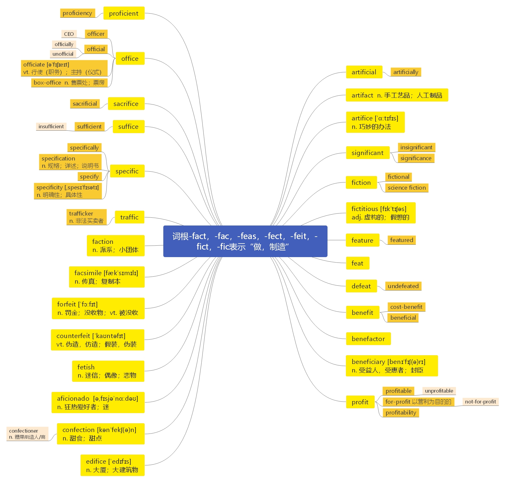

# 第二十三节 词根-fac, -fact, -feas, -feat, -fect, -feit, -fic, -fici, -fict

***

# 词根-fac, -fact, -feas, -feat, -fect, -feit, -fic, -fici, -fict 表示“做、制造”

***

**artificial**  \[ɑːtɪ'fɪʃ(ə)l] adj.  [英音](https://dict.youdao.com/dictvoice?audio=artificial\&type=1)  [美音](https://dict.youdao.com/dictvoice?audio=artificial\&type=2) 人工的， 人造的； 非自然的； 虚伪的 4043

**助记：** arti（ 人工） +fic（ 做、 制造） +ial（ …的） →人工造出来的→人造的、 非天然的、 虚假的

**搭配：** artificial intelligence（考）：人工智能 artificial lighting（考）：人工照明

> **【课堂笔记】**
>
> artificial smile 假笑

**双语例句:** This food contains no artificial flavourings. [播放](https://dict.youdao.com/dictvoice?audio=This+food+contains+no+artificial+flavourings.&le=eng&le=eng&type=2)

这种食品不含人工调味品。 

**双语例句:** The juice contains no artificial preservatives. [播放](https://dict.youdao.com/dictvoice?audio=The+juice+contains+no+artificial+preservatives.&le=eng&le=eng&type=2)

这种果汁不含人工防腐剂。 

**双语例句:** Most artificial joints are cemented into place. [播放](https://dict.youdao.com/dictvoice?audio=Most+artificial+joints+are+cemented+into+place.&le=eng&le=eng&type=2)

绝大部分人造关节是被黏结复位的。 

**原声例句:** Mr.Mack also says developments in **artificial** intelligence could lead to a future where disabled patients could be cared for by a voice-activated robot. [播放](https://dict.youdao.com/pureaudio?docid=2873627927756309460)

**原声例句:** \"To me it's too **artificial** and it's also the same story that you've seen before with indigenous groups and the white colonial forces coming to destroy them or something like that.\" [播放](https://dict.youdao.com/pureaudio?docid=-3161079504549887768)

**原声例句:** Twelve years before the historic Apollo 11 mission, the Soviets successfully launched the first **artificial** satellite called Sputnik into Earth's orbit. [播放](https://dict.youdao.com/pureaudio?docid=3066240392723952332)

**权威例句:** **Artificial** intelligence does not need to be malevolent to be catastrophically dangerous to humanity.  [播放](https://dict.youdao.com/dictvoice?audio=Artificial+intelligence+does+not+need+to+be+malevolent+to+be+catastrophically+dangerous+to+humanity.+&le=eng&type=2)

**权威例句:** Any radical regulatory surgery would also require governments to mark out some very **artificial** boundaries.  [播放](https://dict.youdao.com/dictvoice?audio=Any+radical+regulatory+surgery+would+also+require+governments+to+mark+out+some+very+artificial+boundaries.+&le=eng&type=2)

**权威例句:** The most revolutionary leap would be the creation of virtual humans, typically called **Artificial** Intelligence.  [播放](https://dict.youdao.com/dictvoice?audio=The+most+revolutionary+leap+would+be+the+creation+of+virtual+humans%2C+typically+called+Artificial+Intelligence.+&le=eng&type=2)

***

**artificially**  \[,a\:ti'fiʃəli] adv.  [英音](https://dict.youdao.com/dictvoice?audio=artificially\&type=1)  [美音](https://dict.youdao.com/dictvoice?audio=artificially\&type=2) 人为地；不自然地；人工地 11647

**助记：** artificial（ 人工的） +ly（ …地） →人工地

**双语例句:** The cows are artificially inseminated. [播放](https://dict.youdao.com/dictvoice?audio=The+cows+are+artificially+inseminated.&le=eng&le=eng&type=2)

这些母牛被人工授精。 

**双语例句:** The gadget is used to artificially inseminate cows. [播放](https://dict.youdao.com/dictvoice?audio=The+gadget+is+used+to+artificially+inseminate+cows.&le=eng&le=eng&type=2)

这件小装置用来给奶牛进行人工授精。 

**双语例句:** They have kept the price of sugar artificially high and so fattened the company's profits. [播放](https://dict.youdao.com/dictvoice?audio=They+have+kept+the+price+of+sugar+artificially+high+and+so+fattened+the+company%27s+profits.&le=eng&le=eng&type=2)

他们一直人为地使糖价居高不下，以此为公司牟利。 

**原声例句:** While the middlemen inflate the retail price, the distributors say the government sets prices **artificially** low. [播放](https://dict.youdao.com/pureaudio?docid=-8928698643707281606)

**原声例句:** China has been accused of keeping its currency,the yuan, **artificially** low to boost exports. [播放](https://dict.youdao.com/pureaudio?docid=4743770010548117917)

**原声例句:** \"The detainees were kept naked for weeks, months at a time - kept in very small cells, whose temperatures were kept **artificially** low, sometimes to the extent that the naked detainees, as one official said,seemed to turn blue,\" [播放](https://dict.youdao.com/pureaudio?docid=-5018076934827579498)

**权威例句:** But low rates are engendered either naturally from increased savings or **artificially** by printing money.  [播放](https://dict.youdao.com/dictvoice?audio=But+low+rates+are+engendered+either+naturally+from+increased+savings+or+artificially+by+printing+money.+&le=eng&type=2)

**权威例句:** Zovant is an **artificially** created version of a naturally occurring protein called Activated Protein C.  [播放](https://dict.youdao.com/dictvoice?audio=Zovant+is+an+artificially+created+version+of+a+naturally+occurring+protein+called+Activated+Protein+C.+&le=eng&type=2)

**权威例句:** But the court said these investment partnerships were shams just designed to **artificially** create tax losses.  [播放](https://dict.youdao.com/dictvoice?audio=But+the+court+said+these+investment+partnerships+were+shams+just+designed+to+artificially+create+tax+losses.+&le=eng&type=2)

***

**artifact**  \['ɑ\:təˌfækt] n.  [英音](https://dict.youdao.com/dictvoice?audio=artifact\&type=1)  [美音](https://dict.youdao.com/dictvoice?audio=artifact\&type=2) 手工艺品；人工制品 4608

**助记：** arti（人工） +fact（制作）→人工制作的产品→人工制品

**双语例句:** The Clovis point may be the most analyzed artifact in archaeology. [播放](https://dict.youdao.com/dictvoice?audio=The+Clovis+point+may+be+the+most+analyzed+artifact+in+archaeology.&le=eng&le=eng&type=2)

克洛维斯矛头可能是考古学中被分析得最多的手工艺品。 

**双语例句:** Theoretically, you may be correct in claiming that every artifact has potential scientific value. [播放](https://dict.youdao.com/dictvoice?audio=Theoretically%2C+you+may+be+correct+in+claiming+that+every+artifact+has+potential+scientific+value.&le=eng&le=eng&type=2)

从理论上讲，您认为每件文物都具有潜在的科学价值可能是正确的。 

**双语例句:** It is hoped that new SI definitions will be uniformly artifact-free. [播放](https://dict.youdao.com/dictvoice?audio=It+is+hoped+that+new+SI+definitions+will+be+uniformly+artifact-free.&le=eng&le=eng&type=2)

希望新的 SI 定义会统一为无人工的。 

**原声例句:** And so when you can find an **artifact** that very comfortably dates the site to the appropriate period, that's exciting for an archeologist.\" [播放](https://dict.youdao.com/pureaudio?docid=889910155137930880)

**原声例句:** Don't worry, it doesn't matter that they're called methods, it's a historical **artifact**.

**原声例句:** It's because we have these performers up there that are reading this blueprint and everyone is listening, basically to see how accurately they can reproduce, revivify this artistic **artifact**.

**权威例句:** People assume this complexity is an **artifact** of not having a national health insurance program.  [播放](https://dict.youdao.com/dictvoice?audio=People+assume+this+complexity+is+an+artifact+of+not+having+a+national+health+insurance+program.+&le=eng&type=2)

**权威例句:** They suggest that Sirtris' earlier findings to the contrary might be due to an experimental **artifact**.  [播放](https://dict.youdao.com/dictvoice?audio=They+suggest+that+Sirtris%27+earlier+findings+to+the+contrary+might+be+due+to+an+experimental+artifact.+&le=eng&type=2)

**权威例句:** Failure could signal that the promised wave of drugs was simply an **artifact** of the bubble.  [播放](https://dict.youdao.com/dictvoice?audio=Failure+could+signal+that+the+promised+wave+of+drugs+was+simply+an+artifact+of+the+bubble.+&le=eng&type=2)

***

**artifice**  \['ɑːtɪfɪs] n.  [英音](https://dict.youdao.com/dictvoice?audio=artifice\&type=1)  [美音](https://dict.youdao.com/dictvoice?audio=artifice\&type=2) 巧妙的办法； 诡计； 策略； 18981

**助记：** arti（技巧） + fic(做) + e →使用技巧做→巧妙的办法

**双语例句:** Weegee's photographs are full of artfulness, and artifice. [播放](https://dict.youdao.com/dictvoice?audio=Weegee%27s+photographs+are+full+of+artfulness%2C+and+artifice.&le=eng&le=eng&type=2)

维加的照片充满了奇技妙想。 

**双语例句:** They escaped by artifice. [播放](https://dict.youdao.com/dictvoice?audio=They+escaped+by+artifice.&le=eng&le=eng&type=2)

他们设巧计而逃。 

**双语例句:** Pretending to faint was merely artifice. [播放](https://dict.youdao.com/dictvoice?audio=Pretending+to+faint+was+merely+artifice.&le=eng&le=eng&type=2)

假装晕倒只不过是个诡计。 

**原声例句:** Nature precedes art and human **artifice** or human making.

**权威例句:** No **artifice**, no flash, no -- well, frankly, no star power to speak of.  [播放](https://dict.youdao.com/dictvoice?audio=No+artifice%2C+no+flash%2C+no+--+well%2C+frankly%2C+no+star+power+to+speak+of.+&le=eng&type=2)

**权威例句:** It seems that in the land of **artifice**, only a chump would accept sorrow at face value.  [播放](https://dict.youdao.com/dictvoice?audio=It+seems+that+in+the+land+of+artifice%2C+only+a+chump+would+accept+sorrow+at+face+value.+&le=eng&type=2)

**权威例句:** These authorial interruptions harden around a consistent theme: the narrator dislikes the conventional **artifice** of the novel.  [播放](https://dict.youdao.com/dictvoice?audio=These+authorial+interruptions+harden+around+a+consistent+theme%3A+the+narrator+dislikes+the+conventional+artifice+of+the+novel.+&le=eng&type=2)

***

**significant**  \[sɪg'nɪfɪk(ə)nt] adj.  [英音](https://dict.youdao.com/dictvoice?audio=significant\&type=1)  [美音](https://dict.youdao.com/dictvoice?audio=significant\&type=2) 重大的； 有意义的； 值得注意的； 意味深长的 720

**助记：** sign（ 标记） + i + fic（ 做） + ant（ 形容词词缀； …的） →做标记的地方→值得注意的

**双语例句:** There remained one significant problem. [播放](https://dict.youdao.com/dictvoice?audio=There+remained+one+significant+problem.&le=eng&le=eng&type=2)

还有一个非常重要的问题。 

**双语例句:** Your work has shown a significant improvement. [播放](https://dict.youdao.com/dictvoice?audio=Your+work+has+shown+a+significant+improvement.&le=eng&le=eng&type=2)

你的工作有了显著改进。 

**双语例句:** The results are not statistically significant. [播放](https://dict.youdao.com/dictvoice?audio=The+results+are+not+statistically+significant.&le=eng&le=eng&type=2)

这些结果在统计上没有显著意义。 

**原声例句:** Professor Klein says the employment differences were so small that they could not be considered **significant**. [播放](https://dict.youdao.com/pureaudio?docid=5499913079484596621)

**原声例句:** \"I think the overall economic impact because of bedbugs is certainly much more **significant**. [播放](https://dict.youdao.com/pureaudio?docid=8603037237515665242)

**原声例句:** I think no more **significant** contribution has Apollo made to history. [播放](https://dict.youdao.com/pureaudio?docid=692710028657452338)

**权威例句:** But we need to do something more **significant** than we ve done so far.  [播放](https://dict.youdao.com/dictvoice?audio=But+we+need+to+do+something+more+significant+than+we+ve+done+so+far.+&le=eng&type=2)

**权威例句:** Sombart clearly was exaggerating, but the role of Jews in California was highly **significant**.  [播放](https://dict.youdao.com/dictvoice?audio=Sombart+clearly+was+exaggerating%2C+but+the+role+of+Jews+in+California+was+highly+significant.+&le=eng&type=2)

**权威例句:** The Greenway highlights the importance of these culturally **significant** places through environmental tourism and local initiatives.  [播放](https://dict.youdao.com/dictvoice?audio=The+Greenway+highlights+the+importance+of+these+culturally+significant+places+through+environmental+tourism+and+local+initiatives.+&le=eng&type=2)

***

**insignificant**  \[ɪnsɪg'nɪfɪk(ə)nt] adj.  [英音](https://dict.youdao.com/dictvoice?audio=insignificant\&type=1)  [美音](https://dict.youdao.com/dictvoice?audio=insignificant\&type=2) 无关紧要的 9077

**助记：** in (不) + significant（重要的）→不重要的→无关紧要的

**双语例句:** He made her feel insignificant and stupid. [播放](https://dict.youdao.com/dictvoice?audio=He+made+her+feel+insignificant+and+stupid.&le=eng&le=eng&type=2)

他使她感到卑微愚蠢。 

**双语例句:** In 1949 Bonn was a small, insignificant city. [播放](https://dict.youdao.com/dictvoice?audio=In+1949+Bonn+was+a+small%2C+insignificant+city.&le=eng&le=eng&type=2)

1949年，波恩还是个不足称道的小城市。 

**双语例句:** The levels of chemicals in the river are not insignificant. [播放](https://dict.youdao.com/dictvoice?audio=The+levels+of+chemicals+in+the+river+are+not+insignificant.&le=eng&le=eng&type=2)

河水中的化学物质含量不容忽视。 

**原声例句:** We are also put in mind of how the war is, in fact, anything but a revel, though it, too, may have been provoked by a cause as **insignificant** and hard to trace as \"some wizard vermin.\"

**权威例句:** How dare they say as they do, this was a very small **insignificant** amount of Mercury.  [播放](https://dict.youdao.com/dictvoice?audio=How+dare+they+say+as+they+do%2C+this+was+a+very+small+insignificant+amount+of+Mercury.+&le=eng&type=2)

**权威例句:** There are some **insignificant** differences, though more in emphasis and intent, than in real effect.  [播放](https://dict.youdao.com/dictvoice?audio=There+are+some+insignificant+differences%2C+though+more+in+emphasis+and+intent%2C+than+in+real+effect.+&le=eng&type=2)

**权威例句:** He also dismissed startup Aereo as an **\"insignifican**t player\" that was stealing CBS' signal.  [播放](https://dict.youdao.com/dictvoice?audio=He+also+dismissed+startup+Aereo+as+an+%22insignificant+player%22+that+was+stealing+CBS%27+signal.+&le=eng&type=2)

***

**significantly**  \[sɪg'nɪfɪk(ə)ntlɪ] adv.  [英音](https://dict.youdao.com/dictvoice?audio=significantly\&type=1)  [美音](https://dict.youdao.com/dictvoice?audio=significantly\&type=2) 重大地； 显著地； 1818

**助记：** significant（ 重要的） + ly (…地) →重要地； 显著地

**双语例句:** She paused significantly before she answered. [播放](https://dict.youdao.com/dictvoice?audio=She+paused+significantly+before+she+answered.&le=eng&le=eng&type=2)

她在回答之前意味深长地停顿了一下。 

**双语例句:** The President has promised to cut taxes significantly. [播放](https://dict.youdao.com/dictvoice?audio=The+President+has+promised+to+cut+taxes+significantly.&le=eng&le=eng&type=2)

总统承诺大幅度减税。 

**双语例句:** The two sets of figures are not significantly different. [播放](https://dict.youdao.com/dictvoice?audio=The+two+sets+of+figures+are+not+significantly+different.&le=eng&le=eng&type=2)

这两组数字没有明显的差别。 

**原声例句:** Climatologists say that greenhouse gas emissions, such as carbon dioxide from burning oil and coal, contribute **significantly** to global warming. [播放](https://dict.youdao.com/pureaudio?docid=-3230356435319928493)

**原声例句:** Violence in Iraq has dropped **significantly** during the past year, but insurgents continue to stage sporadic attacks on security forces and civilians. [播放](https://dict.youdao.com/pureaudio?docid=-333539327920854568)

**原声例句:** She says the number of people staying with host families has **significantly** increased to at least 40,000. [播放](https://dict.youdao.com/pureaudio?docid=-3181996540622568237)

**权威例句:** Given this generous tax treatment, pre-re muni yields are usually **significantly** below those on equivalent Treasuries.  [播放](https://dict.youdao.com/dictvoice?audio=Given+this+generous+tax+treatment%2C+pre-re+muni+yields+are+usually+significantly+below+those+on+equivalent+Treasuries.+&le=eng&type=2)

**权威例句:** It hasn't stopped the discharges from the CSOs completely, but it has reduced the problem **significantly**.  [播放](https://dict.youdao.com/dictvoice?audio=It+hasn%27t+stopped+the+discharges+from+the+CSOs+completely%2C+but+it+has+reduced+the+problem+significantly.+&le=eng&type=2)

**权威例句:** The tenor of Republican politics changed **significantly** with the rise of the conservative movement.  [播放](https://dict.youdao.com/dictvoice?audio=The+tenor+of+Republican+politics+changed+significantly+with+the+rise+of+the+conservative+movement.+&le=eng&type=2)

***

**significance**  \[sɪg'nɪfɪk(ə)ns]n.  [英音](https://dict.youdao.com/dictvoice?audio=significance\&type=1)  [美音](https://dict.youdao.com/dictvoice?audio=significance\&type=2) 重要性；意义；意思 2960

**助记：** significant（重要的） +ance (名词后缀) →重要性

**双语例句:** They discussed the statistical significance of the results. [播放](https://dict.youdao.com/dictvoice?audio=They+discussed+the+statistical+significance+of+the+results.&le=eng&le=eng&type=2)

他们讨论了这些结果在统计学上的意义。 

**双语例句:** The president's visit is loaded with symbolic significance. [播放](https://dict.youdao.com/dictvoice?audio=The+president%27s+visit+is+loaded+with+symbolic+significance.&le=eng&le=eng&type=2)

总统的访问富有象征意义。 

**双语例句:** Western diplomats have played down the significance of the reports. [播放](https://dict.youdao.com/dictvoice?audio=Western+diplomats+have+played+down+the+significance+of+the+reports.&le=eng&le=eng&type=2)

西方的外交官们已贬低了这些报告的重要性。 

**原声例句:** \"This is a spill of national **significance**.\" [播放](https://dict.youdao.com/pureaudio?docid=2696148253513391895)

**原声例句:** He says provincial authorities are trying to play down the **significance** of the civilian deaths in order to influence the NATO probe. [播放](https://dict.youdao.com/pureaudio?docid=1324133339038665775)

**原声例句:** The Chicago left hander said that he had a tough time grasping the **significance** of his achievement. [播放](https://dict.youdao.com/pureaudio?docid=-1295371948233137336)

**权威例句:** Miss Kim grows animated, excitedly pointing out the **significance** of each song and clapping along.  [播放](https://dict.youdao.com/dictvoice?audio=Miss+Kim+grows+animated%2C+excitedly+pointing+out+the+significance+of+each+song+and+clapping+along.+&le=eng&type=2)

**权威例句:** The council has prepared a report which reviews the stadium's history and assesses its **significance**.  [播放](https://dict.youdao.com/dictvoice?audio=The+council+has+prepared+a+report+which+reviews+the+stadium%27s+history+and+assesses+its+significance.+&le=eng&type=2)

**权威例句:** Now, this is a fire station that holds some special **significance** for our country.  [播放](https://dict.youdao.com/dictvoice?audio=Now%2C+this+is+a+fire+station+that+holds+some+special+significance+for+our+country.+&le=eng&type=2)

***

**fiction**  \['fɪkʃ(ə)n] n.  [英音](https://dict.youdao.com/dictvoice?audio=fiction\&type=1)  [美音](https://dict.youdao.com/dictvoice?audio=fiction\&type=2) 小说； 虚构， 编造； 谎言 2786

**助记：** fict（做、作；另外还在模仿单词 form：形成、塑造；此时： 首辅音均为 f，尾辅

音 t、 m 音似） +ion（ 名词后缀） →做（ 塑造） 出来的东西→小说； 编造、 虚构

**搭配：** science fiction（考）：科幻小说

**双语例句:** The book intermingles fact and fiction. [播放](https://dict.youdao.com/dictvoice?audio=I+read+everything+from+fiction+to+history.&le=eng&le=eng&type=2)

我从小说到历史书什么书都读。 

**双语例句:** Fiction and reality were increasingly blurred. [播放](https://dict.youdao.com/dictvoice?audio=Fiction+and+reality+were+increasingly+blurred.&le=eng&le=eng&type=2)

小说与现实越来越混淆难分。 

**双语例句:** Is it possible to separate truth from fiction? [播放](https://dict.youdao.com/dictvoice?audio=Is+it+possible+to+separate+truth+from+fiction%3F&le=eng&le=eng&type=2)

有可能区分事实和谎言吗？ 

**原声例句:** You can listen to part four of the science **fiction** story \"A Princess of Mars\" on our program AMERICAN STORIES this Saturday. [播放](https://dict.youdao.com/pureaudio?docid=-8899712179392742419)

**原声例句:** It contains science-**fiction** violence and also language that may be inappropriate for children under the age of thirteen. [播放](https://dict.youdao.com/pureaudio?docid=-4053708564085293897)

**原声例句:** Some of these ideas are from the English science **fiction** writer H.G.Wells' \"The War of the Worlds.\" [播放](https://dict.youdao.com/pureaudio?docid=-176965249186871028)

**权威例句:** It was named one of the best non-fiction books of 2006 by The Washington Post.  [播放](https://dict.youdao.com/dictvoice?audio=It+was+named+one+of+the+best+non-fiction+books+of+2006+by+The+Washington+Post.+&le=eng&type=2)

**权威例句:** That **fiction**, I believe, has combined with the trend in society for \"extreme\" behavior.  [播放](https://dict.youdao.com/dictvoice?audio=That+fiction%2C+I+believe%2C+has+combined+with+the+trend+in+society+for+%22extreme%22+behavior.+&le=eng&type=2)

**权威例句:** Dr. Hammad Azzam is the author of Shifting Borderlines: How Science **Fiction** is Becoming Science.  [播放](https://dict.youdao.com/dictvoice?audio=Dr.+Hammad+Azzam+is+the+author+of+Shifting+Borderlines%3A+How+Science+Fiction+is+Becoming+Science.+&le=eng&type=2)

***

**fictional**  \['fɪkʃənl] adj.  [英音](https://dict.youdao.com/dictvoice?audio=fictional\&type=1)  [美音](https://dict.youdao.com/dictvoice?audio=fictional\&type=2) 虚构的； 小说的 6444

**助记：** fiction（ 小说） + al （ …的） →小说的

**双语例句:** Almost all fictional detectives are unreal. [播放](https://dict.youdao.com/dictvoice?audio=Almost+all+fictional+detectives+are+unreal.&le=eng&le=eng&type=2)

几乎所有小说里的侦探都是虚构的。 

**双语例句:** They gradually add more and more fictional elements. [播放](https://dict.youdao.com/dictvoice?audio=They+gradually+add+more+and+more+fictional+elements.&le=eng&le=eng&type=2)

渐渐地，他们加入了越来越多的虚构元素。 

**双语例句:** To begin with, how do we create fictional characters? [播放](https://dict.youdao.com/dictvoice?audio=To+begin+with%2C+how+do+we+create+fictional+characters%3F&le=eng&le=eng&type=2)

首先，我们如何创造虚构的人物？ 

**原声例句:** In a popular Spanish book, a **fictional** island called \"California\" was filled with gold. [播放](https://dict.youdao.com/pureaudio?docid=-7346937572369506041)

**原声例句:** It takes place at the **fictional** William McKinley High School in Lima,Ohio. [播放](https://dict.youdao.com/pureaudio?docid=7894515870848634246)

**原声例句:** Arthur Conan Doyle,creator of the **fictional** detective Sherlock Holmes, wrote about Poe's influence on other crime writers: \"Each may find some little development of his own, but his main art must trace back to those admirable stories of Monsieur Dupin,so wonderful in their masterful force, their reticence,their quick dramatic point.\" [播放](https://dict.youdao.com/pureaudio?docid=-5391607620373136155)

**权威例句:** The loss of one of them, **fictional** as it was, cut me to the quick.  [播放](https://dict.youdao.com/dictvoice?audio=The+loss+of+one+of+them%2C+fictional+as+it+was%2C+cut+me+to+the+quick.+&le=eng&type=2)

**权威例句:** Perhaps he might have done more to capture the sheer weirdness of Dickens's **fictional** world.  [播放](https://dict.youdao.com/dictvoice?audio=Perhaps+he+might+have+done+more+to+capture+the+sheer+weirdness+of+Dickens%27s+fictional+world.+&le=eng&type=2)

**权威例句:** The \"curiosities\" include re-creations of exhibitions, exhibition rooms and lost works as well as **fictional** machines.  [播放](https://dict.youdao.com/dictvoice?audio=The+%22curiosities%22+include+re-creations+of+exhibitions%2C+exhibition+rooms+and+lost+works+as+well+as+fictional+machines.+&le=eng&type=2)

***

science-fiction n. 科幻小说 20173

***

**fictitious**  \[fɪk'tɪʃəs] adj.  [英音](https://dict.youdao.com/dictvoice?audio=fictitious\&type=1)  [美音](https://dict.youdao.com/dictvoice?audio=fictitious\&type=2) 虚构的； 假想的； 假装的； 编造的 15272

**助记：** fict（ 做； 引申为“ 虚构； 编造”） + -itious（ 形容词后缀） →虚构的； 编造的

**双语例句:** The persons and events portrayed in this production are fictitious. [播放](https://dict.youdao.com/dictvoice?audio=The+persons+and+events+portrayed+in+this+production+are+fictitious.&le=eng&le=eng&type=2)

这部作品描绘的那些人物和事件是虚构的。 

**双语例句:** The characters in this story are all fictitious. [播放](https://dict.youdao.com/dictvoice?audio=The+characters+in+this+story+are+all+fictitious.&le=eng&le=eng&type=2)

这个故事里的人物都是假想的。 

**双语例句:** The story my mother told me when I was young is fictitious. [播放](https://dict.youdao.com/dictvoice?audio=The+story+my+mother+told+me+when+I+was+young+is+fictitious.&le=eng&le=eng&type=2)

小时候妈妈对我讲的那个故事是虚构的。 

**权威例句:** Wasn't that a **fictitious** country featured in 'Duck Soup' or a Three Stooges short?  [播放](https://dict.youdao.com/dictvoice?audio=Wasn%27t+that+a+fictitious+country+featured+in+%27Duck+Soup%27+or+a+Three+Stooges+short%3F+&le=eng&type=2)

**权威例句:** This is a completely **fictitious** list price of which they negotiate with private insurers.  [播放](https://dict.youdao.com/dictvoice?audio=This+is+a+completely+fictitious+list+price+of+which+they+negotiate+with+private+insurers.+&le=eng&type=2)

**权威例句:** He was the one who approved the business projections based on this **fictitious** assumption.  [播放](https://dict.youdao.com/dictvoice?audio=He+was+the+one+who+approved+the+business+projections+based+on+this+fictitious+assumption.+&le=eng&type=2)

***

**feature**  \['fiːtʃə] n.  [英音](https://dict.youdao.com/dictvoice?audio=feature\&type=1)  [美音](https://dict.youdao.com/dictvoice?audio=feature\&type=2) 容貌；特色，特征；特写或专题节目 v. 以…为特写 1194

**助记：** feat（ =face 脸） →容貌、 面貌； 特征、 特点（ 因为“ 脸部” 是一个人最大“ 特征” 所在）

feat（ 做） +ure（ 名词后缀） →专题片（ “ 做” 出来有“特色” 的节目）

**搭配：** distinctive feature（考）：区别性特征 feature film（考）：正片、故事片

**双语例句:** His eyes are his most notable feature. [播放](https://dict.youdao.com/dictvoice?audio=His+eyes+are+his+most+notable+feature.&le=eng&le=eng&type=2)

他的双眼是他最明显的特征。 

**双语例句:** This feature is designed to aid inexperienced users. [播放](https://dict.youdao.com/dictvoice?audio=This+feature+is+designed+to+aid+inexperienced+users.&le=eng&le=eng&type=2)

这个特色是为帮助没有经验的用户而设计的。 

**双语例句:** Teamwork is a key feature of the training programme. [播放](https://dict.youdao.com/dictvoice?audio=Teamwork+is+a+key+feature+of+the+training+programme.&le=eng&le=eng&type=2)

团队合作是这项训练计划的重要特点。 

**原声例句:** So he began creating a comic strip of several drawings for a media company, United **Feature** Syndicate. [播放](https://dict.youdao.com/pureaudio?docid=8835233857569404140)

**原声例句:** This was done as specially equipped vehicles took pictures for the Google mapping **feature** called Street View. [播放](https://dict.youdao.com/pureaudio?docid=-8160110368244653920)

**原声例句:** **Feature** programs were added later, starting with Special English versions of short stories by famous writers. [播放](https://dict.youdao.com/pureaudio?docid=-3825242117323659440)

**权威例句:** Its scale and sheer size as a natural **feature** is what makes it so awesome.  [播放](https://dict.youdao.com/dictvoice?audio=Its+scale+and+sheer+size+as+a+natural+feature+is+what+makes+it+so+awesome.+&le=eng&type=2)

**权威例句:** Dumb economic thinking has been a **feature** of energy legislation at least since 1973.  [播放](https://dict.youdao.com/dictvoice?audio=Dumb+economic+thinking+has+been+a+feature+of+energy+legislation+at+least+since+1973.+&le=eng&type=2)

**权威例句:** Again, the **feature** worked like a charm, and wasn't something we accidentally activated during normal play.  [播放](https://dict.youdao.com/dictvoice?audio=Again%2C+the+feature+worked+like+a+charm%2C+and+wasn%27t+something+we+accidentally+activated+during+normal+play.+&le=eng&type=2)

***

**featured**  \['fiːtʃəd] adj.  [英音](https://dict.youdao.com/dictvoice?audio=featured\&type=1)  [美音](https://dict.youdao.com/dictvoice?audio=featured\&type=2) 被作为特色的；特定的；有…的面貌特征的 15166

**助记：** feature（ 特色） +ed（ …的） →特色的

**双语例句:** For the past several years, the Sunday newspaper supplement Parade has featured a column called \"Ask Marilyn\". [播放](https://dict.youdao.com/dictvoice?audio=For+the+past+several+years%2C+the+Sunday+newspaper+supplement+Parade+has+featured+a+column+called+%22Ask+Marilyn%22.&le=eng&le=eng&type=2)

在过去的几年里，周日报纸的副刊《游行》中，有一个名为“问问玛丽莲”的特色专栏。 

**双语例句:** Nanli Lake fish, Xiangou Pho, Dingcheng Zongzi, Longzhou taro, Leiming peanut oil and pitaya, cherry tomato all are the featured brand in Ding' an. [播放](https://dict.youdao.com/dictvoice?audio=Nanli+Lake+fish%2C+Xiangou+Pho%2C+Dingcheng+Zongzi%2C+Longzhou+taro%2C+Leiming+peanut+oil+and+pitaya%2C+cherry+tomato+all+are+the+featured+brand+in+Ding%27+an.&le=eng&le=eng&type=2)

南丽湖福寿鱼、仙沟粉、定城粽子、龙州香芋头、雷鸣花生油，以及火龙果、圣女果等等，都是定安特色品牌。 

**双语例句:** The original version featured a guitar solo. [播放](https://dict.youdao.com/dictvoice?audio=The+original+version+featured+a+guitar+solo.&le=eng&le=eng&type=2)

原版以吉他独奏为特色。 

**原声例句:** Each stop on the tour **featured** a different lineup of famous musicians. [播放](https://dict.youdao.com/pureaudio?docid=-2416649434106986221)

**原声例句:** Several of the festival events **featured** literature. [播放](https://dict.youdao.com/pureaudio?docid=7778402007906327375)

**原声例句:** Thursday night's joyous concert in Soweto **featured** rising South Africa star Lira who sang an old Miriam Makeba favorite, Pata Pata. [播放](https://dict.youdao.com/pureaudio?docid=-4709358149083305095)

**权威例句:** Its novel menu has **featured** items such as steamed glutinous rice with duck jus.  [播放](https://dict.youdao.com/dictvoice?audio=Its+novel+menu+has+featured+items+such+as+steamed+glutinous+rice+with+duck+jus.+&le=eng&type=2)

**权威例句:** His efforts have been so successful that this year CNN **featured** his heroic efforts.  [播放](https://dict.youdao.com/dictvoice?audio=His+efforts+have+been+so+successful+that+this+year+CNN+featured+his+heroic+efforts.+&le=eng&type=2)

**权威例句:** Among the products **featured** is Allium, a spherical lampshade made from peacock feather-shaped slats.  [播放](https://dict.youdao.com/dictvoice?audio=Among+the+products+featured+is+Allium%2C+a+spherical+lampshade+made+from+peacock+feather-shaped+slats.+&le=eng&type=2)

***

**feat**  \[fiːt] n.  [英音](https://dict.youdao.com/dictvoice?audio=feat\&type=1)  [美音](https://dict.youdao.com/dictvoice?audio=feat\&type=2) 功绩， 壮举； 技艺表演 7301

**词源：** mid-14c., "action, deeds," from Anglo-French fet, from Old French fait "action, deed,

achievement" (12c.), from Latin factum "thing done," a noun based on the past participle

of facere "to make, to do," from PIE root \*dhe- "to set, put." Sense of "exceptional or noble

deed" arose c. 1400 from phrase feat of arms (French fait d'armes).

**双语例句:** Man's first landing on the moon was a feat of great daring. [播放](https://dict.youdao.com/dictvoice?audio=Man%27s+first+landing+on+the+moon+was+a+feat+of+great+daring.&le=eng&le=eng&type=2)

人类首次登月是一个勇敢的壮举。 

**双语例句:** The tower is being celebrated as a grand feat on the world stage. [播放](https://dict.youdao.com/dictvoice?audio=The+tower+is+being+celebrated+as+a+grand+feat+on+the+world+stage.&le=eng&le=eng&type=2)

这座塔被誉为世界舞台上的一项伟大壮举。 

**双语例句:** Though no great technical feat, the procedure opens a range of unsettling possibilities. [播放](https://dict.youdao.com/dictvoice?audio=Though+no+great+technical+feat%2C+the+procedure+opens+a+range+of+unsettling+possibilities.&le=eng&le=eng&type=2)

虽然这不是什么伟大的技术壮举，但这一过程开启了一系列令人不安的可能性。 

**原声例句:** No other act had topped both charts since 1983, when Kenny Rogers and Dolly Parton achieved that **feat** with their duet, \"Islands In The Stream.\" [播放](https://dict.youdao.com/pureaudio?docid=-7899450305582486801)

**原声例句:** Transforming the bleak future of these poor women and men is no mean **feat**. [播放](https://dict.youdao.com/pureaudio?docid=9066826495045529753)

**原声例句:** Torrey says it was no small **feat** composing shots of the ruins without any tourists in the frame, but even more difficult was chasing the ever-changing angles of natural light. [播放](https://dict.youdao.com/pureaudio?docid=-4274237165079947115)

**权威例句:** That's no small **feat**, given the consistent underperformance of actively managed funds in general.  [播放](https://dict.youdao.com/dictvoice?audio=That%27s+no+small+feat%2C+given+the+consistent+underperformance+of+actively+managed+funds+in+general.+&le=eng&type=2)

**权威例句:** \"Goodbaby has entered the retail market, and this isn't an easy **feat**, \" says Song.  [播放](https://dict.youdao.com/dictvoice?audio=%22Goodbaby+has+entered+the+retail+market%2C+and+this+isn%27t+an+easy+feat%2C+%22+says+Song.+&le=eng&type=2)

**权威例句:** For many years, the 4 minute mile was considered to be an impossible **feat**.  [播放](https://dict.youdao.com/dictvoice?audio=For+many+years%2C+the+4+minute+mile+was+considered+to+be+an+impossible+feat.+&le=eng&type=2)

***

**defeat**  \[dɪ'fiːt] vt.  [英音](https://dict.youdao.com/dictvoice?audio=defeat\&type=1)  [美音](https://dict.youdao.com/dictvoice?audio=defeat\&type=2) 战胜， 击败； 使…失败 3358

**助记：** de（ 不； 没有） + feat（ 功绩） →没有功绩→使…失败

**双语例句:** They narrowly avoided defeat. [播放](https://dict.youdao.com/dictvoice?audio=They+narrowly+avoided+defeat.&le=eng&le=eng&type=2)

他们险些儿被打败。 

**双语例句:** He bamboozled Mercer into defeat. [播放](https://dict.youdao.com/dictvoice?audio=He+bamboozled+Mercer+into+defeat.&le=eng&le=eng&type=2)

他蒙骗默瑟并击败了他。 

**双语例句:** Defeat was staring them in the face. [播放](https://dict.youdao.com/dictvoice?audio=Defeat+was+staring+them+in+the+face.&le=eng&le=eng&type=2)

他们必遭失败。 

**原声例句:** They showed the faces of people in a land that still wore the mask of **defeat** in America's Civil War. [播放](https://dict.youdao.com/pureaudio?docid=-7259962035543091037)

**原声例句:** He replaced General Ambrose Burnside, when Burnside suffered a terrible **defeat** at Fredericksburg,Virginia, at the end of eighteen sixty-two. [播放](https://dict.youdao.com/pureaudio?docid=4981494512914243944)

**原声例句:** The strategy says the United States aims to disrupt, dismantle and **defeat** al-Qaida, but also to support democracy and human rights. [播放](https://dict.youdao.com/pureaudio?docid=-8002218353191761643)

**权威例句:** His dismissal sparked a collapse which will lead to **defeat** for England on Tuesday.  [播放](https://dict.youdao.com/dictvoice?audio=His+dismissal+sparked+a+collapse+which+will+lead+to+defeat+for+England+on+Tuesday.+&le=eng&type=2)

**权威例句:** Wicketkeeper Sarah Taylor returns after being rested for England's recent series **defeat** in the West Indies.  [播放](https://dict.youdao.com/dictvoice?audio=Wicketkeeper+Sarah+Taylor+returns+after+being+rested+for+England%27s+recent+series+defeat+in+the+West+Indies.+&le=eng&type=2)

**权威例句:** Towelling off in **defeat**, I watched two other customers quietly enjoying their fish pedicures.  [播放](https://dict.youdao.com/dictvoice?audio=Towelling+off+in+defeat%2C+I+watched+two+other+customers+quietly+enjoying+their+fish+pedicures.+&le=eng&type=2)

***

**defeated**  \[dɪ'fiːtɪd] vt.  [英音](https://dict.youdao.com/dictvoice?audio=defeated\&type=1)  [美音](https://dict.youdao.com/dictvoice?audio=defeated\&type=2) 击败，挫败 adj. 被击败的，受挫的，泄气的 10854

**助记：** defeat（ 击败） + ed（ …的； 被…的） →被击败的， 受挫的

**双语例句:** He can't endure being defeated. [播放](https://dict.youdao.com/dictvoice?audio=He+can%27t+endure+being+defeated.&le=eng&le=eng&type=2)

他无法忍受失败。 

**双语例句:** He handily defeated his challengers. [播放](https://dict.youdao.com/dictvoice?audio=He+handily+defeated+his+challengers.&le=eng&le=eng&type=2)

他轻而易举地打败了向他挑战的人。 

**双语例句:** He can claim to have been defeated by opponents copying his own tactics. [播放](https://dict.youdao.com/dictvoice?audio=He+can+claim+to+have+been+defeated+by+opponents+copying+his+own+tactics.&le=eng&le=eng&type=2)

他可能会宣称他已经被模仿他策略的对手打败了。 

**原声例句:** After the Spanish soldiers **defeated** the Aztec empire, they were able to seize the supplies of cacao and send them home. [播放](https://dict.youdao.com/pureaudio?docid=-1648030553573562115)

**原声例句:** And later still, during the War of 1812, the Americans **defeated** the British in the Battle of Lake Champlain. [播放](https://dict.youdao.com/pureaudio?docid=-7729542528024819096)

**原声例句:** And later still, during the War of Eighteen Twelve, the Americans **defeated** the British in the Battle of Lake Champlain. [播放](https://dict.youdao.com/pureaudio?docid=-7842260246517704549)

**权威例句:** In Kentucky's 4th District race, conservative Democratic Rep. Ken Lucas **defeated** GOP challenger Geoff Davis.  [播放](https://dict.youdao.com/dictvoice?audio=In+Kentucky%27s+4th+District+race%2C+conservative+Democratic+Rep.+Ken+Lucas+defeated+GOP+challenger+Geoff+Davis.+&le=eng&type=2)

**权威例句:** Within a short time, the army regrouped, the South was **defeated** and the war ended.  [播放](https://dict.youdao.com/dictvoice?audio=Within+a+short+time%2C+the+army+regrouped%2C+the+South+was+defeated+and+the+war+ended.+&le=eng&type=2)

**权威例句:** Several AMs have been elected to the on regional lists despite being **defeated** in constituencies.  [播放](https://dict.youdao.com/dictvoice?audio=Several+AMs+have+been+elected+to+the+on+regional+lists+despite+being+defeated+in+constituencies.+&le=eng&type=2)

***

**undefeated**  \['ʌndɪ'fitɪd] adj.  [英音](https://dict.youdao.com/dictvoice?audio=undefeated\&type=1)  [美音](https://dict.youdao.com/dictvoice?audio=undefeated\&type=2) 未被击败的 15201

**助记：** un（ 不） + defeated（ 被击败的） →不被击败的→未被击败的

**双语例句:** She was undefeated for 13 years. [播放](https://dict.youdao.com/dictvoice?audio=She+was+undefeated+for+13+years.&le=eng&le=eng&type=2)

她曾十三年未被战胜过。 

**双语例句:** They are undefeated in 13 games. [播放](https://dict.youdao.com/dictvoice?audio=They+are+undefeated+in+13+games.&le=eng&le=eng&type=2)

他们13场比赛未被打败过。 

**双语例句:** I'd like to fight him because he's undefeated and I want to be the first man to beat him. [播放](https://dict.youdao.com/dictvoice?audio=I%27d+like+to+fight+him+because+he%27s+undefeated+and+I+want+to+be+the+first+man+to+beat+him.&le=eng&le=eng&type=2)

我想跟他比赛拳击，因为他从未被打败过，而我想成为第一个战胜他的人。 

**权威例句:** \"I think the most important thing is the outstanding achievement of 30 games **undefeated**, \" he said.  [播放](https://dict.youdao.com/dictvoice?audio=%22I+think+the+most+important+thing+is+the+outstanding+achievement+of+30+games+undefeated%2C+%22+he+said.+&le=eng&type=2)

**权威例句:** And he came through all that pressure and prospect of serious injury **undefeated** and relatively unscathed.  [播放](https://dict.youdao.com/dictvoice?audio=And+he+came+through+all+that+pressure+and+prospect+of+serious+injury+undefeated+and+relatively+unscathed.+&le=eng&type=2)

**权威例句:** His lone defeat came in the Wood Memorial, a one-length loss to **undefeated** Verrazano.  [播放](https://dict.youdao.com/dictvoice?audio=His+lone+defeat+came+in+the+Wood+Memorial%2C+a+one-length+loss+to+undefeated+Verrazano.+&le=eng&type=2)

***

**benefit**  \['benɪfɪt] n.  [英音](https://dict.youdao.com/dictvoice?audio=benefit\&type=1)  [美音](https://dict.youdao.com/dictvoice?audio=benefit\&type=2) 利益， 好处； 救济金 v. 有利于…, 受益; 获益 815

**助记：** bene（ =well：好；首辅音 b、 w 音似，尾辅音 n、 l 音似，二者同源） +fit（ =do：做；）→做好事→有益于… 好处、利益（ n.）

**搭配：** benefit sb.（考）：使…获益 benefit from（考）：从…中获得好处

例句： What is odd is that they have perhaps most benefited from ambition —— if not always their

own then that of their parents and grandparents.&#x20;

奇怪的是他们或许是从野心中获益做多的人，如果不是他们自己，那么就是他们的父母或者祖父母。

仿写例句：奇怪的是还有人想从做好事中获得好处。

What is odd is that some people still argue that we will benefit/profit from doing good deeds

**双语例句:** I've had the benefit of a good education. [播放](https://dict.youdao.com/dictvoice?audio=I%27ve+had+the+benefit+of+a+good+education.&le=eng&le=eng&type=2)

我得益于受过良好教育。 

**双语例句:** I might benefit from getting my teeth fixed. [播放](https://dict.youdao.com/dictvoice?audio=I+might+benefit+from+getting+my+teeth+fixed.&le=eng&le=eng&type=2)

把牙齿补好可能对我有好处。 

**双语例句:** He's not entitled to claim unemployment benefit. [播放](https://dict.youdao.com/dictvoice?audio=He%27s+not+entitled+to+claim+unemployment+benefit.&le=eng&le=eng&type=2)

他无权要求领取失业救济金。 

**原声例句:** In his opinion,the only real **benefit** for a private company is lower administrative and record-keeping costs. [播放](https://dict.youdao.com/pureaudio?docid=4190905218352788261)

**原声例句:** Graham's **benefit** concert was so successful that he asked to use the Fillmore for other concerts. [播放](https://dict.youdao.com/pureaudio?docid=936731989181676020)

**原声例句:** A question from the teacher. Susanna Wesson writes: \"I teach English to French students of engineering who **benefit** very much from your Foreign Student Series. [播放](https://dict.youdao.com/pureaudio?docid=-6993816574056392434)

**权威例句:** Fortunately for the chancellor, he, too, now stands to **benefit** from higher oil revenues.  [播放](https://dict.youdao.com/dictvoice?audio=Fortunately+for+the+chancellor%2C+he%2C+too%2C+now+stands+to+benefit+from+higher+oil+revenues.+&le=eng&type=2)

**权威例句:** Then they're asked to minimize these conditions and join a coalition that might not **benefit** them.  [播放](https://dict.youdao.com/dictvoice?audio=Then+they%27re+asked+to+minimize+these+conditions+and+join+a+coalition+that+might+not+benefit+them.+&le=eng&type=2)

**权威例句:** According to the agency, the same risk-benefit analysis does not hold true for restless-leg syndrome.  [播放](https://dict.youdao.com/dictvoice?audio=According+to+the+agency%2C+the+same+risk-benefit+analysis+does+not+hold+true+for+restless-leg+syndrome.+&le=eng&type=2)

***

**cost-benefit**  \['kɔst'benifit] adj.  [英音](https://dict.youdao.com/dictvoice?audio=cost-benefit\&type=1)  [美音](https://dict.youdao.com/dictvoice?audio=cost-benefit\&type=2) 成本效益的 18839

**助记：** cost （成本） + benefit （利益）→ 成本效益的

***

**beneficial**  \[benɪ'fɪʃ(ə)l] adj.  [英音](https://dict.youdao.com/dictvoice?audio=beneficial\&type=1)  [美音](https://dict.youdao.com/dictvoice?audio=beneficial\&type=2) 有益的，有利的；可享利益的 5052

**助记：** benefit（好处、益处） +ial（形容词后缀：的）→有益的、有好处的

写作例句：从长远来看，施予帮助对于帮助爱心的接受者和发出者来说都是有有益无害的

Offering help is beneficial and hardly detrimental to both the benefactor and receiver in the long run/term.

**双语例句:** A good diet is beneficial to health. [播放](https://dict.youdao.com/dictvoice?audio=A+good+diet+is+beneficial+to+health.&le=eng&le=eng&type=2)

良好的饮食有益于健康。 

**双语例句:** Early resolution of geopolitical issues would be beneficial. [播放](https://dict.youdao.com/dictvoice?audio=Early+resolution+of+geopolitical+issues+would+be+beneficial.&le=eng&le=eng&type=2)

尽早解决地缘政治学议题是有益的。 

**双语例句:** It can be beneficial to share your feelings with someone you trust. [播放](https://dict.youdao.com/dictvoice?audio=It+can+be+beneficial+to+share+your+feelings+with+someone+you+trust.&le=eng&le=eng&type=2)

与你信任的人分享你的情感会是有益的。 

**原声例句:** The paper entitled \"Is Crying **Beneficial**?\" [播放](https://dict.youdao.com/pureaudio?docid=869795734087625827)

**原声例句:** \"Even though Clinton's visit was mainly about the release of the two female journalists, in the bigger picture it was **beneficial** for both parties. [播放](https://dict.youdao.com/pureaudio?docid=-6968872591444121766)

**原声例句:** \"In the observational studies we found that some of the B vitamins, like folic acid,were **beneficial**.\" [播放](https://dict.youdao.com/pureaudio?docid=-7141112880523068245)

**权威例句:** Supporters of the Commonwealth also point out that there are some **beneficial** cultural links for the former colonies.  [播放](https://dict.youdao.com/dictvoice?audio=Supporters+of+the+Commonwealth+also+point+out+that+there+are+some+beneficial+cultural+links+for+the+former+colonies.+&le=eng&type=2)

**权威例句:** In the right circumstances, debt and steroids in the right amounts can be **beneficial**.  [播放](https://dict.youdao.com/dictvoice?audio=In+the+right+circumstances%2C+debt+and+steroids+in+the+right+amounts+can+be+beneficial.+&le=eng&type=2)

**权威例句:** Brazilian firms need to realize that international partnerships are **beneficial** and help mitigate risks, he added.  [播放](https://dict.youdao.com/dictvoice?audio=Brazilian+firms+need+to+realize+that+international+partnerships+are+beneficial+and+help+mitigate+risks%2C+he+added.+&le=eng&type=2)

***

**benefactor**  \['benɪfæktə] n.  [英音](https://dict.youdao.com/dictvoice?audio=benefactor\&type=1)  [美音](https://dict.youdao.com/dictvoice?audio=benefactor\&type=2) 恩人；捐助者；施主 14108

**助记：** bene（好） +fact（做） +or（人） → 做好事的人→ 恩人；捐助者；施主

**双语例句:** Come over to our benefactor now. [播放](https://dict.youdao.com/dictvoice?audio=Come+over+to+our+benefactor+now.&le=eng&le=eng&type=2)

现在到我们的恩人那儿去吧。 

**双语例句:** In his old age he became a benefactor of the arts. [播放](https://dict.youdao.com/dictvoice?audio=In+his+old+age+he+became+a+benefactor+of+the+arts.&le=eng&le=eng&type=2)

他晚年成了一位艺术赞助人。 

**双语例句:** An anonymous benefactor stepped in to provide the prize money. [播放](https://dict.youdao.com/dictvoice?audio=An+anonymous+benefactor+stepped+in+to+provide+the+prize+money.&le=eng&le=eng&type=2)

一位匿名捐助人参与进来提供了奖金。 

**权威例句:** Which brings us to the curious case of the Indochina railway and its Kiwi **benefactor**.  [播放](https://dict.youdao.com/dictvoice?audio=Which+brings+us+to+the+curious+case+of+the+Indochina+railway+and+its+Kiwi+benefactor.+&le=eng&type=2)

**权威例句:** Warts and all, the United States is still a **benefactor** nation with millions of beneficiaries.  [播放](https://dict.youdao.com/dictvoice?audio=Warts+and+all%2C+the+United+States+is+still+a+benefactor+nation+with+millions+of+beneficiaries.+&le=eng&type=2)

**权威例句:** China is the largest trading partner, economic **benefactor** and political supporter of North Korea.  [播放](https://dict.youdao.com/dictvoice?audio=China+is+the+largest+trading+partner%2C+economic+benefactor+and+political+supporter+of+North+Korea.+&le=eng&type=2)

***

**beneficiary**  \[benɪ'fɪʃ(ə)rɪ]n.  [英音](https://dict.youdao.com/dictvoice?audio=beneficiary\&type=1)  [美音](https://dict.youdao.com/dictvoice?audio=beneficiary\&type=2) 受益人，受惠者；封臣 6651

**助记：** bene（好） + fici（做, 作） + -ary（名词词尾）→ 从某事中获得好处的人

**双语例句:** Who will be the main beneficiary of the cuts in income tax? [播放](https://dict.youdao.com/dictvoice?audio=Who+will+be+the+main+beneficiary+of+the+cuts+in+income+tax%3F&le=eng&le=eng&type=2)

削减所得税的主要受益者将是谁？ 

**双语例句:** The protagonist Emily is endowed with the images of protecter of the tradition, and its convict, beneficiary and revolter. [播放](https://dict.youdao.com/dictvoice?audio=The+protagonist+Emily+is+endowed+with+the+images+of+protecter+of+the+tradition%2C+and+its+convict%2C+beneficiary+and+revolter.&le=eng&le=eng&type=2)

主人公爱米丽同时具有传统的维护者、囚徒、受益人和反抗者多个身份。 

**双语例句:** One major beneficiary will be gold. [播放](https://dict.youdao.com/dictvoice?audio=One+major+beneficiary+will+be+gold.&le=eng&le=eng&type=2)

一个主要的受益者是黄金。 

**原声例句:** She is a **beneficiary** of Science Po's efforts to diversify its student body. [播放](https://dict.youdao.com/pureaudio?docid=-6432724768847452143)

**原声例句:** Is it all of us or should the **beneficiary** is our public policy, is those who have already had manages or privileges or multinational corperations or corperation procisely.

**原声例句:** Life insurance is--what it insures is a **beneficiary** against the death of an insured.

**权威例句:** \"They are doing a superb job and I'm the **beneficiary** of that, \" he said.  [播放](https://dict.youdao.com/dictvoice?audio=%22They+are+doing+a+superb+job+and+I%27m+the+beneficiary+of+that%2C+%22+he+said.+&le=eng&type=2)

**权威例句:** At present, a spouse who is a surviving **beneficiary** receives very substantial relief against inheritance tax.  [播放](https://dict.youdao.com/dictvoice?audio=At+present%2C+a+spouse+who+is+a+surviving+beneficiary+receives+very+substantial+relief+against+inheritance+tax.+&le=eng&type=2)

**权威例句:** He also says the U.S. economy is the big **beneficiary** of lax U.S.-Mexico border control.  [播放](https://dict.youdao.com/dictvoice?audio=He+also+says+the+U.S.+economy+is+the+big+beneficiary+of+lax+U.S.-Mexico+border+control.+&le=eng&type=2)

***

**profit**  \['prɒfɪt] n.  [英音](https://dict.youdao.com/dictvoice?audio=profit\&type=1)  [美音](https://dict.youdao.com/dictvoice?audio=profit\&type=2) 利润；利益 v.（获得）好处 1716

**助记：** pro（ 向前） +fit（ 做） →向前做、 做的超前→（ 有） 好处、（ 能获） 利益

**搭配：** profit substantially from…（ 考）： 从…中获得巨大好处

substantial profits（考）：巨大的利益

**双语例句:** Profit from exports rose 7.3%. [播放](https://dict.youdao.com/dictvoice?audio=Profit+from+exports+rose+7.3%25.&le=eng&le=eng&type=2)

出口利润增长了7.3%。 

**双语例句:** The firm had shaved profit margins. [播放](https://dict.youdao.com/dictvoice?audio=The+firm+had+shaved+profit+margins.&le=eng&le=eng&type=2)

公司调低了利润率。 

**双语例句:** What level of profit do you envisage? [播放](https://dict.youdao.com/dictvoice?audio=What+level+of+profit+do+you+envisage%3F&le=eng&le=eng&type=2)

你预计会有什么样的利润水平？ 

**原声例句:** She also began to raise money for her dream of a permanent, non-**profit** school for the higher education of women. [播放](https://dict.youdao.com/pureaudio?docid=288661280366899324)

**原声例句:** William Paddock offers his consulting services for **profit**, but says social responsibility is a big part of what his company does. [播放](https://dict.youdao.com/pureaudio?docid=6535154355602008645)

**原声例句:** Then, he finished a study program in non-**profit** management because he wanted to do something different with his life. [播放](https://dict.youdao.com/pureaudio?docid=-8381000875347583107)

**权威例句:** If you want to lower your audit profile by showing a **profit**, disqualify possible expenses.  [播放](https://dict.youdao.com/dictvoice?audio=If+you+want+to+lower+your+audit+profile+by+showing+a+profit%2C+disqualify+possible+expenses.+&le=eng&type=2)

**权威例句:** While there is demand for more baseball, team owners siphon off supply to maximize **profit**.  [播放](https://dict.youdao.com/dictvoice?audio=While+there+is+demand+for+more+baseball%2C+team+owners+siphon+off+supply+to+maximize+profit.+&le=eng&type=2)

**权威例句:** Jones has founded and led four not-for-profit organizations engaged in social and environmental justice.  [播放](https://dict.youdao.com/dictvoice?audio=Jones+has+founded+and+led+four+not-for-profit+organizations+engaged+in+social+and+environmental+justice.+&le=eng&type=2)

***

**profitable**  \['prɒfɪtəb(ə)l] adj.  [英音](https://dict.youdao.com/dictvoice?audio=profitable\&type=1)  [美音](https://dict.youdao.com/dictvoice?audio=profitable\&type=2) 有利可图的；有益的；赚钱的 5420

**助记：** profit（ 利润； 利益） + able（ 能…的） →能有利润的→有利可图的

**双语例句:** Other less profitable services are to be axed later this year. [播放](https://dict.youdao.com/dictvoice?audio=Other+less+profitable+services+are+to+be+axed+later+this+year.&le=eng&le=eng&type=2)

其他盈利较少的服务项目预定今年稍晚将大量削减。 

**双语例句:** Drug manufacturing is the most profitable business in the U.S. [播放](https://dict.youdao.com/dictvoice?audio=Drug+manufacturing+is+the+most+profitable+business+in+the+U.S.&le=eng&le=eng&type=2)

药品生产是美国最赚钱的行业。 

**双语例句:** For us, saving energy has been very, very profitable. [播放](https://dict.youdao.com/dictvoice?audio=For+us%2C+saving+energy+has+been+very%2C+very+profitable.&le=eng&le=eng&type=2)

对我们来说，节约能源是非常非常有益的。 

**原声例句:** She said that she had made it possible \"for many colored women to abandon the washtub for more pleasant and **profitable** occupations.\" [播放](https://dict.youdao.com/pureaudio?docid=-1235543419069437146)

**原声例句:** The Ford Motor Company refused government aid and is working to become **profitable** again by two thousand eleven. [播放](https://dict.youdao.com/pureaudio?docid=-8774172611439356292)

**原声例句:** It has sold off its less **profitable** kinds of cars, closed factories,cut jobs and closed sales centers. [播放](https://dict.youdao.com/pureaudio?docid=7781767999574679190)

**权威例句:** Even as top-tier Japanese institutions go bankrupt or post huge losses, Orix has remained consistently **profitable**.  [播放](https://dict.youdao.com/dictvoice?audio=Even+as+top-tier+Japanese+institutions+go+bankrupt+or+post+huge+losses%2C+Orix+has+remained+consistently+profitable.+&le=eng&type=2)

**权威例句:** One advisor told Inveen that a whopping 80% of his clients were not **profitable**.  [播放](https://dict.youdao.com/dictvoice?audio=One+advisor+told+Inveen+that+a+whopping+80%25+of+his+clients+were+not+profitable.+&le=eng&type=2)

**权威例句:** Under the state-backed rescue plan, **profitable** short-haul routes would be separated into a new business.  [播放](https://dict.youdao.com/dictvoice?audio=Under+the+state-backed+rescue+plan%2C+profitable+short-haul+routes+would+be+separated+into+a+new+business.+&le=eng&type=2)

***

**unprofitable**  \[ʌn'prɒfɪtəb(ə)l] adj.  [英音](https://dict.youdao.com/dictvoice?audio=unprofitable\&type=1)  [美音](https://dict.youdao.com/dictvoice?audio=unprofitable\&type=2) 没有利润的；无益的，没有用的 19663

**助记：** un (不) + profitable （ 有利可图的） →没有利润的； 无益的

for-profit adj. 以盈利为目的的 12519

**助记：** for（ 为了） + profit（ 利润； 利益） →以盈利为目的的

**双语例句:** The snag is that unprofitable companies, which should have been squeezed out by competition, have remained alive because it is so hard to fire workers. [播放](https://dict.youdao.com/dictvoice?audio=The+snag+is+that+unprofitable+companies%2C+which+should+have+been+squeezed+out+by+competition%2C+have+remained+alive+because+it+is+so+hard+to+fire+workers.&le=eng&le=eng&type=2)

问题在于，那些本应被竞争挤出市场的无利可图的公司，却因为裁员如此之难而存活了下来。 

**双语例句:** An unprofitable disease? [播放](https://dict.youdao.com/dictvoice?audio=An+unprofitable+disease%3F&le=eng&le=eng&type=2)

一种无利可图的疾病？ 

**双语例句:** Almost every product line is unprofitable. [播放](https://dict.youdao.com/dictvoice?audio=Almost+every+product+line+is+unprofitable.&le=eng&le=eng&type=2)

几乎每一个产品线都是亏损的。 

**原声例句:** But the Lady is hoarding that natural gift just as that **unprofitable** servant had buried his talent in the earth.

**原声例句:** It's possible that in merely reading and in merely amassing more and more knowledge, Milton's doing little more than the **unprofitable** servant in Matthew 25.

**原声例句:** The men who stood around and did nothing until they were called to act earned precisely the same amount as those who had been laboring in the vineyard all day. They're not punished for their **unprofitable** expectation.

**权威例句:** The **unprofitable** ground services and cargo businesses would be sold off or wound down.  [播放](https://dict.youdao.com/dictvoice?audio=The+unprofitable+ground+services+and+cargo+businesses+would+be+sold+off+or+wound+down.+&le=eng&type=2)

**权威例句:** State firms most of them unprofitable still employ about two-thirds of all urban workers in China.  [播放](https://dict.youdao.com/dictvoice?audio=State+firms+most+of+them+unprofitable+still+employ+about+two-thirds+of+all+urban+workers+in+China.+&le=eng&type=2)

**权威例句:** Transferring wealth to failing businesses or perpetually **unprofitable** industries for political purposes destroys capital.  [播放](https://dict.youdao.com/dictvoice?audio=Transferring+wealth+to+failing+businesses+or+perpetually+unprofitable+industries+for+political+purposes+destroys+capital.+&le=eng&type=2)

***

**not-for-profit**  \[,nɔtfə'prɔfit] adj.  [英音](https://dict.youdao.com/dictvoice?audio=not-for-profit\&type=1)  [美音](https://dict.youdao.com/dictvoice?audio=not-for-profit\&type=2) 非营利的； 无利可图的 18794

**助记：** not（ 不） + for（ 为了） + profit（ 利润； 利益） →不以盈利为目的的→非营利的

***

**profitability**  \[,prɑfɪtə'bɪləti] n.  [英音](https://dict.youdao.com/dictvoice?audio=profitability\&type=1)  [美音](https://dict.youdao.com/dictvoice?audio=profitability\&type=2) 赢利能力； 利益率； 收益性 11506

**助记：** profitable （赚钱的 ） + ility （ 名词后缀， 表性质， 状态） → 收益性； 利益率

**双语例句:** The best argument for efficiency is its cost—or, more precisely, its profitability. [播放](https://dict.youdao.com/dictvoice?audio=The+best+argument+for+efficiency+is+its+cost%E2%80%94or%2C+more+precisely%2C+its+profitability.&le=eng&le=eng&type=2)

提高效率的最佳理由是它的成本——或者更准确地说，是它的盈利能力。 

**双语例句:** By motivating customers to patronize all three, we will thus contribute to the profitability of each and maximize our return. [播放](https://dict.youdao.com/dictvoice?audio=By+motivating+customers+to+patronize+all+three%2C+we+will+thus+contribute+to+the+profitability+of+each+and+maximize+our+return.&le=eng&le=eng&type=2)

通过鼓励客户光顾这三家公司，我们将为每一家公司的盈利做出贡献，并使我们的回报最大化。 

**双语例句:** Seventy-four percent of the respondents surveyed report a \"good to excellent\" expectation of real-estate profitability in 2015. [播放](https://dict.youdao.com/dictvoice?audio=Seventy-four+percent+of+the+respondents+surveyed+report+a+%22good+to+excellent%22+expectation+of+real-estate+profitability+in+2015.&le=eng&le=eng&type=2)

74%的受访者表示，他们对2015年房地产盈利能力的预期为“良好到极好之间”。 

**原声例句:** The program focuses on all stages of production from planting and harvesting to packaging and promotion, increasing the **profitability** of farmers who previously struggled to afford costly chemical fertilizers. [播放](https://dict.youdao.com/pureaudio?docid=1584793629065266770)

**原声例句:** Maybe we decrease the **profitability**.\" [... [播放](https://dict.youdao.com/pureaudio?docid=8595028078249660820)

**权威例句:** During a credit expansion asset values become inflated, and credit-fueled spending tends to drive up corporate **profitability**.  [播放](https://dict.youdao.com/dictvoice?audio=During+a+credit+expansion+asset+values+become+inflated%2C+and+credit-fueled+spending+tends+to+drive+up+corporate+profitability.+&le=eng&type=2)

**权威例句:** Development costs are rising dramatically, and games that aren't big hits struggle to reach **profitability**.  [播放](https://dict.youdao.com/dictvoice?audio=Development+costs+are+rising+dramatically%2C+and+games+that+aren%27t+big+hits+struggle+to+reach+profitability.+&le=eng&type=2)

**权威例句:** Panasonic Corp. rose 1.5% after announcing a new president in an effort to return to **profitability**.  [播放](https://dict.youdao.com/dictvoice?audio=Panasonic+Corp.+rose+1.5%25+after+announcing+a+new+president+in+an+effort+to+return+to+profitability.+&le=eng&type=2)

***

**proficient**  \[prə'fɪʃ(ə)nt] adj.  [英音](https://dict.youdao.com/dictvoice?audio=proficient\&type=1)  [美音](https://dict.youdao.com/dictvoice?audio=proficient\&type=2) 熟练的， 精通的 12467

**助记：** pro（ 向前） +fic（ 做） +ient（ 形容词后缀） →做的向前、 超前的→熟练的、 精通的

**搭配：** proficient in maths and science.（考）：精通数学和科学

**双语例句:** She's proficient in several languages. [播放](https://dict.youdao.com/dictvoice?audio=She%27s+proficient+in+several+languages.&le=eng&le=eng&type=2)

她精通好几种语言。 

**双语例句:** A great number of Egyptians are proficient in foreign languages. [播放](https://dict.youdao.com/dictvoice?audio=A+great+number+of+Egyptians+are+proficient+in+foreign+languages.&le=eng&le=eng&type=2)

大量埃及人精通外语。 

**双语例句:** Boys test better in hand-eye coordination, making them more proficient at ball sports. [播放](https://dict.youdao.com/dictvoice?audio=Boys+test+better+in+hand-eye+coordination%2C+making+them+more+proficient+at+ball+sports.&le=eng&le=eng&type=2)

男孩在手眼协调测试中更出色，这使他们更精通球类运动。 

**原声例句:** The goal is for all students to perform at the **proficient** or advanced level. [播放](https://dict.youdao.com/pureaudio?docid=-9012774404557239956)

**原声例句:** And he was very **proficient** at measuring atomic mass.

**原声例句:** Until you're a **proficient** reader of a language, writing in our language is a fool's errand.

**权威例句:** The **Proficient** MaxTV is uniquely designed to bring high fidelity audio performance to flat panel TVs.  [播放](https://dict.youdao.com/dictvoice?audio=The+Proficient+MaxTV+is+uniquely+designed+to+bring+high+fidelity+audio+performance+to+flat+panel+TVs.+&le=eng&type=2)

**权威例句:** The **Proficient** MT2 TV Speaker works with TVs mounted on stands or wall mounted.  [播放](https://dict.youdao.com/dictvoice?audio=The+Proficient+MT2+TV+Speaker+works+with+TVs+mounted+on+stands+or+wall+mounted.+&le=eng&type=2)

**权威例句:** Even more staggering, 4% of Detroit public-school 8th graders are **proficient** in math.  [播放](https://dict.youdao.com/dictvoice?audio=Even+more+staggering%2C+4%25+of+Detroit+public-school+8th+graders+are+proficient+in+math.+&le=eng&type=2)

***

**proficiency**  \[prə'fɪʃ(ə)nsɪ] n.  [英音](https://dict.youdao.com/dictvoice?audio=proficiency\&type=1)  [美音](https://dict.youdao.com/dictvoice?audio=proficiency\&type=2) 精通，熟练 10455

**助记：** proficient（熟练的） + cy（名词后缀） →熟练

> **【课堂笔记】**
>
> 词义辨析：
>
> efficient 有效率的 → efficiency n. 效率
>
> deficient 不足的 → deficiency n. 缺乏
>
> proficient 熟练的 → proficiency n. 熟练
>
> sufficient 充分的 → sufficiency n. 充足

**双语例句:** We focus both on generic linguistic proficiency and specialist vocabulary. [播放](https://dict.youdao.com/dictvoice?audio=We+focus+both+on+generic+linguistic+proficiency+and+specialist+vocabulary.&le=eng&le=eng&type=2)

我们既关注一般的语言能力，也关注专业词汇。 

**双语例句:** High proficiency in computer operation. [播放](https://dict.youdao.com/dictvoice?audio=High+proficiency+in+computer+operation.&le=eng&le=eng&type=2)

熟练操作电脑。 

**双语例句:** Why shouldn't she develop her proficiency? [播放](https://dict.youdao.com/dictvoice?audio=Why+shouldn%27t+she+develop+her+proficiency%3F&le=eng&le=eng&type=2)

那么，为什么让她不早点熟练运用呢？ 

**原声例句:** But states decide how much students need to know to show \"**proficiency**.\" [播放](https://dict.youdao.com/pureaudio?docid=-300747360650735636)

**原声例句:** In the 2011 U.S.federal budget, both NASA and the EPA propose to spend more than $146-million on programs to increase student and teacher **proficiency** in science and technology disciplines. [播放](https://dict.youdao.com/pureaudio?docid=-461992816238184452)

**原声例句:** They're of an incredibly impressive technical **proficiency** and they are absolutely soaked with the references to the classical writers that Milton had been ingesting from his earliest youth.

**权威例句:** Now, I accept that students need a basic **proficiency** in a broad range of topics.  [播放](https://dict.youdao.com/dictvoice?audio=Now%2C+I+accept+that+students+need+a+basic+proficiency+in+a+broad+range+of+topics.+&le=eng&type=2)

**权威例句:** For the first time, participants had to demonstrate **proficiency** in vocabulary in addition to spelling.  [播放](https://dict.youdao.com/dictvoice?audio=For+the+first+time%2C+participants+had+to+demonstrate+proficiency+in+vocabulary+in+addition+to+spelling.+&le=eng&type=2)

**权威例句:** In fact, women had a greater overall **proficiency** of the four opportunity management skills than men.  [播放](https://dict.youdao.com/dictvoice?audio=In+fact%2C+women+had+a+greater+overall+proficiency+of+the+four+opportunity+management+skills+than+men.+&le=eng&type=2)

***

**office**  \['ɒfɪs] n.  [英音](https://dict.youdao.com/dictvoice?audio=office\&type=1)  [美音](https://dict.youdao.com/dictvoice?audio=office\&type=2) 办公室； 营业处； 政府机关； 官职 342

**助记：** of（ =op， 工作） +fic（ 做） →做工作的地方→办公室

**双语例句:** Moira bounced into the office. [播放](https://dict.youdao.com/dictvoice?audio=Moira+bounced+into+the+office.&le=eng&le=eng&type=2)

莫伊拉蹦蹦跳跳地走进办公室。 

**双语例句:** I ushered him into the office. [播放](https://dict.youdao.com/dictvoice?audio=I+ushered+him+into+the+office.&le=eng&le=eng&type=2)

我领他进了办公室。 

**双语例句:** The office was light and airy. [播放](https://dict.youdao.com/dictvoice?audio=The+office+was+light+and+airy.&le=eng&le=eng&type=2)

办公室又明亮又通风。 

**原声例句:** And you get back to your **office** and look at the business card and you say 'Who was that again? [播放](https://dict.youdao.com/pureaudio?docid=-2617713995999952251)

**原声例句:** President Obama returned to the United States this week after his first visit to Europe since taking **office** in January. [播放](https://dict.youdao.com/pureaudio?docid=-44283537857244242)

**原声例句:** Though she never ran for **office**, she spent her life energetically working to improve the lives of people with developmental problems. [播放](https://dict.youdao.com/pureaudio?docid=1272555910814133102)

**权威例句:** The Serious Fraud **Office** later confirmed it was in talks with the FSA about the case.  [播放](https://dict.youdao.com/dictvoice?audio=The+Serious+Fraud+Office+later+confirmed+it+was+in+talks+with+the+FSA+about+the+case.+&le=eng&type=2)

**权威例句:** The drive from the FORBES **office** where I was then working was about 12 minutes.  [播放](https://dict.youdao.com/dictvoice?audio=The+drive+from+the+FORBES+office+where+I+was+then+working+was+about+12+minutes.+&le=eng&type=2)

**权威例句:** They keep **office** hours \"wherever possible\" (\"it's good to have a regime, \" says Doherty).  [播放](https://dict.youdao.com/dictvoice?audio=They+keep+office+hours+%22wherever+possible%22+%28%22it%27s+good+to+have+a+regime%2C+%22+says+Doherty%29.+&le=eng&type=2)

***

**officer**  \['ɒfɪsə] n.  [英音](https://dict.youdao.com/dictvoice?audio=officer\&type=1)  [美音](https://dict.youdao.com/dictvoice?audio=officer\&type=2) 军官，警官；公务员，政府官员；船长 671

**助记：** office（ 办公室； 政府机关） + er （ 人） →坐办公室的人→公务员； 官员

**双语例句:** The officer radioed for advice. [播放](https://dict.youdao.com/dictvoice?audio=The+officer+radioed+for+advice.&le=eng&le=eng&type=2)

那名军官发电请求指示。 

**双语例句:** Who is your commanding officer? [播放](https://dict.youdao.com/dictvoice?audio=Who+is+your+commanding+officer%3F&le=eng&le=eng&type=2)

谁是你们的指挥官？ 

**双语例句:** The officer listened, poker-faced. [播放](https://dict.youdao.com/dictvoice?audio=The+officer+listened%2C+poker-faced.&le=eng&le=eng&type=2)

那个官员面无表情地听着。 

**原声例句:** This week America's top military **officer** expressed support for the proposal at a hearing before the Senate Armed Services Committee. [播放](https://dict.youdao.com/pureaudio?docid=-2090912008482024090)

**原声例句:** One Confederate **officer**, trying to prevent his troops from moving back, pointed to a group led by General T.J.Jackson of Virginia. [播放](https://dict.youdao.com/pureaudio?docid=-8213437926046626220)

**原声例句:** In eighteen forty-one, the British navy **officer** James Ross discovered areas now called the Ross Sea and Ross Ice Shelf. [播放](https://dict.youdao.com/pureaudio?docid=3031776077117065327)

**权威例句:** \"This was an exciting day, \" said Dan Mead, president and chief executive **officer** for Verizon Wireless.  [播放](https://dict.youdao.com/dictvoice?audio=%22This+was+an+exciting+day%2C+%22+said+Dan+Mead%2C+president+and+chief+executive+officer+for+Verizon+Wireless.+&le=eng&type=2)

**权威例句:** Mr Henry's outburst came as MSPs were grilling Sir John and human resources **officer** Paul Gray.  [播放](https://dict.youdao.com/dictvoice?audio=Mr+Henry%27s+outburst+came+as+MSPs+were+grilling+Sir+John+and+human+resources+officer+Paul+Gray.+&le=eng&type=2)

**权威例句:** Nick Black, DCCL chief executive **officer**, said contingency plans are in place to minimise disruption.  [播放](https://dict.youdao.com/dictvoice?audio=Nick+Black%2C+DCCL+chief+executive+officer%2C+said+contingency+plans+are+in+place+to+minimise+disruption.+&le=eng&type=2)

***

**CEO**  \[,si: i: 'əʊ] abbr.  [英音](https://dict.youdao.com/dictvoice?audio=CEO\&type=1)  [美音](https://dict.youdao.com/dictvoice?audio=CEO\&type=2) 首席执行官； 执行总裁（ chief executive officer） 2510

**双语例句:** The CEO has named a new chief financial officer. [播放](https://dict.youdao.com/dictvoice?audio=The+CEO+has+named+a+new+chief+financial+officer.&le=eng&le=eng&type=2)

执行总裁已经提名了一位新的财务总监。 

**双语例句:** The new CEO is an educated, amiable, and decent man. [播放](https://dict.youdao.com/dictvoice?audio=The+new+CEO+is+an+educated%2C+amiable%2C+and+decent+man.&le=eng&le=eng&type=2)

新的首席执行官是一位受过良好教育、亲切、正派的人。 

**双语例句:** Mr. Cross will assume the role of CEO with a team of four directors. [播放](https://dict.youdao.com/dictvoice?audio=Mr.+Cross+will+assume+the+role+of+CEO+with+a+team+of+four+directors.&le=eng&le=eng&type=2)

克罗斯先生将担任由４位执行官组成的一个团队的首席执行官一职。 

**原声例句:** Wouter Hoeberechts, **CEO** of WorldMedAssist, the medical tourism provider that helped John Freeman find his surgeon in Turkey. [播放](https://dict.youdao.com/pureaudio?docid=5401352476800397448)

**原声例句:** Brian Sharples, **CEO** and founder of HomeAway explains why his company decidedto invest in Super Bowl advertising. [播放](https://dict.youdao.com/pureaudio?docid=-6458931049243461962)

**原声例句:** Like many hospital **CEO**'s across the country, Baker says revenues are declining while operating costs are rising. [播放](https://dict.youdao.com/pureaudio?docid=-7900756210319122249)

**权威例句:** Perhaps they should have taken a cue from Greenwood and given **CEO** Waksal a time-out.  [播放](https://dict.youdao.com/dictvoice?audio=Perhaps+they+should+have+taken+a+cue+from+Greenwood+and+given+CEO+Waksal+a+time-out.+&le=eng&type=2)

**权威例句:** And again and again, MCI **CEO** Michael Capellas Michael Capellas has given Qwest the cold shoulder.  [播放](https://dict.youdao.com/dictvoice?audio=And+again+and+again%2C+MCI+CEO+Michael+Capellas+Michael+Capellas+has+given+Qwest+the+cold+shoulder.+&le=eng&type=2)

**权威例句:** Scheduled to testify are Ford **CEO** Alan Mulally, Chrysler boss Robert Nardelli, GM **CEO** G.  [播放](https://dict.youdao.com/dictvoice?audio=Scheduled+to+testify+are+Ford+CEO+Alan+Mulally%2C+Chrysler+boss+Robert+Nardelli%2C+GM+CEO+G.+&le=eng&type=2)

***

**official**  \[ə'fɪʃ(ə)l] adj.  [英音](https://dict.youdao.com/dictvoice?audio=official\&type=1)  [美音](https://dict.youdao.com/dictvoice?audio=official\&type=2) 正式的； 官方的； 公务的 527

**助记：** office（ 办公室； 政府机关） + ial （ …的） →办公室的； 政府机关的→官方的

**双语例句:** The news is not yet official. [播放](https://dict.youdao.com/dictvoice?audio=The+news+is+not+yet+official.&le=eng&le=eng&type=2)

这消息尚未经官方证实。 

**双语例句:** The official launch date is in May. [播放](https://dict.youdao.com/dictvoice?audio=The+official+launch+date+is+in+May.&le=eng&le=eng&type=2)

正式的发行日期是在五月。 

**双语例句:** It was her first official engagement. [播放](https://dict.youdao.com/dictvoice?audio=It+was+her+first+official+engagement.&le=eng&le=eng&type=2)

那是她第一次正式约会。 

**原声例句:** Microfinance provides poor people with a way to build savings and work toward becoming part of a country's **official** financial system. [播放](https://dict.youdao.com/pureaudio?docid=-7259678556978029973)

**原声例句:** FAO **official** Rene Czudek says the main aim is to provide low-cost methods to deal with wild animals without harming them. [播放](https://dict.youdao.com/pureaudio?docid=-5194255921798901289)

**原声例句:** An **official** from the Brooklyn Dodgers team in New York City came to Puerto Rico looking for new,young players. [播放](https://dict.youdao.com/pureaudio?docid=-4836482214582095463)

**权威例句:** Harder still, says Nancy Graham, an ICAO **official**, will be paying for it all.  [播放](https://dict.youdao.com/dictvoice?audio=Harder+still%2C+says+Nancy+Graham%2C+an+ICAO+official%2C+will+be+paying+for+it+all.+&le=eng&type=2)

**权威例句:** The eurozone recession deepened in the final three months of 2012, **official** figures show.  [播放](https://dict.youdao.com/dictvoice?audio=The+eurozone+recession+deepened+in+the+final+three+months+of+2012%2C+official+figures+show.+&le=eng&type=2)

**权威例句:** Her conversation with him on his 90th birthday was the last **official** interview he gave.  [播放](https://dict.youdao.com/dictvoice?audio=Her+conversation+with+him+on+his+90th+birthday+was+the+last+official+interview+he+gave.+&le=eng&type=2)

***

**officially**  \[ə'fɪʃəlɪ] adv.  [英音](https://dict.youdao.com/dictvoice?audio=officially\&type=1)  [美音](https://dict.youdao.com/dictvoice?audio=officially\&type=2) 作为公务员； 官方地； 正式地 4113

**助记：** official（ 正式的； 官方的） + ly（ …地） →官方地； 正式地

**双语例句:** She is officially registered (as) disabled. [播放](https://dict.youdao.com/dictvoice?audio=She+is+officially+registered+%28as%29+disabled.&le=eng&le=eng&type=2)

她正式登记为伤残者。 

**双语例句:** They seldom complained—officially at least. [播放](https://dict.youdao.com/dictvoice?audio=They+seldom+complained%E2%80%94officially+at+least.&le=eng&le=eng&type=2)

他们很少抱怨—至少不在正式场合抱怨。 

**双语例句:** Officially, he resigned because of bad health. [播放](https://dict.youdao.com/dictvoice?audio=Officially%2C+he+resigned+because+of+bad+health.&le=eng&le=eng&type=2)

据官方说法，他是因健康状况不佳而辞职的。 

**原声例句:** British Prime Minister Winston Churchill. \"Hostilities will end **officially** at one minute after midnight tonight,Tuesday, the eighth of May. [播放](https://dict.youdao.com/pureaudio?docid=6520785279476272165)

**原声例句:** He was eighty years old. His death **officially** marked the end of a historic period in modern jazz. [播放](https://dict.youdao.com/pureaudio?docid=4645282420273727963)

**原声例句:** John Allan never **officially** adopted him as a son, but the boy became known as Edgar Allan Poe. [播放](https://dict.youdao.com/pureaudio?docid=-4131605295283454879)

**权威例句:** Wootton Bassett has been **officially** renamed with the prefix \"Royal\" in a ceremony in the Wiltshire town.  [播放](https://dict.youdao.com/dictvoice?audio=Wootton+Bassett+has+been+officially+renamed+with+the+prefix+%22Royal%22+in+a+ceremony+in+the+Wiltshire+town.+&le=eng&type=2)

**权威例句:** But even if that's possible - and legally Cumbria has **officially** withdrawn - it will be controversial.  [播放](https://dict.youdao.com/dictvoice?audio=But+even+if+that%27s+possible+-+and+legally+Cumbria+has+officially+withdrawn+-+it+will+be+controversial.+&le=eng&type=2)

**权威例句:** He will be **officially** presented next Monday at a news conference at Stamford Bridge.  [播放](https://dict.youdao.com/dictvoice?audio=He+will+be+officially+presented+next+Monday+at+a+news+conference+at+Stamford+Bridge.+&le=eng&type=2)

***

**unofficial**  \[,ʌnə'fɪʃl] adj.  [英音](https://dict.youdao.com/dictvoice?audio=unofficial\&type=1)  [美音](https://dict.youdao.com/dictvoice?audio=unofficial\&type=2) 非正式的；非官方的 9466

**助记：** un (不) + official （ 正式的； 官方的） 不官方的→非官方的； 非正式的

**双语例句:** Unofficial estimates put the figure at over two million. [播放](https://dict.youdao.com/dictvoice?audio=Unofficial+estimates+put+the+figure+at+over+two+million.&le=eng&le=eng&type=2)

非官方的估计数字为200万以上。 

**双语例句:** An unofficial grey market in the shares has been operating for about two weeks. [播放](https://dict.youdao.com/dictvoice?audio=An+unofficial+grey+market+in+the+shares+has+been+operating+for+about+two+weeks.&le=eng&le=eng&type=2)

一个非官方的股票灰市已经运作了大约两个星期。 

**双语例句:** He assisted in unofficial ways with the routine legwork in various investigations. [播放](https://dict.youdao.com/dictvoice?audio=He+assisted+in+unofficial+ways+with+the+routine+legwork+in+various+investigations.&le=eng&le=eng&type=2)

他在多个调查中例行外勤以非正式的方式来进行协助。 

**原声例句:** Features include \"**unofficial** campus tours\" and advice for dealing with the recession -- oh,and of course,dating on campus. [播放](https://dict.youdao.com/pureaudio?docid=4987166998765578513)

**原声例句:** Many people feel \"God Bless America\" is the **unofficial** national song of the United States. [播放](https://dict.youdao.com/pureaudio?docid=1620327821024608115)

**原声例句:** People will also attend many other parties and **unofficial** balls around the Washington area. [播放](https://dict.youdao.com/pureaudio?docid=-9185706542183791438)

**权威例句:** Siegel added that the workers had no employment rights since they had taken **unofficial** strike action.  [播放](https://dict.youdao.com/dictvoice?audio=Siegel+added+that+the+workers+had+no+employment+rights+since+they+had+taken+unofficial+strike+action.+&le=eng&type=2)

**权威例句:** The observation desk is also witness to proposals of marriage almost daily, according to **unofficial** tallies.  [播放](https://dict.youdao.com/dictvoice?audio=The+observation+desk+is+also+witness+to+proposals+of+marriage+almost+daily%2C+according+to+unofficial+tallies.+&le=eng&type=2)

**权威例句:** The next morning, we alighted at Tynda, the **unofficial** BAM capital, nearly 7, 000km east of Moscow.  [播放](https://dict.youdao.com/dictvoice?audio=The+next+morning%2C+we+alighted+at+Tynda%2C+the+unofficial+BAM+capital%2C+nearly+7%2C+000km+east+of+Moscow.+&le=eng&type=2)

***

**officiate**  \[ə'fɪʃɪeɪt] vt.  [英音](https://dict.youdao.com/dictvoice?audio=officiate\&type=1)  [美音](https://dict.youdao.com/dictvoice?audio=officiate\&type=2) 行使（职务）；主持（仪式）；担任裁判 17807

**助记：** office（ 办公室； 政府机关） + ate（ 使） →使办公室履行职责→行使（ 职务）

**双语例句:** They are the first women ever hired to officiate in a men's professional sport. [播放](https://dict.youdao.com/dictvoice?audio=They+are+the+first+women+ever+hired+to+officiate+in+a+men%27s+professional+sport.&le=eng&le=eng&type=2)

她们是有史以来首批受聘担任职业男子比赛裁判的女性。 

**双语例句:** One January, I had to officiate at two funerals on successive days for two elderly women in my community. [播放](https://dict.youdao.com/dictvoice?audio=One+January%2C+I+had+to+officiate+at+two+funerals+on+successive+days+for+two+elderly+women+in+my+community.&le=eng&le=eng&type=2)

在某个1月，我不得不连续两天为我们社区的两名老年妇女主持两场葬礼。 

**双语例句:** He will officiate at the next Bears' game. [播放](https://dict.youdao.com/dictvoice?audio=He+will+officiate+at+the+next+Bears%27+game.&le=eng&le=eng&type=2)

他将担任下一场大力士赛的裁判。 

**权威例句:** Am I troubled by stepping outside of my faith to **officiate** at a wedding?  [播放](https://dict.youdao.com/dictvoice?audio=Am+I+troubled+by+stepping+outside+of+my+faith+to+officiate+at+a+wedding%3F+&le=eng&type=2)

**权威例句:** The trial will see two extra assistant referees **officiate** by standing behind the goals and communicating by headset.  [播放](https://dict.youdao.com/dictvoice?audio=The+trial+will+see+two+extra+assistant+referees+officiate+by+standing+behind+the+goals+and+communicating+by+headset.+&le=eng&type=2)

**权威例句:** It said he assumed the role of priest until early 2003 without the legally required Permission to **Officiate**.  [播放](https://dict.youdao.com/dictvoice?audio=It+said+he+assumed+the+role+of+priest+until+early+2003+without+the+legally+required+Permission+to+Officiate.+&le=eng&type=2)

***

**box-office**  \['bɔks,ɔfis] n.  [英音](https://dict.youdao.com/dictvoice?audio=box-office\&type=1)  [美音](https://dict.youdao.com/dictvoice?audio=box-office\&type=2) 售票处； 票房 17385

**词源：** "office in a theater in which tickets are sold," 1786, from box (n.1) + office (n.). Box is from

late 14c. in the specialized sense "money box," especially one in which money is kept for some

particular purpose; extended to "funds, money" before c. 1400. Box office in the figurative sense of

"financial element of a performance" is recorded by 1904.

***

**sacrifice**  \['sækrɪfaɪs] n.  [英音](https://dict.youdao.com/dictvoice?audio=sacrifice\&type=1)  [美音](https://dict.youdao.com/dictvoice?audio=sacrifice\&type=2) 牺牲； 供奉； 祭品 4109

**助记：** sacri（ 神圣的） + fic（ 做） + -e → 为神做的事→供奉； 祭品

> **【课堂笔记】**
>
> sacri=sacred 神圣的
>
> secret n. 秘密
>
> sacrifice for 为…做出牺牲
>
> make a sacrifice 牺牲

**双语例句:** Should motherhood necessarily mean sacrifice and self-denial? [播放](https://dict.youdao.com/dictvoice?audio=Should+motherhood+necessarily+mean+sacrifice+and+self-denial%3F&le=eng&le=eng&type=2)

做母亲必须要自我牺牲和忘我吗？ 

**双语例句:** He was willing to sacrifice his happiness on the altar of fame. [播放](https://dict.youdao.com/dictvoice?audio=He+was+willing+to+sacrifice+his+happiness+on+the+altar+of+fame.&le=eng&le=eng&type=2)

为了名声，他心甘情愿牺牲幸福。 

**双语例句:** I thanked my parents for all their self-sacrifice on my behalf. [播放](https://dict.youdao.com/dictvoice?audio=I+thanked+my+parents+for+all+their+self-sacrifice+on+my+behalf.&le=eng&le=eng&type=2)

我感谢父母为我所做的一切牺牲。 

**原声例句:** He also discussed his budget plan for next year, saying Congress will need to **sacrifice** some programs but think long term. [播放](https://dict.youdao.com/pureaudio?docid=9002323793077191983)

**原声例句:** I think he would **sacrifice** any life, even his own, for one of his experiments.\" [播放](https://dict.youdao.com/pureaudio?docid=-2408865733647598146)

**原声例句:** He is immortal, not because he alone among creatures has an inexhaustible voice, but because he has a soul, a spirit capable of compassion and **sacrifice** and endurance. [播放](https://dict.youdao.com/pureaudio?docid=-3293504340429015561)

**权威例句:** Professor BOB LINDEN (Harvard University): In their mind, reform doesn't mean **sacrifice** on their part.  [播放](https://dict.youdao.com/dictvoice?audio=Professor+BOB+LINDEN+%28Harvard+University%29%3A+In+their+mind%2C+reform+doesn%27t+mean+sacrifice+on+their+part.+&le=eng&type=2)

**权威例句:** An unwillingness to **sacrifice** performance for styling is the new mantra at the 98-year-old company.  [播放](https://dict.youdao.com/dictvoice?audio=An+unwillingness+to+sacrifice+performance+for+styling+is+the+new+mantra+at+the+98-year-old+company.+&le=eng&type=2)

**权威例句:** If you are prepared to **sacrifice** 3D, then, this provides a lot of interesting developmental headroom.  [播放](https://dict.youdao.com/dictvoice?audio=If+you+are+prepared+to+sacrifice+3D%2C+then%2C+this+provides+a+lot+of+interesting+developmental+headroom.+&le=eng&type=2)

***

**sacrificial** \[sækrə'fɪʃ(ə)l] adj.  [英音](https://dict.youdao.com/dictvoice?audio=sacrificial\&type=1)  [美音](https://dict.youdao.com/dictvoice?audio=sacrificial\&type=2) 牺牲的；献祭的 16484

**助记：** sacrifice（ 牺牲； 祭品） + ial（ …的） →牺牲的； 献祭的

**双语例句:** Reinhard's specialty is scaling the Andes in search of sacrificial remains. [播放](https://dict.youdao.com/dictvoice?audio=Reinhard%27s+specialty+is+scaling+the+Andes+in+search+of+sacrificial+remains.&le=eng&le=eng&type=2)

莱因哈德的专长是攀登安第斯山脉，寻找祭祀遗迹。 

**双语例句:** He's a skilled fighter, willing to face the most extreme dangers; sacrificial, willing to sacrifice anything and everything to protect his king and country. [播放](https://dict.youdao.com/dictvoice?audio=He%27s+a+skilled+fighter%2C+willing+to+face+the+most+extreme+dangers%3B+sacrificial%2C+willing+to+sacrifice+anything+and+everything+to+protect+his+king+and+country.&le=eng&le=eng&type=2)

他是一个老练的战士，愿意面对最极端的危险；他具有牺牲精神，愿意牺牲一切来保护他的国王和国家。 

**双语例句:** He was a sacrificial lamb to a system that destroyed him. [播放](https://dict.youdao.com/dictvoice?audio=He+was+a+sacrificial+lamb+to+a+system+that+destroyed+him.&le=eng&le=eng&type=2)

他是将他毁灭的体制的替罪羊。 

**原声例句:** The blood of **sacrificial** animals is assigned by God as a detergent, if you will, to cleanse the sanctuary of the impurities that are caused by the sinful deeds of the Israelites.

**原声例句:** The main **sacrificial** altar with a large ramp stood in that courtyard as well as a basin that was there for ablutions.

**原声例句:** It's the same desire for some kind of **sacrificial** substitution that, I think, is fueling the poem's ending.

**权威例句:** The **sacrificial** Republican is Brian Hayes, a former top labor policy aide in the Senate.  [播放](https://dict.youdao.com/dictvoice?audio=The+sacrificial+Republican+is+Brian+Hayes%2C+a+former+top+labor+policy+aide+in+the+Senate.+&le=eng&type=2)

**权威例句:** The Eurozone has decided to minimize moral hazard and has chosen Cyprus as its **sacrificial** lamb.  [播放](https://dict.youdao.com/dictvoice?audio=The+Eurozone+has+decided+to+minimize+moral+hazard+and+has+chosen+Cyprus+as+its+sacrificial+lamb.+&le=eng&type=2)

**权威例句:** Last weekend was a swim party they called a **\"sacrificia**l baptism\": the last swim of the summer.  [播放](https://dict.youdao.com/dictvoice?audio=Last+weekend+was+a+swim+party+they+called+a+%22sacrificial+baptism%22%3A+the+last+swim+of+the+summer.+&le=eng&type=2)

***

**suffice**  \[sə'faɪs] vt.  [英音](https://dict.youdao.com/dictvoice?audio=suffice\&type=1)  [美音](https://dict.youdao.com/dictvoice?audio=suffice\&type=2) 使满足； 足够…用； 合格 9505

**助记：** suf (=sub; 下) + fic（ 做） + -e→ 在下面或背后做了大量工作→足够…用； 使满足

**双语例句:** Generally a brief note or a phone call will suffice. [播放](https://dict.youdao.com/dictvoice?audio=Generally+a+brief+note+or+a+phone+call+will+suffice.&le=eng&le=eng&type=2)

通常写个便条或打个电话就足够了。 

**双语例句:** A cover letter should never exceed one page; often a far shorter letter will suffice. [播放](https://dict.youdao.com/dictvoice?audio=A+cover+letter+should+never+exceed+one+page%3B+often+a+far+shorter+letter+will+suffice.&le=eng&le=eng&type=2)

附信绝不应超过一页；通常一封更短的信就足够了。 

**双语例句:** Here a single example will suffice. [播放](https://dict.youdao.com/dictvoice?audio=Here+a+single+example+will+suffice.&le=eng&le=eng&type=2)

这里只举一个例子就够了。 

**原声例句:** \"I shall not name names, but **suffice** to say many countries are fishing illegally in Somalia waters. [播放](https://dict.youdao.com/pureaudio?docid=-6262222308378344435)

**原声例句:** Simply to acquiesce in skepticism,\" Kant wrote, \"can never **suffice** to overcome the restlessness of reason.\"

**权威例句:** **Suffice** it to say, if your child is experienced this is a big fat pain.  [播放](https://dict.youdao.com/dictvoice?audio=Suffice+it+to+say%2C+if+your+child+is+experienced+this+is+a+big+fat+pain.+&le=eng&type=2)

**权威例句:** So I think **suffice** to say the President is rightly concerned about what happened last week.  [播放](https://dict.youdao.com/dictvoice?audio=So+I+think+suffice+to+say+the+President+is+rightly+concerned+about+what+happened+last+week.+&le=eng&type=2)

**权威例句:** But **suffice** to say, that it will not look as it has in the past.  [播放](https://dict.youdao.com/dictvoice?audio=But+suffice+to+say%2C+that+it+will+not+look+as+it+has+in+the+past.+&le=eng&type=2)

***

**sufficient**  \[sə'fɪʃ(ə)nt] adj.  [英音](https://dict.youdao.com/dictvoice?audio=sufficient\&type=1)  [美音](https://dict.youdao.com/dictvoice?audio=sufficient\&type=2) 足够的； 充分的 3123

**助记：** suffice（ 使足够） + ent （ …的） →足够的； 充分的

**双语例句:** Is it available in sufficient quantity? [播放](https://dict.youdao.com/dictvoice?audio=Is+it+available+in+sufficient+quantity%3F&le=eng&le=eng&type=2)

这东西能不能足量供应？ 

**双语例句:** These reasons are not sufficient to justify the ban. [播放](https://dict.youdao.com/dictvoice?audio=These+reasons+are+not+sufficient+to+justify+the+ban.&le=eng&le=eng&type=2)

这些理由不足以证明实施禁令有理。 

**双语例句:** The country is totally self-sufficient in food production. [播放](https://dict.youdao.com/dictvoice?audio=The+country+is+totally+self-sufficient+in+food+production.&le=eng&le=eng&type=2)

在粮食生产上，这个国家完全做到了自给自足。 

**原声例句:** Six years later, India also became self-**sufficient**. [播放](https://dict.youdao.com/pureaudio?docid=-6266707815767943246)

**原声例句:** \"In my home province, we have difficulty in accessing water.\" \"It does not provide **sufficient** water like what we have here.\" [播放](https://dict.youdao.com/pureaudio?docid=-4920187744742554488)

**原声例句:** But,Ervin says, (OMITTED) \"We could not complete that assessment at this point because we don't have **sufficient** evidence.\" [播放](https://dict.youdao.com/pureaudio?docid=-3308080988418554203)

**权威例句:** The Chinese, feeling themselves more or less self-sufficient in material matters, had less interest in commerce.  [播放](https://dict.youdao.com/dictvoice?audio=The+Chinese%2C+feeling+themselves+more+or+less+self-sufficient+in+material+matters%2C+had+less+interest+in+commerce.+&le=eng&type=2)

**权威例句:** The proposed replacement building was not of **sufficient** merit to justify the loss of the public house.  [播放](https://dict.youdao.com/dictvoice?audio=The+proposed+replacement+building+was+not+of+sufficient+merit+to+justify+the+loss+of+the+public+house.+&le=eng&type=2)

**权威例句:** For rime to occur, it needs a combination of cold climate, **sufficient** airborne moisture and clear skies overhead.  [播放](https://dict.youdao.com/dictvoice?audio=For+rime+to+occur%2C+it+needs+a+combination+of+cold+climate%2C+sufficient+airborne+moisture+and+clear+skies+overhead.+&le=eng&type=2)

***

**sufficiently**  \[sə'fɪʃəntlɪ] adv.  [英音](https://dict.youdao.com/dictvoice?audio=sufficiently\&type=1)  [美音](https://dict.youdao.com/dictvoice?audio=sufficiently\&type=2) 充分地；足够地 6031

**助记：** sufficient（ 足够的； 充分的） + ly （ …地） →足够地；； 足够地

**双语例句:** She recovered sufficiently to accompany Chou on his tour of Africa in 1964. [播放](https://dict.youdao.com/dictvoice?audio=She+recovered+sufficiently+to+accompany+Chou+on+his+tour+of+Africa+in+1964.&le=eng&le=eng&type=2)

她康复到足以在周的1964年非洲之旅中伴随他。 

**双语例句:** Academics and employers are concerned that students are not sufficiently prepared for college courses. [播放](https://dict.youdao.com/dictvoice?audio=Academics+and+employers+are+concerned+that+students+are+not+sufficiently+prepared+for+college+courses.&le=eng&le=eng&type=2)

学术界和用人单位都担心学生们对大学课程没有做好足够准备。 

**双语例句:** Reward all those involved in the debate sufficiently when the goals are reached. [播放](https://dict.youdao.com/dictvoice?audio=Reward+all+those+involved+in+the+debate+sufficiently+when+the+goals+are+reached.&le=eng&le=eng&type=2)

目标达成时，给予所有参与讨论的人足够的奖赏。 

**原声例句:** The 30-ton vehicle is nimble enough for rough terrain and **sufficiently** armored to deflect all but the biggest bombs. [播放](https://dict.youdao.com/pureaudio?docid=1924527141571640960)

**原声例句:** Kane says it is a human rights issue that is not **sufficiently** respected rights that are not just for the privileged but are universal. [播放](https://dict.youdao.com/pureaudio?docid=3318712635166473793)

**原声例句:** President  Medvedev and I began this process in London, and will seek a new agreement by the end of this year that is legally-binding, and **sufficiently** bold. [播放](https://dict.youdao.com/pureaudio?docid=7713211362819027577)

**权威例句:** \"Maghaberry does not provide a **sufficiently** safe environment for prisoners held there, \" Mr McGuigan said.  [播放](https://dict.youdao.com/dictvoice?audio=%22Maghaberry+does+not+provide+a+sufficiently+safe+environment+for+prisoners+held+there%2C+%22+Mr+McGuigan+said.+&le=eng&type=2)

**权威例句:** The players argued that the league had not **sufficiently** opened up its books to prove this.  [播放](https://dict.youdao.com/dictvoice?audio=The+players+argued+that+the+league+had+not+sufficiently+opened+up+its+books+to+prove+this.+&le=eng&type=2)

**权威例句:** The percentage of GDP may be lower, but the pie is **sufficiently** increased to overcompensate.  [播放](https://dict.youdao.com/dictvoice?audio=The+percentage+of+GDP+may+be+lower%2C+but+the+pie+is+sufficiently+increased+to+overcompensate.+&le=eng&type=2)

***

**insufficient**  \[ɪnsə'fɪʃ(ə)nt] adj.  [英音](https://dict.youdao.com/dictvoice?audio=insufficient\&type=1)  [美音](https://dict.youdao.com/dictvoice?audio=insufficient\&type=2) 不足的， 不充足的 7235

**助记：** in (不) + sufficient（ 足够的； 充分的） →不足够； 不充分的

**双语例句:** His salary is insufficient to meet his needs. [播放](https://dict.youdao.com/dictvoice?audio=His+salary+is+insufficient+to+meet+his+needs.&le=eng&le=eng&type=2)

他的薪水不够应付需要。 

**双语例句:** Facilities for people with disabilities are still insufficient. [播放](https://dict.youdao.com/dictvoice?audio=Facilities+for+people+with+disabilities+are+still+insufficient.&le=eng&le=eng&type=2)

供残疾人使用的设施仍然不足。 

**双语例句:** Our industry suffers through insufficient investment in research. [播放](https://dict.youdao.com/dictvoice?audio=Our+industry+suffers+through+insufficient+investment+in+research.&le=eng&le=eng&type=2)

我们的工业因研究投入不足而大吃苦头。 

**原声例句:** \"Let me give you probably one of the weakest links in that hydrological networks in Africa are totally **insufficient**,\" [播放](https://dict.youdao.com/pureaudio?docid=5728334840182382953)

**原声例句:** UN special prosecutor Daniel Bellamare submitted a report,Monday, indicating that there was **insufficient** evidence to hold the men in custody, any longer. [播放](https://dict.youdao.com/pureaudio?docid=7539540689062885366)

**原声例句:** Rodriguez said it was \"**insufficient**.\" He said many issues had not been addressed, including the nearly 50-year U.S.imposed embargo of the island nation. [播放](https://dict.youdao.com/pureaudio?docid=6789751181486699488)

**权威例句:** Mr Starmer decided there was **\"insufficien**t evidence\" to support a UK prosecution under the Computer Misuse Act.  [播放](https://dict.youdao.com/dictvoice?audio=Mr+Starmer+decided+there+was+%22insufficient+evidence%22+to+support+a+UK+prosecution+under+the+Computer+Misuse+Act.+&le=eng&type=2)

**权威例句:** The weakness of the Americans is in their **insufficient** moral commitment to winning the war.  [播放](https://dict.youdao.com/dictvoice?audio=The+weakness+of+the+Americans+is+in+their+insufficient+moral+commitment+to+winning+the+war.+&le=eng&type=2)

**权威例句:** The CPS said there was **insufficient** evidence for a realistic prospect of conviction against the model.  [播放](https://dict.youdao.com/dictvoice?audio=The+CPS+said+there+was+insufficient+evidence+for+a+realistic+prospect+of+conviction+against+the+model.+&le=eng&type=2)

***

**specific**  \[spə'sɪfɪk] adj.  [英音](https://dict.youdao.com/dictvoice?audio=specific\&type=1)  [美音](https://dict.youdao.com/dictvoice?audio=specific\&type=2) 明确的； 具体的； 特殊的， 特定的 982

**助记：** speci（ =species； 种类， 类别） + fic（ 做） →按照类别做→明确的； 具体的

**双语例句:** I gave you specific instructions. [播放](https://dict.youdao.com/dictvoice?audio=I+gave+you+specific+instructions.&le=eng&le=eng&type=2)

我给过你明确的指示。 

**双语例句:** His charge was to obtain specific information. [播放](https://dict.youdao.com/dictvoice?audio=His+charge+was+to+obtain+specific+information.&le=eng&le=eng&type=2)

他的任务是收集具体的信息。 

**双语例句:** The money was collected for a specific purpose. [播放](https://dict.youdao.com/dictvoice?audio=The+money+was+collected+for+a+specific+purpose.&le=eng&le=eng&type=2)

这笔钱是为一个特定用途而收的。 

**原声例句:** (Poem) I search the chemistry of **specific** emotions, a combination of earth and air that evokes the vital detail, the phrase that heats the frying pan, the look that smiles, offering signals that localize, where I am, and clarify what I see. [播放](https://dict.youdao.com/pureaudio?docid=7319125808309339604)

**原声例句:** Ambassador Eide endorsed the idea, but would not be **specific** on how many more foreign troops he thinks Afghanistan needs. [播放](https://dict.youdao.com/pureaudio?docid=-3953498085182244279)

**原声例句:** Both the White House and the State Department say Webb is not carrying any **specific** message from U.S.President Barack Obama. [播放](https://dict.youdao.com/pureaudio?docid=-4593917974858486468)

**权威例句:** This year police were determined to combat theft and mounted a **specific** operation against would-be thieves.  [播放](https://dict.youdao.com/dictvoice?audio=This+year+police+were+determined+to+combat+theft+and+mounted+a+specific+operation+against+would-be+thieves.+&le=eng&type=2)

**权威例句:** But pinning mofongo to a **specific** place in Puerto Rico is challenging, if not outright impossible.  [播放](https://dict.youdao.com/dictvoice?audio=But+pinning+mofongo+to+a+specific+place+in+Puerto+Rico+is+challenging%2C+if+not+outright+impossible.+&le=eng&type=2)

**权威例句:** It may also mean that you hire freelance people who specialize in **specific** tasks.  [播放](https://dict.youdao.com/dictvoice?audio=It+may+also+mean+that+you+hire+freelance+people+who+specialize+in+specific+tasks.+&le=eng&type=2)

***

**specifically**  \[spɪ'sɪfɪkəlɪ] adv.  [英音](https://dict.youdao.com/dictvoice?audio=specifically\&type=1)  [美音](https://dict.youdao.com/dictvoice?audio=specifically\&type=2) 明确地；特别地 1972

**助记：** specific（ 明确的） + al (…的) + ly (… 地) →明确地； 特别地

**双语例句:** I specifically asked for this steak rare. [播放](https://dict.youdao.com/dictvoice?audio=I+specifically+asked+for+this+steak+rare.&le=eng&le=eng&type=2)

我明确要求了要把这份牛排做成半熟的。 

**双语例句:** We haven't specifically targeted school children. [播放](https://dict.youdao.com/dictvoice?audio=We+haven%27t+specifically+targeted+school+children.&le=eng&le=eng&type=2)

我们没有专门针对学校的孩子。 

**双语例句:** I specifically told you not to go near the water! [播放](https://dict.youdao.com/dictvoice?audio=I+specifically+told+you+not+to+go+near+the+water%21&le=eng&le=eng&type=2)

我明确告诉过你不要靠近水边！ 

**原声例句:** \"There was a lower concentration of dopamine markers in the brain of individuals with A.D.H.D., **specifically** in the areas of the brain that are involved with reward and motivation.\" [播放](https://dict.youdao.com/pureaudio?docid=-8389788288777484272)

**原声例句:** Dr.Mark Hamer of University College London says previous research found that smokers have a higher rate of mental illness, **specifically** depression. [播放](https://dict.youdao.com/pureaudio?docid=-2818418452017628)

**原声例句:** Without mentioning the issue **specifically**, he restated the philosophy he had laid out in Thursday's speech on national security. [播放](https://dict.youdao.com/pureaudio?docid=5486359439691381349)

**权威例句:** It also wants to find out if children are being **specifically** targeted by such applications.  [播放](https://dict.youdao.com/dictvoice?audio=It+also+wants+to+find+out+if+children+are+being+specifically+targeted+by+such+applications.+&le=eng&type=2)

**权威例句:** Prof James said it was funded **specifically** so it could be fed back to Nice.  [播放](https://dict.youdao.com/dictvoice?audio=Prof+James+said+it+was+funded+specifically+so+it+could+be+fed+back+to+Nice.+&le=eng&type=2)

**权威例句:** This applies **specifically** to those who want to try for an online writing career.  [播放](https://dict.youdao.com/dictvoice?audio=This+applies+specifically+to+those+who+want+to+try+for+an+online+writing+career.+&le=eng&type=2)

***

**specification**  \[,spesɪfɪ'keɪʃ(ə)n] n.  [英音](https://dict.youdao.com/dictvoice?audio=specification\&type=1)  [美音](https://dict.youdao.com/dictvoice?audio=specification\&type=2) 规格； 详述； 说明书 7978

**助记：** specific（ 明确的） + ation（ 名词后缀) →将一件事说明确的→详述

**双语例句:** The office was furnished to a high specification. [播放](https://dict.youdao.com/dictvoice?audio=The+office+was+furnished+to+a+high+specification.&le=eng&le=eng&type=2)

办公室是按高规格装潢的。 

**双语例句:** They struggled to limit the cost by enforcing a low-tech specification. [播放](https://dict.youdao.com/dictvoice?audio=They+struggled+to+limit+the+cost+by+enforcing+a+low-tech+specification.&le=eng&le=eng&type=2)

他们通过强制执行一种低技术规范来竭力限制成本。 

**双语例句:** By comparison, you would expect to find a technological specification like this on your standard laptop in an office anywhere in the world. [播放](https://dict.youdao.com/dictvoice?audio=By+comparison%2C+you+would+expect+to+find+a+technological+specification+like+this+on+your+standard+laptop+in+an+office+anywhere+in+the+world.&le=eng&le=eng&type=2)

相比之下，你会期望在全球任何地方的办公室里，从自己的标准笔记本电脑上找到这样的技术规范。 

**原声例句:** An idea of abstraction, that idea of **specification**, is exactly what we want to use inside of our functions.

**原声例句:** All right, so that notion of abstraction and we're going to come back to multiple times -- during the term-- and it's not just abstraction, -- it's the idea of a **specification**.

**原声例句:** You have to pass it as input to another function, as you'll see as possible in problem's Set One **specification**, but it's ultimately up to you.

**权威例句:** Some of the interior detailing is not to my taste, but is down to customer **specification**.  [播放](https://dict.youdao.com/dictvoice?audio=Some+of+the+interior+detailing+is+not+to+my+taste%2C+but+is+down+to+customer+specification.+&le=eng&type=2)

**权威例句:** The 128 Gb storage device utilizes the ONFI 3.0 **specification** to deliver high speed performance.  [播放](https://dict.youdao.com/dictvoice?audio=The+128+Gb+storage+device+utilizes+the+ONFI+3.0+specification+to+deliver+high+speed+performance.+&le=eng&type=2)

**权威例句:** The new push is to build products that are less demanding on underlying component **specification**.  [播放](https://dict.youdao.com/dictvoice?audio=The+new+push+is+to+build+products+that+are+less+demanding+on+underlying+component+specification.+&le=eng&type=2)

***

**specify**  \['spesɪfaɪ] vt.  [英音](https://dict.youdao.com/dictvoice?audio=specify\&type=1)  [美音](https://dict.youdao.com/dictvoice?audio=specify\&type=2) 指定； 列举； 详细说明； 把…列入说明书 4911

**助记：** specific（ 明确的） + fy (使) → 使明确→详细说明； 列举

**双语例句:** For the effect, you need to specify a size, with the horizontal size first, and then the vertical size. [播放](https://dict.youdao.com/dictvoice?audio=For+the+effect%2C+you+need+to+specify+a+size%2C+with+the+horizontal+size+first%2C+and+then+the+vertical+size.&le=eng&le=eng&type=2)

为实现这个效果，您需要指定一个尺寸，首先是水平尺寸，然后是垂直尺寸。 

**双语例句:** It's got to be practical so don't forget to specify things like who would be involved, and the cost, and the order that things would be done in. [播放](https://dict.youdao.com/dictvoice?audio=It%27s+got+to+be+practical+so+don%27t+forget+to+specify+things+like+who+would+be+involved%2C+and+the+cost%2C+and+the+order+that+things+would+be+done+in.&le=eng&le=eng&type=2)

它必须是实用的，所以不要忘记指定诸如参与者有谁、成本、完成顺序等事宜。 

**双语例句:** The trick is not only to specify just one or even two dimensions of the objective, but also to understand how to help people better achieve the objective. [播放](https://dict.youdao.com/dictvoice?audio=The+trick+is+not+only+to+specify+just+one+or+even+two+dimensions+of+the+objective%2C+but+also+to+understand+how+to+help+people+better+achieve+the+objective.&le=eng&le=eng&type=2)

窍门在于，不仅要指定目标的一个、甚至两个维度，还要了解如何帮助人们更好地实现目标。 

**原声例句:** But they didn't **specify** how much Europe would contribute compared with other nations. [播放](https://dict.youdao.com/pureaudio?docid=-4347999031134308219)

**原声例句:** But some questions remain. Activists say, for example, that the G-20 promised $100 billion for multi-lateral institutions like the African and Asian Development Banks, but did not **specify** where the money would come from. [播放](https://dict.youdao.com/pureaudio?docid=6593633529195611796)

**原声例句:** And so,once we get out there in the alliance and we start talking about the value that increased trade brings for forest protection, then it's going to allow us to sell the message so that architects and designers can increasingly **specify** imported wood products. [播放](https://dict.youdao.com/pureaudio?docid=169038779238937409)

**权威例句:** The rules also **specify** that students should refrain from wearing a \"full or half veil\".  [播放](https://dict.youdao.com/dictvoice?audio=The+rules+also+specify+that+students+should+refrain+from+wearing+a+%22full+or+half+veil%22.+&le=eng&type=2)

**权威例句:** Villasenor did not **specify** what the FBI K-9 dogs hit on, or the possible significance.  [播放](https://dict.youdao.com/dictvoice?audio=Villasenor+did+not+specify+what+the+FBI+K-9+dogs+hit+on%2C+or+the+possible+significance.+&le=eng&type=2)

**权威例句:** The aide described the ad buy as \"six figures, \" but declined to **specify** the exact amount.  [播放](https://dict.youdao.com/dictvoice?audio=The+aide+described+the+ad+buy+as+%22six+figures%2C+%22+but+declined+to+specify+the+exact+amount.+&le=eng&type=2)

***

**specificity**  \[,spesɪ'fɪsətɪ] n.  [英音](https://dict.youdao.com/dictvoice?audio=specificity\&type=1)  [美音](https://dict.youdao.com/dictvoice?audio=specificity\&type=2) 明确性；具体性；独特性性 11319

**助记：** specific（ 明确的） + ity（ 名词后缀， 表性质) →明确性

**双语例句:** We explore the sensitivity and specificity of in situ hybridization in human papillomavirus in condyloma acuminata tissues. [播放](https://dict.youdao.com/dictvoice?audio=We+explore+the+sensitivity+and+specificity+of+in+situ+hybridization+in+human+papillomavirus+in+condyloma+acuminata+tissues.&le=eng&le=eng&type=2)

我们探讨原位分子杂交法诊断尖锐湿疣的敏感性与特异性。 

**双语例句:** This paper studied sensitivity, specificity and practical value and significance of ELISA in the detection of antibodies against Fasciolopsis buski in human sera. [播放](https://dict.youdao.com/dictvoice?audio=This+paper+studied+sensitivity%2C+specificity+and+practical+value+and+significance+of+ELISA+in+the+detection+of+antibodies+against+Fasciolopsis+buski+in+human+sera.&le=eng&le=eng&type=2)

研究了姜片吸虫成虫冷浸抗原检测姜片吸虫病患者血清抗体的敏感性和特异性及其在流行病和临床上的应用价值。 

**双语例句:** specificity; 4.  [播放](https://dict.youdao.com/dictvoice?audio=specificity%3B+4.+&le=eng&le=eng&type=2)

 3. 特异性； 

**原声例句:** Remember, when I asked you about the **specificity** of America in On the Road, and I asked you to think about whether there was anything there at all?

**原声例句:** It can help us specify, add **specificity** to our conversations.

**原声例句:** Others point to all the problems: the anachronisms, the general lack of **specificity** as a sign that these are composed quite late.

**权威例句:** Step 3 is about matching your interests to their needs, and the key ingredient is **specificity**.  [播放](https://dict.youdao.com/dictvoice?audio=Step+3+is+about+matching+your+interests+to+their+needs%2C+and+the+key+ingredient+is+specificity.+&le=eng&type=2)

**权威例句:** The lack of **specificity** to me indicates those phones might be shipped on December 31, 2012.  [播放](https://dict.youdao.com/dictvoice?audio=The+lack+of+specificity+to+me+indicates+those+phones+might+be+shipped+on+December+31%2C+2012.+&le=eng&type=2)

**权威例句:** But there's yet another reason why this vagueness and lack of **specificity** is so very dangerous.  [播放](https://dict.youdao.com/dictvoice?audio=But+there%27s+yet+another+reason+why+this+vagueness+and+lack+of+specificity+is+so+very+dangerous.+&le=eng&type=2)

***

**traffic**  \['træfɪk]n.  [英音](https://dict.youdao.com/dictvoice?audio=traffic\&type=1)  [美音](https://dict.youdao.com/dictvoice?audio=traffic\&type=2) 交通；贸易；运输；非法买卖，非法交易；人流 172

**助记：** tra（ 转移） + fic （ 做） → 做转移→运输； 贸易

**释义：** (毒品、赃物等的)非法买卖，非法交易 Traffic in something such as drugs or stolen goods is an illegal trade in them.

> **【课堂笔记】**
>
> traffic jam 交通堵塞
>
> traffic n. 流量

**双语例句:** We were stuck in a traffic jam. [播放](https://dict.youdao.com/dictvoice?audio=We+were+stuck+in+a+traffic+jam.&le=eng&le=eng&type=2)

我们遇上了交通阻塞。 

**双语例句:** Turn left at the traffic lights. [播放](https://dict.youdao.com/dictvoice?audio=Turn+left+at+the+traffic+lights.&le=eng&le=eng&type=2)

在交通信号灯处向左拐。 

**双语例句:** The traffic was diabolical. [播放](https://dict.youdao.com/dictvoice?audio=The+traffic+was+diabolical.&le=eng&le=eng&type=2)

交通状况糟糕透了。 

**原声例句:** But,the Internet is really a network of networks which exchange **traffic** all the time and compete with each other. [播放](https://dict.youdao.com/pureaudio?docid=1967508912448503413)

**原声例句:** The changes are meant to support net neutrality -- the idea that all Web **traffic** should be treated equally. [播放](https://dict.youdao.com/pureaudio?docid=-5255036819532804976)

**原声例句:** The students developed a device for cars to collect information on road conditions, driving behavior and **traffic** incidents. [播放](https://dict.youdao.com/pureaudio?docid=113165110942234591)

**权威例句:** Common concerns about keeping a city up all night relate to noise, **traffic** and alcohol consumption.  [播放](https://dict.youdao.com/dictvoice?audio=Common+concerns+about+keeping+a+city+up+all+night+relate+to+noise%2C+traffic+and+alcohol+consumption.+&le=eng&type=2)

**权威例句:** \"This is an historic day for marine conservation, \" said Glenn Sant from **Traffic** International.  [播放](https://dict.youdao.com/dictvoice?audio=%22This+is+an+historic+day+for+marine+conservation%2C+%22+said+Glenn+Sant+from+Traffic+International.+&le=eng&type=2)

**权威例句:** Daily charter flights are also available for those averse to **traffic** jams and long car journeys.  [播放](https://dict.youdao.com/dictvoice?audio=Daily+charter+flights+are+also+available+for+those+averse+to+traffic+jams+and+long+car+journeys.+&le=eng&type=2)

***

**trafficker**  \['træfɪkə] n. ( [英音](https://dict.youdao.com/dictvoice?audio=trafficker\&type=1)  [美音](https://dict.youdao.com/dictvoice?audio=trafficker\&type=2) 尤指毒品的)非法买卖者 11212

**助记：** traffic（ 非法买卖， 非法交易） + -er（ 名词后缀表示人） →(尤指毒品的)非法买卖者

**释义：** (N-COUNT) (尤指毒品的)非法买卖者&#x20;

A trafficker in particular goods, especially drugs,is a person who illegally buys or sells these goods.

**双语例句:** Police said they believed the attack was in retaliation for the death of the drug trafficker. [播放](https://dict.youdao.com/dictvoice?audio=Police+said+they+believed+the+attack+was+in+retaliation+for+the+death+of+the+drug+trafficker.&le=eng&le=eng&type=2)

警方说他们认为这起袭击是为那个毒贩的死而实施的报复。 

**双语例句:** Iran hangs drug trafficker in public. [播放](https://dict.youdao.com/dictvoice?audio=Iran+hangs+drug+trafficker+in+public.&le=eng&le=eng&type=2)

伊朗公开绞死毒贩。 

**双语例句:** Thelma is an arms trafficker from Oslo. [播放](https://dict.youdao.com/dictvoice?audio=Thelma+is+an+arms+trafficker+from+Oslo.&le=eng&le=eng&type=2)

塞尔玛是来自奥斯陆的武器贩运商。 

**权威例句:** The U.S. Treasury Department has declared Guzman the most influential **trafficker** in the world.  [播放](https://dict.youdao.com/dictvoice?audio=The+U.S.+Treasury+Department+has+declared+Guzman+the+most+influential+trafficker+in+the+world.+&le=eng&type=2)

**权威例句:** In many cases, newspapers are the first to hear when a body is left by a **trafficker**.  [播放](https://dict.youdao.com/dictvoice?audio=In+many+cases%2C+newspapers+are+the+first+to+hear+when+a+body+is+left+by+a+trafficker.+&le=eng&type=2)

**权威例句:** Look at the case of an alleged senior Wa **trafficker** who was given bail and slipped the net.  [播放](https://dict.youdao.com/dictvoice?audio=Look+at+the+case+of+an+alleged+senior+Wa+trafficker+who+was+given+bail+and+slipped+the+net.+&le=eng&type=2)

***

# 高难度词汇：

***

**faction**  \['fækʃ(ə)n] n.  [英音](https://dict.youdao.com/dictvoice?audio=faction\&type=1)  [美音](https://dict.youdao.com/dictvoice?audio=faction\&type=2) 派别，小集团；派系斗争，内讧； (电视、电影、文学等的) 纪实5714

**释义：** (大团体中的)派系，派别，小集团 A faction is an organized group of people within a larger

group, which opposes some of the ideas of the larger group and fights for its own ideas.

**双语例句:** A breakaway faction of the rebel group has claimed responsibility for the killing. [播放](https://dict.youdao.com/dictvoice?audio=A+breakaway+faction+of+the+rebel+group+has+claimed+responsibility+for+the+killing.&le=eng&le=eng&type=2)

反叛团体的一个分裂出来的派别已宣称对那次凶杀负责。 

**双语例句:** Mr. Takeshita became the party's kingmaker, handing the largest faction over to one of his own disciples. [播放](https://dict.youdao.com/dictvoice?audio=Mr.+Takeshita+became+the+party%27s+kingmaker%2C+handing+the+largest+faction+over+to+one+of+his+own+disciples.&le=eng&le=eng&type=2)

竹下先生成为党内决定谁能当选的关键人物，他将最大的派系移交至他自己的一位追随者手中。 

**双语例句:** A rebel faction has split away from the main group. [播放](https://dict.youdao.com/dictvoice?audio=A+rebel+faction+has+split+away+from+the+main+group.&le=eng&le=eng&type=2)

一帮反叛者从核心组织中分裂了出去。 

**原声例句:** Mr.Netanyahu's warnings drew an angry response from the Palestinians under the leadership of President Mahmoud Abbas and his moderate Fatah **faction**. [播放](https://dict.youdao.com/pureaudio?docid=-4146935542367514383)

**原声例句:** Souter often sided with the court's liberal **faction**, and Sotomayor is expected to largely follow in his footsteps. [播放](https://dict.youdao.com/pureaudio?docid=9108325247901766727)

**原声例句:** Noordin led a **faction** of the group Jemaah Islamiyah (JI), which seeks to establish a single Islamic state across much of Southeast Asia. [播放](https://dict.youdao.com/pureaudio?docid=-95682604166691450)

**权威例句:** Hezbollah is the most dominant **faction** in Lebanon's patchwork of ethnic and religious groups.  [播放](https://dict.youdao.com/dictvoice?audio=Hezbollah+is+the+most+dominant+faction+in+Lebanon%27s+patchwork+of+ethnic+and+religious+groups.+&le=eng&type=2)

**权威例句:** He said calls were being made to all political **faction** leaders to contain the crisis.  [播放](https://dict.youdao.com/dictvoice?audio=He+said+calls+were+being+made+to+all+political+faction+leaders+to+contain+the+crisis.+&le=eng&type=2)

**权威例句:** It's part of the Ministry of Health complex, which is run by a Shia radical **faction**.  [播放](https://dict.youdao.com/dictvoice?audio=It%27s+part+of+the+Ministry+of+Health+complex%2C+which+is+run+by+a+Shia+radical+faction.+&le=eng&type=2)

***

**facsimile**  \[fæk'sɪmɪlɪ] n.  [英音](https://dict.youdao.com/dictvoice?audio=facsimile\&type=1)  [美音](https://dict.youdao.com/dictvoice?audio=facsimile\&type=2) 传真； 复制本 19296

**词源：** "exact copy," 1690s, two words, from Latin fac simile "make similar," from fac imperative

of facere "to make" (from PIE root \*dhe- "to set, put") + simile, neuter of similis "like, resembling,

of the same kind" (see similar). One-word form predominated in 20c. As an adjective from 1877

**助记：** fac（ 做） + simil（ 相同） +e → 做相同的事情→复制→传真； 复制本

**双语例句:** Do you have facsimile (photocopier)? [播放](https://dict.youdao.com/dictvoice?audio=Do+you+have+facsimile+%28photocopier%29%3F&le=eng&le=eng&type=2)

你有传真(复印机)吗？ 

**双语例句:** Prepare and send out facsimile messages. [播放](https://dict.youdao.com/dictvoice?audio=Prepare+and+send+out+facsimile+messages.&le=eng&le=eng&type=2)

准备和发送电传以及传真。 

**双语例句:** He spread out several facsimile weather charts. [播放](https://dict.youdao.com/dictvoice?audio=He+spread+out+several+facsimile+weather+charts.&le=eng&le=eng&type=2)

他摊开几份复印的天气图。 

**权威例句:** Thank you for your **facsimile** dated 25 July 2008 the contents of which I have noted.  [播放](https://dict.youdao.com/dictvoice?audio=Thank+you+for+your+facsimile+dated+25+July+2008+the+contents+of+which+I+have+noted.+&le=eng&type=2)

**权威例句:** Famous **facsimile** copies of letters of dignitaries such as Queen Victoria, Abraham Lincoln, Robert E.  [播放](https://dict.youdao.com/dictvoice?audio=Famous+facsimile+copies+of+letters+of+dignitaries+such+as+Queen+Victoria%2C+Abraham+Lincoln%2C+Robert+E.+&le=eng&type=2)

**权威例句:** Matthews is carrying the Lombardi trophy, or at least a good **facsimile** of it.  [播放](https://dict.youdao.com/dictvoice?audio=Matthews+is+carrying+the+Lombardi+trophy%2C+or+at+least+a+good+facsimile+of+it.+&le=eng&type=2)

***

**forfeit**  \['fɔːfɪt] n.  [英音](https://dict.youdao.com/dictvoice?audio=forfeit\&type=1)  [美音](https://dict.youdao.com/dictvoice?audio=forfeit\&type=2) 罚金； 没收物； 丧失的东西； vt. 被没收； 丧失 13038

**助记：** for （ 在外面； 超过） + feit（ =fac; 做） →做过头的， 越界（ 超出正确的范围） →罚

金；没收物

**释义：**

1、 (N-COUNT) 罚金；没收物 A forfeit is something that you have to give up because you have

done something wrong.

2、 (VERB) (因违反规定等)被没收，丧失 If you forfeit something, you lose it or are forced to

give it up because you have broken a rule or done something wrong.

> **【课堂笔记】**
>
> 前缀 for- 表示
>
> 1） 前 如： former 前者的 forehead 前额
>
> 2） =beyond 超过； 超出

**双语例句:** That is the forfeit he must pay. [播放](https://dict.youdao.com/dictvoice?audio=That+is+the+forfeit+he+must+pay.&le=eng&le=eng&type=2)

那是他必须付的罚金。 

**双语例句:** He was ordered to forfeit more than $1.5m. [播放](https://dict.youdao.com/dictvoice?audio=He+was+ordered+to+forfeit+more+than+%241.5m.&le=eng&le=eng&type=2)

他被令放弃了一百五十多万美元。 

**双语例句:** If you cancel your flight, you will forfeit your deposit. [播放](https://dict.youdao.com/dictvoice?audio=If+you+cancel+your+flight%2C+you+will+forfeit+your+deposit.&le=eng&le=eng&type=2)

乘客取消航班订位，定金概不退还。 

**原声例句:** That's a kind of moral impurity, and his life is **forfeit** because of that.

**权威例句:** The implication being that they will **forfeit** co-operation with Russia for a long time ahead.  [播放](https://dict.youdao.com/dictvoice?audio=The+implication+being+that+they+will+forfeit+co-operation+with+Russia+for+a+long+time+ahead.+&le=eng&type=2)

**权威例句:** If they continued to earn income, they would **forfeit** part of their retirement benefits.  [播放](https://dict.youdao.com/dictvoice?audio=If+they+continued+to+earn+income%2C+they+would+forfeit+part+of+their+retirement+benefits.+&le=eng&type=2)

**权威例句:** In the top 54 U.S. markets, retailers are adding more square footage than they **forfeit**.  [播放](https://dict.youdao.com/dictvoice?audio=In+the+top+54+U.S.+markets%2C+retailers+are+adding+more+square+footage+than+they+forfeit.+&le=eng&type=2)

***

**counterfeit**  \['kaʊntəfɪt; -fiːt] vt.  [英音](https://dict.youdao.com/dictvoice?audio=counterfeit\&type=1)  [美音](https://dict.youdao.com/dictvoice?audio=counterfeit\&type=2) 伪造， 仿造； 假装， 伪装 18014

**助记：** counter (=against： 对照； 对比) + feit(=fac; 做) →对照着做→伪造； 仿造

against 表示“对照，对比”的**释义：**

(PREP) 和…对比；对照 If something is measured or valued against something else, it is measured

or valued by comparing it with the other thing.

> **【课堂笔记】**
>
> against&#x20;
>
> 1\) 反对/反抗 against sb. 反对某人
>
> 2） 对比/对照
>
> 3） 紧靠； 倚

**双语例句:** Are you aware these notes are counterfeit? [播放](https://dict.youdao.com/dictvoice?audio=Are+you+aware+these+notes+are+counterfeit%3F&le=eng&le=eng&type=2)

你觉察到这些钞票是伪造的吗？ 

**双语例句:** He admitted possessing and delivering counterfeit currency. [播放](https://dict.youdao.com/dictvoice?audio=He+admitted+possessing+and+delivering+counterfeit+currency.&le=eng&le=eng&type=2)

他承认持有和运送了假币。 

**双语例句:** It is a crime to counterfeit money. [播放](https://dict.youdao.com/dictvoice?audio=It+is+a+crime+to+counterfeit+money.&le=eng&le=eng&type=2)

伪造钱币是犯罪行为。 

**原声例句:** That can put people at risk even in wealthy countries that represent only a small part of the **counterfeit** drug market. [播放](https://dict.youdao.com/pureaudio?docid=1501252135756845815)

**原声例句:** **Counterfeit** medications are also a problem in the Middle East and in many countries of the former Soviet Union. [播放](https://dict.youdao.com/pureaudio?docid=-1728715048006435900)

**原声例句:** The W.H.O.estimates that up to thirty percent of the medicines on sale in many of those countries are **counterfeit**. [播放](https://dict.youdao.com/pureaudio?docid=-9076972396971641792)

**权威例句:** Another key role traders play these days is keeping **counterfeit** components from reaching end customers.  [播放](https://dict.youdao.com/dictvoice?audio=Another+key+role+traders+play+these+days+is+keeping+counterfeit+components+from+reaching+end+customers.+&le=eng&type=2)

**权威例句:** Only if each fails does government have any justification to execute its own **counterfeit** charity.  [播放](https://dict.youdao.com/dictvoice?audio=Only+if+each+fails+does+government+have+any+justification+to+execute+its+own+counterfeit+charity.+&le=eng&type=2)

**权威例句:** The products found at her premises were confirmed to be **counterfeit** by the relevant brand holders.  [播放](https://dict.youdao.com/dictvoice?audio=The+products+found+at+her+premises+were+confirmed+to+be+counterfeit+by+the+relevant+brand+holders.+&le=eng&type=2)

***

**fetish**  \['fetɪʃ] n.  [英音](https://dict.youdao.com/dictvoice?audio=fetish\&type=1)  [美音](https://dict.youdao.com/dictvoice?audio=fetish\&type=2) 迷信； 偶像； 恋物（ 等于 fetich） 16609

**词源：** "material object regarded with awe as having mysterious powers or being the representative

of a deity that may be worshipped through it," 1610s, fatisso, from Portuguese feitiço "charm,

sorcery, allurement," noun use of an adjective meaning "artificial."

在西非和中非的一些原始部落流行传统的实物崇拜，这是一种非常原始的宗教。这些原始部

落由于对自然现象缺乏理解，以为许多物体如石块、木片、树枝、弓箭等具有灵性，并赋以

神秘的、超自然的性质，以及支配人的命运的力量。他们将这种灵性物品制作成护身符，或

当成偶像来进行崇拜。 最初来到西非的葡萄牙航海家、水手和商人接触这些非洲原始部落

后， 将他们所崇拜的这些护身符或偶像称为 feitiço， 意思是“人造的”， 来自拉丁语 facticius

（人造的）。 1760 年，著名人类学家查尔斯·德·布霍斯（ Charles De Brosses）在其著作中

提到了非洲原始部落的这种实物崇拜，并在葡萄牙语 feitiço 的基础上构造了法语 fétiche，

英语单词 fetish 正是来源于此。 在宗教领域， fetish 表示“实物崇拜， 拜物”； 在心理学领域，

fetish 表示“恋物”。

**释义：**

1\)（ N-COUNT） 迷恋 ； 痴迷 If you say that someone has a fetish for doing something, you

disapprove of the fact that they do it very often or enjoy it very much.

2） N-COUNT（ 能引起性快感的） 恋物癖； 恋物 If someone has a fetish, they have an unusually

strong liking or need for a particular object or activity, as a way of getting sexual pleasure.

**双语例句:** He makes a fetish of his work. [播放](https://dict.youdao.com/dictvoice?audio=He+makes+a+fetish+of+his+work.&le=eng&le=eng&type=2)

他迷上了他的工作。 

**双语例句:** She has a fetish about cleanliness. [播放](https://dict.youdao.com/dictvoice?audio=She+has+a+fetish+about+cleanliness.&le=eng&le=eng&type=2)

她有洁癖。 

**双语例句:** What began as a postwar fetish for sunbathing is rapidly developing into a world health crisis. [播放](https://dict.youdao.com/dictvoice?audio=What+began+as+a+postwar+fetish+for+sunbathing+is+rapidly+developing+into+a+world+health+crisis.&le=eng&le=eng&type=2)

始于战后对日光浴的迷恋快速发展成世界健康危机。 

**原声例句:** And, as I mentioned a moment ago, we will return to this question of what has been interestingly called the young Milton's \"chastity **fetish**.\"

**权威例句:** She has to buy a brightly coloured chicken to offer the resident **fetish** priest.  [播放](https://dict.youdao.com/dictvoice?audio=She+has+to+buy+a+brightly+coloured+chicken+to+offer+the+resident+fetish+priest.+&le=eng&type=2)

**权威例句:** Some of our allies doubt our resolve, but their concern is our **fetish** for CO2-emitting SUVs.  [播放](https://dict.youdao.com/dictvoice?audio=Some+of+our+allies+doubt+our+resolve%2C+but+their+concern+is+our+fetish+for+CO2-emitting+SUVs.+&le=eng&type=2)

**权威例句:** With its **fetish** for punctuality, new planes and affordable fares, IndiGo has been steadily ascending.  [播放](https://dict.youdao.com/dictvoice?audio=With+its+fetish+for+punctuality%2C+new+planes+and+affordable+fares%2C+IndiGo+has+been+steadily+ascending.+&le=eng&type=2)

***

**aficionado**  \[ə,fɪsjə'nɑːdəʊ; -,fɪʃjə-] n.  [英音](https://dict.youdao.com/dictvoice?audio=aficionado\&type=1)  [美音](https://dict.youdao.com/dictvoice?audio=aficionado\&type=2) 狂热爱好者；迷 1479

**词源：** 1845, from Spanish aficionado "amateur," specifically "devotee of bullfighting,"

literally "fond of," from afición "affection," from Latin affectionem "relation, disposition,"&#x20;

noun of state from past participle stem of afficere "do something" (see affect (n.)). "Most

sources derive this word from the Spanish verb aficionar but the verb does not appear in

Spanish before 1555, and the word aficionado is recorded in the **1400's"**  \[Barnhart]. In

English, originally of devotees of bullfighting; in non-restricted use by 1882.

&#x20;**释义：**

狂热爱好者；迷 If someone is an aficionado of something, they like it and know a lot about it.

**双语例句:** I happen to be an aficionado of the opera, and I love art museums. [播放](https://dict.youdao.com/dictvoice?audio=I+happen+to+be+an+aficionado+of+the+opera%2C+and+I+love+art+museums.&le=eng&le=eng&type=2)

碰巧我是个歌剧迷，而且喜欢艺术馆。 

**双语例句:** You're such a jazz aficionado. [播放](https://dict.youdao.com/dictvoice?audio=You%27re+such+a+jazz+aficionado.&le=eng&le=eng&type=2)

你是个疯狂的爵士迷。 

**双语例句:** I'm a real opera aficionado. [播放](https://dict.youdao.com/dictvoice?audio=I%27m+a+real+opera+aficionado.&le=eng&le=eng&type=2)

我是个真正的歌剧迷。 

**原声例句:** No offense to anyone who's in modern art, **aficionado**. Not my thing.

**权威例句:** So what's a befuddled--by this abundance of choice, of course, not the whisky itself--aficionado to do?  [播放](https://dict.youdao.com/dictvoice?audio=So+what%27s+a+befuddled--by+this+abundance+of+choice%2C+of+course%2C+not+the+whisky+itself--aficionado+to+do%3F+&le=eng&type=2)

**权威例句:** Every **aficionado** knows that sports are worth playing and watching as a simulacrum of life.  [播放](https://dict.youdao.com/dictvoice?audio=Every+aficionado+knows+that+sports+are+worth+playing+and+watching+as+a+simulacrum+of+life.+&le=eng&type=2)

**权威例句:** \"If you're not an **aficionado**, probably not, as long as it was working, \" admits Reeves.  [播放](https://dict.youdao.com/dictvoice?audio=%22If+you%27re+not+an+aficionado%2C+probably+not%2C+as+long+as+it+was+working%2C+%22+admits+Reeves.+&le=eng&type=2)

***

**confection**  \[kən'fekʃ(ə)n] n.  [英音](https://dict.youdao.com/dictvoice?audio=confection\&type=1)  [美音](https://dict.youdao.com/dictvoice?audio=confection\&type=2) 甜食； 甜点； 精制工艺品 20165

**词源：** From early 15c. as "the making by means of ingredients, art or act of compounding

different substances into one preparation." In late 14c. also "something prepared or made

with sugar or syrup;" sense of "candies, bonbons, light pastry" predominated from 16c.

**助记：** con（ 一起） +fect（ =make： 制作） →把不同的原料做到一起（ 甚至还加糖） →甜点；

精制工艺品

**双语例句:** I have no tooth for confection. [播放](https://dict.youdao.com/dictvoice?audio=I+have+no+tooth+for+confection.&le=eng&le=eng&type=2)

我不喜欢吃糖果。 

**双语例句:** The secret is in the confection. [播放](https://dict.youdao.com/dictvoice?audio=The+secret+is+in+the+confection.&le=eng&le=eng&type=2)

秘密就在于拼凑调和。 

**双语例句:** A coated frozen confection is also provided. [播放](https://dict.youdao.com/dictvoice?audio=A+coated+frozen+confection+is+also+provided.&le=eng&le=eng&type=2)

还提供了一种经涂覆的冷冻甜食。 

**权威例句:** And for a carbon-Nomex, alien-tech **confection**, it's a delight to find that it runs on SU carburettors.  [播放](https://dict.youdao.com/dictvoice?audio=And+for+a+carbon-Nomex%2C+alien-tech+confection%2C+it%27s+a+delight+to+find+that+it+runs+on+SU+carburettors.+&le=eng&type=2)

**权威例句:** But overall the sense of sweetness and light is overwhelming in this airy **confection**.  [播放](https://dict.youdao.com/dictvoice?audio=But+overall+the+sense+of+sweetness+and+light+is+overwhelming+in+this+airy+confection.+&le=eng&type=2)

**权威例句:** Right now, he is selling a post-racial kumbaya and a vague **confection** of 'hope.  [播放](https://dict.youdao.com/dictvoice?audio=Right+now%2C+he+is+selling+a+post-racial+kumbaya+and+a+vague+confection+of+%27hope.+&le=eng&type=2)

***

**confectioner**  \[kən'fekʃ(ə)nə] n.  [英音](https://dict.youdao.com/dictvoice?audio=confectioner\&type=1)  [美音](https://dict.youdao.com/dictvoice?audio=confectioner\&type=2) 糖果制造人； 甜食制造商 17057

**助记：** confection（ 调制） + er (人) →调制的人→糖果制造人； 甜食商

\*\*释义：\*\*甜食制造商(或销售商) A confectioner is a person whose job is making or selling sweets

and chocolates.

**双语例句:** Sift confectioner sugar on top of the cake. [播放](https://dict.youdao.com/dictvoice?audio=Sift+confectioner+sugar+on+top+of+the+cake.&le=eng&le=eng&type=2)

在蛋糕上面撒上糖粉。 

**双语例句:** Kabul, Afghanistan: a confectioner works in a factory. [播放](https://dict.youdao.com/dictvoice?audio=Kabul%2C+Afghanistan%3A+a+confectioner+works+in+a+factory.&le=eng&le=eng&type=2)

阿富汗首都喀布尔。一个制糖果的工人在厂房工作。 

**双语例句:** The confectioner traces its roots back to 1824 when it was founded by Quakers. [播放](https://dict.youdao.com/dictvoice?audio=The+confectioner+traces+its+roots+back+to+1824+when+it+was+founded+by+Quakers.&le=eng&le=eng&type=2)

糖果厂商吉百利的历史可追溯到1824年，由贵格会成员创立。 

**权威例句:** Kraft remains the only bidder for Cadbury, although US **confectioner** Hershey has previously expressed its interest in a possible bid.  [播放](https://dict.youdao.com/dictvoice?audio=Kraft+remains+the+only+bidder+for+Cadbury%2C+although+US+confectioner+Hershey+has+previously+expressed+its+interest+in+a+possible+bid.+&le=eng&type=2)

**权威例句:** Let cool for two minutes, transfer onto four serving plates, and sprinkle with confectioner's sugar and a little cinnamon if desired.  [播放](https://dict.youdao.com/dictvoice?audio=Let+cool+for+two+minutes%2C+transfer+onto+four+serving+plates%2C+and+sprinkle+with+confectioner%27s+sugar+and+a+little+cinnamon+if+desired.+&le=eng&type=2)

**权威例句:** For several years the main marketing strategy for Atlanta-based **confectioner** Chupa Chups has involved getting its gourmet lollipops into celebrity-chocked clubs and fashion shows.  [播放](https://dict.youdao.com/dictvoice?audio=For+several+years+the+main+marketing+strategy+for+Atlanta-based+confectioner+Chupa+Chups+has+involved+getting+its+gourmet+lollipops+into+celebrity-chocked+clubs+and+fashion+shows.+&le=eng&type=2)

***

**edifice**  \['edɪfɪs] n.  [英音](https://dict.youdao.com/dictvoice?audio=edifice\&type=1)  [美音](https://dict.youdao.com/dictvoice?audio=edifice\&type=2) 大厦； 大建筑物 15196

**词源：** edi 表燃烧，原指火炉，引申义居住地，大厦。 -fice 做，建造

**双语例句:** Their new manifesto hardly threatens to bring the whole edifice of capitalism crashing down. [播放](https://dict.youdao.com/dictvoice?audio=Their+new+manifesto+hardly+threatens+to+bring+the+whole+edifice+of+capitalism+crashing+down.&le=eng&le=eng&type=2)

他们新的宣言声称要摧毁整个资本主义大厦，这是不可能的。 

**双语例句:** A group of men are erecting a monstrous copper edifice. [播放](https://dict.youdao.com/dictvoice?audio=A+group+of+men+are+erecting+a+monstrous+copper+edifice.&le=eng&le=eng&type=2)

一群人正在建造一座巨大的铜色建筑。 

**双语例句:** All were detained in the Salem Gaol, a grim edifice of granite blocks, iron-barred windows and brick-walled cells. [播放](https://dict.youdao.com/dictvoice?audio=All+were+detained+in+the+Salem+Gaol%2C+a+grim+edifice+of+granite+blocks%2C+iron-barred+windows+and+brick-walled+cells.&le=eng&le=eng&type=2)

所有人都被拘禁在萨勒姆监狱中，这是一座用花岗岩砌成、装有铁栅栏窗户和砖墙砌成的牢房构成的可怕建筑。 

**原声例句:** It was a question of constructing an elaborate formal **edifice** to which everybody could contribute. Students got excited about it.

**原声例句:** So thermodynamics, based on these four laws now, requires an **edifice**, and it's a very mature science, and it requires that we define things carefully.

**原声例句:** It's pretty remarkable that the whole **edifice** is set up by just one person.

**权威例句:** CRU's importance has always lain in the foundations it puts under the **edifice** of climate science.  [播放](https://dict.youdao.com/dictvoice?audio=CRU%27s+importance+has+always+lain+in+the+foundations+it+puts+under+the+edifice+of+climate+science.+&le=eng&type=2)

**权威例句:** Thus for decades, I gazed at the vast and somber **edifice** of the Soviet Union.  [播放](https://dict.youdao.com/dictvoice?audio=Thus+for+decades%2C+I+gazed+at+the+vast+and+somber+edifice+of+the+Soviet+Union.+&le=eng&type=2)

**权威例句:** Clinton called the United States \"uniquely well-positioned\" to help construct that metaphorical global **edifice**.  [播放](https://dict.youdao.com/dictvoice?audio=Clinton+called+the+United+States+%22uniquely+well-positioned%22+to+help+construct+that+metaphorical+global+edifice.+&le=eng&type=2)

***

***

## 思维导图

***

1

