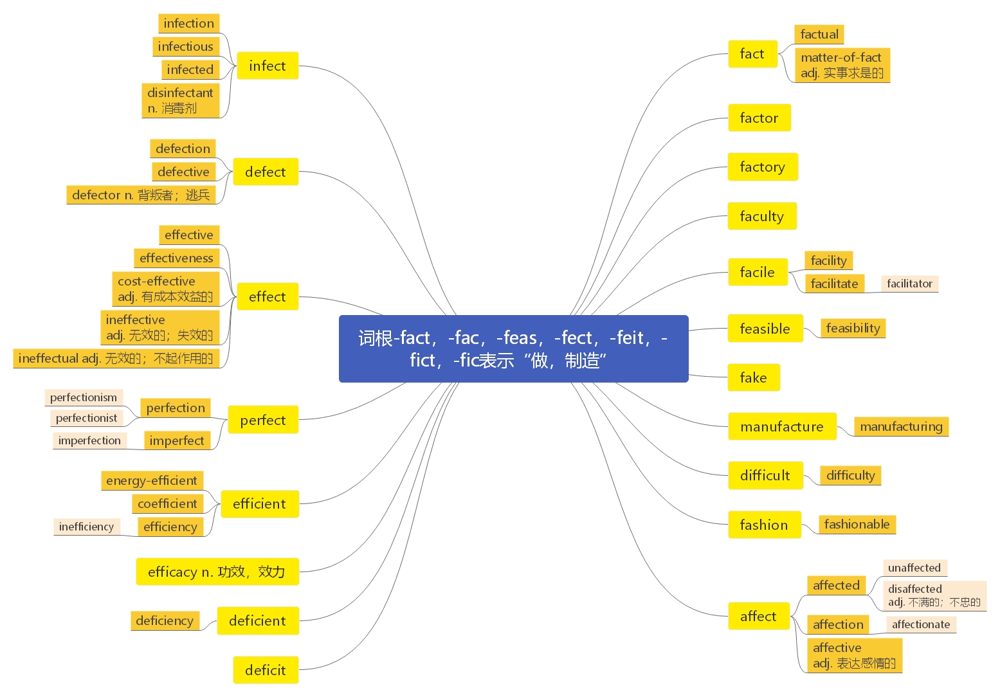

# 第二十二节 词根-fac, -fact, -feas, -feat, -fect, -feit, -fic, -fici, -fict

***

## 词根-fac, -fact, -feas, -feat, -fect, -feit, -fic, -fici, -fict 表示“ make/do:做/造” 的含义

***

# 核心词汇：

***

**fact**  \[fækt] n.  [英音](https://dict.youdao.com/dictvoice?audio=fact\&type=1)  [美音](https://dict.youdao.com/dictvoice?audio=fact\&type=2) 事实；实际；真相 236

**助记：** fact (做) → 做出来的事情 → 事实

> **【课堂笔记】**
>
> 单词 law 法律
>
> 词根 -leg 法律 leg 大腿
>
> man 男人 -man 手
>
> **单词和词根之间并没有必然联系**

**双语例句:** Her argument was grounded in fact. [播放](https://dict.youdao.com/dictvoice?audio=Her+argument+was+grounded+in+fact.&le=eng&le=eng&type=2)

她的论述以事实为根据。 

**双语例句:** That was a conjecture, not a fact. [播放](https://dict.youdao.com/dictvoice?audio=That+was+a+conjecture%2C+not+a+fact.&le=eng&le=eng&type=2)

那是个推测，不是事实。 

**双语例句:** But was it, in fact, a hideous goof? [播放](https://dict.youdao.com/dictvoice?audio=But+was+it%2C+in+fact%2C+a+hideous+goof%3F&le=eng&le=eng&type=2)

但其实这真的是很可笑的错误吗？ 

**原声例句:** This is shown in the **fact** that the most popular baby names are not as popular as they used to be. [播放](https://dict.youdao.com/pureaudio?docid=-4475449937416904870)

**原声例句:** In **fact**,the orientation program for new students at Virginia Tech this summer includes a meeting for parents called \"Parents as Partners.\" [播放](https://dict.youdao.com/pureaudio?docid=-3566629903554356324)

**原声例句:** Some people saw proof of that in the **fact** that two of her children and her husband died before her. [播放](https://dict.youdao.com/pureaudio?docid=-127888186018658171)

**权威例句:** In **fact**, I think you can be a far better and more successful businessperson.  [播放](https://dict.youdao.com/dictvoice?audio=In+fact%2C+I+think+you+can+be+a+far+better+and+more+successful+businessperson.+&le=eng&type=2)

**权威例句:** The former Motorola engineer Marty Cooper, in **fact**, made the first-ever wireless phone call in 1973.  [播放](https://dict.youdao.com/dictvoice?audio=The+former+Motorola+engineer+Marty+Cooper%2C+in+fact%2C+made+the+first-ever+wireless+phone+call+in+1973.+&le=eng&type=2)

**权威例句:** The **fact** that Bin Laden's compound was located nearby came as an embarrassment to Pakistan.  [播放](https://dict.youdao.com/dictvoice?audio=The+fact+that+Bin+Laden%27s+compound+was+located+nearby+came+as+an+embarrassment+to+Pakistan.+&le=eng&type=2)

***

**factual**  \['fæktʃʊəl; -tjʊəl]adj.  [英音](https://dict.youdao.com/dictvoice?audio=factual\&type=1)  [美音](https://dict.youdao.com/dictvoice?audio=factual\&type=2) 事实的；真实的 9162

**助记：** fact（ 事实） + u（连接符号） +al（形容词词尾） →事实的；真实的

**双语例句:** The editorial contained several factual errors. [播放](https://dict.youdao.com/dictvoice?audio=The+editorial+contained+several+factual+errors.&le=eng&le=eng&type=2)

这篇社论有几处事实性错误。 

**双语例句:** Factual and forensic evidence makes a suicide verdict the most compelling answer to the mystery of his death. [播放](https://dict.youdao.com/dictvoice?audio=Factual+and+forensic+evidence+makes+a+suicide+verdict+the+most+compelling+answer+to+the+mystery+of+his+death.&le=eng&le=eng&type=2)

事实和法庭证据使自杀的判定成为对他死亡之谜最令人信服的解答。 

**双语例句:** False beliefs can be useful in a social sense even if they are not useful in a factual sense. [播放](https://dict.youdao.com/dictvoice?audio=False+beliefs+can+be+useful+in+a+social+sense+even+if+they+are+not+useful+in+a+factual+sense.&le=eng&le=eng&type=2)

错误的信念虽然在事实意义上没有用，但从社会意义的角度来讲是有用的。 

**原声例句:** Richard Goldstone, who headed the U.N.inquiry, wrote last week to the Democratic chairman and senior Republican on the House Foreign Affairs Committee, Howard Berman and Ileana Ros-Lehtinen, demanding changes to correct what he called serious **factual** inaccuracies. [播放](https://dict.youdao.com/pureaudio?docid=-7028074097989422755)

**原声例句:** Aristotle's distinction seems to be not only empirical   again   based on the **factual** distribution of powers.

**原声例句:** And finally there's **factual**.

**权威例句:** Previous recipients of the **factual** presenting special award include Jon Snow, Andrew Marr, Jeremy Paxman and Kate Adie.  [播放](https://dict.youdao.com/dictvoice?audio=Previous+recipients+of+the+factual+presenting+special+award+include+Jon+Snow%2C+Andrew+Marr%2C+Jeremy+Paxman+and+Kate+Adie.+&le=eng&type=2)

**权威例句:** Again, this will turn on the **factual** question of who is telling the truth.  [播放](https://dict.youdao.com/dictvoice?audio=Again%2C+this+will+turn+on+the+factual+question+of+who+is+telling+the+truth.+&le=eng&type=2)

**权威例句:** Unlike the other main data markets, **Factual** does not offer reselling facilities for data publishers.  [播放](https://dict.youdao.com/dictvoice?audio=Unlike+the+other+main+data+markets%2C+Factual+does+not+offer+reselling+facilities+for+data+publishers.+&le=eng&type=2)

***

**matter-of-fact**  \['mætərəv'fækt] adj.  [英音](https://dict.youdao.com/dictvoice?audio=matter-of-fact\&type=1)  [美音](https://dict.youdao.com/dictvoice?audio=matter-of-fact\&type=2) 实事求是的；不带感情的； 18303

**助记：** matter (事情)+ of + fact（实际） →实际事情→实事求是的

***

**matter-of-factly**  \[,mætərəf'fæktli] 16689

[英音](https://dict.youdao.com/dictvoice?audio=matter-of-factly\&type=1)  [美音](https://dict.youdao.com/dictvoice?audio=matter-of-factly\&type=2) **助记：** matter-of-fact（实事求是的） + ly (…地)→实事求是地

***

**factor**  \['fæktə] n.  [英音](https://dict.youdao.com/dictvoice?audio=factor\&type=1)  [美音](https://dict.youdao.com/dictvoice?audio=factor\&type=2) 因素；因数；要素；代理人 730

**词源：** early 15c., "commercial agent, deputy, one who buys or sells for another," from Middle

French facteur "agent, representative" (Old French factor, faitor "doer, author, creator"), from Latin

factor "doer, maker, performer," in Medieval Latin, "agent," agent noun from past participle stem of

facere "to do" (from PIE root \*dhe- "to set, put"). In commerce, especially "a commission

merchant." Mathematical sense is from 1670s. Sense of "circumstance producing a result" is attested

by 1816, from the mathematical sense.

**双语例句:** Lack of cash is a limiting factor. [播放](https://dict.youdao.com/dictvoice?audio=Lack+of+cash+is+a+limiting+factor.&le=eng&le=eng&type=2)

现金短缺是一个制约因素。 

**双语例句:** Haemophiliacs have no factor 8 in their blood. [播放](https://dict.youdao.com/dictvoice?audio=Haemophiliacs+have+no+factor+8+in+their+blood.&le=eng&le=eng&type=2)

血友病患者的血液中缺乏凝血因子 VIII。 

**双语例句:** Heredity is not a factor in causing the cancer. [播放](https://dict.youdao.com/dictvoice?audio=Heredity+is+not+a+factor+in+causing+the+cancer.&le=eng&le=eng&type=2)

遗传并非导致这种癌症的一个因素。 

**原声例句:** She was widely recognized by other researchers for her work with a protein called transforming growth **factor**-beta. [播放](https://dict.youdao.com/pureaudio?docid=8397303420702970630)

**原声例句:** The third **factor** is a sense of pride in country and unity with other citizens. [播放](https://dict.youdao.com/pureaudio?docid=8953752700192827407)

**原声例句:** \"While cost remains a major **factor** in decisions about where to off-source, the quality of the labor pool is gaining importance, and this includes English language skills.\" [播放](https://dict.youdao.com/pureaudio?docid=5641596987146588605)

**权威例句:** This round-up of Monday's main media stories focuses on the return of X **Factor**.  [播放](https://dict.youdao.com/dictvoice?audio=This+round-up+of+Monday%27s+main+media+stories+focuses+on+the+return+of+X+Factor.+&le=eng&type=2)

**权威例句:** Cosy log cabins and romantic cottages with heated spas and open fireplaces continue the charm **factor**.  [播放](https://dict.youdao.com/dictvoice?audio=Cosy+log+cabins+and+romantic+cottages+with+heated+spas+and+open+fireplaces+continue+the+charm+factor.+&le=eng&type=2)

**权威例句:** The Redfern inquiry report said \"managerial inadequacy\" had been a **factor** in the scandal.  [播放](https://dict.youdao.com/dictvoice?audio=The+Redfern+inquiry+report+said+%22managerial+inadequacy%22+had+been+a+factor+in+the+scandal.+&le=eng&type=2)

***

**factory**  \['fækt(ə)rɪ] n.  [英音](https://dict.youdao.com/dictvoice?audio=factory\&type=1)  [美音](https://dict.youdao.com/dictvoice?audio=factory\&type=2) 工厂；制造厂；代理店 2151

**助记：** fact（做, 作） + ory（名词后缀, 表场所） → 工作的地方→工厂；制造厂

> **【课堂笔记】**
>
> \-ary -ery -ory
>
> （ 1） 名词后缀， 表示人/物/地点
>
> （ 2） 形容词后缀 如： grocery

**双语例句:** A strike has shut the factory. [播放](https://dict.youdao.com/dictvoice?audio=A+strike+has+shut+the+factory.&le=eng&le=eng&type=2)

罢工使工厂停业。 

**双语例句:** The factory is in dire straits. [播放](https://dict.youdao.com/dictvoice?audio=The+factory+is+in+dire+straits.&le=eng&le=eng&type=2)

工厂岌岌可危。 

**双语例句:** That old factory is a real eyesore! [播放](https://dict.youdao.com/dictvoice?audio=That+old+factory+is+a+real+eyesore%21&le=eng&le=eng&type=2)

那老工厂实在碍眼！ 

**原声例句:** A group of one thousand soldiers went to Harpers Ferry,Virginia, where the Union army had a gun **factory** and arsenal. [播放](https://dict.youdao.com/pureaudio?docid=-6764646651729924729)

**原声例句:** She said the company should give a prize to the best student in a high school near the **factory**. [播放](https://dict.youdao.com/pureaudio?docid=-3054720474484637961)

**原声例句:** When she was eight years old, her father took her inside a **factory** to watch the manufacture of printing presses. [播放](https://dict.youdao.com/pureaudio?docid=-1226683293290681721)

**权威例句:** However, workers were later allowed back in or told to return by the **factory** owners.  [播放](https://dict.youdao.com/dictvoice?audio=However%2C+workers+were+later+allowed+back+in+or+told+to+return+by+the+factory+owners.+&le=eng&type=2)

**权威例句:** Forty Rockwell engineers are on-site to help manage spare parts and train **factory** workers.  [播放](https://dict.youdao.com/dictvoice?audio=Forty+Rockwell+engineers+are+on-site+to+help+manage+spare+parts+and+train+factory+workers.+&le=eng&type=2)

**权威例句:** At the neon-pink-walled **factory** of Soul Stix Surfboards, in the surf ghetto of San Clemente, Calif.  [播放](https://dict.youdao.com/dictvoice?audio=At+the+neon-pink-walled+factory+of+Soul+Stix+Surfboards%2C+in+the+surf+ghetto+of+San+Clemente%2C+Calif.+&le=eng&type=2)

***

**faculty**  \['fæk(ə)ltɪ] n.  [英音](https://dict.youdao.com/dictvoice?audio=faculty\&type=1)  [美音](https://dict.youdao.com/dictvoice?audio=faculty\&type=2) 能力；全体教员；科，系 1998

词 源 ： late 14c., "ability, opportunity, means, resources," from Old French faculte "skill,

accomplishment, learning" (14c., Modern French faculté) and directly from Latin facultatem

(nominative facultas) "power, ability, capability, opportunity; sufficient number, abundance,

wealth," from \*facli-tat-s, from facilis "easy to do," of persons, "pliant, courteous, yielding," from

facere "to do" (from PIE root \*dhe- "to set, put").

**助记：** fac（做） + ul（连接符号） + -ty（名词后缀） →做事情的能力/做事情的人→能力；全

体教员

**搭配：** devoted faculty（考）：有献身精神的教员

**双语例句:** The faculty agreed on a change in the requirements. [播放](https://dict.youdao.com/dictvoice?audio=The+faculty+agreed+on+a+change+in+the+requirements.&le=eng&le=eng&type=2)

全体教员同意改变要求。 

**双语例句:** How can faculty improve their teaching so as to encourage creativity? [播放](https://dict.youdao.com/dictvoice?audio=How+can+faculty+improve+their+teaching+so+as+to+encourage+creativity%3F&le=eng&le=eng&type=2)

全体教员怎样才能改进教学以便激发创造力？ 

**双语例句:** The Bush Foundation has funded a variety of faculty development programmes. [播放](https://dict.youdao.com/dictvoice?audio=The+Bush+Foundation+has+funded+a+variety+of+faculty+development+programmes.&le=eng&le=eng&type=2)

布什基金会已经资助了各种教职工发展项目。 

**原声例句:** Charuk Singhapreecha is deputy dean of the **faculty** of economics at Thailand's Kasetsart University. [播放](https://dict.youdao.com/pureaudio?docid=1421637567066442659)

**原声例句:** instead,the students meet together with **faculty** members to explore the books being read. [播放](https://dict.youdao.com/pureaudio?docid=-89889877275611689)

**原声例句:** The AAUW report recommends steps to raise awareness about girls' achievement and interest in science, and to get colleges to attract and keep more female students and **faculty**. [播放](https://dict.youdao.com/pureaudio?docid=7637682523686775974)

**权威例句:** Previous Caltech **faculty** members include 33 Nobel laureates and visiting professors Albert Einstein and Stephen Hawking.  [播放](https://dict.youdao.com/dictvoice?audio=Previous+Caltech+faculty+members+include+33+Nobel+laureates+and+visiting+professors+Albert+Einstein+and+Stephen+Hawking.+&le=eng&type=2)

**权威例句:** He is omnipresent on campus, attending everything from **faculty** awards events to dormitory pizza parties.  [播放](https://dict.youdao.com/dictvoice?audio=He+is+omnipresent+on+campus%2C+attending+everything+from+faculty+awards+events+to+dormitory+pizza+parties.+&le=eng&type=2)

**权威例句:** In 2009 alone the University of Texas lured three senior **faculty** members from UC.  [播放](https://dict.youdao.com/dictvoice?audio=In+2009+alone+the+University+of+Texas+lured+three+senior+faculty+members+from+UC.+&le=eng&type=2)

***

**facile**  \['fæsail] a.  [英音](https://dict.youdao.com/dictvoice?audio=facile\&type=1)  [美音](https://dict.youdao.com/dictvoice?audio=facile\&type=2) 容易（做）的

&#x20;**助记：** 拉丁文写作“ facilis”，其中， faci（ =fact：做） +is（ =easy：容易；因为 easy 原本写作

“ aise”，其读音和“ -is”是一样的） → 容易做的；容易的

> **【课堂笔记】**
>
> \-able -ible -ile
>
> 1） 形容词后缀， 表示能够…的/可以…的； 容易…的
>
> 2） 名词后缀

**双语例句:** The subject of racism is admittedly too complex for facile summarization. [播放](https://dict.youdao.com/dictvoice?audio=The+subject+of+racism+is+admittedly+too+complex+for+facile+summarization.&le=eng&le=eng&type=2)

种族主义这一主题委实太复杂，无法肤浅地加以概括。 

**双语例句:** That was a facile victory. [播放](https://dict.youdao.com/dictvoice?audio=That+was+a+facile+victory.&le=eng&le=eng&type=2)

那是一次很容易得到的胜利。 

**双语例句:** She is a facile speaker. [播放](https://dict.youdao.com/dictvoice?audio=She+is+a+facile+speaker.&le=eng&le=eng&type=2)

她是个能说会道的人。 

**权威例句:** If brands become **facile** in manipulating behavior, they will also ultimately become targeted as manipulators.  [播放](https://dict.youdao.com/dictvoice?audio=If+brands+become+facile+in+manipulating+behavior%2C+they+will+also+ultimately+become+targeted+as+manipulators.+&le=eng&type=2)

**权威例句:** Social media interaction at the scale of Facebook likes can be **facile**, superficial, and meaningless.  [播放](https://dict.youdao.com/dictvoice?audio=Social+media+interaction+at+the+scale+of+Facebook+likes+can+be+facile%2C+superficial%2C+and+meaningless.+&le=eng&type=2)

**权威例句:** This talk of footsteps, ghosts and allusions to dusty diamond failures is **facile**, cheesy.  [播放](https://dict.youdao.com/dictvoice?audio=This+talk+of+footsteps%2C+ghosts+and+allusions+to+dusty+diamond+failures+is+facile%2C+cheesy.+&le=eng&type=2)

***

**facility**  \[fə'sɪləti] n.  [英音](https://dict.youdao.com/dictvoice?audio=facility\&type=1)  [美音](https://dict.youdao.com/dictvoice?audio=facility\&type=2) 设备；灵巧；容易；设施 1304

**助记：** facil（ =facile：容易的） +ity（名词后缀） →容易; 便利

fac（做） +ility（名词后缀：东西） →（用来）做事情的东西→设施、设备

**搭配：** sorting facilities（考）：分类设施 recreation facilities（考）：娱乐设施

**双语例句:** There may be a cost to such facility. [播放](https://dict.youdao.com/dictvoice?audio=There+may+be+a+cost+to+such+facility.&le=eng&le=eng&type=2)

这种的设备可能会产生成本。 

**双语例句:** It describes completely the facility and its safety basis. [播放](https://dict.youdao.com/dictvoice?audio=It+describes+completely+the+facility+and+its+safety+basis.&le=eng&le=eng&type=2)

它完整地描述了设备和它的安全基础。 

**双语例句:** The facility has sprung up from nothing in the past 18 months. [播放](https://dict.youdao.com/dictvoice?audio=The+facility+has+sprung+up+from+nothing+in+the+past+18+months.&le=eng&le=eng&type=2)

该工厂设施是过去18个月从无到有建起来的。 

**原声例句:** Saresa Whitley is serving five years for assault at the Coffee Creek Correctional **Facility**, a women's prison in Oregon. [播放](https://dict.youdao.com/pureaudio?docid=6383443599145627403)

**原声例句:** In New York, Iranian President Mahmoud Ahmadinejad said President Obama will regret saying that Iran has been building a secret **facility**. [播放](https://dict.youdao.com/pureaudio?docid=128933018693215989)

**原声例句:** The Americans had planned to use the Infrared Telescope **Facility** on top of Hawaii's Mauna Kea volcano the following night. [播放](https://dict.youdao.com/pureaudio?docid=7667751737664680706)

**权威例句:** London bid chairman Lord Coe hailed the institute as an \"exciting, dynamic and innovative\" **facility**.  [播放](https://dict.youdao.com/dictvoice?audio=London+bid+chairman+Lord+Coe+hailed+the+institute+as+an+%22exciting%2C+dynamic+and+innovative%22+facility.+&le=eng&type=2)

**权威例句:** One question that arose: why did this have to be a government funded **facility**?  [播放](https://dict.youdao.com/dictvoice?audio=One+question+that+arose%3A+why+did+this+have+to+be+a+government+funded+facility%3F+&le=eng&type=2)

**权威例句:** Gloucestershire County Council signed a 25-year contract to build the **facility** at Javelin Park, in Haresfield.  [播放](https://dict.youdao.com/dictvoice?audio=Gloucestershire+County+Council+signed+a+25-year+contract+to+build+the+facility+at+Javelin+Park%2C+in+Haresfield.+&le=eng&type=2)

***

**facilitate**  \[fə'sɪlɪteɪt]vt.  [英音](https://dict.youdao.com/dictvoice?audio=facilitate\&type=1)  [美音](https://dict.youdao.com/dictvoice?audio=facilitate\&type=2) 促进；帮助；使容易，使便利 3604

**助记：** facilit（ =facility：容易） +ate（使动词） →使容易、使促进

例句： First, computers facilitate us in more aspects of life.首先，电脑使我们生活的更多方面变

得容易。

仿写例句：首先，数字化产品使我们生活的更多方面变得便利。

First, digital products facilitate us in more aspects of life.

**双语例句:** The new airport will facilitate the development of tourism. [播放](https://dict.youdao.com/dictvoice?audio=The+new+airport+will+facilitate+the+development+of+tourism.&le=eng&le=eng&type=2)

新机场将促进旅游业的发展。 

**双语例句:** It may facilitate independent learning. [播放](https://dict.youdao.com/dictvoice?audio=It+may+facilitate+independent+learning.&le=eng&le=eng&type=2)

它可以促进自主学习。 

**双语例句:** Modern inventions facilitate housework. [播放](https://dict.youdao.com/dictvoice?audio=Modern+inventions+facilitate+housework.&le=eng&le=eng&type=2)

许多现代发明便利了家务劳动。 

**原声例句:** He says the army's capture of the Kotkai area will help **facilitate** its advance toward Makeen and Ladha, two major Taliban strongholds. [播放](https://dict.youdao.com/pureaudio?docid=7806389451181635978)

**原声例句:** And we in Caricom [the Caribbean Community are willing to **facilitate** that dialogue. [播放](https://dict.youdao.com/pureaudio?docid=-1207045616191610216)

**原声例句:** \"President Obama is determined to **facilitate** a truly comprehensive Arab-Israeli peace,\". [播放](https://dict.youdao.com/pureaudio?docid=-8355744087973945797)

**权威例句:** To **facilitate** the immersion, some evidence is sent out by email beforehand, and everyone is given a role.  [播放](https://dict.youdao.com/dictvoice?audio=To+facilitate+the+immersion%2C+some+evidence+is+sent+out+by+email+beforehand%2C+and+everyone+is+given+a+role.+&le=eng&type=2)

**权威例句:** And, yes, trust that personal data used to **facilitate** a relevant conversation will not be shared.  [播放](https://dict.youdao.com/dictvoice?audio=And%2C+yes%2C+trust+that+personal+data+used+to+facilitate+a+relevant+conversation+will+not+be+shared.+&le=eng&type=2)

**权威例句:** He helped **facilitate** the conversations about what the community should do with the old building.  [播放](https://dict.youdao.com/dictvoice?audio=He+helped+facilitate+the+conversations+about+what+the+community+should+do+with+the+old+building.+&le=eng&type=2)

***

**facilitator**  \[fə'sɪlɪteɪtə] n.  [英音](https://dict.youdao.com/dictvoice?audio=facilitator\&type=1)  [美音](https://dict.youdao.com/dictvoice?audio=facilitator\&type=2) 服务商；促进者 12392

**助记：** facilit（ =facility：容易） +ate（使动词） + or (人) →使某事容易的人→促进者；服务商

**双语例句:** The teacher acts as a facilitator of learning. [播放](https://dict.youdao.com/dictvoice?audio=The+teacher+acts+as+a+facilitator+of+learning.&le=eng&le=eng&type=2)

教师是学习的诱导者。 

**双语例句:** The conference is chaired by a highly skilled facilitator who has been fully trained. [播放](https://dict.youdao.com/dictvoice?audio=The+conference+is+chaired+by+a+highly+skilled+facilitator+who+has+been+fully+trained.&le=eng&le=eng&type=2)

会议由一位受过充分训练、技巧娴熟的协调人主持。 

**双语例句:** At this stage of facilities provision, the airport also has the possibility of taking on the role of the final destination rather than merely a facilitator of access. [播放](https://dict.youdao.com/dictvoice?audio=At+this+stage+of+facilities+provision%2C+the+airport+also+has+the+possibility+of+taking+on+the+role+of+the+final+destination+rather+than+merely+a+facilitator+of+access.&le=eng&le=eng&type=2)

在提供设施的这一阶段，机场也有可能承担最终目的地的角色，而不仅仅是出行工具。 

**权威例句:** Therefore, education seems to be an important **facilitator** to becoming a high impact entrepreneur.  [播放](https://dict.youdao.com/dictvoice?audio=Therefore%2C+education+seems+to+be+an+important+facilitator+to+becoming+a+high+impact+entrepreneur.+&le=eng&type=2)

**权威例句:** This disrupts the support that the project offers by visiting each **facilitator** once a month.  [播放](https://dict.youdao.com/dictvoice?audio=This+disrupts+the+support+that+the+project+offers+by+visiting+each+facilitator+once+a+month.+&le=eng&type=2)

**权威例句:** In each class, the **facilitator** introduces a health related topic to discuss with learners.  [播放](https://dict.youdao.com/dictvoice?audio=In+each+class%2C+the+facilitator+introduces+a+health+related+topic+to+discuss+with+learners.+&le=eng&type=2)

***

**feasible**  \['fiːzɪb(ə)l] adj.  [英音](https://dict.youdao.com/dictvoice?audio=feasible\&type=1)  [美音](https://dict.youdao.com/dictvoice?audio=feasible\&type=2) 可行的；可能的；可实行的 7730

**助记：** feas（ =fact：做） +ible（可以、能） →可以做的→可行的

**搭配：** a feasible policy（考）：可行的政策

例句： Further big increases would be politically unfeasible. 进一步大量增加从政治的角度上来

说是不可行的。

仿写例句：取消各种和证书有关的考试从经济上来讲是不可行的，毕竟，这个产业养活了很

多人。

Abolishing all varieties of certificate tests would economically unfeasible, after all, the industry

support many families.

**双语例句:** She questioned whether it was feasible to stimulate investment in these regions. [播放](https://dict.youdao.com/dictvoice?audio=She+questioned+whether+it+was+feasible+to+stimulate+investment+in+these+regions.&le=eng&le=eng&type=2)

她质问在这些地区刺激投资是否可行。 

**双语例句:** How feasible is this vision? [播放](https://dict.youdao.com/dictvoice?audio=How+feasible+is+this+vision%3F&le=eng&le=eng&type=2)

这一设想的可行性如何？ 

**双语例句:** Please consider if this is feasible. [播放](https://dict.youdao.com/dictvoice?audio=Please+consider+if+this+is+feasible.&le=eng&le=eng&type=2)

是否可行，请斟酌。 

**原声例句:** While new stations that minimize bomb damage are **feasible**, officials say the best defense is identifying attackers before they can strike. [播放](https://dict.youdao.com/pureaudio?docid=760317309641570383)

**原声例句:** An entrepreneur's product or service must sound **feasible** and marketable, enough to convince people to become investors. [播放](https://dict.youdao.com/pureaudio?docid=5754769026754558763)

**原声例句:** But a second round of balloting might not **feasible** if inclement weather sets in. [播放](https://dict.youdao.com/pureaudio?docid=-8497414382980796270)

**权威例句:** Higher prices at the pump have also made extraction from oil sands and heavy oil **feasible**.  [播放](https://dict.youdao.com/dictvoice?audio=Higher+prices+at+the+pump+have+also+made+extraction+from+oil+sands+and+heavy+oil+feasible.+&le=eng&type=2)

**权威例句:** From about 800 initial ideas, we then select according to criteria: New, Unique, and Not **Feasible**.  [播放](https://dict.youdao.com/dictvoice?audio=From+about+800+initial+ideas%2C+we+then+select+according+to+criteria%3A+New%2C+Unique%2C+and+Not+Feasible.+&le=eng&type=2)

**权威例句:** May I suggest a post on attorneys who, despite trying everything **feasible**, cannot find sustainable employment?  [播放](https://dict.youdao.com/dictvoice?audio=May+I+suggest+a+post+on+attorneys+who%2C+despite+trying+everything+feasible%2C+cannot+find+sustainable+employment%3F+&le=eng&type=2)

***

**feasibility**  \[fiːzɪ'bɪlɪtɪ] n.  [英音](https://dict.youdao.com/dictvoice?audio=feasibility\&type=1)  [美音](https://dict.youdao.com/dictvoice?audio=feasibility\&type=2) 可行性；可能性 12129

**助记：** feasible（可行的；可能的） + ity（名词后缀，表性质） →可行性

**双语例句:** I doubt the feasibility of the plan. [播放](https://dict.youdao.com/dictvoice?audio=I+doubt+the+feasibility+of+the+plan.&le=eng&le=eng&type=2)

我怀疑这个计划的可行性。 

**双语例句:** The committee will study the feasibility of setting up a national computer network. [播放](https://dict.youdao.com/dictvoice?audio=The+committee+will+study+the+feasibility+of+setting+up+a+national+computer+network.&le=eng&le=eng&type=2)

委员会将研究建立一个国家计算机网络的可行性。 

**双语例句:** Work has begun to determine the feasibility of using insects as biological controls, but effective biological controls are considered years away. [播放](https://dict.youdao.com/dictvoice?audio=Work+has+begun+to+determine+the+feasibility+of+using+insects+as+biological+controls%2C+but+effective+biological+controls+are+considered+years+away.&le=eng&le=eng&type=2)

人们已经开始努力确定使用昆虫作为生物控制手段的可行性，但仍认为有效的生物控制手段还需要数年时间。 

**原声例句:** Ruhli and his team of researchers at the Swiss Mummy Institute have just completed the first **feasibility** study of how they could use the technology to reveal a mummy's secrets, without damaging the mummy. [播放](https://dict.youdao.com/pureaudio?docid=-1896748579395198463)

**权威例句:** \"Therefore, we don't want to speculate on either the project or project **feasibility**, \" a spokesperson said.  [播放](https://dict.youdao.com/dictvoice?audio=%22Therefore%2C+we+don%27t+want+to+speculate+on+either+the+project+or+project+feasibility%2C+%22+a+spokesperson+said.+&le=eng&type=2)

**权威例句:** Relying more on gut feelings and his own on-the-ground research than professional **feasibility** studies, John Q.  [播放](https://dict.youdao.com/dictvoice?audio=Relying+more+on+gut+feelings+and+his+own+on-the-ground+research+than+professional+feasibility+studies%2C+John+Q.+&le=eng&type=2)

**权威例句:** \"That's something that we will consider as part of the **feasibility** study, \" he said.  [播放](https://dict.youdao.com/dictvoice?audio=%22That%27s+something+that+we+will+consider+as+part+of+the+feasibility+study%2C+%22+he+said.+&le=eng&type=2)

***

**fake**  \[feɪk] n.  [英音](https://dict.youdao.com/dictvoice?audio=fake\&type=1)  [美音](https://dict.youdao.com/dictvoice?audio=fake\&type=2) 假货；骗子； vt. 捏造； adj. 伪造的 5161

**助记：** fak（ =-fact=fic：做）→人做出来的→人造的；虚假的；假的；假货

**搭配：** fake listening（考）：假装在听 fake papers（考）：伪造的论文

> **【课堂笔记】**
>
> artificial 人造的；假的

**双语例句:** No one spotted that the gun was a fake. [播放](https://dict.youdao.com/dictvoice?audio=No+one+spotted+that+the+gun+was+a+fake.&le=eng&le=eng&type=2)

没有人留意到那是一支假枪。 

**双语例句:** A sharp-eyed shop clerk spotted the fake. [播放](https://dict.youdao.com/dictvoice?audio=A+sharp-eyed+shop+clerk+spotted+the+fake.&le=eng&le=eng&type=2)

一名眼尖的售货员发现了假货。 

**双语例句:** He tried to fake sincerity as he smiled at them. [播放](https://dict.youdao.com/dictvoice?audio=He+tried+to+fake+sincerity+as+he+smiled+at+them.&le=eng&le=eng&type=2)

当他朝他们笑的时候，他设法假装真诚。 

**原声例句:** Alice Cooper's extreme clothing, face make-up,**fake** blood and crazy behavior have entertained audiences for nearly fifty years. [播放](https://dict.youdao.com/pureaudio?docid=-8268663988085632720)

**原声例句:** In March,the court fined a former Herms saleswoman $7.5 million (U.S.) for selling **fake** crocodile-skin bags, several years ago. [播放](https://dict.youdao.com/pureaudio?docid=7305869905216107596)

**原声例句:** His re-election bid is being tarnished by reports of massive ballot-box stuffing by his supporters, who also allegedly created **fake** polling sites. [播放](https://dict.youdao.com/pureaudio?docid=5801526704280104459)

**权威例句:** Many are pretty tacky: full of plastic flowers, **fake** stained-glass windows and doll's-house pews.  [播放](https://dict.youdao.com/dictvoice?audio=Many+are+pretty+tacky%3A+full+of+plastic+flowers%2C+fake+stained-glass+windows+and+doll%27s-house+pews.+&le=eng&type=2)

**权威例句:** There were a few offers for **fake** boyfriends, but it is overwhelmingly women who offer the service.  [播放](https://dict.youdao.com/dictvoice?audio=There+were+a+few+offers+for+fake+boyfriends%2C+but+it+is+overwhelmingly+women+who+offer+the+service.+&le=eng&type=2)

**权威例句:** In any case, the turn among the liberals who touted the **fake** results has been educational.  [播放](https://dict.youdao.com/dictvoice?audio=In+any+case%2C+the+turn+among+the+liberals+who+touted+the+fake+results+has+been+educational.+&le=eng&type=2)

***

**manufacture**  \[mænjʊ'fæktʃə] n.  [英音](https://dict.youdao.com/dictvoice?audio=manufacture\&type=1)  [美音](https://dict.youdao.com/dictvoice?audio=manufacture\&type=2) 制造；制造业；产品 5197

**助记：** manu（手） + fact（做） + -ure（名词后缀）→人工做的→制造

**双语例句:** They manufacture the class of plastics known as thermoplastic materials. [播放](https://dict.youdao.com/dictvoice?audio=They+manufacture+the+class+of+plastics+known+as+thermoplastic+materials.&le=eng&le=eng&type=2)

他们生产被称为热塑材料的塑料类制品。 

**双语例句:** Coca-Cola, Pepsi and Cadbury use franchisers to manufacture, bottle and distribute their products within geographical areas. [播放](https://dict.youdao.com/dictvoice?audio=Coca-Cola%2C+Pepsi+and+Cadbury+use+franchisers+to+manufacture%2C+bottle+and+distribute+their+products+within+geographical+areas.&le=eng&le=eng&type=2)

可口可乐、百事可乐和吉百利公司利用特许经销商在一定的地区内生产、罐装和销售其产品。 

**双语例句:** Brookman & Langdon were said to manufacture the most desirable pens and these necessarily command astonishingly high prices. [播放](https://dict.youdao.com/dictvoice?audio=Brookman+%26+Langdon+were+said+to+manufacture+the+most+desirable+pens+and+these+necessarily+command+astonishingly+high+prices.&le=eng&le=eng&type=2)

据说布鲁克曼兰登公司制造的钢笔最令人满意，而这必然地导致高得惊人的价格。 

**原声例句:** A Baltimore newspaper first called it that during the nineteen twenties when the **manufacture** and sale of alcohol were banned for a time. [播放](https://dict.youdao.com/pureaudio?docid=8029338188532114572)

**原声例句:** He did not invent jeans. But he is considered the first person to **manufacture** and sell this kind of clothing in large amounts. [播放](https://dict.youdao.com/pureaudio?docid=-6958425612912739540)

**原声例句:** He says the least developed countries need to cut dependence on commodities and **manufacture** products for export. [播放](https://dict.youdao.com/pureaudio?docid=-5431030009308648331)

**权威例句:** Currently, the pace of this growth only is dependent on Apple ability to **manufacture** these devices.  [播放](https://dict.youdao.com/dictvoice?audio=Currently%2C+the+pace+of+this+growth+only+is+dependent+on+Apple+ability+to+manufacture+these+devices.+&le=eng&type=2)

**权威例句:** Such technologies include those critical to the design, **manufacture** and delivery of weapons of mass destruction.  [播放](https://dict.youdao.com/dictvoice?audio=Such+technologies+include+those+critical+to+the+design%2C+manufacture+and+delivery+of+weapons+of+mass+destruction.+&le=eng&type=2)

**权威例句:** Only vehicles that fit this positioning will be profitable to **manufacture** and sell as Lincolns.  [播放](https://dict.youdao.com/dictvoice?audio=Only+vehicles+that+fit+this+positioning+will+be+profitable+to+manufacture+and+sell+as+Lincolns.+&le=eng&type=2)

***

**manufacturer**  \[,mænjʊ'fæktʃ(ə)rə(r)] n.  [英音](https://dict.youdao.com/dictvoice?audio=manufacturer\&type=1)  [美音](https://dict.youdao.com/dictvoice?audio=manufacturer\&type=2) 制造商；厂商 2271

**助记：** manufacture （制造） + er（人）→制造商

**双语例句:** There were several possibilities open to each manufacturer. [播放](https://dict.youdao.com/dictvoice?audio=There+were+several+possibilities+open+to+each+manufacturer.&le=eng&le=eng&type=2)

每个制造商都有几种可能的选择。 

**双语例句:** Change the filter cartridge as often as instructed by the manufacturer. [播放](https://dict.youdao.com/dictvoice?audio=Change+the+filter+cartridge+as+often+as+instructed+by+the+manufacturer.&le=eng&le=eng&type=2)

要按制造商要求的频率更换过滤套筒。 

**双语例句:** They are the leading manufacturer in both defence and commercial products. [播放](https://dict.youdao.com/dictvoice?audio=They+are+the+leading+manufacturer+in+both+defence+and+commercial+products.&le=eng&le=eng&type=2)

他们在防御性和商业性的产品方面都是领先的制造商。 

**原声例句:** But the medicine in Bangladesh was produced by a local drug **manufacturer** that used a dangerous substitute to save money. [播放](https://dict.youdao.com/pureaudio?docid=-7623405923331787485)

**原声例句:** Volvo was the first automobile **manufacturer** to offer the modern seat belt as a permanent addition to its cars. [播放](https://dict.youdao.com/pureaudio?docid=646755888380033762)

**原声例句:** The other condition is that the **manufacturer** prepare a training program for experts in nuclear medicine. [播放](https://dict.youdao.com/pureaudio?docid=2237083641267374354)

**权威例句:** Theo Chocolate, founded in 2006, is the United States' only fair trade and organic chocolate **manufacturer**.  [播放](https://dict.youdao.com/dictvoice?audio=Theo+Chocolate%2C+founded+in+2006%2C+is+the+United+States%27+only+fair+trade+and+organic+chocolate+manufacturer.+&le=eng&type=2)

**权威例句:** Take the experience of one midsized textile **manufacturer**, representative of many sodden local businesses.  [播放](https://dict.youdao.com/dictvoice?audio=Take+the+experience+of+one+midsized+textile+manufacturer%2C+representative+of+many+sodden+local+businesses.+&le=eng&type=2)

**权威例句:** Particularly, you can hear the use of the Optigan, a device created by the toy **manufacturer** Mattel.  [播放](https://dict.youdao.com/dictvoice?audio=Particularly%2C+you+can+hear+the+use+of+the+Optigan%2C+a+device+created+by+the+toy+manufacturer+Mattel.+&le=eng&type=2)

***

**manufacturing**  \[,mænjʊ'fæktʃərɪŋ] n.  [英音](https://dict.youdao.com/dictvoice?audio=manufacturing\&type=1)  [美音](https://dict.youdao.com/dictvoice?audio=manufacturing\&type=2) 制造业；制造 3188

**助记：** manufacture（制造） + ing（名词后缀）→制造业的

**双语例句:** The entire manufacturing process has been automated. [播放](https://dict.youdao.com/dictvoice?audio=The+entire+manufacturing+process+has+been+automated.&le=eng&le=eng&type=2)

整个生产过程已自动化。 

**双语例句:** Manufacturing failed to meet the crisis of the 1970s. [播放](https://dict.youdao.com/dictvoice?audio=Manufacturing+failed+to+meet+the+crisis+of+the+1970s.&le=eng&le=eng&type=2)

制造业没能成功地应对20世纪70年代危机的考验。 

**双语例句:** The Japanese are expert at lowering manufacturing costs. [播放](https://dict.youdao.com/dictvoice?audio=The+Japanese+are+expert+at+lowering+manufacturing+costs.&le=eng&le=eng&type=2)

日本人在降低生产成本方面很在行。 

**原声例句:** The car resulted from the efforts of the University of Warwick's **Manufacturing** Group and the Warwick Innovative **Manufacturing** Research Center. [播放](https://dict.youdao.com/pureaudio?docid=-1790658522602479995)

**原声例句:** And in other economic news, a report by the Institute for Supply Management said its non-**manufacturing** index shrank by less than expected. [播放](https://dict.youdao.com/pureaudio?docid=-6493297729901755166)

**原声例句:** \"Then I was promoted to the cook kitchen, and from there I promoted myself into the business of **manufacturing** hair goods and preparations. [播放](https://dict.youdao.com/pureaudio?docid=-6012808810479471372)

**权威例句:** Part of the investment will be used to install high-volume composite carbon fibre **manufacturing** equipment.  [播放](https://dict.youdao.com/dictvoice?audio=Part+of+the+investment+will+be+used+to+install+high-volume+composite+carbon+fibre+manufacturing+equipment.+&le=eng&type=2)

**权威例句:** In **manufacturing**, foreign-owned companies accounted for 36% of value added and 27% of employees.  [播放](https://dict.youdao.com/dictvoice?audio=In+manufacturing%2C+foreign-owned+companies+accounted+for+36%25+of+value+added+and+27%25+of+employees.+&le=eng&type=2)

**权威例句:** If big, branded goods companies do less **manufacturing**, somebody has to grind the stuff out.  [播放](https://dict.youdao.com/dictvoice?audio=If+big%2C+branded+goods+companies+do+less+manufacturing%2C+somebody+has+to+grind+the+stuff+out.+&le=eng&type=2)

***

**manufactured**  \[,mænjə'fæktʃɚ] adj.  [英音](https://dict.youdao.com/dictvoice?audio=manufactured\&type=1)  [美音](https://dict.youdao.com/dictvoice?audio=manufactured\&type=2) 制造的，已制成的 11798

**助记：** manufacture（制造） + ed（ …的）→制造的

**双语例句:** Manufactured glass is made by fusing various types of sand. [播放](https://dict.youdao.com/dictvoice?audio=Manufactured+glass+is+made+by+fusing+various+types+of+sand.&le=eng&le=eng&type=2)

人造玻璃是通过熔合不同种类的沙子制造出来的。 

**双语例句:** The wood is manufactured into fine cabinetwork. [播放](https://dict.youdao.com/dictvoice?audio=The+wood+is+manufactured+into+fine+cabinetwork.&le=eng&le=eng&type=2)

木材被制成精细的家具。 

**双语例句:** It may have been manufactured hours or days ago in your lungs. [播放](https://dict.youdao.com/dictvoice?audio=It+may+have+been+manufactured+hours+or+days+ago+in+your+lungs.&le=eng&le=eng&type=2)

它可能是几个小时前或几天前在你的肺里制造的。 

**原声例句:** Japan's desire to use East Asia to gain natural resources and sell **manufactured** products was in direct conflict with American plans for Asia. [播放](https://dict.youdao.com/pureaudio?docid=-1523294744748458613)

**原声例句:** Also,some people may find that **manufactured** cells threaten their belief that only God should create life. [播放](https://dict.youdao.com/pureaudio?docid=5724519098796739432)

**原声例句:** The operation could help double arm amputees move their **manufactured** arms with greater ease and control. [播放](https://dict.youdao.com/pureaudio?docid=4561318825789329398)

**权威例句:** Steep wooden roofs with locally **manufactured** flat tiles protect the churches from the rain and occasional snow.  [播放](https://dict.youdao.com/dictvoice?audio=Steep+wooden+roofs+with+locally+manufactured+flat+tiles+protect+the+churches+from+the+rain+and+occasional+snow.+&le=eng&type=2)

**权威例句:** And when sterling falls, as it has done, the cost of raw materials and overseas-manufactured components rises.  [播放](https://dict.youdao.com/dictvoice?audio=And+when+sterling+falls%2C+as+it+has+done%2C+the+cost+of+raw+materials+and+overseas-manufactured+components+rises.+&le=eng&type=2)

**权威例句:** The TSA maintained that the backscatter machines, **manufactured** by Rapiscan Systems, were safe and effective.  [播放](https://dict.youdao.com/dictvoice?audio=The+TSA+maintained+that+the+backscatter+machines%2C+manufactured+by+Rapiscan+Systems%2C+were+safe+and+effective.+&le=eng&type=2)

***

**difficult**  \[ˈdɪfɪkəlt] adj.  [英音](https://dict.youdao.com/dictvoice?audio=difficult\&type=1)  [美音](https://dict.youdao.com/dictvoice?audio=difficult\&type=2) 困难的；不随和的；难相处的 609

**助记：** dif (=dis-表否定) + facilit（ =facility：容易） → 不容易的→困难的

**双语例句:** The exam was quite difficult. [播放](https://dict.youdao.com/dictvoice?audio=He%27s+a+difficult+man+to+please.&le=eng&le=eng&type=2)

他是个难以取悦的人。 

**双语例句:** It's difficult to tell them apart. [播放](https://dict.youdao.com/dictvoice?audio=It%27s+difficult+to+tell+them+apart.&le=eng&le=eng&type=2)

很难把他们区分开来。 

**双语例句:** It was a rather difficult question. [播放](https://dict.youdao.com/dictvoice?audio=It+was+a+rather+difficult+question.&le=eng&le=eng&type=2)

这是个相当难的问题。 

**原声例句:** Tell all the Truth but tell it slant -- The truth about Emily Dickinson has been **difficult** to discover. [播放](https://dict.youdao.com/pureaudio?docid=6071450003000221834)

**原声例句:** And if one person dies, the other person may have a **difficult** time claiming the couple's money or property. [播放](https://dict.youdao.com/pureaudio?docid=7149693999430493782)

**原声例句:** The researchers point out that gene flow between crops and their wild relatives is common and **difficult** to contain. [播放](https://dict.youdao.com/pureaudio?docid=7675070442325313749)

**权威例句:** Perhaps a memento from his time at Wellcome might inspire him in **difficult** times ahead.  [播放](https://dict.youdao.com/dictvoice?audio=Perhaps+a+memento+from+his+time+at+Wellcome+might+inspire+him+in+difficult+times+ahead.+&le=eng&type=2)

**权威例句:** Some, such as Synercid, which Aventis sold to King Pharmaceuticals today, are especially **difficult** to administer.  [播放](https://dict.youdao.com/dictvoice?audio=Some%2C+such+as+Synercid%2C+which+Aventis+sold+to+King+Pharmaceuticals+today%2C+are+especially+difficult+to+administer.+&le=eng&type=2)

**权威例句:** The international community needs to do more to support countries through this often **difficult** process.  [播放](https://dict.youdao.com/dictvoice?audio=The+international+community+needs+to+do+more+to+support+countries+through+this+often+difficult+process.+&le=eng&type=2)

***

**difficulty**  \['dɪfɪk(ə)ltɪ] n.  [英音](https://dict.youdao.com/dictvoice?audio=difficulty\&type=1)  [美音](https://dict.youdao.com/dictvoice?audio=difficulty\&type=2) 困难，困境 1697

**助记：** difficult + y（名词后缀，表状态） →不容易的状态→困难；困境

> **【课堂笔记】**
>
> have difficulty (in) doing sth. 在做某事方面有困难

**双语例句:** Do you have difficulty getting up? [播放](https://dict.youdao.com/dictvoice?audio=Do+you+have+difficulty+getting+up%3F&le=eng&le=eng&type=2)

你起床有困难吗？ 

**双语例句:** They discussed the difficulty of studying abroad. [播放](https://dict.youdao.com/dictvoice?audio=They+discussed+the+difficulty+of+studying+abroad.&le=eng&le=eng&type=2)

他们讨论了到国外学习的困难。 

**双语例句:** Belinda was having difficulty bonding with the baby. [播放](https://dict.youdao.com/dictvoice?audio=Belinda+was+having+difficulty+bonding+with+the+baby.&le=eng&le=eng&type=2)

贝琳达难以和这个婴儿建立亲密关系。 

**原声例句:** And that's probably the simplest of all of them.\" The students first listed the problems in order of **difficulty**. [播放](https://dict.youdao.com/pureaudio?docid=-1336701389799869810)

**原声例句:** The study found that families in seventeen million households had **difficulty** getting enough food at times during the year. [播放](https://dict.youdao.com/pureaudio?docid=636080635088702292)

**原声例句:** She says people might have **difficulty** completing an activity if they cannot expect some kind of reward in return. [播放](https://dict.youdao.com/pureaudio?docid=-1938831261313733857)

**权威例句:** The Wales Coast Path website also details the **difficulty** level of any leg of the hike.  [播放](https://dict.youdao.com/dictvoice?audio=The+Wales+Coast+Path+website+also+details+the+difficulty+level+of+any+leg+of+the+hike.+&le=eng&type=2)

**权威例句:** Given the **difficulty**, most cartographers have guidelines for determining how to deal with potential complications.  [播放](https://dict.youdao.com/dictvoice?audio=Given+the+difficulty%2C+most+cartographers+have+guidelines+for+determining+how+to+deal+with+potential+complications.+&le=eng&type=2)

**权威例句:** The patients are homebound, and have **difficulty** accessing outpatient care in the usual settings.  [播放](https://dict.youdao.com/dictvoice?audio=The+patients+are+homebound%2C+and+have+difficulty+accessing+outpatient+care+in+the+usual+settings.+&le=eng&type=2)

***

**fashion**  \['fæʃ(ə)n] n.  [英音](https://dict.youdao.com/dictvoice?audio=fashion\&type=1)  [美音](https://dict.youdao.com/dictvoice?audio=fashion\&type=2) 样式；时尚；时装；时髦人物 1936

**词源：** c. 1300, fasoun, "physical make-up or composition; form, shape; appearance," from Old

French façon, fachon, fazon "face, appearance; construction, pattern, design; thing done; beauty;

manner, characteristic feature" (12c.), from Latin factionem (nominative factio) "a making or doing,

a preparing," also "group of people acting together," from facere "to make" (from PIE root \*dhe- "to

set, put").

Especially "style, manner" of make, dress, or embellishment (late 14c.); hence "prevailing custom;

mode of dress and adornment prevailing in a place and time" (late 15c.). Meaning "good style,

conformity to fashionable society's tastes" is from 1630s.

> **【课堂笔记】**
>
> 做“ 方式” 讲， in …fashion/way 以…方式

**双语例句:** Fashion is constantly changing. [播放](https://dict.youdao.com/dictvoice?audio=Fashion+is+constantly+changing.&le=eng&le=eng&type=2)

时尚总是日新月异。 

**双语例句:** Carolyne is a fashion designer. [播放](https://dict.youdao.com/dictvoice?audio=Carolyne+is+a+fashion+designer.&le=eng&le=eng&type=2)

卡罗琳是位时装设计师。 

**双语例句:** This could set a new fashion. [播放](https://dict.youdao.com/dictvoice?audio=This+could+set+a+new+fashion.&le=eng&le=eng&type=2)

这或许会开创一种新时尚呢。 

**原声例句:** She would prepare the hair and faces of the **fashion** models who wore the clothing being photographed. [播放](https://dict.youdao.com/pureaudio?docid=-5301612265034146485)

**原声例句:** She wrote comments for pictures published in Vogue, a magazine for women about clothes and **fashion**. [播放](https://dict.youdao.com/pureaudio?docid=-2464983896831155836)

**原声例句:** The couple soon had jobs from important **fashion** magazines such as \"Vogue\" and \"Harper's Bazaar\". [播放](https://dict.youdao.com/pureaudio?docid=9057945631703024143)

**权威例句:** In Britain, scientists have developed high-fashion dresses that can disappear even faster dissolving in hot water.  [播放](https://dict.youdao.com/dictvoice?audio=In+Britain%2C+scientists+have+developed+high-fashion+dresses+that+can+disappear+even+faster+dissolving+in+hot+water.+&le=eng&type=2)

**权威例句:** What had begun with a **fashion** for hats ended with the fall of a mighty empire.  [播放](https://dict.youdao.com/dictvoice?audio=What+had+begun+with+a+fashion+for+hats+ended+with+the+fall+of+a+mighty+empire.+&le=eng&type=2)

**权威例句:** Let's stay with the **fashion** business for a moment, because today's last word in business is Naughty Monkey.  [播放](https://dict.youdao.com/dictvoice?audio=Let%27s+stay+with+the+fashion+business+for+a+moment%2C+because+today%27s+last+word+in+business+is+Naughty+Monkey.+&le=eng&type=2)

***

**fashionable**  \['fæʃ(ə)nəb(ə)l] adj.  [英音](https://dict.youdao.com/dictvoice?audio=fashionable\&type=1)  [美音](https://dict.youdao.com/dictvoice?audio=fashionable\&type=2) 流行的；时髦的；上流社会的 7797

**助记：** fashion（时尚） + able（形容词后缀） →时尚的，流行的，时髦的

**双语例句:** It became fashionable to eat certain kinds of fish. [播放](https://dict.youdao.com/dictvoice?audio=It+became+fashionable+to+eat+certain+kinds+of+fish.&le=eng&le=eng&type=2)

吃某些种类的鱼变得时髦了。 

**双语例句:** Such thinking is fashionable among right-wing politicians. [播放](https://dict.youdao.com/dictvoice?audio=Such+thinking+is+fashionable+among+right-wing+politicians.&le=eng&le=eng&type=2)

在政界右翼人士中这种想法很流行。 

**双语例句:** All shades of mauve, lilac, lavender and purple were fashionable. [播放](https://dict.youdao.com/dictvoice?audio=All+shades+of+mauve%2C+lilac%2C+lavender+and+purple+were+fashionable.&le=eng&le=eng&type=2)

所有紫红色、淡紫粉色、淡紫色和紫色都很流行。 

**原声例句:** My best clothes are not modern or **fashionable**. [播放](https://dict.youdao.com/pureaudio?docid=5942016986654913852)

**原声例句:** It is an electron beam. In the 1890s, the latter part of the 19th century a very **fashionable** word was \"ray.\"

**原声例句:** Sure. I think that Columbus Circle is probably  one of the most **fashionable** places in the city.

**权威例句:** At the time, hats made of felted beaver fur were much desired by **fashionable** European gentlemen.  [播放](https://dict.youdao.com/dictvoice?audio=At+the+time%2C+hats+made+of+felted+beaver+fur+were+much+desired+by+fashionable+European+gentlemen.+&le=eng&type=2)

**权威例句:** Chic, **fashionable**, wine-loving Paris, with its grand architecture and wide boulevards is likely the city of your dreams.  [播放](https://dict.youdao.com/dictvoice?audio=Chic%2C+fashionable%2C+wine-loving+Paris%2C+with+its+grand+architecture+and+wide+boulevards+is+likely+the+city+of+your+dreams.+&le=eng&type=2)

**权威例句:** Invitations to Christie's private auctions in Dalton's Print Rooms in **fashionable** Pall Mall were highly coveted.  [播放](https://dict.youdao.com/dictvoice?audio=Invitations+to+Christie%27s+private+auctions+in+Dalton%27s+Print+Rooms+in+fashionable+Pall+Mall+were+highly+coveted.+&le=eng&type=2)

***

**affect**  \[ə'fekt] vt.  [英音](https://dict.youdao.com/dictvoice?audio=affect\&type=1)  [美音](https://dict.youdao.com/dictvoice?audio=affect\&type=2) 影响；假装；感动；感染 966

**助记：** af（ =ad=to） + fect（ =do：做；影响） →影响（ v.）

例句： Communication with others not only affects our sense of identity but also directly influences

our physical and emotional well-being. 与人交流不仅影响我们的身份意识，还直接影

响我们的身体和心理健康。

仿写例句：不能及时排解压力不仅影响到我们的工作状态，还会直接影响我们的身体健康和

心理健康。 Failing to deal with/relieve/diffuse pressure/strain not only affects working condition

but also directly influences our physical and mental well-being.

> **【课堂笔记】**
>
> acc- add- axx-
>
> ax-
>
> （ 1） 加强语气
>
> （ 2） =to 去

**双语例句:** How will these changes affect us? [播放](https://dict.youdao.com/dictvoice?audio=How+will+these+changes+affect+us%3F&le=eng&le=eng&type=2)

这些变化对我们会有什么影响？ 

**双语例句:** Your opinion will not affect my decision. [播放](https://dict.youdao.com/dictvoice?audio=Your+opinion+will+not+affect+my+decision.&le=eng&le=eng&type=2)

你的意见不会影响我的决定。 

**双语例句:** Does television affect children's behaviour? [播放](https://dict.youdao.com/dictvoice?audio=Does+television+affect+children%27s+behaviour%3F&le=eng&le=eng&type=2)

电视对孩子的行为有影响吗？ 

**原声例句:** Or,at least their study shows that music similar to the monkey's own sounds can **affect** their feelings and behavior. [播放](https://dict.youdao.com/pureaudio?docid=4077839074864157945)

**原声例句:** The United States National Institutes of Health says autoimmune diseases **affect** an estimated five to eight percent of the country's population. [播放](https://dict.youdao.com/pureaudio?docid=-7856830588245798067)

**原声例句:** Nearby shoot tips are more likely to **affect** each other than those that are far apart from each other. [播放](https://dict.youdao.com/pureaudio?docid=-1087396463681039662)

**权威例句:** The changing climate will **affect** more than the mountains and the spectacular glacial views.  [播放](https://dict.youdao.com/dictvoice?audio=The+changing+climate+will+affect+more+than+the+mountains+and+the+spectacular+glacial+views.+&le=eng&type=2)

**权威例句:** Beyond its musical application, the machine represents tantalizing possibilities for research into disorders that **affect** speech.  [播放](https://dict.youdao.com/dictvoice?audio=Beyond+its+musical+application%2C+the+machine+represents+tantalizing+possibilities+for+research+into+disorders+that+affect+speech.+&le=eng&type=2)

**权威例句:** The loss-making venture would **affect** partners and subcontractors including Thales , Safran and Avio.  [播放](https://dict.youdao.com/dictvoice?audio=The+loss-making+venture+would+affect+partners+and+subcontractors+including+Thales+%2C+Safran+and+Avio.+&le=eng&type=2)

***

**affected**  \[ə'fektɪd] adj.  [英音](https://dict.youdao.com/dictvoice?audio=affected\&type=1)  [美音](https://dict.youdao.com/dictvoice?audio=affected\&type=2) 受到影响的；假装的；做作的； 9229

**助记：** affect（影响；假装） + ed（ …的，被…的） →被影响的→受到影响的；&#x20;

**双语例句:** The disease has affected her sight. [播放](https://dict.youdao.com/dictvoice?audio=The+disease+has+affected+her+sight.&le=eng&le=eng&type=2)

这种病影响了她的视力。 

**双语例句:** This has profoundly affected my life. [播放](https://dict.youdao.com/dictvoice?audio=This+has+profoundly+affected+my+life.&le=eng&le=eng&type=2)

这已极大地影响了我的生活。 

**双语例句:** The affected skin turns red and may blister. [播放](https://dict.youdao.com/dictvoice?audio=The+affected+skin+turns+red+and+may+blister.&le=eng&le=eng&type=2)

受感染的皮肤会变红，并可能起水疱。 

**原声例句:** While people of all ages are **affected**, women who are old enough to have children are especially at risk. [播放](https://dict.youdao.com/pureaudio?docid=-7343791526699655752)

**原声例句:** The World Health Organization says hundreds of millions of people throughout the world are **affected** by mental,behavioral,neurological or substance use disorders. [播放](https://dict.youdao.com/pureaudio?docid=-6371417460509968628)

**原声例句:** American officials say they are working to reduce visa delays that have **affected** foreign science students, researchers and others. [播放](https://dict.youdao.com/pureaudio?docid=-2061632909305470143)

**权威例句:** Labour leader Ed Miliband called for a \"rapid response\" from the government to help **affected** communities.  [播放](https://dict.youdao.com/dictvoice?audio=Labour+leader+Ed+Miliband+called+for+a+%22rapid+response%22+from+the+government+to+help+affected+communities.+&le=eng&type=2)

**权威例句:** The charity has responded to disasters in Louisiana, Oklahoma, Haiti and areas **affected** by Superstorm Sandy.  [播放](https://dict.youdao.com/dictvoice?audio=The+charity+has+responded+to+disasters+in+Louisiana%2C+Oklahoma%2C+Haiti+and+areas+affected+by+Superstorm+Sandy.+&le=eng&type=2)

**权威例句:** Critics are keen to discover if staffing changes at the California-based studio **affected** the product.  [播放](https://dict.youdao.com/dictvoice?audio=Critics+are+keen+to+discover+if+staffing+changes+at+the+California-based+studio+affected+the+product.+&le=eng&type=2)

***

**unaffected**  \[ʌnə'fektɪd] adj.  [英音](https://dict.youdao.com/dictvoice?audio=unaffected\&type=1)  [美音](https://dict.youdao.com/dictvoice?audio=unaffected\&type=2) 自然的；真挚的；不受影响的 13533

**助记：** un (不) + affected（受影响的） →不受影响的

**双语例句:** No area was spared or unaffected, from the foggy northern coast to the Sierra Nevada Mountains. [播放](https://dict.youdao.com/dictvoice?audio=No+area+was+spared+or+unaffected%2C+from+the+foggy+northern+coast+to+the+Sierra+Nevada+Mountains.&le=eng&le=eng&type=2)

从雾蒙蒙的北部海岸到内华达山脉，没有一个地区幸免或不受影响。 

**双语例句:** Few cases of absolute commensalism probably exist, because it is unlikely that one of the partners will be completely unaffected. [播放](https://dict.youdao.com/dictvoice?audio=Few+cases+of+absolute+commensalism+probably+exist%2C+because+it+is+unlikely+that+one+of+the+partners+will+be+completely+unaffected.&le=eng&le=eng&type=2)

绝对共栖的案例可能很少，因为其中一方不太可能完全不受影响。 

**双语例句:** People's rights are unaffected by the new law. [播放](https://dict.youdao.com/dictvoice?audio=People%27s+rights+are+unaffected+by+the+new+law.&le=eng&le=eng&type=2)

新法规没有影响人民的权利。 

**原声例句:** Ewell Smith from the Louisiana Seafood Promotion and Marketing Board says seafood from the **unaffected** area is safe to eat. [播放](https://dict.youdao.com/pureaudio?docid=5556410224206661264)

**原声例句:** Ray Oelking is selling soup made with crawfish - a freshwater species that is **unaffected** by the spill so far. [播放](https://dict.youdao.com/pureaudio?docid=956506155190786003)

**原声例句:** But they say much of the Gulf of Mexico remains open, and seafood from **unaffected** areas is safe. [播放](https://dict.youdao.com/pureaudio?docid=2769088608967752321)

**权威例句:** The Post Office said that 97% of branches will be **unaffected** by the strike.  [播放](https://dict.youdao.com/dictvoice?audio=The+Post+Office+said+that+97%25+of+branches+will+be+unaffected+by+the+strike.+&le=eng&type=2)

**权威例句:** Seven were already in a scheduled shut down for inspection or refueling and were also **unaffected**.  [播放](https://dict.youdao.com/dictvoice?audio=Seven+were+already+in+a+scheduled+shut+down+for+inspection+or+refueling+and+were+also+unaffected.+&le=eng&type=2)

**权威例句:** Many employees are making more than the minimum wage and would thus be **unaffected**.  [播放](https://dict.youdao.com/dictvoice?audio=Many+employees+are+making+more+than+the+minimum+wage+and+would+thus+be+unaffected.+&le=eng&type=2)

***

**disaffected**  \[,dɪsə'fɛktɪd] adj.  [英音](https://dict.youdao.com/dictvoice?audio=disaffected\&type=1)  [美音](https://dict.youdao.com/dictvoice?audio=disaffected\&type=2) 不满的；不忠的；愤愤不平的 17744

**助记：** dis (不) + affect （ 感染） + ed（ …的） →不受某权威或政党感染→不忠的，不满的

**双语例句:** Some disaffected members left to form a new party. [播放](https://dict.youdao.com/dictvoice?audio=Some+disaffected+members+left+to+form+a+new+party.&le=eng&le=eng&type=2)

部分不满的成员已离党另立新党。 

**双语例句:** He attracts disaffected voters. [播放](https://dict.youdao.com/dictvoice?audio=He+attracts+disaffected+voters.&le=eng&le=eng&type=2)

他吸引了心生不满的投票人。 

**双语例句:** Maybe that time has come to the disaffected youth of the bar! [播放](https://dict.youdao.com/dictvoice?audio=Maybe+that+time+has+come+to+the+disaffected+youth+of+the+bar%21&le=eng&le=eng&type=2)

也许那个时候就已经到了青春叛逆期了吧！ 

**权威例句:** These include fighters from Hamas and Islamic Jihad, and armed and **disaffected** youngsters from Fatah.  [播放](https://dict.youdao.com/dictvoice?audio=These+include+fighters+from+Hamas+and+Islamic+Jihad%2C+and+armed+and+disaffected+youngsters+from+Fatah.+&le=eng&type=2)

**权威例句:** How many **disaffected** Evangelicals will change their vote, how many will just stay home?  [播放](https://dict.youdao.com/dictvoice?audio=How+many+disaffected+Evangelicals+will+change+their+vote%2C+how+many+will+just+stay+home%3F+&le=eng&type=2)

**权威例句:** That can start with aid programmes, such as the mobile veterinarians', to win over **disaffected** Muslims.  [播放](https://dict.youdao.com/dictvoice?audio=That+can+start+with+aid+programmes%2C+such+as+the+mobile+veterinarians%27%2C+to+win+over+disaffected+Muslims.+&le=eng&type=2)

***

**affection**  \[ə'fekʃ(ə)n] n.  [英音](https://dict.youdao.com/dictvoice?audio=affection\&type=1)  [美音](https://dict.youdao.com/dictvoice?audio=affection\&type=2) 喜爱，感情；影响；感染 5200

**助记：** affect（影响） +ion（名词后缀） →影响、喜爱（“喜爱”什么，就是受到其“影响”

很深）

**搭配：** win affection（考）：被人喜爱 affection for the pet（考）：喜爱宠物

**双语例句:** I still have affection for my old school. [播放](https://dict.youdao.com/dictvoice?audio=I+still+have+affection+for+my+old+school.&le=eng&le=eng&type=2)

我对母校依然很有感情。 

**双语例句:** She still speaks about him with great affection. [播放](https://dict.youdao.com/dictvoice?audio=She+still+speaks+about+him+with+great+affection.&le=eng&le=eng&type=2)

说起他来她依旧一往情深。 

**双语例句:** Their affection for her soon increased almost to idolatry. [播放](https://dict.youdao.com/dictvoice?audio=Their+affection+for+her+soon+increased+almost+to+idolatry.&le=eng&le=eng&type=2)

他们对她的喜爱几乎发展成了盲目崇拜。 

**原声例句:** Though passion may have strained, it must not break our bonds of **affection**. [播放](https://dict.youdao.com/pureaudio?docid=6074633987672746314)

**原声例句:** \"It's the spirit of Valentine's Day, the love and the **affection** and the warmth that people have to offer.\" [播放](https://dict.youdao.com/pureaudio?docid=-2928007864292955016)

**原声例句:** But in the United States Senate, I can think of no one who engendered greater respect or **affection** from members on both sides of the aisle.\" [播放](https://dict.youdao.com/pureaudio?docid=2370015498955238974)

**权威例句:** He often portrayed, with mocking **affection**, the collectors themselves, pompously examining new pictures in a studio.  [播放](https://dict.youdao.com/dictvoice?audio=He+often+portrayed%2C+with+mocking+affection%2C+the+collectors+themselves%2C+pompously+examining+new+pictures+in+a+studio.+&le=eng&type=2)

**权威例句:** You perform a single click on a big button to share your interest and **affection**.  [播放](https://dict.youdao.com/dictvoice?audio=You+perform+a+single+click+on+a+big+button+to+share+your+interest+and+affection.+&le=eng&type=2)

**权威例句:** He was charming and quick, with a vanity made bearable by his genuine **affection** for people.  [播放](https://dict.youdao.com/dictvoice?audio=He+was+charming+and+quick%2C+with+a+vanity+made+bearable+by+his+genuine+affection+for+people.+&le=eng&type=2)

***

**affectionate**  \[ə'fekʃ(ə)nət] adj.  [英音](https://dict.youdao.com/dictvoice?audio=affectionate\&type=1)  [美音](https://dict.youdao.com/dictvoice?audio=affectionate\&type=2) 充满深情的；深情的 12472

**助记：** affection（喜爱） + -ate（形容词后缀） →对某人喜爱→深情的

**双语例句:** He gave her knee an affectionate pat. [播放](https://dict.youdao.com/dictvoice?audio=He+gave+her+knee+an+affectionate+pat.&le=eng&le=eng&type=2)

他温情地拍了拍她的膝盖。 

**双语例句:** He is very affectionate towards his children. [播放](https://dict.youdao.com/dictvoice?audio=He+is+very+affectionate+towards+his+children.&le=eng&le=eng&type=2)

他非常疼爱他的孩子。 

**双语例句:** They seemed devoted to each other and were openly affectionate. [播放](https://dict.youdao.com/dictvoice?audio=They+seemed+devoted+to+each+other+and+were+openly+affectionate.&le=eng&le=eng&type=2)

他们似乎很相爱，公然含情脉脉。 

**权威例句:** Gail Doktor used to call her Crazy Amy, in **affectionate** acknowledgment of her volatility.  [播放](https://dict.youdao.com/dictvoice?audio=Gail+Doktor+used+to+call+her+Crazy+Amy%2C+in+affectionate+acknowledgment+of+her+volatility.+&le=eng&type=2)

**权威例句:** My brother, though of few words, had been thoughtful and **affectionate** since his childhood.  [播放](https://dict.youdao.com/dictvoice?audio=My+brother%2C+though+of+few+words%2C+had+been+thoughtful+and+affectionate+since+his+childhood.+&le=eng&type=2)

**权威例句:** The U.S. men's beach volleyball team of Jacob Gibb and Sean Rosenthal were even less **affectionate**.  [播放](https://dict.youdao.com/dictvoice?audio=The+U.S.+men%27s+beach+volleyball+team+of+Jacob+Gibb+and+Sean+Rosenthal+were+even+less+affectionate.+&le=eng&type=2)

***

**affectionately**  \[ə'fekʃənətlɪ] adv.  [英音](https://dict.youdao.com/dictvoice?audio=affectionately\&type=1)  [美音](https://dict.youdao.com/dictvoice?audio=affectionately\&type=2) 充满深情地；深情地 14896

**助记：** affectionate + ly（ …地） →充满深情地；深情地

**双语例句:** He stroked her hair affectionately. [播放](https://dict.youdao.com/dictvoice?audio=He+stroked+her+hair+affectionately.&le=eng&le=eng&type=2)

他深情地抚摩着她的头发。 

**双语例句:** \"No, no, dear child,\" he said affectionately, \"not at once.\" [播放](https://dict.youdao.com/dictvoice?audio=%22No%2C+no%2C+dear+child%2C%22+he+said+affectionately%2C+%22not+at+once.%22&le=eng&le=eng&type=2)

“不，不，我亲爱的孩子，”他深情地说，“现在不行。” 

**双语例句:** He greeted Clara affectionately, and she was equally delighted to see him, for she loved her father dearly. [播放](https://dict.youdao.com/dictvoice?audio=He+greeted+Clara+affectionately%2C+and+she+was+equally+delighted+to+see+him%2C+for+she+loved+her+father+dearly.&le=eng&le=eng&type=2)

他亲切地问候克拉拉，克拉拉见到他也很高兴，因为她深爱着她的父亲。 

**权威例句:** Often photographed towering **affectionately** over Armani, she has become the second-most-recognizable face of the brand.  [播放](https://dict.youdao.com/dictvoice?audio=Often+photographed+towering+affectionately+over+Armani%2C+she+has+become+the+second-most-recognizable+face+of+the+brand.+&le=eng&type=2)

**权威例句:** The old man turned off the wireless, and went on listening **affectionately** to his wife.  [播放](https://dict.youdao.com/dictvoice?audio=The+old+man+turned+off+the+wireless%2C+and+went+on+listening+affectionately+to+his+wife.+&le=eng&type=2)

**权威例句:** ''He may be British but he's spent a long time in Hollywood, '' says Max **affectionately**.  [播放](https://dict.youdao.com/dictvoice?audio=%27%27He+may+be+British+but+he%27s+spent+a+long+time+in+Hollywood%2C+%27%27+says+Max+affectionately.+&le=eng&type=2)

***

**affective**  \[ə'fektɪv] adj.  [英音](https://dict.youdao.com/dictvoice?audio=affective\&type=1)  [美音](https://dict.youdao.com/dictvoice?audio=affective\&type=2) 表达感情的；情感的 8774

**助记：** affect（感动） + ive（…的） →令人感动的

**双语例句:** These feelings highlight the affective or emotional component; they are an important ingredient in attitudes. [播放](https://dict.youdao.com/dictvoice?audio=These+feelings+highlight+the+affective+or+emotional+component%3B+they+are+an+important+ingredient+in+attitudes.&le=eng&le=eng&type=2)

这些感觉突出了情感或情绪成分；它们是态度的重要组成部分。 

**双语例句:** Then she read about seasonal affective disorder, a form of depression that occurs in fall and winter, and she saw the light—literally. [播放](https://dict.youdao.com/dictvoice?audio=Then+she+read+about+seasonal+affective+disorder%2C+a+form+of+depression+that+occurs+in+fall+and+winter%2C+and+she+saw+the+light%E2%80%94literally.&le=eng&le=eng&type=2)

然后她读了关于季节性情感障碍的书，这是一种发生在秋天和冬天的抑郁症；而她真的看到了光。 

**双语例句:** You may have the winterblues, or seasonal affective disorder (SAD). [播放](https://dict.youdao.com/dictvoice?audio=You+may+have+the+winterblues%2C+or+seasonal+affective+disorder+%28SAD%29.&le=eng&le=eng&type=2)

也许你患上了冬季抑郁或者是季节性情感抑郁症（SAD）。 

**原声例句:** And this way of thinking has real consequences for our emotional life, our **affective** life, and how we choose to distribute resources.

**原声例句:** Pynchon wants to imagine a very physical repository for the social, and especially for the human, **affective** dimensions of the social.

**权威例句:** The substantive framework was organised around the dimensions of: content, an affective-behavioural dimension, and a cognitive dimension.  [播放](https://dict.youdao.com/dictvoice?audio=The+substantive+framework+was+organised+around+the+dimensions+of%3A+content%2C+an+affective-behavioural+dimension%2C+and+a+cognitive+dimension.+&le=eng&type=2)

**权威例句:** In the present paper, we call this **affective** feeling, typically elicited by babies, infants, and young animals, cute.  [播放](https://dict.youdao.com/dictvoice?audio=In+the+present+paper%2C+we+call+this+affective+feeling%2C+typically+elicited+by+babies%2C+infants%2C+and+young+animals%2C+cute.+&le=eng&type=2)

**权威例句:** An **affective** GPS car-navigation device would respond with a soothing voice when it detects a driver is stressed.  [播放](https://dict.youdao.com/dictvoice?audio=An+affective+GPS+car-navigation+device+would+respond+with+a+soothing+voice+when+it+detects+a+driver+is+stressed.+&le=eng&type=2)

***

**infect**  \[ɪn'fekt] vt.  [英音](https://dict.youdao.com/dictvoice?audio=infect\&type=1)  [美音](https://dict.youdao.com/dictvoice?audio=infect\&type=2) 感染，传染 5268

**助记：** in（里面） +fect（做、作） →（ 病毒等） 在体内作怪→感染、传染

**搭配：** get infected with the disease（考）：感染上了该疾病

> **【课堂笔记】**
>
> infect v. 感染；传染
>
> inject v. 注射；注入

**双语例句:** A single mosquito can infect a large number of people. [播放](https://dict.youdao.com/dictvoice?audio=A+single+mosquito+can+infect+a+large+number+of+people.&le=eng&le=eng&type=2)

一只蚊子就能传染很多人。 

**双语例句:** His creativity would infect other students. [播放](https://dict.youdao.com/dictvoice?audio=His+creativity+would+infect+other+students.&le=eng&le=eng&type=2)

他的创造力会感染其他的学生。 

**双语例句:** There is, however, a chance that the virus will infect the bilby, an endangered native marsupial. [播放](https://dict.youdao.com/dictvoice?audio=There+is%2C+however%2C+a+chance+that+the+virus+will+infect+the+bilby%2C+an+endangered+native+marsupial.&le=eng&le=eng&type=2)

然而，这种病毒有可能会感染兔耳袋狸，这是本土的一种濒危有袋类动物。 

**原声例句:** The World Health Organization has predicted that the virus will **infect** at least two billion people in the next two years. [播放](https://dict.youdao.com/pureaudio?docid=3874696750501883289)

**原声例句:** The World Health Organization has predicted that the H1N1 virus will **infect** at least two billion people in the next two years. [播放](https://dict.youdao.com/pureaudio?docid=3261485546037078444)

**原声例句:** This is because diseases that **infect** beans can stay in the soil and **infect** the next bean crop. [播放](https://dict.youdao.com/pureaudio?docid=610288005888495425)

**权威例句:** Even more alarming, resistant bacteria are breaking out to **infect** healthy people outside the hospital ward.  [播放](https://dict.youdao.com/dictvoice?audio=Even+more+alarming%2C+resistant+bacteria+are+breaking+out+to+infect+healthy+people+outside+the+hospital+ward.+&le=eng&type=2)

**权威例句:** Antibiotic-resistant bacteria **infect** 100, 000 patients a year, and they are notoriously hard to fight.  [播放](https://dict.youdao.com/dictvoice?audio=Antibiotic-resistant+bacteria+infect+100%2C+000+patients+a+year%2C+and+they+are+notoriously+hard+to+fight.+&le=eng&type=2)

**权威例句:** \"There are very, very few players in the world that **infect** a dressing room, \" said Bracewell.  [播放](https://dict.youdao.com/dictvoice?audio=%22There+are+very%2C+very+few+players+in+the+world+that+infect+a+dressing+room%2C+%22+said+Bracewell.+&le=eng&type=2)

***

**infection**  \[ɪn'fekʃ(ə)n] n.  [英音](https://dict.youdao.com/dictvoice?audio=infection\&type=1)  [美音](https://dict.youdao.com/dictvoice?audio=infection\&type=2) 感染；传染；传染病；影响 2715

**助记：** infect（ 感染，传染） + ion (名词后缀) →感染；传染

**双语例句:** Cholera is a bacterial infection. [播放](https://dict.youdao.com/dictvoice?audio=Cholera+is+a+bacterial+infection.&le=eng&le=eng&type=2)

霍乱是一种由细菌引起的感染。 

**双语例句:** Athlete's foot is a fungal infection. [播放](https://dict.youdao.com/dictvoice?audio=Athlete%27s+foot+is+a+fungal+infection.&le=eng&le=eng&type=2)

脚癣是由真菌感染引起的。 

**双语例句:** The likelihood of infection is minimal. [播放](https://dict.youdao.com/dictvoice?audio=The+likelihood+of+infection+is+minimal.&le=eng&le=eng&type=2)

传染的可能性微乎其微。 

**原声例句:** Yellow or brown areas shaped like the letter V on leaves may be a sign of black rot **infection**. [播放](https://dict.youdao.com/pureaudio?docid=4812067171757305348)

**原声例句:** There is an increased threat of **infection** and disease from polluted waste, and from eating fish that swallowed waste. [播放](https://dict.youdao.com/pureaudio?docid=-5592241173254699574)

**原声例句:** Masses of these monocytes leave the spleen in the event of an injury like a heart attack, wound,or **infection**. [播放](https://dict.youdao.com/pureaudio?docid=-464930932426564434)

**权威例句:** Eventually the proliferating malignant cells crowd out good cells and the body can no longer fight **infection**.  [播放](https://dict.youdao.com/dictvoice?audio=Eventually+the+proliferating+malignant+cells+crowd+out+good+cells+and+the+body+can+no+longer+fight+infection.+&le=eng&type=2)

**权威例句:** This is because Medicare pays more for complications which can arise as a result of an **infection**.  [播放](https://dict.youdao.com/dictvoice?audio=This+is+because+Medicare+pays+more+for+complications+which+can+arise+as+a+result+of+an+infection.+&le=eng&type=2)

**权威例句:** More recently two vaccines against staph **infection**, made by nabi Biopharmaceuticals and Inhibitex , failed in big trials.  [播放](https://dict.youdao.com/dictvoice?audio=More+recently+two+vaccines+against+staph+infection%2C+made+by+nabi+Biopharmaceuticals+and+Inhibitex+%2C+failed+in+big+trials.+&le=eng&type=2)

***

**infectious** \[ɪn'fekʃəs] adj.  [英音](https://dict.youdao.com/dictvoice?audio=infectious\&type=1)  [美音](https://dict.youdao.com/dictvoice?audio=infectious\&type=2) 传染的；易传染的；传染性的 7206

**助记：** infect（ 感染，传染） + ious (…的) →感染的；传染的

**双语例句:** Flu is highly infectious. [播放](https://dict.youdao.com/dictvoice?audio=Flu+is+highly+infectious.&le=eng&le=eng&type=2)

流感的传染性很高。 

**双语例句:** I'm still infectious. [播放](https://dict.youdao.com/dictvoice?audio=I%27m+still+infectious.&le=eng&le=eng&type=2)

我还处在传染期。 

**双语例句:** Infectious diseases can be acquired in several ways. [播放](https://dict.youdao.com/dictvoice?audio=Infectious+diseases+can+be+acquired+in+several+ways.&le=eng&le=eng&type=2)

传染病的感染途径有几种。 

**原声例句:** The team was led by Walter Reed, the Army doctor and scientist noted for his work on **infectious** diseases. [播放](https://dict.youdao.com/pureaudio?docid=2827216419979688562)

**原声例句:** Failing to report an injury like this,can be dangerous if a patient,or a medical worker, has an **infectious** disease. [播放](https://dict.youdao.com/pureaudio?docid=-8299865346259907842)

**原声例句:** One of the museum's displays tells the story about when the president had a mild case of the **infectious** disease small pox. [播放](https://dict.youdao.com/pureaudio?docid=-960973774790673509)

**权威例句:** Foreign doctors and nurses are trying, for instance, to stem the spread of **infectious** diseases.  [播放](https://dict.youdao.com/dictvoice?audio=Foreign+doctors+and+nurses+are+trying%2C+for+instance%2C+to+stem+the+spread+of+infectious+diseases.+&le=eng&type=2)

**权威例句:** The cancer society's rise coincided with the taming of **infectious** diseases and lengthening life spans.  [播放](https://dict.youdao.com/dictvoice?audio=The+cancer+society%27s+rise+coincided+with+the+taming+of+infectious+diseases+and+lengthening+life+spans.+&le=eng&type=2)

**权威例句:** Kanye West's eternally **infectious** \"Golddigger\" hit enshrines it in its very chorus, for example.  [播放](https://dict.youdao.com/dictvoice?audio=Kanye+West%27s+eternally+infectious+%22Golddigger%22+hit+enshrines+it+in+its+very+chorus%2C+for+example.+&le=eng&type=2)

***

**infected**  \[ɪn'fektɪd] adj.  [英音](https://dict.youdao.com/dictvoice?audio=infected\&type=1)  [美音](https://dict.youdao.com/dictvoice?audio=infected\&type=2) 被感染的 8253

**助记：** infect（ 感染，传染） + ed (被…的) →被感染的

**双语例句:** Dog bites can get infected. [播放](https://dict.youdao.com/dictvoice?audio=Dog+bites+can+get+infected.&le=eng&le=eng&type=2)

狗咬的伤口会感染。 

**双语例句:** The wound from the dog bite had become infected. [播放](https://dict.youdao.com/dictvoice?audio=The+wound+from+the+dog+bite+had+become+infected.&le=eng&le=eng&type=2)

狗咬的伤口感染了。 

**双语例句:** Badly infected trees should be felled and burned. [播放](https://dict.youdao.com/dictvoice?audio=Badly+infected+trees+should+be+felled+and+burned.&le=eng&le=eng&type=2)

严重感染的树木应该被砍掉并焚烧。 

**原声例句:** If they become **infected**,especially after the first three months of pregnancy, they can get very sick or even die. [播放](https://dict.youdao.com/pureaudio?docid=-2595718790049564528)

**原声例句:** That way,H.I.V.-**infected** women could have plenty of time to get the pouch from a health care provider early in their pregnancy. [播放](https://dict.youdao.com/pureaudio?docid=-4700341735513415708)

**原声例句:** Others say some women may have had sex with **infected** men who had very high amounts of the virus. [播放](https://dict.youdao.com/pureaudio?docid=-4680556390392297434)

**权威例句:** Each year, tens of thousands of people die because they are **infected** with antibiotic-resistant bacteria.  [播放](https://dict.youdao.com/dictvoice?audio=Each+year%2C+tens+of+thousands+of+people+die+because+they+are+infected+with+antibiotic-resistant+bacteria.+&le=eng&type=2)

**权威例句:** All the animals had been used in medical experiments and were **infected** with Hepatitis C.  [播放](https://dict.youdao.com/dictvoice?audio=All+the+animals+had+been+used+in+medical+experiments+and+were+infected+with+Hepatitis+C.+&le=eng&type=2)

**权威例句:** Someone can be **infected** with Ebola for up to 21 days before becoming symptomatic.  [播放](https://dict.youdao.com/dictvoice?audio=Someone+can+be+infected+with+Ebola+for+up+to+21+days+before+becoming+symptomatic.+&le=eng&type=2)

***

**disinfectant**  \[dɪsɪn'fekt(ə)nt] n.  [英音](https://dict.youdao.com/dictvoice?audio=disinfectant\&type=1)  [美音](https://dict.youdao.com/dictvoice?audio=disinfectant\&type=2) 消毒剂 17967

**助记：** dis (不) + infect（ 传染） + ant (名词后缀，表“剂” ) →使不受感染→消毒剂

**双语例句:** Disinfectant kills germs. [播放](https://dict.youdao.com/dictvoice?audio=Disinfectant+kills+germs.&le=eng&le=eng&type=2)

消毒剂可杀菌。 

**双语例句:** Effluent from the sedimentation tank is dosed with disinfectant to kill any harmful organisms. [播放](https://dict.youdao.com/dictvoice?audio=Effluent+from+the+sedimentation+tank+is+dosed+with+disinfectant+to+kill+any+harmful+organisms.&le=eng&le=eng&type=2)

从沉降池流出的废水被加入消毒剂以杀死一切有害生物。 

**双语例句:** Garlic is a good disinfectant. [播放](https://dict.youdao.com/dictvoice?audio=Garlic+is+a+good+disinfectant.&le=eng&le=eng&type=2)

大蒜是非常好的杀毒剂。 

**原声例句:** On the stair leading up into the **disinfectant**-smelling twilight of a rooming house, she saw an old man huddled, shaking with grief she couldn't hear.

**原声例句:** His famous quote is, \"Sunshine is the best **disinfectant**.\"

**权威例句:** The experience of being hosed down with bleach and **disinfectant** like a garbage can.  [播放](https://dict.youdao.com/dictvoice?audio=The+experience+of+being+hosed+down+with+bleach+and+disinfectant+like+a+garbage+can.+&le=eng&type=2)

**权威例句:** **Disinfectant** is being daubed by the bucketful, and not only at the 19 largest institutions.  [播放](https://dict.youdao.com/dictvoice?audio=Disinfectant+is+being+daubed+by+the+bucketful%2C+and+not+only+at+the+19+largest+institutions.+&le=eng&type=2)

**权威例句:** The agency is investigating the possibility that **disinfectant** from the plant could have been the cause.  [播放](https://dict.youdao.com/dictvoice?audio=The+agency+is+investigating+the+possibility+that+disinfectant+from+the+plant+could+have+been+the+cause.+&le=eng&type=2)

***

**defect**  \['diːfekt; dɪ'fekt] n.  [英音](https://dict.youdao.com/dictvoice?audio=defect\&type=1)  [美音](https://dict.youdao.com/dictvoice?audio=defect\&type=2) 缺点，缺陷；不足之处 vi. 变节；叛变 6035

**助记：** de（表不够或相反） +fect（做） →做的不够、做的不好→（有）缺陷

**搭配：** correct vision defects（考）：矫正视力 inherent defect（考）：固有缺陷

**双语例句:** He was born with a hearing defect. [播放](https://dict.youdao.com/dictvoice?audio=He+was+born+with+a+hearing+defect.&le=eng&le=eng&type=2)

他天生听力就有缺陷。 

**双语例句:** Children with the defect need all the help. [播放](https://dict.youdao.com/dictvoice?audio=Children+with+the+defect+need+all+the+help.&le=eng&le=eng&type=2)

有缺陷的孩子需要各种帮助。 

**双语例句:** Not only was our defect rate lower, but the architecture and design were superior. [播放](https://dict.youdao.com/dictvoice?audio=Not+only+was+our+defect+rate+lower%2C+but+the+architecture+and+design+were+superior.&le=eng&le=eng&type=2)

不仅仅是我们的缺陷率更低了，而且我们的架构和设计也更优秀。 

**原声例句:** \"Over just the last three years, NHTSAs **defect** and compliance investigations have resulted in five hundred twenty-four recalls involving twenty-three million vehicles. [播放](https://dict.youdao.com/pureaudio?docid=1428727332742667893)

**原声例句:** We will tell about an experimental treatment for a birth **defect**. [播放](https://dict.youdao.com/pureaudio?docid=8632186828080158361)

**原声例句:** The researchers produced mice with a **defect** in the Msx1 gene. [播放](https://dict.youdao.com/pureaudio?docid=-3363124883370966756)

**权威例句:** While this was going on, some managers began to **defect**, perhaps tired of Sternlicht's manner.  [播放](https://dict.youdao.com/dictvoice?audio=While+this+was+going+on%2C+some+managers+began+to+defect%2C+perhaps+tired+of+Sternlicht%27s+manner.+&le=eng&type=2)

**权威例句:** But most tactical voters do not decide to **defect** until just before an election.  [播放](https://dict.youdao.com/dictvoice?audio=But+most+tactical+voters+do+not+decide+to+defect+until+just+before+an+election.+&le=eng&type=2)

**权威例句:** Her daughter Bo, now three, was born with a heart **defect** which required several operations.  [播放](https://dict.youdao.com/dictvoice?audio=Her+daughter+Bo%2C+now+three%2C+was+born+with+a+heart+defect+which+required+several+operations.+&le=eng&type=2)

***

**defection**  \[dɪ'fekʃn] n.  [英音](https://dict.youdao.com/dictvoice?audio=defection\&type=1)  [美音](https://dict.youdao.com/dictvoice?audio=defection\&type=2) 背叛；变节； 14314

**助记：** defect（背叛；变节） + ion (名词后缀) →背叛；变节

**双语例句:** The risks of defection are enormous. [播放](https://dict.youdao.com/dictvoice?audio=The+risks+of+defection+are+enormous.&le=eng&le=eng&type=2)

叛逃的风险非常巨大。 

**双语例句:** Jalloud is the third top defection reported in a week. [播放](https://dict.youdao.com/dictvoice?audio=Jalloud+is+the+third+top+defection+reported+in+a+week.&le=eng&le=eng&type=2)

据报导，贾卢德是一星期内第三位叛变的高级官员。 

**双语例句:** The Senate's Rogers called Moussa's defection \"huge news.\" [播放](https://dict.youdao.com/dictvoice?audio=The+Senate%27s+Rogers+called+Moussa%27s+defection+%22huge+news.%22&le=eng&le=eng&type=2)

罗格把穆萨的反水称作“天大的新闻” 

**权威例句:** The big impetus for the **defection** to the e-cig is of course the price.  [播放](https://dict.youdao.com/dictvoice?audio=The+big+impetus+for+the+defection+to+the+e-cig+is+of+course+the+price.+&le=eng&type=2)

**权威例句:** Gephardt won't decide until January, but the **defection** suggested that he may not run.  [播放](https://dict.youdao.com/dictvoice?audio=Gephardt+won%27t+decide+until+January%2C+but+the+defection+suggested+that+he+may+not+run.+&le=eng&type=2)

**权威例句:** Arlen Specter's **defection** to the Democratic Party this week is no reason for Republicans to cheer.  [播放](https://dict.youdao.com/dictvoice?audio=Arlen+Specter%27s+defection+to+the+Democratic+Party+this+week+is+no+reason+for+Republicans+to+cheer.+&le=eng&type=2)

***

**defective**  \[dɪ'fektɪv] adj.  [英音](https://dict.youdao.com/dictvoice?audio=defective\&type=1)  [美音](https://dict.youdao.com/dictvoice?audio=defective\&type=2) 有缺陷的；不完美的 11287

**助记：** defect（缺点；缺陷） + ive (形容词后缀) →有缺点的； 有缺陷的

**双语例句:** Retailers can return defective merchandise. [播放](https://dict.youdao.com/dictvoice?audio=Retailers+can+return+defective+merchandise.&le=eng&le=eng&type=2)

零售商可以退回有瑕疵的商品。 

**双语例句:** Her hearing was found to be slightly defective. [播放](https://dict.youdao.com/dictvoice?audio=Her+hearing+was+found+to+be+slightly+defective.&le=eng&le=eng&type=2)

经检查，她的听力有点缺陷。 

**双语例句:** A manufacturer negligently made and marketed a car with defective brakes. [播放](https://dict.youdao.com/dictvoice?audio=A+manufacturer+negligently+made+and+marketed+a+car+with+defective+brakes.&le=eng&le=eng&type=2)

一家制造商渎职，制造并销售了一款有制动缺陷的汽车。 

**原声例句:** But with **defective** brakes, sticky gas pedals, and loose floor mats prompting recalls of Toyota cars worldwide, that reputation is falling fast. [播放](https://dict.youdao.com/pureaudio?docid=1528882431192386928)

**原声例句:** In addition to the abnormal GNPTAB gene, Drayna's research team discovered that several other **defective** genes associated with GNPTAB were also shared by the stutterers. [播放](https://dict.youdao.com/pureaudio?docid=5322845820846287207)

**原声例句:** Cabot must also repair **defective** construction on its gas wells  or shut them down. [播放](https://dict.youdao.com/pureaudio?docid=2370955533757417198)

**权威例句:** It could be a gene that, **defective** in some way, predisposes a person to disease.  [播放](https://dict.youdao.com/dictvoice?audio=It+could+be+a+gene+that%2C+defective+in+some+way%2C+predisposes+a+person+to+disease.+&le=eng&type=2)

**权威例句:** As it is, he anticipates that soon 70% of recruits will have **defective** vision.  [播放](https://dict.youdao.com/dictvoice?audio=As+it+is%2C+he+anticipates+that+soon+70%25+of+recruits+will+have+defective+vision.+&le=eng&type=2)

**权威例句:** But in many patients, the CFTR protein is not only **defective**, but buried in the cell.  [播放](https://dict.youdao.com/dictvoice?audio=But+in+many+patients%2C+the+CFTR+protein+is+not+only+defective%2C+but+buried+in+the+cell.+&le=eng&type=2)

***

**defector**  \[dɪ'fektə] n.  [英音](https://dict.youdao.com/dictvoice?audio=defector\&type=1)  [美音](https://dict.youdao.com/dictvoice?audio=defector\&type=2) 背叛者；逃兵；叛离者 16489

**助记：** defect（背叛；变节） + or (人) →背叛其国家、政党、团体等的人→背叛者；叛离者

**双语例句:** A defector revealed the disposition of the enemy fleet. [播放](https://dict.youdao.com/dictvoice?audio=A+defector+revealed+the+disposition+of+the+enemy+fleet.&le=eng&le=eng&type=2)

有一名叛变者透露了敌方舰队的部署。 

**双语例句:** Baby-sat the children; baby-sat the Soviet defector; baby-sit a breaking news story. [播放](https://dict.youdao.com/dictvoice?audio=Baby-sat+the+children%3B+baby-sat+the+Soviet+defector%3B+baby-sit+a+breaking+news+story.&le=eng&le=eng&type=2)

照看孩子； 看守苏联逃兵； 注意爆炸性的新闻报道。 

**双语例句:** A defector cost them control of the Senate in 2001, but they won it back the next year. [播放](https://dict.youdao.com/dictvoice?audio=A+defector+cost+them+control+of+the+Senate+in+2001%2C+but+they+won+it+back+the+next+year.&le=eng&le=eng&type=2)

一名议员倒戈使得共和党失去了2001参议院的控制权，不过次年就赢回了控制权。 

**权威例句:** Bruce Hines, the **defector** turned research physicist, says that he was confined to R.  [播放](https://dict.youdao.com/dictvoice?audio=Bruce+Hines%2C+the+defector+turned+research+physicist%2C+says+that+he+was+confined+to+R.+&le=eng&type=2)

**权威例句:** The fidgety **defector**, 20-year-old Ahmed al-Latouf, said he had served as an army mortar man.  [播放](https://dict.youdao.com/dictvoice?audio=The+fidgety+defector%2C+20-year-old+Ahmed+al-Latouf%2C+said+he+had+served+as+an+army+mortar+man.+&le=eng&type=2)

**权威例句:** Dreamworks has also purchased rights to another book by WikiLeaks **defector** Daniel Domscheit-Berg, Inside WikiLeaks.  [播放](https://dict.youdao.com/dictvoice?audio=Dreamworks+has+also+purchased+rights+to+another+book+by+WikiLeaks+defector+Daniel+Domscheit-Berg%2C+Inside+WikiLeaks.+&le=eng&type=2)

***

**effect**  \[ɪ'fekt] n.  [英音](https://dict.youdao.com/dictvoice?audio=effect\&type=1)  [美音](https://dict.youdao.com/dictvoice?audio=effect\&type=2) 效果；作用；影响 428

**助记：** ef (=ex 向外) + fect（做） →做出事情后会产生一定的影响→影响；效果

**双语例句:** We warned them, but to no effect. [播放](https://dict.youdao.com/dictvoice?audio=We+warned+them%2C+but+to+no+effect.&le=eng&le=eng&type=2)

我们曾告诫过他们，但没起任何作用。 

**双语例句:** Her words had a magical effect on us. [播放](https://dict.youdao.com/dictvoice?audio=Her+words+had+a+magical+effect+on+us.&le=eng&le=eng&type=2)

她的话对我们有一种魔力般的作用。 

**双语例句:** His voice had an almost hypnotic effect. [播放](https://dict.youdao.com/dictvoice?audio=His+voice+had+an+almost+hypnotic+effect.&le=eng&le=eng&type=2)

他的声音有一种近乎催眠的作用。 

**原声例句:** But new research suggests that this might have a protective **effect** a few years later when children start school. [播放](https://dict.youdao.com/pureaudio?docid=-6812582254762790263)

**原声例句:** But they could not rule out the possibility of a smaller **effect** similar to that seen earlier for strokes. [播放](https://dict.youdao.com/pureaudio?docid=-5014260503277611965)

**原声例句:** His coach later said he would urge Phelps not to compete internationally until the ban takes **effect** next year. [播放](https://dict.youdao.com/pureaudio?docid=-799144613186748028)

**权威例句:** An optical laser reads the transparency and creates a wobbly, out-of-tune, almost eerie-sounding keyboard **effect**.  [播放](https://dict.youdao.com/dictvoice?audio=An+optical+laser+reads+the+transparency+and+creates+a+wobbly%2C+out-of-tune%2C+almost+eerie-sounding+keyboard+effect.+&le=eng&type=2)

**权威例句:** This will typically tend to have a knock on **effect** on lowering annuity rates.  [播放](https://dict.youdao.com/dictvoice?audio=This+will+typically+tend+to+have+a+knock+on+effect+on+lowering+annuity+rates.+&le=eng&type=2)

**权威例句:** Traversing the Bernese Oberland on a summer holiday had a profound **effect** on the 19-year-old author-to-be.  [播放](https://dict.youdao.com/dictvoice?audio=Traversing+the+Bernese+Oberland+on+a+summer+holiday+had+a+profound+effect+on+the+19-year-old+author-to-be.+&le=eng&type=2)

***

**effective**  \[ɪ'fektɪv] adj.  [英音](https://dict.youdao.com/dictvoice?audio=effective\&type=1)  [美音](https://dict.youdao.com/dictvoice?audio=effective\&type=2) 有效的，起作用的；给人深刻印象；实际的，实在的 1136

**助记：** effect（效果；作用） +ive（形容词尾，表多或大）→效果大的→有效的

**双语例句:** All these techniques are equally effective. [播放](https://dict.youdao.com/dictvoice?audio=All+these+techniques+are+equally+effective.&le=eng&le=eng&type=2)

所有这些方法都同等有效。 

**双语例句:** The world desperately needs an effective WTO. [播放](https://dict.youdao.com/dictvoice?audio=The+world+desperately+needs+an+effective+WTO.&le=eng&le=eng&type=2)

世界急切需要一个有效的世贸组织。 

**双语例句:** Humour is a more effective defence than violence. [播放](https://dict.youdao.com/dictvoice?audio=Humour+is+a+more+effective+defence+than+violence.&le=eng&le=eng&type=2)

幽默是比暴力更有效的防御武器。 

**原声例句:** The antivenom that cures the bite of one kind of snake may not be **effective** for another kind of snake. [播放](https://dict.youdao.com/pureaudio?docid=1583009599266367028)

**原声例句:** The Race to the Top competition will look for states and local school systems with **effective** reforms in four areas. [播放](https://dict.youdao.com/pureaudio?docid=6931612623898855472)

**原声例句:** Life expectancy rates climbed, because doctors and scientists developed **effective** ways to prevent or treat diseases such as tuberculosis, typhoid,diphtheria,and influenza. [播放](https://dict.youdao.com/pureaudio?docid=8539203431801772668)

**权威例句:** The studies show that Zyvox was as well-tolerated and **effective** as vancomycin, a common hospital antibiotic.  [播放](https://dict.youdao.com/dictvoice?audio=The+studies+show+that+Zyvox+was+as+well-tolerated+and+effective+as+vancomycin%2C+a+common+hospital+antibiotic.+&le=eng&type=2)

**权威例句:** This Convention aims to provide adequate and **effective** protection of the rights of authors and artists.  [播放](https://dict.youdao.com/dictvoice?audio=This+Convention+aims+to+provide+adequate+and+effective+protection+of+the+rights+of+authors+and+artists.+&le=eng&type=2)

**权威例句:** Jackson Laboratory represents an unusual but nonetheless very **effective** mixture of the two motives.  [播放](https://dict.youdao.com/dictvoice?audio=Jackson+Laboratory+represents+an+unusual+but+nonetheless+very+effective+mixture+of+the+two+motives.+&le=eng&type=2)

***

**effectively**  \[ɪ'fektɪvlɪ] adv.  [英音](https://dict.youdao.com/dictvoice?audio=effectively\&type=1)  [美音](https://dict.youdao.com/dictvoice?audio=effectively\&type=2) 有效地，生效地；实际上；有力地 2587

**助记：** effective（有效的） + ly（ …地） →有效地

**双语例句:** The region was effectively independent. [播放](https://dict.youdao.com/dictvoice?audio=The+region+was+effectively+independent.&le=eng&le=eng&type=2)

该地区实际上是独立的。 

**双语例句:** Use a sun block that filters UVA effectively. [播放](https://dict.youdao.com/dictvoice?audio=Use+a+sun+block+that+filters+UVA+effectively.&le=eng&le=eng&type=2)

使用能有效滤掉紫外线的防晒霜。 

**双语例句:** Candidates must be able to communicate effectively. [播放](https://dict.youdao.com/dictvoice?audio=Candidates+must+be+able+to+communicate+effectively.&le=eng&le=eng&type=2)

候选人必须善于有效地表达自己。 

**原声例句:** This makes it more difficult for the body to **effectively** use the same amount of oxygen as it would on the ground. [播放](https://dict.youdao.com/pureaudio?docid=-4912817511825891526)

**原声例句:** The process let them look **effectively** for small hake and other fish that move often and unpredictably. [播放](https://dict.youdao.com/pureaudio?docid=-7909912089379159362)

**原声例句:** Researcher Reed Johnson, now at the University of Nebraska-Lincoln, says the study suggests that the damaged proteins are unable to respond **effectively** when attacked. [播放](https://dict.youdao.com/pureaudio?docid=-5589114305849371253)

**权威例句:** Ability to write in a clear and concise manner and to communicate **effectively** orally.  [播放](https://dict.youdao.com/dictvoice?audio=Ability+to+write+in+a+clear+and+concise+manner+and+to+communicate+effectively+orally.+&le=eng&type=2)

**权威例句:** Professor BETH HILMAN (Rutgers University): I mean it could close down the base **effectively**.  [播放](https://dict.youdao.com/dictvoice?audio=Professor+BETH+HILMAN+%28Rutgers+University%29%3A+I+mean+it+could+close+down+the+base+effectively.+&le=eng&type=2)

**权威例句:** So the government sees the relationship between citizen and state as, **effectively**, a deal.  [播放](https://dict.youdao.com/dictvoice?audio=So+the+government+sees+the+relationship+between+citizen+and+state+as%2C+effectively%2C+a+deal.+&le=eng&type=2)

***

**effectiveness**  \[ɪ'fektɪvnɪs] n.  [英音](https://dict.youdao.com/dictvoice?audio=effectiveness\&type=1)  [美音](https://dict.youdao.com/dictvoice?audio=effectiveness\&type=2) 效力 3578

**助记：** effective（有效的） + ness（名词后缀） →效力

**双语例句:** But on the general effectiveness of the social cure, Rosenberg is less persuasive. [播放](https://dict.youdao.com/dictvoice?audio=But+on+the+general+effectiveness+of+the+social+cure%2C+Rosenberg+is+less+persuasive.&le=eng&le=eng&type=2)

但是在社会疗法的普遍有效性的问题上，罗森博格反倒没有那么令人信服。 

**双语例句:** There's solid evidence that there are huge differences in the effectiveness of teachers. [播放](https://dict.youdao.com/dictvoice?audio=There%27s+solid+evidence+that+there+are+huge+differences+in+the+effectiveness+of+teachers.&le=eng&le=eng&type=2)

有确凿的证据表明，教师的工作效率存在巨大差异。 

**双语例句:** As a general rule, it's important to differentiate between effectiveness and absolute time commitments. [播放](https://dict.youdao.com/dictvoice?audio=As+a+general+rule%2C+it%27s+important+to+differentiate+between+effectiveness+and+absolute+time+commitments.&le=eng&le=eng&type=2)

一般说来，区别效率和绝对的时间投入很重要。 

**原声例句:** During the next twelve months the team will study the **effectiveness** of these materials in home building. [播放](https://dict.youdao.com/pureaudio?docid=4516473492153132268)

**原声例句:** However,its **effectiveness** had never before been compared to that of medicines in a large study. [播放](https://dict.youdao.com/pureaudio?docid=874476588829585442)

**原声例句:** There was a nine-month follow-up period to compare the **effectiveness**. [播放](https://dict.youdao.com/pureaudio?docid=4772636845723013098)

**权威例句:** The Convention helps to ensure the **effectiveness** of the World Anti-Doping Code (the Code).  [播放](https://dict.youdao.com/dictvoice?audio=The+Convention+helps+to+ensure+the+effectiveness+of+the+World+Anti-Doping+Code+%28the+Code%29.+&le=eng&type=2)

**权威例句:** Better tracking data would be required to maximize the **effectiveness** of debris removal prizes.  [播放](https://dict.youdao.com/dictvoice?audio=Better+tracking+data+would+be+required+to+maximize+the+effectiveness+of+debris+removal+prizes.+&le=eng&type=2)

**权威例句:** The researchers also looked at the **effectiveness** of airport screenings in stopping the spread of the Ebola virus.  [播放](https://dict.youdao.com/dictvoice?audio=The+researchers+also+looked+at+the+effectiveness+of+airport+screenings+in+stopping+the+spread+of+the+Ebola+virus.+&le=eng&type=2)

***

**cost-effective**  \['kɔ\:stə'fektɪv] adj.  [英音](https://dict.youdao.com/dictvoice?audio=cost-effective\&type=1)  [美音](https://dict.youdao.com/dictvoice?audio=cost-effective\&type=2) 有成本效益的 10422

**助记：** cost（成本） + effective（有效的） →投入的成本有效→有成本效益的

***

**ineffective**  \[ɪnɪ'fektɪv] adj.  [英音](https://dict.youdao.com/dictvoice?audio=ineffective\&type=1)  [美音](https://dict.youdao.com/dictvoice?audio=ineffective\&type=2) 无效的，失效的；不起作用的 8022

**助记：** in (表否定) + effective（有效的）→无效的，失效的；

**双语例句:** The new drug was ineffective. [播放](https://dict.youdao.com/dictvoice?audio=The+new+drug+was+ineffective.&le=eng&le=eng&type=2)

新药不起作用。 

**双语例句:** Furthermore, they claim that any such interference is completely ineffective. [播放](https://dict.youdao.com/dictvoice?audio=Furthermore%2C+they+claim+that+any+such+interference+is+completely+ineffective.&le=eng&le=eng&type=2)

此外，他们声称任何此类干涉都是完全无效的。 

**双语例句:** They prove ineffective in helping mental patients. [播放](https://dict.youdao.com/dictvoice?audio=They+prove+ineffective+in+helping+mental+patients.&le=eng&le=eng&type=2)

事实证明，它们对于帮助精神病患方面是无效的。 

**原声例句:** The former president claimed they were unsafe and **ineffective**. [播放](https://dict.youdao.com/pureaudio?docid=-4863353599414086404)

**原声例句:** \"The sanctions so far that have been enacted by the Security Council have been, in the view of most observers, **ineffective**.\" [播放](https://dict.youdao.com/pureaudio?docid=-4684996880471807740)

**原声例句:** Besides its ethical objections, PCRM argues that the use of chimpanzees in the lab is an **ineffective** way to advance medical research. [播放](https://dict.youdao.com/pureaudio?docid=6570418314668745603)

**权威例句:** Americans generally recognize now that our nation's health care system has become excessively expensive, **ineffective**, and unjust.  [播放](https://dict.youdao.com/dictvoice?audio=Americans+generally+recognize+now+that+our+nation%27s+health+care+system+has+become+excessively+expensive%2C+ineffective%2C+and+unjust.+&le=eng&type=2)

**权威例句:** And, with Stewart Downing's crossing completely **ineffective** on the opposite wing, England quickly ran out of ideas.  [播放](https://dict.youdao.com/dictvoice?audio=And%2C+with+Stewart+Downing%27s+crossing+completely+ineffective+on+the+opposite+wing%2C+England+quickly+ran+out+of+ideas.+&le=eng&type=2)

**权威例句:** Strategery represented a flimsy veneer of forethought over a largely reactive and often **ineffective** game-plan.  [播放](https://dict.youdao.com/dictvoice?audio=Strategery+represented+a+flimsy+veneer+of+forethought+over+a+largely+reactive+and+often+ineffective+game-plan.+&le=eng&type=2)

***

**ineffectual**  \[ɪnɪ'fektʃʊəl; -tjʊəl] adj.  [英音](https://dict.youdao.com/dictvoice?audio=ineffectual\&type=1)  [美音](https://dict.youdao.com/dictvoice?audio=ineffectual\&type=2) 无效的，不起作用的；徒劳无益的 18120

**助记：** in (表否定) +effect（效果；作用） +ual（ …的）→没有效果的→无效的

**双语例句:** All rescue measures proved ineffectual. [播放](https://dict.youdao.com/dictvoice?audio=All+rescue+measures+proved+ineffectual.&le=eng&le=eng&type=2)

抢救无效。 

**双语例句:** He is a well-meaning but ineffectual leader. [播放](https://dict.youdao.com/dictvoice?audio=He+is+a+well-meaning+but+ineffectual+leader.&le=eng&le=eng&type=2)

他是位有善意却没有效率的领导。 

**双语例句:** In his view, the commission remains a toothless and ineffectual body. [播放](https://dict.youdao.com/dictvoice?audio=In+his+view%2C+the+commission+remains+a+toothless+and+ineffectual+body.&le=eng&le=eng&type=2)

在他看来，委员会仍然是个没有权威而且缺乏效率的机构。 

**权威例句:** The argument that Parliament has become **ineffectual** must have a hollow ring to government ministers.  [播放](https://dict.youdao.com/dictvoice?audio=The+argument+that+Parliament+has+become+ineffectual+must+have+a+hollow+ring+to+government+ministers.+&le=eng&type=2)

**权威例句:** The first half saw Tevez, Aleksandar Kolarov and Johnson produce hopeful and **ineffectual** pot-shots for City.  [播放](https://dict.youdao.com/dictvoice?audio=The+first+half+saw+Tevez%2C+Aleksandar+Kolarov+and+Johnson+produce+hopeful+and+ineffectual+pot-shots+for+City.+&le=eng&type=2)

**权威例句:** There always is the risk that it will be ineffectual or go too far and overregulate.  [播放](https://dict.youdao.com/dictvoice?audio=There+always+is+the+risk+that+it+will+be+ineffectual+or+go+too+far+and+overregulate.+&le=eng&type=2)

***

**perfect**  \[ˈpɜ\:fɪkt; (for v.) pəˈfekt] adj.  [英音](https://dict.youdao.com/dictvoice?audio=perfect\&type=1)  [美音](https://dict.youdao.com/dictvoice?audio=perfect\&type=2) 完美的；最好的；精通的 v. 使完美 1163

**助记：** per（彻底） +fect（做） →做的彻底→完美的；使完美

> **【课堂笔记】**
>
> per-&#x20;
>
> (1) 彻底
>
> (2) 贯穿/一直

**双语例句:** It was a perfect summer's day. [播放](https://dict.youdao.com/dictvoice?audio=It+was+a+perfect+summer%27s+day.&le=eng&le=eng&type=2)

那是个完美的夏日。 

**双语例句:** There's no magic formula for a perfect marriage. [播放](https://dict.youdao.com/dictvoice?audio=There%27s+no+magic+formula+for+a+perfect+marriage.&le=eng&le=eng&type=2)

没有一个达到完美婚姻的神奇方法。 

**双语例句:** It was a nifty arrangement, a perfect partnership. [播放](https://dict.youdao.com/dictvoice?audio=It+was+a+nifty+arrangement%2C+a+perfect+partnership.&le=eng&le=eng&type=2)

这既是个绝佳的安排，又是个完美的合作。 

**原声例句:** So I felt the story of a nation trying to industrialize C almost overnight C was **perfect** for me.\" [播放](https://dict.youdao.com/pureaudio?docid=779668028990788253)

**原声例句:** The answer to the problem caused a little trouble for my father,I imagine, but it was **perfect** in my opinion. [播放](https://dict.youdao.com/pureaudio?docid=-4367576885181782398)

**原声例句:** She was **perfect**: pink skin,large blue eyes and long golden hair that fell over her shoulders to her knees. [播放](https://dict.youdao.com/pureaudio?docid=-9037805559161051039)

**权威例句:** The article 'A **perfect** day in Rome' was published in partnership with Lonely Planet.  [播放](https://dict.youdao.com/dictvoice?audio=The+article+%27A+perfect+day+in+Rome%27+was+published+in+partnership+with+Lonely+Planet.+&le=eng&type=2)

**权威例句:** Carneiros's superb natural setting is **perfect** for a quiet, not chaotic, day at the beach.  [播放](https://dict.youdao.com/dictvoice?audio=Carneiros%27s+superb+natural+setting+is+perfect+for+a+quiet%2C+not+chaotic%2C+day+at+the+beach.+&le=eng&type=2)

**权威例句:** Laws against insider trading presume a world in which everyone can trade on **perfect** information.  [播放](https://dict.youdao.com/dictvoice?audio=Laws+against+insider+trading+presume+a+world+in+which+everyone+can+trade+on+perfect+information.+&le=eng&type=2)

***

**perfectly**  \['pɜːfɪk(t)lɪ] adv.  [英音](https://dict.youdao.com/dictvoice?audio=perfectly\&type=1)  [美音](https://dict.youdao.com/dictvoice?audio=perfectly\&type=2) 完美地；完全地；无瑕疵地 2457

**助记：** perfect （完美的） + ly （ …地） →完美地

**双语例句:** What I did was perfectly legal. [播放](https://dict.youdao.com/dictvoice?audio=What+I+did+was+perfectly+legal.&le=eng&le=eng&type=2)

我做的事情完全合法。 

**双语例句:** That's a perfectly legitimate fear. [播放](https://dict.youdao.com/dictvoice?audio=That%27s+a+perfectly+legitimate+fear.&le=eng&le=eng&type=2)

那是种完全合乎逻辑的恐惧。 

**双语例句:** I knew perfectly well what she meant. [播放](https://dict.youdao.com/dictvoice?audio=I+knew+perfectly+well+what+she+meant.&le=eng&le=eng&type=2)

我完全懂她的意思。 

**原声例句:** Ford himself put an end to his chances by telling the nation that it was \"**perfectly** safe with Coolidge.\" [播放](https://dict.youdao.com/pureaudio?docid=-8207375548457919900)

**原声例句:** They fit **perfectly**. But when I eat too much, I feel like my clothes might burst at the seams. [播放](https://dict.youdao.com/pureaudio?docid=-1201953194678548983)

**原声例句:** It thundered into space **perfectly**, pushing an unmanned Apollo spacecraft more than eighteen thousand kilometers up into the atmosphere. [播放](https://dict.youdao.com/pureaudio?docid=779598930906192770)

**权威例句:** The Satori performed **perfectly** whether I was walking along the shore or climbing onto a glacier.  [播放](https://dict.youdao.com/dictvoice?audio=The+Satori+performed+perfectly+whether+I+was+walking+along+the+shore+or+climbing+onto+a+glacier.+&le=eng&type=2)

**权威例句:** At Restaurante el Templete, the speciality is fish, succulent and **perfectly** prepared without any pretensions.  [播放](https://dict.youdao.com/dictvoice?audio=At+Restaurante+el+Templete%2C+the+speciality+is+fish%2C+succulent+and+perfectly+prepared+without+any+pretensions.+&le=eng&type=2)

**权威例句:** The US was **perfectly** within its rights and it was extremely reasonable of them to seek his extradition.  [播放](https://dict.youdao.com/dictvoice?audio=The+US+was+perfectly+within+its+rights+and+it+was+extremely+reasonable+of+them+to+seek+his+extradition.+&le=eng&type=2)

***

**perfection**  \[pə'fekʃ(ə)n] n.  [英音](https://dict.youdao.com/dictvoice?audio=perfection\&type=1)  [美音](https://dict.youdao.com/dictvoice?audio=perfection\&type=2) 完善；完美 6604

**助记：** perfect（完美的） + -ion （名词后缀） →完美

**双语例句:** His quest for perfection is relentless. [播放](https://dict.youdao.com/dictvoice?audio=His+quest+for+perfection+is+relentless.&le=eng&le=eng&type=2)

他对完美的追求是不懈的。 

**双语例句:** The novel achieves a perfection of form that is quite new. [播放](https://dict.youdao.com/dictvoice?audio=The+novel+achieves+a+perfection+of+form+that+is+quite+new.&le=eng&le=eng&type=2)

小说的形式新颖完美。 

**双语例句:** They have been working on the perfection of the new model. [播放](https://dict.youdao.com/dictvoice?audio=They+have+been+working+on+the+perfection+of+the+new+model.&le=eng&le=eng&type=2)

他们一直在努力完善新型号。 

**原声例句:** One person attending that evening described how the **perfection** of all things in the museum seemed to have an unusual effect on the guests. [播放](https://dict.youdao.com/pureaudio?docid=-2494100746786684640)

**原声例句:** The detailed **perfection** of his etchings of nature and religious stories is extraordinary. [播放](https://dict.youdao.com/pureaudio?docid=3098668926536616789)

**原声例句:** Especially.you.Such **perfection**! [播放](https://dict.youdao.com/pureaudio?docid=4078332357260347967)

**权威例句:** So one way we protect ourselves against not being good enough is by striving for **perfection**.  [播放](https://dict.youdao.com/dictvoice?audio=So+one+way+we+protect+ourselves+against+not+being+good+enough+is+by+striving+for+perfection.+&le=eng&type=2)

**权威例句:** Actually, Tony is helped by a young boy, Harley (played to natural **perfection** by Ty Simpkins).  [播放](https://dict.youdao.com/dictvoice?audio=Actually%2C+Tony+is+helped+by+a+young+boy%2C+Harley+%28played+to+natural+perfection+by+Ty+Simpkins%29.+&le=eng&type=2)

**权威例句:** Does a leader have to shame someone to drive him or her to **perfection**?  [播放](https://dict.youdao.com/dictvoice?audio=Does+a+leader+have+to+shame+someone+to+drive+him+or+her+to+perfection%3F+&le=eng&type=2)

***

**perfectionism**  \[pə'fekʃ(ə)nɪz(ə)m] n.  [英音](https://dict.youdao.com/dictvoice?audio=perfectionism\&type=1)  [美音](https://dict.youdao.com/dictvoice?audio=perfectionism\&type=2) 完美主义；至善论 15850

**助记：** perfection （完美） +ism（ …主义） →完美主义

> **【课堂笔记】**
>
> \-ism
>
> (1) …主义
>
> (2) 名词后缀, 如： optimism 乐观；乐观主义 criticism 批评；批判主义

**双语例句:** Perfectionism stirs procrastination. [播放](https://dict.youdao.com/dictvoice?audio=Perfectionism+stirs+procrastination.&le=eng&le=eng&type=2)

完美主义容易引起拖拉。 

**双语例句:** Let go of perfectionism. [播放](https://dict.youdao.com/dictvoice?audio=Let+go+of+perfectionism.&le=eng&le=eng&type=2)

放弃完美主义。 

**双语例句:** Perfectionism is the enemy of completion. [播放](https://dict.youdao.com/dictvoice?audio=Perfectionism+is+the+enemy+of+completion.&le=eng&le=eng&type=2)

完美主义是你完成任务的大敌。 

**原声例句:** It's about chipping away **perfectionism** that is debilitating and often hurts us.

**权威例句:** The case against New START is a mixture of political opportunism, ignorance and **perfectionism**.  [播放](https://dict.youdao.com/dictvoice?audio=The+case+against+New+START+is+a+mixture+of+political+opportunism%2C+ignorance+and+perfectionism.+&le=eng&type=2)

**权威例句:** All this provides a perfect setting for Mr Roell to indulge his passion for profitable **perfectionism**.  [播放](https://dict.youdao.com/dictvoice?audio=All+this+provides+a+perfect+setting+for+Mr+Roell+to+indulge+his+passion+for+profitable+perfectionism.+&le=eng&type=2)

**权威例句:** In Good Excuse Goals, Jullien defines procrastination and **perfectionism** as two sides of the same coin.  [播放](https://dict.youdao.com/dictvoice?audio=In+Good+Excuse+Goals%2C+Jullien+defines+procrastination+and+perfectionism+as+two+sides+of+the+same+coin.+&le=eng&type=2)

***

**perfectionist**  \[pə'fekʃ(ə)nɪst] n.  [英音](https://dict.youdao.com/dictvoice?audio=perfectionist\&type=1)  [美音](https://dict.youdao.com/dictvoice?audio=perfectionist\&type=2) 至善论者；完美主义者，追求完美的人 15911

**助记：** perfection （完美） +ist（人） →完美主义者

> **【课堂笔记】**
>
> \-ist&#x20;
>
> (1) 名词后缀，表示“人/物”
>
> (2) 形容词后缀, …的

**双语例句:** He was such a perfectionist that he published only those results that satisfied him completely. [播放](https://dict.youdao.com/dictvoice?audio=He+was+such+a+perfectionist+that+he+published+only+those+results+that+satisfied+him+completely.&le=eng&le=eng&type=2)

他是个完美主义者，只发表那些令他完全满意的成果。 

**双语例句:** She's a perfectionist to her fingertips. [播放](https://dict.youdao.com/dictvoice?audio=She%27s+a+perfectionist+to+her+fingertips.&le=eng&le=eng&type=2)

她是个道道地地的完美主义者。 

**双语例句:** Virginia was a perfectionist. She was just not prepared to settle for anything mediocre. [播放](https://dict.youdao.com/dictvoice?audio=Virginia+was+a+perfectionist.+She+was+just+not+prepared+to+settle+for+anything+mediocre.&le=eng&le=eng&type=2)

弗吉尼娅是个完美主义者。她就是无法勉强接受任何平庸的东西。 

**权威例句:** Then he was an aggressive **perfectionist** whose single-minded self-belief contributed to his Anfield downfall.  [播放](https://dict.youdao.com/dictvoice?audio=Then+he+was+an+aggressive+perfectionist+whose+single-minded+self-belief+contributed+to+his+Anfield+downfall.+&le=eng&type=2)

**权威例句:** The 33-year-veteran of the company had proved to be a **perfectionist** with raging ambition.  [播放](https://dict.youdao.com/dictvoice?audio=The+33-year-veteran+of+the+company+had+proved+to+be+a+perfectionist+with+raging+ambition.+&le=eng&type=2)

**权威例句:** Apple has the resources, the right **perfectionist** attitude and the vision to execute this plan.  [播放](https://dict.youdao.com/dictvoice?audio=Apple+has+the+resources%2C+the+right+perfectionist+attitude+and+the+vision+to+execute+this+plan.+&le=eng&type=2)

***

**imperfect**  \[ɪm'pɜːfɪkt] adj.  [英音](https://dict.youdao.com/dictvoice?audio=imperfect\&type=1)  [美音](https://dict.youdao.com/dictvoice?audio=imperfect\&type=2) 不完美的；有缺点的 10294

**助记：** im (不) + perfect （完美的） →不完美地→有缺点的

**双语例句:** We live in an imperfect world. [播放](https://dict.youdao.com/dictvoice?audio=We+live+in+an+imperfect+world.&le=eng&le=eng&type=2)

我们活在一个不完美的世界里。 

**双语例句:** In his view, the technology—though imperfect—has a place in educational settings. [播放](https://dict.youdao.com/dictvoice?audio=What+the+botanist+tells+us+after+a+number+of+imperfect+lectures%2C+the+flower+proclaimed+in+a+minute.&le=eng&le=eng&type=2)

植物学家需要开几次不完美讲座之后才能告诉我们的事情，花在一分钟内就告诉我们了。 

**双语例句:** Owning slaves was \" like having a large bank account, \" says Wiencek, author of An Imperfect God: George washington, His Slaves, and the Creation of America. [播放](https://dict.youdao.com/dictvoice?audio=Owning+slaves+was+%22+like+having+a+large+bank+account%2C+%22+says+Wiencek%2C+author+of+An+Imperfect+God%3A+George+washington%2C+His+Slaves%2C+and+the+Creation+of+America.&le=eng&le=eng&type=2)

《一个不完美的上帝：乔治·华盛顿、他的奴隶和美国的诞生》一书的作者温塞克说，拥有奴隶“就像拥有一个巨额的银行账户”。 

**原声例句:** On balance most commentators say the political agreement is a deeply **imperfect** set of rules, which it is hoped may eventually produce a better Zimbabwe. [播放](https://dict.youdao.com/pureaudio?docid=3907882456261205636)

**原声例句:** \"I will accept that intelligence by its nature is **imperfect**,\" [播放](https://dict.youdao.com/pureaudio?docid=7944471433536727011)

**原声例句:** But what's interesting about this particular example is one, it's **imperfect**.

**权威例句:** This reverses the biggest achievement of Boris Yeltsin's short-lived, **imperfect** democracy: a peaceful transfer of power.  [播放](https://dict.youdao.com/dictvoice?audio=This+reverses+the+biggest+achievement+of+Boris+Yeltsin%27s+short-lived%2C+imperfect+democracy%3A+a+peaceful+transfer+of+power.+&le=eng&type=2)

**权威例句:** We live and lead in a world of **imperfect** information, guaranteed surprises, and unpredictable occurrences.  [播放](https://dict.youdao.com/dictvoice?audio=We+live+and+lead+in+a+world+of+imperfect+information%2C+guaranteed+surprises%2C+and+unpredictable+occurrences.+&le=eng&type=2)

**权威例句:** This is because the people in our lives are just like we are flawed and **imperfect**.  [播放](https://dict.youdao.com/dictvoice?audio=This+is+because+the+people+in+our+lives+are+just+like+we+are+flawed+and+imperfect.+&le=eng&type=2)

***

**imperfection**  \[ɪmpə'fekʃ(ə)n] n.  [英音](https://dict.youdao.com/dictvoice?audio=imperfection\&type=1)  [美音](https://dict.youdao.com/dictvoice?audio=imperfection\&type=2) 不完美；缺点；瑕疵 13347

**助记：** imperfect （不完美的） + ion（名词后缀） →不完美；缺点；瑕疵

**双语例句:** Everything I know about the elegance of imperfection, I learned from the white porcelain plate I bought in Kyoto. [播放](https://dict.youdao.com/dictvoice?audio=Everything+I+know+about+the+elegance+of+imperfection%2C+I+learned+from+the+white+porcelain+plate+I+bought+in+Kyoto.&le=eng&le=eng&type=2)

关于不完美的优雅，我所知道的一切都来自于我在京都买的白瓷盘子。 

**双语例句:** Our study figures out two main obstacles, which are impercipience and imperfection of resource management. [播放](https://dict.youdao.com/dictvoice?audio=Our+study+figures+out+two+main+obstacles%2C+which+are+impercipience+and+imperfection+of+resource+management.&le=eng&le=eng&type=2)

我们的研究发现主要存在着认识不到位、资源开发的管理不够完善两方面的问题。 

**双语例句:** Authenticity is about imperfection. [播放](https://dict.youdao.com/dictvoice?audio=Authenticity+is+about+imperfection.&le=eng&le=eng&type=2)

真实与不完美往往是相联系的。 

**权威例句:** Out of fragments full of **imperfection** was indulgently raised up a stately and inaccessible whole.  [播放](https://dict.youdao.com/dictvoice?audio=Out+of+fragments+full+of+imperfection+was+indulgently+raised+up+a+stately+and+inaccessible+whole.+&le=eng&type=2)

**权威例句:** In concept, at least, the cure--accepting a little **imperfection**, a few weeds, some patches of brown--is simple.  [播放](https://dict.youdao.com/dictvoice?audio=In+concept%2C+at+least%2C+the+cure--accepting+a+little+imperfection%2C+a+few+weeds%2C+some+patches+of+brown--is+simple.+&le=eng&type=2)

**权威例句:** The paper's **imperfection** is a selling point: \"People can understand how this was once poo, \" says Flancman.  [播放](https://dict.youdao.com/dictvoice?audio=The+paper%27s+imperfection+is+a+selling+point%3A+%22People+can+understand+how+this+was+once+poo%2C+%22+says+Flancman.+&le=eng&type=2)

***

**efficient**  \[ɪ'fɪʃ(ə)nt] adj.  [英音](https://dict.youdao.com/dictvoice?audio=efficient\&type=1)  [美音](https://dict.youdao.com/dictvoice?audio=efficient\&type=2) 有效率的；生效的；有能力的 3023

**助记：** ef（ =ex：出来） +fic（做） +ient（形容词后缀： …的）→做得出来的→有效率的

例句： But for mobile phones, our communication would not have been so efficient and convenient.

我们的通信就不可能如此迅速和方便。

**双语例句:** The service at the hotel is efficient and unobtrusive. [播放](https://dict.youdao.com/dictvoice?audio=The+service+at+the+hotel+is+efficient+and+unobtrusive.&le=eng&le=eng&type=2)

那旅馆的服务工作有效率而不夸张。 

**双语例句:** The pill is the most efficient method of birth control. [播放](https://dict.youdao.com/dictvoice?audio=The+pill+is+the+most+efficient+method+of+birth+control.&le=eng&le=eng&type=2)

避孕药是最有效的节育办法。 

**双语例句:** Graphite is a highly efficient conductor of electricity. [播放](https://dict.youdao.com/dictvoice?audio=Graphite+is+a+highly+efficient+conductor+of+electricity.&le=eng&le=eng&type=2)

石墨是一种高效的电导体。 

**原声例句:** So everything from creating solar hot-water systems on our rooftops to making our buildings much more energy **efficient**.\" [播放](https://dict.youdao.com/pureaudio?docid=-9030784441903285416)

**原声例句:** She says she cannot think of a more **efficient**, hopeful or fair machine, except maybe the bicycle. [播放](https://dict.youdao.com/pureaudio?docid=4145873041850860318)

**原声例句:** And so it is very important for the poorer people to have very **efficient** stoves that protect their forests and that protect their health.\" [播放](https://dict.youdao.com/pureaudio?docid=-5180783147540976416)

**权威例句:** United dominated the first half without ever hitting top gear against an **efficient** Villarreal side.  [播放](https://dict.youdao.com/dictvoice?audio=United+dominated+the+first+half+without+ever+hitting+top+gear+against+an+efficient+Villarreal+side.+&le=eng&type=2)

**权威例句:** Virgin, with a young, **efficient** fleet of airliners, does well in most of them.  [播放](https://dict.youdao.com/dictvoice?audio=Virgin%2C+with+a+young%2C+efficient+fleet+of+airliners%2C+does+well+in+most+of+them.+&le=eng&type=2)

**权威例句:** And, of course, a hybrid or fuel-efficient car emits less carbon dioxide than an SUV.  [播放](https://dict.youdao.com/dictvoice?audio=And%2C+of+course%2C+a+hybrid+or+fuel-efficient+car+emits+less+carbon+dioxide+than+an+SUV.+&le=eng&type=2)

***

energy-efficient adj. 节能的；高能效的 16382

**助记：** energy (能源) + efficient（有效率的）→高效能的

***

**coefficient**  \[,kəʊɪ'fɪʃ(ə)nt] n.  [英音](https://dict.youdao.com/dictvoice?audio=coefficient\&type=1)  [美音](https://dict.youdao.com/dictvoice?audio=coefficient\&type=2) 协同因素； \[数]系数； \[物]率 6054

**助记：** co (一起；共同) + efficient（有效率的）→ 共同有效率的因素→协同因素；系数

**双语例句:** Only teak matches oak's expansion coefficient and stays watertight. [播放](https://dict.youdao.com/dictvoice?audio=Only+teak+matches+oak%27s+expansion+coefficient+and+stays+watertight.&le=eng&le=eng&type=2)

只有柚木才能达到橡木的膨胀系数，并保持水密性。 

**双语例句:** The coefficient of compaction is 1.22 on the mechanical loader. [播放](https://dict.youdao.com/dictvoice?audio=The+coefficient+of+compaction+is+1.22+on+the+mechanical+loader.&le=eng&le=eng&type=2)

机械装载机的压实系数为1.22。 

**双语例句:** The coupling coefficient of transformer relates the transforming efficiency.  [播放](https://dict.youdao.com/dictvoice?audio=The%C2%A0coupling%C2%A0coefficient%C2%A0of%C2%A0transformer%C2%A0relates+the%C2%A0transforming%C2%A0efficiency.%C2%A0&le=eng&le=eng&type=2)

变压器的耦合系数与变压器的效率有关。 

**原声例句:** Now, the **coefficient** that relates the amount of heat in to the temperature change is obviously going to be different for these two cases.

**原声例句:** Also, we need to know how much individual stocks are correlated with rm; we measure that by the regression **coefficient**.

**原声例句:** And so instead of defining efficiency the way you've got it written there, I'm going to define what's called something different for a refrigerator which is called the **coefficient** of performance.

**权威例句:** The Gini **coefficient** in China has worsened since reforms began in 1978, ADB noted.  [播放](https://dict.youdao.com/dictvoice?audio=The+Gini+coefficient+in+China+has+worsened+since+reforms+began+in+1978%2C+ADB+noted.+&le=eng&type=2)

**权威例句:** The **coefficient** of differentiation has grown from 10 in 1998 to 22 in 2009.  [播放](https://dict.youdao.com/dictvoice?audio=The+coefficient+of+differentiation+has+grown+from+10+in+1998+to+22+in+2009.+&le=eng&type=2)

**权威例句:** My charts on the **coefficient** of performance among stock sectors show lessened correlation, a good sign.  [播放](https://dict.youdao.com/dictvoice?audio=My+charts+on+the+coefficient+of+performance+among+stock+sectors+show+lessened+correlation%2C+a+good+sign.+&le=eng&type=2)

***

**efficiently**  \[ɪ'fɪʃntlɪ] adv.  [英音](https://dict.youdao.com/dictvoice?audio=efficiently\&type=1)  [美音](https://dict.youdao.com/dictvoice?audio=efficiently\&type=2) 有效地；效率高地（ efficient 的副词形式） 6451

**助记：** efficient（有效的） +ly (…地) →有效地&#x20;

**双语例句:** How do you motivate people to work hard and efficiently? [播放](https://dict.youdao.com/dictvoice?audio=How+do+you+motivate+people+to+work+hard+and+efficiently%3F&le=eng&le=eng&type=2)

你是如何激励人们努力而高效地工作的？ 

**双语例句:** Services could be operated more efficiently and economically. [播放](https://dict.youdao.com/dictvoice?audio=Services+could+be+operated+more+efficiently+and+economically.&le=eng&le=eng&type=2)

可以更有效、更经济地提供服务。 

**双语例句:** The plan is designed to motivate employees to work more efficiently. [播放](https://dict.youdao.com/dictvoice?audio=The+plan+is+designed+to+motivate+employees+to+work+more+efficiently.&le=eng&le=eng&type=2)

这个计划旨在促使员工更加卓有成效地工作。 

**原声例句:** Other kinds of clerical work that is either being outsourced or is being replaced by technology that does it **efficiently**. [播放](https://dict.youdao.com/pureaudio?docid=-7858395174311538316)

**原声例句:** They say the United Nations complex humanitarian operation in this conflict-ridden province cannot function **efficiently** without their help. [播放](https://dict.youdao.com/pureaudio?docid=8179997465257663094)

**原声例句:** But he noted it is also his job to ensure that these agencies work **efficiently**. [播放](https://dict.youdao.com/pureaudio?docid=-792888877853220802)

**权威例句:** The objective here is to hit the broad middle of taste as cost- and time-efficiently as possible.  [播放](https://dict.youdao.com/dictvoice?audio=The+objective+here+is+to+hit+the+broad+middle+of+taste+as+cost-+and+time-efficiently+as+possible.+&le=eng&type=2)

**权威例句:** We do it more **efficiently** and more cheaply than all but the very smallest world posts.  [播放](https://dict.youdao.com/dictvoice?audio=We+do+it+more+efficiently+and+more+cheaply+than+all+but+the+very+smallest+world+posts.+&le=eng&type=2)

**权威例句:** Maybe a lot of the newsrooms can do it more **efficiently** than they think they can.  [播放](https://dict.youdao.com/dictvoice?audio=Maybe+a+lot+of+the+newsrooms+can+do+it+more+efficiently+than+they+think+they+can.+&le=eng&type=2)

***

**inefficient**  \[ɪnɪ'fɪʃ(ə)nt] adj.  [英音](https://dict.youdao.com/dictvoice?audio=inefficient\&type=1)  [美音](https://dict.youdao.com/dictvoice?audio=inefficient\&type=2) 无效率的，效率低的；无能的 9878

**助记：** in (表否定) + efficient （有效率的）→无效率的

**双语例句:** The whole system is inefficient and corrupt. [播放](https://dict.youdao.com/dictvoice?audio=The+whole+system+is+inefficient+and+corrupt.&le=eng&le=eng&type=2)

整个体系都效率低下并且腐败堕落。 

**双语例句:** The whole process is wasteful and inefficient. [播放](https://dict.youdao.com/dictvoice?audio=The+whole+process+is+wasteful+and+inefficient.&le=eng&le=eng&type=2)

整个程序既浪费又效率低。 

**双语例句:** The welfare system is grossly inequitable and inefficient. [播放](https://dict.youdao.com/dictvoice?audio=The+welfare+system+is+grossly+inequitable+and+inefficient.&le=eng&le=eng&type=2)

福利制度非常不公平，效率也极低。 

**原声例句:** a medium-term phase out of what they call **inefficient** fossil fuel subsidies, although this would take into account what they call vulnerable groups and their development needs. [播放](https://dict.youdao.com/pureaudio?docid=-3255276137377324817)

**原声例句:** That has led to charges by Republicans the economic recovery is an illusion, funded by **inefficient** government spending that has weakened America's long-term economic position by vastly expanding the national debt. [播放](https://dict.youdao.com/pureaudio?docid=-7230247408519747867)

**原声例句:** How do you scale this whole thing up to a billion people,\" The project's main aim is to help improve the delivery of **inefficient** public services and cut corruption, which the government admits results in siphoning off benefits intended for the underprivileged. [播放](https://dict.youdao.com/pureaudio?docid=7640007383239122693)

**权威例句:** Plenty of funds have fine long-term returns despite being tax **inefficient** and generally costly.  [播放](https://dict.youdao.com/dictvoice?audio=Plenty+of+funds+have+fine+long-term+returns+despite+being+tax+inefficient+and+generally+costly.+&le=eng&type=2)

**权威例句:** The tariffs allow even more **inefficient** firms to gather a profit in the protected industry.  [播放](https://dict.youdao.com/dictvoice?audio=The+tariffs+allow+even+more+inefficient+firms+to+gather+a+profit+in+the+protected+industry.+&le=eng&type=2)

**权威例句:** \"They inherited a pretty **inefficient** business from ibm\" and are still cleaning it up, Spooner says.  [播放](https://dict.youdao.com/dictvoice?audio=%22They+inherited+a+pretty+inefficient+business+from+ibm%22+and+are+still+cleaning+it+up%2C+Spooner+says.+&le=eng&type=2)

***

**efficiency**  \[ɪ'fɪʃ(ə)nsɪ] n.  [英音](https://dict.youdao.com/dictvoice?audio=efficiency\&type=1)  [美音](https://dict.youdao.com/dictvoice?audio=efficiency\&type=2) 效率；功效；效能 3073

**助记：** ef(=ex-出) + fic（ 做,作） + -i-（ 连接符号） + -ency（ 名词后缀） →（ 在规定的时间内） 做出成果→效率

**双语例句:** She arranged everything with her customary efficiency. [播放](https://dict.youdao.com/dictvoice?audio=She+arranged+everything+with+her+customary+efficiency.&le=eng&le=eng&type=2)

她以她特有的高效率把一切都已安排妥当。 

**双语例句:** It was achieved with minimum fuss and maximum efficiency. [播放](https://dict.youdao.com/dictvoice?audio=It+was+achieved+with+minimum+fuss+and+maximum+efficiency.&le=eng&le=eng&type=2)

它以最少的慌乱和最高的效率被做到了。 

**双语例句:** Defrost the fridge regularly so that it works at maximum efficiency. [播放](https://dict.youdao.com/dictvoice?audio=Defrost+the+fridge+regularly+so+that+it+works+at+maximum+efficiency.&le=eng&le=eng&type=2)

定期给冰箱除霜能取得最大效率。 

**原声例句:** The father is an **efficiency** expert, an expert in doing things better and faster. [播放](https://dict.youdao.com/pureaudio?docid=-7040599965278446176)

**原声例句:** Some manufacturers are pushing cars to new levels of fuel **efficiency**. [播放](https://dict.youdao.com/pureaudio?docid=-9102626285304916096)

**原声例句:** The letters H-E-P-A represent the words High **Efficiency** Particulate Air. [播放](https://dict.youdao.com/pureaudio?docid=-5249081576924443289)

**权威例句:** Time and time again, travellers to Switzerland report back that Swiss **efficiency** truly does exist.  [播放](https://dict.youdao.com/dictvoice?audio=Time+and+time+again%2C+travellers+to+Switzerland+report+back+that+Swiss+efficiency+truly+does+exist.+&le=eng&type=2)

**权威例句:** Tax **efficiency** is super high because fund has little turnover and only small dividend income.  [播放](https://dict.youdao.com/dictvoice?audio=Tax+efficiency+is+super+high+because+fund+has+little+turnover+and+only+small+dividend+income.+&le=eng&type=2)

**权威例句:** Alaska Airlines came in second with three leafs, scoring well in recycling, building design and carbon **efficiency**.  [播放](https://dict.youdao.com/dictvoice?audio=Alaska+Airlines+came+in+second+with+three+leafs%2C+scoring+well+in+recycling%2C+building+design+and+carbon+efficiency.+&le=eng&type=2)

***

**inefficiency**  \[,ɪnɪ'fɪʃənsɪ] n.  [英音](https://dict.youdao.com/dictvoice?audio=inefficiency\&type=1)  [美音](https://dict.youdao.com/dictvoice?audio=inefficiency\&type=2) 缺乏效率，无效率，效率低 13741

**助记：** in (表否定) + efficiency（效率）→没有效率→无效率

**双语例句:** The report revealed a great deal of bureaucratic inefficiency. [播放](https://dict.youdao.com/dictvoice?audio=The+report+revealed+a+great+deal+of+bureaucratic+inefficiency.&le=eng&le=eng&type=2)

报道大量揭示了官僚体制的无能。 

**双语例句:** The inefficiency of the distribution system has led to the loss of millions of tons of food. [播放](https://dict.youdao.com/dictvoice?audio=The+inefficiency+of+the+distribution+system+has+led+to+the+loss+of+millions+of+tons+of+food.&le=eng&le=eng&type=2)

分送系统的低效已经造成了数百万吨食物的损失。 

**双语例句:** Every office has its share of favoritism, inefficiency and dumb decisions. [播放](https://dict.youdao.com/dictvoice?audio=Every+office+has+its+share+of+favoritism%2C+inefficiency+and+dumb+decisions.&le=eng&le=eng&type=2)

每个办公室都有他偏袒、低效并且愚蠢的决定。 

**权威例句:** Part of that is simply by getting rid of **inefficiency** that is rampant in places like 10B.  [播放](https://dict.youdao.com/dictvoice?audio=Part+of+that+is+simply+by+getting+rid+of+inefficiency+that+is+rampant+in+places+like+10B.+&le=eng&type=2)

**权威例句:** But **inefficiency** may be a much more powerful part of the problem than we realize.  [播放](https://dict.youdao.com/dictvoice?audio=But+inefficiency+may+be+a+much+more+powerful+part+of+the+problem+than+we+realize.+&le=eng&type=2)

**权威例句:** Its structure becomes weak and unable to absorb any increases in uncertainty, **inefficiency**, and especially, shocks.  [播放](https://dict.youdao.com/dictvoice?audio=Its+structure+becomes+weak+and+unable+to+absorb+any+increases+in+uncertainty%2C+inefficiency%2C+and+especially%2C+shocks.+&le=eng&type=2)

***

**efficacy**  \['efɪkəsɪ] n.  [英音](https://dict.youdao.com/dictvoice?audio=efficacy\&type=1)  [美音](https://dict.youdao.com/dictvoice?audio=efficacy\&type=2) 功效，效力 6385

**助记：** ef (=ex 出；向外) + fic（做） + -acy（名词后缀, 表状态） →向外做出（成果） →（展现出）功效；效力

**双语例句:** Recent medical studies confirm the efficacy of a healthier lifestyle. [播放](https://dict.youdao.com/dictvoice?audio=Recent+medical+studies+confirm+the+efficacy+of+a+healthier+lifestyle.&le=eng&le=eng&type=2)

近来的医学研究证实了更健康的生活方式的功效。 

**双语例句:** Ciliv is selling the efficacy of so-called build-operate-transfer (BOT) operations. [播放](https://dict.youdao.com/dictvoice?audio=Ciliv+is+selling+the+efficacy+of+so-called+build-operate-transfer+%28BOT%29+operations.&le=eng&le=eng&type=2)

瑟利夫正在大力宣扬被称之为“建设—经营—移交”（BOT) 模式的效力。 

**双语例句:** Firms are now studying how genes interact, looking for correlations that might be used to determine the causes of disease or predict a drug's efficacy. [播放](https://dict.youdao.com/dictvoice?audio=Firms+are+now+studying+how+genes+interact%2C+looking+for+correlations+that+might+be+used+to+determine+the+causes+of+disease+or+predict+a+drug%27s+efficacy.&le=eng&le=eng&type=2)

公司正在研究基因是如何相互作用的，以此寻找可用来判断疾病的起因或者预测药物功效的基因相关性。 

**原声例句:** \"They do not represent official positions or policy, and they do not,in my view, fundamentally call into question the **efficacy** of our current strategy in Afghanistan and its prospects for success.\" [播放](https://dict.youdao.com/pureaudio?docid=7822902689600159217)

**原声例句:** He disputed the **efficacy** of some of the drugs, which is in a way just as bad or even worse - because it prevented access to drugs, which could have been affordable at least to South Africa, In the end, the words of Nelson Mandela became a battle cry for many at the Conference. [播放](https://dict.youdao.com/pureaudio?docid=-7732488994179941896)

**权威例句:** Vitamin manufacturers are to invited to submit evidence of the **efficacy** and safety of their high-dose products.  [播放](https://dict.youdao.com/dictvoice?audio=Vitamin+manufacturers+are+to+invited+to+submit+evidence+of+the+efficacy+and+safety+of+their+high-dose+products.+&le=eng&type=2)

**权威例句:** Practices like meditation, exercise, and cognitive therapy have shown comparable short-term **efficacy** to medication.  [播放](https://dict.youdao.com/dictvoice?audio=Practices+like+meditation%2C+exercise%2C+and+cognitive+therapy+have+shown+comparable+short-term+efficacy+to+medication.+&le=eng&type=2)

**权威例句:** \"We're very confident in the safety and **efficacy** of Arcoxia, \" says Merck spokeswoman Christine Fanelle.  [播放](https://dict.youdao.com/dictvoice?audio=%22We%27re+very+confident+in+the+safety+and+efficacy+of+Arcoxia%2C+%22+says+Merck+spokeswoman+Christine+Fanelle.+&le=eng&type=2)

***

**deficient**  \[dɪ'fɪʃ(ə)nt] adj.  [英音](https://dict.youdao.com/dictvoice?audio=deficient\&type=1)  [美音](https://dict.youdao.com/dictvoice?audio=deficient\&type=2) 不足的；有缺陷的；不充分的 13161

**助记：** de（表相反） +fic（做） +ient（的）→做的不够、做的不好→（有）缺陷、不足的

**搭配：** mentally deficient（考）：心智不健全

> **【课堂笔记】**
>
> defect （ 在品质方面）做的不够好→缺陷 → defective 有缺陷的
>
> deficient（ 在数量方面） 做的不够→不足的

**双语例句:** Deaf people are sometimes treated as being mentally deficient. [播放](https://dict.youdao.com/dictvoice?audio=Deaf+people+are+sometimes+treated+as+being+mentally+deficient.&le=eng&le=eng&type=2)

耳聋的人有时被看作智力不健全。 

**双语例句:** Soils are most commonly deficient in nitrogen and phosphorus. [播放](https://dict.youdao.com/dictvoice?audio=Soils+are+most+commonly+deficient+in+nitrogen+and+phosphorus.&le=eng&le=eng&type=2)

土壤最经常缺乏氮和磷。 

**双语例句:** Nitrogen-deficient plants exhibit many of the symptoms just described. [播放](https://dict.youdao.com/dictvoice?audio=Nitrogen-deficient+plants+exhibit+many+of+the+symptoms+just+described.&le=eng&le=eng&type=2)

缺氮植物表现出上述的许多症状。 

**原声例句:** \"The Gulf of Mexico response plans for ExxonMobil,Chevron, Conoco Phillips and Shell are virtually identical to BP's, and just as **deficient**.\" [播放](https://dict.youdao.com/pureaudio?docid=-7914713940331134983)

**原声例句:** Look at line number four, which is so clearly -- simply by looking at this, you can tell it's **deficient** in the number of syllables.

**原声例句:** The plants can be **deficient** in certain things, especially fat soluble vitamins that come from meat and from essential amino acids.

**权威例句:** But the requirements are different, and some say **deficient**, when it comes to checked bags.  [播放](https://dict.youdao.com/dictvoice?audio=But+the+requirements+are+different%2C+and+some+say+deficient%2C+when+it+comes+to+checked+bags.+&le=eng&type=2)

**权威例句:** He was emotionally **deficient** but he knew that what he was doing was wrong, she added.  [播放](https://dict.youdao.com/dictvoice?audio=He+was+emotionally+deficient+but+he+knew+that+what+he+was+doing+was+wrong%2C+she+added.+&le=eng&type=2)

**权威例句:** In addition to questionable performance figures, the consultant reports we have reviewed are seriously **deficient**.  [播放](https://dict.youdao.com/dictvoice?audio=In+addition+to+questionable+performance+figures%2C+the+consultant+reports+we+have+reviewed+are+seriously+deficient.+&le=eng&type=2)

***

**deficiency**  \[dɪ'fɪʃ(ə)nsɪ] n.  [英音](https://dict.youdao.com/dictvoice?audio=deficiency\&type=1)  [美音](https://dict.youdao.com/dictvoice?audio=deficiency\&type=2) 缺乏；缺陷，缺点；不足的数额 6452

**助记：** de（ 表相反） + fic（ 做,作） + -i-（ 连接符号） + -ency（ 名词后缀） →做的不够→缺乏

**搭配：** immune deficiency（考）：免疫缺陷

**双语例句:** Vitamin deficiency in the diet can cause illness. [播放](https://dict.youdao.com/dictvoice?audio=Vitamin+deficiency+in+the+diet+can+cause+illness.&le=eng&le=eng&type=2)

饮食中缺乏维生素可能导致疾病。 

**双语例句:** Opacity of the eye lens can be induced by deficiency of certain vitamins. [播放](https://dict.youdao.com/dictvoice?audio=Opacity+of+the+eye+lens+can+be+induced+by+deficiency+of+certain+vitamins.&le=eng&le=eng&type=2)

眼球晶状体的混浊可由缺乏某些维生素引起。 

**双语例句:** The most serious deficiency in NATO's air defence is the lack of an identification system to distinguish friend from foe. [播放](https://dict.youdao.com/dictvoice?audio=The+most+serious+deficiency+in+NATO%27s+air+defence+is+the+lack+of+an+identification+system+to+distinguish+friend+from+foe.&le=eng&le=eng&type=2)

北约防空的最大缺陷就是缺乏能够辨认敌友的识别系统。 

**原声例句:** Each year an estimated two hundred fifty thousand to half a million children go blind from vitamin A **deficiency**. [播放](https://dict.youdao.com/pureaudio?docid=-4192900134384999633)

**原声例句:** Researchers found that these drinkers develop a form of esophageal cancer six to ten times more often than those without the **deficiency**. [播放](https://dict.youdao.com/pureaudio?docid=3820155158890351754)

**原声例句:** The report says the more alcohol that persons with this **deficiency** drink, the greater their risk. [播放](https://dict.youdao.com/pureaudio?docid=5553753461521959502)

**权威例句:** The **deficiency** can also result in diabetes and heart problems over the long term.  [播放](https://dict.youdao.com/dictvoice?audio=The+deficiency+can+also+result+in+diabetes+and+heart+problems+over+the+long+term.+&le=eng&type=2)

**权威例句:** It pointed out a process **deficiency** that we fixed and it will never happen again.  [播放](https://dict.youdao.com/dictvoice?audio=It+pointed+out+a+process+deficiency+that+we+fixed+and+it+will+never+happen+again.+&le=eng&type=2)

**权威例句:** Given the complexity of the industry and its corresponding regulatory scheme, few firms are deficiency-free.  [播放](https://dict.youdao.com/dictvoice?audio=Given+the+complexity+of+the+industry+and+its+corresponding+regulatory+scheme%2C+few+firms+are+deficiency-free.+&le=eng&type=2)

***

**deficit**  \['defɪsɪt; 'diː-] n.  [英音](https://dict.youdao.com/dictvoice?audio=deficit\&type=1)  [美音](https://dict.youdao.com/dictvoice?audio=deficit\&type=2) 赤字；不足额 2425

**助记：** de（表相反、不够） +fic（做） +it（后缀） →在（财政上）做得不够→赤字、亏损

**搭配：** trade deficit（考）：贸易逆差、贸易赤字&#x20;

> **【课堂笔记】**
>
> defect （ 在品质方面）做的不好→缺陷 → defective 有缺陷的
>
> deficient（ 在数量方面） 做的不够→不足的
>
> deficit （ 在财务方面） 做的不够好→赤字
>
> financial deficit 财政赤字

**双语例句:** The deficit had grown with the connivance of the banks. [播放](https://dict.youdao.com/dictvoice?audio=The+deficit+had+grown+with+the+connivance+of+the+banks.&le=eng&le=eng&type=2)

在银行纵容下，赤字增加。 

**双语例句:** He promised to get to work on the state's massive deficit. [播放](https://dict.youdao.com/dictvoice?audio=He+promised+to+get+to+work+on+the+state%27s+massive+deficit.&le=eng&le=eng&type=2)

他承诺着手处理该国严重的赤字问题。 

**双语例句:** Taxes only get part of the way toward a $50 billion deficit. [播放](https://dict.youdao.com/dictvoice?audio=Taxes+only+get+part+of+the+way+toward+a+%2450+billion+deficit.&le=eng&le=eng&type=2)

税收只会部分解决500亿美元的赤字。 

**原声例句:** Ireland's bank bailout and government spending have expanded this year's **deficit** to more than thirty percent of gross domestic product. [播放](https://dict.youdao.com/pureaudio?docid=6086629045808603570)

**原声例句:** This year's federal **deficit** is already predicted to be the highest in relation to the economy since World War Two. [播放](https://dict.youdao.com/pureaudio?docid=-3684831978137719166)

**原声例句:** In October,Greece said its budget **deficit** would reach almost thirteen percent of its gross domestic product last year. [播放](https://dict.youdao.com/pureaudio?docid=-8228711591802930570)

**权威例句:** But he insisted that nothing he planned would raise the **deficit** \"by a single dime\".  [播放](https://dict.youdao.com/dictvoice?audio=But+he+insisted+that+nothing+he+planned+would+raise+the+deficit+%22by+a+single+dime%22.+&le=eng&type=2)

**权威例句:** Reckless spending in the past has resulted in perpetual **deficit** spending in the present.  [播放](https://dict.youdao.com/dictvoice?audio=Reckless+spending+in+the+past+has+resulted+in+perpetual+deficit+spending+in+the+present.+&le=eng&type=2)

**权威例句:** Most are a mix of visionary and hustler, with a dash of attention **deficit** disorder thrown in.  [播放](https://dict.youdao.com/dictvoice?audio=Most+are+a+mix+of+visionary+and+hustler%2C+with+a+dash+of+attention+deficit+disorder+thrown+in.+&le=eng&type=2)

***

## 思维导图

***

1

