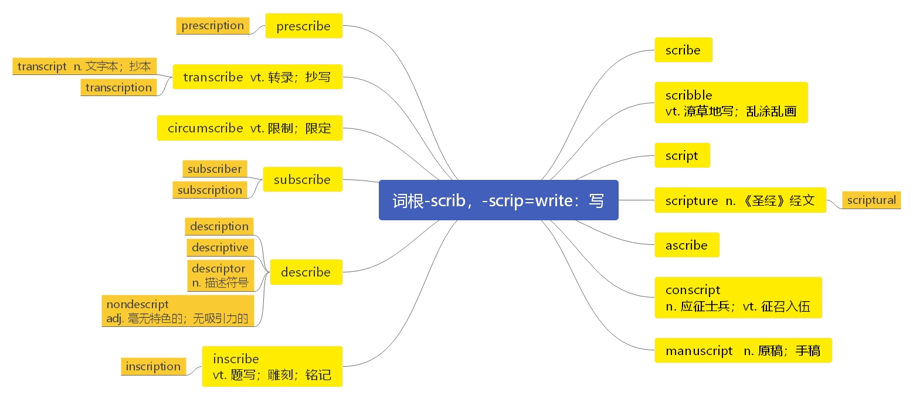

# 第二十五节 词根“-scrib”，“-scrip”

***

# 词根“-scrib”，“-scrip”表示“写”

***

**词源：** \*skrībh-, Proto-Indo-European root meaning "to cut, separate, sift;" an extended form of root

\*sker- "to cut." It is the hypothetical source of/evidence for its existence

is provided by: Greek skariphasthai "to scratch an outline, sketch;"

Latin scribere "to write" (to carve marks in wood, stone, clay, etc.);

Lettish skripat "scratch, write;" Old Norse hrifa "scratch."

***

**scribe**  \[skraɪb] n. （  [英音](https://dict.youdao.com/dictvoice?audio=scribe\&type=1)  [美音](https://dict.youdao.com/dictvoice?audio=scribe\&type=2) 印刷术发明之前的） 抄写员 vt.\&vi. 写下， 记下 15008

**助记：** scrib（写） +e（ =person who，表示人） →抄写员

**搭配：** scribe Scroll： 抄录卷轴

**双语例句:** The scribe, what was his fate? [播放](https://dict.youdao.com/dictvoice?audio=The+scribe%2C+what+was+his+fate%3F&le=eng&le=eng&type=2)

那个教士的命运如何？ 

**双语例句:** Might I your scribe and your confessor be. [播放](https://dict.youdao.com/dictvoice?audio=Might+I+your+scribe+and+your+confessor+be.&le=eng&le=eng&type=2)

我可以你和你的忏悔神父是抄写员。 

**双语例句:** The little scribe was right, as she so often was. [播放](https://dict.youdao.com/dictvoice?audio=The+little+scribe+was+right%2C+as+she+so+often+was.&le=eng&le=eng&type=2)

小抄书员是对的，就像她以往一样。 

**原声例句:** The teaching fellow for each lecture takes what we call **scribe** notes. These are posted within a few days online.

**权威例句:** Patterson, 63, might seem like an unlikely **scribe** for the King James version of the Bible.  [播放](https://dict.youdao.com/dictvoice?audio=Patterson%2C+63%2C+might+seem+like+an+unlikely+scribe+for+the+King+James+version+of+the+Bible.+&le=eng&type=2)

**权威例句:** The new **scribe** is the poor, underpaid and underappreciated programmer who's cranking out Microsoft Word revisions.  [播放](https://dict.youdao.com/dictvoice?audio=The+new+scribe+is+the+poor%2C+underpaid+and+underappreciated+programmer+who%27s+cranking+out+Microsoft+Word+revisions.+&le=eng&type=2)

**权威例句:** Puzo himself had a career that was more varied than his reputation as the underworld **scribe** suggests.  [播放](https://dict.youdao.com/dictvoice?audio=Puzo+himself+had+a+career+that+was+more+varied+than+his+reputation+as+the+underworld+scribe+suggests.+&le=eng&type=2)

***

**scribble**  \['skrɪb(ə)l] v.  [英音](https://dict.youdao.com/dictvoice?audio=scribble\&type=1)  [美音](https://dict.youdao.com/dictvoice?audio=scribble\&type=2) 潦草地写； 乱涂乱画 n. 潦草写成字、 文章或图画 10075

**助记：** scrib（写） +le（ 反复或连续动作、动作的小幅度重复，如 dawdle, dwindle, squabble）

→写字或画画等动作反复、连续重复（不太有规则地写或画） →乱

写乱画，涂鸦；潦草写成的字、文章或图画

**搭配：** scribble on a wall：在墙上乱涂乱画

**双语例句:** How do you expect me to read this scribble? [播放](https://dict.youdao.com/dictvoice?audio=How+do+you+expect+me+to+read+this+scribble%3F&le=eng&le=eng&type=2)

这种写得歪歪扭扭的东西，让我怎么看？ 

**双语例句:** I'm sorry what I wrote was such a scribble. [播放](https://dict.youdao.com/dictvoice?audio=I%27m+sorry+what+I+wrote+was+such+a+scribble.&le=eng&le=eng&type=2)

很抱歉我写的东西太潦草了。 

**双语例句:** Classic copyright protection laws provide that even if you scribble on paper, you will automatically own the copyright of the information on that paper. [播放](https://dict.youdao.com/dictvoice?audio=Classic+copyright+protection+laws+provide+that+even+if+you+scribble+on+paper%2C+you+will+automatically+own+the+copyright+of+the+information+on+that+paper.&le=eng&le=eng&type=2)

经典的版权保护法规定，即便你是在一张纸上乱涂乱画，你也自动拥有了对这张纸上信息的版权。 

**原声例句:** The final product is supposed to produce a top that can not only move in circles, but write or **scribble**. [播放](https://dict.youdao.com/pureaudio?docid=2864519327874595908)

**原声例句:** You can actually take notes and don't have to **scribble** everything down that you see on the screen.

**原声例句:** You might wanna not **scribble** quite so much on your own notebook, but still.

**权威例句:** The mysterious **scribble**, dated 23 January 1898, was uncovered as the first panels were taken down.  [播放](https://dict.youdao.com/dictvoice?audio=The+mysterious+scribble%2C+dated+23+January+1898%2C+was+uncovered+as+the+first+panels+were+taken+down.+&le=eng&type=2)

**权威例句:** **Scribble** them out on post-its and stick them on gator boards all around the room.  [播放](https://dict.youdao.com/dictvoice?audio=Scribble+them+out+on+post-its+and+stick+them+on+gator+boards+all+around+the+room.+&le=eng&type=2)

**权威例句:** Ms. Chen favors simple stories and homilies, which the attendees **scribble** down in earnest.  [播放](https://dict.youdao.com/dictvoice?audio=Ms.+Chen+favors+simple+stories+and+homilies%2C+which+the+attendees+scribble+down+in+earnest.+&le=eng&type=2)

***

**script**  \[skrɪpt] n.  [英音](https://dict.youdao.com/dictvoice?audio=script\&type=1)  [美音](https://dict.youdao.com/dictvoice?audio=script\&type=2) 脚本； 文字系统 vt. 为 (电影、 广播、 电视等) 写脚本 3315

**助记：** script（写） →脚本；剧本； 写剧本

**搭配：** film script：电影剧本

**双语例句:** Jenny's writing a film script. [播放](https://dict.youdao.com/dictvoice?audio=Jenny%27s+writing+a+film+script.&le=eng&le=eng&type=2)

珍妮在写一个电影脚本。 

**双语例句:** The script was workmanlike at best. [播放](https://dict.youdao.com/dictvoice?audio=The+script+was+workmanlike+at+best.&le=eng&le=eng&type=2)

这部剧本充其量不过是匠人之作。 

**双语例句:** He began comically ad-libbing a script. [播放](https://dict.youdao.com/dictvoice?audio=He+began+comically+ad-libbing+a+script.&le=eng&le=eng&type=2)

他开始即兴穿插一段剧本了。 

**原声例句:** ICANN says about half the Internet users around the world don't use a Latin-based **script** as their native language, adding the change will affect billions of potential users. [播放](https://dict.youdao.com/pureaudio?docid=6467530924128590178)

**原声例句:** Leonardo DiCaprio said even though they had all read the **script**, he and the rest of the cast were often kept off-balance while making the film because of those multiple realities. [播放](https://dict.youdao.com/pureaudio?docid=2983787666531906164)

**原声例句:** I wanted to watch that as well, but... The remake is based on the original **script**.

**权威例句:** Vultures Are Hard to Kill Will a sacred ritual of Hollywood--the **script** pitch--make it on-line?  [播放](https://dict.youdao.com/dictvoice?audio=Vultures+Are+Hard+to+Kill+Will+a+sacred+ritual+of+Hollywood--the+script+pitch--make+it+on-line%3F+&le=eng&type=2)

**权威例句:** He analyses the political concepts the public responds to and helps politicians **script** their approach.  [播放](https://dict.youdao.com/dictvoice?audio=He+analyses+the+political+concepts+the+public+responds+to+and+helps+politicians+script+their+approach.+&le=eng&type=2)

**权威例句:** \"The East\" was directed by Zal Batmanglij, from a **script** he wrote with Ms. Marling.  [播放](https://dict.youdao.com/dictvoice?audio=%22The+East%22+was+directed+by+Zal+Batmanglij%2C+from+a+script+he+wrote+with+Ms.+Marling.+&le=eng&type=2)

***

**scripture**  \['skrɪptʃə] n.（  [英音](https://dict.youdao.com/dictvoice?audio=scripture\&type=1)  [美音](https://dict.youdao.com/dictvoice?audio=scripture\&type=2) 大写）《 圣经》；《 圣经》 经文； 圣典 10771

**词源：** early 14c., "the sacred writings of the Bible;" mid-14c., "a writing, an act of writing, written characters," from Late Latin scriptura "the writings contained in the Bible, a passage from the Bible," in classical Latin "a writing, character, inscription," from scriptus, past participle of scribere "to write" (from PIE root \*skribh- "to cut").

**助记：** script（ 写） + -ure（ 名词后缀） →写下来的经文，经典→《圣经》；《圣经》经文

**搭配：** ancient scripture：古老的经文

**双语例句:** They have lots of scripture. [播放](https://dict.youdao.com/dictvoice?audio=They+have+lots+of+scripture.&le=eng&le=eng&type=2)

他们有很多经文。 

**双语例句:** They live on the other side of scripture. [播放](https://dict.youdao.com/dictvoice?audio=They+live+on+the+other+side+of+scripture.&le=eng&le=eng&type=2)

他们住在经文的另一边。 

**双语例句:** But Jews used it also in reading scripture. [播放](https://dict.youdao.com/dictvoice?audio=But+Jews+used+it+also+in+reading+scripture.&le=eng&le=eng&type=2)

但犹太人也把它用在解读经文上。 

**原声例句:** He accused those against stone-throwing with quoting **scripture** out of context. [播放](https://dict.youdao.com/pureaudio?docid=5659201601152874231)

**原声例句:** Now,notice that does not necessarily mean it's canonical because **scripture** in some religions refers to a bunch of stuff.

**原声例句:** So this was a list of books that some author believed were **scripture** and should be read by Christians and churches.

**权威例句:** In 1997 the charity decided to develop a scripture-based literacy program for kids, called Phillip's Project.  [播放](https://dict.youdao.com/dictvoice?audio=In+1997+the+charity+decided+to+develop+a+scripture-based+literacy+program+for+kids%2C+called+Phillip%27s+Project.+&le=eng&type=2)

**权威例句:** Candidates visiting churches, filming television ads from church pews, and quoting **scripture** at every opportunity.  [播放](https://dict.youdao.com/dictvoice?audio=Candidates+visiting+churches%2C+filming+television+ads+from+church+pews%2C+and+quoting+scripture+at+every+opportunity.+&le=eng&type=2)

**权威例句:** Where are our authors and playwrights working with translators to preserve the poetry of **scripture**?  [播放](https://dict.youdao.com/dictvoice?audio=Where+are+our+authors+and+playwrights+working+with+translators+to+preserve+the+poetry+of+scripture%3F+&le=eng&type=2)

***

**scriptural**  \['skrɪptʃərəl] adj.《  [英音](https://dict.youdao.com/dictvoice?audio=scriptural\&type=1)  [美音](https://dict.youdao.com/dictvoice?audio=scriptural\&type=2) 圣经》 中的; 根据《 圣经》 的 17803

**助记：** scripture（圣经） +-al（形容词后缀）→《圣经》中的；根据《圣经》的

**搭配：** scriptural references: 《圣经》引文

**释义：** (ADJ) Scriptural is used to describe things that are written in or based on the Christian Bible.

**双语例句:** Scriptural giving is one of the blessings of the faith; [播放](https://dict.youdao.com/dictvoice?audio=Scriptural+giving+is+one+of+the+blessings+of+the+faith%3B&le=eng&le=eng&type=2)

合乎经训的奉献是信仰的基要原则之一。 

**双语例句:** He brought back over 600 scriptural books and documents and many valuable objects. [播放](https://dict.youdao.com/dictvoice?audio=He+brought+back+over+600+scriptural+books+and+documents+and+many+valuable+objects.&le=eng&le=eng&type=2)

他带回来了六百多部经书、文献和许多珍贵的物品。 

**双语例句:** God is the author of the text, the centrality of Christ as key for scriptural interpretation. [播放](https://dict.youdao.com/dictvoice?audio=God+is+the+author+of+the+text%2C+the+centrality+of+Christ+as+key+for+scriptural+interpretation.&le=eng&le=eng&type=2)

上帝是经文的作者，以基督为中心是解读经文的关键。 

**权威例句:** Yet with younger clerics such as Mr Ghamdi doubting the **scriptural** grounds for making women rely on male drivers, other arguments are looking flimsier.  [播放](https://dict.youdao.com/dictvoice?audio=Yet+with+younger+clerics+such+as+Mr+Ghamdi+doubting+the+scriptural+grounds+for+making+women+rely+on+male+drivers%2C+other+arguments+are+looking+flimsier.+&le=eng&type=2)

**权威例句:** Davendar Ghai, president of the society, says it is impossible for Hindus to obey their **scriptural** directions for death and mourning in mechanised British crematoria.  [播放](https://dict.youdao.com/dictvoice?audio=Davendar+Ghai%2C+president+of+the+society%2C+says+it+is+impossible+for+Hindus+to+obey+their+scriptural+directions+for+death+and+mourning+in+mechanised+British+crematoria.+&le=eng&type=2)

**权威例句:** Finding **scriptural** support for secular socialism is a stretch.  [播放](https://dict.youdao.com/dictvoice?audio=Finding+scriptural+support+for+secular+socialism+is+a+stretch.+&le=eng&type=2)

***

**ascribe**  \[ə'skraɪb] vt.  [英音](https://dict.youdao.com/dictvoice?audio=ascribe\&type=1)  [美音](https://dict.youdao.com/dictvoice?audio=ascribe\&type=2) 归因于； 归咎于； 将…归属于某人 11210

**助记：** a（ =ad, 含义为 to，去） +scribe（写）→把（功劳）写/记在你账上→归因于（“把功劳记在你账上”就是“把功劳归因于你”）

**搭配：** ascribe sth to sb/sth： 将…归因于

**释义：** (V-T) If you ascribe an event or condition to a particular cause, you say or consider that it was caused by that thing.

(V-T) If you ascribe a quality to someone, you consider that they possess it.

**双语例句:** We ascribe great importance to these policies. [播放](https://dict.youdao.com/dictvoice?audio=We+ascribe+great+importance+to+these+policies.&le=eng&le=eng&type=2)

我们认为这些政策十分重要。 

**双语例句:** We do not ascribe a superior wisdom to government or the state. [播放](https://dict.youdao.com/dictvoice?audio=We+do+not+ascribe+a+superior+wisdom+to+government+or+the+state.&le=eng&le=eng&type=2)

我们并不将胜人一筹的智慧归属于政府或国家。 

**双语例句:** Even without gadgets that understand our spoken commands, research suggests that, as bizarre as it sounds, under certain circumstances, people regularly ascribe human traits to everyday objects. [播放](https://dict.youdao.com/dictvoice?audio=Even+without+gadgets+that+understand+our+spoken+commands%2C+research+suggests+that%2C+as+bizarre+as+it+sounds%2C+under+certain+circumstances%2C+people+regularly+ascribe+human+traits+to+everyday+objects.&le=eng&le=eng&type=2)

研究表明，即使没有能够理解我们口头指令的小工具，在某些情况下，人们也会经常认为日常物品具有人的特性，尽管这听起来很奇怪。 

**原声例句:** Some laws in Exodus,the Book of the Covenant,a few things--yes, it says Moses wrote those down, but not the whole five books that tradition later will **ascribe** to him.

**原声例句:** It's pretty clear that there are lots of machines that it doesn't seem natural to **ascribe** beliefs or desires or goals or reasoning to.

**原声例句:** Because any velocity I **ascribe** to a particle or an object, you will add a certain constant to it by the law of composition of velocity.

**权威例句:** They **ascribe** more blame to clumsiness than to malice in the Lithuanian authorities' actions.  [播放](https://dict.youdao.com/dictvoice?audio=They+ascribe+more+blame+to+clumsiness+than+to+malice+in+the+Lithuanian+authorities%27+actions.+&le=eng&type=2)

**权威例句:** The smog went but I don't know how much one could **ascribe** it to the actions taken.  [播放](https://dict.youdao.com/dictvoice?audio=The+smog+went+but+I+don%27t+know+how+much+one+could+ascribe+it+to+the+actions+taken.+&le=eng&type=2)

**权威例句:** To underestimate the value consumers **ascribe** to riding in a style that reflects their persona is risky.  [播放](https://dict.youdao.com/dictvoice?audio=To+underestimate+the+value+consumers+ascribe+to+riding+in+a+style+that+reflects+their+persona+is+risky.+&le=eng&type=2)

***

**conscript**  \[kən'skrɪpt] n.  [英音](https://dict.youdao.com/dictvoice?audio=conscript\&type=1)  [美音](https://dict.youdao.com/dictvoice?audio=conscript\&type=2) 应征士兵 vt. 征召入伍 adj. 被征召的 19825

**词源：** "one who is compulsorily enrolled for military or naval service," 1800

**助记：** con (=com, together) + script（写） →共同被写入（征募士兵的册子） →应征士兵，征召入伍，被征召的

**搭配：** be conscripted into army：被征召进入军队

**释义：** (N-COUNT) A conscript is a person who has been made to join the armed forces of a country.

(V-T) If someone is conscripted, they are officially made to join the armed forces of a country.

**双语例句:** One young conscript rose with a message of thanks, his voice choked with emotion. [播放](https://dict.youdao.com/dictvoice?audio=One+young+conscript+rose+with+a+message+of+thanks%2C+his+voice+choked+with+emotion.&le=eng&le=eng&type=2)

一年轻应征入伍者站起以哽咽之声动情致谢。 

**双语例句:** A conscript in a shabby uniform saluted the car. [播放](https://dict.youdao.com/dictvoice?audio=A+conscript+in+a+shabby+uniform+saluted+the+car.&le=eng&le=eng&type=2)

一个穿着破旧制服的士兵向汽车敬礼。 

**双语例句:** Your body accords with conscript requirement completely. [播放](https://dict.youdao.com/dictvoice?audio=Your+body+accords+with+conscript+requirement+completely.&le=eng&le=eng&type=2)

你的身体完全符合征兵要求。 

**原声例句:** All right, so an elected government can **conscript** citizens to go out and defend the way of life, the community that makes the enjoyment of rights possible?

**权威例句:** Historically, rulers liked censuses, because they enable them to **conscript** and tax their people.  [播放](https://dict.youdao.com/dictvoice?audio=Historically%2C+rulers+liked+censuses%2C+because+they+enable+them+to+conscript+and+tax+their+people.+&le=eng&type=2)

**权威例句:** Iraq's **conscript** regular army, expected by many to fold quickly and easily, instead has displayed considerable resistance.  [播放](https://dict.youdao.com/dictvoice?audio=Iraq%27s+conscript+regular+army%2C+expected+by+many+to+fold+quickly+and+easily%2C+instead+has+displayed+considerable+resistance.+&le=eng&type=2)

**权威例句:** Another former protester chafes that soon he will have to serve, as a **conscript**, the government he loathes.  [播放](https://dict.youdao.com/dictvoice?audio=Another+former+protester+chafes+that+soon+he+will+have+to+serve%2C+as+a+conscript%2C+the+government+he+loathes.+&le=eng&type=2)

***

**manuscript**  \['mænjʊskrɪpt] n.  [英音](https://dict.youdao.com/dictvoice?audio=manuscript\&type=1)  [美音](https://dict.youdao.com/dictvoice?audio=manuscript\&type=2) 原稿； 手稿 5176

**助记：** man（ =hand， 手） +u（ 连接符号） +script（ =scribe 写， 来源于单词“ write： 写”） →

用手亲自书写的稿件→手稿

**搭配：** a manuscript of the book 这本书的一份手稿

**释义：** (N-COUNT) A manuscript is a handwritten or typed document, especially a writer's first version of a book before it is published.

**双语例句:** I read her poems in manuscript. [播放](https://dict.youdao.com/dictvoice?audio=I+read+her+poems+in+manuscript.&le=eng&le=eng&type=2)

我读过她的诗作的手稿。 

**双语例句:** He had seen a manuscript of the book. [播放](https://dict.youdao.com/dictvoice?audio=He+had+seen+a+manuscript+of+the+book.&le=eng&le=eng&type=2)

他见过这本书的一份手稿。 

**双语例句:** The original manuscript has been lost. [播放](https://dict.youdao.com/dictvoice?audio=The+original+manuscript+has+been+lost.&le=eng&le=eng&type=2)

原稿已经遗失。 

**原声例句:** Today it is a museum. Inside are precious artifacts from the family's daily life, including scraps of hand-written poetry and the **manuscript** of a polonaise written by young Frederic when he was eight-years-old. [播放](https://dict.youdao.com/pureaudio?docid=5503240672439304589)

**原声例句:** In Copenhagen, he completes the **manuscript** and -I'm going to write MS for **manuscript** completes the **manuscript**, and submits this for publication.

**原声例句:** So the **manuscript** tradition suggests that it was a letter that was a circular letter in itself.

**权威例句:** Pam Carroll, marketing director for the group, declined to say where the **manuscript** was found.  [播放](https://dict.youdao.com/dictvoice?audio=Pam+Carroll%2C+marketing+director+for+the+group%2C+declined+to+say+where+the+manuscript+was+found.+&le=eng&type=2)

**权威例句:** The **manuscript** helped nuns decipher parts of the bible and is being exhibited at Lacock Abbey.  [播放](https://dict.youdao.com/dictvoice?audio=The+manuscript+helped+nuns+decipher+parts+of+the+bible+and+is+being+exhibited+at+Lacock+Abbey.+&le=eng&type=2)

**权威例句:** The **manuscript** by the Eastwood author was discovered by Dr Andrew Harrison, a Nottingham University lecturer.  [播放](https://dict.youdao.com/dictvoice?audio=The+manuscript+by+the+Eastwood+author+was+discovered+by+Dr+Andrew+Harrison%2C+a+Nottingham+University+lecturer.+&le=eng&type=2)

***

**prescribe**  \[prɪ'skraɪb] vt\&vi.  [英音](https://dict.youdao.com/dictvoice?audio=prescribe\&type=1)  [美音](https://dict.youdao.com/dictvoice?audio=prescribe\&type=2) 开 (药、 处方)； 规定； 命令 5449

**助记：** pre（提前） +scribe（写）→提前写下来→规定、指导；开处方（即：指医生在拿药前写出的指导）

**搭配：** prescribed medications：开出的药

**释义：** (V-T) If a doctor prescribes medicine or treatment for you, he or she tells you what medicine or treatment to have.

(V-T) If a person or set of laws or rules prescribes an action or duty, they state that it must be carried out.

**双语例句:** The physician may prescribe but not administer the drug. [播放](https://dict.youdao.com/dictvoice?audio=The+physician+may+prescribe+but+not+administer+the+drug.&le=eng&le=eng&type=2)

内科医师可以开处方但不可发药。 

**双语例句:** Therapists cannot prescribe drugs as they are not necessarily medically qualified. [播放](https://dict.youdao.com/dictvoice?audio=Therapists+cannot+prescribe+drugs+as+they+are+not+necessarily+medically+qualified.&le=eng&le=eng&type=2)

治疗师们不能开药方，因为他们不一定具备医疗资格。 

**双语例句:** Though few comprehensive studies have been conducted, one by the University of Washington investigated how drug sample availability affected what physicians prescribe. [播放](https://dict.youdao.com/dictvoice?audio=Though+few+comprehensive+studies+have+been+conducted%2C+one+by+the+University+of+Washington+investigated+how+drug+sample+availability+affected+what+physicians+prescribe.&le=eng&le=eng&type=2)

尽管人们几乎没有进行过全面的研究，但是华盛顿大学的一项研究调查了药品样本的可获得性对医生开的处方的影响。 

**原声例句:** Many doctors **prescribe** narcotic drugs for patients with lasting, severe pain. [播放](https://dict.youdao.com/pureaudio?docid=8227717205632126463)

**原声例句:** Doctors usually **prescribe** opiate drugs only for patients with severe pain. [播放](https://dict.youdao.com/pureaudio?docid=-22443720873154816)

**原声例句:** Many doctors **prescribe** narcotic drugs for patients with lasting severe pain. [播放](https://dict.youdao.com/pureaudio?docid=3817712291617480171)

**权威例句:** How many patients actually want to take Provenge, and how many doctors want to **prescribe** it?  [播放](https://dict.youdao.com/dictvoice?audio=How+many+patients+actually+want+to+take+Provenge%2C+and+how+many+doctors+want+to+prescribe+it%3F+&le=eng&type=2)

**权威例句:** The campaign is also urging patients to ask questions about the tests their physicians **prescribe**.  [播放](https://dict.youdao.com/dictvoice?audio=The+campaign+is+also+urging+patients+to+ask+questions+about+the+tests+their+physicians+prescribe.+&le=eng&type=2)

**权威例句:** At Memorial Sloan-Kettering, errors are being prevented by forcing doctors to **prescribe** drugs via computer.  [播放](https://dict.youdao.com/dictvoice?audio=At+Memorial+Sloan-Kettering%2C+errors+are+being+prevented+by+forcing+doctors+to+prescribe+drugs+via+computer.+&le=eng&type=2)

***

**prescribed**  \[prɪ'skraɪbd] adj.  [英音](https://dict.youdao.com/dictvoice?audio=prescribed\&type=1)  [美音](https://dict.youdao.com/dictvoice?audio=prescribed\&type=2) 规定的； 指定的 9936

**助记：** pre（提前） +scribe（写） +d (形容词后缀) →规定的

**搭配：** prescribed course：规定科目

**双语例句:** Some usages are \"prescribed,\" to be learnt and followed accurately; others are \"proscribed,\" to be avoided. [播放](https://dict.youdao.com/dictvoice?audio=Some+usages+are+%22prescribed%2C%22+to+be+learnt+and+followed+accurately%3B+others+are+%22proscribed%2C%22+to+be+avoided.&le=eng&le=eng&type=2)

一些被“规定的”用法，要准确地学习和遵循；另一些被“禁止的”用法，则要避免使用。 

**双语例句:** A fundamental difference between paintings and other art forms is that there is no prescribed time over which a painting is viewed. [播放](https://dict.youdao.com/dictvoice?audio=A+fundamental+difference+between+paintings+and+other+art+forms+is+that+there+is+no+prescribed+time+over+which+a+painting+is+viewed.&le=eng&le=eng&type=2)

绘画与其他艺术形式的根本区别在于，观看一幅画没有规定的时间。 

**双语例句:** Valium is usually prescribed to treat anxiety. [播放](https://dict.youdao.com/dictvoice?audio=Valium+is+usually+prescribed+to+treat+anxiety.&le=eng&le=eng&type=2)

安定剂通常用于治疗焦躁。 

**原声例句:** They're **prescribed** to increase bone density and prevent fractures. [播放](https://dict.youdao.com/pureaudio?docid=-6593597088816904486)

**原声例句:** Activists are also encouraging IMF and World Bank leaders not to link new funds to austerity measures normally **prescribed** for borrowers, like cuts in public spending and an increase in interest rates. [播放](https://dict.youdao.com/pureaudio?docid=-7040917853522852829)

**权威例句:** Penalties for kidnapping, theft and white-collar crime were also toughened, with longer jail terms **prescribed**.  [播放](https://dict.youdao.com/dictvoice?audio=Penalties+for+kidnapping%2C+theft+and+white-collar+crime+were+also+toughened%2C+with+longer+jail+terms+prescribed.+&le=eng&type=2)

**权威例句:** Both over-the-counter antihistamines and **prescribed** epinephrine auto-injectors have an expiration date, after which their effectiveness diminishes.  [播放](https://dict.youdao.com/dictvoice?audio=Both+over-the-counter+antihistamines+and+prescribed+epinephrine+auto-injectors+have+an+expiration+date%2C+after+which+their+effectiveness+diminishes.+&le=eng&type=2)

**权威例句:** Can a portion of guilt be shared by the shrink who **prescribed** the pills?  [播放](https://dict.youdao.com/dictvoice?audio=Can+a+portion+of+guilt+be+shared+by+the+shrink+who+prescribed+the+pills%3F+&le=eng&type=2)

***

**prescription**  \[prɪ'skrɪpʃ(ə)n] n.  [英音](https://dict.youdao.com/dictvoice?audio=prescription\&type=1)  [美音](https://dict.youdao.com/dictvoice?audio=prescription\&type=2) 药方； 规定； 方案 3339

**助记：** pre（提前） +script（写） + ion（名词后缀） →提前写下来的（然后根据处方配药），提前写下来的规则→处方； 规定（方案）

**搭配：** prescription-drug：处方药

**释义：** (N-COUNT) A prescription is the piece of paper on which your doctor writes an order for medicine and which you give to a pharmacist to get the medicine.

(N-COUNT) A prescription is a proposal or a plan that gives ideas about how to solve a problem or improve a situation.

**双语例句:** Nicola got her prescription for strep. [播放](https://dict.youdao.com/dictvoice?audio=Nicola+got+her+prescription+for+strep.&le=eng&le=eng&type=2)

妮古拉拿了治疗链球菌性咽喉炎的处方药。 

**双语例句:** They are not available without a prescription. [播放](https://dict.youdao.com/dictvoice?audio=They+are+not+available+without+a+prescription.&le=eng&le=eng&type=2)

这些药没有处方不能出售。 

**双语例句:** The new drug will not require a physician's prescription. [播放](https://dict.youdao.com/dictvoice?audio=The+new+drug+will+not+require+a+physician%27s+prescription.&le=eng&le=eng&type=2)

这种新药不需要医生的处方。 

**原声例句:** In two thousand eight, the Journal of the American Medical Association published a study of unplanned deaths from **prescription** drugs. [播放](https://dict.youdao.com/pureaudio?docid=-3752200769029978070)

**原声例句:** Acetaminophen,also called paracetamol, is found in Tylenol, Excedrin and other products that do not require a doctor's order or **prescription**. [播放](https://dict.youdao.com/pureaudio?docid=8127998851796688348)

**原声例句:** The report said about sixty-six percent of those who died there from **prescription** drugs apparently had no **prescription**. [播放](https://dict.youdao.com/pureaudio?docid=-4280379390806001464)

**权威例句:** Google and Microsoft are also linked up with various **prescription** benefit management companies and pharmacies.  [播放](https://dict.youdao.com/dictvoice?audio=Google+and+Microsoft+are+also+linked+up+with+various+prescription+benefit+management+companies+and+pharmacies.+&le=eng&type=2)

**权威例句:** These place various restrictions on the **prescription**, distribution, sale and advertising of these products.  [播放](https://dict.youdao.com/dictvoice?audio=These+place+various+restrictions+on+the+prescription%2C+distribution%2C+sale+and+advertising+of+these+products.+&le=eng&type=2)

**权威例句:** By implication, of course, that s a **prescription** for restrained inflation and an end to rate increases.  [播放](https://dict.youdao.com/dictvoice?audio=By+implication%2C+of+course%2C+that+s+a+prescription+for+restrained+inflation+and+an+end+to+rate+increases.+&le=eng&type=2)

***

**transcribe**  \[træn'skraɪb; trɑːn-] vt.（  [英音](https://dict.youdao.com/dictvoice?audio=transcribe\&type=1)  [美音](https://dict.youdao.com/dictvoice?audio=transcribe\&type=2) 根据笔记或磁带录音等） 转录； 抄写; 整理； 打印 9707

**词源：** 1550s, from Latin transcribere "to copy, write again in another place, write over, transfer," from trans "across, beyond; over" (see trans-) + scribere "to write" (from PIE root \*skribh- "to cut"). To do it poorly is to transcribble (1746). Related: Transcribed; transcriber; transcribing.

**助记：** trans（ 转变， 转换） + -scrib（ =write， 写） + -e→把思想、言语、笔记等转换方式，

整理成文字→转录；抄写；整理；打印

**搭配：** transcribe meters：抄表

**释义：** (V-T) If you transcribe a speech or text, you write or type it out, for example, from notes or from a tape recording.

**双语例句:** Clerks transcribe everything that is said in court. [播放](https://dict.youdao.com/dictvoice?audio=Clerks+transcribe+everything+that+is+said+in+court.&le=eng&le=eng&type=2)

书记员把在法庭上所有的话都记录在案。 

**双语例句:** Have ability to transcribe dictation. [播放](https://dict.youdao.com/dictvoice?audio=Have+ability+to+transcribe+dictation.&le=eng&le=eng&type=2)

具备抄译口述的能力。 

**双语例句:** We are working to transcribe both of these messages. [播放](https://dict.youdao.com/dictvoice?audio=We+are+working+to+transcribe+both+of+these+messages.&le=eng&le=eng&type=2)

我们都努力抄写这些信息。 

**原声例句:** We cannot say writing came into being belatedly with respect to speech in order to reproduce, imitate, or **transcribe** speech.

**原声例句:** There are molecules in cells that give the DNA the signal that it's time to **transcribe** and express a gene, those are called transcription factors, we'll talk about them a bit later.

**权威例句:** The dictation mode does exactly what one would expect: **transcribe** your words as you speak them.  [播放](https://dict.youdao.com/dictvoice?audio=The+dictation+mode+does+exactly+what+one+would+expect%3A+transcribe+your+words+as+you+speak+them.+&le=eng&type=2)

**权威例句:** But thanks to the truce between the two companies, I was able to **transcribe** my notes eventually.  [播放](https://dict.youdao.com/dictvoice?audio=But+thanks+to+the+truce+between+the+two+companies%2C+I+was+able+to+transcribe+my+notes+eventually.+&le=eng&type=2)

**权威例句:** Chandratillake says that, in order to operate efficiently, Blinkx doesn't **transcribe** every video it finds on the Web.  [播放](https://dict.youdao.com/dictvoice?audio=Chandratillake+says+that%2C+in+order+to+operate+efficiently%2C+Blinkx+doesn%27t+transcribe+every+video+it+finds+on+the+Web.+&le=eng&type=2)

***

**transcript**  \['trænskrɪpt; 'trɑːn-] n.（  [英音](https://dict.youdao.com/dictvoice?audio=transcript\&type=1)  [美音](https://dict.youdao.com/dictvoice?audio=transcript\&type=2) 根据录音或笔记整理的） 文字本； 成绩单； 抄本， 转录物6293

**助记：** trans（转变，转换） + -scrib（ =write，写）→录音、言语、笔记等整理成另外一种形式的书面文字→文字本；成绩单；抄本，转录物

**搭配：** academic transcript： 成绩单； 大学毕业证

> **【课堂笔记】**
>
> 区分： transcribe v. 转录；抄写; 誊写
>
> transcription n. 抄写；抄本；誊写
>
> transcript n. 文字本； 成绩单；抄本

**双语例句:** We don't know how the transcript leaked. [播放](https://dict.youdao.com/dictvoice?audio=We+don%27t+know+how+the+transcript+leaked.&le=eng&le=eng&type=2)

我们不知道抄本是怎样泄露的。 

**双语例句:** Start Squeak, click Tools, then drag a workspace and transcript window onto your desktop. [播放](https://dict.youdao.com/dictvoice?audio=Start+Squeak%2C+click+Tools%2C+then+drag+a+workspace+and+transcript+window+onto+your+desktop.&le=eng&le=eng&type=2)

启动 Squeak，单击工具（Tools），拖拽一个工作空间（workspace）和抄本（transcript）窗口到桌面。 

**双语例句:** You will need to combine appropriate information from the text and the transcript to provide a complete answer to the question. [播放](https://dict.youdao.com/dictvoice?audio=You+will+need+to+combine+appropriate+information+from+the+text+and+the+transcript+to+provide+a+complete+answer+to+the+question.&le=eng&le=eng&type=2)

你需要结合文本和抄本中的合适信息，组织一个完整的答案回答该问题。 

**原声例句:** And similarly can you click on any sentence in the **transcript**, jump right to that point in the video.

**原声例句:** So they don't have to worry about things going on their **transcript**.

**原声例句:** It's not just about stopping some stupid number ; on your **transcript** in the end; it's about actually providing some compelling feedback.

**权威例句:** As soon as we have that **transcript**, we will shoot that around, as well.  [播放](https://dict.youdao.com/dictvoice?audio=As+soon+as+we+have+that+transcript%2C+we+will+shoot+that+around%2C+as+well.+&le=eng&type=2)

**权威例句:** The other said \"all my direction\" came from an official the **transcript** said was in Washington.  [播放](https://dict.youdao.com/dictvoice?audio=The+other+said+%22all+my+direction%22+came+from+an+official+the+transcript+said+was+in+Washington.+&le=eng&type=2)

**权威例句:** But the People's Daily published a full **transcript** of Mr Wen's dialogue with journalists.  [播放](https://dict.youdao.com/dictvoice?audio=But+the+People%27s+Daily+published+a+full+transcript+of+Mr+Wen%27s+dialogue+with+journalists.+&le=eng&type=2)

***

**transcription**  \[træn'skrɪpʃ(ə)n; trɑːn-] n.  [英音](https://dict.youdao.com/dictvoice?audio=transcription\&type=1)  [美音](https://dict.youdao.com/dictvoice?audio=transcription\&type=2) 抄写； 抄本； 誊写 14633

**助记：** trans（转变，转换） + -script（写） +-ion→抄写；抄本；誊写

**搭配：** academic transcript：成绩单；大学毕业证

**双语例句:** The full transcription of the interview is attached. [播放](https://dict.youdao.com/dictvoice?audio=The+full+transcription+of+the+interview+is+attached.&le=eng&le=eng&type=2)

现附上采访记录文本的全文。 

**双语例句:** Random hexamers prime reverse transcription at multiple points along with the transcript. [播放](https://dict.youdao.com/dictvoice?audio=Random+hexamers+prime+reverse+transcription+at+multiple+points+along+with+the+transcript.&le=eng&le=eng&type=2)

随机六聚体与转录物一起在多个点引发逆转录。 

**双语例句:** Write the words in phonemic transcription, including the stress marks. [播放](https://dict.youdao.com/dictvoice?audio=Write+the+words+in+phonemic+transcription%2C+including+the+stress+marks.&le=eng&le=eng&type=2)

写下单词的音位标音，包括重音标记。 

**原声例句:** I showed you this in this picture here and those levels of control can be at the level of **transcription**.

**原声例句:** They're sometimes called **transcription** factors and this is an example of a **transcription** factor that is itself activated or turned on by the presence of a steroid.

**原声例句:** These kinds of molecules which activate genes, they're activating the process of **transcription**.

**权威例句:** Meeting **transcription** where everything is recorded in the meeting and transcripted and separated, person by person.  [播放](https://dict.youdao.com/dictvoice?audio=Meeting+transcription+where+everything+is+recorded+in+the+meeting+and+transcripted+and+separated%2C+person+by+person.+&le=eng&type=2)

**权威例句:** Enzymes, too, are proteins, and so are the **transcription** factors that regulate their production.  [播放](https://dict.youdao.com/dictvoice?audio=Enzymes%2C+too%2C+are+proteins%2C+and+so+are+the+transcription+factors+that+regulate+their+production.+&le=eng&type=2)

**权威例句:** In an earlier era, most big newsrooms and magazines had transcribers or used **transcription** services.  [播放](https://dict.youdao.com/dictvoice?audio=In+an+earlier+era%2C+most+big+newsrooms+and+magazines+had+transcribers+or+used+transcription+services.+&le=eng&type=2)

***

**circumscribe**  \['sɜːkəmskraɪb] vt.  [英音](https://dict.youdao.com/dictvoice?audio=circumscribe\&type=1)  [美音](https://dict.youdao.com/dictvoice?audio=circumscribe\&type=2) 限制， 限定； 在…周围画线 17559

**词源：** late 14c., "to encompass; confine, restrain, mark out bounds or limits for," from Latin circumscribere "to make a circle around, encircle, draw a line around; limit, restrain, confine, set the boundaries of," from circum "around, round about" (see circum-) + scribere "to write" (from PIE root \*skribh- "to cut"). Related: Circumscribed; circumscribing.

**助记：** circum(=around， 圈； 周围) + scribe（ 写） →在…周围画圈圈（ 划定界限） →限制， 限定； 在…周围画线

**搭配：** circumscribe one’s interest： 限制某人的爱好

**释义：** (V-T) If someone's power or freedom is circumscribed, it is limited or restricted.

例句： The army evidently fears that, under him, its activities would be severely circumscribed.

军方明显担心，在他的管辖下，各种活动都将受到严格限制。

There are laws circumscribing the right of individual citizens to cause bodily harm to others.

限制公民对他人造成人身伤害的规定是有法可依的

**双语例句:** Do not circumscribe your study only in classes. [播放](https://dict.youdao.com/dictvoice?audio=Do+not+circumscribe+your+study+only+in+classes.&le=eng&le=eng&type=2)

不要把自己的学习只局限于课堂。 

**双语例句:** He promised, too, to scrap some of the many rules that circumscribe daily life. [播放](https://dict.youdao.com/dictvoice?audio=Here+the+basic+method+to+circumscribe+contradiction+is+paraconsistent+logic.&le=eng&le=eng&type=2)

这里，限制矛盾的基本手法是次协调逻辑。 

**双语例句:** He promised too to scrap some of the many rules that circumscribe daily life. [播放](https://dict.youdao.com/dictvoice?audio=Objective%3A+To+investigate+the+therapeutic+efficacy+of+circumscribe+choroidal+hemangiomas.&le=eng&le=eng&type=2)

目的：探讨孤立性脉络膜血管瘤的治疗疗效。 

**权威例句:** All sides should agree to **circumscribe** powers which can be abused by any party in power.  [播放](https://dict.youdao.com/dictvoice?audio=All+sides+should+agree+to+circumscribe+powers+which+can+be+abused+by+any+party+in+power.+&le=eng&type=2)

**权威例句:** Republicans fear such an agency would kill off legitimate products and **circumscribe** banks' financial health.  [播放](https://dict.youdao.com/dictvoice?audio=Republicans+fear+such+an+agency+would+kill+off+legitimate+products+and+circumscribe+banks%27+financial+health.+&le=eng&type=2)

**权威例句:** Even in the U.S. we **circumscribe** such speech when it is likely to incite imminent violence.  [播放](https://dict.youdao.com/dictvoice?audio=Even+in+the+U.S.+we+circumscribe+such+speech+when+it+is+likely+to+incite+imminent+violence.+&le=eng&type=2)

***

**subscribe**  \[səb'skraib] vi.  [英音](https://dict.youdao.com/dictvoice?audio=subscribe\&type=1)  [美音](https://dict.youdao.com/dictvoice?audio=subscribe\&type=2) 订阅； 定期捐款； 预订； vt.\&vi. 同意、 赞成； vt. 签署 8132

**词源：** early 15c., "to sign at the bottom of a document," from Latin subscribere "write, write underneath, sign one's name; register," also figuratively "assent,agree to, approve," from sub "underneath" (see sub-) + scribere "to

write" (from PIE root \*skribh- "to cut"). The meaning "give one's consent" (by subscribing one's name) first recorded mid-15c.; that of "contribute money to" 1630s; and that of "become a regular buyer of a publication" 1711, all originally literal. Related\:Subscribed; subscribing

**助记：** sub（ =under， 下） +scrib（ 写） +e（ 动词词尾） →在文件下面写下（ 名字）， 表示订购、捐款、 同意、 赞成→（ 签署名字） 订阅； 捐款； 预定； 同意、 赞成

**搭配：** subscribe to the journal：订阅杂志

**释义：** (V-I) If you subscribe to a magazine or a newspaper, you pay to receive copies of it regularly.

(V-I) If you subscribe to an organizaiton, you pay money regularly to be a member of an organization or to support a charity.

(V-I) If you subscribe to a servie, you apply to take part in an activity, use a service, etc.

(V-I) If you subscribe to an opinion/perspective/point of view, you agree with/approve the idea/view.

例句： Most people would subscribe to this view: setting off fireworks brings us great joy, and at the same time, some potential threats.

大多数人都会同意（ subscribe to） 这一观点：放鞭炮在给我们带来喜庆的同时，也带来了潜在的威胁。

**双语例句:** Which journals does the library subscribe to? [播放](https://dict.youdao.com/dictvoice?audio=Which+journals+does+the+library+subscribe+to%3F&le=eng&le=eng&type=2)

图书馆订有哪些报刊？ 

**双语例句:** Maybe I ought to subscribe to the Engineering Quarterly. [播放](https://dict.youdao.com/dictvoice?audio=Maybe+I+ought+to+subscribe+to+the+Engineering+Quarterly.&le=eng&le=eng&type=2)

也许我应该订阅《工程季刊》。 

**双语例句:** If you subscribe to this newspaper, you'll get an extra magazine. [播放](https://dict.youdao.com/dictvoice?audio=If+you+subscribe+to+this+newspaper%2C+you%27ll+get+an+extra+magazine.&le=eng&le=eng&type=2)

如果你订阅这份报纸，你会得到一本额外的杂志。 

**原声例句:** \"And we're seeing very strong growth in subscriptions and subscription revenues.\" FT's online readers can currently access up to 10 free stories per month before being prompted to **subscribe**. [播放](https://dict.youdao.com/pureaudio?docid=6320703397352675512)

**原声例句:** I believe that these are the foundational moments of theorizing and that if you're going to teach anything like a survey, you've got to derive the rest of it from whatever the moment I happen to **subscribe** to might be.\"

**原声例句:** It was becoming absolutely impossible, in fact, or at least much, much harder, to claim that there was a single expression of religious truth to which the English nation could consensually **subscribe**.

**权威例句:** You can also **subscribe** to it as a podcast in iTunes and other podcast software.  [播放](https://dict.youdao.com/dictvoice?audio=You+can+also+subscribe+to+it+as+a+podcast+in+iTunes+and+other+podcast+software.+&le=eng&type=2)

**权威例句:** There are plenty of options for watching TV without having to **subscribe** to cable.  [播放](https://dict.youdao.com/dictvoice?audio=There+are+plenty+of+options+for+watching+TV+without+having+to+subscribe+to+cable.+&le=eng&type=2)

**权威例句:** Instead it offers various packages of games users can **subscribe** to through their TV provider.  [播放](https://dict.youdao.com/dictvoice?audio=Instead+it+offers+various+packages+of+games+users+can+subscribe+to+through+their+TV+provider.+&le=eng&type=2)

***

**subscriber**  \[səb'skraibə] n.（  [英音](https://dict.youdao.com/dictvoice?audio=subscriber\&type=1)  [美音](https://dict.youdao.com/dictvoice?audio=subscriber\&type=2) 报刊的） 订阅者；（ 慈善机关等的） 定期捐 款者； 消费者、 用户7333

**助记：** sub（ =under，下） +scrib（写） +er（ 名词后缀，表示人）→在文件下面签署名字的人（以承诺定期做某事） →订阅者；定期捐款者；用户

**搭配：** subscribers to Newsweek/satellite and cable television：《新闻周刊》 /卫星或有线电视用户

**双语例句:** I have been a subscriber to Newsweek for many years. [播放](https://dict.youdao.com/dictvoice?audio=I+have+been+a+subscriber+to+Newsweek+for+many+years.&le=eng&le=eng&type=2)

我已是《新闻周刊》一名多年的订户。 

**双语例句:** The home of a subscriber. [播放](https://dict.youdao.com/dictvoice?audio=The+home+of+a+subscriber.&le=eng&le=eng&type=2)

一位会员家中的火。 

**双语例句:** And this in the other subscriber window. [播放](https://dict.youdao.com/dictvoice?audio=And+this+in+the+other+subscriber+window.&le=eng&le=eng&type=2)

另一个订阅者窗口将出现。 

**原声例句:** If a **subscriber** can get quality care for less overseas, the companies calculate they will have to pay out less money in reimbursement. [播放](https://dict.youdao.com/pureaudio?docid=387870393895959065)

**原声例句:** They will only put it out if it's a fire in the home of a **subscriber** or if it starts to spread and to threaten the home of a **subscriber**.

**权威例句:** The SIM card ( **Subscriber** Identity Module) in cell phones provide the same function.  [播放](https://dict.youdao.com/dictvoice?audio=The+SIM+card+%28+Subscriber+Identity+Module%29+in+cell+phones+provide+the+same+function.+&le=eng&type=2)

**权威例句:** Nevertheless the overall **subscriber** outlook for 2012 is better than previously estimated in our view.  [播放](https://dict.youdao.com/dictvoice?audio=Nevertheless+the+overall+subscriber+outlook+for+2012+is+better+than+previously+estimated+in+our+view.+&le=eng&type=2)

**权威例句:** Not surprisingly, people in the developing world are clamouring for them, and **subscriber** growth is booming.  [播放](https://dict.youdao.com/dictvoice?audio=Not+surprisingly%2C+people+in+the+developing+world+are+clamouring+for+them%2C+and+subscriber+growth+is+booming.+&le=eng&type=2)

***

**subscription**  \[səb'skrɪpʃ(ə)n] n.（  [英音](https://dict.youdao.com/dictvoice?audio=subscription\&type=1)  [美音](https://dict.youdao.com/dictvoice?audio=subscription\&type=2) 报刊的） 订阅费； 订阅； 向慈善的机构的） 定期捐款；（ 俱乐部的）会员费 adj. (电视或频道) 付费的 8466

**助记：** subscribe（订阅，捐献） →订阅费；定期捐款；会员费；付费的

**搭配：** yearly subscription：年度会员费

> **【课堂笔记】**
>
> 后缀-ion 大部分情况下为名词后缀， 极少数情况下为动词后缀， 如 mention 提及； 提到
>
> **释义：**（ ADJ） (电视或电视频道) 付费的； 收费的 Subscription television is television that you can watch only if you pay a subscription. Asubscription channel is a channel that you can watch only if you pay a subscription.

**双语例句:** Trial subscription is offered. [播放](https://dict.youdao.com/dictvoice?audio=Trial+subscription+is+offered.&le=eng&le=eng&type=2)

提供试用订阅。 

**双语例句:** Very few subscription libraries exist today. [播放](https://dict.youdao.com/dictvoice?audio=Very+few+subscription+libraries+exist+today.&le=eng&le=eng&type=2)

目前存在的订阅库非常少。 

**双语例句:** Especially hard hit were the blue and pink collar departments, such as subscription fulfillment. [播放](https://dict.youdao.com/dictvoice?audio=Especially+hard+hit+were+the+blue+and+pink+collar+departments%2C+such+as+subscription+fulfillment.&le=eng&le=eng&type=2)

首当其冲的是“蓝领”和“粉领”部门，比如订阅服务部门。 

**原声例句:** \"And we're seeing very strong growth in subscriptions and **subscription** revenues.\" FT's online readers can currently access up to 10 free stories per month before being prompted to subscribe. [播放](https://dict.youdao.com/pureaudio?docid=6320703397352675512)

**原声例句:** The homeowner in this case tried to renew his **subscription** at the scene of the fire.

**原声例句:** And you can either, like pay a **subscription** for a year and then you can use it as much as you want,

**权威例句:** Click here for a 30-day free trial **subscription** to the Forbes Wolfe Emerging Technology Report.  [播放](https://dict.youdao.com/dictvoice?audio=Click+here+for+a+30-day+free+trial+subscription+to+the+Forbes+Wolfe+Emerging+Technology+Report.+&le=eng&type=2)

**权威例句:** To start another 30-day complimentary **subscription**, users need to login with their existing Adobe Revel ID.  [播放](https://dict.youdao.com/dictvoice?audio=To+start+another+30-day+complimentary+subscription%2C+users+need+to+login+with+their+existing+Adobe+Revel+ID.+&le=eng&type=2)

**权威例句:** Intro and outro music provided by permission from Zack Parrish. iTunes **subscription** links coming soon!  [播放](https://dict.youdao.com/dictvoice?audio=Intro+and+outro+music+provided+by+permission+from+Zack+Parrish.+iTunes+subscription+links+coming+soon%21+&le=eng&type=2)

***

**describe**  \[dɪ'skraɪb] vt.  [英音](https://dict.youdao.com/dictvoice?audio=describe\&type=1)  [美音](https://dict.youdao.com/dictvoice?audio=describe\&type=2) 描述， 形容； 描绘， 画出…图形 569

**助记：** de（ =down： 下） +scribe（ 写） →写下（ 文字等） →“记” 叙、 描述

**搭配：** describe…as…： 讲成， 称作

**双语例句:** Can you describe him to me? [播放](https://dict.youdao.com/dictvoice?audio=Can+you+describe+him+to+me%3F&le=eng&le=eng&type=2)

你能向我描述一下他的样子吗？ 

**双语例句:** A lexicographer's job is to describe the language. [播放](https://dict.youdao.com/dictvoice?audio=A+lexicographer%27s+job+is+to+describe+the+language.&le=eng&le=eng&type=2)

词典编纂者的工作就是对语言加以描述。 

**双语例句:** The book goes on to describe his experiences in the army. [播放](https://dict.youdao.com/dictvoice?audio=The+book+goes+on+to+describe+his+experiences+in+the+army.&le=eng&le=eng&type=2)

本书继而描述了他在部队的经历。 

**原声例句:** But beans are used to **describe** something of very little value in the expression, not worth a hill of beans. [播放](https://dict.youdao.com/pureaudio?docid=-853678211303191056)

**原声例句:** This week in our series, Steve Ember and Shirley Griffith **describe** the first days of the American Civil War. [播放](https://dict.youdao.com/pureaudio?docid=1579263955592054243)

**原声例句:** For example, the word circus is used to **describe** any noisy place with a lot of activities going on. [播放](https://dict.youdao.com/pureaudio?docid=5767087366214893325)

**权威例句:** Alas, mature, or self-sustaining, are not yet words that anyone would use to **describe** this recovery.  [播放](https://dict.youdao.com/dictvoice?audio=Alas%2C+mature%2C+or+self-sustaining%2C+are+not+yet+words+that+anyone+would+use+to+describe+this+recovery.+&le=eng&type=2)

**权威例句:** \"potato chip conditions\" **describe** a dry, pine-needle carpet that crunches when you tread on it.  [播放](https://dict.youdao.com/dictvoice?audio=%22potato+chip+conditions%22+describe+a+dry%2C+pine-needle+carpet+that+crunches+when+you+tread+on+it.+&le=eng&type=2)

**权威例句:** Sotomayor's former colleagues and her legal foes **describe** her as intense, driven and politically astute.  [播放](https://dict.youdao.com/dictvoice?audio=Sotomayor%27s+former+colleagues+and+her+legal+foes+describe+her+as+intense%2C+driven+and+politically+astute.+&le=eng&type=2)

***

**description**  \[dɪ'skrɪpʃ(ə)n] n.  [英音](https://dict.youdao.com/dictvoice?audio=description\&type=1)  [美音](https://dict.youdao.com/dictvoice?audio=description\&type=2) 描述， 描写； 类型 2190

**助记：** de（下） +script（写） +ion（名词后缀） →描述，描写，说明

**搭配：** beyond description：无法形容

**双语例句:** The description was pretty vague. [播放](https://dict.youdao.com/dictvoice?audio=The+description+was+pretty+vague.&le=eng&le=eng&type=2)

这项描述是相当含糊的。 

**双语例句:** The description fits us to a tee. [播放](https://dict.youdao.com/dictvoice?audio=The+description+fits+us+to+a+tee.&le=eng&le=eng&type=2)

这个描述恰好符合我们的情况。 

**双语例句:** They gave a general description of the man. [播放](https://dict.youdao.com/dictvoice?audio=They+gave+a+general+description+of+the+man.&le=eng&le=eng&type=2)

他们对这个男人作了大致的描述。 

**原声例句:** He was honored for his art of **description** and his ability to create, with wit and humor, new kinds of characters. [播放](https://dict.youdao.com/pureaudio?docid=-1183026642731778768)

**原声例句:** In his **description** of that first trip west, Waterman Ormsby explained why the station was called \"the Pinery.\" [播放](https://dict.youdao.com/pureaudio?docid=-7296556481186221128)

**原声例句:** This list includes a picture and **description** of people suspected of crimes so that the public can help provide information leading to their arrest. [播放](https://dict.youdao.com/pureaudio?docid=-831246690474754199)

**权威例句:** And the baggage (unintelligible) leads to redefinition and self-description of a group, you know.  [播放](https://dict.youdao.com/dictvoice?audio=And+the+baggage+%28unintelligible%29+leads+to+redefinition+and+self-description+of+a+group%2C+you+know.+&le=eng&type=2)

**权威例句:** So my barber model is actually a pretty good **description** of the broadband market.  [播放](https://dict.youdao.com/dictvoice?audio=So+my+barber+model+is+actually+a+pretty+good+description+of+the+broadband+market.+&le=eng&type=2)

**权威例句:** Anyone who sees someone fitting Mr McLean's **description** is asked to contact police immediately.  [播放](https://dict.youdao.com/dictvoice?audio=Anyone+who+sees+someone+fitting+Mr+McLean%27s+description+is+asked+to+contact+police+immediately.+&le=eng&type=2)

***

**descriptive**  \[dɪ'skrɪptɪv] adj.  [英音](https://dict.youdao.com/dictvoice?audio=descriptive\&type=1)  [美音](https://dict.youdao.com/dictvoice?audio=descriptive\&type=2) 描写的， 叙述的； 描写性的 7022

**助记：** de（下） +script（写） +ive（ 形容词后缀）→描写的

**搭配：** descriptive prose: 描述散文

**双语例句:** These might be patronymic, descriptive or occupational. [播放](https://dict.youdao.com/dictvoice?audio=These+might+be+patronymic%2C+descriptive+or+occupational.&le=eng&le=eng&type=2)

这些可能是父源性的、描述性的或职业性的。 

**双语例句:** Descriptive writing in the humanities, particularly in literature, is often mixed with critical writing. [播放](https://dict.youdao.com/dictvoice?audio=Descriptive+writing+in+the+humanities%2C+particularly+in+literature%2C+is+often+mixed+with+critical+writing.&le=eng&le=eng&type=2)

人文学科的描述性写作，尤其是文学中的描述性写作，经常与批判性写作混合在一起。 

**双语例句:** British surnames fall mainly into four broad categories: patronymic, occupational, descriptive and local. [播放](https://dict.youdao.com/dictvoice?audio=British+surnames+fall+mainly+into+four+broad+categories%3A+patronymic%2C+occupational%2C+descriptive+and+local.&le=eng&le=eng&type=2)

英国人的姓氏主要分为四大类：父姓、职业姓、描述性的和本地姓。 

**原声例句:** A nickname also can be a **descriptive** name for a person,place or thing. [播放](https://dict.youdao.com/pureaudio?docid=-5905264599223690646)

**原声例句:** Other cultures may use lots of **descriptive** words. [播放](https://dict.youdao.com/pureaudio?docid=895786710040457934)

**原声例句:** Now, unlike high school math or in algebra Z where you call things X and Y and Z, in programming, in computer science, you're actually dealing with humans where it's useful to have a variable name that's more **descriptive** than X and Y and Z.

**权威例句:** The term is **descriptive**, and derives more from observation than any genuine insights about physiology.  [播放](https://dict.youdao.com/dictvoice?audio=The+term+is+descriptive%2C+and+derives+more+from+observation+than+any+genuine+insights+about+physiology.+&le=eng&type=2)

**权威例句:** The fact that Medicaid patients exhibit high mortality rates is an important **descriptive** finding.  [播放](https://dict.youdao.com/dictvoice?audio=The+fact+that+Medicaid+patients+exhibit+high+mortality+rates+is+an+important+descriptive+finding.+&le=eng&type=2)

**权威例句:** The terms \"mini\" and \"pad\" and the prefix \"i-\" were all **descriptive**, it decided.  [播放](https://dict.youdao.com/dictvoice?audio=The+terms+%22mini%22+and+%22pad%22+and+the+prefix+%22i-%22+were+all+descriptive%2C+it+decided.+&le=eng&type=2)

***

**descriptor**  \[dɪ'skrɪptə] n. \[ [英音](https://dict.youdao.com/dictvoice?audio=descriptor\&type=1)  [美音](https://dict.youdao.com/dictvoice?audio=descriptor\&type=2) 计]描述符号 19739

**助记：** de（ =down：下） +scrib（写） +e（动词词汇）→写下（文字等）→“记”叙、描述

**释义：** a word or expression used to describe or identify sth

**双语例句:** Univocality is the use of a descriptor in the same sense. [播放](https://dict.youdao.com/dictvoice?audio=Univocality+is+the+use+of+a+descriptor+in+the+same+sense.&le=eng&le=eng&type=2)

单音性是在相同意义上使用描述符。 

**双语例句:** Save the deployment descriptor. [播放](https://dict.youdao.com/dictvoice?audio=Save+the+deployment+descriptor.&le=eng&le=eng&type=2)

保存这个部署描述符。 

**双语例句:** One ovf descriptor file (.ovf). [播放](https://dict.youdao.com/dictvoice?audio=One+ovf+descriptor+file+%28.ovf%29.&le=eng&le=eng&type=2)

一个o vf描述符文件(. ovf)。 

**权威例句:** \"gothic, \" whether \"neo-\" or otherwise, isn't a **descriptor** common in earlier iterations of the boutique model.  [播放](https://dict.youdao.com/dictvoice?audio=%22gothic%2C+%22+whether+%22neo-%22+or+otherwise%2C+isn%27t+a+descriptor+common+in+earlier+iterations+of+the+boutique+model.+&le=eng&type=2)

**权威例句:** Mind you, none of the bill's sponsors would want it given such a **descriptor**.  [播放](https://dict.youdao.com/dictvoice?audio=Mind+you%2C+none+of+the+bill%27s+sponsors+would+want+it+given+such+a+descriptor.+&le=eng&type=2)

**权威例句:** There is, however, a more accurate **descriptor** - the one its adherents use.  [播放](https://dict.youdao.com/dictvoice?audio=There+is%2C+however%2C+a+more+accurate+descriptor+-+the+one+its+adherents+use.+&le=eng&type=2)

***

**nondescript**  \['nɒndɪskrɪpt] adj.  [英音](https://dict.youdao.com/dictvoice?audio=nondescript\&type=1)  [美音](https://dict.youdao.com/dictvoice?audio=nondescript\&type=2) 毫无特色的； 毫无兴趣的； 毫无吸引力的 n. 无明显特征的人或物；难以形容的人或物 15178

**助记：** non（ =no，不） + de（下） +script（写）→不能描绘、形容、描写的人或物→毫无特色；毫无吸引力；莫可名状的人或物

**搭配：** nondescript buildings：毫无特色的建筑

**双语例句:** Inside, about a dozen Kroll employees—all, it should be noted, as nondescript and un-spy like as Sam—were dining on fish and passion fruit cocktails. [播放](https://dict.youdao.com/dictvoice?audio=Inside%2C+about+a+dozen+Kroll+employees%E2%80%94all%2C+it+should+be+noted%2C+as+nondescript+and+un-spy+like+as+Sam%E2%80%94were+dining+on+fish+and+passion+fruit+cocktails.&le=eng&le=eng&type=2)

在餐厅里，大约 12 名 Kroll 员工——应该指出的是，他们都像山姆一样毫无特色，不像间谍——正在享用鱼和百香果鸡尾酒。 

**双语例句:** She was wearing nondescript clothes. [播放](https://dict.youdao.com/dictvoice?audio=She+was+wearing+nondescript+clothes.&le=eng&le=eng&type=2)

她穿着平平常常的衣服。 

**双语例句:** Their village, Dihetu, is nondescript, the soil average. [播放](https://dict.youdao.com/dictvoice?audio=Their+village%2C+Dihetu%2C+is+nondescript%2C+the+soil+average.&le=eng&le=eng&type=2)

她们的村子，平凡的迪荷凃，土壤不好不坏。 

**权威例句:** \"We like to buy wholesale, \" he quips, back in his **nondescript** MediaNews headquarters in Denver.  [播放](https://dict.youdao.com/dictvoice?audio=%22We+like+to+buy+wholesale%2C+%22+he+quips%2C+back+in+his+nondescript+MediaNews+headquarters+in+Denver.+&le=eng&type=2)

**权威例句:** The center of operations for the transition is a **nondescript** office building in downtown Washington, D.  [播放](https://dict.youdao.com/dictvoice?audio=The+center+of+operations+for+the+transition+is+a+nondescript+office+building+in+downtown+Washington%2C+D.+&le=eng&type=2)

**权威例句:** The usually stylish actor showed up in a **nondescript** short sleeve shirt and jeans.  [播放](https://dict.youdao.com/dictvoice?audio=The+usually+stylish+actor+showed+up+in+a+nondescript+short+sleeve+shirt+and+jeans.+&le=eng&type=2)

***

**inscribe**  \[ɪn'skraɪb] vt.  [英音](https://dict.youdao.com/dictvoice?audio=inscribe\&type=1)  [美音](https://dict.youdao.com/dictvoice?audio=inscribe\&type=2) 题写； 题献； 铭记； 雕刻 9397

**助记：** in-（ 进） +-scribe（ 写） →写在、刻在（碑文、金属、纸上）上面的字→题写；题献；铭记；雕刻

**搭配：** inscribe to：题献给； inscribe a tomb：在墓碑上刻字

**双语例句:** Below are inscribe and date. [播放](https://dict.youdao.com/dictvoice?audio=Below+are+inscribe+and+date.&le=eng&le=eng&type=2)

下面是落款和日期。 

**双语例句:** To write, print, engrave, or inscribe. [播放](https://dict.youdao.com/dictvoice?audio=To+write%2C+print%2C+engrave%2C+or+inscribe.&le=eng&le=eng&type=2)

书写，印刷，刻写，铬刻。 

**双语例句:** Will you inscribe your name in the book? [播放](https://dict.youdao.com/dictvoice?audio=Will+you+inscribe+your+name+in+the+book%3F&le=eng&le=eng&type=2)

能否请你在这本书上签名?。 

**原声例句:** \"And,at the international level have a process thorough which countries stand behind the actions they **inscribe**.\" [播放](https://dict.youdao.com/pureaudio?docid=-4544703771391726122)

**原声例句:** It only stands to reason, I think, that Milton would want to **inscribe** within this poem the problem posed by this extraordinarily compelling characterization of Satan.

**原声例句:** The use of purity and purity language to **inscribe** boundaries between Israel and other nations is very characteristic of the post-exilic period.

**权威例句:** An anti-tax movement in California helped **inscribe** these principles into property taxes.  [播放](https://dict.youdao.com/dictvoice?audio=An+anti-tax+movement+in+California+helped+inscribe+these+principles+into+property+taxes.+&le=eng&type=2)

**权威例句:** At a subsequent occasion I thrust the picture in front of the President and asked if he would **inscribe** it.  [播放](https://dict.youdao.com/dictvoice?audio=At+a+subsequent+occasion+I+thrust+the+picture+in+front+of+the+President+and+asked+if+he+would+inscribe+it.+&le=eng&type=2)

**权威例句:** Once the words received the royal thumbs up, an anonymous and highly discreet calligrapher was finally allowed to **inscribe** the text in special ink onto the vellum.  [播放](https://dict.youdao.com/dictvoice?audio=Once+the+words+received+the+royal+thumbs+up%2C+an+anonymous+and+highly+discreet+calligrapher+was+finally+allowed+to+inscribe+the+text+in+special+ink+onto+the+vellum.+&le=eng&type=2)

***

**inscribed**  \[ɪn'skraɪbd] adj.  [英音](https://dict.youdao.com/dictvoice?audio=inscribed\&type=1)  [美音](https://dict.youdao.com/dictvoice?audio=inscribed\&type=2) 题写的； 内切的； 记名的； 有铭刻的 v. 题写； 雕刻（ inscribe 的过去分词） 19999

**助记：** inscribe（题写；铭记；雕刻） + -d（形容词后缀） →题写的；铭刻的；雕刻

**搭配：** inscribed shares：记名股票； inscribed circle：内切圆

**双语例句:** The falling water level denoted the passing hour as it dipped below hour lines inscribed on the inner surface. [播放](https://dict.youdao.com/dictvoice?audio=The+falling+water+level+denoted+the+passing+hour+as+it+dipped+below+hour+lines+inscribed+on+the+inner+surface.&le=eng&le=eng&type=2)

当下降的水位低于内表面刻下的小时线，表示经过了多少时间。 

**双语例句:** We do have a victory hymn, a victory hymn that's inscribed on a stele that's a slab of stone--which was erected in the year 1204 BC. [播放](https://dict.youdao.com/dictvoice?audio=We+do+have+a+victory+hymn%2C+a+victory+hymn+that%27s+inscribed+on+a+stele+that%27s+a+slab+of+stone--which+was+erected+in+the+year+1204+BC.&le=eng&le=eng&type=2)

我们确实有一首胜利赞美诗，一首刻在石碑上的胜利赞美诗，石碑是一块石板，建于公元前1204年。 

**双语例句:** On the back I had inscribed the words: \"Here's to Great Ideas! John.\" [播放](https://dict.youdao.com/dictvoice?audio=On+the+back+I+had+inscribed+the+words%3A+%22Here%27s+to+Great+Ideas%21+John.%22&le=eng&le=eng&type=2)

在背面我题写了这样的话：“献给伟大的思想！约翰”。 

**原声例句:** And he refers to it as \"my justice,\" \"my statutes,\" no one should rescind them. \"My **inscribed** stela,\" \"my precious words.\" Do not alter the law of the land which \"I\" enacted; I, I, I throughout.

**原声例句:** We do have a victory hymn, a victory hymn that's **inscribed** on a stele that's a slab of stone--which was erected in the year 1204 BCE.

**原声例句:** Voice, too, can be understood as **inscribed** on the ear.

**权威例句:** The element was **inscribed** on the Representative List of Intangible Cultural Heritage of Humanity in 2009.  [播放](https://dict.youdao.com/dictvoice?audio=The+element+was+inscribed+on+the+Representative+List+of+Intangible+Cultural+Heritage+of+Humanity+in+2009.+&le=eng&type=2)

**权威例句:** Sites **inscribed** include 725 cultural, 183 natural and 28 mixed properties in 153 States Parties.  [播放](https://dict.youdao.com/dictvoice?audio=Sites+inscribed+include+725+cultural%2C+183+natural+and+28+mixed+properties+in+153+States+Parties.+&le=eng&type=2)

**权威例句:** The archaeological Ruins at Moenjodaro was **inscribed** on the UNESCO World Heritage List in 1980.  [播放](https://dict.youdao.com/dictvoice?audio=The+archaeological+Ruins+at+Moenjodaro+was+inscribed+on+the+UNESCO+World+Heritage+List+in+1980.+&le=eng&type=2)

***

**inscription**  \[ɪn'skrɪpʃ(ə)n] n.  [英音](https://dict.youdao.com/dictvoice?audio=inscription\&type=1)  [美音](https://dict.youdao.com/dictvoice?audio=inscription\&type=2) 铭文；碑文； 题词；刻印 9175

**助记：** in-（进，在里面） +script（写） + ion（ 名词后缀）→题词；铭记；雕刻

**搭配：** …bear the inscription： …上面刻有

**双语例句:** The inscription reads: \"To Emma, with love from Harry.\" [播放](https://dict.youdao.com/dictvoice?audio=The+inscription+reads%3A+%22To+Emma%2C+with+love+from+Harry.%22&le=eng&le=eng&type=2)

题词是:“献给爱玛，爱你的哈里。” 

**双语例句:** Your wedding ring can be engraved with a personal inscription at no extra cost. [播放](https://dict.youdao.com/dictvoice?audio=Your+wedding+ring+can+be+engraved+with+a+personal+inscription+at+no+extra+cost.&le=eng&le=eng&type=2)

你的结婚戒指可以刻上个人题字不另收费。 

**双语例句:** The inscription on the coin had worn away. [播放](https://dict.youdao.com/dictvoice?audio=The+inscription+on+the+coin+had+worn+away.&le=eng&le=eng&type=2)

铸在这枚硬币上的文字已磨平了。 

**原声例句:** And in the **inscription** he writes, he boasts: \"And the god Chemosh said to me, go, take Nebo from Israel.

**原声例句:** They might put up an official **inscription** in an Eastern city in Latin, but they'd almost always, if it was an official **inscription**, it would also be listed in Greek.

**原声例句:** One of the interesting documents we have is a fragmentary **inscription** from the Island of Chios.

**权威例句:** Was it possible that Grisha had skipped that page and not seen the **inscription**?  [播放](https://dict.youdao.com/dictvoice?audio=Was+it+possible+that+Grisha+had+skipped+that+page+and+not+seen+the+inscription%3F+&le=eng&type=2)

**权威例句:** Following the **inscription**, States concerned will implement specific safeguarding plans, as indicated in their nomination files.  [播放](https://dict.youdao.com/dictvoice?audio=Following+the+inscription%2C+States+concerned+will+implement+specific+safeguarding+plans%2C+as+indicated+in+their+nomination+files.+&le=eng&type=2)

**权威例句:** An **inscription** in the masonry lintel over the door said it was built in 1919.  [播放](https://dict.youdao.com/dictvoice?audio=An+inscription+in+the+masonry+lintel+over+the+door+said+it+was+built+in+1919.+&le=eng&type=2)

***

## 思维导图

***

1

