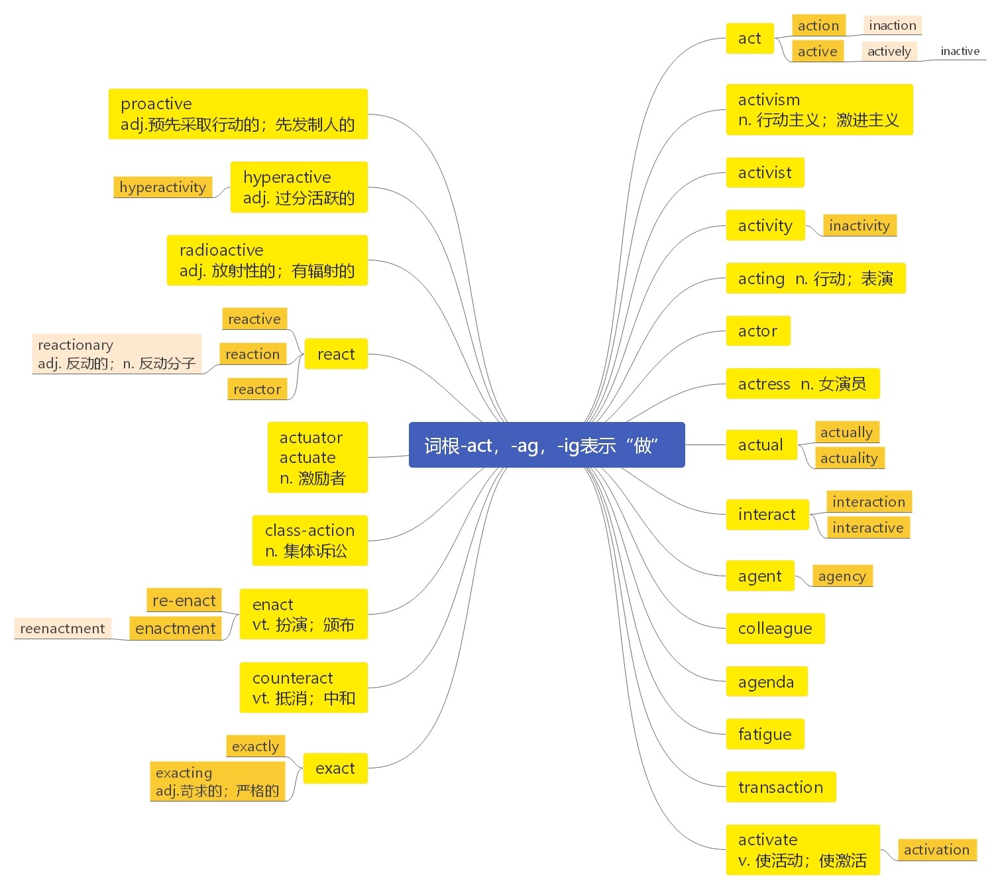

# 第二十六节 词根-act， -ag， -ig

***

# 词根-act， -ag， -ig 表示“做”

> **【课堂笔记】**
>
> act 做
>
> \-ac -ag -ig 做/影响 （ k→g 读音相似， 相互发生转变）

***

**act**  \[ækt] vt.  [英音](https://dict.youdao.com/dictvoice?audio=act\&type=1)  [美音](https://dict.youdao.com/dictvoice?audio=act\&type=2) 行为；行动；起作用；表演；装作 n. 法案；法令 840

**释义：**

1、影响；作用于 If a force or substance acts on someone or something, it has a certain effect on them.

2、 (VERB) 表演；演（戏）；出演（角色） If you act, or act a part in a play or film, you have a part in it.

3、 (N-COUNT) 法案；法令；条例 An Act is a law passed by the government.

**双语例句:** She doesn't go on until Act 2. [播放](https://dict.youdao.com/dictvoice?audio=She+doesn%27t+go+on+until+Act+2.&le=eng&le=eng&type=2)

她要到第2幕才出场。 

**双语例句:** Can you act as interpreter? [播放](https://dict.youdao.com/dictvoice?audio=Can+you+act+as+interpreter%3F&le=eng&le=eng&type=2)

你能担任口译吗？ 

**双语例句:** You must act boldly and confidently. [播放](https://dict.youdao.com/dictvoice?audio=You+must+act+boldly+and+confidently.&le=eng&le=eng&type=2)

你必须表现得大胆、自信。 

**原声例句:** W.H.O.special adviser Keiji Fukuda said last week that the virus has continued to **act** in some ways like seasonal flu. [播放](https://dict.youdao.com/pureaudio?docid=-4802347965111729392)

**原声例句:** For example, the American Recovery and Reinvestment **Act** that President Obama signed into law in February dealt with this issue. [播放](https://dict.youdao.com/pureaudio?docid=-4550512571070625463)

**原声例句:** During the early weeks of eighteen ninety-eight, President McKinley waited for Spain to **act** on its promises to Cuba. [播放](https://dict.youdao.com/pureaudio?docid=-4006703955275489237)

**权威例句:** Kofi Annan said the horrors of Rwanda had happened because the world failed to **act**.  [播放](https://dict.youdao.com/dictvoice?audio=Kofi+Annan+said+the+horrors+of+Rwanda+had+happened+because+the+world+failed+to+act.+&le=eng&type=2)

**权威例句:** The sooner people **act** on accurate information the sooner the market will set the real price.  [播放](https://dict.youdao.com/dictvoice?audio=The+sooner+people+act+on+accurate+information+the+sooner+the+market+will+set+the+real+price.+&le=eng&type=2)

**权威例句:** And he vowed to **act** on climate change himself if Congress failed to enact legislation.  [播放](https://dict.youdao.com/dictvoice?audio=And+he+vowed+to+act+on+climate+change+himself+if+Congress+failed+to+enact+legislation.+&le=eng&type=2)

***

**action**  \['ækʃ(ə)n]n.  [英音](https://dict.youdao.com/dictvoice?audio=action\&type=1)  [美音](https://dict.youdao.com/dictvoice?audio=action\&type=2) 行动；活动；功能；情节；战斗 503

**助记：** act（ 做； 行动） + ion (名词后缀； ) →行动

**双语例句:** Take whatever action is needed. [播放](https://dict.youdao.com/dictvoice?audio=Take+whatever+action+is+needed.&le=eng&le=eng&type=2)

采取任何必要的行动。 

**双语例句:** He vowed to take legal action. [播放](https://dict.youdao.com/dictvoice?audio=He+vowed+to+take+legal+action.&le=eng&le=eng&type=2)

他发誓要诉诸法律行动。 

**双语例句:** Fury propelled her into action. [播放](https://dict.youdao.com/dictvoice?audio=Fury+propelled+her+into+action.&le=eng&le=eng&type=2)

怒火驱使她行动起来。 

**原声例句:** The \"Humanitarian **Action** Report\" discusses several issues that UNICEF says increasingly threaten the basic rights of women and children. [播放](https://dict.youdao.com/pureaudio?docid=-1116173002291247041)

**原声例句:** But if the council takes no **action** within six months, the court might still be able to carry out an investigation. [播放](https://dict.youdao.com/pureaudio?docid=1752605074433666731)

**原声例句:** Experts at the Organization for Economic Cooperation and Development estimated that the **action** cost Egypt's economy at least ninety million dollars. [播放](https://dict.youdao.com/pureaudio?docid=-5848082007778306854)

**权威例句:** While the average did finish lower, the intraday price **action** is suggestive of capitulation.  [播放](https://dict.youdao.com/dictvoice?audio=While+the+average+did+finish+lower%2C+the+intraday+price+action+is+suggestive+of+capitulation.+&le=eng&type=2)

**权威例句:** \"A letter was written by press officers and I authorised that **action**, \" he said.  [播放](https://dict.youdao.com/dictvoice?audio=%22A+letter+was+written+by+press+officers+and+I+authorised+that+action%2C+%22+he+said.+&le=eng&type=2)

**权威例句:** Eventually, Californians convinced one of their representatives, Senator John Conness, to translate rhetoric to **action**.  [播放](https://dict.youdao.com/dictvoice?audio=Eventually%2C+Californians+convinced+one+of+their+representatives%2C+Senator+John+Conness%2C+to+translate+rhetoric+to+action.+&le=eng&type=2)

***

**inaction**  \[ɪn'ækʃ(ə)n] n.  [英音](https://dict.youdao.com/dictvoice?audio=inaction\&type=1)  [美音](https://dict.youdao.com/dictvoice?audio=inaction\&type=2) 不活动；不作为 14928

**助记：** in（ 不） + action（ 活动） →不活动;

**双语例句:** Meantime Miles was growing sufficiently tired of confinement and inaction. [播放](https://dict.youdao.com/dictvoice?audio=Meantime+Miles+was+growing+sufficiently+tired+of+confinement+and+inaction.&le=eng&le=eng&type=2)

与此同时，迈尔斯对禁闭和无所作为已经感到十分厌倦了。 

**双语例句:** He is bitter about the inaction of the other political parties. [播放](https://dict.youdao.com/dictvoice?audio=He+is+bitter+about+the+inaction+of+the+other+political+parties.&le=eng&le=eng&type=2)

他为其他政党的不作为感到愤愤不平。 

**双语例句:** They would go to the other extreme, and micro-analyze everything, to the point of complete inaction. [播放](https://dict.youdao.com/dictvoice?audio=They+would+go+to+the+other+extreme%2C+and+micro-analyze+everything%2C+to+the+point+of+complete+inaction.&le=eng&le=eng&type=2)

他们会走向另一个极端，对每件事进行细致的微观分析，但到最后却什么都不去做。 

**原声例句:** He warns that **inaction** would lead to lower salaries, higher unemployment,lower profits and an increased number of people without insurance. [播放](https://dict.youdao.com/pureaudio?docid=264607662300098067)

**原声例句:** He says if those with the least pollution start doing the most, rich nations will not have an excuse for **inaction**. [播放](https://dict.youdao.com/pureaudio?docid=7568058035054913675)

**原声例句:** \"I'm an optimist, and I think if you're a pessimist that's just an excuse for **inaction**.\" [播放](https://dict.youdao.com/pureaudio?docid=-5839172535435292103)

**权威例句:** One wonders about the Board of Directors, that, until recently was a paragon of **inaction**.  [播放](https://dict.youdao.com/dictvoice?audio=One+wonders+about+the+Board+of+Directors%2C+that%2C+until+recently+was+a+paragon+of+inaction.+&le=eng&type=2)

**权威例句:** The state boards excuse their **inaction** by complaining that tax shelter schemes are complex and sophisticated.  [播放](https://dict.youdao.com/dictvoice?audio=The+state+boards+excuse+their+inaction+by+complaining+that+tax+shelter+schemes+are+complex+and+sophisticated.+&le=eng&type=2)

**权威例句:** The funny thing is that **inaction** is also a choice that will affect your business.  [播放](https://dict.youdao.com/dictvoice?audio=The+funny+thing+is+that+inaction+is+also+a+choice+that+will+affect+your+business.+&le=eng&type=2)

***

**active**  \['æktɪv] adj.  [英音](https://dict.youdao.com/dictvoice?audio=active\&type=1)  [美音](https://dict.youdao.com/dictvoice?audio=active\&type=2) 主动的；有效的；积极的；活跃的；现役的 1451

**助记：** act（ 做； 行动） + ive (形容词后缀， 表示“大， 多” ) →行动很多的→主动的

**双语例句:** They were both politically active. [播放](https://dict.youdao.com/dictvoice?audio=They+were+both+politically+active.&le=eng&le=eng&type=2)

他们两人在政治上都很积极。 

**双语例句:** He was very active in Freemasonry. [播放](https://dict.youdao.com/dictvoice?audio=He+was+very+active+in+Freemasonry.&le=eng&le=eng&type=2)

他在共济会组织很活跃。 

**双语例句:** REM sleep is termed 'active' sleep. [播放](https://dict.youdao.com/dictvoice?audio=REM+sleep+is+termed+%27active%27+sleep.&le=eng&le=eng&type=2)

快速眼动睡眠称作“主动”睡眠。 

**原声例句:** He became a lawyer. He moved to another northeastern state -- Massachusetts -- where he became **active** in Republican Party politics. [播放](https://dict.youdao.com/pureaudio?docid=-5507754780790427102)

**原声例句:** But counterfeit drugs may contain too much, too little or none of the **active** ingredients of the real thing. [播放](https://dict.youdao.com/pureaudio?docid=-3566558623051133777)

**原声例句:** The study found that happy people are more likely to be socially **active**,to read,attend religious services and to vote. [播放](https://dict.youdao.com/pureaudio?docid=-1900334246264229452)

**权威例句:** But the key to this, it said, were two factors: remaining **active** and maintaining friendships.  [播放](https://dict.youdao.com/dictvoice?audio=But+the+key+to+this%2C+it+said%2C+were+two+factors%3A+remaining+active+and+maintaining+friendships.+&le=eng&type=2)

**权威例句:** After adjustment for risk the **active** funds' edge grows to 1.3 points a year.  [播放](https://dict.youdao.com/dictvoice?audio=After+adjustment+for+risk+the+active+funds%27+edge+grows+to+1.3+points+a+year.+&le=eng&type=2)

**权威例句:** Most of Vanguard's **active** stock funds are run by outside managers hired for their particular expertise.  [播放](https://dict.youdao.com/dictvoice?audio=Most+of+Vanguard%27s+active+stock+funds+are+run+by+outside+managers+hired+for+their+particular+expertise.+&le=eng&type=2)

***

**inactive**  \[ɪn'æktɪv] adj.  [英音](https://dict.youdao.com/dictvoice?audio=inactive\&type=1)  [美音](https://dict.youdao.com/dictvoice?audio=inactive\&type=2) 不活动的；不活跃的；怠惰的；闲置的 14061

**助记：** in（ 不） + active (积极的) →不积极的→不活跃的

**双语例句:** Some animals are inactive during the daytime. [播放](https://dict.youdao.com/dictvoice?audio=Some+animals+are+inactive+during+the+daytime.&le=eng&le=eng&type=2)

有些动物白天不活动。 

**双语例句:** In the unfertilized egg, the substances are inactive and are not distributed homogeneously. [播放](https://dict.youdao.com/dictvoice?audio=In+the+unfertilized+egg%2C+the+substances+are+inactive+and+are+not+distributed+homogeneously.&le=eng&le=eng&type=2)

在未受精卵中，这些物质是不活跃的，而且分布不均匀。 

**双语例句:** A third group are known as crepuscular: they thrive in the low light of dawn and dusk and remain inactive at other hours. [播放](https://dict.youdao.com/dictvoice?audio=A+third+group+are+known+as+crepuscular%3A+they+thrive+in+the+low+light+of+dawn+and+dusk+and+remain+inactive+at+other+hours.&le=eng&le=eng&type=2)

第三组被称为黄昏组：他们在黎明和黄昏的微光中茁壮成长，而在其他时间则不活跃。 

**原声例句:** The other half received a placebo, an **inactive** substance. [播放](https://dict.youdao.com/pureaudio?docid=8724779334752837712)

**原声例句:** But the group has been largely **inactive** since 2005, when Mr.Abbas was elected on a platform of reaching a negotiated peace with Israel. [播放](https://dict.youdao.com/pureaudio?docid=3601557718380182544)

**原声例句:** We've built our society around cars, around being **inactive**.\" [播放](https://dict.youdao.com/pureaudio?docid=5097761505647966213)

**权威例句:** Once done, both wrestlers turn around and the **inactive** rikishi is driven back to where he came from.  [播放](https://dict.youdao.com/dictvoice?audio=Once+done%2C+both+wrestlers+turn+around+and+the+inactive+rikishi+is+driven+back+to+where+he+came+from.+&le=eng&type=2)

**权威例句:** But later, leads dry up and departments usually scale back resources and declare a case **inactive**.  [播放](https://dict.youdao.com/dictvoice?audio=But+later%2C+leads+dry+up+and+departments+usually+scale+back+resources+and+declare+a+case+inactive.+&le=eng&type=2)

**权威例句:** \"The police have become **inactive** because of unnecessary development of their body, \" he said.  [播放](https://dict.youdao.com/dictvoice?audio=%22The+police+have+become+inactive+because+of+unnecessary+development+of+their+body%2C+%22+he+said.+&le=eng&type=2)

***

**actively**  \['æktivli] adv.  [英音](https://dict.youdao.com/dictvoice?audio=actively\&type=1)  [美音](https://dict.youdao.com/dictvoice?audio=actively\&type=2) 积极地；活跃地 4356

**助记：** active（ 积极的） + ly（ …地） →积极地

**双语例句:** She was actively looking for a job. [播放](https://dict.youdao.com/dictvoice?audio=She+was+actively+looking+for+a+job.&le=eng&le=eng&type=2)

她在积极找工作。 

**双语例句:** They actively campaigned for the vote. [播放](https://dict.youdao.com/dictvoice?audio=They+actively+campaigned+for+the+vote.&le=eng&le=eng&type=2)

他们积极主动地为争取选票而活动。 

**双语例句:** Banks actively encourage people to borrow money. [播放](https://dict.youdao.com/dictvoice?audio=Banks+actively+encourage+people+to+borrow+money.&le=eng&le=eng&type=2)

银行积极鼓动人们贷款。 

**原声例句:** Researchers have known since the nineteen thirties that the **actively** growing tip of a plant releases a hormone called auxin. [播放](https://dict.youdao.com/pureaudio?docid=7160811171428761174)

**原声例句:** He says the **actively** changing nature of the Internet makes it difficult to stay current in studying its effects. [播放](https://dict.youdao.com/pureaudio?docid=-9213594630697534569)

**原声例句:** But the students must agree to serve **actively** in the Army for at least five years after finishing their studies. [播放](https://dict.youdao.com/pureaudio?docid=8111875352178886409)

**权威例句:** That's no small feat, given the consistent underperformance of **actively** managed funds in general.  [播放](https://dict.youdao.com/dictvoice?audio=That%27s+no+small+feat%2C+given+the+consistent+underperformance+of+actively+managed+funds+in+general.+&le=eng&type=2)

**权威例句:** The owners proudly, and **actively**, encourage lounging, with free wi-fi and retro 1950s-style comfy furniture.  [播放](https://dict.youdao.com/dictvoice?audio=The+owners+proudly%2C+and+actively%2C+encourage+lounging%2C+with+free+wi-fi+and+retro+1950s-style+comfy+furniture.+&le=eng&type=2)

**权威例句:** Few things anger a trader more than seeing inaccessible market prints while **actively** trading in a particular security.  [播放](https://dict.youdao.com/dictvoice?audio=Few+things+anger+a+trader+more+than+seeing+inaccessible+market+prints+while+actively+trading+in+a+particular+security.+&le=eng&type=2)

***

**activism**  \['æktɪvɪz(ə)m] n.  [英音](https://dict.youdao.com/dictvoice?audio=activism\&type=1)  [美音](https://dict.youdao.com/dictvoice?audio=activism\&type=2) 行动主义；激进主义 7215

**助记：** active（ 积极的） + ism（ 主义） →积极主义→行动主义

> **【课堂笔记】**
>
> 后缀-ism 表示&#x20;
>
> 1） …主义&#x20;
>
> 2） 直接用作名词后缀， 不用翻译

**双语例句:** It seems that the '60s era of social activism is all but a dim memory. [播放](https://dict.youdao.com/dictvoice?audio=It+seems+that+the+%2760s+era+of+social+activism+is+all+but+a+dim+memory.&le=eng&le=eng&type=2)

60年代的社会激进主义时代似乎只剩下模糊的记忆。 

**双语例句:** Their main weapon against super skinny models: a brand of civil disobedience dubbed \"body activism\". [播放](https://dict.youdao.com/dictvoice?audio=Their+main+weapon+against+super+skinny+models%3A+a+brand+of+civil+disobedience+dubbed+%22body+activism%22.&le=eng&le=eng&type=2)

他们反对超瘦模特的主要武器是一种被称为“身体行动主义”的非暴力反抗。 

**双语例句:** This activism and the views underlying it came to prevail in the United States labor movement and in 1935 the AFL unequivocally reversed its position on health legislation. [播放](https://dict.youdao.com/dictvoice?audio=This+activism+and+the+views+underlying+it+came+to+prevail+in+the+United+States+labor+movement+and+in+1935+the+AFL+unequivocally+reversed+its+position+on+health+legislation.&le=eng&le=eng&type=2)

这种激进主义及其背后的观点在美国劳工运动中占据了主导地位，1935年，美国劳工联合会明确地改变了其在卫生立法方面的立场。 

**原声例句:** The Institute's \"Roots and Shoots\" program is aimed at getting young people interested in environmental **activism** and leadership. [播放](https://dict.youdao.com/pureaudio?docid=-5240321854982421180)

**原声例句:** It represents nonprofit and for-profit organizations working toward goals of social change and environmental **activism**. [播放](https://dict.youdao.com/pureaudio?docid=2672377546733370533)

**原声例句:** Its aim is to increase public understanding of great apes through research, education,and **activism**. [播放](https://dict.youdao.com/pureaudio?docid=6905227957822872428)

**权威例句:** Over the next 19 months, some 5, 600 Native Americans visited the occupied island, sparking Native American **activism** nationwide.  [播放](https://dict.youdao.com/dictvoice?audio=Over+the+next+19+months%2C+some+5%2C+600+Native+Americans+visited+the+occupied+island%2C+sparking+Native+American+activism+nationwide.+&le=eng&type=2)

**权威例句:** Along with other GCC (Gulf Cooperation Council) countries, Bahrain has cracked down hard on internet **activism**.  [播放](https://dict.youdao.com/dictvoice?audio=Along+with+other+GCC+%28Gulf+Cooperation+Council%29+countries%2C+Bahrain+has+cracked+down+hard+on+internet+activism.+&le=eng&type=2)

**权威例句:** Economic stagnation plus Fed **activism** equals stagflation: we saw it all thirty-five years ago.  [播放](https://dict.youdao.com/dictvoice?audio=Economic+stagnation+plus+Fed+activism+equals+stagflation%3A+we+saw+it+all+thirty-five+years+ago.+&le=eng&type=2)

***

**activist**  \['æktɪvɪst] n.  [英音](https://dict.youdao.com/dictvoice?audio=activist\&type=1)  [美音](https://dict.youdao.com/dictvoice?audio=activist\&type=2) 积极分子；激进主义分子 2618

**助记：** active（ 积极的） + ist（ 人） →积极的人→积极分子

**双语例句:** Dobson blames activist judges for undermining families with favourable gay-marriage rulings. [播放](https://dict.youdao.com/dictvoice?audio=Dobson+blames+activist+judges+for+undermining+families+with+favourable+gay-marriage+rulings.&le=eng&le=eng&type=2)

多布森责备激进派法官们通过赞成同性婚姻的裁决破坏家庭。 

**双语例句:** She chronicled her quest on her blog, \"Not an activist.\" [播放](https://dict.youdao.com/dictvoice?audio=She+chronicled+her+quest+on+her+blog%2C+%22Not+an+activist.%22&le=eng&le=eng&type=2)

她在她的博客上记述了她的追求：“不是一个积极分子。” 

**双语例句:** They're depicting me as a radical animal rights activist and environmentalist determined to force my beliefs on others. [播放](https://dict.youdao.com/dictvoice?audio=They%27re+depicting+me+as+a+radical+animal+rights+activist+and+environmentalist+determined+to+force+my+beliefs+on+others.&le=eng&le=eng&type=2)

他们把我描绘成一个激进的动物权利活动家和环保主义者，决心把我的信仰强加于他人。 

**原声例句:** The incidents included the murder of a civil rights **activist** in Mississippi and the killings of four young girls in Alabama. [播放](https://dict.youdao.com/pureaudio?docid=3235693757640015801)

**原声例句:** Centuries later, a British doctor became an **activist** for better care for the dying in the nineteen forties. [播放](https://dict.youdao.com/pureaudio?docid=5147799902650966537)

**原声例句:** Ron Rivera,a ceramics artist and **activist** in the group Potters for Peace, saw it and recognized its value. [播放](https://dict.youdao.com/pureaudio?docid=-4557503016488043462)

**权威例句:** Supporters of Glossip include death penalty **activist** Sister Helen Prejean and actress Susan Sarandon.  [播放](https://dict.youdao.com/dictvoice?audio=Supporters+of+Glossip+include+death+penalty+activist+Sister+Helen+Prejean+and+actress+Susan+Sarandon.+&le=eng&type=2)

**权威例句:** He's one of the campaign's organizers and a longtime anti-abortion **activist** in the state.  [播放](https://dict.youdao.com/dictvoice?audio=He%27s+one+of+the+campaign%27s+organizers+and+a+longtime+anti-abortion+activist+in+the+state.+&le=eng&type=2)

**权威例句:** One e-mail making the rounds comes from Niaz Dorry, who calls herself a freelance **activist**.  [播放](https://dict.youdao.com/dictvoice?audio=One+e-mail+making+the+rounds+comes+from+Niaz+Dorry%2C+who+calls+herself+a+freelance+activist.+&le=eng&type=2)

***

**activity**  \[ækˈtɪvətɪ] n. [英音](https://dict.youdao.com/dictvoice?audio=activity\&type=1)  [美音](https://dict.youdao.com/dictvoice?audio=activity\&type=2) 活跃；活动；行动 538

**助记：** active（ 积极的） + ity（ 名词后缀） →积极； 活跃； 活动

**双语例句:** It was a period of intense activity. [播放](https://dict.youdao.com/dictvoice?audio=It+was+a+period+of+intense+activity.&le=eng&le=eng&type=2)

那是活动激烈的时期。 

**双语例句:** Parents encourage every activity imaginable. [播放](https://dict.youdao.com/dictvoice?audio=Parents+encourage+every+activity+imaginable.&le=eng&le=eng&type=2)

父母鼓励一切可能的活动。 

**双语例句:** Economic activity often follows a cyclical pattern. [播放](https://dict.youdao.com/dictvoice?audio=Economic+activity+often+follows+a+cyclical+pattern.&le=eng&le=eng&type=2)

经济活动常常遵循周期性模式。 

**原声例句:** The Census Bureau says swimming was the third most popular sports **activity** in the United States in two thousand seven. [播放](https://dict.youdao.com/pureaudio?docid=-5477706549210341662)

**原声例句:** A city report says economic **activity** last year totaled almost three billion dollars, a four percent decrease from two thousand seven. [播放](https://dict.youdao.com/pureaudio?docid=-2686138090135694251)

**原声例句:** She says people might have difficulty completing an **activity** if they cannot expect some kind of reward in return. [播放](https://dict.youdao.com/pureaudio?docid=-1938831261313733857)

**权威例句:** The city has been the scene of rebel **activity** and heavy government bombardment for weeks.  [播放](https://dict.youdao.com/dictvoice?audio=The+city+has+been+the+scene+of+rebel+activity+and+heavy+government+bombardment+for+weeks.+&le=eng&type=2)

**权威例句:** The more you travel, the more important it is to monitor your physical **activity**.  [播放](https://dict.youdao.com/dictvoice?audio=The+more+you+travel%2C+the+more+important+it+is+to+monitor+your+physical+activity.+&le=eng&type=2)

**权威例句:** These warnings stem from anti-government demonstrations, as well as reports of kidnappings and other terrorist **activity**.  [播放](https://dict.youdao.com/dictvoice?audio=These+warnings+stem+from+anti-government+demonstrations%2C+as+well+as+reports+of+kidnappings+and+other+terrorist+activity.+&le=eng&type=2)

***

**inactivity**  \[,ɪnæk'tɪvɪtɪ] n.  [英音](https://dict.youdao.com/dictvoice?audio=inactivity\&type=1)  [美音](https://dict.youdao.com/dictvoice?audio=inactivity\&type=2) 静止；不活泼；休止状态；不放射性 18183

**助记：** in（ 不） + activity （ 活动； 活跃） →不活动； 不活跃

**双语例句:** The players have comparatively long periods of inactivity. [播放](https://dict.youdao.com/dictvoice?audio=The+players+have+comparatively+long+periods+of+inactivity.&le=eng&le=eng&type=2)

这些运动员有相当长的一段时间会无所事事。 

**双语例句:** Poor diet and physical inactivity also each increase the risk of heart disease and have a role to play in the development of some cancers. [播放](https://dict.youdao.com/dictvoice?audio=Poor+diet+and+physical+inactivity+also+each+increase+the+risk+of+heart+disease+and+have+a+role+to+play+in+the+development+of+some+cancers.&le=eng&le=eng&type=2)

不良的饮食和缺乏运动也会增加罹患心脏病的风险以及助长某些癌症的发展。 

**双语例句:** The obesity epidemic began in the 1980s, and many people attribute it to increased portion sizes and inactivity, but that can't be everything. [播放](https://dict.youdao.com/dictvoice?audio=The+obesity+epidemic+began+in+the+1980s%2C+and+many+people+attribute+it+to+increased+portion+sizes+and+inactivity%2C+but+that+can%27t+be+everything.&le=eng&le=eng&type=2)

肥胖在20世纪80年代开始蔓延，许多人将其归咎于食物份量增加和缺乏运动，但这不可能是全部原因。 

**原声例句:** Many of us gain weight because of **inactivity** during the winter. [播放](https://dict.youdao.com/pureaudio?docid=-5238305868849259814)

**原声例句:** Leisure does not simply mean rest or **inactivity** but leisure is necessary for education or what he sometimes calls by the term philosophy.

**原声例句:** Type II Diabetes usually has its onset in adulthood-- that's beginning to change-- and is usually created by lifestyle factors: poor diet, physical **inactivity**, and obesity.

**权威例句:** The group said local authorities needed to take action, as the levels of **inactivity** were costing lives.  [播放](https://dict.youdao.com/dictvoice?audio=The+group+said+local+authorities+needed+to+take+action%2C+as+the+levels+of+inactivity+were+costing+lives.+&le=eng&type=2)

**权威例句:** Inflammation and metabolic problems caused by long periods of **inactivity** are undoubtedly also to blame.  [播放](https://dict.youdao.com/dictvoice?audio=Inflammation+and+metabolic+problems+caused+by+long+periods+of+inactivity+are+undoubtedly+also+to+blame.+&le=eng&type=2)

**权威例句:** Some 57, 000 of the latest rise in unemployment is due to a fall in economic **inactivity**.  [播放](https://dict.youdao.com/dictvoice?audio=Some+57%2C+000+of+the+latest+rise+in+unemployment+is+due+to+a+fall+in+economic+inactivity.+&le=eng&type=2)

***

**acting**  \['æktɪŋ] n.  [英音](https://dict.youdao.com/dictvoice?audio=acting\&type=1)  [美音](https://dict.youdao.com/dictvoice?audio=acting\&type=2) 行动; 表演 adj. 代理的； 8556

**助记：** act（ 做； 行动） + ing (…的/名词后缀) →行动

**释义：**

1、 (N-UNCOUNT) 表演;演艺业;演技;演戏 Acting is the activity or profession of performing in plays or films.

2、 (ADJ) 临时代理的 You use acting before the title of a job to indicate that someone is doing that job temporarily.

> **【课堂笔记】**
>
> acting producer 临时制片人

**双语例句:** Acting comes naturally to her. [播放](https://dict.youdao.com/dictvoice?audio=Acting+comes+naturally+to+her.&le=eng&le=eng&type=2)

她天生就会表演。 

**双语例句:** The acting was deplorable. [播放](https://dict.youdao.com/dictvoice?audio=The+acting+was+deplorable.&le=eng&le=eng&type=2)

那演技糟透了。 

**双语例句:** She is acting as proxy for her husband. [播放](https://dict.youdao.com/dictvoice?audio=She+is+acting+as+proxy+for+her+husband.&le=eng&le=eng&type=2)

她做她丈夫的代表。 

**原声例句:** For most of his career, he was a producer and main writer for an **acting** company called the King's Men. [播放](https://dict.youdao.com/pureaudio?docid=3285531138252846495)

**原声例句:** and insanity incites to action. With no definite plan and **acting** like a madman, Murlock ran quickly to the wall. [播放](https://dict.youdao.com/pureaudio?docid=5237987549131204227)

**原声例句:** As a result, they used the frogs in fast-**acting**, low-cost pregnancy tests for women during the nineteen-forties and fifties. [播放](https://dict.youdao.com/pureaudio?docid=5867624071608005211)

**权威例句:** **Acting** on that certainty, Rockefeller built the greatest fortune the world had ever seen.  [播放](https://dict.youdao.com/dictvoice?audio=Acting+on+that+certainty%2C+Rockefeller+built+the+greatest+fortune+the+world+had+ever+seen.+&le=eng&type=2)

**权威例句:** What 19th century novel first described Charades, the party game of **acting** and guessing?  [播放](https://dict.youdao.com/dictvoice?audio=What+19th+century+novel+first+described+Charades%2C+the+party+game+of+acting+and+guessing%3F+&le=eng&type=2)

**权威例句:** Mr Davie was appointed as **acting** director general on Saturday after Mr Entwistle announced his resignation.  [播放](https://dict.youdao.com/dictvoice?audio=Mr+Davie+was+appointed+as+acting+director+general+on+Saturday+after+Mr+Entwistle+announced+his+resignation.+&le=eng&type=2)

***

**actor**  \['æktə] n. （ [英音](https://dict.youdao.com/dictvoice?audio=actor\&type=1)  [美音](https://dict.youdao.com/dictvoice?audio=actor\&type=2) 男）演员；行动者; 作用物 1507

**助记：** act（ 表演； 行动） + or (人) →表演的人→演员； 行动者

**双语例句:** Grodin is a fine comic actor. [播放](https://dict.youdao.com/dictvoice?audio=Grodin+is+a+fine+comic+actor.&le=eng&le=eng&type=2)

格罗丁是一位好的滑稽演员。 

**双语例句:** He failed miserably as an actor. [播放](https://dict.youdao.com/dictvoice?audio=He+failed+miserably+as+an+actor.&le=eng&le=eng&type=2)

作为演员，他败得很惨。 

**双语例句:** He was nominated (as) best actor. [播放](https://dict.youdao.com/dictvoice?audio=He+was+nominated+%28as%29+best+actor.&le=eng&le=eng&type=2)

他获得了最佳男演员的提名。 

**原声例句:** An **actor** who worked with Katharine Hepburn once said that she brought with her an extra level of reality. [播放](https://dict.youdao.com/pureaudio?docid=4708774619634958968)

**原声例句:** An **actor** plays Spanish-American Admiral David Farrugut, a hero in the Battle of Mobile Bay during the American Civil War. [播放](https://dict.youdao.com/pureaudio?docid=-4008235961871529293)

**原声例句:** The theater where it is playing was renamed the Jerry Orbach Theater after the **actor** who starred in the original production. [播放](https://dict.youdao.com/pureaudio?docid=-2829767399056006995)

**权威例句:** Mr. JEFF DANIELS **(Acto**r): (As Bernard Berkman) We're splitting up the week, alternating days.  [播放](https://dict.youdao.com/dictvoice?audio=Mr.+JEFF+DANIELS+%28Actor%29%3A+%28As+Bernard+Berkman%29+We%27re+splitting+up+the+week%2C+alternating+days.+&le=eng&type=2)

**权威例句:** **Actor** NT Rama Rao ruled over the Andhra Pradesh state for a long time.  [播放](https://dict.youdao.com/dictvoice?audio=Actor+NT+Rama+Rao+ruled+over+the+Andhra+Pradesh+state+for+a+long+time.+&le=eng&type=2)

**权威例句:** Mr. PHILIP SEYMOUR HOFFMAN **(Acto**r): (As Jon Savage) Wendy, I need you to spent Thanksgiving with dad.  [播放](https://dict.youdao.com/dictvoice?audio=Mr.+PHILIP+SEYMOUR+HOFFMAN+%28Actor%29%3A+%28As+Jon+Savage%29+Wendy%2C+I+need+you+to+spent+Thanksgiving+with+dad.+&le=eng&type=2)

***

**actress**  \['æktrɪs] n.  [英音](https://dict.youdao.com/dictvoice?audio=actress\&type=1)  [美音](https://dict.youdao.com/dictvoice?audio=actress\&type=2) 女演员 3263

**助记：** act（ 表演； 行动） + ress (名词后缀； 表女性) →表演的女性→女演员

**双语例句:** Her vocation is her work as an actress. [播放](https://dict.youdao.com/dictvoice?audio=Her+vocation+is+her+work+as+an+actress.&le=eng&le=eng&type=2)

她适合的职业就是当演员。 

**双语例句:** She fancies herself (as) a serious actress. [播放](https://dict.youdao.com/dictvoice?audio=She+fancies+herself+%28as%29+a+serious+actress.&le=eng&le=eng&type=2)

她自以为是严肃的演员。 

**双语例句:** Jane is determined to stake her claim as an actress. [播放](https://dict.youdao.com/dictvoice?audio=Jane+is+determined+to+stake+her+claim+as+an+actress.&le=eng&le=eng&type=2)

简决心提出她作为一名女演员的应有权利。 

**原声例句:** The **actress** who played the mother was Anne Bancroft, the lover was Dustin Hoffman and the movie was \"The Graduate.\" [播放](https://dict.youdao.com/pureaudio?docid=-8964159992131627257)

**原声例句:** Pete Yorn says the idea for the album was based on the songs of French entertainer Serge Gainsbourg and **actress** Brigitte Bardot. [播放](https://dict.youdao.com/pureaudio?docid=4420636209159876039)

**原声例句:** Farrah Fawcett often received more attention for her troubled private life than for her work as an **actress**. [播放](https://dict.youdao.com/pureaudio?docid=5579171894924999799)

**权威例句:** Supporters of Glossip include death penalty activist Sister Helen Prejean and **actress** Susan Sarandon.  [播放](https://dict.youdao.com/dictvoice?audio=Supporters+of+Glossip+include+death+penalty+activist+Sister+Helen+Prejean+and+actress+Susan+Sarandon.+&le=eng&type=2)

**权威例句:** Grammy Award-winning artist Kelly Rowland performed at the event, hosted by **actress** and director Drew Barrymore.  [播放](https://dict.youdao.com/dictvoice?audio=Grammy+Award-winning+artist+Kelly+Rowland+performed+at+the+event%2C+hosted+by+actress+and+director+Drew+Barrymore.+&le=eng&type=2)

**权威例句:** Ms. LAURA LINNEY **(Actres**s): (As Joan Berkman) We will be able to see you both equally.  [播放](https://dict.youdao.com/dictvoice?audio=Ms.+LAURA+LINNEY+%28Actress%29%3A+%28As+Joan+Berkman%29+We+will+be+able+to+see+you+both+equally.+&le=eng&type=2)

***

**actual**  \['æktʃʊəl; -tjʊəl] adj.  [英音](https://dict.youdao.com/dictvoice?audio=actual\&type=1)  [美音](https://dict.youdao.com/dictvoice?audio=actual\&type=2) 真实的，实际的；现行的，目前的 1752

**助记：** act（ 活动； 行动） +ual（ …的） →正在活动的事情→真实的

**双语例句:** The actual cost was higher than we expected. [播放](https://dict.youdao.com/dictvoice?audio=The+actual+cost+was+higher+than+we+expected.&le=eng&le=eng&type=2)

实际成本比我们预计的要高。 

**双语例句:** First we need to identify actual and potential problems. [播放](https://dict.youdao.com/dictvoice?audio=First+we+need+to+identify+actual+and+potential+problems.&le=eng&le=eng&type=2)

首先，我们需要弄清实际的问题和潜在的问题。 

**双语例句:** Any resemblance to actual persons, places, or events is purely coincidental. [播放](https://dict.youdao.com/dictvoice?audio=Any+resemblance+to+actual+persons%2C+places%2C+or+events+is+purely+coincidental.&le=eng&le=eng&type=2)

如与实际的人、地、事有所雷同，纯属巧合。 

**原声例句:** The models seem like a perfect rendition of the **actual** buildings. [播放](https://dict.youdao.com/pureaudio?docid=4770938351117405716)

**原声例句:** \"By suddenly having an **actual** mechanism to value these systems in dollars, it gives you a potentially very large new mechanism for countering the other financial and economic arguments.\" [播放](https://dict.youdao.com/pureaudio?docid=8059455295949373673)

**原声例句:** \"But the **actual** negotiations of the loan conditions on the ground is done by technocratic economists, staff members at the IMF, and they're going to continue to do their job.\" [播放](https://dict.youdao.com/pureaudio?docid=-6985024607661052974)

**权威例句:** The difference between the **actual** and predicted points produces the points residual for the match.  [播放](https://dict.youdao.com/dictvoice?audio=The+difference+between+the+actual+and+predicted+points+produces+the+points+residual+for+the+match.+&le=eng&type=2)

**权威例句:** For details about the **actual** campaign event, I would refer you to the campaign.  [播放](https://dict.youdao.com/dictvoice?audio=For+details+about+the+actual+campaign+event%2C+I+would+refer+you+to+the+campaign.+&le=eng&type=2)

**权威例句:** Considerable early interest in buying the stores did not turn into **actual** sales, the administrators said.  [播放](https://dict.youdao.com/dictvoice?audio=Considerable+early+interest+in+buying+the+stores+did+not+turn+into+actual+sales%2C+the+administrators+said.+&le=eng&type=2)

***

**actually**  \[ˈæktʃuəli] adv.  [英音](https://dict.youdao.com/dictvoice?audio=actually\&type=1)  [美音](https://dict.youdao.com/dictvoice?audio=actually\&type=2) 实际上； 事实上 397

**助记：** actual（ 真实的； 实际的） + ly（ …地） →真实地； 实际地

**双语例句:** They're not married, actually. [播放](https://dict.youdao.com/dictvoice?audio=They%27re+not+married%2C+actually.&le=eng&le=eng&type=2)

他们实际上没有结婚。 

**双语例句:** It's not actually raining now. [播放](https://dict.youdao.com/dictvoice?audio=It%27s+not+actually+raining+now.&le=eng&le=eng&type=2)

其实现在并没有下雨。 

**双语例句:** Coal is actually cheaper than gas. [播放](https://dict.youdao.com/dictvoice?audio=Coal+is+actually+cheaper+than+gas.&le=eng&le=eng&type=2)

煤炭实际上比煤气便宜。 

**原声例句:** I never knew I was going to be a beaded jewelry designer until the day I was **actually** doing it.\" [播放](https://dict.youdao.com/pureaudio?docid=-5581971823016863621)

**原声例句:** The other big problem with using human blood for making these blood agar plates is that they're **actually** not accurate.\" [播放](https://dict.youdao.com/pureaudio?docid=-4859504230358993932)

**原声例句:** \"Honestly I feel quite confident that **actually** volunteers have never been as safe in the Peace Corps as they are today. [播放](https://dict.youdao.com/pureaudio?docid=-2884444797717828121)

**权威例句:** Only when the shareholder **actually** sells his own shares is there a taxable event.  [播放](https://dict.youdao.com/dictvoice?audio=Only+when+the+shareholder+actually+sells+his+own+shares+is+there+a+taxable+event.+&le=eng&type=2)

**权威例句:** \"The state of the art search-and-rescue robotics is **actually** quite limited, \" he told the BBC.  [播放](https://dict.youdao.com/dictvoice?audio=%22The+state+of+the+art+search-and-rescue+robotics+is+actually+quite+limited%2C+%22+he+told+the+BBC.+&le=eng&type=2)

**权威例句:** We **actually** talked to an anesthesiologist who saw the movie and gave his review.  [播放](https://dict.youdao.com/dictvoice?audio=We+actually+talked+to+an+anesthesiologist+who+saw+the+movie+and+gave+his+review.+&le=eng&type=2)

***

**actuality**  \[æktjʊ'ælɪtɪ; -tʃʊ-] n.  [英音](https://dict.youdao.com/dictvoice?audio=actuality\&type=1)  [美音](https://dict.youdao.com/dictvoice?audio=actuality\&type=2) 现状；事实；现实 15663

**助记：** actual（ 真实的； 实际的） + ity（ 名词后缀） →现实； 事实

**双语例句:** In actuality, Ted did not have a disorder but merely a difficult temperament. [播放](https://dict.youdao.com/dictvoice?audio=In+actuality%2C+Ted+did+not+have+a+disorder+but+merely+a+difficult+temperament.&le=eng&le=eng&type=2)

事实上，特德并没有什么异常而只是脾气不好。 

**双语例句:** I have now come to realize that being boring, in actuality, is not only about who you are as a person, but also how you present yourself. [播放](https://dict.youdao.com/dictvoice?audio=I+have+now+come+to+realize+that+being+boring%2C+in+actuality%2C+is+not+only+about+who+you+are+as+a+person%2C+but+also+how+you+present+yourself.&le=eng&le=eng&type=2)

我现在已经意识到，事实上，无聊不仅与你是谁有关，还与你如何展现自我有关。 

**双语例句:** Nevertheless, Gerteis argues, these disparate party affiliations did not diminish the actuality of reformer unity, most prominent in the 1830s. [播放](https://dict.youdao.com/dictvoice?audio=Nevertheless%2C+Gerteis+argues%2C+these+disparate+party+affiliations+did+not+diminish+the+actuality+of+reformer+unity%2C+most+prominent+in+the+1830s.&le=eng&le=eng&type=2)

然而，格泰斯认为，这些不同的政党联盟并没有削弱改革者团结的现状，尤其是在19世纪30年代。 

**原声例句:** We're thrilled, until we realize it's still daylight and the fireworks are in **actuality** gunfire. [播放](https://dict.youdao.com/pureaudio?docid=-634953889958252892)

**原声例句:** It's clear that we all do believe in the possibility, indeed, more than a mere possibility, the **actuality** of meetings that occur without us.

**原声例句:** But of course the best regime lacks **actuality**.

**权威例句:** Of course as Patrick also points out, this is very far from the **actuality**.  [播放](https://dict.youdao.com/dictvoice?audio=Of+course+as+Patrick+also+points+out%2C+this+is+very+far+from+the+actuality.+&le=eng&type=2)

**权威例句:** Sounds like a move for justice but in **actuality** it's a recipe for trouble and anti-American actions.  [播放](https://dict.youdao.com/dictvoice?audio=Sounds+like+a+move+for+justice+but+in+actuality+it%27s+a+recipe+for+trouble+and+anti-American+actions.+&le=eng&type=2)

**权威例句:** But the **actuality** is it should severely decrease the likelihood for wild cards to prevail.  [播放](https://dict.youdao.com/dictvoice?audio=But+the+actuality+is+it+should+severely+decrease+the+likelihood+for+wild+cards+to+prevail.+&le=eng&type=2)

***

**interact**  \[ɪntər'ækt] vi.  [英音](https://dict.youdao.com/dictvoice?audio=interact\&type=1)  [美音](https://dict.youdao.com/dictvoice?audio=interact\&type=2) 互相影响； 互相作用 4388

**助记：** inter（ 在…之间） +act（ 做； 影响=act on） →相互间的作用、 影响→相互作用

**搭配：** interact with sb.（考）：和...交流

> **【课堂笔记】**
>
> nation → national（ 国家的） → international （ 国际的）
>
> 前缀-inter 表示“ 在…之间”
>
> interact with sb. 和某人相互影响

**双语例句:** You have to understand how cells interact. [播放](https://dict.youdao.com/dictvoice?audio=You+have+to+understand+how+cells+interact.&le=eng&le=eng&type=2)

你必须得了解细胞之间是如何相互作用的。 

**双语例句:** They learn how to interact with their peers. [播放](https://dict.youdao.com/dictvoice?audio=They+learn+how+to+interact+with+their+peers.&le=eng&le=eng&type=2)

他们学习如何与同龄人互动。 

**双语例句:** This determines both people interact in meetings. [播放](https://dict.youdao.com/dictvoice?audio=This+determines+both+people+interact+in+meetings.&le=eng&le=eng&type=2)

这决定了人们在会议上的互动方式。 

**原声例句:** It can also **interact** with other medications, especially certain types of cardiovascular medications such as ACE inhibitors,receptor blockers and potassium-sparing diuretics.\" [播放](https://dict.youdao.com/pureaudio?docid=-2028891782529494771)

**原声例句:** Her characters did not **interact** with white characters in these movies. [播放](https://dict.youdao.com/pureaudio?docid=-1438437323492266951)

**原声例句:** \"We are able to have them **interact** with American students, but then also ask them any sort of simple questions that you may ask another person: 'What do you like to do for fun? [播放](https://dict.youdao.com/pureaudio?docid=-5379928130401485511)

**权威例句:** Once inside, staff members train the visitors on how to safely **interact** with the animals.  [播放](https://dict.youdao.com/dictvoice?audio=Once+inside%2C+staff+members+train+the+visitors+on+how+to+safely+interact+with+the+animals.+&le=eng&type=2)

**权威例句:** Korean kids **interact** with some TV quiz shows via cell phone, guessing at answers over the air.  [播放](https://dict.youdao.com/dictvoice?audio=Korean+kids+interact+with+some+TV+quiz+shows+via+cell+phone%2C+guessing+at+answers+over+the+air.+&le=eng&type=2)

**权威例句:** How are her children to learn how to **interact** with other adults but through her interactions with them?  [播放](https://dict.youdao.com/dictvoice?audio=How+are+her+children+to+learn+how+to+interact+with+other+adults+but+through+her+interactions+with+them%3F+&le=eng&type=2)

***

**interaction**  \[ɪntər'ækʃ(ə)n] n.  [英音](https://dict.youdao.com/dictvoice?audio=interaction\&type=1)  [美音](https://dict.youdao.com/dictvoice?audio=interaction\&type=2) 交互作用；相互作用 2090

**助记：** interact（ 相互作用） + ion（ 名词后缀） →相互作用

**搭配：** initial phases of interaction（考）：人际交往的最初阶段

**双语例句:** They scored higher on social interaction. [播放](https://dict.youdao.com/dictvoice?audio=They+scored+higher+on+social+interaction.&le=eng&le=eng&type=2)

他们在社交互动方面得分更高。 

**双语例句:** It is the gravitational interaction with planets, right? [播放](https://dict.youdao.com/dictvoice?audio=It+is+the+gravitational+interaction+with+planets%2C+right%3F&le=eng&le=eng&type=2)

这是引力与行星的相互作用，对吧？ 

**双语例句:** Price is determined through the interaction of demand and supply. [播放](https://dict.youdao.com/dictvoice?audio=Price+is+determined+through+the+interaction+of+demand+and+supply.&le=eng&le=eng&type=2)

价格是由供求关系的相互作用决定的。 

**原声例句:** This allowed for direct **interaction**. The Webcast quickly became a forum where thousands tuned in to discuss policies and exchange ideas. [播放](https://dict.youdao.com/pureaudio?docid=614291296166767573)

**原声例句:** \"And,I think Myanmar itself recognizes that this is a golden opportunity for engagement,for **interaction**, for dialogue,which is well and good. [播放](https://dict.youdao.com/pureaudio?docid=-7626517390464865746)

**原声例句:** More important than that, it is a chance for China to step up its **interaction** with the rest of the world.\" [播放](https://dict.youdao.com/pureaudio?docid=-7420806144730818441)

**权威例句:** **Interaction** of a slow-paced kind: if you really wish to know a country, walk it.  [播放](https://dict.youdao.com/dictvoice?audio=Interaction+of+a+slow-paced+kind%3A+if+you+really+wish+to+know+a+country%2C+walk+it.+&le=eng&type=2)

**权威例句:** Each concert is different, depending on the **interaction** between the conductor, the musicians and the crowd.  [播放](https://dict.youdao.com/dictvoice?audio=Each+concert+is+different%2C+depending+on+the+interaction+between+the+conductor%2C+the+musicians+and+the+crowd.+&le=eng&type=2)

**权威例句:** Instead, you have to teach players by striving to have compassionate **interaction** with them.  [播放](https://dict.youdao.com/dictvoice?audio=Instead%2C+you+have+to+teach+players+by+striving+to+have+compassionate+interaction+with+them.+&le=eng&type=2)

***

**interactive**  \[ɪntər'æktɪv] adj.  [英音](https://dict.youdao.com/dictvoice?audio=interactive\&type=1)  [美音](https://dict.youdao.com/dictvoice?audio=interactive\&type=2) 相互作用的；交互式的 5036

**助记：** interact（ 相互作用） + ive（ …的） →相互作用的

**搭配：** interactive leadership（考）：交流型领导能力

**双语例句:** The school believes in interactive teaching methods. [播放](https://dict.youdao.com/dictvoice?audio=The+school+believes+in+interactive+teaching+methods.&le=eng&le=eng&type=2)

这所学校相信互动教学法。 

**双语例句:** There is little evidence that this encouraged flexible, interactive teaching in the classroom. [播放](https://dict.youdao.com/dictvoice?audio=There+is+little+evidence+that+this+encouraged+flexible%2C+interactive+teaching+in+the+classroom.&le=eng&le=eng&type=2)

几乎没有证据表明这促进灵活互动的课堂教学。 

**双语例句:** The amount spent on interactive advertising on television is still small. [播放](https://dict.youdao.com/dictvoice?audio=The+amount+spent+on+interactive+advertising+on+television+is+still+small.&le=eng&le=eng&type=2)

花在电视交互式广告上的钱仍然很少。 

**原声例句:** The museum includes pictures,videos, **interactive** displays and recordings of immigrants who went through Ellis Island until it was closed in nineteen fifty-four. [播放](https://dict.youdao.com/pureaudio?docid=-8069315382081395958)

**原声例句:** And some classrooms are equipped with things like a Smart Board, a kind of **interactive** whiteboard. [播放](https://dict.youdao.com/pureaudio?docid=2656518298678869268)

**原声例句:** A lot of people call South by Southwest **Interactive** the geek spring break. [播放](https://dict.youdao.com/pureaudio?docid=374228710234621180)

**权威例句:** Scripps Networks **Interactive** was founded on July 1, 2008 and is headquartered in Knoxville, TN.  [播放](https://dict.youdao.com/dictvoice?audio=Scripps+Networks+Interactive+was+founded+on+July+1%2C+2008+and+is+headquartered+in+Knoxville%2C+TN.+&le=eng&type=2)

**权威例句:** That tradition continues with UE BOOM and **interactive** programs such as The Social Music Experiment.  [播放](https://dict.youdao.com/dictvoice?audio=That+tradition+continues+with+UE+BOOM+and+interactive+programs+such+as+The+Social+Music+Experiment.+&le=eng&type=2)

**权威例句:** So, membership should be looser, policymaking broader and more representative, the internet and **interactive** communication the norm.  [播放](https://dict.youdao.com/dictvoice?audio=So%2C+membership+should+be+looser%2C+policymaking+broader+and+more+representative%2C+the+internet+and+interactive+communication+the+norm.+&le=eng&type=2)

***

**agent**  \['eɪdʒ(ə)nt] n.  [英音](https://dict.youdao.com/dictvoice?audio=agent\&type=1)  [美音](https://dict.youdao.com/dictvoice?audio=agent\&type=2) 代理人， 代理商； 药剂 1023

**助记：** ag（ =act： 做） +ent（ 人） →帮其他人做事情的人→代理人

**搭配：** a real estate agent（考）：一个房地产代理人

例句： Goodman hopes the scheme will enable active students to fill in any gaps in their experience

and encourage their less-active \_\_\_\_\_\_ to take up activities outside their academic area of work.

A） attendants B） agents C） members D） peers

解析：原文翻译“ Goodman 希望该计划会使活跃的学生们弥补他们经验的不足，同时鼓励那

些不是很活跃的同学去从事一些学术领域之外的活动”，故该题选 D, peer：同龄人，

指的是那些活跃学生的同学。 A：服务员； B：代理人 C：成员

**双语例句:** Beeswax acts as an emulsifying agent. [播放](https://dict.youdao.com/dictvoice?audio=Beeswax+acts+as+an+emulsifying+agent.&le=eng&le=eng&type=2)

蜂蜡可以用作乳化剂。 

**双语例句:** An agent bought the rights to his life. [播放](https://dict.youdao.com/dictvoice?audio=An+agent+bought+the+rights+to+his+life.&le=eng&le=eng&type=2)

一个代理商购买了他生平传记的出版权。 

**双语例句:** Our realty agent says the sales contract is valid. [播放](https://dict.youdao.com/dictvoice?audio=Our+realty+agent+says+the+sales+contract+is+valid.&le=eng&le=eng&type=2)

我们的房地产代理人称该销售合同是有效的。 

**原声例句:** He became a \"free **agent**.\" For months,sports fans had tried to predict where the star would choose to play. [播放](https://dict.youdao.com/pureaudio?docid=8417509944550150096)

**原声例句:** In nineteen fifty, on Jack Benny's radio program, they did a skit about an early visit to their talent **agent**. [播放](https://dict.youdao.com/pureaudio?docid=8440735954135594219)

**原声例句:** Finally they see the **agent**, Mickey Rockford, and appeal to him for a break -- a chance to become stars. [播放](https://dict.youdao.com/pureaudio?docid=-9210900810366041687)

**权威例句:** It says it was capable of carrying up to 60 litres of chemical nerve **agent**.  [播放](https://dict.youdao.com/dictvoice?audio=It+says+it+was+capable+of+carrying+up+to+60+litres+of+chemical+nerve+agent.+&le=eng&type=2)

**权威例句:** Both firms had one project coordinator overseeing a calling **agent** selling customer-relations software to medium-size businesses.  [播放](https://dict.youdao.com/dictvoice?audio=Both+firms+had+one+project+coordinator+overseeing+a+calling+agent+selling+customer-relations+software+to+medium-size+businesses.+&le=eng&type=2)

**权威例句:** If they then resort to an estate **agent**, they will have spent more money, not less.  [播放](https://dict.youdao.com/dictvoice?audio=If+they+then+resort+to+an+estate+agent%2C+they+will+have+spent+more+money%2C+not+less.+&le=eng&type=2)

***

**agency**  \['eɪdʒ(ə)nsɪ] n.  [英音](https://dict.youdao.com/dictvoice?audio=agency\&type=1)  [美音](https://dict.youdao.com/dictvoice?audio=agency\&type=2) 代理，中介；代理处，经销处 695

**助记：** ag（ =act： 做） +ency（ 名词后缀） →帮其他人做事情的机构→代理商、 机构

**搭配：** travel agency（考）：旅行社

**双语例句:** I was headhunted by a marketing agency. [播放](https://dict.youdao.com/dictvoice?audio=I+was+headhunted+by+a+marketing+agency.&le=eng&le=eng&type=2)

我被一家销售代理公司物色上了。 

**双语例句:** We had to hire maids through an agency. [播放](https://dict.youdao.com/dictvoice?audio=We+had+to+hire+maids+through+an+agency.&le=eng&le=eng&type=2)

我们得通过代理公司雇用女佣。 

**双语例句:** The agency will pay you a monthly retainer. [播放](https://dict.youdao.com/dictvoice?audio=The+agency+will+pay+you+a+monthly+retainer.&le=eng&le=eng&type=2)

这个机构将会每月付给你聘用金。 

**原声例句:** The Federal Housing Finance **Agency** said home prices fell seven percent in the first three months of the year. [播放](https://dict.youdao.com/pureaudio?docid=-1576688690352036040)

**原声例句:** After that, the International Olympic Committee led efforts to create an independent **agency** to set and enforce common anti-doping rules. [播放](https://dict.youdao.com/pureaudio?docid=-927539938364328877)

**原声例句:** Americans can also adopt a burro removed from the wild by the Bureau of Land Management, a federal **agency**. [播放](https://dict.youdao.com/pureaudio?docid=779296413690560683)

**权威例句:** Correspondents say this is the International Atomic Energy Agency's toughest report on Iran to date.  [播放](https://dict.youdao.com/dictvoice?audio=Correspondents+say+this+is+the+International+Atomic+Energy+Agency%27s+toughest+report+on+Iran+to+date.+&le=eng&type=2)

**权威例句:** \"Further forensic testing will be conducted in Darwin, \" a police spokesman told AFP news **agency**.  [播放](https://dict.youdao.com/dictvoice?audio=%22Further+forensic+testing+will+be+conducted+in+Darwin%2C+%22+a+police+spokesman+told+AFP+news+agency.+&le=eng&type=2)

**权威例句:** An **agency** spokesman said the investigation is ongoing and that it hasn't verified the larger number.  [播放](https://dict.youdao.com/dictvoice?audio=An+agency+spokesman+said+the+investigation+is+ongoing+and+that+it+hasn%27t+verified+the+larger+number.+&le=eng&type=2)

***

**colleague**  \['kɒliːg] n.  [英音](https://dict.youdao.com/dictvoice?audio=colleague\&type=1)  [美音](https://dict.youdao.com/dictvoice?audio=colleague\&type=2) 同事， 同僚 1527

**助记：** colle（ =collect： 聚集、 集合） +ag（ =act： 做） +ue（ 名词后缀） →聚集在一起做事

情的人→同事、 同僚

**双语例句:** They rated him highly as a colleague. [播放](https://dict.youdao.com/dictvoice?audio=They+rated+him+highly+as+a+colleague.&le=eng&le=eng&type=2)

作为同事，他们对他评价甚高。 

**双语例句:** He grimaced and looked narrowly at his colleague. [播放](https://dict.youdao.com/dictvoice?audio=He+grimaced+and+looked+narrowly+at+his+colleague.&le=eng&le=eng&type=2)

他做了个鬼脸，然后仔细地看着同事。 

**双语例句:** He'd had a steamy affair with an office colleague. [播放](https://dict.youdao.com/dictvoice?audio=He%27d+had+a+steamy+affair+with+an+office+colleague.&le=eng&le=eng&type=2)

他和办公室的一位同事曾经闹过桃色新闻。 

**原声例句:** \"Over the past several years, I have had the honor to call Teddy a **colleague**, a counselor and a friend,\" [播放](https://dict.youdao.com/pureaudio?docid=-3542205642383669568)

**原声例句:** As a result,he was almost upstaged by a younger **colleague**, Alfred Russell Wallace, who developed the theory of evolution through his own research. [播放](https://dict.youdao.com/pureaudio?docid=8278777496595622710)

**原声例句:** Farrell's Afghan **colleague**, Sultan Munadi, was killed during the operation, along with one of the commandos, and an Afghan woman and a child who were caught in the cross fire. [播放](https://dict.youdao.com/pureaudio?docid=3663636924093276835)

**权威例句:** He called Charles River Ventures partner Jonathan Guerster, a former **colleague** at Open Market.  [播放](https://dict.youdao.com/dictvoice?audio=He+called+Charles+River+Ventures+partner+Jonathan+Guerster%2C+a+former+colleague+at+Open+Market.+&le=eng&type=2)

**权威例句:** Mr Mellor, a former **colleague** of Baroness Thatcher's told BBC London the posters were \"totally inoffensive\".  [播放](https://dict.youdao.com/dictvoice?audio=Mr+Mellor%2C+a+former+colleague+of+Baroness+Thatcher%27s+told+BBC+London+the+posters+were+%22totally+inoffensive%22.+&le=eng&type=2)

**权威例句:** My **colleague** James Gallagher has reported on the research and you can read his copy here.  [播放](https://dict.youdao.com/dictvoice?audio=My+colleague+James+Gallagher+has+reported+on+the+research+and+you+can+read+his+copy+here.+&le=eng&type=2)

***

**agenda**  \[ə'dʒendə] n.  [英音](https://dict.youdao.com/dictvoice?audio=agenda\&type=1)  [美音](https://dict.youdao.com/dictvoice?audio=agenda\&type=2) 议程； 日常工作事项 2149

**助记：** ag（ =act： 做） +enda（ 名词后缀） →（ 特指会议上） 要做的事情→议程

**搭配：** on the agenda（考）：在议事日程上

> **【课堂笔记】**
>
> 【 助记】 ag（ =act： 做） +enda（ 也可以理解为 end） → 一天到尾所有需要做的事情→ 日常工作事项

**双语例句:** His agenda is discordant with ours. [播放](https://dict.youdao.com/dictvoice?audio=His+agenda+is+discordant+with+ours.&le=eng&le=eng&type=2)

他的日程与我们的有冲突。 

**双语例句:** What's the next item on the agenda? [播放](https://dict.youdao.com/dictvoice?audio=What%27s+the+next+item+on+the+agenda%3F&le=eng&le=eng&type=2)

议程的下一项是什么？ 

**双语例句:** The other item on the agenda is the tour. [播放](https://dict.youdao.com/dictvoice?audio=The+other+item+on+the+agenda+is+the+tour.&le=eng&le=eng&type=2)

另一项议程是旅行。 

**原声例句:** We want major breakthroughs, a transformative **agenda** for NASA.\" [播放](https://dict.youdao.com/pureaudio?docid=6110150723334796477)

**原声例句:** She said,'They think it's good.'\" Clinton said the United States is making women a focus of its foreign-policy **agenda**. [播放](https://dict.youdao.com/pureaudio?docid=417626040648640289)

**原声例句:** Shultz said he and the other visiting former national security officials support the Obama administration's **agenda** on limiting nuclear weapons. [播放](https://dict.youdao.com/pureaudio?docid=-807002208055639519)

**权威例句:** This is an American attempt to use a humanitarian situation for a political **agenda**.  [播放](https://dict.youdao.com/dictvoice?audio=This+is+an+American+attempt+to+use+a+humanitarian+situation+for+a+political+agenda.+&le=eng&type=2)

**权威例句:** The real **agenda** in Jakarta is simple: The IMF wants strongman Suharto removed from power.  [播放](https://dict.youdao.com/dictvoice?audio=The+real+agenda+in+Jakarta+is+simple%3A+The+IMF+wants+strongman+Suharto+removed+from+power.+&le=eng&type=2)

**权威例句:** The issue of corporation tax has been at the top of the political **agenda** in recent months.  [播放](https://dict.youdao.com/dictvoice?audio=The+issue+of+corporation+tax+has+been+at+the+top+of+the+political+agenda+in+recent+months.+&le=eng&type=2)

***

**fatigue**  \[fə'tiːg] n.  [英音](https://dict.youdao.com/dictvoice?audio=fatigue\&type=1)  [美音](https://dict.youdao.com/dictvoice?audio=fatigue\&type=2) 疲劳， 疲乏； 杂役 4862

**助记：** fat（ 肥的； 丰富的； 很多的） +ig（ =ag： 做） +ue（ 名词后缀） →做的事情太多→劳累、疲劳

**搭配：** over fatigue（考）：过度劳累

**双语例句:** Driver fatigue was to blame for the accident. [播放](https://dict.youdao.com/dictvoice?audio=Driver+fatigue+was+to+blame+for+the+accident.&le=eng&le=eng&type=2)

这个事故是驾驶员疲劳所致。 

**双语例句:** She was plagued by weakness, fatigue, and dizziness. [播放](https://dict.youdao.com/dictvoice?audio=She+was+plagued+by+weakness%2C+fatigue%2C+and+dizziness.&le=eng&le=eng&type=2)

她被虚弱、疲劳和眩晕折磨。 

**双语例句:** The wing of the plane showed signs of metal fatigue. [播放](https://dict.youdao.com/dictvoice?audio=The+wing+of+the+plane+showed+signs+of+metal+fatigue.&le=eng&le=eng&type=2)

机翼显示出金属疲劳的迹象。 

**权威例句:** The main issue I think gaming journalism is suffering from right now is **fatigue**.  [播放](https://dict.youdao.com/dictvoice?audio=The+main+issue+I+think+gaming+journalism+is+suffering+from+right+now+is+fatigue.+&le=eng&type=2)

**权威例句:** Low thinks that these companies suffer from \"brand **fatigue**, \" compared with some newer brands.  [播放](https://dict.youdao.com/dictvoice?audio=Low+thinks+that+these+companies+suffer+from+%22brand+fatigue%2C+%22+compared+with+some+newer+brands.+&le=eng&type=2)

**权威例句:** Doctors not familiar with ciguatera sometimes mistakenly give a diagnosis of chronic **fatigue** syndrome.  [播放](https://dict.youdao.com/dictvoice?audio=Doctors+not+familiar+with+ciguatera+sometimes+mistakenly+give+a+diagnosis+of+chronic+fatigue+syndrome.+&le=eng&type=2)

***

**transaction**  \[træn'zækʃ(ə)n; trɑːn-; -'sæk-] n.  [英音](https://dict.youdao.com/dictvoice?audio=transaction\&type=1)  [美音](https://dict.youdao.com/dictvoice?audio=transaction\&type=2) 交易； 事务； 办理； 3851

**助记：** trans（ 穿、 转、 传） +act（ 做、 做事） +ion（ 名词后缀） →做转手（ 买卖） →交易

**搭配：** business transaction（考）：商业交易 dishonest transactions（考）：欺诈交易

> **【课堂笔记】**
>
> online transaction 在线交易

**双语例句:** The transaction is completed by payment of the fee. [播放](https://dict.youdao.com/dictvoice?audio=The+transaction+is+completed+by+payment+of+the+fee.&le=eng&le=eng&type=2)

交易在支付费用之后就完成了。 

**双语例句:** Neither side would disclose details of the transaction. [播放](https://dict.youdao.com/dictvoice?audio=Neither+side+would+disclose+details+of+the+transaction.&le=eng&le=eng&type=2)

双方都不会透露交易的细节。 

**双语例句:** The new device can also cancel the cheque after the transaction is complete. [播放](https://dict.youdao.com/dictvoice?audio=The+new+device+can+also+cancel+the+cheque+after+the+transaction+is+complete.&le=eng&le=eng&type=2)

这种新设备还能在交易结束后将支票注销。 

**原声例句:** Users pay a small amount for each **transaction**. [播放](https://dict.youdao.com/pureaudio?docid=-9039129200372962333)

**原声例句:** \"A **transaction** is all it was. I'll collect my hundred dollar bounty on them and be on my way.\" [播放](https://dict.youdao.com/pureaudio?docid=1662414002507562215)

**原声例句:** \"Oliver Williamson's research has offered new insights on how **transaction** costs determine the boundaries of the firm. [播放](https://dict.youdao.com/pureaudio?docid=4920827963998907494)

**权威例句:** This **transaction** will provide a stronger hand in the high-stakes game of global smartphones.  [播放](https://dict.youdao.com/dictvoice?audio=This+transaction+will+provide+a+stronger+hand+in+the+high-stakes+game+of+global+smartphones.+&le=eng&type=2)

**权威例句:** This is about more than simply a financial **transaction**, one company taking over another.  [播放](https://dict.youdao.com/dictvoice?audio=This+is+about+more+than+simply+a+financial+transaction%2C+one+company+taking+over+another.+&le=eng&type=2)

**权威例句:** It is managing to pull off the Wachovia **transaction** with the assistance of federal regulators.  [播放](https://dict.youdao.com/dictvoice?audio=It+is+managing+to+pull+off+the+Wachovia+transaction+with+the+assistance+of+federal+regulators.+&le=eng&type=2)

***

**activate**  \['æktɪveɪt] vt.  [英音](https://dict.youdao.com/dictvoice?audio=activate\&type=1)  [美音](https://dict.youdao.com/dictvoice?audio=activate\&type=2) 使活动；激活；使产生放射性；刺激 6202

**助记：** active（ 积极的） + ate （ 使） →使积极的→使活动； 激活

**释义：** (VERB) 使运作；使起作用；激活 If a device or process is activated, something causes it to start working.

**双语例句:** Anything from cosmic rays to radiation to diet may activate a dormant oncogene. [播放](https://dict.youdao.com/dictvoice?audio=Anything+from+cosmic+rays+to+radiation+to+diet+may+activate+a+dormant+oncogene.&le=eng&le=eng&type=2)

从宇宙射线到辐射到日常饮食，任何东西都可能激活潜伏的致癌基因。 

**双语例句:** Now they are trying to figure out what molecular signaling processes activate those seed-building genes in resurrection plants—and how to reproduce them in crops. [播放](https://dict.youdao.com/dictvoice?audio=Now+they+are+trying+to+figure+out+what+molecular+signaling+processes+activate+those+seed-building+genes+in+resurrection+plants%E2%80%94and+how+to+reproduce+them+in+crops.&le=eng&le=eng&type=2)

如今，她们正试图弄清楚哪些分子信号转导过程激活了复苏植物的种子发育基因，以及如何将其复制到农作物上。 

**双语例句:** Your jaw muscles activate sympathetically when you see me initiate my reach for the glass, but only when I am reaching to have a drink. [播放](https://dict.youdao.com/dictvoice?audio=Your+jaw+muscles+activate+sympathetically+when+you+see+me+initiate+my+reach+for+the+glass%2C+but+only+when+I+am+reaching+to+have+a+drink.&le=eng&le=eng&type=2)

当你看见我伸手去拿水杯时，你下颌的肌肉感应性地活跃起来，但只是在我为了喝水而伸手拿的时候。 

**原声例句:** But experts believe the electrical current might help **activate** nerve cells that are not working correctly. [播放](https://dict.youdao.com/pureaudio?docid=-860392596770924195)

**原声例句:** \"The ability of these substances to **activate** pain neurons was totally dependent upon capsaicin receptor.\" [播放](https://dict.youdao.com/pureaudio?docid=1361125504127532790)

**原声例句:** Dr.Chan said all countries should immediately **activate** their pandemic preparedness plans and countries should remain on high alert for unusual outbreaks of influenza-like illness and severe pneumonia. [播放](https://dict.youdao.com/pureaudio?docid=-3442653193704695747)

**权威例句:** They plan to **activate** a gene in the mouse that will selectively eliminate senescent cells.  [播放](https://dict.youdao.com/dictvoice?audio=They+plan+to+activate+a+gene+in+the+mouse+that+will+selectively+eliminate+senescent+cells.+&le=eng&type=2)

**权威例句:** It used a flashlight-like device to **activate** photo cells on the television set to change channels.  [播放](https://dict.youdao.com/dictvoice?audio=It+used+a+flashlight-like+device+to+activate+photo+cells+on+the+television+set+to+change+channels.+&le=eng&type=2)

**权威例句:** \"We have leveraged these high-profile events to **activate** small-profile events to seek us out, \" he says.  [播放](https://dict.youdao.com/dictvoice?audio=%22We+have+leveraged+these+high-profile+events+to+activate+small-profile+events+to+seek+us+out%2C+%22+he+says.+&le=eng&type=2)

***

**activation** \[,æktɪ'veɪʃən] n.  [英音](https://dict.youdao.com/dictvoice?audio=activation\&type=1)  [美音](https://dict.youdao.com/dictvoice?audio=activation\&type=2) 激活；活化作用 13492

**助记：** activate（ 激活） + ion （ 名词后缀） →激活

**双语例句:** Arousal is at first general, with a flooding of impulses in the brain stem; then gradually the activation is channeled. [播放](https://dict.youdao.com/dictvoice?audio=Arousal+is+at+first+general%2C+with+a+flooding+of+impulses+in+the+brain+stem%3B+then+gradually+the+activation+is+channeled.&le=eng&le=eng&type=2)

一开始觉醒是普遍的，在脑干中有大量的脉冲，然后激活作用逐渐被输送。 

**双语例句:** Vartanian also found that changing the composition of the paintings reduced activation in those brain areas linked with meaning and interpretation. [播放](https://dict.youdao.com/dictvoice?audio=Vartanian+also+found+that+changing+the+composition+of+the+paintings+reduced+activation+in+those+brain+areas+linked+with+meaning+and+interpretation.&le=eng&le=eng&type=2)

瓦塔尼亚还发现，改变绘画的构图会减少与意义和解释相关的大脑区域的激活。 

**双语例句:** Nitric oxide synthase activity may also result in the subsequent activation of guanylyl cyclase and PKG. [播放](https://dict.youdao.com/dictvoice?audio=Nitric+oxide+synthase+activity+may+also+result+in+the+subsequent+activation+of+guanylyl+cyclase+and+PKG.&le=eng&le=eng&type=2)

一氧化氮合酶活性也可能导致随后的冠状液环化酶和 PKG 的激活。 

**原声例句:** Studies have shown that **activation** of the trigeminal nerve may come from a part of the brain called the hypothalamus. [播放](https://dict.youdao.com/pureaudio?docid=4765887839253339854)

**原声例句:** There is a blunting in this **activation**, and this blunting is correlated with this schizophrenic self-reported lack of desire negative symptorms.

**原声例句:** What I want you to remember is that specific sub-populations of cells get activated, the **activation** results in a specific response.

**权威例句:** To ease our way in, I found this epic **activation** from Hot Wheels.  [播放](https://dict.youdao.com/dictvoice?audio=To+ease+our+way+in%2C+I+found+this+epic+activation+from+Hot+Wheels.+&le=eng&type=2)

**权威例句:** This **activation** process will use green energy and create a sustainable urban habitat.  [播放](https://dict.youdao.com/dictvoice?audio=This+activation+process+will+use+green+energy+and+create+a+sustainable+urban+habitat.+&le=eng&type=2)

**权威例句:** Researchers studying the brains of hoarders found abnormal patterns of brain **activation** during decision-making tasks.  [播放](https://dict.youdao.com/dictvoice?audio=Researchers+studying+the+brains+of+hoarders+found+abnormal+patterns+of+brain+activation+during+decision-making+tasks.+&le=eng&type=2)

***

**proactive**  \[prəʊ'æktɪv] adj.  [英音](https://dict.youdao.com/dictvoice?audio=proactive\&type=1)  [美音](https://dict.youdao.com/dictvoice?audio=proactive\&type=2) 预先采取行动的；先发制人的 10309

**助记：** pro（ 在前； 向前） + active（ 积极的） →积极在事前行动→预先采取行动的

**释义：** (ADJ-GRADED) 先发制人的；积极的；主动的 Proactive actions are intended to cause changes, rather than just reacting to change.

**双语例句:** I want our organization to be less reactive and more proactive. [播放](https://dict.youdao.com/dictvoice?audio=I+want+our+organization+to+be+less+reactive+and+more+proactive.&le=eng&le=eng&type=2)

我希望我们的组织少一些被动反应，能够更加积极主动些。 

**双语例句:** In order to survive the competition a company should be proactive not reactive. [播放](https://dict.youdao.com/dictvoice?audio=In+order+to+survive+the+competition+a+company+should+be+proactive+not+reactive.&le=eng&le=eng&type=2)

为了能在竞争中立于不败之地，一个公司应积极行动而非被动应变。 

**双语例句:** So we were being proactive and effective. [播放](https://dict.youdao.com/dictvoice?audio=So+we+were+being+proactive+and+effective.&le=eng&le=eng&type=2)

所以，我们是主动而实在的。 

**原声例句:** Michael Reagan encourages people who have the disease and those who are looking after them to be **proactive** about seeking care. [播放](https://dict.youdao.com/pureaudio?docid=-851426988296948102)

**原声例句:** She says the security forces should be more **proactive** in monitoring what she calls high-risk suspects. [播放](https://dict.youdao.com/pureaudio?docid=-44637498163496975)

**原声例句:** (SAYING...) \"We believe that people can reset their biases by taking a **proactive** step, by choosing to educate themselves more about women in these fields, by putting up positive images of women in science in their classrooms and in their homes.\" [播放](https://dict.youdao.com/pureaudio?docid=-6290006654906624995)

**权威例句:** It is incumbent on business owners to stay informed, work with their advisors and be **proactive**.  [播放](https://dict.youdao.com/dictvoice?audio=It+is+incumbent+on+business+owners+to+stay+informed%2C+work+with+their+advisors+and+be+proactive.+&le=eng&type=2)

**权威例句:** So, then how are these **proactive** job seekers different from the rest of the population?  [播放](https://dict.youdao.com/dictvoice?audio=So%2C+then+how+are+these+proactive+job+seekers+different+from+the+rest+of+the+population%3F+&le=eng&type=2)

**权威例句:** The difference is even more pronounced when the **proactive** job seeker has a college degree.  [播放](https://dict.youdao.com/dictvoice?audio=The+difference+is+even+more+pronounced+when+the+proactive+job+seeker+has+a+college+degree.+&le=eng&type=2)

***

**hyperactive**  \[haɪpər'æktɪv] adj.  [英音](https://dict.youdao.com/dictvoice?audio=hyperactive\&type=1)  [美音](https://dict.youdao.com/dictvoice?audio=hyperactive\&type=2) 过分活跃的； 多动的 18290

**助记：** hyper（ 超过的； 多的） + active（ 积极的； 主动的） →积极的过头→过分活跃的

> **【课堂笔记】**
>
> super=hyper 表示“超过；超级” 如: hyperloop 超级高铁 loop 表示“环”
>
> hemi-=semi- 表示“半”

**双语例句:** His research was used in planning treatments for hyperactive children. [播放](https://dict.youdao.com/dictvoice?audio=His+research+was+used+in+planning+treatments+for+hyperactive+children.&le=eng&le=eng&type=2)

他的研究被用来为患有多动症的儿童设计治疗方案。 

**双语例句:** His work involved helping hyperactive children to use their energy in a constructive way. [播放](https://dict.youdao.com/dictvoice?audio=His+work+involved+helping+hyperactive+children+to+use+their+energy+in+a+constructive+way.&le=eng&le=eng&type=2)

他的工作包括帮助患有多动症的儿童建设性地利用他们的精力。 

**双语例句:** If he's the calm type, he'll become more hyperactive around you. [播放](https://dict.youdao.com/dictvoice?audio=If+he%27s+the+calm+type%2C+he%27ll+become+more+hyperactive+around+you.&le=eng&le=eng&type=2)

如果他本身是很冷静的类型，在你身边他会变得很活跃。 

**权威例句:** Downstairs there's a cabinetlike device with inflatable plastic sacks to stimulate muscles and calm **hyperactive** children.  [播放](https://dict.youdao.com/dictvoice?audio=Downstairs+there%27s+a+cabinetlike+device+with+inflatable+plastic+sacks+to+stimulate+muscles+and+calm+hyperactive+children.+&le=eng&type=2)

**权威例句:** The **hyperactive** hacker team took down CIA.gov Wednesday evening, seemingly with a denial of service attack.  [播放](https://dict.youdao.com/dictvoice?audio=The+hyperactive+hacker+team+took+down+CIA.gov+Wednesday+evening%2C+seemingly+with+a+denial+of+service+attack.+&le=eng&type=2)

**权威例句:** Pause helps us to move from the transactive or the **hyperactive** to the transformative.  [播放](https://dict.youdao.com/dictvoice?audio=Pause+helps+us+to+move+from+the+transactive+or+the+hyperactive+to+the+transformative.+&le=eng&type=2)

***

**hyperactivity**  \[,haɪpəræk'tɪvəti] n.  [英音](https://dict.youdao.com/dictvoice?audio=hyperactivity\&type=1)  [美音](https://dict.youdao.com/dictvoice?audio=hyperactivity\&type=2) 极度活跃；活动过度 17586

**助记：** hyper（ 超过的； 多的） + activity（ 活动； 活跃） →活动过多→极度活跃

**双语例句:** Karen complained of hyperactivity and restlessness. [播放](https://dict.youdao.com/dictvoice?audio=Karen+complained+of+hyperactivity+and+restlessness.&le=eng&le=eng&type=2)

卡伦抱怨说自己过分好动和不安宁。 

**双语例句:** What is Attention Deficit Hyperactivity Disorder? [播放](https://dict.youdao.com/dictvoice?audio=What+is+Attention+Deficit+Hyperactivity+Disorder%3F&le=eng&le=eng&type=2)

什么是注意缺陷多动症？ 

**双语例句:** Your marriage may be suffering from attention deficit hyperactivity disorder. [播放](https://dict.youdao.com/dictvoice?audio=Your+marriage+may+be+suffering+from+attention+deficit+hyperactivity+disorder.&le=eng&le=eng&type=2)

你们的婚姻可能受到了注意缺陷多动障碍(a.d.h.d.)的影响。 

**权威例句:** For one thing, problems with attentiveness and **hyperactivity** fall along a continuum, says Garland.  [播放](https://dict.youdao.com/dictvoice?audio=For+one+thing%2C+problems+with+attentiveness+and+hyperactivity+fall+along+a+continuum%2C+says+Garland.+&le=eng&type=2)

**权威例句:** Yet Britain may come to miss the high profile that Mr Blair's **hyperactivity** gave it.  [播放](https://dict.youdao.com/dictvoice?audio=Yet+Britain+may+come+to+miss+the+high+profile+that+Mr+Blair%27s+hyperactivity+gave+it.+&le=eng&type=2)

**权威例句:** People with the disorder have to deal with problems with concentration, **hyperactivity** and impulsiveness.  [播放](https://dict.youdao.com/dictvoice?audio=People+with+the+disorder+have+to+deal+with+problems+with+concentration%2C+hyperactivity+and+impulsiveness.+&le=eng&type=2)

***

**radioactive**  \[,reɪdɪəʊ'æktɪv] adj.  [英音](https://dict.youdao.com/dictvoice?audio=radioactive\&type=1)  [美音](https://dict.youdao.com/dictvoice?audio=radioactive\&type=2) 放射性的； 有辐射的 8054

**助记：** radi（ 辐射的 =radiate v. 辐射） + active（ 活性的； 起作用的） →辐射起作用的→有辐射的

**释义：** (ADJ-GRADED) 放射性的；有辐射的 Something that is radioactive contains a substance

that produces energy in the form of powerful and harmful rays.

**双语例句:** Radioactive water had seeped into underground reservoirs. [播放](https://dict.youdao.com/dictvoice?audio=Radioactive+water+had+seeped+into+underground+reservoirs.&le=eng&le=eng&type=2)

放射性水已渗入了地下蓄水池。 

**双语例句:** The waste is safely locked away until it is no longer radioactive. [播放](https://dict.youdao.com/dictvoice?audio=The+waste+is+safely+locked+away+until+it+is+no+longer+radioactive.&le=eng&le=eng&type=2)

废料被安全地封存，直到其不再有辐射。 

**双语例句:** They were exposed to radioactive fallout during nuclear weapons tests. [播放](https://dict.youdao.com/dictvoice?audio=They+were+exposed+to+radioactive+fallout+during+nuclear+weapons+tests.&le=eng&le=eng&type=2)

他们在核武器试验过程中暴露于放射性核辐射。 

**原声例句:** They had been interested in thorium -- a **radioactive** element that can fuel nuclear reactors but not be processed into weapons. [播放](https://dict.youdao.com/pureaudio?docid=-4313368273672147060)

**原声例句:** **Radioactive** particles travel in the wind and get absorbed into soil with the help of rain and snow. [播放](https://dict.youdao.com/pureaudio?docid=-8989893181218630625)

**原声例句:** World War Two ended. Enrico Fermi had been the first to use a neutron to produce the **radioactive** change of one element to another. [播放](https://dict.youdao.com/pureaudio?docid=457225633706641404)

**权威例句:** Quattrone is probably not as **radioactive** as he appeared to be one or even two years ago.  [播放](https://dict.youdao.com/dictvoice?audio=Quattrone+is+probably+not+as+radioactive+as+he+appeared+to+be+one+or+even+two+years+ago.+&le=eng&type=2)

**权威例句:** Her work will focus on studying the fate of toxic and **radioactive** materials in the environment.  [播放](https://dict.youdao.com/dictvoice?audio=Her+work+will+focus+on+studying+the+fate+of+toxic+and+radioactive+materials+in+the+environment.+&le=eng&type=2)

**权威例句:** **Radioactive** iodine caused thousands of cases of thyroid cancer in children after the Chernobyl accident.  [播放](https://dict.youdao.com/dictvoice?audio=Radioactive+iodine+caused+thousands+of+cases+of+thyroid+cancer+in+children+after+the+Chernobyl+accident.+&le=eng&type=2)

***

**retroactive**  \[retrəʊ'æktɪv] adj.  [英音](https://dict.youdao.com/dictvoice?audio=retroactive\&type=1)  [美音](https://dict.youdao.com/dictvoice?audio=retroactive\&type=2) 有追溯效力的 20145

**助记：** retro（向后；往回） + active（起作用的）→往回还起作用的→有追溯效力的

**释义：**（决定或行为）有追溯效力的 If a decision or action is retroactive, it is intended to take effect from a date in the past.&#x20;

> **【课堂笔记】**
>
> retrospect = retro（ 向后；往回） +spect（看） →往回看→回顾

**双语例句:** They discussed forgetting in short-term memory and retroactive inhibition. [播放](https://dict.youdao.com/dictvoice?audio=They+discussed+forgetting+in+short-term+memory+and+retroactive+inhibition.&le=eng&le=eng&type=2)

他们探讨了短时记忆的遗忘和倒摄抑制。 

**双语例句:** This law is not retroactive. [播放](https://dict.youdao.com/dictvoice?audio=This+law+is+not+retroactive.&le=eng&le=eng&type=2)

此法不溯及既往。 

**双语例句:** This is not retroactive. [播放](https://dict.youdao.com/dictvoice?audio=This+is+not+retroactive.&le=eng&le=eng&type=2)

但是这项法规并无追溯效力。 

**权威例句:** Backtested performance was derived from the **retroactive** application of a model with the benefit of hindsight.  [播放](https://dict.youdao.com/dictvoice?audio=Backtested+performance+was+derived+from+the+retroactive+application+of+a+model+with+the+benefit+of+hindsight.+&le=eng&type=2)

**权威例句:** It not only supports deference to IRS regulations, but also giving them **retroactive** effect.  [播放](https://dict.youdao.com/dictvoice?audio=It+not+only+supports+deference+to+IRS+regulations%2C+but+also+giving+them+retroactive+effect.+&le=eng&type=2)

**权威例句:** According to an IRS ruling, if an annulment is **retroactive**, the couple was never married.  [播放](https://dict.youdao.com/dictvoice?audio=According+to+an+IRS+ruling%2C+if+an+annulment+is+retroactive%2C+the+couple+was+never+married.+&le=eng&type=2)

***

**react**  \[rɪ'ækt] vi.  [英音](https://dict.youdao.com/dictvoice?audio=react\&type=1)  [美音](https://dict.youdao.com/dictvoice?audio=react\&type=2) 反应；影响；反抗；起反作用 2689

**助记：** re (回) + act（做；行动）→行动做出回应→回应；反应；反抗；起反作用

**双语例句:** They'll react aggressively. [播放](https://dict.youdao.com/dictvoice?audio=They%27ll+react+aggressively.&le=eng&le=eng&type=2)

他们会凶猛地作出反应。 

**双语例句:** I nudged her but she didn't react. [播放](https://dict.youdao.com/dictvoice?audio=I+nudged+her+but+she+didn%27t+react.&le=eng&le=eng&type=2)

我用胳膊肘捅了她一下，可她没有反应。 

**双语例句:** There's no saying how he'll react. [播放](https://dict.youdao.com/dictvoice?audio=There%27s+no+saying+how+he%27ll+react.&le=eng&le=eng&type=2)

很难说他会有何种反应。 

**原声例句:** Critics accused European air transport officials of being slow to **react**, then overreacting to the possible risk to airplanes. [播放](https://dict.youdao.com/pureaudio?docid=2835155768320120614)

**原声例句:** The researchers added carbonic anhydrase genes to plants that do not **react** to higher levels of carbon dioxide. [播放](https://dict.youdao.com/pureaudio?docid=7821542408457146)

**原声例句:** Janet Morrow was interested in the way people **react** to cakes, which people often eat to celebrate happy events such as birthdays. [播放](https://dict.youdao.com/pureaudio?docid=-6308292816801898486)

**权威例句:** But pharmaceutical executives admit they have been too slow to **react** to critics and controversy.  [播放](https://dict.youdao.com/dictvoice?audio=But+pharmaceutical+executives+admit+they+have+been+too+slow+to+react+to+critics+and+controversy.+&le=eng&type=2)

**权威例句:** One of the book's concerns is how the media **react** to a radical left-winger in Downing Street.  [播放](https://dict.youdao.com/dictvoice?audio=One+of+the+book%27s+concerns+is+how+the+media+react+to+a+radical+left-winger+in+Downing+Street.+&le=eng&type=2)

**权威例句:** When they don't move about normally, it affects how a person thinks and how quickly they **react**.  [播放](https://dict.youdao.com/dictvoice?audio=When+they+don%27t+move+about+normally%2C+it+affects+how+a+person+thinks+and+how+quickly+they+react.+&le=eng&type=2)

***

**reactive**  \[rɪ‘æktɪv] adj.  [英音](https://dict.youdao.com/dictvoice?audio=reactive\&type=1)  [美音](https://dict.youdao.com/dictvoice?audio=reactive\&type=2) 回应性的；反动的；活性的，起化学作用的 11791

**助记：** react (反动) + ive（ …的） →反动的

**双语例句:** I want our organization to be less reactive and more proactive. [播放](https://dict.youdao.com/dictvoice?audio=I+want+our+organization+to+be+less+reactive+and+more+proactive.&le=eng&le=eng&type=2)

我希望我们的组织少一些被动反应，能够更加积极主动些。 

**双语例句:** The police presented a reactive rather than preventive strategy against crime. [播放](https://dict.youdao.com/dictvoice?audio=The+police+presented+a+reactive+rather+than+preventive+strategy+against+crime.&le=eng&le=eng&type=2)

警方对付犯罪的办法，不是事先加以防范，而是事后作出反应。 

**双语例句:** The cold-bed batch type steam dyeing process for woolen yarn by reactive dyes is described in this book. [播放](https://dict.youdao.com/dictvoice?audio=The+cold-bed+batch+type+steam+dyeing+process+for+woolen+yarn+by+reactive+dyes+is+described+in+this+book.&le=eng&le=eng&type=2)

本书介绍了羊毛纱线活性染料的冷床间歇式蒸染色方法。 

**原声例句:** A separate study found no support for a theory that a biomarker called C-**reactive** protein causes heart disease. [播放](https://dict.youdao.com/pureaudio?docid=157320125091468885)

**原声例句:** C-**reactive** protein is an indication of inflammation in the body, and,at high levels, is considered an early sign of future heart disease. [播放](https://dict.youdao.com/pureaudio?docid=6377639845225497547)

**原声例句:** A child's weight and levels of C-**reactive** protein are strongly related,\" [播放](https://dict.youdao.com/pureaudio?docid=-6679765680600190689)

**权威例句:** Strategery represented a flimsy veneer of forethought over a largely **reactive** and often ineffective game-plan.  [播放](https://dict.youdao.com/dictvoice?audio=Strategery+represented+a+flimsy+veneer+of+forethought+over+a+largely+reactive+and+often+ineffective+game-plan.+&le=eng&type=2)

**权威例句:** In turn, that can cut C-reactive protein, a marker for inflammation, by up to 40%.  [播放](https://dict.youdao.com/dictvoice?audio=In+turn%2C+that+can+cut+C-reactive+protein%2C+a+marker+for+inflammation%2C+by+up+to+40%25.+&le=eng&type=2)

**权威例句:** He said its action on C-reactive protein, a marker of inflammation, was particularly interesting.  [播放](https://dict.youdao.com/dictvoice?audio=He+said+its+action+on+C-reactive+protein%2C+a+marker+of+inflammation%2C+was+particularly+interesting.+&le=eng&type=2)

***

**reaction**  \[rɪ'ækʃ(ə)n] n.  [英音](https://dict.youdao.com/dictvoice?audio=reaction\&type=1)  [美音](https://dict.youdao.com/dictvoice?audio=reaction\&type=2) 反应，感应；反作用；反动，复古 1416

**助记：** react (反应； 反作用) + ion（ 名词后缀） →反应； 反作用

**双语例句:** Reaction to the visit is mixed. [播放](https://dict.youdao.com/dictvoice?audio=Reaction+to+the+visit+is+mixed.&le=eng&le=eng&type=2)

对这次访问的反应不一。 

**双语例句:** His reaction struck me as odd. [播放](https://dict.youdao.com/dictvoice?audio=His+reaction+struck+me+as+odd.&le=eng&le=eng&type=2)

他的反应令我诧异。 

**双语例句:** Their reaction dismayed him. [播放](https://dict.youdao.com/dictvoice?audio=Their+reaction+dismayed+him.&le=eng&le=eng&type=2)

他们的反应使他感到惊愕。 

**原声例句:** He suggested that individual organisms changed in **reaction** to their environment and passed on these traits to the next generation. [播放](https://dict.youdao.com/pureaudio?docid=7170309452489398384)

**原声例句:** There appeared to be less **reaction** later in the week when a different group released new guidelines for cervical cancer testing. [播放](https://dict.youdao.com/pureaudio?docid=-4989605481378231399)

**原声例句:** However,experts say women are three times more likely to develop depression in **reaction** to the stress in their lives. [播放](https://dict.youdao.com/pureaudio?docid=-245280950295161799)

**权威例句:** The intention is for one pub a week to switch, depending on the **reaction** of customers.  [播放](https://dict.youdao.com/dictvoice?audio=The+intention+is+for+one+pub+a+week+to+switch%2C+depending+on+the+reaction+of+customers.+&le=eng&type=2)

**权威例句:** To what extent is our **reaction** to Les Demoiselles shaped by reverence for Picasso's work?  [播放](https://dict.youdao.com/dictvoice?audio=To+what+extent+is+our+reaction+to+Les+Demoiselles+shaped+by+reverence+for+Picasso%27s+work%3F+&le=eng&type=2)

**权威例句:** He thinks back to the unexpected employees **reaction** to the employee buyout he engineered in 1994.  [播放](https://dict.youdao.com/dictvoice?audio=He+thinks+back+to+the+unexpected+employees+reaction+to+the+employee+buyout+he+engineered+in+1994.+&le=eng&type=2)

***

**reactionary**  \[rɪ'ækʃ(ə)n(ə)rɪ] adj.  [英音](https://dict.youdao.com/dictvoice?audio=reactionary\&type=1)  [美音](https://dict.youdao.com/dictvoice?audio=reactionary\&type=2) 反动的； n. 反动分子 14325

**助记：** reaction (反动) + ary（ …的或名词后缀， 表“ 人”） →反动的； 反动分子

**释义：** (ADJ-GRADED) 反动的；保守的 A reactionary person or group tries to prevent changes in the political or social system of their country.

**双语例句:** The men are hidebound and reactionary. [播放](https://dict.youdao.com/dictvoice?audio=The+men+are+hidebound+and+reactionary.&le=eng&le=eng&type=2)

那些人既顽固又反动。 

**双语例句:** Critics viewed him as a reactionary, even a monarchist. [播放](https://dict.youdao.com/dictvoice?audio=Critics+viewed+him+as+a+reactionary%2C+even+a+monarchist.&le=eng&le=eng&type=2)

批评者们把他看成是反动分子，甚至是君主主义者。 

**双语例句:** The reactionary policemen broke and arrested many progressive students. [播放](https://dict.youdao.com/dictvoice?audio=The+reactionary+policemen+broke+and+arrested+many+progressive+students.&le=eng&le=eng&type=2)

反动警察打垮并逮捕了许多激进学生。 

**原声例句:** He goes in a sense in an anti-modern direction, maybe even in some sense in a **reactionary** direction, at least in relation to other poets' ideas of progress and innovation.

**原声例句:** There's a kind of, well, masculinism in Yeats, and it's part of what I meant last time when I spoke of Yeats's anti-modernism or his **reactionary** modernism.

**原声例句:** Is this guy a revolutionary or is he a **reactionary**?

**权威例句:** Like American **reactionary** movements of the past, the tea party resists change of any kind.  [播放](https://dict.youdao.com/dictvoice?audio=Like+American+reactionary+movements+of+the+past%2C+the+tea+party+resists+change+of+any+kind.+&le=eng&type=2)

**权威例句:** And because they think only of Joe Smith, they end by advocating **reactionary** and nonsensical policies.  [播放](https://dict.youdao.com/dictvoice?audio=And+because+they+think+only+of+Joe+Smith%2C+they+end+by+advocating+reactionary+and+nonsensical+policies.+&le=eng&type=2)

**权威例句:** She starts off her \"counterpoint\" by simply slinging mud like a bitter, angry, frustrated **reactionary**.  [播放](https://dict.youdao.com/dictvoice?audio=She+starts+off+her+%22counterpoint%22+by+simply+slinging+mud+like+a+bitter%2C+angry%2C+frustrated+reactionary.+&le=eng&type=2)

***

**reactor**  \[rɪ'æktə] n.  [英音](https://dict.youdao.com/dictvoice?audio=reactor\&type=1)  [美音](https://dict.youdao.com/dictvoice?audio=reactor\&type=2) 反应堆；反应器；起反应的人 6408

**助记：** react (反应； 反作用) + or（ 人/物） →反应者→起反应的人； 反应器

**双语例句:** Exelon Corp. will explore building a new nuclear reactor downstate. [播放](https://dict.youdao.com/dictvoice?audio=Exelon+Corp.+will+explore+building+a+new+nuclear+reactor+downstate.&le=eng&le=eng&type=2)

美国爱克斯龙电力公司会在州的最南部研发建造一个新的核反应堆。 

**双语例句:** The nuclear reactor was not damaged in the lightning storm that struck late last night. [播放](https://dict.youdao.com/dictvoice?audio=The+nuclear+reactor+was+not+damaged+in+the+lightning+storm+that+struck+late+last+night.&le=eng&le=eng&type=2)

核反应堆在昨晚后半夜的雷雨中没有受损。 

**双语例句:** The atomic reactor generates enormous amounts of thermal energy. [播放](https://dict.youdao.com/dictvoice?audio=The+atomic+reactor+generates+enormous+amounts+of+thermal+energy.&le=eng&le=eng&type=2)

原子反应堆发出大量的热能。 

**原声例句:** But this summer, after weeks of drought and wildfires, Olga Kubysheva says it feels like living next to a nuclear **reactor**. [播放](https://dict.youdao.com/pureaudio?docid=5741560488151372300)

**原声例句:** The uranium would then be returned to Tehran for use by a small research **reactor** making medical isotopes. [播放](https://dict.youdao.com/pureaudio?docid=5833253875688541733)

**原声例句:** (Speech) Hojatoleslam says IAEA regulations stipulate that the agency provide the fuel for Iran's medical **reactor** in Tehran. [播放](https://dict.youdao.com/pureaudio?docid=-2021012299486049250)

**权威例句:** One of the landers contained a small **reactor** designed to encourage the growth of micro-organisms.  [播放](https://dict.youdao.com/dictvoice?audio=One+of+the+landers+contained+a+small+reactor+designed+to+encourage+the+growth+of+micro-organisms.+&le=eng&type=2)

**权威例句:** It has threatened to use nuclear weapons and said it would restart a nuclear **reactor**.  [播放](https://dict.youdao.com/dictvoice?audio=It+has+threatened+to+use+nuclear+weapons+and+said+it+would+restart+a+nuclear+reactor.+&le=eng&type=2)

**权威例句:** The five-megawatt **reactor** was North Korea's only source of plutonium for its weapons program.  [播放](https://dict.youdao.com/dictvoice?audio=The+five-megawatt+reactor+was+North+Korea%27s+only+source+of+plutonium+for+its+weapons+program.+&le=eng&type=2)

***

**actuator**  \['æktjʊeɪtə] n.  [英音](https://dict.youdao.com/dictvoice?audio=actuator\&type=1)  [美音](https://dict.youdao.com/dictvoice?audio=actuator\&type=2) 执行机构；激励者；促动器 18029

**助记：** actuat（ =actuate： 激励； 驱动） +or→激励者； 驱动器

> **【课堂笔记】**
>
> actuate=act（ 动） +u（ 连接符号） +ate（ 使动词） → 使动起来→驱动； 激励

**双语例句:** Actuator Positioning (Seek Time). [播放](https://dict.youdao.com/dictvoice?audio=Actuator+Positioning+%28Seek+Time%29.&le=eng&le=eng&type=2)

驱动器定位(寻道时间)。 

**双语例句:** The input to the actuator is an event object. [播放](https://dict.youdao.com/dictvoice?audio=The+input+to+the+actuator+is+an+event+object.&le=eng&le=eng&type=2)

执行者的输入是某个事件对象。 

**双语例句:** The Actuator component acts upon the environment. [播放](https://dict.youdao.com/dictvoice?audio=The+Actuator+component+acts+upon+the+environment.&le=eng&le=eng&type=2)

执行者组件对环境采取行动。 

**权威例句:** It contained details on refined plasma **actuator** technology, which uses ionized gas to improve aircraft control.  [播放](https://dict.youdao.com/dictvoice?audio=It+contained+details+on+refined+plasma+actuator+technology%2C+which+uses+ionized+gas+to+improve+aircraft+control.+&le=eng&type=2)

**权威例句:** Since each vibrating **actuator** is independently controlled, the pad can deliver a myriad of rich sensations simultaneously.  [播放](https://dict.youdao.com/dictvoice?audio=Since+each+vibrating+actuator+is+independently+controlled%2C+the+pad+can+deliver+a+myriad+of+rich+sensations+simultaneously.+&le=eng&type=2)

**权威例句:** More efficient **actuator** technologies would benefit, not only robotics systems, but all actuated systems, such as prosthetic limbs.  [播放](https://dict.youdao.com/dictvoice?audio=More+efficient+actuator+technologies+would+benefit%2C+not+only+robotics+systems%2C+but+all+actuated+systems%2C+such+as+prosthetic+limbs.+&le=eng&type=2)

***

class-action n. 集体诉讼；共同起诉 16675

**释义：** N-COUNT 共同起诉A class action is a legal case brought by a group of people rather than an individual.

***

**enact**  \[ɪ'nækt; e-] vt.  [英音](https://dict.youdao.com/dictvoice?audio=enact\&type=1)  [美音](https://dict.youdao.com/dictvoice?audio=enact\&type=2) 扮演； 颁布； 将…制定法律 4765

**助记：** en（ 使） + act （ 表演； 法案） →使表演； 使法案生效→扮演； 颁布

**双语例句:** It is imperative that governments around the world enact laws to protect the environment at home and abroad. [播放](https://dict.youdao.com/dictvoice?audio=It+is+imperative+that+governments+around+the+world+enact+laws+to+protect+the+environment+at+home+and+abroad.&le=eng&le=eng&type=2)

世界各国政府必须制定法律来保护国内外的环境。 

**双语例句:** It is imperative that governments around the world should enact laws to protect the environment both at home and abroad. [播放](https://dict.youdao.com/dictvoice?audio=It+is+imperative+that+governments+around+the+world+should+enact+laws+to+protect+the+environment+both+at+home+and+abroad.&le=eng&le=eng&type=2)

世界各国政府必须制定法律来保护国内外环境。 

**双语例句:** Members of the English Civil War Society will re-enact the battle. [播放](https://dict.youdao.com/dictvoice?audio=Members+of+the+English+Civil+War+Society+will+re-enact+the+battle.&le=eng&le=eng&type=2)

英格兰内战协会的成员将再次展现那场战争。 

**原声例句:** \"I realize that there are those who say these plans are too ambitious to **enact**. [播放](https://dict.youdao.com/pureaudio?docid=-7836219728239674736)

**原声例句:** Fearing what some economists are already calling a 'jobless recovery', President Barack Obama is pressing Congress to **enact** financial incentives for small businesses to hire new workers. [播放](https://dict.youdao.com/pureaudio?docid=6335050881459542568)

**原声例句:** Houry says governments must **enact** laws that protect the rights of children. [播放](https://dict.youdao.com/pureaudio?docid=6863321687491090346)

**权威例句:** And he vowed to act on climate change himself if Congress failed to **enact** legislation.  [播放](https://dict.youdao.com/dictvoice?audio=And+he+vowed+to+act+on+climate+change+himself+if+Congress+failed+to+enact+legislation.+&le=eng&type=2)

**权威例句:** Alternatively, the government could **enact** tax credits for people who invest in renewable energy.  [播放](https://dict.youdao.com/dictvoice?audio=Alternatively%2C+the+government+could+enact+tax+credits+for+people+who+invest+in+renewable+energy.+&le=eng&type=2)

**权威例句:** To tackle these problems, the Administration moved swiftly with the Congress to **enact** reforms.  [播放](https://dict.youdao.com/dictvoice?audio=To+tackle+these+problems%2C+the+Administration+moved+swiftly+with+the+Congress+to+enact+reforms.+&le=eng&type=2)

***

**re-enact**  \['ri\:i'nækt] vt.  [英音](https://dict.youdao.com/dictvoice?audio=re-enact\&type=1)  [美音](https://dict.youdao.com/dictvoice?audio=re-enact\&type=2) 再扮演；重演；重新颁布 16738

**助记：** re (再； 重新) + enact （ 扮演； 颁布） →再扮演； 重演

***

**enactment**  \[ɪ'næktm(ə)nt; e-] n.  [英音](https://dict.youdao.com/dictvoice?audio=enactment\&type=1)  [美音](https://dict.youdao.com/dictvoice?audio=enactment\&type=2) 制定，颁布；法令；通过 13007

**助记：** enact（ 将…制定法律） + ment（ 名词后缀） →法律的制定； 颁布

**双语例句:** We support the call for the enactment of a Bill of Rights. [播放](https://dict.youdao.com/dictvoice?audio=We+support+the+call+for+the+enactment+of+a+Bill+of+Rights.&le=eng&le=eng&type=2)

我们支持《权利法案》制定的呼吁。 

**双语例句:** Specifically, participants were presented with a video enactment of a burglary. [播放](https://dict.youdao.com/dictvoice?audio=Specifically%2C+participants+were+presented+with+a+video+enactment+of+a+burglary.&le=eng&le=eng&type=2)

参与者被专门要求观看了一段入室行窃的录制视频。 

**双语例句:** I came away from my years of teaching on tile college and university level with a conviction that enactment, performance, dramatization are the most successful forms of teaching. [播放](https://dict.youdao.com/dictvoice?audio=I+came+away+from+my+years+of+teaching+on+tile+college+and+university+level+with+a+conviction+that+enactment%2C+performance%2C+dramatization+are+the+most+successful+forms+of+teaching.&le=eng&le=eng&type=2)

当我结束在大学和学院的教学生涯时，我坚信表演、表演和戏剧化是最成功的教学方式。 

**权威例句:** This has opened the door to the **enactment** of similar laws across the country.  [播放](https://dict.youdao.com/dictvoice?audio=This+has+opened+the+door+to+the+enactment+of+similar+laws+across+the+country.+&le=eng&type=2)

**权威例句:** Congress primarily through the **enactment** of sentencing laws has given federal prosecutors immense discretionary powers.  [播放](https://dict.youdao.com/dictvoice?audio=Congress+primarily+through+the+enactment+of+sentencing+laws+has+given+federal+prosecutors+immense+discretionary+powers.+&le=eng&type=2)

**权威例句:** God bless the SOF 700 and may Congress heed their appeal for **enactment** of H.  [播放](https://dict.youdao.com/dictvoice?audio=God+bless+the+SOF+700+and+may+Congress+heed+their+appeal+for+enactment+of+H.+&le=eng&type=2)

***

re-enactment n. 重新制定； 再扮演；重演 17489

**助记：** re (又； 再) + enactment （ 制定） →重新制定

***

**counteract**  \[kaʊntər'ækt] vt.  [英音](https://dict.youdao.com/dictvoice?audio=counteract\&type=1)  [美音](https://dict.youdao.com/dictvoice?audio=counteract\&type=2) 抵消；中和；阻碍 12480

**助记：** counter（ 相反； 相对） + act（ 做） →相对的行为→抵消； 阻碍

**释义：** (VERB) 抵制；抵消；抵抗 To counteract something means to reduce its effect by doing something that produces an opposite effect.

> **【课堂笔记】**
>
> counter&#x20;
>
> 1\) 形容词 相反的
>
> 2）名词 柜台

**双语例句:** These exercises aim to counteract the effects of stress and tension. [播放](https://dict.youdao.com/dictvoice?audio=These+exercises+aim+to+counteract+the+effects+of+stress+and+tension.&le=eng&le=eng&type=2)

这些训练旨在抵消压力与紧张的影响。 

**双语例句:** The power of red wine to counteract high cholesterol has been ballyhooed in the press. [播放](https://dict.youdao.com/dictvoice?audio=The+power+of+red+wine+to+counteract+high+cholesterol+has+been+ballyhooed+in+the+press.&le=eng&le=eng&type=2)

红酒中和高胆固醇的功效在媒体上被夸大了。 

**双语例句:** He allows them to give advice on how to develop his strengths or counteract his weaknesses. [播放](https://dict.youdao.com/dictvoice?audio=He+allows+them+to+give+advice+on+how+to+develop+his+strengths+or+counteract+his+weaknesses.&le=eng&le=eng&type=2)

他允许他们就如何发展他的优势或抵消他的弱点给出建议。 

**原声例句:** (To **counteract** this disturbing trend,) government agencies and private companies are using public service announcements and safety events to raise awareness. [播放](https://dict.youdao.com/pureaudio?docid=3655844347393285422)

**原声例句:** Remember in the ion, we're going to have less electrons around to **counteract** the pull from the nucleus.

**原声例句:** In order to **counteract** the packaged and monumental form of The Norton, ] I will be using Beinecke's and Sterling's  resources, using Power Point digitized files.

**权威例句:** To **counteract** this, apt-X sound codec technology has been integrated into the inMotion Air.  [播放](https://dict.youdao.com/dictvoice?audio=To+counteract+this%2C+apt-X+sound+codec+technology+has+been+integrated+into+the+inMotion+Air.+&le=eng&type=2)

**权威例句:** When done right, the retrospective review can be a powerful antidote to **counteract** these tendencies.  [播放](https://dict.youdao.com/dictvoice?audio=When+done+right%2C+the+retrospective+review+can+be+a+powerful+antidote+to+counteract+these+tendencies.+&le=eng&type=2)

**权威例句:** When they do that, others **counteract** by going in and bidding even higher prices.  [播放](https://dict.youdao.com/dictvoice?audio=When+they+do+that%2C+others+counteract+by+going+in+and+bidding+even+higher+prices.+&le=eng&type=2)

***

**exact**  \[ɪg'zækt; eg-] adj.  [英音](https://dict.youdao.com/dictvoice?audio=exact\&type=1)  [美音](https://dict.youdao.com/dictvoice?audio=exact\&type=2) 精确的，准确的；精密的 3372

**词源：** "precise, rigorous, accurate," 1530s, from Latin exactus "precise, accurate, highly finished," past-participle adjective from exigere "demand, require, enforce," literally "to drive or force out," also "to finish, measure," from ex "out" (see ex-) + agere "to set in motion, drive, drive forward; to do, perform" (from PIE root \*ag- "to drive, draw out or forth, move").

**助记：** ex(加强) + act(做) →不断地做就会越来越精确→精确的

**双语例句:** I don't remember the exact words. [播放](https://dict.youdao.com/dictvoice?audio=I+don%27t+remember+the+exact+words.&le=eng&le=eng&type=2)

我不记得确切的话了。 

**双语例句:** What is the exact location of the ship? [播放](https://dict.youdao.com/dictvoice?audio=What+is+the+exact+location+of+the+ship%3F&le=eng&le=eng&type=2)

那条船的确切位置在哪里？ 

**双语例句:** The exact length of each period may vary. [播放](https://dict.youdao.com/dictvoice?audio=The+exact+length+of+each+period+may+vary.&le=eng&le=eng&type=2)

每一时期的确切持续时间可能有所不同。 

**原声例句:** One of the drivers found the car's directions to be more **exact** and dependable than those from a human passenger. [播放](https://dict.youdao.com/pureaudio?docid=3623239240286248385)

**原声例句:** A model fort is the only structure in the park built in the **exact** place as the first building. [播放](https://dict.youdao.com/pureaudio?docid=-814909350971739023)

**原声例句:** Several years later, researchers discovered the **exact** cause of pellagra: a lack of the B vitamin known as niacin. [播放](https://dict.youdao.com/pureaudio?docid=-7936115061537902263)

**权威例句:** Three passengers per month, or 2.8 to be **exact**, was around what Bogoch was expecting.  [播放](https://dict.youdao.com/dictvoice?audio=Three+passengers+per+month%2C+or+2.8+to+be+exact%2C+was+around+what+Bogoch+was+expecting.+&le=eng&type=2)

**权威例句:** As the canal was finished in 1882, Shakespeare would probably not have taken this **exact** route.  [播放](https://dict.youdao.com/dictvoice?audio=As+the+canal+was+finished+in+1882%2C+Shakespeare+would+probably+not+have+taken+this+exact+route.+&le=eng&type=2)

**权威例句:** This study - we were concerned when we first saw this study for the **exact** same reason.  [播放](https://dict.youdao.com/dictvoice?audio=This+study+-+we+were+concerned+when+we+first+saw+this+study+for+the+exact+same+reason.+&le=eng&type=2)

***

**exactly**  \[ɪg'zæk(t)lɪ] adv.  [英音](https://dict.youdao.com/dictvoice?audio=exactly\&type=1)  [美音](https://dict.youdao.com/dictvoice?audio=exactly\&type=2) 精确地；正确地；正是；恰好地 749

**助记：** exact（ 精确的） + ly (…地) →精确地

**双语例句:** Your answer is exactly right. [播放](https://dict.youdao.com/dictvoice?audio=Your+answer+is+exactly+right.&le=eng&le=eng&type=2)

你的回答完全正确。 

**双语例句:** That's exactly what I think. [播放](https://dict.youdao.com/dictvoice?audio=That%27s+exactly+what+I+think.&le=eng&le=eng&type=2)

我正是那么想的。 

**双语例句:** I know exactly how she felt. [播放](https://dict.youdao.com/dictvoice?audio=I+know+exactly+how+she+felt.&le=eng&le=eng&type=2)

我完全清楚她的感受。 

**原声例句:** Some people might not have firm plans yet for New Year's Eve, but others know **exactly** what they will be doing. [播放](https://dict.youdao.com/pureaudio?docid=-480903186270307179)

**原声例句:** That is because it became a state in eighteen seventy-six, **exactly** one hundred years after the nation declared its independence. [播放](https://dict.youdao.com/pureaudio?docid=4958557699739476124)

**原声例句:** I won't stand by while the special interests use the same old tactics to keep things **exactly** the way they are. [播放](https://dict.youdao.com/pureaudio?docid=-8057243462432142634)

**权威例句:** Similarly, the main ballroom at the Hong Kong Disneyland Hotel is **exactly** 888sqm.  [播放](https://dict.youdao.com/dictvoice?audio=Similarly%2C+the+main+ballroom+at+the+Hong+Kong+Disneyland+Hotel+is+exactly+888sqm.+&le=eng&type=2)

**权威例句:** Despite many rumours, few big companies have come out and said **exactly** what they are planning.  [播放](https://dict.youdao.com/dictvoice?audio=Despite+many+rumours%2C+few+big+companies+have+come+out+and+said+exactly+what+they+are+planning.+&le=eng&type=2)

**权威例句:** There is little visibility right now about **exactly** what those earnings will look like.  [播放](https://dict.youdao.com/dictvoice?audio=There+is+little+visibility+right+now+about+exactly+what+those+earnings+will+look+like.+&le=eng&type=2)

***

**exacting**  \[ɪg'zæktɪŋ; eg-] adj.  [英音](https://dict.youdao.com/dictvoice?audio=exacting\&type=1)  [美音](https://dict.youdao.com/dictvoice?audio=exacting\&type=2) 苛求的； 严格的； 吃力的 16022

**助记：** ex（向外） + act（ =ag：做） + ing (…的) →需要做出很多的→苛求的，费力的

**释义：** (ADJ-GRADED) 费劲的；苛刻的；要求严格的 You use exacting to describe something or someone that demands hard work and a great deal of care.

> **【课堂笔记】**
>
> 词义辨析：
>
> exact 精确的，准确的（ 做出来的东西要求精度很高）
>
> exacting 苛求的；严格的（做事情的标准） 如： exacting standard 苛刻的标准

**双语例句:** She didn't think that he was well enough to carry out such an exacting task. [播放](https://dict.youdao.com/dictvoice?audio=She+didn%27t+think+that+he+was+well+enough+to+carry+out+such+an+exacting+task.&le=eng&le=eng&type=2)

她认为他身体不是很好，不能执行如此艰巨的任务。 

**双语例句:** That challenge has proved to be singularly exacting and complex. [播放](https://dict.youdao.com/dictvoice?audio=That+challenge+has+proved+to+be+singularly+exacting+and+complex.&le=eng&le=eng&type=2)

事实证明，那个挑战极其艰巨复杂。 

**双语例句:** Some might view it as you guys exacting revenge on Sarah for not returning. [播放](https://dict.youdao.com/dictvoice?audio=Some+might+view+it+as+you+guys+exacting+revenge+on+Sarah+for+not+returning.&le=eng&le=eng&type=2)

有些观点认为这是你们对她不肯回归的一个报复。 

**权威例句:** Progressive taxation deters our best producers and **exacting** double taxation against investment income drives capital away.  [播放](https://dict.youdao.com/dictvoice?audio=Progressive+taxation+deters+our+best+producers+and+exacting+double+taxation+against+investment+income+drives+capital+away.+&le=eng&type=2)

**权威例句:** In other words companies like Huddle are scaling up to delivery demands that are **exacting**.  [播放](https://dict.youdao.com/dictvoice?audio=In+other+words+companies+like+Huddle+are+scaling+up+to+delivery+demands+that+are+exacting.+&le=eng&type=2)

**权威例句:** **Exacting** standards it seems fair to term him a control freak evidently made him a poor team player.  [播放](https://dict.youdao.com/dictvoice?audio=Exacting+standards+it+seems+fair+to+term+him+a+control+freak+evidently+made+him+a+poor+team+player.+&le=eng&type=2)

***

## 思维导图

***

1

***

## 单词列表

***

**act**  \[ækt] vt.  [英音](https://dict.youdao.com/dictvoice?audio=act\&type=1)  [美音](https://dict.youdao.com/dictvoice?audio=act\&type=2) 行为；行动；起作用；表演；装作 n. 法案；法令 840

**action**  \['ækʃ(ə)n]n.  [英音](https://dict.youdao.com/dictvoice?audio=action\&type=1)  [美音](https://dict.youdao.com/dictvoice?audio=action\&type=2) 行动；活动；功能；情节；战斗 503

**inaction**  \[ɪn'ækʃ(ə)n] n.  [英音](https://dict.youdao.com/dictvoice?audio=inaction\&type=1)  [美音](https://dict.youdao.com/dictvoice?audio=inaction\&type=2) 不活动；不作为 14928

**active**  \['æktɪv] adj.  [英音](https://dict.youdao.com/dictvoice?audio=active\&type=1)  [美音](https://dict.youdao.com/dictvoice?audio=active\&type=2) 主动的；有效的；积极的；活跃的；现役的 1451

**inactive**  \[ɪn'æktɪv] adj.  [英音](https://dict.youdao.com/dictvoice?audio=inactive\&type=1)  [美音](https://dict.youdao.com/dictvoice?audio=inactive\&type=2) 不活动的；不活跃的；怠惰的；闲置的 14061

**actively**  \['æktivli] adv.  [英音](https://dict.youdao.com/dictvoice?audio=actively\&type=1)  [美音](https://dict.youdao.com/dictvoice?audio=actively\&type=2) 积极地；活跃地 4356

**activism**  \['æktɪvɪz(ə)m] n.  [英音](https://dict.youdao.com/dictvoice?audio=activism\&type=1)  [美音](https://dict.youdao.com/dictvoice?audio=activism\&type=2) 行动主义；激进主义 7215

**activist**  \['æktɪvɪst] n.  [英音](https://dict.youdao.com/dictvoice?audio=activist\&type=1)  [美音](https://dict.youdao.com/dictvoice?audio=activist\&type=2) 积极分子；激进主义分子 2618

**activity**  \[ækˈtɪvətɪ] n. [英音](https://dict.youdao.com/dictvoice?audio=activity\&type=1)  [美音](https://dict.youdao.com/dictvoice?audio=activity\&type=2) 活跃；活动；行动 538

**inactivity**  \[,ɪnæk'tɪvɪtɪ] n.  [英音](https://dict.youdao.com/dictvoice?audio=inactivity\&type=1)  [美音](https://dict.youdao.com/dictvoice?audio=inactivity\&type=2) 静止；不活泼；休止状态；不放射性 18183

**acting**  \['æktɪŋ] n.  [英音](https://dict.youdao.com/dictvoice?audio=acting\&type=1)  [美音](https://dict.youdao.com/dictvoice?audio=acting\&type=2) 行动; 表演 adj. 代理的； 8556

**actor**  \['æktə] n. （ [英音](https://dict.youdao.com/dictvoice?audio=actor\&type=1)  [美音](https://dict.youdao.com/dictvoice?audio=actor\&type=2) 男）演员；行动者; 作用物 1507

**actress**  \['æktrɪs] n.  [英音](https://dict.youdao.com/dictvoice?audio=actress\&type=1)  [美音](https://dict.youdao.com/dictvoice?audio=actress\&type=2) 女演员 3263

**actual**  \['æktʃʊəl; -tjʊəl] adj.  [英音](https://dict.youdao.com/dictvoice?audio=actual\&type=1)  [美音](https://dict.youdao.com/dictvoice?audio=actual\&type=2) 真实的，实际的；现行的，目前的 1752

**actually**  \[ˈæktʃuəli] adv.  [英音](https://dict.youdao.com/dictvoice?audio=actually\&type=1)  [美音](https://dict.youdao.com/dictvoice?audio=actually\&type=2) 实际上； 事实上 397

**actuality**  \[æktjʊ'ælɪtɪ; -tʃʊ-] n.  [英音](https://dict.youdao.com/dictvoice?audio=actuality\&type=1)  [美音](https://dict.youdao.com/dictvoice?audio=actuality\&type=2) 现状；事实；现实 15663

**interact**  \[ɪntər'ækt] vi.  [英音](https://dict.youdao.com/dictvoice?audio=interact\&type=1)  [美音](https://dict.youdao.com/dictvoice?audio=interact\&type=2) 互相影响； 互相作用 4388

**interaction**  \[ɪntər'ækʃ(ə)n] n.  [英音](https://dict.youdao.com/dictvoice?audio=interaction\&type=1)  [美音](https://dict.youdao.com/dictvoice?audio=interaction\&type=2) 交互作用；相互作用 2090

**interactive**  \[ɪntər'æktɪv] adj.  [英音](https://dict.youdao.com/dictvoice?audio=interactive\&type=1)  [美音](https://dict.youdao.com/dictvoice?audio=interactive\&type=2) 相互作用的；交互式的 5036

**agent**  \['eɪdʒ(ə)nt] n.  [英音](https://dict.youdao.com/dictvoice?audio=agent\&type=1)  [美音](https://dict.youdao.com/dictvoice?audio=agent\&type=2) 代理人， 代理商； 药剂 1023

**agency**  \['eɪdʒ(ə)nsɪ] n.  [英音](https://dict.youdao.com/dictvoice?audio=agency\&type=1)  [美音](https://dict.youdao.com/dictvoice?audio=agency\&type=2) 代理，中介；代理处，经销处 695

**colleague**  \['kɒliːg] n.  [英音](https://dict.youdao.com/dictvoice?audio=colleague\&type=1)  [美音](https://dict.youdao.com/dictvoice?audio=colleague\&type=2) 同事， 同僚 1527

**agenda**  \[ə'dʒendə] n.  [英音](https://dict.youdao.com/dictvoice?audio=agenda\&type=1)  [美音](https://dict.youdao.com/dictvoice?audio=agenda\&type=2) 议程； 日常工作事项 2149

**fatigue**  \[fə'tiːg] n.  [英音](https://dict.youdao.com/dictvoice?audio=fatigue\&type=1)  [美音](https://dict.youdao.com/dictvoice?audio=fatigue\&type=2) 疲劳， 疲乏； 杂役 4862

**transaction**  \[træn'zækʃ(ə)n; trɑːn-; -'sæk-] n.  [英音](https://dict.youdao.com/dictvoice?audio=transaction\&type=1)  [美音](https://dict.youdao.com/dictvoice?audio=transaction\&type=2) 交易； 事务； 办理； 3851

**activate**  \['æktɪveɪt] vt.  [英音](https://dict.youdao.com/dictvoice?audio=activate\&type=1)  [美音](https://dict.youdao.com/dictvoice?audio=activate\&type=2) 使活动；激活；使产生放射性；刺激 6202

**activation** \[,æktɪ'veɪʃən] n.  [英音](https://dict.youdao.com/dictvoice?audio=activation\&type=1)  [美音](https://dict.youdao.com/dictvoice?audio=activation\&type=2) 激活；活化作用 13492

**proactive**  \[prəʊ'æktɪv] adj.  [英音](https://dict.youdao.com/dictvoice?audio=proactive\&type=1)  [美音](https://dict.youdao.com/dictvoice?audio=proactive\&type=2) 预先采取行动的；先发制人的 10309

**hyperactive**  \[haɪpər'æktɪv] adj.  [英音](https://dict.youdao.com/dictvoice?audio=hyperactive\&type=1)  [美音](https://dict.youdao.com/dictvoice?audio=hyperactive\&type=2) 过分活跃的； 多动的 18290

**hyperactivity**  \[,haɪpəræk'tɪvəti] n.  [英音](https://dict.youdao.com/dictvoice?audio=hyperactivity\&type=1)  [美音](https://dict.youdao.com/dictvoice?audio=hyperactivity\&type=2) 极度活跃；活动过度 17586

**radioactive**  \[,reɪdɪəʊ'æktɪv] adj.  [英音](https://dict.youdao.com/dictvoice?audio=radioactive\&type=1)  [美音](https://dict.youdao.com/dictvoice?audio=radioactive\&type=2) 放射性的； 有辐射的 8054

**retroactive**  \[retrəʊ'æktɪv] adj.  [英音](https://dict.youdao.com/dictvoice?audio=retroactive\&type=1)  [美音](https://dict.youdao.com/dictvoice?audio=retroactive\&type=2) 有追溯效力的 20145

**react**  \[rɪ'ækt] vi.  [英音](https://dict.youdao.com/dictvoice?audio=react\&type=1)  [美音](https://dict.youdao.com/dictvoice?audio=react\&type=2) 反应；影响；反抗；起反作用 2689

**reactive**  \[rɪ‘æktɪv] adj.  [英音](https://dict.youdao.com/dictvoice?audio=reactive\&type=1)  [美音](https://dict.youdao.com/dictvoice?audio=reactive\&type=2) 回应性的；反动的；活性的，起化学作用的 11791

**reaction**  \[rɪ'ækʃ(ə)n] n.  [英音](https://dict.youdao.com/dictvoice?audio=reaction\&type=1)  [美音](https://dict.youdao.com/dictvoice?audio=reaction\&type=2) 反应，感应；反作用；反动，复古 1416

**reactionary**  \[rɪ'ækʃ(ə)n(ə)rɪ] adj.  [英音](https://dict.youdao.com/dictvoice?audio=reactionary\&type=1)  [美音](https://dict.youdao.com/dictvoice?audio=reactionary\&type=2) 反动的； n. 反动分子 14325

**reactor**  \[rɪ'æktə] n.  [英音](https://dict.youdao.com/dictvoice?audio=reactor\&type=1)  [美音](https://dict.youdao.com/dictvoice?audio=reactor\&type=2) 反应堆；反应器；起反应的人 6408

**actuator**  \['æktjʊeɪtə] n.  [英音](https://dict.youdao.com/dictvoice?audio=actuator\&type=1)  [美音](https://dict.youdao.com/dictvoice?audio=actuator\&type=2) 执行机构；激励者；促动器 18029

**enact**  \[ɪ'nækt; e-] vt.  [英音](https://dict.youdao.com/dictvoice?audio=enact\&type=1)  [美音](https://dict.youdao.com/dictvoice?audio=enact\&type=2) 扮演； 颁布； 将…制定法律 4765

**re-enact**  \['ri\:i'nækt] vt.  [英音](https://dict.youdao.com/dictvoice?audio=re-enact\&type=1)  [美音](https://dict.youdao.com/dictvoice?audio=re-enact\&type=2) 再扮演；重演；重新颁布 16738

**enactment**  \[ɪ'næktm(ə)nt; e-] n.  [英音](https://dict.youdao.com/dictvoice?audio=enactment\&type=1)  [美音](https://dict.youdao.com/dictvoice?audio=enactment\&type=2) 制定，颁布；法令；通过 13007

**counteract**  \[kaʊntər'ækt] vt.  [英音](https://dict.youdao.com/dictvoice?audio=counteract\&type=1)  [美音](https://dict.youdao.com/dictvoice?audio=counteract\&type=2) 抵消；中和；阻碍 12480

**exact**  \[ɪg'zækt; eg-] adj.  [英音](https://dict.youdao.com/dictvoice?audio=exact\&type=1)  [美音](https://dict.youdao.com/dictvoice?audio=exact\&type=2) 精确的，准确的；精密的 3372

**exactly**  \[ɪg'zæk(t)lɪ] adv.  [英音](https://dict.youdao.com/dictvoice?audio=exactly\&type=1)  [美音](https://dict.youdao.com/dictvoice?audio=exactly\&type=2) 精确地；正确地；正是；恰好地 749

**exacting**  \[ɪg'zæktɪŋ; eg-] adj.  [英音](https://dict.youdao.com/dictvoice?audio=exacting\&type=1)  [美音](https://dict.youdao.com/dictvoice?audio=exacting\&type=2) 苛求的； 严格的； 吃力的 16022