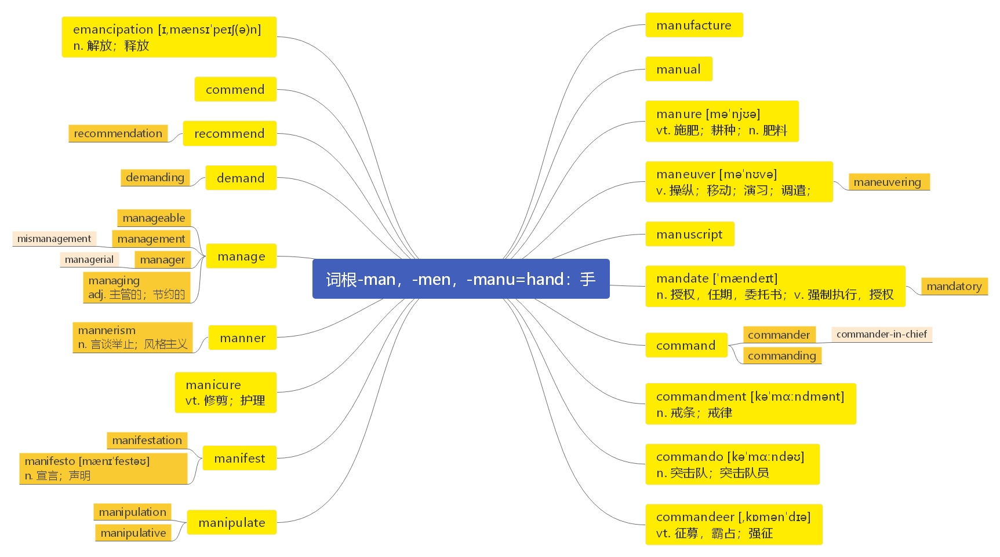

# 第二十四节 词根“ man-”、“ mani-”、“ men-”

***

# 词根“ man-”、“ mani-”、“ men-” 表示“ hand： 手”

**词源：** It is the hypothetical source of/evidence for its existence is provided by: Hittite maniiahh-

"to distribute, entrust;" Greek mane "hand," Latin manus "hand, strength, power over; armed force;

handwriting," mandare "to order, commit to one's charge," literally "to give into one's hand;" Old

Norse mund "hand," Old English mund "hand, protection, guardian," German Vormund "guardian;"

Old Irish muin "protection, patronage."

> **【课堂笔记】**
>
> 单词和词根之间并没有必然联系，如：
>
> 单词 law 法律&#x20;
>
> 词根    -leg 法律  leg 大腿
>
> &#x9;	man 男人  -man 手

***

**manufacture**  \[mænjʊ'fæktʃə] n.  [英音](https://dict.youdao.com/dictvoice?audio=manufacture\&type=1)  [美音](https://dict.youdao.com/dictvoice?audio=manufacture\&type=2) 制造； 制造业； 产品 v. 生产； 制造； 捏造 5197

**助记：** man（ =hand： 手） +u（ 连接符号， 无意义） +fact（ 做、 制造） +ure（ 名词或动词后缀）

→n. 手工制造（ 业）； v. 捏造

**搭配：** manufacture process： 制造工艺 steel manufacture： 钢铁工业

**双语例句:** They manufacture the class of plastics known as thermoplastic materials. [播放](https://dict.youdao.com/dictvoice?audio=They+manufacture+the+class+of+plastics+known+as+thermoplastic+materials.&le=eng&le=eng&type=2)

他们生产被称为热塑材料的塑料类制品。 

**双语例句:** Coca-Cola, Pepsi and Cadbury use franchisers to manufacture, bottle and distribute their products within geographical areas. [播放](https://dict.youdao.com/dictvoice?audio=Coca-Cola%2C+Pepsi+and+Cadbury+use+franchisers+to+manufacture%2C+bottle+and+distribute+their+products+within+geographical+areas.&le=eng&le=eng&type=2)

可口可乐、百事可乐和吉百利公司利用特许经销商在一定的地区内生产、罐装和销售其产品。 

**双语例句:** Brookman & Langdon were said to manufacture the most desirable pens and these necessarily command astonishingly high prices. [播放](https://dict.youdao.com/dictvoice?audio=Brookman+%26+Langdon+were+said+to+manufacture+the+most+desirable+pens+and+these+necessarily+command+astonishingly+high+prices.&le=eng&le=eng&type=2)

据说布鲁克曼兰登公司制造的钢笔最令人满意，而这必然地导致高得惊人的价格。 

**原声例句:** A Baltimore newspaper first called it that during the nineteen twenties when the **manufacture** and sale of alcohol were banned for a time. [播放](https://dict.youdao.com/pureaudio?docid=8029338188532114572)

**原声例句:** He did not invent jeans. But he is considered the first person to **manufacture** and sell this kind of clothing in large amounts. [播放](https://dict.youdao.com/pureaudio?docid=-6958425612912739540)

**原声例句:** He says the least developed countries need to cut dependence on commodities and **manufacture** products for export. [播放](https://dict.youdao.com/pureaudio?docid=-5431030009308648331)

**权威例句:** Currently, the pace of this growth only is dependent on Apple ability to **manufacture** these devices.  [播放](https://dict.youdao.com/dictvoice?audio=Currently%2C+the+pace+of+this+growth+only+is+dependent+on+Apple+ability+to+manufacture+these+devices.+&le=eng&type=2)

**权威例句:** Such technologies include those critical to the design, **manufacture** and delivery of weapons of mass destruction.  [播放](https://dict.youdao.com/dictvoice?audio=Such+technologies+include+those+critical+to+the+design%2C+manufacture+and+delivery+of+weapons+of+mass+destruction.+&le=eng&type=2)

**权威例句:** Only vehicles that fit this positioning will be profitable to **manufacture** and sell as Lincolns.  [播放](https://dict.youdao.com/dictvoice?audio=Only+vehicles+that+fit+this+positioning+will+be+profitable+to+manufacture+and+sell+as+Lincolns.+&le=eng&type=2)

***

**manual**  \['mænjʊ(ə)l] adj.  [英音](https://dict.youdao.com/dictvoice?audio=manual\&type=1)  [美音](https://dict.youdao.com/dictvoice?audio=manual\&type=2) 手工的； 体力的； n. 手册； 指南 4993

**助记：** man（ =hand： 手） +u（ 连接符号） +al（ 形容词或名词后缀） →手工的； 手册

**搭配：** manual labor： 体力劳动，手工

**双语例句:** He consulted the manual. [播放](https://dict.youdao.com/dictvoice?audio=He+consulted+the+manual.&le=eng&le=eng&type=2)

他查阅了使用说明书。 

**双语例句:** There is a manual pump to get rid of the water. [播放](https://dict.youdao.com/dictvoice?audio=There+is+a+manual+pump+to+get+rid+of+the+water.&le=eng&le=eng&type=2)

有一台手动水泵用来排水。 

**双语例句:** She opened her desk drawer and took out the manual. [播放](https://dict.youdao.com/dictvoice?audio=She+opened+her+desk+drawer+and+took+out+the+manual.&le=eng&le=eng&type=2)

她打开书桌抽屉，拿出手册。 

**原声例句:** Neil Armstrong took **manual** control of the guidance system and, with just 20 seconds of fuel remaining, coasted to a landing. [播放](https://dict.youdao.com/pureaudio?docid=1385293318251605637)

**原声例句:** It's like you're reading a **manual** that would have been more appropriate during the Nazi era than in the United States of America,\". [播放](https://dict.youdao.com/pureaudio?docid=5250039956399975379)

**原声例句:** The Obama administration says the United States will follow interrogation guidelines set forth in the U.S.Army Field **Manual**,which conform with U.S.and international law. [播放](https://dict.youdao.com/pureaudio?docid=-6886791348333812403)

**权威例句:** This is a how-to **manual** of witchcraft and wizardry, filled with talismans, horoscopes and recipes for love potions.  [播放](https://dict.youdao.com/dictvoice?audio=This+is+a+how-to+manual+of+witchcraft+and+wizardry%2C+filled+with+talismans%2C+horoscopes+and+recipes+for+love+potions.+&le=eng&type=2)

**权威例句:** They renovated churches, tended to lepers, performed **manual** labor for farmers and artisans, preached, and prayed.  [播放](https://dict.youdao.com/dictvoice?audio=They+renovated+churches%2C+tended+to+lepers%2C+performed+manual+labor+for+farmers+and+artisans%2C+preached%2C+and+prayed.+&le=eng&type=2)

**权威例句:** You may find yourself dealing with difficult, demanding bosses and doing **manual** work besides.  [播放](https://dict.youdao.com/dictvoice?audio=You+may+find+yourself+dealing+with+difficult%2C+demanding+bosses+and+doing+manual+work+besides.+&le=eng&type=2)

***

**manure**  \[mə'njʊə] vt.  [英音](https://dict.youdao.com/dictvoice?audio=manure\&type=1)  [美音](https://dict.youdao.com/dictvoice?audio=manure\&type=2) 施肥于； 耕种 n. 肥料； 粪肥 10033

**助记：** man（ =hand：手） +ure, 来自古法语 manovrer； maneuver 的词根-euver-，其原型是-oper-“ 工作”，加上词根 man-“手”，字面义是“手工操作， 劳作”，由“ 田间劳作” 间接引申出“ 施肥” 义。

**搭配：** green manure: 绿肥

> **【课堂笔记】**
>
> p→v 辅音字母发音相似， 发生相互转换
>
> 例： recei**v**e → rece**p**tion

**双语例句:** The manure should be well dug in. [播放](https://dict.youdao.com/dictvoice?audio=The+manure+should+be+well+dug+in.&le=eng&le=eng&type=2)

肥料应均匀地混入土壤。 

**双语例句:** There isn't time to dig deeply and put in manure or compost. [播放](https://dict.youdao.com/dictvoice?audio=There+isn%27t+time+to+dig+deeply+and+put+in+manure+or+compost.&le=eng&le=eng&type=2)

没有时间挖得再深些，并放入粪肥或堆肥。 

**双语例句:** Dung is used as manure. [播放](https://dict.youdao.com/dictvoice?audio=Dung+is+used+as+manure.&le=eng&le=eng&type=2)

粪被用做肥料。 

**原声例句:** He calls it \"cow power to horsepower.\" Leonhardt says the challenge is to cost-effectively remove impurities from the **manure**-derived methane. [播放](https://dict.youdao.com/pureaudio?docid=3429528382806810598)

**原声例句:** **Manure** from about 1,000 cows goes in one end and then, controlled decomposition yields methane gas at the other. [播放](https://dict.youdao.com/pureaudio?docid=972661542797535552)

**原声例句:** The technique was taught by aid workers who also showed the farmers how to fertilize with compost or **manure**. [播放](https://dict.youdao.com/pureaudio?docid=3772032435697504212)

**权威例句:** For many farmers, the goodness of **manure** could not be reduced to a white powder.  [播放](https://dict.youdao.com/dictvoice?audio=For+many+farmers%2C+the+goodness+of+manure+could+not+be+reduced+to+a+white+powder.+&le=eng&type=2)

**权威例句:** Efforts to eliminate waterway dead zones and algal blooms nationwide have focused on pollution from **manure**.  [播放](https://dict.youdao.com/dictvoice?audio=Efforts+to+eliminate+waterway+dead+zones+and+algal+blooms+nationwide+have+focused+on+pollution+from+manure.+&le=eng&type=2)

**权威例句:** They clean the living space for the animals, pick up **manure** and fix the landscaping.  [播放](https://dict.youdao.com/dictvoice?audio=They+clean+the+living+space+for+the+animals%2C+pick+up+manure+and+fix+the+landscaping.+&le=eng&type=2)

***

**maneuver**  \[mə'nʊvə] v.  [英音](https://dict.youdao.com/dictvoice?audio=maneuver\&type=1)  [美音](https://dict.youdao.com/dictvoice?audio=maneuver\&type=2) 操纵； 移动； 演习； 调遣； n. 移动； 操控手段； 军事演习； 7320

**助记：** man（ 手） +u（ 连接符号） +ver（ =work： 操作、 工作） →用手操作→操纵； 调遣

**搭配：** maneuver the 3-D image on the computer screen：在电脑屏幕上操纵 3D 图像

**释义：**

1、(VERB) (熟练地)移动，调动，转动，操纵 If you maneuver something into or out of an awkward

position, you skillfully move it there.

2、 (VERB) 操纵； 控制； 耍花招 If you maneuver a situation, you change it in a clever and skillful&#x20;

way so that you can benefit from it.

3 、 (N-PLURAL) 军 事 演 习 Military maneuvers are training exercises which involve the

movement of soldiers and equipment over a large area.

> **【课堂笔记】**
>
> maneuver the stock market 操纵股市

**双语例句:** She can then maneuver the 3D image on the computer screen to map the shortest, least invasive surgical path to the tumor. [播放](https://dict.youdao.com/dictvoice?audio=She+can+then+maneuver+the+3D+image+on+the+computer+screen+to+map+the+shortest%2C+least+invasive+surgical+path+to+the+tumor.&le=eng&le=eng&type=2)

然后，她可以操纵电脑屏幕上的 3D 图像，以绘制出最短、切口最小的通往肿瘤的手术路径。 

**双语例句:** A new back flip maneuver allowed station astronauts to photograph the shuttle's underbelly, and an extra-long robotic arm enabled astronauts see parts of the shuttle that were previously out of sight. [播放](https://dict.youdao.com/dictvoice?audio=A+new+back+flip+maneuver+allowed+station+astronauts+to+photograph+the+shuttle%27s+underbelly%2C+and+an+extra-long+robotic+arm+enabled+astronauts+see+parts+of+the+shuttle+that+were+previously+out+of+sight.&le=eng&le=eng&type=2)

新的后空翻使空间站的宇航员可以拍摄航天飞机的腹部，超长的机械臂使宇航员可以看到航天飞机以前看不见的部分。 

**双语例句:** The dorsad reduction maneuver has been used for treating 120 cases of posticous cervical spondylopathy. [播放](https://dict.youdao.com/dictvoice?audio=The+dorsad+reduction+maneuver+has+been+used+for+treating+120+cases+of+posticous+cervical+spondylopathy.&le=eng&le=eng&type=2)

背部复位手法已经被用于治疗120例后发性颈椎病。 

**权威例句:** Obama may have a bit more room to **maneuver** on taxes, but not much.  [播放](https://dict.youdao.com/dictvoice?audio=Obama+may+have+a+bit+more+room+to+maneuver+on+taxes%2C+but+not+much.+&le=eng&type=2)

**权威例句:** Hess, besieged by billionaire hedge fund manager Paul Singer, is attempting a similar **maneuver**.  [播放](https://dict.youdao.com/dictvoice?audio=Hess%2C+besieged+by+billionaire+hedge+fund+manager+Paul+Singer%2C+is+attempting+a+similar+maneuver.+&le=eng&type=2)

**权威例句:** Guys not looking to carry positions can probably **maneuver** with this type of Approach.  [播放](https://dict.youdao.com/dictvoice?audio=Guys+not+looking+to+carry+positions+can+probably+maneuver+with+this+type+of+Approach.+&le=eng&type=2)

***

**maneuvering**  \[mə'nu\:vəriŋ] n.  [英音](https://dict.youdao.com/dictvoice?audio=maneuvering\&type=1)  [美音](https://dict.youdao.com/dictvoice?audio=maneuvering\&type=2) 移动； 操纵 17006

**助记：** maneuver（ 机动， 用计谋） + ing 现在分词→正在进行操纵、 机动中→操控， 机动

**搭配：** eye maneuvering：目光移动 congressional maneuverings（考）：国会操纵

**双语例句:** What is your full maneuvering speed? [播放](https://dict.youdao.com/dictvoice?audio=What+is+your+full+maneuvering+speed%3F&le=eng&le=eng&type=2)

你船的操纵全速是多少？ 

**双语例句:** Disengage the maneuvering linkage. [播放](https://dict.youdao.com/dictvoice?audio=Disengage+the+maneuvering+linkage.&le=eng&le=eng&type=2)

脱开操纵联动机构。 

**双语例句:** The fleet is maneuvering off the east coast. [播放](https://dict.youdao.com/dictvoice?audio=The+fleet+is+maneuvering+off+the+east+coast.&le=eng&le=eng&type=2)

舰队正在东海岸外演习。 

**原声例句:** \"I think that,because it looks like the top four parties are going to be relatively close to one another, it is going to require a significant amount of political **maneuvering**, brokering deals, a lot of horse-trading behind closed doors to form a government. [播放](https://dict.youdao.com/pureaudio?docid=5982626269541691685)

**权威例句:** That price difference is precisely why Petronas is **maneuvering** to buy reserves in North America.  [播放](https://dict.youdao.com/dictvoice?audio=That+price+difference+is+precisely+why+Petronas+is+maneuvering+to+buy+reserves+in+North+America.+&le=eng&type=2)

**权威例句:** The crowd is so thick that this Bumblebee his stilts concealed inside the elaborate costume has trouble **maneuvering**.  [播放](https://dict.youdao.com/dictvoice?audio=The+crowd+is+so+thick+that+this+Bumblebee+his+stilts+concealed+inside+the+elaborate+costume+has+trouble+maneuvering.+&le=eng&type=2)

**权威例句:** Martin now is **maneuvering** to extend FCC oversight to basic cable for the first time.  [播放](https://dict.youdao.com/dictvoice?audio=Martin+now+is+maneuvering+to+extend+FCC+oversight+to+basic+cable+for+the+first+time.+&le=eng&type=2)

***

**manuscript**  \['mænjʊskrɪpt] n.  [英音](https://dict.youdao.com/dictvoice?audio=manuscript\&type=1)  [美音](https://dict.youdao.com/dictvoice?audio=manuscript\&type=2) 原稿； 手稿 5176

**助记：** man（手） +u（连接符号） +script（写）→用手亲自书写的稿件→手稿

**搭配：** Biblical manuscript 圣经手抄本

> **【课堂笔记】**
>
> 词根-scrip/-scrib =write 写

**双语例句:** I read her poems in manuscript. [播放](https://dict.youdao.com/dictvoice?audio=I+read+her+poems+in+manuscript.&le=eng&le=eng&type=2)

我读过她的诗作的手稿。 

**双语例句:** He had seen a manuscript of the book. [播放](https://dict.youdao.com/dictvoice?audio=He+had+seen+a+manuscript+of+the+book.&le=eng&le=eng&type=2)

他见过这本书的一份手稿。 

**双语例句:** The original manuscript has been lost. [播放](https://dict.youdao.com/dictvoice?audio=The+original+manuscript+has+been+lost.&le=eng&le=eng&type=2)

原稿已经遗失。 

**原声例句:** Today it is a museum. Inside are precious artifacts from the family's daily life, including scraps of hand-written poetry and the **manuscript** of a polonaise written by young Frederic when he was eight-years-old. [播放](https://dict.youdao.com/pureaudio?docid=5503240672439304589)

**原声例句:** In Copenhagen, he completes the **manuscript** and -I'm going to write MS for **manuscript** completes the **manuscript**, and submits this for publication.

**原声例句:** So the **manuscript** tradition suggests that it was a letter that was a circular letter in itself.

**权威例句:** Pam Carroll, marketing director for the group, declined to say where the **manuscript** was found.  [播放](https://dict.youdao.com/dictvoice?audio=Pam+Carroll%2C+marketing+director+for+the+group%2C+declined+to+say+where+the+manuscript+was+found.+&le=eng&type=2)

**权威例句:** The **manuscript** helped nuns decipher parts of the bible and is being exhibited at Lacock Abbey.  [播放](https://dict.youdao.com/dictvoice?audio=The+manuscript+helped+nuns+decipher+parts+of+the+bible+and+is+being+exhibited+at+Lacock+Abbey.+&le=eng&type=2)

**权威例句:** The **manuscript** by the Eastwood author was discovered by Dr Andrew Harrison, a Nottingham University lecturer.  [播放](https://dict.youdao.com/dictvoice?audio=The+manuscript+by+the+Eastwood+author+was+discovered+by+Dr+Andrew+Harrison%2C+a+Nottingham+University+lecturer.+&le=eng&type=2)

***

**mandate**  \['mændeɪt] n.  [英音](https://dict.youdao.com/dictvoice?audio=mandate\&type=1)  [美音](https://dict.youdao.com/dictvoice?audio=mandate\&type=2) 授权， 任期， 委托书； v. 强制执行， 授权 3759

**助记：** man-（手） + -dat（ =-dit 给；如 edit：编辑；字面义“对外给出，公之于众”，编辑的目的是出版）→ 亲手给出，给出权力即“授权”，给出要求即“命令” → 授权，任期，强制执行

**搭配：** mandate letter：委任书

> **【课堂笔记】**
>
> 词根-dat/-don/-dit 表示“给” 如： **don**ate 捐献

**双语例句:** The bank had no mandate to honour the cheque. [播放](https://dict.youdao.com/dictvoice?audio=The+bank+had+no+mandate+to+honour+the+cheque.&le=eng&le=eng&type=2)

银行没有得到指令来承兑这张支票。 

**双语例句:** The Belgians took over Rwanda under a League of Nations mandate. [播放](https://dict.youdao.com/dictvoice?audio=The+Belgians+took+over+Rwanda+under+a+League+of+Nations+mandate.&le=eng&le=eng&type=2)

比利时人在一项国际联盟的授权下接管了卢旺达。 

**双语例句:** The press secretary told reporters that a majority of one would be a sufficient mandate. [播放](https://dict.youdao.com/dictvoice?audio=The+press+secretary+told+reporters+that+a+majority+of+one+would+be+a+sufficient+mandate.&le=eng&le=eng&type=2)

该媒体秘书告诉记者们，超出一票的多数就足以获得授权。 

**原声例句:** In a country where most medical care is provided by the private sector, both **mandate** health insurance for all. [播放](https://dict.youdao.com/pureaudio?docid=494547853160324398)

**原声例句:** Part of Mr.Clinton's **mandate** as U.N.Special Envoy is to help encourage more private sector investment in Haiti. [播放](https://dict.youdao.com/pureaudio?docid=-6068482320074490536)

**原声例句:** Nearly two million eligible voters can choose a new president with a five-year **mandate**, as well as mayors and councilors of major towns. [播放](https://dict.youdao.com/pureaudio?docid=-3429493053734312090)

**权威例句:** The troops' **mandate** was to protect observers who would take notes on ceasefire violations.  [播放](https://dict.youdao.com/dictvoice?audio=The+troops%27+mandate+was+to+protect+observers+who+would+take+notes+on+ceasefire+violations.+&le=eng&type=2)

**权威例句:** Ministers also plan to abolish the dual **mandate** that allows AMs to sit as MPs.  [播放](https://dict.youdao.com/dictvoice?audio=Ministers+also+plan+to+abolish+the+dual+mandate+that+allows+AMs+to+sit+as+MPs.+&le=eng&type=2)

**权威例句:** It said the detentions were legal under the UN **mandate** and complied with international obligations.  [播放](https://dict.youdao.com/dictvoice?audio=It+said+the+detentions+were+legal+under+the+UN+mandate+and+complied+with+international+obligations.+&le=eng&type=2)

***

**mandated**  \['mændetɪd] adj.  [英音](https://dict.youdao.com/dictvoice?audio=mandated\&type=1)  [美音](https://dict.youdao.com/dictvoice?audio=mandated\&type=2) 获得授权的，委托统治的 v. 授权，命令，强制执行 17269

**助记：** mandate（命令，掌控） + -d（形容词后缀，过去式和过去分词后缀）→ 进行授权的，进行委托的→ 获得授权的，委托通知的，授权，命令

**搭配：** mandated benefits：法定福利

**双语例句:** The assembly was mandated to draft a constitution. [播放](https://dict.youdao.com/dictvoice?audio=The+assembly+was+mandated+to+draft+a+constitution.&le=eng&le=eng&type=2)

大会被授权起草一份章程。 

**双语例句:** Sixteen years ago, Quebec mandated that all immigrants send their children to French schools. [播放](https://dict.youdao.com/dictvoice?audio=Sixteen+years+ago%2C+Quebec+mandated+that+all+immigrants+send+their+children+to+French+schools.&le=eng&le=eng&type=2)

16年前，魁北克省规定所有移民都要送孩子上法语学校。 

**双语例句:** He'd been mandated by the West African Economic Community to go in and to enforce a ceasefire. [播放](https://dict.youdao.com/dictvoice?audio=He%27d+been+mandated+by+the+West+African+Economic+Community+to+go+in+and+to+enforce+a+ceasefire.&le=eng&le=eng&type=2)

他受西非经济共同体授权去介入并执行停火协定。 

**原声例句:** But the shutdown was **mandated** by the EU, where the Chernobyl-type facility is considered unsafe due to inherent design flaws. [播放](https://dict.youdao.com/pureaudio?docid=-3547854484404110622)

**原声例句:** The troops are technically **mandated** with the protection of key sites in the capital, including the presidential palace, airstrip,and seaport. [播放](https://dict.youdao.com/pureaudio?docid=-6031812073182455179)

**原声例句:** It called for flexibility on assembly lines, and **mandated** that problems be fixed as soon as they were discovered so mistakes would not be repeated. [播放](https://dict.youdao.com/pureaudio?docid=-7664387180293708980)

**权威例句:** Until now the expense ratios published in this magazine have been the official SEC-mandated ones.  [播放](https://dict.youdao.com/dictvoice?audio=Until+now+the+expense+ratios+published+in+this+magazine+have+been+the+official+SEC-mandated+ones.+&le=eng&type=2)

**权威例句:** This is double the three year statute of limitation previously **mandated** by federal law.  [播放](https://dict.youdao.com/dictvoice?audio=This+is+double+the+three+year+statute+of+limitation+previously+mandated+by+federal+law.+&le=eng&type=2)

**权威例句:** After Congress **mandated** new efficiency standards for washing machines in 2001, manufacturers responded.  [播放](https://dict.youdao.com/dictvoice?audio=After+Congress+mandated+new+efficiency+standards+for+washing+machines+in+2001%2C+manufacturers+responded.+&le=eng&type=2)

***

**mandatory**  \['mændət(ə)rɪ] adj.  [英音](https://dict.youdao.com/dictvoice?audio=mandatory\&type=1)  [美音](https://dict.youdao.com/dictvoice?audio=mandatory\&type=2) 命令的； 强制的； 托管的 5182

**助记：** mandate（命令，掌控） + -ory（形容词后缀）→ 命令的，强制的，托管的

**搭配：** mandatory requirement：强制性要求

**双语例句:** He was married, and that was mandatory. [播放](https://dict.youdao.com/dictvoice?audio=He+was+married%2C+and+that+was+mandatory.&le=eng&le=eng&type=2)

他结婚了，这是强制性的。 

**双语例句:** I think that mandatory voting is a no-braine and dumb idea. [播放](https://dict.youdao.com/dictvoice?audio=I+think+that+mandatory+voting+is+a+no-braine+and+dumb+idea.&le=eng&le=eng&type=2)

我认为强制投票这事是一个无脑的，极其愚蠢的想法。 

**双语例句:** An effective and mandatory program sponsored by the high school is the only solution to this serious problem. [播放](https://dict.youdao.com/dictvoice?audio=An+effective+and+mandatory+program+sponsored+by+the+high+school+is+the+only+solution+to+this+serious+problem.&le=eng&le=eng&type=2)

由高中主办的的有效的强制性项目是解决这一严重问题的唯一办法。 

**原声例句:** Things that might have been optional in the past for job seekers are now **mandatory**. [播放](https://dict.youdao.com/pureaudio?docid=-8497597798664892418)

**原声例句:** \"President Obama has made it a clear commitment to revolutionize the way that we use energy, including **mandatory** cap and trade legislation, long-term submissions reductions goals and a commitment to renewable energy technologies,\" [播放](https://dict.youdao.com/pureaudio?docid=8767091155003906941)

**原声例句:** Sections are **mandatory**.

**权威例句:** Folks were leaving two and three days prior to the both voluntary and **mandatory** evacuations.  [播放](https://dict.youdao.com/dictvoice?audio=Folks+were+leaving+two+and+three+days+prior+to+the+both+voluntary+and+mandatory+evacuations.+&le=eng&type=2)

**权威例句:** It would also limit the use of **mandatory** minimums to organizers or leaders of drug trafficking rings.  [播放](https://dict.youdao.com/dictvoice?audio=It+would+also+limit+the+use+of+mandatory+minimums+to+organizers+or+leaders+of+drug+trafficking+rings.+&le=eng&type=2)

**权威例句:** The \"no\" campaign argued that plans for **mandatory** coalition, enforced power-sharing with nationalists, was anti-democratic.  [播放](https://dict.youdao.com/dictvoice?audio=The+%22no%22+campaign+argued+that+plans+for+mandatory+coalition%2C+enforced+power-sharing+with+nationalists%2C+was+anti-democratic.+&le=eng&type=2)

***

**command**  \[kə'mɑːnd] vi.  [英音](https://dict.youdao.com/dictvoice?audio=command\&type=1)  [美音](https://dict.youdao.com/dictvoice?audio=command\&type=2) 命令， 完全控制， 熟练地运用 n. 命令，掌握 2399

**助记：** com-（加强意义） + -man (=hand：手) + →完全在手掌之中→完全掌控；命令

**搭配：** command English with skills：用技巧熟练运用英语

**双语例句:** Begin when I give the command. [播放](https://dict.youdao.com/dictvoice?audio=Begin+when+I+give+the+command.&le=eng&le=eng&type=2)

我发出命令时开始。 

**双语例句:** I closed my eyes at his command. [播放](https://dict.youdao.com/dictvoice?audio=I+closed+my+eyes+at+his+command.&le=eng&le=eng&type=2)

我听从他的命令闭上了眼睛。 

**双语例句:** This command will invoke the HELP system. [播放](https://dict.youdao.com/dictvoice?audio=This+command+will+invoke+the+HELP+system.&le=eng&le=eng&type=2)

这条指令将启用“帮助”系统。 

**原声例句:** The astronauts would ride to the moon in the **command** module and then ride back to Earth in it. [播放](https://dict.youdao.com/pureaudio?docid=2449064441305035042)

**原声例句:** During the flight, they separated the lunar lander from the **command** module and flew it for eight hours. [播放](https://dict.youdao.com/pureaudio?docid=-2068784776259653832)

**原声例句:** Finally,spacecraft commander Armstrong and NASA flight controllers agreed it was time to separate the lander module Eagle from the **command** module Columbia. [播放](https://dict.youdao.com/pureaudio?docid=528494781434594620)

**权威例句:** They're likely to be less mechanised, and to produce goods that **command** higher prices.  [播放](https://dict.youdao.com/dictvoice?audio=They%27re+likely+to+be+less+mechanised%2C+and+to+produce+goods+that+command+higher+prices.+&le=eng&type=2)

**权威例句:** He also provided insights \"into **command** and control operations and planning, \" the official said.  [播放](https://dict.youdao.com/dictvoice?audio=He+also+provided+insights+%22into+command+and+control+operations+and+planning%2C+%22+the+official+said.+&le=eng&type=2)

**权威例句:** Fort Bliss Public Affairs and Garrison **Command** approved the shoot, an Army spokesman said.  [播放](https://dict.youdao.com/dictvoice?audio=Fort+Bliss+Public+Affairs+and+Garrison+Command+approved+the+shoot%2C+an+Army+spokesman+said.+&le=eng&type=2)

***

**commander**  \[kə'mɑːndə] n.  [英音](https://dict.youdao.com/dictvoice?audio=commander\&type=1)  [美音](https://dict.youdao.com/dictvoice?audio=commander\&type=2) 指挥官；司令官 2376

**助记：** command（ 命令，掌控） + -er（ 表示人或物，动作行为施动者）→ 发出命令的人 →指挥官；司令官

**双语例句:** The commander had been forewarned of the attack. [播放](https://dict.youdao.com/dictvoice?audio=The+commander+had+been+forewarned+of+the+attack.&le=eng&le=eng&type=2)

指挥官预先得到敌人要发动袭击的警告。 

**双语例句:** The commander and some of the men had been released. [播放](https://dict.youdao.com/dictvoice?audio=The+commander+and+some+of+the+men+had+been+released.&le=eng&le=eng&type=2)

指挥官和一些士兵已被释放。 

**双语例句:** The commander said that the army would comply with the ceasefire. [播放](https://dict.youdao.com/dictvoice?audio=The+commander+said+that+the+army+would+comply+with+the+ceasefire.&le=eng&le=eng&type=2)

指挥官说过部队会遵从停火协议。 

**原声例句:** Major Robert Anderson, the **commander** of the small United States force at Sumter, wrote that his food supplies were low. [播放](https://dict.youdao.com/pureaudio?docid=7179926806863574284)

**原声例句:** The Union military **commander** for Ohio was General Ambrose Burnside, a former **commander** of the Army of the Potomac. [播放](https://dict.youdao.com/pureaudio?docid=-8088204091927552518)

**原声例句:** The **commander** of the naval force, Captain  Fox, had hoped to move the soldiers to Sumter in small boats. [播放](https://dict.youdao.com/pureaudio?docid=-4161857741597331162)

**权威例句:** Lieutenant Colonel Greg Butts(ph), a battalion **commander** for the 101st Airborne Division, gives a driving tour.  [播放](https://dict.youdao.com/dictvoice?audio=Lieutenant+Colonel+Greg+Butts%28ph%29%2C+a+battalion+commander+for+the+101st+Airborne+Division%2C+gives+a+driving+tour.+&le=eng&type=2)

**权威例句:** He was the **commander** of the 101st airborne division during the initial invasion of Iraq.  [播放](https://dict.youdao.com/dictvoice?audio=He+was+the+commander+of+the+101st+airborne+division+during+the+initial+invasion+of+Iraq.+&le=eng&type=2)

**权威例句:** Al-Hadi had been a key paramilitary **commander** in Afghanistan from the late '90s into this decade.  [播放](https://dict.youdao.com/dictvoice?audio=Al-Hadi+had+been+a+key+paramilitary+commander+in+Afghanistan+from+the+late+%2790s+into+this+decade.+&le=eng&type=2)

***

**commander-in-chief**  \[kə'ma\:ndə in tʃi\:f] n.  [英音](https://dict.youdao.com/dictvoice?audio=commander-in-chief\&type=1)  [美音](https://dict.youdao.com/dictvoice?audio=commander-in-chief\&type=2) 司令， 总指挥， 最高统帅 17733

**助记：** commander（命令，掌控） + in-chief（主要地，尤其；在首席地位）→主要地、在首席地位发出命令、进行指挥的人→总司令，总指挥，最高统帅&#x20;

***

**commanding**  \[kə'mɑːndɪŋ] adj.  [英音](https://dict.youdao.com/dictvoice?audio=commanding\&type=1)  [美音](https://dict.youdao.com/dictvoice?audio=commanding\&type=2) 指挥的； 居高临下的； 权威的； 居领先地位的 v. 指挥； 统帅；负责 8577

**词源：** late 15c., "ruling, controlling, directing with authority, of great or controlling importance,"

present-participle adjective from command (v.). Meaning "nobly dignified, compelling respect,

characteristic of one fitted for command" is from 1590s. Meaning "dominant by virtue of size or

position" is from 1630s. Related: Commandingly (mid-15c.) "imperiously."

**助记：** command（命令，掌控） + -ing（行为的产生）→ 指挥的，居高临下的，权威的；指挥，统帅

**搭配：** commanding height: 制高点

**双语例句:** Who is your commanding officer? [播放](https://dict.youdao.com/dictvoice?audio=Who+is+your+commanding+officer%3F&le=eng&le=eng&type=2)

谁是你们的指挥官？ 

**双语例句:** The castle occupies a commanding position on a hill. [播放](https://dict.youdao.com/dictvoice?audio=The+castle+occupies+a+commanding+position+on+a+hill.&le=eng&le=eng&type=2)

城堡占据着山上居高临下的位置。 

**双语例句:** He got permission from his commanding officer to join me. [播放](https://dict.youdao.com/dictvoice?audio=He+got+permission+from+his+commanding+officer+to+join+me.&le=eng&le=eng&type=2)

他得到了指挥官的允许与我会合。 

**原声例句:** She is remembered still for her **commanding** presentation at the hearing and deep knowledge of constitutional issues. [播放](https://dict.youdao.com/pureaudio?docid=3281908891245938048)

**原声例句:** **Commanding** officers ordered the Marines to replace it with a much larger one. [播放](https://dict.youdao.com/pureaudio?docid=350957235796173524)

**原声例句:** Suddenly,however, their **commanding** officer decided it would be wrong to retreat. [播放](https://dict.youdao.com/pureaudio?docid=5579993592380793739)

**权威例句:** Who'da thunk it a few years back: a once seemingly Jurassic-era occupation **commanding** a high salary?  [播放](https://dict.youdao.com/dictvoice?audio=Who%27da+thunk+it+a+few+years+back%3A+a+once+seemingly+Jurassic-era+occupation+commanding+a+high+salary%3F+&le=eng&type=2)

**权威例句:** His **commanding** officer, Captain Mike Mansergh, said he has no problems with resources or morale.  [播放](https://dict.youdao.com/dictvoice?audio=His+commanding+officer%2C+Captain+Mike+Mansergh%2C+said+he+has+no+problems+with+resources+or+morale.+&le=eng&type=2)

**权威例句:** His remarks seemed to be aimed largely at the generals **commanding** Iraq's 10 army divisions.  [播放](https://dict.youdao.com/dictvoice?audio=His+remarks+seemed+to+be+aimed+largely+at+the+generals+commanding+Iraq%27s+10+army+divisions.+&le=eng&type=2)

***

**commandment**  \[kə'mɑːndmənt] n.  [英音](https://dict.youdao.com/dictvoice?audio=commandment\&type=1)  [美音](https://dict.youdao.com/dictvoice?audio=commandment\&type=2) 戒条； 戒律 15180

**助记：** command（命令） + -ment（ 名词后缀）→ 来自于圣经里，人们要服从的命令 → 诫命；法令

**释义：** (《圣经·旧约》十诫中的)一诫 The Ten Commandments are the ten rules of behaviour which, according to the Old Testament of the Bible, people should obey.

**双语例句:** In thy royal compassion grant my prayer—give commandment that I be hanged! [播放](https://dict.youdao.com/dictvoice?audio=In+thy+royal+compassion+grant+my+prayer%E2%80%94give+commandment+that+I+be+hanged%21&le=eng&le=eng&type=2)

请皇上大发慈悲，恩准我的请求吧——请您处我绞刑吧！ 

**双语例句:** 1st Commandment - Thou Shalt Have No Gods Before me. [播放](https://dict.youdao.com/dictvoice?audio=1st+Commandment+-+Thou+Shalt+Have+No+Gods+Before+me.&le=eng&le=eng&type=2)

第一诫-在我之前，你不可以有其他的神。 

**双语例句:** That precept is the basis for my 11th Personal Commandment: No calculation. [播放](https://dict.youdao.com/dictvoice?audio=That+precept+is+the+basis+for+my+11th+Personal+Commandment%3A+No+calculation.&le=eng&le=eng&type=2)

这句箴言是我第11条个人戒律的基础：不要仅仅计较。 

**原声例句:** He's postponing his publication because it's his job really to consider the master's great **commandment** all the more closely.

**原声例句:** That  shall go to the stranger, the orphan Always remember you were a slave in the land of Egypt, therefore do I enjoin you to observe this **commandment**.

**权威例句:** Gov. Heineman told me the first **commandment** of Nebraska politics: Never diss the Cornhuskers.  [播放](https://dict.youdao.com/dictvoice?audio=Gov.+Heineman+told+me+the+first+commandment+of+Nebraska+politics%3A+Never+diss+the+Cornhuskers.+&le=eng&type=2)

**权威例句:** The latter, while not a **commandment** in the neutrality order, seems to be the end game.  [播放](https://dict.youdao.com/dictvoice?audio=The+latter%2C+while+not+a+commandment+in+the+neutrality+order%2C+seems+to+be+the+end+game.+&le=eng&type=2)

**权威例句:** The 11th **Commandment** (Thou shalt not attack a fellow Republican) has never been honored.  [播放](https://dict.youdao.com/dictvoice?audio=The+11th+Commandment+%28Thou+shalt+not+attack+a+fellow+Republican%29+has+never+been+honored.+&le=eng&type=2)

***

**commando**  \[kə'mɑːndəʊ] n.  [英音](https://dict.youdao.com/dictvoice?audio=commando\&type=1)  [美音](https://dict.youdao.com/dictvoice?audio=commando\&type=2) 突击队， 突击队员 11824

**词源：** 1791, in a South African context, "private military raid undertaken by the Boers against the

natives for personal ends," also the name of the leader of the raid and the permission given for it,

from Afrikaans commando, "a troop under a commander," from Portuguese commando, literally

"party commanded" (see command (v.)).

英语单词 commando 来自南非荷兰语， 字面意思是“有指挥的一群人”。 这个单词原本指的

是南非布尔人的一种民兵组织。布尔人是住在南非的荷兰移民后裔与少量德国人、法国人通

婚后产生的白人民族，是南非的主要殖民者。 17 世纪时，荷兰人在南非建立殖民地之处，

为了对付当地土著，殖民当局颁发《 commando law》，强制要求所有殖民者在殖民地受到攻

击时都必须武装起来，至少配备一匹马和一把枪。这些武装民兵的基本单位就是 commando，

而这种做法则被称为 commandeer。 在 19 世纪，荷兰殖民者大量涌入南非，殖民地快速

扩张，与非洲土著人的冲突日益频繁。为了保障安全，已经获得自由的南非布尔人自愿恢复

commando 制度，组织起来，与非洲土著人展开武装斗争。在与人数超过己方的非洲土著人

的战斗中，布尔人组织的 commando 逐渐掌握了各种突击和游记战术。 英国殖民者自从 18

世纪末期登陆南非后，与已经扎根南非的布尔人之间展开了长达百年的争夺，先后爆发了两

次战争， 史称“布尔战争”（ 1880-1881 年、 1899-1902 年）。 在战争中， 布尔人利用自己的

commando 制度，与占人数优势的英国军队展开了游击战。分成小股的布尔人 commando

利用自己的机动性、枪法和对地形的了解，对英国军队屡屡展开偷袭并得手。英国军队最后

不得不依赖碉堡战术、焦土政策和残暴的集中营来对付布尔人。在两次布尔战争中，布尔人

的 commando 给英国人乃至全世界留下了深刻印象，该词也因而进入了英语。&#x20;

**双语例句:** I'm a doctor, not a commando. [播放](https://dict.youdao.com/dictvoice?audio=I%27m+a+doctor%2C+not+a+commando.&le=eng&le=eng&type=2)

我是个医生，不是敢死队员。 

**双语例句:** Rachel: I'm going commando, too. [播放](https://dict.youdao.com/dictvoice?audio=Rachel%3A+I%27m+going+commando%2C+too.&le=eng&le=eng&type=2)

我里面也没穿… 

**双语例句:** A backdoor commando. [播放](https://dict.youdao.com/dictvoice?audio=A+backdoor+commando.&le=eng&le=eng&type=2)

或者叫后门突击队员。 

**权威例句:** Witnesses say the abductors were wearing Iraqi **commando** uniforms and carried Iraqi military IDs.  [播放](https://dict.youdao.com/dictvoice?audio=Witnesses+say+the+abductors+were+wearing+Iraqi+commando+uniforms+and+carried+Iraqi+military+IDs.+&le=eng&type=2)

**权威例句:** They were put there by members of the ministry's elite **commando** unit called the Wolf Brigade.  [播放](https://dict.youdao.com/dictvoice?audio=They+were+put+there+by+members+of+the+ministry%27s+elite+commando+unit+called+the+Wolf+Brigade.+&le=eng&type=2)

**权威例句:** Nine passengers on board were killed during the Israeli **commando** raid on the ship.  [播放](https://dict.youdao.com/dictvoice?audio=Nine+passengers+on+board+were+killed+during+the+Israeli+commando+raid+on+the+ship.+&le=eng&type=2)

***

**commandeer：**  \[,kɒmən'dɪə] vt. [英音](https://dict.youdao.com/dictvoice?audio=commandeer：\&type=1)  [美音](https://dict.youdao.com/dictvoice?audio=commandeer：\&type=2) 征用， 征募， 强制入伍，霸占

**助记：** command (命令，控制，拥有) + -ando (参与某行动的人或组织) → 奉命去参与某行动的人 → 突击队

***

## -ado 功能

***

in commando, desperado, tornado, and other words of Spanish and Portuguese origin, "person or

group participating in an action," from Latin -atus, past participle suffix of verbs of the first

conjugation (see -ade).

> **【课堂笔记】**
>
> 后缀-ado=-ando
>
> 前缀 co-=con- 如： combine = com（ 共同； 一起） +bi（ 两个） +n（ 增减无影响） +e→
>
> 将两个拿到一起→联合； 结合

***

**commandeer**  \[,kɒmən'dɪə] vt.  [英音](https://dict.youdao.com/dictvoice?audio=commandeer\&type=1)  [美音](https://dict.youdao.com/dictvoice?audio=commandeer\&type=2) 征募， 霸占， 没收； 强征 19233

词 源 ： 1881, "to seize or force into military service," from Dutch (especially Afrikaans)

kommandeeren "to command" (for military service), from French commander "to order" (see

command (v.)). General sense "take arbitrary possession of" is from 1900.

**助记：** command（命令，完全拥有，控制） + -eer（动词后缀）→（为军事目的）命令强行占有、控制→征募，霸占，强征

**释义：**

1、 (VERB) (军队)征用，强征 If the armed forces commandeer a vehicle or building owned by someone else, they officially take charge of it so that they can use it.

2、 (VERB) 强占;强取 To commandeer something owned by someone else means to take charge of it so that you can use it.

**双语例句:** The government will commandeer ships only in wartime. [播放](https://dict.youdao.com/dictvoice?audio=The+government+will+commandeer+ships+only+in+wartime.&le=eng&le=eng&type=2)

政府只在战争时期征用船只。 

**双语例句:** He decides to commandeer their room. [播放](https://dict.youdao.com/dictvoice?audio=He+decides+to+commandeer+their+room.&le=eng&le=eng&type=2)

他决定强行占用他们的房间。 

**双语例句:** Thin soldier: he said he'd come to commandeer one. [播放](https://dict.youdao.com/dictvoice?audio=Thin+soldier%3A+he+said+he%27d+come+to+commandeer+one.&le=eng&le=eng&type=2)

瘦士兵：他说他是来抢船的。 

**权威例句:** Mr Chavez has also ordered the army to **commandeer** privately-owned ships, trucks and aircraft to distribute fuel and food.  [播放](https://dict.youdao.com/dictvoice?audio=Mr+Chavez+has+also+ordered+the+army+to+commandeer+privately-owned+ships%2C+trucks+and+aircraft+to+distribute+fuel+and+food.+&le=eng&type=2)

**权威例句:** In a few years, most cars will probably be able to detect hazards ahead and **commandeer** the brake pedal.  [播放](https://dict.youdao.com/dictvoice?audio=In+a+few+years%2C+most+cars+will+probably+be+able+to+detect+hazards+ahead+and+commandeer+the+brake+pedal.+&le=eng&type=2)

**权威例句:** Wealth and power are gradually transferred from those who earn it to those who use the system to **commandeer** it.  [播放](https://dict.youdao.com/dictvoice?audio=Wealth+and+power+are+gradually+transferred+from+those+who+earn+it+to+those+who+use+the+system+to+commandeer+it.+&le=eng&type=2)

***

**emancipation**  \[ɪ,mænsɪ'peɪʃ(ə)n] n.  [英音](https://dict.youdao.com/dictvoice?audio=emancipation\&type=1)  [美音](https://dict.youdao.com/dictvoice?audio=emancipation\&type=2) 解放， 释放， 脱离， 解脱 16064

**词源：** 1620s, "set free from control," from Latin emancipatus, past participle of emancipare "put

(a son) out of paternal authority, declare (someone) free, give up one's authority over," in Roman

law, the freeing of a son or wife from the legal authority (patria potestas) of the pater familias, to

make his or her own way in the world; from assimilated form of ex- "out, away" (see ex-) +

mancipare "deliver, transfer or sell," from mancipum "ownership," from manus "hand" (from PIE

root \*man- (2) "hand") + capere "to take," from PIE root \*kap- "to grasp." Related: Emancipated;

emancipating.

**助记：** e-（出来，离开 out, away） + man-（手） + cip （ =to take 带着；带领） + -ation（名词后缀） → 带领（妻儿/奴隶）离开（父亲/奴隶主）之手 → 解放，释放，脱离，解脱

**搭配：** emancipation proclamation: 解放黑奴宣言

**释义：** (VERB) 解放； 使摆脱束缚 If people are emancipated, they are freed from unpleasant or unfair social, political, or legal restrictions.

> **【课堂笔记】**
>
> 1.  词根-cip -cap -cep
>
> \=take 带领/拿着
>
> paternal adj. 父亲的； 父亲般的

**双语例句:** On January 1, 1863, during the war, Lincoln issued his famous Emancipation Proclamation. [播放](https://dict.youdao.com/dictvoice?audio=On+January+1%2C+1863%2C+during+the+war%2C+Lincoln+issued+his+famous+Emancipation+Proclamation.&le=eng&le=eng&type=2)

1863年1月1日，战争期间，林肯发表了他著名的《解放奴隶宣言》。 

**双语例句:** That also helped in my emancipation. [播放](https://dict.youdao.com/dictvoice?audio=That+also+helped+in+my+emancipation.&le=eng&le=eng&type=2)

这也有助于我的解放。 

**双语例句:** But will emancipation help them? [播放](https://dict.youdao.com/dictvoice?audio=But+will+emancipation+help+them%3F&le=eng&le=eng&type=2)

但这解放能帮到她们吗？ 

**原声例句:** The **Emancipation** Proclamation is in the National Archives in Washington, and it can be seen online at archives.gov. [播放](https://dict.youdao.com/pureaudio?docid=4053002419789843191)

**原声例句:** Historians say that by writing the **Emancipation** Proclamation, Lincoln established a moral purpose for the war. [播放](https://dict.youdao.com/pureaudio?docid=-4944466617902747732)

**原声例句:** On this day,September seventeenth, he has finished his second draft of the preliminary **Emancipation** Proclamation. [播放](https://dict.youdao.com/pureaudio?docid=-893562042300776739)

**权威例句:** It means more distractions, more entertainment and   by his old equation   less **emancipation**.  [播放](https://dict.youdao.com/dictvoice?audio=It+means+more+distractions%2C+more+entertainment+and+++by+his+old+equation+++less+emancipation.+&le=eng&type=2)

**权威例句:** As in previous eras, the dream of erotic **emancipation** was paired with that of political **emancipation**.  [播放](https://dict.youdao.com/dictvoice?audio=As+in+previous+eras%2C+the+dream+of+erotic+emancipation+was+paired+with+that+of+political+emancipation.+&le=eng&type=2)

**权威例句:** In 2003 German Chancellor Gerhard Schroeder boldly declared his country's **\"emancipatio**n\" from American tutelage.  [播放](https://dict.youdao.com/dictvoice?audio=In+2003+German+Chancellor+Gerhard+Schroeder+boldly+declared+his+country%27s+%22emancipation%22+from+American+tutelage.+&le=eng&type=2)

***

**commend**  \[kə'mend] vt.  [英音](https://dict.youdao.com/dictvoice?audio=commend\&type=1)  [美音](https://dict.youdao.com/dictvoice?audio=commend\&type=2) 推荐； 称赞； 把…委托 10813

**词源：** mid-14c., comenden, praise, mention approvingly," from Latin commendare "to commit to

the care or keeping (of someone), to entrust to; to commit to writing;" hence "to set off, render

agreeable, praise," from com-, here probably an intensive prefix (see com-), + mandare "to commit

to one's charge" (see mandate (n.)). A doublet of command.

**助记：** com-加强意义 + -men (=hand) + d (do, to give) →亲手交给某人→ 推荐， 称赞， 把…委托

**释义：**

1、 (VERB) 赞扬； 赞许 If you commend someone or something, you praise them formally.

2、 (VERB) 推荐； 举荐 If someone commends a person or thing to you, they tell you that you will find them good or useful.

3、 (VERB) 被接受； 得到认可 If something commends itself to you, you approve of it.

> **【课堂笔记】**
>
> 区分：
>
> command v. 命令； 控制

**双语例句:** The reports commend her bravery. [播放](https://dict.youdao.com/dictvoice?audio=The+reports+commend+her+bravery.&le=eng&le=eng&type=2)

报告称赞她的英勇。 

**双语例句:** I can commend it to him as a realistic course of action. [播放](https://dict.youdao.com/dictvoice?audio=I+can+commend+it+to+him+as+a+realistic+course+of+action.&le=eng&le=eng&type=2)

我可以把它作为一套现实的行动方案推荐给他。 

**双语例句:** Both readers commend Knutson for his scrupulous attention to detail. [播放](https://dict.youdao.com/dictvoice?audio=Both+readers+commend+Knutson+for+his+scrupulous+attention+to+detail.&le=eng&le=eng&type=2)

两位读者都称赞克努森对细节谨小慎微的关注。 

**原声例句:** This is Senator Russ Feingold of Wisconsin speaking to Eric Holder during last week's Senate Judiciary Committee hearing: \" General, I want to **commend** you for your decision to try Khalid Sheikh Mohammed and other 9/11 plotters in federal court,\". [播放](https://dict.youdao.com/pureaudio?docid=8391115748122378334)

**原声例句:** Well, there is a sentence for you and, as I say, I don't have time to explicate it but I **commend** it to you as a possible paper topic if you're still in need of one.

**权威例句:** Without political stability, Bahrain has little to **commend** it as a business or leisure destination.  [播放](https://dict.youdao.com/dictvoice?audio=Without+political+stability%2C+Bahrain+has+little+to+commend+it+as+a+business+or+leisure+destination.+&le=eng&type=2)

**权威例句:** And so I want to publicly **commend** them and thank them for their extraordinary service.  [播放](https://dict.youdao.com/dictvoice?audio=And+so+I+want+to+publicly+commend+them+and+thank+them+for+their+extraordinary+service.+&le=eng&type=2)

**权威例句:** We **commend** those actions, especially because they come after additional actions announced by the Treasury Department.  [播放](https://dict.youdao.com/dictvoice?audio=We+commend+those+actions%2C+especially+because+they+come+after+additional+actions+announced+by+the+Treasury+Department.+&le=eng&type=2)

***

**recommend**  \[rekə'mend] vt.  [英音](https://dict.youdao.com/dictvoice?audio=recommend\&type=1)  [美音](https://dict.youdao.com/dictvoice?audio=recommend\&type=2) 推荐； 建议； 使…受欢迎 1699

**助记：** re（ 加强语气） + commend（ 推荐） → 推荐， 建议， 介绍， 使…受欢迎

**搭配：** recommend for： 推荐， 由于…而称赞

**双语例句:** I recommend (that) he see a lawyer. [播放](https://dict.youdao.com/dictvoice?audio=I+recommend+the+book+to+all+my+students.&le=eng&le=eng&type=2)

我向我所有的学生都推荐这本书。 

**双语例句:** What course of action would you recommend? [播放](https://dict.youdao.com/dictvoice?audio=What+course+of+action+would+you+recommend%3F&le=eng&le=eng&type=2)

你想推荐什么办法呢？ 

**双语例句:** I recommend (that) he should see a lawyer. [播放](https://dict.youdao.com/dictvoice?audio=I+can+recommend+the+chef%27s+dish+of+the+day.&le=eng&le=eng&type=2)

我可推荐厨师今天的特色菜。 

**原声例句:** They also **recommend** fluid replacement solutions made from what are called low-osmolarity oral rehydration salts. [播放](https://dict.youdao.com/pureaudio?docid=5837951998566173754)

**原声例句:** The experts now **recommend** testing every two years for that age group. [播放](https://dict.youdao.com/pureaudio?docid=-1249409861490880704)

**原声例句:** \"I would **recommend** honestly taking Statistics 263 with Professor Alexander. [播放](https://dict.youdao.com/pureaudio?docid=-4462200079121898339)

**权威例句:** And after setting it up, you can then relax and **recommend** grants to qualified charities over time.  [播放](https://dict.youdao.com/dictvoice?audio=And+after+setting+it+up%2C+you+can+then+relax+and+recommend+grants+to+qualified+charities+over+time.+&le=eng&type=2)

**权威例句:** Advise senior management on trends and developments in Education Outcomes, and **recommend** appropriate course of action.  [播放](https://dict.youdao.com/dictvoice?audio=Advise+senior+management+on+trends+and+developments+in+Education+Outcomes%2C+and+recommend+appropriate+course+of+action.+&le=eng&type=2)

**权威例句:** \"Making the significant improvements we **recommend** requires a sense of urgency and strong leadership, \" it said.  [播放](https://dict.youdao.com/dictvoice?audio=%22Making+the+significant+improvements+we+recommend+requires+a+sense+of+urgency+and+strong+leadership%2C+%22+it+said.+&le=eng&type=2)

***

**recommendation**  \[,rekəmen'deɪʃ(ə)n] n.  [英音](https://dict.youdao.com/dictvoice?audio=recommendation\&type=1)  [美音](https://dict.youdao.com/dictvoice?audio=recommendation\&type=2) 推荐； 推荐信； 建议 2792

**助记：** recommend (推荐，建议) + -ation (名词后缀) → 推荐，建议，推荐信

**搭配：** on the recommendation of： 通过…的推荐

**双语例句:** I got the job on the strength of your recommendation. [播放](https://dict.youdao.com/dictvoice?audio=I+got+the+job+on+the+strength+of+your+recommendation.&le=eng&le=eng&type=2)

由于您的推荐，我得到了那份工作。 

**双语例句:** The best way of finding a lawyer is through personal recommendation. [播放](https://dict.youdao.com/dictvoice?audio=The+best+way+of+finding+a+lawyer+is+through+personal+recommendation.&le=eng&le=eng&type=2)

找律师的最好方法是通过个人推荐。 

**双语例句:** Nearly 60% of our bookings come from repeat business and personal recommendation. [播放](https://dict.youdao.com/dictvoice?audio=Nearly+60%25+of+our+bookings+come+from+repeat+business+and+personal+recommendation.&le=eng&le=eng&type=2)

我们近60％的预订来自于回头客生意或个人推荐。 

**原声例句:** So I think for all of those reasons, I think following General McChrystal's **recommendation** makes a lot of sense.\" [播放](https://dict.youdao.com/pureaudio?docid=9080312603095645556)

**原声例句:** That **recommendation** has the backing of Republican legislators like Arizona Senator Jon Kyl, who also appeared on Fox News Sunday. [播放](https://dict.youdao.com/pureaudio?docid=-1188436195264166483)

**原声例句:** Dr.Kallio agrees with Dr.LaVan that the results support the **recommendation** that kids be kept away from tobacco smoke. [播放](https://dict.youdao.com/pureaudio?docid=519265011783139644)

**权威例句:** The UK National Commission for UNESCO (UKNC) supports the call for a revision of the **Recommendation**.  [播放](https://dict.youdao.com/dictvoice?audio=The+UK+National+Commission+for+UNESCO+%28UKNC%29+supports+the+call+for+a+revision+of+the+Recommendation.+&le=eng&type=2)

**权威例句:** In November 2014, the UKNC shared with UNESCO its preliminary ideas for a revision to the **Recommendation**.  [播放](https://dict.youdao.com/dictvoice?audio=In+November+2014%2C+the+UKNC+shared+with+UNESCO+its+preliminary+ideas+for+a+revision+to+the+Recommendation.+&le=eng&type=2)

**权威例句:** It plans to share the first report on its consultation on the **Recommendation** with Member States in 2016.  [播放](https://dict.youdao.com/dictvoice?audio=It+plans+to+share+the+first+report+on+its+consultation+on+the+Recommendation+with+Member+States+in+2016.+&le=eng&type=2)

***

**recommended**  \[,rekə'mendɪd] v.  [英音](https://dict.youdao.com/dictvoice?audio=recommended\&type=1)  [美音](https://dict.youdao.com/dictvoice?audio=recommended\&type=2) 推荐，建议 adj. 被推荐的 8516

**助记：** recommend（ 推荐， 建议） + -ed（ 过去分词后缀； 形容词后缀， 表示“已...的”、 “被...的”、 “...了的”） → 被推荐的

**搭配：** highly recommended： 重点推荐

**双语例句:** It is dangerous to exceed the recommended dose. [播放](https://dict.youdao.com/dictvoice?audio=It+is+dangerous+to+exceed+the+recommended+dose.&le=eng&le=eng&type=2)

超过建议使用的剂量会有危险。 

**双语例句:** She was recommended for the post by a colleague. [播放](https://dict.youdao.com/dictvoice?audio=She+was+recommended+for+the+post+by+a+colleague.&le=eng&le=eng&type=2)

她获得同事推荐到这个岗位。 

**双语例句:** She recommended that I should take some time off. [播放](https://dict.youdao.com/dictvoice?audio=She+recommended+that+I+should+take+some+time+off.&le=eng&le=eng&type=2)

她建议我应该休息一段时间。 

**原声例句:** But a new report says sixty percent of those in developing countries do not get the **recommended** treatment. [播放](https://dict.youdao.com/pureaudio?docid=3481158567319244428)

**原声例句:** The group **recommended** that human life must not be risked simply to send equipment into space. [播放](https://dict.youdao.com/pureaudio?docid=6923183766616001082)

**原声例句:** And doctors are told that steroids or antibiotics given by mouth are not **recommended** for hoarseness. [播放](https://dict.youdao.com/pureaudio?docid=6294598411221985481)

**权威例句:** And the committee, meeting in Dubai, **recommended** the scheduling of four-day games against national A teams.  [播放](https://dict.youdao.com/dictvoice?audio=And+the+committee%2C+meeting+in+Dubai%2C+recommended+the+scheduling+of+four-day+games+against+national+A+teams.+&le=eng&type=2)

**权威例句:** While not necessary, booking in advance is **recommended** in order to avoid the queues.  [播放](https://dict.youdao.com/dictvoice?audio=While+not+necessary%2C+booking+in+advance+is+recommended+in+order+to+avoid+the+queues.+&le=eng&type=2)

**权威例句:** Click here for two Chinese wireless stocks currently being **recommended** by Forbes Wireless Stock Watch.  [播放](https://dict.youdao.com/dictvoice?audio=Click+here+for+two+Chinese+wireless+stocks+currently+being+recommended+by+Forbes+Wireless+Stock+Watch.+&le=eng&type=2)

***

**demand**  \[dɪ'mɑːnd] vt.  [英音](https://dict.youdao.com/dictvoice?audio=demand\&type=1)  [美音](https://dict.youdao.com/dictvoice?audio=demand\&type=2) 强烈要求； 需要； 查询 n.（坚决或困难的）要求，（顾客的）需求 1293

**助记：** de-（强调，表完全彻底） + -man（手） + d (=to give：给) → 强烈需要给到手里→ 强烈要求，（坚决或困难的）要求。

> **【课堂笔记】**
>
> 词义辨析：
>
> commend vt. 推荐； 称赞； 把…委托（ 把某人/某物给到某人手里）
>
> demand vt. 强烈要求；需要（ 强烈需要把东西给到自己手里）

**双语例句:** Demand is outstripping supply. [播放](https://dict.youdao.com/dictvoice?audio=Demand+is+outstripping+supply.&le=eng&le=eng&type=2)

需求快超过供给了。 

**双语例句:** Demand is outpacing production. [播放](https://dict.youdao.com/dictvoice?audio=Demand+is+outpacing+production.&le=eng&le=eng&type=2)

需求正在超过生产。 

**双语例句:** I demand to see the manager. [播放](https://dict.youdao.com/dictvoice?audio=I+demand+to+see+the+manager.&le=eng&le=eng&type=2)

我坚决要求见经理。 

**原声例句:** In Asian countries, the high **demand** for shark fins for cooking has led to an illegal trade worth millions of dollars. [播放](https://dict.youdao.com/pureaudio?docid=6459807795096396964)

**原声例句:** This Friday, officials from FAO member countries will meet in Rome to discuss current supply and **demand** for grains and rice. [播放](https://dict.youdao.com/pureaudio?docid=8421976361246319067)

**原声例句:** Robert Shaw says this kind of train-the-trainer program helps meet a growing **demand** for professionals in information and communication technologies,or ICT. [播放](https://dict.youdao.com/pureaudio?docid=683630410980196220)

**权威例句:** This ruling prompted Harris to **demand** written statements from the counties explaining their reasons for recounting.  [播放](https://dict.youdao.com/dictvoice?audio=This+ruling+prompted+Harris+to+demand+written+statements+from+the+counties+explaining+their+reasons+for+recounting.+&le=eng&type=2)

**权威例句:** The privately held company is trying to claw its way amid soft **demand** for semiconductors.  [播放](https://dict.youdao.com/dictvoice?audio=The+privately+held+company+is+trying+to+claw+its+way+amid+soft+demand+for+semiconductors.+&le=eng&type=2)

**权威例句:** The pent-up **demand** to spoil the grandkids that was frustrated in 2008-09 is still bubbling.  [播放](https://dict.youdao.com/dictvoice?audio=The+pent-up+demand+to+spoil+the+grandkids+that+was+frustrated+in+2008-09+is+still+bubbling.+&le=eng&type=2)

***

**demanding**  \[dɪ'mɑːndɪŋ] adj.（  [英音](https://dict.youdao.com/dictvoice?audio=demanding\&type=1)  [美音](https://dict.youdao.com/dictvoice?audio=demanding\&type=2) 工作） 要求高的， 吃力的；（ 人） 要求极严的， 难以满足的 v.强烈要求，逼问（ command 的现在分词） 9293

**助记：** demand (强烈要求) + -ing (分词后缀；形容词后缀) → 要求极为严厉→ （工作） 要求高的，（人）苛求的

**搭配：** physically demanding: 需要有很好的体力

**释义：**

1、 (ADJ-GRADED) 费时的；费力的；劳神的;要求很高的&#x20;

A demanding job or task requires alot of your time, energy, or attention.

2、 (ADJ-GRADED) 难伺候； 难取悦的； 挑剔的； 苛刻的&#x20;

People who are demanding are not easily satisfied or pleased.

**双语例句:** Ricky was a very demanding child. [播放](https://dict.youdao.com/dictvoice?audio=Ricky+was+a+very+demanding+child.&le=eng&le=eng&type=2)

里基是个非常苛求的孩子。 

**双语例句:** We will be demanding equal rights at work. [播放](https://dict.youdao.com/dictvoice?audio=We+will+be+demanding+equal+rights+at+work.&le=eng&le=eng&type=2)

我们将要求工作中的平等权利。 

**双语例句:** Duff said he would be demanding a rematch. [播放](https://dict.youdao.com/dictvoice?audio=Duff+said+he+would+be+demanding+a+rematch.&le=eng&le=eng&type=2)

达夫说他会要求重赛。 

**原声例句:** It took a number of years before Congress was able to pass a law **demanding** a literacy test for immigrants. [播放](https://dict.youdao.com/pureaudio?docid=-8601159162631741241)

**原声例句:** But investors are **demanding** very high returns if they are willing to lend to the developing world at all. [播放](https://dict.youdao.com/pureaudio?docid=1884620080702822659)

**原声例句:** Supporters in the senators' home states were told to write hundreds of letters **demanding** that Johnson be found guilty. [播放](https://dict.youdao.com/pureaudio?docid=6261426372919946487)

**权威例句:** Emboldened, O'Neill's boss, Mong-Koo Chung, the revered chairman of Hyundai Motor, is **demanding** even more.  [播放](https://dict.youdao.com/dictvoice?audio=Emboldened%2C+O%27Neill%27s+boss%2C+Mong-Koo+Chung%2C+the+revered+chairman+of+Hyundai+Motor%2C+is+demanding+even+more.+&le=eng&type=2)

**权威例句:** He said the children she cared for were \"damaged and difficult\" and \"extremely **demanding**\".  [播放](https://dict.youdao.com/dictvoice?audio=He+said+the+children+she+cared+for+were+%22damaged+and+difficult%22+and+%22extremely+demanding%22.+&le=eng&type=2)

**权威例句:** But once the stroking starts, you cannot stop: He will be needy, moody, **demanding**.  [播放](https://dict.youdao.com/dictvoice?audio=But+once+the+stroking+starts%2C+you+cannot+stop%3A+He+will+be+needy%2C+moody%2C+demanding.+&le=eng&type=2)

***

**manage**  \['mænɪdʒ] vt.  [英音](https://dict.youdao.com/dictvoice?audio=manage\&type=1)  [美音](https://dict.youdao.com/dictvoice?audio=manage\&type=2) 管理； 经营； 设法； 控制 948

**词源：** Manage literally implies handling, and hence primarily belongs to smaller concerns,on which one may at all times keep his hand: as, to manage a house; to manage a theater.Its essential idea is that of constant attention to details: as, only a combination of great abilities with a genius for industry can manage the affairs of an empire.

**搭配：** managed to do something：设法做成某事

**双语例句:** We'll manage as best we can. [播放](https://dict.youdao.com/dictvoice?audio=We%27ll+manage+as+best+we+can.&le=eng&le=eng&type=2)

我们将尽力处理。 

**双语例句:** How did she manage to struggle free ? [播放](https://dict.youdao.com/dictvoice?audio=How+did+she+manage+to+struggle+free+%3F&le=eng&le=eng&type=2)

她是如何设法逃脱的？ 

**双语例句:** Can his lordship manage to switch off the TV? [播放](https://dict.youdao.com/dictvoice?audio=Can+his+lordship+manage+to+switch+off+the+TV%3F&le=eng&le=eng&type=2)

请阁下设法关掉电视机好不好？ 

**原声例句:** But most importantly, the activists hope Israel, Jordan and Syria can create an international commission to **manage** the Jordan River. [播放](https://dict.youdao.com/pureaudio?docid=-2403363600167627835)

**原声例句:** The program,called the Honey Project, not only gives the students a chance to own and **manage** a business. [播放](https://dict.youdao.com/pureaudio?docid=952640853513776288)

**原声例句:** Like the Olympics, the World Cup provides a good reason to build roads, railways and airports to **manage** the flow of visitors. [播放](https://dict.youdao.com/pureaudio?docid=970383800073642341)

**权威例句:** Close attention to detail and quality of work, balanced by ability to **manage** heavy workload.  [播放](https://dict.youdao.com/dictvoice?audio=Close+attention+to+detail+and+quality+of+work%2C+balanced+by+ability+to+manage+heavy+workload.+&le=eng&type=2)

**权威例句:** Forty Rockwell engineers are on-site to help **manage** spare parts and train factory workers.  [播放](https://dict.youdao.com/dictvoice?audio=Forty+Rockwell+engineers+are+on-site+to+help+manage+spare+parts+and+train+factory+workers.+&le=eng&type=2)

**权威例句:** They also tried to **manage** their exchange rates and their monetary policies independently of each other.  [播放](https://dict.youdao.com/dictvoice?audio=They+also+tried+to+manage+their+exchange+rates+and+their+monetary+policies+independently+of+each+other.+&le=eng&type=2)

***

**manageable**  \['mænɪdʒəb(ə)l] adj.  [英音](https://dict.youdao.com/dictvoice?audio=manageable\&type=1)  [美音](https://dict.youdao.com/dictvoice?audio=manageable\&type=2) 便于管理的； 易控制的； 易办的 10863

**助记：** mandate（ 命令， 掌控） + -able（ 形容词后缀， 表示“ 可以…的； 容易…的”） →易管理的，易控制的

**搭配：** manageable hair：易于梳理的头发

**双语例句:** He plans to test this more manageable system on live thunderclouds next summer. [播放](https://dict.youdao.com/dictvoice?audio=He+plans+to+test+this+more+manageable+system+on+live+thunderclouds+next+summer.&le=eng&le=eng&type=2)

他计划在明年夏天将这套更易控制的装置应用在真实的雷雨环境中并进行测试。 

**双语例句:** The small, manageable size of Bishop's body of work has facilitated its extraordinary critical reception since her death. [播放](https://dict.youdao.com/dictvoice?audio=The+small%2C+manageable+size+of+Bishop%27s+body+of+work+has+facilitated+its+extraordinary+critical+reception+since+her+death.&le=eng&le=eng&type=2)

自毕晓普去世以来，由于她的作品体积小、易于管理的特点，毕晓普受到了非同寻常的批评。 

**双语例句:** As we grow up, we learn to control our emotions so they are manageable and don't dictate our behaviours, which is in many ways a good thing. [播放](https://dict.youdao.com/dictvoice?audio=As+we+grow+up%2C+we+learn+to+control+our+emotions+so+they+are+manageable+and+don%27t+dictate+our+behaviours%2C+which+is+in+many+ways+a+good+thing.&le=eng&le=eng&type=2)

随着不断成长，我们学会了控制自己的情绪，使其可控且不会左右我们的行为，从很多方面来说这都是一件好事。 

**原声例句:** We transition to actually real world applications later on like a compression-- how do you take a huge amount of data ; and actually whittle it down into something more **manageable**; something that uses less of your disk space.

**权威例句:** It offers a good return on investment, consistent profitability, **manageable** leverage, and good starting valuation.  [播放](https://dict.youdao.com/dictvoice?audio=It+offers+a+good+return+on+investment%2C+consistent+profitability%2C+manageable+leverage%2C+and+good+starting+valuation.+&le=eng&type=2)

**权威例句:** Reformulating large problems as small problems in a flawed system makes action appear **manageable**.  [播放](https://dict.youdao.com/dictvoice?audio=Reformulating+large+problems+as+small+problems+in+a+flawed+system+makes+action+appear+manageable.+&le=eng&type=2)

**权威例句:** The national debt would still grow, of course, but the increase would be **manageable**.  [播放](https://dict.youdao.com/dictvoice?audio=The+national+debt+would+still+grow%2C+of+course%2C+but+the+increase+would+be+manageable.+&le=eng&type=2)

***

**managed**  \['mænɪdʒd] v.  [英音](https://dict.youdao.com/dictvoice?audio=managed\&type=1)  [美音](https://dict.youdao.com/dictvoice?audio=managed\&type=2) 经营， 管理， 设法做到 adj. 妥善照看的； 受监管的 9867

**助记：** manage（ 经营，管理） + -d（ 过去式和过去分词后缀， 形容词后缀）→ 经营，管理，妥善管理的

**搭配：** managed care：管理式医疗

**双语例句:** I managed to sneak him a note. [播放](https://dict.youdao.com/dictvoice?audio=I+managed+to+sneak+him+a+note.&le=eng&le=eng&type=2)

我设法偷偷给他递了张条子。 

**双语例句:** She managed to wriggle free. [播放](https://dict.youdao.com/dictvoice?audio=She+managed+to+wriggle+free.&le=eng&le=eng&type=2)

她设法扭动着挣脱了。 

**双语例句:** He managed to evade capture. [播放](https://dict.youdao.com/dictvoice?audio=He+managed+to+evade+capture.&le=eng&le=eng&type=2)

他设法逃脱了抓捕。 

**原声例句:** As a young boy, he helped his father, who worked on a sugar farm and also **managed** a store that sold food. [播放](https://dict.youdao.com/pureaudio?docid=5271739324027192565)

**原声例句:** Estimates differ, but as much as one and a half trillion dollars may be **managed** under Islamic rules. [播放](https://dict.youdao.com/pureaudio?docid=-5804987938264316738)

**原声例句:** Today,the park is **managed** by the Central Park Conservancy under an agreement with the city of New York. [播放](https://dict.youdao.com/pureaudio?docid=5095304043734561319)

**权威例句:** All the possibilities are **managed** by 600 2-gigahertz chips (from AMD) in ten servers.  [播放](https://dict.youdao.com/dictvoice?audio=All+the+possibilities+are+managed+by+600+2-gigahertz+chips+%28from+AMD%29+in+ten+servers.+&le=eng&type=2)

**权威例句:** That's no small feat, given the consistent underperformance of actively **managed** funds in general.  [播放](https://dict.youdao.com/dictvoice?audio=That%27s+no+small+feat%2C+given+the+consistent+underperformance+of+actively+managed+funds+in+general.+&le=eng&type=2)

**权威例句:** At the same time, Santa Teresa has **managed** to retain its friendly, village-like vibe.  [播放](https://dict.youdao.com/dictvoice?audio=At+the+same+time%2C+Santa+Teresa+has+managed+to+retain+its+friendly%2C+village-like+vibe.+&le=eng&type=2)

***

**management**  \['mænɪdʒm(ə)nt] n.  [英音](https://dict.youdao.com/dictvoice?audio=management\&type=1)  [美音](https://dict.youdao.com/dictvoice?audio=management\&type=2) 管理； 管理部门； 经营手段； 管理人员； 操纵 909

**助记：** manage（经营，管理） + -ment（名词后缀）→ 经营管理的行为、手段或结果，进行管理的人或物 → 管理，管理部门，经营手段

**搭配：** project management: 项目管理

**释义：**

1、 (N-UNCOUNT) （商务或机构的）管理，经营&#x20;

Management is the control and organizing of a business or other organization.

2、 (N-VAR-COLL) 资方；管理部门；经营者&#x20;

You can refer to the people who control and organize a business or other organization as the management .

**双语例句:** The report blames bad management. [播放](https://dict.youdao.com/dictvoice?audio=The+report+blames+bad+management.&le=eng&le=eng&type=2)

报告归咎于管理不善。 

**双语例句:** She's on the management committee. [播放](https://dict.youdao.com/dictvoice?audio=She%27s+on+the+management+committee.&le=eng&le=eng&type=2)

她任管理委员会委员。 

**双语例句:** The shop is now under new management. [播放](https://dict.youdao.com/dictvoice?audio=The+shop+is+now+under+new+management.&le=eng&le=eng&type=2)

这家商店现由新的经营者管理。 

**原声例句:** Americans can also adopt a burro removed from the wild by the Bureau of Land **Management**, a federal agency. [播放](https://dict.youdao.com/pureaudio?docid=779296413690560683)

**原声例句:** Then, he finished a study program in non-profit **management** because he wanted to do something different with his life. [播放](https://dict.youdao.com/pureaudio?docid=-8381000875347583107)

**原声例句:** There is very little research that  that chartering or bringing in an outside **management** company may get you better results. [播放](https://dict.youdao.com/pureaudio?docid=2454542035182474065)

**权威例句:** The Business segment offers voice, Internet, data network services, workspace **management**, and data center services.  [播放](https://dict.youdao.com/dictvoice?audio=The+Business+segment+offers+voice%2C+Internet%2C+data+network+services%2C+workspace+management%2C+and+data+center+services.+&le=eng&type=2)

**权威例句:** There would be similar arrangements cropping up in asset **management** in future, he added.  [播放](https://dict.youdao.com/dictvoice?audio=There+would+be+similar+arrangements+cropping+up+in+asset+management+in+future%2C+he+added.+&le=eng&type=2)

**权威例句:** The aim is to improve performance and quality of service, reduce costs, and simplify **management**.  [播放](https://dict.youdao.com/dictvoice?audio=The+aim+is+to+improve+performance+and+quality+of+service%2C+reduce+costs%2C+and+simplify+management.+&le=eng&type=2)

***

**mismanagement**  \[mɪs'mænɪdʒmənt] n.  [英音](https://dict.youdao.com/dictvoice?audio=mismanagement\&type=1)  [美音](https://dict.youdao.com/dictvoice?audio=mismanagement\&type=2) 管理不善； 处置失当 13640

**助记：** mis-（否定前缀） + manage（经营，管理） + -ment（名词后缀）→管理行为出现错误或管理失当 → 管理不善，处置失当

**搭配：** mismanagement areas： 管理误区

**双语例句:** In?communities?north?of?Denver,?residents?are?pitching?in?to?help?teachers?and administrators?as?the?Vrain?school?District?tries?to?solve?a?$13.8 million budget shortage blamed on mismanagement. [播放](https://dict.youdao.com/dictvoice?audio=In%3Fcommunities%3Fnorth%3Fof%3FDenver%2C%3Fresidents%3Fare%3Fpitching%3Fin%3Fto%3Fhelp%3Fteachers%3Fand+administrators%3Fas%3Fthe%3FVrain%3Fschool%3FDistrict%3Ftries%3Fto%3Fsolve%3Fa%3F%2413.8+million+budget+shortage+blamed+on+mismanagement.&le=eng&le=eng&type=2)

在丹佛北部的社区，Vrain 学区正努力解决因管理不善而造成的1380万美元的预算短缺问题，那里的居民们也正在积极帮助教师和管理人员。 

**双语例句:** In communities north of Denver, residents are pitching in to help teachers and administrators as the Vrain school District tries to solve a $13.8 million budget shortage blamed on mismanagement. [播放](https://dict.youdao.com/dictvoice?audio=In+communities+north+of+Denver%2C+residents+are+pitching+in+to+help+teachers+and+administrators+as+the+Vrain+school+District+tries+to+solve+a+%2413.8+million+budget+shortage+blamed+on+mismanagement.&le=eng&le=eng&type=2)

在丹佛北部的社区，居民们正在积极帮助教师和管理人员，因为弗兰学区试图解决因管理不善而造成1380万美元预算短缺的问题。 

**双语例句:** His gross mismanagement left the company desperately in need of restructuring. [播放](https://dict.youdao.com/dictvoice?audio=His+gross+mismanagement+left+the+company+desperately+in+need+of+restructuring.&le=eng&le=eng&type=2)

他处理事务的严重不当使得公司急需重组。 

**权威例句:** Around 800 pilots are demanding fixed salary and a probe into alleged **mismanagement**, among other things.  [播放](https://dict.youdao.com/dictvoice?audio=Around+800+pilots+are+demanding+fixed+salary+and+a+probe+into+alleged+mismanagement%2C+among+other+things.+&le=eng&type=2)

**权威例句:** If true, it would be an indictment of the **mismanagement** of the industry in Peru.  [播放](https://dict.youdao.com/dictvoice?audio=If+true%2C+it+would+be+an+indictment+of+the+mismanagement+of+the+industry+in+Peru.+&le=eng&type=2)

**权威例句:** Silence, as in suppression of stories about corruption and government **mismanagement** of the economy.  [播放](https://dict.youdao.com/dictvoice?audio=Silence%2C+as+in+suppression+of+stories+about+corruption+and+government+mismanagement+of+the+economy.+&le=eng&type=2)

***

**manager**  \['mænɪdʒə] n.  [英音](https://dict.youdao.com/dictvoice?audio=manager\&type=1)  [美音](https://dict.youdao.com/dictvoice?audio=manager\&type=2) 经理； 管理人员 880

**助记：** manage（经营，管理） + -r（名词后缀，表示人）→ 参与经营、管理的人→ 经理，管理人员

**搭配：** football manager： 足球经理

**双语例句:** The manager was fat and jolly. [播放](https://dict.youdao.com/dictvoice?audio=The+manager+was+fat+and+jolly.&le=eng&le=eng&type=2)

经理胖乎乎乐呵呵的。 

**双语例句:** I wish to speak to the manager. [播放](https://dict.youdao.com/dictvoice?audio=I+wish+to+speak+to+the+manager.&le=eng&le=eng&type=2)

我想跟经理说话。 

**双语例句:** John is the London area manager. [播放](https://dict.youdao.com/dictvoice?audio=John+is+the+London+area+manager.&le=eng&le=eng&type=2)

约翰是伦敦地区经理。 

**原声例句:** Project information **manager** Peter Okoth says a majority of farmers may have the information on-line in 3 years. [播放](https://dict.youdao.com/pureaudio?docid=-333320476776185121)

**原声例句:** He continued working in his mother's theater company as an actor and a **manager** until nineteen thirteen. [播放](https://dict.youdao.com/pureaudio?docid=3810554015288494696)

**原声例句:** Abby Halloran,a **manager** at a Gamestop store in Clinton,Maryland,says these are meant for ages seventeen and older. [播放](https://dict.youdao.com/pureaudio?docid=4671472706754777082)

**权威例句:** He only applied for a job as a branch **manager** with Hertz to please his mother.  [播放](https://dict.youdao.com/dictvoice?audio=He+only+applied+for+a+job+as+a+branch+manager+with+Hertz+to+please+his+mother.+&le=eng&type=2)

**权威例句:** Philip Fisher, the legendary 89-year-old money **manager** (FORBES, Sept. 23, 1996), has held Motorola since 1957.  [播放](https://dict.youdao.com/dictvoice?audio=Philip+Fisher%2C+the+legendary+89-year-old+money+manager+%28FORBES%2C+Sept.+23%2C+1996%29%2C+has+held+Motorola+since+1957.+&le=eng&type=2)

**权威例句:** Meanwhile, Leicester chairman Milan Mandaric does not expect his **manager** Pearson to move to the Riverside.  [播放](https://dict.youdao.com/dictvoice?audio=Meanwhile%2C+Leicester+chairman+Milan+Mandaric+does+not+expect+his+manager+Pearson+to+move+to+the+Riverside.+&le=eng&type=2)

***

**managerial**  \[mænə'dʒiːrɪəl] adj.  [英音](https://dict.youdao.com/dictvoice?audio=managerial\&type=1)  [美音](https://dict.youdao.com/dictvoice?audio=managerial\&type=2) 管理的； 经理的 10100

**助记：** manage（ 经营， 管理） + -ial（ 形容词后缀， 属于…的， 有…性质的， 具有…的） →具备经营、管理性质的，属于管理的→ 管理的，经理的

**搭配：** managerial experience： 管理经验

**双语例句:** Does she have any managerial experience? [播放](https://dict.youdao.com/dictvoice?audio=Does+she+have+any+managerial+experience%3F&le=eng&le=eng&type=2)

她有没有什么管理经验？ 

**双语例句:** Williams worked at a managerial level, while only 38. [播放](https://dict.youdao.com/dictvoice?audio=Williams+worked+at+a+managerial+level%2C+while+only+38.&le=eng&le=eng&type=2)

威廉姆斯在管理层工作，而他只有38岁。 

**双语例句:** All the managerial personnel at the factory are hired on contract. [播放](https://dict.youdao.com/dictvoice?audio=All+the+managerial+personnel+at+the+factory+are+hired+on+contract.&le=eng&le=eng&type=2)

工厂所有管理人员都是聘用的。 

**权威例句:** The Redfern inquiry report said **\"manageria**l inadequacy\" had been a factor in the scandal.  [播放](https://dict.youdao.com/dictvoice?audio=The+Redfern+inquiry+report+said+%22managerial+inadequacy%22+had+been+a+factor+in+the+scandal.+&le=eng&type=2)

**权威例句:** As well as the **managerial** merry-go-round, the club has also seen a huge change in player personnel.  [播放](https://dict.youdao.com/dictvoice?audio=As+well+as+the+managerial+merry-go-round%2C+the+club+has+also+seen+a+huge+change+in+player+personnel.+&le=eng&type=2)

**权威例句:** The responsibility includes responding to specific **managerial** tasks given by the Director of the Office.  [播放](https://dict.youdao.com/dictvoice?audio=The+responsibility+includes+responding+to+specific+managerial+tasks+given+by+the+Director+of+the+Office.+&le=eng&type=2)

***

**managing**  \['mænɪdʒɪŋ] adj.  [英音](https://dict.youdao.com/dictvoice?audio=managing\&type=1)  [美音](https://dict.youdao.com/dictvoice?audio=managing\&type=2) 主管的， 节省的 4962

**助记：** manage（ 管理） + -ing（ 形容词后缀）→管理的，主管的

**搭配：** managing director： 总经理，常务董事

> **【课堂笔记】**
>
> managing partner 主管合伙人

**双语例句:** She's the Managing Director's PA. [播放](https://dict.youdao.com/dictvoice?audio=She%27s+the+Managing+Director%27s+PA.&le=eng&le=eng&type=2)

她是总经理的私人助理。 

**双语例句:** She's hopeless at managing people. [播放](https://dict.youdao.com/dictvoice?audio=She%27s+hopeless+at+managing+people.&le=eng&le=eng&type=2)

她对人事管理一窍不通。 

**双语例句:** We need people who are good at managing. [播放](https://dict.youdao.com/dictvoice?audio=We+need+people+who+are+good+at+managing.&le=eng&le=eng&type=2)

我们需要擅长管理的人。 

**原声例句:** He also became **managing** editor, which expanded his influence over the program. [播放](https://dict.youdao.com/pureaudio?docid=3518215110293342792)

**原声例句:** Lisa Gillespie is the **managing** editor of Street Sense. [播放](https://dict.youdao.com/pureaudio?docid=-378615545708035231)

**原声例句:** Dominique Strauss-Kahn became **managing** director in two thousand seven. [播放](https://dict.youdao.com/pureaudio?docid=1065080087478084817)

**权威例句:** Pinnacle's **managing** director Graham Reed said this development was \"a complete surprise and shock to us\".  [播放](https://dict.youdao.com/dictvoice?audio=Pinnacle%27s+managing+director+Graham+Reed+said+this+development+was+%22a+complete+surprise+and+shock+to+us%22.+&le=eng&type=2)

**权威例句:** There are wannabe Soroses **managing** mega hedge funds, without the transparency required of Berkshire Hathaway.  [播放](https://dict.youdao.com/dictvoice?audio=There+are+wannabe+Soroses+managing+mega+hedge+funds%2C+without+the+transparency+required+of+Berkshire+Hathaway.+&le=eng&type=2)

**权威例句:** And Oracle, the software, hardware, and database company, recently announced its Cloud API **managing** infrastructure.  [播放](https://dict.youdao.com/dictvoice?audio=And+Oracle%2C+the+software%2C+hardware%2C+and+database+company%2C+recently+announced+its+Cloud+API+managing+infrastructure.+&le=eng&type=2)

***

**manner**  \['mænə] n.  [英音](https://dict.youdao.com/dictvoice?audio=manner\&type=1)  [美音](https://dict.youdao.com/dictvoice?audio=manner\&type=2) 方式， 举止， 态度， 礼貌， 风俗 1831

**词源：** c. 1200, manere, "kind, sort, variety," from Anglo-French manere, Old French maniere

"fashion, method, manner, way; appearance, bearing; custom" (12c., Modern French manière), from

Vulgar Latin \*manaria, from fem. of Latin manuarius "belonging to the hand," from manus "hand"

(from PIE root \*man- (2) "hand"). Meaning "customary practice" is from c. 1300. Senses of "way

of doing something; a personal habit or way of doing; way of conducting oneself toward others" are

from c. 1300. Meaning "specific nature, form, way something happens" is mid-14c.

**助记：** man-（手） + -er（抽象名词词尾）→ 手的姿势 → 举手投足，举止，方式

**搭配：** in this manner: 以这种方式

> **【课堂笔记】**
>
> 1） in …fashion/way/manner/method 以…方式
>
> 2） by means of 以…方式/手段
>
> 3） manners 礼貌； 礼节 如： table manners 餐桌礼仪

**双语例句:** She responded in like manner. [播放](https://dict.youdao.com/dictvoice?audio=She+responded+in+like+manner.&le=eng&le=eng&type=2)

她以类似的方式作出了反应。 

**双语例句:** Her manner was cold and distant. [播放](https://dict.youdao.com/dictvoice?audio=Her+manner+was+cold+and+distant.&le=eng&le=eng&type=2)

她的态度冷漠而疏远。 

**双语例句:** His manner was cold and unwelcoming. [播放](https://dict.youdao.com/dictvoice?audio=His+manner+was+cold+and+unwelcoming.&le=eng&le=eng&type=2)

他的态度很冰冷也不友好。 

**原声例句:** And it was Jeremy who kind of had the idea to start using it like a tortilla or a crepe, and just stuffing it with all **manner** of different things.\" [播放](https://dict.youdao.com/pureaudio?docid=-1729659958159314118)

**原声例句:** The act said the purpose was to \"conserve the scenery and the natural and historic objects and the wild life therein and to provide for the enjoyment of the same in such **manner** and by such means as will leave them unimpaired for the enjoyment of future generations.\" [播放](https://dict.youdao.com/pureaudio?docid=-7971809983215499805)

**原声例句:** She says the release of such material in this **manner** represents a selective view of the evidence in the media. [播放](https://dict.youdao.com/pureaudio?docid=-2977684099348333585)

**权威例句:** But there was no sense of surrender about the **manner** in which he played here.  [播放](https://dict.youdao.com/dictvoice?audio=But+there+was+no+sense+of+surrender+about+the+manner+in+which+he+played+here.+&le=eng&type=2)

**权威例句:** Ability to write in a clear and concise **manner** and to communicate effectively orally.  [播放](https://dict.youdao.com/dictvoice?audio=Ability+to+write+in+a+clear+and+concise+manner+and+to+communicate+effectively+orally.+&le=eng&type=2)

**权威例句:** Such copper pipe now connects telephones, cable television, computers and all **manner** of other information processing gear.  [播放](https://dict.youdao.com/dictvoice?audio=Such+copper+pipe+now+connects+telephones%2C+cable+television%2C+computers+and+all+manner+of+other+information+processing+gear.+&le=eng&type=2)

***

**mannerism**  \['mænərɪz(ə)m] n.  [英音](https://dict.youdao.com/dictvoice?audio=mannerism\&type=1)  [美音](https://dict.youdao.com/dictvoice?audio=mannerism\&type=2) 言谈举止，（ 绘画、 写作中） 过分的独立风格， 风格主义 18813

**助记：** manner（举止，风格，习性） + -ism（名词后缀，表示行为，风格，主义） →言谈举止；风格注意

**搭配：** nervous/odd/irritating mannerisms 紧张的/古怪的/令人不快的习惯

**释义：** (N-COUNT) （某人特有的说话或动作的）习性，习气，习惯&#x20;

Someone's mannerisms are the gestures or ways of speaking which are very characteristic of them, and which they often use.

> **【课堂笔记】**
>
> 后缀-ism 表示&#x20;
>
> 1） …主义&#x20;
>
> 2） 直接做名词后缀， 不翻译

**双语例句:** He has this irritating mannerism of constantly scratching his nose. [播放](https://dict.youdao.com/dictvoice?audio=He+has+this+irritating+mannerism+of+constantly+scratching+his+nose.&le=eng&le=eng&type=2)

挠鼻子，这个习惯真让人不舒服。 

**双语例句:** Their descendants defined the time period they lived in as Mannerism. [播放](https://dict.youdao.com/dictvoice?audio=Their+descendants+defined+the+time+period+they+lived+in+as+Mannerism.&le=eng&le=eng&type=2)

后人将他们所处的时期定义为风格主义时期。 

**双语例句:** Why do you think artists would change from renaissance classicism to mannerism? [播放](https://dict.youdao.com/dictvoice?audio=Why+do+you+think+artists+would+change+from+renaissance+classicism+to+mannerism%3F&le=eng&le=eng&type=2)

为何艺术家要从文艺复兴的古典主义转到矫饰主义上来？ 

**权威例句:** His swirl is one of the hallmarks of Mannerism a mode of expression whose exaggerations broke the classical perfection and balance of the High Renaissance, and started art on the road to the Baroque. "}]}},currentLe:{language:V,name:"中英 [播放](https://dict.youdao.com/dictvoice?audio=His+swirl+is+one+of+the+hallmarks+of+Mannerism+a+mode+of+expression+whose+exaggerations+broke+the+classical+perfection+and+balance+of+the+High+Renaissance%2C+and+started+art+on+the+road+to+the+Baroque.+&le=eng&type=2)

***

**manicure**  \['mænɪkjʊə] vt.  [英音](https://dict.youdao.com/dictvoice?audio=manicure\&type=1)  [美音](https://dict.youdao.com/dictvoice?audio=manicure\&type=2) 修剪（ 指甲）， 护理（ 手） n. 指甲护理 16914

**词源：** "apply manicure treatment to, care for (the hands and fingernails)," 1885, from manicure (n.).

Related: Manicured; manicuring.

**助记：** mani（手） + cure（ =care：护理） → 给手（或手上的指甲）做护理 → 护理手，修指甲

**搭配：** manicure set: 美甲套装

> **【课堂笔记】**
>
> manicurist 美甲师
>
> a set of 一套…

**双语例句:** I have a manicure occasionally. [播放](https://dict.youdao.com/dictvoice?audio=I+have+a+manicure+occasionally.&le=eng&le=eng&type=2)

我偶尔会做一次手甲护理。 

**双语例句:** And would you like a manicure? [播放](https://dict.youdao.com/dictvoice?audio=Sir%2C+would+you+like+a+manicure%3F&le=eng&le=eng&type=2)

先生，要剪指甲吗？ 

**双语例句:** I would like a manicure, please. [播放](https://dict.youdao.com/dictvoice?audio=I+would+like+a+manicure%2C+please.&le=eng&le=eng&type=2)

我想修理一下我的指甲。 

**权威例句:** Younger guys' girlfriends tell them, 'go get a **manicure** and cut your green toenails.  [播放](https://dict.youdao.com/dictvoice?audio=Younger+guys%27+girlfriends+tell+them%2C+%27go+get+a+manicure+and+cut+your+green+toenails.+&le=eng&type=2)

**权威例句:** In his Bermuda shorts, orange shirt, and cravat, Jackson Irungu is getting a **manicure**.  [播放](https://dict.youdao.com/dictvoice?audio=In+his+Bermuda+shorts%2C+orange+shirt%2C+and+cravat%2C+Jackson+Irungu+is+getting+a+manicure.+&le=eng&type=2)

**权威例句:** There is a Louboutin **manicure**, in which the underside of the nail is painted with scarlet polish.  [播放](https://dict.youdao.com/dictvoice?audio=There+is+a+Louboutin+manicure%2C+in+which+the+underside+of+the+nail+is+painted+with+scarlet+polish.+&le=eng&type=2)

***

**manicured**  \['mænɪkjʊrd] adj.（ [英音](https://dict.youdao.com/dictvoice?audio=manicured\&type=1)  [美音](https://dict.youdao.com/dictvoice?audio=manicured\&type=2) 手或指甲）精心护理的，花园、草坪修剪整齐的 15668

**助记：** manicure（修剪、护理） + -d（形容词后缀）→ 精心护理的手、指甲； 精心修剪的花园

**释义：**（草坪、花园）修剪整齐的 A manicured lawn, park, or garden has very short neatly cut grass.

**双语例句:** He was surprised to see how carefully she had manicured her broad hands. [播放](https://dict.youdao.com/dictvoice?audio=He+was+surprised+to+see+how+carefully+she+had+manicured+her+broad+hands.&le=eng&le=eng&type=2)

他很惊讶，看到她那么仔细地护理她那双大手。 

**双语例句:** Nails should be short and manicured. [播放](https://dict.youdao.com/dictvoice?audio=Nails+should+be+short+and+manicured.&le=eng&le=eng&type=2)

指甲应该剪短并修剪整齐。 

**双语例句:** It was a beautiful church with manicured grounds. [播放](https://dict.youdao.com/dictvoice?audio=It+was+a+beautiful+church+with+manicured+grounds.&le=eng&le=eng&type=2)

那是一个很美的教堂，草坪修剪得很好。 

**原声例句:** Land being the cultivated **manicured** place that provides, whatever, the harvest, things like that while wilderness was some place that was barren, it does not produce fruit.

**权威例句:** He's always managed his horses effectively and his barns are always the most **manicured**.  [播放](https://dict.youdao.com/dictvoice?audio=He%27s+always+managed+his+horses+effectively+and+his+barns+are+always+the+most+manicured.+&le=eng&type=2)

**权威例句:** She responds with relentless and enthusiastic waves of her extravagantly **manicured** fingers, her smile implacable.  [播放](https://dict.youdao.com/dictvoice?audio=She+responds+with+relentless+and+enthusiastic+waves+of+her+extravagantly+manicured+fingers%2C+her+smile+implacable.+&le=eng&type=2)

**权威例句:** He also advertised in newspapers and yellow pages, featuring photos of his well-manicured graveyard.  [播放](https://dict.youdao.com/dictvoice?audio=He+also+advertised+in+newspapers+and+yellow+pages%2C+featuring+photos+of+his+well-manicured+graveyard.+&le=eng&type=2)

***

**manifest**  \['mænɪfest] vt.  [英音](https://dict.youdao.com/dictvoice?audio=manifest\&type=1)  [美音](https://dict.youdao.com/dictvoice?audio=manifest\&type=2) 表明（ 情感、 态度或品质）， 显现， 证明 adj. 显然的， 明显的 6017

**助记：** mani（手） + fest（击，打，抓住）→ 被现场抓住了→ 显而易见的，显然的； 显示，证明

**搭配：** manifest itself 显现/自我证明

例句： The loss of U.S. predominance in the world economy in the 1980s is manifested in the fact

that the American auto industry had lost part of its domestic market.

&#x20;美国在 20 世纪 80 年代在世界经济中失去主导地位表现在其国内汽车产业失去了部分国内市场这一事实中。

仿写例句：对中文的忽视表现在大学中几乎没有学习中文的时间这一事实中。

The negligence for learning Chinese is manifested in the fact that there is little time for Chinese learning in college.

**双语例句:** If you take a look at his biography, you can get a good idea of how his life experiences manifest themselves in his theories of beauty. [播放](https://dict.youdao.com/dictvoice?audio=If+you+take+a+look+at+his+biography%2C+you+can+get+a+good+idea+of+how+his+life+experiences+manifest+themselves+in+his+theories+of+beauty.&le=eng&le=eng&type=2)

如果你看一下他的传记，就可以知道他的人生经历是如何体现在他的美学理论中的。 

**双语例句:** The same alarm is manifest everywhere. [播放](https://dict.youdao.com/dictvoice?audio=The+same+alarm+is+manifest+everywhere.&le=eng&le=eng&type=2)

同样的恐慌在各地都已出现。 

**双语例句:** The virus needs two weeks to manifest itself. [播放](https://dict.youdao.com/dictvoice?audio=The+virus+needs+two+weeks+to+manifest+itself.&le=eng&le=eng&type=2)

这种病毒需要两周才能发作。 

**原声例句:** But there is a lot of uncertainty, and of course that is **manifest** in the share price which has lost about 40 percent of its value over the course of the past six or seven weeks.\" [播放](https://dict.youdao.com/pureaudio?docid=6058409219750829539)

**原声例句:** \"**Manifest** destiny,and so forth. And I think most of the world probably feels it is in the same situation as Astrix and his village Gaullois in that we can identify with that sense of wanting to hold out and resist against the encroaching powers. [播放](https://dict.youdao.com/pureaudio?docid=-3245566971248763821)

**原声例句:** You had to **manifest** strength, and firmness, and bravery, and worthy deeds that would be recognized as being real deeds by contemporaries.

**权威例句:** Since childhood, Amy had suffered from severe allergies, which could **manifest** as hives or eczema.  [播放](https://dict.youdao.com/dictvoice?audio=Since+childhood%2C+Amy+had+suffered+from+severe+allergies%2C+which+could+manifest+as+hives+or+eczema.+&le=eng&type=2)

**权威例句:** It is the instrument by which all the primaries of experience are made **manifest**.  [播放](https://dict.youdao.com/dictvoice?audio=It+is+the+instrument+by+which+all+the+primaries+of+experience+are+made+manifest.+&le=eng&type=2)

**权威例句:** Computer warfare can **manifest** itself in more exotic forms such as cyber and hacker wars.  [播放](https://dict.youdao.com/dictvoice?audio=Computer+warfare+can+manifest+itself+in+more+exotic+forms+such+as+cyber+and+hacker+wars.+&le=eng&type=2)

***

**manifestation**  \[,mænɪfe'steɪʃ(ə)n] n.  [英音](https://dict.youdao.com/dictvoice?audio=manifestation\&type=1)  [美音](https://dict.youdao.com/dictvoice?audio=manifestation\&type=2) 表达，显示；表现；示威运动 6686

**助记：** manifest（表明，展现） + ation（名词后缀，表行为）→ 展现出来的行为 → 表达，显示，示威运动

**双语例句:** What Watson did was to observe muscular habits, because he viewed them as a manifestation of thinking. [播放](https://dict.youdao.com/dictvoice?audio=What+Watson+did+was+to+observe+muscular+habits%2C+because+he+viewed+them+as+a+manifestation+of+thinking.&le=eng&le=eng&type=2)

沃森所做的就是观察肌肉习惯，因为他认为肌肉习惯是思考的表现形式。 

**双语例句:** Some manifestation of your concern would have been appreciated. [播放](https://dict.youdao.com/dictvoice?audio=Some+manifestation+of+your+concern+would+have+been+appreciated.&le=eng&le=eng&type=2)

你当时要是表现出一些关心就好了。 

**双语例句:** The riots are a clear manifestation of the people's discontent. [播放](https://dict.youdao.com/dictvoice?audio=The+riots+are+a+clear+manifestation+of+the+people%27s+discontent.&le=eng&le=eng&type=2)

骚乱清楚地表明了人们的不满情绪。 

**原声例句:** Again, they're serving as vehicles then for the **manifestation** of the will of God.

**原声例句:** It would have been perfectly reasonable for them, his opponents, to assume that only one set of religious beliefs could actually represent the truth, that there was only one possible **manifestation** of divine truth.

**原声例句:** The swan is really only a force, and Yeats's concern is rather with the human experience of that force, which is, again, another **manifestation** of \"terrible beauty.\"

**权威例句:** If there exists a walking **manifestation** of Santa Cruz, it might well be him.  [播放](https://dict.youdao.com/dictvoice?audio=If+there+exists+a+walking+manifestation+of+Santa+Cruz%2C+it+might+well+be+him.+&le=eng&type=2)

**权威例句:** The new colour fresh green is a particularly visible **manifestation** of electric driving fun.  [播放](https://dict.youdao.com/dictvoice?audio=The+new+colour+fresh+green+is+a+particularly+visible+manifestation+of+electric+driving+fun.+&le=eng&type=2)

**权威例句:** This suggests tinnitus might be just one **manifestation** of a hearing problem associated with everyday tasks.  [播放](https://dict.youdao.com/dictvoice?audio=This+suggests+tinnitus+might+be+just+one+manifestation+of+a+hearing+problem+associated+with+everyday+tasks.+&le=eng&type=2)

***

**manifesto**  \[mænɪ'festəʊ] n.  [英音](https://dict.youdao.com/dictvoice?audio=manifesto\&type=1)  [美音](https://dict.youdao.com/dictvoice?audio=manifesto\&type=2) 宣言；声明；告示 12944

**词源：** "public declaration explaining reasons or motives for a course of actions done or planned,"

1640s, from Italian manifesto "public declaration explaining past actions and announcing the motive

for forthcoming ones," originally "proof," from Latin manifestus "plainly apprehensible, clear,

apparent, evident" (see manifest (adj.)), also used as a noun, "obvious facts, palpable things."

**助记：** manifest（表达） + -o (名词后缀) →（公开）表达出来的话 → 宣言，声明，告示

**释义：** (N-COUNT) （尤指政党或政府的）宣言，声明 A manifesto is a statement published by a person or group of people, especially a political party, or a government, in which they say what their aims and policies are.

**双语例句:** The Republicans are currently drawing up their election manifesto. [播放](https://dict.youdao.com/dictvoice?audio=The+Republicans+are+currently+drawing+up+their+election+manifesto.&le=eng&le=eng&type=2)

共和党人目前正在起草他们的竞选宣言。 

**双语例句:** He succinctly summed up his manifesto as \"Work hard, train hard and play hard.\" [播放](https://dict.youdao.com/dictvoice?audio=He+succinctly+summed+up+his+manifesto+as+%22Work+hard%2C+train+hard+and+play+hard.%22&le=eng&le=eng&type=2)

他把自己的宣言简明地概括成了“努力工作，努力训练，努力玩耍。” 

**双语例句:** The manifesto is long-winded, repetitious and often ambiguous or poorly drafted. [播放](https://dict.youdao.com/dictvoice?audio=The+manifesto+is+long-winded%2C+repetitious+and+often+ambiguous+or+poorly+drafted.&le=eng&le=eng&type=2)

这篇宣言长篇大论，内容叠床架屋，词句常常含混不清或不知所云。 

**原声例句:** And so, the behaviorist **manifesto** would then be to develop a science without anything that's unobservable and instead use notions like stimulus and response and reinforcement and punishment and environment that refer to real world and tangible events.

**权威例句:** Francis' bracing **manifesto** came Thursday in the form of an encyclical, a letter traditionally addressed from St.  [播放](https://dict.youdao.com/dictvoice?audio=Francis%27+bracing+manifesto+came+Thursday+in+the+form+of+an+encyclical%2C+a+letter+traditionally+addressed+from+St.+&le=eng&type=2)

**权威例句:** But still Labour aren't focusing the attention they would like on key parts of the Conservative **manifesto**.  [播放](https://dict.youdao.com/dictvoice?audio=But+still+Labour+aren%27t+focusing+the+attention+they+would+like+on+key+parts+of+the+Conservative+manifesto.+&le=eng&type=2)

**权威例句:** The Barroso **manifesto** will now be picked apart and members may vote on him in September.  [播放](https://dict.youdao.com/dictvoice?audio=The+Barroso+manifesto+will+now+be+picked+apart+and+members+may+vote+on+him+in+September.+&le=eng&type=2)

***

**manipulate**  \[mə'nɪpjʊleɪt] vt.  [英音](https://dict.youdao.com/dictvoice?audio=manipulate\&type=1)  [美音](https://dict.youdao.com/dictvoice?audio=manipulate\&type=2) 操纵； 控制；（ 熟练地） 操作； 巧妙地; 处理； 篡改 4291

**助记：** mani（ =-man：手，由“手”引申为用手来“操纵、控制”） + pul（ =full：充满，完全） + -ate（动词后缀） → 完全控制，操纵 → 操纵，熟练操作，控制

**释义：**

1、 (VERB) 摆布，操纵，控制(他人)

&#x20;If you say that someone manipulates people, you disapprove of them because they skilfully force or persuade people to do what they want.

2、 (VERB) 摆布，操纵，处理(事件或局势)&#x20;

If you say that someone manipulates an event or situation, you disapprove of them because they use or control it for their own benefit, or cause it to develop in the way they want.

3、 (VERB) 操作; 使用

&#x20;If you manipulate something that requires skill, such as a complicated piece of equipment or a difficult idea, you operate it or process it.

**双语例句:** The technology uses a pen to manipulate a computer. [播放](https://dict.youdao.com/dictvoice?audio=The+technology+uses+a+pen+to+manipulate+a+computer.&le=eng&le=eng&type=2)

这项技术使用笔来操作计算机。 

**双语例句:** She was unable, for once, to control and manipulate events. [播放](https://dict.youdao.com/dictvoice?audio=She+was+unable%2C+for+once%2C+to+control+and+manipulate+events.&le=eng&le=eng&type=2)

她曾一度无法控制和操纵事件。 

**双语例句:** Scientists would soon be able to manipulate human genes to control the aging process. [播放](https://dict.youdao.com/dictvoice?audio=Scientists+would+soon+be+able+to+manipulate+human+genes+to+control+the+aging+process.&le=eng&le=eng&type=2)

科学家将很快能够通过操控人类基因来控制衰老的过程。 

**原声例句:** \"Voters are tired of being manipulated. I am not going to go out there and reinvent myself to **manipulate** somebody's vote.\" [播放](https://dict.youdao.com/pureaudio?docid=-3144302321172624002)

**原声例句:** If you can just **manipulate** anything with your hands and be a part of it, it makes it a lot more personal.\" [播放](https://dict.youdao.com/pureaudio?docid=-418716311657440892)

**原声例句:** \"Simply stated, China is too big of a player in the world economic to **manipulate** their currency.\" [播放](https://dict.youdao.com/pureaudio?docid=5234436320992106681)

**权威例句:** In too many countries, political leaders **manipulate** the process to deny their citizens a proper voice.  [播放](https://dict.youdao.com/dictvoice?audio=In+too+many+countries%2C+political+leaders+manipulate+the+process+to+deny+their+citizens+a+proper+voice.+&le=eng&type=2)

**权威例句:** Most control systems lack any encryption, and they have proved simple to **manipulate** once a hacker gets inside.  [播放](https://dict.youdao.com/dictvoice?audio=Most+control+systems+lack+any+encryption%2C+and+they+have+proved+simple+to+manipulate+once+a+hacker+gets+inside.+&le=eng&type=2)

**权威例句:** The military authorities however have denied that they ever tried to influence or **manipulate** election results.  [播放](https://dict.youdao.com/dictvoice?audio=The+military+authorities+however+have+denied+that+they+ever+tried+to+influence+or+manipulate+election+results.+&le=eng&type=2)

***

**manipulation**  \[mə,nɪpjʊ'leɪʃ(ə)n] n.  [英音](https://dict.youdao.com/dictvoice?audio=manipulation\&type=1)  [美音](https://dict.youdao.com/dictvoice?audio=manipulation\&type=2) 操作；操控；处理；篡改 5835

**助记：** manipulate（操作，操控） + ation（名词后缀）→操作， 操控，处理，篡改

**双语例句:** That is why the charge of currency manipulation is false. [播放](https://dict.youdao.com/dictvoice?audio=That+is+why+the+charge+of+currency+manipulation+is+false.&le=eng&le=eng&type=2)

那就是为什么货币操纵的指控是错误的。 

**双语例句:** As expected, only about one-third of the participants detected this manipulation. [播放](https://dict.youdao.com/dictvoice?audio=As+expected%2C+only+about+one-third+of+the+participants+detected+this+manipulation.&le=eng&le=eng&type=2)

不出所料，只有约三分之一的参与者察觉到了这一操作。 

**双语例句:** As we get older, crying becomes a tool of social interaction: grief and joy, shame and pride, feat and manipulation. [播放](https://dict.youdao.com/dictvoice?audio=As+we+get+older%2C+crying+becomes+a+tool+of+social+interaction%3A+grief+and+joy%2C+shame+and+pride%2C+feat+and+manipulation.&le=eng&le=eng&type=2)

随着我们年龄的增长，哭泣变成了一种社交工具：悲伤与快乐，羞耻与骄傲，壮举与操控。 

**原声例句:** The events of May 6 triggered an investigation as to whether the feverish sell-off stemmed from a computer glitch or market **manipulation**. [播放](https://dict.youdao.com/pureaudio?docid=6892494176043062605)

**原声例句:** They help prevent fraud, misrepresentation, **manipulation** of information in stocks and bonds.

**原声例句:** Sacrifices that purge the sanctuary of ritual impurity, primarily the hatta't, always involve the **manipulation** of the animal's blood, daubing it on the altar and on Yom Kippur, actually entering the innermost shrine and sprinkling it on the throne of God and the footstool, the ark itself.

**权威例句:** Dr Eberhard believes there are at least three types of biochemical **manipulation** taking place.  [播放](https://dict.youdao.com/dictvoice?audio=Dr+Eberhard+believes+there+are+at+least+three+types+of+biochemical+manipulation+taking+place.+&le=eng&type=2)

**权威例句:** Programs like Photoshop and InDesign, for photo **manipulation** and page layout, keep getting better and better.  [播放](https://dict.youdao.com/dictvoice?audio=Programs+like+Photoshop+and+InDesign%2C+for+photo+manipulation+and+page+layout%2C+keep+getting+better+and+better.+&le=eng&type=2)

**权威例句:** The Fed has been able to do this through the **manipulation** of the money supply.  [播放](https://dict.youdao.com/dictvoice?audio=The+Fed+has+been+able+to+do+this+through+the+manipulation+of+the+money+supply.+&le=eng&type=2)

***

**manipulative**  \[mə'nɪpjʊlətɪv] adj.  [英音](https://dict.youdao.com/dictvoice?audio=manipulative\&type=1)  [美音](https://dict.youdao.com/dictvoice?audio=manipulative\&type=2) 善于摆布他人的； 操纵的； 控制的 14447

**助记：** manipulate（操作，操控） + ative（ ate+ive：复合形容词后缀“表达“大，多”） → 很

会操作，控制别人的→ 善于摆布他人的；操纵的；控制的

**释义：** (ADJ-GRADED) 操纵的；控制的；善于摆布（他人）的&#x20;

If you describe someone as manipulative, you disapprove of them because they skilfully force or persuade people to act in the way that they want.

**双语例句:** He described Mr. Long as cold, calculating, and manipulative. [播放](https://dict.youdao.com/dictvoice?audio=He+described+Mr.+Long+as+cold%2C+calculating%2C+and+manipulative.&le=eng&le=eng&type=2)

他把朗先生描述为冷漠、有心计和善于操纵别人。 

**双语例句:** \"People assume that office politics involves some manipulative behavior,\" says Deborah Comer, an assistant professor of management at Hofstra University. [播放](https://dict.youdao.com/dictvoice?audio=%22People+assume+that+office+politics+involves+some+manipulative+behavior%2C%22+says+Deborah+Comer%2C+an+assistant+professor+of+management+at+Hofstra+University.&le=eng&le=eng&type=2)

霍夫斯特拉大学的管理学助理教授黛博拉·科默说：“人们认为办公室政治涉及一些操纵行为。” 

**双语例句:** She is devious and sly and manipulative. [播放](https://dict.youdao.com/dictvoice?audio=She+is+devious+and+sly+and+manipulative.&le=eng&le=eng&type=2)

她阴险、狡诈，而且爱操纵他人。 

**原声例句:** But we can also get a little **manipulative**.

**权威例句:** \"They described Tamerlan as very controlling and very **manipulative** of their friend, \" Sullivan said.  [播放](https://dict.youdao.com/dictvoice?audio=%22They+described+Tamerlan+as+very+controlling+and+very+manipulative+of+their+friend%2C+%22+Sullivan+said.+&le=eng&type=2)

**权威例句:** We should not use dishonest tactics to destabilize competitors, or **manipulative** communications that verge on propaganda.  [播放](https://dict.youdao.com/dictvoice?audio=We+should+not+use+dishonest+tactics+to+destabilize+competitors%2C+or+manipulative+communications+that+verge+on+propaganda.+&le=eng&type=2)

**权威例句:** Without a sincere sense of gratitude, sharing credit is just another **manipulative** trick bound to backfire.  [播放](https://dict.youdao.com/dictvoice?audio=Without+a+sincere+sense+of+gratitude%2C+sharing+credit+is+just+another+manipulative+trick+bound+to+backfire.+&le=eng&type=2)

***

## 思维导图

***

1

