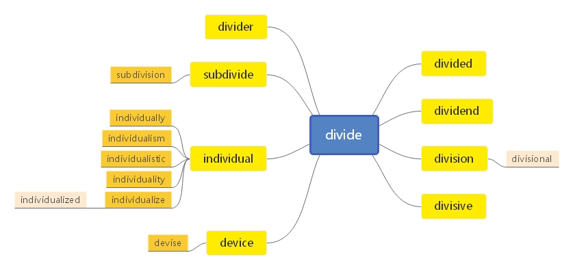
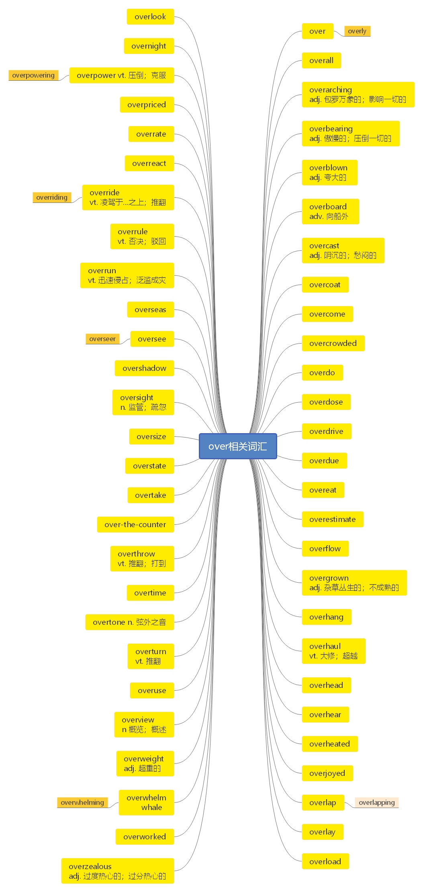

# 第二十节 掌握 divide 和其派生词

***

> **本节课目标**
>
> 1、 掌握 divide 和其派生词
>
> 2、掌握 over 相关的词汇

***

# 一、 divide 相关词汇

***

**divide**  \[dɪ'vaɪd] vt.  [英音](https://dict.youdao.com/dictvoice?audio=divide\&type=1)  [美音](https://dict.youdao.com/dictvoice?audio=divide\&type=2) 分开； 划分； 除； 使产生分歧 1956

**双语例句:** How shall we divide up the work? [播放](https://dict.youdao.com/dictvoice?audio=How+shall+we+divide+up+the+work%3F&le=eng&le=eng&type=2)

我们怎么分工呢？ 

**双语例句:** The cells began to divide rapidly. [播放](https://dict.youdao.com/dictvoice?audio=The+cells+began+to+divide+rapidly.&le=eng&le=eng&type=2)

细胞迅速分裂。 

**双语例句:** Divide 2 into 7, and the answer is 3, remainder 1. [播放](https://dict.youdao.com/dictvoice?audio=Divide+2+into+7%2C+and+the+answer+is+3%2C+remainder+1.&le=eng&le=eng&type=2)

7除以2，商3余1。 

**原声例句:** In the past,he noted, the national government had tried to **divide** free states from slave states by a line across a map. [播放](https://dict.youdao.com/pureaudio?docid=2390335681655501504)

**原声例句:** The story says he directed the sea to **divide** so the ancient Israelites could reach the other side. [播放](https://dict.youdao.com/pureaudio?docid=5610415161699377483)

**原声例句:** We must not allow ideas like political correctness to **divide** us and cause us to reverse hard-won achievements in human rights and civil rights.\" [播放](https://dict.youdao.com/pureaudio?docid=-1054649318192515812)

**权威例句:** What is interesting is that it no longer reflects the simplistic **divide** between doubters and believers.  [播放](https://dict.youdao.com/dictvoice?audio=What+is+interesting+is+that+it+no+longer+reflects+the+simplistic+divide+between+doubters+and+believers.+&le=eng&type=2)

**权威例句:** They then began to **divide** into embryos, but none grew past the six-cell stage.  [播放](https://dict.youdao.com/dictvoice?audio=They+then+began+to+divide+into+embryos%2C+but+none+grew+past+the+six-cell+stage.+&le=eng&type=2)

**权威例句:** In America and in Britain, this is seen clearly because the philosophical **divide** is most clear-cut.  [播放](https://dict.youdao.com/dictvoice?audio=In+America+and+in+Britain%2C+this+is+seen+clearly+because+the+philosophical+divide+is+most+clear-cut.+&le=eng&type=2)

***

**divided**  \[dɪ'vaɪdɪd] adj.  [英音](https://dict.youdao.com/dictvoice?audio=divided\&type=1)  [美音](https://dict.youdao.com/dictvoice?audio=divided\&type=2) 分开的； 分裂的； 有分歧的 8421

**双语例句:** We divided the work between us. [播放](https://dict.youdao.com/dictvoice?audio=We+divided+the+work+between+us.&le=eng&le=eng&type=2)

我们共同分担这项工作。 

**双语例句:** I've divided the money in half. [播放](https://dict.youdao.com/dictvoice?audio=I%27ve+divided+the+money+in+half.&le=eng&le=eng&type=2)

我把钱平均分成了两半。 

**双语例句:** Opinion is divided on the issue. [播放](https://dict.youdao.com/dictvoice?audio=Opinion+is+divided+on+the+issue.&le=eng&le=eng&type=2)

大家对这件事意见分歧。 

**原声例句:** He said slavery had not tied the states of the Union together, but had always been an issue that **divided** them. [播放](https://dict.youdao.com/pureaudio?docid=7259647419215021071)

**原声例句:** But this is different. It involves the war, the ownership of human beings and the future of the **divided** nation. [播放](https://dict.youdao.com/pureaudio?docid=-520774797299104086)

**原声例句:** In every state, the Democrats were **divided** between those who supported the administration and those opposed to it. [播放](https://dict.youdao.com/pureaudio?docid=7951471641189976673)

**权威例句:** Local revenues **divided** by metro population with populations in two-team markets **divided** in half.  [播放](https://dict.youdao.com/dictvoice?audio=Local+revenues+divided+by+metro+population+with+populations+in+two-team+markets+divided+in+half.+&le=eng&type=2)

**权威例句:** Upon independence from Britain the country was to be **divided** to create Pakistan, a Muslim nation.  [播放](https://dict.youdao.com/dictvoice?audio=Upon+independence+from+Britain+the+country+was+to+be+divided+to+create+Pakistan%2C+a+Muslim+nation.+&le=eng&type=2)

**权威例句:** The latest idea, backed by F1 supremo Bernie Ecclestone, is for 'knockout' qualifying **divided** into three stages.  [播放](https://dict.youdao.com/dictvoice?audio=The+latest+idea%2C+backed+by+F1+supremo+Bernie+Ecclestone%2C+is+for+%27knockout%27+qualifying+divided+into+three+stages.+&le=eng&type=2)

***

**dividend**  \['dɪvɪdend] n.  [英音](https://dict.youdao.com/dictvoice?audio=dividend\&type=1)  [美音](https://dict.youdao.com/dictvoice?audio=dividend\&type=2) 股息； 被除数； 奖金 5905

**双语例句:** The first quarter dividend has been increased by nearly 4 percent. [播放](https://dict.youdao.com/dictvoice?audio=The+first+quarter+dividend+has+been+increased+by+nearly+4+percent.&le=eng&le=eng&type=2)

第一季度的股息增加了近4％。 

**双语例句:** Profit and dividend growth looks above average for the foreseeable future. [播放](https://dict.youdao.com/dictvoice?audio=Profit+and+dividend+growth+looks+above+average+for+the+foreseeable+future.&le=eng&le=eng&type=2)

利润和股息的增长看上去在可预见的将来会高于平均水平。 

**双语例句:** The high yields available on the dividend shares made them attractive to private investors. [播放](https://dict.youdao.com/dictvoice?audio=The+high+yields+available+on+the+dividend+shares+made+them+attractive+to+private+investors.&le=eng&le=eng&type=2)

股息股能获得的高收益使它们对私人投资者们很有吸引力。 

**原声例句:** BP will also suspend **dividend** payments to shareholders temporarily. [播放](https://dict.youdao.com/pureaudio?docid=381490138085020248)

**原声例句:** There's no price per share that you can observe and the banks can't do anything except passively receive the **dividend**.

**原声例句:** So, the more enlightened view is, corporations only pay a stock **dividend** when they have some good news to announce.

**权威例句:** Tax efficiency is super high because fund has little turnover and only small **dividend** income.  [播放](https://dict.youdao.com/dictvoice?audio=Tax+efficiency+is+super+high+because+fund+has+little+turnover+and+only+small+dividend+income.+&le=eng&type=2)

**权威例句:** Instead, he gets a tiny **dividend** every time city folk spread peanut butter on their toast.  [播放](https://dict.youdao.com/dictvoice?audio=Instead%2C+he+gets+a+tiny+dividend+every+time+city+folk+spread+peanut+butter+on+their+toast.+&le=eng&type=2)

**权威例句:** It sells at 14 times my 2011 earnings estimate and has a 3.2% **dividend** yield.  [播放](https://dict.youdao.com/dictvoice?audio=It+sells+at+14+times+my+2011+earnings+estimate+and+has+a+3.2%25+dividend+yield.+&le=eng&type=2)

***

**助记：** divi（ =divide： 分） +dend（ 可能在模仿“cent： 钱”） →分钱→分红， 红利

**搭配：** yield huge dividends（考）：产生巨额红利

cut the stockholders’ dividends（ 考）： 减少股东分红

***

**division**  \[dɪ'vɪʒ(ə)n] n.  [英音](https://dict.youdao.com/dictvoice?audio=division\&type=1)  [美音](https://dict.youdao.com/dictvoice?audio=division\&type=2) 除法； 部门； 分割； 师（ 军队） 1863

**双语例句:** I taught my daughter how to do division at the age of six. [播放](https://dict.youdao.com/dictvoice?audio=I+taught+my+daughter+how+to+do+division+at+the+age+of+six.&le=eng&le=eng&type=2)

我女儿6岁时，我就教她怎样做除法。 

**双语例句:** The division will consist of two tank companies and one infantry company. [播放](https://dict.youdao.com/dictvoice?audio=The+division+will+consist+of+two+tank+companies+and+one+infantry+company.&le=eng&le=eng&type=2)

该师将由两个坦克连和一个步兵连组成。 

**双语例句:** In future, staff recruitment will fall within the remit of the division manager. [播放](https://dict.youdao.com/dictvoice?audio=In+future%2C+staff+recruitment+will+fall+within+the+remit+of+the+division+manager.&le=eng&le=eng&type=2)

以后招募新员工将属于部门经理的职责。 

**原声例句:** She is the first National Collegiate Athletic Association **Division** One coach in men's or women's basketball to win one thousand games. [播放](https://dict.youdao.com/pureaudio?docid=-6152104725876975113)

**原声例句:** Banner's team played in the NCAA **division** two tournament all three years he was on the soccer team. [播放](https://dict.youdao.com/pureaudio?docid=-8768238132222840819)

**原声例句:** A Pfizer **division**, Pharmacia & Upjohn, agreed to plead guilty to a criminal violation over the painkiller Bextra. [播放](https://dict.youdao.com/pureaudio?docid=4505230700422462475)

**权威例句:** Now the space-sciences **division** watches for its work popping up in more popular contexts.  [播放](https://dict.youdao.com/dictvoice?audio=Now+the+space-sciences+division+watches+for+its+work+popping+up+in+more+popular+contexts.+&le=eng&type=2)

**权威例句:** Lieutenant Colonel Greg Butts(ph), a battalion commander for the 101st Airborne **Division**, gives a driving tour.  [播放](https://dict.youdao.com/dictvoice?audio=Lieutenant+Colonel+Greg+Butts%28ph%29%2C+a+battalion+commander+for+the+101st+Airborne+Division%2C+gives+a+driving+tour.+&le=eng&type=2)

**权威例句:** Elsewhere in **Division** Three, Newport were bowled out for just 121 in reply to Eastnor's 261-9.  [播放](https://dict.youdao.com/dictvoice?audio=Elsewhere+in+Division+Three%2C+Newport+were+bowled+out+for+just+121+in+reply+to+Eastnor%27s+261-9.+&le=eng&type=2)

***

**divisional** \[də'vɪʒənl] adj.  [英音](https://dict.youdao.com/dictvoice?audio=divisional\&type=1)  [美音](https://dict.youdao.com/dictvoice?audio=divisional\&type=2) 分割的； 分区的 19919

**双语例句:** She is divisional sales manager for the Philadelphia region. [播放](https://dict.youdao.com/dictvoice?audio=She+is+divisional+sales+manager+for+the+Philadelphia+region.&le=eng&le=eng&type=2)

她是费城地区的部门销售经理。 

**双语例句:** The polis straightens out crooked judgments, gentles the swollen ambitions and puts an end to acts of divisional strife. [播放](https://dict.youdao.com/dictvoice?audio=The+polis+straightens+out+crooked+judgments%2C+gentles+the+swollen+ambitions+and+puts+an+end+to+acts+of+divisional+strife.&le=eng&le=eng&type=2)

城邦修正了错误的判断，缓和了膨胀的野心，结束了分裂的纷争。 

**双语例句:** Anthony Swanston is a divisional director. [播放](https://dict.youdao.com/dictvoice?audio=Anthony+Swanston+is+a+divisional+director.&le=eng&le=eng&type=2)

安东尼·斯旺斯顿是部门总监。 

**权威例句:** In fact, we have never been authorized to eliminate **divisional** Weather Service from our organizational name.  [播放](https://dict.youdao.com/dictvoice?audio=In+fact%2C+we+have+never+been+authorized+to+eliminate+divisional+Weather+Service+from+our+organizational+name.+&le=eng&type=2)

**权威例句:** Chief Supt Tim Kingsman, **Divisional** Commander of Kirklees Police, said the march was peaceful.  [播放](https://dict.youdao.com/dictvoice?audio=Chief+Supt+Tim+Kingsman%2C+Divisional+Commander+of+Kirklees+Police%2C+said+the+march+was+peaceful.+&le=eng&type=2)

**权威例句:** The win means Wolves are all but assured of ending the season as **divisional** champions.  [播放](https://dict.youdao.com/dictvoice?audio=The+win+means+Wolves+are+all+but+assured+of+ending+the+season+as+divisional+champions.+&le=eng&type=2)

***

**divisive**  \[dɪ'vaɪsɪv] adj.  [英音](https://dict.youdao.com/dictvoice?audio=divisive\&type=1)  [美音](https://dict.youdao.com/dictvoice?audio=divisive\&type=2) 分裂的； 区分的； 造成不和的 10121

**双语例句:** Are there divisive issues and pockets of seething anger in America? [播放](https://dict.youdao.com/dictvoice?audio=Are+there+divisive+issues+and+pockets+of+seething+anger+in+America%3F&le=eng&le=eng&type=2)

美国是否存在分裂社会的问题和极度愤怒的群体？ 

**双语例句:** Abortion has always been a divisive issue. [播放](https://dict.youdao.com/dictvoice?audio=Abortion+has+always+been+a+divisive+issue.&le=eng&le=eng&type=2)

堕胎一直是个有争议的问题。 

**双语例句:** He believes that unemployment is socially divisive. [播放](https://dict.youdao.com/dictvoice?audio=He+believes+that+unemployment+is+socially+divisive.&le=eng&le=eng&type=2)

他认为失业会引起社会不稳定。 

**原声例句:** Until the measure becomes law, medical testing on chimpanzees will continue to be a highly **divisive**, and hotly debated,issue. [播放](https://dict.youdao.com/pureaudio?docid=-6439074699107057247)

**原声例句:** \"In 1940 Disney lost both of his parents, and shortly after that his company experienced a very **divisive** strike. [播放](https://dict.youdao.com/pureaudio?docid=4985944224222453641)

**原声例句:** But Iowa Democrat Alan Bohanan says he does not think that the deeply **divisive** issue will lead to significant changes in the House of Representatives. [播放](https://dict.youdao.com/pureaudio?docid=-7821033470359061966)

**权威例句:** Abroad, a second Bush term may well be just as ideological and **divisive** as the first.  [播放](https://dict.youdao.com/dictvoice?audio=Abroad%2C+a+second+Bush+term+may+well+be+just+as+ideological+and+divisive+as+the+first.+&le=eng&type=2)

**权威例句:** But illegal immigration remains a **divisive** subject that still arouses visceral opposition among some Americans.  [播放](https://dict.youdao.com/dictvoice?audio=But+illegal+immigration+remains+a+divisive+subject+that+still+arouses+visceral+opposition+among+some+Americans.+&le=eng&type=2)

**权威例句:** Reconciling those contradictions will be difficult in an atmosphere of increasingly **divisive** and partisan politics.  [播放](https://dict.youdao.com/dictvoice?audio=Reconciling+those+contradictions+will+be+difficult+in+an+atmosphere+of+increasingly+divisive+and+partisan+politics.+&le=eng&type=2)

***

**divider**  \[dɪ'vaɪdə] n. [英音](https://dict.youdao.com/dictvoice?audio=divider\&type=1)  [美音](https://dict.youdao.com/dictvoice?audio=divider\&type=2) 分隔物；除法器；圆规 19370

**双语例句:** A curtain acted as a divider between this class and another. [播放](https://dict.youdao.com/dictvoice?audio=A+curtain+acted+as+a+divider+between+this+class+and+another.&le=eng&le=eng&type=2)

一块窗帘布将这两个班级隔开。 

**双语例句:** The lorry driver lost control and banged the road divider. [播放](https://dict.youdao.com/dictvoice?audio=The+lorry+driver+lost+control+and+banged+the+road+divider.&le=eng&le=eng&type=2)

那辆卡车司机失控后撞到了道路分隔栏。 

**双语例句:** This lagoon \"divider\" consist of sand. [播放](https://dict.youdao.com/dictvoice?audio=The+room+divider+is+used+at+both+sides.&le=eng&le=eng&type=2)

这个房间分隔可以两边使用。 

**权威例句:** They voted for a uniter rather than a **divider**, who would heal the racial divide.  [播放](https://dict.youdao.com/dictvoice?audio=They+voted+for+a+uniter+rather+than+a+divider%2C+who+would+heal+the+racial+divide.+&le=eng&type=2)

**权威例句:** See my earlier post, Estate Tax In Obama Deal: The Great **Divider**, Dec. 7, 2010.  [播放](https://dict.youdao.com/dictvoice?audio=See+my+earlier+post%2C+Estate+Tax+In+Obama+Deal%3A+The+Great+Divider%2C+Dec.+7%2C+2010.+&le=eng&type=2)

**权威例句:** This divide among observers shows again that the estate tax is the great **divider**.  [播放](https://dict.youdao.com/dictvoice?audio=This+divide+among+observers+shows+again+that+the+estate+tax+is+the+great+divider.+&le=eng&type=2)

***

**subdivide**  \[sʌbdɪ'vaɪd] vi.  [英音](https://dict.youdao.com/dictvoice?audio=subdivide\&type=1)  [美音](https://dict.youdao.com/dictvoice?audio=subdivide\&type=2) 细分， 再分 17912

**助记：** sub（ 下） +divide（ 分） →往下再分→细分； 再分

**双语例句:** You can even subdivide these times. [播放](https://dict.youdao.com/dictvoice?audio=You+can+even+subdivide+these+times.&le=eng&le=eng&type=2)

你甚至还可以将这些时间再细分。 

**双语例句:** Subdivide the fringe section with a diagonal-left parting. [播放](https://dict.youdao.com/dictvoice?audio=Subdivide+the+fringe+section+with+a+diagonal-left+parting.&le=eng&le=eng&type=2)

以对角线-左边分别细分边缘区段。 

**双语例句:** This doesn't mean that you can't subdivide or sort your to DOS. [播放](https://dict.youdao.com/dictvoice?audio=This+doesn%27t+mean+that+you+can%27t+subdivide+or+sort+your+to+DOS.&le=eng&le=eng&type=2)

这并不是说你不能将工作细分或是将工作分类。 

**原声例句:** We organize them. We **subdivide** these into units of two for example, groups of two like this or we have an undifferentiated stream like this.

**原声例句:** Of course,if we take the version of the body view that what I am, essentially--the crucial body part--is my brain, then we really would have to **subdivide** A into two parts: early A and late A.

**权威例句:** The effect here is to **subdivide** the data but not to group it for deeper understanding.  [播放](https://dict.youdao.com/dictvoice?audio=The+effect+here+is+to+subdivide+the+data+but+not+to+group+it+for+deeper+understanding.+&le=eng&type=2)

**权威例句:** Some are turning to a federally funded program that pays private landowners not to **subdivide**.  [播放](https://dict.youdao.com/dictvoice?audio=Some+are+turning+to+a+federally+funded+program+that+pays+private+landowners+not+to+subdivide.+&le=eng&type=2)

**权威例句:** **Subdivide** the African population, as some taxonomists propose, and perceptions of scarcity may shift.  [播放](https://dict.youdao.com/dictvoice?audio=Subdivide+the+African+population%2C+as+some+taxonomists+propose%2C+and+perceptions+of+scarcity+may+shift.+&le=eng&type=2)

***

**subdivision**  \['sʌbdɪvɪʒ(ə)n; sʌbdɪ'vɪʒ(ə)n] n.  [英音](https://dict.youdao.com/dictvoice?audio=subdivision\&type=1)  [美音](https://dict.youdao.com/dictvoice?audio=subdivision\&type=2) 细分； 分部； 分割成的小块土地(供开发住房)8368

**双语例句:** Months are a conventional subdivision of the year. [播放](https://dict.youdao.com/dictvoice?audio=Months+are+a+conventional+subdivision+of+the+year.&le=eng&le=eng&type=2)

月份是年的常规分支。 

**双语例句:** Rammick lives high on a ridge in a 400-home subdivision. [播放](https://dict.youdao.com/dictvoice?audio=Rammick+lives+high+on+a+ridge+in+a+400-home+subdivision.&le=eng&le=eng&type=2)

拉米克住在高高的山脊上一块有400户的住宅区。 

**双语例句:** Houses in the subdivision are going for astronomical prices. [播放](https://dict.youdao.com/dictvoice?audio=Houses+in+the+subdivision+are+going+for+astronomical+prices.&le=eng&le=eng&type=2)

该小区里的房子在以天价出售。 

**原声例句:** Well, that's a beat of basically a duple meter with a triple **subdivision**, but we're not getting into triple subdivisions here.

**原声例句:** That study is Systems Physiology and that's an important **subdivision** of Biomedical Engineering.

**原声例句:** Of course, it's in minor and the voices will come in, but the bass is going, sort of plodding along in a basic duple but with a triple **subdivision** underneath of that.

**权威例句:** If you want to save a bundle, skip the frills and do the **subdivision** work yourself.  [播放](https://dict.youdao.com/dictvoice?audio=If+you+want+to+save+a+bundle%2C+skip+the+frills+and+do+the+subdivision+work+yourself.+&le=eng&type=2)

**权威例句:** In a quiet **subdivision**, I stopped at a gray clapboard house set back from the road.  [播放](https://dict.youdao.com/dictvoice?audio=In+a+quiet+subdivision%2C+I+stopped+at+a+gray+clapboard+house+set+back+from+the+road.+&le=eng&type=2)

**权威例句:** NPR's Greg Allen visited Baker to get a look at the town's newest **subdivision**.  [播放](https://dict.youdao.com/dictvoice?audio=NPR%27s+Greg+Allen+visited+Baker+to+get+a+look+at+the+town%27s+newest+subdivision.+&le=eng&type=2)

***

**individual**  \[ˌɪndɪˈvɪdʒʊəl] adj.  [英音](https://dict.youdao.com/dictvoice?audio=individual\&type=1)  [美音](https://dict.youdao.com/dictvoice?audio=individual\&type=2) 个别的； 个人的； 独特的； n. 个体 763

**助记：** in（ 表否定） +divid（ =divide： 切分） +u（ 连接符） +al→不能再切分的→一个人的、独特的、不可分的；个体（ n.）

**双语例句:** Some individual investors exulted at the record. [播放](https://dict.youdao.com/dictvoice?audio=Some+individual+investors+exulted+at+the+record.&le=eng&le=eng&type=2)

一些个人投资者为这一记录欢欣鼓舞。 

**双语例句:** Japan won the Men's 200 metre individual medley. [播放](https://dict.youdao.com/dictvoice?audio=Japan+won+the+Men%27s+200+metre+individual+medley.&le=eng&le=eng&type=2)

日本赢得了男子200米个人混合泳比赛。 

**双语例句:** It's impossible to hold any individual responsible. [播放](https://dict.youdao.com/dictvoice?audio=It%27s+impossible+to+hold+any+individual+responsible.&le=eng&le=eng&type=2)

不可能让任何个人承担责任。 

**原声例句:** A textile is a piece of cloth that has been formed by weaving, knitting,pressing or knotting together **individual** pieces of fiber. [播放](https://dict.youdao.com/pureaudio?docid=-2564046384581263266)

**原声例句:** Yet for all the praise Lewis received, he was known for putting the interests of the group over the **individual**. [播放](https://dict.youdao.com/pureaudio?docid=-1558575148935240579)

**原声例句:** In half of the groups, a person could chose to punish another **individual** who did not donate to the public project. [播放](https://dict.youdao.com/pureaudio?docid=-5583102173391636914)

**权威例句:** But early biological predispositions beyond the individual's control propelling them on a flight path to violence?  [播放](https://dict.youdao.com/dictvoice?audio=But+early+biological+predispositions+beyond+the+individual%27s+control+propelling+them+on+a+flight+path+to+violence%3F+&le=eng&type=2)

**权威例句:** They want the **individual** chosen by the ballot box, not an accident of birth.  [播放](https://dict.youdao.com/dictvoice?audio=They+want+the+individual+chosen+by+the+ballot+box%2C+not+an+accident+of+birth.+&le=eng&type=2)

**权威例句:** There's no question that the greater educational achievement an **individual** has, the higher income they earn.  [播放](https://dict.youdao.com/dictvoice?audio=There%27s+no+question+that+the+greater+educational+achievement+an+individual+has%2C+the+higher+income+they+earn.+&le=eng&type=2)

***

**individualism**  \[ɪndɪ'vɪdjʊ(ə)lɪz(ə)m] n.  [英音](https://dict.youdao.com/dictvoice?audio=individualism\&type=1)  [美音](https://dict.youdao.com/dictvoice?audio=individualism\&type=2) 个人主义； 个人特征； 利己主义 10809

**助记：** 以后缀-ism 结尾， 一般表示“…主义”（ 比如： socialism： 社会主义； humanism： 人道主义） →个人主义

**双语例句:** Rugged individualism forged America's frontier society. [播放](https://dict.youdao.com/dictvoice?audio=Rugged+individualism+forged+America%27s+frontier+society.&le=eng&le=eng&type=2)

坚定的个人主义铸就了美国这个前沿社会。 

**双语例句:** Capitalism stresses innovation, competition and individualism. [播放](https://dict.youdao.com/dictvoice?audio=Capitalism+stresses+innovation%2C+competition+and+individualism.&le=eng&le=eng&type=2)

资本主义强调的是创新、竞争和个人至上。 

**双语例句:** Departmentalism is magnified individualism. [播放](https://dict.youdao.com/dictvoice?audio=Departmentalism+is+magnified+individualism.&le=eng&le=eng&type=2)

本位主义是放大了的个人主义。 

**原声例句:** But the modern world, to get back to that, to this Enlightenment world, **individualism** and a key aspect to that is hedonism.

**原声例句:** It's like a lot of **individualism** at the same time as well.

**原声例句:** Some coming from East Asian societies have said, this emphasis in the West on **individualism**.

**权威例句:** The United States of America, that noble bastion of **individualism**, is bombing in individual sports.  [播放](https://dict.youdao.com/dictvoice?audio=The+United+States+of+America%2C+that+noble+bastion+of+individualism%2C+is+bombing+in+individual+sports.+&le=eng&type=2)

**权威例句:** When it comes to firearms, the rugged **individualism** of Mainers is alive and well.  [播放](https://dict.youdao.com/dictvoice?audio=When+it+comes+to+firearms%2C+the+rugged+individualism+of+Mainers+is+alive+and+well.+&le=eng&type=2)

**权威例句:** The study also showed a marked rise of **individualism** in the mentality of the Chinese consumer.  [播放](https://dict.youdao.com/dictvoice?audio=The+study+also+showed+a+marked+rise+of+individualism+in+the+mentality+of+the+Chinese+consumer.+&le=eng&type=2)

***

**individualistic**  \[,ɪndɪvɪdjʊə'lɪstɪk] adj.  [英音](https://dict.youdao.com/dictvoice?audio=individualistic\&type=1)  [美音](https://dict.youdao.com/dictvoice?audio=individualistic\&type=2) 强调个人独特性的； 奉行个人主义的 15379

**释义和用法：**

强调个人独特性的；奉行个人主义的 If you say that someone is individualistic, you mean that

they like to think and do things in their own way, rather than imitating other people. You can also

say that a society is individualistic if it encourages people to behave in this way.

> **【课堂笔记】**
>
> \-istic（ 复合后置） = -ist + -ic

**双语例句:** An analysis based on such assumptions could be valid for a highly competitive, individualistic society. [播放](https://dict.youdao.com/dictvoice?audio=An+analysis+based+on+such+assumptions+could+be+valid+for+a+highly+competitive%2C+individualistic+society.&le=eng&le=eng&type=2)

基于这种假设的分析可能对一个高度竞争、个人主义的社会有效。 

**双语例句:** Most artists are very individualistic. [播放](https://dict.youdao.com/dictvoice?audio=Most+artists+are+very+individualistic.&le=eng&le=eng&type=2)

大多数艺术家都非常我行我素。 

**双语例句:** His music is highly individualistic and may not appeal to everyone. [播放](https://dict.youdao.com/dictvoice?audio=His+music+is+highly+individualistic+and+may+not+appeal+to+everyone.&le=eng&le=eng&type=2)

他的音乐很独特，可能不是人人都喜欢的。 

**原声例句:** I mean unlike a lot of the courses here and at universities, we really do take a much more **individualistic** approach and that is to say at the end of the day do we consider both upward trending, both your initial experience and also how you approach the course's projects throughout the course of the semester.

**权威例句:** Rand sought to provide an **individualistic** and moral defense of capitalism--not a practical and collectivist one.  [播放](https://dict.youdao.com/dictvoice?audio=Rand+sought+to+provide+an+individualistic+and+moral+defense+of+capitalism--not+a+practical+and+collectivist+one.+&le=eng&type=2)

**权威例句:** Another implication of the idea of being-as-love is that being is intrinsically relational, not **individualistic**.  [播放](https://dict.youdao.com/dictvoice?audio=Another+implication+of+the+idea+of+being-as-love+is+that+being+is+intrinsically+relational%2C+not+individualistic.+&le=eng&type=2)

**权威例句:** India's **individualistic** brand of capitalism may also be more robust than China's state-directed sort.  [播放](https://dict.youdao.com/dictvoice?audio=India%27s+individualistic+brand+of+capitalism+may+also+be+more+robust+than+China%27s+state-directed+sort.+&le=eng&type=2)

***

**individuality**  \[,ɪndɪvɪdjʊ'ælɪtɪ]n.  [英音](https://dict.youdao.com/dictvoice?audio=individuality\&type=1)  [美音](https://dict.youdao.com/dictvoice?audio=individuality\&type=2) 个性；个人；个人特征；个人的嗜好（通常复数）10852

**双语例句:** She expresses her individuality through her clothes. [播放](https://dict.youdao.com/dictvoice?audio=She+expresses+her+individuality+through+her+clothes.&le=eng&le=eng&type=2)

她从穿着上表现出她的个性。 

**双语例句:** People should be free to express their individuality. [播放](https://dict.youdao.com/dictvoice?audio=People+should+be+free+to+express+their+individuality.&le=eng&le=eng&type=2)

人们应该自由表现自己的个性。 

**双语例句:** Individuality is a valued and inherent part of the British character. [播放](https://dict.youdao.com/dictvoice?audio=Individuality+is+a+valued+and+inherent+part+of+the+British+character.&le=eng&le=eng&type=2)

个性是英国人重视并固有的特征。 

**原声例句:** It's a way of thinking about form that has more to do with **individuality** than it does with convention.

**原声例句:** But in the meantime you see that we can't mess with conventional systems by imposing the **individuality** of our will on them and expecting anything to change.

**原声例句:** Hobbes' **individuality** or individualism is closely connected to this conception of a human being or human well-being as success in the competition for the goods of life.

**权威例句:** To foster creativity and **individuality**, each of the company's 36 brands has design autonomy.  [播放](https://dict.youdao.com/dictvoice?audio=To+foster+creativity+and+individuality%2C+each+of+the+company%27s+36+brands+has+design+autonomy.+&le=eng&type=2)

**权威例句:** Politically correct thinking replaces **individuality** and authentic opinions with socially acceptable rhetoric and watered-down behavioral tendencies.  [播放](https://dict.youdao.com/dictvoice?audio=Politically+correct+thinking+replaces+individuality+and+authentic+opinions+with+socially+acceptable+rhetoric+and+watered-down+behavioral+tendencies.+&le=eng&type=2)

**权威例句:** Japan's social system is based on acceding to group wishes and not displaying too much **individuality**.  [播放](https://dict.youdao.com/dictvoice?audio=Japan%27s+social+system+is+based+on+acceding+to+group+wishes+and+not+displaying+too+much+individuality.+&le=eng&type=2)

***

**individualized**  \['ɪndə'vɪdʒʊə'laɪzd] adj.  [英音](https://dict.youdao.com/dictvoice?audio=individualized\&type=1)  [美音](https://dict.youdao.com/dictvoice?audio=individualized\&type=2) 使具有个性的；使具备个人特色的 13039

**双语例句:** Individualized aftercare is given to each patient. [播放](https://dict.youdao.com/dictvoice?audio=Individualized+aftercare+is+given+to+each+patient.&le=eng&le=eng&type=2)

每位病人都能在康复期内得到特别护理。 

**双语例句:** Doctors feel that a more individualized approach to patients should now be adopted. [播放](https://dict.youdao.com/dictvoice?audio=Doctors+feel+that+a+more+individualized+approach+to+patients+should+now+be+adopted.&le=eng&le=eng&type=2)

医生们认为现在应该对病人们采用一种更加个人化的治疗方案。 

**双语例句:** But this is also individualized. [播放](https://dict.youdao.com/dictvoice?audio=But+this+is+also+individualized.&le=eng&le=eng&type=2)

但是，这也是个性化。 

**权威例句:** \"This gives us the opportunity to really do patient-specific and **individualized** medicine, \" Hollister said.  [播放](https://dict.youdao.com/dictvoice?audio=%22This+gives+us+the+opportunity+to+really+do+patient-specific+and+individualized+medicine%2C+%22+Hollister+said.+&le=eng&type=2)

**权威例句:** One thing is clear, consumers will favor a rich, relevant, and highly **individualized** mobile Internet experience.  [播放](https://dict.youdao.com/dictvoice?audio=One+thing+is+clear%2C+consumers+will+favor+a+rich%2C+relevant%2C+and+highly+individualized+mobile+Internet+experience.+&le=eng&type=2)

**权威例句:** They would have to receive **individualized** school-by-school reports, and hope the financial manipulations match reality.  [播放](https://dict.youdao.com/dictvoice?audio=They+would+have+to+receive+individualized+school-by-school+reports%2C+and+hope+the+financial+manipulations+match+reality.+&le=eng&type=2)

***

**individually**  \[ɪndɪ'vɪdjʊ(ə)lɪ] adv.  [英音](https://dict.youdao.com/dictvoice?audio=individually\&type=1)  [美音](https://dict.youdao.com/dictvoice?audio=individually\&type=2) 个别地， 单独地 6174

**双语例句:** These paints can be used individually or in combination. [播放](https://dict.youdao.com/dictvoice?audio=These+paints+can+be+used+individually+or+in+combination.&le=eng&le=eng&type=2)

这些涂料可单独或混合使用。 

**双语例句:** We'd better go in a group, not individually. [播放](https://dict.youdao.com/dictvoice?audio=We%27d+better+go+in+a+group%2C+not+individually.&le=eng&le=eng&type=2)

最好集体去，不要单个儿去。 

**双语例句:** Armed with this knowledge, they're able to carry out individually targeted campaigns to cheat people. [播放](https://dict.youdao.com/dictvoice?audio=Armed+with+this+knowledge%2C+they%27re+able+to+carry+out+individually+targeted+campaigns+to+cheat+people.&le=eng&le=eng&type=2)

他们用这些知识武装自己，能够进行单独的、有针对性的活动来欺骗人们。 

**原声例句:** And for a community of practitioners to benefit from the lessons learned from other people so that we can do better the next time around, collectively as a field, and **individually** as organizations and practitioners.\" [播放](https://dict.youdao.com/pureaudio?docid=4130970616547306298)

**原声例句:** If your team reaches a goal, you get points for that. If you **individually** reach a goal, you get points for that. [播放](https://dict.youdao.com/pureaudio?docid=150834234058249665)

**原声例句:** France Telecom lawyer Claudia Chemarin told French television that each suicide will be examined **individually**. [播放](https://dict.youdao.com/pureaudio?docid=6347275884040721926)

**权威例句:** At Casa Bolivar, 14 spacious studios and loft apartments have been lovingly renovated into **individually** styled spaces.  [播放](https://dict.youdao.com/dictvoice?audio=At+Casa+Bolivar%2C+14+spacious+studios+and+loft+apartments+have+been+lovingly+renovated+into+individually+styled+spaces.+&le=eng&type=2)

**权威例句:** It says each crop should be examined **individually** rather than using blanket approvals or blanket bans.  [播放](https://dict.youdao.com/dictvoice?audio=It+says+each+crop+should+be+examined+individually+rather+than+using+blanket+approvals+or+blanket+bans.+&le=eng&type=2)

**权威例句:** Cumulatively and **individually**, Apple could create a technology behemoth if it should choose to do so.  [播放](https://dict.youdao.com/dictvoice?audio=Cumulatively+and+individually%2C+Apple+could+create+a+technology+behemoth+if+it+should+choose+to+do+so.+&le=eng&type=2)

***

**device**  \[dɪ'vaɪs] n.  [英音](https://dict.youdao.com/dictvoice?audio=device\&type=1)  [美音](https://dict.youdao.com/dictvoice?audio=device\&type=2) 装置； 设备； 仪器； 策略； 1516

**助记：** devic（ =devis： 设计） →设计出来的东西→设施； 设备

**搭配：** detection devices（考）：侦查设备 electronic devices（考）：电子设备

> **【课堂笔记】**
>
> 以 s 结尾为动词→ advise v. 建议； 劝告
>
> 以 c 结尾为名词→ advice n. 建议； 劝告

**双语例句:** The device is fixed to a post. [播放](https://dict.youdao.com/dictvoice?audio=The+device+is+fixed+to+a+post.&le=eng&le=eng&type=2)

该设备固定在一根柱子上。 

**双语例句:** The device was protected by patent. [播放](https://dict.youdao.com/dictvoice?audio=The+device+was+protected+by+patent.&le=eng&le=eng&type=2)

这一装置受专利保护。 

**双语例句:** The device draws gas along the pipe. [播放](https://dict.youdao.com/dictvoice?audio=The+device+draws+gas+along+the+pipe.&le=eng&le=eng&type=2)

这装置将气体顺着管子抽出来。 

**原声例句:** The doctor says you should point the **device** so the flow of air is just in front of your face. [播放](https://dict.youdao.com/pureaudio?docid=-1399214575336133148)

**原声例句:** Twenty feet -- that's six meters. Other suggestions include putting more distance between you and the **device** and using good lighting. [播放](https://dict.youdao.com/pureaudio?docid=8082999921113358386)

**原声例句:** Anyone who uses a **device** that burns fossil fuel must inspect the equipment carefully to reduce chances of carbon monoxide escaping. [播放](https://dict.youdao.com/pureaudio?docid=9143280800836347608)

**权威例句:** One such **device** was found by Theo while supporting 11 Platoon 1 Royal Irish Regiment.  [播放](https://dict.youdao.com/dictvoice?audio=One+such+device+was+found+by+Theo+while+supporting+11+Platoon+1+Royal+Irish+Regiment.+&le=eng&type=2)

**权威例句:** The **device** looks like a long sheath with two soft rings at each end.  [播放](https://dict.youdao.com/dictvoice?audio=The+device+looks+like+a+long+sheath+with+two+soft+rings+at+each+end.+&le=eng&type=2)

**权威例句:** The FreedomPop Overdrive Pro becomes the company's first **device** to run on Sprint's network.  [播放](https://dict.youdao.com/dictvoice?audio=The+FreedomPop+Overdrive+Pro+becomes+the+company%27s+first+device+to+run+on+Sprint%27s+network.+&le=eng&type=2)

***

**devise**  \[dɪ'vaɪz] vt.  [英音](https://dict.youdao.com/dictvoice?audio=devise\&type=1)  [美音](https://dict.youdao.com/dictvoice?audio=devise\&type=2) 设计； 发明； 想出； 图谋； 5011

例句： Since the dawn of human ingenuity, people have devised ever more cunning tools to cope

with work that is dangerous, boring, burdensome, or just plain nasty.

从人类的创造性启蒙以来，人们已经设计出了更加巧妙的工具来从事危险、枯燥、繁重或肮脏的工作。

仿写例句：自从人类的创造性启蒙以来，人们已经设计出了越来越多的工具去改善人际间的交流，互联网便是其中之一。

Since the dawn of human ingenuity, people have devised ever more tools to improve interpersonal communication, among which is the Internet.

**双语例句:** Experts are trying to devise ways to clean up the huge slick. [播放](https://dict.youdao.com/dictvoice?audio=Experts+are+trying+to+devise+ways+to+clean+up+the+huge+slick.&le=eng&le=eng&type=2)

专家们在努力想出清除大面积浮油的办法。 

**双语例句:** You are supposed to devise strategies to alter the cues and routines. [播放](https://dict.youdao.com/dictvoice?audio=You+are+supposed+to+devise+strategies+to+alter+the+cues+and+routines.&le=eng&le=eng&type=2)

你应该设计一些策略来改变球杆和动作。 

**双语例句:** Your assignment will be to choose a discipline that interests you, and devise an experiment. [播放](https://dict.youdao.com/dictvoice?audio=Your+assignment+will+be+to+choose+a+discipline+that+interests+you%2C+and+devise+an+experiment.&le=eng&le=eng&type=2)

你们的任务是选择一个感兴趣的学科，然后设计一个实验。 

**原声例句:** \"The failure to **devise** a clear, Mr.Secretary,and credible plan for employing TARP, has also resulted in a massive waste, some people believe,of taxpayer dollars,\" [播放](https://dict.youdao.com/pureaudio?docid=-8976403191721485063)

**原声例句:** This is the first global conference that aims to tackle the problems that result from climate change and **devise** strategies to help nations adapt to these changes. [播放](https://dict.youdao.com/pureaudio?docid=-6524581288124248838)

**原声例句:** When people first **devise** some new financial instrument it typically has trouble.

**权威例句:** Over the years Nortel, Honeywell, Scientific-Atlanta and Siemens all tried--and failed--to **devise** reliable power line networks.  [播放](https://dict.youdao.com/dictvoice?audio=Over+the+years+Nortel%2C+Honeywell%2C+Scientific-Atlanta+and+Siemens+all+tried--and+failed--to+devise+reliable+power+line+networks.+&le=eng&type=2)

**权威例句:** Competence  to have the know-how and experience to correctly identify problems, **devise** solutions and execute them.  [播放](https://dict.youdao.com/dictvoice?audio=Competence++to+have+the+know-how+and+experience+to+correctly+identify+problems%2C+devise+solutions+and+execute+them.+&le=eng&type=2)

**权威例句:** But it's through rational deliberation, not fear-mongering, that we can **devise** policies that will accomplish this.  [播放](https://dict.youdao.com/dictvoice?audio=But+it%27s+through+rational+deliberation%2C+not+fear-mongering%2C+that+we+can+devise+policies+that+will+accomplish+this.+&le=eng&type=2)

***

# 二、 over 相关词汇

***

**over**  \['əʊvə] adv.  [英音](https://dict.youdao.com/dictvoice?audio=over\&type=1)  [美音](https://dict.youdao.com/dictvoice?audio=over\&type=2) 结束； 越过； 从头到尾 124

> **【课堂笔记】**
>
> over=super- “上面”
>
> over 全部； 翻转

**双语例句:** It's over 80 degrees outside. [播放](https://dict.youdao.com/dictvoice?audio=It%27s+over+80+degrees+outside.&le=eng&le=eng&type=2)

外面超过80度。 

**双语例句:** The water burbled over gravel. [播放](https://dict.youdao.com/dictvoice?audio=The+water+burbled+over+gravel.&le=eng&le=eng&type=2)

水汩汩流过卵石。 

**双语例句:** Thank goodness that's over! [播放](https://dict.youdao.com/dictvoice?audio=Thank+goodness+that%27s+over%21&le=eng&le=eng&type=2)

谢天谢地，事情总算过去了！ 

**原声例句:** But the president faces resistance **over** the price of his plan, which could cost a trillion dollars **over** ten years. [播放](https://dict.youdao.com/pureaudio?docid=-5743054576297571945)

**原声例句:** I have **over** one hundred different kinds of birds from all **over** the United States in my study at home.\" [播放](https://dict.youdao.com/pureaudio?docid=-1785277703698170818)

**原声例句:** I made him work, **over** and **over** again, on a few questions about Ceasar, which I knew he would be asked. [播放](https://dict.youdao.com/pureaudio?docid=173239216709380332)

**权威例句:** Investors have been betting for some time that the worst is **over** for China.  [播放](https://dict.youdao.com/dictvoice?audio=Investors+have+been+betting+for+some+time+that+the+worst+is+over+for+China.+&le=eng&type=2)

**权威例句:** Reports have cited boardroom disagreements **over** whether ITV should sell or stay independent as the cause.  [播放](https://dict.youdao.com/dictvoice?audio=Reports+have+cited+boardroom+disagreements+over+whether+ITV+should+sell+or+stay+independent+as+the+cause.+&le=eng&type=2)

**权威例句:** The Kremlin is re-establishing control **over** the oil industry and other key economic sectors.  [播放](https://dict.youdao.com/dictvoice?audio=The+Kremlin+is+re-establishing+control+over+the+oil+industry+and+other+key+economic+sectors.+&le=eng&type=2)

***

**overly**  \['əʊvəlɪ] adv.  [英音](https://dict.youdao.com/dictvoice?audio=overly\&type=1)  [美音](https://dict.youdao.com/dictvoice?audio=overly\&type=2) 过度地； 极度地 6168

**双语例句:** We think you are being overly optimistic. [播放](https://dict.youdao.com/dictvoice?audio=We+think+you+are+being+overly+optimistic.&le=eng&le=eng&type=2)

我们认为你过于乐观了。 

**双语例句:** Employers may become overly cautious about taking on new staff. [播放](https://dict.youdao.com/dictvoice?audio=Employers+may+become+overly+cautious+about+taking+on+new+staff.&le=eng&le=eng&type=2)

雇主在雇用新员工的问题上可能会过于谨慎。 

**双语例句:** It isn't appropriate for an officer to be overly familiar with an enlisted man. [播放](https://dict.youdao.com/dictvoice?audio=It+isn%27t+appropriate+for+an+officer+to+be+overly+familiar+with+an+enlisted+man.&le=eng&le=eng&type=2)

军官对入伍士兵过分随便是不合适的。 

**原声例句:** Men did not see his act as foolish or **overly**-dramatic. [播放](https://dict.youdao.com/pureaudio?docid=-7000430212035460622)

**原声例句:** Republicans accuse the president of taking advantage of the economic crisis to push an **overly** ambitious and ill-advised domestic agenda. [播放](https://dict.youdao.com/pureaudio?docid=-8200310493285257291)

**原声例句:** \"We trade with a lot of countries around the world who are not necessarily **overly** friendly to US politics.\" [播放](https://dict.youdao.com/pureaudio?docid=-1208805855798285941)

**权威例句:** The old rules were designed to protect banks from being **overly** influenced by non-bank companies.  [播放](https://dict.youdao.com/dictvoice?audio=The+old+rules+were+designed+to+protect+banks+from+being+overly+influenced+by+non-bank+companies.+&le=eng&type=2)

**权威例句:** Cubans and outsiders, including human rights activists, have long protested the policy, seen as **overly** restrictive and punitive.  [播放](https://dict.youdao.com/dictvoice?audio=Cubans+and+outsiders%2C+including+human+rights+activists%2C+have+long+protested+the+policy%2C+seen+as+overly+restrictive+and+punitive.+&le=eng&type=2)

**权威例句:** In bad times, she says, the rule sends balance sheets into an **overly** steep decline.  [播放](https://dict.youdao.com/dictvoice?audio=In+bad+times%2C+she+says%2C+the+rule+sends+balance+sheets+into+an+overly+steep+decline.+&le=eng&type=2)

***

**overall**  \['əʊvərɔːl] adj.  [英音](https://dict.youdao.com/dictvoice?audio=overall\&type=1)  [美音](https://dict.youdao.com/dictvoice?audio=overall\&type=2) 全部的； 全体的； 一切在内的 1955

> **【课堂笔记】**
>
> **助记：** over（ 上） + all（ 所有） →总； 总的； 总体的

**双语例句:** Overall I was disappointed. [播放](https://dict.youdao.com/dictvoice?audio=Overall+I+was+disappointed.&le=eng&le=eng&type=2)

总的来说，我感到失望。 

**双语例句:** Overall, this is a very useful book. [播放](https://dict.youdao.com/dictvoice?audio=Overall%2C+this+is+a+very+useful+book.&le=eng&le=eng&type=2)

总的来说，这是一本很有用的书。 

**双语例句:** The overall ambience of the room is cosy. [播放](https://dict.youdao.com/dictvoice?audio=The+overall+ambience+of+the+room+is+cosy.&le=eng&le=eng&type=2)

这个房间的整体氛围是舒适的。 

**原声例句:** They said the **overall** strength of storms measured by wind speed might increase two to eleven percent by the year twenty-one hundred. [播放](https://dict.youdao.com/pureaudio?docid=-8946693106499185086)

**原声例句:** But **overall**,it's good. Thanks to the ADA, we are being more accepted, like having a disability. [播放](https://dict.youdao.com/pureaudio?docid=324632998071565268)

**原声例句:** The **overall** key finding of our study is that the patient in Africa receiving antiretroviral therapy for HIV can expect to live a near-normal lifespan.\" [播放](https://dict.youdao.com/pureaudio?docid=8212502341436303773)

**权威例句:** **Overall** police numbers hit a nine-year low in 2012, due to tighter budget constraints slowing recruitment.  [播放](https://dict.youdao.com/dictvoice?audio=Overall+police+numbers+hit+a+nine-year+low+in+2012%2C+due+to+tighter+budget+constraints+slowing+recruitment.+&le=eng&type=2)

**权威例句:** And seven in 10 say Bush's **overall** job performance was the reason for the Democratic victory.  [播放](https://dict.youdao.com/dictvoice?audio=And+seven+in+10+say+Bush%27s+overall+job+performance+was+the+reason+for+the+Democratic+victory.+&le=eng&type=2)

**权威例句:** The **overall** risk remained low, but it echoes similar findings linking flu and schizophrenia.  [播放](https://dict.youdao.com/dictvoice?audio=The+overall+risk+remained+low%2C+but+it+echoes+similar+findings+linking+flu+and+schizophrenia.+&le=eng&type=2)

***

**overarching**  \[,əʊvər'ɑːtʃɪŋ] adj.  [英音](https://dict.youdao.com/dictvoice?audio=overarching\&type=1)  [美音](https://dict.youdao.com/dictvoice?audio=overarching\&type=2) 包罗万象的； 影响一切的 15855

(ADJ) 包罗万象的；影响一切的 You use overarching to indicate that you are talking about

something that includes or affects everything or everyone.

> **【课堂笔记】**
>
> **助记：** over（ 所有； 全部； 整体） + arch（ 拱形） +ing（ 形容词后缀） →拱形里面所有的
>
> →包罗万象的

**双语例句:** The overarching question seems to be what happens when the U.S. pulls out? [播放](https://dict.youdao.com/dictvoice?audio=The+overarching+question+seems+to+be+what+happens+when+the+U.S.+pulls+out%3F&le=eng&le=eng&type=2)

中心的问题看来是当美国撤出时会发生什么？ 

**双语例句:** The overarching message is directed at individuals. [播放](https://dict.youdao.com/dictvoice?audio=The+overarching+message+is+directed+at+individuals.&le=eng&le=eng&type=2)

总体信息是针对个人的。 

**双语例句:** This was the overarching purpose. [播放](https://dict.youdao.com/dictvoice?audio=This+was+the+overarching+purpose.&le=eng&le=eng&type=2)

这正是当初发起这些行动的首要宗旨。 

**原声例句:** The level of violence is up. I worry a great deal about the **overarching** impact of the global financial crisis on not just Afghanistan or Pakistan, but all of us in our ability to resource this in the future. [播放](https://dict.youdao.com/pureaudio?docid=1539060522746110632)

**原声例句:** There is this wonderful **overarching** voice that unifies everything after all. This is what I call,\" says de Man, \"the rhetoricization of grammar, right--but wait!

**原声例句:** To cope with it, they urged human beings to restrain their **overarching** ambitions.

**权威例句:** 's The Awkward Stages, and it's obvious the pop band weaves an **overarching** theme through each track.  [播放](https://dict.youdao.com/dictvoice?audio=%27s+The+Awkward+Stages%2C+and+it%27s+obvious+the+pop+band+weaves+an+overarching+theme+through+each+track.+&le=eng&type=2)

**权威例句:** The **overarching** theme is that right now the market is in a tricky spot.  [播放](https://dict.youdao.com/dictvoice?audio=The+overarching+theme+is+that+right+now+the+market+is+in+a+tricky+spot.+&le=eng&type=2)

**权威例句:** Yet corporate top management invariably tries hard to force each unit into an **overarching** strategy.  [播放](https://dict.youdao.com/dictvoice?audio=Yet+corporate+top+management+invariably+tries+hard+to+force+each+unit+into+an+overarching+strategy.+&le=eng&type=2)

***

**overbearing**  \[əʊvə'beərɪŋ] adj.  [英音](https://dict.youdao.com/dictvoice?audio=overbearing\&type=1)  [美音](https://dict.youdao.com/dictvoice?audio=overbearing\&type=2) 傲慢的； 压倒一切的 19991

**助记：** over（ 上） +bear（ =bear down： 逼近； 用力下压） →压倒一切的； 傲慢的

**释义：** 傲慢的；专横的；盛气凌人的；飞扬跋扈的&#x20;

An overbearing person tries to make other people do what he or she wants in an unpleasant and forceful way.

> **【课堂笔记】**
>
> bear n. 熊
>
> v.承受； 忍受

**双语例句:** My husband can be a little overbearing with our son. [播放](https://dict.youdao.com/dictvoice?audio=My+husband+can+be+a+little+overbearing+with+our+son.&le=eng&le=eng&type=2)

我丈夫可能对我们的儿子专横一点。 

**双语例句:** She returns to the big screen to play Candy's overbearing mother, Rose. [播放](https://dict.youdao.com/dictvoice?audio=She+returns+to+the+big+screen+to+play+Candy%27s+overbearing+mother%2C+Rose.&le=eng&le=eng&type=2)

她重返大银幕去扮演坎迪专横的母亲罗丝。 

**双语例句:** He's so overbearing that no one wants to work for him. [播放](https://dict.youdao.com/dictvoice?audio=He%27s+so+overbearing+that+no+one+wants+to+work+for+him.&le=eng&le=eng&type=2)

他那么专横，没人愿为他工作。 

**权威例句:** But he wasn't **overbearing** with it, and he didn't try to impede on the creative process.  [播放](https://dict.youdao.com/dictvoice?audio=But+he+wasn%27t+overbearing+with+it%2C+and+he+didn%27t+try+to+impede+on+the+creative+process.+&le=eng&type=2)

**权威例句:** Afraid of being **overbearing**, the Germans left the British management largely to its own devices.  [播放](https://dict.youdao.com/dictvoice?audio=Afraid+of+being+overbearing%2C+the+Germans+left+the+British+management+largely+to+its+own+devices.+&le=eng&type=2)

**权威例句:** Declaring himself the victim of **overbearing** magistrates bent on ruining his career, he is carrying on.  [播放](https://dict.youdao.com/dictvoice?audio=Declaring+himself+the+victim+of+overbearing+magistrates+bent+on+ruining+his+career%2C+he+is+carrying+on.+&le=eng&type=2)

***

**overblown**  \[əʊvə'bləʊn] adj.  [英音](https://dict.youdao.com/dictvoice?audio=overblown\&type=1)  [美音](https://dict.youdao.com/dictvoice?audio=overblown\&type=2) 夸张的；过分的；夸大其词的 17550

夸张的；过分的；夸大其词的&#x20;

Something that is overblown makes something seem larger, more important, or more significant than it really is.

**双语例句:** Warnings of disaster may be overblown. [播放](https://dict.youdao.com/dictvoice?audio=Warnings+of+disaster+may+be+overblown.&le=eng&le=eng&type=2)

灾难的警告可能是夸张的。 

**双语例句:** The reporting of the story was fair, if sometimes overblown. [播放](https://dict.youdao.com/dictvoice?audio=The+reporting+of+the+story+was+fair%2C+if+sometimes+overblown.&le=eng&le=eng&type=2)

这个故事的报道是公正的，如果有时夸张了的话。 

**双语例句:** The virtue of work may be a bit overblown. [播放](https://dict.youdao.com/dictvoice?audio=The+virtue+of+work+may+be+a+bit+overblown.&le=eng&le=eng&type=2)

就业的优点可能有点被过分渲染了。 

**原声例句:** Despite what he calls **overblown** fears of a double-dip recession, Cardillo predicts the U.S.economy will grow between two and a half to three percent for the second half of the year. [播放](https://dict.youdao.com/pureaudio?docid=-3305389783876831300)

**权威例句:** Some of the kitchen-sink allegations against the Marshalls are clearly **overblown**, if not wrong.  [播放](https://dict.youdao.com/dictvoice?audio=Some+of+the+kitchen-sink+allegations+against+the+Marshalls+are+clearly+overblown%2C+if+not+wrong.+&le=eng&type=2)

**权威例句:** You know, fellas, my question, it's simple: Was this racist or was this whole thing **overblown**?  [播放](https://dict.youdao.com/dictvoice?audio=You+know%2C+fellas%2C+my+question%2C+it%27s+simple%3A+Was+this+racist+or+was+this+whole+thing+overblown%3F+&le=eng&type=2)

**权威例句:** But from a bond market analyst's perspective, fears of a broader contagion are **overblown**.  [播放](https://dict.youdao.com/dictvoice?audio=But+from+a+bond+market+analyst%27s+perspective%2C+fears+of+a+broader+contagion+are+overblown.+&le=eng&type=2)

***

**overboard**  \['əʊvəbɔːd] adv.  [英音](https://dict.youdao.com/dictvoice?audio=overboard\&type=1)  [美音](https://dict.youdao.com/dictvoice?audio=overboard\&type=2) 自船上落下； 向船外 11057

> **【课堂笔记】**
>
> **助记：** over（ 跨过） +board（ 夹板） →自船上落下

**双语例句:** They heaved the body overboard. [播放](https://dict.youdao.com/dictvoice?audio=They+heaved+the+body+overboard.&le=eng&le=eng&type=2)

他们使劲把尸体从船上抛入水中。 

**双语例句:** Huge waves washed him overboard. [播放](https://dict.youdao.com/dictvoice?audio=Huge+waves+washed+him+overboard.&le=eng&le=eng&type=2)

巨浪把他冲下甲板卷入海中。 

**双语例句:** He was washed overboard by a huge wave. [播放](https://dict.youdao.com/dictvoice?audio=He+was+washed+overboard+by+a+huge+wave.&le=eng&le=eng&type=2)

一个巨浪把他从船上掀进海里。 

**原声例句:** It's just tonic or maybe throwing an anchor **overboard** to bring this ship to an end-- whatever sort of analogy or visual imagine you want to bring to it, but it's--the piece has ended.

**权威例句:** Then she dropped a 50lb weight **overboard** to hold the line to the ocean floor.  [播放](https://dict.youdao.com/dictvoice?audio=Then+she+dropped+a+50lb+weight+overboard+to+hold+the+line+to+the+ocean+floor.+&le=eng&type=2)

**权威例句:** Yet most parents understand that there is a significant cost to going so far **overboard**.  [播放](https://dict.youdao.com/dictvoice?audio=Yet+most+parents+understand+that+there+is+a+significant+cost+to+going+so+far+overboard.+&le=eng&type=2)

**权威例句:** Consistent with its threats and practices, Amazon initially tossed its California affiliates **overboard** (including me).  [播放](https://dict.youdao.com/dictvoice?audio=Consistent+with+its+threats+and+practices%2C+Amazon+initially+tossed+its+California+affiliates+overboard+%28including+me%29.+&le=eng&type=2)

***

**overcast**  \['əʊvəkɑːst] adj.  [英音](https://dict.youdao.com/dictvoice?audio=overcast\&type=1)  [美音](https://dict.youdao.com/dictvoice?audio=overcast\&type=2) 阴暗的； 愁闷的； 阴天的 17935

**助记：** over（ 上； 上方） +cast（ 投影； 投射） →上方投下阴影→阴暗的； 阴天的； 愁闷的

**释义和用法：** 多云的；阴沉的；阴天的 If it is overcast, or if the sky or the day is overcast, the sky is completely covered with cloud and there is not much light.

> **【课堂笔记】**
>
> overcast
>
> （ 1） v. 投射； 投影 （ 2） n. 演员阵容

**双语例句:** For three days it was overcast. [播放](https://dict.youdao.com/dictvoice?audio=For+three+days+it+was+overcast.&le=eng&le=eng&type=2)

连着三天都是阴天。 

**双语例句:** It was muggy and overcast. [播放](https://dict.youdao.com/dictvoice?audio=It+was+muggy+and+overcast.&le=eng&le=eng&type=2)

那天天气闷热又潮湿，阴沉沉的。 

**双语例句:** The weather forecast is for showers and overcast skies. [播放](https://dict.youdao.com/dictvoice?audio=The+weather+forecast+is+for+showers+and+overcast+skies.&le=eng&le=eng&type=2)

气象预报说有阵雨而且阴天。 

**权威例句:** And bowling conditions could suit England's swing bowlers, with weather forecasts indicating **overcast** conditions in Birmingham.  [播放](https://dict.youdao.com/dictvoice?audio=And+bowling+conditions+could+suit+England%27s+swing+bowlers%2C+with+weather+forecasts+indicating+overcast+conditions+in+Birmingham.+&le=eng&type=2)

**权威例句:** While the time wasn't the fastest of the **overcast** morning, Orb scored big on style points.  [播放](https://dict.youdao.com/dictvoice?audio=While+the+time+wasn%27t+the+fastest+of+the+overcast+morning%2C+Orb+scored+big+on+style+points.+&le=eng&type=2)

**权威例句:** On the day of the sail, the weather was **overcast** but they decided to go anyway.  [播放](https://dict.youdao.com/dictvoice?audio=On+the+day+of+the+sail%2C+the+weather+was+overcast+but+they+decided+to+go+anyway.+&le=eng&type=2)

***

**overcoat**  \['əʊvəkəʊt] n.  [英音](https://dict.youdao.com/dictvoice?audio=overcoat\&type=1)  [美音](https://dict.youdao.com/dictvoice?audio=overcoat\&type=2) 大衣， 外套 13081

**双语例句:** He wore an overcoat over his suit. [播放](https://dict.youdao.com/dictvoice?audio=He+wore+an+overcoat+over+his+suit.&le=eng&le=eng&type=2)

他在西服外面再加了一件大衣。 

**双语例句:** Her overcoat is as stylish as Jill's. [播放](https://dict.youdao.com/dictvoice?audio=Her+overcoat+is+as+stylish+as+Jill%27s.&le=eng&le=eng&type=2)

她的大衣和吉尔的一样时髦。 

**双语例句:** He placed his cap and overcoat on a chair. [播放](https://dict.youdao.com/dictvoice?audio=He+placed+his+cap+and+overcoat+on+a+chair.&le=eng&le=eng&type=2)

他把帽子和大衣搁在一张椅子上。 

**原声例句:** He spoke for almost two hours on a cold and rainy day, without a hat or **overcoat**. [播放](https://dict.youdao.com/pureaudio?docid=9196401857213967856)

**原声例句:** Dean, ragged in a moth-eaten **overcoat** he bought specially for the freezing temperatures of the East, walked off alone and the last I saw of him he rounded the corner of Seventh Avenue, eyes on the street ahead and bent to it again.

**原声例句:** That's the way the story is put together, how the **overcoat** is made, and so on.

**权威例句:** The glittery **overcoat** of future science is replaced by the rolled-up sleeves of good old-fashioned engineering.  [播放](https://dict.youdao.com/dictvoice?audio=The+glittery+overcoat+of+future+science+is+replaced+by+the+rolled-up+sleeves+of+good+old-fashioned+engineering.+&le=eng&type=2)

**权威例句:** For better and worse, Samsung's TouchWiz **overcoat** looks nothing like Google's vision of Android 4.0.  [播放](https://dict.youdao.com/dictvoice?audio=For+better+and+worse%2C+Samsung%27s+TouchWiz+overcoat+looks+nothing+like+Google%27s+vision+of+Android+4.0.+&le=eng&type=2)

**权威例句:** His **overcoat** was brand-new, and cost well more than the watch and the bouquet combined.  [播放](https://dict.youdao.com/dictvoice?audio=His+overcoat+was+brand-new%2C+and+cost+well+more+than+the+watch+and+the+bouquet+combined.+&le=eng&type=2)

***

**overcome** \[əʊvə'kʌm] vt.  [英音](https://dict.youdao.com/dictvoice?audio=overcome\&type=1)  [美音](https://dict.youdao.com/dictvoice?audio=overcome\&type=2) 克服； 胜过 2730

**双语例句:** They had to overcome formidable obstacles. [播放](https://dict.youdao.com/dictvoice?audio=They+had+to+overcome+formidable+obstacles.&le=eng&le=eng&type=2)

他们得克服重重障碍。 

**双语例句:** He forced himself to subdue and overcome his fears. [播放](https://dict.youdao.com/dictvoice?audio=He+forced+himself+to+subdue+and+overcome+his+fears.&le=eng&le=eng&type=2)

他强迫自己克制并战胜他的恐惧。 

**双语例句:** I hope that you'll overcome your reserve and let me know. [播放](https://dict.youdao.com/dictvoice?audio=I+hope+that+you%27ll+overcome+your+reserve+and+let+me+know.&le=eng&le=eng&type=2)

我希望你能克服矜持，让我知道。 

**原声例句:** To help his wife **overcome** a severe depression, Jack Gardner planned for them to travel to Europe. [播放](https://dict.youdao.com/pureaudio?docid=-45457789944044520)

**原声例句:** \"No matter how long it may take us to **overcome** this premeditated invasion, the American people in their righteous might will win through to absolute victory... [播放](https://dict.youdao.com/pureaudio?docid=-7944034301617259392)

**原声例句:** As Tony Trischka points out, the original version was called \"We Will **Overcome**.\" [播放](https://dict.youdao.com/pureaudio?docid=-6033782887363724759)

**权威例句:** Those margins helped **overcome** Democratic dominance of urban areas and tighter contests in suburbs.  [播放](https://dict.youdao.com/dictvoice?audio=Those+margins+helped+overcome+Democratic+dominance+of+urban+areas+and+tighter+contests+in+suburbs.+&le=eng&type=2)

**权威例句:** The Ng family has also **overcome** allegations that some of the fish they pack was caught illegally.  [播放](https://dict.youdao.com/dictvoice?audio=The+Ng+family+has+also+overcome+allegations+that+some+of+the+fish+they+pack+was+caught+illegally.+&le=eng&type=2)

**权威例句:** Talib Kweli helped me to **overcome** a drug addiction and continues to inspire me to this day.  [播放](https://dict.youdao.com/dictvoice?audio=Talib+Kweli+helped+me+to+overcome+a+drug+addiction+and+continues+to+inspire+me+to+this+day.+&le=eng&type=2)

***

**overcrowded**  \[,əuvə'kraudid] adj.（ [英音](https://dict.youdao.com/dictvoice?audio=overcrowded\&type=1)  [美音](https://dict.youdao.com/dictvoice?audio=overcrowded\&type=2) 地方）过度拥挤的 13549

> **【课堂笔记】**
>
> crowd v. 挤 crowd into sp. 挤进某地方
>
> n. 群； 群体 a crowd of people 一群人
>
> crowded adj. 拥挤的

**双语例句:** Too many poor people are living in overcrowded conditions. [播放](https://dict.youdao.com/dictvoice?audio=Too+many+poor+people+are+living+in+overcrowded+conditions.&le=eng&le=eng&type=2)

有太多的贫民生活在十分拥挤的条件下。 

**双语例句:** He argued that the overcrowded cities were the product of a system based on \"selfishness\" and \"rapacity.\" [播放](https://dict.youdao.com/dictvoice?audio=He+argued+that+the+overcrowded+cities+were+the+product+of+a+system+based+on+%22selfishness%22+and+%22rapacity.%22&le=eng&le=eng&type=2)

他辩称说，过分拥挤的城市是建立在“自私”和“贪婪”基础上的制度造成的。 

**双语例句:** The traffic was aggressive and choked; the pedestrian crossings deadly; the buses overcrowded; the train stations scruffy and underfunded. [播放](https://dict.youdao.com/dictvoice?audio=The+traffic+was+aggressive+and+choked%3B+the+pedestrian+crossings+deadly%3B+the+buses+overcrowded%3B+the+train+stations+scruffy+and+underfunded.&le=eng&le=eng&type=2)

交通拥挤不堪；行人肆无忌惮；公车人满为患；火车站肮脏寒碜。 

**权威例句:** While the facility provides a minimum level of care, it is both **overcrowded** and underfunded.  [播放](https://dict.youdao.com/dictvoice?audio=While+the+facility+provides+a+minimum+level+of+care%2C+it+is+both+overcrowded+and+underfunded.+&le=eng&type=2)

**权威例句:** Unlike the U.S., which has vast, remote and unpopulated regions, Europe is already more **overcrowded**.  [播放](https://dict.youdao.com/dictvoice?audio=Unlike+the+U.S.%2C+which+has+vast%2C+remote+and+unpopulated+regions%2C+Europe+is+already+more+overcrowded.+&le=eng&type=2)

**权威例句:** Prison camps have become so **overcrowded** that there are few jobs for inmates to even do.  [播放](https://dict.youdao.com/dictvoice?audio=Prison+camps+have+become+so+overcrowded+that+there+are+few+jobs+for+inmates+to+even+do.+&le=eng&type=2)

***

**overdo**  \[əʊvə'duː] vt.  [英音](https://dict.youdao.com/dictvoice?audio=overdo\&type=1)  [美音](https://dict.youdao.com/dictvoice?audio=overdo\&type=2) 把…做得过分； 使过于疲劳; 对…表演过火； 夸张 14612

**双语例句:** It is important never to overdo new exercises. [播放](https://dict.youdao.com/dictvoice?audio=It+is+important+never+to+overdo+new+exercises.&le=eng&le=eng&type=2)

重要的是，千万不要过度进行一项新的锻炼。 

**双语例句:** It's important to study hard, but don't overdo it. [播放](https://dict.youdao.com/dictvoice?audio=It%27s+important+to+study+hard%2C+but+don%27t+overdo+it.&le=eng&le=eng&type=2)

刻苦学习很重要，但不要超过极限。 

**双语例句:** Don't overdo it or be fake about it. [播放](https://dict.youdao.com/dictvoice?audio=Don%27t+overdo+it+or+be+fake+about+it.&le=eng&le=eng&type=2)

不要做得太过，也不要伪装。 

**原声例句:** So the key is to find what you love to do, do it, but don't **overdo** it.

**权威例句:** Some women tend to **overdo** it, because they don't tone down the rest of their makeup.  [播放](https://dict.youdao.com/dictvoice?audio=Some+women+tend+to+overdo+it%2C+because+they+don%27t+tone+down+the+rest+of+their+makeup.+&le=eng&type=2)

**权威例句:** In my opinion, he will sometimes **overdo** a phrase, but less than he used to.  [播放](https://dict.youdao.com/dictvoice?audio=In+my+opinion%2C+he+will+sometimes+overdo+a+phrase%2C+but+less+than+he+used+to.+&le=eng&type=2)

**权威例句:** If you **overdo** it, however, there are thousands of ways to regain your footing.  [播放](https://dict.youdao.com/dictvoice?audio=If+you+overdo+it%2C+however%2C+there+are+thousands+of+ways+to+regain+your+footing.+&le=eng&type=2)

***

**overdose**  \['əʊvədəʊs] vt.  [英音](https://dict.youdao.com/dictvoice?audio=overdose\&type=1)  [美音](https://dict.youdao.com/dictvoice?audio=overdose\&type=2) 配药过量； 使过分沉溺 13582

> **【课堂笔记】**
>
> dose n. 药剂

**双语例句:** She took a massive overdose of sleeping pills. [播放](https://dict.youdao.com/dictvoice?audio=She+took+a+massive+overdose+of+sleeping+pills.&le=eng&le=eng&type=2)

她服用了过量的安眠药。 

**双语例句:** Each year, one in 100 girls ages 15-19 takes an overdose. [播放](https://dict.youdao.com/dictvoice?audio=Each+year%2C+one+in+100+girls+ages+15-19+takes+an+overdose.&le=eng&le=eng&type=2)

每年，100个15至19岁的女孩中就有１个用药过量。 

**双语例句:** Whatever happens, never take an overdose of this medicine. [播放](https://dict.youdao.com/dictvoice?audio=Whatever+happens%2C+never+take+an+overdose+of+this+medicine.&le=eng&le=eng&type=2)

这种药千万不能服过量。 

**权威例句:** PCBs are actually not carcinogenic unless you repeatedly **overdose** a laboratory mouse with them.  [播放](https://dict.youdao.com/dictvoice?audio=PCBs+are+actually+not+carcinogenic+unless+you+repeatedly+overdose+a+laboratory+mouse+with+them.+&le=eng&type=2)

**权威例句:** The Chicago experts gave some advice, but there was no way to reverse the **overdose**.  [播放](https://dict.youdao.com/dictvoice?audio=The+Chicago+experts+gave+some+advice%2C+but+there+was+no+way+to+reverse+the+overdose.+&le=eng&type=2)

**权威例句:** David Kennedy died of a drug **overdose** and Michael Kennedy was killed in a skiing accident.  [播放](https://dict.youdao.com/dictvoice?audio=David+Kennedy+died+of+a+drug+overdose+and+Michael+Kennedy+was+killed+in+a+skiing+accident.+&le=eng&type=2)

***

**overdrive**  \['əʊvədraɪv] vt.  [英音](https://dict.youdao.com/dictvoice?audio=overdrive\&type=1)  [美音](https://dict.youdao.com/dictvoice?audio=overdrive\&type=2) 驱使过度； 虐待； 工作过度 19695

> **【课堂笔记】**
>
> drive v. 开车/驱使
>
> drive sb. to do sth. 驱使某人去做某事

**双语例句:** As the wedding approached, the whole family went into overdrive. [播放](https://dict.youdao.com/dictvoice?audio=As+the+wedding+approached%2C+the+whole+family+went+into+overdrive.&le=eng&le=eng&type=2)

随着婚礼将近，全家人都忙得不亦乐乎。 

**双语例句:** Once again, the press went into overdrive, with headlines such as \"Butterfly Killing Corn.\" [播放](https://dict.youdao.com/dictvoice?audio=Once+again%2C+the+press+went+into+overdrive%2C+with+headlines+such+as+%22Butterfly+Killing+Corn.%22&le=eng&le=eng&type=2)

媒体再次用诸如“杀死蝴蝶的玉米”的标题吸引众人眼球。 

**双语例句:** In the sand states—Florida, Arizona, Nevada and California—these trends went into overdrive in the years leading up to the crisis. [播放](https://dict.youdao.com/dictvoice?audio=In+the+sand+states%E2%80%94Florida%2C+Arizona%2C+Nevada+and+California%E2%80%94these+trends+went+into+overdrive+in+the+years+leading+up+to+the+crisis.&le=eng&le=eng&type=2)

在沙州——佛罗里达、亚利桑那、内华达和加利福尼亚——这些趋势在危机爆发前的几年里发展到了极致。 

**权威例句:** The FreedomPop **Overdrive** Pro becomes the company's first device to run on Sprint's network.  [播放](https://dict.youdao.com/dictvoice?audio=The+FreedomPop+Overdrive+Pro+becomes+the+company%27s+first+device+to+run+on+Sprint%27s+network.+&le=eng&type=2)

**权威例句:** That's when my heart started pounding even faster, and my adrenaline went from **overdrive** to supersonic.  [播放](https://dict.youdao.com/dictvoice?audio=That%27s+when+my+heart+started+pounding+even+faster%2C+and+my+adrenaline+went+from+overdrive+to+supersonic.+&le=eng&type=2)

**权威例句:** From the moment I drive into the parking lot, my senses are in **overdrive**.  [播放](https://dict.youdao.com/dictvoice?audio=From+the+moment+I+drive+into+the+parking+lot%2C+my+senses+are+in+overdrive.+&le=eng&type=2)

***

**overdue**  \[əʊvə'djuː] adj.  [英音](https://dict.youdao.com/dictvoice?audio=overdue\&type=1)  [美音](https://dict.youdao.com/dictvoice?audio=overdue\&type=2) 迟到的； 过期的； 未兑的 11259

**助记：** over（ 超过） +due（ 到期的； 应有的； 应到的） →应该到来或者得到的时间超过了→

早该发生的；早该付的；拖欠的

**释义和用法：**

（ 1）（变化或事件）早该发生的 If you say that a change or an event is overdue, you mean that

you think it should have happened before now.

（ 2）（钱款）到期未付的，拖欠的 Overdue sums of money have not been paid, even though it

is later than the date on which they should have been paid.

**双语例句:** We stand to lose 10 percent of our price for each week of overdue delivery. [播放](https://dict.youdao.com/dictvoice?audio=We+stand+to+lose+10+percent+of+our+price+for+each+week+of+overdue+delivery.&le=eng&le=eng&type=2)

每逾期一周，我们就要损失10%的价格。 

**双语例句:** Her baby is two weeks overdue. [播放](https://dict.youdao.com/dictvoice?audio=Her+baby+is+two+weeks+overdue.&le=eng&le=eng&type=2)

她的胎儿已超过预产期两周了。 

**双语例句:** These reforms are long overdue. [播放](https://dict.youdao.com/dictvoice?audio=These+reforms+are+long+overdue.&le=eng&le=eng&type=2)

这些改革早就该进行了。 

**权威例句:** \"I think that reducing the power of the executive is long **overdue**, \" Mr Chope said.  [播放](https://dict.youdao.com/dictvoice?audio=%22I+think+that+reducing+the+power+of+the+executive+is+long+overdue%2C+%22+Mr+Chope+said.+&le=eng&type=2)

**权威例句:** The decision to stop charging a hefty premium on their emergency loans is **overdue**.  [播放](https://dict.youdao.com/dictvoice?audio=The+decision+to+stop+charging+a+hefty+premium+on+their+emergency+loans+is+overdue.+&le=eng&type=2)

**权威例句:** This collapse in sales, which seemed inevitable (even long-overdue) to me, nevertheless surprised many analysts.  [播放](https://dict.youdao.com/dictvoice?audio=This+collapse+in+sales%2C+which+seemed+inevitable+%28even+long-overdue%29+to+me%2C+nevertheless+surprised+many+analysts.+&le=eng&type=2)

***

**overeat**  \[əʊvər'iːt] vt.  [英音](https://dict.youdao.com/dictvoice?audio=overeat\&type=1)  [美音](https://dict.youdao.com/dictvoice?audio=overeat\&type=2) 使吃过量 18658

**双语例句:** If you tend to overeat because of depression, first take steps to recognize the source of your sadness. [播放](https://dict.youdao.com/dictvoice?audio=If+you+tend+to+overeat+because+of+depression%2C+first+take+steps+to+recognize+the+source+of+your+sadness.&le=eng&le=eng&type=2)

如果你因为沮丧而打算暴食的话，首先要设法弄清你悲伤的来源。 

**双语例句:** Don't overeat or over-full yourself. [播放](https://dict.youdao.com/dictvoice?audio=Don%27t+overeat+or+over-full+yourself.&le=eng&le=eng&type=2)

不要吃得过多或过饱。 

**双语例句:** Don't overeat. [播放](https://dict.youdao.com/dictvoice?audio=Don%27t+overeat.&le=eng&le=eng&type=2)

不要吃得过多。 

**原声例句:** are more likely to abuse drugs or **overeat**. [播放](https://dict.youdao.com/pureaudio?docid=3351648709645501880)

**原声例句:** Now in this particular case, these animals will not **overeat** on the healthy balanced food and won't gain excess weight, they'll maintain a normal weight.

**权威例句:** However, researchers and the Stroke Association warned the findings were not an excuse to **overeat** chocolate.  [播放](https://dict.youdao.com/dictvoice?audio=However%2C+researchers+and+the+Stroke+Association+warned+the+findings+were+not+an+excuse+to+overeat+chocolate.+&le=eng&type=2)

**权威例句:** Somehow, therefore, a fully functioning leptin system can still produce a dangerous urge to **overeat**.  [播放](https://dict.youdao.com/dictvoice?audio=Somehow%2C+therefore%2C+a+fully+functioning+leptin+system+can+still+produce+a+dangerous+urge+to+overeat.+&le=eng&type=2)

**权威例句:** They don't eat until lunchtime, and then they may **overeat** at that meal or **overeat** at dinner.  [播放](https://dict.youdao.com/dictvoice?audio=They+don%27t+eat+until+lunchtime%2C+and+then+they+may+overeat+at+that+meal+or+overeat+at+dinner.+&le=eng&type=2)

***

**overestimate**  \[əʊvərˈɛstɪmeɪt] vt.  [英音](https://dict.youdao.com/dictvoice?audio=overestimate\&type=1)  [美音](https://dict.youdao.com/dictvoice?audio=overestimate\&type=2) 对……评价过高； 对……估计过高 13361

**双语例句:** If they overestimate, they lose revenue. [播放](https://dict.youdao.com/dictvoice?audio=If+they+overestimate%2C+they+lose+revenue.&le=eng&le=eng&type=2)

如果他们过高地估算，就会损失收入。 

**双语例句:** Twenty-five thousand turned out to be an overestimate. [播放](https://dict.youdao.com/dictvoice?audio=Twenty-five+thousand+turned+out+to+be+an+overestimate.&le=eng&le=eng&type=2)

25000这个数字被证实是过高的估计。 

**双语例句:** While girls lack confidence , boys often overestimate their abilities. [播放](https://dict.youdao.com/dictvoice?audio=While+girls+lack+confidence+%2C+boys+often+overestimate+their+abilities.&le=eng&le=eng&type=2)

女孩通常缺乏自信，而男孩则往往会高估自己的能力。 

**原声例句:** He said rock climbing is a high risk sport in which many people **overestimate** their abilities and underestimate the rock. [播放](https://dict.youdao.com/pureaudio?docid=-2488716042198745549)

**原声例句:** These are unquestionably strong words, and I think it's impossible for us to **overestimate** the weight of these words.

**原声例句:** We often feel like things bleed out of us and so people will systematically **overestimate** the extent to which other people notice their secrets.

**权威例句:** The reserves could lead investors to **overestimate** the sustainability of Teva's profits, Krensavage warns.  [播放](https://dict.youdao.com/dictvoice?audio=The+reserves+could+lead+investors+to+overestimate+the+sustainability+of+Teva%27s+profits%2C+Krensavage+warns.+&le=eng&type=2)

**权威例句:** The second error is to **overestimate** the influence of religion on Americans' views of foreign policy.  [播放](https://dict.youdao.com/dictvoice?audio=The+second+error+is+to+overestimate+the+influence+of+religion+on+Americans%27+views+of+foreign+policy.+&le=eng&type=2)

**权威例句:** Most Americans, us included, tend to **overestimate** the impact of US politics on the global economy.  [播放](https://dict.youdao.com/dictvoice?audio=Most+Americans%2C+us+included%2C+tend+to+overestimate+the+impact+of+US+politics+on+the+global+economy.+&le=eng&type=2)

***

**overflow**  \[əʊvə'fləʊ] vi.  [英音](https://dict.youdao.com/dictvoice?audio=overflow\&type=1)  [美音](https://dict.youdao.com/dictvoice?audio=overflow\&type=2) 溢出； 泛滥； 充溢 9489

**双语例句:** Pour in some of the broth, but not all of it, because it will probably overflow. [播放](https://dict.youdao.com/dictvoice?audio=Pour+in+some+of+the+broth%2C+but+not+all+of+it%2C+because+it+will+probably+overflow.&le=eng&le=eng&type=2)

倒入部分肉汤，不要全部，因为很可能会溢出来。 

**双语例句:** Fisherman Ray Turner hand-built the V-shaped stone overflow dam, in the East Branch of the Delaware River in New York. [播放](https://dict.youdao.com/dictvoice?audio=Fisherman+Ray+Turner+hand-built+the+V-shaped+stone+overflow+dam%2C+in+the+East+Branch+of+the+Delaware+River+in+New+York.&le=eng&le=eng&type=2)

渔民雷·特纳在纽约德拉瓦河的东支流手工建造了这个 V 字形石头溢流堰，或称鱼梁。 

**双语例句:** A new office block was built to accommodate the overflow of staff. [播放](https://dict.youdao.com/dictvoice?audio=A+new+office+block+was+built+to+accommodate+the+overflow+of+staff.&le=eng&le=eng&type=2)

新建了一座办公大楼以便容纳多出的员工。 

**原声例句:** As a result, Asian and Latin American economies are already struggling with an **overflow** of investments. [播放](https://dict.youdao.com/pureaudio?docid=1856803298592762770)

**原声例句:** \"As Wooden enters the playing court, he receives a standing ovation from an **overflow** crowd and true to the Wooden tradition, on the outside everything appears calm.\" [播放](https://dict.youdao.com/pureaudio?docid=5697206587911530580)

**原声例句:** It's the spontaneous **overflow** of powerful feelings.

**权威例句:** Truckloads of **overflow** donations are being diverted to Shea Stadium, an hour's drive away.  [播放](https://dict.youdao.com/dictvoice?audio=Truckloads+of+overflow+donations+are+being+diverted+to+Shea+Stadium%2C+an+hour%27s+drive+away.+&le=eng&type=2)

**权威例句:** Guests filled Auckland's Holy Trinity Anglican Cathedral and an **overflow** area next door for a service.  [播放](https://dict.youdao.com/dictvoice?audio=Guests+filled+Auckland%27s+Holy+Trinity+Anglican+Cathedral+and+an+overflow+area+next+door+for+a+service.+&le=eng&type=2)

**权威例句:** We didn't merely have the **overflow**, we actually had the break in the wall.  [播放](https://dict.youdao.com/dictvoice?audio=We+didn%27t+merely+have+the+overflow%2C+we+actually+had+the+break+in+the+wall.+&le=eng&type=2)

***

**overgrow**  \[əʊvə'grəʊ] vt.  [英音](https://dict.youdao.com/dictvoice?audio=overgrow\&type=1)  [美音](https://dict.youdao.com/dictvoice?audio=overgrow\&type=2) 长满， 长得超过， 长得过大； 18531

**双语例句:** Wild flowers overgrow the grass. [播放](https://dict.youdao.com/dictvoice?audio=Wild+flowers+overgrow+the+grass.&le=eng&le=eng&type=2)

草地上长满了野花。 

**双语例句:** Go on the ridge of field of overgrow fireweed, one pace is flabby accurate meeting falls. [播放](https://dict.youdao.com/dictvoice?audio=Go+on+the+ridge+of+field+of+overgrow+fireweed%2C+one+pace+is+flabby+accurate+meeting+falls.&le=eng&le=eng&type=2)

走在长满杂草的田埂上，一步不稳准会跌倒。 

**双语例句:** The big banyan overgrow of my day of day of a block limb, hang below brawny and strong limb full each golden orange. [播放](https://dict.youdao.com/dictvoice?audio=The+big+banyan+overgrow+of+my+day+of+day+of+a+block+limb%2C+hang+below+brawny+and+strong+limb+full+each+golden+orange.&le=eng&le=eng&type=2)

一棵遮天蔽日的大榕树长满了枝干，粗壮有力的枝干下面挂满了一个个金灿灿的橘子。 

***

**overgrown**  \[əʊvə'grəʊn; 'əʊvəgrəʊn] adj.  [英音](https://dict.youdao.com/dictvoice?audio=overgrown\&type=1)  [美音](https://dict.youdao.com/dictvoice?audio=overgrown\&type=2) 杂草丛生的； 植被蔓生的；（ 成年人） 不成熟的， 孩

子气的 16120

**释义和用法：**（ 1） 杂草丛生的；植被蔓生的&#x20;

If a garden or other place is overgrown, it is covered with a lot of untidy plants because it has not been looked after.

（ 2）（成年人）不成熟的，孩子气的&#x20;

If you describe an adult as an overgrown child, you mean that their behavior and attitudes are like those of a child, and that you dislike this.

**双语例句:** The yard was overgrown with weeds. [播放](https://dict.youdao.com/dictvoice?audio=The+yard+was+overgrown+with+weeds.&le=eng&le=eng&type=2)

这座庭院杂草丛生。 

**双语例句:** The garden's completely overgrown with weeds. [播放](https://dict.youdao.com/dictvoice?audio=The+garden%27s+completely+overgrown+with+weeds.&le=eng&le=eng&type=2)

花园里长满了杂草。 

**双语例句:** The yards are overgrown and cluttered with trash. [播放](https://dict.youdao.com/dictvoice?audio=The+yards+are+overgrown+and+cluttered+with+trash.&le=eng&le=eng&type=2)

院子杂草丛生，堆满了垃圾。 

**权威例句:** Work has now been completed to realign and level a dozen collapsed gravestones and control **overgrown** vegetation.  [播放](https://dict.youdao.com/dictvoice?audio=Work+has+now+been+completed+to+realign+and+level+a+dozen+collapsed+gravestones+and+control+overgrown+vegetation.+&le=eng&type=2)

**权威例句:** Cowie does exactly that with a comforting, if rotting, Victorian complete with flowers and **overgrown** grass.  [播放](https://dict.youdao.com/dictvoice?audio=Cowie+does+exactly+that+with+a+comforting%2C+if+rotting%2C+Victorian+complete+with+flowers+and+overgrown+grass.+&le=eng&type=2)

**权威例句:** Yet some still cling to protectionist tariffs like an **overgrown** child to a security blanket.  [播放](https://dict.youdao.com/dictvoice?audio=Yet+some+still+cling+to+protectionist+tariffs+like+an+overgrown+child+to+a+security+blanket.+&le=eng&type=2)

***

**overhang**  \[əʊvə'hæŋ] vi.  [英音](https://dict.youdao.com/dictvoice?audio=overhang\&type=1)  [美音](https://dict.youdao.com/dictvoice?audio=overhang\&type=2) 悬于…之上； 突出于….之上 16647

> **【课堂笔记】**
>
> hang 悬/挂

**双语例句:** A sharp overhang of rock gave them cover. [播放](https://dict.youdao.com/dictvoice?audio=A+sharp+overhang+of+rock+gave+them+cover.&le=eng&le=eng&type=2)

岩石上方一处尖尖的突起给他们提供了掩护。 

**双语例句:** The roof has an overhang to protect the walls from the rain. [播放](https://dict.youdao.com/dictvoice?audio=The+roof+has+an+overhang+to+protect+the+walls+from+the+rain.&le=eng&le=eng&type=2)

屋顶有飞檐突出，保护墙壁不受雨淋。 

**双语例句:** Pagodas in China and Korea have nothing like the overhang that is found on pagodas in Japan. [播放](https://dict.youdao.com/dictvoice?audio=Pagodas+in+China+and+Korea+have+nothing+like+the+overhang+that+is+found+on+pagodas+in+Japan.&le=eng&le=eng&type=2)

\"中国和韩国的宝塔没有日本宝塔上的悬挑这一架构。 

**权威例句:** From an **overhang** above his head, a small lantern was suspended to light his way.  [播放](https://dict.youdao.com/dictvoice?audio=From+an+overhang+above+his+head%2C+a+small+lantern+was+suspended+to+light+his+way.+&le=eng&type=2)

**权威例句:** The increase in overhang--the percentage of a company's stock allotted for options--isn't necessarily good for shareholders.  [播放](https://dict.youdao.com/dictvoice?audio=The+increase+in+overhang--the+percentage+of+a+company%27s+stock+allotted+for+options--isn%27t+necessarily+good+for+shareholders.+&le=eng&type=2)

**权威例句:** He told MPs they reflected the **\"overhan**g of debt\", squeezed household incomes and the eurozone crisis.  [播放](https://dict.youdao.com/dictvoice?audio=He+told+MPs+they+reflected+the+%22overhang+of+debt%22%2C+squeezed+household+incomes+and+the+eurozone+crisis.+&le=eng&type=2)

***

**overhaul**  \[əʊvə'hɔːl] vt.  [英音](https://dict.youdao.com/dictvoice?audio=overhaul\&type=1)  [美音](https://dict.youdao.com/dictvoice?audio=overhaul\&type=2) 分解检查， 大修； 追上并超过 11266

**词源：** 1620s, from over- + haul (v.); originally nautical, "pull rigging apart for examination," which

was done by slackening the rope by hauling in the opposite direction to that in which it is pulled in

hoisting. Replaced overhale in sense of "overtake" (1793). Related: Overhauled; overhauling.

（ 1） (VERB) 大修；彻底检修；全面检查&#x20;

If a piece of equipment is overhauled, it is cleaned, checked thoroughly, and repaired if necessary.

（ 2）（尤指在体育比赛中）赶上，超过，超越

&#x20;If someone overhauls a person who is ahead of them, especially in a sports competition, they pass them or become more successful than them.

**双语例句:** Nicole admitted she was fortunate, as she was able to live with her parents and overhaul her spending—and life—to get herself on track financially. [播放](https://dict.youdao.com/dictvoice?audio=Nicole+admitted+she+was+fortunate%2C+as+she+was+able+to+live+with+her+parents+and+overhaul+her+spending%E2%80%94and+life%E2%80%94to+get+herself+on+track+financially.&le=eng&le=eng&type=2)

妮可承认自己很幸运，因为她能和父母住在一起，并彻底改变自己的消费和生活方式，让自己的财务管理走上正轨。 

**双语例句:** The average budget for a \"major\" kitchen overhaul in 2006, calculates Remodeling magazine, was a staggering $54,000; even a \"minor\" improvement cost on average $18,000. [播放](https://dict.youdao.com/dictvoice?audio=The+average+budget+for+a+%22major%22+kitchen+overhaul+in+2006%2C+calculates+Remodeling+magazine%2C+was+a+staggering+%2454%2C000%3B+even+a+%22minor%22+improvement+cost+on+average+%2418%2C000.&le=eng&le=eng&type=2)

根据《重塑》杂志的计算，2006年厨房一次“大修”的平均预算高达54000美元，令人难以置信；即使是一个“小”的改进，平均花费也要18000美元。 

**双语例句:** A radical overhaul of the tax system is necessary. [播放](https://dict.youdao.com/dictvoice?audio=A+radical+overhaul+of+the+tax+system+is+necessary.&le=eng&le=eng&type=2)

有必要彻底改革税制。 

**权威例句:** This **overhaul** has been more difficult than he had ever imagined, but the payoff may be at hand.  [播放](https://dict.youdao.com/dictvoice?audio=This+overhaul+has+been+more+difficult+than+he+had+ever+imagined%2C+but+the+payoff+may+be+at+hand.+&le=eng&type=2)

**权威例句:** The directors then told Energy Secretary Federico Pena that security was in need of an **overhaul**.  [播放](https://dict.youdao.com/dictvoice?audio=The+directors+then+told+Energy+Secretary+Federico+Pena+that+security+was+in+need+of+an+overhaul.+&le=eng&type=2)

**权威例句:** The company also failed to deliver the major management **overhaul** that had been expected.  [播放](https://dict.youdao.com/dictvoice?audio=The+company+also+failed+to+deliver+the+major+management+overhaul+that+had+been+expected.+&le=eng&type=2)

***

**overhead**  \[əʊvə'hed] adv.  [英音](https://dict.youdao.com/dictvoice?audio=overhead\&type=1)  [美音](https://dict.youdao.com/dictvoice?audio=overhead\&type=2) 在头顶上； 在空中； 在高处 5599

> **【课堂笔记】**
>
> Overheard 窃听风云

**双语例句:** An eagle circled high overhead. [播放](https://dict.youdao.com/dictvoice?audio=An+eagle+circled+high+overhead.&le=eng&le=eng&type=2)

一只鹰在头顶上空盘旋。 

**双语例句:** Thunder exploded overhead. [播放](https://dict.youdao.com/dictvoice?audio=Thunder+exploded+overhead.&le=eng&le=eng&type=2)

雷声在头顶上炸开。 

**双语例句:** Thunder crashed overhead. [播放](https://dict.youdao.com/dictvoice?audio=Thunder+crashed+overhead.&le=eng&le=eng&type=2)

头顶上雷声隆隆。 

**原声例句:** The countdown reached zero just as Frank Borman and James Lovell, in Gemini Seven, passed **overhead**. [播放](https://dict.youdao.com/pureaudio?docid=3354930932757364612)

**原声例句:** And he was in a military plane **overhead** as Allied forces stormed the beach at Normandy,France. [播放](https://dict.youdao.com/pureaudio?docid=-5771662226789078628)

**原声例句:** The countdown at Cape Canaveral reached zero as Gemini Seven passed **overhead**. [播放](https://dict.youdao.com/pureaudio?docid=-1989727869470736382)

**权威例句:** Banners fluttered **overhead**, and the walls were painted like pages of a picture book.  [播放](https://dict.youdao.com/dictvoice?audio=Banners+fluttered+overhead%2C+and+the+walls+were+painted+like+pages+of+a+picture+book.+&le=eng&type=2)

**权威例句:** Planes dopplered **overhead**, low, loud and frequent enough to suggest war-game dogfights concealed by the thick, rainforest canopy.  [播放](https://dict.youdao.com/dictvoice?audio=Planes+dopplered+overhead%2C+low%2C+loud+and+frequent+enough+to+suggest+war-game+dogfights+concealed+by+the+thick%2C+rainforest+canopy.+&le=eng&type=2)

**权威例句:** For rime to occur, it needs a combination of cold climate, sufficient airborne moisture and clear skies **overhead**.  [播放](https://dict.youdao.com/dictvoice?audio=For+rime+to+occur%2C+it+needs+a+combination+of+cold+climate%2C+sufficient+airborne+moisture+and+clear+skies+overhead.+&le=eng&type=2)

***

**overhear**  \[əʊvə'hɪə] vt.  [英音](https://dict.youdao.com/dictvoice?audio=overhear\&type=1)  [美音](https://dict.youdao.com/dictvoice?audio=overhear\&type=2) 无意中听到； 偷听 8697

**双语例句:** They were shut away in a little room where nobody could overhear. [播放](https://dict.youdao.com/dictvoice?audio=They+were+shut+away+in+a+little+room+where+nobody+could+overhear.&le=eng&le=eng&type=2)

他们躲在一个小屋子里，没有人能偷听得到。 

**双语例句:** Perhaps the neighbours just happened to \"overhear\" the cry. [播放](https://dict.youdao.com/dictvoice?audio=Perhaps+the+neighbours+just+happened+to+%22overhear%22+the+cry.&le=eng&le=eng&type=2)

也许邻居们只是碰巧“听到”了那声喊叫。 

**双语例句:** I happened to overhear what he said. [播放](https://dict.youdao.com/dictvoice?audio=I+happened+to+overhear+what+he+said.&le=eng&le=eng&type=2)

我碰巧听到了他所说的话。 

**权威例句:** You'll **overhear** just about everything you want to know: Which kids are 'dating, ' who's getting in trouble.  [播放](https://dict.youdao.com/dictvoice?audio=You%27ll+overhear+just+about+everything+you+want+to+know%3A+Which+kids+are+%27dating%2C+%27+who%27s+getting+in+trouble.+&le=eng&type=2)

**权威例句:** Are ears perking up as others **overhear** your cell phone conversation in a crowded restaurant or airport lounge?  [播放](https://dict.youdao.com/dictvoice?audio=Are+ears+perking+up+as+others+overhear+your+cell+phone+conversation+in+a+crowded+restaurant+or+airport+lounge%3F+&le=eng&type=2)

**权威例句:** The hanger-on who waits until the gallery opening is finishing to **overhear** where the free dinner with be.  [播放](https://dict.youdao.com/dictvoice?audio=The+hanger-on+who+waits+until+the+gallery+opening+is+finishing+to+overhear+where+the+free+dinner+with+be.+&le=eng&type=2)

***

**overheated**  \[,ovɚ'hitɪd] adj.  [英音](https://dict.youdao.com/dictvoice?audio=overheated\&type=1)  [美音](https://dict.youdao.com/dictvoice?audio=overheated\&type=2) 太热的； 过热的； 十分愤怒的； 过于激烈的 17769

**释义和用法：**

十分愤怒的；过于激烈的&#x20;

Someone who is overheated is very angry about something.&#x20;

In America, overheated drivers have been known to shoot each other.

在美国，据说司机在盛怒之下会拔枪互射。&#x20;

**双语例句:** The system overheated and filming had to stop. [播放](https://dict.youdao.com/dictvoice?audio=The+system+overheated+and+filming+had+to+stop.&le=eng&le=eng&type=2)

系统过热，拍摄工作不得不停下。 

**双语例句:** Overheated food either the drink will scald the mouth. [播放](https://dict.youdao.com/dictvoice?audio=Overheated+food+either+the+drink+will+scald+the+mouth.&le=eng&le=eng&type=2)

过热的食物饮料会烫伤口腔。 

**双语例句:** Readers of this overheated but often on-the-mark polemic will conclude that the safest tactic is organic food and a fly swatter. [播放](https://dict.youdao.com/dictvoice?audio=Readers+of+this+overheated+but+often+on-the-mark+polemic+will+conclude+that+the+safest+tactic+is+organic+food+and+a+fly+swatter.&le=eng&le=eng&type=2)

这场过热但经常中肯的论战的读者们会下结论，最安全的策略是有机食品和一个苍蝇拍。 

**原声例句:** These soldiers get **overheated** and dehydrated in the decontamination suits. [播放](https://dict.youdao.com/pureaudio?docid=-3660864458156214189)

**原声例句:** China grew at a blistering pace of 10.7 percent in the final quarter of 2009, but the government has since placed curbs on lending to reduce inflation and cool down an **overheated** economy. [播放](https://dict.youdao.com/pureaudio?docid=-658686588302442292)

**权威例句:** You'll need a cool head if the bidding gets **overheated**, but the boats have clear title.  [播放](https://dict.youdao.com/dictvoice?audio=You%27ll+need+a+cool+head+if+the+bidding+gets+overheated%2C+but+the+boats+have+clear+title.+&le=eng&type=2)

**权威例句:** There's evidence that the carnage has begun, albeit mostly in a few **overheated** condominium markets.  [播放](https://dict.youdao.com/dictvoice?audio=There%27s+evidence+that+the+carnage+has+begun%2C+albeit+mostly+in+a+few+overheated+condominium+markets.+&le=eng&type=2)

**权威例句:** White looks best live, and it won't turn dark at the neck if you get **overheated**.  [播放](https://dict.youdao.com/dictvoice?audio=White+looks+best+live%2C+and+it+won%27t+turn+dark+at+the+neck+if+you+get+overheated.+&le=eng&type=2)

***

**overjoyed** \[əʊvə'dʒɒɪd] adj.  [英音](https://dict.youdao.com/dictvoice?audio=overjoyed\&type=1)  [美音](https://dict.youdao.com/dictvoice?audio=overjoyed\&type=2) 狂喜的； 极度高兴的 19601

**双语例句:** He was overjoyed at my success. [播放](https://dict.youdao.com/dictvoice?audio=He+was+overjoyed+at+my+success.&le=eng&le=eng&type=2)

我的成功使他欣喜若狂。 

**双语例句:** Shelley was overjoyed to see me. [播放](https://dict.youdao.com/dictvoice?audio=Shelley+was+overjoyed+to+see+me.&le=eng&le=eng&type=2)

谢莉看见我高兴极了。 

**双语例句:** We were overjoyed to hear their good news. [播放](https://dict.youdao.com/dictvoice?audio=We+were+overjoyed+to+hear+their+good+news.&le=eng&le=eng&type=2)

听到他们的好消息，我们都大喜过望。 

**权威例句:** Mr. COY: You would think they'd be **overjoyed** right now, but I don't think they are.  [播放](https://dict.youdao.com/dictvoice?audio=Mr.+COY%3A+You+would+think+they%27d+be+overjoyed+right+now%2C+but+I+don%27t+think+they+are.+&le=eng&type=2)

**权威例句:** Soon, critics were again **overjoyed** with the newest incarnation of the Beaux Arts Trio.  [播放](https://dict.youdao.com/dictvoice?audio=Soon%2C+critics+were+again+overjoyed+with+the+newest+incarnation+of+the+Beaux+Arts+Trio.+&le=eng&type=2)

**权威例句:** The crowd was **overjoyed** to see Smith, but this mattered not at all to him.  [播放](https://dict.youdao.com/dictvoice?audio=The+crowd+was+overjoyed+to+see+Smith%2C+but+this+mattered+not+at+all+to+him.+&le=eng&type=2)

***

**overlap**  \[əʊvə'læp] n/vt.  [英音](https://dict.youdao.com/dictvoice?audio=overlap\&type=1)  [美音](https://dict.youdao.com/dictvoice?audio=overlap\&type=2) 重叠； 重复 9056

**双语例句:** A fish's scales overlap each other. [播放](https://dict.youdao.com/dictvoice?audio=A+fish%27s+scales+overlap+each+other.&le=eng&le=eng&type=2)

鱼鳞一片片上下交叠。 

**双语例句:** The needs of patients invariably overlap. [播放](https://dict.youdao.com/dictvoice?audio=The+needs+of+patients+invariably+overlap.&le=eng&le=eng&type=2)

患者们的各种需求总是相互重合的。 

**双语例句:** Our jobs overlap slightly, which sometimes causes difficulties. [播放](https://dict.youdao.com/dictvoice?audio=Our+jobs+overlap+slightly%2C+which+sometimes+causes+difficulties.&le=eng&le=eng&type=2)

我们的工作略有重叠，所以有时引起一些困难。 

**权威例句:** Note that there is some **overlap** between what we call lounges, bars and clubs.  [播放](https://dict.youdao.com/dictvoice?audio=Note+that+there+is+some+overlap+between+what+we+call+lounges%2C+bars+and+clubs.+&le=eng&type=2)

**权威例句:** By contrast, Los Angeles-based Northrop says its product lines do not **overlap** with those of Newport News.  [播放](https://dict.youdao.com/dictvoice?audio=By+contrast%2C+Los+Angeles-based+Northrop+says+its+product+lines+do+not+overlap+with+those+of+Newport+News.+&le=eng&type=2)

**权威例句:** These groups, which **overlap**, each comprised over a quarter of the electorate in 2000.  [播放](https://dict.youdao.com/dictvoice?audio=These+groups%2C+which+overlap%2C+each+comprised+over+a+quarter+of+the+electorate+in+2000.+&le=eng&type=2)

***

**overlapping**  \[,əʊvə'læpɪŋ] adj.  [英音](https://dict.youdao.com/dictvoice?audio=overlapping\&type=1)  [美音](https://dict.youdao.com/dictvoice?audio=overlapping\&type=2) 重叠的； 交叉的 11330

**双语例句:** The now-famous cantilever hovers over an urban plaza consisting of overlapping zones. [播放](https://dict.youdao.com/dictvoice?audio=The+now-famous+cantilever+hovers+over+an+urban+plaza+consisting+of+overlapping+zones.&le=eng&le=eng&type=2)

现在著名的悬臂悬挑在城市广场上，广场由重叠的区域组成。 

**双语例句:** The floor was protected with overlapping sheets of newspaper. [播放](https://dict.youdao.com/dictvoice?audio=The+floor+was+protected+with+overlapping+sheets+of+newspaper.&le=eng&le=eng&type=2)

地板用一张搭着一张的报纸保护着。 

**双语例句:** Inside? Outside or overlapping? [播放](https://dict.youdao.com/dictvoice?audio=Inside%3F+Outside+or+overlapping%3F&le=eng&le=eng&type=2)

内部？外部还是有交叉？ 

**原声例句:** His presidency began before a crowd a million strong, but when the cheering stopped, he was one man dealing with **overlapping** crises: an economy in free fall and two unpopular wars. [播放](https://dict.youdao.com/pureaudio?docid=-7227322204441690297)

**原声例句:** If we're talking about a single bond, we're talking about 2 orbitals **overlapping** in the internuclear axis.

**原声例句:** If an impure object--and you will see here these **overlapping** pairs, if you can imagine the lower pair sort of being plunked down on top of this pair, that will give you an idea of what we're trying to convey with this image.

**权威例句:** Prof Uff adjourned the reconvened inquiry until **\"overlappin**g issues\" connecting the two tragedies could be resolved.  [播放](https://dict.youdao.com/dictvoice?audio=Prof+Uff+adjourned+the+reconvened+inquiry+until+%22overlapping+issues%22+connecting+the+two+tragedies+could+be+resolved.+&le=eng&type=2)

**权威例句:** With so many **overlapping** models the company often ends up competing with itself, Press acknowledges.  [播放](https://dict.youdao.com/dictvoice?audio=With+so+many+overlapping+models+the+company+often+ends+up+competing+with+itself%2C+Press+acknowledges.+&le=eng&type=2)

**权威例句:** We know that any government program is plagued with **overlapping** entities and different budget authorities.  [播放](https://dict.youdao.com/dictvoice?audio=We+know+that+any+government+program+is+plagued+with+overlapping+entities+and+different+budget+authorities.+&le=eng&type=2)

***

**overlay**  \[əʊvə'leɪ] n.  [英音](https://dict.youdao.com/dictvoice?audio=overlay\&type=1)  [美音](https://dict.youdao.com/dictvoice?audio=overlay\&type=2) 覆盖物； 覆盖图； vt. 在…上面覆盖 15263

**双语例句:** An overlay showing population can be placed on top of the map. [播放](https://dict.youdao.com/dictvoice?audio=An+overlay+showing+population+can+be+placed+on+top+of+the+map.&le=eng&le=eng&type=2)

可以在地图上加一层显示人口的透明膜。 

**双语例句:** During commercials, an overlay will appear at the bottom of the screen, prompting viewers to press a button to request a free sample or order a catalogue. [播放](https://dict.youdao.com/dictvoice?audio=During+commercials%2C+an+overlay+will+appear+at+the+bottom+of+the+screen%2C+prompting+viewers+to+press+a+button+to+request+a+free+sample+or+order+a+catalogue.&le=eng&le=eng&type=2)

在商业广告播放时，一个弹窗将会出现在屏幕下方，促使观众按动按钮，以索要免费样品或订阅产品目录。 

**双语例句:** During commercials, an overlay will appear at the bottom of the screen, prompting viewers to press a button to request a free sample or order a coupon or a catalogue. [播放](https://dict.youdao.com/dictvoice?audio=During+commercials%2C+an+overlay+will+appear+at+the+bottom+of+the+screen%2C+prompting+viewers+to+press+a+button+to+request+a+free+sample+or+order+a+coupon+or+a+catalogue.&le=eng&le=eng&type=2)

在广告期间，屏幕底部会出现一条信息，提示观众按下按钮以请求获得免费样品或订购优惠券或目录。 

**原声例句:** If we **overlay** what the actual molecular orbital is on top of it, what you see is that in the center you end up cancelling out the wave function entirely.

**原声例句:** It would have a certain koine to it; that is, a Greek **overlay**, over what may be also be there, the original indigenous kind of cultures and languages.

**原声例句:** It makes them in one sense false; there is a falseness to the **overlay** that Carlo gives to Sal, and through which he then sees.

**权威例句:** Wang also reworked the classic white shirt with an **overlay** of fringe on the bodice.  [播放](https://dict.youdao.com/dictvoice?audio=Wang+also+reworked+the+classic+white+shirt+with+an+overlay+of+fringe+on+the+bodice.+&le=eng&type=2)

**权威例句:** The fourth pillar, American values, is sort of a **overlay** over the other three.  [播放](https://dict.youdao.com/dictvoice?audio=The+fourth+pillar%2C+American+values%2C+is+sort+of+a+overlay+over+the+other+three.+&le=eng&type=2)

**权威例句:** The real, interactive **overlay** comes complete with sepia-tinged Street View images and a detailed backstory.  [播放](https://dict.youdao.com/dictvoice?audio=The+real%2C+interactive+overlay+comes+complete+with+sepia-tinged+Street+View+images+and+a+detailed+backstory.+&le=eng&type=2)

***

**overload**  \[əʊvə'ləʊd] vt.  [英音](https://dict.youdao.com/dictvoice?audio=overload\&type=1)  [美音](https://dict.youdao.com/dictvoice?audio=overload\&type=2) 超载， 超过负荷 14800

> **【课堂笔记】**
>
> download 下载
>
> upload 上传
>
> workload 工作量

**双语例句:** 57 percent complained of work overload. [播放](https://dict.youdao.com/dictvoice?audio=57+percent+complained+of+work+overload.&le=eng&le=eng&type=2)

57%的人抱怨工作负担过重。 

**双语例句:** Don't overload the boat or it will sink. [播放](https://dict.youdao.com/dictvoice?audio=Don%27t+overload+the+boat+or+it+will+sink.&le=eng&le=eng&type=2)

别让船超载了，否则它会沉。 

**双语例句:** There is always an internal circuit breaker to protect the instrument from overload. [播放](https://dict.youdao.com/dictvoice?audio=There+is+always+an+internal+circuit+breaker+to+protect+the+instrument+from+overload.&le=eng&le=eng&type=2)

总有一个断电器以防止仪器超负荷运转。 

**权威例句:** DDoS is where large numbers of computers, under malicious control, **overload** their target with web requests.  [播放](https://dict.youdao.com/dictvoice?audio=DDoS+is+where+large+numbers+of+computers%2C+under+malicious+control%2C+overload+their+target+with+web+requests.+&le=eng&type=2)

**权威例句:** Ness was fascinated by the idea of \"information **overload**\" and how relevant it is to today.  [播放](https://dict.youdao.com/dictvoice?audio=Ness+was+fascinated+by+the+idea+of+%22information+overload%22+and+how+relevant+it+is+to+today.+&le=eng&type=2)

**权威例句:** Few business environments see more daily disruption and **overload** today than brand and PR departments.  [播放](https://dict.youdao.com/dictvoice?audio=Few+business+environments+see+more+daily+disruption+and+overload+today+than+brand+and+PR+departments.+&le=eng&type=2)

***

**overlook**  \[əʊvə'lʊk] vt.  [英音](https://dict.youdao.com/dictvoice?audio=overlook\&type=1)  [美音](https://dict.youdao.com/dictvoice?audio=overlook\&type=2) 俯瞰； 忽略； 远眺； 3165

**双语例句:** Houses which overlook the lake cost more. [播放](https://dict.youdao.com/dictvoice?audio=Houses+which+overlook+the+lake+cost+more.&le=eng&le=eng&type=2)

俯瞰湖泊的房子要价高些。 

**双语例句:** I pulled off the road at a scenic overlook. [播放](https://dict.youdao.com/dictvoice?audio=I+pulled+off+the+road+at+a+scenic+overlook.&le=eng&le=eng&type=2)

在一个可以眺望优美风景的地方，我将车停在了路旁。 

**双语例句:** Pretty and comfortable rooms overlook a flower-filled garden. [播放](https://dict.youdao.com/dictvoice?audio=Pretty+and+comfortable+rooms+overlook+a+flower-filled+garden.&le=eng&le=eng&type=2)

那些漂亮、舒适的房间俯瞰着一个花团锦簇的花园。 

**原声例句:** Nor did he **overlook** the handicapped, orphans,police corruption, violence in the Northern Caucasus, defense procurement, NATO,nuclear proliferation, and a foreign policy that helps raise the Russian standard of living. [播放](https://dict.youdao.com/pureaudio?docid=-8312866278937186481)

**原声例句:** There are some passages in Areopagitica that I would be remiss to **overlook**, so I'm going to ask you to turn to page 739 in the Hughes.

**原声例句:** Now, I think in certain circumstances it becomes necessary to **overlook** that unjustness, perhaps condone that injustice as in the case of the cabin boy being killed for food.

**权威例句:** These are attributes that enthusiastic entrepreneurs would rather **overlook**, as they fund their newest venture.  [播放](https://dict.youdao.com/dictvoice?audio=These+are+attributes+that+enthusiastic+entrepreneurs+would+rather+overlook%2C+as+they+fund+their+newest+venture.+&le=eng&type=2)

**权威例句:** Investors might **overlook** this if the company were otherwise sound and on a growth trajectory.  [播放](https://dict.youdao.com/dictvoice?audio=Investors+might+overlook+this+if+the+company+were+otherwise+sound+and+on+a+growth+trajectory.+&le=eng&type=2)

**权威例句:** Will scouts **overlook** these struggles to transition to the NFL when it comes to grading Barkley?  [播放](https://dict.youdao.com/dictvoice?audio=Will+scouts+overlook+these+struggles+to+transition+to+the+NFL+when+it+comes+to+grading+Barkley%3F+&le=eng&type=2)

***

**overnight**  \[əʊvə'naɪt] adv.  [英音](https://dict.youdao.com/dictvoice?audio=overnight\&type=1)  [美音](https://dict.youdao.com/dictvoice?audio=overnight\&type=2) 通宵； 昨晚； 突然 4796

**双语例句:** I camped overnight in a field. [播放](https://dict.youdao.com/dictvoice?audio=I+camped+overnight+in+a+field.&le=eng&le=eng&type=2)

我在田野里露营过夜。 

**双语例句:** Almost overnight I was cured. [播放](https://dict.youdao.com/dictvoice?audio=Almost+overnight+I+was+cured.&le=eng&le=eng&type=2)

几乎在一夜之间我被治愈了。 

**双语例句:** I usually soak the beans overnight. [播放](https://dict.youdao.com/dictvoice?audio=I+usually+soak+the+beans+overnight.&le=eng&le=eng&type=2)

我通常把豆子泡一夜。 

**原声例句:** On Wednesday,the Federal Reserve kept its target rate near zero for **overnight** loans between banks. [播放](https://dict.youdao.com/pureaudio?docid=3116626277080992445)

**原声例句:** They used a computer program to show what would happen with an **overnight** wind. [播放](https://dict.youdao.com/pureaudio?docid=7336435842573024427)

**原声例句:** The wool must be clean. Leave it **overnight** in water and liquid soap. [播放](https://dict.youdao.com/pureaudio?docid=-8985416773535596932)

**权威例句:** The challenge is, the more people that are working **overnight**, the more support services you need.  [播放](https://dict.youdao.com/dictvoice?audio=The+challenge+is%2C+the+more+people+that+are+working+overnight%2C+the+more+support+services+you+need.+&le=eng&type=2)

**权威例句:** Berman started at ABC News as a desk assistant working the **overnight** shift in 1995.  [播放](https://dict.youdao.com/dictvoice?audio=Berman+started+at+ABC+News+as+a+desk+assistant+working+the+overnight+shift+in+1995.+&le=eng&type=2)

**权威例句:** **Overnight**, a strictly observed eight-hour curfew keeps all but the army off the streets.  [播放](https://dict.youdao.com/dictvoice?audio=Overnight%2C+a+strictly+observed+eight-hour+curfew+keeps+all+but+the+army+off+the+streets.+&le=eng&type=2)

***

**overpower**  \[əʊvə'paʊə] vt.  [英音](https://dict.youdao.com/dictvoice?audio=overpower\&type=1)  [美音](https://dict.youdao.com/dictvoice?audio=overpower\&type=2) 压倒； 克服； 使无法忍受 12638

**双语例句:** It took ten guardsmen to overpower him. [播放](https://dict.youdao.com/dictvoice?audio=It+took+ten+guardsmen+to+overpower+him.&le=eng&le=eng&type=2)

动用了10个守卫才将他制服。 

**双语例句:** Police finally managed to overpower the gunman. [播放](https://dict.youdao.com/dictvoice?audio=Police+finally+managed+to+overpower+the+gunman.&le=eng&le=eng&type=2)

警察最终制伏了持枪歹徒。 

**双语例句:** I figured the two of us could overpower him. [播放](https://dict.youdao.com/dictvoice?audio=I+figured+the+two+of+us+could+overpower+him.&le=eng&le=eng&type=2)

我估计咱们两人能对付得了他。 

**原声例句:** Unfortunately,too many action sequences **overpower** the story and its existential issues. [播放](https://dict.youdao.com/pureaudio?docid=8660673215513084954)

**原声例句:** The logic, the beauty, of Comus' rhetoric seems often to **overpower** the Lady's own, which is itself admittedly beautiful and powerful.

**权威例句:** His current behavior betrays the tendency of his nature to **overpower** his impulse of pragmatic rhetoric.  [播放](https://dict.youdao.com/dictvoice?audio=His+current+behavior+betrays+the+tendency+of+his+nature+to+overpower+his+impulse+of+pragmatic+rhetoric.+&le=eng&type=2)

**权威例句:** The flavor of neither the wine nor the food should **overpower** one another.  [播放](https://dict.youdao.com/dictvoice?audio=The+flavor+of+neither+the+wine+nor+the+food+should+overpower+one+another.+&le=eng&type=2)

**权威例句:** However, the damage had been done in the first period which saw the Foxes dominate and **overpower** their opponents.  [播放](https://dict.youdao.com/dictvoice?audio=However%2C+the+damage+had+been+done+in+the+first+period+which+saw+the+Foxes+dominate+and+overpower+their+opponents.+&le=eng&type=2)

***

**overpowering**  \['ovɚ'paʊərɪŋ] adj. （  [英音](https://dict.youdao.com/dictvoice?audio=overpowering\&type=1)  [美音](https://dict.youdao.com/dictvoice?audio=overpowering\&type=2) 情感等） 强烈得令人难以承受的， 不可抗拒的；（ 气味、声音等）盖过一切的，过于强烈的 18316

**双语例句:** The heat was overpowering. [播放](https://dict.youdao.com/dictvoice?audio=The+heat+was+overpowering.&le=eng&le=eng&type=2)

酷热难当。 

**双语例句:** There was an overpowering smell of alcohol. [播放](https://dict.youdao.com/dictvoice?audio=There+was+an+overpowering+smell+of+alcohol.&le=eng&le=eng&type=2)

有一股极为强烈的酒精味。 

**双语例句:** The desire for revenge can be overpowering. [播放](https://dict.youdao.com/dictvoice?audio=The+desire+for+revenge+can+be+overpowering.&le=eng&le=eng&type=2)

复仇的愿望会是抵挡不住的。 

**权威例句:** Regular arborvitae, by contrast, can get much, much taller, **overpowering** your house or nearby shrubs.  [播放](https://dict.youdao.com/dictvoice?audio=Regular+arborvitae%2C+by+contrast%2C+can+get+much%2C+much+taller%2C+overpowering+your+house+or+nearby+shrubs.+&le=eng&type=2)

**权威例句:** Too many electric lights eradicate a sense of being outside, **overpowering** stars and fireflies.  [播放](https://dict.youdao.com/dictvoice?audio=Too+many+electric+lights+eradicate+a+sense+of+being+outside%2C+overpowering+stars+and+fireflies.+&le=eng&type=2)

**权威例句:** It's not a love of domination that makes people violent, but an **overpowering** need for safety.  [播放](https://dict.youdao.com/dictvoice?audio=It%27s+not+a+love+of+domination+that+makes+people+violent%2C+but+an+overpowering+need+for+safety.+&le=eng&type=2)

***

**overpriced**  \['ovɚ'praɪst] adj.  [英音](https://dict.youdao.com/dictvoice?audio=overpriced\&type=1)  [美音](https://dict.youdao.com/dictvoice?audio=overpriced\&type=2) 价格过高的； 定价太高的 18092

**双语例句:** This resulted in overpriced and often inferior products. [播放](https://dict.youdao.com/dictvoice?audio=This+resulted+in+overpriced+and+often+inferior+products.&le=eng&le=eng&type=2)

这就导致产品标价过高而往往质量较次。 

**双语例句:** I went and had an overpriced cup of coffee in the hotel cafeteria. [播放](https://dict.youdao.com/dictvoice?audio=I+went+and+had+an+overpriced+cup+of+coffee+in+the+hotel+cafeteria.&le=eng&le=eng&type=2)

我到宾馆的自助餐厅里喝了杯过于昂贵的咖啡。 

**双语例句:** They wouldn't buy the overpriced textiles that the Dutch brought in from India. [播放](https://dict.youdao.com/dictvoice?audio=They+wouldn%27t+buy+the+overpriced+textiles+that+the+Dutch+brought+in+from+India.&le=eng&le=eng&type=2)

他们不会买荷兰人从印度进口的价格过高的纺织品。 

**原声例句:** If people thought the stock was **overpriced**, well, people would have tried to sell it, and it would have come down.

**原声例句:** And they specialise in selling **overpriced** novelty goods, really.

**原声例句:** Hermitage is a really wonderful and now just horribly **overpriced** wine from the Drome, on the left bank of the Rhone not very far away from where we live.

**权威例句:** What should the FDA do about crackpot beliefs that inspire people to buy **overpriced** juice?  [播放](https://dict.youdao.com/dictvoice?audio=What+should+the+FDA+do+about+crackpot+beliefs+that+inspire+people+to+buy+overpriced+juice%3F+&le=eng&type=2)

**权威例句:** Forget **overpriced** nachos drenched in curiously orange cheese, and ditch the disappointing stadium hot dogs.  [播放](https://dict.youdao.com/dictvoice?audio=Forget+overpriced+nachos+drenched+in+curiously+orange+cheese%2C+and+ditch+the+disappointing+stadium+hot+dogs.+&le=eng&type=2)

**权威例句:** Its shares may be **overpriced**, but many believe Viacom is simply better managed than its peers.  [播放](https://dict.youdao.com/dictvoice?audio=Its+shares+may+be+overpriced%2C+but+many+believe+Viacom+is+simply+better+managed+than+its+peers.+&le=eng&type=2)

***

**overrate**  \[ˌəʊvəˈreɪt] vt.  [英音](https://dict.youdao.com/dictvoice?audio=overrate\&type=1)  [美音](https://dict.youdao.com/dictvoice?audio=overrate\&type=2) 对…评价过高； 高估 19865

> **【课堂笔记】**
>
> rate n. （ 1） 率
>
> （ 2） 费用； 价格
>
> v.评估； 估计

**双语例句:** I believe you overrate his abilities. [播放](https://dict.youdao.com/dictvoice?audio=I+believe+you+overrate+his+abilities.&le=eng&le=eng&type=2)

我认为你对他的能力估计过高了。 

**双语例句:** You vastly overrate your powers of persuasion. [播放](https://dict.youdao.com/dictvoice?audio=We+should+not+overrate+or+underrate+our+ability.&le=eng&le=eng&type=2)

我们不能高估或低估自己的能力。 

**双语例句:** Social analysts often overrate the rate of change. [播放](https://dict.youdao.com/dictvoice?audio=Social+analysts+often+overrate+the+rate+of+change.&le=eng&le=eng&type=2)

社会分析家往往过高估计发生变化的速度。 

**权威例句:** Allison cites their protected government position, along with financial incentives to **overrate** securities, but this seems unfair.  [播放](https://dict.youdao.com/dictvoice?audio=Allison+cites+their+protected+government+position%2C+along+with+financial+incentives+to+overrate+securities%2C+but+this+seems+unfair.+&le=eng&type=2)

**权威例句:** You cannot **overrate** the importance of self-awareness and personal insight.  [播放](https://dict.youdao.com/dictvoice?audio=You+cannot+overrate+the+importance+of+self-awareness+and+personal+insight.+&le=eng&type=2)

**权威例句:** But their official titles both **overrate** and underrate their authority.  [播放](https://dict.youdao.com/dictvoice?audio=But+their+official+titles+both+overrate+and+underrate+their+authority.+&le=eng&type=2)

***

**overreact**  \[əʊvərɪ'ækt] vi.  [英音](https://dict.youdao.com/dictvoice?audio=overreact\&type=1)  [美音](https://dict.youdao.com/dictvoice?audio=overreact\&type=2) 反应过火； 反应过激 14827

**双语例句:** I overreact to anything sad. [播放](https://dict.youdao.com/dictvoice?audio=I+overreact+to+anything+sad.&le=eng&le=eng&type=2)

我对任何悲伤的事情都反应过激。 

**双语例句:** But I was afraid you'd overreact. [播放](https://dict.youdao.com/dictvoice?audio=But+I+was+afraid+you%27d+overreact.&le=eng&le=eng&type=2)

但是我担心你反应过度了。 

**双语例句:** It doesn't overreact or underreact. [播放](https://dict.youdao.com/dictvoice?audio=It+doesn%27t+overreact+or+underreact.&le=eng&le=eng&type=2)

池水不会过度反应或反应不足。 

**权威例句:** We do not **overreact**, one way or the other, to any specific piece of economic data.  [播放](https://dict.youdao.com/dictvoice?audio=We+do+not+overreact%2C+one+way+or+the+other%2C+to+any+specific+piece+of+economic+data.+&le=eng&type=2)

**权威例句:** If authorities **overreact** to inflation, investment could weaken sharply, raising the risk of a hard landing.  [播放](https://dict.youdao.com/dictvoice?audio=If+authorities+overreact+to+inflation%2C+investment+could+weaken+sharply%2C+raising+the+risk+of+a+hard+landing.+&le=eng&type=2)

**权威例句:** \"Girls get dramatic and **overreact**, while boys alternate between withdrawing and being defiant, \" says Lowry.  [播放](https://dict.youdao.com/dictvoice?audio=%22Girls+get+dramatic+and+overreact%2C+while+boys+alternate+between+withdrawing+and+being+defiant%2C+%22+says+Lowry.+&le=eng&type=2)

***

**override**  \[əʊvə'raɪd] vt.  [英音](https://dict.youdao.com/dictvoice?audio=override\&type=1)  [美音](https://dict.youdao.com/dictvoice?audio=override\&type=2) 凌驾于…；（ 以更大的权利） 推翻， 撤销； 9695

**双语例句:** They need 12 votes to override his veto. [播放](https://dict.youdao.com/dictvoice?audio=They+need+12+votes+to+override+his+veto.&le=eng&le=eng&type=2)

他们需要12票来推翻他的否决。 

**双语例句:** The bill now goes to the House where an override vote is expected to fail. [播放](https://dict.youdao.com/dictvoice?audio=The+bill+now+goes+to+the+House+where+an+override+vote+is+expected+to+fail.&le=eng&le=eng&type=2)

议案现在到了众议院，预计在这里推翻表决会失败。 

**双语例句:** The president vetoed the bill, and the Senate failed by a single vote to override his veto. [播放](https://dict.youdao.com/dictvoice?audio=The+president+vetoed+the+bill%2C+and+the+Senate+failed+by+a+single+vote+to+override+his+veto.&le=eng&le=eng&type=2)

总统否决了议案，而参议院因一票之差未能推翻他的否决。 

**原声例句:** And I think eventually that question would gnaw at you and sour and **override** the pleasure.

**原声例句:** In order to not act in a stereotyped fashion, we have to consciously push them down, we have to consciously **override** them, and that's possible, but it takes work.

**权威例句:** By signing the order, President Obama would **override** the democratic process and rule, instead, by decree.  [播放](https://dict.youdao.com/dictvoice?audio=By+signing+the+order%2C+President+Obama+would+override+the+democratic+process+and+rule%2C+instead%2C+by+decree.+&le=eng&type=2)

**权威例句:** \"Vertical jamming\" sends powerful noise signals directly to the satellite to **override** a channel's entire feed.  [播放](https://dict.youdao.com/dictvoice?audio=%22Vertical+jamming%22+sends+powerful+noise+signals+directly+to+the+satellite+to+override+a+channel%27s+entire+feed.+&le=eng&type=2)

**权威例句:** The economy may **override** social issues this year and people still might not vote for Obama.  [播放](https://dict.youdao.com/dictvoice?audio=The+economy+may+override+social+issues+this+year+and+people+still+might+not+vote+for+Obama.+&le=eng&type=2)

***

**overriding**  \[əʊvə'raɪdɪŋ] adj.  [英音](https://dict.youdao.com/dictvoice?audio=overriding\&type=1)  [美音](https://dict.youdao.com/dictvoice?audio=overriding\&type=2) 高于一切的， 最重要的； 压倒一切的 12823

**释义：** (ADJ) 压倒一切的；首要的；最为重要的

&#x20;In a particular situation, the overriding factor is the one that is the most important.

**双语例句:** The overriding problem is the continuing deficit financing of the federal government. [播放](https://dict.youdao.com/dictvoice?audio=The+overriding+problem+is+the+continuing+deficit+financing+of+the+federal+government.&le=eng&le=eng&type=2)

最重要的问题是联邦政府的持续赤字财政。 

**双语例句:** Their overriding aim was to keep costs low. [播放](https://dict.youdao.com/dictvoice?audio=Their+overriding+aim+was+to+keep+costs+low.&le=eng&le=eng&type=2)

他们的首要目标是维持低成本。 

**双语例句:** My overriding concern is to raise the standards of state education. [播放](https://dict.youdao.com/dictvoice?audio=My+overriding+concern+is+to+raise+the+standards+of+state+education.&le=eng&le=eng&type=2)

我最关心的是提高国民教育水平。 

**原声例句:** But also for anyone who has got an ounce of humanity in them and I think that is the **overriding** emotion that people will be feeling today,\". [播放](https://dict.youdao.com/pureaudio?docid=-2251619041213182016)

**原声例句:** So he just says that there are really two organizing principles or **overriding** concerns in the Priestly traditions and the Priestly materials regarding sacrifice.

**原声例句:** Hobbes believed, on the other hand, that the **overriding** human fact, the **overriding** motivation of human behavior, is largely negative, not the desire to do good, but the desire to avoid some evil.

**权威例句:** In short, I released these memos because there was no **overriding** reason to protect them.  [播放](https://dict.youdao.com/dictvoice?audio=In+short%2C+I+released+these+memos+because+there+was+no+overriding+reason+to+protect+them.+&le=eng&type=2)

**权威例句:** Back in the real economy, the **overriding** issues right now are jobs and GDP growth.  [播放](https://dict.youdao.com/dictvoice?audio=Back+in+the+real+economy%2C+the+overriding+issues+right+now+are+jobs+and+GDP+growth.+&le=eng&type=2)

**权威例句:** The tax department said the information sought had \"no **overriding** public interest\" and closed the request.  [播放](https://dict.youdao.com/dictvoice?audio=The+tax+department+said+the+information+sought+had+%22no+overriding+public+interest%22+and+closed+the+request.+&le=eng&type=2)

***

**overrule**  \[əʊvə'ruːl] vt.  [英音](https://dict.youdao.com/dictvoice?audio=overrule\&type=1)  [美音](https://dict.youdao.com/dictvoice?audio=overrule\&type=2) 否决； 驳回； 宣布…无效 12550

**释义：** (VERB) 否决； 驳回； 宣布…无效&#x20;

If someone in authority overrules a person or their decision, they officially decide that the decision is incorrect or not valid.

> **【课堂笔记】**
>
> **助记：** over（ 又/再） +rule（ n. 规则； 规范 v. 统治； 裁定） →驳回； 推翻； 宣布…无效

**双语例句:** It is theoretically possible for him to overrule their decision, but highly unlikely. [播放](https://dict.youdao.com/dictvoice?audio=It+is+theoretically+possible+for+him+to+overrule+their+decision%2C+but+highly+unlikely.&le=eng&le=eng&type=2)

按理说他可以否定他们的决定，但是可能性很小。 

**双语例句:** Custom and agreement overrule law. [播放](https://dict.youdao.com/dictvoice?audio=Custom+and+agreement+overrule+law.&le=eng&le=eng&type=2)

习惯与合意可以使法律无效。 

**双语例句:** If his generals disagree, he will overrule them. [播放](https://dict.youdao.com/dictvoice?audio=If+his+generals+disagree%2C+he+will+overrule+them.&le=eng&le=eng&type=2)

如果他的将领不同意，他将否决他们。 

**权威例句:** Her father, therefore, is in a position to **overrule** his daughter at any time.  [播放](https://dict.youdao.com/dictvoice?audio=Her+father%2C+therefore%2C+is+in+a+position+to+overrule+his+daughter+at+any+time.+&le=eng&type=2)

**权威例句:** Often the EPA oversteps its statutory authority so blatantly that federal judges frequently **overrule** EPA actions.  [播放](https://dict.youdao.com/dictvoice?audio=Often+the+EPA+oversteps+its+statutory+authority+so+blatantly+that+federal+judges+frequently+overrule+EPA+actions.+&le=eng&type=2)

**权威例句:** And he told MPs that he would be willing to **overrule** Ofqual after discussing their concerns.  [播放](https://dict.youdao.com/dictvoice?audio=And+he+told+MPs+that+he+would+be+willing+to+overrule+Ofqual+after+discussing+their+concerns.+&le=eng&type=2)

***

**overrun**  \[əʊvə'rʌn] vt.（  [英音](https://dict.youdao.com/dictvoice?audio=overrun\&type=1)  [美音](https://dict.youdao.com/dictvoice?audio=overrun\&type=2) 迅速） 侵占， 占领； 泛滥成灾； 超出限度 11537

**双语例句:** The rats arrived along with the settlers, and in just a few years, Hunt and Lipo calculate, they would have overrun the island. [播放](https://dict.youdao.com/dictvoice?audio=The+rats+arrived+along+with+the+settlers%2C+and+in+just+a+few+years%2C+Hunt+and+Lipo+calculate%2C+they+would+have+overrun+the+island.&le=eng&le=eng&type=2)

随着定居者的到来，老鼠也来到了这座岛。亨特和利普计算，仅用几年的时间，老鼠就会在这座岛上泛滥。 

**双语例句:** Her lectures never overrun. [播放](https://dict.youdao.com/dictvoice?audio=Her+lectures+never+overrun.&le=eng&le=eng&type=2)

她讲课从不拖堂。 

**双语例句:** Enemy soldiers had overrun the island. [播放](https://dict.youdao.com/dictvoice?audio=Enemy+soldiers+had+overrun+the+island.&le=eng&le=eng&type=2)

敌军士兵侵占了该岛。 

**原声例句:** At the end of two years, we're not looking so good. At the end of three years, we are now in Australia. **Overrun** with rabbits.

**权威例句:** The mobile industry, whose networks are **overrun** with data-hungry users, meanwhile, controls just 10-15%.  [播放](https://dict.youdao.com/dictvoice?audio=The+mobile+industry%2C+whose+networks+are+overrun+with+data-hungry+users%2C+meanwhile%2C+controls+just+10-15%25.+&le=eng&type=2)

**权威例句:** The mill was situated in a region **overrun** by Maoist insurgents known as Naxalites.  [播放](https://dict.youdao.com/dictvoice?audio=The+mill+was+situated+in+a+region+overrun+by+Maoist+insurgents+known+as+Naxalites.+&le=eng&type=2)

**权威例句:** \" The paper's ombudsman reported the response was so great that the newspaper \"quickly got **overrun**.  [播放](https://dict.youdao.com/dictvoice?audio=%22+The+paper%27s+ombudsman+reported+the+response+was+so+great+that+the+newspaper+%22quickly+got+overrun.+&le=eng&type=2)

***

**overseas**  \[əʊvə'siːz] adv.  [英音](https://dict.youdao.com/dictvoice?audio=overseas\&type=1)  [美音](https://dict.youdao.com/dictvoice?audio=overseas\&type=2) 在海外， 海外 5008

**助记：** over（ 越过） +seas（ 海洋） →越过海洋→海外的； 国外的

**搭配：** overseas suppliers（考）：海外供应商 competition from overseas（考）：来自海外的竞争

**双语例句:** Nearly half the students come from overseas. [播放](https://dict.youdao.com/dictvoice?audio=Nearly+half+the+students+come+from+overseas.&le=eng&le=eng&type=2)

几乎一半学生来自海外。 

**双语例句:** The news from overseas is overwhelmingly negative. [播放](https://dict.youdao.com/dictvoice?audio=The+news+from+overseas+is+overwhelmingly+negative.&le=eng&le=eng&type=2)

来自海外的消息完全不容乐观。 

**双语例句:** They do a lot of business in lucrative overseas markets. [播放](https://dict.youdao.com/dictvoice?audio=They+do+a+lot+of+business+in+lucrative+overseas+markets.&le=eng&le=eng&type=2)

他们在利润丰厚的海外市场上生意很多。 

**原声例句:** During World War Two, the Red Cross made bandages in the house and also used the space to treat soldiers wounded **overseas**. [播放](https://dict.youdao.com/pureaudio?docid=5174753752128361767)

**原声例句:** This might explain why he is probably better known **overseas** than in the United States. [播放](https://dict.youdao.com/pureaudio?docid=3388714198315058411)

**原声例句:** Users' communications are sent to servers **overseas**, mostly in Canada, using powerful security measures. [播放](https://dict.youdao.com/pureaudio?docid=7076990667088686645)

**权威例句:** Out of those 70% were domestic visitors and 30% were from **overseas**, the report said.  [播放](https://dict.youdao.com/dictvoice?audio=Out+of+those+70%25+were+domestic+visitors+and+30%25+were+from+overseas%2C+the+report+said.+&le=eng&type=2)

**权威例句:** The way the corporations see it, currency movements have little to do with earnings performance **overseas**.  [播放](https://dict.youdao.com/dictvoice?audio=The+way+the+corporations+see+it%2C+currency+movements+have+little+to+do+with+earnings+performance+overseas.+&le=eng&type=2)

**权威例句:** The **overseas** bonds' advantage lies in the weak dollar, which magnifies your return in America.  [播放](https://dict.youdao.com/dictvoice?audio=The+overseas+bonds%27+advantage+lies+in+the+weak+dollar%2C+which+magnifies+your+return+in+America.+&le=eng&type=2)

***

**oversee**  \[əʊvə'siː] vt.  [英音](https://dict.youdao.com/dictvoice?audio=oversee\&type=1)  [美音](https://dict.youdao.com/dictvoice?audio=oversee\&type=2) 监督； 俯瞰； 审查； 偷看到， 无意中看到 4094

**双语例句:** General Sachet is ordered to oversee such executions. [播放](https://dict.youdao.com/dictvoice?audio=General+Sachet+is+ordered+to+oversee+such+executions.&le=eng&le=eng&type=2)

萨西尔将军受命监督了这些处决。 

**双语例句:** Assembly supervisors oversee workers who put together products by using power tools or other dangerous equipment. [播放](https://dict.youdao.com/dictvoice?audio=Assembly+supervisors+oversee+workers+who+put+together+products+by+using+power+tools+or+other+dangerous+equipment.&le=eng&le=eng&type=2)

装配主管监督那些使用电动工具或其他危险设备组装产品的工人。 

**双语例句:** Carpenter supervisors oversee carpentry work on a specified project to ensure that workers are on schedule and executing plans accordingly. [播放](https://dict.youdao.com/dictvoice?audio=Carpenter+supervisors+oversee+carpentry+work+on+a+specified+project+to+ensure+that+workers+are+on+schedule+and+executing+plans+accordingly.&le=eng&le=eng&type=2)

木匠监工监督特定项目的木工工作，以确保工人按时完成计划。 

**原声例句:** Mr.Rajoelina's transitional authority that is to **oversee** the drafting of a new constitution and elections within two years. [播放](https://dict.youdao.com/pureaudio?docid=-5235308975125517124)

**原声例句:** But Nicholas Minot at the International Food Policy Research Institute notes that these countries have relatively well-established regulatory systems to **oversee** livestock health, meat processing and food safety. [播放](https://dict.youdao.com/pureaudio?docid=2398848511040510854)

**权威例句:** Simon Hart, a former director of social services in north-east England, is to **oversee** improvements.  [播放](https://dict.youdao.com/dictvoice?audio=Simon+Hart%2C+a+former+director+of+social+services+in+north-east+England%2C+is+to+oversee+improvements.+&le=eng&type=2)

**权威例句:** The next president of Serbia and the current, rather divided government, will **oversee** that process.  [播放](https://dict.youdao.com/dictvoice?audio=The+next+president+of+Serbia+and+the+current%2C+rather+divided+government%2C+will+oversee+that+process.+&le=eng&type=2)

**权威例句:** One of them--\"appoint a bipartisan oversight board to **oversee** the implementation of Obamacare\"--won't fly.  [播放](https://dict.youdao.com/dictvoice?audio=One+of+them--%22appoint+a+bipartisan+oversight+board+to+oversee+the+implementation+of+Obamacare%22--won%27t+fly.+&le=eng&type=2)

***

**overseer**  \['əʊvəsɪə]n.  [英音](https://dict.youdao.com/dictvoice?audio=overseer\&type=1)  [美音](https://dict.youdao.com/dictvoice?audio=overseer\&type=2) 监督；工头 16511

**双语例句:** I was promoted to overseer at the tailor shop. [播放](https://dict.youdao.com/dictvoice?audio=I+was+promoted+to+overseer+at+the+tailor+shop.&le=eng&le=eng&type=2)

我被提拔为这家裁缝铺的工头。 

**双语例句:** Overseer: Get back to work. [播放](https://dict.youdao.com/dictvoice?audio=Overseer%3A+Get+back+to+work.&le=eng&le=eng&type=2)

监督者：快回去工作。 

**双语例句:** The overseer 's eyes fell to his hands. [播放](https://dict.youdao.com/dictvoice?audio=The+overseer+%27s+eyes+fell+to+his+hands.&le=eng&le=eng&type=2)

监工的视线落到自己的手上。 

**权威例句:** The plaintiffs in the stop-and-frisk suit have demanded such an **overseer** to watch the police.  [播放](https://dict.youdao.com/dictvoice?audio=The+plaintiffs+in+the+stop-and-frisk+suit+have+demanded+such+an+overseer+to+watch+the+police.+&le=eng&type=2)

**权威例句:** On February 6th, the state's electoral **overseer** filed an official complaint against Mr Eyman.  [播放](https://dict.youdao.com/dictvoice?audio=On+February+6th%2C+the+state%27s+electoral+overseer+filed+an+official+complaint+against+Mr+Eyman.+&le=eng&type=2)

**权威例句:** The investment banks' new **overseer**, the Federal Reserve, has so far imposed few extra shackles.  [播放](https://dict.youdao.com/dictvoice?audio=The+investment+banks%27+new+overseer%2C+the+Federal+Reserve%2C+has+so+far+imposed+few+extra+shackles.+&le=eng&type=2)

***

**overshadow**  \[əʊvə'ʃædəʊ] vt.  [英音](https://dict.youdao.com/dictvoice?audio=overshadow\&type=1)  [美音](https://dict.youdao.com/dictvoice?audio=overshadow\&type=2) 使阴暗； 使失色； 遮阴； 夺去…的光彩 9752

**双语例句:** Fears for the president's safety could overshadow his peace-making mission. [播放](https://dict.youdao.com/dictvoice?audio=Fears+for+the+president%27s+safety+could+overshadow+his+peace-making+mission.&le=eng&le=eng&type=2)

对总统安全的担心会给他的和平促进任务蒙上阴影。 

**双语例句:** They can be used as street tree, overshadow tree, plant alone or agminate in gardens. [播放](https://dict.youdao.com/dictvoice?audio=They+can+be+used+as+street+tree%2C+overshadow+tree%2C+plant+alone+or+agminate+in+gardens.&le=eng&le=eng&type=2)

它们可以被用作街树，遮荫树，单独种植或在花园中聚集。 

**双语例句:** Large oak trees overshadow the garden. [播放](https://dict.youdao.com/dictvoice?audio=Large+oak+trees+overshadow+the+garden.&le=eng&le=eng&type=2)

高大的栎树把花园遮得很暗。 

**权威例句:** In some sports you expect coaches to **overshadow** players: College basketball and football come to mind.  [播放](https://dict.youdao.com/dictvoice?audio=In+some+sports+you+expect+coaches+to+overshadow+players%3A+College+basketball+and+football+come+to+mind.+&le=eng&type=2)

**权威例句:** But he said the museum was wrong to let the letter's content **overshadow** Peshev's actions.  [播放](https://dict.youdao.com/dictvoice?audio=But+he+said+the+museum+was+wrong+to+let+the+letter%27s+content+overshadow+Peshev%27s+actions.+&le=eng&type=2)

**权威例句:** Did people connect the dots that this was for Barack Obama, or did she **overshadow** him?  [播放](https://dict.youdao.com/dictvoice?audio=Did+people+connect+the+dots+that+this+was+for+Barack+Obama%2C+or+did+she+overshadow+him%3F+&le=eng&type=2)

***

**oversight**  \['əʊvəsaɪt] n.  [英音](https://dict.youdao.com/dictvoice?audio=oversight\&type=1)  [美音](https://dict.youdao.com/dictvoice?audio=oversight\&type=2) 监督， 照管； 疏忽； 忽略； 失察 6156

> **【课堂笔记】**
>
> oversee v. 监督； 审查； 俯瞰； → oversight n. 监督，照管
>
> overlook vt. 忽略 →oversight n. 疏忽； 忽略

**双语例句:** William was angered and embarrassed by his oversight. [播放](https://dict.youdao.com/dictvoice?audio=William+was+angered+and+embarrassed+by+his+oversight.&le=eng&le=eng&type=2)

威廉对自己的疏忽感到恼火和尴尬。 

**双语例句:** The bill creates an oversight board with the authority to investigate and punish accounting firms. [播放](https://dict.youdao.com/dictvoice?audio=The+bill+creates+an+oversight+board+with+the+authority+to+investigate+and+punish+accounting+firms.&le=eng&le=eng&type=2)

该法案创建了一个有权调查并处罚会计师事务所的监督委员会。 

**双语例句:** Assisted migration really needs this level of oversight, and soon. [播放](https://dict.youdao.com/dictvoice?audio=Assisted+migration+really+needs+this+level+of+oversight%2C+and+soon.&le=eng&le=eng&type=2)

辅助迁移确实需要这个层次的监督，而且是急需。 

**原声例句:** (Speaking) Waxler says the agency should have provided better **oversight** and employed tougher standards for dealing with adverse effects of LASIK. [播放](https://dict.youdao.com/pureaudio?docid=-3976611812315718551)

**原声例句:** Some economists blame a lack of **oversight** of the subprime mortgage industry for fueling the global financial meltdown that followed. [播放](https://dict.youdao.com/pureaudio?docid=-7146534680830353285)

**原声例句:** He says the best way to do this is by agreeing to stricter **oversight** of international financial institutions. [播放](https://dict.youdao.com/pureaudio?docid=-415229865931670230)

**权威例句:** The regulatory system - the **oversight** system failed, and we are now paying the price.  [播放](https://dict.youdao.com/dictvoice?audio=The+regulatory+system+-+the+oversight+system+failed%2C+and+we+are+now+paying+the+price.+&le=eng&type=2)

**权威例句:** There are few subjects more tedious than audits and **oversight** of the alphabet soup empire of the U.N.  [播放](https://dict.youdao.com/dictvoice?audio=There+are+few+subjects+more+tedious+than+audits+and+oversight+of+the+alphabet+soup+empire+of+the+U.N.+&le=eng&type=2)

**权威例句:** \"This smells, this really smells, \" he said of the FAA's apparently lax **oversight** of Valujet before the crash.  [播放](https://dict.youdao.com/dictvoice?audio=%22This+smells%2C+this+really+smells%2C+%22+he+said+of+the+FAA%27s+apparently+lax+oversight+of+Valujet+before+the+crash.+&le=eng&type=2)

***

**oversize**  \['əʊvə'saɪz] adj.  [英音](https://dict.youdao.com/dictvoice?audio=oversize\&type=1)  [美音](https://dict.youdao.com/dictvoice?audio=oversize\&type=2) 过大的； 超大的 15997

**双语例句:** Oversize watches are a great alternative to a cuff or bangle, and menswear-inspired shoes offer a quirky touch. [播放](https://dict.youdao.com/dictvoice?audio=Oversize+watches+are+a+great+alternative+to+a+cuff+or+bangle%2C+and+menswear-inspired+shoes+offer+a+quirky+touch.&le=eng&le=eng&type=2)

超大手表是袖口或手镯的最佳选择，而以男装为灵感设计的鞋子展现出一种别样的感觉。 

**双语例句:** Moreover, even though humans have been upright for millions of years, our feet and back continue to struggle with bipedal posture and cannot easily withstand repeated strain imposed by oversize limbs. [播放](https://dict.youdao.com/dictvoice?audio=Moreover%2C+even+though+humans+have+been+upright+for+millions+of+years%2C+our+feet+and+back+continue+to+struggle+with+bipedal+posture+and+cannot+easily+withstand+repeated+strain+imposed+by+oversize+limbs.&le=eng&le=eng&type=2)

此外，尽管人类直立行走已经有数百万年的历史，我们的脚和背部仍在两足行走的姿势中艰难斗争，无法轻易承受过长的四肢持续施加的压力。 

**双语例句:** This includes route reconnaissance and marking, convoy and oversize vehicle escort and river crossing control. [播放](https://dict.youdao.com/dictvoice?audio=This+includes+route+reconnaissance+and+marking%2C+convoy+and+oversize+vehicle+escort+and+river+crossing+control.&le=eng&le=eng&type=2)

这包括路线侦察和标记，车队和大型车护送和渡河管控。 

**权威例句:** Cohen sees a place for both conventional and **oversize** cards, especially for people in creative fields.  [播放](https://dict.youdao.com/dictvoice?audio=Cohen+sees+a+place+for+both+conventional+and+oversize+cards%2C+especially+for+people+in+creative+fields.+&le=eng&type=2)

**权威例句:** So movers brought in the Copelands' sectional sofa, armchair and library table through an **oversize** window.  [播放](https://dict.youdao.com/dictvoice?audio=So+movers+brought+in+the+Copelands%27+sectional+sofa%2C+armchair+and+library+table+through+an+oversize+window.+&le=eng&type=2)

**权威例句:** Letter size a green voucher, **oversize** a yellow voucher, parcel size a maroon voucher.  [播放](https://dict.youdao.com/dictvoice?audio=Letter+size+a+green+voucher%2C+oversize+a+yellow+voucher%2C+parcel+size+a+maroon+voucher.+&le=eng&type=2)

***

**oversized**  \['ovɚsaɪzd] adj.  [英音](https://dict.youdao.com/dictvoice?audio=oversized\&type=1)  [美音](https://dict.youdao.com/dictvoice?audio=oversized\&type=2) 过大的， 极大的 11109

**双语例句:** Fashion gurus dictate crazy ideas such as squeezing oversized bodies into tight trousers. [播放](https://dict.youdao.com/dictvoice?audio=Fashion+gurus+dictate+crazy+ideas+such+as+squeezing+oversized+bodies+into+tight+trousers.&le=eng&le=eng&type=2)

时装大师们常表达离奇的想法，例如把肥硕的身子塞进紧身裤中。 

**双语例句:** She finally led me past row after row of books, to a corner of the library where she pulled an oversized book off the shelf. [播放](https://dict.youdao.com/dictvoice?audio=She+finally+led+me+past+row+after+row+of+books%2C+to+a+corner+of+the+library+where+she+pulled+an+oversized+book+off+the+shelf.&le=eng&le=eng&type=2)

最后，她带着我经过一排又一排的书，来到图书馆的一个角落，从书架上抽出一本很大的书。 

**双语例句:** Macrotia means ears are proportionately oversized to the person's head. [播放](https://dict.youdao.com/dictvoice?audio=Macrotia+means+ears+are+proportionately+oversized+to+the+person%27s+head.&le=eng&le=eng&type=2)

巨耳是指耳朵相对于人的头部而言过大。 

**权威例句:** To Sunday's postgame news conference Lin wore an **oversized**, untucked gray shirt, baggy jeans, and sneakers.  [播放](https://dict.youdao.com/dictvoice?audio=To+Sunday%27s+postgame+news+conference+Lin+wore+an+oversized%2C+untucked+gray+shirt%2C+baggy+jeans%2C+and+sneakers.+&le=eng&type=2)

**权威例句:** Instead, the rapper danced beside a blue-haired sequined Perry with an **oversized** t-shirt clearly labeled Neff.  [播放](https://dict.youdao.com/dictvoice?audio=Instead%2C+the+rapper+danced+beside+a+blue-haired+sequined+Perry+with+an+oversized+t-shirt+clearly+labeled+Neff.+&le=eng&type=2)

**权威例句:** His furnace is 12 years old and 13% **oversized**, with the potential to heat 1.1 homes.  [播放](https://dict.youdao.com/dictvoice?audio=His+furnace+is+12+years+old+and+13%25+oversized%2C+with+the+potential+to+heat+1.1+homes.+&le=eng&type=2)

***

**overstate**  \[əʊvə'steɪt] vt.  [英音](https://dict.youdao.com/dictvoice?audio=overstate\&type=1)  [美音](https://dict.youdao.com/dictvoice?audio=overstate\&type=2) 夸张； 夸大的叙述 10933

> **【课堂笔记】**
>
> state 声明； 陈述
>
> sb. states that… 某人声明…

**双语例句:** Such managers have an enormous stake in succeeding, so they invariably overstate the potential of their new technologies. [播放](https://dict.youdao.com/dictvoice?audio=Such+managers+have+an+enormous+stake+in+succeeding%2C+so+they+invariably+overstate+the+potential+of+their+new+technologies.&le=eng&le=eng&type=2)

这些管理者与成功有着巨大的利害关系，因此他们总是夸大新技术的潜力。 

**双语例句:** He tends to overstate his case when talking politics. [播放](https://dict.youdao.com/dictvoice?audio=He+tends+to+overstate+his+case+when+talking+politics.&le=eng&le=eng&type=2)

他一谈政治便流于夸夸其谈。 

**双语例句:** Exaggerate and overstate problems. [播放](https://dict.youdao.com/dictvoice?audio=Exaggerate+and+overstate+problems.&le=eng&le=eng&type=2)

夸张夸大问题。 

**原声例句:** \"But they have to be a little bit careful to **overstate** that.\" Both political parties also see the continuing congressional debate on health care reform as a key factor in next year's midterm elections. [播放](https://dict.youdao.com/pureaudio?docid=8022157507403128812)

**原声例句:** I don't want to **overstate** this.

**原声例句:** But of course, there can be abuse of these when the food industry puts stuff in foods it doesn't really need to be there, and then they **overstate** the value of them and we'll talk about that, what's reasonable and what's not as we go through the class.

**权威例句:** The Case-Shiller index can sometimes **overstate** the magnitude of price increases because it includes foreclosures.  [播放](https://dict.youdao.com/dictvoice?audio=The+Case-Shiller+index+can+sometimes+overstate+the+magnitude+of+price+increases+because+it+includes+foreclosures.+&le=eng&type=2)

**权威例句:** He is also, to me, a rock 'n' roll culinary god (not to **overstate** the matter).  [播放](https://dict.youdao.com/dictvoice?audio=He+is+also%2C+to+me%2C+a+rock+%27n%27+roll+culinary+god+%28not+to+overstate+the+matter%29.+&le=eng&type=2)

**权威例句:** They can be crass, **overstate** their influence, screw up badly because they are inexperienced.  [播放](https://dict.youdao.com/dictvoice?audio=They+can+be+crass%2C+overstate+their+influence%2C+screw+up+badly+because+they+are+inexperienced.+&le=eng&type=2)

***

**overtake**  \[əʊvə'teɪk] vt.  [英音](https://dict.youdao.com/dictvoice?audio=overtake\&type=1)  [美音](https://dict.youdao.com/dictvoice?audio=overtake\&type=2) 赶上； 压倒； 突然来袭 9082

**双语例句:** It's dangerous to overtake on a bend. [播放](https://dict.youdao.com/dictvoice?audio=It%27s+dangerous+to+overtake+on+a+bend.&le=eng&le=eng&type=2)

在弯道强行超车是危险的。 

**双语例句:** Coming out of the final bend, the runner stepped up a gear to overtake the rest of the pack. [播放](https://dict.youdao.com/dictvoice?audio=Coming+out+of+the+final+bend%2C+the+runner+stepped+up+a+gear+to+overtake+the+rest+of+the+pack.&le=eng&le=eng&type=2)

赛跑者绕过最后一个弯道后开始加速，以图超越同组的其他选手。 

**双语例句:** Come, waste not the time—cannot I overtake him? [播放](https://dict.youdao.com/dictvoice?audio=Come%2C+waste+not+the+time%E2%80%94cannot+I+overtake+him%3F&le=eng&le=eng&type=2)

来吧，别浪费时间——我追不上他吗？ 

**原声例句:** At this rate, car sales in China are expected to **overtake** the United States for the first time this year. [播放](https://dict.youdao.com/pureaudio?docid=-2720349840043780706)

**原声例句:** And the Spanish, a much smaller group of people was able to **overtake** the Aztec civilization, very well established, because that group of people was devastated by the disease.

**权威例句:** If current trends are any indication, mobile revenues will **overtake** total fixed-line revenues by 2004.  [播放](https://dict.youdao.com/dictvoice?audio=If+current+trends+are+any+indication%2C+mobile+revenues+will+overtake+total+fixed-line+revenues+by+2004.+&le=eng&type=2)

**权威例句:** It is already the world's second-biggest economy, and in time is likely to **overtake** America.  [播放](https://dict.youdao.com/dictvoice?audio=It+is+already+the+world%27s+second-biggest+economy%2C+and+in+time+is+likely+to+overtake+America.+&le=eng&type=2)

**权威例句:** And the OECD predicts that China will **overtake** the US in the next few years.  [播放](https://dict.youdao.com/dictvoice?audio=And+the+OECD+predicts+that+China+will+overtake+the+US+in+the+next+few+years.+&le=eng&type=2)

***

**over-the-counter**  \['əuvəðə'kauntə] adj.  [英音](https://dict.youdao.com/dictvoice?audio=over-the-counter\&type=1)  [美音](https://dict.youdao.com/dictvoice?audio=over-the-counter\&type=2) 无需处方可买到的；非处方的；场外交易的13448

**释义和用法：**

（ 1） (of drugs and medicines 药品) that can be obtained without a prescription (= a written order

from a doctor) 无需处方可买到的；非处方的

（ 2） (North Amercian English,business 商) (of stocks and shares 股票及证券) not appearing in

an official stock exchange list 场外交易的

> **【课堂笔记】**
>
> over-the-counter = OTC 非处方药
>
> counter 柜台

***

**overthrow**  \[əʊvə'θrəʊ] vt.  [英音](https://dict.youdao.com/dictvoice?audio=overthrow\&type=1)  [美音](https://dict.youdao.com/dictvoice?audio=overthrow\&type=2) 推翻； 打倒； 将…赶下台 8721

**双语例句:** They were charged with plotting the overthrow of the state. [播放](https://dict.youdao.com/dictvoice?audio=They+were+charged+with+plotting+the+overthrow+of+the+state.&le=eng&le=eng&type=2)

他们被控密谋颠覆国家。 

**双语例句:** The rebellious officers, having seized the radio station, broadcast the news of the overthrow of the monarchy. [播放](https://dict.youdao.com/dictvoice?audio=The+rebellious+officers%2C+having+seized+the+radio+station%2C+broadcast+the+news+of+the+overthrow+of+the+monarchy.&le=eng&le=eng&type=2)

反叛的军官们占领广播电台后播发了推翻君主制的消息。 

**双语例句:** I knew you would overthrow me in the end. [播放](https://dict.youdao.com/dictvoice?audio=I+knew+you+would+overthrow+me+in+the+end.&le=eng&le=eng&type=2)

我早知道你最终会把我打倒。 

**原声例句:** Baez was so dishonest that the people of the Dominican Republic were ready to **overthrow** him. [播放](https://dict.youdao.com/pureaudio?docid=618380022833236401)

**原声例句:** That year the United States supported the military **overthrow** of Mohammed Mossadeq. [播放](https://dict.youdao.com/pureaudio?docid=5419733473392540400)

**原声例句:** He said it was clear that Johnson wanted to **overthrow** Congress. [播放](https://dict.youdao.com/pureaudio?docid=4530383000084620181)

**权威例句:** Culinary-wise, not much more happened in imperial Beijing until the 1911 **overthrow** of the Ching Dynasty.  [播放](https://dict.youdao.com/dictvoice?audio=Culinary-wise%2C+not+much+more+happened+in+imperial+Beijing+until+the+1911+overthrow+of+the+Ching+Dynasty.+&le=eng&type=2)

**权威例句:** By 2011, President Obama was arming Libyan rebels and ordering airstrikes to **overthrow** Gadhafi.  [播放](https://dict.youdao.com/dictvoice?audio=By+2011%2C+President+Obama+was+arming+Libyan+rebels+and+ordering+airstrikes+to+overthrow+Gadhafi.+&le=eng&type=2)

**权威例句:** Young people are innately more inclined to **overthrow** the existing order than are their elders.  [播放](https://dict.youdao.com/dictvoice?audio=Young+people+are+innately+more+inclined+to+overthrow+the+existing+order+than+are+their+elders.+&le=eng&type=2)

***

**overtime**  \['əʊvətaɪm] n.  [英音](https://dict.youdao.com/dictvoice?audio=overtime\&type=1)  [美音](https://dict.youdao.com/dictvoice?audio=overtime\&type=2) 加班时间； 延长时间； \[体]加时赛 8486

**双语例句:** They pay $150 a day plus overtime. [播放](https://dict.youdao.com/dictvoice?audio=They+pay+%24150+a+day+plus+overtime.&le=eng&le=eng&type=2)

他们支付每天150元的报酬，外加加班费。 

**双语例句:** This new order will mean working overtime. [播放](https://dict.youdao.com/dictvoice?audio=This+new+order+will+mean+working+overtime.&le=eng&le=eng&type=2)

这新订单一来，我们就得加班加点。 

**双语例句:** I also put in a request for some overtime. [播放](https://dict.youdao.com/dictvoice?audio=I+also+put+in+a+request+for+some+overtime.&le=eng&le=eng&type=2)

我也提出了支付加班费的请求。 

**原声例句:** With seconds left in regulation time, South Africa equalized on a free kick by Mphela that sent the game into 30 nail-biting minutes of **overtime**. [播放](https://dict.youdao.com/pureaudio?docid=8401479392526105399)

**原声例句:** In their national sport of ice hockey, the Canadian men won a thrilling 3-2 **overtime** victory for the gold medal over their rivals and neighbors to the south, the United States. [播放](https://dict.youdao.com/pureaudio?docid=-7067913766889204357)

**原声例句:** You should acquire **overtime** this instinctive aversion to just code or programs that just look ugly because things that look ugly generally are not easy to maintain.

**权威例句:** It was the second straight **overtime** game for Tulsa, which fell to Washington on Monday.  [播放](https://dict.youdao.com/dictvoice?audio=It+was+the+second+straight+overtime+game+for+Tulsa%2C+which+fell+to+Washington+on+Monday.+&le=eng&type=2)

**权威例句:** We're talking about pay cuts and **overtime** cuts or a choice to suspend tours.  [播放](https://dict.youdao.com/dictvoice?audio=We%27re+talking+about+pay+cuts+and+overtime+cuts+or+a+choice+to+suspend+tours.+&le=eng&type=2)

**权威例句:** Boston's last three wins and New York's last three losses all have been in **overtime**.  [播放](https://dict.youdao.com/dictvoice?audio=Boston%27s+last+three+wins+and+New+York%27s+last+three+losses+all+have+been+in+overtime.+&le=eng&type=2)

***

**overtone**  \['əʊvətəʊn] n.  [英音](https://dict.youdao.com/dictvoice?audio=overtone\&type=1)  [美音](https://dict.youdao.com/dictvoice?audio=overtone\&type=2) 弦外之音； 言外之意； 暗示 14475

(N-COUNT) 弦外之音；言外之意；暗示

&#x20;If something has overtones of a particular thing or quality, it suggests that thing or quality but does not openly express it.

**双语例句:** I'm going to show you, if we can get our slides up, this overtone series stuff. [播放](https://dict.youdao.com/dictvoice?audio=I%27m+going+to+show+you%2C+if+we+can+get+our+slides+up%2C+this+overtone+series+stuff.&le=eng&le=eng&type=2)

要是我的幻灯片能用的话，我要用幻灯片为你们演示，这些有泛音列的乐器。 

**双语例句:** The word has a pejorative overtone. [播放](https://dict.youdao.com/dictvoice?audio=The+word+has+a+pejorative+overtone.&le=eng&le=eng&type=2)

这个单词有点贬义。 

**双语例句:** An overtone of anger barely masked; [播放](https://dict.youdao.com/dictvoice?audio=An+overtone+of+anger+barely+masked%3B&le=eng&le=eng&type=2)

几乎不加掩饰生气的表露； 

**原声例句:** We've been talking about this **overtone** series with zarathustra.

**原声例句:** Okay. Now Eva has another gig out in Gilford this morning so she's going to run off, and I'm going to show you, maybe, if we can get our slides up, this **overtone** series stuff.

**原声例句:** Eva played this **overtone** series.

**权威例句:** Monterone's curse created what some may perceive as an anti-Semitic **overtone**.  [播放](https://dict.youdao.com/dictvoice?audio=Monterone%27s+curse+created+what+some+may+perceive+as+an+anti-Semitic+overtone.+&le=eng&type=2)

**权威例句:** The challenge, as Craig Brennan, former CEO of social analytics vendor **Overtone** (acquired by Kana), describes it is that customers want the answer not more data.  [播放](https://dict.youdao.com/dictvoice?audio=The+challenge%2C+as+Craig+Brennan%2C+former+CEO+of+social+analytics+vendor+Overtone+%28acquired+by+Kana%29%2C+describes+it+is+that+customers+want+the+answer+not+more+data.+&le=eng&type=2)

**权威例句:** So if you blast inaudible ultrasonic frequencies of 100 kilohertz and 101 kilohertz, you get an inaudible 201 kilohertz **overtone** plus an undertone of 1 kilohertz that is well inside the range of hearing.  [播放](https://dict.youdao.com/dictvoice?audio=So+if+you+blast+inaudible+ultrasonic+frequencies+of+100+kilohertz+and+101+kilohertz%2C+you+get+an+inaudible+201+kilohertz+overtone+plus+an+undertone+of+1+kilohertz+that+is+well+inside+the+range+of+hearing.+&le=eng&type=2)

***

**overturn**  \[əʊvə'tɜːn] vt.  [英音](https://dict.youdao.com/dictvoice?audio=overturn\&type=1)  [美音](https://dict.youdao.com/dictvoice?audio=overturn\&type=2) 推翻； 倾覆； 破坏 6288

**双语例句:** Recent evidence of subtle interactions between earthquakes may overturn this assumption, however. [播放](https://dict.youdao.com/dictvoice?audio=Recent+evidence+of+subtle+interactions+between+earthquakes+may+overturn+this+assumption%2C+however.&le=eng&le=eng&type=2)

然而，最近有关地震之间微妙的相互作用的证据可能会推翻这一假设。 

**双语例句:** They overturn rocks to find them and consuming as many as 40,000 apiece in a single day. [播放](https://dict.youdao.com/dictvoice?audio=They+overturn+rocks+to+find+them+and+consuming+as+many+as+40%2C000+apiece+in+a+single+day.&le=eng&le=eng&type=2)

为了找到这些他们，它们会翻倒岩石，一天就能消耗4万多块。 

**双语例句:** The state already has a \"trigger law\" on the books, which would ban most abortions, if the Supreme Court overturn Roe v Wade. [播放](https://dict.youdao.com/dictvoice?audio=The+state+already+has+a+%22trigger+law%22+on+the+books%2C+which+would+ban+most+abortions%2C+if+the+Supreme+Court+overturn+Roe+v+Wade.&le=eng&le=eng&type=2)

该州已将“触发法律”写入法律，如果最高法院对罗诉韦德案进行翻案，这条法律会禁止大多数的堕胎行为。 

**权威例句:** In April 2010, the Supreme Court upheld a 2007 federal court move to **overturn** his pardon.  [播放](https://dict.youdao.com/dictvoice?audio=In+April+2010%2C+the+Supreme+Court+upheld+a+2007+federal+court+move+to+overturn+his+pardon.+&le=eng&type=2)

**权威例句:** Despite the merits of the issue, I hate to see the Supreme Court **overturn** a referendum.  [播放](https://dict.youdao.com/dictvoice?audio=Despite+the+merits+of+the+issue%2C+I+hate+to+see+the+Supreme+Court+overturn+a+referendum.+&le=eng&type=2)

**权威例句:** The late Hansie Cronje and Salim Malik failed in attempts to **overturn** verdicts against them.  [播放](https://dict.youdao.com/dictvoice?audio=The+late+Hansie+Cronje+and+Salim+Malik+failed+in+attempts+to+overturn+verdicts+against+them.+&le=eng&type=2)

***

**overuse**  \[əʊvə'juːz] n.  [英音](https://dict.youdao.com/dictvoice?audio=overuse\&type=1)  [美音](https://dict.youdao.com/dictvoice?audio=overuse\&type=2) 过度使用 19838

**双语例句:** Supplies are under increasing threat from overuse and pollution. [播放](https://dict.youdao.com/dictvoice?audio=Supplies+are+under+increasing+threat+from+overuse+and+pollution.&le=eng&le=eng&type=2)

供应正受到日益增长的过度使用和污染的威胁。 

**双语例句:** Who's at fault for its overuse? [播放](https://dict.youdao.com/dictvoice?audio=Who%27s+at+fault+for+its+overuse%3F&le=eng&le=eng&type=2)

它的过度使用究竟是谁的错呢？ 

**双语例句:** They overuse the provided answers. [播放](https://dict.youdao.com/dictvoice?audio=They+overuse+the+provided+answers.&le=eng&le=eng&type=2)

他们过度使用了提供的答案。 

**原声例句:** If not,the thinking goes, then self-interest will lead to **overuse** and destruction of shared resources. [播放](https://dict.youdao.com/pureaudio?docid=-5515764774002111321)

**原声例句:** But later in life, Borlaug urged farmers not to **overuse** chemical products. [播放](https://dict.youdao.com/pureaudio?docid=5789616820144341559)

**原声例句:** They are changing habitats, **overuse** of resources,pollution, invasive species and climate change. [播放](https://dict.youdao.com/pureaudio?docid=-1987502902140533262)

**权威例句:** So it subsidizes fertilizer and encourages farmers to **overuse** it to maximize crop yields.  [播放](https://dict.youdao.com/dictvoice?audio=So+it+subsidizes+fertilizer+and+encourages+farmers+to+overuse+it+to+maximize+crop+yields.+&le=eng&type=2)

**权威例句:** Once admitted, new patients take diagnostic tests to gauge their level of Internet **overuse**.  [播放](https://dict.youdao.com/dictvoice?audio=Once+admitted%2C+new+patients+take+diagnostic+tests+to+gauge+their+level+of+Internet+overuse.+&le=eng&type=2)

**权威例句:** Mulroy has initiated a number of conservation campaigns aimed at that **overuse** as well.  [播放](https://dict.youdao.com/dictvoice?audio=Mulroy+has+initiated+a+number+of+conservation+campaigns+aimed+at+that+overuse+as+well.+&le=eng&type=2)

***

**overview**  \['əʊvəvjuː] n.  [英音](https://dict.youdao.com/dictvoice?audio=overview\&type=1)  [美音](https://dict.youdao.com/dictvoice?audio=overview\&type=2) 概观； 概览； 概述 7091

**双语例句:** The central section of the book is a historical overview of drug use. [播放](https://dict.youdao.com/dictvoice?audio=The+central+section+of+the+book+is+a+historical+overview+of+drug+use.&le=eng&le=eng&type=2)

本书的中心部分是对药物使用的一个历史概述。 

**双语例句:** It's a thoughtful examination of the dangers of our computing overdose and a historical overview of how technological advances change consciousness. [播放](https://dict.youdao.com/dictvoice?audio=It%27s+a+thoughtful+examination+of+the+dangers+of+our+computing+overdose+and+a+historical+overview+of+how+technological+advances+change+consciousness.&le=eng&le=eng&type=2)

这是对我们过度使用计算机的危险的深刻考察，也是对技术进步如何改变意识的历史概述。 

**双语例句:** This wide-ranging introduction to the study of autobiography offers a historical overview of autobiographical writing from St Augustine to the present day. [播放](https://dict.youdao.com/dictvoice?audio=This+wide-ranging+introduction+to+the+study+of+autobiography+offers+a+historical+overview+of+autobiographical+writing+from+St+Augustine+to+the+present+day.&le=eng&le=eng&type=2)

这本自传研究的广泛介绍提供了从圣奥古斯丁到今天的自传写作的历史概述。 

**原声例句:** In its **overview**, GAO said the Office of Cuba Broadcasting lacks a formal strategic plan to guide decision-making on its funding and operations, including a proposal to reduce TV Mart newscasts from two 30 minute evening programs to five minute news updates every half hour. [播放](https://dict.youdao.com/pureaudio?docid=5873811356507297911)

**原声例句:** And then what I'll try to do during this lecture is giving you a broad **overview** about some of the innovations in the educational uses of technology.

**原声例句:** I've already given you an **overview** of what topics we'll be going to.

**权威例句:** It is also worth popping in to Al Ain National Museum for an **overview** of the region's history.  [播放](https://dict.youdao.com/dictvoice?audio=It+is+also+worth+popping+in+to+Al+Ain+National+Museum+for+an+overview+of+the+region%27s+history.+&le=eng&type=2)

**权威例句:** Below, you will find an **overview** of the main events that marked the past year.  [播放](https://dict.youdao.com/dictvoice?audio=Below%2C+you+will+find+an+overview+of+the+main+events+that+marked+the+past+year.+&le=eng&type=2)

**权威例句:** Disclaimer: This article is intended to provide an **overview** of charitable and influential investment vehicles.  [播放](https://dict.youdao.com/dictvoice?audio=Disclaimer%3A+This+article+is+intended+to+provide+an+overview+of+charitable+and+influential+investment+vehicles.+&le=eng&type=2)

***

**overweight**  \[ˌəʊvəˈweɪt] adj.  [英音](https://dict.youdao.com/dictvoice?audio=overweight\&type=1)  [美音](https://dict.youdao.com/dictvoice?audio=overweight\&type=2) 超重的；过重的 6726

**双语例句:** She was only a few pounds overweight. [播放](https://dict.youdao.com/dictvoice?audio=She+was+only+a+few+pounds+overweight.&le=eng&le=eng&type=2)

她只是超重几磅而已。 

**双语例句:** I'm a bit overweight. [播放](https://dict.youdao.com/dictvoice?audio=I%27m+a+bit+overweight.&le=eng&le=eng&type=2)

我有点超重。 

**双语例句:** There was no escaping the fact that he was overweight. [播放](https://dict.youdao.com/dictvoice?audio=There+was+no+escaping+the+fact+that+he+was+overweight.&le=eng&le=eng&type=2)

他身体超重这一事实是无法回避的。 

**原声例句:** Forty-four point four percent of all children between the ages of ten and seventeen years were obese or **overweight**. [播放](https://dict.youdao.com/pureaudio?docid=-2290916351982721594)

**原声例句:** They used a system of measurement called the Body Mass Index to define words like obese and **overweight**. [播放](https://dict.youdao.com/pureaudio?docid=8545642879005038369)

**原声例句:** This makes it a great choice of exercise for people with special needs, like pregnant women,older adults, and persons who are **overweight**. [播放](https://dict.youdao.com/pureaudio?docid=-2935358622662972234)

**权威例句:** Society looks down on **overweight** folks and assumes we do the same to ourselves.  [播放](https://dict.youdao.com/dictvoice?audio=Society+looks+down+on+overweight+folks+and+assumes+we+do+the+same+to+ourselves.+&le=eng&type=2)

**权威例句:** One of the biggest misperceptions about **overweight** people is that they don't like themselves.  [播放](https://dict.youdao.com/dictvoice?audio=One+of+the+biggest+misperceptions+about+overweight+people+is+that+they+don%27t+like+themselves.+&le=eng&type=2)

**权威例句:** Morgan analyst Rod Hall cut his rating on the stock to Underweight from **Overweight**.  [播放](https://dict.youdao.com/dictvoice?audio=Morgan+analyst+Rod+Hall+cut+his+rating+on+the+stock+to+Underweight+from+Overweight.+&le=eng&type=2)

***

**overwhelm**  \[əʊvə'welm] vt.  [英音](https://dict.youdao.com/dictvoice?audio=overwhelm\&type=1)  [美音](https://dict.youdao.com/dictvoice?audio=overwhelm\&type=2) 压倒；淹没；受打击 4856

> **【课堂笔记】**
>
> **助记：** over（ 上） + whelm（ 形似 whale 鲸） →在头顶上有一个类似于鲸鱼一样的庞然大
>
> 物掉下来→使压倒； 使难以招架

**双语例句:** It was clear that one massive Allied offensive would overwhelm the weakened enemy. [播放](https://dict.youdao.com/dictvoice?audio=It+was+clear+that+one+massive+Allied+offensive+would+overwhelm+the+weakened+enemy.&le=eng&le=eng&type=2)

显然同盟国一次大规模的进攻就会彻底击败已被削弱的敌军。 

**双语例句:** There is this \"detachment\" and I realize that there are obviously experiences which would overwhelm everyone. [播放](https://dict.youdao.com/dictvoice?audio=There+is+this+%22detachment%22+and+I+realize+that+there+are+obviously+experiences+which+would+overwhelm+everyone.&le=eng&le=eng&type=2)

有了这种“超然”，我意识到显然有一些经历会压垮所有人。 

**双语例句:** Initially unrestrained by predators of their own, foreign predators are likely to be able to multiply rapidly and overwhelm intended targets. [播放](https://dict.youdao.com/dictvoice?audio=Initially+unrestrained+by+predators+of+their+own%2C+foreign+predators+are+likely+to+be+able+to+multiply+rapidly+and+overwhelm+intended+targets.&le=eng&le=eng&type=2)

外来掠食者最初不受自身掠食者的限制，它们可能会迅速繁殖并击溃预定目标。 

**权威例句:** The showings are so spectacular they **overwhelm** the drain on investors' returns from its 4.75% upfront sales load.  [播放](https://dict.youdao.com/dictvoice?audio=The+showings+are+so+spectacular+they+overwhelm+the+drain+on+investors%27+returns+from+its+4.75%25+upfront+sales+load.+&le=eng&type=2)

**权威例句:** If you continue your massive armaments programs, we will not only match 'em--we will **overwhelm** 'em.  [播放](https://dict.youdao.com/dictvoice?audio=If+you+continue+your+massive+armaments+programs%2C+we+will+not+only+match+%27em--we+will+overwhelm+%27em.+&le=eng&type=2)

**权威例句:** Me too, but not because its bells and whistles **overwhelm** its editorial content, as Jeff implies.  [播放](https://dict.youdao.com/dictvoice?audio=Me+too%2C+but+not+because+its+bells+and+whistles+overwhelm+its+editorial+content%2C+as+Jeff+implies.+&le=eng&type=2)

***

**overwhelming**  \[,ovɚ'wɛlmɪŋ] adj.  [英音](https://dict.youdao.com/dictvoice?audio=overwhelming\&type=1)  [美音](https://dict.youdao.com/dictvoice?audio=overwhelming\&type=2) 压倒性的； 势不可挡的 3608

**双语例句:** They had overwhelming public support to prosecute the war. [播放](https://dict.youdao.com/dictvoice?audio=They+had+overwhelming+public+support+to+prosecute+the+war.&le=eng&le=eng&type=2)

绝大多数民众支持他们继续进行这场战争。 

**双语例句:** The smell outside this building is overwhelming – like rotten eggs. [播放](https://dict.youdao.com/dictvoice?audio=The+smell+outside+this+building+is+overwhelming+%E2%80%93+like+rotten+eggs.&le=eng&le=eng&type=2)

这栋大楼外的气味势不可挡–像臭鸡蛋。 

**双语例句:** The overwhelming majority of those present were in favour of the plan. [播放](https://dict.youdao.com/dictvoice?audio=The+overwhelming+majority+of+those+present+were+in+favour+of+the+plan.&le=eng&le=eng&type=2)

绝大多数与会者都赞同这个计划。 

**原声例句:** MSF is known for its daunting missions, for treating **overwhelming** numbers of victims with limited resources in often deplorable conditions. [播放](https://dict.youdao.com/pureaudio?docid=9176248309604467690)

**原声例句:** He says the global economy must change to a sustainable system now before social issues and ecological degradation become **overwhelming**. [播放](https://dict.youdao.com/pureaudio?docid=-6058398143967431345)

**原声例句:** In Virginia,Robert McDonnell, defeated Democratic state Senator Creigh Deeds by an **overwhelming** margin of 59 percent to 41 percent. [播放](https://dict.youdao.com/pureaudio?docid=-6349105119602017563)

**权威例句:** When we climbed down a rickety ladder into the dark chamber, the smell of damp was **overwhelming**.  [播放](https://dict.youdao.com/dictvoice?audio=When+we+climbed+down+a+rickety+ladder+into+the+dark+chamber%2C+the+smell+of+damp+was+overwhelming.+&le=eng&type=2)

**权威例句:** In his 200 interviews, Belk found that the most obsessive collectors had one **overwhelming** trait in common: loneliness.  [播放](https://dict.youdao.com/dictvoice?audio=In+his+200+interviews%2C+Belk+found+that+the+most+obsessive+collectors+had+one+overwhelming+trait+in+common%3A+loneliness.+&le=eng&type=2)

**权威例句:** The German used the 40-year-old goalkeeper Edward Ansah against an **overwhelming** popular opinion who were against his choice.  [播放](https://dict.youdao.com/dictvoice?audio=The+German+used+the+40-year-old+goalkeeper+Edward+Ansah+against+an+overwhelming+popular+opinion+who+were+against+his+choice.+&le=eng&type=2)

***

**overwhelmingly**  \[,ovɚ'hwɛlmɪŋli] adv.  [英音](https://dict.youdao.com/dictvoice?audio=overwhelmingly\&type=1)  [美音](https://dict.youdao.com/dictvoice?audio=overwhelmingly\&type=2) 压倒性地； 不可抵抗地 6991

**双语例句:** Female economists overwhelmingly disagree by a margin of 4-to-l. [播放](https://dict.youdao.com/dictvoice?audio=Female+economists+overwhelmingly+disagree+by+a+margin+of+4-to-l.&le=eng&le=eng&type=2)

女性经济学家以压倒性的四比一的优势提出反对意见。 

**双语例句:** Humans overwhelmingly live in valleys, and on supplies of fresh water. [播放](https://dict.youdao.com/dictvoice?audio=Humans+overwhelmingly+live+in+valleys%2C+and+on+supplies+of+fresh+water.&le=eng&le=eng&type=2)

绝大多数人类挤着生活在山谷中，依靠淡水维系生存。 

**双语例句:** Overwhelmingly, the lives recorded—at least in film fiction—have been American. [播放](https://dict.youdao.com/dictvoice?audio=Overwhelmingly%2C+the+lives+recorded%E2%80%94at+least+in+film+fiction%E2%80%94have+been+American.&le=eng&le=eng&type=2)

绝大多数被记录的生活——至少在电影小说中——都是美国人的生活。 

**原声例句:** \"Traditionally,study in America has been **overwhelmingly** at the graduate level. [播放](https://dict.youdao.com/pureaudio?docid=401465122336884053)

**原声例句:** After **overwhelmingly** voting for independence from Indonesia on August 30,1999, the country was ransacked by Indonesian-backed militias. [播放](https://dict.youdao.com/pureaudio?docid=-7582201789390160183)

**原声例句:** A new public opinion poll shows that Americans **overwhelmingly** agree. [播放](https://dict.youdao.com/pureaudio?docid=7565740696114255138)

**权威例句:** There were a few offers for fake boyfriends, but it is **overwhelmingly** women who offer the service.  [播放](https://dict.youdao.com/dictvoice?audio=There+were+a+few+offers+for+fake+boyfriends%2C+but+it+is+overwhelmingly+women+who+offer+the+service.+&le=eng&type=2)

**权威例句:** Such is the nature of his creation: **overwhelmingly** influential across the world, but not quite perfect.  [播放](https://dict.youdao.com/dictvoice?audio=Such+is+the+nature+of+his+creation%3A+overwhelmingly+influential+across+the+world%2C+but+not+quite+perfect.+&le=eng&type=2)

**权威例句:** California-born Drusilla Ramon(ph) moved to what was then an **overwhelmingly** Anglo area when she was 11.  [播放](https://dict.youdao.com/dictvoice?audio=California-born+Drusilla+Ramon%28ph%29+moved+to+what+was+then+an+overwhelmingly+Anglo+area+when+she+was+11.+&le=eng&type=2)

***

**overworked**  \[,ovɚ'wɝkt] adj.  [英音](https://dict.youdao.com/dictvoice?audio=overworked\&type=1)  [美音](https://dict.youdao.com/dictvoice?audio=overworked\&type=2) 工作过度的；劳累过度的 15376

**双语例句:** Being overworked or over-committed at home and on the job will not get you where you want to be in life. [播放](https://dict.youdao.com/dictvoice?audio=Being+overworked+or+over-committed+at+home+and+on+the+job+will+not+get+you+where+you+want+to+be+in+life.&le=eng&le=eng&type=2)

无论是在家庭生活上还是工作上，过度劳累或过度投入都不会让生活达到你想要的状态。 

**双语例句:** The overworked, overextended parent may be seen as unloving, but may simply be exhausted. [播放](https://dict.youdao.com/dictvoice?audio=The+overworked%2C+overextended+parent+may+be+seen+as+unloving%2C+but+may+simply+be+exhausted.&le=eng&le=eng&type=2)

那些工作超时超负荷的家长可能看起来没有爱心，但也可能仅仅是太累了。 

**双语例句:** \"Ecological\" has become one of the most overworked adjectives among manufacturers of garden supplies. [播放](https://dict.youdao.com/dictvoice?audio=%22Ecological%22+has+become+one+of+the+most+overworked+adjectives+among+manufacturers+of+garden+supplies.&le=eng&le=eng&type=2)

“生态的”已成为园艺用品制造商最为滥用的形容词之一。 

**权威例句:** Many obstetricians are clearly **overworked**, with no time to offer more than suggestions and results.  [播放](https://dict.youdao.com/dictvoice?audio=Many+obstetricians+are+clearly+overworked%2C+with+no+time+to+offer+more+than+suggestions+and+results.+&le=eng&type=2)

**权威例句:** There were sheer tops that were ruched and gathered without looking heavy or **overworked**.  [播放](https://dict.youdao.com/dictvoice?audio=There+were+sheer+tops+that+were+ruched+and+gathered+without+looking+heavy+or+overworked.+&le=eng&type=2)

**权威例句:** That led someone to wonder whether Regier's **overworked** phone had run out of juice.  [播放](https://dict.youdao.com/dictvoice?audio=That+led+someone+to+wonder+whether+Regier%27s+overworked+phone+had+run+out+of+juice.+&le=eng&type=2)

***

**overzealous**  \[,ovɚ'zɛləs] adj.  [英音](https://dict.youdao.com/dictvoice?audio=overzealous\&type=1)  [美音](https://dict.youdao.com/dictvoice?audio=overzealous\&type=2) 过分热心的 19451

> **【课堂笔记】**
>
> zeal 热心 → zealous 热心的； 热忱的

**双语例句:** An overzealous security guard checked inside the baby's bottle. [播放](https://dict.youdao.com/dictvoice?audio=An+overzealous+security+guard+checked+inside+the+baby%27s+bottle.&le=eng&le=eng&type=2)

一名过于尽职的保安打开了婴儿的奶瓶来查看。 

**双语例句:** After pulling out huge blocks of concrete and piles of dirt from the hole, the excavator operator got a little overzealous. [播放](https://dict.youdao.com/dictvoice?audio=After+pulling+out+huge+blocks+of+concrete+and+piles+of+dirt+from+the+hole%2C+the+excavator+operator+got+a+little+overzealous.&le=eng&le=eng&type=2)

从洞里挖出大块的混凝土和成堆的泥土后，挖掘机操作员有点过于热心了。 

**双语例句:** A few were overzealous. [播放](https://dict.youdao.com/dictvoice?audio=A+few+were+overzealous.&le=eng&le=eng&type=2)

其中一些是矫往过正。 

**权威例句:** Does this deportation case fall into an area of what some people see as **overzealous** prosecution?  [播放](https://dict.youdao.com/dictvoice?audio=Does+this+deportation+case+fall+into+an+area+of+what+some+people+see+as+overzealous+prosecution%3F+&le=eng&type=2)

**权威例句:** For years most courts protected people against **overzealous** prosecutors by limiting the law's use.  [播放](https://dict.youdao.com/dictvoice?audio=For+years+most+courts+protected+people+against+overzealous+prosecutors+by+limiting+the+law%27s+use.+&le=eng&type=2)

**权威例句:** She requires a security escort at fantasy conventions to keep **overzealous** fans at a distance.  [播放](https://dict.youdao.com/dictvoice?audio=She+requires+a+security+escort+at+fantasy+conventions+to+keep+overzealous+fans+at+a+distance.+&le=eng&type=2)

***

## 思维导图

***

1

2

