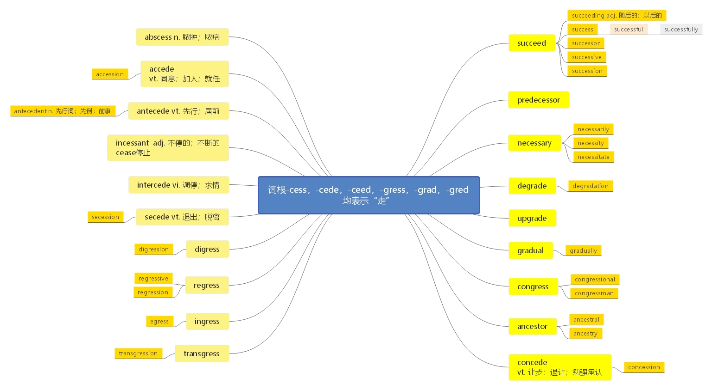

# 二、前缀 sub-, sup-, suc-, sus-的功能

> **本节课目标**\
> **1、掌握前缀 sub-, sup-, suc-, sus-的功能**\
> **2、掌握前缀 de-的功能**\
> **3、掌握新词 40 个**\
> **4、复习第一节、第二节所有单词**&#x20;

> 【课堂笔记】\
> 1\. 前缀 sub-, sup-, suc-, sus-的功能在本质上是一样的，依然是语音发生同化现象。
>
> &#x9;当sub-后面跟的字母为 c 的时候， sub-被同化为 suc-； 同理得到了 sup-； sus-。\
> 2\. 前缀 sub-, sup-, suc-, sus-的具体功能:\
> **下， 向下：** subway sub（下） +way（通道） → 下面的通道→地铁
>
> **从下往上：** submit   sub（从下往上） + mit  （送） →从下层往上送→呈送； 提交
>
> **亚于， 次于：** suburban sub (次于) + urban (城市的) →次于市区的； 达不到市区的→郊区
>
> **后， 后面：** subsequent sub (后) + sequ（词根； 表“跟”） + ent （形容词后缀） →跟在后面的→随后的； 后来的

***

**succeed** \[səkˈsi\:d] [英音](https://dict.youdao.com/dictvoice?audio=succeed\&type=1)  [美音](https://dict.youdao.com/dictvoice?audio=succeed\&type=2)  vi. 成功；继承；继任；兴旺 2035

**助记：** suc (下) +ceed (走) → 一直走下去，一直走到底→成功suc (后) +ceed(走) →走在后面→继续，继承，继任

**搭配：** succeed in (doing) sth. (考)： 成功做……

**双语例句:** I'm determined to succeed. [播放](https://dict.youdao.com/dictvoice?audio=I%27m+determined+to+succeed.&le=eng&le=eng&type=2)

我决心要获得成功。 

**双语例句:** The project seemed unlikely to succeed. [播放](https://dict.youdao.com/dictvoice?audio=The+project+seemed+unlikely+to+succeed.&le=eng&le=eng&type=2)

这个项目似乎难以成功。 

**双语例句:** He is determined that you shall succeed. [播放](https://dict.youdao.com/dictvoice?audio=He+is+determined+that+you+shall+succeed.&le=eng&le=eng&type=2)

他决心使你成功。 

**原声例句:** American University Professor James Thurber says Rahm Emanuel will need the cooperation of the Chicago City Council to **succeed**. [播放](https://dict.youdao.com/pureaudio?docid=3754640142139390548)

**原声例句:** She often spoke about the problems of women trying to **succeed** in a world mainly controlled by men. [播放](https://dict.youdao.com/pureaudio?docid=-5236699775627397233)

**原声例句:** Rickey thought Jackie Robinson was good enough as a player and strong enough as a person to **succeed**. [播放](https://dict.youdao.com/pureaudio?docid=-6179622652216930810)

**权威例句:** To survive and **succeed** will require lots of talent, lots of acquisitions and lots more money.  [播放](https://dict.youdao.com/dictvoice?audio=To+survive+and+succeed+will+require+lots+of+talent%2C+lots+of+acquisitions+and+lots+more+money.+&le=eng&type=2)

**权威例句:** If they **succeed**, the machines of the future will have longer and healthier lives.  [播放](https://dict.youdao.com/dictvoice?audio=If+they+succeed%2C+the+machines+of+the+future+will+have+longer+and+healthier+lives.+&le=eng&type=2)

**权威例句:** \"Much more likely to **succeed** is an immediate expansion of rehabilitation help, \" she said.  [播放](https://dict.youdao.com/dictvoice?audio=%22Much+more+likely+to+succeed+is+an+immediate+expansion+of+rehabilitation+help%2C+%22+she+said.+&le=eng&type=2)

***

**succeeding** \[səkˈsi\:diŋ] [英音](https://dict.youdao.com/dictvoice?audio=succeeding\&type=1)  [美音](https://dict.youdao.com/dictvoice?audio=succeeding\&type=2)  adj. 随后的，以后的 15434

**双语例句:** They have small hope of succeeding. [播放](https://dict.youdao.com/dictvoice?audio=They+have+small+hope+of+succeeding.&le=eng&le=eng&type=2)

他们成功的希望不大。 

**双语例句:** We need to sift out the applications that have no chance of succeeding. [播放](https://dict.youdao.com/dictvoice?audio=We+need+to+sift+out+the+applications+that+have+no+chance+of+succeeding.&le=eng&le=eng&type=2)

我们需要剔出那些成功无望的申请。 

**双语例句:** He had many a time heard of this thing succeeding but never of its failing before. [播放](https://dict.youdao.com/dictvoice?audio=He+had+many+a+time+heard+of+this+thing+succeeding+but+never+of+its+failing+before.&le=eng&le=eng&type=2)

他曾多次听说这件事成功了，但从来没有听说过它的失败。 

**原声例句:** (OMITTED) Students work as hard in class as they do on the basketball court, and Taylor says they are **succeeding**. [播放](https://dict.youdao.com/pureaudio?docid=6656702311776675895)

**原声例句:** \"I think what is important, is for us to be able to show over the months to come that the president's strategy is **succeeding**,\". [播放](https://dict.youdao.com/pureaudio?docid=3901412547927913392)

**原声例句:** But Sherrill Mosee sees more young single mothers meeting that challenge and **succeeding**. [播放](https://dict.youdao.com/pureaudio?docid=4613650688855701620)

**权威例句:** To what degree is Lopez **succeeding** in his drive to gain contemporary Latin artists wider recognition?  [播放](https://dict.youdao.com/dictvoice?audio=To+what+degree+is+Lopez+succeeding+in+his+drive+to+gain+contemporary+Latin+artists+wider+recognition%3F+&le=eng&type=2)

**权威例句:** American Securities said it had been investing to turn the company around, and had been **succeeding**.  [播放](https://dict.youdao.com/dictvoice?audio=American+Securities+said+it+had+been+investing+to+turn+the+company+around%2C+and+had+been+succeeding.+&le=eng&type=2)

**权威例句:** Because the study found not that the program was failing, but that it was **succeeding**.  [播放](https://dict.youdao.com/dictvoice?audio=Because+the+study+found+not+that+the+program+was+failing%2C+but+that+it+was+succeeding.+&le=eng&type=2)

***

**success** \[səkˈses] [英音](https://dict.youdao.com/dictvoice?audio=success\&type=1)  [美音](https://dict.youdao.com/dictvoice?audio=success\&type=2)  n. 成功，成就；胜利；大获成功的人或事物 778

**双语例句:** What's her recipe for success? [播放](https://dict.youdao.com/dictvoice?audio=What%27s+her+recipe+for+success%3F&le=eng&le=eng&type=2)

她成功的秘诀是什么？ 

**双语例句:** The book ensured his success. [播放](https://dict.youdao.com/dictvoice?audio=The+book+ensured+his+success.&le=eng&le=eng&type=2)

这本书保证了他的成功。 

**双语例句:** Her success speaks for itself. [播放](https://dict.youdao.com/dictvoice?audio=Her+success+speaks+for+itself.&le=eng&le=eng&type=2)

她的成功有目共睹。 

**原声例句:** Central Park was a huge **success** and helped create a movement across the United States for creating public gardens. [播放](https://dict.youdao.com/pureaudio?docid=-1130897115203937123)

**原声例句:** President Obama said educational **success** and economic well-being are linked, especially in a world economy driven by information and technology. [播放](https://dict.youdao.com/pureaudio?docid=739253202257688383)

**原声例句:** His first version of the historic film \"The Ten Commandments\" was a huge **success** among silent films in nineteen twenty-three. [播放](https://dict.youdao.com/pureaudio?docid=5134268139474186167)

**权威例句:** For better and sometimes worse, these have been primary bulwarks of Jewish **success** in America.  [播放](https://dict.youdao.com/dictvoice?audio=For+better+and+sometimes+worse%2C+these+have+been+primary+bulwarks+of+Jewish+success+in+America.+&le=eng&type=2)

**权威例句:** Despite a catastrophic conversion rate that generated unnecessary inflation, the move has been a heartening **success**.  [播放](https://dict.youdao.com/dictvoice?audio=Despite+a+catastrophic+conversion+rate+that+generated+unnecessary+inflation%2C+the+move+has+been+a+heartening+success.+&le=eng&type=2)

**权威例句:** Despite the **success** of this first substantial venture into literary criticism, or what F.  [播放](https://dict.youdao.com/dictvoice?audio=Despite+the+success+of+this+first+substantial+venture+into+literary+criticism%2C+or+what+F.+&le=eng&type=2)

***

**successful** \[səkˈsesfʊl; -f(ə)l] [英音](https://dict.youdao.com/dictvoice?audio=successful\&type=1)  [美音](https://dict.youdao.com/dictvoice?audio=successful\&type=2)  adj. 成功的；一帆风顺的 1105

**双语例句:** I think it's going to be successful. [播放](https://dict.youdao.com/dictvoice?audio=I+think+it%27s+going+to+be+successful.&le=eng&le=eng&type=2)

我认为它将会成功。 

**双语例句:** The play was very successful on Broadway. [播放](https://dict.youdao.com/dictvoice?audio=The+play+was+very+successful+on+Broadway.&le=eng&le=eng&type=2)

那部剧在百老汇大获成功。 

**双语例句:** I don't begrudge her being so successful. [播放](https://dict.youdao.com/dictvoice?audio=I+don%27t+begrudge+her+being+so+successful.&le=eng&le=eng&type=2)

我并没有因她如此成功而怏怏不乐。 

**原声例句:** Butler lost by just two points to Duke, which for years has had one of the country's most **successful** basketball programs. [播放](https://dict.youdao.com/pureaudio?docid=1303299210300228160)

**原声例句:** He is a **successful** online player, but so far his biggest win in live tournament play was eighty-two thousand dollars. [播放](https://dict.youdao.com/pureaudio?docid=-4683893179247458707)

**原声例句:** This is the VOA Special English Development Report: In two thousand five, Tanya Pinto was a **successful** young businesswoman in Dallas,Texas. [播放](https://dict.youdao.com/pureaudio?docid=-768670558862847645)

**权威例句:** In fact, I think you can be a far better and more **successful** businessperson.  [播放](https://dict.youdao.com/dictvoice?audio=In+fact%2C+I+think+you+can+be+a+far+better+and+more+successful+businessperson.+&le=eng&type=2)

**权威例句:** His efforts have been so **successful** that this year CNN featured his heroic efforts.  [播放](https://dict.youdao.com/dictvoice?audio=His+efforts+have+been+so+successful+that+this+year+CNN+featured+his+heroic+efforts.+&le=eng&type=2)

**权威例句:** Like Dennis Masellis, Francis Vitale Jr. looked like a **successful** executive with a serious hobby.  [播放](https://dict.youdao.com/dictvoice?audio=Like+Dennis+Masellis%2C+Francis+Vitale+Jr.+looked+like+a+successful+executive+with+a+serious+hobby.+&le=eng&type=2)

***

**successfully** \[səkˈsesfəlɪ] [英音](https://dict.youdao.com/dictvoice?audio=successfully\&type=1)  [美音](https://dict.youdao.com/dictvoice?audio=successfully\&type=2)  adv. 顺利地；成功地 3205

**双语例句:** Shareholders successfully scuttled the deal. [播放](https://dict.youdao.com/dictvoice?audio=Shareholders+successfully+scuttled+the+deal.&le=eng&le=eng&type=2)

股东成功地阻止了这桩交易。 

**双语例句:** Parker had successfully flown both aircraft. [播放](https://dict.youdao.com/dictvoice?audio=Parker+had+successfully+flown+both+aircraft.&le=eng&le=eng&type=2)

帕克成功地驾驶过这两架飞机。 

**双语例句:** She successfully bluffed her way through the interview. [播放](https://dict.youdao.com/dictvoice?audio=She+successfully+bluffed+her+way+through+the+interview.&le=eng&le=eng&type=2)

她胡乱吹嘘，成功地通过了面试。 

**原声例句:** This is the first time scientists have **successfully** passed on a foreign gene to a future generation. [播放](https://dict.youdao.com/pureaudio?docid=-6311459267981132171)

**原声例句:** In two thousand five, he **successfully** completed the American Lung Association Open Airways for Schools Program. [播放](https://dict.youdao.com/pureaudio?docid=5556192832787088428)

**原声例句:** She decided to do something special with her life after she was **successfully** treated for cancer. [播放](https://dict.youdao.com/pureaudio?docid=2629199247902003421)

**权威例句:** But each of the stocks meets the standards of value that we have applied **successfully** for 27 years.  [播放](https://dict.youdao.com/dictvoice?audio=But+each+of+the+stocks+meets+the+standards+of+value+that+we+have+applied+successfully+for+27+years.+&le=eng&type=2)

**权威例句:** Only this respected former army general could have **successfully** cut such a durable deal.  [播放](https://dict.youdao.com/dictvoice?audio=Only+this+respected+former+army+general+could+have+successfully+cut+such+a+durable+deal.+&le=eng&type=2)

**权威例句:** One international star who seems to be **successfully** making the transition to American is Noomi Rapace.  [播放](https://dict.youdao.com/dictvoice?audio=One+international+star+who+seems+to+be+successfully+making+the+transition+to+American+is+Noomi+Rapace.+&le=eng&type=2)

***

**successor** \[səkˈsesə] [英音](https://dict.youdao.com/dictvoice?audio=successor\&type=1)  [美音](https://dict.youdao.com/dictvoice?audio=successor\&type=2)  n. 继承者；后续的事物 5502

**助记：** success (继承，接任) +or (名词后缀，表人) →继承人，继任者

**succession** \[səkˈseʃən] [英音](https://dict.youdao.com/dictvoice?audio=succession\&type=1)  [美音](https://dict.youdao.com/dictvoice?audio=succession\&type=2)  n. 连续；继位；继承权； \[农业]轮栽 6484

**搭配：** a succession of books (考)： 一连串的书

**successive** \[səkˈsesiv] [英音](https://dict.youdao.com/dictvoice?audio=successive\&type=1)  [美音](https://dict.youdao.com/dictvoice?audio=successive\&type=2)  adj. 连续的；继承的；依次的；接替的 8209

**例句：** Countries like Japan and Germany have successively tightened buildingcodes, requiring an increase in insulation levels but leaving it up tobuilders to decide how to meet them.

日本，德国等国家已经相继加强了建筑规范，要求提高建筑物的绝缘等级，但是由建筑商来自行决定怎么去达到这些等级。

**仿写例句：** 日本，德国等国家已经相继出台了一些规定，要求增加学生对于本国语言的学习时间。

Countries like Japan and Germany have successively announced rules,requiring an increase in time for learning their own languages.

**双语例句:** This was their fourth successive win. [播放](https://dict.youdao.com/dictvoice?audio=This+was+their+fourth+successive+win.&le=eng&le=eng&type=2)

这是他们连续第四次获胜。 

**双语例句:** Jackson was the winner for a second successive year. [播放](https://dict.youdao.com/dictvoice?audio=Jackson+was+the+winner+for+a+second+successive+year.&le=eng&le=eng&type=2)

杰克逊是连续第二年的获胜者。 

**双语例句:** Successive governments have tried to tackle the problem. [播放](https://dict.youdao.com/dictvoice?audio=Successive+governments+have+tried+to+tackle+the+problem.&le=eng&le=eng&type=2)

历届政府都试图解决这个问题。 

**原声例句:** Each correct prediction is worth a set number of points, with the value for correct picks increasing in each **successive** round. [播放](https://dict.youdao.com/pureaudio?docid=-6727270153554392061)

**原声例句:** Since then, the Muslim majority nation of 150 million people has struggled to overcome endemic poverty and a legacy of coups and other violent attempts to oust **successive** governments. [播放](https://dict.youdao.com/pureaudio?docid=-6746260668186990968)

**原声例句:** Already the region's poorest country, Haiti was battered by four **successive** hurricanes last year that wiped out about 15 percent of the country's economic output and further damaged roads and other elements of an already weak infrastructure. [播放](https://dict.youdao.com/pureaudio?docid=-3651429689949571934)

**权威例句:** If the showers hold off, England will seek to extend their record of eight **successive** T20 victories.  [播放](https://dict.youdao.com/dictvoice?audio=If+the+showers+hold+off%2C+England+will+seek+to+extend+their+record+of+eight+successive+T20+victories.+&le=eng&type=2)

**权威例句:** Blatter was first elected in 1998 and is now in his fourth **successive** four-year term.  [播放](https://dict.youdao.com/dictvoice?audio=Blatter+was+first+elected+in+1998+and+is+now+in+his+fourth+successive+four-year+term.+&le=eng&type=2)

**权威例句:** Despite losing their eighth **successive** Test match in Australia, West Indies were not too downcast.  [播放](https://dict.youdao.com/dictvoice?audio=Despite+losing+their+eighth+successive+Test+match+in+Australia%2C+West+Indies+were+not+too+downcast.+&le=eng&type=2)

**双语例句:** She has won the award for the third year in succession. [播放](https://dict.youdao.com/dictvoice?audio=She+has+won+the+award+for+the+third+year+in+succession.&le=eng&le=eng&type=2)

这是她连续第三年获得此奖。 

**双语例句:** They are semi-finalists for the fourth year in succession. [播放](https://dict.youdao.com/dictvoice?audio=They+are+semi-finalists+for+the+fourth+year+in+succession.&le=eng&le=eng&type=2)

这是他们连续第四年打入半决赛。 

**双语例句:** Nicholas Paul Patrick was seventh in the line of succession to the throne. [播放](https://dict.youdao.com/dictvoice?audio=Nicholas+Paul+Patrick+was+seventh+in+the+line+of+succession+to+the+throne.&le=eng&le=eng&type=2)

尼古拉斯·保罗·帕特里克在王位继承顺序上排第7。 

**原声例句:** The rapid **succession** of events restructuring, the system. Hungary Czechoslovakia . which marked the end of the Cold War is not in dispute. [播放](https://dict.youdao.com/pureaudio?docid=5475660671230821943)

**原声例句:** Through the implant process,called Intra-cranial Electrophysiology,or ICE, the researchers have found that Broca's area processes three different language functions in **succession** within a quarter of a second. [播放](https://dict.youdao.com/pureaudio?docid=-2411321660262307584)

**原声例句:** A document setting out rules for democratic **succession** was approved almost three years ago, but has been ratified by only three of the 15 countries needed to take effect. [播放](https://dict.youdao.com/pureaudio?docid=-6031719276483613393)

**权威例句:** In general, advisors should start **succession** planning when they hit their peak earning years.  [播放](https://dict.youdao.com/dictvoice?audio=In+general%2C+advisors+should+start+succession+planning+when+they+hit+their+peak+earning+years.+&le=eng&type=2)

**权威例句:** Rangers burst to life after 17 minutes and created three good chances in quick **succession**.  [播放](https://dict.youdao.com/dictvoice?audio=Rangers+burst+to+life+after+17+minutes+and+created+three+good+chances+in+quick+succession.+&le=eng&type=2)

**权威例句:** Hatchets buried in rapid **succession** with its oldest, staunchest rivals: Sun Microsystems, Netscape, RealNetworks.  [播放](https://dict.youdao.com/dictvoice?audio=Hatchets+buried+in+rapid+succession+with+its+oldest%2C+staunchest+rivals%3A+Sun+Microsystems%2C+Netscape%2C+RealNetworks.+&le=eng&type=2)

**双语例句:** Sokagakkai was able to handpick his successor. [播放](https://dict.youdao.com/dictvoice?audio=Sokagakkai+was+able+to+handpick+his+successor.&le=eng&le=eng&type=2)

苏卡格凯可以亲自挑选他的继承人。 

**双语例句:** Mr. Olsen has always avoided anointing any successor. [播放](https://dict.youdao.com/dictvoice?audio=Mr.+Olsen+has+always+avoided+anointing+any+successor.&le=eng&le=eng&type=2)

奥尔森先生总是避免指定任何继任者。 

**双语例句:** He was deposed and replaced by a more pliant successor. [播放](https://dict.youdao.com/dictvoice?audio=He+was+deposed+and+replaced+by+a+more+pliant+successor.&le=eng&le=eng&type=2)

他被赶下台，由一个比较容易摆布的继任者取代。 

**原声例句:** His **successor**,Hakimullah Mehsud, appearing in Balawai's final video message is wanted by the Pakistani security forces. [播放](https://dict.youdao.com/pureaudio?docid=4131632588906142595)

**原声例句:** He says much of North Korea's approach toward the United States right now relates to the goals of leader Kim Jong Il regarding his **successor**. [播放](https://dict.youdao.com/pureaudio?docid=-7219309799301766244)

**原声例句:** Tony Blair's already tarnished reputation has taken another blow with former prime minister John Major now questioning his **successor**'s motive for joining in the invasion of Iraq. [播放](https://dict.youdao.com/pureaudio?docid=769463004847462145)

**权威例句:** His **successor**, Yasuo Fukuda, has pledged to continue along the path of reform while addressing inequality.  [播放](https://dict.youdao.com/dictvoice?audio=His+successor%2C+Yasuo+Fukuda%2C+has+pledged+to+continue+along+the+path+of+reform+while+addressing+inequality.+&le=eng&type=2)

**权威例句:** Nintendo is developing a **successor** to the GameCube, dubbed Revolution, for a likely late-2006 launch.  [播放](https://dict.youdao.com/dictvoice?audio=Nintendo+is+developing+a+successor+to+the+GameCube%2C+dubbed+Revolution%2C+for+a+likely+late-2006+launch.+&le=eng&type=2)

**权威例句:** Ajit Jain, the man running the aforementioned insurance business, is often speculated as a possible **successor**.  [播放](https://dict.youdao.com/dictvoice?audio=Ajit+Jain%2C+the+man+running+the+aforementioned+insurance+business%2C+is+often+speculated+as+a+possible+successor.+&le=eng&type=2)

***

**predecessor** \[ˈpri\:disesə] [英音](https://dict.youdao.com/dictvoice?audio=predecessor\&type=1)  [美音](https://dict.youdao.com/dictvoice?audio=predecessor\&type=2)  n. 前任，前辈 5325

**助记：** pre (前) +decess (=retire：退休) +or (表“人” ) →走在前面，现在已经下台的人→前任，前辈

**双语例句:** He is cast in a different mould from his predecessor. [播放](https://dict.youdao.com/dictvoice?audio=He+is+cast+in+a+different+mould+from+his+predecessor.&le=eng&le=eng&type=2)

他和他的前任性格不一样。 

**双语例句:** The new governor is an improvement on his predecessor. [播放](https://dict.youdao.com/dictvoice?audio=The+new+governor+is+an+improvement+on+his+predecessor.&le=eng&le=eng&type=2)

新任总督胜过他的前任。 

**双语例句:** He faced the same kind of problems as his predecessor. [播放](https://dict.youdao.com/dictvoice?audio=He+faced+the+same+kind+of+problems+as+his+predecessor.&le=eng&le=eng&type=2)

他面临着与他的前任同样的问题。 

**原声例句:** It was an extraordinary public airing of differences between a current vice president of the United States and his **predecessor**. [播放](https://dict.youdao.com/pureaudio?docid=2618398295105108929)

**原声例句:** Many analysts interpreted that as an implicit rebuke to Mr.Obama's **predecessor**, George W.Bush,over his handling of the war in Iraq. [播放](https://dict.youdao.com/pureaudio?docid=6611563891935499768)

**原声例句:** That is much higher than his dovish **predecessor** Ehud Olmert, who offered major territorial concessions to the Palestinians. [播放](https://dict.youdao.com/pureaudio?docid=6550942618013469746)

**权威例句:** The Bush Administration has been infinitely more energetic on this front than was its **predecessor**.  [播放](https://dict.youdao.com/dictvoice?audio=The+Bush+Administration+has+been+infinitely+more+energetic+on+this+front+than+was+its+predecessor.+&le=eng&type=2)

**权威例句:** They went forward with a spinoff of Eastman Chemical that was planned by his **predecessor**, Kay Whitmore.  [播放](https://dict.youdao.com/dictvoice?audio=They+went+forward+with+a+spinoff+of+Eastman+Chemical+that+was+planned+by+his+predecessor%2C+Kay+Whitmore.+&le=eng&type=2)

**权威例句:** Yet the Obama administration actually followed the timetable and agreement reached by its **predecessor**.  [播放](https://dict.youdao.com/dictvoice?audio=Yet+the+Obama+administration+actually+followed+the+timetable+and+agreement+reached+by+its+predecessor.+&le=eng&type=2)

***

**necessary** \[ˈnesɪsərɪ] [英音](https://dict.youdao.com/dictvoice?audio=necessary\&type=1)  [美音](https://dict.youdao.com/dictvoice?audio=necessary\&type=2)  adj. 必要的；必然的；必需的 985

**双语例句:** I can take the car if necessary. [播放](https://dict.youdao.com/dictvoice?audio=I+can+take+the+car+if+necessary.&le=eng&le=eng&type=2)

如果必要的话，我可以乘汽车去。 

**双语例句:** If necessary I can come at once. [播放](https://dict.youdao.com/dictvoice?audio=If+necessary+I+can+come+at+once.&le=eng&le=eng&type=2)

如果有必要，我可以马上来。 

**双语例句:** Sometimes it is necessary to say no. [播放](https://dict.youdao.com/dictvoice?audio=Sometimes+it+is+necessary+to+say+no.&le=eng&le=eng&type=2)

有时候说“不”是必要的。 

**原声例句:** He used strong language and seemed to say that the United States would fight, if **necessary**,to defend its claim. [播放](https://dict.youdao.com/pureaudio?docid=5295267188132901291)

**原声例句:** I did not intend to fight unless it became **necessary** in self-defense and in the performance of official duty. [播放](https://dict.youdao.com/pureaudio?docid=-1745529250184691820)

**原声例句:** It contained all the **necessary** information about the moon and stars that sailors would need to help them learn their longitude. [播放](https://dict.youdao.com/pureaudio?docid=3143819410137247489)

**权威例句:** He made a wisecrack about dealing with deflation, if **necessary**, by dropping dollar bills from aircraft.  [播放](https://dict.youdao.com/dictvoice?audio=He+made+a+wisecrack+about+dealing+with+deflation%2C+if+necessary%2C+by+dropping+dollar+bills+from+aircraft.+&le=eng&type=2)

**权威例句:** Having a car is ideal, although cycling is sometimes **necessary** because of parking restrictions.  [播放](https://dict.youdao.com/dictvoice?audio=Having+a+car+is+ideal%2C+although+cycling+is+sometimes+necessary+because+of+parking+restrictions.+&le=eng&type=2)

**权威例句:** The Myth Of Stars 06.12.02 Movie stars are absolutely **necessary** to launch a hit picture.  [播放](https://dict.youdao.com/dictvoice?audio=The+Myth+Of+Stars+06.12.02+Movie+stars+are+absolutely+necessary+to+launch+a+hit+picture.+&le=eng&type=2)

***

**necessarily** \[ˈnesəs(ə)rɪlɪ; ˌnesəˈserɪlɪ] [英音](https://dict.youdao.com/dictvoice?audio=necessarily\&type=1)  [美音](https://dict.youdao.com/dictvoice?audio=necessarily\&type=2)  adv. 必要地；必定地，必然地 1971

**双语例句:** Biggest doesn't necessarily mean best. [播放](https://dict.youdao.com/dictvoice?audio=Biggest+doesn%27t+necessarily+mean+best.&le=eng&le=eng&type=2)

最大的不一定是最好的。 

**双语例句:** \"Not necessarily,\" she says cryptically. [播放](https://dict.youdao.com/dictvoice?audio=%22Not+necessarily%2C%22+she+says+cryptically.&le=eng&le=eng&type=2)

“不一定，”她神秘地说道。 

**双语例句:** \"He was lying, of course.\"—\"Not necessarily.\" [播放](https://dict.youdao.com/dictvoice?audio=%22He+was+lying%2C+of+course.%22%E2%80%94%22Not+necessarily.%22&le=eng&le=eng&type=2)

“他当然是在撒谎。”—“不一定。” 

**原声例句:** They think he is a strong leader. They say they don't **necessarily** agree with him on the issues they are most concerned about. [播放](https://dict.youdao.com/pureaudio?docid=-6326757387188497741)

**原声例句:** On the other hand,she says, having to go elsewhere for activities is not **necessarily** a bad thing. [播放](https://dict.youdao.com/pureaudio?docid=-768788022017829523)

**原声例句:** And the third is that we are formed more than we think in the first five years, but not **necessarily** the way Freud thought. [播放](https://dict.youdao.com/pureaudio?docid=1206331454979300592)

**权威例句:** What do you - do you buy that it's the calendar, not **necessarily** the candidates, Faye?  [播放](https://dict.youdao.com/dictvoice?audio=What+do+you+-+do+you+buy+that+it%27s+the+calendar%2C+not+necessarily+the+candidates%2C+Faye%3F+&le=eng&type=2)

**权威例句:** They really didn't **necessarily**, you know, get the link to the research that I provided there.  [播放](https://dict.youdao.com/dictvoice?audio=They+really+didn%27t+necessarily%2C+you+know%2C+get+the+link+to+the+research+that+I+provided+there.+&le=eng&type=2)

**权威例句:** And just because someone wants to host a dinner party doesn't mean they **necessarily** should.  [播放](https://dict.youdao.com/dictvoice?audio=And+just+because+someone+wants+to+host+a+dinner+party+doesn%27t+mean+they+necessarily+should.+&le=eng&type=2)

***

**necessity** \[niˈsesəti] [英音](https://dict.youdao.com/dictvoice?audio=necessity\&type=1)  [美音](https://dict.youdao.com/dictvoice?audio=necessity\&type=2)  n. 需要；必需品；必然性 3986

**助记：** necess (=necessary：必须的) +ity (名词后缀) →必需品，必要性

**搭配：** out of necessity (考)： 出于需要/迫不得已

**双语例句:** Water is a basic necessity of life. [播放](https://dict.youdao.com/dictvoice?audio=Water+is+a+basic+necessity+of+life.&le=eng&le=eng&type=2)

水是一种基本生活必需品。 

**双语例句:** There is agreement on the necessity of reforms. [播放](https://dict.youdao.com/dictvoice?audio=There+is+agreement+on+the+necessity+of+reforms.&le=eng&le=eng&type=2)

关于改革的必要性有一致意见。 

**双语例句:** We were discussing the necessity of employing more staff. [播放](https://dict.youdao.com/dictvoice?audio=We+were+discussing+the+necessity+of+employing+more+staff.&le=eng&le=eng&type=2)

我们在讨论是否需要雇用更多员工。 

**原声例句:** \"People realize, you know, they are not only going to have to be mobile out of a choice, but they are going to have to be mobile because of **necessity**.\" [播放](https://dict.youdao.com/pureaudio?docid=-6023839200792447949)

**原声例句:** King Lear says he would accept **necessity**'s sharp pinch. [播放](https://dict.youdao.com/pureaudio?docid=-4448145608563246847)

**原声例句:** That will,by **necessity**, need more troops, not only for the training, but for the mentoring in the field. [播放](https://dict.youdao.com/pureaudio?docid=-4072850400282188191)

**权威例句:** And we reaffirmed the **necessity** of listing our national actions and commitments in a transparent way.  [播放](https://dict.youdao.com/dictvoice?audio=And+we+reaffirmed+the+necessity+of+listing+our+national+actions+and+commitments+in+a+transparent+way.+&le=eng&type=2)

**权威例句:** As the company grew and eventually outgrew my loft, child care became a **necessity**.  [播放](https://dict.youdao.com/dictvoice?audio=As+the+company+grew+and+eventually+outgrew+my+loft%2C+child+care+became+a+necessity.+&le=eng&type=2)

**权威例句:** The other day, I blogged on the **necessity** of increasing the debt limit.  [播放](https://dict.youdao.com/dictvoice?audio=The+other+day%2C+I+blogged+on+the+necessity+of+increasing+the+debt+limit.+&le=eng&type=2)

***

**necessitate** \[nɪˈsesɪteɪt] [英音](https://dict.youdao.com/dictvoice?audio=necessitate\&type=1)  [美音](https://dict.youdao.com/dictvoice?audio=necessitate\&type=2)  vt. 使成为必需，需要；迫使 10483

“Our students are a pretty active bunch, but we found that they didn’t \_\_\_\_appreciate the value of what they did outside the lecture hall,” says JeffGoodman, director of careers and employ ability at the university.

A． dominantly B． earnestly C． necessarily D． gracefully

解析： 该校就业与就业能力主管Jeff Goodman表示:“我们的学生非常活跃，但我们发现，他们并没有真正意识到自己在课堂之外所做事情的价值。”考察单词含义： A支配地； B认真地； C必然地； D优雅地。这里需要一个副词修饰动词appreciate，根据but前后的逻辑，我们应该选择necessarily，表示“必然地；必定地”： Big men aren’t necessarilystrong men. 高大的人不一定强壮。

**双语例句:** The thriving obsidian operation, for example, would necessitate more miners, additional manufacturers of obsidian tools, and additional traders to carry the goods to new markets. [播放](https://dict.youdao.com/dictvoice?audio=The+thriving+obsidian+operation%2C+for+example%2C+would+necessitate+more+miners%2C+additional+manufacturers+of+obsidian+tools%2C+and+additional+traders+to+carry+the+goods+to+new+markets.&le=eng&le=eng&type=2)

例如，蓬勃发展的黑曜石业务将需要更多的矿工、更多的黑曜石工具制造商和更多的贸易商将货物运往新市场。 

**双语例句:** Does it necessitate a more convoluted build process? [播放](https://dict.youdao.com/dictvoice?audio=Does+it+necessitate+a+more+convoluted+build+process%3F&le=eng&le=eng&type=2)

是否需要更加复杂的构建过程？ 

**双语例句:** Your proposal would necessitate changing our plans. [播放](https://dict.youdao.com/dictvoice?audio=Your+proposal+would+necessitate+changing+our+plans.&le=eng&le=eng&type=2)

你的提议可能使我们的计划必须变更。 

**权威例句:** Advanced Micro said it the impairment charges won't **necessitate** any current or future cash expenditures.  [播放](https://dict.youdao.com/dictvoice?audio=Advanced+Micro+said+it+the+impairment+charges+won%27t+necessitate+any+current+or+future+cash+expenditures.+&le=eng&type=2)

**权威例句:** It will also **necessitate** the physical (and possibly forceful) relocation of large numbers of Israeli citizens.  [播放](https://dict.youdao.com/dictvoice?audio=It+will+also+necessitate+the+physical+%28and+possibly+forceful%29+relocation+of+large+numbers+of+Israeli+citizens.+&le=eng&type=2)

**权威例句:** This can in result in permanent loss of function and in rare cases **necessitate** AMPUTATION!!!!  [播放](https://dict.youdao.com/dictvoice?audio=This+can+in+result+in+permanent+loss+of+function+and+in+rare+cases+necessitate+AMPUTATION%21%21%21%21+&le=eng&type=2)

***

**degrade** \[ˈdiˈɡreid] [英音](https://dict.youdao.com/dictvoice?audio=degrade\&type=1)  [美音](https://dict.youdao.com/dictvoice?audio=degrade\&type=2)  vt. 使……丢脸；使……降级；使……降解；贬低 8605

**助记：** de (向下) +grade (级别) →级别向下→降级，退化

**双语例句:** Jays prefer crickets, but crickets degrade more quickly. [播放](https://dict.youdao.com/dictvoice?audio=Jays+prefer+crickets%2C+but+crickets+degrade+more+quickly.&le=eng&le=eng&type=2)

松鸡喜欢蟋蟀，但蟋蟀退化得更快。 

**双语例句:** Certain irrigation practices degrade soil quality and reduce agricultural productivity. [播放](https://dict.youdao.com/dictvoice?audio=Certain+irrigation+practices+degrade+soil+quality+and+reduce+agricultural+productivity.&le=eng&le=eng&type=2)

某些灌溉措施会降低土壤质量，降低农业生产力。 

**双语例句:** The main reason was that steel cables degrade very, very quickly in contact with saltwater. [播放](https://dict.youdao.com/dictvoice?audio=The+main+reason+was+that+steel+cables+degrade+very%2C+very+quickly+in+contact+with+saltwater.&le=eng&le=eng&type=2)

主要原因是钢索与盐水接触后降解非常快。 

**原声例句:** The disease causes cartilage- protecting joint surfaces to **degrade**, allowing painful bone-to-bone contact. [播放](https://dict.youdao.com/pureaudio?docid=-7430411962336235905)

**原声例句:** and you **degrade** yourself in submitting yourself to it.

**原声例句:** You have mechanisms inside your natural mechanisms inside your cell that allow the cells to **degrade** unwanted RNA sequences.

**权威例句:** Thousands of protesters are demanding tougher action from Facebook over posts that they say **degrade** women.  [播放](https://dict.youdao.com/dictvoice?audio=Thousands+of+protesters+are+demanding+tougher+action+from+Facebook+over+posts+that+they+say+degrade+women.+&le=eng&type=2)

**权威例句:** The metal doesn't **degrade** on its own, and can linger in the human body for decades.  [播放](https://dict.youdao.com/dictvoice?audio=The+metal+doesn%27t+degrade+on+its+own%2C+and+can+linger+in+the+human+body+for+decades.+&le=eng&type=2)

**权威例句:** It does so by helping **degrade** crucial cell-signaling proteins that may help tumors to spread.  [播放](https://dict.youdao.com/dictvoice?audio=It+does+so+by+helping+degrade+crucial+cell-signaling+proteins+that+may+help+tumors+to+spread.+&le=eng&type=2)

***

**degradation** \[ˌdegrəˈdeɪʃ(ə)n] [英音](https://dict.youdao.com/dictvoice?audio=degradation\&type=1)  [美音](https://dict.youdao.com/dictvoice?audio=degradation\&type=2)  n. 降格，降级；退化；堕落 7910

**双语例句:** They were sickened by the scenes of misery and degradation they found. [播放](https://dict.youdao.com/dictvoice?audio=They+were+sickened+by+the+scenes+of+misery+and+degradation+they+found.&le=eng&le=eng&type=2)

他们对所看到的凄惨和堕落景象感到恶心。 

**双语例句:** Global heating and environmental degradation are not technological problems. [播放](https://dict.youdao.com/dictvoice?audio=Global+heating+and+environmental+degradation+are+not+technological+problems.&le=eng&le=eng&type=2)

全球变暖和环境退化不是技术问题。 

**双语例句:** Rallies all over the United States were organized to protest environmental degradation. [播放](https://dict.youdao.com/dictvoice?audio=Rallies+all+over+the+United+States+were+organized+to+protest+environmental+degradation.&le=eng&le=eng&type=2)

在美国，人们组织了很多集会，以抗议环境恶化。 

**原声例句:** He says the global economy must change to a sustainable system now before social issues and ecological **degradation** become overwhelming. [播放](https://dict.youdao.com/pureaudio?docid=-6058398143967431345)

**原声例句:** But the report singles out food production as the other major factor driving environmental **degradation**. [播放](https://dict.youdao.com/pureaudio?docid=-6756972283795151519)

**原声例句:** They say the population is getting older,the buildings are in a state of **degradation**, and more and more shops are being opened for the millions of tourists that visit the city. [播放](https://dict.youdao.com/pureaudio?docid=463658771245054042)

**权威例句:** One excellent example of such an idea is tackling the massive environmental **degradation** in Tibet.  [播放](https://dict.youdao.com/dictvoice?audio=One+excellent+example+of+such+an+idea+is+tackling+the+massive+environmental+degradation+in+Tibet.+&le=eng&type=2)

**权威例句:** Another: the costs in terms of social disruption and environmental **degradation** are becoming obvious.  [播放](https://dict.youdao.com/dictvoice?audio=Another%3A+the+costs+in+terms+of+social+disruption+and+environmental+degradation+are+becoming+obvious.+&le=eng&type=2)

**权威例句:** First, there is a lack of information flow, and consequently **degradation** in the quality of advice.  [播放](https://dict.youdao.com/dictvoice?audio=First%2C+there+is+a+lack+of+information+flow%2C+and+consequently+degradation+in+the+quality+of+advice.+&le=eng&type=2)

***

**upgrade** \[ˈʌpɡreidˌ] [英音](https://dict.youdao.com/dictvoice?audio=upgrade\&type=1)  [美音](https://dict.youdao.com/dictvoice?audio=upgrade\&type=2)  vt. 提升；使升级；改良品种 6016

**助记：** up (向上) +grade (级别) →级别向上→升级，上升

**双语例句:** How do we know when to invest in an upgrade? [播放](https://dict.youdao.com/dictvoice?audio=How+do+we+know+when+to+invest+in+an+upgrade%3F&le=eng&le=eng&type=2)

我们如何知道何时投资升级？ 

**双语例句:** People should upgrade their devices regularly. [播放](https://dict.youdao.com/dictvoice?audio=People+should+upgrade+their+devices+regularly.&le=eng&le=eng&type=2)

人们应该定期升级他们的设备。 

**双语例句:** Maybe there's no need for an upgrade and that's OK. [播放](https://dict.youdao.com/dictvoice?audio=Maybe+there%27s+no+need+for+an+upgrade+and+that%27s+OK.&le=eng&le=eng&type=2)

也许不需要提升也没关系。 

**权威例句:** Kazakh officials claim that AES has not always lived up to its contractual obligations to **upgrade** plants.  [播放](https://dict.youdao.com/dictvoice?audio=Kazakh+officials+claim+that+AES+has+not+always+lived+up+to+its+contractual+obligations+to+upgrade+plants.+&le=eng&type=2)

**权威例句:** To **upgrade**, customers should call 1-800-DIRECTV no earlier than three weeks before their market's confirmed launch date.  [播放](https://dict.youdao.com/dictvoice?audio=To+upgrade%2C+customers+should+call+1-800-DIRECTV+no+earlier+than+three+weeks+before+their+market%27s+confirmed+launch+date.+&le=eng&type=2)

**权威例句:** Israel authorised the 3, 000 additional housing units a day after the UN voted to **upgrade** Palestinian status.  [播放](https://dict.youdao.com/dictvoice?audio=Israel+authorised+the+3%2C+000+additional+housing+units+a+day+after+the+UN+voted+to+upgrade+Palestinian+status.+&le=eng&type=2)

***

**gradual** \[ˈgrædʒʊəl] [英音](https://dict.youdao.com/dictvoice?audio=gradual\&type=1)  [美音](https://dict.youdao.com/dictvoice?audio=gradual\&type=2)  adj. 逐渐的；平缓的 6893

**双语例句:** Losing weight is a slow, gradual process. [播放](https://dict.youdao.com/dictvoice?audio=Losing+weight+is+a+slow%2C+gradual+process.&le=eng&le=eng&type=2)

减肥是一个缓慢而逐渐的过程。 

**双语例句:** The roads are built to accommodate gradual temperature changes. [播放](https://dict.youdao.com/dictvoice?audio=The+roads+are+built+to+accommodate+gradual+temperature+changes.&le=eng&le=eng&type=2)

这些道路是为适应气温的逐渐变化而建的。 

**双语例句:** The greatest hope for reform is the gradual spread of information. [播放](https://dict.youdao.com/dictvoice?audio=The+greatest+hope+for+reform+is+the+gradual+spread+of+information.&le=eng&le=eng&type=2)

改革的最大希望就是信息的逐渐传播。 

**原声例句:** \"Reducing salt in the food supply needs to be a **gradual** process for a couple of reasons.\" [播放](https://dict.youdao.com/pureaudio?docid=7036182246524913196)

**原声例句:** BHP Billition said in a statement that government stimulus measures imposed over the past year \"appear to have supported a **gradual** return to normalized global trade.\" [播放](https://dict.youdao.com/pureaudio?docid=-1843828694123856675)

**原声例句:** \"We have very high confidence that by that date conditions will permit us to end the surge and begin a **gradual** and responsible drawdown of U.S.forces.\" [播放](https://dict.youdao.com/pureaudio?docid=-7908259210409294168)

**权威例句:** The gradual-exposure principles are part of the program that helped Georgiann Steely at Mayo's teen clinic.  [播放](https://dict.youdao.com/dictvoice?audio=The+gradual-exposure+principles+are+part+of+the+program+that+helped+Georgiann+Steely+at+Mayo%27s+teen+clinic.+&le=eng&type=2)

**权威例句:** Also, a **gradual** increase in rates is not always a negative for the stock market.  [播放](https://dict.youdao.com/dictvoice?audio=Also%2C+a+gradual+increase+in+rates+is+not+always+a+negative+for+the+stock+market.+&le=eng&type=2)

**权威例句:** We need **gradual** growth in the balance sheet to support **gradual** growth in the money supply.  [播放](https://dict.youdao.com/dictvoice?audio=We+need+gradual+growth+in+the+balance+sheet+to+support+gradual+growth+in+the+money+supply.+&le=eng&type=2)

***

**gradually** \[ˈgrædʒʊlɪ; ˈgrædjʊəlɪ] [英音](https://dict.youdao.com/dictvoice?audio=gradually\&type=1)  [美音](https://dict.youdao.com/dictvoice?audio=gradually\&type=2)  adv. 渐渐地；逐步地 2986

**双语例句:** The weather gradually improved. [播放](https://dict.youdao.com/dictvoice?audio=The+weather+gradually+improved.&le=eng&le=eng&type=2)

天气逐渐好转。 

**双语例句:** The water deepened gradually. [播放](https://dict.youdao.com/dictvoice?audio=The+water+deepened+gradually.&le=eng&le=eng&type=2)

水渐渐变深了。 

**双语例句:** My mood gradually lightened. [播放](https://dict.youdao.com/dictvoice?audio=My+mood+gradually+lightened.&le=eng&le=eng&type=2)

我的心情渐渐好起来。 

**原声例句:** **Gradually**,Asian Carp edge out the other native species in the river until they are one of the only kinds of fish left. [播放](https://dict.youdao.com/pureaudio?docid=-8717842731791053007)

**原声例句:** Starting out as a technical skier, Whiteface also gave Weibrecht the chance to **gradually** increase his speed. [播放](https://dict.youdao.com/pureaudio?docid=-8745651266132171166)

**原声例句:** It **gradually** became clear that the Pill was not a panacea for all those societal ills. [播放](https://dict.youdao.com/pureaudio?docid=-652165074911325711)

**权威例句:** The principality will **\"graduall**y meet international tax standards\", according to the office of the French president.  [播放](https://dict.youdao.com/dictvoice?audio=The+principality+will+%22gradually+meet+international+tax+standards%22%2C+according+to+the+office+of+the+French+president.+&le=eng&type=2)

**权威例句:** **Gradually** the musical tinkle of their bells disappears into the great silence of the mountains.  [播放](https://dict.youdao.com/dictvoice?audio=Gradually+the+musical+tinkle+of+their+bells+disappears+into+the+great+silence+of+the+mountains.+&le=eng&type=2)

**权威例句:** As the train climbed higher, their profiles **gradually** faded into blurry silhouettes on the landscape.  [播放](https://dict.youdao.com/dictvoice?audio=As+the+train+climbed+higher%2C+their+profiles+gradually+faded+into+blurry+silhouettes+on+the+landscape.+&le=eng&type=2)

***

**congress** \[ˈkɔŋgres] [英音](https://dict.youdao.com/dictvoice?audio=congress\&type=1)  [美音](https://dict.youdao.com/dictvoice?audio=congress\&type=2)  n. 国会；会议；代表大会；社交 639

**助记：** con (共同，一起) +gress (走) →走到一起→开会 (代表大会，国会)

**双语例句:** Congress is in gridlock. [播放](https://dict.youdao.com/dictvoice?audio=Congress+is+in+gridlock.&le=eng&le=eng&type=2)

国会因意见分歧而陷入僵局。 

**双语例句:** A lot has changed after the party congress. [播放](https://dict.youdao.com/dictvoice?audio=A+lot+has+changed+after+the+party+congress.&le=eng&le=eng&type=2)

该党代表大会后很多都变了。 

**双语例句:** Congress scores low in public opinion polls. [播放](https://dict.youdao.com/dictvoice?audio=Congress+scores+low+in+public+opinion+polls.&le=eng&le=eng&type=2)

国会在民意测验中得分很低。 

**原声例句:** In the nineteen sixties, he was one of the first Democrats in the United States **Congress** to oppose the party leadership. [播放](https://dict.youdao.com/pureaudio?docid=-7832118182013993631)

**原声例句:** New legislation in **Congress** proposes to require all states to have what is called a graduated driver licensing system. [播放](https://dict.youdao.com/pureaudio?docid=-7423620841911497917)

**原声例句:** She won easily. She was the first woman and first black to be elected to **Congress** to represent Texas. [播放](https://dict.youdao.com/pureaudio?docid=-7308302854062777661)

**权威例句:** Members of **Congress** like this, according to a spokeswoman for that house's committee on science.  [播放](https://dict.youdao.com/dictvoice?audio=Members+of+Congress+like+this%2C+according+to+a+spokeswoman+for+that+house%27s+committee+on+science.+&le=eng&type=2)

**权威例句:** After exiting the museum, head to Susan Maasch Fine Art, on **Congress** St.  [播放](https://dict.youdao.com/dictvoice?audio=After+exiting+the+museum%2C+head+to+Susan+Maasch+Fine+Art%2C+on+Congress+St.+&le=eng&type=2)

**权威例句:** Brendan Barber, the head of the Trades Union **Congress**, takes a rather different view.  [播放](https://dict.youdao.com/dictvoice?audio=Brendan+Barber%2C+the+head+of+the+Trades+Union+Congress%2C+takes+a+rather+different+view.+&le=eng&type=2)

***

**congressional** \[kənˈɡreʃənəl] [英音](https://dict.youdao.com/dictvoice?audio=congressional\&type=1)  [美音](https://dict.youdao.com/dictvoice?audio=congressional\&type=2)  adj. 国会的；会议的；议会的 2330

**双语例句:** The president explained his plans to congressional leaders. [播放](https://dict.youdao.com/dictvoice?audio=The+president+explained+his+plans+to+congressional+leaders.&le=eng&le=eng&type=2)

总统向国会领导人说明了他的计划。 

**双语例句:** But congressional staffers fret that the project will eventually cost billions more. [播放](https://dict.youdao.com/dictvoice?audio=But+congressional+staffers+fret+that+the+project+will+eventually+cost+billions+more.&le=eng&le=eng&type=2)

但国会的工作人员们担心这个方案最终会多花几十亿。 

**双语例句:** The Congressional Budget Office says the federal deficit shows every sign of getting larger. [播放](https://dict.youdao.com/dictvoice?audio=The+Congressional+Budget+Office+says+the+federal+deficit+shows+every+sign+of+getting+larger.&le=eng&le=eng&type=2)

国会预算办公室称联邦赤字显示出种种增加的迹象。 

**原声例句:** Earlier this week, President Obama won a major political victory with **congressional** passage of his health care reform plan. [播放](https://dict.youdao.com/pureaudio?docid=6159242287358778360)

**原声例句:** Dorothy Height received the Presidential Medal of Freedom and the **Congressional** Gold Medal for her work for racial and gender equality. [播放](https://dict.youdao.com/pureaudio?docid=-6998503506734983902)

**原声例句:** On Wednesday, the **Congressional** Budget Office estimated the federal budget deficit this year at one trillion two hundred billion dollars. [播放](https://dict.youdao.com/pureaudio?docid=4046991997824732836)

**权威例句:** **Congressional** Democrats will block passage, but the issue will then become embroiled in the elections.  [播放](https://dict.youdao.com/dictvoice?audio=Congressional+Democrats+will+block+passage%2C+but+the+issue+will+then+become+embroiled+in+the+elections.+&le=eng&type=2)

**权威例句:** Hundreds of angry letters, punctuated with lots of exclamation marks, have poured into **congressional** offices.  [播放](https://dict.youdao.com/dictvoice?audio=Hundreds+of+angry+letters%2C+punctuated+with+lots+of+exclamation+marks%2C+have+poured+into+congressional+offices.+&le=eng&type=2)

**权威例句:** **Congressional** leaders on both sides of the aisle vow quick legislative action to create the department.  [播放](https://dict.youdao.com/dictvoice?audio=Congressional+leaders+on+both+sides+of+the+aisle+vow+quick+legislative+action+to+create+the+department.+&le=eng&type=2)

***

**congressman** \[ˈkɑŋgrəsmən] [英音](https://dict.youdao.com/dictvoice?audio=congressman\&type=1)  [美音](https://dict.youdao.com/dictvoice?audio=congressman\&type=2)  n. 国会议员；众议院议员 5457

**双语例句:** The New York gay action group \"Queer Nation\" recently outed an American Congressman. [播放](https://dict.youdao.com/dictvoice?audio=The+New+York+gay+action+group+%22Queer+Nation%22+recently+outed+an+American+Congressman.&le=eng&le=eng&type=2)

纽约同性恋行动团体“酷儿国度”最近揭露了一位美国国会议员的同性恋身份。 

**双语例句:** Statement of Congressman Ron Paul. [播放](https://dict.youdao.com/dictvoice?audio=Statement+of+Congressman+Ron+Paul.&le=eng&le=eng&type=2)

国会议员罗恩·保罗的国会陈述。 

**双语例句:** The congressman was very popular there. [播放](https://dict.youdao.com/dictvoice?audio=The+congressman+was+very+popular+there.&le=eng&le=eng&type=2)

众议员约翰.保罗.哈默施密特在那里很受欢迎。 

**原声例句:** Just before the first of the year, a **congressman** asked the president if he still planned to sign the Emancipation Proclamation. [播放](https://dict.youdao.com/pureaudio?docid=-4141877547061780757)

**原声例句:** As a **congressman** and a senator, he had voted against every attempt to give more power to the federal government. [播放](https://dict.youdao.com/pureaudio?docid=7444723176730302855)

**原声例句:** **Congressman** James Blaine seemed to have the best chance of winning the Republican presidential nomination in eighteen seventy-six. [播放](https://dict.youdao.com/pureaudio?docid=-899187934057322490)

**权威例句:** Tennessee **Congressman** Zach Wamp is a close ally of Thompson and is pushing him to run.  [播放](https://dict.youdao.com/dictvoice?audio=Tennessee+Congressman+Zach+Wamp+is+a+close+ally+of+Thompson+and+is+pushing+him+to+run.+&le=eng&type=2)

**权威例句:** No suggestions, please, just go out and lobby your **Congressman**, or write a supportive oped.  [播放](https://dict.youdao.com/dictvoice?audio=No+suggestions%2C+please%2C+just+go+out+and+lobby+your+Congressman%2C+or+write+a+supportive+oped.+&le=eng&type=2)

**权威例句:** We wanted to get more perspective about this plan so we've called **Congressman** Danny Davis.  [播放](https://dict.youdao.com/dictvoice?audio=We+wanted+to+get+more+perspective+about+this+plan+so+we%27ve+called+Congressman+Danny+Davis.+&le=eng&type=2)

***

**ancestor** \[ˈænsestə] [英音](https://dict.youdao.com/dictvoice?audio=ancestor\&type=1)  [美音](https://dict.youdao.com/dictvoice?audio=ancestor\&type=2)  n. 始祖，祖先；被继承人 4178

**双语例句:** Her Chinese friends referred to the empress as their venerable ancestor. [播放](https://dict.youdao.com/dictvoice?audio=Her+Chinese+friends+referred+to+the+empress+as+their+venerable+ancestor.&le=eng&le=eng&type=2)

她的中国朋友们称那位皇后是令他们尊敬的祖先。 

**双语例句:** Their ancestor is different from that of micro bats. [播放](https://dict.youdao.com/dictvoice?audio=Their+ancestor+is+different+from+that+of+micro+bats.&le=eng&le=eng&type=2)

它们的祖先与微型蝙蝠的祖先不同。 

**双语例句:** My ancestor was a preacher, traveling around the countryside. [播放](https://dict.youdao.com/dictvoice?audio=My+ancestor+was+a+preacher%2C+traveling+around+the+countryside.&le=eng&le=eng&type=2)

我的祖先是一位游历于乡间的传教士。 

**原声例句:** Some other experts say that the **ancestor** of the modern guitar was brought to Spain from Persia sometime in the twelfth century. [播放](https://dict.youdao.com/pureaudio?docid=-1822867988886255788)

**原声例句:** More than forty percent of Americans have an **ancestor** who passed through Ellis Island. [播放](https://dict.youdao.com/pureaudio?docid=-10401807843220496)

**原声例句:** Rebecca Skloot says she hopes that scientific companies that have gained from HeLa cells will give back to the family whose **ancestor** changed the history of medicine. [播放](https://dict.youdao.com/pureaudio?docid=-5709144423724335464)

**权威例句:** On Lunar New Year and the autumn harvest holiday Chuseok, the entire country takes part in **ancestor** rites.  [播放](https://dict.youdao.com/dictvoice?audio=On+Lunar+New+Year+and+the+autumn+harvest+holiday+Chuseok%2C+the+entire+country+takes+part+in+ancestor+rites.+&le=eng&type=2)

**权威例句:** The differences among the subjects, however, showed how they may indicate a common **ancestor**.  [播放](https://dict.youdao.com/dictvoice?audio=The+differences+among+the+subjects%2C+however%2C+showed+how+they+may+indicate+a+common+ancestor.+&le=eng&type=2)

**权威例句:** But the semantic web is pretty much a direct **ancestor** of these stone age efforts.  [播放](https://dict.youdao.com/dictvoice?audio=But+the+semantic+web+is+pretty+much+a+direct+ancestor+of+these+stone+age+efforts.+&le=eng&type=2)

***

**ancestral** \[ænˈsestr(ə)l] [英音](https://dict.youdao.com/dictvoice?audio=ancestral\&type=1)  [美音](https://dict.youdao.com/dictvoice?audio=ancestral\&type=2)  adj. 祖先的；祖传的 9154

**双语例句:** Early embryos of many species develop ancestral features. [播放](https://dict.youdao.com/dictvoice?audio=Early+embryos+of+many+species+develop+ancestral+features.&le=eng&le=eng&type=2)

许多物种的早期胚胎具有其祖先的特性。 

**双语例句:** This ancestral species might have evolved at a time when the islands were connected. [播放](https://dict.youdao.com/dictvoice?audio=This+ancestral+species+might+have+evolved+at+a+time+when+the+islands+were+connected.&le=eng&le=eng&type=2)

这种祖先物种可能是在岛屿相连的时候进化而来的。 

**双语例句:** Of today's different groups of algae, green algae are probably the most similar to ancestral plants. [播放](https://dict.youdao.com/dictvoice?audio=Of+today%27s+different+groups+of+algae%2C+green+algae+are+probably+the+most+similar+to+ancestral+plants.&le=eng&le=eng&type=2)

在今天的众多藻类中，绿藻可能与植物的祖先最为相似。 

**原声例句:** About nine hundred years ago, the **Ancestral** Puebloan people built villages high in the walls of canyons in Mesa Verde,Colorado. [播放](https://dict.youdao.com/pureaudio?docid=3659546455179481190)

**原声例句:** Today,almost four hundred Przewalski's horses have been returned to their **ancestral** homelands. [播放](https://dict.youdao.com/pureaudio?docid=7770008092805619737)

**原声例句:** Wouldn't a later writer have cleaned up this **ancestral** record if this were in fact something composed at a later period? Also, he notes that the representation of inter-ethnic relationships in the patriarchal stories does not accord with the reality of a later period.

**权威例句:** Meantime, Innu and Inuit groups claimed the nickel deposit lay on their **ancestral** land.  [播放](https://dict.youdao.com/dictvoice?audio=Meantime%2C+Innu+and+Inuit+groups+claimed+the+nickel+deposit+lay+on+their+ancestral+land.+&le=eng&type=2)

**权威例句:** President Reagan went with Smithwicks, a local ale from his **ancestral** land in Co.  [播放](https://dict.youdao.com/dictvoice?audio=President+Reagan+went+with+Smithwicks%2C+a+local+ale+from+his+ancestral+land+in+Co.+&le=eng&type=2)

**权威例句:** Collecting and exalting **ancestral** Scottish culture was both an aesthetic and a political mission for Burns.  [播放](https://dict.youdao.com/dictvoice?audio=Collecting+and+exalting+ancestral+Scottish+culture+was+both+an+aesthetic+and+a+political+mission+for+Burns.+&le=eng&type=2)

***

**ancestry** \[ˈænsestrɪ] [英音](https://dict.youdao.com/dictvoice?audio=ancestry\&type=1)  [美音](https://dict.youdao.com/dictvoice?audio=ancestry\&type=2)  n. 祖先；血统 11086

**双语例句:** What is skeptical observers' opinion on ancestry testing? [播放](https://dict.youdao.com/dictvoice?audio=What+is+skeptical+observers%27+opinion+on+ancestry+testing%3F&le=eng&le=eng&type=2)

持怀疑态度的观察者们对血统检测的看法是什么？ 

**双语例句:** It is probable that the nocturnal trades a way back in the ancestry of all mammals. [播放](https://dict.youdao.com/dictvoice?audio=It+is+probable+that+the+nocturnal+trades+a+way+back+in+the+ancestry+of+all+mammals.&le=eng&le=eng&type=2)

这种夜间的“交易”也许可以一直追溯到所有哺乳动物的祖先身上。 

**双语例句:** What we did in our ancestry was to produce more permanent natural coloring in our skin cells. [播放](https://dict.youdao.com/dictvoice?audio=What+we+did+in+our+ancestry+was+to+produce+more+permanent+natural+coloring+in+our+skin+cells.&le=eng&le=eng&type=2)

我们祖先所做的是在我们的皮肤细胞中产生更持久的天然色素。 

**权威例句:** Recently I sent my DNA to 23andme to get a broader picture of my **ancestry**.  [播放](https://dict.youdao.com/dictvoice?audio=Recently+I+sent+my+DNA+to+23andme+to+get+a+broader+picture+of+my+ancestry.+&le=eng&type=2)

**权威例句:** Evolution as fact refers to the historical reality that species are related through common **ancestry**.  [播放](https://dict.youdao.com/dictvoice?audio=Evolution+as+fact+refers+to+the+historical+reality+that+species+are+related+through+common+ancestry.+&le=eng&type=2)

**权威例句:** Ruben Aquino, a longtime Disney staffer of Japanese-Filipino **ancestry**, supervised animation for main characters.  [播放](https://dict.youdao.com/dictvoice?audio=Ruben+Aquino%2C+a+longtime+Disney+staffer+of+Japanese-Filipino+ancestry%2C+supervised+animation+for+main+characters.+&le=eng&type=2)

***

**concede** \[kənˈsi\:d] [英音](https://dict.youdao.com/dictvoice?audio=concede\&type=1)  [美音](https://dict.youdao.com/dictvoice?audio=concede\&type=2)  vt. 承认；退让；给予，容许 4232

**双语例句:** I had to concede the logic of this. [播放](https://dict.youdao.com/dictvoice?audio=I+had+to+concede+the+logic+of+this.&le=eng&le=eng&type=2)

我得承认这件事情有它的逻辑。 

**双语例句:** He was forced to concede (that) there might be difficulties. [播放](https://dict.youdao.com/dictvoice?audio=He+was+forced+to+concede+%28that%29+there+might+be+difficulties.&le=eng&le=eng&type=2)

他被迫承认可能有困难。 

**双语例句:** After losing this decisive battle, the general was forced to concede. [播放](https://dict.youdao.com/dictvoice?audio=After+losing+this+decisive+battle%2C+the+general+was+forced+to+concede.&le=eng&le=eng&type=2)

输掉了这场决定性的战役后，那位将军不得不承认失败。 

**原声例句:** These folks need to stop scaring everybody.\" Democrats **concede** the political stakes on the health-care issue are very high, both for the president and for the Democratic majorities in Congress. [播放](https://dict.youdao.com/pureaudio?docid=-2857007236292560872)

**权威例句:** If they **concede** a goal they must concentrate on not letting in three or four.  [播放](https://dict.youdao.com/dictvoice?audio=If+they+concede+a+goal+they+must+concentrate+on+not+letting+in+three+or+four.+&le=eng&type=2)

**权威例句:** The only mistake he was willing to **concede** during his tenure were mistakes of communication.  [播放](https://dict.youdao.com/dictvoice?audio=The+only+mistake+he+was+willing+to+concede+during+his+tenure+were+mistakes+of+communication.+&le=eng&type=2)

**权威例句:** On Tuesday, having lost by 40% to 49%, Mr Lamont called Mr Lieberman to **concede** defeat.  [播放](https://dict.youdao.com/dictvoice?audio=On+Tuesday%2C+having+lost+by+40%25+to+49%25%2C+Mr+Lamont+called+Mr+Lieberman+to+concede+defeat.+&le=eng&type=2)

***

**concession** \[kənˈseʃ(ə)n] [英音](https://dict.youdao.com/dictvoice?audio=concession\&type=1)  [美音](https://dict.youdao.com/dictvoice?audio=concession\&type=2)  n. 让步；特许（权）；承认；退位 5059

**双语例句:** She made no concession to his age; she expected him to work as hard as she did. [播放](https://dict.youdao.com/dictvoice?audio=She+made+no+concession+to+his+age%3B+she+expected+him+to+work+as+hard+as+she+did.&le=eng&le=eng&type=2)

她丝毫也不体谅他的年龄，要求他干得像她一样卖力。 

**双语例句:** Finish the following sentence with an adverbial clause of concession. [播放](https://dict.youdao.com/dictvoice?audio=Finish+the+following%C2%A0sentence%C2%A0with%C2%A0an%C2%A0adverbial%C2%A0clause%C2%A0of%C2%A0concession.&le=eng&le=eng&type=2)

用让步状语从句完成下列句子。 

**双语例句:** This concession may not be enough. [播放](https://dict.youdao.com/dictvoice?audio=This+concession+may+not+be+enough.&le=eng&le=eng&type=2)

这个让步也许还远远不够。 

**原声例句:** The court's decision and Coleman's **concession** presumably removes any obstacle for Franken's certification. [播放](https://dict.youdao.com/pureaudio?docid=3204479487643888480)

**原声例句:** She testified at the hearing, calling the new missile defense plan for Europe a \"dramatic improvement\" over the old Bush administration plan, and rejecting criticism that it is a unilateral **concession** to Russia. [播放](https://dict.youdao.com/pureaudio?docid=7922071079583417234)

**原声例句:** In the past few years, Baomahun town has mushroomed as people rush to mine the land before it is taken over by the British mining company, Cluff Gold, whose 137 kilometer **concession** includes the artisanal mining pits. [播放](https://dict.youdao.com/pureaudio?docid=3529949812517200220)

**权威例句:** The climbdown was an apparent **concession** to the opposition after the government lost its majority.  [播放](https://dict.youdao.com/dictvoice?audio=The+climbdown+was+an+apparent+concession+to+the+opposition+after+the+government+lost+its+majority.+&le=eng&type=2)

**权威例句:** The company also operated 494 **concession** shop locations worldwide at the end of the quarter.  [播放](https://dict.youdao.com/dictvoice?audio=The+company+also+operated+494+concession+shop+locations+worldwide+at+the+end+of+the+quarter.+&le=eng&type=2)

**权威例句:** German sports spectators used to have to wait in long lines at the stadium **concession** counter.  [播放](https://dict.youdao.com/dictvoice?audio=German+sports+spectators+used+to+have+to+wait+in+long+lines+at+the+stadium+concession+counter.+&le=eng&type=2)

***

# 高难度词汇：

***

**abscess** \[ˈæbsɪs; -ses] [英音](https://dict.youdao.com/dictvoice?audio=abscess\&type=1)  [美音](https://dict.youdao.com/dictvoice?audio=abscess\&type=2)  n. 脓肿；脓疮 19996

**双语例句:** I got an abscess so he took the tooth out. [播放](https://dict.youdao.com/dictvoice?audio=I+got+an+abscess+so+he+took+the+tooth+out.&le=eng&le=eng&type=2)

我牙龈脓肿，所以他把那颗牙齿拔掉了。 

**双语例句:** Compare therapeutic effects of two dressing change methods in patients with incision and drainage for ischiorectal abscess. [播放](https://dict.youdao.com/dictvoice?audio=Compare+therapeutic+effects+of+two+dressing+change+methods+in+patients+with+incision+and+drainage+for+ischiorectal+abscess.&le=eng&le=eng&type=2)

观察坐骨直肠间隙脓肿切开引流术后采用两种不同治疗方式的疗效。 

**双语例句:** His breath the lung abscess. [播放](https://dict.youdao.com/dictvoice?audio=His+breath+the+lung+abscess.&le=eng&le=eng&type=2)

他息了肺脓肿。 

**权威例句:** McNamee claims a Toronto Blue Jays trainer told him that Clemens had developed a skin **abscess**.  [播放](https://dict.youdao.com/dictvoice?audio=McNamee+claims+a+Toronto+Blue+Jays+trainer+told+him+that+Clemens+had+developed+a+skin+abscess.+&le=eng&type=2)

**权威例句:** Davis' five-under round came despite having overnight hospital treatment to remove a mouth **abscess**.  [播放](https://dict.youdao.com/dictvoice?audio=Davis%27+five-under+round+came+despite+having+overnight+hospital+treatment+to+remove+a+mouth+abscess.+&le=eng&type=2)

**权威例句:** Muhammad said he had packed tissue into the **abscess** to prevent air from getting into it.  [播放](https://dict.youdao.com/dictvoice?audio=Muhammad+said+he+had+packed+tissue+into+the+abscess+to+prevent+air+from+getting+into+it.+&le=eng&type=2)

***

**accede** \[əkˈsi\:d] [英音](https://dict.youdao.com/dictvoice?audio=accede\&type=1)  [美音](https://dict.youdao.com/dictvoice?audio=accede\&type=2)  vi. 同意；加入；就任 18767

**双语例句:** I never understood why he didn't just accede to our demands at the outset. [播放](https://dict.youdao.com/dictvoice?audio=I+never+understood+why+he+didn%27t+just+accede+to+our+demands+at+the+outset.&le=eng&le=eng&type=2)

我从不能理解为什么他不一开始就答应我们的请求。 

**双语例句:** I think we could accede to that. [播放](https://dict.youdao.com/dictvoice?audio=I+think+we+could+accede+to+that.&le=eng&le=eng&type=2)

我想我们可以批准。 

**双语例句:** How should digital bequest accede? [播放](https://dict.youdao.com/dictvoice?audio=How+should+digital+bequest+accede%3F&le=eng&le=eng&type=2)

数字遗产该如何继承？ 

**权威例句:** The Center believes that the United States must not **accede** to such anti-democratic extortion.  [播放](https://dict.youdao.com/dictvoice?audio=The+Center+believes+that+the+United+States+must+not+accede+to+such+anti-democratic+extortion.+&le=eng&type=2)

**权威例句:** The Obama administration's insistence that Senators **accede** to his efforts to relegate them to rubber-stamps is without precedent.  [播放](https://dict.youdao.com/dictvoice?audio=The+Obama+administration%27s+insistence+that+Senators+accede+to+his+efforts+to+relegate+them+to+rubber-stamps+is+without+precedent.+&le=eng&type=2)

**权威例句:** But the police didn't **accede** to the family's request for the FBI to be given oversight over the probe.  [播放](https://dict.youdao.com/dictvoice?audio=But+the+police+didn%27t+accede+to+the+family%27s+request+for+the+FBI+to+be+given+oversight+over+the+probe.+&le=eng&type=2)

***

**antecede** \[ˌæntɪˈsi\:d] [英音](https://dict.youdao.com/dictvoice?audio=antecede\&type=1)  [美音](https://dict.youdao.com/dictvoice?audio=antecede\&type=2)  vt. 在……之前；胜过；居前 5

***

**antecedent** \[ˌæntɪˈsi\:d(ə)nt] [英音](https://dict.youdao.com/dictvoice?audio=antecedent\&type=1)  [美音](https://dict.youdao.com/dictvoice?audio=antecedent\&type=2)  n. 先行词；前情；祖先 17181

**双语例句:** In 'He grabbed the ball and threw it in the air', 'ball' is the antecedent of 'it'. [播放](https://dict.youdao.com/dictvoice?audio=In+%27He+grabbed+the+ball+and+threw+it+in+the+air%27%2C+%27ball%27+is+the+antecedent+of+%27it%27.&le=eng&le=eng&type=2)

在He grabbed the ball and threw it in the air一句中，ball是it的先行词。 

**双语例句:** You have sufficient reason for affirming the antecedent. [播放](https://dict.youdao.com/dictvoice?audio=You+have+sufficient+reason+for+affirming+the+antecedent.&le=eng&le=eng&type=2)

你有充分的理由肯定先例。 

**双语例句:** Upon contracting government projects, the antecedent money for bidding may be reduced by up to 50%. [播放](https://dict.youdao.com/dictvoice?audio=Upon+contracting+government+projects%2C+the+antecedent+money+for+bidding+may+be+reduced+by+up+to+50%25.&le=eng&le=eng&type=2)

承揽政府工程时，押标金、得降低百分之五十以下。 

**原声例句:** It doesn't, in other words, derive from an **antecedent** single cause as an effect.

**原声例句:** Once we get up there, that's sort of the end of the **antecedent** phrase and we have a chord change.

**原声例句:** But when you look at it in a comparative light in its legal context, we see that it's a polemic against the class distinctions that were being drawn in **antecedent** and contemporary legal systems, such as the Code of Hammurabi.

**权威例句:** Obama, throughout his career, has faced a challenge in how best to manage his political **antecedent**.  [播放](https://dict.youdao.com/dictvoice?audio=Obama%2C+throughout+his+career%2C+has+faced+a+challenge+in+how+best+to+manage+his+political+antecedent.+&le=eng&type=2)

**权威例句:** The necessary **antecedent** to those powerful rules was, naturally, a congressional investigation: the Pecora Commission.  [播放](https://dict.youdao.com/dictvoice?audio=The+necessary+antecedent+to+those+powerful+rules+was%2C+naturally%2C+a+congressional+investigation%3A+the+Pecora+Commission.+&le=eng&type=2)

**权威例句:** The map, at least, has no historic, real-world antecedent the constellations on the table's surface are entirely her own.  [播放](https://dict.youdao.com/dictvoice?audio=The+map%2C+at+least%2C+has+no+historic%2C+real-world+antecedent+the+constellations+on+the+table%27s+surface+are+entirely+her+own.+&le=eng&type=2)

***

**incessant** \[ɪnˈses(ə)nt] [英音](https://dict.youdao.com/dictvoice?audio=incessant\&type=1)  [美音](https://dict.youdao.com/dictvoice?audio=incessant\&type=2)  adj. 不断的；不停的；连续的 15157

**双语例句:** The noise of bombs and guns was incessant. [播放](https://dict.youdao.com/dictvoice?audio=The+noise+of+bombs+and+guns+was+incessant.&le=eng&le=eng&type=2)

爆炸声和枪击声接连不断。 

**双语例句:** Incessant rain made conditions almost intolerable. [播放](https://dict.youdao.com/dictvoice?audio=Incessant+rain+made+conditions+almost+intolerable.&le=eng&le=eng&type=2)

阴雨绵绵让情况几乎无法忍受。 

**权威例句:** Any one event can incite a flurry of attention, with **incessant** reiteration of the original allegations.  [播放](https://dict.youdao.com/dictvoice?audio=Any+one+event+can+incite+a+flurry+of+attention%2C+with+incessant+reiteration+of+the+original+allegations.+&le=eng&type=2)

**权威例句:** In the Damascus suburb of Douma, the opposition group reported intense and **incessant** bombing.  [播放](https://dict.youdao.com/dictvoice?audio=In+the+Damascus+suburb+of+Douma%2C+the+opposition+group+reported+intense+and+incessant+bombing.+&le=eng&type=2)

**权威例句:** He is a compulsive talker, his **incessant** conversational stream tracking the course of his volatile emotions.  [播放](https://dict.youdao.com/dictvoice?audio=He+is+a+compulsive+talker%2C+his+incessant+conversational+stream+tracking+the+course+of+his+volatile+emotions.+&le=eng&type=2)

***

**intercede** \[ˌɪntəˈsi\:d] [英音](https://dict.youdao.com/dictvoice?audio=intercede\&type=1)  [美音](https://dict.youdao.com/dictvoice?audio=intercede\&type=2)  vi. 调解，调停；求情，说项 19900

**双语例句:** They asked my father to intercede with the king on their behalf. [播放](https://dict.youdao.com/dictvoice?audio=They+asked+my+father+to+intercede+with+the+king+on+their+behalf.&le=eng&le=eng&type=2)

他们请我父亲代他们向国王求情。 

**双语例句:** It has also asked Britain and the United States to intercede. [播放](https://dict.youdao.com/dictvoice?audio=It+has+also+asked+Britain+and+the+United+States+to+intercede.&le=eng&le=eng&type=2)

它也请了英国和美国出面调停。 

**双语例句:** Could she intercede with a kidnapper? [播放](https://dict.youdao.com/dictvoice?audio=Could+she+intercede+with+a+kidnapper%3F&le=eng&le=eng&type=2)

她能向绑匪求情吗？ 

**权威例句:** Of course, people are individuals, and circumstances other than their shared predicament can **intercede**.  [播放](https://dict.youdao.com/dictvoice?audio=Of+course%2C+people+are+individuals%2C+and+circumstances+other+than+their+shared+predicament+can+intercede.+&le=eng&type=2)

**权威例句:** He said Tuesday that civil rights groups had contacted NBA Commissioner David Stern, asking him to **intercede**.  [播放](https://dict.youdao.com/dictvoice?audio=He+said+Tuesday+that+civil+rights+groups+had+contacted+NBA+Commissioner+David+Stern%2C+asking+him+to+intercede.+&le=eng&type=2)

**权威例句:** At the very least, U.S. diplomats should never **intercede** to preserve the status quo at the expense of liberalism.  [播放](https://dict.youdao.com/dictvoice?audio=At+the+very+least%2C+U.S.+diplomats+should+never+intercede+to+preserve+the+status+quo+at+the+expense+of+liberalism.+&le=eng&type=2)

***

**secede** \[sɪˈsi\:d] [英音](https://dict.youdao.com/dictvoice?audio=secede\&type=1)  [美音](https://dict.youdao.com/dictvoice?audio=secede\&type=2)  vi. 退出；脱离 18480

**双语例句:** Ukraine decided to secede. [播放](https://dict.youdao.com/dictvoice?audio=Ukraine+decided+to+secede.&le=eng&le=eng&type=2)

乌克兰决定独立出来。 

**双语例句:** the desire of the southern states to secede. [播放](https://dict.youdao.com/dictvoice?audio=the+desire+of+the+southern+states+to+secede.&le=eng&le=eng&type=2)

即使他不赞同南方州脱离联邦的想法。 

**双语例句:** 1860 - South Carolina becomes first state to secede from the United States. [播放](https://dict.youdao.com/dictvoice?audio=1860+-+South+Carolina+becomes+first+state+to+secede+from+the+United+States.&le=eng&le=eng&type=2)

1860年的今天，南卡罗莱纳成为脱离美国联邦的第一个州。 

**权威例句:** The desire to **secede** isn't as crazy (or as odd) as it might first appear.  [播放](https://dict.youdao.com/dictvoice?audio=The+desire+to+secede+isn%27t+as+crazy+%28or+as+odd%29+as+it+might+first+appear.+&le=eng&type=2)

**权威例句:** Four of the country's six provinces, which support Mr Ratsiraka, are threatening to **secede**.  [播放](https://dict.youdao.com/dictvoice?audio=Four+of+the+country%27s+six+provinces%2C+which+support+Mr+Ratsiraka%2C+are+threatening+to+secede.+&le=eng&type=2)

**权威例句:** Nor could it claim a right to **secede** anyway if the talks bogged down.  [播放](https://dict.youdao.com/dictvoice?audio=Nor+could+it+claim+a+right+to+secede+anyway+if+the+talks+bogged+down.+&le=eng&type=2)

***

**secession** \[sɪˈseʃ(ə)n] [英音](https://dict.youdao.com/dictvoice?audio=secession\&type=1)  [美音](https://dict.youdao.com/dictvoice?audio=secession\&type=2)  n. 脱离；分离 15134

**双语例句:** Until around 1930 few United States Civil War historians paid much attention to Southerners who opposed the 1861-1865 secession from the United States by a confederacy of Southern states. [播放](https://dict.youdao.com/dictvoice?audio=Until+around+1930+few+United+States+Civil+War+historians+paid+much+attention+to+Southerners+who+opposed+the+1861-1865+secession+from+the+United+States+by+a+confederacy+of+Southern+states.&le=eng&le=eng&type=2)

直到1930年，很少有美国内战历史学家关注那些反对1861至1865年南方各州联盟脱离美国的南方人。 

**双语例句:** Please accept secession. [播放](https://dict.youdao.com/dictvoice?audio=Please+accept+secession.&le=eng&le=eng&type=2)

请接收短信。 

**双语例句:** Its agreed secession would not be unprecedented. [播放](https://dict.youdao.com/dictvoice?audio=Its+agreed+secession+would+not+be+unprecedented.&le=eng&le=eng&type=2)

这种双方同意的分离并非史无前例。 

**原声例句:** This idea of leaving the Union **secession** split North and South just as much as slavery. [播放](https://dict.youdao.com/pureaudio?docid=-2599101571064012122)

**原声例句:** Then,in eighteen fifty, Senator Henry Clay of Kentucky offered a compromise to avoid **secession**, and a likely war between the North and the South. [播放](https://dict.youdao.com/pureaudio?docid=3560289350813216806)

**原声例句:** He warned that the war which would follow southern **secession** would be long and bloody. [播放](https://dict.youdao.com/pureaudio?docid=-4022810901823803612)

**权威例句:** Texas **secession** fiction falls into a long line of what-if books exploring alternate versions of history.  [播放](https://dict.youdao.com/dictvoice?audio=Texas+secession+fiction+falls+into+a+long+line+of+what-if+books+exploring+alternate+versions+of+history.+&le=eng&type=2)

**权威例句:** \"Gorbachev Agrees to Go to Lithuania on **Secession** Move, \" New York Times, 27 December 1989.  [播放](https://dict.youdao.com/dictvoice?audio=%22Gorbachev+Agrees+to+Go+to+Lithuania+on+Secession+Move%2C+%22+New+York+Times%2C+27+December+1989.+&le=eng&type=2)

**权威例句:** It does not recognise the **secession** of Kosovo and regards it as part of Serbia.  [播放](https://dict.youdao.com/dictvoice?audio=It+does+not+recognise+the+secession+of+Kosovo+and+regards+it+as+part+of+Serbia.+&le=eng&type=2)

***

**digress** \[daɪˈgres] [英音](https://dict.youdao.com/dictvoice?audio=digress\&type=1)  [美音](https://dict.youdao.com/dictvoice?audio=digress\&type=2)  vi. 离题，岔道 260

**双语例句:** But I digress, onto Matt's woods. [播放](https://dict.youdao.com/dictvoice?audio=But+I+digress%2C+onto+Matt%27s+woods.&le=eng&le=eng&type=2)

我离题了，我们还是说说马特的森林吧。 

**双语例句:** It's lamentable. But I digress. [播放](https://dict.youdao.com/dictvoice?audio=It%27s+lamentable.+But+I+digress.&le=eng&le=eng&type=2)

的可悲，但我偏离。 

**双语例句:** My thoughts were beginning to digress. [播放](https://dict.youdao.com/dictvoice?audio=My+thoughts+were+beginning+to+digress.&le=eng&le=eng&type=2)

我的思想开始开小差了。 

**权威例句:** But, I digress take a listen to the March Spotify playlist and see what you like!  [播放](https://dict.youdao.com/dictvoice?audio=But%2C+I+digress+take+a+listen+to+the+March+Spotify+playlist+and+see+what+you+like%21+&le=eng&type=2)

**权威例句:** To **digress** for a second, French and German banks will also have to raise capital.  [播放](https://dict.youdao.com/dictvoice?audio=To+digress+for+a+second%2C+French+and+German+banks+will+also+have+to+raise+capital.+&le=eng&type=2)

**权威例句:** To **digress**, eight similar anti-corruption bills introduced by successive governments between 1968 and 2001 had lapsed.  [播放](https://dict.youdao.com/dictvoice?audio=To+digress%2C+eight+similar+anti-corruption+bills+introduced+by+successive+governments+between+1968+and+2001+had+lapsed.+&le=eng&type=2)

***

**regress** \[rɪˈgres] [英音](https://dict.youdao.com/dictvoice?audio=regress\&type=1)  [美音](https://dict.youdao.com/dictvoice?audio=regress\&type=2)  vi. 逆行，倒退；复归 17690

**双语例句:** At the moment of victory, we regress. [播放](https://dict.youdao.com/dictvoice?audio=At+the+moment+of+victory%2C+we+regress.&le=eng&le=eng&type=2)

在胜利的时刻，我们后退了。 

**双语例句:** He may not move forward or even regress. [播放](https://dict.youdao.com/dictvoice?audio=He+may+not+move+forward+or+even+regress.&le=eng&le=eng&type=2)

他不可能前进甚至是倒退。 

**双语例句:** The attempt leads to an infinite regress. [播放](https://dict.youdao.com/dictvoice?audio=The+attempt+leads+to+an+infinite+regress.&le=eng&le=eng&type=2)

这种作法会导致无穷倒退。 

**原声例句:** Again, I'm not going to spend much time on this, of the ith asset is the regression coefficient when you **regress** the return on the ith asset on the return of the market portfolio.

**权威例句:** But going back to diffuse non-dense agrarian sources for energy is to **regress** , not progress.  [播放](https://dict.youdao.com/dictvoice?audio=But+going+back+to+diffuse+non-dense+agrarian+sources+for+energy+is+to+regress+%2C+not+progress.+&le=eng&type=2)

**权威例句:** They also commonly occur during the early stages of pregnancy and can **regress** after pregnancy.  [播放](https://dict.youdao.com/dictvoice?audio=They+also+commonly+occur+during+the+early+stages+of+pregnancy+and+can+regress+after+pregnancy.+&le=eng&type=2)

**权威例句:** The analytics include statistical modeling, functional grouping, multiple **regress** analysis and time series analysis, she said.  [播放](https://dict.youdao.com/dictvoice?audio=The+analytics+include+statistical+modeling%2C+functional+grouping%2C+multiple+regress+analysis+and+time+series+analysis%2C+she+said.+&le=eng&type=2)

***

**regression** \[rɪˈgreʃ(ə)n] [英音](https://dict.youdao.com/dictvoice?audio=regression\&type=1)  [美音](https://dict.youdao.com/dictvoice?audio=regression\&type=2)  n. 逆行；退化；回归；复原 5467

**双语例句:** Calderdale accepts that this can cause regression in a student's learning process. [播放](https://dict.youdao.com/dictvoice?audio=Calderdale+accepts+that+this+can+cause+regression+in+a+student%27s+learning+process.&le=eng&le=eng&type=2)

考尔德戴尔承认这会在学生的学习过程中引起退步。 

**双语例句:** During the Maastrichtian, a regression commences. [播放](https://dict.youdao.com/dictvoice?audio=During+the+Maastrichtian%2C+a+regression+commences.&le=eng&le=eng&type=2)

在马斯特里赫特时期，回归开始了。 

**双语例句:** And I would ban linear regression. [播放](https://dict.youdao.com/dictvoice?audio=And+I+would+ban+linear+regression.&le=eng&le=eng&type=2)

我还会废掉线性回归。 

**原声例句:** And so what you want to do and again we'll come back to this later in the term, is something called **regression** testing.

**原声例句:** Also, we need to know how much individual stocks are correlated with rm; we measure that by the **regression** coefficient.

**原声例句:** And finally, there is **regression**, which is returning to an earlier stage of development.

**权威例句:** The full exponential equation from the binary logistic **regression** is required to generate those odds.  [播放](https://dict.youdao.com/dictvoice?audio=The+full+exponential+equation+from+the+binary+logistic+regression+is+required+to+generate+those+odds.+&le=eng&type=2)

**权威例句:** Or, will the dependency of populations in both countries on that trade prevent a political **regression**?  [播放](https://dict.youdao.com/dictvoice?audio=Or%2C+will+the+dependency+of+populations+in+both+countries+on+that+trade+prevent+a+political+regression%3F+&le=eng&type=2)

**权威例句:** His xERA was 4.15, which is a more appropriate expectation for a 2011 **regression**.  [播放](https://dict.youdao.com/dictvoice?audio=His+xERA+was+4.15%2C+which+is+a+more+appropriate+expectation+for+a+2011+regression.+&le=eng&type=2)

***

**regressive** \[rɪˈgresɪv] [英音](https://dict.youdao.com/dictvoice?audio=regressive\&type=1)  [美音](https://dict.youdao.com/dictvoice?audio=regressive\&type=2)  adj. 回归的；后退的；退化的 19521

**双语例句:** The policy has been condemned as a regressive step. [播放](https://dict.youdao.com/dictvoice?audio=The+policy+has+been+condemned+as+a+regressive+step.&le=eng&le=eng&type=2)

这项政策被认为是一种倒退而受到谴责。 

**双语例句:** As the regressive nature of Mussolini's regime became clear, he began to suffer a crisis of conscience. [播放](https://dict.youdao.com/dictvoice?audio=As+the+regressive+nature+of+Mussolini%27s+regime+became+clear%2C+he+began+to+suffer+a+crisis+of+conscience.&le=eng&le=eng&type=2)

随着墨索里尼政权的倒退性逐渐显露，他开始感到良心不安。 

**双语例句:** Reciprocal or regressive? [播放](https://dict.youdao.com/dictvoice?audio=Reciprocal+or+regressive%3F&le=eng&le=eng&type=2)

是互惠还是退步？ 

**原声例句:** So, in a sense, the tax structure was **regressive**.

**权威例句:** But the sales tax, which can be levied by layers of governments, is a **regressive** tax.  [播放](https://dict.youdao.com/dictvoice?audio=But+the+sales+tax%2C+which+can+be+levied+by+layers+of+governments%2C+is+a+regressive+tax.+&le=eng&type=2)

**权威例句:** Our greatest fear is that if the business fails this **regressive** stage will become permanent.  [播放](https://dict.youdao.com/dictvoice?audio=Our+greatest+fear+is+that+if+the+business+fails+this+regressive+stage+will+become+permanent.+&le=eng&type=2)

**权威例句:** It is called a **regressive** tax because you pay the same however much you earn.  [播放](https://dict.youdao.com/dictvoice?audio=It+is+called+a+regressive+tax+because+you+pay+the+same+however+much+you+earn.+&le=eng&type=2)

***

**ingress** \[ˈɪngres] [英音](https://dict.youdao.com/dictvoice?audio=ingress\&type=1)  [美音](https://dict.youdao.com/dictvoice?audio=ingress\&type=2)  n. 进入；入口；准许进入；入境 80

**双语例句:** The water ingress alarm system for cargo hold. [播放](https://dict.youdao.com/dictvoice?audio=The+water+ingress+alarm+system+for+cargo+hold.&le=eng&le=eng&type=2)

船舶货舱进水报警装置。 

**双语例句:** A high seating position makes ingress and egress easy. [播放](https://dict.youdao.com/dictvoice?audio=A+high+seating+position+makes+ingress+and+egress+easy.&le=eng&le=eng&type=2)

较高的座椅位置使入口和出口容易。 

**双语例句:** Like its skin, can block the ingress of water, sweat can be discharged. [播放](https://dict.youdao.com/dictvoice?audio=Like+its+skin%2C+can+block+the+ingress+of+water%2C+sweat+can+be+discharged.&le=eng&le=eng&type=2)

它就象皮肤一样，既能阻挡水分的浸入，又能将汗液排出。 

**权威例句:** For starters, older drivers should choose a vehicle that affords easy **ingress** and egress.  [播放](https://dict.youdao.com/dictvoice?audio=For+starters%2C+older+drivers+should+choose+a+vehicle+that+affords+easy+ingress+and+egress.+&le=eng&type=2)

**权威例句:** For what creature was the door of egress a door of **ingress**?  [播放](https://dict.youdao.com/dictvoice?audio=For+what+creature+was+the+door+of+egress+a+door+of+ingress%3F+&le=eng&type=2)

**权威例句:** Turning this on its head, on the other hand, this niche that will be the cultural **ingress** for Google Glass will be a very valuable and influential market.  [播放](https://dict.youdao.com/dictvoice?audio=Turning+this+on+its+head%2C+on+the+other+hand%2C+this+niche+that+will+be+the+cultural+ingress+for+Google+Glass+will+be+a+very+valuable+and+influential+market.+&le=eng&type=2)

***

**transgression** \[trænsˈgreʃn; trænzˈgreʃn] [英音](https://dict.youdao.com/dictvoice?audio=transgression\&type=1)  [美音](https://dict.youdao.com/dictvoice?audio=transgression\&type=2)  n. 犯罪；违反；越界 12869

**双语例句:** It was deposited in a lower energy environment of transgression in the sublittoral platform. [播放](https://dict.youdao.com/dictvoice?audio=It+was+deposited+in+a+lower+energy+environment+of+transgression+in+the+sublittoral+platform.&le=eng&le=eng&type=2)

它沉积于近海平台的低能海侵环境中。 

**双语例句:** What they did is transgression ! [播放](https://dict.youdao.com/dictvoice?audio=What+they+did+is+transgression+%21&le=eng&le=eng&type=2)

他们所做的是犯罪！ 

**双语例句:** The transgression is very serious here. [播放](https://dict.youdao.com/dictvoice?audio=The+transgression+is+very+serious+here.&le=eng&le=eng&type=2)

这里的海蚀现象很严重。 

**权威例句:** Around 39% said they could live with the **transgression** and still vote for the guy anyway.  [播放](https://dict.youdao.com/dictvoice?audio=Around+39%25+said+they+could+live+with+the+transgression+and+still+vote+for+the+guy+anyway.+&le=eng&type=2)

**权威例句:** Comedy has always found its subject matter in **transgression**, and political correctness has simply moved the boundaries.  [播放](https://dict.youdao.com/dictvoice?audio=Comedy+has+always+found+its+subject+matter+in+transgression%2C+and+political+correctness+has+simply+moved+the+boundaries.+&le=eng&type=2)

**权威例句:** He commands His creatures to enjoin one another to righteousness and virtue and not to sin and **transgression**.  [播放](https://dict.youdao.com/dictvoice?audio=He+commands+His+creatures+to+enjoin+one+another+to+righteousness+and+virtue+and+not+to+sin+and+transgression.+&le=eng&type=2)

***

# 思维导图

*** 

***

## 单词列表

***

**succeed** \[səkˈsi\:d] [英音](https://dict.youdao.com/dictvoice?audio=succeed\&type=1)  [美音](https://dict.youdao.com/dictvoice?audio=succeed\&type=2)  vi. 成功；继承；继任；兴旺 2035

**succeeding** \[səkˈsi\:diŋ] [英音](https://dict.youdao.com/dictvoice?audio=succeeding\&type=1)  [美音](https://dict.youdao.com/dictvoice?audio=succeeding\&type=2)  adj. 随后的，以后的 15434

**success** \[səkˈses] [英音](https://dict.youdao.com/dictvoice?audio=success\&type=1)  [美音](https://dict.youdao.com/dictvoice?audio=success\&type=2)  n. 成功，成就；胜利；大获成功的人或事物 778

**successful** \[səkˈsesfʊl; -f(ə)l] [英音](https://dict.youdao.com/dictvoice?audio=successful\&type=1)  [美音](https://dict.youdao.com/dictvoice?audio=successful\&type=2)  adj. 成功的；一帆风顺的 1105

**successfully** \[səkˈsesfəlɪ] [英音](https://dict.youdao.com/dictvoice?audio=successfully\&type=1)  [美音](https://dict.youdao.com/dictvoice?audio=successfully\&type=2)  adv. 顺利地；成功地 3205

**successor** \[səkˈsesə] [英音](https://dict.youdao.com/dictvoice?audio=successor\&type=1)  [美音](https://dict.youdao.com/dictvoice?audio=successor\&type=2)  n. 继承者；后续的事物 5502

**succession** \[səkˈseʃən] [英音](https://dict.youdao.com/dictvoice?audio=succession\&type=1)  [美音](https://dict.youdao.com/dictvoice?audio=succession\&type=2)  n. 连续；继位；继承权； \[农业]轮栽 6484

**successive** \[səkˈsesiv] [英音](https://dict.youdao.com/dictvoice?audio=successive\&type=1)  [美音](https://dict.youdao.com/dictvoice?audio=successive\&type=2)  adj. 连续的；继承的；依次的；接替的 8209

**predecessor** \[ˈpri\:disesə] [英音](https://dict.youdao.com/dictvoice?audio=predecessor\&type=1)  [美音](https://dict.youdao.com/dictvoice?audio=predecessor\&type=2)  n. 前任，前辈 5325

**necessary** \[ˈnesɪsərɪ] [英音](https://dict.youdao.com/dictvoice?audio=necessary\&type=1)  [美音](https://dict.youdao.com/dictvoice?audio=necessary\&type=2)  adj. 必要的；必然的；必需的 985

**necessarily** \[ˈnesəs(ə)rɪlɪ; ˌnesəˈserɪlɪ] [英音](https://dict.youdao.com/dictvoice?audio=necessarily\&type=1)  [美音](https://dict.youdao.com/dictvoice?audio=necessarily\&type=2)  adv. 必要地；必定地，必然地 1971

**necessity** \[niˈsesəti] [英音](https://dict.youdao.com/dictvoice?audio=necessity\&type=1)  [美音](https://dict.youdao.com/dictvoice?audio=necessity\&type=2)  n. 需要；必需品；必然性 3986

**necessitate** \[nɪˈsesɪteɪt] [英音](https://dict.youdao.com/dictvoice?audio=necessitate\&type=1)  [美音](https://dict.youdao.com/dictvoice?audio=necessitate\&type=2)  vt. 使成为必需，需要；迫使 10483

**degrade** \[ˈdiˈɡreid] [英音](https://dict.youdao.com/dictvoice?audio=degrade\&type=1)  [美音](https://dict.youdao.com/dictvoice?audio=degrade\&type=2)  vt. 使……丢脸；使……降级；使……降解；贬低 8605

**degradation** \[ˌdegrəˈdeɪʃ(ə)n] [英音](https://dict.youdao.com/dictvoice?audio=degradation\&type=1)  [美音](https://dict.youdao.com/dictvoice?audio=degradation\&type=2)  n. 降格，降级；退化；堕落 7910

**upgrade** \[ˈʌpɡreidˌ] [英音](https://dict.youdao.com/dictvoice?audio=upgrade\&type=1)  [美音](https://dict.youdao.com/dictvoice?audio=upgrade\&type=2)  vt. 提升；使升级；改良品种 6016

**gradual** \[ˈgrædʒʊəl] [英音](https://dict.youdao.com/dictvoice?audio=gradual\&type=1)  [美音](https://dict.youdao.com/dictvoice?audio=gradual\&type=2)  adj. 逐渐的；平缓的 6893

**gradually** \[ˈgrædʒʊlɪ; ˈgrædjʊəlɪ] [英音](https://dict.youdao.com/dictvoice?audio=gradually\&type=1)  [美音](https://dict.youdao.com/dictvoice?audio=gradually\&type=2)  adv. 渐渐地；逐步地 2986

**congress** \[ˈkɔŋgres] [英音](https://dict.youdao.com/dictvoice?audio=congress\&type=1)  [美音](https://dict.youdao.com/dictvoice?audio=congress\&type=2)  n. 国会；会议；代表大会；社交 639

**congressional** \[kənˈɡreʃənəl] [英音](https://dict.youdao.com/dictvoice?audio=congressional\&type=1)  [美音](https://dict.youdao.com/dictvoice?audio=congressional\&type=2)  adj. 国会的；会议的；议会的 2330

**congressman** \[ˈkɑŋgrəsmən] [英音](https://dict.youdao.com/dictvoice?audio=congressman\&type=1)  [美音](https://dict.youdao.com/dictvoice?audio=congressman\&type=2)  n. 国会议员；众议院议员 5457

**ancestor** \[ˈænsestə] [英音](https://dict.youdao.com/dictvoice?audio=ancestor\&type=1)  [美音](https://dict.youdao.com/dictvoice?audio=ancestor\&type=2)  n. 始祖，祖先；被继承人 4178

**ancestral** \[ænˈsestr(ə)l] [英音](https://dict.youdao.com/dictvoice?audio=ancestral\&type=1)  [美音](https://dict.youdao.com/dictvoice?audio=ancestral\&type=2)  adj. 祖先的；祖传的 9154

**ancestry** \[ˈænsestrɪ] [英音](https://dict.youdao.com/dictvoice?audio=ancestry\&type=1)  [美音](https://dict.youdao.com/dictvoice?audio=ancestry\&type=2)  n. 祖先；血统 11086

**concede** \[kənˈsi\:d] [英音](https://dict.youdao.com/dictvoice?audio=concede\&type=1)  [美音](https://dict.youdao.com/dictvoice?audio=concede\&type=2)  vt. 承认；退让；给予，容许 4232

**concession** \[kənˈseʃ(ə)n] [英音](https://dict.youdao.com/dictvoice?audio=concession\&type=1)  [美音](https://dict.youdao.com/dictvoice?audio=concession\&type=2)  n. 让步；特许（权）；承认；退位 5059

**abscess** \[ˈæbsɪs; -ses] [英音](https://dict.youdao.com/dictvoice?audio=abscess\&type=1)  [美音](https://dict.youdao.com/dictvoice?audio=abscess\&type=2)  n. 脓肿；脓疮 19996

**accede** \[əkˈsi\:d] [英音](https://dict.youdao.com/dictvoice?audio=accede\&type=1)  [美音](https://dict.youdao.com/dictvoice?audio=accede\&type=2)  vi. 同意；加入；就任 18767

**antecede** \[ˌæntɪˈsi\:d] [英音](https://dict.youdao.com/dictvoice?audio=antecede\&type=1)  [美音](https://dict.youdao.com/dictvoice?audio=antecede\&type=2)  vt. 在……之前；胜过；居前 5

**antecedent** \[ˌæntɪˈsi\:d(ə)nt] [英音](https://dict.youdao.com/dictvoice?audio=antecedent\&type=1)  [美音](https://dict.youdao.com/dictvoice?audio=antecedent\&type=2)  n. 先行词；前情；祖先 17181

**incessant** \[ɪnˈses(ə)nt] [英音](https://dict.youdao.com/dictvoice?audio=incessant\&type=1)  [美音](https://dict.youdao.com/dictvoice?audio=incessant\&type=2)  adj. 不断的；不停的；连续的 15157

**intercede** \[ˌɪntəˈsi\:d] [英音](https://dict.youdao.com/dictvoice?audio=intercede\&type=1)  [美音](https://dict.youdao.com/dictvoice?audio=intercede\&type=2)  vi. 调解，调停；求情，说项 19900

**secede** \[sɪˈsi\:d] [英音](https://dict.youdao.com/dictvoice?audio=secede\&type=1)  [美音](https://dict.youdao.com/dictvoice?audio=secede\&type=2)  vi. 退出；脱离 18480

**secession** \[sɪˈseʃ(ə)n] [英音](https://dict.youdao.com/dictvoice?audio=secession\&type=1)  [美音](https://dict.youdao.com/dictvoice?audio=secession\&type=2)  n. 脱离；分离 15134

**digress** \[daɪˈgres] [英音](https://dict.youdao.com/dictvoice?audio=digress\&type=1)  [美音](https://dict.youdao.com/dictvoice?audio=digress\&type=2)  vi. 离题，岔道 260

**regress** \[rɪˈgres] [英音](https://dict.youdao.com/dictvoice?audio=regress\&type=1)  [美音](https://dict.youdao.com/dictvoice?audio=regress\&type=2)  vi. 逆行，倒退；复归 17690

**regression** \[rɪˈgreʃ(ə)n] [英音](https://dict.youdao.com/dictvoice?audio=regression\&type=1)  [美音](https://dict.youdao.com/dictvoice?audio=regression\&type=2)  n. 逆行；退化；回归；复原 5467

**regressive** \[rɪˈgresɪv] [英音](https://dict.youdao.com/dictvoice?audio=regressive\&type=1)  [美音](https://dict.youdao.com/dictvoice?audio=regressive\&type=2)  adj. 回归的；后退的；退化的 19521

**ingress** \[ˈɪngres] [英音](https://dict.youdao.com/dictvoice?audio=ingress\&type=1)  [美音](https://dict.youdao.com/dictvoice?audio=ingress\&type=2)  n. 进入；入口；准许进入；入境 80

**transgression** \[trænsˈgreʃn; trænzˈgreʃn] [英音](https://dict.youdao.com/dictvoice?audio=transgression\&type=1)  [美音](https://dict.youdao.com/dictvoice?audio=transgression\&type=2)  n. 犯罪；违反；越界 12869