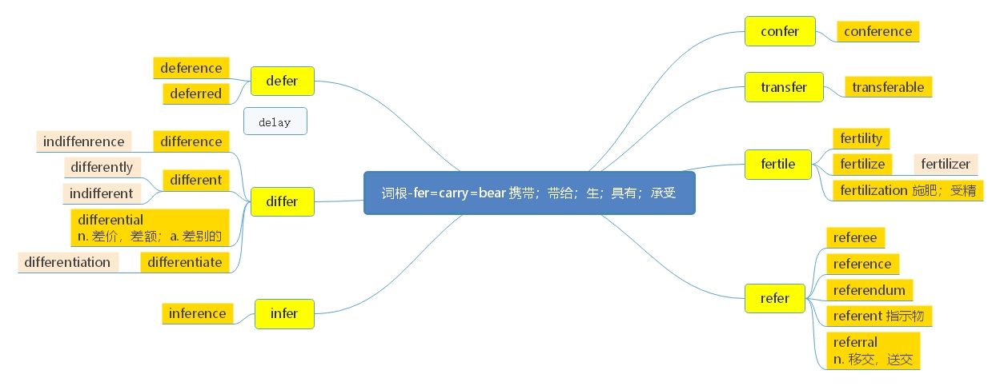

# 词根-fer=carry=bear

> **一、本节课目标**
>
> 1、掌握词根-fer 的含义
>
> 2、掌握新词 42 个
>
> 3、复习本节课所有单词

***

# 词根-fer=carry=bear

***

> **【 课堂笔记】**
>
> carry 的含义如下：
>
> 1.  carry a baby 怀孕; 怀上
> 2.  carry a punishment 受/处以(处罚)
> 3.  carrier 带着; 携带
> 4.  decisions carry important implications 具有; 具备

***

# 核心词汇：

***

**confer** \[kən'fə:] [英音](https://dict.youdao.com/dictvoice?audio=confer\&type=1)  [美音](https://dict.youdao.com/dictvoice?audio=confer\&type=2)  v. 给予、 授予; 协商； 商议 7258

**助记：** con（加强语气） +fer（=carry： 带来、 带给） →带给、 给予、 授予

> **【 课堂笔记】**
>
> conference = confer + ence 会议
>
> 会议里干的事情→ confer 协商；商议

**搭配：** confer sth. to/on sb/sth（考）： 将…赋予（给予） 某人（某物）

**例句：** That compulsion has resulted in robotics—the science of conferring various human

&#x9;			capacities on machines.

&#x9;	 这种动力导致了机器人学—— 一种把人类的各种能力赋予机器人的科学。

**写作例句**：有人认为名字赋予了该人某种独特的品质，而其他人则认为名字与人的成就无关。

Some people maintain that a name confers some kind of unique quality on the person, while others

insist that a name has nothing to do with one’s achievement.

**例句：** Officials created something called the German Green Card and \_\_\_\_\_\_\_\_ that they would

issue 20,000 in the first year.

A) conferred B) inferred C) announced D) verified

解析： 原文翻译“官方创造了一种叫做德国绿卡的东西， 并且宣布他们将在第一年发行两万张”，

&#x20;因此， 选 C； A： 授予、 给予、 协商； B： 推断； D： 证实

**双语例句:** He wanted to confer with his colleagues before reaching a decision. [播放](https://dict.youdao.com/dictvoice?audio=He+wanted+to+confer+with+his+colleagues+before+reaching+a+decision.&le=eng&le=eng&type=2)

他想与他的同事先商议一下再作出决定。 

**双语例句:** I will now confer a benefit on him. [播放](https://dict.youdao.com/dictvoice?audio=I+will+now+confer+a+benefit+on+him.&le=eng&le=eng&type=2)

我现在要帮他一个忙。 

**双语例句:** As any geriatric ward shows, that is not the same as to confer enduring mobility, awareness and autonomy. [播放](https://dict.youdao.com/dictvoice?audio=As+any+geriatric+ward+shows%2C+that+is+not+the+same+as+to+confer+enduring+mobility%2C+awareness+and+autonomy.&le=eng&le=eng&type=2)

正如任何老年病房所显示的那样，这与赋予病人持久的行动、意识和自主权是不一样的。 

**原声例句:** It's still not exactly clear how the polyunsaturated fats **confer** this benefit. [播放](https://dict.youdao.com/pureaudio?docid=4669092007881440510)

**原声例句:** Again, these plasmids occur naturally in nature; they were discovered particularly in micro-organisms have plasmids that **confer** biological properties onto them.

**原声例句:** He maintains further the titles of nobility are of value only for the benefits they **confer** on those of lesser rank or they're not useful at all.

**权威例句:** Only then, after years of low pay, does the profession **confer** the title of architect.  [播放](https://dict.youdao.com/dictvoice?audio=Only+then%2C+after+years+of+low+pay%2C+does+the+profession+confer+the+title+of+architect.+&le=eng&type=2)

**权威例句:** Generativity can be used to tame chaos, **confer** predictability, and, like the McIntosh, foster invention.  [播放](https://dict.youdao.com/dictvoice?audio=Generativity+can+be+used+to+tame+chaos%2C+confer+predictability%2C+and%2C+like+the+McIntosh%2C+foster+invention.+&le=eng&type=2)

**权威例句:** There is nothing like the 192-member United Nations to **confer** legitimacy on the use of force.  [播放](https://dict.youdao.com/dictvoice?audio=There+is+nothing+like+the+192-member+United+Nations+to+confer+legitimacy+on+the+use+of+force.+&le=eng&type=2)

***

**conference** \['kɒnf(ə)r(ə)ns] [英音](https://dict.youdao.com/dictvoice?audio=conference\&type=1)  [美音](https://dict.youdao.com/dictvoice?audio=conference\&type=2)  n. 会议； 协商； 讨论； 968

**双语例句:** It was a good-humoured conference. [播放](https://dict.youdao.com/dictvoice?audio=It+was+a+good-humoured+conference.&le=eng&le=eng&type=2)

会议的气氛很愉快。 

**双语例句:** The conference will be held in Glasgow. [播放](https://dict.youdao.com/dictvoice?audio=The+conference+will+be+held+in+Glasgow.&le=eng&le=eng&type=2)

会议将在格拉斯哥举行。 

**双语例句:** He was a guest speaker at the conference. [播放](https://dict.youdao.com/dictvoice?audio=He+was+a+guest+speaker+at+the+conference.&le=eng&le=eng&type=2)

他是会议的特邀演讲人。 

**原声例句:** More detailed results of the study are expected to be presented at an AIDS vaccine **conference** in Paris next month. [播放](https://dict.youdao.com/pureaudio?docid=5683985507957154663)

**原声例句:** Mister Ban, Secretary of State Hillary Clinton and Haitian President Rene Preval led a **conference** of donors at the U.N.Wednesday. [播放](https://dict.youdao.com/pureaudio?docid=5837347139906245653)

**原声例句:** The United States is proposing a big **conference** on Afghanistan and wants to invite Iran, one of its neighbors. [播放](https://dict.youdao.com/pureaudio?docid=9070795129051112736)

**权威例句:** Timothy Kesicki, president of the Jesuit **Conference** in Washington, said many scholars acknowledge Serra's complicated legacy.  [播放](https://dict.youdao.com/dictvoice?audio=Timothy+Kesicki%2C+president+of+the+Jesuit+Conference+in+Washington%2C+said+many+scholars+acknowledge+Serra%27s+complicated+legacy.+&le=eng&type=2)

**权威例句:** The once unstoppable green machine lost its mojo at the Climate Change **Conference** in Copenhagen.  [播放](https://dict.youdao.com/dictvoice?audio=The+once+unstoppable+green+machine+lost+its+mojo+at+the+Climate+Change+Conference+in+Copenhagen.+&le=eng&type=2)

**权威例句:** The **conference** will be held at the Riviera International **Conference** Centre, September 27 30 2016.  [播放](https://dict.youdao.com/dictvoice?audio=The+conference+will+be+held+at+the+Riviera+International+Conference+Centre%2C+September+27+30+2016.+&le=eng&type=2)

***

**transfer** \[træns'fə:] [英音](https://dict.youdao.com/dictvoice?audio=transfer\&type=1)  [美音](https://dict.youdao.com/dictvoice?audio=transfer\&type=2)  v/n. 转 移、 转让 2335

**助记：** trans（转） +fer（=carry： 带， 带给） →带了转向另外一个地方→转移、 转让

> \*\*【 课堂笔记】\*\*前缀 trans- 表示 “转/穿/传”

**例句：** Generational tensions are being fueled by continuing debate over Social Security benefits,

which mostly involves a transfer of resources from the young to the old.&#x20;

代与代间的紧张关系正在被持续的关于社保福利金的争论而点燃，这个主要涉及将资源由年青一代转向老一代。

\*\*仿写例句：\*\*代与代的紧张关系正在被家长强迫孩子去上各种培训班这一做法而点燃，主要涉及的是艺术类培训班。

Generational tensions are being fueled by the practice that parents compel/force their children to

participate in/take part in/attend training courses, which mostly involve art classes.

**双语例句:** It can be connected to a PC for the transfer of information. [播放](https://dict.youdao.com/dictvoice?audio=It+can+be+connected+to+a+PC+for+the+transfer+of+information.&le=eng&le=eng&type=2)

它可以连接到个人电脑上进行信息转录。 

**双语例句:** It was the first goal he had scored since his transfer from Chelsea. [播放](https://dict.youdao.com/dictvoice?audio=It+was+the+first+goal+he+had+scored+since+his+transfer+from+Chelsea.&le=eng&le=eng&type=2)

这是他从切尔西队转会过来之后的第一记入球。 

**双语例句:** The decision to transfer the investigation from the police to the district attorney's office is a mutual one. [播放](https://dict.youdao.com/dictvoice?audio=The+decision+to+transfer+the+investigation+from+the+police+to+the+district+attorney%27s+office+is+a+mutual+one.&le=eng&le=eng&type=2)

将调查从警方移交到区律师办公室的决定是共同做出的。 

**原声例句:** People can also **transfer** money to other mobile phone users, even those without an M-Pesa account. [播放](https://dict.youdao.com/pureaudio?docid=3615953979039522264)

**原声例句:** Oxford's technology **transfer** company is working with the inventors to market the idea. [播放](https://dict.youdao.com/pureaudio?docid=-6858901820553125006)

**原声例句:** General McChrystal said the key objectives are to improve security and **transfer** responsibility to the Afghan forces \"as rapidly as conditions allow.\" [播放](https://dict.youdao.com/pureaudio?docid=3269864185413367088)

**权威例句:** And reserve team midfielder Vincent Weijl has completed a **transfer** to Spanish side SD Eibar.  [播放](https://dict.youdao.com/dictvoice?audio=And+reserve+team+midfielder+Vincent+Weijl+has+completed+a+transfer+to+Spanish+side+SD+Eibar.+&le=eng&type=2)

**权威例句:** To **transfer** information from short-term to long-term memory, the brain requires periods of rest.  [播放](https://dict.youdao.com/dictvoice?audio=To+transfer+information+from+short-term+to+long-term+memory%2C+the+brain+requires+periods+of+rest.+&le=eng&type=2)

**权威例句:** The reason why I'm massively excited this morning is because it is **transfer** deadline day.  [播放](https://dict.youdao.com/dictvoice?audio=The+reason+why+I%27m+massively+excited+this+morning+is+because+it+is+transfer+deadline+day.+&le=eng&type=2)

***

**transferable** \[trænsˈfɜ\:rəbl] [英音](https://dict.youdao.com/dictvoice?audio=transferable\&type=1)  [美音](https://dict.youdao.com/dictvoice?audio=transferable\&type=2)  adj. 可转让的， 可转移的

> **【 课堂笔记】**
>
> \-able -ible -ile 形容词后缀
>
> 1） 可以…的； 能够…的
>
> 2） 容易…的
>
> 3）极少数情况下， 做名词后缀

**双语例句:** The key idea behind professionalisation, argues Menand, is that \"the knowledge and skills needed for a particular specialisation are transmissible but bot transferable\". [播放](https://dict.youdao.com/dictvoice?audio=The+key+idea+behind+professionalisation%2C+argues+Menand%2C+is+that+%22the+knowledge+and+skills+needed+for+a+particular+specialisation+are+transmissible+but+bot+transferable%22.&le=eng&le=eng&type=2)

梅南认为，职业化背后的关键是“特定专业所需的知识和技能是可传递但不可转移的”。 

**双语例句:** But the key idea behind professionalization, argues Mr. Menand, is that \"the knowledge and skills needed for a particular specialization are transmissible but not transferable.\" [播放](https://dict.youdao.com/dictvoice?audio=But+the+key+idea+behind+professionalization%2C+argues+Mr.+Menand%2C+is+that+%22the+knowledge+and+skills+needed+for+a+particular+specialization+are+transmissible+but+not+transferable.%22&le=eng&le=eng&type=2)

但是，莫南德先生认为，专业化背后的关键理念是：“对于某一特定的专业来说，所需知识和技能可以传授，但不可以转让。” 

**双语例句:** Asking juicy questions appears to be a transferable skill for deepening collaborative inquiry into the science content found in exhibits. [播放](https://dict.youdao.com/dictvoice?audio=Asking+juicy+questions+appears+to+be+a+transferable+skill+for+deepening+collaborative+inquiry+into+the+science+content+found+in+exhibits.&le=eng&le=eng&type=2)

提出有趣的问题似乎是一种可以转移的技巧，可以深化对展览中发现的科学内容的合作探究。 

**原声例句:** And I'm hoping that today's lecture will help you learn faster. The nice thing, is once you learn to debug programs, you will discover it's a **transferable** skill.

**原声例句:** 

**原声例句:** 

**权威例句:** Unlike third-party funds, typical proprietary funds may not be **transferable** from one firm to another.  [播放](https://dict.youdao.com/dictvoice?audio=Unlike+third-party+funds%2C+typical+proprietary+funds+may+not+be+transferable+from+one+firm+to+another.+&le=eng&type=2)

**权威例句:** There are many similarities that are **transferable** from coaching a team to leading an organization.  [播放](https://dict.youdao.com/dictvoice?audio=There+are+many+similarities+that+are+transferable+from+coaching+a+team+to+leading+an+organization.+&le=eng&type=2)

**权威例句:** Highland Council's Independent Group has said voters were confused by the Single **Transferable** Vote (STV).  [播放](https://dict.youdao.com/dictvoice?audio=Highland+Council%27s+Independent+Group+has+said+voters+were+confused+by+the+Single+Transferable+Vote+%28STV%29.+&le=eng&type=2)

***

**fertile** \['fə\:tail] [英音](https://dict.youdao.com/dictvoice?audio=fertile\&type=1)  [美音](https://dict.youdao.com/dictvoice?audio=fertile\&type=2)  a. 多产的， 肥沃的 7585

**助记：** fer（=carry=bear： 产出） +t（无意义） +ile（形容词后缀， 表“容易”） →容易产出的→

多产的、肥沃的

**搭配：** fertile soil（考）：肥沃的土地

> **【 课堂笔记】**
>
> fragile 易碎的
>
> **助记：** frag-（ =break； 打破； 打碎） + -ile（ 容易…的） →容易打破的→易碎的

**双语例句:** Farmers worked the fertile valleys. [播放](https://dict.youdao.com/dictvoice?audio=Farmers+worked+the+fertile+valleys.&le=eng&le=eng&type=2)

农民们开垦了这个肥沃的山谷。 

**双语例句:** We have the most fertile soil in the Midwest. [播放](https://dict.youdao.com/dictvoice?audio=We+have+the+most+fertile+soil+in+the+Midwest.&le=eng&le=eng&type=2)

我们在中西部有最肥沃的土壤。 

**双语例句:** To the north lie the flat and fertile farmlands of Nebraska. [播放](https://dict.youdao.com/dictvoice?audio=To+the+north+lie+the+flat+and+fertile+farmlands+of+Nebraska.&le=eng&le=eng&type=2)

北面是内布拉斯加州平坦肥沃的农田。 

**原声例句:** They had a good water supply in Frijoles Creek and **fertile** land for growing crops. [播放](https://dict.youdao.com/pureaudio?docid=8201273519248158188)

**原声例句:** Lake Champlain and the **fertile** Champlain Valley are in the northwestern part of Vermont. [播放](https://dict.youdao.com/pureaudio?docid=-7473120888469987172)

**原声例句:** Cindy Haynes says little or no fertilizer is needed in **fertile** soils. [播放](https://dict.youdao.com/pureaudio?docid=-5270591695025108916)

**权威例句:** It turns out we have plenty of **fertile**, prehistoric fish right here in River City.  [播放](https://dict.youdao.com/dictvoice?audio=It+turns+out+we+have+plenty+of+fertile%2C+prehistoric+fish+right+here+in+River+City.+&le=eng&type=2)

**权威例句:** Genetics largely determine which women will still be **fertile** at 40 and which ones won't.  [播放](https://dict.youdao.com/dictvoice?audio=Genetics+largely+determine+which+women+will+still+be+fertile+at+40+and+which+ones+won%27t.+&le=eng&type=2)

**权威例句:** Car futurology is **fertile** territory for a museum devoted to collecting and studying 20th-century objects.  [播放](https://dict.youdao.com/dictvoice?audio=Car+futurology+is+fertile+territory+for+a+museum+devoted+to+collecting+and+studying+20th-century+objects.+&le=eng&type=2)

***

**fertility**\[fə'tɪlɪtɪ; fɜː'tɪlɪtɪ] [英音](https://dict.youdao.com/dictvoice?audio=\&type=1)  [美音](https://dict.youdao.com/dictvoice?audio=\&type=2)  n. 肥沃；丰饶；多产；生产力 6199

> **【 课堂笔记】**
>
> \-ity -lity -ility 名词后缀

***

**fertilize** \['fɜːtɪlaɪz] [英音](https://dict.youdao.com/dictvoice?audio=fertilize\&type=1)  [美音](https://dict.youdao.com/dictvoice?audio=fertilize\&type=2) vt. 使受精；使肥沃 13876

> **【 课堂笔记】**
>
> realize v. 实现
>
> **助记：** real (真的) + ize（ 动词后缀； 使…） →使成真→实现
>
> realize our dreams 实现我们的梦想

**双语例句:** It only takes one sperm to fertilize an egg. [播放](https://dict.youdao.com/dictvoice?audio=It+only+takes+one+sperm+to+fertilize+an+egg.&le=eng&le=eng&type=2)

只需一个精子就可以使卵受精。 

**双语例句:** Since only one female usually lays eggs in a given larva, it would pay her to produce one male only, because this one male could fertilize all his sisters on emergence. [播放](https://dict.youdao.com/dictvoice?audio=Since+only+one+female+usually+lays+eggs+in+a+given+larva%2C+it+would+pay+her+to+produce+one+male+only%2C+because+this+one+male+could+fertilize+all+his+sisters+on+emergence.&le=eng&le=eng&type=2)

因为通常只有一只雌性在一个特定的幼虫中产卵，所以它只会产生一只雄性，因为这只雄性可以在孵化时使它所有的姐妹受精。 

**双语例句:** To fertilize the infertile land. [播放](https://dict.youdao.com/dictvoice?audio=To+fertilize+the+infertile+land.&le=eng&le=eng&type=2)

帮你妆点贫瘠的土地。 

**原声例句:** After that,if you do **fertilize** the bulbs, do not mix the fertilizer in the planting hole. [播放](https://dict.youdao.com/pureaudio?docid=5105429690230000586)

**原声例句:** And farmers can use camel waste to **fertilize** their crops. [播放](https://dict.youdao.com/pureaudio?docid=8014419500053356061)

**原声例句:** Farmers must cut, **fertilize** and water the sod often. [播放](https://dict.youdao.com/pureaudio?docid=78636639137300125)

**权威例句:** Most couples agree to **fertilize** far more eggs than can be implanted safely in one procedure.  [播放](https://dict.youdao.com/dictvoice?audio=Most+couples+agree+to+fertilize+far+more+eggs+than+can+be+implanted+safely+in+one+procedure.+&le=eng&type=2)

**权威例句:** We just wanted to **fertilize** two for implantation, and see how the process went.  [播放](https://dict.youdao.com/dictvoice?audio=We+just+wanted+to+fertilize+two+for+implantation%2C+and+see+how+the+process+went.+&le=eng&type=2)

**权威例句:** Cyclical tools are like trees, whose falling leaves **fertilize** the soil in which they grow.  [播放](https://dict.youdao.com/dictvoice?audio=Cyclical+tools+are+like+trees%2C+whose+falling+leaves+fertilize+the+soil+in+which+they+grow.+&le=eng&type=2)

***

**fertilizer** \['fə\:tilaizə] [英音](https://dict.youdao.com/dictvoice?audio=fertilizer\&type=1)  [美音](https://dict.youdao.com/dictvoice?audio=fertilizer\&type=2)  n. 肥料 6460

**助记：** fertiliz（使肥沃） +er（名词后缀） →使（土地） 肥沃的东西→肥料

**搭配：** chemical fertilizers（考）：化肥

> **【 课堂笔记】**
>
> \-ar -er -or -ur
>
> 1） 名词后缀 人物：机/器
>
> 2\) 形容词后缀 表示…的
>
> 3）少数情况下：做动词后缀

**双语例句:** The company said it will stop producing fertilizer in 1990 because of continued losses. [播放](https://dict.youdao.com/dictvoice?audio=The+company+said+it+will+stop+producing+fertilizer+in+1990+because+of+continued+losses.&le=eng&le=eng&type=2)

该公司称，由于持续亏损而将于1990年停止生产化肥。 

**双语例句:** A top dressing of fertilizer should be added to improve growth as mint impoverishes the soil quickly. [播放](https://dict.youdao.com/dictvoice?audio=A+top+dressing+of+fertilizer+should+be+added+to+improve+growth+as+mint+impoverishes+the+soil+quickly.&le=eng&le=eng&type=2)

应施顶肥以促进生长，因为薄荷会使土壤迅速变得贫瘠。 

**双语例句:** The tractor hauled the fertilizer away. [播放](https://dict.youdao.com/dictvoice?audio=The+tractor+hauled+the+fertilizer+away.&le=eng&le=eng&type=2)

拖拉机把肥料拉走了。 

**原声例句:** 

**原声例句:** 

**原声例句:** 

**权威例句:** But they are also used in the production of **fertilizer**, garden mulch, and soil conditioner.  [播放](https://dict.youdao.com/dictvoice?audio=But+they+are+also+used+in+the+production+of+fertilizer%2C+garden+mulch%2C+and+soil+conditioner.+&le=eng&type=2)

**权威例句:** The ground has to be tilled, the seeds sown, **fertilizer** spread, the ground watered.  [播放](https://dict.youdao.com/dictvoice?audio=The+ground+has+to+be+tilled%2C+the+seeds+sown%2C+fertilizer+spread%2C+the+ground+watered.+&le=eng&type=2)

**权威例句:** So it subsidizes **fertilizer** and encourages farmers to overuse it to maximize crop yields.  [播放](https://dict.youdao.com/dictvoice?audio=So+it+subsidizes+fertilizer+and+encourages+farmers+to+overuse+it+to+maximize+crop+yields.+&le=eng&type=2)

***

**fertilization** \[,fɜːtɪlaɪ'zeɪʃ(ə)n] [英音](https://dict.youdao.com/dictvoice?audio=fertilization\&type=1)  [美音](https://dict.youdao.com/dictvoice?audio=fertilization\&type=2)  n. \[生]受精；施肥；肥沃 13566

> **【 课堂笔记】**
>
> fertilization =
>
> ate（为动词或形容词后缀）+
>
> ion（名词后缀） (复合后缀的单词词性由最后一个后缀决定)

**双语例句:** From fertilization until birth is about 266 days. [播放](https://dict.youdao.com/dictvoice?audio=From+fertilization+until+birth+is+about+266+days.&le=eng&le=eng&type=2)

从受精到出生大约是266天。 

**双语例句:** The sex of the embryo is predetermined at fertilization. [播放](https://dict.youdao.com/dictvoice?audio=The+sex+of+the+embryo+is+predetermined+at+fertilization.&le=eng&le=eng&type=2)

胚胎的性别早在受精时就决定了。 

**双语例句:** The sperm fuses with the egg to begin the process of fertilization. [播放](https://dict.youdao.com/dictvoice?audio=The+sperm+fuses+with+the+egg+to+begin+the+process+of+fertilization.&le=eng&le=eng&type=2)

精子与卵子结合开始受精过程。 

**原声例句:** Naturally,the very day she undergoes the in-vitro **fertilization** procedure, she meets the \"right guy.\" [播放](https://dict.youdao.com/pureaudio?docid=-3248267250901903375)

**原声例句:** **Fertilization** of these two where these two cells join occurs in the distal part of the fallopian tube.

**原声例句:** That difference could have been generated during the process of **fertilization**.

**权威例句:** The Vatican has stepped up its campaigns against legislation on abortion and in vitro **fertilization**.  [播放](https://dict.youdao.com/dictvoice?audio=The+Vatican+has+stepped+up+its+campaigns+against+legislation+on+abortion+and+in+vitro+fertilization.+&le=eng&type=2)

**权威例句:** These considerable data repositories are conducive for cross-fertilization and until now have been mostly untapped.  [播放](https://dict.youdao.com/dictvoice?audio=These+considerable+data+repositories+are+conducive+for+cross-fertilization+and+until+now+have+been+mostly+untapped.+&le=eng&type=2)

**权威例句:** She suggested in vitro **fertilization** or adoption, but she says he rejected both ideas.  [播放](https://dict.youdao.com/dictvoice?audio=She+suggested+in+vitro+fertilization+or+adoption%2C+but+she+says+he+rejected+both+ideas.+&le=eng&type=2)

***

**refer** \[ri'fə:] [英音](https://dict.youdao.com/dictvoice?audio=refer\&type=1)  [美音](https://dict.youdao.com/dictvoice?audio=refer\&type=2)  v. 参考； 查阅； 提及； 涉及； 1159

**助记：** re（返回） +fer（=carry 带） →带着（问题） 回去→参考， 查阅； 提及， 涉及

**双语例句:** You may refer to your notes if you want. [播放](https://dict.youdao.com/dictvoice?audio=You+may+refer+to+your+notes+if+you+want.&le=eng&le=eng&type=2)

如果需要，可以查阅笔记。 

**双语例句:** They come from Tuam, a place they refer to on the title track of their album, \"All the Way From Tuam.\" [播放](https://dict.youdao.com/dictvoice?audio=They+come+from+Tuam%2C+a+place+they+refer+to+on+the+title+track+of+their+album%2C+%22All+the+Way+From+Tuam.%22&le=eng&le=eng&type=2)

他们来自蒂厄姆，一个他们在专辑的标题曲《从蒂厄姆远路而来》中提到的地方。 

**双语例句:** That remark does not refer to [direct at] her. [播放](https://dict.youdao.com/dictvoice?audio=That+remark+does+not+refer+to+%5Bdirect+at%5D+her.&le=eng&le=eng&type=2)

那句话不是指她说的。 

**原声例句:** The controversy started on December 31, when the Malaysian High Court allowed Roman Catholics to use \"Allah\" to **refer** to God. [播放](https://dict.youdao.com/pureaudio?docid=3216463538713156397)

**原声例句:** The Goldstone Report will now go to the U.N.Security Council which could **refer** it to the International Criminal Court in The Hague. [播放](https://dict.youdao.com/pureaudio?docid=5602885484912139609)

**原声例句:** He also urged Russians elsewhere to **refer** to people from the region as fellow citizens,not outsiders. [播放](https://dict.youdao.com/pureaudio?docid=-3942808491115462211)

**权威例句:** But it could **refer** mischievous global-warming rumors to a U.S. attorney for criminal action.  [播放](https://dict.youdao.com/dictvoice?audio=But+it+could+refer+mischievous+global-warming+rumors+to+a+U.S.+attorney+for+criminal+action.+&le=eng&type=2)

**权威例句:** Some just **refer** to it as the new city or Delhi s tech city.  [播放](https://dict.youdao.com/dictvoice?audio=Some+just+refer+to+it+as+the+new+city+or+Delhi+s+tech+city.+&le=eng&type=2)

**权威例句:** They would be much less likely to **refer** to a woman as a genius.  [播放](https://dict.youdao.com/dictvoice?audio=They+would+be+much+less+likely+to+refer+to+a+woman+as+a+genius.+&le=eng&type=2)

***

**referee** \[,refə'ri:] [英音](https://dict.youdao.com/dictvoice?audio=referee\&type=1)  [美音](https://dict.youdao.com/dictvoice?audio=referee\&type=2)  n. 裁判员 8690

**助记：** refer（参考） +ee（名词后缀） →（比赛中） 要参考的人→裁判

> **【 课堂笔记】**
>
> \-ee 的功能
>
> 1）名词后缀
>
> 2） 被… 人/机构
>
> employ v 雇佣
>
> employer n 雇主
>
> employee n 雇员，员工
>
> commit v 委托，托付
>
> committee n 委员会（受大家的委托去处理每个特定事件）
>
> interview v 采访，面试
>
> interviewer n 面试官
>
> interviewee n 被面试的人

**双语例句:** The referee blew his whistle. [播放](https://dict.youdao.com/dictvoice?audio=The+referee+blew+his+whistle.&le=eng&le=eng&type=2)

裁判吹响了哨子。 

**双语例句:** The referee stopped the fight. [播放](https://dict.youdao.com/dictvoice?audio=The+referee+stopped+the+fight.&le=eng&le=eng&type=2)

裁判叫停了那场拳击赛。 

**双语例句:** The referee signalled a foul. [播放](https://dict.youdao.com/dictvoice?audio=The+referee+signalled+a+foul.&le=eng&le=eng&type=2)

裁判鸣哨示意犯规。 

**原声例句:** Others have called for adding more officials to the one **referee** and two linesmen currently in use. [播放](https://dict.youdao.com/pureaudio?docid=-6800583572820142656)

**原声例句:** But,like British **referee** Howard Webb, many said they welcomed any measures to improve the sport. [播放](https://dict.youdao.com/pureaudio?docid=1495162009703758538)

**原声例句:** Ghana was forced to fight short-handed after seeing defender Daniel Addo sent off by the Belgian **referee** following what seemed like an innocuous tackle in the first half. [播放](https://dict.youdao.com/pureaudio?docid=-5403570087177899244)

**权威例句:** Glentoran protested and **referee** Moutray consulted assistant Gareth Eakin before confirming the spot-kick verdict.  [播放](https://dict.youdao.com/dictvoice?audio=Glentoran+protested+and+referee+Moutray+consulted+assistant+Gareth+Eakin+before+confirming+the+spot-kick+verdict.+&le=eng&type=2)

**权威例句:** The **referee**, perhaps predictably, showed him the yellow card and told him to retreat 10 yards.  [播放](https://dict.youdao.com/dictvoice?audio=The+referee%2C+perhaps+predictably%2C+showed+him+the+yellow+card+and+told+him+to+retreat+10+yards.+&le=eng&type=2)

**权威例句:** \"I know he's my father but he's annoying me, \" Bernard stated to the match **referee**.  [播放](https://dict.youdao.com/dictvoice?audio=%22I+know+he%27s+my+father+but+he%27s+annoying+me%2C+%22+Bernard+stated+to+the+match+referee.+&le=eng&type=2)

***

**reference** \['refərəns] [英音](https://dict.youdao.com/dictvoice?audio=reference\&type=1)  [美音](https://dict.youdao.com/dictvoice?audio=reference\&type=2)  n. 参考； 证明书； 推荐信 1918

**助记：** refer（提及、 参考） +ence（名词后缀） →参考； 证明书（人）、 推荐信

**搭配：** reference room（考）：资料室，参考资料室

**双语例句:** They publish reference books. [播放](https://dict.youdao.com/dictvoice?audio=They+publish+reference+books.&le=eng&le=eng&type=2)

他们出版参考书。 

**双语例句:** The point of reference for semantic knowledge is the world. [播放](https://dict.youdao.com/dictvoice?audio=The+point+of+reference+for+semantic+knowledge+is+the+world.&le=eng&le=eng&type=2)

获得语义知识的参考点是这个世界。 

**双语例句:** No reference to their existence appears in any literature of the period. [播放](https://dict.youdao.com/dictvoice?audio=No+reference+to+their+existence+appears+in+any+literature+of+the+period.&le=eng&le=eng&type=2)

该时期的任何文献中都没有提及他们的存在。 

**原声例句:** Fairey says he used the AP photograph as a **reference**, but then changed it greatly for his own idealized and colorful picture of Barack Obama. [播放](https://dict.youdao.com/pureaudio?docid=6397839874837008310)

**原声例句:** \"He was young and I had a very good time drawing his picture because I used a lot of **reference** material that were paintings made of him at different times in his life. [播放](https://dict.youdao.com/pureaudio?docid=4402628315746369694)

**原声例句:** But his **reference** to how every Chinese household has embraced the Arabic classic, from Arab League Secretary General Amr Moussa. [播放](https://dict.youdao.com/pureaudio?docid=-53272340214883953)

**权威例句:** It is a fund separately identified by **reference** to contributions by a donor or donors.  [播放](https://dict.youdao.com/dictvoice?audio=It+is+a+fund+separately+identified+by+reference+to+contributions+by+a+donor+or+donors.+&le=eng&type=2)

**权威例句:** Please **reference** the links within for the most up-to-date listings and features from each individual carrier.  [播放](https://dict.youdao.com/dictvoice?audio=Please+reference+the+links+within+for+the+most+up-to-date+listings+and+features+from+each+individual+carrier.+&le=eng&type=2)

**权威例句:** The first known American **reference** to what many recognize as our national pastime baseball happened in what year?  [播放](https://dict.youdao.com/dictvoice?audio=The+first+known+American+reference+to+what+many+recognize+as+our+national+pastime+baseball+happened+in+what+year%3F+&le=eng&type=2)

***

**referendum** \[,refə'rendəm] [英音](https://dict.youdao.com/dictvoice?audio=referendum\&type=1)  [美音](https://dict.youdao.com/dictvoice?audio=referendum\&type=2)  n. 公民投票权；全民公决 6866

**释义：** questions to be referred

If a country holds a referendum on a particular policy, they ask the people to vote on the policy and

show whether or not they agree with it.

**双语例句:** The groundswell of opinion is in favour of a referendum. [播放](https://dict.youdao.com/dictvoice?audio=The+groundswell+of+opinion+is+in+favour+of+a+referendum.&le=eng&le=eng&type=2)

赞成公投的观点迅速高涨。 

**双语例句:** President Kaunda fulfilled his promise of announcing a date for the referendum. [播放](https://dict.youdao.com/dictvoice?audio=President+Kaunda+fulfilled+his+promise+of+announcing+a+date+for+the+referendum.&le=eng&le=eng&type=2)

卡翁达总统实现了他的关于宣布投票公决日期的诺言。 

**双语例句:** The changes were approved by referendum. [播放](https://dict.youdao.com/dictvoice?audio=The+changes+were+approved+by+referendum.&le=eng&le=eng&type=2)

全民投票赞同这些变革。 

**原声例句:** 

**原声例句:** 

**原声例句:** 

**权威例句:** Yet the voters are clearly ignoring his appeal for a **referendum** to end immigration.  [播放](https://dict.youdao.com/dictvoice?audio=Yet+the+voters+are+clearly+ignoring+his+appeal+for+a+referendum+to+end+immigration.+&le=eng&type=2)

**权威例句:** The Conservatives and Liberal Democrats have hinted that they may abstain in any assembly vote on a **referendum**.  [播放](https://dict.youdao.com/dictvoice?audio=The+Conservatives+and+Liberal+Democrats+have+hinted+that+they+may+abstain+in+any+assembly+vote+on+a+referendum.+&le=eng&type=2)

**权威例句:** For them, the recent promise of a future EU **referendum** was good but not good enough.  [播放](https://dict.youdao.com/dictvoice?audio=For+them%2C+the+recent+promise+of+a+future+EU+referendum+was+good+but+not+good+enough.+&le=eng&type=2)

***

**referent** \['ref(ə)r(ə)nt] [英音](https://dict.youdao.com/dictvoice?audio=referent\&type=1)  [美音](https://dict.youdao.com/dictvoice?audio=referent\&type=2)  n. 指示物；指示对象 18017

> **【 课堂笔记】**
>
> **助记：** refer (指代；指示) + ent（名词后缀，表示人/物） →指示物；指示对象
>
> **-ent -ant**
>
> 1） 名词后缀，表示“人”或“物”
>
> 2） 形容词后缀， …的

**双语例句:** Returns this reference objects referent. [播放](https://dict.youdao.com/dictvoice?audio=%22Good%22+obviously+has+a+referent+based+on+pleasure+and+pain.&le=eng&le=eng&type=2)

“好”显然有所指是建立在喜悦和痛苦上的。 

**双语例句:** The get method returns the reference to the referent object. [播放](https://dict.youdao.com/dictvoice?audio=The+get+method+returns+the+reference+to+the+referent+object.&le=eng&le=eng&type=2)

get方法返回对被引用对象的引用。 

**双语例句:** As referent movement occurs, both symbolization and direct referent change. [播放](https://dict.youdao.com/dictvoice?audio=As+referent+movement+occurs%2C+both+symbolization+and+direct+referent+change.&le=eng&le=eng&type=2)

当指涉运动发生时，象征和直接指涉物都发生了改变。 

**原声例句:** Is is essentially saying, given 2 things, do they point to exactly the same **referent**?

**原声例句:** 

**原声例句:** 

***

**referral** \[rɪ'fɜːr(ə)l] [英音](https://dict.youdao.com/dictvoice?audio=referral\&type=1)  [美音](https://dict.youdao.com/dictvoice?audio=referral\&type=2)  n. 送交，移交；推荐 6603

**释义：** Referral is the act of officially sending someone to a person or authority that is qualified to

deal with them. A referral is an instance of this.

> &#x20;\*\*【 课堂笔记】 \*\*
>
> **助记：** re（返回） +fer（带，携带） +al→带回→送交，移交

**双语例句:** Legal Aid can often provide referral to other types of agencies. [播放](https://dict.youdao.com/dictvoice?audio=Legal+Aid+can+often+provide+referral+to+other+types+of+agencies.&le=eng&le=eng&type=2)

法律援助机构能经常提供向其他类型机构的移交。 

**双语例句:** On 23 December they were moved to a referral hospital. [播放](https://dict.youdao.com/dictvoice?audio=On+23+December+they+were+moved+to+a+referral+hospital.&le=eng&le=eng&type=2)

12月23日，他们被送往一所转诊医疗。 

**双语例句:** When these are not available, there should be referral options. [播放](https://dict.youdao.com/dictvoice?audio=When+these+are+not+available%2C+there+should+be+referral+options.&le=eng&le=eng&type=2)

如果不能提供这些，则应具备转诊方案。 

**原声例句:** 

**原声例句:** 

**原声例句:** 

**权威例句:** The **referral** of a doctor to the council does not imply they are guilty.  [播放](https://dict.youdao.com/dictvoice?audio=The+referral+of+a+doctor+to+the+council+does+not+imply+they+are+guilty.+&le=eng&type=2)

**权威例句:** In 445 pages, the **Referral** mentions Whitewater, the failed land deal which originated its investigation, twice.  [播放](https://dict.youdao.com/dictvoice?audio=In+445+pages%2C+the+Referral+mentions+Whitewater%2C+the+failed+land+deal+which+originated+its+investigation%2C+twice.+&le=eng&type=2)

**权威例句:** But thanks to o nline **referral** startup Top Prospect, we may have a glimpse.  [播放](https://dict.youdao.com/dictvoice?audio=But+thanks+to+o+nline+referral+startup+Top+Prospect%2C+we+may+have+a+glimpse.+&le=eng&type=2)

***

**defer** \[dɪ'fɜː] [英音](https://dict.youdao.com/dictvoice?audio=defer\&type=1)  [美音](https://dict.youdao.com/dictvoice?audio=defer\&type=2)  vi. 延期； 推迟； 服从 8873

> **【 课堂笔记】**
>
> **助记：** de（ = off， away ：远离） +fer（带）→带着远离现在→延期；推迟
>
> de（ = down：下面） +fer（带）→带到某人（麾下）→服从
>
> 前缀 de-
>
> 1） =down 向下
>
> 2\) =off/away 远离
>
> 3\) 相反的；不好的
>
> 4） =intensive 加强语气
>
> defer/delay/postpone 延期；推迟

**双语例句:** Customers often defer payment for as long as possible. [播放](https://dict.youdao.com/dictvoice?audio=Customers+often+defer+payment+for+as+long+as+possible.&le=eng&le=eng&type=2)

顾客们经常尽可能地推迟付款。 

**双语例句:** Let's say, both John and Mary defer to her leadership. [播放](https://dict.youdao.com/dictvoice?audio=Let%27s+say%2C+both+John+and+Mary+defer+to+her+leadership.&le=eng&le=eng&type=2)

假设，约翰和玛丽都服从她的领导。 

**双语例句:** Doctors are encouraged to defer to experts. [播放](https://dict.youdao.com/dictvoice?audio=Doctors+are+encouraged+to+defer+to+experts.&le=eng&le=eng&type=2)

鼓励医生们听从专家的意见。 

**原声例句:** The heads of state at the AU's last summit had asked the U.N.Security Council to use its power to **defer** the Bashir indictment for one year. [播放](https://dict.youdao.com/pureaudio?docid=3824088185989360604)

**原声例句:** as Joyce would say--stream of consciousness, I understand difference temporally. I **defer** difference. I unfold.

**原声例句:** And for Problem Set One, we'll **defer** to some online documentation for the specifics.

**权威例句:** The ability of bullion trust investors to **defer** tax until they sell is worth a lot.  [播放](https://dict.youdao.com/dictvoice?audio=The+ability+of+bullion+trust+investors+to+defer+tax+until+they+sell+is+worth+a+lot.+&le=eng&type=2)

**权威例句:** We ought to allow businesses to **defer** taxes on the equipment they buy next year.  [播放](https://dict.youdao.com/dictvoice?audio=We+ought+to+allow+businesses+to+defer+taxes+on+the+equipment+they+buy+next+year.+&le=eng&type=2)

**权威例句:** Currently, they can **defer** their U.S. taxes by letting their foreign subsidiaries hang onto their profits.  [播放](https://dict.youdao.com/dictvoice?audio=Currently%2C+they+can+defer+their+U.S.+taxes+by+letting+their+foreign+subsidiaries+hang+onto+their+profits.+&le=eng&type=2)

***

**deference** \['def(ə)r(ə)ns] [英音](https://dict.youdao.com/dictvoice?audio=deference\&type=1)  [美音](https://dict.youdao.com/dictvoice?audio=deference\&type=2)  n. 顺从 11627

**双语例句:** The patronage, entwined with the ordinary deference, was not plain to them. [播放](https://dict.youdao.com/dictvoice?audio=The+patronage%2C+entwined+with+the+ordinary+deference%2C+was+not+plain+to+them.&le=eng&le=eng&type=2)

这种恩宠与平常的顺从交织在一起，对他们来说并不寻常。 

**双语例句:** The flags were lowered out of deference to the bereaved family. [播放](https://dict.youdao.com/dictvoice?audio=The+flags+were+lowered+out+of+deference+to+the+bereaved+family.&le=eng&le=eng&type=2)

降旗是出于对死者家属的尊重。 

**双语例句:** The women wore veils in deference to the customs of the country. [播放](https://dict.youdao.com/dictvoice?audio=The+women+wore+veils+in+deference+to+the+customs+of+the+country.&le=eng&le=eng&type=2)

这些妇女戴着面纱是遵从这个国家的习俗。 

**原声例句:** But after the accident he was fitful, irreverent, indulging at times in the grossest profanity, manifesting but little **deference** for his fellows, impatient of restraint or advice, a child in his intellectual capacities and manifestations.

**原声例句:** 

**原声例句:** 

**权威例句:** In **deference** to Islamic anti-blasphemy laws, the Alliance favors a global gag on free speech.  [播放](https://dict.youdao.com/dictvoice?audio=In+deference+to+Islamic+anti-blasphemy+laws%2C+the+Alliance+favors+a+global+gag+on+free+speech.+&le=eng&type=2)

**权威例句:** It not only supports **deference** to IRS regulations, but also giving them retroactive effect.  [播放](https://dict.youdao.com/dictvoice?audio=It+not+only+supports+deference+to+IRS+regulations%2C+but+also+giving+them+retroactive+effect.+&le=eng&type=2)

**权威例句:** Again, **deference** to Beijing keeps Hong Kong investment officials from talking too loudly about this issue.  [播放](https://dict.youdao.com/dictvoice?audio=Again%2C+deference+to+Beijing+keeps+Hong+Kong+investment+officials+from+talking+too+loudly+about+this+issue.+&le=eng&type=2)

***

**deferred** \[dɪ'fɜːd] [英音](https://dict.youdao.com/dictvoice?audio=deferred\&type=1)  [美音](https://dict.youdao.com/dictvoice?audio=deferred\&type=2)  adj. 延期的 15894

**双语例句:** She had applied for deferred admission to college. [播放](https://dict.youdao.com/dictvoice?audio=She+had+applied+for+deferred+admission+to+college.&le=eng&le=eng&type=2)

她已申请延期入学。 

**双语例句:** The department deferred the decision for six months. [播放](https://dict.youdao.com/dictvoice?audio=The+department+deferred+the+decision+for+six+months.&le=eng&le=eng&type=2)

这个部门推迟了六个月才作决定。 

**双语例句:** Any significant changes should be deferred to a future generation of the solution to maintain its stability. [播放](https://dict.youdao.com/dictvoice?audio=Any+significant+changes+should+be+deferred+to+a+future+generation+of+the+solution+to+maintain+its+stability.&le=eng&le=eng&type=2)

任何重大更改都应推迟到该解决方案的下一代，以保持其稳定性。 

**原声例句:** The current U.S.and NATO commander, General David McKiernan, had said he would need But Secretary Gates **deferred** a decision until the new commanders can assess the impact of the current deployment. [播放](https://dict.youdao.com/pureaudio?docid=2979852426764539610)

**原声例句:** The transformation here, importantly, ; interrupts the eating of the fruit; consummation of desire is **deferred**.

**原声例句:** Appetite gets sublimated and at the same time **deferred**, held in suspension.

**权威例句:** Either way, the assets grow tax-deferred and withdrawals are taxed as ordinary income, not capital gain.  [播放](https://dict.youdao.com/dictvoice?audio=Either+way%2C+the+assets+grow+tax-deferred+and+withdrawals+are+taxed+as+ordinary+income%2C+not+capital+gain.+&le=eng&type=2)

**权威例句:** At the High Court in Glasgow, judge Lord Turnbull **deferred** sentence on both until next month.  [播放](https://dict.youdao.com/dictvoice?audio=At+the+High+Court+in+Glasgow%2C+judge+Lord+Turnbull+deferred+sentence+on+both+until+next+month.+&le=eng&type=2)

**权威例句:** Financial approval for the purchase of these will also be **deferred** to the January meeting.  [播放](https://dict.youdao.com/dictvoice?audio=Financial+approval+for+the+purchase+of+these+will+also+be+deferred+to+the+January+meeting.+&le=eng&type=2)

***

**differ** \['dɪfə] [英音](https://dict.youdao.com/dictvoice?audio=differ\&type=1)  [美音](https://dict.youdao.com/dictvoice?audio=differ\&type=2)  vt. 使…相异； 使…不同 3016

**助记：** different： 不同的→differ： 不同

> **【 课堂笔记】**
>
> dis-
>
> 1）相反/不
>
> 2）分开
>
> 助记 2： dif（=dis 不同） + -fer（=carry 具有） →具有不同的观点/态度等→使…不同

**搭配：** differ broadly by outlook（考）：在观点上有很大不同

\*\*仿写例句：\*\*不可否认的是，人们对成功的定义有很大差异。

It can not be denied that people differ broadly by the definition of success.

It is undeniable that people vary broadly in the definition of success.

Undeniably， the definition of success vary from person to person.

Trademarks are words, names, or symbols that identify the manufacturer of a product and

\_\_\_\_\_\_\_\_\_ it from similar goods of others.

A) distract B)differ C) distinguish D)disconnect

解析： 原文翻译“商标是能够使一个产品的生产商和其他类似产品的生产商区别开的文字、

名称或标志”， 因此选 C， distinguish A from B： 讲 A 和 B 区别开； A： 分心、 转移；

B：不同； D：拆开、使分离

**双语例句:** Ideas on childcare may differ considerably between the parents. [播放](https://dict.youdao.com/dictvoice?audio=Ideas+on+childcare+may+differ+considerably+between+the+parents.&le=eng&le=eng&type=2)

在抚育儿童方面父母的观点可能迥然不同。 

**双语例句:** How they differ in composition? [播放](https://dict.youdao.com/dictvoice?audio=How+they+differ+in+composition%3F&le=eng&le=eng&type=2)

他们在成分上有什么不同？ 

**双语例句:** They differ in their appreciation of music. [播放](https://dict.youdao.com/dictvoice?audio=They+differ+in+their+appreciation+of+music.&le=eng&le=eng&type=2)

他们对音乐的鉴赏力不同。 

**原声例句:** Estimates **differ**, but as much as one and a half trillion dollars may be managed under Islamic rules. [播放](https://dict.youdao.com/pureaudio?docid=-5804987938264316738)

**原声例句:** Prices **differ** from school to school, but public colleges and universities usually cost less than private ones. [播放](https://dict.youdao.com/pureaudio?docid=3741347700183011285)

**原声例句:** Physical abuse is always a crime, but domestic violence laws **differ** from state to state. [播放](https://dict.youdao.com/pureaudio?docid=-4480695282237109441)

**权威例句:** It's a classic debate of whether the ends justify the means, and reasonable minds can certainly **differ**.  [播放](https://dict.youdao.com/dictvoice?audio=It%27s+a+classic+debate+of+whether+the+ends+justify+the+means%2C+and+reasonable+minds+can+certainly+differ.+&le=eng&type=2)

**权威例句:** Wall Street analysts **differ** on the chances that the drug eventually proves effective and is approved.  [播放](https://dict.youdao.com/dictvoice?audio=Wall+Street+analysts+differ+on+the+chances+that+the+drug+eventually+proves+effective+and+is+approved.+&le=eng&type=2)

**权威例句:** The new ad type would **differ** from those that are currently available, this person said.  [播放](https://dict.youdao.com/dictvoice?audio=The+new+ad+type+would+differ+from+those+that+are+currently+available%2C+this+person+said.+&le=eng&type=2)

***

**difference** \['dɪf(ə)r(ə)ns] [英音](https://dict.youdao.com/dictvoice?audio=difference\&type=1)  [美音](https://dict.youdao.com/dictvoice?audio=difference\&type=2)  n. 差异；不同；争执 497

**双语例句:** Okay, there is a slight difference. [播放](https://dict.youdao.com/dictvoice?audio=Okay%2C+there+is+a+slight+difference.&le=eng&le=eng&type=2)

好吧，是有稍稍的不同。 

**双语例句:** Few people understand the difference. [播放](https://dict.youdao.com/dictvoice?audio=Few+people+understand+the+difference.&le=eng&le=eng&type=2)

很少有人了解这个差别。 

**双语例句:** There's no difference in the results. [播放](https://dict.youdao.com/dictvoice?audio=There%27s+no+difference+in+the+results.&le=eng&le=eng&type=2)

结果没有差别。 

**原声例句:** \"If your marriage is equal, holistically, in what you contribute it makes very little **difference** as to who's earning more money.\" [播放](https://dict.youdao.com/pureaudio?docid=403940573836775071)

**原声例句:** She says people would not even notice a **difference** in taste with three grams, or one-half teaspoon, less salt per day. [播放](https://dict.youdao.com/pureaudio?docid=6062188916963127076)

**原声例句:** Another **difference**: The study found that African-American and Latino children were more likely to be bullies compared to white children. [播放](https://dict.youdao.com/pureaudio?docid=6769992534067353991)

**权威例句:** If you find the same room cheaper elsewhere, the company will pay you the **difference**.  [播放](https://dict.youdao.com/dictvoice?audio=If+you+find+the+same+room+cheaper+elsewhere%2C+the+company+will+pay+you+the+difference.+&le=eng&type=2)

**权威例句:** The **difference** being that, even if you knew somebody, you couldn't get a room in Shreveport.  [播放](https://dict.youdao.com/dictvoice?audio=The+difference+being+that%2C+even+if+you+knew+somebody%2C+you+couldn%27t+get+a+room+in+Shreveport.+&le=eng&type=2)

**权威例句:** The **difference**, according to Harold Finkelstein, an irascible wholesaler from Long Island City, N.  [播放](https://dict.youdao.com/dictvoice?audio=The+difference%2C+according+to+Harold+Finkelstein%2C+an+irascible+wholesaler+from+Long+Island+City%2C+N.+&le=eng&type=2)

***

**different** \[ˈdɪfrənt] [英音](https://dict.youdao.com/dictvoice?audio=different\&type=1)  [美音](https://dict.youdao.com/dictvoice?audio=different\&type=2)  adj. 不同的；个别的，与众不同的 238

**双语例句:** The truth is subtly different. [播放](https://dict.youdao.com/dictvoice?audio=The+truth+is+subtly+different.&le=eng&le=eng&type=2)

事实略有不同。 

**双语例句:** My position is quite different. [播放](https://dict.youdao.com/dictvoice?audio=My+position+is+quite+different.&le=eng&le=eng&type=2)

我的立场完全不同。 

**双语例句:** This is quite a different problem. [播放](https://dict.youdao.com/dictvoice?audio=This+is+quite+a+different+problem.&le=eng&le=eng&type=2)

这是个截然不同的问题。 

**原声例句:** In the Nivkh language of Siberia, each number can be said twenty-six **different** ways based on the object being counted. [播放](https://dict.youdao.com/pureaudio?docid=-6039475673683113286)

**原声例句:** you can offer more flavors instead of one cake you know you can offer six **different** kind of cupcakes.\" [播放](https://dict.youdao.com/pureaudio?docid=-5809196744304092575)

**原声例句:** They say the drug should be tested on thousands more people, including those in **different** risk, age and ethnic groups. [播放](https://dict.youdao.com/pureaudio?docid=-4193139528962322628)

**权威例句:** Result: The recombination of two very **different** cultures, compensation approaches and regulatory setups for clients.  [播放](https://dict.youdao.com/dictvoice?audio=Result%3A+The+recombination+of+two+very+different+cultures%2C+compensation+approaches+and+regulatory+setups+for+clients.+&le=eng&type=2)

**权威例句:** My own take on it is that the music comes from a lot of **different** places.  [播放](https://dict.youdao.com/dictvoice?audio=My+own+take+on+it+is+that+the+music+comes+from+a+lot+of+different+places.+&le=eng&type=2)

**权威例句:** For much of the last decade Buick offered four **different** four-door, front-wheel-drive sedans with V6 engines.  [播放](https://dict.youdao.com/dictvoice?audio=For+much+of+the+last+decade+Buick+offered+four+different+four-door%2C+front-wheel-drive+sedans+with+V6+engines.+&le=eng&type=2)

***

**differential** \[,dɪfə'renʃ(ə)l] [英音](https://dict.youdao.com/dictvoice?audio=differential\&type=1)  [美音](https://dict.youdao.com/dictvoice?audio=differential\&type=2)  adj. 微分的；差别的；特异的 9007

> **【 课堂笔记】**
>
> 词义辨析：
>
> different 不同的
>
> differential 强调“有差异的”

**双语例句:** The density differential was replicated. [播放](https://dict.youdao.com/dictvoice?audio=The+density+differential+was+replicated.&le=eng&le=eng&type=2)

密度差被复制了。 

**双语例句:** We call this variation the density differential. [播放](https://dict.youdao.com/dictvoice?audio=We+call+this+variation+the+density+differential.&le=eng&le=eng&type=2)

我们称这种变数为密度微分。 

**双语例句:** Modern violins had a greater variation, a larger differential. [播放](https://dict.youdao.com/dictvoice?audio=Modern+violins+had+a+greater+variation%2C+a+larger+differential.&le=eng&le=eng&type=2)

现代小提琴有更大的变化，更大的差异。 

**原声例句:** Here you've got a red light which doesn't seem to enter into this sense of the arbitrary and **differential**.

**原声例句:** So, all you will have the opportunity to solve **differential** equations in your math courses here. We won't do it in this chemistry course. In later chemistry courses, you'll also get to solve **differential** equations.

**原声例句:** This is a calculus-based class and I expect everyone to know at least the rudiments of **differential** calculus.

**权威例句:** That price **differential** attracts big studios that are shopping around for the cheapest place to film.  [播放](https://dict.youdao.com/dictvoice?audio=That+price+differential+attracts+big+studios+that+are+shopping+around+for+the+cheapest+place+to+film.+&le=eng&type=2)

**权威例句:** The cost **differential** is driven by air pollution, interconnection and the economics of fuel efficiency.  [播放](https://dict.youdao.com/dictvoice?audio=The+cost+differential+is+driven+by+air+pollution%2C+interconnection+and+the+economics+of+fuel+efficiency.+&le=eng&type=2)

**权威例句:** But William Peitzke, the firm's boss, says ARES delivers more power for the same height **differential**.  [播放](https://dict.youdao.com/dictvoice?audio=But+William+Peitzke%2C+the+firm%27s+boss%2C+says+ARES+delivers+more+power+for+the+same+height+differential.+&le=eng&type=2)

***

**differentiate** \[,dɪfə'renʃɪeɪt] [英音](https://dict.youdao.com/dictvoice?audio=differentiate\&type=1)  [美音](https://dict.youdao.com/dictvoice?audio=differentiate\&type=2)  vi. 区分，区别 6479

**助记：** diferent（不同的） +iate（使动词） →使不同、 使有差异

> **（写作、 阅读） 重点：**&#x20;
>
> “和…不同/有差异”的表达方式：
>
> &#x20;differentiate/distinguish….from； be different from

\*\*写作例句：\*\*为了使得自己和一般人不同，一些人就选择去过西方节日。

In order to differentiate/distinguish themselves from the ordinary, some people choose to celebrate

the western festival.

In order that they may be different from common run of people, some people make the option of

celebrating the west festival.

**双语例句:** I can't differentiate one variety from another. [播放](https://dict.youdao.com/dictvoice?audio=I+can%27t+differentiate+one+variety+from+another.&le=eng&le=eng&type=2)

我无法将这几个品种区别开来。 

**双语例句:** A child may not differentiate between his imagination and the real world. [播放](https://dict.youdao.com/dictvoice?audio=A+child+may+not+differentiate+between+his+imagination+and+the+real+world.&le=eng&le=eng&type=2)

孩子也许无法区分想像与真实世界的差别。 

**双语例句:** As a general rule, it's important to differentiate between effectiveness and absolute time commitments. [播放](https://dict.youdao.com/dictvoice?audio=As+a+general+rule%2C+it%27s+important+to+differentiate+between+effectiveness+and+absolute+time+commitments.&le=eng&le=eng&type=2)

一般说来，区别效率和绝对的时间投入很重要。 

**原声例句:** Once you get this information then you are going to be able to **differentiate** between a risky proposition for purchase to a less risky .\" [播放](https://dict.youdao.com/pureaudio?docid=-8940352857855298488)

**原声例句:** And this spin magnetic quantum number we abbreviate as m sub s, so that's to **differentiate** from m sub l.

**原声例句:** Okay, good, so what we're going to do is we're going to **differentiate** this thing to find a first order condition.

**权威例句:** It helped to **differentiate** them from the retail bankers who rolled coins in branches.  [播放](https://dict.youdao.com/dictvoice?audio=It+helped+to+differentiate+them+from+the+retail+bankers+who+rolled+coins+in+branches.+&le=eng&type=2)

**权威例句:** The government implemented the MTOPS measurement in the early 1990s to **differentiate** supercomputers from low-end computers.  [播放](https://dict.youdao.com/dictvoice?audio=The+government+implemented+the+MTOPS+measurement+in+the+early+1990s+to+differentiate+supercomputers+from+low-end+computers.+&le=eng&type=2)

**权威例句:** And there is no shortage of mobile hardware manufacturers out there, looking to **differentiate**.  [播放](https://dict.youdao.com/dictvoice?audio=And+there+is+no+shortage+of+mobile+hardware+manufacturers+out+there%2C+looking+to+differentiate.+&le=eng&type=2)

***

**differentiation** \[,dɪfərenʃɪ'eɪʃn] [英音](https://dict.youdao.com/dictvoice?audio=differentiation\&type=1)  [美音](https://dict.youdao.com/dictvoice?audio=differentiation\&type=2)  n. 区别；变异，分化 10794

**双语例句:** There was little task differentiation. [播放](https://dict.youdao.com/dictvoice?audio=There+was+little+task+differentiation.&le=eng&le=eng&type=2)

任务分化很少。 

**双语例句:** They also had to create product differentiation. [播放](https://dict.youdao.com/dictvoice?audio=They+also+had+to+create+product+differentiation.&le=eng&le=eng&type=2)

他们还必须创造产品差异化。 

**双语例句:** This may in fact be then part of the process of differentiation from the practices of Israel's neighbors, who would have celebrated these springtime rituals. [播放](https://dict.youdao.com/dictvoice?audio=This+may+in+fact+be+then+part+of+the+process+of+differentiation+from+the+practices+of+Israel%27s+neighbors%2C+who+would+have+celebrated+these+springtime+rituals.&le=eng&le=eng&type=2)

事实上，这可能是区别以色列邻国做法的一部分，这些邻国会庆祝这些春季仪式。 

**原声例句:** By contrast, he describes **differentiation** as a process whereby Israel came to reject its Canaanite roots, and create a separate identity.

**原声例句:** This may in fact be then part of the process of **differentiation** from the practices of Israel's neighbors, who would have celebrated these springtime rituals.

**原声例句:** In fact, of all the systems of cellular **differentiation** that are known in our bodies, probably hematopoiesis is the best known.

**权威例句:** In this instance, biotech execs appear to understand that product **differentiation** matters, especially to payers.  [播放](https://dict.youdao.com/dictvoice?audio=In+this+instance%2C+biotech+execs+appear+to+understand+that+product+differentiation+matters%2C+especially+to+payers.+&le=eng&type=2)

**权威例句:** No **differentiation** is being made between those who are law-abiding and those who are not.  [播放](https://dict.youdao.com/dictvoice?audio=No+differentiation+is+being+made+between+those+who+are+law-abiding+and+those+who+are+not.+&le=eng&type=2)

**权威例句:** In practice, managers shift their focus from producing low-cost or high-differentiation offerings to satisfying customers.  [播放](https://dict.youdao.com/dictvoice?audio=In+practice%2C+managers+shift+their+focus+from+producing+low-cost+or+high-differentiation+offerings+to+satisfying+customers.+&le=eng&type=2)

***

**differently** \['dɪfərəntlɪ] [英音](https://dict.youdao.com/dictvoice?audio=differently\&type=1)  [美音](https://dict.youdao.com/dictvoice?audio=differently\&type=2)  adv. 差异；各种；不同地 3158

**双语例句:** Boys and girls may behave differently. [播放](https://dict.youdao.com/dictvoice?audio=Boys+and+girls+may+behave+differently.&le=eng&le=eng&type=2)

男孩儿和女孩儿的表现可能不同。 

**双语例句:** I would have phrased it quite differently. [播放](https://dict.youdao.com/dictvoice?audio=I+would+have+phrased+it+quite+differently.&le=eng&le=eng&type=2)

我则会用完全不同的话来表达它。 

**双语例句:** We know the French order things differently. [播放](https://dict.youdao.com/dictvoice?audio=We+know+the+French+order+things+differently.&le=eng&le=eng&type=2)

我们知道法国人处理事情的方式是不同的。 

**原声例句:** He stood up against racism and did not permit anyone to be treated **differently** in his presence. [播放](https://dict.youdao.com/pureaudio?docid=4051955455100571963)

**原声例句:** Tina is shopping with Kevin, and they say the difficult economy forced them to Christmas shop a little **differently** this year, to save money. [播放](https://dict.youdao.com/pureaudio?docid=3791842861104578776)

**原声例句:** He thought **differently**.\" Louis Leakey thought Jane Goodall would be a perfect candidate for the job. [播放](https://dict.youdao.com/pureaudio?docid=-1433962889845737317)

**权威例句:** Access, for instance, is as much about thinking **differently** as it is spending money.  [播放](https://dict.youdao.com/dictvoice?audio=Access%2C+for+instance%2C+is+as+much+about+thinking+differently+as+it+is+spending+money.+&le=eng&type=2)

**权威例句:** One reason for this separation of services is because the two are charged for **differently**.  [播放](https://dict.youdao.com/dictvoice?audio=One+reason+for+this+separation+of+services+is+because+the+two+are+charged+for+differently.+&le=eng&type=2)

**权威例句:** Despite several councils being involved, the trials are ad hoc - each is doing it **differently**.  [播放](https://dict.youdao.com/dictvoice?audio=Despite+several+councils+being+involved%2C+the+trials+are+ad+hoc+-+each+is+doing+it+differently.+&le=eng&type=2)

***

**indifference** \[ɪn'dɪf(ə)r(ə)ns] [英音](https://dict.youdao.com/dictvoice?audio=indifference\&type=1)  [美音](https://dict.youdao.com/dictvoice?audio=indifference\&type=2)  n. 漠不关心；不重视；冷淡；中立 8175

**双语例句:** She had developed a shell of indifference. [播放](https://dict.youdao.com/dictvoice?audio=She+had+developed+a+shell+of+indifference.&le=eng&le=eng&type=2)

她养成一副冷漠的外表。 

**双语例句:** Artie treated most women with indifference. [播放](https://dict.youdao.com/dictvoice?audio=Artie+treated+most+women+with+indifference.&le=eng&le=eng&type=2)

阿蒂对待大多数女性颇为冷淡。 

**双语例句:** Their father treated them with indifference. [播放](https://dict.youdao.com/dictvoice?audio=Their+father+treated+them+with+indifference.&le=eng&le=eng&type=2)

他们的父亲对他们漠不关心。 

**原声例句:** \"Our vote against the resolution today should not be construed as **indifference** to the problems emanating from Iran's nuclear program.\" [播放](https://dict.youdao.com/pureaudio?docid=-1119246731393702967)

**原声例句:** It's a kind of dare demonstrating not just his **indifference** to the crowd but in fact his scorn for it.

**原声例句:** In the first speech of the Apology, he defies the city to put him to death by expressing **indifference** to death and then in the Crito, he very much expresses that **indifference** to death by refusing to allow Crito to let him escape.

**权威例句:** The closest election in American history was a product not of division, but of **indifference**.  [播放](https://dict.youdao.com/dictvoice?audio=The+closest+election+in+American+history+was+a+product+not+of+division%2C+but+of+indifference.+&le=eng&type=2)

**权威例句:** When asked about the scheduling quirk, most of the people involved reacted with bemused **indifference**.  [播放](https://dict.youdao.com/dictvoice?audio=When+asked+about+the+scheduling+quirk%2C+most+of+the+people+involved+reacted+with+bemused+indifference.+&le=eng&type=2)

**权威例句:** It is ideology, not **indifference**, that is keeping the Chinese away from the diplomacy.  [播放](https://dict.youdao.com/dictvoice?audio=It+is+ideology%2C+not+indifference%2C+that+is+keeping+the+Chinese+away+from+the+diplomacy.+&le=eng&type=2)

***

**indifferent** \[ɪn'dɪf(ə)r(ə)nt] [英音](https://dict.youdao.com/dictvoice?audio=indifferent\&type=1)  [美音](https://dict.youdao.com/dictvoice?audio=indifferent\&type=2)  adj. 漠不关心的；无关紧要的；中性的，中立的 8537

**助记：** in（表否定） +different→不（关注） 不同的→冷漠的

**搭配：** be indifferent to（考）： 对…漠不关心、 不在乎

**例句：** Nature is indifferent to human notions of fairness.&#x20;

&#x9;		大自然不在乎人类的公平观念（2009.6）

\*\*写作例句：\*\*子女们对父母如此冷漠，到了形同陌路的程度。 (赡养父母等有关冷漠的话题)

Children are so indifferent to their parents, to the extent that they seems to be strangers.

**双语例句:** He was mute, distant, and indifferent. [播放](https://dict.youdao.com/dictvoice?audio=He+was+mute%2C+distant%2C+and+indifferent.&le=eng&le=eng&type=2)

他缄默无言，对人疏远而且冷漠。 

**双语例句:** She had starred in several very indifferent movies. [播放](https://dict.youdao.com/dictvoice?audio=She+had+starred+in+several+very+indifferent+movies.&le=eng&le=eng&type=2)

她领衔主演过好几部非常平庸的电影。 

**双语例句:** Her dull and indifferent husband replied that he had not. [播放](https://dict.youdao.com/dictvoice?audio=Her+dull+and+indifferent+husband+replied+that+he+had+not.&le=eng&le=eng&type=2)

她那迟钝而冷漠的丈夫回答说他没有。 

**原声例句:** They emerge from this **indifferent** primal realm, This mixture of salt and sea waters, that is the source of all being and the source of ultimate power, But they age and they mature and they fight and they die.

**原声例句:** So they are still engaged in the hermeneutic enterprise in interpretation The formalists are really relatively **indifferent** to questions of meaning and to questions of interpretation.

**原声例句:** Now, I doubt if there's anybody here who is **indifferent** between the choices, **indifferent** with regard to the choice between these two lives.

**权威例句:** With short positions offsetting your long ones, you will be **indifferent** to the direction of the stock market.  [播放](https://dict.youdao.com/dictvoice?audio=With+short+positions+offsetting+your+long+ones%2C+you+will+be+indifferent+to+the+direction+of+the+stock+market.+&le=eng&type=2)

**权威例句:** This is no surprise given that investors are largely **indifferent** to pre-IPO compensation practices.  [播放](https://dict.youdao.com/dictvoice?audio=This+is+no+surprise+given+that+investors+are+largely+indifferent+to+pre-IPO+compensation+practices.+&le=eng&type=2)

**权威例句:** **Indifferent** in the sense that the decision is not ideological, but rather a matter of expediency.  [播放](https://dict.youdao.com/dictvoice?audio=Indifferent+in+the+sense+that+the+decision+is+not+ideological%2C+but+rather+a+matter+of+expediency.+&le=eng&type=2)

***

**infer** \[ɪn'fɜː] [英音](https://dict.youdao.com/dictvoice?audio=infer\&type=1)  [美音](https://dict.youdao.com/dictvoice?audio=infer\&type=2)  vt. 推断； 推论 9444

> **【 课堂笔记】**
>
> 词义辨析：
>
> refer 提及；提到；参考
>
> infer 推理；推断

**双语例句:** What can we infer about the author from the text? [播放](https://dict.youdao.com/dictvoice?audio=What+can+we+infer+about+the+author+from+the+text%3F&le=eng&le=eng&type=2)

从文章中我们能推断出作者的什么信息？ 

**双语例句:** What can we infer from the passage about the author? [播放](https://dict.youdao.com/dictvoice?audio=What+can+we+infer+from+the+passage+about+the+author%3F&le=eng&le=eng&type=2)

我们可以从文章中推断出关于作者的什么信息？ 

**双语例句:** You should learn how to infer a conclusion from statistics. [播放](https://dict.youdao.com/dictvoice?audio=You+should+learn+how+to+infer+a+conclusion+from+statistics.&le=eng&le=eng&type=2)

你应该学会如何从数据中推断出一个结论。 

**原声例句:** You will be able to **infer** from some of our code how in fact you can implement some more sophisticated programs.

**原声例句:** Right. The unconscious, Freud is saying, is something that we have to **infer** from the way consciousness operates.

**原声例句:** So, I **infer** the existence of atoms based on the fact that doing that allows me to explain things that need explaining.

**权威例句:** Can we then **infer** that this was a covert CIA operation without U.S. military involvement?  [播放](https://dict.youdao.com/dictvoice?audio=Can+we+then+infer+that+this+was+a+covert+CIA+operation+without+U.S.+military+involvement%3F+&le=eng&type=2)

**权威例句:** Fed watchers had to **infer** whether the central bankers had loosened or tightened policy.  [播放](https://dict.youdao.com/dictvoice?audio=Fed+watchers+had+to+infer+whether+the+central+bankers+had+loosened+or+tightened+policy.+&le=eng&type=2)

**权威例句:** Yet no one would **infer** from this that Romney did unusually well with African American voters.  [播放](https://dict.youdao.com/dictvoice?audio=Yet+no+one+would+infer+from+this+that+Romney+did+unusually+well+with+African+American+voters.+&le=eng&type=2)

***

# 思维导图

***

