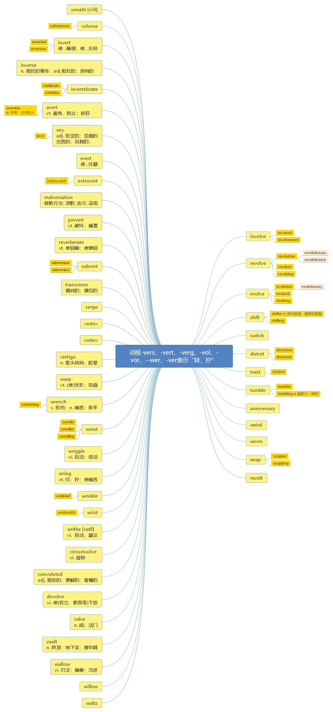

# 第八节 词根-ver， -vers， -vert， -vol， -var

> **一、本节课目标**
>
> 1、掌握词根-ver， -vers， -vert， -vol， -var 的含义
>
> 2、掌握新词 100 个
>
> 3、复习本节课所有单词

***

# 词根-ver， -vers， -vert， -vol， -var =to turn 转，转动；扭，拧

***

# 核心词汇：

***

**involve** \[ɪn'vɒlv] [英音](https://dict.youdao.com/dictvoice?audio=involve\&type=1)  [美音](https://dict.youdao.com/dictvoice?audio=involve\&type=2)  vt. 包含； 牵涉； 使陷于； 潜心于 657

**助记：** in（ 向内） +volv（ =vol=ver=roll： 转， 卷；） +e→转/卷向内→卷入、 包含

\*\*写作例句：\*\*一个盲目考证的趋势以一种前所未有的力量席卷了整个社会，很多人都包含到了其中。

A new trend of getting certificate blindly has swept the society with unsurpassed might,&#x20;

and many people get themselves involved in it.

**例句：** One student took the lead in dealing with a difficult landlord and so \_\_\_\_\_\_ negotiation skills.

A) demonstrated B) determined C) operated D) involved

**解析：** 原文翻译“一个学生带头应对一个难缠的房东， 因而展示了谈判技巧”，

&#x20;故选 A； B：决定； C：操作； D：卷入

**双语例句:** The treatment does not involve the use of any artificial drugs. [播放](https://dict.youdao.com/dictvoice?audio=The+treatment+does+not+involve+the+use+of+any+artificial+drugs.&le=eng&le=eng&type=2)

这种疗法不涉及任何人造药物的使用。 

**双语例句:** Most political questions involve morality in some form or other. [播放](https://dict.youdao.com/dictvoice?audio=Most+political+questions+involve+morality+in+some+form+or+other.&le=eng&le=eng&type=2)

多数政治问题牵涉到这样或那样的道义性。 

**双语例句:** Mass whale strandings involve four or more animals. [播放](https://dict.youdao.com/dictvoice?audio=Mass+whale+strandings+involve+four+or+more+animals.&le=eng&le=eng&type=2)

大规模鲸鱼搁浅的现象涉及到四种或更多种动物。 

**原声例句:** The mind is the collection of activities based in the brain that **involve** how we act, think,feel and reason. [播放](https://dict.youdao.com/pureaudio?docid=-7377678009023301363)

**原声例句:** The Seventh Amendment gives the same right in civil cases that **involve** more than a small amount of money. [播放](https://dict.youdao.com/pureaudio?docid=5100875947503646421)

**原声例句:** One of the demands of the Muslim Brotherhood is to change the constitution to **involve** parliament in appointing prime ministers. [播放](https://dict.youdao.com/pureaudio?docid=8419539038736428543)

**权威例句:** According to the Ministry of Defence, these cases mainly **involve** alcohol rather than drugs.  [播放](https://dict.youdao.com/dictvoice?audio=According+to+the+Ministry+of+Defence%2C+these+cases+mainly+involve+alcohol+rather+than+drugs.+&le=eng&type=2)

**权威例句:** This would **involve** launching a spacecraft able to give the asteroid a nudge to change its orbit.  [播放](https://dict.youdao.com/dictvoice?audio=This+would+involve+launching+a+spacecraft+able+to+give+the+asteroid+a+nudge+to+change+its+orbit.+&le=eng&type=2)

**权威例句:** This year's survey, expected to be carried out next month, will **involve** a team checking about 40, 000 burrows.  [播放](https://dict.youdao.com/dictvoice?audio=This+year%27s+survey%2C+expected+to+be+carried+out+next+month%2C+will+involve+a+team+checking+about+40%2C+000+burrows.+&le=eng&type=2)

***

**involved** \[ɪn'vɒlvd] [英音](https://dict.youdao.com/dictvoice?audio=involved\&type=1)  [美音](https://dict.youdao.com/dictvoice?audio=involved\&type=2) adj. 卷入的；有关的；复杂的 1178

**双语例句:** I was itching to get involved. [播放](https://dict.youdao.com/dictvoice?audio=I+was+itching+to+get+involved.&le=eng&le=eng&type=2)

我渴望参与。 

**双语例句:** He pondered over the difficulties involved. [播放](https://dict.youdao.com/dictvoice?audio=He+pondered+over+the+difficulties+involved.&le=eng&le=eng&type=2)

他仔细思考了有关的种种困难。 

**双语例句:** They are both heavily involved in politics. [播放](https://dict.youdao.com/dictvoice?audio=They+are+both+heavily+involved+in+politics.&le=eng&le=eng&type=2)

他们俩都深深卷入政治中。 

**原声例句:** The new study **involved** researchers from the University of Chicago, Harvard University and the University of California at San Diego. [播放](https://dict.youdao.com/pureaudio?docid=-6858652565477051240)

**原声例句:** So in May,nineteen hundred, he announced that all the nations **involved** had given their approval to the \"Open Door\" policy. [播放](https://dict.youdao.com/pureaudio?docid=-5308528422805924310)

**原声例句:** We asked Ms.Nietert what advice she had for someone who might want to get **involved** in helping others through microfinance. [播放](https://dict.youdao.com/pureaudio?docid=-1686713732439245513)

**权威例句:** Your survival rate depends on how intimately **involved** you were with the bad behavior.  [播放](https://dict.youdao.com/dictvoice?audio=Your+survival+rate+depends+on+how+intimately+involved+you+were+with+the+bad+behavior.+&le=eng&type=2)

**权威例句:** On top of that, there would be medical costs **involved** in procuring the egg.  [播放](https://dict.youdao.com/dictvoice?audio=On+top+of+that%2C+there+would+be+medical+costs+involved+in+procuring+the+egg.+&le=eng&type=2)

**权威例句:** This month Kozlov had proposed permanently banning from banking anyone **involved** in money laundering.  [播放](https://dict.youdao.com/dictvoice?audio=This+month+Kozlov+had+proposed+permanently+banning+from+banking+anyone+involved+in+money+laundering.+&le=eng&type=2)

***

**involvement** \[ɪn'vɒlvm(ə)nt] [英音](https://dict.youdao.com/dictvoice?audio=involvement\&type=1)  [美音](https://dict.youdao.com/dictvoice?audio=involvement\&type=2)  n. 牵连；混乱；包含；财政困难 2331

> **【 课堂笔记】**
>
> \-ment 通常用作名词后缀
>
> 少数情况也可用作动词后缀，例如 comment （ n./v. 评论）

**双语例句:** One of the main themes of TQM is employee involvement. [播放](https://dict.youdao.com/dictvoice?audio=One+of+the+main+themes+of+TQM+is+employee+involvement.&le=eng&le=eng&type=2)

全员质量管理的一个主要原则之一是雇员参与。 

**双语例句:** There was a growing unease about their involvement in the war. [播放](https://dict.youdao.com/dictvoice?audio=There+was+a+growing+unease+about+their+involvement+in+the+war.&le=eng&le=eng&type=2)

他们对卷入战争感到日益不安。 

**双语例句:** The Foreign Ministry has issued a flat denial of any involvement. [播放](https://dict.youdao.com/dictvoice?audio=The+Foreign+Ministry+has+issued+a+flat+denial+of+any+involvement.&le=eng&le=eng&type=2)

外交部已断然否认与此有任何牵连。 

**原声例句:** Republicans say the plan would add to the nation's debt, raise insurance costs and expand government **involvement** in health care. [播放](https://dict.youdao.com/pureaudio?docid=8988074789679849667)

**原声例句:** The loosely organized group of activists opposed the health care plan as too much government **involvement** in the economy. [播放](https://dict.youdao.com/pureaudio?docid=-8218388936776150625)

**原声例句:** The new study led by Doctor Shetgiri shows that parents could help prevent bullying by improving communication and **involvement** with their children. [播放](https://dict.youdao.com/pureaudio?docid=7407849319210365240)

**权威例句:** Tesco, for its part, says it has never hidden its **involvement** with Harris and Hoole.  [播放](https://dict.youdao.com/dictvoice?audio=Tesco%2C+for+its+part%2C+says+it+has+never+hidden+its+involvement+with+Harris+and+Hoole.+&le=eng&type=2)

**权威例句:** Smarter and deeper journalism combined with community **involvement** will lead to new revenue streams.  [播放](https://dict.youdao.com/dictvoice?audio=Smarter+and+deeper+journalism+combined+with+community+involvement+will+lead+to+new+revenue+streams.+&le=eng&type=2)

**权威例句:** It requires no taxpayer money, trivial or no capital costs, and implies no government **involvement**.  [播放](https://dict.youdao.com/dictvoice?audio=It+requires+no+taxpayer+money%2C+trivial+or+no+capital+costs%2C+and+implies+no+government+involvement.+&le=eng&type=2)

***

**revolve** \[rɪ'vɒlv] [英音](https://dict.youdao.com/dictvoice?audio=revolve\&type=1)  [美音](https://dict.youdao.com/dictvoice?audio=revolve\&type=2)  vi. 旋转； 循环出现； 反复考虑 7521

**助记：** re（ 反复） +volv（ =ver=roll： 转） +e→旋转、 转动

**例句：** Copernicus established that the Earth revolves around the sun.哥白尼证实地球围绕太阳旋转。

**双语例句:** Our planet Earth, together with other planets, revolve around our Sun in what is called our Solar system. [播放](https://dict.youdao.com/dictvoice?audio=Our+planet+Earth%2C+together+with+other+planets%2C+revolve+around+our+Sun+in+what+is+called+our+Solar+system.&le=eng&le=eng&type=2)

我们的行星地球，连同其他行星，围绕我们的太阳旋转，这就是我们的太阳系。 

**双语例句:** Of course, we now know that the planets, including Earth, revolve around the Sun, and that the solar system is only a tiny part of the universe. [播放](https://dict.youdao.com/dictvoice?audio=Of+course%2C+we+now+know+that+the+planets%2C+including+Earth%2C+revolve+around+the+Sun%2C+and+that+the+solar+system+is+only+a+tiny+part+of+the+universe.&le=eng&le=eng&type=2)

当然，我们现在知道，包括地球在内的行星都围绕太阳公转，而太阳系只是宇宙的一小部分。 

**双语例句:** Geocentric means Earth-centered, so the geocentric view holds that the Sun, the planets, and the stars, all revolve around the Earth, which is stationary. [播放](https://dict.youdao.com/dictvoice?audio=Geocentric+means+Earth-centered%2C+so+the+geocentric+view+holds+that+the+Sun%2C+the+planets%2C+and+the+stars%2C+all+revolve+around+the+Earth%2C+which+is+stationary.&le=eng&le=eng&type=2)

地心论是指以地球为中心，所以地心论认为，太阳、行星和恒星都围绕着地球旋转，而地球是静止的。 

**原声例句:** And the drama of human life should **revolve** not around the search for eternal life but around the moral conflict and tension between a good god's design for creation and the free will of human beings that can corrupt that good design.

**原声例句:** 

**原声例句:** 

**权威例句:** The theories **revolve** around the belief that Francis doesn't have a legitimate claim to the papacy.  [播放](https://dict.youdao.com/dictvoice?audio=The+theories+revolve+around+the+belief+that+Francis+doesn%27t+have+a+legitimate+claim+to+the+papacy.+&le=eng&type=2)

**权威例句:** Movements in revolution and democratization **revolve** around the redistribution and devolution of concentrated power.  [播放](https://dict.youdao.com/dictvoice?audio=Movements+in+revolution+and+democratization+revolve+around+the+redistribution+and+devolution+of+concentrated+power.+&le=eng&type=2)

**权威例句:** \"The world wasn't created by me nor does it **revolve** around me, \" he says.  [播放](https://dict.youdao.com/dictvoice?audio=%22The+world+wasn%27t+created+by+me+nor+does+it+revolve+around+me%2C+%22+he+says.+&le=eng&type=2)

***

**revolution** \[revə'lu:ʃ(ə)n] [英音](https://dict.youdao.com/dictvoice?audio=revolution\&type=1)  [美音](https://dict.youdao.com/dictvoice?audio=revolution\&type=2) n. 革命；旋转；运行；循环 2781

**助记：** revolu（ =revolve： 旋转、 反转） +t（ 无意义） +ion（ 名词后缀） →旋转、 革命（ 所谓革命， 就是“反转、 颠覆”当前政权）

**搭配：** industrial revolution（考）：工业革命

**双语例句:** The unrest erupted into revolution. [播放](https://dict.youdao.com/dictvoice?audio=The+unrest+erupted+into+revolution.&le=eng&le=eng&type=2)

动乱爆发为革命。 

**双语例句:** After the revolution, anarchy ruled. [播放](https://dict.youdao.com/dictvoice?audio=After+the+revolution%2C+anarchy+ruled.&le=eng&le=eng&type=2)

革命以后，无政府主义大行其道。 

**双语例句:** Reform, as we know, is the enemy of revolution. [播放](https://dict.youdao.com/dictvoice?audio=Reform%2C+as+we+know%2C+is+the+enemy+of+revolution.&le=eng&le=eng&type=2)

革新，如我们所知，是革命的敌对面。 

**原声例句:** So,Senator Nelson created an independent nonprofit group called Environmental Teach-In,Inc to help organize what would become an environmental **revolution**. [播放](https://dict.youdao.com/pureaudio?docid=2078064828005356233)

**原声例句:** Tunisia is observing three days of mourning for people killed in the **revolution** that ousted the president a week ago. [播放](https://dict.youdao.com/pureaudio?docid=-4462734413295147847)

**原声例句:** Millions died under the policies of the Great Leap Forward in the nineteen fifties and the Cultural **Revolution** in the sixties. [播放](https://dict.youdao.com/pureaudio?docid=654191793500328697)

**权威例句:** Cuba's then-leader Fidel Castro accused the US mission of becoming the \"headquarters of the counter-revolution\".  [播放](https://dict.youdao.com/dictvoice?audio=Cuba%27s+then-leader+Fidel+Castro+accused+the+US+mission+of+becoming+the+%22headquarters+of+the+counter-revolution%22.+&le=eng&type=2)

**权威例句:** As a young, black female, my protagonist, Ananiya, is the most unlikely hero for the **revolution**.  [播放](https://dict.youdao.com/dictvoice?audio=As+a+young%2C+black+female%2C+my+protagonist%2C+Ananiya%2C+is+the+most+unlikely+hero+for+the+revolution.+&le=eng&type=2)

**权威例句:** Nintendo is developing a successor to the GameCube, dubbed **Revolution**, for a likely late-2006 launch.  [播放](https://dict.youdao.com/dictvoice?audio=Nintendo+is+developing+a+successor+to+the+GameCube%2C+dubbed+Revolution%2C+for+a+likely+late-2006+launch.+&le=eng&type=2)

***

**revolutionary** \[revə'lu:ʃ(ə)n(ə)rɪ] [英音](https://dict.youdao.com/dictvoice?audio=revolutionary\&type=1)  [美音](https://dict.youdao.com/dictvoice?audio=revolutionary\&type=2)  adj. 革命的；旋转的；大变革的 4054

> **【 课堂笔记】**
>
> \-ary -ery -ory
>
> 形容词后缀：……的
>
> 名词后缀 地点/人/物

**双语例句:** The country was in the throes of revolutionary change. [播放](https://dict.youdao.com/dictvoice?audio=The+country+was+in+the+throes+of+revolutionary+change.&le=eng&le=eng&type=2)

国家正处于革命动荡中。 

**双语例句:** She ran away with him to Mexico and espoused the revolutionary cause. [播放](https://dict.youdao.com/dictvoice?audio=She+ran+away+with+him+to+Mexico+and+espoused+the+revolutionary+cause.&le=eng&le=eng&type=2)

她与他一起逃到了墨西哥，支持革命事业。 

**双语例句:** This revolutionary expansion required energetic nation-building policies. [播放](https://dict.youdao.com/dictvoice?audio=This+revolutionary+expansion+required+energetic+nation-building+policies.&le=eng&le=eng&type=2)

这次革命性扩张需要有积极的国家建设政策。 

**原声例句:** Experts say her **revolutionary** way of capturing people on film has produced some of the most important images in twentieth century photography. [播放](https://dict.youdao.com/pureaudio?docid=-7934507998378770696)

**原声例句:** The book was **revolutionary** for the inventive style of taking photographs that show immediacy and emotional honesty. [播放](https://dict.youdao.com/pureaudio?docid=-6319606373775758638)

**原声例句:** Pablo Picasso was a **revolutionary** modern artist who painted in many different styles during his long career. [播放](https://dict.youdao.com/pureaudio?docid=-4115961316344561019)

**权威例句:** Google , too, is a Cheap **Revolutionary**, running on hundreds of thousands of PC-style Linux servers.  [播放](https://dict.youdao.com/dictvoice?audio=Google+%2C+too%2C+is+a+Cheap+Revolutionary%2C+running+on+hundreds+of+thousands+of+PC-style+Linux+servers.+&le=eng&type=2)

**权威例句:** Such acts led the political establishment to unfairly label Romero as a **revolutionary** and a radical.  [播放](https://dict.youdao.com/dictvoice?audio=Such+acts+led+the+political+establishment+to+unfairly+label+Romero+as+a+revolutionary+and+a+radical.+&le=eng&type=2)

**权威例句:** And they may not have newer **revolutionary** products like the iPhone in the horizon.  [播放](https://dict.youdao.com/dictvoice?audio=And+they+may+not+have+newer+revolutionary+products+like+the+iPhone+in+the+horizon.+&le=eng&type=2)

***

**revolutionize** \['rɛvə'lʊʃə'naɪz] [英音](https://dict.youdao.com/dictvoice?audio=revolutionize\&type=1)  [美音](https://dict.youdao.com/dictvoice?audio=revolutionize\&type=2)  vt. 使彻底革命， 使颠覆 11331

**双语例句:** That's why I think we have to revolutionize our concept of movie showing. [播放](https://dict.youdao.com/dictvoice?audio=That%27s+why+I+think+we+have+to+revolutionize+our+concept+of+movie+showing.&le=eng&le=eng&type=2)

这就是我认为我们必须彻底改变电影放映的概念的理由。 

**双语例句:** As we move into the future, 3D printing will revolutionize the way we shop, the way we manufacture and the way we treat sick people. [播放](https://dict.youdao.com/dictvoice?audio=As+we+move+into+the+future%2C+3D+printing+will+revolutionize+the+way+we+shop%2C+the+way+we+manufacture+and+the+way+we+treat+sick+people.&le=eng&le=eng&type=2)

随着我们进入未来，3D 打印将彻底改变我们的购物方式、生产方式和治疗病人的方式。 

**双语例句:** There is huge potential for artificial intelligence and machine learning to revolutionize agriculture by integrating these technologies into critical markets on a global scale. [播放](https://dict.youdao.com/dictvoice?audio=There+is+huge+potential+for+artificial+intelligence+and+machine+learning+to+revolutionize+agriculture+by+integrating+these+technologies+into+critical+markets+on+a+global+scale.&le=eng&le=eng&type=2)

人工智能和机器学习有巨大的潜力，可以通过将这些技术整合到全球的关键市场来彻底改变农业。 

**原声例句:** 

**原声例句:** 

**原声例句:** 

**权威例句:** Nanotechnology is offering a new way of processing fabric that could **revolutionize** the clothing industry.  [播放](https://dict.youdao.com/dictvoice?audio=Nanotechnology+is+offering+a+new+way+of+processing+fabric+that+could+revolutionize+the+clothing+industry.+&le=eng&type=2)

**权威例句:** He believes his thoughts could **revolutionize** physics, the study of the mind and artificial intelligence.  [播放](https://dict.youdao.com/dictvoice?audio=He+believes+his+thoughts+could+revolutionize+physics%2C+the+study+of+the+mind+and+artificial+intelligence.+&le=eng&type=2)

**权威例句:** They plan to **revolutionize** the marketplace with a product that has never existed before.  [播放](https://dict.youdao.com/dictvoice?audio=They+plan+to+revolutionize+the+marketplace+with+a+product+that+has+never+existed+before.+&le=eng&type=2)

***

**revolver** \[rɪ'vɒlvə] [英音](https://dict.youdao.com/dictvoice?audio=revolver\&type=1)  [美音](https://dict.youdao.com/dictvoice?audio=revolver\&type=2)  n. 左轮手枪；旋转器 11305

**双语例句:** He had only seven rounds of ammunition for the revolver. [播放](https://dict.youdao.com/dictvoice?audio=He+had+only+seven+rounds+of+ammunition+for+the+revolver.&le=eng&le=eng&type=2)

他只有7发左轮手枪的弹药。 

**双语例句:** Mr. Sesemann seized his revolver. [播放](https://dict.youdao.com/dictvoice?audio=Mr.+Sesemann+seized+his+revolver.&le=eng&le=eng&type=2)

赛赛曼先生抓住了他的左轮手枪。 

**双语例句:** Putting his revolver aside, he led the trembling child up-stairs. [播放](https://dict.youdao.com/dictvoice?audio=Putting+his+revolver+aside%2C+he+led+the+trembling+child+up-stairs.&le=eng&le=eng&type=2)

他把左轮手枪放在一边，把发抖的孩子领到楼上。 

**原声例句:** 

**原声例句:** 

**原声例句:** 

**权威例句:** He has since performed and recorded with side group Slash's Snakepit and supergroup Velvet **Revolver**.  [播放](https://dict.youdao.com/dictvoice?audio=He+has+since+performed+and+recorded+with+side+group+Slash%27s+Snakepit+and+supergroup+Velvet+Revolver.+&le=eng&type=2)

**权威例句:** The .38-caliber Taurus **revolver** was recovered by police and had three live rounds in the chamber.  [播放](https://dict.youdao.com/dictvoice?audio=The+.38-caliber+Taurus+revolver+was+recovered+by+police+and+had+three+live+rounds+in+the+chamber.+&le=eng&type=2)

**权威例句:** Set up a meeting with your bankers 60 days before your **revolver** is set to expire.  [播放](https://dict.youdao.com/dictvoice?audio=Set+up+a+meeting+with+your+bankers+60+days+before+your+revolver+is+set+to+expire.+&le=eng&type=2)

***

**revolving** \[rɪ'vɒlvɪŋ] [英音](https://dict.youdao.com/dictvoice?audio=revolving\&type=1)  [美音](https://dict.youdao.com/dictvoice?audio=revolving\&type=2)  adj. 旋转的 12868

**双语例句:** The theatre has a revolving stage. [播放](https://dict.youdao.com/dictvoice?audio=The+theatre+has+a+revolving+stage.&le=eng&le=eng&type=2)

剧院有一个旋转舞台。 

**双语例句:** As he went through the revolving doors he felt his courage deserting him. [播放](https://dict.youdao.com/dictvoice?audio=As+he+went+through+the+revolving+doors+he+felt+his+courage+deserting+him.&le=eng&le=eng&type=2)

走过旋转门的时候，他觉得自己丧失了勇气。 

**双语例句:** I was standing facing the revolving doors and the driveway beyond. [播放](https://dict.youdao.com/dictvoice?audio=I+was+standing+facing+the+revolving+doors+and+the+driveway+beyond.&le=eng&le=eng&type=2)

我在车道的对面，面对着这扇旋转门站着。 

**原声例句:** That was the song \"**Revolving** Doors.\" [播放](https://dict.youdao.com/pureaudio?docid=-6730566284903755376)

**原声例句:** Much of the conversation this week is **revolving** around putting the world's economy back on a sustainable track. [播放](https://dict.youdao.com/pureaudio?docid=-4722675905091195094)

**原声例句:** 

**权威例句:** It was a **revolving** door of managers with the clients caught in the spin.  [播放](https://dict.youdao.com/dictvoice?audio=It+was+a+revolving+door+of+managers+with+the+clients+caught+in+the+spin.+&le=eng&type=2)

**权威例句:** **Revolving** credit lines are part of a typical financing plan for most banks' corporate customers.  [播放](https://dict.youdao.com/dictvoice?audio=Revolving+credit+lines+are+part+of+a+typical+financing+plan+for+most+banks%27+corporate+customers.+&le=eng&type=2)

**权威例句:** We also need to close the **revolving** door between Capitol Hill and K Street.  [播放](https://dict.youdao.com/dictvoice?audio=We+also+need+to+close+the+revolving+door+between+Capitol+Hill+and+K+Street.+&le=eng&type=2)

***

**revolt** \[rɪ'vəʊlt] [英音](https://dict.youdao.com/dictvoice?audio=revolt\&type=1)  [美音](https://dict.youdao.com/dictvoice?audio=revolt\&type=2)  vi. 反抗； 反叛； 拒绝服从 9161

**双语例句:** In February 1848, the people of Paris rose in revolt against the constitutional monarchy of Louis-Philippe. [播放](https://dict.youdao.com/dictvoice?audio=In+February+1848%2C+the+people+of+Paris+rose+in+revolt+against+the+constitutional+monarchy+of+Louis-Philippe.&le=eng&le=eng&type=2)

1848年2月，巴黎人民奋起反抗路易-菲利浦君主立宪制。 

**双语例句:** If instead we regard the financing of warfare by taxation in this period as a background condition, then we will see the English reverse themselves as the main cause of the revolt. [播放](https://dict.youdao.com/dictvoice?audio=If+instead+we+regard+the+financing+of+warfare+by+taxation+in+this+period+as+a+background+condition%2C+then+we+will+see+the+English+reverse+themselves+as+the+main+cause+of+the+revolt.&le=eng&le=eng&type=2)

如果我们将这一时期的通过税收来支持军事作为背景条件，那么我们就会看到英国人自己的失败反倒是造成反抗的主要原因。 

**双语例句:** The peasants rose in revolt. [播放](https://dict.youdao.com/dictvoice?audio=The+peasants+rose+in+revolt.&le=eng&le=eng&type=2)

农民起来造反了。 

**原声例句:** At the National Gallery of Art in Washington,D.C., you can see a colorful and expressive print called \"**Revolt** on the Amistad.\" [播放](https://dict.youdao.com/pureaudio?docid=-7860591145806936809)

**原声例句:** The image depicts the **revolt** on the Spanish slave ship \"La Amistad\", the action of the fight. [播放](https://dict.youdao.com/pureaudio?docid=3989527901193167852)

**原声例句:** That was the year Mexicans got their independence after years of **revolt** against Spanish rule. [播放](https://dict.youdao.com/pureaudio?docid=-8171646163214678654)

**权威例句:** But there has been a price the tax **revolt** that provoked the collapse in Labour's popularity.  [播放](https://dict.youdao.com/dictvoice?audio=But+there+has+been+a+price+the+tax+revolt+that+provoked+the+collapse+in+Labour%27s+popularity.+&le=eng&type=2)

**权威例句:** And in the age of social media it was entirely predictable that customers would **revolt** vociferously.  [播放](https://dict.youdao.com/dictvoice?audio=And+in+the+age+of+social+media+it+was+entirely+predictable+that+customers+would+revolt+vociferously.+&le=eng&type=2)

**权威例句:** Senate Republicans are on the verge of a full-scale **revolt** against the White House.  [播放](https://dict.youdao.com/dictvoice?audio=Senate+Republicans+are+on+the+verge+of+a+full-scale+revolt+against+the+White+House.+&le=eng&type=2)

***

**evolve** \[ɪ'vɒlv] [英音](https://dict.youdao.com/dictvoice?audio=evolve\&type=1)  [美音](https://dict.youdao.com/dictvoice?audio=evolve\&type=2)  vt. 发展，进化；进化；使逐步形成；推断出 2845

**助记：** e（ =ex 向外、 出来） +volve（ 转） →（ 新物种） 转出来→进化、 发展

**双语例句:** It is interesting that Chinese characters evolve from pictures and signs. [播放](https://dict.youdao.com/dictvoice?audio=It+is+interesting+that+Chinese+characters+evolve+from+pictures+and+signs.&le=eng&le=eng&type=2)

有趣的是，汉字是由图画和符号演变而来的。 

**双语例句:** So why would animals evolve a characteristic that seems to endanger them? [播放](https://dict.youdao.com/dictvoice?audio=So+why+would+animals+evolve+a+characteristic+that+seems+to+endanger+them%3F&le=eng&le=eng&type=2)

那么，为什么动物会进化出一种似乎会危及它们自身的特性呢？ 

**双语例句:** Sometimes primary group relationships evolve out of secondary group relationships. [播放](https://dict.youdao.com/dictvoice?audio=Sometimes+primary+group+relationships+evolve+out+of+secondary+group+relationships.&le=eng&le=eng&type=2)

有时主要的群体关系从次要的群体关系演变而来。 

**原声例句:** Rosalyn Schanzer brings to life the clues that suggested to Darwin that living things **evolve**, or change,over time. [播放](https://dict.youdao.com/pureaudio?docid=843963541138061433)

**原声例句:** But it was Darwin who identified and explained the process, natural selection, that causes life to **evolve**. [播放](https://dict.youdao.com/pureaudio?docid=-5096036661833255876)

**原声例句:** She says it is important to let jazz music breathe, and **evolve** in new ways. [播放](https://dict.youdao.com/pureaudio?docid=5260282463990570769)

**权威例句:** New tactical trading plays will **evolve** quickly, while longer term strategies will **evolve** more slowly.  [播放](https://dict.youdao.com/dictvoice?audio=New+tactical+trading+plays+will+evolve+quickly%2C+while+longer+term+strategies+will+evolve+more+slowly.+&le=eng&type=2)

**权威例句:** For labor to **evolve**, it will need a leader better equipped to walk the talk.  [播放](https://dict.youdao.com/dictvoice?audio=For+labor+to+evolve%2C+it+will+need+a+leader+better+equipped+to+walk+the+talk.+&le=eng&type=2)

**权威例句:** But as the threats continue to **evolve**, NATO should be prepared to consider an enhanced role.  [播放](https://dict.youdao.com/dictvoice?audio=But+as+the+threats+continue+to+evolve%2C+NATO+should+be+prepared+to+consider+an+enhanced+role.+&le=eng&type=2)

***

**evolution** \[,i\:və'lu:ʃ(ə)n; 'ev-] [英音](https://dict.youdao.com/dictvoice?audio=evolution\&type=1)  [美音](https://dict.youdao.com/dictvoice?audio=evolution\&type=2)  n. 进展；演变；进化论 2969

**搭配：** evolution of the human species（考）：人类的进化

**双语例句:** Darwin eventually put forward a model of biological evolution. [播放](https://dict.youdao.com/dictvoice?audio=Darwin+eventually+put+forward+a+model+of+biological+evolution.&le=eng&le=eng&type=2)

达尔文最终提出了一套生物进化的理论模式。 

**双语例句:** We're dealing with probably the biggest missing link in what we know about human evolution. [播放](https://dict.youdao.com/dictvoice?audio=We%27re+dealing+with+probably+the+biggest+missing+link+in+what+we+know+about+human+evolution.&le=eng&le=eng&type=2)

我们正在解决的可能是我们所知的人类进化过程中缺失最大的一环。 

**双语例句:** I have moved from trying to model and understand the distribution and evolution of water vapour. [播放](https://dict.youdao.com/dictvoice?audio=I+have+moved+from+trying+to+model+and+understand+the+distribution+and+evolution+of+water+vapour.&le=eng&le=eng&type=2)

我已经不再试图构建和理解水汽的分布和演变的理论模式了。 

**原声例句:** Professor Auerbach describes how the **evolution** of vampires tells a great deal about a culture's fears, which change over generations. [播放](https://dict.youdao.com/pureaudio?docid=-8853939941967552745)

**原声例句:** The trial found high school teacher John Scopes guilty of violating a state law banning the teaching of **evolution**. [播放](https://dict.youdao.com/pureaudio?docid=-4234162959926632816)

**原声例句:** But it is only a beginning. John Kress of the Smithsonian says that, while science accepts **evolution**, debate continues. [播放](https://dict.youdao.com/pureaudio?docid=7131065903578389373)

**权威例句:** For him, the process of **evolution** involved new species gaining ground and others losing out.  [播放](https://dict.youdao.com/dictvoice?audio=For+him%2C+the+process+of+evolution+involved+new+species+gaining+ground+and+others+losing+out.+&le=eng&type=2)

**权威例句:** The **evolution** of ideas began soon after Spanish colonisers arrived in the 16th Century.  [播放](https://dict.youdao.com/dictvoice?audio=The+evolution+of+ideas+began+soon+after+Spanish+colonisers+arrived+in+the+16th+Century.+&le=eng&type=2)

**权威例句:** Since 2009, the billion-euro Herschel telescope has been unravelling the complexities of star birth and galaxy **evolution**.  [播放](https://dict.youdao.com/dictvoice?audio=Since+2009%2C+the+billion-euro+Herschel+telescope+has+been+unravelling+the+complexities+of+star+birth+and+galaxy+evolution.+&le=eng&type=2)

***

**evolutionary** \[,i\:və'lu:ʃənərɪ] [英音](https://dict.youdao.com/dictvoice?audio=evolutionary\&type=1)  [美音](https://dict.youdao.com/dictvoice?audio=evolutionary\&type=2) adj. 进化的；发展的；渐进的 5471

**双语例句:** An evolutionary inference can then be drawn. [播放](https://dict.youdao.com/dictvoice?audio=An+evolutionary+inference+can+then+be+drawn.&le=eng&le=eng&type=2)

这样就可以得到一个关于进化的推论。 

**双语例句:** That's what's meant by evolutionary potential. [播放](https://dict.youdao.com/dictvoice?audio=That%27s+what%27s+meant+by+evolutionary+potential.&le=eng&le=eng&type=2)

这就是进化潜力的含义。 

**双语例句:** What do I mean by restore evolutionary potential? [播放](https://dict.youdao.com/dictvoice?audio=What+do+I+mean+by+restore+evolutionary+potential%3F&le=eng&le=eng&type=2)

我所说的恢复进化潜能是什么意思？ 

**原声例句:** But there have also been efforts to bridge the differences between religious belief and **evolutionary** science in recent years. [播放](https://dict.youdao.com/pureaudio?docid=-3617018499043054486)

**原声例句:** \"I never really realized that that meant that every living thing really came as an **evolutionary** development of the first seeds of life.\" [播放](https://dict.youdao.com/pureaudio?docid=-3896440669321595544)

**原声例句:** Mister Leakey believed that learning more about these animals could help explain the **evolutionary** past of humans. [播放](https://dict.youdao.com/pureaudio?docid=2299915339028450003)

**权威例句:** The famed fossil was discovered in 1861 in Germany and quickly became an **evolutionary** icon.  [播放](https://dict.youdao.com/dictvoice?audio=The+famed+fossil+was+discovered+in+1861+in+Germany+and+quickly+became+an+evolutionary+icon.+&le=eng&type=2)

**权威例句:** This asymmetry between the power of positive and negative expectations or experiences has an **evolutionary** history.  [播放](https://dict.youdao.com/dictvoice?audio=This+asymmetry+between+the+power+of+positive+and+negative+expectations+or+experiences+has+an+evolutionary+history.+&le=eng&type=2)

**权威例句:** Scientists are now beginning to understand the dynamic **evolutionary** history of these Ice Age mammals.  [播放](https://dict.youdao.com/dictvoice?audio=Scientists+are+now+beginning+to+understand+the+dynamic+evolutionary+history+of+these+Ice+Age+mammals.+&le=eng&type=2)

***

**evolved** \[ɪ'vɒlvd] [英音](https://dict.youdao.com/dictvoice?audio=evolved\&type=1)  [美音](https://dict.youdao.com/dictvoice?audio=evolved\&type=2)  adj. 进化了的 19437

**例句：** However, whether such a sense of fairness evolved independently in capuchins and humans,or whether it stems from the common ancestor that the species had 35 million years ago, is,as yet, an unanswered question.

然而，是否这样的一种公平感是在卷尾猴和人类中独立进化的，或者是否它来源于这些物种在 3500 万年前共有的祖先，仍然还是一个未知问题。

**阅读难点：** sense of fairness：公平感 stem from：源于

&#x20;**仿写例句：** 然而，这样的一种行为是源于对未来的充分准备还是只是盲目的随大溜，仍然还是一个未知问题。

However, whether such a behavior roots in making adequate preparation for the future or it just stems from drifting with the stream, is, as yet, an unanswered question.

**双语例句:** I think it has evolved. [播放](https://dict.youdao.com/dictvoice?audio=I+think+it+has+evolved.&le=eng&le=eng&type=2)

我认为它已经进化了。 

**双语例句:** At this point the subpopulations have evolved into distinct species. [播放](https://dict.youdao.com/dictvoice?audio=At+this+point+the+subpopulations+have+evolved+into+distinct+species.&le=eng&le=eng&type=2)

这时，亚种群已经进化成不同的物种。 

**双语例句:** We evolved the ability to sweat plentifully, and lost most of our fur. [播放](https://dict.youdao.com/dictvoice?audio=We+evolved+the+ability+to+sweat+plentifully%2C+and+lost+most+of+our+fur.&le=eng&le=eng&type=2)

我们进化出了大量出汗的能力，并且失去了大部分的皮毛。 

**原声例句:** Those first attempts at demanding a \"tax\" of foreign ships **evolved** into highly organized hijacking operations. [播放](https://dict.youdao.com/pureaudio?docid=5463330365585568781)

**原声例句:** But the idea that species have **evolved** from simpler forms is less accepted by the public. [播放](https://dict.youdao.com/pureaudio?docid=-4675163661163851258)

**原声例句:** In the late eighteenth century, Darwin's grandfather, Erasmus Darwin,suggested that species **evolved** from their ancestors. [播放](https://dict.youdao.com/pureaudio?docid=-4687705629206813709)

**权威例句:** It has quickly **evolved** into a worldwide event for the fine vintages paired with delicious food.  [播放](https://dict.youdao.com/dictvoice?audio=It+has+quickly+evolved+into+a+worldwide+event+for+the+fine+vintages+paired+with+delicious+food.+&le=eng&type=2)

**权威例句:** Sadly, the planet probably does not have the sort of surface on which life could have **evolved**.  [播放](https://dict.youdao.com/dictvoice?audio=Sadly%2C+the+planet+probably+does+not+have+the+sort+of+surface+on+which+life+could+have+evolved.+&le=eng&type=2)

**权威例句:** Only humans have it, we **evolved** it, and we have enjoyed it for much of our species' history.  [播放](https://dict.youdao.com/dictvoice?audio=Only+humans+have+it%2C+we+evolved+it%2C+and+we+have+enjoyed+it+for+much+of+our+species%27+history.+&le=eng&type=2)

***

**evolving** \[ɪ'vɒlvɪŋ] [英音](https://dict.youdao.com/dictvoice?audio=evolving\&type=1)  [美音](https://dict.youdao.com/dictvoice?audio=evolving\&type=2)  adj. 展开的； 进化的 13711

> **【 课堂笔记】**
>
> involve v. 卷入 n. involvement adj. involved
>
> revolve v. 旋转；反转；颠覆 n. revolution adj. revolutionary
>
> evolve v. 进化 n. evolution adj. evolutionary

**双语例句:** Omiai is evolving into a sort of stylized introduction. [播放](https://dict.youdao.com/dictvoice?audio=Omiai+is+evolving+into+a+sort+of+stylized+introduction.&le=eng&le=eng&type=2)

Omiai 已经演变成了一种程式化的介绍。 

**双语例句:** Everything except the part about snakes evolving from lizards. [播放](https://dict.youdao.com/dictvoice?audio=Everything+except+the+part+about+snakes+evolving+from+lizards.&le=eng&le=eng&type=2)

除了蛇是从蜥蜴演化而来的这一点以外。 

**双语例句:** That rapid replication rate also increased the chances of strains evolving in ways that allowed them to evade hog immune systems. [播放](https://dict.youdao.com/dictvoice?audio=That+rapid+replication+rate+also+increased+the+chances+of+strains+evolving+in+ways+that+allowed+them+to+evade+hog+immune+systems.&le=eng&le=eng&type=2)

那样迅速的复制速度也增加了菌株进化的机会，使它们能够用种种方式避开猪的免疫系统。 

**原声例句:** The second crisis is the one that is **evolving** in these large camps around the town of Vavuniya.\" [播放](https://dict.youdao.com/pureaudio?docid=2038818018554527994)

**原声例句:** The situation in Afghanistan is sure to dominate the NATO summit as alliance members grapple with the **evolving** security demands of the 21st century. [播放](https://dict.youdao.com/pureaudio?docid=824127725401009337)

**原声例句:** So the second step is you really need to innovating and **evolving**.

**权威例句:** But when it comes to technology's **evolving** platforms and ethical codes, parents don't always know best.  [播放](https://dict.youdao.com/dictvoice?audio=But+when+it+comes+to+technology%27s+evolving+platforms+and+ethical+codes%2C+parents+don%27t+always+know+best.+&le=eng&type=2)

**权威例句:** \"The conflict shows the game is **evolving**, \" said Derek McGrath, the ERC chief executive.  [播放](https://dict.youdao.com/dictvoice?audio=%22The+conflict+shows+the+game+is+evolving%2C+%22+said+Derek+McGrath%2C+the+ERC+chief+executive.+&le=eng&type=2)

**权威例句:** The result of this **evolving** economic relationship has resulted in profound changes in Mexico.  [播放](https://dict.youdao.com/dictvoice?audio=The+result+of+this+evolving+economic+relationship+has+resulted+in+profound+changes+in+Mexico.+&le=eng&type=2)

***

**shift** \[ʃɪft] [英音](https://dict.youdao.com/dictvoice?audio=shift\&type=1)  [美音](https://dict.youdao.com/dictvoice?audio=shift\&type=2)  n. 轮班； vt. 移动；变化 1690

**搭配：** shift work（考）：轮班、倒班 shift the gaze away（考）：转移视线、转移注意力

**例句：** On the other hand, oil importing emerging economies—to which heavy industry has shifted—have become more energy-intensive, and so could be more seriously squeezed.

另一方面，重工业转移到的石油进口新兴国家已经变得越来越能源集中，因此可能被严重挤压。

\*\*写作例句：\*\*每当提到酒后驾车，人们总会很自然地把责任转移到那些相关的个人身上，很少有人会想到其实政府也有监管不力的责任。

When it comes to drunk driving, people will naturally shift the blame to the person concerned,and relatively few may ever think of the inadequate supervision of the government.

**双语例句:** We need to shift the focus of this debate. [播放](https://dict.youdao.com/dictvoice?audio=We+need+to+shift+the+focus+of+this+debate.&le=eng&le=eng&type=2)

我们需要转换一下辩论的焦点。 

**双语例句:** The Green Party is attempting to shift the American consciousness. [播放](https://dict.youdao.com/dictvoice?audio=The+Green+Party+is+attempting+to+shift+the+American+consciousness.&le=eng&le=eng&type=2)

绿党在试图改变美国人的观念体系。 

**双语例句:** There has been a shift from smokestack industries into high-tech ones. [播放](https://dict.youdao.com/dictvoice?audio=There+has+been+a+shift+from+smokestack+industries+into+high-tech+ones.&le=eng&le=eng&type=2)

产业结构已由传统工业转向了高科技产业。 

**原声例句:** The two men did this by studying what Hubble called the \"red **shift**.\" [播放](https://dict.youdao.com/pureaudio?docid=2029785097434126864)

**原声例句:** In light of the Pakistani Taliban's alleged involvement, some speculate there could be a **shift** in US policy toward Pakistan. [播放](https://dict.youdao.com/pureaudio?docid=4474009903673986233)

**原声例句:** Viroj Na Ranong,an economist with the Thailand Development Research Institute, a policy research agency, fears that **shift** is under way. [播放](https://dict.youdao.com/pureaudio?docid=-2292037406189868718)

**权威例句:** Berman started at ABC News as a desk assistant working the overnight **shift** in 1995.  [播放](https://dict.youdao.com/dictvoice?audio=Berman+started+at+ABC+News+as+a+desk+assistant+working+the+overnight+shift+in+1995.+&le=eng&type=2)

**权威例句:** What has buoyed the premium oyster business is a historic **shift** in the habits of oyster eaters.  [播放](https://dict.youdao.com/dictvoice?audio=What+has+buoyed+the+premium+oyster+business+is+a+historic+shift+in+the+habits+of+oyster+eaters.+&le=eng&type=2)

**权威例句:** But at some grade level the emphasis needs to **shift** from shoring up weaknesses to building on strengths.  [播放](https://dict.youdao.com/dictvoice?audio=But+at+some+grade+level+the+emphasis+needs+to+shift+from+shoring+up+weaknesses+to+building+on+strengths.+&le=eng&type=2)

***

**shifter** \['ʃɪftɚ] [英音](https://dict.youdao.com/dictvoice?audio=shifter\&type=1)  [美音](https://dict.youdao.com/dictvoice?audio=shifter\&type=2)  n.移动装置；搬移东西者 18274

> **【 课堂笔记】**
>
> \-er 名词后缀 人/物

**双语例句:** Full-decoder circuit structure is used in Barrel Shifter design. [播放](https://dict.youdao.com/dictvoice?audio=Full-decoder+circuit+structure+is+used+in+Barrel+Shifter+design.&le=eng&le=eng&type=2)

桶形移位器的设计采用了全译码电路结构。 

**双语例句:** The role of phase shifter is signal phase shift from another perspective. [播放](https://dict.youdao.com/dictvoice?audio=The+role+of+phase+shifter+is+signal+phase+shift+from+another+perspective.&le=eng&le=eng&type=2)

移相器地感化是将旌旗灯号地相位挪动一个角度。 

**双语例句:** Phase shifter is widely applied in the system of communication and radar. [播放](https://dict.youdao.com/dictvoice?audio=Phase+shifter+is+widely+applied+in+the+system+of+communication+and+radar.&le=eng&le=eng&type=2)

移相器在通信、雷达等系统中有着广泛的应用。 

**原声例句:** 

**原声例句:** 

**原声例句:** 

**权威例句:** The two highest-end versions offer memory bucket seats with a center-console **shifter**, like a luxury sedan.  [播放](https://dict.youdao.com/dictvoice?audio=The+two+highest-end+versions+offer+memory+bucket+seats+with+a+center-console+shifter%2C+like+a+luxury+sedan.+&le=eng&type=2)

**权威例句:** KBB.com asked visitors to its car-shopping website last week what sort of **shifter** they preferred.  [播放](https://dict.youdao.com/dictvoice?audio=KBB.com+asked+visitors+to+its+car-shopping+website+last+week+what+sort+of+shifter+they+preferred.+&le=eng&type=2)

**权威例句:** **Shifter** also predicted that a Maduro administration would not maintain warm relations with the United States.  [播放](https://dict.youdao.com/dictvoice?audio=Shifter+also+predicted+that+a+Maduro+administration+would+not+maintain+warm+relations+with+the+United+States.+&le=eng&type=2)

***

**shifting** \['ʃɪftɪŋ] [英音](https://dict.youdao.com/dictvoice?audio=shifting\&type=1)  [美音](https://dict.youdao.com/dictvoice?audio=shifting\&type=2)  adj. 不断移动的； 流动的 n. 狡猾； 移位 7507

**双语例句:** He stopped, shifting his cane to his left hand. [播放](https://dict.youdao.com/dictvoice?audio=He+stopped%2C+shifting+his+cane+to+his+left+hand.&le=eng&le=eng&type=2)

他停下来，把手杖移到左手。 

**双语例句:** To put it bluntly, this is shifting responsibility. [播放](https://dict.youdao.com/dictvoice?audio=To+put+it+bluntly%2C+this+is+shifting+responsibility.&le=eng&le=eng&type=2)

说穿了，无非是想推卸责任。 

**双语例句:** Maybe the ground vibrates, or maybe the ground itself is shifting, tilting. [播放](https://dict.youdao.com/dictvoice?audio=Maybe+the+ground+vibrates%2C+or+maybe+the+ground+itself+is+shifting%2C+tilting.&le=eng&le=eng&type=2)

也许是地面震动了，或者是地面本身在移动和倾斜。 

**原声例句:** Georgetown professor Robert Lieber says he is not surprised the White House may be **shifting** its position. [播放](https://dict.youdao.com/pureaudio?docid=-5604935512112618514)

**原声例句:** Tea Party activists seem more focused on **shifting** the Republican Party in a more conservative direction than in forming their own political party. [播放](https://dict.youdao.com/pureaudio?docid=4472186198807487803)

**原声例句:** The military is already **shifting** to a newer, slightly less sophisticated aircraft, the F-35 Joint Strike Fighter, designed more for attacking targets on the ground. [播放](https://dict.youdao.com/pureaudio?docid=-24251696003889649)

**权威例句:** Now the gamblers are becoming long-term investors, and the balance of power is **shifting**.  [播放](https://dict.youdao.com/dictvoice?audio=Now+the+gamblers+are+becoming+long-term+investors%2C+and+the+balance+of+power+is+shifting.+&le=eng&type=2)

**权威例句:** Banks are also **shifting** their focus away from the mass market consumer toward the affluent.  [播放](https://dict.youdao.com/dictvoice?audio=Banks+are+also+shifting+their+focus+away+from+the+mass+market+consumer+toward+the+affluent.+&le=eng&type=2)

**权威例句:** Adults struggle to keep up with the **shifting** rules of online etiquette and information sharing.  [播放](https://dict.youdao.com/dictvoice?audio=Adults+struggle+to+keep+up+with+the+shifting+rules+of+online+etiquette+and+information+sharing.+&le=eng&type=2)

***

**switch** \[swɪtʃ] [英音](https://dict.youdao.com/dictvoice?audio=switch\&type=1)  [美音](https://dict.youdao.com/dictvoice?audio=switch\&type=2)  vt. 转换；用鞭子等抽打； vi. 转换；抽打； n. 开关；转换 2626

**助记：** s（ 加强语气） +wit（ =ver： 转） +ch（ 无意义） →转换、 转变； 开关（ 即“开”和“关”相互转变）

**搭配：** switch to（考）：转向、转变成 switch their phones off（考）：关闭他们的手机

**例句：** If railroads charged all customers the same average rate, they argue, shippers who have the option of switching to trucks or other forms of transportation would do so, leaving remaining customers to shoulder the cost of keeping up the line.

&#x20;他们认为，如果铁路向所有的顾客要价相同，那么有选择转向卡车或者其他交通运输的托运人就会这么做，留给剩余的顾客去肩负维持铁路运营的成本。（研真 03）

**阅读难点：** charge：索要 rate：价格、费用 keep up the line：保持、维持运营线路

\*\*仿写例句：\*\*我认为，如果正版产品向顾客要价太高，那么有选择权的顾客就会转而购买盗版产品，留给那些经济宽裕的人去负担购买正版产品的花销。

If authentic products charge customers too much, I argue, consumers who have the option of switching to pirated products will do so, leaving those well-off customers to shoulder the cost of purchasing authentic ones.

**例句：** The Pentagon built the network for military contractors and universities doing military

research to \_\_\_\_\_\_\_\_ information.

A． exchange B． bypass C． switch D． interact

**解析：** 原文翻译“五角大楼为军事承包商和做军事研究的大学建设了该网络去交流信息”， 故

选 A， exchange information：交流信息； B：绕开； C：转换； D：相互作用、相互影响

> **【 课堂笔记】**
>
> switch on 打开；开机
>
> switch off 关闭；关机

**双语例句:** The heating is on a time switch. [播放](https://dict.youdao.com/dictvoice?audio=The+heating+is+on+a+time+switch.&le=eng&le=eng&type=2)

暖气靠定时开关自动供热。 

**双语例句:** Not that switch, you idiot! [播放](https://dict.youdao.com/dictvoice?audio=Not+that+switch%2C+you+idiot%21&le=eng&le=eng&type=2)

不是那个开关，你这个蠢货！ 

**双语例句:** When did you switch jobs? [播放](https://dict.youdao.com/dictvoice?audio=When+did+you+switch+jobs%3F&le=eng&le=eng&type=2)

你们什么时候调动工作的？ 

**原声例句:** Seiko wrote there was a similar fire in Kabukicho,Japan in two thousand one: \"The building had a fire alarm apparatus but the **switch** was turned off because of poor maintenance. [播放](https://dict.youdao.com/pureaudio?docid=-4914400618275170603)

**原声例句:** Here is the song \"The **Switch** and the Spur.\" [播放](https://dict.youdao.com/pureaudio?docid=3642264423104400943)

**原声例句:** ... A 'green power' program regularly invites customers to pay $4 to $10 extra per month to **switch** to clean energy. [播放](https://dict.youdao.com/pureaudio?docid=-327450012047053143)

**权威例句:** The intention is for one pub a week to **switch**, depending on the reaction of customers.  [播放](https://dict.youdao.com/dictvoice?audio=The+intention+is+for+one+pub+a+week+to+switch%2C+depending+on+the+reaction+of+customers.+&le=eng&type=2)

**权威例句:** He said all opposition parties had \"welcomed in principle\" a **switch** to independent regulation.  [播放](https://dict.youdao.com/dictvoice?audio=He+said+all+opposition+parties+had+%22welcomed+in+principle%22+a+switch+to+independent+regulation.+&le=eng&type=2)

**权威例句:** The screen can also be turned on and off using the **switch**, enabling one-touch operations.  [播放](https://dict.youdao.com/dictvoice?audio=The+screen+can+also+be+turned+on+and+off+using+the+switch%2C+enabling+one-touch+operations.+&le=eng&type=2)

***

**distort** \[dɪ'stɔ\:t] [英音](https://dict.youdao.com/dictvoice?audio=distort\&type=1)  [美音](https://dict.youdao.com/dictvoice?audio=distort\&type=2)  vt. 扭曲； 曲解； 使失真 6724

**助记：** dis（ =de： 表彻底） +tort（ =twist： 扭曲、 弯曲） →歪曲、 曲解

**双语例句:** A painter may exaggerate or distort shapes and forms. [播放](https://dict.youdao.com/dictvoice?audio=A+painter+may+exaggerate+or+distort+shapes+and+forms.&le=eng&le=eng&type=2)

画家可能会夸大或扭曲形状与形式。 

**双语例句:** They could distort the achievement-based system of peer-review-led research. [播放](https://dict.youdao.com/dictvoice?audio=They+could+distort+the+achievement-based+system+of+peer-review-led+research.&le=eng&le=eng&type=2)

他们可能会扭曲以同行评审为导向、以学术成就基础的研究体系。 

**双语例句:** How can you portray something exactly as it is and at the same time distort it with emotions? [播放](https://dict.youdao.com/dictvoice?audio=How+can+you+portray+something+exactly+as+it+is+and+at+the+same+time+distort+it+with+emotions%3F&le=eng&le=eng&type=2)

你怎么可能一边完全客观的作画，一边又带有感情的去使之变形呢？ 

**原声例句:** The APEC Business Advisory Council says the greatest concerns are that rising unemployment and weak demand could lead some governments to introduce protectionist measures and subsidies that **distort** trade. [播放](https://dict.youdao.com/pureaudio?docid=-2199716993718932027)

**原声例句:** Well what can you do? Well you can promise miracles, there's very little control over these sorts of things, you can **distort** the science, you can lie about what you do and nobody will come after you.

**原声例句:** 

**权威例句:** Another common reason that customers use multiple brands is structural barriers that **distort** demand.  [播放](https://dict.youdao.com/dictvoice?audio=Another+common+reason+that+customers+use+multiple+brands+is+structural+barriers+that+distort+demand.+&le=eng&type=2)

**权威例句:** News media and Democrat efforts to convince us of a Keynesian consensus **distort** the truth.  [播放](https://dict.youdao.com/dictvoice?audio=News+media+and+Democrat+efforts+to+convince+us+of+a+Keynesian+consensus+distort+the+truth.+&le=eng&type=2)

**权威例句:** Dyck and Zingales posit that bubbles **distort** the relationship between companies and the media.  [播放](https://dict.youdao.com/dictvoice?audio=Dyck+and+Zingales+posit+that+bubbles+distort+the+relationship+between+companies+and+the+media.+&le=eng&type=2)

***

**distortion** \[dɪ'stɔ:ʃ(ə)n] [英音](https://dict.youdao.com/dictvoice?audio=distortion\&type=1)  [美音](https://dict.youdao.com/dictvoice?audio=distortion\&type=2)  n. 变形；扭曲；曲解；失真 7640

**例句：** We must express our views clearly to prevent media distortion and public confusion.

我们必须清楚地表达我们的观点，以防媒体扭曲、公众混淆。

**双语例句:** He demonstrated how audio signals could be transmitted along cables without distortion. [播放](https://dict.youdao.com/dictvoice?audio=He+demonstrated+how+audio+signals+could+be+transmitted+along+cables+without+distortion.&le=eng&le=eng&type=2)

他演示了音频信号如何通过电缆传输而不失真。 

**双语例句:** I think it would be a gross distortion of reality to say that they were motivated by self-interest. [播放](https://dict.youdao.com/dictvoice?audio=I+think+it+would+be+a+gross+distortion+of+reality+to+say+that+they+were+motivated+by+self-interest.&le=eng&le=eng&type=2)

我认为说他们被自身利益所驱使是对事实的公然扭曲。 

**双语例句:** What a distortion of resilience! A resilient child is a well-rested one. [播放](https://dict.youdao.com/dictvoice?audio=What+a+distortion+of+resilience%21+A+resilient+child+is+a+well-rested+one.&le=eng&le=eng&type=2)

好一个对复原力的曲解啊！复原力强的孩子往往休息得很好。 

**原声例句:** There's a lot of imagery of swelling, of **distortion** and distention of the body that some critics point to her biography to explain.

**原声例句:** 

**原声例句:** 

**权威例句:** \"Mr. Hardin's use of the incident was artful in its **distortion**, \" Mr. Emery said.  [播放](https://dict.youdao.com/dictvoice?audio=%22Mr.+Hardin%27s+use+of+the+incident+was+artful+in+its+distortion%2C+%22+Mr.+Emery+said.+&le=eng&type=2)

**权威例句:** It is a **distortion** of reality that can undermine our decisions and alienate our teams.  [播放](https://dict.youdao.com/dictvoice?audio=It+is+a+distortion+of+reality+that+can+undermine+our+decisions+and+alienate+our+teams.+&le=eng&type=2)

**权威例句:** Eliminate all subsidies for all fuels, thereby correcting yet another market **distortion** called government failure.  [播放](https://dict.youdao.com/dictvoice?audio=Eliminate+all+subsidies+for+all+fuels%2C+thereby+correcting+yet+another+market+distortion+called+government+failure.+&le=eng&type=2)

***

**distorted** \[dɪ'stɔ\:tɪd] [英音](https://dict.youdao.com/dictvoice?audio=distorted\&type=1)  [美音](https://dict.youdao.com/dictvoice?audio=distorted\&type=2)  adj. 歪曲的； 受到曲解的 11064

> **【 课堂笔记】**
>
> dis-
>
> 表相反： able → disable
>
> 表分开： distract （使分心，使分散精力）
>
> \= -de，表加强： distort（扭曲；曲解；使失真）

**双语例句:** The article gave a distorted picture of his childhood. [播放](https://dict.youdao.com/dictvoice?audio=The+article+gave+a+distorted+picture+of+his+childhood.&le=eng&le=eng&type=2)

这篇文章对他的童年作了歪曲的描述。 

**双语例句:** Sound was becoming more and more distorted through the use of hearing aids. [播放](https://dict.youdao.com/dictvoice?audio=Sound+was+becoming+more+and+more+distorted+through+the+use+of+hearing+aids.&le=eng&le=eng&type=2)

由于使用助听器，声音变得越来越失真。 

**双语例句:** For example, those bright, distorted figures. [播放](https://dict.youdao.com/dictvoice?audio=For+example%2C+those+bright%2C+distorted+figures.&le=eng&le=eng&type=2)

例如，那些明亮而扭曲的形象。 

**原声例句:** He said this creates a \"**distorted** reality\" and the U.N.must take a more balanced approach. [播放](https://dict.youdao.com/pureaudio?docid=7515211325662141348)

**原声例句:** were killed in the conflict. Britain's involvement in the war was deeply unpopular at home and there were allegations the government had **distorted** intelligence to justify the war. [播放](https://dict.youdao.com/pureaudio?docid=-3348117702877020916)

**原声例句:** \"There is a problem with the judiciary. There is a problem with the notion of being able to take cases to the courty, cases where journalists are threatened, publications are supressed, or information **distorted**. [播放](https://dict.youdao.com/pureaudio?docid=8150914465478603677)

**权威例句:** Unfortunately, however, both cash flows and collateral values are themselves **distorted** by credit bubbles.  [播放](https://dict.youdao.com/dictvoice?audio=Unfortunately%2C+however%2C+both+cash+flows+and+collateral+values+are+themselves+distorted+by+credit+bubbles.+&le=eng&type=2)

**权威例句:** Author Michael Breen, says this episode shows just how **distorted** Kim's values had become.  [播放](https://dict.youdao.com/dictvoice?audio=Author+Michael+Breen%2C+says+this+episode+shows+just+how+distorted+Kim%27s+values+had+become.+&le=eng&type=2)

**权威例句:** For the country, policy agendas are constantly **distorted** by half-truths and downright misinterpretations of reality.  [播放](https://dict.youdao.com/dictvoice?audio=For+the+country%2C+policy+agendas+are+constantly+distorted+by+half-truths+and+downright+misinterpretations+of+reality.+&le=eng&type=2)

***

**twist**\[twɪst] [英音](https://dict.youdao.com/dictvoice?audio=\&type=1)  [美音](https://dict.youdao.com/dictvoice?audio=\&type=2)  vt. 捻； 拧； 扭伤； 扭曲； 使苦恼 n. 新奇的手法； 转折； 拐点 3795

**助记：** twi（ =two： 两个） +wist（ =vert： 转、 旋转；） →把两个旋转到一起→拧、 扭、 扭曲；

折磨（ 即： 被人“扭、 拧”）； 转折（ 因为 vert 就有“转、 转折”的含义）

**搭配：** with one twist（考）：用一个新奇的手法（方式）

&#x9;		twists and turns（考）：迂回曲折

&#x9;		twisted ankle（考）：扭伤的脚踝

**例句：** 1） For the next three months, Michelle Kremer and 11 other Obama supporters, ages 19 to 34, will blog about life across mainstream America, with one twist: by tying all of their ideas and experiences to the new president and his administration.

接下来的三个月，Michelle Kremer 和其他 11 位奥巴马的支持者——他们的年龄介于 19 到 34 岁之间——将会用一种新的方式用博客记录美国主流社会的生活：将他们的所有观点和经历与这位新总统及其政权相结合。

2） That could turn out to be the cruelest of all the twists to the Obama effect.

那可能会是对于奥巴马效应所有转折点中最残忍的一个。

***

**twisted** \['twɪstɪd] [英音](https://dict.youdao.com/dictvoice?audio=twisted\&type=1)  [美音](https://dict.youdao.com/dictvoice?audio=twisted\&type=2)  adj. 扭曲的 8173

**双语例句:** John twisted his ankle badly. [播放](https://dict.youdao.com/dictvoice?audio=John+twisted+his+ankle+badly.&le=eng&le=eng&type=2)

约翰的脚踝严重扭伤。 

**双语例句:** He fell and twisted his ankle. [播放](https://dict.youdao.com/dictvoice?audio=He+fell+and+twisted+his+ankle.&le=eng&le=eng&type=2)

他摔了一跤，扭伤了脚踝。 

**双语例句:** I twisted off the lid and looked inside. [播放](https://dict.youdao.com/dictvoice?audio=I+twisted+off+the+lid+and+looked+inside.&le=eng&le=eng&type=2)

我拧开盖子往里面看。 

**原声例句:** Extra care is needed not to break up the **twisted**, strange-looking roots; [播放](https://dict.youdao.com/pureaudio?docid=-239186033287774743)

**原声例句:** Critics are praising his fifth album, \"My Beautiful Dark **Twisted** Fantasy.\" [播放](https://dict.youdao.com/pureaudio?docid=5833291360979175195)

**原声例句:** For a moment the small animal **twisted** violently. [播放](https://dict.youdao.com/pureaudio?docid=-6276507124764050627)

**权威例句:** Lines of dour-faced apothecaries presided over little sacks of mysterious powders and **twisted** roots.  [播放](https://dict.youdao.com/dictvoice?audio=Lines+of+dour-faced+apothecaries+presided+over+little+sacks+of+mysterious+powders+and+twisted+roots.+&le=eng&type=2)

**权威例句:** This section **twisted** and turned, the occasional roadside plaque attesting to shipwrecks during the 1800 and 1900s.  [播放](https://dict.youdao.com/dictvoice?audio=This+section+twisted+and+turned%2C+the+occasional+roadside+plaque+attesting+to+shipwrecks+during+the+1800+and+1900s.+&le=eng&type=2)

**权威例句:** If it is **twisted** in the opposite direction, the particle has the opposite charge.  [播放](https://dict.youdao.com/dictvoice?audio=If+it+is+twisted+in+the+opposite+direction%2C+the+particle+has+the+opposite+charge.+&le=eng&type=2)

***

**tumble** \['tʌmb(ə)l] [英音](https://dict.youdao.com/dictvoice?audio=tumble\&type=1)  [美音](https://dict.youdao.com/dictvoice?audio=tumble\&type=2)  vi. 倒塌； 滚动； 摔倒； 打滚； 仓惶地行动 5548

**助记：** tum（ =turn： 翻转、 滚翻） +ble（ 后缀） →摔倒、 跌倒、 滚翻（ “摔倒、 跌倒”时的动作就很像“翻转”）

**搭配：** tumble over（考）：翻转、打筋斗

**双语例句:** Babies tumble when they are learning to walk. [播放](https://dict.youdao.com/dictvoice?audio=Babies+tumble+when+they+are+learning+to+walk.&le=eng&le=eng&type=2)

幼儿在学走路时常常跌倒。 

**双语例句:** Insects that land on the rim of the pitcher slide on the liquid and tumble in. [播放](https://dict.youdao.com/dictvoice?audio=Insects+that+land+on+the+rim+of+the+pitcher+slide+on+the+liquid+and+tumble+in.&le=eng&le=eng&type=2)

落在水罐边缘的昆虫在液体上滑行，并在里面打滚。 

**双语例句:** She mostly took a tumble—but it's no surprise her first instinct was to protect her husband. [播放](https://dict.youdao.com/dictvoice?audio=She+mostly+took+a+tumble%E2%80%94but+it%27s+no+surprise+her+first+instinct+was+to+protect+her+husband.&le=eng&le=eng&type=2)

她差点摔倒——但不难理解，她本能的第一反应就是保护自己的丈夫。 

**原声例句:** In this village tucked into a rocky mountainside, piles of household refuse **tumble** down the winding streets and pollute the otherwise picturesque gardens and terrace farms. [播放](https://dict.youdao.com/pureaudio?docid=6366026601828176478)

**原声例句:** \"This is a rough-and-**tumble** place and it's nice to come back to two people who care about me, who care about my success, who care about the difficulties I might be having either at work or at home and just to have two friends who are a sounding board.\" [播放](https://dict.youdao.com/pureaudio?docid=3574113561652776779)

**原声例句:** 

**权威例句:** On the whole, however, Rubio has declined to **tumble** in the mud with Trump.  [播放](https://dict.youdao.com/dictvoice?audio=On+the+whole%2C+however%2C+Rubio+has+declined+to+tumble+in+the+mud+with+Trump.+&le=eng&type=2)

**权威例句:** In 1859, Hellman emigrated from a small town in Bavaria to the rough-and-tumble settlement of Los Angeles.  [播放](https://dict.youdao.com/dictvoice?audio=In+1859%2C+Hellman+emigrated+from+a+small+town+in+Bavaria+to+the+rough-and-tumble+settlement+of+Los+Angeles.+&le=eng&type=2)

**权威例句:** Nameless waterfalls **tumble** down from the plateau above, while the shadows of clouds dance across treeless slopes.  [播放](https://dict.youdao.com/dictvoice?audio=Nameless+waterfalls+tumble+down+from+the+plateau+above%2C+while+the+shadows+of+clouds+dance+across+treeless+slopes.+&le=eng&type=2)

***

**tumbler** \['tʌmblə] [英音](https://dict.youdao.com/dictvoice?audio=tumbler\&type=1)  [美音](https://dict.youdao.com/dictvoice?audio=tumbler\&type=2)  n. 杂技演员； 翻筋斗者； 一杯的容量； 不倒翁（ 玩具） 17939

**双语例句:** A bumblebee, if dropped into an open tumbler, will be there until it dies, unless it is taken out. [播放](https://dict.youdao.com/dictvoice?audio=A+bumblebee%2C+if+dropped+into+an+open+tumbler%2C+will+be+there+until+it+dies%2C+unless+it+is+taken+out.&le=eng&le=eng&type=2)

如果把一只大黄蜂丢进一只敞口平底玻璃杯里，不把它拿出来，它会在那儿一直呆到死。 

**双语例句:** He pulled out this dusty old rock tumbler. [播放](https://dict.youdao.com/dictvoice?audio=He+pulled+out+this+dusty+old+rock+tumbler.&le=eng&le=eng&type=2)

他拖出了这个布满灰尘的旧磨石机。 

**双语例句:** Most common pin and tumbler locks can be picked with a little luck and finesse—so before you call a locksmith, try this. [播放](https://dict.youdao.com/dictvoice?audio=Most+common+pin+and+tumbler+locks+can+be+picked+with+a+little+luck+and+finesse%E2%80%94so+before+you+call+a+locksmith%2C+try+this.&le=eng&le=eng&type=2)

用一点运气加上策略，大多普通的弹子锁都能被打开——所有在你请锁匠之前，尝试一下这个。 

**原声例句:** 

**原声例句:** 

**原声例句:** 

**权威例句:** And, if so inclined, a **tumbler** of gin, whisky or brandy as a nightcap.  [播放](https://dict.youdao.com/dictvoice?audio=And%2C+if+so+inclined%2C+a+tumbler+of+gin%2C+whisky+or+brandy+as+a+nightcap.+&le=eng&type=2)

**权威例句:** They pass it through a **tumbler** of those critical questions, inject historical perspective, analysis and rigorous fact-checking.  [播放](https://dict.youdao.com/dictvoice?audio=They+pass+it+through+a+tumbler+of+those+critical+questions%2C+inject+historical+perspective%2C+analysis+and+rigorous+fact-checking.+&le=eng&type=2)

**权威例句:** Traditionally a round piece is first cut from the center of the cake with a glass **tumbler**.  [播放](https://dict.youdao.com/dictvoice?audio=Traditionally+a+round+piece+is+first+cut+from+the+center+of+the+cake+with+a+glass+tumbler.+&le=eng&type=2)

***

**tumbling** \['tʌmblɪŋ] [英音](https://dict.youdao.com/dictvoice?audio=tumbling\&type=1)  [美音](https://dict.youdao.com/dictvoice?audio=tumbling\&type=2)  n. 翻筋斗； 摔跤 18831

**双语例句:** Brown leaves were tumbling, flying wildly in the frozen air and reburying her. [播放](https://dict.youdao.com/dictvoice?audio=Brown+leaves+were+tumbling%2C+flying+wildly+in+the+frozen+air+and+reburying+her.&le=eng&le=eng&type=2)

棕色的落叶，在冰冷的空中翻滚、飞舞，掩埋她。 

**双语例句:** That lint you see is from your clothes slowly being disintegrated by all the tumbling. [播放](https://dict.youdao.com/dictvoice?audio=That+lint+you+see+is+from+your+clothes+slowly+being+disintegrated+by+all+the+tumbling.&le=eng&le=eng&type=2)

你看到的绒毛是从你的衣服上慢慢地被全部翻滚分解。 

**双语例句:** This year, eight universities formed the National Competitive Stunts and Tumbling Association (NCSTA). [播放](https://dict.youdao.com/dictvoice?audio=This+year%2C+eight+universities+formed+the+National+Competitive+Stunts+and+Tumbling+Association+%28NCSTA%29.&le=eng&le=eng&type=2)

今年，八所大学组成了国家竞技特技和翻滚协会 (NCSTA)。 

**原声例句:** It sent markets across the planet **tumbling**, last week, when executives asked creditors for a six-month extension on repaying its debts. [播放](https://dict.youdao.com/pureaudio?docid=-5300312297806363801)

**原声例句:** The rocks were **tumbling** down around us. We dropped our tools and ran.\" [播放](https://dict.youdao.com/pureaudio?docid=2636932538371542980)

**原声例句:** 

**权威例句:** His remarks sent the Kiwi **tumbling** nearly a penny in Asian trade on Wednesday.  [播放](https://dict.youdao.com/dictvoice?audio=His+remarks+sent+the+Kiwi+tumbling+nearly+a+penny+in+Asian+trade+on+Wednesday.+&le=eng&type=2)

**权威例句:** The carnage on Wall Street sent markets **tumbling** again at the open on Tuesday.  [播放](https://dict.youdao.com/dictvoice?audio=The+carnage+on+Wall+Street+sent+markets+tumbling+again+at+the+open+on+Tuesday.+&le=eng&type=2)

**权威例句:** As a result, gross margins are tumbling--from 24.9% in the quarter from 33.1% one year ago.  [播放](https://dict.youdao.com/dictvoice?audio=As+a+result%2C+gross+margins+are+tumbling--from+24.9%25+in+the+quarter+from+33.1%25+one+year+ago.+&le=eng&type=2)

***

**anniversary** \[ænɪ'vɜ\:s(ə)rɪ] [英音](https://dict.youdao.com/dictvoice?audio=anniversary\&type=1)  [美音](https://dict.youdao.com/dictvoice?audio=anniversary\&type=2)  n. 周年纪念日 3403

**助记：** anni（ =year： 年） +vers（ 转） +ary（ 名词后缀） →每年转到那一天→周年纪念日

> **【 课堂笔记】**
>
> annual adj.年度的 annual report 年度报告

**双语例句:** Today's our wedding anniversary. [播放](https://dict.youdao.com/dictvoice?audio=Today%27s+our+wedding+anniversary.&le=eng&le=eng&type=2)

今天是我们的结婚纪念日。 

**双语例句:** It's our anniversary. [播放](https://dict.youdao.com/dictvoice?audio=It%27s+our+anniversary.&le=eng&le=eng&type=2)

今天是我们的周年纪念日。 

**双语例句:** We celebrated our 25th wedding anniversary in Florence. [播放](https://dict.youdao.com/dictvoice?audio=We+celebrated+our+25th+wedding+anniversary+in+Florence.&le=eng&le=eng&type=2)

我们在佛罗伦萨庆祝结婚25周年。 

**原声例句:** Iran is observing the thirtieth **anniversary** of the country's Islamic revolution with a ten-day celebration that began last Saturday. [播放](https://dict.youdao.com/pureaudio?docid=-531250783501269774)

**原声例句:** This past week,volunteers from Red Cross and Red Crescent societies around the world gathered in Solferino to mark the **anniversary**. [播放](https://dict.youdao.com/pureaudio?docid=579038578284659912)

**原声例句:** NATO spokesman James Appathurai said the main subject at the sixtieth **anniversary** meetings would be the NATO operations in Afghanistan. [播放](https://dict.youdao.com/pureaudio?docid=3679986869453217821)

**权威例句:** By November 2007, Xbox Live s fifth **anniversary**, the service had over 8 million subscribers.  [播放](https://dict.youdao.com/dictvoice?audio=By+November+2007%2C+Xbox+Live+s+fifth+anniversary%2C+the+service+had+over+8+million+subscribers.+&le=eng&type=2)

**权威例句:** As the 50th **anniversary** draws near, some might think there is little left to say.  [播放](https://dict.youdao.com/dictvoice?audio=As+the+50th+anniversary+draws+near%2C+some+might+think+there+is+little+left+to+say.+&le=eng&type=2)

**权威例句:** In Massachusetts today, gay and lesbian couples are celebrating the third **anniversary** of gay marriage.  [播放](https://dict.youdao.com/dictvoice?audio=In+Massachusetts+today%2C+gay+and+lesbian+couples+are+celebrating+the+third+anniversary+of+gay+marriage.+&le=eng&type=2)

***

**weird** \[wɪəd] [英音](https://dict.youdao.com/dictvoice?audio=weird\&type=1)  [美音](https://dict.youdao.com/dictvoice?audio=weird\&type=2)  adj. 怪异的；不可思议的；超自然的 3731

**词源：** c. 1400, "having power to control fate, from wierd (n.), from Old English wyrd "fate,

chance, fortune; destiny; the Fates," literally "that which comes," from Proto-Germanic \*wurthiz (source also of Old Saxon wurd, Old High German wurt "fate," Old Norse urðr "fate, one of the three Norns"), from PIE \*wert- "to turn, to wind," (source also of German werden, Old English weorðan "to become"), from root \*wer- (2) "to turn, bend." For sense development from "turning" to "becoming," compare phrase turn into "become."

The sense "uncanny, supernatural" developed from Middle English use of weird sisters for the

three fates or Norns (in Germanic mythology), the goddesses who controlled human destiny. They

were portrayed as odd or frightening in appearance, as in "Macbeth" (and especially in 18th and

19th century productions of it), which led to the adjectival meaning "odd-looking, uncanny"

(1815); "odd, strange, disturbingly different" (1820). Related: Weirdly; weirdness.

> **【 课堂笔记】**
>
> weird adj. 长相古怪的，奇怪的
>
> odd adj. 奇怪的，古怪的

**双语例句:** Some of the music was weird. [播放](https://dict.youdao.com/dictvoice?audio=Some+of+the+music+was+weird.&le=eng&le=eng&type=2)

这音乐有些地方有点怪。 

**双语例句:** She's a really weird girl. [播放](https://dict.youdao.com/dictvoice?audio=She%27s+a+really+weird+girl.&le=eng&le=eng&type=2)

她真是个古怪的女孩。 

**双语例句:** He's got some weird ideas. [播放](https://dict.youdao.com/dictvoice?audio=He%27s+got+some+weird+ideas.&le=eng&le=eng&type=2)

他有些怪念头。 

**原声例句:** That is,indeed,the goal, which Susie has: to get out of this **weird**, trapped place that she is and to actually move on. [播放](https://dict.youdao.com/pureaudio?docid=-306742205193154718)

**原声例句:** Clean this up. Now. Was that as **weird** for you as it was for me? [播放](https://dict.youdao.com/pureaudio?docid=887616550428686076)

**原声例句:** - It's not gonna be **weird**, though, right?- No. Zero weirdness. [播放](https://dict.youdao.com/pureaudio?docid=-4571300065889433234)

**权威例句:** It's admirably **weird** music and hopefully just the beginning of a long and wonderfully strange conversation.  [播放](https://dict.youdao.com/dictvoice?audio=It%27s+admirably+weird+music+and+hopefully+just+the+beginning+of+a+long+and+wonderfully+strange+conversation.+&le=eng&type=2)

**权威例句:** \"He was this **weird** guy who didn't even pay for his own staples, \" Wiseman said.  [播放](https://dict.youdao.com/dictvoice?audio=%22He+was+this+weird+guy+who+didn%27t+even+pay+for+his+own+staples%2C+%22+Wiseman+said.+&le=eng&type=2)

**权威例句:** However, I'm pretty sure they're not as **weird** as we like to say they are.  [播放](https://dict.youdao.com/dictvoice?audio=However%2C+I%27m+pretty+sure+they%27re+not+as+weird+as+we+like+to+say+they+are.+&le=eng&type=2)

***

**worm** \[wɜ\:m] [英音](https://dict.youdao.com/dictvoice?audio=worm\&type=1)  [美音](https://dict.youdao.com/dictvoice?audio=worm\&type=2)  n. 虫，蠕虫；蜗杆；螺纹；小人物 5051

**词源：** Old English wurm, variant of wyrm "serpent, snake, dragon, reptile," also in later Old

English "earthworm," from Proto-Germanic \*wurmiz (source also of Old Saxon, Old High

German, German wurm, Old Frisian and Dutch worm, Old Norse ormr, Gothic waurms "serpent,

worm"), from PIE \*wrmi- "worm" (source also of Greek rhomos, Latin vermis "worm," Old

Russian vermie "insects," Lithuanian varmas "insect, gnat"), from PIE \*wrmi- "worm," from root

\*wer- (2) "to turn, bend."

> **【 课堂笔记】**
>
> \-wor = -wer = turn 转；扭

**双语例句:** He stopped on it to look for a worm. [播放](https://dict.youdao.com/dictvoice?audio=He+stopped+on+it+to+look+for+a+worm.&le=eng&le=eng&type=2)

他停在那里找虫子。 

**双语例句:** To wriggle is to wrest about like a worm. [播放](https://dict.youdao.com/dictvoice?audio=To+wriggle+is+to+wrest+about+like+a+worm.&le=eng&le=eng&type=2)

蠕动就是像虫子一样扭来扭去。 

**双语例句:** The worm burrowed its way under the earth. [播放](https://dict.youdao.com/dictvoice?audio=The+worm+burrowed+its+way+under+the+earth.&le=eng&le=eng&type=2)

蠕虫在泥土下掘通道。 

**原声例句:** Boris **Worm** at Dalhousie University in Canada and Ray Hilborn at the University of Washington in Seattle were lead authors of the new study. [播放](https://dict.youdao.com/pureaudio?docid=-5792054851657125648)

**原声例句:** The eggs produce **worm**-like creatures called larvae in two days to a few months. [播放](https://dict.youdao.com/pureaudio?docid=-6426529765258219558)

**原声例句:** Professor **Worm** also led the earlier study published in two thousand six. [播放](https://dict.youdao.com/pureaudio?docid=3520277245761461848)

**权威例句:** We are celebrating the end of Guinea **worm** disease in Ghana in West Africa.  [播放](https://dict.youdao.com/dictvoice?audio=We+are+celebrating+the+end+of+Guinea+worm+disease+in+Ghana+in+West+Africa.+&le=eng&type=2)

**权威例句:** We do this work for the kids who will grow up not knowing Guinea **worm** disease.  [播放](https://dict.youdao.com/dictvoice?audio=We+do+this+work+for+the+kids+who+will+grow+up+not+knowing+Guinea+worm+disease.+&le=eng&type=2)

**权威例句:** An amazing team of people came together in Ghana to eradicate Guinea **worm** disease.  [播放](https://dict.youdao.com/dictvoice?audio=An+amazing+team+of+people+came+together+in+Ghana+to+eradicate+Guinea+worm+disease.+&le=eng&type=2)

***

**wrap**\[ræp] [英音](https://dict.youdao.com/dictvoice?audio=\&type=1)  [美音](https://dict.youdao.com/dictvoice?audio=\&type=2)  vt. 包；隐藏；缠绕；掩护 2107

> **【 课堂笔记】**
>
> \-wra = -war = -wer = -ver 转；扭

***

**wrapper** \['ræpə] [英音](https://dict.youdao.com/dictvoice?audio=wrapper\&type=1)  [美音](https://dict.youdao.com/dictvoice?audio=wrapper\&type=2)  n. 包装材料； 包装纸； 书皮 10981

**双语例句:** By adding a wrapper class, you have broken subtype polymorphism. [播放](https://dict.youdao.com/dictvoice?audio=By+adding+a+wrapper+class%2C+you+have+broken+subtype+polymorphism.&le=eng&le=eng&type=2)

通过添加包装程序类，您打破了子类型的多态性。 

**双语例句:** Instead of throwing away a wrapper after you indulge in something sweet, keep it in a jar. [播放](https://dict.youdao.com/dictvoice?audio=Instead+of+throwing+away+a+wrapper+after+you+indulge+in+something+sweet%2C+keep+it+in+a+jar.&le=eng&le=eng&type=2)

在你纵情享受甜食后，不要扔掉包装纸，而是保存在一个广口瓶里。 

**双语例句:** It is just a wrapper around the behavior inside the method. [播放](https://dict.youdao.com/dictvoice?audio=It+is+just+a+wrapper+around+the+behavior+inside+the+method.&le=eng&le=eng&type=2)

它只是作为方法内部的行为的包装程序。 

**原声例句:** It was Mrs. Hitchcock in a pink **wrapper** with her hair in knots around her head.

**原声例句:** 

**原声例句:** 

**权威例句:** Perhaps Realty Income can be best described as Berkshire Hathaway in a real estate **wrapper**.  [播放](https://dict.youdao.com/dictvoice?audio=Perhaps+Realty+Income+can+be+best+described+as+Berkshire+Hathaway+in+a+real+estate+wrapper.+&le=eng&type=2)

**权威例句:** It takes more than a new **wrapper** on an old business to win over brokers.  [播放](https://dict.youdao.com/dictvoice?audio=It+takes+more+than+a+new+wrapper+on+an+old+business+to+win+over+brokers.+&le=eng&type=2)

**权威例句:** Many restaurants currently post nutritional information in a hallway, on a hamburger **wrapper** or on their website.  [播放](https://dict.youdao.com/dictvoice?audio=Many+restaurants+currently+post+nutritional+information+in+a+hallway%2C+on+a+hamburger+wrapper+or+on+their+website.+&le=eng&type=2)

***

**wrapping** \['ræpɪŋ] [英音](https://dict.youdao.com/dictvoice?audio=wrapping\&type=1)  [美音](https://dict.youdao.com/dictvoice?audio=wrapping\&type=2)  n. 包装纸， 包装材料 14458

> **【 课堂笔记】**
>
> wrapping n. 包装

**双语例句:** Foil wrapping paper is beautiful but difficult to use. [播放](https://dict.youdao.com/dictvoice?audio=Foil+wrapping+paper+is+beautiful+but+difficult+to+use.&le=eng&le=eng&type=2)

锡箔包装纸好看却难用。 

**双语例句:** Nick asked for the tile to be delivered in waterproof wrapping. [播放](https://dict.youdao.com/dictvoice?audio=Nick+asked+for+the+tile+to+be+delivered+in+waterproof+wrapping.&le=eng&le=eng&type=2)

尼克要求这块砖放被在防水包装材料里寄送。 

**双语例句:** There are many detailed rules for everything from the color of the wrapping paper to the time of the gift presentation. [播放](https://dict.youdao.com/dictvoice?audio=There+are+many+detailed+rules+for+everything+from+the+color+of+the+wrapping+paper+to+the+time+of+the+gift+presentation.&le=eng&le=eng&type=2)

从包装纸的颜色到送礼物的时间，每件事都有许多详细的规定。 

**原声例句:** The head contains flower buds that are tightly closed and at least two leaves **wrapping** it. [播放](https://dict.youdao.com/pureaudio?docid=-2053831841688761288)

**原声例句:** One line of soaps has a very unusual **wrapping**. [播放](https://dict.youdao.com/pureaudio?docid=-375078897098277899)

**原声例句:** The minister says they have arrested the cleric because he was planning to incite violence in areas where security forces are **wrapping** up the anti-insurgency operations. [播放](https://dict.youdao.com/pureaudio?docid=2108552183582753557)

**权威例句:** So the future of cloud-based software is **wrapping** all these great applications in rich, highly-integrated data.  [播放](https://dict.youdao.com/dictvoice?audio=So+the+future+of+cloud-based+software+is+wrapping+all+these+great+applications+in+rich%2C+highly-integrated+data.+&le=eng&type=2)

**权威例句:** The rubbish is being compacted into plastic **wrapping**, capable of holding about half a tonne.  [播放](https://dict.youdao.com/dictvoice?audio=The+rubbish+is+being+compacted+into+plastic+wrapping%2C+capable+of+holding+about+half+a+tonne.+&le=eng&type=2)

**权威例句:** Hornsby is currently working on a musical while **wrapping** up a solo piano tour.  [播放](https://dict.youdao.com/dictvoice?audio=Hornsby+is+currently+working+on+a+musical+while+wrapping+up+a+solo+piano+tour.+&le=eng&type=2)

***

**wreath** \[ri:θ] [英音](https://dict.youdao.com/dictvoice?audio=wreath\&type=1)  [美音](https://dict.youdao.com/dictvoice?audio=wreath\&type=2)  n. 花冠； 圈状物 10068

**词源：** Old English wriða "fillet, bandage, band" (literally "that which is wound around"), from

Proto-Germanic \*writh- (source also of Old Norse riða, Danish vride, Old High German ridan "to

turn, twist," Old Saxon, Old Frisian wreth "angry," Dutch wreed "rough, harsh, cruel," Old High

German reid "twisted," Old Norse reiða "angry"), from PIE \*wreit- "to turn, bend" (source also of

Old English wriða "band," wriðan "to twist, torture," wraþ "angry"), from root \*wer- (2) "to turn,

bend." Meaning "ring or garland of flowers or vines" is first recorded 1560s.

**双语例句:** The Queen laid a wreath at the war memorial. [播放](https://dict.youdao.com/dictvoice?audio=The+Queen+laid+a+wreath+at+the+war+memorial.&le=eng&le=eng&type=2)

女王向阵亡将士纪念碑献了花圈。 

**双语例句:** A Christmas wreath exclaiming PEACE ON EARTH hangs on the restaurant door. [播放](https://dict.youdao.com/dictvoice?audio=A+Christmas+wreath+exclaiming+PEACE+ON+EARTH+hangs+on+the+restaurant+door.&le=eng&le=eng&type=2)

一个写着“世界和平”的圣诞花环悬挂在饭店的门上。 

**双语例句:** The coffin lying before the altar was bare, except for a single wreath of white roses. [播放](https://dict.youdao.com/dictvoice?audio=The+coffin+lying+before+the+altar+was+bare%2C+except+for+a+single+wreath+of+white+roses.&le=eng&le=eng&type=2)

摆在圣坛前的棺材上光秃秃的，只有一个白玫瑰花圈。 

**原声例句:** Before leaving the Pentagon, General Xu laid a **wreath** at the memorial to the 184 people killed in the attack on the building on September 11,2001. [播放](https://dict.youdao.com/pureaudio?docid=965833340118708213)

**原声例句:** Mr.Obama will interrupt a family weekend at the Camp David presidential retreat on Monday to lay a **wreath** at the Tomb of the Unknowns at Arlington National Cemetery. [播放](https://dict.youdao.com/pureaudio?docid=5773057203873822082)

**原声例句:** After a stop to lay a **wreath** at Russia's Tomb of the Unknown Soldier, Mr.Obama will head to the Kremlin for a private meeting with Russian President Dmitri Medvedev. [播放](https://dict.youdao.com/pureaudio?docid=2376272983820980169)

**权威例句:** After the Shanksville ceremony, the Bushes went to the Pentagon for a wreath-laying ceremony.  [播放](https://dict.youdao.com/dictvoice?audio=After+the+Shanksville+ceremony%2C+the+Bushes+went+to+the+Pentagon+for+a+wreath-laying+ceremony.+&le=eng&type=2)

**权威例句:** They will then travel to Shanksville, Pennsylvania, for a wreath-laying ceremony at 12:35 p.m.  [播放](https://dict.youdao.com/dictvoice?audio=They+will+then+travel+to+Shanksville%2C+Pennsylvania%2C+for+a+wreath-laying+ceremony+at+12%3A35+p.m.+&le=eng&type=2)

**权威例句:** Veterans approached the monument slowly but with determination - bending to lay the **wreath**.  [播放](https://dict.youdao.com/dictvoice?audio=Veterans+approached+the+monument+slowly+but+with+determination+-+bending+to+lay+the+wreath.+&le=eng&type=2)

***

**volume** \['vɒlju\:m] [英音](https://dict.youdao.com/dictvoice?audio=volume\&type=1)  [美音](https://dict.youdao.com/dictvoice?audio=volume\&type=2)  n. 体积；卷；册；音量；大量；量 1931

**词源：** late 14c., "roll of parchment containing writing; a bound book," from Old French volume

"scroll, book; work, volume; girth, size" (13c.) and directly from Latin volumen (genitive

voluminis) "roll (of a manuscript); coil, wreath," literally "that which is rolled," from volvere "to

turn around, roll," from PIE root \*wel- (3) "to turn, revolve." Meaning "book forming part of a

set" is 1520s in English, from that sense in French. Generalized sense of "bulk, mass, quantity"

(1620s) developed from that of "bulk or size of a book" (1520s), again following the sense

evolution in the French word.

> **【 课堂笔记】**
>
> \-vol = roll 卷；转
>
> turn down the volume 把音量调低
>
> turn up the volume 把音量调高
>
> the dollar volume 美元总量

**双语例句:** This knob controls the volume. [播放](https://dict.youdao.com/dictvoice?audio=This+knob+controls+the+volume.&le=eng&le=eng&type=2)

此旋钮调节音量。 

**双语例句:** He turned down the volume. [播放](https://dict.youdao.com/dictvoice?audio=He+turned+down+the+volume.&le=eng&le=eng&type=2)

他调低了音量。 

**双语例句:** She turned the volume up. [播放](https://dict.youdao.com/dictvoice?audio=She+turned+the+volume+up.&le=eng&le=eng&type=2)

她把音量调大了。 

**原声例句:** Whenever I have a smidgen of time to indulge myself, which is rare these days, I love to curl up with a **volume** of poetry. [播放](https://dict.youdao.com/pureaudio?docid=8756061710373695568)

**原声例句:** They named their albums \"**Volume** One\" and \"**Volume** Two\" for the same reason. [播放](https://dict.youdao.com/pureaudio?docid=8815042301492236971)

**原声例句:** They recently released a second album called \"**Volume** Two.\" [播放](https://dict.youdao.com/pureaudio?docid=-273383082316301086)

**权威例句:** Part of the investment will be used to install high-volume composite carbon fibre manufacturing equipment.  [播放](https://dict.youdao.com/dictvoice?audio=Part+of+the+investment+will+be+used+to+install+high-volume+composite+carbon+fibre+manufacturing+equipment.+&le=eng&type=2)

**权威例句:** It s a place where there s a high **volume** of consumption of digital goods and services.  [播放](https://dict.youdao.com/dictvoice?audio=It+s+a+place+where+there+s+a+high+volume+of+consumption+of+digital+goods+and+services.+&le=eng&type=2)

**权威例句:** If you're leaving say, a pop concert in a car, the **volume** of traffic we can live with.  [播放](https://dict.youdao.com/dictvoice?audio=If+you%27re+leaving+say%2C+a+pop+concert+in+a+car%2C+the+volume+of+traffic+we+can+live+with.+&le=eng&type=2)

***

**voluminous** \[və'lju\:mɪnəs] [英音](https://dict.youdao.com/dictvoice?audio=voluminous\&type=1)  [美音](https://dict.youdao.com/dictvoice?audio=voluminous\&type=2)  adj. 多卷的， 长篇的； 大量的； 著书多的 16136

**双语例句:** The FBI kept a voluminous file on Pablo Picasso. [播放](https://dict.youdao.com/dictvoice?audio=The+FBI+kept+a+voluminous+file+on+Pablo+Picasso.&le=eng&le=eng&type=2)

联邦调查局保存了有关巴勃罗·毕加索的大量档案。 

**双语例句:** I sank down into a voluminous armchair. [播放](https://dict.youdao.com/dictvoice?audio=I+sank+down+into+a+voluminous+armchair.&le=eng&le=eng&type=2)

我一下子坐在了宽大的扶手椅里。 

**双语例句:** So voluminous is this collection, which ranges from paintings and scrolls to ancient porcelain and statues. [播放](https://dict.youdao.com/dictvoice?audio=So+voluminous+is+this+collection%2C+which+ranges+from+paintings+and+scrolls+to+ancient+porcelain+and+statues.&le=eng&le=eng&type=2)

这批藏品浩如烟海，从绘画和卷轴到古代瓷器和雕像都有。 

**原声例句:** \"If you have time to prepare , you also have time to read the quite **voluminous** dossier. [播放](https://dict.youdao.com/pureaudio?docid=2860481727480128085)

**原声例句:** It was from here, also, that he wrote **voluminous** letters to friends seeking knowledge about politics.

**原声例句:** 

**权威例句:** He had a presence, with his **voluminous** chest and large head of wild white hair.  [播放](https://dict.youdao.com/dictvoice?audio=He+had+a+presence%2C+with+his+voluminous+chest+and+large+head+of+wild+white+hair.+&le=eng&type=2)

**权威例句:** These materials are **voluminous**, detailed, and cover technical, operational, and managerial aspects of cybersecurity.  [播放](https://dict.youdao.com/dictvoice?audio=These+materials+are+voluminous%2C+detailed%2C+and+cover+technical%2C+operational%2C+and+managerial+aspects+of+cybersecurity.+&le=eng&type=2)

**权威例句:** Reinstating older and **voluminous** data into the warehouse is not only very challenging but also costly.  [播放](https://dict.youdao.com/dictvoice?audio=Reinstating+older+and+voluminous+data+into+the+warehouse+is+not+only+very+challenging+but+also+costly.+&le=eng&type=2)

***

# 高难度词汇

***

**inverse** \['ɪnvɜ\:s; ɪn'vɜ\:s] [英音](https://dict.youdao.com/dictvoice?audio=inverse\&type=1)  [美音](https://dict.youdao.com/dictvoice?audio=inverse\&type=2)  n. 倒转；相反 adj. 相反的，逆向的 17286

**双语例句:** Evil is the inverse of good. [播放](https://dict.youdao.com/dictvoice?audio=Evil+is+the+inverse+of+good.&le=eng&le=eng&type=2)

恶是善的反面。 

**双语例句:** In 6% of cases, an inverse distribution may occur, with rash mostly on the extremities. [播放](https://dict.youdao.com/dictvoice?audio=In+6%25+of+cases%2C+an+inverse+distribution+may+occur%2C+with+rash+mostly+on+the+extremities.&le=eng&le=eng&type=2)

在6%的病例中，可能出现相反的分布，皮疹主要发生在四肢。 

**双语例句:** In usual materials, one finds an inverse relation between the two properties, whereas for many practical applications simultaneous presence of both properties is desirable. [播放](https://dict.youdao.com/dictvoice?audio=In+usual+materials%2C+one+finds+an+inverse+relation+between+the+two+properties%2C+whereas+for+many+practical+applications+simultaneous+presence+of+both+properties+is+desirable.&le=eng&le=eng&type=2)

在通常的材料中，人们会发现这两种性质之间的反比关系，而在许多实际应用中，同时存在这两种性质是可取的。 

**原声例句:** Citrus growers know that the number of fruit in their current crop has an **inverse** effect on the number of flowers in the return bloom. [播放](https://dict.youdao.com/pureaudio?docid=2949973045375968613)

**原声例句:** Therefore, when you divide by the mass to get the acceleration, the response of different bodies is **inverse** to the mass.

**原声例句:** But the acceleration it produces on the elephant and on the mass, are in an **inverse** ratio of their masses.

**权威例句:** We observed a strong **inverse** association between coffee consumption and risk of lethal prostate cancer.  [播放](https://dict.youdao.com/dictvoice?audio=We+observed+a+strong+inverse+association+between+coffee+consumption+and+risk+of+lethal+prostate+cancer.+&le=eng&type=2)

**权威例句:** Pincus: Before this new chapter, there was an **inverse** relationship between engagement and monetization, oddly.  [播放](https://dict.youdao.com/dictvoice?audio=Pincus%3A+Before+this+new+chapter%2C+there+was+an+inverse+relationship+between+engagement+and+monetization%2C+oddly.+&le=eng&type=2)

**权威例句:** In fact, rates fell and Freddie might have gotten hurt a bit on those **inverse** floaters.  [播放](https://dict.youdao.com/dictvoice?audio=In+fact%2C+rates+fell+and+Freddie+might+have+gotten+hurt+a+bit+on+those+inverse+floaters.+&le=eng&type=2)

***

**inversion** \[ɪn'vɜ:ʃ(ə)n] [英音](https://dict.youdao.com/dictvoice?audio=inversion\&type=1)  [美音](https://dict.youdao.com/dictvoice?audio=inversion\&type=2)  n. 倒置； 倒转； 反向 14971

**双语例句:** Havelock Ellis used the terms \"eonism\" and \"sexo-aesthetic inversion\" to describe similar cross-gender feelings and behaviors. [播放](https://dict.youdao.com/dictvoice?audio=Havelock+Ellis+used+the+terms+%22eonism%22+and+%22sexo-aesthetic+inversion%22+to+describe+similar+cross-gender+feelings+and+behaviors.&le=eng&le=eng&type=2)

哈夫洛克·埃利斯使用“异装癖”和“性反感”来描述类似的跨性别感觉和行为。 

**双语例句:** It's a bit of an inversion. [播放](https://dict.youdao.com/dictvoice?audio=It%27s+a+bit+of+an+inversion.&le=eng&le=eng&type=2)

这是一个小倒置。 

**双语例句:** So what are inversion lists? [播放](https://dict.youdao.com/dictvoice?audio=So+what+are+inversion+lists%3F&le=eng&le=eng&type=2)

那么什么是倒排表？ 

**原声例句:** OK, for most gases, T **inversion** is much 300K greater than 300 degrees Kelvin. Much greater than room temperature.

**原声例句:** If T is less than T **inversion**, you have the opposite case, and dT/dp is greater than zero.

**原声例句:** When you start getting **inversion**, \"what note is it,what chord is it, \" that obfuscates the issue.

**权威例句:** Then, in 1666, nearly 15 years after he proclaimed himself messiah, came the ultimate **inversion**.  [播放](https://dict.youdao.com/dictvoice?audio=Then%2C+in+1666%2C+nearly+15+years+after+he+proclaimed+himself+messiah%2C+came+the+ultimate+inversion.+&le=eng&type=2)

**权威例句:** Despite what some of our critics say, Accenture did not undertake what is called a 'U.S. corporate **inversion**.  [播放](https://dict.youdao.com/dictvoice?audio=Despite+what+some+of+our+critics+say%2C+Accenture+did+not+undertake+what+is+called+a+%27U.S.+corporate+inversion.+&le=eng&type=2)

**权威例句:** \" We also loved Clem's eccentric **inversion** of the typical love story: \"Boy meets girl, girl eats boy.  [播放](https://dict.youdao.com/dictvoice?audio=%22+We+also+loved+Clem%27s+eccentric+inversion+of+the+typical+love+story%3A+%22Boy+meets+girl%2C+girl+eats+boy.+&le=eng&type=2)

***

**invert** \[ɪn'vɜ\:t] [英音](https://dict.youdao.com/dictvoice?audio=invert\&type=1)  [美音](https://dict.youdao.com/dictvoice?audio=invert\&type=2)  vt. 使…转化； 使…颠倒； 使…反转； 使…前后倒置 16606

**双语例句:** Invert the differential case in the vise. [播放](https://dict.youdao.com/dictvoice?audio=Invert+the+differential+case+in+the+vise.&le=eng&le=eng&type=2)

在虎钳中翻转差速箱。 

**双语例句:** Please invert the word order in a sentence. [播放](https://dict.youdao.com/dictvoice?audio=Please+invert+the+word+order+in+a+sentence.&le=eng&le=eng&type=2)

请把句中的词序颠倒下。 

**双语例句:** Place a plate over the cake tin and invert it. [播放](https://dict.youdao.com/dictvoice?audio=Place+a+plate+over+the+cake+tin+and+invert+it.&le=eng&le=eng&type=2)

在蛋糕烤模上盖一个盘子，然后将其翻倒过来。 

**原声例句:** Somehow, when I told you to **invert** the transformation, some of you had some difficulty.

**原声例句:** They won't **invert** the relation.

**原声例句:** 

**权威例句:** The usual practice is to **invert** this ratio to find what's called a capitalization rate.  [播放](https://dict.youdao.com/dictvoice?audio=The+usual+practice+is+to+invert+this+ratio+to+find+what%27s+called+a+capitalization+rate.+&le=eng&type=2)

**权威例句:** By proclaiming that Obama is pro-Israel, his Jewish supporters in Israel and the US **invert** reality.  [播放](https://dict.youdao.com/dictvoice?audio=By+proclaiming+that+Obama+is+pro-Israel%2C+his+Jewish+supporters+in+Israel+and+the+US+invert+reality.+&le=eng&type=2)

**权威例句:** In essence, the CCP system uses a formula to **invert** a commodity's subsidy relative to market prices.  [播放](https://dict.youdao.com/dictvoice?audio=In+essence%2C+the+CCP+system+uses+a+formula+to+invert+a+commodity%27s+subsidy+relative+to+market+prices.+&le=eng&type=2)

***

**invertebrate** \[ɪn'vɜ\:tɪbrət] [英音](https://dict.youdao.com/dictvoice?audio=invertebrate\&type=1)  [美音](https://dict.youdao.com/dictvoice?audio=invertebrate\&type=2)  [英音](https://dict.youdao.com/dictvoice?audio=invertebrate\&type=1)  [美音](https://dict.youdao.com/dictvoice?audio=invertebrate\&type=2) adj. 无脊椎的；无骨气的 18918

**双语例句:** Most invertebrate species disappeared during a wave of extinctions. [播放](https://dict.youdao.com/dictvoice?audio=Most+invertebrate+species+disappeared+during+a+wave+of+extinctions.&le=eng&le=eng&type=2)

大多数无脊椎动物在一次（物种）灭绝浪潮中消失了。 

**双语例句:** Increasing salinity caused by the evaporation resulted in the extermination of scores of invertebrate species. [播放](https://dict.youdao.com/dictvoice?audio=Increasing+salinity+caused+by+the+evaporation+resulted+in+the+extermination+of+scores+of+invertebrate+species.&le=eng&le=eng&type=2)

蒸发引起的盐度增加导致了无脊椎动物物种的灭绝。 

**双语例句:** People aren't even required to seek permits to move plants or invertebrate animals around as long as they are not classified as pests. [播放](https://dict.youdao.com/dictvoice?audio=People+aren%27t+even+required+to+seek+permits+to+move+plants+or+invertebrate+animals+around+as+long+as+they+are+not+classified+as+pests.&le=eng&le=eng&type=2)

人们甚至可以未经许可就对植物或无脊椎动物进行迁移，只要它们未被归类为有害动植物。 

**原声例句:** 

**原声例句:** 

**原声例句:** 

**权威例句:** My client and I argued that it was an **invertebrate**, and indeed was meat.  [播放](https://dict.youdao.com/dictvoice?audio=My+client+and+I+argued+that+it+was+an+invertebrate%2C+and+indeed+was+meat.+&le=eng&type=2)

**权威例句:** The matter was referred to the Press Complaints Commission, the **invertebrate** body that oversees the misdeeds of British newspapers.  [播放](https://dict.youdao.com/dictvoice?audio=The+matter+was+referred+to+the+Press+Complaints+Commission%2C+the+invertebrate+body+that+oversees+the+misdeeds+of+British+newspapers.+&le=eng&type=2)

**权威例句:** It was a hugely creative period with amazing sausage-type bottle structures and **invertebrate** raft ideas all on the table.  [播放](https://dict.youdao.com/dictvoice?audio=It+was+a+hugely+creative+period+with+amazing+sausage-type+bottle+structures+and+invertebrate+raft+ideas+all+on+the+table.+&le=eng&type=2)

***

**inverted** \[ɪn'vɜ\:tɪd] [英音](https://dict.youdao.com/dictvoice?audio=inverted\&type=1)  [美音](https://dict.youdao.com/dictvoice?audio=inverted\&type=2)  adj. 倒转的，反向的 14127

> **【 课堂笔记】**
>
> in-
>
> *   进入
> *   相反，否定
> *   \= en- 使

**双语例句:** In comparison to the life span this relationship is \"inverted\": the larger the organism the lower its metabolic rate. [播放](https://dict.youdao.com/dictvoice?audio=In+comparison+to+the+life+span+this+relationship+is+%22inverted%22%3A+the+larger+the+organism+the+lower+its+metabolic+rate.&le=eng&le=eng&type=2)

与寿命相比，这种关系是“反向的”：生物体越大，其代谢率越低。 

**双语例句:** Only direct speech should go inside inverted commas. [播放](https://dict.youdao.com/dictvoice?audio=Only+direct+speech+should+go+inside+inverted+commas.&le=eng&le=eng&type=2)

只有直接引语应放在引号内。 

**双语例句:** The manager showed us to our 'luxury apartment', in inverted commas. [播放](https://dict.youdao.com/dictvoice?audio=The+manager+showed+us+to+our+%27luxury+apartment%27%2C+in+inverted+commas.&le=eng&le=eng&type=2)

经理带我们去看了我们所谓的“豪华单元”。 

**原声例句:** So I'm going to put the left and right in **inverted** commas here because actually what they did was they corrected for people's natural direction and not natural direction.

**原声例句:** 

**原声例句:** 

**权威例句:** This time the curve has become **inverted** mainly because long-term yields have fallen so much.  [播放](https://dict.youdao.com/dictvoice?audio=This+time+the+curve+has+become+inverted+mainly+because+long-term+yields+have+fallen+so+much.+&le=eng&type=2)

**权威例句:** And yet, the unintended effect of the absent **inverted** thumb has been precisely this.  [播放](https://dict.youdao.com/dictvoice?audio=And+yet%2C+the+unintended+effect+of+the+absent+inverted+thumb+has+been+precisely+this.+&le=eng&type=2)

**权威例句:** He flew at air shows, performing loops, rolls, and **inverted** stalls at altitudes below 100 feet.  [播放](https://dict.youdao.com/dictvoice?audio=He+flew+at+air+shows%2C+performing+loops%2C+rolls%2C+and+inverted+stalls+at+altitudes+below+100+feet.+&le=eng&type=2)

***

**vertebra** \['vɜ\:tɪbrə] [英音](https://dict.youdao.com/dictvoice?audio=vertebra\&type=1)  [美音](https://dict.youdao.com/dictvoice?audio=vertebra\&type=2)  n. 脊椎;椎骨;脊柱 14764

**词源：** "bone of the spine," early 15c., from Latin vertebra "joint or articulation of the body, joint of

the spine" (plural vertebræ), perhaps from vertere "to turn" (from PIE root \*wer- (2) "to turn,

bend") + instrumental suffix -bra. The notion would be the spine as the "hinge" of the body.

**双语例句:** You have problem with your cervical vertebra. [播放](https://dict.youdao.com/dictvoice?audio=You+have+problem+with+your+cervical+vertebra.&le=eng&le=eng&type=2)

您患的是颈椎病。 

**双语例句:** Is there anything wrong with my lumbar vertebra? [播放](https://dict.youdao.com/dictvoice?audio=Is+there+anything+wrong+with+my+lumbar+vertebra%3F&le=eng&le=eng&type=2)

我的腰椎有问题吗？ 

**双语例句:** The second cervical vertebra on which the head turns. [播放](https://dict.youdao.com/dictvoice?audio=The+second+cervical+vertebra+on+which+the+head+turns.&le=eng&le=eng&type=2)

支撑头转动的第二条颈椎。 

**原声例句:** 

**原声例句:** 

**原声例句:** 

**权威例句:** She has previously told the court she suffered a damaged **vertebra** in the alleged assault.  [播放](https://dict.youdao.com/dictvoice?audio=She+has+previously+told+the+court+she+suffered+a+damaged+vertebra+in+the+alleged+assault.+&le=eng&type=2)

**权威例句:** My board exploded into three pieces--one piece jammed into my neck and broke my neck--broke my 16th **vertebra**.  [播放](https://dict.youdao.com/dictvoice?audio=My+board+exploded+into+three+pieces--one+piece+jammed+into+my+neck+and+broke+my+neck--broke+my+16th+vertebra.+&le=eng&type=2)

**权威例句:** Justin Wilson fractured his fifth thoracic **vertebra** in 2011 and missed the last six races of the season.  [播放](https://dict.youdao.com/dictvoice?audio=Justin+Wilson+fractured+his+fifth+thoracic+vertebra+in+2011+and+missed+the+last+six+races+of+the+season.+&le=eng&type=2)

***

**vertebrate** \[ˈvɜ\:tɪˌbreɪt] [英音](https://dict.youdao.com/dictvoice?audio=vertebrate\&type=1)  [美音](https://dict.youdao.com/dictvoice?audio=vertebrate\&type=2)  adj. 有脊椎的； 脊椎动物的 18919

**双语例句:** The left side of most vertebrate brains, for example, seems to process and control feeding. [播放](https://dict.youdao.com/dictvoice?audio=The+left+side+of+most+vertebrate+brains%2C+for+example%2C+seems+to+process+and+control+feeding.&le=eng&le=eng&type=2)

例如，大多数脊椎动物的左脑似乎负责的是处理和控制进食。 

**双语例句:** Thus the anaerobic energy reserves of a vertebrate are proportional to the size of the animal. [播放](https://dict.youdao.com/dictvoice?audio=Thus+the+anaerobic+energy+reserves+of+a+vertebrate+are+proportional+to+the+size+of+the+animal.&le=eng&le=eng&type=2)

因此，脊椎动物的无氧能量储备与动物的大小成正比。 

**双语例句:** This is not surprising because the design of any flying vertebrate is subject to aerodynamic constraints. [播放](https://dict.youdao.com/dictvoice?audio=This+is+not+surprising+because+the+design+of+any+flying+vertebrate+is+subject+to+aerodynamic+constraints.&le=eng&le=eng&type=2)

这并不奇怪，因为任何会飞的脊椎动物的设计都受到空气动力学的限制。 

**原声例句:** 

**原声例句:** 

**原声例句:** 

**权威例句:** Eons ago these messages were delivered by the genes of our **vertebrate** ancestors on this planet.  [播放](https://dict.youdao.com/dictvoice?audio=Eons+ago+these+messages+were+delivered+by+the+genes+of+our+vertebrate+ancestors+on+this+planet.+&le=eng&type=2)

**权威例句:** If the nethrops is ever to acquire some **vertebrate** friends, it should be tried in the Clyde too.  [播放](https://dict.youdao.com/dictvoice?audio=If+the+nethrops+is+ever+to+acquire+some+vertebrate+friends%2C+it+should+be+tried+in+the+Clyde+too.+&le=eng&type=2)

**权威例句:** Last fall the Society of **Vertebrate** Paleontologists condemned Discovery Channel Online and Amazon.com for sponsoring a joint online fossil sale.  [播放](https://dict.youdao.com/dictvoice?audio=Last+fall+the+Society+of+Vertebrate+Paleontologists+condemned+Discovery+Channel+Online+and+Amazon.com+for+sponsoring+a+joint+online+fossil+sale.+&le=eng&type=2)

***

**invertebrate** \[ɪn'vɜ\:tɪbrət] [英音](https://dict.youdao.com/dictvoice?audio=invertebrate\&type=1)  [美音](https://dict.youdao.com/dictvoice?audio=invertebrate\&type=2)  [英音](https://dict.youdao.com/dictvoice?audio=invertebrate\&type=1)  [美音](https://dict.youdao.com/dictvoice?audio=invertebrate\&type=2)  adj. 无脊椎的；无骨气的 18918

**双语例句:** Most invertebrate species disappeared during a wave of extinctions. [播放](https://dict.youdao.com/dictvoice?audio=Most+invertebrate+species+disappeared+during+a+wave+of+extinctions.&le=eng&le=eng&type=2)

大多数无脊椎动物在一次（物种）灭绝浪潮中消失了。 

**双语例句:** Increasing salinity caused by the evaporation resulted in the extermination of scores of invertebrate species. [播放](https://dict.youdao.com/dictvoice?audio=Increasing+salinity+caused+by+the+evaporation+resulted+in+the+extermination+of+scores+of+invertebrate+species.&le=eng&le=eng&type=2)

蒸发引起的盐度增加导致了无脊椎动物物种的灭绝。 

**双语例句:** People aren't even required to seek permits to move plants or invertebrate animals around as long as they are not classified as pests. [播放](https://dict.youdao.com/dictvoice?audio=People+aren%27t+even+required+to+seek+permits+to+move+plants+or+invertebrate+animals+around+as+long+as+they+are+not+classified+as+pests.&le=eng&le=eng&type=2)

人们甚至可以未经许可就对植物或无脊椎动物进行迁移，只要它们未被归类为有害动植物。 

**原声例句:** 

**原声例句:** 

**原声例句:** 

**权威例句:** My client and I argued that it was an **invertebrate**, and indeed was meat.  [播放](https://dict.youdao.com/dictvoice?audio=My+client+and+I+argued+that+it+was+an+invertebrate%2C+and+indeed+was+meat.+&le=eng&type=2)

**权威例句:** The matter was referred to the Press Complaints Commission, the **invertebrate** body that oversees the misdeeds of British newspapers.  [播放](https://dict.youdao.com/dictvoice?audio=The+matter+was+referred+to+the+Press+Complaints+Commission%2C+the+invertebrate+body+that+oversees+the+misdeeds+of+British+newspapers.+&le=eng&type=2)

**权威例句:** It was a hugely creative period with amazing sausage-type bottle structures and **invertebrate** raft ideas all on the table.  [播放](https://dict.youdao.com/dictvoice?audio=It+was+a+hugely+creative+period+with+amazing+sausage-type+bottle+structures+and+invertebrate+raft+ideas+all+on+the+table.+&le=eng&type=2)

***

**avert**\[ə'vɜ\:t] [英音](https://dict.youdao.com/dictvoice?audio=\&type=1)  [美音](https://dict.youdao.com/dictvoice?audio=\&type=2)  vt. 避免， 防止； 转移 7692

**助记：** a（ =away： 远离） +vert（ 转） →转了远离（ 某事） →避免， 防止； 转移（ 目光）

***

**aversion** \[ə'vɜ:ʃ(ə)n] [英音](https://dict.youdao.com/dictvoice?audio=aversion\&type=1)  [美音](https://dict.youdao.com/dictvoice?audio=aversion\&type=2)  n. 厌恶；讨厌的人 13100

> **【 课堂笔记】**
>
> have an aversion to sb./sth. 厌恶某人/某事

**双语例句:** Germany responds to this contrast with its usual concern about whether people's aversion to work is damaging its competitiveness. [播放](https://dict.youdao.com/dictvoice?audio=Germany+responds+to+this+contrast+with+its+usual+concern+about+whether+people%27s+aversion+to+work+is+damaging+its+competitiveness.&le=eng&le=eng&type=2)

德国对这一反差的反应是，它一贯担心人们对工作的厌恶是否正在损害其竞争力。 

**双语例句:** Sherwin's recent experiments with domestic hens do not support the notion that avian social learning necessarily facilitates aversion to novel foods that are noxious or toxic. [播放](https://dict.youdao.com/dictvoice?audio=Sherwin%27s+recent+experiments+with+domestic+hens+do+not+support+the+notion+that+avian+social+learning+necessarily+facilitates+aversion+to+novel+foods+that+are+noxious+or+toxic.&le=eng&le=eng&type=2)

Sherwin 最近对家养母鸡的实验并不支持这样一种观点，即鸟类的社会学习必然会促使它们对有害或有毒的新食物产生反感。 

**双语例句:** He had an aversion to getting up early. [播放](https://dict.youdao.com/dictvoice?audio=He+had+an+aversion+to+getting+up+early.&le=eng&le=eng&type=2)

他十分讨厌早起。 

**原声例句:** \"There is a risk **aversion** in NATO that we must continue to address and push nations,\" [播放](https://dict.youdao.com/pureaudio?docid=-8747223888730961102)

**原声例句:** You should acquire overtime this instinctive **aversion** to just code or programs that just look ugly because things that look ugly generally are not easy to maintain.

**原声例句:** The baby is being approached, goes like this , smiles like this , and then the **aversion** .

**权威例句:** In many cases, they have a general **aversion** to the idea of elaborate theology.  [播放](https://dict.youdao.com/dictvoice?audio=In+many+cases%2C+they+have+a+general+aversion+to+the+idea+of+elaborate+theology.+&le=eng&type=2)

**权威例句:** Residual **aversion** to the gold standard tags you as not merely cautious but clueless.  [播放](https://dict.youdao.com/dictvoice?audio=Residual+aversion+to+the+gold+standard+tags+you+as+not+merely+cautious+but+clueless.+&le=eng&type=2)

**权威例句:** We don't want risk **aversion** to get in the way of getting the schools open.  [播放](https://dict.youdao.com/dictvoice?audio=We+don%27t+want+risk+aversion+to+get+in+the+way+of+getting+the+schools+open.+&le=eng&type=2)

***

**wry** \[raɪ] [英音](https://dict.youdao.com/dictvoice?audio=wry\&type=1)  [美音](https://dict.youdao.com/dictvoice?audio=wry\&type=2) adj. 扭歪的；歪曲的；（话语或文章）挖苦的；讽刺的；揶揄的 12656

**助记：** wry（ =-ver：转；扭）→扭曲的；歪曲的；挖苦的；讽刺的；哭笑不得的

A wry remark or piece of writing refers to a bad situation or a change in a situation in an amusing

way.If someone has a wry expression, it shows that they find a bad situation or a change in a situation

slightly amusing.

**双语例句:** Jim permitted himself a wry smile. [播放](https://dict.youdao.com/dictvoice?audio=Jim+permitted+himself+a+wry+smile.&le=eng&le=eng&type=2)

吉姆勉强苦笑了一下。 

**双语例句:** His mouth twisted into a wry smile. [播放](https://dict.youdao.com/dictvoice?audio=His+mouth+twisted+into+a+wry+smile.&le=eng&le=eng&type=2)

他硬挤出一丝干涩的微笑。 

**双语例句:** Matthew allowed himself a wry smile. [播放](https://dict.youdao.com/dictvoice?audio=Matthew+allowed+himself+a+wry+smile.&le=eng&le=eng&type=2)

马休露出了一丝苦笑。 

**原声例句:** Gives you a little sense of Hobbes' spirit, his humor, the **wry** wit that becomes apparent on almost every page of this book, but you have to be a careful reader.

**原声例句:** And when Hobbes tells that story, which he mentions a couple of times in the book, one can only imagine he must have had a kind of **wry** grin on his face when he wrote that out.

**原声例句:** 

**权威例句:** At first, this intellectual-property strategy seemed to be just another of Bikram's **wry** jokes.  [播放](https://dict.youdao.com/dictvoice?audio=At+first%2C+this+intellectual-property+strategy+seemed+to+be+just+another+of+Bikram%27s+wry+jokes.+&le=eng&type=2)

**权威例句:** Bervy cracks a **wry** smile, the look of a man who is willing to be patient.  [播放](https://dict.youdao.com/dictvoice?audio=Bervy+cracks+a+wry+smile%2C+the+look+of+a+man+who+is+willing+to+be+patient.+&le=eng&type=2)

**权威例句:** That kind of **wry** humility keeps the narrative of Just Kids fresh and down-to-earth.  [播放](https://dict.youdao.com/dictvoice?audio=That+kind+of+wry+humility+keeps+the+narrative+of+Just+Kids+fresh+and+down-to-earth.+&le=eng&type=2)

***

**awry**\[ə'raɪ] [英音](https://dict.youdao.com/dictvoice?audio=\&type=1)  [美音](https://dict.youdao.com/dictvoice?audio=\&type=2)  adv. 歪曲； 歪斜地； 错误低 15205

***

**evert** \[ɪ'vɜ\:t] [英音](https://dict.youdao.com/dictvoice?audio=evert\&type=1)  [美音](https://dict.youdao.com/dictvoice?audio=evert\&type=2)  v 使(眼皮、 肠或身体其它部位等)外翻 241

**助记：** e（ =ex：外） +vert（转；翻转）→使...外翻

**双语例句:** Evert girl is same, just some people with strong appearance covered fragile heart. [播放](https://dict.youdao.com/dictvoice?audio=Evert+girl+is+same%2C+just+some+people+with+strong+appearance+covered+fragile+heart.&le=eng&le=eng&type=2)

每个女孩都一样，只不过有的人用坚强的外表掩盖了脆弱的内心。 

**双语例句:** The other slug has also begun to evert the organ. You can see that it comes out from around the side of the head. [播放](https://dict.youdao.com/dictvoice?audio=The+other+slug+has+also+begun+to+evert+the+organ.+You+can+see+that+it+comes+out+from+around+the+side+of+the+head.&le=eng&le=eng&type=2)

另外那只蜗牛也开始伸出器官。可以看到它正从另外一边头部那儿伸出。 

**双语例句:** In 1913, Jim and Evert McCabe, who led rival Motorcycle Delivery Company, agreed to merge with AMC and a new company was formed. [播放](https://dict.youdao.com/dictvoice?audio=In+1913%2C+Jim+and+Evert+McCabe%2C+who+led+rival+Motorcycle+Delivery+Company%2C+agreed+to+merge+with+AMC+and+a+new+company+was+formed.&le=eng&le=eng&type=2)

1913年，吉姆凯西和他的竞争对手，经营着“摩托车递送公司”的埃弗特麦克伯，决定合并为一家新公司，命名为“商业包裹递送公司（MPDC）”。 

**原声例句:** 

**原声例句:** 

**原声例句:** 

**权威例句:** Martina Navratilova was a better tennis player than Chris **Evert**, ergo Navratilova should have earned more.  [播放](https://dict.youdao.com/dictvoice?audio=Martina+Navratilova+was+a+better+tennis+player+than+Chris+Evert%2C+ergo+Navratilova+should+have+earned+more.+&le=eng&type=2)

**权威例句:** **Evert** said that when she and Navratilova began their rivalry they had nothing in common, except tennis.  [播放](https://dict.youdao.com/dictvoice?audio=Evert+said+that+when+she+and+Navratilova+began+their+rivalry+they+had+nothing+in+common%2C+except+tennis.+&le=eng&type=2)

**权威例句:** **Evert**, 55 and golden blonde, has aged as gracefully as she once glided over a tennis court.  [播放](https://dict.youdao.com/dictvoice?audio=Evert%2C+55+and+golden+blonde%2C+has+aged+as+gracefully+as+she+once+glided+over+a+tennis+court.+&le=eng&type=2)

***

**extrovert** \[ˈekstrəvɜ\:t] [英音](https://dict.youdao.com/dictvoice?audio=extrovert\&type=1)  [美音](https://dict.youdao.com/dictvoice?audio=extrovert\&type=2)  adj. 外向的； 活泼友好的

**双语例句:** His footballing skills and extrovert personality won the hearts of the public. [播放](https://dict.youdao.com/dictvoice?audio=His+footballing+skills+and+extrovert+personality+won+the+hearts+of+the+public.&le=eng&le=eng&type=2)

他的足球技巧和外向的个性赢得了公众的心。 

**双语例句:** The archetypal extrovert prefers action to contemplation, risk-taking to heed-taking, certainty to doubt. [播放](https://dict.youdao.com/dictvoice?audio=The+archetypal+extrovert+prefers+action+to+contemplation%2C+risk-taking+to+heed-taking%2C+certainty+to+doubt.&le=eng&le=eng&type=2)

典型的外向者更喜欢行动而不是沉思，喜欢冒险而不是谨慎，喜欢确定性而不是疑虑。 

**双语例句:** Introverts living under the Extrovert Ideal are like women in a man's world, discounted because of a trait that goes to the core of who they are. [播放](https://dict.youdao.com/dictvoice?audio=Introverts+living+under+the+Extrovert+Ideal+are+like+women+in+a+man%27s+world%2C+discounted+because+of+a+trait+that+goes+to+the+core+of+who+they+are.&le=eng&le=eng&type=2)

生活在外向理想中的内向者就像生活在男性世界中的女性一样，因为一种深入到他们本质的特质而被低估。 

**原声例句:** And the way to explain it must be that the teacher is very outgoing, extremely charismatic, very cheerful and **extrovert** and of course, tall.

**原声例句:** 

**原声例句:** 

**权威例句:** He's an **extrovert** who wants to thrill us and immerse us in his giddy daring.  [播放](https://dict.youdao.com/dictvoice?audio=He%27s+an+extrovert+who+wants+to+thrill+us+and+immerse+us+in+his+giddy+daring.+&le=eng&type=2)

**权威例句:** Super-stardom had no place in the firm's ethic (even though Siegmund was an **extrovert**).  [播放](https://dict.youdao.com/dictvoice?audio=Super-stardom+had+no+place+in+the+firm%27s+ethic+%28even+though+Siegmund+was+an+extrovert%29.+&le=eng&type=2)

**权威例句:** \"The core of the extrovert's personality is really wanting to be the center of attention, \" said Bendersky.  [播放](https://dict.youdao.com/dictvoice?audio=%22The+core+of+the+extrovert%27s+personality+is+really+wanting+to+be+the+center+of+attention%2C+%22+said+Bendersky.+&le=eng&type=2)

***

**introvert** \[ˈɪntrəvɜ\:t] [英音](https://dict.youdao.com/dictvoice?audio=introvert\&type=1)  [美音](https://dict.youdao.com/dictvoice?audio=introvert\&type=2)  ad.j/n. 性格内向的人； 不爱交际的人

**【 课堂笔记】**

**助记：** extra(外)+vert（转）→（性格）向外转的→外向的

intra(内)+vert（转）→（性格）向内转的→内向的

**双语例句:** If you're not an introvert yourself, you are surely raising, managing, married to, or coupled with one. [播放](https://dict.youdao.com/dictvoice?audio=If+you%27re+not+an+introvert+yourself%2C+you+are+surely+raising%2C+managing%2C+married+to%2C+or+coupled+with+one.&le=eng&le=eng&type=2)

如果你自己不是一个内向的人，你肯定在养育、管理一个内向的人，或者和一个内向的人结了婚或在约会。 

**双语例句:** I have a problem. I'm an introvert. [播放](https://dict.youdao.com/dictvoice?audio=I+have+a+problem.+I%27m+an+introvert.&le=eng&le=eng&type=2)

我是一个内向的人，这对我来说是一个问题。 

**双语例句:** Your cold like an introvert . [播放](https://dict.youdao.com/dictvoice?audio=Your+cold+like+an+introvert+.&le=eng&le=eng&type=2)

你冷淡得像一个内向者。 

**原声例句:** When I started to teach after hearing about Marva Collins and deciding teaching is my calling, I knew that I had to deal with the problem-- the problem is that I am **introvert**, I get very nervous in front of audiences and large audiences for me is anything but five.

**原声例句:** 

**原声例句:** 

**权威例句:** One **introvert** who can relate to Cain's campaign is Mark Dykeman, an IT business analyst from Canada.  [播放](https://dict.youdao.com/dictvoice?audio=One+introvert+who+can+relate+to+Cain%27s+campaign+is+Mark+Dykeman%2C+an+IT+business+analyst+from+Canada.+&le=eng&type=2)

**权威例句:** Despite her eccentricities, she was no **introvert**, was a lively presence on various online sites and game worlds.  [播放](https://dict.youdao.com/dictvoice?audio=Despite+her+eccentricities%2C+she+was+no+introvert%2C+was+a+lively+presence+on+various+online+sites+and+game+worlds.+&le=eng&type=2)

**权威例句:** She loves cats and lizards, spend her free time making costumes, and am a bit of an **introvert** at heart.  [播放](https://dict.youdao.com/dictvoice?audio=She+loves+cats+and+lizards%2C+spend+her+free+time+making+costumes%2C+and+am+a+bit+of+an+introvert+at+heart.+&le=eng&type=2)

***

**malversation** \[ˌmælvɜ:'seɪʃən] [英音](https://dict.youdao.com/dictvoice?audio=malversation\&type=1)  [美音](https://dict.youdao.com/dictvoice?audio=malversation\&type=2)  n. （ 政府机关等的） 腐败行为; 渎职; 贪污; 盗用

**助记：** mal（ =ill=wrong：坏的，不对的） +vers（ =turn：转变）→（政府机关）变坏了→腐

败行为；贪污；渎职

**原声例句:** 

**原声例句:** 

**原声例句:** 

***

**pervert** \[pəˈvɜ\:t] [英音](https://dict.youdao.com/dictvoice?audio=pervert\&type=1)  [美音](https://dict.youdao.com/dictvoice?audio=pervert\&type=2)  vt. 破坏； 颠覆； 使走样； 误导

**双语例句:** Some people believe that television can pervert the minds of children. [播放](https://dict.youdao.com/dictvoice?audio=Some+people+believe+that+television+can+pervert+the+minds+of+children.&le=eng&le=eng&type=2)

有些人认为，电视能腐蚀儿童的心灵。 

**双语例句:** Any reform will destroy and pervert our constitution. [播放](https://dict.youdao.com/dictvoice?audio=Any+reform+will+destroy+and+pervert+our+constitution.&le=eng&le=eng&type=2)

任何改革都将破坏、败坏我们的宪法。 

**双语例句:** They were accused of attempting to pervert the course of justice. [播放](https://dict.youdao.com/dictvoice?audio=They+were+accused+of+attempting+to+pervert+the+course+of+justice.&le=eng&le=eng&type=2)

他们因企图妨碍司法公正而被控。 

**原声例句:** 

**原声例句:** 

**原声例句:** 

**权威例句:** Billy Duggan, 21, was found guilty of perverting justice and conspiracy to **pervert** justice.  [播放](https://dict.youdao.com/dictvoice?audio=Billy+Duggan%2C+21%2C+was+found+guilty+of+perverting+justice+and+conspiracy+to+pervert+justice.+&le=eng&type=2)

**权威例句:** As well as abduction and murder, he also denies intending to **pervert** the course of justice.  [播放](https://dict.youdao.com/dictvoice?audio=As+well+as+abduction+and+murder%2C+he+also+denies+intending+to+pervert+the+course+of+justice.+&le=eng&type=2)

**权威例句:** Mrs Brooks was then re-arrested on 13 March on suspicion of conspiring to **pervert** the course.  [播放](https://dict.youdao.com/dictvoice?audio=Mrs+Brooks+was+then+re-arrested+on+13+March+on+suspicion+of+conspiring+to+pervert+the+course.+&le=eng&type=2)

***

&#x20; pervert the course of justice 妨碍司法公正

**助记：** per（彻底） +vert（反转）→（彻底）反转；颠覆； 破坏；妨碍

**搭配：** pervert the course of justice 妨碍司法公正

> **【 课堂笔记】**
>
> per
>
> 彻底
>
> 贯穿

***

**reverberate** \[rɪ'vɜ\:bəreɪt] [英音](https://dict.youdao.com/dictvoice?audio=reverberate\&type=1)  [美音](https://dict.youdao.com/dictvoice?audio=reverberate\&type=2)  vt. 使回响；使反射；使弹回 12949

**助记：** re（返回） +verb（转，还在模仿 verbal：声音的，口头的） +erate（复合使动词后缀）

→返回来的声音→回响；回荡；（思想等）产生重大反响；引起轰动

**双语例句:** The controversy surrounding the takeover yesterday continued to reverberate around the television industry. [播放](https://dict.youdao.com/dictvoice?audio=The+controversy+surrounding+the+takeover+yesterday+continued+to+reverberate+around+the+television+industry.&le=eng&le=eng&type=2)

围绕昨天的接管问题的争议继续在电视业产生反响。 

**双语例句:** Repercussions of the case continue to reverberate through the financial world. [播放](https://dict.youdao.com/dictvoice?audio=Repercussions+of+the+case+continue+to+reverberate+through+the+financial+world.&le=eng&le=eng&type=2)

这件事持续影响着整个金融界。 

**双语例句:** The killing continued to reverberate in Congress. [播放](https://dict.youdao.com/dictvoice?audio=The+killing+continued+to+reverberate+in+Congress.&le=eng&le=eng&type=2)

这个枪杀事件继续在美国国会引起反响。 

**原声例句:** 

**原声例句:** 

**原声例句:** 

**权威例句:** His words **reverberate** across the Advertising industry, yet for many it came as no surprise.  [播放](https://dict.youdao.com/dictvoice?audio=His+words+reverberate+across+the+Advertising+industry%2C+yet+for+many+it+came+as+no+surprise.+&le=eng&type=2)

**权威例句:** Tarnish him and his bank enough, and the thud you cause will **reverberate** globally.  [播放](https://dict.youdao.com/dictvoice?audio=Tarnish+him+and+his+bank+enough%2C+and+the+thud+you+cause+will+reverberate+globally.+&le=eng&type=2)

**权威例句:** Yet the events of 1973 still **reverberate**, in Chile and in the rest of Latin America.  [播放](https://dict.youdao.com/dictvoice?audio=Yet+the+events+of+1973+still+reverberate%2C+in+Chile+and+in+the+rest+of+Latin+America.+&le=eng&type=2)

***

**subvert** \[səb'vɜ\:t] [英音](https://dict.youdao.com/dictvoice?audio=subvert\&type=1)  [美音](https://dict.youdao.com/dictvoice?audio=subvert\&type=2)  vt. 推翻； 颠覆； 破坏 11710

**助记：** sub（ =under：下） +vert（转）→（让某政权/某事）转下去→推翻，颠覆

**双语例句:** Latest evidence of subtle interactions between earthquakes may subvert this assumption, however. [播放](https://dict.youdao.com/dictvoice?audio=Latest+evidence+of+subtle+interactions+between+earthquakes+may+subvert+this+assumption%2C+however.&le=eng&le=eng&type=2)

然而，关于地震之间微妙的相互作用的最新证据可能颠覆这一假设。 

**双语例句:** Others believe it will subvert relations within the family; cynics dubbed it the \"Sue Your Son\" law. [播放](https://dict.youdao.com/dictvoice?audio=Others+believe+it+will+subvert+relations+within+the+family%3B+cynics+dubbed+it+the+%22Sue+Your+Son%22+law.&le=eng&le=eng&type=2)

另外一些人认为这会破坏家庭关系；愤世嫉俗者称之为 “起诉你儿子” 的法律。 

**双语例句:** But the elite wants to subvert it. [播放](https://dict.youdao.com/dictvoice?audio=But+the+elite+wants+to+subvert+it.&le=eng&le=eng&type=2)

但国家的精英人士想要毁灭这些成就。 

**原声例句:** 

**原声例句:** 

**原声例句:** 

**权威例句:** These wrongful actions **subvert** the institutions with whose stewardship the perpetrators have been entrusted.  [播放](https://dict.youdao.com/dictvoice?audio=These+wrongful+actions+subvert+the+institutions+with+whose+stewardship+the+perpetrators+have+been+entrusted.+&le=eng&type=2)

**权威例句:** Shamefully, many charities even **subvert** their core principles so as to qualify for federal subsistence.  [播放](https://dict.youdao.com/dictvoice?audio=Shamefully%2C+many+charities+even+subvert+their+core+principles+so+as+to+qualify+for+federal+subsistence.+&le=eng&type=2)

**权威例句:** Tokyo, at least, did not actively **subvert** U.S. initiatives by supporting Soviet \"peace proposals\"!  [播放](https://dict.youdao.com/dictvoice?audio=Tokyo%2C+at+least%2C+did+not+actively+subvert+U.S.+initiatives+by+supporting+Soviet+%22peace+proposals%22%21+&le=eng&type=2)

***

**subversion** \[səb'vɜ:ʃən] [英音](https://dict.youdao.com/dictvoice?audio=subversion\&type=1)  [美音](https://dict.youdao.com/dictvoice?audio=subversion\&type=2)  n. 颠覆； 破坏 16934

**双语例句:** He was arrested on charges of subversion for organizing the demonstration. [播放](https://dict.youdao.com/dictvoice?audio=He+was+arrested+on+charges+of+subversion+for+organizing+the+demonstration.&le=eng&le=eng&type=2)

他因组织示威游行被指有颠覆企图而被捕了。 

**双语例句:** The subversion of reason and franticness is one of the subversion of this novel. [播放](https://dict.youdao.com/dictvoice?audio=The+subversion+of+reason+and+franticness+is+one+of+the+subversion+of+this+novel.&le=eng&le=eng&type=2)

理智与迷狂的颠覆是该小说的颠覆之一。 

**双语例句:** Subversion support and adoption [播放](https://dict.youdao.com/dictvoice?audio=Subversion+support+and+adoption&le=eng&le=eng&type=2)

Subversion 的支持与采纳 

**原声例句:** 

**原声例句:** 

**原声例句:** 

**权威例句:** At the time, Brazil was a military state plagued by subversion so where are the hard men?  [播放](https://dict.youdao.com/dictvoice?audio=At+the+time%2C+Brazil+was+a+military+state+plagued+by+subversion+so+where+are+the+hard+men%3F+&le=eng&type=2)

**权威例句:** In 1995, after two years of freedom, he was jailed for 14 years for **subversion**.  [播放](https://dict.youdao.com/dictvoice?audio=In+1995%2C+after+two+years+of+freedom%2C+he+was+jailed+for+14+years+for+subversion.+&le=eng&type=2)

**权威例句:** To sabotage something means to purposely weaken or destroy it through **subversion**, obstruction and disruption.  [播放](https://dict.youdao.com/dictvoice?audio=To+sabotage+something+means+to+purposely+weaken+or+destroy+it+through+subversion%2C+obstruction+and+disruption.+&le=eng&type=2)

***

**subversive** \[səb'vɜ\:sɪv] [英音](https://dict.youdao.com/dictvoice?audio=subversive\&type=1)  [美音](https://dict.youdao.com/dictvoice?audio=subversive\&type=2)  adj. 破坏性的； 从事颠覆的 11583

**双语例句:** He was a known political subversive. [播放](https://dict.youdao.com/dictvoice?audio=He+was+a+known+political+subversive.&le=eng&le=eng&type=2)

他是一个有名的政治颠覆分子。 

**双语例句:** Attempting to resolve this contradiction, Harris concludes that Fern employed flowery rhetoric strategically to disguise her subversive goals beneath apparent conventionality. [播放](https://dict.youdao.com/dictvoice?audio=Attempting+to+resolve+this+contradiction%2C+Harris+concludes+that+Fern+employed+flowery+rhetoric+strategically+to+disguise+her+subversive+goals+beneath+apparent+conventionality.&le=eng&le=eng&type=2)

为了解决这一矛盾，哈里斯得出结论，弗恩战略性地使用华丽的修辞，在显见的常规之下掩盖她的颠覆目的。 

**双语例句:** The play was promptly banned as subversive and possibly treasonous. [播放](https://dict.youdao.com/dictvoice?audio=The+play+was+promptly+banned+as+subversive+and+possibly+treasonous.&le=eng&le=eng&type=2)

该剧被认为是颠覆性的且可能是叛国性的而立即被禁演了。 

**原声例句:** \"The focus of that dialogue is on Iran's behavior and uppermost in our minds is taking the measures necessary, with our partners in the region, to maintain their security and their stability,in particular against Iranian **subversive** activities,\" [播放](https://dict.youdao.com/pureaudio?docid=3503996416516510688)

**原声例句:** I am not convinced that the poem's radical and most **subversive** and most exquisite rhetorical effects, these amazing similes, present us with anything like a simple and unambiguous religious message.

**原声例句:** Sometimes they were **subversive** enemies of the Roman order.

**权威例句:** Others say Internet users need not be explicitly **subversive** in order to transform China.  [播放](https://dict.youdao.com/dictvoice?audio=Others+say+Internet+users+need+not+be+explicitly+subversive+in+order+to+transform+China.+&le=eng&type=2)

**权威例句:** It is a **subversive** conceit that, in the end, cleverly points responsibility at society.  [播放](https://dict.youdao.com/dictvoice?audio=It+is+a+subversive+conceit+that%2C+in+the+end%2C+cleverly+points+responsibility+at+society.+&le=eng&type=2)

**权威例句:** Like his previous best sellers, it presents a familiar story with a **subversive** twist.  [播放](https://dict.youdao.com/dictvoice?audio=Like+his+previous+best+sellers%2C+it+presents+a+familiar+story+with+a+subversive+twist.+&le=eng&type=2)

***

**transverse** \[ˈtrænzvɜ\:s] [英音](https://dict.youdao.com/dictvoice?audio=transverse\&type=1)  [美音](https://dict.youdao.com/dictvoice?audio=transverse\&type=2)  adj. 横的;横向的;横断的;横切的

**助记：** trans（ =across： 穿过） +vers（ 转） +e→转过去、 穿过去→横穿的； 横向的

**双语例句:** A transverse bar joins the two posts. [播放](https://dict.youdao.com/dictvoice?audio=A+transverse+bar+joins+the+two+posts.&le=eng&le=eng&type=2)

一根横杆连接着两根立柱。 

**双语例句:** The outline of these muscles is interrupted by three or more transverse depressions indicating the lineae transversae. [播放](https://dict.youdao.com/dictvoice?audio=The+outline+of+these+muscles+is+interrupted+by+three+or+more+transverse+depressions+indicating+the+lineae+transversae.&le=eng&le=eng&type=2)

这些肌肉的轮廓被三个或更多的横断点打断，这些横断点指示着横线。 

**双语例句:** The objective is to evaluate that the measures of the largest transverse diameter and of average diameter affect the results of Mantoux test. [播放](https://dict.youdao.com/dictvoice?audio=The+objective+is+to+evaluate+that+the+measures+of+the+largest+transverse+diameter+and+of+average+diameter+affect+the+results+of+Mantoux+test.&le=eng&le=eng&type=2)

为了评估最大横向直径和平均直径的测量值会影响曼托试验的结果。 

**原声例句:** 

**原声例句:** 

**原声例句:** 

**权威例句:** The CrossBlue is based on Volkswagen's new Modular **Transverse** Matrix (MQB) components set.  [播放](https://dict.youdao.com/dictvoice?audio=The+CrossBlue+is+based+on+Volkswagen%27s+new+Modular+Transverse+Matrix+%28MQB%29+components+set.+&le=eng&type=2)

**权威例句:** These are propellers mounted in **transverse** tunnels in the hull, to help position the craft and hold her stable while alongside a rig.  [播放](https://dict.youdao.com/dictvoice?audio=These+are+propellers+mounted+in+transverse+tunnels+in+the+hull%2C+to+help+position+the+craft+and+hold+her+stable+while+alongside+a+rig.+&le=eng&type=2)

**权威例句:** As engineered products, Moto Guzzis are handcuffed to the brand's distinctive and distinctly questionable transverse 90-degree V-twin engine, a configuration that reaches back to the 1960s.  [播放](https://dict.youdao.com/dictvoice?audio=As+engineered+products%2C+Moto+Guzzis+are+handcuffed+to+the+brand%27s+distinctive+and+distinctly+questionable+transverse+90-degree+V-twin+engine%2C+a+configuration+that+reaches+back+to+the+1960s.+&le=eng&type=2)

***

**verge** \[vɜ\:dʒ] [英音](https://dict.youdao.com/dictvoice?audio=verge\&type=1)  [美音](https://dict.youdao.com/dictvoice?audio=verge\&type=2)  vi. 濒临， 接近； 处在边缘 6741

**搭配：** on the verge of sth：接近于；濒临

> **【 课堂笔记】**
>
> I am on the verge of break down. 我快崩溃了（处于崩溃的边缘）。

**双语例句:** He seemed to be on the verge of total derangement. [播放](https://dict.youdao.com/dictvoice?audio=He+seemed+to+be+on+the+verge+of+total+derangement.&le=eng&le=eng&type=2)

他似乎已濒临精神崩溃的边缘。 

**双语例句:** The mountain gorilla is on the verge of extinction. [播放](https://dict.youdao.com/dictvoice?audio=The+mountain+gorilla+is+on+the+verge+of+extinction.&le=eng&le=eng&type=2)

居住在山区的大猩猩已濒临灭绝。 

**双语例句:** I'm sad that Julie's marriage is on the verge of splitting up. [播放](https://dict.youdao.com/dictvoice?audio=I%27m+sad+that+Julie%27s+marriage+is+on+the+verge+of+splitting+up.&le=eng&le=eng&type=2)

我为朱莉的婚姻处于破裂的边缘感到难过。 

**原声例句:** Today,the species is on the **verge** of extinction. [播放](https://dict.youdao.com/pureaudio?docid=5971044241526387630)

**原声例句:** \"I think the American people are on the **verge** of a very big win in health care reform early in the next year,\". [播放](https://dict.youdao.com/pureaudio?docid=2234862921615632607)

**原声例句:** In the life sciences, the journal's editors noted advances in gene therapy something that has long seemed on the **verge** of a breakthrough. [播放](https://dict.youdao.com/pureaudio?docid=1026068656328710336)

**权威例句:** Ireland is on the **verge** of securing revenue from oil that could run into billions of pounds.  [播放](https://dict.youdao.com/dictvoice?audio=Ireland+is+on+the+verge+of+securing+revenue+from+oil+that+could+run+into+billions+of+pounds.+&le=eng&type=2)

**权威例句:** But we're on the **verge** of putting natural language understanding into many of these.  [播放](https://dict.youdao.com/dictvoice?audio=But+we%27re+on+the+verge+of+putting+natural+language+understanding+into+many+of+these.+&le=eng&type=2)

**权威例句:** We are on the **verge** of a major battle for which player controls that wallet.  [播放](https://dict.youdao.com/dictvoice?audio=We+are+on+the+verge+of+a+major+battle+for+which+player+controls+that+wallet.+&le=eng&type=2)

***

**vertex** \[ˈvɜ\:teks] [英音](https://dict.youdao.com/dictvoice?audio=vertex\&type=1)  [美音](https://dict.youdao.com/dictvoice?audio=vertex\&type=2)  n. 最高点; 顶点; <数>（ 三角形、 圆锥体等与底相对的） 顶

**助记：** vert（ 转） +ex（ 名词后缀） →（ 原指） 转折点， 后面引申为“ 最高点”（ 因为转折点一般也是“最高点”， 然后就急转而下）

**双语例句:** In this architecture, all data for each vertex must be available at the same time. [播放](https://dict.youdao.com/dictvoice?audio=In+this+architecture%2C+all+data+for+each+vertex+must+be+available+at+the+same+time.&le=eng&le=eng&type=2)

在这一架构中，来自各顶点的所有数据都必须同时可用。 

**双语例句:** Because one vertex can only have one normal, you must duplicate the vertices as well. [播放](https://dict.youdao.com/dictvoice?audio=Because+one+vertex+can+only+have+one+normal%2C+you+must+duplicate+the+vertices+as+well.&le=eng&le=eng&type=2)

由于一个顶点只能有一条法线，所以你还要复制顶点。 

**双语例句:** In the first feasible region above, the optimal solution is the right vertex of the solution space. [播放](https://dict.youdao.com/dictvoice?audio=In+the+first+feasible+region+above%2C+the+optimal+solution+is+the+right+vertex+of+the+solution+space.&le=eng&le=eng&type=2)

在上面的第一个可行域中，优化解决方案是解析空间中的右顶点。 

**原声例句:** 

**原声例句:** 

**原声例句:** 

**权威例句:** **Vertex** appears to be ahead of competitors like Merck, who are testing similar drugs.  [播放](https://dict.youdao.com/dictvoice?audio=Vertex+appears+to+be+ahead+of+competitors+like+Merck%2C+who+are+testing+similar+drugs.+&le=eng&type=2)

**权威例句:** So by indicating its combination treatment could successfully improve lung functioning, **Vertex** scored a big win.  [播放](https://dict.youdao.com/dictvoice?audio=So+by+indicating+its+combination+treatment+could+successfully+improve+lung+functioning%2C+Vertex+scored+a+big+win.+&le=eng&type=2)

**权威例句:** The uncertainty sent **Vertex** stock gyrating because the initial data suggested prescriptions had stopped growing.  [播放](https://dict.youdao.com/dictvoice?audio=The+uncertainty+sent+Vertex+stock+gyrating+because+the+initial+data+suggested+prescriptions+had+stopped+growing.+&le=eng&type=2)

***

**vertigo** \['vɜ\:tɪgəʊ] [英音](https://dict.youdao.com/dictvoice?audio=vertigo\&type=1)  [美音](https://dict.youdao.com/dictvoice?audio=vertigo\&type=2)  n. 晕头转向， 眩晕 14733

**助记：** vert（ 转） +go（ 走） →转着走→晕头转向； 眩晕

**双语例句:** You may suspect I don't like Vertigo. [播放](https://dict.youdao.com/dictvoice?audio=You+may+suspect+I+don%27t+like+Vertigo.&le=eng&le=eng&type=2)

您可能会怀疑我不喜欢眩晕。 

**双语例句:** Do you have any vertigo, dizziness etc? [播放](https://dict.youdao.com/dictvoice?audio=Do+you+have+any+vertigo%2C+dizziness+etc%3F&le=eng&le=eng&type=2)

你有眩晕、头昏眼花等症状吗?。 

**双语例句:** Benign paroxysmal positional vertigo (BPPV). [播放](https://dict.youdao.com/dictvoice?audio=Benign+paroxysmal+positional+vertigo+%28BPPV%29.&le=eng&le=eng&type=2)

良性阵发性位置性眩晕(BPPV)。 

**原声例句:** 

**原声例句:** 

**原声例句:** 

**权威例句:** Renamed through the years, the hotel is now called (we are not making this up) the Hotel **Vertigo**.  [播放](https://dict.youdao.com/dictvoice?audio=Renamed+through+the+years%2C+the+hotel+is+now+called+%28we+are+not+making+this+up%29+the+Hotel+Vertigo.+&le=eng&type=2)

**权威例句:** Caillois divides play into four categories: agon (competition), alea (chance), mimicry (simulation), and ilinx **(vertig**o).  [播放](https://dict.youdao.com/dictvoice?audio=Caillois+divides+play+into+four+categories%3A+agon+%28competition%29%2C+alea+%28chance%29%2C+mimicry+%28simulation%29%2C+and+ilinx+%28vertigo%29.+&le=eng&type=2)

**权威例句:** This is a sensational place for a picnic, except for those afflicted with **vertigo**.  [播放](https://dict.youdao.com/dictvoice?audio=This+is+a+sensational+place+for+a+picnic%2C+except+for+those+afflicted+with+vertigo.+&le=eng&type=2)

***

**vortex** \['vɔ\:teks] [英音](https://dict.youdao.com/dictvoice?audio=vortex\&type=1)  [美音](https://dict.youdao.com/dictvoice?audio=vortex\&type=2)  n. 涡流； 漩涡； 旋风；（ 动乱， 争论等的） 中心 14893

**助记：** vort（ =-vert： 转， 旋转） +ex（ 名词后缀）， 且 vortex 发音整体很像 water： 水→水的

旋转→（ 产生） 旋涡；（ 引申为） 旋风； 动乱中心

**双语例句:** The polar vortex is a system of wintertime winds. [播放](https://dict.youdao.com/dictvoice?audio=The+polar+vortex+is+a+system+of+wintertime+winds.&le=eng&le=eng&type=2)

极地涡旋是冬季风形成的一个风系。 

**双语例句:** They were caught up in a whirling vortex of emotion. [播放](https://dict.youdao.com/dictvoice?audio=They+were+caught+up+in+a+whirling+vortex+of+emotion.&le=eng&le=eng&type=2)

他们陷入了感情旋涡。 

**双语例句:** When marriages break down children are swept into the vortex of their parents' embittered emotions. [播放](https://dict.youdao.com/dictvoice?audio=When+marriages+break+down+children+are+swept+into+the+vortex+of+their+parents%27+embittered+emotions.&le=eng&le=eng&type=2)

当婚姻破裂时，孩子们也被卷入父母间日益恶化的情绪漩涡中。 

**原声例句:** 

**原声例句:** 

**原声例句:** 

**权威例句:** This attempt to manage versus lead our way out of the VUCA **vortex** seldom is successful.  [播放](https://dict.youdao.com/dictvoice?audio=This+attempt+to+manage+versus+lead+our+way+out+of+the+VUCA+vortex+seldom+is+successful.+&le=eng&type=2)

**权威例句:** The invention of **vortex** filters may, however, lead to at least a partial rethink.  [播放](https://dict.youdao.com/dictvoice?audio=The+invention+of+vortex+filters+may%2C+however%2C+lead+to+at+least+a+partial+rethink.+&le=eng&type=2)

**权威例句:** The Doctor invites them on adventures across the \"time **vortex**\" to face monsters and save worlds.  [播放](https://dict.youdao.com/dictvoice?audio=The+Doctor+invites+them+on+adventures+across+the+%22time+vortex%22+to+face+monsters+and+save+worlds.+&le=eng&type=2)

***

**warp** \[wɔ\:p] [英音](https://dict.youdao.com/dictvoice?audio=warp\&type=1)  [美音](https://dict.youdao.com/dictvoice?audio=warp\&type=2)  vt. (尤指因受热、 受潮而)(使)翘曲； (使)变形； 扭曲； 摧毁； 不利于 1321

**助记：** war（ =-wer=-ver=turn： 变， 转； 扭） +p→变弯； 变形； 扭曲； 摧毁

**搭配：** warp someone's character：摧毁了某人的个性

a warp in time or space：扭曲时空

**双语例句:** Left out in the heat of the sun, tapes easily warp or get stuck in their cases. [播放](https://dict.youdao.com/dictvoice?audio=Left+out+in+the+heat+of+the+sun%2C+tapes+easily+warp+or+get+stuck+in+their+cases.&le=eng&le=eng&type=2)

放在太阳底下暴晒后，磁带容易翘曲变形或卡带。 

**双语例句:** The window frames had begun to warp. [播放](https://dict.youdao.com/dictvoice?audio=The+window+frames+had+begun+to+warp.&le=eng&le=eng&type=2)

窗框已经开始变形。 

**双语例句:** Is it an area of time warp? [播放](https://dict.youdao.com/dictvoice?audio=Is+it+an+area+of+time+warp%3F&le=eng&le=eng&type=2)

这是一个有时光隧道的地方吗？ 

**原声例句:** The device used to weave together **warp** and weft threads is called a loom. [播放](https://dict.youdao.com/pureaudio?docid=6052857440227354870)

**原声例句:** A set of threads called the **warp** form the base of the cloth. [播放](https://dict.youdao.com/pureaudio?docid=-6506386306550664478)

**原声例句:** Other threads called the weft are placed over and under the **warp**. [播放](https://dict.youdao.com/pureaudio?docid=6858781307906764168)

**权威例句:** Yet peer inside Challenger II today, and you'll find a sagging, faded 1980s time **warp**.  [播放](https://dict.youdao.com/dictvoice?audio=Yet+peer+inside+Challenger+II+today%2C+and+you%27ll+find+a+sagging%2C+faded+1980s+time+warp.+&le=eng&type=2)

**权威例句:** Unleash unique power-up abilities for each Super Critter including Time **Warp**, Anti-Gravity abilities and more!  [播放](https://dict.youdao.com/dictvoice?audio=Unleash+unique+power-up+abilities+for+each+Super+Critter+including+Time+Warp%2C+Anti-Gravity+abilities+and+more%21+&le=eng&type=2)

**权威例句:** Of course, public hospitals haven't been locked in a time-warp during these changing times.  [播放](https://dict.youdao.com/dictvoice?audio=Of+course%2C+public+hospitals+haven%27t+been+locked+in+a+time-warp+during+these+changing+times.+&le=eng&type=2)

***

**wrath** \[rɒθ; rɔ:θ] [英音](https://dict.youdao.com/dictvoice?audio=wrath\&type=1)  [美音](https://dict.youdao.com/dictvoice?audio=wrath\&type=2)  n. 愤怒； 激怒 10128

**助记：** wra（ =-war=-wer=turn=twist： 转， 拧， 扭） +th→被扭/拧， 被曲解→愤怒

**双语例句:** Gradually the wrath faded out of the old King's face, and he said, \"Kiss me, my prince.\" [播放](https://dict.youdao.com/dictvoice?audio=Gradually+the+wrath+faded+out+of+the+old+King%27s+face%2C+and+he+said%2C+%22Kiss+me%2C+my+prince.%22&le=eng&le=eng&type=2)

渐渐地，老国王脸上的怒气消失了，他说：“亲吻我吧，我的王子。” 

**双语例句:** There was silence while one might count ten--the master was gathering his wrath. [播放](https://dict.youdao.com/dictvoice?audio=There+was+silence+while+one+might+count+ten--the+master+was+gathering+his+wrath.&le=eng&le=eng&type=2)

大约有十秒钟，课室里寂静无声——老师越来越生气。 

**双语例句:** Sing Goddess the wrath of Achilles. [播放](https://dict.youdao.com/dictvoice?audio=Sing+Goddess+the+wrath+of+Achilles.&le=eng&le=eng&type=2)

唱出阿基·利斯的愤怒吧，女神。 

**原声例句:** The cleric's interpretation that stone-throwing is un-Islamic has earned him the **wrath** of other Kashmiri separatists and clerics. [播放](https://dict.youdao.com/pureaudio?docid=596445182522776748)

**原声例句:** The first excerpt is from Numbers 14, and it shows Moses' ability to placate the **wrath** of God.

**原声例句:** Some few people who had sinned terribly and earned the **wrath** of the gods would, indeed, be tortured in some special and typically Greek, interesting way. You remember Tantalus.

**权威例句:** Now therefore let me alone, so that my **wrath** may wax hot against them.  [播放](https://dict.youdao.com/dictvoice?audio=Now+therefore+let+me+alone%2C+so+that+my+wrath+may+wax+hot+against+them.+&le=eng&type=2)

**权威例句:** Our God is a loving god, but he is also a god of **wrath** and anger.  [播放](https://dict.youdao.com/dictvoice?audio=Our+God+is+a+loving+god%2C+but+he+is+also+a+god+of+wrath+and+anger.+&le=eng&type=2)

**权威例句:** Coke and Pepsi are hardly the first to face the **wrath** of disgruntled citizens.  [播放](https://dict.youdao.com/dictvoice?audio=Coke+and+Pepsi+are+hardly+the+first+to+face+the+wrath+of+disgruntled+citizens.+&le=eng&type=2)

***

**wrench** \[ren(t)ʃ] [英音](https://dict.youdao.com/dictvoice?audio=wrench\&type=1)  [美音](https://dict.youdao.com/dictvoice?audio=wrench\&type=2)  n. 扳手， 扳钳； 歪曲； 猛扭； 扭伤； 痛苦 10649

**助记：** wren（ =-wer=turn=twist：拧、扭） +ch→扭伤；痛苦；扳手（用来“扭、拧”的东西）

**双语例句:** Leaving home was a terrible wrench for me. [播放](https://dict.youdao.com/dictvoice?audio=Leaving+home+was+a+terrible+wrench+for+me.&le=eng&le=eng&type=2)

对我来说离开家是件十分痛苦的事。 

**双语例句:** Adjustable wrench for turning off gas and water. [播放](https://dict.youdao.com/dictvoice?audio=Adjustable+wrench+for+turning+off+gas+and+water.&le=eng&le=eng&type=2)

可调扳手，用于关闭煤气和自来水。 

**双语例句:** I ran to several stores before I found the wrench. [播放](https://dict.youdao.com/dictvoice?audio=I+ran+to+several+stores+before+I+found+the+wrench.&le=eng&le=eng&type=2)

我跑了好几家商店，才找到这扳手。 

**原声例句:** 

**原声例句:** 

**原声例句:** 

**权威例句:** The crisis convinced Higgins he had to **wrench** the utility through a 180-degree course correction.  [播放](https://dict.youdao.com/dictvoice?audio=The+crisis+convinced+Higgins+he+had+to+wrench+the+utility+through+a+180-degree+course+correction.+&le=eng&type=2)

**权威例句:** An assembly line means you have stations and you have experts who tighten the **wrench**.  [播放](https://dict.youdao.com/dictvoice?audio=An+assembly+line+means+you+have+stations+and+you+have+experts+who+tighten+the+wrench.+&le=eng&type=2)

**权威例句:** However, Bank Transfer Day is not at least not yet a **wrench** in the big bank system.  [播放](https://dict.youdao.com/dictvoice?audio=However%2C+Bank+Transfer+Day+is+not+at+least+not+yet+a+wrench+in+the+big+bank+system.+&le=eng&type=2)

***

**wrest** \[rest] [英音](https://dict.youdao.com/dictvoice?audio=wrest\&type=1)  [美音](https://dict.youdao.com/dictvoice?audio=wrest\&type=2)  vt. 用力拧；强夺；歪曲 15584

**助记：** wrest（ =twist=turn： 拧， 扭， 扭曲） →（ 用力） 拧； 抢夺（ 抢夺的过程感觉就是双方

在“拧扭”）

**双语例句:** The men had returned to wrest back power. [播放](https://dict.youdao.com/dictvoice?audio=The+men+had+returned+to+wrest+back+power.&le=eng&le=eng&type=2)

这些人是为了夺权回来的。 

**双语例句:** They attempted to wrest control of the town from government forces. [播放](https://dict.youdao.com/dictvoice?audio=They+attempted+to+wrest+control+of+the+town+from+government+forces.&le=eng&le=eng&type=2)

他们企图从政府军手中夺取对这个城镇的控制权。 

**双语例句:** He was attacked by a security man who tried to wrest away a gas cartridge. [播放](https://dict.youdao.com/dictvoice?audio=He+was+attacked+by+a+security+man+who+tried+to+wrest+away+a+gas+cartridge.&le=eng&le=eng&type=2)

一名保安袭击了他，那保安想抢走一个气罐。 

**原声例句:** 

**原声例句:** 

**原声例句:** 

**权威例句:** Public may **wrest** power away from the political machine in the task of drawing legislative districts.  [播放](https://dict.youdao.com/dictvoice?audio=Public+may+wrest+power+away+from+the+political+machine+in+the+task+of+drawing+legislative+districts.+&le=eng&type=2)

**权威例句:** For its part, AIG is suing to **wrest** back the chunk of stock held by C.  [播放](https://dict.youdao.com/dictvoice?audio=For+its+part%2C+AIG+is+suing+to+wrest+back+the+chunk+of+stock+held+by+C.+&le=eng&type=2)

**权威例句:** Opposition parties are hoping to seize on Musharraf's rising unpopularity to **wrest** control of the parliament.  [播放](https://dict.youdao.com/dictvoice?audio=Opposition+parties+are+hoping+to+seize+on+Musharraf%27s+rising+unpopularity+to+wrest+control+of+the+parliament.+&le=eng&type=2)

***

**wrestle** \['res(ə)l] [英音](https://dict.youdao.com/dictvoice?audio=wrestle\&type=1)  [美音](https://dict.youdao.com/dictvoice?audio=wrestle\&type=2)  n. 摔跤； 斗争； 搏斗 6508

**双语例句:** They taught me to wrestle. [播放](https://dict.youdao.com/dictvoice?audio=They+taught+me+to+wrestle.&le=eng&le=eng&type=2)

他们教我去摔跤。 

**双语例句:** His favorite funny tagline,\"Never wrestle with a pig.\" [播放](https://dict.youdao.com/dictvoice?audio=His+favorite+funny+tagline%2C%22Never+wrestle+with+a+pig.%22&le=eng&le=eng&type=2)

他最喜欢的有趣标语是：“永远不要和猪摔跤。” 

**双语例句:** What's the main reason for the father teaching his daughters to wrestle? [播放](https://dict.youdao.com/dictvoice?audio=What%27s+the+main+reason+for+the+father+teaching+his+daughters+to+wrestle%3F&le=eng&le=eng&type=2)

父亲教女儿们摔跤的主要原因是什么？ 

**原声例句:** I think Milton is encouraging us in these similes to question, really to **wrestle** with, the theological certainties that the rest of the poem labors to establish.

**原声例句:** Siblings who obviously share a tremendous amount, and can be extraordinarily similar are precisely the siblings who can struggle and **wrestle** the most to differentiate themselves from one another.

**原声例句:** The vocabulary that we have to **wrestle** with for today's essay is taken in part from Jakobson's understanding of the relationship between metaphor and metonymy, and we will have more to say about that.

**权威例句:** We untangled, and the police officer ran to **wrestle** the protester, who was arrested.  [播放](https://dict.youdao.com/dictvoice?audio=We+untangled%2C+and+the+police+officer+ran+to+wrestle+the+protester%2C+who+was+arrested.+&le=eng&type=2)

**权威例句:** To improve education, Kyriakou, Vansnick, and Memon are trying to **wrestle** restless students from daydreams.  [播放](https://dict.youdao.com/dictvoice?audio=To+improve+education%2C+Kyriakou%2C+Vansnick%2C+and+Memon+are+trying+to+wrestle+restless+students+from+daydreams.+&le=eng&type=2)

**权威例句:** \"You don't train with physical abuse because he's so strong, it's a mental arm-wrestle, \" he explained.  [播放](https://dict.youdao.com/dictvoice?audio=%22You+don%27t+train+with+physical+abuse+because+he%27s+so+strong%2C+it%27s+a+mental+arm-wrestle%2C+%22+he+explained.+&le=eng&type=2)

***

**wrestler** \['reslə] [英音](https://dict.youdao.com/dictvoice?audio=wrestler\&type=1)  [美音](https://dict.youdao.com/dictvoice?audio=wrestler\&type=2)  n. 摔跤选手， 搏斗者 11605

**双语例句:** The wrestler put his opponent into a head hold. [播放](https://dict.youdao.com/dictvoice?audio=The+wrestler+put+his+opponent+into+a+head+hold.&le=eng&le=eng&type=2)

那位摔跤手给对手来了个头部擒拿。 

**双语例句:** He's the champion wrestler an' he can jump higher than any other chap an' throw th' hammer farther. [播放](https://dict.youdao.com/dictvoice?audio=He%27s+the+champion+wrestler+an%27+he+can+jump+higher+than+any+other+chap+an%27+throw+th%27+hammer+farther.&le=eng&le=eng&type=2)

他是摔跤冠军，他可以跳得比任何其他小伙子都高，把链球扔得更远。 

**双语例句:** As the match began, I was alarmed to see that the other team was wrestling without headgear, a kind of light helmet designed to protect a wrestler\"s ears. [播放](https://dict.youdao.com/dictvoice?audio=As+the+match+began%2C+I+was+alarmed+to+see+that+the+other+team+was+wrestling+without+headgear%2C+a+kind+of+light+helmet+designed+to+protect+a+wrestler%22s+ears.&le=eng&le=eng&type=2)

比赛开始时，我吃惊地发现对方选手在摔跤时没有戴头盔，那是一种轻型的头盔，用来保护摔跤选手的耳朵。 

**原声例句:** 

**原声例句:** 

**原声例句:** 

**权威例句:** He's the only **wrestler** in NCAA history to win three championships at three different weights.  [播放](https://dict.youdao.com/dictvoice?audio=He%27s+the+only+wrestler+in+NCAA+history+to+win+three+championships+at+three+different+weights.+&le=eng&type=2)

**权威例句:** Aoki, a former Olympic **wrestler** from Tokyo, was inseparable from the Benihana (No. 123) name.  [播放](https://dict.youdao.com/dictvoice?audio=Aoki%2C+a+former+Olympic+wrestler+from+Tokyo%2C+was+inseparable+from+the+Benihana+%28No.+123%29+name.+&le=eng&type=2)

**权威例句:** Craig was identified in as a Steubenville High School **wrestler** and friend of Mays and Richmond.  [播放](https://dict.youdao.com/dictvoice?audio=Craig+was+identified+in+as+a+Steubenville+High+School+wrestler+and+friend+of+Mays+and+Richmond.+&le=eng&type=2)

***

**wrestling** \['reslɪŋ] [英音](https://dict.youdao.com/dictvoice?audio=wrestling\&type=1)  [美音](https://dict.youdao.com/dictvoice?audio=wrestling\&type=2)  n. \[体]摔跤； \[体]扭斗 7003

**双语例句:** There is a wrestling match tonight. [播放](https://dict.youdao.com/dictvoice?audio=There+is+a+wrestling+match+tonight.&le=eng&le=eng&type=2)

今晚有摔交比赛。 

**双语例句:** Only football, volleyball, Greco-Roman wrestling, and freestyle wrestling remained for sale on Sunday. [播放](https://dict.youdao.com/dictvoice?audio=Only+football%2C+volleyball%2C+Greco-Roman+wrestling%2C+and+freestyle+wrestling+remained+for+sale+on+Sunday.&le=eng&le=eng&type=2)

周日只剩足球，排球，古典式摔跤和自由式摔跤门票还没售完。 

**双语例句:** Once the kids have been bucked off, the game generally dissolves into a raucous bout of wrestling and tickling. [播放](https://dict.youdao.com/dictvoice?audio=Once+the+kids+have+been+bucked+off%2C+the+game+generally+dissolves+into+a+raucous+bout+of+wrestling+and+tickling.&le=eng&le=eng&type=2)

一旦孩子们跃起，游戏就会变成一场喧闹的摔跤和挠痒痒。 

**原声例句:** During a fight, the wrestlers use moves that would never be permitted in a real **wrestling** match. [播放](https://dict.youdao.com/pureaudio?docid=-3343246775943757287)

**原声例句:** **Wrestling** competitions were held not only in big cities, but also at country fairs and traveling shows. [播放](https://dict.youdao.com/pureaudio?docid=-8124243313965523973)

**原声例句:** The Undertaker,Hornswoggle, and John Cena are some of the male wrestlers in World **Wrestling** Entertainment events. [播放](https://dict.youdao.com/pureaudio?docid=6552215039848525896)

**权威例句:** All the networks are currently **wrestling** with ways to charge for services on packet networks.  [播放](https://dict.youdao.com/dictvoice?audio=All+the+networks+are+currently+wrestling+with+ways+to+charge+for+services+on+packet+networks.+&le=eng&type=2)

**权威例句:** Invented in a pub in the 1970s, toe **wrestling** plays out very much like a traditional arm-wrestling match.  [播放](https://dict.youdao.com/dictvoice?audio=Invented+in+a+pub+in+the+1970s%2C+toe+wrestling+plays+out+very+much+like+a+traditional+arm-wrestling+match.+&le=eng&type=2)

**权威例句:** It offers the slugging gusto of professional **wrestling** as its appeal to young males.  [播放](https://dict.youdao.com/dictvoice?audio=It+offers+the+slugging+gusto+of+professional+wrestling+as+its+appeal+to+young+males.+&le=eng&type=2)

***

**wriggle** \['rɪg(ə)l] [英音](https://dict.youdao.com/dictvoice?audio=wriggle\&type=1)  [美音](https://dict.youdao.com/dictvoice?audio=wriggle\&type=2)  vi. 蠕动； 蜿蜒而行 14148

**助记：** wrig（ ==-wren==-vert=turn： 扭， 扭动） +le（ 后缀） →扭动； 蠕动

**双语例句:** To wriggle is to wrest about like a worm. [播放](https://dict.youdao.com/dictvoice?audio=To+wriggle+is+to+wrest+about+like+a+worm.&le=eng&le=eng&type=2)

蠕动就是像虫子一样扭来扭去。 

**双语例句:** Through the long black night, the savage scouts wriggle, snake-like, among the grass without stirring a blade. [播放](https://dict.youdao.com/dictvoice?audio=Through+the+long+black+night%2C+the+savage+scouts+wriggle%2C+snake-like%2C+among+the+grass+without+stirring+a+blade.&le=eng&le=eng&type=2)

在漫长的黑夜里，野蛮的侦察员像蛇一样在草丛中蠕动，一片叶子也不晃动。 

**双语例句:** She managed to wriggle free. [播放](https://dict.youdao.com/dictvoice?audio=She+managed+to+wriggle+free.&le=eng&le=eng&type=2)

她设法扭动着挣脱了。 

**原声例句:** 

**原声例句:** 

**原声例句:** 

**权威例句:** Is the government trying to **wriggle** out of a commitment on charging for throw-away plastic bags?  [播放](https://dict.youdao.com/dictvoice?audio=Is+the+government+trying+to+wriggle+out+of+a+commitment+on+charging+for+throw-away+plastic+bags%3F+&le=eng&type=2)

**权威例句:** This led him to think of ways to **wriggle** into the commercial passenger trade.  [播放](https://dict.youdao.com/dictvoice?audio=This+led+him+to+think+of+ways+to+wriggle+into+the+commercial+passenger+trade.+&le=eng&type=2)

**权威例句:** Plainly, Mr Assad is in a bind and cannot see how to **wriggle** out of it.  [播放](https://dict.youdao.com/dictvoice?audio=Plainly%2C+Mr+Assad+is+in+a+bind+and+cannot+see+how+to+wriggle+out+of+it.+&le=eng&type=2)

***

**wring** \[rɪŋ] [英音](https://dict.youdao.com/dictvoice?audio=wring\&type=1)  [美音](https://dict.youdao.com/dictvoice?audio=wring\&type=2)  vt. 绞； 拧； 紧握； 使痛苦； 折磨 10753

**双语例句:** He turned away to wring out the wet shirt. [播放](https://dict.youdao.com/dictvoice?audio=He+turned+away+to+wring+out+the+wet+shirt.&le=eng&le=eng&type=2)

他转身去拧干那件湿衬衫。 

**双语例句:** Just a twist of the handle is all it takes to wring out the mop. [播放](https://dict.youdao.com/dictvoice?audio=Just+a+twist+of+the+handle+is+all+it+takes+to+wring+out+the+mop.&le=eng&le=eng&type=2)

只需旋转一下那个手柄就可以拧干拖把。 

**双语例句:** Buyers use different ruses to wring free credit out of their suppliers. [播放](https://dict.youdao.com/dictvoice?audio=Buyers+use+different+ruses+to+wring+free+credit+out+of+their+suppliers.&le=eng&le=eng&type=2)

买主们想方设法从他们那些供应商那里获取无息赊购。 

**原声例句:** 

**原声例句:** 

**原声例句:** 

**权威例句:** Naturally, Sina and Alibaba reckon that they can **wring** much more from their combined efforts.  [播放](https://dict.youdao.com/dictvoice?audio=Naturally%2C+Sina+and+Alibaba+reckon+that+they+can+wring+much+more+from+their+combined+efforts.+&le=eng&type=2)

**权威例句:** The current systems **wring** too little parking revenue from city-dwellers and maximize their frustration.  [播放](https://dict.youdao.com/dictvoice?audio=The+current+systems+wring+too+little+parking+revenue+from+city-dwellers+and+maximize+their+frustration.+&le=eng&type=2)

**权威例句:** It also gave him a chance to **wring** more profits from a weary chain.  [播放](https://dict.youdao.com/dictvoice?audio=It+also+gave+him+a+chance+to+wring+more+profits+from+a+weary+chain.+&le=eng&type=2)

***

**wrinkle** \['rɪŋkl] [英音](https://dict.youdao.com/dictvoice?audio=wrinkle\&type=1)  [美音](https://dict.youdao.com/dictvoice?audio=wrinkle\&type=2)  n. 皱纹 7969

**助记：** wrink（ =wind 弯曲=turn： 弯， 弯曲， 迂回） +le（ 后缀） →皱纹； 褶皱（ 本质就是出现了“弯曲”）

**双语例句:** Ben brushed smooth a wrinkle in his trousers. [播放](https://dict.youdao.com/dictvoice?audio=Ben+brushed+smooth+a+wrinkle+in+his+trousers.&le=eng&le=eng&type=2)

本把他裤子上的一个皱褶刷平了。 

**双语例句:** The skin on her cheeks and around her eyes was beginning to wrinkle. [播放](https://dict.youdao.com/dictvoice?audio=The+skin+on+her+cheeks+and+around+her+eyes+was+beginning+to+wrinkle.&le=eng&le=eng&type=2)

她脸颊上和眼睛周围的皮肤开始起皱纹了。 

**双语例句:** Ava had a wrinkle formed on her nose. [播放](https://dict.youdao.com/dictvoice?audio=Ava+had+a+wrinkle+formed+on+her+nose.&le=eng&le=eng&type=2)

艾娃的鼻子上长了一条皱纹。 

**原声例句:** One **wrinkle** in the Times Square plot is that the claim of responsibility came not from al-Qaida, but from the Tehrik-e-Taliban, the Pakistani Taliban group. [播放](https://dict.youdao.com/pureaudio?docid=2129666690592546321)

**原声例句:** But there is a **wrinkle** here.

**原声例句:** But it is in fact indicative of what's actually going on underneath the hood and for a forensic investigator to be honest and even problem set 5, it poses a potential **wrinkle** if those JPEGs, those photos we took are not contiguous back to back to back but are all over the place.

**权威例句:** The SEC said Illinois didn't properly reveal the risks posed by this sophisticated accounting **wrinkle**.  [播放](https://dict.youdao.com/dictvoice?audio=The+SEC+said+Illinois+didn%27t+properly+reveal+the+risks+posed+by+this+sophisticated+accounting+wrinkle.+&le=eng&type=2)

**权威例句:** Market watchers and jittery investors may have a new **wrinkle** to worry about: A Spring Slide.  [播放](https://dict.youdao.com/dictvoice?audio=Market+watchers+and+jittery+investors+may+have+a+new+wrinkle+to+worry+about%3A+A+Spring+Slide.+&le=eng&type=2)

**权威例句:** We **wrinkle** our noses, gag, perhaps get hungry or sexually aroused, or inhale more deeply.  [播放](https://dict.youdao.com/dictvoice?audio=We+wrinkle+our+noses%2C+gag%2C+perhaps+get+hungry+or+sexually+aroused%2C+or+inhale+more+deeply.+&le=eng&type=2)

***

**wrinkled** \['rɪŋkld] [英音](https://dict.youdao.com/dictvoice?audio=wrinkled\&type=1)  [美音](https://dict.youdao.com/dictvoice?audio=wrinkled\&type=2)  adj. 具皱的， 有皱纹的 11080

**双语例句:** I wrinkled my nose in disgust. [播放](https://dict.youdao.com/dictvoice?audio=I+wrinkled+my+nose+in+disgust.&le=eng&le=eng&type=2)

我厌恶地皱起鼻子。 

**双语例句:** She wrinkled her nose in disgust. [播放](https://dict.youdao.com/dictvoice?audio=Her+stockings+wrinkled+at+the+ankles.&le=eng&le=eng&type=2)

她的长袜在脚踝处起皱褶了。 

**双语例句:** Donna wrinkled her nose at her daughter. [播放](https://dict.youdao.com/dictvoice?audio=Donna+wrinkled+her+nose+at+her+daughter.&le=eng&le=eng&type=2)

多娜对她的女儿皱起鼻子。 

**原声例句:** The women were more likely to reduce their tanning for fear of looking older and developing **wrinkled** skin than fear of getting skin cancer. [播放](https://dict.youdao.com/pureaudio?docid=7414082835009361756)

**原声例句:** Her pink body was dried and **wrinkled**. [播放](https://dict.youdao.com/pureaudio?docid=8857399347923734969)

**原声例句:** 

**权威例句:** Unassuming in **wrinkled** khakis and a polo shirt, he is in near perpetual motion.  [播放](https://dict.youdao.com/dictvoice?audio=Unassuming+in+wrinkled+khakis+and+a+polo+shirt%2C+he+is+in+near+perpetual+motion.+&le=eng&type=2)

**权威例句:** Many labels are described as soiled or **wrinkled**, with some corks depressed and capsules corroded.  [播放](https://dict.youdao.com/dictvoice?audio=Many+labels+are+described+as+soiled+or+wrinkled%2C+with+some+corks+depressed+and+capsules+corroded.+&le=eng&type=2)

**权威例句:** The little man had a **wrinkled** fishing hat on, his small face obscured by sunglasses.  [播放](https://dict.youdao.com/dictvoice?audio=The+little+man+had+a+wrinkled+fishing+hat+on%2C+his+small+face+obscured+by+sunglasses.+&le=eng&type=2)

***

**wrist** \[rɪst] [英音](https://dict.youdao.com/dictvoice?audio=wrist\&type=1)  [美音](https://dict.youdao.com/dictvoice?audio=wrist\&type=2)  n. 腕关节； 手腕 3658

**助记：** wris（ =turn： 转； 拧； 扭） +t→the turning joint 可以转的关节→腕关节； 手腕

**双语例句:** Kay grasped him by the wrist. [播放](https://dict.youdao.com/dictvoice?audio=Kay+grasped+him+by+the+wrist.&le=eng&le=eng&type=2)

凯紧紧抓住他的手腕。 

**双语例句:** His fingers clawed at Blake's wrist. [播放](https://dict.youdao.com/dictvoice?audio=His+fingers+clawed+at+Blake%27s+wrist.&le=eng&le=eng&type=2)

他的手指使劲抓住布莱克的手腕。 

**双语例句:** I felt her nails sink into my wrist. [播放](https://dict.youdao.com/dictvoice?audio=I+felt+her+nails+sink+into+my+wrist.&le=eng&le=eng&type=2)

我感觉她的指甲抠进了我的手腕里。 

**原声例句:** Pay attention to the places where snow can enter, like the tops of boots, the necks of coats and the **wrist** areas of mittens. [播放](https://dict.youdao.com/pureaudio?docid=2514235848100995988)

**原声例句:** For example, the TMR patients completed elbow and **wrist** movements in an average of one-point-two-nine seconds. [播放](https://dict.youdao.com/pureaudio?docid=-5842401568527307020)

**原声例句:** She smoothed it down over the **wrist** and buttoned it neatly. [播放](https://dict.youdao.com/pureaudio?docid=5408478510579816621)

**权威例句:** She whispers blessings into a string bracelet before attaching it to the **wrist** of a devotee.  [播放](https://dict.youdao.com/dictvoice?audio=She+whispers+blessings+into+a+string+bracelet+before+attaching+it+to+the+wrist+of+a+devotee.+&le=eng&type=2)

**权威例句:** Dickerson was making his first start since May 23 following a bout with a sore **wrist**.  [播放](https://dict.youdao.com/dictvoice?audio=Dickerson+was+making+his+first+start+since+May+23+following+a+bout+with+a+sore+wrist.+&le=eng&type=2)

**权威例句:** On his right **wrist** were two bracelets, one with crystal skulls and one with coral skulls.  [播放](https://dict.youdao.com/dictvoice?audio=On+his+right+wrist+were+two+bracelets%2C+one+with+crystal+skulls+and+one+with+coral+skulls.+&le=eng&type=2)

***

**wristwatch** \['rɪs(t)wɒtʃ] [英音](https://dict.youdao.com/dictvoice?audio=wristwatch\&type=1)  [美音](https://dict.youdao.com/dictvoice?audio=wristwatch\&type=2)  n. 手表 17940

**双语例句:** By the 1930s the wristwatch had almost completely supplanted the pocket watch. [播放](https://dict.youdao.com/dictvoice?audio=By+the+1930s+the+wristwatch+had+almost+completely+supplanted+the+pocket+watch.&le=eng&le=eng&type=2)

到了 20 世纪 30 年代，手表几乎完全取代了怀表。 

**双语例句:** An expensive wristwatch. [播放](https://dict.youdao.com/dictvoice?audio=An+expensive+wristwatch.&le=eng&le=eng&type=2)

一个昂贵的手表。 

**双语例句:** She strapped on her wristwatch. [播放](https://dict.youdao.com/dictvoice?audio=She+strapped+on+her+wristwatch.&le=eng&le=eng&type=2)

她带上手表。 

**原声例句:** 

**原声例句:** 

**原声例句:** 

**权威例句:** The ultimate in street cool, this **wristwatch** phone is straight out of James Bond.  [播放](https://dict.youdao.com/dictvoice?audio=The+ultimate+in+street+cool%2C+this+wristwatch+phone+is+straight+out+of+James+Bond.+&le=eng&type=2)

**权威例句:** He checked the time on his Rolex **wristwatch** and placed his elegant briefcase on the table.  [播放](https://dict.youdao.com/dictvoice?audio=He+checked+the+time+on+his+Rolex+wristwatch+and+placed+his+elegant+briefcase+on+the+table.+&le=eng&type=2)

**权威例句:** If you swap your **wristwatch** for a painting, think an even trade is not taxable?  [播放](https://dict.youdao.com/dictvoice?audio=If+you+swap+your+wristwatch+for+a+painting%2C+think+an+even+trade+is+not+taxable%3F+&le=eng&type=2)

***

**writhe** \[raɪð] [英音](https://dict.youdao.com/dictvoice?audio=writhe\&type=1)  [美音](https://dict.youdao.com/dictvoice?audio=writhe\&type=2)  vi. (通常指由于剧痛或不适而) 扭动， 翻滚 13547

**助记：** writ（ =-wren=turn：扭、拧） --（疼引起的）扭动；翻滚

**circumvolve** \[ˌsɜ\:kəm'vɒlv] [英音](https://dict.youdao.com/dictvoice?audio=circumvolve\&type=1)  [美音](https://dict.youdao.com/dictvoice?audio=circumvolve\&type=2)  vi. 旋转

**【 课堂笔记】**

**助记：** circum（ 圈、 环） +vol（ 转） →旋转

**双语例句:** Circumvolve direction of roller is showed in the upper drawing in the right. [播放](https://dict.youdao.com/dictvoice?audio=Circumvolve+direction+of+roller+is+showed+in+the+upper+drawing+in+the+right.&le=eng&le=eng&type=2)

滚筒旋转方向如图右上视图所示。 

**双语例句:** Circumvolve coder application in the rail cable car PLC control system was discussed in this paper. [播放](https://dict.youdao.com/dictvoice?audio=Circumvolve+coder+application+in+the+rail+cable+car+PLC+control+system+was+discussed+in+this+paper.&le=eng&le=eng&type=2)

叙述了旋转编码器在有轨缆车plc控制系统中的应用。 

**原声例句:** 

**原声例句:** 

**原声例句:** 

**双语例句:** His dazed eyes stare at the eels, which still writhe and entwine. [播放](https://dict.youdao.com/dictvoice?audio=His+dazed+eyes+stare+at+the+eels%2C+which+still+writhe+and+entwine.&le=eng&le=eng&type=2)

他茫然地盯着那些仍在扭动缠绕的鳗鱼。 

**双语例句:** Her words made him writhe with shame. [播放](https://dict.youdao.com/dictvoice?audio=Her+words+made+him+writhe+with+shame.&le=eng&le=eng&type=2)

她的话使他惭愧地感到浑身不自在。 

**双语例句:** They surely writhe under this pressure. [播放](https://dict.youdao.com/dictvoice?audio=They+surely+writhe+under+this+pressure.&le=eng&le=eng&type=2)

他们肯定对这种压力感到苦恼。 

**原声例句:** 

**原声例句:** 

**原声例句:** 

**权威例句:** But across their surfaces, dragons **writhe** through mountains, bamboo leaves flutter in the moonlight and cranes soar through clouds.  [播放](https://dict.youdao.com/dictvoice?audio=But+across+their+surfaces%2C+dragons+writhe+through+mountains%2C+bamboo+leaves+flutter+in+the+moonlight+and+cranes+soar+through+clouds.+&le=eng&type=2)

**权威例句:** That reflects a highly disciplined approach that has left EarthLink unscathed while others **writhe** under writedowns from acquisitions made during the 1999-2000 mania.  [播放](https://dict.youdao.com/dictvoice?audio=That+reflects+a+highly+disciplined+approach+that+has+left+EarthLink+unscathed+while+others+writhe+under+writedowns+from+acquisitions+made+during+the+1999-2000+mania.+&le=eng&type=2)

**权威例句:** Having watched the music industry **writhe** in agony over Napster, entertainment titans quickly closed ranks to wring a buck out of the video-swapping phenomenon.  [播放](https://dict.youdao.com/dictvoice?audio=Having+watched+the+music+industry+writhe+in+agony+over+Napster%2C+entertainment+titans+quickly+closed+ranks+to+wring+a+buck+out+of+the+video-swapping+phenomenon.+&le=eng&type=2)

***

**convoluted** \[,kɒnvə'l(j)u\:tɪd] [英音](https://dict.youdao.com/dictvoice?audio=convoluted\&type=1)  [美音](https://dict.youdao.com/dictvoice?audio=convoluted\&type=2)  adj. 旋绕的；复杂的；费解的 19179

**助记：** con（一起） +vol（ =roll：卷，绕）→（想法/系统）卷/绕到一起→复杂的；费解的；难懂的

**双语例句:** Despite its length and convoluted plot, \"Asta's Book\" is a rich and rewarding read. [播放](https://dict.youdao.com/dictvoice?audio=Despite+its+length+and+convoluted+plot%2C+%22Asta%27s+Book%22+is+a+rich+and+rewarding+read.&le=eng&le=eng&type=2)

虽然《阿斯塔的书》篇幅冗长、情节复杂，但不失为一本丰富及有益的读物。 

**双语例句:** The excretion of methyl mercury becomes very difficult because of high enterohepatic circulation and reabsorption by proximal convoluted tubule. [播放](https://dict.youdao.com/dictvoice?audio=The+excretion+of+methyl+mercury+becomes+very+difficult+because+of+high+enterohepatic+circulation+and+reabsorption+by+proximal+convoluted+tubule.&le=eng&le=eng&type=2)

由于甲基汞在体内的肠肝循环和肾脏近曲小管对甲基汞的重吸收效率高，使甲基汞的体外排泄十分困难。 

**双语例句:** Does it necessitate a more convoluted build process? [播放](https://dict.youdao.com/dictvoice?audio=Does+it+necessitate+a+more+convoluted+build+process%3F&le=eng&le=eng&type=2)

是否需要更加复杂的构建过程？ 

**原声例句:** \"We really tried to keep narrative flows going so it didn't get too **convoluted**, because I lose track of that stuff.\" [播放](https://dict.youdao.com/pureaudio?docid=5278331407764886535)

**原声例句:** And I wanted to do it a different way which is a little bit **convoluted**, but it introduces the idea of a thermodynamic cycle, and it's something that we're going to use a lot in the class.

**原声例句:** 

**权威例句:** Think about the trade-offs going through the minds of the congressmen who cooked up this **convoluted** scheme.  [播放](https://dict.youdao.com/dictvoice?audio=Think+about+the+trade-offs+going+through+the+minds+of+the+congressmen+who+cooked+up+this+convoluted+scheme.+&le=eng&type=2)

**权威例句:** This trend is exacerbated when dual-stock structures or other **convoluted** methods are used to maintain control.  [播放](https://dict.youdao.com/dictvoice?audio=This+trend+is+exacerbated+when+dual-stock+structures+or+other+convoluted+methods+are+used+to+maintain+control.+&le=eng&type=2)

**权威例句:** One set of Amazon algorithms, for example, helps people compare **convoluted** cellular phone plans.  [播放](https://dict.youdao.com/dictvoice?audio=One+set+of+Amazon+algorithms%2C+for+example%2C+helps+people+compare+convoluted+cellular+phone+plans.+&le=eng&type=2)

***

**devolve** \[dɪ'vɒlv] [英音](https://dict.youdao.com/dictvoice?audio=devolve\&type=1)  [美音](https://dict.youdao.com/dictvoice?audio=devolve\&type=2)  vi. 被移交； 转让 19062

**助记：** de（下） +volv（ =roll=turn：转，滚）→（权力等）往下转→下放，移交；衰落

**双语例句:** The best companies are those that devolve responsibility as far as they can. [播放](https://dict.youdao.com/dictvoice?audio=The+best+companies+are+those+that+devolve+responsibility+as+far+as+they+can.&le=eng&le=eng&type=2)

最好的公司是那些尽可能把责任下放的公司。 

**双语例句:** The house will devolve to his daughter. [播放](https://dict.youdao.com/dictvoice?audio=The+house+will+devolve+to+his+daughter.&le=eng&le=eng&type=2)

房屋将由他女儿继承。 

**双语例句:** We devolve your company as a single agent in China. [播放](https://dict.youdao.com/dictvoice?audio=Lighting+darkness%2C+with+fate+unblessed%2C+I+soon+devolve+to+shapeless+mess.&le=eng&le=eng&type=2)

在他生病期间，他的大部分工作将移交给我。 

**原声例句:** 

**原声例句:** 

**原声例句:** 

**权威例句:** Plaid heritage spokeswoman Bethan Jenkins said it underlined the need to **devolve** responsibility for broadcasting.  [播放](https://dict.youdao.com/dictvoice?audio=Plaid+heritage+spokeswoman+Bethan+Jenkins+said+it+underlined+the+need+to+devolve+responsibility+for+broadcasting.+&le=eng&type=2)

**权威例句:** The Welsh government wants the UK government to **devolve** powers over large-scale energy generation projects.  [播放](https://dict.youdao.com/dictvoice?audio=The+Welsh+government+wants+the+UK+government+to+devolve+powers+over+large-scale+energy+generation+projects.+&le=eng&type=2)

**权威例句:** In modest ways, the city itself tries to **devolve** some of its own powers.  [播放](https://dict.youdao.com/dictvoice?audio=In+modest+ways%2C+the+city+itself+tries+to+devolve+some+of+its+own+powers.+&le=eng&type=2)

***

**valve** \[vælv] [英音](https://dict.youdao.com/dictvoice?audio=valve\&type=1)  [美音](https://dict.youdao.com/dictvoice?audio=valve\&type=2)  n. \[机]阀； \[机]活门； \[电子]真空管； \[解]瓣膜 6034

**词源：** late 14c., "one of the halves of a folding door," from Latin valva (plural valvae) "section of

a folding or revolving door," literally "that which turns," related to volvere "to roll," from PIE root

\*wel- (3) "to turn, revolve." Sense extended 1610s to "membranous fold regulating flow of bodily

fluids;" 1650s to "mechanical device that works like an anatomical valve;" and 1660s in zoology

to "halves of a hinged shell." Related: Valved.

**双语例句:** The valve has jammed shut. [播放](https://dict.youdao.com/dictvoice?audio=The+valve+has+jammed+shut.&le=eng&le=eng&type=2)

阀门给卡住了打不开。 

**双语例句:** This valve regulates the flow of water. [播放](https://dict.youdao.com/dictvoice?audio=This+valve+regulates+the+flow+of+water.&le=eng&le=eng&type=2)

这个阀门调节水流。 

**双语例句:** The pump sucks air out through the valve. [播放](https://dict.youdao.com/dictvoice?audio=The+pump+sucks+air+out+through+the+valve.&le=eng&le=eng&type=2)

气泵通过阀门把空气抽出去。 

**原声例句:** But if you touch the **valve** going into your tire which basically measures the temperature of the air going into your tire, that is getting hot, right.

**原声例句:** You take a throttle **valve**, which consists of some sort of porous plug between two cylinders that is insulated. There is insulation here.

**原声例句:** Lastly, up here, is a picture of a much smaller device, this is actually an artificial heart **valve** that is made of plastics and metal and can replace the **valve** inside your heart.

**权威例句:** Simpson had a heart **valve** replacement in February and had returned home recently, Currie said.  [播放](https://dict.youdao.com/dictvoice?audio=Simpson+had+a+heart+valve+replacement+in+February+and+had+returned+home+recently%2C+Currie+said.+&le=eng&type=2)

**权威例句:** This includes **Valve** itself, although the company has never before been involved in the hardware market.  [播放](https://dict.youdao.com/dictvoice?audio=This+includes+Valve+itself%2C+although+the+company+has+never+before+been+involved+in+the+hardware+market.+&le=eng&type=2)

**权威例句:** **Valve** can build a multiplayer game and put it in beta for a year.  [播放](https://dict.youdao.com/dictvoice?audio=Valve+can+build+a+multiplayer+game+and+put+it+in+beta+for+a+year.+&le=eng&type=2)

***

**vault** \[vɔ\:lt] [英音](https://dict.youdao.com/dictvoice?audio=vault\&type=1)  [美音](https://dict.youdao.com/dictvoice?audio=vault\&type=2)  n. 拱顶； 地下室； 撑竿跳 8600

**助记：** vaul（ =roll=turn：转，翻转）→一个翻转过去的弧线感（的东西）→撑杆跳；拱顶；穹窿；地下室

**双语例句:** He could easily vault the wall. [播放](https://dict.youdao.com/dictvoice?audio=He+could+easily+vault+the+wall.&le=eng&le=eng&type=2)

他可以轻而易举地跃过这堵墙。 

**双语例句:** The walls of the vault were plated with steel. [播放](https://dict.youdao.com/dictvoice?audio=The+walls+of+the+vault+were+plated+with+steel.&le=eng&le=eng&type=2)

保险库的墙壁都装了钢板。 

**双语例句:** He ordered that Matilda's body should be buried in the family vault. [播放](https://dict.youdao.com/dictvoice?audio=He+ordered+that+Matilda%27s+body+should+be+buried+in+the+family+vault.&le=eng&le=eng&type=2)

他下命令说玛蒂尔达的尸体要埋葬在家族墓穴中。 

**原声例句:** In a shocking result, world record holder Elena Isinbaeva of Russia failed to medal in the pole **vault**. [播放](https://dict.youdao.com/pureaudio?docid=952162479178468838)

**原声例句:** The gold went to Poland's Anna Rogowska with a **vault** of 4.75 meters. [播放](https://dict.youdao.com/pureaudio?docid=4095071218601956165)

**原声例句:** 

**权威例句:** He died in 1721 and was interred in the family **vault** at Pelynt Church.  [播放](https://dict.youdao.com/dictvoice?audio=He+died+in+1721+and+was+interred+in+the+family+vault+at+Pelynt+Church.+&le=eng&type=2)

**权威例句:** He had to smash open a drawer that held the keys to a **vault**.  [播放](https://dict.youdao.com/dictvoice?audio=He+had+to+smash+open+a+drawer+that+held+the+keys+to+a+vault.+&le=eng&type=2)

**权威例句:** He died in 1721 and was interred in the family **vault** at Pelynt Church near Looe.  [播放](https://dict.youdao.com/dictvoice?audio=He+died+in+1721+and+was+interred+in+the+family+vault+at+Pelynt+Church+near+Looe.+&le=eng&type=2)

***

**wallow** \['wɒləʊ] [英音](https://dict.youdao.com/dictvoice?audio=wallow\&type=1)  [美音](https://dict.youdao.com/dictvoice?audio=wallow\&type=2)  vi. 打滚； 颠簸； 沉迷 15516

**助记：** wal（ =roll=turn：转动；滚） +ow（名词后缀）→打滚；沉溺

**搭配：** wallow in water or mud：在水或泥浆里打滚

wallow in an unpleasant situation：沉溺于不愉快的境况

**双语例句:** We do fairly wallow in the mud, sir, saving your worship's presence. [播放](https://dict.youdao.com/dictvoice?audio=We+do+fairly+wallow+in+the+mud%2C+sir%2C+saving+your+worship%27s+presence.&le=eng&le=eng&type=2)

殿下，别怪我胡说，我们简直就是在泥里打滚。 

**双语例句:** He loves to wallow in a hot bath after a game. [播放](https://dict.youdao.com/dictvoice?audio=He+loves+to+wallow+in+a+hot+bath+after+a+game.&le=eng&le=eng&type=2)

他在比赛后喜欢泡个热水澡。 

**双语例句:** His tired mind continued to wallow in self-pity. [播放](https://dict.youdao.com/dictvoice?audio=His+tired+mind+continued+to+wallow+in+self-pity.&le=eng&le=eng&type=2)

他疲惫的心灵继续沉溺于自怜之中。 

**原声例句:** 

**原声例句:** 

**原声例句:** 

**权威例句:** \"Europe is going to continue to **wallow** in misery for the foreseeable future, \" Mr. Steinmetz said.  [播放](https://dict.youdao.com/dictvoice?audio=%22Europe+is+going+to+continue+to+wallow+in+misery+for+the+foreseeable+future%2C+%22+Mr.+Steinmetz+said.+&le=eng&type=2)

**权威例句:** The stickiest remaining mud is the patch in which the pilots like to **wallow**.  [播放](https://dict.youdao.com/dictvoice?audio=The+stickiest+remaining+mud+is+the+patch+in+which+the+pilots+like+to+wallow.+&le=eng&type=2)

**权威例句:** Tellingly, by the time we reach **'Wallo**w', our self-centred guide is confessing he's \"losing all my friends\".  [播放](https://dict.youdao.com/dictvoice?audio=Tellingly%2C+by+the+time+we+reach+%27Wallow%27%2C+our+self-centred+guide+is+confessing+he%27s+%22losing+all+my+friends%22.+&le=eng&type=2)

***

**willow** \['wɪləʊ] [英音](https://dict.youdao.com/dictvoice?audio=willow\&type=1)  [美音](https://dict.youdao.com/dictvoice?audio=willow\&type=2)  n. 柳木制品； 柳树 10274

**词源：** Old English welig "willow," from Proto-Germanic \*wel- (source also of Old Saxon wilgia,

Middle Dutch wilghe, Dutch wilg), probably from PIE root \*wel- (3) "to turn, revolve," with

derivatives referring to curved, enclosing objects. The change in form to -ow (14c.) paralleled that

。

of bellow and fellow. The more typical Germanic word for the tree is represented by withy.

**双语例句:** The baskets are woven from strips of willow. [播放](https://dict.youdao.com/dictvoice?audio=The+baskets+are+woven+from+strips+of+willow.&le=eng&le=eng&type=2)

这些篮子是用柳条编的。 

**双语例句:** The strips of willow are woven into baskets. [播放](https://dict.youdao.com/dictvoice?audio=The+strips+of+willow+are+woven+into+baskets.&le=eng&le=eng&type=2)

用柳条编成篮子。 

**双语例句:** He has captured pollen from alder, pine, and willow. [播放](https://dict.youdao.com/dictvoice?audio=He+has+captured+pollen+from+alder%2C+pine%2C+and+willow.&le=eng&le=eng&type=2)

他从桤树、松树和柳树上捕捉到了花粉。 

**原声例句:** 

**原声例句:** 

**原声例句:** 

**权威例句:** National Airlines was based until recently at Michigan's **Willow** Run Airport, west of Detroit.  [播放](https://dict.youdao.com/dictvoice?audio=National+Airlines+was+based+until+recently+at+Michigan%27s+Willow+Run+Airport%2C+west+of+Detroit.+&le=eng&type=2)

**权威例句:** Then a **willow** tree fell at his home in Connecticut, smashing onto his court.  [播放](https://dict.youdao.com/dictvoice?audio=Then+a+willow+tree+fell+at+his+home+in+Connecticut%2C+smashing+onto+his+court.+&le=eng&type=2)

**权威例句:** Officers were called to Spar on **Willow** Lane at about 01:30 GMT on Thursday.  [播放](https://dict.youdao.com/dictvoice?audio=Officers+were+called+to+Spar+on+Willow+Lane+at+about+01%3A30+GMT+on+Thursday.+&le=eng&type=2)

***

**waltz** \[wɔ\:ls] [英音](https://dict.youdao.com/dictvoice?audio=waltz\&type=1)  [美音](https://dict.youdao.com/dictvoice?audio=waltz\&type=2)  n. 华尔兹舞； 华尔兹舞曲

**词源：** round dance performed to music in triple time, extraordinarily popular as a fashionable

dance from late 18c. to late 19c., the dance itself probably of Bohemian origin, 1781, from

German Waltzer, from walzen "to roll, dance," from Old High German walzan "to turn, roll," from

Proto-Germanic \*walt- (cognate with Old Norse velta), from PIE root \*wel- (3) "to turn, revolve."

Described in 1825 as "a riotous and indecent German dance" \[Walter Hamilton, "A Hand-Book or

Concise Dictionary of Terms Used in the Arts and Sciences"].

**双语例句:** The next dance will be a waltz. [播放](https://dict.youdao.com/dictvoice?audio=The+next+dance+will+be+a+waltz.&le=eng&le=eng&type=2)

接下来是华尔兹舞。 

**双语例句:** She played a Chopin waltz as an encore. [播放](https://dict.youdao.com/dictvoice?audio=She+played+a+Chopin+waltz+as+an+encore.&le=eng&le=eng&type=2)

她应听众的要求又加演了一首肖邦的圆舞曲。 

**双语例句:** Arthur Murray taught the foxtrot, the tango and the waltz. [播放](https://dict.youdao.com/dictvoice?audio=Arthur+Murray+taught+the+foxtrot%2C+the+tango+and+the+waltz.&le=eng&le=eng&type=2)

亚瑟·默里教过狐步舞、探戈舞和华尔兹舞。 

**原声例句:** **Waltz**,considered a favorite for his portrayal of a suave but sinister Nazi, says the Oscar race is not about winning. [播放](https://dict.youdao.com/pureaudio?docid=-2545833451554159721)

**原声例句:** Christoph **Waltz** is an Austrian actor who got an Oscar nomination for his supporting role in the Quentin Tarantino film \"Inglourious Basterds.\" [播放](https://dict.youdao.com/pureaudio?docid=-1484075106185582475)

**原声例句:** Christoph **Waltz** earned the Oscar for Best Supporting Actor for his role as a Nazi colonel in the World War II film \"Inglourious Basterds.\" [播放](https://dict.youdao.com/pureaudio?docid=8587532722489950572)

**权威例句:** Ms. AMY WALTZ(ph) (American Home Mortgage, Bethesda, Maryland): I was pretty openmouthed, stammering, flabbergasted.  [播放](https://dict.youdao.com/dictvoice?audio=Ms.+AMY+WALTZ%28ph%29+%28American+Home+Mortgage%2C+Bethesda%2C+Maryland%29%3A+I+was+pretty+openmouthed%2C+stammering%2C+flabbergasted.+&le=eng&type=2)

**权威例句:** It should be acknowledged that Mr. **Waltz** is doing a tone-for-tone reprise of Col.  [播放](https://dict.youdao.com/dictvoice?audio=It+should+be+acknowledged+that+Mr.+Waltz+is+doing+a+tone-for-tone+reprise+of+Col.+&le=eng&type=2)

**权威例句:** The **waltz** was more interesting than other such games because its force had to be met.  [播放](https://dict.youdao.com/dictvoice?audio=The+waltz+was+more+interesting+than+other+such+games+because+its+force+had+to+be+met.+&le=eng&type=2)

***

# 思维导图

***

