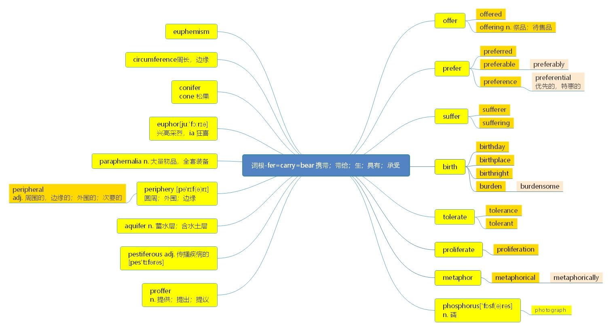

# 词根-fer=carry=bear

***

> **一、本节课目标**
>
> 1、掌握词根-fer 的含义
>
> 2、掌握新词 70 个
>
> 3、复习本节课所有单词

***

# 词根-fer=carry=bear 携带，带给，生

***

# 核心词汇：

***

**offer**\['ɒfə] [英音](https://dict.youdao.com/dictvoice?audio=offer\&type=1)  [美音](https://dict.youdao.com/dictvoice?audio=offer\&type=2)  vt. 提供； 试图； 出价 374

> **【 课堂笔记】**
>
> offer n. 录用通知

***

**offered** \['ɔfəd] [英音](https://dict.youdao.com/dictvoice?audio=offered\&type=1)  [美音](https://dict.youdao.com/dictvoice?audio=offered\&type=2)  v. 提供，提议；奉献（offer 过去时态） 19552

**双语例句:** He offered some useful advice. [播放](https://dict.youdao.com/dictvoice?audio=He+offered+some+useful+advice.&le=eng&le=eng&type=2)

他提出了一些有益的建议。 

**双语例句:** 'I'll do it,' she offered. [播放](https://dict.youdao.com/dictvoice?audio=%27I%27ll+do+it%2C%27+she+offered.&le=eng&le=eng&type=2)

“这个我来做吧。”她提议道。 

**双语例句:** She offered to teach me to crochet. [播放](https://dict.youdao.com/dictvoice?audio=She+offered+to+teach+me+to+crochet.&le=eng&le=eng&type=2)

她提出教我用钩针织东西。 

**原声例句:** Mount Holyoke College was the first college to offer women the same kind of education as was **offered** to men. [播放](https://dict.youdao.com/pureaudio?docid=6222201201597352329)

**原声例句:** About two hundred farmers signed up for the insurance within the first two weeks that it was being **offered** there. [播放](https://dict.youdao.com/pureaudio?docid=7239126489076309776)

**原声例句:** Then Miguel Algarin and the others were **offered** a nearby building on Third Street between Avenues B and C. [播放](https://dict.youdao.com/pureaudio?docid=-6149155178954847843)

**权威例句:** For much of the last decade Buick **offered** four different four-door, front-wheel-drive sedans with V6 engines.  [播放](https://dict.youdao.com/dictvoice?audio=For+much+of+the+last+decade+Buick+offered+four+different+four-door%2C+front-wheel-drive+sedans+with+V6+engines.+&le=eng&type=2)

**权威例句:** To help pay back some of the debt that he owed, he **offered** up the collection.  [播放](https://dict.youdao.com/dictvoice?audio=To+help+pay+back+some+of+the+debt+that+he+owed%2C+he+offered+up+the+collection.+&le=eng&type=2)

**权威例句:** Francis **offered** to send an email, Leuco said, so no one would doubt the journalist's story.  [播放](https://dict.youdao.com/dictvoice?audio=Francis+offered+to+send+an+email%2C+Leuco+said%2C+so+no+one+would+doubt+the+journalist%27s+story.+&le=eng&type=2)

***

**offering** \['ɒf(ə)rɪŋ] [英音](https://dict.youdao.com/dictvoice?audio=offering\&type=1)  [美音](https://dict.youdao.com/dictvoice?audio=offering\&type=2)  n. 提供； 祭品； 奉献物； 牲礼 4022

**双语例句:** They wooed customers by offering low interest rates. [播放](https://dict.youdao.com/dictvoice?audio=They+wooed+customers+by+offering+low+interest+rates.&le=eng&le=eng&type=2)

他们通过提供低利率来争取顾客。 

**双语例句:** We take pride in offering you the highest standards. [播放](https://dict.youdao.com/dictvoice?audio=We+take+pride+in+offering+you+the+highest+standards.&le=eng&le=eng&type=2)

我们以向您提供最高标准的服务而自豪。 

**双语例句:** The number of companies offering them work increased. [播放](https://dict.youdao.com/dictvoice?audio=The+number+of+companies+offering+them+work+increased.&le=eng&le=eng&type=2)

给他们提供工作的公司的数量增多了。 

**原声例句:** The carmaker plans to do this by **offering** company stock in exchange for twenty-seven billion dollars in G.M.bonds. [播放](https://dict.youdao.com/pureaudio?docid=6874193165591883146)

**原声例句:** The president says **offering** this choice would keep insurance companies \"honest\" and lead to better prices and quality. [播放](https://dict.youdao.com/pureaudio?docid=-805897074574407281)

**原声例句:** But some hotels and ski areas away from the city are **offering** special rates for people who want to avoid the crowds. [播放](https://dict.youdao.com/pureaudio?docid=989094397029095886)

**权威例句:** The Corporate Market segment operates an ICT services and **offering** end-to-end solutions in infrastructure and network-related.  [播放](https://dict.youdao.com/dictvoice?audio=The+Corporate+Market+segment+operates+an+ICT+services+and+offering+end-to-end+solutions+in+infrastructure+and+network-related.+&le=eng&type=2)

**权威例句:** Last year the government began **offering** grants to disabled people with aspirations to enter politics.  [播放](https://dict.youdao.com/dictvoice?audio=Last+year+the+government+began+offering+grants+to+disabled+people+with+aspirations+to+enter+politics.+&le=eng&type=2)

**权威例句:** And that usually gives one even greater comfort that the initial **offering** will be boffo.  [播放](https://dict.youdao.com/dictvoice?audio=And+that+usually+gives+one+even+greater+comfort+that+the+initial+offering+will+be+boffo.+&le=eng&type=2)

***

**prefer** \[prɪ'fɜː] [英音](https://dict.youdao.com/dictvoice?audio=prefer\&type=1)  [美音](https://dict.youdao.com/dictvoice?audio=prefer\&type=2)  vt. 宁愿； 更喜欢； 提出； 提升 1728

> **【 课堂笔记】**
>
> **助记：** pre（ 前） + -fer（ 拿； 带） →把（ 喜欢的） 东西拿到前面去 →更喜欢

**双语例句:** I prefer reading non-fiction. [播放](https://dict.youdao.com/dictvoice?audio=I+prefer+reading+non-fiction.&le=eng&le=eng&type=2)

我喜欢看纪实作品。 

**双语例句:** I prefer walking to climbing. [播放](https://dict.youdao.com/dictvoice?audio=I+prefer+walking+to+climbing.&le=eng&le=eng&type=2)

我喜欢散步多于喜欢爬山。 

**双语例句:** We prefer to travel off-season. [播放](https://dict.youdao.com/dictvoice?audio=We+prefer+to+travel+off-season.&le=eng&le=eng&type=2)

我们喜欢在淡季旅游。 

**原声例句:** Orhan Fazhoglu from Istanbul, Turkey, wrote: Most Americans **prefer** purchasing Chinese goods as they are far cheaper. [播放](https://dict.youdao.com/pureaudio?docid=-4195884498806915193)

**原声例句:** They **prefer** that it remain a mystery, much like Edgar Allan Poe himself. [播放](https://dict.youdao.com/pureaudio?docid=2951777630798485998)

**原声例句:** He said \"were it left to me to decide whether we should have a government without newspapers, or newspapers without a government, I should not hesitate a moment to **prefer** the latter.\" [播放](https://dict.youdao.com/pureaudio?docid=-6432295735775496825)

**权威例句:** The important point is that many drivers **prefer** to parallel park themselves, thank you.  [播放](https://dict.youdao.com/dictvoice?audio=The+important+point+is+that+many+drivers+prefer+to+parallel+park+themselves%2C+thank+you.+&le=eng&type=2)

**权威例句:** Hearty northern Chinese **prefer** noodles, breads, buns and steamed dumplings, called jiaozi and baozi.  [播放](https://dict.youdao.com/dictvoice?audio=Hearty+northern+Chinese+prefer+noodles%2C+breads%2C+buns+and+steamed+dumplings%2C+called+jiaozi+and+baozi.+&le=eng&type=2)

**权威例句:** Mr Hebditch said local farmers would **prefer** the money to be spent on dredging the rivers.  [播放](https://dict.youdao.com/dictvoice?audio=Mr+Hebditch+said+local+farmers+would+prefer+the+money+to+be+spent+on+dredging+the+rivers.+&le=eng&type=2)

***

**preferred** \[prɪ'fɜːd] [英音](https://dict.youdao.com/dictvoice?audio=preferred\&type=1)  [美音](https://dict.youdao.com/dictvoice?audio=preferred\&type=2)  adj. 首选的； 优先的 5988

**双语例句:** Personally speaking, I've always preferred Italian food. [播放](https://dict.youdao.com/dictvoice?audio=Personally+speaking%2C+I%27ve+always+preferred+Italian+food.&le=eng&le=eng&type=2)

就我个人来讲，我总是偏爱意大利菜。 

**双语例句:** People with one year working experience are preferred. [播放](https://dict.youdao.com/dictvoice?audio=People+with+one+year+working+experience+are+preferred.&le=eng&le=eng&type=2)

有1年工作经验的优先。 

**双语例句:** Indifference is also the preferred option among those who are socially lazy. [播放](https://dict.youdao.com/dictvoice?audio=Indifference+is+also+the+preferred+option+among+those+who+are+socially+lazy.&le=eng&le=eng&type=2)

冷漠也是那些在社交上懒惰的人的首选。 

**原声例句:** Vistorina,who **preferred** not to give her last name, said good governance was also an issue for her. [播放](https://dict.youdao.com/pureaudio?docid=-6000193777299799281)

**原声例句:** In Botswana, community-based home care is the **preferred** method of assisting people living with HIV/AIDS. [播放](https://dict.youdao.com/pureaudio?docid=-5774093264459304054)

**原声例句:** Dialogue and negotiations are **preferred** as instruments for resolving even the most difficult international conflicts,\". [播放](https://dict.youdao.com/pureaudio?docid=2406079046480475140)

**权威例句:** They have tended to stay within their **preferred** domains: print, motion, web and mobile.  [播放](https://dict.youdao.com/dictvoice?audio=They+have+tended+to+stay+within+their+preferred+domains%3A+print%2C+motion%2C+web+and+mobile.+&le=eng&type=2)

**权威例句:** \"Never could see any value, and synergies in this, \" said one who **preferred** to remain anonymous.  [播放](https://dict.youdao.com/dictvoice?audio=%22Never+could+see+any+value%2C+and+synergies+in+this%2C+%22+said+one+who+preferred+to+remain+anonymous.+&le=eng&type=2)

**权威例句:** Indeed, many wine clubs offer palate profiles to tease out your **preferred** wine styles.  [播放](https://dict.youdao.com/dictvoice?audio=Indeed%2C+many+wine+clubs+offer+palate+profiles+to+tease+out+your+preferred+wine+styles.+&le=eng&type=2)

***

**preferable** \['pref(ə)rəb(ə)l] [英音](https://dict.youdao.com/dictvoice?audio=preferable\&type=1)  [美音](https://dict.youdao.com/dictvoice?audio=preferable\&type=2)  adj. 更好的，更可取的；更合意的 10849

**助记：** prefer（更喜欢、 宁愿） +able（可以…的） → 更喜欢的、 更好的

**搭配：** it is preferable for sb to do sth： 某人做某事是好的； 某人最好…

**例句：** While comment and reaction from lawyers may enhance stories, it is preferable for&#x20;

journalists to rely on their own notions of significance and make their own judgments.&#x20;

尽管律师的评论和回应可能会提高报道的质量，但记者最好还是应该依靠自己对重要性的见解并做出

判断。

\*\*仿写例句：\*\*尽管老师和父母的意见能够有所帮助，但学生最好还是依靠他们自己的爱好做出选择。

While opinions from teachers and parents may be helpful, it is preferable for students to rely on

their own interest to make the choice/option.

**双语例句:** Prevention of a problem is always preferable to trying to cure it. [播放](https://dict.youdao.com/dictvoice?audio=Prevention+of+a+problem+is+always+preferable+to+trying+to+cure+it.&le=eng&le=eng&type=2)

防止出现问题总是比试图解决问题更可取。 

**双语例句:** State governments maintain that the voluntary contribution of funds through state lotteries is preferable to increase state sales or income taxes. [播放](https://dict.youdao.com/dictvoice?audio=State+governments+maintain+that+the+voluntary+contribution+of+funds+through+state+lotteries+is+preferable+to+increase+state+sales+or+income+taxes.&le=eng&le=eng&type=2)

各州政府坚持认为，通过销售彩票让居民自愿捐款以增加州内销售税或所得税的做法更可取。 

**双语例句:** This option is preferable to any other. [播放](https://dict.youdao.com/dictvoice?audio=This+option+is+preferable+to+any+other.&le=eng&le=eng&type=2)

这个选择比其他任何一个都好。 

**原声例句:** The election commission suggested that instead of attempting a flawed election on September 27, it is **preferable** to see if discussions between the government and opposition parties can find a compromise. [播放](https://dict.youdao.com/pureaudio?docid=729333808880471134)

**权威例句:** That would be less **preferable** to Andreessen as CEO but still a pretty close second.  [播放](https://dict.youdao.com/dictvoice?audio=That+would+be+less+preferable+to+Andreessen+as+CEO+but+still+a+pretty+close+second.+&le=eng&type=2)

**权威例句:** For couples, it's **preferable** that the higher earner delay taking Social Security as long as possible.  [播放](https://dict.youdao.com/dictvoice?audio=For+couples%2C+it%27s+preferable+that+the+higher+earner+delay+taking+Social+Security+as+long+as+possible.+&le=eng&type=2)

**权威例句:** Other solutions are infinitely **preferable** - solutions that do not compromise unique and beautiful countryside.  [播放](https://dict.youdao.com/dictvoice?audio=Other+solutions+are+infinitely+preferable+-+solutions+that+do+not+compromise+unique+and+beautiful+countryside.+&le=eng&type=2)

***

**preferably** \['prefrəblɪ] [英音](https://dict.youdao.com/dictvoice?audio=preferably\&type=1)  [美音](https://dict.youdao.com/dictvoice?audio=preferably\&type=2)  adv. 更适宜；宁可，宁愿；较好 9515

**双语例句:** We're looking for a new house, preferably one near the school. [播放](https://dict.youdao.com/dictvoice?audio=We%27re+looking+for+a+new+house%2C+preferably+one+near+the+school.&le=eng&le=eng&type=2)

我们正在找新房子，最好是靠近学校的。 

**双语例句:** Choose a comfy chair, preferably one with armrests. [播放](https://dict.youdao.com/dictvoice?audio=Choose+a+comfy+chair%2C+preferably+one+with+armrests.&le=eng&le=eng&type=2)

选择一把舒服的椅子，最好有扶手。 

**双语例句:** To accurately tell whether someone is sociable, studies show, we need at least a minute, preferably five. [播放](https://dict.youdao.com/dictvoice?audio=To+accurately+tell+whether+someone+is+sociable%2C+studies+show%2C+we+need+at+least+a+minute%2C+preferably+five.&le=eng&le=eng&type=2)

研究表明，要准确判断一个人是否善于交际，我们至少需要一分钟，最好是五分钟。 

**权威例句:** University degree **(preferabl**y at master's level) in the field of Information Technology or related disciplines.  [播放](https://dict.youdao.com/dictvoice?audio=University+degree+%28preferably+at+master%27s+level%29+in+the+field+of+Information+Technology+or+related+disciplines.+&le=eng&type=2)

**权威例句:** University degree, **preferably** advanced, in Political Science, International Relations, Diplomacy, Public Relations, Communications or other related field.  [播放](https://dict.youdao.com/dictvoice?audio=University+degree%2C+preferably+advanced%2C+in+Political+Science%2C+International+Relations%2C+Diplomacy%2C+Public+Relations%2C+Communications+or+other+related+field.+&le=eng&type=2)

**权威例句:** Four design firms were challenged to create this kind of environment, **preferably** for the midlevel executive.  [播放](https://dict.youdao.com/dictvoice?audio=Four+design+firms+were+challenged+to+create+this+kind+of+environment%2C+preferably+for+the+midlevel+executive.+&le=eng&type=2)

***

**preference** \['pref(ə)r(ə)ns] [英音](https://dict.youdao.com/dictvoice?audio=preference\&type=1)  [美音](https://dict.youdao.com/dictvoice?audio=preference\&type=2)  n. 偏爱，倾向；优先权 3049

**助记：** prefer（喜欢） +ence（名词后缀） →喜欢、 偏好

**搭配：** have a preference for（考）： 对…有偏好 personal preference（考）： 个人偏好

**双语例句:** I can't say that I have any particular preference. [播放](https://dict.youdao.com/dictvoice?audio=I+can%27t+say+that+I+have+any+particular+preference.&le=eng&le=eng&type=2)

我说不出自己有什么特别偏好。 

**双语例句:** Preference will be given to graduates of this university. [播放](https://dict.youdao.com/dictvoice?audio=Preference+will+be+given+to+graduates+of+this+university.&le=eng&le=eng&type=2)

这所大学的毕业生会获得优先考虑。 

**双语例句:** It upset her when men revealed a preference for her sister. [播放](https://dict.youdao.com/dictvoice?audio=It+upset+her+when+men+revealed+a+preference+for+her+sister.&le=eng&le=eng&type=2)

当男人们显露出偏爱她妹妹的时候，她很不高兴。 

**原声例句:** \"The habitat **preference** for this mosquito appears to be these partially-sunlit pools of water for the larvae. [播放](https://dict.youdao.com/pureaudio?docid=7538511678308918334)

**原声例句:** Whereas we all know that the universe is of a certain kind-- -- we can't even call it Copernican anymore-- poetry has this odd **preference** for Ptolemaic astronomy.

**原声例句:** But each to their own **preference**, really, isn't it?

**权威例句:** There was no indication that he was going to vote for us as a first-preference.  [播放](https://dict.youdao.com/dictvoice?audio=There+was+no+indication+that+he+was+going+to+vote+for+us+as+a+first-preference.+&le=eng&type=2)

**权威例句:** England lost out in the race for the 2018 tournament after gathering only two of 22 first-preference votes.  [播放](https://dict.youdao.com/dictvoice?audio=England+lost+out+in+the+race+for+the+2018+tournament+after+gathering+only+two+of+22+first-preference+votes.+&le=eng&type=2)

**权威例句:** **Preference** should be given to candidates who have recently exhibited outstanding international leadership in the science of hydrology.  [播放](https://dict.youdao.com/dictvoice?audio=Preference+should+be+given+to+candidates+who+have+recently+exhibited+outstanding+international+leadership+in+the+science+of+hydrology.+&le=eng&type=2)

***

**preferential** \[,prefə'renʃ(ə)l] [英音](https://dict.youdao.com/dictvoice?audio=preferential\&type=1)  [美音](https://dict.youdao.com/dictvoice?audio=preferential\&type=2)  adj. 优先的；先取的；选择的；特惠的 12384

**双语例句:** Offering preferential treatment to wealthy countries. [播放](https://dict.youdao.com/dictvoice?audio=Offering+preferential+treatment+to+wealthy+countries.&le=eng&le=eng&type=2)

向富裕国家提供优惠待遇。 

**双语例句:** Japan will remove five countries from a preferential framework in light of their economic development. [播放](https://dict.youdao.com/dictvoice?audio=Japan+will+remove+five+countries+from+a+preferential+framework+in+light+of+their+economic+development.&le=eng&le=eng&type=2)

鉴于五个国家的经济发展情况，日本将把它们从优惠框架中剔除。 

**双语例句:** The government encourages this practice, and provides many preferential policies and facilitation measures for college students. [播放](https://dict.youdao.com/dictvoice?audio=The+government+encourages+this+practice%2C+and+provides+many+preferential+policies+and+facilitation+measures+for+college+students.&le=eng&le=eng&type=2)

政府鼓励这种做法，并为大学生提供了许多优惠政策和便利措施。 

**权威例句:** Currency becomes a warehouse receipt for gold   exempt from **preferential** claims, whether legal or governmental.  [播放](https://dict.youdao.com/dictvoice?audio=Currency+becomes+a+warehouse+receipt+for+gold+++exempt+from+preferential+claims%2C+whether+legal+or+governmental.+&le=eng&type=2)

**权威例句:** Since 1954, dividends have been subject to marginal taxation, with **preferential** treatment since 2003.  [播放](https://dict.youdao.com/dictvoice?audio=Since+1954%2C+dividends+have+been+subject+to+marginal+taxation%2C+with+preferential+treatment+since+2003.+&le=eng&type=2)

**权威例句:** Doug McAvoy said the policy would create a two-tier system, with **preferential** funding for the few.  [播放](https://dict.youdao.com/dictvoice?audio=Doug+McAvoy+said+the+policy+would+create+a+two-tier+system%2C+with+preferential+funding+for+the+few.+&le=eng&type=2)

***

**suffer** \['sʌfə] [英音](https://dict.youdao.com/dictvoice?audio=suffer\&type=1)  [美音](https://dict.youdao.com/dictvoice?audio=suffer\&type=2)  vt. 忍受；遭受； 经历 1103

> **【 课堂笔记】**
>
> **助记：** suf-（ =sup- 向下； 下面） + fer（ =bear； 忍受） →内心深处承受了很多东
>
> 西 →忍受； 遭受

**双语例句:** Many kids suffer from acne and angst. [播放](https://dict.youdao.com/dictvoice?audio=Many+kids+suffer+from+acne+and+angst.&le=eng&le=eng&type=2)

许多孩子深受粉刺和焦虑之苦。 

**双语例句:** Dieters suffer from violent mood swings. [播放](https://dict.youdao.com/dictvoice?audio=Dieters+suffer+from+violent+mood+swings.&le=eng&le=eng&type=2)

节食者们经受剧烈的情绪变化的折磨。 

**双语例句:** It was unfair that he should suffer so much. [播放](https://dict.youdao.com/dictvoice?audio=It+was+unfair+that+he+should+suffer+so+much.&le=eng&le=eng&type=2)

他遭受这么多痛苦是不公平的。 

**原声例句:** The Centers for Disease Control and Prevention reports more than twenty-two million people **suffer** from asthma in the United Sates. [播放](https://dict.youdao.com/pureaudio?docid=2733488397169324566)

**原声例句:** Many patients **suffer** from weakness or what is called a \"pins and needles\" feeling in the arms and legs. [播放](https://dict.youdao.com/pureaudio?docid=8019146506685327598)

**原声例句:** In the United States alone, more than five million people are said to **suffer** from this slowly increasing brain disorder. [播放](https://dict.youdao.com/pureaudio?docid=-2549814537738613014)

**权威例句:** Citizens queue in interminable lines and **suffer** humiliating treatment at the hands of surly authorities.  [播放](https://dict.youdao.com/dictvoice?audio=Citizens+queue+in+interminable+lines+and+suffer+humiliating+treatment+at+the+hands+of+surly+authorities.+&le=eng&type=2)

**权威例句:** Many think Pharmacia saw its valuation **suffer** as a result of its continuing ownership of Monsanto.  [播放](https://dict.youdao.com/dictvoice?audio=Many+think+Pharmacia+saw+its+valuation+suffer+as+a+result+of+its+continuing+ownership+of+Monsanto.+&le=eng&type=2)

**权威例句:** Ghosn predicts that carmakers that are struggling will **suffer** if industry sales fall in 2007.  [播放](https://dict.youdao.com/dictvoice?audio=Ghosn+predicts+that+carmakers+that+are+struggling+will+suffer+if+industry+sales+fall+in+2007.+&le=eng&type=2)

***

**sufferer** \['sʌfərə] [英音](https://dict.youdao.com/dictvoice?audio=sufferer\&type=1)  [美音](https://dict.youdao.com/dictvoice?audio=sufferer\&type=2)  n. 受害者；患者 11842

**双语例句:** As it shrieked and moaned, the poor little sufferer was blown to and fro like the hammer of a bell. [播放](https://dict.youdao.com/dictvoice?audio=As+it+shrieked+and+moaned%2C+the+poor+little+sufferer+was+blown+to+and+fro+like+the+hammer+of+a+bell.&le=eng&le=eng&type=2)

它在尖叫呻吟，这个可怜的小小受难者就像钟锤一样被吹来吹去。 

**双语例句:** I felt more than ordinary human sympathy for him in his misfortune, and I was deeply moved as a fellow sufferer. [播放](https://dict.youdao.com/dictvoice?audio=I+felt+more+than+ordinary+human+sympathy+for+him+in+his+misfortune%2C+and+I+was+deeply+moved+as+a+fellow+sufferer.&le=eng&le=eng&type=2)

我对他的不幸感到了比普通人更多的同情，我还有一种深切的同病相怜的感触。 

**双语例句:** The sufferer can experience frequent relapses. [播放](https://dict.youdao.com/dictvoice?audio=The+sufferer+can+experience+frequent+relapses.&le=eng&le=eng&type=2)

患者可能会频繁发病。 

**原声例句:** One migraine **sufferer** is Curtis Croley of Ellicott City,Maryland. [播放](https://dict.youdao.com/pureaudio?docid=-7053112472483796581)

**原声例句:** One migraine **sufferer** lives in Ellicott City,Maryland. [播放](https://dict.youdao.com/pureaudio?docid=4404761772950450496)

**权威例句:** Often the critical factor was not the panic attack itself, but the way the **sufferer** responded.  [播放](https://dict.youdao.com/dictvoice?audio=Often+the+critical+factor+was+not+the+panic+attack+itself%2C+but+the+way+the+sufferer+responded.+&le=eng&type=2)

**权威例句:** The pace of decline in Spain, a fellow euro-zone **sufferer**, quickened in the second quarter.  [播放](https://dict.youdao.com/dictvoice?audio=The+pace+of+decline+in+Spain%2C+a+fellow+euro-zone+sufferer%2C+quickened+in+the+second+quarter.+&le=eng&type=2)

**权威例句:** Sub-Saharan Africa, which accounts for only 10% of the world's population, is the prime **sufferer**.  [播放](https://dict.youdao.com/dictvoice?audio=Sub-Saharan+Africa%2C+which+accounts+for+only+10%25+of+the+world%27s+population%2C+is+the+prime+sufferer.+&le=eng&type=2)

***

**suffering** \['sʌf(ə)rɪŋ] [英音](https://dict.youdao.com/dictvoice?audio=suffering\&type=1)  [美音](https://dict.youdao.com/dictvoice?audio=suffering\&type=2)  n. 受难； 苦楚 3970

**双语例句:** I hate to see animals suffering. [播放](https://dict.youdao.com/dictvoice?audio=I+hate+to+see+animals+suffering.&le=eng&le=eng&type=2)

我不忍心看动物受苦。 

**双语例句:** The suffering of other people appals me. [播放](https://dict.youdao.com/dictvoice?audio=The+suffering+of+other+people+appals+me.&le=eng&le=eng&type=2)

他人的苦难使我大为震惊。 

**双语例句:** The men were suffering from shell shock. [播放](https://dict.youdao.com/dictvoice?audio=The+men+were+suffering+from+shell+shock.&le=eng&le=eng&type=2)

这些男人患了炮弹休克症。 

**原声例句:** For thousands of years, the eye of Horus remained as a sign of the god's help to the **suffering** and sick. [播放](https://dict.youdao.com/pureaudio?docid=1581267677388843746)

**原声例句:** A medical aid program in Kenya offers hope to women and girls **suffering** from a condition known as fistula. [播放](https://dict.youdao.com/pureaudio?docid=-7529504175875453851)

**原声例句:** In other words, a person who is **suffering** from the effects of severe cold may seem dead,but still be alive. [播放](https://dict.youdao.com/pureaudio?docid=-1633548749403650524)

**权威例句:** \"I knew I had to go wherever the people were **suffering**, \" Mrs Klarsfeld said.  [播放](https://dict.youdao.com/dictvoice?audio=%22I+knew+I+had+to+go+wherever+the+people+were+suffering%2C+%22+Mrs+Klarsfeld+said.+&le=eng&type=2)

**权威例句:** Local hospitals receiving the victims have said 18 people have been released after **suffering** minor injuries.  [播放](https://dict.youdao.com/dictvoice?audio=Local+hospitals+receiving+the+victims+have+said+18+people+have+been+released+after+suffering+minor+injuries.+&le=eng&type=2)

**权威例句:** She died \"peacefully\" after **suffering** a stroke while staying at the Ritz hotel in central London.  [播放](https://dict.youdao.com/dictvoice?audio=She+died+%22peacefully%22+after+suffering+a+stroke+while+staying+at+the+Ritz+hotel+in+central+London.+&le=eng&type=2)

***

**birth**\[bɜ:θ] [英音](https://dict.youdao.com/dictvoice?audio=\&type=1)  [美音](https://dict.youdao.com/dictvoice?audio=\&type=2)  n. 出生； 血统， 出身； 起源 1508

***

**birthday** \['bɜ:θdeɪ] [英音](https://dict.youdao.com/dictvoice?audio=birthday\&type=1)  [美音](https://dict.youdao.com/dictvoice?audio=birthday\&type=2)  n. 生日，诞辰；诞生的日子 2455

**双语例句:** We threw a huge birthday party. [播放](https://dict.youdao.com/dictvoice?audio=We+threw+a+huge+birthday+party.&le=eng&le=eng&type=2)

我们举办了一次盛大的生日派对。 

**双语例句:** I wished her a happy birthday. [播放](https://dict.youdao.com/dictvoice?audio=I+wished+her+a+happy+birthday.&le=eng&le=eng&type=2)

我祝她生日快乐。 

**双语例句:** Her birthday is coming up soon. [播放](https://dict.youdao.com/dictvoice?audio=Her+birthday+is+coming+up+soon.&le=eng&le=eng&type=2)

她的生日即将来临。 

**原声例句:** Another friend sent this message to Roosevelt on his forty-sixth **birthday**: \"You have made a very good start in life. [播放](https://dict.youdao.com/pureaudio?docid=8029372177837358449)

**原声例句:** And every year on January nineteenth -- Poe's **birthday** -- people watch for a man dressed in black to appear. [播放](https://dict.youdao.com/pureaudio?docid=2355171970560289272)

**原声例句:** Some parents take their children's **birthday** parties very seriously, even when the child is too young to fully understand the celebration. [播放](https://dict.youdao.com/pureaudio?docid=-104513832278246511)

**权威例句:** Her conversation with him on his 90th **birthday** was the last official interview he gave.  [播放](https://dict.youdao.com/dictvoice?audio=Her+conversation+with+him+on+his+90th+birthday+was+the+last+official+interview+he+gave.+&le=eng&type=2)

**权威例句:** When approaching your 40th **birthday**, there are a few token paths you might consider.  [播放](https://dict.youdao.com/dictvoice?audio=When+approaching+your+40th+birthday%2C+there+are+a+few+token+paths+you+might+consider.+&le=eng&type=2)

**权威例句:** Black babies are nine times more likely to die before their first **birthday** than white babies.  [播放](https://dict.youdao.com/dictvoice?audio=Black+babies+are+nine+times+more+likely+to+die+before+their+first+birthday+than+white+babies.+&le=eng&type=2)

***

**birthplace** \['bɜ:θpleɪs] [英音](https://dict.youdao.com/dictvoice?audio=birthplace\&type=1)  [美音](https://dict.youdao.com/dictvoice?audio=birthplace\&type=2)  n. 出生地 11858

**双语例句:** Hawaii was the birthplace of surfing. [播放](https://dict.youdao.com/dictvoice?audio=Hawaii+was+the+birthplace+of+surfing.&le=eng&le=eng&type=2)

夏威夷是冲浪运动的发源地。 

**双语例句:** He was resigned to never seeing his birthplace again. [播放](https://dict.youdao.com/dictvoice?audio=He+was+resigned+to+never+seeing+his+birthplace+again.&le=eng&le=eng&type=2)

永远不再去他的出生地，他也认了。 

**双语例句:** The house is wrongly reputed to have been the poet's birthplace. [播放](https://dict.youdao.com/dictvoice?audio=The+house+is+wrongly+reputed+to+have+been+the+poet%27s+birthplace.&le=eng&le=eng&type=2)

这所房子被误以为是诗人的出生地。 

**权威例句:** Today it is most well known as the **birthplace** of wartime Prime Minister Winston Churchill.  [播放](https://dict.youdao.com/dictvoice?audio=Today+it+is+most+well+known+as+the+birthplace+of+wartime+Prime+Minister+Winston+Churchill.+&le=eng&type=2)

**权威例句:** It is unsurprising, perhaps, that in many ways this is the **birthplace** of Switzerland.  [播放](https://dict.youdao.com/dictvoice?audio=It+is+unsurprising%2C+perhaps%2C+that+in+many+ways+this+is+the+birthplace+of+Switzerland.+&le=eng&type=2)

**权威例句:** DeLay points out that his trip was fully reported and had destinations beyond the fairways of golf's **birthplace**.  [播放](https://dict.youdao.com/dictvoice?audio=DeLay+points+out+that+his+trip+was+fully+reported+and+had+destinations+beyond+the+fairways+of+golf%27s+birthplace.+&le=eng&type=2)

***

**birthright** \['bɜ:θraɪt] [英音](https://dict.youdao.com/dictvoice?audio=birthright\&type=1)  [美音](https://dict.youdao.com/dictvoice?audio=birthright\&type=2) n. 与生俱来的权利；长子继承权 19454

**双语例句:** The property is the birthright of the eldest child. [播放](https://dict.youdao.com/dictvoice?audio=The+property+is+the+birthright+of+the+eldest+child.&le=eng&le=eng&type=2)

长子享有财产的继承权。 

**双语例句:** Education is every child's birthright. [播放](https://dict.youdao.com/dictvoice?audio=Education+is+every+child%27s+birthright.&le=eng&le=eng&type=2)

接受教育是每个孩子的基本权利。 

**双语例句:** Freedom is the natural birthright of every human. [播放](https://dict.youdao.com/dictvoice?audio=Freedom+is+the+natural+birthright+of+every+human.&le=eng&le=eng&type=2)

自由是每个人与生俱来的基本权利。 

**权威例句:** The complacent belief that a double-digit growth rate is India's **birthright** appears to have taken hold.  [播放](https://dict.youdao.com/dictvoice?audio=The+complacent+belief+that+a+double-digit+growth+rate+is+India%27s+birthright+appears+to+have+taken+hold.+&le=eng&type=2)

**权威例句:** Jobs is the Biblical Jacob and Xerox is Esau, squandering his **birthright** for a pittance.  [播放](https://dict.youdao.com/dictvoice?audio=Jobs+is+the+Biblical+Jacob+and+Xerox+is+Esau%2C+squandering+his+birthright+for+a+pittance.+&le=eng&type=2)

**权威例句:** Panic is a civic art, a **birthright** that runs deep, like New Orleans and jazz.  [播放](https://dict.youdao.com/dictvoice?audio=Panic+is+a+civic+art%2C+a+birthright+that+runs+deep%2C+like+New+Orleans+and+jazz.+&le=eng&type=2)

***

**burden** \['bɜ\:d(ə)n] [英音](https://dict.youdao.com/dictvoice?audio=burden\&type=1)  [美音](https://dict.youdao.com/dictvoice?audio=burden\&type=2)  n. 负担；责任；船的载货量 2688

**助记：** bur（=bear： 忍受、 承受、 负荷、 承受…的重担； 首尾辅音均相同， 二者同源） +d（无

意义） +en（名词后缀） →负担、 负荷

**搭配：** fiscal/financial burden（考）：财政负担

impose an intolerable economic burden on sb.（考）：给某人施加一个难以容忍的负担

**例句：** While in western countries， financial crisis has imposed an overwhelming pressure on their

overburdened shoulders and thus spending of any sort becomes damn unfashionable.

而在西方国家，经济危机给他们本已负担过重的肩膀施加了令人难以承受的压力，因此，任何形式的开支都变得非常不受欢迎。

\*\*仿写例句：\*\*在中国，父母强迫孩子去上各种培训班的行为给孩子们本已负担过重的肩膀施加了令人难以承受的压力，因此，任何形式的培训都变得非常不受欢迎。（2009.12 作文：送孩子去上艺术班）

In china, the practice of forcing/compelling their kids to attend various training courses has

imposed an overwhelming pressure on their overburdened shoulders and thus training of any

sort becomes damn unfashionable.

**双语例句:** Her death will be an impossible burden on Paul. [播放](https://dict.youdao.com/dictvoice?audio=Her+death+will+be+an+impossible+burden+on+Paul.&le=eng&le=eng&type=2)

她的去世会成为保罗难以承受的负担。 

**双语例句:** The measures will lighten the tax burden on small businesses. [播放](https://dict.youdao.com/dictvoice?audio=The+measures+will+lighten+the+tax+burden+on+small+businesses.&le=eng&le=eng&type=2)

这些措施将减轻小型企业的纳税负担。 

**双语例句:** We need to reduce the burden of taxes that impoverish the economy. [播放](https://dict.youdao.com/dictvoice?audio=We+need+to+reduce+the+burden+of+taxes+that+impoverish+the+economy.&le=eng&le=eng&type=2)

我们需要减少使经济贫困的租税负担。 

**原声例句:** He said,\"...Living with AIDS is not the greatest **burden** I've had in my life. [播放](https://dict.youdao.com/pureaudio?docid=3605677592933207340)

**原声例句:** A high **burden** of infectious diseases. Lack of provision of family planning allowing a women to decide when to start and end having children and how to space her children. [播放](https://dict.youdao.com/pureaudio?docid=-47475700693743718)

**原声例句:** \"If we are asked to bear the **burden**, we should also be given the chance to engage effective dialogue with Iran. [播放](https://dict.youdao.com/pureaudio?docid=3437722570277017714)

**权威例句:** For this reason, the middle class will bear much of the **burden** of rising taxes.  [播放](https://dict.youdao.com/dictvoice?audio=For+this+reason%2C+the+middle+class+will+bear+much+of+the+burden+of+rising+taxes.+&le=eng&type=2)

**权威例句:** And will this also add more debt or more of a **burden** on the federal government?  [播放](https://dict.youdao.com/dictvoice?audio=And+will+this+also+add+more+debt+or+more+of+a+burden+on+the+federal+government%3F+&le=eng&type=2)

**权威例句:** International donors and lenders continue to be concerned about the quality of fiscal management and Gambia's debt **burden**.  [播放](https://dict.youdao.com/dictvoice?audio=International+donors+and+lenders+continue+to+be+concerned+about+the+quality+of+fiscal+management+and+Gambia%27s+debt+burden.+&le=eng&type=2)

***

**burdensome** \['bɜ\:dns(ə)m] [英音](https://dict.youdao.com/dictvoice?audio=burdensome\&type=1)  [美音](https://dict.youdao.com/dictvoice?audio=burdensome\&type=2)  adj. 恼人的；繁重的；累赘的 16938

**助记：** burden（负担、 累赘） +some（形容词后缀） →累赘的、 负担重的、 恼人的

> **【 课堂笔记】**
>
> 一般情况下，名词后+some 变为形容词，
>
> 如： hand（ n. 手） →handsome（帅的） trouble（n. 麻烦） →troublesome (麻烦的)

**同源：** tolerate \['tɔləreit] v. 忍受、 容忍

**助记：** tol（=bear：忍受；首辅音 t、 b 音似，尾辅音均为 l、 r 音似） +erate（=ery+ate：复合

使动词） →使去忍受→忍受、 容忍

**tolerance** \['tɔlərəns] [英音](https://dict.youdao.com/dictvoice?audio=tolerance\&type=1)  [美音](https://dict.youdao.com/dictvoice?audio=tolerance\&type=2)  n. 容忍、 忍耐

**搭配：** religious tolerance（考）：宗教容忍、宗教宽容

&#x9;		 tolerance for sth.（考）：容忍...

&#x9;		tolerant \['tɔlərənt] a. 容忍的、 有忍耐力的

**双语例句:** She had no tolerance for jokes of any kind. [播放](https://dict.youdao.com/dictvoice?audio=She+had+no+tolerance+for+jokes+of+any+kind.&le=eng&le=eng&type=2)

她容不得开任何玩笑。 

**双语例句:** They were working to a tolerance of 0.0001 of a centimetre. [播放](https://dict.youdao.com/dictvoice?audio=They+were+working+to+a+tolerance+of+0.0001+of+a+centimetre.&le=eng&le=eng&type=2)

他们在按0.0001厘米的公差加工。 

**双语例句:** They have a policy of zero tolerance for sexual harassment. [播放](https://dict.youdao.com/dictvoice?audio=They+have+a+policy+of+zero+tolerance+for+sexual+harassment.&le=eng&le=eng&type=2)

他们对性骚扰采取零容忍态度。 

**原声例句:** So life is supported by Islam. Therefore oppression and aggression are forbidden, whereas mercy,**tolerance**, kindness and charity are commanded.\" [播放](https://dict.youdao.com/pureaudio?docid=8700934402654049991)

**原声例句:** which advocates the values of **tolerance** and equality, was designed,in part, to push public acceptance of these economic changes. [播放](https://dict.youdao.com/pureaudio?docid=-8844780625700721951)

**原声例句:** \"Our policies and procedures do express American values **tolerance**,transparency, respect for rule of law and due process. [播放](https://dict.youdao.com/pureaudio?docid=-3037306877494272580)

**权威例句:** Britons' **tolerance** of the other myriad intrusions into their privacy may prove less enduring.  [播放](https://dict.youdao.com/dictvoice?audio=Britons%27+tolerance+of+the+other+myriad+intrusions+into+their+privacy+may+prove+less+enduring.+&le=eng&type=2)

**权威例句:** The moulds are very accurate, with a precision **tolerance** of as little as 0.002 millimeters.  [播放](https://dict.youdao.com/dictvoice?audio=The+moulds+are+very+accurate%2C+with+a+precision+tolerance+of+as+little+as+0.002+millimeters.+&le=eng&type=2)

**权威例句:** Many religious communities, however, are still far from extending anything like this sort of **tolerance**.  [播放](https://dict.youdao.com/dictvoice?audio=Many+religious+communities%2C+however%2C+are+still+far+from+extending+anything+like+this+sort+of+tolerance.+&le=eng&type=2)

**双语例句:** Since the dawn of human ingenuity, people have devised ever more cunning tools to cope with work that is dangerous, boring, burdensome, or just plain nasty. [播放](https://dict.youdao.com/dictvoice?audio=As+the+report+authors+point+out%2C+even+near-misses+might+lead+to+the+%22creation+of+a+burdensome+regulatory+framework+and+affect+the+future+disposition+of+science+Cube+Sats%22.&le=eng&le=eng&type=2)

正如报告的作者所指出的，即使是差之毫末也可能导致“产生一个繁重的监管框架，并影响科学立方体卫星的未来部署”。 

**双语例句:** The load was too burdensome. [播放](https://dict.youdao.com/dictvoice?audio=The+load+was+too+burdensome.&le=eng&le=eng&type=2)

负担太繁重了。 

**双语例句:** In many cases, it would not be overly burdensome for authorities to obtain a warrant to search through phone contents. [播放](https://dict.youdao.com/dictvoice?audio=In+many+cases%2C+it+would+not+be+overly+burdensome+for+authorities+to+obtain+a+warrant+to+search+through+phone+contents.&le=eng&le=eng&type=2)

在许多情况下，当局获得搜查电话内容的授权令并不太麻烦。 

**权威例句:** Finally, Congress must reverse many of the **burdensome** regulations imposed by the Obama administration.  [播放](https://dict.youdao.com/dictvoice?audio=Finally%2C+Congress+must+reverse+many+of+the+burdensome+regulations+imposed+by+the+Obama+administration.+&le=eng&type=2)

**权威例句:** Employees are an expense item, one that becomes increasingly **burdensome** when demand dries up.  [播放](https://dict.youdao.com/dictvoice?audio=Employees+are+an+expense+item%2C+one+that+becomes+increasingly+burdensome+when+demand+dries+up.+&le=eng&type=2)

**权威例句:** It has never been much fun, he reflects, but now it seems particularly **burdensome**.  [播放](https://dict.youdao.com/dictvoice?audio=It+has+never+been+much+fun%2C+he+reflects%2C+but+now+it+seems+particularly+burdensome.+&le=eng&type=2)

***

# 高难度词汇

***

**aquifer** \['ækwɪfə] [英音](https://dict.youdao.com/dictvoice?audio=aquifer\&type=1)  [美音](https://dict.youdao.com/dictvoice?audio=aquifer\&type=2)  n. （美）蓄水层；含水土层 13965

> **【 课堂笔记】**
>
> **助记：** aqui（=water） + -fer（携带） →带有水的东西→蓄水层； 含水土层
>
> aquarium： auq（水） + arium （名词后缀， 表地点） →有水的场所→水族馆

**双语例句:** A groundwater reservoir from which water can be extracted is called an aquifer. [播放](https://dict.youdao.com/dictvoice?audio=A+groundwater+reservoir+from+which+water+can+be+extracted+is+called+an+aquifer.&le=eng&le=eng&type=2)

可以从中抽取水的地下蓄水层被称为含水层。 

**双语例句:** Extraction of water depends on two properties of the aquifer: porosity and permeability. [播放](https://dict.youdao.com/dictvoice?audio=Extraction+of+water+depends+on+two+properties+of+the+aquifer%3A+porosity+and+permeability.&le=eng&le=eng&type=2)

水的开采取决于含水层的两个性质：孔隙度和渗透性。 

**双语例句:** Water does not remain immobile in an aquifer but can seep out at springs or leak into other aquifers. [播放](https://dict.youdao.com/dictvoice?audio=Water+does+not+remain+immobile+in+an+aquifer+but+can+seep+out+at+springs+or+leak+into+other+aquifers.&le=eng&le=eng&type=2)

水在含水层中并不是静止不动的，而是会从泉水中渗出，或渗入其他含水层。 

**权威例句:** Thousands of miles of pipelines run over the Ogallala **aquifer**, which cannot be replaced or cleaned-up.  [播放](https://dict.youdao.com/dictvoice?audio=Thousands+of+miles+of+pipelines+run+over+the+Ogallala+aquifer%2C+which+cannot+be+replaced+or+cleaned-up.+&le=eng&type=2)

**权威例句:** About 2 billion people worldwide depend on groundwater supplies, which include 273 transboundary **aquifer** systems.  [播放](https://dict.youdao.com/dictvoice?audio=About+2+billion+people+worldwide+depend+on+groundwater+supplies%2C+which+include+273+transboundary+aquifer+systems.+&le=eng&type=2)

**权威例句:** In the United States, the biggest source of potable water is the Ogallala **Aquifer**.  [播放](https://dict.youdao.com/dictvoice?audio=In+the+United+States%2C+the+biggest+source+of+potable+water+is+the+Ogallala+Aquifer.+&le=eng&type=2)

***

**circumference** \[sə'kʌmf(ə)r(ə)ns] [英音](https://dict.youdao.com/dictvoice?audio=circumference\&type=1)  [美音](https://dict.youdao.com/dictvoice?audio=circumference\&type=2)  n. 圆周；周长；胸围 16404

> **【 课堂笔记】**
>
> **助记：**
>
> circum- circ-环/圈 如： circumstance 环境； circle 圆
>
> circum-（环） + -fer（携带； 带着） + ence（名词后缀） →带着绕个圈→圆周； 周长

**双语例句:** The earth is almost 25 000 miles in circumference. [播放](https://dict.youdao.com/dictvoice?audio=The+earth+is+almost+25+000+miles+in+circumference.&le=eng&le=eng&type=2)

地球的周长大约为25 000英里。 

**双语例句:** The earth's circumference is about 25,000 miles. [播放](https://dict.youdao.com/dictvoice?audio=The+earth%27s+circumference+is+about+25%2C000+miles.&le=eng&le=eng&type=2)

地球的圆周约为25,000英里。 

**双语例句:** I have to have a whole number of wavelengths to get around the circumference. [播放](https://dict.youdao.com/dictvoice?audio=I+have+to+have+a+whole+number+of+wavelengths+to+get+around+the+circumference.&le=eng&le=eng&type=2)

我必须有很多波长才能绕这个圆周。 

**原声例句:** It's a much more elaborate simile than that: \"the broad **circumference** / hung on his shoulders like the Moon whose Orb / through Optic Glass the Tuscan Artist views.

**原声例句:** I have to have a whole number of wavelengths to get around the **circumference**.

**原声例句:** who will help me out？ They find themselves surrounded, and Paris is--it's nothing like- - it's one-third the size of London at this same time, or at any other time, but it has a huge **circumference**.

**权威例句:** The piece weighs just under two tons and has a **circumference** of 62 feet.  [播放](https://dict.youdao.com/dictvoice?audio=The+piece+weighs+just+under+two+tons+and+has+a+circumference+of+62+feet.+&le=eng&type=2)

**权威例句:** Additionally, Dr. Michos points out, measuring waist **circumference** may provide a more vivid indication of weight-loss progress.  [播放](https://dict.youdao.com/dictvoice?audio=Additionally%2C+Dr.+Michos+points+out%2C+measuring+waist+circumference+may+provide+a+more+vivid+indication+of+weight-loss+progress.+&le=eng&type=2)

**权威例句:** The New York fire department is basically in control and then the volunteers work the **circumference** of ground zero.  [播放](https://dict.youdao.com/dictvoice?audio=The+New+York+fire+department+is+basically+in+control+and+then+the+volunteers+work+the+circumference+of+ground+zero.+&le=eng&type=2)

***

**conifer** \['kɒnɪfə; 'kəʊn-] [英音](https://dict.youdao.com/dictvoice?audio=conifer\&type=1)  [美音](https://dict.youdao.com/dictvoice?audio=conifer\&type=2)  n. 针叶树；松柏科植物 17016

词源"a plant producing cones, a plant of the order Coniferae" (which includes pine, fir, and

cypress trees), 1847, from Latin conifer "cone-bearing, bearing conical fruit," from conus "cone"

(see cone) + ferre "to bear, carry," from PIE root \*bher- (1) "to carry," also "to bear children."

> **【 课堂笔记】**
>
> **助记：** coni（=cone； 松果） + -fer（生出； 产出） →能够生出/产出松果的东西→针叶树；
>
> 松柏科植物

**双语例句:** It is classified in the family Taxaceae, which is now classified as a conifer in the order Pinales. [播放](https://dict.youdao.com/dictvoice?audio=It+is+classified+in+the+family+Taxaceae%2C+which+is+now+classified+as+a+conifer+in+the+order+Pinales.&le=eng&le=eng&type=2)

它被归为红豆杉科，而红豆杉现在被归为松类针叶树。 

**双语例句:** What is a conifer? [播放](https://dict.youdao.com/dictvoice?audio=What+is+a+conifer%3F&le=eng&le=eng&type=2)

什么是针叶树？ 

**双语例句:** Conifer hedge such as yew juniper redwood etc. [播放](https://dict.youdao.com/dictvoice?audio=In+conifer+orchards+new+stumps+should+be+removed.&le=eng&le=eng&type=2)

在针叶树的种子园，新的伐桩应予除掉。 

**权威例句:** They found that the older soot samples contained vanillic acid, an indicator of burning **conifer** trees.  [播放](https://dict.youdao.com/dictvoice?audio=They+found+that+the+older+soot+samples+contained+vanillic+acid%2C+an+indicator+of+burning+conifer+trees.+&le=eng&type=2)

**权威例句:** \"People are more nervous this week than most, \" said Rick Fier, director of equity trading at **Conifer** Securities.  [播放](https://dict.youdao.com/dictvoice?audio=%22People+are+more+nervous+this+week+than+most%2C+%22+said+Rick+Fier%2C+director+of+equity+trading+at+Conifer+Securities.+&le=eng&type=2)

**权威例句:** Tree spotters may be pleased to spot the American larch, a deciduous **conifer** that isn't found much farther south.  [播放](https://dict.youdao.com/dictvoice?audio=Tree+spotters+may+be+pleased+to+spot+the+American+larch%2C+a+deciduous+conifer+that+isn%27t+found+much+farther+south.+&le=eng&type=2)

***

**euphemism** \['juːfəmɪz(ə)m] [英音](https://dict.youdao.com/dictvoice?audio=euphemism\&type=1)  [美音](https://dict.youdao.com/dictvoice?audio=euphemism\&type=2)  n. \[语]委婉语； 委婉说法 15612

> **【 课堂笔记】**
>
> **助记：** eu（=well； 好） + -phem（说） + -ism (名词后缀， 表示…主义)→往好的方向说
>
> →委婉语； 委婉说法

**双语例句:** 'Pass away' is a euphemism for 'die'. [播放](https://dict.youdao.com/dictvoice?audio=%27Pass+away%27+is+a+euphemism+for+%27die%27.&le=eng&le=eng&type=2)

“去世”是“死”的委婉语。 

**双语例句:** 'User fees' is just a politician's euphemism for taxes. [播放](https://dict.youdao.com/dictvoice?audio=%27User+fees%27+is+just+a+politician%27s+euphemism+for+taxes.&le=eng&le=eng&type=2)

“用户费”不过是政治家对“税款”的委婉说法。 

**双语例句:** The term \"early retirement\" is nearly always a euphemism for layoffs nowadays. [播放](https://dict.youdao.com/dictvoice?audio=The+term+%22early+retirement%22+is+nearly+always+a+euphemism+for+layoffs+nowadays.&le=eng&le=eng&type=2)

如今“提前退休”这个词几乎总是下岗的委婉语。 

**原声例句:** When someone says great interest, that's a **euphemism** for embroiled in controversy.

**原声例句:** Dudley describes their rescue in his diary with staggering **euphemism**.

**权威例句:** In Third World rhetoric, \"corruption\" as often as not is a **euphemism** for political deviation.  [播放](https://dict.youdao.com/dictvoice?audio=In+Third+World+rhetoric%2C+%22corruption%22+as+often+as+not+is+a+euphemism+for+political+deviation.+&le=eng&type=2)

**权威例句:** The dreaded risutora--restructuring, the **euphemism** for layoffs--has not hit his firm yet, but he is waiting.  [播放](https://dict.youdao.com/dictvoice?audio=The+dreaded+risutora--restructuring%2C+the+euphemism+for+layoffs--has+not+hit+his+firm+yet%2C+but+he+is+waiting.+&le=eng&type=2)

**权威例句:** This was not about free markets, globalized economies, industrialization, democratization or any other such **euphemism** for Westernization.  [播放](https://dict.youdao.com/dictvoice?audio=This+was+not+about+free+markets%2C+globalized+economies%2C+industrialization%2C+democratization+or+any+other+such+euphemism+for+Westernization.+&le=eng&type=2)

***

**euphoria** \[juː'fɔːrɪə] [英音](https://dict.youdao.com/dictvoice?audio=euphoria\&type=1)  [美音](https://dict.youdao.com/dictvoice?audio=euphoria\&type=2)  n. 精神欢快， 欣快； 兴高采烈； 欣快症； 幸福愉快感 12962

**词源：** 1727, a physician's term for "condition of feeling healthy and comfortable (especially when

sick)," medical Latin, from Greek euphoria "power of enduring easily," from euphoros, literally

"bearing well," from eu "well" (see eu-) + pherein "to carry," from PIE root \*bher- (1) "to carry."

Non-technical use, now the main one, dates to 1882 and perhaps is a reintroduction. Earlier the

word meant "effective operation of a medicine on a patient" (1680s).

> **【 课堂笔记】**
>
> **助记：** eu（=well; 好） + -phor（=fer=carry; 具备； 具有） + ia (名词后缀， 与医学相关)→
>
> 具备一种非常高兴的状态的病→精神欢快， 欣快； 兴高采烈； 欣快症

bear 怀有（某种感情） If you bear someone a feeling such as love or hate, you feel that emotion

towards them.

**双语例句:** There was euphoria after the election. [播放](https://dict.youdao.com/dictvoice?audio=There+was+euphoria+after+the+election.&le=eng&le=eng&type=2)

选举之后是一片狂喜。 

**双语例句:** Half a century on, the euphoria is long gone. [播放](https://dict.youdao.com/dictvoice?audio=Half+a+century+on%2C+the+euphoria+is+long+gone.&le=eng&le=eng&type=2)

半个世纪过去了，当时的欢欣鼓舞已早早烟消云散。 

**双语例句:** The \"borderline\" often swings from intense anger to euphoria. [播放](https://dict.youdao.com/dictvoice?audio=The+%22borderline%22+often+swings+from+intense+anger+to+euphoria.&le=eng&le=eng&type=2)

边缘人格者常常在极度愤怒和极度兴奋之间摇摆不定。 

**原声例句:** At the time, there was a sense of **euphoria**, a sense of hope that Georgia was going in the right direction. [播放](https://dict.youdao.com/pureaudio?docid=-1812201278987914408)

**原声例句:** Perhaps that explains the feelings of **euphoria**.

**原声例句:** We now have two rival explanations, the soul, dualist, explanation that we went into the other world and the physicalist, promissory note that we can explain the white lights and the feeling of **euphoria** and seeing your body from a distance in physical terms.

**权威例句:** So he had advised readers to ride the wave of **euphoria** and exit Inmet now.  [播放](https://dict.youdao.com/dictvoice?audio=So+he+had+advised+readers+to+ride+the+wave+of+euphoria+and+exit+Inmet+now.+&le=eng&type=2)

**权威例句:** He was thrilled, but his **euphoria** over getting such a good deal was short-lived.  [播放](https://dict.youdao.com/dictvoice?audio=He+was+thrilled%2C+but+his+euphoria+over+getting+such+a+good+deal+was+short-lived.+&le=eng&type=2)

**权威例句:** \"There's **euphoria** today, \" said Stephen Carl, the head equity trader at The Williams Capital Group.  [播放](https://dict.youdao.com/dictvoice?audio=%22There%27s+euphoria+today%2C+%22+said+Stephen+Carl%2C+the+head+equity+trader+at+The+Williams+Capital+Group.+&le=eng&type=2)

***

**euphoric** \[juː'fɒrɪk] [英音](https://dict.youdao.com/dictvoice?audio=euphoric\&type=1)  [美音](https://dict.youdao.com/dictvoice?audio=euphoric\&type=2)  adj. 欣快症的，欣快的; 精神愉快的; 19023

> **【 课堂笔记】**
>
> \-ic
>
> 做形容词后缀， 表示…的
>
> 做名词后缀 人/物

**双语例句:** My euphoric mood could not last. [播放](https://dict.youdao.com/dictvoice?audio=My+euphoric+mood+could+not+last.&le=eng&le=eng&type=2)

我兴奋的心情持久不了。 

**双语例句:** The war had received euphoric support from the public. [播放](https://dict.youdao.com/dictvoice?audio=The+war+had+received+euphoric+support+from+the+public.&le=eng&le=eng&type=2)

这场战争得到了公众狂热的支持。 

**双语例句:** The atmosphere was euphoric. [播放](https://dict.youdao.com/dictvoice?audio=The+atmosphere+was+euphoric.&le=eng&le=eng&type=2)

那里的气氛相当愉悦。 

**权威例句:** It was another great week for the stock market, which left investors either **euphoric** or nervous.  [播放](https://dict.youdao.com/dictvoice?audio=It+was+another+great+week+for+the+stock+market%2C+which+left+investors+either+euphoric+or+nervous.+&le=eng&type=2)

**权威例句:** There's already been a **euphoric** take up of the Nintendo DS handheld videogame device.  [播放](https://dict.youdao.com/dictvoice?audio=There%27s+already+been+a+euphoric+take+up+of+the+Nintendo+DS+handheld+videogame+device.+&le=eng&type=2)

**权威例句:** When the government allowed the real to float on January 15th, investors were **euphoric**.  [播放](https://dict.youdao.com/dictvoice?audio=When+the+government+allowed+the+real+to+float+on+January+15th%2C+investors+were+euphoric.+&le=eng&type=2)

***

**paraphernalia** \[,pærəfə'neɪlɪə] [英音](https://dict.youdao.com/dictvoice?audio=paraphernalia\&type=1)  [美音](https://dict.youdao.com/dictvoice?audio=paraphernalia\&type=2)  n. （某人携带的或与特定活动有关的） 大量物品， 全套装备 15747

**词源：** 1650s, "a woman's property besides her dowry," from Medieval Latin paraphernalia (short

for paraphernalia bona "paraphernal goods"), neuter plural of paraphernalis (adj.), from Late Latin

parapherna "a woman's property besides her dowry," from Greek parapherna, neuter plural, from

para- "beside" (see para- (1)) + pherne "dowry," related to pherein "to carry," from PIE root \*bher-

(1) "to carry." Meaning "equipment, apparatus" is first attested 1791, from notion of odds and ends.

> **【 课堂笔记】**
>
> para- 表示旁/侧， 如： paralyze=para-(旁/侧) + lyze（=loose； 松掉； 垮掉） →身体的
>
> 一侧松掉、 垮掉→残疾； 瘫痪
>
> paraphernalia **助记：** para-(旁/侧) + -pher（=-fer； 携带） →携带在旁边的东西→嫁妆；
>
> 演变为（某人携带的或与特定活动有关的）大量物品

**双语例句:** Keep all of your laundry paraphernalia together. [播放](https://dict.youdao.com/dictvoice?audio=Keep+all+of+your+laundry+paraphernalia+together.&le=eng&le=eng&type=2)

备齐所有洗衣用具。 

**双语例句:** He has all the music paraphernalia you can buy. [播放](https://dict.youdao.com/dictvoice?audio=He+has+all+the+music+paraphernalia+you+can+buy.&le=eng&le=eng&type=2)

你能买到的音乐相关产品，他全都有。 

**双语例句:** Can you move all your paraphernalia out of the way? [播放](https://dict.youdao.com/dictvoice?audio=Can+you+move+all+your+paraphernalia+out+of+the+way%3F&le=eng&le=eng&type=2)

你可以把所有的随身物品移开吗？ 

**权威例句:** Payment cards, though they bear little similarity to fan **paraphernalia**, operate on the same principle.  [播放](https://dict.youdao.com/dictvoice?audio=Payment+cards%2C+though+they+bear+little+similarity+to+fan+paraphernalia%2C+operate+on+the+same+principle.+&le=eng&type=2)

**权威例句:** Several kilograms of Class A drugs were discovered together with a variety of drugs **paraphernalia**.  [播放](https://dict.youdao.com/dictvoice?audio=Several+kilograms+of+Class+A+drugs+were+discovered+together+with+a+variety+of+drugs+paraphernalia.+&le=eng&type=2)

**权威例句:** Early on, Mr. Shimabukuro flirted with distortion pedals and other plugged-in **paraphernalia**, but not for long.  [播放](https://dict.youdao.com/dictvoice?audio=Early+on%2C+Mr.+Shimabukuro+flirted+with+distortion+pedals+and+other+plugged-in+paraphernalia%2C+but+not+for+long.+&le=eng&type=2)

***

**periphery** \[pə'rɪf(ə)rɪ] [英音](https://dict.youdao.com/dictvoice?audio=periphery\&type=1)  [美音](https://dict.youdao.com/dictvoice?audio=periphery\&type=2)  n. 圆周；外围，边缘；圆柱体表面 10289

**词源：** late 14c., "atmosphere around the earth," from Old French periferie (Modern French périphérie), from Medieval Latin periferia, from Late Latin peripheria, from Greek peripheria

"circumference, outer surface, line round a circular body," literally "a carrying around," from

peripheres "rounded, moving round, revolving," peripherein "carry or move round," from peri

"round about" (see peri-) + pherein "to carry," from PIE root \*bher- (1) "to carry." Meaning

"outside boundary of a surface" attested in English from 1570s; general sense of "boundary" is

from 1660s.

> **【 课堂笔记】**
>
> **助记：** peri- (周/周边) + -pher（=-fer； 带） + -ry（名词后缀） →带着绕一周→圆周； 外
>
> 围；边缘
>
> perianal 肛门附近的

**双语例句:** The condition makes it difficult for patients to see objects at the periphery of their vision. [播放](https://dict.youdao.com/dictvoice?audio=The+condition+makes+it+difficult+for+patients+to+see+objects+at+the+periphery+of+their+vision.&le=eng&le=eng&type=2)

这种病症使患者难于看见视觉边缘的物体。 

**双语例句:** To divide the empire into English core and colonial periphery, as Bailyn does, devalues the achievements of colonial culture. [播放](https://dict.youdao.com/dictvoice?audio=To+divide+the+empire+into+English+core+and+colonial+periphery%2C+as+Bailyn+does%2C+devalues+the+achievements+of+colonial+culture.&le=eng&le=eng&type=2)

把帝国划分为英国核心和殖民地外围，就像拜伦所做的那样，会贬低殖民文化的成就。 

**双语例句:** Taste buds are concentrated at the tip and rear of the tongue and around its periphery. [播放](https://dict.youdao.com/dictvoice?audio=Taste+buds+are+concentrated+at+the+tip+and+rear+of+the+tongue+and+around+its+periphery.&le=eng&le=eng&type=2)

味蕾集中在舌尖、舌根及舌边。 

**原声例句:** And if you go to the green and blue, it is **periphery**.

**原声例句:** and then there's the town, as, you know, on the **periphery**.

**原声例句:** ve told you about the surgeries, ? and the **periphery** vision.

**权威例句:** Draped in vines and thick vegetation, the hills permitted only the narrowest of beaches along their **periphery**.  [播放](https://dict.youdao.com/dictvoice?audio=Draped+in+vines+and+thick+vegetation%2C+the+hills+permitted+only+the+narrowest+of+beaches+along+their+periphery.+&le=eng&type=2)

**权威例句:** What it does is, Owen argues, leave the **periphery** floundering while over-pressuring the core economies.  [播放](https://dict.youdao.com/dictvoice?audio=What+it+does+is%2C+Owen+argues%2C+leave+the+periphery+floundering+while+over-pressuring+the+core+economies.+&le=eng&type=2)

**权威例句:** And why Germany is also growing so much faster than the countries on the **periphery**.  [播放](https://dict.youdao.com/dictvoice?audio=And+why+Germany+is+also+growing+so+much+faster+than+the+countries+on+the+periphery.+&le=eng&type=2)

***

**peri-** 周围

**词源：** word-forming element meaning "around, about, enclosing," from Greek peri (prep.) "around,

about, beyond," cognate with Sanskrit pari "around, about, through," Latin per, from PIE root

\*per- (1) "forward," hence "in front of, before, first, chief, toward, near, around, against."

perianal

***

peripheral \[pə'rɪf(ə)r(ə)l]adj. 周围的，边缘的；外围的；次要的 8531

> **【 课堂笔记】**
>
> \-al -ar -an
>
> 1） 形容词后缀， …的
>
> 2）名词后缀；表示人/物

***

**pestiferous** \[pes'tɪfərəs] [英音](https://dict.youdao.com/dictvoice?audio=pestiferous\&type=1)  [美音](https://dict.youdao.com/dictvoice?audio=pestiferous\&type=2)  adj. 传播疾病的

> **【 课堂笔记】**
>
> **助记：** pest- (昆虫) + -i-（连接符号） + -fer（携带） + -ous（形容词后缀） →携带害虫
>
> 的东西→传播疾病的
>
> pest 拍死它→ 昆虫； 害虫

***

**phosphorus** \['fɒsf(ə)rəs] [英音](https://dict.youdao.com/dictvoice?audio=phosphorus\&type=1)  [美音](https://dict.youdao.com/dictvoice?audio=phosphorus\&type=2)  n. 磷 14826

**词源：** "substance or organism that shines of itself," 1640s, from Latin phosphorus "light-bringing,"

also "the morning star" (a sense attested in English from 1620), from Greek Phosphoros "morning

star," literally "torchbearer," from phos "light," contraction of phaos "light, daylight" (related to

phainein "to show, to bring to light," from PIE root \*bha- (1) "to shine") + phoros "bearer," from

pherein "to carry," from PIE root \*bher- (1) "to carry," also "to bear children."

> **【 课堂笔记】**
>
> **助记：** phos (光) + -phor（生； 发生） + -us（名词后缀） →能够发光的东西→磷

**双语例句:** We call all of this the land phase of the Phosphorus cycle. [播放](https://dict.youdao.com/dictvoice?audio=We+call+all+of+this+the+land+phase+of+the+Phosphorus+cycle.&le=eng&le=eng&type=2)

我们把这称为磷循环的陆地阶段。 

**双语例句:** Soils are most commonly deficient in nitrogen and phosphorus. [播放](https://dict.youdao.com/dictvoice?audio=Soils+are+most+commonly+deficient+in+nitrogen+and+phosphorus.&le=eng&le=eng&type=2)

土壤最经常缺乏氮和磷。 

**双语例句:** Soil samples from these pens or corrals show ten times the concentration of phosphorus. [播放](https://dict.youdao.com/dictvoice?audio=Soil+samples+from+these+pens+or+corrals+show+ten+times+the+concentration+of+phosphorus.&le=eng&le=eng&type=2)

来自这些围栏或畜栏的土壤样本显示，磷的浓度是其10倍。 

**原声例句:** Undigested **phosphorus** in their waste can pollute water supplies. [播放](https://dict.youdao.com/pureaudio?docid=7176505832843889112)

**原声例句:** Nitrogen and **phosphorus** can produce big crops. [播放](https://dict.youdao.com/pureaudio?docid=7352763743075530553)

**原声例句:** And then I could put a flat end here and I could put **phosphorus** here.

**权威例句:** Garlic also contains vitamin C, calcium, potassium, **phosphorus**, selenium and some key amino acids.  [播放](https://dict.youdao.com/dictvoice?audio=Garlic+also+contains+vitamin+C%2C+calcium%2C+potassium%2C+phosphorus%2C+selenium+and+some+key+amino+acids.+&le=eng&type=2)

**权威例句:** Activists reported an incident of **phosphorus** bombs in Merayiya, in Deir Ezzor province, on Friday.  [播放](https://dict.youdao.com/dictvoice?audio=Activists+reported+an+incident+of+phosphorus+bombs+in+Merayiya%2C+in+Deir+Ezzor+province%2C+on+Friday.+&le=eng&type=2)

**权威例句:** **Phosphorus** bombs often are used for smoke screens and become luminous in the dark, GlobalSecurity.org says.  [播放](https://dict.youdao.com/dictvoice?audio=Phosphorus+bombs+often+are+used+for+smoke+screens+and+become+luminous+in+the+dark%2C+GlobalSecurity.org+says.+&le=eng&type=2)

***

**photograph** (n.)

**词源** 1839, "picture obtained by photography," coined by Sir John Herschel from photo- "light"

*   \-graph "instrument for recording; something written." It won out over other suggestions, such

as photogene and heliograph. Neo-Anglo-Saxonists prefer sunprint; and sun-picture (1846) was an

early Englishing of the word. The verb, as well as photography, are first found in a paper read

before the Royal Society on March 14, 1839. Related: Photographed; photographing.

> **【 课堂笔记】**
>
> photo- 光
>
> \-graph
>
> 1） 记录的工具
>
> 2）写/画
>
> **助记：** photo-（光） + -graph （记录的工具） →能够把光记录下来的工具→照片
>
> telegraph=tele- (远的) + -graph（记录的工具） →电报

***

**proffer** \['prɒfə] [英音](https://dict.youdao.com/dictvoice?audio=proffer\&type=1)  [美音](https://dict.youdao.com/dictvoice?audio=proffer\&type=2)  n. 提供；提出；提议 16127

**词源：** "to offer," late 13c., from Anglo-French profrier (mid-13c.), Old French poroffrir (11c.),

from por- "forth" (from Latin pro; see pro-) + offrir "to offer," from Latin offerre (see offer (v.)).

Related: Proffered; proffering. As a noun from late 14c.

> **【 课堂笔记】**
>
> **助记：** pro- (向前) + -offer（提供； 提出） →向前提出…东西→提供； 提议

**双语例句:** What advice would you proffer her? [播放](https://dict.youdao.com/dictvoice?audio=What+advice+would+you+proffer+her%3F&le=eng&le=eng&type=2)

您对她有什么忠告？ 

**双语例句:** What advice would you proffer to someone starting up in business? [播放](https://dict.youdao.com/dictvoice?audio=What+advice+would+you+proffer+to+someone+starting+up+in+business%3F&le=eng&le=eng&type=2)

您对初入商界的人有何建议？ 

**双语例句:** I gave her a proffer of help. [播放](https://dict.youdao.com/dictvoice?audio=I+gave+her+a+proffer+of+help.&le=eng&le=eng&type=2)

我给了她一个援助性的建议。 

**原声例句:** This is on page 1166, bottom of the right-hand column, and then over to 1167, a relatively long passage: Hence Freud is able to **proffer**, with a certain bravado, the formulation: \"the aim of all life is death.\"

**原声例句:** The classical, Gadamer argues, is that which doesn't just speak to its own historical moment but speaks for all time, speaks to all of us in different ways but does speak to us--that is to say, does **proffer** its claim to speak true. The classical can do that.

**权威例句:** The ruling Christian Democrats **proffer** a raft of more cautious reforms with fairly similar aims.  [播放](https://dict.youdao.com/dictvoice?audio=The+ruling+Christian+Democrats+proffer+a+raft+of+more+cautious+reforms+with+fairly+similar+aims.+&le=eng&type=2)

**权威例句:** Very little in Monica's account has changed since the **proffer** she sent Starr six months ago.  [播放](https://dict.youdao.com/dictvoice?audio=Very+little+in+Monica%27s+account+has+changed+since+the+proffer+she+sent+Starr+six+months+ago.+&le=eng&type=2)

**权威例句:** In her written **proffer** on February 1, four weeks after the fact, Ms. Lewinsky stated that Mrs.  [播放](https://dict.youdao.com/dictvoice?audio=In+her+written+proffer+on+February+1%2C+four+weeks+after+the+fact%2C+Ms.+Lewinsky+stated+that+Mrs.+&le=eng&type=2)

***

**proliferate** \[prə'lɪfəreɪt] [英音](https://dict.youdao.com/dictvoice?audio=proliferate\&type=1)  [美音](https://dict.youdao.com/dictvoice?audio=proliferate\&type=2)  vi. 增殖；扩散；激增 12557

> **【 课堂笔记】**
>
> **助记：** pro- (向前) + -li- (连接符号) +-fer（生） + -ate（动词后缀， 使…） →使向前生出
>
> 东西来→增生； 扩撒

**双语例句:** For example, an excess of certain proteins can cause cells to proliferate abnormally and become cancerous; a lack of the protein insulin results in diabetes. [播放](https://dict.youdao.com/dictvoice?audio=For+example%2C+an+excess+of+certain+proteins+can+cause+cells+to+proliferate+abnormally+and+become+cancerous%3B+a+lack+of+the+protein+insulin+results+in+diabetes.&le=eng&le=eng&type=2)

例如，某些蛋白质的过量会导致细胞异常增殖并癌变；胰岛素蛋白质的缺乏会导致糖尿病。 

**双语例句:** At the other extreme, we might successfully translocate the species, but within five or ten years that species could proliferate and become an invasive species. [播放](https://dict.youdao.com/dictvoice?audio=At+the+other+extreme%2C+we+might+successfully+translocate+the+species%2C+but+within+five+or+ten+years+that+species+could+proliferate+and+become+an+invasive+species.&le=eng&le=eng&type=2)

在另一个极端，我们可能会地转移这个物种，但是在5至10年内，这个物种可能会激增并成为一个入侵物种。 

**双语例句:** Infectious diseases proliferate. [播放](https://dict.youdao.com/dictvoice?audio=Infectious+diseases+proliferate.&le=eng&le=eng&type=2)

传染性疾病在不断蔓延。 

**原声例句:** The whole city burned down, practically, in a terrible fire and fire insurance started to **proliferate** right after that in London.

**原声例句:** Insurance was invented in the 1600s but it did not **proliferate** fast, it proliferated only very slowly.

**原声例句:** Not all the cells are dividing; in fact, cells in your brain don't **proliferate** at all.

**权威例句:** It is nice to read of new entrepreneurship being discovered in places where people **proliferate**.  [播放](https://dict.youdao.com/dictvoice?audio=It+is+nice+to+read+of+new+entrepreneurship+being+discovered+in+places+where+people+proliferate.+&le=eng&type=2)

**权威例句:** Keith Lee, co-founder and chief executive of Booyah, also thinks the iPad will **proliferate**.  [播放](https://dict.youdao.com/dictvoice?audio=Keith+Lee%2C+co-founder+and+chief+executive+of+Booyah%2C+also+thinks+the+iPad+will+proliferate.+&le=eng&type=2)

**权威例句:** Letting a technology like ClearPlay's **proliferate** should spur more demand for video rentals and sales.  [播放](https://dict.youdao.com/dictvoice?audio=Letting+a+technology+like+ClearPlay%27s+proliferate+should+spur+more+demand+for+video+rentals+and+sales.+&le=eng&type=2)

***

**proliferation** \[pro,lɪfə'reʃən; prəʊ,lɪfə'reɪʃn] [英音](https://dict.youdao.com/dictvoice?audio=proliferation\&type=1)  [美音](https://dict.youdao.com/dictvoice?audio=proliferation\&type=2)  n. 增生；激增；剧增； 6685

**双语例句:** Both countries are signatories to the Nuclear Non-Proliferation Treaty. [播放](https://dict.youdao.com/dictvoice?audio=Both+countries+are+signatories+to+the+Nuclear+Non-Proliferation+Treaty.&le=eng&le=eng&type=2)

两个国家都是《防止核扩散条约》的签约国。 

**双语例句:** Nuclear proliferation has returned to centre stage in international affairs. [播放](https://dict.youdao.com/dictvoice?audio=Nuclear+proliferation+has+returned+to+centre+stage+in+international+affairs.&le=eng&le=eng&type=2)

核扩散又成了国际事务中的中心议题。 

**双语例句:** Scientists still don't know what triggers the proliferation of neurons in unilateral megalencephaly. [播放](https://dict.youdao.com/dictvoice?audio=Scientists+still+don%27t+know+what+triggers+the+proliferation+of+neurons+in+unilateral+megalencephaly.&le=eng&le=eng&type=2)

科学家仍然不知道是什么触发了单侧巨脑畸形神经元的增殖。 

**原声例句:** Rights groups say the size of the force has led to a dangerous **proliferation** of weapons in the south. [播放](https://dict.youdao.com/pureaudio?docid=-334383826760193759)

**原声例句:** Prime Minister Singh criticized the existing global non-**proliferation** program, saying it has failed to prevent the spread of nuclear weapons. [播放](https://dict.youdao.com/pureaudio?docid=3641302322952590753)

**原声例句:** \"Global non **proliferation**, to be successful, should be universal,comprehensive and non-discriminatory and linked to the goal of complete nuclear disarmament.\" [播放](https://dict.youdao.com/pureaudio?docid=-5475114262780996169)

**权威例句:** But they are having a visible impact on the way food is marketed: a **proliferation** of nutritional claims.  [播放](https://dict.youdao.com/dictvoice?audio=But+they+are+having+a+visible+impact+on+the+way+food+is+marketed%3A+a+proliferation+of+nutritional+claims.+&le=eng&type=2)

**权威例句:** We have joined forces to meet other challenges such as terrorism, piracy and **proliferation**.  [播放](https://dict.youdao.com/dictvoice?audio=We+have+joined+forces+to+meet+other+challenges+such+as+terrorism%2C+piracy+and+proliferation.+&le=eng&type=2)

**权威例句:** The **proliferation** of information technology makes AOL's 35 million customers and instant messaging feature valuable.  [播放](https://dict.youdao.com/dictvoice?audio=The+proliferation+of+information+technology+makes+AOL%27s+35+million+customers+and+instant+messaging+feature+valuable.+&le=eng&type=2)

***

**metaphor** \['metəfə; -fɔː] [英音](https://dict.youdao.com/dictvoice?audio=metaphor\&type=1)  [美音](https://dict.youdao.com/dictvoice?audio=metaphor\&type=2)  n. 比喻说法； 暗喻， 隐喻 3964

**词源：** "figure of speech by which a characteristic of one object is assigned to another, different but

resembling it or analogous to it; comparison by transference of a descriptive word or phrase,"

late 15c., methaphoris (plural), from Middle French metaphore (Old French metafore, 13c.) and

directly from Latin metaphora, from Greek metaphora "a transfer," especially of the sense of one

word to a different word, literally "a carrying over," from metapherein "to transfer, carry over;

change, alter; to use a word in a strange sense," from meta "over, across" (see meta-) + pherein "to

carry, bear," from PIE root \*bher- (1) "to carry," also "to bear children."

> **【 课堂笔记】**
>
> meta- (=change/alter) + -phor (=-pher=-fer; 具备携带) →具备一种改变， 把 A 当成 B 来
>
> 说→比喻； 隐喻

**双语例句:** This metaphor is very appropriate. [播放](https://dict.youdao.com/dictvoice?audio=This+metaphor+is+very+appropriate.&le=eng&le=eng&type=2)

这个比喻很贴切。 

**双语例句:** Confession is a bad metaphor for what those poets did. [播放](https://dict.youdao.com/dictvoice?audio=Confession+is+a+bad+metaphor+for+what+those+poets+did.&le=eng&le=eng&type=2)

忏悔录并不能很好地比喻那些诗人的所作所为。 

**双语例句:** This is a metaphor used to illustrate this observation. [播放](https://dict.youdao.com/dictvoice?audio=This+is+a+metaphor+used+to+illustrate+this+observation.&le=eng&le=eng&type=2)

这是一个用来说明这一观察的隐喻。 

**原声例句:** (Recording) Yoon says the North Korean leader is trying to \"lower his son down safely from the back of a tiger, without getting eaten\" a **metaphor** referring to Kim Jong Il's apparent plans for his youngest son to take over one day. [播放](https://dict.youdao.com/pureaudio?docid=-4944155909252516396)

**原声例句:** Yeats sees the Second Coming as an image, as a myth, an idea, a **metaphor**, a certain stylistic arrangement of experience.

**原声例句:** But a few verses later it's clear that the poet isn't really drowning: this is a **metaphor** for his difficult situation.

**权威例句:** They don't intend to market the dress, but see it as a **\"metapho**r for wastefulness, \" says Ryan.  [播放](https://dict.youdao.com/dictvoice?audio=They+don%27t+intend+to+market+the+dress%2C+but+see+it+as+a+%22metaphor+for+wastefulness%2C+%22+says+Ryan.+&le=eng&type=2)

**权威例句:** The **metaphor** is strangely apt, but the story that's got AMs hot under the collar is quite different.  [播放](https://dict.youdao.com/dictvoice?audio=The+metaphor+is+strangely+apt%2C+but+the+story+that%27s+got+AMs+hot+under+the+collar+is+quite+different.+&le=eng&type=2)

**权威例句:** Having established the **metaphor** of pre-1914 Europe ( see here) I will stick with it.  [播放](https://dict.youdao.com/dictvoice?audio=Having+established+the+metaphor+of+pre-1914+Europe+%28+see+here%29+I+will+stick+with+it.+&le=eng&type=2)

***

**metaphorical** \[,metə'fɒrɪkl] [英音](https://dict.youdao.com/dictvoice?audio=metaphorical\&type=1)  [美音](https://dict.youdao.com/dictvoice?audio=metaphorical\&type=2)  adj. 比喻性的，隐喻性的 12901

**双语例句:** They also availed themselves of other forms of expression with metaphorical meaning, some probably original, some derived from Toltec coinages. [播放](https://dict.youdao.com/dictvoice?audio=They+also+availed+themselves+of+other+forms+of+expression+with+metaphorical+meaning%2C+some+probably+original%2C+some+derived+from+Toltec+coinages.&le=eng&le=eng&type=2)

它们还利用了其他具有隐喻意义的表达形式，有些可能是原创的，有些则源自托尔特克的新造词。 

**双语例句:** It turns out Levy is talking in metaphorical terms. [播放](https://dict.youdao.com/dictvoice?audio=It+turns+out+Levy+is+talking+in+metaphorical+terms.&le=eng&le=eng&type=2)

原来利维说的是比喻。 

**双语例句:** The code name for the new launch was Phoenix, kind of funny when you think of the metaphorical bird rising from the ashes. [播放](https://dict.youdao.com/dictvoice?audio=The+code+name+for+the+new+launch+was+Phoenix%2C+kind+of+funny+when+you+think+of+the+metaphorical+bird+rising+from+the+ashes.&le=eng&le=eng&type=2)

新发射的代号是凤凰号，当你想到从灰烬中升起的象征意义的鸟时，你会觉得这个代号有点有趣。 

**原声例句:** there is almost a kind of **metaphorical** play between what he's describing and the sounds with which he is doing the describing.

**原声例句:** It's already entered a sort of **metaphorical** register, religious register, in the way this book is packaged.

**原声例句:** Condensation, in other words, is **metaphorical** in its nature, and displacement is metonymic in its nature.

**权威例句:** Is City in a similar situation with Sir Alex sticking **metaphorical** pins in virtual voodoo dolls?  [播放](https://dict.youdao.com/dictvoice?audio=Is+City+in+a+similar+situation+with+Sir+Alex+sticking+metaphorical+pins+in+virtual+voodoo+dolls%3F+&le=eng&type=2)

**权威例句:** Clinton called the United States \"uniquely well-positioned\" to help construct that **metaphorical** global edifice.  [播放](https://dict.youdao.com/dictvoice?audio=Clinton+called+the+United+States+%22uniquely+well-positioned%22+to+help+construct+that+metaphorical+global+edifice.+&le=eng&type=2)

**权威例句:** In many ways, he's **metaphorical** because his life is so extravagant in some ways.  [播放](https://dict.youdao.com/dictvoice?audio=In+many+ways%2C+he%27s+metaphorical+because+his+life+is+so+extravagant+in+some+ways.+&le=eng&type=2)

***

**metaphorically** \[,metə'fɔrikəli] [英音](https://dict.youdao.com/dictvoice?audio=metaphorically\&type=1)  [美音](https://dict.youdao.com/dictvoice?audio=metaphorically\&type=2)  adv. 隐喻地； 用比喻 17120

**双语例句:** You're speaking metaphorically, I hope. [播放](https://dict.youdao.com/dictvoice?audio=You%27re+speaking+metaphorically%2C+I+hope.&le=eng&le=eng&type=2)

我希望你是在打比方。 

**双语例句:** I'll leave you in Robin's capable hands— metaphorically speaking , of course! [播放](https://dict.youdao.com/dictvoice?audio=I%27ll+leave+you+in+Robin%27s+capable+hands%E2%80%94+metaphorically+speaking+%2C+of+course%21&le=eng&le=eng&type=2)

我要把你放到罗宾能干的手中—当然，这只是打个比方。 

**双语例句:** Used metaphorically, the juxtaposed terms connote specific or essential traits of the being they refer to, introducing a mode of poetry as an almost habitual form of expression. [播放](https://dict.youdao.com/dictvoice?audio=Used+metaphorically%2C+the+juxtaposed+terms+connote+specific+or+essential+traits+of+the+being+they+refer+to%2C+introducing+a+mode+of+poetry+as+an+almost+habitual+form+of+expression.&le=eng&le=eng&type=2)

用比喻的方式，并列的术语隐含着它们所指称的存在的具体或本质的特征，引入了一种诗歌的模式作为习惯性的表达形式。 

**原声例句:** \"Dogs that are very bonded to their handlers can witness when, if you are looking into someone's eyes and 'the lights go out' **metaphorically** speaking. [播放](https://dict.youdao.com/pureaudio?docid=7644056055283607566)

**原声例句:** We sometimes put it: the soul is in the body, though talking about spatial locations here may be somewhat **metaphorically** intended.

**原声例句:** Put something on the road that **metaphorically** we can all follow.

**权威例句:** But only **metaphorically** is America a family, its members bound by tendrils of intimacy and affection.  [播放](https://dict.youdao.com/dictvoice?audio=But+only+metaphorically+is+America+a+family%2C+its+members+bound+by+tendrils+of+intimacy+and+affection.+&le=eng&type=2)

**权威例句:** We are in the middle of a knife fight between Washington and America, **metaphorically**.  [播放](https://dict.youdao.com/dictvoice?audio=We+are+in+the+middle+of+a+knife+fight+between+Washington+and+America%2C+metaphorically.+&le=eng&type=2)

**权威例句:** Using these terms **metaphorically** is just a joke, not to be taken seriously, argue some.  [播放](https://dict.youdao.com/dictvoice?audio=Using+these+terms+metaphorically+is+just+a+joke%2C+not+to+be+taken+seriously%2C+argue+some.+&le=eng&type=2)

***

# 思维导图

***
 

***

## 单词列表

***

**offer**\['ɒfə] [英音](https://dict.youdao.com/dictvoice?audio=offer\&type=1)  [美音](https://dict.youdao.com/dictvoice?audio=offer\&type=2)  vt. 提供； 试图； 出价 374

**offered** \['ɔfəd] [英音](https://dict.youdao.com/dictvoice?audio=offered\&type=1)  [美音](https://dict.youdao.com/dictvoice?audio=offered\&type=2)  v. 提供，提议；奉献（offer 过去时态） 19552

**offering** \['ɒf(ə)rɪŋ] [英音](https://dict.youdao.com/dictvoice?audio=offering\&type=1)  [美音](https://dict.youdao.com/dictvoice?audio=offering\&type=2)  n. 提供； 祭品； 奉献物； 牲礼 4022

**prefer** \[prɪ'fɜː] [英音](https://dict.youdao.com/dictvoice?audio=prefer\&type=1)  [美音](https://dict.youdao.com/dictvoice?audio=prefer\&type=2)  vt. 宁愿； 更喜欢； 提出； 提升 1728

**preferred** \[prɪ'fɜːd] [英音](https://dict.youdao.com/dictvoice?audio=preferred\&type=1)  [美音](https://dict.youdao.com/dictvoice?audio=preferred\&type=2)  adj. 首选的； 优先的 5988

**preferable** \['pref(ə)rəb(ə)l] [英音](https://dict.youdao.com/dictvoice?audio=preferable\&type=1)  [美音](https://dict.youdao.com/dictvoice?audio=preferable\&type=2)  adj. 更好的，更可取的；更合意的 10849

**preferably** \['prefrəblɪ] [英音](https://dict.youdao.com/dictvoice?audio=preferably\&type=1)  [美音](https://dict.youdao.com/dictvoice?audio=preferably\&type=2)  adv. 更适宜；宁可，宁愿；较好 9515

**preference** \['pref(ə)r(ə)ns] [英音](https://dict.youdao.com/dictvoice?audio=preference\&type=1)  [美音](https://dict.youdao.com/dictvoice?audio=preference\&type=2)  n. 偏爱，倾向；优先权 3049

**preferential** \[,prefə'renʃ(ə)l] [英音](https://dict.youdao.com/dictvoice?audio=preferential\&type=1)  [美音](https://dict.youdao.com/dictvoice?audio=preferential\&type=2)  adj. 优先的；先取的；选择的；特惠的 12384

**suffer** \['sʌfə] [英音](https://dict.youdao.com/dictvoice?audio=suffer\&type=1)  [美音](https://dict.youdao.com/dictvoice?audio=suffer\&type=2)  vt. 忍受；遭受； 经历 1103

**sufferer** \['sʌfərə] [英音](https://dict.youdao.com/dictvoice?audio=sufferer\&type=1)  [美音](https://dict.youdao.com/dictvoice?audio=sufferer\&type=2)  n. 受害者；患者 11842

**suffering** \['sʌf(ə)rɪŋ] [英音](https://dict.youdao.com/dictvoice?audio=suffering\&type=1)  [美音](https://dict.youdao.com/dictvoice?audio=suffering\&type=2)  n. 受难； 苦楚 3970

**birth**\[bɜ:θ] [英音](https://dict.youdao.com/dictvoice?audio=\&type=1)  [美音](https://dict.youdao.com/dictvoice?audio=\&type=2)  n. 出生； 血统， 出身； 起源 1508

**birthday** \['bɜ:θdeɪ] [英音](https://dict.youdao.com/dictvoice?audio=birthday\&type=1)  [美音](https://dict.youdao.com/dictvoice?audio=birthday\&type=2)  n. 生日，诞辰；诞生的日子 2455

**birthplace** \['bɜ:θpleɪs] [英音](https://dict.youdao.com/dictvoice?audio=birthplace\&type=1)  [美音](https://dict.youdao.com/dictvoice?audio=birthplace\&type=2)  n. 出生地 11858

**birthright** \['bɜ:θraɪt] [英音](https://dict.youdao.com/dictvoice?audio=birthright\&type=1)  [美音](https://dict.youdao.com/dictvoice?audio=birthright\&type=2) n. 与生俱来的权利；长子继承权 19454

**burden** \['bɜ\:d(ə)n] [英音](https://dict.youdao.com/dictvoice?audio=burden\&type=1)  [美音](https://dict.youdao.com/dictvoice?audio=burden\&type=2)  n. 负担；责任；船的载货量 2688

**burdensome** \['bɜ\:dns(ə)m] [英音](https://dict.youdao.com/dictvoice?audio=burdensome\&type=1)  [美音](https://dict.youdao.com/dictvoice?audio=burdensome\&type=2)  adj. 恼人的；繁重的；累赘的 16938

**tolerance** \['tɔlərəns] [英音](https://dict.youdao.com/dictvoice?audio=tolerance\&type=1)  [美音](https://dict.youdao.com/dictvoice?audio=tolerance\&type=2)  n. 容忍、 忍耐

**aquifer** \['ækwɪfə] [英音](https://dict.youdao.com/dictvoice?audio=aquifer\&type=1)  [美音](https://dict.youdao.com/dictvoice?audio=aquifer\&type=2)  n. （美）蓄水层；含水土层 13965

**circumference** \[sə'kʌmf(ə)r(ə)ns] [英音](https://dict.youdao.com/dictvoice?audio=circumference\&type=1)  [美音](https://dict.youdao.com/dictvoice?audio=circumference\&type=2)  n. 圆周；周长；胸围 16404

**conifer** \['kɒnɪfə; 'kəʊn-] [英音](https://dict.youdao.com/dictvoice?audio=conifer\&type=1)  [美音](https://dict.youdao.com/dictvoice?audio=conifer\&type=2)  n. 针叶树；松柏科植物 17016

**euphemism** \['juːfəmɪz(ə)m] [英音](https://dict.youdao.com/dictvoice?audio=euphemism\&type=1)  [美音](https://dict.youdao.com/dictvoice?audio=euphemism\&type=2)  n. \[语]委婉语； 委婉说法 15612

**euphoria** \[juː'fɔːrɪə] [英音](https://dict.youdao.com/dictvoice?audio=euphoria\&type=1)  [美音](https://dict.youdao.com/dictvoice?audio=euphoria\&type=2)  n. 精神欢快， 欣快； 兴高采烈； 欣快症； 幸福愉快感 12962

**euphoric** \[juː'fɒrɪk] [英音](https://dict.youdao.com/dictvoice?audio=euphoric\&type=1)  [美音](https://dict.youdao.com/dictvoice?audio=euphoric\&type=2)  adj. 欣快症的，欣快的; 精神愉快的; 19023

**paraphernalia** \[,pærəfə'neɪlɪə] [英音](https://dict.youdao.com/dictvoice?audio=paraphernalia\&type=1)  [美音](https://dict.youdao.com/dictvoice?audio=paraphernalia\&type=2)  n. （某人携带的或与特定活动有关的） 大量物品， 全套装备 15747

**periphery** \[pə'rɪf(ə)rɪ] [英音](https://dict.youdao.com/dictvoice?audio=periphery\&type=1)  [美音](https://dict.youdao.com/dictvoice?audio=periphery\&type=2)  n. 圆周；外围，边缘；圆柱体表面 10289

**pestiferous** \[pes'tɪfərəs] [英音](https://dict.youdao.com/dictvoice?audio=pestiferous\&type=1)  [美音](https://dict.youdao.com/dictvoice?audio=pestiferous\&type=2)  adj. 传播疾病的

**phosphorus** \['fɒsf(ə)rəs] [英音](https://dict.youdao.com/dictvoice?audio=phosphorus\&type=1)  [美音](https://dict.youdao.com/dictvoice?audio=phosphorus\&type=2)  n. 磷 14826

**proffer** \['prɒfə] [英音](https://dict.youdao.com/dictvoice?audio=proffer\&type=1)  [美音](https://dict.youdao.com/dictvoice?audio=proffer\&type=2)  n. 提供；提出；提议 16127

**proliferate** \[prə'lɪfəreɪt] [英音](https://dict.youdao.com/dictvoice?audio=proliferate\&type=1)  [美音](https://dict.youdao.com/dictvoice?audio=proliferate\&type=2)  vi. 增殖；扩散；激增 12557

**proliferation** \[pro,lɪfə'reʃən; prəʊ,lɪfə'reɪʃn] [英音](https://dict.youdao.com/dictvoice?audio=proliferation\&type=1)  [美音](https://dict.youdao.com/dictvoice?audio=proliferation\&type=2)  n. 增生；激增；剧增； 6685

**metaphor** \['metəfə; -fɔː] [英音](https://dict.youdao.com/dictvoice?audio=metaphor\&type=1)  [美音](https://dict.youdao.com/dictvoice?audio=metaphor\&type=2)  n. 比喻说法； 暗喻， 隐喻 3964

**metaphorical** \[,metə'fɒrɪkl] [英音](https://dict.youdao.com/dictvoice?audio=metaphorical\&type=1)  [美音](https://dict.youdao.com/dictvoice?audio=metaphorical\&type=2)  adj. 比喻性的，隐喻性的 12901

**metaphorically** \[,metə'fɔrikəli] [英音](https://dict.youdao.com/dictvoice?audio=metaphorically\&type=1)  [美音](https://dict.youdao.com/dictvoice?audio=metaphorically\&type=2)  adv. 隐喻地； 用比喻 17120