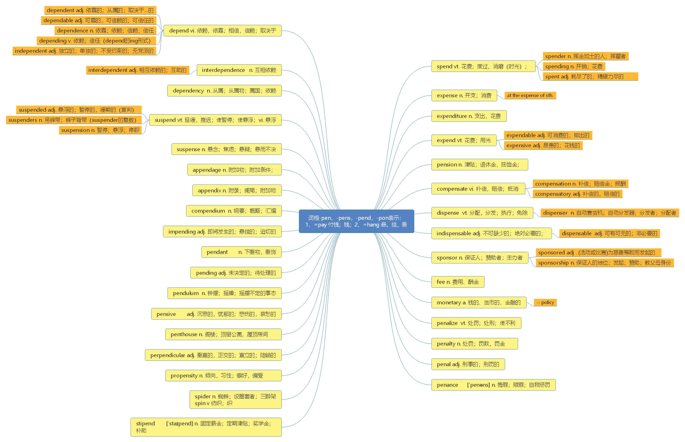

# 第十一节 词根-pens， -(s)pend， -(s)pon

***

> **本节课目标**
>
> 1、 掌握词根-pens， - (s)pend， (s)pon 的含义
>
> 2、掌握 60 个单词
>
> 3、复习本节课所有单词

***

# 词根-pens， -(s)pend， -(s)pon 表示“pay： 付钱； hang： 悬挂”

***

**spend** \[spend] [英音](https://dict.youdao.com/dictvoice?audio=spend\&type=1)  [美音](https://dict.youdao.com/dictvoice?audio=spend\&type=2)  vt. 花费；度过，消磨（时光）；用尽；浪费 343

**双语例句:** I spend too much time watching television. [播放](https://dict.youdao.com/dictvoice?audio=I+spend+too+much+time+watching+television.&le=eng&le=eng&type=2)

我看电视花的时间太多。 

**双语例句:** Why can't you spend a few bucks on a coat? [播放](https://dict.youdao.com/dictvoice?audio=Why+can%27t+you+spend+a+few+bucks+on+a+coat%3F&le=eng&le=eng&type=2)

为什么你不能花几美元买件外套呢？ 

**双语例句:** I spend at least six hours a week marking. [播放](https://dict.youdao.com/dictvoice?audio=I+spend+at+least+six+hours+a+week+marking.&le=eng&le=eng&type=2)

我每周至少要花六个小时批改作业。 

**原声例句:** Spreading mulch before the ground has frozen may attract small animals searching for a warm place to **spend** the winter. [播放](https://dict.youdao.com/pureaudio?docid=-994280293518438867)

**原声例句:** Charity Navigator says the most efficient charities **spend** at least seventy-five percent of their budget on their programs and services. [播放](https://dict.youdao.com/pureaudio?docid=-729179221305665523)

**原声例句:** For many Americans, summer is a time to put on swim wear and **spend** time at the sea or a lake. [播放](https://dict.youdao.com/pureaudio?docid=2591578109747089235)

**权威例句:** All you have to know is that politicians like to **spend** other peoples money.  [播放](https://dict.youdao.com/dictvoice?audio=All+you+have+to+know+is+that+politicians+like+to+spend+other+peoples+money.+&le=eng&type=2)

**权威例句:** Locals attend mass at their local parishes and **spend** the day relaxing with family and friends.  [播放](https://dict.youdao.com/dictvoice?audio=Locals+attend+mass+at+their+local+parishes+and+spend+the+day+relaxing+with+family+and+friends.+&le=eng&type=2)

**权威例句:** Since capital gains were all but guaranteed, the thinking went, you could safely **spend** them.  [播放](https://dict.youdao.com/dictvoice?audio=Since+capital+gains+were+all+but+guaranteed%2C+the+thinking+went%2C+you+could+safely+spend+them.+&le=eng&type=2)

***

**spender** \['spendə] [英音](https://dict.youdao.com/dictvoice?audio=spender\&type=1)  [美音](https://dict.youdao.com/dictvoice?audio=spender\&type=2)  n. 挥金如土的人； 挥霍者； 用钱的人 19858

**英文释义：** If a person or organization is a big spender or a compulsive spender, for example, they

spend a lot of money or are unable to stop themselves from spending money.

a big spender 爱花钱的人，花钱大手大脚的人

**双语例句:** She pegged him as a big spender. [播放](https://dict.youdao.com/dictvoice?audio=She+pegged+him+as+a+big+spender.&le=eng&le=eng&type=2)

她觉得他是个大手大脚的人。 

**双语例句:** Have I become a free spender? [播放](https://dict.youdao.com/dictvoice?audio=Have+I+become+a+free+spender%3F&le=eng&le=eng&type=2)

是不是已经变得大手大脚？ 

**双语例句:** Are you a big spender, Alice? [播放](https://dict.youdao.com/dictvoice?audio=Are+you+a+big+spender%2C+Alice%3F&le=eng&le=eng&type=2)

你是挥金如土的人吗，爱丽丝？ 

**权威例句:** Historically an under-spender, marketing is beginning to rival the IT budgets of other departments.  [播放](https://dict.youdao.com/dictvoice?audio=Historically+an+under-spender%2C+marketing+is+beginning+to+rival+the+IT+budgets+of+other+departments.+&le=eng&type=2)

**权威例句:** And its government has not been a wise **spender** of the meagre revenues it already has.  [播放](https://dict.youdao.com/dictvoice?audio=And+its+government+has+not+been+a+wise+spender+of+the+meagre+revenues+it+already+has.+&le=eng&type=2)

**权威例句:** The District of Columbia is the second-biggest education **spender**, but achievement is near the bottom, at 50th.  [播放](https://dict.youdao.com/dictvoice?audio=The+District+of+Columbia+is+the+second-biggest+education+spender%2C+but+achievement+is+near+the+bottom%2C+at+50th.+&le=eng&type=2)

***

**spending** \['spendɪŋ] [英音](https://dict.youdao.com/dictvoice?audio=spending\&type=1)  [美音](https://dict.youdao.com/dictvoice?audio=spending\&type=2) n. 开销； 花费 2358

**双语例句:** George was spending very freely. [播放](https://dict.youdao.com/dictvoice?audio=George+was+spending+very+freely.&le=eng&le=eng&type=2)

乔治花钱大手大脚。 

**双语例句:** Spending has increased year on year. [播放](https://dict.youdao.com/dictvoice?audio=Spending+has+increased+year+on+year.&le=eng&le=eng&type=2)

与去年同期比较，开销增加了。 

**双语例句:** We need to rein back public spending. [播放](https://dict.youdao.com/dictvoice?audio=We+need+to+rein+back+public+spending.&le=eng&le=eng&type=2)

我们需要严格控制公共开销。 

**原声例句:** The party opposes his plan to cut taxes for middle class Americans and use of government **spending** to increase economic activity. [播放](https://dict.youdao.com/pureaudio?docid=5450785056637848646)

**原声例句:** Others say the activists are independent thinkers who will oppose any politician they see as supporting big government and big **spending**. [播放](https://dict.youdao.com/pureaudio?docid=-7026668837781307866)

**原声例句:** Three-fourths of the charities that answered the survey said the recession had forced them to dismiss workers or cut other **spending**. [播放](https://dict.youdao.com/pureaudio?docid=-4719464844068693043)

**权威例句:** The expectation of increased **spending** on roads and railways has helped to lift raw-material prices.  [播放](https://dict.youdao.com/dictvoice?audio=The+expectation+of+increased+spending+on+roads+and+railways+has+helped+to+lift+raw-material+prices.+&le=eng&type=2)

**权威例句:** The government must get its finances in order and, in particular, rein in **spending**.  [播放](https://dict.youdao.com/dictvoice?audio=The+government+must+get+its+finances+in+order+and%2C+in+particular%2C+rein+in+spending.+&le=eng&type=2)

**权威例句:** For 2002, Weiner estimates a 20% drop in capital **spending** for the semiconductor industry.  [播放](https://dict.youdao.com/dictvoice?audio=For+2002%2C+Weiner+estimates+a+20%25+drop+in+capital+spending+for+the+semiconductor+industry.+&le=eng&type=2)

***

**spent** \[spent] [英音](https://dict.youdao.com/dictvoice?audio=spent\&type=1)  [美音](https://dict.youdao.com/dictvoice?audio=spent\&type=2)  adj. 耗尽了的；精疲力尽的 14463

**双语例句:** I've spent all my money already. [播放](https://dict.youdao.com/dictvoice?audio=I%27ve+spent+all+my+money+already.&le=eng&le=eng&type=2)

我已经把我的钱全都花完了。 

**双语例句:** She spent her free time shopping. [播放](https://dict.youdao.com/dictvoice?audio=She+spent+her+free+time+shopping.&le=eng&le=eng&type=2)

她将空闲时间花在购物上。 

**双语例句:** She spent hardly any of the money. [播放](https://dict.youdao.com/dictvoice?audio=She+spent+hardly+any+of+the+money.&le=eng&le=eng&type=2)

这钱她几乎一点儿都没花。 

**原声例句:** The study found that those who received lower doses of steroids by mouth **spent** less time in the hospital. [播放](https://dict.youdao.com/pureaudio?docid=-6076178643086113657)

**原声例句:** Unlike other presidents of the late eighteen hundreds, William McKinley **spent** much of his presidency dealing with foreign policy. [播放](https://dict.youdao.com/pureaudio?docid=1045811763372154381)

**原声例句:** Massey's chairman had **spent** three million dollars to help elect him to the West Virginia Supreme Court of Appeals. [播放](https://dict.youdao.com/pureaudio?docid=4851442050344028760)

**权威例句:** Taride **spent** his teenage years hanging around the beach and dreaming of being a musician.  [播放](https://dict.youdao.com/dictvoice?audio=Taride+spent+his+teenage+years+hanging+around+the+beach+and+dreaming+of+being+a+musician.+&le=eng&type=2)

**权威例句:** The two platforms **spent** recent years copying each other's moves, and they're fairly indistinguishable now.  [播放](https://dict.youdao.com/dictvoice?audio=The+two+platforms+spent+recent+years+copying+each+other%27s+moves%2C+and+they%27re+fairly+indistinguishable+now.+&le=eng&type=2)

**权威例句:** Andres **spent** last summer at the Mexican ambassador's residence in Beijing researching the new menu.  [播放](https://dict.youdao.com/dictvoice?audio=Andres+spent+last+summer+at+the+Mexican+ambassador%27s+residence+in+Beijing+researching+the+new+menu.+&le=eng&type=2)

***

**expense** \[ɪk'spens; ek-] [英音](https://dict.youdao.com/dictvoice?audio=expense\&type=1)  [美音](https://dict.youdao.com/dictvoice?audio=expense\&type=2)  n. 开支；消费；损失，代价 2156

**助记：** ex（ 向外、 出去） +pens（ 钱、 付钱） +e→付出去的钱→花费、 开支

**搭配：** at the expense of（ 考）： 以…为代价

**写作例句：** 以丢失诚信为代价来赚钱的做法是不可取的。

1.  The practice of making money at the expense of losing credit is not&#x20;

    advisable/favorable/preferable/agreeable.

2） It is not advisable/favorable/preferable/agreeable to make a profit at the expense of

abandoning honesty and integrity.

**双语例句:** He can comfortably afford the extra expense. [播放](https://dict.youdao.com/dictvoice?audio=He+can+comfortably+afford+the+extra+expense.&le=eng&le=eng&type=2)

他支付这些额外的费用毫无问题。 

**双语例句:** Her fame was bought at the expense of her marriage. [播放](https://dict.youdao.com/dictvoice?audio=Her+fame+was+bought+at+the+expense+of+her+marriage.&le=eng&le=eng&type=2)

她出了名，却牺牲了她的婚姻。 

**双语例句:** She always travels first-class regardless of expense. [播放](https://dict.youdao.com/dictvoice?audio=She+always+travels+first-class+regardless+of+expense.&le=eng&le=eng&type=2)

无论费用多高她总是乘头等舱。 

**原声例句:** Some people say lobbying supports special interests at the **expense** of the public interest. [播放](https://dict.youdao.com/pureaudio?docid=7031167509351194348)

**原声例句:** In addition to the **expense** of buying the commercial time, Thomas Harpointner says there are additional costs that many forget. [播放](https://dict.youdao.com/pureaudio?docid=-8249458561778671886)

**原声例句:** If that price is too low,he says, it will not adequately cover the **expense** of fuel,fertilizer, herbicides and equipment. [播放](https://dict.youdao.com/pureaudio?docid=-4083372083382341000)

**权威例句:** Citi has struggled to keep the rate of **expense** growth below the rate of revenue growth.  [播放](https://dict.youdao.com/dictvoice?audio=Citi+has+struggled+to+keep+the+rate+of+expense+growth+below+the+rate+of+revenue+growth.+&le=eng&type=2)

**权威例句:** In those periods it was deliberately investing in the future at the **expense** of current profits.  [播放](https://dict.youdao.com/dictvoice?audio=In+those+periods+it+was+deliberately+investing+in+the+future+at+the+expense+of+current+profits.+&le=eng&type=2)

**权威例句:** How can this be, that the **expense** ratios disclosed to fund customers omit commissions?  [播放](https://dict.youdao.com/dictvoice?audio=How+can+this+be%2C+that+the+expense+ratios+disclosed+to+fund+customers+omit+commissions%3F+&le=eng&type=2)

***

**expenditure** \[ɪk'spendɪtʃə; ek-] [英音](https://dict.youdao.com/dictvoice?audio=expenditure\&type=1)  [美音](https://dict.youdao.com/dictvoice?audio=expenditure\&type=2)  n. 支出， 花费； 经费， 消费额 5240

**助记：** ex（ 出去） + pend（ 钱） + iture（ =ite+ure 复合名词后缀） →花出去的钱→开支、 支付

**搭配：** public expenditure（考）：公共开支

**双语例句:** He is rigorous in his control of expenditure. [播放](https://dict.youdao.com/dictvoice?audio=He+is+rigorous+in+his+control+of+expenditure.&le=eng&le=eng&type=2)

他在控制开支方面一丝不苟。 

**双语例句:** Capital expenditure was treble the 2002 level. [播放](https://dict.youdao.com/dictvoice?audio=Capital+expenditure+was+treble+the+2002+level.&le=eng&le=eng&type=2)

资本支出是2002年的三倍。 

**双语例句:** You must ask permission for all major expenditure. [播放](https://dict.youdao.com/dictvoice?audio=You+must+ask+permission+for+all+major+expenditure.&le=eng&le=eng&type=2)

一切重大开支均须报请批准。 

**原声例句:** \"If we look at per-capita health **expenditure**, in the low income countries, it is $22 per capita,\" [播放](https://dict.youdao.com/pureaudio?docid=-3204467934387353909)

**原声例句:** Part of--this is the--it's not loan-to-value ratio-- this is the ratio of mortgage debt to personal consumption **expenditure**.

**原声例句:** Now the interesting thing is, the green line here is the **expenditure** on real estate investment.

**权威例句:** Ad **expenditure** has recovered faster than expected in 2010 across all regions after an alarming 2009.  [播放](https://dict.youdao.com/dictvoice?audio=Ad+expenditure+has+recovered+faster+than+expected+in+2010+across+all+regions+after+an+alarming+2009.+&le=eng&type=2)

**权威例句:** We addressed tax **expenditure** issues with the staffers, and they were open to hear us out.  [播放](https://dict.youdao.com/dictvoice?audio=We+addressed+tax+expenditure+issues+with+the+staffers%2C+and+they+were+open+to+hear+us+out.+&le=eng&type=2)

**权威例句:** However, we believe that high **expenditure** incurred will help drive future growth for the company.  [播放](https://dict.youdao.com/dictvoice?audio=However%2C+we+believe+that+high+expenditure+incurred+will+help+drive+future+growth+for+the+company.+&le=eng&type=2)

***

**expend** \[ɪk'spend; ek-] [英音](https://dict.youdao.com/dictvoice?audio=expend\&type=1)  [美音](https://dict.youdao.com/dictvoice?audio=expend\&type=2)  vt. 花费； 用光； 消耗； 耗尽 10905

**双语例句:** If you give up exercise, your muscles shrink and fat increases. By the same token, if you expend more energy you will lose fat. [播放](https://dict.youdao.com/dictvoice?audio=If+you+give+up+exercise%2C+your+muscles+shrink+and+fat+increases.+By+the+same+token%2C+if+you+expend+more+energy+you+will+lose+fat.&le=eng&le=eng&type=2)

如果你放弃锻炼，肌肉就会萎缩，脂肪会增多。同样地，如果你消耗较多的体能，你就会减掉脂肪。 

**双语例句:** Growth, reproduction, and daily metabolism all require an organism to expend energy. [播放](https://dict.youdao.com/dictvoice?audio=Growth%2C+reproduction%2C+and+daily+metabolism+all+require+an+organism+to+expend+energy.&le=eng&le=eng&type=2)

生长、繁殖和日常的新陈代谢都需要有机体来消耗能量。 

**双语例句:** Extreme athletes expend lots of energy breaking down and repairing and building muscles. [播放](https://dict.youdao.com/dictvoice?audio=Extreme+athletes+expend+lots+of+energy+breaking+down+and+repairing+and+building+muscles.&le=eng&le=eng&type=2)

极限运动员消耗大量能量来分解、修复和塑造肌肉。 

**原声例句:** It doesn't have to **expend** as much energy, therefore, the majority in this case is right.

**原声例句:** The reversible process is going to be colder because it has to **expend** more energy.

**权威例句:** Greater accountability, more expeditious decision-making and improved risk-benefit balancing would **expend** resources more efficiently.  [播放](https://dict.youdao.com/dictvoice?audio=Greater+accountability%2C+more+expeditious+decision-making+and+improved+risk-benefit+balancing+would+expend+resources+more+efficiently.+&le=eng&type=2)

**权威例句:** The energy that male fish **expend** on courtship comes at the expense of their semen.  [播放](https://dict.youdao.com/dictvoice?audio=The+energy+that+male+fish+expend+on+courtship+comes+at+the+expense+of+their+semen.+&le=eng&type=2)

**权威例句:** You know, without direction by the State as to how they should **expend** their efforts.  [播放](https://dict.youdao.com/dictvoice?audio=You+know%2C+without+direction+by+the+State+as+to+how+they+should+expend+their+efforts.+&le=eng&type=2)

***

**expendable** \[ɪk'spendəb(ə)l] [英音](https://dict.youdao.com/dictvoice?audio=expendable\&type=1)  [美音](https://dict.youdao.com/dictvoice?audio=expendable\&type=2)  adj. 可消费的； 排出的； 不重复使用的； 可牺牲的 19381

释义: If you regard someone or something as expendable, you think it is acceptable to get rid of

them, abandon them, or allow them to be destroyed when they are no longer needed.

**双语例句:** Once our services cease to be useful to them, we're expendable. [播放](https://dict.youdao.com/dictvoice?audio=Once+our+services+cease+to+be+useful+to+them%2C+we%27re+expendable.&le=eng&le=eng&type=2)

一旦我们的服务对他们没了用，我们就是可消耗的了。 

**双语例句:** During the recession, training budgets were seen as an expendable luxury. [播放](https://dict.youdao.com/dictvoice?audio=During+the+recession%2C+training+budgets+were+seen+as+an+expendable+luxury.&le=eng&le=eng&type=2)

在衰退时期，培训预算被看成是消耗的奢侈品。 

**双语例句:** And innocent people's lives are not expendable. [播放](https://dict.youdao.com/dictvoice?audio=And+innocent+people%27s+lives+are+not+expendable.&le=eng&le=eng&type=2)

无辜者的生命不是可消耗品。 

**权威例句:** The **expendable** Vernon Wells gets traded to New York -- where he's hotter than hot.  [播放](https://dict.youdao.com/dictvoice?audio=The+expendable+Vernon+Wells+gets+traded+to+New+York+--+where+he%27s+hotter+than+hot.+&le=eng&type=2)

**权威例句:** The notion that in some ways we would treat them as **expendable** makes no sense.  [播放](https://dict.youdao.com/dictvoice?audio=The+notion+that+in+some+ways+we+would+treat+them+as+expendable+makes+no+sense.+&le=eng&type=2)

**权威例句:** He became **expendable** in Denver, where the Broncos just signed four-time MVP Peyton Manning.  [播放](https://dict.youdao.com/dictvoice?audio=He+became+expendable+in+Denver%2C+where+the+Broncos+just+signed+four-time+MVP+Peyton+Manning.+&le=eng&type=2)

***

**expensive** \[ɪkˈspensɪv] [英音](https://dict.youdao.com/dictvoice?audio=expensive\&type=1)  [美音](https://dict.youdao.com/dictvoice?audio=expensive\&type=2)  adj. 昂贵的； 花钱的 1674

**双语例句:** Food was scarce and expensive. [播放](https://dict.youdao.com/dictvoice?audio=Food+was+scarce+and+expensive.&le=eng&le=eng&type=2)

食物匮乏而且昂贵。 

**双语例句:** Skiing gear can be expensive. [播放](https://dict.youdao.com/dictvoice?audio=Skiing+gear+can+be+expensive.&le=eng&le=eng&type=2)

滑雪用具有时会很昂贵。 

**双语例句:** It's a tad too expensive for me. [播放](https://dict.youdao.com/dictvoice?audio=It%27s+a+tad+too+expensive+for+me.&le=eng&le=eng&type=2)

这对我来说稍微贵了一点儿。 

**原声例句:** The president says the goal is for patients to get the best care, not just the most **expensive** care. [播放](https://dict.youdao.com/pureaudio?docid=7218042043135095094)

**原声例句:** Because his wife Millicent liked to invite her friends to big dinners and serve them rare and **expensive** food and wine. [播放](https://dict.youdao.com/pureaudio?docid=3693704388278250885)

**原声例句:** So you can read on an iPad or a touch-screen tablet, but the e-book readers are less **expensive**. [播放](https://dict.youdao.com/pureaudio?docid=-4138088239527791403)

**权威例句:** The time-tested way to do that is to load a car with **expensive** options.  [播放](https://dict.youdao.com/dictvoice?audio=The+time-tested+way+to+do+that+is+to+load+a+car+with+expensive+options.+&le=eng&type=2)

**权威例句:** Abu Dhabi has the world's most **expensive** hotel ever built and the first ever gold-dispensing ATM.  [播放](https://dict.youdao.com/dictvoice?audio=Abu+Dhabi+has+the+world%27s+most+expensive+hotel+ever+built+and+the+first+ever+gold-dispensing+ATM.+&le=eng&type=2)

**权威例句:** The more **expensive** Huaxiangsu style is available for those willing to spend the yuan.  [播放](https://dict.youdao.com/dictvoice?audio=The+more+expensive+Huaxiangsu+style+is+available+for+those+willing+to+spend+the+yuan.+&le=eng&type=2)

***

**inexpensive** \[ɪnɪk'spensɪv; ɪnek-] [英音](https://dict.youdao.com/dictvoice?audio=inexpensive\&type=1)  [美音](https://dict.youdao.com/dictvoice?audio=inexpensive\&type=2)  adj. 便宜的 5911

**双语例句:** There is a large variety of good, inexpensive restaurants. [播放](https://dict.youdao.com/dictvoice?audio=There+is+a+large+variety+of+good%2C+inexpensive+restaurants.&le=eng&le=eng&type=2)

有多种物美价廉的餐馆。 

**双语例句:** She found a small, inexpensive motel on the outskirts of the town; it was barren and unlovely. [播放](https://dict.youdao.com/dictvoice?audio=She+found+a+small%2C+inexpensive+motel+on+the+outskirts+of+the+town%3B+it+was+barren+and+unlovely.&le=eng&le=eng&type=2)

她在镇郊找了一个又小又便宜的汽车旅馆，设施不全也不好看。 

**双语例句:** It meant any inexpensive newspaper. [播放](https://dict.youdao.com/dictvoice?audio=It+meant+any+inexpensive+newspaper.&le=eng&le=eng&type=2)

这指的是任何便宜的报纸。 

**原声例句:** \"One of the benefits is it's a relatively **inexpensive** renewable material that's readily available.\" [播放](https://dict.youdao.com/pureaudio?docid=-2180960639917341440)

**原声例句:** for everybody, Disc golf is especially popular on college campuses because it's **inexpensive** and can be played in any season,day or night. [播放](https://dict.youdao.com/pureaudio?docid=5201117937546946412)

**原声例句:** South Korean businesses hire nearly 40,000 **inexpensive** North Korean workers to manufacture simple items like clothing and cosmetics. [播放](https://dict.youdao.com/pureaudio?docid=-5542652070552007133)

**权威例句:** Because it's made from corn, it is both **inexpensive** and easy on the earth to produce.  [播放](https://dict.youdao.com/dictvoice?audio=Because+it%27s+made+from+corn%2C+it+is+both+inexpensive+and+easy+on+the+earth+to+produce.+&le=eng&type=2)

**权威例句:** Consider investing in an **inexpensive** pedometer to track your movement while on the road.  [播放](https://dict.youdao.com/dictvoice?audio=Consider+investing+in+an+inexpensive+pedometer+to+track+your+movement+while+on+the+road.+&le=eng&type=2)

**权威例句:** People will see HD DVD as an incremental **inexpensive** alternative to the next generation HD movie format.  [播放](https://dict.youdao.com/dictvoice?audio=People+will+see+HD+DVD+as+an+incremental+inexpensive+alternative+to+the+next+generation+HD+movie+format.+&le=eng&type=2)

***

**pension** \['penʃ(ə)n] [英音](https://dict.youdao.com/dictvoice?audio=pension\&type=1)  [美音](https://dict.youdao.com/dictvoice?audio=pension\&type=2)  n. 津贴；退休金，抚恤金；膳宿费 3818

**助记：** pens（ 钱） +ion（ 名词后缀） →养老金， 抚恤金（ 即： “养老金、 抚恤金”指的都是“钱”）

**搭配：** pension arrangement（考）：退休金安排、抚恤金安排

**释义：** Someone who has a pension receives a regular sum of money from a former employer

because they have retired or because they are widowed or disabled. 养老金；抚恤金

**词源：** mid-14c., "payment for services," especially "reward, payment out of a benefice" (early

14c., in 、 Anglo-Latin), from Old French pension "payment, rent" (13c.) and directly from

Latin pensionem (nominative pensio) "a payment, installment, rent," from past participle

stem of pendere "to hang, cause to hang; weigh; pay" (from PIE root \*(s)pen- "to draw,

stretch, spin"). Meaning "regular payment in consideration of past service" first

recorded 1520s. Meaning "boarding house, boarding school" first attested 1640s, from

French, and usually in reference to places in France or elsewhere on the Continent.

**双语例句:** She's got nothing beyond her state pension. [播放](https://dict.youdao.com/dictvoice?audio=She%27s+got+nothing+beyond+her+state+pension.&le=eng&le=eng&type=2)

除了政府发的养老金外，她什么都没有。 

**双语例句:** She went to the post office to draw her pension. [播放](https://dict.youdao.com/dictvoice?audio=She+went+to+the+post+office+to+draw+her+pension.&le=eng&le=eng&type=2)

她到邮局去领取她的养老金。 

**双语例句:** Many employees contracted out of the pension plan. [播放](https://dict.youdao.com/dictvoice?audio=Many+employees+contracted+out+of+the+pension+plan.&le=eng&le=eng&type=2)

许多雇员退出了养老金计划的合约。 

**原声例句:** And there are military records and federal **pension** records. [播放](https://dict.youdao.com/pureaudio?docid=-7044325793135781103)

**原声例句:** Arporn Chewrekrengkai, chief economist with the Government **Pension** Fund, has revised her optimistic outlook for tourism this year. [播放](https://dict.youdao.com/pureaudio?docid=8907381140255357483)

**原声例句:** Greek newspapers have spent the past week speculating on what further hardships citizens will face,including **pension** cuts, salary freezes and the prospect of job cuts. [播放](https://dict.youdao.com/pureaudio?docid=1611742731542553991)

**权威例句:** The consultation paper should pave the way for formal guidance to all final-salary **pension** schemes.  [播放](https://dict.youdao.com/dictvoice?audio=The+consultation+paper+should+pave+the+way+for+formal+guidance+to+all+final-salary+pension+schemes.+&le=eng&type=2)

**权威例句:** The new payout rules also apply to distributions from non-IRA **pension** plans, such as 401(k)s.  [播放](https://dict.youdao.com/dictvoice?audio=The+new+payout+rules+also+apply+to+distributions+from+non-IRA+pension+plans%2C+such+as+401%28k%29s.+&le=eng&type=2)

**权威例句:** He then lived off a generous **pension** granted out of pity by Queen Anne.  [播放](https://dict.youdao.com/dictvoice?audio=He+then+lived+off+a+generous+pension+granted+out+of+pity+by+Queen+Anne.+&le=eng&type=2)

***

**compensate** \['kɒmpenseɪt] [英音](https://dict.youdao.com/dictvoice?audio=compensate\&type=1)  [美音](https://dict.youdao.com/dictvoice?audio=compensate\&type=2)  vi. 补偿， 赔偿； 抵消 5099

**助记：** com（ 共同、 大家） +pens（ 钱） +ate（ 使动词） →使钱发给大家→补偿、 赔偿

**搭配：** compensate sb. for sth（考）：为...补偿某人

**双语例句:** Nothing can compensate for the loss of a loved one. [播放](https://dict.youdao.com/dictvoice?audio=Nothing+can+compensate+for+the+loss+of+a+loved+one.&le=eng&le=eng&type=2)

失去心爱的人是无法补偿的。 

**双语例句:** The damages are designed to compensate victims for their direct losses. [播放](https://dict.youdao.com/dictvoice?audio=The+damages+are+designed+to+compensate+victims+for+their+direct+losses.&le=eng&le=eng&type=2)

该赔偿金是用来补偿受害人的直接损失的。 

**双语例句:** A surge in domestic sales helped compensate for a fall-off in export sales. [播放](https://dict.youdao.com/dictvoice?audio=A+surge+in+domestic+sales+helped+compensate+for+a+fall-off+in+export+sales.&le=eng&le=eng&type=2)

国内销售的增长帮助补偿了出口销售的减少。 

**原声例句:** \"With our turtle release program, it is a compensation-based program where when the fishermen give us a call to go and rescue a turtle, we check the biometric measurements, tag the turtle, and **compensate** the fishermen for the time and effort they have taken to save these turtles and call us.\" [播放](https://dict.youdao.com/pureaudio?docid=8083243344230877093)

**原声例句:** There is no way to **compensate** or punish someone for murder, it simply means forfeiture of one's own life.

**原声例句:** that will **compensate** for less stellar scores or letters of recommendation or whatever in other areas.

**权威例句:** Greenwald hopes to **compensate** in part by cutting the cost of getting tickets into passengers hands.  [播放](https://dict.youdao.com/dictvoice?audio=Greenwald+hopes+to+compensate+in+part+by+cutting+the+cost+of+getting+tickets+into+passengers+hands.+&le=eng&type=2)

**权威例句:** Nasdaq officials said they can't **compensate** retail-brokerage clients who lost money on Facebook shares.  [播放](https://dict.youdao.com/dictvoice?audio=Nasdaq+officials+said+they+can%27t+compensate+retail-brokerage+clients+who+lost+money+on+Facebook+shares.+&le=eng&type=2)

**权威例句:** This enables the richness of the Internet to **compensate** for weaknesses in the silicon product.  [播放](https://dict.youdao.com/dictvoice?audio=This+enables+the+richness+of+the+Internet+to+compensate+for+weaknesses+in+the+silicon+product.+&le=eng&type=2)

***

**compensation** \[kɒmpen'seɪʃ(ə)n] [英音](https://dict.youdao.com/dictvoice?audio=compensation\&type=1)  [美音](https://dict.youdao.com/dictvoice?audio=compensation\&type=2)  n. 补偿；赔偿金；报酬 3833

> **【 课堂笔记】**
>
> salary 有规律的定期的基本工资，多指月薪，通常为脑力劳动者获得的薪水。
>
> wage 多指周薪或时薪，通常为体力劳动者获得的薪水。
>
> compensation 薪酬，报酬，多指赔偿，通常指对不利事情的赔偿金。

**双语例句:** The injured party got some compensation. [播放](https://dict.youdao.com/dictvoice?audio=The+injured+party+got+some+compensation.&le=eng&le=eng&type=2)

受害方得到了一些补偿。 

**双语例句:** They have a valid claim to compensation. [播放](https://dict.youdao.com/dictvoice?audio=They+have+a+valid+claim+to+compensation.&le=eng&le=eng&type=2)

他们有要求赔偿的合法权利。 

**双语例句:** They lodged a compensation claim against the factory. [播放](https://dict.youdao.com/dictvoice?audio=They+lodged+a+compensation+claim+against+the+factory.&le=eng&le=eng&type=2)

他们向工厂提出了赔偿要求。 

**原声例句:** \"We could have boards that do a much better job of designing **compensation** plans. [播放](https://dict.youdao.com/pureaudio?docid=110084303672222152)

**原声例句:** \"They're all approved by the shareholders as well as the independent **compensation** committees in each one of the companies.\" [播放](https://dict.youdao.com/pureaudio?docid=5846128925028987231)

**原声例句:** On Sunday,Eurostar did promise to offer those who have suffered long delays or cancellations a full refund and **compensation**. [播放](https://dict.youdao.com/pureaudio?docid=3781617269708257280)

**权威例句:** Result: The recombination of two very different cultures, **compensation** approaches and regulatory setups for clients.  [播放](https://dict.youdao.com/dictvoice?audio=Result%3A+The+recombination+of+two+very+different+cultures%2C+compensation+approaches+and+regulatory+setups+for+clients.+&le=eng&type=2)

**权威例句:** Low-lying islands and other countries that are probable victims want **compensation** and technology transfers.  [播放](https://dict.youdao.com/dictvoice?audio=Low-lying+islands+and+other+countries+that+are+probable+victims+want+compensation+and+technology+transfers.+&le=eng&type=2)

**权威例句:** There are arrangements for **compensation** if their journeys have been delayed in the past, please write in.  [播放](https://dict.youdao.com/dictvoice?audio=There+are+arrangements+for+compensation+if+their+journeys+have+been+delayed+in+the+past%2C+please+write+in.+&le=eng&type=2)

***

**compensatory** \[kɒmpen'seɪtərɪ] [英音](https://dict.youdao.com/dictvoice?audio=compensatory\&type=1)  [美音](https://dict.youdao.com/dictvoice?audio=compensatory\&type=2)  adj. 补偿的， 赔偿的 14755

**双语例句:** The evaporation from the leaf surface causes a constant compensatory suction of water. [播放](https://dict.youdao.com/dictvoice?audio=The+evaporation+from+the+leaf+surface+causes+a+constant+compensatory+suction+of+water.&le=eng&le=eng&type=2)

叶片表面的蒸发作用产生了持续的代偿吸水性。 

**双语例句:** He received a compensatory payment of $20 000. [播放](https://dict.youdao.com/dictvoice?audio=He+received+a+compensatory+payment+of+%2420+000.&le=eng&le=eng&type=2)

他获得了2万元的赔偿金。 

**双语例句:** The jury awarded $11.2 million in compensatory damages. [播放](https://dict.youdao.com/dictvoice?audio=The+jury+awarded+%2411.2+million+in+compensatory+damages.&le=eng&le=eng&type=2)

陪审团裁判1,120万美元的赔偿损失费。 

**权威例句:** Or do his **compensatory** efforts show that his handlessness really was a governing identity?  [播放](https://dict.youdao.com/dictvoice?audio=Or+do+his+compensatory+efforts+show+that+his+handlessness+really+was+a+governing+identity%3F+&le=eng&type=2)

**权威例句:** Campbell, suggested that the ratio of punitive to **compensatory** damages should be in the single digits.  [播放](https://dict.youdao.com/dictvoice?audio=Campbell%2C+suggested+that+the+ratio+of+punitive+to+compensatory+damages+should+be+in+the+single+digits.+&le=eng&type=2)

**权威例句:** Many driving schools also offer training for older drivers to help rehone those skills and develop **compensatory** ones.  [播放](https://dict.youdao.com/dictvoice?audio=Many+driving+schools+also+offer+training+for+older+drivers+to+help+rehone+those+skills+and+develop+compensatory+ones.+&le=eng&type=2)

***

**dispense** \[dɪ'spens] [英音](https://dict.youdao.com/dictvoice?audio=dispense\&type=1)  [美音](https://dict.youdao.com/dictvoice?audio=dispense\&type=2)  vt. 分配，分发；执行；免除 8502

**助记：** dis（ 分开） +pens（ 钱） +e→ 把钱分给不同的人→分配、 分发

dis（ 表相反） +pens（ 钱） +e→不需要花钱→免除、 免掉

**搭配：** dispense with（考）：免除、省掉

**例句：** It has enabled the company to dispense with its business premises altogether, following the

realization that it just didn't need them any more. 在了解到（远程办公）再也不需要办

公场所之后，该公司完全免去了商用办公场所的开支。

**双语例句:** Can we dispense with the formalities? [播放](https://dict.youdao.com/dictvoice?audio=Can+we+dispense+with+the+formalities%3F&le=eng&le=eng&type=2)

我们可以免去这些客套吗？ 

**双语例句:** Debit cards dispense with the need for cash altogether. [播放](https://dict.youdao.com/dictvoice?audio=Debit+cards+dispense+with+the+need+for+cash+altogether.&le=eng&le=eng&type=2)

有借记卡就完全不需要用现金了。 

**双语例句:** This smart washing machine will dispense an optimal amount of water for the load. [播放](https://dict.youdao.com/dictvoice?audio=This+smart+washing+machine+will+dispense+an+optimal+amount+of+water+for+the+load.&le=eng&le=eng&type=2)

这台智能洗衣机会根据衣物多少适当安排进水量。 

**原声例句:** Can we altogether **dispense** with the idea that certain things we take pleasure in are better or worthier than others?

**权威例句:** It's in this context that the apologists **dispense** their psychological balm with near-Churchillian fervor.  [播放](https://dict.youdao.com/dictvoice?audio=It%27s+in+this+context+that+the+apologists+dispense+their+psychological+balm+with+near-Churchillian+fervor.+&le=eng&type=2)

**权威例句:** Thy work will be to **dispense** justice and punish those that violate Divine laws.  [播放](https://dict.youdao.com/dictvoice?audio=Thy+work+will+be+to+dispense+justice+and+punish+those+that+violate+Divine+laws.+&le=eng&type=2)

**权威例句:** We could **dispense** with trials and determine Martha's guilt or innocence by popular vote.  [播放](https://dict.youdao.com/dictvoice?audio=We+could+dispense+with+trials+and+determine+Martha%27s+guilt+or+innocence+by+popular+vote.+&le=eng&type=2)

***

**dispenser** \[dɪ'spensə] [英音](https://dict.youdao.com/dictvoice?audio=dispenser\&type=1)  [美音](https://dict.youdao.com/dictvoice?audio=dispenser\&type=2)  n. 自动售货机； 自动分发器； 分发者； 分配者 16538

**释义：** A dispenser is a machine or container designed so that you can get an item or quantity of

something from it in an easy and convenient way. 自动售货机；自动分发器

**双语例句:** It also has an automatic detergent dispenser. [播放](https://dict.youdao.com/dictvoice?audio=It+also+has+an+automatic+detergent+dispenser.&le=eng&le=eng&type=2)

它也有一台自动洗涤剂分配器。 

**双语例句:** The dispenser quickly filled the prescription for me. [播放](https://dict.youdao.com/dictvoice?audio=The+dispenser+quickly+filled+the+prescription+for+me.&le=eng&le=eng&type=2)

药剂师立刻照处方为我配了药。 

**双语例句:** This simple application provides a fortune cookie dispenser. [播放](https://dict.youdao.com/dictvoice?audio=This+simple+application+provides+a+fortune+cookie+dispenser.&le=eng&le=eng&type=2)

这个简单的程序提供了一个财富甜点分发。 

**权威例句:** Unlike many rich men, Wilpon is an asker of questions as much as a **dispenser** of opinions.  [播放](https://dict.youdao.com/dictvoice?audio=Unlike+many+rich+men%2C+Wilpon+is+an+asker+of+questions+as+much+as+a+dispenser+of+opinions.+&le=eng&type=2)

**权威例句:** With everyone touching a skeevy bar of soap or the soap **dispenser**, aren't we just recirculating germs?  [播放](https://dict.youdao.com/dictvoice?audio=With+everyone+touching+a+skeevy+bar+of+soap+or+the+soap+dispenser%2C+aren%27t+we+just+recirculating+germs%3F+&le=eng&type=2)

**权威例句:** Government must revert to being a protector of rights, not the **dispenser** of favors and controller of subjects.  [播放](https://dict.youdao.com/dictvoice?audio=Government+must+revert+to+being+a+protector+of+rights%2C+not+the+dispenser+of+favors+and+controller+of+subjects.+&le=eng&type=2)

***

**indispensable** \[ɪndɪ'spensəb(ə)l] [英音](https://dict.youdao.com/dictvoice?audio=indispensable\&type=1)  [美音](https://dict.youdao.com/dictvoice?audio=indispensable\&type=2)  adj.不可缺少的； 绝对必要的； 9151

**助记：** in（ 表否定） + dispens（ 分开） + able（ 可以、 能的） →不能分开的→必不可少的、

不可或缺的

**搭配：** be indispensable to sth（ 考）： 对…而言是不可或缺的

\*\*例句：\*\*众所周知，坚持是成功的必要条件。

It is well-known that persistence is the indispensable condition for success.

> **【 课堂笔记】**
>
> 台湾是中国不可分割的一部分。

Taiwan is an indispensable part of China.

**双语例句:** She was becoming indispensable to him. [播放](https://dict.youdao.com/dictvoice?audio=She+was+becoming+indispensable+to+him.&le=eng&le=eng&type=2)

对他来说她正变得不可或缺。 

**双语例句:** She made herself indispensable to the department. [播放](https://dict.youdao.com/dictvoice?audio=She+made+herself+indispensable+to+the+department.&le=eng&le=eng&type=2)

她成为这个部门不可缺少的一分子。 

**双语例句:** Cars have become an indispensable part of our lives. [播放](https://dict.youdao.com/dictvoice?audio=Cars+have+become+an+indispensable+part+of+our+lives.&le=eng&le=eng&type=2)

汽车已成了我们生活中必不可少的一部分。 

**权威例句:** Like any major route, the canal played several roles, all of them **indispensable** to the empire.  [播放](https://dict.youdao.com/dictvoice?audio=Like+any+major+route%2C+the+canal+played+several+roles%2C+all+of+them+indispensable+to+the+empire.+&le=eng&type=2)

**权威例句:** Still, it makes an **indispensable** contribution to the reckoning that will come, in due course.  [播放](https://dict.youdao.com/dictvoice?audio=Still%2C+it+makes+an+indispensable+contribution+to+the+reckoning+that+will+come%2C+in+due+course.+&le=eng&type=2)

**权威例句:** Reducing consumption seems intuitively to be an **indispensable** component of any policy response to climate change.  [播放](https://dict.youdao.com/dictvoice?audio=Reducing+consumption+seems+intuitively+to+be+an+indispensable+component+of+any+policy+response+to+climate+change.+&le=eng&type=2)

***

**dispensable** \[dɪˈspɛnsəbəl] [英音](https://dict.youdao.com/dictvoice?audio=dispensable\&type=1)  [美音](https://dict.youdao.com/dictvoice?audio=dispensable\&type=2)  adj. 可有可无的； 非必要的 7489

**双语例句:** All those people in the middle are dispensable. [播放](https://dict.youdao.com/dictvoice?audio=All+those+people+in+the+middle+are+dispensable.&le=eng&le=eng&type=2)

那些在中间的人都是可有可无的。 

**双语例句:** They looked on music and art lessons as dispensable. [播放](https://dict.youdao.com/dictvoice?audio=They+looked+on+music+and+art+lessons+as+dispensable.&le=eng&le=eng&type=2)

他们认为音乐课和美术课是可有可无的。 

**双语例句:** Amid the current concerns about the federal deficit, reaching toward the stars seems a dispensable luxury—as if saving one-thousandth of a single year's budget would solve our problems. [播放](https://dict.youdao.com/dictvoice?audio=Amid+the+current+concerns+about+the+federal+deficit%2C+reaching+toward+the+stars+seems+a+dispensable+luxury%E2%80%94as+if+saving+one-thousandth+of+a+single+year%27s+budget+would+solve+our+problems.&le=eng&le=eng&type=2)

在当前对联邦赤字的担忧中，“伸手摘星”的尝试似乎是一种可有可无的奢侈——似乎只要一年省下千分之一的预算就能解决我们的问题。 

**权威例句:** Originally the game was played with a dead man, a prisoner of war or someone equally **dispensable**.  [播放](https://dict.youdao.com/dictvoice?audio=Originally+the+game+was+played+with+a+dead+man%2C+a+prisoner+of+war+or+someone+equally+dispensable.+&le=eng&type=2)

**权威例句:** How can we know which checks and balances are utterly necessary and which are **dispensable**?  [播放](https://dict.youdao.com/dictvoice?audio=How+can+we+know+which+checks+and+balances+are+utterly+necessary+and+which+are+dispensable%3F+&le=eng&type=2)

**权威例句:** He has planted stink bug bait rows of **dispensable** pumpkins and sunflowers to serve as tasty decoys and distract the pests from his vegetables.  [播放](https://dict.youdao.com/dictvoice?audio=He+has+planted+stink+bug+bait+rows+of+dispensable+pumpkins+and+sunflowers+to+serve+as+tasty+decoys+and+distract+the+pests+from+his+vegetables.+&le=eng&type=2)

***

**sponsor** \['spɒnsə] [英音](https://dict.youdao.com/dictvoice?audio=sponsor\&type=1)  [美音](https://dict.youdao.com/dictvoice?audio=sponsor\&type=2)  n. 保证人； 赞助者； 主办者 3484

**助记：** s（ 加强语气） + pon（ 钱、 付钱） + or（ 表人） →付钱的人、 出钱的人→赞助商； 赞

助（ v.）

**搭配：** sponsor trade fairs（考）：赞助贸易展销会 corporate sponsors（考）：企业赞助商

**双语例句:** Please could you sponsor me for my school's campaign for Help the Aged? [播放](https://dict.youdao.com/dictvoice?audio=Please+could+you+sponsor+me+for+my+school%27s+campaign+for+Help+the+Aged%3F&le=eng&le=eng&type=2)

请问你们能赞助我开展我校的“帮助老年人”活动吗？ 

**双语例句:** The company plans to sponsor television programmes as part of its marketing strategy. [播放](https://dict.youdao.com/dictvoice?audio=The+company+plans+to+sponsor+television+programmes+as+part+of+its+marketing+strategy.&le=eng&le=eng&type=2)

公司计划赞助电视节目，以此作为营销策略之一。 

**双语例句:** Adidas is an official sponsor of the World Cup, so its logo appears on the field. [播放](https://dict.youdao.com/dictvoice?audio=Adidas+is+an+official+sponsor+of+the+World+Cup%2C+so+its+logo+appears+on+the+field.&le=eng&le=eng&type=2)

阿迪达斯是世界杯的官方赞助商，所以，它的标志出现在赛场上。 

**原声例句:** The employer would serve as **sponsor** in that case. [播放](https://dict.youdao.com/pureaudio?docid=-5408167138066234169)

**原声例句:** \"We are seeking cooperation from all countries around the world including Iran, which is a state **sponsor** of terrorism itself. [播放](https://dict.youdao.com/pureaudio?docid=-3993785548671529714)

**原声例句:** He is known as a satirist and a comedian, but Stephen Colbert is also the U.S.Olympic **sponsor**. [播放](https://dict.youdao.com/pureaudio?docid=1958489857136194615)

**权威例句:** Spanish bank Santander will **sponsor** Ferrari next year, although they will still retain a smaller presence with McLaren.  [播放](https://dict.youdao.com/dictvoice?audio=Spanish+bank+Santander+will+sponsor+Ferrari+next+year%2C+although+they+will+still+retain+a+smaller+presence+with+McLaren.+&le=eng&type=2)

**权威例句:** Big Ten rules allow for a conference championship when six schools **sponsor** a sport.  [播放](https://dict.youdao.com/dictvoice?audio=Big+Ten+rules+allow+for+a+conference+championship+when+six+schools+sponsor+a+sport.+&le=eng&type=2)

**权威例句:** As awareness of these results spreads, LPs should come to look more favorably upon sponsor-to-sponsor deals.  [播放](https://dict.youdao.com/dictvoice?audio=As+awareness+of+these+results+spreads%2C+LPs+should+come+to+look+more+favorably+upon+sponsor-to-sponsor+deals.+&le=eng&type=2)

***

**sponsored** \['spɔnsəd] [英音](https://dict.youdao.com/dictvoice?audio=sponsored\&type=1)  [美音](https://dict.youdao.com/dictvoice?audio=sponsored\&type=2)  adj. (活动或比赛)为慈善筹款而发起的 15656

A sponsored event is an event in which people try to do something such as walk or run a particular

distance in order to raise money for charity. (活动或比赛)为慈善筹款而发起的

**双语例句:** Some of the best services for the seniors are sponsored by philanthropic organizations. [播放](https://dict.youdao.com/dictvoice?audio=Some+of+the+best+services+for+the+seniors+are+sponsored+by+philanthropic+organizations.&le=eng&le=eng&type=2)

一些一流老人服务机构是由慈善组织资助的。 

**双语例句:** To their joy, their school sponsored it. [播放](https://dict.youdao.com/dictvoice?audio=To+their+joy%2C+their+school+sponsored+it.&le=eng&le=eng&type=2)

让他们高兴的是，他们的学校赞助了它。 

**双语例句:** For example, many companies sponsored the 8th National Games held in Shanghai in 1997. [播放](https://dict.youdao.com/dictvoice?audio=For+example%2C+many+companies+sponsored+the+8th+National+Games+held+in+Shanghai+in+1997.&le=eng&le=eng&type=2)

例如，许多公司赞助了1997年在上海举行的第八届全运会。 

**原声例句:** The exhibit **sponsored** by the State Department will travel around the world over the next three years. [播放](https://dict.youdao.com/pureaudio?docid=6967046815617604238)

**原声例句:** But in March, producer George Wein announced that the company that **sponsored** the festival was no longer able to because of the recession. [播放](https://dict.youdao.com/pureaudio?docid=-6524858108390855209)

**原声例句:** It is a **sponsored** project of the Washington Area Bicyclist Association. [播放](https://dict.youdao.com/pureaudio?docid=-6172391861661377377)

**权威例句:** Workers over 50 are allowed to contribute more to their employer-sponsored retirement savings plan.  [播放](https://dict.youdao.com/dictvoice?audio=Workers+over+50+are+allowed+to+contribute+more+to+their+employer-sponsored+retirement+savings+plan.+&le=eng&type=2)

**权威例句:** McCain also spoke about the policy last November at a Republican presidential debate **sponsored** by YouTube.  [播放](https://dict.youdao.com/dictvoice?audio=McCain+also+spoke+about+the+policy+last+November+at+a+Republican+presidential+debate+sponsored+by+YouTube.+&le=eng&type=2)

**权威例句:** In 2011 Julie Morgan and Christine Chapman co-sponsored a motion in the Assembly calling for a smacking ban.  [播放](https://dict.youdao.com/dictvoice?audio=In+2011+Julie+Morgan+and+Christine+Chapman+co-sponsored+a+motion+in+the+Assembly+calling+for+a+smacking+ban.+&le=eng&type=2)

***

**sponsorship** \['spɒnsəʃɪp] [英音](https://dict.youdao.com/dictvoice?audio=sponsorship\&type=1)  [美音](https://dict.youdao.com/dictvoice?audio=sponsorship\&type=2)  n. 保证人的地位；发起；赞助；教父母身份 9495

sponsorship is financial support given by a sponsor. 赞助; 资助

> **【 课堂笔记】**
>
> \-ship 名词后缀 表示“某种状态”
>
> 表示“某种地位”
>
> 例如： leadership 领导力，领导阶层

**fee** \[fi:] [英音](https://dict.youdao.com/dictvoice?audio=fee\&type=1)  [美音](https://dict.youdao.com/dictvoice?audio=fee\&type=2)  n. 费用、酬金

**助记：** 谐音“费” →费用、 小费、 酬金

**搭配：** admission fee（考）：入场费、学费

**monetary** \['mʌnitəri] [英音](https://dict.youdao.com/dictvoice?audio=monetary\&type=1)  [美音](https://dict.youdao.com/dictvoice?audio=monetary\&type=2)  a. 钱的、 货币的、 金融的

**助记：** mone（ =money： 钱） +t（ 无意义） +ary（ 形容词后缀） →钱的、 货币的、 金融的

> **【 课堂笔记】**
>
> 货币政策 monetary policy

# 词根“-(s)pend、 -pens”除了表示“钱”（ pay） 外、 还可以表示“挂、 悬”（ hang）

**双语例句:** Europe's monetary system is falling apart. [播放](https://dict.youdao.com/dictvoice?audio=Europe%27s+monetary+system+is+falling+apart.&le=eng&le=eng&type=2)

欧洲的货币体制正在瓦解。 

**双语例句:** The current monetary policy is strangling the economy. [播放](https://dict.youdao.com/dictvoice?audio=The+current+monetary+policy+is+strangling+the+economy.&le=eng&le=eng&type=2)

现行货币政策抑制了经济的发展。 

**双语例句:** Some countries tighten monetary policy to avoid inflation. [播放](https://dict.youdao.com/dictvoice?audio=Some+countries+tighten+monetary+policy+to+avoid+inflation.&le=eng&le=eng&type=2)

一些国家紧缩货币政策以避免通货膨胀。 

**原声例句:** Sri Lanka has been seeking a two billion dollar loan from the International **Monetary** Fund to help its economy. [播放](https://dict.youdao.com/pureaudio?docid=5449103317064358260)

**原声例句:** In the nineteen eighties, governments and lenders like the World Bank and the International **Monetary** Fund changed market policies. [播放](https://dict.youdao.com/pureaudio?docid=-9216415717365242732)

**原声例句:** On **monetary** policy, Roosevelt and the Congress decided that the dollar should no longer be tied to the price of gold. [播放](https://dict.youdao.com/pureaudio?docid=-6942895136090788679)

**权威例句:** But then it is no **monetary** union any longer, but the currency of that new state.  [播放](https://dict.youdao.com/dictvoice?audio=But+then+it+is+no+monetary+union+any+longer%2C+but+the+currency+of+that+new+state.+&le=eng&type=2)

**权威例句:** They also tried to manage their exchange rates and their **monetary** policies independently of each other.  [播放](https://dict.youdao.com/dictvoice?audio=They+also+tried+to+manage+their+exchange+rates+and+their+monetary+policies+independently+of+each+other.+&le=eng&type=2)

**权威例句:** And in this electronic world, who needs the International **Monetary** Fund, the sister bureaucracy to the World Bank?  [播放](https://dict.youdao.com/dictvoice?audio=And+in+this+electronic+world%2C+who+needs+the+International+Monetary+Fund%2C+the+sister+bureaucracy+to+the+World+Bank%3F+&le=eng&type=2)

**双语例句:** He threatens to dock her fee. [播放](https://dict.youdao.com/dictvoice?audio=He+threatens+to+dock+her+fee.&le=eng&le=eng&type=2)

他威胁要扣她的费用。 

**双语例句:** He charged a relatively modest fee. [播放](https://dict.youdao.com/dictvoice?audio=He+charged+a+relatively+modest+fee.&le=eng&le=eng&type=2)

他收取的费用不算高。 

**双语例句:** The fee is pitifully low. [播放](https://dict.youdao.com/dictvoice?audio=The+fee+is+pitifully+low.&le=eng&le=eng&type=2)

酬金低得可怜。 

**原声例句:** Fifty-five percent said they would choose e-textbooks if using them meant their textbook rental **fee** would not increase. [播放](https://dict.youdao.com/pureaudio?docid=-4965018651195677749)

**原声例句:** Some national parks charge visitors a small entrance **fee**, from five dollars to twenty-five dollars a car. [播放](https://dict.youdao.com/pureaudio?docid=2574855506934676814)

**原声例句:** Democrats agreed to remove a proposed **fee** on banks, in hopes of securing passage. [播放](https://dict.youdao.com/pureaudio?docid=128366963602619508)

**权威例句:** Reservations can be made online, with a booking **fee** of 17 euros to be paid up front.  [播放](https://dict.youdao.com/dictvoice?audio=Reservations+can+be+made+online%2C+with+a+booking+fee+of+17+euros+to+be+paid+up+front.+&le=eng&type=2)

**权威例句:** The BBC licence **fee** will finance some start-up costs, but advertising is likely to fund the services.  [播放](https://dict.youdao.com/dictvoice?audio=The+BBC+licence+fee+will+finance+some+start-up+costs%2C+but+advertising+is+likely+to+fund+the+services.+&le=eng&type=2)

**权威例句:** ChangeYourFlight provides an alternative for these non-refundable tickets, with airlines providing a partial refund without any change **fee**.  [播放](https://dict.youdao.com/dictvoice?audio=ChangeYourFlight+provides+an+alternative+for+these+non-refundable+tickets%2C+with+airlines+providing+a+partial+refund+without+any+change+fee.+&le=eng&type=2)

**双语例句:** Sport is being debased by commercial sponsorship. [播放](https://dict.youdao.com/dictvoice?audio=Sport+is+being+debased+by+commercial+sponsorship.&le=eng&le=eng&type=2)

体育运动因受商业赞助而降低了声誉。 

**双语例句:** Eventually, we alighted on the idea of seeking sponsorship. [播放](https://dict.youdao.com/dictvoice?audio=Eventually%2C+we+alighted+on+the+idea+of+seeking+sponsorship.&le=eng&le=eng&type=2)

最后我们偶然想到了寻求赞助。 

**双语例句:** Industrial sponsorship is a supplement to government funding. [播放](https://dict.youdao.com/dictvoice?audio=Industrial+sponsorship+is+a+supplement+to+government+funding.&le=eng&le=eng&type=2)

工业界的赞助是对政府拨款的补充。 

**权威例句:** Until then Hunt is hoping to attract **sponsorship** to enable her to concentrate on archery full-time.  [播放](https://dict.youdao.com/dictvoice?audio=Until+then+Hunt+is+hoping+to+attract+sponsorship+to+enable+her+to+concentrate+on+archery+full-time.+&le=eng&type=2)

**权威例句:** But Dr Wydick found the spiritual aspect of **sponsorship** might be intrinsic to transforming children's lives.  [播放](https://dict.youdao.com/dictvoice?audio=But+Dr+Wydick+found+the+spiritual+aspect+of+sponsorship+might+be+intrinsic+to+transforming+children%27s+lives.+&le=eng&type=2)

**权威例句:** One change from the past is the power of social media to amplify cultural **sponsorship**.  [播放](https://dict.youdao.com/dictvoice?audio=One+change+from+the+past+is+the+power+of+social+media+to+amplify+cultural+sponsorship.+&le=eng&type=2)

***

**depend** \[dɪ'pend] [英音](https://dict.youdao.com/dictvoice?audio=depend\&type=1)  [美音](https://dict.youdao.com/dictvoice?audio=depend\&type=2)  vi. 依赖， 依靠； 相信， 信赖； 取决于 1483

**助记：** de（ 下） +pend（ 挂） →挂靠在…之下→依赖、 依靠

**双语例句:** Wage rates depend on levels of productivity. [播放](https://dict.youdao.com/dictvoice?audio=Wage+rates+depend+on+levels+of+productivity.&le=eng&le=eng&type=2)

工资水平取决于生产量的多寡。 

**双语例句:** He was the sort of person you could depend on. [播放](https://dict.youdao.com/dictvoice?audio=He+was+the+sort+of+person+you+could+depend+on.&le=eng&le=eng&type=2)

他这个人你是可以信赖的。 

**双语例句:** Can you depend on her version of what happened? [播放](https://dict.youdao.com/dictvoice?audio=Can+you+depend+on+her+version+of+what+happened%3F&le=eng&le=eng&type=2)

你能相信她对所发生事情的描述吗？ 

**原声例句:** Gil Kerlikowske says reducing demand for drugs will **depend** not just on arrests but also on treatment for users. [播放](https://dict.youdao.com/pureaudio?docid=4299661803331279314)

**原声例句:** One and a half million Palestinians live in the narrow strip of land where most people **depend** on aid. [播放](https://dict.youdao.com/pureaudio?docid=-7086017222692952205)

**原声例句:** They could threaten food security for millions of Africans who **depend** on bananas as an important part of their diet. [播放](https://dict.youdao.com/pureaudio?docid=-5263510820107011225)

**权威例句:** Women need to be career minded and not **depend** solely on a man for their survival.  [播放](https://dict.youdao.com/dictvoice?audio=Women+need+to+be+career+minded+and+not+depend+solely+on+a+man+for+their+survival.+&le=eng&type=2)

**权威例句:** The money generated will **depend** on the market value at the time of extraction and on licensing arrangements.  [播放](https://dict.youdao.com/dictvoice?audio=The+money+generated+will+depend+on+the+market+value+at+the+time+of+extraction+and+on+licensing+arrangements.+&le=eng&type=2)

**权威例句:** The pace of that will **depend** on evaluations by and assessments by commanders on the ground.  [播放](https://dict.youdao.com/dictvoice?audio=The+pace+of+that+will+depend+on+evaluations+by+and+assessments+by+commanders+on+the+ground.+&le=eng&type=2)

***

**dependent** \[dɪ'pɛndənt] [英音](https://dict.youdao.com/dictvoice?audio=dependent\&type=1)  [美音](https://dict.youdao.com/dictvoice?audio=dependent\&type=2)  adj. 依靠的； 从属的； 取决于…的 3231

**双语例句:** The area is heavily dependent on tourism. [播放](https://dict.youdao.com/dictvoice?audio=The+area+is+heavily+dependent+on+tourism.&le=eng&le=eng&type=2)

这个地区非常依赖旅游业。 

**双语例句:** She is still financially dependent on her parents. [播放](https://dict.youdao.com/dictvoice?audio=She+is+still+financially+dependent+on+her+parents.&le=eng&le=eng&type=2)

她在经济上仍然依靠父母。 

**双语例句:** She had grown ever more peevishly dependent on him. [播放](https://dict.youdao.com/dictvoice?audio=She+had+grown+ever+more+peevishly+dependent+on+him.&le=eng&le=eng&type=2)

她脾气变得更坏，对他的依赖更重了。 

**原声例句:** But the central bank chief warned that credit for home buying remains limited and **dependent** on government-supported programs. [播放](https://dict.youdao.com/pureaudio?docid=7725980444430196436)

**原声例句:** And he struggled with depression. Cobain became **dependent** on the powerful drug heroin. [播放](https://dict.youdao.com/pureaudio?docid=6131459031814622023)

**原声例句:** Poland is the biggest and its economy is less **dependent** on exports. [播放](https://dict.youdao.com/pureaudio?docid=776610596960198335)

**权威例句:** Pakistan is an agrarian economy and has rural population largely **dependent** on natural resources.  [播放](https://dict.youdao.com/dictvoice?audio=Pakistan+is+an+agrarian+economy+and+has+rural+population+largely+dependent+on+natural+resources.+&le=eng&type=2)

**权威例句:** Long **dependent** on finicky foreign capital to stimulate growth, emerging markets have often collapsed when capital left.  [播放](https://dict.youdao.com/dictvoice?audio=Long+dependent+on+finicky+foreign+capital+to+stimulate+growth%2C+emerging+markets+have+often+collapsed+when+capital+left.+&le=eng&type=2)

**权威例句:** These beneficiaries include, also, **dependent** parents of workers who had no wife or children.  [播放](https://dict.youdao.com/dictvoice?audio=These+beneficiaries+include%2C+also%2C+dependent+parents+of+workers+who+had+no+wife+or+children.+&le=eng&type=2)

***

**dependable** \[dɪ'pendəb(ə)l] [英音](https://dict.youdao.com/dictvoice?audio=dependable\&type=1)  [美音](https://dict.youdao.com/dictvoice?audio=dependable\&type=2)  adj. 可靠的， 可信赖的； 可信任的 13277

If you say that someone or something is dependable, you approve of them because you feel that

you can be sure that they will always act consistently or sensibly, or do what you need them to do.

可靠的

**双语例句:** He was a good friend, a dependable companion. [播放](https://dict.youdao.com/dictvoice?audio=He+was+a+good+friend%2C+a+dependable+companion.&le=eng&le=eng&type=2)

他是个好朋友，一个可以信赖的同伴。 

**双语例句:** He was dependable, straightforward, the boy next door. [播放](https://dict.youdao.com/dictvoice?audio=He+was+dependable%2C+straightforward%2C+the+boy+next+door.&le=eng&le=eng&type=2)

他是个可靠、坦率的邻家男孩儿。 

**双语例句:** She is a dependable companion. [播放](https://dict.youdao.com/dictvoice?audio=She+is+a+dependable+companion.&le=eng&le=eng&type=2)

她是一位可靠的伴侣。 

**权威例句:** That being said, it is one of the more **dependable**, consistent breaks on the North Shore.  [播放](https://dict.youdao.com/dictvoice?audio=That+being+said%2C+it+is+one+of+the+more+dependable%2C+consistent+breaks+on+the+North+Shore.+&le=eng&type=2)

**权威例句:** Irish accents, for example, as well as softly-spoken Scottish accents, are perceived as reliable and **dependable**.  [播放](https://dict.youdao.com/dictvoice?audio=Irish+accents%2C+for+example%2C+as+well+as+softly-spoken+Scottish+accents%2C+are+perceived+as+reliable+and+dependable.+&le=eng&type=2)

**权威例句:** Like the Internet itself, some are more **dependable** than others, and a few are downright misleading.  [播放](https://dict.youdao.com/dictvoice?audio=Like+the+Internet+itself%2C+some+are+more+dependable+than+others%2C+and+a+few+are+downright+misleading.+&le=eng&type=2)

***

**dependence** \[dɪ'pend(ə)ns] [英音](https://dict.youdao.com/dictvoice?audio=dependence\&type=1)  [美音](https://dict.youdao.com/dictvoice?audio=dependence\&type=2)  n. 依靠； 依赖； 信赖； 信任 5899

> **【 课堂笔记】**
>
> \-ence -ance -ency -ancy 名词后缀

**双语例句:** It liberated industry from dependence on running water. [播放](https://dict.youdao.com/dictvoice?audio=It+liberated+industry+from+dependence+on+running+water.&le=eng&le=eng&type=2)

它使工业摆脱了对自来水的依赖。 

**双语例句:** Only a few kinds of drugs can cause physical dependence. [播放](https://dict.youdao.com/dictvoice?audio=Only+a+few+kinds+of+drugs+can+cause+physical+dependence.&le=eng&le=eng&type=2)

只有少数几种毒品能引起身体的依赖性。 

**双语例句:** America's almost complete dependence on automobiles has been a terrible mistake. [播放](https://dict.youdao.com/dictvoice?audio=America%27s+almost+complete+dependence+on+automobiles+has+been+a+terrible+mistake.&le=eng&le=eng&type=2)

美国几乎完全依赖汽车的做法是一个严重的错误。 

**原声例句:** But instead of going to prison, she was permitted to seek treatment to end her **dependence** on drugs. [播放](https://dict.youdao.com/pureaudio?docid=1307848962293855630)

**原声例句:** But some environmental groups say it should be made permanent to end the nation's **dependence** on oil. [播放](https://dict.youdao.com/pureaudio?docid=-3022677776296497606)

**原声例句:** He says the least developed countries need to cut **dependence** on commodities and manufacture products for export. [播放](https://dict.youdao.com/pureaudio?docid=-5431030009308648331)

**权威例句:** \"We have almost universal support for reducing our **dependence** on foreign oil, \" he says.  [播放](https://dict.youdao.com/dictvoice?audio=%22We+have+almost+universal+support+for+reducing+our+dependence+on+foreign+oil%2C+%22+he+says.+&le=eng&type=2)

**权威例句:** \"Yes, it's redistribution, but it's redistribution based on energy profligacy and **dependence**, \" says Kaiser.  [播放](https://dict.youdao.com/dictvoice?audio=%22Yes%2C+it%27s+redistribution%2C+but+it%27s+redistribution+based+on+energy+profligacy+and+dependence%2C+%22+says+Kaiser.+&le=eng&type=2)

**权威例句:** Sterling's fall and Britain's relatively low **dependence** on manufacturing exports are the main reasons.  [播放](https://dict.youdao.com/dictvoice?audio=Sterling%27s+fall+and+Britain%27s+relatively+low+dependence+on+manufacturing+exports+are+the+main+reasons.+&le=eng&type=2)

***

**interdependence** \[,ɪntədɪ'pendəns] [英音](https://dict.youdao.com/dictvoice?audio=interdependence\&type=1)  [美音](https://dict.youdao.com/dictvoice?audio=interdependence\&type=2)  n. 互相依赖 12463

**双语例句:** Evidence of interdependence is everywhere; we are on this journey together. [播放](https://dict.youdao.com/dictvoice?audio=Evidence+of+interdependence+is+everywhere%3B+we+are+on+this+journey+together.&le=eng&le=eng&type=2)

相互依存的证据随处可见；我们一起踏上这段旅程。 

**双语例句:** This task interdependence distinguishes baseball from football and basketball. [播放](https://dict.youdao.com/dictvoice?audio=This+task+interdependence+distinguishes+baseball+from+football+and+basketball.&le=eng&le=eng&type=2)

这项任务的相互依赖性将棒球与足球和篮球区分开来。 

**双语例句:** Let's take what you read for this week and see if we can apply this interdependence idea. [播放](https://dict.youdao.com/dictvoice?audio=Let%27s+take+what+you+read+for+this+week+and+see+if+we+can+apply+this+interdependence+idea.&le=eng&le=eng&type=2)

让我们看看你这周读的内容，能否应用这种相互依存的思想。 

**原声例句:** Dr.Chan says increased **interdependence** among nations creates a great potential for economic disruption. [播放](https://dict.youdao.com/pureaudio?docid=-5171310287342972959)

**原声例句:** He might want to kill them under normal circumstances but the **interdependence** gives rise to a moral connection.

**原声例句:** So, **interdependence** is one thing but what's maybe more interesting is that simple contact with other people.

**权威例句:** By accepting our **interdependence** and seeking to learn from each other, we will all benefit.  [播放](https://dict.youdao.com/dictvoice?audio=By+accepting+our+interdependence+and+seeking+to+learn+from+each+other%2C+we+will+all+benefit.+&le=eng&type=2)

**权威例句:** Technological advances in communications and transportation are playing a huge role in that **interdependence**.  [播放](https://dict.youdao.com/dictvoice?audio=Technological+advances+in+communications+and+transportation+are+playing+a+huge+role+in+that+interdependence.+&le=eng&type=2)

**权威例句:** He felt shopping and infrastructural projects should be used to promote the idea of **interdependence**.  [播放](https://dict.youdao.com/dictvoice?audio=He+felt+shopping+and+infrastructural+projects+should+be+used+to+promote+the+idea+of+interdependence.+&le=eng&type=2)

***

**interdependent**\[ɪntədɪ'pendənt] [英音](https://dict.youdao.com/dictvoice?audio=\&type=1)  [美音](https://dict.youdao.com/dictvoice?audio=\&type=2)  adj. 相互依赖的； 互助的 15278

***

**dependency** \[dɪ'pend(ə)nsɪ] [英音](https://dict.youdao.com/dictvoice?audio=dependency\&type=1)  [美音](https://dict.youdao.com/dictvoice?audio=dependency\&type=2)  n. 从属； 从属物； 属国； 依赖 8008

**释义：** 1) A dependency is a country which is controlled by another country. 附属国

2\) You talk about someone's dependency when they have a deep emotional, physical, or financial

need for a particular person or thing, especially one that you consider excessive or undesirable. 依

赖

**双语例句:** Their aim is to reduce people's dependency on the welfare state. [播放](https://dict.youdao.com/dictvoice?audio=Their+aim+is+to+reduce+people%27s+dependency+on+the+welfare+state.&le=eng&le=eng&type=2)

他们旨在减少人们对福利制度的依赖。 

**双语例句:** But social workers say that this has created a culture of dependency, particularly in urban areas. [播放](https://dict.youdao.com/dictvoice?audio=But+social+workers+say+that+this+has+created+a+culture+of+dependency%2C+particularly+in+urban+areas.&le=eng&le=eng&type=2)

但是社会工作者说，这造成了一种依赖习惯，在城区尤其如此。 

**双语例句:** But dependency on a network suggests possibilities of being harmed easily. [播放](https://dict.youdao.com/dictvoice?audio=But+dependency+on+a+network+suggests+possibilities+of+being+harmed+easily.&le=eng&le=eng&type=2)

但对网络的依赖意味着很容易受到伤害。 

**原声例句:** She discussed homosexuality,alcoholism, drug **dependency** and mistreatment of children by parents,to list a few. [播放](https://dict.youdao.com/pureaudio?docid=8740756514417682509)

**原声例句:** So there was a rural **dependency** on these Greek cities.

**原声例句:** They believed the world was made up of a struggle between human autonomy, on the one hand, and human **dependency** on the other, and you should never give up on that **dependency**.

**权威例句:** Donor **dependency**, down 1%, calculates the fraction of the gifts needed to break even.  [播放](https://dict.youdao.com/dictvoice?audio=Donor+dependency%2C+down+1%25%2C+calculates+the+fraction+of+the+gifts+needed+to+break+even.+&le=eng&type=2)

**权威例句:** Yes, you can have too much welfare and too much **dependency** on the state.  [播放](https://dict.youdao.com/dictvoice?audio=Yes%2C+you+can+have+too+much+welfare+and+too+much+dependency+on+the+state.+&le=eng&type=2)

**权威例句:** Too often boards retreat into complacency and **dependency** after years of strong leadership by the incumbent.  [播放](https://dict.youdao.com/dictvoice?audio=Too+often+boards+retreat+into+complacency+and+dependency+after+years+of+strong+leadership+by+the+incumbent.+&le=eng&type=2)

***

**depending** \[di'pendiŋ] [英音](https://dict.youdao.com/dictvoice?audio=depending\&type=1)  [美音](https://dict.youdao.com/dictvoice?audio=depending\&type=2)  v. 依赖； 信任（ depend 的 ing 形式） 2995

**双语例句:** I tend to have a different answer, depending on the family. [播放](https://dict.youdao.com/dictvoice?audio=I+tend+to+have+a+different+answer%2C+depending+on+the+family.&le=eng&le=eng&type=2)

我倾向根据不同的家庭给出一个不同的答案。 

**双语例句:** People experience differences in physical and mental capability depending on the time of day. [播放](https://dict.youdao.com/dictvoice?audio=People+experience+differences+in+physical+and+mental+capability+depending+on+the+time+of+day.&le=eng&le=eng&type=2)

视一天中的不同时候而定，人们会经历体能和智能上的差异。 

**双语例句:** This period is from one to five days, depending on the state. [播放](https://dict.youdao.com/dictvoice?audio=This+period+is+from+one+to+five+days%2C+depending+on+the+state.&le=eng&le=eng&type=2)

这个时间段从1天到5天不等，具体取决于国家。 

**原声例句:** It can travel almost four hundred kilometers before it needs recharging, **depending** on how fast it is driven. [播放](https://dict.youdao.com/pureaudio?docid=2277267245482421546)

**原声例句:** She teaches basic skills, like how to give a baby a bath and how to dress a baby **depending** on the season. [播放](https://dict.youdao.com/pureaudio?docid=7269114975627824489)

**原声例句:** In a time of economic downturn,it says, college students are **depending** on credit cards more than ever. [播放](https://dict.youdao.com/pureaudio?docid=1107786728265747331)

**权威例句:** The intention is for one pub a week to switch, **depending** on the reaction of customers.  [播放](https://dict.youdao.com/dictvoice?audio=The+intention+is+for+one+pub+a+week+to+switch%2C+depending+on+the+reaction+of+customers.+&le=eng&type=2)

**权威例句:** He likes that it lets him search for places **depending** on mood and budget.  [播放](https://dict.youdao.com/dictvoice?audio=He+likes+that+it+lets+him+search+for+places+depending+on+mood+and+budget.+&le=eng&type=2)

**权威例句:** Each concert is different, **depending** on the interaction between the conductor, the musicians and the crowd.  [播放](https://dict.youdao.com/dictvoice?audio=Each+concert+is+different%2C+depending+on+the+interaction+between+the+conductor%2C+the+musicians+and+the+crowd.+&le=eng&type=2)

***

**independent** \[,ɪndɪ'pendənt] [英音](https://dict.youdao.com/dictvoice?audio=independent\&type=1)  [美音](https://dict.youdao.com/dictvoice?audio=independent\&type=2)  adj. 独立的； 单独的； 不受约束的； 无党派的 1271

**助记：** in（ 表否定） + dependent（ 依赖的） →不依赖的→独立的

**搭配：** depend on/upon（ 考）： 依赖…

be dependent on/upon sb./sth.（考）：依赖某人/某物

Declaration of Independence（考）：《独立宣言》

**（ 写作、 阅读） 重点： “依赖、 依靠”的表达方式：**

depend on/ rely on/ be dependant on/ live on one’s own/lean on

\*\*写作例句：\*\*我们以前习惯于依靠父母和老师，现在我们要依靠自己。

We have been used to depending upon/relying on/leaning on our parents and teacher, now we

have to be dependant on ourselves/live on our own.

**例句：**

1） How long does a jacket like this last me? — It all depends on how often you wear it. (这要看

你多长时间穿一次).

2） The future prosperity of a nation depends largely on/To a large extent, the future

prosperity of a country relies on 一个国家未来的繁荣在很大程度上有赖于) the quality

of education of its people

3） Human behavior is mostly a product of learning，（而动物的行为主要依靠本能）while animal

behavior depends largely/mainly on their instinct.

**双语例句:** Mozambique became independent in 1975. [播放](https://dict.youdao.com/dictvoice?audio=Mozambique+became+independent+in+1975.&le=eng&le=eng&type=2)

莫桑比克于1975年获得独立。 

**双语例句:** The region was effectively independent. [播放](https://dict.youdao.com/dictvoice?audio=The+region+was+effectively+independent.&le=eng&le=eng&type=2)

该地区实际上是独立的。 

**双语例句:** He was very independent and self-willed. [播放](https://dict.youdao.com/dictvoice?audio=He+was+very+independent+and+self-willed.&le=eng&le=eng&type=2)

他非常独立而且倔强。 

**原声例句:** Others say the activists are **independent** thinkers who will oppose any politician they see as supporting big government and big spending. [播放](https://dict.youdao.com/pureaudio?docid=-7026668837781307866)

**原声例句:** The survey in two thousand four also found that the United States had about two thousand **independent** bead supply stores. [播放](https://dict.youdao.com/pureaudio?docid=-5828672676669701877)

**原声例句:** **Independent** of those things, the findings still showed that optimists had less of a chance of dying during the eight-year period. [播放](https://dict.youdao.com/pureaudio?docid=-3744903650156417394)

**权威例句:** Reports have cited boardroom disagreements over whether ITV should sell or stay **independent** as the cause.  [播放](https://dict.youdao.com/dictvoice?audio=Reports+have+cited+boardroom+disagreements+over+whether+ITV+should+sell+or+stay+independent+as+the+cause.+&le=eng&type=2)

**权威例句:** No word yet on whether the **independent** Web software makers will develop for copiers.  [播放](https://dict.youdao.com/dictvoice?audio=No+word+yet+on+whether+the+independent+Web+software+makers+will+develop+for+copiers.+&le=eng&type=2)

**权威例句:** He said all opposition parties had \"welcomed in principle\" a switch to **independent** regulation.  [播放](https://dict.youdao.com/dictvoice?audio=He+said+all+opposition+parties+had+%22welcomed+in+principle%22+a+switch+to+independent+regulation.+&le=eng&type=2)

***

**independently** \[,ɪndɪ'pend(ə)ntlɪ] [英音](https://dict.youdao.com/dictvoice?audio=independently\&type=1)  [美音](https://dict.youdao.com/dictvoice?audio=independently\&type=2)  adv. 独立地；自立地 5729

**双语例句:** Ceiling and wall lights can operate independently. [播放](https://dict.youdao.com/dictvoice?audio=Ceiling+and+wall+lights+can+operate+independently.&le=eng&le=eng&type=2)

天花板和墙上的灯能够独立操控。 

**双语例句:** It was the first time that she had lived independently. [播放](https://dict.youdao.com/dictvoice?audio=It+was+the+first+time+that+she+had+lived+independently.&le=eng&le=eng&type=2)

那是她第一次独立生活。 

**双语例句:** It enhances people's ability to work independently. [播放](https://dict.youdao.com/dictvoice?audio=It+enhances+people%27s+ability+to+work+independently.&le=eng&le=eng&type=2)

它提高了人们独立工作的能力。 

**原声例句:** But last week, two teams working **independently** reported a discovery that could help lead to a universal flu vaccine. [播放](https://dict.youdao.com/pureaudio?docid=974587497174651294)

**原声例句:** Another naturalist,Alfred Russel Wallace, had **independently** written a paper that contained ideas similar to Darwin's concerning evolution. [播放](https://dict.youdao.com/pureaudio?docid=3669475087346197775)

**原声例句:** Crucell says studies have shown the drugs may work better when combined than they do **independently**. [播放](https://dict.youdao.com/pureaudio?docid=-4366447312158484110)

**权威例句:** They also tried to manage their exchange rates and their monetary policies **independently** of each other.  [播放](https://dict.youdao.com/dictvoice?audio=They+also+tried+to+manage+their+exchange+rates+and+their+monetary+policies+independently+of+each+other.+&le=eng&type=2)

**权威例句:** You are able to find out a lot of information on your own, **independently**.  [播放](https://dict.youdao.com/dictvoice?audio=You+are+able+to+find+out+a+lot+of+information+on+your+own%2C+independently.+&le=eng&type=2)

**权威例句:** **Independently** produced for All Things Considered by Jay Allison and Dan Gediman with Viki Merrick.  [播放](https://dict.youdao.com/dictvoice?audio=Independently+produced+for+All+Things+Considered+by+Jay+Allison+and+Dan+Gediman+with+Viki+Merrick.+&le=eng&type=2)

***

**independence** \[ɪndɪ'pend(ə)ns] [英音](https://dict.youdao.com/dictvoice?audio=independence\&type=1)  [美音](https://dict.youdao.com/dictvoice?audio=independence\&type=2)  n. 独立性，自立性；自主 2311

**双语例句:** He values his independence. [播放](https://dict.youdao.com/dictvoice?audio=He+values+his+independence.&le=eng&le=eng&type=2)

他珍惜他的独立自主。 

**双语例句:** He was afraid of losing his independence. [播放](https://dict.youdao.com/dictvoice?audio=He+was+afraid+of+losing+his+independence.&le=eng&le=eng&type=2)

他担心丧失自己的独立。 

**双语例句:** I admired her independence and her spunk. [播放](https://dict.youdao.com/dictvoice?audio=I+admired+her+independence+and+her+spunk.&le=eng&le=eng&type=2)

我敬佩她的独立精神和她的勇气。 

**原声例句:** That way,there would be \"two great American national festivals,\" she said, the other being **Independence** Day on the Fourth of July. [播放](https://dict.youdao.com/pureaudio?docid=-2176239973225935979)

**原声例句:** She found they all valued their **independence** and many enjoyed having the power of control, though not all wanted it. [播放](https://dict.youdao.com/pureaudio?docid=-1828111086397907536)

**原声例句:** In the late seventeen hundreds, many events that took place in Philadelphia gave birth to the American Revolution and **independence**. [播放](https://dict.youdao.com/pureaudio?docid=-9121860172415642433)

**权威例句:** Upon **independence** from Britain the country was to be divided to create Pakistan, a Muslim nation.  [播放](https://dict.youdao.com/dictvoice?audio=Upon+independence+from+Britain+the+country+was+to+be+divided+to+create+Pakistan%2C+a+Muslim+nation.+&le=eng&type=2)

**权威例句:** With the loss of their land, the Penan fear they will lose their **independence**.  [播放](https://dict.youdao.com/dictvoice?audio=With+the+loss+of+their+land%2C+the+Penan+fear+they+will+lose+their+independence.+&le=eng&type=2)

**权威例句:** He says the charges are politically motivated and a punishment for his pro-independence stance.  [播放](https://dict.youdao.com/dictvoice?audio=He+says+the+charges+are+politically+motivated+and+a+punishment+for+his+pro-independence+stance.+&le=eng&type=2)

***

**suspend** \[sə'spend] [英音](https://dict.youdao.com/dictvoice?audio=suspend\&type=1)  [美音](https://dict.youdao.com/dictvoice?audio=suspend\&type=2)  vt. 延缓， 推迟； 使暂停； 使悬浮； vi. 悬浮 3812

**助记：** sus（ =sub： 下） + pend（ 挂） →暂时挂（ 悬） 一下→暂停； 悬挂； 使有悬念

**搭配：** suspend oil export（考）：暂停石油出口

**例句：** The oil price was given another push up this week when Iraq suspended oil exports. 本周，

当伊拉克暂停了石油出口的时候，油价被又一次推高了。

Its parent company, the New York Times Company, has 15 papers, but a loss of \$70 million

in the nine months to September and recently accepted a \$250 million loan from a Mexican

billionaire, Carlos Slim, to strengthen its balance sheet.

A targeted B suspended C suffered D tolerated

解析： 原文翻译“它的总公司纽约时报公司经营着 15 种报纸， 但到 9 月份为止的 9 个月中，

已经遭受了 7000 万美元的损失”， 故选 C； A： 瞄准、 目标是； B： 中止、 吊销； D： 忍受

> **【 课堂笔记】**
>
> suspend your license 吊销营业执照

**双语例句:** If you exceed your credit limit, we have the right to suspend or cancel your account. [播放](https://dict.youdao.com/dictvoice?audio=If+you+exceed+your+credit+limit%2C+we+have+the+right+to+suspend+or+cancel+your+account.&le=eng&le=eng&type=2)

如果你超过了信贷限额，我们有权暂停或取消你的账户。 

**双语例句:** The groundswell forced Arroyo to suspend the contracts in September. [播放](https://dict.youdao.com/dictvoice?audio=That+means+that+the+FAA+could+suspend+Virgin+Galactic%27s+license+to+fly.&le=eng&le=eng&type=2)

这意味着联邦航空局可以暂停维珍银河的飞行许可。 

**双语例句:** That means that the FAA could suspend Virgin Galactic's licence to fly. [播放](https://dict.youdao.com/dictvoice?audio=That+means+that+the+FAA+could+suspend+Virgin+Galactic%27s+licence+to+fly.&le=eng&le=eng&type=2)

这意味着联邦航空局可以吊销维珍银河公司的飞行执照。 

**原声例句:** He said the Constitution did not give the president the power to **suspend** the rights of citizens. [播放](https://dict.youdao.com/pureaudio?docid=2068163113199392890)

**原声例句:** Another action that he took was to **suspend** the right of habeas corpus. [播放](https://dict.youdao.com/pureaudio?docid=-8245699420715793154)

**原声例句:** But the economic downturn soon forced the Nakheel company to **suspend** those plans. [播放](https://dict.youdao.com/pureaudio?docid=1177789839782896891)

**权威例句:** Airlines have long used the clauses to **suspend** advertising after a big air disaster.  [播放](https://dict.youdao.com/dictvoice?audio=Airlines+have+long+used+the+clauses+to+suspend+advertising+after+a+big+air+disaster.+&le=eng&type=2)

**权威例句:** We're talking about pay cuts and overtime cuts or a choice to **suspend** tours.  [播放](https://dict.youdao.com/dictvoice?audio=We%27re+talking+about+pay+cuts+and+overtime+cuts+or+a+choice+to+suspend+tours.+&le=eng&type=2)

**权威例句:** Just last week, Weibo was forced to **suspend** users at the behest of the Chinese government.  [播放](https://dict.youdao.com/dictvoice?audio=Just+last+week%2C+Weibo+was+forced+to+suspend+users+at+the+behest+of+the+Chinese+government.+&le=eng&type=2)

***

**suspended** \[sə'spendid] [英音](https://dict.youdao.com/dictvoice?audio=suspended\&type=1)  [美音](https://dict.youdao.com/dictvoice?audio=suspended\&type=2)  adj. 悬浮的；暂停的，缓期的（宣判） 10175

**双语例句:** A lamp was suspended from the ceiling. [播放](https://dict.youdao.com/dictvoice?audio=A+lamp+was+suspended+from+the+ceiling.&le=eng&le=eng&type=2)

一盏吊灯悬在天花板上。 

**双语例句:** Trading on the stock exchange may be suspended. [播放](https://dict.youdao.com/dictvoice?audio=Trading+on+the+stock+exchange+may+be+suspended.&le=eng&le=eng&type=2)

股票交易可能被暂停。 

**双语例句:** The judge gave him a nine-month suspended sentence. [播放](https://dict.youdao.com/dictvoice?audio=The+judge+gave+him+a+nine-month+suspended+sentence.&le=eng&le=eng&type=2)

法官判处他有期徒刑九个月，缓期执行。 

**原声例句:** Jared Loughner withdrew from a local community college after being **suspended** last September because of fears about his behavior. [播放](https://dict.youdao.com/pureaudio?docid=-8481983969315771866)

**原声例句:** On January twenty-sixth, the company **suspended** sales of eight of its top-selling vehicles in the United States, its largest market. [播放](https://dict.youdao.com/pureaudio?docid=-2771498833890299800)

**原声例句:** Digging at Pit Ninety-One was recently **suspended** in order to pay closer to attention to a new discovery called Project Twenty-Three. [播放](https://dict.youdao.com/pureaudio?docid=4086720523942456690)

**权威例句:** From an overhang above his head, a small lantern was **suspended** to light his way.  [播放](https://dict.youdao.com/dictvoice?audio=From+an+overhang+above+his+head%2C+a+small+lantern+was+suspended+to+light+his+way.+&le=eng&type=2)

**权威例句:** Mr Romney has been the presumptive nominee for several weeks as his rivals withdrew or **suspended** campaigning.  [播放](https://dict.youdao.com/dictvoice?audio=Mr+Romney+has+been+the+presumptive+nominee+for+several+weeks+as+his+rivals+withdrew+or+suspended+campaigning.+&le=eng&type=2)

**权威例句:** However, the MCC's World Cricket Committee recently called for Zimbabwe's one-day status to be **suspended** as well.  [播放](https://dict.youdao.com/dictvoice?audio=However%2C+the+MCC%27s+World+Cricket+Committee+recently+called+for+Zimbabwe%27s+one-day+status+to+be+suspended+as+well.+&le=eng&type=2)

***

**suspenders** \[sə'spɛndɚz] [英音](https://dict.youdao.com/dictvoice?audio=suspenders\&type=1)  [美音](https://dict.youdao.com/dictvoice?audio=suspenders\&type=2)  n. 吊裤带；裤子背带（ suspender 的复数） 19485

1.  Suspenders are a pair of straps that go over someone's shoulders and are fastened to their

trousers at the front and back to prevent the trousers from falling down. 吊裤带

2\. Suspenders are the fastenings which hold up a woman's stockings. 吊袜带

**双语例句:** He also wore a pair of suspenders. [播放](https://dict.youdao.com/dictvoice?audio=He+also+wore+a+pair+of+suspenders.&le=eng&le=eng&type=2)

他也穿着吊带裤。 

**双语例句:** I often wear suspenders, too. [播放](https://dict.youdao.com/dictvoice?audio=I+often+wear+suspenders%2C+too.&le=eng&le=eng&type=2)

我还总是穿着吊带裤。 

**双语例句:** She used suspenders to hang her stockings. [播放](https://dict.youdao.com/dictvoice?audio=She+used+suspenders+to+hang+her+stockings.&le=eng&le=eng&type=2)

她用吊带吊住长筒袜。 

**权威例句:** Dressed in blue slacks and red **suspenders**, the round-faced Lee is every inch the hands-on restaurateur.  [播放](https://dict.youdao.com/dictvoice?audio=Dressed+in+blue+slacks+and+red+suspenders%2C+the+round-faced+Lee+is+every+inch+the+hands-on+restaurateur.+&le=eng&type=2)

**权威例句:** The breezy interviews, the high-profile gets, the **suspenders** and the endless ribbing about his marriages.  [播放](https://dict.youdao.com/dictvoice?audio=The+breezy+interviews%2C+the+high-profile+gets%2C+the+suspenders+and+the+endless+ribbing+about+his+marriages.+&le=eng&type=2)

**权威例句:** The suggestion to dress in 1930s style is studiously followed: theatregoers mill about in sequined headbands, fascinators and **suspenders**.  [播放](https://dict.youdao.com/dictvoice?audio=The+suggestion+to+dress+in+1930s+style+is+studiously+followed%3A+theatregoers+mill+about+in+sequined+headbands%2C+fascinators+and+suspenders.+&le=eng&type=2)

***

**suspense** \[sə'spens] [英音](https://dict.youdao.com/dictvoice?audio=suspense\&type=1)  [美音](https://dict.youdao.com/dictvoice?audio=suspense\&type=2) n. 悬念；焦虑；悬疑；悬而不决 12422

> **【 课堂笔记】**
>
> The novel is full of suspense. 这本小说充满了悬念。

**双语例句:** The suspense over the two remaining hostages ended last night when the police discovered the bullet ridden bodies. [播放](https://dict.youdao.com/dictvoice?audio=The+suspense+over+the+two+remaining+hostages+ended+last+night+when+the+police+discovered+the+bullet+ridden+bodies.&le=eng&le=eng&type=2)

有关剩下两名人质的悬念在昨晚警方发现布满弹孔的尸体后结束了。 

**双语例句:** This suspense is killing me. [播放](https://dict.youdao.com/dictvoice?audio=This+suspense+is+killing+me.&le=eng&le=eng&type=2)

这个悬念要了我的命。 

**双语例句:** She waited in an agony of suspense. [播放](https://dict.youdao.com/dictvoice?audio=She+waited+in+an+agony+of+suspense.&le=eng&le=eng&type=2)

她提心吊胆地等待。 

**原声例句:** This year's vote lacked the **suspense** of some previous elections, because all five candidates were unopposed and succeeded in getting the two-thirds majority required in the first round of secret ballots. [播放](https://dict.youdao.com/pureaudio?docid=-162582602485343865)

**原声例句:** Some of these terms that he uses are literary climax, the creation of **suspense** so he's tracking this as if it were the development of a narrative.

**原声例句:** We have the dialectic of **suspense** on the one hand, how will this be resolved, and inevitability on the other, \"Oh, it's a folk tale, it'll be resolved, don't worry about it.\"

**权威例句:** If you take away all of the hype and **suspense**, the launch was actually pretty boring.  [播放](https://dict.youdao.com/dictvoice?audio=If+you+take+away+all+of+the+hype+and+suspense%2C+the+launch+was+actually+pretty+boring.+&le=eng&type=2)

**权威例句:** As is also the case with a good thriller, we get plenty of action and **suspense**.  [播放](https://dict.youdao.com/dictvoice?audio=As+is+also+the+case+with+a+good+thriller%2C+we+get+plenty+of+action+and+suspense.+&le=eng&type=2)

**权威例句:** Kobo offers content for everyone from new releases, to the hottest bestsellers, romance, **suspense**, and more.  [播放](https://dict.youdao.com/dictvoice?audio=Kobo+offers+content+for+everyone+from+new+releases%2C+to+the+hottest+bestsellers%2C+romance%2C+suspense%2C+and+more.+&le=eng&type=2)

***

**suspension** \[sə'spenʃ(ə)n] [英音](https://dict.youdao.com/dictvoice?audio=suspension\&type=1)  [美音](https://dict.youdao.com/dictvoice?audio=suspension\&type=2)  n. 暂停； 悬浮； 停职 5095

**双语例句:** The car's improved suspension gives you a smoother ride. [播放](https://dict.youdao.com/dictvoice?audio=The+car%27s+improved+suspension+gives+you+a+smoother+ride.&le=eng&le=eng&type=2)

汽车悬架经过改进，乘坐起来更平稳。 

**双语例句:** There's been a temporary suspension of flights out of LA. [播放](https://dict.youdao.com/dictvoice?audio=There%27s+been+a+temporary+suspension+of+flights+out+of+LA.&le=eng&le=eng&type=2)

从洛杉矶起飞的飞机已经暂停。 

**双语例句:** The active suspension system gives the car a very smooth ride. [播放](https://dict.youdao.com/dictvoice?audio=The+active+suspension+system+gives+the+car+a+very+smooth+ride.&le=eng&le=eng&type=2)

活动的悬挂系统使汽车行驶起来非常平稳。 

**原声例句:** The money is for those affected by a six-month **suspension** of deepwater drilling. [播放](https://dict.youdao.com/pureaudio?docid=-4219835302967865836)

**原声例句:** Today,the Golden Gate Bridge is the ninth longest **suspension** bridge in the world. [播放](https://dict.youdao.com/pureaudio?docid=-1267617372094610417)

**原声例句:** It was the largest **suspension** bridge in the world until nineteen sixty-four. [播放](https://dict.youdao.com/pureaudio?docid=-4349187192540657432)

**权威例句:** The lighthouse stands on a rugged tall cliff, connected to the mainland by a narrow steel **suspension** bridge.  [播放](https://dict.youdao.com/dictvoice?audio=The+lighthouse+stands+on+a+rugged+tall+cliff%2C+connected+to+the+mainland+by+a+narrow+steel+suspension+bridge.+&le=eng&type=2)

**权威例句:** Ms Shuter has been reinstated following a **suspension**, but is yet to return to the school.  [播放](https://dict.youdao.com/dictvoice?audio=Ms+Shuter+has+been+reinstated+following+a+suspension%2C+but+is+yet+to+return+to+the+school.+&le=eng&type=2)

**权威例句:** Pernetti, who suspended Rice during the season, resigned amid a furor that the **suspension** wasn't enough.  [播放](https://dict.youdao.com/dictvoice?audio=Pernetti%2C+who+suspended+Rice+during+the+season%2C+resigned+amid+a+furor+that+the+suspension+wasn%27t+enough.+&le=eng&type=2)

***

**penal** \['piːn(ə)l] [英音](https://dict.youdao.com/dictvoice?audio=penal\&type=1)  [美音](https://dict.youdao.com/dictvoice?audio=penal\&type=2)  adj. 刑事的； 刑罚的 14196

**双语例句:** According to Iran's New Islamic Penal Code, prisoners can apply for conditional release after serving a third of their sentence. [播放](https://dict.youdao.com/dictvoice?audio=According+to+Iran%27s+New+Islamic+Penal+Code%2C+prisoners+can+apply+for+conditional+release+after+serving+a+third+of+their+sentence.&le=eng&le=eng&type=2)

根据伊朗的《新伊斯兰刑法典》，囚犯可以在服满三分之一刑期后申请有条件释放。 

**双语例句:** The English Approval Unit crime, implements two punishes the system; US \"Model Penal code\" also approves the unit crime. [播放](https://dict.youdao.com/dictvoice?audio=The+English+Approval+Unit+crime%2C+implements+two+punishes+the+system%3B+US+%22Model+Penal+code%22+also+approves+the+unit+crime.&le=eng&le=eng&type=2)

英国认可单位犯罪，实行两罚制；美国《模范刑法典》亦认可单位犯罪。 

**双语例句:** Penal policy plainly needs to change. [播放](https://dict.youdao.com/dictvoice?audio=Penal+policy+plainly+needs+to+change.&le=eng&le=eng&type=2)

显然，刑法政策需要改变。 

**权威例句:** Lending at the discount window is supposed to be **penal** to discourage its use.  [播放](https://dict.youdao.com/dictvoice?audio=Lending+at+the+discount+window+is+supposed+to+be+penal+to+discourage+its+use.+&le=eng&type=2)

**权威例句:** Inventories, export certificates, monitoring trade, imposition of **penal** or administrative sanctions, educational campaigns, etc.  [播放](https://dict.youdao.com/dictvoice?audio=Inventories%2C+export+certificates%2C+monitoring+trade%2C+imposition+of+penal+or+administrative+sanctions%2C+educational+campaigns%2C+etc.+&le=eng&type=2)

**权威例句:** Director of the Howard League for **Penal** Reform, Frances Cook, supported Miss E's case.  [播放](https://dict.youdao.com/dictvoice?audio=Director+of+the+Howard+League+for+Penal+Reform%2C+Frances+Cook%2C+supported+Miss+E%27s+case.+&le=eng&type=2)

***

**penalize** \['pi\:nəlaɪz] [英音](https://dict.youdao.com/dictvoice?audio=penalize\&type=1)  [美音](https://dict.youdao.com/dictvoice?audio=penalize\&type=2)  vt. 处罚； 处刑； 使不利 11597

**双语例句:** Mr. Gill said the city could penalize the company if it did not complete the work on schedule. [播放](https://dict.youdao.com/dictvoice?audio=Mr.+Gill+said+the+city+could+penalize+the+company+if+it+did+not+complete+the+work+on+schedule.&le=eng&le=eng&type=2)

吉尔先生说，如果该公司没有按时完成工作，市政府将对其进行处罚。 

**双语例句:** The new law appears to penalize the poorest members of society. [播放](https://dict.youdao.com/dictvoice?audio=The+new+law+appears+to+penalize+the+poorest+members+of+society.&le=eng&le=eng&type=2)

新法规似乎不利于社会中的最贫困者。 

**双语例句:** The professor will penalize lightly for late assignments. [播放](https://dict.youdao.com/dictvoice?audio=The+professor+will+penalize+lightly+for+late+assignments.&le=eng&le=eng&type=2)

教授会对迟交作业进行轻度惩罚。 

**原声例句:** I'm not going to **penalize** you for giving the wrong answer.

**权威例句:** Stay tuned for posts on the EITC and phaseout ranges, which can also **penalize** couples.  [播放](https://dict.youdao.com/dictvoice?audio=Stay+tuned+for+posts+on+the+EITC+and+phaseout+ranges%2C+which+can+also+penalize+couples.+&le=eng&type=2)

**权威例句:** For instance, Paul favors relaxing federal sentencing laws for drug crimes, which disproportionately **penalize** racial minorities.  [播放](https://dict.youdao.com/dictvoice?audio=For+instance%2C+Paul+favors+relaxing+federal+sentencing+laws+for+drug+crimes%2C+which+disproportionately+penalize+racial+minorities.+&le=eng&type=2)

**权威例句:** The U.S. Senate has already passed legislation threatening to **penalize** China over its currency policies.  [播放](https://dict.youdao.com/dictvoice?audio=The+U.S.+Senate+has+already+passed+legislation+threatening+to+penalize+China+over+its+currency+policies.+&le=eng&type=2)

***

**penalty** \['pen(ə)ltɪ] [英音](https://dict.youdao.com/dictvoice?audio=penalty\&type=1)  [美音](https://dict.youdao.com/dictvoice?audio=penalty\&type=2)  n. 处罚； 罚款， 罚金 2703

> **【 课堂笔记】**
>
> death penalty 死刑；点球

# 高难度词汇：

**append** \[ə'pend] [英音](https://dict.youdao.com/dictvoice?audio=append\&type=1)  [美音](https://dict.youdao.com/dictvoice?audio=append\&type=2)  v. 附加；添加

**助记：** ap（ =to： 去） +pend （ 挂、 悬） → 附加； 附属

When you append something to something else, especially a piece of writing, you attach it or add

it to the end of it. 附加；添加附件

> **【 课堂笔记】**
>
> axx-： ax
>
> to，去
>
> intensive，加强语气

**双语例句:** If it's not, append it to the root element. [播放](https://dict.youdao.com/dictvoice?audio=If+it%27s+not%2C+append+it+to+the+root+element.&le=eng&le=eng&type=2)

如果不是，就将其附加到根元素。 

**双语例句:** Type up to 1500 characters to append to your forum posts and click Update. [播放](https://dict.youdao.com/dictvoice?audio=Type+up+to+1500+characters+to+append+to+your+forum+posts+and+click+Update.&le=eng&le=eng&type=2)

最多可以输入1500个字符来附加到你的论坛帖子中，然后单击更新。 

**双语例句:** Now that I have the list of symmetrical factors, I append it to the original list. [播放](https://dict.youdao.com/dictvoice?audio=Now+that+I+have+the+list+of+symmetrical+factors%2C+I+append+it+to+the+original+list.&le=eng&le=eng&type=2)

既然我有了对称因子列表，我将它附加到原始列表中。 

**原声例句:** That doesn't solve the problem we had before though Then I'm going to **append** it, and keep the last change for future use.

**原声例句:** **Append** sticks the list on the end of the list, **append** flattens it, one level of course.

**原声例句:** It's in response to what seems to have been an aesthetic reaction to the poem that the printer of Paradise Lost asked Milton, went back to Milton and asked him to **append** a note to the book's second printing -- to **append** a note that explains why the poem rhymes not.

**权威例句:** All they had to do was **append** a tracking code to their emails.  [播放](https://dict.youdao.com/dictvoice?audio=All+they+had+to+do+was+append+a+tracking+code+to+their+emails.+&le=eng&type=2)

**权威例句:** Instead, families tend to dominate politics even if candidates **append** a nominal party affiliation to their names on the ballot.  [播放](https://dict.youdao.com/dictvoice?audio=Instead%2C+families+tend+to+dominate+politics+even+if+candidates+append+a+nominal+party+affiliation+to+their+names+on+the+ballot.+&le=eng&type=2)

**权威例句:** Through a service called \"e-append, \" data vendors like CheetahMail or ReturnPath can match mailing addresses with e-mail addresses they have on file.  [播放](https://dict.youdao.com/dictvoice?audio=Through+a+service+called+%22e-append%2C+%22+data+vendors+like+CheetahMail+or+ReturnPath+can+match+mailing+addresses+with+e-mail+addresses+they+have+on+file.+&le=eng&type=2)

**双语例句:** He was fouled inside the penalty area. [播放](https://dict.youdao.com/dictvoice?audio=He+was+fouled+inside+the+penalty+area.&le=eng&le=eng&type=2)

在罚球区内对方队员对他犯规。 

**双语例句:** Are you for or against the death penalty? [播放](https://dict.youdao.com/dictvoice?audio=Are+you+for+or+against+the+death+penalty%3F&le=eng&le=eng&type=2)

你赞成还是反对死刑？ 

**双语例句:** The two men are facing the death penalty. [播放](https://dict.youdao.com/dictvoice?audio=The+two+men+are+facing+the+death+penalty.&le=eng&le=eng&type=2)

这二人面临死刑。 

**原声例句:** He decreed that anyone found guilty of using the word Frisco must pay a **penalty** of twenty-five dollars. [播放](https://dict.youdao.com/pureaudio?docid=2339848751210464394)

**原声例句:** \"There's no **penalty** for the things that they've done. [播放](https://dict.youdao.com/pureaudio?docid=-327821971092432349)

**原声例句:** Nkunda is accused of war crimes and crimes against humanity in Congo and could face the death **penalty** if tried there. [播放](https://dict.youdao.com/pureaudio?docid=5419636082514996559)

**权威例句:** Supporters of Glossip include death **penalty** activist Sister Helen Prejean and actress Susan Sarandon.  [播放](https://dict.youdao.com/dictvoice?audio=Supporters+of+Glossip+include+death+penalty+activist+Sister+Helen+Prejean+and+actress+Susan+Sarandon.+&le=eng&type=2)

**权威例句:** The death **penalty**, said Breyer, has changed since the decision that made it legal again.  [播放](https://dict.youdao.com/dictvoice?audio=The+death+penalty%2C+said+Breyer%2C+has+changed+since+the+decision+that+made+it+legal+again.+&le=eng&type=2)

**权威例句:** O'Connor, who had missed an earlier **penalty**, converted and the Wallabies were on their way.  [播放](https://dict.youdao.com/dictvoice?audio=O%27Connor%2C+who+had+missed+an+earlier+penalty%2C+converted+and+the+Wallabies+were+on+their+way.+&le=eng&type=2)

***

**appendage** \[ə'pendɪdʒ] [英音](https://dict.youdao.com/dictvoice?audio=appendage\&type=1)  [美音](https://dict.youdao.com/dictvoice?audio=appendage\&type=2)  n. 附加物； 下属； 16265

**助记：** append（ 添加） +age（ 名词后缀） → 附加物； 附件（ attachment）

An appendage is something that is joined to or connected with something larger or more important.

附件; 附属物

**原声例句:** So political philosophy is not just some kind of strange historical **appendage** attached to the trunk of political science; it is constitutive of its deepest problems.

**权威例句:** The mobile phone has become our latest **appendage**, an extension of who we are.  [播放](https://dict.youdao.com/dictvoice?audio=The+mobile+phone+has+become+our+latest+appendage%2C+an+extension+of+who+we+are.+&le=eng&type=2)

**权威例句:** It is an odd **appendage** in the Web-centric empire of Softbank founder Masayoshi Son.  [播放](https://dict.youdao.com/dictvoice?audio=It+is+an+odd+appendage+in+the+Web-centric+empire+of+Softbank+founder+Masayoshi+Son.+&le=eng&type=2)

**权威例句:** No unhealthy bird could possibly grow such an **appendage**, so it is a clear sign of good genes.  [播放](https://dict.youdao.com/dictvoice?audio=No+unhealthy+bird+could+possibly+grow+such+an+appendage%2C+so+it+is+a+clear+sign+of+good+genes.+&le=eng&type=2)

***

**appendix** \[ə'pendɪks] [英音](https://dict.youdao.com/dictvoice?audio=appendix\&type=1)  [美音](https://dict.youdao.com/dictvoice?audio=appendix\&type=2)  n. 附录； 阑尾； 附加物 14423

1、 Your appendix is a small closed tube inside your body that is attached to your digestive system.

阑尾

2、 An appendix to a book is extra information that is placed after the end of the main text. 附录

**双语例句:** Full details are given in Appendix 3. [播放](https://dict.youdao.com/dictvoice?audio=Full+details+are+given+in+Appendix+3.&le=eng&le=eng&type=2)

详情见附录3。 

**双语例句:** We are not certain whether the appendix had already burst or not. [播放](https://dict.youdao.com/dictvoice?audio=We+are+not+certain+whether+the+appendix+had+already+burst+or+not.&le=eng&le=eng&type=2)

我们不能确定阑尾破了没有。 

**双语例句:** The book also includes an appendix with a listing of all U.S. presidents. [播放](https://dict.youdao.com/dictvoice?audio=The+book+also+includes+an+appendix+with+a+listing+of+all+U.S.+presidents.&le=eng&le=eng&type=2)

这本书还包含一个列有所有美国总统的附录。 

**原声例句:** Doctors found that Houdini's **appendix** had burst. [播放](https://dict.youdao.com/pureaudio?docid=3474706501225466580)

**原声例句:** And so, for today, for example, it says Classification Schemes, Mendeleev, Atomic Structure, A Readings Chapter 1, Chapter 2, **Appendix** A.

**原声例句:** So I don't know your mathematical background, but the textbook has an **appendix**, which is a reasonable measure of how much math you should know.

**权威例句:** The **Appendix** lists species which may become threatened with extinction unless trade is closely controlled.  [播放](https://dict.youdao.com/dictvoice?audio=The+Appendix+lists+species+which+may+become+threatened+with+extinction+unless+trade+is+closely+controlled.+&le=eng&type=2)

**权威例句:** \"This is not like doing a gall bladder or **appendix** operation, \" says Dr. Harvey J.  [播放](https://dict.youdao.com/dictvoice?audio=%22This+is+not+like+doing+a+gall+bladder+or+appendix+operation%2C+%22+says+Dr.+Harvey+J.+&le=eng&type=2)

**权威例句:** Since getting her **appendix** removed last fall, Ellen seemed more run-down and tired than usual.  [播放](https://dict.youdao.com/dictvoice?audio=Since+getting+her+appendix+removed+last+fall%2C+Ellen+seemed+more+run-down+and+tired+than+usual.+&le=eng&type=2)

***

**compendium** \[kəm'pendɪəm] [英音](https://dict.youdao.com/dictvoice?audio=compendium\&type=1)  [美音](https://dict.youdao.com/dictvoice?audio=compendium\&type=2)  n. 纲要； 概略； 汇编； 概要 19147

**助记：** com（共同，一起） +pend（悬，挂） +ium（名词后缀）→ （主要信息，图片等）挂

在一起，放在一起→

A compendium is a short but detailed collection of information, usually in a book 汇编，概要

**双语例句:** The Roman Catholic Church has issued a compendium of its teachings. [播放](https://dict.youdao.com/dictvoice?audio=The+Roman+Catholic+Church+has+issued+a+compendium+of+its+teachings.&le=eng&le=eng&type=2)

罗马天主教会已经发行了一份其教义的概略。 

**双语例句:** The Compendium of Materia Medica has been held in high esteem since it was first published. [播放](https://dict.youdao.com/dictvoice?audio=The+Compendium+of+Materia+Medica+has+been+held+in+high+esteem+since+it+was+first+published.&le=eng&le=eng&type=2)

“本草纲目”问世之后，深受人们的推重。 

**双语例句:** Publishes first edition of his psychiatry compendium. [播放](https://dict.youdao.com/dictvoice?audio=Publishes+first+edition+of+his+psychiatry+compendium.&le=eng&le=eng&type=2)

《精神病学纲要》第一版的问世。 

**原声例句:** Aristotle's Poetics we know actually not to have been one of the texts written by Aristotle but rather to be a **compendium** of lecture notes put together by his students.

**权威例句:** On Halloween, Radar Logic published a new **compendium** of housing for the year ending in August.  [播放](https://dict.youdao.com/dictvoice?audio=On+Halloween%2C+Radar+Logic+published+a+new+compendium+of+housing+for+the+year+ending+in+August.+&le=eng&type=2)

**权威例句:** Will the UN try to bury this important finding in its upcoming (2013) climate **compendium**?  [播放](https://dict.youdao.com/dictvoice?audio=Will+the+UN+try+to+bury+this+important+finding+in+its+upcoming+%282013%29+climate+compendium%3F+&le=eng&type=2)

**权威例句:** The OECD's **compendium** also shows that graduate jobs fared better during the global recession.  [播放](https://dict.youdao.com/dictvoice?audio=The+OECD%27s+compendium+also+shows+that+graduate+jobs+fared+better+during+the+global+recession.+&le=eng&type=2)

***

**impending** \[ɪm'pendɪŋ] [英音](https://dict.youdao.com/dictvoice?audio=impending\&type=1)  [美音](https://dict.youdao.com/dictvoice?audio=impending\&type=2)  adj. 即将发生的； 悬挂的； 迫切的 8475

An impending event is one that is going to happen very soon. 即将发生的

> **【 课堂笔记】**
>
> **助记：** impending = im (=in， 加强语气) + pen (=hang， 悬， 挂) + ing (形容词后缀)
>
> → 剑已经悬在头上 → 命悬一线的感觉 → 很快发生的， 迫切的

**双语例句:** If the EEG device can be found to be consistent with changes in brain activity observed by researchers, then a hat to warn of impending errors may become a reality. [播放](https://dict.youdao.com/dictvoice?audio=If+the+EEG+device+can+be+found+to+be+consistent+with+changes+in+brain+activity+observed+by+researchers%2C+then+a+hat+to+warn+of+impending+errors+may+become+a+reality.&le=eng&le=eng&type=2)

如果脑电图装置能被发现与研究者观测的的大脑活动改变相符合，那么一个帽子能预警即将发生的错误可能会成为现实。 

**双语例句:** This accords with anecdotal evidence that people often yawn in situations where they are neither tired nor bored, but are preparing for impending mental and physical activity. [播放](https://dict.youdao.com/dictvoice?audio=This+accords+with+anecdotal+evidence+that+people+often+yawn+in+situations+where+they+are+neither+tired+nor+bored%2C+but+are+preparing+for+impending+mental+and+physical+activity.&le=eng&le=eng&type=2)

这与坊间流传的证据相符，即人们常会在既不累也不无聊的情况下打哈欠，只是为即将到来的精神和身体活动做准备。 

**双语例句:** On the morning of the expedition, I awoke with a feeling of impending disaster. [播放](https://dict.youdao.com/dictvoice?audio=On+the+morning+of+the+expedition%2C+I+awoke+with+a+feeling+of+impending+disaster.&le=eng&le=eng&type=2)

远征出发的那天早上，我醒来就有一种大难临头的感觉。 

**原声例句:** \"You have a very large population of people stuck inside a combat area serving as a buffer between an **impending** government assault and Tamil Tiger resistance. [播放](https://dict.youdao.com/pureaudio?docid=-3512189753637008699)

**原声例句:** So,you know,the **impending** layoffs at the Cape are a major concern for us.\" [播放](https://dict.youdao.com/pureaudio?docid=6948610842234222465)

**原声例句:** Will he be scared away by the **impending** parenthood if she tells him? [播放](https://dict.youdao.com/pureaudio?docid=1699011773143978357)

**权威例句:** There is no limit to this process other than the **impending** end of the Parliamentary year.  [播放](https://dict.youdao.com/dictvoice?audio=There+is+no+limit+to+this+process+other+than+the+impending+end+of+the+Parliamentary+year.+&le=eng&type=2)

**权威例句:** Stability control systems that sense **impending** rollovers and automatically brake individual wheels should become more common on SUVs.  [播放](https://dict.youdao.com/dictvoice?audio=Stability+control+systems+that+sense+impending+rollovers+and+automatically+brake+individual+wheels+should+become+more+common+on+SUVs.+&le=eng&type=2)

**权威例句:** For now, any hopes of salvaging his NFL career are secondary to his **impending** confinement.  [播放](https://dict.youdao.com/dictvoice?audio=For+now%2C+any+hopes+of+salvaging+his+NFL+career+are+secondary+to+his+impending+confinement.+&le=eng&type=2)

***

**pendant** \['pend(ə)nt] [英音](https://dict.youdao.com/dictvoice?audio=pendant\&type=1)  [美音](https://dict.youdao.com/dictvoice?audio=pendant\&type=2)  n. 下垂物，垂饰 13757

**助记：** pend（悬，挂） +ant（名词后缀）→悬挂物；吊坠

**双语例句:** She told the artist, \"Paint me with diamond earrings, a diamond necklace, emerald bracelets, and a ruby pendant.\" [播放](https://dict.youdao.com/dictvoice?audio=She+told+the+artist%2C+%22Paint+me+with+diamond+earrings%2C+a+diamond+necklace%2C+emerald+bracelets%2C+and+a+ruby+pendant.%22&le=eng&le=eng&type=2)

她告诉那位肖像画家说：“画带着钻石耳环、钻石项链、祖母绿手镯，还有红宝石垂饰的我。” 

**双语例句:** I can preserve his inspiring legacy more powerfully through writing than through the hummingbird pendant I wear around my neck. [播放](https://dict.youdao.com/dictvoice?audio=I+can+preserve+his+inspiring+legacy+more+powerfully+through+writing+than+through+the+hummingbird+pendant+I+wear+around+my+neck.&le=eng&le=eng&type=2)

比起我脖子上佩戴的那个蜂鸟链坠，写作更能让我有力地继承他那些让人激动的遗产。 

**双语例句:** We envision the camera becoming so small that it integrates into clothing, such as the button of a shirt, a brooch, or a pendant. [播放](https://dict.youdao.com/dictvoice?audio=We+envision+the+camera+becoming+so+small+that+it+integrates+into+clothing%2C+such+as+the+button+of+a+shirt%2C+a+brooch%2C+or+a+pendant.&le=eng&le=eng&type=2)

我们想象一下，如果这个摄影机非常小巧，我们就可以把它放进衣服里，像衬衫扣子、胸针、或是项链的坠子一样。 

**原声例句:** It's called Death and Transfiguration, and I hear this as a companion piece, a kind of **pendant** to the Zarathustra.

**权威例句:** Tiffany-style **pendant** lights lend the only flash of colour in an otherwise monochrome and sparsely decorated room.  [播放](https://dict.youdao.com/dictvoice?audio=Tiffany-style+pendant+lights+lend+the+only+flash+of+colour+in+an+otherwise+monochrome+and+sparsely+decorated+room.+&le=eng&type=2)

**权威例句:** Rubinstein also took the **pendant** to Robert Moorman, owner of Carroll's Jewelers in Fort Lauderdale.  [播放](https://dict.youdao.com/dictvoice?audio=Rubinstein+also+took+the+pendant+to+Robert+Moorman%2C+owner+of+Carroll%27s+Jewelers+in+Fort+Lauderdale.+&le=eng&type=2)

**权威例句:** Typically, the break-out move begins about two-thirds to three-quarters of the way down the **pendant**.  [播放](https://dict.youdao.com/dictvoice?audio=Typically%2C+the+break-out+move+begins+about+two-thirds+to+three-quarters+of+the+way+down+the+pendant.+&le=eng&type=2)

***

**pending** \['pendɪŋ] [英音](https://dict.youdao.com/dictvoice?audio=pending\&type=1)  [美音](https://dict.youdao.com/dictvoice?audio=pending\&type=2)  adj. 未决定的； 行将发生的 12636

**助记：** pend（悬） +ing（形容词后缀）→还没有处理的；决定的；悬着的；悬而未决的

If something such as a legal procedure is pending, it is waiting to be dealt with or settled. 待处理

的

**双语例句:** Nine cases are still pending. [播放](https://dict.youdao.com/dictvoice?audio=Nine+cases+are+still+pending.&le=eng&le=eng&type=2)

尚有九宗案件待决。 

**双语例句:** She had a libel action against the magazine pending. [播放](https://dict.youdao.com/dictvoice?audio=She+had+a+libel+action+against+the+magazine+pending.&le=eng&le=eng&type=2)

她有一项针对那家杂志的诽谤诉讼待处理。 

**双语例句:** A judge has suspended the ban pending a full inquiry. [播放](https://dict.youdao.com/dictvoice?audio=A+judge+has+suspended+the+ban+pending+a+full+inquiry.&le=eng&le=eng&type=2)

一名法官已暂时取消了此项禁令，等待一次全面调查。 

**原声例句:** The legislation creating the new teen licensing program is now **pending** in both the House of Representatives and the Senate. [播放](https://dict.youdao.com/pureaudio?docid=-6532854142002383391)

**原声例句:** As a candidate for president, Barack Obama said he would sign an Armenian genocide resolution **pending** in the U.S.congress. [播放](https://dict.youdao.com/pureaudio?docid=-7739170318218628103)

**原声例句:** Yet despite these **pending** and ongoing disasters, environmental awareness remains rare in a country where half the people live on less than $2 a day. [播放](https://dict.youdao.com/pureaudio?docid=5059329668354540594)

**权威例句:** **Pending** sales of existing homes rose 0.4% in July, going against expectations of a decline.  [播放](https://dict.youdao.com/dictvoice?audio=Pending+sales+of+existing+homes+rose+0.4%25+in+July%2C+going+against+expectations+of+a+decline.+&le=eng&type=2)

**权威例句:** The settlement ends six years of litigation, and three **pending** federal lawsuits will be dismissed.  [播放](https://dict.youdao.com/dictvoice?audio=The+settlement+ends+six+years+of+litigation%2C+and+three+pending+federal+lawsuits+will+be+dismissed.+&le=eng&type=2)

**权威例句:** And the company is in discussions with 15 potential consulting clients, with 6 clients **pending**.  [播放](https://dict.youdao.com/dictvoice?audio=And+the+company+is+in+discussions+with+15+potential+consulting+clients%2C+with+6+clients+pending.+&le=eng&type=2)

***

**pendulum** \['pendjʊləm] [英音](https://dict.youdao.com/dictvoice?audio=pendulum\&type=1)  [美音](https://dict.youdao.com/dictvoice?audio=pendulum\&type=2)  n. 钟摆；摇锤；摇摆不定的事态 12948

**助记：** pend（悬，挂，垂） +ul（连字符） +um（名词后缀）→钟摆；摇摆不定的事情

The pendulum of a clock is a rod with a weight at the end which swings from side to side in order

to make the clock work. 钟摆

**pendular** \['pɛndjʊlə] [英音](https://dict.youdao.com/dictvoice?audio=pendular\&type=1)  [美音](https://dict.youdao.com/dictvoice?audio=pendular\&type=2)  adj. 摆动的； 钟表式的

**pendulous** \['pendjʊləs] [英音](https://dict.youdao.com/dictvoice?audio=pendulous\&type=1)  [美音](https://dict.youdao.com/dictvoice?audio=pendulous\&type=2)  adj. 悬垂摆动的; 松垂的

**释义：** Something that is pendulous hangs downward and moves loosely, usually in an unattractive

way.

**双语例句:** The oriole builds a pendulous nest. [播放](https://dict.youdao.com/dictvoice?audio=The+oriole+builds+a+pendulous+nest.&le=eng&le=eng&type=2)

金莺鸟筑一个悬垂的巢。 

**双语例句:** He wanted to hang a pendulous lamp on the ceiling. [播放](https://dict.youdao.com/dictvoice?audio=He+wanted+to+hang+a+pendulous+lamp+on+the+ceiling.&le=eng&le=eng&type=2)

他打算在天花板上挂个吊灯。 

**双语例句:** What this reflected rich guest network is pendulous. [播放](https://dict.youdao.com/dictvoice?audio=What+this+reflected+rich+guest+network+is+pendulous.&le=eng&le=eng&type=2)

这反映了博客网的摇摆不定。 

**权威例句:** Shaggy shoulders, flaccid arms, **pendulous** gut: what made him so strong? "}]}},currentLe:{language:ah,name:"中英 [播放](https://dict.youdao.com/dictvoice?audio=Shaggy+shoulders%2C+flaccid+arms%2C+pendulous+gut%3A+what+made+him+so+strong%3F+&le=eng&type=2)

**双语例句:** Existence of almost periodic solutions for a class of pendular equations. [播放](https://dict.youdao.com/dictvoice?audio=Existence+of+almost+periodic+solutions+for+a+class+of+pendular+equations.&le=eng&le=eng&type=2)

一类摆动方程概周期解的存在性。 

**双语例句:** They found the superior structures (aditus laryngis) particularly primitive, with a voluminous epiglottis covered by the pendular velum. [播放](https://dict.youdao.com/dictvoice?audio=They+found+the+superior+structures+%28aditus+laryngis%29+particularly+primitive%2C+with+a+voluminous+epiglottis+covered+by+the+pendular+velum.&le=eng&le=eng&type=2)

他们发现高级结构，特别是原始人的，与大量的会厌软骨是被摆动的软颚所覆盖。 

**双语例句:** The dynamics equation of sensor is constituted and the equation's solution is got. The relationship of output voltage and pendular angle of the sensing mass is gained. [播放](https://dict.youdao.com/dictvoice?audio=The+dynamics+equation+of+sensor+is+constituted+and+the+equation%27s+solution+is+got.+The+relationship+of+output+voltage+and+pendular+angle+of+the+sensing+mass+is+gained.&le=eng&le=eng&type=2)

建立传感器的动力学方程并求得解析解，得到输出电压和传感器敏感质量摆角的关系。 

**权威例句:** If the rear skate loses its purchase on the ice, the crew finds itself sitting at the end of what suddenly has become a 30- or 40-foot-long **pendular** arm. "}]}},currentLe:{language:y,name:"中英 [播放](https://dict.youdao.com/dictvoice?audio=If+the+rear+skate+loses+its+purchase+on+the+ice%2C+the+crew+finds+itself+sitting+at+the+end+of+what+suddenly+has+become+a+30-+or+40-foot-long+pendular+arm.+&le=eng&type=2)

**双语例句:** The political pendulum has swung in favour of the liberals. [播放](https://dict.youdao.com/dictvoice?audio=The+political+pendulum+has+swung+in+favour+of+the+liberals.&le=eng&le=eng&type=2)

政治的钟摆已经摆向了自由派。 

**双语例句:** The pendulum seems to be swinging the other way. [播放](https://dict.youdao.com/dictvoice?audio=The+pendulum+seems+to+be+swinging+the+other+way.&le=eng&le=eng&type=2)

钟摆似乎摆到另一方向去了。 

**双语例句:** I mentioned three reason why we want to shift this pendulum. [播放](https://dict.youdao.com/dictvoice?audio=I+mentioned+three+reason+why+we+want+to+shift+this+pendulum.&le=eng&le=eng&type=2)

我提过三个原因，关于为什么我们想要改变这个摇摆不定的事态。 

**原声例句:** \"The Fall of the House of Usher\" and \"The Pit and the **Pendulum**.\" [播放](https://dict.youdao.com/pureaudio?docid=-4322018221395719083)

**原声例句:** who shift the **pendulum**,who focus more on their strength, are not only happier,they are also,on the long run, more successful.

**原声例句:** The Focault **pendulum** is one example where you can see that the Earth is rotating around its own axis.

**权威例句:** The **pendulum** is swinging back, however, towards a new empowerment for employees thanks again to social media.  [播放](https://dict.youdao.com/dictvoice?audio=The+pendulum+is+swinging+back%2C+however%2C+towards+a+new+empowerment+for+employees+thanks+again+to+social+media.+&le=eng&type=2)

**权威例句:** You get a sense that the **pendulum** has swung too far in the other direction.  [播放](https://dict.youdao.com/dictvoice?audio=You+get+a+sense+that+the+pendulum+has+swung+too+far+in+the+other+direction.+&le=eng&type=2)

**权威例句:** He described it as a **pendulum** in which riders are seated in a circle, facing inward.  [播放](https://dict.youdao.com/dictvoice?audio=He+described+it+as+a+pendulum+in+which+riders+are+seated+in+a+circle%2C+facing+inward.+&le=eng&type=2)

***

**pensive** \['pensɪv] [英音](https://dict.youdao.com/dictvoice?audio=pensive\&type=1)  [美音](https://dict.youdao.com/dictvoice?audio=pensive\&type=2)  adj. 沉思的， 忧郁的； 悲伤的， 哀愁的 19636

**助记：** pens（垂） +ive（形容词后缀）→思考的；沉思的；悲伤的；忧郁的

If you are pensive, you are thinking deeply about something, especially something that worries

you slightly. 沉思的，忧郁的

**双语例句:** He looked suddenly sombre, pensive. [播放](https://dict.youdao.com/dictvoice?audio=He+looked+suddenly+sombre%2C+pensive.&le=eng&le=eng&type=2)

他突然看起来很阴郁，一副忧虑的样子。 

**双语例句:** WHY, repine, my pensive friend. [播放](https://dict.youdao.com/dictvoice?audio=In+vacant+or+in+pensive+mood.&le=eng&le=eng&type=2)

茫茫然陷入沉思状态。 

**双语例句:** A pensive man squatting on a rock. [播放](https://dict.youdao.com/dictvoice?audio=A+pensive+man+squatting+on+a+rock.&le=eng&le=eng&type=2)

一个冥想的人蹲坐在一块石头上。 

**权威例句:** EXTRA-TERRESTRIALS and a **pensive** chihuahua partly explain the success of two of Japan's consumer-finance firms.  [播放](https://dict.youdao.com/dictvoice?audio=EXTRA-TERRESTRIALS+and+a+pensive+chihuahua+partly+explain+the+success+of+two+of+Japan%27s+consumer-finance+firms.+&le=eng&type=2)

**权威例句:** With its **pensive**, thoughtful lyrics and solid hooks, Sunburn has both depth and substance.  [播放](https://dict.youdao.com/dictvoice?audio=With+its+pensive%2C+thoughtful+lyrics+and+solid+hooks%2C+Sunburn+has+both+depth+and+substance.+&le=eng&type=2)

**权威例句:** With his hair hanging low over his forehead, Ashton Kutcher, seen in closeup, looks like a **pensive** mushroom.  [播放](https://dict.youdao.com/dictvoice?audio=With+his+hair+hanging+low+over+his+forehead%2C+Ashton+Kutcher%2C+seen+in+closeup%2C+looks+like+a+pensive+mushroom.+&le=eng&type=2)

***

**penthouse** \['penthaʊs] [英音](https://dict.youdao.com/dictvoice?audio=penthouse\&type=1)  [美音](https://dict.youdao.com/dictvoice?audio=penthouse\&type=2)  n. 阁楼； 顶层公寓， 屋顶房间 15080

A penthouse or a penthouse apartment or suite is a luxurious apartment or set of rooms at the top

of a tall building. 顶层豪华公寓；顶层豪华套间

**双语例句:** Lily lives in a penthouse just off Park Avenue. [播放](https://dict.youdao.com/dictvoice?audio=Lily+lives+in+a+penthouse+just+off+Park+Avenue.&le=eng&le=eng&type=2)

莉莉住在离公园大街不远的一处顶层公寓里。 

**双语例句:** They move into a penthouse in Amsterdam and do a jeans photo shoot for Vero Moda. [播放](https://dict.youdao.com/dictvoice?audio=They+move+into+a+penthouse+in+Amsterdam+and+do+a+jeans+photo+shoot+for+Vero+Moda.&le=eng&le=eng&type=2)

他们搬到阿姆斯特丹的阁楼，为维莎曼品牌拍摄牛仔裤照。 

**双语例句:** But Penthouse transformed his life. [播放](https://dict.youdao.com/dictvoice?audio=But+Penthouse+transformed+his+life.&le=eng&le=eng&type=2)

但是《阁楼》让他的命运从此转变。 

**权威例句:** **Penthouse** made Bob Guccione, who created the magazine in 1965, a rich man for a while.  [播放](https://dict.youdao.com/dictvoice?audio=Penthouse+made+Bob+Guccione%2C+who+created+the+magazine+in+1965%2C+a+rich+man+for+a+while.+&le=eng&type=2)

**权威例句:** Bell plans to let **Penthouse** magazine, its Web outlets and other ventures market one another.  [播放](https://dict.youdao.com/dictvoice?audio=Bell+plans+to+let+Penthouse+magazine%2C+its+Web+outlets+and+other+ventures+market+one+another.+&le=eng&type=2)

**权威例句:** They both had their own offices in a **penthouse** on top of the factory.  [播放](https://dict.youdao.com/dictvoice?audio=They+both+had+their+own+offices+in+a+penthouse+on+top+of+the+factory.+&le=eng&type=2)

***

**perpendicular** \[,pɜːp(ə)n'dɪkjʊlə] [英音](https://dict.youdao.com/dictvoice?audio=perpendicular\&type=1)  [美音](https://dict.youdao.com/dictvoice?audio=perpendicular\&type=2)  adj. 垂直的，正交的；直立的；陡峭的 14364

**助记：** per（彻底） +pend（垂） +icular（复合形容词后缀）→垂直的；直立的；陡峭的

A perpendicular line or surface points straight up, rather than being sloping or horizontal. 垂直的

**双语例句:** Are the lines perpendicular to each other? [播放](https://dict.youdao.com/dictvoice?audio=Are+the+lines+perpendicular+to+each+other%3F&le=eng&le=eng&type=2)

这些直线相互垂直吗？ 

**双语例句:** The sides of the mountain are almost perpendicular. [播放](https://dict.youdao.com/dictvoice?audio=The+sides+of+the+mountain+are+almost+perpendicular.&le=eng&le=eng&type=2)

山的两侧几乎是垂直的。 

**双语例句:** What she's going to do is to start loading up the electrons, and you see this wand here move slowly, and start become perpendicular. [播放](https://dict.youdao.com/dictvoice?audio=What+she%27s+going+to+do+is+to+start+loading+up+the+electrons%2C+and+you+see+this+wand+here+move+slowly%2C+and+start+become+perpendicular.&le=eng&le=eng&type=2)

她要做的是开始加载电子，你可以看到这个棒子移动得很慢，并开始变得垂直了。 

**原声例句:** So what she's going to do is start loading up the electrons, and you see this wand here move slowly, and it takes a while to do it, start become **perpendicular**.

**原声例句:** It's 109 . 5 is what we would expect for methane because it's tetravalent, but here we're just seeing something that's divalent, and they're both in p orbitals that are **perpendicular** to each other.

**原声例句:** Pick any two **perpendicular** directions Then the same entity, the same arrow which has an existence of its own, independent of axis, can be described by you and me using different numbers.

**权威例句:** The improved structure is based on **perpendicular** magnetization3 and takes element miniaturization to below 30nm.  [播放](https://dict.youdao.com/dictvoice?audio=The+improved+structure+is+based+on+perpendicular+magnetization3+and+takes+element+miniaturization+to+below+30nm.+&le=eng&type=2)

**权威例句:** Furthermore, the viewing experience on previous 3D displays was negatively affected by non-perpendicular viewing angles.  [播放](https://dict.youdao.com/dictvoice?audio=Furthermore%2C+the+viewing+experience+on+previous+3D+displays+was+negatively+affected+by+non-perpendicular+viewing+angles.+&le=eng&type=2)

**权威例句:** At some point, she manages to hold herself **perpendicular** to the structure, supported by nothing besides her own strength.  [播放](https://dict.youdao.com/dictvoice?audio=At+some+point%2C+she+manages+to+hold+herself+perpendicular+to+the+structure%2C+supported+by+nothing+besides+her+own+strength.+&le=eng&type=2)

***

**propensity** \[prə'pensɪtɪ] [英音](https://dict.youdao.com/dictvoice?audio=propensity\&type=1)  [美音](https://dict.youdao.com/dictvoice?audio=propensity\&type=2)  n. 倾向，习性；癖好，偏爱 11188

**助记：** pro（向前） +pens（悬、挂） +ity（名词）→偏爱；癖好；倾向

A propensity to do something or a propensity for something is a natural tendency to behave in a

particular way. (行为) 倾向

> **【 课堂笔记】**
>
> tendency n. 倾向，趋势；癖好

**双语例句:** He showed a propensity for violence. [播放](https://dict.youdao.com/dictvoice?audio=He+showed+a+propensity+for+violence.&le=eng&le=eng&type=2)

他表现出暴力倾向。 

**双语例句:** Mr. Bint has a propensity to put off decisions to the last minute. [播放](https://dict.youdao.com/dictvoice?audio=Mr.+Bint+has+a+propensity+to+put+off+decisions+to+the+last+minute.&le=eng&le=eng&type=2)

宾特先生有一种将决定拖到最后一分钟的倾向。 

**双语例句:** She has a propensity to exaggerate. [播放](https://dict.youdao.com/dictvoice?audio=She+has+a+propensity+to+exaggerate.&le=eng&le=eng&type=2)

她爱言过其实。 

**原声例句:** \"We discovered 150 or so genetic markers that can highly predict whether or not a person has the genetic **propensity** to live to extreme old age.\" [播放](https://dict.youdao.com/pureaudio?docid=-5357913429720479376)

**原声例句:** And what Darwin is claiming here, and it's a controversial and interesting claim, is that language is special in that there's some sort of **propensity** or capacity or instinct for language unlike the other examples he gives.

**权威例句:** The **propensity** of business conditions to change is driving the increasing interest in the cloud.  [播放](https://dict.youdao.com/dictvoice?audio=The+propensity+of+business+conditions+to+change+is+driving+the+increasing+interest+in+the+cloud.+&le=eng&type=2)

**权威例句:** You must therefore know who will help and who will hinder your **propensity** to succeed.  [播放](https://dict.youdao.com/dictvoice?audio=You+must+therefore+know+who+will+help+and+who+will+hinder+your+propensity+to+succeed.+&le=eng&type=2)

**权威例句:** Twitter, with its **propensity** to mock just about everything, was an especially fertile ground for divisiveness.  [播放](https://dict.youdao.com/dictvoice?audio=Twitter%2C+with+its+propensity+to+mock+just+about+everything%2C+was+an+especially+fertile+ground+for+divisiveness.+&le=eng&type=2)

***

**spider** \['spaɪdə] [英音](https://dict.youdao.com/dictvoice?audio=spider\&type=1)  [美音](https://dict.youdao.com/dictvoice?audio=spider\&type=2)  n. 蜘蛛； 设圈套者； 三脚架 5627

**助记：** s（加强语气） +pid（ =pend：挂） + er（物）→ spid=spin：纺织；织布；织

a small creature with eight thin legs. Many spiders spin webs (= nets of thin threads) to catch

insects for food. 蜘蛛

**双语例句:** The child stamped on the spider. [播放](https://dict.youdao.com/dictvoice?audio=The+child+stamped+on+the+spider.&le=eng&le=eng&type=2)

小孩踩了那只蜘蛛一脚。 

**双语例句:** A spider had spun a perfect web outside the window. [播放](https://dict.youdao.com/dictvoice?audio=A+spider+had+spun+a+perfect+web+outside+the+window.&le=eng&le=eng&type=2)

蜘蛛在窗外结了一张完整的网。 

**双语例句:** The spider must wait for prey to be ensnared on its web. [播放](https://dict.youdao.com/dictvoice?audio=The+spider+must+wait+for+prey+to+be+ensnared+on+its+web.&le=eng&le=eng&type=2)

蜘蛛一定要耐心等待，直到猎物被它的蛛网困住。 

**原声例句:** Mister Godley and Mister Peers hope the tapestry will help protect the golden orb **spider** and bring attention to the needy country of Madagascar. [播放](https://dict.youdao.com/pureaudio?docid=-7672888446584373162)

**原声例句:** Each **spider** produced a line of silk about three hundred fifty meters long. [播放](https://dict.youdao.com/pureaudio?docid=-8100882495851800512)

**原声例句:** Mister Peers had researched stories of **spider** silk being used by human weavers. [播放](https://dict.youdao.com/pureaudio?docid=3042068442846717002)

**权威例句:** In previous years, Sony Pictures brought in buckets of cash with the Spider-Man franchise.  [播放](https://dict.youdao.com/dictvoice?audio=In+previous+years%2C+Sony+Pictures+brought+in+buckets+of+cash+with+the+Spider-Man+franchise.+&le=eng&type=2)

**权威例句:** The 2012 Ferrari 458 **Spider** has been making rounds among the jet setters.  [播放](https://dict.youdao.com/dictvoice?audio=The+2012+Ferrari+458+Spider+has+been+making+rounds+among+the+jet+setters.+&le=eng&type=2)

**权威例句:** The system, which will be named **Spider** II, will have a capacity of 40 petabytes.  [播放](https://dict.youdao.com/dictvoice?audio=The+system%2C+which+will+be+named+Spider+II%2C+will+have+a+capacity+of+40+petabytes.+&le=eng&type=2)

***

**stipend** \['staɪpend] [英音](https://dict.youdao.com/dictvoice?audio=stipend\&type=1)  [美音](https://dict.youdao.com/dictvoice?audio=stipend\&type=2)  n. 固定薪金； 定期津贴； 养老金； 奖学金 15615

**助记：** sti（ =student 学生） +pend（钱）→助学金；生活补贴

A stipend is a sum of money that is paid to a student or volunteer for their living expenses. 助学金

**双语例句:** The first impulse leads us to provide housing, food stamps, medical care and a cash stipend for families in need. [播放](https://dict.youdao.com/dictvoice?audio=The+first+impulse+leads+us+to+provide+housing%2C+food+stamps%2C+medical+care+and+a+cash+stipend+for+families+in+need.&le=eng&le=eng&type=2)

第一个冲动促使我们为有需要的家庭提供住房、食品券、医疗和现金津贴。 

**双语例句:** Stipend Program Rewarded With success. [播放](https://dict.youdao.com/dictvoice?audio=Stipend+Program+Rewarded+With+success.&le=eng&le=eng&type=2)

助学金方案获得了成功。 

**双语例句:** Does your job provide you with a stipend? [播放](https://dict.youdao.com/dictvoice?audio=Does+your+job+provide+you+with+a+stipend%3F&le=eng&le=eng&type=2)

你的工作有薪水可拿吗？ 

**权威例句:** You know, I'm counting on that money because I'm drawing a monthly **stipend** from that.  [播放](https://dict.youdao.com/dictvoice?audio=You+know%2C+I%27m+counting+on+that+money+because+I%27m+drawing+a+monthly+stipend+from+that.+&le=eng&type=2)

**权威例句:** In addition, an intern paid a **stipend** filed a class action suit against his employer.  [播放](https://dict.youdao.com/dictvoice?audio=In+addition%2C+an+intern+paid+a+stipend+filed+a+class+action+suit+against+his+employer.+&le=eng&type=2)

**权威例句:** The issue here is not whether players should receive a **stipend** above their free scholarships.  [播放](https://dict.youdao.com/dictvoice?audio=The+issue+here+is+not+whether+players+should+receive+a+stipend+above+their+free+scholarships.+&le=eng&type=2)

***

# 思维导图

***

1.

***

## 单词列表

***

**spend** \[spend] [英音](https://dict.youdao.com/dictvoice?audio=spend\&type=1)  [美音](https://dict.youdao.com/dictvoice?audio=spend\&type=2)  vt. 花费；度过，消磨（时光）；用尽；浪费 343

**spender** \['spendə] [英音](https://dict.youdao.com/dictvoice?audio=spender\&type=1)  [美音](https://dict.youdao.com/dictvoice?audio=spender\&type=2)  n. 挥金如土的人； 挥霍者； 用钱的人 19858

**spending** \['spendɪŋ] [英音](https://dict.youdao.com/dictvoice?audio=spending\&type=1)  [美音](https://dict.youdao.com/dictvoice?audio=spending\&type=2) n. 开销； 花费 2358

**spent** \[spent] [英音](https://dict.youdao.com/dictvoice?audio=spent\&type=1)  [美音](https://dict.youdao.com/dictvoice?audio=spent\&type=2)  adj. 耗尽了的；精疲力尽的 14463

**expense** \[ɪk'spens; ek-] [英音](https://dict.youdao.com/dictvoice?audio=expense\&type=1)  [美音](https://dict.youdao.com/dictvoice?audio=expense\&type=2)  n. 开支；消费；损失，代价 2156

**expenditure** \[ɪk'spendɪtʃə; ek-] [英音](https://dict.youdao.com/dictvoice?audio=expenditure\&type=1)  [美音](https://dict.youdao.com/dictvoice?audio=expenditure\&type=2)  n. 支出， 花费； 经费， 消费额 5240

**expend** \[ɪk'spend; ek-] [英音](https://dict.youdao.com/dictvoice?audio=expend\&type=1)  [美音](https://dict.youdao.com/dictvoice?audio=expend\&type=2)  vt. 花费； 用光； 消耗； 耗尽 10905

**expendable** \[ɪk'spendəb(ə)l] [英音](https://dict.youdao.com/dictvoice?audio=expendable\&type=1)  [美音](https://dict.youdao.com/dictvoice?audio=expendable\&type=2)  adj. 可消费的； 排出的； 不重复使用的； 可牺牲的 19381

**expensive** \[ɪkˈspensɪv] [英音](https://dict.youdao.com/dictvoice?audio=expensive\&type=1)  [美音](https://dict.youdao.com/dictvoice?audio=expensive\&type=2)  adj. 昂贵的； 花钱的 1674

**inexpensive** \[ɪnɪk'spensɪv; ɪnek-] [英音](https://dict.youdao.com/dictvoice?audio=inexpensive\&type=1)  [美音](https://dict.youdao.com/dictvoice?audio=inexpensive\&type=2)  adj. 便宜的 5911

**pension** \['penʃ(ə)n] [英音](https://dict.youdao.com/dictvoice?audio=pension\&type=1)  [美音](https://dict.youdao.com/dictvoice?audio=pension\&type=2)  n. 津贴；退休金，抚恤金；膳宿费 3818

**compensate** \['kɒmpenseɪt] [英音](https://dict.youdao.com/dictvoice?audio=compensate\&type=1)  [美音](https://dict.youdao.com/dictvoice?audio=compensate\&type=2)  vi. 补偿， 赔偿； 抵消 5099

**compensation** \[kɒmpen'seɪʃ(ə)n] [英音](https://dict.youdao.com/dictvoice?audio=compensation\&type=1)  [美音](https://dict.youdao.com/dictvoice?audio=compensation\&type=2)  n. 补偿；赔偿金；报酬 3833

**compensatory** \[kɒmpen'seɪtərɪ] [英音](https://dict.youdao.com/dictvoice?audio=compensatory\&type=1)  [美音](https://dict.youdao.com/dictvoice?audio=compensatory\&type=2)  adj. 补偿的， 赔偿的 14755

**dispense** \[dɪ'spens] [英音](https://dict.youdao.com/dictvoice?audio=dispense\&type=1)  [美音](https://dict.youdao.com/dictvoice?audio=dispense\&type=2)  vt. 分配，分发；执行；免除 8502

**dispenser** \[dɪ'spensə] [英音](https://dict.youdao.com/dictvoice?audio=dispenser\&type=1)  [美音](https://dict.youdao.com/dictvoice?audio=dispenser\&type=2)  n. 自动售货机； 自动分发器； 分发者； 分配者 16538

**indispensable** \[ɪndɪ'spensəb(ə)l] [英音](https://dict.youdao.com/dictvoice?audio=indispensable\&type=1)  [美音](https://dict.youdao.com/dictvoice?audio=indispensable\&type=2)  adj.不可缺少的； 绝对必要的； 9151

**dispensable** \[dɪˈspɛnsəbəl] [英音](https://dict.youdao.com/dictvoice?audio=dispensable\&type=1)  [美音](https://dict.youdao.com/dictvoice?audio=dispensable\&type=2)  adj. 可有可无的； 非必要的 7489

**sponsor** \['spɒnsə] [英音](https://dict.youdao.com/dictvoice?audio=sponsor\&type=1)  [美音](https://dict.youdao.com/dictvoice?audio=sponsor\&type=2)  n. 保证人； 赞助者； 主办者 3484

**sponsored** \['spɔnsəd] [英音](https://dict.youdao.com/dictvoice?audio=sponsored\&type=1)  [美音](https://dict.youdao.com/dictvoice?audio=sponsored\&type=2)  adj. (活动或比赛)为慈善筹款而发起的 15656

**sponsorship** \['spɒnsəʃɪp] [英音](https://dict.youdao.com/dictvoice?audio=sponsorship\&type=1)  [美音](https://dict.youdao.com/dictvoice?audio=sponsorship\&type=2)  n. 保证人的地位；发起；赞助；教父母身份 9495

**fee** \[fi:] [英音](https://dict.youdao.com/dictvoice?audio=fee\&type=1)  [美音](https://dict.youdao.com/dictvoice?audio=fee\&type=2)  n. 费用、酬金

**monetary** \['mʌnitəri] [英音](https://dict.youdao.com/dictvoice?audio=monetary\&type=1)  [美音](https://dict.youdao.com/dictvoice?audio=monetary\&type=2)  a. 钱的、 货币的、 金融的

**depend** \[dɪ'pend] [英音](https://dict.youdao.com/dictvoice?audio=depend\&type=1)  [美音](https://dict.youdao.com/dictvoice?audio=depend\&type=2)  vi. 依赖， 依靠； 相信， 信赖； 取决于 1483

**dependent** \[dɪ'pɛndənt] [英音](https://dict.youdao.com/dictvoice?audio=dependent\&type=1)  [美音](https://dict.youdao.com/dictvoice?audio=dependent\&type=2)  adj. 依靠的； 从属的； 取决于…的 3231

**dependable** \[dɪ'pendəb(ə)l] [英音](https://dict.youdao.com/dictvoice?audio=dependable\&type=1)  [美音](https://dict.youdao.com/dictvoice?audio=dependable\&type=2)  adj. 可靠的， 可信赖的； 可信任的 13277

**dependence** \[dɪ'pend(ə)ns] [英音](https://dict.youdao.com/dictvoice?audio=dependence\&type=1)  [美音](https://dict.youdao.com/dictvoice?audio=dependence\&type=2)  n. 依靠； 依赖； 信赖； 信任 5899

**interdependence** \[,ɪntədɪ'pendəns] [英音](https://dict.youdao.com/dictvoice?audio=interdependence\&type=1)  [美音](https://dict.youdao.com/dictvoice?audio=interdependence\&type=2)  n. 互相依赖 12463

**interdependent**\[ɪntədɪ'pendənt] [英音](https://dict.youdao.com/dictvoice?audio=\&type=1)  [美音](https://dict.youdao.com/dictvoice?audio=\&type=2)  adj. 相互依赖的； 互助的 15278

**dependency** \[dɪ'pend(ə)nsɪ] [英音](https://dict.youdao.com/dictvoice?audio=dependency\&type=1)  [美音](https://dict.youdao.com/dictvoice?audio=dependency\&type=2)  n. 从属； 从属物； 属国； 依赖 8008

**depending** \[di'pendiŋ] [英音](https://dict.youdao.com/dictvoice?audio=depending\&type=1)  [美音](https://dict.youdao.com/dictvoice?audio=depending\&type=2)  v. 依赖； 信任（ depend 的 ing 形式） 2995

**independent** \[,ɪndɪ'pendənt] [英音](https://dict.youdao.com/dictvoice?audio=independent\&type=1)  [美音](https://dict.youdao.com/dictvoice?audio=independent\&type=2)  adj. 独立的； 单独的； 不受约束的； 无党派的 1271

**independently** \[,ɪndɪ'pend(ə)ntlɪ] [英音](https://dict.youdao.com/dictvoice?audio=independently\&type=1)  [美音](https://dict.youdao.com/dictvoice?audio=independently\&type=2)  adv. 独立地；自立地 5729

**independence** \[ɪndɪ'pend(ə)ns] [英音](https://dict.youdao.com/dictvoice?audio=independence\&type=1)  [美音](https://dict.youdao.com/dictvoice?audio=independence\&type=2)  n. 独立性，自立性；自主 2311

**suspend** \[sə'spend] [英音](https://dict.youdao.com/dictvoice?audio=suspend\&type=1)  [美音](https://dict.youdao.com/dictvoice?audio=suspend\&type=2)  vt. 延缓， 推迟； 使暂停； 使悬浮； vi. 悬浮 3812

**suspended** \[sə'spendid] [英音](https://dict.youdao.com/dictvoice?audio=suspended\&type=1)  [美音](https://dict.youdao.com/dictvoice?audio=suspended\&type=2)  adj. 悬浮的；暂停的，缓期的（宣判） 10175

**suspenders** \[sə'spɛndɚz] [英音](https://dict.youdao.com/dictvoice?audio=suspenders\&type=1)  [美音](https://dict.youdao.com/dictvoice?audio=suspenders\&type=2)  n. 吊裤带；裤子背带（ suspender 的复数） 19485

**suspense** \[sə'spens] [英音](https://dict.youdao.com/dictvoice?audio=suspense\&type=1)  [美音](https://dict.youdao.com/dictvoice?audio=suspense\&type=2) n. 悬念；焦虑；悬疑；悬而不决 12422

**suspension** \[sə'spenʃ(ə)n] [英音](https://dict.youdao.com/dictvoice?audio=suspension\&type=1)  [美音](https://dict.youdao.com/dictvoice?audio=suspension\&type=2)  n. 暂停； 悬浮； 停职 5095

**penal** \['piːn(ə)l] [英音](https://dict.youdao.com/dictvoice?audio=penal\&type=1)  [美音](https://dict.youdao.com/dictvoice?audio=penal\&type=2)  adj. 刑事的； 刑罚的 14196

**penalize** \['pi\:nəlaɪz] [英音](https://dict.youdao.com/dictvoice?audio=penalize\&type=1)  [美音](https://dict.youdao.com/dictvoice?audio=penalize\&type=2)  vt. 处罚； 处刑； 使不利 11597

**penalty** \['pen(ə)ltɪ] [英音](https://dict.youdao.com/dictvoice?audio=penalty\&type=1)  [美音](https://dict.youdao.com/dictvoice?audio=penalty\&type=2)  n. 处罚； 罚款， 罚金 2703

**append** \[ə'pend] [英音](https://dict.youdao.com/dictvoice?audio=append\&type=1)  [美音](https://dict.youdao.com/dictvoice?audio=append\&type=2)  v. 附加；添加

**appendage** \[ə'pendɪdʒ] [英音](https://dict.youdao.com/dictvoice?audio=appendage\&type=1)  [美音](https://dict.youdao.com/dictvoice?audio=appendage\&type=2)  n. 附加物； 下属； 16265

**appendix** \[ə'pendɪks] [英音](https://dict.youdao.com/dictvoice?audio=appendix\&type=1)  [美音](https://dict.youdao.com/dictvoice?audio=appendix\&type=2)  n. 附录； 阑尾； 附加物 14423

**compendium** \[kəm'pendɪəm] [英音](https://dict.youdao.com/dictvoice?audio=compendium\&type=1)  [美音](https://dict.youdao.com/dictvoice?audio=compendium\&type=2)  n. 纲要； 概略； 汇编； 概要 19147

**impending** \[ɪm'pendɪŋ] [英音](https://dict.youdao.com/dictvoice?audio=impending\&type=1)  [美音](https://dict.youdao.com/dictvoice?audio=impending\&type=2)  adj. 即将发生的； 悬挂的； 迫切的 8475

**pendant** \['pend(ə)nt] [英音](https://dict.youdao.com/dictvoice?audio=pendant\&type=1)  [美音](https://dict.youdao.com/dictvoice?audio=pendant\&type=2)  n. 下垂物，垂饰 13757

**pending** \['pendɪŋ] [英音](https://dict.youdao.com/dictvoice?audio=pending\&type=1)  [美音](https://dict.youdao.com/dictvoice?audio=pending\&type=2)  adj. 未决定的； 行将发生的 12636

**pendulum** \['pendjʊləm] [英音](https://dict.youdao.com/dictvoice?audio=pendulum\&type=1)  [美音](https://dict.youdao.com/dictvoice?audio=pendulum\&type=2)  n. 钟摆；摇锤；摇摆不定的事态 12948

**pendular** \['pɛndjʊlə] [英音](https://dict.youdao.com/dictvoice?audio=pendular\&type=1)  [美音](https://dict.youdao.com/dictvoice?audio=pendular\&type=2)  adj. 摆动的； 钟表式的

**pendulous** \['pendjʊləs] [英音](https://dict.youdao.com/dictvoice?audio=pendulous\&type=1)  [美音](https://dict.youdao.com/dictvoice?audio=pendulous\&type=2)  adj. 悬垂摆动的; 松垂的

**pensive** \['pensɪv] [英音](https://dict.youdao.com/dictvoice?audio=pensive\&type=1)  [美音](https://dict.youdao.com/dictvoice?audio=pensive\&type=2)  adj. 沉思的， 忧郁的； 悲伤的， 哀愁的 19636

**penthouse** \['penthaʊs] [英音](https://dict.youdao.com/dictvoice?audio=penthouse\&type=1)  [美音](https://dict.youdao.com/dictvoice?audio=penthouse\&type=2)  n. 阁楼； 顶层公寓， 屋顶房间 15080

**perpendicular** \[,pɜːp(ə)n'dɪkjʊlə] [英音](https://dict.youdao.com/dictvoice?audio=perpendicular\&type=1)  [美音](https://dict.youdao.com/dictvoice?audio=perpendicular\&type=2)  adj. 垂直的，正交的；直立的；陡峭的 14364

**propensity** \[prə'pensɪtɪ] [英音](https://dict.youdao.com/dictvoice?audio=propensity\&type=1)  [美音](https://dict.youdao.com/dictvoice?audio=propensity\&type=2)  n. 倾向，习性；癖好，偏爱 11188

**spider** \['spaɪdə] [英音](https://dict.youdao.com/dictvoice?audio=spider\&type=1)  [美音](https://dict.youdao.com/dictvoice?audio=spider\&type=2)  n. 蜘蛛； 设圈套者； 三脚架 5627

**stipend** \['staɪpend] [英音](https://dict.youdao.com/dictvoice?audio=stipend\&type=1)  [美音](https://dict.youdao.com/dictvoice?audio=stipend\&type=2)  n. 固定薪金； 定期津贴； 养老金； 奖学金 15615