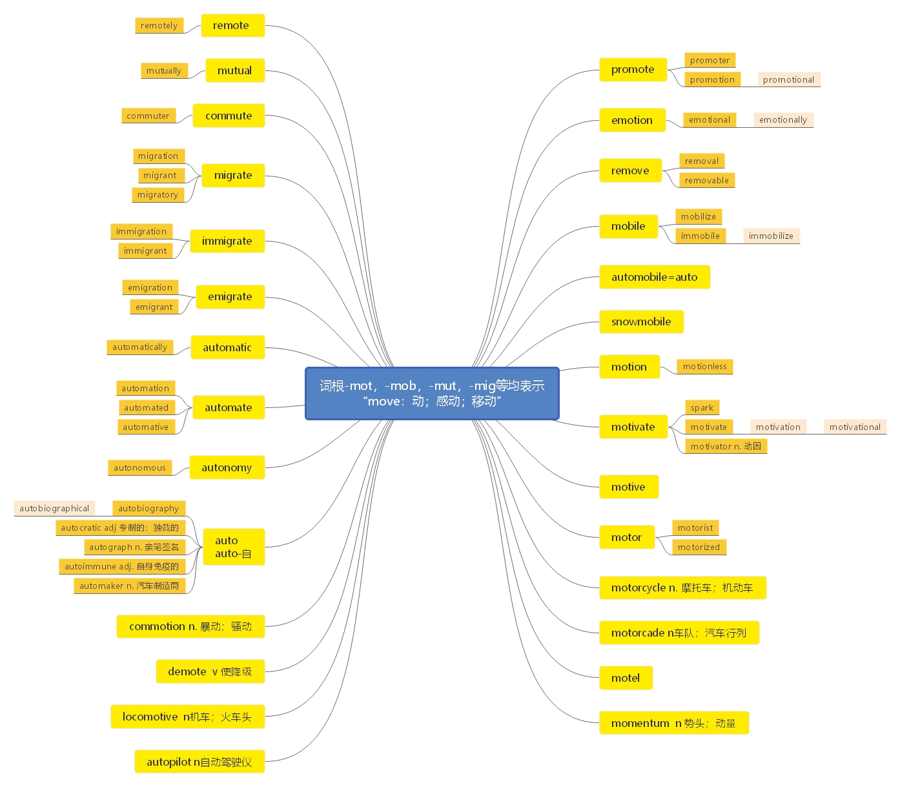

# 第十七节 掌握词根-mot， -mob， -mut， -mig 的含义

***

> 本节课目标
>
> 掌握词根-mot， -mob， -mut， -mig 的含义

***

词根-mot， -mob， -mut， -mig 等均表示“move： 动； 感动； 移动”

> **【课堂笔记】**
>
> 词根-mot， -mob， -mut， -mig 等演变自动词 move
>
> move
>
> \-mot -mut -mob -mig 辅音发生变化，含义不变

***

**promote**  \[prə'məʊt] vt.  [英音](https://dict.youdao.com/dictvoice?audio=promote\&type=1)  [美音](https://dict.youdao.com/dictvoice?audio=promote\&type=2) 促进； 提升； 发扬； 推销 1335

**助记：** pro（ 向前） +mot（ 动） +e→ 使之向前动→促进； 提升； 促销

**搭配：** promote growth/prosperity（考）：促进增长/繁荣 get promoted（考）：晋升

promote the mechanization of agriculture（考）：促进农业机械化

例句： No regular advertiser dare promote a product that fails to live up to the promise of his

advertisement. 没有哪家正规的广告商敢推销与广告承诺不符的产品。

阅读难点： live up to：不辜负、做到 fail to live up to：没能做到

写作例句： 没能做到广告中承诺的效果的推销是非法的。

It is illegal to promote a product that fail to live up to the promise of its effect in the advertisement.

**双语例句:** Is it ethical to promote cigarettes through advertising? [播放](https://dict.youdao.com/dictvoice?audio=Is+it+ethical+to+promote+cigarettes+through+advertising%3F&le=eng&le=eng&type=2)

通过广告推销香烟合乎道德吗？ 

**双语例句:** We need to promote an open exchange of ideas and information. [播放](https://dict.youdao.com/dictvoice?audio=We+need+to+promote+an+open+exchange+of+ideas+and+information.&le=eng&le=eng&type=2)

我们需要促进思想和信息的公开交流。 

**双语例句:** She refused to promote Colin above the low rank of \"legal adviser.\" [播放](https://dict.youdao.com/dictvoice?audio=She+refused+to+promote+Colin+above+the+low+rank+of+%22legal+adviser.%22&le=eng&le=eng&type=2)

她拒绝提升科林，只让他做低级别的“法律顾问”。 

**原声例句:** One of the last decisions of its term will likely cause employers to take greater care in how they choose workers to **promote**. [播放](https://dict.youdao.com/pureaudio?docid=2695194308800572581)

**原声例句:** As Mario Ritter tells us, Justin Bieber is traveling around the world to **promote** his new album. [播放](https://dict.youdao.com/pureaudio?docid=-1984927602355409519)

**原声例句:** \"Now these initiatives comprise a first wave of programs to **promote** global entrepreneurship. [播放](https://dict.youdao.com/pureaudio?docid=5576352686929773792)

**权威例句:** Members must **promote** biodiversity and animal welfare as well as support research and public education programs.  [播放](https://dict.youdao.com/dictvoice?audio=Members+must+promote+biodiversity+and+animal+welfare+as+well+as+support+research+and+public+education+programs.+&le=eng&type=2)

**权威例句:** Such a rule is not likely to improve private investment decision-making or **promote** more efficient markets.  [播放](https://dict.youdao.com/dictvoice?audio=Such+a+rule+is+not+likely+to+improve+private+investment+decision-making+or+promote+more+efficient+markets.+&le=eng&type=2)

**权威例句:** Hey, Schwab brokers **promote** Schwab index funds, when they could send you to cheaper alternatives from Vanguard.  [播放](https://dict.youdao.com/dictvoice?audio=Hey%2C+Schwab+brokers+promote+Schwab+index+funds%2C+when+they+could+send+you+to+cheaper+alternatives+from+Vanguard.+&le=eng&type=2)

***

**promoter**  \[prə'məʊtə] n.  [英音](https://dict.youdao.com/dictvoice?audio=promoter\&type=1)  [美音](https://dict.youdao.com/dictvoice?audio=promoter\&type=2) 发起人；促进者；助长者 8582

**双语例句:** She became a leading promoter of European integration. [播放](https://dict.youdao.com/dictvoice?audio=She+became+a+leading+promoter+of+European+integration.&le=eng&le=eng&type=2)

她成为欧洲一体化的主要支持者。 

**双语例句:** Aaron Copland was always the most energetic promoter of American music. [播放](https://dict.youdao.com/dictvoice?audio=Aaron+Copland+was+always+the+most+energetic+promoter+of+American+music.&le=eng&le=eng&type=2)

阿伦·柯普兰一直是是美国音乐最积极的倡导者。 

**双语例句:** The effect of IGFBP-3 on the growth hormone promoter activity stimulated by triiodothyronine was determined by dual-luciferase reporter assay. [播放](https://dict.youdao.com/dictvoice?audio=The+effect+of+IGFBP-3+on+the+growth+hormone+promoter+activity+stimulated+by+triiodothyronine+was+determined+by+dual-luciferase+reporter+assay.&le=eng&le=eng&type=2)

通过双荧光素酶报告基因测定法测定了 IGFBP-3 对由三碘甲状腺素刺激的生长激素启动子活性的影响。 

**原声例句:** Neal Osawa wants to know about the concert **promoter** Bill Graham and his Fillmore music halls. [播放](https://dict.youdao.com/pureaudio?docid=3027940825925880583)

**原声例句:** It might be a plasmid that contains a **promoter** that works in lung cells and that has the cystic fibrosis gene.

**原声例句:** We'll talk more about promoters as they go on, for now let's just assume that we have a **promoter** that works in this particular cell.

**权威例句:** Suppose you become so besotted with hosting games that you want to become a for-profit **promoter**.  [播放](https://dict.youdao.com/dictvoice?audio=Suppose+you+become+so+besotted+with+hosting+games+that+you+want+to+become+a+for-profit+promoter.+&le=eng&type=2)

**权威例句:** This week, I find myself unable to be much of a **promoter** for the trade.  [播放](https://dict.youdao.com/dictvoice?audio=This+week%2C+I+find+myself+unable+to+be+much+of+a+promoter+for+the+trade.+&le=eng&type=2)

**权威例句:** \"Profits and exposure of the brand name as a **promoter** of good Italian products, \" says Trapani.  [播放](https://dict.youdao.com/dictvoice?audio=%22Profits+and+exposure+of+the+brand+name+as+a+promoter+of+good+Italian+products%2C+%22+says+Trapani.+&le=eng&type=2)

***

**promotion**  \[prə'məʊʃn] n.  [英音](https://dict.youdao.com/dictvoice?audio=promotion\&type=1)  [美音](https://dict.youdao.com/dictvoice?audio=promotion\&type=2) 促进；提升，晋升；推销，促销；发扬，振兴 3823

**双语例句:** She's due for promotion soon. [播放](https://dict.youdao.com/dictvoice?audio=She%27s+due+for+promotion+soon.&le=eng&le=eng&type=2)

她很快该晋升了。 

**双语例句:** Bang went my hopes of promotion. [播放](https://dict.youdao.com/dictvoice?audio=Bang+went+my+hopes+of+promotion.&le=eng&le=eng&type=2)

我晋升的希望破灭了。 

**双语例句:** She works in sales and promotion. [播放](https://dict.youdao.com/dictvoice?audio=She+works+in+sales+and+promotion.&le=eng&le=eng&type=2)

她从事销售和推广工作。 

**原声例句:** Ewell Smith from the Louisiana Seafood **Promotion** and Marketing Board says seafood from the unaffected area is safe to eat. [播放](https://dict.youdao.com/pureaudio?docid=5556410224206661264)

**原声例句:** But the only firefighters who qualified for immediate **promotion** to lieutenant or captain were whites and two Hispanics,no blacks. [播放](https://dict.youdao.com/pureaudio?docid=5639384114416399252)

**原声例句:** But,she said,they had no right to a **promotion**. [播放](https://dict.youdao.com/pureaudio?docid=-5418947251531043597)

**权威例句:** Thus, the winners contribute to the **promotion** of cultural dialogue and the revitalization of Arab culture.  [播放](https://dict.youdao.com/dictvoice?audio=Thus%2C+the+winners+contribute+to+the+promotion+of+cultural+dialogue+and+the+revitalization+of+Arab+culture.+&le=eng&type=2)

**权威例句:** The prize gives special consideration to the **promotion** of mother-tongue languages in developing countries.  [播放](https://dict.youdao.com/dictvoice?audio=The+prize+gives+special+consideration+to+the+promotion+of+mother-tongue+languages+in+developing+countries.+&le=eng&type=2)

**权威例句:** And Elliott believes there is still plenty of time for the club to mount a **promotion** challenge.  [播放](https://dict.youdao.com/dictvoice?audio=And+Elliott+believes+there+is+still+plenty+of+time+for+the+club+to+mount+a+promotion+challenge.+&le=eng&type=2)

***

**promotional**  \[prə'məʊʃənl] adj.  [英音](https://dict.youdao.com/dictvoice?audio=promotional\&type=1)  [美音](https://dict.youdao.com/dictvoice?audio=promotional\&type=2) 增进的； 奖励的； 促销的 9782

**双语例句:** The school made a short promotional video. [播放](https://dict.youdao.com/dictvoice?audio=The+school+made+a+short+promotional+video.&le=eng&le=eng&type=2)

学校录制了一个宣传短片。 

**双语例句:** New rules on amateurism allow payment for promotional work. [播放](https://dict.youdao.com/dictvoice?audio=New+rules+on+amateurism+allow+payment+for+promotional+work.&le=eng&le=eng&type=2)

新的业余工作条例规定，做促销工作可获得报酬。 

**双语例句:** In a bold promotional stunt for the movie, he smashed his car into a passing truck. [播放](https://dict.youdao.com/dictvoice?audio=In+a+bold+promotional+stunt+for+the+movie%2C+he+smashed+his+car+into+a+passing+truck.&le=eng&le=eng&type=2)

在那部影片大胆的宣传噱头中，他把自己的汽车撞向一辆过路的卡车。 

**权威例句:** The company also provides other marketing and **promotional** services, such as online advertising and co-branded credit card agreements.  [播放](https://dict.youdao.com/dictvoice?audio=The+company+also+provides+other+marketing+and+promotional+services%2C+such+as+online+advertising+and+co-branded+credit+card+agreements.+&le=eng&type=2)

**权威例句:** FarmVille maker Zynga is in discussions with Lady Gaga over a potential **promotional** deal.  [播放](https://dict.youdao.com/dictvoice?audio=FarmVille+maker+Zynga+is+in+discussions+with+Lady+Gaga+over+a+potential+promotional+deal.+&le=eng&type=2)

**权威例句:** An excuse for the **promotional** sharks, both bull and bear, and stir up the waters.  [播放](https://dict.youdao.com/dictvoice?audio=An+excuse+for+the+promotional+sharks%2C+both+bull+and+bear%2C+and+stir+up+the+waters.+&le=eng&type=2)

***

**emotion**  \[ɪ'məʊʃ(ə)n] n.  [英音](https://dict.youdao.com/dictvoice?audio=emotion\&type=1)  [美音](https://dict.youdao.com/dictvoice?audio=emotion\&type=2) 情感； 情绪 2135

**助记：** e（ =ex： 向外） +mot（ =move： 感动； 动） →动情→情绪； 情感

**双语例句:** Jealousy is a primal emotion. [播放](https://dict.youdao.com/dictvoice?audio=Jealousy+is+a+primal+emotion.&le=eng&le=eng&type=2)

嫉妒是一种原始情感。 

**双语例句:** Mandy's predominant emotion was confusion. [播放](https://dict.youdao.com/dictvoice?audio=Mandy%27s+predominant+emotion+was+confusion.&le=eng&le=eng&type=2)

曼迪的主导情绪是困惑。 

**双语例句:** It is impossible to separate belief from emotion. [播放](https://dict.youdao.com/dictvoice?audio=It+is+impossible+to+separate+belief+from+emotion.&le=eng&le=eng&type=2)

信仰和感情是分不开的。 

**原声例句:** However,because Hank's songs told of real-life troubles with such great **emotion**, something unusual began to happen to his music. [播放](https://dict.youdao.com/pureaudio?docid=-1249844586025983522)

**原声例句:** He seemed to kill for no reason, and with no **emotion**, as if taking someone's life meant nothing. [播放](https://dict.youdao.com/pureaudio?docid=921224408963127643)

**原声例句:** But once it was built, family members of the dead, Vietnam veterans, and the general public accepted its beauty and strong **emotion**. [播放](https://dict.youdao.com/pureaudio?docid=-9078354828816800625)

**权威例句:** Ladies and gentlemen, the President just spoke about the Korean **emotion** that we call jeong in Korea.  [播放](https://dict.youdao.com/dictvoice?audio=Ladies+and+gentlemen%2C+the+President+just+spoke+about+the+Korean+emotion+that+we+call+jeong+in+Korea.+&le=eng&type=2)

**权威例句:** About the only tangible **emotion** Poizner seems to get from his teaching experience is frustration.  [播放](https://dict.youdao.com/dictvoice?audio=About+the+only+tangible+emotion+Poizner+seems+to+get+from+his+teaching+experience+is+frustration.+&le=eng&type=2)

**权威例句:** ' I was inspired and taken by the whole **emotion** of what was going on.  [播放](https://dict.youdao.com/dictvoice?audio=%27+I+was+inspired+and+taken+by+the+whole+emotion+of+what+was+going+on.+&le=eng&type=2)

***

**emotional**  \[ɪ'məʊʃ(ə)n(ə)l] adj.  [英音](https://dict.youdao.com/dictvoice?audio=emotional\&type=1)  [美音](https://dict.youdao.com/dictvoice?audio=emotional\&type=2) 情绪的； 易激动的； 感动人的 1625

**双语例句:** My emotional turmoil had drained me. [播放](https://dict.youdao.com/dictvoice?audio=My+emotional+turmoil+had+drained+me.&le=eng&le=eng&type=2)

困惑焦灼的情绪使我心力交瘁。 

**双语例句:** They made an emotional appeal for help. [播放](https://dict.youdao.com/dictvoice?audio=They+made+an+emotional+appeal+for+help.&le=eng&le=eng&type=2)

他们情绪激动地恳求救助。 

**双语例句:** The debate was highly emotional at times. [播放](https://dict.youdao.com/dictvoice?audio=The+debate+was+highly+emotional+at+times.&le=eng&le=eng&type=2)

辩论有时非常情绪化。 

**原声例句:** The study found that the patients' risk of suffering a fall was higher for up to one hour after **emotional** stress. [播放](https://dict.youdao.com/pureaudio?docid=-1560927210988057083)

**原声例句:** That is because critics say Miller was able to dramatize the **emotional** pain that average people suffer in their daily lives. [播放](https://dict.youdao.com/pureaudio?docid=3644832008492731958)

**原声例句:** The representative from the Pacific island nation of Tuvalu made an **emotional** appeal for a treaty with legal force. [播放](https://dict.youdao.com/pureaudio?docid=4061844894240889325)

**权威例句:** And I can tell you that it's taken an **emotional** toll on the people here.  [播放](https://dict.youdao.com/dictvoice?audio=And+I+can+tell+you+that+it%27s+taken+an+emotional+toll+on+the+people+here.+&le=eng&type=2)

**权威例句:** \"It's about heart because our nations share a proud and **emotional** history, \" he said.  [播放](https://dict.youdao.com/dictvoice?audio=%22It%27s+about+heart+because+our+nations+share+a+proud+and+emotional+history%2C+%22+he+said.+&le=eng&type=2)

**权威例句:** When feelings run high, an ill-judged letter can cause as much **emotional** damage as any dashed-off online posting.  [播放](https://dict.youdao.com/dictvoice?audio=When+feelings+run+high%2C+an+ill-judged+letter+can+cause+as+much+emotional+damage+as+any+dashed-off+online+posting.+&le=eng&type=2)

***

**emotionally**  \[ɪˈməʊʃənəli] adv.  [英音](https://dict.youdao.com/dictvoice?audio=emotionally\&type=1)  [美音](https://dict.youdao.com/dictvoice?audio=emotionally\&type=2) 感情上； 情绪上； 令人激动地； 情绪冲动地 4704

**双语例句:** He was emotionally unstable. [播放](https://dict.youdao.com/dictvoice?audio=He+was+emotionally+unstable.&le=eng&le=eng&type=2)

他情绪多变。 

**双语例句:** He said that we were emotionally immature. [播放](https://dict.youdao.com/dictvoice?audio=He+said+that+we+were+emotionally+immature.&le=eng&le=eng&type=2)

他说我们在感情上是不成熟的。 

**双语例句:** They have suffered physically and emotionally. [播放](https://dict.youdao.com/dictvoice?audio=They+have+suffered+physically+and+emotionally.&le=eng&le=eng&type=2)

他们遭受了肉体上和感情上的折磨。 

**原声例句:** We all know that some people do not seem as **emotionally** strong as others when life gets difficult. [播放](https://dict.youdao.com/pureaudio?docid=-223496931036748649)

**原声例句:** Aurelio's story was no surprise to another commenter,Katie Kivenko: When you listen to your favorite songs, you feel **emotionally** high and it moves you to action. [播放](https://dict.youdao.com/pureaudio?docid=1511275977241206567)

**原声例句:** Both Luisa and Matt have been hurt **emotionally** by their experiences. [播放](https://dict.youdao.com/pureaudio?docid=7449514333402484677)

**权威例句:** These girls are married off before they are physically or **emotionally** mature enough to become wives or mothers.  [播放](https://dict.youdao.com/dictvoice?audio=These+girls+are+married+off+before+they+are+physically+or+emotionally+mature+enough+to+become+wives+or+mothers.+&le=eng&type=2)

**权威例句:** Yet somehow, it seems that an **emotionally** charged group has gotten **emotionally** attached to gold.  [播放](https://dict.youdao.com/dictvoice?audio=Yet+somehow%2C+it+seems+that+an+emotionally+charged+group+has+gotten+emotionally+attached+to+gold.+&le=eng&type=2)

**权威例句:** Humans are also hardwired **emotionally** to generally avoid confrontation and seek the approval of others.  [播放](https://dict.youdao.com/dictvoice?audio=Humans+are+also+hardwired+emotionally+to+generally+avoid+confrontation+and+seek+the+approval+of+others.+&le=eng&type=2)

***

**remove**  \[rɪ'muːv] vt.  [英音](https://dict.youdao.com/dictvoice?audio=remove\&type=1)  [美音](https://dict.youdao.com/dictvoice?audio=remove\&type=2) 移动， 迁移； 开除； 调动 879

**助记：** re（ 又、 再） +move（ 移动） →再移动→移动、 移除

例句： Last September, the 28-year-old Chicago resident \_\_\_\_\_\_\_\_ to cut plastics out of her life.

A) resolved B) recovered C) removed D) retreated

解析： 原文翻译“去年九月， 这位 28 岁的芝加哥居民下定决心在生活中远离塑料”， 故选 A，

resolve to do sth.：下决心..； B：恢复、弥补； C：移走、移动； D：撤退

> **【课堂笔记】**
>
> re-
>
> 相反 resent
>
> 返回；回来 return
>
> 反复; 又；再 repeat

**双语例句:** Scuff marks from shoes are difficult to remove. [播放](https://dict.youdao.com/dictvoice?audio=Scuff+marks+from+shoes+are+difficult+to+remove.&le=eng&le=eng&type=2)

鞋上的擦痕很难去除。 

**双语例句:** The logical treatment is to remove this blockage. [播放](https://dict.youdao.com/dictvoice?audio=The+logical+treatment+is+to+remove+this+blockage.&le=eng&le=eng&type=2)

合理的处理方法是清除这种堵塞物。 

**双语例句:** Once the turkey has defrosted, remove the giblets. [播放](https://dict.youdao.com/dictvoice?audio=Once+the+turkey+has+defrosted%2C+remove+the+giblets.&le=eng&le=eng&type=2)

一旦火鸡解冻，立刻移除鸡杂。 

**原声例句:** But recently, civil liberties groups had threatened to take the county to court if it did not **remove** them. [播放](https://dict.youdao.com/pureaudio?docid=7823198449615827376)

**原声例句:** Eradicating weeds means that you have to **remove** all the seeds and roots so the plants will not grow back. [播放](https://dict.youdao.com/pureaudio?docid=-6893430201172442859)

**原声例句:** Tilling can **remove** weeds and the waste from last season's crops and help break down old plant material into fertilizer. [播放](https://dict.youdao.com/pureaudio?docid=-5811747436479783174)

**权威例句:** Instead of having to **remove** and insert the ammo cartridge, giving it a firm jab suffices.  [播放](https://dict.youdao.com/dictvoice?audio=Instead+of+having+to+remove+and+insert+the+ammo+cartridge%2C+giving+it+a+firm+jab+suffices.+&le=eng&type=2)

**权威例句:** For our economy to thrive once again, we must **remove** these barriers to job creation.  [播放](https://dict.youdao.com/dictvoice?audio=For+our+economy+to+thrive+once+again%2C+we+must+remove+these+barriers+to+job+creation.+&le=eng&type=2)

**权威例句:** The first team to **remove** 25 marbles wins the match and moves on to the next bracket.  [播放](https://dict.youdao.com/dictvoice?audio=The+first+team+to+remove+25+marbles+wins+the+match+and+moves+on+to+the+next+bracket.+&le=eng&type=2)

***

**removable**  \[rɪ'muːvəbl] adj.  [英音](https://dict.youdao.com/dictvoice?audio=removable\&type=1)  [美音](https://dict.youdao.com/dictvoice?audio=removable\&type=2) 可移动的；可去掉的；可免职的 15229

**双语例句:** On some statues the heads were removable. [播放](https://dict.youdao.com/dictvoice?audio=On+some+statues+the+heads+were+removable.&le=eng&le=eng&type=2)

有些雕像的头是可以摘下来的。 

**双语例句:** The majority of laptop computers come with removable batteries. [播放](https://dict.youdao.com/dictvoice?audio=The+majority+of+laptop+computers+come+with+removable+batteries.&le=eng&le=eng&type=2)

多数笔记本电脑配备的是可更换电池。 

**双语例句:** The virus is believed to have spread through these removable drives. [播放](https://dict.youdao.com/dictvoice?audio=The+virus+is+believed+to+have+spread+through+these+removable+drives.&le=eng&le=eng&type=2)

病毒就是通过这些移动硬盘传播的。 

**权威例句:** Mr. Dimora shaved for the trial, so the Dimora puppet has a **removable** beard.  [播放](https://dict.youdao.com/dictvoice?audio=Mr.+Dimora+shaved+for+the+trial%2C+so+the+Dimora+puppet+has+a+removable+beard.+&le=eng&type=2)

**权威例句:** It's got 8 speakers, a subwoofer, a **removable** keyboard, slot-load DVD drive, a \"leather-like\" surface.  [播放](https://dict.youdao.com/dictvoice?audio=It%27s+got+8+speakers%2C+a+subwoofer%2C+a+removable+keyboard%2C+slot-load+DVD+drive%2C+a+%22leather-like%22+surface.+&le=eng&type=2)

**权威例句:** Nor is the market for **removable** storage likely to turn around any time soon.  [播放](https://dict.youdao.com/dictvoice?audio=Nor+is+the+market+for+removable+storage+likely+to+turn+around+any+time+soon.+&le=eng&type=2)

***

**removal**  \[rɪ'muːv(ə)l] n.  [英音](https://dict.youdao.com/dictvoice?audio=removal\&type=1)  [美音](https://dict.youdao.com/dictvoice?audio=removal\&type=2) 移动；免职；排除；搬迁 4763

> **【课堂笔记】**
>
> \-al -an -ar
>
> （ 1） 形容词后缀， 表示“ …的”
>
> （ 2） 名词后缀，表示“人/物”

**双语例句:** They rejected a demand for the removal of all nuclear weapons. [播放](https://dict.youdao.com/dictvoice?audio=They+rejected+a+demand+for+the+removal+of+all+nuclear+weapons.&le=eng&le=eng&type=2)

他们拒绝了清除所有核武器的要求。 

**双语例句:** What they expected to be the removal of a small lump turned out to be major surgery. [播放](https://dict.youdao.com/dictvoice?audio=What+they+expected+to+be+the+removal+of+a+small+lump+turned+out+to+be+major+surgery.&le=eng&le=eng&type=2)

他们本以为只是切除一个小肿块，结果却成了个大手术。 

**双语例句:** Nearby Malaysia may have the right to order the wreck's removal, the newspaper said. [播放](https://dict.youdao.com/dictvoice?audio=Nearby+Malaysia+may+have+the+right+to+order+the+wreck%27s+removal%2C+the+newspaper+said.&le=eng&le=eng&type=2)

附近的马来西亚可能有权命令移除残骸，该报纸说。 

**原声例句:** **Removal** from office would have established the idea that the president could serve only with the approval of Congress. [播放](https://dict.youdao.com/pureaudio?docid=-6909212849568819021)

**原声例句:** The idea is that its **removal** from the body and purification makes it into something different that can be patented. [播放](https://dict.youdao.com/pureaudio?docid=-5333074502401545555)

**原声例句:** An untreated or incorrectly treated bite might require the **removal** of a bitten foot, for example,or an arm. [播放](https://dict.youdao.com/pureaudio?docid=-2632110161280722258)

**权威例句:** Better tracking data would be required to maximize the effectiveness of debris **removal** prizes.  [播放](https://dict.youdao.com/dictvoice?audio=Better+tracking+data+would+be+required+to+maximize+the+effectiveness+of+debris+removal+prizes.+&le=eng&type=2)

**权威例句:** Some Buddhists have also demanded the **removal** of a Hindu temple in the area.  [播放](https://dict.youdao.com/dictvoice?audio=Some+Buddhists+have+also+demanded+the+removal+of+a+Hindu+temple+in+the+area.+&le=eng&type=2)

**权威例句:** Collective wage-bargaining is not dead even Germany's conservative political parties hesitate to campaign for its **removal**.  [播放](https://dict.youdao.com/dictvoice?audio=Collective+wage-bargaining+is+not+dead+even+Germany%27s+conservative+political+parties+hesitate+to+campaign+for+its+removal.+&le=eng&type=2)

***

**mobile**  \['məubail] a.  [英音](https://dict.youdao.com/dictvoice?audio=mobile\&type=1)  [美音](https://dict.youdao.com/dictvoice?audio=mobile\&type=2) 可以动的

**助记：** mob（ =move： 动） +ile（ =ible： 可以、 能） →可以动的→移动的、 移动电话

**搭配：** mobile telephone（考）：移动电话

**双语例句:** What's your mobile number? [播放](https://dict.youdao.com/dictvoice?audio=What%27s+your+mobile+number%3F&le=eng&le=eng&type=2)

你的手机号码是多少？ 

**双语例句:** My mobile phone is extremely useful. [播放](https://dict.youdao.com/dictvoice?audio=My+mobile+phone+is+extremely+useful.&le=eng&le=eng&type=2)

我的手机极为有用。 

**双语例句:** He forgot the charger for his mobile phone. [播放](https://dict.youdao.com/dictvoice?audio=He+forgot+the+charger+for+his+mobile+phone.&le=eng&le=eng&type=2)

他忘了带手机充电器。 

**原声例句:** The latest version of the box uses **mobile** phone technology, and solar panels in case the electrical power fails. [播放](https://dict.youdao.com/pureaudio?docid=5329336555197367224)

**原声例句:** Gary Shapiro, president of the Consumer Electronics Association, predicted that one area of strong sales this year will be **mobile** phones. [播放](https://dict.youdao.com/pureaudio?docid=-5998151377501360264)

**原声例句:** The Saudi government told the country's three **mobile** phone operators to stop BlackBerry service for businesses and individuals this Friday. [播放](https://dict.youdao.com/pureaudio?docid=6387552269826378211)

**权威例句:** The **Mobile** International segment covers the following sub segments: Germany, Belgium, and Rest of the World.  [播放](https://dict.youdao.com/dictvoice?audio=The+Mobile+International+segment+covers+the+following+sub+segments%3A+Germany%2C+Belgium%2C+and+Rest+of+the+World.+&le=eng&type=2)

**权威例句:** The **mobile** telephone business is making nice money for Western firms but also for indigenous hustlers.  [播放](https://dict.youdao.com/dictvoice?audio=The+mobile+telephone+business+is+making+nice+money+for+Western+firms+but+also+for+indigenous+hustlers.+&le=eng&type=2)

**权威例句:** Thirdly, we're envisioning a cheaper, **mobile** **mobile** iPad fitting into classrooms much better than the original.  [播放](https://dict.youdao.com/dictvoice?audio=Thirdly%2C+we%27re+envisioning+a+cheaper%2C+mobile+mobile+iPad+fitting+into+classrooms+much+better+than+the+original.+&le=eng&type=2)

***

**mobilize**  \['məubilaiz] v.  [英音](https://dict.youdao.com/dictvoice?audio=mobilize\&type=1)  [美音](https://dict.youdao.com/dictvoice?audio=mobilize\&type=2) 动员、 组织、 调动

**助记：** mob（ 动） +ilize（ =ile+ize： 复合使动词后缀） →使动起来→调动; 动员; 组织

**双语例句:** The troops were ordered to mobilize. [播放](https://dict.youdao.com/dictvoice?audio=The+troops+were+ordered+to+mobilize.&le=eng&le=eng&type=2)

部队接到了动员令。 

**双语例句:** If you could mobilize the resources, you could get it done. [播放](https://dict.youdao.com/dictvoice?audio=If+you+could+mobilize+the+resources%2C+you+could+get+it+done.&le=eng&le=eng&type=2)

如果你能调动资源，你就能完成它。 

**双语例句:** He helped energize and mobilize millions of people around the nation. [播放](https://dict.youdao.com/dictvoice?audio=He+helped+energize+and+mobilize+millions+of+people+around+the+nation.&le=eng&le=eng&type=2)

他参与激励并动员了全国数百万人。 

**原声例句:** After 50 years of silence, I think the time has come to take stock and say, maybe we should **mobilize** all of the sciences to look for anything fishy, anything weird,any anomaly, both in our own little corner of the universe here on Earth and in the solar system, and far out across the galaxy.\" [播放](https://dict.youdao.com/pureaudio?docid=7089195697561819077)

**原声例句:** Where do we go from here? How do we **mobilize**?

**原声例句:** It also kind of implies hope, and it's about what happens when people try to **mobilize** these braves gars, these workers in the mines.

**权威例句:** We were able to **mobilize** physicians and employees into hundreds of teams to address specific expenses.  [播放](https://dict.youdao.com/dictvoice?audio=We+were+able+to+mobilize+physicians+and+employees+into+hundreds+of+teams+to+address+specific+expenses.+&le=eng&type=2)

**权威例句:** The key step is to **mobilize** all stakeholders around a set of shared goals.  [播放](https://dict.youdao.com/dictvoice?audio=The+key+step+is+to+mobilize+all+stakeholders+around+a+set+of+shared+goals.+&le=eng&type=2)

**权威例句:** Because many times all you need to **mobilize** is an approval process (Yes or No).  [播放](https://dict.youdao.com/dictvoice?audio=Because+many+times+all+you+need+to+mobilize+is+an+approval+process+%28Yes+or+No%29.+&le=eng&type=2)

***

**immobile**  \[ɪ'məʊbaɪl] adj.  [英音](https://dict.youdao.com/dictvoice?audio=immobile\&type=1)  [美音](https://dict.youdao.com/dictvoice?audio=immobile\&type=2) 固定的； 不变的； 稳定的 17253

**双语例句:** She stood immobile by the window. [播放](https://dict.youdao.com/dictvoice?audio=She+stood+immobile+by+the+window.&le=eng&le=eng&type=2)

她一动不动地靠窗站着。 

**双语例句:** A riding accident left him immobile. [播放](https://dict.youdao.com/dictvoice?audio=A+riding+accident+left+him+immobile.&le=eng&le=eng&type=2)

一次骑术事故使他瘫痪。 

**双语例句:** His illness has left him completely immobile. [播放](https://dict.youdao.com/dictvoice?audio=His+illness+has+left+him+completely+immobile.&le=eng&le=eng&type=2)

他的病使他完全丧失了活动能力。 

**权威例句:** Candy knew just what El Lobo, with his pliant body and **immobile** gaze, was up to.  [播放](https://dict.youdao.com/dictvoice?audio=Candy+knew+just+what+El+Lobo%2C+with+his+pliant+body+and+immobile+gaze%2C+was+up+to.+&le=eng&type=2)

**权威例句:** And as an **immobile** object, housing is one of the easiest assets for governments to tax.  [播放](https://dict.youdao.com/dictvoice?audio=And+as+an+immobile+object%2C+housing+is+one+of+the+easiest+assets+for+governments+to+tax.+&le=eng&type=2)

**权威例句:** Frustrated, the more successful eventually move to better-run communities, leaving the poor and **immobile** behind.  [播放](https://dict.youdao.com/dictvoice?audio=Frustrated%2C+the+more+successful+eventually+move+to+better-run+communities%2C+leaving+the+poor+and+immobile+behind.+&le=eng&type=2)

***

**immobilize**  \[ɪ'məʊbɪlaɪz]vt.  [英音](https://dict.youdao.com/dictvoice?audio=immobilize\&type=1)  [美音](https://dict.youdao.com/dictvoice?audio=immobilize\&type=2) 使不动；使固定；使停止流通 17376

> **【课堂笔记】**
>
> im- 表否定=not

**双语例句:** Why let fear immobilize me? [播放](https://dict.youdao.com/dictvoice?audio=Why+let+fear+immobilize+me%3F&le=eng&le=eng&type=2)

为什么畏惧使我无法移动？ 

**双语例句:** Immobilize the dog and take them to a vet immediately. [播放](https://dict.youdao.com/dictvoice?audio=Immobilize+the+dog+and+take+them+to+a+vet+immediately.&le=eng&le=eng&type=2)

将狗狗固定住并立即去见兽医。 

**双语例句:** It was showed that all of the carriers could immobilize the BSA. [播放](https://dict.youdao.com/dictvoice?audio=It+was+showed+that+all+of+the+carriers+could+immobilize+the+BSA.&le=eng&le=eng&type=2)

研究表明，三种方法制备的载体均可对BS A进行固定化。 

**权威例句:** Reverie, dreaming, and memory threaten to **immobilize** the Petterson protagonist, to take him out of time, to set him drifting in deep waters.  [播放](https://dict.youdao.com/dictvoice?audio=Reverie%2C+dreaming%2C+and+memory+threaten+to+immobilize+the+Petterson+protagonist%2C+to+take+him+out+of+time%2C+to+set+him+drifting+in+deep+waters.+&le=eng&type=2)

**权威例句:** Guinea worm disease is usually non-fatal, but causes crippling pain and can **immobilize** its victims from being able to work, farm and function.  [播放](https://dict.youdao.com/dictvoice?audio=Guinea+worm+disease+is+usually+non-fatal%2C+but+causes+crippling+pain+and+can+immobilize+its+victims+from+being+able+to+work%2C+farm+and+function.+&le=eng&type=2)

**权威例句:** The Uprightsleeper looks like a neck brace the kind worn to **immobilize** the cervical spine after a traumatic injury (although it \"makes no medical claims\") and facilitates sleeping while sitting straight up.  [播放](https://dict.youdao.com/dictvoice?audio=The+Uprightsleeper+looks+like+a+neck+brace+the+kind+worn+to+immobilize+the+cervical+spine+after+a+traumatic+injury+%28although+it+%22makes+no+medical+claims%22%29+and+facilitates+sleeping+while+sitting+straight+up.+&le=eng&type=2)

***

**automobile**  \['ɔːtəməbiːl] n.  [英音](https://dict.youdao.com/dictvoice?audio=automobile\&type=1)  [美音](https://dict.youdao.com/dictvoice?audio=automobile\&type=2) 汽车 4042

> **【课堂笔记】**
>
> automobile=汽车=auto

**双语例句:** Thanks to the automobile, Americans soon had a freedom of movement previously unknown. [播放](https://dict.youdao.com/dictvoice?audio=Thanks+to+the+automobile%2C+Americans+soon+had+a+freedom+of+movement+previously+unknown.&le=eng&le=eng&type=2)

由于有了汽车，美国人很快就获得了前所未有的行动自由。 

**双语例句:** The parts of an automobile are standardized. [播放](https://dict.youdao.com/dictvoice?audio=The+parts+of+an+automobile+are+standardized.&le=eng&le=eng&type=2)

汽车零件是标准化了的。 

**双语例句:** Automobile accidents maim many people each year. [播放](https://dict.youdao.com/dictvoice?audio=Automobile+accidents+maim+many+people+each+year.&le=eng&le=eng&type=2)

汽车车祸每年使许多人残废。 

**原声例句:** Under one picture she wrote: \"While machines are making great progress in **automobile** factories, the workers might be under-paid. [播放](https://dict.youdao.com/pureaudio?docid=6372757237412915013)

**原声例句:** Volvo was the first **automobile** manufacturer to offer the modern seat belt as a permanent addition to its cars. [播放](https://dict.youdao.com/pureaudio?docid=646755888380033762)

**原声例句:** Nelson Jackson and his friend, Sewall Crocker, were honored as the first to cross the United States in an **automobile**. [播放](https://dict.youdao.com/pureaudio?docid=9170057009041083218)

**权威例句:** It is no surprise that the luxury **automobile** manufacturers are jumping on the nanotech bandwagon.  [播放](https://dict.youdao.com/dictvoice?audio=It+is+no+surprise+that+the+luxury+automobile+manufacturers+are+jumping+on+the+nanotech+bandwagon.+&le=eng&type=2)

**权威例句:** The choice to stop the American **automobile** industry from unraveling was the right one.  [播放](https://dict.youdao.com/dictvoice?audio=The+choice+to+stop+the+American+automobile+industry+from+unraveling+was+the+right+one.+&le=eng&type=2)

**权威例句:** Mr Sahlgren alleged that the trio falsified parts of Saab Automobile's accounts between 2010 and 2011.  [播放](https://dict.youdao.com/dictvoice?audio=Mr+Sahlgren+alleged+that+the+trio+falsified+parts+of+Saab+Automobile%27s+accounts+between+2010+and+2011.+&le=eng&type=2)

***

**snowmobile**  \['snəʊməbiːl] n.  [英音](https://dict.youdao.com/dictvoice?audio=snowmobile\&type=1)  [美音](https://dict.youdao.com/dictvoice?audio=snowmobile\&type=2) 雪上汽车； 机动雪橇 14152

**双语例句:** One dog has been killed and multiple dogs have been injured by a snowmobile driver in what appears to be an intentional attack on competitors in the Iditarod Race in Alaska. [播放](https://dict.youdao.com/dictvoice?audio=One+dog+has+been+killed+and+multiple+dogs+have+been+injured+by+a+snowmobile+driver+in+what+appears+to+be+an+intentional+attack+on+competitors+in+the+Iditarod+Race+in+Alaska.&le=eng&le=eng&type=2)

在阿拉斯加州举行的艾迪塔罗德狗拉雪橇比赛中，在针对参赛者的一起故意袭击事件里，一名摩托雪橇手杀死了一条狗，并使多条狗受伤。 

**双语例句:** His team was hit by a snowmobile driver, injuring several dogs and killing a 3-year-old male dog. [播放](https://dict.youdao.com/dictvoice?audio=His+team+was+hit+by+a+snowmobile+driver%2C+injuring+several+dogs+and+killing+a+3-year-old+male+dog.&le=eng&le=eng&type=2)

一名摩托雪橇手撞到了他的团队，有几只狗受了伤，还有一只三岁大的公狗被害。 

**双语例句:** A snowmobile driver had repeatedly attempted to harm her and her team, and one of Zirkle's dogs had received a non-life-threatening injury. [播放](https://dict.youdao.com/dictvoice?audio=A+snowmobile+driver+had+repeatedly+attempted+to+harm+her+and+her+team%2C+and+one+of+Zirkle%27s+dogs+had+received+a+non-life-threatening+injury.&le=eng&le=eng&type=2)

一名摩托雪橇手曾多次试图攻击她和她的团队，而泽克尔的其中一只狗也受到了非致命性的伤害。 

**权威例句:** It weighs about 800 pounds and traverses the ice on two repurposed **snowmobile** tracks.  [播放](https://dict.youdao.com/dictvoice?audio=It+weighs+about+800+pounds+and+traverses+the+ice+on+two+repurposed+snowmobile+tracks.+&le=eng&type=2)

**权威例句:** Finally, an Army National Guardsman got to her on a **snowmobile** after 4 a.m.  [播放](https://dict.youdao.com/dictvoice?audio=Finally%2C+an+Army+National+Guardsman+got+to+her+on+a+snowmobile+after+4+a.m.+&le=eng&type=2)

**权威例句:** Their **snowmobile** then appears to have crashed through protective netting, before plunging a further 100 metres.  [播放](https://dict.youdao.com/dictvoice?audio=Their+snowmobile+then+appears+to+have+crashed+through+protective+netting%2C+before+plunging+a+further+100+metres.+&le=eng&type=2)

***

**motion**  \['məʊʃ(ə)n] n.  [英音](https://dict.youdao.com/dictvoice?audio=motion\&type=1)  [美音](https://dict.youdao.com/dictvoice?audio=motion\&type=2) 动作； 请求； 手势； 移动； 意向 1836

**助记：** mot（ 动） +ion（ 名词后缀） →移动； 运动

**搭配：** motion sickness（考）：晕动病（指晕船、晕车等）

例句： Intellectual property results from creative thinking and may include products, \_\_\_\_\_\_\_\_

processes, and ideas.

A. services B. reserves C. assumptions D. motions

解析： 原文翻译“知识产权源于创造性的思维， 并且可能包括产品、 服务、 工艺和想法”， 故

选 A； B：储存； C：假设； D：运动

> **【课堂笔记】**
>
> motion movie 动作片
>
> sth. is in motion 某物正在移动中&#x20;

**双语例句:** Some scenes were filmed in slow motion. [播放](https://dict.youdao.com/dictvoice?audio=Some+scenes+were+filmed+in+slow+motion.&le=eng&le=eng&type=2)

几组镜头被拍成了慢动作。 

**双语例句:** This exercise is done in one smooth motion. [播放](https://dict.youdao.com/dictvoice?audio=This+exercise+is+done+in+one+smooth+motion.&le=eng&le=eng&type=2)

这套体操是由一个流畅的动作完成的。 

**双语例句:** He made a neat chopping motion with his hand. [播放](https://dict.youdao.com/dictvoice?audio=He+made+a+neat+chopping+motion+with+his+hand.&le=eng&le=eng&type=2)

他用手做了一个干净利落的砍的动作。 

**原声例句:** Next Sunday night, the Academy of **Motion** Picture Arts and Sciences will present the Academy Awards in Los Angeles,California. [播放](https://dict.youdao.com/pureaudio?docid=-3438283862654261281)

**原声例句:** Music Nominees The Academy of **Motion** Picture Arts and Sciences also presents Oscars to the best movie music and songs. [播放](https://dict.youdao.com/pureaudio?docid=-1560447899519823535)

**原声例句:** A group of top movie industry professionals formed the Academy of **Motion** Picture Arts and Sciences in nineteen twenty-seven. [播放](https://dict.youdao.com/pureaudio?docid=-1472426765833081987)

**权威例句:** Shadow Treasury Minister Cathy Jamieson told the House that Labour would support the backbench **motion**.  [播放](https://dict.youdao.com/dictvoice?audio=Shadow+Treasury+Minister+Cathy+Jamieson+told+the+House+that+Labour+would+support+the+backbench+motion.+&le=eng&type=2)

**权威例句:** Its slow-motion, pythonesque squeeze was initially inadvertent, but then, about two years ago, deliberate.  [播放](https://dict.youdao.com/dictvoice?audio=Its+slow-motion%2C+pythonesque+squeeze+was+initially+inadvertent%2C+but+then%2C+about+two+years+ago%2C+deliberate.+&le=eng&type=2)

**权威例句:** Hillcrest's **motion** solutions, based on Freespace technology, simplify the design of **motion** enabled products.  [播放](https://dict.youdao.com/dictvoice?audio=Hillcrest%27s+motion+solutions%2C+based+on+Freespace+technology%2C+simplify+the+design+of+motion+enabled+products.+&le=eng&type=2)

***

**motionless**  \['məʊʃnləs] adj.  [英音](https://dict.youdao.com/dictvoice?audio=motionless\&type=1)  [美音](https://dict.youdao.com/dictvoice?audio=motionless\&type=2) 静止的； 不运动的 9709

**双语例句:** She stood absolutely motionless. [播放](https://dict.youdao.com/dictvoice?audio=She+stood+absolutely+motionless.&le=eng&le=eng&type=2)

她纹丝不动地站在那里。 

**双语例句:** He has this ability of being able to remain as motionless as a statue, for hours on end. [播放](https://dict.youdao.com/dictvoice?audio=He+has+this+ability+of+being+able+to+remain+as+motionless+as+a+statue%2C+for+hours+on+end.&le=eng&le=eng&type=2)

他有能像雕塑一样连续数小时保持静止的能力。 

**双语例句:** He stood motionless, one hand to his ear. [播放](https://dict.youdao.com/dictvoice?audio=He+stood+motionless%2C+one+hand+to+his+ear.&le=eng&le=eng&type=2)

他一动不动地站着，一只手放在耳朵上。 

**原声例句:** I hardly breathed. I held the lantern **motionless**. [播放](https://dict.youdao.com/pureaudio?docid=-2363034146919579364)

**原声例句:** Television footage of the facility's parade ground showed several bodies lying **motionless**. [播放](https://dict.youdao.com/pureaudio?docid=6550874026918341838)

**权威例句:** He just sat there, **motionless**, peering out at the audience and the flashbulbs through mirrored sunglasses.  [播放](https://dict.youdao.com/dictvoice?audio=He+just+sat+there%2C+motionless%2C+peering+out+at+the+audience+and+the+flashbulbs+through+mirrored+sunglasses.+&le=eng&type=2)

**权威例句:** For a moment, Haslet-Davis lay **motionless** amid a cloud of dust and mounting panic.  [播放](https://dict.youdao.com/dictvoice?audio=For+a+moment%2C+Haslet-Davis+lay+motionless+amid+a+cloud+of+dust+and+mounting+panic.+&le=eng&type=2)

**权威例句:** Among them were a woman and child, both of whom lay **motionless** after hitting the ground.  [播放](https://dict.youdao.com/dictvoice?audio=Among+them+were+a+woman+and+child%2C+both+of+whom+lay+motionless+after+hitting+the+ground.+&le=eng&type=2)

***

**motivate**  \['məʊtɪveɪt] vt.  [英音](https://dict.youdao.com/dictvoice?audio=motivate\&type=1)  [美音](https://dict.youdao.com/dictvoice?audio=motivate\&type=2) 刺激； 使有动机； 激发…的积极性 3570

**助记：** mot（ 动） +ivate（ 复合动词后缀： 使） →使…动起来、 使有动力→ 激发、 鼓励

例句： Moderate levels of conflict, however, can spark creativity and motivate people in a healthy

and competitive way. 然而，适当的斗争水平能够激发创造性，并且以一种健康和竞争

的方式激励人。

同义： **spark**  \[spa\:k] n.  [英音](https://dict.youdao.com/dictvoice?audio=spark\&type=1)  [美音](https://dict.youdao.com/dictvoice?audio=spark\&type=2) 火花 v. 触发、激发

**助记：** Spark English： 星火英语→火花； 触发、 激发

**搭配：** spark plugs（考）：火花塞

写作例句：一场论战被触发了。有人认为证书很有价值，其他人则认为毫无价值。

A debate has been sparked/triggered. Some hold that certificates are valuable, others, totally

valueless.

仿写例句：造成盗版现象的原因之一是很多人被盗版产品的暴利所激励了。

One of the cause for piracy is that many people are motivated/sparked by the huge profits from

pirated products.

> **【课堂笔记】**
>
> motivate 复合后缀，词性由最后一个后缀决定
>
> \=ive（形容词后缀/名词后缀） +ate （动词后缀，“ 使…”）
>
> motivate sb. 激励某人；使某人有动力

**双语例句:** A spark ignites the fuel in a car engine. [播放](https://dict.youdao.com/dictvoice?audio=A+spark+ignites+the+fuel+in+a+car+engine.&le=eng&le=eng&type=2)

汽车发动机中的燃料由火花点燃。 

**双语例句:** He passed an electric spark through a mixture of gases. [播放](https://dict.youdao.com/dictvoice?audio=He+passed+an+electric+spark+through+a+mixture+of+gases.&le=eng&le=eng&type=2)

他使一束电火花穿过一团气体混合物。 

**双语例句:** The proposal would spark a storm of protest around the country. [播放](https://dict.youdao.com/dictvoice?audio=The+proposal+would+spark+a+storm+of+protest+around+the+country.&le=eng&le=eng&type=2)

这一提案将引发全国性的抗议浪潮。 

**原声例句:** Igor Sikorsky often said: \"The work of the individual still remains the **spark** which moves mankind ahead.\" [播放](https://dict.youdao.com/pureaudio?docid=1791297608477825770)

**原声例句:** But any decision to send more troops will likely **spark** resistance from some congressional Democrats who oppose a build-up in Afghanistan. [播放](https://dict.youdao.com/pureaudio?docid=-9096990057403839190)

**原声例句:** That would very likely **spark** a big political fight at home with the powerful farm lobby. [播放](https://dict.youdao.com/pureaudio?docid=-2437715999686148746)

**权威例句:** Short in stature but great in presence, Masekela has that **spark** that continues to engage us.  [播放](https://dict.youdao.com/dictvoice?audio=Short+in+stature+but+great+in+presence%2C+Masekela+has+that+spark+that+continues+to+engage+us.+&le=eng&type=2)

**权威例句:** Google wanted to **spark** developer interest in writing applications even before Android-ready phones existed.  [播放](https://dict.youdao.com/dictvoice?audio=Google+wanted+to+spark+developer+interest+in+writing+applications+even+before+Android-ready+phones+existed.+&le=eng&type=2)

**权威例句:** An invitation to show in Venice can even **spark** a market revival for older artists.  [播放](https://dict.youdao.com/dictvoice?audio=An+invitation+to+show+in+Venice+can+even+spark+a+market+revival+for+older+artists.+&le=eng&type=2)

**双语例句:** How do you motivate people to work hard and efficiently? [播放](https://dict.youdao.com/dictvoice?audio=How+do+you+motivate+people+to+work+hard+and+efficiently%3F&le=eng&le=eng&type=2)

你是如何激励人们努力而高效地工作的？ 

**双语例句:** I think athletes sink or swim depending on how they motivate themselves. [播放](https://dict.youdao.com/dictvoice?audio=I+think+athletes+sink+or+swim+depending+on+how+they+motivate+themselves.&le=eng&le=eng&type=2)

我认为运动员的成败取决于他们如何激励自己。 

**双语例句:** Our challenge is to motivate those voters and inspire them to join our cause. [播放](https://dict.youdao.com/dictvoice?audio=Our+challenge+is+to+motivate+those+voters+and+inspire+them+to+join+our+cause.&le=eng&le=eng&type=2)

我们的艰巨任务是要激励那些投票者并鼓励他们加入我们的事业。 

**原声例句:** The first lady has launched a program to **motivate** school children to eat healthy and to exercise. [播放](https://dict.youdao.com/pureaudio?docid=7653985755761809553)

**原声例句:** Ghana's Serbian coach, Milovan Rajevac, says the prospect of becoming the first African team to reach the final four will **motivate** his squad. [播放](https://dict.youdao.com/pureaudio?docid=-484615572799294064)

**原声例句:** He says the young boxers **motivate** him day after day despite budget cuts. [播放](https://dict.youdao.com/pureaudio?docid=1987987419686848443)

**权威例句:** Muller hopes the connections his images forge will **motivate** people to think beyond their preconceptions about sharks.  [播放](https://dict.youdao.com/dictvoice?audio=Muller+hopes+the+connections+his+images+forge+will+motivate+people+to+think+beyond+their+preconceptions+about+sharks.+&le=eng&type=2)

**权威例句:** Games **motivate** both young and old to find creative solutions, practice new skills, and keep their brains active.  [播放](https://dict.youdao.com/dictvoice?audio=Games+motivate+both+young+and+old+to+find+creative+solutions%2C+practice+new+skills%2C+and+keep+their+brains+active.+&le=eng&type=2)

**权威例句:** The name change appears to be intended to **motivate** employees to act more as one team.  [播放](https://dict.youdao.com/dictvoice?audio=The+name+change+appears+to+be+intended+to+motivate+employees+to+act+more+as+one+team.+&le=eng&type=2)

***

**motivated**  \['motɪvetɪd] adj.  [英音](https://dict.youdao.com/dictvoice?audio=motivated\&type=1)  [美音](https://dict.youdao.com/dictvoice?audio=motivated\&type=2) 有动机的；有积极性的 9924

**双语例句:** They are motivated by a need to achieve. [播放](https://dict.youdao.com/dictvoice?audio=They+are+motivated+by+a+need+to+achieve.&le=eng&le=eng&type=2)

他们被成功的需要激励着。 

**双语例句:** The coach tried to get his charges motivated. [播放](https://dict.youdao.com/dictvoice?audio=The+coach+tried+to+get+his+charges+motivated.&le=eng&le=eng&type=2)

该教练设法激励他的队员们。 

**双语例句:** I largely work with people who already are motivated. [播放](https://dict.youdao.com/dictvoice?audio=I+largely+work+with+people+who+already+are+motivated.&le=eng&le=eng&type=2)

我总是与积极性高的人一起工作。 

**原声例句:** But she was very serious, very **motivated**, very hard working type of person and really a kind of good Catholic girl her entire life. [播放](https://dict.youdao.com/pureaudio?docid=2010350483689439554)

**原声例句:** On the other hand, if you choose not to be very **motivated**, not to be very responsible, not to be prepared to work very hard, you probably won't get a good education.\" [播放](https://dict.youdao.com/pureaudio?docid=7464370266194474105)

**原声例句:** Smith is an Arabic speaker who moved to Cairo after 9/11 determined to find out what **motivated** the al-Qaeda attackers. [播放](https://dict.youdao.com/pureaudio?docid=6320529261700254409)

**权威例句:** The statement dismissed the Wikileaks outpourings as \"media games and bubbles **motivated** by known political goals\".  [播放](https://dict.youdao.com/dictvoice?audio=The+statement+dismissed+the+Wikileaks+outpourings+as+%22media+games+and+bubbles+motivated+by+known+political+goals%22.+&le=eng&type=2)

**权威例句:** While the tactic works for discounters like Wal-Mart, it has not **motivated** department-store shoppers.  [播放](https://dict.youdao.com/dictvoice?audio=While+the+tactic+works+for+discounters+like+Wal-Mart%2C+it+has+not+motivated+department-store+shoppers.+&le=eng&type=2)

**权威例句:** He says the charges are politically **motivated** and a punishment for his pro-independence stance.  [播放](https://dict.youdao.com/dictvoice?audio=He+says+the+charges+are+politically+motivated+and+a+punishment+for+his+pro-independence+stance.+&le=eng&type=2)

***

**motivation**  \[məʊtɪ'veɪʃ(ə)n] n.  [英音](https://dict.youdao.com/dictvoice?audio=motivation\&type=1)  [美音](https://dict.youdao.com/dictvoice?audio=motivation\&type=2) 动机；推动；积极性 3151

**双语例句:** Money is my motivation. [播放](https://dict.youdao.com/dictvoice?audio=Money+is+my+motivation.&le=eng&le=eng&type=2)

金钱就是我的动力。 

**双语例句:** He's intelligent enough but he lacks motivation. [播放](https://dict.youdao.com/dictvoice?audio=He%27s+intelligent+enough+but+he+lacks+motivation.&le=eng&le=eng&type=2)

他很聪明，但缺乏积极性。 

**双语例句:** What is the motivation behind this sudden change? [播放](https://dict.youdao.com/dictvoice?audio=What+is+the+motivation+behind+this+sudden+change%3F&le=eng&le=eng&type=2)

这种突然转变背后的动机是什么？ 

**原声例句:** Not that I am saying the opportunities are so great, because of course there  limited opportunities if you compare it to America, but I think one of the biggest things is literally just **motivation**.\" [播放](https://dict.youdao.com/pureaudio?docid=-186100918415124118)

**原声例句:** Mosee says that for the young women in her book, their children provided the **motivation** for them to struggle and succeed. [播放](https://dict.youdao.com/pureaudio?docid=-7980663741566165856)

**原声例句:** \"Haiti has given me extra **motivation**, but every time I play I try to do my best,\" [播放](https://dict.youdao.com/pureaudio?docid=-3878500247179428383)

**权威例句:** \"Cupid plc confirms it does employ a **motivation** team of 24 people working across three shifts, \" it added.  [播放](https://dict.youdao.com/dictvoice?audio=%22Cupid+plc+confirms+it+does+employ+a+motivation+team+of+24+people+working+across+three+shifts%2C+%22+it+added.+&le=eng&type=2)

**权威例句:** At this level, almost every company screens for the proper skill set, **motivation**, and track record.  [播放](https://dict.youdao.com/dictvoice?audio=At+this+level%2C+almost+every+company+screens+for+the+proper+skill+set%2C+motivation%2C+and+track+record.+&le=eng&type=2)

**权威例句:** Integrating mobile service and exclusive in-store demonstrations adds value, and provides **motivation** to visit stores.  [播放](https://dict.youdao.com/dictvoice?audio=Integrating+mobile+service+and+exclusive+in-store+demonstrations+adds+value%2C+and+provides+motivation+to+visit+stores.+&le=eng&type=2)

***

**motivational**  \[,məʊtɪ'veɪʃənəl]adj.  [英音](https://dict.youdao.com/dictvoice?audio=motivational\&type=1)  [美音](https://dict.youdao.com/dictvoice?audio=motivational\&type=2) 动机的；激发性的；有关动机的； \[法]动机说明9417

**双语例句:** There is an abundance of evidence to support the motivational benefits that result from carefully matching people to jobs. [播放](https://dict.youdao.com/dictvoice?audio=There+is+an+abundance+of+evidence+to+support+the+motivational+benefits+that+result+from+carefully+matching+people+to+jobs.&le=eng&le=eng&type=2)

有大量的证据表明，人员与工作之间的仔细匹配能够带来激励效益。 

**双语例句:** Teachers reported significant motivational changes in 27% of the children in the growth mind-set workshop as compared with only 9% of students in the control group. [播放](https://dict.youdao.com/dictvoice?audio=Teachers+reported+significant+motivational+changes+in+27%25+of+the+children+in+the+growth+mind-set+workshop+as+compared+with+only+9%25+of+students+in+the+control+group.&le=eng&le=eng&type=2)

老师们报告说，参加成长型思维课的学生中，有27%的学生的积极性发生了显著的变化，而对照组中只有9%的学生的积极性有所变化。 

**双语例句:** What are your motivational triggers? [播放](https://dict.youdao.com/dictvoice?audio=What+are+your+motivational+triggers%3F&le=eng&le=eng&type=2)

你的动机行为是什么？ 

**原声例句:** \"they would like to receive a message that uses some kind of code, and instead of sending a message that reminds them of their pill, they would like a **motivational** message, like for example, 'it's time for your life.'\" Services like that have been shown to work in low-income countries, and now they're starting to appear in richer countries. [播放](https://dict.youdao.com/pureaudio?docid=6231050321987782632)

**原声例句:** Because it's not just information that determines our wellbeing, our success, our self-esteem, our **motivational** level, the relationship and the quality of our relationships.

**原声例句:** You then go to dinner, you come back and you realize that your roommate has now vested you by five seconds and three hours later you've inched ahead again ; so it's a wonderfully **motivational** tool; and speaks to just how addictive frankly this stuff was and that too for me.

**权威例句:** The family of Alexander, a 30-year-old Mormon **motivational** speaker and salesman, wept during the evidence.  [播放](https://dict.youdao.com/dictvoice?audio=The+family+of+Alexander%2C+a+30-year-old+Mormon+motivational+speaker+and+salesman%2C+wept+during+the+evidence.+&le=eng&type=2)

**权威例句:** Endurance increased in both groups listening to music, although the **motivational** music had the greatest effect.  [播放](https://dict.youdao.com/dictvoice?audio=Endurance+increased+in+both+groups+listening+to+music%2C+although+the+motivational+music+had+the+greatest+effect.+&le=eng&type=2)

**权威例句:** Now of course, the Giants special teams have been helped by more than a motivational albeit manufactured competition.  [播放](https://dict.youdao.com/dictvoice?audio=Now+of+course%2C+the+Giants+special+teams+have+been+helped+by+more+than+a+motivational+albeit+manufactured+competition.+&le=eng&type=2)

***

**motivator**  \['məʊtɪveɪtə] n.  [英音](https://dict.youdao.com/dictvoice?audio=motivator\&type=1)  [美音](https://dict.youdao.com/dictvoice?audio=motivator\&type=2) 激起行为（ 或行动） 的人（ 或事物） ; 激发因素 15821

> **【课堂笔记】**
>
> \-or 名词后缀
>
> 人
>
> 物 表示“机/器” 如： tractor 拖拉机 monitor 显示器

**双语例句:** Desire for status can be a powerful motivator. [播放](https://dict.youdao.com/dictvoice?audio=Desire+for+status+can+be+a+powerful+motivator.&le=eng&le=eng&type=2)

追逐地位的欲望可以成为强大的动力。 

**双语例句:** Survival is a good motivator! [播放](https://dict.youdao.com/dictvoice?audio=Survival+is+a+good+motivator%21&le=eng&le=eng&type=2)

生存是最好的动力。 

**双语例句:** Money is a great motivator. [播放](https://dict.youdao.com/dictvoice?audio=Money+is+a+great+motivator.&le=eng&le=eng&type=2)

资金是一种强大的动力。 

**权威例句:** Of that group 74.9% reported that price was the big **motivator** followed closely by convenience.  [播放](https://dict.youdao.com/dictvoice?audio=Of+that+group+74.9%25+reported+that+price+was+the+big+motivator+followed+closely+by+convenience.+&le=eng&type=2)

**权威例句:** Mayo concluded that social factors were a more powerful **motivator** in the workplace than financial rewards.  [播放](https://dict.youdao.com/dictvoice?audio=Mayo+concluded+that+social+factors+were+a+more+powerful+motivator+in+the+workplace+than+financial+rewards.+&le=eng&type=2)

**权威例句:** Self interest being a powerful **motivator**, employees are understandably focused on their own careers.  [播放](https://dict.youdao.com/dictvoice?audio=Self+interest+being+a+powerful+motivator%2C+employees+are+understandably+focused+on+their+own+careers.+&le=eng&type=2)

***

**motive**  \['məʊtɪv] n.  [英音](https://dict.youdao.com/dictvoice?audio=motive\&type=1)  [美音](https://dict.youdao.com/dictvoice?audio=motive\&type=2) 动机，目的；主题 3615

**搭配：** democratic motive（考）：民主动机

例句： Yet it can be said that three large forces – religious persecution, political oppression and

economic hardship – provided the chief motives for the mass migrations to America. 然而，

可以说三个最大的动力——宗教迫害、政治压迫和经济困难——是大规模往美国移民

的主要动因。

**双语例句:** The motive for the killing is unknown. [播放](https://dict.youdao.com/dictvoice?audio=The+motive+for+the+killing+is+unknown.&le=eng&le=eng&type=2)

杀人的动机不明。 

**双语例句:** There seemed to be no motive for the murder. [播放](https://dict.youdao.com/dictvoice?audio=There+seemed+to+be+no+motive+for+the+murder.&le=eng&le=eng&type=2)

这起谋杀案看不出有什么动机。 

**双语例句:** Police have ruled out robbery as a motive for the killing. [播放](https://dict.youdao.com/dictvoice?audio=Police+have+ruled+out+robbery+as+a+motive+for+the+killing.&le=eng&le=eng&type=2)

警方已排除了抢劫是杀人的动机。 

**原声例句:** Tony Blair's already tarnished reputation has taken another blow with former prime minister John Major now questioning his successor's **motive** for joining in the invasion of Iraq. [播放](https://dict.youdao.com/pureaudio?docid=769463004847462145)

**原声例句:** Bencze adds that racism appears to have been the main **motive**. [播放](https://dict.youdao.com/pureaudio?docid=8146139663051398009)

**原声例句:** Some do it for altruistic reasons. That was Judy Payne's **motive**. [播放](https://dict.youdao.com/pureaudio?docid=4860013286340292232)

**权威例句:** But what if the **motive** wasn't political, but some other grievance by an individual?  [播放](https://dict.youdao.com/dictvoice?audio=But+what+if+the+motive+wasn%27t+political%2C+but+some+other+grievance+by+an+individual%3F+&le=eng&type=2)

**权威例句:** That suggests a different **motive**: a desire finally to draw a line under the banking crisis.  [播放](https://dict.youdao.com/dictvoice?audio=That+suggests+a+different+motive%3A+a+desire+finally+to+draw+a+line+under+the+banking+crisis.+&le=eng&type=2)

**权威例句:** But his real **motive** is passion   he and Asteria are deeply in love.  [播放](https://dict.youdao.com/dictvoice?audio=But+his+real+motive+is+passion+++he+and+Asteria+are+deeply+in+love.+&le=eng&type=2)

***

**motor**  \['məʊtə] n.  [英音](https://dict.youdao.com/dictvoice?audio=motor\&type=1)  [美音](https://dict.youdao.com/dictvoice?audio=motor\&type=2) 发动机，马达；汽车 3162

**助记：** mot（ 动） +or（ 名词后缀） →发动机； 汽车

**搭配：** motor vehicle（考）：机动车辆

**双语例句:** He started the motor. [播放](https://dict.youdao.com/dictvoice?audio=He+started+the+motor.&le=eng&le=eng&type=2)

他启动了发动机。 

**双语例句:** Both motor and sensory functions are affected. [播放](https://dict.youdao.com/dictvoice?audio=Both+motor+and+sensory+functions+are+affected.&le=eng&le=eng&type=2)

运动功能和感觉功能都受到影响。 

**双语例句:** Parts of the motor wore out because of constant usage. [播放](https://dict.youdao.com/dictvoice?audio=Parts+of+the+motor+wore+out+because+of+constant+usage.&le=eng&le=eng&type=2)

发动机的一些部件由于不断使用而磨损了。 

**原声例句:** He also wanted to create what he called a hit factory, an idea he got from working for the Ford **Motor** Company. [播放](https://dict.youdao.com/pureaudio?docid=-8347304418035359005)

**原声例句:** It was the same special motorcycle made by the Douglas **Motor** Works so many years ago. [播放](https://dict.youdao.com/pureaudio?docid=5975084640573850525)

**原声例句:** Visitors who arrive in huge **motor** homes can also find a place to park their vehicles. [播放](https://dict.youdao.com/pureaudio?docid=2955325036216175517)

**权威例句:** The faithful Vespa would without doubt win a contest for the most quintessentially Italian **motor** vehicle.  [播放](https://dict.youdao.com/dictvoice?audio=The+faithful+Vespa+would+without+doubt+win+a+contest+for+the+most+quintessentially+Italian+motor+vehicle.+&le=eng&type=2)

**权威例句:** The theft laws designed for payroll sacks and **motor** vehicles just dont apply to a hacker.  [播放](https://dict.youdao.com/dictvoice?audio=The+theft+laws+designed+for+payroll+sacks+and+motor+vehicles+just+dont+apply+to+a+hacker.+&le=eng&type=2)

**权威例句:** Improving the safety of young drivers will also mean that they will face lower **motor** insurance costs.  [播放](https://dict.youdao.com/dictvoice?audio=Improving+the+safety+of+young+drivers+will+also+mean+that+they+will+face+lower+motor+insurance+costs.+&le=eng&type=2)

***

**motel**  \[məʊ'tel] n.  [英音](https://dict.youdao.com/dictvoice?audio=motel\&type=1)  [美音](https://dict.youdao.com/dictvoice?audio=motel\&type=2) 汽车旅馆 5321

> **【课堂笔记】**
>
> motel= motor+ hotel

**双语例句:** He put Elizabeth's motel bill and airfare on his expense account. [播放](https://dict.youdao.com/dictvoice?audio=He+put+Elizabeth%27s+motel+bill+and+airfare+on+his+expense+account.&le=eng&le=eng&type=2)

他把伊丽莎白住汽车旅馆的费用和机票费用记在了他的报销账户上。 

**双语例句:** His abhorrence of racism led him to write \"The Algiers Motel Incident.\" [播放](https://dict.youdao.com/dictvoice?audio=His+abhorrence+of+racism+led+him+to+write+%22The+Algiers+Motel+Incident.%22&le=eng&le=eng&type=2)

他对种族主义的痛恨促使他写了《阿尔及尔汽车旅馆事件》。 

**双语例句:** She found a small, inexpensive motel on the outskirts of the town; it was barren and unlovely. [播放](https://dict.youdao.com/dictvoice?audio=She+found+a+small%2C+inexpensive+motel+on+the+outskirts+of+the+town%3B+it+was+barren+and+unlovely.&le=eng&le=eng&type=2)

她在镇郊找了一个又小又便宜的汽车旅馆，设施不全也不好看。 

**权威例句:** As we drive back through the valley to our **motel**, the nothing-something paradox prods at me.  [播放](https://dict.youdao.com/dictvoice?audio=As+we+drive+back+through+the+valley+to+our+motel%2C+the+nothing-something+paradox+prods+at+me.+&le=eng&type=2)

**权威例句:** After dinner I sit behind the **motel** by myself, watching the sun drop behind the bluffs.  [播放](https://dict.youdao.com/dictvoice?audio=After+dinner+I+sit+behind+the+motel+by+myself%2C+watching+the+sun+drop+behind+the+bluffs.+&le=eng&type=2)

**权威例句:** Holding turned this isolated **motel** into a popular stop for travelers, and then truckers.  [播放](https://dict.youdao.com/dictvoice?audio=Holding+turned+this+isolated+motel+into+a+popular+stop+for+travelers%2C+and+then+truckers.+&le=eng&type=2)

***

**motorcade**  \['məʊtəkeɪd] n. （ [英音](https://dict.youdao.com/dictvoice?audio=motorcade\&type=1)  [美音](https://dict.youdao.com/dictvoice?audio=motorcade\&type=2) 载有重要人物的）车队，汽车行列 17263

**词源：** "procession of motorcars," 1909, from motor- + suffix from cavalcade（骑马队伍） .

**释义和用法：**（载有重要人物的）车队，汽车行列 A motorcade is a line of slow-moving cars

carrying important people, usually as part of a public ceremony.

**双语例句:** At times the president's motorcade slowed to a crawl. [播放](https://dict.youdao.com/dictvoice?audio=At+times+the+president%27s+motorcade+slowed+to+a+crawl.&le=eng&le=eng&type=2)

总统车队不时放慢速度缓缓而行。 

**双语例句:** The president nodded to the crowd as he passed in the motorcade. [播放](https://dict.youdao.com/dictvoice?audio=The+president+nodded+to+the+crowd+as+he+passed+in+the+motorcade.&le=eng&le=eng&type=2)

当总统的车队经过时，他向人群点头致意。 

**双语例句:** The President's motorcade glided by. [播放](https://dict.youdao.com/dictvoice?audio=The+President%27s+motorcade+glided+by.&le=eng&le=eng&type=2)

总统的车队一溜烟开了过去。 

**权威例句:** His interpreter waved the man away, and Garner returned by **motorcade** to Kuwait City.  [播放](https://dict.youdao.com/dictvoice?audio=His+interpreter+waved+the+man+away%2C+and+Garner+returned+by+motorcade+to+Kuwait+City.+&le=eng&type=2)

**权威例句:** He left the country later that year, after pro-government mobs attacked the Embassy and his **motorcade**.  [播放](https://dict.youdao.com/dictvoice?audio=He+left+the+country+later+that+year%2C+after+pro-government+mobs+attacked+the+Embassy+and+his+motorcade.+&le=eng&type=2)

**权威例句:** The motorcade's route took Mr Obama through Israel's controversial West Bank barrier, Israeli security sources said.  [播放](https://dict.youdao.com/dictvoice?audio=The+motorcade%27s+route+took+Mr+Obama+through+Israel%27s+controversial+West+Bank+barrier%2C+Israeli+security+sources+said.+&le=eng&type=2)

***

**motorcycle**  \['məʊtəsaɪk(ə)l] n.  [英音](https://dict.youdao.com/dictvoice?audio=motorcycle\&type=1)  [美音](https://dict.youdao.com/dictvoice?audio=motorcycle\&type=2) 摩托车；机动车 6146

**双语例句:** Stefano used a motorcycle to herd the sheep. [播放](https://dict.youdao.com/dictvoice?audio=Stefano+used+a+motorcycle+to+herd+the+sheep.&le=eng&le=eng&type=2)

斯蒂芬诺骑一辆摩托车驱赶羊群。 

**双语例句:** They made their getaway on a stolen motorcycle. [播放](https://dict.youdao.com/dictvoice?audio=They+made+their+getaway+on+a+stolen+motorcycle.&le=eng&le=eng&type=2)

他们骑上一辆偷来的摩托车逃掉了。 

**双语例句:** They sell used and reconditioned motorcycle parts. [播放](https://dict.youdao.com/dictvoice?audio=They+sell+used+and+reconditioned+motorcycle+parts.&le=eng&le=eng&type=2)

他们出售二手及翻新的摩托车零部件。 

**原声例句:** It was an experience that began with a few simple words: \"I am going around the world on a **motorcycle**.\" [播放](https://dict.youdao.com/pureaudio?docid=-8219281474924346049)

**原声例句:** He loaded the **motorcycle** with extra cans of fuel and water and began his trip across the desert. [播放](https://dict.youdao.com/pureaudio?docid=5783965698102696391)

**原声例句:** It was the same special **motorcycle** made by the Douglas Motor Works so many years ago. [播放](https://dict.youdao.com/pureaudio?docid=5975084640573850525)

**权威例句:** The bomber, who was on a **motorcycle**, struck at a market in Samkani district near the Pakistan border.  [播放](https://dict.youdao.com/dictvoice?audio=The+bomber%2C+who+was+on+a+motorcycle%2C+struck+at+a+market+in+Samkani+district+near+the+Pakistan+border.+&le=eng&type=2)

**权威例句:** Before I knew it I was thrown up against a wall where a **motorcycle** was parked.  [播放](https://dict.youdao.com/dictvoice?audio=Before+I+knew+it+I+was+thrown+up+against+a+wall+where+a+motorcycle+was+parked.+&le=eng&type=2)

**权威例句:** The U.S. branch of **motorcycle** maker Kawasaki, headquartered in Irvine, California, is an early customer.  [播放](https://dict.youdao.com/dictvoice?audio=The+U.S.+branch+of+motorcycle+maker+Kawasaki%2C+headquartered+in+Irvine%2C+California%2C+is+an+early+customer.+&le=eng&type=2)

***

**motorist**  \['məʊt(ə)rɪst] n.  [英音](https://dict.youdao.com/dictvoice?audio=motorist\&type=1)  [美音](https://dict.youdao.com/dictvoice?audio=motorist\&type=2) 驾车旅行的人，开汽车的人 9639

**双语例句:** Their excellent gas mileage and even their improved interior design notwithstanding, today's compact cars simply fail to provide the feel a traditional motorist yearns for. [播放](https://dict.youdao.com/dictvoice?audio=Their+excellent+gas+mileage+and+even+their+improved+interior+design+notwithstanding%2C+today%27s+compact+cars+simply+fail+to+provide+the+feel+a+traditional+motorist+yearns+for.&le=eng&le=eng&type=2)

尽管它们续航表现出色，甚至内部设计得到改观，但今天的紧凑型汽车根本不能提供传统汽车驾驶者所渴望的感觉。 

**双语例句:** I managed to beg a lift from a passing motorist. [播放](https://dict.youdao.com/dictvoice?audio=I+managed+to+beg+a+lift+from+a+passing+motorist.&le=eng&le=eng&type=2)

我设法求得一位开车路过的人让我搭车。 

**双语例句:** Two women were being hunted by police after a road rage attack on a male motorist. [播放](https://dict.youdao.com/dictvoice?audio=Two+women+were+being+hunted+by+police+after+a+road+rage+attack+on+a+male+motorist.&le=eng&le=eng&type=2)

两名妇女因在一次道路暴行中袭击一名男司机而正被警方追捕。 

**权威例句:** In Stourbridge, a **motorist** reversed into a house while trying to get off the drive.  [播放](https://dict.youdao.com/dictvoice?audio=In+Stourbridge%2C+a+motorist+reversed+into+a+house+while+trying+to+get+off+the+drive.+&le=eng&type=2)

**权威例句:** Fire crews were called to flooding incidents and to rescue a **motorist** after heavy rain overnight.  [播放](https://dict.youdao.com/dictvoice?audio=Fire+crews+were+called+to+flooding+incidents+and+to+rescue+a+motorist+after+heavy+rain+overnight.+&le=eng&type=2)

**权威例句:** But switching to a natural-gas vehicle is not as easy for the individual **motorist**.  [播放](https://dict.youdao.com/dictvoice?audio=But+switching+to+a+natural-gas+vehicle+is+not+as+easy+for+the+individual+motorist.+&le=eng&type=2)

***

**motorized**  \['motəraɪzd] adj.  [英音](https://dict.youdao.com/dictvoice?audio=motorized\&type=1)  [美音](https://dict.youdao.com/dictvoice?audio=motorized\&type=2) 摩托化的；机动化的 16303

**双语例句:** The problems caused by motorized vehicles in the West are often magnified in developing nations. [播放](https://dict.youdao.com/dictvoice?audio=The+problems+caused+by+motorized+vehicles+in+the+West+are+often+magnified+in+developing+nations.&le=eng&le=eng&type=2)

西方机动车辆造成的问题在发展中国家往往被放大。 

**双语例句:** Movement in some cities comes to a virtual standstill as motorized traffic competes with bicycles and pedestrians. [播放](https://dict.youdao.com/dictvoice?audio=Movement+in+some+cities+comes+to+a+virtual+standstill+as+motorized+traffic+competes+with+bicycles+and+pedestrians.&le=eng&le=eng&type=2)

由于机动车与自行车和行人争抢，一些城市的交通实际上陷入了停顿。 

**双语例句:** Entire neighborhoods couldn't be reached by motorized vehicles, and the newspapers showed pictures of rickshaws being pulled through water that was up to the pullers' waists. [播放](https://dict.youdao.com/dictvoice?audio=Entire+neighborhoods+couldn%27t+be+reached+by+motorized+vehicles%2C+and+the+newspapers+showed+pictures+of+rickshaws+being+pulled+through+water+that+was+up+to+the+pullers%27+waists.&le=eng&le=eng&type=2)

机动车辆无法到达整个社区，报纸上还刊登了人力车被拖过齐腰深的水的照片。 

**权威例句:** Following instructions, we stash our sunscreen, don the vests and board the **motorized** raft.  [播放](https://dict.youdao.com/dictvoice?audio=Following+instructions%2C+we+stash+our+sunscreen%2C+don+the+vests+and+board+the+motorized+raft.+&le=eng&type=2)

**权威例句:** Additionally, the **motorized** tilt adds a touch of practical magic to enhance the listening experience.  [播放](https://dict.youdao.com/dictvoice?audio=Additionally%2C+the+motorized+tilt+adds+a+touch+of+practical+magic+to+enhance+the+listening+experience.+&le=eng&type=2)

**权威例句:** The Arduino was gone and the **motorized** ears were replaced with a MindWave from NeuroSky.  [播放](https://dict.youdao.com/dictvoice?audio=The+Arduino+was+gone+and+the+motorized+ears+were+replaced+with+a+MindWave+from+NeuroSky.+&le=eng&type=2)

***

**momentum**  \[məu'mentəm] n.  [英音](https://dict.youdao.com/dictvoice?audio=momentum\&type=1)  [美音](https://dict.youdao.com/dictvoice?audio=momentum\&type=2) 势头、 动量、 动力

**助记：** mom（ =move： 动） +entum（ =ent+um： 复合名词后缀） →动力； 动量； 势头

**搭配：** irresistible momentum of individualism（考）：不可阻挡的个人主义势头

**双语例句:** The vehicle gained momentum as the road dipped. [播放](https://dict.youdao.com/dictvoice?audio=The+vehicle+gained+momentum+as+the+road+dipped.&le=eng&le=eng&type=2)

那辆车顺着坡越跑冲力越大。 

**双语例句:** The spinning top was losing momentum. [播放](https://dict.youdao.com/dictvoice?audio=The+spinning+top+was+losing+momentum.&le=eng&le=eng&type=2)

旋转的陀螺正在失去动量。 

**双语例句:** There are other kinds of momentum as well. [播放](https://dict.youdao.com/dictvoice?audio=There+are+other+kinds+of+momentum+as+well.&le=eng&le=eng&type=2)

也有其他类型的动量。 

**原声例句:** Mr.Rasmussen said he is confident there will soon be substantially more troops and with that, new **momentum** for the mission. [播放](https://dict.youdao.com/pureaudio?docid=7165870253198038931)

**原声例句:** The president is now attempting to regain the political **momentum** in the health care debate by trying to reassure the public. [播放](https://dict.youdao.com/pureaudio?docid=-7532390291397938729)

**原声例句:** He provided the vision and the **momentum** for us to get the job done for the American people.\" [播放](https://dict.youdao.com/pureaudio?docid=-4189433322269007467)

**权威例句:** Wall Street lost some of its recent **momentum** at the start of the week.  [播放](https://dict.youdao.com/dictvoice?audio=Wall+Street+lost+some+of+its+recent+momentum+at+the+start+of+the+week.+&le=eng&type=2)

**权威例句:** Frequent traders are jumping into gold and other metals because they see it as a **momentum** play.  [播放](https://dict.youdao.com/dictvoice?audio=Frequent+traders+are+jumping+into+gold+and+other+metals+because+they+see+it+as+a+momentum+play.+&le=eng&type=2)

**权威例句:** Folk events, such as grand, smoky festivals for the gods, have also regained **momentum** (or more accurately, funding).  [播放](https://dict.youdao.com/dictvoice?audio=Folk+events%2C+such+as+grand%2C+smoky+festivals+for+the+gods%2C+have+also+regained+momentum+%28or+more+accurately%2C+funding%29.+&le=eng&type=2)

***

**remote**  \[rɪ'məʊt] adj.  [英音](https://dict.youdao.com/dictvoice?audio=remote\&type=1)  [美音](https://dict.youdao.com/dictvoice?audio=remote\&type=2) 遥远的； 偏僻的； 疏远的 2802

**助记：** re（ 又； 再） +mot（ 移动） +e→再往（ 远处） 移动 →遥远的； 疏远的

**搭配：** a remote hosting company（考）：一个远程托管公司

**双语例句:** I can't find the remote control. [播放](https://dict.youdao.com/dictvoice?audio=I+can%27t+find+the+remote+control.&le=eng&le=eng&type=2)

我找不到遥控器。 

**双语例句:** It works by remote control. [播放](https://dict.youdao.com/dictvoice?audio=It+works+by+remote+control.&le=eng&le=eng&type=2)

它通过遥控工作。 

**双语例句:** The bomb was detonated by remote control. [播放](https://dict.youdao.com/dictvoice?audio=The+bomb+was+detonated+by+remote+control.&le=eng&le=eng&type=2)

炸弹通过遥控引爆。 

**原声例句:** The kids are able to maneuver this with a **remote** control. [播放](https://dict.youdao.com/pureaudio?docid=7773976518533384068)

**原声例句:** I learn off the radio waves of 98.7 Kiss F.M.salsa/disco jams, that come from a Sony, bought even though I need a coat, even though I'm behind on my payments for the Trinitron **Remote** Control Color T.V. [播放](https://dict.youdao.com/pureaudio?docid=-9019944189105884220)

**原声例句:** \"In areas where the sleeping sickness is still very prevalent, such as **remote** areas of some central African countries -- which are by the way very unstable areas -- it will be also crucial to have simpler treatment and obviously oral treatment would be the best.\" [播放](https://dict.youdao.com/pureaudio?docid=-1948866553394864183)

**权威例句:** We wanted to reach the **remote** mountains of Jebel Mara where we'd heard rumours of killings.  [播放](https://dict.youdao.com/dictvoice?audio=We+wanted+to+reach+the+remote+mountains+of+Jebel+Mara+where+we%27d+heard+rumours+of+killings.+&le=eng&type=2)

**权威例句:** Situated on the western fringe of Greece's Dodecanese islands, Karpathos itself feels rather **remote**.  [播放](https://dict.youdao.com/dictvoice?audio=Situated+on+the+western+fringe+of+Greece%27s+Dodecanese+islands%2C+Karpathos+itself+feels+rather+remote.+&le=eng&type=2)

**权威例句:** Result: Plausible risks tend to slip by us while more **remote** eventualities get all the attention.  [播放](https://dict.youdao.com/dictvoice?audio=Result%3A+Plausible+risks+tend+to+slip+by+us+while+more+remote+eventualities+get+all+the+attention.+&le=eng&type=2)

***

**remotely**  \[rɪ'məʊtlɪ] adv.  [英音](https://dict.youdao.com/dictvoice?audio=remotely\&type=1)  [美音](https://dict.youdao.com/dictvoice?audio=remotely\&type=2) 遥远地； 偏僻地 9849

**双语例句:** The church is remotely situated on the north coast of the island. [播放](https://dict.youdao.com/dictvoice?audio=The+church+is+remotely+situated+on+the+north+coast+of+the+island.&le=eng&le=eng&type=2)

教堂位于这个岛偏僻的北部海岸。 

**双语例句:** As useful as computers are, they're nowhere close to achieving anything remotely resembling these early aspirations for humanlike behavior. [播放](https://dict.youdao.com/dictvoice?audio=As+useful+as+computers+are%2C+they%27re+nowhere+close+to+achieving+anything+remotely+resembling+these+early+aspirations+for+humanlike+behavior.&le=eng&le=eng&type=2)

尽管计算机很有用，它们离实现类似人类行为的这类早期愿望还很遥远。 

**双语例句:** Dubbed \"the internet of things\ [播放](https://dict.youdao.com/dictvoice?audio=Dubbed+%22the+internet+of+things%22%2C+this+is+already+making+it+possible%2C+for+example%2C+to+control+home+appliances+using+smartphone+apps+and+to+monitor+medical+devices+remotely.&le=eng&le=eng&type=2)

例如，这一被称为“物联网”的技术已经使得用智能手机应用程序控制家用电器和远程监控医疗设备成为可能。 

**原声例句:** None.No Israeli government has ever taken this step and nothing **remotely** like this occurred during the Bush administration.\" [播放](https://dict.youdao.com/pureaudio?docid=8463082628360819171)

**原声例句:** No human has returned to the deepest part of the ocean, although **remotely** operated vehicles have. [播放](https://dict.youdao.com/pureaudio?docid=-3717355248750829695)

**权威例句:** Johnson Moving and Storage enables employees to work **remotely** when that is compatible with their job.  [播放](https://dict.youdao.com/dictvoice?audio=Johnson+Moving+and+Storage+enables+employees+to+work+remotely+when+that+is+compatible+with+their+job.+&le=eng&type=2)

**权威例句:** Although not exactly a cloud service yet, at least from the sense that software runs **remotely**.  [播放](https://dict.youdao.com/dictvoice?audio=Although+not+exactly+a+cloud+service+yet%2C+at+least+from+the+sense+that+software+runs+remotely.+&le=eng&type=2)

**权威例句:** Plus, much of the work can be done **remotely** and on your own schedule, he says.  [播放](https://dict.youdao.com/dictvoice?audio=Plus%2C+much+of+the+work+can+be+done+remotely+and+on+your+own+schedule%2C+he+says.+&le=eng&type=2)

***

**mutual**  \['mjuːtʃʊəl; -tjʊəl] adj.  [英音](https://dict.youdao.com/dictvoice?audio=mutual\&type=1)  [美音](https://dict.youdao.com/dictvoice?audio=mutual\&type=2) 相互的， 彼此的； 共同的 2821

**助记：** mut（ =move： 移动、 变换位置、 改变） +u（ 连接符号） +al（ 形容词后缀： 的） →相

互变换位置的→相互的、 共同的

**搭配：** mutual respect/influence（考）：相互尊重/影响

**双语例句:** We met at the home of a mutual friend. [播放](https://dict.youdao.com/dictvoice?audio=We+met+at+the+home+of+a+mutual+friend.&le=eng&le=eng&type=2)

我们在彼此都认识的朋友家中会面。 

**双语例句:** Mutual trust is the bedrock of a relationship. [播放](https://dict.youdao.com/dictvoice?audio=Mutual+trust+is+the+bedrock+of+a+relationship.&le=eng&le=eng&type=2)

相互信任是建立关系的基础。 

**双语例句:** Our relationship was based on mutual dependence. [播放](https://dict.youdao.com/dictvoice?audio=Our+relationship+was+based+on+mutual+dependence.&le=eng&le=eng&type=2)

我们的关系建立在相互依存的基础上。 

**原声例句:** All legislation,all government,all society is formed upon the principle of **mutual** concession, politeness,and courtesy. [播放](https://dict.youdao.com/pureaudio?docid=8291581873151464630)

**原声例句:** U.S.-Venezuelan relations have been tense in recent years, although both nations agreed this year to seek a relationship based on **mutual** interest. [播放](https://dict.youdao.com/pureaudio?docid=2261523106191751128)

**原声例句:** He condemns the books, saying they seperate people and destroy the **mutual** love between Russians and Ukrainians. [播放](https://dict.youdao.com/pureaudio?docid=-5640200823560645708)

**权威例句:** In the mid-1990s Kam and a partner started a **mutual** fund called Firsthand Funds.  [播放](https://dict.youdao.com/dictvoice?audio=In+the+mid-1990s+Kam+and+a+partner+started+a+mutual+fund+called+Firsthand+Funds.+&le=eng&type=2)

**权威例句:** You can throw up your hands and have a **mutual** fund do the picking for you.  [播放](https://dict.youdao.com/dictvoice?audio=You+can+throw+up+your+hands+and+have+a+mutual+fund+do+the+picking+for+you.+&le=eng&type=2)

**权威例句:** Old **Mutual** has even had preliminary discussions with the South African regulatory authorities about the sale.  [播放](https://dict.youdao.com/dictvoice?audio=Old+Mutual+has+even+had+preliminary+discussions+with+the+South+African+regulatory+authorities+about+the+sale.+&le=eng&type=2)

***

**mutually**  \[ˈmjuːtʃuəli] adv.  [英音](https://dict.youdao.com/dictvoice?audio=mutually\&type=1)  [美音](https://dict.youdao.com/dictvoice?audio=mutually\&type=2) 互相地； 彼此 8151

**双语例句:** These two objectives are mutually incompatible. [播放](https://dict.youdao.com/dictvoice?audio=These+two+objectives+are+mutually+incompatible.&le=eng&le=eng&type=2)

这两个目标相互矛盾。 

**双语例句:** They both have learned that ambition and successful fatherhood can be mutually exclusive. [播放](https://dict.youdao.com/dictvoice?audio=They+both+have+learned+that+ambition+and+successful+fatherhood+can+be+mutually+exclusive.&le=eng&le=eng&type=2)

他们都明白了事业心与做个成功的父亲是互相排斥的。 

**双语例句:** Will it split into varieties that become less mutually intelligible? [播放](https://dict.youdao.com/dictvoice?audio=Will+it+split+into+varieties+that+become+less+mutually+intelligible%3F&le=eng&le=eng&type=2)

它会分裂成不同的变种，变得不易相互理解吗？ 

**原声例句:** He commented that Washington and New Delhi are **mutually** disturbed about them, including the October 8 bombing outside India's Embassy in Kabul. [播放](https://dict.youdao.com/pureaudio?docid=-568442378468821209)

**原声例句:** \"Despite the fact that the prevailing diplomatic winds these days blow in the direction of diplomacy alone, I believe with all my heart that diplomacy and sanctions are not **mutually** exclusive.\" [播放](https://dict.youdao.com/pureaudio?docid=2718982629511431242)

**原声例句:** \"We continue to look for ways to engage with Russia on missile defense in a way that is **mutually** beneficial and protective of countries' security against these new threats we face in the world.\" [播放](https://dict.youdao.com/pureaudio?docid=7016393511936021416)

**权威例句:** To **mutually** align ourselves with these goals is the only way a business can truly flourish.  [播放](https://dict.youdao.com/dictvoice?audio=To+mutually+align+ourselves+with+these+goals+is+the+only+way+a+business+can+truly+flourish.+&le=eng&type=2)

**权威例句:** But many would disagree with his apparent position that these two values are **mutually** exclusive.  [播放](https://dict.youdao.com/dictvoice?audio=But+many+would+disagree+with+his+apparent+position+that+these+two+values+are+mutually+exclusive.+&le=eng&type=2)

**权威例句:** Patent stockpiles like Cold War-era nuclear arms engender a relatively tranquil state of **mutually** assured destruction.  [播放](https://dict.youdao.com/dictvoice?audio=Patent+stockpiles+like+Cold+War-era+nuclear+arms+engender+a+relatively+tranquil+state+of+mutually+assured+destruction.+&le=eng&type=2)

***

**commute**  \[kə'mjuːt]vt.  [英音](https://dict.youdao.com/dictvoice?audio=commute\&type=1)  [美音](https://dict.youdao.com/dictvoice?audio=commute\&type=2) 交换； 减刑； 用……交换； 使……变成 6971

**助记：** com（ 加强语气） +mute（ =move： 改变、 变换位置） →交换、 通勤； 乘公交车上下班

（即：改变自己的位置）

**搭配：** commute time（考）：通勤时间（上下班时间）&#x20;

> **【课堂笔记】**
>
> commute  &#x20;
>
> &#x20; A=》 B
>
> home《= workplace

**双语例句:** So how long is your commute? [播放](https://dict.youdao.com/dictvoice?audio=So+how+long+is+your+commute%3F&le=eng&le=eng&type=2)

那么你上下班路程要花多长时间？ 

**双语例句:** People are prepared to commute long distances if they are desperate for work. [播放](https://dict.youdao.com/dictvoice?audio=People+are+prepared+to+commute+long+distances+if+they+are+desperate+for+work.&le=eng&le=eng&type=2)

亟须得到工作的人会愿意长途乘车往返上下班。 

**双语例句:** They were asked to predict whether they'd enjoy the commute more if they conversed with other people. [播放](https://dict.youdao.com/dictvoice?audio=They+were+asked+to+predict+whether+they%27d+enjoy+the+commute+more+if+they+conversed+with+other+people.&le=eng&le=eng&type=2)

他们被要求预测如果与他人交谈，他们是否会更享受通勤。 

**原声例句:** They also encourage people to work from home on a regular basis and use mass transit when they do **commute**. [播放](https://dict.youdao.com/pureaudio?docid=-5992962126898409733)

**原声例句:** The roommates work and live in Washington during the week and **commute** to their home states and families on weekends. [播放](https://dict.youdao.com/pureaudio?docid=-2736662271893294772)

**原声例句:** It is even for an average family taking a longer trip than just a work **commute**, you really are going to have to have transportation fuel.\" [播放](https://dict.youdao.com/pureaudio?docid=8890756065542064504)

**权威例句:** Her hour-long **commute** to the small village of Perajin Mariana was down a long and bumpy road.  [播放](https://dict.youdao.com/dictvoice?audio=Her+hour-long+commute+to+the+small+village+of+Perajin+Mariana+was+down+a+long+and+bumpy+road.+&le=eng&type=2)

**权威例句:** Choose one activity from your daily routine: showering, your **commute**, brushing your teeth, drinking coffee.  [播放](https://dict.youdao.com/dictvoice?audio=Choose+one+activity+from+your+daily+routine%3A+showering%2C+your+commute%2C+brushing+your+teeth%2C+drinking+coffee.+&le=eng&type=2)

**权威例句:** College grads ranked unreasonable workload as the No. 1 stressor (17%), followed by their **commute** (12%).  [播放](https://dict.youdao.com/dictvoice?audio=College+grads+ranked+unreasonable+workload+as+the+No.+1+stressor+%2817%25%29%2C+followed+by+their+commute+%2812%25%29.+&le=eng&type=2)

***

**commuter**  \[kə'mjuːtə(r)] n.  [英音](https://dict.youdao.com/dictvoice?audio=commuter\&type=1)  [美音](https://dict.youdao.com/dictvoice?audio=commuter\&type=2) 通勤者，经常乘公共车辆往返者；月季票乘客 6952

**双语例句:** She accidentally stepped on his foot on a crowded commuter train. [播放](https://dict.youdao.com/dictvoice?audio=She+accidentally+stepped+on+his+foot+on+a+crowded+commuter+train.&le=eng&le=eng&type=2)

她在一辆拥挤的通勤火车上不小心踩到他的脚。 

**双语例句:** The deal would have reduced competition in the commuter-aircraft market. [播放](https://dict.youdao.com/dictvoice?audio=The+deal+would+have+reduced+competition+in+the+commuter-aircraft+market.&le=eng&le=eng&type=2)

该交易本可以减少通勤飞机市场的竞争。 

**双语例句:** Commuter airlines fly to out-of-the-way places. And business travellers are the ones who go to those locations. [播放](https://dict.youdao.com/dictvoice?audio=Commuter+airlines+fly+to+out-of-the-way+places.+And+business+travellers+are+the+ones+who+go+to+those+locations.&le=eng&le=eng&type=2)

通勤航空公司飞往偏僻的地方。此外，商务旅客就是去那些地方的人。 

**原声例句:** \"It's estimated that the average **commuter** in our region, congestion costs that person in excess of $1000 per year in lost time.\" [播放](https://dict.youdao.com/pureaudio?docid=-409137742469839443)

**原声例句:** Telling the difference between a regular **commuter** and an attacker is difficult on camera or in person. [播放](https://dict.youdao.com/pureaudio?docid=-4423184860854084029)

**原声例句:** In 2003,a suicide bomber attacked a **commuter** train near the Russian republic of Chechnya,killing 44. [播放](https://dict.youdao.com/pureaudio?docid=-320109761144715744)

**权威例句:** On now-crowded **commuter** trains, a frequent conversation topic is where to find the cheapest gas.  [播放](https://dict.youdao.com/dictvoice?audio=On+now-crowded+commuter+trains%2C+a+frequent+conversation+topic+is+where+to+find+the+cheapest+gas.+&le=eng&type=2)

**权威例句:** And while some are busy **commuter** lines, others are off-the-beaten-track gems that are well-worth connecting to.  [播放](https://dict.youdao.com/dictvoice?audio=And+while+some+are+busy+commuter+lines%2C+others+are+off-the-beaten-track+gems+that+are+well-worth+connecting+to.+&le=eng&type=2)

**权威例句:** Shockingly, only 1 in 5 workers eligible for **Commuter** Accounts takes advantage of this money-saving benefit.  [播放](https://dict.youdao.com/dictvoice?audio=Shockingly%2C+only+1+in+5+workers+eligible+for+Commuter+Accounts+takes+advantage+of+this+money-saving+benefit.+&le=eng&type=2)

***

**migrate**  \[maɪ'greɪt; 'maɪgreɪt] vi.  [英音](https://dict.youdao.com/dictvoice?audio=migrate\&type=1)  [美音](https://dict.youdao.com/dictvoice?audio=migrate\&type=2) 移动； 随季节而移居； 移往 6607

**助记：** mig（ =move： 移动） +ate（ 使动词） →使…移动→迁移； 迁徙

**双语例句:** Swallows migrate south in winter. [播放](https://dict.youdao.com/dictvoice?audio=Swallows+migrate+south+in+winter.&le=eng&le=eng&type=2)

燕子在冬天迁徙到南方。 

**双语例句:** What caused the monsoon to migrate? [播放](https://dict.youdao.com/dictvoice?audio=What+caused+the+monsoon+to+migrate%3F&le=eng&le=eng&type=2)

是什么导致了季风的迁移呢？ 

**双语例句:** What about birds that migrate at night? [播放](https://dict.youdao.com/dictvoice?audio=What+about+birds+that+migrate+at+night%3F&le=eng&le=eng&type=2)

在晚上迁徙的鸟呢？ 

**原声例句:** State investigators found Cabot's drilling had caused gas to **migrate** into her well. [播放](https://dict.youdao.com/pureaudio?docid=6234272062858909673)

**原声例句:** If Shelly Kagan's soul does not **migrate** to Lefty or Righty, Shelly Kagan neither of them is Shelly Kagan,according to the soul theory.

**权威例句:** On warm days, Bostonians **migrate** to this popular park to sunbathe, picnic and feed waterfowl.  [播放](https://dict.youdao.com/dictvoice?audio=On+warm+days%2C+Bostonians+migrate+to+this+popular+park+to+sunbathe%2C+picnic+and+feed+waterfowl.+&le=eng&type=2)

**权威例句:** Sony did not reveal if any members of that team will **migrate** to other Sony studios.  [播放](https://dict.youdao.com/dictvoice?audio=Sony+did+not+reveal+if+any+members+of+that+team+will+migrate+to+other+Sony+studios.+&le=eng&type=2)

**权威例句:** Every year another 5% of the 1.2 million 2-D CAD users in manufacturing **migrate** to 3-D.  [播放](https://dict.youdao.com/dictvoice?audio=Every+year+another+5%25+of+the+1.2+million+2-D+CAD+users+in+manufacturing+migrate+to+3-D.+&le=eng&type=2)

***

**migration** \[maɪ'greɪʃ(ə)n] n.  [英音](https://dict.youdao.com/dictvoice?audio=migration\&type=1)  [美音](https://dict.youdao.com/dictvoice?audio=migration\&type=2) 移动；迁移；移民 4558

**搭配：** massive migration（考）：大规模迁移

**双语例句:** During the last recession, migration to the sunbelt accelerated. [播放](https://dict.youdao.com/dictvoice?audio=During+the+last+recession%2C+migration+to+the+sunbelt+accelerated.&le=eng&le=eng&type=2)

前一个经济萧条期间，向美国南部阳光地带移民的速度加快了。 

**双语例句:** Now, migration is a natural survival strategy. [播放](https://dict.youdao.com/dictvoice?audio=Now%2C+migration+is+a+natural+survival+strategy.&le=eng&le=eng&type=2)

现在，迁徙是一种自然的生存策略。 

**双语例句:** They have led some birds to give up on migration. [播放](https://dict.youdao.com/dictvoice?audio=They+have+led+some+birds+to+give+up+on+migration.&le=eng&le=eng&type=2)

它们导致一些鸟类放弃迁徙。 

**原声例句:** And hunger can lead to **migration** and conflict. [播放](https://dict.youdao.com/pureaudio?docid=1074760527199887626)

**原声例句:** Steven Reppert also studies butterfly **migration**. [播放](https://dict.youdao.com/pureaudio?docid=7690773505651232735)

**原声例句:** Spokeswoman for the International Organization for **Migration**, Jemini Pandya,says the beneficiaries would include growing numbers of Afghan deportees from Iran. [播放](https://dict.youdao.com/pureaudio?docid=8815737432243773698)

**权威例句:** More than half the rise in the population of England and Wales was due to **migration**.  [播放](https://dict.youdao.com/dictvoice?audio=More+than+half+the+rise+in+the+population+of+England+and+Wales+was+due+to+migration.+&le=eng&type=2)

**权威例句:** And musicians come to hear the age-old songs with fifteen-syllable lines and themes of **migration** and survival.  [播放](https://dict.youdao.com/dictvoice?audio=And+musicians+come+to+hear+the+age-old+songs+with+fifteen-syllable+lines+and+themes+of+migration+and+survival.+&le=eng&type=2)

**权威例句:** But I have no doubt London is stronger and more successful through the encouragement of targeted **migration**.  [播放](https://dict.youdao.com/dictvoice?audio=But+I+have+no+doubt+London+is+stronger+and+more+successful+through+the+encouragement+of+targeted+migration.+&le=eng&type=2)

***

**migrant**  \['maɪgr(ə)nt] n.  [英音](https://dict.youdao.com/dictvoice?audio=migrant\&type=1)  [美音](https://dict.youdao.com/dictvoice?audio=migrant\&type=2) 移居者； 候鸟； 随季节迁移的民工 5250

**双语例句:** Migrant birds shelter in the reeds. [播放](https://dict.youdao.com/dictvoice?audio=Migrant+birds+shelter+in+the+reeds.&le=eng&le=eng&type=2)

候鸟隐蔽在芦苇丛中。 

**双语例句:** The area was an important resting place for many types of migrant birds. [播放](https://dict.youdao.com/dictvoice?audio=The+area+was+an+important+resting+place+for+many+types+of+migrant+birds.&le=eng&le=eng&type=2)

该地区是多种候鸟的重要栖息地。 

**双语例句:** The government revoked her husband's licence to operate migrant labour crews. [播放](https://dict.youdao.com/dictvoice?audio=The+government+revoked+her+husband%27s+licence+to+operate+migrant+labour+crews.&le=eng&le=eng&type=2)

政府撤销了她丈夫经营流动劳工团队的许可证。 

**权威例句:** Burma's highly mobile **migrant** population may already be spreading the drug-resistant strain around the world.  [播放](https://dict.youdao.com/dictvoice?audio=Burma%27s+highly+mobile+migrant+population+may+already+be+spreading+the+drug-resistant+strain+around+the+world.+&le=eng&type=2)

**权威例句:** The state has had to build roads to remote **migrant** outposts in the jungle.  [播放](https://dict.youdao.com/dictvoice?audio=The+state+has+had+to+build+roads+to+remote+migrant+outposts+in+the+jungle.+&le=eng&type=2)

**权威例句:** Tens of thousands of Filipino **migrant** labourers work in Taiwan's manufacturing sectors and homes.  [播放](https://dict.youdao.com/dictvoice?audio=Tens+of+thousands+of+Filipino+migrant+labourers+work+in+Taiwan%27s+manufacturing+sectors+and+homes.+&le=eng&type=2)

***

**migratory** \['maɪgrət(ə)rɪ; maɪ'greɪt(ə)rɪ] adj.  [英音](https://dict.youdao.com/dictvoice?audio=migratory\&type=1)  [美音](https://dict.youdao.com/dictvoice?audio=migratory\&type=2) 迁移的；流浪的 12510

**immigration**  \[,imi'greiʃən] n.  [英音](https://dict.youdao.com/dictvoice?audio=immigration\&type=1)  [美音](https://dict.youdao.com/dictvoice?audio=immigration\&type=2) 移入; 移民

**搭配：** illegal immigration（考）：非法移民

**双语例句:** He called for much stricter curbs on immigration. [播放](https://dict.youdao.com/dictvoice?audio=He+called+for+much+stricter+curbs+on+immigration.&le=eng&le=eng&type=2)

他呼吁对移民实行更为严格的限制。 

**双语例句:** He was criticized for his tough stand on immigration. [播放](https://dict.youdao.com/dictvoice?audio=He+was+criticized+for+his+tough+stand+on+immigration.&le=eng&le=eng&type=2)

他因在移民问题上立场强硬受到批评。 

**双语例句:** First, you have to go through immigration and customs. [播放](https://dict.youdao.com/dictvoice?audio=First%2C+you+have+to+go+through+immigration+and+customs.&le=eng&le=eng&type=2)

首先你必须通过移民局和海关的检查。 

**权威例句:** Yet the voters are clearly ignoring his appeal for a referendum to end **immigration**.  [播放](https://dict.youdao.com/dictvoice?audio=Yet+the+voters+are+clearly+ignoring+his+appeal+for+a+referendum+to+end+immigration.+&le=eng&type=2)

**权威例句:** On September 30th, the United States Commission on **Immigration** Reform issues its final report.  [播放](https://dict.youdao.com/dictvoice?audio=On+September+30th%2C+the+United+States+Commission+on+Immigration+Reform+issues+its+final+report.+&le=eng&type=2)

**权威例句:** Mr. BONNER: This administration could not be any less sincere about enforcing **immigration** laws.  [播放](https://dict.youdao.com/dictvoice?audio=Mr.+BONNER%3A+This+administration+could+not+be+any+less+sincere+about+enforcing+immigration+laws.+&le=eng&type=2)

**双语例句:** Some residents voiced concern that the rice could threaten certain species of rare migratory birds. [播放](https://dict.youdao.com/dictvoice?audio=Some+residents+voiced+concern+that+the+rice+could+threaten+certain+species+of+rare+migratory+birds.&le=eng&le=eng&type=2)

一些居民担心这种大米会威胁到某些稀有候鸟的生存。 

**双语例句:** To test the idea, caged night-migrating birds were placed on the floor of a planetarium during their migratory period. [播放](https://dict.youdao.com/dictvoice?audio=To+test+the+idea%2C+caged+night-migrating+birds+were+placed+on+the+floor+of+a+planetarium+during+their+migratory+period.&le=eng&le=eng&type=2)

为了验证这个想法，这些在夜晚迁徙的候鸟被关进笼子里，并且在它们的迁徙期间被放置在一个天文馆的地面上。 

**双语例句:** He noticed that as they fluttered around in the cage, they often launched themselves in the direction of their normal migratory route. [播放](https://dict.youdao.com/dictvoice?audio=He+noticed+that+as+they+fluttered+around+in+the+cage%2C+they+often+launched+themselves+in+the+direction+of+their+normal+migratory+route.&le=eng&le=eng&type=2)

他注意到，当它们在笼子里到处飞的时候，通常会朝着常规的迁徙路线的方向。 

**权威例句:** If you come in September, you can also see **migratory** waders recuperating in Langebaan Lagoon after transcontinental trips.  [播放](https://dict.youdao.com/dictvoice?audio=If+you+come+in+September%2C+you+can+also+see+migratory+waders+recuperating+in+Langebaan+Lagoon+after+transcontinental+trips.+&le=eng&type=2)

**权威例句:** And because scores of **migratory** bird species pass through New York, there is plenty.  [播放](https://dict.youdao.com/dictvoice?audio=And+because+scores+of+migratory+bird+species+pass+through+New+York%2C+there+is+plenty.+&le=eng&type=2)

**权威例句:** It involves setting up electric fences and relocating villages which encroach on the animals' **migratory** corridors.  [播放](https://dict.youdao.com/dictvoice?audio=It+involves+setting+up+electric+fences+and+relocating+villages+which+encroach+on+the+animals%27+migratory+corridors.+&le=eng&type=2)

***

**immigrant**  \['ɪmɪgr(ə)nt] adj.  [英音](https://dict.youdao.com/dictvoice?audio=immigrant\&type=1)  [美音](https://dict.youdao.com/dictvoice?audio=immigrant\&type=2) 移民的； 迁入的 n. 移民; 侨民（ 外国进来的） 2085

**搭配：** immigrant community（考）：移民社区

**双语例句:** Immigrant workers were classed as aliens. [播放](https://dict.youdao.com/dictvoice?audio=Immigrant+workers+were+classed+as+aliens.&le=eng&le=eng&type=2)

移民来的工人被归入侨民类。 

**双语例句:** Immigrant tales have always been popular themes in fiction. [播放](https://dict.youdao.com/dictvoice?audio=Immigrant+tales+have+always+been+popular+themes+in+fiction.&le=eng&le=eng&type=2)

移民故事一直是小说的流行主题。 

**双语例句:** Immigrant support groups are waiting to see if he sticks to his word. [播放](https://dict.youdao.com/dictvoice?audio=Immigrant+support+groups+are+waiting+to+see+if+he+sticks+to+his+word.&le=eng&le=eng&type=2)

支持移民的团体正观望他是否遵守诺言。 

**原声例句:** He tells the story of a boy in an **immigrant** neighborhood that connects two cultures, Mexican and American. [播放](https://dict.youdao.com/pureaudio?docid=3772692442886785792)

**原声例句:** They included a German **immigrant** named Julius Weiss who probably had the strongest influence on the boy. [播放](https://dict.youdao.com/pureaudio?docid=5318507899536431028)

**原声例句:** Eighteen year old slam poet Safia Elhillo deals with another serious issue in her poem, \"**Immigrant** City.\" [播放](https://dict.youdao.com/pureaudio?docid=-2032218223537004073)

**权威例句:** Coming up, our summer book series: a fresh new take on **immigrant** life in America.  [播放](https://dict.youdao.com/dictvoice?audio=Coming+up%2C+our+summer+book+series%3A+a+fresh+new+take+on+immigrant+life+in+America.+&le=eng&type=2)

**权威例句:** Bonner says Lam set the bar so high it was difficult to go after **immigrant** smugglers in court.  [播放](https://dict.youdao.com/dictvoice?audio=Bonner+says+Lam+set+the+bar+so+high+it+was+difficult+to+go+after+immigrant+smugglers+in+court.+&le=eng&type=2)

**权威例句:** It suffers from an entitlement and group-rights problem, to which the individual **immigrant** plays sorry hostage.  [播放](https://dict.youdao.com/dictvoice?audio=It+suffers+from+an+entitlement+and+group-rights+problem%2C+to+which+the+individual+immigrant+plays+sorry+hostage.+&le=eng&type=2)

***

**immigrate**  \['ɪmɪgreɪt] vi.  [英音](https://dict.youdao.com/dictvoice?audio=immigrate\&type=1)  [美音](https://dict.youdao.com/dictvoice?audio=immigrate\&type=2) 移入 14297

> **【课堂笔记】**&#x20;
>
> **助记：** im（ =in=进入） +migrate→由国外往国内迁移

**双语例句:** 10,000 people are expected to immigrate in the next two years. [播放](https://dict.youdao.com/dictvoice?audio=10%2C000+people+are+expected+to+immigrate+in+the+next+two+years.&le=eng&le=eng&type=2)

在今后两年里，一万人有望移民。 

**双语例句:** When did the Greeks immigrate to Australia? [播放](https://dict.youdao.com/dictvoice?audio=When+did+the+Greeks+immigrate+to+Australia%3F&le=eng&le=eng&type=2)

希腊人是什么时候移居到澳大利亚的?。 

**双语例句:** They plan to immigrate to Finland next year. [播放](https://dict.youdao.com/dictvoice?audio=They+plan+to+immigrate+to+Finland+next+year.&le=eng&le=eng&type=2)

他们计划明年移居芬兰。 

**权威例句:** Zouheil did **immigrate** to Arizona in January 1980, the investments Zouheil made were in shambles.  [播放](https://dict.youdao.com/dictvoice?audio=Zouheil+did+immigrate+to+Arizona+in+January+1980%2C+the+investments+Zouheil+made+were+in+shambles.+&le=eng&type=2)

**权威例句:** But they want to **immigrate** to America, a country with an economy barely growing.  [播放](https://dict.youdao.com/dictvoice?audio=But+they+want+to+immigrate+to+America%2C+a+country+with+an+economy+barely+growing.+&le=eng&type=2)

**权威例句:** By mid-March, Iraqis on the list still had no mechanism for applying to **immigrate**.  [播放](https://dict.youdao.com/dictvoice?audio=By+mid-March%2C+Iraqis+on+the+list+still+had+no+mechanism+for+applying+to+immigrate.+&le=eng&type=2)

***

**immigration**  \[ɪmɪ'ɡreɪʃn] n.  [英音](https://dict.youdao.com/dictvoice?audio=immigration\&type=1)  [美音](https://dict.youdao.com/dictvoice?audio=immigration\&type=2) 外来移民； 移居 2452

**双语例句:** He called for much stricter curbs on immigration. [播放](https://dict.youdao.com/dictvoice?audio=He+called+for+much+stricter+curbs+on+immigration.&le=eng&le=eng&type=2)

他呼吁对移民实行更为严格的限制。 

**双语例句:** He was criticized for his tough stand on immigration. [播放](https://dict.youdao.com/dictvoice?audio=He+was+criticized+for+his+tough+stand+on+immigration.&le=eng&le=eng&type=2)

他因在移民问题上立场强硬受到批评。 

**双语例句:** First, you have to go through immigration and customs. [播放](https://dict.youdao.com/dictvoice?audio=First%2C+you+have+to+go+through+immigration+and+customs.&le=eng&le=eng&type=2)

首先你必须通过移民局和海关的检查。 

**权威例句:** Yet the voters are clearly ignoring his appeal for a referendum to end **immigration**.  [播放](https://dict.youdao.com/dictvoice?audio=Yet+the+voters+are+clearly+ignoring+his+appeal+for+a+referendum+to+end+immigration.+&le=eng&type=2)

**权威例句:** On September 30th, the United States Commission on **Immigration** Reform issues its final report.  [播放](https://dict.youdao.com/dictvoice?audio=On+September+30th%2C+the+United+States+Commission+on+Immigration+Reform+issues+its+final+report.+&le=eng&type=2)

**权威例句:** Mr. BONNER: This administration could not be any less sincere about enforcing **immigration** laws.  [播放](https://dict.youdao.com/dictvoice?audio=Mr.+BONNER%3A+This+administration+could+not+be+any+less+sincere+about+enforcing+immigration+laws.+&le=eng&type=2)

***

**emigrate**  \['emɪgreɪt] vi.  [英音](https://dict.youdao.com/dictvoice?audio=emigrate\&type=1)  [美音](https://dict.youdao.com/dictvoice?audio=emigrate\&type=2) 移居； 移居外国 10925

**助记：** e（ =ex： 外； 出去） +migrate（ 移动） →移居国外

**双语例句:** The men emigrate to work as seamen. [播放](https://dict.youdao.com/dictvoice?audio=The+men+emigrate+to+work+as+seamen.&le=eng&le=eng&type=2)

这些男人移居国外当海员。 

**双语例句:** Everybody was flabbergasted when I announced I was going to emigrate to Australia. [播放](https://dict.youdao.com/dictvoice?audio=Everybody+was+flabbergasted+when+I+announced+I+was+going+to+emigrate+to+Australia.&le=eng&le=eng&type=2)

当我宣布要移民去澳大利亚时，所有人都惊呆了。 

**双语例句:** Certain formalities have to be gone through before you can emigrate. [播放](https://dict.youdao.com/dictvoice?audio=Certain+formalities+have+to+be+gone+through+before+you+can+emigrate.&le=eng&le=eng&type=2)

必须办理一定的手续方能移居他国。 

**原声例句:** Whatever the reason, people continued to **emigrate** to the United States. [播放](https://dict.youdao.com/pureaudio?docid=-8746807179763708019)

**原声例句:** (Speech) Mario Secchi says he was born in Venice, his dad and grand dad were Venetians, but he was forced to **emigrate** to the mainland because the rents were too high in the historic center. [播放](https://dict.youdao.com/pureaudio?docid=-2119195446100304950)

**权威例句:** The Tehran government does not put obstacles in the path of young people seeking to **emigrate**.  [播放](https://dict.youdao.com/dictvoice?audio=The+Tehran+government+does+not+put+obstacles+in+the+path+of+young+people+seeking+to+emigrate.+&le=eng&type=2)

**权威例句:** Universal Declaration of Human Rights, none was more fundamental than the right to **emigrate**.  [播放](https://dict.youdao.com/dictvoice?audio=Universal+Declaration+of+Human+Rights%2C+none+was+more+fundamental+than+the+right+to+emigrate.+&le=eng&type=2)

**权威例句:** Love of whiskey may have been what drove the reverend's third son Constance Baillie's father to **emigrate**.  [播放](https://dict.youdao.com/dictvoice?audio=Love+of+whiskey+may+have+been+what+drove+the+reverend%27s+third+son+Constance+Baillie%27s+father+to+emigrate.+&le=eng&type=2)

***

**emigrant**  \['emɪgr(ə)nt] n.  [英音](https://dict.youdao.com/dictvoice?audio=emigrant\&type=1)  [美音](https://dict.youdao.com/dictvoice?audio=emigrant\&type=2) 移民；侨民 17582

**双语例句:** They are emigrant labourers. [播放](https://dict.youdao.com/dictvoice?audio=They+are+emigrant+labourers.&le=eng&le=eng&type=2)

他们是移居他国的劳工。 

**双语例句:** Rise and dress yourself, emigrant. [播放](https://dict.youdao.com/dictvoice?audio=Rise+and+dress+yourself%2C+emigrant.&le=eng&le=eng&type=2)

起来，穿上衣服，外逃分子。 

**双语例句:** He is a British emigrant to Australia. [播放](https://dict.youdao.com/dictvoice?audio=He+is+a+British+emigrant+to+Australia.&le=eng&le=eng&type=2)

他是个移居澳大利亚的英国人。 

**权威例句:** **Emigrant** fully admits it specializes in no-income, no-asset mortgages commonly known as NINA mortgages.  [播放](https://dict.youdao.com/dictvoice?audio=Emigrant+fully+admits+it+specializes+in+no-income%2C+no-asset+mortgages+commonly+known+as+NINA+mortgages.+&le=eng&type=2)

**权威例句:** But the penalty rate of 18% never approached 91% of loans as the Saint-Jeans allege, **Emigrant** says.  [播放](https://dict.youdao.com/dictvoice?audio=But+the+penalty+rate+of+18%25+never+approached+91%25+of+loans+as+the+Saint-Jeans+allege%2C+Emigrant+says.+&le=eng&type=2)

**权威例句:** About 85% of the NINA loans **Emigrant** has made since 2006 are either paid off or current.  [播放](https://dict.youdao.com/dictvoice?audio=About+85%25+of+the+NINA+loans+Emigrant+has+made+since+2006+are+either+paid+off+or+current.+&le=eng&type=2)

***

**emigration**  \[,emɪ'greɪʃn] n.  [英音](https://dict.youdao.com/dictvoice?audio=emigration\&type=1)  [美音](https://dict.youdao.com/dictvoice?audio=emigration\&type=2) 移民；移民出境；移居外国 12790

> **【课堂笔记】**
>
> 词义辨析：
>
> (国内)从 A 地移居到 B 地 migrate v.移居→ migrant n.移民 migrant workers 农民工
>
> 从国外移居到国内 immigrate v.移入→ immigrant n. 移民； 侨民
>
> 由国内移居到国外 emigrate v.移居国外→emigrant n. 移民； 侨民

**双语例句:** Emigration to the West reached a peak in the 1830's. [播放](https://dict.youdao.com/dictvoice?audio=Emigration+to+the+West+reached+a+peak+in+the+1830%27s.&le=eng&le=eng&type=2)

向西部迁移的行为在19世纪30年代达到顶峰。 

**双语例句:** Was it emigration to a Jewish state in Palestine? [播放](https://dict.youdao.com/dictvoice?audio=Was+it+emigration+to+a+Jewish+state+in+Palestine%3F&le=eng&le=eng&type=2)

这样一个犹太国建在哪里？是巴勒斯坦吗？ 

**双语例句:** There is very little emigration of immigration of elephants. [播放](https://dict.youdao.com/dictvoice?audio=There+is+very+little+emigration+of+immigration+of+elephants.&le=eng&le=eng&type=2)

很少发生象本身移入移出该公园的事。 

**权威例句:** Cuba remains one of the few nations today to forbid the free **emigration** of its citizens.  [播放](https://dict.youdao.com/dictvoice?audio=Cuba+remains+one+of+the+few+nations+today+to+forbid+the+free+emigration+of+its+citizens.+&le=eng&type=2)

**权威例句:** After all, **emigration** leaves them with fewer workers to pay for supporting the elderly.  [播放](https://dict.youdao.com/dictvoice?audio=After+all%2C+emigration+leaves+them+with+fewer+workers+to+pay+for+supporting+the+elderly.+&le=eng&type=2)

**权威例句:** It thinks **emigration** will boost the Polish economy because many will not live in Germany permanently.  [播放](https://dict.youdao.com/dictvoice?audio=It+thinks+emigration+will+boost+the+Polish+economy+because+many+will+not+live+in+Germany+permanently.+&le=eng&type=2)

***

**automatic** \[ɔːtə'mætɪk] adj.  [英音](https://dict.youdao.com/dictvoice?audio=automatic\&type=1)  [美音](https://dict.youdao.com/dictvoice?audio=automatic\&type=2) 自动的； 无意识的； 必然的 4084

**助记：** auto（ 自己） +mat（ 动） +ic（ 的） →自动的（ =automated： 自动化的、 自动的）

例句： The U.S. green card, by contrast, is an almost \_\_\_\_\_\_\_\_ path to becoming American

(after five years and a clean record).

A. aggressive B. automatic C. vulnerable D. voluntary

解析： 原文翻译“相比之下， 拥有美国绿卡则自动变成美国公民（ 需要持有五年， 并且没有

任何不良记录） ”， 故选择 B； A： 激进的； C： 脆弱的； D： 自愿的

> **【课堂笔记】**
>
> auto 汽车=automobile
>
> auto- 表示“自己的/自”

**双语例句:** The automatic doors slid open. [播放](https://dict.youdao.com/dictvoice?audio=The+automatic+doors+slid+open.&le=eng&le=eng&type=2)

自动门慢慢开了。 

**双语例句:** She set the camera on automatic. [播放](https://dict.youdao.com/dictvoice?audio=She+set+the+camera+on+automatic.&le=eng&le=eng&type=2)

她把照相机调到自动状态。 

**双语例句:** Modern trains have automatic doors. [播放](https://dict.youdao.com/dictvoice?audio=Modern+trains+have+automatic+doors.&le=eng&le=eng&type=2)

现代火车都有自动门。 

**原声例句:** Dr.Emily Sydnor says the **automatic** faucets contain more parts, so there are more areas where bacteria could grow. [播放](https://dict.youdao.com/pureaudio?docid=3224987627842065038)

**原声例句:** One of the small rockets of his **automatic** control system stopped working. [播放](https://dict.youdao.com/pureaudio?docid=250987142284241882)

**原声例句:** Glenn solved the problem by turning off the **automatic** system. [播放](https://dict.youdao.com/pureaudio?docid=-6882433807074873577)

**权威例句:** This efficient data management network provides free **automatic** quality controlled data to marine scientists and oceanographers worldwide.  [播放](https://dict.youdao.com/dictvoice?audio=This+efficient+data+management+network+provides+free+automatic+quality+controlled+data+to+marine+scientists+and+oceanographers+worldwide.+&le=eng&type=2)

**权威例句:** The men were arrested as they tried to buy **automatic** weapons from undercover officers.  [播放](https://dict.youdao.com/dictvoice?audio=The+men+were+arrested+as+they+tried+to+buy+automatic+weapons+from+undercover+officers.+&le=eng&type=2)

**权威例句:** The slowdown isn't **automatic**, and it isn't for the entire length of the trip.  [播放](https://dict.youdao.com/dictvoice?audio=The+slowdown+isn%27t+automatic%2C+and+it+isn%27t+for+the+entire+length+of+the+trip.+&le=eng&type=2)

***

**automatically**  \[ɔːtə'mætɪklɪ] adv.  [英音](https://dict.youdao.com/dictvoice?audio=automatically\&type=1)  [美音](https://dict.youdao.com/dictvoice?audio=automatically\&type=2) 自动地；机械地；无意识地 3983

**双语例句:** The page refreshes automatically. [播放](https://dict.youdao.com/dictvoice?audio=The+page+refreshes+automatically.&le=eng&le=eng&type=2)

页面会自动更新。 

**双语例句:** The heating switches off automatically. [播放](https://dict.youdao.com/dictvoice?audio=The+heating+switches+off+automatically.&le=eng&le=eng&type=2)

该供暖系统可自动关闭。 

**双语例句:** The device automatically disconnects the ignition. [播放](https://dict.youdao.com/dictvoice?audio=The+device+automatically+disconnects+the+ignition.&le=eng&le=eng&type=2)

那个装置自动断开了点火器。 

**原声例句:** At training camp, he and the 12 other African-Americans in his squadron of 200 were **automatically** segregated from the whites. [播放](https://dict.youdao.com/pureaudio?docid=5931892872273833476)

**原声例句:** Then,the car **automatically** switches to a gas-powered engine, acting as a generator that can power through 483 more kilometers. [播放](https://dict.youdao.com/pureaudio?docid=-3294989886243710067)

**原声例句:** After a recent car accident she said she **automatically** dialed Italy's 118 distress code instead of America's 911. [播放](https://dict.youdao.com/pureaudio?docid=8377809201936177083)

**权威例句:** Neither airline allows the app to **automatically** pull in new mile and point balances.  [播放](https://dict.youdao.com/dictvoice?audio=Neither+airline+allows+the+app+to+automatically+pull+in+new+mile+and+point+balances.+&le=eng&type=2)

**权威例句:** Stability control systems that sense impending rollovers and **automatically** brake individual wheels should become more common on SUVs.  [播放](https://dict.youdao.com/dictvoice?audio=Stability+control+systems+that+sense+impending+rollovers+and+automatically+brake+individual+wheels+should+become+more+common+on+SUVs.+&le=eng&type=2)

**权威例句:** That access pattern is analyzed so that data is moved to the appropriate storage **automatically**.  [播放](https://dict.youdao.com/dictvoice?audio=That+access+pattern+is+analyzed+so+that+data+is+moved+to+the+appropriate+storage+automatically.+&le=eng&type=2)

***

**automation**  \[ɔːtə'meɪʃ(ə)n] n.  [英音](https://dict.youdao.com/dictvoice?audio=automation\&type=1)  [美音](https://dict.youdao.com/dictvoice?audio=automation\&type=2) 自动化；自动操作 14015

**助记：** auto（ 自） +motion（ 动； 移动） →自动化

**双语例句:** Automation meant the loss of many factory jobs. [播放](https://dict.youdao.com/dictvoice?audio=Automation+meant+the+loss+of+many+factory+jobs.&le=eng&le=eng&type=2)

自动化意味着许多工厂工人失业。 

**双语例句:** In the last ten years automation has reduced the work force here by half. [播放](https://dict.youdao.com/dictvoice?audio=In+the+last+ten+years+automation+has+reduced+the+work+force+here+by+half.&le=eng&le=eng&type=2)

在过去的10年中，自动化已经减少了这里一半的劳动力。 

**双语例句:** Administrative staff may be deskilled through increased automation and efficiency. [播放](https://dict.youdao.com/dictvoice?audio=Administrative+staff+may+be+deskilled+through+increased+automation+and+efficiency.&le=eng&le=eng&type=2)

随着自动化程度和效率提高，行政人员可能不再需要专业技能。 

**权威例句:** Before then **automation** controls amounted to electrical cabinets filled with banks of electromechanical switches.  [播放](https://dict.youdao.com/dictvoice?audio=Before+then+automation+controls+amounted+to+electrical+cabinets+filled+with+banks+of+electromechanical+switches.+&le=eng&type=2)

**权威例句:** The IT department has been completely bypassed in the area of marketing **automation** technologies.  [播放](https://dict.youdao.com/dictvoice?audio=The+IT+department+has+been+completely+bypassed+in+the+area+of+marketing+automation+technologies.+&le=eng&type=2)

**权威例句:** However, the technology and innovation we are developing for manufacturing **automation**, processes and materials is unmatched.  [播放](https://dict.youdao.com/dictvoice?audio=However%2C+the+technology+and+innovation+we+are+developing+for+manufacturing+automation%2C+processes+and+materials+is+unmatched.+&le=eng&type=2)

***

**automate**  \['ɔːtəmeɪt] vt.  [英音](https://dict.youdao.com/dictvoice?audio=automate\&type=1)  [美音](https://dict.youdao.com/dictvoice?audio=automate\&type=2) 使自动化， 使自动操作 17918

**双语例句:** This gives us a unique perspective on what machines can do, what they can't do and what jobs they might automate or threaten. [播放](https://dict.youdao.com/dictvoice?audio=This+gives+us+a+unique+perspective+on+what+machines+can+do%2C+what+they+can%27t+do+and+what+jobs+they+might+automate+or+threaten.&le=eng&le=eng&type=2)

这让我们能从独特的视角看待机器能做什么、不能做什么以及它们可能自动化或威胁到什么工作的问题。 

**双语例句:** This gives us an unique perspective on what machines can do, what they can't do and what jobs they might automate or threaten. [播放](https://dict.youdao.com/dictvoice?audio=This+gives+us+an+unique+perspective+on+what+machines+can+do%2C+what+they+can%27t+do+and+what+jobs+they+might+automate+or+threaten.&le=eng&le=eng&type=2)

这为我们提供了一个独特的视角，让我们了解机器可以做什么，不能做什么，以及它们可能会自动完成或威胁完成哪些工作。 

**双语例句:** Not only will those skills be actually integrated into the curriculum but they will be very important to have in the future because they are difficult to automate. [播放](https://dict.youdao.com/dictvoice?audio=Not+only+will+those+skills+be+actually+integrated+into+the+curriculum+but+they+will+be+very+important+to+have+in+the+future+because+they+are+difficult+to+automate.&le=eng&le=eng&type=2)

因为这些技能很难自动化，它们不仅会被整合到课程中，在未来也将变得非常重要。 

**原声例句:** The more and more of this I did, the more I learned how to **automate** more of it because the Internet was just coming up.

**权威例句:** Essentially, what has been done is to **automate** the knowledge base of an oncologist.  [播放](https://dict.youdao.com/dictvoice?audio=Essentially%2C+what+has+been+done+is+to+automate+the+knowledge+base+of+an+oncologist.+&le=eng&type=2)

**权威例句:** Now we need to **automate** the ad hoc processes that limit human, hence business, productivity.  [播放](https://dict.youdao.com/dictvoice?audio=Now+we+need+to+automate+the+ad+hoc+processes+that+limit+human%2C+hence+business%2C+productivity.+&le=eng&type=2)

**权威例句:** The only way to guarantee error-free tables was to **automate** the printing process as well.  [播放](https://dict.youdao.com/dictvoice?audio=The+only+way+to+guarantee+error-free+tables+was+to+automate+the+printing+process+as+well.+&le=eng&type=2)

***

**automated**  \[ˈɔːtəˌmeɪtɪd] adj.  [英音](https://dict.youdao.com/dictvoice?audio=automated\&type=1)  [美音](https://dict.youdao.com/dictvoice?audio=automated\&type=2) 自动化的；机械化的 8249

**双语例句:** The factory is now fully automated. [播放](https://dict.youdao.com/dictvoice?audio=The+factory+is+now+fully+automated.&le=eng&le=eng&type=2)

这家工厂现在是全自动化。 

**双语例句:** The entire manufacturing process has been automated. [播放](https://dict.youdao.com/dictvoice?audio=The+entire+manufacturing+process+has+been+automated.&le=eng&le=eng&type=2)

整个生产过程已自动化。 

**双语例句:** The equipment was made on highly automated production lines. [播放](https://dict.youdao.com/dictvoice?audio=The+equipment+was+made+on+highly+automated+production+lines.&le=eng&le=eng&type=2)

该设备是在高度自动化的生产线上制造的。 

**权威例句:** Such work has been going on for years, but only recently has it been **automated**.  [播放](https://dict.youdao.com/dictvoice?audio=Such+work+has+been+going+on+for+years%2C+but+only+recently+has+it+been+automated.+&le=eng&type=2)

**权威例句:** Perhaps we will be seeing Kyoto's first **automated** kaiseki (Japanese haute cuisine) restaurant in the near future.  [播放](https://dict.youdao.com/dictvoice?audio=Perhaps+we+will+be+seeing+Kyoto%27s+first+automated+kaiseki+%28Japanese+haute+cuisine%29+restaurant+in+the+near+future.+&le=eng&type=2)

**权威例句:** The MAGE (multiplex **automated** genome engineering device) will allow scientists to cook exponentially faster.  [播放](https://dict.youdao.com/dictvoice?audio=The+MAGE+%28multiplex+automated+genome+engineering+device%29+will+allow+scientists+to+cook+exponentially+faster.+&le=eng&type=2)

***

**automotive**  \[,ɔːtə'məʊtɪv] adj.  [英音](https://dict.youdao.com/dictvoice?audio=automotive\&type=1)  [美音](https://dict.youdao.com/dictvoice?audio=automotive\&type=2) 汽车的；自动的 8896

**双语例句:** He is an automotive mechanic, but he lost his job a few months ago. [播放](https://dict.youdao.com/dictvoice?audio=He+is+an+automotive+mechanic%2C+but+he+lost+his+job+a+few+months+ago.&le=eng&le=eng&type=2)

他是个汽车机械师，但几个月前失业了。 

**双语例句:** Some experts believe that if the trend continues for much longer, further consolidation in the automotive sector is likely. [播放](https://dict.youdao.com/dictvoice?audio=John+Nielsen%2C+AAA%27s+managing+director+of+automotive+engineering+and+repair%2C+said+tests+suggest+drivers+may+be+overestimating+their+own+abilities.&le=eng&le=eng&type=2)

美国汽车协会汽车工程与维修总经理约翰·尼尔森说，测试表明，司机们可能高估了自己的驾驶水平。 

**双语例句:** Electric windows, electric locks, and electric trunk catches were the latest gadgets, but wipers were one of the backwaters of automotive technology. [播放](https://dict.youdao.com/dictvoice?audio=Electric+windows%2C+electric+locks%2C+and+electric+trunk+catches+were+the+latest+gadgets%2C+but+wipers+were+one+of+the+backwaters+of+automotive+technology.&le=eng&le=eng&type=2)

电动窗、电动锁和电动后盖是最新的发明，但雨刷却是汽车技术的死水。 

**原声例句:** The president has also taken steps to rescue the struggling financial and **automotive** industries. [播放](https://dict.youdao.com/pureaudio?docid=-2737631740286767985)

**原声例句:** The plane needs an airport for takeoffs and landings, but it uses **automotive** gasoline. [播放](https://dict.youdao.com/pureaudio?docid=6144287603736832113)

**权威例句:** His work has covered a wide range of fields, including construction, pharmaceutical, biotech, **automotive** and digital companies.  [播放](https://dict.youdao.com/dictvoice?audio=His+work+has+covered+a+wide+range+of+fields%2C+including+construction%2C+pharmaceutical%2C+biotech%2C+automotive+and+digital+companies.+&le=eng&type=2)

**权威例句:** Now Ford is working with innovative companies like Sage **Automotive** Interiors, based in Greenville, S.C.  [播放](https://dict.youdao.com/dictvoice?audio=Now+Ford+is+working+with+innovative+companies+like+Sage+Automotive+Interiors%2C+based+in+Greenville%2C+S.C.+&le=eng&type=2)

**权威例句:** Hertz Global ( HTZ) will purchase a smaller, mid-market rival, Dollar Thrifty **Automotive** Group ( DTG).  [播放](https://dict.youdao.com/dictvoice?audio=Hertz+Global+%28+HTZ%29+will+purchase+a+smaller%2C+mid-market+rival%2C+Dollar+Thrifty+Automotive+Group+%28+DTG%29.+&le=eng&type=2)

***

**autonomous**  \[ɔː'tɒnəməs] adj.  [英音](https://dict.youdao.com/dictvoice?audio=autonomous\&type=1)  [美音](https://dict.youdao.com/dictvoice?audio=autonomous\&type=2) 自治的；自主的； \[植]自发的 7623

**助记：** auto（ 自己） +nom（ =law： 法律） +ous（ 形容词后缀） →自己有自己的法律的→自治

的； 自主的

**双语例句:** They proudly declared themselves part of a new autonomous province. [播放](https://dict.youdao.com/dictvoice?audio=They+proudly+declared+themselves+part+of+a+new+autonomous+province.&le=eng&le=eng&type=2)

他们自豪地宣布自己是新自治省的一部分。 

**双语例句:** Five of the six provinces are to become autonomous regions in a new federal system of government. [播放](https://dict.youdao.com/dictvoice?audio=Five+of+the+six+provinces+are+to+become+autonomous+regions+in+a+new+federal+system+of+government.&le=eng&le=eng&type=2)

在新的联邦政府体制下，6个省中的5个将成为自治区。 

**双语例句:** The next wave of autonomous farm machinery is already at work. [播放](https://dict.youdao.com/dictvoice?audio=The+next+wave+of+autonomous+farm+machinery+is+already+at+work.&le=eng&le=eng&type=2)

下一波自主农业机械的浪潮已经开始发挥作用。 

**原声例句:** Secretary Gates spent his final hours in Iraqi Kurdistan, meeting with the President of the semi-**autonomous** region, Massoud Barzani. [播放](https://dict.youdao.com/pureaudio?docid=-2043523842051542501)

**原声例句:** \"It's ready to fly, it's a completely **autonomous** electric airplane now, meaning that it has its own electronics battery and motor.\" [播放](https://dict.youdao.com/pureaudio?docid=4977181164476251566)

**原声例句:** In the northern province of Irbil, part of the **autonomous** Kurdistan region, the Kurdish Alliance was ahead, officials said. [播放](https://dict.youdao.com/pureaudio?docid=9143650216399999356)

**权威例句:** Greenland, a vast **autonomous** Danish territory, is not in the EU, even though Denmark is.  [播放](https://dict.youdao.com/dictvoice?audio=Greenland%2C+a+vast+autonomous+Danish+territory%2C+is+not+in+the+EU%2C+even+though+Denmark+is.+&le=eng&type=2)

**权威例句:** **Autonomous** driving is also a potential profit center for a variety of technology suppliers.  [播放](https://dict.youdao.com/dictvoice?audio=Autonomous+driving+is+also+a+potential+profit+center+for+a+variety+of+technology+suppliers.+&le=eng&type=2)

**权威例句:** She died Friday morning, according to the health department in Xinjiang Uygur **Autonomous** Region.  [播放](https://dict.youdao.com/dictvoice?audio=She+died+Friday+morning%2C+according+to+the+health+department+in+Xinjiang+Uygur+Autonomous+Region.+&le=eng&type=2)

***

**autonomy**  \[ɔː'tɒnəmɪ] n.  [英音](https://dict.youdao.com/dictvoice?audio=autonomy\&type=1)  [美音](https://dict.youdao.com/dictvoice?audio=autonomy\&type=2) 自治， 自治权 4764

**双语例句:** She sets a high value on autonomy. [播放](https://dict.youdao.com/dictvoice?audio=She+sets+a+high+value+on+autonomy.&le=eng&le=eng&type=2)

她高度重视自主权。 

**双语例句:** The six fractious republics are demanding autonomy. [播放](https://dict.youdao.com/dictvoice?audio=The+six+fractious+republics+are+demanding+autonomy.&le=eng&le=eng&type=2)

这六个不安分的加盟共和国要求自治。 

**双语例句:** Activists stepped up their demands for local autonomy last month. [播放](https://dict.youdao.com/dictvoice?audio=Activists+stepped+up+their+demands+for+local+autonomy+last+month.&le=eng&le=eng&type=2)

活动的积极分子上个月提高了其对地方自治的要求。 

**原声例句:** Morrell quoted Gates as telling President Barzani the United States has a long-term commitment to Kurdish \"security, prosperity and **autonomy** within a united Iraq.\" [播放](https://dict.youdao.com/pureaudio?docid=6474312496219640619)

**原声例句:** The ONLF has been fighting for greater **autonomy** or independence for the Ogaden since Ethiopia seized the mostly Somali speaking region in a war with Somalia more than 30 years ago. [播放](https://dict.youdao.com/pureaudio?docid=-6186176474583013979)

**原声例句:** \"Very often the woman would not have the **autonomy** of making her decision, so she has to depend on husband and family and parents and in-laws, and everyone's involved in the decision for the abortion.\" [播放](https://dict.youdao.com/pureaudio?docid=1952229909522930345)

**权威例句:** Poverty results in deprivation of individual capacities for development and in the lack of **autonomy**.  [播放](https://dict.youdao.com/dictvoice?audio=Poverty+results+in+deprivation+of+individual+capacities+for+development+and+in+the+lack+of+autonomy.+&le=eng&type=2)

**权威例句:** His fight against the Mapalad farmers is, in his eyes, a fight for **autonomy**.  [播放](https://dict.youdao.com/dictvoice?audio=His+fight+against+the+Mapalad+farmers+is%2C+in+his+eyes%2C+a+fight+for+autonomy.+&le=eng&type=2)

**权威例句:** The key to preserving the dignity and **autonomy** of the patient is informed consent.  [播放](https://dict.youdao.com/dictvoice?audio=The+key+to+preserving+the+dignity+and+autonomy+of+the+patient+is+informed+consent.+&le=eng&type=2)

***

**auto**  \['ɔːtəʊ] n.  [英音](https://dict.youdao.com/dictvoice?audio=auto\&type=1)  [美音](https://dict.youdao.com/dictvoice?audio=auto\&type=2) 自动； \[美口]汽车（等于 automobile） 3159

**双语例句:** The Auto Pact yoked Ontario into the United States economy. [播放](https://dict.youdao.com/dictvoice?audio=The+Auto+Pact+yoked+Ontario+into+the+United+States+economy.&le=eng&le=eng&type=2)

《汽车协定》强行将安大略纳入了美国经济体。 

**双语例句:** Striking workers halted production at the auto plant yesterday. [播放](https://dict.youdao.com/dictvoice?audio=Striking+workers+halted+production+at+the+auto+plant+yesterday.&le=eng&le=eng&type=2)

昨天，汽车厂的罢工工人完全停止了生产。 

**双语例句:** Over the last decade, auto theft has increased by over 56 percent. [播放](https://dict.youdao.com/dictvoice?audio=Over+the+last+decade%2C+auto+theft+has+increased+by+over+56+percent.&le=eng&le=eng&type=2)

过去的10年来汽车盗窃案上升了56％以上。 

**原声例句:** So now we were walking slowly through the falling snow to the employment office for the Dodge **auto** company. [播放](https://dict.youdao.com/pureaudio?docid=-4304023929447340520)

**原声例句:** He praised the agency that deals with **auto** industry recalls, the National Highway Traffic Safety Administration,or NHTSA. [播放](https://dict.youdao.com/pureaudio?docid=482037714280493357)

**原声例句:** But two areas where the bureau will not have power is over **auto** lenders or banks with assets of less than ten billion dollars. [播放](https://dict.youdao.com/pureaudio?docid=4163286503681505535)

**权威例句:** In Japan, **auto** firm Toyota topped the charts, with a nomination rate of 59%.  [播放](https://dict.youdao.com/dictvoice?audio=In+Japan%2C+auto+firm+Toyota+topped+the+charts%2C+with+a+nomination+rate+of+59%25.+&le=eng&type=2)

**权威例句:** Example: The Covisint **auto** industry exchange will strip 10% out of the cost of a car.  [播放](https://dict.youdao.com/dictvoice?audio=Example%3A+The+Covisint+auto+industry+exchange+will+strip+10%25+out+of+the+cost+of+a+car.+&le=eng&type=2)

**权威例句:** An abandoned **auto** dealership has been converted into the 22, 000-square-foot Museum of Contemporary Art Detroit.  [播放](https://dict.youdao.com/dictvoice?audio=An+abandoned+auto+dealership+has+been+converted+into+the+22%2C+000-square-foot+Museum+of+Contemporary+Art+Detroit.+&le=eng&type=2)

***

**autobiographical**  \[ɔːtəbaɪə'græfɪk(ə)l]adj.  [英音](https://dict.youdao.com/dictvoice?audio=autobiographical\&type=1)  [美音](https://dict.youdao.com/dictvoice?audio=autobiographical\&type=2) 自传的；自传体的 11823

**双语例句:** The film is autobiographical and the central character is played by Collard himself. [播放](https://dict.youdao.com/dictvoice?audio=The+film+is+autobiographical+and+the+central+character+is+played+by+Collard+himself.&le=eng&le=eng&type=2)

这部影片是自传式的，主角由科勒德亲自扮演。 

**双语例句:** The types of socialexperiences children have do factor into the development of autobiographical memories. [播放](https://dict.youdao.com/dictvoice?audio=The+types+of+socialexperiences+children+have+do+factor+into+the+development+of+autobiographical+memories.&le=eng&le=eng&type=2)

儿童的社会经验类型在自传体记忆的发展中起着重要的作用。 

**双语例句:** In his spare time, he visited the local art galleries, and the paintings are now lodged deep in his autobiographical memories. [播放](https://dict.youdao.com/dictvoice?audio=In+his+spare+time%2C+he+visited+the+local+art+galleries%2C+and+the+paintings+are+now+lodged+deep+in+his+autobiographical+memories.&le=eng&le=eng&type=2)

他在空余时间参观了当地的美术馆，这些画作如今还深深地铭刻在他的自传体记忆中。 

**原声例句:** The title, 'A Record of Childhood and Youth' \" that was the subtitle \"makes one first think that the story is **autobiographical**.

**原声例句:** Or, he doesn't say it; his **autobiographical** hero says it: \"Any genuinely new trend in art is a knight's move, a change of shadows, a shift that displaces the mirror.\" Okay.

**原声例句:** And while it would be ridiculous for us to read the entire mask as the poet's own completely unfettered **autobiographical** fantasy, a Miltonic set of interests and a Miltonic set of anxieties charging and fueling this work.

**权威例句:** Many authors use pen names and claim their stories are at least partially **autobiographical**.  [播放](https://dict.youdao.com/dictvoice?audio=Many+authors+use+pen+names+and+claim+their+stories+are+at+least+partially+autobiographical.+&le=eng&type=2)

**权威例句:** The **autobiographical** tale was told from the viewpoint of an employee fresh out of business school.  [播放](https://dict.youdao.com/dictvoice?audio=The+autobiographical+tale+was+told+from+the+viewpoint+of+an+employee+fresh+out+of+business+school.+&le=eng&type=2)

**权威例句:** The patient responded accurately to five out of six **autobiographical** questions posed by the scientists.  [播放](https://dict.youdao.com/dictvoice?audio=The+patient+responded+accurately+to+five+out+of+six+autobiographical+questions+posed+by+the+scientists.+&le=eng&type=2)

***

**autobiography**  \[ɔːtəbaɪ'ɒgrəfɪ]n.  [英音](https://dict.youdao.com/dictvoice?audio=autobiography\&type=1)  [美音](https://dict.youdao.com/dictvoice?audio=autobiography\&type=2) 自传；自传文学 7122

> **【课堂笔记】**
>
> **助记：** auto-（ 自己） + bio（ 生命/人生） +graph（ 写） →写自己人生的东西→自传
>
> \-bio 表示“生/生命” 如： biology 生物
>
> biography n 传记
>
> autobiography n. 自传

**双语例句:** He published his autobiography last autumn. [播放](https://dict.youdao.com/dictvoice?audio=He+published+his+autobiography+last+autumn.&le=eng&le=eng&type=2)

他去年秋天出版了他的自传。 

**双语例句:** His autobiography was written late in life. [播放](https://dict.youdao.com/dictvoice?audio=His+autobiography+was+written+late+in+life.&le=eng&le=eng&type=2)

他的自传是在晚年写的。 

**双语例句:** The novel is a thinly disguised autobiography. [播放](https://dict.youdao.com/dictvoice?audio=The+novel+is+a+thinly+disguised+autobiography.&le=eng&le=eng&type=2)

这部小说让人一眼就可以看出是部自传。 

**原声例句:** He says he was not impressed with Palin's best-selling **autobiography** entitled Going Rogue. [播放](https://dict.youdao.com/pureaudio?docid=-4925674758924082991)

**原声例句:** So Roth imagines lived life as fictional in the same register as a novel, in the same register as an **autobiography**.

**原声例句:** And there you are, and, for the next 40 years, no one ever sees the novel that you wrote, or the **autobiography** that you wrote originally.

**权威例句:** But, on the basis of this **autobiography**, her interests are less focused than her husband's.  [播放](https://dict.youdao.com/dictvoice?audio=But%2C+on+the+basis+of+this+autobiography%2C+her+interests+are+less+focused+than+her+husband%27s.+&le=eng&type=2)

**权威例句:** The announcement coincides with the publication of The Fry Chronicles, the comedian's latest volume of **autobiography**.  [播放](https://dict.youdao.com/dictvoice?audio=The+announcement+coincides+with+the+publication+of+The+Fry+Chronicles%2C+the+comedian%27s+latest+volume+of+autobiography.+&le=eng&type=2)

**权威例句:** During middle school, Nivens picked up Carson's **autobiography**, \"Gifted Hands, \" and immediately identified with it.  [播放](https://dict.youdao.com/dictvoice?audio=During+middle+school%2C+Nivens+picked+up+Carson%27s+autobiography%2C+%22Gifted+Hands%2C+%22+and+immediately+identified+with+it.+&le=eng&type=2)

***

**autocratic**  \[ɔːtə'krætɪk] adj.  [英音](https://dict.youdao.com/dictvoice?audio=autocratic\&type=1)  [美音](https://dict.youdao.com/dictvoice?audio=autocratic\&type=2) 专制的；独裁的，专横的 16657

> **【课堂笔记】**
>
> **助记：** auto（ 自己） +crat（ =rule 管理； 统治） +ic（ 形容词后缀） →自己一个人管理/裁
>
> 决→专制的； 独裁的
>
> democracy 民主
>
> democratic 民主的 demo-(人民)

**双语例句:** It is widely believed that the Peugeot family tired of Mr. Streiff's autocratic ways and penchant for confrontation. [播放](https://dict.youdao.com/dictvoice?audio=It+is+widely+believed+that+the+Peugeot+family+tired+of+Mr.+Streiff%27s+autocratic+ways+and+penchant+for+confrontation.&le=eng&le=eng&type=2)

人们普遍认为，标致家族厌倦了斯特雷夫先生专横的处事方式以及对抗倾向。 

**双语例句:** The people have grown intolerant in recent weeks of the king's autocratic ways. [播放](https://dict.youdao.com/dictvoice?audio=The+people+have+grown+intolerant+in+recent+weeks+of+the+king%27s+autocratic+ways.&le=eng&le=eng&type=2)

最近几周，民众越来越难以忍受国王的专制行径。 

**双语例句:** He is never autocratic, never bullying. [播放](https://dict.youdao.com/dictvoice?audio=He+is+never+autocratic%2C+never+bullying.&le=eng&le=eng&type=2)

他从不专横，从不带有威胁性。 

**权威例句:** The victory transformed Nepal from a monarchy to a republic after 239 years of **autocratic** rule.  [播放](https://dict.youdao.com/dictvoice?audio=The+victory+transformed+Nepal+from+a+monarchy+to+a+republic+after+239+years+of+autocratic+rule.+&le=eng&type=2)

**权威例句:** Contrast that with China, where the government is far more **autocratic**, and controlling or so we perceive.  [播放](https://dict.youdao.com/dictvoice?audio=Contrast+that+with+China%2C+where+the+government+is+far+more+autocratic%2C+and+controlling+or+so+we+perceive.+&le=eng&type=2)

**权威例句:** Some had participated in the massive Arab Spring demonstrations that challenged decades of **autocratic** rule.  [播放](https://dict.youdao.com/dictvoice?audio=Some+had+participated+in+the+massive+Arab+Spring+demonstrations+that+challenged+decades+of+autocratic+rule.+&le=eng&type=2)

***

**autograph**  \['ɔːtəgrɑːf] n.  [英音](https://dict.youdao.com/dictvoice?audio=autograph\&type=1)  [美音](https://dict.youdao.com/dictvoice?audio=autograph\&type=2) 亲笔签名； 亲笔， 手稿 9125

**双语例句:** He went backstage and asked for her autograph. [播放](https://dict.youdao.com/dictvoice?audio=He+went+backstage+and+asked+for+her+autograph.&le=eng&le=eng&type=2)

他到后台去要她的签名。 

**双语例句:** Can you give me your autograph? [播放](https://dict.youdao.com/dictvoice?audio=Can+you+give+me+your+autograph%3F&le=eng&le=eng&type=2)

你能给我你的签名吗? 

**双语例句:** I'd like to have her autograph. [播放](https://dict.youdao.com/dictvoice?audio=I%27d+like+to+have+her+autograph.&le=eng&le=eng&type=2)

我想要她的亲笔签名。 

**权威例句:** Though his **autograph** has become the opposite of a rare collector's item, in-person sales remain strong.  [播放](https://dict.youdao.com/dictvoice?audio=Though+his+autograph+has+become+the+opposite+of+a+rare+collector%27s+item%2C+in-person+sales+remain+strong.+&le=eng&type=2)

**权威例句:** It also has her **autograph** book, containing pressed flowers from her grandfather, Meier Buchheim.  [播放](https://dict.youdao.com/dictvoice?audio=It+also+has+her+autograph+book%2C+containing+pressed+flowers+from+her+grandfather%2C+Meier+Buchheim.+&le=eng&type=2)

**权威例句:** \"Eddie Murphy knows he doesn't have to worry about someone asking for his **autograph**, \" she says.  [播放](https://dict.youdao.com/dictvoice?audio=%22Eddie+Murphy+knows+he+doesn%27t+have+to+worry+about+someone+asking+for+his+autograph%2C+%22+she+says.+&le=eng&type=2)

***

**autoimmune**  \[,ɔːtəʊɪ'mjuːn] adj.  [英音](https://dict.youdao.com/dictvoice?audio=autoimmune\&type=1)  [美音](https://dict.youdao.com/dictvoice?audio=autoimmune\&type=2) 自身免疫的 17388

> **【课堂笔记】**
>
> immune 有免疫力的

**双语例句:** It also protects us from viruses and from autoimmune diseases. [播放](https://dict.youdao.com/dictvoice?audio=It+also+protects+us+from+viruses+and+from+autoimmune+diseases.&le=eng&le=eng&type=2)

它还保护我们免受病毒和自身免疫性疾病的侵害。 

**双语例句:** Watch for proteinuria, bone marrow suppression and autoimmune disease with trientine. [播放](https://dict.youdao.com/dictvoice?audio=Watch+for+proteinuria%2C+bone+marrow+suppression+and+autoimmune+disease+with+trientine.&le=eng&le=eng&type=2)

用曲安汀观察蛋白尿，骨髓抑制和自身免疫性疾病。 

**双语例句:** Myasthenia gravis(MG) is an autoimmune disease which choline receptor antibody mediates, cell immunity depends on and addiment participates. [播放](https://dict.youdao.com/dictvoice?audio=Myasthenia+gravis%28MG%29+is+an+autoimmune+disease+which+choline+receptor+antibody+mediates%2C+cell+immunity+depends+on+and+addiment+participates.&le=eng&le=eng&type=2)

重症肌无力是乙酰胆碱受体抗体介导、细胞免疫依赖、补体参与的自身免疫性疾病。 

**权威例句:** This disorder, an **autoimmune** disease in 7 million Americans, causes a painful, scaly rash.  [播放](https://dict.youdao.com/dictvoice?audio=This+disorder%2C+an+autoimmune+disease+in+7+million+Americans%2C+causes+a+painful%2C+scaly+rash.+&le=eng&type=2)

**权威例句:** Note that **autoimmune** disease is also very easy to observe in cats and dogs.  [播放](https://dict.youdao.com/dictvoice?audio=Note+that+autoimmune+disease+is+also+very+easy+to+observe+in+cats+and+dogs.+&le=eng&type=2)

**权威例句:** Patients are at higher risk for Type 1 diabetes, mellitus, collagen vascular diseases, **autoimmune** thyroid disease.  [播放](https://dict.youdao.com/dictvoice?audio=Patients+are+at+higher+risk+for+Type+1+diabetes%2C+mellitus%2C+collagen+vascular+diseases%2C+autoimmune+thyroid+disease.+&le=eng&type=2)

***

**automaker**  \['ɔ\:təu,meikə] n.  [英音](https://dict.youdao.com/dictvoice?audio=automaker\&type=1)  [美音](https://dict.youdao.com/dictvoice?audio=automaker\&type=2) 汽车制造商 7785

**双语例句:** A certain automaker aims to increase its market share by deeply discounting its vehicles' prices for the next several months. [播放](https://dict.youdao.com/dictvoice?audio=A+certain+automaker+aims+to+increase+its+market+share+by+deeply+discounting+its+vehicles%27+prices+for+the+next+several+months.&le=eng&le=eng&type=2)

某汽车制造商打算在未来几个月通过大幅降价来增加其市场份额。 

**双语例句:** By comparison, President Obama announced last week that each automaker will be required to reach a corporate average of 35.5 miles per gallon by 2016. [播放](https://dict.youdao.com/dictvoice?audio=By+comparison%2C+President+Obama+announced+last+week+that+each+automaker+will+be+required+to+reach+a+corporate+average+of+35.5+miles+per+gallon+by+2016.&le=eng&le=eng&type=2)

相比之下，奥巴马总统上周宣布，到2016年，每家汽车制造商必须达到每加仑汽油行驶35.5英里的企业平均水平。 

**双语例句:** The troubled US automaker filed for bankruptcy last week. [播放](https://dict.youdao.com/dictvoice?audio=The+troubled+US+automaker+filed+for+bankruptcy+last+week.&le=eng&le=eng&type=2)

这家陷入困境的美国汽车制造商于上周申请了破产保护. 

**原声例句:** General Motors was the world's largest **automaker** from nineteen thirty-one until two thousand eight. [播放](https://dict.youdao.com/pureaudio?docid=8875790127668067846)

**原声例句:** Tata,India's top **automaker**, has done almost no traditional advertising of the Nano. [播放](https://dict.youdao.com/pureaudio?docid=-6265811417796750381)

**原声例句:** Toyota became the world's largest **automaker** in two thousand eight. [播放](https://dict.youdao.com/pureaudio?docid=6074938471045801116)

**权威例句:** **Automaker** Toyota, maker of the best-selling hybrid Toyota Prius, earned the number one spot.  [播放](https://dict.youdao.com/dictvoice?audio=Automaker+Toyota%2C+maker+of+the+best-selling+hybrid+Toyota+Prius%2C+earned+the+number+one+spot.+&le=eng&type=2)

**权威例句:** While Avtovaz dealers like Berezovsky were becoming immensely wealthy, the **automaker** slid steadily into bankruptcy.  [播放](https://dict.youdao.com/dictvoice?audio=While+Avtovaz+dealers+like+Berezovsky+were+becoming+immensely+wealthy%2C+the+automaker+slid+steadily+into+bankruptcy.+&le=eng&type=2)

**权威例句:** Each **automaker** has wildly divergent problems that it would like to address at contract time.  [播放](https://dict.youdao.com/dictvoice?audio=Each+automaker+has+wildly+divergent+problems+that+it+would+like+to+address+at+contract+time.+&le=eng&type=2)

***

# 高难度词汇：

***

**commotion**  \[kə'məʊʃ(ə)n] n.  [英音](https://dict.youdao.com/dictvoice?audio=commotion\&type=1)  [美音](https://dict.youdao.com/dictvoice?audio=commotion\&type=2) 暴乱； 骚动 11945

词 源 ： late 14c., "violent movement or agitation, emotional disturbance," from Old

French commocion "violent motion, agitation" (12c., Modern French commotion) and directly from

Latin commotionem (nominative commotio) "violent motion, agitation," noun of action from past

participle stem of commovere "to move, disturb," from com"with, together," perhaps here

"thoroughly" (see com-) + movere "to move" (from PIE root \*meue- "to push away").

**双语例句:** Tolstoy was hardly aware of all the commotion. [播放](https://dict.youdao.com/dictvoice?audio=Tolstoy+was+hardly+aware+of+all+the+commotion.&le=eng&le=eng&type=2)

对于这一切骚动，托尔斯泰几乎无知无觉。 

**双语例句:** Behind all of this commotion are day traders, those creatures of the dot-com era. [播放](https://dict.youdao.com/dictvoice?audio=Behind+all+of+this+commotion+are+day+traders%2C+those+creatures+of+the+dot-com+era.&le=eng&le=eng&type=2)

在这一切骚动的背后是短线操盘手，他们是网络时代的产物。 

**双语例句:** Noticing the commotion, she reached into her purse for a handful of hard candies and offered them to the kids in return for their good behavior. [播放](https://dict.youdao.com/dictvoice?audio=Noticing+the+commotion%2C+she+reached+into+her+purse+for+a+handful+of+hard+candies+and+offered+them+to+the+kids+in+return+for+their+good+behavior.&le=eng&le=eng&type=2)

她注意到骚动，从钱包里掏出一把硬糖，给了表现好的孩子们。 

**权威例句:** About 50 yards behind the **commotion** a silent crowd of people has gathered to watch proceedings.  [播放](https://dict.youdao.com/dictvoice?audio=About+50+yards+behind+the+commotion+a+silent+crowd+of+people+has+gathered+to+watch+proceedings.+&le=eng&type=2)

**权威例句:** He denied wrongdoing in court, though he apologized publicly for the **commotion** surrounding the trial.  [播放](https://dict.youdao.com/dictvoice?audio=He+denied+wrongdoing+in+court%2C+though+he+apologized+publicly+for+the+commotion+surrounding+the+trial.+&le=eng&type=2)

**权威例句:** There was a **commotion** outside, and I found Magda knowing him against a lamppost.  [播放](https://dict.youdao.com/dictvoice?audio=There+was+a+commotion+outside%2C+and+I+found+Magda+knowing+him+against+a+lamppost.+&le=eng&type=2)

***

**demote**  \[diː'məʊt] vt.  [英音](https://dict.youdao.com/dictvoice?audio=demote\&type=1)  [美音](https://dict.youdao.com/dictvoice?audio=demote\&type=2) 使降职； 使降级 19080

**释义和用法：**

（ 1）（ VERB） 使降级; 使降职； 使降低地位 If someone demotes you, they give you a lower rank

or a less important position than you already have, often as a punishment.

（ 2）（ VERB） 使（ 球队等） 降级 If a team in a sports league is demoted, that team has to compete

in the next competition in a lower division, because it was one of the least successful teams in the

higher division.

**双语例句:** It's very difficult to demote somebody who has been filling in during maternity leave. [播放](https://dict.youdao.com/dictvoice?audio=It%27s+very+difficult+to+demote+somebody+who+has+been+filling+in+during+maternity+leave.&le=eng&le=eng&type=2)

给替代歇产假的人降职是很难的。 

**双语例句:** Cannot demote this field, table, or query. [播放](https://dict.youdao.com/dictvoice?audio=Cannot+demote+this+field%2C+table%2C+or+query.&le=eng&le=eng&type=2)

无法对该字段、表或查询进行降级。 

**双语例句:** Have to its evaluation honour have demote. [播放](https://dict.youdao.com/dictvoice?audio=Have+to+its+evaluation+honour+have+demote.&le=eng&le=eng&type=2)

对它的评价有褒有贬。 

**权威例句:** Robinson took the decision to **demote** Ally Hogg to vice-captain after Blair's impressive leadership on Scotland duty.  [播放](https://dict.youdao.com/dictvoice?audio=Robinson+took+the+decision+to+demote+Ally+Hogg+to+vice-captain+after+Blair%27s+impressive+leadership+on+Scotland+duty.+&le=eng&type=2)

**权威例句:** Likewise, your manager might give you a test challenge to reconfirm her decision to **demote** or fire you.  [播放](https://dict.youdao.com/dictvoice?audio=Likewise%2C+your+manager+might+give+you+a+test+challenge+to+reconfirm+her+decision+to+demote+or+fire+you.+&le=eng&type=2)

**权威例句:** Terry, who has been replaced by fellow defender Rio Ferdinand, said he abided by Capello's decision to **demote** him.  [播放](https://dict.youdao.com/dictvoice?audio=Terry%2C+who+has+been+replaced+by+fellow+defender+Rio+Ferdinand%2C+said+he+abided+by+Capello%27s+decision+to+demote+him.+&le=eng&type=2)

***

**locomotive**  \[ləʊkə'məʊtɪv] n.  [英音](https://dict.youdao.com/dictvoice?audio=locomotive\&type=1)  [美音](https://dict.youdao.com/dictvoice?audio=locomotive\&type=2) 机车； 火车头 12067

**词源：** 1610s, "pertaining to movement," from French locomotif, from Latin loco "from a place"

(ablative of locus "place;" see locus) + Late Latin motivus "moving" (see motive).

**释义和用法：**

(N-COUNT) 机车；火车头 A locomotive is a large vehicle that pulls a railway train.

**【课堂笔记】**

\-loc =place 地方

**双语例句:** He was killed by an onrushing locomotive. [播放](https://dict.youdao.com/dictvoice?audio=He+was+killed+by+an+onrushing+locomotive.&le=eng&le=eng&type=2)

他被飞驰而来的火车头撞死了。 

**双语例句:** Energy to drive a steam locomotive can be stored in other materials besides water. [播放](https://dict.youdao.com/dictvoice?audio=Energy+to+drive+a+steam+locomotive+can+be+stored+in+other+materials+besides+water.&le=eng&le=eng&type=2)

驱动蒸汽机车的能量可以储存在除水以外的其他物质中。 

**双语例句:** This was before the steam locomotive, and canal building was at its height. [播放](https://dict.youdao.com/dictvoice?audio=This+was+before+the+steam+locomotive%2C+and+canal+building+was+at+its+height.&le=eng&le=eng&type=2)

这些事情都发生在蒸汽火车出现之前，而且，运河修建在那时正处于繁荣时期。 

**原声例句:** And at the end of our walk, when I pointed to a **locomotive** and I said look at that train.

**原声例句:** That question is not asking is the **locomotive** that were pointing to now the same as the caboose that we pointed to earlier.

**原声例句:** After all, right now what you pointed to is a **locomotive** whereas as 5 minutes ago what you pointed to was a caboose.

**权威例句:** The brake on this zooming **locomotive** called government should be the rule of law.  [播放](https://dict.youdao.com/dictvoice?audio=The+brake+on+this+zooming+locomotive+called+government+should+be+the+rule+of+law.+&le=eng&type=2)

**权威例句:** Waiting alongside the train tracks as the perennially late **locomotive** rumbles into hearing distance long before it arrives.  [播放](https://dict.youdao.com/dictvoice?audio=Waiting+alongside+the+train+tracks+as+the+perennially+late+locomotive+rumbles+into+hearing+distance+long+before+it+arrives.+&le=eng&type=2)

**权威例句:** As the ratio goes down, a car is transformed from a **locomotive** to a rocket.  [播放](https://dict.youdao.com/dictvoice?audio=As+the+ratio+goes+down%2C+a+car+is+transformed+from+a+locomotive+to+a+rocket.+&le=eng&type=2)

***

**autopilot**  \['ɔːtəʊ,paɪlət] n.  [英音](https://dict.youdao.com/dictvoice?audio=autopilot\&type=1)  [美音](https://dict.youdao.com/dictvoice?audio=autopilot\&type=2) 自动驾驶仪 19457

**词源：** 1510s, "one who steers a ship," from Middle French pillote (16c.), from Italian piloto,

supposed to be an alteration of Old Italian pedoto, which usually is said to be from Medieval

Greek \*pedotes "rudder, helmsman," from Greek pedon"steering oar," related

to pous (genitive podos) "foot," from PIE root \*ped- "foot." Change of -d- to -l- in Latin ("Sabine -

l-") parallels that in odor/olfactory; see lachrymose.&#x20;

> **【课堂笔记】**
>
> pilot 飞行员/驾驶员

**双语例句:** They break routines, because \"autopilot is death\". [播放](https://dict.youdao.com/dictvoice?audio=They+break+routines%2C+because+%22autopilot+is+death%22.&le=eng&le=eng&type=2)

他们打破了常规，因为“自动驾驶就是死亡”。 

**双语例句:** Customers pay about $300 for an autopilot that includes a GPS device, accelerometers, gyroscopes, magnetometers and so on. [播放](https://dict.youdao.com/dictvoice?audio=Customers+pay+about+%24300+for+an+autopilot+that+includes+a+GPS+device%2C+accelerometers%2C+gyroscopes%2C+magnetometers+and+so+on.&le=eng&le=eng&type=2)

客户花大约 300 美元买一架自动驾驶仪，其中包括 GPS 设备、加速表、陀螺仪、磁力计等。 

**双语例句:** Once that new goal is on autopilot, only then do you start on your next goal. [播放](https://dict.youdao.com/dictvoice?audio=Once+that+new+goal+is+on+autopilot%2C+only+then+do+you+start+on+your+next+goal.&le=eng&le=eng&type=2)

一旦新目标自动启动，你才会开始下一个目标。 

**权威例句:** The new Range Rover's **autopilot** will sort all that out faster than you can, anyway.  [播放](https://dict.youdao.com/dictvoice?audio=The+new+Range+Rover%27s+autopilot+will+sort+all+that+out+faster+than+you+can%2C+anyway.+&le=eng&type=2)

**权威例句:** He also said that it could be likely that Tesla would develop its own **autopilot** system.  [播放](https://dict.youdao.com/dictvoice?audio=He+also+said+that+it+could+be+likely+that+Tesla+would+develop+its+own+autopilot+system.+&le=eng&type=2)

**权威例句:** He invented the radio direction finder, **autopilot** and the first fully automatic aircraft landing system.  [播放](https://dict.youdao.com/dictvoice?audio=He+invented+the+radio+direction+finder%2C+autopilot+and+the+first+fully+automatic+aircraft+landing+system.+&le=eng&type=2)

***

## 思维导图

***

1

***

## 单词列表

***

**promote**  \[prə'məʊt] vt.  [英音](https://dict.youdao.com/dictvoice?audio=promote\&type=1)  [美音](https://dict.youdao.com/dictvoice?audio=promote\&type=2) 促进； 提升； 发扬； 推销 1335

**promoter**  \[prə'məʊtə] n.  [英音](https://dict.youdao.com/dictvoice?audio=promoter\&type=1)  [美音](https://dict.youdao.com/dictvoice?audio=promoter\&type=2) 发起人；促进者；助长者 8582

**promotion**  \[prə'məʊʃn] n.  [英音](https://dict.youdao.com/dictvoice?audio=promotion\&type=1)  [美音](https://dict.youdao.com/dictvoice?audio=promotion\&type=2) 促进；提升，晋升；推销，促销；发扬，振兴 3823

**promotional**  \[prə'məʊʃənl] adj.  [英音](https://dict.youdao.com/dictvoice?audio=promotional\&type=1)  [美音](https://dict.youdao.com/dictvoice?audio=promotional\&type=2) 增进的； 奖励的； 促销的 9782

**emotion**  \[ɪ'məʊʃ(ə)n] n.  [英音](https://dict.youdao.com/dictvoice?audio=emotion\&type=1)  [美音](https://dict.youdao.com/dictvoice?audio=emotion\&type=2) 情感； 情绪 2135

**emotional**  \[ɪ'məʊʃ(ə)n(ə)l] adj.  [英音](https://dict.youdao.com/dictvoice?audio=emotional\&type=1)  [美音](https://dict.youdao.com/dictvoice?audio=emotional\&type=2) 情绪的； 易激动的； 感动人的 1625

**emotionally**  \[ɪˈməʊʃənəli] adv.  [英音](https://dict.youdao.com/dictvoice?audio=emotionally\&type=1)  [美音](https://dict.youdao.com/dictvoice?audio=emotionally\&type=2) 感情上； 情绪上； 令人激动地； 情绪冲动地 4704

**remove**  \[rɪ'muːv] vt.  [英音](https://dict.youdao.com/dictvoice?audio=remove\&type=1)  [美音](https://dict.youdao.com/dictvoice?audio=remove\&type=2) 移动， 迁移； 开除； 调动 879

**removable**  \[rɪ'muːvəbl] adj.  [英音](https://dict.youdao.com/dictvoice?audio=removable\&type=1)  [美音](https://dict.youdao.com/dictvoice?audio=removable\&type=2) 可移动的；可去掉的；可免职的 15229

**removal**  \[rɪ'muːv(ə)l] n.  [英音](https://dict.youdao.com/dictvoice?audio=removal\&type=1)  [美音](https://dict.youdao.com/dictvoice?audio=removal\&type=2) 移动；免职；排除；搬迁 4763

**mobile**  \['məubail] a.  [英音](https://dict.youdao.com/dictvoice?audio=mobile\&type=1)  [美音](https://dict.youdao.com/dictvoice?audio=mobile\&type=2) 可以动的

**mobilize**  \['məubilaiz] v.  [英音](https://dict.youdao.com/dictvoice?audio=mobilize\&type=1)  [美音](https://dict.youdao.com/dictvoice?audio=mobilize\&type=2) 动员、 组织、 调动

**immobile**  \[ɪ'məʊbaɪl] adj.  [英音](https://dict.youdao.com/dictvoice?audio=immobile\&type=1)  [美音](https://dict.youdao.com/dictvoice?audio=immobile\&type=2) 固定的； 不变的； 稳定的 17253

**immobilize**  \[ɪ'məʊbɪlaɪz]vt.  [英音](https://dict.youdao.com/dictvoice?audio=immobilize\&type=1)  [美音](https://dict.youdao.com/dictvoice?audio=immobilize\&type=2) 使不动；使固定；使停止流通 17376

**automobile**  \['ɔːtəməbiːl] n.  [英音](https://dict.youdao.com/dictvoice?audio=automobile\&type=1)  [美音](https://dict.youdao.com/dictvoice?audio=automobile\&type=2) 汽车 4042

**snowmobile**  \['snəʊməbiːl] n.  [英音](https://dict.youdao.com/dictvoice?audio=snowmobile\&type=1)  [美音](https://dict.youdao.com/dictvoice?audio=snowmobile\&type=2) 雪上汽车； 机动雪橇 14152

**motion**  \['məʊʃ(ə)n] n.  [英音](https://dict.youdao.com/dictvoice?audio=motion\&type=1)  [美音](https://dict.youdao.com/dictvoice?audio=motion\&type=2) 动作； 请求； 手势； 移动； 意向 1836

**motionless**  \['məʊʃnləs] adj.  [英音](https://dict.youdao.com/dictvoice?audio=motionless\&type=1)  [美音](https://dict.youdao.com/dictvoice?audio=motionless\&type=2) 静止的； 不运动的 9709

**motivate**  \['məʊtɪveɪt] vt.  [英音](https://dict.youdao.com/dictvoice?audio=motivate\&type=1)  [美音](https://dict.youdao.com/dictvoice?audio=motivate\&type=2) 刺激； 使有动机； 激发…的积极性 3570

同义： **spark**  \[spa\:k] n.  [英音](https://dict.youdao.com/dictvoice?audio=spark\&type=1)  [美音](https://dict.youdao.com/dictvoice?audio=spark\&type=2) 火花 v. 触发、激发

**motivated**  \['motɪvetɪd] adj.  [英音](https://dict.youdao.com/dictvoice?audio=motivated\&type=1)  [美音](https://dict.youdao.com/dictvoice?audio=motivated\&type=2) 有动机的；有积极性的 9924

**motivation**  \[məʊtɪ'veɪʃ(ə)n] n.  [英音](https://dict.youdao.com/dictvoice?audio=motivation\&type=1)  [美音](https://dict.youdao.com/dictvoice?audio=motivation\&type=2) 动机；推动；积极性 3151

**motivational**  \[,məʊtɪ'veɪʃənəl]adj.  [英音](https://dict.youdao.com/dictvoice?audio=motivational\&type=1)  [美音](https://dict.youdao.com/dictvoice?audio=motivational\&type=2) 动机的；激发性的；有关动机的； \[法]动机说明9417

**motivator**  \['məʊtɪveɪtə] n.  [英音](https://dict.youdao.com/dictvoice?audio=motivator\&type=1)  [美音](https://dict.youdao.com/dictvoice?audio=motivator\&type=2) 激起行为（ 或行动） 的人（ 或事物） ; 激发因素 15821

**motive**  \['məʊtɪv] n.  [英音](https://dict.youdao.com/dictvoice?audio=motive\&type=1)  [美音](https://dict.youdao.com/dictvoice?audio=motive\&type=2) 动机，目的；主题 3615

**motor**  \['məʊtə] n.  [英音](https://dict.youdao.com/dictvoice?audio=motor\&type=1)  [美音](https://dict.youdao.com/dictvoice?audio=motor\&type=2) 发动机，马达；汽车 3162

**motel**  \[məʊ'tel] n.  [英音](https://dict.youdao.com/dictvoice?audio=motel\&type=1)  [美音](https://dict.youdao.com/dictvoice?audio=motel\&type=2) 汽车旅馆 5321

**motorcade**  \['məʊtəkeɪd] n. （ [英音](https://dict.youdao.com/dictvoice?audio=motorcade\&type=1)  [美音](https://dict.youdao.com/dictvoice?audio=motorcade\&type=2) 载有重要人物的）车队，汽车行列 17263

**motorcycle**  \['məʊtəsaɪk(ə)l] n.  [英音](https://dict.youdao.com/dictvoice?audio=motorcycle\&type=1)  [美音](https://dict.youdao.com/dictvoice?audio=motorcycle\&type=2) 摩托车；机动车 6146

**motorist**  \['məʊt(ə)rɪst] n.  [英音](https://dict.youdao.com/dictvoice?audio=motorist\&type=1)  [美音](https://dict.youdao.com/dictvoice?audio=motorist\&type=2) 驾车旅行的人，开汽车的人 9639

**motorized**  \['motəraɪzd] adj.  [英音](https://dict.youdao.com/dictvoice?audio=motorized\&type=1)  [美音](https://dict.youdao.com/dictvoice?audio=motorized\&type=2) 摩托化的；机动化的 16303

**momentum**  \[məu'mentəm] n.  [英音](https://dict.youdao.com/dictvoice?audio=momentum\&type=1)  [美音](https://dict.youdao.com/dictvoice?audio=momentum\&type=2) 势头、 动量、 动力

**remote**  \[rɪ'məʊt] adj.  [英音](https://dict.youdao.com/dictvoice?audio=remote\&type=1)  [美音](https://dict.youdao.com/dictvoice?audio=remote\&type=2) 遥远的； 偏僻的； 疏远的 2802

**remotely**  \[rɪ'məʊtlɪ] adv.  [英音](https://dict.youdao.com/dictvoice?audio=remotely\&type=1)  [美音](https://dict.youdao.com/dictvoice?audio=remotely\&type=2) 遥远地； 偏僻地 9849

**mutual**  \['mjuːtʃʊəl; -tjʊəl] adj.  [英音](https://dict.youdao.com/dictvoice?audio=mutual\&type=1)  [美音](https://dict.youdao.com/dictvoice?audio=mutual\&type=2) 相互的， 彼此的； 共同的 2821

**mutually**  \[ˈmjuːtʃuəli] adv.  [英音](https://dict.youdao.com/dictvoice?audio=mutually\&type=1)  [美音](https://dict.youdao.com/dictvoice?audio=mutually\&type=2) 互相地； 彼此 8151

**commute**  \[kə'mjuːt]vt.  [英音](https://dict.youdao.com/dictvoice?audio=commute\&type=1)  [美音](https://dict.youdao.com/dictvoice?audio=commute\&type=2) 交换； 减刑； 用……交换； 使……变成 6971

**commuter**  \[kə'mjuːtə(r)] n.  [英音](https://dict.youdao.com/dictvoice?audio=commuter\&type=1)  [美音](https://dict.youdao.com/dictvoice?audio=commuter\&type=2) 通勤者，经常乘公共车辆往返者；月季票乘客 6952

**migrate**  \[maɪ'greɪt; 'maɪgreɪt] vi.  [英音](https://dict.youdao.com/dictvoice?audio=migrate\&type=1)  [美音](https://dict.youdao.com/dictvoice?audio=migrate\&type=2) 移动； 随季节而移居； 移往 6607

**migration** \[maɪ'greɪʃ(ə)n] n.  [英音](https://dict.youdao.com/dictvoice?audio=migration\&type=1)  [美音](https://dict.youdao.com/dictvoice?audio=migration\&type=2) 移动；迁移；移民 4558

**migrant**  \['maɪgr(ə)nt] n.  [英音](https://dict.youdao.com/dictvoice?audio=migrant\&type=1)  [美音](https://dict.youdao.com/dictvoice?audio=migrant\&type=2) 移居者； 候鸟； 随季节迁移的民工 5250

**migratory** \['maɪgrət(ə)rɪ; maɪ'greɪt(ə)rɪ] adj.  [英音](https://dict.youdao.com/dictvoice?audio=migratory\&type=1)  [美音](https://dict.youdao.com/dictvoice?audio=migratory\&type=2) 迁移的；流浪的 12510

**immigration**  \[,imi'greiʃən] n.  [英音](https://dict.youdao.com/dictvoice?audio=immigration\&type=1)  [美音](https://dict.youdao.com/dictvoice?audio=immigration\&type=2) 移入; 移民

**immigrant**  \['ɪmɪgr(ə)nt] adj.  [英音](https://dict.youdao.com/dictvoice?audio=immigrant\&type=1)  [美音](https://dict.youdao.com/dictvoice?audio=immigrant\&type=2) 移民的； 迁入的 n. 移民; 侨民（ 外国进来的） 2085

**immigrate**  \['ɪmɪgreɪt] vi.  [英音](https://dict.youdao.com/dictvoice?audio=immigrate\&type=1)  [美音](https://dict.youdao.com/dictvoice?audio=immigrate\&type=2) 移入 14297

**immigration**  \[ɪmɪ'ɡreɪʃn] n.  [英音](https://dict.youdao.com/dictvoice?audio=immigration\&type=1)  [美音](https://dict.youdao.com/dictvoice?audio=immigration\&type=2) 外来移民； 移居 2452

**emigrate**  \['emɪgreɪt] vi.  [英音](https://dict.youdao.com/dictvoice?audio=emigrate\&type=1)  [美音](https://dict.youdao.com/dictvoice?audio=emigrate\&type=2) 移居； 移居外国 10925

**emigrant**  \['emɪgr(ə)nt] n.  [英音](https://dict.youdao.com/dictvoice?audio=emigrant\&type=1)  [美音](https://dict.youdao.com/dictvoice?audio=emigrant\&type=2) 移民；侨民 17582

**emigration**  \[,emɪ'greɪʃn] n.  [英音](https://dict.youdao.com/dictvoice?audio=emigration\&type=1)  [美音](https://dict.youdao.com/dictvoice?audio=emigration\&type=2) 移民；移民出境；移居外国 12790

**automatic** \[ɔːtə'mætɪk] adj.  [英音](https://dict.youdao.com/dictvoice?audio=automatic\&type=1)  [美音](https://dict.youdao.com/dictvoice?audio=automatic\&type=2) 自动的； 无意识的； 必然的 4084

**automatically**  \[ɔːtə'mætɪklɪ] adv.  [英音](https://dict.youdao.com/dictvoice?audio=automatically\&type=1)  [美音](https://dict.youdao.com/dictvoice?audio=automatically\&type=2) 自动地；机械地；无意识地 3983

**automation**  \[ɔːtə'meɪʃ(ə)n] n.  [英音](https://dict.youdao.com/dictvoice?audio=automation\&type=1)  [美音](https://dict.youdao.com/dictvoice?audio=automation\&type=2) 自动化；自动操作 14015

**automate**  \['ɔːtəmeɪt] vt.  [英音](https://dict.youdao.com/dictvoice?audio=automate\&type=1)  [美音](https://dict.youdao.com/dictvoice?audio=automate\&type=2) 使自动化， 使自动操作 17918

**automated**  \[ˈɔːtəˌmeɪtɪd] adj.  [英音](https://dict.youdao.com/dictvoice?audio=automated\&type=1)  [美音](https://dict.youdao.com/dictvoice?audio=automated\&type=2) 自动化的；机械化的 8249

**automotive**  \[,ɔːtə'məʊtɪv] adj.  [英音](https://dict.youdao.com/dictvoice?audio=automotive\&type=1)  [美音](https://dict.youdao.com/dictvoice?audio=automotive\&type=2) 汽车的；自动的 8896

**autonomous**  \[ɔː'tɒnəməs] adj.  [英音](https://dict.youdao.com/dictvoice?audio=autonomous\&type=1)  [美音](https://dict.youdao.com/dictvoice?audio=autonomous\&type=2) 自治的；自主的； \[植]自发的 7623

**autonomy**  \[ɔː'tɒnəmɪ] n.  [英音](https://dict.youdao.com/dictvoice?audio=autonomy\&type=1)  [美音](https://dict.youdao.com/dictvoice?audio=autonomy\&type=2) 自治， 自治权 4764

**auto**  \['ɔːtəʊ] n.  [英音](https://dict.youdao.com/dictvoice?audio=auto\&type=1)  [美音](https://dict.youdao.com/dictvoice?audio=auto\&type=2) 自动； \[美口]汽车（等于 automobile） 3159

**autobiographical**  \[ɔːtəbaɪə'græfɪk(ə)l]adj.  [英音](https://dict.youdao.com/dictvoice?audio=autobiographical\&type=1)  [美音](https://dict.youdao.com/dictvoice?audio=autobiographical\&type=2) 自传的；自传体的 11823

**autobiography**  \[ɔːtəbaɪ'ɒgrəfɪ]n.  [英音](https://dict.youdao.com/dictvoice?audio=autobiography\&type=1)  [美音](https://dict.youdao.com/dictvoice?audio=autobiography\&type=2) 自传；自传文学 7122

**autocratic**  \[ɔːtə'krætɪk] adj.  [英音](https://dict.youdao.com/dictvoice?audio=autocratic\&type=1)  [美音](https://dict.youdao.com/dictvoice?audio=autocratic\&type=2) 专制的；独裁的，专横的 16657

**autograph**  \['ɔːtəgrɑːf] n.  [英音](https://dict.youdao.com/dictvoice?audio=autograph\&type=1)  [美音](https://dict.youdao.com/dictvoice?audio=autograph\&type=2) 亲笔签名； 亲笔， 手稿 9125

**autoimmune**  \[,ɔːtəʊɪ'mjuːn] adj.  [英音](https://dict.youdao.com/dictvoice?audio=autoimmune\&type=1)  [美音](https://dict.youdao.com/dictvoice?audio=autoimmune\&type=2) 自身免疫的 17388

**automaker**  \['ɔ\:təu,meikə] n.  [英音](https://dict.youdao.com/dictvoice?audio=automaker\&type=1)  [美音](https://dict.youdao.com/dictvoice?audio=automaker\&type=2) 汽车制造商 7785

**commotion**  \[kə'məʊʃ(ə)n] n.  [英音](https://dict.youdao.com/dictvoice?audio=commotion\&type=1)  [美音](https://dict.youdao.com/dictvoice?audio=commotion\&type=2) 暴乱； 骚动 11945

**demote**  \[diː'məʊt] vt.  [英音](https://dict.youdao.com/dictvoice?audio=demote\&type=1)  [美音](https://dict.youdao.com/dictvoice?audio=demote\&type=2) 使降职； 使降级 19080

**locomotive**  \[ləʊkə'məʊtɪv] n.  [英音](https://dict.youdao.com/dictvoice?audio=locomotive\&type=1)  [美音](https://dict.youdao.com/dictvoice?audio=locomotive\&type=2) 机车； 火车头 12067

**autopilot**  \['ɔːtəʊ,paɪlət] n.  [英音](https://dict.youdao.com/dictvoice?audio=autopilot\&type=1)  [美音](https://dict.youdao.com/dictvoice?audio=autopilot\&type=2) 自动驾驶仪 19457