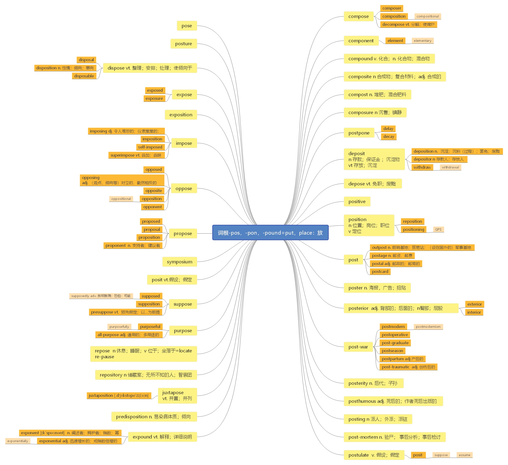

# 第十三节 词根-pos， -pon， -pound = put， place

> **本节课目标**
>
> 1、 掌握词根-pos， -pon， -pound 的含义
>
> 2、 掌握单词 92 个，掌握 post 的含义和用法

***

# 词根-pos， -pon， -pound = put， place： 表示“放” 的含义。

***

**compose**  \[kəm'pəʊz] vt. [英音](https://dict.youdao.com/dictvoice?audio=compose\&type=1)  [美音](https://dict.youdao.com/dictvoice?audio=compose\&type=2) 构成； 写作； 使平静； 排…的版 3408

**助记：** com（ 一起） +pose（ =put： 放） →（ 把各部分） 放在一起→组成； 作文（ 把文字放到

一起）；作曲（把音符放到一起）

**搭配：** be composed of（ 考）： 由…组成

**例句：** These organs would be entirely composed of human cells, grown by introducing them into

animal hosts, and allowing them to develop into an organ in place of the animal’s own.这

些器官将完全由人类细胞组成，让这些细胞在动物寄主内生长，让它们长成人类器官，

而不是动物器官。

**释义：** 使（自己）平静(或镇定)；使（表情）镇静下来 If you compose yourself or if you compose

your features, you succeed in becoming calm after you have been angry, excited, or upset.

**双语例句:** Ten men compose the committee. [播放](https://dict.youdao.com/dictvoice?audio=Ten+men+compose+the+committee.&le=eng&le=eng&type=2)

委员会由十人组成。 

**双语例句:** Protein molecules compose all the complex working parts of living cells. [播放](https://dict.youdao.com/dictvoice?audio=Protein+molecules+compose+all+the+complex+working+parts+of+living+cells.&le=eng&le=eng&type=2)

蛋白质分子构成了活细胞所有复杂的工作部件。 

**双语例句:** We can say that the properties of an ecosystem are more stable than the individual organisms that compose the ecosystem. [播放](https://dict.youdao.com/dictvoice?audio=We+can+say+that+the+properties+of+an+ecosystem+are+more+stable+than+the+individual+organisms+that+compose+the+ecosystem.&le=eng&le=eng&type=2)

可以说，生态系统的特性要比组成生态系统的单个生物体性质更加稳定。 

**原声例句:** So he decided to **compose** music that was truly American. [播放](https://dict.youdao.com/pureaudio?docid=-8108903393976197004)

**原声例句:** But the bits that actually **compose** those files and folders are in fact exactly where you left them.

**原声例句:** Later writers take this poetic image and fill out the allusion to - drowning in this ancient song, and **compose** the prose accounts in Exodus 14, in which the metaphor is literalized.

**权威例句:** It is easier to retreat and **compose** yourself after every score than swarm about, arms flailing.  [播放](https://dict.youdao.com/dictvoice?audio=It+is+easier+to+retreat+and+compose+yourself+after+every+score+than+swarm+about%2C+arms+flailing.+&le=eng&type=2)

**权威例句:** The most important thing is that when you go out, you have to **compose** yourself.  [播放](https://dict.youdao.com/dictvoice?audio=The+most+important+thing+is+that+when+you+go+out%2C+you+have+to+compose+yourself.+&le=eng&type=2)

**权威例句:** While Rapportive has yet to address the new **compose**, the experience will likely stay as is.  [播放](https://dict.youdao.com/dictvoice?audio=While+Rapportive+has+yet+to+address+the+new+compose%2C+the+experience+will+likely+stay+as+is.+&le=eng&type=2)

***

**composer**  \[kəm'pəʊzə] n.  [英音](https://dict.youdao.com/dictvoice?audio=composer\&type=1)  [美音](https://dict.youdao.com/dictvoice?audio=composer\&type=2) 作曲家；作家，著作者；设计者 5058

**双语例句:** He was born to be a great composer. [播放](https://dict.youdao.com/dictvoice?audio=He+was+born+to+be+a+great+composer.&le=eng&le=eng&type=2)

他是个天生的伟大作曲家。 

**双语例句:** She's only 18 but she's already a practised composer. [播放](https://dict.youdao.com/dictvoice?audio=She%27s+only+18+but+she%27s+already+a+practised+composer.&le=eng&le=eng&type=2)

她才18岁，但已成了老练的作曲家。 

**双语例句:** Lewis emerges as a composer of distinction and sensitivity. [播放](https://dict.youdao.com/dictvoice?audio=Lewis+emerges+as+a+composer+of+distinction+and+sensitivity.&le=eng&le=eng&type=2)

刘易斯脱颖而出，成为一位有卓越能力和敏锐度的作曲家。 

**原声例句:** His idea for the original drawing came from a piece of music by the English **composer** Ralph Vaughn-Williams. [播放](https://dict.youdao.com/pureaudio?docid=245042109917220003)

**原声例句:** It was very popular. The **composer** earned a good living from the sales of the sheet music. [播放](https://dict.youdao.com/pureaudio?docid=1600037555861221614)

**原声例句:** Years later, he admitted that he had no idea that George Gershwin was such a successful **composer**. [播放](https://dict.youdao.com/pureaudio?docid=-3111718907440493836)

**权威例句:** However, an editorial in Britain's Times newspaper doubted the composer's chant would catch on.  [播放](https://dict.youdao.com/dictvoice?audio=However%2C+an+editorial+in+Britain%27s+Times+newspaper+doubted+the+composer%27s+chant+would+catch+on.+&le=eng&type=2)

**权威例句:** Another recently departed film **composer**, Basil Poledouris, is also high on my playlist.  [播放](https://dict.youdao.com/dictvoice?audio=Another+recently+departed+film+composer%2C+Basil+Poledouris%2C+is+also+high+on+my+playlist.+&le=eng&type=2)

**权威例句:** It's a rich reward for both the **composer** and his audiences after the years of struggle.  [播放](https://dict.youdao.com/dictvoice?audio=It%27s+a+rich+reward+for+both+the+composer+and+his+audiences+after+the+years+of+struggle.+&le=eng&type=2)

***

**composition**  \[ˌkɒmpəˈzɪʃn] n.  [英音](https://dict.youdao.com/dictvoice?audio=composition\&type=1)  [美音](https://dict.youdao.com/dictvoice?audio=composition\&type=2) 作文，作曲；构成；合成物 3025

**双语例句:** We had to write a composition on the subject \"My Pet.\" [播放](https://dict.youdao.com/dictvoice?audio=We+had+to+write+a+composition+on+the+subject+%22My+Pet.%22&le=eng&le=eng&type=2)

我们得就“我的宠物”这个主题写一篇作文。 

**双语例句:** Television has transformed the size and social composition of the audience at great sporting occasions. [播放](https://dict.youdao.com/dictvoice?audio=Television+has+transformed+the+size+and+social+composition+of+the+audience+at+great+sporting+occasions.&le=eng&le=eng&type=2)

电视改变了大型体育赛事观众的数量及其社会构成。 

**双语例句:** Extracting information about the large-scale composition of a planet from a sample weighing a millionth of a gram was a fascinating example of scientific endeavour. [播放](https://dict.youdao.com/dictvoice?audio=Extracting+information+about+the+large-scale+composition+of+a+planet+from+a+sample+weighing+a+millionth+of+a+gram+was+a+fascinating+example+of+scientific+endeavour.&le=eng&le=eng&type=2)

从重量为百万分之一克的样品中提取有关行星宏观组成的信息是一个极为有趣的科学尝试实例。 

**原声例句:** She studied music at Florida State University and later moved to New York City to study violin and **composition**. [播放](https://dict.youdao.com/pureaudio?docid=7673843399272434005)

**原声例句:** Next,she plays some ideas on the piano before entering the beginnings of a **composition** into a computer. [播放](https://dict.youdao.com/pureaudio?docid=-4874890194064134672)

**原声例句:** Ted Nash wanted his **composition** about Chagall to express his ties to family and Eastern European culture. [播放](https://dict.youdao.com/pureaudio?docid=2201111711235437741)

**权威例句:** Students will learn theory, technique and **composition**, ending with them creating their very own fileteado plaque.  [播放](https://dict.youdao.com/dictvoice?audio=Students+will+learn+theory%2C+technique+and+composition%2C+ending+with+them+creating+their+very+own+fileteado+plaque.+&le=eng&type=2)

**权威例句:** And he does have Democratic co-sponsors, something that is critical given the **composition** of the Senate.  [播放](https://dict.youdao.com/dictvoice?audio=And+he+does+have+Democratic+co-sponsors%2C+something+that+is+critical+given+the+composition+of+the+Senate.+&le=eng&type=2)

**权威例句:** There can be serious consequences if the wrong amount or **composition** of IV fluids is prescribed.  [播放](https://dict.youdao.com/dictvoice?audio=There+can+be+serious+consequences+if+the+wrong+amount+or+composition+of+IV+fluids+is+prescribed.+&le=eng&type=2)

***

**compositional**  \[,kɑmpə'zɪʃənl] adj.  [英音](https://dict.youdao.com/dictvoice?audio=compositional\&type=1)  [美音](https://dict.youdao.com/dictvoice?audio=compositional\&type=2) 组成的； 创作的； 作曲的 14670

**双语例句:** The compositional similarity is striking. [播放](https://dict.youdao.com/dictvoice?audio=The+compositional+similarity+is+striking.&le=eng&le=eng&type=2)

构成上的相似性是惊人的。 

**双语例句:** A second benefit of CSP is its compositional nature. [播放](https://dict.youdao.com/dictvoice?audio=A+second+benefit+of+CSP+is+its+compositional+nature.&le=eng&le=eng&type=2)

CSP的第二个好处是它的复合性质。 

**双语例句:** This compositional style is exemplified by this fugue. [播放](https://dict.youdao.com/dictvoice?audio=This+compositional+style+is+exemplified+by+this+fugue.&le=eng&le=eng&type=2)

这首赋格曲代表了这种音乐风格。 

**原声例句:** I'm going to talk a little bit about its publishing history, its **compositional** history, actually, at the end of my two lectures on the novel.

**权威例句:** Instead, it explores five excerpts, with each movement employing an unconventional instrumentation and **compositional** structure.  [播放](https://dict.youdao.com/dictvoice?audio=Instead%2C+it+explores+five+excerpts%2C+with+each+movement+employing+an+unconventional+instrumentation+and+compositional+structure.+&le=eng&type=2)

**权威例句:** In his new project, Krug offers up a glimpse of himself as a mad sonic alchemist, as he expands his **compositional** grasp to create a full-fledged rock opera.  [播放](https://dict.youdao.com/dictvoice?audio=In+his+new+project%2C+Krug+offers+up+a+glimpse+of+himself+as+a+mad+sonic+alchemist%2C+as+he+expands+his+compositional+grasp+to+create+a+full-fledged+rock+opera.+&le=eng&type=2)

**权威例句:** Although spacecraft instruments are set to return photographs and **compositional** data, the encounter primarily is a test of Deep Space 1's autonomous navigation system, the last of 12 technologies the mission was designed to pioneer.  [播放](https://dict.youdao.com/dictvoice?audio=Although+spacecraft+instruments+are+set+to+return+photographs+and+compositional+data%2C+the+encounter+primarily+is+a+test+of+Deep+Space+1%27s+autonomous+navigation+system%2C+the+last+of+12+technologies+the+mission+was+designed+to+pioneer.+&le=eng&type=2)

***

**component**  \[kəm'pəʊnənt] adj.  [英音](https://dict.youdao.com/dictvoice?audio=component\&type=1)  [美音](https://dict.youdao.com/dictvoice?audio=component\&type=2) 组成的，构成的； n. 成分；组成部分 1772

**助记：** com（ 共同、 一起） +pon（ =pose： 放） +ent（ 名词后缀） →放在一起（ 构成新物体）

的东西→成分、 要素

**搭配：** optional component（考）：可选成分

> **【课堂笔记】**
>
> \-ent -ant
>
> 1） 名词后缀，表示“人”或“物”
>
> 2） 形容词后缀， …的

**同义：** **element**  \['elimənt] n.  [英音](https://dict.youdao.com/dictvoice?audio=element\&type=1)  [美音](https://dict.youdao.com/dictvoice?audio=element\&type=2) 元素、 要素、 成分；（ 人的） 一组、 一群

**搭配：** desirable element（考）：值得拥有的元素

**elementary**  \[,eli'mentəri] a.  [英音](https://dict.youdao.com/dictvoice?audio=elementary\&type=1)  [美音](https://dict.youdao.com/dictvoice?audio=elementary\&type=2) 元素的； 初级的、 基本的

**搭配：** elementary schools（考）：小学

**双语例句:** Literacy now includes elementary computer skills. [播放](https://dict.youdao.com/dictvoice?audio=Literacy+now+includes+elementary+computer+skills.&le=eng&le=eng&type=2)

有文化现在包括基本的计算机技能。 

**双语例句:** A proton is an elementary particle of matter that possesses a positive charge. [播放](https://dict.youdao.com/dictvoice?audio=A+proton+is+an+elementary+particle+of+matter+that+possesses+a+positive+charge.&le=eng&le=eng&type=2)

质子是带正电荷的物质的基本粒子。 

**双语例句:** The move from elementary school to middle school or junior high can be difficult. [播放](https://dict.youdao.com/dictvoice?audio=The+move+from+elementary+school+to+middle+school+or+junior+high+can+be+difficult.&le=eng&le=eng&type=2)

从小学进入中学或者初中的这种变动可能会有困难。 

**权威例句:** Across the country thousands of **elementary**, middle and high school students are feeling the impact too.  [播放](https://dict.youdao.com/dictvoice?audio=Across+the+country+thousands+of+elementary%2C+middle+and+high+school+students+are+feeling+the+impact+too.+&le=eng&type=2)

**权威例句:** The school operates within five school buildings: three **elementary** schools, a middle school and high school.  [播放](https://dict.youdao.com/dictvoice?audio=The+school+operates+within+five+school+buildings%3A+three+elementary+schools%2C+a+middle+school+and+high+school.+&le=eng&type=2)

**权威例句:** With Kado's assistance, more than 45 **elementary** and secondary schools have formed student-run cybercrime prevention clubs.  [播放](https://dict.youdao.com/dictvoice?audio=With+Kado%27s+assistance%2C+more+than+45+elementary+and+secondary+schools+have+formed+student-run+cybercrime+prevention+clubs.+&le=eng&type=2)

**双语例句:** Cost was a key element in our decision. [播放](https://dict.youdao.com/dictvoice?audio=Cost+was+a+key+element+in+our+decision.&le=eng&le=eng&type=2)

价钱是我们决策时考虑的主要因素。 

**双语例句:** There is an element of subjectivity in her criticism. [播放](https://dict.youdao.com/dictvoice?audio=There+is+an+element+of+subjectivity+in+her+criticism.&le=eng&le=eng&type=2)

她的批评有主观因素。 

**双语例句:** Diamond is the crystalline form of the element carbon. [播放](https://dict.youdao.com/dictvoice?audio=Diamond+is+the+crystalline+form+of+the+element+carbon.&le=eng&le=eng&type=2)

钻石是碳元素的晶体结构。 

**原声例句:** He had a strong desire to control every **element** of the production and marketing of his films. [播放](https://dict.youdao.com/pureaudio?docid=6827597422352373919)

**原声例句:** World War Two ended. Enrico Fermi had been the first to use a neutron to produce the radioactive change of one **element** to another. [播放](https://dict.youdao.com/pureaudio?docid=457225633706641404)

**原声例句:** Because it's sharing, it's giving. Love is a strange **element** of our lives. [播放](https://dict.youdao.com/pureaudio?docid=7201466080321735326)

**权威例句:** Hooking a local tarpon or barracuda can certainly add an unexpectedly powerful **element** of propulsion.  [播放](https://dict.youdao.com/dictvoice?audio=Hooking+a+local+tarpon+or+barracuda+can+certainly+add+an+unexpectedly+powerful+element+of+propulsion.+&le=eng&type=2)

**权威例句:** The **element** was inscribed on the Representative List of Intangible Cultural Heritage of Humanity in 2009.  [播放](https://dict.youdao.com/dictvoice?audio=The+element+was+inscribed+on+the+Representative+List+of+Intangible+Cultural+Heritage+of+Humanity+in+2009.+&le=eng&type=2)

**权威例句:** No outdoor **element** is off bounds, with trees, benches, hills and roads all used in workouts.  [播放](https://dict.youdao.com/dictvoice?audio=No+outdoor+element+is+off+bounds%2C+with+trees%2C+benches%2C+hills+and+roads+all+used+in+workouts.+&le=eng&type=2)

**双语例句:** Attitudes have a behavioral component. [播放](https://dict.youdao.com/dictvoice?audio=Attitudes+have+a+behavioral+component.&le=eng&le=eng&type=2)

态度隐含着行为性的成分。 

**双语例句:** Finally, attitudes have a behavioral component. [播放](https://dict.youdao.com/dictvoice?audio=Finally%2C+attitudes+have+a+behavioral+component.&le=eng&le=eng&type=2)

最后，态度具有行为上的成分。 

**双语例句:** That said, curiosity does have a genetic component. [播放](https://dict.youdao.com/dictvoice?audio=That+said%2C+curiosity+does+have+a+genetic+component.&le=eng&le=eng&type=2)

这就是说，好奇心确实有基因成分。 

**原声例句:** In addition, we have an Islamic **component**, and we teach Islam as well as Arabic as a foreign language.\" [播放](https://dict.youdao.com/pureaudio?docid=-222756664871528991)

**原声例句:** And because the key **component** of solar cells is an expensive, highly purified form of silicon, there's a real economic benefit to this design. [播放](https://dict.youdao.com/pureaudio?docid=2282661663211401438)

**原声例句:** The civilian **component** responsible for development will remain there for the long term. [播放](https://dict.youdao.com/pureaudio?docid=-6458854423172917907)

**权威例句:** This creates a huge opportunity for smart and well-financed **component** companies like Dana, Delphi and Magma.  [播放](https://dict.youdao.com/dictvoice?audio=This+creates+a+huge+opportunity+for+smart+and+well-financed+component+companies+like+Dana%2C+Delphi+and+Magma.+&le=eng&type=2)

**权威例句:** This reduction in inequality has a racial **component**, because 75% of the new middle class is non-white.  [播放](https://dict.youdao.com/dictvoice?audio=This+reduction+in+inequality+has+a+racial+component%2C+because+75%25+of+the+new+middle+class+is+non-white.+&le=eng&type=2)

**权威例句:** Falling prices in this one **component** creates the illusion of falling or lower prices everywhere.  [播放](https://dict.youdao.com/dictvoice?audio=Falling+prices+in+this+one+component+creates+the+illusion+of+falling+or+lower+prices+everywhere.+&le=eng&type=2)

***

**decompose**  \[di\:kəm'pəʊz] vi.  [英音](https://dict.youdao.com/dictvoice?audio=decompose\&type=1)  [美音](https://dict.youdao.com/dictvoice?audio=decompose\&type=2) 分解； 使腐烂 16329

**释义：** (死去的动植物)腐烂;（使）分解 When things such as dead plants or animals decompose,

or when something decomposes them, they change chemically and begin to decay（腐烂）.

**双语例句:** As the waste materials decompose, they produce methane gas. [播放](https://dict.youdao.com/dictvoice?audio=As+the+waste+materials+decompose%2C+they+produce+methane+gas.&le=eng&le=eng&type=2)

废物腐烂时会产生沼气。 

**双语例句:** When they die, they decompose. [播放](https://dict.youdao.com/dictvoice?audio=When+they+die%2C+they+decompose.&le=eng&le=eng&type=2)

当它们死亡，它们就会分解。 

**双语例句:** When the plants die, they decompose, and the phosphorus is recycled back into the soil.  [播放](https://dict.youdao.com/dictvoice?audio=When+the+plants+die%2C+they+decompose%2C+and+the+phosphorus+is+recycled+back+into+the+soil.+&le=eng&le=eng&type=2)

当植物死亡时，它们会分解，磷就会被回收到土壤中。 

**权威例句:** He said the technology was complicated and the process to **decompose** the dirt was gradual.  [播放](https://dict.youdao.com/dictvoice?audio=He+said+the+technology+was+complicated+and+the+process+to+decompose+the+dirt+was+gradual.+&le=eng&type=2)

**权威例句:** Plastic bags are made of polyethylene, derived from petrol and take 1, 000 years to **decompose**.  [播放](https://dict.youdao.com/dictvoice?audio=Plastic+bags+are+made+of+polyethylene%2C+derived+from+petrol+and+take+1%2C+000+years+to+decompose.+&le=eng&type=2)

**权威例句:** Nature heavily skews the odds against an animal becoming a fossil most simply **decompose**.  [播放](https://dict.youdao.com/dictvoice?audio=Nature+heavily+skews+the+odds+against+an+animal+becoming+a+fossil+most+simply+decompose.+&le=eng&type=2)

***

**decomposition** \[,di\:kɒmpə'zɪʃn] n.  [英音](https://dict.youdao.com/dictvoice?audio=decomposition\&type=1)  [美音](https://dict.youdao.com/dictvoice?audio=decomposition\&type=2) 分解，腐烂；变质 16032

**双语例句:** Those organisms then affect the rate of decomposition of the leaves. [播放](https://dict.youdao.com/dictvoice?audio=Those+organisms+then+affect+the+rate+of+decomposition+of+the+leaves.&le=eng&le=eng&type=2)

然后那些生物体会影响树叶的分解速度。 

**双语例句:** With a higher temperature and more moist conditions, the process of organic matter decomposition speeds up. [播放](https://dict.youdao.com/dictvoice?audio=With+a+higher+temperature+and+more+moist+conditions%2C+the+process+of+organic+matter+decomposition+speeds+up.&le=eng&le=eng&type=2)

在较高的温度和较潮湿的条件下，有机物的分解过程会加快。 

**双语例句:** Humus is necessary for rapid decomposition of leaves by bacteria and fungi and for recycling by surface roots. [播放](https://dict.youdao.com/dictvoice?audio=Humus+is+necessary+for+rapid+decomposition+of+leaves+by+bacteria+and+fungi+and+for+recycling+by+surface+roots.&le=eng&le=eng&type=2)

腐殖质是树叶被细菌和真菌迅速分解和根部表面循环过程的必需品。 

**原声例句:** But in certain landfills, including some accepting the BP cleanup, waste,heat and methane gas produced by **decomposition** are being used to generate energy. [播放](https://dict.youdao.com/pureaudio?docid=7334449063336808604)

**原声例句:** We don't have **decomposition**, and we don't have abstraction.

**原声例句:** But the point is there's a connection between this condition, this skin condition, and its **decomposition** and death.

**权威例句:** The body of Carmelita Stevens, Murphy's girlfriend, was found in a state of **decomposition**.  [播放](https://dict.youdao.com/dictvoice?audio=The+body+of+Carmelita+Stevens%2C+Murphy%27s+girlfriend%2C+was+found+in+a+state+of+decomposition.+&le=eng&type=2)

**权威例句:** It is caused by the bacterial **decomposition** of organic matter that has died and sunk to the bottom.  [播放](https://dict.youdao.com/dictvoice?audio=It+is+caused+by+the+bacterial+decomposition+of+organic+matter+that+has+died+and+sunk+to+the+bottom.+&le=eng&type=2)

**权威例句:** However, tests that might have revealed unusual or volatile poisons were ruled out by the **decomposition** of the body.  [播放](https://dict.youdao.com/dictvoice?audio=However%2C+tests+that+might+have+revealed+unusual+or+volatile+poisons+were+ruled+out+by+the+decomposition+of+the+body.+&le=eng&type=2)

***

**compound**  \['kɒmpaʊnd] vt.  [英音](https://dict.youdao.com/dictvoice?audio=compound\&type=1)  [美音](https://dict.youdao.com/dictvoice?audio=compound\&type=2) 混合；合成；和解妥协；搀合 n. 化合物； 3458

**助记：** com（ 共同、 一起） +pound（ =put： 放） →放到一起→合成、 化合； 化合物（ 即： 合

成的东西）

**释义：**（ 1） 混合；掺和；拌和 to mix sth together

（ 2） (化学中的)化合物 In chemistry, a compound is a substance that consists of two or more

elements.

（ 3） 混合物; 组合物 If something is a compound of different things, it consists of those things.

> **【课堂笔记】**
>
> compound 合成词

**双语例句:** Common salt is a compound of sodium and chlorine. [播放](https://dict.youdao.com/dictvoice?audio=Common+salt+is+a+compound+of+sodium+and+chlorine.&le=eng&le=eng&type=2)

普通食盐是钠和氯的化合物。 

**双语例句:** A compound sentence contains two or more clauses. [播放](https://dict.youdao.com/dictvoice?audio=A+compound+sentence+contains+two+or+more+clauses.&le=eng&le=eng&type=2)

复合句包含两个或多个从句。 

**双语例句:** Honey is basically a compound of water, two types of sugar, vitamins and enzymes. [播放](https://dict.youdao.com/dictvoice?audio=Honey+is+basically+a+compound+of+water%2C+two+types+of+sugar%2C+vitamins+and+enzymes.&le=eng&le=eng&type=2)

蜂蜜主要是水、两种糖、维生素和酶的混合物。 

**原声例句:** A savings account is an excellent way to learn about the power of **compound** interest. [播放](https://dict.youdao.com/pureaudio?docid=8618236419212089064)

**原声例句:** They gave them the chemical **compound** by mouth and say the infection disappeared. [播放](https://dict.youdao.com/pureaudio?docid=3756385387321162534)

**原声例句:** In the study, researchers tested curcumin, a chemical **compound** taken from turmeric. [播放](https://dict.youdao.com/pureaudio?docid=-5365672657265769270)

**权威例句:** In a moment, well give a hint about the **compound** arithmetic that makes this so.  [播放](https://dict.youdao.com/dictvoice?audio=In+a+moment%2C+well+give+a+hint+about+the+compound+arithmetic+that+makes+this+so.+&le=eng&type=2)

**权威例句:** The fact that Bin Laden's **compound** was located nearby came as an embarrassment to Pakistan.  [播放](https://dict.youdao.com/dictvoice?audio=The+fact+that+Bin+Laden%27s+compound+was+located+nearby+came+as+an+embarrassment+to+Pakistan.+&le=eng&type=2)

**权威例句:** To **compound** this misdiagnosis, The Economist proffers medicine that would do more harm than good.  [播放](https://dict.youdao.com/dictvoice?audio=To+compound+this+misdiagnosis%2C+The+Economist+proffers+medicine+that+would+do+more+harm+than+good.+&le=eng&type=2)

***

**composite**  \['kɒmpəzɪt] n.  [英音](https://dict.youdao.com/dictvoice?audio=composite\&type=1)  [美音](https://dict.youdao.com/dictvoice?audio=composite\&type=2) 合成物；复合材料； adj. 合成的；拼成的 6838

**释义：**（ 1） 合成物；混合物；复合材料 something made by putting together different parts or

materials

例如：The document was a composite of information from various sources. 这份文件是不同来源

信息的综合。

（ 2）拼成的；混合成的；复合的 A composite object or item is made up of several different things,

parts, or substances. 例如： Galton devised a method of creating composite pictures in which the

features of different faces were superimposed over one another.

高尔顿发明了一种把不同人的五官相互叠加在一起的制作合成照片的方法。

**双语例句:** Spain is a composite of multifarious traditions and people. [播放](https://dict.youdao.com/dictvoice?audio=Spain+is+a+composite+of+multifarious+traditions+and+people.&le=eng&le=eng&type=2)

西班牙是多种传统和多个民族的合成体。 

**双语例句:** The document was a composite of information from various sources. [播放](https://dict.youdao.com/dictvoice?audio=The+document+was+a+composite+of+information+from+various+sources.&le=eng&le=eng&type=2)

这份文件是不同来源信息的综合。 

**双语例句:** Galton devised a method of creating composite pictures in which the features of different faces were superimposed over one another. [播放](https://dict.youdao.com/dictvoice?audio=Galton+devised+a+method+of+creating+composite+pictures+in+which+the+features+of+different+faces+were+superimposed+over+one+another.&le=eng&le=eng&type=2)

高尔顿发明了一种将不同脸的部位相互叠加而创作合成图片的方法。 

**原声例句:** But even in the prose accounts in Exodus 14 we can see a **composite** of two intertwined versions.

**原声例句:** So, it seems to me,that Western civilization,ever since, has been a **composite** of these two traditions.

**原声例句:** After all, if we have premises 1, 2 and 3, Only **composite** things can be destroyed.

**权威例句:** Part of the investment will be used to install high-volume **composite** carbon fibre manufacturing equipment.  [播放](https://dict.youdao.com/dictvoice?audio=Part+of+the+investment+will+be+used+to+install+high-volume+composite+carbon+fibre+manufacturing+equipment.+&le=eng&type=2)

**权威例句:** Wa-el is an Egyptian entrepreneur whose background is in **composite** materials, but whose soul lives in motorcars.  [播放](https://dict.youdao.com/dictvoice?audio=Wa-el+is+an+Egyptian+entrepreneur+whose+background+is+in+composite+materials%2C+but+whose+soul+lives+in+motorcars.+&le=eng&type=2)

**权威例句:** There is minor support for the NYSE **Composite** at 9, 179 with the 20-week EMA at 8, 914.  [播放](https://dict.youdao.com/dictvoice?audio=There+is+minor+support+for+the+NYSE+Composite+at+9%2C+179+with+the+20-week+EMA+at+8%2C+914.+&le=eng&type=2)

***

**compost**  \['kɒmpɒst] n.  [英音](https://dict.youdao.com/dictvoice?audio=compost\&type=1)  [美音](https://dict.youdao.com/dictvoice?audio=compost\&type=2) 堆肥； 混合肥料； v. 把...制成堆肥 6250

**释义：** 堆肥；混合肥料 Compost is a mixture of decayed plants and vegetable waste which is

added to the soil to help plants grow.

**双语例句:** The debris slowly decomposes into compost. [播放](https://dict.youdao.com/dictvoice?audio=The+debris+slowly+decomposes+into+compost.&le=eng&le=eng&type=2)

这堆碎屑慢慢地分解变成了堆肥。 

**双语例句:** I sow the seed in pots of soil-based compost. [播放](https://dict.youdao.com/dictvoice?audio=I+sow+the+seed+in+pots+of+soil-based+compost.&le=eng&le=eng&type=2)

我把种子种在一盆盆施有堆肥的土里。 

**双语例句:** The compost is specially formulated for pot plants. [播放](https://dict.youdao.com/dictvoice?audio=The+compost+is+specially+formulated+for+pot+plants.&le=eng&le=eng&type=2)

此混合肥料专门用于盆栽植物。 

**权威例句:** For one thing it was smelly, a bit like the bottom of a **compost** pile.  [播放](https://dict.youdao.com/dictvoice?audio=For+one+thing+it+was+smelly%2C+a+bit+like+the+bottom+of+a+compost+pile.+&le=eng&type=2)

**权威例句:** San Francisco currently has a large **compost** facility that turns food waste into fertilizer.  [播放](https://dict.youdao.com/dictvoice?audio=San+Francisco+currently+has+a+large+compost+facility+that+turns+food+waste+into+fertilizer.+&le=eng&type=2)

**权威例句:** Mr. VERRALL: Yeah, I got plenty of more sitting in my **compost** pit at the moment.  [播放](https://dict.youdao.com/dictvoice?audio=Mr.+VERRALL%3A+Yeah%2C+I+got+plenty+of+more+sitting+in+my+compost+pit+at+the+moment.+&le=eng&type=2)

***

**composure**  \[kəm'pəʊʒə] n.  [英音](https://dict.youdao.com/dictvoice?audio=composure\&type=1)  [美音](https://dict.youdao.com/dictvoice?audio=composure\&type=2) 镇静；沉着 13124

**释义：** 冷静；镇定；沉着 Composure is the appearance or feeling of calm and the ability to control

your feelings.

**双语例句:** She was a little nervous at first but she soon regained her composure. [播放](https://dict.youdao.com/dictvoice?audio=She+was+a+little+nervous+at+first+but+she+soon+regained+her+composure.&le=eng&le=eng&type=2)

她起初有点紧张但很快就恢复了镇定。 

**双语例句:** It's Laura who cries at Dean's abandonment, while Dean maintains this composure. [播放](https://dict.youdao.com/dictvoice?audio=It%27s+Laura+who+cries+at+Dean%27s+abandonment%2C+while+Dean+maintains+this+composure.&le=eng&le=eng&type=2)

是劳拉为迪安的被抛弃而哭泣，而迪安保持着这种镇静。 

**双语例句:** It seems that men with traditional views of masculinity are more likely to suppress outward emotions and to fear emotions, supposedly because such feelings may lead to a loss of composure. [播放](https://dict.youdao.com/dictvoice?audio=It+seems+that+men+with+traditional+views+of+masculinity+are+more+likely+to+suppress+outward+emotions+and+to+fear+emotions%2C+supposedly+because+such+feelings+may+lead+to+a+loss+of+composure.&le=eng&le=eng&type=2)

具有传统男子气观念的男性似乎更有可能抑制外部情绪和恐惧情绪，大概是因为这种情绪可能会导致失去镇定。 

**原声例句:** It's Laura who cries at Dean's abandonment, while he maintains this **composure**, this masculine **composure**: \"he'll be all right.\" But, the sadness here is surely Sal's.

**权威例句:** The competition tests brain power, **composure** and, for the first time, knowledge of vocabulary.  [播放](https://dict.youdao.com/dictvoice?audio=The+competition+tests+brain+power%2C+composure+and%2C+for+the+first+time%2C+knowledge+of+vocabulary.+&le=eng&type=2)

**权威例句:** Nadal, however, regained his **composure** and will now take on qualifier Rajeev Ram in round two.  [播放](https://dict.youdao.com/dictvoice?audio=Nadal%2C+however%2C+regained+his+composure+and+will+now+take+on+qualifier+Rajeev+Ram+in+round+two.+&le=eng&type=2)

**权威例句:** Wing-back Gunter, though, failed to match Ramsey's **composure** as his left-foot effort flew high and wide.  [播放](https://dict.youdao.com/dictvoice?audio=Wing-back+Gunter%2C+though%2C+failed+to+match+Ramsey%27s+composure+as+his+left-foot+effort+flew+high+and+wide.+&le=eng&type=2)

***

**postpone**  \[pəʊs(t)'pəʊn; pə'spəʊn] vt.  [英音](https://dict.youdao.com/dictvoice?audio=postpone\&type=1)  [美音](https://dict.youdao.com/dictvoice?audio=postpone\&type=2) 使…延期； 把…放在次要地位； 把…放在后面 6649

**助记：** post（ 后） +pon（ =-pos： 放） →往后放→后延、 延期、 推迟

**搭配：** postpone marriage（考）：推迟结婚

**释义：** 推迟；使延期；延缓 If you postpone an event, you delay it or arrange for it to take place at

a later time than was originally planned.

**双语例句:** I, for one, would prefer to postpone the meeting. [播放](https://dict.youdao.com/dictvoice?audio=I%2C+for+one%2C+would+prefer+to+postpone+the+meeting.&le=eng&le=eng&type=2)

主张推迟会期的，我就是一个。 

**双语例句:** The only practicable alternative is to postpone the meeting. [播放](https://dict.youdao.com/dictvoice?audio=The+only+practicable+alternative+is+to+postpone+the+meeting.&le=eng&le=eng&type=2)

另外唯一可行的办法就是推迟会期。 

**双语例句:** It was an unpopular decision to postpone building the new hospital. [播放](https://dict.youdao.com/dictvoice?audio=It+was+an+unpopular+decision+to+postpone+building+the+new+hospital.&le=eng&le=eng&type=2)

延迟兴建新医院的决定是不得人心的。 

**原声例句:** He agreed to **postpone** earlier elections in exchange for a power-sharing deal that saw his political opponents drop their electoral boycott. [播放](https://dict.youdao.com/pureaudio?docid=2983823561211609768)

**原声例句:** Many experts,including David Marples with the University of Alberta, say essentially two countries led the charge to **postpone** Georgian and Ukrainian NATO membership. [播放](https://dict.youdao.com/pureaudio?docid=-8608714617496918666)

**原声例句:** The Saudi monarch's visit also comes just one day after Iranian President Mahmoud Ahmadinejad said his country would **postpone** nuclear talks with major world powers until the end of August. [播放](https://dict.youdao.com/pureaudio?docid=-1921154455060803081)

**权威例句:** Does it really matter if sometimes we have to **postpone** what we had planned?  [播放](https://dict.youdao.com/dictvoice?audio=Does+it+really+matter+if+sometimes+we+have+to+postpone+what+we+had+planned%3F+&le=eng&type=2)

**权威例句:** Indeed, Maliki reportedly plans to **postpone** local elections in the Sunni-majority provinces of Anbar and Ninevah.  [播放](https://dict.youdao.com/dictvoice?audio=Indeed%2C+Maliki+reportedly+plans+to+postpone+local+elections+in+the+Sunni-majority+provinces+of+Anbar+and+Ninevah.+&le=eng&type=2)

**权威例句:** Businesses will **postpone** hiring and go into a protective crouch even more than today.  [播放](https://dict.youdao.com/dictvoice?audio=Businesses+will+postpone+hiring+and+go+into+a+protective+crouch+even+more+than+today.+&le=eng&type=2)

***

**deposit**  \[dɪ'pɒzɪt] n.  [英音](https://dict.youdao.com/dictvoice?audio=deposit\&type=1)  [美音](https://dict.youdao.com/dictvoice?audio=deposit\&type=2) 存款； 保证金； 沉淀物； vt.\&vi. 放下； 存放； 沉淀 4744

**助记：** de（ =away） +pos（ =lay 放） +it（ 动词和名词后缀） →lay away 储藏； 储蓄→存款

de（ =down： 下） +pos（ 放） +it（ 动词或名词后缀） →放下； 存放； 沉淀

**释义：** 1） 订金；保证金 A deposit is a sum of money which is part of the full price of something,

and which you pay when you agree to buy.

2） (尤指定期)存款 A deposit is a sum of money which is in a bank account（bank account=银行账户） or savings account（savings account=储蓄账户）,

especially a sum which will be left there for some time.

3）沉淀物;沉积物 A deposit is an amount of a substance that has been left somewhere as a result

of a chemical or geological process.

4） (VERB) 存放;寄存 If you deposit something somewhere, you put it where it will be safe until

it is needed again.

5）将（钱）存入银行（或储蓄）账户 If you deposit a sum of money, you pay it into a bank account

or savings account.

> **【课堂笔记】**
>
> deposit
>
> 名词 存款；保证金； 定金； 沉积物
>
> 动词 存放；沉淀；存款

**双语例句:** A 10% deposit is payable in advance. [播放](https://dict.youdao.com/dictvoice?audio=A+10%25+deposit+is+payable+in+advance.&le=eng&le=eng&type=2)

须预付10%的押金。 

**双语例句:** Landlords can charge a returnable deposit. [播放](https://dict.youdao.com/dictvoice?audio=Landlords+can+charge+a+returnable+deposit.&le=eng&le=eng&type=2)

房东可以收取一笔可退还的押金。 

**双语例句:** A refundable deposit is payable on arrival. [播放](https://dict.youdao.com/dictvoice?audio=A+refundable+deposit+is+payable+on+arrival.&le=eng&le=eng&type=2)

货一到就把可退还的押金退给你。 

**原声例句:** \"What we've now learned is that fat is not just a **deposit** for energy in our bodies.\" [播放](https://dict.youdao.com/pureaudio?docid=-2600411143939335977)

**原声例句:** In an aqueous solution, he passes electric current and causes silver ions to **deposit** and form metallic silver.

**原声例句:** I think that **deposit** insurance is very important but we didn't have anything for corresponding accounts at brokerage services until 1970.

**权威例句:** The party lost its **deposit**, having secured less than 5% of the total votes cast.  [播放](https://dict.youdao.com/dictvoice?audio=The+party+lost+its+deposit%2C+having+secured+less+than+5%25+of+the+total+votes+cast.+&le=eng&type=2)

**权威例句:** If you trade on advance information about a copper **deposit**, you are clearly guilty.  [播放](https://dict.youdao.com/dictvoice?audio=If+you+trade+on+advance+information+about+a+copper+deposit%2C+you+are+clearly+guilty.+&le=eng&type=2)

**权威例句:** Aspirations to move towards harmonised deposit-guarantee schemes and bank-resolution mechanisms cause even more alarm.  [播放](https://dict.youdao.com/dictvoice?audio=Aspirations+to+move+towards+harmonised+deposit-guarantee+schemes+and+bank-resolution+mechanisms+cause+even+more+alarm.+&le=eng&type=2)

***

**deposition**  \[,depə'zɪʃ(ə)n; di:-] n.  [英音](https://dict.youdao.com/dictvoice?audio=deposition\&type=1)  [美音](https://dict.youdao.com/dictvoice?audio=deposition\&type=2) 矿床；沉积物；革职；罢黜 7444

**释义：**（ 1） 沉淀；沉积 Deposition is a process in which layers of a substance are formed inside

something or on its surface over a period of time.

2）罢免；废黜 The deposition of a political leader is the removal of him or her from office.

> **【课堂笔记】**
>
> 动词 depose=de（ 下） + pose （ 放） →（ 职位） 下放→革职； 罢黜
>
> 动词 deposit 沉淀→ 名词 deposition 沉积物； 沉淀物

**双语例句:** Other reliable evidence suggests that the deposition of the boundary clay could not have taken one million years. [播放](https://dict.youdao.com/dictvoice?audio=Other+reliable+evidence+suggests+that+the+deposition+of+the+boundary+clay+could+not+have+taken+one+million+years.&le=eng&le=eng&type=2)

其他可靠的证据表明，边界粘土的沉积不可能需要100万年。 

**双语例句:** Vitamin D, or calciferol, is another fat soluble steroid vitamin which functions to stimulate calcium uptake from the gut and its deposition in bone. [播放](https://dict.youdao.com/dictvoice?audio=Vitamin+D%2C+or+calciferol%2C+is+another+fat+soluble+steroid+vitamin+which+functions+to+stimulate+calcium+uptake+from+the+gut+and+its+deposition+in+bone.&le=eng&le=eng&type=2)

维生素 D，或钙醇，是另一种脂溶性类固醇维生素，其功能是促进钙从肠道吸收并沉积在骨头中。 

**双语例句:** The probability that actual remains of soft tissue will be preserved is improved if the organism dies in an environment of rapid deposition and oxygen deprivation. [播放](https://dict.youdao.com/dictvoice?audio=The+probability+that+actual+remains+of+soft+tissue+will+be+preserved+is+improved+if+the+organism+dies+in+an+environment+of+rapid+deposition+and+oxygen+deprivation.&le=eng&le=eng&type=2)

如果生物体死于一个快速沉积和缺氧的环境，那么软组织残骸实际保存下来的可能性会提高。 

**原声例句:** \"The blood vessel wall, when it becomes thickened and the lining is disturbed, is more sensitive to the effects of cholesterol **deposition**. [播放](https://dict.youdao.com/pureaudio?docid=-303243194245459258)

**原声例句:** Fourth, there's generally some arrangement, either for the publication of the treaty, or its **deposition**, its safe-keeping in some sort of shrine.

**权威例句:** The discovery stems from a court **deposition** of Gregory Curfman, one of the Journal's top editors.  [播放](https://dict.youdao.com/dictvoice?audio=The+discovery+stems+from+a+court+deposition+of+Gregory+Curfman%2C+one+of+the+Journal%27s+top+editors.+&le=eng&type=2)

**权威例句:** Are we -- I mean, this is not what a **deposition** is for, Your Honor.  [播放](https://dict.youdao.com/dictvoice?audio=Are+we+--+I+mean%2C+this+is+not+what+a+deposition+is+for%2C+Your+Honor.+&le=eng&type=2)

**权威例句:** And let us remember finally what his testimony is about his intentions in this **deposition**.  [播放](https://dict.youdao.com/dictvoice?audio=And+let+us+remember+finally+what+his+testimony+is+about+his+intentions+in+this+deposition.+&le=eng&type=2)

***

**depositor**  \[dɪ'pɒzɪtə] n.  [英音](https://dict.youdao.com/dictvoice?audio=depositor\&type=1)  [美音](https://dict.youdao.com/dictvoice?audio=depositor\&type=2) 存款人， 存放者； 寄托者 17637

**双语例句:** The number of our depositor is growing every day. [播放](https://dict.youdao.com/dictvoice?audio=The+number+of+our+depositor+is+growing+every+day.&le=eng&le=eng&type=2)

我行存款人的数量每天都在增长。 

**双语例句:** I must confess an interest: I am a depositor at RBS. [播放](https://dict.youdao.com/dictvoice?audio=I+must+confess+an+interest%3A+I+am+a+depositor+at+RBS.&le=eng&le=eng&type=2)

我必须承认有既得利益：我在苏格兰皇家银行有存款。 

**双语例句:** A depositor is a person who deposits money in a bank. [播放](https://dict.youdao.com/dictvoice?audio=A+depositor+is+a+person+who+deposits+money+in+a+bank.&le=eng&le=eng&type=2)

存款人是指将钱存入银行的人。 

**原声例句:** Even though the deposits are short-term and the **depositor** can get the money at any time, the **depositor** is earning interest of a level that can only be made on long-term loans.

**权威例句:** These institutions could be carved out of commercial banks, leaving behind the depositor-only entities.  [播放](https://dict.youdao.com/dictvoice?audio=These+institutions+could+be+carved+out+of+commercial+banks%2C+leaving+behind+the+depositor-only+entities.+&le=eng&type=2)

**权威例句:** If the **depositor** were a Jew, or more stubborn, he was in serious trouble.  [播放](https://dict.youdao.com/dictvoice?audio=If+the+depositor+were+a+Jew%2C+or+more+stubborn%2C+he+was+in+serious+trouble.+&le=eng&type=2)

**权威例句:** Data and economic reality show that a **depositor** haircut has been a long time coming.  [播放](https://dict.youdao.com/dictvoice?audio=Data+and+economic+reality+show+that+a+depositor+haircut+has+been+a+long+time+coming.+&le=eng&type=2)

***

**withdraw**  \[wɪð'drɔ:] vt.  [英音](https://dict.youdao.com/dictvoice?audio=withdraw\&type=1)  [美音](https://dict.youdao.com/dictvoice?audio=withdraw\&type=2) 撤消；收回；撤退；退出；取（钱） 2810

**助记：** with（ =back： 回） +draw（ 拉） →拉回来→撤退、 撤销； 收回（ 货币）、 取钱

例句： He speaks to his girlfriend Maria who urges him to remain in school since withdraw now

would place his entire future in danger.他和他的女朋友玛利亚说话，玛利亚劝他呆在学

校，因为现在退学会让他的整个未来处在危险中。

**释义：**

（ 1） 撤走；拿走 If you withdraw something from a place, you remove it or take it away.

（ 2） (使)撤退； (使)撤回； (使)撤离 When groups of people such as troops withdraw or when

someone withdraws them, they leave the place where they are fighting or where they are based

and return nearer home.

（ 3） 提，取(款) If you withdraw money from a bank account, you take it out of that account.

（ 4） 退出(活动或组织) If you withdraw from an activity or organization, you stop taking part in

it.

> **【课堂笔记】**
>
> with
>
> 1.有/伴随
>
> 2.back 回

**双语例句:** A back injury forced her to withdraw from Wimbledon. [播放](https://dict.youdao.com/dictvoice?audio=A+back+injury+forced+her+to+withdraw+from+Wimbledon.&le=eng&le=eng&type=2)

一处背伤迫使她退出了温布尔登网球赛。 

**双语例句:** There have been calls for Britain to withdraw from the EU. [播放](https://dict.youdao.com/dictvoice?audio=There+have+been+calls+for+Britain+to+withdraw+from+the+EU.&le=eng&le=eng&type=2)

一直有人呼吁英国退出欧盟。 

**双语例句:** He refused to withdraw derogatory remarks made about his boss. [播放](https://dict.youdao.com/dictvoice?audio=He+refused+to+withdraw+derogatory+remarks+made+about+his+boss.&le=eng&le=eng&type=2)

他拒绝收回对自己老板的贬抑之言。 

**原声例句:** All across Kenya, there are stores and automated teller machines where M-Pesa users can add and **withdraw** money from their accounts. [播放](https://dict.youdao.com/pureaudio?docid=-990422304797124532)

**原声例句:** Confederate leaders ordered the attack after President Abraham Lincoln refused to **withdraw** the small force of American soldiers at Sumter. [播放](https://dict.youdao.com/pureaudio?docid=-8390446789331631624)

**原声例句:** \"I am here to **withdraw** some money so I can pay my taxes to Uncle Sam,\" said average Joe. [播放](https://dict.youdao.com/pureaudio?docid=-3016675112379270666)

**权威例句:** Unlike depositors, these investors could not **withdraw** their funds on demand whenever bad news surfaced.  [播放](https://dict.youdao.com/dictvoice?audio=Unlike+depositors%2C+these+investors+could+not+withdraw+their+funds+on+demand+whenever+bad+news+surfaced.+&le=eng&type=2)

**权威例句:** The experienced James Hickman, the 200m butterfly world champion, has been forced to **withdraw** with a shoulder injury.  [播放](https://dict.youdao.com/dictvoice?audio=The+experienced+James+Hickman%2C+the+200m+butterfly+world+champion%2C+has+been+forced+to+withdraw+with+a+shoulder+injury.+&le=eng&type=2)

**权威例句:** The US State Department has demanded that Hezbollah **withdraw** its fighters from Syria immediately.  [播放](https://dict.youdao.com/dictvoice?audio=The+US+State+Department+has+demanded+that+Hezbollah+withdraw+its+fighters+from+Syria+immediately.+&le=eng&type=2)

***

**withdrawal**  \[wɪð'drɔ:(ə)l] n.  [英音](https://dict.youdao.com/dictvoice?audio=withdrawal\&type=1)  [美音](https://dict.youdao.com/dictvoice?audio=withdrawal\&type=2) 撤退，收回；退股；提款；取消 4172

> **【课堂笔记】**
>
> \-al
>
> 名词后缀
>
> 形容词后缀

**双语例句:** They announced the withdrawal of 12 000 troops from the area. [播放](https://dict.youdao.com/dictvoice?audio=They+announced+the+withdrawal+of+12+000+troops+from+the+area.&le=eng&le=eng&type=2)

他们宣布从这个地区撤军12 000人。 

**双语例句:** He replied that the UN had passed two major resolutions calling for a complete withdrawal. [播放](https://dict.youdao.com/dictvoice?audio=He+replied+that+the+UN+had+passed+two+major+resolutions+calling+for+a+complete+withdrawal.&le=eng&le=eng&type=2)

他回复说联合国已经通过要求完全撤军的两项重大决议。 

**双语例句:** There's no penalty for early withdrawal. [播放](https://dict.youdao.com/dictvoice?audio=There%27s+no+penalty+for+early+withdrawal.&le=eng&le=eng&type=2)

提前退出没有惩罚。 

**原声例句:** A recent security agreement between Iraq and the United States sets a plan for American troop **withdrawal** by 2012. [播放](https://dict.youdao.com/pureaudio?docid=-4297422000481991771)

**原声例句:** That still leaves Afghanistan. On Wednesday,by a wide majority, the United States House of Representatives rejected a call for a quick **withdrawal** of American troops. [播放](https://dict.youdao.com/pureaudio?docid=-4831498152217720162)

**原声例句:** It is often given to addicts to reduce symptoms of **withdrawal** from opioids like heroin. [播放](https://dict.youdao.com/pureaudio?docid=-568888420577217316)

**权威例句:** That includes Israeli troop **withdrawal** from 80 percent of Hebron that was scheduled for last March.  [播放](https://dict.youdao.com/dictvoice?audio=That+includes+Israeli+troop+withdrawal+from+80+percent+of+Hebron+that+was+scheduled+for+last+March.+&le=eng&type=2)

**权威例句:** The Internal Revenue Service (IRS) will treat a delinquent loan as a cash **withdrawal**.  [播放](https://dict.youdao.com/dictvoice?audio=The+Internal+Revenue+Service+%28IRS%29+will+treat+a+delinquent+loan+as+a+cash+withdrawal.+&le=eng&type=2)

**权威例句:** Douglas Carswell told MPs that talk of **withdrawal** was now a \"mainstream\" rather than a \"maverick\" view.  [播放](https://dict.youdao.com/dictvoice?audio=Douglas+Carswell+told+MPs+that+talk+of+withdrawal+was+now+a+%22mainstream%22+rather+than+a+%22maverick%22+view.+&le=eng&type=2)

***

**pose**  \[pəʊz] v.  [英音](https://dict.youdao.com/dictvoice?audio=pose\&type=1)  [美音](https://dict.youdao.com/dictvoice?audio=pose\&type=2) 摆姿势； 装模作样； 提出（ 问题）； 造成， 形成 2250

**助记：** pose（ =put： 放、 摆） →摆造型、 提出

**搭配：** pose a real challenge（考）：提出一个真正的挑战

pose no threat to sth（ 考）： 对…造成威胁

写作例句：沉迷于网络交际会对青少年的成长造成危害。

Indulging in virtual communication will pose a threat to the development of youngsters.

**释义：**

（ 1）产生（问题）；造成（威胁、危险等） If something poses a problem or a danger, it is the cause

of that problem or danger.

（ 2） 提出；陈述 If you pose a question, you ask it. If you pose an issue that needs considering,

you mention the issue.

（ 3） 摆姿势（以供人摄影或绘画） If you pose for a photograph or painting, you stay in a

particular position so that someone can photograph you or paint you.

**双语例句:** She rearranged herself in another pose. [播放](https://dict.youdao.com/dictvoice?audio=She+rearranged+herself+in+another+pose.&le=eng&le=eng&type=2)

她重新摆了个姿势。 

**双语例句:** They pose a serious threat to security. [播放](https://dict.youdao.com/dictvoice?audio=They+pose+a+serious+threat+to+security.&le=eng&le=eng&type=2)

他们对安全构成严重威胁。 

**双语例句:** He adopted a relaxed pose for the camera. [播放](https://dict.youdao.com/dictvoice?audio=He+adopted+a+relaxed+pose+for+the+camera.&le=eng&le=eng&type=2)

他摆了个悠闲的姿势拍照。 

**原声例句:** The hotel will be thoroughly disinfected and will remain closed until the health department certifies it does not **pose** any health risk. [播放](https://dict.youdao.com/pureaudio?docid=-2799982967194831562)

**原声例句:** The document also says \"Iran continues to **pose** a significant challenge to Iraq's long-term stability and political independence. [播放](https://dict.youdao.com/pureaudio?docid=-5014266565048847863)

**原声例句:** But his mother's claim that he is a 16-year-old juvenile could **pose** a problem for prosecutors seeking the maximum sentence of life imprisonment. [播放](https://dict.youdao.com/pureaudio?docid=-3883207504005040878)

**权威例句:** Audrey affects an insouciant **pose** and asks me to take a shot on her phone.  [播放](https://dict.youdao.com/dictvoice?audio=Audrey+affects+an+insouciant+pose+and+asks+me+to+take+a+shot+on+her+phone.+&le=eng&type=2)

**权威例句:** It talked about it being \"housed in buildings which **pose** intolerable risks to people and the environment\".  [播放](https://dict.youdao.com/dictvoice?audio=It+talked+about+it+being+%22housed+in+buildings+which+pose+intolerable+risks+to+people+and+the+environment%22.+&le=eng&type=2)

**权威例句:** Even smallish banks can **pose** systemic dangers: Bear Stearns was not big, but it still warranted a rescue.  [播放](https://dict.youdao.com/dictvoice?audio=Even+smallish+banks+can+pose+systemic+dangers%3A+Bear+Stearns+was+not+big%2C+but+it+still+warranted+a+rescue.+&le=eng&type=2)

***

**posture**  \['pɒstʃə] n.  [英音](https://dict.youdao.com/dictvoice?audio=posture\&type=1)  [美音](https://dict.youdao.com/dictvoice?audio=posture\&type=2) 姿势；情形；态度 5475

**释义：**

（ 1）（坐、立的）姿势，姿态 Your posture is the position in which you stand or sit.

（ 2） 态度；立场 A posture is an attitude that you have towards something.

> **【课堂笔记】**
>
> posture=pose (v. 摆姿势; 造成， 形成) + ure (名词后缀) →姿势

**双语例句:** Good posture helps your bust look bigger. [播放](https://dict.youdao.com/dictvoice?audio=Good+posture+helps+your+bust+look+bigger.&le=eng&le=eng&type=2)

好的姿势可以使你的胸部看起来更丰满。 

**双语例句:** Back pains can be the result of bad posture. [播放](https://dict.youdao.com/dictvoice?audio=Back+pains+can+be+the+result+of+bad+posture.&le=eng&le=eng&type=2)

腰背疼可能是不良姿势造成的。 

**双语例句:** Exercise, fresh air, and good posture are all helpful. [播放](https://dict.youdao.com/dictvoice?audio=Exercise%2C+fresh+air%2C+and+good+posture+are+all+helpful.&le=eng&le=eng&type=2)

体育运动、新鲜空气和良好姿势都很有效果。 

**原声例句:** \"I think we're on a very good path to making a sea-change in our missile defense **posture** within the coming three-to-five years.\" [播放](https://dict.youdao.com/pureaudio?docid=-8721408058814269618)

**原声例句:** \"The overall forces **posture** of ISAF and of the Afghan security forces as well is increasing, so we do have the necessary force **posture**.\" [播放](https://dict.youdao.com/pureaudio?docid=8707414997487143687)

**原声例句:** For his first trip abroad with an international arrest warrant on his head, President Omar al-Bashir chose another country that has long maintained a defiant **posture** towards western countries. [播放](https://dict.youdao.com/pureaudio?docid=-3464711784331042817)

**权威例句:** Change your arm position and see if she will match your movement into the new **posture**.  [播放](https://dict.youdao.com/dictvoice?audio=Change+your+arm+position+and+see+if+she+will+match+your+movement+into+the+new+posture.+&le=eng&type=2)

**权威例句:** Admittedly, adopting a **posture** of liberty won't resolve every internal disagreement within the GOP.  [播放](https://dict.youdao.com/dictvoice?audio=Admittedly%2C+adopting+a+posture+of+liberty+won%27t+resolve+every+internal+disagreement+within+the+GOP.+&le=eng&type=2)

**权威例句:** Yet the cheery, beautifully lit pinwheels and her dignified **posture** hint at none of that.  [播放](https://dict.youdao.com/dictvoice?audio=Yet+the+cheery%2C+beautifully+lit+pinwheels+and+her+dignified+posture+hint+at+none+of+that.+&le=eng&type=2)

***

**dispose**  \[dɪ'spəʊz] vt.  [英音](https://dict.youdao.com/dictvoice?audio=dispose\&type=1)  [美音](https://dict.youdao.com/dictvoice?audio=dispose\&type=2) 处理； 处置； 安排 7004

**助记：** dis（ 分开 ） +pose（ 放） →分开放→安排； 安置； 处理

**搭配：** dispose of sth.（ 考）： 解决/处理…

**释义：**（ 1） 排列；布置；安排 to arrange things or people in a particular way or position

（ 2）使倾向于；使有意于；使易于\~ sb to/toward(s) sth to make sb behave in a particular way；

例如： a drug that disposes the patient towards sleep 使病人想睡觉的药

**双语例句:** Obviously we ask all our customers to dispose of litter responsibly. [播放](https://dict.youdao.com/dictvoice?audio=Obviously+we+ask+all+our+customers+to+dispose+of+litter+responsibly.&le=eng&le=eng&type=2)

显然，我们要求所有的顾客负责任地处理垃圾。 

**双语例句:** Agencies and companies throughout the world are working on developing technology that would dispose of or capture space debris before it causes serious damage. [播放](https://dict.youdao.com/dictvoice?audio=Agencies+and+companies+throughout+the+world+are+working+on+developing+technology+that+would+dispose+of+or+capture+space+debris+before+it+causes+serious+damage.&le=eng&le=eng&type=2)

世界各地的机构和公司都在致力于开发一种技术，可以在太空垃圾造成严重损害之前将其处理或捕获。 

**双语例句:** Subway said that it worked hard to minimize the impact of litter on communities, so it was \"still down to the individual customer to dispose of their litter responsibly\". [播放](https://dict.youdao.com/dictvoice?audio=Subway+said+that+it+worked+hard+to+minimize+the+impact+of+litter+on+communities%2C+so+it+was+%22still+down+to+the+individual+customer+to+dispose+of+their+litter+responsibly%22.&le=eng&le=eng&type=2)

赛百味表示，公司努力将垃圾对社区的影响降到最低，因此“对垃圾处理负责仍取决于个人客户”。 

**权威例句:** And he says that the company could **dispose** of assets if cash is required.  [播放](https://dict.youdao.com/dictvoice?audio=And+he+says+that+the+company+could+dispose+of+assets+if+cash+is+required.+&le=eng&type=2)

**权威例句:** Mankind has been devising new ways to **dispose** of itself for more than 100, 000 years.  [播放](https://dict.youdao.com/dictvoice?audio=Mankind+has+been+devising+new+ways+to+dispose+of+itself+for+more+than+100%2C+000+years.+&le=eng&type=2)

**权威例句:** Coming back to reality always means finding a proper way to **dispose** of the paper wad.  [播放](https://dict.youdao.com/dictvoice?audio=Coming+back+to+reality+always+means+finding+a+proper+way+to+dispose+of+the+paper+wad.+&le=eng&type=2)

***

**disposal**  \[dɪ'spəʊz(ə)l] n.  [英音](https://dict.youdao.com/dictvoice?audio=disposal\&type=1)  [美音](https://dict.youdao.com/dictvoice?audio=disposal\&type=2) 清理；处理；支配；安排 5654

**助记：** dispos（ =dispose： 处理） +al（ 名词后缀） →处理、 安排、 支配

**搭配：** waste disposal（考）：垃圾处理

**释义：**（ 1） (废物等的)丢掉，清理，销毁，处理 Disposal is the act of getting rid of（getting rid of=摆脱；除去） something

that is no longer wanted or needed.

（ 2） (PHRASE) 任…处理； 供…任意使用； 由…自由支配 If you have something at your

disposal, you are able to use it whenever you want, and for whatever purpose you want. If you say

that you are at someone's disposal（at someone's disposal=任由某人处置）, you mean that you are willing to help them in any way you

can.

例句： Greggs said it recognized the “continuing challenge for us all”, despite having already taken

measures to help \_\_\_\_\_\_\_\_ the issue.

A) cope B) dispose C) deal D) tackle

解析： 原文翻译“Greggs 表示， 尽管他们已经采取措施来帮助解决这个问题， 但他们已经认

识到这是对我们所有人不断的挑战。 ”四个单词均可以表示解决， 但用法不同。 cope 和 deal

后面必须有 with， dispose 后要接 of，故选 D。

**双语例句:** Congress passed a law that regulates the disposal of waste. [播放](https://dict.youdao.com/dictvoice?audio=Congress+passed+a+law+that+regulates+the+disposal+of+waste.&le=eng&le=eng&type=2)

国会通过了一条管理废物处理的法律。 

**双语例句:** Attempts are being made to solve the problem of waste disposal. [播放](https://dict.youdao.com/dictvoice?audio=Attempts+are+being+made+to+solve+the+problem+of+waste+disposal.&le=eng&le=eng&type=2)

正在想办法解决废物处理的问题。 

**双语例句:** Therefore, less money is spent for garbage disposal. [播放](https://dict.youdao.com/dictvoice?audio=Therefore%2C+less+money+is+spent+for+garbage+disposal.&le=eng&le=eng&type=2)

因此，花在垃圾处理上的钱就少了。 

**原声例句:** If your **disposal** of the money in question has been sensible, wise, or unselfish, it is in our power to give you bonds to the value of fifty thousand dollars. [播放](https://dict.youdao.com/pureaudio?docid=1832282964879602549)

**原声例句:** The European Green Party has also accused European companies of using Somalia's shoreline as a dump site for the **disposal** of toxic waste. [播放](https://dict.youdao.com/pureaudio?docid=665456208464076397)

**原声例句:** U.S.State Department spokesman P.J.Crowley: \"Unfortunately,these drug cartels, they have enormous amount of resources at their **disposal**.\" [播放](https://dict.youdao.com/pureaudio?docid=6632458377358819284)

**权威例句:** Indeed, Acer is using all the tools at its **disposal**, including unique partnerships, to set its products apart.  [播放](https://dict.youdao.com/dictvoice?audio=Indeed%2C+Acer+is+using+all+the+tools+at+its+disposal%2C+including+unique+partnerships%2C+to+set+its+products+apart.+&le=eng&type=2)

**权威例句:** Each season, he has had less talent at his **disposal** than he did the year before.  [播放](https://dict.youdao.com/dictvoice?audio=Each+season%2C+he+has+had+less+talent+at+his+disposal+than+he+did+the+year+before.+&le=eng&type=2)

**权威例句:** Massachusetts: A law bans the **disposal** of medical sharps (needles, syringes and lancets) in household trash.  [播放](https://dict.youdao.com/dictvoice?audio=Massachusetts%3A+A+law+bans+the+disposal+of+medical+sharps+%28needles%2C+syringes+and+lancets%29+in+household+trash.+&le=eng&type=2)

***

**disposition**  \[dɪspə'zɪʃ(ə)n] n.  [英音](https://dict.youdao.com/dictvoice?audio=disposition\&type=1)  [美音](https://dict.youdao.com/dictvoice?audio=disposition\&type=2) 性情；倾向；处置；部署 7351

**助记：** dispose（ 倾向） +ition（ =ite+ion： 复合名词后缀） →倾向； 性情

**释义：**（ 1） 性情；性格 Someone's disposition is the way that they tend to behave or feel.

（ 2） 倾向；意向 A disposition to do something is a willingness to do it.

**双语例句:** The rides are unsuitable for people of a nervous disposition. [播放](https://dict.youdao.com/dictvoice?audio=The+rides+are+unsuitable+for+people+of+a+nervous+disposition.&le=eng&le=eng&type=2)

这种骑乘不适合紧张型性格的人。 

**双语例句:** She has a good disposition. [播放](https://dict.youdao.com/dictvoice?audio=She+has+a+good+disposition.&le=eng&le=eng&type=2)

她的性情好。 

**双语例句:** She is mild in disposition. [播放](https://dict.youdao.com/dictvoice?audio=She+is+mild+in+disposition.&le=eng&le=eng&type=2)

她性情温和。 

**原声例句:** \"The decision by the administration to back away from its missile defense commitment to the Czech Republic and Poland can only demonstrate to the rest of Europe that the United States is not prepared to stand behind its friends, that the United States views resetting its relationship with Russia more important than commitments made to close friends and allies, and that the administration is willing to let Russia have veto power over the **disposition** of our missile defense architecture,\". [播放](https://dict.youdao.com/pureaudio?docid=-6726140511715864367)

**原声例句:** The second way to have something that is net nonpolar is to have spatially symmetric **disposition** of polar bonds.

**原声例句:** So the state of nature is not necessarily a condition of actual fighting, \" but what he calls a \"known **disposition** to fight.\"

**权威例句:** The Duggars are an oddity today, but families with their **disposition** will inherit the earth.  [播放](https://dict.youdao.com/dictvoice?audio=The+Duggars+are+an+oddity+today%2C+but+families+with+their+disposition+will+inherit+the+earth.+&le=eng&type=2)

**权威例句:** The case remains before Judge Lifland and there has been no final **disposition** or settlement.  [播放](https://dict.youdao.com/dictvoice?audio=The+case+remains+before+Judge+Lifland+and+there+has+been+no+final+disposition+or+settlement.+&le=eng&type=2)

**权威例句:** The consequent brain activity is taken to be identical with an experience, emotion, or **disposition**.  [播放](https://dict.youdao.com/dictvoice?audio=The+consequent+brain+activity+is+taken+to+be+identical+with+an+experience%2C+emotion%2C+or+disposition.+&le=eng&type=2)

***

**disposable**  \[dɪ'spəʊzəb(ə)l] adj.  [英音](https://dict.youdao.com/dictvoice?audio=disposable\&type=1)  [美音](https://dict.youdao.com/dictvoice?audio=disposable\&type=2) 可任意处理的； 可自由使用的； 用完即可丢弃的 10073

**释义：**（ 1）用后即可丢弃的；一次性的 A disposable product is designed to be thrown away after

it has been used.

（ 2）(收入)可自由支配的、扣除税款后余下的 Your disposable income is the amount of income

you have left after you have paid income tax and social security charges（ social security charges=社保费）.

> **【课堂笔记】**
>
> disposable chopsticks 一次性筷子

**双语例句:** Gerald had little disposable income. [播放](https://dict.youdao.com/dictvoice?audio=Gerald+had+little+disposable+income.&le=eng&le=eng&type=2)

杰拉尔德没有多少可自由支配的收入。 

**双语例句:** Disposable diapers are fairly straightforward to put on. [播放](https://dict.youdao.com/dictvoice?audio=Disposable+diapers+are+fairly+straightforward+to+put+on.&le=eng&le=eng&type=2)

一次性尿布非常容易穿。 

**双语例句:** The use of disposable products is considered ecologically unsound. [播放](https://dict.youdao.com/dictvoice?audio=The+use+of+disposable+products+is+considered+ecologically+unsound.&le=eng&le=eng&type=2)

使用一次性产品被认为是没有顾及对生态的影响。 

**权威例句:** With less **disposable** income, consumers will spend less and the economy would likely mute.  [播放](https://dict.youdao.com/dictvoice?audio=With+less+disposable+income%2C+consumers+will+spend+less+and+the+economy+would+likely+mute.+&le=eng&type=2)

**权威例句:** Social gamers now represent a large and powerful segment of the population with significant **disposable** income.  [播放](https://dict.youdao.com/dictvoice?audio=Social+gamers+now+represent+a+large+and+powerful+segment+of+the+population+with+significant+disposable+income.+&le=eng&type=2)

**权威例句:** One company in Georgia is exporting 2 million pairs of **disposable** chopsticks a day to China.  [播放](https://dict.youdao.com/dictvoice?audio=One+company+in+Georgia+is+exporting+2+million+pairs+of+disposable+chopsticks+a+day+to+China.+&le=eng&type=2)

***

**expose**  \[ɪk'spəʊz; ek-] vt.  [英音](https://dict.youdao.com/dictvoice?audio=expose\&type=1)  [美音](https://dict.youdao.com/dictvoice?audio=expose\&type=2) 使曝光；揭露，揭发；显示 2019

**释义：**（ 1）使暴露；使显露 To expose something that is usually hidden means to uncover it so that

it can be seen.

（ 2） 揭发；揭露 To expose a person or situation means to reveal that they are bad or immoral in

some way.

**助记：** ex（ 外面） +pose（ =put） →把..放于外面， 放在大庭广众之下→ 暴露、 揭露、 曝光

**搭配：** be exposed to sth（ 考）： 被暴露在…中； 面临、 接触

例句： They also maintain that students have no opportunity to ask questions and must all receive

the same content at the same pace, that they are exposed only to one teacher’s

interpretation of subject matter which will certainly be limited and that, anyway, few

lectures rise above dullness.他们同样认为，学生没有机会问问题，并且必须以相同的

速度接受相同的内容；他们只接触一个老师对于主题的解释，这无疑使有限的；总之，

没有任何讲课能克服无聊。

阅读难点： rise above： 克服、 不受…影响

写作例句：尽管空缺的职位很多，很多大学生都面临着因很难找到合适的工作而产生的巨大

心理压力。

Even though there are so many openings/vacancies, a large number of college students are

exposed to great mental stress imposed by the difficulty in finding a proper job.

**双语例句:** Altman strips away the pretense and mythology to expose the film industry as a business like any other. [播放](https://dict.youdao.com/dictvoice?audio=Altman+strips+away+the+pretense+and+mythology+to+expose+the+film+industry+as+a+business+like+any+other.&le=eng&le=eng&type=2)

奥尔特曼揭穿伪装和神话，把电影业暴露成像其他任何行业一样。 

**双语例句:** Let's do this one first, because this would expose another whole bunch of defects that we haven't even seen yet. [播放](https://dict.youdao.com/dictvoice?audio=Let%27s+do+this+one+first%2C+because+this+would+expose+another+whole+bunch+of+defects+that+we+haven%27t+even+seen+yet.&le=eng&le=eng&type=2)

让我们先这样做，因为这能让另一堆我们甚至还没有察觉到的缺陷暴露出来。 

**双语例句:** Using Wi-Fi in a public place such as a hotel, cafe or bar can expose your data to a network which is not secure. [播放](https://dict.youdao.com/dictvoice?audio=Using+Wi-Fi+in+a+public+place+such+as+a+hotel%2C+cafe+or+bar+can+expose+your+data+to+a+network+which+is+not+secure.&le=eng&le=eng&type=2)

在酒店、咖啡馆或酒吧等公共场所使用Wi-Fi会把你的数据暴露在不安全的网络中。 

**原声例句:** \"The organization doesn't have to **expose** its inner-most secrets to pull in somebody from New York and say here's how to hook up some propane tanks.\" [播放](https://dict.youdao.com/pureaudio?docid=3978320518856610867)

**原声例句:** \"We have to **expose** it so that we can deal with it.\" [播放](https://dict.youdao.com/pureaudio?docid=4003926736409803847)

**原声例句:** All of the men say they never intended to bring down any planes, but rather they wanted to unleash a series of harmless stunt explosions on famous landmarks here to in their words, \"**expose** the failings of Western foreign policy.\" [播放](https://dict.youdao.com/pureaudio?docid=-4197981136668464892)

**权威例句:** The front-page newspaper **expose** that would begin his downfall was still 14 weeks away.  [播放](https://dict.youdao.com/dictvoice?audio=The+front-page+newspaper+expose+that+would+begin+his+downfall+was+still+14+weeks+away.+&le=eng&type=2)

**权威例句:** To see a wrong and not **expose** it, is to become a silent partner to its continuance.  [播放](https://dict.youdao.com/dictvoice?audio=To+see+a+wrong+and+not+expose+it%2C+is+to+become+a+silent+partner+to+its+continuance.+&le=eng&type=2)

**权威例句:** And we were asking him to trust that no leak or mole would ever **expose** him.  [播放](https://dict.youdao.com/dictvoice?audio=And+we+were+asking+him+to+trust+that+no+leak+or+mole+would+ever+expose+him.+&le=eng&type=2)

***

**exposed**  \[ɪk'spəʊzd] adj.  [英音](https://dict.youdao.com/dictvoice?audio=exposed\&type=1)  [美音](https://dict.youdao.com/dictvoice?audio=exposed\&type=2) 暴露的， 无掩蔽的 7232

**双语例句:** There should be no exposed screw heads. [播放](https://dict.youdao.com/dictvoice?audio=There+should+be+no+exposed+screw+heads.&le=eng&le=eng&type=2)

螺钉头不应暴露在外。 

**双语例句:** The report on the riot exposed a prison system stretched to breaking point. [播放](https://dict.youdao.com/dictvoice?audio=The+report+on+the+riot+exposed+a+prison+system+stretched+to+breaking+point.&le=eng&le=eng&type=2)

关于这场暴乱的报道暴露了一个被逼到崩溃边缘的监狱体制。 

**双语例句:** Many were surprised to see him exposed like this in the midst of a large crowd. [播放](https://dict.youdao.com/dictvoice?audio=Many+were+surprised+to+see+him+exposed+like+this+in+the+midst+of+a+large+crowd.&le=eng&le=eng&type=2)

很多人看到他这样暴露在一大群人当中，都感到很意外。 

**原声例句:** But a recent study warned that more children than necessary are being **exposed** to radiation this way. [播放](https://dict.youdao.com/pureaudio?docid=3153466242463774831)

**原声例句:** Scientist Ian Wilson at the Scripps Research Institute in California says the antibodies proved highly effective in laboratory mice **exposed** to deadly levels of virus. [播放](https://dict.youdao.com/pureaudio?docid=-5195789796315342199)

**原声例句:** Frostbite is damage that happens when skin is **exposed** to extreme cold for too long. [播放](https://dict.youdao.com/pureaudio?docid=-7523735654619852237)

**权威例句:** But for many years French nationals in Africa have been **exposed** at tumultuous times.  [播放](https://dict.youdao.com/dictvoice?audio=But+for+many+years+French+nationals+in+Africa+have+been+exposed+at+tumultuous+times.+&le=eng&type=2)

**权威例句:** This **exposed** beach break works well at mid and high tide and is rarely, if ever, crowded.  [播放](https://dict.youdao.com/dictvoice?audio=This+exposed+beach+break+works+well+at+mid+and+high+tide+and+is+rarely%2C+if+ever%2C+crowded.+&le=eng&type=2)

**权威例句:** For the UK, the choice between Nato and a European force will be **exposed** as a false one.  [播放](https://dict.youdao.com/dictvoice?audio=For+the+UK%2C+the+choice+between+Nato+and+a+European+force+will+be+exposed+as+a+false+one.+&le=eng&type=2)

***

**exposure**  \[ɪk'spəʊʒə; ek-] n.  [英音](https://dict.youdao.com/dictvoice?audio=exposure\&type=1)  [美音](https://dict.youdao.com/dictvoice?audio=exposure\&type=2) 暴露； 曝光； 陈列； 揭露 2249

例句： \_\_\_\_\_\_\_\_ to grassy areas has also been linked to less stress and a lower body mass index

(体重指数) among adults.

A) Immunity B) Reaction C) Exposure D) Addiction

解析： 原文翻译“身处绿色环境与减少成人的压力， 降低成人的体重指标也有联系”， 故选 C，

expose to：暴露在、身处于...中； A：免疫； B：回应； D：沉溺、沉迷

**双语例句:** Exposure to the sun ages the skin. [播放](https://dict.youdao.com/dictvoice?audio=Exposure+to+the+sun+ages+the+skin.&le=eng&le=eng&type=2)

太阳曝晒会使皮肤粗老。 

**双语例句:** I used a long exposure for this one. [播放](https://dict.youdao.com/dictvoice?audio=I+used+a+long+exposure+for+this+one.&le=eng&le=eng&type=2)

我这张照片用的曝光时间长。 

**双语例句:** Exposure to the sun can accelerate the ageing process. [播放](https://dict.youdao.com/dictvoice?audio=Exposure+to+the+sun+can+accelerate+the+ageing+process.&le=eng&le=eng&type=2)

暴露在日光下会加快老化过程。 

**原声例句:** Maryse Bouchard says the study found that **exposure** could play a part in behaviors such as inattention and hyperactivity. [播放](https://dict.youdao.com/pureaudio?docid=2096070526905382653)

**原声例句:** And in two thousand eight, seventeen people died in Senegal after lead **exposure** from a battery recycling center. [播放](https://dict.youdao.com/pureaudio?docid=-2925915804778975770)

**原声例句:** Also,the research showed that traders with the most **exposure** generally made the most money in wild markets when quick action is required. [播放](https://dict.youdao.com/pureaudio?docid=-6924904668761710366)

**权威例句:** We can prevent violence by enhancing early brain development and reducing **exposure** to toxins.  [播放](https://dict.youdao.com/dictvoice?audio=We+can+prevent+violence+by+enhancing+early+brain+development+and+reducing+exposure+to+toxins.+&le=eng&type=2)

**权威例句:** The trouble for investors: Companies disclose very little if any information about their **exposure** to water-related risks.  [播放](https://dict.youdao.com/dictvoice?audio=The+trouble+for+investors%3A+Companies+disclose+very+little+if+any+information+about+their+exposure+to+water-related+risks.+&le=eng&type=2)

**权威例句:** Distressed debt funds are swarming around portfolios of assets that banks are selling to reduce their risk **exposure**.  [播放](https://dict.youdao.com/dictvoice?audio=Distressed+debt+funds+are+swarming+around+portfolios+of+assets+that+banks+are+selling+to+reduce+their+risk+exposure.+&le=eng&type=2)

***

**exposition**  \[ekspə'zɪʃ(ə)n] n.  [英音](https://dict.youdao.com/dictvoice?audio=exposition\&type=1)  [美音](https://dict.youdao.com/dictvoice?audio=exposition\&type=2) 博览会；展览会；阐述 14794

> **【课堂笔记】**
>
> **助记：** ex（ 外） + pos（ 放） +-ition（ 名词后缀） →把某物放在外面给人观看→博览会
>
> 上海世界博览会 Expo

**双语例句:** Aristotle was valued because of his clear exposition of rational thought. [播放](https://dict.youdao.com/dictvoice?audio=Aristotle+was+valued+because+of+his+clear+exposition+of+rational+thought.&le=eng&le=eng&type=2)

亚里士多德因其对理性思维的清晰阐述而被重视。 

**双语例句:** The first is logical exposition. [播放](https://dict.youdao.com/dictvoice?audio=The+first+is+logical+exposition.&le=eng&le=eng&type=2)

首先是逻辑阐述。 

**双语例句:** These comments are part of the play's logical exposition. [播放](https://dict.youdao.com/dictvoice?audio=These+comments+are+part+of+the+play%27s+logical+exposition.&le=eng&le=eng&type=2)

这些评论是该剧逻辑阐述的一部分。 

**原声例句:** was chosen to represent the United States at the **Exposition** Universelle. [播放](https://dict.youdao.com/pureaudio?docid=-4093782820844761199)

**权威例句:** The judgments are acute, the **exposition** skilled, the writing smooth, and the end product gripping.  [播放](https://dict.youdao.com/dictvoice?audio=The+judgments+are+acute%2C+the+exposition+skilled%2C+the+writing+smooth%2C+and+the+end+product+gripping.+&le=eng&type=2)

**权威例句:** These are complex topics, but some simple **exposition** is sufficient for seeing the main point.  [播放](https://dict.youdao.com/dictvoice?audio=These+are+complex+topics%2C+but+some+simple+exposition+is+sufficient+for+seeing+the+main+point.+&le=eng&type=2)

**权威例句:** ''Chansons de Printemps'' was first exhibited at the famous Paris World **Exposition** in 1889.  [播放](https://dict.youdao.com/dictvoice?audio=%27%27Chansons+de+Printemps%27%27+was+first+exhibited+at+the+famous+Paris+World+Exposition+in+1889.+&le=eng&type=2)

***

**impose**  \[ɪm'pəʊz] vi.  [英音](https://dict.youdao.com/dictvoice?audio=impose\&type=1)  [美音](https://dict.youdao.com/dictvoice?audio=impose\&type=2) 强加；施加；使遭受；使承受 2353

**释义：** 1） 强制实行；强加 If you impose something on people, you use your authority to force

them to accept it.

2）使遭受，使承受(压力、痛苦等) If something imposes strain, pressure, or suffering on someone,

it causes them to experience it.

**助记：** im（ =in： 加强语气） +pose（ =put： 放） →强行放…上→强加、 施加（ 影响）

**搭配：** impose a complete ban on human cloning（考）：发布禁令彻底禁止克隆人

例句： Moreover, even though humans have been upright for millions of years, our feet and back

continue to struggle with bipedal posture and cannot easily withstand repeated strain

imposed by oversize limbs. 此外，尽管人类直立行走已达百万年之久，我们的脚和背

总是很费劲地保持两脚站立的姿势，难以承受过大的四肢反复施加的压力。

阅读难点： imposed by oversize limbs 为后置定语， 用来限定和修饰 strain， 表明是“因四肢过

大而施加的”压力

**双语例句:** He has tried to impose solutions to the country's problems by fiat. [播放](https://dict.youdao.com/dictvoice?audio=He+has+tried+to+impose+solutions+to+the+country%27s+problems+by+fiat.&le=eng&le=eng&type=2)

他已经试图采取强制性法令来解决该国的问题。 

**双语例句:** It was noticeable how a few people managed to impose their will on the others. [播放](https://dict.youdao.com/dictvoice?audio=It+was+noticeable+how+a+few+people+managed+to+impose+their+will+on+the+others.&le=eng&le=eng&type=2)

显而易见，有少数几个人设法把自己的意志强加于别人。 

**双语例句:** I wouldn't want to impose. [播放](https://dict.youdao.com/dictvoice?audio=I+wouldn%27t+want+to+impose.&le=eng&le=eng&type=2)

我不想强行施加。 

**原声例句:** He says he foresaw the results of the election and he expected that, Supreme Leader Ayatollah Ali Khamenei, wanted to **impose** Mr.Ahmedinejad. [播放](https://dict.youdao.com/pureaudio?docid=-7662329618937460261)

**原声例句:** \"And,we can **impose** significant fines and sanctions on toy manufacturers or importers who do not meet these requirements.\" [播放](https://dict.youdao.com/pureaudio?docid=5548181730800619073)

**原声例句:** Israel reacted angrily to a threat by the United States to **impose** sanctions on the Jewish state. [播放](https://dict.youdao.com/pureaudio?docid=5049524900544976717)

**权威例句:** In a British media report Thursday, Siegel warned the group would probably have to **impose** compulsory layoffs.  [播放](https://dict.youdao.com/dictvoice?audio=In+a+British+media+report+Thursday%2C+Siegel+warned+the+group+would+probably+have+to+impose+compulsory+layoffs.+&le=eng&type=2)

**权威例句:** Anti-money-laundering laws do **impose** high costs, and that cost is borne by the financial industry and its consumers.  [播放](https://dict.youdao.com/dictvoice?audio=Anti-money-laundering+laws+do+impose+high+costs%2C+and+that+cost+is+borne+by+the+financial+industry+and+its+consumers.+&le=eng&type=2)

**权威例句:** When faced with mounting opposition, Cyprus abandoned its plan to **impose** large taxes on bank deposits.  [播放](https://dict.youdao.com/dictvoice?audio=When+faced+with+mounting+opposition%2C+Cyprus+abandoned+its+plan+to+impose+large+taxes+on+bank+deposits.+&le=eng&type=2)

***

**imposing**  \[ɪm'pəʊzɪŋ] adj. （  [英音](https://dict.youdao.com/dictvoice?audio=imposing\&type=1)  [美音](https://dict.youdao.com/dictvoice?audio=imposing\&type=2) 建筑物等） 壮观的； 给人深刻印象的； 9282

**释义：** 使人难忘的；仪表堂堂的；壮观的 If you describe someone or something as imposing, you

mean that they have an impressive appearance or manner.

**双语例句:** He was an imposing man. [播放](https://dict.youdao.com/dictvoice?audio=He+was+an+imposing+man.&le=eng&le=eng&type=2)

他是个仪表堂堂的男子汉。 

**双语例句:** The government acted unlawfully in imposing the restrictions. [播放](https://dict.youdao.com/dictvoice?audio=The+government+acted+unlawfully+in+imposing+the+restrictions.&le=eng&le=eng&type=2)

政府不合法地采取行动强加制约。 

**双语例句:** Parents should beware of imposing their own tastes on their children. [播放](https://dict.youdao.com/dictvoice?audio=Parents+should+beware+of+imposing+their+own+tastes+on+their+children.&le=eng&le=eng&type=2)

父母应该提防把自己的兴趣强加给孩子。 

**原声例句:** So it's not necessarily **imposing** other religions on them, but just kind of creating a sense of awareness in celebration of how different and diverse just within our classroom we are.\" [播放](https://dict.youdao.com/pureaudio?docid=-3155827225122958920)

**原声例句:** Most analysts view it more as a movement of various local groups with the common aim of **imposing** Islamic-based rule. [播放](https://dict.youdao.com/pureaudio?docid=-975076081695685174)

**原声例句:** Under the controversial pact, the government agreed to the cleric's main demand of **imposing** Islamic law in the insurgency-hit districts. [播放](https://dict.youdao.com/pureaudio?docid=6232489235896381018)

**权威例句:** The old fort is no less **imposing** now as it was in VistaVision five decades ago.  [播放](https://dict.youdao.com/dictvoice?audio=The+old+fort+is+no+less+imposing+now+as+it+was+in+VistaVision+five+decades+ago.+&le=eng&type=2)

**权威例句:** Located in an **imposing** art deco building in San Telmo, Moreno captures the city's bohemian heritage.  [播放](https://dict.youdao.com/dictvoice?audio=Located+in+an+imposing+art+deco+building+in+San+Telmo%2C+Moreno+captures+the+city%27s+bohemian+heritage.+&le=eng&type=2)

**权威例句:** From their cottage homestay I took in the **imposing** mountains I was about to cross.  [播放](https://dict.youdao.com/dictvoice?audio=From+their+cottage+homestay+I+took+in+the+imposing+mountains+I+was+about+to+cross.+&le=eng&type=2)

***

**imposition**  \[ɪmpə'zɪʃ(ə)n] n.  [英音](https://dict.youdao.com/dictvoice?audio=imposition\&type=1)  [美音](https://dict.youdao.com/dictvoice?audio=imposition\&type=2) 强加；征收；欺骗；不公平的负担 11436

**双语例句:** I know this is an imposition. But please hear me out. [播放](https://dict.youdao.com/dictvoice?audio=I+know+this+is+an+imposition.+But+please+hear+me+out.&le=eng&le=eng&type=2)

我知道这是个不合理的要求，但请听我把话说完。 

**双语例句:** I'd like to stay if it's not too much of an imposition. [播放](https://dict.youdao.com/dictvoice?audio=I%27d+like+to+stay+if+it%27s+not+too+much+of+an+imposition.&le=eng&le=eng&type=2)

如果不会给您增添太多麻烦，我倒愿意留下。 

**双语例句:** The main grievance of the drivers is the imposition of higher fees for driving licences. [播放](https://dict.youdao.com/dictvoice?audio=The+main+grievance+of+the+drivers+is+the+imposition+of+higher+fees+for+driving+licences.&le=eng&le=eng&type=2)

司机们的主要不满是加诸在驾驶执照上的更高的费用。 

**原声例句:** \"And it looks like it is only going to get worse with no strong **imposition** of security or authority even after the election.\" [播放](https://dict.youdao.com/pureaudio?docid=-5635650037029446614)

**原声例句:** The frightening experience that Yeats evokes here is the **imposition** of the divine on the human.

**原声例句:** Reason consists in the **imposition** of a method for the conquest of nature.

**权威例句:** The first violation would require the immediate **imposition** of the mandatory sanctions described above.  [播放](https://dict.youdao.com/dictvoice?audio=The+first+violation+would+require+the+immediate+imposition+of+the+mandatory+sanctions+described+above.+&le=eng&type=2)

**权威例句:** Were you surprised by this verdict for life instead of the **imposition** of the death penalty?  [播放](https://dict.youdao.com/dictvoice?audio=Were+you+surprised+by+this+verdict+for+life+instead+of+the+imposition+of+the+death+penalty%3F+&le=eng&type=2)

**权威例句:** As president of his student union, he opposed then-PM Indira Gandhi's **imposition** of emergency rule.  [播放](https://dict.youdao.com/dictvoice?audio=As+president+of+his+student+union%2C+he+opposed+then-PM+Indira+Gandhi%27s+imposition+of+emergency+rule.+&le=eng&type=2)

***

**self-imposed**  \['selfim'pəuzd] adj.  [英音](https://dict.youdao.com/dictvoice?audio=self-imposed\&type=1)  [美音](https://dict.youdao.com/dictvoice?audio=self-imposed\&type=2) 自己强加的；自愿承担的；自己规定的 17609

**释义：** 自己强加的；自愿承担的；自己规定的 A self-imposed restriction, task, or situation is one

that you have deliberately created or accepted for yourself.

***

**superimpose**  \[,su\:p(ə)rɪm'pəʊz; ,sju:-] vt.  [英音](https://dict.youdao.com/dictvoice?audio=superimpose\&type=1)  [美音](https://dict.youdao.com/dictvoice?audio=superimpose\&type=2) 添加；重叠；附加；安装 14607

**释义：** 使(一图像)叠映在(另一图像)上;使(图像)叠加 If one image is superimposed on another,

it is put on top of it so that you can see the second image through it.

> **【课堂笔记】**
>
> **助记：** super（ =over； 上） + impose（ 强加； 施加） →在某物上方再放一个→重叠； 叠加
>
> super
>
> 1）超级
>
> 2\) 上面； 上方

**双语例句:** She has tried to superimpose her own attitudes onto this ancient story. [播放](https://dict.youdao.com/dictvoice?audio=She+has+tried+to+superimpose+her+own+attitudes+onto+this+ancient+story.&le=eng&le=eng&type=2)

她想把自己的看法加入这个古老的故事里。 

**双语例句:** To superimpose this life I was born into and grow out of. [播放](https://dict.youdao.com/dictvoice?audio=To+superimpose+this+life+I+was+born+into+and+grow+out+of.&le=eng&le=eng&type=2)

我在生长出去；叠映的生活不能叠加其上。 

**双语例句:** I was going to superimpose or matte in a monster over the actor. [播放](https://dict.youdao.com/dictvoice?audio=I+was+going+to+superimpose+or+matte+in+a+monster+over+the+actor.&le=eng&le=eng&type=2)

我打算在演员身上添加，或者说叠加上怪兽的形象。 

**原声例句:** I tried to negotiate a laugh track so that if the jokes don't work we can **superimpose** some laughter.

**原声例句:** So if we **superimpose** our radial probability distribution onto the Bohr radius, we see it's much more complicated than just having a discreet radius.

**原声例句:** Okay? So those are the basic note values normally with a duple division but we can **superimpose** triple by using a dot and the absence of sound.

**权威例句:** And he showed off wonky-looking prototype spectacles that can **superimpose** movies inside the wearer's field of vision.  [播放](https://dict.youdao.com/dictvoice?audio=And+he+showed+off+wonky-looking+prototype+spectacles+that+can+superimpose+movies+inside+the+wearer%27s+field+of+vision.+&le=eng&type=2)

**权威例句:** This can then be used to **superimpose** a separately filmed scene or visual effects to create a composite.  [播放](https://dict.youdao.com/dictvoice?audio=This+can+then+be+used+to+superimpose+a+separately+filmed+scene+or+visual+effects+to+create+a+composite.+&le=eng&type=2)

**权威例句:** Dexter and Reppa made no attempt whatsoever to **superimpose** an alien directorial concept on Poulenc's tragic tale of martyrdom.  [播放](https://dict.youdao.com/dictvoice?audio=Dexter+and+Reppa+made+no+attempt+whatsoever+to+superimpose+an+alien+directorial+concept+on+Poulenc%27s+tragic+tale+of+martyrdom.+&le=eng&type=2)

***

**oppose**  \[ə'pəʊz] vt.  [英音](https://dict.youdao.com/dictvoice?audio=oppose\&type=1)  [美音](https://dict.youdao.com/dictvoice?audio=oppose\&type=2) 反对；对抗，抗争 1959

**释义：** 反对；阻挠 If you oppose someone or oppose their plans or ideas, you disagree with what

they want to do and try to prevent them from doing it.

**助记：** op（ =ob=against： 相反） +pose（ =put： 放、 摆； 姿态） →摆出相反姿态→反对

**搭配：** as opposed to sth（考）：与...截然相反

例句： This attraction to eyes as opposed to the nose or mouth continues as the baby matures. 随

着婴儿的长大，这种对眼睛的吸引会继续，这和对鼻子或嘴的吸引是截然相反的。

（写作、阅读）重点： “反对、不赞成”的表达方式：

oppose/ be against/ object to/ be opposed to /fight against/ disagree with

造句：我反对把孩子送到过多的艺术班的行为，担心孩子们会负担过重，失去童年的快乐。

I oppose / am against / object to / am opposed to /fight against / disagree with the behavior of

sending/committing children to excessive art classes, for fear that children may feel over-burdened

and lose a happy childhood.

> **【课堂笔记】**
>
> op=ob p/b 读音相似， 相互转化
>
> 例如： describe → description

**双语例句:** I would oppose changing the law. [播放](https://dict.youdao.com/dictvoice?audio=I+would+oppose+changing+the+law.&le=eng&le=eng&type=2)

我将反对改变这个法规。 

**双语例句:** More people favour a single European currency than oppose it. [播放](https://dict.youdao.com/dictvoice?audio=More+people+favour+a+single+European+currency+than+oppose+it.&le=eng&le=eng&type=2)

支持欧洲单一货币的人比反对的多。 

**双语例句:** This party would bitterly oppose the re-introduction of the death penalty. [播放](https://dict.youdao.com/dictvoice?audio=This+party+would+bitterly+oppose+the+re-introduction+of+the+death+penalty.&le=eng&le=eng&type=2)

本党会强烈反对恢复死刑。 

**原声例句:** He also feared that Harrison was not strong enough to **oppose** the demands of special interest groups in the Republican Party. [播放](https://dict.youdao.com/pureaudio?docid=3210849751914683567)

**原声例句:** In the nineteen sixties, he was one of the first Democrats in the United States Congress to **oppose** the party leadership. [播放](https://dict.youdao.com/pureaudio?docid=-7832118182013993631)

**原声例句:** A few of the stolen e-mails showed open dislike for scientists who **oppose** the idea of human-influenced global warming. [播放](https://dict.youdao.com/pureaudio?docid=-3483876549938906968)

**权威例句:** Many in the shipping industry **oppose** the speed limit, saying it would be too costly.  [播放](https://dict.youdao.com/dictvoice?audio=Many+in+the+shipping+industry+oppose+the+speed+limit%2C+saying+it+would+be+too+costly.+&le=eng&type=2)

**权威例句:** The Liberal Democrats, who **oppose** it, say they will not block new power stations.  [播放](https://dict.youdao.com/dictvoice?audio=The+Liberal+Democrats%2C+who+oppose+it%2C+say+they+will+not+block+new+power+stations.+&le=eng&type=2)

**权威例句:** Some conservatives may **oppose** such a domestic surge, but the investment reflects a strong American tradition.  [播放](https://dict.youdao.com/dictvoice?audio=Some+conservatives+may+oppose+such+a+domestic+surge%2C+but+the+investment+reflects+a+strong+American+tradition.+&le=eng&type=2)

***

**opposed**  \[ə'pəʊzd] adj.  [英音](https://dict.youdao.com/dictvoice?audio=opposed\&type=1)  [美音](https://dict.youdao.com/dictvoice?audio=opposed\&type=2) 反对的；不赞成的；相反的 4216

**释义：** 反对的；不赞成的 If you are opposed to something, you disagree with it or disapprove of

it.

**双语例句:** I opposed her marriage to Darryl. [播放](https://dict.youdao.com/dictvoice?audio=I+opposed+her+marriage+to+Darryl.&le=eng&le=eng&type=2)

我反对她嫁给达里尔。 

**双语例句:** He was strongly opposed to the idea. [播放](https://dict.youdao.com/dictvoice?audio=He+was+strongly+opposed+to+the+idea.&le=eng&le=eng&type=2)

他坚决反对那个主意。 

**双语例句:** They are totally opposed to abortion. [播放](https://dict.youdao.com/dictvoice?audio=They+are+totally+opposed+to+abortion.&le=eng&le=eng&type=2)

他们完全反对堕胎。 

**原声例句:** Some who had **opposed** the treaty now agreed with the Washington Star newspaper that \"the Filipinos must be taught to obey.\" [播放](https://dict.youdao.com/pureaudio?docid=8364182025427280008)

**原声例句:** Many Republicans supported the proposal, even though the Republican Party **opposed** the spread of slavery into the western territories. [播放](https://dict.youdao.com/pureaudio?docid=-4939796577572579454)

**原声例句:** Their government has no right to injure them by financial experiments that are **opposed** to the policies of other nations.\" [播放](https://dict.youdao.com/pureaudio?docid=-1668979751387073147)

**权威例句:** Second, BAE's owners, as **opposed** to its board, aren't weeping about the collapse of the deal.  [播放](https://dict.youdao.com/dictvoice?audio=Second%2C+BAE%27s+owners%2C+as+opposed+to+its+board%2C+aren%27t+weeping+about+the+collapse+of+the+deal.+&le=eng&type=2)

**权威例句:** Those who are **opposed** to her nomination rarely mention rulings such as People v.  [播放](https://dict.youdao.com/dictvoice?audio=Those+who+are+opposed+to+her+nomination+rarely+mention+rulings+such+as+People+v.+&le=eng&type=2)

**权威例句:** Much of the tourist industry was **opposed** and a petition signed by more than 20, 000 opponents was gathered.  [播放](https://dict.youdao.com/dictvoice?audio=Much+of+the+tourist+industry+was+opposed+and+a+petition+signed+by+more+than+20%2C+000+opponents+was+gathered.+&le=eng&type=2)

***

**opposing**  \[ə'pəʊzɪŋ] adj.  [英音](https://dict.youdao.com/dictvoice?audio=opposing\&type=1)  [美音](https://dict.youdao.com/dictvoice?audio=opposing\&type=2) 对立的； 截然相反的； 对立的； 相反的 6665

**释义：**（观点、倾向等）对立的，截然相反的 Opposing ideas or tendencies are totally different

from each other.

**双语例句:** We were in opposing camps. [播放](https://dict.youdao.com/dictvoice?audio=We+were+in+opposing+camps.&le=eng&le=eng&type=2)

我们属于彼此对立的阵营。 

**双语例句:** She earned a black mark for opposing company policy. [播放](https://dict.youdao.com/dictvoice?audio=She+earned+a+black+mark+for+opposing+company+policy.&le=eng&le=eng&type=2)

她因反对公司政策而得到考绩不良评语。 

**双语例句:** They offered opposing players bribes to fix a decisive game. [播放](https://dict.youdao.com/dictvoice?audio=They+offered+opposing+players+bribes+to+fix+a+decisive+game.&le=eng&le=eng&type=2)

他们向对方球员行贿以操纵一场决定性的比赛。 

**原声例句:** The batter also is out if he hits the ball in the air and an **opposing** player catches it. [播放](https://dict.youdao.com/pureaudio?docid=597944608119115154)

**原声例句:** The purpose of the Kansas-Nebraska bill reportedly was to settle differences among **opposing** railroad interests in the area. [播放](https://dict.youdao.com/pureaudio?docid=-1516066971298531840)

**原声例句:** She says that she is always trying to find a balance between these **opposing** forces to find a place where opposites meet. [播放](https://dict.youdao.com/pureaudio?docid=6162392634923849404)

**权威例句:** The castle was a bulwark, standing guard against various **opposing** armies and raiding parties for centuries.  [播放](https://dict.youdao.com/dictvoice?audio=The+castle+was+a+bulwark%2C+standing+guard+against+various+opposing+armies+and+raiding+parties+for+centuries.+&le=eng&type=2)

**权威例句:** But network providers are not **opposing** the San Francisco plan because it involves a private company.  [播放](https://dict.youdao.com/dictvoice?audio=But+network+providers+are+not+opposing+the+San+Francisco+plan+because+it+involves+a+private+company.+&le=eng&type=2)

**权威例句:** But a group **opposing** stricter government control over TV applauded the high court's ruling.  [播放](https://dict.youdao.com/dictvoice?audio=But+a+group+opposing+stricter+government+control+over+TV+applauded+the+high+court%27s+ruling.+&le=eng&type=2)

***

**opposite**  \['ɒpəzɪt; -sɪt] adj.  [英音](https://dict.youdao.com/dictvoice?audio=opposite\&type=1)  [美音](https://dict.youdao.com/dictvoice?audio=opposite\&type=2) 对面的；另一边的；截然相反的； prep. 在...对面 2241

**释义：**（ 1） 另一边的；对面的 The opposite side or part of something is the side or part that is

furthest away from you.

（ 2） 在…的对面 If one thing is opposite another, it is on the other side of a space from it.

（ 3）（同一类事物）截然相反的，全然不同的 Opposite is used to describe things of the same

kind which are completely different in a particular way. For example, north and south are opposite

directions, and winning and losing are opposite results in a game.

**双语例句:** Exactly the opposite is true. [播放](https://dict.youdao.com/dictvoice?audio=Exactly+the+opposite+is+true.&le=eng&le=eng&type=2)

事实恰恰相反。 

**双语例句:** What is the opposite of heavy? [播放](https://dict.youdao.com/dictvoice?audio=What+is+the+opposite+of+heavy%3F&le=eng&le=eng&type=2)

重的反义词是什么？ 

**双语例句:** He sat down in the chair opposite. [播放](https://dict.youdao.com/dictvoice?audio=He+sat+down+in+the+chair+opposite.&le=eng&le=eng&type=2)

他在对面的椅子上坐了下来。 

**原声例句:** The proposal was a surprise because the two companies have been on **opposite** sides of the debate over net neutrality. [播放](https://dict.youdao.com/pureaudio?docid=-8095872333400693096)

**原声例句:** The radio waves are measured when the earth is at two points **opposite** one another in its orbit. [播放](https://dict.youdao.com/pureaudio?docid=523153667303441797)

**原声例句:** The **opposite** will be true. I will have a lot of money to buy clothes and my sister will get hand-me-downs from me. [播放](https://dict.youdao.com/pureaudio?docid=-4032703159875267204)

**权威例句:** Mr Ansari is sitting **opposite** him, and his eyes drop to the floor for a moment.  [播放](https://dict.youdao.com/dictvoice?audio=Mr+Ansari+is+sitting+opposite+him%2C+and+his+eyes+drop+to+the+floor+for+a+moment.+&le=eng&type=2)

**权威例句:** Now I would like to address the diametrically **opposite** concept: kindness in the office.  [播放](https://dict.youdao.com/dictvoice?audio=Now+I+would+like+to+address+the+diametrically+opposite+concept%3A+kindness+in+the+office.+&le=eng&type=2)

**权威例句:** It came from the **opposite** side of the tree ring to where I was sleeping.  [播放](https://dict.youdao.com/dictvoice?audio=It+came+from+the+opposite+side+of+the+tree+ring+to+where+I+was+sleeping.+&le=eng&type=2)

***

**opposition**  \[ɒpə'zɪʃ(ə)n] n.  [英音](https://dict.youdao.com/dictvoice?audio=opposition\&type=1)  [美音](https://dict.youdao.com/dictvoice?audio=opposition\&type=2) 反对；敌对；反对派；在野党 1891

> **【课堂笔记】**
>
> 动词： oppose+-ition（复合后缀）（ite+ion （字母 e 不发音， 省略掉））

**双语例句:** We pulverized the opposition. [播放](https://dict.youdao.com/dictvoice?audio=We+pulverized+the+opposition.&le=eng&le=eng&type=2)

我们彻底击败了对手。 

**双语例句:** We face stern opposition. [播放](https://dict.youdao.com/dictvoice?audio=We+face+stern+opposition.&le=eng&le=eng&type=2)

我们遇到激烈的反对。 

**双语例句:** He's gone to work for the opposition. [播放](https://dict.youdao.com/dictvoice?audio=He%27s+gone+to+work+for+the+opposition.&le=eng&le=eng&type=2)

他去为竞争对手工作了。 

**原声例句:** Smaller Democratic majorities could force the president to reach out to the **opposition** and to conservatives in his own party. [播放](https://dict.youdao.com/pureaudio?docid=2008806067640963999)

**原声例句:** The declaration called on the people of the South to unite and be firm in their **opposition** to the North. [播放](https://dict.youdao.com/pureaudio?docid=3465636481335888575)

**原声例句:** President Wilson soon learned that **opposition** to the League of Nations existed on both sides of the Atlantic Ocean. [播放](https://dict.youdao.com/pureaudio?docid=-5465881022868325564)

**权威例句:** The UK says it supports the Syrian **opposition** but does not provide rebels with arms.  [播放](https://dict.youdao.com/dictvoice?audio=The+UK+says+it+supports+the+Syrian+opposition+but+does+not+provide+rebels+with+arms.+&le=eng&type=2)

**权威例句:** He said all **opposition** parties had \"welcomed in principle\" a switch to independent regulation.  [播放](https://dict.youdao.com/dictvoice?audio=He+said+all+opposition+parties+had+%22welcomed+in+principle%22+a+switch+to+independent+regulation.+&le=eng&type=2)

**权威例句:** MLK, Gandhi, Mandela and all great **opposition** leaders throughout history have always preached this precept.  [播放](https://dict.youdao.com/dictvoice?audio=MLK%2C+Gandhi%2C+Mandela+and+all+great+opposition+leaders+throughout+history+have+always+preached+this+precept.+&le=eng&type=2)

***

**opponent**  \[ə'pəʊnənt] n.  [英音](https://dict.youdao.com/dictvoice?audio=opponent\&type=1)  [美音](https://dict.youdao.com/dictvoice?audio=opponent\&type=2) 对手；敌手；反对者 2200

**助记：** oppon（ =oppose： 反对） +ent（ =ant： 表人） →对手、 反对者

**双语例句:** The boxer jabbed at his opponent. [播放](https://dict.youdao.com/dictvoice?audio=The+boxer+jabbed+at+his+opponent.&le=eng&le=eng&type=2)

拳击手向对手猛击。 

**双语例句:** In debate he was a formidable opponent. [播放](https://dict.youdao.com/dictvoice?audio=In+debate+he+was+a+formidable+opponent.&le=eng&le=eng&type=2)

在辩论中他是位难应付的对手。 

**双语例句:** He felled his opponent with a single blow. [播放](https://dict.youdao.com/dictvoice?audio=He+felled+his+opponent+with+a+single+blow.&le=eng&le=eng&type=2)

他一拳击倒了对手。 

**原声例句:** For example, you might see a W.W.E.wrestler jump off the ropes and land on top of his **opponent**. [播放](https://dict.youdao.com/pureaudio?docid=-7461103802541785221)

**原声例句:** He was seeking re-election. His **opponent** was a lawyer from the newly established Republican Party. [播放](https://dict.youdao.com/pureaudio?docid=-3759185030580374068)

**原声例句:** The goal in wrestling is to hold your **opponent**'s shoulders down against the floor. [播放](https://dict.youdao.com/pureaudio?docid=5281225421031810986)

**权威例句:** Further, it would reward a party for win-at-all-costs tactics, to the deprivation of his **opponent**.  [播放](https://dict.youdao.com/dictvoice?audio=Further%2C+it+would+reward+a+party+for+win-at-all-costs+tactics%2C+to+the+deprivation+of+his+opponent.+&le=eng&type=2)

**权威例句:** We're playing against a worthy **opponent** and if we don't play well, they beat us.  [播放](https://dict.youdao.com/dictvoice?audio=We%27re+playing+against+a+worthy+opponent+and+if+we+don%27t+play+well%2C+they+beat+us.+&le=eng&type=2)

**权威例句:** Neither team wanted to win and advance to a more difficult **opponent** in the next round.  [播放](https://dict.youdao.com/dictvoice?audio=Neither+team+wanted+to+win+and+advance+to+a+more+difficult+opponent+in+the+next+round.+&le=eng&type=2)

***

**oppositional**  \[,ɔpə'ziʃənəl] adj.  [英音](https://dict.youdao.com/dictvoice?audio=oppositional\&type=1)  [美音](https://dict.youdao.com/dictvoice?audio=oppositional\&type=2) 反对的；对抗的 17342

**双语例句:** \"The Antiseliger\ [播放](https://dict.youdao.com/dictvoice?audio=%22The+Antiseliger%22%2C+an+open+oppositional+forum+has+finished+in+Himkinsky+forest.&le=eng&le=eng&type=2)

反对派公开的“反谢利·格尔”论坛在希姆基森林完成了自己的工作。 

**双语例句:** The relationship between poets and The Times should be harmonious mutually, but not oppositional. [播放](https://dict.youdao.com/dictvoice?audio=The+relationship+between+poets+and+The+Times+should+be+harmonious+mutually%2C+but+not+oppositional.&le=eng&le=eng&type=2)

诗人与时代的关系应该是相互融入和相互抚摩的关系，而不是对抗关系。 

**双语例句:** In the second level, Scientologists engage in exercises and visualizations that explore oppositional forces. [播放](https://dict.youdao.com/dictvoice?audio=In+the+second+level%2C+Scientologists+engage+in+exercises+and+visualizations+that+explore+oppositional+forces.&le=eng&le=eng&type=2)

在O . T.二阶段，山达基进行演习和直观化来探索对抗之力。 

**原声例句:** Both of these are mischievous, **oppositional** magazines but with very different styles and attitudes.

**权威例句:** Although the vast crowds of **oppositional** protesters included a broad cross-section of society, sons and daughters dominated.  [播放](https://dict.youdao.com/dictvoice?audio=Although+the+vast+crowds+of+oppositional+protesters+included+a+broad+cross-section+of+society%2C+sons+and+daughters+dominated.+&le=eng&type=2)

**权威例句:** What Government forget is that they are no longer in an **oppositional** business.  [播放](https://dict.youdao.com/dictvoice?audio=What+Government+forget+is+that+they+are+no+longer+in+an+oppositional+business.+&le=eng&type=2)

**权威例句:** If we Liberal Democrats will not think afresh, then we risk falling into the easy trap of leftist, **oppositional** politics.  [播放](https://dict.youdao.com/dictvoice?audio=If+we+Liberal+Democrats+will+not+think+afresh%2C+then+we+risk+falling+into+the+easy+trap+of+leftist%2C+oppositional+politics.+&le=eng&type=2)

***

**propose**  \[prə'pəʊz] vt.  [英音](https://dict.youdao.com/dictvoice?audio=propose\&type=1)  [美音](https://dict.youdao.com/dictvoice?audio=propose\&type=2) 建议； 打算， 计划； 求婚 1706

**释义：**（ 1） 提出；建议；提议 If you propose something such as a plan or an idea, you suggest it

for people to think about and decide upon.

（ 2） 打算；计划 If you propose to do something, you intend to do it.

（ 3） 向…求婚 If you propose to someone, or propose marriage to them, you ask them to marry

you.

**助记：** pro（ =forth： 向前） +pose（ =put： 提出、 放出） →向前放出、 提出→提议、 建议、

提婚

**搭配：** propose marriage（考）：求婚 propose local initiatives（考）：提出本地方案

**双语例句:** What do you propose to do now? [播放](https://dict.youdao.com/dictvoice?audio=What+do+you+propose+to+do+now%3F&le=eng&le=eng&type=2)

现在你打算做什么？ 

**双语例句:** How do you propose getting home? [播放](https://dict.youdao.com/dictvoice?audio=How+do+you+propose+getting+home%3F&le=eng&le=eng&type=2)

你打算怎么回家？ 

**双语例句:** What would you propose? [播放](https://dict.youdao.com/dictvoice?audio=What+would+you+propose%3F&le=eng&le=eng&type=2)

你想提什么建议？ 

**原声例句:** Grant answered: \"The terms I **propose** are those I offered in my earlier note to you. [播放](https://dict.youdao.com/pureaudio?docid=5919348988647050700)

**原声例句:** A few lawmakers hoped President Buchanan, in his yearly message to Congress, might **propose** a compromise. [播放](https://dict.youdao.com/pureaudio?docid=-924554248910482389)

**原声例句:** Nor do I wish to do so. I do not,\" Lincoln said, \"wish to **propose** political and social equality between the white and black races.\" [播放](https://dict.youdao.com/pureaudio?docid=2913778806708552634)

**权威例句:** We **propose** to use the surplus to buy a box of Crackerjacks for the first 3 million fans.  [播放](https://dict.youdao.com/dictvoice?audio=We+propose+to+use+the+surplus+to+buy+a+box+of+Crackerjacks+for+the+first+3+million+fans.+&le=eng&type=2)

**权威例句:** It is a day that traditional roles get reversed and women can **propose** marriage to men.  [播放](https://dict.youdao.com/dictvoice?audio=It+is+a+day+that+traditional+roles+get+reversed+and+women+can+propose+marriage+to+men.+&le=eng&type=2)

**权威例句:** We **propose** strategies for measuring individual contributions to the risk to the system as a whole.  [播放](https://dict.youdao.com/dictvoice?audio=We+propose+strategies+for+measuring+individual+contributions+to+the+risk+to+the+system+as+a+whole.+&le=eng&type=2)

***

**proposed**  \[prəˈpəʊzd] adj.  [英音](https://dict.youdao.com/dictvoice?audio=proposed\&type=1)  [美音](https://dict.youdao.com/dictvoice?audio=proposed\&type=2) 被提议的； 所推荐的 3100

**双语例句:** She proposed that the book be banned. [播放](https://dict.youdao.com/dictvoice?audio=He+accepted+all+the+changes+we+proposed.&le=eng&le=eng&type=2)

他同意我们提出的全部修改方案。 

**双语例句:** She proposed that the book should be banned. [播放](https://dict.youdao.com/dictvoice?audio=He+proposed+changing+the+name+of+the+company.&le=eng&le=eng&type=2)

他建议更改公司的名称。 

**双语例句:** Protesters assailed the proposed fare increase. [播放](https://dict.youdao.com/dictvoice?audio=Protesters+assailed+the+proposed+fare+increase.&le=eng&le=eng&type=2)

抗议者们抨击了提价的提议。 

**原声例句:** He also **proposed** that Congress declare that it had no power to interfere with the slave trade between states. [播放](https://dict.youdao.com/pureaudio?docid=-1039430699138634615)

**原声例句:** For about a month, the **proposed** bill seemed to have the support of the administration of President Zachary Taylor. [播放](https://dict.youdao.com/pureaudio?docid=-612427056173978793)

**原声例句:** Earlier this week, two American senators **proposed** legislation for three times as much non-military aid as Pakistan now receives. [播放](https://dict.youdao.com/pureaudio?docid=1865993812081243604)

**权威例句:** The cross-party report warned the **proposed** changes were being rushed and risked damaging the exam system.  [播放](https://dict.youdao.com/dictvoice?audio=The+cross-party+report+warned+the+proposed+changes+were+being+rushed+and+risked+damaging+the+exam+system.+&le=eng&type=2)

**权威例句:** This month Kozlov had **proposed** permanently banning from banking anyone involved in money laundering.  [播放](https://dict.youdao.com/dictvoice?audio=This+month+Kozlov+had+proposed+permanently+banning+from+banking+anyone+involved+in+money+laundering.+&le=eng&type=2)

**权威例句:** Democrats have been howling for months over the **proposed** reduction for the SBA budget, with Sen.  [播放](https://dict.youdao.com/dictvoice?audio=Democrats+have+been+howling+for+months+over+the+proposed+reduction+for+the+SBA+budget%2C+with+Sen.+&le=eng&type=2)

***

**proposal**  \[prə'pəʊz(ə)l] n.  [英音](https://dict.youdao.com/dictvoice?audio=proposal\&type=1)  [美音](https://dict.youdao.com/dictvoice?audio=proposal\&type=2) 提议，建议；求婚 1634

> **【课堂笔记】**
>
> 动词 propose → proposal 名词
>
> 动词 dispose → disposal 名词
>
> make a proposal to sb. 向某人求婚

**双语例句:** Are you for or against the proposal? [播放](https://dict.youdao.com/dictvoice?audio=Are+you+for+or+against+the+proposal%3F&le=eng&le=eng&type=2)

你支持还是反对这个建议？ 

**双语例句:** The UK leant towards the US proposal. [播放](https://dict.youdao.com/dictvoice?audio=The+UK+leant+towards+the+US+proposal.&le=eng&le=eng&type=2)

英国倾向于美国的提案。 

**双语例句:** The proposal was emphatically defeated. [播放](https://dict.youdao.com/dictvoice?audio=The+proposal+was+emphatically+defeated.&le=eng&le=eng&type=2)

这个建议已被断然否决。 

**原声例句:** The new **proposal** calls for rules barring service providers from preventing users from sending and receiving legal information of any kind. [播放](https://dict.youdao.com/pureaudio?docid=-8193026497817324600)

**原声例句:** But Vice President Joe Biden supports a **proposal** to narrowly target military efforts at al-Qaida, using unmanned aircraft and special forces. [播放](https://dict.youdao.com/pureaudio?docid=8121492903465588768)

**原声例句:** They criticized a **proposal** for industrialized nations to pay developing countries ten billion dollars a year over three years. [播放](https://dict.youdao.com/pureaudio?docid=8161670255060971152)

**权威例句:** No more than one project **proposal** may be submitted per person for the call for applications.  [播放](https://dict.youdao.com/dictvoice?audio=No+more+than+one+project+proposal+may+be+submitted+per+person+for+the+call+for+applications.+&le=eng&type=2)

**权威例句:** There are unique attributes to our position and our **proposal** that are awfully attractive.  [播放](https://dict.youdao.com/dictvoice?audio=There+are+unique+attributes+to+our+position+and+our+proposal+that+are+awfully+attractive.+&le=eng&type=2)

**权威例句:** As NPR's Laura Sydell reports, that's because of a **proposal** from one very high-profile company.  [播放](https://dict.youdao.com/dictvoice?audio=As+NPR%27s+Laura+Sydell+reports%2C+that%27s+because+of+a+proposal+from+one+very+high-profile+company.+&le=eng&type=2)

***

**proposition**  \[prɒpə'zɪʃ(ə)n] n.  [英音](https://dict.youdao.com/dictvoice?audio=proposition\&type=1)  [美音](https://dict.youdao.com/dictvoice?audio=proposition\&type=2) 命题； 提议； 议题； \[修辞]主题 5497

**释义：**（ 1） 提议，建议（尤指业务上的） an idea or a plan of action that is suggested, especially

in business

（ 2） 欲做的事；待处理的问题；任务 a thing that you intend to do; a problem or task to be dealt

with

（ 3） 见解；主张；观点 a statement that expresses an opinion

**双语例句:** The proposition appeals to political leaders and scholars as well. [播放](https://dict.youdao.com/dictvoice?audio=The+proposition+appeals+to+political+leaders+and+scholars+as+well.&le=eng&le=eng&type=2)

这一主张也受到政治领袖和学者的欢迎。 

**双语例句:** The proposition pleased the two others, and they set out on their way together. [播放](https://dict.youdao.com/dictvoice?audio=The+proposition+pleased+the+two+others%2C+and+they+set+out+on+their+way+together.&le=eng&le=eng&type=2)

这个提议使另外两个人很高兴，他们一起出发了。 

**双语例句:** The creative approach begins with the proposition that nothing is as it appears. [播放](https://dict.youdao.com/dictvoice?audio=The+creative+approach+begins+with+the+proposition+that+nothing+is+as+it+appears.&le=eng&le=eng&type=2)

创造性的方法始于这样一个命题：没有什么是表面上的那样。 

**原声例句:** He began to read: (Music) \"Four score and seven years ago, our fathers brought forth on this continent,a new nation, conceived in Liberty, and dedicated to the **proposition** that all men are created equal. [播放](https://dict.youdao.com/pureaudio?docid=-3568342878072381415)

**原声例句:** Here is Christopher Cruise reading the Gettysburg Address: Four score and seven years ago our fathers brought forth on this continent, a new nation,conceived in liberty, and dedicated to the **proposition** that all men are created equal. [播放](https://dict.youdao.com/pureaudio?docid=-3614114608763668977)

**原声例句:** That seems to me to be a fairly out-there **proposition**. And yet, the evidence is so overwhelming, that really nobody has surfaced to suggest that indeed this does not happen. John Geiger says there is a wide acceptance of the Third Man experience among the scientific community and the general public. [播放](https://dict.youdao.com/pureaudio?docid=6537536644647126318)

**权威例句:** But for members of the House of Representatives, golf is a far riskier **proposition**.  [播放](https://dict.youdao.com/dictvoice?audio=But+for+members+of+the+House+of+Representatives%2C+golf+is+a+far+riskier+proposition.+&le=eng&type=2)

**权威例句:** Its most lucrative business is still government contracts, which generate 77% of its revenue, a risky **proposition**.  [播放](https://dict.youdao.com/dictvoice?audio=Its+most+lucrative+business+is+still+government+contracts%2C+which+generate+77%25+of+its+revenue%2C+a+risky+proposition.+&le=eng&type=2)

**权威例句:** It's a testament to the consumer demand for these products and the value **proposition** they deliver viewers.  [播放](https://dict.youdao.com/dictvoice?audio=It%27s+a+testament+to+the+consumer+demand+for+these+products+and+the+value+proposition+they+deliver+viewers.+&le=eng&type=2)

***

**proponent**  \[prə'pəʊnənt] n.  [英音](https://dict.youdao.com/dictvoice?audio=proponent\&type=1)  [美音](https://dict.youdao.com/dictvoice?audio=proponent\&type=2) 支持者；建议者； 5827

**释义：** 支持者；拥护者；辩护者 If you are a proponent of a particular idea or course of action, you

actively support it.

> **【课堂笔记】**
>
> propose v. 提议;建议→ n. proponent 支持者； 建议者
>
> oppose v. 反对； 反抗→ opponent 反对者； 对抗者
>
> compose v. 组成； 构成→component 成分； 要素

**双语例句:** Halsey was identified as a leading proponent of the values of progressive education. [播放](https://dict.youdao.com/dictvoice?audio=Halsey+was+identified+as+a+leading+proponent+of+the+values+of+progressive+education.&le=eng&le=eng&type=2)

哈尔西被认为是进步教育价值观的首要支持者。 

**双语例句:** The most influential proponent of the coastal migration route has been Canadian archaeologist Knut Fladmark. [播放](https://dict.youdao.com/dictvoice?audio=The+most+influential+proponent+of+the+coastal+migration+route+has+been+Canadian+archaeologist+Knut+Fladmark.&le=eng&le=eng&type=2)

沿海移民路线最具影响力的支持者是加拿大考古学家克努特·弗拉德马克。 

**双语例句:** In 1938, at the government-convened National Health Conference, organized labor emerged as a major proponent of legislation to guarantee universal health care in the United States. [播放](https://dict.youdao.com/dictvoice?audio=In+1938%2C+at+the+government-convened+National+Health+Conference%2C+organized+labor+emerged+as+a+major+proponent+of+legislation+to+guarantee+universal+health+care+in+the+United+States.&le=eng&le=eng&type=2)

1938年，在政府召开的全国卫生会议上，有组织的劳工成为立法的主要支持者，以保证美国的全民医疗保健。 

**原声例句:** Adam Smith, who is often falsely viewed as a **proponent** of selfishness and hardheadedness, was quite explicit about the pull this has.

**原声例句:** And, in fact, the most dominant **proponent** of the view is our very own Frank Keil, master of Morse College at Yale, who has strongly defended the notion of an intuitive biological module.

**权威例句:** This caution is noteworthy because Church is not just a **proponent** of synthetic biology.  [播放](https://dict.youdao.com/dictvoice?audio=This+caution+is+noteworthy+because+Church+is+not+just+a+proponent+of+synthetic+biology.+&le=eng&type=2)

**权威例句:** John McCain, a **proponent** of arming Syrian rebels, crossing into Syrian territory on Monday.  [播放](https://dict.youdao.com/dictvoice?audio=John+McCain%2C+a+proponent+of+arming+Syrian+rebels%2C+crossing+into+Syrian+territory+on+Monday.+&le=eng&type=2)

**权威例句:** Now Amazon is a **proponent** of the MFA to remove any advantage from its competitors.  [播放](https://dict.youdao.com/dictvoice?audio=Now+Amazon+is+a+proponent+of+the+MFA+to+remove+any+advantage+from+its+competitors.+&le=eng&type=2)

***

**symposium**  \[sɪm'pəʊzɪəm] n.  [英音](https://dict.youdao.com/dictvoice?audio=symposium\&type=1)  [美音](https://dict.youdao.com/dictvoice?audio=symposium\&type=2) 讨论会， 座谈会； 专题论文集； 酒宴， 宴会 11622

**释义：** 专题讨论会；研讨会 A symposium is a conference in which experts or academics discuss

a particular subject.

> **【课堂笔记】**
>
> **助记：** sym（ 共同=same 同） + pos（ 放） + ium（ 名词后缀） → 把专家、 学者们放到
>
> 同一个地方→研讨会

**双语例句:** Three hundred years after her death, Merian will be celebrated at an international symposium in Amsterdam this June. [播放](https://dict.youdao.com/dictvoice?audio=Three+hundred+years+after+her+death%2C+Merian+will+be+celebrated+at+an+international+symposium+in+Amsterdam+this+June.&le=eng&le=eng&type=2)

在梅里安去世三百年后，今年6月将在阿姆斯特丹举行的国际研讨会上赞颂她。 

**双语例句:** He had been taking part in an international symposium on population. [播放](https://dict.youdao.com/dictvoice?audio=He+had+been+taking+part+in+an+international+symposium+on+population.&le=eng&le=eng&type=2)

他那时在参加一个有关人口的国际研讨会。 

**双语例句:** I wish the symposium a complete success. [播放](https://dict.youdao.com/dictvoice?audio=I+wish+the+symposium+a+complete+success.&le=eng&le=eng&type=2)

我预祝研讨会圆满成功。 

**原声例句:** During a Poltava **symposium** in Moscow this past June many Russian historians said their country liberated Ukraine from the Swedes. [播放](https://dict.youdao.com/pureaudio?docid=-448640274278347334)

**原声例句:** And so fast forward to today, which later on this month, we are having a whole **symposium** on you.

**原声例句:** I mean, the Greeks didn't -- Plato's **Symposium**, all of these guys are sitting around having a drinking party.

**权威例句:** Several years ago I was in an Advanced Volunteer Administration **Symposium** on Boomers and older generations.  [播放](https://dict.youdao.com/dictvoice?audio=Several+years+ago+I+was+in+an+Advanced+Volunteer+Administration+Symposium+on+Boomers+and+older+generations.+&le=eng&type=2)

**权威例句:** The bus will also stop at Stanford University for the LEAD (Leadership, Education, Action, Development) **Symposium**.  [播放](https://dict.youdao.com/dictvoice?audio=The+bus+will+also+stop+at+Stanford+University+for+the+LEAD+%28Leadership%2C+Education%2C+Action%2C+Development%29+Symposium.+&le=eng&type=2)

**权威例句:** The data were presented at an annual breast cancer **symposium** in San Antonio, Tex.  [播放](https://dict.youdao.com/dictvoice?audio=The+data+were+presented+at+an+annual+breast+cancer+symposium+in+San+Antonio%2C+Tex.+&le=eng&type=2)

***

**position**  \[pəˈzɪʃən] n.  [英音](https://dict.youdao.com/dictvoice?audio=position\&type=1)  [美音](https://dict.youdao.com/dictvoice?audio=position\&type=2) 位置， 方位； 职位， 工作； 姿态； 站位； vt. 安置； 把……放在适当

位置 513

**双语例句:** My position is quite different. [播放](https://dict.youdao.com/dictvoice?audio=My+position+is+quite+different.&le=eng&le=eng&type=2)

我的立场完全不同。 

**双语例句:** What position does he play? [播放](https://dict.youdao.com/dictvoice?audio=What+position+does+he+play%3F&le=eng&le=eng&type=2)

他打哪个位置？ 

**双语例句:** I hope this clarifies my position. [播放](https://dict.youdao.com/dictvoice?audio=I+hope+this+clarifies+my+position.&le=eng&le=eng&type=2)

我希望这能阐明我的立场。 

**原声例句:** At the age of thirty-three, he became one of the youngest doctors in the United States to hold that **position**. [播放](https://dict.youdao.com/pureaudio?docid=6037980322357472092)

**原声例句:** Senator John C.Calhoun of South Carolina said the committee should write a declaration explaining the **position** of the South. [播放](https://dict.youdao.com/pureaudio?docid=7329801035016223045)

**原声例句:** Last week, Mr.Hawass announced plans to resign from his **position** as head of the Ministry of State for Antiquities Affairs. [播放](https://dict.youdao.com/pureaudio?docid=7687558830260792518)

**权威例句:** This year the guerrillas have made a show of force, perhaps to strengthen their bargaining **position**.  [播放](https://dict.youdao.com/dictvoice?audio=This+year+the+guerrillas+have+made+a+show+of+force%2C+perhaps+to+strengthen+their+bargaining+position.+&le=eng&type=2)

**权威例句:** The decline in U.S. interest rates sent the 10-year bonds high and was a loss **position**.  [播放](https://dict.youdao.com/dictvoice?audio=The+decline+in+U.S.+interest+rates+sent+the+10-year+bonds+high+and+was+a+loss+position.+&le=eng&type=2)

**权威例句:** Do they celebrate their **position** as among the longest living nations in the world?  [播放](https://dict.youdao.com/dictvoice?audio=Do+they+celebrate+their+position+as+among+the+longest+living+nations+in+the+world%3F+&le=eng&type=2)

***

positioning n. 定位；配置，布置 11011

> **【课堂笔记】**
>
> GPS global positioning system 全球定位系统

**positive**  \[ˈpɒzətɪv]adj.  [英音](https://dict.youdao.com/dictvoice?audio=positive\&type=1)  [美音](https://dict.youdao.com/dictvoice?audio=positive\&type=2) 确定的，肯定的；积极的；正的，阳性的；绝对的；实际的，真实的1053

> **【课堂笔记】**
>
> negative 否定的；消极的

**双语例句:** I adopted a positive outlook on life. [播放](https://dict.youdao.com/dictvoice?audio=I+adopted+a+positive+outlook+on+life.&le=eng&le=eng&type=2)

我选择了一种积极的人生观。 

**双语例句:** The athlete tested positive for steroids. [播放](https://dict.youdao.com/dictvoice?audio=The+athlete+tested+positive+for+steroids.&le=eng&le=eng&type=2)

这个运动员类固醇检测呈阳性。 

**双语例句:** Two athletes tested positive for steroids. [播放](https://dict.youdao.com/dictvoice?audio=Two+athletes+tested+positive+for+steroids.&le=eng&le=eng&type=2)

两名运动员的类固醇试验呈阳性。 

**原声例句:** In other new research, a study has found that circumcision does not decrease the risk that H.I.V.**positive** men will infect women. [播放](https://dict.youdao.com/pureaudio?docid=5432878871643729191)

**原声例句:** \"I can say that,anecdotally, virtually all the teachers noticed immediately much more alertness in class, definitely more **positive** mood. [播放](https://dict.youdao.com/pureaudio?docid=5606835906377116304)

**原声例句:** Information in a biological passport can help catch athletes who use banned drugs but find ways to avoid testing **positive** for them. [播放](https://dict.youdao.com/pureaudio?docid=-244505794505899688)

**权威例句:** The science of statistics tells us that **positive** correlations range from 0.0 to 1.0.  [播放](https://dict.youdao.com/dictvoice?audio=The+science+of+statistics+tells+us+that+positive+correlations+range+from+0.0+to+1.0.+&le=eng&type=2)

**权威例句:** With pay based on **positive** performance, the temptation to hide losses increases on trading desks.  [播放](https://dict.youdao.com/dictvoice?audio=With+pay+based+on+positive+performance%2C+the+temptation+to+hide+losses+increases+on+trading+desks.+&le=eng&type=2)

**权威例句:** We have seen promising **positive** commitments from the African Union and African leaders on the issue.  [播放](https://dict.youdao.com/dictvoice?audio=We+have+seen+promising+positive+commitments+from+the+African+Union+and+African+leaders+on+the+issue.+&le=eng&type=2)

***

**positively** \['pɒzətɪvlɪ] adv.  [英音](https://dict.youdao.com/dictvoice?audio=positively\&type=1)  [美音](https://dict.youdao.com/dictvoice?audio=positively\&type=2) 肯定地； 明确地； 断然地 5251

**双语例句:** You really must try to start thinking positively. [播放](https://dict.youdao.com/dictvoice?audio=You+really+must+try+to+start+thinking+positively.&le=eng&le=eng&type=2)

你真得开始努力地积极思考问题。 

**双语例句:** Investors reacted positively to news of the takeover. [播放](https://dict.youdao.com/dictvoice?audio=Investors+reacted+positively+to+news+of+the+takeover.&le=eng&le=eng&type=2)

投资者对公司收购的消息反应积极。 

**双语例句:** He responded positively and accepted the fee of $1,000 I had offered. [播放](https://dict.youdao.com/dictvoice?audio=He+responded+positively+and+accepted+the+fee+of+%241%2C000+I+had+offered.&le=eng&le=eng&type=2)

他作出了积极回应，接受了我提供的$1000的费用。 

**原声例句:** Lauper was joined in London by a group of HIV-positive women from the national AIDS charity **Positively** Women. [播放](https://dict.youdao.com/pureaudio?docid=6623746811871301825)

**原声例句:** He added that it has been closed **positively**, also thanks to our Jewish friends, and the openness showed by some top Jewish representatives. [播放](https://dict.youdao.com/pureaudio?docid=2715790653579061288)

**原声例句:** \"But if we receive that formal invitation, we would consider that **positively**.\" [播放](https://dict.youdao.com/pureaudio?docid=-2233726315707277368)

**权威例句:** Meanwhile, the Denali Star, with its salubrious dining car and enthusiastic, knowledgeable rail staff, felt **positively** luxurious.  [播放](https://dict.youdao.com/dictvoice?audio=Meanwhile%2C+the+Denali+Star%2C+with+its+salubrious+dining+car+and+enthusiastic%2C+knowledgeable+rail+staff%2C+felt+positively+luxurious.+&le=eng&type=2)

**权威例句:** The visitors began **positively** for a side that had gone seven Premier League games without a win.  [播放](https://dict.youdao.com/dictvoice?audio=The+visitors+began+positively+for+a+side+that+had+gone+seven+Premier+League+games+without+a+win.+&le=eng&type=2)

**权威例句:** While both love and hate are four letter words, one is viewed **positively**, and the other as unfortunate.  [播放](https://dict.youdao.com/dictvoice?audio=While+both+love+and+hate+are+four+letter+words%2C+one+is+viewed+positively%2C+and+the+other+as+unfortunate.+&le=eng&type=2)

***

**posit**  \['pɒzɪt] vt.  [英音](https://dict.youdao.com/dictvoice?audio=posit\&type=1)  [美音](https://dict.youdao.com/dictvoice?audio=posit\&type=2) 假设； 假定 9612

**释义：** 假定；假设 If you posit something, you suggest or assume it as the basis for an argument or

calculation.

> **【课堂笔记】**
>
> posit=assume/suppose

**双语例句:** Most religions posit the existence of life after death. [播放](https://dict.youdao.com/dictvoice?audio=Most+religions+posit+the+existence+of+life+after+death.&le=eng&le=eng&type=2)

大多数宗教都假定人死后生命仍存在。 

**双语例句:** Merzenich is also a co-founder of Posit Science, a company that makes one of the brain training programs used at Walter Reed and other military. [播放](https://dict.youdao.com/dictvoice?audio=Merzenich+is+also+a+co-founder+of+Posit+Science%2C+a+company+that+makes+one+of+the+brain+training+programs+used+at+Walter+Reed+and+other+military.&le=eng&le=eng&type=2)

梅泽尼奇也是假定科学公司的创始人之一。现在里德医院和其他军队用的脑部训练程序之一，就是这家公司提供的。 

**双语例句:** Concerning the semantic formula of -men, some linguists posit that -men is a plural marker in pronouns. [播放](https://dict.youdao.com/dictvoice?audio=Concerning+the+semantic+formula+of+-men%2C+some+linguists+posit+that+-men+is+a+plural+marker+in+pronouns.&le=eng&le=eng&type=2)

关于其语义特征，一些语言学家认为“-men”在人称代词后是复数标记。 

**原声例句:** We **posit**--or the fans of souls **posit**-- the existence of souls so as to explain something that needs explaining about us.

**原声例句:** Sometimes, we **posit** the existence of something that we can't see so as to explain something else that we all agree takes place.

**原声例句:** Maybe we need to **posit** the soul in order to explain ESP; maybe we need to **posit** the soul in order to explain near-death experiences.

**权威例句:** And the fact that there is a disagreement over that I think we can all **posit**.  [播放](https://dict.youdao.com/dictvoice?audio=And+the+fact+that+there+is+a+disagreement+over+that+I+think+we+can+all+posit.+&le=eng&type=2)

**权威例句:** Dyck and Zingales **posit** that bubbles distort the relationship between companies and the media.  [播放](https://dict.youdao.com/dictvoice?audio=Dyck+and+Zingales+posit+that+bubbles+distort+the+relationship+between+companies+and+the+media.+&le=eng&type=2)

**权威例句:** The answer I would **posit** is the protection against ultimate failure and loss provided by government.  [播放](https://dict.youdao.com/dictvoice?audio=The+answer+I+would+posit+is+the+protection+against+ultimate+failure+and+loss+provided+by+government.+&le=eng&type=2)

***

**suppose**  \[sə'pəʊz] vt.  [英音](https://dict.youdao.com/dictvoice?audio=suppose\&type=1)  [美音](https://dict.youdao.com/dictvoice?audio=suppose\&type=2) 假设；认为；推想；让（虚拟语气） 2180

**释义：**（ 1） 假定；假设；设想 You can use suppose or supposing before mentioning a possible

situation or action. You usually then go on to consider the effects that this situation or action might

have.

（ 2） (根据所知)认为，推断，料想 If you suppose that something is true, you believe that it is

probably true, because of other things that you know.

**双语例句:** Suppose him dead—what then? [播放](https://dict.youdao.com/dictvoice?audio=Suppose+him+dead%E2%80%94what+then%3F&le=eng&le=eng&type=2)

假如他死了—那怎么办？ 

**双语例句:** I suppose you think you're funny. [播放](https://dict.youdao.com/dictvoice?audio=I+suppose+you+think+you%27re+funny.&le=eng&le=eng&type=2)

我想你认为自己很有趣。 

**双语例句:** Let's suppose X knows what Y is doing. [播放](https://dict.youdao.com/dictvoice?audio=Let%27s+suppose+X+knows+what+Y+is+doing.&le=eng&le=eng&type=2)

假设X知道Y正在干什么。 

**原声例句:** **Suppose** genetic tests show that you may someday suffer from a disease that robs you of your intelligence. [播放](https://dict.youdao.com/pureaudio?docid=890119632556864219)

**原声例句:** \"If I felt that I could have been increasingly effective in that job, I **suppose** I would have continued to do it. [播放](https://dict.youdao.com/pureaudio?docid=-7421466968286899030)

**原声例句:** That's what's wrong with you. You should be kissed,and often. And by someone who knows how'\" \"And I **suppose** you think you're the proper person.\" [播放](https://dict.youdao.com/pureaudio?docid=2487454926128278289)

**权威例句:** But, **suppose** that you choked down on nominal demand by pulling money out of the economy.  [播放](https://dict.youdao.com/dictvoice?audio=But%2C+suppose+that+you+choked+down+on+nominal+demand+by+pulling+money+out+of+the+economy.+&le=eng&type=2)

**权威例句:** **Suppose** that mortgage rates have gone up not one percentage point but two, to 5.5 percent.  [播放](https://dict.youdao.com/dictvoice?audio=Suppose+that+mortgage+rates+have+gone+up+not+one+percentage+point+but+two%2C+to+5.5+percent.+&le=eng&type=2)

**权威例句:** **Suppose** for some perverse reason the central bank wanted to keep interest rates zero forever.  [播放](https://dict.youdao.com/dictvoice?audio=Suppose+for+some+perverse+reason+the+central+bank+wanted+to+keep+interest+rates+zero+forever.+&le=eng&type=2)

***

**supposed**  \[sə'pəʊzd] adj.  [英音](https://dict.youdao.com/dictvoice?audio=supposed\&type=1)  [美音](https://dict.youdao.com/dictvoice?audio=supposed\&type=2) 假定的； 被信以为真的； 1248

**释义：**（ 1）(按计划或期望) 应当，应该，须 If you say that something is supposed to happen, you

mean that it is planned or expected. Sometimes this use suggests that the thing does not really

happen in this way.

（ 2） 认为;觉得;相信 If you say that something is supposed to be true, you mean that people say

it is true but you do not know for certain that it is true.

> **【课堂笔记】**
>
> be supposed to
>
> 1.  本应当…(实际上并没有发生)
> 2.  认为；觉得

**双语例句:** How am I supposed to take that remark? [播放](https://dict.youdao.com/dictvoice?audio=How+am+I+supposed+to+take+that+remark%3F&le=eng&le=eng&type=2)

我应该怎么理解那话的意思？ 

**双语例句:** All this was supposed to work like magic. [播放](https://dict.youdao.com/dictvoice?audio=All+this+was+supposed+to+work+like+magic.&le=eng&le=eng&type=2)

这一切应该魔法般地起作用。 

**双语例句:** People are supposed to mix, do you understand? [播放](https://dict.youdao.com/dictvoice?audio=People+are+supposed+to+mix%2C+do+you+understand%3F&le=eng&le=eng&type=2)

人们应该多交往，明白吗？ 

**原声例句:** The final product is **supposed** to produce a top that can not only move in circles, but write or scribble. [播放](https://dict.youdao.com/pureaudio?docid=2864519327874595908)

**原声例句:** So I've never felt like a minority because,as you know, minorities are never **supposed** to say anything unkind about one another.\" [播放](https://dict.youdao.com/pureaudio?docid=7633567136434020483)

**原声例句:** To be considered for the study, children were **supposed** to be close to cigarette smoke at least 5 times a day. [播放](https://dict.youdao.com/pureaudio?docid=9148339509000089115)

**权威例句:** This year the U.S. was **supposed** to produce 100 million gallons of the stuff.  [播放](https://dict.youdao.com/dictvoice?audio=This+year+the+U.S.+was+supposed+to+produce+100+million+gallons+of+the+stuff.+&le=eng&type=2)

**权威例句:** What is the SEC **supposed** to be doing while all of this is going on?  [播放](https://dict.youdao.com/dictvoice?audio=What+is+the+SEC+supposed+to+be+doing+while+all+of+this+is+going+on%3F+&le=eng&type=2)

**权威例句:** The boy was **supposed** to be coming to pay respects   instead he blew himself up.  [播放](https://dict.youdao.com/dictvoice?audio=The+boy+was+supposed+to+be+coming+to+pay+respects+++instead+he+blew+himself+up.+&le=eng&type=2)

***

**supposedly**  \[sə'pəʊzɪdlɪ] adv.  [英音](https://dict.youdao.com/dictvoice?audio=supposedly\&type=1)  [美音](https://dict.youdao.com/dictvoice?audio=supposedly\&type=2) 按照推测；恐怕；可能 4601

**双语例句:** The novel is supposedly based on a true story. [播放](https://dict.youdao.com/dictvoice?audio=The+novel+is+supposedly+based+on+a+true+story.&le=eng&le=eng&type=2)

据说这部小说是以一个真实的故事为依据的。 

**双语例句:** There's supposedly an alligator in one of their bathtubs. [播放](https://dict.youdao.com/dictvoice?audio=There%27s+supposedly+an+alligator+in+one+of+their+bathtubs.&le=eng&le=eng&type=2)

据说有一条鳄鱼在他们的浴缸里。 

**双语例句:** Dickens's mother supposedly came from a more respectable family. [播放](https://dict.youdao.com/dictvoice?audio=Dickens%27s+mother+supposedly+came+from+a+more+respectable+family.&le=eng&le=eng&type=2)

据说狄更斯的母亲来自一个更有名望的家庭。 

**原声例句:** As a boy George Washington **supposedly** told his father: \"I cannot tell a lie. [播放](https://dict.youdao.com/pureaudio?docid=9122688468149361594)

**原声例句:** Mother Jones died after celebrating,**supposedly**, her one hundredth birthday in nineteen thirty. [播放](https://dict.youdao.com/pureaudio?docid=-599980189549181149)

**原声例句:** \"They used purported charities, entities **supposedly** set up to do good works, as vehicles for laundering millions of dollars in illicit funds. [播放](https://dict.youdao.com/pureaudio?docid=6200288201086722901)

**权威例句:** At a trade show she had spotted rectangular-shaped eye pillows that **supposedly** eased stress and lulled insomniacs.  [播放](https://dict.youdao.com/dictvoice?audio=At+a+trade+show+she+had+spotted+rectangular-shaped+eye+pillows+that+supposedly+eased+stress+and+lulled+insomniacs.+&le=eng&type=2)

**权威例句:** Mug-Shot   the smokiest bar in Wasilla   was serving moose stew, **supposedly** Palin's favorite dish.  [播放](https://dict.youdao.com/dictvoice?audio=Mug-Shot+++the+smokiest+bar+in+Wasilla+++was+serving+moose+stew%2C+supposedly+Palin%27s+favorite+dish.+&le=eng&type=2)

**权威例句:** **Supposedly** only the rich are living better, while everyone else stagnates or falls behind.  [播放](https://dict.youdao.com/dictvoice?audio=Supposedly+only+the+rich+are+living+better%2C+while+everyone+else+stagnates+or+falls+behind.+&le=eng&type=2)

***

**supposition**  \[,sʌpə'zɪʃ(ə)n] n.  [英音](https://dict.youdao.com/dictvoice?audio=supposition\&type=1)  [美音](https://dict.youdao.com/dictvoice?audio=supposition\&type=2) 假定；推测；想像；见解 18871

**双语例句:** The report is based entirely on supposition. [播放](https://dict.youdao.com/dictvoice?audio=The+report+is+based+entirely+on+supposition.&le=eng&le=eng&type=2)

这篇报道完全建立在推测的基础上。 

**双语例句:** There's a popular supposition that we're publicly funded but the bulk of our money comes from competitive contracts. [播放](https://dict.youdao.com/dictvoice?audio=There%27s+a+popular+supposition+that+we%27re+publicly+funded+but+the+bulk+of+our+money+comes+from+competitive+contracts.&le=eng&le=eng&type=2)

人们普遍假设我们是受公共基金的资助，但我们大部分的资金是通过签订竞争性合同得到的。 

**双语例句:** This isn't just a supposition. [播放](https://dict.youdao.com/dictvoice?audio=This+isn%27t+just+a+supposition.&le=eng&le=eng&type=2)

这并不只是推测。 

**原声例句:** He also plainly shares with Gadamer the assumption, the **supposition**, that the construal of meaning cannot be altogether objective.

**原声例句:** It's a **supposition** that whatever the object of theory might be, - theory itself must-- owing to whatever intellectual constraints one can imagine-- be of such and such a form.

**原声例句:** So that's a shot fired across the bow against the author because it's Barthes' **supposition** that the author isn't maybe even quite an author function because that function may be hard to identify in a discrete way among myriad other functions.

**权威例句:** That **supposition** needs to get tossed with ad rates on a one-way trip to the basement.  [播放](https://dict.youdao.com/dictvoice?audio=That+supposition+needs+to+get+tossed+with+ad+rates+on+a+one-way+trip+to+the+basement.+&le=eng&type=2)

**权威例句:** The problem with this **supposition** is the same as it was in the 1970s.  [播放](https://dict.youdao.com/dictvoice?audio=The+problem+with+this+supposition+is+the+same+as+it+was+in+the+1970s.+&le=eng&type=2)

**权威例句:** The **supposition** is that winning big accounts results in a windfall for the agency.  [播放](https://dict.youdao.com/dictvoice?audio=The+supposition+is+that+winning+big+accounts+results+in+a+windfall+for+the+agency.+&le=eng&type=2)

***

**presuppose**  \[pri\:sə'pəʊz] vt.  [英音](https://dict.youdao.com/dictvoice?audio=presuppose\&type=1)  [美音](https://dict.youdao.com/dictvoice?audio=presuppose\&type=2) 预先假定； 以…为前提； 以…为先决条件 14453

**释义：** 预先假定； 以…为前提； 以…为先决条件 If one thing presupposes another, the first thing

cannot be true or exist unless the second thing is true or exists.

> **【课堂笔记】**
>
> A presuppose B A 以 B 为前提条件

**双语例句:** All your arguments presuppose that he's a rational, intelligent man. [播放](https://dict.youdao.com/dictvoice?audio=All+your+arguments+presuppose+that+he%27s+a+rational%2C+intelligent+man.&le=eng&le=eng&type=2)

你的所有论点都预先假定他是个理性聪明的人。 

**双语例句:** Teachers sometimes presuppose a fairly high level of knowledge by the students. [播放](https://dict.youdao.com/dictvoice?audio=Teachers+sometimes+presuppose+a+fairly+high+level+of+knowledge+by+the+students.&le=eng&le=eng&type=2)

教师有时候假定学生的知识水平相当高。 

**双语例句:** Critics seem to presuppose that great literature must be somehow burdensome to the reader; it must be difficult for the uninitiated to understand. [播放](https://dict.youdao.com/dictvoice?audio=Critics+seem+to+presuppose+that+great+literature+must+be+somehow+burdensome+to+the+reader%3B+it+must+be+difficult+for+the+uninitiated+to+understand.&le=eng&le=eng&type=2)

评论家们似乎预设伟大的文学作品对读者来说一定是某种负担；外行人一定很难理解。 

**原声例句:** It does not **presuppose** any background in philosophy.

**原声例句:** It doesn't **presuppose** any background in philosophy.

**原声例句:** Rather   they **presuppose** relations that is to say political relations   not between lovers or even best friends of some kind but between civic partners who may in fact be intensely rivalrous and competitive with one another for positions of political office and honor.

**权威例句:** The new Gates strategy seems to **presuppose** that they'll continue working on that stuff, too.  [播放](https://dict.youdao.com/dictvoice?audio=The+new+Gates+strategy+seems+to+presuppose+that+they%27ll+continue+working+on+that+stuff%2C+too.+&le=eng&type=2)

**权威例句:** Yet the White House is pressing to secure binding international treaties that **presuppose** the outcomes of those studies, said Baker Spring, an arms-control analyst at the conservative Heritage Foundation.  [播放](https://dict.youdao.com/dictvoice?audio=Yet+the+White+House+is+pressing+to+secure+binding+international+treaties+that+presuppose+the+outcomes+of+those+studies%2C+said+Baker+Spring%2C+an+arms-control+analyst+at+the+conservative+Heritage+Foundation.+&le=eng&type=2)

**权威例句:** These systems **presuppose** three things: data, data and data.  [播放](https://dict.youdao.com/dictvoice?audio=These+systems+presuppose+three+things%3A+data%2C+data+and+data.+&le=eng&type=2)

***

**purpose**  \['pɜ\:pəs] n.  [英音](https://dict.youdao.com/dictvoice?audio=purpose\&type=1)  [美音](https://dict.youdao.com/dictvoice?audio=purpose\&type=2) 目的；用途；意志 1018

**双语例句:** The purpose of industry is to create wealth. [播放](https://dict.youdao.com/dictvoice?audio=The+purpose+of+industry+is+to+create+wealth.&le=eng&le=eng&type=2)

勤劳的目的是致富。 

**双语例句:** We are working together for a common purpose. [播放](https://dict.youdao.com/dictvoice?audio=We+are+working+together+for+a+common+purpose.&le=eng&le=eng&type=2)

我们在为一个共同的目标一起工作。 

**双语例句:** Our campaign's main purpose is to raise money. [播放](https://dict.youdao.com/dictvoice?audio=Our+campaign%27s+main+purpose+is+to+raise+money.&le=eng&le=eng&type=2)

我们这次活动的主要目的就是募款。 

**原声例句:** A North Carolina lawyer named Phil Evans organized a group called the First Colony Foundation to raise money for this **purpose**. [播放](https://dict.youdao.com/pureaudio?docid=887143389991865445)

**原声例句:** He leads a big church in California and has sold millions of copies of books about \"The **Purpose** Driven Life.\" [播放](https://dict.youdao.com/pureaudio?docid=-4744839594800728948)

**原声例句:** He said he agreed generally with Mister Clay, that he thought Mister Clay's **purpose** was great and highly patriotic.\" [播放](https://dict.youdao.com/pureaudio?docid=8418932289679859911)

**权威例句:** The **purpose**, though, would be not just to raise revenue but to change behavior.  [播放](https://dict.youdao.com/dictvoice?audio=The+purpose%2C+though%2C+would+be+not+just+to+raise+revenue+but+to+change+behavior.+&le=eng&type=2)

**权威例句:** The **purpose** of registration is to notify the authorities of your accommodations during your stay.  [播放](https://dict.youdao.com/dictvoice?audio=The+purpose+of+registration+is+to+notify+the+authorities+of+your+accommodations+during+your+stay.+&le=eng&type=2)

**权威例句:** Almost nine out of 10 said they had found a deeper sense of meaning or **purpose** in life.  [播放](https://dict.youdao.com/dictvoice?audio=Almost+nine+out+of+10+said+they+had+found+a+deeper+sense+of+meaning+or+purpose+in+life.+&le=eng&type=2)

***

**purposeful**  \['pɜ\:pəsfʊl; -f(ə)l] adj.  [英音](https://dict.youdao.com/dictvoice?audio=purposeful\&type=1)  [美音](https://dict.youdao.com/dictvoice?audio=purposeful\&type=2) 有目的的；有决心的 13125

**双语例句:** She looked purposeful and determined. [播放](https://dict.youdao.com/dictvoice?audio=She+looked+purposeful+and+determined.&le=eng&le=eng&type=2)

她看来胸有成竹、意志坚定。 

**双语例句:** Purposeful work is an important part of the regime for young offenders. [播放](https://dict.youdao.com/dictvoice?audio=Purposeful+work+is+an+important+part+of+the+regime+for+young+offenders.&le=eng&le=eng&type=2)

使从事有意义的劳动是管理少年犯的重要方法。 

**双语例句:** She had a purposeful air, and it became evident that this was not a casual visit. [播放](https://dict.youdao.com/dictvoice?audio=She+had+a+purposeful+air%2C+and+it+became+evident+that+this+was+not+a+casual+visit.&le=eng&le=eng&type=2)

她一副志在必得的样子，显然这不是一次随意造访。 

**原声例句:** The critics say his wording showed **purposeful** misrepresentation. [播放](https://dict.youdao.com/pureaudio?docid=8937918278784032887)

**原声例句:** You say, \"Whoa, what is this?\"  Kant makes a distinction between the purposive and the **purposeful**. What is the distinction?

**原声例句:** And the rejection of this motif or this idea in Genesis 1 is pointed and **purposeful**. It's demythologization.

**权威例句:** The engine of the Sparviero, a **purposeful** tub of a fishing boat, shudders into life.  [播放](https://dict.youdao.com/dictvoice?audio=The+engine+of+the+Sparviero%2C+a+purposeful+tub+of+a+fishing+boat%2C+shudders+into+life.+&le=eng&type=2)

**权威例句:** We all have a different understanding of what makes us feel **purposeful** and powerful.  [播放](https://dict.youdao.com/dictvoice?audio=We+all+have+a+different+understanding+of+what+makes+us+feel+purposeful+and+powerful.+&le=eng&type=2)

**权威例句:** Neither candidate is offering what Peter Guber in Tell to Win calls a **purposeful** narrative.  [播放](https://dict.youdao.com/dictvoice?audio=Neither+candidate+is+offering+what+Peter+Guber+in+Tell+to+Win+calls+a+purposeful+narrative.+&le=eng&type=2)

***

**purposefully**  \['pə\:pəsfuli] adv.  [英音](https://dict.youdao.com/dictvoice?audio=purposefully\&type=1)  [美音](https://dict.youdao.com/dictvoice?audio=purposefully\&type=2) 自觉地；有目的地 14587

**双语例句:** He strode purposefully toward the barn. [播放](https://dict.youdao.com/dictvoice?audio=He+strode+purposefully+toward+the+barn.&le=eng&le=eng&type=2)

他有意朝谷仓大步走去。 

**双语例句:** They moved purposefully through the milling crowd. [播放](https://dict.youdao.com/dictvoice?audio=They+moved+purposefully+through+the+milling+crowd.&le=eng&le=eng&type=2)

他们有目的地在乱哄哄的人群里穿行。 

**双语例句:** Seek out your teammates purposefully rather than jumping on every new group project opportunity. [播放](https://dict.youdao.com/dictvoice?audio=Seek+out+your+teammates+purposefully+rather+than+jumping+on+every+new+group+project+opportunity.&le=eng&le=eng&type=2)

有目的地寻找你的队友，而不是抓住每一个新的团队项目机会。 

**原声例句:** Suppose we say, \"You need to appeal to the soul in order to explain not just that the body moves around, flails, but the body acts **purposefully**.\"

**原声例句:** We are not **purposefully** pointing out to their kids to pick on them.

**原声例句:** It's not just moving randomly, it's moving **purposefully**.

**权威例句:** As I scrambled to respond, I **purposefully** mentioned that I was also a designer.  [播放](https://dict.youdao.com/dictvoice?audio=As+I+scrambled+to+respond%2C+I+purposefully+mentioned+that+I+was+also+a+designer.+&le=eng&type=2)

**权威例句:** It portrays Corzine and others as aware of the risks but **purposefully** ignoring them.  [播放](https://dict.youdao.com/dictvoice?audio=It+portrays+Corzine+and+others+as+aware+of+the+risks+but+purposefully+ignoring+them.+&le=eng&type=2)

**权威例句:** But will working actively and **purposefully** for such enterprises actually help us to survive?  [播放](https://dict.youdao.com/dictvoice?audio=But+will+working+actively+and+purposefully+for+such+enterprises+actually+help+us+to+survive%3F+&le=eng&type=2)

***

**purposely** \['pɜ\:pəslɪ]adv.  [英音](https://dict.youdao.com/dictvoice?audio=purposely\&type=1)  [美音](https://dict.youdao.com/dictvoice?audio=purposely\&type=2) 故意地；蓄意地 12708

**双语例句:** They are purposely withholding information. [播放](https://dict.youdao.com/dictvoice?audio=They+are+purposely+withholding+information.&le=eng&le=eng&type=2)

他们正故意隐瞒消息。 

**双语例句:** She just laughed when she heard that the boss had made the assignment purposely. [播放](https://dict.youdao.com/dictvoice?audio=She+just+laughed+when+she+heard+that+the+boss+had+made+the+assignment+purposely.&le=eng&le=eng&type=2)

当她听说老板是故意布置这个任务的时候，她只是笑了笑。 

**双语例句:** I purposely interrupt one of the access paths by pulling off an FC cable between the host and switch. [播放](https://dict.youdao.com/dictvoice?audio=I+purposely+interrupt+one+of+the+access+paths+by+pulling+off+an+FC+cable+between+the+host+and+switch.&le=eng&le=eng&type=2)

我故意拔掉主机与交换机之间的一根 FC 电缆，从而中断其中一条访问路径。 

**原声例句:** The researchers then **purposely** interfere with the monarchs and follow their movement again. [播放](https://dict.youdao.com/pureaudio?docid=1855753872419360171)

**原声例句:** And I have **purposely** made the arrow shorter to indicate that it has been slowed because we are going to argue its mass didn't change, so the only way to change its energy is to change its velocity.

**原声例句:** This is another familiar picture, I **purposely** picked one that looked sort of old fashioned compared to the usual way you see this, which might be on the nightly news.

**权威例句:** Is your view that employers who currently employ illegal immigrants are **purposely** breaking the law?  [播放](https://dict.youdao.com/dictvoice?audio=Is+your+view+that+employers+who+currently+employ+illegal+immigrants+are+purposely+breaking+the+law%3F+&le=eng&type=2)

**权威例句:** The lawsuit also alleged that Wrigley **purposely** designed flawed studies to ensure favorable results.  [播放](https://dict.youdao.com/dictvoice?audio=The+lawsuit+also+alleged+that+Wrigley+purposely+designed+flawed+studies+to+ensure+favorable+results.+&le=eng&type=2)

**权威例句:** The latter is possible only because Google.org is **purposely** not structured as a typical foundation.  [播放](https://dict.youdao.com/dictvoice?audio=The+latter+is+possible+only+because+Google.org+is+purposely+not+structured+as+a+typical+foundation.+&le=eng&type=2)

***

**all-purpose**  \['ɔ\:l'pə\:pəs] adj.  [英音](https://dict.youdao.com/dictvoice?audio=all-purpose\&type=1)  [美音](https://dict.youdao.com/dictvoice?audio=all-purpose\&type=2) 通用的；多用途的 9030

**释义：** 通用的；多用途的 You use all-purpose to refer to things that have lots of different uses or

can be used in lots of different situations.

单词 post 和词根-post 的功能：

> **【课堂笔记】**
>
> post n. 邮政 v. 邮寄
>
> \-post
>
> 1.  作为词根， 与“邮政”相关
> 2.  作为前缀，表示“后”

***

**outpost** \['aʊtpəʊst] n.  [英音](https://dict.youdao.com/dictvoice?audio=outpost\&type=1)  [美音](https://dict.youdao.com/dictvoice?audio=outpost\&type=2) 前哨基地；贸易战；（设在国外的）军事基地 9432

**释义：** 贸易站；前哨基地；（设在国外的）军事基地 An outpost is a small group of buildings used

for

trading or military purposes, either in a distant part of your own country or in a foreign country.

**词源：** 1757, "military position detached from the main body of troops," from out + post (n.2).

Originally in George Washington's letters. Commercial sense of "trading settlement near a

frontier" is from 1802. Phrase outpost of Empire (by 1895) in later use often echoes Kipling.

**双语例句:** It towered above the older buildings like a citadel, which indeed it was, the outpost of a new age, perhaps a new civilization, perhaps a new barbarism. [播放](https://dict.youdao.com/dictvoice?audio=It+towered+above+the+older+buildings+like+a+citadel%2C+which+indeed+it+was%2C+the+outpost+of+a+new+age%2C+perhaps+a+new+civilization%2C+perhaps+a+new+barbarism.&le=eng&le=eng&type=2)

它屹立在古老的建筑之上，像一座城堡，也的确是一个新时代的前哨，这种前哨可能意味着一种新文明，也可能是一种新野蛮。 

**双语例句:** This rural outpost, 400 miles northeast of Helena, has one stoplight. [播放](https://dict.youdao.com/dictvoice?audio=This+rural+outpost%2C+400+miles+northeast+of+Helena%2C+has+one+stoplight.&le=eng&le=eng&type=2)

这个在赫勒拿东北400英里处的农村居民点有一个交通信号灯。 

**双语例句:** Ice-class tugboat \"Nevskaya Zastava\" (\"Neva Outpost\") was designed and constructed in St. Petersburg. [播放](https://dict.youdao.com/dictvoice?audio=Ice-class+tugboat+%22Nevskaya+Zastava%22+%28%22Neva+Outpost%22%29+was+designed+and+constructed+in+St.+Petersburg.&le=eng&le=eng&type=2)

冰区航行拖船“涅瓦河前哨”是在圣彼得堡设计和建造的。 

**原声例句:** Two brigades of Turkish commandos along with special forces crossed the Iraqi border in pursuit of PKK rebels that had attacked a military **outpost**. [播放](https://dict.youdao.com/pureaudio?docid=2824351570050594395)

**原声例句:** The Senegalese air force last month bombed rebel bases near Ziguinchor, the regional capital of The Casamance, Senegal's southern district, after suspected MFDC fighters killed a soldier at an army **outpost**. [播放](https://dict.youdao.com/pureaudio?docid=-1387560928248853807)

**原声例句:** An honorary guard looked on as officials placed wreaths at the foot of the monument to the defenders of Westerplatte at 4:45 am local time, the exact time that the German battleship Schleswig-Holstein began shelling this tiny Polish military **outpost**. [播放](https://dict.youdao.com/pureaudio?docid=-6709442529926685439)

**权威例句:** The Glasgow **outpost** of the Hotel du Vin chain occupies three terraced houses in the West End.  [播放](https://dict.youdao.com/dictvoice?audio=The+Glasgow+outpost+of+the+Hotel+du+Vin+chain+occupies+three+terraced+houses+in+the+West+End.+&le=eng&type=2)

**权威例句:** Crews conduct a variety of science experiments and perform station maintenance during their six-month stay on the **outpost**.  [播放](https://dict.youdao.com/dictvoice?audio=Crews+conduct+a+variety+of+science+experiments+and+perform+station+maintenance+during+their+six-month+stay+on+the+outpost.+&le=eng&type=2)

**权威例句:** At almost every new **outpost** established, a series of fights and terrorist actions would ensue.  [播放](https://dict.youdao.com/dictvoice?audio=At+almost+every+new+outpost+established%2C+a+series+of+fights+and+terrorist+actions+would+ensue.+&le=eng&type=2)

***

**post**  \[pəʊst] n.  [英音](https://dict.youdao.com/dictvoice?audio=post\&type=1)  [美音](https://dict.youdao.com/dictvoice?audio=post\&type=2) 职位；邮政；邮递；邮件；哨位；岗位； vt. 张贴；贴出 2167

**释义：**（ 1）岗位；哨位 You can use post to refer to the place where a soldier, guard, or other person

has been told to remain and to do his or her job.

（ 2） 张贴，贴出（通知、标牌等） If you post notices, signs, or other pieces of information

somewhere, you fix them to a wall or board so that everyone can see them.

> **【课堂笔记】**
>
> be posted by EMS
>
> 通过 EMS 来邮寄

**双语例句:** Have you opened your post yet? [播放](https://dict.youdao.com/dictvoice?audio=Have+you+opened+your+post+yet%3F&le=eng&le=eng&type=2)

你拆开邮件了没有？ 

**双语例句:** He was reinstated in his post. [播放](https://dict.youdao.com/dictvoice?audio=He+was+reinstated+in+his+post.&le=eng&le=eng&type=2)

他重新回到了自己的岗位。 

**双语例句:** I went round to the post office. [播放](https://dict.youdao.com/dictvoice?audio=I+went+round+to+the+post+office.&le=eng&le=eng&type=2)

我到邮局去了一趟。 

**原声例句:** You can also **post** comments. We invite you to share your own experiences good or bad with pruning plants and trees. [播放](https://dict.youdao.com/pureaudio?docid=3703946902381637362)

**原声例句:** **Post** war prosperity also led Americans to replace outdated home appliances, buy a new refrigerator, or a television set. [播放](https://dict.youdao.com/pureaudio?docid=4717721678408645290)

**原声例句:** **Post** and the famous American humorist Will Rogers were killed when **Post**'s plane crashed on takeoff near Point Barrow. [播放](https://dict.youdao.com/pureaudio?docid=821693291588040561)

**权威例句:** Most recently, his flagship Denver **Post** was victorious in a long-running war with E.  [播放](https://dict.youdao.com/dictvoice?audio=Most+recently%2C+his+flagship+Denver+Post+was+victorious+in+a+long-running+war+with+E.+&le=eng&type=2)

**权威例句:** Like So Many \"Businessmen\" IN POST-communist Russia, Yevgeny Roitman had things going his way-for a while.  [播放](https://dict.youdao.com/dictvoice?audio=Like+So+Many+%22Businessmen%22+IN+POST-communist+Russia%2C+Yevgeny+Roitman+had+things+going+his+way-for+a+while.+&le=eng&type=2)

**权威例句:** Mr. ROBERT GEORGE (Associate Editor, Editorial Page, the New York **Post**): Glad to be here.  [播放](https://dict.youdao.com/dictvoice?audio=Mr.+ROBERT+GEORGE+%28Associate+Editor%2C+Editorial+Page%2C+the+New+York+Post%29%3A+Glad+to+be+here.+&le=eng&type=2)

***

**postage**  \['pəʊstɪdʒ] n.  [英音](https://dict.youdao.com/dictvoice?audio=postage\&type=1)  [美音](https://dict.youdao.com/dictvoice?audio=postage\&type=2) 邮资， 邮费 13727

**双语例句:** For foreign orders postage is extra. [播放](https://dict.youdao.com/dictvoice?audio=For+foreign+orders+postage+is+extra.&le=eng&le=eng&type=2)

对于国外订单，邮资是另计的。 

**双语例句:** All prices include postage and packing. [播放](https://dict.youdao.com/dictvoice?audio=All+prices+include+postage+and+packing.&le=eng&le=eng&type=2)

所有的价格都包括邮资和包装费。 

**双语例句:** The price includes postage and packing. [播放](https://dict.youdao.com/dictvoice?audio=The+price+includes+postage+and+packing.&le=eng&le=eng&type=2)

本价格包括邮资和包装费。 

**原声例句:** Such experiments ended. Cuba and the United States both honored Clara Maass on **postage** stamps. [播放](https://dict.youdao.com/pureaudio?docid=5952121814322348780)

**原声例句:** The device is the size of a **postage** stamp. [播放](https://dict.youdao.com/pureaudio?docid=-7747649414294415612)

**权威例句:** The DMD is a Digital Micromirror Device and is roughly the size of a **postage** stamp.  [播放](https://dict.youdao.com/dictvoice?audio=The+DMD+is+a+Digital+Micromirror+Device+and+is+roughly+the+size+of+a+postage+stamp.+&le=eng&type=2)

**权威例句:** And it's surprisingly simple for these and other significant costs, from photography to **postage**, to mushroom.  [播放](https://dict.youdao.com/dictvoice?audio=And+it%27s+surprisingly+simple+for+these+and+other+significant+costs%2C+from+photography+to+postage%2C+to+mushroom.+&le=eng&type=2)

**权威例句:** In addition to this, the rising **postage** costs will also put some pressure on margins.  [播放](https://dict.youdao.com/dictvoice?audio=In+addition+to+this%2C+the+rising+postage+costs+will+also+put+some+pressure+on+margins.+&le=eng&type=2)

***

**postal**  \['pəʊst(ə)l] adj.  [英音](https://dict.youdao.com/dictvoice?audio=postal\&type=1)  [美音](https://dict.youdao.com/dictvoice?audio=postal\&type=2) 邮政的；邮局的 7185

**双语例句:** My application was held up by the postal strike. [播放](https://dict.youdao.com/dictvoice?audio=My+application+was+held+up+by+the+postal+strike.&le=eng&le=eng&type=2)

我的申请因邮政部门罢工而耽搁了。 

**双语例句:** The postal service has been trying to cut costs. [播放](https://dict.youdao.com/dictvoice?audio=The+postal+service+has+been+trying+to+cut+costs.&le=eng&le=eng&type=2)

邮政系统一直在试图削减成本。 

**双语例句:** Postal workers are getting a 5.2% pay rise, backdated to February. [播放](https://dict.youdao.com/dictvoice?audio=Postal+workers+are+getting+a+5.2%25+pay+rise%2C+backdated+to+February.&le=eng&le=eng&type=2)

邮政员工的工资将提高5.2%，追溯至二月份起算。 

**原声例句:** But one of Nicaragua's **postal** stamps showed a picture of an exploding volcano. [播放](https://dict.youdao.com/pureaudio?docid=720959117350893702)

**原声例句:** There was public demand to put the image on a **postal** stamp. [播放](https://dict.youdao.com/pureaudio?docid=6686114520634695059)

**原声例句:** The United States **Postal** Service is honoring him with a stamp. [播放](https://dict.youdao.com/pureaudio?docid=-8953073482440591144)

**权威例句:** It also mandates that the **postal** service prefund the PSRHB **(posta**l service retiree health benefits) fund.  [播放](https://dict.youdao.com/dictvoice?audio=It+also+mandates+that+the+postal+service+prefund+the+PSRHB+%28postal+service+retiree+health+benefits%29+fund.+&le=eng&type=2)

**权威例句:** The Mail believes the US **postal** system is facing \"paralysis\" as fears over the disease spread.  [播放](https://dict.youdao.com/dictvoice?audio=The+Mail+believes+the+US+postal+system+is+facing+%22paralysis%22+as+fears+over+the+disease+spread.+&le=eng&type=2)

**权威例句:** Investigators last spring subpoenaed several former U.S. **Postal** riders, including Mr. Hamilton and cyclist George Hincapie.  [播放](https://dict.youdao.com/dictvoice?audio=Investigators+last+spring+subpoenaed+several+former+U.S.+Postal+riders%2C+including+Mr.+Hamilton+and+cyclist+George+Hincapie.+&le=eng&type=2)

***

**postcard**  \['pəʊs(t)kɑ\:d] n.  [英音](https://dict.youdao.com/dictvoice?audio=postcard\&type=1)  [美音](https://dict.youdao.com/dictvoice?audio=postcard\&type=2) 明信片 7032

**双语例句:** In the sentence, 'I sent her a postcard', the word 'her' is in the dative. [播放](https://dict.youdao.com/dictvoice?audio=In+the+sentence%2C+%27I+sent+her+a+postcard%27%2C+the+word+%27her%27+is+in+the+dative.&le=eng&le=eng&type=2)

在I sent her a postcard一句中，her一词处于与格。 

**双语例句:** I got your postcard from the school. [播放](https://dict.youdao.com/dictvoice?audio=I+got+your+postcard+from+the+school.&le=eng&le=eng&type=2)

你从学校寄来的明信片我已收到。 

**双语例句:** Have you sent your mother a postcard yet? [播放](https://dict.youdao.com/dictvoice?audio=If+you+would+like+a+copy+of+our+information+leaflet%2C+simply+write+to+us%2C+on+a+postcard+please%2C+at+the+address+given+below.&le=eng&le=eng&type=2)

如果您想要一份我们的信息传单副本，请写在明信片上寄给我们，地址如下。 

**原声例句:** But you can't yet be in it yet, because when people write to us and ask how they get in the book, we sent back a **postcard** saying: drop dead.

**权威例句:** Beyond the postcard-perfect images is an ever-changing landscape that unfolds a host of little surprises.  [播放](https://dict.youdao.com/dictvoice?audio=Beyond+the+postcard-perfect+images+is+an+ever-changing+landscape+that+unfolds+a+host+of+little+surprises.+&le=eng&type=2)

**权威例句:** All the rooms have postcard-quality views, but Lodge Suite 4 has the most arresting panorama.  [播放](https://dict.youdao.com/dictvoice?audio=All+the+rooms+have+postcard-quality+views%2C+but+Lodge+Suite+4+has+the+most+arresting+panorama.+&le=eng&type=2)

**权威例句:** Occasionally a **postcard** would arrive in Seattle, where Ruma and Adam and their son Akash lived.  [播放](https://dict.youdao.com/dictvoice?audio=Occasionally+a+postcard+would+arrive+in+Seattle%2C+where+Ruma+and+Adam+and+their+son+Akash+lived.+&le=eng&type=2)

***

**poster**  \['pəʊstə] n.  [英音](https://dict.youdao.com/dictvoice?audio=poster\&type=1)  [美音](https://dict.youdao.com/dictvoice?audio=poster\&type=2) 海报， 广告； 招贴 3871

**双语例句:** This poster is offensive and degrades women. [播放](https://dict.youdao.com/dictvoice?audio=This+poster+is+offensive+and+degrades+women.&le=eng&le=eng&type=2)

这张海报冒失无礼，有辱女性尊严。 

**双语例句:** The artwork for the poster was done by my sister. [播放](https://dict.youdao.com/dictvoice?audio=The+artwork+for+the+poster+was+done+by+my+sister.&le=eng&le=eng&type=2)

该海报的图片是我妹妹制作的。 

**双语例句:** I had seen the poster for the jazz festival in Monterey. [播放](https://dict.youdao.com/dictvoice?audio=I+had+seen+the+poster+for+the+jazz+festival+in+Monterey.&le=eng&le=eng&type=2)

我已经见到了蒙特雷爵士音乐节的海报。 

**权威例句:** So do strange ones, like the Vigor **poster** that depicts a tiger with his fangs around a tire.  [播放](https://dict.youdao.com/dictvoice?audio=So+do+strange+ones%2C+like+the+Vigor+poster+that+depicts+a+tiger+with+his+fangs+around+a+tire.+&le=eng&type=2)

**权威例句:** Admittedly, Cyprus is not the ideal **poster** child for bail-in as a crisis management tool.  [播放](https://dict.youdao.com/dictvoice?audio=Admittedly%2C+Cyprus+is+not+the+ideal+poster+child+for+bail-in+as+a+crisis+management+tool.+&le=eng&type=2)

**权威例句:** Behind her, a giant PML-N **poster** showed Mr. Sharif and pictures of striped big cats.  [播放](https://dict.youdao.com/dictvoice?audio=Behind+her%2C+a+giant+PML-N+poster+showed+Mr.+Sharif+and+pictures+of+striped+big+cats.+&le=eng&type=2)

***

**posterior**  \[pɒ'stɪərɪə] adj.  [英音](https://dict.youdao.com/dictvoice?audio=posterior\&type=1)  [美音](https://dict.youdao.com/dictvoice?audio=posterior\&type=2) 背部的； 后面的； 臀部； 屁股 14650

> **【课堂笔记】**
>
> post- 后 如 postwar 战后 postgraduate 研究生
>
> posterior = post（后） + -erior（复合后缀）
>
> \=ery+or
>
> （ 当 y 后跟 or 时， 需把 y→i）
>
> 如： family→familiar
>
> interior adj. 内部的 n. 内部
>
> exterior adj. 外部的 n. 外部
>
> posterior adj. 后面的 n. 臀部

**双语例句:** The posterior capsular opacity were occurred in 18 eyes(22.0%)with YAG laser capsulectomy on 2 eyes. [播放](https://dict.youdao.com/dictvoice?audio=The+posterior+capsular+opacity+were+occurred+in+18+eyes%2822.0%25%29with+YAG+laser+capsulectomy+on+2+eyes.&le=eng&le=eng&type=2)

有18只眼是后发性白内障（22.0%），其中2眼需进行 YAG 激光后囊膜切开术。 

**双语例句:** The results show that posterior height of vertebral body and Upper antero-posterior diameter of vertebral body are positive allometry. [播放](https://dict.youdao.com/dictvoice?audio=The+results+show+that+posterior+height+of+vertebral+body+and+Upper+antero-posterior+diameter+of+vertebral+body+are+positive+allometry.&le=eng&le=eng&type=2)

结果表明，椎体后高、椎体上矢径呈正异速生长。 

**双语例句:** The posterior-septal pathways which can be successfully ablated in the coronary vein have certain characteristics in surface electrocardigram. [播放](https://dict.youdao.com/dictvoice?audio=The+posterior-septal+pathways+which+can+be+successfully+ablated+in+the+coronary+vein+have+certain+characteristics+in+surface+electrocardigram.&le=eng&le=eng&type=2)

在冠状静脉内消融成功的后间隔旁道具有一些特定的体表心电图特征。 

**原声例句:** Now today I'm gonna focus on is what is happening in the center's **posterior** in your brain, and can it help us to predict what you're about to choose.

**权威例句:** The No. 2 area of interest, in both dancers and birds of paradise, is the **posterior**.  [播放](https://dict.youdao.com/dictvoice?audio=The+No.+2+area+of+interest%2C+in+both+dancers+and+birds+of+paradise%2C+is+the+posterior.+&le=eng&type=2)

**权威例句:** Three times, he colorfully said that it was a pain in the **posterior**.  [播放](https://dict.youdao.com/dictvoice?audio=Three+times%2C+he+colorfully+said+that+it+was+a+pain+in+the+posterior.+&le=eng&type=2)

**权威例句:** The researchers found the biggest differences in activity in the **posterior** cingulate cortex.  [播放](https://dict.youdao.com/dictvoice?audio=The+researchers+found+the+biggest+differences+in+activity+in+the+posterior+cingulate+cortex.+&le=eng&type=2)

***

**posterity**  \[pɒ'sterɪtɪ] n.  [英音](https://dict.youdao.com/dictvoice?audio=posterity\&type=1)  [美音](https://dict.youdao.com/dictvoice?audio=posterity\&type=2) 后代； 子孙， 后裔 17165

**释义：** 后裔；子孙；后代 You can refer to everyone who will be alive in the future as posterity .

> **【课堂笔记】**
>
> 同义词 offspring

**双语例句:** Posterity will remember him as a great man. [播放](https://dict.youdao.com/dictvoice?audio=Posterity+will+remember+him+as+a+great+man.&le=eng&le=eng&type=2)

后人将会记住他是个伟人。 

**双语例句:** A photographer recorded the scene on video for posterity. [播放](https://dict.youdao.com/dictvoice?audio=A+photographer+recorded+the+scene+on+video+for+posterity.&le=eng&le=eng&type=2)

一位摄影师为子孙后代摄下了这个场面。 

**双语例句:** Their music has been preserved for posterity. [播放](https://dict.youdao.com/dictvoice?audio=Their+music+has+been+preserved+for+posterity.&le=eng&le=eng&type=2)

他们的音乐已为后世保存起来。 

**权威例句:** What better revenge than to fail to fully stand up for her to **posterity**?  [播放](https://dict.youdao.com/dictvoice?audio=What+better+revenge+than+to+fail+to+fully+stand+up+for+her+to+posterity%3F+&le=eng&type=2)

**权威例句:** Kamal Budhabatti is a name you should probably register in your mind for **posterity** reasons.  [播放](https://dict.youdao.com/dictvoice?audio=Kamal+Budhabatti+is+a+name+you+should+probably+register+in+your+mind+for+posterity+reasons.+&le=eng&type=2)

**权威例句:** But when it comes to numbering them for **posterity**, Brodeur is alone, according to several teammates.  [播放](https://dict.youdao.com/dictvoice?audio=But+when+it+comes+to+numbering+them+for+posterity%2C+Brodeur+is+alone%2C+according+to+several+teammates.+&le=eng&type=2)

***

**posthumous**  \['pɒstjʊməs] adj.  [英音](https://dict.youdao.com/dictvoice?audio=posthumous\&type=1)  [美音](https://dict.youdao.com/dictvoice?audio=posthumous\&type=2) 死后的； 遗腹的； 作者死后出版的 20117

死后的；身后的 Posthumous is used to describe something that happens after a person's death but

relates to something they did before they died.

> **【课堂笔记】**
>
> **助记：** post（ 后） +hum（ 土地/入土=bury） +ous（ 形容词后缀） →入土以后的→死后的

**双语例句:** The comic novel, The Posthumous Papers of the Pickwick Club, appeared serially in 1836 and 1837, and was first published in book form in 1837. [播放](https://dict.youdao.com/dictvoice?audio=The+comic+novel%2C+The+Posthumous+Papers+of+the+Pickwick+Club%2C+appeared+serially+in+1836+and+1837%2C+and+was+first+published+in+book+form+in+1837.&le=eng&le=eng&type=2)

喜剧小说《匹克威克外传》在1836年和1837年连载发布，并于1837年首次以书的形式出版。 

**双语例句:** All but one have been posthumous. [播放](https://dict.youdao.com/dictvoice?audio=All+but+one+have+been+posthumous.&le=eng&le=eng&type=2)

除了一个以外的所有的都是死后追授的。 

**双语例句:** This is the last posthumous issue. [播放](https://dict.youdao.com/dictvoice?audio=This+is+the+last+posthumous+issue.&le=eng&le=eng&type=2)

这是他最后的遗作了。 

**权威例句:** The play coincides with a growing campaign to award Tull a **posthumous** Military Cross.  [播放](https://dict.youdao.com/dictvoice?audio=The+play+coincides+with+a+growing+campaign+to+award+Tull+a+posthumous+Military+Cross.+&le=eng&type=2)

**权威例句:** Ms Morshchakova said the **posthumous** trial of Mr Magnitsky was \"very strange\" and \"dangerous\".  [播放](https://dict.youdao.com/dictvoice?audio=Ms+Morshchakova+said+the+posthumous+trial+of+Mr+Magnitsky+was+%22very+strange%22+and+%22dangerous%22.+&le=eng&type=2)

**权威例句:** The **posthumous** award marked the bravery of a young child in the face of death.  [播放](https://dict.youdao.com/dictvoice?audio=The+posthumous+award+marked+the+bravery+of+a+young+child+in+the+face+of+death.+&le=eng&type=2)

***

**posting** \['pəʊstɪŋ] n.  [英音](https://dict.youdao.com/dictvoice?audio=posting\&type=1)  [美音](https://dict.youdao.com/dictvoice?audio=posting\&type=2) 派任； 外派；（ 军队的） 派驻， 派遣 14093

1） 派任；外派 If you get a posting to a different town or country, your employers send you to

work there, usually for several years.

2） （军队的）派驻，派遣 If a member of an armed force gets a posting to a particular place, they

are sent to live and work there for a period.

**双语例句:** Officials began posting warning notices. [播放](https://dict.youdao.com/dictvoice?audio=Officials+began+posting+warning+notices.&le=eng&le=eng&type=2)

官员们开始张贴警示布告。 

**双语例句:** In China, posting threatening words online is also against the law. [播放](https://dict.youdao.com/dictvoice?audio=In+China%2C+posting+threatening+words+online+is+also+against+the+law.&le=eng&le=eng&type=2)

在中国，在网上发布威胁性言论也是违法的。 

**双语例句:** I've been spending a lot more time editing photos, posting online and clearing storage on my phone. [播放](https://dict.youdao.com/dictvoice?audio=I%27ve+been+spending+a+lot+more+time+editing+photos%2C+posting+online+and+clearing+storage+on+my+phone.&le=eng&le=eng&type=2)

我花了很多时间在手机上编辑照片、在网上发帖和清理存储空间。 

**原声例句:** He started **posting** videos of his contest performances on YouTube for his friends and family. [播放](https://dict.youdao.com/pureaudio?docid=4297937191639309336)

**原声例句:** And so I'm frequently looking at it or typing stuff or **posting** something. [播放](https://dict.youdao.com/pureaudio?docid=5246172169091517851)

**原声例句:** And I'm connected with hundreds actually I think maybe thousands of health care professionals or people with an opinion on health care or doctors or others who are constantly **posting** things to do with what's going on in health care.\" [播放](https://dict.youdao.com/pureaudio?docid=-3616399919619714796)

**权威例句:** But that means adding to bad debt reserves or **posting** a special loss, hurting earnings.  [播放](https://dict.youdao.com/dictvoice?audio=But+that+means+adding+to+bad+debt+reserves+or+posting+a+special+loss%2C+hurting+earnings.+&le=eng&type=2)

**权威例句:** When feelings run high, an ill-judged letter can cause as much emotional damage as any dashed-off online **posting**.  [播放](https://dict.youdao.com/dictvoice?audio=When+feelings+run+high%2C+an+ill-judged+letter+can+cause+as+much+emotional+damage+as+any+dashed-off+online+posting.+&le=eng&type=2)

**权威例句:** Other listed Chinese ongame companies such as NetEase and Giant Interactive have been **posting** sales growth.  [播放](https://dict.youdao.com/dictvoice?audio=Other+listed+Chinese+ongame+companies+such+as+NetEase+and+Giant+Interactive+have+been+posting+sales+growth.+&le=eng&type=2)

***

**postmodern**  \[pəʊst'mɒdn] adj.  [英音](https://dict.youdao.com/dictvoice?audio=postmodern\&type=1)  [美音](https://dict.youdao.com/dictvoice?audio=postmodern\&type=2) 后现代的 8200

**双语例句:** We call our music 'postmodern' for the want of a better word. [播放](https://dict.youdao.com/dictvoice?audio=We+call+our+music+%27postmodern%27+for+the+want+of+a+better+word.&le=eng&le=eng&type=2)

由于没有更合适的词来表达，我们把我们的音乐称作“后现代风格”。 

**双语例句:** Nor would I give it a pretentious postmodern title. [播放](https://dict.youdao.com/dictvoice?audio=Nor+would+I+give+it+a+pretentious+postmodern+title.&le=eng&le=eng&type=2)

我也不会给它起一个狂妄的后现代书名。 

**双语例句:** So what would an optimal postmodern diet look like? [播放](https://dict.youdao.com/dictvoice?audio=So+what+would+an+optimal+postmodern+diet+look+like%3F&le=eng&le=eng&type=2)

那么，最佳后现代饮食会是什么样的？ 

**权威例句:** The other source is on the far side of the philosophical field from the first: postmodern-atheistic.  [播放](https://dict.youdao.com/dictvoice?audio=The+other+source+is+on+the+far+side+of+the+philosophical+field+from+the+first%3A+postmodern-atheistic.+&le=eng&type=2)

**权威例句:** One of Truman's latest projects was a **postmodern** reimagining of a 19th-century traveling circus.  [播放](https://dict.youdao.com/dictvoice?audio=One+of+Truman%27s+latest+projects+was+a+postmodern+reimagining+of+a+19th-century+traveling+circus.+&le=eng&type=2)

**权威例句:** Finally, the Bazaar in Los Angeles and even more so Minibar, the six-seat **postmodern** countertop in D.  [播放](https://dict.youdao.com/dictvoice?audio=Finally%2C+the+Bazaar+in+Los+Angeles+and+even+more+so+Minibar%2C+the+six-seat+postmodern+countertop+in+D.+&le=eng&type=2)

***

**postmodernism**  \[pəʊst'mɒdənɪzəm] n.  [英音](https://dict.youdao.com/dictvoice?audio=postmodernism\&type=1)  [美音](https://dict.youdao.com/dictvoice?audio=postmodernism\&type=2) 后现代主义 13883

**双语例句:** A new exhibition signals the end of postmodernism. [播放](https://dict.youdao.com/dictvoice?audio=A+new+exhibition+signals+the+end+of+postmodernism.&le=eng&le=eng&type=2)

一场新展览会标志着后现代主义的终结。 

**双语例句:** Is Postmodernism in Contradiction with Science? [播放](https://dict.youdao.com/dictvoice?audio=Is+Postmodernism+in+Contradiction+with+Science%3F&le=eng&le=eng&type=2)

后现代主义与科学是矛盾的吗？ 

**双语例句:** Postmodernism is a new thinking way and a new view. [播放](https://dict.youdao.com/dictvoice?audio=Postmodernism+is+a+new+thinking+way+and+a+new+view.&le=eng&le=eng&type=2)

后现代主义是一种新的思维方式和新的视角。 

**权威例句:** From the oddball **postmodernism** of the mostly conceptual Chicago Spire to the artfully low-slung eves of Frank Lloyd Wright's Prairie Homes, Chicago's buildings do not allow you to pass by without telling their own stories.  [播放](https://dict.youdao.com/dictvoice?audio=From+the+oddball+postmodernism+of+the+mostly+conceptual+Chicago+Spire+to+the+artfully+low-slung+eves+of+Frank+Lloyd+Wright%27s+Prairie+Homes%2C+Chicago%27s+buildings+do+not+allow+you+to+pass+by+without+telling+their+own+stories.+&le=eng&type=2)

**权威例句:** What this meant on the page changed over time, in stories and essays that ranged from playful **postmodernism** to sardonic surrealism, in language that dazzled with a semantic mix of high and low.  [播放](https://dict.youdao.com/dictvoice?audio=What+this+meant+on+the+page+changed+over+time%2C+in+stories+and+essays+that+ranged+from+playful+postmodernism+to+sardonic+surrealism%2C+in+language+that+dazzled+with+a+semantic+mix+of+high+and+low.+&le=eng&type=2)

**权威例句:** That led to 1970s **postmodernism**, less a period of creative vitality than of confusing signals and flawed buildings, a half-understood historical recall supposedly leavened with irony in the way past and present were combined.  [播放](https://dict.youdao.com/dictvoice?audio=That+led+to+1970s+postmodernism%2C+less+a+period+of+creative+vitality+than+of+confusing+signals+and+flawed+buildings%2C+a+half-understood+historical+recall+supposedly+leavened+with+irony+in+the+way+past+and+present+were+combined.+&le=eng&type=2)

***

**post-mortem**  \[pəʊs(t)ˈmɔ\:təm] n.  [英音](https://dict.youdao.com/dictvoice?audio=post-mortem\&type=1)  [美音](https://dict.youdao.com/dictvoice?audio=post-mortem\&type=2) 验尸； 尸体检验；（ 尤指对失败或出差错的事情的） 事后分

析；事后检讨 19940

**释义：**（ 1）验尸；尸体检验；尸体解剖 A post-mortem is a medical examination of a dead person's

body in order to find out how they died.

（ 2）（尤指对失败或出差错的事情的）事后分析；事后检讨 A post-mortem is an examination

of something that has recently happened, especially something that has failed or gone wrong.

> **【课堂笔记】**
>
> 形容词 mortal 必死的
>
> 名词 mortality 必死性
>
> 词根-mort=death 死

***

**postoperative**  \[pəʊst'ɒpərətɪv] adj.  [英音](https://dict.youdao.com/dictvoice?audio=postoperative\&type=1)  [美音](https://dict.youdao.com/dictvoice?audio=postoperative\&type=2) 手术后的 12325

**双语例句:** Analyze the etiology, therapeutic methods and curative effect of postoperative gastroplegia syndrome (PGS) after radical colectomy and proctectomy. [播放](https://dict.youdao.com/dictvoice?audio=Analyze+the+etiology%2C+therapeutic+methods+and+curative+effect+of+postoperative+gastroplegia+syndrome+%28PGS%29+after+radical+colectomy+and+proctectomy.&le=eng&le=eng&type=2)

分析结直肠癌术后胃瘫综合征（PGS）发生的病因、治疗方法和疗效。 

**双语例句:** Postoperative complications were corneal endothelial edema. [播放](https://dict.youdao.com/dictvoice?audio=Postoperative+complications+were+corneal+endothelial+edema.&le=eng&le=eng&type=2)

术后并发症为角膜水肿。 

**双语例句:** Patient Satisfaction, Quality of Life, and Postoperative Pain. [播放](https://dict.youdao.com/dictvoice?audio=Patient+Satisfaction%2C+Quality+of+Life%2C+and+Postoperative+Pain.&le=eng&le=eng&type=2)

患者满意度，生活质量，和术后疼痛。 

**权威例句:** After finding brief happiness as a **postoperative** man wed to a Vietnamese-American woman, Chi commits suicide.  [播放](https://dict.youdao.com/dictvoice?audio=After+finding+brief+happiness+as+a+postoperative+man+wed+to+a+Vietnamese-American+woman%2C+Chi+commits+suicide.+&le=eng&type=2)

**权威例句:** Patients were randomly assigned to groups who received either surgery and **postoperative** physical therapy or standardized physical therapy.  [播放](https://dict.youdao.com/dictvoice?audio=Patients+were+randomly+assigned+to+groups+who+received+either+surgery+and+postoperative+physical+therapy+or+standardized+physical+therapy.+&le=eng&type=2)

**权威例句:** This follows limited but successful testing in Brazil, where patients who underwent surgery with TranS1 catheters had no **postoperative** back pain and now lead active lives.  [播放](https://dict.youdao.com/dictvoice?audio=This+follows+limited+but+successful+testing+in+Brazil%2C+where+patients+who+underwent+surgery+with+TranS1+catheters+had+no+postoperative+back+pain+and+now+lead+active+lives.+&le=eng&type=2)

***

**postpartum**  \['pəʊst'pɑ\:təm] adj.  [英音](https://dict.youdao.com/dictvoice?audio=postpartum\&type=1)  [美音](https://dict.youdao.com/dictvoice?audio=postpartum\&type=2) 产后的 17612

> **【课堂笔记】**
>
> **助记：** post（ 后） + par（ 生） +um （ 形容词后缀） →生后的→产后的

**双语例句:** After my birth, Mom had severe postpartum depression. [播放](https://dict.youdao.com/dictvoice?audio=After+my+birth%2C+Mom+had+severe+postpartum+depression.&le=eng&le=eng&type=2)

我出生后，妈妈得了严重的产后抑郁症。 

**双语例句:** Postpartum depression can really bring down an audience. [播放](https://dict.youdao.com/dictvoice?audio=Postpartum+depression+can+really+bring+down+an+audience.&le=eng&le=eng&type=2)

产后抑郁确实可以让观众沮丧。 

**双语例句:** Those effects lasted up to a year postpartum, they found. [播放](https://dict.youdao.com/dictvoice?audio=Those+effects+lasted+up+to+a+year+postpartum%2C+they+found.&le=eng&le=eng&type=2)

他们发现，这些影响一直会持续到产后一年。 

**权威例句:** After two to three weeks, clinicians usually consider the mother's experience as **postpartum** depression.  [播放](https://dict.youdao.com/dictvoice?audio=After+two+to+three+weeks%2C+clinicians+usually+consider+the+mother%27s+experience+as+postpartum+depression.+&le=eng&type=2)

**权威例句:** Defense attorneys point to Yates' troubling history with **postpartum** depression, suicide attempts and psychotic behavior.  [播放](https://dict.youdao.com/dictvoice?audio=Defense+attorneys+point+to+Yates%27+troubling+history+with+postpartum+depression%2C+suicide+attempts+and+psychotic+behavior.+&le=eng&type=2)

**权威例句:** \"Half of all men whose partner has **postpartum** depression are depressed themselves, \" Courtenay said.  [播放](https://dict.youdao.com/dictvoice?audio=%22Half+of+all+men+whose+partner+has+postpartum+depression+are+depressed+themselves%2C+%22+Courtenay+said.+&le=eng&type=2)

***

**postseason**  \[pəʊst'si\:zn] n.  [英音](https://dict.youdao.com/dictvoice?audio=postseason\&type=1)  [美音](https://dict.youdao.com/dictvoice?audio=postseason\&type=2) 季后赛 9952

**双语例句:** Just as he did on another postseason night, four years earlier. [播放](https://dict.youdao.com/dictvoice?audio=Just+as+he+did+on+another+postseason+night%2C+four+years+earlier.&le=eng&le=eng&type=2)

和四年前的那场季后赛一样。 

**双语例句:** How does Bryant's postseason prowess compare to Nowitzki's? [播放](https://dict.youdao.com/dictvoice?audio=How+does+Bryant%27s+postseason+prowess+compare+to+Nowitzki%27s%3F&le=eng&le=eng&type=2)

科比上赛季的威力与诺维斯基相比怎么样？ 

**双语例句:** For once in this harried postseason, it wasn't about the Lakers. [播放](https://dict.youdao.com/dictvoice?audio=For+once+in+this+harried+postseason%2C+it+wasn%27t+about+the+Lakers.&le=eng&le=eng&type=2)

这是第一次有这么激烈的季后赛之旅，不仅仅是对于湖人。 

**权威例句:** Both teams entered the November game with 9-1 records and **postseason** bowl invitations hanging in the balance.  [播放](https://dict.youdao.com/dictvoice?audio=Both+teams+entered+the+November+game+with+9-1+records+and+postseason+bowl+invitations+hanging+in+the+balance.+&le=eng&type=2)

**权威例句:** And as Kidd showed in the **postseason**, he isn't nearly the same player anymore.  [播放](https://dict.youdao.com/dictvoice?audio=And+as+Kidd+showed+in+the+postseason%2C+he+isn%27t+nearly+the+same+player+anymore.+&le=eng&type=2)

**权威例句:** Rask, playing this deep in the **postseason** for the first time, proved equal to the challenge.  [播放](https://dict.youdao.com/dictvoice?audio=Rask%2C+playing+this+deep+in+the+postseason+for+the+first+time%2C+proved+equal+to+the+challenge.+&le=eng&type=2)

***

**post-traumatic**  \[,pəusttrɔ:'mætik] adj.  [英音](https://dict.youdao.com/dictvoice?audio=post-traumatic\&type=1)  [美音](https://dict.youdao.com/dictvoice?audio=post-traumatic\&type=2) 创伤后的；外伤后的 15288

***

**postulate**  \['pɒstjʊleɪt] vt/n.  [英音](https://dict.youdao.com/dictvoice?audio=postulate\&type=1)  [美音](https://dict.youdao.com/dictvoice?audio=postulate\&type=2) 假定；假设 13427

**释义：**（ 1） 假定；假设 If you postulate something, you suggest it as the basis for a theory,

argument, or calculation, or assume that it is the basis.

（ 2）假定；假设 A postulate is an idea that is suggested as or assumed to be the basis for a theory,

argument, or calculation.

> **【课堂笔记】**
>
> postulate=posit=suppose v. 假定； 假设

**双语例句:** The universe encompasses all of space and time we know, so it is beyond the realm of the Big Bang model to postulate what the universe beyond our horizon is. [播放](https://dict.youdao.com/dictvoice?audio=The+universe+encompasses+all+of+space+and+time+we+know%2C+so+it+is+beyond+the+realm+of+the+Big+Bang+model+to+postulate+what+the+universe+beyond+our+horizon+is.&le=eng&le=eng&type=2)

宇宙包含我们所知的所有空间和时间，所以要求用大爆炸模型解释我们视界之外的宇宙超出了这个模型的限定范围。 

**双语例句:** Therefore some scientists postulate that the Earth's earliest atmosphere, unlike that of today, was dominated by hydrogen, methane, and ammonia. [播放](https://dict.youdao.com/dictvoice?audio=Therefore+some+scientists+postulate+that+the+Earth%27s+earliest+atmosphere%2C+unlike+that+of+today%2C+was+dominated+by+hydrogen%2C+methane%2C+and+ammonia.&le=eng&le=eng&type=2)

因此，一些科学家推断，地球早期的大气与现在的不一样，主要由氢、甲烷和氨构成。 

**双语例句:** Let's postulate that she is a cook. [播放](https://dict.youdao.com/dictvoice?audio=Let%27s+postulate+that+she+is+a+cook.&le=eng&le=eng&type=2)

我们假定她是一位厨师。 

**原声例句:** And then, for the next piece of information, I am going to go to **postulate** number five.

**原声例句:** The total energy of the system, which we are going to get from **postulate** number four, which says the energy of the electron, which is the energy of the system, is the sum of the kinetic and the potential energy.

**原声例句:** In many ways he is advancing a philosophic **postulate** of great scope and power, although the full development of the thesis is only left deeply embedded.

**权威例句:** This was good enough to **postulate** that this bond would yield 6.5 percent in its outer years.  [播放](https://dict.youdao.com/dictvoice?audio=This+was+good+enough+to+postulate+that+this+bond+would+yield+6.5+percent+in+its+outer+years.+&le=eng&type=2)

**权威例句:** With the benefit of hindsight, it's a little easier to **postulate** why the votes went the way they were.  [播放](https://dict.youdao.com/dictvoice?audio=With+the+benefit+of+hindsight%2C+it%27s+a+little+easier+to+postulate+why+the+votes+went+the+way+they+were.+&le=eng&type=2)

**权威例句:** Human population is probably a bubble and it might burst, as I **postulate** in my latest science fiction medical thriller The First Horseman.  [播放](https://dict.youdao.com/dictvoice?audio=Human+population+is+probably+a+bubble+and+it+might+burst%2C+as+I+postulate+in+my+latest+science+fiction+medical+thriller+The+First+Horseman.+&le=eng&type=2)

***

# 高难度词汇

***

**repose**  \[rɪ'pəʊz] n.  [英音](https://dict.youdao.com/dictvoice?audio=repose\&type=1)  [美音](https://dict.youdao.com/dictvoice?audio=repose\&type=2) 休息；睡眠；静止； v. 位于；坐落于 20161

**释义：** 1）休息；休憩；闲适 Repose is a state in which you are resting and feeling calm.

2）位于；安置于；坐落于 If something reposes somewhere, it is there.

**助记：** re（ 反复） +pos（ pause： 停下来） →停下来； 休息

**双语例句:** He had a still, almost blank face in repose. [播放](https://dict.youdao.com/dictvoice?audio=He+had+a+still%2C+almost+blank+face+in+repose.&le=eng&le=eng&type=2)

他休息时面部平静，几乎毫无表情。 

**双语例句:** She knew the value of repose. [播放](https://dict.youdao.com/dictvoice?audio=She+knew+the+value+of+repose.&le=eng&le=eng&type=2)

她懂得举止安详的重要意义。 

**双语例句:** Has as earned a night's repose. [播放](https://dict.youdao.com/dictvoice?audio=Has+as+earned+a+night%27s+repose.&le=eng&le=eng&type=2)

给他挣来了一夜的酣畅。 

**原声例句:** Yet I get no **repose** and I can't even doze without dreaming I'm back on the Beagle. [播放](https://dict.youdao.com/pureaudio?docid=-1808790197380269034)

**原声例句:** Frost is writing against the Romantic idea that poetry is written in **repose**, received passively as inspiration.

**原声例句:** By day I find no relief, nor **repose** by night.

**权威例句:** Whether in flight or in **repose**, they appear to be choreographing their own lives.  [播放](https://dict.youdao.com/dictvoice?audio=Whether+in+flight+or+in+repose%2C+they+appear+to+be+choreographing+their+own+lives.+&le=eng&type=2)

**权威例句:** Kennedy lay in **repose** Thursday evening after his flag-draped casket arrived at the John F.  [播放](https://dict.youdao.com/dictvoice?audio=Kennedy+lay+in+repose+Thursday+evening+after+his+flag-draped+casket+arrived+at+the+John+F.+&le=eng&type=2)

**权威例句:** Afterward, the body will lie in **repose** at the library for public visitation throughout the night and Tuesday until 6 p.m.  [播放](https://dict.youdao.com/dictvoice?audio=Afterward%2C+the+body+will+lie+in+repose+at+the+library+for+public+visitation+throughout+the+night+and+Tuesday+until+6+p.m.+&le=eng&type=2)

***

**reposition** \[,ri\:pə'zɪʃ(ə)n] vt.  [英音](https://dict.youdao.com/dictvoice?audio=reposition\&type=1)  [美音](https://dict.youdao.com/dictvoice?audio=reposition\&type=2) 改变…的位置； 重新放置； 重新定位 16875

**释义：** 重新定位(产品或服务) To reposition something such as a product or service means to try

to interest more or different people in it, for example by changing certain things about it or the

way it is marketed.

**双语例句:** It is not possible to reposition the rug without damaging it. [播放](https://dict.youdao.com/dictvoice?audio=It+is+not+possible+to+reposition+the+rug+without+damaging+it.&le=eng&le=eng&type=2)

想要挪动地毯又不损坏它是不可能的。 

**双语例句:** Mazda needs to reposition itself to boost its sales and reputation. [播放](https://dict.youdao.com/dictvoice?audio=Mazda+needs+to+reposition+itself+to+boost+its+sales+and+reputation.&le=eng&le=eng&type=2)

要想提升销量和名声，马自达公司需要对自己重新定位。 

**双语例句:** Reposition and rename tabs and items. [播放](https://dict.youdao.com/dictvoice?audio=Reposition+and+rename+tabs+and+items.&le=eng&le=eng&type=2)

重新定位与重命名选项卡和项。 

**权威例句:** It may be a good idea to **reposition** your products or services when entering China.  [播放](https://dict.youdao.com/dictvoice?audio=It+may+be+a+good+idea+to+reposition+your+products+or+services+when+entering+China.+&le=eng&type=2)

**权威例句:** If chatty colleagues are infringing on your productivity, **reposition** the chair in your office.  [播放](https://dict.youdao.com/dictvoice?audio=If+chatty+colleagues+are+infringing+on+your+productivity%2C+reposition+the+chair+in+your+office.+&le=eng&type=2)

**权威例句:** It must also **reposition** the company as a maker of more than junk food.  [播放](https://dict.youdao.com/dictvoice?audio=It+must+also+reposition+the+company+as+a+maker+of+more+than+junk+food.+&le=eng&type=2)

***

**repository**  \[rɪ'pɒzɪt(ə)rɪ] n.  [英音](https://dict.youdao.com/dictvoice?audio=repository\&type=1)  [美音](https://dict.youdao.com/dictvoice?audio=repository\&type=2) 贮藏室，仓库；知识库；智囊团 11365

**释义：** 贮存处；存放处；仓库 A repository is a place where something is kept safely.

博学者;无所不知的人 A repository of information is a person or group of people who know a lot

of information about a particular place or subject.

> **【课堂笔记】**
>
> **助记：** repository=re（ 反复） + pos（ 放） + itory（ 名词后缀， 表地点） →反复放东西
>
> 的地方→储藏室； 仓库

**双语例句:** Once the data and associated materials appear in a repository, answering questions and handling complaints can take many hours. [播放](https://dict.youdao.com/dictvoice?audio=Once+the+data+and+associated+materials+appear+in+a+repository%2C+answering+questions+and+handling+complaints+can+take+many+hours.&le=eng&le=eng&type=2)

一旦数据和相关的材料出现在一个存储库，回答问题和处理投诉可能需要数小时。 

**双语例句:** In addition to being a repository for textbooks covering a wide range of subjects and educational levels, its ethic is taken from the digital music world. [播放](https://dict.youdao.com/dictvoice?audio=In+addition+to+being+a+repository+for+textbooks+covering+a+wide+range+of+subjects+and+educational+levels%2C+its+ethic+is+taken+from+the+digital+music+world.&le=eng&le=eng&type=2)

除了作为涵盖广泛学科和教育水平的教科书库之外，其道德标准来自数字音乐世界 

**双语例句:** My father is a repository of family history. [播放](https://dict.youdao.com/dictvoice?audio=My+father+is+a+repository+of+family+history.&le=eng&le=eng&type=2)

我的父亲对家族史无所不知。 

**原声例句:** Rather   the great works provide us so to speak   with a **repository** of fundamental or permanent questions that political scientists still continue to rely on in their work.

**原声例句:** Pynchon wants to imagine a very physical **repository** for the social, and especially for the human, affective dimensions of the social.

**权威例句:** This all works easily because Salesforce.com has become the central **repository** of marketing-related data.  [播放](https://dict.youdao.com/dictvoice?audio=This+all+works+easily+because+Salesforce.com+has+become+the+central+repository+of+marketing-related+data.+&le=eng&type=2)

**权威例句:** The malware knowledge **repository** gets smarter at an increasing rate the more systems are involved.  [播放](https://dict.youdao.com/dictvoice?audio=The+malware+knowledge+repository+gets+smarter+at+an+increasing+rate+the+more+systems+are+involved.+&le=eng&type=2)

**权威例句:** Nevada's Yucca Mountain is the \"furthest along and most advanced\" high-level nuclear waste **repository**, Cheney said.  [播放](https://dict.youdao.com/dictvoice?audio=Nevada%27s+Yucca+Mountain+is+the+%22furthest+along+and+most+advanced%22+high-level+nuclear+waste+repository%2C+Cheney+said.+&le=eng&type=2)

***

**depose**  \[dɪ'pəʊz] vt.  [英音](https://dict.youdao.com/dictvoice?audio=depose\&type=1)  [美音](https://dict.youdao.com/dictvoice?audio=depose\&type=2) 免职；废黜 16634

**释义：** 罢免，废黜(统治者或政治领导人) If a ruler or political leader is deposed, they are forced

to give up their position.

> **【课堂笔记】**
>
> **助记：** de（ 相反） + pos（ 放=pose） →把岗位拿掉→免职； 罢黜
>
> 名词形式： deposition

**双语例句:** To remove from the throne; depose. [播放](https://dict.youdao.com/dictvoice?audio=To+remove+from+the+throne%3B+depose.&le=eng&le=eng&type=2)

从宝座上移走；免除。 

**双语例句:** Will Climate Change Depose Monarchs? [播放](https://dict.youdao.com/dictvoice?audio=Will+Climate+Change+Depose+Monarchs%3F&le=eng&le=eng&type=2)

气候变化会使帝王蝶灭绝吗？ 

**双语例句:** The right to elect chieftains and to depose them. [播放](https://dict.youdao.com/dictvoice?audio=The+right+to+elect+chieftains+and+to+depose+them.&le=eng&le=eng&type=2)

选举和撤换酋长的权利。 

**权威例句:** Americans were already divided over whether it is a good idea to **depose** foreign regimes.  [播放](https://dict.youdao.com/dictvoice?audio=Americans+were+already+divided+over+whether+it+is+a+good+idea+to+depose+foreign+regimes.+&le=eng&type=2)

**权威例句:** Merrill denied the allegations, and sought to **depose** former employers Oppenheimer and Goldman Sachs.  [播放](https://dict.youdao.com/dictvoice?audio=Merrill+denied+the+allegations%2C+and+sought+to+depose+former+employers+Oppenheimer+and+Goldman+Sachs.+&le=eng&type=2)

**权威例句:** The hapless king might also have met the man there who would eventually **depose** him.  [播放](https://dict.youdao.com/dictvoice?audio=The+hapless+king+might+also+have+met+the+man+there+who+would+eventually+depose+him.+&le=eng&type=2)

***

**juxtapose**  \[,dʒʌkstə'pəʊz] vt.  [英音](https://dict.youdao.com/dictvoice?audio=juxtapose\&type=1)  [美音](https://dict.youdao.com/dictvoice?audio=juxtapose\&type=2) 并置；并列 13824

**释义：**（ 为强调不同点） 把…并置， 把…并列 If you juxtapose two contrasting objects, images,

or ideas, you place them together or describe them together, so that the differences between them

are emphasized.

> **【课堂笔记】**
>
> **助记：** juxt（ =joint； 加入） + pos（ 放） →并列； 并置

**双语例句:** The technique Mr. Wilson uses most often is to juxtapose things for dramatic effect. [播放](https://dict.youdao.com/dictvoice?audio=The+technique+Mr.+Wilson+uses+most+often+is+to+juxtapose+things+for+dramatic+effect.&le=eng&le=eng&type=2)

威尔逊先生最常用的技巧是把事物并列起来以获得戏剧性效果。 

**双语例句:** Metaphor and irony juxtapose meanings: harmonious, contrasting, or conflicting. [播放](https://dict.youdao.com/dictvoice?audio=Metaphor+and+irony+juxtapose+meanings%3A+harmonious%2C+contrasting%2C+or+conflicting.&le=eng&le=eng&type=2)

隐喻和讽刺能够同时并列两种意涵：和谐、对比或冲突。 

**双语例句:** He tried to juxtapose the photos of his girlfriend on the desk to show his love. [播放](https://dict.youdao.com/dictvoice?audio=He+tried+to+juxtapose+the+photos+of+his+girlfriend+on+the+desk+to+show+his+love.&le=eng&le=eng&type=2)

他把女朋友的照片在桌上加以并列以表示他的爱。 

**原声例句:** The two passages that I'm about to read **juxtapose** the viewpoints that I've been trying to evoke in describing Gadamer's position.

**权威例句:** **Juxtapose** that with Chrysler's provocative \"Imported from Detroit\" message and the exceptional selection of Eminem as spokesperson.  [播放](https://dict.youdao.com/dictvoice?audio=Juxtapose+that+with+Chrysler%27s+provocative+%22Imported+from+Detroit%22+message+and+the+exceptional+selection+of+Eminem+as+spokesperson.+&le=eng&type=2)

**权威例句:** And unlike many museum exhibitions of recent material, it doesn't **juxtapose** such pieces with related historic objects and doesn't identify the tribal affiliations of some artists.  [播放](https://dict.youdao.com/dictvoice?audio=And+unlike+many+museum+exhibitions+of+recent+material%2C+it+doesn%27t+juxtapose+such+pieces+with+related+historic+objects+and+doesn%27t+identify+the+tribal+affiliations+of+some+artists.+&le=eng&type=2)

**权威例句:** Now **juxtapose** that thinking over a failing or still-recovering economy depending on who you speak to, and price just becomes all that more important in the pecking order.  [播放](https://dict.youdao.com/dictvoice?audio=Now+juxtapose+that+thinking+over+a+failing+or+still-recovering+economy+depending+on+who+you+speak+to%2C+and+price+just+becomes+all+that+more+important+in+the+pecking+order.+&le=eng&type=2)

***

**juxtaposition**  \[,dʒʌkstəpə'zɪʃ(ə)n] n.  [英音](https://dict.youdao.com/dictvoice?audio=juxtaposition\&type=1)  [美音](https://dict.youdao.com/dictvoice?audio=juxtaposition\&type=2) 并置，并列；毗邻 12748

**词源：** 1660s, from French juxtaposition (17c.), from Latin iuxta "beside, very near, close to, near

at hand" + French position (see position (n.)). Latin iuxta is a contraction of \*iugista (adv.),

superlative of adjective \*iugos "closely connected," from PIE root \*yeug- "to join."

**双语例句:** This juxtaposition of brutal reality and lyrical beauty runs through Park's stories. [播放](https://dict.youdao.com/dictvoice?audio=This+juxtaposition+of+brutal+reality+and+lyrical+beauty+runs+through+Park%27s+stories.&le=eng&le=eng&type=2)

残酷的现实和抒情诗般的美并存贯穿于帕克的故事之中。 

**双语例句:** Policeman, a juxtaposition of police with man; and. [播放](https://dict.youdao.com/dictvoice?audio=Policeman%2C+a+juxtaposition+of+police+with+man%3B+and.&le=eng&le=eng&type=2)

policeman(警员)，是police(警察)和man(男人)的juxtaposition。 

**双语例句:** But it's the juxtaposition of these releases that is most striking. [播放](https://dict.youdao.com/dictvoice?audio=But+it%27s+the+juxtaposition+of+these+releases+that+is+most+striking.&le=eng&le=eng&type=2)

然而这些消息最惊人的地方还是它们的并列变化。 

**权威例句:** But the **juxtaposition** of self-evident with self-executing sets forth a challenge that every executive faces.  [播放](https://dict.youdao.com/dictvoice?audio=But+the+juxtaposition+of+self-evident+with+self-executing+sets+forth+a+challenge+that+every+executive+faces.+&le=eng&type=2)

**权威例句:** Such deliberate **juxtaposition** makes Mexican pieces look like the equal of their more famous northern cousins.  [播放](https://dict.youdao.com/dictvoice?audio=Such+deliberate+juxtaposition+makes+Mexican+pieces+look+like+the+equal+of+their+more+famous+northern+cousins.+&le=eng&type=2)

**权威例句:** Some confusion has arisen from the Tories' **juxtaposition** of MRSA infection rates with hospital death rates.  [播放](https://dict.youdao.com/dictvoice?audio=Some+confusion+has+arisen+from+the+Tories%27+juxtaposition+of+MRSA+infection+rates+with+hospital+death+rates.+&le=eng&type=2)

***

**predisposition**  \[pri\:dɪspə'zɪʃn] n.  [英音](https://dict.youdao.com/dictvoice?audio=predisposition\&type=1)  [美音](https://dict.youdao.com/dictvoice?audio=predisposition\&type=2) 易染病体质；倾向 14844

**双语例句:** There is a thin dividing line between educating the public and creating a predisposition to panic. [播放](https://dict.youdao.com/dictvoice?audio=There+is+a+thin+dividing+line+between+educating+the+public+and+creating+a+predisposition+to+panic.&le=eng&le=eng&type=2)

教育公众和营造恐慌倾向之间只有细小的区别。 

**双语例句:** Nor does it explain why, in a species where one parent determines handedness, a brood is not exclusively right-or left-handed when the offspring would have the same genetic predisposition. [播放](https://dict.youdao.com/dictvoice?audio=Nor+does+it+explain+why%2C+in+a+species+where+one+parent+determines+handedness%2C+a+brood+is+not+exclusively+right-or+left-handed+when+the+offspring+would+have+the+same+genetic+predisposition.&le=eng&le=eng&type=2)

这也不能解释为什么在一个由父母一方决定用利手的物种中，当后代具有相同的遗传倾向时，他们并非完全是右撇子或左撇子。 

**双语例句:** Nor does it explain why, in a species where one parent determines handedness, a brood is not exclusively right or left-handed when the offspring would have the same genetic predisposition. [播放](https://dict.youdao.com/dictvoice?audio=Nor+does+it+explain+why%2C+in+a+species+where+one+parent+determines+handedness%2C+a+brood+is+not+exclusively+right+or+left-handed+when+the+offspring+would+have+the+same+genetic+predisposition.&le=eng&le=eng&type=2)

这也不能解释为什么在一个由父母一方决定利手的物种中，当后代具有相同的遗传倾向时，他们并非完全是右撇子或左撇子。 

**权威例句:** The team said that the mutations were linked to a \"strong **predisposition**\" to obesity.  [播放](https://dict.youdao.com/dictvoice?audio=The+team+said+that+the+mutations+were+linked+to+a+%22strong+predisposition%22+to+obesity.+&le=eng&type=2)

**权威例句:** It's also possible, he said, that those who died had an underlying genetic **predisposition** or condition.  [播放](https://dict.youdao.com/dictvoice?audio=It%27s+also+possible%2C+he+said%2C+that+those+who+died+had+an+underlying+genetic+predisposition+or+condition.+&le=eng&type=2)

**权威例句:** Genetic **predisposition** to improper insulin production may be part of the problem, says Carnethon.  [播放](https://dict.youdao.com/dictvoice?audio=Genetic+predisposition+to+improper+insulin+production+may+be+part+of+the+problem%2C+says+Carnethon.+&le=eng&type=2)

***

**predispose**  \[,pri\:dɪ'spəʊz] vt.  [英音](https://dict.youdao.com/dictvoice?audio=predispose\&type=1)  [美音](https://dict.youdao.com/dictvoice?audio=predispose\&type=2) 使倾向于；使有意向；使易患（某种疾病） 13431

**释义：**（ 1） 使倾向于；使有意向 If something predisposes you to think or behave in a particular

way, it makes it likely that you will think or behave in that way.

（ 2） 易感染，使易患（某种疾病） If something predisposes you to a disease or illness, it makes

it likely that you will suffer from that disease or illness.

> **【课堂笔记】**
>
> dispose
>
> 安排；排列
>
> 处理；解决
>
> dispose sb. to/towards sth. 使某人倾向于某事

**双语例句:** Stress can predispose people to heart attacks. [播放](https://dict.youdao.com/dictvoice?audio=Stress+can+predispose+people+to+heart+attacks.&le=eng&le=eng&type=2)

紧张容易使人心脏病发作。 

**双语例句:** They take pains to hire people whose personalities predispose them to serve customers well. [播放](https://dict.youdao.com/dictvoice?audio=They+take+pains+to+hire+people+whose+personalities+predispose+them+to+serve+customers+well.&le=eng&le=eng&type=2)

他们煞费苦心雇用那些具备把顾客服务好的个性的人。 

**双语例句:** His modesty and generosity predispose people to like him. [播放](https://dict.youdao.com/dictvoice?audio=His+modesty+and+generosity+predispose+people+to+like+him.&le=eng&le=eng&type=2)

他的谦虚和慷慨使得人们未经接触就喜欢他。 

**权威例句:** Birth complications also **predispose** to adult violence, especially when combined with negative home environments.  [播放](https://dict.youdao.com/dictvoice?audio=Birth+complications+also+predispose+to+adult+violence%2C+especially+when+combined+with+negative+home+environments.+&le=eng&type=2)

**权威例句:** Their preliminary evidence suggests a genetic profile that may **predispose** a response to the drug.  [播放](https://dict.youdao.com/dictvoice?audio=Their+preliminary+evidence+suggests+a+genetic+profile+that+may+predispose+a+response+to+the+drug.+&le=eng&type=2)

**权威例句:** Untrue, and not wearing glasses when needed may **predispose** to falls and other accidents.  [播放](https://dict.youdao.com/dictvoice?audio=Untrue%2C+and+not+wearing+glasses+when+needed+may+predispose+to+falls+and+other+accidents.+&le=eng&type=2)

***

**expound**  \[ɪk'spaʊnd; ek-] vt.  [英音](https://dict.youdao.com/dictvoice?audio=expound\&type=1)  [美音](https://dict.youdao.com/dictvoice?audio=expound\&type=2) 解释；详细说明 17070

**释义：** 详述；阐述；详细说明 If you expound an idea or opinion, you give a clear and detailed

explanation of it.

> **【课堂笔记】**
>
> **助记：** ex（ 向外； 出来） +pound（ 放） →把（ 想法； 观点） 放出来→解释； 说明

**双语例句:** Schmidt continued to expound his views on economics and politics. [播放](https://dict.youdao.com/dictvoice?audio=Schmidt+continued+to+expound+his+views+on+economics+and+politics.&le=eng&le=eng&type=2)

施密特继续阐释他关于经济与政治的观点。 

**双语例句:** The speaker has an hour to expound his views to the public. [播放](https://dict.youdao.com/dictvoice?audio=The+speaker+has+an+hour+to+expound+his+views+to+the+public.&le=eng&le=eng&type=2)

讲演者有1小时时间向公众阐明他的观点。 

**双语例句:** I find it hard to expound it clearly. [播放](https://dict.youdao.com/dictvoice?audio=I+find+it+hard+to+expound+it+clearly.&le=eng&le=eng&type=2)

我发现对此很难解释清楚。 

**原声例句:** Such where the deep transported mind may soar Above the wheeling poles, and at Heav'n's door Look in, and see each blissful Deity Now the graver subject that Milton is intending at some point to **expound** upon is clearly an epic one.

**权威例句:** But in this Arab-dominated city, the Darfurians appear reluctant to **expound** on the crisis at home.  [播放](https://dict.youdao.com/dictvoice?audio=But+in+this+Arab-dominated+city%2C+the+Darfurians+appear+reluctant+to+expound+on+the+crisis+at+home.+&le=eng&type=2)

**权威例句:** Thanks for a good article and my opportunity to **expound** on what I think is wrong.  [播放](https://dict.youdao.com/dictvoice?audio=Thanks+for+a+good+article+and+my+opportunity+to+expound+on+what+I+think+is+wrong.+&le=eng&type=2)

**权威例句:** Like many publicly tactiturn men, he is a great talker in private, keen to **expound** on grand strategies.  [播放](https://dict.youdao.com/dictvoice?audio=Like+many+publicly+tactiturn+men%2C+he+is+a+great+talker+in+private%2C+keen+to+expound+on+grand+strategies.+&le=eng&type=2)

***

**exponential**  \[,ekspə'nenʃ(ə)l] adj.  [英音](https://dict.youdao.com/dictvoice?audio=exponential\&type=1)  [美音](https://dict.youdao.com/dictvoice?audio=exponential\&type=2) 迅速增长的；成指数倍增的 18569

**释义：** 迅速增长的；成指数倍增的 Exponential means growing or increasing very rapidly.

**exponent**  \[ɪkˈspəʊnənt] n.  [英音](https://dict.youdao.com/dictvoice?audio=exponent\&type=1)  [美音](https://dict.youdao.com/dictvoice?audio=exponent\&type=2) 阐述者； 拥护者； 大师； 行家； 指数； 幂

**释义：**（ 1） (mathematics 数) 指数；幂 a raised figure or symbol that shows how many times a

quantity must be multiplied by itself, for example the figure 4 in a^4

（ 2） 阐述者；拥护者；倡导者 An exponent of an idea, theory, or plan is a person who supports

and explains it, and who tries to persuade other people that it is a good idea.

（ 3） 擅长者；大师；行家 An exponent of a particular skill or activity is a person who is good at it.

**原声例句:** And, if we do so, we can actually get a handle on that Born **exponent** by solving the equation.

**原声例句:** And Born worked on a number of things, including the Born **exponent**, and taught himself crystallography sort of as something to do during World War I.

**原声例句:** And it's just gathering together the multiplications while counting down the **exponent**. And you can see it when we get down to the end test here, we're going to pop out of there and we're going to return the answer.

**权威例句:** But the best **exponent** of Republican isolationism is surely the televisually expert Pat Buchanan.  [播放](https://dict.youdao.com/dictvoice?audio=But+the+best+exponent+of+Republican+isolationism+is+surely+the+televisually+expert+Pat+Buchanan.+&le=eng&type=2)

**权威例句:** Amr Moussa, the secretary-general of the Arab League, is an arch-exponent of this conditioned response.  [播放](https://dict.youdao.com/dictvoice?audio=Amr+Moussa%2C+the+secretary-general+of+the+Arab+League%2C+is+an+arch-exponent+of+this+conditioned+response.+&le=eng&type=2)

**权威例句:** The greatest **exponent** of the niche approach, with more than 1m online subscribers, is the Wall Street Journal.  [播放](https://dict.youdao.com/dictvoice?audio=The+greatest+exponent+of+the+niche+approach%2C+with+more+than+1m+online+subscribers%2C+is+the+Wall+Street+Journal.+&le=eng&type=2)

**双语例句:** The policy tried to check the exponential growth of public expenditure. [播放](https://dict.youdao.com/dictvoice?audio=The+policy+tried+to+check+the+exponential+growth+of+public+expenditure.&le=eng&le=eng&type=2)

该政策试图检查公共支出的快速增长。 

**双语例句:** The steady-state creep strain rate is a power function of deviatoric stress and exponential function of temperature and energy. [播放](https://dict.youdao.com/dictvoice?audio=The+steady-state+creep+strain+rate+is+a+power+function+of+deviatoric+stress+and+exponential+function+of+temperature+and+energy.&le=eng&le=eng&type=2)

稳定蠕变应变率本构方程是作用在盐岩上的应力偏量的幂次函数和能量与温度的指数函数。 

**双语例句:** We also looked at exponential. [播放](https://dict.youdao.com/dictvoice?audio=We+also+looked+at+exponential.&le=eng&le=eng&type=2)

我们还看了指数分布。 

**原声例句:** Don't be intimidated. Even though it is apparently **exponential**, a lot of times you can actually solve it much, much faster.

**原声例句:** So let's understand: what is the nature of **exponential** function so that we can understand the power of one?

**原声例句:** He said that is going to equal one minus the **exponential**.

**权威例句:** Their continued **exponential** climb upward relies on physics and human ingenuity, less on capital.  [播放](https://dict.youdao.com/dictvoice?audio=Their+continued+exponential+climb+upward+relies+on+physics+and+human+ingenuity%2C+less+on+capital.+&le=eng&type=2)

**权威例句:** In Abundance, we argue that **exponential** technology gives us fantastic leverage where before we had none.  [播放](https://dict.youdao.com/dictvoice?audio=In+Abundance%2C+we+argue+that+exponential+technology+gives+us+fantastic+leverage+where+before+we+had+none.+&le=eng&type=2)

**权威例句:** An economy that explodes with new opportunities is merely one propelled by **exponential** forces.  [播放](https://dict.youdao.com/dictvoice?audio=An+economy+that+explodes+with+new+opportunities+is+merely+one+propelled+by+exponential+forces.+&le=eng&type=2)

***

**exponentially**  \[ˌekspəʊˈnenʃəlɪ] adv.  [英音](https://dict.youdao.com/dictvoice?audio=exponentially\&type=1)  [美音](https://dict.youdao.com/dictvoice?audio=exponentially\&type=2) 以指数方式 15775

**双语例句:** The quantity of chemical pollutants has increased exponentially. [播放](https://dict.youdao.com/dictvoice?audio=The+quantity+of+chemical+pollutants+has+increased+exponentially.&le=eng&le=eng&type=2)

化学污染物的数量已经急剧上升。 

**双语例句:** But this thing grows exponentially. [播放](https://dict.youdao.com/dictvoice?audio=But+this+thing+grows+exponentially.&le=eng&le=eng&type=2)

但是这种增长是指数性的。 

**双语例句:** So your influence will grow exponentially. [播放](https://dict.youdao.com/dictvoice?audio=So+your+influence+will+grow+exponentially.&le=eng&le=eng&type=2)

因此你们的影响将成倍扩大。 

**原声例句:** \"The cost of solar has been dropping on average about 30 percent a year, where the cost of traditional energies has been going up **exponentially** because the price of fossil fuels is going up,\". [播放](https://dict.youdao.com/pureaudio?docid=1358482069388150824)

**原声例句:** I could get a really big upper bound, this thing grows **exponentially**.

**原声例句:** Researchers and scientists have been able to improve quality of life recently **exponentially**

**权威例句:** Studies indicate that even brief interruptions **exponentially** increase our chances of making mistakes.  [播放](https://dict.youdao.com/dictvoice?audio=Studies+indicate+that+even+brief+interruptions+exponentially+increase+our+chances+of+making+mistakes.+&le=eng&type=2)

**权威例句:** The MAGE (multiplex automated genome engineering device) will allow scientists to cook **exponentially** faster.  [播放](https://dict.youdao.com/dictvoice?audio=The+MAGE+%28multiplex+automated+genome+engineering+device%29+will+allow+scientists+to+cook+exponentially+faster.+&le=eng&type=2)

**权威例句:** It also turns out that drilling and completion is becoming almost **exponentially** more efficient.  [播放](https://dict.youdao.com/dictvoice?audio=It+also+turns+out+that+drilling+and+completion+is+becoming+almost+exponentially+more+efficient.+&le=eng&type=2)

***
***

# 思维导图

***

1.

***

## 单词列表

***

**compose**  \[kəm'pəʊz] vt. [英音](https://dict.youdao.com/dictvoice?audio=compose\&type=1)  [美音](https://dict.youdao.com/dictvoice?audio=compose\&type=2) 构成； 写作； 使平静； 排…的版 3408

**composer**  \[kəm'pəʊzə] n.  [英音](https://dict.youdao.com/dictvoice?audio=composer\&type=1)  [美音](https://dict.youdao.com/dictvoice?audio=composer\&type=2) 作曲家；作家，著作者；设计者 5058

**composition**  \[ˌkɒmpəˈzɪʃn] n.  [英音](https://dict.youdao.com/dictvoice?audio=composition\&type=1)  [美音](https://dict.youdao.com/dictvoice?audio=composition\&type=2) 作文，作曲；构成；合成物 3025

**compositional**  \[,kɑmpə'zɪʃənl] adj.  [英音](https://dict.youdao.com/dictvoice?audio=compositional\&type=1)  [美音](https://dict.youdao.com/dictvoice?audio=compositional\&type=2) 组成的； 创作的； 作曲的 14670

**component**  \[kəm'pəʊnənt] adj.  [英音](https://dict.youdao.com/dictvoice?audio=component\&type=1)  [美音](https://dict.youdao.com/dictvoice?audio=component\&type=2) 组成的，构成的； n. 成分；组成部分 1772

**同义：** **element**  \['elimənt] n.  [英音](https://dict.youdao.com/dictvoice?audio=element\&type=1)  [美音](https://dict.youdao.com/dictvoice?audio=element\&type=2) 元素、 要素、 成分；（ 人的） 一组、 一群

**elementary**  \[,eli'mentəri] a.  [英音](https://dict.youdao.com/dictvoice?audio=elementary\&type=1)  [美音](https://dict.youdao.com/dictvoice?audio=elementary\&type=2) 元素的； 初级的、 基本的

**decompose**  \[di\:kəm'pəʊz] vi.  [英音](https://dict.youdao.com/dictvoice?audio=decompose\&type=1)  [美音](https://dict.youdao.com/dictvoice?audio=decompose\&type=2) 分解； 使腐烂 16329

**decomposition** \[,di\:kɒmpə'zɪʃn] n.  [英音](https://dict.youdao.com/dictvoice?audio=decomposition\&type=1)  [美音](https://dict.youdao.com/dictvoice?audio=decomposition\&type=2) 分解，腐烂；变质 16032

**compound**  \['kɒmpaʊnd] vt.  [英音](https://dict.youdao.com/dictvoice?audio=compound\&type=1)  [美音](https://dict.youdao.com/dictvoice?audio=compound\&type=2) 混合；合成；和解妥协；搀合 n. 化合物； 3458

**composite**  \['kɒmpəzɪt] n.  [英音](https://dict.youdao.com/dictvoice?audio=composite\&type=1)  [美音](https://dict.youdao.com/dictvoice?audio=composite\&type=2) 合成物；复合材料； adj. 合成的；拼成的 6838

**compost**  \['kɒmpɒst] n.  [英音](https://dict.youdao.com/dictvoice?audio=compost\&type=1)  [美音](https://dict.youdao.com/dictvoice?audio=compost\&type=2) 堆肥； 混合肥料； v. 把...制成堆肥 6250

**composure**  \[kəm'pəʊʒə] n.  [英音](https://dict.youdao.com/dictvoice?audio=composure\&type=1)  [美音](https://dict.youdao.com/dictvoice?audio=composure\&type=2) 镇静；沉着 13124

**postpone**  \[pəʊs(t)'pəʊn; pə'spəʊn] vt.  [英音](https://dict.youdao.com/dictvoice?audio=postpone\&type=1)  [美音](https://dict.youdao.com/dictvoice?audio=postpone\&type=2) 使…延期； 把…放在次要地位； 把…放在后面 6649

**deposit**  \[dɪ'pɒzɪt] n.  [英音](https://dict.youdao.com/dictvoice?audio=deposit\&type=1)  [美音](https://dict.youdao.com/dictvoice?audio=deposit\&type=2) 存款； 保证金； 沉淀物； vt.\&vi. 放下； 存放； 沉淀 4744

**deposition**  \[,depə'zɪʃ(ə)n; di:-] n.  [英音](https://dict.youdao.com/dictvoice?audio=deposition\&type=1)  [美音](https://dict.youdao.com/dictvoice?audio=deposition\&type=2) 矿床；沉积物；革职；罢黜 7444

**depositor**  \[dɪ'pɒzɪtə] n.  [英音](https://dict.youdao.com/dictvoice?audio=depositor\&type=1)  [美音](https://dict.youdao.com/dictvoice?audio=depositor\&type=2) 存款人， 存放者； 寄托者 17637

**withdraw**  \[wɪð'drɔ:] vt.  [英音](https://dict.youdao.com/dictvoice?audio=withdraw\&type=1)  [美音](https://dict.youdao.com/dictvoice?audio=withdraw\&type=2) 撤消；收回；撤退；退出；取（钱） 2810

**withdrawal**  \[wɪð'drɔ:(ə)l] n.  [英音](https://dict.youdao.com/dictvoice?audio=withdrawal\&type=1)  [美音](https://dict.youdao.com/dictvoice?audio=withdrawal\&type=2) 撤退，收回；退股；提款；取消 4172

**pose**  \[pəʊz] v.  [英音](https://dict.youdao.com/dictvoice?audio=pose\&type=1)  [美音](https://dict.youdao.com/dictvoice?audio=pose\&type=2) 摆姿势； 装模作样； 提出（ 问题）； 造成， 形成 2250

**posture**  \['pɒstʃə] n.  [英音](https://dict.youdao.com/dictvoice?audio=posture\&type=1)  [美音](https://dict.youdao.com/dictvoice?audio=posture\&type=2) 姿势；情形；态度 5475

**dispose**  \[dɪ'spəʊz] vt.  [英音](https://dict.youdao.com/dictvoice?audio=dispose\&type=1)  [美音](https://dict.youdao.com/dictvoice?audio=dispose\&type=2) 处理； 处置； 安排 7004

**disposal**  \[dɪ'spəʊz(ə)l] n.  [英音](https://dict.youdao.com/dictvoice?audio=disposal\&type=1)  [美音](https://dict.youdao.com/dictvoice?audio=disposal\&type=2) 清理；处理；支配；安排 5654

**disposition**  \[dɪspə'zɪʃ(ə)n] n.  [英音](https://dict.youdao.com/dictvoice?audio=disposition\&type=1)  [美音](https://dict.youdao.com/dictvoice?audio=disposition\&type=2) 性情；倾向；处置；部署 7351

**disposable**  \[dɪ'spəʊzəb(ə)l] adj.  [英音](https://dict.youdao.com/dictvoice?audio=disposable\&type=1)  [美音](https://dict.youdao.com/dictvoice?audio=disposable\&type=2) 可任意处理的； 可自由使用的； 用完即可丢弃的 10073

**expose**  \[ɪk'spəʊz; ek-] vt.  [英音](https://dict.youdao.com/dictvoice?audio=expose\&type=1)  [美音](https://dict.youdao.com/dictvoice?audio=expose\&type=2) 使曝光；揭露，揭发；显示 2019

**exposed**  \[ɪk'spəʊzd] adj.  [英音](https://dict.youdao.com/dictvoice?audio=exposed\&type=1)  [美音](https://dict.youdao.com/dictvoice?audio=exposed\&type=2) 暴露的， 无掩蔽的 7232

**exposure**  \[ɪk'spəʊʒə; ek-] n.  [英音](https://dict.youdao.com/dictvoice?audio=exposure\&type=1)  [美音](https://dict.youdao.com/dictvoice?audio=exposure\&type=2) 暴露； 曝光； 陈列； 揭露 2249

**exposition**  \[ekspə'zɪʃ(ə)n] n.  [英音](https://dict.youdao.com/dictvoice?audio=exposition\&type=1)  [美音](https://dict.youdao.com/dictvoice?audio=exposition\&type=2) 博览会；展览会；阐述 14794

**impose**  \[ɪm'pəʊz] vi.  [英音](https://dict.youdao.com/dictvoice?audio=impose\&type=1)  [美音](https://dict.youdao.com/dictvoice?audio=impose\&type=2) 强加；施加；使遭受；使承受 2353

**imposing**  \[ɪm'pəʊzɪŋ] adj. （  [英音](https://dict.youdao.com/dictvoice?audio=imposing\&type=1)  [美音](https://dict.youdao.com/dictvoice?audio=imposing\&type=2) 建筑物等） 壮观的； 给人深刻印象的； 9282

**imposition**  \[ɪmpə'zɪʃ(ə)n] n.  [英音](https://dict.youdao.com/dictvoice?audio=imposition\&type=1)  [美音](https://dict.youdao.com/dictvoice?audio=imposition\&type=2) 强加；征收；欺骗；不公平的负担 11436

**self-imposed**  \['selfim'pəuzd] adj.  [英音](https://dict.youdao.com/dictvoice?audio=self-imposed\&type=1)  [美音](https://dict.youdao.com/dictvoice?audio=self-imposed\&type=2) 自己强加的；自愿承担的；自己规定的 17609

**superimpose**  \[,su\:p(ə)rɪm'pəʊz; ,sju:-] vt.  [英音](https://dict.youdao.com/dictvoice?audio=superimpose\&type=1)  [美音](https://dict.youdao.com/dictvoice?audio=superimpose\&type=2) 添加；重叠；附加；安装 14607

**oppose**  \[ə'pəʊz] vt.  [英音](https://dict.youdao.com/dictvoice?audio=oppose\&type=1)  [美音](https://dict.youdao.com/dictvoice?audio=oppose\&type=2) 反对；对抗，抗争 1959

**opposed**  \[ə'pəʊzd] adj.  [英音](https://dict.youdao.com/dictvoice?audio=opposed\&type=1)  [美音](https://dict.youdao.com/dictvoice?audio=opposed\&type=2) 反对的；不赞成的；相反的 4216

**opposing**  \[ə'pəʊzɪŋ] adj.  [英音](https://dict.youdao.com/dictvoice?audio=opposing\&type=1)  [美音](https://dict.youdao.com/dictvoice?audio=opposing\&type=2) 对立的； 截然相反的； 对立的； 相反的 6665

**opposite**  \['ɒpəzɪt; -sɪt] adj.  [英音](https://dict.youdao.com/dictvoice?audio=opposite\&type=1)  [美音](https://dict.youdao.com/dictvoice?audio=opposite\&type=2) 对面的；另一边的；截然相反的； prep. 在...对面 2241

**opposition**  \[ɒpə'zɪʃ(ə)n] n.  [英音](https://dict.youdao.com/dictvoice?audio=opposition\&type=1)  [美音](https://dict.youdao.com/dictvoice?audio=opposition\&type=2) 反对；敌对；反对派；在野党 1891

**opponent**  \[ə'pəʊnənt] n.  [英音](https://dict.youdao.com/dictvoice?audio=opponent\&type=1)  [美音](https://dict.youdao.com/dictvoice?audio=opponent\&type=2) 对手；敌手；反对者 2200

**oppositional**  \[,ɔpə'ziʃənəl] adj.  [英音](https://dict.youdao.com/dictvoice?audio=oppositional\&type=1)  [美音](https://dict.youdao.com/dictvoice?audio=oppositional\&type=2) 反对的；对抗的 17342

**propose**  \[prə'pəʊz] vt.  [英音](https://dict.youdao.com/dictvoice?audio=propose\&type=1)  [美音](https://dict.youdao.com/dictvoice?audio=propose\&type=2) 建议； 打算， 计划； 求婚 1706

**proposed**  \[prəˈpəʊzd] adj.  [英音](https://dict.youdao.com/dictvoice?audio=proposed\&type=1)  [美音](https://dict.youdao.com/dictvoice?audio=proposed\&type=2) 被提议的； 所推荐的 3100

**proposal**  \[prə'pəʊz(ə)l] n.  [英音](https://dict.youdao.com/dictvoice?audio=proposal\&type=1)  [美音](https://dict.youdao.com/dictvoice?audio=proposal\&type=2) 提议，建议；求婚 1634

**proposition**  \[prɒpə'zɪʃ(ə)n] n.  [英音](https://dict.youdao.com/dictvoice?audio=proposition\&type=1)  [美音](https://dict.youdao.com/dictvoice?audio=proposition\&type=2) 命题； 提议； 议题； \[修辞]主题 5497

**proponent**  \[prə'pəʊnənt] n.  [英音](https://dict.youdao.com/dictvoice?audio=proponent\&type=1)  [美音](https://dict.youdao.com/dictvoice?audio=proponent\&type=2) 支持者；建议者； 5827

**symposium**  \[sɪm'pəʊzɪəm] n.  [英音](https://dict.youdao.com/dictvoice?audio=symposium\&type=1)  [美音](https://dict.youdao.com/dictvoice?audio=symposium\&type=2) 讨论会， 座谈会； 专题论文集； 酒宴， 宴会 11622

**position**  \[pəˈzɪʃən] n.  [英音](https://dict.youdao.com/dictvoice?audio=position\&type=1)  [美音](https://dict.youdao.com/dictvoice?audio=position\&type=2) 位置， 方位； 职位， 工作； 姿态； 站位； vt. 安置； 把……放在适当

**positive**  \[ˈpɒzətɪv]adj.  [英音](https://dict.youdao.com/dictvoice?audio=positive\&type=1)  [美音](https://dict.youdao.com/dictvoice?audio=positive\&type=2) 确定的，肯定的；积极的；正的，阳性的；绝对的；实际的，真实的1053

**positively** \['pɒzətɪvlɪ] adv.  [英音](https://dict.youdao.com/dictvoice?audio=positively\&type=1)  [美音](https://dict.youdao.com/dictvoice?audio=positively\&type=2) 肯定地； 明确地； 断然地 5251

**posit**  \['pɒzɪt] vt.  [英音](https://dict.youdao.com/dictvoice?audio=posit\&type=1)  [美音](https://dict.youdao.com/dictvoice?audio=posit\&type=2) 假设； 假定 9612

**suppose**  \[sə'pəʊz] vt.  [英音](https://dict.youdao.com/dictvoice?audio=suppose\&type=1)  [美音](https://dict.youdao.com/dictvoice?audio=suppose\&type=2) 假设；认为；推想；让（虚拟语气） 2180

**supposed**  \[sə'pəʊzd] adj.  [英音](https://dict.youdao.com/dictvoice?audio=supposed\&type=1)  [美音](https://dict.youdao.com/dictvoice?audio=supposed\&type=2) 假定的； 被信以为真的； 1248

**supposedly**  \[sə'pəʊzɪdlɪ] adv.  [英音](https://dict.youdao.com/dictvoice?audio=supposedly\&type=1)  [美音](https://dict.youdao.com/dictvoice?audio=supposedly\&type=2) 按照推测；恐怕；可能 4601

**supposition**  \[,sʌpə'zɪʃ(ə)n] n.  [英音](https://dict.youdao.com/dictvoice?audio=supposition\&type=1)  [美音](https://dict.youdao.com/dictvoice?audio=supposition\&type=2) 假定；推测；想像；见解 18871

**presuppose**  \[pri\:sə'pəʊz] vt.  [英音](https://dict.youdao.com/dictvoice?audio=presuppose\&type=1)  [美音](https://dict.youdao.com/dictvoice?audio=presuppose\&type=2) 预先假定； 以…为前提； 以…为先决条件 14453

**purpose**  \['pɜ\:pəs] n.  [英音](https://dict.youdao.com/dictvoice?audio=purpose\&type=1)  [美音](https://dict.youdao.com/dictvoice?audio=purpose\&type=2) 目的；用途；意志 1018

**purposeful**  \['pɜ\:pəsfʊl; -f(ə)l] adj.  [英音](https://dict.youdao.com/dictvoice?audio=purposeful\&type=1)  [美音](https://dict.youdao.com/dictvoice?audio=purposeful\&type=2) 有目的的；有决心的 13125

**purposefully**  \['pə\:pəsfuli] adv.  [英音](https://dict.youdao.com/dictvoice?audio=purposefully\&type=1)  [美音](https://dict.youdao.com/dictvoice?audio=purposefully\&type=2) 自觉地；有目的地 14587

**purposely** \['pɜ\:pəslɪ]adv.  [英音](https://dict.youdao.com/dictvoice?audio=purposely\&type=1)  [美音](https://dict.youdao.com/dictvoice?audio=purposely\&type=2) 故意地；蓄意地 12708

**all-purpose**  \['ɔ\:l'pə\:pəs] adj.  [英音](https://dict.youdao.com/dictvoice?audio=all-purpose\&type=1)  [美音](https://dict.youdao.com/dictvoice?audio=all-purpose\&type=2) 通用的；多用途的 9030

**outpost** \['aʊtpəʊst] n.  [英音](https://dict.youdao.com/dictvoice?audio=outpost\&type=1)  [美音](https://dict.youdao.com/dictvoice?audio=outpost\&type=2) 前哨基地；贸易战；（设在国外的）军事基地 9432

**post**  \[pəʊst] n.  [英音](https://dict.youdao.com/dictvoice?audio=post\&type=1)  [美音](https://dict.youdao.com/dictvoice?audio=post\&type=2) 职位；邮政；邮递；邮件；哨位；岗位； vt. 张贴；贴出 2167

**postage**  \['pəʊstɪdʒ] n.  [英音](https://dict.youdao.com/dictvoice?audio=postage\&type=1)  [美音](https://dict.youdao.com/dictvoice?audio=postage\&type=2) 邮资， 邮费 13727

**postal**  \['pəʊst(ə)l] adj.  [英音](https://dict.youdao.com/dictvoice?audio=postal\&type=1)  [美音](https://dict.youdao.com/dictvoice?audio=postal\&type=2) 邮政的；邮局的 7185

**postcard**  \['pəʊs(t)kɑ\:d] n.  [英音](https://dict.youdao.com/dictvoice?audio=postcard\&type=1)  [美音](https://dict.youdao.com/dictvoice?audio=postcard\&type=2) 明信片 7032

**poster**  \['pəʊstə] n.  [英音](https://dict.youdao.com/dictvoice?audio=poster\&type=1)  [美音](https://dict.youdao.com/dictvoice?audio=poster\&type=2) 海报， 广告； 招贴 3871

**posterior**  \[pɒ'stɪərɪə] adj.  [英音](https://dict.youdao.com/dictvoice?audio=posterior\&type=1)  [美音](https://dict.youdao.com/dictvoice?audio=posterior\&type=2) 背部的； 后面的； 臀部； 屁股 14650

**posterity**  \[pɒ'sterɪtɪ] n.  [英音](https://dict.youdao.com/dictvoice?audio=posterity\&type=1)  [美音](https://dict.youdao.com/dictvoice?audio=posterity\&type=2) 后代； 子孙， 后裔 17165

**posthumous**  \['pɒstjʊməs] adj.  [英音](https://dict.youdao.com/dictvoice?audio=posthumous\&type=1)  [美音](https://dict.youdao.com/dictvoice?audio=posthumous\&type=2) 死后的； 遗腹的； 作者死后出版的 20117

**posting** \['pəʊstɪŋ] n.  [英音](https://dict.youdao.com/dictvoice?audio=posting\&type=1)  [美音](https://dict.youdao.com/dictvoice?audio=posting\&type=2) 派任； 外派；（ 军队的） 派驻， 派遣 14093

**postmodern**  \[pəʊst'mɒdn] adj.  [英音](https://dict.youdao.com/dictvoice?audio=postmodern\&type=1)  [美音](https://dict.youdao.com/dictvoice?audio=postmodern\&type=2) 后现代的 8200

**postmodernism**  \[pəʊst'mɒdənɪzəm] n.  [英音](https://dict.youdao.com/dictvoice?audio=postmodernism\&type=1)  [美音](https://dict.youdao.com/dictvoice?audio=postmodernism\&type=2) 后现代主义 13883

**post-mortem**  \[pəʊs(t)ˈmɔ\:təm] n.  [英音](https://dict.youdao.com/dictvoice?audio=post-mortem\&type=1)  [美音](https://dict.youdao.com/dictvoice?audio=post-mortem\&type=2) 验尸； 尸体检验；（ 尤指对失败或出差错的事情的） 事后分

**postoperative**  \[pəʊst'ɒpərətɪv] adj.  [英音](https://dict.youdao.com/dictvoice?audio=postoperative\&type=1)  [美音](https://dict.youdao.com/dictvoice?audio=postoperative\&type=2) 手术后的 12325

**postpartum**  \['pəʊst'pɑ\:təm] adj.  [英音](https://dict.youdao.com/dictvoice?audio=postpartum\&type=1)  [美音](https://dict.youdao.com/dictvoice?audio=postpartum\&type=2) 产后的 17612

**postseason**  \[pəʊst'si\:zn] n.  [英音](https://dict.youdao.com/dictvoice?audio=postseason\&type=1)  [美音](https://dict.youdao.com/dictvoice?audio=postseason\&type=2) 季后赛 9952

**post-traumatic**  \[,pəusttrɔ:'mætik] adj.  [英音](https://dict.youdao.com/dictvoice?audio=post-traumatic\&type=1)  [美音](https://dict.youdao.com/dictvoice?audio=post-traumatic\&type=2) 创伤后的；外伤后的 15288

**postulate**  \['pɒstjʊleɪt] vt/n.  [英音](https://dict.youdao.com/dictvoice?audio=postulate\&type=1)  [美音](https://dict.youdao.com/dictvoice?audio=postulate\&type=2) 假定；假设 13427

**repose**  \[rɪ'pəʊz] n.  [英音](https://dict.youdao.com/dictvoice?audio=repose\&type=1)  [美音](https://dict.youdao.com/dictvoice?audio=repose\&type=2) 休息；睡眠；静止； v. 位于；坐落于 20161

**reposition** \[,ri\:pə'zɪʃ(ə)n] vt.  [英音](https://dict.youdao.com/dictvoice?audio=reposition\&type=1)  [美音](https://dict.youdao.com/dictvoice?audio=reposition\&type=2) 改变…的位置； 重新放置； 重新定位 16875

**repository**  \[rɪ'pɒzɪt(ə)rɪ] n.  [英音](https://dict.youdao.com/dictvoice?audio=repository\&type=1)  [美音](https://dict.youdao.com/dictvoice?audio=repository\&type=2) 贮藏室，仓库；知识库；智囊团 11365

**depose**  \[dɪ'pəʊz] vt.  [英音](https://dict.youdao.com/dictvoice?audio=depose\&type=1)  [美音](https://dict.youdao.com/dictvoice?audio=depose\&type=2) 免职；废黜 16634

**juxtapose**  \[,dʒʌkstə'pəʊz] vt.  [英音](https://dict.youdao.com/dictvoice?audio=juxtapose\&type=1)  [美音](https://dict.youdao.com/dictvoice?audio=juxtapose\&type=2) 并置；并列 13824

**juxtaposition**  \[,dʒʌkstəpə'zɪʃ(ə)n] n.  [英音](https://dict.youdao.com/dictvoice?audio=juxtaposition\&type=1)  [美音](https://dict.youdao.com/dictvoice?audio=juxtaposition\&type=2) 并置，并列；毗邻 12748

**predisposition**  \[pri\:dɪspə'zɪʃn] n.  [英音](https://dict.youdao.com/dictvoice?audio=predisposition\&type=1)  [美音](https://dict.youdao.com/dictvoice?audio=predisposition\&type=2) 易染病体质；倾向 14844

**predispose**  \[,pri\:dɪ'spəʊz] vt.  [英音](https://dict.youdao.com/dictvoice?audio=predispose\&type=1)  [美音](https://dict.youdao.com/dictvoice?audio=predispose\&type=2) 使倾向于；使有意向；使易患（某种疾病） 13431

**expound**  \[ɪk'spaʊnd; ek-] vt.  [英音](https://dict.youdao.com/dictvoice?audio=expound\&type=1)  [美音](https://dict.youdao.com/dictvoice?audio=expound\&type=2) 解释；详细说明 17070

**exponential**  \[,ekspə'nenʃ(ə)l] adj.  [英音](https://dict.youdao.com/dictvoice?audio=exponential\&type=1)  [美音](https://dict.youdao.com/dictvoice?audio=exponential\&type=2) 迅速增长的；成指数倍增的 18569

**exponent**  \[ɪkˈspəʊnənt] n.  [英音](https://dict.youdao.com/dictvoice?audio=exponent\&type=1)  [美音](https://dict.youdao.com/dictvoice?audio=exponent\&type=2) 阐述者； 拥护者； 大师； 行家； 指数； 幂

**exponentially**  \[ˌekspəʊˈnenʃəlɪ] adv.  [英音](https://dict.youdao.com/dictvoice?audio=exponentially\&type=1)  [美音](https://dict.youdao.com/dictvoice?audio=exponentially\&type=2) 以指数方式 15775