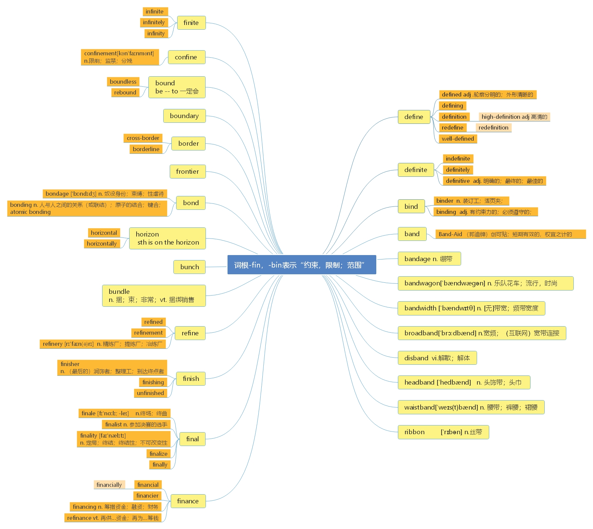

# 第十二节 词根-fin， -bin， -bund

> **本节课目标**
>
> 1、 掌握词根-fin， -bin， -bund 的含义
>
> 2、 掌握单词 70 个， -ery 后缀相关单词 53 个

***

> **【 课堂笔记】**
>
> 词根-fin， -bin 表示 bind“限制，约束，范围” 的含义。
>
> 词根-fin=-bin 原因是 f→b 辅音字母相互发生了转变而造成的。

***

**define**  \[dɪ'faɪn] vt.  [英音](https://dict.youdao.com/dictvoice?audio=define\&type=1)  [美音](https://dict.youdao.com/dictvoice?audio=define\&type=2) 定义；使明确；规定 1214

**助记：** de（ 下） +fin（ 限定、 范围） +e→给…下个范围、 限定→下定义

**双语例句:** We need to define the task ahead very clearly. [播放](https://dict.youdao.com/dictvoice?audio=We+need+to+define+the+task+ahead+very+clearly.&le=eng&le=eng&type=2)

我们需要明确今后的任务。 

**双语例句:** It depends on how you define the term 'hostile'. [播放](https://dict.youdao.com/dictvoice?audio=It+depends+on+how+you+define+the+term+%27hostile%27.&le=eng&le=eng&type=2)

那得看你怎么定义hostile这个词。 

**双语例句:** The term 'mental illness' is difficult to define. [播放](https://dict.youdao.com/dictvoice?audio=The+term+%27mental+illness%27+is+difficult+to+define.&le=eng&le=eng&type=2)

“精神病”这个词很难下定义。 

**原声例句:** Last week, we said colleges and universities in the United States **define** plagiarism as representing another person's work as your own. [播放](https://dict.youdao.com/pureaudio?docid=5380704257965348155)

**原声例句:** To write the book, Ruth Krauss asked very small children how they would **define** words like \"face,\" \"dog\" and \"party.\" [播放](https://dict.youdao.com/pureaudio?docid=7346152118916371127)

**原声例句:** It covers all things that involve the heart and **define** the effort of man to rise above the mechanical process of life.\" [播放](https://dict.youdao.com/pureaudio?docid=1969412988061443947)

**权威例句:** They do if capitalism, as they **define** it, is devoid of any underlying morality.  [播放](https://dict.youdao.com/dictvoice?audio=They+do+if+capitalism%2C+as+they+define+it%2C+is+devoid+of+any+underlying+morality.+&le=eng&type=2)

**权威例句:** Fair to say that when trying to **define** this car, it's hard to know where to start.  [播放](https://dict.youdao.com/dictvoice?audio=Fair+to+say+that+when+trying+to+define+this+car%2C+it%27s+hard+to+know+where+to+start.+&le=eng&type=2)

**权威例句:** It's not for the BBC to **define** on what basis something is in the charts.  [播放](https://dict.youdao.com/dictvoice?audio=It%27s+not+for+the+BBC+to+define+on+what+basis+something+is+in+the+charts.+&le=eng&type=2)

***

**defined**  \[dɪˈfaɪnd] adj.  [英音](https://dict.youdao.com/dictvoice?audio=defined\&type=1)  [美音](https://dict.youdao.com/dictvoice?audio=defined\&type=2) 清晰的，轮廓分明的；有定义的，确定的 14001

**释义：** 轮廓分明的；外形清晰的 If something is clearly defined or strongly defined, its outline is

clear or strong.

**双语例句:** These categories are not well defined. [播放](https://dict.youdao.com/dictvoice?audio=These+categories+are+not+well+defined.&le=eng&le=eng&type=2)

这些类别划分得不太明确。 

**双语例句:** Leisure is often defined in opposition to work. [播放](https://dict.youdao.com/dictvoice?audio=Leisure+is+often+defined+in+opposition+to+work.&le=eng&le=eng&type=2)

休闲常被定义为工作的反面。 

**双语例句:** The powers of the police must be clearly defined. [播放](https://dict.youdao.com/dictvoice?audio=The+powers+of+the+police+must+be+clearly+defined.&le=eng&le=eng&type=2)

警察的职权必须明确界定。 

**原声例句:** A \"tornado outbreak\" is often **defined** as six or more tornadoes produced by the same weather system within a day. [播放](https://dict.youdao.com/pureaudio?docid=2559344590253787413)

**原声例句:** Rockman often shows nature as **defined** by a struggle for survival with a never-ending repetition of life and death. [播放](https://dict.youdao.com/pureaudio?docid=8308958170041154418)

**原声例句:** This Cuban music or \"son\" is **defined** by the beat of the drum and the call of the singer. [播放](https://dict.youdao.com/pureaudio?docid=-3230851589871585541)

**权威例句:** As an island continent, Australia is quite literally **defined** by its 37, 000km of coast.  [播放](https://dict.youdao.com/dictvoice?audio=As+an+island+continent%2C+Australia+is+quite+literally+defined+by+its+37%2C+000km+of+coast.+&le=eng&type=2)

**权威例句:** Michael Dugher, vice-chairman of the Labour Party, said Mr Cameron's leadership was **\"define**d by failure and broken promises\".  [播放](https://dict.youdao.com/dictvoice?audio=Michael+Dugher%2C+vice-chairman+of+the+Labour+Party%2C+said+Mr+Cameron%27s+leadership+was+%22defined+by+failure+and+broken+promises%22.+&le=eng&type=2)

**权威例句:** She finally got what she had wanted the whole time: to be free and not **defined** by cancer.  [播放](https://dict.youdao.com/dictvoice?audio=She+finally+got+what+she+had+wanted+the+whole+time%3A+to+be+free+and+not+defined+by+cancer.+&le=eng&type=2)

***

**defining**  \[dɪ'faɪnɪŋ] adj.  [英音](https://dict.youdao.com/dictvoice?audio=defining\&type=1)  [美音](https://dict.youdao.com/dictvoice?audio=defining\&type=2) 最典型的； 起决定性作用的 9819

> **【 课堂笔记】**
>
> 用法：
>
> 1） by + defining （动词 define 的 ing 形式）
>
> 2） **搭配：** defining moment 决定性时刻；关键性时刻=>decisive adj 关键的；决定性的=>decide v. 决定

**双语例句:** You can rotate your square by defining how you draw your object. [播放](https://dict.youdao.com/dictvoice?audio=You+can+rotate+your+square+by+defining+how+you+draw+your+object.&le=eng&le=eng&type=2)

您可以通过定义对象的绘制方式来旋转您的正方形。 

**双语例句:** Rules defining and regulating telemedicine differ widely from state to state. [播放](https://dict.youdao.com/dictvoice?audio=Rules+defining+and+regulating+telemedicine+differ+widely+from+state+to+state.&le=eng&le=eng&type=2)

界定和管理远程医疗的规则因州而异。 

**双语例句:** It's a sketch is a way of getting started on defining your characters' personalities. [播放](https://dict.youdao.com/dictvoice?audio=It%27s+a+sketch+is+a+way+of+getting+started+on+defining+your+characters%27+personalities.&le=eng&le=eng&type=2)

素描是一种开始定义你的角色性格的方式。 

**原声例句:** Kahn's architecture has several **defining** qualities. [播放](https://dict.youdao.com/pureaudio?docid=-417405590409636386)

**原声例句:** \"What is required of us now is a new era of responsibility Ca recognition on the part of every American, that we have duties to ourselves, our nation and the world, duties that we do not grudgingly accept but rather seize gladly, firm in the knowledge that there is nothing so satisfying to the spirit, so **defining** of our character, than giving our all to a difficult task.\" [播放](https://dict.youdao.com/pureaudio?docid=4247797491196954473)

**原声例句:** \"If we keep **defining** our happiness through how much we consume it's going to lead to tragic end,\" [播放](https://dict.youdao.com/pureaudio?docid=-6328408740097479503)

**权威例句:** And I've been telling Washington and the Americans that this is the **defining** challenge of our time.  [播放](https://dict.youdao.com/dictvoice?audio=And+I%27ve+been+telling+Washington+and+the+Americans+that+this+is+the+defining+challenge+of+our+time.+&le=eng&type=2)

**权威例句:** So the filmmakers focused on the theme of **defining** oneself in the face of unexpected obstacles.  [播放](https://dict.youdao.com/dictvoice?audio=So+the+filmmakers+focused+on+the+theme+of+defining+oneself+in+the+face+of+unexpected+obstacles.+&le=eng&type=2)

**权威例句:** This would have to include some way of **defining**, quantifying and limiting this newly created power.  [播放](https://dict.youdao.com/dictvoice?audio=This+would+have+to+include+some+way+of+defining%2C+quantifying+and+limiting+this+newly+created+power.+&le=eng&type=2)

***

**definition** \[defɪ'nɪʃ(ə)n] n.  [英音](https://dict.youdao.com/dictvoice?audio=definition\&type=1)  [美音](https://dict.youdao.com/dictvoice?audio=definition\&type=2) 定义；清晰度；解说 2129

> **【 课堂笔记】**
>
> 动词形式为 define
>
> ition=ite+ion（字母 e 不发音，被省略掉了）

**双语例句:** What's your definition of happiness? [播放](https://dict.youdao.com/dictvoice?audio=What%27s+your+definition+of+happiness%3F&le=eng&le=eng&type=2)

你对幸福的定义是什么？ 

**双语例句:** There is no generally accepted definition of life. [播放](https://dict.youdao.com/dictvoice?audio=There+is+no+generally+accepted+definition+of+life.&le=eng&le=eng&type=2)

没有一个对生活的普遍公认的定义。 

**双语例句:** Can you give a more precise definition of the word? [播放](https://dict.youdao.com/dictvoice?audio=Can+you+give+a+more+precise+definition+of+the+word%3F&le=eng&le=eng&type=2)

你能给这个词下个更确切的定义吗？ 

**原声例句:** One **definition** of biodiversity is the differences of life at all levels of biological organization. [播放](https://dict.youdao.com/pureaudio?docid=-6272573829236959336)

**原声例句:** That's under your control.\" Those words later helped him with his own **definition** of success. [播放](https://dict.youdao.com/pureaudio?docid=350472300209172376)

**原声例句:** \"The record is clear. Identity politics is at the core of Judge Sotomayor's self-**definition**.\" [播放](https://dict.youdao.com/pureaudio?docid=5312587032360177042)

**权威例句:** Those driven by temporary fear almost by **definition** commit themselves to a program of sell, switch, and buy.  [播放](https://dict.youdao.com/dictvoice?audio=Those+driven+by+temporary+fear+almost+by+definition+commit+themselves+to+a+program+of+sell%2C+switch%2C+and+buy.+&le=eng&type=2)

**权威例句:** Acer says this netbook, with its high-definition screen and Dolby sound software, is particularly suited to watching videos.  [播放](https://dict.youdao.com/dictvoice?audio=Acer+says+this+netbook%2C+with+its+high-definition+screen+and+Dolby+sound+software%2C+is+particularly+suited+to+watching+videos.+&le=eng&type=2)

**权威例句:** That doesn't mean we should change the **definition** of marriage, which is between a man and a woman.  [播放](https://dict.youdao.com/dictvoice?audio=That+doesn%27t+mean+we+should+change+the+definition+of+marriage%2C+which+is+between+a+man+and+a+woman.+&le=eng&type=2)

***

**high-definition**  \['haidefi'niʃən] adj. （  [英音](https://dict.youdao.com/dictvoice?audio=high-definition\&type=1)  [美音](https://dict.youdao.com/dictvoice?audio=high-definition\&type=2) 电视或技术） 高清晰度的， 高分辨率的 19934

**释义：**（电视或技术）高清晰度的，高分辨率的 High-definition television or technology is a

digital system that gives a much clearer picture than traditional television systems.

***

**redefine**  \[ri\:dɪ'faɪn] vt.  [英音](https://dict.youdao.com/dictvoice?audio=redefine\&type=1)  [美音](https://dict.youdao.com/dictvoice?audio=redefine\&type=2) 重新定义 7700

**双语例句:** We need to redefine what we mean by democracy. [播放](https://dict.youdao.com/dictvoice?audio=We+need+to+redefine+what+we+mean+by+democracy.&le=eng&le=eng&type=2)

我们需要重新考虑我们对民主的理解。 

**双语例句:** You just have to do a little thinking ahead and redefine what qualifies as dinner. [播放](https://dict.youdao.com/dictvoice?audio=You+just+have+to+do+a+little+thinking+ahead+and+redefine+what+qualifies+as+dinner.&le=eng&le=eng&type=2)

你只需要提前思考一会，并重新定义晚餐的标准。 

**双语例句:** The task facing medicine in the twenty-first century will be to redefine its limits even as it extends its capacities. [播放](https://dict.youdao.com/dictvoice?audio=The+task+facing+medicine+in+the+twenty-first+century+will+be+to+redefine+its+limits+even+as+it+extends+its+capacities.&le=eng&le=eng&type=2)

21世纪医学面临的任务将是重新定义其限制，即使它扩大了其能力。 

**权威例句:** The BlackBerry PlayBook delivers professional-grade, consumer-friendly experiences that **redefine** the possibilities of mobile computing.  [播放](https://dict.youdao.com/dictvoice?audio=The+BlackBerry+PlayBook+delivers+professional-grade%2C+consumer-friendly+experiences+that+redefine+the+possibilities+of+mobile+computing.+&le=eng&type=2)

**权威例句:** This will help us **redefine** learning and repurpose the spaces we use for learning.  [播放](https://dict.youdao.com/dictvoice?audio=This+will+help+us+redefine+learning+and+repurpose+the+spaces+we+use+for+learning.+&le=eng&type=2)

**权威例句:** Outside-in thinking allows early adopter companies to thrive, while others will struggle to **redefine** their value.  [播放](https://dict.youdao.com/dictvoice?audio=Outside-in+thinking+allows+early+adopter+companies+to+thrive%2C+while+others+will+struggle+to+redefine+their+value.+&le=eng&type=2)

***

**redefinition**  \[,ridɛfə'nɪʃən] n.  [英音](https://dict.youdao.com/dictvoice?audio=redefinition\&type=1)  [美音](https://dict.youdao.com/dictvoice?audio=redefinition\&type=2) 重新定义 19823

**双语例句:** Answer: Yes, a redefinition of the question. [播放](https://dict.youdao.com/dictvoice?audio=Answer%3A+Yes%2C+a+redefinition+of+the+question.&le=eng&le=eng&type=2)

答：是的，对问题的重新发现。 

**双语例句:** Let that be the redefinition of your relationship. [播放](https://dict.youdao.com/dictvoice?audio=Let+that+be+the+redefinition+of+your+relationship.&le=eng&le=eng&type=2)

所以就建立这样适合的关系，重新定义与父母的关系。 

**双语例句:** But for other people it's a redefinition and an expansion. [播放](https://dict.youdao.com/dictvoice?audio=But+for+other+people+it%27s+a+redefinition+and+an+expansion.&le=eng&le=eng&type=2)

但是对另一些人来说，这是对于图书馆这个概念的重新定义和扩展。 

**权威例句:** And the baggage (unintelligible) leads to **redefinition** and self-description of a group, you know.  [播放](https://dict.youdao.com/dictvoice?audio=And+the+baggage+%28unintelligible%29+leads+to+redefinition+and+self-description+of+a+group%2C+you+know.+&le=eng&type=2)

**权威例句:** Its membership definition needs **redefinition**, when tiny Third World countries (Angola, Cameroon, etc.) can prevent action.  [播放](https://dict.youdao.com/dictvoice?audio=Its+membership+definition+needs+redefinition%2C+when+tiny+Third+World+countries+%28Angola%2C+Cameroon%2C+etc.%29+can+prevent+action.+&le=eng&type=2)

**权威例句:** The **redefinition** of the term \"engagement\" is creating a new frontier for longtime committed couples.  [播放](https://dict.youdao.com/dictvoice?audio=The+redefinition+of+the+term+%22engagement%22+is+creating+a+new+frontier+for+longtime+committed+couples.+&le=eng&type=2)

***

**well-defined**  \['weldi'faind] adj.  [英音](https://dict.youdao.com/dictvoice?audio=well-defined\&type=1)  [美音](https://dict.youdao.com/dictvoice?audio=well-defined\&type=2) 定义明确的；界限清楚的 15574

***

**definite**  \['defɪnɪt] adj.  [英音](https://dict.youdao.com/dictvoice?audio=definite\&type=1)  [美音](https://dict.youdao.com/dictvoice?audio=definite\&type=2) 确切的；一定的 6887

**助记：** de（ 加强语气） +fin（ 限定、 约束） +ite（ 形容词后缀） →限定的， 确定的， 一定的

**搭配：** a definite period of time（考）：一定的时期 definite conclusion（考）：明确的结论

> **【 课堂笔记】**
>
> de-
>
> 1.  \=down 向下
>
> 2） 相反的； 否定的
>
> 3）偶尔表示加强语气
>
> definite evidence 确切的证据

**双语例句:** That's definite then, is it? [播放](https://dict.youdao.com/dictvoice?audio=That%27s+definite+then%2C+is+it%3F&le=eng&le=eng&type=2)

那么，那是确切的了，是吗？ 

**双语例句:** Mary is very definite about this. [播放](https://dict.youdao.com/dictvoice?audio=Mary+is+very+definite+about+this.&le=eng&le=eng&type=2)

玛丽对此非常肯定。 

**双语例句:** Is it definite that he's leaving? [播放](https://dict.youdao.com/dictvoice?audio=Is+it+definite+that+he%27s+leaving%3F&le=eng&le=eng&type=2)

他肯定要离开吗？ 

**原声例句:** \"My situation is fine, but I am still aware that I could lose my job at anytime, and there's still no **definite** security. [播放](https://dict.youdao.com/pureaudio?docid=6456469617987048851)

**原声例句:** \"Well,some **definite** facts.One is that he has al-Qaida connections. Secondly,that it was a fairly sophisticated device.\" [播放](https://dict.youdao.com/pureaudio?docid=4457597506569081402)

**原声例句:** \"We think that they may be. We do know that people who are taken out of high tobacco smoke environments have a **definite** drop in developing coronary artery disease. [播放](https://dict.youdao.com/pureaudio?docid=-8010282295306349178)

**权威例句:** Working with Peter Dench was a truly memorable experience and a **definite** highlight of my career so far.  [播放](https://dict.youdao.com/dictvoice?audio=Working+with+Peter+Dench+was+a+truly+memorable+experience+and+a+definite+highlight+of+my+career+so+far.+&le=eng&type=2)

**权威例句:** It had a strange greenish tinge to it, with a **definite** tail behind it.  [播放](https://dict.youdao.com/dictvoice?audio=It+had+a+strange+greenish+tinge+to+it%2C+with+a+definite+tail+behind+it.+&le=eng&type=2)

**权威例句:** As a child, there was a **definite** downside to this Italian obsession with health.  [播放](https://dict.youdao.com/dictvoice?audio=As+a+child%2C+there+was+a+definite+downside+to+this+Italian+obsession+with+health.+&le=eng&type=2)

***

**indefinite**  \[ɪn'defɪnɪt] adj.  [英音](https://dict.youdao.com/dictvoice?audio=indefinite\&type=1)  [美音](https://dict.youdao.com/dictvoice?audio=indefinite\&type=2) 不确定的； 模糊的； 无限的 14449

**双语例句:** The trial was adjourned for an indefinite period. [播放](https://dict.youdao.com/dictvoice?audio=The+trial+was+adjourned+for+an+indefinite+period.&le=eng&le=eng&type=2)

审判被无限期推迟。 

**双语例句:** They seem determined to string the talks out for an indefinite period. [播放](https://dict.youdao.com/dictvoice?audio=They+seem+determined+to+string+the+talks+out+for+an+indefinite+period.&le=eng&le=eng&type=2)

他们好像一心要把谈判无限期地拖下去。 

**双语例句:** My heart was filled with puzzlement about the indefinite future and longing for the new life. [播放](https://dict.youdao.com/dictvoice?audio=My+heart+was+filled+with+puzzlement+about+the+indefinite+future+and+longing+for+the+new+life.&le=eng&le=eng&type=2)

我的心对不确定的未来充满了困惑，渴望着新生活。 

**权威例句:** By disabling that, they were able to access **indefinite** offline play, albeit with no region interactions.  [播放](https://dict.youdao.com/dictvoice?audio=By+disabling+that%2C+they+were+able+to+access+indefinite+offline+play%2C+albeit+with+no+region+interactions.+&le=eng&type=2)

**权威例句:** He said the closures are **indefinite**, and that authorities would re-evaluate the situation as needed.  [播放](https://dict.youdao.com/dictvoice?audio=He+said+the+closures+are+indefinite%2C+and+that+authorities+would+re-evaluate+the+situation+as+needed.+&le=eng&type=2)

**权威例句:** The General Teaching Council for Wales imposed an **indefinite** prohibition order on Wilkie on Thursday.  [播放](https://dict.youdao.com/dictvoice?audio=The+General+Teaching+Council+for+Wales+imposed+an+indefinite+prohibition+order+on+Wilkie+on+Thursday.+&le=eng&type=2)

***

**definitely**  \['defɪnɪtlɪ] adv.  [英音](https://dict.youdao.com/dictvoice?audio=definitely\&type=1)  [美音](https://dict.youdao.com/dictvoice?audio=definitely\&type=2) 明确地， 肯定地； 清楚地， 当然 2005

**双语例句:** I definitely remember sending the letter. [播放](https://dict.youdao.com/dictvoice?audio=I+definitely+remember+sending+the+letter.&le=eng&le=eng&type=2)

我记得这封信肯定发出去了。 

**双语例句:** This site is definitely worth bookmarking. [播放](https://dict.youdao.com/dictvoice?audio=This+site+is+definitely+worth+bookmarking.&le=eng&le=eng&type=2)

这个网站绝对值得设电子书签。 

**双语例句:** The exam was impossible! I definitely bombed it. [播放](https://dict.youdao.com/dictvoice?audio=The+exam+was+impossible%21+I+definitely+bombed+it.&le=eng&le=eng&type=2)

考试太难了！我肯定考砸了。 

**原声例句:** But the honey is **definitely** giving you some textures on your tongue and the mouth-feel that I enjoy.\" [播放](https://dict.youdao.com/pureaudio?docid=-3659738679991770355)

**原声例句:** **Definitely** a once in a lifetime opportunity I'm doing here.\" These boys say they share the special link of being Scouts no matter where they come from. [播放](https://dict.youdao.com/pureaudio?docid=8470824380250602360)

**原声例句:** Actually, I also saw 'Robin Hood.' It was **definitely** an epic film but it was really dark and gloomy, so I wasn't as big of a fan of that.\" [播放](https://dict.youdao.com/pureaudio?docid=1135658402252540546)

**权威例句:** \"I'm sure everyone at Swansea would **definitely** want to keep him, \" said the 19-year-old Allen.  [播放](https://dict.youdao.com/dictvoice?audio=%22I%27m+sure+everyone+at+Swansea+would+definitely+want+to+keep+him%2C+%22+said+the+19-year-old+Allen.+&le=eng&type=2)

**权威例句:** So **definitely** I want to play well for Arsenal to start in the World Cup.  [播放](https://dict.youdao.com/dictvoice?audio=So+definitely+I+want+to+play+well+for+Arsenal+to+start+in+the+World+Cup.+&le=eng&type=2)

**权威例句:** And we now have those visas for 12 months, so we'll **definitely** be back, for sure.  [播放](https://dict.youdao.com/dictvoice?audio=And+we+now+have+those+visas+for+12+months%2C+so+we%27ll+definitely+be+back%2C+for+sure.+&le=eng&type=2)

***

**definitive**  \[dɪ'fɪnətɪv] adj.  [英音](https://dict.youdao.com/dictvoice?audio=definitive\&type=1)  [美音](https://dict.youdao.com/dictvoice?audio=definitive\&type=2) 明确的； 最终的； 不可更改的； 决定性的； 最佳的 15308

**释义：** 1） 明确的；最终的；不可更改的；决定性的 Something that is definitive provides a firm

conclusion that cannot be questioned.

2） （书籍或表演）最佳的，最具权威的 A definitive book or performance is thought to be the best

of its kind that has ever been done or that will ever be done.

> **【 课堂笔记】**
>
> definitive=define（ v. 规定） +-ive（表示“大/多”）

**双语例句:** The evidence provided by the documents of British and French colonies is not definitive. [播放](https://dict.youdao.com/dictvoice?audio=The+evidence+provided+by+the+documents+of+British+and+French+colonies+is+not+definitive.&le=eng&le=eng&type=2)

英国和法国殖民地的文件所提供的证据并不是决定性的。 

**双语例句:** Models from economics and demography become the definitive tools for examining the financial base of social security. [播放](https://dict.youdao.com/dictvoice?audio=Models+from+economics+and+demography+become+the+definitive+tools+for+examining+the+financial+base+of+social+security.&le=eng&le=eng&type=2)

来自经济学和人口学的模型成为检验社会保障财政基础的最权威工具。 

**双语例句:** The definitive version of the text is ready to be published. [播放](https://dict.youdao.com/dictvoice?audio=The+definitive+version+of+the+text+is+ready+to+be+published.&le=eng&le=eng&type=2)

正式的文本很快就要发表了。 

**原声例句:** The **definitive** history of the Cold War's end clearly has yet to be written. [播放](https://dict.youdao.com/pureaudio?docid=6001259011993069820)

**原声例句:** Brennan - who is leading a White House investigation into the incident told ABC's This Week there were bits and pieces of information about the suspect, but no **definitive** evidence. [播放](https://dict.youdao.com/pureaudio?docid=6211921017439520533)

**原声例句:** So we've strong plans in place, but we're continuing to work on them with the pinnacle of our work, getting the right vaccine in place to be able to give **definitive** protection to people,\". [播放](https://dict.youdao.com/pureaudio?docid=-5333683003526747798)

**权威例句:** Working with the Tax Justice Network I set out to provide a **definitive** answer.  [播放](https://dict.youdao.com/dictvoice?audio=Working+with+the+Tax+Justice+Network+I+set+out+to+provide+a+definitive+answer.+&le=eng&type=2)

**权威例句:** We can speculate about the causes, but it's impossible to give a single **definitive** answer.  [播放](https://dict.youdao.com/dictvoice?audio=We+can+speculate+about+the+causes%2C+but+it%27s+impossible+to+give+a+single+definitive+answer.+&le=eng&type=2)

**权威例句:** Inc. (NASDAQ: YHOO) and Tumblr announced today that they have reached a **definitive** agreement for Yahoo!  [播放](https://dict.youdao.com/dictvoice?audio=Inc.+%28NASDAQ%3A+YHOO%29+and+Tumblr+announced+today+that+they+have+reached+a+definitive+agreement+for+Yahoo%21+&le=eng&type=2)

***

**bind**  \[baɪnd] vi.  [英音](https://dict.youdao.com/dictvoice?audio=bind\&type=1)  [美音](https://dict.youdao.com/dictvoice?audio=bind\&type=2) 使密切联系；约束；限制； 装订；结合 2519

**助记：** bind（ 谐音： 绑、 捆绑） →约束、 束缚（ 即： 被“绑住”了）； 联系、 结合（ 即： “绑

在一起”）

**搭配：** be bound up with（ 考）： 和…联系在一起/绑在一起 bind together（ 考）： 绑在一起

> **【 课堂笔记】**
>
> **搭配：**
>
> be bound up with 和…联系在一起/绑在一起
>
> bind together 绑在一起
>
> be bound by sth. 被某事约束

例句： Furthermore, it is obvious that the strength of a country's economy is directly bound up

with the efficiency of its agriculture and industry, and that this in turn rests upon the efforts

of scientists and technologists of all kinds.

&#x20;此外，很明显的是，一个国家的经济实力直接和它工业和农业的效率联系在一起，而效率反过来又依赖各种科学家和技术人员的努力。

仿写例句：很明显的是，一个人的成功直接和他的能力联系在一起，而能力反过来又依赖他

所付出的努力。

It is obvious that the success of a person is directly bound up with his ability, and that this in turn

rests upon his efforts.

Eisenhower’s interstate highways \_\_\_\_\_\_\_\_ the nation together in new ways and facilitated major

economic growth by making commerce less expensive.

A． packed B． stuck C． suppressed D． bound

解析： 原文翻译“艾森豪威尔主持修建的州际公路以全新的方式将整个国家联系在一起， 通

过减少贸易成本推动了经济的巨大发展”， 故选 D， bind together： 捆在一起， 联系在一起；

A：打包； B：坚持、粘贴； C：镇压

**双语例句:** Take him home and bind his wounds. [播放](https://dict.youdao.com/dictvoice?audio=Take+him+home+and+bind+his+wounds.&le=eng&le=eng&type=2)

带他回家，包扎他的伤口。 

**双语例句:** The miser said, \"Bind me fast, bind me fast, for pity's sake.\" [播放](https://dict.youdao.com/dictvoice?audio=The+miser+said%2C+%22Bind+me+fast%2C+bind+me+fast%2C+for+pity%27s+sake.%22&le=eng&le=eng&type=2)

守财奴说：“快把我绑起来，快把我绑起来，可怜可怜我吧。” 

**双语例句:** They can bring us freedom in our relationships or bind us to them. [播放](https://dict.youdao.com/dictvoice?audio=They+can+bring+us+freedom+in+our+relationships+or+bind+us+to+them.&le=eng&le=eng&type=2)

它们可以给我们带来关系上的自由，也可以把我们束缚在一起。 

**原声例句:** Each Nobel Prize winner showed how ribosomes tie or **bind** with antibiotics. [播放](https://dict.youdao.com/pureaudio?docid=-2880340687636376557)

**原声例句:** South Africa is ready.\" (OMITTED) \"This World Cup is beginning to plant the seeds, serving as a glue to **bind** the nation.\" [播放](https://dict.youdao.com/pureaudio?docid=-7697855888950146637)

**原声例句:** David Wasserman,an expert with the Cook Political Report in Washington, says the health care debate has put the president in a classic political **bind**. [播放](https://dict.youdao.com/pureaudio?docid=3465816529537236972)

**权威例句:** That would undoubtedly help lots of current borrowers who find themselves in a terrible **bind**.  [播放](https://dict.youdao.com/dictvoice?audio=That+would+undoubtedly+help+lots+of+current+borrowers+who+find+themselves+in+a+terrible+bind.+&le=eng&type=2)

**权威例句:** Central banks are gearing up to fight the fight, but they're in a real **bind**.  [播放](https://dict.youdao.com/dictvoice?audio=Central+banks+are+gearing+up+to+fight+the+fight%2C+but+they%27re+in+a+real+bind.+&le=eng&type=2)

**权威例句:** Once the arsenic is in contact with the sulphur, it will **bind** to it.  [播放](https://dict.youdao.com/dictvoice?audio=Once+the+arsenic+is+in+contact+with+the+sulphur%2C+it+will+bind+to+it.+&le=eng&type=2)

***

**binder**  \['baɪndə] n.  [英音](https://dict.youdao.com/dictvoice?audio=binder\&type=1)  [美音](https://dict.youdao.com/dictvoice?audio=binder\&type=2) 装订工；活页夹；捆缚者；粘合剂；用以绑缚之物 13069

> **【 课堂笔记】**
>
> bind 表示“结合；粘合；装订”
>
> \-er -ar -ur -or
>
> 1）做名词后缀 人/ 物：机器 tractor
>
> 1.  做形容词后缀，表示…的
>
> 3）少数情况下：做动词后缀

**双语例句:** The effect of water binder ratio (W/C) was studied. [播放](https://dict.youdao.com/dictvoice?audio=The+effect+of+water+binder+ratio+%28W%2FC%29+was+studied.&le=eng&le=eng&type=2)

对水灰比的影响进行了研究。 

**双语例句:** Figure 16. Settings for the binder input. [播放](https://dict.youdao.com/dictvoice?audio=Figure+16.+Settings+for+the+binder+input.&le=eng&le=eng&type=2)

图16 . binder输入的设置。 

**双语例句:** \"Our priority is the pets,\" Binder said. [播放](https://dict.youdao.com/dictvoice?audio=%22Our+priority+is+the+pets%2C%22+Binder+said.&le=eng&le=eng&type=2)

“宠物是我们的头等大事，”宾得说。 

**原声例句:** and so if you see my **binder**, I have like my schedule all planned out for me.

**权威例句:** If your old **binder** is falling apart, maybe it is time to get a filing cabinet.  [播放](https://dict.youdao.com/dictvoice?audio=If+your+old+binder+is+falling+apart%2C+maybe+it+is+time+to+get+a+filing+cabinet.+&le=eng&type=2)

**权威例句:** \"I have only cracked 10% of this book, \" he says, pointing to the \"pain points\" **binder**.  [播放](https://dict.youdao.com/dictvoice?audio=%22I+have+only+cracked+10%25+of+this+book%2C+%22+he+says%2C+pointing+to+the+%22pain+points%22+binder.+&le=eng&type=2)

**权威例句:** \"We're moving toward higher value production than our basic line of business, \" says **Binder**.  [播放](https://dict.youdao.com/dictvoice?audio=%22We%27re+moving+toward+higher+value+production+than+our+basic+line+of+business%2C+%22+says+Binder.+&le=eng&type=2)

***

**binding**  \['baɪndɪŋ] adj.  [英音](https://dict.youdao.com/dictvoice?audio=binding\&type=1)  [美音](https://dict.youdao.com/dictvoice?audio=binding\&type=2) 有约束力的； 必须遵守的； 应履行的 9323

**释义：** A binding promise, agreement, or decision must be obeyed or carried out.

**双语例句:** It is set out in a legally binding protocol which forms part of the treaty. [播放](https://dict.youdao.com/dictvoice?audio=It+is+set+out+in+a+legally+binding+protocol+which+forms+part+of+the+treaty.&le=eng&le=eng&type=2)

这在有法律约束力的、构成条约之一部分的附件中有说明。 

**双语例句:** Clayton sought to examine evidence of scrub jays' accurate memory of \"what,\" \"where,\" and \"when\" information and their binding of this information. [播放](https://dict.youdao.com/dictvoice?audio=Clayton+sought+to+examine+evidence+of+scrub+jays%27+accurate+memory+of+%22what%2C%22+%22where%2C%22+and+%22when%22+information+and+their+binding+of+this+information.&le=eng&le=eng&type=2)

克莱顿试图检验灌丛松鸦对“什么”、“何地”、“何时”的信息的准确记忆及其对这些信息的约束的证据。 

**双语例句:** She hurriedly untied the ropes binding her ankles. [播放](https://dict.youdao.com/dictvoice?audio=She+hurriedly+untied+the+ropes+binding+her+ankles.&le=eng&le=eng&type=2)

她赶紧解开绑着自己双脚的绳子。 

**原声例句:** He says he will work with world leaders to reach a legally **binding** treaty in the coming months. [播放](https://dict.youdao.com/pureaudio?docid=-5924418445995190136)

**原声例句:** But the agreement, known as the Copenhagen Accord, is not legally **binding**. [播放](https://dict.youdao.com/pureaudio?docid=-2850695192436611918)

**原声例句:** The ruling is non-**binding**; it does not have legal force. [播放](https://dict.youdao.com/pureaudio?docid=-6327345306920332791)

**权威例句:** Some fertility experts fear the guidelines may not lead to changes because they are not **binding**.  [播放](https://dict.youdao.com/dictvoice?audio=Some+fertility+experts+fear+the+guidelines+may+not+lead+to+changes+because+they+are+not+binding.+&le=eng&type=2)

**权威例句:** There's no legal - you know, legally **binding** aspect of - it's just to honor her wish.  [播放](https://dict.youdao.com/dictvoice?audio=There%27s+no+legal+-+you+know%2C+legally+binding+aspect+of+-+it%27s+just+to+honor+her+wish.+&le=eng&type=2)

**权威例句:** The Financial Services Authority (FSA) was not notified, meaning administration was not legally **binding**.  [播放](https://dict.youdao.com/dictvoice?audio=The+Financial+Services+Authority+%28FSA%29+was+not+notified%2C+meaning+administration+was+not+legally+binding.+&le=eng&type=2)

***

**band** \[bænd] n.  [英音](https://dict.youdao.com/dictvoice?audio=band\&type=1)  [美音](https://dict.youdao.com/dictvoice?audio=band\&type=2) 乐队；一帮；带；频带；波段 1284

**助记：** band（ =bind： 捆绑） →绑在一起的几个人→乐队

**双语例句:** The singer re-formed his band. [播放](https://dict.youdao.com/dictvoice?audio=The+singer+re-formed+his+band.&le=eng&le=eng&type=2)

这名歌手对他的乐队进行了重组。 

**双语例句:** There was a naff band playing. [播放](https://dict.youdao.com/dictvoice?audio=There+was+a+naff+band+playing.&le=eng&le=eng&type=2)

有一支蹩脚的乐队在演奏。 

**双语例句:** The band will be going on tour. [播放](https://dict.youdao.com/dictvoice?audio=The+band+will+be+going+on+tour.&le=eng&le=eng&type=2)

这个乐队将要进行巡回演出。 

**原声例句:** In nineteen eighty, Pinetop Perkins and the other Muddy Waters' **band** members formed their own group, the Legendary Blues **Band**. [播放](https://dict.youdao.com/pureaudio?docid=4782592985461895496)

**原声例句:** They include Eric Clapton, Jimmy Page from the **band** Led Zeppelin and Slash from the **band** Guns N' Roses. [播放](https://dict.youdao.com/pureaudio?docid=-5822025608579789787)

**原声例句:** Her friends included members of the Duke Ellington **band**, Count Basie's **band**, and singers like Sarah Vaughn and Peggy Lee. [播放](https://dict.youdao.com/pureaudio?docid=7514076849950551370)

**权威例句:** It's already making the **band** nostalgic for the peace and quiet of last year.  [播放](https://dict.youdao.com/dictvoice?audio=It%27s+already+making+the+band+nostalgic+for+the+peace+and+quiet+of+last+year.+&le=eng&type=2)

**权威例句:** Refosco is speaking about Bonfires of Sao Joao, the New York-based band's latest release.  [播放](https://dict.youdao.com/dictvoice?audio=Refosco+is+speaking+about+Bonfires+of+Sao+Joao%2C+the+New+York-based+band%27s+latest+release.+&le=eng&type=2)

**权威例句:** Langhorne Slim and his **band** The War Eagles mix folk and blues with reckless punk-rock energy.  [播放](https://dict.youdao.com/dictvoice?audio=Langhorne+Slim+and+his+band+The+War+Eagles+mix+folk+and+blues+with+reckless+punk-rock+energy.+&le=eng&type=2)

***

**bandage**  \['bændɪdʒ] n.  [英音](https://dict.youdao.com/dictvoice?audio=bandage\&type=1)  [美音](https://dict.youdao.com/dictvoice?audio=bandage\&type=2) 绷带 9653

**Band-Aid** \['bændeid] n.（ [英音](https://dict.youdao.com/dictvoice?audio=Band-Aid\&type=1)  [美音](https://dict.youdao.com/dictvoice?audio=Band-Aid\&type=2) 邦迪牌）创可贴； （问题的解决办法）短期有效的，权宜之计的15622

**释义：**（ 1）（邦迪牌）创可贴 A Band-Aid is a small piece of sticky tape(sticky tape 胶带) that you use to cover

small cuts or wounds on your body.

（ 2）（问题的解决办法）短期有效的，权宜之计的，治标不治本的 If you refer to a Band-Aid

solution to a problem, you mean that you disapprove of it because you think that it will only be

effective for a short period.

**双语例句:** The bandage gradually unwound and fell off. [播放](https://dict.youdao.com/dictvoice?audio=The+bandage+gradually+unwound+and+fell+off.&le=eng&le=eng&type=2)

绷带逐渐松开脱落了。 

**双语例句:** We put some ointment and a bandage on his knee. [播放](https://dict.youdao.com/dictvoice?audio=We+put+some+ointment+and+a+bandage+on+his+knee.&le=eng&le=eng&type=2)

我们在他的膝盖上涂了些药膏，还缠了一条绷带。 

**双语例句:** The bandage must be put on when the blister breaks. [播放](https://dict.youdao.com/dictvoice?audio=The+bandage+must+be+put+on+when+the+blister+breaks.&le=eng&le=eng&type=2)

水疱破口后必须包扎上绷带。 

**原声例句:** The region may rescue Greece, he says,but it will only be putting a **bandage** on a far bigger problem. [播放](https://dict.youdao.com/pureaudio?docid=2048143652951019684)

**权威例句:** The IMF is applying an external **bandage** to patients who have massive internal injuries.  [播放](https://dict.youdao.com/dictvoice?audio=The+IMF+is+applying+an+external+bandage+to+patients+who+have+massive+internal+injuries.+&le=eng&type=2)

**权威例句:** They are applied to the wound, sealed in with a **bandage** and left to feed.  [播放](https://dict.youdao.com/dictvoice?audio=They+are+applied+to+the+wound%2C+sealed+in+with+a+bandage+and+left+to+feed.+&le=eng&type=2)

**权威例句:** But that could be a flimsy **bandage** for a company that has been rapidly hemorrhaging.  [播放](https://dict.youdao.com/dictvoice?audio=But+that+could+be+a+flimsy+bandage+for+a+company+that+has+been+rapidly+hemorrhaging.+&le=eng&type=2)

***

**bandanna**  \[bæn'dænə] n.  [英音](https://dict.youdao.com/dictvoice?audio=bandanna\&type=1)  [美音](https://dict.youdao.com/dictvoice?audio=bandanna\&type=2) 扎染印花大手帕；印花大围巾 18374

印花大围巾；鲜艳的大头巾 A bandanna is a brightly-coloured piece of cloth which is worn

around a person's neck or head.

**词源** also often bandana, 1752, from Hindi bandhnu, a method of dyeing, from Sanskrit badhnati

"binds" (because the cloth is tied in different places like modern tie-dye), from PIE root \*bhendh-

"to bind." Perhaps to English via Portuguese. Etymologically, the colors and spots are what makes

it a bandanna.

**双语例句:** He knotted the bandanna around his neck. [播放](https://dict.youdao.com/dictvoice?audio=He+knotted+the+bandanna+around+his+neck.&le=eng&le=eng&type=2)

他把印花大围巾系在他的脖子上。 

**双语例句:** We'd name him Bandit and put a red bandanna around his neck. [播放](https://dict.youdao.com/dictvoice?audio=We%27d+name+him+Bandit+and+put+a+red+bandanna+around+his+neck.&le=eng&le=eng&type=2)

我们会给他起名叫 Bandit，把红色的大手帕围在他的脖子上。 

**双语例句:** In the photo, Rimney's wearing a bandanna, pretending to smoke something. [播放](https://dict.youdao.com/dictvoice?audio=In+the+photo%2C+Rimney%27s+wearing+a+bandanna%2C+pretending+to+smoke+something.&le=eng&le=eng&type=2)

照片中的里穆尼头上戴着色彩鲜艳的头巾，假装在抽什么东西。 

**权威例句:** It was empty except for an older gentleman wearing a single earring, a **bandanna** tied around his neck.  [播放](https://dict.youdao.com/dictvoice?audio=It+was+empty+except+for+an+older+gentleman+wearing+a+single+earring%2C+a+bandanna+tied+around+his+neck.+&le=eng&type=2)

**权威例句:** They may even do it with a beard, shaggy hair and a **bandanna**.  [播放](https://dict.youdao.com/dictvoice?audio=They+may+even+do+it+with+a+beard%2C+shaggy+hair+and+a+bandanna.+&le=eng&type=2)

**权威例句:** And they have a picture of him with that red **bandanna** on, and the title of it is 'The Soldier.  [播放](https://dict.youdao.com/dictvoice?audio=And+they+have+a+picture+of+him+with+that+red+bandanna+on%2C+and+the+title+of+it+is+%27The+Soldier.+&le=eng&type=2)

***

**bandwagon**  \['bændwægən] n.  [英音](https://dict.youdao.com/dictvoice?audio=bandwagon\&type=1)  [美音](https://dict.youdao.com/dictvoice?audio=bandwagon\&type=2) 乐队花车；流行，时尚 14912

**词源：** also band-wagon, 1849, American English, from band (n.2) + wagon, originally a large

wagon used to carry the band in a circus procession; as these also figured in celebrations of

successful political campaigns, being on the bandwagon came to represent "attaching oneself to

anything that looks likely to succeed," a usage first attested 1899 in writings of Theodore

Roosevelt.

**双语例句:** In recent months many conservative politicians have jumped on the anti-immigrant bandwagon. [播放](https://dict.youdao.com/dictvoice?audio=In+recent+months+many+conservative+politicians+have+jumped+on+the+anti-immigrant+bandwagon.&le=eng&le=eng&type=2)

最近几个月，许多保守党政客赶上了反移民的浪头。 

**双语例句:** The World Cup bandwagon is starting to roll. [播放](https://dict.youdao.com/dictvoice?audio=The+World+Cup+bandwagon+is+starting+to+roll.&le=eng&le=eng&type=2)

世界杯足球赛热潮即将涌起。 

**双语例句:** The bandwagon was big enough for any johnny-come-lately. [播放](https://dict.youdao.com/dictvoice?audio=The+bandwagon+was+big+enough+for+any+johnny-come-lately.&le=eng&le=eng&type=2)

这股潮流对任何新来的人来说都足够了。 

**权威例句:** It is no surprise that the luxury automobile manufacturers are jumping on the nanotech **bandwagon**.  [播放](https://dict.youdao.com/dictvoice?audio=It+is+no+surprise+that+the+luxury+automobile+manufacturers+are+jumping+on+the+nanotech+bandwagon.+&le=eng&type=2)

**权威例句:** Is it any surprise that they are reluctant to jump on the global-warming **bandwagon**?  [播放](https://dict.youdao.com/dictvoice?audio=Is+it+any+surprise+that+they+are+reluctant+to+jump+on+the+global-warming+bandwagon%3F+&le=eng&type=2)

**权威例句:** In the last 12 months even the politicians have jumped on this particular **bandwagon**.  [播放](https://dict.youdao.com/dictvoice?audio=In+the+last+12+months+even+the+politicians+have+jumped+on+this+particular+bandwagon.+&le=eng&type=2)

***

**bandwidth**  \['bændwɪtθ; -wɪdθ] n. \[ [英音](https://dict.youdao.com/dictvoice?audio=bandwidth\&type=1)  [美音](https://dict.youdao.com/dictvoice?audio=bandwidth\&type=2) 无]带宽； 频带宽度 13396

> **【 课堂笔记】**
>
> bandwidth
>
> band (带)+wide (形容词， 宽的) →width （ 名词， 宽）

**双语例句:** To cope with this amount of data, the system will need a bandwidth of around 100mhz. [播放](https://dict.youdao.com/dictvoice?audio=To+cope+with+this+amount+of+data%2C+the+system+will+need+a+bandwidth+of+around+100mhz.&le=eng&le=eng&type=2)

要处理这样的数据量，这个系统将需要约100兆赫兹的带宽。 

**双语例句:** You pay for capacity, storage, and bandwidth as you use them. [播放](https://dict.youdao.com/dictvoice?audio=You+pay+for+capacity%2C+storage%2C+and+bandwidth+as+you+use+them.&le=eng&le=eng&type=2)

使用它们时，您需要为容量、存储和带宽付费。 

**双语例句:** Even when they stay on the right side of the law, Internet providers arouse customers' anger over bandwidth speed and cost. [播放](https://dict.youdao.com/dictvoice?audio=Even+when+they+stay+on+the+right+side+of+the+law%2C+Internet+providers+arouse+customers%27+anger+over+bandwidth+speed+and+cost.&le=eng&le=eng&type=2)

即使他们站在法律的正确一边，互联网供应商也会引起客户对带宽速度和成本的愤怒。 

**原声例句:** The company is also supporting the costs of the satellite **bandwidth** needed for the connections. [播放](https://dict.youdao.com/pureaudio?docid=6372780484194685462)

**原声例句:** And that **bandwidth** he called the shell.

**原声例句:** We have plenty of band with a long distance and thanks to local area networks like my own baby Ethernet, we have plenty of **bandwidth** in local area that was inside of buildings. But there is a gap, there is a gap between the LAN, the local area network, and the WAN, the Wide Area Network.

**权威例句:** About a hundred city-pair contracts will trade, predicts Thomas Gros, vice president of **bandwidth** trading for Enron.  [播放](https://dict.youdao.com/dictvoice?audio=About+a+hundred+city-pair+contracts+will+trade%2C+predicts+Thomas+Gros%2C+vice+president+of+bandwidth+trading+for+Enron.+&le=eng&type=2)

**权威例句:** McCaw has spent several years assembling extensive **bandwidth** in the 2.5 Gigahertz spectrum range.  [播放](https://dict.youdao.com/dictvoice?audio=McCaw+has+spent+several+years+assembling+extensive+bandwidth+in+the+2.5+Gigahertz+spectrum+range.+&le=eng&type=2)

**权威例句:** Voice uses very little **bandwidth** and can still work just fine on existing 3G networks.  [播放](https://dict.youdao.com/dictvoice?audio=Voice+uses+very+little+bandwidth+and+can+still+work+just+fine+on+existing+3G+networks.+&le=eng&type=2)

***

**broadband**  \['brɔ\:dbænd] n.  [英音](https://dict.youdao.com/dictvoice?audio=broadband\&type=1)  [美音](https://dict.youdao.com/dictvoice?audio=broadband\&type=2) 宽频；宽波段；（互联网）宽带连接 13714

**释义：** （电子信号的）宽频传输 Broadband is a method of sending many electronic messages at the

same time, using a wide range of frequencies.

**双语例句:** Broadband is still more expensive than dial-up services. [播放](https://dict.youdao.com/dictvoice?audio=Broadband+is+still+more+expensive+than+dial-up+services.&le=eng&le=eng&type=2)

宽带还是要比拨号服务费钱得多。 

**双语例句:** A recent study shows many broadband services lack basic security features. [播放](https://dict.youdao.com/dictvoice?audio=A+recent+study+shows+many+broadband+services+lack+basic+security+features.&le=eng&le=eng&type=2)

最近研究表明许多宽带服务缺少基本的安全特性。 

**双语例句:** Most of our customers have now upgraded to a high-speed broadband connection. [播放](https://dict.youdao.com/dictvoice?audio=Most+of+our+customers+have+now+upgraded+to+a+high-speed+broadband+connection.&le=eng&le=eng&type=2)

我们大多数的客户现已升级至高速宽带连接。 

**权威例句:** Maybe it'll be **broadband**, but then there's a backup for 3G connection or 4G, right?  [播放](https://dict.youdao.com/dictvoice?audio=Maybe+it%27ll+be+broadband%2C+but+then+there%27s+a+backup+for+3G+connection+or+4G%2C+right%3F+&le=eng&type=2)

**权威例句:** You hear about Google Fiber and some crazy **broadband** WiFi being rolled out in various cities.  [播放](https://dict.youdao.com/dictvoice?audio=You+hear+about+Google+Fiber+and+some+crazy+broadband+WiFi+being+rolled+out+in+various+cities.+&le=eng&type=2)

**权威例句:** This is a convergence of mobile portability with the speed and multifunctionality of fixed-line **broadband**.  [播放](https://dict.youdao.com/dictvoice?audio=This+is+a+convergence+of+mobile+portability+with+the+speed+and+multifunctionality+of+fixed-line+broadband.+&le=eng&type=2)

***

**disband**  \[dɪs'bænd] vi.  [英音](https://dict.youdao.com/dictvoice?audio=disband\&type=1)  [美音](https://dict.youdao.com/dictvoice?audio=disband\&type=2) 解散 14334

**释义：** 解散；解体；（使）散伙 If someone disbands a group of people, or if the group disbands,

it stops operating as a single unit.

> **【 课堂笔记】**
>
> **助记：** dis (否定) + band（ 乐队） →乐队分开→解散

**双语例句:** The council voted to disband and re-form as a confederation. [播放](https://dict.youdao.com/dictvoice?audio=The+council+voted+to+disband+and+re-form+as+a+confederation.&le=eng&le=eng&type=2)

该政务会投票决定解散，再以联盟的形式重组。 

**双语例句:** In July he issued a decree ordering all unofficial armed groups in the country to disband. [播放](https://dict.youdao.com/dictvoice?audio=In+July+he+issued+a+decree+ordering+all+unofficial+armed+groups+in+the+country+to+disband.&le=eng&le=eng&type=2)

7月份，他颁布了一项法令，命令解散该国所有非官方武装团体。 

**双语例句:** However, as Amy Edmondson of Harvard points out, organizations increasingly use \"team\" as a verb rather than a noun: they form teams for specific purposes and then quickly disband them. [播放](https://dict.youdao.com/dictvoice?audio=However%2C+as+Amy+Edmondson+of+Harvard+points+out%2C+organizations+increasingly+use+%22team%22+as+a+verb+rather+than+a+noun%3A+they+form+teams+for+specific+purposes+and+then+quickly+disband+them.&le=eng&le=eng&type=2)

然而，正如哈佛大学的艾米·埃德蒙森所指出的那样，越来越多的组织将“团队”用作动词而非名词，原因是他们往往为了一些特殊目的组建团队，之后迅速地又解散团队。 

**权威例句:** The end of Empire also saw the British Army **disband** and the British depart.  [播放](https://dict.youdao.com/dictvoice?audio=The+end+of+Empire+also+saw+the+British+Army+disband+and+the+British+depart.+&le=eng&type=2)

**权威例句:** His first initiative was to call to **disband** the NCAA or take Yale out of it.  [播放](https://dict.youdao.com/dictvoice?audio=His+first+initiative+was+to+call+to+disband+the+NCAA+or+take+Yale+out+of+it.+&le=eng&type=2)

**权威例句:** He persuaded tens of thousands of right-wing paramilitaries to **disband**, albeit under a flawed agreement.  [播放](https://dict.youdao.com/dictvoice?audio=He+persuaded+tens+of+thousands+of+right-wing+paramilitaries+to+disband%2C+albeit+under+a+flawed+agreement.+&le=eng&type=2)

***

**headband**  \['hedbænd] n.  [英音](https://dict.youdao.com/dictvoice?audio=headband\&type=1)  [美音](https://dict.youdao.com/dictvoice?audio=headband\&type=2) 头饰带；头巾 18809

**双语例句:** Turn yourself into a breezy goddess by opting for the braided, crochet or beaded headband models. [播放](https://dict.youdao.com/dictvoice?audio=Turn+yourself+into+a+breezy+goddess+by+opting+for+the+braided%2C+crochet+or+beaded+headband+models.&le=eng&le=eng&type=2)

选择编织、钩针编织或串珠头带的款式，把自己变成一个轻松活泼的女神。 

**双语例句:** You are bidding on the bloomers and headband only. [播放](https://dict.youdao.com/dictvoice?audio=You+are+bidding+on+the+bloomers+and+headband+only.&le=eng&le=eng&type=2)

您是竞标的灯笼裤和头带只。 

**双语例句:** This headband may be Han Mei's. She likes wearing it. [播放](https://dict.youdao.com/dictvoice?audio=This+headband+may+be+Han+Mei%27s.+She+likes+wearing+it.&le=eng&le=eng&type=2)

这发带可能是韩梅的，她喜欢戴发带。 

**权威例句:** \"You are very welcome, \" says one woman, an English teacher with a purple **headband** and bicycle.  [播放](https://dict.youdao.com/dictvoice?audio=%22You+are+very+welcome%2C+%22+says+one+woman%2C+an+English+teacher+with+a+purple+headband+and+bicycle.+&le=eng&type=2)

**权威例句:** He tossed his **headband** toward the stands and celebrated as he walked to the locker room.  [播放](https://dict.youdao.com/dictvoice?audio=He+tossed+his+headband+toward+the+stands+and+celebrated+as+he+walked+to+the+locker+room.+&le=eng&type=2)

**权威例句:** He sported a braided leather **headband** and the curved tooth of a canine around his neck.  [播放](https://dict.youdao.com/dictvoice?audio=He+sported+a+braided+leather+headband+and+the+curved+tooth+of+a+canine+around+his+neck.+&le=eng&type=2)

***

**waistband**  \['weɪs(t)bænd] n.  [英音](https://dict.youdao.com/dictvoice?audio=waistband\&type=1)  [美音](https://dict.youdao.com/dictvoice?audio=waistband\&type=2) 腰带； 裤腰； 裙腰 18042

**释义：** 裤腰；裙腰 A waistband is a narrow piece of material which is sewn on to a pair of trousers,

a skirt, or other item of clothing at the waist in order to strengthen it.

> **【 课堂笔记】**
>
> waist 腰

**双语例句:** Don had a hefty roll of flab overhanging his waistband. [播放](https://dict.youdao.com/dictvoice?audio=Don+had+a+hefty+roll+of+flab+overhanging+his+waistband.&le=eng&le=eng&type=2)

唐的裤腰带上挂着很多赘肉。 

**双语例句:** The slacks have an elastic waistband. [播放](https://dict.youdao.com/dictvoice?audio=The+slacks+have+an+elastic+waistband.&le=eng&le=eng&type=2)

这条便裤的腰带可伸缩。 

**双语例句:** Some jeggings have faux zip-flies and pockets, while others just have an elastic waistband and no pockets. [播放](https://dict.youdao.com/dictvoice?audio=Some+jeggings+have+faux+zip-flies+and+pockets%2C+while+others+just+have+an+elastic+waistband+and+no+pockets.&le=eng&le=eng&type=2)

有些牛仔打底裤会有假的拉链和裤兜设计，有些则带松紧腰带，没有裤兜。 

**权威例句:** He had a Beretta 9-mm. pistol in his **waistband**, and he seemed to be enjoying himself.  [播放](https://dict.youdao.com/dictvoice?audio=He+had+a+Beretta+9-mm.+pistol+in+his+waistband%2C+and+he+seemed+to+be+enjoying+himself.+&le=eng&type=2)

**权威例句:** We know very well that our ancestors were much smaller than we are: in height, not just **waistband**.  [播放](https://dict.youdao.com/dictvoice?audio=We+know+very+well+that+our+ancestors+were+much+smaller+than+we+are%3A+in+height%2C+not+just+waistband.+&le=eng&type=2)

**权威例句:** One was about to pull a gun from his **waistband** when he was spotted by a staff member.  [播放](https://dict.youdao.com/dictvoice?audio=One+was+about+to+pull+a+gun+from+his+waistband+when+he+was+spotted+by+a+staff+member.+&le=eng&type=2)

***

**ribbon**  \['rɪbən] n.  [英音](https://dict.youdao.com/dictvoice?audio=ribbon\&type=1)  [美音](https://dict.youdao.com/dictvoice?audio=ribbon\&type=2) 缎带；带状物；带；（勋章等的）绶带； \[军]勋表 4891

**词源：** early 14c., ribane, from Old French riban "a ribbon," variant of ruban (13c.), of unknown

origin, possibly from a Germanic compound whose second element is related to band (n.1);

compare Middle Dutch ringhband "necklace." Modern spelling is from mid-16c. Originally a

stripe in a material. Custom of colored ribbon loops worn on lapels to declare support for some

group perceived as suffering or oppressed began in 1991 with AIDS red ribbons

**双语例句:** The road was a ribbon of moonlight. [播放](https://dict.youdao.com/dictvoice?audio=The+road+was+a+ribbon+of+moonlight.&le=eng&le=eng&type=2)

这条路在月光下如同一条缎带。 

**双语例句:** She had tied back her hair with a peach satin ribbon. [播放](https://dict.youdao.com/dictvoice?audio=She+had+tied+back+her+hair+with+a+peach+satin+ribbon.&le=eng&le=eng&type=2)

她用一条桃红色的缎带把头发扎在了脑后。 

**双语例句:** Mrs. Haines stood nearby, holding scissors to cut a ribbon. [播放](https://dict.youdao.com/dictvoice?audio=Mrs.+Haines+stood+nearby%2C+holding+scissors+to+cut+a+ribbon.&le=eng&le=eng&type=2)

海恩斯太太站在旁边，拿着剪刀剪缎带。 

**原声例句:** The **ribbon** he had used to tie the wrists was broken. [播放](https://dict.youdao.com/pureaudio?docid=6418062008462467640)

**原声例句:** Why didn't he come clean? Of course, they took \"The Purloined **Ribbon**\" to be his sort of allegorical way of suggesting that he couldn't possibly confess because nobody can confess, there's no human subjectivity, etc., etc., etc.

**原声例句:** The reason it is so exciting that it's a protein, and it's a protein, this is the structure here, it's a **ribbon** structure so you can kind of see what it looks like, it's made up of all natural amino acids.

**权威例句:** Highway 2 is a **ribbon** of two-lane road that stretches across the entirety of Washington state.  [播放](https://dict.youdao.com/dictvoice?audio=Highway+2+is+a+ribbon+of+two-lane+road+that+stretches+across+the+entirety+of+Washington+state.+&le=eng&type=2)

**权威例句:** When they arrived, one prisoner was made to cut a pink **ribbon** for the cameras.  [播放](https://dict.youdao.com/dictvoice?audio=When+they+arrived%2C+one+prisoner+was+made+to+cut+a+pink+ribbon+for+the+cameras.+&le=eng&type=2)

**权威例句:** No word if celebrity permaculturist Daryl Hannah plans to fly out for the ribbon-cutting.  [播放](https://dict.youdao.com/dictvoice?audio=No+word+if+celebrity+permaculturist+Daryl+Hannah+plans+to+fly+out+for+the+ribbon-cutting.+&le=eng&type=2)

***

**finite**  \['faɪnaɪt] adj.  [英音](https://dict.youdao.com/dictvoice?audio=finite\&type=1)  [美音](https://dict.youdao.com/dictvoice?audio=finite\&type=2) 有限的；限定的 9888

**搭配：** finite resources（考）：有限的资源

写作例句：如果我们不采取措施去节约有限的资源，那么有天它一定会枯竭。

If we don’t take measurs/steps to save the finite resources, it is bound to deplete one day in the

future.

> **【 课堂笔记】**
>
> **助记：** finite=fin (限制/限定)+ ite (形容词后缀) →限制的； 限定的
>
> resources 财力/资源
>
> a government with finite resources 财力有限的政府

**双语例句:** The world's resources are finite. [播放](https://dict.youdao.com/dictvoice?audio=The+world%27s+resources+are+finite.&le=eng&le=eng&type=2)

世界的资源是有限的。 

**双语例句:** Only a finite number of situations can arise. [播放](https://dict.youdao.com/dictvoice?audio=Only+a+finite+number+of+situations+can+arise.&le=eng&le=eng&type=2)

只有有限的几种情况可能会出现。 

**双语例句:** It is quite possible that space and time are finite. [播放](https://dict.youdao.com/dictvoice?audio=It+is+quite+possible+that+space+and+time+are+finite.&le=eng&le=eng&type=2)

很有可能空间和时间是有限的。 

**原声例句:** And because, as long as this collection is **finite**, this thing is just going to walk through. All right?

**原声例句:** This is the fact that we occupy a **finite** volume in space, because they're little hard spheres in this molecule.

**原声例句:** Or if you want negative numbers, between negative 2 billion and positive 2 billion, but it's a **finite** range.

**权威例句:** Because light moves at **finite** speed, looking farther into the Universe means looking back in time.  [播放](https://dict.youdao.com/dictvoice?audio=Because+light+moves+at+finite+speed%2C+looking+farther+into+the+Universe+means+looking+back+in+time.+&le=eng&type=2)

**权威例句:** Tournaments are closed sets, with a **finite** buy in, a prescribed payout, and concrete start time.  [播放](https://dict.youdao.com/dictvoice?audio=Tournaments+are+closed+sets%2C+with+a+finite+buy+in%2C+a+prescribed+payout%2C+and+concrete+start+time.+&le=eng&type=2)

**权威例句:** It was, in other words, a way of maximizing **finite** resources for the biggest possible gain.  [播放](https://dict.youdao.com/dictvoice?audio=It+was%2C+in+other+words%2C+a+way+of+maximizing+finite+resources+for+the+biggest+possible+gain.+&le=eng&type=2)

***

**infinite**  \['ɪnfɪnət] adj.  [英音](https://dict.youdao.com/dictvoice?audio=infinite\&type=1)  [美音](https://dict.youdao.com/dictvoice?audio=infinite\&type=2) 无限的，无穷的；无数的；极大的 6970

**助记：** in（ 表否定） +fin（ =bind： 限制、 限度） +ite（ 形容词后缀： 的） →无限的、 无穷的

**双语例句:** Human beings have an infinite capacity for self-deception. [播放](https://dict.youdao.com/dictvoice?audio=Human+beings+have+an+infinite+capacity+for+self-deception.&le=eng&le=eng&type=2)

人类自欺的能力是无穷尽的。 

**双语例句:** The most amazing thing about nature is its infinite variety. [播放](https://dict.youdao.com/dictvoice?audio=The+most+amazing+thing+about+nature+is+its+infinite+variety.&le=eng&le=eng&type=2)

大自然最让人惊叹的地方在于它的无限多样性。 

**双语例句:** Via the Internet, we are exposed to infinite information. [播放](https://dict.youdao.com/dictvoice?audio=Via+the+Internet%2C+we+are+exposed+to+infinite+information.&le=eng&le=eng&type=2)

通过互联网，我们接触到无限的信息。 

**原声例句:** Security experts agree that given the number of targets and the **infinite** ways they can be exploited, security can never be 100 percent. [播放](https://dict.youdao.com/pureaudio?docid=6633957057101396554)

**原声例句:** We're gonna have a so called a loop, an **infinite** loop and you actually experience this in the real world.

**原声例句:** There was the vague sense of the **infinite** as I looked down upon the yellow, dreaming waters of the Mississippi from the verdant bluffs of Natchez.

**权威例句:** There are dangers to being short a stock, though, as losses could potentially be **infinite**.  [播放](https://dict.youdao.com/dictvoice?audio=There+are+dangers+to+being+short+a+stock%2C+though%2C+as+losses+could+potentially+be+infinite.+&le=eng&type=2)

**权威例句:** To me, Songbird is an extremely complex character and was the one disappointing element of **Infinite**.  [播放](https://dict.youdao.com/dictvoice?audio=To+me%2C+Songbird+is+an+extremely+complex+character+and+was+the+one+disappointing+element+of+Infinite.+&le=eng&type=2)

**权威例句:** The variables are nearly **infinite** and therefore, relying on predictions is not a rational decision-making method.  [播放](https://dict.youdao.com/dictvoice?audio=The+variables+are+nearly+infinite+and+therefore%2C+relying+on+predictions+is+not+a+rational+decision-making+method.+&le=eng&type=2)

***

**infinitely**  \['ɪnfɪnɪtlɪ] adv.  [英音](https://dict.youdao.com/dictvoice?audio=infinitely\&type=1)  [美音](https://dict.youdao.com/dictvoice?audio=infinitely\&type=2) 无限地；极其 11255

**双语例句:** Human beings are infinitely adaptable. [播放](https://dict.youdao.com/dictvoice?audio=Human+beings+are+infinitely+adaptable.&le=eng&le=eng&type=2)

人类的适应力是无限的。 

**双语例句:** A centimetre can be infinitely divided into smaller units. [播放](https://dict.youdao.com/dictvoice?audio=A+centimetre+can+be+infinitely+divided+into+smaller+units.&le=eng&le=eng&type=2)

一厘米能被无穷尽地分为更小的单位。 

**双语例句:** We realize that we are infinitely small within the scheme of things. [播放](https://dict.youdao.com/dictvoice?audio=We+realize+that+we+are+infinitely+small+within+the+scheme+of+things.&le=eng&le=eng&type=2)

我们认识到在大千世界中我们是极其渺小的。 

**原声例句:** Now, as obvious a statement as that is in this algorithm, it turns out that is the key to this whole problem being solved correctly without my algorithm looping **infinitely**.

**原声例句:** By two, by two, by two, and here it just conceptually is why this thing doesn't **infinitely** loop.

**原声例句:** It's as though being alive is **infinitely** valuable in comparison to questions about the contents.

**权威例句:** The Bush Administration has been **infinitely** more energetic on this front than was its predecessor.  [播放](https://dict.youdao.com/dictvoice?audio=The+Bush+Administration+has+been+infinitely+more+energetic+on+this+front+than+was+its+predecessor.+&le=eng&type=2)

**权威例句:** Other solutions are **infinitely** preferable - solutions that do not compromise unique and beautiful countryside.  [播放](https://dict.youdao.com/dictvoice?audio=Other+solutions+are+infinitely+preferable+-+solutions+that+do+not+compromise+unique+and+beautiful+countryside.+&le=eng&type=2)

**权威例句:** Five-speed automatics and six-speed manuals are common, and there's the new fuel-saving, **infinitely** variable transmission.  [播放](https://dict.youdao.com/dictvoice?audio=Five-speed+automatics+and+six-speed+manuals+are+common%2C+and+there%27s+the+new+fuel-saving%2C+infinitely+variable+transmission.+&le=eng&type=2)

***

**infinity**  \[ɪn'fɪnɪtɪ] n.  [英音](https://dict.youdao.com/dictvoice?audio=infinity\&type=1)  [美音](https://dict.youdao.com/dictvoice?audio=infinity\&type=2) 无穷；无限大；无限远的距离 11552

**释义：**（ 1）无穷大 Infinity is a number that is larger than any other number and can never be given

an exact value.

（ 2） 无限远的距离 Infinity is a point that is further away than any other point and can never be

reached.

**双语例句:** These permutations multiply toward infinity. [播放](https://dict.youdao.com/dictvoice?audio=These+permutations+multiply+toward+infinity.&le=eng&le=eng&type=2)

这些排列向无穷大增加。 

**双语例句:** The landscape seemed to stretch into infinity. [播放](https://dict.youdao.com/dictvoice?audio=The+landscape+seemed+to+stretch+into+infinity.&le=eng&le=eng&type=2)

风景似乎延伸到了无穷远处。 

**双语例句:** The snake swallowing its tail is a representation of infinity. [播放](https://dict.youdao.com/dictvoice?audio=The+snake+swallowing+its+tail+is+a+representation+of+infinity.&le=eng&le=eng&type=2)

蛇含其尾表示无穷无尽。 

**原声例句:** Another show at the Smithsonian's planetarium is called \"Black Holes: The Other Side of **Infinity**.\" [播放](https://dict.youdao.com/pureaudio?docid=6308074570854821129)

**原声例句:** So there was a good question in Wednesday's class about the de Broglie wavelength and if it can actually go to **infinity**.

**原声例句:** And, we're going to look at what happens as the chloride ion moves from **infinity** in towards the positive ion.

**权威例句:** See and be seen at the rooftop **infinity** pool and bar for the panoramic views.  [播放](https://dict.youdao.com/dictvoice?audio=See+and+be+seen+at+the+rooftop+infinity+pool+and+bar+for+the+panoramic+views.+&le=eng&type=2)

**权威例句:** Activision fired **Infinity** Ward's founders, Jason West and Vincent Zampella, in 2010 accusing them of misconduct.  [播放](https://dict.youdao.com/dictvoice?audio=Activision+fired+Infinity+Ward%27s+founders%2C+Jason+West+and+Vincent+Zampella%2C+in+2010+accusing+them+of+misconduct.+&le=eng&type=2)

**权威例句:** That ETF may eventually occur in China with its rapidly growing economy and **infinity** for gold.  [播放](https://dict.youdao.com/dictvoice?audio=That+ETF+may+eventually+occur+in+China+with+its+rapidly+growing+economy+and+infinity+for+gold.+&le=eng&type=2)

***

**confine**  \[kən'faɪn] vt.  [英音](https://dict.youdao.com/dictvoice?audio=confine\&type=1)  [美音](https://dict.youdao.com/dictvoice?audio=confine\&type=2) 限制；限定 n. 界限，边界 5407

**助记：** con（ 完全） +fin（ =bind： 限制、 束缚） +e→限制、 束缚

**搭配：** be confined to（ 考）： 受限于…

例句： It gave rise to mass production and, through mass production, to a society in which wealth

was not confined to the few. 它导致大批量生产，通过大批量生产，导致一个社会中财

富不仅限于少数人。

\*\*仿写例句：\*\*对财富的狂热追求导致了一个社会，在这种社会中，阅读经典仅限于少数知识分

子。

Fevered quest for wealth has given rise to a society in which reading classics is confined to a few

intellectuals.

**双语例句:** He did not confine himself to the one language. [播放](https://dict.youdao.com/dictvoice?audio=He+did+not+confine+himself+to+the+one+language.&le=eng&le=eng&type=2)

他没把自己局限于这一门语言。 

**双语例句:** I will confine myself to looking at the period from 1900 to 1916. [播放](https://dict.youdao.com/dictvoice?audio=I+will+confine+myself+to+looking+at+the+period+from+1900+to+1916.&le=eng&le=eng&type=2)

我将把自己考察的范围限定在1900年至1916年这段时间以内。 

**双语例句:** It is sad to see a county confine its activities to undignified public bickering. [播放](https://dict.youdao.com/dictvoice?audio=It+is+sad+to+see+a+county+confine+its+activities+to+undignified+public+bickering.&le=eng&le=eng&type=2)

看到一个国家的活动离不开豪无尊严的公开争吵是令人痛心的。 

**原声例句:** \"We cannot in a way **confine** ourself that these are the ultimate dates that we may arrive to a final conclusion.\" [播放](https://dict.youdao.com/pureaudio?docid=-1163302513723570546)

**原声例句:** But what if of certain abusive families and any religious background in location who really **confine** women to their home?

**原声例句:** But if I would **confine** myself just to stocks and bonds, then I would get a much higher standard deviation.

**权威例句:** Judges may be trained to **confine** themselves to the legally relevant facts before them.  [播放](https://dict.youdao.com/dictvoice?audio=Judges+may+be+trained+to+confine+themselves+to+the+legally+relevant+facts+before+them.+&le=eng&type=2)

**权威例句:** Some think these obstacles will **confine** mobile advertising to a niche for years to come.  [播放](https://dict.youdao.com/dictvoice?audio=Some+think+these+obstacles+will+confine+mobile+advertising+to+a+niche+for+years+to+come.+&le=eng&type=2)

**权威例句:** Let's **confine** this outdated message that men are better than women to the dustbin of history.  [播放](https://dict.youdao.com/dictvoice?audio=Let%27s+confine+this+outdated+message+that+men+are+better+than+women+to+the+dustbin+of+history.+&le=eng&type=2)

***

**confinement**  \[kən'faɪnmənt] n.  [英音](https://dict.youdao.com/dictvoice?audio=confinement\&type=1)  [美音](https://dict.youdao.com/dictvoice?audio=confinement\&type=2) 限制；监禁；分娩 10967

**释义：**（ 1）监禁；关押；禁闭 Confinement is the state of being forced to stay in a prison or another

place which you cannot leave.

（ 2） 分娩；生产 A woman's confinement is the period of time just before and during which she

gives birth to a child.

> **【 课堂笔记】**
>
> confinement -ment 名词后缀

**双语例句:** Last night he was being held in solitary confinement in Douglas jail. [播放](https://dict.youdao.com/dictvoice?audio=Last+night+he+was+being+held+in+solitary+confinement+in+Douglas+jail.&le=eng&le=eng&type=2)

昨夜，他在道格拉斯监狱中被单独监禁。 

**双语例句:** Over-study hath done this, and somewhat too much of confinement. [播放](https://dict.youdao.com/dictvoice?audio=Over-study+hath+done+this%2C+and+somewhat+too+much+of+confinement.&le=eng&le=eng&type=2)

这是过度学习和过度限制造成的。 

**双语例句:** It doesn't really mitigate against the confinement he has perpetrated on Lolita. [播放](https://dict.youdao.com/dictvoice?audio=It+doesn%27t+really+mitigate+against+the+confinement+he+has+perpetrated+on+Lolita.&le=eng&le=eng&type=2)

它没能减少他对洛丽塔的限制。 

**原声例句:** \"I think the larger issue is the psychological torment; animals isolated, kept away from others who can give them companionship, fearing what's going to happen next, and animals living in this constant state of **confinement**.\" [播放](https://dict.youdao.com/pureaudio?docid=-5136688886061367313)

**原声例句:** It doesn't really mitigate against the **confinement** he has perpetrated on Lolita.

**原声例句:** The Apology takes place in the Court of Athens, the most public of settings, while the Crito occurs within the darkness and **confinement** of a prison cell.

**权威例句:** They said that they faced an inhumane regime of solitary **confinement** in a special \"supermax\" prison.  [播放](https://dict.youdao.com/dictvoice?audio=They+said+that+they+faced+an+inhumane+regime+of+solitary+confinement+in+a+special+%22supermax%22+prison.+&le=eng&type=2)

**权威例句:** Three judges denied Mitnick bail and ordered him held in solitary **confinement**, where he stayed for eight months.  [播放](https://dict.youdao.com/dictvoice?audio=Three+judges+denied+Mitnick+bail+and+ordered+him+held+in+solitary+confinement%2C+where+he+stayed+for+eight+months.+&le=eng&type=2)

**权威例句:** For now, any hopes of salvaging his NFL career are secondary to his impending **confinement**.  [播放](https://dict.youdao.com/dictvoice?audio=For+now%2C+any+hopes+of+salvaging+his+NFL+career+are+secondary+to+his+impending+confinement.+&le=eng&type=2)

***

**bound**  \[baʊnd] adj.  [英音](https://dict.youdao.com/dictvoice?audio=bound\&type=1)  [美音](https://dict.youdao.com/dictvoice?audio=bound\&type=2) 受约束的；装有封面的；有义务的； n. 界限 vi. 跳跃 8153

**助记：** bound（ =bind： 捆绑、 束、 约束） →约束、 限定（ 即： 由“捆绑”造出“约束、 限制”的

含义）

**邪解：** bound 读音很像“绑的” →（ 被） 绑着的→受约束的、 受限定的

**搭配：** be bound to（考）：必然、一定会

**例句：** Even so, the shift in the centre of gravity to older age groups is bound to have a profound

effect on societies, not just economically and politically but in all sorts of other ways too.

即便如此，重心向老年人群转移必然会对社会产生深远的影响，该影响不仅体现在经

济上和政治上，还涵盖其他的方方面面。

仿写例句：将学习重心转向英文必然会对社会产生深远的影响，该影响不仅体现在社会上和

文化上，还涵盖其他的方方面面。

The shift in the centre of gravity to English learning is bound to have a profound effect on

societies, not just socially and culturally but in all sorts of other ways too.

**双语例句:** His comments were bound to attract criticism. [播放](https://dict.youdao.com/dictvoice?audio=His+comments+were+bound+to+attract+criticism.&le=eng&le=eng&type=2)

他的说话必然会招致批评。 

**双语例句:** Everyone's opinion is bound to be subjective. [播放](https://dict.youdao.com/dictvoice?audio=Everyone%27s+opinion+is+bound+to+be+subjective.&le=eng&le=eng&type=2)

每个人的意见都必定是主观的。 

**双语例句:** The question is bound to come up at the meeting. [播放](https://dict.youdao.com/dictvoice?audio=The+question+is+bound+to+come+up+at+the+meeting.&le=eng&le=eng&type=2)

会上一定会讨论这个问题。 

**原声例句:** and that all others  individuals,free states and national government  are constitutionally **bound** to leave them alone about it. [播放](https://dict.youdao.com/pureaudio?docid=1770780922771431216)

**原声例句:** That safety is,and will be,**bound** up with the safety of the Western Hemisphere and of the seas adjacent thereto. [播放](https://dict.youdao.com/pureaudio?docid=-7176978282585192708)

**原声例句:** The move follows Israel's violent interception Monday of 10,000 tons of supplies **bound** for Gaza aboard an international aid flotilla. [播放](https://dict.youdao.com/pureaudio?docid=5577798052175636862)

**权威例句:** The scene is young, loud and **bound** to engender at least a mild hangover.  [播放](https://dict.youdao.com/dictvoice?audio=The+scene+is+young%2C+loud+and+bound+to+engender+at+least+a+mild+hangover.+&le=eng&type=2)

**权威例句:** Unemployment continues to rise and is **bound** to pressure consumer portfolios in the coming months.  [播放](https://dict.youdao.com/dictvoice?audio=Unemployment+continues+to+rise+and+is+bound+to+pressure+consumer+portfolios+in+the+coming+months.+&le=eng&type=2)

**权威例句:** For one, it is an excellent way to savour sea-bound, lake-dappled Seattle and its luscious parks.  [播放](https://dict.youdao.com/dictvoice?audio=For+one%2C+it+is+an+excellent+way+to+savour+sea-bound%2C+lake-dappled+Seattle+and+its+luscious+parks.+&le=eng&type=2)

***

**boundless**  \['baʊndləs] adj.  [英音](https://dict.youdao.com/dictvoice?audio=boundless\&type=1)  [美音](https://dict.youdao.com/dictvoice?audio=boundless\&type=2) 无限的；无边无际的 16324

> **【 课堂笔记】**
>
> boundless=bound (约束/限制) + less(否定后缀， 无) →无限制的； 无约束的

**双语例句:** His reforming zeal was boundless. [播放](https://dict.youdao.com/dictvoice?audio=His+reforming+zeal+was+boundless.&le=eng&le=eng&type=2)

他的改革热情是无穷尽的。 

**双语例句:** The child's delight was boundless; and Tom's not more moderate. [播放](https://dict.youdao.com/dictvoice?audio=The+child%27s+delight+was+boundless%3B+and+Tom%27s+not+more+moderate.&le=eng&le=eng&type=2)

孩子的欢乐是无穷无尽的，汤姆的兴致也不相上下。 

**双语例句:** This is your chance to convey boundless enthusiasm for the subject. [播放](https://dict.youdao.com/dictvoice?audio=This+is+your+chance+to+convey+boundless+enthusiasm+for+the+subject.&le=eng&le=eng&type=2)

这是一个表达你对所选学科无限热情的机会。 

**原声例句:** That a free laborer is a mobile laborer, especially in a society like the United States that had this thing called The West, the limitless apparently to them anyway--**boundless** West.

**原声例句:** It seemed to have **boundless** borders and **boundless** resources.

**权威例句:** It's a lush and breathless mix with extreme mood swings, from **boundless** joy to utter despair.  [播放](https://dict.youdao.com/dictvoice?audio=It%27s+a+lush+and+breathless+mix+with+extreme+mood+swings%2C+from+boundless+joy+to+utter+despair.+&le=eng&type=2)

**权威例句:** But we are, as ever, a people of endless compassion, **boundless** ingenuity, limitless strength.  [播放](https://dict.youdao.com/dictvoice?audio=But+we+are%2C+as+ever%2C+a+people+of+endless+compassion%2C+boundless+ingenuity%2C+limitless+strength.+&le=eng&type=2)

**权威例句:** If our transaction was as fleeting as volatile oil, it was also **boundless**, and replicable.  [播放](https://dict.youdao.com/dictvoice?audio=If+our+transaction+was+as+fleeting+as+volatile+oil%2C+it+was+also+boundless%2C+and+replicable.+&le=eng&type=2)

***

**rebound**  \[rɪ'baʊnd] n.  [英音](https://dict.youdao.com/dictvoice?audio=rebound\&type=1)  [美音](https://dict.youdao.com/dictvoice?audio=rebound\&type=2) 回弹；篮板球 vi. 反弹；弹回 5968

**双语例句:** Everyone is banking on an economic rebound to help ease the state's fiscal problems. [播放](https://dict.youdao.com/dictvoice?audio=Everyone+is+banking+on+an+economic+rebound+to+help+ease+the+state%27s+fiscal+problems.&le=eng&le=eng&type=2)

每个人都指望经济反弹来帮助缓解国家的财政问题。 

**双语例句:** An incantation can be \"deflected\" and \"rebound \". [播放](https://dict.youdao.com/dictvoice?audio=An+incantation+can+be+%22deflected%22+and+%22rebound+%22.&le=eng&le=eng&type=2)

一个咒语可以“偏斜”或“反弹”。 

**双语例句:** The causes of this population rebound are consequences of other human actions. [播放](https://dict.youdao.com/dictvoice?audio=The+causes+of+this+population+rebound+are+consequences+of+other+human+actions.&le=eng&le=eng&type=2)

人口反弹的原因是其他人类行为的后果。 

**原声例句:** And that's called \"Bungee Attitude\" and that's called \"**Rebound**.\" [播放](https://dict.youdao.com/pureaudio?docid=7299756803958995215)

**原声例句:** The winning goal for Chelsea came in the 69th minute from newly-acquired Russian Yuri Zhirkov, who converted a **rebound**. [播放](https://dict.youdao.com/pureaudio?docid=4862973311770742138)

**原声例句:** Equity markets are on the **rebound**, international trade and industrial production are rising and banks are starting to lend again. [播放](https://dict.youdao.com/pureaudio?docid=2801119604141880030)

**权威例句:** The bearish headlines have gotten bolder, and the panic has gotten worse (notwithstanding the late-November **rebound**).  [播放](https://dict.youdao.com/dictvoice?audio=The+bearish+headlines+have+gotten+bolder%2C+and+the+panic+has+gotten+worse+%28notwithstanding+the+late-November+rebound%29.+&le=eng&type=2)

**权威例句:** Tomas Horava struck the post and, from the **rebound**, Janotka found the top corner.  [播放](https://dict.youdao.com/dictvoice?audio=Tomas+Horava+struck+the+post+and%2C+from+the+rebound%2C+Janotka+found+the+top+corner.+&le=eng&type=2)

**权威例句:** But those fad diets would never last more than a few weeks, and his weight would **rebound**.  [播放](https://dict.youdao.com/dictvoice?audio=But+those+fad+diets+would+never+last+more+than+a+few+weeks%2C+and+his+weight+would+rebound.+&le=eng&type=2)

***

**boundary**  \['baʊnd(ə)rɪ] n.  [英音](https://dict.youdao.com/dictvoice?audio=boundary\&type=1)  [美音](https://dict.youdao.com/dictvoice?audio=boundary\&type=2) 分界线；边界；范围 2800

**助记：** bound（ 限定、 范围、 边境） +ary（ 名词后缀， 表“ 地点”） →边界、 分界线（ 即： 划

定“范围、 界限”的地方）

**搭配：** within the legal and moral boundaries of society（考）：在社会的法律和道德界限内

**双语例句:** The Bow Brook forms the western boundary of the wood. [播放](https://dict.youdao.com/dictvoice?audio=The+Bow+Brook+forms+the+western+boundary+of+the+wood.&le=eng&le=eng&type=2)

鲍溪成了树林的西边界。 

**双语例句:** How can volcanic activity occur so far from a plate boundary? [播放](https://dict.youdao.com/dictvoice?audio=How+can+volcanic+activity+occur+so+far+from+a+plate+boundary%3F&le=eng&le=eng&type=2)

火山活动是如何在离板块边界那么远的地方发生的呢？ 

**双语例句:** The driveway or the fence between you is not really a cold shoulder but a clear boundary. [播放](https://dict.youdao.com/dictvoice?audio=The+driveway+or+the+fence+between+you+is+not+really+a+cold+shoulder+but+a+clear+boundary.&le=eng&le=eng&type=2)

横在你们之间的车道或栅栏并不真的就是一道冷漠的屏障；它们只不过是一条清晰的分界线。 

**原声例句:** The clash over the disputed sea **boundary** between the two Koreas left patrol vessels from both sides damaged and inflamed military tensions on the Korean Peninsula. [播放](https://dict.youdao.com/pureaudio?docid=-3946049235420948460)

**原声例句:** There is a plurality of solutions that conform to the **boundary** conditions, which is that the system must be bound.

**原声例句:** And if you hit it really hard and a long way, it goes over the **boundary**.

**权威例句:** Following a **boundary** review, 57 seats are being contested, down from 73 four years ago.  [播放](https://dict.youdao.com/dictvoice?audio=Following+a+boundary+review%2C+57+seats+are+being+contested%2C+down+from+73+four+years+ago.+&le=eng&type=2)

**权威例句:** **Boundary** changes meant that the notional Labour majority in the seat had increased substantially.  [播放](https://dict.youdao.com/dictvoice?audio=Boundary+changes+meant+that+the+notional+Labour+majority+in+the+seat+had+increased+substantially.+&le=eng&type=2)

**权威例句:** **Boundary** changes mean the number of county councillors is being cut from 74 to 63.  [播放](https://dict.youdao.com/dictvoice?audio=Boundary+changes+mean+the+number+of+county+councillors+is+being+cut+from+74+to+63.+&le=eng&type=2)

***

**border**  \['bɔ\:də] n.  [英音](https://dict.youdao.com/dictvoice?audio=border\&type=1)  [美音](https://dict.youdao.com/dictvoice?audio=border\&type=2) 边界； 边境； 国界 1351

**助记：** bord（ =bound： 界限、 范围） +er（ 名词后缀） →边界、 边境（ 即： 一个国家的“界限、

范围”）

> **【 课堂笔记】**
>
> 词义辨析：
>
> border 多指“国家与国家”之间的界限
>
> boundary 边界； 界限。（ 多指作为界线的标识物等。）

**双语例句:** They fled across the border. [播放](https://dict.youdao.com/dictvoice?audio=They+fled+across+the+border.&le=eng&le=eng&type=2)

他们越过边界逃走了。 

**双语例句:** Jordan reopened its border with Iraq. [播放](https://dict.youdao.com/dictvoice?audio=Jordan+reopened+its+border+with+Iraq.&le=eng&le=eng&type=2)

约旦重新开放了与伊拉克的边界。 

**双语例句:** I'm a few miles back from the border. [播放](https://dict.youdao.com/dictvoice?audio=I%27m+a+few+miles+back+from+the+border.&le=eng&le=eng&type=2)

我离边境有几英里远。 

**原声例句:** Clay urged his friends in the **border** states between North and South to try to build public support for the Union. [播放](https://dict.youdao.com/pureaudio?docid=-3700348695207756999)

**原声例句:** Doctoral student Diana Zardaryan of the Institute of Archeology found it in a cave near the **border** with Iran and Turkey. [播放](https://dict.youdao.com/pureaudio?docid=3173312829885356858)

**原声例句:** Clay proposed that the western **border** of Texas be changed to give New Mexico most of the land disputed by them. [播放](https://dict.youdao.com/pureaudio?docid=7114110414177058748)

**权威例句:** From 1961 to 1989 it was the best-known **border** crossing between East and West Berlin.  [播放](https://dict.youdao.com/dictvoice?audio=From+1961+to+1989+it+was+the+best-known+border+crossing+between+East+and+West+Berlin.+&le=eng&type=2)

**权威例句:** And those fighting it aren't just from law enforcement, **border** control or local authorities.  [播放](https://dict.youdao.com/dictvoice?audio=And+those+fighting+it+aren%27t+just+from+law+enforcement%2C+border+control+or+local+authorities.+&le=eng&type=2)

**权威例句:** Just an hour east of Abu Dhabi, Al Ain sits on the **border** with Oman.  [播放](https://dict.youdao.com/dictvoice?audio=Just+an+hour+east+of+Abu+Dhabi%2C+Al+Ain+sits+on+the+border+with+Oman.+&le=eng&type=2)

***

**cross-border**  \['krɔs'bɔrdɚ] adj.  [英音](https://dict.youdao.com/dictvoice?audio=cross-border\&type=1)  [美音](https://dict.youdao.com/dictvoice?audio=cross-border\&type=2) 跨越国境的 15412

**搭配：** cross-border trade：跨国贸易； cross-border attacks：越境袭击

***

**borderline**  \['bɔ\:dəlaɪn] n.  [英音](https://dict.youdao.com/dictvoice?audio=borderline\&type=1)  [美音](https://dict.youdao.com/dictvoice?audio=borderline\&type=2) 边界线，边界；界线 13300

**双语例句:** This biography sometimes crosses the borderline between fact and fiction. [播放](https://dict.youdao.com/dictvoice?audio=This+biography+sometimes+crosses+the+borderline+between+fact+and+fiction.&le=eng&le=eng&type=2)

这部传记有时混淆了事实和虚构。 

**双语例句:** Some were obviously unsuitable and could be ruled out at once. Others were borderline cases. [播放](https://dict.youdao.com/dictvoice?audio=Some+were+obviously+unsuitable+and+could+be+ruled+out+at+once.+Others+were+borderline+cases.&le=eng&le=eng&type=2)

一些显然不合适，可以马上被排除。另一些勉强合格。 

**双语例句:** In borderline cases teachers will take the final decision, based on the student's previous work. [播放](https://dict.youdao.com/dictvoice?audio=In+borderline+cases+teachers+will+take+the+final+decision%2C+based+on+the+student%27s+previous+work.&le=eng&le=eng&type=2)

在难以定夺的情况下，教师将根据学生先前的作业做出最终评分。 

**权威例句:** Then overall numbers of students from England below the AAB **borderline** would be reduced.  [播放](https://dict.youdao.com/dictvoice?audio=Then+overall+numbers+of+students+from+England+below+the+AAB+borderline+would+be+reduced.+&le=eng&type=2)

**权威例句:** That joke becomes less of a joke with every passing month, it is **borderline** true.  [播放](https://dict.youdao.com/dictvoice?audio=That+joke+becomes+less+of+a+joke+with+every+passing+month%2C+it+is+borderline+true.+&le=eng&type=2)

**权威例句:** Then hotel rooms got trashed, rehab was abandoned, cue the **borderline** anti-Semitic rants.  [播放](https://dict.youdao.com/dictvoice?audio=Then+hotel+rooms+got+trashed%2C+rehab+was+abandoned%2C+cue+the+borderline+anti-Semitic+rants.+&le=eng&type=2)

***

**frontier** \['frʌntɪə; frʌn'tɪə] n.  [英音](https://dict.youdao.com/dictvoice?audio=frontier\&type=1)  [美音](https://dict.youdao.com/dictvoice?audio=frontier\&type=2) 边界；国境；前沿 4466

**助记：** front（ 前面） +ier（ 名词后缀） → 一个国家的最前面、 最前沿→边界、 边境

**搭配：** expanding frontiers of scholarship（考）：不断扩大的奖学金范围

**例句：** By making it possible to search the millions of books that exist today, we hope to expand the

frontiers of human knowledge." 我们希望通过实现搜索现存的上百万图书来扩展人

类的知识范围。

To keep up with the expanding frontiers of scholarship, Edward Wilson found himself surfing the

Internet frequently for information.

> **【 课堂笔记】**
>
> frontier
>
> 1） 前线
>
> 2） 边境
>
> 3） 范围

**双语例句:** Rugged individualism forged America's frontier society. [播放](https://dict.youdao.com/dictvoice?audio=Rugged+individualism+forged+America%27s+frontier+society.&le=eng&le=eng&type=2)

坚定的个人主义铸就了美国这个前沿社会。 

**双语例句:** The rebels control the frontier and the surrounding area. [播放](https://dict.youdao.com/dictvoice?audio=The+rebels+control+the+frontier+and+the+surrounding+area.&le=eng&le=eng&type=2)

叛乱分子控制了边疆地区。 

**双语例句:** They are planning to build a faithful recreation of the original frontier town. [播放](https://dict.youdao.com/dictvoice?audio=They+are+planning+to+build+a+faithful+recreation+of+the+original+frontier+town.&le=eng&le=eng&type=2)

他们正计划建造一座和原来边境城镇一模一样的复制品。 

**原声例句:** This piece from \"Billy the Kid: Ballet Suite\" is called \"Street in a **Frontier** Town.\" [播放](https://dict.youdao.com/pureaudio?docid=-1314046552397587109)

**原声例句:** In nineteen ten he published a book called \"Cowboy Songs and Other **Frontier** Ballads.\" [播放](https://dict.youdao.com/pureaudio?docid=8895403690030161587)

**原声例句:** The United Nations says hundreds of thousands of people are being displaced by the latest fighting in Swat and other parts of North West **Frontier** province. [播放](https://dict.youdao.com/pureaudio?docid=-4665828922353613343)

**权威例句:** The open conditions of the **frontier** were ideal for Jewish merchants, like the Goldwaters of Phoenix.  [播放](https://dict.youdao.com/dictvoice?audio=The+open+conditions+of+the+frontier+were+ideal+for+Jewish+merchants%2C+like+the+Goldwaters+of+Phoenix.+&le=eng&type=2)

**权威例句:** **Frontier** Airlines has grabbed nearly 20% of domestic traffic in Denver, a United hub.  [播放](https://dict.youdao.com/dictvoice?audio=Frontier+Airlines+has+grabbed+nearly+20%25+of+domestic+traffic+in+Denver%2C+a+United+hub.+&le=eng&type=2)

**权威例句:** Politicians routinely test constitutional limits but hadn t previously ascertained the Commerce Clause s precise **frontier**.  [播放](https://dict.youdao.com/dictvoice?audio=Politicians+routinely+test+constitutional+limits+but+hadn+t+previously+ascertained+the+Commerce+Clause+s+precise+frontier.+&le=eng&type=2)

***

**bond**  \[bɒnd] n.  [英音](https://dict.youdao.com/dictvoice?audio=bond\&type=1)  [美音](https://dict.youdao.com/dictvoice?audio=bond\&type=2) 纽带；结合；粘合剂；债券；约定 1894

**搭配：** the bond of true affection（考）：真情的纽带

**释义：** （ 1） （情感的）纽带，契合，关系 A bond between people is a strong feeling of friendship,

love, or shared beliefs and experiences that unites them.

黏合；连结 A bond between two things is the way in which they stick to one another or are joined

in some way.

（ 2） （政府或公司发行的）公债，债券 When a government or company issues a bond, it borrows

money from investors. The certificate which is issued to investors who lend money is also called a

bond.

**词源：** early 13c., "anything that binds, fastens, or confines," phonetic variant of band (n.1) and at

first interchangeable with it. For vowel change, see long (adj.); also influenced by unrelated Old

English bonda "householder," literally "dweller" (see bond (adj.)).

> **【 课堂笔记】**
>
> 同根词 与“绑” 密切相关
>
> band 1） 带； 2） 乐队…
>
> bind 1） 约束 2） 捆绑…
>
> bond 1） 纽带 2） 粘合…

**双语例句:** She works for Bond & Green. [播放](https://dict.youdao.com/dictvoice?audio=She+works+for+Bond+%26+Green.&le=eng&le=eng&type=2)

她在邦德—格林公司工作。 

**双语例句:** The bond is currently priced at $900. [播放](https://dict.youdao.com/dictvoice?audio=The+bond+is+currently+priced+at+%24900.&le=eng&le=eng&type=2)

这种债券当前定价为$900。 

**双语例句:** The eight-year bond will bear annual interest of 10.5%. [播放](https://dict.youdao.com/dictvoice?audio=The+eight-year+bond+will+bear+annual+interest+of+10.5%25.&le=eng&le=eng&type=2)

这份8年期的债券将产生10.5%的年息。 

**原声例句:** Police spokeswoman Monique **Bond** says Chicago had 510 murders last year - the first increase since 2003. [播放](https://dict.youdao.com/pureaudio?docid=409368028042944937)

**原声例句:** This device was used in the spy movie \"Thunderball\" about British secret agent James **Bond**. [播放](https://dict.youdao.com/pureaudio?docid=-6600842650066913279)

**原声例句:** part of the James **Bond** action series. One of Dean's starring roles came in the 1990 film, \"Big Bad John.\" [播放](https://dict.youdao.com/pureaudio?docid=3639978958661910073)

**权威例句:** Unlike TIPS, which are taxable, the municipal **bond** version offers a real aftertax return.  [播放](https://dict.youdao.com/dictvoice?audio=Unlike+TIPS%2C+which+are+taxable%2C+the+municipal+bond+version+offers+a+real+aftertax+return.+&le=eng&type=2)

**权威例句:** At the first sign of a strengthening dollar, you should sell the **bond**, she says.  [播放](https://dict.youdao.com/dictvoice?audio=At+the+first+sign+of+a+strengthening+dollar%2C+you+should+sell+the+bond%2C+she+says.+&le=eng&type=2)

**权威例句:** If you bought that Singapore **bond**, holding it to maturity might be a bad idea.  [播放](https://dict.youdao.com/dictvoice?audio=If+you+bought+that+Singapore+bond%2C+holding+it+to+maturity+might+be+a+bad+idea.+&le=eng&type=2)

***

**bondage**  \['bɒndɪdʒ] n.  [英音](https://dict.youdao.com/dictvoice?audio=bondage\&type=1)  [美音](https://dict.youdao.com/dictvoice?audio=bondage\&type=2) 奴役身份； 束缚； 性虐待 16822

**释义：**（ 1） 奴役 Bondage is the condition of being someone's property and having to work for

them.

（ 2） 束缚；约束 Bondage is the condition of not being free because you are strongly influenced

by something or someone.

（ 3）（通过捆绑以寻求性快感的）性虐待 Bondage is the practice of being tied up or tying your

partner up in order to gain sexual pleasure.

**双语例句:** All people, she said, lived their lives in bondage to hunger, pain and lust. [播放](https://dict.youdao.com/dictvoice?audio=All+people%2C+she+said%2C+lived+their+lives+in+bondage+to+hunger%2C+pain+and+lust.&le=eng&le=eng&type=2)

她说所有人都生活在饥饿、痛苦和欲望的束缚之中。 

**双语例句:** In Turnerian terminology, the frontier had furnished \"a gate of escape from the bondage of the past.\" [播放](https://dict.youdao.com/dictvoice?audio=In+Turnerian+terminology%2C+the+frontier+had+furnished+%22a+gate+of+escape+from+the+bondage+of+the+past.%22&le=eng&le=eng&type=2)

用 Turnerian 的话来说，边境提供了“逃离过去束缚的大门”。 

**双语例句:** The remaining partners in the law firm were still together, attached unwillingly at the hip by the bondage of mortgages and the banknotes. [播放](https://dict.youdao.com/dictvoice?audio=The+remaining+partners+in+the+law+firm+were+still+together%2C+attached+unwillingly+at+the+hip+by+the+bondage+of+mortgages+and+the+banknotes.&le=eng&le=eng&type=2)

律师事务所的其余合伙人仍然在一起，被抵押贷款和钞票的束缚不情愿地绑在一起。 

**原声例句:** By a cradle to grave and some would've even said a cradle to grave and beyond--human **bondage**.

**原声例句:** Now, the situation of the Israelites in Egypt, the text says, remains bitter. Exodus 2:23-24: ; \"The Israelites were groaning under the **bondage**, and cried out; And their cry for help from the **bondage** rose up to God.

**原声例句:** It is not because you are the most numerous of peoples that the Lord set His heart on you and chose you ; indeed, you are the smallest of peoples; but it was because the Lord favored you and kept the oath He made to your fathers that the Lord freed you with a mighty hand and rescued you from the house of **bondage**, from the power of Pharaoh king of Egypt.

**权威例句:** In one scene she finds a creepy, black-leather **bondage** hood under her mom's bed.  [播放](https://dict.youdao.com/dictvoice?audio=In+one+scene+she+finds+a+creepy%2C+black-leather+bondage+hood+under+her+mom%27s+bed.+&le=eng&type=2)

**权威例句:** Because of the apparently voluntary nature of the **bondage**, many do not see it as slavery.  [播放](https://dict.youdao.com/dictvoice?audio=Because+of+the+apparently+voluntary+nature+of+the+bondage%2C+many+do+not+see+it+as+slavery.+&le=eng&type=2)

**权威例句:** Gains are gains, and clearly, betting on cheap **bondage** and tiny takeovers was not such a stupid idea.  [播放](https://dict.youdao.com/dictvoice?audio=Gains+are+gains%2C+and+clearly%2C+betting+on+cheap+bondage+and+tiny+takeovers+was+not+such+a+stupid+idea.+&le=eng&type=2)

***

**bonding**  \['bɒndɪŋ] n.  [英音](https://dict.youdao.com/dictvoice?audio=bonding\&type=1)  [美音](https://dict.youdao.com/dictvoice?audio=bonding\&type=2) 人与人之间的关系（ 或联结）； 原子的结合； 键合 9985

**释义：**（ 1） the process of forming a special relationship with sb or with a group of people 人与人

之间的关系（或联结）；例如： mother-child bonding 母子亲情

（ 2） (chemistry 化) the process of atoms joining together 原子的结合；键合；

例如： hydrogen bonding 氢键结合

**双语例句:** Brick works in high-temperature furnaces, maybe tiles on the shuttle, to resist high temperatures because of the high internal bonding. [播放](https://dict.youdao.com/dictvoice?audio=Brick+works+in+high-temperature+furnaces%2C+maybe+tiles+on+the+shuttle%2C+to+resist+high+temperatures+because+of+the+high+internal+bonding.&le=eng&le=eng&type=2)

砖在高温熔炉中工作，比如航天飞机上的贴的砖，因其强内部键可以抵抗高温。 

**双语例句:** Belinda was having difficulty bonding with the baby. [播放](https://dict.youdao.com/dictvoice?audio=Belinda+was+having+difficulty+bonding+with+the+baby.&le=eng&le=eng&type=2)

贝琳达难以和这个婴儿建立亲密关系。 

**双语例句:** Odours are also essential cues in social bonding. [播放](https://dict.youdao.com/dictvoice?audio=Odours+are+also+essential+cues+in+social+bonding.&le=eng&le=eng&type=2)

气味也是社会联系的基本线索。 

**原声例句:** So we can have four total hydrogens **bonding** here, - and we can think about how to describe these carbon- carbon bonds.

**原声例句:** So what we end up with in terms of our **bonding** electrons is going to be 6 **bonding** electrons.

**原声例句:** OK, so what we've gone through today is we've introduced covalent **bonding**, and we've figured out a way to quantify it.

**权威例句:** Old-style psychotherapy, with its protracted **bonding** of caregiver and patient, is akin to \"rent-a-friend, \" Mayhugh says.  [播放](https://dict.youdao.com/dictvoice?audio=Old-style+psychotherapy%2C+with+its+protracted+bonding+of+caregiver+and+patient%2C+is+akin+to+%22rent-a-friend%2C+%22+Mayhugh+says.+&le=eng&type=2)

**权威例句:** The retreats take participants to undisclosed locations for a weekend of inspiration and **bonding**.  [播放](https://dict.youdao.com/dictvoice?audio=The+retreats+take+participants+to+undisclosed+locations+for+a+weekend+of+inspiration+and+bonding.+&le=eng&type=2)

**权威例句:** The GALAXY Camera also functions on Wi-Fi with Dual Band and Channel **Bonding** for extra speed.  [播放](https://dict.youdao.com/dictvoice?audio=The+GALAXY+Camera+also+functions+on+Wi-Fi+with+Dual+Band+and+Channel+Bonding+for+extra+speed.+&le=eng&type=2)

***

**horizon**  \[hə'raɪz(ə)n] n.  [英音](https://dict.youdao.com/dictvoice?audio=horizon\&type=1)  [美音](https://dict.youdao.com/dictvoice?audio=horizon\&type=2) 地平线；眼界；范围；视野 3138

**助记：** horiz（ =bound： 界限、 范围） +on（ 名词后缀） →范围、 眼界； 地平线

**搭配：** on the horizon（考）：即将来临的 intellectual horizons（考）：知识范围

例句： For many of us the “cashless society” is not on the horizon—it’s already here. 对于我们

许多人来说， “无现金社会”不是即将来临， 而是已经来了。

仿写例句：对于我们许多人来说，电子图书时代不是即将来临，而是已经来了。

For many of us the age/era of E-books is not on the horizon—it’s already here.

> **【 课堂笔记】**
>
> horizon n. 地平线；眼界；范围；视野
>
> **助记：** h（ 不发音） + o（ 太阳） +riz（ =rise； 上升） +on（ 名词后缀） →太阳升起来的地
>
> 方→地平线； 水平线

**双语例句:** Smoke appeared on the horizon. [播放](https://dict.youdao.com/dictvoice?audio=Smoke+appeared+on+the+horizon.&le=eng&le=eng&type=2)

地平线上升起了烟雾。 

**双语例句:** A ship appeared on the horizon. [播放](https://dict.youdao.com/dictvoice?audio=A+ship+appeared+on+the+horizon.&le=eng&le=eng&type=2)

一艘船出现在地平线上。 

**双语例句:** The sun sank below the horizon. [播放](https://dict.youdao.com/dictvoice?audio=The+sun+sank+below+the+horizon.&le=eng&le=eng&type=2)

太阳落到了地平线下。 

**原声例句:** But he said it was too early to say what caused the April twentieth explosion on the Deepwater **Horizon** drilling rig. [播放](https://dict.youdao.com/pureaudio?docid=-3957342050809362383)

**原声例句:** BP is the British-based energy company that operated the well and leased the Deepwater **Horizon** from the rig's owner,Transocean. [播放](https://dict.youdao.com/pureaudio?docid=-8616129110511611392)

**原声例句:** He pointed. Its exactly in that direction. This time the reporter saw a small thing on the edge of the moving **horizon**. [播放](https://dict.youdao.com/pureaudio?docid=7289257774942453912)

**权威例句:** On the **horizon** are the crater walls, now a ring of tree-covered mountains and national parks.  [播放](https://dict.youdao.com/dictvoice?audio=On+the+horizon+are+the+crater+walls%2C+now+a+ring+of+tree-covered+mountains+and+national+parks.+&le=eng&type=2)

**权威例句:** As the sky darkened and storm clouds gathered on the **horizon**, our jeep turned towards home.  [播放](https://dict.youdao.com/dictvoice?audio=As+the+sky+darkened+and+storm+clouds+gathered+on+the+horizon%2C+our+jeep+turned+towards+home.+&le=eng&type=2)

**权威例句:** At the Pol Pot reservoir, Sopheng was silent, staring at the water and the **horizon** beyond.  [播放](https://dict.youdao.com/dictvoice?audio=At+the+Pol+Pot+reservoir%2C+Sopheng+was+silent%2C+staring+at+the+water+and+the+horizon+beyond.+&le=eng&type=2)

***

**horizontal**  \[hɒrɪ'zɒnt(ə)l] adj.  [英音](https://dict.youdao.com/dictvoice?audio=horizontal\&type=1)  [美音](https://dict.youdao.com/dictvoice?audio=horizontal\&type=2) 水平的；地平线的；同一阶层的 6082

**双语例句:** He shifted his position from the horizontal. [播放](https://dict.youdao.com/dictvoice?audio=He+shifted+his+position+from+the+horizontal.&le=eng&le=eng&type=2)

他从水平姿势变换成其他姿势。 

**双语例句:** The board consists of vertical and horizontal lines. [播放](https://dict.youdao.com/dictvoice?audio=The+board+consists+of+vertical+and+horizontal+lines.&le=eng&le=eng&type=2)

牌子是由纵向和横向的线条构成的。 

**双语例句:** The brown vinyl covering all the horizontal surfaces is coming unstuck in several places. [播放](https://dict.youdao.com/dictvoice?audio=The+brown+vinyl+covering+all+the+horizontal+surfaces+is+coming+unstuck+in+several+places.&le=eng&le=eng&type=2)

所有横面上盖的棕色乙烯基塑料有些地方开始脱落了。 

**原声例句:** One building is **horizontal**, stretching from left to right. [播放](https://dict.youdao.com/pureaudio?docid=8522333530081764307)

**原声例句:** \"It's a **horizontal** motion of two pieces of the Earth's crust on either side of a vertical crack in the Earth,\" [播放](https://dict.youdao.com/pureaudio?docid=-4916399792326253524)

**原声例句:** \"Buildings in Jakarta are built to withstand **horizontal** acceleration of about and this earthquake which just happened yesterday maybe about five percent of gravity,\" [播放](https://dict.youdao.com/pureaudio?docid=-5863808479664049005)

**权威例句:** The stabiliser is a small **horizontal** flap on the top of the aircraft's tail.  [播放](https://dict.youdao.com/dictvoice?audio=The+stabiliser+is+a+small+horizontal+flap+on+the+top+of+the+aircraft%27s+tail.+&le=eng&type=2)

**权威例句:** It means that communications are conducted in **horizontal** adult-to-adult conversations, rather than command and control.  [播放](https://dict.youdao.com/dictvoice?audio=It+means+that+communications+are+conducted+in+horizontal+adult-to-adult+conversations%2C+rather+than+command+and+control.+&le=eng&type=2)

**权威例句:** You can expect a device with rounded corners and--at least when playing games--a **horizontal** display.  [播放](https://dict.youdao.com/dictvoice?audio=You+can+expect+a+device+with+rounded+corners+and--at+least+when+playing+games--a+horizontal+display.+&le=eng&type=2)

***

**horizontally**  \[,hɑrə'zɑntli] adv.  [英音](https://dict.youdao.com/dictvoice?audio=horizontally\&type=1)  [美音](https://dict.youdao.com/dictvoice?audio=horizontally\&type=2) 水平地 12911

**双语例句:** The wind was cold and drove the snow at him almost horizontally. [播放](https://dict.youdao.com/dictvoice?audio=The+wind+was+cold+and+drove+the+snow+at+him+almost+horizontally.&le=eng&le=eng&type=2)

风很冷，裹着雪几乎是横着向他扑来。 

**双语例句:** Let's squash it horizontally. [播放](https://dict.youdao.com/dictvoice?audio=Let%27s+squash+it+horizontally.&le=eng&le=eng&type=2)

让我们水平压扁它。 

**双语例句:** As I mentioned, the instrument was played horizontally, on the lap. [播放](https://dict.youdao.com/dictvoice?audio=As+I+mentioned%2C+the+instrument+was+played+horizontally%2C+on+the+lap.&le=eng&le=eng&type=2)

正如我提到的，这种乐器是横着演奏，放在大腿上。 

**原声例句:** It shows in these parts of the pyramid that run vertically rather than **horizontally**, how much people should be eating of various foods.

**原声例句:** You see how long you are in the air and the whole time you are in the air, you are traveling **horizontally** at this speed.

**原声例句:** I am going to redraw it **horizontally**.

**权威例句:** All I saw was moss covered branches heading **horizontally** as far as I could see.  [播放](https://dict.youdao.com/dictvoice?audio=All+I+saw+was+moss+covered+branches+heading+horizontally+as+far+as+I+could+see.+&le=eng&type=2)

**权威例句:** The idea was essentially the same: stretch the field **horizontally** by zipping the ball to playmakers.  [播放](https://dict.youdao.com/dictvoice?audio=The+idea+was+essentially+the+same%3A+stretch+the+field+horizontally+by+zipping+the+ball+to+playmakers.+&le=eng&type=2)

**权威例句:** Standing on the cornice at the top, the wind was so strong, it drove the snow **horizontally**.  [播放](https://dict.youdao.com/dictvoice?audio=Standing+on+the+cornice+at+the+top%2C+the+wind+was+so+strong%2C+it+drove+the+snow+horizontally.+&le=eng&type=2)

***

**bunch**  \[bʌn(t)ʃ] n.  [英音](https://dict.youdao.com/dictvoice?audio=bunch\&type=1)  [美音](https://dict.youdao.com/dictvoice?audio=bunch\&type=2) 串；群；突出物 2684

**助记：** bunch（ =bound=bind： 捆） →捆、 绑在一起的→束、 群、 串

**搭配：** a pretty active bunch（考）：极度活跃的一群

**释义：**（ 1） 一伙，一群（人） A bunch of people is a group of people who share one or more

characteristics or who are doing something together.

（ 2） 一束（花） A bunch of flowers is a number of flowers with their stalks held or tied together.

（ 3） 一串（香蕉或葡萄） A bunch of bananas or grapes is a group of them growing on the same

stem.

（ 4） 一串（钥匙） A bunch of keys is a set of keys kept together on a metal ring.

大量；大批 A bunch of things is a number of things, especially a large number.

**双语例句:** They're a great bunch of guys. [播放](https://dict.youdao.com/dictvoice?audio=They%27re+a+great+bunch+of+guys.&le=eng&le=eng&type=2)

他们是一群很棒的小伙子。 

**双语例句:** She picked me a bunch of flowers. [播放](https://dict.youdao.com/dictvoice?audio=She+picked+me+a+bunch+of+flowers.&le=eng&le=eng&type=2)

她给我采了一束鲜花。 

**双语例句:** They're a bunch of morons. [播放](https://dict.youdao.com/dictvoice?audio=They%27re+a+bunch+of+morons.&le=eng&le=eng&type=2)

他们是一群蠢货。 

**原声例句:** So the relationship basically turns into a **bunch** of inside jokes that nobody else gets.\" [播放](https://dict.youdao.com/pureaudio?docid=6187379661685388904)

**原声例句:** So I gave a whole **bunch** of it to the Four square Gospel Church... [播放](https://dict.youdao.com/pureaudio?docid=-2701097945227614336)

**原声例句:** Sometimes a barge, between the barge and the tug, the cable hits the bottom and it'll grab your trawl and scoop up a **bunch** of traps.\" [播放](https://dict.youdao.com/pureaudio?docid=700123599777760298)

**权威例句:** We haven t just shipped a **bunch** of transistors and left them in their current state.  [播放](https://dict.youdao.com/dictvoice?audio=We+haven+t+just+shipped+a+bunch+of+transistors+and+left+them+in+their+current+state.+&le=eng&type=2)

**权威例句:** We're doing a **bunch** of stuff this month, but this is one of the highlights.  [播放](https://dict.youdao.com/dictvoice?audio=We%27re+doing+a+bunch+of+stuff+this+month%2C+but+this+is+one+of+the+highlights.+&le=eng&type=2)

**权威例句:** We have a great **bunch** of guys and gals who are willing to speak their minds.  [播放](https://dict.youdao.com/dictvoice?audio=We+have+a+great+bunch+of+guys+and+gals+who+are+willing+to+speak+their+minds.+&le=eng&type=2)

***

**bundle**  \['bʌnd(ə)l] n.  [英音](https://dict.youdao.com/dictvoice?audio=bundle\&type=1)  [美音](https://dict.youdao.com/dictvoice?audio=bundle\&type=2) 捆；束； 及其；非常 6092

**释义：**（ 1） 捆；束；包 A bundle of things is a number of them that are tied together or wrapped in

a cloth or bag so that they can be carried or stored.

（ 2） 极度，非常（用于强调某人具备的某种品质或特性） If you describe someone as, for

example, a bundle of(a bundle of=very) fun, you are emphasizing that they are full of fun. If you describe someone

as a bundle of nerves, you are emphasizing that they are very nervous.

（ 3）大量；广泛 If you refer to a bundle of things, you are emphasizing that there is a wide range

of them.

（ 4）捆绑销售（软件） To bundle software means to sell it together with a computer, or with other

hardware or software, as part of a set.

例如： It's cheaper to buy software bundled with a PC than separately.

购买和个人电脑一起捆绑销售的软件要比单买便宜。

**双语例句:** Her eyes suddenly alighted on the bundle of documents. [播放](https://dict.youdao.com/dictvoice?audio=Her+eyes+suddenly+alighted+on+the+bundle+of+documents.&le=eng&le=eng&type=2)

她的目光突然落到了这捆文件上。 

**双语例句:** This article will show you how to create and bundle scripts. [播放](https://dict.youdao.com/dictvoice?audio=This+article+will+show+you+how+to+create+and+bundle+scripts.&le=eng&le=eng&type=2)

这篇文章将告诉您如何创建和捆绑脚本。 

**双语例句:** Put simply, a class is a discrete block or bundle of variables and methods. [播放](https://dict.youdao.com/dictvoice?audio=Put+simply%2C+a+class+is+a+discrete+block+or+bundle+of+variables+and+methods.&le=eng&le=eng&type=2)

简单地说，类是一个由变量和方法组成的离散块或束。 

**原声例句:** \"There's a **bundle** of uncooked spaghetti and there's clear directionality to that. [播放](https://dict.youdao.com/pureaudio?docid=8845026509624151486)

**原声例句:** Why? **Bundle** of properties: mechanical strength, chemical inertness, ease of fabrication: that's not a unique solution.

**原声例句:** This happens at the top of the cell where there is a probe attached and this moves the hair **bundle** to the right side.

**权威例句:** If you want to save a **bundle**, skip the frills and do the subdivision work yourself.  [播放](https://dict.youdao.com/dictvoice?audio=If+you+want+to+save+a+bundle%2C+skip+the+frills+and+do+the+subdivision+work+yourself.+&le=eng&type=2)

**权威例句:** Last year, the company packaged its popular Creative Suite software into a subscription **bundle**.  [播放](https://dict.youdao.com/dictvoice?audio=Last+year%2C+the+company+packaged+its+popular+Creative+Suite+software+into+a+subscription+bundle.+&le=eng&type=2)

**权威例句:** For more information on Xbox360 \"Gears of War 3\" limited edition **bundle** visit www.xbox.com.  [播放](https://dict.youdao.com/dictvoice?audio=For+more+information+on+Xbox360+%22Gears+of+War+3%22+limited+edition+bundle+visit+www.xbox.com.+&le=eng&type=2)

***

**refine**  \[rɪ'faɪn] vt.  [英音](https://dict.youdao.com/dictvoice?audio=refine\&type=1)  [美音](https://dict.youdao.com/dictvoice?audio=refine\&type=2) 精炼， 提纯； 使…文雅； 改善 6701

**助记：** re（ 反复） +fine（ 好） →反复使之更好→使完善、 精炼、 提纯

**搭配：** highly refined analyses（考）：高度精准的分析

**释义：**（ 1）提炼；精炼 When a substance is refined, it is made pure by having all other substances

removed from it.

（ 2）改进；改善；改良（过程、理论或机器） If something such as a process, theory, or machine

is refined, it is improved by having small changes made to it.

**双语例句:** At the same time, more of this newly discovered oil is of the type that requires a greater investment to refine. [播放](https://dict.youdao.com/dictvoice?audio=At+the+same+time%2C+more+of+this+newly+discovered+oil+is+of+the+type+that+requires+a+greater+investment+to+refine.&le=eng&le=eng&type=2)

与此同时，在这些新发现的石油中，更多是需要加大投资才能提炼的类型。 

**双语例句:** Can they refine the idea and resubmit it? [播放](https://dict.youdao.com/dictvoice?audio=Can+they+refine+the+idea+and+resubmit+it%3F&le=eng&le=eng&type=2)

他们能改进一下想法然后重新提交吗？ 

**双语例句:** Instead of trying to refine old formulas, they invent new ones. [播放](https://dict.youdao.com/dictvoice?audio=Instead+of+trying+to+refine+old+formulas%2C+they+invent+new+ones.&le=eng&le=eng&type=2)

他们不是试图改进旧的公式，而是发明新的公式。 

**原声例句:** \"What has happened this thing has evolved and as we have been able to **refine** the flow rate estimates.\" [播放](https://dict.youdao.com/pureaudio?docid=5199876516143884123)

**原声例句:** That seems,more or less, the right answer from the physicalist point of view, although as we'll see probably later today, we need to **refine** it somewhat.

**原声例句:** Let's **refine** the body view. I've been-- Suggest that the key here-- the idea whether it's the person or not is whether it's the same body.

**权威例句:** These families can then be fed back into the massive screening process to **refine** the lead.  [播放](https://dict.youdao.com/dictvoice?audio=These+families+can+then+be+fed+back+into+the+massive+screening+process+to+refine+the+lead.+&le=eng&type=2)

**权威例句:** And we had a frank discussion about a variety of ideas that helped **refine** our thinking.  [播放](https://dict.youdao.com/dictvoice?audio=And+we+had+a+frank+discussion+about+a+variety+of+ideas+that+helped+refine+our+thinking.+&le=eng&type=2)

**权威例句:** It also relies on the input from top-notch travel experts, who continue to **refine** the genome.  [播放](https://dict.youdao.com/dictvoice?audio=It+also+relies+on+the+input+from+top-notch+travel+experts%2C+who+continue+to+refine+the+genome.+&le=eng&type=2)

***

**refined**  \[rɪ'faɪnd] adj.  [英音](https://dict.youdao.com/dictvoice?audio=refined\&type=1)  [美音](https://dict.youdao.com/dictvoice?audio=refined\&type=2) 精炼的；微妙的；精确的；有教养的 7848

**释义：** （人）有礼貌的，有教养的，彬彬有礼的，有品位的 If you say that someone is refined,

you mean that they are very polite and have good manners and good taste.

**双语例句:** El Salvador produces 100,000 tons of refined copper annually. [播放](https://dict.youdao.com/dictvoice?audio=El+Salvador+produces+100%2C000+tons+of+refined+copper+annually.&le=eng&le=eng&type=2)

萨尔瓦多一年生产10万吨精炼铜。 

**双语例句:** This technique is becoming more refined and more acceptable all the time. [播放](https://dict.youdao.com/dictvoice?audio=This+technique+is+becoming+more+refined+and+more+acceptable+all+the+time.&le=eng&le=eng&type=2)

这项技术变得越来越精密和受人欢迎。 

**双语例句:** Her diet consisted of natural food, uncontaminated by pesticides, salt or refined sugar. [播放](https://dict.youdao.com/dictvoice?audio=Her+diet+consisted+of+natural+food%2C+uncontaminated+by+pesticides%2C+salt+or+refined+sugar.&le=eng&le=eng&type=2)

她的膳食是由未受农药、盐或精制糖污染过的天然食品构成的。 

**原声例句:** Doctor Sun says less **refined** grains have more nutritional value than **refined** grains. [播放](https://dict.youdao.com/pureaudio?docid=-6844525973710820213)

**原声例句:** White rice results after it has been **refined**. [播放](https://dict.youdao.com/pureaudio?docid=-6723478485563059633)

**原声例句:** They underscored support for legislation already introduced that,among other things, seeks to cut the flow of **refined** petroleum products into Iran. [播放](https://dict.youdao.com/pureaudio?docid=-4187758604278011393)

**权威例句:** From there it was shipped to Zurich, where the precious metals would be separated and **refined**.  [播放](https://dict.youdao.com/dictvoice?audio=From+there+it+was+shipped+to+Zurich%2C+where+the+precious+metals+would+be+separated+and+refined.+&le=eng&type=2)

**权威例句:** Simple navigation, texting and e-mail are enabled by a **refined** user-interface and fast text input.  [播放](https://dict.youdao.com/dictvoice?audio=Simple+navigation%2C+texting+and+e-mail+are+enabled+by+a+refined+user-interface+and+fast+text+input.+&le=eng&type=2)

**权威例句:** \"Their collection is a reflection of their personalities: **refined**, restrained and elegant, \" says de Pury.  [播放](https://dict.youdao.com/dictvoice?audio=%22Their+collection+is+a+reflection+of+their+personalities%3A+refined%2C+restrained+and+elegant%2C+%22+says+de+Pury.+&le=eng&type=2)

***

**refinement**  \[rɪ'faɪnm(ə)nt] n.  [英音](https://dict.youdao.com/dictvoice?audio=refinement\&type=1)  [美音](https://dict.youdao.com/dictvoice?audio=refinement\&type=2) 精制；提纯；有教养；文雅 10883

**双语例句:** Phase III, from March 1991 to March 1993, focused on the refinement and institutionalization of these activities. [播放](https://dict.youdao.com/dictvoice?audio=Phase+III%2C+from+March+1991+to+March+1993%2C+focused+on+the+refinement+and+institutionalization+of+these+activities.&le=eng&le=eng&type=2)

从1991年3月到1993年3月，第三阶段的重点是对这些活动做精细的改进并且使其制度化。 

**双语例句:** This particular model has a further refinement. [播放](https://dict.youdao.com/dictvoice?audio=This+particular+model+has+a+further+refinement.&le=eng&le=eng&type=2)

这一款式又有了进一步的改进。 

**双语例句:** The new plan is a refinement of the one before. [播放](https://dict.youdao.com/dictvoice?audio=The+new+plan+is+a+refinement+of+the+one+before.&le=eng&le=eng&type=2)

新计划比原计划有改进。 

**权威例句:** The nondancing courtiers perform amateurishly and busily, improvising and cape-swirling with little decorum or **refinement**.  [播放](https://dict.youdao.com/dictvoice?audio=The+nondancing+courtiers+perform+amateurishly+and+busily%2C+improvising+and+cape-swirling+with+little+decorum+or+refinement.+&le=eng&type=2)

**权威例句:** Through out the shows in Milan, it was mostly about **refinement** and conservative looks.  [播放](https://dict.youdao.com/dictvoice?audio=Through+out+the+shows+in+Milan%2C+it+was+mostly+about+refinement+and+conservative+looks.+&le=eng&type=2)

**权威例句:** The 2004 pickups, each with a distinct image, set a new standard in **refinement**.  [播放](https://dict.youdao.com/dictvoice?audio=The+2004+pickups%2C+each+with+a+distinct+image%2C+set+a+new+standard+in+refinement.+&le=eng&type=2)

***

**refinery**  \[rɪ'faɪn(ə)rɪ] n.  [英音](https://dict.youdao.com/dictvoice?audio=refinery\&type=1)  [美音](https://dict.youdao.com/dictvoice?audio=refinery\&type=2) 精炼厂；提炼厂；冶炼厂 9578

**释义：** 精炼厂；提炼厂 A refinery is a factory where a substance such as oil or sugar is refined.

后缀： -ery 1、 名词后缀： 表“地点； 艺术； 状态； 数量”； 2、 形容词后缀： ...的

**词源：** word-forming element making nouns meaning "place for, art of, condition of, quantity of,"

from Middle English -erie, from Latin -arius (see -ary). Also sometimes in modern colloquial use

"the collectivity of" or "an example of."

**双语例句:** In March Mr. Salinas shut down the city's oil refinery at a cost of $500 million and 5,000 jobs. [播放](https://dict.youdao.com/dictvoice?audio=In+March+Mr.+Salinas+shut+down+the+city%27s+oil+refinery+at+a+cost+of+%24500+million+and+5%2C000+jobs.&le=eng&le=eng&type=2)

3月时萨利纳斯先生关闭了该市的炼油厂，损失了5亿美元和5000个工作岗位。 

**双语例句:** Closing the Grenville refinery, however, would mean the immediate loss of about 1,200 jobs in the Grenville area. [播放](https://dict.youdao.com/dictvoice?audio=Closing+the+Grenville+refinery%2C+however%2C+would+mean+the+immediate+loss+of+about+1%2C200+jobs+in+the+Grenville+area.&le=eng&le=eng&type=2)

然而，关闭格伦维尔炼油厂将意味着立即失去格伦维尔地区约1200个工作岗位。 

**双语例句:** At a refinery, the crude oil from underground is separated into natural gas, gasoline, kerosene, and various oils. [播放](https://dict.youdao.com/dictvoice?audio=At+a+refinery%2C+the+crude+oil+from+underground+is+separated+into+natural+gas%2C+gasoline%2C+kerosene%2C+and+various+oils.&le=eng&le=eng&type=2)

在炼油厂，从地下提取的原油被分离成天然气、汽油、煤油和各种其他类型的油。 

**权威例句:** Abroad, **refinery** crude-input volume ticked down 61, 000 barrels per day to 857 million barrels.  [播放](https://dict.youdao.com/dictvoice?audio=Abroad%2C+refinery+crude-input+volume+ticked+down+61%2C+000+barrels+per+day+to+857+million+barrels.+&le=eng&type=2)

**权威例句:** Essar commissioned its first oil **refinery** in November and is quickly expanding its other businesses.  [播放](https://dict.youdao.com/dictvoice?audio=Essar+commissioned+its+first+oil+refinery+in+November+and+is+quickly+expanding+its+other+businesses.+&le=eng&type=2)

**权威例句:** Already he has quietly cancelled a promise to build an oil **refinery** in Nicaragua.  [播放](https://dict.youdao.com/dictvoice?audio=Already+he+has+quietly+cancelled+a+promise+to+build+an+oil+refinery+in+Nicaragua.+&le=eng&type=2)

***

**artillery**  \[ɑː'tɪlərɪ] n.  [英音](https://dict.youdao.com/dictvoice?audio=artillery\&type=1)  [美音](https://dict.youdao.com/dictvoice?audio=artillery\&type=2) 大炮； 火炮； 炮术； 炮队 6638

**双语例句:** The town is under heavy artillery fire. [播放](https://dict.youdao.com/dictvoice?audio=The+town+is+under+heavy+artillery+fire.&le=eng&le=eng&type=2)

该市镇处于密集的炮火之下。 

**双语例句:** From 1935 to 1937 he was in the artillery. [播放](https://dict.youdao.com/dictvoice?audio=From+1935+to+1937+he+was+in+the+artillery.&le=eng&le=eng&type=2)

从1935年到1937年他在炮兵部队。 

**双语例句:** Using tanks and heavy artillery, they seized the town. [播放](https://dict.youdao.com/dictvoice?audio=Using+tanks+and+heavy+artillery%2C+they+seized+the+town.&le=eng&le=eng&type=2)

他们使用坦克和重炮攻下了这座城市。 

**原声例句:** Only once did he look up. He had just written the sentence: \"The arms,**artillery** and public property will be given over to the Union army.\" [播放](https://dict.youdao.com/pureaudio?docid=3307478632612489244)

**原声例句:** On Wednesday,**artillery** shells hit the only remaining hospital in the area of fighting. [播放](https://dict.youdao.com/pureaudio?docid=-4247117192177458957)

**原声例句:** He wanted to fight in the open, where he could use his **artillery**. [播放](https://dict.youdao.com/pureaudio?docid=-4572100080734853980)

**权威例句:** Witness the torpedoing of the Cheonan this spring, and the **artillery** attack last week.  [播放](https://dict.youdao.com/dictvoice?audio=Witness+the+torpedoing+of+the+Cheonan+this+spring%2C+and+the+artillery+attack+last+week.+&le=eng&type=2)

**权威例句:** \"They have been neutralized by the U.K. 7th Armor Brigade **Artillery**, \" the officials said.  [播放](https://dict.youdao.com/dictvoice?audio=%22They+have+been+neutralized+by+the+U.K.+7th+Armor+Brigade+Artillery%2C+%22+the+officials+said.+&le=eng&type=2)

**权威例句:** \"There is continuous shelling using **artillery**, mortar and warplane bombs, \" activist Abu Ali said.  [播放](https://dict.youdao.com/dictvoice?audio=%22There+is+continuous+shelling+using+artillery%2C+mortar+and+warplane+bombs%2C+%22+activist+Abu+Ali+said.+&le=eng&type=2)

***

**bakery**  \['beɪk(ə)rɪ] n.  [英音](https://dict.youdao.com/dictvoice?audio=bakery\&type=1)  [美音](https://dict.youdao.com/dictvoice?audio=bakery\&type=2) 面包店 8232

**双语例句:** The smell is very familiar to everyone who lives near a bakery. [播放](https://dict.youdao.com/dictvoice?audio=The+smell+is+very+familiar+to+everyone+who+lives+near+a+bakery.&le=eng&le=eng&type=2)

住在面包店附近的人都很熟悉这种气味。 

**双语例句:** It was a small shop sandwiched between a coffee shop on one side and a bakery on the other. [播放](https://dict.youdao.com/dictvoice?audio=It+was+a+small+shop+sandwiched+between+a+coffee+shop+on+one+side+and+a+bakery+on+the+other.&le=eng&le=eng&type=2)

这家小店被一个咖啡店和一个面包房夹在中间。 

**双语例句:** Start her own bakery. [播放](https://dict.youdao.com/dictvoice?audio=Start+her+own+bakery.&le=eng&le=eng&type=2)

开办她自己的面包店。 

**原声例句:** Jennifer Neiman (NY-man) and her sister Susan Woodhouse opened the **bakery** about a year ago, right in the middle of the Great Recession. [播放](https://dict.youdao.com/pureaudio?docid=-2285597232803010984)

**原声例句:** But we met Amanda at a **bakery** in Fairfax called Cupcakes Actually. [播放](https://dict.youdao.com/pureaudio?docid=1170604538332080900)

**原声例句:** \"People are used to **bakery** style macaroons which is coconut based. [播放](https://dict.youdao.com/pureaudio?docid=7397079315006295613)

**权威例句:** When he then decided to start a **bakery**, he just happened to open shop at the right time.  [播放](https://dict.youdao.com/dictvoice?audio=When+he+then+decided+to+start+a+bakery%2C+he+just+happened+to+open+shop+at+the+right+time.+&le=eng&type=2)

**权威例句:** The mill mainly supplies flour to the group's Hovis **bakery** in Duke Street, Glasgow.  [播放](https://dict.youdao.com/dictvoice?audio=The+mill+mainly+supplies+flour+to+the+group%27s+Hovis+bakery+in+Duke+Street%2C+Glasgow.+&le=eng&type=2)

**权威例句:** But across the mall from the **bakery**, the People's Exchange Money Transfer Shop was also open.  [播放](https://dict.youdao.com/dictvoice?audio=But+across+the+mall+from+the+bakery%2C+the+People%27s+Exchange+Money+Transfer+Shop+was+also+open.+&le=eng&type=2)

***

**battery**  \['bætri] n.  [英音](https://dict.youdao.com/dictvoice?audio=battery\&type=1)  [美音](https://dict.youdao.com/dictvoice?audio=battery\&type=2) 电池，蓄电池 3221

**双语例句:** I have a battery tester in my garage. [播放](https://dict.youdao.com/dictvoice?audio=I+have+a+battery+tester+in+my+garage.&le=eng&le=eng&type=2)

我的车库里有台电池测试仪。 

**双语例句:** Before use, the battery must be charged. [播放](https://dict.youdao.com/dictvoice?audio=Before+use%2C+the+battery+must+be+charged.&le=eng&le=eng&type=2)

电池使用前必须充电。 

**双语例句:** Alex had forgotten to charge the battery. [播放](https://dict.youdao.com/dictvoice?audio=Alex+had+forgotten+to+charge+the+battery.&le=eng&le=eng&type=2)

亚历克斯忘了给电池充电。 

**原声例句:** Avenue \"A\" was for assault, \"B\" was for **battery**, \"C\" was for coma and \"D\" was for death. [播放](https://dict.youdao.com/pureaudio?docid=8899457451232158963)

**原声例句:** They also used a new,lithium-ion **battery** that is expected to last longer than batteries in current hybrid cars. [播放](https://dict.youdao.com/pureaudio?docid=7248147257807553865)

**原声例句:** And in two thousand eight, seventeen people died in Senegal after lead exposure from a **battery** recycling center. [播放](https://dict.youdao.com/pureaudio?docid=-2925915804778975770)

**权威例句:** The combination produces a combined 438 horsepower, with smooth transitions between battery-powered mode and conventional mode.  [播放](https://dict.youdao.com/dictvoice?audio=The+combination+produces+a+combined+438+horsepower%2C+with+smooth+transitions+between+battery-powered+mode+and+conventional+mode.+&le=eng&type=2)

**权威例句:** If you let hybrids travel in the HOV lanes, they're not running on the **battery** power.  [播放](https://dict.youdao.com/dictvoice?audio=If+you+let+hybrids+travel+in+the+HOV+lanes%2C+they%27re+not+running+on+the+battery+power.+&le=eng&type=2)

**权威例句:** The MediaPad 10 FHD's 6600mAh **battery** provides more than 10 hours of continuous usage.  [播放](https://dict.youdao.com/dictvoice?audio=The+MediaPad+10+FHD%27s+6600mAh+battery+provides+more+than+10+hours+of+continuous+usage.+&le=eng&type=2)

***

**bravery**  \['breɪv(ə)rɪ] n.  [英音](https://dict.youdao.com/dictvoice?audio=bravery\&type=1)  [美音](https://dict.youdao.com/dictvoice?audio=bravery\&type=2) 勇敢；勇气 12664

**双语例句:** The reports commend her bravery. [播放](https://dict.youdao.com/dictvoice?audio=The+reports+commend+her+bravery.&le=eng&le=eng&type=2)

报告称赞她的英勇。 

**双语例句:** He deserves the highest praise for his bravery. [播放](https://dict.youdao.com/dictvoice?audio=He+deserves+the+highest+praise+for+his+bravery.&le=eng&le=eng&type=2)

他为其勇敢应该得到至高的赞扬。 

**双语例句:** She'd need all her strength and bravery to cope with what lay in store. [播放](https://dict.youdao.com/dictvoice?audio=She%27d+need+all+her+strength+and+bravery+to+cope+with+what+lay+in+store.&le=eng&le=eng&type=2)

她需要拿出全部的力量和勇气来应对即将发生的事情。 

**原声例句:** Critics say this graphic novel artfully expresses the survivors' **bravery** and shows what it was like to live through this disaster. [播放](https://dict.youdao.com/pureaudio?docid=5620311018577650747)

**原声例句:** He became a national hero to both black and white Americans because of his skill, **bravery** and restraint. [播放](https://dict.youdao.com/pureaudio?docid=2296696717807898869)

**原声例句:** He said the world knows of her because of a single act of **bravery** that struck a deadly blow to racial hatred. [播放](https://dict.youdao.com/pureaudio?docid=1909137889477885062)

**权威例句:** Their **bravery** gave Christendom time both to regroup, and to realize the gravity of the threat.  [播放](https://dict.youdao.com/dictvoice?audio=Their+bravery+gave+Christendom+time+both+to+regroup%2C+and+to+realize+the+gravity+of+the+threat.+&le=eng&type=2)

**权威例句:** Every vet from every war shares **bravery** in some way, whether seeing combat or not.  [播放](https://dict.youdao.com/dictvoice?audio=Every+vet+from+every+war+shares+bravery+in+some+way%2C+whether+seeing+combat+or+not.+&le=eng&type=2)

**权威例句:** We saw the underdogs play with incredible **bravery**, incredible belief, and they defied the odds again.  [播放](https://dict.youdao.com/dictvoice?audio=We+saw+the+underdogs+play+with+incredible+bravery%2C+incredible+belief%2C+and+they+defied+the+odds+again.+&le=eng&type=2)

***

**brewery**  \['brʊərɪ] n.  [英音](https://dict.youdao.com/dictvoice?audio=brewery\&type=1)  [美音](https://dict.youdao.com/dictvoice?audio=brewery\&type=2) 啤酒厂 15712

**双语例句:** He just finished his Ph.D. in Copenhagen, and he had won himself a postdoctoral fellowship, courtesy of the Carlsberg Brewery foundation. [播放](https://dict.youdao.com/dictvoice?audio=He+just+finished+his+Ph.D.+in+Copenhagen%2C+and+he+had+won+himself+a+postdoctoral+fellowship%2C+courtesy+of+the+Carlsberg+Brewery+foundation.&le=eng&le=eng&type=2)

他刚刚在哥本哈根取得博士学位，取得了由嘉士伯基金资助的博士后奖金。 

**双语例句:** Our brewery products 1200-1500 hectoliters per year. [播放](https://dict.youdao.com/dictvoice?audio=Our+brewery+products+1200-1500+hectoliters+per+year.&le=eng&le=eng&type=2)

我们的啤酒厂每年生产1200-1500百升啤酒。 

**双语例句:** SABMiller built a brewery. Oil companies are active. [播放](https://dict.youdao.com/dictvoice?audio=SABMiller+built+a+brewery.+Oil+companies+are+active.&le=eng&le=eng&type=2)

SABMiller建了一座酿酒厂，石油公司在此也很活跃。 

**原声例句:** Walter Trifari says the root beer brings back memories for a lot of people who take tours of the **brewery**. [播放](https://dict.youdao.com/pureaudio?docid=-4340593073989776010)

**原声例句:** Carlsberg **Brewery** for many years has sponsored scientific research through the Carlsberg Foundation.

**权威例句:** The **brewery** shares the Walkerbay Estate with a winery, but the beers came first.  [播放](https://dict.youdao.com/dictvoice?audio=The+brewery+shares+the+Walkerbay+Estate+with+a+winery%2C+but+the+beers+came+first.+&le=eng&type=2)

**权威例句:** For a lighter option, the brewery's Iron Rail IPA has a nice balance of hops and fruit flavours.  [播放](https://dict.youdao.com/dictvoice?audio=For+a+lighter+option%2C+the+brewery%27s+Iron+Rail+IPA+has+a+nice+balance+of+hops+and+fruit+flavours.+&le=eng&type=2)

**权威例句:** He then groveled for an unpaid summer internship at Brooklyn **Brewery**: long days of mashing, fermenting and brewing.  [播放](https://dict.youdao.com/dictvoice?audio=He+then+groveled+for+an+unpaid+summer+internship+at+Brooklyn+Brewery%3A+long+days+of+mashing%2C+fermenting+and+brewing.+&le=eng&type=2)

***

**bribery**  \['braɪbərɪ]n.  [英音](https://dict.youdao.com/dictvoice?audio=bribery\&type=1)  [美音](https://dict.youdao.com/dictvoice?audio=bribery\&type=2) 贿赂；行贿；受贿 13712

**双语例句:** He was jailed on charges of bribery. [播放](https://dict.youdao.com/dictvoice?audio=He+was+jailed+on+charges+of+bribery.&le=eng&le=eng&type=2)

他因贿赂指控被监禁。 

**双语例句:** She was arrested on bribery charges. [播放](https://dict.youdao.com/dictvoice?audio=She+was+arrested+on+bribery+charges.&le=eng&le=eng&type=2)

她因被控贿赂罪而遭逮捕。 

**双语例句:** The charges against him include fraud, bribery, and falsifying business records. [播放](https://dict.youdao.com/dictvoice?audio=The+charges+against+him+include+fraud%2C+bribery%2C+and+falsifying+business+records.&le=eng&le=eng&type=2)

对他的指控包括诈骗、贿赂和篡改业务记录。 

**原声例句:** But lawyers say the SFO may find it hard to get a conviction on accusations of **bribery** before that date. [播放](https://dict.youdao.com/pureaudio?docid=-2324116241801568718)

**原声例句:** In addition to the Century Bank scandal, police charged anti-graft officials from the Corruption Eradication Commission with **bribery** and blackmail. [播放](https://dict.youdao.com/pureaudio?docid=2343444083947011874)

**原声例句:** Certainly the international regulatory environment is changing more governments now are cracking down much harder on foreign **bribery**,\". [播放](https://dict.youdao.com/pureaudio?docid=3532247828830595233)

**权威例句:** An important survey rates nations on **bribery**, cronyism, nepotism and their impact on business competitiveness.  [播放](https://dict.youdao.com/dictvoice?audio=An+important+survey+rates+nations+on+bribery%2C+cronyism%2C+nepotism+and+their+impact+on+business+competitiveness.+&le=eng&type=2)

**权威例句:** Violations can range from child labor to human rights abuses, **bribery**, corporal punishment, or hazardous conditions.  [播放](https://dict.youdao.com/dictvoice?audio=Violations+can+range+from+child+labor+to+human+rights+abuses%2C+bribery%2C+corporal+punishment%2C+or+hazardous+conditions.+&le=eng&type=2)

**权威例句:** His companies are rumored to engage in **bribery**, money laundering, and political manipulation .  [播放](https://dict.youdao.com/dictvoice?audio=His+companies+are+rumored+to+engage+in+bribery%2C+money+laundering%2C+and+political+manipulation+.+&le=eng&type=2)

***

**buttery**  \['bʌt(ə)rɪ] adj.  [英音](https://dict.youdao.com/dictvoice?audio=buttery\&type=1)  [美音](https://dict.youdao.com/dictvoice?audio=buttery\&type=2) 谄媚的，奉承的；涂用黄油的；像黄油样的 18322

**双语例句:** The flavor of a croissant should be intensely buttery with a natural dairy sweetness. [播放](https://dict.youdao.com/dictvoice?audio=The+flavor+of+a+croissant+should+be+intensely+buttery+with+a+natural+dairy+sweetness.&le=eng&le=eng&type=2)

牛角面包的味道应该是浓郁的黄油味，并带有天然奶制品的甜味。 

**双语例句:** Tote made of buttery-soft leather. [播放](https://dict.youdao.com/dictvoice?audio=Tote+made+of+buttery-soft+leather.&le=eng&le=eng&type=2)

黄油，柔软的皮革制成的手提包。 

**双语例句:** It had a buttery, crumbly, graham cracker crust… [播放](https://dict.youdao.com/dictvoice?audio=It+had+a+buttery%2C+crumbly%2C+graham+cracker+crust%E2%80%A6&le=eng&le=eng&type=2)

它又香又浓，酥酥的饼干… 

**权威例句:** Before you venture out, enjoy a complimentary breakfast of assorted fresh fruit, **buttery** pastries, and cereals.  [播放](https://dict.youdao.com/dictvoice?audio=Before+you+venture+out%2C+enjoy+a+complimentary+breakfast+of+assorted+fresh+fruit%2C+buttery+pastries%2C+and+cereals.+&le=eng&type=2)

**权威例句:** It melts into a **buttery** pool as the mouth produces a tide of saliva.  [播放](https://dict.youdao.com/dictvoice?audio=It+melts+into+a+buttery+pool+as+the+mouth+produces+a+tide+of+saliva.+&le=eng&type=2)

**权威例句:** His **buttery** smooth TV baritone voice comes by way of his nightly dip into Cuban cigars.  [播放](https://dict.youdao.com/dictvoice?audio=His+buttery+smooth+TV+baritone+voice+comes+by+way+of+his+nightly+dip+into+Cuban+cigars.+&le=eng&type=2)

***

**celery**  \['selərɪ] n.  [英音](https://dict.youdao.com/dictvoice?audio=celery\&type=1)  [美音](https://dict.youdao.com/dictvoice?audio=celery\&type=2) 芹菜 8342

**双语例句:** The celery is fresh and crisp. [播放](https://dict.youdao.com/dictvoice?audio=The+celery+is+fresh+and+crisp.&le=eng&le=eng&type=2)

这芹菜新鲜脆嫩。 

**双语例句:** Which vegetable do you like best, cucumber, carrot or celery? [播放](https://dict.youdao.com/dictvoice?audio=Which+vegetable+do+you+like+best%2C+cucumber%2C+carrot+or+celery%3F&le=eng&le=eng&type=2)

你最喜欢黄瓜、胡萝卜还是芹菜？ 

**双语例句:** There was nothing much I wanted to eat: the remains of a bunch of celery, a blue-tinged heel of bread, a lemon going soft. [播放](https://dict.youdao.com/dictvoice?audio=There+was+nothing+much+I+wanted+to+eat%3A+the+remains+of+a+bunch+of+celery%2C+a+blue-tinged+heel+of+bread%2C+a+lemon+going+soft.&le=eng&le=eng&type=2)

我没有什么想吃的：剩下的一束芹菜，发霉的面包，一个变软的柠檬。 

**权威例句:** To start, try the **celery** root velout with shaved truffles or the organic cherry tomato-and-goat-cheese galette.  [播放](https://dict.youdao.com/dictvoice?audio=To+start%2C+try+the+celery+root+velout+with+shaved+truffles+or+the+organic+cherry+tomato-and-goat-cheese+galette.+&le=eng&type=2)

**权威例句:** Add the water, **celery**, onion, and pepper, cover, and turn the heat on high.  [播放](https://dict.youdao.com/dictvoice?audio=Add+the+water%2C+celery%2C+onion%2C+and+pepper%2C+cover%2C+and+turn+the+heat+on+high.+&le=eng&type=2)

**权威例句:** And he ate vegetables, typically a can of green beans or three to four **celery** stalks.  [播放](https://dict.youdao.com/dictvoice?audio=And+he+ate+vegetables%2C+typically+a+can+of+green+beans+or+three+to+four+celery+stalks.+&le=eng&type=2)

***

**cemetery**  \['semɪtrɪ] n.  [英音](https://dict.youdao.com/dictvoice?audio=cemetery\&type=1)  [美音](https://dict.youdao.com/dictvoice?audio=cemetery\&type=2) 墓地；公墓 4643

**双语例句:** He was buried in Highgate Cemetery. [播放](https://dict.youdao.com/dictvoice?audio=He+was+buried+in+Highgate+Cemetery.&le=eng&le=eng&type=2)

他被安葬在海格特墓地。 

**双语例句:** She rests beside her husband in the local cemetery. [播放](https://dict.youdao.com/dictvoice?audio=She+rests+beside+her+husband+in+the+local+cemetery.&le=eng&le=eng&type=2)

在当地的墓地里，她长眠在她丈夫的墓旁。 

**双语例句:** Gunmen guarded homes near the cemetery with shotguns. [播放](https://dict.youdao.com/dictvoice?audio=Gunmen+guarded+homes+near+the+cemetery+with+shotguns.&le=eng&le=eng&type=2)

枪手携带猎枪守卫着公墓附近的住宅。 

**原声例句:** Many people visit the city each year to see the burial place of one very unusual man in Colma's Woodlawn **Cemetery**. [播放](https://dict.youdao.com/pureaudio?docid=6838521943654651586)

**原声例句:** On May thirtieth, eighteen sixty-eight, flowers were placed on the graves of Union and Confederate soldiers at Arlington National **Cemetery**. [播放](https://dict.youdao.com/pureaudio?docid=-1794568990888333969)

**原声例句:** Edward Moore Kennedy will be buried Saturday near his brothers John and Robert at Arlington National **Cemetery** in Virginia. [播放](https://dict.youdao.com/pureaudio?docid=6574567827658984369)

**权威例句:** The fabulous tombs of the Recoleta **Cemetery** stand as vainglorious monuments, in death, to earthly success and ambition.  [播放](https://dict.youdao.com/dictvoice?audio=The+fabulous+tombs+of+the+Recoleta+Cemetery+stand+as+vainglorious+monuments%2C+in+death%2C+to+earthly+success+and+ambition.+&le=eng&type=2)

**权威例句:** At the crossroads you turn around to face back down the road toward the **cemetery**.  [播放](https://dict.youdao.com/dictvoice?audio=At+the+crossroads+you+turn+around+to+face+back+down+the+road+toward+the+cemetery.+&le=eng&type=2)

**权威例句:** One ad showed him walking through a Janesville **cemetery** among the gravestones of his ancestors.  [播放](https://dict.youdao.com/dictvoice?audio=One+ad+showed+him+walking+through+a+Janesville+cemetery+among+the+gravestones+of+his+ancestors.+&le=eng&type=2)

***

**cheery**  \['tʃɪərɪ] adj.  [英音](https://dict.youdao.com/dictvoice?audio=cheery\&type=1)  [美音](https://dict.youdao.com/dictvoice?audio=cheery\&type=2) 愉快的，活泼的 15261

**双语例句:** He left with a cheery 'See you again soon'. [播放](https://dict.youdao.com/dictvoice?audio=He+left+with+a+cheery+%27See+you+again+soon%27.&le=eng&le=eng&type=2)

他高兴地说了声“希望早日再见到你”就离开了。 

**双语例句:** The telephonist at the other end was cheery and casual. [播放](https://dict.youdao.com/dictvoice?audio=The+telephonist+at+the+other+end+was+cheery+and+casual.&le=eng&le=eng&type=2)

那一端的接线员欢快而轻松。 

**双语例句:** She was cheery and talked to them about their problems. [播放](https://dict.youdao.com/dictvoice?audio=She+was+cheery+and+talked+to+them+about+their+problems.&le=eng&le=eng&type=2)

她当时很高兴，还和他们谈论了他们的问题。 

**权威例句:** Yet the **cheery**, beautifully lit pinwheels and her dignified posture hint at none of that.  [播放](https://dict.youdao.com/dictvoice?audio=Yet+the+cheery%2C+beautifully+lit+pinwheels+and+her+dignified+posture+hint+at+none+of+that.+&le=eng&type=2)

**权威例句:** Not that things have been **cheery** at American in recent years either, says Doggett.  [播放](https://dict.youdao.com/dictvoice?audio=Not+that+things+have+been+cheery+at+American+in+recent+years+either%2C+says+Doggett.+&le=eng&type=2)

**权威例句:** Dr. Nanette Wenger, chief cardiologist at Atlanta's Grady hospital, paints a **cheery** picture for us.  [播放](https://dict.youdao.com/dictvoice?audio=Dr.+Nanette+Wenger%2C+chief+cardiologist+at+Atlanta%27s+Grady+hospital%2C+paints+a+cheery+picture+for+us.+&le=eng&type=2)

***

**delivery**  \[dɪ'lɪv(ə)rɪ] n.  [英音](https://dict.youdao.com/dictvoice?audio=delivery\&type=1)  [美音](https://dict.youdao.com/dictvoice?audio=delivery\&type=2) 交付；递送；分娩 2828

**双语例句:** We won't charge you for delivery. [播放](https://dict.youdao.com/dictvoice?audio=We+won%27t+charge+you+for+delivery.&le=eng&le=eng&type=2)

我们送货不收费。 

**双语例句:** Delivery is free of charge. [播放](https://dict.youdao.com/dictvoice?audio=Delivery+is+free+of+charge.&le=eng&le=eng&type=2)

免费送货。 

**双语例句:** A delivery date is stipulated in the contract. [播放](https://dict.youdao.com/dictvoice?audio=A+delivery+date+is+stipulated+in+the+contract.&le=eng&le=eng&type=2)

合同中规定了交货日期。 

**原声例句:** And they now call the **delivery** agent who can now come and meet them at a particular place and do the vaccination for them.\" [播放](https://dict.youdao.com/pureaudio?docid=-5551214472196839743)

**原声例句:** This service connects motorcycle taxis, called ojeks, with people who need a ride or a **delivery**. [播放](https://dict.youdao.com/pureaudio?docid=-4956273092605262231)

**原声例句:** In Detroit,Michigan, the two big dailies are reducing home **delivery** to three days a week. [播放](https://dict.youdao.com/pureaudio?docid=-8248781631195412314)

**权威例句:** Thats helped to create a nimble and entrepreneurial company that can still guarantee fast **delivery**.  [播放](https://dict.youdao.com/dictvoice?audio=Thats+helped+to+create+a+nimble+and+entrepreneurial+company+that+can+still+guarantee+fast+delivery.+&le=eng&type=2)

**权威例句:** The euro is now worth roughly nine kronor for a contract with **delivery** in June.  [播放](https://dict.youdao.com/dictvoice?audio=The+euro+is+now+worth+roughly+nine+kronor+for+a+contract+with+delivery+in+June.+&le=eng&type=2)

**权威例句:** With distributed transmission, the signal is delivered to each of its transmitters via fixed channels (land-based **delivery**).  [播放](https://dict.youdao.com/dictvoice?audio=With+distributed+transmission%2C+the+signal+is+delivered+to+each+of+its+transmitters+via+fixed+channels+%28land-based+delivery%29.+&le=eng&type=2)

***

**discovery** \[dɪ'skʌv(ə)rɪ] n.  [英音](https://dict.youdao.com/dictvoice?audio=discovery\&type=1)  [美音](https://dict.youdao.com/dictvoice?audio=discovery\&type=2) 发现，发觉；被发现的事物 2247

**双语例句:** Police have made a macabre discovery. [播放](https://dict.youdao.com/dictvoice?audio=Police+have+made+a+macabre+discovery.&le=eng&le=eng&type=2)

警察有了个可怕的发现。 

**双语例句:** I felt I'd made an incredible discovery. [播放](https://dict.youdao.com/dictvoice?audio=I+felt+I%27d+made+an+incredible+discovery.&le=eng&le=eng&type=2)

我感到自己有了一个惊人的发现。 

**双语例句:** This discovery may yet be the making of him. [播放](https://dict.youdao.com/dictvoice?audio=This+discovery+may+yet+be+the+making+of+him.&le=eng&le=eng&type=2)

这一发现也许成为他成功的因素。 

**原声例句:** But last week, two teams working independently reported a **discovery** that could help lead to a universal flu vaccine. [播放](https://dict.youdao.com/pureaudio?docid=974587497174651294)

**原声例句:** But,  the space shuttle program has come to represent the success,and tragedy, of **discovery** at the limits of our world. [播放](https://dict.youdao.com/pureaudio?docid=2776559521552565046)

**原声例句:** In fact,Science magazine recognized the **discovery** of \"genes for mental illness\" as the number two \"Breakthrough of the Year.\" [播放](https://dict.youdao.com/pureaudio?docid=3411995963001965229)

**权威例句:** Details of the **discovery** will be published in a forthcoming issue of the Astrophysical Journal.  [播放](https://dict.youdao.com/dictvoice?audio=Details+of+the+discovery+will+be+published+in+a+forthcoming+issue+of+the+Astrophysical+Journal.+&le=eng&type=2)

**权威例句:** The island's official tourism guide said her **discovery** had brought it to the \"attention of the world's press\".  [播放](https://dict.youdao.com/dictvoice?audio=The+island%27s+official+tourism+guide+said+her+discovery+had+brought+it+to+the+%22attention+of+the+world%27s+press%22.+&le=eng&type=2)

**权威例句:** Samaras and Young met at a meteorological conference, according to the **Discovery** Channel's website.  [播放](https://dict.youdao.com/dictvoice?audio=Samaras+and+Young+met+at+a+meteorological+conference%2C+according+to+the+Discovery+Channel%27s+website.+&le=eng&type=2)

***

**eatery**  \['iːtərɪ] n.  [英音](https://dict.youdao.com/dictvoice?audio=eatery\&type=1)  [美音](https://dict.youdao.com/dictvoice?audio=eatery\&type=2) 餐馆；饭店 15491

**双语例句:** I went into an eatery. [播放](https://dict.youdao.com/dictvoice?audio=I+went+into+an+eatery.&le=eng&le=eng&type=2)

我走进了一个饮食店。 

**双语例句:** Saloon and Eatery is a must-visit. [播放](https://dict.youdao.com/dictvoice?audio=I+found+a+lovely+eatery+down+by+the+river.&le=eng&le=eng&type=2)

我发现一间别致的河边小餐馆。 

**双语例句:** The Tugboat Saloon and Eatery is a must-visit. [播放](https://dict.youdao.com/dictvoice?audio=We+met+in+a+little+eatery+just+off+the+main+road.&le=eng&le=eng&type=2)

刚好在主干道旁边的小食店我们遇见了。 

**权威例句:** Located on the seventh floor, the **eatery** has floor-to-ceiling windows with incredible views towards the Duomo.  [播放](https://dict.youdao.com/dictvoice?audio=Located+on+the+seventh+floor%2C+the+eatery+has+floor-to-ceiling+windows+with+incredible+views+towards+the+Duomo.+&le=eng&type=2)

**权威例句:** Brick walls and exposed flooring trusses give this trendy TriBeCa **eatery** a warm atmosphere.  [播放](https://dict.youdao.com/dictvoice?audio=Brick+walls+and+exposed+flooring+trusses+give+this+trendy+TriBeCa+eatery+a+warm+atmosphere.+&le=eng&type=2)

**权威例句:** Yet it takes more than a marquee name and reverent fans to run a winning **eatery**.  [播放](https://dict.youdao.com/dictvoice?audio=Yet+it+takes+more+than+a+marquee+name+and+reverent+fans+to+run+a+winning+eatery.+&le=eng&type=2)

***

**embroidery**  \[ɪm'brɒɪd(ə)rɪ; em-] n.  [英音](https://dict.youdao.com/dictvoice?audio=embroidery\&type=1)  [美音](https://dict.youdao.com/dictvoice?audio=embroidery\&type=2) 刺绣；粉饰；刺绣品 14746

**双语例句:** She learned sewing, knitting, and embroidery. [播放](https://dict.youdao.com/dictvoice?audio=She+learned+sewing%2C+knitting%2C+and+embroidery.&le=eng&le=eng&type=2)

她学过缝纫、编织和刺绣。 

**双语例句:** The shorts had blue embroidery over the pockets. [播放](https://dict.youdao.com/dictvoice?audio=The+shorts+had+blue+embroidery+over+the+pockets.&le=eng&le=eng&type=2)

这条短裤口袋上有蓝色的刺绣。 

**双语例句:** Craft Resources also sells yarn and embroidery floss. [播放](https://dict.youdao.com/dictvoice?audio=Craft+Resources+also+sells+yarn+and+embroidery+floss.&le=eng&le=eng&type=2)

“手工之家”也售卖纱线和绣花丝线。 

**原声例句:** **Embroidery** work involves using colored yarn and a needle to create designs on the surface of cloth. [播放](https://dict.youdao.com/pureaudio?docid=-651283096788248555)

**原声例句:** One famous example of **embroidery** work is called the Bayeux Tapestry. [播放](https://dict.youdao.com/pureaudio?docid=4727588345425045972)

**原声例句:** What is left is pure **embroidery**. [播放](https://dict.youdao.com/pureaudio?docid=7209048858529173257)

**权威例句:** Her Les Miserables co-star Amanda Seyfried wore a silvery-gray Alexander McQueen gown with gold **embroidery**.  [播放](https://dict.youdao.com/dictvoice?audio=Her+Les+Miserables+co-star+Amanda+Seyfried+wore+a+silvery-gray+Alexander+McQueen+gown+with+gold+embroidery.+&le=eng&type=2)

**权威例句:** Sublime Stitching, based in Austin, Texas, sells **embroidery** patterns featuring pirates and pieces of sushi.  [播放](https://dict.youdao.com/dictvoice?audio=Sublime+Stitching%2C+based+in+Austin%2C+Texas%2C+sells+embroidery+patterns+featuring+pirates+and+pieces+of+sushi.+&le=eng&type=2)

**权威例句:** Up close, it turned out to be a silk embroidery--containing, Jiang said, 2.5 million stitches.  [播放](https://dict.youdao.com/dictvoice?audio=Up+close%2C+it+turned+out+to+be+a+silk+embroidery--containing%2C+Jiang+said%2C+2.5+million+stitches.+&le=eng&type=2)

***

**feathery**  \['feð(ə)rɪ] adj.  [英音](https://dict.youdao.com/dictvoice?audio=feathery\&type=1)  [美音](https://dict.youdao.com/dictvoice?audio=feathery\&type=2) 柔软如羽毛的；生有羽毛的 18524

**双语例句:** The foliage was soft and feathery. [播放](https://dict.youdao.com/dictvoice?audio=The+foliage+was+soft+and+feathery.&le=eng&le=eng&type=2)

叶子柔软，有如羽毛一般。 

**双语例句:** A pair of feathery appendages. [播放](https://dict.youdao.com/dictvoice?audio=A+pair+of+feathery+appendages.&le=eng&le=eng&type=2)

一对羽毛似的附器。 

**双语例句:** Feathery friends rule. Just ask J. [播放](https://dict.youdao.com/dictvoice?audio=Feathery+friends+rule.+Just+ask+J.&le=eng&le=eng&type=2)

谁是长着羽毛的朋友，问问艾尔博就知道了。 

**权威例句:** Growing underground, it is prone to infestation by the **feathery** mottle virus and worms.  [播放](https://dict.youdao.com/dictvoice?audio=Growing+underground%2C+it+is+prone+to+infestation+by+the+feathery+mottle+virus+and+worms.+&le=eng&type=2)

**权威例句:** Tiny ice granules build up, growing into **feathery** white forms known as rime.  [播放](https://dict.youdao.com/dictvoice?audio=Tiny+ice+granules+build+up%2C+growing+into+feathery+white+forms+known+as+rime.+&le=eng&type=2)

**权威例句:** Rodgers is 65 now, but the hair is still blond and robust, and his frame remained **feathery**, athletic.  [播放](https://dict.youdao.com/dictvoice?audio=Rodgers+is+65+now%2C+but+the+hair+is+still+blond+and+robust%2C+and+his+frame+remained+feathery%2C+athletic.+&le=eng&type=2)

***

**fiery** \['faɪərɪ] adj.  [英音](https://dict.youdao.com/dictvoice?audio=fiery\&type=1)  [美音](https://dict.youdao.com/dictvoice?audio=fiery\&type=2) 燃烧般的；热烈的，炽烈的；暴躁的 7976

**双语例句:** The sky turned from fiery orange to lemon yellow. [播放](https://dict.youdao.com/dictvoice?audio=The+sky+turned+from+fiery+orange+to+lemon+yellow.&le=eng&le=eng&type=2)

天空由火红色变成了柠檬黄。 

**双语例句:** No, child, I can never see the fiery mountains any more. [播放](https://dict.youdao.com/dictvoice?audio=No%2C+child%2C+I+can+never+see+the+fiery+mountains+any+more.&le=eng&le=eng&type=2)

不，孩子，我再也看不见火红的山了。 

**双语例句:** An owl with fiery eyes flew three times round them, and three times screamed: \"Tu whu!\" [播放](https://dict.youdao.com/dictvoice?audio=An+owl+with+fiery+eyes+flew+three+times+round+them%2C+and+three+times+screamed%3A+%22Tu+whu%21%22&le=eng&le=eng&type=2)

一只眼睛火红的猫头鹰围着他们飞了三圈，叫了三遍：“呼！” 

**原声例句:** The small hot tasting peppers found in many Mexican foods are called red hots for their color and their **fiery** taste. [播放](https://dict.youdao.com/pureaudio?docid=-6241222980007623700)

**原声例句:** It was the only part of the spacecraft that could survive the **fiery** return through the Earth's atmosphere. [播放](https://dict.youdao.com/pureaudio?docid=-170835971446524711)

**原声例句:** Some men may be hoping for a shiny new grill to bring smoky,**fiery** happiness to cooking outdoors. [播放](https://dict.youdao.com/pureaudio?docid=7612016995283265601)

**权威例句:** It was quite the revelation for a man whose **fiery** rhetoric often stirred anger.  [播放](https://dict.youdao.com/dictvoice?audio=It+was+quite+the+revelation+for+a+man+whose+fiery+rhetoric+often+stirred+anger.+&le=eng&type=2)

**权威例句:** This conciliatory tone was in striking contrast to Mr Arzalluz's sometimes irascible and always **fiery** language.  [播放](https://dict.youdao.com/dictvoice?audio=This+conciliatory+tone+was+in+striking+contrast+to+Mr+Arzalluz%27s+sometimes+irascible+and+always+fiery+language.+&le=eng&type=2)

**权威例句:** He accused the channel of insulting his party head, Bal Thackeray, a **fiery** Maharashtrian leader.  [播放](https://dict.youdao.com/dictvoice?audio=He+accused+the+channel+of+insulting+his+party+head%2C+Bal+Thackeray%2C+a+fiery+Maharashtrian+leader.+&le=eng&type=2)

***

**fishery**  \['fɪʃ(ə)rɪ] n.  [英音](https://dict.youdao.com/dictvoice?audio=fishery\&type=1)  [美音](https://dict.youdao.com/dictvoice?audio=fishery\&type=2) 渔业；渔场；水产业 5151

**双语例句:** Malaysia and Indonesia rely on open markets for forest and fishery products. Conversely, some Asian countries are highly protectionist. [播放](https://dict.youdao.com/dictvoice?audio=Malaysia+and+Indonesia+rely+on+open+markets+for+forest+and+fishery+products.+Conversely%2C+some+Asian+countries+are+highly+protectionist.&le=eng&le=eng&type=2)

马来西亚和印度尼西亚依靠开放的市场获取林业和渔业产品。与之相反的是，一些亚洲国家是高度的保护贸易论者。 

**双语例句:** They have a huge effect on fishery. [播放](https://dict.youdao.com/dictvoice?audio=They+have+a+huge+effect+on+fishery.&le=eng&le=eng&type=2)

它们对渔业有着巨大的影响。 

**双语例句:** Perhaps the best example of boom growth and bust decline is the Grand Banks fishery. [播放](https://dict.youdao.com/dictvoice?audio=Perhaps+the+best+example+of+boom+growth+and+bust+decline+is+the+Grand+Banks+fishery.&le=eng&le=eng&type=2)

或许繁荣增长和萧条衰退最好的例子就是大浅滩的渔业。 

**权威例句:** The infestation flustered fishermen on the Illinois, 100 years ago the largest inland **fishery** in America.  [播放](https://dict.youdao.com/dictvoice?audio=The+infestation+flustered+fishermen+on+the+Illinois%2C+100+years+ago+the+largest+inland+fishery+in+America.+&le=eng&type=2)

**权威例句:** He said the data is used to check stocks and ensure the sustainability of the **fishery**.  [播放](https://dict.youdao.com/dictvoice?audio=He+said+the+data+is+used+to+check+stocks+and+ensure+the+sustainability+of+the+fishery.+&le=eng&type=2)

**权威例句:** Northern District Salmon **Fishery** Board and Association of Salmon **Fishery** Boards (ASFB) have raised concerns.  [播放](https://dict.youdao.com/dictvoice?audio=Northern+District+Salmon+Fishery+Board+and+Association+of+Salmon+Fishery+Boards+%28ASFB%29+have+raised+concerns.+&le=eng&type=2)

***

**flattery**  \['flæt(ə)rɪ] n.  [英音](https://dict.youdao.com/dictvoice?audio=flattery\&type=1)  [美音](https://dict.youdao.com/dictvoice?audio=flattery\&type=2) 谄媚；奉承；恭维话 19801

**双语例句:** James was extremely susceptible to flattery. [播放](https://dict.youdao.com/dictvoice?audio=James+was+extremely+susceptible+to+flattery.&le=eng&le=eng&type=2)

詹姆斯非常容易受奉承话的影响。 

**双语例句:** You're too intelligent to fall for his flattery. [播放](https://dict.youdao.com/dictvoice?audio=You%27re+too+intelligent+to+fall+for+his+flattery.&le=eng&le=eng&type=2)

你很聪明，不会受他的阿谀奉承所惑。 

**双语例句:** Flattery has turned his head. [播放](https://dict.youdao.com/dictvoice?audio=Flattery+has+turned+his+head.&le=eng&le=eng&type=2)

奉承已使他头脑发昏。 

**原声例句:** The mockery   you might say mockery of Socrates remains one of the sincerest forms of **flattery**; they took him very seriously.

**权威例句:** He also long ago realised an important truth you cannot lay **flattery** on too thick.  [播放](https://dict.youdao.com/dictvoice?audio=He+also+long+ago+realised+an+important+truth+you+cannot+lay+flattery+on+too+thick.+&le=eng&type=2)

**权威例句:** How does a company differentiate in a business where **flattery** gets you no where?  [播放](https://dict.youdao.com/dictvoice?audio=How+does+a+company+differentiate+in+a+business+where+flattery+gets+you+no+where%3F+&le=eng&type=2)

**权威例句:** The emails start as they continue: With Weiss repeatedly dousing Weiner with ego-stroking **flattery**.  [播放](https://dict.youdao.com/dictvoice?audio=The+emails+start+as+they+continue%3A+With+Weiss+repeatedly+dousing+Weiner+with+ego-stroking+flattery.+&le=eng&type=2)

***

**flowery**  \['flaʊərɪ] adj.  [英音](https://dict.youdao.com/dictvoice?audio=flowery\&type=1)  [美音](https://dict.youdao.com/dictvoice?audio=flowery\&type=2) 多花的；花的；华丽的；绚丽的 19559

**双语例句:** St-Germain becomes ubiquitous and it has won fans thanks to a light, flowery taste that is not as cloying as, say, a litchi martini. [播放](https://dict.youdao.com/dictvoice?audio=St-Germain+becomes+ubiquitous+and+it+has+won+fans+thanks+to+a+light%2C+flowery+taste+that+is+not+as+cloying+as%2C+say%2C+a+litchi+martini.&le=eng&le=eng&type=2)

圣日耳曼变得无处不在，它清淡、绚丽的味道不像荔枝马蒂尼那样令人生厌，因此赢得了众多粉丝。 

**双语例句:** Attempting to resolve this contradiction, Harris concludes that Fern employed flowery rhetoric strategically to disguise her subversive goals beneath apparent conventionality. [播放](https://dict.youdao.com/dictvoice?audio=Attempting+to+resolve+this+contradiction%2C+Harris+concludes+that+Fern+employed+flowery+rhetoric+strategically+to+disguise+her+subversive+goals+beneath+apparent+conventionality.&le=eng&le=eng&type=2)

为了解决这一矛盾，哈里斯得出结论，弗恩战略性地使用华丽的修辞，在显见的常规之下掩盖她的颠覆目的。 

**双语例句:** They were using uncommonly flowery language. [播放](https://dict.youdao.com/dictvoice?audio=They+were+using+uncommonly+flowery+language.&le=eng&le=eng&type=2)

他们使用了异乎寻常的华丽词藻。 

**权威例句:** The narrative steers clear of **flowery** prose, but its simplicity only makes it more powerful.  [播放](https://dict.youdao.com/dictvoice?audio=The+narrative+steers+clear+of+flowery+prose%2C+but+its+simplicity+only+makes+it+more+powerful.+&le=eng&type=2)

**权威例句:** \"We are not frilly and **flowery** any more, \" a Laura Ashley spokeswoman told Reuters.  [播放](https://dict.youdao.com/dictvoice?audio=%22We+are+not+frilly+and+flowery+any+more%2C+%22+a+Laura+Ashley+spokeswoman+told+Reuters.+&le=eng&type=2)

**权威例句:** For a time, Jim was posting a picture of his morning cappuccino, displaying his **flowery** foam designs.  [播放](https://dict.youdao.com/dictvoice?audio=For+a+time%2C+Jim+was+posting+a+picture+of+his+morning+cappuccino%2C+displaying+his+flowery+foam+designs.+&le=eng&type=2)

***

**forgery**  \['fɔːdʒ(ə)rɪ] n.  [英音](https://dict.youdao.com/dictvoice?audio=forgery\&type=1)  [美音](https://dict.youdao.com/dictvoice?audio=forgery\&type=2) 伪造；伪造罪；伪造物 17124

**双语例句:** He was found guilty of forgery. [播放](https://dict.youdao.com/dictvoice?audio=He+was+found+guilty+of+forgery.&le=eng&le=eng&type=2)

他被判有伪造罪。 

**双语例句:** The letter was a forgery. [播放](https://dict.youdao.com/dictvoice?audio=The+letter+was+a+forgery.&le=eng&le=eng&type=2)

这封信是伪造品。 

**双语例句:** They prevent the forgery of immigration papers. [播放](https://dict.youdao.com/dictvoice?audio=They+prevent+the+forgery+of+immigration+papers.&le=eng&le=eng&type=2)

他们防止伪造移民证件。 

**权威例句:** The deal has further resulted in a federal criminal investigation and sparked an allegation of **forgery**.  [播放](https://dict.youdao.com/dictvoice?audio=The+deal+has+further+resulted+in+a+federal+criminal+investigation+and+sparked+an+allegation+of+forgery.+&le=eng&type=2)

**权威例句:** He now faces jail time for the **forgery**, and of course lost out on the loot.  [播放](https://dict.youdao.com/dictvoice?audio=He+now+faces+jail+time+for+the+forgery%2C+and+of+course+lost+out+on+the+loot.+&le=eng&type=2)

**权威例句:** Mumbai Police said Mr. Meiyappan was arrested on initial charges of cheating, conspiracy and **forgery**.  [播放](https://dict.youdao.com/dictvoice?audio=Mumbai+Police+said+Mr.+Meiyappan+was+arrested+on+initial+charges+of+cheating%2C+conspiracy+and+forgery.+&le=eng&type=2)

***

**gallery**  \['gæl(ə)rɪ] n.  [英音](https://dict.youdao.com/dictvoice?audio=gallery\&type=1)  [美音](https://dict.youdao.com/dictvoice?audio=gallery\&type=2) 走廊；画廊；地道；旁听席 3382

**双语例句:** We zoomed through the gallery. [播放](https://dict.youdao.com/dictvoice?audio=We+zoomed+through+the+gallery.&le=eng&le=eng&type=2)

我们快速穿过了画廊。 

**双语例句:** A crowd already filled the gallery. [播放](https://dict.youdao.com/dictvoice?audio=A+crowd+already+filled+the+gallery.&le=eng&le=eng&type=2)

一群人已经挤满了廊台。 

**双语例句:** There is no entrance fee to the gallery. [播放](https://dict.youdao.com/dictvoice?audio=There+is+no+entrance+fee+to+the+gallery.&le=eng&le=eng&type=2)

这个美术陈列馆不收门票。 

**原声例句:** At the National **Gallery** of Art, visitors can see black and white photographs taken by Robert Frank during the nineteen fifties. [播放](https://dict.youdao.com/pureaudio?docid=-5936826407422720791)

**原声例句:** At the National **Gallery** of Art in Washington,D.C., you can see a colorful and expressive print called \"Revolt on the Amistad.\" [播放](https://dict.youdao.com/pureaudio?docid=-7860591145806936809)

**原声例句:** **Gallery** Director Joe Earle says much of the exhibit suggests a sense of human powerlessness and future disaster. [播放](https://dict.youdao.com/pureaudio?docid=-7987701200039425690)

**权威例句:** Amber is a film and photography collective incorporating Amber Films, Side **Gallery** and Side Cinema.  [播放](https://dict.youdao.com/dictvoice?audio=Amber+is+a+film+and+photography+collective+incorporating+Amber+Films%2C+Side+Gallery+and+Side+Cinema.+&le=eng&type=2)

**权威例句:** From this level, a flight of stairs leads to the first viewing **gallery** on floor 69.  [播放](https://dict.youdao.com/dictvoice?audio=From+this+level%2C+a+flight+of+stairs+leads+to+the+first+viewing+gallery+on+floor+69.+&le=eng&type=2)

**权威例句:** Cremaster is an art-house haven with a **gallery** upstairs for local artists to show their works.  [播放](https://dict.youdao.com/dictvoice?audio=Cremaster+is+an+art-house+haven+with+a+gallery+upstairs+for+local+artists+to+show+their+works.+&le=eng&type=2)

***

**greenery**  \['griːn(ə)rɪ] n.  [英音](https://dict.youdao.com/dictvoice?audio=greenery\&type=1)  [美音](https://dict.youdao.com/dictvoice?audio=greenery\&type=2) 绿色植物； 温室 15317

**双语例句:** The room was decorated with flowers and greenery. [播放](https://dict.youdao.com/dictvoice?audio=The+room+was+decorated+with+flowers+and+greenery.&le=eng&le=eng&type=2)

屋里装点着花卉和绿叶植物。 

**双语例句:** The aim is partly aesthetic, but also an attempt to increase the value of neighboring homes by replacing signs of blight with greenery. [播放](https://dict.youdao.com/dictvoice?audio=The+aim+is+partly+aesthetic%2C+but+also+an+attempt+to+increase+the+value+of+neighboring+homes+by+replacing+signs+of+blight+with+greenery.&le=eng&le=eng&type=2)

该目的一部分是出于审美需求，而且也是为了通过用绿色植物取代荒芜的迹象，来尝试增加邻近房屋的价值。 

**双语例句:** The new research, published in the American Journal of Preventive Medicine, isn't the first to associate greenery with better health, but it does get us closer to identifying what works and why. [播放](https://dict.youdao.com/dictvoice?audio=The+new+research%2C+published+in+the+American+Journal+of+Preventive+Medicine%2C+isn%27t+the+first+to+associate+greenery+with+better+health%2C+but+it+does+get+us+closer+to+identifying+what+works+and+why.&le=eng&le=eng&type=2)

这项发表在《美国预防医学杂志》上的新研究，并不是第一个将绿色植物与更好的健康状况联系起来的研究，但它确实让我们更接近于确定什么更奏效以及为什么会这样。 

**权威例句:** At the island's mountainous heart, cloaked in luxuriant **greenery**, lies the village of Furnas.  [播放](https://dict.youdao.com/dictvoice?audio=At+the+island%27s+mountainous+heart%2C+cloaked+in+luxuriant+greenery%2C+lies+the+village+of+Furnas.+&le=eng&type=2)

**权威例句:** Most pensions are in scenic locations, tucked away in greenery-cloaked hills or near the ocean.  [播放](https://dict.youdao.com/dictvoice?audio=Most+pensions+are+in+scenic+locations%2C+tucked+away+in+greenery-cloaked+hills+or+near+the+ocean.+&le=eng&type=2)

**权威例句:** Tokyoites justly complain of cramped housing, the lack of **greenery**, and a deteriorating environment.  [播放](https://dict.youdao.com/dictvoice?audio=Tokyoites+justly+complain+of+cramped+housing%2C+the+lack+of+greenery%2C+and+a+deteriorating+environment.+&le=eng&type=2)

***

**grocery**  \['grəʊs(ə)rɪ] n.  [英音](https://dict.youdao.com/dictvoice?audio=grocery\&type=1)  [美音](https://dict.youdao.com/dictvoice?audio=grocery\&type=2) 食品杂货店 3328

**双语例句:** They run a small grocery store. [播放](https://dict.youdao.com/dictvoice?audio=They+run+a+small+grocery+store.&le=eng&le=eng&type=2)

他们经营一家小食品杂货店。 

**双语例句:** I worked stocking shelves in a grocery shop. [播放](https://dict.youdao.com/dictvoice?audio=I+worked+stocking+shelves+in+a+grocery+shop.&le=eng&le=eng&type=2)

我在一家杂货店工作，给货架上货。 

**双语例句:** In the first movie Tony Curtis ever made he played a grocery clerk. [播放](https://dict.youdao.com/dictvoice?audio=In+the+first+movie+Tony+Curtis+ever+made+he+played+a+grocery+clerk.&le=eng&le=eng&type=2)

在托尼·柯蒂斯制作的第一部影片中，他出演一名杂货店店员。 

**原声例句:** Last year,the Obama Administration pledged more than $400 million to help bring more **grocery** stores to underserved communities nationwide. [播放](https://dict.youdao.com/pureaudio?docid=-1299509241362763963)

**原声例句:** Goldman says it was difficult to sell the new brand until they took some bottles to a natural foods **grocery** store. [播放](https://dict.youdao.com/pureaudio?docid=4267850510638624784)

**原声例句:** Without a car,Morant has had to depend on friends and neighbors to take her **grocery** shopping in other parts of the city. [播放](https://dict.youdao.com/pureaudio?docid=-1241377510206173279)

**权威例句:** These foods are packed with nutrients but can send your **grocery** bill into the stratosphere.  [播放](https://dict.youdao.com/dictvoice?audio=These+foods+are+packed+with+nutrients+but+can+send+your+grocery+bill+into+the+stratosphere.+&le=eng&type=2)

**权威例句:** Next step: Get people who tried his salsa to lean on **grocery** stores to stock it.  [播放](https://dict.youdao.com/dictvoice?audio=Next+step%3A+Get+people+who+tried+his+salsa+to+lean+on+grocery+stores+to+stock+it.+&le=eng&type=2)

**权威例句:** It houses a Thai bookstore, **grocery** and the unimaginatively named Thailand Plaza Restaurant, which serves traditional cuisine.  [播放](https://dict.youdao.com/dictvoice?audio=It+houses+a+Thai+bookstore%2C+grocery+and+the+unimaginatively+named+Thailand+Plaza+Restaurant%2C+which+serves+traditional+cuisine.+&le=eng&type=2)

***

**hatchery**  \['hætʃərɪ] n.  [英音](https://dict.youdao.com/dictvoice?audio=hatchery\&type=1)  [美音](https://dict.youdao.com/dictvoice?audio=hatchery\&type=2) 孵卵处 16428

**双语例句:** Garfield: I'm playing fish hatchery. [播放](https://dict.youdao.com/dictvoice?audio=Garfield%3A+I%27m+playing+fish+hatchery.&le=eng&le=eng&type=2)

加菲猫：我扮演鱼的孵卵所。 

**双语例句:** Culture the fry in the hatchery cages. [播放](https://dict.youdao.com/dictvoice?audio=Culture+the+fry+in+the+hatchery+cages.&le=eng&le=eng&type=2)

在孵化网箱内进行鱼苗培育。 

**双语例句:** L Jensen is manager of the Leavenworth National Fish Hatchery. [播放](https://dict.youdao.com/dictvoice?audio=L+Jensen+is+manager+of+the+Leavenworth+National+Fish+Hatchery.&le=eng&le=eng&type=2)

是李文次国家鱼类孵卵所的所长。 

**权威例句:** Moreover, Beta Pictoris was until now the only known example of a possible planet **hatchery**.  [播放](https://dict.youdao.com/dictvoice?audio=Moreover%2C+Beta+Pictoris+was+until+now+the+only+known+example+of+a+possible+planet+hatchery.+&le=eng&type=2)

**权威例句:** Most students signing up for the **Hatchery** course are completely new to the material.  [播放](https://dict.youdao.com/dictvoice?audio=Most+students+signing+up+for+the+Hatchery+course+are+completely+new+to+the+material.+&le=eng&type=2)

**权威例句:** **Hatchery** students, supervised by an instructor, are then paid on a temporary basis for their assistance.  [播放](https://dict.youdao.com/dictvoice?audio=Hatchery+students%2C+supervised+by+an+instructor%2C+are+then+paid+on+a+temporary+basis+for+their+assistance.+&le=eng&type=2)

***

**imagery**  \['ɪmɪdʒ(ə)rɪ] n.  [英音](https://dict.youdao.com/dictvoice?audio=imagery\&type=1)  [美音](https://dict.youdao.com/dictvoice?audio=imagery\&type=2) 比喻； 意象； 像； 形象化 5260

**双语例句:** Music, mime, and strong visual imagery play a strong part in the productions. [播放](https://dict.youdao.com/dictvoice?audio=Music%2C+mime%2C+and+strong+visual+imagery+play+a+strong+part+in+the+productions.&le=eng&le=eng&type=2)

音乐、哑剧动作以及强烈的视觉影像在这些作品中起重要作用。 

**双语例句:** Anything unrelated to the use of nature imagery has no place in the paper. [播放](https://dict.youdao.com/dictvoice?audio=Anything+unrelated+to+the+use+of+nature+imagery+has+no+place+in+the+paper.&le=eng&le=eng&type=2)

任何与使用自然意象无关的东西都不应出现在这篇论文中。 

**双语例句:** The blurred imagery of Impressionist paintings seems to stimulate the brain's amygdala. [播放](https://dict.youdao.com/dictvoice?audio=The+blurred+imagery+of+Impressionist+paintings+seems+to+stimulate+the+brain%27s+amygdala.&le=eng&le=eng&type=2)

印象派绘画的模糊图像似乎会刺激大脑的杏仁核。 

**原声例句:** \"This data is going to be downlinked to the ground and pored over by **imagery** analysts looking for any signs that the heat shield incurred any damage during the launch,\". [播放](https://dict.youdao.com/pureaudio?docid=9149390702433945269)

**原声例句:** Some abstraction is also apparent in the shift from visual to aural **imagery** in describing God's self-manifestations or theophanies.

**原声例句:** You also read an article by Milgrom where Milgrom talks about Priestly cultic **imagery** serving as a kind of theodicy.

**权威例句:** As the tour moves on, Nazi **imagery** becomes more prominent -- and sometimes confused.  [播放](https://dict.youdao.com/dictvoice?audio=As+the+tour+moves+on%2C+Nazi+imagery+becomes+more+prominent+--+and+sometimes+confused.+&le=eng&type=2)

**权威例句:** In a sea of average **imagery**, the well-crafted, original image helps you stand out.  [播放](https://dict.youdao.com/dictvoice?audio=In+a+sea+of+average+imagery%2C+the+well-crafted%2C+original+image+helps+you+stand+out.+&le=eng&type=2)

**权威例句:** Brand **imagery** has long been associated with the freshest face of how we think about homesteading.  [播放](https://dict.youdao.com/dictvoice?audio=Brand+imagery+has+long+been+associated+with+the+freshest+face+of+how+we+think+about+homesteading.+&le=eng&type=2)

***

**jittery**  \['dʒɪt(ə)rɪ] adj.  [英音](https://dict.youdao.com/dictvoice?audio=jittery\&type=1)  [美音](https://dict.youdao.com/dictvoice?audio=jittery\&type=2) 神经过敏的； 紧张不安的； 战战兢兢的 17601

**双语例句:** All this talk of job losses was making him jittery. [播放](https://dict.youdao.com/dictvoice?audio=All+this+talk+of+job+losses+was+making+him+jittery.&le=eng&le=eng&type=2)

所有这些关于失业的话题使他心神不宁。 

**双语例句:** International investors have become jittery about the country's economy. [播放](https://dict.youdao.com/dictvoice?audio=International+investors+have+become+jittery+about+the+country%27s+economy.&le=eng&le=eng&type=2)

国际投资者们已对该国的经济惴惴不安了。 

**双语例句:** Investors must be jittery. [播放](https://dict.youdao.com/dictvoice?audio=Investors+must+be+jittery.&le=eng&le=eng&type=2)

投资者一定感到了神经紧张。 

**权威例句:** It also wants to act before too many **jittery** suppliers start refusing to do business with Daiei.  [播放](https://dict.youdao.com/dictvoice?audio=It+also+wants+to+act+before+too+many+jittery+suppliers+start+refusing+to+do+business+with+Daiei.+&le=eng&type=2)

**权威例句:** Her evidence has certainly left some in Cardiff Bay feeling \"pretty **jittery**\" a reliable source tells me.  [播放](https://dict.youdao.com/dictvoice?audio=Her+evidence+has+certainly+left+some+in+Cardiff+Bay+feeling+%22pretty+jittery%22+a+reliable+source+tells+me.+&le=eng&type=2)

**权威例句:** Market watchers and **jittery** investors may have a new wrinkle to worry about: A Spring Slide.  [播放](https://dict.youdao.com/dictvoice?audio=Market+watchers+and+jittery+investors+may+have+a+new+wrinkle+to+worry+about%3A+A+Spring+Slide.+&le=eng&type=2)

***

**leathery**  \['leð(ə)rɪ] adj.  [英音](https://dict.youdao.com/dictvoice?audio=leathery\&type=1)  [美音](https://dict.youdao.com/dictvoice?audio=leathery\&type=2) 粗糙的； 粗涩的； 似皮革的 20001

**双语例句:** \"Flamingos have evolved very leathery skin on their legs so they can tolerate the salt water,\" says David Harper, a professor at the University of Leicester. [播放](https://dict.youdao.com/dictvoice?audio=%22Flamingos+have+evolved+very+leathery+skin+on+their+legs+so+they+can+tolerate+the+salt+water%2C%22+says+David+Harper%2C+a+professor+at+the+University+of+Leicester.&le=eng&le=eng&type=2)

莱斯特大学教授戴维·哈珀表示：“火烈鸟的腿上已经进化出了非常坚韧的皮肤，这样它们就可以忍受盐水。” 

**双语例句:** Another says it is a leathery sail. [播放](https://dict.youdao.com/dictvoice?audio=Another+says+it+is+a+leathery+sail.&le=eng&le=eng&type=2)

最后一个人说是一条绳子。 

**双语例句:** Her skin was leathery, her hands rough. [播放](https://dict.youdao.com/dictvoice?audio=Her+skin+was+leathery%2C+her+hands+rough.&le=eng&le=eng&type=2)

皮肤跟皮革似的，手也很粗糙。 

**权威例句:** The shell is flexible and covered in a black **leathery** skin - hence the name leatherback.  [播放](https://dict.youdao.com/dictvoice?audio=The+shell+is+flexible+and+covered+in+a+black+leathery+skin+-+hence+the+name+leatherback.+&le=eng&type=2)

**权威例句:** Mel Gibson is **leathery** but quick and alert, his eyes darting this way and that.  [播放](https://dict.youdao.com/dictvoice?audio=Mel+Gibson+is+leathery+but+quick+and+alert%2C+his+eyes+darting+this+way+and+that.+&le=eng&type=2)

**权威例句:** But stay away from the salmon pastrami, **leathery** strips of fish wrapped around slightly soggy pretzel sticks.  [播放](https://dict.youdao.com/dictvoice?audio=But+stay+away+from+the+salmon+pastrami%2C+leathery+strips+of+fish+wrapped+around+slightly+soggy+pretzel+sticks.+&le=eng&type=2)

***

**leery** \['lɪərɪ] adj.  [英音](https://dict.youdao.com/dictvoice?audio=leery\&type=1)  [美音](https://dict.youdao.com/dictvoice?audio=leery\&type=2) 机敏的；狡猾的；猜疑的；送秋波的 17435

**双语例句:** The government is leery of changing the current law. [播放](https://dict.youdao.com/dictvoice?audio=The+government+is+leery+of+changing+the+current+law.&le=eng&le=eng&type=2)

政府对是否修改现行法律存有疑虑。 

**双语例句:** Executives say they are leery of the proposed system. [播放](https://dict.youdao.com/dictvoice?audio=Executives+say+they+are+leery+of+the+proposed+system.&le=eng&le=eng&type=2)

行政人员们说他们对拟建的系统持怀疑态度。 

**双语例句:** They were leery about investing in a company controlled by a single individual. [播放](https://dict.youdao.com/dictvoice?audio=They+were+leery+about+investing+in+a+company+controlled+by+a+single+individual.&le=eng&le=eng&type=2)

他们不太放心把资金投向一间由一人独自操控的公司。 

**权威例句:** And many remain **leery** of what appears invasive, hackable, and scary about implantables and ingestibles.  [播放](https://dict.youdao.com/dictvoice?audio=And+many+remain+leery+of+what+appears+invasive%2C+hackable%2C+and+scary+about+implantables+and+ingestibles.+&le=eng&type=2)

**权威例句:** Already, the housing market has been depressed by the scaling back of credit by **leery** banks.  [播放](https://dict.youdao.com/dictvoice?audio=Already%2C+the+housing+market+has+been+depressed+by+the+scaling+back+of+credit+by+leery+banks.+&le=eng&type=2)

**权威例句:** **Leery** of this unstable, clingy woman, Ms Homes agrees to speak only on the telephone.  [播放](https://dict.youdao.com/dictvoice?audio=Leery+of+this+unstable%2C+clingy+woman%2C+Ms+Homes+agrees+to+speak+only+on+the+telephone.+&le=eng&type=2)

***

**lottery**  \['lɒt(ə)rɪ] n.  [英音](https://dict.youdao.com/dictvoice?audio=lottery\&type=1)  [美音](https://dict.youdao.com/dictvoice?audio=lottery\&type=2) 彩票； 碰运气的事， 难算计的事； 抽彩给奖法 6111

**双语例句:** The lottery provides harmless fun for millions. [播放](https://dict.youdao.com/dictvoice?audio=The+lottery+provides+harmless+fun+for+millions.&le=eng&le=eng&type=2)

彩票抽奖为数百万人提供正当娱乐。 

**双语例句:** She bought a lottery ticket and won more than $33 million. [播放](https://dict.youdao.com/dictvoice?audio=She+bought+a+lottery+ticket+and+won+more+than+%2433+million.&le=eng&le=eng&type=2)

她买了一张彩票，中了三千三百多万美元。 

**双语例句:** The proceeds from the lottery go towards sports and recreation, as well as swelling the coffers of the government. [播放](https://dict.youdao.com/dictvoice?audio=The+proceeds+from+the+lottery+go+towards+sports+and+recreation%2C+as+well+as+swelling+the+coffers+of+the+government.&le=eng&le=eng&type=2)

彩票收入用于体育和娱乐事业，以及充实国库。 

**原声例句:** \"Chance City\" is made up of more than thirty-two thousand dollars worth of old **lottery** tickets. [播放](https://dict.youdao.com/pureaudio?docid=8416593669324940771)

**原声例句:** But his combination of numbers was chosen and he won the **lottery**. [播放](https://dict.youdao.com/pureaudio?docid=-7510059645883664759)

**原声例句:** One day,Al scraped together a few dollars for a **lottery** ticket. [播放](https://dict.youdao.com/pureaudio?docid=2425111892951037235)

**权威例句:** Rep. WAXMAN: But it seems like CEOs hit the **lottery** when their companies collapse.  [播放](https://dict.youdao.com/dictvoice?audio=Rep.+WAXMAN%3A+But+it+seems+like+CEOs+hit+the+lottery+when+their+companies+collapse.+&le=eng&type=2)

**权威例句:** Ask your aging parent questions about such things as **lottery** entries and contests .  [播放](https://dict.youdao.com/dictvoice?audio=Ask+your+aging+parent+questions+about+such+things+as+lottery+entries+and+contests+.+&le=eng&type=2)

**权威例句:** The winning **lottery** number is so long that there are 30 Billion possible combinations.  [播放](https://dict.youdao.com/dictvoice?audio=The+winning+lottery+number+is+so+long+that+there+are+30+Billion+possible+combinations.+&le=eng&type=2)

***

**machinery**  \[mə'ʃiːn(ə)rɪ] n.  [英音](https://dict.youdao.com/dictvoice?audio=machinery\&type=1)  [美音](https://dict.youdao.com/dictvoice?audio=machinery\&type=2) 机械；机器；机构；机械装置 5856

**双语例句:** They set the machinery in motion. [播放](https://dict.youdao.com/dictvoice?audio=They+set+the+machinery+in+motion.&le=eng&le=eng&type=2)

他们将机器开动起来。 

**双语例句:** There was a whirring of machinery. [播放](https://dict.youdao.com/dictvoice?audio=There+was+a+whirring+of+machinery.&le=eng&le=eng&type=2)

有机器发出的嗡嗡声。 

**双语例句:** The old machinery was still going strong. [播放](https://dict.youdao.com/dictvoice?audio=The+old+machinery+was+still+going+strong.&le=eng&le=eng&type=2)

这台旧机器依然状况良好。 

**原声例句:** Inside the yeast cell, the yeast **machinery** recognized that the two DNA pieces had the same order. [播放](https://dict.youdao.com/pureaudio?docid=1216626280923440739)

**原声例句:** The project leader says some of the birds place pieces of wood on heavy **machinery** like bulldozers. [播放](https://dict.youdao.com/pureaudio?docid=1498445542948348290)

**原声例句:** He began to educate himself about subjects such as mathematics, radio and **machinery**. [播放](https://dict.youdao.com/pureaudio?docid=5088703438469816578)

**权威例句:** There are few chances for normal folk to get behind the controls of heavy construction **machinery**.  [播放](https://dict.youdao.com/dictvoice?audio=There+are+few+chances+for+normal+folk+to+get+behind+the+controls+of+heavy+construction+machinery.+&le=eng&type=2)

**权威例句:** Scientist: I must confess, I find it difficult to believe in a disease of **machinery**.  [播放](https://dict.youdao.com/dictvoice?audio=Scientist%3A+I+must+confess%2C+I+find+it+difficult+to+believe+in+a+disease+of+machinery.+&le=eng&type=2)

**权威例句:** There was an added intention of restoring the Scottish-made beam engine pump **machinery** to full working order.  [播放](https://dict.youdao.com/dictvoice?audio=There+was+an+added+intention+of+restoring+the+Scottish-made+beam+engine+pump+machinery+to+full+working+order.+&le=eng&type=2)

***

**mastery**  \['mɑːst(ə)rɪ] n.  [英音](https://dict.youdao.com/dictvoice?audio=mastery\&type=1)  [美音](https://dict.youdao.com/dictvoice?audio=mastery\&type=2) 精通； 优势； 统治权； 征服； 掌握 7733

**双语例句:** She has mastery of several languages. [播放](https://dict.youdao.com/dictvoice?audio=She+has+mastery+of+several+languages.&le=eng&le=eng&type=2)

她精通数门语言。 

**双语例句:** He doesn't have mastery of the basic rules of grammar. [播放](https://dict.youdao.com/dictvoice?audio=He+doesn%27t+have+mastery+of+the+basic+rules+of+grammar.&le=eng&le=eng&type=2)

他没有掌握基本的语法规则。 

**双语例句:** Later, I developed a broader theory of what separates the two general classes of learners helpless versus mastery oriented. [播放](https://dict.youdao.com/dictvoice?audio=Later%2C+I+developed+a+broader+theory+of+what+separates+the+two+general+classes+of+learners+helpless+versus+mastery+oriented.&le=eng&le=eng&type=2)

后来，我发展了一个更广泛的理论来区分无助型学习者和掌握型学习者。 

**原声例句:** \"No society has ever yet been able to handle the temptations of technology to **mastery**,to waste, to exuberance, to exploration and exploitation... [播放](https://dict.youdao.com/pureaudio?docid=-6218289209294998278)

**原声例句:** His inventive delivery, coupled with his **mastery** on a variety of instruments, has fans flocking to his sold-out shows worldwide. [播放](https://dict.youdao.com/pureaudio?docid=756793636588410167)

**原声例句:** Courage was mine, and I had mystery, Wisdom was mine, and I had **mastery**: To miss the march of this retreating world Into vain citadels that are not walled.

**权威例句:** At the heart of this model is a reimagined educational experience grounded in mastery-based, personalized learning.  [播放](https://dict.youdao.com/dictvoice?audio=At+the+heart+of+this+model+is+a+reimagined+educational+experience+grounded+in+mastery-based%2C+personalized+learning.+&le=eng&type=2)

**权威例句:** For parents, stressing intrinsic goals, such as **mastery**, learning and doing one's best, can be tough.  [播放](https://dict.youdao.com/dictvoice?audio=For+parents%2C+stressing+intrinsic+goals%2C+such+as+mastery%2C+learning+and+doing+one%27s+best%2C+can+be+tough.+&le=eng&type=2)

**权威例句:** Those who marry a **mastery** of technology with a clear focus on customer-facing functions.  [播放](https://dict.youdao.com/dictvoice?audio=Those+who+marry+a+mastery+of+technology+with+a+clear+focus+on+customer-facing+functions.+&le=eng&type=2)

***

**misery**  \[ˈmɪzərɪ] n.  [英音](https://dict.youdao.com/dictvoice?audio=misery\&type=1)  [美音](https://dict.youdao.com/dictvoice?audio=misery\&type=2) 痛苦， 悲惨； 不幸； 穷困； 苦恼 6175

**双语例句:** Fame brought her nothing but misery. [播放](https://dict.youdao.com/dictvoice?audio=Fame+brought+her+nothing+but+misery.&le=eng&le=eng&type=2)

名声只给她带来了痛苦。 

**双语例句:** Flinging herself on the bed, she gave way to helpless misery. [播放](https://dict.youdao.com/dictvoice?audio=Flinging+herself+on+the+bed%2C+she+gave+way+to+helpless+misery.&le=eng&le=eng&type=2)

她一头扑倒在床上，痛苦不堪。 

**双语例句:** All that money brought nothing but sadness and misery and tragedy. [播放](https://dict.youdao.com/dictvoice?audio=All+that+money+brought+nothing+but+sadness+and+misery+and+tragedy.&le=eng&le=eng&type=2)

那些钱带来的只有悲哀、苦难和不幸。 

**原声例句:** But heavy rainfall could also trigger massive flooding, lost livestock, and displacement, bringing more **misery** to millions. [播放](https://dict.youdao.com/pureaudio?docid=-9083466819137186177)

**原声例句:** We would like his life be a model for making a difference in the lives of others and to bring about efforts to end human **misery** for all mankind\". [播放](https://dict.youdao.com/pureaudio?docid=6964660872129729475)

**原声例句:** U.N.aid agencies describe a chaotic scene of **misery** and desperation. [播放](https://dict.youdao.com/pureaudio?docid=-8537388071792550016)

**权威例句:** But less than two years later, he was a helpless witness to abject **misery** when Australia triumphed 5-0.  [播放](https://dict.youdao.com/dictvoice?audio=But+less+than+two+years+later%2C+he+was+a+helpless+witness+to+abject+misery+when+Australia+triumphed+5-0.+&le=eng&type=2)

**权威例句:** He said he hoped Soros realized he had been profiting from the **misery** of other people.  [播放](https://dict.youdao.com/dictvoice?audio=He+said+he+hoped+Soros+realized+he+had+been+profiting+from+the+misery+of+other+people.+&le=eng&type=2)

**权威例句:** Don't ask me to reconcile the **misery** I felt with the nearly giddy sense of relief.  [播放](https://dict.youdao.com/dictvoice?audio=Don%27t+ask+me+to+reconcile+the+misery+I+felt+with+the+nearly+giddy+sense+of+relief.+&le=eng&type=2)

***

**mockery**  \['mɒk(ə)rɪ] n.  [英音](https://dict.youdao.com/dictvoice?audio=mockery\&type=1)  [美音](https://dict.youdao.com/dictvoice?audio=mockery\&type=2) 嘲弄； 笑柄； 徒劳无功； 拙劣可笑的模仿或歪曲14330

**双语例句:** Was there a glint of mockery in his eyes? [播放](https://dict.youdao.com/dictvoice?audio=Was+there+a+glint+of+mockery+in+his+eyes%3F&le=eng&le=eng&type=2)

他的眼里是不是有一丝嘲讽？ 

**双语例句:** It was a mockery of a trial. [播放](https://dict.youdao.com/dictvoice?audio=It+was+a+mockery+of+a+trial.&le=eng&le=eng&type=2)

这次审判实在可笑。 

**双语例句:** The trial made a mockery of justice. [播放](https://dict.youdao.com/dictvoice?audio=The+trial+made+a+mockery+of+justice.&le=eng&le=eng&type=2)

这次审判是对正义的嘲弄。 

**原声例句:** \"They're a small group and their purpose is to show their own strength against the general society which they feel is a **mockery** of Jewish identity or a **mockery** of what a Jewish society should be. [播放](https://dict.youdao.com/pureaudio?docid=-5361958117969648924)

**原声例句:** The **mockery**   you might say **mockery** of Socrates remains one of the sincerest forms of flattery; they took him very seriously.

**权威例句:** He said on occasions reporting on public spending on Gaelic degenerated into inaccuracy, prejudice and **mockery**.  [播放](https://dict.youdao.com/dictvoice?audio=He+said+on+occasions+reporting+on+public+spending+on+Gaelic+degenerated+into+inaccuracy%2C+prejudice+and+mockery.+&le=eng&type=2)

**权威例句:** And the party still makes an ass of the law and a **mockery** of justice.  [播放](https://dict.youdao.com/dictvoice?audio=And+the+party+still+makes+an+ass+of+the+law+and+a+mockery+of+justice.+&le=eng&type=2)

**权威例句:** But the Bulls not only extended that record but made a **mockery** of Halifax's championship hopes.  [播放](https://dict.youdao.com/dictvoice?audio=But+the+Bulls+not+only+extended+that+record+but+made+a+mockery+of+Halifax%27s+championship+hopes.+&le=eng&type=2)

***

**monastery**  \['mɒnəst(ə)rɪ] n.  [英音](https://dict.youdao.com/dictvoice?audio=monastery\&type=1)  [美音](https://dict.youdao.com/dictvoice?audio=monastery\&type=2) 寺院；隐修院 8231

**双语例句:** The privations of monastery life were evident in his appearance. [播放](https://dict.youdao.com/dictvoice?audio=The+privations+of+monastery+life+were+evident+in+his+appearance.&le=eng&le=eng&type=2)

修道院生活的清苦从他的穿着外表明显地表露出来。 

**双语例句:** In 1857 Mendel started experimenting with peas in his monastery garden. [播放](https://dict.youdao.com/dictvoice?audio=In+1857+Mendel+started+experimenting+with+peas+in+his+monastery+garden.&le=eng&le=eng&type=2)

1857年孟德尔开始在其修道院菜园里用豌豆做实验。 

**双语例句:** He's living in a monastery in a gesture of atonement for human rights abuses committed under his leadership. [播放](https://dict.youdao.com/dictvoice?audio=He%27s+living+in+a+monastery+in+a+gesture+of+atonement+for+human+rights+abuses+committed+under+his+leadership.&le=eng&le=eng&type=2)

为了弥补自己当权时对人权的践踏，他住进修道院以示赎罪。 

**原声例句:** The famous beautiful,fabulous, fabulous **Monastery** Church of Cluny is up near Macon, right here,had been destroyed and they tried to-- they restored a couple of the remaining towers.

**权威例句:** Another large relic backed by lore is the Panagia Myrtidiotissa **monastery**, the largest in Cythera.  [播放](https://dict.youdao.com/dictvoice?audio=Another+large+relic+backed+by+lore+is+the+Panagia+Myrtidiotissa+monastery%2C+the+largest+in+Cythera.+&le=eng&type=2)

**权威例句:** Neither barbarian invasions nor the long centuries had disturbed the sense of sanctuary in the old **monastery**.  [播放](https://dict.youdao.com/dictvoice?audio=Neither+barbarian+invasions+nor+the+long+centuries+had+disturbed+the+sense+of+sanctuary+in+the+old+monastery.+&le=eng&type=2)

**权威例句:** Once at the top, the **Monastery** sits like a Queen on her throne, majestic and regal.  [播放](https://dict.youdao.com/dictvoice?audio=Once+at+the+top%2C+the+Monastery+sits+like+a+Queen+on+her+throne%2C+majestic+and+regal.+&le=eng&type=2)

***

**mystery**  \[ˈmɪst(ə)ri] n.  [英音](https://dict.youdao.com/dictvoice?audio=mystery\&type=1)  [美音](https://dict.youdao.com/dictvoice?audio=mystery\&type=2) 神秘， 秘密； 神秘的事物； 奥秘 2352

**双语例句:** The play is a murder mystery. [播放](https://dict.youdao.com/dictvoice?audio=The+play+is+a+murder+mystery.&le=eng&le=eng&type=2)

这出戏说的是一桩神秘的凶杀案。 

**双语例句:** The meeting was cloaked in mystery. [播放](https://dict.youdao.com/dictvoice?audio=The+meeting+was+cloaked+in+mystery.&le=eng&le=eng&type=2)

会议笼罩着神秘的气氛。 

**双语例句:** She's a lady of mystery. [播放](https://dict.youdao.com/dictvoice?audio=She%27s+a+lady+of+mystery.&le=eng&le=eng&type=2)

她是一个神秘的女人。 

**原声例句:** The **mystery** is linked to the Freemasons, a secret men's group with an estimated five million members around the world. [播放](https://dict.youdao.com/pureaudio?docid=4408788073196068291)

**原声例句:** He says the methane discovery presents scientists with a **mystery** because it is still not clear how the gas is being produced. [播放](https://dict.youdao.com/pureaudio?docid=-5999461742154366423)

**原声例句:** \"Do you remember how Germont laughed when I said the **mystery** was difficult for him to solve because it was so simple?\" [播放](https://dict.youdao.com/pureaudio?docid=-7448369376516888077)

**权威例句:** They seemed to hold a **mystery** as inscrutable as the clotted branches of their mangroves.  [播放](https://dict.youdao.com/dictvoice?audio=They+seemed+to+hold+a+mystery+as+inscrutable+as+the+clotted+branches+of+their+mangroves.+&le=eng&type=2)

**权威例句:** Whether they managed to do it without triggering some huge tax bills remains a **mystery**.  [播放](https://dict.youdao.com/dictvoice?audio=Whether+they+managed+to+do+it+without+triggering+some+huge+tax+bills+remains+a+mystery.+&le=eng&type=2)

**权威例句:** The **mystery** is why profit-seekers receive so little admiration for their achievements and virtually no moral credit.  [播放](https://dict.youdao.com/dictvoice?audio=The+mystery+is+why+profit-seekers+receive+so+little+admiration+for+their+achievements+and+virtually+no+moral+credit.+&le=eng&type=2)

***

**nursery**  \['nɜːs(ə)rɪ] n.  [英音](https://dict.youdao.com/dictvoice?audio=nursery\&type=1)  [美音](https://dict.youdao.com/dictvoice?audio=nursery\&type=2) 托儿所； 苗圃； 温床 5711

**双语例句:** Her youngest child is at nursery now. [播放](https://dict.youdao.com/dictvoice?audio=Her+youngest+child+is+at+nursery+now.&le=eng&le=eng&type=2)

她最小的孩子现在上托儿所。 

**双语例句:** The nursery is bright and cheerful, with plenty of toys. [播放](https://dict.youdao.com/dictvoice?audio=The+nursery+is+bright+and+cheerful%2C+with+plenty+of+toys.&le=eng&le=eng&type=2)

该托儿所明亮宜人，有许多玩具。 

**双语例句:** One area of contention is the availability of nursery care. [播放](https://dict.youdao.com/dictvoice?audio=One+area+of+contention+is+the+availability+of+nursery+care.&le=eng&le=eng&type=2)

争论的一个方面是提供幼儿保育的可能性。 

**权威例句:** The First Minister says the resolution to the dispute lies between the employers and **nursery** nurses.  [播放](https://dict.youdao.com/dictvoice?audio=The+First+Minister+says+the+resolution+to+the+dispute+lies+between+the+employers+and+nursery+nurses.+&le=eng&type=2)

**权威例句:** Then, divers enter the water, working in the **nursery** or transplanting the growing coral.  [播放](https://dict.youdao.com/dictvoice?audio=Then%2C+divers+enter+the+water%2C+working+in+the+nursery+or+transplanting+the+growing+coral.+&le=eng&type=2)

**权威例句:** Root cuttings have been nurtured in a **nursery** to provide \"clones\" of the parent tree.  [播放](https://dict.youdao.com/dictvoice?audio=Root+cuttings+have+been+nurtured+in+a+nursery+to+provide+%22clones%22+of+the+parent+tree.+&le=eng&type=2)

***

**pottery**  \['pɒt(ə)rɪ] n.  [英音](https://dict.youdao.com/dictvoice?audio=pottery\&type=1)  [美音](https://dict.youdao.com/dictvoice?audio=pottery\&type=2) 陶器； 陶器厂； 陶器制造术 7233

**双语例句:** I've been taking classes in pottery. [播放](https://dict.youdao.com/dictvoice?audio=I%27ve+been+taking+classes+in+pottery.&le=eng&le=eng&type=2)

我一直在上陶器制作技术课。 

**双语例句:** Some bowls were made of pottery and wood. [播放](https://dict.youdao.com/dictvoice?audio=Some+bowls+were+made+of+pottery+and+wood.&le=eng&le=eng&type=2)

一些碗是用陶土和木头做的。 

**双语例句:** This is a typical example of Roman pottery. [播放](https://dict.youdao.com/dictvoice?audio=This+is+a+typical+example+of+Roman+pottery.&le=eng&le=eng&type=2)

这是一件典型的罗马陶器。 

**原声例句:** In another area of this state, **pottery** for cooking is made with a shiny green coating. [播放](https://dict.youdao.com/pureaudio?docid=-2507354892750789698)

**原声例句:** **Pottery** is an art form that grew out of the daily needs of life. [播放](https://dict.youdao.com/pureaudio?docid=-7416100449236745982)

**原声例句:** For example,native traditions of **pottery** in Mexico changed greatly in the fifteenth century. [播放](https://dict.youdao.com/pureaudio?docid=6875603339777316558)

**权威例句:** Exhibits include **pottery** dating back to the 3rd Century BC and coins from the 17th Century.  [播放](https://dict.youdao.com/dictvoice?audio=Exhibits+include+pottery+dating+back+to+the+3rd+Century+BC+and+coins+from+the+17th+Century.+&le=eng&type=2)

**权威例句:** **Pottery** Barn parent Williams-Sonoma has yet to break ground on its low-budget concept, Elm Street.  [播放](https://dict.youdao.com/dictvoice?audio=Pottery+Barn+parent+Williams-Sonoma+has+yet+to+break+ground+on+its+low-budget+concept%2C+Elm+Street.+&le=eng&type=2)

**权威例句:** The winning designs will be hand painted onto tiles by artists from Anita Harris Art **Pottery**.  [播放](https://dict.youdao.com/dictvoice?audio=The+winning+designs+will+be+hand+painted+onto+tiles+by+artists+from+Anita+Harris+Art+Pottery.+&le=eng&type=2)

***

**powdery**  \['paʊdəriː] adj.  [英音](https://dict.youdao.com/dictvoice?audio=powdery\&type=1)  [美音](https://dict.youdao.com/dictvoice?audio=powdery\&type=2) 粉的； 粉状的； 布满粉状物的 19634

**双语例句:** A couple of inches of dry, powdery snow had fallen. [播放](https://dict.youdao.com/dictvoice?audio=A+couple+of+inches+of+dry%2C+powdery+snow+had+fallen.&le=eng&le=eng&type=2)

降下了好几英寸厚的粉状干雪。 

**双语例句:** The leaves have yellow areas on the top and underneath are powdery orange spots. [播放](https://dict.youdao.com/dictvoice?audio=The+leaves+have+yellow+areas+on+the+top+and+underneath+are+powdery+orange+spots.&le=eng&le=eng&type=2)

叶子上端有黄色斑块，下方有粉状橙色斑点。 

**双语例句:** The powdery dust rose in a cloud around him. [播放](https://dict.youdao.com/dictvoice?audio=The+powdery+dust+rose+in+a+cloud+around+him.&le=eng&le=eng&type=2)

一团粉尘在他周围扬起。 

**权威例句:** The area does not have typical skiing facilities, so the backcountry runs tend to stay unpacked and **powdery**.  [播放](https://dict.youdao.com/dictvoice?audio=The+area+does+not+have+typical+skiing+facilities%2C+so+the+backcountry+runs+tend+to+stay+unpacked+and+powdery.+&le=eng&type=2)

**权威例句:** The same **powdery** sand also lines the northern beaches of the facing island, Haslewood.  [播放](https://dict.youdao.com/dictvoice?audio=The+same+powdery+sand+also+lines+the+northern+beaches+of+the+facing+island%2C+Haslewood.+&le=eng&type=2)

**权威例句:** The **powdery** lignin, once separated from the cellulose, is a very useful substance in its own right.  [播放](https://dict.youdao.com/dictvoice?audio=The+powdery+lignin%2C+once+separated+from+the+cellulose%2C+is+a+very+useful+substance+in+its+own+right.+&le=eng&type=2)

***

**recovery**  \[rɪ'kʌv(ə)rɪ] n.  [英音](https://dict.youdao.com/dictvoice?audio=recovery\&type=1)  [美音](https://dict.youdao.com/dictvoice?audio=recovery\&type=2) 恢复， 复原； 痊愈； 重获 2466

**双语例句:** Economic recovery is here. [播放](https://dict.youdao.com/dictvoice?audio=Economic+recovery+is+here.&le=eng&le=eng&type=2)

经济复苏现在开始了。 

**双语例句:** The patient made a rapid recovery. [播放](https://dict.youdao.com/dictvoice?audio=The+patient+made+a+rapid+recovery.&le=eng&le=eng&type=2)

病人很快恢复了健康。 

**双语例句:** The economy is poised for recovery. [播放](https://dict.youdao.com/dictvoice?audio=The+economy+is+poised+for+recovery.&le=eng&le=eng&type=2)

经济呈复苏之势。 

**原声例句:** He told a hearing in Congress on Wednesday that the administration is mainly concerned with the current **recovery** plan. [播放](https://dict.youdao.com/pureaudio?docid=22734524160372022)

**原声例句:** In the United States, higher fuel prices come just as General Motors and Chrysler show signs of **recovery** after their reorganizations. [播放](https://dict.youdao.com/pureaudio?docid=-2468583887253398982)

**原声例句:** But he said Democrats in Congress chose \"irresponsible\" spending over tax cuts, as Republicans proposed for the economic **recovery** plan. [播放](https://dict.youdao.com/pureaudio?docid=-2396721254327642880)

**权威例句:** Quick to adjust, the company refreshed inventory and began an earnings **recovery** later in the year.  [播放](https://dict.youdao.com/dictvoice?audio=Quick+to+adjust%2C+the+company+refreshed+inventory+and+began+an+earnings+recovery+later+in+the+year.+&le=eng&type=2)

**权威例句:** Alas, mature, or self-sustaining, are not yet words that anyone would use to describe this **recovery**.  [播放](https://dict.youdao.com/dictvoice?audio=Alas%2C+mature%2C+or+self-sustaining%2C+are+not+yet+words+that+anyone+would+use+to+describe+this+recovery.+&le=eng&type=2)

**权威例句:** Brink, like other **recovery** workers, used his hands to scour through a wasteland of debris.  [播放](https://dict.youdao.com/dictvoice?audio=Brink%2C+like+other+recovery+workers%2C+used+his+hands+to+scour+through+a+wasteland+of+debris.+&le=eng&type=2)

***

**robbery**  \['rɒb(ə)rɪ]n.  [英音](https://dict.youdao.com/dictvoice?audio=robbery\&type=1)  [美音](https://dict.youdao.com/dictvoice?audio=robbery\&type=2) 抢劫，盗窃；抢掠 6096

**双语例句:** Morris had pleaded guilty to robbery. [播放](https://dict.youdao.com/dictvoice?audio=Morris+had+pleaded+guilty+to+robbery.&le=eng&le=eng&type=2)

莫里斯已经承认犯有抢劫罪。 

**双语例句:** They had been found guilty of armed robbery. [播放](https://dict.youdao.com/dictvoice?audio=They+had+been+found+guilty+of+armed+robbery.&le=eng&le=eng&type=2)

他们被判犯有持械抢劫罪。 

**双语例句:** Three people were shot dead during the robbery. [播放](https://dict.youdao.com/dictvoice?audio=Three+people+were+shot+dead+during+the+robbery.&le=eng&le=eng&type=2)

抢劫过程中有三人被开枪打死。 

**原声例句:** They had tried to arrest group members in the past for crimes such as **robbery** and murder. [播放](https://dict.youdao.com/pureaudio?docid=7094265217080438552)

**原声例句:** He abused drugs and was jailed for **robbery** by the time he was a teenager. [播放](https://dict.youdao.com/pureaudio?docid=2758487321017943234)

**原声例句:** Germont said. \"It is a very simple case of **robbery**. [播放](https://dict.youdao.com/pureaudio?docid=-976289129398545544)

**权威例句:** In 1993, Ruben Cantu was executed in Texas for fatally shooting a man during a **robbery**.  [播放](https://dict.youdao.com/dictvoice?audio=In+1993%2C+Ruben+Cantu+was+executed+in+Texas+for+fatally+shooting+a+man+during+a+robbery.+&le=eng&type=2)

**权威例句:** Webb, who pleaded guilty to the **robbery** and forgery charges, received a sentence of fifteen years.  [播放](https://dict.youdao.com/dictvoice?audio=Webb%2C+who+pleaded+guilty+to+the+robbery+and+forgery+charges%2C+received+a+sentence+of+fifteen+years.+&le=eng&type=2)

**权威例句:** Mr McDonald was also in the van, travelling to face sentencing for conspiracy to commit **robbery**.  [播放](https://dict.youdao.com/dictvoice?audio=Mr+McDonald+was+also+in+the+van%2C+travelling+to+face+sentencing+for+conspiracy+to+commit+robbery.+&le=eng&type=2)

***

**rubbery**  \['rʌbərɪ] adj.  [英音](https://dict.youdao.com/dictvoice?audio=rubbery\&type=1)  [美音](https://dict.youdao.com/dictvoice?audio=rubbery\&type=2) 橡胶似的；有弹力的；坚韧的 19442

**双语例句:** The eggs were overcooked and rubbery. [播放](https://dict.youdao.com/dictvoice?audio=The+eggs+were+overcooked+and+rubbery.&le=eng&le=eng&type=2)

鸡蛋煮得太老了，像胶皮似的。 

**双语例句:** The mask is left on for about 15 minutes while it sets to a rubbery texture. [播放](https://dict.youdao.com/dictvoice?audio=The+mask+is+left+on+for+about+15+minutes+while+it+sets+to+a+rubbery+texture.&le=eng&le=eng&type=2)

大约用了15分钟，面具变成了一种橡胶组织。 

**双语例句:** I do not recommend fat-free dairy products, particularly cheese, instead of getting creamy and bubbly in recipes, it can turn rubbery and tasteless. [播放](https://dict.youdao.com/dictvoice?audio=I+do+not+recommend+fat-free+dairy+products%2C+particularly+cheese%2C+instead+of+getting+creamy+and+bubbly+in+recipes%2C+it+can+turn+rubbery+and+tasteless.&le=eng&le=eng&type=2)

我不推荐脱脂的乳制品，尤其是奶酪，配方中没有奶油味和气泡味，它变得像橡胶，没滋没味。 

**权威例句:** He had large ice-blue eyes, round glasses, and the **rubbery** cheeks of a kindergartner.  [播放](https://dict.youdao.com/dictvoice?audio=He+had+large+ice-blue+eyes%2C+round+glasses%2C+and+the+rubbery+cheeks+of+a+kindergartner.+&le=eng&type=2)

**权威例句:** Keep the pot uncovered or your mussels may overcook and take a turn toward the **rubbery**.  [播放](https://dict.youdao.com/dictvoice?audio=Keep+the+pot+uncovered+or+your+mussels+may+overcook+and+take+a+turn+toward+the+rubbery.+&le=eng&type=2)

**权威例句:** The film opens and closes on live action, with **rubbery** stop-motion animation in between.  [播放](https://dict.youdao.com/dictvoice?audio=The+film+opens+and+closes+on+live+action%2C+with+rubbery+stop-motion+animation+in+between.+&le=eng&type=2)

***

**savagery**  \['sævɪdʒ(ə)rɪ] n.  [英音](https://dict.youdao.com/dictvoice?audio=savagery\&type=1)  [美音](https://dict.youdao.com/dictvoice?audio=savagery\&type=2) 凶恶行为；残暴行径；兽性 19453

**双语例句:** The police were shocked by the savagery of the attacks. [播放](https://dict.youdao.com/dictvoice?audio=He+beat+the+dog+with+great+savagery.&le=eng&le=eng&type=2)

他极其残忍地打那条狗。 

**双语例句:** It was the savagery. [播放](https://dict.youdao.com/dictvoice?audio=It+was+the+savagery.&le=eng&le=eng&type=2)

这就是残暴行为。 

**双语例句:** The people think he is a nobler savagery. [播放](https://dict.youdao.com/dictvoice?audio=The+people+think+he+is+a+nobler+savagery.&le=eng&le=eng&type=2)

人们认为他是个高贵的野蛮人。 

**原声例句:** The state could strike back with unparalleled **savagery** against those people who got in the way, and that's what happened at the commune, in the Paris Commune.

**原声例句:** And scholarship of the nineteenth century and most of the twentieth century is generally characterized by a deep-seated bias that views impurity rules as primitive and irrational taboos, and sacrifice as controlled **savagery** that's empty of any spiritual meaning.

**权威例句:** The next five days will bring stories of deprivation, tragedy, **savagery**, and even horror.  [播放](https://dict.youdao.com/dictvoice?audio=The+next+five+days+will+bring+stories+of+deprivation%2C+tragedy%2C+savagery%2C+and+even+horror.+&le=eng&type=2)

**权威例句:** Your comfortable life has been supplanted by one of **savagery** and living on the edge.  [播放](https://dict.youdao.com/dictvoice?audio=Your+comfortable+life+has+been+supplanted+by+one+of+savagery+and+living+on+the+edge.+&le=eng&type=2)

**权威例句:** The sudden **savagery** of Q4 might be the best reason to have hope for 2009.  [播放](https://dict.youdao.com/dictvoice?audio=The+sudden+savagery+of+Q4+might+be+the+best+reason+to+have+hope+for+2009.+&le=eng&type=2)

***

**scenery**  \['siːn(ə)rɪ] n.  [英音](https://dict.youdao.com/dictvoice?audio=scenery\&type=1)  [美音](https://dict.youdao.com/dictvoice?audio=scenery\&type=2) 风景； 景色； \[戏]舞台布景 8327

**双语例句:** The scenery is magnificent. [播放](https://dict.youdao.com/dictvoice?audio=The+scenery+is+magnificent.&le=eng&le=eng&type=2)

景色壮丽。 

**双语例句:** The area is remarkable for its scenery. [播放](https://dict.youdao.com/dictvoice?audio=The+area+is+remarkable+for+its+scenery.&le=eng&le=eng&type=2)

这一地区以其优美的景色而引人瞩目。 

**双语例句:** The passengers were enthralled by the scenery. [播放](https://dict.youdao.com/dictvoice?audio=The+passengers+were+enthralled+by+the+scenery.&le=eng&le=eng&type=2)

乘客们被这景色迷住了。 

**原声例句:** The act said the purpose was to \"conserve the **scenery** and the natural and historic objects and the wild life therein and to provide for the enjoyment of the same in such manner and by such means as will leave them unimpaired for the enjoyment of future generations.\" [播放](https://dict.youdao.com/pureaudio?docid=-7971809983215499805)

**原声例句:** He says the island, with so much history and natural **scenery**, would benefit from its own large hotels like those being constructed elsewhere in Cape Verde. [播放](https://dict.youdao.com/pureaudio?docid=-3746669801302269798)

**权威例句:** As Arnold goes to fetch the truck, I take a moment to soak in the **scenery**.  [播放](https://dict.youdao.com/dictvoice?audio=As+Arnold+goes+to+fetch+the+truck%2C+I+take+a+moment+to+soak+in+the+scenery.+&le=eng&type=2)

**权威例句:** With its mountain vistas and sprawling wine country, South Africa was a favourite destination for its train-side **scenery**.  [播放](https://dict.youdao.com/dictvoice?audio=With+its+mountain+vistas+and+sprawling+wine+country%2C+South+Africa+was+a+favourite+destination+for+its+train-side+scenery.+&le=eng&type=2)

**权威例句:** To travel through beautiful **scenery** at a speed of four horsepower is just marvelous.  [播放](https://dict.youdao.com/dictvoice?audio=To+travel+through+beautiful+scenery+at+a+speed+of+four+horsepower+is+just+marvelous.+&le=eng&type=2)

***

**silvery**  \['sɪlv(ə)rɪ] adj.  [英音](https://dict.youdao.com/dictvoice?audio=silvery\&type=1)  [美音](https://dict.youdao.com/dictvoice?audio=silvery\&type=2) 清脆的； 银色的； 银铃一般的； 似银的 12225

**双语例句:** The carpet had a silvery sheen to it. [播放](https://dict.youdao.com/dictvoice?audio=The+carpet+had+a+silvery+sheen+to+it.&le=eng&le=eng&type=2)

地毯有种银色的光泽。 

**双语例句:** My father is a small, intense man with silvery hair. [播放](https://dict.youdao.com/dictvoice?audio=My+father+is+a+small%2C+intense+man+with+silvery+hair.&le=eng&le=eng&type=2)

我父亲是个热情的人，小个子，满头银发。 

**双语例句:** Through stubby spinneys of akeake, I saw the bend of a river, as silvery as the underside of a fern. [播放](https://dict.youdao.com/dictvoice?audio=Through+stubby+spinneys+of+akeake%2C+I+saw+the+bend+of+a+river%2C+as+silvery+as+the+underside+of+a+fern.&le=eng&le=eng&type=2)

透过矮壮的新西兰坡柳小树林我看到了河湾，像蕨类植物叶子背面一样闪着银光。 

**权威例句:** From the museum's third-floor sculpture terrace, a **silvery** pedestrian bridge arches over to Millennium Park.  [播放](https://dict.youdao.com/dictvoice?audio=From+the+museum%27s+third-floor+sculpture+terrace%2C+a+silvery+pedestrian+bridge+arches+over+to+Millennium+Park.+&le=eng&type=2)

**权威例句:** High-end fashion, international and homegrown, is clustered in the **silvery**, modern Kanyon shopping mall.  [播放](https://dict.youdao.com/dictvoice?audio=High-end+fashion%2C+international+and+homegrown%2C+is+clustered+in+the+silvery%2C+modern+Kanyon+shopping+mall.+&le=eng&type=2)

**权威例句:** Beijing South Station is shaped like a flying saucer, its **silvery** vaulted ceiling illuminated by skylights.  [播放](https://dict.youdao.com/dictvoice?audio=Beijing+South+Station+is+shaped+like+a+flying+saucer%2C+its+silvery+vaulted+ceiling+illuminated+by+skylights.+&le=eng&type=2)

***

**slavery**  \['sleɪv(ə)rɪ] n.  [英音](https://dict.youdao.com/dictvoice?audio=slavery\&type=1)  [美音](https://dict.youdao.com/dictvoice?audio=slavery\&type=2) 奴役；奴隶制度；奴隶身分 4630

**双语例句:** She likens marriage to slavery. [播放](https://dict.youdao.com/dictvoice?audio=She+likens+marriage+to+slavery.&le=eng&le=eng&type=2)

她把婚姻比作奴役。 

**双语例句:** It has been called modern-day slavery. [播放](https://dict.youdao.com/dictvoice?audio=It+has+been+called+modern-day+slavery.&le=eng&le=eng&type=2)

人们称之为现代版的奴隶制度。 

**双语例句:** They thought slavery was morally wrong. [播放](https://dict.youdao.com/dictvoice?audio=They+thought+slavery+was+morally+wrong.&le=eng&le=eng&type=2)

他们当时认为奴隶制是不道义的。 

**原声例句:** Even those who did not wish to end **slavery** in the South felt that **slavery** should not spread further. [播放](https://dict.youdao.com/pureaudio?docid=5580139249385098253)

**原声例句:** It was free because Congress -- in the Missouri Compromise of Eighteen Twenty -- made **slavery** illegal in that area. [播放](https://dict.youdao.com/pureaudio?docid=-6561456449634875141)

**原声例句:** Buchanan told him that **slavery** in the territory must be decided on the votes of the people of the territory. [播放](https://dict.youdao.com/pureaudio?docid=-6506702434857837350)

**权威例句:** Between 2003-2011, 2, 700 charcoal camp workers were liberated from conditions akin to **slavery**, according to Greenpeace.  [播放](https://dict.youdao.com/dictvoice?audio=Between+2003-2011%2C+2%2C+700+charcoal+camp+workers+were+liberated+from+conditions+akin+to+slavery%2C+according+to+Greenpeace.+&le=eng&type=2)

**权威例句:** The Great Trek had been in part a flight from British laws banning **slavery**.  [播放](https://dict.youdao.com/dictvoice?audio=The+Great+Trek+had+been+in+part+a+flight+from+British+laws+banning+slavery.+&le=eng&type=2)

**权威例句:** The page of history is replete with instances that loudly warn us to beware of **slavery**.  [播放](https://dict.youdao.com/dictvoice?audio=The+page+of+history+is+replete+with+instances+that+loudly+warn+us+to+beware+of+slavery.+&le=eng&type=2)

***

**slippery**  \['slɪp(ə)rɪ] adj.  [英音](https://dict.youdao.com/dictvoice?audio=slippery\&type=1)  [美音](https://dict.youdao.com/dictvoice?audio=slippery\&type=2) 滑的； 狡猾的； 不稳定的 7858

**双语例句:** Don't believe what he says—he's a slippery customer. [播放](https://dict.youdao.com/dictvoice?audio=Don%27t+believe+what+he+says%E2%80%94he%27s+a+slippery+customer.&le=eng&le=eng&type=2)

他说什么你可别信—他是个滑头。 

**双语例句:** Motorists were warned to beware of slippery conditions. [播放](https://dict.youdao.com/dictvoice?audio=Motorists+were+warned+to+beware+of+slippery+conditions.&le=eng&le=eng&type=2)

汽车驾驶者被提醒小心路滑。 

**双语例句:** He is a slippery customer, and should be carefully watched. [播放](https://dict.youdao.com/dictvoice?audio=He+is+a+slippery+customer%2C+and+should+be+carefully+watched.&le=eng&le=eng&type=2)

他可是个狡猾的主顾，得小心看着他。 

**原声例句:** Placing it there was the idea of Richard Wukich, an art professor at **Slippery** Rock University in Pennsylvania. [播放](https://dict.youdao.com/pureaudio?docid=2033971532742365973)

**原声例句:** We don't want to get the Supreme Court into making fine distinctions about what is better than others, because that will lead us down a **slippery** slope. [播放](https://dict.youdao.com/pureaudio?docid=3644741045068409281)

**原声例句:** It is a **slippery** slope. And, we're not careful, before we know it all of us will be in a much more dire situation.\" [播放](https://dict.youdao.com/pureaudio?docid=2482588235010894516)

**权威例句:** Despite some recent short-term positive economic signs, America remains on a **slippery** economic slope.  [播放](https://dict.youdao.com/dictvoice?audio=Despite+some+recent+short-term+positive+economic+signs%2C+America+remains+on+a+slippery+economic+slope.+&le=eng&type=2)

**权威例句:** They can be **slippery** in the rain - treacherous if you are on a scooter.  [播放](https://dict.youdao.com/dictvoice?audio=They+can+be+slippery+in+the+rain+-+treacherous+if+you+are+on+a+scooter.+&le=eng&type=2)

**权威例句:** One common argument against such persecution is a slippery-slope appeal to self-interest: You may be next.  [播放](https://dict.youdao.com/dictvoice?audio=One+common+argument+against+such+persecution+is+a+slippery-slope+appeal+to+self-interest%3A+You+may+be+next.+&le=eng&type=2)

***

**sorcery**  \['sɔːs(ə)rɪ] n.  [英音](https://dict.youdao.com/dictvoice?audio=sorcery\&type=1)  [美音](https://dict.youdao.com/dictvoice?audio=sorcery\&type=2) 巫术 18314

**双语例句:** Of course, cooking is no sorcery. [播放](https://dict.youdao.com/dictvoice?audio=Of+course%2C+cooking+is+no+sorcery.&le=eng&le=eng&type=2)

当然可以，烹饪不是巫术。 

**双语例句:** What sorcery has snow? [播放](https://dict.youdao.com/dictvoice?audio=What+sorcery+has+snow%3F&le=eng&le=eng&type=2)

什么魔法会下雪？ 

**双语例句:** Ancient Chinese philosophers were born out of sorcery. [播放](https://dict.youdao.com/dictvoice?audio=Ancient+Chinese+philosophers+were+born+out+of+sorcery.&le=eng&le=eng&type=2)

中国古代哲学家们起初多信奉巫术。 

**原声例句:** Some Papua New Guineans associate AIDS and HIV with witchcraft and **sorcery** and there have been reports of infected people being thrown into rivers, buried alive in graves or being starved to death. [播放](https://dict.youdao.com/pureaudio?docid=3805968913613578655)

**原声例句:** It's magical.It's **sorcery** to take an ore and convert it to metal. It's magic. It still amazes me today.

**原声例句:** You start with liquid metal one, liquid metal two, you have the atom ratios proper, they mix, electron transfer occurs and poof, it is clear and colorless. **Sorcery**.

**权威例句:** In February, a 20-year-old mother accused of **sorcery** was burned alive in a village market.  [播放](https://dict.youdao.com/dictvoice?audio=In+February%2C+a+20-year-old+mother+accused+of+sorcery+was+burned+alive+in+a+village+market.+&le=eng&type=2)

**权威例句:** Sorcery-related killings will now be treated as murder and the death penalty will be applicable, local media said.  [播放](https://dict.youdao.com/dictvoice?audio=Sorcery-related+killings+will+now+be+treated+as+murder+and+the+death+penalty+will+be+applicable%2C+local+media+said.+&le=eng&type=2)

**权威例句:** There would be no strained effort to correlate past collapses or any statistical **sorcery**.  [播放](https://dict.youdao.com/dictvoice?audio=There+would+be+no+strained+effort+to+correlate+past+collapses+or+any+statistical+sorcery.+&le=eng&type=2)

***

**stationery** \['steɪʃ(ə)n(ə)rɪ] n.  [英音](https://dict.youdao.com/dictvoice?audio=stationery\&type=1)  [美音](https://dict.youdao.com/dictvoice?audio=stationery\&type=2) 文具；信纸 15163

**双语例句:** The stationery order has arrived. [播放](https://dict.youdao.com/dictvoice?audio=The+stationery+order+has+arrived.&le=eng&le=eng&type=2)

订购的文具到货了。 

**双语例句:** They sell stationery and stuff (like that). [播放](https://dict.youdao.com/dictvoice?audio=They+sell+stationery+and+stuff+%28like+that%29.&le=eng&le=eng&type=2)

他们出售文具之类的东西。 

**双语例句:** I must go to the newsagent's to get some stationery. [播放](https://dict.youdao.com/dictvoice?audio=I+must+go+to+the+newsagent%27s+to+get+some+stationery.&le=eng&le=eng&type=2)

我得去报刊经销处买一些文具。 

**权威例句:** There's even a line item on how much the sales and marketing division spends on **stationery**.  [播放](https://dict.youdao.com/dictvoice?audio=There%27s+even+a+line+item+on+how+much+the+sales+and+marketing+division+spends+on+stationery.+&le=eng&type=2)

**权威例句:** Businesses that might be reordering letterhead **stationery** are waiting until they run completely out instead.  [播放](https://dict.youdao.com/dictvoice?audio=Businesses+that+might+be+reordering+letterhead+stationery+are+waiting+until+they+run+completely+out+instead.+&le=eng&type=2)

**权威例句:** All users will have access to exclusive printing templates including **stationery**, envelopes, memos, calendars and many others.  [播放](https://dict.youdao.com/dictvoice?audio=All+users+will+have+access+to+exclusive+printing+templates+including+stationery%2C+envelopes%2C+memos%2C+calendars+and+many+others.+&le=eng&type=2)

***

**surgery**  \['sɜːdʒ(ə)rɪ] n.  [英音](https://dict.youdao.com/dictvoice?audio=surgery\&type=1)  [美音](https://dict.youdao.com/dictvoice?audio=surgery\&type=2) 外科；外科手术；手术室；诊疗室 1807

**双语例句:** She's had laser surgery on her eye. [播放](https://dict.youdao.com/dictvoice?audio=She%27s+had+laser+surgery+on+her+eye.&le=eng&le=eng&type=2)

她做了眼部激光手术。 

**双语例句:** He had survived heart bypass surgery. [播放](https://dict.youdao.com/dictvoice?audio=He+had+survived+heart+bypass+surgery.&le=eng&le=eng&type=2)

他在心脏搭桥手术中活了下来。 

**双语例句:** Surgery to a balky ankle was required. [播放](https://dict.youdao.com/dictvoice?audio=Surgery+to+a+balky+ankle+was+required.&le=eng&le=eng&type=2)

脚踝受伤了，必须接受手术。 

**原声例句:** But later he chose **surgery**, because it lets him have more time to decide how to help his patients. [播放](https://dict.youdao.com/pureaudio?docid=-7603345076598403737)

**原声例句:** The American College of Cardiology says one in five patients who receive angioplasty has already had heart bypass **surgery**. [播放](https://dict.youdao.com/pureaudio?docid=525869743731562268)

**原声例句:** The report said the rate of pneumonia in adults after **surgery** decreased more than eleven and a half percent. [播放](https://dict.youdao.com/pureaudio?docid=-8291655547531782901)

**权威例句:** \"Well, you have all the risks that go with major **surgery**, \" he answered calmly.  [播放](https://dict.youdao.com/dictvoice?audio=%22Well%2C+you+have+all+the+risks+that+go+with+major+surgery%2C+%22+he+answered+calmly.+&le=eng&type=2)

**权威例句:** To survive, he says, companies must undergo a transplant of corporate DNA, and few survive the **surgery**.  [播放](https://dict.youdao.com/dictvoice?audio=To+survive%2C+he+says%2C+companies+must+undergo+a+transplant+of+corporate+DNA%2C+and+few+survive+the+surgery.+&le=eng&type=2)

**权威例句:** About 800 staff and up to 160 patients were evacuated during the fire, including two patients undergoing **surgery**.  [播放](https://dict.youdao.com/dictvoice?audio=About+800+staff+and+up+to+160+patients+were+evacuated+during+the+fire%2C+including+two+patients+undergoing+surgery.+&le=eng&type=2)

***

**treachery**  \['tretʃ(ə)rɪ] n.  [英音](https://dict.youdao.com/dictvoice?audio=treachery\&type=1)  [美音](https://dict.youdao.com/dictvoice?audio=treachery\&type=2) 背叛； 变节； 背叛行为 18068

**双语例句:** Treachery was the ultimate sin. [播放](https://dict.youdao.com/dictvoice?audio=Treachery+was+the+ultimate+sin.&le=eng&le=eng&type=2)

背叛曾是弥天大罪。 

**双语例句:** He was deeply wounded by the treachery of close aides and old friends. [播放](https://dict.youdao.com/dictvoice?audio=He+was+deeply+wounded+by+the+treachery+of+close+aides+and+old+friends.&le=eng&le=eng&type=2)

他被亲密助手和老朋友的背叛深深地伤害了。 

**双语例句:** His loyal heart seemed to cry out on his weaker self for its treachery. [播放](https://dict.youdao.com/dictvoice?audio=His+loyal+heart+seemed+to+cry+out+on+his+weaker+self+for+its+treachery.&le=eng&le=eng&type=2)

他那颗忠诚的心似乎在大喊，斥责他那脆弱的自我的背叛。 

**原声例句:** \"It is nothing else,it is murder.\" \"**Treachery** and murder.\" Training Afghanistan's army and police force is a central tenet of Britain and NATO's mission in Afghanistan and considered crucial to any exit strategy. [播放](https://dict.youdao.com/pureaudio?docid=-4343279909599801771)

**权威例句:** KAMM'S **TREACHERY** is a deeply disturbing comment on the mindset of the radical Left in Israel.  [播放](https://dict.youdao.com/dictvoice?audio=KAMM%27S+TREACHERY+is+a+deeply+disturbing+comment+on+the+mindset+of+the+radical+Left+in+Israel.+&le=eng&type=2)

**权威例句:** The next is an ongoing case of apparent **treachery** at boardroom level in a major British company.  [播放](https://dict.youdao.com/dictvoice?audio=The+next+is+an+ongoing+case+of+apparent+treachery+at+boardroom+level+in+a+major+British+company.+&le=eng&type=2)

**权威例句:** Mother and son sing a sad goodbye, as Lycas and the page denounce the **treachery** of love.  [播放](https://dict.youdao.com/dictvoice?audio=Mother+and+son+sing+a+sad+goodbye%2C+as+Lycas+and+the+page+denounce+the+treachery+of+love.+&le=eng&type=2)

***

**upholstery**  \[ʌp'həʊlst(ə)rɪ; -'hɒl-] n.  [英音](https://dict.youdao.com/dictvoice?audio=upholstery\&type=1)  [美音](https://dict.youdao.com/dictvoice?audio=upholstery\&type=2) 家具装饰用品业； 座套； 椅套 14488

**双语例句:** You'll receive samples of paint, curtains and upholstery. [播放](https://dict.youdao.com/dictvoice?audio=You%27ll+receive+samples+of+paint%2C+curtains+and+upholstery.&le=eng&le=eng&type=2)

你将收到涂料、窗帘和座套的样品。 

**双语例句:** It came with leather upholstery, air conditioning and cruise control as standard. [播放](https://dict.youdao.com/dictvoice?audio=It+came+with+leather+upholstery%2C+air+conditioning+and+cruise+control+as+standard.&le=eng&le=eng&type=2)

它的标准配置包括真皮座椅、空调和自动控速系统。 

**双语例句:** This is the upholstery work of this thesis. [播放](https://dict.youdao.com/dictvoice?audio=This+is+the+upholstery+work+of+this+thesis.&le=eng&le=eng&type=2)

这是全文研究的铺垫工作。 

**权威例句:** Mr Collier's version of the Robin features leather **upholstery**, alloy wheels, electric windows, a sunroof and a CD player.  [播放](https://dict.youdao.com/dictvoice?audio=Mr+Collier%27s+version+of+the+Robin+features+leather+upholstery%2C+alloy+wheels%2C+electric+windows%2C+a+sunroof+and+a+CD+player.+&le=eng&type=2)

**权威例句:** The fuzz turns up again in throw pillows, automobile **upholstery**, mops, candlewicks, blankets, mattresses, twine, rugs, and medical supplies.  [播放](https://dict.youdao.com/dictvoice?audio=The+fuzz+turns+up+again+in+throw+pillows%2C+automobile+upholstery%2C+mops%2C+candlewicks%2C+blankets%2C+mattresses%2C+twine%2C+rugs%2C+and+medical+supplies.+&le=eng&type=2)

**权威例句:** Video displays on the back seats, wooden fittings and leather **upholstery** are big attractions.  [播放](https://dict.youdao.com/dictvoice?audio=Video+displays+on+the+back+seats%2C+wooden+fittings+and+leather+upholstery+are+big+attractions.+&le=eng&type=2)

***

**watery**  \['wɔːt(ə)rɪ] adj.  [英音](https://dict.youdao.com/dictvoice?audio=watery\&type=1)  [美音](https://dict.youdao.com/dictvoice?audio=watery\&type=2) 水的； 淡的； 湿的； 松软的； 有雨意的 10836

**双语例句:** His eyes were a watery blue. [播放](https://dict.youdao.com/dictvoice?audio=His+eyes+were+a+watery+blue.&le=eng&le=eng&type=2)

他的眼睛是淡蓝色的。 

**双语例句:** His eyes were red and watery. [播放](https://dict.youdao.com/dictvoice?audio=His+eyes+were+red+and+watery.&le=eng&le=eng&type=2)

他两眼发红，泪水汪汪。 

**双语例句:** There was a watery discharge from her ear. [播放](https://dict.youdao.com/dictvoice?audio=There+was+a+watery+discharge+from+her+ear.&le=eng&le=eng&type=2)

她的耳朵里有水状物流出。 

**原声例句:** The nerve starts a process that makes one eye **watery** and red. [播放](https://dict.youdao.com/pureaudio?docid=98009133266333801)

**原声例句:** It grows in **watery** forests in a number of areas. [播放](https://dict.youdao.com/pureaudio?docid=-8335855156075669319)

**原声例句:** \"I see a lot more children who are coming into the office either because their parents have noticed that they have headaches or red or **watery** eyes or discomfort, or because their prescription, their near-sightedness, appears to be increasing at a fast rate and they're worried.\" [播放](https://dict.youdao.com/pureaudio?docid=-9211866684314755466)

**权威例句:** Inches of swell squeezed in behind us and the non-wave magnified into a **watery** bomb.  [播放](https://dict.youdao.com/dictvoice?audio=Inches+of+swell+squeezed+in+behind+us+and+the+non-wave+magnified+into+a+watery+bomb.+&le=eng&type=2)

**权威例句:** The rover has turned up the best evidence yet of an ancient **watery** Mars.  [播放](https://dict.youdao.com/dictvoice?audio=The+rover+has+turned+up+the+best+evidence+yet+of+an+ancient+watery+Mars.+&le=eng&type=2)

**权威例句:** Bad vintages of Bordeaux were really bad in those days: tonsil threatening or just plain **watery**.  [播放](https://dict.youdao.com/dictvoice?audio=Bad+vintages+of+Bordeaux+were+really+bad+in+those+days%3A+tonsil+threatening+or+just+plain+watery.+&le=eng&type=2)

***

**winery**  \['waɪn(ə)rɪ] n.  [英音](https://dict.youdao.com/dictvoice?audio=winery\&type=1)  [美音](https://dict.youdao.com/dictvoice?audio=winery\&type=2) 酿酒厂； 葡萄酒酿造厂（ 复数 wineries） 10611

**双语例句:** Wombat Creek Winery is an independent privately owned company producing fine wine as an art. [播放](https://dict.youdao.com/dictvoice?audio=Wombat+Creek+Winery+is+an+independent+privately+owned+company+producing+fine+wine+as+an+art.&le=eng&le=eng&type=2)

袋熊溪酒庄是一家独立的私营公司，以生产优质葡萄酒为艺术。 

**双语例句:** The grapes are originally native to Croatia but this winery is in eastern Italy and it has a more spicy and peppery flavor. [播放](https://dict.youdao.com/dictvoice?audio=The+grapes+are+originally+native+to+Croatia+but+this+winery+is+in+eastern+Italy+and+it+has+a+more+spicy+and+peppery+flavor.&le=eng&le=eng&type=2)

这种葡萄原产于克罗地亚，但这家酒庄位于意大利东部，口味更加辛辣。 

**双语例句:** In fact, many cases never leave the original winery. [播放](https://dict.youdao.com/dictvoice?audio=In+fact%2C+many+cases+never+leave+the+original+winery.&le=eng&le=eng&type=2)

而实际上，很多原木箱从来就未离开过其原始酿酒厂。 

**原声例句:** Now,a **winery** in Canada has imported a natural way to control its grapevines. [播放](https://dict.youdao.com/pureaudio?docid=-3073504871109877678)

**原声例句:** But at the Featherstone **Winery**, no man or machine does the pruning. [播放](https://dict.youdao.com/pureaudio?docid=647485060027718778)

**原声例句:** Pandit and Sudha Patil own Narmada **Winery** in Amissville. [播放](https://dict.youdao.com/pureaudio?docid=-4175053084110477372)

**权威例句:** Most of the winery's solely Texas-sourced grapes are turned into Italian-style wines like Dolcetto and Vermentino.  [播放](https://dict.youdao.com/dictvoice?audio=Most+of+the+winery%27s+solely+Texas-sourced+grapes+are+turned+into+Italian-style+wines+like+Dolcetto+and+Vermentino.+&le=eng&type=2)

**权威例句:** The brewery shares the Walkerbay Estate with a **winery**, but the beers came first.  [播放](https://dict.youdao.com/dictvoice?audio=The+brewery+shares+the+Walkerbay+Estate+with+a+winery%2C+but+the+beers+came+first.+&le=eng&type=2)

**权威例句:** Duchman's property also houses a Tuscan-style trattoria, helmed by famed chef, restaurateur and former **winery** partner, Damian Mandola.  [播放](https://dict.youdao.com/dictvoice?audio=Duchman%27s+property+also+houses+a+Tuscan-style+trattoria%2C+helmed+by+famed+chef%2C+restaurateur+and+former+winery+partner%2C+Damian+Mandola.+&le=eng&type=2)

***

# 词根“-fin”除了表示“ 限制、 约束 ”， 还可以进一步引申为 “（ 使） 结束 ”， 限制某物发展本质就是希望其结束

**finish**  \['fɪnɪʃ] vt.  [英音](https://dict.youdao.com/dictvoice?audio=finish\&type=1)  [美音](https://dict.youdao.com/dictvoice?audio=finish\&type=2) 完成；结束；用完 918

**双语例句:** I can easily finish it tonight. [播放](https://dict.youdao.com/dictvoice?audio=I+can+easily+finish+it+tonight.&le=eng&le=eng&type=2)

我今晚能毫不费力地把它完成。 

**双语例句:** We reckon to finish by ten. [播放](https://dict.youdao.com/dictvoice?audio=We+reckon+to+finish+by+ten.&le=eng&le=eng&type=2)

我们预计十点钟以前结束。 

**双语例句:** I have some paperwork to finish up. [播放](https://dict.youdao.com/dictvoice?audio=I+have+some+paperwork+to+finish+up.&le=eng&le=eng&type=2)

我有些文案工作要做完。 

**原声例句:** Detective Superintendent Julian Gregory will say only that the case is complex and will take more time to **finish**. [播放](https://dict.youdao.com/pureaudio?docid=7418198277818957149)

**原声例句:** But other students begin at a community college to save money, then **finish** at a four-year college or university. [播放](https://dict.youdao.com/pureaudio?docid=1966095263051364297)

**原声例句:** His trick is so successful that they agree to pay him money to let them **finish** his work. [播放](https://dict.youdao.com/pureaudio?docid=-6318319530972218891)

**权威例句:** While the average did **finish** lower, the intraday price action is suggestive of capitulation.  [播放](https://dict.youdao.com/dictvoice?audio=While+the+average+did+finish+lower%2C+the+intraday+price+action+is+suggestive+of+capitulation.+&le=eng&type=2)

**权威例句:** It was one-sided from start to **finish**, Newport piling up a 36-0 half-time lead.  [播放](https://dict.youdao.com/dictvoice?audio=It+was+one-sided+from+start+to+finish%2C+Newport+piling+up+a+36-0+half-time+lead.+&le=eng&type=2)

**权威例句:** But then he said 'it's looking good but we need to wait until the cars **finish**'.  [播放](https://dict.youdao.com/dictvoice?audio=But+then+he+said+%27it%27s+looking+good+but+we+need+to+wait+until+the+cars+finish%27.+&le=eng&type=2)

***

**finished**  \['fɪnɪʃt] adj.  [英音](https://dict.youdao.com/dictvoice?audio=finished\&type=1)  [美音](https://dict.youdao.com/dictvoice?audio=finished\&type=2) 不再做(…)的， (同…)不再打交道的； (对…)不再感兴趣的； 不复存在

的；垮台的；完蛋的； 6965

**双语例句:** I've just finished Chapter 3. [播放](https://dict.youdao.com/dictvoice?audio=I%27ve+just+finished+Chapter+3.&le=eng&le=eng&type=2)

我刚完成第3章。 

**双语例句:** We finished loading and set off. [播放](https://dict.youdao.com/dictvoice?audio=We+finished+loading+and+set+off.&le=eng&le=eng&type=2)

我们装完货物就出发了。 

**双语例句:** The play finished at 10.30. [播放](https://dict.youdao.com/dictvoice?audio=The+play+finished+at+10.30.&le=eng&le=eng&type=2)

比赛于10:30结束。 

**原声例句:** The place is New York City. The New York City Opera Company just **finished** performing the Italian opera \"Pagliacci.\" [播放](https://dict.youdao.com/pureaudio?docid=4564238325376537519)

**原声例句:** She was fourteen years old. Later,after Elvis had **finished** his army service, she came to live with him in Memphis. [播放](https://dict.youdao.com/pureaudio?docid=-4831564890731709326)

**原声例句:** By the time he **finished** high school, Roberto had received several other offers from major league teams in the United States. [播放](https://dict.youdao.com/pureaudio?docid=3998548994167147692)

**权威例句:** Brendon McCullum (61) top-scored for the tourists, while Nathan Bracken **finished** with 1-16 from four overs.  [播放](https://dict.youdao.com/dictvoice?audio=Brendon+McCullum+%2861%29+top-scored+for+the+tourists%2C+while+Nathan+Bracken+finished+with+1-16+from+four+overs.+&le=eng&type=2)

**权威例句:** When I have **finished** speaking, certain detailed announcements will be made on behalf of the government.  [播放](https://dict.youdao.com/dictvoice?audio=When+I+have+finished+speaking%2C+certain+detailed+announcements+will+be+made+on+behalf+of+the+government.+&le=eng&type=2)

**权威例句:** Her list was **finished**, and somehow I felt her end had come as well.  [播放](https://dict.youdao.com/dictvoice?audio=Her+list+was+finished%2C+and+somehow+I+felt+her+end+had+come+as+well.+&le=eng&type=2)

***

**释义：**（ 1） 不再做(…)的; (同…)不再打交道的; (对…) 再感兴趣的

Someone who is finished with something is no longer doing it or dealing with it or is no longer

interested in it.

（ 2） 不复存在的; 不再发生的

Something that is finished no longer exists or is no longer happening.

（ 3） 垮台的;完蛋的;失势的;失效的

Someone or something that is finished is no longer important, powerful, or effective.

***

**finisher**  \['fɪnɪʃɚ] n.（ [英音](https://dict.youdao.com/dictvoice?audio=finisher\&type=1)  [美音](https://dict.youdao.com/dictvoice?audio=finisher\&type=2) 最后的）润饰者；整理工；最后优胜者；（赛跑等的）到达终点者

18318

**双语例句:** I'm a real painter, grainer, finisher with thirty-eight bob a week. [播放](https://dict.youdao.com/dictvoice?audio=I%27m+a+real+painter%2C+grainer%2C+finisher+with+thirty-eight+bob+a+week.&le=eng&le=eng&type=2)

我是一个真正的画家，漆木纹者，修整工，每周挣38个先令。 

**双语例句:** He's also a strong finisher. [播放](https://dict.youdao.com/dictvoice?audio=He%27s+also+a+strong+finisher.&le=eng&le=eng&type=2)

他是一个强壮的终结者。 

**双语例句:** He is the best finisher I ever saw. [播放](https://dict.youdao.com/dictvoice?audio=He+is+the+best+finisher+I+ever+saw.&le=eng&le=eng&type=2)

他是我见过的最好的射手。 

**权威例句:** His scoring average of 67.8 was 1.5 strokes better than the second place **finisher**, Ernie Els.  [播放](https://dict.youdao.com/dictvoice?audio=His+scoring+average+of+67.8+was+1.5+strokes+better+than+the+second+place+finisher%2C+Ernie+Els.+&le=eng&type=2)

**权威例句:** The No. 2 **finisher**, Westfield's Mr. Lowy (a former No. 1), climbed from third.  [播放](https://dict.youdao.com/dictvoice?audio=The+No.+2+finisher%2C+Westfield%27s+Mr.+Lowy+%28a+former+No.+1%29%2C+climbed+from+third.+&le=eng&type=2)

**权威例句:** Orb was the second horse to arrive at Pimlico, joining Goldencents, the 17th-place **finisher** in the Derby.  [播放](https://dict.youdao.com/dictvoice?audio=Orb+was+the+second+horse+to+arrive+at+Pimlico%2C+joining+Goldencents%2C+the+17th-place+finisher+in+the+Derby.+&le=eng&type=2)

***

**finishing**  \['fɪnɪʃɪŋ] adj.  [英音](https://dict.youdao.com/dictvoice?audio=finishing\&type=1)  [美音](https://dict.youdao.com/dictvoice?audio=finishing\&type=2) 最后的； 终点的 10179

> **【 课堂笔记】**
>
> finishing line （赛跑的）终点线

**双语例句:** I'm just finishing my book. [播放](https://dict.youdao.com/dictvoice?audio=I%27m+just+finishing+my+book.&le=eng&le=eng&type=2)

眼下我正在完成我的一本书。 

**双语例句:** Now she is busy finishing off a biography of Queen Caroline. [播放](https://dict.youdao.com/dictvoice?audio=Now+she+is+busy+finishing+off+a+biography+of+Queen+Caroline.&le=eng&le=eng&type=2)

现在她正忙于完成卡罗琳女王的传记。 

**双语例句:** The Massachusetts senator is finishing his coast-to-coast tour across the United States. [播放](https://dict.youdao.com/dictvoice?audio=The+Massachusetts+senator+is+finishing+his+coast-to-coast+tour+across+the+United+States.&le=eng&le=eng&type=2)

这位马萨诸塞州的参议员正在结束他横穿美国东西海岸的行程。 

**原声例句:** The idea of admitting mistakes and **finishing** the business of the old year is found in many cultures. [播放](https://dict.youdao.com/pureaudio?docid=-2590965635994331430)

**原声例句:** Her sister became a sculptor. After **finishing** high school at the age of eighteen, Diane married Allan Arbus. [播放](https://dict.youdao.com/pureaudio?docid=7638841116783926109)

**原声例句:** June means one more big test for many students **finishing** college -- a test of the job market. [播放](https://dict.youdao.com/pureaudio?docid=-4684679270700650083)

**权威例句:** Weekends and holidays are meant to be spent with families, not spent **finishing** up work.  [播放](https://dict.youdao.com/dictvoice?audio=Weekends+and+holidays+are+meant+to+be+spent+with+families%2C+not+spent+finishing+up+work.+&le=eng&type=2)

**权威例句:** After **finishing** the bucket, my Mexican friends asked if I was ready to try pure pulque.  [播放](https://dict.youdao.com/dictvoice?audio=After+finishing+the+bucket%2C+my+Mexican+friends+asked+if+I+was+ready+to+try+pure+pulque.+&le=eng&type=2)

**权威例句:** Each group along the line--plumbing, electrical, cabinetmaking, final finishing--makes a percentage of that pool.  [播放](https://dict.youdao.com/dictvoice?audio=Each+group+along+the+line--plumbing%2C+electrical%2C+cabinetmaking%2C+final+finishing--makes+a+percentage+of+that+pool.+&le=eng&type=2)

***

**unfinished**  \[ʌn'fɪnɪʃt] adj.  [英音](https://dict.youdao.com/dictvoice?audio=unfinished\&type=1)  [美音](https://dict.youdao.com/dictvoice?audio=unfinished\&type=2) 未完成的 8570

**双语例句:** There is still some unfinished business to settle. [播放](https://dict.youdao.com/dictvoice?audio=There+is+still+some+unfinished+business+to+settle.&le=eng&le=eng&type=2)

还有些未完成的事需要处理。 

**双语例句:** The city is still unfinished, and it feels a bit like a theme park. [播放](https://dict.youdao.com/dictvoice?audio=The+city+is+still+unfinished%2C+and+it+feels+a+bit+like+a+theme+park.&le=eng&le=eng&type=2)

这座城市仍未完工，感觉它有点像一个主题公园。 

**双语例句:** It will also gnaw at Mr Summers, who leaves his job of repairing the economy unfinished. [播放](https://dict.youdao.com/dictvoice?audio=It+will+also+gnaw+at+Mr+Summers%2C+who+leaves+his+job+of+repairing+the+economy+unfinished.&le=eng&le=eng&type=2)

它也会折磨萨默斯，因为他的经济修复工作尚未完成。 

**原声例句:** She was never willing to leave a problem **unfinished**, even difficult problems in mathematics. [播放](https://dict.youdao.com/pureaudio?docid=-3508638277317968448)

**原声例句:** It is for us the living,rather, to be dedicated here to the **unfinished** work for which they who fought here have thus far so nobly advanced. [播放](https://dict.youdao.com/pureaudio?docid=-8172015662366693984)

**原声例句:** Do not use **unfinished** compost. [播放](https://dict.youdao.com/pureaudio?docid=-7920479477876591932)

**权威例句:** The **Unfinished** Swan has four chapters, and the white-room-black-paint chapter is only the first.  [播放](https://dict.youdao.com/dictvoice?audio=The+Unfinished+Swan+has+four+chapters%2C+and+the+white-room-black-paint+chapter+is+only+the+first.+&le=eng&type=2)

**权威例句:** Creating more wealth isn't the driver This consummate dealmaker is motivated by **unfinished** business.  [播放](https://dict.youdao.com/dictvoice?audio=Creating+more+wealth+isn%27t+the+driver+This+consummate+dealmaker+is+motivated+by+unfinished+business.+&le=eng&type=2)

**权威例句:** The list includes buildings that have reached their full height, even if they are **unfinished**.  [播放](https://dict.youdao.com/dictvoice?audio=The+list+includes+buildings+that+have+reached+their+full+height%2C+even+if+they+are+unfinished.+&le=eng&type=2)

***

**final**  \['faɪn(ə)l] adj.  [英音](https://dict.youdao.com/dictvoice?audio=final\&type=1)  [美音](https://dict.youdao.com/dictvoice?audio=final\&type=2) 最终的；决定性的；不可更改的 890

**双语例句:** The judges' decision is final. [播放](https://dict.youdao.com/dictvoice?audio=The+judges%27+decision+is+final.&le=eng&le=eng&type=2)

裁判的决定为最终决定。 

**双语例句:** The judge's decision is final. [播放](https://dict.youdao.com/dictvoice?audio=The+judge%27s+decision+is+final.&le=eng&le=eng&type=2)

法官的判决是最终判决。 

**双语例句:** I'll text you the final score. [播放](https://dict.youdao.com/dictvoice?audio=I%27ll+text+you+the+final+score.&le=eng&le=eng&type=2)

我会发短信告诉你最终的比分。 

**原声例句:** He believed that Americans -- North and South -- would accept the decision as the **final** word in the dispute. [播放](https://dict.youdao.com/pureaudio?docid=-842046112119750723)

**原声例句:** There is but one way. A full and **final** settlement, with justice,of all the questions disputed by the two sections. [播放](https://dict.youdao.com/pureaudio?docid=4879327076659382312)

**原声例句:** It was June sixth,nineteen forty-four, the start of the Allied invasion of Europe, the **final** push to defeat Nazi Germany. [播放](https://dict.youdao.com/pureaudio?docid=6987802295880468344)

**权威例句:** The consultation paper should pave the way for formal guidance to all final-salary pension schemes.  [播放](https://dict.youdao.com/dictvoice?audio=The+consultation+paper+should+pave+the+way+for+formal+guidance+to+all+final-salary+pension+schemes.+&le=eng&type=2)

**权威例句:** Indeed, Saddam's sentencing was only a brief interruption in the president's **final** campaign swing.  [播放](https://dict.youdao.com/dictvoice?audio=Indeed%2C+Saddam%27s+sentencing+was+only+a+brief+interruption+in+the+president%27s+final+campaign+swing.+&le=eng&type=2)

**权威例句:** The eurozone recession deepened in the **final** three months of 2012, official figures show.  [播放](https://dict.youdao.com/dictvoice?audio=The+eurozone+recession+deepened+in+the+final+three+months+of+2012%2C+official+figures+show.+&le=eng&type=2)

***

**finale**  \[fɪ'nɑ\:lɪ; -leɪ] n.  [英音](https://dict.youdao.com/dictvoice?audio=finale\&type=1)  [美音](https://dict.youdao.com/dictvoice?audio=finale\&type=2) 最后乐章； 最后一场； 结局； 结尾； 10001

**释义：**（ 1） (演出的)终场，最后一幕;(音乐的)终曲，末乐章; (一系列演出)最后一场 The finale

of a show, piece of music, or series of shows is the last part of it or the last one of them, especially

when this is exciting or impressive.

（ 2） (特定的)结尾，结束 If you say that an event provides a particular kind of finale to

something, you mean that it provides it with a particular kind of ending.

**双语例句:** Even the film's impressive finale can't hide the first hour's paucity of imagination. [播放](https://dict.youdao.com/dictvoice?audio=Even+the+film%27s+impressive+finale+can%27t+hide+the+first+hour%27s+paucity+of+imagination.&le=eng&le=eng&type=2)

这部电影在开头一个小时中毫无想象力，即使有个让人印象深刻的结局也无法掩盖这个缺憾。 

**双语例句:** Executive producer spills about episodes, \"In the fall finale we reset the series again, something that we've done at the midpoint of most of our seasons.\" [播放](https://dict.youdao.com/dictvoice?audio=Executive+producer+spills+about+episodes%2C+%22In+the+fall+finale+we+reset+the+series+again%2C+something+that+we%27ve+done+at+the+midpoint+of+most+of+our+seasons.%22&le=eng&le=eng&type=2)

执行制作人对于剧情这样描述：“秋季档大结局中，我们又重新整合了剧情，几乎每一季的中间档都是这么做的。” 

**双语例句:** The music worked up to a rousing finale. [播放](https://dict.youdao.com/dictvoice?audio=The+music+worked+up+to+a+rousing+finale.&le=eng&le=eng&type=2)

乐曲渐变到一个激动人心的末乐章。 

**原声例句:** He uses a computer notation program called **Finale** to put the work together. [播放](https://dict.youdao.com/pureaudio?docid=4358166184148024833)

**原声例句:** On this anniversary,festivities include open air concerts,speeches and a grand fireworks **finale** on Monday night. [播放](https://dict.youdao.com/pureaudio?docid=5552774934818618575)

**原声例句:** He returned to the U.S. in time to perform on the recent \"American Idol\" **finale**. [播放](https://dict.youdao.com/pureaudio?docid=4509093562141716668)

**权威例句:** The Orioles rebounded to win in 10 innings on Tuesday night before coasting in the **finale**.  [播放](https://dict.youdao.com/dictvoice?audio=The+Orioles+rebounded+to+win+in+10+innings+on+Tuesday+night+before+coasting+in+the+finale.+&le=eng&type=2)

**权威例句:** The teams combined for 13 home runs in the series, including five in the **finale**.  [播放](https://dict.youdao.com/dictvoice?audio=The+teams+combined+for+13+home+runs+in+the+series%2C+including+five+in+the+finale.+&le=eng&type=2)

**权威例句:** Yes, he certainly had help in the **finale** Monday night, including goals from some unlikely teammates.  [播放](https://dict.youdao.com/dictvoice?audio=Yes%2C+he+certainly+had+help+in+the+finale+Monday+night%2C+including+goals+from+some+unlikely+teammates.+&le=eng&type=2)

***

**finalist**  \['faɪn(ə)lɪst] n.  [英音](https://dict.youdao.com/dictvoice?audio=finalist\&type=1)  [美音](https://dict.youdao.com/dictvoice?audio=finalist\&type=2) 参加决赛的选手 10445

> **【 课堂笔记】**
>
> final
>
> 1）最后的；最终的； 2） 决赛
>
> semi-final 半决赛
>
> semi-circle 半圆

**双语例句:** Neither finalist bowled a particularly strong game. [播放](https://dict.youdao.com/dictvoice?audio=Neither+finalist+bowled+a+particularly+strong+game.&le=eng&le=eng&type=2)

两位决赛选手滚球得分都不是特别高。 

**双语例句:** Finalist, National Book Award. [播放](https://dict.youdao.com/dictvoice?audio=Finalist%2C+National+Book+Award.&le=eng&le=eng&type=2)

入围“国家图书奖”。 

**双语例句:** What would you create if you were picked as a Semi-Finalist? [播放](https://dict.youdao.com/dictvoice?audio=What+would+you+create+if+you+were+picked+as+a+Semi-Finalist%3F&le=eng&le=eng&type=2)

假设你被选为决选者，你想要创造啥？ 

**权威例句:** \"It was kind of a different challenge, \" said **finalist** Vismaya Kharkar, 14, of Bountiful, Utah.  [播放](https://dict.youdao.com/dictvoice?audio=%22It+was+kind+of+a+different+challenge%2C+%22+said+finalist+Vismaya+Kharkar%2C+14%2C+of+Bountiful%2C+Utah.+&le=eng&type=2)

**权威例句:** Still, Lundqvist won the Vezina Trophy last year and is a **finalist** for it this year.  [播放](https://dict.youdao.com/dictvoice?audio=Still%2C+Lundqvist+won+the+Vezina+Trophy+last+year+and+is+a+finalist+for+it+this+year.+&le=eng&type=2)

**权威例句:** It promises to be a tough task with Tewaaraton **finalist** Rob Pannell leading the Cornell attack.  [播放](https://dict.youdao.com/dictvoice?audio=It+promises+to+be+a+tough+task+with+Tewaaraton+finalist+Rob+Pannell+leading+the+Cornell+attack.+&le=eng&type=2)

***

**finality** \[faɪ'nælɪtɪ] n.  [英音](https://dict.youdao.com/dictvoice?audio=finality\&type=1)  [美音](https://dict.youdao.com/dictvoice?audio=finality\&type=2) 定局；终结；终结性；不可改变性 16479

&#x20;**释义：** 终结性；决定性；不可改变性 Finality is the quality of being final and impossible to change.

If you say something with finality, you say it in a way that shows that you have made up your

mind about something and do not want to discuss it further.

**例如：** Young children have difficulty grasping the finality of death.

小孩子很难理解死亡的不可改变性。

“ Not this time, Faye,” he replied with finality. “这次不行， 费伊， ”他斩钉截铁地说。

**双语例句:** There was a note of finality in his voice. [播放](https://dict.youdao.com/dictvoice?audio=There+was+a+note+of+finality+in+his+voice.&le=eng&le=eng&type=2)

他的话有斩钉截铁的意味。 

**双语例句:** Young children have difficulty grasping the finality of death. [播放](https://dict.youdao.com/dictvoice?audio=Young+children+have+difficulty+grasping+the+finality+of+death.&le=eng&le=eng&type=2)

小孩子很难理解死亡的终局性。 

**双语例句:** He spoke with curt finality. [播放](https://dict.youdao.com/dictvoice?audio=He+spoke+with+curt+finality.&le=eng&le=eng&type=2)

他说得斩钉截铁。 

**原声例句:** This is decidedly the last of all the funeral mourners, and Peter provides Milton's poem with an important element of **finality**, of closure.

**原声例句:** So Saint Peter concludes with -- it goes on, and he concludes with a couplet that is as terrifying in its threat of **finality** as it is for me utterly baffling in its significance.

**权威例句:** \"I think, once there is a **finality** ... there's a certain sereneness about that, \" McMahon said.  [播放](https://dict.youdao.com/dictvoice?audio=%22I+think%2C+once+there+is+a+finality+...+there%27s+a+certain+sereneness+about+that%2C+%22+McMahon+said.+&le=eng&type=2)

**权威例句:** Stating any message point with strong conviction or **finality** will increase your odds of getting quoted.  [播放](https://dict.youdao.com/dictvoice?audio=Stating+any+message+point+with+strong+conviction+or+finality+will+increase+your+odds+of+getting+quoted.+&le=eng&type=2)

**权威例句:** However, the gravity and **finality** of these instances are really just a blip on the radar.  [播放](https://dict.youdao.com/dictvoice?audio=However%2C+the+gravity+and+finality+of+these+instances+are+really+just+a+blip+on+the+radar.+&le=eng&type=2)

***

**finalize**  \['faɪn(ə)laɪz] vt. ( [英音](https://dict.youdao.com/dictvoice?audio=finalize\&type=1)  [美音](https://dict.youdao.com/dictvoice?audio=finalize\&type=2) 尤指经与他人讨论)最后确定， 最终敲定， 定案 12827

**释义：** (尤指经与他人讨论) 最后确定，最终敲定 If you finalize something such as a plan or an

agreement, you complete the arrangements for it, especially by discussing it with other people.

**例如：** We are saying nothing until all the details have been finalized.

在所有细节最后确定下来之前我们无可奉告。

**双语例句:** The prime minister is holding consultations with his colleagues to finalize the deal. [播放](https://dict.youdao.com/dictvoice?audio=The+prime+minister+is+holding+consultations+with+his+colleagues+to+finalize+the+deal.&le=eng&le=eng&type=2)

首相正和他的同僚进行磋商，以最终敲定这项协议。 

**双语例句:** NATO and Russia are reporting some progress in efforts to finalize a charter governing their post-Cold War relationship. [播放](https://dict.youdao.com/dictvoice?audio=NATO+and+Russia+are+reporting+some+progress+in+efforts+to+finalize+a+charter+governing+their+post-Cold+War+relationship.&le=eng&le=eng&type=2)

报道称北大西洋公约组织与俄罗斯就敲定处理冷战后关系的宪章一事上取得了进展。 

**双语例句:** They met to finalize the terms of the treaty. [播放](https://dict.youdao.com/dictvoice?audio=They+met+to+finalize+the+terms+of+the+treaty.&le=eng&le=eng&type=2)

他们会晤确定条约的条款。 

**权威例句:** Amum called on his counterpart to come back to the table to **finalize** the agreement.  [播放](https://dict.youdao.com/dictvoice?audio=Amum+called+on+his+counterpart+to+come+back+to+the+table+to+finalize+the+agreement.+&le=eng&type=2)

**权威例句:** This December, in Copenhagen, Governments will meet to **finalize** a new climate change agreement.  [播放](https://dict.youdao.com/dictvoice?audio=This+December%2C+in+Copenhagen%2C+Governments+will+meet+to+finalize+a+new+climate+change+agreement.+&le=eng&type=2)

**权威例句:** And I would like to thank you very much for your readiness to **finalize** the project.  [播放](https://dict.youdao.com/dictvoice?audio=And+I+would+like+to+thank+you+very+much+for+your+readiness+to+finalize+the+project.+&le=eng&type=2)

***

**finally**  \['faɪnəlɪ] adv.  [英音](https://dict.youdao.com/dictvoice?audio=finally\&type=1)  [美音](https://dict.youdao.com/dictvoice?audio=finally\&type=2) 终于；最后；决定性地 471

词根“-fin”除了表示“ 限制、 约束 ”， 还可以表示“ 钱、 付钱 ”， 是与词根“-pen： 钱”

同源（ 首辅音 p、 f 音似， 尾辅音 n 相同， 元音由 e → i 是合理的变化）

**双语例句:** Finally she drifted into sleep. [播放](https://dict.youdao.com/dictvoice?audio=Finally+she+drifted+into+sleep.&le=eng&le=eng&type=2)

最后她不知不觉地睡着了。 

**双语例句:** The flames finally died down. [播放](https://dict.youdao.com/dictvoice?audio=The+flames+finally+died+down.&le=eng&le=eng&type=2)

火焰终于减弱了。 

**双语例句:** We are finally clear of debt. [播放](https://dict.youdao.com/dictvoice?audio=We+are+finally+clear+of+debt.&le=eng&le=eng&type=2)

我们终于偿清了债务。 

**原声例句:** **Finally**,I let him go to the examination to experience what I was sure would be his dismissal from school. [播放](https://dict.youdao.com/pureaudio?docid=-2921863956992544429)

**原声例句:** Years of disagreement between the North and the South **finally** burst into civil war in April of eighteen sixty-one. [播放](https://dict.youdao.com/pureaudio?docid=-414071516625279714)

**原声例句:** The cattlemen **finally** had to settle land of their own, putting up fences and cutting the size of their herds. [播放](https://dict.youdao.com/pureaudio?docid=814973305042066457)

**权威例句:** And **finally**, despite having been on notice multiple times, Khartoum has failed to stop the violence.  [播放](https://dict.youdao.com/dictvoice?audio=And+finally%2C+despite+having+been+on+notice+multiple+times%2C+Khartoum+has+failed+to+stop+the+violence.+&le=eng&type=2)

**权威例句:** Steven Whisler held talks that **finally** led to an agreement by their respective boards.  [播放](https://dict.youdao.com/dictvoice?audio=Steven+Whisler+held+talks+that+finally+led+to+an+agreement+by+their+respective+boards.+&le=eng&type=2)

**权威例句:** After nearly a half-hour, we **finally** spot the elk feeding on a nearby ridge.  [播放](https://dict.youdao.com/dictvoice?audio=After+nearly+a+half-hour%2C+we+finally+spot+the+elk+feeding+on+a+nearby+ridge.+&le=eng&type=2)

***

**finance** \['faɪnæns; faɪ'næns; fɪ-] n.  [英音](https://dict.youdao.com/dictvoice?audio=finance\&type=1)  [美音](https://dict.youdao.com/dictvoice?audio=finance\&type=2) 财政， 财政学； 金融 2833

**助记：** fin（ 钱） +ance（ 名词后缀） →财政、 金融（ 都和“钱”相关）

> **【 课堂笔记】**
>
> finance
>
> n. 金融；资金
>
> v. 为…提供资金 如：
>
> finance sb. 为某人提供资金
>
> finance the company 为公司提供资金

**双语例句:** Finance is Mark's area. [播放](https://dict.youdao.com/dictvoice?audio=Finance+is+Mark%27s+area.&le=eng&le=eng&type=2)

财务是马克负责的范围。 

**双语例句:** There remains the problem of finance. [播放](https://dict.youdao.com/dictvoice?audio=There+remains+the+problem+of+finance.&le=eng&le=eng&type=2)

财政问题仍然存在。 

**双语例句:** He's the director of the finance section. [播放](https://dict.youdao.com/dictvoice?audio=He%27s+the+director+of+the+finance+section.&le=eng&le=eng&type=2)

他是财务处处长。 

**原声例句:** Instead,the leaders said they will order their **finance** ministers to develop a set of \"indicative guidelines\" early next year. [播放](https://dict.youdao.com/pureaudio?docid=5065391206665712194)

**原声例句:** Greece needs to borrow more than seventy billion dollars this year to **finance** its budget and refinance its debts. [播放](https://dict.youdao.com/pureaudio?docid=-56956110795433752)

**原声例句:** Miz Cheek says the health care and **finance** industries are known for using language that is hard to understand. [播放](https://dict.youdao.com/pureaudio?docid=8089935802853759873)

**权威例句:** Guy Houston quit as Transport Scotland's **finance** chief after concern over his shares in First Group.  [播放](https://dict.youdao.com/dictvoice?audio=Guy+Houston+quit+as+Transport+Scotland%27s+finance+chief+after+concern+over+his+shares+in+First+Group.+&le=eng&type=2)

**权威例句:** Banker and former **Finance** Minister Mikhail Zadornov praised Kozlov for his dedication and spotless reputation.  [播放](https://dict.youdao.com/dictvoice?audio=Banker+and+former+Finance+Minister+Mikhail+Zadornov+praised+Kozlov+for+his+dedication+and+spotless+reputation.+&le=eng&type=2)

**权威例句:** He has already re-arranged the board and put in place new marketing and **finance** directors.  [播放](https://dict.youdao.com/dictvoice?audio=He+has+already+re-arranged+the+board+and+put+in+place+new+marketing+and+finance+directors.+&le=eng&type=2)

***

**financial**  \[faɪ'nænʃ(ə)l; fɪ-] adj.  [英音](https://dict.youdao.com/dictvoice?audio=financial\&type=1)  [美音](https://dict.youdao.com/dictvoice?audio=financial\&type=2) 财政的， 财务的； 金融的 830

**搭配：** offer financial incentives（考）：提供经济刺激

financial aid（考）：经济援助

**双语例句:** It's not just a financial matter. [播放](https://dict.youdao.com/dictvoice?audio=It%27s+not+just+a+financial+matter.&le=eng&le=eng&type=2)

这不只是个财务问题。 

**双语例句:** Tokyo is a major financial centre. [播放](https://dict.youdao.com/dictvoice?audio=Tokyo+is+a+major+financial+centre.&le=eng&le=eng&type=2)

东京是主要的金融中心。 

**双语例句:** Financial support was not forthcoming. [播放](https://dict.youdao.com/dictvoice?audio=Financial+support+was+not+forthcoming.&le=eng&le=eng&type=2)

财政支援尚未到手。 

**原声例句:** In all,the I.M.F.says worldwide **financial** losses could be as high as four trillion dollars by the end of next year. [播放](https://dict.youdao.com/pureaudio?docid=-5955542142300905126)

**原声例句:** One-third of those asked said stress levels about their **financial** situation are much higher now than a year ago. [播放](https://dict.youdao.com/pureaudio?docid=-4899875874371285507)

**原声例句:** Treasury Secretary Tim Geithner wrote in the Washington Post that the deep **financial** crisis is close to the end. [播放](https://dict.youdao.com/pureaudio?docid=-2109104256916738814)

**权威例句:** Day by day, Congress is asking more questions about the bailout of the **financial** industry.  [播放](https://dict.youdao.com/dictvoice?audio=Day+by+day%2C+Congress+is+asking+more+questions+about+the+bailout+of+the+financial+industry.+&le=eng&type=2)

**权威例句:** And he cautioned against central banks flooding the **financial** system with too much liquidity.  [播放](https://dict.youdao.com/dictvoice?audio=And+he+cautioned+against+central+banks+flooding+the+financial+system+with+too+much+liquidity.+&le=eng&type=2)

**权威例句:** The fund will provide short- and long-term **financial** help for the families of the seven victims.  [播放](https://dict.youdao.com/dictvoice?audio=The+fund+will+provide+short-+and+long-term+financial+help+for+the+families+of+the+seven+victims.+&le=eng&type=2)

***

**financially**  \[faɪ'nænʃəli] adv.  [英音](https://dict.youdao.com/dictvoice?audio=financially\&type=1)  [美音](https://dict.youdao.com/dictvoice?audio=financially\&type=2) 金融上； 财政上 5546

**双语例句:** She would like to be more financially independent. [播放](https://dict.youdao.com/dictvoice?audio=She+would+like+to+be+more+financially+independent.&le=eng&le=eng&type=2)

她想要在财政上更加独立。 

**双语例句:** The museum is in a financially precarious position. [播放](https://dict.youdao.com/dictvoice?audio=The+museum+is+in+a+financially+precarious+position.&le=eng&le=eng&type=2)

这家博物馆的财政状况不稳定。 

**双语例句:** Buy a policy only from an insurance company that is financially sound. [播放](https://dict.youdao.com/dictvoice?audio=Buy+a+policy+only+from+an+insurance+company+that+is+financially+sound.&le=eng&le=eng&type=2)

只买财政状况良好的保险公司的保险。 

**原声例句:** Two thousand nine was a long year struggled **financially**, like most of America. [播放](https://dict.youdao.com/pureaudio?docid=-6553393471814841749)

**原声例句:** Most of his films were successful **financially** and popular with critics. [播放](https://dict.youdao.com/pureaudio?docid=2477652851213947353)

**原声例句:** After that first year, Eunice had to support herself **financially**. [播放](https://dict.youdao.com/pureaudio?docid=239407251430555725)

**权威例句:** The financially-troubled club announced last Friday that Todd will relinquish his executive role on 1 January.  [播放](https://dict.youdao.com/dictvoice?audio=The+financially-troubled+club+announced+last+Friday+that+Todd+will+relinquish+his+executive+role+on+1+January.+&le=eng&type=2)

**权威例句:** We've told them this thing was not **financially** viable and they won't listen to the government.  [播放](https://dict.youdao.com/dictvoice?audio=We%27ve+told+them+this+thing+was+not+financially+viable+and+they+won%27t+listen+to+the+government.+&le=eng&type=2)

**权威例句:** And **financially**, working makes big sense when it comes to making sure your nest egg lasts.  [播放](https://dict.youdao.com/dictvoice?audio=And+financially%2C+working+makes+big+sense+when+it+comes+to+making+sure+your+nest+egg+lasts.+&le=eng&type=2)

***

**financier**  \[faɪ'nænsɪə; fɪ-] n.  [英音](https://dict.youdao.com/dictvoice?audio=financier\&type=1)  [美音](https://dict.youdao.com/dictvoice?audio=financier\&type=2) 出资人； 出资方； 金融(资本)家 13551

**双语例句:** Warren Buffett, the good natured financier, became a homespun folk hero, without the tools and overalls. [播放](https://dict.youdao.com/dictvoice?audio=Warren+Buffett%2C+the+good+natured+financier%2C+became+a+homespun+folk+hero%2C+without+the+tools+and+overalls.&le=eng&le=eng&type=2)

生性善良的金融家沃伦•巴菲特变成了一个朴实的民间英雄，没有工具和工作服。 

**双语例句:** At mid-century, an Antwerp financier only slightly exaggerated when he claimed, \"One can no more trade without bills of an exchange than sail without water.\" [播放](https://dict.youdao.com/dictvoice?audio=At+mid-century%2C+an+Antwerp+financier+only+slightly+exaggerated+when+he+claimed%2C+%22One+can+no+more+trade+without+bills+of+an+exchange+than+sail+without+water.%22&le=eng&le=eng&type=2)

在这个世纪中叶，一位安特卫普的金融家略微夸张地说道：“没有汇票就不能交易，正如没有水就不能航行一样。” 

**双语例句:** My background is as a financier. [播放](https://dict.youdao.com/dictvoice?audio=My+background+is+as+a+financier.&le=eng&le=eng&type=2)

我是一个金融家出身。 

**权威例句:** Luckily, she had an uncle qualified and ready to play mentor and eventually **financier**.  [播放](https://dict.youdao.com/dictvoice?audio=Luckily%2C+she+had+an+uncle+qualified+and+ready+to+play+mentor+and+eventually+financier.+&le=eng&type=2)

**权威例句:** The status of Wall Street **financier** Steven Rattner remains unresolved in the pension fund case.  [播放](https://dict.youdao.com/dictvoice?audio=The+status+of+Wall+Street+financier+Steven+Rattner+remains+unresolved+in+the+pension+fund+case.+&le=eng&type=2)

**权威例句:** It had to be a high-flying **financier** in the Gordon Gecko mould or nought.  [播放](https://dict.youdao.com/dictvoice?audio=It+had+to+be+a+high-flying+financier+in+the+Gordon+Gecko+mould+or+nought.+&le=eng&type=2)

***

**financing**  \[fɪ'nænsɪŋ] n.  [英音](https://dict.youdao.com/dictvoice?audio=financing\&type=1)  [美音](https://dict.youdao.com/dictvoice?audio=financing\&type=2) 筹措资金； 融资； 财务 5682

**双语例句:** The financing of home ownership will continue through the 1990s and beyond. [播放](https://dict.youdao.com/dictvoice?audio=The+financing+of+home+ownership+will+continue+through+the+1990s+and+beyond.&le=eng&le=eng&type=2)

房屋产权的融资将持续到20世纪90年代及以后。 

**双语例句:** I heard he had trouble with the financing and he then couldn't get the land he wanted. [播放](https://dict.youdao.com/dictvoice?audio=I+heard+he+had+trouble+with+the+financing+and+he+then+couldn%27t+get+the+land+he+wanted.&le=eng&le=eng&type=2)

我听说他在资金上遇到了麻烦，然后他无法得到他想要的土地。 

**双语例句:** MESBIC's are now emerging as increasingly important financing sources for minority enterprises. [播放](https://dict.youdao.com/dictvoice?audio=MESBIC%27s+are+now+emerging+as+increasingly+important+financing+sources+for+minority+enterprises.&le=eng&le=eng&type=2)

MESBIC 现在正成为少数民族企业越来越重要的融资来源。 

**原声例句:** The World Bank estimates that developing nations will need between two hundred seventy and seven hundred billion dollars in **financing**. [播放](https://dict.youdao.com/pureaudio?docid=-8344020747616473673)

**原声例句:** Partnerships between public and private organizations aim to assist with everything from securing **financing** to writing a business plan. [播放](https://dict.youdao.com/pureaudio?docid=-8815972069244279474)

**原声例句:** The World Bank says dealing with climate change will require hundreds of billions a year in public and private **financing**. [播放](https://dict.youdao.com/pureaudio?docid=804331923258349431)

**权威例句:** Drug lord Edgar Valdez, for one, admitted to **financing** a narco biopic about his life.  [播放](https://dict.youdao.com/dictvoice?audio=Drug+lord+Edgar+Valdez%2C+for+one%2C+admitted+to+financing+a+narco+biopic+about+his+life.+&le=eng&type=2)

**权威例句:** When it comes to finding the right **financing**, here are four tenets to consider.  [播放](https://dict.youdao.com/dictvoice?audio=When+it+comes+to+finding+the+right+financing%2C+here+are+four+tenets+to+consider.+&le=eng&type=2)

**权威例句:** General Electric will no longer provide **financing** through its finance arm to gun retailers.  [播放](https://dict.youdao.com/dictvoice?audio=General+Electric+will+no+longer+provide+financing+through+its+finance+arm+to+gun+retailers.+&le=eng&type=2)

***

**refinance**  \[ri:'faɪnæns] vt.  [英音](https://dict.youdao.com/dictvoice?audio=refinance\&type=1)  [美音](https://dict.youdao.com/dictvoice?audio=refinance\&type=2) 再供…资金； 再为…筹钱 13003

**双语例句:** A loan was arranged to refinance existing debt. [播放](https://dict.youdao.com/dictvoice?audio=A+loan+was+arranged+to+refinance+existing+debt.&le=eng&le=eng&type=2)

一笔贷款被安排来偿还已有的债务。 

**双语例句:** To capture his equity, Murphy must either sell or refinance. [播放](https://dict.youdao.com/dictvoice?audio=To+capture+his+equity%2C+Murphy+must+either+sell+or+refinance.&le=eng&le=eng&type=2)

要获取他的资产净值，墨菲必须出售或重新融资。 

**双语例句:** The company has more than enough cash available to refinance the loan. [播放](https://dict.youdao.com/dictvoice?audio=The+company+has+more+than+enough+cash+available+to+refinance+the+loan.&le=eng&le=eng&type=2)

公司有绰绰有余的现金再为贷款提供资金。 

**原声例句:** Under the plan,up to five million owners could **refinance** their loans through the two mortgage companies now controlled by the government. [播放](https://dict.youdao.com/pureaudio?docid=6754084295204851721)

**原声例句:** \"Through this plan,we will help between seven and nine million families restructure or **refinance** their mortgages so they can avoid foreclosure.\" [播放](https://dict.youdao.com/pureaudio?docid=-7494100844281966570)

**原声例句:** They often end with a large payment, a balloon payment, which owners usually **refinance**. [播放](https://dict.youdao.com/pureaudio?docid=6068476244341737554)

**权威例句:** Many subprime borrowers are now finding they cannot **refinance** to escape their rising payments.  [播放](https://dict.youdao.com/dictvoice?audio=Many+subprime+borrowers+are+now+finding+they+cannot+refinance+to+escape+their+rising+payments.+&le=eng&type=2)

**权威例句:** In 2008, the IRS announced lien relief for people trying to **refinance** or sell a home.  [播放](https://dict.youdao.com/dictvoice?audio=In+2008%2C+the+IRS+announced+lien+relief+for+people+trying+to+refinance+or+sell+a+home.+&le=eng&type=2)

**权威例句:** She was so upside-down on the house that no one would **refinance** her, she said.  [播放](https://dict.youdao.com/dictvoice?audio=She+was+so+upside-down+on+the+house+that+no+one+would+refinance+her%2C+she+said.+&le=eng&type=2)

***

# 思维导图

***

1.
 

***

## 单词列表

***

**define**  \[dɪ'faɪn] vt.  [英音](https://dict.youdao.com/dictvoice?audio=define\&type=1)  [美音](https://dict.youdao.com/dictvoice?audio=define\&type=2) 定义；使明确；规定 1214

**defined**  \[dɪˈfaɪnd] adj.  [英音](https://dict.youdao.com/dictvoice?audio=defined\&type=1)  [美音](https://dict.youdao.com/dictvoice?audio=defined\&type=2) 清晰的，轮廓分明的；有定义的，确定的 14001

**defining**  \[dɪ'faɪnɪŋ] adj.  [英音](https://dict.youdao.com/dictvoice?audio=defining\&type=1)  [美音](https://dict.youdao.com/dictvoice?audio=defining\&type=2) 最典型的； 起决定性作用的 9819

**definition** \[defɪ'nɪʃ(ə)n] n.  [英音](https://dict.youdao.com/dictvoice?audio=definition\&type=1)  [美音](https://dict.youdao.com/dictvoice?audio=definition\&type=2) 定义；清晰度；解说 2129

**high-definition**  \['haidefi'niʃən] adj. （  [英音](https://dict.youdao.com/dictvoice?audio=high-definition\&type=1)  [美音](https://dict.youdao.com/dictvoice?audio=high-definition\&type=2) 电视或技术） 高清晰度的， 高分辨率的 19934

**redefine**  \[ri\:dɪ'faɪn] vt.  [英音](https://dict.youdao.com/dictvoice?audio=redefine\&type=1)  [美音](https://dict.youdao.com/dictvoice?audio=redefine\&type=2) 重新定义 7700

**redefinition**  \[,ridɛfə'nɪʃən] n.  [英音](https://dict.youdao.com/dictvoice?audio=redefinition\&type=1)  [美音](https://dict.youdao.com/dictvoice?audio=redefinition\&type=2) 重新定义 19823

**well-defined**  \['weldi'faind] adj.  [英音](https://dict.youdao.com/dictvoice?audio=well-defined\&type=1)  [美音](https://dict.youdao.com/dictvoice?audio=well-defined\&type=2) 定义明确的；界限清楚的 15574

**definite**  \['defɪnɪt] adj.  [英音](https://dict.youdao.com/dictvoice?audio=definite\&type=1)  [美音](https://dict.youdao.com/dictvoice?audio=definite\&type=2) 确切的；一定的 6887

**indefinite**  \[ɪn'defɪnɪt] adj.  [英音](https://dict.youdao.com/dictvoice?audio=indefinite\&type=1)  [美音](https://dict.youdao.com/dictvoice?audio=indefinite\&type=2) 不确定的； 模糊的； 无限的 14449

**definitely**  \['defɪnɪtlɪ] adv.  [英音](https://dict.youdao.com/dictvoice?audio=definitely\&type=1)  [美音](https://dict.youdao.com/dictvoice?audio=definitely\&type=2) 明确地， 肯定地； 清楚地， 当然 2005

**definitive**  \[dɪ'fɪnətɪv] adj.  [英音](https://dict.youdao.com/dictvoice?audio=definitive\&type=1)  [美音](https://dict.youdao.com/dictvoice?audio=definitive\&type=2) 明确的； 最终的； 不可更改的； 决定性的； 最佳的 15308

**bind**  \[baɪnd] vi.  [英音](https://dict.youdao.com/dictvoice?audio=bind\&type=1)  [美音](https://dict.youdao.com/dictvoice?audio=bind\&type=2) 使密切联系；约束；限制； 装订；结合 2519

**binder**  \['baɪndə] n.  [英音](https://dict.youdao.com/dictvoice?audio=binder\&type=1)  [美音](https://dict.youdao.com/dictvoice?audio=binder\&type=2) 装订工；活页夹；捆缚者；粘合剂；用以绑缚之物 13069

**binding**  \['baɪndɪŋ] adj.  [英音](https://dict.youdao.com/dictvoice?audio=binding\&type=1)  [美音](https://dict.youdao.com/dictvoice?audio=binding\&type=2) 有约束力的； 必须遵守的； 应履行的 9323

**band** \[bænd] n.  [英音](https://dict.youdao.com/dictvoice?audio=band\&type=1)  [美音](https://dict.youdao.com/dictvoice?audio=band\&type=2) 乐队；一帮；带；频带；波段 1284

**bandage**  \['bændɪdʒ] n.  [英音](https://dict.youdao.com/dictvoice?audio=bandage\&type=1)  [美音](https://dict.youdao.com/dictvoice?audio=bandage\&type=2) 绷带 9653

**Band-Aid** \['bændeid] n.（ [英音](https://dict.youdao.com/dictvoice?audio=Band-Aid\&type=1)  [美音](https://dict.youdao.com/dictvoice?audio=Band-Aid\&type=2) 邦迪牌）创可贴； （问题的解决办法）短期有效的，权宜之计的15622

**bandanna**  \[bæn'dænə] n.  [英音](https://dict.youdao.com/dictvoice?audio=bandanna\&type=1)  [美音](https://dict.youdao.com/dictvoice?audio=bandanna\&type=2) 扎染印花大手帕；印花大围巾 18374

**bandwagon**  \['bændwægən] n.  [英音](https://dict.youdao.com/dictvoice?audio=bandwagon\&type=1)  [美音](https://dict.youdao.com/dictvoice?audio=bandwagon\&type=2) 乐队花车；流行，时尚 14912

**bandwidth**  \['bændwɪtθ; -wɪdθ] n. \[ [英音](https://dict.youdao.com/dictvoice?audio=bandwidth\&type=1)  [美音](https://dict.youdao.com/dictvoice?audio=bandwidth\&type=2) 无]带宽； 频带宽度 13396

**broadband**  \['brɔ\:dbænd] n.  [英音](https://dict.youdao.com/dictvoice?audio=broadband\&type=1)  [美音](https://dict.youdao.com/dictvoice?audio=broadband\&type=2) 宽频；宽波段；（互联网）宽带连接 13714

**disband**  \[dɪs'bænd] vi.  [英音](https://dict.youdao.com/dictvoice?audio=disband\&type=1)  [美音](https://dict.youdao.com/dictvoice?audio=disband\&type=2) 解散 14334

**headband**  \['hedbænd] n.  [英音](https://dict.youdao.com/dictvoice?audio=headband\&type=1)  [美音](https://dict.youdao.com/dictvoice?audio=headband\&type=2) 头饰带；头巾 18809

**waistband**  \['weɪs(t)bænd] n.  [英音](https://dict.youdao.com/dictvoice?audio=waistband\&type=1)  [美音](https://dict.youdao.com/dictvoice?audio=waistband\&type=2) 腰带； 裤腰； 裙腰 18042

**ribbon**  \['rɪbən] n.  [英音](https://dict.youdao.com/dictvoice?audio=ribbon\&type=1)  [美音](https://dict.youdao.com/dictvoice?audio=ribbon\&type=2) 缎带；带状物；带；（勋章等的）绶带； \[军]勋表 4891

**finite**  \['faɪnaɪt] adj.  [英音](https://dict.youdao.com/dictvoice?audio=finite\&type=1)  [美音](https://dict.youdao.com/dictvoice?audio=finite\&type=2) 有限的；限定的 9888

**infinite**  \['ɪnfɪnət] adj.  [英音](https://dict.youdao.com/dictvoice?audio=infinite\&type=1)  [美音](https://dict.youdao.com/dictvoice?audio=infinite\&type=2) 无限的，无穷的；无数的；极大的 6970

**infinitely**  \['ɪnfɪnɪtlɪ] adv.  [英音](https://dict.youdao.com/dictvoice?audio=infinitely\&type=1)  [美音](https://dict.youdao.com/dictvoice?audio=infinitely\&type=2) 无限地；极其 11255

**infinity**  \[ɪn'fɪnɪtɪ] n.  [英音](https://dict.youdao.com/dictvoice?audio=infinity\&type=1)  [美音](https://dict.youdao.com/dictvoice?audio=infinity\&type=2) 无穷；无限大；无限远的距离 11552

**confine**  \[kən'faɪn] vt.  [英音](https://dict.youdao.com/dictvoice?audio=confine\&type=1)  [美音](https://dict.youdao.com/dictvoice?audio=confine\&type=2) 限制；限定 n. 界限，边界 5407

**confinement**  \[kən'faɪnmənt] n.  [英音](https://dict.youdao.com/dictvoice?audio=confinement\&type=1)  [美音](https://dict.youdao.com/dictvoice?audio=confinement\&type=2) 限制；监禁；分娩 10967

**bound**  \[baʊnd] adj.  [英音](https://dict.youdao.com/dictvoice?audio=bound\&type=1)  [美音](https://dict.youdao.com/dictvoice?audio=bound\&type=2) 受约束的；装有封面的；有义务的； n. 界限 vi. 跳跃 8153

**boundless**  \['baʊndləs] adj.  [英音](https://dict.youdao.com/dictvoice?audio=boundless\&type=1)  [美音](https://dict.youdao.com/dictvoice?audio=boundless\&type=2) 无限的；无边无际的 16324

**rebound**  \[rɪ'baʊnd] n.  [英音](https://dict.youdao.com/dictvoice?audio=rebound\&type=1)  [美音](https://dict.youdao.com/dictvoice?audio=rebound\&type=2) 回弹；篮板球 vi. 反弹；弹回 5968

**boundary**  \['baʊnd(ə)rɪ] n.  [英音](https://dict.youdao.com/dictvoice?audio=boundary\&type=1)  [美音](https://dict.youdao.com/dictvoice?audio=boundary\&type=2) 分界线；边界；范围 2800

**border**  \['bɔ\:də] n.  [英音](https://dict.youdao.com/dictvoice?audio=border\&type=1)  [美音](https://dict.youdao.com/dictvoice?audio=border\&type=2) 边界； 边境； 国界 1351

**cross-border**  \['krɔs'bɔrdɚ] adj.  [英音](https://dict.youdao.com/dictvoice?audio=cross-border\&type=1)  [美音](https://dict.youdao.com/dictvoice?audio=cross-border\&type=2) 跨越国境的 15412

**borderline**  \['bɔ\:dəlaɪn] n.  [英音](https://dict.youdao.com/dictvoice?audio=borderline\&type=1)  [美音](https://dict.youdao.com/dictvoice?audio=borderline\&type=2) 边界线，边界；界线 13300

**frontier** \['frʌntɪə; frʌn'tɪə] n.  [英音](https://dict.youdao.com/dictvoice?audio=frontier\&type=1)  [美音](https://dict.youdao.com/dictvoice?audio=frontier\&type=2) 边界；国境；前沿 4466

**bond**  \[bɒnd] n.  [英音](https://dict.youdao.com/dictvoice?audio=bond\&type=1)  [美音](https://dict.youdao.com/dictvoice?audio=bond\&type=2) 纽带；结合；粘合剂；债券；约定 1894

**bondage**  \['bɒndɪdʒ] n.  [英音](https://dict.youdao.com/dictvoice?audio=bondage\&type=1)  [美音](https://dict.youdao.com/dictvoice?audio=bondage\&type=2) 奴役身份； 束缚； 性虐待 16822

**bonding**  \['bɒndɪŋ] n.  [英音](https://dict.youdao.com/dictvoice?audio=bonding\&type=1)  [美音](https://dict.youdao.com/dictvoice?audio=bonding\&type=2) 人与人之间的关系（ 或联结）； 原子的结合； 键合 9985

**horizon**  \[hə'raɪz(ə)n] n.  [英音](https://dict.youdao.com/dictvoice?audio=horizon\&type=1)  [美音](https://dict.youdao.com/dictvoice?audio=horizon\&type=2) 地平线；眼界；范围；视野 3138

**horizontal**  \[hɒrɪ'zɒnt(ə)l] adj.  [英音](https://dict.youdao.com/dictvoice?audio=horizontal\&type=1)  [美音](https://dict.youdao.com/dictvoice?audio=horizontal\&type=2) 水平的；地平线的；同一阶层的 6082

**horizontally**  \[,hɑrə'zɑntli] adv.  [英音](https://dict.youdao.com/dictvoice?audio=horizontally\&type=1)  [美音](https://dict.youdao.com/dictvoice?audio=horizontally\&type=2) 水平地 12911

**bunch**  \[bʌn(t)ʃ] n.  [英音](https://dict.youdao.com/dictvoice?audio=bunch\&type=1)  [美音](https://dict.youdao.com/dictvoice?audio=bunch\&type=2) 串；群；突出物 2684

**bundle**  \['bʌnd(ə)l] n.  [英音](https://dict.youdao.com/dictvoice?audio=bundle\&type=1)  [美音](https://dict.youdao.com/dictvoice?audio=bundle\&type=2) 捆；束； 及其；非常 6092

**refine**  \[rɪ'faɪn] vt.  [英音](https://dict.youdao.com/dictvoice?audio=refine\&type=1)  [美音](https://dict.youdao.com/dictvoice?audio=refine\&type=2) 精炼， 提纯； 使…文雅； 改善 6701

**refined**  \[rɪ'faɪnd] adj.  [英音](https://dict.youdao.com/dictvoice?audio=refined\&type=1)  [美音](https://dict.youdao.com/dictvoice?audio=refined\&type=2) 精炼的；微妙的；精确的；有教养的 7848

**refinement**  \[rɪ'faɪnm(ə)nt] n.  [英音](https://dict.youdao.com/dictvoice?audio=refinement\&type=1)  [美音](https://dict.youdao.com/dictvoice?audio=refinement\&type=2) 精制；提纯；有教养；文雅 10883

**refinery**  \[rɪ'faɪn(ə)rɪ] n.  [英音](https://dict.youdao.com/dictvoice?audio=refinery\&type=1)  [美音](https://dict.youdao.com/dictvoice?audio=refinery\&type=2) 精炼厂；提炼厂；冶炼厂 9578

**artillery**  \[ɑː'tɪlərɪ] n.  [英音](https://dict.youdao.com/dictvoice?audio=artillery\&type=1)  [美音](https://dict.youdao.com/dictvoice?audio=artillery\&type=2) 大炮； 火炮； 炮术； 炮队 6638

**bakery**  \['beɪk(ə)rɪ] n.  [英音](https://dict.youdao.com/dictvoice?audio=bakery\&type=1)  [美音](https://dict.youdao.com/dictvoice?audio=bakery\&type=2) 面包店 8232

**battery**  \['bætri] n.  [英音](https://dict.youdao.com/dictvoice?audio=battery\&type=1)  [美音](https://dict.youdao.com/dictvoice?audio=battery\&type=2) 电池，蓄电池 3221

**bravery**  \['breɪv(ə)rɪ] n.  [英音](https://dict.youdao.com/dictvoice?audio=bravery\&type=1)  [美音](https://dict.youdao.com/dictvoice?audio=bravery\&type=2) 勇敢；勇气 12664

**brewery**  \['brʊərɪ] n.  [英音](https://dict.youdao.com/dictvoice?audio=brewery\&type=1)  [美音](https://dict.youdao.com/dictvoice?audio=brewery\&type=2) 啤酒厂 15712

**bribery**  \['braɪbərɪ]n.  [英音](https://dict.youdao.com/dictvoice?audio=bribery\&type=1)  [美音](https://dict.youdao.com/dictvoice?audio=bribery\&type=2) 贿赂；行贿；受贿 13712

**buttery**  \['bʌt(ə)rɪ] adj.  [英音](https://dict.youdao.com/dictvoice?audio=buttery\&type=1)  [美音](https://dict.youdao.com/dictvoice?audio=buttery\&type=2) 谄媚的，奉承的；涂用黄油的；像黄油样的 18322

**celery**  \['selərɪ] n.  [英音](https://dict.youdao.com/dictvoice?audio=celery\&type=1)  [美音](https://dict.youdao.com/dictvoice?audio=celery\&type=2) 芹菜 8342

**cemetery**  \['semɪtrɪ] n.  [英音](https://dict.youdao.com/dictvoice?audio=cemetery\&type=1)  [美音](https://dict.youdao.com/dictvoice?audio=cemetery\&type=2) 墓地；公墓 4643

**cheery**  \['tʃɪərɪ] adj.  [英音](https://dict.youdao.com/dictvoice?audio=cheery\&type=1)  [美音](https://dict.youdao.com/dictvoice?audio=cheery\&type=2) 愉快的，活泼的 15261

**delivery**  \[dɪ'lɪv(ə)rɪ] n.  [英音](https://dict.youdao.com/dictvoice?audio=delivery\&type=1)  [美音](https://dict.youdao.com/dictvoice?audio=delivery\&type=2) 交付；递送；分娩 2828

**discovery** \[dɪ'skʌv(ə)rɪ] n.  [英音](https://dict.youdao.com/dictvoice?audio=discovery\&type=1)  [美音](https://dict.youdao.com/dictvoice?audio=discovery\&type=2) 发现，发觉；被发现的事物 2247

**eatery**  \['iːtərɪ] n.  [英音](https://dict.youdao.com/dictvoice?audio=eatery\&type=1)  [美音](https://dict.youdao.com/dictvoice?audio=eatery\&type=2) 餐馆；饭店 15491

**embroidery**  \[ɪm'brɒɪd(ə)rɪ; em-] n.  [英音](https://dict.youdao.com/dictvoice?audio=embroidery\&type=1)  [美音](https://dict.youdao.com/dictvoice?audio=embroidery\&type=2) 刺绣；粉饰；刺绣品 14746

**feathery**  \['feð(ə)rɪ] adj.  [英音](https://dict.youdao.com/dictvoice?audio=feathery\&type=1)  [美音](https://dict.youdao.com/dictvoice?audio=feathery\&type=2) 柔软如羽毛的；生有羽毛的 18524

**fiery** \['faɪərɪ] adj.  [英音](https://dict.youdao.com/dictvoice?audio=fiery\&type=1)  [美音](https://dict.youdao.com/dictvoice?audio=fiery\&type=2) 燃烧般的；热烈的，炽烈的；暴躁的 7976

**fishery**  \['fɪʃ(ə)rɪ] n.  [英音](https://dict.youdao.com/dictvoice?audio=fishery\&type=1)  [美音](https://dict.youdao.com/dictvoice?audio=fishery\&type=2) 渔业；渔场；水产业 5151

**flattery**  \['flæt(ə)rɪ] n.  [英音](https://dict.youdao.com/dictvoice?audio=flattery\&type=1)  [美音](https://dict.youdao.com/dictvoice?audio=flattery\&type=2) 谄媚；奉承；恭维话 19801

**flowery**  \['flaʊərɪ] adj.  [英音](https://dict.youdao.com/dictvoice?audio=flowery\&type=1)  [美音](https://dict.youdao.com/dictvoice?audio=flowery\&type=2) 多花的；花的；华丽的；绚丽的 19559

**forgery**  \['fɔːdʒ(ə)rɪ] n.  [英音](https://dict.youdao.com/dictvoice?audio=forgery\&type=1)  [美音](https://dict.youdao.com/dictvoice?audio=forgery\&type=2) 伪造；伪造罪；伪造物 17124

**gallery**  \['gæl(ə)rɪ] n.  [英音](https://dict.youdao.com/dictvoice?audio=gallery\&type=1)  [美音](https://dict.youdao.com/dictvoice?audio=gallery\&type=2) 走廊；画廊；地道；旁听席 3382

**greenery**  \['griːn(ə)rɪ] n.  [英音](https://dict.youdao.com/dictvoice?audio=greenery\&type=1)  [美音](https://dict.youdao.com/dictvoice?audio=greenery\&type=2) 绿色植物； 温室 15317

**grocery**  \['grəʊs(ə)rɪ] n.  [英音](https://dict.youdao.com/dictvoice?audio=grocery\&type=1)  [美音](https://dict.youdao.com/dictvoice?audio=grocery\&type=2) 食品杂货店 3328

**hatchery**  \['hætʃərɪ] n.  [英音](https://dict.youdao.com/dictvoice?audio=hatchery\&type=1)  [美音](https://dict.youdao.com/dictvoice?audio=hatchery\&type=2) 孵卵处 16428

**imagery**  \['ɪmɪdʒ(ə)rɪ] n.  [英音](https://dict.youdao.com/dictvoice?audio=imagery\&type=1)  [美音](https://dict.youdao.com/dictvoice?audio=imagery\&type=2) 比喻； 意象； 像； 形象化 5260

**jittery**  \['dʒɪt(ə)rɪ] adj.  [英音](https://dict.youdao.com/dictvoice?audio=jittery\&type=1)  [美音](https://dict.youdao.com/dictvoice?audio=jittery\&type=2) 神经过敏的； 紧张不安的； 战战兢兢的 17601

**leathery**  \['leð(ə)rɪ] adj.  [英音](https://dict.youdao.com/dictvoice?audio=leathery\&type=1)  [美音](https://dict.youdao.com/dictvoice?audio=leathery\&type=2) 粗糙的； 粗涩的； 似皮革的 20001

**leery** \['lɪərɪ] adj.  [英音](https://dict.youdao.com/dictvoice?audio=leery\&type=1)  [美音](https://dict.youdao.com/dictvoice?audio=leery\&type=2) 机敏的；狡猾的；猜疑的；送秋波的 17435

**lottery**  \['lɒt(ə)rɪ] n.  [英音](https://dict.youdao.com/dictvoice?audio=lottery\&type=1)  [美音](https://dict.youdao.com/dictvoice?audio=lottery\&type=2) 彩票； 碰运气的事， 难算计的事； 抽彩给奖法 6111

**machinery**  \[mə'ʃiːn(ə)rɪ] n.  [英音](https://dict.youdao.com/dictvoice?audio=machinery\&type=1)  [美音](https://dict.youdao.com/dictvoice?audio=machinery\&type=2) 机械；机器；机构；机械装置 5856

**mastery**  \['mɑːst(ə)rɪ] n.  [英音](https://dict.youdao.com/dictvoice?audio=mastery\&type=1)  [美音](https://dict.youdao.com/dictvoice?audio=mastery\&type=2) 精通； 优势； 统治权； 征服； 掌握 7733

**misery**  \[ˈmɪzərɪ] n.  [英音](https://dict.youdao.com/dictvoice?audio=misery\&type=1)  [美音](https://dict.youdao.com/dictvoice?audio=misery\&type=2) 痛苦， 悲惨； 不幸； 穷困； 苦恼 6175

**mockery**  \['mɒk(ə)rɪ] n.  [英音](https://dict.youdao.com/dictvoice?audio=mockery\&type=1)  [美音](https://dict.youdao.com/dictvoice?audio=mockery\&type=2) 嘲弄； 笑柄； 徒劳无功； 拙劣可笑的模仿或歪曲14330

**monastery**  \['mɒnəst(ə)rɪ] n.  [英音](https://dict.youdao.com/dictvoice?audio=monastery\&type=1)  [美音](https://dict.youdao.com/dictvoice?audio=monastery\&type=2) 寺院；隐修院 8231

**mystery**  \[ˈmɪst(ə)ri] n.  [英音](https://dict.youdao.com/dictvoice?audio=mystery\&type=1)  [美音](https://dict.youdao.com/dictvoice?audio=mystery\&type=2) 神秘， 秘密； 神秘的事物； 奥秘 2352

**nursery**  \['nɜːs(ə)rɪ] n.  [英音](https://dict.youdao.com/dictvoice?audio=nursery\&type=1)  [美音](https://dict.youdao.com/dictvoice?audio=nursery\&type=2) 托儿所； 苗圃； 温床 5711

**pottery**  \['pɒt(ə)rɪ] n.  [英音](https://dict.youdao.com/dictvoice?audio=pottery\&type=1)  [美音](https://dict.youdao.com/dictvoice?audio=pottery\&type=2) 陶器； 陶器厂； 陶器制造术 7233

**powdery**  \['paʊdəriː] adj.  [英音](https://dict.youdao.com/dictvoice?audio=powdery\&type=1)  [美音](https://dict.youdao.com/dictvoice?audio=powdery\&type=2) 粉的； 粉状的； 布满粉状物的 19634

**recovery**  \[rɪ'kʌv(ə)rɪ] n.  [英音](https://dict.youdao.com/dictvoice?audio=recovery\&type=1)  [美音](https://dict.youdao.com/dictvoice?audio=recovery\&type=2) 恢复， 复原； 痊愈； 重获 2466

**robbery**  \['rɒb(ə)rɪ]n.  [英音](https://dict.youdao.com/dictvoice?audio=robbery\&type=1)  [美音](https://dict.youdao.com/dictvoice?audio=robbery\&type=2) 抢劫，盗窃；抢掠 6096

**rubbery**  \['rʌbərɪ] adj.  [英音](https://dict.youdao.com/dictvoice?audio=rubbery\&type=1)  [美音](https://dict.youdao.com/dictvoice?audio=rubbery\&type=2) 橡胶似的；有弹力的；坚韧的 19442

**savagery**  \['sævɪdʒ(ə)rɪ] n.  [英音](https://dict.youdao.com/dictvoice?audio=savagery\&type=1)  [美音](https://dict.youdao.com/dictvoice?audio=savagery\&type=2) 凶恶行为；残暴行径；兽性 19453

**scenery**  \['siːn(ə)rɪ] n.  [英音](https://dict.youdao.com/dictvoice?audio=scenery\&type=1)  [美音](https://dict.youdao.com/dictvoice?audio=scenery\&type=2) 风景； 景色； \[戏]舞台布景 8327

**silvery**  \['sɪlv(ə)rɪ] adj.  [英音](https://dict.youdao.com/dictvoice?audio=silvery\&type=1)  [美音](https://dict.youdao.com/dictvoice?audio=silvery\&type=2) 清脆的； 银色的； 银铃一般的； 似银的 12225

**slavery**  \['sleɪv(ə)rɪ] n.  [英音](https://dict.youdao.com/dictvoice?audio=slavery\&type=1)  [美音](https://dict.youdao.com/dictvoice?audio=slavery\&type=2) 奴役；奴隶制度；奴隶身分 4630

**slippery**  \['slɪp(ə)rɪ] adj.  [英音](https://dict.youdao.com/dictvoice?audio=slippery\&type=1)  [美音](https://dict.youdao.com/dictvoice?audio=slippery\&type=2) 滑的； 狡猾的； 不稳定的 7858

**sorcery**  \['sɔːs(ə)rɪ] n.  [英音](https://dict.youdao.com/dictvoice?audio=sorcery\&type=1)  [美音](https://dict.youdao.com/dictvoice?audio=sorcery\&type=2) 巫术 18314

**stationery** \['steɪʃ(ə)n(ə)rɪ] n.  [英音](https://dict.youdao.com/dictvoice?audio=stationery\&type=1)  [美音](https://dict.youdao.com/dictvoice?audio=stationery\&type=2) 文具；信纸 15163

**surgery**  \['sɜːdʒ(ə)rɪ] n.  [英音](https://dict.youdao.com/dictvoice?audio=surgery\&type=1)  [美音](https://dict.youdao.com/dictvoice?audio=surgery\&type=2) 外科；外科手术；手术室；诊疗室 1807

**treachery**  \['tretʃ(ə)rɪ] n.  [英音](https://dict.youdao.com/dictvoice?audio=treachery\&type=1)  [美音](https://dict.youdao.com/dictvoice?audio=treachery\&type=2) 背叛； 变节； 背叛行为 18068

**upholstery**  \[ʌp'həʊlst(ə)rɪ; -'hɒl-] n.  [英音](https://dict.youdao.com/dictvoice?audio=upholstery\&type=1)  [美音](https://dict.youdao.com/dictvoice?audio=upholstery\&type=2) 家具装饰用品业； 座套； 椅套 14488

**watery**  \['wɔːt(ə)rɪ] adj.  [英音](https://dict.youdao.com/dictvoice?audio=watery\&type=1)  [美音](https://dict.youdao.com/dictvoice?audio=watery\&type=2) 水的； 淡的； 湿的； 松软的； 有雨意的 10836

**winery**  \['waɪn(ə)rɪ] n.  [英音](https://dict.youdao.com/dictvoice?audio=winery\&type=1)  [美音](https://dict.youdao.com/dictvoice?audio=winery\&type=2) 酿酒厂； 葡萄酒酿造厂（ 复数 wineries） 10611

**finish**  \['fɪnɪʃ] vt.  [英音](https://dict.youdao.com/dictvoice?audio=finish\&type=1)  [美音](https://dict.youdao.com/dictvoice?audio=finish\&type=2) 完成；结束；用完 918

**finished**  \['fɪnɪʃt] adj.  [英音](https://dict.youdao.com/dictvoice?audio=finished\&type=1)  [美音](https://dict.youdao.com/dictvoice?audio=finished\&type=2) 不再做(…)的， (同…)不再打交道的； (对…)不再感兴趣的； 不复存在

**finisher**  \['fɪnɪʃɚ] n.（ [英音](https://dict.youdao.com/dictvoice?audio=finisher\&type=1)  [美音](https://dict.youdao.com/dictvoice?audio=finisher\&type=2) 最后的）润饰者；整理工；最后优胜者；（赛跑等的）到达终点者

**finishing**  \['fɪnɪʃɪŋ] adj.  [英音](https://dict.youdao.com/dictvoice?audio=finishing\&type=1)  [美音](https://dict.youdao.com/dictvoice?audio=finishing\&type=2) 最后的； 终点的 10179

**unfinished**  \[ʌn'fɪnɪʃt] adj.  [英音](https://dict.youdao.com/dictvoice?audio=unfinished\&type=1)  [美音](https://dict.youdao.com/dictvoice?audio=unfinished\&type=2) 未完成的 8570

**final**  \['faɪn(ə)l] adj.  [英音](https://dict.youdao.com/dictvoice?audio=final\&type=1)  [美音](https://dict.youdao.com/dictvoice?audio=final\&type=2) 最终的；决定性的；不可更改的 890

**finale**  \[fɪ'nɑ\:lɪ; -leɪ] n.  [英音](https://dict.youdao.com/dictvoice?audio=finale\&type=1)  [美音](https://dict.youdao.com/dictvoice?audio=finale\&type=2) 最后乐章； 最后一场； 结局； 结尾； 10001

**finalist**  \['faɪn(ə)lɪst] n.  [英音](https://dict.youdao.com/dictvoice?audio=finalist\&type=1)  [美音](https://dict.youdao.com/dictvoice?audio=finalist\&type=2) 参加决赛的选手 10445

**finality** \[faɪ'nælɪtɪ] n.  [英音](https://dict.youdao.com/dictvoice?audio=finality\&type=1)  [美音](https://dict.youdao.com/dictvoice?audio=finality\&type=2) 定局；终结；终结性；不可改变性 16479

**finalize**  \['faɪn(ə)laɪz] vt. ( [英音](https://dict.youdao.com/dictvoice?audio=finalize\&type=1)  [美音](https://dict.youdao.com/dictvoice?audio=finalize\&type=2) 尤指经与他人讨论)最后确定， 最终敲定， 定案 12827

**finally**  \['faɪnəlɪ] adv.  [英音](https://dict.youdao.com/dictvoice?audio=finally\&type=1)  [美音](https://dict.youdao.com/dictvoice?audio=finally\&type=2) 终于；最后；决定性地 471

**finance** \['faɪnæns; faɪ'næns; fɪ-] n.  [英音](https://dict.youdao.com/dictvoice?audio=finance\&type=1)  [美音](https://dict.youdao.com/dictvoice?audio=finance\&type=2) 财政， 财政学； 金融 2833

**financial**  \[faɪ'nænʃ(ə)l; fɪ-] adj.  [英音](https://dict.youdao.com/dictvoice?audio=financial\&type=1)  [美音](https://dict.youdao.com/dictvoice?audio=financial\&type=2) 财政的， 财务的； 金融的 830

**financially**  \[faɪ'nænʃəli] adv.  [英音](https://dict.youdao.com/dictvoice?audio=financially\&type=1)  [美音](https://dict.youdao.com/dictvoice?audio=financially\&type=2) 金融上； 财政上 5546

**financier**  \[faɪ'nænsɪə; fɪ-] n.  [英音](https://dict.youdao.com/dictvoice?audio=financier\&type=1)  [美音](https://dict.youdao.com/dictvoice?audio=financier\&type=2) 出资人； 出资方； 金融(资本)家 13551

**financing**  \[fɪ'nænsɪŋ] n.  [英音](https://dict.youdao.com/dictvoice?audio=financing\&type=1)  [美音](https://dict.youdao.com/dictvoice?audio=financing\&type=2) 筹措资金； 融资； 财务 5682

**refinance**  \[ri:'faɪnæns] vt.  [英音](https://dict.youdao.com/dictvoice?audio=refinance\&type=1)  [美音](https://dict.youdao.com/dictvoice?audio=refinance\&type=2) 再供…资金； 再为…筹钱 13003