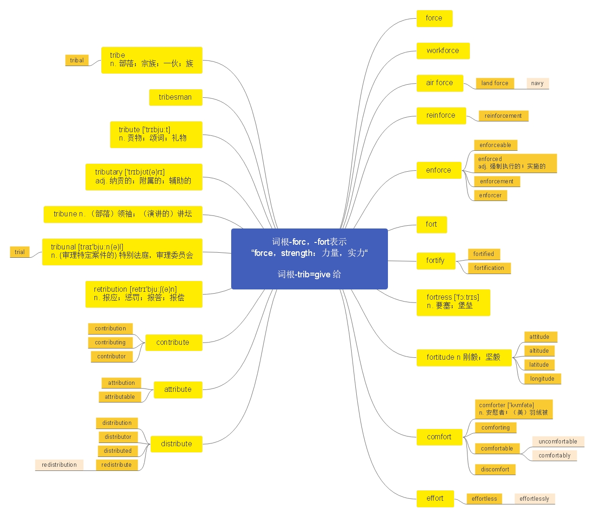

# 第十五节 掌握词根-forc， -fort 的含义

***

> 本节课目标
>
> 1、 掌握词根-forc， -fort 的含义；
>
> 2、 掌握词根-trib 的含义
>
> 3、 掌握单词 55 个

***

# **词根-forc， -fort 表示“ force, strength： 力量， 实力 ”**

***

**force**  \[fɔːs] n.  [英音](https://dict.youdao.com/dictvoice?audio=force\&type=1)  [美音](https://dict.youdao.com/dictvoice?audio=force\&type=2) 力量； 武力； 魄力； 军队； vt. 强迫； 迫使 373

**释义和用法：**

1）强迫；强制 If someone forces you to do something, they make you do it even though you do

not want to, for example by threatening you.

2） (N-UNCOUNT) 暴力；武力 If someone uses force to do something, or if it is done by force,

strong and violent physical action is taken in order to achieve it.

3） (N-UNCOUNT) 力量；力气；威力 Force is the power or strength which something has.

4）军队(指陆海空三军之一或三军) The forces means the army, the navy, or the air force, or all

three.

**双语例句:** I don't hold with the use of force. [播放](https://dict.youdao.com/dictvoice?audio=I+don%27t+hold+with+the+use+of+force.&le=eng&le=eng&type=2)

我不赞成使用武力。 

**双语例句:** Is religion always a force for good? [播放](https://dict.youdao.com/dictvoice?audio=Is+religion+always+a+force+for+good%3F&le=eng&le=eng&type=2)

宗教一向是诲人行善的力量吗？ 

**双语例句:** They realized the force of her argument. [播放](https://dict.youdao.com/dictvoice?audio=They+realized+the+force+of+her+argument.&le=eng&le=eng&type=2)

他们领悟到了她那论据的威力。 

**原声例句:** But the Lakers' Kobe Bryant scored twenty-six points in game six to **force** a game seven in Los Angeles last Thursday. [播放](https://dict.youdao.com/pureaudio?docid=-4100505384686185588)

**原声例句:** He said: \"If my men starve in the streets of Washington, the smell of their bodies will **force** Congress to act.\" [播放](https://dict.youdao.com/pureaudio?docid=-3436921489276544725)

**原声例句:** Air **Force** pilot Gordon Cooper became an expert on the Redstone Rocket that would launch Mercury astronauts on short training flights. [播放](https://dict.youdao.com/pureaudio?docid=-1115117176680804655)

**权威例句:** She's the woman who built eBay from a scrappy start-up to a global **force**.  [播放](https://dict.youdao.com/dictvoice?audio=She%27s+the+woman+who+built+eBay+from+a+scrappy+start-up+to+a+global+force.+&le=eng&type=2)

**权威例句:** She said her mother had been knocked out of bed by the **force** of the blows.  [播放](https://dict.youdao.com/dictvoice?audio=She+said+her+mother+had+been+knocked+out+of+bed+by+the+force+of+the+blows.+&le=eng&type=2)

**权威例句:** On 17 April, a tour de **force** of all that is quintessentially French hit Hong Kong.  [播放](https://dict.youdao.com/dictvoice?audio=On+17+April%2C+a+tour+de+force+of+all+that+is+quintessentially+French+hit+Hong+Kong.+&le=eng&type=2)

***

**forced**  \[fɔːst] adj.  [英音](https://dict.youdao.com/dictvoice?audio=forced\&type=1)  [美音](https://dict.youdao.com/dictvoice?audio=forced\&type=2) 强迫的； 被迫的 6110

**助记：** forc（ 强迫） +ed（ 形容词后缀） →强迫的； 被迫的

**双语例句:** She forced herself to keep going. [播放](https://dict.youdao.com/dictvoice?audio=She+forced+herself+to+keep+going.&le=eng&le=eng&type=2)

她强迫自己坚持下去。 

**双语例句:** I was forced to attempt a gallop. [播放](https://dict.youdao.com/dictvoice?audio=I+was+forced+to+attempt+a+gallop.&le=eng&le=eng&type=2)

我被迫尝试一次骑马疾驰。 

**双语例句:** We were forced to raise the price. [播放](https://dict.youdao.com/dictvoice?audio=We+were+forced+to+raise+the+price.&le=eng&le=eng&type=2)

我们被迫提价。 

**原声例句:** The law **forced** every worker and business owner to pay a small amount of money each month to the federal government. [播放](https://dict.youdao.com/pureaudio?docid=-3419298070039184371)

**原声例句:** Again,Indians were **forced** to watch angrily as white settlers began moving onto lands they had agreed to give up. [播放](https://dict.youdao.com/pureaudio?docid=-1904233420997489617)

**原声例句:** Around the world, industries such as agriculture and the building trades are commonly considered at risk of **forced** labor. [播放](https://dict.youdao.com/pureaudio?docid=4589683158473992873)

**权威例句:** Three years ago, my family was **forced** to flee our home near Damascus, in east Ghouta.  [播放](https://dict.youdao.com/dictvoice?audio=Three+years+ago%2C+my+family+was+forced+to+flee+our+home+near+Damascus%2C+in+east+Ghouta.+&le=eng&type=2)

**权威例句:** The report warned that unless the problem was addressed, businesses could be **forced** to move elsewhere.  [播放](https://dict.youdao.com/dictvoice?audio=The+report+warned+that+unless+the+problem+was+addressed%2C+businesses+could+be+forced+to+move+elsewhere.+&le=eng&type=2)

**权威例句:** Chris has been **forced** to betray his brothers-in-arms: if he doesn't, his family will be killed.  [播放](https://dict.youdao.com/dictvoice?audio=Chris+has+been+forced+to+betray+his+brothers-in-arms%3A+if+he+doesn%27t%2C+his+family+will+be+killed.+&le=eng&type=2)

***

**forceful**  \['fɔːsfʊl; -f(ə)l] adj.  [英音](https://dict.youdao.com/dictvoice?audio=forceful\&type=1)  [美音](https://dict.youdao.com/dictvoice?audio=forceful\&type=2) 有说服力的；强有力的；坚强的 10248

**助记：** force（ 力量； 强力） +ful（ 形容词后缀） →强有力的

**双语例句:** He was forceful, but by no means a zealot. [播放](https://dict.youdao.com/dictvoice?audio=He+was+forceful%2C+but+by+no+means+a+zealot.&le=eng&le=eng&type=2)

他很有说服力，但绝不是个狂热分子。 

**双语例句:** He was a man of forceful character, with considerable insight and diplomatic skills. [播放](https://dict.youdao.com/dictvoice?audio=He+was+a+man+of+forceful+character%2C+with+considerable+insight+and+diplomatic+skills.&le=eng&le=eng&type=2)

他是个性格坚强的人，有着非凡的洞察力和交际手腕。 

**双语例句:** You may need to be armed with some forceful arguments to persuade a partner into seeing things your way. [播放](https://dict.youdao.com/dictvoice?audio=You+may+need+to+be+armed+with+some+forceful+arguments+to+persuade+a+partner+into+seeing+things+your+way.&le=eng&le=eng&type=2)

你也许需要备一些有说服力的论据来说服一个合伙人以你的方式看问题。 

**原声例句:** He directed his administration to talk with congressional leaders from both parties to develop a \"**forceful** response.\" [播放](https://dict.youdao.com/pureaudio?docid=-580489829499278355)

**原声例句:** And they launched a **forceful** campaign to protect the country from these suspected extremists. [播放](https://dict.youdao.com/pureaudio?docid=1670929534233342642)

**权威例句:** It will also necessitate the physical (and possibly **forceful**) relocation of large numbers of Israeli citizens.  [播放](https://dict.youdao.com/dictvoice?audio=It+will+also+necessitate+the+physical+%28and+possibly+forceful%29+relocation+of+large+numbers+of+Israeli+citizens.+&le=eng&type=2)

**权威例句:** Doubles is a fast-paced affair that turns on strong serves and **forceful** returns of serve.  [播放](https://dict.youdao.com/dictvoice?audio=Doubles+is+a+fast-paced+affair+that+turns+on+strong+serves+and+forceful+returns+of+serve.+&le=eng&type=2)

**权威例句:** Mr Stiglitz himself has been the target of some pretty forceful and personal counterattacks from senior Fund staffers.  [播放](https://dict.youdao.com/dictvoice?audio=Mr+Stiglitz+himself+has+been+the+target+of+some+pretty+forceful+and+personal+counterattacks+from+senior+Fund+staffers.+&le=eng&type=2)

***

**forcefully** \['fɔrsfəli] adv.  [英音](https://dict.youdao.com/dictvoice?audio=forcefully\&type=1)  [美音](https://dict.youdao.com/dictvoice?audio=forcefully\&type=2) 激烈地；强有力地；有说服力地 10841

**助记：** force（ 力量； 强力） +ful（ 形容词后缀） + ly （ 副词性后缀） →强有力地

**双语例句:** He argued forcefully and convincingly that they were likely to bankrupt the budget. [播放](https://dict.youdao.com/dictvoice?audio=He+argued+forcefully+and+convincingly+that+they+were+likely+to+bankrupt+the+budget.&le=eng&le=eng&type=2)

他强有力地证明了他们的花费可能会超出预算。 

**双语例句:** He argued his case forcefully. [播放](https://dict.youdao.com/dictvoice?audio=He+argued+his+case+forcefully.&le=eng&le=eng&type=2)

他雄辩地阐述了他的立场。 

**双语例句:** Mrs. Dambar was talking very rapidly and somewhat forcefully. [播放](https://dict.youdao.com/dictvoice?audio=Mrs.+Dambar+was+talking+very+rapidly+and+somewhat+forcefully.&le=eng&le=eng&type=2)

达姆巴夫人在很快、颇有魄力地谈话。 

**原声例句:** Then push **forcefully** inward and upward. [播放](https://dict.youdao.com/pureaudio?docid=-847943696367617006)

**原声例句:** Respectfully,but **forcefully**.\" Mr.Obama's top advisors indicate that is the way things work in the White House. [播放](https://dict.youdao.com/pureaudio?docid=-6831133889176570565)

**原声例句:** And so we need to speak up more **forcefully** about these politics.\" [播放](https://dict.youdao.com/pureaudio?docid=-8977628917306411296)

**权威例句:** Instead, Mr Erdogan chose **forcefully** to reiterate that his government was not recognising Cyprus.  [播放](https://dict.youdao.com/dictvoice?audio=Instead%2C+Mr+Erdogan+chose+forcefully+to+reiterate+that+his+government+was+not+recognising+Cyprus.+&le=eng&type=2)

**权威例句:** This setback underscores the need for us to **forcefully** push the so-called Alaska solution.  [播放](https://dict.youdao.com/dictvoice?audio=This+setback+underscores+the+need+for+us+to+forcefully+push+the+so-called+Alaska+solution.+&le=eng&type=2)

**权威例句:** \"It cannot be said more **forcefully** that we disagree with the court, \" the statement said.  [播放](https://dict.youdao.com/dictvoice?audio=%22It+cannot+be+said+more+forcefully+that+we+disagree+with+the+court%2C+%22+the+statement+said.+&le=eng&type=2)

***

**forcibly**  \['fɔːsɪblɪ] adv.  [英音](https://dict.youdao.com/dictvoice?audio=forcibly\&type=1)  [美音](https://dict.youdao.com/dictvoice?audio=forcibly\&type=2) 强制地；用力地；有说服力地 13723

**助记：** force （ 力量； 强力） +ible（ 能够…的） + ly （ 副词性后缀） →强制地； 用力地； 有

说服力地

> **【课堂笔记】**
>
> **fo

**双语例句:** Supporters were forcibly removed from the court. [播放](https://dict.youdao.com/dictvoice?audio=Supporters+were+forcibly+removed+from+the+court.&le=eng&le=eng&type=2)

支持者都被强行从法庭驱走。 

**双语例句:** Four protestors had to be forcibly removed by police. [播放](https://dict.youdao.com/dictvoice?audio=Four+protestors+had+to+be+forcibly+removed+by+police.&le=eng&le=eng&type=2)

4名抗议者不得不被警察强行拖走。 

**双语例句:** It struck me forcibly how honest he'd been. [播放](https://dict.youdao.com/dictvoice?audio=It+struck+me+forcibly+how+honest+he%27d+been.&le=eng&le=eng&type=2)

我猛然醒悟他是多么的正直。 

**原声例句:** She says many children in the North-West Frontier Province of Pakistan have been **forcibly** recruited by the militants and allegedly trained to become informants, fighters or suicide bombers. [播放](https://dict.youdao.com/pureaudio?docid=6359208322747188129)

**权威例句:** This is not the first time the Maasai have been **forcibly** moved from their land.  [播放](https://dict.youdao.com/dictvoice?audio=This+is+not+the+first+time+the+Maasai+have+been+forcibly+moved+from+their+land.+&le=eng&type=2)

**权威例句:** But at least Ennis managed to do something Waxman never did: **forcibly** state his case.  [播放](https://dict.youdao.com/dictvoice?audio=But+at+least+Ennis+managed+to+do+something+Waxman+never+did%3A+forcibly+state+his+case.+&le=eng&type=2)

**权威例句:** And it has also ruled that prisoners can be **forcibly** medicated in their own interest.  [播放](https://dict.youdao.com/dictvoice?audio=And+it+has+also+ruled+that+prisoners+can+be+forcibly+medicated+in+their+own+interest.+&le=eng&type=2)

rc***ible* adj. 用暴力的 → forcibly 强制地； 用力地
>
> **武力**  *可以…的*

***

**workforce**  \['wɜːkfɔːs] n.  [英音](https://dict.youdao.com/dictvoice?audio=workforce\&type=1)  [美音](https://dict.youdao.com/dictvoice?audio=workforce\&type=2) 劳动力； 工人总数， 职工总数 6718

助记: work （ 工作， 劳动） + force （ 力量） → 用于劳动的力量→劳动力； 工人总数， 职工

总数

**释义和用法：**

1） (N-COUNT) (某一国家或地区的)劳动力，劳动人口 The workforce is the total number of

people in a country or region who are physically able to do a job and are available for work.

2） (N-COUNT) (某公司的)全体员工，职工总数 The workforce is the total number of people

who are employed by a particular company.

**双语例句:** The total was close to 20% of the workforce. [播放](https://dict.youdao.com/dictvoice?audio=The+total+was+close+to+20%25+of+the+workforce.&le=eng&le=eng&type=2)

总数接近劳动力的20%。 

**双语例句:** Over ten per cent of the workforce is now idle. [播放](https://dict.youdao.com/dictvoice?audio=Over+ten+per+cent+of+the+workforce+is+now+idle.&le=eng&le=eng&type=2)

现在有超过百分之十的劳动力闲置。 

**双语例句:** The company yesterday shed a sixth of its workforce. [播放](https://dict.youdao.com/dictvoice?audio=The+company+yesterday+shed+a+sixth+of+its+workforce.&le=eng&le=eng&type=2)

该公司昨天削减了1/6的劳动力。 

**原声例句:** Over the last five years, the city has reduced its public **workforce** and taken other steps like closing fire stations and swimming pools. [播放](https://dict.youdao.com/pureaudio?docid=-8166642322541933428)

**原声例句:** \"Mayor's office,schools, any public entity where youngsters can gain **workforce** readiness skills.\" [播放](https://dict.youdao.com/pureaudio?docid=-6738697783345979772)

**原声例句:** Katharine Graham played an important role in supporting women in the **workforce**. [播放](https://dict.youdao.com/pureaudio?docid=2086127722314296504)

**权威例句:** No matter what shape it takes, a night-time economy relies on a night-time **workforce**.  [播放](https://dict.youdao.com/dictvoice?audio=No+matter+what+shape+it+takes%2C+a+night-time+economy+relies+on+a+night-time+workforce.+&le=eng&type=2)

**权威例句:** Even though most of its young **workforce** is unpaid, the can-do attitude is catching.  [播放](https://dict.youdao.com/dictvoice?audio=Even+though+most+of+its+young+workforce+is+unpaid%2C+the+can-do+attitude+is+catching.+&le=eng&type=2)

**权威例句:** Andersen has already lost much of its business, and two-thirds of its once 28, 000 strong US **workforce**.  [播放](https://dict.youdao.com/dictvoice?audio=Andersen+has+already+lost+much+of+its+business%2C+and+two-thirds+of+its+once+28%2C+000+strong+US+workforce.+&le=eng&type=2)

***

air **force**  \[eə(r) fɔ\:s] n.  [英音](https://dict.youdao.com/dictvoice?audio=force\&type=1)  [美音](https://dict.youdao.com/dictvoice?audio=force\&type=2) 空军

**释义和用法：**

(N-COUNT) 空军 An air force is the part of a country's armed forces that is concerned with

fighting in the air.

> **【课堂笔记】**
>
> Air Force One 空军 1 号

**双语例句:** I don't hold with the use of force. [播放](https://dict.youdao.com/dictvoice?audio=I+don%27t+hold+with+the+use+of+force.&le=eng&le=eng&type=2)

我不赞成使用武力。 

**双语例句:** Is religion always a force for good? [播放](https://dict.youdao.com/dictvoice?audio=Is+religion+always+a+force+for+good%3F&le=eng&le=eng&type=2)

宗教一向是诲人行善的力量吗？ 

**双语例句:** They realized the force of her argument. [播放](https://dict.youdao.com/dictvoice?audio=They+realized+the+force+of+her+argument.&le=eng&le=eng&type=2)

他们领悟到了她那论据的威力。 

**原声例句:** But the Lakers' Kobe Bryant scored twenty-six points in game six to **force** a game seven in Los Angeles last Thursday. [播放](https://dict.youdao.com/pureaudio?docid=-4100505384686185588)

**原声例句:** He said: \"If my men starve in the streets of Washington, the smell of their bodies will **force** Congress to act.\" [播放](https://dict.youdao.com/pureaudio?docid=-3436921489276544725)

**原声例句:** Air **Force** pilot Gordon Cooper became an expert on the Redstone Rocket that would launch Mercury astronauts on short training flights. [播放](https://dict.youdao.com/pureaudio?docid=-1115117176680804655)

**权威例句:** She's the woman who built eBay from a scrappy start-up to a global **force**.  [播放](https://dict.youdao.com/dictvoice?audio=She%27s+the+woman+who+built+eBay+from+a+scrappy+start-up+to+a+global+force.+&le=eng&type=2)

**权威例句:** She said her mother had been knocked out of bed by the **force** of the blows.  [播放](https://dict.youdao.com/dictvoice?audio=She+said+her+mother+had+been+knocked+out+of+bed+by+the+force+of+the+blows.+&le=eng&type=2)

**权威例句:** On 17 April, a tour de **force** of all that is quintessentially French hit Hong Kong.  [播放](https://dict.youdao.com/dictvoice?audio=On+17+April%2C+a+tour+de+force+of+all+that+is+quintessentially+French+hit+Hong+Kong.+&le=eng&type=2)

***

**reinforce**  \[riːɪn'fɔːs] vt.  [英音](https://dict.youdao.com/dictvoice?audio=reinforce\&type=1)  [美音](https://dict.youdao.com/dictvoice?audio=reinforce\&type=2) 加强， 加固； 补充； 强化 3360

**助记：** re（ 又， 再） +in（ 加入） +force（ 力量， 部队） →又注入力量、 部队→增援、 加强

**例句：** Such findings reinforce psychologists’ suspicions that the experience or perception of

helplessness is one of the most harmful factors in depression. 这些发现加强了心理学家

的怀疑：无助的经验或感觉在沮丧中是最有害的因素。

**双语例句:** I hope this will reinforce Indonesian determination to deal with this kind of threat. [播放](https://dict.youdao.com/dictvoice?audio=I+hope+this+will+reinforce+Indonesian+determination+to+deal+with+this+kind+of+threat.&le=eng&le=eng&type=2)

我希望这会加强印度尼西亚对付这类威胁的决心。 

**双语例句:** Remember you want your visuals to reinforce your message, not detract from what you are saying. [播放](https://dict.youdao.com/dictvoice?audio=Remember+you+want+your+visuals+to+reinforce+your+message%2C+not+detract+from+what+you+are+saying.&le=eng&le=eng&type=2)

要记住，你是要用视觉资料来强化你的信息，而不是削弱你所讲述的内容。 

**双语例句:** We agreed on a form of splint to reinforce the damaged portion. [播放](https://dict.youdao.com/dictvoice?audio=We+agreed+on+a+form+of+splint+to+reinforce+the+damaged+portion.&le=eng&le=eng&type=2)

我们同意用一种夹板来加固损坏的部分。 

**原声例句:** \"Smoking is easier than obesity because the way the environment has evolved in the United States really helps **reinforce** the decision not to smoke.\" [播放](https://dict.youdao.com/pureaudio?docid=7734762185040850761)

**原声例句:** He says that the missile which tested Wednesday, is part of Iran's defensive forces, and that the test is intended to **reinforce** the deterrent military. [播放](https://dict.youdao.com/pureaudio?docid=2474549522228354293)

**原声例句:** Ensalaco says the recent arrests **reinforce** the reality that human trafficking is not just an international problem, but also a local one affecting every community in the United States. [播放](https://dict.youdao.com/pureaudio?docid=1407962994154915067)

**权威例句:** Allowing Daqduq to slip through U.S. hands would further **reinforce** the impression of American impotence.  [播放](https://dict.youdao.com/dictvoice?audio=Allowing+Daqduq+to+slip+through+U.S.+hands+would+further+reinforce+the+impression+of+American+impotence.+&le=eng&type=2)

**权威例句:** The close involvement of the West in the military campaign could **reinforce** this resentment, he adds.  [播放](https://dict.youdao.com/dictvoice?audio=The+close+involvement+of+the+West+in+the+military+campaign+could+reinforce+this+resentment%2C+he+adds.+&le=eng&type=2)

**权威例句:** In effort to **reinforce** these concepts, developers are also integrating quizzes and lesson reviews into MinecraftEdu.  [播放](https://dict.youdao.com/dictvoice?audio=In+effort+to+reinforce+these+concepts%2C+developers+are+also+integrating+quizzes+and+lesson+reviews+into+MinecraftEdu.+&le=eng&type=2)

***

**reinforcement**  \[riːɪn'fɔːsm(ə)nt] n.  [英音](https://dict.youdao.com/dictvoice?audio=reinforcement\&type=1)  [美音](https://dict.youdao.com/dictvoice?audio=reinforcement\&type=2) 加固；增援；援军；加强 7639

**助记：** re（ 又、 再） +in（ 加入） +force（ 力量、 部队） + ment （ 名词性后缀） →又注入力量、

部队→增援、 加强

**双语例句:** Since employees have different needs, what acts as a reinforcement for one may not for another. [播放](https://dict.youdao.com/dictvoice?audio=Since+employees+have+different+needs%2C+what+acts+as+a+reinforcement+for+one+may+not+for+another.&le=eng&le=eng&type=2)

由于员工需求不同，对一个人起强化作用的措施可能对另一个人不起作用。 

**双语例句:** The prairie vole has the needed receptors in its brain for these hormones in the regions responsible for reward and reinforcement. [播放](https://dict.youdao.com/dictvoice?audio=The+prairie+vole+has+the+needed+receptors+in+its+brain+for+these+hormones+in+the+regions+responsible+for+reward+and+reinforcement.&le=eng&le=eng&type=2)

在草原田鼠的大脑中，负责奖励和强化的区域有这些荷尔蒙的受体。 

**双语例句:** I am sure that this meeting will contribute to the reinforcement of peace and security all over the world. [播放](https://dict.youdao.com/dictvoice?audio=I+am+sure+that+this+meeting+will+contribute+to+the+reinforcement+of+peace+and+security+all+over+the+world.&le=eng&le=eng&type=2)

我确信这次会晤将为全世界和平与安全的巩固做出贡献。 

**原声例句:** \"There has to be a very clear and consistent and regular **reinforcement** of the message that this type of engagement does not mean a tacit endorsement of the SPDC's crimes against humanity or its ongoing violations of human rights.\" [播放](https://dict.youdao.com/pureaudio?docid=3986202702051214794)

**原声例句:** There's two--One technical distinction that people love to put on Intro Psych exams is that the difference between positive **reinforcement** and negative **reinforcement**.

**原声例句:** The difference is in positive **reinforcement** you do something; in negative **reinforcement** you take away something aversive.

**权威例句:** Given all of this cultural **reinforcement**, pushing back against hierarchical authority often goes against the grain.  [播放](https://dict.youdao.com/dictvoice?audio=Given+all+of+this+cultural+reinforcement%2C+pushing+back+against+hierarchical+authority+often+goes+against+the+grain.+&le=eng&type=2)

**权威例句:** Even though the Sava River bridge is in operation, it requires constant maintenance and **reinforcement**.  [播放](https://dict.youdao.com/dictvoice?audio=Even+though+the+Sava+River+bridge+is+in+operation%2C+it+requires+constant+maintenance+and+reinforcement.+&le=eng&type=2)

**权威例句:** As any psychology student knows, negative **reinforcement** is not a recipe for long-term success.  [播放](https://dict.youdao.com/dictvoice?audio=As+any+psychology+student+knows%2C+negative+reinforcement+is+not+a+recipe+for+long-term+success.+&le=eng&type=2)

***

**enforce**  \[ɪn'fɔːs; en-] vt.  [英音](https://dict.youdao.com/dictvoice?audio=enforce\&type=1)  [美音](https://dict.youdao.com/dictvoice?audio=enforce\&type=2) 强迫， 强制； 实施， 执行 3579

**助记：** en（ 使动词） +force（ 力量、 效力） →使（ 法律等） 生效、 实施

**搭配：** enforce a regulation：实施/执行一个规定

例句： However, it is those of us who are paid to make the decisions to develop, improve and enforce

environmental standards, I submit, who must lead the charge. 然而，正是我们这些人领

薪水去决定发展、改善和实施环境标准，我认为，我们必须带头。

> **【课堂笔记】**
>
> en- 使… , 如：
>
> large → enlarge
>
> rich→enrich

**双语例句:** The legislation will be difficult to enforce. [播放](https://dict.youdao.com/dictvoice?audio=The+legislation+will+be+difficult+to+enforce.&le=eng&le=eng&type=2)

这一法规将难以实施。 

**双语例句:** It's the job of the police to enforce the law. [播放](https://dict.youdao.com/dictvoice?audio=It%27s+the+job+of+the+police+to+enforce+the+law.&le=eng&le=eng&type=2)

警察的工作就是执法。 

**双语例句:** Desegregation may be harder to enforce in rural areas. [播放](https://dict.youdao.com/dictvoice?audio=Desegregation+may+be+harder+to+enforce+in+rural+areas.&le=eng&le=eng&type=2)

废除种族隔离可能更难在乡村地区实施。 

**原声例句:** After that, the International Olympic Committee led efforts to create an independent agency to set and **enforce** common anti-doping rules. [播放](https://dict.youdao.com/pureaudio?docid=-927539938364328877)

**原声例句:** Mister Sharmarke says piracy can only be prevented when Somalia has a government that can **enforce** its own laws. [播放](https://dict.youdao.com/pureaudio?docid=1728098454634438327)

**原声例句:** It said the president could send troops into a state to help federal marshals **enforce** the rulings of federal courts. [播放](https://dict.youdao.com/pureaudio?docid=2279947132866910636)

**权威例句:** One argues that China lacks an adequate legal structure to **enforce** copyrights and trademarks.  [播放](https://dict.youdao.com/dictvoice?audio=One+argues+that+China+lacks+an+adequate+legal+structure+to+enforce+copyrights+and+trademarks.+&le=eng&type=2)

**权威例句:** ThinkFire helps clients like Cisco Systems and NEC **enforce** and defend their intellectual property.  [播放](https://dict.youdao.com/dictvoice?audio=ThinkFire+helps+clients+like+Cisco+Systems+and+NEC+enforce+and+defend+their+intellectual+property.+&le=eng&type=2)

**权威例句:** The firm buys patents and licenses them for royalties or sues to **enforce** them.  [播放](https://dict.youdao.com/dictvoice?audio=The+firm+buys+patents+and+licenses+them+for+royalties+or+sues+to+enforce+them.+&le=eng&type=2)

***

**enforceable**  \[ɪn'forsəbl] adj.  [英音](https://dict.youdao.com/dictvoice?audio=enforceable\&type=1)  [美音](https://dict.youdao.com/dictvoice?audio=enforceable\&type=2) 可实施的； 可执行的 19992

**助记：** en（ 使动词） +force（ 力量、 效力） + able （ 形容词性后缀， 表示“可以…的， 能…的”）

→ 能够实施的， 能够产生效力的， 可以执行的

**双语例句:** A gambling debt is not legally enforceable. [播放](https://dict.youdao.com/dictvoice?audio=A+gambling+debt+is+not+legally+enforceable.&le=eng&le=eng&type=2)

赌债不能通过法律手段强制偿还。 

**双语例句:** Penalties aren't necessarily enforceable. \"so.\" [播放](https://dict.youdao.com/dictvoice?audio=Penalties+aren%27t+necessarily+enforceable.+%22so.%22&le=eng&le=eng&type=2)

所以这种惩罚不一定有执行力。 

**双语例句:** If the euro is to endure, its rules must be enforceable. [播放](https://dict.youdao.com/dictvoice?audio=If+the+euro+is+to+endure%2C+its+rules+must+be+enforceable.&le=eng&le=eng&type=2)

欧元延续下去条件就是规则必须是可以强制执行的。 

**原声例句:** The Right to Education bill makes it legally **enforceable** to demand free and compulsory primary education for all those between six and 14. [播放](https://dict.youdao.com/pureaudio?docid=6717737346349385957)

**原声例句:** This guy says not, but it probably is legally **enforceable**.

**原声例句:** Well it probably is legally **enforceable** actually.

**权威例句:** That said, they haven't given up on looking for such a legally **enforceable** guarantee mechanism.  [播放](https://dict.youdao.com/dictvoice?audio=That+said%2C+they+haven%27t+given+up+on+looking+for+such+a+legally+enforceable+guarantee+mechanism.+&le=eng&type=2)

**权威例句:** And NAFTA doesn't have -- did not have **enforceable** labor agreements and environmental agreements.  [播放](https://dict.youdao.com/dictvoice?audio=And+NAFTA+doesn%27t+have+--+did+not+have+enforceable+labor+agreements+and+environmental+agreements.+&le=eng&type=2)

**权威例句:** It is not clear that anyone really expected the court ruling would be **enforceable** in Britain.  [播放](https://dict.youdao.com/dictvoice?audio=It+is+not+clear+that+anyone+really+expected+the+court+ruling+would+be+enforceable+in+Britain.+&le=eng&type=2)

***

**enforced**  \[ɪn'fɔrst] adj.  [英音](https://dict.youdao.com/dictvoice?audio=enforced\&type=1)  [美音](https://dict.youdao.com/dictvoice?audio=enforced\&type=2) 强制执行的；实施的 18046

**助记：** en（ 使动词） +force（ 力量、 效力） + ed（ 表示动作完成的形容词性后缀） →强制执行

的；实施的

**双语例句:** The rules are stringently enforced. [播放](https://dict.youdao.com/dictvoice?audio=The+rules+are+stringently+enforced.&le=eng&le=eng&type=2)

这些条例得到严格执行。 

**双语例句:** The speed limit must be rigidly enforced. [播放](https://dict.youdao.com/dictvoice?audio=The+speed+limit+must+be+rigidly+enforced.&le=eng&le=eng&type=2)

必须严格执行限速规定。 

**双语例句:** United Nations troops enforced a ceasefire in the area. [播放](https://dict.youdao.com/dictvoice?audio=United+Nations+troops+enforced+a+ceasefire+in+the+area.&le=eng&le=eng&type=2)

联合国军队在该地区强制执行停火命令。 

**权威例句:** Dias also has claimed that the church policies are not **enforced** equally against men and women.  [播放](https://dict.youdao.com/dictvoice?audio=Dias+also+has+claimed+that+the+church+policies+are+not+enforced+equally+against+men+and+women.+&le=eng&type=2)

**权威例句:** The \"no\" campaign argued that plans for mandatory coalition, **enforced** power-sharing with nationalists, was anti-democratic.  [播放](https://dict.youdao.com/dictvoice?audio=The+%22no%22+campaign+argued+that+plans+for+mandatory+coalition%2C+enforced+power-sharing+with+nationalists%2C+was+anti-democratic.+&le=eng&type=2)

**权威例句:** Real-name registration was supposed to be have been implemented in 2011 but was not widely **enforced**.  [播放](https://dict.youdao.com/dictvoice?audio=Real-name+registration+was+supposed+to+be+have+been+implemented+in+2011+but+was+not+widely+enforced.+&le=eng&type=2)

***

**enforcement**  \[en'fɔːsm(ə)nt]n.  [英音](https://dict.youdao.com/dictvoice?audio=enforcement\&type=1)  [美音](https://dict.youdao.com/dictvoice?audio=enforcement\&type=2) 执行，实施；强制 2308

**助记：** en（ 使动词） +force（ 力量、 效力） + ment（ 名词性后缀） → 执行， 实施； 强制

**双语例句:** The doctors want stricter enforcement of existing laws. [播放](https://dict.youdao.com/dictvoice?audio=The+doctors+want+stricter+enforcement+of+existing+laws.&le=eng&le=eng&type=2)

医生们希望现行法律的执行能更严格。 

**双语例句:** We need to restore respect for the law enforcement agencies. [播放](https://dict.youdao.com/dictvoice?audio=We+need+to+restore+respect+for+the+law+enforcement+agencies.&le=eng&le=eng&type=2)

我们需要重建对于执法机关的尊重。 

**双语例句:** Law enforcement officials had definitively identified Blanco as a potential suspect. [播放](https://dict.youdao.com/dictvoice?audio=Law+enforcement+officials+had+definitively+identified+Blanco+as+a+potential+suspect.&le=eng&le=eng&type=2)

执法官员明确认为布兰科是个可能的嫌疑犯。 

**原声例句:** Some also worry that officers could be sued under the law by people who accuse them of not doing enough **enforcement**. [播放](https://dict.youdao.com/pureaudio?docid=6720754522940231760)

**原声例句:** But census officials are not permitted to ask about a person's legal status or share information with immigration **enforcement** officials. [播放](https://dict.youdao.com/pureaudio?docid=-5083990786949585808)

**原声例句:** Still,law **enforcement** officials have long warned about the dangers of young people being identified by adults wishing to harm them. [播放](https://dict.youdao.com/pureaudio?docid=2754612085757634014)

**权威例句:** And those fighting it aren't just from law **enforcement**, border control or local authorities.  [播放](https://dict.youdao.com/dictvoice?audio=And+those+fighting+it+aren%27t+just+from+law+enforcement%2C+border+control+or+local+authorities.+&le=eng&type=2)

**权威例句:** The city doubled the cordon zone in 2007 and reduced the **enforcement** period by one hour.  [播放](https://dict.youdao.com/dictvoice?audio=The+city+doubled+the+cordon+zone+in+2007+and+reduced+the+enforcement+period+by+one+hour.+&le=eng&type=2)

**权威例句:** Masekela became a working musician, but chafed against the oppressive laws and brutal **enforcement**.  [播放](https://dict.youdao.com/dictvoice?audio=Masekela+became+a+working+musician%2C+but+chafed+against+the+oppressive+laws+and+brutal+enforcement.+&le=eng&type=2)

***

**enforcer**  \[ɪn'fɔrsɚ] n.  [英音](https://dict.youdao.com/dictvoice?audio=enforcer\&type=1)  [美音](https://dict.youdao.com/dictvoice?audio=enforcer\&type=2) 实施者；强制执行者 17650

**助记：** en（ 使动词） +force（ 力量、 效力） + er（ 表示人的名词性后缀） →实施者； 强制执行者

**双语例句:** The best enforcer is technology. [播放](https://dict.youdao.com/dictvoice?audio=The+best+enforcer+is+technology.&le=eng&le=eng&type=2)

技术是最好的执行者。 

**双语例句:** He wasn't always a fearsome enforcer, however. [播放](https://dict.youdao.com/dictvoice?audio=He+wasn%27t+always+a+fearsome+enforcer%2C+however.&le=eng&le=eng&type=2)

然而，他并非生来就是可怕的压迫者。 

**双语例句:** But a drug cartel's ruthless enforcer has other plans for him. [播放](https://dict.youdao.com/dictvoice?audio=But+a+drug+cartel%27s+ruthless+enforcer+has+other+plans+for+him.&le=eng&le=eng&type=2)

但贩毒集团的无情的执法者有他的其他计划。 

**原声例句:** Everyone is an **enforcer** or what Locke calls \" \"the executor\"of the state of nature and he means executor literally.

**权威例句:** The CFPB is meant to be an **enforcer** of financial services consumer protections.  [播放](https://dict.youdao.com/dictvoice?audio=The+CFPB+is+meant+to+be+an+enforcer+of+financial+services+consumer+protections.+&le=eng&type=2)

**权威例句:** As co-president and chief financial officer, she is Ellison's **enforcer** and chief of staff.  [播放](https://dict.youdao.com/dictvoice?audio=As+co-president+and+chief+financial+officer%2C+she+is+Ellison%27s+enforcer+and+chief+of+staff.+&le=eng&type=2)

**权威例句:** President Nicolas Sarkozy of France has been an **enforcer** along with the German chancellor, Angela Merkel.  [播放](https://dict.youdao.com/dictvoice?audio=President+Nicolas+Sarkozy+of+France+has+been+an+enforcer+along+with+the+German+chancellor%2C+Angela+Merkel.+&le=eng&type=2)

***

**fort**  \[fɔːt] n.  [英音](https://dict.youdao.com/dictvoice?audio=fort\&type=1)  [美音](https://dict.youdao.com/dictvoice?audio=fort\&type=2) 堡垒； 要塞；（ 美） 边界贸易站 8724

**词源：** mid-15c., "fortified place, stronghold," from Old French fort "fort, fortress; strong man,"

noun use of adjective meaning "strong, stout, sturdy; hard, severe, difficult; hard to understand;

dreadful, terrible; fortified" (10c.), from Latin fortis "strong, mighty; firm, steadfast; brave,

spirited," from Old Latin forctus, which is of unknown etymology. Possibly from PIE root \*bhergh-

(2) "high, elevated," with derivatives referring to hills and hill-forts, or possibly from \*dher- "to

hold firmly, support." Figurative use of hold the fort attested from 1590s.

**释义和用法：**

(N-COUNT; N-IN-NAMES) 堡垒；要塞；城堡 A fort is a strong building or a place with a wall

or fence around it where soldiers can stay and be safe from the enemy.

**双语例句:** The rebels besieged the fort. [播放](https://dict.youdao.com/dictvoice?audio=The+rebels+besieged+the+fort.&le=eng&le=eng&type=2)

叛乱者包围了城堡。 

**双语例句:** He made a firm decision to leave Fort Multry by boat. [播放](https://dict.youdao.com/dictvoice?audio=He+made+a+firm+decision+to+leave+Fort+Multry+by+boat.&le=eng&le=eng&type=2)

他作出了明确的决定，要乘船离开穆尔特里堡。 

**双语例句:** I suspect that she is going to be transferred to Fort Meyer. [播放](https://dict.youdao.com/dictvoice?audio=I+suspect+that+she+is+going+to+be+transferred+to+Fort+Meyer.&le=eng&le=eng&type=2)

我怀疑她将被调到迈耶堡。 

**原声例句:** Today, **Fort** Union is preserved by the National Park Service as an outdoor museum on the Santa Fe Trail. [播放](https://dict.youdao.com/pureaudio?docid=-279237170153622252)

**原声例句:** Confederate President Jefferson Davis ordered his commander in Charleston, General  Beauregard, to destroy the **fort** before the food could arrive. [播放](https://dict.youdao.com/pureaudio?docid=4029695829997839104)

**原声例句:** The **fort**'s commander asked Pryor if he would like the honor of firing the mortar that would begin the attack. [播放](https://dict.youdao.com/pureaudio?docid=5105884870875872471)

**权威例句:** The old **fort** is no less imposing now as it was in VistaVision five decades ago.  [播放](https://dict.youdao.com/dictvoice?audio=The+old+fort+is+no+less+imposing+now+as+it+was+in+VistaVision+five+decades+ago.+&le=eng&type=2)

**权威例句:** **Fort** Bliss Public Affairs and Garrison Command approved the shoot, an Army spokesman said.  [播放](https://dict.youdao.com/dictvoice?audio=Fort+Bliss+Public+Affairs+and+Garrison+Command+approved+the+shoot%2C+an+Army+spokesman+said.+&le=eng&type=2)

**权威例句:** The High Park Fire is west of **Fort** Collins, and has burned more than 55, 000 acres so far.  [播放](https://dict.youdao.com/dictvoice?audio=The+High+Park+Fire+is+west+of+Fort+Collins%2C+and+has+burned+more+than+55%2C+000+acres+so+far.+&le=eng&type=2)

***

**fortify**  \['fɔːtɪfaɪ] vt.  [英音](https://dict.youdao.com/dictvoice?audio=fortify\&type=1)  [美音](https://dict.youdao.com/dictvoice?audio=fortify\&type=2) 加强；（ 酒） 的酒精含量； 增强； 设防于 13155

**助记：** fort（ =force： 力量） + ify （ 使动词后缀） → 使加强力量→加强； 增强

**双语例句:** They fortify the dam against the flood. [播放](https://dict.youdao.com/dictvoice?audio=They+fortify+the+dam+against+the+flood.&le=eng&le=eng&type=2)

他们加固堤坝以防止洪水。 

**双语例句:** Fortify your decision with a commitment. [播放](https://dict.youdao.com/dictvoice?audio=Fortify+your+decision+with+a+commitment.&le=eng&le=eng&type=2)

用付出让你的决定更加坚定。 

**双语例句:** This country will fortify the coastal areas. [播放](https://dict.youdao.com/dictvoice?audio=This+country+will+fortify+the+coastal+areas.&le=eng&le=eng&type=2)

他们决定加强海岸地区的防卫。 

**权威例句:** Joining the ACC will do nothing but further **fortify** the value of the Louisville basketball program.  [播放](https://dict.youdao.com/dictvoice?audio=Joining+the+ACC+will+do+nothing+but+further+fortify+the+value+of+the+Louisville+basketball+program.+&le=eng&type=2)

**权威例句:** We therefore need to **fortify** our national resolve for more losses before the situation improves.  [播放](https://dict.youdao.com/dictvoice?audio=We+therefore+need+to+fortify+our+national+resolve+for+more+losses+before+the+situation+improves.+&le=eng&type=2)

**权威例句:** He hit upon **Fortify** in 2002 with the idea of inverting an old problem.  [播放](https://dict.youdao.com/dictvoice?audio=He+hit+upon+Fortify+in+2002+with+the+idea+of+inverting+an+old+problem.+&le=eng&type=2)

***

**fortified**  \['fɔ\:tifaid] adj.  [英音](https://dict.youdao.com/dictvoice?audio=fortified\&type=1)  [美音](https://dict.youdao.com/dictvoice?audio=fortified\&type=2) 加强的 16065

**助记：** fort（ 力量） + ify （ 使动词后缀） + ed （ 表示动作完成的形容词性后缀） → 使加强

力量的→ 加强的

**双语例句:** The news merely fortified their determination. [播放](https://dict.youdao.com/dictvoice?audio=The+news+merely+fortified+their+determination.&le=eng&le=eng&type=2)

这消息只是增强了他们的决心。 

**双语例句:** All sherry is made from wine fortified with brandy. [播放](https://dict.youdao.com/dictvoice?audio=All+sherry+is+made+from+wine+fortified+with+brandy.&le=eng&le=eng&type=2)

所有雪利酒都是由用白兰地强化了的葡萄酒制成的。 

**双语例句:** He fortified himself against the cold with a hot drink. [播放](https://dict.youdao.com/dictvoice?audio=He+fortified+himself+against+the+cold+with+a+hot+drink.&le=eng&le=eng&type=2)

他喝了一杯热饮御寒。 

**原声例句:** The attackers struck just outside the Green Zone, the heavily **fortified** area that houses many government buildings. [播放](https://dict.youdao.com/pureaudio?docid=-2821321483458357569)

**原声例句:** Again, when you traveling around Europe, if you're lucky to do that, you'll see these big **fortified** towns.

**原声例句:** So iodine deficiency was a real problem and then salt started getting **fortified** with iodine, and that really corrected a lot of those deficiency problems around the world.

**权威例句:** The AAU has also **fortified** its position within the culture of its primary sport   basketball.  [播放](https://dict.youdao.com/dictvoice?audio=The+AAU+has+also+fortified+its+position+within+the+culture+of+its+primary+sport+++basketball.+&le=eng&type=2)

**权威例句:** This means that diplomats are, in effect, stuck in the four-mile-square **fortified** Green Zone.  [播放](https://dict.youdao.com/dictvoice?audio=This+means+that+diplomats+are%2C+in+effect%2C+stuck+in+the+four-mile-square+fortified+Green+Zone.+&le=eng&type=2)

**权威例句:** They're setting up small operating posts within some of these neighborhoods, essentially **fortified** houses and buildings.  [播放](https://dict.youdao.com/dictvoice?audio=They%27re+setting+up+small+operating+posts+within+some+of+these+neighborhoods%2C+essentially+fortified+houses+and+buildings.+&le=eng&type=2)

***

**fortification**  \[,fɔːtɪfɪ'keɪʃ(ə)n] n.  [英音](https://dict.youdao.com/dictvoice?audio=fortification\&type=1)  [美音](https://dict.youdao.com/dictvoice?audio=fortification\&type=2) 加强；设防；防御工事 18263

**助记：** fort（ 力量； 堡垒； 要塞） + ify （ 使动词后缀） + ic（ 无意义） + ation（ 名词性后缀）

→加强； 设防； 防御工事；

**双语例句:** The fortification should be breached. [播放](https://dict.youdao.com/dictvoice?audio=The+fortification+should+be+breached.&le=eng&le=eng&type=2)

这一防线应该被攻破。 

**双语例句:** They assailed a stupendous fortification. [播放](https://dict.youdao.com/dictvoice?audio=They+assailed+a+stupendous+fortification.&le=eng&le=eng&type=2)

他们袭击了一个大要塞。 

**双语例句:** Simply put - successful command of self requires fortification of inalienable ideals. [播放](https://dict.youdao.com/dictvoice?audio=Simply+put+-+successful+command+of+self+requires+fortification+of+inalienable+ideals.&le=eng&le=eng&type=2)

简单的为不可剥夺的思想自身所需的堡垒下达成功命令。 

**权威例句:** It has been described by English Heritage as the most complete Napoleonic **fortification** in Britain.  [播放](https://dict.youdao.com/dictvoice?audio=It+has+been+described+by+English+Heritage+as+the+most+complete+Napoleonic+fortification+in+Britain.+&le=eng&type=2)

**权威例句:** Two of the site's four **fortification** ditches were also better defined by the thermal data.  [播放](https://dict.youdao.com/dictvoice?audio=Two+of+the+site%27s+four+fortification+ditches+were+also+better+defined+by+the+thermal+data.+&le=eng&type=2)

**权威例句:** Afghan officials said the Pakistani soldiers were violating an agreement by building additional **fortification** onto the outpost.  [播放](https://dict.youdao.com/dictvoice?audio=Afghan+officials+said+the+Pakistani+soldiers+were+violating+an+agreement+by+building+additional+fortification+onto+the+outpost.+&le=eng&type=2)

***

**fortress**  \['fɔːtrɪs] n.  [英音](https://dict.youdao.com/dictvoice?audio=fortress\&type=1)  [美音](https://dict.youdao.com/dictvoice?audio=fortress\&type=2) 要塞；堡垒 9309

**释义和用法：**

(N-COUNT) 堡垒；防御阵地；要塞 A fortress is a castle or other large strong building, or a wellprotected place, which is intended to be difficult for enemies to enter.

**助记：** fort（ 堡垒； 要塞） + ress （ 名词性后缀） →要塞； 堡垒

> **【课堂笔记】**
>
> \-ress 名词性后缀， 如 actor → actress

**双语例句:** Fear of terrorist attack has turned the conference centre into a fortress. [播放](https://dict.youdao.com/dictvoice?audio=Fear+of+terrorist+attack+has+turned+the+conference+centre+into+a+fortress.&le=eng&le=eng&type=2)

由于害怕恐怖分子袭击，会议中心已变成了堡垒。 

**双语例句:** It's easier to \"capture the fortress from within.\" [播放](https://dict.youdao.com/dictvoice?audio=It%27s+easier+to+%22capture+the+fortress+from+within.%22&le=eng&le=eng&type=2)

堡垒更容易从内部攻破。 

**双语例句:** The general hastened to the relief of the fortress. [播放](https://dict.youdao.com/dictvoice?audio=The+general+hastened+to+the+relief+of+the+fortress.&le=eng&le=eng&type=2)

将军火速前往救援该要塞。 

**原声例句:** But the emotional highpoint of his visit to Ghana came at the end a tour of a coastal **fortress**, where for 300 years, countless Africans boarded ships bound for death at sea or a life in slavery. [播放](https://dict.youdao.com/pureaudio?docid=-7396606861154773366)

**权威例句:** The Tower of London is the most complete example of an 11th century **fortress** palace remaining in Europe.  [播放](https://dict.youdao.com/dictvoice?audio=The+Tower+of+London+is+the+most+complete+example+of+an+11th+century+fortress+palace+remaining+in+Europe.+&le=eng&type=2)

**权威例句:** More fortress-like gated communities are being built, guarded around the clock by armed men.  [播放](https://dict.youdao.com/dictvoice?audio=More+fortress-like+gated+communities+are+being+built%2C+guarded+around+the+clock+by+armed+men.+&le=eng&type=2)

**权威例句:** The carefully restored 19th century Kasbah looks like a perfect desert **fortress** from the outside.  [播放](https://dict.youdao.com/dictvoice?audio=The+carefully+restored+19th+century+Kasbah+looks+like+a+perfect+desert+fortress+from+the+outside.+&le=eng&type=2)

***

**fortitude**  \['fɔːtɪtjuːd] n.  [英音](https://dict.youdao.com/dictvoice?audio=fortitude\&type=1)  [美音](https://dict.youdao.com/dictvoice?audio=fortitude\&type=2) 刚毅， 坚毅， 不屈不挠 17924

**助记：** fort（ 力量） + itude （ 表示状态的名词性后缀 **表示“ 状态/度”**） → 表示人有力量的状态→ 刚毅， 坚

毅，不屈不挠

**释义和用法：**

(N-UNCOUNT) 刚毅；坚忍 If you say that someone has shown fortitude, you admire them for

being brave, calm, and uncomplaining when they have experienced something unpleasant or painful.

**双语例句:** They bore their plight with stoicism and fortitude. [播放](https://dict.youdao.com/dictvoice?audio=They+bore+their+plight+with+stoicism+and+fortitude.&le=eng&le=eng&type=2)

他们以坚忍刚毅的精神面对困境。 

**双语例句:** He suffered a long series of illnesses with tremendous dignity and fortitude. [播放](https://dict.youdao.com/dictvoice?audio=He+suffered+a+long+series+of+illnesses+with+tremendous+dignity+and+fortitude.&le=eng&le=eng&type=2)

他在病魔的长久折磨下表现出了高度的尊严和刚毅。 

**双语例句:** This is the kind of fortitude we must have. [播放](https://dict.youdao.com/dictvoice?audio=This+is+the+kind+of+fortitude+we+must+have.&le=eng&le=eng&type=2)

就是要有这股狠劲。 

**原声例句:** I was impressed by their strength and **fortitude** and their commitment. [播放](https://dict.youdao.com/pureaudio?docid=-8559384346144859703)

**原声例句:** So that's very sad, that part of his art was very very sad. But I still, I feel pathetic as I say in the last pages or so, but I never lost admire of his **fortitude** in going on and doing as much as he did.

**权威例句:** That she did so amid a rigorous stretch of training showed her mental **fortitude**, Kersee said.  [播放](https://dict.youdao.com/dictvoice?audio=That+she+did+so+amid+a+rigorous+stretch+of+training+showed+her+mental+fortitude%2C+Kersee+said.+&le=eng&type=2)

**权威例句:** Does O'Neill have the **fortitude** and intellectual stamina to break this destructive status quo?  [播放](https://dict.youdao.com/dictvoice?audio=Does+O%27Neill+have+the+fortitude+and+intellectual+stamina+to+break+this+destructive+status+quo%3F+&le=eng&type=2)

**权威例句:** Mr Beltrami also praised the victims for their tremendous courage and **fortitude** in coming forward.  [播放](https://dict.youdao.com/dictvoice?audio=Mr+Beltrami+also+praised+the+victims+for+their+tremendous+courage+and+fortitude+in+coming+forward.+&le=eng&type=2)

***

**comfort**  \['kʌmfət] n.  [英音](https://dict.youdao.com/dictvoice?audio=comfort\&type=1)  [美音](https://dict.youdao.com/dictvoice?audio=comfort\&type=2) 安慰；舒适；安慰者； vt. 安慰；慰藉 2951

**助记：** com（ 加强语气） +fort（ =force： 力量； strong： 坚强， 强壮） →给你增加力量， 变得

更坚强→安慰， 慰藉

**释义和用法：**

（ 1） (N-UNCOUNT) 舒适；舒服 If you are doing something in comfort, you are physically

relaxed and contented, and are not feeling any pain or other unpleasant sensations.

2） (VERB) 安慰；抚慰 If you comfort someone, you make them feel less worried, unhappy, or

upset, for example by saying kind things to them.

例句：

1） They had enough money to live in comfort in their old age.

他们有足够的钱舒舒服服地安度晚年。

2） His words were of little comfort in the circumstances.

在这种情况下，他的话起不了什么安慰作用。

**双语例句:** It's a comfort talking to you. [播放](https://dict.youdao.com/dictvoice?audio=It%27s+a+comfort+talking+to+you.&le=eng&le=eng&type=2)

与你谈谈是一种安慰。 

**双语例句:** I tried to offer a few words of comfort. [播放](https://dict.youdao.com/dictvoice?audio=I+tried+to+offer+a+few+words+of+comfort.&le=eng&le=eng&type=2)

我试图说上几句安慰的话。 

**双语例句:** The hotel combines comfort with convenience. [播放](https://dict.youdao.com/dictvoice?audio=The+hotel+combines+comfort+with+convenience.&le=eng&le=eng&type=2)

这家旅馆既舒适又方便。 

**原声例句:** \"Gold is Where you Find It\" by Tyrone **Comfort** shows a man deep inside a gold mine. [播放](https://dict.youdao.com/pureaudio?docid=-898868665646226417)

**原声例句:** A religious leader may also talk about the person and offer spiritual **comfort** to the family. [播放](https://dict.youdao.com/pureaudio?docid=7722702707980990023)

**原声例句:** Lucille Clifton often said that she tried to **comfort** the afflicted and afflict the comfortable. [播放](https://dict.youdao.com/pureaudio?docid=9020502499559336623)

**权威例句:** And that usually gives one even greater **comfort** that the initial offering will be boffo.  [播放](https://dict.youdao.com/dictvoice?audio=And+that+usually+gives+one+even+greater+comfort+that+the+initial+offering+will+be+boffo.+&le=eng&type=2)

**权威例句:** Book a table for dinner and listen to the live music from the **comfort** of your seat.  [播放](https://dict.youdao.com/dictvoice?audio=Book+a+table+for+dinner+and+listen+to+the+live+music+from+the+comfort+of+your+seat.+&le=eng&type=2)

**权威例句:** Alongside its vast **comfort** grub menu, local-made beers include light Lions Gate Lager and velvet-rich Heroica Oatmeal Stout.  [播放](https://dict.youdao.com/dictvoice?audio=Alongside+its+vast+comfort+grub+menu%2C+local-made+beers+include+light+Lions+Gate+Lager+and+velvet-rich+Heroica+Oatmeal+Stout.+&le=eng&type=2)

***

**comforter** \['kʌmfətə] n.  [英音](https://dict.youdao.com/dictvoice?audio=comforter\&type=1)  [美音](https://dict.youdao.com/dictvoice?audio=comforter\&type=2) 安慰者；（ 美） 被子；（ 英） 羊毛围巾 17068

**助记：** comfort（ 安慰， 慰藉） + er （ 表示人或物的名词性后缀） → 安慰者；（ 美） 被子；（ 英）

羊毛围巾

**双语例句:** He became Vivien Leigh's devoted friend and comforter. [播放](https://dict.youdao.com/dictvoice?audio=He+became+Vivien+Leigh%27s+devoted+friend+and+comforter.&le=eng&le=eng&type=2)

他成了费雯丽的忠实朋友和安慰者。 

**双语例句:** You will not be my comforter? [播放](https://dict.youdao.com/dictvoice?audio=You+will+not+be+my+comforter%3F&le=eng&le=eng&type=2)

你不想再安慰我？ 

**双语例句:** You, you are my first one comforter! [播放](https://dict.youdao.com/dictvoice?audio=You%2C+you+are+my+first+one+comforter%21&le=eng&le=eng&type=2)

你，你是我最初的一个安慰者！ 

**权威例句:** There are hostas whose big, leathery leaves are quilted like a **comforter** and outlined with yellow or white edges.  [播放](https://dict.youdao.com/dictvoice?audio=There+are+hostas+whose+big%2C+leathery+leaves+are+quilted+like+a+comforter+and+outlined+with+yellow+or+white+edges.+&le=eng&type=2)

**权威例句:** She was more than just a mother, more than just a **comforter**.  [播放](https://dict.youdao.com/dictvoice?audio=She+was+more+than+just+a+mother%2C+more+than+just+a+comforter.+&le=eng&type=2)

**权威例句:** Money will no doubt be a **comforter** should Kirgizstan incur Russia's wrath.  [播放](https://dict.youdao.com/dictvoice?audio=Money+will+no+doubt+be+a+comforter+should+Kirgizstan+incur+Russia%27s+wrath.+&le=eng&type=2)

***

**comforting**  \['kʌmfətɪŋ] adj.  [英音](https://dict.youdao.com/dictvoice?audio=comforting\&type=1)  [美音](https://dict.youdao.com/dictvoice?audio=comforting\&type=2) 安慰的； 令人欣慰的 7893

**助记：** comfort（ 安慰， 慰藉） + ing （ 表示令人….的形容词性后缀） → 安慰的； 令人欣慰

的 c

**双语例句:** On a more personal level, a friend may be upset and need comforting. [播放](https://dict.youdao.com/dictvoice?audio=On+a+more+personal+level%2C+a+friend+may+be+upset+and+need+comforting.&le=eng&le=eng&type=2)

在更私人的层面上，朋友可能会感到不安，需要安慰。 

**双语例句:** Within hours of arriving in Angola, television screens around the World were filled with images of her comforting victims injured in explosions caused by landmines. [播放](https://dict.youdao.com/dictvoice?audio=Within+hours+of+arriving+in+Angola%2C+television+screens+around+the+World+were+filled+with+images+of+her+comforting+victims+injured+in+explosions+caused+by+landmines.&le=eng&le=eng&type=2)

在她抵达安哥拉后的几个小时内，世界各地的电视屏幕上都是她安慰在地雷爆炸中受伤的受害者的画面。 

**双语例句:** It's comforting to know that you'll be there. [播放](https://dict.youdao.com/dictvoice?audio=It%27s+comforting+to+know+that+you%27ll+be+there.&le=eng&le=eng&type=2)

知道你要去那里令人感到欣慰。 

**原声例句:** Poetry feeds my soul. Poetry is **comforting** and soothing, and it's awe-inspiring as a glimpse of rainbow, which should come as no surprise since poems and rainbows have something in common. [播放](https://dict.youdao.com/pureaudio?docid=5559190693500586469)

**原声例句:** I can't help but feel that within the context of the  actual story of the Fall, the Fall of Adam and Eve, that the idea of divine providence isn't actually all that **comforting**.

**原声例句:** So it's soothing. It's **comforting**. It's English. Then we have the...

**权威例句:** It should be a **comforting**, quiet refuge and a place of excitement and possibility.  [播放](https://dict.youdao.com/dictvoice?audio=It+should+be+a+comforting%2C+quiet+refuge+and+a+place+of+excitement+and+possibility.+&le=eng&type=2)

**权威例句:** Cowie does exactly that with a **comforting**, if rotting, Victorian complete with flowers and overgrown grass.  [播放](https://dict.youdao.com/dictvoice?audio=Cowie+does+exactly+that+with+a+comforting%2C+if+rotting%2C+Victorian+complete+with+flowers+and+overgrown+grass.+&le=eng&type=2)

**权威例句:** But the **comforting** thing is that the majority of Muslims in Britain are moderates.  [播放](https://dict.youdao.com/dictvoice?audio=But+the+comforting+thing+is+that+the+majority+of+Muslims+in+Britain+are+moderates.+&le=eng&type=2)

***

**omfortable**  \[ˈkʌmftəbl] adj.  [英音](https://dict.youdao.com/dictvoice?audio=omfortable\&type=1)  [美音](https://dict.youdao.com/dictvoice?audio=omfortable\&type=2) 舒适的，舒服的 1713

**助记：** comfort（ 舒适， 舒服） + able（ 形容词性后缀， 表示“能够…的”） → 舒适的， 舒服的

***

**uncomfortable**  \[ʌn'kʌmf(ə)təb(ə)l] adj.  [英音](https://dict.youdao.com/dictvoice?audio=uncomfortable\&type=1)  [美音](https://dict.youdao.com/dictvoice?audio=uncomfortable\&type=2) 不安的；不舒服的 3674

**助记：** un （ 否定性前缀） + comfortable （ 舒适的， 舒服的） →不安的； 不舒服的

**双语例句:** There was an uncomfortable silence. [播放](https://dict.youdao.com/dictvoice?audio=There+was+an+uncomfortable+silence.&le=eng&le=eng&type=2)

有一种令人不安的寂静。 

**双语例句:** He looked abashed and uncomfortable. [播放](https://dict.youdao.com/dictvoice?audio=He+looked+abashed+and+uncomfortable.&le=eng&le=eng&type=2)

他看起来既窘迫又不自在。 

**双语例句:** I was sitting in an extremely uncomfortable position. [播放](https://dict.youdao.com/dictvoice?audio=I+was+sitting+in+an+extremely+uncomfortable+position.&le=eng&le=eng&type=2)

我坐着的姿势难受极了。 

**原声例句:** The sight of the formal dining room made him feel even more **uncomfortable**. [播放](https://dict.youdao.com/pureaudio?docid=1070133078897586358)

**原声例句:** Paul awoke, feeling dirty and **uncomfortable**. [播放](https://dict.youdao.com/pureaudio?docid=6573432825217421360)

**原声例句:** But he still felt cold and **uncomfortable**. [播放](https://dict.youdao.com/pureaudio?docid=-2036488537069338715)

**权威例句:** It seems that in this progressive mood, sitting on the fence has become increasingly **uncomfortable**.  [播放](https://dict.youdao.com/dictvoice?audio=It+seems+that+in+this+progressive+mood%2C+sitting+on+the+fence+has+become+increasingly+uncomfortable.+&le=eng&type=2)

**权威例句:** The old Europe, so attached to its social welfare programmes, faces an **uncomfortable** decade.  [播放](https://dict.youdao.com/dictvoice?audio=The+old+Europe%2C+so+attached+to+its+social+welfare+programmes%2C+faces+an+uncomfortable+decade.+&le=eng&type=2)

**权威例句:** The usually eat alone because they're **uncomfortable** consuming so much in front of others.  [播放](https://dict.youdao.com/dictvoice?audio=The+usually+eat+alone+because+they%27re+uncomfortable+consuming+so+much+in+front+of+others.+&le=eng&type=2)

***

**comfortably**  \['kʌmftəbli] adv.  [英音](https://dict.youdao.com/dictvoice?audio=comfortably\&type=1)  [美音](https://dict.youdao.com/dictvoice?audio=comfortably\&type=2) 舒服地；安乐地；充裕地 6998

**助记：** comfortable（ 舒适的， 舒服的） + ly （ 副词性后缀） → 舒服地； 安乐地； 充裕地

**双语例句:** Are you sitting comfortably? [播放](https://dict.youdao.com/dictvoice?audio=Are+you+sitting+comfortably%3F&le=eng&le=eng&type=2)

你坐得舒服吗？ 

**双语例句:** She is comfortably cocooned in pillows. [播放](https://dict.youdao.com/dictvoice?audio=She+is+comfortably+cocooned+in+pillows.&le=eng&le=eng&type=2)

她舒服地裹在一堆枕头里面。 

**双语例句:** All the rooms were comfortably furnished. [播放](https://dict.youdao.com/dictvoice?audio=All+the+rooms+were+comfortably+furnished.&le=eng&le=eng&type=2)

所有的房间都配置了舒适的家具。 

**原声例句:** \"I think a lot of European allies, including France, are looking to the United States to roll out a new Afghan strategy that they can more **comfortably** buy into, and they will be looking at whether they can up their contribution, their military contribution, their economic contribution, after they have seen that particular strategy,\" [播放](https://dict.youdao.com/pureaudio?docid=353142574165676334)

**原声例句:** This doesn't happen, but at the same time it's a world of illusion in which the reader lives all too **comfortably**. Right?

**原声例句:** I've been living in a city, being able to live **comfortably**, financially

**权威例句:** He is **comfortably** sized, barely cresting the five-foot barrier, shaven of head and broad of smile.  [播放](https://dict.youdao.com/dictvoice?audio=He+is+comfortably+sized%2C+barely+cresting+the+five-foot+barrier%2C+shaven+of+head+and+broad+of+smile.+&le=eng&type=2)

**权威例句:** When combined, these ingredients conspired to create a very well-balanced snack sitting **comfortably** inside a corn tortilla.  [播放](https://dict.youdao.com/dictvoice?audio=When+combined%2C+these+ingredients+conspired+to+create+a+very+well-balanced+snack+sitting+comfortably+inside+a+corn+tortilla.+&le=eng&type=2)

**权威例句:** Two-thirds of respondents say it has made it easier for families to live **comfortably**.  [播放](https://dict.youdao.com/dictvoice?audio=Two-thirds+of+respondents+say+it+has+made+it+easier+for+families+to+live+comfortably.+&le=eng&type=2)

***

**uncomfortably** \[ʌn'kʌmftəbli] adv.  [英音](https://dict.youdao.com/dictvoice?audio=uncomfortably\&type=1)  [美音](https://dict.youdao.com/dictvoice?audio=uncomfortably\&type=2) 不舒服地；不安乐地 13086

**助记：** un（ 否定性前缀） +comfortably （ 舒服地； 安乐地） →不舒服地； 不安乐地

**双语例句:** I was feeling uncomfortably hot. [播放](https://dict.youdao.com/dictvoice?audio=I+was+feeling+uncomfortably+hot.&le=eng&le=eng&type=2)

我觉得酷热难当。 

**双语例句:** The water was uncomfortably cold. [播放](https://dict.youdao.com/dictvoice?audio=The+water+was+uncomfortably+cold.&le=eng&le=eng&type=2)

水冷得让人不舒服。 

**双语例句:** He felt uncomfortably hot. [播放](https://dict.youdao.com/dictvoice?audio=He+felt+uncomfortably+hot.&le=eng&le=eng&type=2)

他感到热得难受。 

**权威例句:** Sometimes the women cry, and other times they ask for lengthy details or **uncomfortably** long explanations.  [播放](https://dict.youdao.com/dictvoice?audio=Sometimes+the+women+cry%2C+and+other+times+they+ask+for+lengthy+details+or+uncomfortably+long+explanations.+&le=eng&type=2)

**权威例句:** And not just being a ubiquitous punch line and those occasionally **uncomfortably** close-to-accurate Sopranos storylines.  [播放](https://dict.youdao.com/dictvoice?audio=And+not+just+being+a+ubiquitous+punch+line+and+those+occasionally+uncomfortably+close-to-accurate+Sopranos+storylines.+&le=eng&type=2)

**权威例句:** Assassinations place the US **uncomfortably** close to terrorism, and makes dealings with civilized nations harder.  [播放](https://dict.youdao.com/dictvoice?audio=Assassinations+place+the+US+uncomfortably+close+to+terrorism%2C+and+makes+dealings+with+civilized+nations+harder.+&le=eng&type=2)

***

**discomfort**  \[dɪs'kʌmfət] n.  [英音](https://dict.youdao.com/dictvoice?audio=discomfort\&type=1)  [美音](https://dict.youdao.com/dictvoice?audio=discomfort\&type=2) 不适，不安；不便之处 6552

**助记：** dis （ 否定性前缀） + comfort（ 舒适， 舒服） → 不适， 不安； 不便之处

**双语例句:** She hears the discomfort in his voice. [播放](https://dict.youdao.com/dictvoice?audio=She+hears+the+discomfort+in+his+voice.&le=eng&le=eng&type=2)

她听出他声音里的不安。 

**双语例句:** Steve had some discomfort, but no real pain. [播放](https://dict.youdao.com/dictvoice?audio=Steve+had+some+discomfort%2C+but+no+real+pain.&le=eng&le=eng&type=2)

史蒂夫有些不舒服，但不真疼。 

**双语例句:** You will experience some minor discomfort during the treatment. [播放](https://dict.youdao.com/dictvoice?audio=You+will+experience+some+minor+discomfort+during+the+treatment.&le=eng&le=eng&type=2)

治疗中你会稍感不适。 

**原声例句:** \"He had been having episodes of chest **discomfort** that were brief in nature. [播放](https://dict.youdao.com/pureaudio?docid=-4241116571004368246)

**原声例句:** \"I see a lot more children who are coming into the office either because their parents have noticed that they have headaches or red or watery eyes or **discomfort**, or because their prescription, their near-sightedness, appears to be increasing at a fast rate and they're worried.\" [播放](https://dict.youdao.com/pureaudio?docid=-9211866684314755466)

**原声例句:** She says Jackson's apparent **discomfort** over his skin color was especially troubling as he sang about racial harmony in songs such as 1991's \"Black or White.\" [播放](https://dict.youdao.com/pureaudio?docid=-952924423757294278)

**权威例句:** **Discomfort** on the part of college and university presidents is also part of the problem, said Gibralter.  [播放](https://dict.youdao.com/dictvoice?audio=Discomfort+on+the+part+of+college+and+university+presidents+is+also+part+of+the+problem%2C+said+Gibralter.+&le=eng&type=2)

**权威例句:** Many patients say their symptoms were not painful but more like an ache or **discomfort**.  [播放](https://dict.youdao.com/dictvoice?audio=Many+patients+say+their+symptoms+were+not+painful+but+more+like+an+ache+or+discomfort.+&le=eng&type=2)

**权威例句:** He came out for the next game limping and was clearly in some **discomfort**.  [播放](https://dict.youdao.com/dictvoice?audio=He+came+out+for+the+next+game+limping+and+was+clearly+in+some+discomfort.+&le=eng&type=2)

***

**effort**  \['efət] n.  [英音](https://dict.youdao.com/dictvoice?audio=effort\&type=1)  [美音](https://dict.youdao.com/dictvoice?audio=effort\&type=2) 努力；成就 455

**助记：** ef（ =ex： 出去） +fort（ =force： 力量） →（ 花） 出去了力量→（ 付出了） 努力；（ 努力

后的）成就

**释义和用法：**

1） (N-VAR) 努力；气力；精力 If you make an effort to do something, you try very hard to do it.

例句： It’s possible that plutocrats(有钱有势的人)are expressing solidarity with the struggling

middle class as part of an effort to insulate themselves from confiscatory(没收性的)tax policies.

有钱有势的人表达要和挣扎的中产阶级团结一致，可能是作为使自己远离没收性的税收政策

的一部分努力。

2） (N-COUNT)努力的结果；成就 the result of an attempt to do sth.

例句： I'm afraid this essay is a poor effort. 很抱歉，这篇文章写得不好。

> **【课堂笔记】**
>
> ef=ex 辅音同化现象
>
> ex+fort → effort (x→f 目的是便于发音)

**双语例句:** You should put more effort into your work. [播放](https://dict.youdao.com/dictvoice?audio=You+should+put+more+effort+into+your+work.&le=eng&le=eng&type=2)

你应该更加努力地工作。 

**双语例句:** He's making a big effort now, and I hope it lasts. [播放](https://dict.youdao.com/dictvoice?audio=He%27s+making+a+big+effort+now%2C+and+I+hope+it+lasts.&le=eng&le=eng&type=2)

现在他正加紧努力，我希望他能坚持下去。 

**双语例句:** Emma frowned, making an effort to compose herself. [播放](https://dict.youdao.com/dictvoice?audio=Emma+frowned%2C+making+an+effort+to+compose+herself.&le=eng&le=eng&type=2)

埃玛皱起了眉头，努力使自己镇定下来。 

**原声例句:** Officials from the International Water Management Institute and the International Food Policy Research Institute are also taking part in the **effort**. [播放](https://dict.youdao.com/pureaudio?docid=-6627618059375019691)

**原声例句:** The Public Works of Art Program was the first national **effort** by the United States government to support artists. [播放](https://dict.youdao.com/pureaudio?docid=-4206338031707951356)

**原声例句:** \"They say this is a state-led **effort**,\" he says, but he thinks the goal is national control of education. [播放](https://dict.youdao.com/pureaudio?docid=-4167742602411660547)

**权威例句:** He'd led a serious **effort** to shut down banks suspected of money laundering and other crimes.  [播放](https://dict.youdao.com/dictvoice?audio=He%27d+led+a+serious+effort+to+shut+down+banks+suspected+of+money+laundering+and+other+crimes.+&le=eng&type=2)

**权威例句:** This week Oracle expanded its **effort** by buying Navio, a spin-off from Netscape Communications.  [播放](https://dict.youdao.com/dictvoice?audio=This+week+Oracle+expanded+its+effort+by+buying+Navio%2C+a+spin-off+from+Netscape+Communications.+&le=eng&type=2)

**权威例句:** So there was that question and I there's definitely an educational **effort** to be done there.  [播放](https://dict.youdao.com/dictvoice?audio=So+there+was+that+question+and+I+there%27s+definitely+an+educational+effort+to+be+done+there.+&le=eng&type=2)

***

**effortless**  \['efətlɪs] adj.  [英音](https://dict.youdao.com/dictvoice?audio=effortless\&type=1)  [美音](https://dict.youdao.com/dictvoice?audio=effortless\&type=2) 容易的；不费力气的 15672

**助记：** effort （ 努力） + less （ 否定后缀） → 没有付出努力的， 不需要付出努力的→容易的；

不费力气的

**双语例句:** She liked him above all for his effortless charm. [播放](https://dict.youdao.com/dictvoice?audio=She+liked+him+above+all+for+his+effortless+charm.&le=eng&le=eng&type=2)

她尤其喜欢他天生的魅力。 

**双语例句:** Often women are so good at multitasking that it appears it's all effortless. [播放](https://dict.youdao.com/dictvoice?audio=Often+women+are+so+good+at+multitasking+that+it+appears+it%27s+all+effortless.&le=eng&le=eng&type=2)

通常女性很善于同时处理多项任务，而且看起来似乎完全不费力。 

**双语例句:** At first, you were wobbly, but then it becomes effortless. [播放](https://dict.youdao.com/dictvoice?audio=At+first%2C+you+were+wobbly%2C+but+then+it+becomes+effortless.&le=eng&le=eng&type=2)

起初，你摇摆不定，但是过一段时间就变得毫不费力了。 

**权威例句:** The intuitive and practical touchscreen makes navigating the camera's menus and graphical user interface **effortless**.  [播放](https://dict.youdao.com/dictvoice?audio=The+intuitive+and+practical+touchscreen+makes+navigating+the+camera%27s+menus+and+graphical+user+interface+effortless.+&le=eng&type=2)

**权威例句:** These groups share a vision for continuous, **effortless** charging enabled by the surrounding environment.  [播放](https://dict.youdao.com/dictvoice?audio=These+groups+share+a+vision+for+continuous%2C+effortless+charging+enabled+by+the+surrounding+environment.+&le=eng&type=2)

**权威例句:** People voting with their feet is a great, **effortless** way to cut pointless projects.  [播放](https://dict.youdao.com/dictvoice?audio=People+voting+with+their+feet+is+a+great%2C+effortless+way+to+cut+pointless+projects.+&le=eng&type=2)

***

**effortlessly**  \['efətlisli] adv.  [英音](https://dict.youdao.com/dictvoice?audio=effortlessly\&type=1)  [美音](https://dict.youdao.com/dictvoice?audio=effortlessly\&type=2) 容易地； 不费力地 13489

**助记：** effortless（ 容易的； 不费力的） + ly（ 副词性后缀） →容易地； 不费力气地

**词根-trib=give：给**

> **【课堂笔记】**
>
> 词根-trib = “grant/give 批准； 给与”
>
> 单词 tribe 表示“ 部落；宗族；一伙；族”
>
> 词根含义与单词含义有时完全不一样， 例如：
>
> 词根-leg 表示“ 法律”
>
> 单词 leg 表示“ 腿”
>
> 词根-man 表示“手”
>
> 单词 man 表示“ 人”

**tribe**  \[traɪb] n.  [英音](https://dict.youdao.com/dictvoice?audio=tribe\&type=1)  [美音](https://dict.youdao.com/dictvoice?audio=tribe\&type=2) 部落； 宗族； 一伙； 族〔 指动植物的一类〕 2971

**词源：** mid-13c., "one of the twelve divisions of the ancient Hebrews," from Old French tribu or

directly from Latin tribus "one of the three political/ethnic divisions of the original Roman state"

(Tites, Ramnes, and Luceres, corresponding, perhaps, to the Latins, Sabines, and Etruscans), later,

one of the 30 political divisions instituted by Servius Tullius (increased to 35 in 241 B.C.E.), of

unknown origin.

**释义和用法：**

1.  (N-COUNT) (尤指发展中国家的)部落，部族 Tribe is sometimes used to refer to a group of

people of the same race, language, and customs, especially in a developing country.

短语： three-hundred members of the Xhosa tribe.

300 名科萨族人

2） (N-COUNT) (从事相同活动或行为相同的)一伙(人)，一帮(人) You can use tribe to refer to

a group of people who are all doing the same thing or who all behave in the same way.

短语： tribes of talented young people.

一群群才华出众的年轻人

3） (N-COUNT) 族〔指动植物的一类〕

短语： the cat tribe 猫族

> **【课堂笔记】**
>
> tribe
>
> （ 1）（ 发展中国家， 有着相同语言/习俗/信仰的） 部落
>
> （ 2）（ 做相同事情的） 一群人/一伙人
>
> （ 3）（ 动植物中的某个） 族

**双语例句:** The valley is inhabited by the Dani tribe. [播放](https://dict.youdao.com/dictvoice?audio=The+valley+is+inhabited+by+the+Dani+tribe.&le=eng&le=eng&type=2)

这个山谷里居住着丹尼部落。 

**双语例句:** His intercession could be of help to the tribe. [播放](https://dict.youdao.com/dictvoice?audio=His+intercession+could+be+of+help+to+the+tribe.&le=eng&le=eng&type=2)

他的调解会对该部落有帮助。 

**双语例句:** Few know that the tribe was just passing through. [播放](https://dict.youdao.com/dictvoice?audio=Few+know+that+the+tribe+was+just+passing+through.&le=eng&le=eng&type=2)

几乎没人知道这个部落只是路过。 

**原声例句:** Experts are not sure whether this **tribe** placed bodies in caves as part of burial ceremonies or for other reasons. [播放](https://dict.youdao.com/pureaudio?docid=-7586627010432715919)

**原声例句:** The Pine Ridge Indian Reservation in the American state of South Dakota is home to the Oglala Sioux **Tribe**. [播放](https://dict.youdao.com/pureaudio?docid=-27712666700338871)

**原声例句:** Miz Mankiller led efforts to build more houses and health care centers and expand educational possibilities for her **tribe**. [播放](https://dict.youdao.com/pureaudio?docid=6777397616875969566)

**权威例句:** You'll find that in groups like The Roots, A **Tribe** Called Quest, like you said before, Talib Kweli.  [播放](https://dict.youdao.com/dictvoice?audio=You%27ll+find+that+in+groups+like+The+Roots%2C+A+Tribe+Called+Quest%2C+like+you+said+before%2C+Talib+Kweli.+&le=eng&type=2)

**权威例句:** This **tribe**, with its colourful garb, stilted homes and elaborately designed wooden bridges, are scattered throughout Guangxi Province.  [播放](https://dict.youdao.com/dictvoice?audio=This+tribe%2C+with+its+colourful+garb%2C+stilted+homes+and+elaborately+designed+wooden+bridges%2C+are+scattered+throughout+Guangxi+Province.+&le=eng&type=2)

**权威例句:** Consider its June 1, 2012 en banc ruling in Karuk **Tribe** of Ca. v.  [播放](https://dict.youdao.com/dictvoice?audio=Consider+its+June+1%2C+2012+en+banc+ruling+in+Karuk+Tribe+of+Ca.+v.+&le=eng&type=2)

**双语例句:** Schumacher adapted effortlessly to his new surroundings. [播放](https://dict.youdao.com/dictvoice?audio=Schumacher+adapted+effortlessly+to+his+new+surroundings.&le=eng&le=eng&type=2)

舒马赫毫不费力地适应了他的新环境。 

**双语例句:** There is so much information you can almost effortlessly find the facts for yourself. [播放](https://dict.youdao.com/dictvoice?audio=There+is+so+much+information+you+can+almost+effortlessly+find+the+facts+for+yourself.&le=eng&le=eng&type=2)

有这么多信息，你几乎能毫不费力地为自己找到实例。 

**双语例句:** Her son Peter adapted effortlessly to his new surroundings. [播放](https://dict.youdao.com/dictvoice?audio=Her+son+Peter+adapted+effortlessly+to+his+new+surroundings.&le=eng&le=eng&type=2)

她的儿子彼得不费力地就适应了新环境。 

**原声例句:** Indeed,Sotomayor connected **effortlessly** with her audience. [播放](https://dict.youdao.com/pureaudio?docid=-6106050385765200720)

**原声例句:** And this is because we could **effortlessly** produce and understand sentences that no human has ever said before on earth.

**原声例句:** He creates **effortlessly** through his word and through his will.

**权威例句:** The Gulf Stream draws ships into her path, where Bermuda's shallow reef **effortlessly** devours them.  [播放](https://dict.youdao.com/dictvoice?audio=The+Gulf+Stream+draws+ships+into+her+path%2C+where+Bermuda%27s+shallow+reef+effortlessly+devours+them.+&le=eng&type=2)

**权威例句:** Her kingdom was miraculously, **effortlessly** fecund, the most productive agricultural land in the Mediterranean.  [播放](https://dict.youdao.com/dictvoice?audio=Her+kingdom+was+miraculously%2C+effortlessly+fecund%2C+the+most+productive+agricultural+land+in+the+Mediterranean.+&le=eng&type=2)

**权威例句:** \"Jump out now, \" Ashley urged, as the raft maneuvered **effortlessly** through the roiling river.  [播放](https://dict.youdao.com/dictvoice?audio=%22Jump+out+now%2C+%22+Ashley+urged%2C+as+the+raft+maneuvered+effortlessly+through+the+roiling+river.+&le=eng&type=2)

***

**tribal**  \['traɪb(ə)l] adj.  [英音](https://dict.youdao.com/dictvoice?audio=tribal\&type=1)  [美音](https://dict.youdao.com/dictvoice?audio=tribal\&type=2) 部落的； 种族的 4082

**助记：** tribe（ 部落； 种族） + al（ 形容词性后缀） →部落的； 种族的

**双语例句:** The war degenerated into a bloodbath of tribal killings. [播放](https://dict.youdao.com/dictvoice?audio=The+war+degenerated+into+a+bloodbath+of+tribal+killings.&le=eng&le=eng&type=2)

这场战争蜕化成了一场血流成河的部落大屠杀。 

**双语例句:** The four provinces are riven by deep family and tribal conflicts. [播放](https://dict.youdao.com/dictvoice?audio=The+four+provinces+are+riven+by+deep+family+and+tribal+conflicts.&le=eng&le=eng&type=2)

这四个省被深重的家族和部落纠纷弄得四分五裂。 

**双语例句:** The country was torn apart by fierce tribal hostilities. [播放](https://dict.youdao.com/dictvoice?audio=The+country+was+torn+apart+by+fierce+tribal+hostilities.&le=eng&le=eng&type=2)

那个国家被部落间的激烈冲突弄得四分五裂。 

**原声例句:** She said that women had played an important part in Cherokee government and **tribal** life in the past. [播放](https://dict.youdao.com/pureaudio?docid=229935910780811361)

**原声例句:** Partnerships between public, private and **tribal** groups can help to provide the resources needed to protect America's birds. [播放](https://dict.youdao.com/pureaudio?docid=-6545131737323040751)

**原声例句:** Her last name was an old term of respect for Indian warriors who guarded **tribal** villages. [播放](https://dict.youdao.com/pureaudio?docid=4796594805978182075)

**权威例句:** Papua New Guinea is predominantly Christian, but many communities combine their faith with **tribal** traditions.  [播放](https://dict.youdao.com/dictvoice?audio=Papua+New+Guinea+is+predominantly+Christian%2C+but+many+communities+combine+their+faith+with+tribal+traditions.+&le=eng&type=2)

**权威例句:** After retiring, he lived part-time in Alaska, fishing, hunting and working briefly as a **tribal** doctor.  [播放](https://dict.youdao.com/dictvoice?audio=After+retiring%2C+he+lived+part-time+in+Alaska%2C+fishing%2C+hunting+and+working+briefly+as+a+tribal+doctor.+&le=eng&type=2)

**权威例句:** She wrote \"Bad Indians: A **Tribal** Memoir, \" a book about her ancestors' experiences in the Spanish missions.  [播放](https://dict.youdao.com/dictvoice?audio=She+wrote+%22Bad+Indians%3A+A+Tribal+Memoir%2C+%22+a+book+about+her+ancestors%27+experiences+in+the+Spanish+missions.+&le=eng&type=2)

***

**tribesman** \['traɪbzmən] n.  [英音](https://dict.youdao.com/dictvoice?audio=tribesman\&type=1)  [美音](https://dict.youdao.com/dictvoice?audio=tribesman\&type=2) 部落成员 18807

**助记：** tribes（ 部落； 种族） + man（ 人） →部落成员

**双语例句:** Like some poor Arab tribesman and his tent. [播放](https://dict.youdao.com/dictvoice?audio=Like+some+poor+Arab+tribesman+and+his+tent.&le=eng&le=eng&type=2)

像一些贫穷的阿拉伯部落和他的帐篷里。 

**双语例句:** He was a Luo tribesman who grew up in Kenya and studied at Harvard. [播放](https://dict.youdao.com/dictvoice?audio=He+was+a+Luo+tribesman+who+grew+up+in+Kenya+and+studied+at+Harvard.&le=eng&le=eng&type=2)

他是一位卢奥部落男子，成长在肯尼亚，求学于哈佛。 

**双语例句:** A Moken tribesman in Myanmar's Andaman Islands displays two large cowrie shells. [播放](https://dict.youdao.com/dictvoice?audio=A+Moken+tribesman+in+Myanmar%27s+Andaman+Islands+displays+two+large+cowrie+shells.&le=eng&le=eng&type=2)

缅甸安达曼群岛上，一位莫肯族人手里展示了两枚大货贝。 

**权威例句:** Above all, a **tribesman** had to be generous and share his livestock and food.  [播放](https://dict.youdao.com/dictvoice?audio=Above+all%2C+a+tribesman+had+to+be+generous+and+share+his+livestock+and+food.+&le=eng&type=2)

**权威例句:** This week 100 Taliban marched from Swat into neighbouring Buner and killed a **tribesman**.  [播放](https://dict.youdao.com/dictvoice?audio=This+week+100+Taliban+marched+from+Swat+into+neighbouring+Buner+and+killed+a+tribesman.+&le=eng&type=2)

**权威例句:** One of the **tribesman** told Reuters that seven civilians had been killed in that drone strike.  [播放](https://dict.youdao.com/dictvoice?audio=One+of+the+tribesman+told+Reuters+that+seven+civilians+had+been+killed+in+that+drone+strike.+&le=eng&type=2)

***

**tribute**  \['trɪbjuːt] n.  [英音](https://dict.youdao.com/dictvoice?audio=tribute\&type=1)  [美音](https://dict.youdao.com/dictvoice?audio=tribute\&type=2) 贡物（古代）； 颂词（当代）； 礼物 5009&#x20;

**词源：** mid-14c., "stated sum of money or other valuable consideration paid by one ruler or country

to another in acknowledgment of submission or as the price of peace or protection," from AngloFrench tribute, Old French tribut and directly from Latin tributum "tribute, a stated payment, a thing

contributed or paid," noun use of neuter of tributus, past participle of tribuere "to pay, assign, grant,"

also "allot among the tribes or to a tribe," from tribus (see tribe). Sense of "offering, gift, token" is

first recorded 1580s.&#x20;

**助记：** trib（ =give： 给） +ute（ 名词后缀） →给（ 其他人的） 的东西→贡品、 礼物

词根-trib 表示“给”的含义， 是源于单词“give： 给”（ g、 t 音似， b、 v 音似， 二者同源）

**搭配：** pay tribute to（考）：歌颂、赞颂

**释义和用法：**

(N-VAR) 致敬;颂词;献礼 A tribute is something that you say, do, or make to show your

admiration and respect for someone.

例句： The song is a tribute to Roy Orbison.

那首歌是对罗伊·奥比森的致敬。

He paid tribute to the organising committee.

他赞扬了组委会。

**双语例句:** The director paid tribute to all she had done for the charity. [播放](https://dict.youdao.com/dictvoice?audio=The+director+paid+tribute+to+all+she+had+done+for+the+charity.&le=eng&le=eng&type=2)

董事赞扬她为慈善事业所做的一切。 

**双语例句:** At her funeral her oldest friend paid tribute to her life and work. [播放](https://dict.youdao.com/dictvoice?audio=At+her+funeral+her+oldest+friend+paid+tribute+to+her+life+and+work.&le=eng&le=eng&type=2)

在葬礼上，她最早的朋友对她的一生和工作给予了高度的赞扬。 

**双语例句:** Denis paid tribute to Fuller with the duet Valse à la Loie. [播放](https://dict.youdao.com/dictvoice?audio=Denis+paid+tribute+to+Fuller+with+the+duet+Valse+%C3%A0+la+Loie.&le=eng&le=eng&type=2)

丹尼斯赞扬了富勒在 Valse à la Loie 里的二重唱。 

**原声例句:** A foundling to start with,he would flourish later on as his powers waxed and his worth was proved, In the end each clan on the outlying coasts beyond the whale-road had to yield to him and begin to pay **tribute**.That was one good king. [播放](https://dict.youdao.com/pureaudio?docid=7250209088884539040)

**原声例句:** He was 22. President Obama paid **tribute** on Veteran's Day to all those who have sacrificed in Afghanistan and Iraq. [播放](https://dict.youdao.com/pureaudio?docid=-1124983381102143428)

**原声例句:** In her annual Christmas message, Britain's Queen Elizabeth the Second has paid **tribute** to those serving in her country's armed forces. [播放](https://dict.youdao.com/pureaudio?docid=-7928408456021701812)

**权威例句:** Principal Hoana Pearson paid **tribute** to the young photographers and their teacher, Ruth Lemon.  [播放](https://dict.youdao.com/dictvoice?audio=Principal+Hoana+Pearson+paid+tribute+to+the+young+photographers+and+their+teacher%2C+Ruth+Lemon.+&le=eng&type=2)

**权威例句:** In 2002, MyGoodDeed launched the day as a yearly **tribute** of charitable service.  [播放](https://dict.youdao.com/dictvoice?audio=In+2002%2C+MyGoodDeed+launched+the+day+as+a+yearly+tribute+of+charitable+service.+&le=eng&type=2)

**权威例句:** But United's victory is also a **tribute** to Sir Alex Ferguson as a manager.  [播放](https://dict.youdao.com/dictvoice?audio=But+United%27s+victory+is+also+a+tribute+to+Sir+Alex+Ferguson+as+a+manager.+&le=eng&type=2)

***

**tribune**  \[tribju\:n] n. ( [英音](https://dict.youdao.com/dictvoice?audio=tribune\&type=1)  [美音](https://dict.youdao.com/dictvoice?audio=tribune\&type=2) 古罗马由平民选出的) 保民官； 受拥戴的领袖；（公开演讲的）讲坛

**助记：** trib（ 部落） +une（ 名词后缀） → 部落首领； 领袖

**释义和用法：**

（ 1） an official elected by the people in ancient Rome to defend their rights; a popular leader （古

罗马由平民选出的）保民官；受拥戴的领袖

（ 2） a raised area that sb stands on to make a speech in public （公开演讲的）讲坛

**双语例句:** Clarence Page is a columnist for the Chicago Tribune. [播放](https://dict.youdao.com/dictvoice?audio=Clarence+Page+is+a+columnist+for+the+Chicago+Tribune.&le=eng&le=eng&type=2)

克拉伦斯·佩奇是《芝加哥论坛报》的专栏记者。 

**双语例句:** The trouble began when Allan gave an interview to the Chicago Tribune last month. [播放](https://dict.youdao.com/dictvoice?audio=The+trouble+began+when+Allan+gave+an+interview+to+the+Chicago+Tribune+last+month.&le=eng&le=eng&type=2)

麻烦开始于艾伦上个月接受《芝加哥论坛报》的采访。 

**双语例句:** The \"New York Tribune\" namelessly attributed the innovation of the hamburger to the stand on the pike. [播放](https://dict.youdao.com/dictvoice?audio=The+%22New+York+Tribune%22+namelessly+attributed+the+innovation+of+the+hamburger+to+the+stand+on+the+pike.&le=eng&le=eng&type=2)

《纽约论坛报》匿名地将汉堡的创新归因于路边摊。 

**权威例句:** Meanwhile the International Herald **Tribune** has more more gloomy environment news via the journal Science.  [播放](https://dict.youdao.com/dictvoice?audio=Meanwhile+the+International+Herald+Tribune+has+more+more+gloomy+environment+news+via+the+journal+Science.+&le=eng&type=2)

**权威例句:** \"The most important thing Heinz must do is support its brands, \" Peltz told the Pittsburgh Tribune-Review.  [播放](https://dict.youdao.com/dictvoice?audio=%22The+most+important+thing+Heinz+must+do+is+support+its+brands%2C+%22+Peltz+told+the+Pittsburgh+Tribune-Review.+&le=eng&type=2)

**权威例句:** The Post's recruitment-ad volume plunged 32% last year while the Tribune's help-wanted revenue fell 25%.  [播放](https://dict.youdao.com/dictvoice?audio=The+Post%27s+recruitment-ad+volume+plunged+32%25+last+year+while+the+Tribune%27s+help-wanted+revenue+fell+25%25.+&le=eng&type=2)

***

**tribunal**  \[traɪ'bju\:n(ə)l; trɪ-] n. ( [英音](https://dict.youdao.com/dictvoice?audio=tribunal\&type=1)  [美音](https://dict.youdao.com/dictvoice?audio=tribunal\&type=2) 审理特定案件的) 特别法庭，审理委员会 7275

**词源：** early 15c., "a judgment seat," from Old French tribunal "justice seat, judgment seat" (13c.)

and directly from Latin tribunal "platform for the seat of magistrates, elevation, embankment," from

tribunus "official in ancient Rome, magistrate," literally "head of a tribe" (see tribune). Hence, "a

court of justice or judicial assembly" (1580s).

**释义和用法：**

(N-COUNT) (审理特定案件的)特别法庭，审理委员会 A tribunal is a special court or committee

that is appointed to deal with particular problems.

例句： His case comes before an industrial tribunal in March.

他的讼案将于 3 月在劳资法庭受审。

**双语例句:** His case comes before an industrial tribunal in March. [播放](https://dict.youdao.com/dictvoice?audio=His+case+comes+before+an+industrial+tribunal+in+March.&le=eng&le=eng&type=2)

他的案子将于3月在产业法庭审判。 

**双语例句:** He told the tribunal his career had \"taken a nosedive\" since his dismissal last year. [播放](https://dict.youdao.com/dictvoice?audio=He+told+the+tribunal+his+career+had+%22taken+a+nosedive%22+since+his+dismissal+last+year.&le=eng&le=eng&type=2)

他告诉法庭自从去年被解雇以来，他的职业生涯就遭受了一次直线下降。 

**双语例句:** She took her case to a tribunal. [播放](https://dict.youdao.com/dictvoice?audio=She+took+her+case+to+a+tribunal.&le=eng&le=eng&type=2)

她把案件提交特别法庭审理。 

**权威例句:** The **tribunal** has concurrent jurisdiction with national courts over war crimes committed in the former Yugoslavia.  [播放](https://dict.youdao.com/dictvoice?audio=The+tribunal+has+concurrent+jurisdiction+with+national+courts+over+war+crimes+committed+in+the+former+Yugoslavia.+&le=eng&type=2)

**权威例句:** The **tribunal** is expected to wrap up its work in the next few years.  [播放](https://dict.youdao.com/dictvoice?audio=The+tribunal+is+expected+to+wrap+up+its+work+in+the+next+few+years.+&le=eng&type=2)

**权威例句:** But the electoral **tribunal** disagrees, and has refused to strike him from its lists.  [播放](https://dict.youdao.com/dictvoice?audio=But+the+electoral+tribunal+disagrees%2C+and+has+refused+to+strike+him+from+its+lists.+&le=eng&type=2)

***

**tributary**  \['trɪbjʊt(ə)rɪ] adj.  [英音](https://dict.youdao.com/dictvoice?audio=tributary\&type=1)  [美音](https://dict.youdao.com/dictvoice?audio=tributary\&type=2) 纳贡的； 附属的； 辅助的 11725

**助记：** tribute（ 贡物； 颂词） + ary（ 形容词性后缀） → 给别国纳贡的国家是附属于别国的→

纳贡的；附属的；辅助的

**双语例句:** This is a tributary of Zhujiang River. [播放](https://dict.youdao.com/dictvoice?audio=This+is+a+tributary+of+Zhujiang+River.&le=eng&le=eng&type=2)

这是珠江的一条支流。 

**双语例句:** Several rivers are tributary to the Ganges. [播放](https://dict.youdao.com/dictvoice?audio=Several+rivers+are+tributary+to+the+Ganges.&le=eng&le=eng&type=2)

有好几条河都是恒河的支流。 

**双语例句:** Is a tributary of the Brahmaputra's largest. [播放](https://dict.youdao.com/dictvoice?audio=Is+a+tributary+of+the+Brahmaputra%27s+largest.&le=eng&le=eng&type=2)

是雅鲁藏布江最大的一条支流。 

**原声例句:** \"Timis County shares its name with a **tributary** of the Danube and is located in the western part of which European country? [播放](https://dict.youdao.com/pureaudio?docid=6400939047843726641)

**原声例句:** And **tributary**, of course, if you don't believe in souls, if you don't believe in soul's exist, that you certainly can't appear to the existence of souls, the continuative soul, the sameness of soul as the key to personal identity.

**权威例句:** The drone crashed into a **tributary** of the Nanticoke River, a U.S. Coast Guard official said.  [播放](https://dict.youdao.com/dictvoice?audio=The+drone+crashed+into+a+tributary+of+the+Nanticoke+River%2C+a+U.S.+Coast+Guard+official+said.+&le=eng&type=2)

**权威例句:** The fluids reportedly overflowed a containment area and leaked into a **tributary** of Towanda Creek.  [播放](https://dict.youdao.com/dictvoice?audio=The+fluids+reportedly+overflowed+a+containment+area+and+leaked+into+a+tributary+of+Towanda+Creek.+&le=eng&type=2)

**权威例句:** So the River Ganges appeared here in Mandakini's form - a **tributary** of Ganga.  [播放](https://dict.youdao.com/dictvoice?audio=So+the+River+Ganges+appeared+here+in+Mandakini%27s+form+-+a+tributary+of+Ganga.+&le=eng&type=2)

***

**retribution**  \[retrɪ'bjuːʃ(ə)n] n.  [英音](https://dict.youdao.com/dictvoice?audio=retribution\&type=1)  [美音](https://dict.youdao.com/dictvoice?audio=retribution\&type=2) 报应； 惩罚； 报答； 报偿 11933

**词源：** late 14c., "repayment," from Old French retribution and directly from Latin retributionem

(nominative retributio) "recompense, repayment," noun of action from past participle stem of

retribuere "hand back, repay," from re- "back" (see re-) + tribuere "to assign, allot" (see tribute).

Originally "that which is given in return for past good or evil;" restricted modern use of "evil given

for evil done" (1560s) is from day of retribution (1520s), in Christian theology the time of divine

reward or punishment.

例句： He didn't want any further involvement for fear of retribution.

由于害怕遭到惩罚，他不想进一步卷进去。

**双语例句:** He didn't want any further involvement for fear of retribution. [播放](https://dict.youdao.com/dictvoice?audio=He+didn%27t+want+any+further+involvement+for+fear+of+retribution.&le=eng&le=eng&type=2)

由于害怕遭到惩罚，他不想进一步卷进去。 

**双语例句:** People are seeking retribution for the latest terrorist outrages. [播放](https://dict.youdao.com/dictvoice?audio=People+are+seeking+retribution+for+the+latest+terrorist+outrages.&le=eng&le=eng&type=2)

人们在设法对恐怖分子最近的暴行进行严惩。 

**双语例句:** Evil actions will bring retribution. [播放](https://dict.youdao.com/dictvoice?audio=Evil+actions+will+bring+retribution.&le=eng&le=eng&type=2)

恶行会有恶报。 

**原声例句:** People in the crowd all asked not to be identified for fear of **retribution**. [播放](https://dict.youdao.com/pureaudio?docid=-6397942147182090447)

**原声例句:** Investigators in Mexico say the detained suspect claims the ambush of a US couple near the Juarez city hall on Saturday,March 13, was carried out as an act of **retribution** against Arthur Redelfs, who worked as an El Paso County Sheriff's detention officer and was accused by gang members of mistreating their compatriots there. [播放](https://dict.youdao.com/pureaudio?docid=-8135205563342237761)

**原声例句:** In other words, he no longer can think straight and so he will do something dangerous,harmful, and very ultimately bad for himself,and when he does whatever it is, he is struck by Nemesis,the goddess of **retribution**.

**权威例句:** The response of some was repression and **retribution**, which often provoked further terrorist violence.  [播放](https://dict.youdao.com/dictvoice?audio=The+response+of+some+was+repression+and+retribution%2C+which+often+provoked+further+terrorist+violence.+&le=eng&type=2)

**权威例句:** Picking up also on your comment about it's not a time for **retribution**, but reflection.  [播放](https://dict.youdao.com/dictvoice?audio=Picking+up+also+on+your+comment+about+it%27s+not+a+time+for+retribution%2C+but+reflection.+&le=eng&type=2)

**权威例句:** And the American public is still restive and seeking at least some degree of **retribution**.  [播放](https://dict.youdao.com/dictvoice?audio=And+the+American+public+is+still+restive+and+seeking+at+least+some+degree+of+retribution.+&le=eng&type=2)

***

**contribute**  \[kən'trɪbjuːt; 'kɒntrɪbjuːt] vt.  [英音](https://dict.youdao.com/dictvoice?audio=contribute\&type=1)  [美音](https://dict.youdao.com/dictvoice?audio=contribute\&type=2) 捐献； 贡献， 出力； 投稿 1319

**助记：** con（ 共同） +trib（ =give： 给） +ute（ =ate： 东西后缀） →共同给， 大家都给→贡献

**搭配：** contribute A to B（考）：将 A 贡献给 B A contribute to B（考）： A 有助于 B

例句： Having children contributes little to the glamour of celebrity moms. 生孩子对明星妈妈

的魅力几乎没有帮助。

仿写例句：有些人认为好名字对一个人的成功毫无帮助。

Some argue that having a good name contributes little to the person’s success.

**双语例句:** He may be happy with the flowering of new thinking, but he has yet to contribute much to it himself. [播放](https://dict.youdao.com/dictvoice?audio=He+may+be+happy+with+the+flowering+of+new+thinking%2C+but+he+has+yet+to+contribute+much+to+it+himself.&le=eng&le=eng&type=2)

他也许对新思想的盛行感到高兴，但他自己还没有为此作出多大贡献。 

**双语例句:** How do you plan to contribute? [播放](https://dict.youdao.com/dictvoice?audio=How+do+you+plan+to+contribute%3F&le=eng&le=eng&type=2)

你打算如何做出贡献？ 

**双语例句:** What kind of people can contribute more to them. [播放](https://dict.youdao.com/dictvoice?audio=What+kind+of+people+can+contribute+more+to+them.&le=eng&le=eng&type=2)

什么样的人可以为他们贡献更多。 

**原声例句:** But she says they believe it would be a terrible mistake not to use these influential tools to **contribute** to the answers. [播放](https://dict.youdao.com/pureaudio?docid=2745029481329295001)

**原声例句:** Same thing on the labor side. So members of the union might be encouraged to **contribute** to the PAC -- it's called a P.A.C. [播放](https://dict.youdao.com/pureaudio?docid=8792651252175811684)

**原声例句:** \"If the shareholder felt it to their interest, if they wanted to **contribute** to a political action committee representing the business interest of the company, then they would **contribute** to the political action committee. [播放](https://dict.youdao.com/pureaudio?docid=-9218839865277274662)

**权威例句:** His spokeswoman said the UK would not **contribute** \"directly or indirectly\" to the eurozone bail-out fund.  [播放](https://dict.youdao.com/dictvoice?audio=His+spokeswoman+said+the+UK+would+not+contribute+%22directly+or+indirectly%22+to+the+eurozone+bail-out+fund.+&le=eng&type=2)

**权威例句:** Those types of things where employers actually help **contribute** oftentimes to people's retirement savings.  [播放](https://dict.youdao.com/dictvoice?audio=Those+types+of+things+where+employers+actually+help+contribute+oftentimes+to+people%27s+retirement+savings.+&le=eng&type=2)

**权威例句:** But we have policies everywhere that really **contribute** to something that I call the wealth escalator.  [播放](https://dict.youdao.com/dictvoice?audio=But+we+have+policies+everywhere+that+really+contribute+to+something+that+I+call+the+wealth+escalator.+&le=eng&type=2)

***

**contribution**  \[kɒntrɪ'bjuːʃ(ə)n] n.  [英音](https://dict.youdao.com/dictvoice?audio=contribution\&type=1)  [美音](https://dict.youdao.com/dictvoice?audio=contribution\&type=2) 贡献； 捐献； 投稿 1789

**助记：** contribute（ 捐献； 贡献， 出力； 投稿） + ion（ 名词性后缀） →贡献； 捐献； 投稿

**双语例句:** His contribution could be key. [播放](https://dict.youdao.com/dictvoice?audio=His+contribution+could+be+key.&le=eng&le=eng&type=2)

他的贡献可能是最重要的。 

**双语例句:** Their contribution was of great worth. [播放](https://dict.youdao.com/dictvoice?audio=Their+contribution+was+of+great+worth.&le=eng&le=eng&type=2)

他们的贡献具有伟大的意义。 

**双语例句:** They may define their contribution too narrowly. [播放](https://dict.youdao.com/dictvoice?audio=They+may+define+their+contribution+too+narrowly.&le=eng&le=eng&type=2)

他们可能把他们的贡献说得太狭隘了。 

**原声例句:** I think no more significant **contribution** has Apollo made to history. [播放](https://dict.youdao.com/pureaudio?docid=692710028657452338)

**原声例句:** President Kennedy once said: \"I am certain that after the dust of centuries has passed over our cities, we,too,will be remembered not for our victories or defeats in battle or politics, but for our **contribution** to the human spirit.\" [播放](https://dict.youdao.com/pureaudio?docid=-9009732533167913288)

**原声例句:** Consideration is given to an equitable geographical distribution and a candidate's **contribution** to the maintenance of international peace and security. [播放](https://dict.youdao.com/pureaudio?docid=-8868721570007619736)

**权威例句:** City goalkeeper Zac Barrett made two spot-kick saves and admitted he was delighted with his **contribution**.  [播放](https://dict.youdao.com/dictvoice?audio=City+goalkeeper+Zac+Barrett+made+two+spot-kick+saves+and+admitted+he+was+delighted+with+his+contribution.+&le=eng&type=2)

**权威例句:** His enormous **contribution** to 17th century scientific research and London architecture is clearly revealed in his Diary.  [播放](https://dict.youdao.com/dictvoice?audio=His+enormous+contribution+to+17th+century+scientific+research+and+London+architecture+is+clearly+revealed+in+his+Diary.+&le=eng&type=2)

**权威例句:** We've made a huge **contribution** in terms of aid, we're providing logistical assistance to the African Union troops.  [播放](https://dict.youdao.com/dictvoice?audio=We%27ve+made+a+huge+contribution+in+terms+of+aid%2C+we%27re+providing+logistical+assistance+to+the+African+Union+troops.+&le=eng&type=2)

***

**contributing**  \['kɒntrɪbjuːtɪŋ] adj.  [英音](https://dict.youdao.com/dictvoice?audio=contributing\&type=1)  [美音](https://dict.youdao.com/dictvoice?audio=contributing\&type=2) 起作用的； 贡献的 10974

**助记：** contribute（ 捐献； 贡献， 出力；） + ing（ 形容词性后缀） →起作用的； 贡献的

**双语例句:** Human error may have been a contributing factor. [播放](https://dict.youdao.com/dictvoice?audio=Human+error+may+have+been+a+contributing+factor.&le=eng&le=eng&type=2)

人为的失误可能是一个起作用的因素。 

**双语例句:** While being happy is about feeling good, meaning is derived from contributing to others or to society in a bigger way. [播放](https://dict.youdao.com/dictvoice?audio=While+being+happy+is+about+feeling+good%2C+meaning+is+derived+from+contributing+to+others+or+to+society+in+a+bigger+way.&le=eng&le=eng&type=2)

快乐是一种感觉良好的状态，而意义则来自于以更大的方式为他人或社会做贡献。 

**双语例句:** Thus, despite the increase in printer sales, the Ink Jet Division must be contributing less to the company's profits than it used to. [播放](https://dict.youdao.com/dictvoice?audio=Thus%2C+despite+the+increase+in+printer+sales%2C+the+Ink+Jet+Division+must+be+contributing+less+to+the+company%27s+profits+than+it+used+to.&le=eng&le=eng&type=2)

因此，尽管打印机的销量增加了，喷墨部门对公司利润的贡献一定比过去少。 

**原声例句:** \"We must identify which environmental exposures and combination of exposures are **contributing** to increased overall risk in the population.\" [播放](https://dict.youdao.com/pureaudio?docid=7487778702796192068)

**原声例句:** Iranians living outside Iran started **contributing** to the movement and supporting the movement in more diverse ways than simply posting blog posts. [播放](https://dict.youdao.com/pureaudio?docid=2573647222795926857)

**原声例句:** \"All of this is **contributing** to an underground, sort of 'black' economy, which is very difficult for any of us to measure and gauge. [播放](https://dict.youdao.com/pureaudio?docid=4753618186527407571)

**权威例句:** He is a **contributing** editor at Foreign Policy and writes a weekly column for CNN.com.  [播放](https://dict.youdao.com/dictvoice?audio=He+is+a+contributing+editor+at+Foreign+Policy+and+writes+a+weekly+column+for+CNN.com.+&le=eng&type=2)

**权威例句:** Top Indian and international players take part, **contributing** to what is the world's richest cricket tournament.  [播放](https://dict.youdao.com/dictvoice?audio=Top+Indian+and+international+players+take+part%2C+contributing+to+what+is+the+world%27s+richest+cricket+tournament.+&le=eng&type=2)

**权威例句:** Interviews reveal five common themes **contributing** to the fewer number of women starting up.  [播放](https://dict.youdao.com/dictvoice?audio=Interviews+reveal+five+common+themes+contributing+to+the+fewer+number+of+women+starting+up.+&le=eng&type=2)

***

**contributor**  \[kən'trɪbjʊtə] n.  [英音](https://dict.youdao.com/dictvoice?audio=contributor\&type=1)  [美音](https://dict.youdao.com/dictvoice?audio=contributor\&type=2) 贡献者；投稿者；捐助者 4912

**助记：** contribute（ 捐献； 贡献； 投稿） + or（ 表示人的名词性后缀） →贡献者； 投稿者； 捐

助者

**双语例句:** Sulphur dioxide is a pollutant and a major contributor to acid rain. [播放](https://dict.youdao.com/dictvoice?audio=Sulphur+dioxide+is+a+pollutant+and+a+major+contributor+to+acid+rain.&le=eng&le=eng&type=2)

二氧化硫是一种污染物，并且是形成酸雨的主要因素。 

**双语例句:** They reported that clouds are an important and heretofore uninvestigated contributor to the climate. [播放](https://dict.youdao.com/dictvoice?audio=They+reported+that+clouds+are+an+important+and+heretofore+uninvestigated+contributor+to+the+climate.&le=eng&le=eng&type=2)

他们报告说，云是影响气候的一个重要因素，但迄今尚未进行过调查研究。 

**双语例句:** What was a significant contributor to the past glory of public schools? [播放](https://dict.youdao.com/dictvoice?audio=What+was+a+significant+contributor+to+the+past+glory+of+public+schools%3F&le=eng&le=eng&type=2)

是什么对公立学校过去的辉煌做出了贡献？ 

**原声例句:** Britain is the second highest **contributor** to the NATO force in Afghanistan. [播放](https://dict.youdao.com/pureaudio?docid=-4288579761412763761)

**原声例句:** Germany,as the biggest potential **contributor**, has shown reticence about a bailout. [播放](https://dict.youdao.com/pureaudio?docid=-492090612943291507)

**原声例句:** Mbeki also said poverty was a major **contributor** to poor health. [播放](https://dict.youdao.com/pureaudio?docid=-5699422612400385393)

**权威例句:** Michael Pento is chief economist at Delta Global Advisors and a **contributor** to greenfaucet.com.  [播放](https://dict.youdao.com/dictvoice?audio=Michael+Pento+is+chief+economist+at+Delta+Global+Advisors+and+a+contributor+to+greenfaucet.com.+&le=eng&type=2)

**权威例句:** Mike will be remembered as an internationally renowned hydrogeochemist and a leading **contributor** to the IHP.  [播放](https://dict.youdao.com/dictvoice?audio=Mike+will+be+remembered+as+an+internationally+renowned+hydrogeochemist+and+a+leading+contributor+to+the+IHP.+&le=eng&type=2)

**权威例句:** Prior to joining CNN, Smerconish was an MSNBC **contributor** and frequent guest-host of Hardball for Chris Matthews.  [播放](https://dict.youdao.com/dictvoice?audio=Prior+to+joining+CNN%2C+Smerconish+was+an+MSNBC+contributor+and+frequent+guest-host+of+Hardball+for+Chris+Matthews.+&le=eng&type=2)

***

**attribute**  \[əˈtrɪbju\:t] vt.  [英音](https://dict.youdao.com/dictvoice?audio=attribute\&type=1)  [美音](https://dict.youdao.com/dictvoice?audio=attribute\&type=2) 把...归因于 3377

**助记：** at（ 加强语气） +trib（ =give： 给） +ute（ =ate： 动词后缀）： →归因于、 归功于（ 把功

劳“归因于”你即把功劳“归给”你）

> **【课堂笔记】**
>
> abb- acc- add-
>
> 前缀ad-
>
> 1） to 去…
>
> 2） 加强语气
>
> axx- (由 ad-转化而来 (辅音同化) )
>
> 如： ad+company
>
> → adcompany
>
> → accompany

**搭配：** attribute to（考）：归因于、归功于

例句： Their success was attributed not to ability but to factors such as luck. 他们的成功没有归

因于能力，而是归因于像运气等因素。

写作例句：（ 1） 几乎没有人会把失败归因于自身，大部分人都只是在抱怨运气不好。成功之

路就在于承认失败并把它当做前进的动力。

Few would attribute/ascribe/credit the failure to himself and most people are just

complaining/grumbling/moaning/crabbing/groaning that they are not fortunate enough. The way to

success is to acknowledge/confess/admit your failure and treat it as the driving force for progress.

（ 2） 当各行各业的杰出企业家谈论到什么对他们的成功最重要时，他们更愿意把成功归因

于命运和努力，而不是天赋。

When outstanding/eminent/distinguished/famous entrepreneurs of all pursuits/ of all walks/ of all

areas talk about what was vital/critical/essential to their success, they’d rather attribute their

success to fortune and hard work than talent.（ would rather do A than B：比起 B 来说，更愿意

做 A）

When outstanding/eminent/distinguished/famous entrepreneurs in any domain talk about what was

crucial to their success, they prefer to ascribe/credit their success to fortune and hard work rather

than talent.（ prefer to do A rather than do B：比起 B 来说，更愿意做 A）

**双语例句:** Each level should have exactly one caption attribute. [播放](https://dict.youdao.com/dictvoice?audio=Each+level+should+have+exactly+one+caption+attribute.&le=eng&le=eng&type=2)

每个级别都应该有一个标题属性。 

**双语例句:** Any string value can be placed in the custom attribute on the asset; however, the value is for searching and view-only purposes in the RAM clients. [播放](https://dict.youdao.com/dictvoice?audio=Any+string+value+can+be+placed+in+the+custom+attribute+on+the+asset%3B+however%2C+the+value+is+for+searching+and+view-only+purposes+in+the+RAM+clients.&le=eng&le=eng&type=2)

任意字符串值都可以加入资产的自定义属性中；但是，这个值只用于在 RAM 客户端中搜索和查看。 

**双语例句:** People were beginning to attribute superhuman qualities to him. [播放](https://dict.youdao.com/dictvoice?audio=People+were+beginning+to+attribute+superhuman+qualities+to+him.&le=eng&le=eng&type=2)

人们开始赋予他超人的品质。 

**原声例句:** \"We know that it is a risk factor but we can't **attribute** the rise in autism to the shifting trend towards having children later in life.\" [播放](https://dict.youdao.com/pureaudio?docid=-1559029779593541178)

**原声例句:** But when you spend time with Bolt, another **attribute** becomes apparent. [播放](https://dict.youdao.com/pureaudio?docid=413125000057769243)

**原声例句:** The answer lies in \"a universal **attribute** of instinct and perhaps of organic life in general,\" that \"an instinct is an urge inherent in organic life to restore an earlier state of things.\"

**权威例句:** Another key **attribute** of the 6620 is that can record up to 10 minutes of video.  [播放](https://dict.youdao.com/dictvoice?audio=Another+key+attribute+of+the+6620+is+that+can+record+up+to+10+minutes+of+video.+&le=eng&type=2)

**权威例句:** They tasted of a ripe sweetness I found hard to **attribute** to that landscape.  [播放](https://dict.youdao.com/dictvoice?audio=They+tasted+of+a+ripe+sweetness+I+found+hard+to+attribute+to+that+landscape.+&le=eng&type=2)

**权威例句:** German sources **attribute** a 400, 000-tonne drop in coal production in May 1943 to the damage caused.  [播放](https://dict.youdao.com/dictvoice?audio=German+sources+attribute+a+400%2C+000-tonne+drop+in+coal+production+in+May+1943+to+the+damage+caused.+&le=eng&type=2)

***

**attribute**  \[ˈatrɪbju\:t] n.（  [英音](https://dict.youdao.com/dictvoice?audio=attribute\&type=1)  [美音](https://dict.youdao.com/dictvoice?audio=attribute\&type=2) 人或物的） 品质， 特征 5470

**释义和用法：**

(N-COUNT) （人或物的）品质，特征 An attribute is a quality or feature that someone or

something has.

例句：

Cruelty is a normal attribute of human behaviour.

残忍是人的天性之一。

He has every attribute you could want and could play for any team.

他具备你想要的所有品质，放在哪个队都行。

**双语例句:** Each level should have exactly one caption attribute. [播放](https://dict.youdao.com/dictvoice?audio=Each+level+should+have+exactly+one+caption+attribute.&le=eng&le=eng&type=2)

每个级别都应该有一个标题属性。 

**双语例句:** Any string value can be placed in the custom attribute on the asset; however, the value is for searching and view-only purposes in the RAM clients. [播放](https://dict.youdao.com/dictvoice?audio=Any+string+value+can+be+placed+in+the+custom+attribute+on+the+asset%3B+however%2C+the+value+is+for+searching+and+view-only+purposes+in+the+RAM+clients.&le=eng&le=eng&type=2)

任意字符串值都可以加入资产的自定义属性中；但是，这个值只用于在 RAM 客户端中搜索和查看。 

**双语例句:** People were beginning to attribute superhuman qualities to him. [播放](https://dict.youdao.com/dictvoice?audio=People+were+beginning+to+attribute+superhuman+qualities+to+him.&le=eng&le=eng&type=2)

人们开始赋予他超人的品质。 

**原声例句:** \"We know that it is a risk factor but we can't **attribute** the rise in autism to the shifting trend towards having children later in life.\" [播放](https://dict.youdao.com/pureaudio?docid=-1559029779593541178)

**原声例句:** But when you spend time with Bolt, another **attribute** becomes apparent. [播放](https://dict.youdao.com/pureaudio?docid=413125000057769243)

**原声例句:** The answer lies in \"a universal **attribute** of instinct and perhaps of organic life in general,\" that \"an instinct is an urge inherent in organic life to restore an earlier state of things.\"

**权威例句:** Another key **attribute** of the 6620 is that can record up to 10 minutes of video.  [播放](https://dict.youdao.com/dictvoice?audio=Another+key+attribute+of+the+6620+is+that+can+record+up+to+10+minutes+of+video.+&le=eng&type=2)

**权威例句:** They tasted of a ripe sweetness I found hard to **attribute** to that landscape.  [播放](https://dict.youdao.com/dictvoice?audio=They+tasted+of+a+ripe+sweetness+I+found+hard+to+attribute+to+that+landscape.+&le=eng&type=2)

**权威例句:** German sources **attribute** a 400, 000-tonne drop in coal production in May 1943 to the damage caused.  [播放](https://dict.youdao.com/dictvoice?audio=German+sources+attribute+a+400%2C+000-tonne+drop+in+coal+production+in+May+1943+to+the+damage+caused.+&le=eng&type=2)

***

**attribution**  \[,ætrɪ'bjuːʃən]n.  [英音](https://dict.youdao.com/dictvoice?audio=attribution\&type=1)  [美音](https://dict.youdao.com/dictvoice?audio=attribution\&type=2) 归因；属性；归属 8031

**助记：** attribute （ 把...归因于） + ion（ 名词性后缀） → 归因； 属性； 归属

例句：

There's usually a lot of attribution of evil intent to those who have different views.

那些持异议者通常多被认为心怀邪念。

Attribution of her success solely to wealth is not fair.

认为她的成功完全是因为有财富是不公平的.

**双语例句:** The attribution of early-nineteenth-century English fiction is notoriously problematic. [播放](https://dict.youdao.com/dictvoice?audio=The+attribution+of+early-nineteenth-century+English+fiction+is+notoriously+problematic.&le=eng&le=eng&type=2)

十九世纪早期英国小说的（标题）归属是出了名的困难。 

**双语例句:** According to historian Richard White, even the attribution of secondary responsibility may not be supported by the evidence. [播放](https://dict.youdao.com/dictvoice?audio=According+to+historian+Richard+White%2C+even+the+attribution+of+secondary+responsibility+may+not+be+supported+by+the+evidence.&le=eng&le=eng&type=2)

历史学家理查德·怀特认为，即使是次要责任的归属也可能没有证据支持。 

**双语例句:** The attribution of this painting to Rembrandt has never been questioned. [播放](https://dict.youdao.com/dictvoice?audio=The+attribution+of+this+painting+to+Rembrandt+has+never+been+questioned.&le=eng&le=eng&type=2)

这幅画是伦勃朗所作从未有人怀疑。 

**原声例句:** But I think Milton would probably feel a little uncomfortable with our easy **attribution** of so much of the poem's learning to his memory.

**原声例句:** We then turned to talk about a bias and how we see other people, the fundamental **attribution** error.

**原声例句:** When things go well, the self-serving **attribution** bias, we'll credit ourselves.

**权威例句:** The boundaries between the two appear to be blurring, making issues of **attribution** increasingly complex.  [播放](https://dict.youdao.com/dictvoice?audio=The+boundaries+between+the+two+appear+to+be+blurring%2C+making+issues+of+attribution+increasingly+complex.+&le=eng&type=2)

**权威例句:** The one thing creative careers need more than anything else is more **attribution** and opportunity.  [播放](https://dict.youdao.com/dictvoice?audio=The+one+thing+creative+careers+need+more+than+anything+else+is+more+attribution+and+opportunity.+&le=eng&type=2)

**权威例句:** Maybe I go too far toward clarity or too far toward **attribution** from time to time.  [播放](https://dict.youdao.com/dictvoice?audio=Maybe+I+go+too+far+toward+clarity+or+too+far+toward+attribution+from+time+to+time.+&le=eng&type=2)

***

**attributable**  \[ə'trɪbjʊtəbl] adj.  [英音](https://dict.youdao.com/dictvoice?audio=attributable\&type=1)  [美音](https://dict.youdao.com/dictvoice?audio=attributable\&type=2) 可归于…的； 可归属的 10998

**助记：** attribute （ 把...归因于） + able（ 能够....的形容词性后缀） → 可归于…的； 可归属的

**双语例句:** For women, the association may be attributable to changes in immunity that resulted from excess abdominal fat; in men, the immune system did not appear to be involved. [播放](https://dict.youdao.com/dictvoice?audio=For+women%2C+the+association+may+be+attributable+to+changes+in+immunity+that+resulted+from+excess+abdominal+fat%3B+in+men%2C+the+immune+system+did+not+appear+to+be+involved.&le=eng&le=eng&type=2)

对于女性来说，这一联系可能归因于腹部脂肪过多导致的免疫力变化；对于男性来说，（这种联系）似乎并不涉及免疫系统。 

**双语例句:** Their illnesses are attributable to a poor diet. [播放](https://dict.youdao.com/dictvoice?audio=Their+illnesses+are+attributable+to+a+poor+diet.&le=eng&le=eng&type=2)

他们的病可能是不良饮食所致。 

**双语例句:** 10,000 deaths a year from chronic lung disease are attributable to smoking. [播放](https://dict.youdao.com/dictvoice?audio=10%2C000+deaths+a+year+from+chronic+lung+disease+are+attributable+to+smoking.&le=eng&le=eng&type=2)

每年1万个慢性肺病患者的死亡可能是由于吸烟导致的。 

**原声例句:** \"If you match live donors to other healthy people in the population there is no increased risk of dying down the road **attributable** to having only one kidney instead of two.\" [播放](https://dict.youdao.com/pureaudio?docid=-8966831149197877818)

**原声例句:** The returns would be **attributable** solely to my ability to market time the bond futures market.

**原声例句:** He's come to the conclusion that over 90% of the variability of returns in institutional portfolios is **attributable** to asset allocation and that's the number that I think most people hear cited when they are looking at Roger Ibbotson's work.

**权威例句:** At present, a staggering 38% of the Chinese economy is **attributable** to exports.  [播放](https://dict.youdao.com/dictvoice?audio=At+present%2C+a+staggering+38%25+of+the+Chinese+economy+is+attributable+to+exports.+&le=eng&type=2)

**权威例句:** This could be **attributable** to more efficient space-usage or better negotiating skills when signing a lease.  [播放](https://dict.youdao.com/dictvoice?audio=This+could+be+attributable+to+more+efficient+space-usage+or+better+negotiating+skills+when+signing+a+lease.+&le=eng&type=2)

**权威例句:** Statistics show that last year, 37 deaths and 145 serious injuries were **attributable** to drink-driving.  [播放](https://dict.youdao.com/dictvoice?audio=Statistics+show+that+last+year%2C+37+deaths+and+145+serious+injuries+were+attributable+to+drink-driving.+&le=eng&type=2)

***

**distribute**  \[dɪ'strɪbju\:t; 'dɪstrɪbju\:t] vt.  [英音](https://dict.youdao.com/dictvoice?audio=distribute\&type=1)  [美音](https://dict.youdao.com/dictvoice?audio=distribute\&type=2) 分发；分配；散，播； 2968

**助记：** dis（ 分开） +trib（ =give： 给） +ute（ 动词后缀） →分开给→分配， 分发、 分开

**搭配：** evenly distributed（考）：平均分配

**释义和用法：**

1） (VERB) 分发；分配；分送 If you distribute things, you hand them or deliver them to a number

of people.

Students shouted slogans and distributed leaflets.

学生们喊着口号，分发着传单。

Thousands of soldiers are working to distribute food and blankets to the refugees.

数以千计的士兵正在给难民们分发食物和毯子。

2） (VERB) （在成员中）分配，分派 If you distribute things among the members of a group, you

share them among those members.

Immediately after his election he began to distribute major offices among his friends and supporters.

他当选后立即着手将要职分派给他的朋友和支持者们。

3） (VERB) 撒；播 To distribute a substance over something means to scatter it over it.

Distribute the topping evenly over the fruit.

将配料均匀地撒在水果上。

> **【课堂笔记】**
>
> dis-&#x20;
>
> 1） 分开
>
> 2） 相反/否定

**双语例句:** Aid workers helped distribute corn, milk and other staples. [播放](https://dict.youdao.com/dictvoice?audio=Aid+workers+helped+distribute+corn%2C+milk+and+other+staples.&le=eng&le=eng&type=2)

救助人员协助分发谷物、牛奶及其他必需的食物。 

**双语例句:** UN peacekeepers are trying to distribute supplies to 30,000 civilians. [播放](https://dict.youdao.com/dictvoice?audio=UN+peacekeepers+are+trying+to+distribute+supplies+to+30%2C000+civilians.&le=eng&le=eng&type=2)

联合国维和士兵正努力将供给分发给三万平民。 

**双语例句:** The authorities have abandoned any attempt to distribute food in an orderly fashion. [播放](https://dict.youdao.com/dictvoice?audio=The+authorities+have+abandoned+any+attempt+to+distribute+food+in+an+orderly+fashion.&le=eng&le=eng&type=2)

当局中途放弃了任何有序地分发食品的尝试。 

**原声例句:** The World Cup will kick off a program to **distribute** an additional one billion condoms over the following six months. [播放](https://dict.youdao.com/pureaudio?docid=7771753415617640398)

**原声例句:** Emergency coordinator Javier Escobedo says the organization plans to **distribute** 500 metric tons of bean seeds to farmers in the area. [播放](https://dict.youdao.com/pureaudio?docid=310704461766778776)

**原声例句:** Mr.Miliband says local leaders will then be able to **distribute** money that would create jobs and rebuild Afghanistan's infrastructure. [播放](https://dict.youdao.com/pureaudio?docid=5531243786360823285)

**权威例句:** The centres would **distribute** the food and also welcome people in for a chat.  [播放](https://dict.youdao.com/dictvoice?audio=The+centres+would+distribute+the+food+and+also+welcome+people+in+for+a+chat.+&le=eng&type=2)

**权威例句:** They (or their staffers) use the service to **distribute** press releases and friendly editorials.  [播放](https://dict.youdao.com/dictvoice?audio=They+%28or+their+staffers%29+use+the+service+to+distribute+press+releases+and+friendly+editorials.+&le=eng&type=2)

**权威例句:** The Syrian Arab Red Crescent is the only body authorised to **distribute** food supplies.  [播放](https://dict.youdao.com/dictvoice?audio=The+Syrian+Arab+Red+Crescent+is+the+only+body+authorised+to+distribute+food+supplies.+&le=eng&type=2)

***

**distribution**  \[dɪstrɪ'bjuːʃ(ə)n] n.  [英音](https://dict.youdao.com/dictvoice?audio=distribution\&type=1)  [美音](https://dict.youdao.com/dictvoice?audio=distribution\&type=2) 分配； 分布； 撒， 播 2394

**助记：** distribute （ 分发； 分配） + ion （ 名词性后缀） →分配； 分布

**搭配：** distribution of wealth（考）：财富分配

例句： No, what they fear was that the political challenges of sustaining support for global economic

integration will be more difficult in the United States because of what has happened to the

distribution of income and economic insecurity. 他们真正担心的是，由于收入分配不

均和经济不稳定，继续支持全球经济一体化的政治挑战在美国的处境将会更加艰难。

**双语例句:** They studied the geographical distribution of the disease. [播放](https://dict.youdao.com/dictvoice?audio=They+studied+the+geographical+distribution+of+the+disease.&le=eng&le=eng&type=2)

他们研究了这种疾病的地域分布情况。 

**双语例句:** The map shows the distribution of this species across the world. [播放](https://dict.youdao.com/dictvoice?audio=The+map+shows+the+distribution+of+this+species+across+the+world.&le=eng&le=eng&type=2)

地图上标明了这一物种在全世界的分布情况。 

**双语例句:** He tried to even out the distribution of work among his employees. [播放](https://dict.youdao.com/dictvoice?audio=He+tried+to+even+out+the+distribution+of+work+among+his+employees.&le=eng&le=eng&type=2)

他尽量把工作平均分配给雇员。 

**原声例句:** The **distribution** bill, as it was called, would help them get out of debt. [播放](https://dict.youdao.com/pureaudio?docid=-2933606203786767479)

**原声例句:** GALVmed spokesman Hameed Nuru says mobile phones have helped lower some barriers to **distribution**. [播放](https://dict.youdao.com/pureaudio?docid=-3521655869632211095)

**原声例句:** He finally agreed to accept the **distribution** bill, but on one condition. [播放](https://dict.youdao.com/pureaudio?docid=9189454139202460016)

**权威例句:** That could mean publishing restaurant reviews in Mandarin or finding new platforms for **distribution**.  [播放](https://dict.youdao.com/dictvoice?audio=That+could+mean+publishing+restaurant+reviews+in+Mandarin+or+finding+new+platforms+for+distribution.+&le=eng&type=2)

**权威例句:** These place various restrictions on the prescription, **distribution**, sale and advertising of these products.  [播放](https://dict.youdao.com/dictvoice?audio=These+place+various+restrictions+on+the+prescription%2C+distribution%2C+sale+and+advertising+of+these+products.+&le=eng&type=2)

**权威例句:** Other possibilities proposed were the **distribution** of water filters, and making better use of the region's abundant rainfall.  [播放](https://dict.youdao.com/dictvoice?audio=Other+possibilities+proposed+were+the+distribution+of+water+filters%2C+and+making+better+use+of+the+region%27s+abundant+rainfall.+&le=eng&type=2)

***

**distributor**  \[dɪ'strɪbjʊtə] n.  [英音](https://dict.youdao.com/dictvoice?audio=distributor\&type=1)  [美音](https://dict.youdao.com/dictvoice?audio=distributor\&type=2) 经销商；分配者；散布者； 7581

**助记：** distribute （ 分发； 分配） + or （ 表示人或物的名词性后缀） → 经销商； 分配者； 散

布者； \[电工]配电盘； \[计]分配器

**双语例句:** Denmark has few natural resources, limited manufacturing capability; its future in Europe will be as a broker, banker, and distributor of goods. [播放](https://dict.youdao.com/dictvoice?audio=Denmark+has+few+natural+resources%2C+limited+manufacturing+capability%3B+its+future+in+Europe+will+be+as+a+broker%2C+banker%2C+and+distributor+of+goods.&le=eng&le=eng&type=2)

丹麦自然资源匮乏，生产能力有限；未来它在欧洲将成为一个经纪人、银行家和商品经销商。 

**双语例句:** Dealer/Distributor Materials -- $5.2 [播放](https://dict.youdao.com/dictvoice?audio=Dealer%2FDistributor+Materials+--+%245.2&le=eng&le=eng&type=2)

代理商分销商材料 -- 5.2 

**双语例句:** the name and address of the packer or distributor; [播放](https://dict.youdao.com/dictvoice?audio=the+name+and+address+of+the+packer+or+distributor%3B&le=eng&le=eng&type=2)

2封隔器或经销商名称和地址; 

**原声例句:** Yang Liu is Managing Director of Huayi Brothers Media Corporation, a production house and movie **distributor**. [播放](https://dict.youdao.com/pureaudio?docid=4594792447340169892)

**原声例句:** There will be the **distributor** cap, and there will be the tires, and there will be the carburetor, there will be the steering wheel.

**原声例句:** I have a **distributor**, so most of the books are sold  through my **distributor**.

**权威例句:** Another rollup winner is Sysco, the nation's largest food-service **distributor**, supplying everything from restaurants to hospitals.  [播放](https://dict.youdao.com/dictvoice?audio=Another+rollup+winner+is+Sysco%2C+the+nation%27s+largest+food-service+distributor%2C+supplying+everything+from+restaurants+to+hospitals.+&le=eng&type=2)

**权威例句:** It is also a China **distributor** for Aerosoles of the U.S. and Aldo of Canada.  [播放](https://dict.youdao.com/dictvoice?audio=It+is+also+a+China+distributor+for+Aerosoles+of+the+U.S.+and+Aldo+of+Canada.+&le=eng&type=2)

**权威例句:** Jaina Mobile, once a large **distributor** for phones made by rivals Samsung Electronics Co.  [播放](https://dict.youdao.com/dictvoice?audio=Jaina+Mobile%2C+once+a+large+distributor+for+phones+made+by+rivals+Samsung+Electronics+Co.+&le=eng&type=2)

***

**distributed**  \[dɪ'strɪbjʊtɪd] adj.  [英音](https://dict.youdao.com/dictvoice?audio=distributed\&type=1)  [美音](https://dict.youdao.com/dictvoice?audio=distributed\&type=2) 分布式的，分散式的 17641

**助记：** distribute （ 分发； 分配） + ed（ 形容词性后缀） → 分布式的， 分散式的

**双语例句:** The money was distributed among schools in the area. [播放](https://dict.youdao.com/dictvoice?audio=The+money+was+distributed+among+schools+in+the+area.&le=eng&le=eng&type=2)

这笔款项是在本地区的学校中分配的。 

**双语例句:** Higher education is unequally distributed across social classes. [播放](https://dict.youdao.com/dictvoice?audio=Higher+education+is+unequally+distributed+across+social+classes.&le=eng&le=eng&type=2)

高等教育是不平等分配给各社会各阶层的。 

**双语例句:** Some types of plants are widely distributed. [播放](https://dict.youdao.com/dictvoice?audio=Some+types+of+plants+are+widely+distributed.&le=eng&le=eng&type=2)

有些种类的植物分布得很广。 

**原声例句:** The land had been divided into plots and **distributed** to residents who had no arable soil of their own. [播放](https://dict.youdao.com/pureaudio?docid=3236559547404901801)

**原声例句:** The items will be **distributed** by the Red Cross. The U.S.has also been using military planes to transport rescue workers and supplies. [播放](https://dict.youdao.com/pureaudio?docid=9026546476014035731)

**原声例句:** Human rights activists said the benefits of Angola's vast oil and diamond wealth is not being equitably **distributed**. [播放](https://dict.youdao.com/pureaudio?docid=3402714857814436503)

**权威例句:** The queues stretched to security checkpoints where those holding the 25, 000 tickets **distributed** for the ceremony.  [播放](https://dict.youdao.com/dictvoice?audio=The+queues+stretched+to+security+checkpoints+where+those+holding+the+25%2C+000+tickets+distributed+for+the+ceremony.+&le=eng&type=2)

**权威例句:** So, when WPSX took the plunge into SFNs, it opted for option two, **distributed** transmission.  [播放](https://dict.youdao.com/dictvoice?audio=So%2C+when+WPSX+took+the+plunge+into+SFNs%2C+it+opted+for+option+two%2C+distributed+transmission.+&le=eng&type=2)

**权威例句:** With **distributed** transmission, the signal is delivered to each of its transmitters via fixed channels (land-based delivery).  [播放](https://dict.youdao.com/dictvoice?audio=With+distributed+transmission%2C+the+signal+is+delivered+to+each+of+its+transmitters+via+fixed+channels+%28land-based+delivery%29.+&le=eng&type=2)

***

**redistribute**  \[,riːdɪ'strɪbjuːt; riː'dɪs-] vt.  [英音](https://dict.youdao.com/dictvoice?audio=redistribute\&type=1)  [美音](https://dict.youdao.com/dictvoice?audio=redistribute\&type=2) 重新分配,再分配 15853

**助记：** re（ 再， 又） + distribute （ 分发； 分配） → 重新分配,再分配

**双语例句:** Controls were used to redistribute or redirect resources. [播放](https://dict.youdao.com/dictvoice?audio=Controls+were+used+to+redistribute+or+redirect+resources.&le=eng&le=eng&type=2)

采取了管制措施来重新分配资源或转变资源投放方向。 

**双语例句:** A shorter working week would enable us to redistribute hours from the overworked to the underworked. [播放](https://dict.youdao.com/dictvoice?audio=A+shorter+working+week+would+enable+us+to+redistribute+hours+from+the+overworked+to+the+underworked.&le=eng&le=eng&type=2)

一个更短的工作周将使我们能够重新分配工作时间，把工作从过度工作的人身上转移到工作不足的人身上。 

**双语例句:** Redistribute user population (Database). [播放](https://dict.youdao.com/dictvoice?audio=Redistribute+user+population+%28Database%29.&le=eng&le=eng&type=2)

重新分布用户(数据库)。 

**原声例句:** .. And that's where a lot of...you know if a proper government can try figure out how to increase the revenue intake and then ... how to **redistribute**...somemore effectively.

**原声例句:** You'd **redistribute** in a flash, wouldn't you?

**权威例句:** No government in the world undertakes simply to **redistribute** money from rich to poor.  [播放](https://dict.youdao.com/dictvoice?audio=No+government+in+the+world+undertakes+simply+to+redistribute+money+from+rich+to+poor.+&le=eng&type=2)

**权威例句:** No matter how much they tax, they always find ways to **redistribute** even more.  [播放](https://dict.youdao.com/dictvoice?audio=No+matter+how+much+they+tax%2C+they+always+find+ways+to+redistribute+even+more.+&le=eng&type=2)

**权威例句:** What it really does, as Thomas pointed out, is **redistribute** health care buying power.  [播放](https://dict.youdao.com/dictvoice?audio=What+it+really+does%2C+as+Thomas+pointed+out%2C+is+redistribute+health+care+buying+power.+&le=eng&type=2)

***

**redistribution**  \[,ri,dɪstrɪ'bjʊʃən] n.  [英音](https://dict.youdao.com/dictvoice?audio=redistribution\&type=1)  [美音](https://dict.youdao.com/dictvoice?audio=redistribution\&type=2) 重新分配 14199

**助记：** redistribute （ 重新分配） + ion （ 名词性后缀） → 重新分配,再分配

**双语例句:** One of government's primary duties is the redistribution of income, so that the better off can help the worse off out of poverty. [播放](https://dict.youdao.com/dictvoice?audio=One+of+government%27s+primary+duties+is+the+redistribution+of+income%2C+so+that+the+better+off+can+help+the+worse+off+out+of+poverty.&le=eng&le=eng&type=2)

政府的主要职责之一就是收入的重新分配，这样富裕的人能帮助贫穷的人摆脱贫困。 

**双语例句:** You get a redistribution and mixing of soil as deep roots are ripped up from the ground. [播放](https://dict.youdao.com/dictvoice?audio=You+get+a+redistribution+and+mixing+of+soil+as+deep+roots+are+ripped+up+from+the+ground.&le=eng&le=eng&type=2)

当深根被从地上拔起时，你会得到土壤的重新分配和混合。 

**双语例句:** Using Bonferroni statistical tests, intervertebral motion redistribution of each construct was compared with the intact. [播放](https://dict.youdao.com/dictvoice?audio=Using+Bonferroni+statistical+tests%2C+intervertebral+motion+redistribution+of+each+construct+was+compared+with+the+intact.&le=eng&le=eng&type=2)

使用邦弗朗尼统计学测试，将每个构建体的椎间运动重新分布与完整状态进行比较。 

**原声例句:** The economy needs help. But rather than stimulating the economy by providing an improved incentives to work and invest, we have been devoting trillions of dollars in taxpayer money to expanding and creating permanent long-term government spending programs and income-**redistribution** mechanisms,\". [播放](https://dict.youdao.com/pureaudio?docid=2435763339813884792)

**原声例句:** **Redistribution** is a - if you think about it, says the libertarian is a kind of coercion.

**原声例句:** For me, it's land. Land **redistribution**,

**权威例句:** So far, this has sounded more like a **redistribution** of property, rather than liberal reform.  [播放](https://dict.youdao.com/dictvoice?audio=So+far%2C+this+has+sounded+more+like+a+redistribution+of+property%2C+rather+than+liberal+reform.+&le=eng&type=2)

**权威例句:** \"Yes, it's **redistribution**, but it's **redistribution** based on energy profligacy and dependence, \" says Kaiser.  [播放](https://dict.youdao.com/dictvoice?audio=%22Yes%2C+it%27s+redistribution%2C+but+it%27s+redistribution+based+on+energy+profligacy+and+dependence%2C+%22+says+Kaiser.+&le=eng&type=2)

**权威例句:** The time has come to get Washington out of the racket of income **redistribution**.  [播放](https://dict.youdao.com/dictvoice?audio=The+time+has+come+to+get+Washington+out+of+the+racket+of+income+redistribution.+&le=eng&type=2)

***

## 思维导图

***

1

***

## 单词列表

***

**force**  \[fɔːs] n.  [英音](https://dict.youdao.com/dictvoice?audio=force\&type=1)  [美音](https://dict.youdao.com/dictvoice?audio=force\&type=2) 力量； 武力； 魄力； 军队； vt. 强迫； 迫使 373

**forced**  \[fɔːst] adj.  [英音](https://dict.youdao.com/dictvoice?audio=forced\&type=1)  [美音](https://dict.youdao.com/dictvoice?audio=forced\&type=2) 强迫的； 被迫的 6110

**forceful**  \['fɔːsfʊl; -f(ə)l] adj.  [英音](https://dict.youdao.com/dictvoice?audio=forceful\&type=1)  [美音](https://dict.youdao.com/dictvoice?audio=forceful\&type=2) 有说服力的；强有力的；坚强的 10248

**forcefully** \['fɔrsfəli] adv.  [英音](https://dict.youdao.com/dictvoice?audio=forcefully\&type=1)  [美音](https://dict.youdao.com/dictvoice?audio=forcefully\&type=2) 激烈地；强有力地；有说服力地 10841

**forcibly**  \['fɔːsɪblɪ] adv.  [英音](https://dict.youdao.com/dictvoice?audio=forcibly\&type=1)  [美音](https://dict.youdao.com/dictvoice?audio=forcibly\&type=2) 强制地；用力地；有说服力地 13723

**workforce**  \['wɜːkfɔːs] n.  [英音](https://dict.youdao.com/dictvoice?audio=workforce\&type=1)  [美音](https://dict.youdao.com/dictvoice?audio=workforce\&type=2) 劳动力； 工人总数， 职工总数 6718

air **force**  \[eə(r) fɔ\:s] n.  [英音](https://dict.youdao.com/dictvoice?audio=force\&type=1)  [美音](https://dict.youdao.com/dictvoice?audio=force\&type=2) 空军

**reinforce**  \[riːɪn'fɔːs] vt.  [英音](https://dict.youdao.com/dictvoice?audio=reinforce\&type=1)  [美音](https://dict.youdao.com/dictvoice?audio=reinforce\&type=2) 加强， 加固； 补充； 强化 3360

**reinforcement**  \[riːɪn'fɔːsm(ə)nt] n.  [英音](https://dict.youdao.com/dictvoice?audio=reinforcement\&type=1)  [美音](https://dict.youdao.com/dictvoice?audio=reinforcement\&type=2) 加固；增援；援军；加强 7639

**enforce**  \[ɪn'fɔːs; en-] vt.  [英音](https://dict.youdao.com/dictvoice?audio=enforce\&type=1)  [美音](https://dict.youdao.com/dictvoice?audio=enforce\&type=2) 强迫， 强制； 实施， 执行 3579

**enforceable**  \[ɪn'forsəbl] adj.  [英音](https://dict.youdao.com/dictvoice?audio=enforceable\&type=1)  [美音](https://dict.youdao.com/dictvoice?audio=enforceable\&type=2) 可实施的； 可执行的 19992

**enforced**  \[ɪn'fɔrst] adj.  [英音](https://dict.youdao.com/dictvoice?audio=enforced\&type=1)  [美音](https://dict.youdao.com/dictvoice?audio=enforced\&type=2) 强制执行的；实施的 18046

**enforcement**  \[en'fɔːsm(ə)nt]n.  [英音](https://dict.youdao.com/dictvoice?audio=enforcement\&type=1)  [美音](https://dict.youdao.com/dictvoice?audio=enforcement\&type=2) 执行，实施；强制 2308

**enforcer**  \[ɪn'fɔrsɚ] n.  [英音](https://dict.youdao.com/dictvoice?audio=enforcer\&type=1)  [美音](https://dict.youdao.com/dictvoice?audio=enforcer\&type=2) 实施者；强制执行者 17650

**fort**  \[fɔːt] n.  [英音](https://dict.youdao.com/dictvoice?audio=fort\&type=1)  [美音](https://dict.youdao.com/dictvoice?audio=fort\&type=2) 堡垒； 要塞；（ 美） 边界贸易站 8724

**fortify**  \['fɔːtɪfaɪ] vt.  [英音](https://dict.youdao.com/dictvoice?audio=fortify\&type=1)  [美音](https://dict.youdao.com/dictvoice?audio=fortify\&type=2) 加强；（ 酒） 的酒精含量； 增强； 设防于 13155

**fortified**  \['fɔ\:tifaid] adj.  [英音](https://dict.youdao.com/dictvoice?audio=fortified\&type=1)  [美音](https://dict.youdao.com/dictvoice?audio=fortified\&type=2) 加强的 16065

**fortification**  \[,fɔːtɪfɪ'keɪʃ(ə)n] n.  [英音](https://dict.youdao.com/dictvoice?audio=fortification\&type=1)  [美音](https://dict.youdao.com/dictvoice?audio=fortification\&type=2) 加强；设防；防御工事 18263

**fortress**  \['fɔːtrɪs] n.  [英音](https://dict.youdao.com/dictvoice?audio=fortress\&type=1)  [美音](https://dict.youdao.com/dictvoice?audio=fortress\&type=2) 要塞；堡垒 9309

**fortitude**  \['fɔːtɪtjuːd] n.  [英音](https://dict.youdao.com/dictvoice?audio=fortitude\&type=1)  [美音](https://dict.youdao.com/dictvoice?audio=fortitude\&type=2) 刚毅， 坚毅， 不屈不挠 17924

**comfort**  \['kʌmfət] n.  [英音](https://dict.youdao.com/dictvoice?audio=comfort\&type=1)  [美音](https://dict.youdao.com/dictvoice?audio=comfort\&type=2) 安慰；舒适；安慰者； vt. 安慰；慰藉 2951

**comforter** \['kʌmfətə] n.  [英音](https://dict.youdao.com/dictvoice?audio=comforter\&type=1)  [美音](https://dict.youdao.com/dictvoice?audio=comforter\&type=2) 安慰者；（ 美） 被子；（ 英） 羊毛围巾 17068

**comforting**  \['kʌmfətɪŋ] adj.  [英音](https://dict.youdao.com/dictvoice?audio=comforting\&type=1)  [美音](https://dict.youdao.com/dictvoice?audio=comforting\&type=2) 安慰的； 令人欣慰的 7893

**omfortable**  \[ˈkʌmftəbl] adj.  [英音](https://dict.youdao.com/dictvoice?audio=omfortable\&type=1)  [美音](https://dict.youdao.com/dictvoice?audio=omfortable\&type=2) 舒适的，舒服的 1713

**uncomfortable**  \[ʌn'kʌmf(ə)təb(ə)l] adj.  [英音](https://dict.youdao.com/dictvoice?audio=uncomfortable\&type=1)  [美音](https://dict.youdao.com/dictvoice?audio=uncomfortable\&type=2) 不安的；不舒服的 3674

**comfortably**  \['kʌmftəbli] adv.  [英音](https://dict.youdao.com/dictvoice?audio=comfortably\&type=1)  [美音](https://dict.youdao.com/dictvoice?audio=comfortably\&type=2) 舒服地；安乐地；充裕地 6998

**uncomfortably** \[ʌn'kʌmftəbli] adv.  [英音](https://dict.youdao.com/dictvoice?audio=uncomfortably\&type=1)  [美音](https://dict.youdao.com/dictvoice?audio=uncomfortably\&type=2) 不舒服地；不安乐地 13086

**discomfort**  \[dɪs'kʌmfət] n.  [英音](https://dict.youdao.com/dictvoice?audio=discomfort\&type=1)  [美音](https://dict.youdao.com/dictvoice?audio=discomfort\&type=2) 不适，不安；不便之处 6552

**effort**  \['efət] n.  [英音](https://dict.youdao.com/dictvoice?audio=effort\&type=1)  [美音](https://dict.youdao.com/dictvoice?audio=effort\&type=2) 努力；成就 455

**effortless**  \['efətlɪs] adj.  [英音](https://dict.youdao.com/dictvoice?audio=effortless\&type=1)  [美音](https://dict.youdao.com/dictvoice?audio=effortless\&type=2) 容易的；不费力气的 15672

**effortlessly**  \['efətlisli] adv.  [英音](https://dict.youdao.com/dictvoice?audio=effortlessly\&type=1)  [美音](https://dict.youdao.com/dictvoice?audio=effortlessly\&type=2) 容易地； 不费力地 13489

**tribe**  \[traɪb] n.  [英音](https://dict.youdao.com/dictvoice?audio=tribe\&type=1)  [美音](https://dict.youdao.com/dictvoice?audio=tribe\&type=2) 部落； 宗族； 一伙； 族〔 指动植物的一类〕 2971

**tribal**  \['traɪb(ə)l] adj.  [英音](https://dict.youdao.com/dictvoice?audio=tribal\&type=1)  [美音](https://dict.youdao.com/dictvoice?audio=tribal\&type=2) 部落的； 种族的 4082

**tribesman** \['traɪbzmən] n.  [英音](https://dict.youdao.com/dictvoice?audio=tribesman\&type=1)  [美音](https://dict.youdao.com/dictvoice?audio=tribesman\&type=2) 部落成员 18807

**tribute**  \['trɪbjuːt] n.  [英音](https://dict.youdao.com/dictvoice?audio=tribute\&type=1)  [美音](https://dict.youdao.com/dictvoice?audio=tribute\&type=2) 贡物（古代）； 颂词（当代）； 礼物 5009&#x20;

**tribune**  \[tribju\:n] n. ( [英音](https://dict.youdao.com/dictvoice?audio=tribune\&type=1)  [美音](https://dict.youdao.com/dictvoice?audio=tribune\&type=2) 古罗马由平民选出的) 保民官； 受拥戴的领袖；（公开演讲的）讲坛

**tribunal**  \[traɪ'bju\:n(ə)l; trɪ-] n. ( [英音](https://dict.youdao.com/dictvoice?audio=tribunal\&type=1)  [美音](https://dict.youdao.com/dictvoice?audio=tribunal\&type=2) 审理特定案件的) 特别法庭，审理委员会 7275

**tributary**  \['trɪbjʊt(ə)rɪ] adj.  [英音](https://dict.youdao.com/dictvoice?audio=tributary\&type=1)  [美音](https://dict.youdao.com/dictvoice?audio=tributary\&type=2) 纳贡的； 附属的； 辅助的 11725

**retribution**  \[retrɪ'bjuːʃ(ə)n] n.  [英音](https://dict.youdao.com/dictvoice?audio=retribution\&type=1)  [美音](https://dict.youdao.com/dictvoice?audio=retribution\&type=2) 报应； 惩罚； 报答； 报偿 11933

**contribute**  \[kən'trɪbjuːt; 'kɒntrɪbjuːt] vt.  [英音](https://dict.youdao.com/dictvoice?audio=contribute\&type=1)  [美音](https://dict.youdao.com/dictvoice?audio=contribute\&type=2) 捐献； 贡献， 出力； 投稿 1319

**contribution**  \[kɒntrɪ'bjuːʃ(ə)n] n.  [英音](https://dict.youdao.com/dictvoice?audio=contribution\&type=1)  [美音](https://dict.youdao.com/dictvoice?audio=contribution\&type=2) 贡献； 捐献； 投稿 1789

**contributing**  \['kɒntrɪbjuːtɪŋ] adj.  [英音](https://dict.youdao.com/dictvoice?audio=contributing\&type=1)  [美音](https://dict.youdao.com/dictvoice?audio=contributing\&type=2) 起作用的； 贡献的 10974

**contributor**  \[kən'trɪbjʊtə] n.  [英音](https://dict.youdao.com/dictvoice?audio=contributor\&type=1)  [美音](https://dict.youdao.com/dictvoice?audio=contributor\&type=2) 贡献者；投稿者；捐助者 4912

**attribute**  \[əˈtrɪbju\:t] vt.  [英音](https://dict.youdao.com/dictvoice?audio=attribute\&type=1)  [美音](https://dict.youdao.com/dictvoice?audio=attribute\&type=2) 把...归因于 3377

**attribute**  \[ˈatrɪbju\:t] n.（  [英音](https://dict.youdao.com/dictvoice?audio=attribute\&type=1)  [美音](https://dict.youdao.com/dictvoice?audio=attribute\&type=2) 人或物的） 品质， 特征 5470

**attribution**  \[,ætrɪ'bjuːʃən]n.  [英音](https://dict.youdao.com/dictvoice?audio=attribution\&type=1)  [美音](https://dict.youdao.com/dictvoice?audio=attribution\&type=2) 归因；属性；归属 8031

**attributable**  \[ə'trɪbjʊtəbl] adj.  [英音](https://dict.youdao.com/dictvoice?audio=attributable\&type=1)  [美音](https://dict.youdao.com/dictvoice?audio=attributable\&type=2) 可归于…的； 可归属的 10998

**distribute**  \[dɪ'strɪbju\:t; 'dɪstrɪbju\:t] vt.  [英音](https://dict.youdao.com/dictvoice?audio=distribute\&type=1)  [美音](https://dict.youdao.com/dictvoice?audio=distribute\&type=2) 分发；分配；散，播； 2968

**distribution**  \[dɪstrɪ'bjuːʃ(ə)n] n.  [英音](https://dict.youdao.com/dictvoice?audio=distribution\&type=1)  [美音](https://dict.youdao.com/dictvoice?audio=distribution\&type=2) 分配； 分布； 撒， 播 2394

**distributor**  \[dɪ'strɪbjʊtə] n.  [英音](https://dict.youdao.com/dictvoice?audio=distributor\&type=1)  [美音](https://dict.youdao.com/dictvoice?audio=distributor\&type=2) 经销商；分配者；散布者； 7581

**distributed**  \[dɪ'strɪbjʊtɪd] adj.  [英音](https://dict.youdao.com/dictvoice?audio=distributed\&type=1)  [美音](https://dict.youdao.com/dictvoice?audio=distributed\&type=2) 分布式的，分散式的 17641

**redistribute**  \[,riːdɪ'strɪbjuːt; riː'dɪs-] vt.  [英音](https://dict.youdao.com/dictvoice?audio=redistribute\&type=1)  [美音](https://dict.youdao.com/dictvoice?audio=redistribute\&type=2) 重新分配,再分配 15853

**redistribution**  \[,ri,dɪstrɪ'bjʊʃən] n.  [英音](https://dict.youdao.com/dictvoice?audio=redistribution\&type=1)  [美音](https://dict.youdao.com/dictvoice?audio=redistribution\&type=2) 重新分配 14199