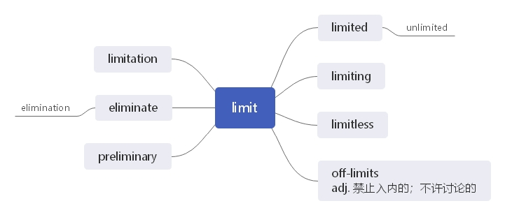

# 第十八节 掌握和单词 line 相关的词汇

***

> **本节课目标**
>
> 1、 掌握和单词 line 相关的词汇
>
> 2、掌握和单词 limit 相关的词汇

***

**line**  \[laɪn] n.  [英音](https://dict.youdao.com/dictvoice?audio=line\&type=1)  [美音](https://dict.youdao.com/dictvoice?audio=line\&type=2) 绳； 排； 路线， 航线 277

**双语例句:** Your bill includes line rental. [播放](https://dict.youdao.com/dictvoice?audio=Your+bill+includes+line+rental.&le=eng&le=eng&type=2)

你的账单包括电话线路的租用费。 

**双语例句:** She traced a line in the sand. [播放](https://dict.youdao.com/dictvoice?audio=She+traced+a+line+in+the+sand.&le=eng&le=eng&type=2)

她在沙地上画了一条线。 

**双语例句:** I drew a line across the page. [播放](https://dict.youdao.com/dictvoice?audio=I+drew+a+line+across+the+page.&le=eng&le=eng&type=2)

我在这一页上画了一条横线。 

**原声例句:** It is a **line** drawing made out of aluminum wire that looks like a wavy net floating in mid-air. [播放](https://dict.youdao.com/pureaudio?docid=227327369199682332)

**原声例句:** As one of the great nations, Lodge said,the United States must not fall out of this **line** of march. [播放](https://dict.youdao.com/pureaudio?docid=6254421390119751534)

**原声例句:** In his book \"The Color **Line**\", he wrote that the problem of race has been part of America since its creation. [播放](https://dict.youdao.com/pureaudio?docid=-1000096515688359783)

**权威例句:** He said the reopening of the **line** would have a huge impact on the area's \"psychologically\".  [播放](https://dict.youdao.com/dictvoice?audio=He+said+the+reopening+of+the+line+would+have+a+huge+impact+on+the+area%27s+%22psychologically%22.+&le=eng&type=2)

**权威例句:** Nannup, the son of a Noongar elder, comes from a long **line** of experienced outdoorsmen.  [播放](https://dict.youdao.com/dictvoice?audio=Nannup%2C+the+son+of+a+Noongar+elder%2C+comes+from+a+long+line+of+experienced+outdoorsmen.+&le=eng&type=2)

**权威例句:** Yet to Sale's credit, they repelled wave after wave of Northampton pressure on their **line**.  [播放](https://dict.youdao.com/dictvoice?audio=Yet+to+Sale%27s+credit%2C+they+repelled+wave+after+wave+of+Northampton+pressure+on+their+line.+&le=eng&type=2)

***

**lineage**  \['lɪnɪɪdʒ] n.  [英音](https://dict.youdao.com/dictvoice?audio=lineage\&type=1)  [美音](https://dict.youdao.com/dictvoice?audio=lineage\&type=2) 血统； 家系， 世系 9244

**词源：** late 17c., from Middle English linage "line of descent; an ancestor" (c. 1300), from Old

French lignage "descent, extraction, race" (11c.), from ligne "line," from Latin linea"line of

descent," literally "string, line, thread" (see line (n.)). The word altered in spelling and pronunciation

in early Modern English, apparently by some combined influence of line (n.) and lineal.

**双语例句:** Shared intentionality evolved very early in the human lineage, he believes, and its probable purpose was for cooperation in gathering food. [播放](https://dict.youdao.com/dictvoice?audio=Shared+intentionality+evolved+very+early+in+the+human+lineage%2C+he+believes%2C+and+its+probable+purpose+was+for+cooperation+in+gathering+food.&le=eng&le=eng&type=2)

他认为共享意向在人类世系中很早就得到发展了，而且它的目的很可能是在采集食物过程中相互合作。 

**双语例句:** They can trace their lineage back to the 18th century. [播放](https://dict.youdao.com/dictvoice?audio=They+can+trace+their+lineage+back+to+the+18th+century.&le=eng&le=eng&type=2)

他们的家族可以直接追溯到18世纪。 

**双语例句:** The simplest explanation for this is that the axolotl lineage alone lost the ability to metamorphose, while others retained it. [播放](https://dict.youdao.com/dictvoice?audio=The+simplest+explanation+for+this+is+that+the+axolotl+lineage+alone+lost+the+ability+to+metamorphose%2C+while+others+retained+it.&le=eng&le=eng&type=2)

对此最简单的解释是，只有蝾螈谱系失去了变形的能力，而其他族系则保留了这种能力。 

**原声例句:** This pluripotent stem cell is able to self-renew and it's able - generating committed progenitors of either the myeloid or the lymphoid **lineage**.

**原声例句:** So, there is a sense, in the Plains Indian, that he is both the embodiment of a noble, restrained **lineage**; but also, deep in that American past, is this sense of great excess.

**权威例句:** But with the confidence that stems from a long and distinguished **lineage**, the city soldiers on.  [播放](https://dict.youdao.com/dictvoice?audio=But+with+the+confidence+that+stems+from+a+long+and+distinguished+lineage%2C+the+city+soldiers+on.+&le=eng&type=2)

**权威例句:** An international effort mapped out thousands of physical traits and genetic clues to trace the **lineage**.  [播放](https://dict.youdao.com/dictvoice?audio=An+international+effort+mapped+out+thousands+of+physical+traits+and+genetic+clues+to+trace+the+lineage.+&le=eng&type=2)

**权威例句:** He was known back then as Chris Chichester and intimated he was of royal **lineage**.  [播放](https://dict.youdao.com/dictvoice?audio=He+was+known+back+then+as+Chris+Chichester+and+intimated+he+was+of+royal+lineage.+&le=eng&type=2)

***

**linear**  \['lɪnɪə] adj.  [英音](https://dict.youdao.com/dictvoice?audio=linear\&type=1)  [美音](https://dict.youdao.com/dictvoice?audio=linear\&type=2) 线的，（ 过程或发展） 线性的； 直线的， 线状的； 5881\*\* \*\*

**助记：** line（ 线） + ar（ 形容词后缀） →线的

**双语例句:** Students do not always progress in a linear fashion. [播放](https://dict.youdao.com/dictvoice?audio=Students+do+not+always+progress+in+a+linear+fashion.&le=eng&le=eng&type=2)

学生不会总是顺着一条直线进步。 

**双语例句:** In his art he broke the laws of scientific linear perspective. [播放](https://dict.youdao.com/dictvoice?audio=In+his+art+he+broke+the+laws+of+scientific+linear+perspective.&le=eng&le=eng&type=2)

他在自己的绘画艺术中打破了科学的直线透视法规律。 

**双语例句:** The slope of this linear fitting equation is 0.432 cm/sheet. [播放](https://dict.youdao.com/dictvoice?audio=The+slope+of+this+linear+fitting+equation+is+0.432+cm%2Fsheet.&le=eng&le=eng&type=2)

该线性拟合方程的斜率为0.432 cm/张。 

**原声例句:** And the technique is called, watch because this is a six-letter initialization, **linear** combination of atomic orbitals LCAO-MO into molecular orbital, LCAO-MO.

**原声例句:** Sometimes they challenge and contradict one another, but they are not best seen as **linear**, as telling a neat, **linear** story about Israelite religion flowering and fading.

**原声例句:** Remember, we don't do a one-to-one correlation, because p x and p y are some **linear** combination of the m plus 1 and m minus 1 orbital.

**权威例句:** Meanwhile, Manchester United had a nearly robotically perfect **linear** rise in their residual throughout the season.  [播放](https://dict.youdao.com/dictvoice?audio=Meanwhile%2C+Manchester+United+had+a+nearly+robotically+perfect+linear+rise+in+their+residual+throughout+the+season.+&le=eng&type=2)

**权威例句:** Geological faults do not necessarily produce earthquakes in a nice, **linear** fashion over time.  [播放](https://dict.youdao.com/dictvoice?audio=Geological+faults+do+not+necessarily+produce+earthquakes+in+a+nice%2C+linear+fashion+over+time.+&le=eng&type=2)

**权威例句:** That asynchronous **linear** drive, if true, can be good for meeting a specific objective.  [播放](https://dict.youdao.com/dictvoice?audio=That+asynchronous+linear+drive%2C+if+true%2C+can+be+good+for+meeting+a+specific+objective.+&le=eng&type=2)

***

**linebacker**  \['laɪnbækə] n.（  [英音](https://dict.youdao.com/dictvoice?audio=linebacker\&type=1)  [美音](https://dict.youdao.com/dictvoice?audio=linebacker\&type=2) 美式橄榄球中的） 线卫， 中后卫 6731

**释义和用法：**

(N-COUNT) （美式橄榄球中的）线卫，中后卫 In American football, a linebacker is a player

who tries to stop members of the other team from scoring by tackling them.

> **【课堂笔记】**
>
> tackle v. （ 1） 处理； 应对
>
> （ 2）〔美式或英式橄榄球比赛中〕拦截，擒抱

**双语例句:** I was a linebacker. [播放](https://dict.youdao.com/dictvoice?audio=I+was+a+linebacker.&le=eng&le=eng&type=2)

我是中后卫。 

**双语例句:** In football the linebacker backs up the linemen. [播放](https://dict.youdao.com/dictvoice?audio=In+football+the+linebacker+backs+up+the+linemen.&le=eng&le=eng&type=2)

在足球赛中后卫接应前锋。 

**双语例句:** Seattle Linebacker Smith was named the game's Most Valuable Player. [播放](https://dict.youdao.com/dictvoice?audio=Seattle+Linebacker+Smith+was+named+the+game%27s+Most+Valuable+Player.&le=eng&le=eng&type=2)

西雅图的后卫史密斯被评为本场比赛的最有价值球员。 

**权威例句:** Mark Herzlich, another **linebacker**, takes an even harder stance on what constitutes healthy food.  [播放](https://dict.youdao.com/dictvoice?audio=Mark+Herzlich%2C+another+linebacker%2C+takes+an+even+harder+stance+on+what+constitutes+healthy+food.+&le=eng&type=2)

**权威例句:** Now UA's new football cleat is getting a big publicity boost from Ohio State **linebacker** A.J.  [播放](https://dict.youdao.com/dictvoice?audio=Now+UA%27s+new+football+cleat+is+getting+a+big+publicity+boost+from+Ohio+State+linebacker+A.J.+&le=eng&type=2)

**权威例句:** She said Alexander came at her \"like a **linebacker**, \" body-slamming her to the tile floor.  [播放](https://dict.youdao.com/dictvoice?audio=She+said+Alexander+came+at+her+%22like+a+linebacker%2C+%22+body-slamming+her+to+the+tile+floor.+&le=eng&type=2)

***

**lined** \[laɪnd] adj.  [英音](https://dict.youdao.com/dictvoice?audio=lined\&type=1)  [美音](https://dict.youdao.com/dictvoice?audio=lined\&type=2) 有内衬的； 有皱纹的 17618

**释义和用法：**

1）有皱纹的 If someone's face or skin is lined, it has lines on it as a result of old age, tiredness,

worry, or illness.

2） (of clothes 衣服) having a lining inside them 有衬里的；有内衬的

**双语例句:** The walls were lined with books. [播放](https://dict.youdao.com/dictvoice?audio=The+walls+were+lined+with+books.&le=eng&le=eng&type=2)

靠墙是一排排的图书。 

**双语例句:** The runners lined up at the start. [播放](https://dict.youdao.com/dictvoice?audio=The+runners+lined+up+at+the+start.&le=eng&le=eng&type=2)

赛跑运动员在起跑线上一字排开。 

**双语例句:** Cars lined up waiting to board the ship. [播放](https://dict.youdao.com/dictvoice?audio=Cars+lined+up+waiting+to+board+the+ship.&le=eng&le=eng&type=2)

汽车排队等候上船。 

**原声例句:** They walk along the Frijoles stream **lined** with green trees that once was the only water supply for the valley. [播放](https://dict.youdao.com/pureaudio?docid=-3860913505231273231)

**原声例句:** Outside,crowds **lined** the street to cheer Wilson as he returned to the White House from the Capitol Building. [播放](https://dict.youdao.com/pureaudio?docid=1152173337529729422)

**原声例句:** The boy's face looked tired and **lined**, like an old man's. [播放](https://dict.youdao.com/pureaudio?docid=3110249905714494011)

**权威例句:** To stop insurgents from blowing up convoys, he's **lined** the roads here with American troops.  [播放](https://dict.youdao.com/dictvoice?audio=To+stop+insurgents+from+blowing+up+convoys%2C+he%27s+lined+the+roads+here+with+American+troops.+&le=eng&type=2)

**权威例句:** And people have **lined** up to condemn the riots, the looting, and the violence.  [播放](https://dict.youdao.com/dictvoice?audio=And+people+have+lined+up+to+condemn+the+riots%2C+the+looting%2C+and+the+violence.+&le=eng&type=2)

**权威例句:** Heading south from Atlantic, both Court and Smith Streets are **lined** with local designers' boutiques.  [播放](https://dict.youdao.com/dictvoice?audio=Heading+south+from+Atlantic%2C+both+Court+and+Smith+Streets+are+lined+with+local+designers%27+boutiques.+&le=eng&type=2)

***

**lining**  \['laɪnɪŋ] n.  [英音](https://dict.youdao.com/dictvoice?audio=lining\&type=1)  [美音](https://dict.youdao.com/dictvoice?audio=lining\&type=2) 衬里； 内层； 衬套 9641

**双语例句:** The drugs were secreted in the lining of his case. [播放](https://dict.youdao.com/dictvoice?audio=The+drugs+were+secreted+in+the+lining+of+his+case.&le=eng&le=eng&type=2)

毒品藏在他的皮箱内衬中。 

**双语例句:** Some drugs can irritate the lining of the stomach. [播放](https://dict.youdao.com/dictvoice?audio=Some+drugs+can+irritate+the+lining+of+the+stomach.&le=eng&le=eng&type=2)

有些药物会刺激胃内壁。 

**双语例句:** The fall in inflation is the silver lining of the prolonged recession. [播放](https://dict.youdao.com/dictvoice?audio=The+fall+in+inflation+is+the+silver+lining+of+the+prolonged+recession.&le=eng&le=eng&type=2)

通货膨胀率下降是长期经济衰退中的一线希望。 

**原声例句:** Others protect the **lining** of the stomach and small intestine. [播放](https://dict.youdao.com/pureaudio?docid=-4130461309624973034)

**原声例句:** Optimists might say that every cloud has a silver **lining**. [播放](https://dict.youdao.com/pureaudio?docid=-8924041168376364836)

**原声例句:** However,the judge told the prosecution to continue **lining** up witnesses to testify against Kasab, saying his trial will continue. [播放](https://dict.youdao.com/pureaudio?docid=-4840178832815807069)

**权威例句:** HIV, because the **lining** of the neck of an immature womb is less tough.  [播放](https://dict.youdao.com/dictvoice?audio=HIV%2C+because+the+lining+of+the+neck+of+an+immature+womb+is+less+tough.+&le=eng&type=2)

**权威例句:** No photos have emerged of DeLay or Ney **lining** up a putt at St.  [播放](https://dict.youdao.com/dictvoice?audio=No+photos+have+emerged+of+DeLay+or+Ney+lining+up+a+putt+at+St.+&le=eng&type=2)

**权威例句:** In searching for the silver **lining**, Southeastern drew particular attention to the increasingly profitable enterprise business.  [播放](https://dict.youdao.com/dictvoice?audio=In+searching+for+the+silver+lining%2C+Southeastern+drew+particular+attention+to+the+increasingly+profitable+enterprise+business.+&le=eng&type=2)

***

**lineman**  \['laɪnmən] n.（ [英音](https://dict.youdao.com/dictvoice?audio=lineman\&type=1)  [美音](https://dict.youdao.com/dictvoice?audio=lineman\&type=2) 美式足球的）前锋；线上的队员；电线架设工人 9457

**双语例句:** Green is a defensive lineman for the Atlanta Falcons. [播放](https://dict.youdao.com/dictvoice?audio=Green+is+a+defensive+lineman+for+the+Atlanta+Falcons.&le=eng&le=eng&type=2)

格林是亚特兰大猎鹰球队的防守前锋队员。 

**双语例句:** A lineman is trying to repair the damaged pylon. [播放](https://dict.youdao.com/dictvoice?audio=A+lineman+is+trying+to+repair+the+damaged+pylon.&le=eng&le=eng&type=2)

线务员正试图修理被损坏的电缆塔。 

**双语例句:** The lineman was severely burned by the live wire. [播放](https://dict.youdao.com/dictvoice?audio=The+lineman+was+severely+burned+by+the+live+wire.&le=eng&le=eng&type=2)

电线架设工人被通电的电线严重烧伤。 

**权威例句:** They picked up troubled journeyman **lineman** Albert Haynesworth and media-friendly wide receiver Chad Ochocinco.  [播放](https://dict.youdao.com/dictvoice?audio=They+picked+up+troubled+journeyman+lineman+Albert+Haynesworth+and+media-friendly+wide+receiver+Chad+Ochocinco.+&le=eng&type=2)

**权威例句:** The Jets also drafted versatile Kent State offensive **lineman** Brian Winters in the third round.  [播放](https://dict.youdao.com/dictvoice?audio=The+Jets+also+drafted+versatile+Kent+State+offensive+lineman+Brian+Winters+in+the+third+round.+&le=eng&type=2)

**权威例句:** When they took defensive end in Jason Pierre-Paul in 2010, they were loaded with defensive **lineman**.  [播放](https://dict.youdao.com/dictvoice?audio=When+they+took+defensive+end+in+Jason+Pierre-Paul+in+2010%2C+they+were+loaded+with+defensive+lineman.+&le=eng&type=2)

***

**linen**  \['lɪnɪn] n.  [英音](https://dict.youdao.com/dictvoice?audio=linen\&type=1)  [美音](https://dict.youdao.com/dictvoice?audio=linen\&type=2) 亚麻布， 亚麻线； 亚麻制品 6094

**双语例句:** This material is linen. [播放](https://dict.youdao.com/dictvoice?audio=This+material+is+linen.&le=eng&le=eng&type=2)

这块料子是麻的。 

**双语例句:** From it he took a large, heavy linen bag and brought it to the child. [播放](https://dict.youdao.com/dictvoice?audio=From+it+he+took+a+large%2C+heavy+linen+bag+and+brought+it+to+the+child.&le=eng&le=eng&type=2)

他从那里拿来一个又大又重的亚麻布口袋，递给孩子。 

**双语例句:** In the late 17th century, French refugees arrived here and developed the linen industry. [播放](https://dict.youdao.com/dictvoice?audio=If+you+need+some+shirts+and+other+linen%2C+you+will+find+them+in+the+bottom+of+the+cupboard.&le=eng&le=eng&type=2)

如果你需要一些衬衫和其他亚麻衣物，你可以在碗柜底部找到。 

**原声例句:** Yarn can be made from natural materials such as cotton, **linen**,silk and wool. [播放](https://dict.youdao.com/pureaudio?docid=-4731170579673752357)

**原声例句:** The most famous mummies are the Egyptian ones, which were carefully dried out with salts, treated with oils and resins and wrapped in **linen** before being placed in a coffin. [播放](https://dict.youdao.com/pureaudio?docid=-2847718559149884769)

**权威例句:** Behind her a thin man in a blue **linen** suit started to wave a Palestinian flag.  [播放](https://dict.youdao.com/dictvoice?audio=Behind+her+a+thin+man+in+a+blue+linen+suit+started+to+wave+a+Palestinian+flag.+&le=eng&type=2)

**权威例句:** Like other cities, Orlando has seen big national chain closures like Linen-N-Things and Circuit City.  [播放](https://dict.youdao.com/dictvoice?audio=Like+other+cities%2C+Orlando+has+seen+big+national+chain+closures+like+Linen-N-Things+and+Circuit+City.+&le=eng&type=2)

**权威例句:** Europe is retaliating by introducing tariffs on American exports like citrus fruits and **linen** products.  [播放](https://dict.youdao.com/dictvoice?audio=Europe+is+retaliating+by+introducing+tariffs+on+American+exports+like+citrus+fruits+and+linen+products.+&le=eng&type=2)

***

**liner**  \['laɪnə] n.  [英音](https://dict.youdao.com/dictvoice?audio=liner\&type=1)  [美音](https://dict.youdao.com/dictvoice?audio=liner\&type=2) 邮轮， 客轮； 衬里； 内衬 7628

**释义和用法：**

1）（尤指度假时乘坐的）邮轮，客轮 A liner is a large ship in which people travel long distances,

especially on holiday.&#x20;

2） (especially in compounds 尤用于构成复合词) a piece of material used to cover the inside

surface of sth 衬里；内衬

> **【课堂笔记】**
>
> lining=liner 衬里； 内衬

**双语例句:** Hundreds of small craft bobbed around the liner as it steamed into the harbour. [播放](https://dict.youdao.com/dictvoice?audio=Hundreds+of+small+craft+bobbed+around+the+liner+as+it+steamed+into+the+harbour.&le=eng&le=eng&type=2)

班轮驶进港口时，周围的许多小船颠簸起来。 

**双语例句:** How did you captain an ocean liner? [播放](https://dict.youdao.com/dictvoice?audio=How+did+you+captain+an+ocean+liner%3F&le=eng&le=eng&type=2)

你是怎样当上远洋客轮的船长的？ 

**双语例句:** The dramatic silhouettes, part ocean liner, part funfair, all disguise the difficulties within. [播放](https://dict.youdao.com/dictvoice?audio=The+dramatic+silhouettes%2C+part+ocean+liner%2C+part+funfair%2C+all+disguise+the+difficulties+within.&le=eng&le=eng&type=2)

那动人心魄的轮廓，那远洋油轮的一隅，那游乐场的一角，这一切都将内部的困难掩盖了起来。 

**原声例句:** And he knows no landfill **liner** system is completely leak-proof, meaning there is some possibility that the industrial quantities of waste coming from the oil cleanup could pollute local underground water supplies. [播放](https://dict.youdao.com/pureaudio?docid=-8591779965697445551)

**权威例句:** The balloting last Friday in Iran was not an election pitting \"hard-liner\" Ahmadinejad against \"reformist\" Mousavi.  [播放](https://dict.youdao.com/dictvoice?audio=The+balloting+last+Friday+in+Iran+was+not+an+election+pitting+%22hard-liner%22+Ahmadinejad+against+%22reformist%22+Mousavi.+&le=eng&type=2)

**权威例句:** They gathered aboard the Silver Whisper cruise **liner** moored for the occasion on the Neva River.  [播放](https://dict.youdao.com/dictvoice?audio=They+gathered+aboard+the+Silver+Whisper+cruise+liner+moored+for+the+occasion+on+the+Neva+River.+&le=eng&type=2)

**权威例句:** I've become a case-study in VC fossilization, a Luddite one-liner, like Ken Olsen and the PC.  [播放](https://dict.youdao.com/dictvoice?audio=I%27ve+become+a+case-study+in+VC+fossilization%2C+a+Luddite+one-liner%2C+like+Ken+Olsen+and+the+PC.+&le=eng&type=2)

***

**lineup**  \['laɪnʌp] n.  [英音](https://dict.youdao.com/dictvoice?audio=lineup\&type=1)  [美音](https://dict.youdao.com/dictvoice?audio=lineup\&type=2) 一组人；阵容；电视节目时间表 5966

**释义和用法：**

1）一组人；一批东西 A line-up is a group of people or a series of things that have been gathered

together to be part of a particular event.

2） （为识别嫌疑犯）警方安排有待辨认的一列人 At a line-up, a witness to a crime tries to identify

the criminal from among a line of people.

> **【课堂笔记】**
>
> 短语 line up 排队； 排成行

**双语例句:** Eyewitnesses to other crimes have identified the wrong person in a police lineup or in photographs. [播放](https://dict.youdao.com/dictvoice?audio=Eyewitnesses+to+other+crimes+have+identified+the+wrong+person+in+a+police+lineup+or+in+photographs.&le=eng&le=eng&type=2)

其他犯罪的目击证人在警察阵容或照片中指认了错误的人。 

**双语例句:** One player sure to be in the lineup is star midfielder Landon Donovan. [播放](https://dict.youdao.com/dictvoice?audio=One+player+sure+to+be+in+the+lineup+is+star+midfielder+Landon+Donovan.&le=eng&le=eng&type=2)

肯定列入该阵容的一名球员是中场球星兰登·多诺万。 

**双语例句:** They were taken in a police van to the 60th Precinct station house for the lineup. [播放](https://dict.youdao.com/dictvoice?audio=They+were+taken+in+a+police+van+to+the+60th+Precinct+station+house+for+the+lineup.&le=eng&le=eng&type=2)

他们被警车拉往第60警区派出所以待进行嫌疑犯列队辨认。 

**权威例句:** The company predicted its rekindles **lineup** would yield 11% to 17% profit growth through 2009.  [播放](https://dict.youdao.com/dictvoice?audio=The+company+predicted+its+rekindles+lineup+would+yield+11%25+to+17%25+profit+growth+through+2009.+&le=eng&type=2)

**权威例句:** The key is anyone who needs a guy in the middle of their **lineup**.  [播放](https://dict.youdao.com/dictvoice?audio=The+key+is+anyone+who+needs+a+guy+in+the+middle+of+their+lineup.+&le=eng&type=2)

**权威例句:** But later incarnations of the Galaxy **lineup** have, to some extent, surpassed the iPhone.  [播放](https://dict.youdao.com/dictvoice?audio=But+later+incarnations+of+the+Galaxy+lineup+have%2C+to+some+extent%2C+surpassed+the+iPhone.+&le=eng&type=2)

***

**airline**  \['eəlaɪn] n.  [英音](https://dict.youdao.com/dictvoice?audio=airline\&type=1)  [美音](https://dict.youdao.com/dictvoice?audio=airline\&type=2) 航空公司；航线 2147

**双语例句:** The airline regrets any inconvenience. [播放](https://dict.youdao.com/dictvoice?audio=The+airline+regrets+any+inconvenience.&le=eng&le=eng&type=2)

航空公司对所造成的任何不便表示歉意。 

**双语例句:** The airline industry took a hit last year. [播放](https://dict.youdao.com/dictvoice?audio=The+airline+industry+took+a+hit+last+year.&le=eng&le=eng&type=2)

去年航空业受到了严重冲击。 

**双语例句:** He spent seventeen years as an airline pilot. [播放](https://dict.youdao.com/dictvoice?audio=He+spent+seventeen+years+as+an+airline+pilot.&le=eng&le=eng&type=2)

他当了17年的航空公司飞行员。 

**原声例句:** Transportation safety investigators held hearings this week into an accident that involved a major **airline**. [播放](https://dict.youdao.com/pureaudio?docid=-1245182979628198383)

**原声例句:** But observers are not expecting any major signs of a recovery for the **airline** industry. [播放](https://dict.youdao.com/pureaudio?docid=4043355270046980281)

**原声例句:** These smaller carriers now operate about half the **airline** flights within the United States. [播放](https://dict.youdao.com/pureaudio?docid=-5942979110101919452)

**权威例句:** Neither **airline** allows the app to automatically pull in new mile and point balances.  [播放](https://dict.youdao.com/dictvoice?audio=Neither+airline+allows+the+app+to+automatically+pull+in+new+mile+and+point+balances.+&le=eng&type=2)

**权威例句:** But consolidation has also helped stabilise the **airline** industry, reported the Wall Street Journal (WSJ).  [播放](https://dict.youdao.com/dictvoice?audio=But+consolidation+has+also+helped+stabilise+the+airline+industry%2C+reported+the+Wall+Street+Journal+%28WSJ%29.+&le=eng&type=2)

**权威例句:** For the first time in years the U.S **airline** industry is in terrific shape.  [播放](https://dict.youdao.com/dictvoice?audio=For+the+first+time+in+years+the+U.S+airline+industry+is+in+terrific+shape.+&le=eng&type=2)

***

**airliner**  \['eəlaɪnə] n.  [英音](https://dict.youdao.com/dictvoice?audio=airliner\&type=1)  [美音](https://dict.youdao.com/dictvoice?audio=airliner\&type=2) 班机；大型客机 12244

**双语例句:** An airliner came close to disaster while approaching Kennedy Airport. [播放](https://dict.youdao.com/dictvoice?audio=An+airliner+came+close+to+disaster+while+approaching+Kennedy+Airport.&le=eng&le=eng&type=2)

一架客机在飞近肯尼迪机场时险些出事。 

**双语例句:** A foreign airliner was attempting to land at night in a mountainous area in Argentina and flew into a hill! That sounds really terrible! [播放](https://dict.youdao.com/dictvoice?audio=When+planes+fall+from+the+sky%2C+as+a+Yemeni+airliner+did+on+its+way+to+Comoros+Islands+in+the+India+ocean+June+30%2C+2009%2C+the+black+box+is+the+best+bet+for+identifying+what+went+wrong.&le=eng&le=eng&type=2)

当飞机从空中坠落，比如2009年6月30日的一架也门客机在飞往印度洋的科摩罗群岛时那样，黑匣子是找出问题所在的最佳选择。 

**双语例句:** The damage to skill and craftsmanship—that's needed to build a complex airliner or a tractor, or for a worker to move up from assembler to machinist to supervisor—went largely unnoticed. [播放](https://dict.youdao.com/dictvoice?audio=The+damage+to+skill+and+craftsmanship%E2%80%94that%27s+needed+to+build+a+complex+airliner+or+a+tractor%2C+or+for+a+worker+to+move+up+from+assembler+to+machinist+to+supervisor%E2%80%94went+largely+unnoticed.&le=eng&le=eng&type=2)

对技术和工艺的损害——制造一架复杂的飞机或拖拉机，或工人从装配工到机械师再到监督员所需要的技术和工艺——在很大程度上被忽视了。 

**权威例句:** Grounding an **airliner** opens the door to damaging its reputation for safety, say experts.  [播放](https://dict.youdao.com/dictvoice?audio=Grounding+an+airliner+opens+the+door+to+damaging+its+reputation+for+safety%2C+say+experts.+&le=eng&type=2)

**权威例句:** The previous FAA grounding in 1979 followed the terrible crash of the now-defunct DC-10 wide-body **airliner**.  [播放](https://dict.youdao.com/dictvoice?audio=The+previous+FAA+grounding+in+1979+followed+the+terrible+crash+of+the+now-defunct+DC-10+wide-body+airliner.+&le=eng&type=2)

**权威例句:** The group has claimed responsibility for the attempted bombing of a U.S.-bound **airliner** on December 25.  [播放](https://dict.youdao.com/dictvoice?audio=The+group+has+claimed+responsibility+for+the+attempted+bombing+of+a+U.S.-bound+airliner+on+December+25.+&le=eng&type=2)

***

**baseline**  \['beɪslaɪn]n.  [英音](https://dict.youdao.com/dictvoice?audio=baseline\&type=1)  [美音](https://dict.youdao.com/dictvoice?audio=baseline\&type=2) 基线； \[体]底线 6053

> **【课堂笔记】**
>
> base n. 基地
>
> v. 基于 base on

**双语例句:** Martinez, when she served, usually stayed on the baseline. [播放](https://dict.youdao.com/dictvoice?audio=Martinez%2C+when+she+served%2C+usually+stayed+on+the+baseline.&le=eng&le=eng&type=2)

马第尼斯发球的时候，经常踩在底线上。 

**双语例句:** You'll need such information to use as a baseline for measuring progress. [播放](https://dict.youdao.com/dictvoice?audio=You%27ll+need+such+information+to+use+as+a+baseline+for+measuring+progress.&le=eng&le=eng&type=2)

你需要利用这些信息作为基准来衡量进展情况。 

**双语例句:** This then becomes the new pattern, or baseline for your emotional state. [播放](https://dict.youdao.com/dictvoice?audio=This+then+becomes+the+new+pattern%2C+or+baseline+for+your+emotional+state.&le=eng&le=eng&type=2)

这就成为了你情绪状态的新模式或基线。 

**原声例句:** Their combined observing power gives the Very Long **Baseline** Array the ability to see the finest details of any telescope in the world. [播放](https://dict.youdao.com/pureaudio?docid=7385544699855191286)

**原声例句:** He said the researchers have established a **baseline** of what lives in the ocean. [播放](https://dict.youdao.com/pureaudio?docid=-6901318090368136130)

**原声例句:** \"The global MDG said that  country had to reduce two-thirds of the **baseline** information when they started the MDG. [播放](https://dict.youdao.com/pureaudio?docid=-3565329498838701599)

**权威例句:** The ball kissed the **baseline** for a winner, and Stosur waved in apology to Mladenovic.  [播放](https://dict.youdao.com/dictvoice?audio=The+ball+kissed+the+baseline+for+a+winner%2C+and+Stosur+waved+in+apology+to+Mladenovic.+&le=eng&type=2)

**权威例句:** Jankovic won with steady play from the **baseline**, while the big-swinging Muguruza committed 29 unforced errors.  [播放](https://dict.youdao.com/dictvoice?audio=Jankovic+won+with+steady+play+from+the+baseline%2C+while+the+big-swinging+Muguruza+committed+29+unforced+errors.+&le=eng&type=2)

**权威例句:** Based on what we do know, however, both sides are playing big-time budget **baseline** games.  [播放](https://dict.youdao.com/dictvoice?audio=Based+on+what+we+do+know%2C+however%2C+both+sides+are+playing+big-time+budget+baseline+games.+&le=eng&type=2)

***

**coastline**  \['kəʊs(t)laɪn] n.  [英音](https://dict.youdao.com/dictvoice?audio=coastline\&type=1)  [美音](https://dict.youdao.com/dictvoice?audio=coastline\&type=2) 海岸线 10471

> **【课堂笔记】**
>
> coast n. 海滨； 海岸

**双语例句:** The coastline is being eaten away year by year. [播放](https://dict.youdao.com/dictvoice?audio=The+coastline+is+being+eaten+away+year+by+year.&le=eng&le=eng&type=2)

海岸线年复一年地被侵蚀着。 

**双语例句:** The road follows the natural contours of the coastline. [播放](https://dict.youdao.com/dictvoice?audio=The+road+follows+the+natural+contours+of+the+coastline.&le=eng&le=eng&type=2)

这条路沿着海岸线的自然轮廓延伸。 

**双语例句:** This is some of the most exposed coastline in the world. [播放](https://dict.youdao.com/dictvoice?audio=This+is+some+of+the+most+exposed+coastline+in+the+world.&le=eng&le=eng&type=2)

这是世界上最无遮蔽的海岸线。 

**原声例句:** More than eighty thousand barrels of crude oil from the spill severely damaged over sixty kilometers of **coastline**. [播放](https://dict.youdao.com/pureaudio?docid=-5669189393973266372)

**原声例句:** The military said troops were moving in from the north and the south on the narrow area of **coastline** still held by the rebels. [播放](https://dict.youdao.com/pureaudio?docid=-8073149945012305651)

**原声例句:** Oil has already reached more than one hundred kilometers of **coastline** in Louisiana, Mississippi and Alabama. [播放](https://dict.youdao.com/pureaudio?docid=-3710433637773226258)

**权威例句:** As Kennedy joked, at least the **coastline** lived up to its monikor Wild Atlantic Way.  [播放](https://dict.youdao.com/dictvoice?audio=As+Kennedy+joked%2C+at+least+the+coastline+lived+up+to+its+monikor+Wild+Atlantic+Way.+&le=eng&type=2)

**权威例句:** The **coastline** here is best known for its gorges and eroded limestone rock formations that protrude offshore.  [播放](https://dict.youdao.com/dictvoice?audio=The+coastline+here+is+best+known+for+its+gorges+and+eroded+limestone+rock+formations+that+protrude+offshore.+&le=eng&type=2)

**权威例句:** And he insisted that Japan needs to keep land mines to deter possible attacks on the country's **coastline**.  [播放](https://dict.youdao.com/dictvoice?audio=And+he+insisted+that+Japan+needs+to+keep+land+mines+to+deter+possible+attacks+on+the+country%27s+coastline.+&le=eng&type=2)

***

**frontline**  \['frʌntlain] n.  [英音](https://dict.youdao.com/dictvoice?audio=frontline\&type=1)  [美音](https://dict.youdao.com/dictvoice?audio=frontline\&type=2) 前线 14367

**双语例句:** Chains such as KFC, McDonald's and Pizza Hut are setting a new standard of customer service, using strict employee training and constant monitoring to ensure the friendliness of frontline staff. [播放](https://dict.youdao.com/dictvoice?audio=Chains+such+as+KFC%2C+McDonald%27s+and+Pizza+Hut+are+setting+a+new+standard+of+customer+service%2C+using+strict+employee+training+and+constant+monitoring+to+ensure+the+friendliness+of+frontline+staff.&le=eng&le=eng&type=2)

肯德基、麦当劳和必胜客等连锁店正在制定新的客户服务标准，采用严格的员工培训和持续监控，以确保一线员工的友好服务态度。 

**双语例句:** They retired to safer positions behind the frontline. [播放](https://dict.youdao.com/dictvoice?audio=They+retired+to+safer+positions+behind+the+frontline.&le=eng&le=eng&type=2)

他们撤退到前线后面较安全的阵地。 

**双语例句:** After six months 'training, he was sent to the frontline. [播放](https://dict.youdao.com/dictvoice?audio=After+six+months+%27training%2C+he+was+sent+to+the+frontline.&le=eng&le=eng&type=2)

接受6个月训练后，他被派往前线。 

**权威例句:** England were down to three **frontline** bowlers and Gayle showed scant respect for the two fit pacemen.  [播放](https://dict.youdao.com/dictvoice?audio=England+were+down+to+three+frontline+bowlers+and+Gayle+showed+scant+respect+for+the+two+fit+pacemen.+&le=eng&type=2)

**权威例句:** Dave Hanratty, chair of Merseyside Fire and Rescue Authority, said the cuts will affect **frontline** services.  [播放](https://dict.youdao.com/dictvoice?audio=Dave+Hanratty%2C+chair+of+Merseyside+Fire+and+Rescue+Authority%2C+said+the+cuts+will+affect+frontline+services.+&le=eng&type=2)

**权威例句:** Their film is called \"Outlawed in Pakistan\" and it airs on the PBS series, **\"Frontlin**e, \" tonight.  [播放](https://dict.youdao.com/dictvoice?audio=Their+film+is+called+%22Outlawed+in+Pakistan%22+and+it+airs+on+the+PBS+series%2C+%22Frontline%2C+%22+tonight.+&le=eng&type=2)

***

**front-line**  \['frʌnt'lain] adj.  [英音](https://dict.youdao.com/dictvoice?audio=front-line\&type=1)  [美音](https://dict.youdao.com/dictvoice?audio=front-line\&type=2) 前线的 19610

***

**guideline**  \['gaɪdlaɪn] n.  [英音](https://dict.youdao.com/dictvoice?audio=guideline\&type=1)  [美音](https://dict.youdao.com/dictvoice?audio=guideline\&type=2) 指导方针 3089

> **【课堂笔记】**
>
> **助记：** guide（ 指导； 引导） + line（ 线） →指导线； 指导方针

**双语例句:** A written IQ test is merely a guideline. [播放](https://dict.youdao.com/dictvoice?audio=A+written+IQ+test+is+merely+a+guideline.&le=eng&le=eng&type=2)

书面的智商测试只是个参考。 

**双语例句:** The figures are a useful guideline when buying a house. [播放](https://dict.youdao.com/dictvoice?audio=The+figures+are+a+useful+guideline+when+buying+a+house.&le=eng&le=eng&type=2)

买房时这些数据很有参考价值。 

**双语例句:** Height-weight tables give an approximate guideline as to whether one is simply overweight or has passed into the obese stage. [播放](https://dict.youdao.com/dictvoice?audio=Height-weight+tables+give+an+approximate+guideline+as+to+whether+one+is+simply+overweight+or+has+passed+into+the+obese+stage.&le=eng&le=eng&type=2)

身高体重表为判断一个人是单纯超重还是进入肥胖阶段提供了大致的指南。 

**原声例句:** Dr.Mishori says this is not necessarily a good **guideline** to follow. [播放](https://dict.youdao.com/pureaudio?docid=4778432821710573850)

**原声例句:** When I open the blue book, the Yale **guideline**, the Yale catalog, it's got a page, as you all know, where it says what letter grades mean at Yale.

**原声例句:** So usually the **guideline** is anywhere usually around 18%.

**权威例句:** PCTs need to consider the detail of the full **guideline**, take stock, and review their services.  [播放](https://dict.youdao.com/dictvoice?audio=PCTs+need+to+consider+the+detail+of+the+full+guideline%2C+take+stock%2C+and+review+their+services.+&le=eng&type=2)

**权威例句:** Others use **Guideline** Daily Amounts - or GDAs - which give the percentage of recommended intake.  [播放](https://dict.youdao.com/dictvoice?audio=Others+use+Guideline+Daily+Amounts+-+or+GDAs+-+which+give+the+percentage+of+recommended+intake.+&le=eng&type=2)

**权威例句:** That EPA rule was designed for a lifetime of exposure, the IAEA **guideline** for short-term exposure.  [播放](https://dict.youdao.com/dictvoice?audio=That+EPA+rule+was+designed+for+a+lifetime+of+exposure%2C+the+IAEA+guideline+for+short-term+exposure.+&le=eng&type=2)

***

**hairline**  \['heəlaɪn] n.  [英音](https://dict.youdao.com/dictvoice?audio=hairline\&type=1)  [美音](https://dict.youdao.com/dictvoice?audio=hairline\&type=2) 极细的线；发际线；细缝 16306

**双语例句:** Joanne had a small dark birthmark near her hairline. [播放](https://dict.youdao.com/dictvoice?audio=Joanne+had+a+small+dark+birthmark+near+her+hairline.&le=eng&le=eng&type=2)

乔安妮的发际线处有一小块黑色胎记。 

**双语例句:** He suffered a hairline fracture of the right index finger. [播放](https://dict.youdao.com/dictvoice?audio=He+suffered+a+hairline+fracture+of+the+right+index+finger.&le=eng&le=eng&type=2)

他的右手食指上出现一处丝状骨折。 

**双语例句:** The bartender had a florid face and a receding hairline. [播放](https://dict.youdao.com/dictvoice?audio=The+bartender+had+a+florid+face+and+a+receding+hairline.&le=eng&le=eng&type=2)

酒吧男招待面色红润，前额有点脱发。 

**权威例句:** In the meantime, it's more important to pay attention to your waistline than your **hairline**.  [播放](https://dict.youdao.com/dictvoice?audio=In+the+meantime%2C+it%27s+more+important+to+pay+attention+to+your+waistline+than+your+hairline.+&le=eng&type=2)

**权威例句:** Spots associated with measles normally appear a few days later on the neck or **hairline**.  [播放](https://dict.youdao.com/dictvoice?audio=Spots+associated+with+measles+normally+appear+a+few+days+later+on+the+neck+or+hairline.+&le=eng&type=2)

**权威例句:** Nor is it an elaborately engineered coif to hide a **hairline** in retreat, as many Trump-watchers imagine.  [播放](https://dict.youdao.com/dictvoice?audio=Nor+is+it+an+elaborately+engineered+coif+to+hide+a+hairline+in+retreat%2C+as+many+Trump-watchers+imagine.+&le=eng&type=2)

***

**hard-line**  \['hɑ\:dlain] adj.  [英音](https://dict.youdao.com/dictvoice?audio=hard-line\&type=1)  [美音](https://dict.youdao.com/dictvoice?audio=hard-line\&type=2) 主张采取强硬路线的， 毫不妥协的， 采强硬态度的 12093

***

**hard-liner** \['hɑ\:d'lainə] n.  [英音](https://dict.youdao.com/dictvoice?audio=hard-liner\&type=1)  [美音](https://dict.youdao.com/dictvoice?audio=hard-liner\&type=2) 主张采取强硬路线的人； 不妥协者 12787

***

**headline**  \['hedlaɪn] n.  [英音](https://dict.youdao.com/dictvoice?audio=headline\&type=1)  [美音](https://dict.youdao.com/dictvoice?audio=headline\&type=2) 大标题；内容提要；栏外标题；头版头条新闻 3320

**双语例句:** 'Ten shot dead by gunmen,' ran the newspaper headline. [播放](https://dict.youdao.com/dictvoice?audio=%27Ten+shot+dead+by+gunmen%2C%27+ran+the+newspaper+headline.&le=eng&le=eng&type=2)

报纸的标题为“枪手击毙十人”。 

**双语例句:** They ran the story under the headline 'Home at last!'. [播放](https://dict.youdao.com/dictvoice?audio=They+ran+the+story+under+the+headline+%27Home+at+last%21%27.&le=eng&le=eng&type=2)

报纸刊登这个报道的大标题为“终于回家了！”。 

**双语例句:** Both newspapers carried the same banner headline, \"Where are you, Mr. President?\" [播放](https://dict.youdao.com/dictvoice?audio=Both+newspapers+carried+the+same+banner+headline%2C+%22Where+are+you%2C+Mr.+President%3F%22&le=eng&le=eng&type=2)

两份报纸刊登了相同的头版通栏大标题：“总统先生，你在哪里？” 

**原声例句:** On opening day, the **headline** was that Mr.Ahmedinejad had abruptly cancelled because of what were called program priorities. [播放](https://dict.youdao.com/pureaudio?docid=1893497429250682348)

**原声例句:** Other **headline** acts have included British band Coldplay and Australian pop sweetheart Kylie Minogue as well as Barry Gibb from the Bee Gees and Olivia Newton-John. [播放](https://dict.youdao.com/pureaudio?docid=6659230546387183461)

**原声例句:** And it's summarized in this Onion **headline** here.

**权威例句:** The **headline** we saw back in October was MRSA kills more than people - than AIDS does.  [播放](https://dict.youdao.com/dictvoice?audio=The+headline+we+saw+back+in+October+was+MRSA+kills+more+than+people+-+than+AIDS+does.+&le=eng&type=2)

**权威例句:** Your escape route is clearly defined: Sell those municipal bonds whose **headline** risk is untenable.  [播放](https://dict.youdao.com/dictvoice?audio=Your+escape+route+is+clearly+defined%3A+Sell+those+municipal+bonds+whose+headline+risk+is+untenable.+&le=eng&type=2)

**权威例句:** Because he is a member of Atoms for Peace, the group received offers to **headline** festivals.  [播放](https://dict.youdao.com/dictvoice?audio=Because+he+is+a+member+of+Atoms+for+Peace%2C+the+group+received+offers+to+headline+festivals.+&le=eng&type=2)

***

**headliner**  \['hedlaɪnə] n.（  [英音](https://dict.youdao.com/dictvoice?audio=headliner\&type=1)  [美音](https://dict.youdao.com/dictvoice?audio=headliner\&type=2) 演出中的） 主要演员， 主角； 写标题的记者 20030

**释义和用法：**

(N-COUNT) （演出中的）主要演员，主角 A headliner is the main performer or group of

performers in a show.

**双语例句:** Loosen headliner in rear area. [播放](https://dict.youdao.com/dictvoice?audio=Loosen+headliner+in+rear+area.&le=eng&le=eng&type=2)

松开后部区域的车顶衬里。 

**双语例句:** Install headliner for rear lid. [播放](https://dict.youdao.com/dictvoice?audio=Install+headliner+for+rear+lid.&le=eng&le=eng&type=2)

安装后盖的车顶衬里。 

**双语例句:** Install headliner in rear area. [播放](https://dict.youdao.com/dictvoice?audio=Install+headliner+in+rear+area.&le=eng&le=eng&type=2)

安装尾部区域的车顶衬里。 

**权威例句:** The **headliner** is always a guarded secret that Baron keeps from even his closest associates.  [播放](https://dict.youdao.com/dictvoice?audio=The+headliner+is+always+a+guarded+secret+that+Baron+keeps+from+even+his+closest+associates.+&le=eng&type=2)

**权威例句:** It is almost impossible to replace a **headliner** in a new car without some evidence it was done.  [播放](https://dict.youdao.com/dictvoice?audio=It+is+almost+impossible+to+replace+a+headliner+in+a+new+car+without+some+evidence+it+was+done.+&le=eng&type=2)

**权威例句:** Much of the dash is likewise tucked away behind leather, while the **headliner** is plush Alcantara (a form of durable, synthetic suede).  [播放](https://dict.youdao.com/dictvoice?audio=Much+of+the+dash+is+likewise+tucked+away+behind+leather%2C+while+the+headliner+is+plush+Alcantara+%28a+form+of+durable%2C+synthetic+suede%29.+&le=eng&type=2)

***

**hotline**  \['hɑtlaɪn] n.  [英音](https://dict.youdao.com/dictvoice?audio=hotline\&type=1)  [美音](https://dict.youdao.com/dictvoice?audio=hotline\&type=2) 热线电话， 咨询电话； 热线 13842

**双语例句:** They have discussed setting up a military hotline between Hanoi and Bangkok. [播放](https://dict.youdao.com/dictvoice?audio=They+have+discussed+setting+up+a+military+hotline+between+Hanoi+and+Bangkok.&le=eng&le=eng&type=2)

他们已讨论在河内和曼谷之间建立一条军事热线。 

**双语例句:** The hotline has received more than 1,800 phone calls. [播放](https://dict.youdao.com/dictvoice?audio=The+hotline+has+received+more+than+1%2C800+phone+calls.&le=eng&le=eng&type=2)

该热线已接到1800多个电话。 

**双语例句:** Smith says he'll provide services ranging from formal seminars to on-farm work-shops on holistic management, to one-on-one hand-holding and an almost 24/7 phone hotline for farmers who are converting. [播放](https://dict.youdao.com/dictvoice?audio=Smith+says+he%27ll+provide+services+ranging+from+formal+seminars+to+on-farm+work-shops+on+holistic+management%2C+to+one-on-one+hand-holding+and+an+almost+24%2F7+phone+hotline+for+farmers+who+are+converting.&le=eng&le=eng&type=2)

史密斯说他会提供一系列的服务，从关于整体管理的正式研讨会到农场工作坊，再到体贴周到的一对一服务以及几乎全日无休的热线电话，为正在转型的农民提供帮助。 

**权威例句:** \"Every single **hotline** call that we receive, we need to collect great data on that call, \" says Myles.  [播放](https://dict.youdao.com/dictvoice?audio=%22Every+single+hotline+call+that+we+receive%2C+we+need+to+collect+great+data+on+that+call%2C+%22+says+Myles.+&le=eng&type=2)

**权威例句:** The **hotline** it severed was the last direct official link between the two nations.  [播放](https://dict.youdao.com/dictvoice?audio=The+hotline+it+severed+was+the+last+direct+official+link+between+the+two+nations.+&le=eng&type=2)

**权威例句:** Ads in each campaign ended by posting a **hotline** number for help quitting smoking.  [播放](https://dict.youdao.com/dictvoice?audio=Ads+in+each+campaign+ended+by+posting+a+hotline+number+for+help+quitting+smoking.+&le=eng&type=2)

***

**jetliner**  \['dʒetlaɪnə] n.  [英音](https://dict.youdao.com/dictvoice?audio=jetliner\&type=1)  [美音](https://dict.youdao.com/dictvoice?audio=jetliner\&type=2) 大型喷气式飞机（ 尤指客机） 19859&#x20;

> **【课堂笔记】**
>
> **助记：** jet（ 喷气式飞机） + liner（ =airliner 客机） →大型喷气式的客机

**双语例句:** He subsequently worked on Boeing's 747, 767 and 737 jetliner programmes. [播放](https://dict.youdao.com/dictvoice?audio=He+subsequently+worked+on+Boeing%27s+747%2C+767+and+737+jetliner+programmes.&le=eng&le=eng&type=2)

他后来从事了波音747、767 和 737喷气式飞机的项目。 

**双语例句:** The jetliner was cruising on autopilot at 37,000 feet. [播放](https://dict.youdao.com/dictvoice?audio=The+jetliner+was+cruising+on+autopilot+at+37%2C000+feet.&le=eng&le=eng&type=2)

当时这家喷气式客机正在37,000英尺的高空自动驾驶。 

**双语例句:** The jetliner had been flying through heavy storms and turbulence. [播放](https://dict.youdao.com/dictvoice?audio=The+jetliner+had+been+flying+through+heavy+storms+and+turbulence.&le=eng&le=eng&type=2)

客机此前飞越了暴风雨和强烈气流。 

**权威例句:** Putting the **jetliner** down into the placid Hudson River probably helped him keep the plane level.  [播放](https://dict.youdao.com/dictvoice?audio=Putting+the+jetliner+down+into+the+placid+Hudson+River+probably+helped+him+keep+the+plane+level.+&le=eng&type=2)

**权威例句:** Boeing has had 151 new **jetliner** orders so far this year, including 129 orders for 737s.  [播放](https://dict.youdao.com/dictvoice?audio=Boeing+has+had+151+new+jetliner+orders+so+far+this+year%2C+including+129+orders+for+737s.+&le=eng&type=2)

**权威例句:** The twin-engine **jetliner** is heralded for its mostly carbon fiber construction, which reduces weight.  [播放](https://dict.youdao.com/dictvoice?audio=The+twin-engine+jetliner+is+heralded+for+its+mostly+carbon+fiber+construction%2C+which+reduces+weight.+&le=eng&type=2)

***

**lifeline**  \['laɪflaɪn] n.  [英音](https://dict.youdao.com/dictvoice?audio=lifeline\&type=1)  [美音](https://dict.youdao.com/dictvoice?audio=lifeline\&type=2) 生命线；救生索 14318

**双语例句:** The extra payments are a lifeline for most single mothers. [播放](https://dict.youdao.com/dictvoice?audio=The+extra+payments+are+a+lifeline+for+most+single+mothers.&le=eng&le=eng&type=2)

额外补助对大多数单身母亲来说都是赖以生存的生命线。 

**双语例句:** Information about the job market can be a lifeline for those who are out of work. [播放](https://dict.youdao.com/dictvoice?audio=Information+about+the+job+market+can+be+a+lifeline+for+those+who+are+out+of+work.&le=eng&le=eng&type=2)

有关就业市场的信息可能就是失业者的生命线。 

**双语例句:** Click the diagram frame and drag it to the lifeline. [播放](https://dict.youdao.com/dictvoice?audio=Click+the+diagram+frame+and+drag+it+to+the+lifeline.&le=eng&le=eng&type=2)

点击这个图框并将它拖拽到生命线。 

**权威例句:** No-cost mobility reduces social isolation and provides a **lifeline** to vital social services for older Londoners.  [播放](https://dict.youdao.com/dictvoice?audio=No-cost+mobility+reduces+social+isolation+and+provides+a+lifeline+to+vital+social+services+for+older+Londoners.+&le=eng&type=2)

**权威例句:** And the canal became a **lifeline** for communication, with government couriers running messages up and down the waterway.  [播放](https://dict.youdao.com/dictvoice?audio=And+the+canal+became+a+lifeline+for+communication%2C+with+government+couriers+running+messages+up+and+down+the+waterway.+&le=eng&type=2)

**权威例句:** Leicester were handed a **lifeline** when Lawrence fouled substitute Trevor Benjamin, but Izzet failed to convert.  [播放](https://dict.youdao.com/dictvoice?audio=Leicester+were+handed+a+lifeline+when+Lawrence+fouled+substitute+Trevor+Benjamin%2C+but+Izzet+failed+to+convert.+&le=eng&type=2)

***

**nonlinear**  \[nɒn'lɪnɪə] adj. \[ [英音](https://dict.youdao.com/dictvoice?audio=nonlinear\&type=1)  [美音](https://dict.youdao.com/dictvoice?audio=nonlinear\&type=2) 电]非线性的 14277

**双语例句:** Environmental systems tend to be nonlinear, and therefore not easy to predict. [播放](https://dict.youdao.com/dictvoice?audio=Environmental+systems+tend+to+be+nonlinear%2C+and+therefore+not+easy+to+predict.&le=eng&le=eng&type=2)

环境系统一般是非线性的，所以很难预测。 

**双语例句:** The motion of spherical pendulum in z-direction is described by nonlinear oscillation equation. [播放](https://dict.youdao.com/dictvoice?audio=The+motion+of+spherical+pendulum+in+z-direction+is+described+by+nonlinear+oscillation+equation.&le=eng&le=eng&type=2)

用非线性振动方程描述了球摆在 z 方向上的运动。 

**双语例句:** We derived a set of mathematical formulas for describing the third-order nonlinear optical process in polydiacetylene crystals. [播放](https://dict.youdao.com/dictvoice?audio=We+derived+a+set+of+mathematical+formulas+for+describing+the+third-order+nonlinear+optical+process+in+polydiacetylene+crystals.&le=eng&le=eng&type=2)

我们建立了一套描述聚丁二炔晶体中的三阶非线性光学过程的数学公式。 

**原声例句:** And, third, it is **nonlinear**.

**权威例句:** In order to confirm that dolphins use such **nonlinear** mathematical processing, some questions must still be answered.  [播放](https://dict.youdao.com/dictvoice?audio=In+order+to+confirm+that+dolphins+use+such+nonlinear+mathematical+processing%2C+some+questions+must+still+be+answered.+&le=eng&type=2)

**权威例句:** This is just what Brooklyn designer Evan Clabots of **Nonlinear** Studio has done with his Amplifiear.  [播放](https://dict.youdao.com/dictvoice?audio=This+is+just+what+Brooklyn+designer+Evan+Clabots+of+Nonlinear+Studio+has+done+with+his+Amplifiear.+&le=eng&type=2)

**权威例句:** Government policies are necessary for a level playing field for businesses, but they require a **nonlinear** way of thinking.  [播放](https://dict.youdao.com/dictvoice?audio=Government+policies+are+necessary+for+a+level+playing+field+for+businesses%2C+but+they+require+a+nonlinear+way+of+thinking.+&le=eng&type=2)

***

**online**  \[ɒn'laɪn] n. \[ [英音](https://dict.youdao.com/dictvoice?audio=online\&type=1)  [美音](https://dict.youdao.com/dictvoice?audio=online\&type=2) 计]在线；联机 2277

> **【课堂笔记】**
>
> 反义词 offline 离线

**双语例句:** An online tutorial is provided. [播放](https://dict.youdao.com/dictvoice?audio=An+online+tutorial+is+provided.&le=eng&le=eng&type=2)

在线辅导可供查阅。 

**双语例句:** I keep getting disconnected when I'm online. [播放](https://dict.youdao.com/dictvoice?audio=I+keep+getting+disconnected+when+I%27m+online.&le=eng&le=eng&type=2)

我上网时不断掉线。 

**双语例句:** You can chat to other people who are online. [播放](https://dict.youdao.com/dictvoice?audio=You+can+chat+to+other+people+who+are+online.&le=eng&le=eng&type=2)

你可以与其他在线的人聊天。 

**原声例句:** Professor Johnson suspects a strong link between the rise of instant and casual communication **online** and an increase in writing mistakes. [播放](https://dict.youdao.com/pureaudio?docid=-1018121795190506517)

**原声例句:** Another finding of the survey: Two-thirds of Internet users look **online** for information about a specific disease or medical condition. [播放](https://dict.youdao.com/pureaudio?docid=-881442480590327448)

**原声例句:** Mark Matunga says the coalition is trying to educate the public about how to protect children from **online** abuse. [播放](https://dict.youdao.com/pureaudio?docid=2210255215727693606)

**权威例句:** Lucky for the laggards, there are some advantages to having waited before jumping **online**.  [播放](https://dict.youdao.com/dictvoice?audio=Lucky+for+the+laggards%2C+there+are+some+advantages+to+having+waited+before+jumping+online.+&le=eng&type=2)

**权威例句:** These discussions were based on a vision that the **online** businesses of Microsoft and Yahoo!  [播放](https://dict.youdao.com/dictvoice?audio=These+discussions+were+based+on+a+vision+that+the+online+businesses+of+Microsoft+and+Yahoo%21+&le=eng&type=2)

**权威例句:** Halo 2, out in 2004, turbocharged the popularity of Microsoft s then two-year-old **online** service.  [播放](https://dict.youdao.com/dictvoice?audio=Halo+2%2C+out+in+2004%2C+turbocharged+the+popularity+of+Microsoft+s+then+two-year-old+online+service.+&le=eng&type=2)

***

**outline**  \['aʊtlaɪn] n.  [英音](https://dict.youdao.com/dictvoice?audio=outline\&type=1)  [美音](https://dict.youdao.com/dictvoice?audio=outline\&type=2) 轮廓；大纲；概要；略图 4478

**助记：** out（ 外面、 突出） +line（ 行、 线、 轮廓） →最突出的几行→提纲； 概要； 概述

**双语例句:** She drew the figures in outline. [播放](https://dict.youdao.com/dictvoice?audio=She+drew+the+figures+in+outline.&le=eng&le=eng&type=2)

她简略地勾勒出人物的轮廓。 

**双语例句:** Trees soften the outline of the house. [播放](https://dict.youdao.com/dictvoice?audio=Trees+soften+the+outline+of+the+house.&le=eng&le=eng&type=2)

树木使房子的轮廓显得柔和。 

**双语例句:** At last we could see the dim outline of an island. [播放](https://dict.youdao.com/dictvoice?audio=At+last+we+could+see+the+dim+outline+of+an+island.&le=eng&le=eng&type=2)

我们终于能看到一小岛朦胧的轮廓了。 

**原声例句:** Geithner is scheduled to testify to Congress on Thursday, where he will **outline** the Obama administration's proposals for an overhaul of the nation's financial regulatory structure. [播放](https://dict.youdao.com/pureaudio?docid=8074145674710649283)

**原声例句:** U.S.President Barack Obama has used his weekly address to encourage fiscal discipline in the federal government, and **outline** his plans to eliminate waste and increase efficiency. [播放](https://dict.youdao.com/pureaudio?docid=6599340771918934140)

**原声例句:** Looking back to the events of nearly seven years, Mr.Major says he - at the time believed Mr.Blair when he would **outline** his reasons for going to war. [播放](https://dict.youdao.com/pureaudio?docid=3306721837571527487)

**权威例句:** Willie Walsh, the head of BA, has written in the Times today to **outline** the carrier's position.  [播放](https://dict.youdao.com/dictvoice?audio=Willie+Walsh%2C+the+head+of+BA%2C+has+written+in+the+Times+today+to+outline+the+carrier%27s+position.+&le=eng&type=2)

**权威例句:** Rather, it modeled generic tax cuts that follow the **outline** of what his budget describes.  [播放](https://dict.youdao.com/dictvoice?audio=Rather%2C+it+modeled+generic+tax+cuts+that+follow+the+outline+of+what+his+budget+describes.+&le=eng&type=2)

**权威例句:** The official memorandum does not **outline** consequences for countries with poor records on gay rights.  [播放](https://dict.youdao.com/dictvoice?audio=The+official+memorandum+does+not+outline+consequences+for+countries+with+poor+records+on+gay+rights.+&le=eng&type=2)

***

**pipeline**  \['paɪplaɪn] n.  [英音](https://dict.youdao.com/dictvoice?audio=pipeline\&type=1)  [美音](https://dict.youdao.com/dictvoice?audio=pipeline\&type=2) 管道； 传递途径； 输油管 5242

> **【课堂笔记】**
>
> **助记：** pipe（ 管子； 烟斗） + line（ 路线） →管道； 输油管

**双语例句:** The main pipeline supplying water was sabotaged by rebels. [播放](https://dict.youdao.com/dictvoice?audio=The+main+pipeline+supplying+water+was+sabotaged+by+rebels.&le=eng&le=eng&type=2)

主供水管道被叛乱分子故意破坏了。 

**双语例句:** A consortium plans to build a natural-gas pipeline from Russia to supply eastern Germany. [播放](https://dict.youdao.com/dictvoice?audio=A+consortium+plans+to+build+a+natural-gas+pipeline+from+Russia+to+supply+eastern+Germany.&le=eng&le=eng&type=2)

一家财团计划修建一条从俄罗斯向德国东部供应天然气的管道。 

**双语例句:** They made a pipeline blow up test. [播放](https://dict.youdao.com/dictvoice?audio=They+made+a+pipeline+blow+up+test.&le=eng&le=eng&type=2)

他们做了一个管线爆破试验。 

**权威例句:** It could be another natural-gas **pipeline** or an electric utility, in the U.S. or outside.  [播放](https://dict.youdao.com/dictvoice?audio=It+could+be+another+natural-gas+pipeline+or+an+electric+utility%2C+in+the+U.S.+or+outside.+&le=eng&type=2)

**权威例句:** China also has the largest number of hotels (by room count) in the **pipeline**.  [播放](https://dict.youdao.com/dictvoice?audio=China+also+has+the+largest+number+of+hotels+%28by+room+count%29+in+the+pipeline.+&le=eng&type=2)

**权威例句:** They may not know how to price others in the **pipeline** either, like Facebook.  [播放](https://dict.youdao.com/dictvoice?audio=They+may+not+know+how+to+price+others+in+the+pipeline+either%2C+like+Facebook.+&le=eng&type=2)

***

**shoreline**  \['ʃɔːlaɪn] n.  [英音](https://dict.youdao.com/dictvoice?audio=shoreline\&type=1)  [美音](https://dict.youdao.com/dictvoice?audio=shoreline\&type=2) 海岸线；湖滨线；河岸线 9503

**双语例句:** The shoreline was made up of a jumble of huge boulders. [播放](https://dict.youdao.com/dictvoice?audio=The+shoreline+was+made+up+of+a+jumble+of+huge+boulders.&le=eng&le=eng&type=2)

这海岸线由一堆杂乱的巨石构成。 

**双语例句:** Spartina has been transplanted to England and to New Zealand for land reclamation and shoreline stabilization. [播放](https://dict.youdao.com/dictvoice?audio=Spartina+has+been+transplanted+to+England+and+to+New+Zealand+for+land+reclamation+and+shoreline+stabilization.&le=eng&le=eng&type=2)

大米草已经被移植到英格兰和新西兰进行土地复垦和海岸线加固。 

**双语例句:** TAM's shoreline is coated with a film colored in different shades of red, orange, and yellow, depending on how thick it is. [播放](https://dict.youdao.com/dictvoice?audio=TAM%27s+shoreline+is+coated+with+a+film+colored+in+different+shades+of+red%2C+orange%2C+and+yellow%2C+depending+on+how+thick+it+is.&le=eng&le=eng&type=2)

TAM 的海岸线覆盖着一层深浅不同的有色彩的膜，红色、橙色、黄色，取决于它的厚度。 

**权威例句:** Coastguards said the boat had no radio and they had to shout from the **shoreline**.  [播放](https://dict.youdao.com/dictvoice?audio=Coastguards+said+the+boat+had+no+radio+and+they+had+to+shout+from+the+shoreline.+&le=eng&type=2)

**权威例句:** People flock to its cool, clean waters for boating, water skiing and lazy **shoreline** lolling.  [播放](https://dict.youdao.com/dictvoice?audio=People+flock+to+its+cool%2C+clean+waters+for+boating%2C+water+skiing+and+lazy+shoreline+lolling.+&le=eng&type=2)

**权威例句:** Sam took us to a particular spot he had in mind, very near the **shoreline**.  [播放](https://dict.youdao.com/dictvoice?audio=Sam+took+us+to+a+particular+spot+he+had+in+mind%2C+very+near+the+shoreline.+&le=eng&type=2)

***

**sideline**  \['saɪdlaɪn]n.  [英音](https://dict.youdao.com/dictvoice?audio=sideline\&type=1)  [美音](https://dict.youdao.com/dictvoice?audio=sideline\&type=2) 球场边线；副业；局外人的观点 7404

> **【课堂笔记】**
>
> **助记：** side（ 边） + line（ 线） →球场边线
>
> side（ 副的） + line（ 行业） →副业

**双语例句:** It was quite a lucrative sideline. [播放](https://dict.youdao.com/dictvoice?audio=It+was+quite+a+lucrative+sideline.&le=eng&le=eng&type=2)

那是一份很赚钱的兼职工作。 

**双语例句:** SCARLETT: a sideline, Frank? [播放](https://dict.youdao.com/dictvoice?audio=SCARLETT%3A+a+sideline%2C+Frank%3F&le=eng&le=eng&type=2)

思嘉：副业，弗兰克？ 

**双语例句:** We raise ducks as a sideline. [播放](https://dict.youdao.com/dictvoice?audio=We+raise+ducks+as+a+sideline.&le=eng&le=eng&type=2)

我们以养鸭为副业。 

**权威例句:** And you seemed concerned that this might further **sideline** any peace efforts in that region.  [播放](https://dict.youdao.com/dictvoice?audio=And+you+seemed+concerned+that+this+might+further+sideline+any+peace+efforts+in+that+region.+&le=eng&type=2)

**权威例句:** X-ray and ultrasound machines, helped by earnings from Mr Zhou's **sideline** business growing flowers and trees.  [播放](https://dict.youdao.com/dictvoice?audio=X-ray+and+ultrasound+machines%2C+helped+by+earnings+from+Mr+Zhou%27s+sideline+business+growing+flowers+and+trees.+&le=eng&type=2)

**权威例句:** What is the justification for the President not having **sideline** discussions with these world leaders?  [播放](https://dict.youdao.com/dictvoice?audio=What+is+the+justification+for+the+President+not+having+sideline+discussions+with+these+world+leaders%3F+&le=eng&type=2)

***

**skyline**  \['skaɪlaɪn]n.  [英音](https://dict.youdao.com/dictvoice?audio=skyline\&type=1)  [美音](https://dict.youdao.com/dictvoice?audio=skyline\&type=2) 地平线；空中轮廓线；架空索 9737

**双语例句:** As I arrived, the shimmering skyline of domes and minarets was imprinted on my memory. [播放](https://dict.youdao.com/dictvoice?audio=As+I+arrived%2C+the+shimmering+skyline+of+domes+and+minarets+was+imprinted+on+my+memory.&le=eng&le=eng&type=2)

当我到达时，穹顶和尖塔形成的泛着微光的空中轮廓线铭刻在我的记忆中。 

**双语例句:** He marveled at the brightly illuminated replicas of the Eiffel Tower, the Manhattan skyline, the dazzling fountains of Rome. [播放](https://dict.youdao.com/dictvoice?audio=He+marveled+at+the+brightly+illuminated+replicas+of+the+Eiffel+Tower%2C+the+Manhattan+skyline%2C+the+dazzling+fountains+of+Rome.&le=eng&le=eng&type=2)

他对那灯火通明的埃菲尔铁塔、曼哈顿的天际线和罗马炫目的喷泉的复制品惊叹不已。 

**双语例句:** The village church dominates the skyline. [播放](https://dict.youdao.com/dictvoice?audio=The+village+church+dominates+the+skyline.&le=eng&le=eng&type=2)

那座乡村教堂独绝天际。 

**原声例句:** **Skyline** Drive is the only road through Shenandoah. [播放](https://dict.youdao.com/pureaudio?docid=8582669644233351185)

**原声例句:** **Skyline** Drive is in Shenandoah National Park. [播放](https://dict.youdao.com/pureaudio?docid=-1090083813402964316)

**原声例句:** Its arch, reaching 106 meters into the sky, recalls the national flag and has changed the city's **skyline**. [播放](https://dict.youdao.com/pureaudio?docid=-2847364826784094846)

**权威例句:** From here take in another breathtaking view of Seattle's **skyline** as you walk along the shore.  [播放](https://dict.youdao.com/dictvoice?audio=From+here+take+in+another+breathtaking+view+of+Seattle%27s+skyline+as+you+walk+along+the+shore.+&le=eng&type=2)

**权威例句:** Take a break at the Longfellow Bridge to take in a fantastic view of the Boston **skyline**.  [播放](https://dict.youdao.com/dictvoice?audio=Take+a+break+at+the+Longfellow+Bridge+to+take+in+a+fantastic+view+of+the+Boston+skyline.+&le=eng&type=2)

**权威例句:** There are often places you can reach from disengaging from a **skyline** in a less-than-obvious point.  [播放](https://dict.youdao.com/dictvoice?audio=There+are+often+places+you+can+reach+from+disengaging+from+a+skyline+in+a+less-than-obvious+point.+&le=eng&type=2)

***

**streamline**  \['striːmlaɪn] vt.  [英音](https://dict.youdao.com/dictvoice?audio=streamline\&type=1)  [美音](https://dict.youdao.com/dictvoice?audio=streamline\&type=2) 使合理化； 使成流线型 11991

> **【课堂笔记】**
>
> **助记：** stream（ 溪流； 流） + line（ 线） →使成流线型； 使流水线生产； 使（ 机构或过程）
>
> 效率更高
>
> steam (蒸汽) engine 蒸汽机

**双语例句:** They're making efforts to streamline their normally cumbersome bureaucracy. [播放](https://dict.youdao.com/dictvoice?audio=They%27re+making+efforts+to+streamline+their+normally+cumbersome+bureaucracy.&le=eng&le=eng&type=2)

他们正努力提高其通常臃肿的官僚机构的效率。 

**双语例句:** Huxley speculated that a coat of hair would insulate against loss of body heat and might streamline the body to reduce drag in flight. [播放](https://dict.youdao.com/dictvoice?audio=Huxley+speculated+that+a+coat+of+hair+would+insulate+against+loss+of+body+heat+and+might+streamline+the+body+to+reduce+drag+in+flight.&le=eng&le=eng&type=2)

赫胥黎推测，一层毛发可以隔离身体热量的流失，并可能使身体呈现流线型，以减少飞行中的阻力。 

**双语例句:** Streamline environmental permitting. [播放](https://dict.youdao.com/dictvoice?audio=Streamline+environmental+permitting.&le=eng&le=eng&type=2)

简化环保审批程序。 

**权威例句:** This small-cap company specializes in designing, developing, and marketing semiconductor technologies to **streamline** home entertainment devices.  [播放](https://dict.youdao.com/dictvoice?audio=This+small-cap+company+specializes+in+designing%2C+developing%2C+and+marketing+semiconductor+technologies+to+streamline+home+entertainment+devices.+&le=eng&type=2)

**权威例句:** Nor can carmakers **streamline** their networks by moving an outlet wherever they see fit.  [播放](https://dict.youdao.com/dictvoice?audio=Nor+can+carmakers+streamline+their+networks+by+moving+an+outlet+wherever+they+see+fit.+&le=eng&type=2)

**权威例句:** It should result in a significant decrease in medical errors and **streamline** the medical system.  [播放](https://dict.youdao.com/dictvoice?audio=It+should+result+in+a+significant+decrease+in+medical+errors+and+streamline+the+medical+system.+&le=eng&type=2)

***

**streamlined**  \['striːmlaɪnd] adj.  [英音](https://dict.youdao.com/dictvoice?audio=streamlined\&type=1)  [美音](https://dict.youdao.com/dictvoice?audio=streamlined\&type=2) 流线型的； 最新型的； 改进的 15115

**双语例句:** Ichthyosaurs were reptilian contemporaries of the dinosaurs, with fins and streamlined bodies. [播放](https://dict.youdao.com/dictvoice?audio=Ichthyosaurs+were+reptilian+contemporaries+of+the+dinosaurs%2C+with+fins+and+streamlined+bodies.&le=eng&le=eng&type=2)

鱼龙是与恐龙同时代的爬行动物，它有鳍和流线型的身体。 

**双语例句:** Their streamlined bodies, the absence of hind legs, and the presence of a fluke and blowhole cannot disguise their affinities with land dwelling mammals. [播放](https://dict.youdao.com/dictvoice?audio=Their+streamlined+bodies%2C+the+absence+of+hind+legs%2C+and+the+presence+of+a+fluke+and+blowhole+cannot+disguise+their+affinities+with+land+dwelling+mammals.&le=eng&le=eng&type=2)

它们的身体呈流线型，后肢完全消失，身体上长出了尾片和喷水孔，所有这些特征都无法掩饰它们与陆生哺乳动物之间的亲缘关系。 

**双语例句:** The cars all have a new streamlined design. [播放](https://dict.youdao.com/dictvoice?audio=The+cars+all+have+a+new+streamlined+design.&le=eng&le=eng&type=2)

这些汽车都是流线型新款。 

**原声例句:** Selections made him **streamlined** for his liquid habitat. [播放](https://dict.youdao.com/pureaudio?docid=6265597788700927290)

**权威例句:** Aviva said it had already **streamlined** senior management roles and would create some new roles.  [播放](https://dict.youdao.com/dictvoice?audio=Aviva+said+it+had+already+streamlined+senior+management+roles+and+would+create+some+new+roles.+&le=eng&type=2)

**权威例句:** Soon after, with the advent of war and then the **streamlined** flapper look, feather prices crashed.  [播放](https://dict.youdao.com/dictvoice?audio=Soon+after%2C+with+the+advent+of+war+and+then+the+streamlined+flapper+look%2C+feather+prices+crashed.+&le=eng&type=2)

**权威例句:** For publishers, meanwhile, it promises **streamlined** production and much-needed scale for selling to advertisers.  [播放](https://dict.youdao.com/dictvoice?audio=For+publishers%2C+meanwhile%2C+it+promises+streamlined+production+and+much-needed+scale+for+selling+to+advertisers.+&le=eng&type=2)

***

**timeline**  \['taɪmlaɪn] n.  [英音](https://dict.youdao.com/dictvoice?audio=timeline\&type=1)  [美音](https://dict.youdao.com/dictvoice?audio=timeline\&type=2) 时间轴； (尤指历史事件)年表 12645

**双语例句:** That now seems an impossible timeline. [播放](https://dict.youdao.com/dictvoice?audio=That+now+seems+an+impossible+timeline.&le=eng&le=eng&type=2)

现在看来，这似乎是一个不可能的时间表。 

**双语例句:** The timeline has a line divided in equal parts. [播放](https://dict.youdao.com/dictvoice?audio=The+timeline+has+a+line+divided+in+equal+parts.&le=eng&le=eng&type=2)

时间线有一条等分的线。 

**双语例句:** Your senior colleague outlines a project timeline you believe is unrealistic. [播放](https://dict.youdao.com/dictvoice?audio=Your+senior+colleague+outlines+a+project+timeline+you+believe+is+unrealistic.&le=eng&le=eng&type=2)

你的上级列了一个你认为不切实际的项目时间表。 

**原声例句:** Flournoy says the withdrawal date is not arbitrary and Mr.Obama did not, as she put it,pull the **timeline** \"out of a hat.\" [播放](https://dict.youdao.com/pureaudio?docid=-4231994155829760204)

**原声例句:** There is this audit and recount process. It is difficult to put a **timeline** to both of these activities at this point.\" [播放](https://dict.youdao.com/pureaudio?docid=-5987215990298735623)

**原声例句:** The business council says it is also time for start work on setting a **timeline** for establishing an APEC free trade agreement. [播放](https://dict.youdao.com/pureaudio?docid=-7293197493208835771)

**权威例句:** Senator Clinton said last week on this program, she wasn't influenced by anybody else's **timeline**.  [播放](https://dict.youdao.com/dictvoice?audio=Senator+Clinton+said+last+week+on+this+program%2C+she+wasn%27t+influenced+by+anybody+else%27s+timeline.+&le=eng&type=2)

**权威例句:** In terms of the **timeline** on transition, I think that is still being discussed at NATO.  [播放](https://dict.youdao.com/dictvoice?audio=In+terms+of+the+timeline+on+transition%2C+I+think+that+is+still+being+discussed+at+NATO.+&le=eng&type=2)

**权威例句:** With an aggressive **timeline**, they are working as hard as possible to deliver results.  [播放](https://dict.youdao.com/dictvoice?audio=With+an+aggressive+timeline%2C+they+are+working+as+hard+as+possible+to+deliver+results.+&le=eng&type=2)

***

**tree-lined**  \['tri\:laind] adj.  [英音](https://dict.youdao.com/dictvoice?audio=tree-lined\&type=1)  [美音](https://dict.youdao.com/dictvoice?audio=tree-lined\&type=2) 旁边(或两旁)有树的；绿树成荫的 18574

***

**underline**  \[ˌʌndəˈlaɪn] vt.  [英音](https://dict.youdao.com/dictvoice?audio=underline\&type=1)  [美音](https://dict.youdao.com/dictvoice?audio=underline\&type=2) 强调； 在…下面划线； 预告 9914

> **【课堂笔记】**
>
> **助记：** under（ 下） + line（ 线） →n. 下划线 v. 强调； 突出

**双语例句:** Some readers would underline the page as they read. [播放](https://dict.youdao.com/dictvoice?audio=Some+readers+would+underline+the+page+as+they+read.&le=eng&le=eng&type=2)

有些读者在阅读时会在页面下划线。 

**双语例句:** Secondly, we need to underline the need for the government to take leadership on these issues. [播放](https://dict.youdao.com/dictvoice?audio=Secondly%2C+we+need+to+underline+the+need+for+the+government+to+take+leadership+on+these+issues.&le=eng&le=eng&type=2)

其次，我们需要强调政府在这些问题上发挥领导作用的必要性。 

**双语例句:** They underline the fact that every subject has its own importance and pupils will absorb knowledge useful for their future. [播放](https://dict.youdao.com/dictvoice?audio=They+underline+the+fact+that+every+subject+has+its+own+importance+and+pupils+will+absorb+knowledge+useful+for+their+future.&le=eng&le=eng&type=2)

他们强调每个学科都有其重要性，而学生会吸收对自己未来有用的知识。 

**原声例句:** One more extremely important announcement, it's on your syllabus, but I want to **underline** it even more than it is already underlined and boldfaced.I want to **underline** the importance of the section discussions in this course.

**原声例句:** Notice here,  just to **underline** something which came up at the end last time, that doesn't just mean beliefs of the form, the goalie's going to dive left or the goalie's going to dive right.

**权威例句:** There's spell check throughout the system now -- look for the red **underline** to see it working.  [播放](https://dict.youdao.com/dictvoice?audio=There%27s+spell+check+throughout+the+system+now+--+look+for+the+red+underline+to+see+it+working.+&le=eng&type=2)

**权威例句:** And if you want to **underline** the point, I add a comment attributed to Ari Onassis.  [播放](https://dict.youdao.com/dictvoice?audio=And+if+you+want+to+underline+the+point%2C+I+add+a+comment+attributed+to+Ari+Onassis.+&le=eng&type=2)

**权威例句:** But the differences **underline** the difficulty of understanding what is happening to the economy at present.  [播放](https://dict.youdao.com/dictvoice?audio=But+the+differences+underline+the+difficulty+of+understanding+what+is+happening+to+the+economy+at+present.+&le=eng&type=2)

***

**mainline**  \['meɪn,laɪn] adj.  [英音](https://dict.youdao.com/dictvoice?audio=mainline\&type=1)  [美音](https://dict.youdao.com/dictvoice?audio=mainline\&type=2) 主线的； 主流的； v. 静脉注射 14441

**释义和用法：**

VT/V-I If people mainline a drug or if they mainline, they inject an illegal drug into themselves.

静脉注射

**双语例句:** We observe a striking shift away from a labour theory among all mainline economists. [播放](https://dict.youdao.com/dictvoice?audio=We+observe+a+striking+shift+away+from+a+labour+theory+among+all+mainline+economists.&le=eng&le=eng&type=2)

我们发现在所有主流经济学家中出现了一种背离劳动理论的惊人变化。 

**双语例句:** The trunk is our mainline. [播放](https://dict.youdao.com/dictvoice?audio=The+trunk+is+our+mainline.&le=eng&le=eng&type=2)

主干是我们的主线。 

**双语例句:** Release 2.3 is firmer than mainline. [播放](https://dict.youdao.com/dictvoice?audio=Release+2.3+is+firmer+than+mainline.&le=eng&le=eng&type=2)

发布版本2.3比主线更坚固。 

**权威例句:** Why prioritise that line over the West Coast **mainline**, wondered committee member Lucy Powell.  [播放](https://dict.youdao.com/dictvoice?audio=Why+prioritise+that+line+over+the+West+Coast+mainline%2C+wondered+committee+member+Lucy+Powell.+&le=eng&type=2)

**权威例句:** That makes the 1.3 million-member UCC the largest **mainline** church to approve same-sex marriage.  [播放](https://dict.youdao.com/dictvoice?audio=That+makes+the+1.3+million-member+UCC+the+largest+mainline+church+to+approve+same-sex+marriage.+&le=eng&type=2)

**权威例句:** The airline has already returned **mainline** flights to some communities such as Augusta, Ga.  [播放](https://dict.youdao.com/dictvoice?audio=The+airline+has+already+returned+mainline+flights+to+some+communities+such+as+Augusta%2C+Ga.+&le=eng&type=2)

***

**neckline**  \['neklaɪn] n.  [英音](https://dict.youdao.com/dictvoice?audio=neckline\&type=1)  [美音](https://dict.youdao.com/dictvoice?audio=neckline\&type=2) 领口，领圈 19410

> **【课堂笔记】**
>
> **助记：** neck（ 脖子； 衣领； 颈） + line（ 线） →领口

**释义和用法：**

(N-COUNT) (连衣裙； 女衬衫等的) 领口； 开领 The neckline of a dress, blouse, or other piece of

clothing is the edge that goes around your neck, especially the front part of it.&#x20;

**双语例句:** Keyhole with tie at front neckline. [播放](https://dict.youdao.com/dictvoice?audio=Keyhole+with+tie+at+front+neckline.&le=eng&le=eng&type=2)

在正面和领带钥匙孔领口。 

**双语例句:** Raw trim along neckline and straps. [播放](https://dict.youdao.com/dictvoice?audio=Raw+trim+along+neckline+and+straps.&le=eng&le=eng&type=2)

原料在领口和修剪皮带。 

**双语例句:** Sewn scoop neckline, armholes and hem. [播放](https://dict.youdao.com/dictvoice?audio=Sewn+scoop+neckline%2C+armholes+and+hem.&le=eng&le=eng&type=2)

舀缝制的领口，袖孔和下摆。 

**权威例句:** We hovered below **neckline** for the past few sessions, the whole world got super-bearish, including me.  [播放](https://dict.youdao.com/dictvoice?audio=We+hovered+below+neckline+for+the+past+few+sessions%2C+the+whole+world+got+super-bearish%2C+including+me.+&le=eng&type=2)

**权威例句:** Stocks feel heavy and it seems a break of the **neckline** is inevitable at some point.  [播放](https://dict.youdao.com/dictvoice?audio=Stocks+feel+heavy+and+it+seems+a+break+of+the+neckline+is+inevitable+at+some+point.+&le=eng&type=2)

**权威例句:** The break of the **neckline** (point 2) was accompanied by a significant increase in volume, point 3.  [播放](https://dict.youdao.com/dictvoice?audio=The+break+of+the+neckline+%28point+2%29+was+accompanied+by+a+significant+increase+in+volume%2C+point+3.+&le=eng&type=2)

***

**clothesline**  \['kloz,laɪn] n.  [英音](https://dict.youdao.com/dictvoice?audio=clothesline\&type=1)  [美音](https://dict.youdao.com/dictvoice?audio=clothesline\&type=2) 晾衣绳 17507

**双语例句:** This was on my clothesline. [播放](https://dict.youdao.com/dictvoice?audio=This+was+on+my+clothesline.&le=eng&le=eng&type=2)

这是我的晒衣绳上。 

**双语例句:** Dry your clothes on a clothesline. [播放](https://dict.youdao.com/dictvoice?audio=Dry+your+clothes+on+a+clothesline.&le=eng&le=eng&type=2)

在晾衣绳上晒干衣服。 

**双语例句:** What's on the clothesline? [播放](https://dict.youdao.com/dictvoice?audio=What%27s+on+the+clothesline%3F&le=eng&le=eng&type=2)

什么东西在晾衣绳上？ 

**权威例句:** One day, while hanging wash out to dry, he spies lavender bushes right next to the **clothesline**.  [播放](https://dict.youdao.com/dictvoice?audio=One+day%2C+while+hanging+wash+out+to+dry%2C+he+spies+lavender+bushes+right+next+to+the+clothesline.+&le=eng&type=2)

**权威例句:** Soldiers found Iraqi soldiers' clothes still hanging from a **clothesline**, he said.  [播放](https://dict.youdao.com/dictvoice?audio=Soldiers+found+Iraqi+soldiers%27+clothes+still+hanging+from+a+clothesline%2C+he+said.+&le=eng&type=2)

**权威例句:** My father banged through the door and into the yard, and, like a pair of long underwear sucked off a **clothesline** by a tornado, was carried away by the melee.  [播放](https://dict.youdao.com/dictvoice?audio=My+father+banged+through+the+door+and+into+the+yard%2C+and%2C+like+a+pair+of+long+underwear+sucked+off+a+clothesline+by+a+tornado%2C+was+carried+away+by+the+melee.+&le=eng&type=2)

***

**deadline**  \['dedlaɪn] n.  [英音](https://dict.youdao.com/dictvoice?audio=deadline\&type=1)  [美音](https://dict.youdao.com/dictvoice?audio=deadline\&type=2) 截止期限， 最后期限 4072

> **【课堂笔记】**
>
> **助记：** dead（ 最后的） + line（ 期限） →最后期限
>
> DDL 截止期限

**双语例句:** I prefer to work to a deadline. [播放](https://dict.youdao.com/dictvoice?audio=I+prefer+to+work+to+a+deadline.&le=eng&le=eng&type=2)

我喜欢按规定的期限完成工作。 

**双语例句:** They were trying to beat the midnight deadline. [播放](https://dict.youdao.com/dictvoice?audio=They+were+trying+to+beat+the+midnight+deadline.&le=eng&le=eng&type=2)

他们正在试图赶在午夜的最后期限前完成。 

**双语例句:** The team worked feverishly to the November deadline. [播放](https://dict.youdao.com/dictvoice?audio=The+team+worked+feverishly+to+the+November+deadline.&le=eng&le=eng&type=2)

这个队抢在十一月最后期限前拼命工作。 

**原声例句:** Australia has set a November **deadline** to zero, for Japan to stop whaling in Antarctic waters, or face international court action. [播放](https://dict.youdao.com/pureaudio?docid=5831753430719074262)

**原声例句:** U.S.Defense Secretary Robert Gates has rejected calls for a withdrawal **deadline** for American troops, saying that would be a \"strategic mistake\". [播放](https://dict.youdao.com/pureaudio?docid=-2416555552527446534)

**原声例句:** Iran has rejected the December 31 **deadline** set by the international community to accept a deal to enrich its uranium overseas. [播放](https://dict.youdao.com/pureaudio?docid=6706902515222774097)

**权威例句:** Applications that are submitted after the aforementioned **deadline** will be considered during the following year.  [播放](https://dict.youdao.com/dictvoice?audio=Applications+that+are+submitted+after+the+aforementioned+deadline+will+be+considered+during+the+following+year.+&le=eng&type=2)

**权威例句:** The reason why I'm massively excited this morning is because it is transfer **deadline** day.  [播放](https://dict.youdao.com/dictvoice?audio=The+reason+why+I%27m+massively+excited+this+morning+is+because+it+is+transfer+deadline+day.+&le=eng&type=2)

**权威例句:** The original 2012 **deadline** was designed to give manufacturers plenty of time to tweak their phone designs.  [播放](https://dict.youdao.com/dictvoice?audio=The+original+2012+deadline+was+designed+to+give+manufacturers+plenty+of+time+to+tweak+their+phone+designs.+&le=eng&type=2)

***

**limit**  \['lɪmɪt] n.  [英音](https://dict.youdao.com/dictvoice?audio=limit\&type=1)  [美音](https://dict.youdao.com/dictvoice?audio=limit\&type=2) 限度；限制；界线 v. 限制 1355

**词源：** c. 1400, "boundary, frontier," from Old French limite "a boundary," from Latin limitem

(nominative limes) "a boundary, limit, border, embankment between fields," which is probably

related to limen "threshold," and possibly from the base of limus "transverse, oblique," which is of

uncertain origin. Originally of territory; general sense from early 15c. Colloquial sense of "the very

extreme, the greatest degree imaginable" is from 1904.

**双语例句:** The road has a 30 mph speed limit. [播放](https://dict.youdao.com/dictvoice?audio=The+road+has+a+30+mph+speed+limit.&le=eng&le=eng&type=2)

这条公路限定时速30英里。 

**双语例句:** I'll go to $1 000 but that's my limit. [播放](https://dict.youdao.com/dictvoice?audio=I%27ll+go+to+%241+000+but+that%27s+my+limit.&le=eng&le=eng&type=2)

我愿意出1 000元，这可是最大限度了。 

**双语例句:** You should always keep to the speed limit. [播放](https://dict.youdao.com/dictvoice?audio=You+should+always+keep+to+the+speed+limit.&le=eng&le=eng&type=2)

什么时候你都不得超过最高速度限制。 

**原声例句:** The National Association for Sport and Physical Education says twenty to thirty students in a P.E.class should be the **limit**. [播放](https://dict.youdao.com/pureaudio?docid=3527576488150161218)

**原声例句:** But in the western United States, there are highways where the speed **limit** is one hundred twenty-five kilometers an hour. [播放](https://dict.youdao.com/pureaudio?docid=4115901624830745059)

**原声例句:** On March thirty-first, President Johnson spoke to Americans about the war in Vietnam and his efforts to **limit** it. [播放](https://dict.youdao.com/pureaudio?docid=4664426274547682681)

**权威例句:** Licensing rules should also be standardised, while the drink-drive **limit** should be lowered, it said.  [播放](https://dict.youdao.com/dictvoice?audio=Licensing+rules+should+also+be+standardised%2C+while+the+drink-drive+limit+should+be+lowered%2C+it+said.+&le=eng&type=2)

**权威例句:** But he admits that people should stick to reduced-fat hamburger, and **limit** their egg intake.  [播放](https://dict.youdao.com/dictvoice?audio=But+he+admits+that+people+should+stick+to+reduced-fat+hamburger%2C+and+limit+their+egg+intake.+&le=eng&type=2)

**权威例句:** However, the deal was delayed after Indonesian regulators moved to **limit** foreign ownership in local lenders.  [播放](https://dict.youdao.com/dictvoice?audio=However%2C+the+deal+was+delayed+after+Indonesian+regulators+moved+to+limit+foreign+ownership+in+local+lenders.+&le=eng&type=2)

***

**limited**  \['lɪmɪtɪd] adj.  [英音](https://dict.youdao.com/dictvoice?audio=limited\&type=1)  [美音](https://dict.youdao.com/dictvoice?audio=limited\&type=2) 有限的 1995

**双语例句:** Unfortunately, my time is limited. [播放](https://dict.youdao.com/dictvoice?audio=Unfortunately%2C+my+time+is+limited.&le=eng&le=eng&type=2)

遗憾的是，我的时间有限。 

**双语例句:** Cars allowed, but parking is limited. [播放](https://dict.youdao.com/dictvoice?audio=Cars+allowed%2C+but+parking+is+limited.&le=eng&le=eng&type=2)

汽车可以得到，但是停车位是有限的。 

**双语例句:** This offer is for a limited period only. [播放](https://dict.youdao.com/dictvoice?audio=This+offer+is+for+a+limited+period+only.&le=eng&le=eng&type=2)

此次减价时间有限。 

**原声例句:** But the researchers point out that their results are **limited** to Scottish records and cannot be generalized to all women. [播放](https://dict.youdao.com/pureaudio?docid=7600701522416662974)

**原声例句:** I imagined there were still secrets in Nature that the **limited** power of my equipment prevented me from knowing. [播放](https://dict.youdao.com/pureaudio?docid=8661404679148000539)

**原声例句:** They said the constitutional convention had only given them the right to vote for **limited** slavery or unlimited slavery. [播放](https://dict.youdao.com/pureaudio?docid=8973897225309095568)

**权威例句:** In many cultures, people of very **limited** means save a great amount of money.  [播放](https://dict.youdao.com/dictvoice?audio=In+many+cultures%2C+people+of+very+limited+means+save+a+great+amount+of+money.+&le=eng&type=2)

**权威例句:** \"The state of the art search-and-rescue robotics is actually quite **limited**, \" he told the BBC.  [播放](https://dict.youdao.com/dictvoice?audio=%22The+state+of+the+art+search-and-rescue+robotics+is+actually+quite+limited%2C+%22+he+told+the+BBC.+&le=eng&type=2)

**权威例句:** Had Roberts considered ObamaCare constitutional, perhaps Pandora could retain hope and a pretense of **limited** government.  [播放](https://dict.youdao.com/dictvoice?audio=Had+Roberts+considered+ObamaCare+constitutional%2C+perhaps+Pandora+could+retain+hope+and+a+pretense+of+limited+government.+&le=eng&type=2)

***

**unlimited**  \[ʌn'lɪmɪtɪd] adj.  [英音](https://dict.youdao.com/dictvoice?audio=unlimited\&type=1)  [美音](https://dict.youdao.com/dictvoice?audio=unlimited\&type=2) 无限制的； 无条件的； 无限量的 6843

**双语例句:** You will be allowed unlimited access to the files. [播放](https://dict.youdao.com/dictvoice?audio=You+will+be+allowed+unlimited+access+to+the+files.&le=eng&le=eng&type=2)

你可以无限制使用这些档案。 

**双语例句:** You'll also have unlimited access to the swimming pool. [播放](https://dict.youdao.com/dictvoice?audio=You%27ll+also+have+unlimited+access+to+the+swimming+pool.&le=eng&le=eng&type=2)

你将还可以无限制地进入该游泳池。 

**双语例句:** An unlimited number of copies can still be made from the original. [播放](https://dict.youdao.com/dictvoice?audio=An+unlimited+number+of+copies+can+still+be+made+from+the+original.&le=eng&le=eng&type=2)

无限量的复制品依然能从原物制作出来。 

**原声例句:** Senators can threaten a bill with **unlimited** debate unless sixty senators vote to prevent it. [播放](https://dict.youdao.com/pureaudio?docid=1603863941983436794)

**原声例句:** In the Senate, sixty votes are needed to prevent **unlimited** debate on a bill. [播放](https://dict.youdao.com/pureaudio?docid=-5131748743505657587)

**原声例句:** And they wanted an **unlimited** supply of it. [播放](https://dict.youdao.com/pureaudio?docid=-958770959088888067)

**权威例句:** Without any checks and balances the cost of stanching carbon dioxide will be practically **unlimited**.  [播放](https://dict.youdao.com/dictvoice?audio=Without+any+checks+and+balances+the+cost+of+stanching+carbon+dioxide+will+be+practically+unlimited.+&le=eng&type=2)

**权威例句:** \"Music **Unlimited** powered by Qriocity\" is the next extension of services 'powered by Qriocity.  [播放](https://dict.youdao.com/dictvoice?audio=%22Music+Unlimited+powered+by+Qriocity%22+is+the+next+extension+of+services+%27powered+by+Qriocity.+&le=eng&type=2)

**权威例句:** Among the possibilities: Bait-and-switch heavy data users off the **unlimited** plans they signed up for.  [播放](https://dict.youdao.com/dictvoice?audio=Among+the+possibilities%3A+Bait-and-switch+heavy+data+users+off+the+unlimited+plans+they+signed+up+for.+&le=eng&type=2)

***

**limiting**  \['lɪmɪtɪŋ] adj.  [英音](https://dict.youdao.com/dictvoice?audio=limiting\&type=1)  [美音](https://dict.youdao.com/dictvoice?audio=limiting\&type=2) 限制的； 限制性的 9753

**双语例句:** Lack of cash is a limiting factor. [播放](https://dict.youdao.com/dictvoice?audio=Lack+of+cash+is+a+limiting+factor.&le=eng&le=eng&type=2)

现金短缺是一个制约因素。 

**双语例句:** The conditions laid down to me were not too limiting. [播放](https://dict.youdao.com/dictvoice?audio=The+conditions+laid+down+to+me+were+not+too+limiting.&le=eng&le=eng&type=2)

给我定下的条件没有太大的限制性。 

**双语例句:** He has proposed a resolution limiting the role of U.S. troops. [播放](https://dict.youdao.com/dictvoice?audio=He+has+proposed+a+resolution+limiting+the+role+of+U.S.+troops.&le=eng&le=eng&type=2)

他提出了一项限制美军作用的决议。 

**原声例句:** Many business owners agreed to follow codes or rules such as **limiting** the number of hours people could work. [播放](https://dict.youdao.com/pureaudio?docid=6291267336713259719)

**原声例句:** Critics of **limiting** hours say such a requirement could cost American hospitals about one billion seven hundred million dollars a year. [播放](https://dict.youdao.com/pureaudio?docid=-5985418139180733536)

**原声例句:** Also,schools are urged to consider **limiting** the number of places on campus where companies can market credit cards. [播放](https://dict.youdao.com/pureaudio?docid=-4876138409046281687)

**权威例句:** By **limiting** carrier choices, Apple has given competing products an easier entrance into the market.  [播放](https://dict.youdao.com/dictvoice?audio=By+limiting+carrier+choices%2C+Apple+has+given+competing+products+an+easier+entrance+into+the+market.+&le=eng&type=2)

**权威例句:** Anschutz figured he could maximize revenues by **limiting** the number of sponsors in the arena.  [播放](https://dict.youdao.com/dictvoice?audio=Anschutz+figured+he+could+maximize+revenues+by+limiting+the+number+of+sponsors+in+the+arena.+&le=eng&type=2)

**权威例句:** You advocate doing away with central banks and **limiting** currency issuance to the amount of foreign reserves.  [播放](https://dict.youdao.com/dictvoice?audio=You+advocate+doing+away+with+central+banks+and+limiting+currency+issuance+to+the+amount+of+foreign+reserves.+&le=eng&type=2)

***

**limitless**  \['lɪmɪtlɪs] adj.  [英音](https://dict.youdao.com/dictvoice?audio=limitless\&type=1)  [美音](https://dict.youdao.com/dictvoice?audio=limitless\&type=2) 无界限的； 无限制的 13986

**双语例句:** The future holds limitless promise. [播放](https://dict.youdao.com/dictvoice?audio=The+future+holds+limitless+promise.&le=eng&le=eng&type=2)

未来有着无限的希望。 

**双语例句:** Throughout the cultures of the world, East and West, a virtually limitless array of sounds has been employed in the service of musical expression. [播放](https://dict.youdao.com/dictvoice?audio=Throughout+the+cultures+of+the+world%2C+East+and+West%2C+a+virtually+limitless+array+of+sounds+has+been+employed+in+the+service+of+musical+expression.&le=eng&le=eng&type=2)

在世界各地的文化中，无论东方还是西方，几乎有无限的声音被用来服务于音乐表达。 

**双语例句:** The possibilities were almost limitless. [播放](https://dict.youdao.com/dictvoice?audio=The+possibilities+were+almost+limitless.&le=eng&le=eng&type=2)

可能性几乎是无穷无尽的。 

**原声例句:** This mechanical bird shows how modern technology is adding to the **limitless** possibilities of puppetry. [播放](https://dict.youdao.com/pureaudio?docid=-4677993011058369285)

**原声例句:** For the first time, scientists around the world had a **limitless** number of cells they could use to test the effects of diseases, medicines and chemicals. [播放](https://dict.youdao.com/pureaudio?docid=-5734673029000385305)

**原声例句:** \"A sign of progress that I relish, not just as a father who wants **limitless** possibilities for my daughters, but as an American proud that our Supreme Court will be a little more inclusive, a little more representative, more reflective of us as a people than ever before.\" [播放](https://dict.youdao.com/pureaudio?docid=-4365223976475700292)

**权威例句:** CD-ROMs, on the other hand, offered nearly **limitless** opportunities for creativity with their video-rich multimedia interfaces.  [播放](https://dict.youdao.com/dictvoice?audio=CD-ROMs%2C+on+the+other+hand%2C+offered+nearly+limitless+opportunities+for+creativity+with+their+video-rich+multimedia+interfaces.+&le=eng&type=2)

**权威例句:** The potential to transform our world is **limitless** and it is at our fingertips.  [播放](https://dict.youdao.com/dictvoice?audio=The+potential+to+transform+our+world+is+limitless+and+it+is+at+our+fingertips.+&le=eng&type=2)

**权威例句:** For that to happen, they must awaken to the **limitless** possibilities of big data.  [播放](https://dict.youdao.com/dictvoice?audio=For+that+to+happen%2C+they+must+awaken+to+the+limitless+possibilities+of+big+data.+&le=eng&type=2)

***

**off-limits**  \[ɔf'limits] adj.  [英音](https://dict.youdao.com/dictvoice?audio=off-limits\&type=1)  [美音](https://dict.youdao.com/dictvoice?audio=off-limits\&type=2) 禁止进入的； 不许讨论的 14872

**释义和用法：**

1） \~ (to sb) (of a place 地方) where people are not allowed to go 不准进入的；禁止入内的

2） not allowed to be discussed 不许谈论的；禁止探讨的

***

**limitation** \[lɪmɪ'teɪʃ(ə)n] n.  [英音](https://dict.youdao.com/dictvoice?audio=limitation\&type=1)  [美音](https://dict.youdao.com/dictvoice?audio=limitation\&type=2) 限制；限度；极限； \[律]追诉时效；有效期限 3045

**助记：** limit（ 限制） + ation（ =ate+ion： 复合名词后缀） →限度， 限制

**双语例句:** They would resist any limitation of their powers. [播放](https://dict.youdao.com/dictvoice?audio=They+would+resist+any+limitation+of+their+powers.&le=eng&le=eng&type=2)

他们会抵制对他们权力的任何限制。 

**双语例句:** Disability is a physical limitation on your life. [播放](https://dict.youdao.com/dictvoice?audio=Disability+is+a+physical+limitation+on+your+life.&le=eng&le=eng&type=2)

残疾在身体方面限制了你的生活。 

**双语例句:** All the talk had been about the limitation of nuclear weapons. [播放](https://dict.youdao.com/dictvoice?audio=All+the+talk+had+been+about+the+limitation+of+nuclear+weapons.&le=eng&le=eng&type=2)

整个会谈都是关于核武器的限制。 

**原声例句:** \"All we have been able to do in this area is to rehabilitate shallow wells because of access **limitation** and lack of funding,\". [播放](https://dict.youdao.com/pureaudio?docid=1165793638947346817)

**原声例句:** But you also notice the sense of **limitation** and the vulnerability associated with the physical state of virginity here.

**原声例句:** But Astell resents, of course, Milton here, and what she resents is the **limitation** of his subversiveness.

**权威例句:** This is double the three year statute of **limitation** previously mandated by federal law.  [播放](https://dict.youdao.com/dictvoice?audio=This+is+double+the+three+year+statute+of+limitation+previously+mandated+by+federal+law.+&le=eng&type=2)

**权威例句:** The President is elected in a two-round system every four years, with a two term **limitation**.  [播放](https://dict.youdao.com/dictvoice?audio=The+President+is+elected+in+a+two-round+system+every+four+years%2C+with+a+two+term+limitation.+&le=eng&type=2)

**权威例句:** The prize is awarded WITHOUT WARRANTY OF ANY KIND from Sponsor, express or implied, without **limitation**.  [播放](https://dict.youdao.com/dictvoice?audio=The+prize+is+awarded+WITHOUT+WARRANTY+OF+ANY+KIND+from+Sponsor%2C+express+or+implied%2C+without+limitation.+&le=eng&type=2)

***

**eliminate**  \[ɪ'lɪmɪneɪt] vt.  [英音](https://dict.youdao.com/dictvoice?audio=eliminate\&type=1)  [美音](https://dict.youdao.com/dictvoice?audio=eliminate\&type=2) 消除； 排除 1852

**助记：** e（ =ex： 向外） +lim（ =limit： 限制， 门槛） +inate（ 使动词） →使…在门槛外→排除，

消除 =ine+ate

例句： If the product is in short supply relative to the demand, the price will be bid up and some

consumers will be eliminated from the market. 如果商品供不应求，那么价格就会提

升，部分消费者就会被排除在市场之外。

仿写例句：因为数字化产品价格一般较高，很多不具备消费能力的消费者就被排除在市场外。

Since the price of digital products is relatively high, many customers who can not afford it are

eliminated from the market.

**双语例句:** This diet claims to eliminate toxins from the body. [播放](https://dict.youdao.com/dictvoice?audio=This+diet+claims+to+eliminate+toxins+from+the+body.&le=eng&le=eng&type=2)

这种饮食据称具有排除体内毒素的作用。 

**双语例句:** He declared war on the government and urged right-wingers to eliminate their opponents. [播放](https://dict.youdao.com/dictvoice?audio=He+declared+war+on+the+government+and+urged+right-wingers+to+eliminate+their+opponents.&le=eng&le=eng&type=2)

他向政府宣战并且力劝右翼分子们消灭他们的对手。 

**双语例句:** We called up three economists to ask how to eliminate the deficit and they obliged with very straightforward answers. [播放](https://dict.youdao.com/dictvoice?audio=We+called+up+three+economists+to+ask+how+to+eliminate+the+deficit+and+they+obliged+with+very+straightforward+answers.&le=eng&le=eng&type=2)

我们致电3位经济学家咨询消除赤字的方法，他们满足了我们的要求，给出了非常直接的答复。 

**原声例句:** It has a long name: the Agreement on Port State Measures to Prevent, Deter and **Eliminate** Illegal, Unreported and Unregulated Fishing. [播放](https://dict.youdao.com/pureaudio?docid=-5492602689461014781)

**原声例句:** \"This means different regions are heading in different directions and some regions have indeed begun to **eliminate** overfishing.\" [播放](https://dict.youdao.com/pureaudio?docid=-7222448568082371099)

**原声例句:** And we're working to **eliminate** 'food deserts' so that folks have easy and affordable access to the foods they need right in their own neighborhoods.\" [播放](https://dict.youdao.com/pureaudio?docid=-8061853134619244579)

**权威例句:** \"Just **eliminate** the Bush-Cheney administration with all of their misstatements, misjudgments and mistakes, \" she said.  [播放](https://dict.youdao.com/dictvoice?audio=%22Just+eliminate+the+Bush-Cheney+administration+with+all+of+their+misstatements%2C+misjudgments+and+mistakes%2C+%22+she+said.+&le=eng&type=2)

**权威例句:** Citi denied the claims, but said it agreed to the settlement to **\"eliminat**e uncertainties\".  [播放](https://dict.youdao.com/dictvoice?audio=Citi+denied+the+claims%2C+but+said+it+agreed+to+the+settlement+to+%22eliminate+uncertainties%22.+&le=eng&type=2)

**权威例句:** But where were the resources to **eliminate** poverty and unemployment and end predatory policing in the black community?  [播放](https://dict.youdao.com/dictvoice?audio=But+where+were+the+resources+to+eliminate+poverty+and+unemployment+and+end+predatory+policing+in+the+black+community%3F+&le=eng&type=2)

***

**elimination**  \[ɪ,lɪmɪ'neɪʃən] n.  [英音](https://dict.youdao.com/dictvoice?audio=elimination\&type=1)  [美音](https://dict.youdao.com/dictvoice?audio=elimination\&type=2) 除去； 消除； 淘汰 7461

**双语例句:** Find which food you are allergic to by a process of elimination. [播放](https://dict.youdao.com/dictvoice?audio=Find+which+food+you+are+allergic+to+by+a+process+of+elimination.&le=eng&le=eng&type=2)

用排除法找出你对哪种食物过敏。 

**双语例句:** Though it may give some benefit to the poor, its key component is the elimination of tax on dividends. [播放](https://dict.youdao.com/dictvoice?audio=Though+it+may+give+some+benefit+to+the+poor%2C+its+key+component+is+the+elimination+of+tax+on+dividends.&le=eng&le=eng&type=2)

尽管它可能会给穷人带来一些好处，但它的关键因素是取消股息税。 

**双语例句:** The company also embarked on a desperate cost-cutting program, which included the elimination of thousands of jobs. [播放](https://dict.youdao.com/dictvoice?audio=The+company+also+embarked+on+a+desperate+cost-cutting+program%2C+which+included+the+elimination+of+thousands+of+jobs.&le=eng&le=eng&type=2)

该公司还启动了一项孤注一掷的成本削减计划，其中包括淘汰数千个工作岗位。 

**原声例句:** Six years later, the United Nations proclaimed the Sharpeville anniversary to be the International Day for the **Elimination** of Racial Discrimination. [播放](https://dict.youdao.com/pureaudio?docid=-3637735796607529176)

**原声例句:** Midweek **elimination**-round matches have further pared the field at the competition, which began with 24 teams on October 24. [播放](https://dict.youdao.com/pureaudio?docid=-7124381116034738075)

**原声例句:** Wider coverage of the single-**elimination** tournament on the Internet is just one reason for the expanding interest in March Madness. [播放](https://dict.youdao.com/pureaudio?docid=-8317550192763079753)

**权威例句:** The panellists were Anwar Kemal, Chairperson, Committee on the **Elimination** of Racial Discrimination (CERD), Sgt.  [播放](https://dict.youdao.com/dictvoice?audio=The+panellists+were+Anwar+Kemal%2C+Chairperson%2C+Committee+on+the+Elimination+of+Racial+Discrimination+%28CERD%29%2C+Sgt.+&le=eng&type=2)

**权威例句:** Her **elimination** left six U.S. women still in draw midday through the second round.  [播放](https://dict.youdao.com/dictvoice?audio=Her+elimination+left+six+U.S.+women+still+in+draw+midday+through+the+second+round.+&le=eng&type=2)

**权威例句:** They took up the roles after the team's first-round **elimination** in the 2007 one-day World Cup.  [播放](https://dict.youdao.com/dictvoice?audio=They+took+up+the+roles+after+the+team%27s+first-round+elimination+in+the+2007+one-day+World+Cup.+&le=eng&type=2)

***

**preliminary**  \[prɪ'lɪmɪn(ə)rɪ] adj.  [英音](https://dict.youdao.com/dictvoice?audio=preliminary\&type=1)  [美音](https://dict.youdao.com/dictvoice?audio=preliminary\&type=2) 预备的； 初步的； 准备工作； 初步行动； 预赛 4453

**助记：** pre（ 前） +lim（ =limit： 限制； 门槛） +inary（ =ine+ary： 复合形容词后缀） →

在（ 准入） 门槛前→预备的， 初步的； 预备工作

**搭配：** preliminary assurances（考）：初步保证

**双语例句:** The doctors have successfully concluded preliminary tests. [播放](https://dict.youdao.com/dictvoice?audio=The+doctors+have+successfully+concluded+preliminary+tests.&le=eng&le=eng&type=2)

医生们已成功完成了初步化验。 

**双语例句:** Preliminary results show the Republican Party with 11 percent of the vote. [播放](https://dict.youdao.com/dictvoice?audio=Preliminary+results+show+the+Republican+Party+with+11+percent+of+the+vote.&le=eng&le=eng&type=2)

初步结果显示共和党得到11%的选票。 

**双语例句:** Our preliminary results suggest that people do subjectively find the speech clearer. [播放](https://dict.youdao.com/dictvoice?audio=Our+preliminary+results+suggest+that+people+do+subjectively+find+the+speech+clearer.&le=eng&le=eng&type=2)

我们的初步结果表明人们的确主观地觉得这个演讲更清楚。 

**原声例句:** \"That's a **preliminary** communication, meaning we don't quite know the answer yet, but boy it looks like we are on to something big.\" [播放](https://dict.youdao.com/pureaudio?docid=2971795872373406065)

**原声例句:** Full **preliminary** election tabulations are expected to be released Saturday by the country's government-appointed Independent Election Commission. [播放](https://dict.youdao.com/pureaudio?docid=-7929912559760351819)

**原声例句:** The latest **preliminary** results were released as the Election Complaints Commission ordered a recount of votes from polling stations where it suspects fraud. [播放](https://dict.youdao.com/pureaudio?docid=-4518554756459152424)

**权威例句:** Old Mutual has even had **preliminary** discussions with the South African regulatory authorities about the sale.  [播放](https://dict.youdao.com/dictvoice?audio=Old+Mutual+has+even+had+preliminary+discussions+with+the+South+African+regulatory+authorities+about+the+sale.+&le=eng&type=2)

**权威例句:** In November 2014, the UKNC shared with UNESCO its **preliminary** ideas for a revision to the Recommendation.  [播放](https://dict.youdao.com/dictvoice?audio=In+November+2014%2C+the+UKNC+shared+with+UNESCO+its+preliminary+ideas+for+a+revision+to+the+Recommendation.+&le=eng&type=2)

**权威例句:** He added that he expected the **preliminary** estimate to be revised upwards when more information became available.  [播放](https://dict.youdao.com/dictvoice?audio=He+added+that+he+expected+the+preliminary+estimate+to+be+revised+upwards+when+more+information+became+available.+&le=eng&type=2)

***

## 思维导图

***

1

