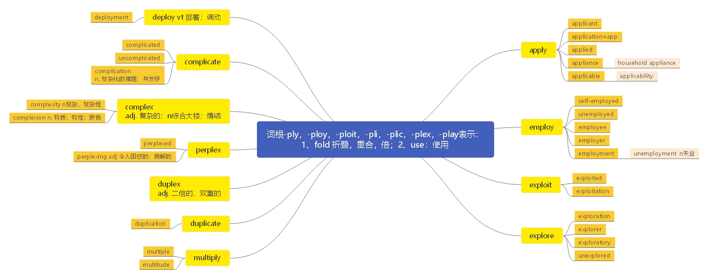

# 第十六节 掌握词根-ply， -ploy， -ploit， -pli， -plic， -plex， -flex， -play， -flect 的含义

> **本节课目标**
>
> 掌握词根-ply， -ploy， -ploit， -pli， -plic， -plex， -flex， -play， -flect 的含义
>
> 词根-ply， -ploy， -ploit， -pli， -plic， -plex， -flex， -play， -flect 表示 “1. fold： 折叠；
>
> 重合； 倍； 2. bend： 弯曲； 3. work with/use： 使用” 的含义

***

**apply**  \[ə'plaɪ] vt.  [英音](https://dict.youdao.com/dictvoice?audio=apply\&type=1)  [美音](https://dict.youdao.com/dictvoice?audio=apply\&type=2) 应用；申请；涂，敷 941

**词源：** late 14c., "join or combine (with); attach (to something), adhere," from Old French aploiier

"apply, use, attach" (12c., Modern French appliquer), from Latin applicare "attach to, join, connect;"

figuratively, "devote (oneself) to, give attention," from ad "to" (see ad-) + plicare "fold" (from PIE

root \*plek- "to plait").

The etymological sense is "bring things in contact with one another." In English, from c. 1400 as

"use or employ" something for a certain purpose;" from early 15c. of lotions, plasters, etc., "place

in contact with the body," also, of one's mental powers or faculties, "put to work at a task or pursuit."

Meaning "seek a job by submitting an application for one" is from 1851. A by-form applicate is

recorded from 1530s.

**搭配：** apply for（ 考）： 申请… apply A to B（ 考）： 将 A 运用于 B

例句 1）： There aren’t many jobs in science for them, so they go to Wall Street and Silicon Valley

to apply their analytical skills to more practical—and rewarding—efforts. 在科学领域没

有太多工作给他们，因此他们去到华尔街或者是硅谷去把他们的分析技能运用在更加

实用——回报也更丰厚——的工作上。

写作例句 1）：如今，越来越多的数字化产品被用在了人们的日常生活中。

Nowadays, more and more digital products are applied to people’s daily life.

**双语例句:** I am continuing to apply for jobs. [播放](https://dict.youdao.com/dictvoice?audio=I+am+continuing+to+apply+for+jobs.&le=eng&le=eng&type=2)

我在继续申请工作。 

**双语例句:** The convention does not apply to us. [播放](https://dict.youdao.com/dictvoice?audio=The+convention+does+not+apply+to+us.&le=eng&le=eng&type=2)

该协定对我们不适用。 

**双语例句:** They may apply to join the organization. [播放](https://dict.youdao.com/dictvoice?audio=They+may+apply+to+join+the+organization.&le=eng&le=eng&type=2)

他们可能申请加入该组织。 

**原声例句:** Foreign students who will be attending graduate school can **apply** for some jobs before they come to the United States. [播放](https://dict.youdao.com/pureaudio?docid=5404740848142176755)

**原声例句:** Still,she says, there is no reason to suggest that the finding about teenage physical activity should not **apply** to men as well. [播放](https://dict.youdao.com/pureaudio?docid=-745002037491421620)

**原声例句:** But she adds that there may be lots of reasons why more women **apply** to colleges, and why colleges admit more women. [播放](https://dict.youdao.com/pureaudio?docid=-3115354069692769150)

**权威例句:** All U.S., federal, state and local and Canadian federal, provincial, and municipal laws and regulations **apply**.  [播放](https://dict.youdao.com/dictvoice?audio=All+U.S.%2C+federal%2C+state+and+local+and+Canadian+federal%2C+provincial%2C+and+municipal+laws+and+regulations+apply.+&le=eng&type=2)

**权威例句:** The new payout rules also **apply** to distributions from non-IRA pension plans, such as 401(k)s.  [播放](https://dict.youdao.com/dictvoice?audio=The+new+payout+rules+also+apply+to+distributions+from+non-IRA+pension+plans%2C+such+as+401%28k%29s.+&le=eng&type=2)

**权威例句:** The theft laws designed for payroll sacks and motor vehicles just dont **apply** to a hacker.  [播放](https://dict.youdao.com/dictvoice?audio=The+theft+laws+designed+for+payroll+sacks+and+motor+vehicles+just+dont+apply+to+a+hacker.+&le=eng&type=2)

***

**application**  \[ˌæplɪ'keɪʃ(ə)n] n.  [英音](https://dict.youdao.com/dictvoice?audio=application\&type=1)  [美音](https://dict.youdao.com/dictvoice?audio=application\&type=2) 应用； 申请； 敷用； 应用程序 1528

**助记：** applic（ =apply： 应用； 申请； 敷用； 应用程序） + ion （ 名词性后缀） →应用； 申请；

敷用；应用程序

**双语例句:** Her application was hurried through. [播放](https://dict.youdao.com/dictvoice?audio=Her+application+was+hurried+through.&le=eng&le=eng&type=2)

她的申请很快得到了处理。 

**双语例句:** My application got lost in the post. [播放](https://dict.youdao.com/dictvoice?audio=My+application+got+lost+in+the+post.&le=eng&le=eng&type=2)

我的申请书寄丢了。 

**双语例句:** Have you sent in your application yet? [播放](https://dict.youdao.com/dictvoice?audio=Have+you+sent+in+your+application+yet%3F&le=eng&le=eng&type=2)

你把申请书寄去了没有？ 

**原声例句:** Some applicants contact many. An important part of the **application** usually is the Medical College Admission Test, or MCAT. [播放](https://dict.youdao.com/pureaudio?docid=6326327425113874353)

**原声例句:** Earlier this month, Hollaback! released an **application** for the Apple iPhone that lets users report harassment as soon as it happens. [播放](https://dict.youdao.com/pureaudio?docid=-7106913726880704919)

**原声例句:** Foreign students interested in the Merchant Marine Academy must request **application** forms directly from the admissions office. [播放](https://dict.youdao.com/pureaudio?docid=-1906242755677968777)

**权威例句:** It is noted that the completed **application** must reach UNESCO before 30 April of each year.  [播放](https://dict.youdao.com/dictvoice?audio=It+is+noted+that+the+completed+application+must+reach+UNESCO+before+30+April+of+each+year.+&le=eng&type=2)

**权威例句:** But although targeted advertising is the most obvious **application** for geolocation, it has many other uses.  [播放](https://dict.youdao.com/dictvoice?audio=But+although+targeted+advertising+is+the+most+obvious+application+for+geolocation%2C+it+has+many+other+uses.+&le=eng&type=2)

**权威例句:** The diversity of the collection ranges from photographs, patient letters, admission certificates and **application** forms.  [播放](https://dict.youdao.com/dictvoice?audio=The+diversity+of+the+collection+ranges+from+photographs%2C+patient+letters%2C+admission+certificates+and+application+forms.+&le=eng&type=2)

***

**applicant**  \['æplɪk(ə)nt] n.  [英音](https://dict.youdao.com/dictvoice?audio=applicant\&type=1)  [美音](https://dict.youdao.com/dictvoice?audio=applicant\&type=2) 申请人， 申请者； 请求者 5586

**助记：** applic（ =apply： 申请） +ant（ 名词后缀： 表“人”） → 申请人

**双语例句:** The applicant was irredeemably incompetent. [播放](https://dict.youdao.com/dictvoice?audio=The+applicant+was+irredeemably+incompetent.&le=eng&le=eng&type=2)

申请人无可救药地不合格。 

**双语例句:** The applicant has experience in teaching and, more relevantly, in industry. [播放](https://dict.youdao.com/dictvoice?audio=The+applicant+has+experience+in+teaching+and%2C+more+relevantly%2C+in+industry.&le=eng&le=eng&type=2)

这名申请者有教学经验，更重要的是，也有企业工作的经验。 

**双语例句:** Upon a negative decision, the applicant loses the protection offered by Belgian law. [播放](https://dict.youdao.com/dictvoice?audio=Upon+a+negative+decision%2C+the+applicant+loses+the+protection+offered+by+Belgian+law.&le=eng&le=eng&type=2)

一旦得到否定裁决，申请人就失去了比利时法律所给予的保护。 

**原声例句:** Professor Aktar of Bachesehir University says the rapid progress of EU **applicant** Croatia only adds to Turkish resentment. [播放](https://dict.youdao.com/pureaudio?docid=8195530938726827701)

**权威例句:** Both universities state they do not take an applicant's month of birth into account in the admissions process.  [播放](https://dict.youdao.com/dictvoice?audio=Both+universities+state+they+do+not+take+an+applicant%27s+month+of+birth+into+account+in+the+admissions+process.+&le=eng&type=2)

**权威例句:** You are really hiring for the future, but you are measuring the **applicant** today.  [播放](https://dict.youdao.com/dictvoice?audio=You+are+really+hiring+for+the+future%2C+but+you+are+measuring+the+applicant+today.+&le=eng&type=2)

**权威例句:** Musoni, an Unreasonable Institute **applicant** and early favorite, disburses microfinance loans through M-Pesa in Kenya.  [播放](https://dict.youdao.com/dictvoice?audio=Musoni%2C+an+Unreasonable+Institute+applicant+and+early+favorite%2C+disburses+microfinance+loans+through+M-Pesa+in+Kenya.+&le=eng&type=2)

***

**applied** \[ə'plaɪd] adj.  [英音](https://dict.youdao.com/dictvoice?audio=applied\&type=1)  [美音](https://dict.youdao.com/dictvoice?audio=applied\&type=2) 实用的； 应用的 6561

**助记：** apply（ 应用； 申请； 敷用） + ed（ 形容词性后缀） →实用的； 应用的

**双语例句:** The principles were applied uniformly across all the departments. [播放](https://dict.youdao.com/dictvoice?audio=The+principles+were+applied+uniformly+across+all+the+departments.&le=eng&le=eng&type=2)

这些原则统一适用于所有部门。 

**双语例句:** Marketing is applied to everything these days, and books are no exception. [播放](https://dict.youdao.com/dictvoice?audio=Marketing+is+applied+to+everything+these+days%2C+and+books+are+no+exception.&le=eng&le=eng&type=2)

现在市场营销用于任何事物，图书也不例外。 

**双语例句:** This rule has also been applied in the case of a purchase of used tyres and tubes. [播放](https://dict.youdao.com/dictvoice?audio=This+rule+has+also+been+applied+in+the+case+of+a+purchase+of+used+tyres+and+tubes.&le=eng&le=eng&type=2)

这个规定也已经用于购买使用过的轮胎和内胎。 

**原声例句:** The National Association of Colleges and Employers says about one-fourth of those who **applied** for a job have found one. [播放](https://dict.youdao.com/pureaudio?docid=-6088083659584796836)

**原声例句:** President Obama said there is no guarantee that all the steps agreed to at the meeting will work,but: \"I think we **applied** the right medicine. [播放](https://dict.youdao.com/pureaudio?docid=-968670513376863473)

**原声例句:** But she **applied** for a job that required the prints of her fingertips be taken. [播放](https://dict.youdao.com/pureaudio?docid=-7574373339943096785)

**权威例句:** He only **applied** for a job as a branch manager with Hertz to please his mother.  [播放](https://dict.youdao.com/dictvoice?audio=He+only+applied+for+a+job+as+a+branch+manager+with+Hertz+to+please+his+mother.+&le=eng&type=2)

**权威例句:** When the city first tried to employ Ciclovia guardians in the 1990s, just 20 people **applied**.  [播放](https://dict.youdao.com/dictvoice?audio=When+the+city+first+tried+to+employ+Ciclovia+guardians+in+the+1990s%2C+just+20+people+applied.+&le=eng&type=2)

**权威例句:** And although she **applied** over and over again to get the cabaret card reinstated, it never was.  [播放](https://dict.youdao.com/dictvoice?audio=And+although+she+applied+over+and+over+again+to+get+the+cabaret+card+reinstated%2C+it+never+was.+&le=eng&type=2)

***

**appliance**  \[ə'plaɪəns] n.  [英音](https://dict.youdao.com/dictvoice?audio=appliance\&type=1)  [美音](https://dict.youdao.com/dictvoice?audio=appliance\&type=2) 器具； 器械； 装置 6127

**助记：** appli（ =apply： 用） + ance（ 名词后缀） →拿来用的东西→器具、 器械

**搭配：** household appliances（考）：家用电器（器械） electrical appliances（考）：电器

后缀-ance 用法

\-ance

word-forming element attached to verbs to form abstract nouns of process or fact

(convergence from converge), or of state or quality (absence from absent); ultimately from Latin -

antia and -entia, which depended on the vowel in the stem word, from PIE \*-nt-, adjectival suffix.

As Old French evolved from Latin, these were leveled to -ance, but later French borrowings from

Latin (some of them subsequently passed to English) used the appropriate Latin form of the ending,

as did words borrowed by English directly from Latin (diligence, absence).

English thus inherited a confused mass of words from French (crescent/croissant), and further

confused it since c. 1500 by restoring -ence selectively in some forms of these words to conform

with Latin. Thus dependant, but independence, etc.

> **【课堂笔记】**
>
> \-ance -ence -ancy -ency 名词后缀，一般为抽象名词，表示
>
> （ 1）过程
>
> （ 2）事实
>
> (3）状态
>
> (4）品质

**双语例句:** Before you buy a new appliance, talk to someone who owns one. [播放](https://dict.youdao.com/dictvoice?audio=Before+you+buy+a+new+appliance%2C+talk+to+someone+who+owns+one.&le=eng&le=eng&type=2)

购买新电器之前，先和有这个电器的人谈谈。 

**双语例句:** When people discover that an appliance is broken, they often stop using it. [播放](https://dict.youdao.com/dictvoice?audio=When+people+discover+that+an+appliance+is+broken%2C+they+often+stop+using+it.&le=eng&le=eng&type=2)

当人们发现电器坏了，通常就不会再去使用它了。 

**双语例句:** If you have an appliance that doesn't work, send a letter to the store that sold it. [播放](https://dict.youdao.com/dictvoice?audio=If+you+have+an+appliance+that+doesn%27t+work%2C+send+a+letter+to+the+store+that+sold+it.&le=eng&le=eng&type=2)

如果你的电器坏了，那就给出售它的商店写封信。 

**权威例句:** The business is now starting to look like that of any other pricey **appliance**.  [播放](https://dict.youdao.com/dictvoice?audio=The+business+is+now+starting+to+look+like+that+of+any+other+pricey+appliance.+&le=eng&type=2)

**权威例句:** However, that strength was offset by continued weakness in industrial and **appliance** demand in China.  [播放](https://dict.youdao.com/dictvoice?audio=However%2C+that+strength+was+offset+by+continued+weakness+in+industrial+and+appliance+demand+in+China.+&le=eng&type=2)

**权威例句:** When the **appliance** is reactivated by pressing a button, it goes back into standby mode.  [播放](https://dict.youdao.com/dictvoice?audio=When+the+appliance+is+reactivated+by+pressing+a+button%2C+it+goes+back+into+standby+mode.+&le=eng&type=2)

***

**applicable**  \[ə'plɪkəb(ə)l; 'æplɪk-] adj.  [英音](https://dict.youdao.com/dictvoice?audio=applicable\&type=1)  [美音](https://dict.youdao.com/dictvoice?audio=applicable\&type=2) 可应用的；可适用的；合适的 7731

**助记：** applic（ =apply： 运用） +able→可运用的、 可适用的

**搭配：** be applicable to sb. / sth.（考）：适用于某人/某物

例句： It is an experience in searching out, understanding and synthesizing, which forms the basis

of many skills applicable to both academic and nonacademic tasks. 它是在查找、理解和

合成方面的一个经验，这种经验构成了很多技巧的基础，可同时适用于学术或非学术

任务。

> **【课堂笔记】**
>
> The lesson from the former is applicable to the latter. 前者的教训适用于后者。

**双语例句:** What is a reasonable standard for one family is not applicable for another. [播放](https://dict.youdao.com/dictvoice?audio=What+is+a+reasonable+standard+for+one+family+is+not+applicable+for+another.&le=eng&le=eng&type=2)

对一个家庭合理的标准对于另一个家庭并不适用。 

**双语例句:** Another shortcoming is that it is not applicable to certain very muscular people such as athletes and bodybuilders, who can also have artificially high BMIs. [播放](https://dict.youdao.com/dictvoice?audio=Another+shortcoming+is+that+it+is+not+applicable+to+certain+very+muscular+people+such+as+athletes+and+bodybuilders%2C+who+can+also+have+artificially+high+BMIs.&le=eng&le=eng&type=2)

另一个缺点是它不适用于一些像运动员和健美运动员这样的肌肉发达的人，他们也可以有人为造成的身体质量指数偏高的情况。 

**双语例句:** Examining the period 1870-1920, Keyssar concentrates on Massachusetts, where the historical materials are particularly rich, and the findings applicable to other industrial areas. [播放](https://dict.youdao.com/dictvoice?audio=Examining+the+period+1870-1920%2C+Keyssar+concentrates+on+Massachusetts%2C+where+the+historical+materials+are+particularly+rich%2C+and+the+findings+applicable+to+other+industrial+areas.&le=eng&le=eng&type=2)

Keyssar 考察了1870-1920年这段时期，重点研究了马萨诸塞州，那里的历史资料特别丰富，研究结果也适用于其他工业区。 

**原声例句:** And what they are doing is certainly **applicable** to other developing countries.\" [播放](https://dict.youdao.com/pureaudio?docid=3291837872694090153)

**原声例句:** \"The current financial crisis has clearly demonstrated that risk to the financial system can arise not only in the banking sector, but also from the activities of other financial firms, such as investment banks and insurance companies that traditionally have not been subject to the type of regulation and consolidated supervision **applicable** to bank holding companies,\" [播放](https://dict.youdao.com/pureaudio?docid=-592227684625083908)

**原声例句:** So I mean, people can be really smart or have skills that are directly **applicable** but if they don't really believe in it, then they're not going to really work hard and they're not going to even if they're smart guy who doesn't have the relevant experience, they're not going to care enough to develop the relevant experience in order to succeed.

**权威例句:** Covington adds that the Oregon findings may not be **applicable** to forests in other regions.  [播放](https://dict.youdao.com/dictvoice?audio=Covington+adds+that+the+Oregon+findings+may+not+be+applicable+to+forests+in+other+regions.+&le=eng&type=2)

**权威例句:** Sorcery-related killings will now be treated as murder and the death penalty will be **applicable**, local media said.  [播放](https://dict.youdao.com/dictvoice?audio=Sorcery-related+killings+will+now+be+treated+as+murder+and+the+death+penalty+will+be+applicable%2C+local+media+said.+&le=eng&type=2)

**权威例句:** Their skills were repeatedly **applicable** because their employers defined every circumstance the same way.  [播放](https://dict.youdao.com/dictvoice?audio=Their+skills+were+repeatedly+applicable+because+their+employers+defined+every+circumstance+the+same+way.+&le=eng&type=2)

***

**applicability**  \[,æplɪkə'bɪlətɪ] n.  [英音](https://dict.youdao.com/dictvoice?audio=applicability\&type=1)  [美音](https://dict.youdao.com/dictvoice?audio=applicability\&type=2) 适应性；适用性 17228

**助记：** applicable（ 可应用的； 可适用的； 合适的） + ility（ 名词后缀） → 适应性； 适用性

**原声例句:** It's just not possible to solve some of these problems by hand and this isn't even a domain that's necessarily into the world of CS but speaks to you the **applicability** of it all.

**权威例句:** Recently, questions have arisen regarding the **applicability** of the gift tax to contributions to 501(c)(4) organizations.  [播放](https://dict.youdao.com/dictvoice?audio=Recently%2C+questions+have+arisen+regarding+the+applicability+of+the+gift+tax+to+contributions+to+501%28c%29%284%29+organizations.+&le=eng&type=2)

**权威例句:** This investment will bring about rapid change and powerful new technologies with **applicability** to global markets.  [播放](https://dict.youdao.com/dictvoice?audio=This+investment+will+bring+about+rapid+change+and+powerful+new+technologies+with+applicability+to+global+markets.+&le=eng&type=2)

**权威例句:** This is simply to say that there are limits to the historical analogies and their **applicability**.  [播放](https://dict.youdao.com/dictvoice?audio=This+is+simply+to+say+that+there+are+limits+to+the+historical+analogies+and+their+applicability.+&le=eng&type=2)

***

**employ** \[ɪm'plɒɪ; em-] vt.  [英音](https://dict.youdao.com/dictvoice?audio=employ\&type=1)  [美音](https://dict.youdao.com/dictvoice?audio=employ\&type=2) 使用， 采用； 雇佣 1976

**助记：** em（ =in： 进来） +ploy（ 使用） →招聘（ 即： 把人拿进来使用）

**释义和用法：**

1、 (VERB) 雇用 If a person or company employs you, they pay you to work for them.

2、 (VERB) 使用；采用 If you employ certain methods, materials, or expressions, you use them.

**双语例句:** How many people does the company employ? [播放](https://dict.youdao.com/dictvoice?audio=How+many+people+does+the+company+employ%3F&le=eng&le=eng&type=2)

这个公司雇用了多少人？ 

**双语例句:** We employ an expert to advise on new technology. [播放](https://dict.youdao.com/dictvoice?audio=We+employ+an+expert+to+advise+on+new+technology.&le=eng&le=eng&type=2)

我们聘用了一位专家担任新技术顾问。 

**双语例句:** We'll have to check him out before we employ him. [播放](https://dict.youdao.com/dictvoice?audio=We%27ll+have+to+check+him+out+before+we+employ+him.&le=eng&le=eng&type=2)

我们得先调查一下再雇用他。 

**原声例句:** Hospitals in the United States **employ** their newest medical residents every year in the month of ...July. [播放](https://dict.youdao.com/pureaudio?docid=-2664997947128080942)

**原声例句:** But it was often difficult. To protect their towns,the settlers often had to **employ** people who were expert in the use of firearms. [播放](https://dict.youdao.com/pureaudio?docid=-3160413308795672990)

**原声例句:** Kitt said she was \"blacklisted.\" No one in the American entertainment industry would **employ** her. [播放](https://dict.youdao.com/pureaudio?docid=1429601385317051449)

**权威例句:** But its instruments **employ** special detectors that need to be chilled to fantastically low temperatures.  [播放](https://dict.youdao.com/dictvoice?audio=But+its+instruments+employ+special+detectors+that+need+to+be+chilled+to+fantastically+low+temperatures.+&le=eng&type=2)

**权威例句:** When the city first tried to **employ** Ciclovia guardians in the 1990s, just 20 people applied.  [播放](https://dict.youdao.com/dictvoice?audio=When+the+city+first+tried+to+employ+Ciclovia+guardians+in+the+1990s%2C+just+20+people+applied.+&le=eng&type=2)

**权威例句:** \"Cupid plc confirms it does **employ** a motivation team of 24 people working across three shifts, \" it added.  [播放](https://dict.youdao.com/dictvoice?audio=%22Cupid+plc+confirms+it+does+employ+a+motivation+team+of+24+people+working+across+three+shifts%2C+%22+it+added.+&le=eng&type=2)

***

**self-employed**  \['selfəm'plɔid] adj.  [英音](https://dict.youdao.com/dictvoice?audio=self-employed\&type=1)  [美音](https://dict.youdao.com/dictvoice?audio=self-employed\&type=2) 自雇的；个体经营的；自由职业的 14518

***

**unemployed**  \[ʌnɪm'plɒɪd; -em-] adj.  [英音](https://dict.youdao.com/dictvoice?audio=unemployed\&type=1)  [美音](https://dict.youdao.com/dictvoice?audio=unemployed\&type=2) 失业的；未被利用的 6493

**双语例句:** How long have you been unemployed? [播放](https://dict.youdao.com/dictvoice?audio=How+long+have+you+been+unemployed%3F&le=eng&le=eng&type=2)

你失业多久了？ 

**双语例句:** Times are hard for the unemployed. [播放](https://dict.youdao.com/dictvoice?audio=Times+are+hard+for+the+unemployed.&le=eng&le=eng&type=2)

对失业者来说，时世艰难。 

**双语例句:** We want to create jobs for the unemployed. [播放](https://dict.youdao.com/dictvoice?audio=We+want+to+create+jobs+for+the+unemployed.&le=eng&le=eng&type=2)

我们想为失业者创造更多的工作。 

**原声例句:** About thirty percent of workers age sixteen to twenty-four with less than a high school diploma were **unemployed** last month. [播放](https://dict.youdao.com/pureaudio?docid=-2349065856005223040)

**原声例句:** The anger of the many educated but **unemployed** young people has been a driving force in the Arab Spring movement. [播放](https://dict.youdao.com/pureaudio?docid=7158690751062068551)

**原声例句:** The International Labor Organization points to increases in the **unemployed**, the working poor and people whose jobs are likely to be cut. [播放](https://dict.youdao.com/pureaudio?docid=-3613535670273676876)

**权威例句:** Many have graduated from college but are **unemployed**, so many are trying to leave.  [播放](https://dict.youdao.com/dictvoice?audio=Many+have+graduated+from+college+but+are+unemployed%2C+so+many+are+trying+to+leave.+&le=eng&type=2)

**权威例句:** The number of **unemployed** 16-24-year-olds fell by 62, 000 in the three months to August to 957, 000.  [播放](https://dict.youdao.com/dictvoice?audio=The+number+of+unemployed+16-24-year-olds+fell+by+62%2C+000+in+the+three+months+to+August+to+957%2C+000.+&le=eng&type=2)

**权威例句:** The ones who were **unemployed**, but who took care of the baby while mom went to work.  [播放](https://dict.youdao.com/dictvoice?audio=The+ones+who+were+unemployed%2C+but+who+took+care+of+the+baby+while+mom+went+to+work.+&le=eng&type=2)

***

**unemployment** \[ʌnɪm'plɒɪm(ə)nt; -em-] n.  [英音](https://dict.youdao.com/dictvoice?audio=unemployment\&type=1)  [美音](https://dict.youdao.com/dictvoice?audio=unemployment\&type=2) 失业；失业人数；失业率 3523

**双语例句:** Unemployment is rising steeply. [播放](https://dict.youdao.com/dictvoice?audio=Unemployment+is+rising+steeply.&le=eng&le=eng&type=2)

失业率正在急剧上升。 

**双语例句:** There's no Rx for unemployment. [播放](https://dict.youdao.com/dictvoice?audio=There%27s+no+Rx+for+unemployment.&le=eng&le=eng&type=2)

失业问题无法解决。 

**双语例句:** Unemployment has soared to 18%. [播放](https://dict.youdao.com/dictvoice?audio=Unemployment+has+soared+to+18%25.&le=eng&le=eng&type=2)

失业率猛升到了18%。 

**原声例句:** However it was unclear to researchers whether **unemployment** caused poor health, or whether poor health led to job loss. [播放](https://dict.youdao.com/pureaudio?docid=-7373286796866327791)

**原声例句:** In terms of **unemployment**, the troubles of the Detroit auto industry have hit Michigan in the Midwest especially hard. [播放](https://dict.youdao.com/pureaudio?docid=-6131327112993473462)

**原声例句:** Experts say the public's poor opinion of the national economy, including high **unemployment**, is the main problem facing Democrats this year. [播放](https://dict.youdao.com/pureaudio?docid=-3938263021138695764)

**权威例句:** Additional factors are low **unemployment**, great social standards and a growing economy in the global recession.  [播放](https://dict.youdao.com/dictvoice?audio=Additional+factors+are+low+unemployment%2C+great+social+standards+and+a+growing+economy+in+the+global+recession.+&le=eng&type=2)

**权威例句:** **Unemployment** continues to rise and is bound to pressure consumer portfolios in the coming months.  [播放](https://dict.youdao.com/dictvoice?audio=Unemployment+continues+to+rise+and+is+bound+to+pressure+consumer+portfolios+in+the+coming+months.+&le=eng&type=2)

**权威例句:** Co-founder Aris Konstanidis tells me young Greeks must not accept the scourge of **unemployment**.  [播放](https://dict.youdao.com/dictvoice?audio=Co-founder+Aris+Konstanidis+tells+me+young+Greeks+must+not+accept+the+scourge+of+unemployment.+&le=eng&type=2)

***

**employee**  \[ɪmˈplɔɪi;ˌemplɔɪˈi:] n.  [英音](https://dict.youdao.com/dictvoice?audio=employee\&type=1)  [美音](https://dict.youdao.com/dictvoice?audio=employee\&type=2) 雇员； 从业员工 933

> **【课堂笔记】**
>
> \-ee （ 1）表被动
>
> （ 2） 人/机构
>
> 如： interview v.采访/面试 → interviewer n. 面试官→ interviewee n. 被面试者
>
> commit v. 委托/托付 → committee 被委托的机构 →委员会

**双语例句:** He is an employee of Fuji Bank. [播放](https://dict.youdao.com/dictvoice?audio=He+is+an+employee+of+Fuji+Bank.&le=eng&le=eng&type=2)

他是富士银行的一位雇员。 

**双语例句:** He found it demeaning to work for his former employee. [播放](https://dict.youdao.com/dictvoice?audio=He+found+it+demeaning+to+work+for+his+former+employee.&le=eng&le=eng&type=2)

他觉得为自己以前的雇员工作有失体面。 

**双语例句:** One of the main themes of TQM is employee involvement. [播放](https://dict.youdao.com/dictvoice?audio=One+of+the+main+themes+of+TQM+is+employee+involvement.&le=eng&le=eng&type=2)

全员质量管理的一个主要原则之一是雇员参与。 

**原声例句:** It stars John Travolta as the leader of the hijackers and Denzel Washington as the transportation **employee** who negotiates with him. [播放](https://dict.youdao.com/pureaudio?docid=4996375247931490437)

**原声例句:** University of Michigan transportation researcher Bruce Belzowski says one big question is what effect **employee** morale will have. [播放](https://dict.youdao.com/pureaudio?docid=-848756525146157135)

**原声例句:** How can I help you?\" That is Karen Haigh,an **employee** of a store called Hell in a Handbasket. [播放](https://dict.youdao.com/pureaudio?docid=2796000939459578811)

**权威例句:** The suits allege that each failed to offer **employee** benefits after treating them like full-time workers.  [播放](https://dict.youdao.com/dictvoice?audio=The+suits+allege+that+each+failed+to+offer+employee+benefits+after+treating+them+like+full-time+workers.+&le=eng&type=2)

**权威例句:** Labour costs per **employee** for foreign manufacturers were 50% higher than those controlled in Scotland.  [播放](https://dict.youdao.com/dictvoice?audio=Labour+costs+per+employee+for+foreign+manufacturers+were+50%25+higher+than+those+controlled+in+Scotland.+&le=eng&type=2)

**权威例句:** Presumably it would have dropped further if the **employee** ownership plan hadnt been adopted.  [播放](https://dict.youdao.com/dictvoice?audio=Presumably+it+would+have+dropped+further+if+the+employee+ownership+plan+hadnt+been+adopted.+&le=eng&type=2)

***

**employer**  \[ɪm'plɒɪə; em-] n.  [英音](https://dict.youdao.com/dictvoice?audio=employer\&type=1)  [美音](https://dict.youdao.com/dictvoice?audio=employer\&type=2) 雇主， 老板 2317

**双语例句:** He had been sent to Rome by his employer. [播放](https://dict.youdao.com/dictvoice?audio=He+had+been+sent+to+Rome+by+his+employer.&le=eng&le=eng&type=2)

他被雇主派到罗马去了。 

**双语例句:** She decided to sue her employer for wrongful dismissal. [播放](https://dict.youdao.com/dictvoice?audio=She+decided+to+sue+her+employer+for+wrongful+dismissal.&le=eng&le=eng&type=2)

她决定起诉雇主非法解雇她。 

**双语例句:** The company has proved to be a most benevolent employer. [播放](https://dict.youdao.com/dictvoice?audio=The+company+has+proved+to+be+a+most+benevolent+employer.&le=eng&le=eng&type=2)

结果证明该公司是一个非常仁慈的雇主。 

**原声例句:** Fear of legal action alone,he said, \"cannot justify an **employer**'s reliance on race\" if it hurts qualified individuals. [播放](https://dict.youdao.com/pureaudio?docid=7809812348897711282)

**原声例句:** Get your act together.\" Or,if the **employer** is calmer, he may say, \"Let us get our act together.\" [播放](https://dict.youdao.com/pureaudio?docid=-4743677313242098568)

**原声例句:** Sometimes, when I am very productive in my job, my **employer** gives me a pat on the back. [播放](https://dict.youdao.com/pureaudio?docid=5099649528581045379)

**权威例句:** Workers over 50 are allowed to contribute more to their employer-sponsored retirement savings plan.  [播放](https://dict.youdao.com/dictvoice?audio=Workers+over+50+are+allowed+to+contribute+more+to+their+employer-sponsored+retirement+savings+plan.+&le=eng&type=2)

**权威例句:** Remember: Your Rolodex may belong as much to your **employer** as it does to you.  [播放](https://dict.youdao.com/dictvoice?audio=Remember%3A+Your+Rolodex+may+belong+as+much+to+your+employer+as+it+does+to+you.+&le=eng&type=2)

**权威例句:** Typically your **employer** or your pension plan administrator can project what you may receive at different retirement dates.  [播放](https://dict.youdao.com/dictvoice?audio=Typically+your+employer+or+your+pension+plan+administrator+can+project+what+you+may+receive+at+different+retirement+dates.+&le=eng&type=2)

***

**employment**  \[ɪm'plɒɪm(ə)nt; em-] n.  [英音](https://dict.youdao.com/dictvoice?audio=employment\&type=1)  [美音](https://dict.youdao.com/dictvoice?audio=employment\&type=2) 雇用；职业；使用 2557

**双语例句:** Employment is a very sensitive issue. [播放](https://dict.youdao.com/dictvoice?audio=Employment+is+a+very+sensitive+issue.&le=eng&le=eng&type=2)

就业是一个非常敏感的问题。 

**双语例句:** The terms of employment are negotiable. [播放](https://dict.youdao.com/dictvoice?audio=The+terms+of+employment+are+negotiable.&le=eng&le=eng&type=2)

雇用的条件可以协商。 

**双语例句:** The government is aiming at full employment. [播放](https://dict.youdao.com/dictvoice?audio=The+government+is+aiming+at+full+employment.&le=eng&le=eng&type=2)

政府在力求达到全面就业。 

**原声例句:** Roots of Peace supports the planting of native crops and the **employment** of landmine victims to farm the cleared land. [播放](https://dict.youdao.com/pureaudio?docid=4679306060811430524)

**原声例句:** He says the biggest challenge is jobs the disabled have the lowest **employment** rate of any minority group in the country. [播放](https://dict.youdao.com/pureaudio?docid=-8876186770813972818)

**原声例句:** For another,she pretended to be a woman who cleaned houses so she could report about illegal activities in **employment** agencies. [播放](https://dict.youdao.com/pureaudio?docid=-7776083515748066520)

**权威例句:** Siegel added that the workers had no **employment** rights since they had taken unofficial strike action.  [播放](https://dict.youdao.com/dictvoice?audio=Siegel+added+that+the+workers+had+no+employment+rights+since+they+had+taken+unofficial+strike+action.+&le=eng&type=2)

**权威例句:** Issues covered by the Convention include education, health, justice, care, safety, **employment** and culture.  [播放](https://dict.youdao.com/dictvoice?audio=Issues+covered+by+the+Convention+include+education%2C+health%2C+justice%2C+care%2C+safety%2C+employment+and+culture.+&le=eng&type=2)

**权威例句:** Second, federal stimulus spending of this sort can have only a short-term impact on **employment**.  [播放](https://dict.youdao.com/dictvoice?audio=Second%2C+federal+stimulus+spending+of+this+sort+can+have+only+a+short-term+impact+on+employment.+&le=eng&type=2)

***

**exploit**  \[ˈeksplɔɪt;ɪkˈsplɔɪt] vt.  [英音](https://dict.youdao.com/dictvoice?audio=exploit\&type=1)  [美音](https://dict.youdao.com/dictvoice?audio=exploit\&type=2) 剥削； 利用； 开发， 开拓 4422

**助记：** ex（ 外、 出来） + ploit（ =ploy=ply： 使用） →用出来→剥削； 开发（ 即： 把招聘进来

的人的价值“用出来”）

**释义和用法：**

1） (VERB) 压榨;剥削;占…的便宜 If you say that someone is exploiting you, you think that they

are treating you unfairly by using your work or ideas and giving you very little in return.

Critics claim he exploited black musicians for personal gain.

批评家声称他压榨黑人音乐家谋求私利。

2） (VERB) 充分运用；发挥 If you exploit something, you use it well, and achieve something or

gain an advantage from it.

Cary is hoping to exploit new opportunities in Europe.

卡里希望好好利用欧洲的新机遇。

3） (VERB) 开采；开发 To exploit resources or raw materials means to develop them and use them

for industry or commercial activities.

I think we're being very short sighted in not exploiting our own coal.

我认为不开采我们自己的煤是非常短视的做法。

**双语例句:** As computer systems become even more sophisticated, so too do the methods of those who exploit the technology. [播放](https://dict.youdao.com/dictvoice?audio=As+computer+systems+become+even+more+sophisticated%2C+so+too+do+the+methods+of+those+who+exploit+the+technology.&le=eng&le=eng&type=2)

正如计算机系统变得越来越复杂，开发计算机技术的人所采用的方法也日趋复杂。 

**双语例句:** What do you think my last exploit was? [播放](https://dict.youdao.com/dictvoice?audio=What+do+you+think+my+last+exploit+was%3F&le=eng&le=eng&type=2)

你觉得我最后一项功绩是什么？ 

**双语例句:** Modern technology is good enough to exploit all the sea resources. [播放](https://dict.youdao.com/dictvoice?audio=Modern+technology+is+good+enough+to+exploit+all+the+sea+resources.&le=eng&le=eng&type=2)

现代技术足以开发所有的海洋资源。 

**原声例句:** He also said employers should not be allowed to **exploit** illegal immigrants to drive down wages. [播放](https://dict.youdao.com/pureaudio?docid=5126407068189491030)

**原声例句:** He declared that the U.S. is not at war with Islam, but is against violent extremists who **exploit** the tensions between Islam and the West. [播放](https://dict.youdao.com/pureaudio?docid=2820481570569759312)

**原声例句:** Now,theoretically, only the speakers and deputy speakers of the two houses of parliament may use the lights officially, but there are still dozens of cars on the Moscow roads that continue to **exploit** the advantages of a blue light on the roof. [播放](https://dict.youdao.com/pureaudio?docid=4580556105858719983)

**权威例句:** Much less admirable is Mr Bush's willingness to **exploit** September 11th for partisan gain.  [播放](https://dict.youdao.com/dictvoice?audio=Much+less+admirable+is+Mr+Bush%27s+willingness+to+exploit+September+11th+for+partisan+gain.+&le=eng&type=2)

**权威例句:** Moreover, big powers would further **exploit** such fears to heighten hostility between rival camps.  [播放](https://dict.youdao.com/dictvoice?audio=Moreover%2C+big+powers+would+further+exploit+such+fears+to+heighten+hostility+between+rival+camps.+&le=eng&type=2)

**权威例句:** The danger remains that Microsoft will somehow **exploit** its desktop monopoly to push Google aside.  [播放](https://dict.youdao.com/dictvoice?audio=The+danger+remains+that+Microsoft+will+somehow+exploit+its+desktop+monopoly+to+push+Google+aside.+&le=eng&type=2)

***

**exploitation**  \[eksplɒɪ'teɪʃ(ə)n] n.  [英音](https://dict.youdao.com/dictvoice?audio=exploitation\&type=1)  [美音](https://dict.youdao.com/dictvoice?audio=exploitation\&type=2) 剥削；利用；开发，开采 6994

**助记：** exploit （ 剥削； 利用； 开发， 开拓） + ation（ 名词性后缀） → 剥削； 利用； 开发，

开采

**双语例句:** The islanders endured centuries of exploitation. [播放](https://dict.youdao.com/dictvoice?audio=The+islanders+endured+centuries+of+exploitation.&le=eng&le=eng&type=2)

岛民们忍受了几个世纪的剥削。 

**双语例句:** Almost without exception these women fall victim to exploitation. [播放](https://dict.youdao.com/dictvoice?audio=Almost+without+exception+these+women+fall+victim+to+exploitation.&le=eng&le=eng&type=2)

几乎毫无例外这些女人都成为了剥削的牺牲品。 

**双语例句:** I have a vision of a society that is free of exploitation and injustice. [播放](https://dict.youdao.com/dictvoice?audio=I+have+a+vision+of+a+society+that+is+free+of+exploitation+and+injustice.&le=eng&le=eng&type=2)

我憧憬一个没有剥削和不公的社会。 

**原声例句:** \"No society has ever yet been able to handle the temptations of technology to mastery,to waste, to exuberance, to exploration and **exploitation**... [播放](https://dict.youdao.com/pureaudio?docid=-6218289209294998278)

**原声例句:** \"In our experience,foreign brides are just often particularly vulnerable to abuse and **exploitation**. [播放](https://dict.youdao.com/pureaudio?docid=-5221452469054418979)

**原声例句:** And I also would say my personal reaction was one of disgust at the **exploitation** of this young man,\". [播放](https://dict.youdao.com/pureaudio?docid=5677815230186672946)

**权威例句:** Five people, including Mr Mohammed, deny a range of charges including trafficking, rape and **exploitation**.  [播放](https://dict.youdao.com/dictvoice?audio=Five+people%2C+including+Mr+Mohammed%2C+deny+a+range+of+charges+including+trafficking%2C+rape+and+exploitation.+&le=eng&type=2)

**权威例句:** Yet there are fears that reckless **exploitation** of Greenland's minerals could endanger the pristine Arctic environment.  [播放](https://dict.youdao.com/dictvoice?audio=Yet+there+are+fears+that+reckless+exploitation+of+Greenland%27s+minerals+could+endanger+the+pristine+Arctic+environment.+&le=eng&type=2)

**权威例句:** Especially in these turbulent economic times, **exploitation** involving wills, trusts and estates is all too common.  [播放](https://dict.youdao.com/dictvoice?audio=Especially+in+these+turbulent+economic+times%2C+exploitation+involving+wills%2C+trusts+and+estates+is+all+too+common.+&le=eng&type=2)

***

**exploited**  \[iksˈplɔitid] adj.  [英音](https://dict.youdao.com/dictvoice?audio=exploited\&type=1)  [美音](https://dict.youdao.com/dictvoice?audio=exploited\&type=2) 被剥削的； 被开发的； 被利用的 20036

**助记：** exploit （ 剥削； 利用； 开发， 开拓） + ed（ 形容词性后缀表被动完成） → 被剥削的；

被开发的；被利用的

**双语例句:** No minerals have yet been exploited in Antarctica. [播放](https://dict.youdao.com/dictvoice?audio=No+minerals+have+yet+been+exploited+in+Antarctica.&le=eng&le=eng&type=2)

南极洲的矿藏还未开采。 

**双语例句:** He exploited his father's name to get himself a job. [播放](https://dict.youdao.com/dictvoice?audio=He+exploited+his+father%27s+name+to+get+himself+a+job.&le=eng&le=eng&type=2)

他利用他父亲的名声为自己找到一份工作。 

**双语例句:** The film exploited his image and infringed his copyright. [播放](https://dict.youdao.com/dictvoice?audio=The+film+exploited+his+image+and+infringed+his+copyright.&le=eng&le=eng&type=2)

该影片利用了他的肖像，侵犯了他的肖像权。 

**原声例句:** From Nazis to modern-day criminals, Switzerland's legendary bank secrecy has long been **exploited** by those with assets to hide. [播放](https://dict.youdao.com/pureaudio?docid=5897551193947178715)

**原声例句:** At a ceremony honoring Wooden several years ago, Abdul-Jabbar said many prized athletes are afraid they will be **exploited** by their coach. [播放](https://dict.youdao.com/pureaudio?docid=5702784072072641441)

**原声例句:** Security experts agree that given the number of targets and the infinite ways they can be **exploited**, security can never be 100 percent. [播放](https://dict.youdao.com/pureaudio?docid=6633957057101396554)

**权威例句:** \"Just because they are rich, it doesn't mean they agree to being **exploited**, \" she said.  [播放](https://dict.youdao.com/dictvoice?audio=%22Just+because+they+are+rich%2C+it+doesn%27t+mean+they+agree+to+being+exploited%2C+%22+she+said.+&le=eng&type=2)

**权威例句:** Till now, no other phone maker has **exploited** the empty backside of a phone.  [播放](https://dict.youdao.com/dictvoice?audio=Till+now%2C+no+other+phone+maker+has+exploited+the+empty+backside+of+a+phone.+&le=eng&type=2)

**权威例句:** Word was circulating in Geekville that the Stuxnet worm **exploited** four zero day errors.  [播放](https://dict.youdao.com/dictvoice?audio=Word+was+circulating+in+Geekville+that+the+Stuxnet+worm+exploited+four+zero+day+errors.+&le=eng&type=2)

***

区别： **explore** \[ɪk'splɔː; ek-] vt.  [英音](https://dict.youdao.com/dictvoice?audio=explore\&type=1)  [美音](https://dict.youdao.com/dictvoice?audio=explore\&type=2) 探测； 探讨； 勘探 1603

**释义和用法：**

1.  (VERB) 在…探险； 探测； 勘察； 考察 If you explore a place, you travel around it to find out

what it is like.

After exploring the old part of town there is a guided tour of the cathedral.

游览完老城区之后，会由导游带队参观大教堂。

2\) (VERB) 探讨，研究（观点或建议） If you explore an idea or suggestion, you think about it

or comment on it in detail, in order to assess it carefully.

The secretary is expected to explore ideas for post-war reconstruction of the area.

部长预计将会探讨这个地区战后重建的意见。

3\) (VERB) 勘探 If people explore an area for a substance such as oil or minerals, they study the

area and do tests on the land to see whether they can find it.

The government is allowing the areas of inshore coastal waters to be explored for oil and gas.

当局允许在近海海域勘探石油和天然气。

**双语例句:** We will explore every avenue until we find an answer. [播放](https://dict.youdao.com/dictvoice?audio=We+will+explore+every+avenue+until+we+find+an+answer.&le=eng&le=eng&type=2)

我们要探索一切途径，直到找到答案为止。 

**双语例句:** I want to explore and get in touch with my inner self. [播放](https://dict.youdao.com/dictvoice?audio=I+want+to+explore+and+get+in+touch+with+my+inner+self.&le=eng&le=eng&type=2)

我想认真探索，了解我内在的个性。 

**双语例句:** In your free time, explore all that this incredible city has to offer. [播放](https://dict.youdao.com/dictvoice?audio=In+your+free+time%2C+explore+all+that+this+incredible+city+has+to+offer.&le=eng&le=eng&type=2)

闲暇时,探索一下这座美妙城市的所有奇妙之处吧。 

**原声例句:** She wanted to **explore** her husband's Latino roots as a family project, as a way to teach their young daughter. [播放](https://dict.youdao.com/pureaudio?docid=8783299404286488170)

**原声例句:** Probably the first European to see and **explore** the Great Lakes was Frenchman Etienne Brule in the early sixteen hundreds. [播放](https://dict.youdao.com/pureaudio?docid=-8611047829352638850)

**原声例句:** Visitors can choose to visit rooms with river fish and animals, or they can **explore** creatures found in warm tropical waters. [播放](https://dict.youdao.com/pureaudio?docid=-5943913711831034849)

**权威例句:** Scuba divers have a vested interested in protecting the coral reefs and ocean habitats they **explore**.  [播放](https://dict.youdao.com/dictvoice?audio=Scuba+divers+have+a+vested+interested+in+protecting+the+coral+reefs+and+ocean+habitats+they+explore.+&le=eng&type=2)

**权威例句:** Bike sharing is a fun, easy, environmentally friendly way to **explore** a new place.  [播放](https://dict.youdao.com/dictvoice?audio=Bike+sharing+is+a+fun%2C+easy%2C+environmentally+friendly+way+to+explore+a+new+place.+&le=eng&type=2)

**权威例句:** As the heat of the day passes, many travellers choose to **explore** the island via motorbike.  [播放](https://dict.youdao.com/dictvoice?audio=As+the+heat+of+the+day+passes%2C+many+travellers+choose+to+explore+the+island+via+motorbike.+&le=eng&type=2)

***

**exploration**  \[eksplə'reɪʃ(ə)n] n.  [英音](https://dict.youdao.com/dictvoice?audio=exploration\&type=1)  [美音](https://dict.youdao.com/dictvoice?audio=exploration\&type=2) 探测；探讨；勘探 3921

**助记：** explore（ 探测； 探讨； 勘探） + ation（ 名词性后缀） → 探测； 探讨； 勘探

**双语例句:** China has earmarked more than $20 billion for oil exploration. [播放](https://dict.youdao.com/dictvoice?audio=China+has+earmarked+more+than+%2420+billion+for+oil+exploration.&le=eng&le=eng&type=2)

中国已留出二百多亿美元用于石油勘探。 

**双语例句:** His exploration of the myth brings insight into the American psyche. [播放](https://dict.youdao.com/dictvoice?audio=His+exploration+of+the+myth+brings+insight+into+the+American+psyche.&le=eng&le=eng&type=2)

他对那个神话的探索揭示了美国人的心理。 

**双语例句:** Oryx is a Dallas-based oil and gas exploration and production concern. [播放](https://dict.youdao.com/dictvoice?audio=Oryx+is+a+Dallas-based+oil+and+gas+exploration+and+production+concern.&le=eng&le=eng&type=2)

奥瑞克斯公司是一家以达拉斯为基地的石油和天然气勘探及生产公司。 

**原声例句:** At the end of March, President Obama called for the United States to expand its offshore oil and gas **exploration**. [播放](https://dict.youdao.com/pureaudio?docid=-6234880483056812683)

**原声例句:** The **exploration** vehicle will be able to measure methane even at very low levels in many places on the surface. [播放](https://dict.youdao.com/pureaudio?docid=6131105907372425854)

**原声例句:** \"No society has ever yet been able to handle the temptations of technology to mastery,to waste, to exuberance, to **exploration** and exploitation... [播放](https://dict.youdao.com/pureaudio?docid=-6218289209294998278)

**权威例句:** But some scientists question whether manned **exploration** provides the best platform for scientific research.  [播放](https://dict.youdao.com/dictvoice?audio=But+some+scientists+question+whether+manned+exploration+provides+the+best+platform+for+scientific+research.+&le=eng&type=2)

**权威例句:** He described it as a huge success story, following decades of **exploration** around the Irish coast.  [播放](https://dict.youdao.com/dictvoice?audio=He+described+it+as+a+huge+success+story%2C+following+decades+of+exploration+around+the+Irish+coast.+&le=eng&type=2)

**权威例句:** **Exploration** work at a former tin mine in Cornwall may stop because of rising costs concerns, investors say.  [播放](https://dict.youdao.com/dictvoice?audio=Exploration+work+at+a+former+tin+mine+in+Cornwall+may+stop+because+of+rising+costs+concerns%2C+investors+say.+&le=eng&type=2)

***

**explorer**  \[ek'splɔːrə(r)] n.  [英音](https://dict.youdao.com/dictvoice?audio=explorer\&type=1)  [美音](https://dict.youdao.com/dictvoice?audio=explorer\&type=2) 探测者，探测器；探险家 7912

**助记：** explore（ 探测； 勘探） + er（ 表示人或物的名词性后缀） →探测者， 探测器； 探险家

**双语例句:** The default setting on Windows Explorer will not show these files. [播放](https://dict.youdao.com/dictvoice?audio=The+default+setting+on+Windows+Explorer+will+not+show+these+files.&le=eng&le=eng&type=2)

视窗浏览器上的默认系统设定不显示这些文档。 

**双语例句:** Just then, a third man arrived: Japanese explorer Nobu Shirase. [播放](https://dict.youdao.com/dictvoice?audio=Just+then%2C+a+third+man+arrived%3A+Japanese+explorer+Nobu+Shirase.&le=eng&le=eng&type=2)

正在这时，第三个人来了：日本探险家 Nobu Shirase。 

**双语例句:** You can use the BPC explorer to kick off any business processes in those applications. [播放](https://dict.youdao.com/dictvoice?audio=You+can+use+the+BPC+explorer+to+kick+off+any+business+processes+in+those+applications.&le=eng&le=eng&type=2)

您可以使用 BPC 浏览器启动那些应用程序中的任何业务流程。 

**权威例句:** The popular Ford **Explorer** had a driver death rate of 56 per 1 million registered vehicle years.  [播放](https://dict.youdao.com/dictvoice?audio=The+popular+Ford+Explorer+had+a+driver+death+rate+of+56+per+1+million+registered+vehicle+years.+&le=eng&type=2)

**权威例句:** Sixteenth-century Portuguese **explorer** Ferdinand Magellan set out from Seville, Spain, to circumnavigate the globe in 1519.  [播放](https://dict.youdao.com/dictvoice?audio=Sixteenth-century+Portuguese+explorer+Ferdinand+Magellan+set+out+from+Seville%2C+Spain%2C+to+circumnavigate+the+globe+in+1519.+&le=eng&type=2)

**权威例句:** He then also ran Internet **Explorer** on the iPad while on a Flash-intensive Mercedes website.  [播放](https://dict.youdao.com/dictvoice?audio=He+then+also+ran+Internet+Explorer+on+the+iPad+while+on+a+Flash-intensive+Mercedes+website.+&le=eng&type=2)

***

**exploratory**  \[ɪk'splɒrət(ə)rɪ; ek-] adj.  [英音](https://dict.youdao.com/dictvoice?audio=exploratory\&type=1)  [美音](https://dict.youdao.com/dictvoice?audio=exploratory\&type=2) 探究的；勘探的；考察的 10677

**助记：** explore（ 探测； 勘探） + atory（ 形容词性后缀） → 探究的； 勘探的； 考察的

**双语例句:** Exploratory surgery revealed her liver cancer. [播放](https://dict.youdao.com/dictvoice?audio=Exploratory+surgery+revealed+her+liver+cancer.&le=eng&le=eng&type=2)

探查手术发现了她的肝癌。 

**双语例句:** The scanner will reduce the need for exploratory operations which will save risk and pain for patients. [播放](https://dict.youdao.com/dictvoice?audio=The+scanner+will+reduce+the+need+for+exploratory+operations+which+will+save+risk+and+pain+for+patients.&le=eng&le=eng&type=2)

扫描仪将减少所需的探查手术，从而为病患者免除风险和疼痛。 

**双语例句:** We are still in the exploratory stages of this project, although what's noteworthy is that East Asians on average sleep about an hour and a half less each night than North Americans do. [播放](https://dict.youdao.com/dictvoice?audio=We+are+still+in+the+exploratory+stages+of+this+project%2C+although+what%27s+noteworthy+is+that+East+Asians+on+average+sleep+about+an+hour+and+a+half+less+each+night+than+North+Americans+do.&le=eng&le=eng&type=2)

我们仍然在这个项目的探索阶段，尽管值得注意的是，东亚人平均每晚比北美人少睡一个半小时。 

**权威例句:** Amidst dozens of openings, each recruiter might have time for only a handful of **exploratory** meetings.  [播放](https://dict.youdao.com/dictvoice?audio=Amidst+dozens+of+openings%2C+each+recruiter+might+have+time+for+only+a+handful+of+exploratory+meetings.+&le=eng&type=2)

**权威例句:** Obama announced on his Web site, www.barackobama.com, that he was filing a presidential **exploratory** committee.  [播放](https://dict.youdao.com/dictvoice?audio=Obama+announced+on+his+Web+site%2C+www.barackobama.com%2C+that+he+was+filing+a+presidential+exploratory+committee.+&le=eng&type=2)

**权威例句:** Since 2000, Japan has drilled nearly three dozen **exploratory** well holes in the Nankai Trough.  [播放](https://dict.youdao.com/dictvoice?audio=Since+2000%2C+Japan+has+drilled+nearly+three+dozen+exploratory+well+holes+in+the+Nankai+Trough.+&le=eng&type=2)

***

**unexplored**  \[ʌnɪk'splɔːd; ʌnek-] adj.  [英音](https://dict.youdao.com/dictvoice?audio=unexplored\&type=1)  [美音](https://dict.youdao.com/dictvoice?audio=unexplored\&type=2) 未勘查过的 18317

**助记：** un（ 否定性前缀） + explore（ 探测； 勘探） + ed（ 形容词性后缀表被动完成） →未勘查过的

**双语例句:** Sleep is something that has really been an unexplored topic cross-culturally. [播放](https://dict.youdao.com/dictvoice?audio=Sleep+is+something+that+has+really+been+an+unexplored+topic+cross-culturally.&le=eng&le=eng&type=2)

在各种文化中，睡眠是一个未被探索的话题。 

**双语例句:** Archaeologist Bill Kelso and his team discovered the church in a previously unexplored area of the fort in Jamestown. [播放](https://dict.youdao.com/dictvoice?audio=Archaeologist+Bill+Kelso+and+his+team+discovered+the+church+in+a+previously+unexplored+area+of+the+fort+in+Jamestown.&le=eng&le=eng&type=2)

考古学家比尔·凯尔索和他的团队在詹姆斯敦之前未开发的的堡垒区域发现了这座教堂。 

**双语例句:** There appear to be many unexplored matters about the motivation to reflect—for example, the value of externally motivated reflection as opposed to that of teachers who might reflect by habit. [播放](https://dict.youdao.com/dictvoice?audio=There+appear+to+be+many+unexplored+matters+about+the+motivation+to+reflect%E2%80%94for+example%2C+the+value+of+externally+motivated+reflection+as+opposed+to+that+of+teachers+who+might+reflect+by+habit.&le=eng&le=eng&type=2)

反思的动机方面似乎有许多问题尚未被探索——例如，与教师可能进行的习惯性反思相对的，受外部激励的反思的价值。 

**权威例句:** The article 'Trekking the **unexplored** mountains of Morocco' was published in partnership with Lonely Planet.  [播放](https://dict.youdao.com/dictvoice?audio=The+article+%27Trekking+the+unexplored+mountains+of+Morocco%27+was+published+in+partnership+with+Lonely+Planet.+&le=eng&type=2)

**权威例句:** The inside where stomachs digest food is a dark and unknown mystery typically left **unexplored**.  [播放](https://dict.youdao.com/dictvoice?audio=The+inside+where+stomachs+digest+food+is+a+dark+and+unknown+mystery+typically+left+unexplored.+&le=eng&type=2)

**权威例句:** We believe that joining Google will help us innovate in new and **unexplored** areas of commerce.  [播放](https://dict.youdao.com/dictvoice?audio=We+believe+that+joining+Google+will+help+us+innovate+in+new+and+unexplored+areas+of+commerce.+&le=eng&type=2)

***

**deploy**  \[dɪ'plɒɪ] vt.  [英音](https://dict.youdao.com/dictvoice?audio=deploy\&type=1)  [美音](https://dict.youdao.com/dictvoice?audio=deploy\&type=2) 部署， 调度（ 军队或武器）； 有效地利用； 调动 4544

**助记：** de（ =dis 分开） +ploy（ =fold： 折叠， 重合） →把重合的（ 军队） 分散开→部署， 调

动；有效地利用

**词源：** 1786 as a military word, "extend (troops) in a line, expand (a unit which had been formed in

columns)," from French déployer "unroll, unfold," from Old French desploiier "unfold," from Latin

displicare "unfold, scatter," from dis- (see dis-) + plicare "to fold" (from PIE root \*plek- "to plait").

"In its AFr. form regularly adopted in ME as **desplay"**  \[OED]. Figurative use by 1829. Intransitive

sense from 1796. Related: Deployed; deploying.

[英音](https://dict.youdao.com/dictvoice?audio=desplay"\&type=1)  [美音](https://dict.youdao.com/dictvoice?audio=desplay"\&type=2) 释义和用法

\[动词 + 名词短语]

1） (technical 术语) to move soldiers or weapons into a position where they are ready for military

action 部署，调度（军队或武器）

At least 5 000 missiles were deployed along the border.

沿边境至少部署了 5 000 枚导弹。

2） (formal) to use sth effectively 有效地利用；调动

to deploy arguments/resources

利用论据/资源

> **【课堂笔记】**
>
> de- &#x20;
>
> （ 1） =down 下
>
> &#x20;（ 2） =not 否/不好的
>
> （ 3） =intensive 加强语气
>
> （ 4） =dis 分开

**双语例句:** It also pledged not to deploy AI whose use would violate international laws or human rights. [播放](https://dict.youdao.com/dictvoice?audio=It+also+pledged+not+to+deploy+AI+whose+use+would+violate+international+laws+or+human+rights.&le=eng&le=eng&type=2)

它还承诺不会部署违反国际法或人权的人工智能。 

**双语例句:** Notwithstanding the previous guidelines, purchase at least one spare hard disk for each model hard disk you deploy. [播放](https://dict.youdao.com/dictvoice?audio=Notwithstanding+the+previous+guidelines%2C+purchase+at+least+one+spare+hard+disk+for+each+model+hard+disk+you+deploy.&le=eng&le=eng&type=2)

尽管有前面的指导方针，但为您部署的每个模型硬盘购买至少一个备用硬盘。 

**双语例句:** On June 7 Google pledged not to \"design or deploy AI\" that would cause \"overall harm,\" or to develop AI-directed weapons or use AI for surveillance that would violate international norms. [播放](https://dict.youdao.com/dictvoice?audio=On+June+7+Google+pledged+not+to+%22design+or+deploy+AI%22+that+would+cause+%22overall+harm%2C%22+or+to+develop+AI-directed+weapons+or+use+AI+for+surveillance+that+would+violate+international+norms.&le=eng&le=eng&type=2)

谷歌在6月7日承诺不会“设计或部署”可能会造成“全面伤害”的人工智能，也不会开发人工智能制导武器，或将人工智能用于违反国际准则的监控。 

**原声例句:** He says the United States will **deploy** radar sensors and interceptors in northern and southern Europe on ships. [播放](https://dict.youdao.com/pureaudio?docid=8989132030708258655)

**原声例句:** He says they are like a standing army that you only **deploy** in times of crisis. [播放](https://dict.youdao.com/pureaudio?docid=-6869857803281035681)

**原声例句:** It calls for America and Russia to each **deploy** a limit of one thousand five hundred fifty long-distance nuclear weapons -- a cut of about thirty percent. [播放](https://dict.youdao.com/pureaudio?docid=7172399307224184052)

**权威例句:** Officials at Love Field hope to **deploy** the improved checkpoints within the next three years.  [播放](https://dict.youdao.com/dictvoice?audio=Officials+at+Love+Field+hope+to+deploy+the+improved+checkpoints+within+the+next+three+years.+&le=eng&type=2)

**权威例句:** Management that empowers the business to build, **deploy** and scale applications on their terms.  [播放](https://dict.youdao.com/dictvoice?audio=Management+that+empowers+the+business+to+build%2C+deploy+and+scale+applications+on+their+terms.+&le=eng&type=2)

**权威例句:** Instead, it is the rise of smartphones that is nudging stadium owners to **deploy** Wi-Fi.  [播放](https://dict.youdao.com/dictvoice?audio=Instead%2C+it+is+the+rise+of+smartphones+that+is+nudging+stadium+owners+to+deploy+Wi-Fi.+&le=eng&type=2)

***

**deployment**  \[diː'plɒɪmənt] n.  [英音](https://dict.youdao.com/dictvoice?audio=deployment\&type=1)  [美音](https://dict.youdao.com/dictvoice?audio=deployment\&type=2) 调度， 部署 6521

**助记：** deploy（ 调度， 部署） + ment （ 名词性后缀） → 调度， 部署

**双语例句:** Missile deployment did much to further polarize opinion. [播放](https://dict.youdao.com/dictvoice?audio=Missile+deployment+did+much+to+further+polarize+opinion.&le=eng&le=eng&type=2)

导弹的部署进一步地加剧了意见的分化。 

**双语例句:** The General's visit to Sarajevo is part of preparations for the deployment of extra troops. [播放](https://dict.youdao.com/dictvoice?audio=The+General%27s+visit+to+Sarajevo+is+part+of+preparations+for+the+deployment+of+extra+troops.&le=eng&le=eng&type=2)

那位将军对萨拉热窝的访问是为部署更多军队所做的准备工作的一部分。 

**双语例句:** The next phase of the operation will involve the deployment of more than 35,000 troops from a dozen countries. [播放](https://dict.youdao.com/dictvoice?audio=The+next+phase+of+the+operation+will+involve+the+deployment+of+more+than+35%2C000+troops+from+a+dozen+countries.&le=eng&le=eng&type=2)

下阶段的行动包括部署来自12个国家的三万五千多名士兵。 

**原声例句:** And they gave the mice heart attacks to study the **deployment** of monocytes from the spleen. [播放](https://dict.youdao.com/pureaudio?docid=1306952509960475465)

**原声例句:** \"Despite more than two million troops in uniform - not counting the US military - NATO has struggled,at times desperately, to sustain a **deployment** of twenty-five thousand to forty-five thousand troops, not just in boots on the ground, but in crucial support assets.\" [播放](https://dict.youdao.com/pureaudio?docid=-8061380985832361518)

**原声例句:** and ask the president of the U.S. to review his scheduled **deployment** of troops out of Iraq?\" \"I do not.\" [播放](https://dict.youdao.com/pureaudio?docid=-1761064125815684622)

**权威例句:** This worked well in the laboratory, but ruthenium is too expensive for mass **deployment**.  [播放](https://dict.youdao.com/dictvoice?audio=This+worked+well+in+the+laboratory%2C+but+ruthenium+is+too+expensive+for+mass+deployment.+&le=eng&type=2)

**权威例句:** During the weekend, however, al-Bashir reiterated his opposition to the **deployment** of a 22, 000-strong joint U.N.  [播放](https://dict.youdao.com/dictvoice?audio=During+the+weekend%2C+however%2C+al-Bashir+reiterated+his+opposition+to+the+deployment+of+a+22%2C+000-strong+joint+U.N.+&le=eng&type=2)

**权威例句:** Two soldiers attached to the regiment were killed during the **deployment** in Helmand province.  [播放](https://dict.youdao.com/dictvoice?audio=Two+soldiers+attached+to+the+regiment+were+killed+during+the+deployment+in+Helmand+province.+&le=eng&type=2)

***

**complicate**  \['kɒmplɪkeɪt] vt.  [英音](https://dict.youdao.com/dictvoice?audio=complicate\&type=1)  [美音](https://dict.youdao.com/dictvoice?audio=complicate\&type=2) 使难以理解；使复杂化 6068

**词源：**

1620s, "to intertwine," from Latin complicatus "folded together; confused, intricate," past participle

of complicare "to involve," literally "to fold together," from com "with, together" (see com-) +

plicare "to fold, weave" (from PIE root \*plek- "to plait"). Meaning "to make more complex or

intricate" is recorded from 1832, from earlier sense "to combine in a complex way" (17c.).

**助记：** com（ 全部） +plic（ 折叠） + ate（ 动词后缀） →全部重叠到一起→（ 变） 复杂； 难以

理解

**释义和用法：**

(VERB) 使难以理解；使复杂化 To complicate something means to make it more difficult to

understand or deal with.

The day's events, he said, would only complicate the task of the peacekeeping forces.

他说白天发生的事件只会使维和部队的任务更为复杂。

**双语例句:** I do not wish to complicate the task more than is necessary. [播放](https://dict.youdao.com/dictvoice?audio=I+do+not+wish+to+complicate+the+task+more+than+is+necessary.&le=eng&le=eng&type=2)

我不想使这项任务不必要地复杂化。 

**双语例句:** The day's events, he said, would only complicate the task of the peacekeeping forces. [播放](https://dict.youdao.com/dictvoice?audio=The+day%27s+events%2C+he+said%2C+would+only+complicate+the+task+of+the+peacekeeping+forces.&le=eng&le=eng&type=2)

他说那天的事件只会使维和部队的任务复杂化。 

**双语例句:** While intelligent people can often simplify  the complex, a fool is more likely to complicate the simple. [播放](https://dict.youdao.com/dictvoice?audio=While+intelligent+people+can+often+simplify++the+complex%2C+a+fool+is+more+likely+to+complicate+the+simple.&le=eng&le=eng&type=2)

聪明的人往往能把复杂的事情简单化，而傻瓜更有可能把简单的事情复杂化。 

**原声例句:** The United Nations has warned in the past that violence in the South,if not curbed, could **complicate** Sudan's upcoming polls. [播放](https://dict.youdao.com/pureaudio?docid=-7379999105719047009)

**原声例句:** He admits that the new situation,in his words, \"can **complicate** the Czech government's negotiating strength in the EU.\" [播放](https://dict.youdao.com/pureaudio?docid=-5289032718388200513)

**原声例句:** Officials working on election issues in the South say violence is just one of the factors that could **complicate** next month's scheduled vote. [播放](https://dict.youdao.com/pureaudio?docid=-4175674961026874383)

**权威例句:** But in the long run Bin Laden's absence will **complicate** al Qaeda's financial operations.  [播放](https://dict.youdao.com/dictvoice?audio=But+in+the+long+run+Bin+Laden%27s+absence+will+complicate+al+Qaeda%27s+financial+operations.+&le=eng&type=2)

**权威例句:** Barry O'Farrell, the state's Liberal leader and now its premier, will **complicate** life for Ms Gillard.  [播放](https://dict.youdao.com/dictvoice?audio=Barry+O%27Farrell%2C+the+state%27s+Liberal+leader+and+now+its+premier%2C+will+complicate+life+for+Ms+Gillard.+&le=eng&type=2)

**权威例句:** For offenders, too, the heightened emotional stakes may **complicate** attempts to get at the truth.  [播放](https://dict.youdao.com/dictvoice?audio=For+offenders%2C+too%2C+the+heightened+emotional+stakes+may+complicate+attempts+to+get+at+the+truth.+&le=eng&type=2)

***

**complicated**  \['kɒmplɪkeɪtɪd]adj.  [英音](https://dict.youdao.com/dictvoice?audio=complicated\&type=1)  [美音](https://dict.youdao.com/dictvoice?audio=complicated\&type=2) 难懂的，复杂的 2775

**助记：** com（ 全部） +plic（ 折叠） + ated（ 形容词后缀： 的） →全部重叠到一起的→复杂的

**双语例句:** The instructions look very complicated. [播放](https://dict.youdao.com/dictvoice?audio=The+instructions+look+very+complicated.&le=eng&le=eng&type=2)

这说明书看起来很难懂。 

**双语例句:** The instructions were rather complicated. [播放](https://dict.youdao.com/dictvoice?audio=The+instructions+were+rather+complicated.&le=eng&le=eng&type=2)

这些说明相当复杂。 

**双语例句:** The situation in Lebanon is very complicated. [播放](https://dict.youdao.com/dictvoice?audio=The+situation+in+Lebanon+is+very+complicated.&le=eng&le=eng&type=2)

黎巴嫩的形势非常复杂。 

**原声例句:** I think trying to understand our world is a really **complicated** endeavor and it's important to have a sort of solid rational approach like science does.\" [播放](https://dict.youdao.com/pureaudio?docid=3644876152904017266)

**原声例句:** \"There are **complicated** special deals involving the output from each of the fields. [播放](https://dict.youdao.com/pureaudio?docid=3626330117594009235)

**原声例句:** \"Our country's too big, too **complicated**, too decentralized for Washington, a few of us here, just to write a few rules about remaking seventeen percent of the economy all at once.\" [播放](https://dict.youdao.com/pureaudio?docid=3602674551439668170)

**权威例句:** It's all **complicated** about formula, but it should help with the supply, he is saying.  [播放](https://dict.youdao.com/dictvoice?audio=It%27s+all+complicated+about+formula%2C+but+it+should+help+with+the+supply%2C+he+is+saying.+&le=eng&type=2)

**权威例句:** Timothy Kesicki, president of the Jesuit Conference in Washington, said many scholars acknowledge Serra's **complicated** legacy.  [播放](https://dict.youdao.com/dictvoice?audio=Timothy+Kesicki%2C+president+of+the+Jesuit+Conference+in+Washington%2C+said+many+scholars+acknowledge+Serra%27s+complicated+legacy.+&le=eng&type=2)

**权威例句:** But the chances of Sunni participation have been **complicated** by a split in Sunni ranks.  [播放](https://dict.youdao.com/dictvoice?audio=But+the+chances+of+Sunni+participation+have+been+complicated+by+a+split+in+Sunni+ranks.+&le=eng&type=2)

***

**uncomplicated** \[ʌn'kɑmplə'ketɪd] adj.  [英音](https://dict.youdao.com/dictvoice?audio=uncomplicated\&type=1)  [美音](https://dict.youdao.com/dictvoice?audio=uncomplicated\&type=2) 简单的； 不复杂的 18538

**助记：** un（ 否定性前缀） + complicate （ 使难以理解； 使复杂化） + ed （ 形容词性后缀） →

简单的；不复杂的

**complication**  \[kɒmplɪ'keɪʃ(ə)n] n.  [英音](https://dict.youdao.com/dictvoice?audio=complication\&type=1)  [美音](https://dict.youdao.com/dictvoice?audio=complication\&type=2) 使复杂化的难题（或困难）； \[医]并发症 5055

**助记：** complicate （ 使难以理解； 使复杂化） + ion（ 名词性后缀） →使复杂化的难题（ 或困

难）

**释义和用法：**

1） (N-COUNT) 使复杂化的难题(或困难) A complication is a problem or difficulty that makes a

situation harder to deal with.

The age difference was a complication to the relationship.

年龄差异使得双方交往更加困难。

2） (N-COUNT) 并发症 A complication is a medical problem that occurs as a result of another

illness or disease.

He died of complications from a heart attack.

他死于心脏病发作引起的并发症。

**双语例句:** Blindness is a common complication of diabetes. [播放](https://dict.youdao.com/dictvoice?audio=Blindness+is+a+common+complication+of+diabetes.&le=eng&le=eng&type=2)

失明是糖尿病常有的一种并发症。 

**双语例句:** The age difference was a complication to the relationship. [播放](https://dict.youdao.com/dictvoice?audio=The+age+difference+was+a+complication+to+the+relationship.&le=eng&le=eng&type=2)

年龄差异是使该关系复杂化的一个因素。 

**双语例句:** The bad weather added a further complication to our journey. [播放](https://dict.youdao.com/dictvoice?audio=The+bad+weather+added+a+further+complication+to+our+journey.&le=eng&le=eng&type=2)

恶劣的天气给我们的旅行增加了更多的困难。 

**权威例句:** It has an easy, unforced rhythm, yet it needs more plot, more **complication**, more conflict.  [播放](https://dict.youdao.com/dictvoice?audio=It+has+an+easy%2C+unforced+rhythm%2C+yet+it+needs+more+plot%2C+more+complication%2C+more+conflict.+&le=eng&type=2)

**权威例句:** That becomes a **complication** when they act like they do in the United States.  [播放](https://dict.youdao.com/dictvoice?audio=That+becomes+a+complication+when+they+act+like+they+do+in+the+United+States.+&le=eng&type=2)

**权威例句:** Admissions for quinsy - an extremely painful **complication** of acute tonsillitis - is rising.  [播放](https://dict.youdao.com/dictvoice?audio=Admissions+for+quinsy+-+an+extremely+painful+complication+of+acute+tonsillitis+-+is+rising.+&le=eng&type=2)

**双语例句:** She is a beautiful, uncomplicated girl. [播放](https://dict.youdao.com/dictvoice?audio=She+is+a+beautiful%2C+uncomplicated+girl.&le=eng&le=eng&type=2)

她是个漂亮、单纯的女孩。 

**双语例句:** Why can't I have an uncomplicated life? [播放](https://dict.youdao.com/dictvoice?audio=Why+can%27t+I+have+an+uncomplicated+life%3F&le=eng&le=eng&type=2)

我为什么不能过一种简朴的生活？ 

**双语例句:** Keep your relationships uncomplicated. [播放](https://dict.youdao.com/dictvoice?audio=Keep+your+relationships+uncomplicated.&le=eng&le=eng&type=2)

保持你的关系简单。 

**原声例句:** That's what they do. It's consonant, it's in major, it's high and, most important, the rhythm is very **uncomplicated**.

**原声例句:** His sense of the way in which the mind reacts to the world, to its experience, and the way in which it's an **uncomplicated** reaction, a resisting reaction, or an adjusting reaction, all has very much to do with Pavlovian principles.

**原声例句:** But on the other hand these advances have also come at a cost. And in this story there's also a sense of longing for the freedom of life in the wild--the innocent, simple, **uncomplicated** life lived day to day without plans, without toil, in harmony with nature Edenic a somewhat Edenic existence.

**权威例句:** Most family physicians and internal medicine specialists are qualified to care for **uncomplicated** type 2 diabetes.  [播放](https://dict.youdao.com/dictvoice?audio=Most+family+physicians+and+internal+medicine+specialists+are+qualified+to+care+for+uncomplicated+type+2+diabetes.+&le=eng&type=2)

**权威例句:** Several objects in MAD's show have an **uncomplicated**, old-fashioned purpose: to provide aesthetic pleasure.  [播放](https://dict.youdao.com/dictvoice?audio=Several+objects+in+MAD%27s+show+have+an+uncomplicated%2C+old-fashioned+purpose%3A+to+provide+aesthetic+pleasure.+&le=eng&type=2)

**权威例句:** The final component of Disney's formula for success was his unabashed and **uncomplicated** patriotism.  [播放](https://dict.youdao.com/dictvoice?audio=The+final+component+of+Disney%27s+formula+for+success+was+his+unabashed+and+uncomplicated+patriotism.+&le=eng&type=2)

***

**complex**  \['kɒmpleks] adj.  [英音](https://dict.youdao.com/dictvoice?audio=complex\&type=1)  [美音](https://dict.youdao.com/dictvoice?audio=complex\&type=2) 复杂的； n. 综合建筑群； 情节 1607

**助记：** com（ 全部） +plex（ 编制， 折叠） → 全部编织/折叠在一起→复杂的

**释义和用法：**

1） (ADJ) 复杂的；错综的 Something that is complex has many different parts, and is therefore

often difficult to understand.

in-depth coverage of today's complex issues.

对时下一些复杂问题的深度报道

2） (N-COUNT) 综合建筑群；综合大楼 A complex is a group of buildings designed for a

particular purpose, or one large building divided into several smaller areas.

plans for constructing a new stadium and leisure complex.

修建新体育场和休闲中心的计划

3） (N-COUNT) (通常指由于过去不愉快的经历而形成的)情结 If someone has a complex about

something, they have a mental or emotional problem relating to it, often because of an unpleasant

experience in the past.

I have never had a complex about my height.

我从来没有担心过自己的身高。

**双语例句:** He was an unusually complex man. [播放](https://dict.youdao.com/dictvoice?audio=He+was+an+unusually+complex+man.&le=eng&le=eng&type=2)

他是个异常复杂的人。 

**双语例句:** It is a complex yet stimulating book. [播放](https://dict.youdao.com/dictvoice?audio=It+is+a+complex+yet+stimulating+book.&le=eng&le=eng&type=2)

这是一本复杂却能引发兴趣的书。 

**双语例句:** Now, the next point is quite complex. [播放](https://dict.youdao.com/dictvoice?audio=Now%2C+the+next+point+is+quite+complex.&le=eng&le=eng&type=2)

请注意，下一点非常复杂。 

**原声例句:** Not officials,locals.\" Oliver Williamson has studied big companies and found that they often are better than markets at doing **complex** jobs. [播放](https://dict.youdao.com/pureaudio?docid=2197472905953478526)

**原声例句:** He showed that simple American English could be as fine an instrument for great writing as more **complex** language. [播放](https://dict.youdao.com/pureaudio?docid=6634351312291323344)

**原声例句:** They say the technology for making flutes out of ivory is much more **complex** than for making one out of bone. [播放](https://dict.youdao.com/pureaudio?docid=-484208524138633736)

**权威例句:** An environmentally-conscious educational **complex** called the Springs Preserve is a breath of fresh air.  [播放](https://dict.youdao.com/dictvoice?audio=An+environmentally-conscious+educational+complex+called+the+Springs+Preserve+is+a+breath+of+fresh+air.+&le=eng&type=2)

**权威例句:** The hospital will still have a role in treating **complex**, life-threatening disorders and serious injuries.  [播放](https://dict.youdao.com/dictvoice?audio=The+hospital+will+still+have+a+role+in+treating+complex%2C+life-threatening+disorders+and+serious+injuries.+&le=eng&type=2)

**权威例句:** Africa is too **complex**, too diverse, to be reduced to a handful of phrases.  [播放](https://dict.youdao.com/dictvoice?audio=Africa+is+too+complex%2C+too+diverse%2C+to+be+reduced+to+a+handful+of+phrases.+&le=eng&type=2)

***

**complexity**  \[kəm'pleksətɪ] n.  [英音](https://dict.youdao.com/dictvoice?audio=complexity\&type=1)  [美音](https://dict.youdao.com/dictvoice?audio=complexity\&type=2) 复杂， 复杂性； 复杂错综的事物 3796

**助记：** complex （ 复杂的） + ity （ 名词性后缀） → 复杂， 复杂性； 复杂错综的事物

**双语例句:** I was astonished by the size and complexity of the problem. [播放](https://dict.youdao.com/dictvoice?audio=I+was+astonished+by+the+size+and+complexity+of+the+problem.&le=eng&le=eng&type=2)

这个问题的复杂性和涉及面之广使我感到惊讶。 

**双语例句:** The situation presents great complexity. [播放](https://dict.youdao.com/dictvoice?audio=The+situation+presents+great+complexity.&le=eng&le=eng&type=2)

形势显得极为复杂。 

**双语例句:** An open-science stance can also add complexity to a collaboration. [播放](https://dict.youdao.com/dictvoice?audio=An+open-science+stance+can+also+add+complexity+to+a+collaboration.&le=eng&le=eng&type=2)

开放科学的立场也会增加协作的复杂性。 

**原声例句:** He is being honored for his work on animal evolution and the origins of biological **complexity**. [播放](https://dict.youdao.com/pureaudio?docid=6194245091917548432)

**原声例句:** Over the centuries,scientific thinkers worked to develop these devices and improve their accuracy and **complexity**. [播放](https://dict.youdao.com/pureaudio?docid=-7418842139235560235)

**原声例句:** At the time, they did not understand the **complexity** of the Everglades' ecosystem. [播放](https://dict.youdao.com/pureaudio?docid=-571478380242910603)

**权威例句:** Mr Ford said the the scale of change facing the Prison Service (NIPS) was \"unprecedented in its **complexity**\".  [播放](https://dict.youdao.com/dictvoice?audio=Mr+Ford+said+the+the+scale+of+change+facing+the+Prison+Service+%28NIPS%29+was+%22unprecedented+in+its+complexity%22.+&le=eng&type=2)

**权威例句:** The huge **complexity** of some investigations in the 'information age' can mean this takes time.  [播放](https://dict.youdao.com/dictvoice?audio=The+huge+complexity+of+some+investigations+in+the+%27information+age%27+can+mean+this+takes+time.+&le=eng&type=2)

**权威例句:** But with this sprawl came incredible **complexity**, which managers did very little to rein in.  [播放](https://dict.youdao.com/dictvoice?audio=But+with+this+sprawl+came+incredible+complexity%2C+which+managers+did+very+little+to+rein+in.+&le=eng&type=2)

***

**complexion**  \[kəm'plekʃ(ə)n] n.  [英音](https://dict.youdao.com/dictvoice?audio=complexion\&type=1)  [美音](https://dict.youdao.com/dictvoice?audio=complexion\&type=2) 性质；特性；面色；肤色 10640

**助记：** com（ 一起） +plex（ 重合） +ion（ 名词后缀） →指身体里的体液等合到一起， 从影响

到一个人的性情； 而中世界的生理学认为， 一个人的面色能体现其性情和健康状况， 故而引

出“面色， 肤色”之意

**词源：** The Middle English sense is from the old medicine notion（观念） of bodily constitution or general

nature resulting from blending（混合） of the four primary qualities（品质/特性/性质） (hot, cold, dry, moist) or humors（体液） (blood,phlegm（痰）, choler, black choler). The specific meaning "color or hue of the skin of the face" developed by mid-15c. In medieval physiology, the color of the face was believed to indicate temperamen（性格/性情）t or health. The word rarely is used in the sense of "state of being complex."&#x20;

**双语例句:** My complexion remained pale and pasty. [播放](https://dict.youdao.com/dictvoice?audio=My+complexion+remained+pale+and+pasty.&le=eng&le=eng&type=2)

我的脸色依旧苍白憔悴。 

**双语例句:** She has a poor complexion and pockmarks on her forehead. [播放](https://dict.youdao.com/dictvoice?audio=She+has+a+poor+complexion+and+pockmarks+on+her+forehead.&le=eng&le=eng&type=2)

她面色不佳，额头上有一些麻子。 

**双语例句:** Rain water was once considered to be good for the complexion. [播放](https://dict.youdao.com/dictvoice?audio=Rain+water+was+once+considered+to+be+good+for+the+complexion.&le=eng&le=eng&type=2)

雨水曾一度被认为对肤色有益。 

**权威例句:** Marteinn Hjaltested is a huge man with a sweep of red-blond hair and an outdoor **complexion**.  [播放](https://dict.youdao.com/dictvoice?audio=Marteinn+Hjaltested+is+a+huge+man+with+a+sweep+of+red-blond+hair+and+an+outdoor+complexion.+&le=eng&type=2)

**权威例句:** The question is, what type of **complexion** change does it have on our markets?  [播放](https://dict.youdao.com/dictvoice?audio=The+question+is%2C+what+type+of+complexion+change+does+it+have+on+our+markets%3F+&le=eng&type=2)

**权威例句:** With the market highly oversold, we were once again on alert for a potential **complexion** change.  [播放](https://dict.youdao.com/dictvoice?audio=With+the+market+highly+oversold%2C+we+were+once+again+on+alert+for+a+potential+complexion+change.+&le=eng&type=2)

***

**perplex**  \[pə'pleks]vt.  [英音](https://dict.youdao.com/dictvoice?audio=perplex\&type=1)  [美音](https://dict.youdao.com/dictvoice?audio=perplex\&type=2) 使困惑，使为难；使复杂化 15957

**助记：** per（ 彻底、 贯穿、 完全） +plex（ 折叠） →全部重叠到一起→使…变复杂、 使…困惑

**双语例句:** That did not perplex Heidi though, for she saw two glasses standing behind. [播放](https://dict.youdao.com/dictvoice?audio=That+did+not+perplex+Heidi+though%2C+for+she+saw+two+glasses+standing+behind.&le=eng&le=eng&type=2)

这并没有使难倒海蒂，因为她看到后面摆着两个玻璃杯。 

**双语例句:** Thee new tax laws perplex me. [播放](https://dict.youdao.com/dictvoice?audio=Xmass+wrecks+perplex+and+vex.&le=eng&le=eng&type=2)

圣诞节使人困惑又使人恼火。 

**双语例句:** The new tax laws perplex me. [播放](https://dict.youdao.com/dictvoice?audio=I+never+had+a+thing+perplex+me+so.&le=eng&le=eng&type=2)

这事可真棘手，这种情况对我来说还从没发生过。 

**权威例句:** So his career change may **perplex** some fans: Krissada has become a high-end Bangkok hotelier.  [播放](https://dict.youdao.com/dictvoice?audio=So+his+career+change+may+perplex+some+fans%3A+Krissada+has+become+a+high-end+Bangkok+hotelier.+&le=eng&type=2)

**权威例句:** This, too, might **perplex** those who read of persistent casualties from al-Qaida and drone strikes.  [播放](https://dict.youdao.com/dictvoice?audio=This%2C+too%2C+might+perplex+those+who+read+of+persistent+casualties+from+al-Qaida+and+drone+strikes.+&le=eng&type=2)

**权威例句:** Lance Armstrong used to **perplex** cycling experts with his sustained dominance in the mountainous phases of the Tour de France.  [播放](https://dict.youdao.com/dictvoice?audio=Lance+Armstrong+used+to+perplex+cycling+experts+with+his+sustained+dominance+in+the+mountainous+phases+of+the+Tour+de+France.+&le=eng&type=2)

***

**perplexed**  \[pə'plekst] adj.  [英音](https://dict.youdao.com/dictvoice?audio=perplexed\&type=1)  [美音](https://dict.youdao.com/dictvoice?audio=perplexed\&type=2) 困惑的；不知所措的 19725

**助记：** perplex (使困惑，使为难；使复杂化) + ed （形容词性后缀：表示人困惑的，不知所

措的状态） → 困惑的； 不知所措的

**双语例句:** It perplexed him because he was tackling it the wrong way. [播放](https://dict.youdao.com/dictvoice?audio=It+perplexed+him+because+he+was+tackling+it+the+wrong+way.&le=eng&le=eng&type=2)

这件事令他困惑和忧虑因为他处理得不对。 

**双语例句:** Aunt Polly paused, perplexed, and Tom looked for healing pity. [播放](https://dict.youdao.com/dictvoice?audio=Aunt+Polly+paused%2C+perplexed%2C+and+Tom+looked+for+healing+pity.&le=eng&le=eng&type=2)

波莉姨妈愣住了，不知所措，汤姆希望她能说些好话。 

**双语例句:** Never was a company of people so perplexed, so interested, and so stupefied, before. [播放](https://dict.youdao.com/dictvoice?audio=Never+was+a+company+of+people+so+perplexed%2C+so+interested%2C+and+so+stupefied%2C+before.&le=eng&le=eng&type=2)

从来没有一群人如此困惑、如此感兴趣、如此不知所措。 

**原声例句:** \"It never will be.\" Hen-Tov says Iranian leaders are **perplexed** - even envious - that a country that was half as rich as Iran was years 30 ago, when the Islamic Revolution took place, is today twice as wealthy as Iran. [播放](https://dict.youdao.com/pureaudio?docid=5876111181778232468)

**原声例句:** The woman is obviously **perplexed** and musters up her courage, and says, \"Mahatma, thank you very much.

**原声例句:** This is a question that has **perplexed** and divided readers of Plato almost from the beginning.

**权威例句:** They were left **perplexed** when Young announced he'd had enough of watching his body deteriorate.  [播放](https://dict.youdao.com/dictvoice?audio=They+were+left+perplexed+when+Young+announced+he%27d+had+enough+of+watching+his+body+deteriorate.+&le=eng&type=2)

**权威例句:** And I'm still **perplexed** when people don't share my passion for money, efficiency and numbers.  [播放](https://dict.youdao.com/dictvoice?audio=And+I%27m+still+perplexed+when+people+don%27t+share+my+passion+for+money%2C+efficiency+and+numbers.+&le=eng&type=2)

**权威例句:** The move to shut down Saturn has left some in town disappointed and **perplexed**.  [播放](https://dict.youdao.com/dictvoice?audio=The+move+to+shut+down+Saturn+has+left+some+in+town+disappointed+and+perplexed.+&le=eng&type=2)

***

**perplexing**  \[pə'pleksɪŋ] adj.  [英音](https://dict.youdao.com/dictvoice?audio=perplexing\&type=1)  [美音](https://dict.youdao.com/dictvoice?audio=perplexing\&type=2) 令人困惑的； 复杂的， 令人费解的 17444

**助记：** perplex (使困惑，使为难；使复杂化) + ing（形容词性后缀：表示事物令人困惑的，费

解的） → 令人困惑的； 复杂的， 令人费解的

**双语例句:** The Earth-Moon system has always been perplexing. [播放](https://dict.youdao.com/dictvoice?audio=The+Earth-Moon+system+has+always+been+perplexing.&le=eng&le=eng&type=2)

地月系统一直令人困惑。 

**双语例句:** Equally perplexing constituents of Allende are the refractory inclusions: irregular white masses that tend to be larger than chondrules. [播放](https://dict.youdao.com/dictvoice?audio=Equally+perplexing+constituents+of+Allende+are+the+refractory+inclusions%3A+irregular+white+masses+that+tend+to+be+larger+than+chondrules.&le=eng&le=eng&type=2)

阿连德陨石中同样令人困惑的成分是那些耐高温的内部物质：往往比陨石球粒要大的不规则白色块状物。 

**双语例句:** It took years to understand many perplexing diseases. [播放](https://dict.youdao.com/dictvoice?audio=It+took+years+to+understand+many+perplexing+diseases.&le=eng&le=eng&type=2)

许多疑难病症要耗时多年才能搞明白。 

**原声例句:** Now we will never know, and don't let anyone ever suggest to you that you will ever know, what Milton could possibly mean by this deliberately **perplexing** image of the two-handed engine at the door.

**原声例句:** The Republic is a very **perplexing** book, you will find out.

**权威例句:** Needless to say, this is deeply **perplexing**, even with likely European handset market erosion.  [播放](https://dict.youdao.com/dictvoice?audio=Needless+to+say%2C+this+is+deeply+perplexing%2C+even+with+likely+European+handset+market+erosion.+&le=eng&type=2)

**权威例句:** The concept of re-marrying an ex-spouse is a **perplexing** blend of hope and stupidity.  [播放](https://dict.youdao.com/dictvoice?audio=The+concept+of+re-marrying+an+ex-spouse+is+a+perplexing+blend+of+hope+and+stupidity.+&le=eng&type=2)

**权威例句:** **Perplexing** that even after years of algorithmic trading this is still an open question.  [播放](https://dict.youdao.com/dictvoice?audio=Perplexing+that+even+after+years+of+algorithmic+trading+this+is+still+an+open+question.+&le=eng&type=2)

***

**duplex**  \['djuːpleks] adj.  [英音](https://dict.youdao.com/dictvoice?audio=duplex\&type=1)  [美音](https://dict.youdao.com/dictvoice?audio=duplex\&type=2) 二倍的， 双重的 19256

**助记：** du（ =two 两个， 双） + plex（ 折叠； 重合； 倍） →二倍的， 双重的

> **【课堂笔记】**
>
> dou- du- di-
>
> \=two 两 如： oxygen 氧气→ oxide 氧 → dioxide 二氧化物 → carbon dioxide 二氧化碳 CO2

**双语例句:** Pardon my ignorance, but what is a 'duplex'? [播放](https://dict.youdao.com/dictvoice?audio=Pardon+my+ignorance%2C+but+what+is+a+%27duplex%27%3F&le=eng&le=eng&type=2)

请原谅我无知，duplex是什么呢？ 

**双语例句:** What does \"full-duplex data transfers\" mean? [播放](https://dict.youdao.com/dictvoice?audio=What+does+%22full-duplex+data+transfers%22+mean%3F&le=eng&le=eng&type=2)

全双工数据传输是什么意思？ 

**双语例句:** Throughput set to half duplex instead of full duplex. [播放](https://dict.youdao.com/dictvoice?audio=Throughput+set+to+half+duplex+instead+of+full+duplex.&le=eng&le=eng&type=2)

被设置为半双工而不是全双工的吞吐量。 

**原声例句:** They would naturally hybridize and form a **duplex**, or a double stranded nucleic acid.

**权威例句:** They live in a nine-thousand-square-foot **duplex** at 740 Park Avenue, with their three children.  [播放](https://dict.youdao.com/dictvoice?audio=They+live+in+a+nine-thousand-square-foot+duplex+at+740+Park+Avenue%2C+with+their+three+children.+&le=eng&type=2)

**权威例句:** My parents didn't want to move, but couldn't imagine sharing the **duplex** with strangers.  [播放](https://dict.youdao.com/dictvoice?audio=My+parents+didn%27t+want+to+move%2C+but+couldn%27t+imagine+sharing+the+duplex+with+strangers.+&le=eng&type=2)

**权威例句:** The specification won't include collision detection, for instance, because 10-Gigabit won't be running half-duplex.  [播放](https://dict.youdao.com/dictvoice?audio=The+specification+won%27t+include+collision+detection%2C+for+instance%2C+because+10-Gigabit+won%27t+be+running+half-duplex.+&le=eng&type=2)

***

**duplicate**  \[ˈdjuːplɪkeɪt] vt.  [英音](https://dict.youdao.com/dictvoice?audio=duplicate\&type=1)  [美音](https://dict.youdao.com/dictvoice?audio=duplicate\&type=2) 复制；使加倍 9442

**助记：** du（ =two 两个， 双） + plic（ 倍） → 使成两倍 → 复制； 使加倍

**双语例句:** Is this a duplicate or the original? [播放](https://dict.youdao.com/dictvoice?audio=Is+this+a+duplicate+or+the+original%3F&le=eng&le=eng&type=2)

这是副本还是正本？ 

**双语例句:** His task will be to duplicate his success overseas here at home. [播放](https://dict.youdao.com/dictvoice?audio=His+task+will+be+to+duplicate+his+success+overseas+here+at+home.&le=eng&le=eng&type=2)

他的任务将是在国内复制他在海外的成功。 

**双语例句:** Robert Anderson to duplicate his Mexican success in the sub-continent. [播放](https://dict.youdao.com/dictvoice?audio=Robert+Anderson+to+duplicate+his+Mexican+success+in+the+sub-continent.&le=eng&le=eng&type=2)

罗伯特·安德森在次大陆复制了他在墨西哥的成功。 

**原声例句:** Supporters are tryingto **duplicate** successes in Europe, especially Germany. [播放](https://dict.youdao.com/pureaudio?docid=4690337111371401786)

**原声例句:** I would never wish to **duplicate** that, however, I think there's a take-away.

**原声例句:** But in the science fiction story where there's a **duplicate**,it says, if there's branching,the no branching rule comes in.

**权威例句:** They couldn't **duplicate** the success two days later, and were eliminated on the road.  [播放](https://dict.youdao.com/dictvoice?audio=They+couldn%27t+duplicate+the+success+two+days+later%2C+and+were+eliminated+on+the+road.+&le=eng&type=2)

**权威例句:** Hilariously enough, fears of the **duplicate** items somehow being removed from the system proliferated.  [播放](https://dict.youdao.com/dictvoice?audio=Hilariously+enough%2C+fears+of+the+duplicate+items+somehow+being+removed+from+the+system+proliferated.+&le=eng&type=2)

**权威例句:** Of roughly 70, 000 names examined to date, approximately one in ten was a **duplicate**.  [播放](https://dict.youdao.com/dictvoice?audio=Of+roughly+70%2C+000+names+examined+to+date%2C+approximately+one+in+ten+was+a+duplicate.+&le=eng&type=2)

***

**duplication**  \[djuːplɪ'keɪʃn] n.  [英音](https://dict.youdao.com/dictvoice?audio=duplication\&type=1)  [美音](https://dict.youdao.com/dictvoice?audio=duplication\&type=2) 复制；副本；成倍 17302

**助记：** duplicate （ 复制； 使加倍） + ion (名词性后缀） → 复制； 副本； 成倍

**双语例句:** There could be a serious loss of efficiency through unnecessary duplication of resources. [播放](https://dict.youdao.com/dictvoice?audio=There+could+be+a+serious+loss+of+efficiency+through+unnecessary+duplication+of+resources.&le=eng&le=eng&type=2)

不必要的资源重复会导致严重的效率损耗。 

**双语例句:** It turns out, though, that there are various degrees of genetic duplication. [播放](https://dict.youdao.com/dictvoice?audio=It+turns+out%2C+though%2C+that+there+are+various+degrees+of+genetic+duplication.&le=eng&le=eng&type=2)

然而，事实证明，有不同程度的基因复制。 

**双语例句:** Little reward accompanies duplication and confirmation of what is already known and believed. [播放](https://dict.youdao.com/dictvoice?audio=Little+reward+accompanies+duplication+and+confirmation+of+what+is+already+known+and+believed.&le=eng&le=eng&type=2)

重复和确认人们已经熟知和确信的事情是没有意义的。 

**原声例句:** \"At the same time cuts costs, the waste,the fraud,the **duplication**, endemic to our system and at the same time it covers 31 million people. [播放](https://dict.youdao.com/pureaudio?docid=-1489324701519442120)

**原声例句:** But this is a -- this raises a problem, that we'll see actually in just a moment having this **duplication**.

**原声例句:** So the body theorist can avoid the problem of fission, avoid the problem of **duplication** by adding the no branching rule.

**权威例句:** Interconnected grid systems, properly designed as back-ups, can help to minimize on the outright **duplication**.  [播放](https://dict.youdao.com/dictvoice?audio=Interconnected+grid+systems%2C+properly+designed+as+back-ups%2C+can+help+to+minimize+on+the+outright+duplication.+&le=eng&type=2)

**权威例句:** No business leader would allow this kind of **duplication** or unnecessary complexity in their operations.  [播放](https://dict.youdao.com/dictvoice?audio=No+business+leader+would+allow+this+kind+of+duplication+or+unnecessary+complexity+in+their+operations.+&le=eng&type=2)

**权威例句:** Those gaps exist in part because America has urged its allies to avoid useless **duplication**.  [播放](https://dict.youdao.com/dictvoice?audio=Those+gaps+exist+in+part+because+America+has+urged+its+allies+to+avoid+useless+duplication.+&le=eng&type=2)

***

**multiply**  \['mʌltɪplaɪ] vt.  [英音](https://dict.youdao.com/dictvoice?audio=multiply\&type=1)  [美音](https://dict.youdao.com/dictvoice?audio=multiply\&type=2) 乘；使相乘；使增加；使繁殖 6239

**助记：** multi（ =many： 多； n、 l 音似） +ply（ =ple： 折、 倍） →多（ 折） 倍→使相乘（ 即：

变成“多倍”）

**搭配：** satisfy the multiplying wants of their citizens（考）：满足市民成倍的需求

**双语例句:** These creatures can multiply quickly. [播放](https://dict.youdao.com/dictvoice?audio=These+creatures+can+multiply+quickly.&le=eng&le=eng&type=2)

这些生物能迅速大量繁殖。 

**双语例句:** Multiply 2 and 6 together and you get 12. [播放](https://dict.youdao.com/dictvoice?audio=Multiply+2+and+6+together+and+you+get+12.&le=eng&le=eng&type=2)

2和6相乘得12。 

**双语例句:** What do you get if you multiply six by nine? [播放](https://dict.youdao.com/dictvoice?audio=What+do+you+get+if+you+multiply+six+by+nine%3F&le=eng&le=eng&type=2)

6乘以9得多少？ 

**原声例句:** It is joules per atom. Or, if you **multiply** by Avogadro's number then you will get joules per mole.

**原声例句:** On the contrary, God explicitly commands humans to be fruitful and **multiply**, and he does that in the P-source, right?

**原声例句:** 475 **Multiply** by 1.7475 787kJ/mol and you end up with minus 787 kilojoules per mole.

**权威例句:** As the Internet expands and data centers **multiply**, networking hardware is only getting more power-hungry.  [播放](https://dict.youdao.com/dictvoice?audio=As+the+Internet+expands+and+data+centers+multiply%2C+networking+hardware+is+only+getting+more+power-hungry.+&le=eng&type=2)

**权威例句:** Americans saw their portfolios **multiply** in value, and saw their home prices double in many cases.  [播放](https://dict.youdao.com/dictvoice?audio=Americans+saw+their+portfolios+multiply+in+value%2C+and+saw+their+home+prices+double+in+many+cases.+&le=eng&type=2)

**权威例句:** In DCIS, abnormal cells **multiply** and form a growth within a breast milk duct .  [播放](https://dict.youdao.com/dictvoice?audio=In+DCIS%2C+abnormal+cells+multiply+and+form+a+growth+within+a+breast+milk+duct+.+&le=eng&type=2)

***

**multiple**  \['mʌltɪpl] adj.  [英音](https://dict.youdao.com/dictvoice?audio=multiple\&type=1)  [美音](https://dict.youdao.com/dictvoice?audio=multiple\&type=2) 多样的；许多的；多重的 1962

**助记：** multi（ 多） +ple（ 倍； 重） →多种多样的、 多重的

**搭配：** multiple roles（考）：多重角色

> **【课堂笔记】**
>
> multiple choice 多项选择

**双语例句:** He died of multiple injuries. [播放](https://dict.youdao.com/dictvoice?audio=He+died+of+multiple+injuries.&le=eng&le=eng&type=2)

他死于多处受伤。 

**双语例句:** 8 is the lowest common multiple of 8 and 4. [播放](https://dict.youdao.com/dictvoice?audio=8+is+the+lowest+common+multiple+of+8+and+4.&le=eng&le=eng&type=2)

8是8和4的最小公倍数。 

**双语例句:** She suffered multiple lacerations to the face. [播放](https://dict.youdao.com/dictvoice?audio=She+suffered+multiple+lacerations+to+the+face.&le=eng&le=eng&type=2)

她的面部多处被划伤。 

**权威例句:** And finally, despite having been on notice **multiple** times, Khartoum has failed to stop the violence.  [播放](https://dict.youdao.com/dictvoice?audio=And+finally%2C+despite+having+been+on+notice+multiple+times%2C+Khartoum+has+failed+to+stop+the+violence.+&le=eng&type=2)

**权威例句:** The restaurant is part of a growing trend of culinary hotspots with **multiple** personalities.  [播放](https://dict.youdao.com/dictvoice?audio=The+restaurant+is+part+of+a+growing+trend+of+culinary+hotspots+with+multiple+personalities.+&le=eng&type=2)

**权威例句:** She talked about the way her husband helped her deal with **multiple** sclerosis and breast cancer.  [播放](https://dict.youdao.com/dictvoice?audio=She+talked+about+the+way+her+husband+helped+her+deal+with+multiple+sclerosis+and+breast+cancer.+&le=eng&type=2)

***

**multitude**  \['mʌltɪtjuːd] n.  [英音](https://dict.youdao.com/dictvoice?audio=multitude\&type=1)  [美音](https://dict.youdao.com/dictvoice?audio=multitude\&type=2) 群众； 多数 8598

**助记：** multi（ 多、 大） +tude（ 名词后缀） →大量、 众多

**搭配：** multitudes of premiums（考）：众多奖励 multitudes of messages（考）：大量信息

例句： A multitude of factors, both inherited and environmental, influence the development of

health-related behaviors, and it is beyond the scope of this text to discuss all these factors as

they may affect any given individual. 大量的因素，包括遗传的和环境的，都影响力与

健康相关的行为的发展，但讨论这些已经超越了本文的范围，因为他们可能会影响任

何一个个体。（ 1993.6）

仿写例句： 大量的因素，包括遗传的和环境的，都会影响学生的心理健康。

A multitude of factors, both inherited and environmental, influence a student’s psychological health.

> **【课堂笔记】**
>
> \-itude 名词后缀， 表示“度/程度”

**前缀 multi- 表示“多； 多倍”**

**词源：** before vowels mult-, word-forming element meaning "many, many times, much," from

combining form of Latin multus "much, many," from PIE \*ml-to-, from root \*mel- (2) "strong,

great, numerous." It was much-used in forming Latin compounds in classical times and after (such

as multianimis"having much courage," multibibus "much-drinking," multicomus "having much

hair," multiloquus"talkative"). Many English words that use it (multinational, etc.) are 20c. coinages.

**双语例句:** It was an elite that believed its task was to enlighten the multitude. [播放](https://dict.youdao.com/dictvoice?audio=It+was+an+elite+that+believed+its+task+was+to+enlighten+the+multitude.&le=eng&le=eng&type=2)

精英人物都会认为自己的职责就是启迪群众。 

**双语例句:** The bold stranger caught up the Prince in his arms, and was soon far away from danger and the multitude. [播放](https://dict.youdao.com/dictvoice?audio=The+bold+stranger+caught+up+the+Prince+in+his+arms%2C+and+was+soon+far+away+from+danger+and+the+multitude.&le=eng&le=eng&type=2)

这个勇敢的陌生人把王子抱在怀里，很快就远离了危险和人群。 

**双语例句:** If in these activities the physical features of the planet are damaged, if the environment is made inhospitable for a multitude of living species, then so be it. [播放](https://dict.youdao.com/dictvoice?audio=If+in+these+activities+the+physical+features+of+the+planet+are+damaged%2C+if+the+environment+is+made+inhospitable+for+a+multitude+of+living+species%2C+then+so+be+it.&le=eng&le=eng&type=2)

如果在这些活动中，这个行星的地理特征遭到破坏，环境不再适合大量物种居住，那么就随它去吧。 

**原声例句:** A **multitude** of experts from the World Health Organization, Aga Khan University and other groups compiled the report. [播放](https://dict.youdao.com/pureaudio?docid=8549735364293659493)

**原声例句:** It sets the case for the individual committed to the examined life over and against a bigoted and prejudiced **multitude**.

**原声例句:** to express a lack of complete knowledge about the **multitude** of subjects.

**权威例句:** There are a **multitude** of online and offline classes and groups that teach programming.  [播放](https://dict.youdao.com/dictvoice?audio=There+are+a+multitude+of+online+and+offline+classes+and+groups+that+teach+programming.+&le=eng&type=2)

**权威例句:** He advocated eliminating a hodge-podge of tax reductions, but were silent on a **multitude** of others.  [播放](https://dict.youdao.com/dictvoice?audio=He+advocated+eliminating+a+hodge-podge+of+tax+reductions%2C+but+were+silent+on+a+multitude+of+others.+&le=eng&type=2)

**权威例句:** Social computing, enterprise mobility and personalization will provide customer insights from a **multitude** of touch points.  [播放](https://dict.youdao.com/dictvoice?audio=Social+computing%2C+enterprise+mobility+and+personalization+will+provide+customer+insights+from+a+multitude+of+touch+points.+&le=eng&type=2)

***

**multicultural**  \[mʌltɪ'kʌltʃ(ə)r(ə)l] adj.  [英音](https://dict.youdao.com/dictvoice?audio=multicultural\&type=1)  [美音](https://dict.youdao.com/dictvoice?audio=multicultural\&type=2) 融合或具有多种文化的；多种文化的 6903

**双语例句:** We live in a multicultural society. [播放](https://dict.youdao.com/dictvoice?audio=We+live+in+a+multicultural+society.&le=eng&le=eng&type=2)

我们生活在一个多元文化的社会中。 

**双语例句:** Students of ethnic backgrounds learn better from a multicultural curriculum. [播放](https://dict.youdao.com/dictvoice?audio=Students+of+ethnic+backgrounds+learn+better+from+a+multicultural+curriculum.&le=eng&le=eng&type=2)

有种族背景的学生能在多元文化课程中学得更好。 

**双语例句:** For decades, activists have called for schools to offer anti-racism or multicultural curricula. [播放](https://dict.youdao.com/dictvoice?audio=For+decades%2C+activists+have+called+for+schools+to+offer+anti-racism+or+multicultural+curricula.&le=eng&le=eng&type=2)

几十年来，积极分子一直呼吁学校提供反种族主义或多元文化的课程。 

**原声例句:** He also created a travel company that helps bring people to the Middle East for **multicultural** visits. [播放](https://dict.youdao.com/pureaudio?docid=-6027052467000359663)

**原声例句:** And Wyclef was named hip-hop's unofficial **multicultural** conscience. [播放](https://dict.youdao.com/pureaudio?docid=-7752813126900620834)

**原声例句:** Organizers say about 350 people gathered at the Washington Hebrew Congregation to hear music by a **multicultural** band. [播放](https://dict.youdao.com/pureaudio?docid=1334778988491656794)

**权威例句:** This mission is more vital than ever in our increasingly connected and **multicultural** societies.  [播放](https://dict.youdao.com/dictvoice?audio=This+mission+is+more+vital+than+ever+in+our+increasingly+connected+and+multicultural+societies.+&le=eng&type=2)

**权威例句:** Minnesota more recently is famous as a **multicultural** haven in the otherwise white-bread Upper Midwest.  [播放](https://dict.youdao.com/dictvoice?audio=Minnesota+more+recently+is+famous+as+a+multicultural+haven+in+the+otherwise+white-bread+Upper+Midwest.+&le=eng&type=2)

**权威例句:** Mahathir has now acknowledged that assimilation cannot succeed -- it is a **multicultural**, multiracial society.  [播放](https://dict.youdao.com/dictvoice?audio=Mahathir+has+now+acknowledged+that+assimilation+cannot+succeed+--+it+is+a+multicultural%2C+multiracial+society.+&le=eng&type=2)

***

**multiculturalism**  \[,mʌltɪ'kʌltʃərəlɪzm] n.  [英音](https://dict.youdao.com/dictvoice?audio=multiculturalism\&type=1)  [美音](https://dict.youdao.com/dictvoice?audio=multiculturalism\&type=2) 多元文化论 11351

**双语例句:** Multiculturalism can be a rewarding, enriching experience, but it can also lead to a clash of values. [播放](https://dict.youdao.com/dictvoice?audio=Multiculturalism+can+be+a+rewarding%2C+enriching+experience%2C+but+it+can+also+lead+to+a+clash+of+values.&le=eng&le=eng&type=2)

多元文化主义可以是一种有意义且丰富的经历，但它也可能导致价值观的冲突。 

**双语例句:** That's a bit beyond the reach of most students! I had flown from San Francisco to Virginia to attend a conference on multiculturalism. [播放](https://dict.youdao.com/dictvoice?audio=That%27s+a+bit+beyond+the+reach+of+most+students%21+I+had+flown+from+San+Francisco+to+Virginia+to+attend+a+conference+on+multiculturalism.&le=eng&le=eng&type=2)

这对大多数学生来说有点遥不可及！我从旧金山飞到弗吉尼亚参加一个关于多元文化主义的会议。 

**双语例句:** Multiculturalism will always exist. [播放](https://dict.youdao.com/dictvoice?audio=Multiculturalism+will+always+exist.&le=eng&le=eng&type=2)

多元文化将永远存在。 

**权威例句:** **Multiculturalism**, understood as the multiplication of experienced difference, is today at the forefront of social transformation.  [播放](https://dict.youdao.com/dictvoice?audio=Multiculturalism%2C+understood+as+the+multiplication+of+experienced+difference%2C+is+today+at+the+forefront+of+social+transformation.+&le=eng&type=2)

**权威例句:** They also argue that **multiculturalism** is an enrichment for the society as a whole.  [播放](https://dict.youdao.com/dictvoice?audio=They+also+argue+that+multiculturalism+is+an+enrichment+for+the+society+as+a+whole.+&le=eng&type=2)

**权威例句:** That's not to say that there isn't a place for **multiculturalism** in the show.  [播放](https://dict.youdao.com/dictvoice?audio=That%27s+not+to+say+that+there+isn%27t+a+place+for+multiculturalism+in+the+show.+&le=eng&type=2)

***

**multiethnic**  \[,mʌlti'eθnik] adj.  [英音](https://dict.youdao.com/dictvoice?audio=multiethnic\&type=1)  [美音](https://dict.youdao.com/dictvoice?audio=multiethnic\&type=2) 多种民族的 14690

**双语例句:** As university campuses become increasingly multiethnic, they offer a glimpse of the conflicts society will face tomorrow. [播放](https://dict.youdao.com/dictvoice?audio=As+university+campuses+become+increasingly+multiethnic%2C+they+offer+a+glimpse+of+the+conflicts+society+will+face+tomorrow.&le=eng&le=eng&type=2)

大学校园种族群体日趋多样化，使人们初步感受到未来社会面临的诸多冲突。 

**双语例句:** Popular literary satires on marriage had already landed on fertile ground in a multiethnic population that embodied a wide range of marital beliefs and practices. [播放](https://dict.youdao.com/dictvoice?audio=Popular+literary+satires+on+marriage+had+already+landed+on+fertile+ground+in+a+multiethnic+population+that+embodied+a+wide+range+of+marital+beliefs+and+practices.&le=eng&le=eng&type=2)

关于婚姻的通俗讽刺文学在多民族人口中已经落地生根，体现了广泛的婚姻信仰和习俗。 

**双语例句:** China has been a united multiethnic country since ancient times. [播放](https://dict.youdao.com/dictvoice?audio=China+has+been+a+united+multiethnic+country+since+ancient+times.&le=eng&le=eng&type=2)

中国自古以来就是一个统一的多民族国家。 

**原声例句:** Bosnia is a **multiethnic** country still recovering from the war that accompanied the break-up of Yugoslavia. [播放](https://dict.youdao.com/pureaudio?docid=8283112251957317928)

**原声例句:** The large polyglot, **multiethnic** communities of today would not, on Aristotle's account, allow for sufficient mutual trust and friendship to count as a healthy political community.

**权威例句:** Stereotypes and pigeonholes can, in a stable **multiethnic** society, act as sanctuaries as much as cells.  [播放](https://dict.youdao.com/dictvoice?audio=Stereotypes+and+pigeonholes+can%2C+in+a+stable+multiethnic+society%2C+act+as+sanctuaries+as+much+as+cells.+&le=eng&type=2)

**权威例句:** Sandre Abel leads his pupils in a discussion about the benefits and down sides of a **multiethnic** society.  [播放](https://dict.youdao.com/dictvoice?audio=Sandre+Abel+leads+his+pupils+in+a+discussion+about+the+benefits+and+down+sides+of+a+multiethnic+society.+&le=eng&type=2)

**权威例句:** Many of these young people see Obama as Generation Next -- **multiethnic**, educated, global -- a politician who happens to be black.  [播放](https://dict.youdao.com/dictvoice?audio=Many+of+these+young+people+see+Obama+as+Generation+Next+--+multiethnic%2C+educated%2C+global+--+a+politician+who+happens+to+be+black.+&le=eng&type=2)

***

**multilateral**  \[mʌltɪ'læt(ə)r(ə)l] adj.  [英音](https://dict.youdao.com/dictvoice?audio=multilateral\&type=1)  [美音](https://dict.youdao.com/dictvoice?audio=multilateral\&type=2) 多国的； 多边的 9540

> **【课堂笔记】**
>
> lateral （ 1）边的 （ 2）平行的
>
> lateral move 平级调动
>
> bilateral 双边的
>
> bilateral relationship 双边关系

**双语例句:** Many want to abandon the multilateral trade talks in Geneva. [播放](https://dict.youdao.com/dictvoice?audio=Many+want+to+abandon+the+multilateral+trade+talks+in+Geneva.&le=eng&le=eng&type=2)

许多国家想要放弃在日内瓦的多边贸易会谈。 

**双语例句:** The International Finance Corporation (IFC) and the Multilateral Investment Guarantee Association (MIGA) established the Compliance Advisor/Ombudsman Office (CAO) in 2000. [播放](https://dict.youdao.com/dictvoice?audio=The+International+Finance+Corporation+%28IFC%29+and+the+Multilateral+Investment+Guarantee+Association+%28MIGA%29+established+the+Compliance+Advisor%2FOmbudsman+Office+%28CAO%29+in+2000.&le=eng&le=eng&type=2)

2000年，国际金融公司（IFC）和多边投资担保机构（MIGA）成立了合规顾问/投诉办公室（CAO）。 

**双语例句:** Global markets require multilateral rules. [播放](https://dict.youdao.com/dictvoice?audio=Global+markets+require+multilateral+rules.&le=eng&le=eng&type=2)

全球市场需要多边规则。 

**原声例句:** \"I think they are really hopeful that Obama is going to pursue a **multilateral** strategy as he seems to indicate,\" [播放](https://dict.youdao.com/pureaudio?docid=-4085254993266639248)

**原声例句:** \"**Multilateral** diplomacy has regained a central position, with emphasis on the role that the United Nations and other international institutions can play. [播放](https://dict.youdao.com/pureaudio?docid=-5795735677663068133)

**原声例句:** Over the next two days, President Obama will take part in the summit's three plenary sessions, along with **multilateral** and bilateral meetings with fellow-leaders. [播放](https://dict.youdao.com/pureaudio?docid=2856892032872553717)

**权威例句:** You have a normal vertical straw and someone comes along with a **multilateral** straw.  [播放](https://dict.youdao.com/dictvoice?audio=You+have+a+normal+vertical+straw+and+someone+comes+along+with+a+multilateral+straw.+&le=eng&type=2)

**权威例句:** Far better for Mr Obama to seek a **multilateral** solution while focusing on rebalancing at home.  [播放](https://dict.youdao.com/dictvoice?audio=Far+better+for+Mr+Obama+to+seek+a+multilateral+solution+while+focusing+on+rebalancing+at+home.+&le=eng&type=2)

**权威例句:** The vehicle for this effort is a **Multilateral** Convention on Mutual Administrative Assistance in Tax Matters.  [播放](https://dict.youdao.com/dictvoice?audio=The+vehicle+for+this+effort+is+a+Multilateral+Convention+on+Mutual+Administrative+Assistance+in+Tax+Matters.+&le=eng&type=2)

***

**multimedia**  \['mʌltɪmiːdɪə] n.  [英音](https://dict.youdao.com/dictvoice?audio=multimedia\&type=1)  [美音](https://dict.youdao.com/dictvoice?audio=multimedia\&type=2) 多媒体 7499

**双语例句:** I am making a multimedia presentation for my science project. [播放](https://dict.youdao.com/dictvoice?audio=I+am+making+a+multimedia+presentation+for+my+science+project.&le=eng&le=eng&type=2)

我正在为我的科学项目做多媒体演示。 

**双语例句:** The company decided to supply the local schools with multimedia equipment. [播放](https://dict.youdao.com/dictvoice?audio=The+company+decided+to+supply+the+local+schools+with+multimedia+equipment.&le=eng&le=eng&type=2)

该公司决定向当地的学校提供多媒体设备。 

**双语例句:** Every school should be equipped with an adequate number of multimedia devices. [播放](https://dict.youdao.com/dictvoice?audio=Every+school+should+be+equipped+with+an+adequate+number+of+multimedia+devices.&le=eng&le=eng&type=2)

每所学校都应该配备一定数量的多媒体设备。 

**权威例句:** In August, Motorola introduced a faster **multimedia** version of the RAZR, the RAZR 2.  [播放](https://dict.youdao.com/dictvoice?audio=In+August%2C+Motorola+introduced+a+faster+multimedia+version+of+the+RAZR%2C+the+RAZR+2.+&le=eng&type=2)

**权威例句:** They may also involve a greater number of phone features, such as **multimedia** capture.  [播放](https://dict.youdao.com/dictvoice?audio=They+may+also+involve+a+greater+number+of+phone+features%2C+such+as+multimedia+capture.+&le=eng&type=2)

**权威例句:** CD-ROMs, on the other hand, offered nearly limitless opportunities for creativity with their video-rich **multimedia** interfaces.  [播放](https://dict.youdao.com/dictvoice?audio=CD-ROMs%2C+on+the+other+hand%2C+offered+nearly+limitless+opportunities+for+creativity+with+their+video-rich+multimedia+interfaces.+&le=eng&type=2)

***

**multimillionaire**  \[,mʌltɪmɪljə'neə] n.  [英音](https://dict.youdao.com/dictvoice?audio=multimillionaire\&type=1)  [美音](https://dict.youdao.com/dictvoice?audio=multimillionaire\&type=2) 大富豪 18358

**双语例句:** The average age of a multimillionaire is 39. [播放](https://dict.youdao.com/dictvoice?audio=The+average+age+of+a+multimillionaire+is+39.&le=eng&le=eng&type=2)

千万富豪平均年龄为39岁。 

**双语例句:** In the end the billionaire trounced the mere multimillionaire. [播放](https://dict.youdao.com/dictvoice?audio=In+the+end+the+billionaire+trounced+the+mere+multimillionaire.&le=eng&le=eng&type=2)

最后亿万富翁打败了千万富翁。 

**双语例句:** If you became a multimillionaire overnight, what would you buy? [播放](https://dict.youdao.com/dictvoice?audio=If+you+became+a+multimillionaire+overnight%2C+what+would+you+buy%3F&le=eng&le=eng&type=2)

如果你一夜间成为千万富翁，你会想买些什么？ 

**权威例句:** His royalty agreement with Rio Tinto, a London-based multinational, soon made him a **multimillionaire**.  [播放](https://dict.youdao.com/dictvoice?audio=His+royalty+agreement+with+Rio+Tinto%2C+a+London-based+multinational%2C+soon+made+him+a+multimillionaire.+&le=eng&type=2)

**权威例句:** The Raleigh News and Observer had called Pope, a conservative **multimillionaire**, the Knight of the Right.  [播放](https://dict.youdao.com/dictvoice?audio=The+Raleigh+News+and+Observer+had+called+Pope%2C+a+conservative+multimillionaire%2C+the+Knight+of+the+Right.+&le=eng&type=2)

**权威例句:** There is absolutely no doubt that Elizabeth Taylor died a **multimillionaire** many times over.  [播放](https://dict.youdao.com/dictvoice?audio=There+is+absolutely+no+doubt+that+Elizabeth+Taylor+died+a+multimillionaire+many+times+over.+&le=eng&type=2)

***

**multinational**  \[mʌltɪ'næʃ(ə)n(ə)l] adj.  [英音](https://dict.youdao.com/dictvoice?audio=multinational\&type=1)  [美音](https://dict.youdao.com/dictvoice?audio=multinational\&type=2) 多国的；跨国公司的 7844

**双语例句:** The company eventually sold out to a multinational media group. [播放](https://dict.youdao.com/dictvoice?audio=The+company+eventually+sold+out+to+a+multinational+media+group.&le=eng&le=eng&type=2)

公司最终卖给了一个跨国传媒集团。 

**双语例句:** The company is a wholly-owned subsidiary of a large multinational. [播放](https://dict.youdao.com/dictvoice?audio=The+company+is+a+wholly-owned+subsidiary+of+a+large+multinational.&le=eng&le=eng&type=2)

这是一家大型跨国企业的全资子公司。 

**双语例句:** In the mass production era, multinational firms tended to centralize their operations. [播放](https://dict.youdao.com/dictvoice?audio=In+the+mass+production+era%2C+multinational+firms+tended+to+centralize+their+operations.&le=eng&le=eng&type=2)

在大规模生产时期，跨国公司倾向于集中运营。 

**原声例句:** The non-governmental organization Food Security Policy Advocacy Network studied the impact of **multinational** jatropha production in the Volta, Eastern,Central,and Ashanti regions. [播放](https://dict.youdao.com/pureaudio?docid=-8456153549847095482)

**原声例句:** Yes,we have indeed a certain timetable for (U.S.) withdrawal from the population centers, from the city-centers, but we are doing our utmost and we are coordinating very closely with the **multinational** forces to ensure there is no vacuum,\". [播放](https://dict.youdao.com/pureaudio?docid=-7417201487527224038)

**原声例句:** **multinational** corporations aren't going to regulate themselves.

**权威例句:** Haier is a Chinese **multinational** consumer electronics and home appliances company headquartered in Qingdao, Shandong, China.  [播放](https://dict.youdao.com/dictvoice?audio=Haier+is+a+Chinese+multinational+consumer+electronics+and+home+appliances+company+headquartered+in+Qingdao%2C+Shandong%2C+China.+&le=eng&type=2)

**权威例句:** Corporate tax on foreign **multinational** companies investing in Ireland was cut to zero in 1957.  [播放](https://dict.youdao.com/dictvoice?audio=Corporate+tax+on+foreign+multinational+companies+investing+in+Ireland+was+cut+to+zero+in+1957.+&le=eng&type=2)

**权威例句:** Also a combination of activists and hackers have exposed how **multinational** companies evade taxes.  [播放](https://dict.youdao.com/dictvoice?audio=Also+a+combination+of+activists+and+hackers+have+exposed+how+multinational+companies+evade+taxes.+&le=eng&type=2)

***

**multiparty**  \[mʌltɪ'pɑːtɪ] adj.  [英音](https://dict.youdao.com/dictvoice?audio=multiparty\&type=1)  [美音](https://dict.youdao.com/dictvoice?audio=multiparty\&type=2) 多党的； 包括多党的 15398

**双语例句:** Voters turned out in force for their first taste of multiparty elections. [播放](https://dict.youdao.com/dictvoice?audio=Voters+turned+out+in+force+for+their+first+taste+of+multiparty+elections.&le=eng&le=eng&type=2)

选民大批到场初次体验多党选举。 

**双语例句:** Watch out for multiparty contracts. [播放](https://dict.youdao.com/dictvoice?audio=Watch+out+for+multiparty+contracts.&le=eng&le=eng&type=2)

要小心多方参与的合约。 

**双语例句:** The Pentagon does not want to own those lands but organize multiparty partnerships. [播放](https://dict.youdao.com/dictvoice?audio=The+Pentagon+does+not+want+to+own+those+lands+but+organize+multiparty+partnerships.&le=eng&le=eng&type=2)

五角大楼并没有希望独自霸占这些土地，而是要建立合作伙伴关系。 

**权威例句:** He went on to join Mr Chiluba in setting up the Movement for **Multiparty** Democracy.  [播放](https://dict.youdao.com/dictvoice?audio=He+went+on+to+join+Mr+Chiluba+in+setting+up+the+Movement+for+Multiparty+Democracy.+&le=eng&type=2)

**权威例句:** China has been inveigled to bring North Korea back to **multiparty** talks on nuclear proliferation.  [播放](https://dict.youdao.com/dictvoice?audio=China+has+been+inveigled+to+bring+North+Korea+back+to+multiparty+talks+on+nuclear+proliferation.+&le=eng&type=2)

**权威例句:** Post-Saddam Iraq has had genuine **multiparty** elections but is mired in corruption, violence and sectarian strife.  [播放](https://dict.youdao.com/dictvoice?audio=Post-Saddam+Iraq+has+had+genuine+multiparty+elections+but+is+mired+in+corruption%2C+violence+and+sectarian+strife.+&le=eng&type=2)

***

**multiplication**  \[,mʌltɪplɪ'keɪʃ(ə)n] n.  [英音](https://dict.youdao.com/dictvoice?audio=multiplication\&type=1)  [美音](https://dict.youdao.com/dictvoice?audio=multiplication\&type=2) 乘法；增加 17173

**双语例句:** There will be simple tests in addition, subtraction, multiplication, and division. [播放](https://dict.youdao.com/dictvoice?audio=There+will+be+simple+tests+in+addition%2C+subtraction%2C+multiplication%2C+and+division.&le=eng&le=eng&type=2)

将会有加减乘除的简单测试。 

**双语例句:** Composition is multiplication. [播放](https://dict.youdao.com/dictvoice?audio=Composition+is+multiplication.&le=eng&le=eng&type=2)

组合是乘法。 

**双语例句:** You're not doing your multiplication tables. [播放](https://dict.youdao.com/dictvoice?audio=You%27re+not+doing+your+multiplication+tables.&le=eng&le=eng&type=2)

你不是在做乘法表。 

**原声例句:** Same way that I have **multiplication** or division as a primitive, functions are going to give me, or somebody else who wrote them for me as part of a library, a new primitive that I'm going to be able to use.

**原声例句:** I've got one test there, and then I've just got one thing to do here, which has got a subtraction and a **multiplication**.

**原声例句:** It's really the **multiplication** and in this case, division that the problem arises. Yeah?

**权威例句:** Tweeting is an ephemeral singular act with a **multiplication** effect and a permanent memory.  [播放](https://dict.youdao.com/dictvoice?audio=Tweeting+is+an+ephemeral+singular+act+with+a+multiplication+effect+and+a+permanent+memory.+&le=eng&type=2)

**权威例句:** Multiculturalism, understood as the **multiplication** of experienced difference, is today at the forefront of social transformation.  [播放](https://dict.youdao.com/dictvoice?audio=Multiculturalism%2C+understood+as+the+multiplication+of+experienced+difference%2C+is+today+at+the+forefront+of+social+transformation.+&le=eng&type=2)

**权威例句:** Do the **multiplication** and you get an estimate of about seven million rural rats.  [播放](https://dict.youdao.com/dictvoice?audio=Do+the+multiplication+and+you+get+an+estimate+of+about+seven+million+rural+rats.+&le=eng&type=2)

***

**multiplicity**  \[,mʌltɪ'plɪsɪtɪ] n.  [英音](https://dict.youdao.com/dictvoice?audio=multiplicity\&type=1)  [美音](https://dict.youdao.com/dictvoice?audio=multiplicity\&type=2) 多样性；多重性 14888

**双语例句:** The term \"nation-state\ [播放](https://dict.youdao.com/dictvoice?audio=The+term+%22nation-state%22%2C+Hill+and+Spicer+argue%2C+blurs+the+internal+cultural+and+linguistic+multiplicity+of+states+that+could+more+precisely+be+called+%22conquest+states%22.&le=eng&le=eng&type=2)

希尔和斯派塞认为，“民族国家”一词模糊了国家内部文化和语言的多样性，更确切地说，这些国家可以被称为“征服国家”。 

**双语例句:** The major difficulty, however, with the findings of critics such as de Jongh is that it is not easy to assess the multiplicity of levels in which Dutch viewers interpreted these pictures. [播放](https://dict.youdao.com/dictvoice?audio=The+major+difficulty%2C+however%2C+with+the+findings+of+critics+such+as+de+Jongh+is+that+it+is+not+easy+to+assess+the+multiplicity+of+levels+in+which+Dutch+viewers+interpreted+these+pictures.&le=eng&le=eng&type=2)

然而，根据德荣这样的批评家的发现，主要的困难在于，要评估荷兰观众对这些图片的解读的多重性并不容易。 

**双语例句:** This situation can be influenced by a multiplicity of different factors. [播放](https://dict.youdao.com/dictvoice?audio=This+situation+can+be+influenced+by+a+multiplicity+of+different+factors.&le=eng&le=eng&type=2)

当前的形势可能受到各种不同因素的影响。 

**权威例句:** As Rita Carter suggests in **Multiplicity**, we have many people inside of us.  [播放](https://dict.youdao.com/dictvoice?audio=As+Rita+Carter+suggests+in+Multiplicity%2C+we+have+many+people+inside+of+us.+&le=eng&type=2)

**权威例句:** What we are seeing today is a **multiplicity** of cultures with varying degrees of influence.  [播放](https://dict.youdao.com/dictvoice?audio=What+we+are+seeing+today+is+a+multiplicity+of+cultures+with+varying+degrees+of+influence.+&le=eng&type=2)

**权威例句:** The **multiplicity** of regulators, never a good sign, is only the start of the troubles here.  [播放](https://dict.youdao.com/dictvoice?audio=The+multiplicity+of+regulators%2C+never+a+good+sign%2C+is+only+the+start+of+the+troubles+here.+&le=eng&type=2)

***

**multipurpose**  \[mʌltɪ'pɝpəs] adj.  [英音](https://dict.youdao.com/dictvoice?audio=multipurpose\&type=1)  [美音](https://dict.youdao.com/dictvoice?audio=multipurpose\&type=2) 多用途的；多功能的 19397

**双语例句:** New short code: Multipurpose Carousel. [播放](https://dict.youdao.com/dictvoice?audio=New+short+code%3A+Multipurpose+Carousel.&le=eng&le=eng&type=2)

新商家：多功能旋转木马。 

**双语例句:** To improve the multipurpose utilization of slag. [播放](https://dict.youdao.com/dictvoice?audio=To+improve+the+multipurpose+utilization+of+slag.&le=eng&le=eng&type=2)

加强对矿渣综合利用。 

**双语例句:** Parvis and his colleagues have been working on their multipurpose lens since 2004. [播放](https://dict.youdao.com/dictvoice?audio=Parvis+and+his+colleagues+have+been+working+on+their+multipurpose+lens+since+2004.&le=eng&le=eng&type=2)

Parvis和他的同事们从2004年以来一直在研制这种多功能隐形眼镜。 

**权威例句:** Nissan produces the Micra and Sunny as well as the Evalia **multipurpose** vehicle at the facility.  [播放](https://dict.youdao.com/dictvoice?audio=Nissan+produces+the+Micra+and+Sunny+as+well+as+the+Evalia+multipurpose+vehicle+at+the+facility.+&le=eng&type=2)

**权威例句:** The company checked and found stores that still had Complete MoisturePLUS **Multipurpose** solution on their shelves.  [播放](https://dict.youdao.com/dictvoice?audio=The+company+checked+and+found+stores+that+still+had+Complete+MoisturePLUS+Multipurpose+solution+on+their+shelves.+&le=eng&type=2)

**权威例句:** The Angolan Ministry of Agriculture, Rural Development and Fisheries purchased the slender **multipurpose** vessel.  [播放](https://dict.youdao.com/dictvoice?audio=The+Angolan+Ministry+of+Agriculture%2C+Rural+Development+and+Fisheries+purchased+the+slender+multipurpose+vessel.+&le=eng&type=2)

***

**multiracial**  \['mʌltɪ'reʃəl] adj.  [英音](https://dict.youdao.com/dictvoice?audio=multiracial\&type=1)  [美音](https://dict.youdao.com/dictvoice?audio=multiracial\&type=2) 多民族的 16776

**双语例句:** We live in a multiracial society. [播放](https://dict.youdao.com/dictvoice?audio=We+live+in+a+multiracial+society.&le=eng&le=eng&type=2)

我们生活在一个多种族的社会里。 

**双语例句:** I'd like to adopt a multiracial child. [播放](https://dict.youdao.com/dictvoice?audio=I%27d+like+to+adopt+a+multiracial+child.&le=eng&le=eng&type=2)

我想领养一个混血儿童。 

**双语例句:** Qinghai province is a multiracial place . [播放](https://dict.youdao.com/dictvoice?audio=Qinghai+province+is+a+multiracial+place+.&le=eng&le=eng&type=2)

青海省是多民族聚居的省份。 

**权威例句:** Woods, **multiracial** but identifiably black, triumphed in a sport dominated by upper-class white men.  [播放](https://dict.youdao.com/dictvoice?audio=Woods%2C+multiracial+but+identifiably+black%2C+triumphed+in+a+sport+dominated+by+upper-class+white+men.+&le=eng&type=2)

**权威例句:** Mahathir has now acknowledged that assimilation cannot succeed -- it is a multicultural, **multiracial** society.  [播放](https://dict.youdao.com/dictvoice?audio=Mahathir+has+now+acknowledged+that+assimilation+cannot+succeed+--+it+is+a+multicultural%2C+multiracial+society.+&le=eng&type=2)

**权威例句:** In winning, Mahathir crushed a Malay-Muslim-based **multiracial** party, Bersekutu, wh ose leader is well known.  [播放](https://dict.youdao.com/dictvoice?audio=In+winning%2C+Mahathir+crushed+a+Malay-Muslim-based+multiracial+party%2C+Bersekutu%2C+wh+ose+leader+is+well+known.+&le=eng&type=2)

***

**multivariate**  \[,mʌltɪ'veərɪət] adj.  [英音](https://dict.youdao.com/dictvoice?audio=multivariate\&type=1)  [美音](https://dict.youdao.com/dictvoice?audio=multivariate\&type=2) 多元的，多变量的 12784

> **【课堂笔记】**
>
> multiply v. 使成多倍 → multiplication n. 乘法
>
> multiple adj. 多重的； 多样的 → multiplicity 多重性； 多样性
>
> vary v. 改变→ variate n. 变量/变体

**双语例句:** Cough was rejected after multivariate analysis. [播放](https://dict.youdao.com/dictvoice?audio=Cough+was+rejected+after+multivariate+analysis.&le=eng&le=eng&type=2)

而咳嗽在多因素分析中被剔除。 

**双语例句:** Read only among them coach the class was cost 1000 multivariate. [播放](https://dict.youdao.com/dictvoice?audio=Read+only+among+them+coach+the+class+was+cost+1000+multivariate.&le=eng&le=eng&type=2)

其中仅读辅导班一项就花费了1000多元。 

**双语例句:** Multivariate analysis was done by COX proportional hazard model. [播放](https://dict.youdao.com/dictvoice?audio=Multivariate+analysis+was+done+by+COX+proportional+hazard+model.&le=eng&le=eng&type=2)

多因素分析：COX比例风险模型。 

**权威例句:** Another popular measurement technique is **multivariate** testing, in which you test many different variations of the same page all at once.  [播放](https://dict.youdao.com/dictvoice?audio=Another+popular+measurement+technique+is+multivariate+testing%2C+in+which+you+test+many+different+variations+of+the+same+page+all+at+once.+&le=eng&type=2)

**权威例句:** Our **multivariate** estimates suggest that licensing has about the same quantitative impact on wages as do unions   that is about 15 percent.  [播放](https://dict.youdao.com/dictvoice?audio=Our+multivariate+estimates+suggest+that+licensing+has+about+the+same+quantitative+impact+on+wages+as+do+unions+++that+is+about+15+percent.+&le=eng&type=2)

**权威例句:** This could mean that the startup acquires a small group of beta testers and conducts a **multivariate** run on an application or a feature set.  [播放](https://dict.youdao.com/dictvoice?audio=This+could+mean+that+the+startup+acquires+a+small+group+of+beta+testers+and+conducts+a+multivariate+run+on+an+application+or+a+feature+set.+&le=eng&type=2)

***

**flexible**  \['fleksɪb(ə)l] adj.  [英音](https://dict.youdao.com/dictvoice?audio=flexible\&type=1)  [美音](https://dict.youdao.com/dictvoice?audio=flexible\&type=2) 灵活的；柔韧的；易弯曲的 4267

**助记：** flex（ =bend： 弯曲） +ible（ 容易） →容易弯曲的→灵活的， 易弯曲的

**词源：** early 15c., "capable of being bent; mentally or spiritually pliant," from Middle French flexible

or directly from Latin flexibilis "that may be bent, pliant, flexible, yielding;" figuratively "tractable,

inconstant," from flex-, past participle stem of flectere "to bend," which is of uncertain origin.

Flexile (1630s) and flexive (1620s) have become rare. Related: Flexibly. Coles' dictionary (1717)

has flexiloquent "speaking words of doubtful or double meaning."&#x20;

> **【课堂笔记】**
>
> \-flex  -flect =bend/fold 表示：弯曲；弯折；折叠&#x20;
>
> \-able -ible -ile
>
> (1) 可以…的
>
> (2) 容易…的
>
> (3) 名词后缀

**双语例句:** The talks can succeed if both sides are flexible and serious. [播放](https://dict.youdao.com/dictvoice?audio=The+talks+can+succeed+if+both+sides+are+flexible+and+serious.&le=eng&le=eng&type=2)

如果双方都灵活并且认真，这些会谈就能成功。 

**双语例句:** You need to be more flexible and imaginative in your approach. [播放](https://dict.youdao.com/dictvoice?audio=You+need+to+be+more+flexible+and+imaginative+in+your+approach.&le=eng&le=eng&type=2)

你的方法必须更加灵活，更富有想象力。 

**双语例句:** WYSIWYG editing makes your word processing smoother and more flexible. [播放](https://dict.youdao.com/dictvoice?audio=WYSIWYG+editing+makes+your+word+processing+smoother+and+more+flexible.&le=eng&le=eng&type=2)

“所见即所得”编辑使你的文字信息处理更加顺畅和灵活。 

**原声例句:** President Obama says he is scrapping the Bush administration's proposal, and replacing it with a plan that is more **flexible** and effective. [播放](https://dict.youdao.com/pureaudio?docid=5675303699849149954)

**原声例句:** but is not likely the IMF will allow the poorest countries to access the **flexible** credit line,\" [播放](https://dict.youdao.com/pureaudio?docid=6732100806158666142)

**原声例句:** \"I don't look very **flexible** now, but I am a lot more **flexible** than I was.\" [播放](https://dict.youdao.com/pureaudio?docid=-6801122990981820071)

**权威例句:** This means open in their economies, eschewing protectionism, welcoming foreign investment, running **flexible** labour markets.  [播放](https://dict.youdao.com/dictvoice?audio=This+means+open+in+their+economies%2C+eschewing+protectionism%2C+welcoming+foreign+investment%2C+running+flexible+labour+markets.+&le=eng&type=2)

**权威例句:** By honouring post-doctoral level women in science with **flexible** financial aid, the prize is completely unique.  [播放](https://dict.youdao.com/dictvoice?audio=By+honouring+post-doctoral+level+women+in+science+with+flexible+financial+aid%2C+the+prize+is+completely+unique.+&le=eng&type=2)

**权威例句:** But then, he could never have conceived of a society as **flexible** as ours.  [播放](https://dict.youdao.com/dictvoice?audio=But+then%2C+he+could+never+have+conceived+of+a+society+as+flexible+as+ours.+&le=eng&type=2)

***

**flexibility** \[,fleksɪ'bɪlɪtɪ] n.  [英音](https://dict.youdao.com/dictvoice?audio=flexibility\&type=1)  [美音](https://dict.youdao.com/dictvoice?audio=flexibility\&type=2) 弹性；适应性；灵活性 4368

**助记：** flexib（ =flexible： 灵活的） +ility（ 名词后缀） →灵活性； 弹性

**双语例句:** A certain amount of flexibility is built into the system. [播放](https://dict.youdao.com/dictvoice?audio=A+certain+amount+of+flexibility+is+built+into+the+system.&le=eng&le=eng&type=2)

该体系加入了一定的灵活性。 

**双语例句:** Computers offer a much greater degree of flexibility in the way work is organized. [播放](https://dict.youdao.com/dictvoice?audio=Computers+offer+a+much+greater+degree+of+flexibility+in+the+way+work+is+organized.&le=eng&le=eng&type=2)

利用计算机，工作安排可以灵活得多。 

**双语例句:** The flexibility of distance learning would be particularly suited to busy managers. [播放](https://dict.youdao.com/dictvoice?audio=The+flexibility+of+distance+learning+would+be+particularly+suited+to+busy+managers.&le=eng&le=eng&type=2)

远程学习的灵活性尤其会适合忙碌的经理们。 

**原声例句:** And many farmers growing GE crops have seen economic benefits like higher yields,lower costs, and more **flexibility** than their conventional-farming counterparts. [播放](https://dict.youdao.com/pureaudio?docid=3489573773846937243)

**原声例句:** \"Four of the expelled NGOs have taken advantage of this latter **flexibility** and this week completed initial registration processes in Khartoum,\". [播放](https://dict.youdao.com/pureaudio?docid=5910110450453581824)

**原声例句:** Secretary Gates said the new plan will allow **flexibility** and put in place a defense system more quickly than the previous proposal. [播放](https://dict.youdao.com/pureaudio?docid=2244243251878723644)

**权威例句:** The ASSP approach is becoming less attractive due to the **flexibility** requirement stated above.  [播放](https://dict.youdao.com/dictvoice?audio=The+ASSP+approach+is+becoming+less+attractive+due+to+the+flexibility+requirement+stated+above.+&le=eng&type=2)

**权威例句:** But they adjusted, and now give the program high marks for **flexibility** and choice.  [播放](https://dict.youdao.com/dictvoice?audio=But+they+adjusted%2C+and+now+give+the+program+high+marks+for+flexibility+and+choice.+&le=eng&type=2)

**权威例句:** Spending more for **flexibility** has an attraction, but that could be a fatal attraction.  [播放](https://dict.youdao.com/dictvoice?audio=Spending+more+for+flexibility+has+an+attraction%2C+but+that+could+be+a+fatal+attraction.+&le=eng&type=2)

***

**inflexible**  \[ɪn'fleksɪb(ə)l] adj.  [英音](https://dict.youdao.com/dictvoice?audio=inflexible\&type=1)  [美音](https://dict.youdao.com/dictvoice?audio=inflexible\&type=2) 顽固的；不可弯曲的；不屈挠的；不能转变的 17838

**双语例句:** He's completely inflexible on the subject. [播放](https://dict.youdao.com/dictvoice?audio=He%27s+completely+inflexible+on+the+subject.&le=eng&le=eng&type=2)

他在这个问题上寸步不让。 

**双语例句:** Workers insisted the new system was too inflexible. [播放](https://dict.youdao.com/dictvoice?audio=Workers+insisted+the+new+system+was+too+inflexible.&le=eng&le=eng&type=2)

工人们坚持认为新制度过于僵化。 

**双语例句:** His opponents viewed him as stubborn, dogmatic, and inflexible. [播放](https://dict.youdao.com/dictvoice?audio=His+opponents+viewed+him+as+stubborn%2C+dogmatic%2C+and+inflexible.&le=eng&le=eng&type=2)

他的对手认为他固执、教条而且死板。 

**原声例句:** Meter is something regular; it's a fixed scheme; it's **inflexible**, as Frost conceives of it here.

**权威例句:** It's been clear since the 1970s that the class system was becoming more **inflexible**.  [播放](https://dict.youdao.com/dictvoice?audio=It%27s+been+clear+since+the+1970s+that+the+class+system+was+becoming+more+inflexible.+&le=eng&type=2)

**权威例句:** Spain will feel betrayed and will see the EU as **inflexible**, incompetent and vindictive.  [播放](https://dict.youdao.com/dictvoice?audio=Spain+will+feel+betrayed+and+will+see+the+EU+as+inflexible%2C+incompetent+and+vindictive.+&le=eng&type=2)

**权威例句:** Big retail banks with their expensive and **inflexible** legacy systems could simply evaporate, he added.  [播放](https://dict.youdao.com/dictvoice?audio=Big+retail+banks+with+their+expensive+and+inflexible+legacy+systems+could+simply+evaporate%2C+he+added.+&le=eng&type=2)

***

**reflect**  \[rɪ'flekt] vt.  [英音](https://dict.youdao.com/dictvoice?audio=reflect\&type=1)  [美音](https://dict.youdao.com/dictvoice?audio=reflect\&type=2) 反射， 照出； 反省； 反映 1007

**助记：** re（ 返回、 反） +flect（ =bend： 弯曲； 弯折） →（ 光等） 弯曲回去→反射； 反应； 反

省

**搭配：** reflect on（考）：仔细思考； 反省

写作例句：直到灾难降临的时候，人们才会开始反省自己的所作所为对于环境而言产生了多

么严重的影响。

Not until a disaster falls do human beings get to reflect on their behaviors which hurt the

environment so badly.

**双语例句:** We should all give ourselves time to reflect. [播放](https://dict.youdao.com/dictvoice?audio=We+should+all+give+ourselves+time+to+reflect.&le=eng&le=eng&type=2)

我们都应该给自己时间来深思。 

**双语例句:** Does such an attitudinal change reflect real experiences in daily life? [播放](https://dict.youdao.com/dictvoice?audio=Does+such+an+attitudinal+change+reflect+real+experiences+in+daily+life%3F&le=eng&le=eng&type=2)

人生观的这种转变是否反映了日常生活中的真实经历？ 

**双语例句:** The risqué headlines don't necessarily reflect a new sexual libertinism. [播放](https://dict.youdao.com/dictvoice?audio=The+risqu%C3%A9+headlines+don%27t+necessarily+reflect+a+new+sexual+libertinism.&le=eng&le=eng&type=2)

该淫猥的标题并不一定就反映一种新的性自由思潮。 

**原声例句:** \"To **reflect** on our responsibility for troop casualties that are now reaching a thousand. [播放](https://dict.youdao.com/pureaudio?docid=-1565326179028140866)

**原声例句:** It is the experiences of life you **reflect** in your work.\" [播放](https://dict.youdao.com/pureaudio?docid=-5479477460232309236)

**原声例句:** Instead they **reflect** the cultural traditions of different societies. [播放](https://dict.youdao.com/pureaudio?docid=-3137926356064763660)

**权威例句:** He says Moscow's actions **reflect** a historical inability to find a place in the international community.  [播放](https://dict.youdao.com/dictvoice?audio=He+says+Moscow%27s+actions+reflect+a+historical+inability+to+find+a+place+in+the+international+community.+&le=eng&type=2)

**权威例句:** If the client expresses that worry, the portfolio will be adjusted to **reflect** it, says Shawn P.  [播放](https://dict.youdao.com/dictvoice?audio=If+the+client+expresses+that+worry%2C+the+portfolio+will+be+adjusted+to+reflect+it%2C+says+Shawn+P.+&le=eng&type=2)

**权威例句:** Milk Tray, which dates back to 1915, is continually being updated to **reflect** consumer tastes, he says.  [播放](https://dict.youdao.com/dictvoice?audio=Milk+Tray%2C+which+dates+back+to+1915%2C+is+continually+being+updated+to+reflect+consumer+tastes%2C+he+says.+&le=eng&type=2)

***

**reflected**  \[rɪ'flektɪd] adj.  [英音](https://dict.youdao.com/dictvoice?audio=reflected\&type=1)  [美音](https://dict.youdao.com/dictvoice?audio=reflected\&type=2) 反射的； 得自他人的 15526

**双语例句:** The sun reflected off the snow-covered mountains. [播放](https://dict.youdao.com/dictvoice?audio=The+sun+reflected+off+the+snow-covered+mountains.&le=eng&le=eng&type=2)

阳光从被雪覆盖的山峦反射回来。 

**双语例句:** Lights reflected off dust-covered walls creating a ghostly luminescence. [播放](https://dict.youdao.com/dictvoice?audio=Lights+reflected+off+dust-covered+walls+creating+a+ghostly+luminescence.&le=eng&le=eng&type=2)

灯光照在满是灰尘的墙上，反射回苍白的冷光。 

**双语例句:** The colours rotated around on a disc and were reflected onto the wall behind. [播放](https://dict.youdao.com/dictvoice?audio=The+colours+rotated+around+on+a+disc+and+were+reflected+onto+the+wall+behind.&le=eng&le=eng&type=2)

那些色彩在一张圆盘上旋转，并被反射到后面的墙上。 

**原声例句:** As you stand inside the tunnel, you see the video images **reflected** many times in the mirrors. [播放](https://dict.youdao.com/pureaudio?docid=3423145072176669735)

**原声例句:** May the spirit of peace in which we came be **reflected** in the lives of all mankind.\" [播放](https://dict.youdao.com/pureaudio?docid=-1157737903581186247)

**原声例句:** Yellow and orange colors fill the sky at this hour and are **reflected** in the water. [播放](https://dict.youdao.com/pureaudio?docid=-2766711807801437224)

**权威例句:** The organized collective work is **reflected** on the enclosure wall that protected the village.  [播放](https://dict.youdao.com/dictvoice?audio=The+organized+collective+work+is+reflected+on+the+enclosure+wall+that+protected+the+village.+&le=eng&type=2)

**权威例句:** The massive glaciers, which looked like giant tire treads running through the mountains, **reflected** orange.  [播放](https://dict.youdao.com/dictvoice?audio=The+massive+glaciers%2C+which+looked+like+giant+tire+treads+running+through+the+mountains%2C+reflected+orange.+&le=eng&type=2)

**权威例句:** On the flight home, I **reflected** and thought: I do have the best of both worlds!  [播放](https://dict.youdao.com/dictvoice?audio=On+the+flight+home%2C+I+reflected+and+thought%3A+I+do+have+the+best+of+both+worlds%21+&le=eng&type=2)

***

**reflection**  \[rɪ'flekʃ(ə)n] n.  [英音](https://dict.youdao.com/dictvoice?audio=reflection\&type=1)  [美音](https://dict.youdao.com/dictvoice?audio=reflection\&type=2) 反射；映象；沉思 2780

**词源：** late 14c., reflexion, in reference to surfaces throwing back light or heat, from Late Latin

reflexionem (nominative reflexio) "a reflection," literally "a bending back," noun of action from

past participle stem of Latin reflectere "to bend back, bend backwards, turn away," from re- "back"

(see re-) + flectere "to bend" (see flexible). Of the mind, from 1670s. Meaning "remark made after

turning back one's thought on some subject" is from 1640s. Spelling with -ct- recorded from late

14c., established 18c., by influence of the verb.

例句： Most education system neglect exploration, understanding and reflection.大多数的教育体

制忽视了探究、理解和反思。

> **【课堂笔记】**
>
> self-reflection 自我反省

**双语例句:** After days of reflection she decided to write back. [播放](https://dict.youdao.com/dictvoice?audio=After+days+of+reflection+she+decided+to+write+back.&le=eng&le=eng&type=2)

经过几天的认真思考，她决定回信。 

**双语例句:** Your clothes are often a reflection of your personality. [播放](https://dict.youdao.com/dictvoice?audio=Your+clothes+are+often+a+reflection+of+your+personality.&le=eng&le=eng&type=2)

穿着常常反映出一个人的个性。 

**双语例句:** Inhibition in adulthood seems to be a reflection of a person's experiences as a child. [播放](https://dict.youdao.com/dictvoice?audio=Inhibition+in+adulthood+seems+to+be+a+reflection+of+a+person%27s+experiences+as+a+child.&le=eng&le=eng&type=2)

成年期的压抑似乎是一个人童年经历的一种反映。 

**原声例句:** But the sun's bright **reflection** on the snow was blinding and he could not see his notes. [播放](https://dict.youdao.com/pureaudio?docid=-4293287009560391920)

**原声例句:** Visitors experience a link with the monument by seeing their **reflection** in the stone. [播放](https://dict.youdao.com/pureaudio?docid=7773654748777164735)

**原声例句:** Lonestar's lead guitarist Michael Britt says, \"We feel that this album is a complete **reflection** of the group,circa 2010. [播放](https://dict.youdao.com/pureaudio?docid=2033945381263950761)

**权威例句:** She turned away from the **reflection** in the mirror, determined he not see her fear.  [播放](https://dict.youdao.com/dictvoice?audio=She+turned+away+from+the+reflection+in+the+mirror%2C+determined+he+not+see+her+fear.+&le=eng&type=2)

**权威例句:** After this catastrophe, there is a lot more **reflection** going on over the real cost of cheap clothes.  [播放](https://dict.youdao.com/dictvoice?audio=After+this+catastrophe%2C+there+is+a+lot+more+reflection+going+on+over+the+real+cost+of+cheap+clothes.+&le=eng&type=2)

**权威例句:** Eleven times, we have paused in remembrance, in **reflection**, in unity and in purpose.  [播放](https://dict.youdao.com/dictvoice?audio=Eleven+times%2C+we+have+paused+in+remembrance%2C+in+reflection%2C+in+unity+and+in+purpose.+&le=eng&type=2)

***

**reflective**  \[rɪ'flektɪv] adj.  [英音](https://dict.youdao.com/dictvoice?audio=reflective\&type=1)  [美音](https://dict.youdao.com/dictvoice?audio=reflective\&type=2) 沉思的；反射的；反映的 6963

**释义和用法：**

1.  沉思的；深思的 If you are reflective, you are thinking deeply about something.
2.  反射的；反光的 A reflective surface or material sends back light or heat.

**双语例句:** On dark nights children should wear reflective clothing. [播放](https://dict.youdao.com/dictvoice?audio=On+dark+nights+children+should+wear+reflective+clothing.&le=eng&le=eng&type=2)

在漆黑的夜晚，儿童应该穿可以反光的衣服。 

**双语例句:** Avoid using pans with a shiny, reflective base as the heat will be reflected back. [播放](https://dict.youdao.com/dictvoice?audio=Avoid+using+pans+with+a+shiny%2C+reflective+base+as+the+heat+will+be+reflected+back.&le=eng&le=eng&type=2)

避免使用底部闪亮、能反射的锅，因为热量会被反射回去。 

**双语例句:** Intuition may affect reflective tasks. [播放](https://dict.youdao.com/dictvoice?audio=Intuition+may+affect+reflective+tasks.&le=eng&le=eng&type=2)

直觉可能会影响反思性任务。 

**原声例句:** Laser disc players use lasers to accurately read or write marks on a **reflective**,coated plastic disc. [播放](https://dict.youdao.com/pureaudio?docid=-1042865842673709694)

**原声例句:** \"A sign of progress that I relish, not just as a father who wants limitless possibilities for my daughters, but as an American proud that our Supreme Court will be a little more inclusive, a little more representative, more **reflective** of us as a people than ever before.\" [播放](https://dict.youdao.com/pureaudio?docid=-4365223976475700292)

**原声例句:** \"I think consumer spending numbers are **reflective** of the job numbers, which continue to be weak.\" [播放](https://dict.youdao.com/pureaudio?docid=7019732362029507566)

**权威例句:** Compared to the vast majority of static, **reflective** signs, these radar-display systems are relatively rare.  [播放](https://dict.youdao.com/dictvoice?audio=Compared+to+the+vast+majority+of+static%2C+reflective+signs%2C+these+radar-display+systems+are+relatively+rare.+&le=eng&type=2)

**权威例句:** Bagram Batman also pokes gentle fun at one of the military's biggest obsessions the dreaded **reflective** belt.  [播放](https://dict.youdao.com/dictvoice?audio=Bagram+Batman+also+pokes+gentle+fun+at+one+of+the+military%27s+biggest+obsessions+the+dreaded+reflective+belt.+&le=eng&type=2)

**权威例句:** In spite of his idiosyncrasies, he was remarkably self-reflective and would actually change his behavior.  [播放](https://dict.youdao.com/dictvoice?audio=In+spite+of+his+idiosyncrasies%2C+he+was+remarkably+self-reflective+and+would+actually+change+his+behavior.+&le=eng&type=2)

***

**reflector**  \[rɪ'flektə] n.  [英音](https://dict.youdao.com/dictvoice?audio=reflector\&type=1)  [美音](https://dict.youdao.com/dictvoice?audio=reflector\&type=2) 反射物，反射镜 13242

**triple**  \['tripl] a.  [英音](https://dict.youdao.com/dictvoice?audio=triple\&type=1)  [美音](https://dict.youdao.com/dictvoice?audio=triple\&type=2) 三倍的； v.（使）成三倍

**助记：** tri（ =three： 读音相似， e→i 是最合理的变化） +ple（ 倍、 折） →三倍的； 成三倍

> **【课堂笔记】**
>
> double 两倍的
>
> triple 三倍的

**双语例句:** Output should triple by next year. [播放](https://dict.youdao.com/dictvoice?audio=Output+should+triple+by+next+year.&le=eng&le=eng&type=2)

到明年产量应增至三倍。 

**双语例句:** Its population is about triple that of Venice. [播放](https://dict.youdao.com/dictvoice?audio=Its+population+is+about+triple+that+of+Venice.&le=eng&le=eng&type=2)

它的人口大约是威尼斯的三倍。 

**双语例句:** The amount of alcohol in his blood was triple the legal maximum. [播放](https://dict.youdao.com/dictvoice?audio=The+amount+of+alcohol+in+his+blood+was+triple+the+legal+maximum.&le=eng&le=eng&type=2)

他血液中的酒精含量为法定最高限量的三倍。 

**原声例句:** And they say it can double or **triple** crop production. [播放](https://dict.youdao.com/pureaudio?docid=7422675319778772009)

**原声例句:** Under the plan, the government would also **triple** the number of condoms distributed each year to 1.5 billion. [播放](https://dict.youdao.com/pureaudio?docid=6457712115505820397)

**原声例句:** However,in June's Belmont Stakes, Borel missed a personal **Triple** Crown when \"Summer Bird\" won the New York race. [播放](https://dict.youdao.com/pureaudio?docid=-470737599126834295)

**权威例句:** In other words, it is quite possible we will see that much talked-about **\"tripl**e dip\".  [播放](https://dict.youdao.com/dictvoice?audio=In+other+words%2C+it+is+quite+possible+we+will+see+that+much+talked-about+%22triple+dip%22.+&le=eng&type=2)

**权威例句:** Worldwide, sales of digital set-top boxes are expected to nearly **triple** in four years, to 96 million.  [播放](https://dict.youdao.com/dictvoice?audio=Worldwide%2C+sales+of+digital+set-top+boxes+are+expected+to+nearly+triple+in+four+years%2C+to+96+million.+&le=eng&type=2)

**权威例句:** Imagine that the Japanese economy roars back to life and stocks **triple** over the next 13 years.  [播放](https://dict.youdao.com/dictvoice?audio=Imagine+that+the+Japanese+economy+roars+back+to+life+and+stocks+triple+over+the+next+13+years.+&le=eng&type=2)

**双语例句:** In 1975 the Chinese installed the first survey beacon on Everest, a red reflector visible through a theodolite for ten miles, as a reference point. [播放](https://dict.youdao.com/dictvoice?audio=In+1975+the+Chinese+installed+the+first+survey+beacon+on+Everest%2C+a+red+reflector+visible+through+a+theodolite+for+ten+miles%2C+as+a+reference+point.&le=eng&le=eng&type=2)

1975年，中国在珠穆朗玛峰上安装了第一个测量信标，这是一个红色的反射器，可作为参考点，通过经纬仪可以在10英里外看到。 

**双语例句:** Most antennas are made in the shape of a dish to collect and reflect the radio waves to the sub reflector, in the same way as a curved mirror focuses visible light to one point. [播放](https://dict.youdao.com/dictvoice?audio=Most+antennas+are+made+in+the+shape+of+a+dish+to+collect+and+reflect+the+radio+waves+to+the+sub+reflector%2C+in+the+same+way+as+a+curved+mirror+focuses+visible+light+to+one+point.&le=eng&le=eng&type=2)

大多数天线被制成碟形，用以收集和反射无线电波至亚反射器，就像曲面镜将可见光聚焦于一点一样。 

**双语例句:** The reflector is held onto the sides of the spacecraft with a frame. [播放](https://dict.youdao.com/dictvoice?audio=The+reflector+is+held+onto+the+sides+of+the+spacecraft+with+a+frame.&le=eng&le=eng&type=2)

反光器被一个框紧紧地固定在宇宙飞船的各个侧面。 

**权威例句:** If you are only a **reflector** of information, are you really there?  [播放](https://dict.youdao.com/dictvoice?audio=If+you+are+only+a+reflector+of+information%2C+are+you+really+there%3F+&le=eng&type=2)

**权威例句:** The headlight even has a large **reflector** installed to maximize its brightness.  [播放](https://dict.youdao.com/dictvoice?audio=The+headlight+even+has+a+large+reflector+installed+to+maximize+its+brightness.+&le=eng&type=2)

**权威例句:** Each violinist had an infra-red **reflector** attached to the tip of his bow, and the conductors had them attached to their batons.  [播放](https://dict.youdao.com/dictvoice?audio=Each+violinist+had+an+infra-red+reflector+attached+to+the+tip+of+his+bow%2C+and+the+conductors+had+them+attached+to+their+batons.+&le=eng&type=2)

***

**display** \[dɪ'spleɪ] vt.  [英音](https://dict.youdao.com/dictvoice?audio=display\&type=1)  [美音](https://dict.youdao.com/dictvoice?audio=display\&type=2) 展览； 展现； 显示； n. 展览； 表演 2207

**助记：** dis（ =apart： 分开） +play（ =ply： 折叠） → 把重叠的东西分开（ 给人看） →展示， 显

示

(1) (VERB) 展览；陈列 If you display something that you want people to see, you put it in a

particular place, so that people can see it easily.

The cabinets display seventeenth-century blue-and-white porcelain.

展柜中陈列着 17 世纪的青花瓷。

(2) (VERB) 展现；展示 If you display something, you show it to people.

The chart can then display the links connecting these groups.

这张图就会显示出这些群体之间的关联。

(3) (VERB) 显示，显露，表现(特性或情感) If you display a characteristic, quality, or emotion,

you behave in a way which shows that you have it.

He has displayed remarkable courage in his efforts to reform the party.

在政党改革中，他表现出了非凡的勇气。

(4) (N-COUNT) 展示；展览；陈列 A display is an arrangement of things that have been put in a

particular place, so that people can see them easily.

She was leaning against a display case of prints of Paris.

她正倚靠在一个展示巴黎照片的陈列柜上。

(5) (N-COUNT) 表演 A display is a public performance or other event which is intended to

entertain people.

the firework display

烟火表演

**双语例句:** These statistics display a definite trend. [播放](https://dict.youdao.com/dictvoice?audio=These+statistics+display+a+definite+trend.&le=eng&le=eng&type=2)

这些统计数据表现出一种明显的趋势。 

**双语例句:** They made a bar graph to display the results. [播放](https://dict.youdao.com/dictvoice?audio=They+made+a+bar+graph+to+display+the+results.&le=eng&le=eng&type=2)

他们用条形图来显示结果。 

**双语例句:** How can we display this data in a usable form? [播放](https://dict.youdao.com/dictvoice?audio=How+can+we+display+this+data+in+a+usable+form%3F&le=eng&le=eng&type=2)

我们如何把这些数据以实用形式展示出来呢？ 

**原声例句:** Naples,Maine has a Fourth of July parade like no other and a fantastic fireworks **display** over the lake.\" [播放](https://dict.youdao.com/pureaudio?docid=4852330002977053082)

**原声例句:** He says the **display** was designed to look like a map of the local Washington Metro train system instead of a tree. [播放](https://dict.youdao.com/pureaudio?docid=3980247418207215291)

**原声例句:** Many small towns also have things on **display** that help tell the story of the American people and the history of our country. [播放](https://dict.youdao.com/pureaudio?docid=9041860198420081116)

**权威例句:** We asked, what if we designed a sound system that was a platform for the **display**?  [播放](https://dict.youdao.com/dictvoice?audio=We+asked%2C+what+if+we+designed+a+sound+system+that+was+a+platform+for+the+display%3F+&le=eng&type=2)

**权威例句:** The hotel will put the items on **display** in June, running through 31 December.  [播放](https://dict.youdao.com/dictvoice?audio=The+hotel+will+put+the+items+on+display+in+June%2C+running+through+31+December.+&le=eng&type=2)

**权威例句:** Google needs DoubleClick to become a force in **display** advertising, an area that Yahoo!  [播放](https://dict.youdao.com/dictvoice?audio=Google+needs+DoubleClick+to+become+a+force+in+display+advertising%2C+an+area+that+Yahoo%21+&le=eng&type=2)

***

**comply**  \[kəm'plaɪ] vi.  [英音](https://dict.youdao.com/dictvoice?audio=comply\&type=1)  [美音](https://dict.youdao.com/dictvoice?audio=comply\&type=2) 答应； 遵守； 顺从， 遵从 4689

**助记：** com（ 加强语气） +ply（ 重合） →服从、 遵从（ 即： 和别人的行为“重合、 一致”）

**搭配：** comply with（ 考）： 与…重合; 遵守

写作例句：不管一个人的个性有多么的与众不同，一旦进入到职场中，他就必须遵从该行业

的规则。

No matter how distinctive a person’s character may be, once he enters into the workplace, he must

comply with the norms of the industry.

**双语例句:** She must be made to comply with the rules. [播放](https://dict.youdao.com/dictvoice?audio=She+must+be+made+to+comply+with+the+rules.&le=eng&le=eng&type=2)

必须让她遵守规则。 

**双语例句:** They refused to comply with the UN resolution. [播放](https://dict.youdao.com/dictvoice?audio=They+refused+to+comply+with+the+UN+resolution.&le=eng&le=eng&type=2)

他们拒绝遵守联合国的决议。 

**双语例句:** Some beaches had failed to comply with environmental regulations. [播放](https://dict.youdao.com/dictvoice?audio=Some+beaches+had+failed+to+comply+with+environmental+regulations.&le=eng&le=eng&type=2)

一些海滩没能遵守环保规定。 

**原声例句:** But Chicago Mayor Richard Daley is countering the court's decision by pushing for new restrictions on guns which would still **comply** with Second Amendment rights. [播放](https://dict.youdao.com/pureaudio?docid=418621151856538465)

**原声例句:** The ICRC is responsible for making sure countries **comply** with the Geneva Conventions. [播放](https://dict.youdao.com/pureaudio?docid=5990597077145162773)

**原声例句:** Mayor Daley says the city will rewrite its gun ordinance to **comply** with Second Amendment rights, but he offered no explanation of how that might be achieved. [播放](https://dict.youdao.com/pureaudio?docid=2021187933504049775)

**权威例句:** But if he is summoned, Sufi said Mahathir will **comply** with the police instructions.  [播放](https://dict.youdao.com/dictvoice?audio=But+if+he+is+summoned%2C+Sufi+said+Mahathir+will+comply+with+the+police+instructions.+&le=eng&type=2)

**权威例句:** This is a salvation for a city straining to **comply** with federal air quality regulations.  [播放](https://dict.youdao.com/dictvoice?audio=This+is+a+salvation+for+a+city+straining+to+comply+with+federal+air+quality+regulations.+&le=eng&type=2)

**权威例句:** Litzman \"did not **comply** with the NYPD's reasonable accommodation to keep his beard trimmed, \" Browne said.  [播放](https://dict.youdao.com/dictvoice?audio=Litzman+%22did+not+comply+with+the+NYPD%27s+reasonable+accommodation+to+keep+his+beard+trimmed%2C+%22+Browne+said.+&le=eng&type=2)

***

**compliance**  \[kəm'plaɪəns] n.  [英音](https://dict.youdao.com/dictvoice?audio=compliance\&type=1)  [美音](https://dict.youdao.com/dictvoice?audio=compliance\&type=2) 顺从， 服从； 承诺 4599

**助记：** compli（ 服从， 顺从） +ance（ 名词后缀） →顺从， 服从

**双语例句:** Inspectors were sent to visit nuclear sites and verify compliance with the treaty. [播放](https://dict.youdao.com/dictvoice?audio=Inspectors+were+sent+to+visit+nuclear+sites+and+verify+compliance+with+the+treaty.&le=eng&le=eng&type=2)

监察员被派去参观核址并核实条约的遵守情况。 

**双语例句:** The U.N. Security Council has linked any lifting of sanctions to compliance with the ceasefire terms. [播放](https://dict.youdao.com/dictvoice?audio=The+U.N.+Security+Council+has+linked+any+lifting+of+sanctions+to+compliance+with+the+ceasefire+terms.&le=eng&le=eng&type=2)

联合国安全理事会将任何制裁的解除与遵守停火条款联系起来。 

**双语例句:** New regulations have imposed extensive compliance costs on companies still using older industrial coal-fired burners. [播放](https://dict.youdao.com/dictvoice?audio=New+regulations+have+imposed+extensive+compliance+costs+on+companies+still+using+older+industrial+coal-fired+burners.&le=eng&le=eng&type=2)

新规定给仍在使用老式工业燃煤燃烧器的公司带来了巨大的合规成本。 

**权威例句:** CIOs remain in charge of physical infrastructure, development, testing, disaster recovery, storage, **compliance**, risk and security.  [播放](https://dict.youdao.com/dictvoice?audio=CIOs+remain+in+charge+of+physical+infrastructure%2C+development%2C+testing%2C+disaster+recovery%2C+storage%2C+compliance%2C+risk+and+security.+&le=eng&type=2)

**权威例句:** Moreover, given the shift to online sales can small business swallow the incremental cost of **compliance**?  [播放](https://dict.youdao.com/dictvoice?audio=Moreover%2C+given+the+shift+to+online+sales+can+small+business+swallow+the+incremental+cost+of+compliance%3F+&le=eng&type=2)

**权威例句:** And national parliaments are charged with the duty of ensuring **compliance** with the principle of subsidiarity.  [播放](https://dict.youdao.com/dictvoice?audio=And+national+parliaments+are+charged+with+the+duty+of+ensuring+compliance+with+the+principle+of+subsidiarity.+&le=eng&type=2)

***

**compliant** \[kəm'plaɪənt] adj.  [英音](https://dict.youdao.com/dictvoice?audio=compliant\&type=1)  [美音](https://dict.youdao.com/dictvoice?audio=compliant\&type=2) 顺从的；应允的；服从的 15653

**助记：** compli（ 顺从） +ant（ 形容词后缀） →顺从的； 服从的

**双语例句:** They are taught to be compliant and respectful to adults. [播放](https://dict.youdao.com/dictvoice?audio=They+are+taught+to+be+compliant+and+respectful+to+adults.&le=eng&le=eng&type=2)

他们被教导要顺从和尊重成年人。 

**双语例句:** We should not be producing compliant students who do not dare to criticize. [播放](https://dict.youdao.com/dictvoice?audio=We+should+not+be+producing+compliant+students+who+do+not+dare+to+criticize.&le=eng&le=eng&type=2)

我们不应当把学生培养成不敢批评的唯唯诺诺的人。 

**双语例句:** By then, Henry seemed less compliant with his wife's wishes than he had six months before. [播放](https://dict.youdao.com/dictvoice?audio=By+then%2C+Henry+seemed+less+compliant+with+his+wife%27s+wishes+than+he+had+six+months+before.&le=eng&le=eng&type=2)

与六个月以前相比，亨利当时对他妻子的意愿似乎已不那么百依百顺了。 

**权威例句:** The UltraViolet logo on the packaging of the device would assure the customer, it is **compliant**.  [播放](https://dict.youdao.com/dictvoice?audio=The+UltraViolet+logo+on+the+packaging+of+the+device+would+assure+the+customer%2C+it+is+compliant.+&le=eng&type=2)

**权威例句:** Charlie Sherm, chief executive of bitcoin payment processor BitInstant, said his company is already **compliant**.  [播放](https://dict.youdao.com/dictvoice?audio=Charlie+Sherm%2C+chief+executive+of+bitcoin+payment+processor+BitInstant%2C+said+his+company+is+already+compliant.+&le=eng&type=2)

**权威例句:** The U.S. government has shown little interest in chasing domestic or international investment in Sharia-compliant products.  [播放](https://dict.youdao.com/dictvoice?audio=The+U.S.+government+has+shown+little+interest+in+chasing+domestic+or+international+investment+in+Sharia-compliant+products.+&le=eng&type=2)

***

**unfold**  \[ʌn'fəʊld] vt.  [英音](https://dict.youdao.com/dictvoice?audio=unfold\&type=1)  [美音](https://dict.youdao.com/dictvoice?audio=unfold\&type=2) 打开； 呈现 4590

**助记：** un（ 表否定） +fold（ 重合、 折叠；） →不折叠→打开; 展现; 显露

> **【课堂笔记】**
>
> unfolding 正在打开/展开/伸展的

**双语例句:** I begin to unfold myself. [播放](https://dict.youdao.com/dictvoice?audio=I+begin+to+unfold+myself.&le=eng&le=eng&type=2)

我开始展开自己。 

**双语例句:** Araby is easier because it's linear, the story unfold chronologically. [播放](https://dict.youdao.com/dictvoice?audio=Araby+is+easier+because+it%27s+linear%2C+the+story+unfold+chronologically.&le=eng&le=eng&type=2)

《阿拉比》比较简单，因为它是线性的，故事按时间顺序展开。 

**双语例句:** Unfold the flag first, and then hoist it quickly to the top of the flagpole. [播放](https://dict.youdao.com/dictvoice?audio=Unfold+the+flag+first%2C+and+then+hoist+it+quickly+to+the+top+of+the+flagpole.&le=eng&le=eng&type=2)

先把旗子展开，然后迅速地把它升到旗杆的顶端。 

**原声例句:** \"It's one that is going to **unfold** with increasing urgency, over the next year or so.\" [播放](https://dict.youdao.com/pureaudio?docid=6056512003568391479)

**原声例句:** \"We're going to watch this **unfold** and were going to act in America's national interests,\". [播放](https://dict.youdao.com/pureaudio?docid=6007608388128132944)

**原声例句:** Let's step back from these stories and these arguments to notice a couple of things about the way the arguments have begun to **unfold**.

**权威例句:** But **unfold** it must, because the status quo demeans India's daughters and warps its sons.  [播放](https://dict.youdao.com/dictvoice?audio=But+unfold+it+must%2C+because+the+status+quo+demeans+India%27s+daughters+and+warps+its+sons.+&le=eng&type=2)

**权威例句:** Should that **unfold**, such actions could recall what happened in Long Branch with Pier Village.  [播放](https://dict.youdao.com/dictvoice?audio=Should+that+unfold%2C+such+actions+could+recall+what+happened+in+Long+Branch+with+Pier+Village.+&le=eng&type=2)

**权威例句:** As we witness the chaos associated with college football conference realignment **unfold**, numerous sentiments abound.  [播放](https://dict.youdao.com/dictvoice?audio=As+we+witness+the+chaos+associated+with+college+football+conference+realignment+unfold%2C+numerous+sentiments+abound.+&le=eng&type=2)

***

**imply**  \[ɪm'plaɪ] vt.  [英音](https://dict.youdao.com/dictvoice?audio=imply\&type=1)  [美音](https://dict.youdao.com/dictvoice?audio=imply\&type=2) 暗示； 意味； 隐含 2819

**助记：** im（ =in： 里面） +ply（ =fold： 折叠） →折叠在里面（ 不显露在表面） 的含义→按时；

隐含

**双语例句:** How dare she imply that I was lying? [播放](https://dict.youdao.com/dictvoice?audio=How+dare+she+imply+that+I+was+lying%3F&le=eng&le=eng&type=2)

她竟敢暗示我在撒谎？ 

**双语例句:** What does the woman imply? [播放](https://dict.youdao.com/dictvoice?audio=What+does+the+woman+imply%3F&le=eng&le=eng&type=2)

这位女士在暗示什么？ 

**双语例句:** What does the man imply? [播放](https://dict.youdao.com/dictvoice?audio=What+does+the+man+imply%3F&le=eng&le=eng&type=2)

男子暗示什么？ 

**原声例句:** Gates says Yemen's president appears to be reluctant to support the idea, because it would **imply** his government is not capable of handling the resettlement. [播放](https://dict.youdao.com/pureaudio?docid=-1125947540782976988)

**原声例句:** Israel was chosen by Yahweh in an act of spontaneous love it does not **imply** her perfection an act of spontaneous love for the patriarchs.

**原声例句:** Z That was Lit Z, and it did indeed **imply** every other form of theory, and it was extremely rigorous and interesting, but it wasn't a survey.

**权威例句:** The referral of a doctor to the council does not **imply** they are guilty.  [播放](https://dict.youdao.com/dictvoice?audio=The+referral+of+a+doctor+to+the+council+does+not+imply+they+are+guilty.+&le=eng&type=2)

**权威例句:** Two recent lists **imply** that stress is a function of responsibility and high work expectations.  [播放](https://dict.youdao.com/dictvoice?audio=Two+recent+lists+imply+that+stress+is+a+function+of+responsibility+and+high+work+expectations.+&le=eng&type=2)

**权威例句:** Despite what the comic strip, Dilbert, might **imply**, the days of cracking the whip are over.  [播放](https://dict.youdao.com/dictvoice?audio=Despite+what+the+comic+strip%2C+Dilbert%2C+might+imply%2C+the+days+of+cracking+the+whip+are+over.+&le=eng&type=2)

***

**implication**  \[ɪmplɪ'keɪʃ(ə)n] n.  [英音](https://dict.youdao.com/dictvoice?audio=implication\&type=1)  [美音](https://dict.youdao.com/dictvoice?audio=implication\&type=2) 暗示；含义；可能引发的后果 2456

**搭配：** profound implications（考）：深远的意义

**双语例句:** The implication was plain, if left unstated. [播放](https://dict.youdao.com/dictvoice?audio=The+implication+was+plain%2C+if+left+unstated.&le=eng&le=eng&type=2)

即使不说出来，隐含义也很明显。 

**双语例句:** Implication in a murder finally brought him to the gallows. [播放](https://dict.youdao.com/dictvoice?audio=Implication+in+a+murder+finally+brought+him+to+the+gallows.&le=eng&le=eng&type=2)

与一桩谋杀案的牵连最终把他送上了绞刑架。 

**双语例句:** They resent the implication that they have behaved irresponsibly. [播放](https://dict.youdao.com/dictvoice?audio=They+resent+the+implication+that+they+have+behaved+irresponsibly.&le=eng&le=eng&type=2)

他们对那种暗示他们的行为不负责任的言论非常不满。 

**原声例句:** But the basic **implication** is that if the past repeats itself, if one could replicate the past, the **implication** is as follows: Those seeking to gain fast profits, they should try and profit from the  fast, buying shares prior to the start of Ramadan and selling them at the end of the Holy Month or,preferably, immediately after Eid al-Fitr, where our results begin to decline. [播放](https://dict.youdao.com/pureaudio?docid=2479464365039127842)

**原声例句:** What's the dominant in the text is just the stuff, the stuff in his knapsack listed with as little **implication** as possible.

**原声例句:** The **implication** is that Eve acts alone and then she goes and finds Adam and gives him some of the apple and convinces him to eat it.

**权威例句:** The **implication** is that the skipper bats with more care for his side or the situation.  [播放](https://dict.youdao.com/dictvoice?audio=The+implication+is+that+the+skipper+bats+with+more+care+for+his+side+or+the+situation.+&le=eng&type=2)

**权威例句:** The **implication** being that they will forfeit co-operation with Russia for a long time ahead.  [播放](https://dict.youdao.com/dictvoice?audio=The+implication+being+that+they+will+forfeit+co-operation+with+Russia+for+a+long+time+ahead.+&le=eng&type=2)

**权威例句:** By **implication**, of course, that s a prescription for restrained inflation and an end to rate increases.  [播放](https://dict.youdao.com/dictvoice?audio=By+implication%2C+of+course%2C+that+s+a+prescription+for+restrained+inflation+and+an+end+to+rate+increases.+&le=eng&type=2)

***

**implicate**  \['ɪmplɪkeɪt] vt.  [英音](https://dict.youdao.com/dictvoice?audio=implicate\&type=1)  [美音](https://dict.youdao.com/dictvoice?audio=implicate\&type=2) 使涉及到； 使牵连其中； 含有…的意思 7846

**词源：** early 15c., "to convey (truth) in a fable," from Latin implicatus, past participle of implicare

"to involve, entwine, entangle, embrace," from assimilated form of in- "into, in, on, upon" (from&#x20;

PIE root \*en "in") + plicare "to fold" (from PIE root \*plek- "to plait"). From c. 1600 as "intertwine,

wreathe." Meaning "involve (someone) in a crime, charge, etc.; show (someone) to be involved" is

from 1797.

**助记：** im（ =in： 里面） +plic（ 折叠） +ate（ 动词后缀） →使（ 某人） 折到里面去了→使涉及

到；使牵连其中；

**双语例句:** They'll talk, they'll implicate me. [播放](https://dict.youdao.com/dictvoice?audio=They%27ll+talk%2C+they%27ll+implicate+me.&le=eng&le=eng&type=2)

他们将招供，他们将把我牵连进去。 

**双语例句:** The results implicate poor hygiene as one cause of the outbreak. [播放](https://dict.youdao.com/dictvoice?audio=The+results+implicate+poor+hygiene+as+one+cause+of+the+outbreak.&le=eng&le=eng&type=2)

这些结果说明卫生条件差是疾病流行的一个原因。 

**双语例句:** He tried to avoid saying anything that would implicate him further. [播放](https://dict.youdao.com/dictvoice?audio=He+tried+to+avoid+saying+anything+that+would+implicate+him+further.&le=eng&le=eng&type=2)

他尽力避免说出任何会进一步牵连他的事情。 

**原声例句:** Now think about what I **implicate**-- the implication of holding that view.

**权威例句:** Eight of them involve business litigants or **implicate** issues that affect our free enterprise system.  [播放](https://dict.youdao.com/dictvoice?audio=Eight+of+them+involve+business+litigants+or+implicate+issues+that+affect+our+free+enterprise+system.+&le=eng&type=2)

**权威例句:** But it may or may not **implicate** the president's duties and performance in office.  [播放](https://dict.youdao.com/dictvoice?audio=But+it+may+or+may+not+implicate+the+president%27s+duties+and+performance+in+office.+&le=eng&type=2)

**权威例句:** Experiments in simpler organisms like worms and yeast have also seemed to **implicate** mTOR in the aging process.  [播放](https://dict.youdao.com/dictvoice?audio=Experiments+in+simpler+organisms+like+worms+and+yeast+have+also+seemed+to+implicate+mTOR+in+the+aging+process.+&le=eng&type=2)

***

**implicit**  \[ɪm'plɪsɪt] adj.  [英音](https://dict.youdao.com/dictvoice?audio=implicit\&type=1)  [美音](https://dict.youdao.com/dictvoice?audio=implicit\&type=2) 暗示的；盲从的；含蓄的 6842

**助记：** impli（ =imply： 暗示） +it（ 形容词后缀） →暗示的； 含蓄的

**词源：** 1590s, "implied, resting on inference," from Middle French implicite and directly from Latin

implicitus, later variant of implicatus "entangled, confused, involved," past participle of implicare

"entangle, involve," from assimilated form of in- "into, in, on, upon" (from PIE root \*en "in") +

plicare "to fold" (from PIE root \*plek- "to plait"). From c. 1600 as "resulting from perfect confidence

(in authority), unquestioning" (especially of faith).

**助记：** implic（ =imply： 暗示） →暗示的； 含蓄的（ 不直接表达的）； 内含的

**搭配：** implicit bias（考）：隐含的偏见

**双语例句:** Recent research on consumer memory and judgment suggests another advantage of implicit conclusions. [播放](https://dict.youdao.com/dictvoice?audio=Recent+research+on+consumer+memory+and+judgment+suggests+another+advantage+of+implicit+conclusions.&le=eng&le=eng&type=2)

最近关于消费者记忆和判断的研究显示了隐含结论的另一个优势。 

**双语例句:** Despite these advantages, implicit conclusions may not always be more effective than explicit conclusions. [播放](https://dict.youdao.com/dictvoice?audio=Despite+these+advantages%2C+implicit+conclusions+may+not+always+be+more+effective+than+explicit+conclusions.&le=eng&le=eng&type=2)

尽管有这些优势，隐性结论并不总是比显性结论更有效。 

**双语例句:** The transformation in social values implicit in juxtaposing these two incidents is the subject of Viviana Zelizer's excellent book, Pricing the Priceless Child. [播放](https://dict.youdao.com/dictvoice?audio=The+transformation+in+social+values+implicit+in+juxtaposing+these+two+incidents+is+the+subject+of+Viviana+Zelizer%27s+excellent+book%2C+Pricing+the+Priceless+Child.&le=eng&le=eng&type=2)

将这两件事联系在一起所隐含的社会价值观的转变，正是薇薇安娜·泽利泽的优秀作品《Pricing the Priceless Child》的主题。 

**原声例句:** Whether it is intended or not, the missile launches serve as an **implicit** reminder to South Korea of the North's ability to inflict massive damage on very short notice. [播放](https://dict.youdao.com/pureaudio?docid=-5441666214170173284)

**原声例句:** From the point of view of the school age of youngsters' population, there are really, I think, two **implicit** purposes.

**原声例句:** All of this monistic philosophy, I think, is **implicit** in the image of divinity's impregnation of the vast abyss.

**权威例句:** But in Ithkuil ambiguity is quashed in the interest of making all that is **implicit** explicit.  [播放](https://dict.youdao.com/dictvoice?audio=But+in+Ithkuil+ambiguity+is+quashed+in+the+interest+of+making+all+that+is+implicit+explicit.+&le=eng&type=2)

**权威例句:** **Implicit** in this model is a recognition that that which is self-serving leads to suffering.  [播放](https://dict.youdao.com/dictvoice?audio=Implicit+in+this+model+is+a+recognition+that+that+which+is+self-serving+leads+to+suffering.+&le=eng&type=2)

**权威例句:** The only way in which **implicit** bias will prevail is if we deny its existence .  [播放](https://dict.youdao.com/dictvoice?audio=The+only+way+in+which+implicit+bias+will+prevail+is+if+we+deny+its+existence+.+&le=eng&type=2)

***

**implicitly** \[ɪm'plɪsɪtlɪ] adv.  [英音](https://dict.youdao.com/dictvoice?audio=implicitly\&type=1)  [美音](https://dict.youdao.com/dictvoice?audio=implicitly\&type=2) 含蓄地； 暗中地 9879

**双语例句:** The jury implicitly criticized the government by their verdict. [播放](https://dict.youdao.com/dictvoice?audio=The+jury+implicitly+criticized+the+government+by+their+verdict.&le=eng&le=eng&type=2)

陪审团通过他们的裁决含蓄地批评了政府。 

**双语例句:** The spokesman implicitly condemned the United States policy switch. [播放](https://dict.youdao.com/dictvoice?audio=The+spokesman+implicitly+condemned+the+United+States+policy+switch.&le=eng&le=eng&type=2)

这位发言人含蓄地谴责了美国政策上的转变。 

**双语例句:** Many older theories implicitly deprecated the navigational abilities and overall cultural creativity of the Pacific islanders. [播放](https://dict.youdao.com/dictvoice?audio=Many+older+theories+implicitly+deprecated+the+navigational+abilities+and+overall+cultural+creativity+of+the+Pacific+islanders.&le=eng&le=eng&type=2)

许多较早的理论含蓄地贬低了太平洋岛民的航海能力和综合文化的创造力。 

**原声例句:** We don't say anything about **implicitly** here, we're talking about a closed system, so there's no mass leaving the system.

**原声例句:** With this first poem treating the subject of the nativity of Christ, Milton is able **implicitly** to announce something like his own nativity as a poet.

**原声例句:** The defenses had to do with necessity, their dire circumstance, and, **implicitly** at least, the idea that numbers matter.

**权威例句:** Remuneration committees and regulators too have **implicitly** accepted that this is the best way to proceed.  [播放](https://dict.youdao.com/dictvoice?audio=Remuneration+committees+and+regulators+too+have+implicitly+accepted+that+this+is+the+best+way+to+proceed.+&le=eng&type=2)

**权威例句:** The versions of the advertisement differed in the extent that they **implicitly** warning about selection bias.  [播放](https://dict.youdao.com/dictvoice?audio=The+versions+of+the+advertisement+differed+in+the+extent+that+they+implicitly+warning+about+selection+bias.+&le=eng&type=2)

**权威例句:** Govan also enjoys the loyalty of artists, who say he trusts their vision **implicitly**.  [播放](https://dict.youdao.com/dictvoice?audio=Govan+also+enjoys+the+loyalty+of+artists%2C+who+say+he+trusts+their+vision+implicitly.+&le=eng&type=2)

***

**explicit** \[ɪk'splɪsɪt; ek-] adj.  [英音](https://dict.youdao.com/dictvoice?audio=explicit\&type=1)  [美音](https://dict.youdao.com/dictvoice?audio=explicit\&type=2) 清楚的； 明确的； 直率的； 详述的 4878

**助记：** explicit 为 implicit 的反义词， 故翻译为“清楚的； 明确的； 直率的”

例句： The United States does have one explicit family policy, the Family and Medical Leave Act,

passed in 1993. 美国确实有一个明确的家庭政策——家庭和病假法令——该法令在

1993 年通过。

**双语例句:** He gave me very explicit directions on how to get there. [播放](https://dict.youdao.com/dictvoice?audio=He+gave+me+very+explicit+directions+on+how+to+get+there.&le=eng&le=eng&type=2)

他清楚地向我说明了去那儿的路线。 

**双语例句:** Should they have explicit permission? [播放](https://dict.youdao.com/dictvoice?audio=Should+they+have+explicit+permission%3F&le=eng&le=eng&type=2)

他们应该有明确的许可吗？ 

**双语例句:** It makes their expressions more explicit. [播放](https://dict.youdao.com/dictvoice?audio=It+makes+their+expressions+more+explicit.&le=eng&le=eng&type=2)

这让他们的表达更加直白明确。 

**原声例句:** It is the first time the North has ever paid such an **explicit** tribute to a South Korean leader. [播放](https://dict.youdao.com/pureaudio?docid=3819835777819190780)

**原声例句:** Clinton's remarks, at a news conference here with Mexican Foreign Secretary Patricia Espinosa, were the most **explicit** on the subject to date by the Obama administration. [播放](https://dict.youdao.com/pureaudio?docid=-268129368990873942)

**原声例句:** Blatter's doubts about Nigeria's hosting capacities have been made **explicit** in recent months, based over a year of debate and threats of moving the tournament, during which the country did just enough to avoid the embarrassment of being replaced as host. [播放](https://dict.youdao.com/pureaudio?docid=6091894105229990438)

**权威例句:** The myths gave **explicit** shape and form to a reality that people sensed intuitively.  [播放](https://dict.youdao.com/dictvoice?audio=The+myths+gave+explicit+shape+and+form+to+a+reality+that+people+sensed+intuitively.+&le=eng&type=2)

**权威例句:** Their behavior became more and more collective as signals became more and more **explicit**.  [播放](https://dict.youdao.com/dictvoice?audio=Their+behavior+became+more+and+more+collective+as+signals+became+more+and+more+explicit.+&le=eng&type=2)

**权威例句:** This was a little more public and a little more **explicit** than happens at most times.  [播放](https://dict.youdao.com/dictvoice?audio=This+was+a+little+more+public+and+a+little+more+explicit+than+happens+at+most+times.+&le=eng&type=2)

***

**explicitly**  \[ɪk'splɪsɪtli] adv.  [英音](https://dict.youdao.com/dictvoice?audio=explicitly\&type=1)  [美音](https://dict.youdao.com/dictvoice?audio=explicitly\&type=2) 明确地； 明白地 5285

**双语例句:** The report states explicitly that the system was to blame. [播放](https://dict.youdao.com/dictvoice?audio=The+report+states+explicitly+that+the+system+was+to+blame.&le=eng&le=eng&type=2)

报告明确指出问题出在制度上。 

**双语例句:** What's the meaning of this? I explicitly told you not to leave the room. [播放](https://dict.youdao.com/dictvoice?audio=What%27s+the+meaning+of+this%3F+I+explicitly+told+you+not+to+leave+the+room.&le=eng&le=eng&type=2)

这是什么意思？我明确地告诉过你不要离开这个房间。 

**双语例句:** It reinforces, implicitly or explicitly, the idea that money is all-important. [播放](https://dict.youdao.com/dictvoice?audio=It+reinforces%2C+implicitly+or+explicitly%2C+the+idea+that+money+is+all-important.&le=eng&le=eng&type=2)

这或暗示或明确地强调了金钱至上这一观念。 

**原声例句:** South Korean authorities have been careful to avoid **explicitly** labeling the release as a \"water attack.\" [播放](https://dict.youdao.com/pureaudio?docid=-1769901690500132451)

**原声例句:** And I want to get at that question of embarrassment, because it comes up very **explicitly** on page 36.

**原声例句:** This is a form of discrimination that is protected **explicitly** by American law.

**权威例句:** The Federal Transit Administration, an arm of the Department of Transportation, has even **explicitly** promoted SILOs.  [播放](https://dict.youdao.com/dictvoice?audio=The+Federal+Transit+Administration%2C+an+arm+of+the+Department+of+Transportation%2C+has+even+explicitly+promoted+SILOs.+&le=eng&type=2)

**权威例句:** Whether Musk was influenced by Jonas **explicitly** or not, what happened next was profound.  [播放](https://dict.youdao.com/dictvoice?audio=Whether+Musk+was+influenced+by+Jonas+explicitly+or+not%2C+what+happened+next+was+profound.+&le=eng&type=2)

**权威例句:** This is the first time the SPR has been tapped **explicitly** in response to high prices.  [播放](https://dict.youdao.com/dictvoice?audio=This+is+the+first+time+the+SPR+has+been+tapped+explicitly+in+response+to+high+prices.+&le=eng&type=2)

***

**inexplicable**  \[,ɪnɪk'splɪkəb(ə)l; ,ɪnek-; ɪn'eksplɪ-] adj.  [英音](https://dict.youdao.com/dictvoice?audio=inexplicable\&type=1)  [美音](https://dict.youdao.com/dictvoice?audio=inexplicable\&type=2) 无法说明的； 费解的； 不能解释的 13405

**助记：** in（ 相反） +explic（ 清楚的， 明确的） +able（ 可以） →不可以清楚明确说出来的→无

法说明的，不能解释的，费解的

**双语例句:** For some inexplicable reason he gave up a fantastic job. [播放](https://dict.youdao.com/dictvoice?audio=For+some+inexplicable+reason+he+gave+up+a+fantastic+job.&le=eng&le=eng&type=2)

由于某种莫名其妙的原因，他放弃了一份很不错的工作。 

**双语例句:** His behaviour was extraordinary and inexplicable. [播放](https://dict.youdao.com/dictvoice?audio=His+behaviour+was+extraordinary+and+inexplicable.&le=eng&le=eng&type=2)

他的行为离奇且令人费解。 

**双语例句:** It was an odd stance, but not inexplicable. [播放](https://dict.youdao.com/dictvoice?audio=It+was+an+odd+stance%2C+but+not+inexplicable.&le=eng&le=eng&type=2)

这虽然奇怪，但却并非不可解释。 

**权威例句:** He noticed that the color of the water in the toilet had an **inexplicable** bluish tinge.  [播放](https://dict.youdao.com/dictvoice?audio=He+noticed+that+the+color+of+the+water+in+the+toilet+had+an+inexplicable+bluish+tinge.+&le=eng&type=2)

**权威例句:** And you can't always look to the experts for an explanation of the **inexplicable**.  [播放](https://dict.youdao.com/dictvoice?audio=And+you+can%27t+always+look+to+the+experts+for+an+explanation+of+the+inexplicable.+&le=eng&type=2)

**权威例句:** Aside from the **inexplicable** fatalities, there are several known causes of sudden cardiac death.  [播放](https://dict.youdao.com/dictvoice?audio=Aside+from+the+inexplicable+fatalities%2C+there+are+several+known+causes+of+sudden+cardiac+death.+&le=eng&type=2)

***

**inexplicably**  \[ɪn'ɛksplɪkəbli]adv.  [英音](https://dict.youdao.com/dictvoice?audio=inexplicably\&type=1)  [美音](https://dict.youdao.com/dictvoice?audio=inexplicably\&type=2) 无法说明地；难以理解地 15246

**双语例句:** She inexplicably withdrew the offer. [播放](https://dict.youdao.com/dictvoice?audio=She+inexplicably+withdrew+the+offer.&le=eng&le=eng&type=2)

她不可思议地撤回了提议。 

**双语例句:** She suddenly and inexplicably announced her retirement. [播放](https://dict.youdao.com/dictvoice?audio=She+suddenly+and+inexplicably+announced+her+retirement.&le=eng&le=eng&type=2)

她突然令人费解地宣布退休。 

**双语例句:** Then, inexplicably, he TURNS. Walks away. [播放](https://dict.youdao.com/dictvoice?audio=Then%2C+inexplicably%2C+he+TURNS.+Walks+away.&le=eng&le=eng&type=2)

然后，他莫名其妙地转身离开。 

**权威例句:** The Starbucks Card offers zero added value, but its customers are **inexplicably** racing to buy them.  [播放](https://dict.youdao.com/dictvoice?audio=The+Starbucks+Card+offers+zero+added+value%2C+but+its+customers+are+inexplicably+racing+to+buy+them.+&le=eng&type=2)

**权威例句:** It was **inexplicably** delayed, leading to accusations that the company was sitting on the trial.  [播放](https://dict.youdao.com/dictvoice?audio=It+was+inexplicably+delayed%2C+leading+to+accusations+that+the+company+was+sitting+on+the+trial.+&le=eng&type=2)

**权威例句:** When Fletcher's cross was left, **inexplicably**, by keeper David James, Rooney headed in from close range.  [播放](https://dict.youdao.com/dictvoice?audio=When+Fletcher%27s+cross+was+left%2C+inexplicably%2C+by+keeper+David+James%2C+Rooney+headed+in+from+close+range.+&le=eng&type=2)

***

**reply**  \[rɪ'plaɪ]vi.  [英音](https://dict.youdao.com/dictvoice?audio=reply\&type=1)  [美音](https://dict.youdao.com/dictvoice?audio=reply\&type=2) 回答；回击；答辩 n. 回复；回信 2239

**词源：** late 14c., "to make an answer," from Old French replier "to reply, turn back," from Late Latin

replicare "to reply, repeat," in classical Latin "fold back, fold over, bend back," from re- "back,

again" (see re-) + plicare "to fold" (from PIE root \*plek- "to plait"). Latin literal sense of "to fold

back" is attested from mid-15c. in English but is not now used. Modern French répliquer (Middle

French replier) is directly from Late Latin.

**助记：** re（ 回来） +ply（ 折） →折回来的东西→回应； 回复； 回信

**双语例句:** They received a negative reply. [播放](https://dict.youdao.com/dictvoice?audio=They+received+a+negative+reply.&le=eng&le=eng&type=2)

他们得到一个否定的答复。 

**双语例句:** His reply was not repeatable. [播放](https://dict.youdao.com/dictvoice?audio=His+reply+was+not+repeatable.&le=eng&le=eng&type=2)

他的回答不便重复。 

**双语例句:** She growled a sarcastic reply. [播放](https://dict.youdao.com/dictvoice?audio=She+growled+a+sarcastic+reply.&le=eng&le=eng&type=2)

她以讥讽的口吻咬牙切齿地作了回答。 

**原声例句:** But no.As in every census, some people just don't **reply** and illegal immigrants mostly avoid census-takers. [播放](https://dict.youdao.com/pureaudio?docid=-1676422527155346679)

**原声例句:** Clinton said in the absence of an Iranian **reply**, it is premature to talk about what may happen if Tehran ultimately rejects the offer. [播放](https://dict.youdao.com/pureaudio?docid=1103946220150278745)

**原声例句:** The Iranian government also did not **reply** to an Italian invitation to participate in talks on the sidelines of the G-8 foreign ministers meeting later this week in Trieste. [播放](https://dict.youdao.com/pureaudio?docid=8406629231290750631)

**权威例句:** She told the court when she tried to contact her again, there was no **reply**.  [播放](https://dict.youdao.com/dictvoice?audio=She+told+the+court+when+she+tried+to+contact+her+again%2C+there+was+no+reply.+&le=eng&type=2)

**权威例句:** Elsewhere in Division Three, Newport were bowled out for just 121 in **reply** to Eastnor's 261-9.  [播放](https://dict.youdao.com/dictvoice?audio=Elsewhere+in+Division+Three%2C+Newport+were+bowled+out+for+just+121+in+reply+to+Eastnor%27s+261-9.+&le=eng&type=2)

**权威例句:** Chris Maguire twice threatened a quick **reply** for the visitors before Olomouc doubled their lead on the night.  [播放](https://dict.youdao.com/dictvoice?audio=Chris+Maguire+twice+threatened+a+quick+reply+for+the+visitors+before+Olomouc+doubled+their+lead+on+the+night.+&le=eng&type=2)

***

**replica**  \['replɪkə] n.  [英音](https://dict.youdao.com/dictvoice?audio=replica\&type=1)  [美音](https://dict.youdao.com/dictvoice?audio=replica\&type=2) 复制品， 复制物 9477

**释义和用法：**

1、 (N-COUNT) 复制品； 仿制品 A replica of something such as a statue, building, or weapon is

an accurate copy of it.

2、 (N-COUNT) 翻版； 酷似的人 If you say that one person is a replica of another, you mean that

the first person looks very like the second.

**双语例句:** The weapon used in the raid was a replica. [播放](https://dict.youdao.com/dictvoice?audio=The+weapon+used+in+the+raid+was+a+replica.&le=eng&le=eng&type=2)

抢劫案中使用的武器是一件仿制品。 

**双语例句:** A replica of the Arch de Triumph that usually stands in Paris has been transported to Tokyo Bay for the festival. [播放](https://dict.youdao.com/dictvoice?audio=A+replica+of+the+Arch+de+Triumph+that+usually+stands+in+Paris+has+been+transported+to+Tokyo+Bay+for+the+festival.&le=eng&le=eng&type=2)

一件通常矗立在巴黎凯旋门的复制品因艺术节已被运到东京湾。 

**双语例句:** An artist sculpted a full-size replica of her head. [播放](https://dict.youdao.com/dictvoice?audio=An+artist+sculpted+a+full-size+replica+of+her+head.&le=eng&le=eng&type=2)

一位艺术家雕塑了一尊她头部的全幅头像。 

**原声例句:** The National Park Service runs **replica** boats out of Georgetown. [播放](https://dict.youdao.com/pureaudio?docid=518423471384854221)

**原声例句:** Last time, I invited you to think about life on the experience machine, where the scientists are busy stimulating your brain in such a way as to give you an exact **replica**, from the insides of what it would be like having identical experiences to the ones you would have if you were really doing-- well, whatever it is that's worth doing.

**权威例句:** One **replica** showroom houses classic and talked-about models, including the 166MM, an extremely rare car from 1953.  [播放](https://dict.youdao.com/dictvoice?audio=One+replica+showroom+houses+classic+and+talked-about+models%2C+including+the+166MM%2C+an+extremely+rare+car+from+1953.+&le=eng&type=2)

**权威例句:** The architects had to create a **replica** that could pass for the real thing.  [播放](https://dict.youdao.com/dictvoice?audio=The+architects+had+to+create+a+replica+that+could+pass+for+the+real+thing.+&le=eng&type=2)

**权威例句:** Some of the oak being prepared for construction of the **replica** has come from Cornwall.  [播放](https://dict.youdao.com/dictvoice?audio=Some+of+the+oak+being+prepared+for+construction+of+the+replica+has+come+from+Cornwall.+&le=eng&type=2)

***

**replicate**  \['replɪkeɪt] vt.  [英音](https://dict.youdao.com/dictvoice?audio=replicate\&type=1)  [美音](https://dict.youdao.com/dictvoice?audio=replicate\&type=2) 复制； 重做； 复现 6727

**助记：** re（ 又， 再） +plic（ =fold： 重合） +ate（ 东西后缀） →重复（ 别人的） 再做一次→复

11

制；复现；重做

**双语例句:** He invited her to his laboratory to see if she could replicate the experiment. [播放](https://dict.youdao.com/dictvoice?audio=He+invited+her+to+his+laboratory+to+see+if+she+could+replicate+the+experiment.&le=eng&le=eng&type=2)

他邀请她到他的实验室看她能否复制该实验。 

**双语例句:** Recently they have been able to replicate that too. [播放](https://dict.youdao.com/dictvoice?audio=Recently+they+have+been+able+to+replicate+that+too.&le=eng&le=eng&type=2)

最近他们也成功地复制了这一点。 

**双语例句:** It could never replicate the immediacy, the kind of drama that live performance offers. [播放](https://dict.youdao.com/dictvoice?audio=It+could+never+replicate+the+immediacy%2C+the+kind+of+drama+that+live+performance+offers.&le=eng&le=eng&type=2)

它永远无法复制现场表演的即时性和戏剧性。 

**原声例句:** The idea is to **replicate** the so-called Sunni Awakening in Iraq's Anbar province, where the U.S.exploited simmering resentment of al-Qaida to turn the tribes against the radical insurgents. [播放](https://dict.youdao.com/pureaudio?docid=-78000773393027913)

**原声例句:** What remains to be seen is whether this will have a long-term effect,positive effect on the security forces, and maybe are there ways we can **replicate** some of these treatment programs to be more inclusive of the general public.\" [播放](https://dict.youdao.com/pureaudio?docid=-3753358711567168401)

**原声例句:** But the basic implication is that if the past repeats itself, if one could **replicate** the past, the implication is as follows: Those seeking to gain fast profits, they should try and profit from the  fast, buying shares prior to the start of Ramadan and selling them at the end of the Holy Month or,preferably, immediately after Eid al-Fitr, where our results begin to decline. [播放](https://dict.youdao.com/pureaudio?docid=2479464365039127842)

**权威例句:** In the southern Ticino canton, plans to **replicate** the success of Swiss National Park are well advanced.  [播放](https://dict.youdao.com/dictvoice?audio=In+the+southern+Ticino+canton%2C+plans+to+replicate+the+success+of+Swiss+National+Park+are+well+advanced.+&le=eng&type=2)

**权威例句:** Steven Farris is hoping to **replicate** the success Apache has already had in the basin.  [播放](https://dict.youdao.com/dictvoice?audio=Steven+Farris+is+hoping+to+replicate+the+success+Apache+has+already+had+in+the+basin.+&le=eng&type=2)

**权威例句:** The grants announced today will help communities around the country **replicate** these two successful models.  [播放](https://dict.youdao.com/dictvoice?audio=The+grants+announced+today+will+help+communities+around+the+country+replicate+these+two+successful+models.+&le=eng&type=2)

***

**replication**  \[replɪ'keɪʃ(ə)n] n.  [英音](https://dict.youdao.com/dictvoice?audio=replication\&type=1)  [美音](https://dict.youdao.com/dictvoice?audio=replication\&type=2) 复制； 重做； 复现 13330

**助记：** replicat（ 复制； 复现） +ion（ 名词后缀） →复制； 复现； 重做

**双语例句:** That rapid replication rate also increased the chances of strains evolving in ways that allowed them to evade hog immune systems. [播放](https://dict.youdao.com/dictvoice?audio=That+rapid+replication+rate+also+increased+the+chances+of+strains+evolving+in+ways+that+allowed+them+to+evade+hog+immune+systems.&le=eng&le=eng&type=2)

那样迅速的复制速度也增加了菌株进化的机会，使它们能够用种种方式避开猪的免疫系统。 

**双语例句:** DNA replication is semiconservative replication. [播放](https://dict.youdao.com/dictvoice?audio=DNA+replication+is+semiconservative+replication.&le=eng&le=eng&type=2)

DNA复制是半保留复制。 

**双语例句:** A number of studies reported there are unusual inverted repeats in the neighborhood of the replication origins of herpesviruses. [播放](https://dict.youdao.com/dictvoice?audio=A+number+of+studies+reported+there+are+unusual+inverted+repeats+in+the+neighborhood+of+the+replication+origins+of+herpesviruses.&le=eng&le=eng&type=2)

许多研究报告说，疱疹病毒复制起点附近存在异常的反向重复。 

**原声例句:** It has to have an origin of **replication**, which we talked about last time, which is compatible with the cells.

**原声例句:** So having a place that the cell knows - where the cell knows how to replicate is important and so plasmids have an origin of **replication**.

**原声例句:** Well, of course it's a **replication** of B.

**权威例句:** Some authors further distinguish between propagation (local **replication**) and migration (getting from one system to another).  [播放](https://dict.youdao.com/dictvoice?audio=Some+authors+further+distinguish+between+propagation+%28local+replication%29+and+migration+%28getting+from+one+system+to+another%29.+&le=eng&type=2)

**权威例句:** After all, it still requires extensive **replication** to result in a new treatment protocol.  [播放](https://dict.youdao.com/dictvoice?audio=After+all%2C+it+still+requires+extensive+replication+to+result+in+a+new+treatment+protocol.+&le=eng&type=2)

**权威例句:** Inhibitors can prevent HIV from entering cells or block steps in the **replication** of the virus.  [播放](https://dict.youdao.com/dictvoice?audio=Inhibitors+can+prevent+HIV+from+entering+cells+or+block+steps+in+the+replication+of+the+virus.+&le=eng&type=2)

***

# 高难度词汇：

***

**ply**  \[plaɪ] vt.  [英音](https://dict.youdao.com/dictvoice?audio=ply\&type=1)  [美音](https://dict.youdao.com/dictvoice?audio=ply\&type=2) 使用，不住地使用；折，弯；从事 13573

**释义和用法：**

1.  (VERB) 不断供给 If you ply someone with food or drink, you keep giving them more of it.
2.  (VERB) 不断问；追问 If you ply someone with questions, you keep asking them questions.
3.  (VERB) （船、飞机或车辆）定期往返于 If a ship, aircraft, or vehicle plies a route, it makes

regular journeys along that route.

**4.**  \[不可数名词] (especially in compounds  [英音](https://dict.youdao.com/dictvoice?audio=4.\&type=1)  [美音](https://dict.youdao.com/dictvoice?audio=4.\&type=2) 尤用于构成复合词) a measurement of wool, rope,

wood, etc. that tells you how thick it is （毛线、绳子、木板等的计量单位）股，层，厚

**双语例句:** You need 3 balls of any 4-ply knitting wool. [播放](https://dict.youdao.com/dictvoice?audio=You+need+3+balls+of+any+4-ply+knitting+wool.&le=eng&le=eng&type=2)

你需要任意3团4股羊毛编织线。 

**双语例句:** Ferries ply across a narrow strait to the island. [播放](https://dict.youdao.com/dictvoice?audio=Ferries+ply+across+a+narrow+strait+to+the+island.&le=eng&le=eng&type=2)

渡船定时穿越狭窄的海峡驶向海岛。 

**双语例句:** Ships ply the waters near the coast. [播放](https://dict.youdao.com/dictvoice?audio=Ships+ply+the+waters+near+the+coast.&le=eng&le=eng&type=2)

船只在靠近海岸的水域往返航行。 

**权威例句:** Supply ships also **ply** the waters between Papeete and most of the inhabited islands, and some take passengers.  [播放](https://dict.youdao.com/dictvoice?audio=Supply+ships+also+ply+the+waters+between+Papeete+and+most+of+the+inhabited+islands%2C+and+some+take+passengers.+&le=eng&type=2)

**权威例句:** City officials acknowledge that the open air cable cars, which **ply** only eight miles of track, produce a disproportionate amount of accident-related costs.  [播放](https://dict.youdao.com/dictvoice?audio=City+officials+acknowledge+that+the+open+air+cable+cars%2C+which+ply+only+eight+miles+of+track%2C+produce+a+disproportionate+amount+of+accident-related+costs.+&le=eng&type=2)

**权威例句:** The rise of cognitive therapy rankles psychotherapists and psychiatrists who **ply** the retrospective analysis and soulful conversation, whose origins date back to Sigmund Freud and the 1890s.  [播放](https://dict.youdao.com/dictvoice?audio=The+rise+of+cognitive+therapy+rankles+psychotherapists+and+psychiatrists+who+ply+the+retrospective+analysis+and+soulful+conversation%2C+whose+origins+date+back+to+Sigmund+Freud+and+the+1890s.+&le=eng&type=2)

***

**plywood**  \['plaɪwʊd] n.  [英音](https://dict.youdao.com/dictvoice?audio=plywood\&type=1)  [美音](https://dict.youdao.com/dictvoice?audio=plywood\&type=2) 夹板， 胶合板 9126

**双语例句:** Composition alone can't give you the answer to the question of why is the plywood superior to the solid pine board. [播放](https://dict.youdao.com/dictvoice?audio=Composition+alone+can%27t+give+you+the+answer+to+the+question+of+why+is+the+plywood+superior+to+the+solid+pine+board.&le=eng&le=eng&type=2)

只用组成成分无法解答为什么胶合板要优于松木板这个问题。 

**双语例句:** But like I've said, this is a plywood guitar. [播放](https://dict.youdao.com/dictvoice?audio=But+like+I%27ve+said%2C+this+is+a+plywood+guitar.&le=eng&le=eng&type=2)

但就像我已经说过，这是一个胶合板吉他。 

**双语例句:** This plywood addition helps to strengthen the structure. [播放](https://dict.youdao.com/dictvoice?audio=This+plywood+addition+helps+to+strengthen+the+structure.&le=eng&le=eng&type=2)

添加的胶合板有助于加固结构。 

**原声例句:** So,composition alone can't give you the answer to the question why is the **plywood** superior to the solid pine board?

**原声例句:** Because the **plywood** has been sliced into thin pieces that are laminated cross-grain.

**原声例句:** Which one has the superior mechanical properties? The **plywood**. Why?

**权威例句:** He slept on a mattress with a **plywood** board underneath it so his spine wouldn't curve.  [播放](https://dict.youdao.com/dictvoice?audio=He+slept+on+a+mattress+with+a+plywood+board+underneath+it+so+his+spine+wouldn%27t+curve.+&le=eng&type=2)

**权威例句:** Made primarily of birch **plywood** (despite the nickname) it remains the largest plane ever flown.  [播放](https://dict.youdao.com/dictvoice?audio=Made+primarily+of+birch+plywood+%28despite+the+nickname%29+it+remains+the+largest+plane+ever+flown.+&le=eng&type=2)

**权威例句:** It's made up of 163 pieces of **plywood** fit together with tongue-and-groove notches and painted black.  [播放](https://dict.youdao.com/dictvoice?audio=It%27s+made+up+of+163+pieces+of+plywood+fit+together+with+tongue-and-groove+notches+and+painted+black.+&le=eng&type=2)

***

**ploy**  \[plɒɪ] n.  [英音](https://dict.youdao.com/dictvoice?audio=ploy\&type=1)  [美音](https://dict.youdao.com/dictvoice?audio=ploy\&type=2) 策略； 活动； 工作 11775

词源 1722, "anything with which one amuses oneself," Scottish and northern England dialect,

possibly a shortened form of employ or deploy. Popularized in the sense "move or gambit made to

gain advantage" by British humorist Stephen Potter (1900-1969).

> **【课堂笔记】**
>
> employ v. 雇佣；工作
>
> deploy v. 安排；部署
>
> → ploy n. 工作； 活动； 策略

**双语例句:** It was all a ploy to distract attention from his real aims. [播放](https://dict.youdao.com/dictvoice?audio=It+was+all+a+ploy+to+distract+attention+from+his+real+aims.&le=eng&le=eng&type=2)

那全是障眼法，借以转移对他真实目的的注意。 

**双语例句:** Christmas should be a time of excitement and wonder, not a cynical marketing ploy. [播放](https://dict.youdao.com/dictvoice?audio=Christmas+should+be+a+time+of+excitement+and+wonder%2C+not+a+cynical+marketing+ploy.&le=eng&le=eng&type=2)

圣诞节应该是激动人心的奇妙时刻，而不是自私牟利的营销计谋。 

**双语例句:** It was a ploy, of course. [播放](https://dict.youdao.com/dictvoice?audio=It+was+a+ploy%2C+of+course.&le=eng&le=eng&type=2)

当然，这只是一项策略。 

**原声例句:** This is simply a **ploy** to show the diplomatic community that the EPRDF is compromising with parties. [播放](https://dict.youdao.com/pureaudio?docid=4850051372719170121)

**原声例句:** It was a transparent **ploy** to avoid Security Council action.\" [播放](https://dict.youdao.com/pureaudio?docid=1437023777737600384)

**权威例句:** Family limited partnerships, of course, are best known as a **ploy** to cut estate and gift taxes.  [播放](https://dict.youdao.com/dictvoice?audio=Family+limited+partnerships%2C+of+course%2C+are+best+known+as+a+ploy+to+cut+estate+and+gift+taxes.+&le=eng&type=2)

**权威例句:** Many Republicans suspected that this was primarily a Democrat **ploy** to provide political cover.  [播放](https://dict.youdao.com/dictvoice?audio=Many+Republicans+suspected+that+this+was+primarily+a+Democrat+ploy+to+provide+political+cover.+&le=eng&type=2)

**权威例句:** Another great Cintas **ploy** is to give customers a 'free' trial of a product.  [播放](https://dict.youdao.com/dictvoice?audio=Another+great+Cintas+ploy+is+to+give+customers+a+%27free%27+trial+of+a+product.+&le=eng&type=2)

***

**complicity**  \[kəm'plɪsɪtɪ] n.  [英音](https://dict.youdao.com/dictvoice?audio=complicity\&type=1)  [美音](https://dict.youdao.com/dictvoice?audio=complicity\&type=2) 共谋；串通；共犯关系 13997

**助记：** com（ 一起， 共同） +plic（ =fold： 折叠； 重合） →（ 几个人） 合到一起→共谋； 串通

**双语例句:** Recently a number of policemen were sentenced to death for their complicity in the murder. [播放](https://dict.youdao.com/dictvoice?audio=Recently+a+number+of+policemen+were+sentenced+to+death+for+their+complicity+in+the+murder.&le=eng&le=eng&type=2)

近来很多警察因参与这起谋杀而被判死刑。 

**双语例句:** The crime might not be the complicity. [播放](https://dict.youdao.com/dictvoice?audio=The+crime+might+not+be+the+complicity.&le=eng&le=eng&type=2)

聚众犯罪不一定是共同犯罪。 

**双语例句:** He was suspected of complicity in her murder. [播放](https://dict.youdao.com/dictvoice?audio=He+was+suspected+of+complicity+in+her+murder.&le=eng&le=eng&type=2)

他涉嫌合谋将她杀害。 

**原声例句:** \"Considering the recent Russian attempts to re-write history, for example by suggesting Polish **complicity** in German aggression, we could expect Russians to publish their own estimates of Soviet war victims shortly,\". [播放](https://dict.youdao.com/pureaudio?docid=-2853561648961255009)

**原声例句:** \"No torture, and there is no **complicity** to torture,\". [播放](https://dict.youdao.com/pureaudio?docid=2309505843201538855)

**权威例句:** If the United States vetoed the resolution, that would remove any lingering doubt of U.S. **complicity**.  [播放](https://dict.youdao.com/dictvoice?audio=If+the+United+States+vetoed+the+resolution%2C+that+would+remove+any+lingering+doubt+of+U.S.+complicity.+&le=eng&type=2)

**权威例句:** O'HARA: No, and the Iranian government denies any **complicity** in what's going on in Iraq.  [播放](https://dict.youdao.com/dictvoice?audio=O%27HARA%3A+No%2C+and+the+Iranian+government+denies+any+complicity+in+what%27s+going+on+in+Iraq.+&le=eng&type=2)

**权威例句:** **Complicity** is a slippery word, but there is a degree of truth in what he says.  [播放](https://dict.youdao.com/dictvoice?audio=Complicity+is+a+slippery+word%2C+but+there+is+a+degree+of+truth+in+what+he+says.+&le=eng&type=2)

***

**flex**  \[fleks] vt.  [英音](https://dict.youdao.com/dictvoice?audio=flex\&type=1)  [美音](https://dict.youdao.com/dictvoice?audio=flex\&type=2) 折曲；伸曲；使收缩 9035

**词源：** 1520s, "to bend," usually of muscles, probably a back-formation（逆向造词法） from flexible.

**释义和用法：**

(VERB) 活动，屈伸(肌肉或身体某一部分) If you flex your muscles or parts of your body, you

bend, move, or stretch them for a short time in order to exercise them.

He slowly flexed his muscles and tried to stand.

他缓慢地活动了一下肌肉，想尽量站起来。

**双语例句:** Flex application files include. [播放](https://dict.youdao.com/dictvoice?audio=Flex+application+files+include.&le=eng&le=eng&type=2)

Flex应用程序文件包括。 

**双语例句:** How Flex handles commit changes? [播放](https://dict.youdao.com/dictvoice?audio=How+Flex+handles+commit+changes%3F&le=eng&le=eng&type=2)

Flex如何处理提交更改？ 

**双语例句:** Building a simple Flex component. [播放](https://dict.youdao.com/dictvoice?audio=Building+a+simple+Flex+component.&le=eng&le=eng&type=2)

构建一个简单的Flex组件。 

**权威例句:** Their innovations as managers--profit sharing, flex-time, management by objective, the \"HP Way\"--transformed modern industry.  [播放](https://dict.youdao.com/dictvoice?audio=Their+innovations+as+managers--profit+sharing%2C+flex-time%2C+management+by+objective%2C+the+%22HP+Way%22--transformed+modern+industry.+&le=eng&type=2)

**权威例句:** Pakistan native Shahid Khan started auto parts company Flex-N-Gate and bought the Jacksonville Jaguars.  [播放](https://dict.youdao.com/dictvoice?audio=Pakistan+native+Shahid+Khan+started+auto+parts+company+Flex-N-Gate+and+bought+the+Jacksonville+Jaguars.+&le=eng&type=2)

**权威例句:** The cold and stiff o-rings at one joint didn't **flex** and seal as designed.  [播放](https://dict.youdao.com/dictvoice?audio=The+cold+and+stiff+o-rings+at+one+joint+didn%27t+flex+and+seal+as+designed.+&le=eng&type=2)

***

**flexion**  \['flekʃ(ə)n] n.  [英音](https://dict.youdao.com/dictvoice?audio=flexion\&type=1)  [美音](https://dict.youdao.com/dictvoice?audio=flexion\&type=2) 弯曲 19916

**双语例句:** A positive Brudzinski's sign occurs when flexion of the neck causes involuntary flexion of the knee and hip. [播放](https://dict.youdao.com/dictvoice?audio=A+positive+Brudzinski%27s+sign+occurs+when+flexion+of+the+neck+causes+involuntary+flexion+of+the+knee+and+hip.&le=eng&le=eng&type=2)

当脖子的弯曲导致膝盖和臀部的不自主弯曲时，这是布鲁金斯氏征的阳性标志。 

**双语例句:** Wood. Assembly. Multiple finger joints. Flexion test. [播放](https://dict.youdao.com/dictvoice?audio=Wood.+Assembly.+Multiple+finger+joints.+Flexion+test.&le=eng&le=eng&type=2)

木材。组装。多榫接头连接。弯曲试验。 

**双语例句:** We can replace this by plaster with the arm in flexion . [播放](https://dict.youdao.com/dictvoice?audio=We+can+replace+this+by+plaster+with+the+arm+in+flexion+.&le=eng&le=eng&type=2)

我们可以用石膏来替代它，把上臂固定于屈曲位。 

**权威例句:** No **flexion** is involved, so using rigid ceramics is not a problem.  [播放](https://dict.youdao.com/dictvoice?audio=No+flexion+is+involved%2C+so+using+rigid+ceramics+is+not+a+problem.+&le=eng&type=2)

**权威例句:** More important, it was Dr. Kathy who introduced the boy to the concepts of spine as microcosm and of spinal hygiene and postural echo and incrementalism in **flexion**.  [播放](https://dict.youdao.com/dictvoice?audio=More+important%2C+it+was+Dr.+Kathy+who+introduced+the+boy+to+the+concepts+of+spine+as+microcosm+and+of+spinal+hygiene+and+postural+echo+and+incrementalism+in+flexion.+&le=eng&type=2)

**权威例句:** After digging into the sand between the crossties, it jammed between two of the spokes, went blue from the heat and tension at the point of **flexion**, and brought the car to a stop.  [播放](https://dict.youdao.com/dictvoice?audio=After+digging+into+the+sand+between+the+crossties%2C+it+jammed+between+two+of+the+spokes%2C+went+blue+from+the+heat+and+tension+at+the+point+of+flexion%2C+and+brought+the+car+to+a+stop.+&le=eng&type=2)

***

**inflection**  \[ɪn'flekʃ(ə)n] n.  [英音](https://dict.youdao.com/dictvoice?audio=inflection\&type=1)  [美音](https://dict.youdao.com/dictvoice?audio=inflection\&type=2) 弯曲，变形；音调变化 17004

**助记：** in（ 向内） +flect（ =bend： 弯） +ion（ 名词后缀） →向内弯→弯曲； 变形； 音调变化

**释义和用法：**

(VERB) (词形、语言)有屈折变化 If a word inflects, its ending or form changes in order to show

its grammatical function. If a language inflects, it has words in it that inflect.

**双语例句:** Know the pacing and inflection you want to use in speech. [播放](https://dict.youdao.com/dictvoice?audio=Know+the+pacing+and+inflection+you+want+to+use+in+speech.&le=eng&le=eng&type=2)

了解清楚你想在讲话中使用的语速和音调变化。 

**双语例句:** The violin has a poor inflection . [播放](https://dict.youdao.com/dictvoice?audio=The+violin+has+a+poor+inflection+.&le=eng&le=eng&type=2)

这把小提琴的音调不准。 

**双语例句:** An Inflection Point in the US Market? [播放](https://dict.youdao.com/dictvoice?audio=An+Inflection+Point+in+the+US+Market%3F&le=eng&le=eng&type=2)

能否成为美国市场转折点？ 

**原声例句:** What were the three strategy decisions--or pick any number--that you now recognize in hindsight were both pivot points of **inflection** points that really changed the trajectory of the company?

**权威例句:** They speak their declarative sentences with rising **inflection** at the ends, forming questions rather than statements.  [播放](https://dict.youdao.com/dictvoice?audio=They+speak+their+declarative+sentences+with+rising+inflection+at+the+ends%2C+forming+questions+rather+than+statements.+&le=eng&type=2)

**权威例句:** The social enterprise represents an **inflection** point for the very concept of enterprise.  [播放](https://dict.youdao.com/dictvoice?audio=The+social+enterprise+represents+an+inflection+point+for+the+very+concept+of+enterprise.+&le=eng&type=2)

**权威例句:** Look, we are meeting at a pivotal moment, an **inflection** point in the history of cyberspace.  [播放](https://dict.youdao.com/dictvoice?audio=Look%2C+we+are+meeting+at+a+pivotal+moment%2C+an+inflection+point+in+the+history+of+cyberspace.+&le=eng&type=2)

***

**reflex**  \['riːfleks] n.  [英音](https://dict.youdao.com/dictvoice?audio=reflex\&type=1)  [美音](https://dict.youdao.com/dictvoice?audio=reflex\&type=2) 反射； 反映； 条件反射 10511

**释义和用法：**

1.  (N-COUNT) 本能反应；习惯性动作 A reflex or a reflex action is something that you do

automatically and without thinking, as a habit or as a reaction to something.

2\. (N-COUNT) 条件反射；反射性动作 A reflex or a reflex action is a normal, uncontrollable

reaction of your body to something that you feel, see, or experience.

> **【课堂笔记】**
>
> reflect v. 反射/反应/反省
>
> reflex n. 反射；反映

**双语例句:** The researchers found that people given propranolol had a much lower emotional response—measured by a startle reflex—to the images. [播放](https://dict.youdao.com/dictvoice?audio=The+researchers+found+that+people+given+propranolol+had+a+much+lower+emotional+response%E2%80%94measured+by+a+startle+reflex%E2%80%94to+the+images.&le=eng&le=eng&type=2)

研究者发现，服用了心得安的人们对这些图片的情绪反应——通过惊吓反射测量——低了很多。 

**双语例句:** Finally, the coughing reflex in reaction to irritants in the airway produces not a cough during sleep but a cessation of breathing. [播放](https://dict.youdao.com/dictvoice?audio=Finally%2C+the+coughing+reflex+in+reaction+to+irritants+in+the+airway+produces+not+a+cough+during+sleep+but+a+cessation+of+breathing.&le=eng&le=eng&type=2)

最后，对呼吸道刺激物的咳嗽反射不会导致人们在睡眠期咳嗽，而会造成呼吸暂停。 

**双语例句:** Walt fumbled in his pocket, a reflex from his smoking days. [播放](https://dict.youdao.com/dictvoice?audio=Walt+fumbled+in+his+pocket%2C+a+reflex+from+his+smoking+days.&le=eng&le=eng&type=2)

沃尔特在口袋里摸索，一个他以前抽烟时形成的习惯性动作。 

**原声例句:** But with children,he says, once they learn something, it can become a **reflex**. [播放](https://dict.youdao.com/pureaudio?docid=2904230439657158016)

**原声例句:** \"So,I think that was a source of concern, maybe just a **reflex** sale.\" [播放](https://dict.youdao.com/pureaudio?docid=-1698867310429702234)

**权威例句:** This **reflex** occurs because our skin ridges signal that the object is about to fall.  [播放](https://dict.youdao.com/dictvoice?audio=This+reflex+occurs+because+our+skin+ridges+signal+that+the+object+is+about+to+fall.+&le=eng&type=2)

**权威例句:** The latest hand-wringing about Pentagon cuts reflects what is now a deep-seated **reflex** among industry executives.  [播放](https://dict.youdao.com/dictvoice?audio=The+latest+hand-wringing+about+Pentagon+cuts+reflects+what+is+now+a+deep-seated+reflex+among+industry+executives.+&le=eng&type=2)

**权威例句:** Koepp's idea of romance involves mummified corpses, dental forensics and Bertram's sensitive gag **reflex**.  [播放](https://dict.youdao.com/dictvoice?audio=Koepp%27s+idea+of+romance+involves+mummified+corpses%2C+dental+forensics+and+Bertram%27s+sensitive+gag+reflex.+&le=eng&type=2)

***

**reflexively**  \[rɪ'flektɪvlɪ] adv.  [英音](https://dict.youdao.com/dictvoice?audio=reflexively\&type=1)  [美音](https://dict.youdao.com/dictvoice?audio=reflexively\&type=2) 条件反射式地 20063

**双语例句:** He felt his head jerk reflexively. [播放](https://dict.youdao.com/dictvoice?audio=He+felt+his+head+jerk+reflexively.&le=eng&le=eng&type=2)

他感到自己的头部突然反射性的抽动。 

**双语例句:** Putin's world view is reflexively anti-western. [播放](https://dict.youdao.com/dictvoice?audio=Putin%27s+world+view+is+reflexively+anti-western.&le=eng&le=eng&type=2)

普金有条件反射式的反西方的世界观。 

**双语例句:** Don't reflexively respond or dismiss another's opinion as bunk. [播放](https://dict.youdao.com/dictvoice?audio=Don%27t+reflexively+respond+or+dismiss+another%27s+opinion+as+bunk.&le=eng&le=eng&type=2)

别下意识地作出反应或者视别人的观点为废话。 

**权威例句:** But maybe they're just being **reflexively** protective and the White House really has nothing to hide.  [播放](https://dict.youdao.com/dictvoice?audio=But+maybe+they%27re+just+being+reflexively+protective+and+the+White+House+really+has+nothing+to+hide.+&le=eng&type=2)

**权威例句:** But his weakest spot is foreign policy, where he is not thoughtful but **reflexively** hard-line.  [播放](https://dict.youdao.com/dictvoice?audio=But+his+weakest+spot+is+foreign+policy%2C+where+he+is+not+thoughtful+but+reflexively+hard-line.+&le=eng&type=2)

**权威例句:** They **reflexively** rejected a sensible plan simply because it was backed by the president.  [播放](https://dict.youdao.com/dictvoice?audio=They+reflexively+rejected+a+sensible+plan+simply+because+it+was+backed+by+the+president.+&le=eng&type=2)

***

**splay**  \[spleɪ] vt.  [英音](https://dict.youdao.com/dictvoice?audio=splay\&type=1)  [美音](https://dict.youdao.com/dictvoice?audio=splay\&type=2) 张开；展开 17555

**助记：** splay 是 display 的简写版， dis（ 相反） +play（ 折叠， 重合） →把折叠/合在一起的东

西变得相反→展开； 张开

**双语例句:** I love polka dots and this pattern has a more random splay of dots and almost looks like a hazy animal print from a distance. [播放](https://dict.youdao.com/dictvoice?audio=I+love+polka+dots+and+this+pattern+has+a+more+random+splay+of+dots+and+almost+looks+like+a+hazy+animal+print+from+a+distance.&le=eng&le=eng&type=2)

我喜欢圆点花纹，这种布料上有更随意展开的圆点，远看几乎好像模糊的动物纹路。 

**双语例句:** His fingers splay out in a star shape. [播放](https://dict.youdao.com/dictvoice?audio=His+fingers+splay+out+in+a+star+shape.&le=eng&le=eng&type=2)

他的手指张开，呈星形。 

**双语例句:** Yutai group which is formed by sedimentary of Huanghe cressave splay edge; [播放](https://dict.youdao.com/dictvoice?audio=Yutai+group+which+is+formed+by+sedimentary+of+Huanghe+cressave+splay+edge%3B&le=eng&le=eng&type=2)

黄河决口扇前缘洼地沉积形成的鱼台组； 

**权威例句:** In addition to Newport cigarettes, energy and insurance, its holdings **splay** out across hotels, gas pipelines and wristwatches.  [播放](https://dict.youdao.com/dictvoice?audio=In+addition+to+Newport+cigarettes%2C+energy+and+insurance%2C+its+holdings+splay+out+across+hotels%2C+gas+pipelines+and+wristwatches.+&le=eng&type=2)

**权威例句:** Check out our hands-on video after the break, and head over to Google Play to grab the free **Splay** launcher.  [播放](https://dict.youdao.com/dictvoice?audio=Check+out+our+hands-on+video+after+the+break%2C+and+head+over+to+Google+Play+to+grab+the+free+Splay+launcher.+&le=eng&type=2)

**权威例句:** Who wants to **splay** to find the address of a restaurant?  [播放](https://dict.youdao.com/dictvoice?audio=Who+wants+to+splay+to+find+the+address+of+a+restaurant%3F+&le=eng&type=2)

***

**downplay** \[daʊn'pleɪ] vt.  [英音](https://dict.youdao.com/dictvoice?audio=downplay\&type=1)  [美音](https://dict.youdao.com/dictvoice?audio=downplay\&type=2) 不予重视； 将...轻描淡写 10142

**助记：** down（ 低） +play（ 演奏） →原指音乐或戏剧里演奏低沉的部分→轻描淡写，（ 引申为）

不重视

**双语例句:** Aboard his plane, the secretary tries to downplay the importance of the budget votes. [播放](https://dict.youdao.com/dictvoice?audio=Aboard+his+plane%2C+the+secretary+tries+to+downplay+the+importance+of+the+budget+votes.&le=eng&le=eng&type=2)

在他的飞机上，部长试图淡化预算投票的重要性。 

**双语例句:** While excessive optimism can promote bad investment patterns, resulting in a real-estate \"bubble,\" the report's writers downplay that potential outcome in that it has not yet occurred. [播放](https://dict.youdao.com/dictvoice?audio=While+excessive+optimism+can+promote+bad+investment+patterns%2C+resulting+in+a+real-estate+%22bubble%2C%22+the+report%27s+writers+downplay+that+potential+outcome+in+that+it+has+not+yet+occurred.&le=eng&le=eng&type=2)

过度乐观可能会助长不良投资模式，导致出现房地产“泡沫”，但这篇报告的作者对这种潜在后果只是一笔带过，认为这种后果尚未发生。 

**双语例句:** And I don't mean to downplay engineering at all. [播放](https://dict.youdao.com/dictvoice?audio=And+I+don%27t+mean+to+downplay+engineering+at+all.&le=eng&le=eng&type=2)

我不是说要贬低工程工作。 

**权威例句:** But that part of our nature is something that leaders may be best to **downplay**.  [播放](https://dict.youdao.com/dictvoice?audio=But+that+part+of+our+nature+is+something+that+leaders+may+be+best+to+downplay.+&le=eng&type=2)

**权威例句:** Orszag and Baer rehearsed lines to use during the conference call to **downplay** the Democratic rebellion.  [播放](https://dict.youdao.com/dictvoice?audio=Orszag+and+Baer+rehearsed+lines+to+use+during+the+conference+call+to+downplay+the+Democratic+rebellion.+&le=eng&type=2)

**权威例句:** He tended to **downplay** his role in public forums and that just didn't serve him well.  [播放](https://dict.youdao.com/dictvoice?audio=He+tended+to+downplay+his+role+in+public+forums+and+that+just+didn%27t+serve+him+well.+&le=eng&type=2)

***

**interplay**  \['ɪntəpleɪ] vi/n.  [英音](https://dict.youdao.com/dictvoice?audio=interplay\&type=1)  [美音](https://dict.youdao.com/dictvoice?audio=interplay\&type=2) 相互影响，相互作用 12098

**助记：** inter（ 彼此间） +play（ 影响） →彼此间影响→相互影响， 相互作用

**双语例句:** The complex interplay of species in symbiotic relationships highlights an important point about communities: Their structure depends on a web of diverse connections among organisms. [播放](https://dict.youdao.com/dictvoice?audio=The+complex+interplay+of+species+in+symbiotic+relationships+highlights+an+important+point+about+communities%3A+Their+structure+depends+on+a+web+of+diverse+connections+among+organisms.&le=eng&le=eng&type=2)

物种在共生关系中复杂的相互作用突出了群落的一个重要特点：它们的结构取决于生物之间多样的联系网络。 

**双语例句:** The disk exerts its own gravitational tug, and this interplay of forces robs the planet of momentum in its orbital path, forcing it to spiral in toward the star. [播放](https://dict.youdao.com/dictvoice?audio=The+disk+exerts+its+own+gravitational+tug%2C+and+this+interplay+of+forces+robs+the+planet+of+momentum+in+its+orbital+path%2C+forcing+it+to+spiral+in+toward+the+star.&le=eng&le=eng&type=2)

圆盘产生自己的引力拖曳，这种相互作用的力夺走了行  星在其轨道上的动量，迫使它盘旋向恒星的方向。 

**双语例句:** It is a monumental scientific achievement, and its development illustrates the essential interplay between observation, prediction, and testing required for scientific progress. [播放](https://dict.youdao.com/dictvoice?audio=It+is+a+monumental+scientific+achievement%2C+and+its+development+illustrates+the+essential+interplay+between+observation%2C+prediction%2C+and+testing+required+for+scientific+progress.&le=eng&le=eng&type=2)

它是一项不朽的科学发现，而且它的出现说明了观察、预测和检验（科研进程中必须的活动）之间基本的相互影响。 

**原声例句:** There's an **interplay** between the energy inside the gas which is the heat energy which is allowing me to do all that work to be outside, and so I'm using up some of the energy that's inside the gas to do the work on the outside.

**原声例句:** It's a very interesting **interplay** and that's the foundation of all of mechanics.

**原声例句:** So you--it doesn't--this theory doesn't say a whole lot about what the term structure will look like but it suggests that it's determined by the **interplay** of lots of economic factors.

**权威例句:** The **interplay** between the crunchy beets and the candy-like berries makes this dish a standout.  [播放](https://dict.youdao.com/dictvoice?audio=The+interplay+between+the+crunchy+beets+and+the+candy-like+berries+makes+this+dish+a+standout.+&le=eng&type=2)

**权威例句:** Innovative breakthroughs are the result of the **interplay** between convergent and divergent modes of thinking.  [播放](https://dict.youdao.com/dictvoice?audio=Innovative+breakthroughs+are+the+result+of+the+interplay+between+convergent+and+divergent+modes+of+thinking.+&le=eng&type=2)

**权威例句:** The **interplay** between convergent and divergent thinking is recapitulated even in something as trivial as memory.  [播放](https://dict.youdao.com/dictvoice?audio=The+interplay+between+convergent+and+divergent+thinking+is+recapitulated+even+in+something+as+trivial+as+memory.+&le=eng&type=2)

***

**deflect**  \[dɪ'flekt] vt.  [英音](https://dict.youdao.com/dictvoice?audio=deflect\&type=1)  [美音](https://dict.youdao.com/dictvoice?audio=deflect\&type=2) 使偏斜； 使转向； 使弯曲 9812

**助记：** de（ =away： 远离） +flect（ =bend： 弯） →弯了偏离（ 正轨） →使偏斜； 使转向

**释义和用法：**

1.  (VERB) 转移，引开(批评、注意力等) If you deflect something such as criticism or attention,

you act in a way that prevents it from being directed towards you or affecting you.

2\. (VERB) 使脱离；使放弃；使中止 To deflect someone from a course of action means to make

them decide not to continue with it by putting pressure on them or by offering them something

desirable.

3\. (VERB) 使偏斜；使偏转 If you deflect something that is moving, you make it go in a slightly

different direction, for example by hitting or blocking it.

**双语例句:** He raised his arm to try to deflect the blow. [播放](https://dict.youdao.com/dictvoice?audio=He+raised+his+arm+to+try+to+deflect+the+blow.&le=eng&le=eng&type=2)

他举起手臂试图挡开这一击。 

**双语例句:** She sought to deflect criticism by blaming her family. [播放](https://dict.youdao.com/dictvoice?audio=She+sought+to+deflect+criticism+by+blaming+her+family.&le=eng&le=eng&type=2)

她责怪她的家人，想这样来转移对她的批评。 

**双语例句:** The war did not deflect him from the path he had long ago taken. [播放](https://dict.youdao.com/dictvoice?audio=The+war+did+not+deflect+him+from+the+path+he+had+long+ago+taken.&le=eng&le=eng&type=2)

战争没有使他改变很久之前就选择的道路。 

**原声例句:** In an interview with NBC television on Friday, Mr.Obama tried to **deflect** the criticism of his nominee. [播放](https://dict.youdao.com/pureaudio?docid=-3844848577078856205)

**原声例句:** But O'Neil says the Obama administration must not allow Mr.Calderon's criticism to **deflect** attention from joint U.S.-Mexican successes, especially in the war on drugs. [播放](https://dict.youdao.com/pureaudio?docid=2846516462023324441)

**原声例句:** Even as the Iranian government is trying to **deflect** international pressure, it is still dealing with the fall-out of its disputed presidential election in June. [播放](https://dict.youdao.com/pureaudio?docid=-3875366450864730035)

**权威例句:** Nevertheless, you might find yourself wanting to **deflect** or raise a fuss if you receive criticism.  [播放](https://dict.youdao.com/dictvoice?audio=Nevertheless%2C+you+might+find+yourself+wanting+to+deflect+or+raise+a+fuss+if+you+receive+criticism.+&le=eng&type=2)

**权威例句:** Casting a problem forward helped **deflect** awkward questions about what Labour had actually achieved in office.  [播放](https://dict.youdao.com/dictvoice?audio=Casting+a+problem+forward+helped+deflect+awkward+questions+about+what+Labour+had+actually+achieved+in+office.+&le=eng&type=2)

**权威例句:** By sacking two of his underlings, Mr Wang has done little to **deflect** public anger.  [播放](https://dict.youdao.com/dictvoice?audio=By+sacking+two+of+his+underlings%2C+Mr+Wang+has+done+little+to+deflect+public+anger.+&le=eng&type=2)

***

## 思维导图

***

1

***

## 单词列表

***

**apply**  \[ə'plaɪ] vt.  [英音](https://dict.youdao.com/dictvoice?audio=apply\&type=1)  [美音](https://dict.youdao.com/dictvoice?audio=apply\&type=2) 应用；申请；涂，敷 941

**application**  \[ˌæplɪ'keɪʃ(ə)n] n.  [英音](https://dict.youdao.com/dictvoice?audio=application\&type=1)  [美音](https://dict.youdao.com/dictvoice?audio=application\&type=2) 应用； 申请； 敷用； 应用程序 1528

**applicant**  \['æplɪk(ə)nt] n.  [英音](https://dict.youdao.com/dictvoice?audio=applicant\&type=1)  [美音](https://dict.youdao.com/dictvoice?audio=applicant\&type=2) 申请人， 申请者； 请求者 5586

**applied** \[ə'plaɪd] adj.  [英音](https://dict.youdao.com/dictvoice?audio=applied\&type=1)  [美音](https://dict.youdao.com/dictvoice?audio=applied\&type=2) 实用的； 应用的 6561

**appliance**  \[ə'plaɪəns] n.  [英音](https://dict.youdao.com/dictvoice?audio=appliance\&type=1)  [美音](https://dict.youdao.com/dictvoice?audio=appliance\&type=2) 器具； 器械； 装置 6127

**applicable**  \[ə'plɪkəb(ə)l; 'æplɪk-] adj.  [英音](https://dict.youdao.com/dictvoice?audio=applicable\&type=1)  [美音](https://dict.youdao.com/dictvoice?audio=applicable\&type=2) 可应用的；可适用的；合适的 7731

**applicability**  \[,æplɪkə'bɪlətɪ] n.  [英音](https://dict.youdao.com/dictvoice?audio=applicability\&type=1)  [美音](https://dict.youdao.com/dictvoice?audio=applicability\&type=2) 适应性；适用性 17228

**employ** \[ɪm'plɒɪ; em-] vt.  [英音](https://dict.youdao.com/dictvoice?audio=employ\&type=1)  [美音](https://dict.youdao.com/dictvoice?audio=employ\&type=2) 使用， 采用； 雇佣 1976

**self-employed**  \['selfəm'plɔid] adj.  [英音](https://dict.youdao.com/dictvoice?audio=self-employed\&type=1)  [美音](https://dict.youdao.com/dictvoice?audio=self-employed\&type=2) 自雇的；个体经营的；自由职业的 14518

**unemployed**  \[ʌnɪm'plɒɪd; -em-] adj.  [英音](https://dict.youdao.com/dictvoice?audio=unemployed\&type=1)  [美音](https://dict.youdao.com/dictvoice?audio=unemployed\&type=2) 失业的；未被利用的 6493

**unemployment** \[ʌnɪm'plɒɪm(ə)nt; -em-] n.  [英音](https://dict.youdao.com/dictvoice?audio=unemployment\&type=1)  [美音](https://dict.youdao.com/dictvoice?audio=unemployment\&type=2) 失业；失业人数；失业率 3523

**employee**  \[ɪmˈplɔɪi;ˌemplɔɪˈi:] n.  [英音](https://dict.youdao.com/dictvoice?audio=employee\&type=1)  [美音](https://dict.youdao.com/dictvoice?audio=employee\&type=2) 雇员； 从业员工 933

**employer**  \[ɪm'plɒɪə; em-] n.  [英音](https://dict.youdao.com/dictvoice?audio=employer\&type=1)  [美音](https://dict.youdao.com/dictvoice?audio=employer\&type=2) 雇主， 老板 2317

**employment**  \[ɪm'plɒɪm(ə)nt; em-] n.  [英音](https://dict.youdao.com/dictvoice?audio=employment\&type=1)  [美音](https://dict.youdao.com/dictvoice?audio=employment\&type=2) 雇用；职业；使用 2557

**exploit**  \[ˈeksplɔɪt;ɪkˈsplɔɪt] vt.  [英音](https://dict.youdao.com/dictvoice?audio=exploit\&type=1)  [美音](https://dict.youdao.com/dictvoice?audio=exploit\&type=2) 剥削； 利用； 开发， 开拓 4422

**exploitation**  \[eksplɒɪ'teɪʃ(ə)n] n.  [英音](https://dict.youdao.com/dictvoice?audio=exploitation\&type=1)  [美音](https://dict.youdao.com/dictvoice?audio=exploitation\&type=2) 剥削；利用；开发，开采 6994

**exploited**  \[iksˈplɔitid] adj.  [英音](https://dict.youdao.com/dictvoice?audio=exploited\&type=1)  [美音](https://dict.youdao.com/dictvoice?audio=exploited\&type=2) 被剥削的； 被开发的； 被利用的 20036

区别： **explore** \[ɪk'splɔː; ek-] vt.  [英音](https://dict.youdao.com/dictvoice?audio=explore\&type=1)  [美音](https://dict.youdao.com/dictvoice?audio=explore\&type=2) 探测； 探讨； 勘探 1603

**exploration**  \[eksplə'reɪʃ(ə)n] n.  [英音](https://dict.youdao.com/dictvoice?audio=exploration\&type=1)  [美音](https://dict.youdao.com/dictvoice?audio=exploration\&type=2) 探测；探讨；勘探 3921

**explorer**  \[ek'splɔːrə(r)] n.  [英音](https://dict.youdao.com/dictvoice?audio=explorer\&type=1)  [美音](https://dict.youdao.com/dictvoice?audio=explorer\&type=2) 探测者，探测器；探险家 7912

**exploratory**  \[ɪk'splɒrət(ə)rɪ; ek-] adj.  [英音](https://dict.youdao.com/dictvoice?audio=exploratory\&type=1)  [美音](https://dict.youdao.com/dictvoice?audio=exploratory\&type=2) 探究的；勘探的；考察的 10677

**unexplored**  \[ʌnɪk'splɔːd; ʌnek-] adj.  [英音](https://dict.youdao.com/dictvoice?audio=unexplored\&type=1)  [美音](https://dict.youdao.com/dictvoice?audio=unexplored\&type=2) 未勘查过的 18317

**deploy**  \[dɪ'plɒɪ] vt.  [英音](https://dict.youdao.com/dictvoice?audio=deploy\&type=1)  [美音](https://dict.youdao.com/dictvoice?audio=deploy\&type=2) 部署， 调度（ 军队或武器）； 有效地利用； 调动 4544

[英音](https://dict.youdao.com/dictvoice?audio=desplay"\&type=1)  [美音](https://dict.youdao.com/dictvoice?audio=desplay"\&type=2) 释义和用法

**deployment**  \[diː'plɒɪmənt] n.  [英音](https://dict.youdao.com/dictvoice?audio=deployment\&type=1)  [美音](https://dict.youdao.com/dictvoice?audio=deployment\&type=2) 调度， 部署 6521

**complicate**  \['kɒmplɪkeɪt] vt.  [英音](https://dict.youdao.com/dictvoice?audio=complicate\&type=1)  [美音](https://dict.youdao.com/dictvoice?audio=complicate\&type=2) 使难以理解；使复杂化 6068

**complicated**  \['kɒmplɪkeɪtɪd]adj.  [英音](https://dict.youdao.com/dictvoice?audio=complicated\&type=1)  [美音](https://dict.youdao.com/dictvoice?audio=complicated\&type=2) 难懂的，复杂的 2775

**uncomplicated** \[ʌn'kɑmplə'ketɪd] adj.  [英音](https://dict.youdao.com/dictvoice?audio=uncomplicated\&type=1)  [美音](https://dict.youdao.com/dictvoice?audio=uncomplicated\&type=2) 简单的； 不复杂的 18538

**complication**  \[kɒmplɪ'keɪʃ(ə)n] n.  [英音](https://dict.youdao.com/dictvoice?audio=complication\&type=1)  [美音](https://dict.youdao.com/dictvoice?audio=complication\&type=2) 使复杂化的难题（或困难）； \[医]并发症 5055

**complex**  \['kɒmpleks] adj.  [英音](https://dict.youdao.com/dictvoice?audio=complex\&type=1)  [美音](https://dict.youdao.com/dictvoice?audio=complex\&type=2) 复杂的； n. 综合建筑群； 情节 1607

**complexity**  \[kəm'pleksətɪ] n.  [英音](https://dict.youdao.com/dictvoice?audio=complexity\&type=1)  [美音](https://dict.youdao.com/dictvoice?audio=complexity\&type=2) 复杂， 复杂性； 复杂错综的事物 3796

**complexion**  \[kəm'plekʃ(ə)n] n.  [英音](https://dict.youdao.com/dictvoice?audio=complexion\&type=1)  [美音](https://dict.youdao.com/dictvoice?audio=complexion\&type=2) 性质；特性；面色；肤色 10640

**perplex**  \[pə'pleks]vt.  [英音](https://dict.youdao.com/dictvoice?audio=perplex\&type=1)  [美音](https://dict.youdao.com/dictvoice?audio=perplex\&type=2) 使困惑，使为难；使复杂化 15957

**perplexed**  \[pə'plekst] adj.  [英音](https://dict.youdao.com/dictvoice?audio=perplexed\&type=1)  [美音](https://dict.youdao.com/dictvoice?audio=perplexed\&type=2) 困惑的；不知所措的 19725

**perplexing**  \[pə'pleksɪŋ] adj.  [英音](https://dict.youdao.com/dictvoice?audio=perplexing\&type=1)  [美音](https://dict.youdao.com/dictvoice?audio=perplexing\&type=2) 令人困惑的； 复杂的， 令人费解的 17444

**duplex**  \['djuːpleks] adj.  [英音](https://dict.youdao.com/dictvoice?audio=duplex\&type=1)  [美音](https://dict.youdao.com/dictvoice?audio=duplex\&type=2) 二倍的， 双重的 19256

**duplicate**  \[ˈdjuːplɪkeɪt] vt.  [英音](https://dict.youdao.com/dictvoice?audio=duplicate\&type=1)  [美音](https://dict.youdao.com/dictvoice?audio=duplicate\&type=2) 复制；使加倍 9442

**duplication**  \[djuːplɪ'keɪʃn] n.  [英音](https://dict.youdao.com/dictvoice?audio=duplication\&type=1)  [美音](https://dict.youdao.com/dictvoice?audio=duplication\&type=2) 复制；副本；成倍 17302

**multiply**  \['mʌltɪplaɪ] vt.  [英音](https://dict.youdao.com/dictvoice?audio=multiply\&type=1)  [美音](https://dict.youdao.com/dictvoice?audio=multiply\&type=2) 乘；使相乘；使增加；使繁殖 6239

**multiple**  \['mʌltɪpl] adj.  [英音](https://dict.youdao.com/dictvoice?audio=multiple\&type=1)  [美音](https://dict.youdao.com/dictvoice?audio=multiple\&type=2) 多样的；许多的；多重的 1962

**multitude**  \['mʌltɪtjuːd] n.  [英音](https://dict.youdao.com/dictvoice?audio=multitude\&type=1)  [美音](https://dict.youdao.com/dictvoice?audio=multitude\&type=2) 群众； 多数 8598

**multicultural**  \[mʌltɪ'kʌltʃ(ə)r(ə)l] adj.  [英音](https://dict.youdao.com/dictvoice?audio=multicultural\&type=1)  [美音](https://dict.youdao.com/dictvoice?audio=multicultural\&type=2) 融合或具有多种文化的；多种文化的 6903

**multiculturalism**  \[,mʌltɪ'kʌltʃərəlɪzm] n.  [英音](https://dict.youdao.com/dictvoice?audio=multiculturalism\&type=1)  [美音](https://dict.youdao.com/dictvoice?audio=multiculturalism\&type=2) 多元文化论 11351

**multiethnic**  \[,mʌlti'eθnik] adj.  [英音](https://dict.youdao.com/dictvoice?audio=multiethnic\&type=1)  [美音](https://dict.youdao.com/dictvoice?audio=multiethnic\&type=2) 多种民族的 14690

**multilateral**  \[mʌltɪ'læt(ə)r(ə)l] adj.  [英音](https://dict.youdao.com/dictvoice?audio=multilateral\&type=1)  [美音](https://dict.youdao.com/dictvoice?audio=multilateral\&type=2) 多国的； 多边的 9540

**multimedia**  \['mʌltɪmiːdɪə] n.  [英音](https://dict.youdao.com/dictvoice?audio=multimedia\&type=1)  [美音](https://dict.youdao.com/dictvoice?audio=multimedia\&type=2) 多媒体 7499

**multimillionaire**  \[,mʌltɪmɪljə'neə] n.  [英音](https://dict.youdao.com/dictvoice?audio=multimillionaire\&type=1)  [美音](https://dict.youdao.com/dictvoice?audio=multimillionaire\&type=2) 大富豪 18358

**multinational**  \[mʌltɪ'næʃ(ə)n(ə)l] adj.  [英音](https://dict.youdao.com/dictvoice?audio=multinational\&type=1)  [美音](https://dict.youdao.com/dictvoice?audio=multinational\&type=2) 多国的；跨国公司的 7844

**multiparty**  \[mʌltɪ'pɑːtɪ] adj.  [英音](https://dict.youdao.com/dictvoice?audio=multiparty\&type=1)  [美音](https://dict.youdao.com/dictvoice?audio=multiparty\&type=2) 多党的； 包括多党的 15398

**multiplication**  \[,mʌltɪplɪ'keɪʃ(ə)n] n.  [英音](https://dict.youdao.com/dictvoice?audio=multiplication\&type=1)  [美音](https://dict.youdao.com/dictvoice?audio=multiplication\&type=2) 乘法；增加 17173

**multiplicity**  \[,mʌltɪ'plɪsɪtɪ] n.  [英音](https://dict.youdao.com/dictvoice?audio=multiplicity\&type=1)  [美音](https://dict.youdao.com/dictvoice?audio=multiplicity\&type=2) 多样性；多重性 14888

**multipurpose**  \[mʌltɪ'pɝpəs] adj.  [英音](https://dict.youdao.com/dictvoice?audio=multipurpose\&type=1)  [美音](https://dict.youdao.com/dictvoice?audio=multipurpose\&type=2) 多用途的；多功能的 19397

**multiracial**  \['mʌltɪ'reʃəl] adj.  [英音](https://dict.youdao.com/dictvoice?audio=multiracial\&type=1)  [美音](https://dict.youdao.com/dictvoice?audio=multiracial\&type=2) 多民族的 16776

**multivariate**  \[,mʌltɪ'veərɪət] adj.  [英音](https://dict.youdao.com/dictvoice?audio=multivariate\&type=1)  [美音](https://dict.youdao.com/dictvoice?audio=multivariate\&type=2) 多元的，多变量的 12784

**flexible**  \['fleksɪb(ə)l] adj.  [英音](https://dict.youdao.com/dictvoice?audio=flexible\&type=1)  [美音](https://dict.youdao.com/dictvoice?audio=flexible\&type=2) 灵活的；柔韧的；易弯曲的 4267

**flexibility** \[,fleksɪ'bɪlɪtɪ] n.  [英音](https://dict.youdao.com/dictvoice?audio=flexibility\&type=1)  [美音](https://dict.youdao.com/dictvoice?audio=flexibility\&type=2) 弹性；适应性；灵活性 4368

**inflexible**  \[ɪn'fleksɪb(ə)l] adj.  [英音](https://dict.youdao.com/dictvoice?audio=inflexible\&type=1)  [美音](https://dict.youdao.com/dictvoice?audio=inflexible\&type=2) 顽固的；不可弯曲的；不屈挠的；不能转变的 17838

**reflect**  \[rɪ'flekt] vt.  [英音](https://dict.youdao.com/dictvoice?audio=reflect\&type=1)  [美音](https://dict.youdao.com/dictvoice?audio=reflect\&type=2) 反射， 照出； 反省； 反映 1007

**reflected**  \[rɪ'flektɪd] adj.  [英音](https://dict.youdao.com/dictvoice?audio=reflected\&type=1)  [美音](https://dict.youdao.com/dictvoice?audio=reflected\&type=2) 反射的； 得自他人的 15526

**reflection**  \[rɪ'flekʃ(ə)n] n.  [英音](https://dict.youdao.com/dictvoice?audio=reflection\&type=1)  [美音](https://dict.youdao.com/dictvoice?audio=reflection\&type=2) 反射；映象；沉思 2780

**reflective**  \[rɪ'flektɪv] adj.  [英音](https://dict.youdao.com/dictvoice?audio=reflective\&type=1)  [美音](https://dict.youdao.com/dictvoice?audio=reflective\&type=2) 沉思的；反射的；反映的 6963

**reflector**  \[rɪ'flektə] n.  [英音](https://dict.youdao.com/dictvoice?audio=reflector\&type=1)  [美音](https://dict.youdao.com/dictvoice?audio=reflector\&type=2) 反射物，反射镜 13242

**triple**  \['tripl] a.  [英音](https://dict.youdao.com/dictvoice?audio=triple\&type=1)  [美音](https://dict.youdao.com/dictvoice?audio=triple\&type=2) 三倍的； v.（使）成三倍

**display** \[dɪ'spleɪ] vt.  [英音](https://dict.youdao.com/dictvoice?audio=display\&type=1)  [美音](https://dict.youdao.com/dictvoice?audio=display\&type=2) 展览； 展现； 显示； n. 展览； 表演 2207

**comply**  \[kəm'plaɪ] vi.  [英音](https://dict.youdao.com/dictvoice?audio=comply\&type=1)  [美音](https://dict.youdao.com/dictvoice?audio=comply\&type=2) 答应； 遵守； 顺从， 遵从 4689

**compliance**  \[kəm'plaɪəns] n.  [英音](https://dict.youdao.com/dictvoice?audio=compliance\&type=1)  [美音](https://dict.youdao.com/dictvoice?audio=compliance\&type=2) 顺从， 服从； 承诺 4599

**compliant** \[kəm'plaɪənt] adj.  [英音](https://dict.youdao.com/dictvoice?audio=compliant\&type=1)  [美音](https://dict.youdao.com/dictvoice?audio=compliant\&type=2) 顺从的；应允的；服从的 15653

**unfold**  \[ʌn'fəʊld] vt.  [英音](https://dict.youdao.com/dictvoice?audio=unfold\&type=1)  [美音](https://dict.youdao.com/dictvoice?audio=unfold\&type=2) 打开； 呈现 4590

**imply**  \[ɪm'plaɪ] vt.  [英音](https://dict.youdao.com/dictvoice?audio=imply\&type=1)  [美音](https://dict.youdao.com/dictvoice?audio=imply\&type=2) 暗示； 意味； 隐含 2819

**implication**  \[ɪmplɪ'keɪʃ(ə)n] n.  [英音](https://dict.youdao.com/dictvoice?audio=implication\&type=1)  [美音](https://dict.youdao.com/dictvoice?audio=implication\&type=2) 暗示；含义；可能引发的后果 2456

**implicate**  \['ɪmplɪkeɪt] vt.  [英音](https://dict.youdao.com/dictvoice?audio=implicate\&type=1)  [美音](https://dict.youdao.com/dictvoice?audio=implicate\&type=2) 使涉及到； 使牵连其中； 含有…的意思 7846

**implicit**  \[ɪm'plɪsɪt] adj.  [英音](https://dict.youdao.com/dictvoice?audio=implicit\&type=1)  [美音](https://dict.youdao.com/dictvoice?audio=implicit\&type=2) 暗示的；盲从的；含蓄的 6842

**implicitly** \[ɪm'plɪsɪtlɪ] adv.  [英音](https://dict.youdao.com/dictvoice?audio=implicitly\&type=1)  [美音](https://dict.youdao.com/dictvoice?audio=implicitly\&type=2) 含蓄地； 暗中地 9879

**explicit** \[ɪk'splɪsɪt; ek-] adj.  [英音](https://dict.youdao.com/dictvoice?audio=explicit\&type=1)  [美音](https://dict.youdao.com/dictvoice?audio=explicit\&type=2) 清楚的； 明确的； 直率的； 详述的 4878

**explicitly**  \[ɪk'splɪsɪtli] adv.  [英音](https://dict.youdao.com/dictvoice?audio=explicitly\&type=1)  [美音](https://dict.youdao.com/dictvoice?audio=explicitly\&type=2) 明确地； 明白地 5285

**inexplicable**  \[,ɪnɪk'splɪkəb(ə)l; ,ɪnek-; ɪn'eksplɪ-] adj.  [英音](https://dict.youdao.com/dictvoice?audio=inexplicable\&type=1)  [美音](https://dict.youdao.com/dictvoice?audio=inexplicable\&type=2) 无法说明的； 费解的； 不能解释的 13405

**inexplicably**  \[ɪn'ɛksplɪkəbli]adv.  [英音](https://dict.youdao.com/dictvoice?audio=inexplicably\&type=1)  [美音](https://dict.youdao.com/dictvoice?audio=inexplicably\&type=2) 无法说明地；难以理解地 15246

**reply**  \[rɪ'plaɪ]vi.  [英音](https://dict.youdao.com/dictvoice?audio=reply\&type=1)  [美音](https://dict.youdao.com/dictvoice?audio=reply\&type=2) 回答；回击；答辩 n. 回复；回信 2239

**replica**  \['replɪkə] n.  [英音](https://dict.youdao.com/dictvoice?audio=replica\&type=1)  [美音](https://dict.youdao.com/dictvoice?audio=replica\&type=2) 复制品， 复制物 9477

**replicate**  \['replɪkeɪt] vt.  [英音](https://dict.youdao.com/dictvoice?audio=replicate\&type=1)  [美音](https://dict.youdao.com/dictvoice?audio=replicate\&type=2) 复制； 重做； 复现 6727

**replication**  \[replɪ'keɪʃ(ə)n] n.  [英音](https://dict.youdao.com/dictvoice?audio=replication\&type=1)  [美音](https://dict.youdao.com/dictvoice?audio=replication\&type=2) 复制； 重做； 复现 13330

**ply**  \[plaɪ] vt.  [英音](https://dict.youdao.com/dictvoice?audio=ply\&type=1)  [美音](https://dict.youdao.com/dictvoice?audio=ply\&type=2) 使用，不住地使用；折，弯；从事 13573

**4.**  \[不可数名词] (especially in compounds  [英音](https://dict.youdao.com/dictvoice?audio=4.\&type=1)  [美音](https://dict.youdao.com/dictvoice?audio=4.\&type=2) 尤用于构成复合词) a measurement of wool, rope,

**plywood**  \['plaɪwʊd] n.  [英音](https://dict.youdao.com/dictvoice?audio=plywood\&type=1)  [美音](https://dict.youdao.com/dictvoice?audio=plywood\&type=2) 夹板， 胶合板 9126

**ploy**  \[plɒɪ] n.  [英音](https://dict.youdao.com/dictvoice?audio=ploy\&type=1)  [美音](https://dict.youdao.com/dictvoice?audio=ploy\&type=2) 策略； 活动； 工作 11775

**complicity**  \[kəm'plɪsɪtɪ] n.  [英音](https://dict.youdao.com/dictvoice?audio=complicity\&type=1)  [美音](https://dict.youdao.com/dictvoice?audio=complicity\&type=2) 共谋；串通；共犯关系 13997

**flex**  \[fleks] vt.  [英音](https://dict.youdao.com/dictvoice?audio=flex\&type=1)  [美音](https://dict.youdao.com/dictvoice?audio=flex\&type=2) 折曲；伸曲；使收缩 9035

**flexion**  \['flekʃ(ə)n] n.  [英音](https://dict.youdao.com/dictvoice?audio=flexion\&type=1)  [美音](https://dict.youdao.com/dictvoice?audio=flexion\&type=2) 弯曲 19916

**inflection**  \[ɪn'flekʃ(ə)n] n.  [英音](https://dict.youdao.com/dictvoice?audio=inflection\&type=1)  [美音](https://dict.youdao.com/dictvoice?audio=inflection\&type=2) 弯曲，变形；音调变化 17004

**reflex**  \['riːfleks] n.  [英音](https://dict.youdao.com/dictvoice?audio=reflex\&type=1)  [美音](https://dict.youdao.com/dictvoice?audio=reflex\&type=2) 反射； 反映； 条件反射 10511

**reflexively**  \[rɪ'flektɪvlɪ] adv.  [英音](https://dict.youdao.com/dictvoice?audio=reflexively\&type=1)  [美音](https://dict.youdao.com/dictvoice?audio=reflexively\&type=2) 条件反射式地 20063

**splay**  \[spleɪ] vt.  [英音](https://dict.youdao.com/dictvoice?audio=splay\&type=1)  [美音](https://dict.youdao.com/dictvoice?audio=splay\&type=2) 张开；展开 17555

**downplay** \[daʊn'pleɪ] vt.  [英音](https://dict.youdao.com/dictvoice?audio=downplay\&type=1)  [美音](https://dict.youdao.com/dictvoice?audio=downplay\&type=2) 不予重视； 将...轻描淡写 10142

**interplay**  \['ɪntəpleɪ] vi/n.  [英音](https://dict.youdao.com/dictvoice?audio=interplay\&type=1)  [美音](https://dict.youdao.com/dictvoice?audio=interplay\&type=2) 相互影响，相互作用 12098

**deflect**  \[dɪ'flekt] vt.  [英音](https://dict.youdao.com/dictvoice?audio=deflect\&type=1)  [美音](https://dict.youdao.com/dictvoice?audio=deflect\&type=2) 使偏斜； 使转向； 使弯曲 9812