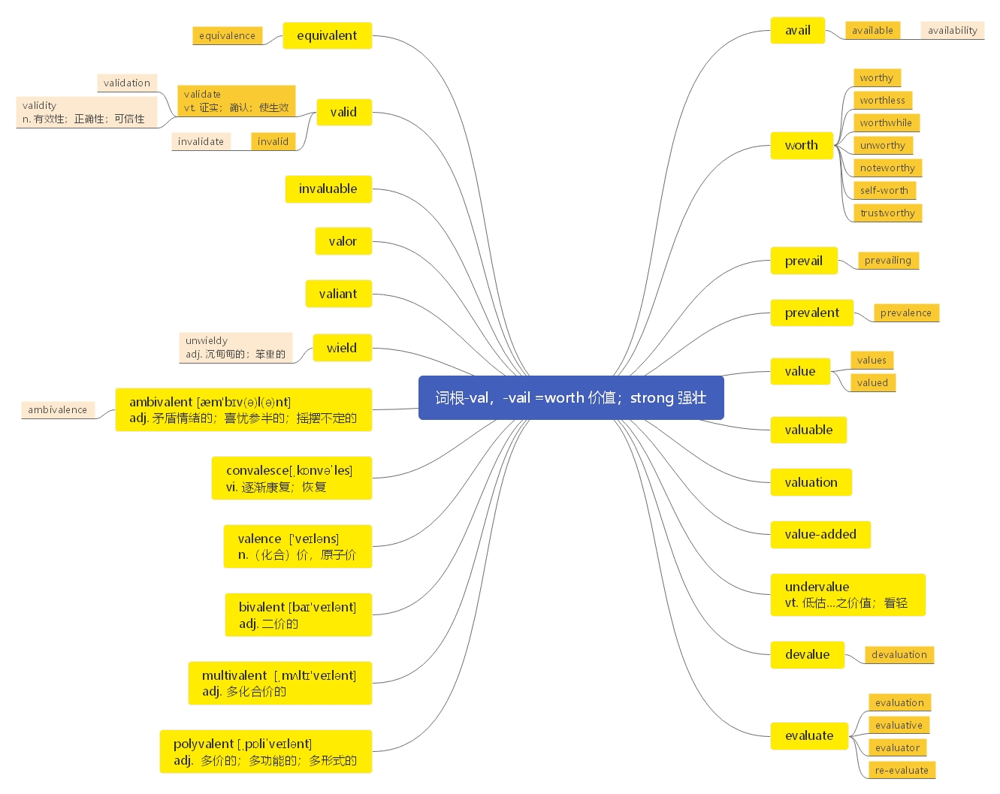

# 第十四节 掌握词根-val， -vail 的含义

> 本节课目标
>
> 1、 掌握词根-val， -vail 的含义
>
> 2、 掌握核心词汇

***

**词根-val， -vail =worth 价值； strong：强壮**

***

**available**  \[ə'veɪləb(ə)l] adj.  [英音](https://dict.youdao.com/dictvoice?audio=available\&type=1)  [美音](https://dict.youdao.com/dictvoice?audio=available\&type=2) 能找到的；可获得的；有空的；空闲的 623

**助记：** a（ 加强语气） +vail（ =value=worth： 价值） +able（ 可以） →有价值→可利用的、 现

成的 （ = at one’s disposal： 任由某人处理、 使用）

**释义和用法：**

1）能找到的；可获得的 If something you want or need is available, you can find it or obtain it.

2）有空的；有暇的 Someone who is available is not busy and is therefore free to talk to you or to

&#x20;do a particular task.

**搭配：** options available（考）：可有的选择 facilities available（考）：可用的设备

写作例句：在过去的几年内，中国人民积累了巨大的财富，因此也有更多可用的钱去买想要

的数字化产品。

Within the past few years, people in China have experienced a great wealth accumulation and

therefore have more money available to afford the digital products desired.

**双语例句:** This was the only room available. [播放](https://dict.youdao.com/dictvoice?audio=This+was+the+only+room+available.\&le=eng\&le=eng\&type=2)

这是唯一可用的房间。

**双语例句:** It's available in a choice of colours. [播放](https://dict.youdao.com/dictvoice?audio=It%27s+available+in+a+choice+of+colours.\&le=eng\&le=eng\&type=2)

它有多种颜色可供选择。

**双语例句:** They are often available at a discount. [播放](https://dict.youdao.com/dictvoice?audio=They+are+often+available+at+a+discount.\&le=eng\&le=eng\&type=2)

它们经常可以以折扣价买到。

**原声例句:** Many victims live in areas with poor or non-existent health care systems and where antivenom treatments are often not **available**. [播放](https://dict.youdao.com/pureaudio?docid=-2675697500457590785)

**原声例句:** A Census Bureau official says four hundred billion dollars in grants and loans will be **available** over the next ten years. [播放](https://dict.youdao.com/pureaudio?docid=3709313116129277845)

**原声例句:** The World Health Organization says more than one billion people live in areas where renewable water resources are not **available**. [播放](https://dict.youdao.com/pureaudio?docid=4762044903735328192)

**权威例句:** The St Andrews and Aberdeen offers showed there was "more funding **available**", she added.  [播放](https://dict.youdao.com/dictvoice?audio=The+St+Andrews+and+Aberdeen+offers+showed+there+was+%22more+funding+available%22%2C+she+added.+\&le=eng\&type=2)

**权威例句:** There is not **available** a 'fleet' insurance that would cover five people in three cars either.  [播放](https://dict.youdao.com/dictvoice?audio=There+is+not+available+a+%27fleet%27+insurance+that+would+cover+five+people+in+three+cars+either.+\&le=eng\&type=2)

**权威例句:** The LG Optimus L5 is now **available** from both Bell Mobility and Virgin Mobile in Canada.  [播放](https://dict.youdao.com/dictvoice?audio=The+LG+Optimus+L5+is+now+available+from+both+Bell+Mobility+and+Virgin+Mobile+in+Canada.+\&le=eng\&type=2)

***

**avail**  \[ə'veɪl] vi.  [英音](https://dict.youdao.com/dictvoice?audio=avail\&type=1)  [美音](https://dict.youdao.com/dictvoice?audio=avail\&type=2) 有用，有利 14789

**词源：** c. 1300, availen, "to help (someone), assist; benefit, be profitable to; be for the advantage of;

have force or efficacy, serve for a purpose," apparently an Anglo-French compound of Old French

a- "to" (see ad-) + vaill-, present stem of valoir "be worth," from Latin valere "be strong, be

worth" (from PIE root \*wal- "to be strong"). Related: Availed; availing. As a noun, from c. 1400.

**释义和用法：**

1）有帮助；有益；有用(formal, or old-fashioned) to be helpful or useful to sb.

2）毫无用处;没效果 If you do something to no avail or to little avail, what you do fails to

achieve what you want.

3）接受（提议）；利用（机会） If you avail yourself of an offer or an opportunity, you accept the

offer or make use of the opportunity.

例句： Guests should feel at liberty to avail themselves of your facilities.

宾客们应该可以随意使用你们的各种设施。

**双语例句:** The doctors tried everything to keep him alive but to no avail. [播放](https://dict.youdao.com/dictvoice?audio=The+doctors+tried+everything+to+keep+him+alive+but+to+no+avail.\&le=eng\&le=eng\&type=2)

医生千方百计想使他活下来，但无济于事。

**双语例句:** His efforts were to no avail. [播放](https://dict.youdao.com/dictvoice?audio=His+efforts+were+to+no+avail.\&le=eng\&le=eng\&type=2)

他的努力是徒劳的。

**双语例句:** Your ability to argue is of little avail if the facts are wrong. [播放](https://dict.youdao.com/dictvoice?audio=Your+ability+to+argue+is+of+little+avail+if+the+facts+are+wrong.\&le=eng\&le=eng\&type=2)

如果论据是错的，你的辩才也就没有什么用了。

**原声例句:** So, **avail** yourself of that. Find a newspaper.

**原声例句:** The video tutor also has a couple of **avail** aments.

**权威例句:** It was in Terminal 1 where I decided to **avail** myself of a pedicure.  [播放](https://dict.youdao.com/dictvoice?audio=It+was+in+Terminal+1+where+I+decided+to+avail+myself+of+a+pedicure.+\&le=eng\&type=2)

**权威例句:** We spend huge sums on guards, we waste many hours of citizens' time, to little **avail**.  [播放](https://dict.youdao.com/dictvoice?audio=We+spend+huge+sums+on+guards%2C+we+waste+many+hours+of+citizens%27+time%2C+to+little+avail.+\&le=eng\&type=2)

**权威例句:** He has tried Flonase and over-the-counter medicines like Claritin to little or no **avail**.  [播放](https://dict.youdao.com/dictvoice?audio=He+has+tried+Flonase+and+over-the-counter+medicines+like+Claritin+to+little+or+no+avail.+\&le=eng\&type=2)

***

**availability**  \[ə,veɪlə'bɪlətɪ] n.  [英音](https://dict.youdao.com/dictvoice?audio=availability\&type=1)  [美音](https://dict.youdao.com/dictvoice?audio=availability\&type=2) 可用性； 有效性； 实用性 4835

**双语例句:** The nature and availability of material evidence was not to be discussed. [播放](https://dict.youdao.com/dictvoice?audio=The+nature+and+availability+of+material+evidence+was+not+to+be+discussed.\&le=eng\&le=eng\&type=2)

关键证据的性质和有效性将不予以讨论。

**双语例句:** The availability of steam power and the demands for new machines facilitated the transformation of the iron industry. [播放](https://dict.youdao.com/dictvoice?audio=The+availability+of+steam+power+and+the+demands+for+new+machines+facilitated+the+transformation+of+the+iron+industry.\&le=eng\&le=eng\&type=2)

蒸汽动力的实用性和对新机器的需求促进了钢铁工业的转型。

**双语例句:** Businesses can locate based on other considerations, such as the availability of labour, while worrying less about the cost of delivering their output. [播放](https://dict.youdao.com/dictvoice?audio=Businesses+can+locate+based+on+other+considerations%2C+such+as+the+availability+of+labour%2C+while+worrying+less+about+the+cost+of+delivering+their+output.\&le=eng\&le=eng\&type=2)

企业可以根据其他因素选址，如劳动力的可用性，减少对产出成本的担忧。

**原声例句:** Researchers say the water **availability** in some of the areas has dropped well below the internationally recognized standard. [播放](https://dict.youdao.com/pureaudio?docid=4463456283220188552)

**原声例句:** Differences between budgets, equipment and the **availability** of skilled workers have created uneven quality from lab to lab. [播放](https://dict.youdao.com/pureaudio?docid=-3818574078687620340)

**原声例句:** The Global Snakebite Initiative is trying to increase the **availability** of good quality antivenom treatments and improve medical training for patient care. [播放](https://dict.youdao.com/pureaudio?docid=1960263097465062677)

**权威例句:** One drawback is that most car share services have very little **availability** at airports.  [播放](https://dict.youdao.com/dictvoice?audio=One+drawback+is+that+most+car+share+services+have+very+little+availability+at+airports.+\&le=eng\&type=2)

**权威例句:** What has your administration done or plan to do to limit the **availability** of assault weapons?  [播放](https://dict.youdao.com/dictvoice?audio=What+has+your+administration+done+or+plan+to+do+to+limit+the+availability+of+assault+weapons%3F+\&le=eng\&type=2)

**权威例句:** There have been two approaches: Riak and Cassandra stress **availability**, while HBase has stressed consistency.  [播放](https://dict.youdao.com/dictvoice?audio=There+have+been+two+approaches%3A+Riak+and+Cassandra+stress+availability%2C+while+HBase+has+stressed+consistency.+\&le=eng\&type=2)

***

**worth**  \[wɜ:θ] adj.  [英音](https://dict.youdao.com/dictvoice?audio=worth\&type=1)  [美音](https://dict.youdao.com/dictvoice?audio=worth\&type=2) 值…的； n. 价值； 意义 1360

**释义和用法：**

（ 1）值…钱 If something is worth a particular amount of money, it can be sold for that amount or

is considered to have that value.

（ 2） 值得(拥有) If you say that something is worth having, you mean that it is pleasant or useful,

and therefore a good thing to have.

（ 3） 具有(某一行动)的价值;值得(做) If something is worth a particular action, or if an action is

worth doing, it is considered to be important enough for that action.

（ 4） (N-UNCOUNT) (某人的)价值，意义，重要性&#x20;

&#x9;	Someone's worth is the value, usefulness, or importance that they are considered to have.

&#x9;Their contribution was of great worth.

&#x9;他们的贡献具有伟大的意义。

**双语例句:** They weren't worth four bits. [播放](https://dict.youdao.com/dictvoice?audio=They+weren%27t+worth+four+bits.\&le=eng\&le=eng\&type=2)

它们不值50美分了。

**双语例句:** How much is this painting worth? [播放](https://dict.youdao.com/dictvoice?audio=How+much+is+this+painting+worth%3F\&le=eng\&le=eng\&type=2)

这幅画值多少钱？

**双语例句:** It's not worth losing sleep over. [播放](https://dict.youdao.com/dictvoice?audio=It%27s+not+worth+losing+sleep+over.\&le=eng\&le=eng\&type=2)

那件事不值得焦虑。

**原声例句:** Let us say I want to sell my car but I do not know exactly how much it is **worth**. [播放](https://dict.youdao.com/pureaudio?docid=3714821293182384420)

**原声例句:** So when I had a handful of these cases, it seemed to me then there was likely something **worth** investigating. [播放](https://dict.youdao.com/pureaudio?docid=6312551410408799583)

**原声例句:** And if he could bring great players to New York, they'd be **worth** a lot of money to him." [播放](https://dict.youdao.com/pureaudio?docid=210939390695299177)

**权威例句:** The debt has been downgraded, and the stock is **worth** less than he paid for it.  [播放](https://dict.youdao.com/dictvoice?audio=The+debt+has+been+downgraded%2C+and+the+stock+is+worth+less+than+he+paid+for+it.+\&le=eng\&type=2)

**权威例句:** Tell Schemer the neighbour hood you are in, and it'll suggest activities **worth** doing there.  [播放](https://dict.youdao.com/dictvoice?audio=Tell+Schemer+the+neighbourhood+you+are+in%2C+and+it%27ll+suggest+activities+worth+doing+there.+\&le=eng\&type=2)

**权威例句:** You can sleep soundly knowing that a parcel of your net **worth** is safe and sound.  [播放](https://dict.youdao.com/dictvoice?audio=You+can+sleep+soundly+knowing+that+a+parcel+of+your+net+worth+is+safe+and+sound.+\&le=eng\&type=2)

***

**worthy**  \[ˈwə:ði] adj.  [英音](https://dict.youdao.com/dictvoice?audio=worthy\&type=1)  [美音](https://dict.youdao.com/dictvoice?audio=worthy\&type=2) 有价值的； 值得的； 可尊敬的； 应该获得…的； 5165

**释义和用法：**

1） 值得…的;应该获得…的 If a person or thing is worthy of something, they deserve it because

they have the qualities or abilities required.

2）值得尊敬的;可敬的；令人称许的 A worthy person （值得尊敬的人）or thing is approved of by most people in

society and considered to be morally respectable or correct.

**搭配：** be worthy of（考）：值得 worthy of admiration and respect（考）：值得崇敬和尊重

**双语例句:** A number of the report's findings are worthy of note. [播放](https://dict.youdao.com/dictvoice?audio=A+number+of+the+report%27s+findings+are+worthy+of+note.\&le=eng\&le=eng\&type=2)

这份报告里有些调查结果值得注意。

**双语例句:** The exhibition contains nothing that is worthy of remark. [播放](https://dict.youdao.com/dictvoice?audio=The+exhibition+contains+nothing+that+is+worthy+of+remark.\&le=eng\&le=eng\&type=2)

这次展览没有任何值得看的东西。

**双语例句:** He is worthy of all your adoration. [播放](https://dict.youdao.com/dictvoice?audio=He+is+worthy+of+all+your+adoration.\&le=eng\&le=eng\&type=2)

他值得你倾慕。

**原声例句:** All of the rating agencies still rate California as **worthy** of investment. [播放](https://dict.youdao.com/pureaudio?docid=6101017352454952102)

**原声例句:** He once wrote that when he was young he imagined that with the possible exception of a doctor saving a life, "writing a **worthy** play was the most important thing a human being could do." [播放](https://dict.youdao.com/pureaudio?docid=2983700098489120205)

**原声例句:** Canadian athletes certainly proved themselves **worthy** on the field of play, winning 14 gold medals, which is a record at a Winter games. [播放](https://dict.youdao.com/pureaudio?docid=-6667591113390427425)

**权威例句:** Check out these five impact-worthy apps to help you fit paying it forward into your daily routine.  [播放](https://dict.youdao.com/dictvoice?audio=Check+out+these+five+impact-worthy+apps+to+help+you+fit+paying+it+forward+into+your+daily+routine.+\&le=eng\&type=2)

**权威例句:** What they share is a commitment to country that has been tested and proved **worthy**.  [播放](https://dict.youdao.com/dictvoice?audio=What+they+share+is+a+commitment+to+country+that+has+been+tested+and+proved+worthy.+\&le=eng\&type=2)

**权威例句:** All **worthy** stuff on the side of the angels from a panel of bankers and regulators.  [播放](https://dict.youdao.com/dictvoice?audio=All+worthy+stuff+on+the+side+of+the+angels+from+a+panel+of+bankers+and+regulators.+\&le=eng\&type=2)

***

**worthless**  \[ˈwə:θlɪs]adj.  [英音](https://dict.youdao.com/dictvoice?audio=worthless\&type=1)  [美音](https://dict.youdao.com/dictvoice?audio=worthless\&type=2) 无价值的；不值钱的；一无是处的； 9042

**释义和用法：**

1）无价值的；不值钱的；没用处的 Something that is worthless is of no real value or use.

2）一无是处的；不中用的 Someone who is described as worthless is considered to have no good

qualities or skills. 例如： You feel you really are completely worthless and unlovable.

你会觉得自己真是毫无价值，一点也不讨人喜欢。

**双语例句:** He dismissed the opinion polls as worthless. [播放](https://dict.youdao.com/dictvoice?audio=He+dismissed+the+opinion+polls+as+worthless.\&le=eng\&le=eng\&type=2)

他认为民意测验毫无用处而不予考虑。

**双语例句:** Training is worthless unless there is proof that it works. [播放](https://dict.youdao.com/dictvoice?audio=Training+is+worthless+unless+there+is+proof+that+it+works.\&le=eng\&le=eng\&type=2)

训练并无价值，除非证明其有效。

**双语例句:** The car was a worthless wreck after the collision. [播放](https://dict.youdao.com/dictvoice?audio=The+car+was+a+worthless+wreck+after+the+collision.\&le=eng\&le=eng\&type=2)

撞车以后，那辆车成了毫无价值的残骸。

**原声例句:** They thought seven million dollars was too much to pay for a **worthless** piece of frozen land. [播放](https://dict.youdao.com/pureaudio?docid=6213824991735405351)

**原声例句:** For example, if something is for the birds, it is **worthless** or not very interesting. [播放](https://dict.youdao.com/pureaudio?docid=5618862669424386335)

**原声例句:** Businessmen and rich landowners had put their money in Confederate bonds, now completely **worthless**. [播放](https://dict.youdao.com/pureaudio?docid=-3804159172047695173)

**权威例句:** Despite his name, Cartier was no jeweller: he had found **worthless** quartz crystals and fool's gold.  [播放](https://dict.youdao.com/dictvoice?audio=Despite+his+name%2C+Cartier+was+no+jeweller%3A+he+had+found+worthless+quartz+crystals+and+fool%27s+gold.+\&le=eng\&type=2)

**权威例句:** The otherwise **worthless** piece of paper in your wallet conveys value because of government decree.  [播放](https://dict.youdao.com/dictvoice?audio=The+otherwise+worthless+piece+of+paper+in+your+wallet+conveys+value+because+of+government+decree.+\&le=eng\&type=2)

**权威例句:** With knowledge, however, otherwise **worthless** matter and radiation turns into petroleum, microchips, and radio spectrum.  [播放](https://dict.youdao.com/dictvoice?audio=With+knowledge%2C+however%2C+otherwise+worthless+matter+and+radiation+turns+into+petroleum%2C+microchips%2C+and+radio+spectrum.+\&le=eng\&type=2)

***

**worthwhile**  \[wɜ:θ'waɪl] adj.  [英音](https://dict.youdao.com/dictvoice?audio=worthwhile\&type=1)  [美音](https://dict.youdao.com/dictvoice?audio=worthwhile\&type=2) 值得做的，值得花时间的 7072

**助记：** worth（ 值得） +while（ 一会儿， 时间） →值得花时间的、 值得做的

**释义和用法：**

有价值的;令人愉快的；值得花费时间（或金钱、精力）的 If something is worthwhile, it is

enjoyable or useful, and worth the time, money, or effort that is spent on it. 例如： a worthwhile

movie that was compelling enough to watch again... 非常吸引人、值得再看一遍的精彩影片

**双语例句:** The smile on her face made it all worthwhile. [播放](https://dict.youdao.com/dictvoice?audio=The+smile+on+her+face+made+it+all+worthwhile.\&le=eng\&le=eng\&type=2)

她脸上的笑容使得这一切都非常值得。

**双语例句:** It is worthwhile to include really high-quality illustrations. [播放](https://dict.youdao.com/dictvoice?audio=It+is+worthwhile+to+include+really+high-quality+illustrations.\&le=eng\&le=eng\&type=2)

把真正高质量的插图包括进去是值得的。

**双语例句:** The president's trip to Washington this week seems to have been worthwhile. [播放](https://dict.youdao.com/dictvoice?audio=The+president%27s+trip+to+Washington+this+week+seems+to+have+been+worthwhile.\&le=eng\&le=eng\&type=2)

该总统本周的华盛顿之行似乎是值得的。

**原声例句:** Simbo says the guarantee of a daily profit makes the back-breaking work **worthwhile**. [播放](https://dict.youdao.com/pureaudio?docid=-6471595248679786383)

**原声例句:** Getting her college degree, Davis says, made her struggle **worthwhile**. [播放](https://dict.youdao.com/pureaudio?docid=-4551225419147449866)

**原声例句:** While it may not be **worthwhile** for older patients, younger patients are more likely to regard anything that gives them a lifelong working knee joint as well worth the cost. [播放](https://dict.youdao.com/pureaudio?docid=-5486946439986309808)

**权威例句:** Even shoppers not planning a holiday meal will find a trip to the 36-hour marathon market **worthwhile**.  [播放](https://dict.youdao.com/dictvoice?audio=Even+shoppers+not+planning+a+holiday+meal+will+find+a+trip+to+the+36-hour+marathon+market+worthwhile.+\&le=eng\&type=2)

**权威例句:** There are passages that bear skimming, but overall it was a very **worthwhile** read.  [播放](https://dict.youdao.com/dictvoice?audio=There+are+passages+that+bear+skimming%2C+but+overall+it+was+a+very+worthwhile+read.+\&le=eng\&type=2)

**权威例句:** Debit cards are also **worthwhile** to bring along on your travels for ATM withdrawals.  [播放](https://dict.youdao.com/dictvoice?audio=Debit+cards+are+also+worthwhile+to+bring+along+on+your+travels+for+ATM+withdrawals.+\&le=eng\&type=2)

***

**unworthy**  \[ʌn'wɜ:ðɪ] adj.  [英音](https://dict.youdao.com/dictvoice?audio=unworthy\&type=1)  [美音](https://dict.youdao.com/dictvoice?audio=unworthy\&type=2) 不值得的； 配不上的； 不相称的 15223

**释义和用法：**

（ 1） 不值得的；配不上的 If a person or thing is unworthy of something good, they do not

deserve it. 例如： He felt unworthy of being married to such an attractive woman. 他觉得自己

不配娶这么迷人的女人

（ 2） 不相称的；与（某人）身份不相符的 If you say that an action is unworthy of someone, you

mean that it is not a nice thing to do and someone with their reputation or position should not do it.

例如： His accusations are unworthy of a prime minister. 他的指责与其首相身份不相称。

**双语例句:** He considered himself unworthy of the honour they had bestowed on him. [播放](https://dict.youdao.com/dictvoice?audio=He+considered+himself+unworthy+of+the+honour+they+had+bestowed+on+him.\&le=eng\&le=eng\&type=2)

他认为自己不配得到大家赋予他的荣誉。

**双语例句:** Such opinions are unworthy of educated people. [播放](https://dict.youdao.com/dictvoice?audio=Such+opinions+are+unworthy+of+educated+people.\&le=eng\&le=eng\&type=2)

知识分子发表这样的言论有失身份。

**双语例句:** You may feel unworthy of the attention and help people offer you. [播放](https://dict.youdao.com/dictvoice?audio=You+may+feel+unworthy+of+the+attention+and+help+people+offer+you.\&le=eng\&le=eng\&type=2)

你可能觉得自己不值得别人的关心和帮助。

**原声例句:** The House resolution calls the commission's report irredeemably biased and **unworthy** of further consideration or legitimacy and urges the Obama administration, which has already condemned it, to strongly oppose its endorsement by the United Nations. [播放](https://dict.youdao.com/pureaudio?docid=3613465527871033310)

**原声例句:** You reject your mother, who's equally **unworthy** due to her penis lack, and that shapes your psychosexual development.

**原声例句:** How can a utilitarian distinguish qualitatively higher pleasures from lesser ones, base ones, **unworthy** ones? Yes?

**权威例句:** To dismiss it as **unworthy** of fighting for is to dismiss the possibility of discrimination entirely.  [播放](https://dict.youdao.com/dictvoice?audio=To+dismiss+it+as+unworthy+of+fighting+for+is+to+dismiss+the+possibility+of+discrimination+entirely.+\&le=eng\&type=2)

**权威例句:** When will Hollywood start tightening its belt on bloated star salaries and **unworthy** production budgets?  [播放](https://dict.youdao.com/dictvoice?audio=When+will+Hollywood+start+tightening+its+belt+on+bloated+star+salaries+and+unworthy+production+budgets%3F+\&le=eng\&type=2)

**权威例句:** For Romney, that means portraying Obama as a failed president **unworthy** of a second term.  [播放](https://dict.youdao.com/dictvoice?audio=For+Romney%2C+that+means+portraying+Obama+as+a+failed+president+unworthy+of+a+second+term.+\&le=eng\&type=2)

***

**noteworthy**  \['nəʊtwɜ:ðɪ] adj.  [英音](https://dict.youdao.com/dictvoice?audio=noteworthy\&type=1)  [美音](https://dict.youdao.com/dictvoice?audio=noteworthy\&type=2) 显著的；值得注意的 9678

**释义和用法：**

值得注意的；显著的；有趣的 A fact or event that is noteworthy is interesting, remarkable, or

significant in some way.

例如： It （形式主语）is noteworthy that the programme has been shifted from its original August slot to July...

值得注意的是该节目已从原来 8 月份的档期换到了 7 月份。（that 引导的从句为真正主语）

slot

（ 1） (时间表、计划中的)时段，位置 A slot in a schedule or scheme is a place in it where an

activity can take place. 例如： The first episode occupies a peak evening viewing slot. 第一集

占据了傍晚的一个黄金收视时段。

（ 2） (机器或容器上的)狭缝，狭孔 A slot is a narrow opening in a machine or container, for

example a hole that you put coins in to make a machine work. 例如： He dropped a coin into the

slot and dialed. 他往投币孔里投了一枚硬币，然后拨了电话。

**双语例句:** I found nothing particularly noteworthy to report. [播放](https://dict.youdao.com/dictvoice?audio=I+found+nothing+particularly+noteworthy+to+report.\&le=eng\&le=eng\&type=2)

我没什么特别值得关注的事情可报告。

**双语例句:** The most noteworthy feature of the list is that there are no women on it. [播放](https://dict.youdao.com/dictvoice?audio=The+most+noteworthy+feature+of+the+list+is+that+there+are+no+women+on+it.\&le=eng\&le=eng\&type=2)

该名单最值得关注的是上面没有女性。

**双语例句:** It is noteworthy that the programme has been shifted from its original August slot to July. [播放](https://dict.youdao.com/dictvoice?audio=It+is+noteworthy+that+the+programme+has+been+shifted+from+its+original+August+slot+to+July.\&le=eng\&le=eng\&type=2)

该节目从最初的8月档移到7月值得关注。

**原声例句:** I think it's the political implications of this missile test that are **noteworthy**-and that is that Iran views the talks as dead-it doesn't view the talks positively, and now it's bracing for sanctions and quite possibly for war, and this missile test is a sign that Iran takes the military option very seriously and is ready to reciprocate if it's attacked." [播放](https://dict.youdao.com/pureaudio?docid=-7059158966360151757)

**原声例句:** I'll tell you, in the south of France near where we live, when there was a lot of resistance in World War II against the Germans, there were some Protestant villages there that were **noteworthy** for their resistance.

**原声例句:** Well the fact is it could be hundreds of foods in the American food supply, and what's **noteworthy** about this particular list of ingredients, is that it's fifty-six entries long; fifty-six things in this particular food and we defined it as food.

**权威例句:** This caution is **noteworthy** because Church is not just a proponent of synthetic biology.  [播放](https://dict.youdao.com/dictvoice?audio=This+caution+is+noteworthy+because+Church+is+not+just+a+proponent+of+synthetic+biology.+\&le=eng\&type=2)

**权威例句:** It is **noteworthy** that Mikhail Gorbachev has repeatedly trumpeted these Soviet proposals over the past year.  [播放](https://dict.youdao.com/dictvoice?audio=It+is+noteworthy+that+Mikhail+Gorbachev+has+repeatedly+trumpeted+these+Soviet+proposals+over+the+past+year.+\&le=eng\&type=2)

**权威例句:** What made these laps **noteworthy** was the driver, Albert II, Sovereign Prince of Monaco.  [播放](https://dict.youdao.com/dictvoice?audio=What+made+these+laps+noteworthy+was+the+driver%2C+Albert+II%2C+Sovereign+Prince+of+Monaco.+\&le=eng\&type=2)

***

**self-worth**  \['self'wə:θ] n.  [英音](https://dict.youdao.com/dictvoice?audio=self-worth\&type=1)  [美音](https://dict.youdao.com/dictvoice?audio=self-worth\&type=2) 自我价值感 16288

**释义和用法：**

自我价值感 Self-worth is the feeling that you have good qualities and have achieved good things.

例如： Try not to link your sense of self-worth to the opinions of others. 尽量不要把你的自我价

值感和别人的意见联系起来。

***

**trustworthy**  \['trʌs(t)wɜ:ðɪ] adj.  [英音](https://dict.youdao.com/dictvoice?audio=trustworthy\&type=1)  [美音](https://dict.youdao.com/dictvoice?audio=trustworthy\&type=2) 可信赖的； 可靠的 13466

**释义和用法：**

可信赖的；值得信赖的；可靠的 A trustworthy person is reliable, responsible, and can be trusted

completely. 例如： He is a trustworthy and level-headed leader. 他是个头脑冷静、值得信赖的

领导。

level-headed 头脑冷静的；稳健的 If you describe a person as level-headed, you mean that they

are calm and sensible even in difficult situations.

**双语例句:** He is a trustworthy and level-headed leader. [播放](https://dict.youdao.com/dictvoice?audio=He+is+a+trustworthy+and+level-headed+leader.\&le=eng\&le=eng\&type=2)

他是个可信赖的、头脑冷静的领导。

**双语例句:** This occurs because they're perceived to be fair and trustworthy. [播放](https://dict.youdao.com/dictvoice?audio=This+occurs+because+they%27re+perceived+to+be+fair+and+trustworthy.\&le=eng\&le=eng\&type=2)

之所以出现这种情况，是因为他们被认为是公平的、值得信赖的。

**双语例句:** I used to think Emily was honest and trustworthy, but now I know better. [播放](https://dict.youdao.com/dictvoice?audio=I+used+to+think+Emily+was+honest+and+trustworthy%2C+but+now+I+know+better.\&le=eng\&le=eng\&type=2)

我曾经认为艾米丽是诚实和值得信赖的，但现在我更清楚了。

**原声例句:** "They like Obama personally. They think he is **trustworthy** and honest. [播放](https://dict.youdao.com/pureaudio?docid=-4694536098772999018)

**原声例句:** And this is from Damasio's excellent book Descartes' Error: He used to be a really responsible guy, a family man, very reliable, very **trustworthy**.

**原声例句:** We try to trick people, for instance, into believing that we're tougher, smarter, sexier, more reliable, more **trustworthy** and so on, than we really are.

**权威例句:** Participants who spoke with a cell phone in view perceived their partner as less understanding and less **trustworthy**.  [播放](https://dict.youdao.com/dictvoice?audio=Participants+who+spoke+with+a+cell+phone+in+view+perceived+their+partner+as+less+understanding+and+less+trustworthy.+\&le=eng\&type=2)

**权威例句:** The key point is that all possible attacks on a **Trustworthy** Space cannot be predicted.  [播放](https://dict.youdao.com/dictvoice?audio=The+key+point+is+that+all+possible+attacks+on+a+Trustworthy+Space+cannot+be+predicted.+\&le=eng\&type=2)

**权威例句:** Fox, who ranked as the most **trustworthy** celeb last year, came in fifth this time around.  [播放](https://dict.youdao.com/dictvoice?audio=Fox%2C+who+ranked+as+the+most+trustworthy+celeb+last+year%2C+came+in+fifth+this+time+around.+\&le=eng\&type=2)

***

**prevail**  \[prɪ'veɪl] vi.  [英音](https://dict.youdao.com/dictvoice?audio=prevail\&type=1)  [美音](https://dict.youdao.com/dictvoice?audio=prevail\&type=2) 盛行， 流行； 占上风； 占优势； 获胜 4795

**助记：** pre（ 以前） +vail（ =power， strong： 实力、 力量） →以前有实力、 势力→“盛”极一时

→盛行、 流行； 占上风

**词源：** c. 1400, "be successful; be efficacious," from Old French prevaleir (Modern French

prévaloir) and directly from Latin praevalere "be stronger, have greater power," from prae

"before" (see pre-) + valere "have power, be strong" (from PIE root \*wal- "to be strong"). Spelling

in English perhaps influenced by avail. Related: Prevailed; prevailing.

**释义和用法：**

1）（提议、原则、观点）占上风，占优势，获胜，被接受 If a proposal, principle, or opinion prevails,

it gains influence or is accepted, often after a struggle or argument. 例如： We hope that common

sense would prevail. 我们希望情理会占上风。

2）（情形、态度、风俗）盛行，流行，普遍 If a situation, attitude, or custom prevails in a particular

place at a particular time, it is normal or most common in that place at that time. 例如： A similar

situation prevails in America. 相似的情况在美国随处可见。

3）（在战斗、竞赛、争论中）获胜，取胜 If one side in a battle, contest, or dispute prevails, it wins.

例如： I do hope he will prevail over the rebels. 我确实希望他能战胜叛乱者。

**双语例句:** We hoped that common sense would prevail. [播放](https://dict.youdao.com/dictvoice?audio=We+hoped+that+common+sense+would+prevail.\&le=eng\&le=eng\&type=2)

我们希望常识能占上风。

**双语例句:** Rick still believes that justice will prevail. [播放](https://dict.youdao.com/dictvoice?audio=Rick+still+believes+that+justice+will+prevail.\&le=eng\&le=eng\&type=2)

里克仍然相信正义会占上风。

**双语例句:** Those beliefs still prevail among certain social groups. [播放](https://dict.youdao.com/dictvoice?audio=Those+beliefs+still+prevail+among+certain+social+groups.\&le=eng\&le=eng\&type=2)

这些信念在某些社会群体中仍很盛行。

**原声例句:** Iranian President Mahmoud Ahmedinejad told his counterparts that he hoped "fraternal and peaceful relations **prevail** in the region,once again . [播放](https://dict.youdao.com/pureaudio?docid=-6134870560193998604)

**原声例句:** "It's devastating to the space program if it's approved by Congress, and I really hope that more level heads will **prevail**. [播放](https://dict.youdao.com/pureaudio?docid=902796292694149635)

**原声例句:** He says Pakistani troops will have to launch quick, sharp and precise attacks in the area if they hope to **prevail**. [播放](https://dict.youdao.com/pureaudio?docid=-7536296849225356609)

**权威例句:** Western civilization s signature achievement was not democracy but the idea that laws **prevail** over lawgivers.  [播放](https://dict.youdao.com/dictvoice?audio=Western+civilization+s+signature+achievement+was+not+democracy+but+the+idea+that+laws+prevail+over+lawgivers.+\&le=eng\&type=2)

**权威例句:** The perspective held that high confrontation would allow the strongest vantage points (and executives) to **prevail**.  [播放](https://dict.youdao.com/dictvoice?audio=The+perspective+held+that+high+confrontation+would+allow+the+strongest+vantage+points+%28and+executives%29+to+prevail.+\&le=eng\&type=2)

**权威例句:** Yet it was a hard batch of data to interpret, and the qualms didn't **prevail**.  [播放](https://dict.youdao.com/dictvoice?audio=Yet+it+was+a+hard+batch+of+data+to+interpret%2C+and+the+qualms+didn%27t+prevail.+\&le=eng\&type=2)

***

**prevailing**  \[prɪ'veɪlɪŋ] adj.  [英音](https://dict.youdao.com/dictvoice?audio=prevailing\&type=1)  [美音](https://dict.youdao.com/dictvoice?audio=prevailing\&type=2) 一般的， 普通的； 盛行的；（ 风） 常刮的 6883

**释义和用法：**

1） existing or most common at a particular time 普遍的；盛行的；流行的；

例如： the attitude towards science prevailing at the time 当时对科学的流行看法

The prevailing view seems to be that they will find her guilty.一般人的看法似乎认为她会被判

有罪。

2） the prevailing wind in an area is the one that blows over it most frequently （指风）一地区常

刮的，盛行的

**搭配：** a prevailing trend（考）：一个流行的趋势

**双语例句:** The direction of the prevailing winds should be taken into account. [播放](https://dict.youdao.com/dictvoice?audio=The+direction+of+the+prevailing+winds+should+be+taken+into+account.\&le=eng\&le=eng\&type=2)

应该将盛行风的风向考虑在内。

**双语例句:** I hope this book is not yet another restatement of the prevailing wisdom. [播放](https://dict.youdao.com/dictvoice?audio=I+hope+this+book+is+not+yet+another+restatement+of+the+prevailing+wisdom.\&le=eng\&le=eng\&type=2)

我希望这本书不会又是重复一些流行的至理名言。

**双语例句:** She wears a fashionable hair style prevailing in the city. [播放](https://dict.youdao.com/dictvoice?audio=She+wears+a+fashionable+hair+style+prevailing+in+the+city.\&le=eng\&le=eng\&type=2)

她的发型是这个城市流行的款式。

**原声例句:** "There is a pattern of widespread and systematic violations that the **prevailing** impunity allows for the continuation of those violations," [播放](https://dict.youdao.com/pureaudio?docid=8690615686911680996)

**原声例句:** And that's the **prevailing** comment. The U.S.- the world - has never experienced a spill this enormous,this deep. [播放](https://dict.youdao.com/pureaudio?docid=6647427273351213223)

**原声例句:** Hawkings agrees that there is an unmistakable and **prevailing** anti-incumbent mood in the country. [播放](https://dict.youdao.com/pureaudio?docid=1062939258981835543)

**权威例句:** The grounds for the **prevailing** opposition to gold convertibility are nicely summed up by Prof.  [播放](https://dict.youdao.com/dictvoice?audio=The+grounds+for+the+prevailing+opposition+to+gold+convertibility+are+nicely+summed+up+by+Prof.+\&le=eng\&type=2)

**权威例句:** When employers are calculating the **prevailing** wage for these workers, they suddenly become low skilled workers.  [播放](https://dict.youdao.com/dictvoice?audio=When+employers+are+calculating+the+prevailing+wage+for+these+workers%2C+they+suddenly+become+low+skilled+workers.+\&le=eng\&type=2)

**权威例句:** Zhou, in comments contradicting **prevailing** opinion, said the Chinese currency is already close to equilibrium.  [播放](https://dict.youdao.com/dictvoice?audio=Zhou%2C+in+comments+contradicting+prevailing+opinion%2C+said+the+Chinese+currency+is+already+close+to+equilibrium.+\&le=eng\&type=2)

***

**prevalent**  \['prev(ə)l(ə)nt] adj.  [英音](https://dict.youdao.com/dictvoice?audio=prevalent\&type=1)  [美音](https://dict.youdao.com/dictvoice?audio=prevalent\&type=2) 流行的；盛行的；普遍的 7094

**助记：** pre（ 以前） +val（ =power： 力量、 实力） +ent（ 形容词后缀） →以前有权有势的家族

→“盛”极一时的、 盛行的、 流行的

**释义和用法：**

流行的；盛行的；普遍的 A condition, practice, or belief that is prevalent is common. 例如：

Smoking is becoming increasingly prevalent among younger women... 抽烟在年轻女性中变得

越来越常见。

**搭配：** prevalent myths（考）：盛行的神话

写作例句：如今，浪费现象在大学里非常流行，并且很严重。

Nowadays, waste is quite prevalent and serious on campus.

> **【课堂笔记】**
>
> 动词 prevail → 形容词 prevalent   **-ent 形容词后缀**

**双语例句:** This condition is more prevalent in women than in men. [播放](https://dict.youdao.com/dictvoice?audio=This+condition+is+more+prevalent+in+women+than+in+men.\&le=eng\&le=eng\&type=2)

这种情况在女性中比在男性中更为普遍。

**双语例句:** Smoking is becoming increasingly prevalent among younger women. [播放](https://dict.youdao.com/dictvoice?audio=Smoking+is+becoming+increasingly+prevalent+among+younger+women.\&le=eng\&le=eng\&type=2)

吸烟在年轻女性中正变得越来越盛行。

**双语例句:** Despite the fact that the disease is so prevalent, treatment is still far from satisfactory. [播放](https://dict.youdao.com/dictvoice?audio=Despite+the+fact+that+the+disease+is+so+prevalent%2C+treatment+is+still+far+from+satisfactory.\&le=eng\&le=eng\&type=2)

尽管事实上这种疾病非常普遍，治疗却远不尽如人意。

**原声例句:** "In areas where the sleeping sickness is still very **prevalent**, such as remote areas of some central African countries -- which are by the way very unstable areas -- it will be also crucial to have simpler treatment and obviously oral treatment would be the best." [播放](https://dict.youdao.com/pureaudio?docid=-1948866553394864183)

**原声例句:** And as the cost of everything goes up, extreme poverty in Yemen becomes more **prevalent**. [播放](https://dict.youdao.com/pureaudio?docid=-1589654545303535999)

**原声例句:** The reported discrepancies in the election data are particularly **prevalent** in Afghanistan's volatile southern and eastern provinces, where Afghan President Hamid Karzai won by large margins. [播放](https://dict.youdao.com/pureaudio?docid=-7934857813252982668)

**权威例句:** Privateering is becoming especially **prevalent** in the acquisition of patent portfolios from other companies.  [播放](https://dict.youdao.com/dictvoice?audio=Privateering+is+becoming+especially+prevalent+in+the+acquisition+of+patent+portfolios+from+other+companies.+\&le=eng\&type=2)

**权威例句:** In regards to the CCC, they're **prevalent** specifically in the South, specifically with poorer rural areas.  [播放](https://dict.youdao.com/dictvoice?audio=In+regards+to+the+CCC%2C+they%27re+prevalent+specifically+in+the+South%2C+specifically+with+poorer+rural+areas.+\&le=eng\&type=2)

**权威例句:** While the penalties are becoming more **prevalent**, rewards for pursuing good health are far more common.  [播放](https://dict.youdao.com/dictvoice?audio=While+the+penalties+are+becoming+more+prevalent%2C+rewards+for+pursuing+good+health+are+far+more+common.+\&le=eng\&type=2)

***

**prevalence**  \['prevələns] n.  [英音](https://dict.youdao.com/dictvoice?audio=prevalence\&type=1)  [美音](https://dict.youdao.com/dictvoice?audio=prevalence\&type=2) 流行；普遍；广泛 7589

> 【**课堂笔记】**
>
> \-ance -ence -ancy -ency
>
> 名词后缀；没有实际含义

**双语例句:** Could it be the prevalence of tea in their culture? [播放](https://dict.youdao.com/dictvoice?audio=Could+it+be+the+prevalence+of+tea+in+their+culture%3F\&le=eng\&le=eng\&type=2)

是因为茶在他们的文化中流行而造成的吗？

**双语例句:** The prevalence of black and Asian faces among those targeted has caused especial resentment. [播放](https://dict.youdao.com/dictvoice?audio=The+prevalence+of+black+and+Asian+faces+among+those+targeted+has+caused+especial+resentment.\&le=eng\&le=eng\&type=2)

黑人和亚洲人的面孔在那些目标人群中普遍存在，这引起了特别的不满。

**双语例句:** Epidemiological studies have found that children with PDD have no higher prevalence of gastrointestinal tract than normal children. [播放](https://dict.youdao.com/dictvoice?audio=Epidemiological+studies+have+found+that+children+with+PDD+have+no+higher+prevalence+of+gastrointestinal+tract+than+normal+children.\&le=eng\&le=eng\&type=2)

流行病学研究发现，广泛性发育障碍（Pervasive Developmental Disorder）孩子和正常孩子相比较并没有更高的胃肠道患病率。

**原声例句:** Botswana has a small population, about two million, but a very big HIV **prevalence** rate. [播放](https://dict.youdao.com/pureaudio?docid=3731153389672550156)

**原声例句:** This high **prevalence** rate has fueled the tuberculosis epidemic. [播放](https://dict.youdao.com/pureaudio?docid=2041215260395264959)

**原声例句:** A recent progress report on HIV/AIDS says Botswana is one of the nine Southern African countries that continue to bear the global burden of HIV/AIDS, with each country having an adult **prevalence** of more than 10 percent. The government's national AIDS control program has boosted testing,prevention and treatment efforts. [播放](https://dict.youdao.com/pureaudio?docid=8013440672872175771)

**权威例句:** This one was done in Spain, so other regions may vary in terms of **prevalence**.  [播放](https://dict.youdao.com/dictvoice?audio=This+one+was+done+in+Spain%2C+so+other+regions+may+vary+in+terms+of+prevalence.+\&le=eng\&type=2)

**权威例句:** The increasing **prevalence** of free access at hotels seems to be at a tipping point.  [播放](https://dict.youdao.com/dictvoice?audio=The+increasing+prevalence+of+free+access+at+hotels+seems+to+be+at+a+tipping+point.+\&le=eng\&type=2)

**权威例句:** Our list also highlights the growing **prevalence** of regional air carriers in the skies.  [播放](https://dict.youdao.com/dictvoice?audio=Our+list+also+highlights+the+growing+prevalence+of+regional+air+carriers+in+the+skies.+\&le=eng\&type=2)

***

**value**  \['vælju:] n.  [英音](https://dict.youdao.com/dictvoice?audio=value\&type=1)  [美音](https://dict.youdao.com/dictvoice?audio=value\&type=2) 价值； 重要性； vt. 重视； 珍惜； 给…估价 500

**释义和用法：**

（ 1） 重要性；有用性；益处 The value of something such as a quality, attitude, or method is its

importance or usefulness. If you **place a particular value on something（重视/认为某事有价值/重要**）, that is the importance or

usefulness you think it has.

（ 2） (VERB) 认为…重要； 重视； 珍视 If you value something or someone, you think that they

are important and you appreciate them. 例如： If you value your health then you'll start being a

little kinder to yourself. 如果你重视自己的健康，你就要开始对自己好一点。

（ 3） (VERB) 给…估价； 给…定价 When experts value something, they decide how much

money it is worth. 例如： I asked him if he would have my jewellery valued for insurance

purposes.

我问他能否给我的珠宝进行保险估价。

**双语例句:** I don't own anything of any value. [播放](https://dict.youdao.com/dictvoice?audio=I+don%27t+own+anything+of+any+value.\&le=eng\&le=eng\&type=2)

我没有任何值钱的东西。

**双语例句:** She sets a high value on autonomy. [播放](https://dict.youdao.com/dictvoice?audio=She+sets+a+high+value+on+autonomy.\&le=eng\&le=eng\&type=2)

她高度重视自主权。

**双语例句:** Let y have the value 33. [播放](https://dict.youdao.com/dictvoice?audio=Let+y+have+the+value+33.\&le=eng\&le=eng\&type=2)

假设y的值为33。

**原声例句:** But beans are used to describe something of very little **value** in the expression, not worth a hill of beans. [播放](https://dict.youdao.com/pureaudio?docid=-853678211303191056)

**原声例句:** Now they will be able to locate genes for any desired trait, improving quality, nutritional **value** and disease resistance. [播放](https://dict.youdao.com/pureaudio?docid=1781189969458520528)

**原声例句:** The study shows the **value** in testing and treating HIV before a person even feels sick enough to see a doctor. [播放](https://dict.youdao.com/pureaudio?docid=8641053965834063462)

**权威例句:** Sentiment remains grumpy and cautious, and as a value-oriented investor I am thankful for this, too.  [播放](https://dict.youdao.com/dictvoice?audio=Sentiment+remains+grumpy+and+cautious%2C+and+as+a+value-oriented+investor+I+am+thankful+for+this%2C+too.+\&le=eng\&type=2)

**权威例句:** It sells for 11 times my estimate of 2011 earnings and two times book **value**.  [播放](https://dict.youdao.com/dictvoice?audio=It+sells+for+11+times+my+estimate+of+2011+earnings+and+two+times+book+value.+\&le=eng\&type=2)

**权威例句:** Yet still there is much of **value** in the story told in Towers of Gold.  [播放](https://dict.youdao.com/dictvoice?audio=Yet+still+there+is+much+of+value+in+the+story+told+in+Towers+of+Gold.+\&le=eng\&type=2)

***

**values**  \['væljuz] n.  [英音](https://dict.youdao.com/dictvoice?audio=values\&type=1)  [美音](https://dict.youdao.com/dictvoice?audio=values\&type=2) 价值观；道德标准

**释义和用法：**

价值观；道德标准 The values of a person or group are the moral principles and beliefs that they

think are important. 例如： The countries of South Asia also share many common values. 南亚各

国也有许多相同的价值观。

**搭配：** conventional values（考）：传统的价值观

**双语例句:** Traditional values have been reasserted. [播放](https://dict.youdao.com/dictvoice?audio=Traditional+values+have+been+reasserted.\&le=eng\&le=eng\&type=2)

传统价值再次得到肯定。

**双语例句:** Victorian values are much misunderstood. [播放](https://dict.youdao.com/dictvoice?audio=Victorian+values+are+much+misunderstood.\&le=eng\&le=eng\&type=2)

维多利亚时代的价值观被极大地误解了。

**双语例句:** Moral values cannot be taught in a vacuum. [播放](https://dict.youdao.com/dictvoice?audio=Moral+values+cannot+be+taught+in+a+vacuum.\&le=eng\&le=eng\&type=2)

道德价值观不能在与世隔绝的状态中进行传授。

**原声例句:** There is deep opposition between people who support nonreligious government policies and those who want religious **values** to be considered. [播放](https://dict.youdao.com/pureaudio?docid=5362117650932002374)

**原声例句:** But she wrote that women's roles decreased over time as the Cherokee people accepted the **values** of the larger American culture. [播放](https://dict.youdao.com/pureaudio?docid=-6620639106021722713)

**原声例句:** And we did it without compromising the **values** that we were taught as we grew up -- honor,integrity,patriotism,service, faith and commitment. [播放](https://dict.youdao.com/pureaudio?docid=-3509355435266786932)

**权威例句:** These **values** are referred to by their catchy titles: Level 1, 2, or 3.  [播放](https://dict.youdao.com/dictvoice?audio=These+values+are+referred+to+by+their+catchy+titles%3A+Level+1%2C+2%2C+or+3.+\&le=eng\&type=2)

**权威例句:** The relationship between natural and social environment and cultural **values** of Southeast Mediterranean peoples.  [播放](https://dict.youdao.com/dictvoice?audio=The+relationship+between+natural+and+social+environment+and+cultural+values+of+Southeast+Mediterranean+peoples.+\&le=eng\&type=2)

**权威例句:** Previously, the lower 30-year U.S. government bond rates were used to calculate lump-sum pension **values**.  [播放](https://dict.youdao.com/dictvoice?audio=Previously%2C+the+lower+30-year+U.S.+government+bond+rates+were+used+to+calculate+lump-sum+pension+values.+\&le=eng\&type=2)

***

**valued**  \['vælju\:d] adj.  [英音](https://dict.youdao.com/dictvoice?audio=valued\&type=1)  [美音](https://dict.youdao.com/dictvoice?audio=valued\&type=2) 贵重的；宝贵的；经估价的；重要的 15704

**双语例句:** Parenting is not fully valued by society. [播放](https://dict.youdao.com/dictvoice?audio=Parenting+is+not+fully+valued+by+society.\&le=eng\&le=eng\&type=2)

养育子女还没有得到社会的充分重视。

**双语例句:** Individuality is a valued and inherent part of the British character. [播放](https://dict.youdao.com/dictvoice?audio=Individuality+is+a+valued+and+inherent+part+of+the+British+character.\&le=eng\&le=eng\&type=2)

个性是英国人重视并固有的特征。

**双语例句:** Aristotle was valued because of his clear exposition of rational thought. [播放](https://dict.youdao.com/dictvoice?audio=Aristotle+was+valued+because+of+his+clear+exposition+of+rational+thought.\&le=eng\&le=eng\&type=2)

亚里士多德因其对理性思维的清晰阐述而被重视。

**原声例句:** She found they all **valued** their independence and many enjoyed having the power of control, though not all wanted it. [播放](https://dict.youdao.com/pureaudio?docid=-1828111086397907536)

**原声例句:** She reportedly felt her husband **valued** his professional and political interests more than he **valued** her. [播放](https://dict.youdao.com/pureaudio?docid=-2231231854607207254)

**原声例句:** Mister Freeman said Samoan society **valued** a young woman who had not had sexual relations. [播放](https://dict.youdao.com/pureaudio?docid=323513852036139023)

**权威例句:** Munich-based Siemens is **valued** at 1.5 times book value, while GE goes for 4.5 times book.  [播放](https://dict.youdao.com/dictvoice?audio=Munich-based+Siemens+is+valued+at+1.5+times+book+value%2C+while+GE+goes+for+4.5+times+book.+\&le=eng\&type=2)

**权威例句:** And how should demand deposits be **valued**, considering that banks do not know their maturity?  [播放](https://dict.youdao.com/dictvoice?audio=And+how+should+demand+deposits+be+valued%2C+considering+that+banks+do+not+know+their+maturity%3F+\&le=eng\&type=2)

**权威例句:** Second, there need to be policy environments where citizen media are **valued** and accepted.  [播放](https://dict.youdao.com/dictvoice?audio=Second%2C+there+need+to+be+policy+environments+where+citizen+media+are+valued+and+accepted.+\&le=eng\&type=2)

***

**valuable**  \['væljʊəb(ə)l] adj.  [英音](https://dict.youdao.com/dictvoice?audio=valuable\&type=1)  [美音](https://dict.youdao.com/dictvoice?audio=valuable\&type=2) 贵重的；有价值的；可估价的 2628

**释义和用法：**

（ 1） 有价值的；有益的；有用的&#x20;

&#x9;	If you describe something or someone as valuable, you mean  that they are very useful and helpful&#x20;

&#x9;	例如：、

&#x9;	 If you decide to do you own make-up, here are a few valuable tips that will help you look your best.

&#x9;	如果你决定自己化妆，这里有一些有用的小窍门，可以帮助你呈现最美的一面。

（ 2） 贵重的；值钱的 Valuable objects are objects which are worth a lot of money.&#x20;

&#x9;		例如： Just because a camera is old does not mean it is valuable.&#x20;

&#x9;			古旧的相机不一定就值钱。

**双语例句:** Luckily, nothing valuable was stolen. [播放](https://dict.youdao.com/dictvoice?audio=Luckily%2C+nothing+valuable+was+stolen.\&le=eng\&le=eng\&type=2)

幸运的是，没有贵重物品失窃。

**双语例句:** Did the burglars take anything valuable? [播放](https://dict.youdao.com/dictvoice?audio=Did+the+burglars+take+anything+valuable%3F\&le=eng\&le=eng\&type=2)

入室窃贼偷走了贵重的东西没有？

**双语例句:** We're wasting valuable time, time we can ill afford. [播放](https://dict.youdao.com/dictvoice?audio=We%27re+wasting+valuable+time%2C+time+we+can+ill+afford.\&le=eng\&le=eng\&type=2)

我们是在浪费宝贵的时间，我们浪费不起的时间。

**原声例句:** The gold seekers quickly learned that most of the **valuable** areas of land had already been claimed by others. [播放](https://dict.youdao.com/pureaudio?docid=-4297065551856444501)

**原声例句:** Walking is safe. And,it is said be to as **valuable** for one's health as more intense forms of exercise like jogging. [播放](https://dict.youdao.com/pureaudio?docid=-2742406657987838400)

**原声例句:** As the last speakers of a language die off, the **valuable** information contained within a language also disappears. [播放](https://dict.youdao.com/pureaudio?docid=4464285293980603670)

**权威例句:** But how we solve this problem should offer **valuable** lessons for all environmental policymaking.  [播放](https://dict.youdao.com/dictvoice?audio=But+how+we+solve+this+problem+should+offer+valuable+lessons+for+all+environmental+policymaking.+\&le=eng\&type=2)

**权威例句:** It's also striking how much more **valuable** foreign-owned businesses are to Scotland than indigenous ones.  [播放](https://dict.youdao.com/dictvoice?audio=It%27s+also+striking+how+much+more+valuable+foreign-owned+businesses+are+to+Scotland+than+indigenous+ones.+\&le=eng\&type=2)

**权威例句:** The company says it has learned several **valuable** lessons from the recent bond insurance fiasco.  [播放](https://dict.youdao.com/dictvoice?audio=The+company+says+it+has+learned+several+valuable+lessons+from+the+recent+bond+insurance+fiasco.+\&le=eng\&type=2)

***

**valuation**  \[væljʊ'eɪʃ(ə)n] n.  [英音](https://dict.youdao.com/dictvoice?audio=valuation\&type=1)  [美音](https://dict.youdao.com/dictvoice?audio=valuation\&type=2) 计算；评价，估价 11129

**释义和用法：**

估价；估值 A valuation is a judgment that someone makes about how much money something is

worth. 例如： an independent valuation of the company. 对这家公司的独立评估

> **【课堂笔记】**
>
> 动词 valuate→ 名词 valuation
>
> 复合后缀=ate+ion (字母 e 不发音， 省略掉)

**双语例句:** Experts set a high valuation on the painting. [播放](https://dict.youdao.com/dictvoice?audio=Experts+set+a+high+valuation+on+the+painting.\&le=eng\&le=eng\&type=2)

专家对这幅画估价很高。

**双语例句:** Valuation lies at the heart of all takeovers. [播放](https://dict.youdao.com/dictvoice?audio=Valuation+lies+at+the+heart+of+all+takeovers.\&le=eng\&le=eng\&type=2)

估价是一切收购活动的核心。

**双语例句:** Surveyors carried out a valuation of the property. [播放](https://dict.youdao.com/dictvoice?audio=Surveyors+carried+out+a+valuation+of+the+property.\&le=eng\&le=eng\&type=2)

鉴定人员对这处房产做了估价。

**原声例句:** Default rates are shooting up and **valuation** of securitized subprime mortgages have crashed and it's throwing turmoil all over the financial community.

**原声例句:** I'm going to ask you to read the **valuation** that we did of our own work.

**原声例句:** Nonetheless, I think it's safe to say you see a gradual decline in the cultural idealization of virginity and a corresponding increase in the **valuation** of marriage in this new form of chastity that we can think of as married chastity.

**权威例句:** Many think Pharmacia saw its **valuation** suffer as a result of its continuing ownership of Monsanto.  [播放](https://dict.youdao.com/dictvoice?audio=Many+think+Pharmacia+saw+its+valuation+suffer+as+a+result+of+its+continuing+ownership+of+Monsanto.+\&le=eng\&type=2)

**权威例句:** However the **valuation** in the government's books is 407p per share - a fairly chunky difference.  [播放](https://dict.youdao.com/dictvoice?audio=However+the+valuation+in+the+government%27s+books+is+407p+per+share+-+a+fairly+chunky+difference.+\&le=eng\&type=2)

**权威例句:** **Valuation** aside, there are other reasons not to take a shine to Tiffany shares.  [播放](https://dict.youdao.com/dictvoice?audio=Valuation+aside%2C+there+are+other+reasons+not+to+take+a+shine+to+Tiffany+shares.+\&le=eng\&type=2)

***

**value-added**  \[,vælju'ædɪd] adj.  [英音](https://dict.youdao.com/dictvoice?audio=value-added\&type=1)  [美音](https://dict.youdao.com/dictvoice?audio=value-added\&type=2) 增值的 18244

**搭配：** a value-added tax 增值税

***

**undervalue**  \[ʌndə'vælju:] vt.  [英音](https://dict.youdao.com/dictvoice?audio=undervalue\&type=1)  [美音](https://dict.youdao.com/dictvoice?audio=undervalue\&type=2) 低估...之价值；看轻 18722

**助记：** under（ 达不到； 不够） +value（ 估计； 估值） →低估了价值； 看轻

**释义和用法：**

低估；轻视；小看&#x20;

&#x20; If you undervalue something or someone, you fail to recognize how valuable or important they are.&#x20;

例如： We must never undervalue freedom.&#x20;

&#x20;      我们决不能低估自由的价值。

**双语例句:** We must never undervalue freedom. [播放](https://dict.youdao.com/dictvoice?audio=We+must+never+undervalue+freedom.\&le=eng\&le=eng\&type=2)

我们决不可低估自由的价值。

**双语例句:** To disdain or undervalue; scorn. [播放](https://dict.youdao.com/dictvoice?audio=To+disdain+or+undervalue%3B+scorn.\&le=eng\&le=eng\&type=2)

轻视，蔑视；藐视。

**双语例句:** Do not undervalue yourself. [播放](https://dict.youdao.com/dictvoice?audio=Do+not+undervalue+yourself.\&le=eng\&le=eng\&type=2)

不要低估了你自己。&#x20;

**权威例句:** However, Wei cautions that cost of living is an important metric that many **undervalue**.  [播放](https://dict.youdao.com/dictvoice?audio=However%2C+Wei+cautions+that+cost+of+living+is+an+important+metric+that+many+undervalue.+\&le=eng\&type=2)

**权威例句:** They inhibit cultural diversity (true again, but, unfortunately, most British people seem grossly to **undervalue** cultural diversity).  [播放](https://dict.youdao.com/dictvoice?audio=They+inhibit+cultural+diversity+%28true+again%2C+but%2C+unfortunately%2C+most+British+people+seem+grossly+to+undervalue+cultural+diversity%29.+\&le=eng\&type=2)

**权威例句:** And African filmmakers are especially burdened by a lack of money because our societies are financially strapped and they historically **undervalue** art.  [播放](https://dict.youdao.com/dictvoice?audio=And+African+filmmakers+are+especially+burdened+by+a+lack+of+money+because+our+societies+are+financially+strapped+and+they+historically+undervalue+art.+\&le=eng\&type=2)

***

**devalue**  \[di:'vælju:] vt.  [英音](https://dict.youdao.com/dictvoice?audio=devalue\&type=1)  [美音](https://dict.youdao.com/dictvoice?audio=devalue\&type=2) 使贬值； 降低…的价值 14343

**助记：** de（ =down： 下降） +value（ 价值） →价值下降→贬值； 贬低

**释义和用法：**

1） 降低…的价值； 贬低 To devalue something means to cause it to be thought less impressive or

less deserving of respect.&#x20;

&#x20;       例如： They spread tales about her in an attempt to devalue her work...

&#x9;			他们散布一些有关她的流言，企图贬低她的工作。 传说； 流言

2）使(货币)贬值 To devalue the currency of a country means to reduce its value in relation to

other currencies.&#x20;

&#x9;	例如： India has devalued the Rupee by about eleven percent.&#x20;

&#x9;	印度已将卢比贬值了约 11%。

> &#x20;**【课堂笔记】**
>
> undervalue 低估…的价值
>
> devalue 使贬值

**双语例句:** They spread tales about her in an attempt to devalue her work. [播放](https://dict.youdao.com/dictvoice?audio=They+spread+tales+about+her+in+an+attempt+to+devalue+her+work.\&le=eng\&le=eng\&type=2)

他们散布关于她的传闻，企图贬低她的工作。

**双语例句:** This way you devalue your opinion and show that you are incapable of managing your own life. [播放](https://dict.youdao.com/dictvoice?audio=This+way+you+devalue+your+opinion+and+show+that+you+are+incapable+of+managing+your+own+life.\&le=eng\&le=eng\&type=2)

这样你就贬低了自己的观点，表明你没有能力管理自己的生活。

**双语例句:** Let's not devalue her work unjustly. [播放](https://dict.youdao.com/dictvoice?audio=Let%27s+not+devalue+her+work+unjustly.\&le=eng\&le=eng\&type=2)

我们不要不公正地贬低她的工作。&#x20;

**权威例句:** Others call for Greece to withdraw from the euro so it can **devalue** its currency.  [播放](https://dict.youdao.com/dictvoice?audio=Others+call+for+Greece+to+withdraw+from+the+euro+so+it+can+devalue+its+currency.+\&le=eng\&type=2)

**权威例句:** Finally, you could leave the euro and **devalue**, as Britain is going to do.  [播放](https://dict.youdao.com/dictvoice?audio=Finally%2C+you+could+leave+the+euro+and+devalue%2C+as+Britain+is+going+to+do.+\&le=eng\&type=2)

**权威例句:** Desperate to maintain or restart growth, the developed world is effectively competing to **devalue** its money.  [播放](https://dict.youdao.com/dictvoice?audio=Desperate+to+maintain+or+restart+growth%2C+the+developed+world+is+effectively+competing+to+devalue+its+money.+\&le=eng\&type=2)

***

**devaluation**  \[,di\:væljʊ'eɪʃən] n.  [英音](https://dict.youdao.com/dictvoice?audio=devaluation\&type=1)  [美音](https://dict.youdao.com/dictvoice?audio=devaluation\&type=2) 货币贬值 15794

**双语例句:** It will lead to devaluation of a number of currencies. [播放](https://dict.youdao.com/dictvoice?audio=It+will+lead+to+devaluation+of+a+number+of+currencies.\&le=eng\&le=eng\&type=2)

这将导致多种货币的贬值。

**双语例句:** Devaluation would only give the economy a brief respite. [播放](https://dict.youdao.com/dictvoice?audio=Devaluation+would+only+give+the+economy+a+brief+respite.\&le=eng\&le=eng\&type=2)

货币贬值只会给经济一个短时间的暂缓。

**双语例句:** There has been a further small devaluation against the dollar. [播放](https://dict.youdao.com/dictvoice?audio=There+has+been+a+further+small+devaluation+against+the+dollar.\&le=eng\&le=eng\&type=2)

兑美元的比值继续小幅下跌。

**原声例句:** Al-Fusail says the price-hikes are a result of the **devaluation** of the local currency. [播放](https://dict.youdao.com/pureaudio?docid=3190432728452800547)&#x20;

**权威例句:** High oil prices and a big **devaluation** in 1998 have generated a huge trade surplus.  [播放](https://dict.youdao.com/dictvoice?audio=High+oil+prices+and+a+big+devaluation+in+1998+have+generated+a+huge+trade+surplus.+\&le=eng\&type=2)

**权威例句:** The IMF remains addicted to currency **devaluation**, which invariably retards economic recovery and growth.  [播放](https://dict.youdao.com/dictvoice?audio=The+IMF+remains+addicted+to+currency+devaluation%2C+which+invariably+retards+economic+recovery+and+growth.+\&le=eng\&type=2)

**权威例句:** Another gamble is Indonesian short-term deposits, yielding about 33% even after a 76% **devaluation**.  [播放](https://dict.youdao.com/dictvoice?audio=Another+gamble+is+Indonesian+short-term+deposits%2C+yielding+about+33%25+even+after+a+76%25+devaluation.+\&le=eng\&type=2)

***

**evaluate**  \[ɪ'væljʊeɪt] vt.  [英音](https://dict.youdao.com/dictvoice?audio=evaluate\&type=1)  [美音](https://dict.youdao.com/dictvoice?audio=evaluate\&type=2) 评价； 估价； 求…的值 2360

**助记：** e（ =ex： 出来） +valu（ =value： 价值） +ate（ 使动词） →使价值弄出来→评价、 评估

**释义和用法：**

**评估；评价**&#x20;

&#x9;	If you evaluate something or someone, you consider them in order to make a

judgment about them, for example about how good or bad they are.&#x20;

&#x9;	例如： The market situation is difficult to evaluate.&#x20;

&#x20;              市场状况难以评价。

**例句：** Boasting a print \_\_\_\_\_\_\_\_ of 995,000 on weekdays and 1.4 million on Sundays, The New

York Times is the third bestselling American newspaper, behind the Wall Street Journal and USA

Today.

A evaluation B expansion C circulation D dimension&#x20;

解析： 原文翻译“ 《 纽约时报》 是美国发行量第三的报纸， 仅次于《 华尔街日报》 和《 今日

美国》。 他们声称工作日可以发售 99500 分报纸， 周日可发售 140 万份。 ”故选 C，

circulation：流通、发行； A：评估； B：扩张； D：维、尺寸

**双语例句:** The market situation is difficult to evaluate. [播放](https://dict.youdao.com/dictvoice?audio=The+market+situation+is+difficult+to+evaluate.\&le=eng\&le=eng\&type=2)

市场形势难以评估。

**双语例句:** We need to learn how to evaluate them properly. [播放](https://dict.youdao.com/dictvoice?audio=We+need+to+learn+how+to+evaluate+them+properly.\&le=eng\&le=eng\&type=2)

我们需要学习如何正确地评估它们。

**双语例句:** For each side of the subject, think carefully and evaluate it. [播放](https://dict.youdao.com/dictvoice?audio=For+each+side+of+the+subject%2C+think+carefully+and+evaluate+it.\&le=eng\&le=eng\&type=2)

对于主题的每一方面，都要仔细思考和评估。

**原声例句:** Researchers at the Denver Health Medical Center set out to **evaluate** the effectiveness of this kind of testing. [播放](https://dict.youdao.com/pureaudio?docid=7097564925780359679)

**原声例句:** He then said the panel would examine documents, hear testimony and try to **evaluate** what happened, what went well, what went wrong and why. [播放](https://dict.youdao.com/pureaudio?docid=1525457479547343222)

**原声例句:** Whole lives play out on Facebook. Births.Graduations.Marriage.Even divorce Some experts say that sharing too much information can have downsides - including affecting the way prospective employers may **evaluate** a job candidate. [播放](https://dict.youdao.com/pureaudio?docid=7861460921635678445)

**权威例句:** The RECORD study is the largest clinical trial designed to **evaluate** the cardiovascular safety of Avandia.  [播放](https://dict.youdao.com/dictvoice?audio=The+RECORD+study+is+the+largest+clinical+trial+designed+to+evaluate+the+cardiovascular+safety+of+Avandia.+\&le=eng\&type=2)

**权威例句:** He said the closures are indefinite, and that authorities would re-evaluate the situation as needed.  [播放](https://dict.youdao.com/dictvoice?audio=He+said+the+closures+are+indefinite%2C+and+that+authorities+would+re-evaluate+the+situation+as+needed.+\&le=eng\&type=2)

**权威例句:** This makes it very difficult for the Arbitrator to **evaluate** the reasonableness of the charges.  [播放](https://dict.youdao.com/dictvoice?audio=This+makes+it+very+difficult+for+the+Arbitrator+to+evaluate+the+reasonableness+of+the+charges.+\&le=eng\&type=2)

***

**evaluation**  \[ɪˌvæljuˈeɪʃn] n.  [英音](https://dict.youdao.com/dictvoice?audio=evaluation\&type=1)  [美音](https://dict.youdao.com/dictvoice?audio=evaluation\&type=2) 评价；估价；评估；求值 2374

**双语例句:** He got a good evaluation. [播放](https://dict.youdao.com/dictvoice?audio=He+got+a+good+evaluation.\&le=eng\&le=eng\&type=2)

他得到了很好的评价。

**双语例句:** The formal procedures of scientific evaluation provided one framework. [播放](https://dict.youdao.com/dictvoice?audio=The+formal+procedures+of+scientific+evaluation+provided+one+framework.\&le=eng\&le=eng\&type=2)

科学评估的正式程序提供了一个框架。

**双语例句:** The way the guests were treated in the hotel influenced their evaluation of the service. [播放](https://dict.youdao.com/dictvoice?audio=The+way+the+guests+were+treated+in+the+hotel+influenced+their+evaluation+of+the+service.\&le=eng\&le=eng\&type=2)

客人在酒店受到的待遇影响了他们对服务的评价。

**原声例句:** Rifat Atun is director of strategy, performance and **evaluation** at the Global Fund. [播放](https://dict.youdao.com/pureaudio?docid=-1188323011972502891)

**原声例句:** "This is an **evaluation** instrument that is finally able to capture who is highly effective and who is ineffective and who could be doing better and could use some assistance. [播放](https://dict.youdao.com/pureaudio?docid=-1699184458928358663)

**原声例句:** The U.S.Navy hospital ship, USNS Comfort, is sending medical teams ashore to help with casualty **evaluation** and triage. [播放](https://dict.youdao.com/pureaudio?docid=8108479237708768865)

**权威例句:** It takes action in four main sections: training, research and **evaluation**, new technologies and training documentation.  [播放](https://dict.youdao.com/dictvoice?audio=It+takes+action+in+four+main+sections%3A+training%2C+research+and+evaluation%2C+new+technologies+and+training+documentation.+\&le=eng\&type=2)

**权威例句:** Such changes, however, require a re-evaluation of the values that now drive the green movement.  [播放](https://dict.youdao.com/dictvoice?audio=Such+changes%2C+however%2C+require+a+re-evaluation+of+the+values+that+now+drive+the+green+movement.+\&le=eng\&type=2)

**权威例句:** It also attempts to develop valid and objective systems of **evaluation** of the implementation of human rights worldwide.  [播放](https://dict.youdao.com/dictvoice?audio=It+also+attempts+to+develop+valid+and+objective+systems+of+evaluation+of+the+implementation+of+human+rights+worldwide.+\&le=eng\&type=2)

***

**evaluative**  \[ɪ'væljʊ,etɪv] adj.  [英音](https://dict.youdao.com/dictvoice?audio=evaluative\&type=1)  [美音](https://dict.youdao.com/dictvoice?audio=evaluative\&type=2) 评价的；评估的 17728

**双语例句:** I like to call it non-evaluative exploration. [播放](https://dict.youdao.com/dictvoice?audio=I+like+to+call+it+non-evaluative+exploration.\&le=eng\&le=eng\&type=2)

我喜欢把它叫做非评价性勘探。

**双语例句:** The literary judge USES many evaluative terms. [播放](https://dict.youdao.com/dictvoice?audio=The+literary+judge+USES+many+evaluative+terms.\&le=eng\&le=eng\&type=2)

这个文学鉴赏家使用了很多评价性的术语。

**双语例句:** All civilisations are hierarchical and evaluative. [播放](https://dict.youdao.com/dictvoice?audio=All+civilisations+are+hierarchical+and+evaluative.\&le=eng\&le=eng\&type=2)

所有文明都是有等级的和可评价的。

**原声例句:** You see, that's where the **evaluative** principle that completely revolutionizes Gadamer's canon comes in.&#x20;

**权威例句:** Did I resist the temptation to jump in with **evaluative** or disparaging comments?  [播放](https://dict.youdao.com/dictvoice?audio=Did+I+resist+the+temptation+to+jump+in+with+evaluative+or+disparaging+comments%3F+\&le=eng\&type=2)

**权威例句:** What you are referring to as mediation is nothing less than **evaluative** mediation.  [播放](https://dict.youdao.com/dictvoice?audio=What+you+are+referring+to+as+mediation+is+nothing+less+than+evaluative+mediation.+\&le=eng\&type=2)

**权威例句:** Free cash flow is an important **evaluative** indicator for investors.  [播放](https://dict.youdao.com/dictvoice?audio=Free+cash+flow+is+an+important+evaluative+indicator+for+investors.+\&le=eng\&type=2)

***

**evaluator**  \[i'væljueitə] n.  [英音](https://dict.youdao.com/dictvoice?audio=evaluator\&type=1)  [美音](https://dict.youdao.com/dictvoice?audio=evaluator\&type=2) 评估员； \[计]鉴别器； 求值程序 16498

**释义和用法：** an authority who is able to estimate worth or quality

> **【课堂笔记】**
>
> \-or 名词后缀 人   、物：机/器

**【课堂笔记】**

**双语例句:** Specifies the capability evaluated by the comparison evaluator. [播放](https://dict.youdao.com/dictvoice?audio=Specifies+the+capability+evaluated+by+the+comparison+evaluator.\&le=eng\&le=eng\&type=2)

指定由比较计算器计算的功能。

**双语例句:** This property is required for both comparison and evaluator filters. [播放](https://dict.youdao.com/dictvoice?audio=This+property+is+required+for+both+comparison+and+evaluator+filters.\&le=eng\&le=eng\&type=2)

比较筛选器和鉴别筛选器都需要使用此属性。

**双语例句:** A lot of the Visual Studio functionality requires an expression evaluator. [播放](https://dict.youdao.com/dictvoice?audio=A+lot+of+the+Visual+Studio+functionality+requires+an+expression+evaluator.\&le=eng\&le=eng\&type=2)

许多Visual Studio功能需要一个表达式运算器。&#x20;

**权威例句:** The Robert Wood Johnson Foundation is going to serve as an independent **evaluator** as these companies work towards their goals.  [播放](https://dict.youdao.com/dictvoice?audio=The+Robert+Wood+Johnson+Foundation+is+going+to+serve+as+an+independent+evaluator+as+these+companies+work+towards+their+goals.+\&le=eng\&type=2)

**权威例句:** When it came to who was top dog on the baseball side, the talent **evaluator** was out, the numbers guy was in.  [播放](https://dict.youdao.com/dictvoice?audio=When+it+came+to+who+was+top+dog+on+the+baseball+side%2C+the+talent+evaluator+was+out%2C+the+numbers+guy+was+in.+\&le=eng\&type=2)

**权威例句:** They are accustomed to the consultant playing the role of objective **evaluator**.  [播放](https://dict.youdao.com/dictvoice?audio=They+are+accustomed+to+the+consultant+playing+the+role+of+objective+evaluator.+\&le=eng\&type=2)

***

**re-evaluate**  \[ˈri:ɪˈvæljʊeɪt] vt.  [英音](https://dict.youdao.com/dictvoice?audio=re-evaluate\&type=1)  [美音](https://dict.youdao.com/dictvoice?audio=re-evaluate\&type=2) 再评估； 再估价 13301

***

**equivalent**  \[ɪ'kwɪv(ə)l(ə)nt] adj.  [英音](https://dict.youdao.com/dictvoice?audio=equivalent\&type=1)  [美音](https://dict.youdao.com/dictvoice?audio=equivalent\&type=2) 等价的， 相等的； n. 等价物； 等量物； 对应者 4377

**助记：** equi（ =equal： 相同、 等） +val（ 价值）＋ent→等价的、 等同的

**释义和用法：**

（ 1） （价值、数量、意义、重要性等）相等的，相同的 equal in value, amount, meaning, importance,

etc.

（ 2） 等价物；等量物 If one amount or value is the equivalent of another, they are the same.

（ 3） 对应物；对应者 The equivalent of someone or something is a person or thing that has the

same function in a different place, time, or system.

**搭配：** be equivalent to（考）：等价于，等同于

**助记：** Lighting eats up 20 percent of the world’s electricity， or the equivalent of roughly 600,000

tons of coal a day. 照明用电消耗了全球总电量的 20%， 相当于每天消耗大约 60 万吨

煤。

> **【课堂笔记】**
>
> ent 形容词后缀， 表示“ …的”
>
> 名词后缀， 表示“ 人/物”

**双语例句:** Zip disks could be used to store the equivalent of three music CDs. [播放](https://dict.youdao.com/dictvoice?audio=Zip+disks+could+be+used+to+store+the+equivalent+of+three+music+CDs.\&le=eng\&le=eng\&type=2)

压缩盘能用以存储相当于3张音乐CD容量的内容。

**双语例句:** His party has just suffered the equivalent of a near-fatal heart attack. [播放](https://dict.youdao.com/dictvoice?audio=His+party+has+just+suffered+the+equivalent+of+a+near-fatal+heart+attack.\&le=eng\&le=eng\&type=2)

他的政党刚经受了相当于一次几乎致命的心脏病发作的打击。

**双语例句:** It is anticipated that the equivalent of 192 full-time jobs will be lost. [播放](https://dict.youdao.com/dictvoice?audio=It+is+anticipated+that+the+equivalent+of+192+full-time+jobs+will+be+lost.\&le=eng\&le=eng\&type=2)

据预测相当于192个全职的工作将会丧失。

**原声例句:** The French **equivalent** to Punch is Polichinelle, while in Russia he goes by the name Petrushka. [播放](https://dict.youdao.com/pureaudio?docid=-5268625610102038964)

**原声例句:** "Out of the two thousand five hundred municipalities we have in Mexico, the **equivalent** of your counties in America, eighty of those have witnessed episodes of violence." [播放](https://dict.youdao.com/pureaudio?docid=668094233707503113)

**原声例句:** That would be the **equivalent** to almost 40 percent of the projected demand of the United States. [播放](https://dict.youdao.com/pureaudio?docid=-6560699798892112051)

**权威例句:** The coupon is 3.63%, which is 67 basis points less than that of an **equivalent** Treasury.  [播放](https://dict.youdao.com/dictvoice?audio=The+coupon+is+3.63%25%2C+which+is+67+basis+points+less+than+that+of+an+equivalent+Treasury.+\&le=eng\&type=2)

**权威例句:** 'That's not my thing, but this is our **equivalent** to the story of Jack the Ripper.  [播放](https://dict.youdao.com/dictvoice?audio=%27That%27s+not+my+thing%2C+but+this+is+our+equivalent+to+the+story+of+Jack+the+Ripper.+\&le=eng\&type=2)

**权威例句:** But forro is at heart a traditional form, Brazil's loose **equivalent** to country music.  [播放](https://dict.youdao.com/dictvoice?audio=But+forro+is+at+heart+a+traditional+form%2C+Brazil%27s+loose+equivalent+to+country+music.+\&le=eng\&type=2)

***

**equivalence**  \[ɪ'kwɪv(ə)l(ə)ns] n.  [英音](https://dict.youdao.com/dictvoice?audio=equivalence\&type=1)  [美音](https://dict.youdao.com/dictvoice?audio=equivalence\&type=2) 等值；相等 18776

**双语例句:** There is no straightforward equivalence between economic progress and social well-being. [播放](https://dict.youdao.com/dictvoice?audio=There+is+no+straightforward+equivalence+between+economic+progress+and+social+well-being.\&le=eng\&le=eng\&type=2)

经济进步与社会福利之间绝非简单等同。

**双语例句:** A state of essential equality or equivalence. [播放](https://dict.youdao.com/dictvoice?audio=A+state+of+essential+equality+or+equivalence.\&le=eng\&le=eng\&type=2)

基本平等或均等的状态。

**双语例句:** The second principle is the principle of equivalence. [播放](https://dict.youdao.com/dictvoice?audio=The+second+principle+is+the+principle+of+equivalence.\&le=eng\&le=eng\&type=2)

第二法则是所谓的等量原理。

**原声例句:** For a moment at least, it's almost as if there were a strange moral **equivalence** between the palaces up there and the palaces down here.

**原声例句:** It turns out, it's part of a big picture and all of general relativity is based on this one great **equivalence** of two quantities which are very different attributes.&#x20;

**权威例句:** It has provided political cover for the Russians by allowing Putin et.al. to claim moral **equivalence**.  [播放](https://dict.youdao.com/dictvoice?audio=It+has+provided+political+cover+for+the+Russians+by+allowing+Putin+et.al.+to+claim+moral+equivalence.+\&le=eng\&type=2)

**权威例句:** **Equivalence** sounds elegant, but the danger is that it will mean more of the same.  [播放](https://dict.youdao.com/dictvoice?audio=Equivalence+sounds+elegant%2C+but+the+danger+is+that+it+will+mean+more+of+the+same.+\&le=eng\&type=2)

**权威例句:** Do you think there is any kind of moral **equivalence** between the Zionist and anti-Zionist causes?  [播放](https://dict.youdao.com/dictvoice?audio=Do+you+think+there+is+any+kind+of+moral+equivalence+between+the+Zionist+and+anti-Zionist+causes%3F+\&le=eng\&type=2)

***

**valid**  \['vælɪd] adj.  [英音](https://dict.youdao.com/dictvoice?audio=valid\&type=1)  [美音](https://dict.youdao.com/dictvoice?audio=valid\&type=2) 正当的；有效的，有根据的 4758

**词源：** 1570s, "having force in law, legally binding," from Middle French valide (16c.), from Latin

validus "strong, effective, powerful, active," from valere "be strong" (from PIE root \*wal- "to be

strong"). The meaning "sufficiently supported by facts or authority, well-grounded" is first

recorded 1640s.

**助记：** val（ =strong， force： 力量， 效力） +id（ 的） →（ 在法律上） 有效力的→有效的、 正

当的

**释义和用法：**

（ 1）（票证等）有效的 If a ticket or other document is valid, it can be used and will be accepted

by people in authority. 例如： For foreign holidays you will need a valid passport. 出国度假需持

有效护照。

（ 2） 有根据的；正当的；合理的 A valid argument, comment, or idea is based on sensible

reasoning. 例如： They put forward many valid reasons for not exporting. 他们提出了很多不出

口的正当理由。

**双语例句:** All tickets are valid for two months. [播放](https://dict.youdao.com/dictvoice?audio=All+tickets+are+valid+for+two+months.\&le=eng\&le=eng\&type=2)

所有的票在两个月内有效。

**双语例句:** Our realty agent says the sales contract is valid. [播放](https://dict.youdao.com/dictvoice?audio=Our+realty+agent+says+the+sales+contract+is+valid.\&le=eng\&le=eng\&type=2)

我们的房地产代理人称该销售合同是有效的。

**双语例句:** This special offer is valid until the end of the month. [播放](https://dict.youdao.com/dictvoice?audio=This+special+offer+is+valid+until+the+end+of+the+month.\&le=eng\&le=eng\&type=2)

这个特价优惠月底前有效。

**原声例句:** The incumbent has 54 percent of **valid** votes above the absolute majority needed to avoid a second round of balloting. [播放](https://dict.youdao.com/pureaudio?docid=-4449912105804811119)

**原声例句:** from Europe with a **valid** entry visa. Umar Farouk Abdulmutallab's name should have come up on a computer screen. [播放](https://dict.youdao.com/pureaudio?docid=988213031746959995)

**原声例句:** Plant says this definition, which first appeared in a 1930 ILO Convention Against Forced Labor, is still **valid** today. [播放](https://dict.youdao.com/pureaudio?docid=-6620754828363270979)

**权威例句:** There was an ongoing battle with the U.S. Patent Office over whether that patent was **valid**.  [播放](https://dict.youdao.com/dictvoice?audio=There+was+an+ongoing+battle+with+the+U.S.+Patent+Office+over+whether+that+patent+was+valid.+\&le=eng\&type=2)

**权威例句:** Mr. GRAHAM: That was an interesting case because the court originally ruled that the law was **valid**.  [播放](https://dict.youdao.com/dictvoice?audio=Mr.+GRAHAM%3A+That+was+an+interesting+case+because+the+court+originally+ruled+that+the+law+was+valid.+\&le=eng\&type=2)

**权威例句:** It also attempts to develop **valid** and objective systems of evaluation of the implementation of human rights worldwide.  [播放](https://dict.youdao.com/dictvoice?audio=It+also+attempts+to+develop+valid+and+objective+systems+of+evaluation+of+the+implementation+of+human+rights+worldwide.+\&le=eng\&type=2)

***

**validate**  \['vælɪdeɪt] vt.  [英音](https://dict.youdao.com/dictvoice?audio=validate\&type=1)  [美音](https://dict.youdao.com/dictvoice?audio=validate\&type=2) 使生效； 证实； 确认 7647

**助记：** valid（ 有效的） +ate（ 动词后缀， 使） →使生效

**释义和用法：**

（ 1） 使生效；使有法律效力 to make sth legally valid 例如： to validate a contract 使合同生效

（ 2） 证实；确证；确认 To validate something such as a claim or statement means to prove or

confirm that it is true or correct. 例如： how that evidence was evaluated and validated by

historians. 历史学家如何评估和确认该证据

**双语例句:** The Academy Awards appear to validate his career. [播放](https://dict.youdao.com/dictvoice?audio=The+Academy+Awards+appear+to+validate+his+career.\&le=eng\&le=eng\&type=2)

这些奥斯卡金像奖看来证实了他的职业生涯的价值。

**双语例句:** This discovery seems to validate the claims of popular astrology. [播放](https://dict.youdao.com/dictvoice?audio=This+discovery+seems+to+validate+the+claims+of+popular+astrology.\&le=eng\&le=eng\&type=2)

这一发现似乎证实了流行占星术的一些观点。

**双语例句:** If I want to validate this code in a white box manner, I have to separate UI-specific code from business code, which requires some refactoring. [播放](https://dict.youdao.com/dictvoice?audio=If+I+want+to+validate+this+code+in+a+white+box+manner%2C+I+have+to+separate+UI-specific+code+from+business+code%2C+which+requires+some+refactoring.\&le=eng\&le=eng\&type=2)

如果我想以白盒方式验证这段代码，就必须将特定于用户界面的代码与业务代码分开，这就需要进行重构。

**原声例句:** The president campaigned hard, urging people to vote even if they voted against him, hoping a big turnout would **validate** his national security and economic programs. [播放](https://dict.youdao.com/pureaudio?docid=-4290683135757986981)

**原声例句:** "They need to **validate** that this is the way forward with Mexico,and in general, by being seen together and talking about things in a quite positive way that it is worth this investment in security." [播放](https://dict.youdao.com/pureaudio?docid=7202100607172907546)

**原声例句:** to **validate** the entire radio before it is released to the public.

**权威例句:** We naturally look for the self in others, and seek relationships that will **validate** our selves.  [播放](https://dict.youdao.com/dictvoice?audio=We+naturally+look+for+the+self+in+others%2C+and+seek+relationships+that+will+validate+our+selves.+\&le=eng\&type=2)

**权威例句:** The challenge is to actually **validate** that your guess about the pain is real.  [播放](https://dict.youdao.com/dictvoice?audio=The+challenge+is+to+actually+validate+that+your+guess+about+the+pain+is+real.+\&le=eng\&type=2)

**权威例句:** As a leader you should challenge, probe, assess, **validate**, and even confront on a regular basis.  [播放](https://dict.youdao.com/dictvoice?audio=As+a+leader+you+should+challenge%2C+probe%2C+assess%2C+validate%2C+and+even+confront+on+a+regular+basis.+\&le=eng\&type=2)

***

**validation** \[,vælɪ'deɪʃən] n.  [英音](https://dict.youdao.com/dictvoice?audio=validation\&type=1)  [美音](https://dict.youdao.com/dictvoice?audio=validation\&type=2) 证实；确认；生效 11150

**双语例句:** When we want validation for our decisions we often turn to friends for advice and approval. [播放](https://dict.youdao.com/dictvoice?audio=When+we+want+validation+for+our+decisions+we+often+turn+to+friends+for+advice+and+approval.\&le=eng\&le=eng\&type=2)

当我们想要获得对我们的决定的确认时，我们经常向朋友们求得建议和认可。

**双语例句:** What happens when chronic complainers receive over validation? [播放](https://dict.youdao.com/dictvoice?audio=What+happens+when+chronic+complainers+receive+over+validation%3F\&le=eng\&le=eng\&type=2)

当习惯性抱怨的人接受过度确认时会发生什么？

**双语例句:** Psychotherapist Lori Gottlieb describes this as "over validation". [播放](https://dict.youdao.com/dictvoice?audio=Psychotherapist+Lori+Gottlieb+describes+this+as+%22over+validation%22.\&le=eng\&le=eng\&type=2)

心理治疗师洛里·戈特利布将此描述为“过度确认”。

**原声例句:** Political analyst Denise Dresser, "He wants American **validation** for the war on drugs. [播放](https://dict.youdao.com/pureaudio?docid=-888715390215910957)

**原声例句:** So we do both of those as part of the **validation** process. And we'll talk about all of this as we go along.

**原声例句:** At General Motors this summer, I worked as a **validation** engineer.

**权威例句:** Avoid the temptation is to see this deal as **validation** of only B2B marketing automation.  [播放](https://dict.youdao.com/dictvoice?audio=Avoid+the+temptation+is+to+see+this+deal+as+validation+of+only+B2B+marketing+automation.+\&le=eng\&type=2)

**权威例句:** He will seek **validation** in his friends, or from his Xbox, or from self-loathing.  [播放](https://dict.youdao.com/dictvoice?audio=He+will+seek+validation+in+his+friends%2C+or+from+his+Xbox%2C+or+from+self-loathing.+\&le=eng\&type=2)

**权威例句:** Savvy shoppers know that third-party independent **validation** is key to gauging the credibility of such claims.  [播放](https://dict.youdao.com/dictvoice?audio=Savvy+shoppers+know+that+third-party+independent+validation+is+key+to+gauging+the+credibility+of+such+claims.+\&le=eng\&type=2)

***

**validity**  \[və'lɪdɪtɪ] n.  [英音](https://dict.youdao.com/dictvoice?audio=validity\&type=1)  [美音](https://dict.youdao.com/dictvoice?audio=validity\&type=2) 有效性；正确性；可信性 4593

**助记：** valid（ 有效） +ity（ 名词后缀） →有效性； 正确性

**释义和用法：**

（ 1） （法律上的）有效，合法性；（正式的）认可 the state of being legally or officially acceptable

（ 2） 正当(性);正确(性)；可信(性) The validity of something such as a result or a piece of

information is whether it can be trusted or believed. 例如： Shocked by the results of the elections,

they now want to challenge the validity of the vote. 选举结果令他们很震惊，他们现在要对选举

的可信性/合法性提出质疑。

We had doubts about the validity of their argument.

我们对他们的论点的正确性有过怀疑。

**invalid**  \[ˈɪnvəlɪd； ɪnˈvælɪd] adj.  [英音](https://dict.youdao.com/dictvoice?audio=invalid\&type=1)  [美音](https://dict.youdao.com/dictvoice?audio=invalid\&type=2) 无效的； 作废的； 站不住脚的； n. 病人； 伤残者 19968

**助记：** in（ 否定） +valid（ 有效的） →无效的

**释义和用法：**

（ 1） 无效的；作废的 If an action, procedure, or document is invalid, it cannot be accepted,

because it breaks the law or some official rule. 例如： The trial was stopped and the results

declared invalid. 审判被中止，判决结果被宣布无效。

（ 2） 病人；病弱者；伤残者 An invalid is someone who needs to be cared for because they have

an illness or disability. 例如： I hate being treated as an invalid. 我讨厌被人当作伤病号对待。

**双语例句:** I hate being treated as an invalid. [播放](https://dict.youdao.com/dictvoice?audio=I+hate+being+treated+as+an+invalid.\&le=eng\&le=eng\&type=2)

我讨厌被当作病人对待。

**双语例句:** The trial was stopped and the results declared invalid. [播放](https://dict.youdao.com/dictvoice?audio=The+trial+was+stopped+and+the+results+declared+invalid.\&le=eng\&le=eng\&type=2)

审判被终止了，其结果被宣布无效。

**双语例句:** People with invalid papers are deported to another country. [播放](https://dict.youdao.com/dictvoice?audio=People+with+invalid+papers+are+deported+to+another+country.\&le=eng\&le=eng\&type=2)

持无效证件的人被驱逐到别国。

**原声例句:** Two states banned them outright. Those laws were rendered **invalid** for married women by a 1965 Supreme Court decision and the ruling was expanded in 1972 to cover all women. [播放](https://dict.youdao.com/pureaudio?docid=738208394494276825)

**原声例句:** But the U.N.-backed Electoral Complaints Commission examined more than 2,500 allegations of fraud including phantom polling stations, ballot-stuffing and police intimidation and declared a third of Mr.Karzai's ballots **invalid**, reversing his outright victory. [播放](https://dict.youdao.com/pureaudio?docid=1657048801582885639)

**原声例句:**

**权威例句:** It is hard to believe this bedridden **invalid** was once a national skiing champion.  [播放](https://dict.youdao.com/dictvoice?audio=It+is+hard+to+believe+this+bedridden+invalid+was+once+a+national+skiing+champion.+\&le=eng\&type=2)

**权威例句:** Moreover, some 375, 000 Californians have already sent in absentee ballots which may now be **invalid**.  [播放](https://dict.youdao.com/dictvoice?audio=Moreover%2C+some+375%2C+000+Californians+have+already+sent+in+absentee+ballots+which+may+now+be+invalid.+\&le=eng\&type=2)

**权威例句:** So he ruled that there was no marriage and therefore, the handwritten codicil is **invalid**.  [播放](https://dict.youdao.com/dictvoice?audio=So+he+ruled+that+there+was+no+marriage+and+therefore%2C+the+handwritten+codicil+is+invalid.+\&le=eng\&type=2)

**双语例句:** We had doubts about the validity of their argument. [播放](https://dict.youdao.com/dictvoice?audio=We+had+doubts+about+the+validity+of+their+argument.\&le=eng\&le=eng\&type=2)

我们对他们的论点的正确性有过怀疑。

**双语例句:** The period of validity of the agreement has expired. [播放](https://dict.youdao.com/dictvoice?audio=The+period+of+validity+of+the+agreement+has+expired.\&le=eng\&le=eng\&type=2)

本协议的有效期已过。

**双语例句:** It was for the police to assess the validity or otherwise of the evidence. [播放](https://dict.youdao.com/dictvoice?audio=It+was+for+the+police+to+assess+the+validity+or+otherwise+of+the+evidence.\&le=eng\&le=eng\&type=2)

应由警方来评价证据的有效与否。

**原声例句:** European Union election observers question the **validity** of about a third of the ballots, nearly 1.5 million. [播放](https://dict.youdao.com/pureaudio?docid=1494947798877876972)

**原声例句:** Spain says it can not confirm the **validity** of the claim, but is investigating the report. [播放](https://dict.youdao.com/pureaudio?docid=1820190847986462654)

**原声例句:** "We have strong bodies of evidence from most countries in Europe in which people, including doctors, public health professionals are disseminating doubts about the **validity** of the vaccine," [播放](https://dict.youdao.com/pureaudio?docid=6729422275133225743)

**权威例句:** The city said the public interest in the information overrode concerns about its **validity**.  [播放](https://dict.youdao.com/dictvoice?audio=The+city+said+the+public+interest+in+the+information+overrode+concerns+about+its+validity.+\&le=eng\&type=2)

**权威例句:** State officials, seeking to keep Williams locked up, have questioned the **validity** of the new results.  [播放](https://dict.youdao.com/dictvoice?audio=State+officials%2C+seeking+to+keep+Williams+locked+up%2C+have+questioned+the+validity+of+the+new+results.+\&le=eng\&type=2)

**权威例句:** "The experimental evidence ... provides no reason to challenge the **validity** of the improvements".  [播放](https://dict.youdao.com/dictvoice?audio=%22The+experimental+evidence+...+provides+no+reason+to+challenge+the+validity+of+the+improvements%22.+\&le=eng\&type=2)

***

**invalidate** \[ɪn'vælɪdeɪt] vt.  [英音](https://dict.youdao.com/dictvoice?audio=invalidate\&type=1)  [美音](https://dict.youdao.com/dictvoice?audio=invalidate\&type=2) 使无效；使站不住脚 14999

**助记：** invalid（ 无效的； 站不住脚的） +ate（ 动词后缀， 使） →使无效； 使站不住脚

**双语例句:** These errors no more invalidate Ms. Merian's work. [播放](https://dict.youdao.com/dictvoice?audio=These+errors+no+more+invalidate+Ms.+Merian%27s+work.\&le=eng\&le=eng\&type=2)

这些错误和查尔斯·达尔文或艾萨克·牛顿发表的著名错误观点一样，并不能推翻梅里安女士的工作。

**双语例句:** These errors no more invalidate Ms. Merian's work.  [播放](https://dict.youdao.com/dictvoice?audio=These+errors+no+more+invalidate+Ms.+Merian%27s+work.+\&le=eng\&le=eng\&type=2)

这些错误再也不能使梅里安女士的工作作废。

**双语例句:** In effect, the White House claimed that it could invalidate any otherwise legitimate state law that it disagrees with. [播放](https://dict.youdao.com/dictvoice?audio=In+effect%2C+the+White+House+claimed+that+it+could+invalidate+any+otherwise+legitimate+state+law+that+it+disagrees+with.\&le=eng\&le=eng\&type=2)

实际上，白宫声称能让其不赞成的任何合法州法律作废。&#x20;

**权威例句:** If the decision stands, it could **invalidate** hundreds of board decisions made over the past year.  [播放](https://dict.youdao.com/dictvoice?audio=If+the+decision+stands%2C+it+could+invalidate+hundreds+of+board+decisions+made+over+the+past+year.+\&le=eng\&type=2)

**权威例句:** And does the relative failure of Mr Solzhenitsyn's later life **invalidate** the history-moulding claim?  [播放](https://dict.youdao.com/dictvoice?audio=And+does+the+relative+failure+of+Mr+Solzhenitsyn%27s+later+life+invalidate+the+history-moulding+claim%3F+\&le=eng\&type=2)

**权威例句:** Campaigners said reports of fraudulent voting would **invalidate** enough ballots to launch Mr. Shafiq into first place.  [播放](https://dict.youdao.com/dictvoice?audio=Campaigners+said+reports+of+fraudulent+voting+would+invalidate+enough+ballots+to+launch+Mr.+Shafiq+into+first+place.+\&le=eng\&type=2)

***

**invaluable**  \[ɪn'væljʊ(ə)b(ə)l] adj.  [英音](https://dict.youdao.com/dictvoice?audio=invaluable\&type=1)  [美音](https://dict.youdao.com/dictvoice?audio=invaluable\&type=2) 非常宝贵的；极其有用的 10315

**助记：** in（ 加强语气） +valuable（ 有价值的， 宝贵的） →非常宝贵的； 极其有用的

**释义和用法：**

非常宝贵的；极为有用的 If you describe something as invaluable, you mean that it is extremely

useful. 例如： I was able to gain invaluable experience over that year. 在那一年里我有幸获得了

非常宝贵的经验

**双语例句:** In his job, patience is an invaluable asset. [播放](https://dict.youdao.com/dictvoice?audio=In+his+job%2C+patience+is+an+invaluable+asset.\&le=eng\&le=eng\&type=2)

他干的这份工作，耐心是无价之宝。

**双语例句:** I was able to gain invaluable experience over that year. [播放](https://dict.youdao.com/dictvoice?audio=I+was+able+to+gain+invaluable+experience+over+that+year.\&le=eng\&le=eng\&type=2)

在那一年里我获得了十分宝贵的经验。

**双语例句:** His help can prove invaluable. [播放](https://dict.youdao.com/dictvoice?audio=His+help+can+prove+invaluable.\&le=eng\&le=eng\&type=2)

他的帮助是无价的。

**原声例句:** One of the pilots in training - identified as Major C to preserve military secrecy - says having the drones in Afghanistan will be **invaluable**. [播放](https://dict.youdao.com/pureaudio?docid=8948310264794963161)

**原声例句:** So historians can and in fact have many times taken issue with a lot of Weber's historical claims. But he's **invaluable**, as the critic John Guillory has argued, for our purposes in the understanding of Milton and of a lot of the cultural business of the seventeenth century in general.&#x20;

**权威例句:** Law enforcement has done criminal profiling for decades and recognizes it as an **invaluable** tool.  [播放](https://dict.youdao.com/dictvoice?audio=Law+enforcement+has+done+criminal+profiling+for+decades+and+recognizes+it+as+an+invaluable+tool.+\&le=eng\&type=2)

**权威例句:** In the letter, he discusses how exercise was **invaluable** to his depressions and writing.  [播放](https://dict.youdao.com/dictvoice?audio=In+the+letter%2C+he+discusses+how+exercise+was+invaluable+to+his+depressions+and+writing.+\&le=eng\&type=2)

**权威例句:** It was an **invaluable** experience and showed I can hold my own with decent players.  [播放](https://dict.youdao.com/dictvoice?audio=It+was+an+invaluable+experience+and+showed+I+can+hold+my+own+with+decent+players.+\&le=eng\&type=2)

***

**valor**  \['vælə] n.  [英音](https://dict.youdao.com/dictvoice?audio=valor\&type=1)  [美音](https://dict.youdao.com/dictvoice?audio=valor\&type=2) 英勇；勇猛（等于 valour） 18481

**助记：** val（ =strong： 强大的， 勇猛的） +or（ 名词后缀） →勇猛； 英勇

**释义和用法：**

英勇； the qualities of a hero or heroine; exceptional or heroic courage when facing danger

(especially in battle); 例如 he received a medal for valor. 他获得了英勇勋章。

**双语例句:** Marked by or done with valor. [播放](https://dict.youdao.com/dictvoice?audio=Marked+by+or+done+with+valor.\&le=eng\&le=eng\&type=2)

具有或者表现出英勇的特点。

**双语例句:** There is always safety in valor. [播放](https://dict.youdao.com/dictvoice?audio=There+is+always+safety+in+valor.\&le=eng\&le=eng\&type=2)

安全永远存于勇敢之中。

**双语例句:** Bull or ox - valor and magnanimity. [播放](https://dict.youdao.com/dictvoice?audio=Bull+or+ox+-+valor+and+magnanimity.\&le=eng\&le=eng\&type=2)

公牛-勇与宽大的胸襟。

**原声例句:** "You represent such a special group of that very special generation and the courage,the **valor**,the heroism," [播放](https://dict.youdao.com/pureaudio?docid=1136657039998027332)

**原声例句:** So that if a man happens to love someone, either male of female, he would be more eager " to win the rewards of **valor**."&#x20;

**权威例句:** On Wednesday night, the **valor** of the volunteers was put to the ultimate test.  [播放](https://dict.youdao.com/dictvoice?audio=On+Wednesday+night%2C+the+valor+of+the+volunteers+was+put+to+the+ultimate+test.+\&le=eng\&type=2)

**权威例句:** As my father used to say, though, discretion is the better part of **valor**.  [播放](https://dict.youdao.com/dictvoice?audio=As+my+father+used+to+say%2C+though%2C+discretion+is+the+better+part+of+valor.+\&le=eng\&type=2)

**权威例句:** Last Tuesday, though, I decided that sometimes discretion is the better part of **valor**.  [播放](https://dict.youdao.com/dictvoice?audio=Last+Tuesday%2C+though%2C+I+decided+that+sometimes+discretion+is+the+better+part+of+valor.+\&le=eng\&type=2)

***

**valiant**  \['vælɪənt] adj.  [英音](https://dict.youdao.com/dictvoice?audio=valiant\&type=1)  [美音](https://dict.youdao.com/dictvoice?audio=valiant\&type=2) 英勇的， 勇敢的 17095

**助记：** vali（ =valor： 英勇） +ant（ 形容词后缀） →英勇的， 勇敢的

**释义和用法：**

勇敢的；果决的；无畏的 A valiant action is very brave and determined, though it may lead to

failure or defeat. 例如： a valiant attempt to keep the business going. 为把生意维持下去而作的

勇敢尝试

**双语例句:** He mourned for his valiant men. [播放](https://dict.youdao.com/dictvoice?audio=He+mourned+for+his+valiant+men.\&le=eng\&le=eng\&type=2)

他为他的勇士们悼念。

**双语例句:** They talked modestly of their valiant efforts to keep the tanker afloat. [播放](https://dict.youdao.com/dictvoice?audio=They+talked+modestly+of+their+valiant+efforts+to+keep+the+tanker+afloat.\&le=eng\&le=eng\&type=2)

他们谦虚地谈论了他们为让油轮保持不沉而付出的英勇努力。

**双语例句:** She made a valiant attempt not to laugh. [播放](https://dict.youdao.com/dictvoice?audio=She+made+a+valiant+attempt+not+to+laugh.\&le=eng\&le=eng\&type=2)

她试图强忍住不笑出来。

**原声例句:** He was diagonised with a brain tumor at age two and he fought a **valiant** effort for about five years but ultimately he ?.&#x20;

**权威例句:** However, it was young, **valiant** San Franciscan engineer, William Hammond Hall, who took on the 20-year project.  [播放](https://dict.youdao.com/dictvoice?audio=However%2C+it+was+young%2C+valiant+San+Franciscan+engineer%2C+William+Hammond+Hall%2C+who+took+on+the+20-year+project.+\&le=eng\&type=2)

**权威例句:** Efforts to solve challenges in the most challenging parts of the world are **valiant**.  [播放](https://dict.youdao.com/dictvoice?audio=Efforts+to+solve+challenges+in+the+most+challenging+parts+of+the+world+are+valiant.+\&le=eng\&type=2)

**权威例句:** Chris Hansen, the hedge fund manager who runs **Valiant** Capital Management, is not selling.  [播放](https://dict.youdao.com/dictvoice?audio=Chris+Hansen%2C+the+hedge+fund+manager+who+runs+Valiant+Capital+Management%2C+is+not+selling.+\&le=eng\&type=2)

***

**wield**  \[wi\:ld] vt.  [英音](https://dict.youdao.com/dictvoice?audio=wield\&type=1)  [美音](https://dict.youdao.com/dictvoice?audio=wield\&type=2) 挥舞；使用；行使 7597

**助记：** wiel（ =-wal=-val： strong， power： 力量） +d（ 无意义） →（ 有力量去） 挥舞（ 武器），

行使（权利）

**释义和用法：**

（ 1） 使用；挥舞（武器、工具等） If you wield a weapon, tool, or piece of equipment, you carry

and use it.

（ 2） 掌握；运用；行使(权利) If someone wields power, they have it and are able to use it.

例如： He remains chairman, but wields little power at the company. 他还是主席，但在公司没

有什么实权了。

> **【课堂笔记】**
>
> wield your sword 挥舞你的剑

**双语例句:** The men who wield the power are certainly backing him to the hilt. [播放](https://dict.youdao.com/dictvoice?audio=The+men+who+wield+the+power+are+certainly+backing+him+to+the+hilt.\&le=eng\&le=eng\&type=2)

那些掌权者当然都在全力支持他。

**双语例句:** My students quickly see that the simplest way parents can elicit cooperation from children is to wield power tools. [播放](https://dict.youdao.com/dictvoice?audio=My+students+quickly+see+that+the+simplest+way+parents+can+elicit+cooperation+from+children+is+to+wield+power+tools.\&le=eng\&le=eng\&type=2)

我的学生们很快发现，父母能让孩子们合作的最简单方法就是使用奇怪的电动工具。

**双语例句:** He who knows only how to wield a pen usually feels quite helpless in the face of practical problems. [播放](https://dict.youdao.com/dictvoice?audio=He+who+knows+only+how+to+wield+a+pen+usually+feels+quite+helpless+in+the+face+of+practical+problems.\&le=eng\&le=eng\&type=2)

光会耍笔杆的人，碰到实际问题往往束手无策。

**原声例句:** It said this left the decision to the military. The army said it did not wish to **wield** power but rather wanted Mr.Rajoelina to take charge. [播放](https://dict.youdao.com/pureaudio?docid=-2605776179722834901)

**原声例句:** He's telling the men to **wield** forks and knives as well as weapons, and to adopt non-Russian customs, to bring them into Russia.

**原声例句:** The Queen doesn't **wield** any power or anything anyway, so I...

**权威例句:** We have a powerful weapon we could **wield** against Islamic fanaticism but won't: gold.  [播放](https://dict.youdao.com/dictvoice?audio=We+have+a+powerful+weapon+we+could+wield+against+Islamic+fanaticism+but+won%27t%3A+gold.+\&le=eng\&type=2)

**权威例句:** Inevitably, this sparks complaints that Goldman holds too much power--and is too quick to **wield** it.  [播放](https://dict.youdao.com/dictvoice?audio=Inevitably%2C+this+sparks+complaints+that+Goldman+holds+too+much+power--and+is+too+quick+to+wield+it.+\&le=eng\&type=2)

**权威例句:** America would have by far the most influence, if it chose to **wield** it.  [播放](https://dict.youdao.com/dictvoice?audio=America+would+have+by+far+the+most+influence%2C+if+it+chose+to+wield+it.+\&le=eng\&type=2)

***

**unwieldy**  \[ʌn'wi\:ldɪ] adj.  [英音](https://dict.youdao.com/dictvoice?audio=unwieldy\&type=1)  [美音](https://dict.youdao.com/dictvoice?audio=unwieldy\&type=2) 笨重的； 不灵便的； 难处理的 16860

**助记：** un（ 否定） +wield（ 挥舞； 操作） +y（ 此时做形容词后缀） →不好操作/控制的； 臃

肿的；笨重的；不灵巧的

**释义和用法：**

（ 1）笨重的；笨拙的；不灵巧的(of an object 东西) difficult to move or control because of its size,

shape or weight

（ 2） 难控制（或操纵、管理）的；臃肿的；尾大不掉的(of a system or group of people 体制

或团体) difficult to control or organize because it is very large or complicated

例如： an unwieldy legal system 臃肿的法律体系

**双语例句:** They came panting up to his door with their unwieldy baggage. [播放](https://dict.youdao.com/dictvoice?audio=They+came+panting+up+to+his+door+with+their+unwieldy+baggage.\&le=eng\&le=eng\&type=2)

他们带着笨重的行李，气喘吁吁地来到他的门口。

**双语例句:** The benefits system is complicated and unwieldy and needs reforming. [播放](https://dict.youdao.com/dictvoice?audio=The+benefits+system+is+complicated+and+unwieldy+and+needs+reforming.\&le=eng\&le=eng\&type=2)

福利制度十分庞大复杂且难以控制，亟需改革。

**双语例句:** The mechanisms proposed were unwieldy and the Bill was voted down following the change in government later that year. [播放](https://dict.youdao.com/dictvoice?audio=The+mechanisms+proposed+were+unwieldy+and+the+Bill+was+voted+down+following+the+change+in+government+later+that+year.\&le=eng\&le=eng\&type=2)

该提案的实施机制难以运转，在当年晚些时候政府换届后被投票否决了。

**原声例句:** A veteran Indian army intelligence officer, retired Colonel Ramani Hariharan, in Chennai tells VOA News there has been anxiety in India about what he calls Sri Lanka's "**unwieldy**" military. [播放](https://dict.youdao.com/pureaudio?docid=1629716280489130063)

**原声例句:** Alright, well even this, this is still kind of **unwieldy**, sort 4 cups.

**原声例句:** This is kind of an **unwieldy** problem.

**权威例句:** Many examples of startups with large and **unwieldy** boards even at a seed stage.  [播放](https://dict.youdao.com/dictvoice?audio=Many+examples+of+startups+with+large+and+unwieldy+boards+even+at+a+seed+stage.+\&le=eng\&type=2)

**权威例句:** It looks **unwieldy** to anyone of the urban-planning persuasion, but it also keeps prices down.  [播放](https://dict.youdao.com/dictvoice?audio=It+looks+unwieldy+to+anyone+of+the+urban-planning+persuasion%2C+but+it+also+keeps+prices+down.+\&le=eng\&type=2)

**权威例句:** Anything you try to do will be labeled unrealistic, **unwieldy**, too disruptive, and too expensive.  [播放](https://dict.youdao.com/dictvoice?audio=Anything+you+try+to+do+will+be+labeled+unrealistic%2C+unwieldy%2C+too+disruptive%2C+and+too+expensive.+\&le=eng\&type=2)

***

# 高难度词汇：

***

**ambivalent**  \[æm'bɪv(ə)l(ə)nt] adj.  [英音](https://dict.youdao.com/dictvoice?audio=ambivalent\&type=1)  [美音](https://dict.youdao.com/dictvoice?audio=ambivalent\&type=2) 矛盾情绪的；喜忧参半的；摇摆不定的 10980

**词源：** "simultaneous conflicting feelings," 1924 (1912 as ambivalency), from German Ambivalenz,

coined 1910 by Swiss psychologist Eugen Bleuler on model of German Equivalenz "equivalence,"

etc., from Latin ambi- "both, on both sides" (see ambi-) + valentia "strength," abstract noun from

present participle of valere "be strong" (from PIE root \*wal- "to be strong"). A psychological term

that by 1929 had taken on a broader literary and general sense.

**助记：** ambi（ 两个） +val（ =strength： 力量） +ent（ 形容词后缀） →两股（ 情绪的） 力量在

对抗→

**释义和用法：**

（ 1）（忧喜参半、好坏参半等）矛盾情绪的 having or showing both good and bad feelings about

sb/sth 例如： She seems to feel ambivalent about her new job. 她似乎对新工作忧喜参半。

（ 2） 摇摆不定的；犹豫不决的 If you say that someone is ambivalent about something, they

seem to be uncertain whether they really want it, or whether they really approve of it.

例如： He maintained an ambivalent attitude to the Church throughout his long life.

在他漫长的一生中，他对基督教信仰始终是一种摇摆不定的态度。

**双语例句:** The concept of genius and of gifts has become part of our folk culture, and attitudes are ambivalent towards them. [播放](https://dict.youdao.com/dictvoice?audio=The+concept+of+genius+and+of+gifts+has+become+part+of+our+folk+culture%2C+and+attitudes+are+ambivalent+towards+them.\&le=eng\&le=eng\&type=2)

天才和天赋的概念已经成为我们民间文化的一部分，人们对它们的态度是矛盾的。

**双语例句:** He has an ambivalent attitude towards her. [播放](https://dict.youdao.com/dictvoice?audio=He+has+an+ambivalent+attitude+towards+her.\&le=eng\&le=eng\&type=2)

他对她怀着矛盾的心情。

**双语例句:** She remained ambivalent about her marriage. [播放](https://dict.youdao.com/dictvoice?audio=She+remained+ambivalent+about+her+marriage.\&le=eng\&le=eng\&type=2)

她对她的婚姻保持暧昧的态度。

**原声例句:** "What is clear from the poll data is that Americans are very **ambivalent** about what is going on in Afghanistan," [播放](https://dict.youdao.com/pureaudio?docid=-7111821334202046562)

**原声例句:** The stance that I'm trying to describe, which is a kind of **ambivalent** and complicated one, emerges powerfully in the poem "Easter, 1916," on page 105 in this book.

**原声例句:** And when we remember that God will dig a rib out of Adam's wound in order to create the beautiful, the golden Eve, we realize how complicated, how complex and how **ambivalent**, Milton's little image is here at the beginning of the poem.

**权威例句:** The actual facts, however, on closer examination tend to be much more **ambivalent** and banal.  [播放](https://dict.youdao.com/dictvoice?audio=The+actual+facts%2C+however%2C+on+closer+examination+tend+to+be+much+more+ambivalent+and+banal.+\&le=eng\&type=2)

**权威例句:** The army still seems **ambivalent** about fighting the Taliban, and nervous about America's intentions.  [播放](https://dict.youdao.com/dictvoice?audio=The+army+still+seems+ambivalent+about+fighting+the+Taliban%2C+and+nervous+about+America%27s+intentions.+\&le=eng\&type=2)

**权威例句:** And he is **ambivalent** about whether the chest is found soon, or even in his lifetime.  [播放](https://dict.youdao.com/dictvoice?audio=And+he+is+ambivalent+about+whether+the+chest+is+found+soon%2C+or+even+in+his+lifetime.+\&le=eng\&type=2)

***

**ambivalence**  \[æm'bɪv(ə)l(ə)ns; æm'bɪvəl(ə)ns; æm'bɪvələns]n.  [英音](https://dict.youdao.com/dictvoice?audio=ambivalence\&type=1)  [美音](https://dict.youdao.com/dictvoice?audio=ambivalence\&type=2) 矛盾情绪；喜忧参半；摇摆不定

10087

**双语例句:** Many people feel some ambivalence towards television and its effect on our lives. [播放](https://dict.youdao.com/dictvoice?audio=Many+people+feel+some+ambivalence+towards+television+and+its+effect+on+our+lives.\&le=eng\&le=eng\&type=2)

很多人以矛盾的态度对待电视及其对生活的影响。

**双语例句:** And their ambivalence is never far away. [播放](https://dict.youdao.com/dictvoice?audio=And+their+ambivalence+is+never+far+away.\&le=eng\&le=eng\&type=2)

他们的矛盾心情从来没有远离过他们。

**双语例句:** But underlying all of them was America's own ambivalence. [播放](https://dict.youdao.com/dictvoice?audio=But+underlying+all+of+them+was+America%27s+own+ambivalence.\&le=eng\&le=eng\&type=2)

但是，问题最根本还是美国自身的矛盾。

**原声例句:** "Well,what we found is a lot of **ambivalence**. A bare majority of Americans, about 52 percent, think that the U.S.military effort there is a good idea and should be there. [播放](https://dict.youdao.com/pureaudio?docid=-3515402987179314330)

**原声例句:** The metropolis, well, it's a place of **ambivalence**, a place of promise and of threat, of exultation and also of dread.

**原声例句:** Again, this is his personal **ambivalence** about his own role, hanging around with ordinary people, sleeping in peasant lodgings and that sort of thing.

**权威例句:** No matter what happens in women's lives divorce, layoffs, illness, ambivalence egg freezing can come to the rescue.  [播放](https://dict.youdao.com/dictvoice?audio=No+matter+what+happens+in+women%27s+lives+divorce%2C+layoffs%2C+illness%2C+ambivalence+egg+freezing+can+come+to+the+rescue.+\&le=eng\&type=2)

**权威例句:** The changing state landscape also reflects a lot of **ambivalence** by state officials themselves.  [播放](https://dict.youdao.com/dictvoice?audio=The+changing+state+landscape+also+reflects+a+lot+of+ambivalence+by+state+officials+themselves.+\&le=eng\&type=2)

**权威例句:** Jobs and Kaczynski represent the extreme poles of a deep-seated **ambivalence** in our attitudes toward technology.  [播放](https://dict.youdao.com/dictvoice?audio=Jobs+and+Kaczynski+represent+the+extreme+poles+of+a+deep-seated+ambivalence+in+our+attitudes+toward+technology.+\&le=eng\&type=2)

***

**convalesce**  \[ˌkɒnvəˈles] vi.  [英音](https://dict.youdao.com/dictvoice?audio=convalesce\&type=1)  [美音](https://dict.youdao.com/dictvoice?audio=convalesce\&type=2) 逐渐康复； 恢复

**词源：** "to grow better after sickness, make progress toward the recovery of health," late 15c., from

Latin convalescere "thrive, regain health, begin to grow strong or well," from assimilated form of&#x20;

com-, here probably an intensive prefix (see com-), + valescere "to begin to grow strong,"

inchoative of valere "to be strong" (from PIE root \*wal- "to be strong"). Only in Caxton and

Scottish writers until 19c. Related: Convalesced; convalescing.

**助记：** con（ 加强语气） +val（ =strong： 变得强壮） +esce（ 后缀） →（ 在生病/术后） 慢慢变

得强壮起来→逐渐康复； 恢复

释义和用法：

逐渐康复；病后疗养 If you are convalescing, you are resting and getting your health back after

an illness or operation.

例如： After two weeks, I was allowed home where I convalesced for three months. 两周之后，

我获准回家，休养了 3 个月之后逐渐康复。

**双语例句:** Forever could not convalesce. [播放](https://dict.youdao.com/dictvoice?audio=Forever+could+not+convalesce.\&le=eng\&le=eng\&type=2)

永远痊愈不了。

**双语例句:** Results All cases of convalesce leaves the hospital. [播放](https://dict.youdao.com/dictvoice?audio=Catching+a+case+of+backwater+fever%2C+he+returned+to+France+to+convalesce.\&le=eng\&le=eng\&type=2)

感染了当地的高烧后，他回到法国治疗。

**双语例句:** Convalescent people are comparatively sensitive when they convalesce in a new surrounding. [播放](https://dict.youdao.com/dictvoice?audio=Convalescent+people+are+comparatively+sensitive+when+they+convalesce+in+a+new+surrounding.\&le=eng\&le=eng\&type=2)

疗养员入院疗养，来到了一个新的环境，心理比较敏感。

**权威例句:** It sets you back while you **convalesce** and get fighting-fit again.  [播放](https://dict.youdao.com/dictvoice?audio=It+sets+you+back+while+you+convalesce+and+get+fighting-fit+again.+\&le=eng\&type=2)

**权威例句:** "When she left hospital, I asked the army if I could take her home to **convalesce** because her diabetes was so serious, but they said she had to go for winter training with the army team in northeastern China, " says Sun of her daughter. "}]}},currentLe:{language\:O,name:"中英 [播放](https://dict.youdao.com/dictvoice?audio=%22When+she+left+hospital%2C+I+asked+the+army+if+I+could+take+her+home+to+convalesce+because+her+diabetes+was+so+serious%2C+but+they+said+she+had+to+go+for+winter+training+with+the+army+team+in+northeastern+China%2C+%22+says+Sun+of+her+daughter.+\&le=eng\&type=2)

***

**valence**  \['veɪləns] n.（  [英音](https://dict.youdao.com/dictvoice?audio=valence\&type=1)  [美音](https://dict.youdao.com/dictvoice?audio=valence\&type=2) 化合） 价， 原子价

**助记：** val（ 价） +ence→（ 化合） 价， 原子价

释义和用法：

化合价 (chemistry) a property of atoms or radicals; their combining power given in terms of the

number of hydrogen atoms (or the equivalent)，

例如： Hydrogen is a one - valence element. 氢是一价的元素.

**双语例句:** What if we capture all of the valence electrons? [播放](https://dict.youdao.com/dictvoice?audio=What+if+we+capture+all+of+the+valence+electrons%3F\&le=eng\&le=eng\&type=2)

如果我们捕获了所有价电子会怎样呢？

**双语例句:** We solve this problem by a quantity called the average valence electron energy. [播放](https://dict.youdao.com/dictvoice?audio=We+solve+this+problem+by+a+quantity+called+the+average+valence+electron+energy.\&le=eng\&le=eng\&type=2)

我们通过一个叫做平均价电子能的量来解决这一问题。

**双语例句:** Now with this framework, I said that talking about these valence electrons might give us some insight into chemical reactivity. [播放](https://dict.youdao.com/dictvoice?audio=Now+with+this+framework%2C+I+said+that+talking+about+these+valence+electrons+might+give+us+some+insight+into+chemical+reactivity.\&le=eng\&le=eng\&type=2)

现在在这个结构下，我说过讨论这些价电子可能会让我们对化学反应有更深的理解。

**原声例句:** So, now with this framework, I said that talking about these **valence** electrons might give us some insight into chemical reactivity.

**原声例句:** So, what we do as our seventh step is then figure out if we have any extra **valence** electrons left at all.

**原声例句:** And, at the other extreme, we have elements with very high value, elements with high average **valence** electron energy.

**权威例句:** From Calais they will drive to the start of the classification legs at **Valence**.  [播放](https://dict.youdao.com/dictvoice?audio=From+Calais+they+will+drive+to+the+start+of+the+classification+legs+at+Valence.+\&le=eng\&type=2)

**权威例句:** **Valence**, France (CNN) -- French gastronomy is a male-dominated world, and its centuries-old traditions are fiercely protected.  [播放](https://dict.youdao.com/dictvoice?audio=Valence%2C+France+%28CNN%29+--+French+gastronomy+is+a+male-dominated+world%2C+and+its+centuries-old+traditions+are+fiercely+protected.+\&le=eng\&type=2)

**权威例句:** Aleesuk is busily sewing a snow **valence** on the tent and Ozzie just found some divers gloves for my survival suit.  [播放](https://dict.youdao.com/dictvoice?audio=Aleesuk+is+busily+sewing+a+snow+valence+on+the+tent+and+Ozzie+just+found+some+divers+gloves+for+my+survival+suit.+\&le=eng\&type=2)

***

**bivalent**  \[baɪ'veɪlənt] adj.  [英音](https://dict.youdao.com/dictvoice?audio=bivalent\&type=1)  [美音](https://dict.youdao.com/dictvoice?audio=bivalent\&type=2) 二价的

**助记：** bi（ 二） +val（ 价） +ent（ 形容词后缀） →二价的

**双语例句:** A strong brittle gray toxic bivalent metallic element. [播放](https://dict.youdao.com/dictvoice?audio=A+strong+brittle+gray+toxic+bivalent+metallic+element.\&le=eng\&le=eng\&type=2)

一种灰色有毒的二价金属元素坚韧易碎。

**双语例句:** Libraries of monovalent compounds can be reacted with each other to give libraries of bivalent ones. [播放](https://dict.youdao.com/dictvoice?audio=Libraries+of+monovalent+compounds+can+be+reacted+with+each+other+to+give+libraries+of+bivalent+ones.\&le=eng\&le=eng\&type=2)

图书馆单价化合物反应可以互相给予图书馆价的。

**双语例句:** In acid and alkali soil, there are mainly indissoluble bivalent or trivalent phosphates, which cannot be utilized by plants. [播放](https://dict.youdao.com/dictvoice?audio=In+acid+and+alkali+soil%2C+there+are+mainly+indissoluble+bivalent+or+trivalent+phosphates%2C+which+cannot+be+utilized+by+plants.\&le=eng\&le=eng\&type=2)

在酸碱性土壤中，磷主要以植物难以吸收利用的难溶性二价或三价阳离子的形式存在。&#x20;

**权威例句:** Wakefield opposes multiple vaccinations especially vaccinations given in close sequence, polyvalent vaccination and **bivalent** vaccination.  [播放](https://dict.youdao.com/dictvoice?audio=Wakefield+opposes+multiple+vaccinations+especially+vaccinations+given+in+close+sequence%2C+polyvalent+vaccination+and+bivalent+vaccination.+\&le=eng\&type=2)

**权威例句:** Today it is widely recognized that vaccines alone cause autism in children, especially multiple, **bivalent** and trivalent vaccinations!  [播放](https://dict.youdao.com/dictvoice?audio=Today+it+is+widely+recognized+that+vaccines+alone+cause+autism+in+children%2C+especially+multiple%2C+bivalent+and+trivalent+vaccinations%21+\&le=eng\&type=2)

**权威例句:** Effective monovalent OPVs were introduced in 2005 and, in 2010, the **bivalent** polio vaccine (bOPV) was introduced, helping curtail both P1 and P3. "}]}},currentLe:{language\:ab,name:"中英 [播放](https://dict.youdao.com/dictvoice?audio=Effective+monovalent+OPVs+were+introduced+in+2005+and%2C+in+2010%2C+the+bivalent+polio+vaccine+%28bOPV%29+was+introduced%2C+helping+curtail+both+P1+and+P3.+\&le=eng\&type=2)

***

**multivalent**  \[ˌmʌltɪ'veɪlənt] adj.  [英音](https://dict.youdao.com/dictvoice?audio=multivalent\&type=1)  [美音](https://dict.youdao.com/dictvoice?audio=multivalent\&type=2) 多化合价的

**助记：** multi（ =many： 多） +val（ 价） +ent（ 形容词后缀） →多价的

**双语例句:** The unique behavior seems to be related to the charge characteristics of multivalent ions. [播放](https://dict.youdao.com/dictvoice?audio=The+unique+behavior+seems+to+be+related+to+the+charge+characteristics+of+multivalent+ions.\&le=eng\&le=eng\&type=2)

这种独特的溶胀行为似乎与高价离子电荷的正负性有关。

**双语例句:** This invention relates to monovalent and multivalent, monospecific antibodies and to multivalent, multi... [播放](https://dict.youdao.com/dictvoice?audio=This+invention+relates+to+monovalent+and+multivalent%2C+monospecific+antibodies+and+to+multivalent%2C+multi...\&le=eng\&le=eng\&type=2)

本发明涉及单价和多价单特异性抗体以及多价多特异性抗体。

**双语例句:** The result showed that bivalent and multivalent cations could be removed effectively, while the rejection of univalent cations was very low. [播放](https://dict.youdao.com/dictvoice?audio=The+result+showed+that+bivalent+and+multivalent+cations+could+be+removed+effectively%2C+while+the+rejection+of+univalent+cations+was+very+low.\&le=eng\&le=eng\&type=2)

实验表明，所制备的纳滤膜能有效截留二价和多价阳离子，对单价阳离子的截留率极低。&#x20;

***

**polyvalent**  \[ˌpɒliˈveɪlənt] adj  [英音](https://dict.youdao.com/dictvoice?audio=polyvalent\&type=1)  [美音](https://dict.youdao.com/dictvoice?audio=polyvalent\&type=2) 多价的； 多功能的； 多形式的

**助记：** poly（ 多） +val（ 价） +ent（ 形容词后缀） →多价的

**词源：** polyword-forming element meaning "many, much, multi-, one or more," from Greek poly-, combining

form of polys "much" (plural polloi), from PIE root \*pele- (1) "to fill," with derivatives referring

to multitudinousness or abundance. Properly used in compounds only with words of Greek origin.

In chemical names, usually indicating a compound with a large number of atoms or molecules of

the same kind (such as polymer).

释义和用法：

1） (chemistry 化) having a valency of 3 or more 多价的

2） having many different functions or forms 多功能的；多形式的

例如： polyvalent managerial skills 多方面的管理技能

**双语例句:** Polyvalent Metal Hydroxyl Complexes. [播放](https://dict.youdao.com/dictvoice?audio=Polyvalent+Metal+Hydroxyl+Complexes.\&le=eng\&le=eng\&type=2)

多价金属羟基络合物；

**双语例句:** The polyvalent efficacy of MPS has been established in a large number of experimental and clinical studies. [播放](https://dict.youdao.com/dictvoice?audio=The+polyvalent+efficacy+of+MPS+has+been+established+in+a+large+number+of+experimental+and+clinical+studies.\&le=eng\&le=eng\&type=2)

多磺酸粘多糖（MPS）的多种药效已经被大量的实验室和临床研究所证实。

**双语例句:** A new calculating model was derived from the relation of absolute hardness to the radii of polyvalent ions. [播放](https://dict.youdao.com/dictvoice?audio=A+new+calculating+model+was+derived+from+the+relation+of+absolute+hardness+to+the+radii+of+polyvalent+ions.\&le=eng\&le=eng\&type=2)

从绝对硬度与离子半径的关系导出一个高价离子电子亲合能的计算模型。&#x20;

**权威例句:** Wakefield opposes multiple vaccinations especially vaccinations given in close sequence, **polyvalent** vaccination and bivalent vaccination.  [播放](https://dict.youdao.com/dictvoice?audio=Wakefield+opposes+multiple+vaccinations+especially+vaccinations+given+in+close+sequence%2C+polyvalent+vaccination+and+bivalent+vaccination.+\&le=eng\&type=2)

**权威例句:** It is the **polyvalent** vaccinations themselves!  [播放](https://dict.youdao.com/dictvoice?audio=It+is+the+polyvalent+vaccinations+themselves%21+\&le=eng\&type=2)

**权威例句:** That is clearly the case today with multiple and **polyvalent** vaccinations of children and everyone else for every conceivable organism except the organisms which cause pandemics which the U.S.-led Biowarfare criminals want to employ to reduce specific populations (AIDS) or the population in general. "}]}},currentLe:{language\:E,name:"中英 [播放](https://dict.youdao.com/dictvoice?audio=That+is+clearly+the+case+today+with+multiple+and+polyvalent+vaccinations+of+children+and+everyone+else+for+every+conceivable+organism+except+the+organisms+which+cause+pandemics+which+the+U.S.-led+Biowarfare+criminals+want+to+employ+to+reduce+specific+populations+%28AIDS%29+or+the+population+in+general.+\&le=eng\&type=2)

***

***

## 思维导图

***

1

