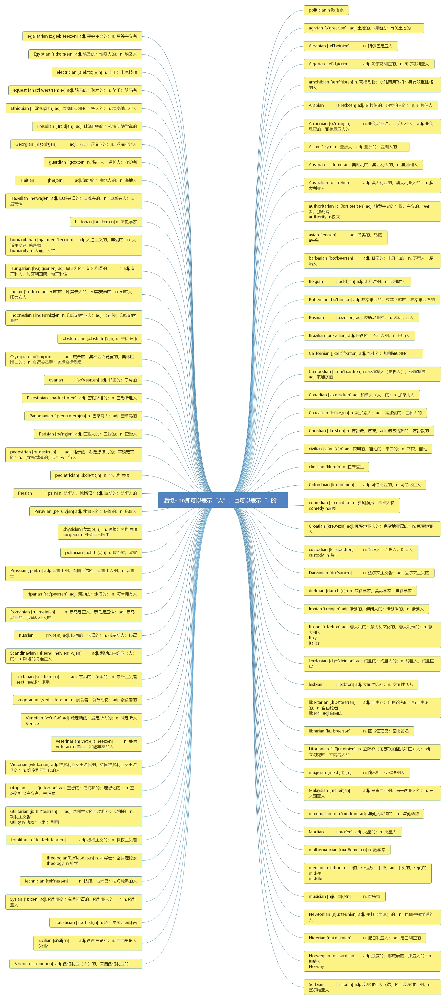

# 第十节 词根-ian

> **本节课目标**
>
> 1、掌握词根-ian 的含义
>
> 2、掌握 104 单词
>
> 3、复习本节课所有单词

***

# 一、后缀-ian 表示“人”， 也可以表示“... 的”； 例如：

***

## 核心词汇：

***

**politics** \[ˈpɒlətɪks]   [英音](https://dict.youdao.com/dictvoice?audio=politics\&type=1)  [美音](https://dict.youdao.com/dictvoice?audio=politics\&type=2) n. 政治，政治学；政治活动；政纲 954

> **【课堂笔记】**
>
> \-ics 名词后缀
>
> 1） 某种学问
>
> 2） 和……相关

**双语例句:** Politics and sports don't mix. [播放](https://dict.youdao.com/dictvoice?audio=Politics+and+sports+don%27t+mix.&le=eng&le=eng&type=2)

政治与体育无法协调一致。 

**双语例句:** Politics doesn't interest me. [播放](https://dict.youdao.com/dictvoice?audio=Politics+doesn%27t+interest+me.&le=eng&le=eng&type=2)

我对政治不感兴趣。 

**双语例句:** Japanese politics are sui generis. [播放](https://dict.youdao.com/dictvoice?audio=Japanese+politics+are+sui+generis.&le=eng&le=eng&type=2)

日本的政治独一无二。 

**原声例句:** He proposed a new civil service system that would let ability -- not **politics** -- decide who got government jobs. [播放](https://dict.youdao.com/pureaudio?docid=-4733350703105222122)

**原声例句:** Experts say it will be hard to find a nominee with as much experience in both health issues and **politics**. [播放](https://dict.youdao.com/pureaudio?docid=-2881043989256414539)

**原声例句:** He became a lawyer. He moved to another northeastern state -- Massachusetts -- where he became active in Republican Party **politics**. [播放](https://dict.youdao.com/pureaudio?docid=-5507754780790427102)

**权威例句:** All week Democrats hammered Mrs Palin for her lack of experience of national or international **politics**.  [播放](https://dict.youdao.com/dictvoice?audio=All+week+Democrats+hammered+Mrs+Palin+for+her+lack+of+experience+of+national+or+international+politics.+&le=eng&type=2)

**权威例句:** And the wheelchair user has been asked whether he would be interested in entering **politics**.  [播放](https://dict.youdao.com/dictvoice?audio=And+the+wheelchair+user+has+been+asked+whether+he+would+be+interested+in+entering+politics.+&le=eng&type=2)

**权威例句:** Last year the government began offering grants to disabled people with aspirations to enter **politics**.  [播放](https://dict.youdao.com/dictvoice?audio=Last+year+the+government+began+offering+grants+to+disabled+people+with+aspirations+to+enter+politics.+&le=eng&type=2)

***

**policy** \['pɔlisi] [英音](https://dict.youdao.com/dictvoice?audio=policy\&type=1)  [美音](https://dict.youdao.com/dictvoice?audio=policy\&type=2)  n. 政策

**双语例句:** This policy is doomed to failure. [播放](https://dict.youdao.com/dictvoice?audio=This+policy+is+doomed+to+failure.&le=eng&le=eng&type=2)

这项政策注定要失败。 

**双语例句:** They are arguing over foreign policy. [播放](https://dict.youdao.com/dictvoice?audio=They+are+arguing+over+foreign+policy.&le=eng&le=eng&type=2)

他们在讨论外交政策。 

**双语例句:** She staunchly defended the new policy. [播放](https://dict.youdao.com/dictvoice?audio=She+staunchly+defended+the+new+policy.&le=eng&le=eng&type=2)

她坚定地维护新政策。 

**原声例句:** Officials from the International Water Management Institute and the International Food **Policy** Research Institute are also taking part in the effort. [播放](https://dict.youdao.com/pureaudio?docid=-6627618059375019691)

**原声例句:** To prevent that from happening, American Secretary of State John Hay proposed what became known as the \"Open Door\" **policy**. [播放](https://dict.youdao.com/pureaudio?docid=641397952465458991)

**原声例句:** Unlike other presidents of the late eighteen hundreds, William McKinley spent much of his presidency dealing with foreign **policy**. [播放](https://dict.youdao.com/pureaudio?docid=1045811763372154381)

**权威例句:** \"There is a public **policy** issue here that has to be debated, \" he said.  [播放](https://dict.youdao.com/dictvoice?audio=%22There+is+a+public+policy+issue+here+that+has+to+be+debated%2C+%22+he+said.+&le=eng&type=2)

**权威例句:** That may have been good economic **policy**, but it hardly promoted uniform accounting standards.  [播放](https://dict.youdao.com/dictvoice?audio=That+may+have+been+good+economic+policy%2C+but+it+hardly+promoted+uniform+accounting+standards.+&le=eng&type=2)

**权威例句:** He is a contributing editor at Foreign **Policy** and writes a weekly column for CNN.com.  [播放](https://dict.youdao.com/dictvoice?audio=He+is+a+contributing+editor+at+Foreign+Policy+and+writes+a+weekly+column+for+CNN.com.+&le=eng&type=2)

***

**political** \[pə'litikəl] [英音](https://dict.youdao.com/dictvoice?audio=political\&type=1)  [美音](https://dict.youdao.com/dictvoice?audio=political\&type=2)  a. 政治的

**双语例句:** What is his political creed? [播放](https://dict.youdao.com/dictvoice?audio=What+is+his+political+creed%3F&le=eng&le=eng&type=2)

他的政治信仰是什么？ 

**双语例句:** He claimed political asylum. [播放](https://dict.youdao.com/dictvoice?audio=He+claimed+political+asylum.&le=eng&le=eng&type=2)

他要求政治避难。 

**双语例句:** She enjoyed political life. [播放](https://dict.youdao.com/dictvoice?audio=She+enjoyed+political+life.&le=eng&le=eng&type=2)

她喜爱政治生活。 

**原声例句:** A group of international students and a professor discuss current social and **political** issues and take questions from the audience. [播放](https://dict.youdao.com/pureaudio?docid=-5986092322535063617)

**原声例句:** It was not unusual to see him exchange handshakes, smiles and jokes with men who were his **political** enemies. [播放](https://dict.youdao.com/pureaudio?docid=-5674713746582241100)

**原声例句:** The United States Supreme Court has cleared the way for independent spending by businesses and labor unions in **political** campaigns. [播放](https://dict.youdao.com/pureaudio?docid=-5203628448170931748)

**权威例句:** The timing and the positioning of these events were dictated by the **political** season.  [播放](https://dict.youdao.com/dictvoice?audio=The+timing+and+the+positioning+of+these+events+were+dictated+by+the+political+season.+&le=eng&type=2)

**权威例句:** This is an American attempt to use a humanitarian situation for a **political** agenda.  [播放](https://dict.youdao.com/dictvoice?audio=This+is+an+American+attempt+to+use+a+humanitarian+situation+for+a+political+agenda.+&le=eng&type=2)

**权威例句:** The statement dismissed the Wikileaks outpourings as \"media games and bubbles motivated by known **political** goals\".  [播放](https://dict.youdao.com/dictvoice?audio=The+statement+dismissed+the+Wikileaks+outpourings+as+%22media+games+and+bubbles+motivated+by+known+political+goals%22.+&le=eng&type=2)

***

**politician** \[,pɔli'tiʃən] [英音](https://dict.youdao.com/dictvoice?audio=politician\&type=1)  [美音](https://dict.youdao.com/dictvoice?audio=politician\&type=2)  n. 政客、 政治家 (=statesman： 政治家)

**双语例句:** This is a wily politician. [播放](https://dict.youdao.com/dictvoice?audio=This+is+a+wily+politician.&le=eng&le=eng&type=2)

这是一个狡猾的政客。 

**双语例句:** He represents a new breed of politician. [播放](https://dict.youdao.com/dictvoice?audio=He+represents+a+new+breed+of+politician.&le=eng&le=eng&type=2)

他代表着新一类的政治家。 

**双语例句:** As a politician he has often courted controversy. [播放](https://dict.youdao.com/dictvoice?audio=As+a+politician+he+has+often+courted+controversy.&le=eng&le=eng&type=2)

作为政治人物，他常常招致争议。 

**原声例句:** The last hurrah also can mean the last acts of a **politician**, before his term in office ends. [播放](https://dict.youdao.com/pureaudio?docid=4927293198565591383)

**原声例句:** Now to the wordplay. Commentators and bloggers often use the word \"gate\" when a **politician** is accused of trying to hide the truth. [播放](https://dict.youdao.com/pureaudio?docid=3732528948570029509)

**原声例句:** The expression may be used to describe a **politician**'s last campaign, his final attempt to win the cheers and votes of the people. [播放](https://dict.youdao.com/pureaudio?docid=4273151803721630950)

**权威例句:** You can see why this impolitic ex-lieutenant governor did not last long as a **politician**.  [播放](https://dict.youdao.com/dictvoice?audio=You+can+see+why+this+impolitic+ex-lieutenant+governor+did+not+last+long+as+a+politician.+&le=eng&type=2)

**权威例句:** The judge wanted to determine how often the **politician** had met Mrs Bettencourt in 2007.  [播放](https://dict.youdao.com/dictvoice?audio=The+judge+wanted+to+determine+how+often+the+politician+had+met+Mrs+Bettencourt+in+2007.+&le=eng&type=2)

**权威例句:** However, Mr Weiner may have taken encouragement from another disgraced **politician** who recently made a comeback.  [播放](https://dict.youdao.com/dictvoice?audio=However%2C+Mr+Weiner+may+have+taken+encouragement+from+another+disgraced+politician+who+recently+made+a+comeback.+&le=eng&type=2)

***

# 二、后缀-ian 表示“人”， 也可以表示“... 的”； 例如：

***

**agrarian** \[ə'greərɪən] [英音](https://dict.youdao.com/dictvoice?audio=agrarian\&type=1)  [美音](https://dict.youdao.com/dictvoice?audio=agrarian\&type=2)  adj. 土地的；耕地的；有关土地的 12621

> **【课堂笔记】**
>
> **助记：** agr- = agriculture 农/田地/土地

**原声例句:** \"How would we justify an essentially **agrarian** country importing most of the food that it eats and then using our lands to produce something else that we don't eat? [播放](https://dict.youdao.com/pureaudio?docid=2236015754490963540)

**原声例句:** It doesn't reflect the interests of people who have been wandering around nomadically. It has laws that deal with settled **agrarian** life.

**原声例句:** 

**权威例句:** Pakistan is an **agrarian** economy and has rural population largely dependent on natural resources.  [播放](https://dict.youdao.com/dictvoice?audio=Pakistan+is+an+agrarian+economy+and+has+rural+population+largely+dependent+on+natural+resources.+&le=eng&type=2)

**权威例句:** The talks are currently in recess after both sides agreed a deal on **agrarian** reform.  [播放](https://dict.youdao.com/dictvoice?audio=The+talks+are+currently+in+recess+after+both+sides+agreed+a+deal+on+agrarian+reform.+&le=eng&type=2)

**权威例句:** But going back to diffuse non-dense **agrarian** sources for energy is to regress , not progress.  [播放](https://dict.youdao.com/dictvoice?audio=But+going+back+to+diffuse+non-dense+agrarian+sources+for+energy+is+to+regress+%2C+not+progress.+&le=eng&type=2)

***

**Albanian** \[æl'beiniən] [英音](https://dict.youdao.com/dictvoice?audio=Albanian\&type=1)  [美音](https://dict.youdao.com/dictvoice?audio=Albanian\&type=2)  n. 阿尔巴尼亚人 12522

> **【课堂笔记】**
>
> Albania n. 阿尔巴尼亚

**Asia** n.亚洲 Asian n.亚洲人 adj. 亚洲人的

**双语例句:** Her parents were Albanian. [播放](https://dict.youdao.com/dictvoice?audio=Her+parents+were+Albanian.&le=eng&le=eng&type=2)

她的父母是阿尔巴尼亚人。 

**双语例句:** The official language is Albanian. [播放](https://dict.youdao.com/dictvoice?audio=The+official+language+is+Albanian.&le=eng&le=eng&type=2)

官方语言是阿而巴尼亚语。 

**双语例句:** There is no report of Albanian activity. [播放](https://dict.youdao.com/dictvoice?audio=There+is+no+report+of+Albanian+activity.&le=eng&le=eng&type=2)

没有关于阿尔巴尼亚活动的报告。 

**原声例句:** 

**原声例句:** 

**原声例句:** 

**权威例句:** This month's peace deal, signed under pressure from Europe and America, accepts most **Albanian** demands.  [播放](https://dict.youdao.com/dictvoice?audio=This+month%27s+peace+deal%2C+signed+under+pressure+from+Europe+and+America%2C+accepts+most+Albanian+demands.+&le=eng&type=2)

**权威例句:** Some 4, 100 people mostly Serbs fled, and 19 people were killed, as **Albanian** extremists ran amok.  [播放](https://dict.youdao.com/dictvoice?audio=Some+4%2C+100+people+mostly+Serbs+fled%2C+and+19+people+were+killed%2C+as+Albanian+extremists+ran+amok.+&le=eng&type=2)

**权威例句:** Three people recalled taking prisoners to a yellow house outside the **Albanian** town of Burrel.  [播放](https://dict.youdao.com/dictvoice?audio=Three+people+recalled+taking+prisoners+to+a+yellow+house+outside+the+Albanian+town+of+Burrel.+&le=eng&type=2)

***

**Algerian** \[æl'dʒiəriən] [英音](https://dict.youdao.com/dictvoice?audio=Algerian\&type=1)  [美音](https://dict.youdao.com/dictvoice?audio=Algerian\&type=2)  adj. 阿尔及利亚的； n. 阿尔及利亚人 14555

**双语例句:** The Algerian authorities have still not named a new head of state. [播放](https://dict.youdao.com/dictvoice?audio=The+Algerian+authorities+have+still+not+named+a+new+head+of+state.&le=eng&le=eng&type=2)

阿尔及利亚当局尚未任命新一任国家首脑。 

**双语例句:** It's an Algerian love knot. [播放](https://dict.youdao.com/dictvoice?audio=It%27s+an+Algerian+love+knot.&le=eng&le=eng&type=2)

那是阿尔及利亚爱情结晶。 

**双语例句:** He's parents are of Algerian origin. [播放](https://dict.youdao.com/dictvoice?audio=He%27s+parents+are+of+Algerian+origin.&le=eng&le=eng&type=2)

他的父母都有阿尔及利亚血统。 

**原声例句:** 

**原声例句:** 

**原声例句:** 

**权威例句:** They hold French citizenship and are awaiting Fifa clearance to feature as **Algerian** internationals.  [播放](https://dict.youdao.com/dictvoice?audio=They+hold+French+citizenship+and+are+awaiting+Fifa+clearance+to+feature+as+Algerian+internationals.+&le=eng&type=2)

**权威例句:** Algeria's security services dismantled the \"dangerous\" network in 2009, the **Algerian** press agency APS reports.  [播放](https://dict.youdao.com/dictvoice?audio=Algeria%27s+security+services+dismantled+the+%22dangerous%22+network+in+2009%2C+the+Algerian+press+agency+APS+reports.+&le=eng&type=2)

**权威例句:** The network behind the alleged trafficking was reportedly composed of both French and **Algerian** nationals.  [播放](https://dict.youdao.com/dictvoice?audio=The+network+behind+the+alleged+trafficking+was+reportedly+composed+of+both+French+and+Algerian+nationals.+&le=eng&type=2)

***

**Algeria** \[æl'dʒɪrɪr] [英音](https://dict.youdao.com/dictvoice?audio=Algeria\&type=1)  [美音](https://dict.youdao.com/dictvoice?audio=Algeria\&type=2)  n. 阿尔及利亚

**双语例句:** There are 94 countries represented in Barcelona, from Algeria to Zimbabwe. [播放](https://dict.youdao.com/dictvoice?audio=There+are+94+countries+represented+in+Barcelona%2C+from+Algeria+to+Zimbabwe.&le=eng&le=eng&type=2)

巴塞罗那有从阿尔及利亚到津巴布韦94个国家的代表处。 

**双语例句:** Algeria has been going through political upheaval for the past two months. [播放](https://dict.youdao.com/dictvoice?audio=Algeria+has+been+going+through+political+upheaval+for+the+past+two+months.&le=eng&le=eng&type=2)

在过去的两个月里，阿尔及利亚一直经历着政治动乱。 

**双语例句:** Official reports in Algeria suggest that calm is returning to the country. [播放](https://dict.youdao.com/dictvoice?audio=Official+reports+in+Algeria+suggest+that+calm+is+returning+to+the+country.&le=eng&le=eng&type=2)

阿尔及利亚官方的报道暗示该国正在恢复平静。 

**原声例句:** Besides England, the United States faces Slovenia and **Algeria** in group play. [播放](https://dict.youdao.com/pureaudio?docid=-9146427610904551530)

**原声例句:** She flew over the terrible fighting and took them to **Algeria**. [播放](https://dict.youdao.com/pureaudio?docid=-9764183190362565)

**原声例句:** They are South Africa, **Algeria**,Cameroon,Ghana, Ivory Coast and Nigeria. [播放](https://dict.youdao.com/pureaudio?docid=5638138593545868090)

**权威例句:** His preachings and ideas won him influence among Islamist groups in **Algeria** and Egypt during the 1990s.  [播放](https://dict.youdao.com/dictvoice?audio=His+preachings+and+ideas+won+him+influence+among+Islamist+groups+in+Algeria+and+Egypt+during+the+1990s.+&le=eng&type=2)

**权威例句:** During these meetings, the Director-General reviewed various aspects of the cooperation between UNESCO and **Algeria**.  [播放](https://dict.youdao.com/dictvoice?audio=During+these+meetings%2C+the+Director-General+reviewed+various+aspects+of+the+cooperation+between+UNESCO+and+Algeria.+&le=eng&type=2)

**权威例句:** Before 2000, America encouraged Argentina to export nuclear research reactors to Peru, Egypt, **Algeria** and Australia.  [播放](https://dict.youdao.com/dictvoice?audio=Before+2000%2C+America+encouraged+Argentina+to+export+nuclear+research+reactors+to+Peru%2C+Egypt%2C+Algeria+and+Australia.+&le=eng&type=2)

***

**amphibian** \[æm'fɪbɪən] [英音](https://dict.youdao.com/dictvoice?audio=amphibian\&type=1)  [美音](https://dict.youdao.com/dictvoice?audio=amphibian\&type=2)  n. 两栖动物；水陆两用飞机；具有双重性格的人； adj. 两栖的，水陆两用的 17127

> **【课堂笔记】**
>
> **amphi**- = both sides：两边，两个
>
> **bi- bio-** = life：生；生活；与生命相关的 例如： biology 生物学

**双语例句:** Why does the speaker choose that amphibian as her representative of a public creature? [播放](https://dict.youdao.com/dictvoice?audio=Why+does+the+speaker+choose+that+amphibian+as+her+representative+of+a+public+creature%3F&le=eng&le=eng&type=2)

为什么那位演讲者要选择这种两栖动物作为公众生物的代表呢？ 

**双语例句:** Both the toad and frog are amphibian. [播放](https://dict.youdao.com/dictvoice?audio=Both+the+toad+and+frog+are+amphibian.&le=eng&le=eng&type=2)

蟾蜍和青蛙都是两栖动物。 

**双语例句:** The sealed bottom is for setting making for amphibian. [播放](https://dict.youdao.com/dictvoice?audio=The+sealed+bottom+is+for+setting+making+for+amphibian.&le=eng&le=eng&type=2)

密封式底部，可供两栖动物造景之用。 

**原声例句:** 

**原声例句:** 

**原声例句:** 

**权威例句:** Our analyses revealed five alpha keratins as main structural proteins of the **amphibian** toe pad.  [播放](https://dict.youdao.com/dictvoice?audio=Our+analyses+revealed+five+alpha+keratins+as+main+structural+proteins+of+the+amphibian+toe+pad.+&le=eng&type=2)

**权威例句:** Ringwood **Amphibian** Conservationists runs an annual patrol by volunteers who assist the toads with the crossing.  [播放](https://dict.youdao.com/dictvoice?audio=Ringwood+Amphibian+Conservationists+runs+an+annual+patrol+by+volunteers+who+assist+the+toads+with+the+crossing.+&le=eng&type=2)

**权威例句:** The UK population is estimated at 180, 000 according to the Surrey **Amphibian** and Reptile Group (SARG).  [播放](https://dict.youdao.com/dictvoice?audio=The+UK+population+is+estimated+at+180%2C+000+according+to+the+Surrey+Amphibian+and+Reptile+Group+%28SARG%29.+&le=eng&type=2)

***

**Arabian** \[ə'reɪbɪən] [英音](https://dict.youdao.com/dictvoice?audio=Arabian\&type=1)  [美音](https://dict.youdao.com/dictvoice?audio=Arabian\&type=2)  adj. 阿拉伯的； 阿拉伯人的； n. 阿拉伯人 11475

**双语例句:** Sandstorms are common during the Saudi Arabian winter. [播放](https://dict.youdao.com/dictvoice?audio=Sandstorms+are+common+during+the+Saudi+Arabian+winter.&le=eng&le=eng&type=2)

在沙特阿拉伯的冬季期间内沙暴很常见。 

**双语例句:** The \"Empty Quarter\" is a huge area of sand that covers about a quarter of the Arabian Peninsula. [播放](https://dict.youdao.com/dictvoice?audio=The+%22Empty+Quarter%22+is+a+huge+area+of+sand+that+covers+about+a+quarter+of+the+Arabian+Peninsula.&le=eng&le=eng&type=2)

“空白之地”是一大片沙地，覆盖了四分之一的阿拉伯半岛。 

**双语例句:** Although men's touching is more normal in these cultures, physical contact between persons of opposite sexes who are not family members is negatively perceived in Arabian countries. [播放](https://dict.youdao.com/dictvoice?audio=Although+men%27s+touching+is+more+normal+in+these+cultures%2C+physical+contact+between+persons+of+opposite+sexes+who+are+not+family+members+is+negatively+perceived+in+Arabian+countries.&le=eng&le=eng&type=2)

尽管男性的身体接触在这些文化中更为正常，但在阿拉伯国家，人们会抵触非家庭成员的异性之间的身体接触。 

**原声例句:** In 2006,the SFO dropped an investigation into allegations that Saudi **Arabian** officials were bribed by BAE, after then British Prime Minister Tony Blair said the probe threatened national security. [播放](https://dict.youdao.com/pureaudio?docid=-4795619141643373310)

**原声例句:** Several detainees returned to Yemen from Guantanamo Bay are now known to have links to al-Qaida in the **Arabian** Peninsula, which has been linked to the attempted airline attack. [播放](https://dict.youdao.com/pureaudio?docid=-6674505137840406648)

**原声例句:** Reports that al-Qaida-trained operatives may be poised to attack American commercial and passenger vessels in the **Arabian** Sea are being widely circulated in Arab-speaking Gulf states, including Kuwait,Bahrain,Qatar, and United Arab Emirates. [播放](https://dict.youdao.com/pureaudio?docid=-8841116434959181216)

**权威例句:** This is a spectacular flagship species that once had a wide distribution on the **Arabian** Peninsula.  [播放](https://dict.youdao.com/dictvoice?audio=This+is+a+spectacular+flagship+species+that+once+had+a+wide+distribution+on+the+Arabian+Peninsula.+&le=eng&type=2)

**权威例句:** The militant group al Qaeda in the **Arabian** Peninsula has claimed responsibility for the plot.  [播放](https://dict.youdao.com/dictvoice?audio=The+militant+group+al+Qaeda+in+the+Arabian+Peninsula+has+claimed+responsibility+for+the+plot.+&le=eng&type=2)

**权威例句:** Take Said Ali al-Shiri, who co-founded Al Qaeda in the **Arabian** Peninsula (AQAP) in 2009.  [播放](https://dict.youdao.com/dictvoice?audio=Take+Said+Ali+al-Shiri%2C+who+co-founded+Al+Qaeda+in+the+Arabian+Peninsula+%28AQAP%29+in+2009.+&le=eng&type=2)

***

**Armenian** \[ɑ:'mi\:njən] [英音](https://dict.youdao.com/dictvoice?audio=Armenian\&type=1)  [美音](https://dict.youdao.com/dictvoice?audio=Armenian\&type=2)  n. 亚美尼亚语； 亚美尼亚人； adj. 亚美尼亚的， 亚美尼亚人的 13887

**双语例句:** They come from Armenian, Bactrian, Indian and Chinese areas. [播放](https://dict.youdao.com/dictvoice?audio=They+come+from+Armenian%2C+Bactrian%2C+Indian+and+Chinese+areas.&le=eng&le=eng&type=2)

他们来自亚美尼亚，大夏，印度和中国地区。 

**双语例句:** These included people and trading goods from the Mediterranean, Persian, Magyar, Armenian, Bactrian, Indian and Chinese areas. [播放](https://dict.youdao.com/dictvoice?audio=These+included+people+and+trading+goods+from+the+Mediterranean%2C+Persian%2C+Magyar%2C+Armenian%2C+Bactrian%2C+Indian+and+Chinese+areas.&le=eng&le=eng&type=2)

这些包括来自地中海、波斯、马扎尔、亚美尼亚、大夏、印度和中国地区的人和商品贸易。 

**双语例句:** It was named by the Armenian commandership. [播放](https://dict.youdao.com/dictvoice?audio=It+was+named+by+the+Armenian+commandership.&le=eng&le=eng&type=2)

它是由亚美尼亚指挥官之职命名的。 

**原声例句:** 

**原声例句:** 

**原声例句:** 

**权威例句:** It overlaps substantially with Little Armenia (www.littlearmenia.com), home to a large Armenian-American community and the St.  [播放](https://dict.youdao.com/dictvoice?audio=It+overlaps+substantially+with+Little+Armenia+%28www.littlearmenia.com%29%2C+home+to+a+large+Armenian-American+community+and+the+St.+&le=eng&type=2)

**权威例句:** \"You go to the Indian market, the **Armenian** market, the Filipino market, \" she said.  [播放](https://dict.youdao.com/dictvoice?audio=%22You+go+to+the+Indian+market%2C+the+Armenian+market%2C+the+Filipino+market%2C+%22+she+said.+&le=eng&type=2)

**权威例句:** From Narmak, we were taken to polling stations for minorities: the synagogue, the **Armenian** church.  [播放](https://dict.youdao.com/dictvoice?audio=From+Narmak%2C+we+were+taken+to+polling+stations+for+minorities%3A+the+synagogue%2C+the+Armenian+church.+&le=eng&type=2)

***

**Asian** \[ˈeʒən, ˈeʃən] [英音](https://dict.youdao.com/dictvoice?audio=Asian\&type=1)  [美音](https://dict.youdao.com/dictvoice?audio=Asian\&type=2) n. 亚洲人； adj. 亚洲的；亚洲人的 2371

**双语例句:** You can't lump all Asian languages together. [播放](https://dict.youdao.com/dictvoice?audio=You+can%27t+lump+all+Asian+languages+together.&le=eng&le=eng&type=2)

你不能把所有的亚洲语言混为一谈。 

**双语例句:** He's the president's go-to guy on Asian politics. [播放](https://dict.youdao.com/dictvoice?audio=He%27s+the+president%27s+go-to+guy+on+Asian+politics.&le=eng&le=eng&type=2)

他是总统的亚洲政治智囊。 

**双语例句:** Investors ranked South Korea high among Asian nations. [播放](https://dict.youdao.com/dictvoice?audio=Investors+ranked+South+Korea+high+among+Asian+nations.&le=eng&le=eng&type=2)

投资者在亚洲国家中更看重韩国。 

**原声例句:** In **Asian** countries, the high demand for shark fins for cooking has led to an illegal trade worth millions of dollars. [播放](https://dict.youdao.com/pureaudio?docid=6459807795096396964)

**原声例句:** For that reason, the researchers designed a study that examined results from a mental-performance test of older **Asian** adults. [播放](https://dict.youdao.com/pureaudio?docid=-5279620487389791245)

**原声例句:** The **Asian** Disaster Preparedness Center says traditional crops like these can survive the fierce storms that often strike the islands. [播放](https://dict.youdao.com/pureaudio?docid=-4309171550464353479)

**权威例句:** And it was the start of what became known as the **Asian** currency crisis in 1997-98.  [播放](https://dict.youdao.com/dictvoice?audio=And+it+was+the+start+of+what+became+known+as+the+Asian+currency+crisis+in+1997-98.+&le=eng&type=2)

**权威例句:** Many southeast **Asian** hotels offer the native brew, or you can order it online.  [播放](https://dict.youdao.com/dictvoice?audio=Many+southeast+Asian+hotels+offer+the+native+brew%2C+or+you+can+order+it+online.+&le=eng&type=2)

**权威例句:** By 2025, the **Asian** nation will have 221 cities with more than a million residents.  [播放](https://dict.youdao.com/dictvoice?audio=By+2025%2C+the+Asian+nation+will+have+221+cities+with+more+than+a+million+residents.+&le=eng&type=2)

***

**Australian** \[ɑ'strelɪən] [英音](https://dict.youdao.com/dictvoice?audio=Australian\&type=1)  [美音](https://dict.youdao.com/dictvoice?audio=Australian\&type=2)  adj. 澳大利亚的， 澳大利亚人的； n. 澳大利亚人 5230

**双语例句:** Two Australian tourists were slain. [播放](https://dict.youdao.com/dictvoice?audio=Two+Australian+tourists+were+slain.&le=eng&le=eng&type=2)

两位澳大利亚游客被谋杀了。 

**双语例句:** She spoke with a strong Australian accent. [播放](https://dict.youdao.com/dictvoice?audio=She+spoke+with+a+strong+Australian+accent.&le=eng&le=eng&type=2)

她说话带有浓重的澳大利亚口音。 

**双语例句:** The Australian team will be seated in business class. [播放](https://dict.youdao.com/dictvoice?audio=The+Australian+team+will+be+seated+in+business+class.&le=eng&le=eng&type=2)

澳大利亚队将乘坐商务舱。 

**原声例句:** Admiral Michael Mullen, chairman of the Joint Chiefs of Staff, criticized the **Australian**-born founder of WikiLeaks,Julian Assange. [播放](https://dict.youdao.com/pureaudio?docid=1094109047025726305)

**原声例句:** Christina Aguilera worked with different songwriters on the album including Linda Perry and the **Australian** singer-songwriter Sia. [播放](https://dict.youdao.com/pureaudio?docid=-3487715874838609838)

**原声例句:** Another doctor in the film, **Australian** Chris Brasheer, has been with Doctors Without Borders for nine years. [播放](https://dict.youdao.com/pureaudio?docid=4689931380526313301)

**权威例句:** The battle for control of **Australian** gold producer Normandy appears to be nearing the end.  [播放](https://dict.youdao.com/dictvoice?audio=The+battle+for+control+of+Australian+gold+producer+Normandy+appears+to+be+nearing+the+end.+&le=eng&type=2)

**权威例句:** Other airports testing NFC technology include France's Toulouse-Blagnac airport and several **Australian** airport gates run by Qantas.  [播放](https://dict.youdao.com/dictvoice?audio=Other+airports+testing+NFC+technology+include+France%27s+Toulouse-Blagnac+airport+and+several+Australian+airport+gates+run+by+Qantas.+&le=eng&type=2)

**权威例句:** Even if your visit extends only as far as Sydney, don't give up on seeing **Australian** wildlife.  [播放](https://dict.youdao.com/dictvoice?audio=Even+if+your+visit+extends+only+as+far+as+Sydney%2C+don%27t+give+up+on+seeing+Australian+wildlife.+&le=eng&type=2)

***

**Austrian** \['ɔstriən] [英音](https://dict.youdao.com/dictvoice?audio=Austrian\&type=1)  [美音](https://dict.youdao.com/dictvoice?audio=Austrian\&type=2)  adj. 奥地利的；奥地利人的； n. 奥地利人 10759

**双语例句:** In recent years the Austrian economy has outperformed most other industrial economies. [播放](https://dict.youdao.com/dictvoice?audio=In+recent+years+the+Austrian+economy+has+outperformed+most+other+industrial+economies.&le=eng&le=eng&type=2)

近年来奥地利的经济已经超过了其他大多数的工业经济。 

**双语例句:** Austrian women receive $700 a month for three years when they have their first child. [播放](https://dict.youdao.com/dictvoice?audio=Austrian+women+receive+%24700+a+month+for+three+years+when+they+have+their+first+child.&le=eng&le=eng&type=2)

奥地利妇女在生育第一个孩子后，连续三年每月可获得700美元。 

**双语例句:** That tradition is said to have started when an Austrian man gave a  a diamond ring tothe woman he wanted to marry. [播放](https://dict.youdao.com/dictvoice?audio=That+tradition+is+said+to+have+started+when+an+Austrian+man+gave+a++a+diamond+ring+tothe+woman+he+wanted+to+marry.&le=eng&le=eng&type=2)

据说这一传统来源于一位奥地利男子送了一枚钻石戒指给他想娶的女人的故事。 

**原声例句:** Seven young extremists from the area decided to assassinate the Archduke to protest **Austrian** control. [播放](https://dict.youdao.com/pureaudio?docid=4946847972584932455)

**原声例句:** **Austrian** composer Arnold Schoenberg was one of the people who praised George Gershwin. [播放](https://dict.youdao.com/pureaudio?docid=-7946447793373715822)

**原声例句:** In the battle,allied French and Sardinian troops defeated the **Austrian** army. [播放](https://dict.youdao.com/pureaudio?docid=-3303818770702998382)

**权威例句:** **Austrian** president Thomas Klestil insists common European values of democracy and pluralism will continue to apply.  [播放](https://dict.youdao.com/dictvoice?audio=Austrian+president+Thomas+Klestil+insists+common+European+values+of+democracy+and+pluralism+will+continue+to+apply.+&le=eng&type=2)

**权威例句:** Hutterites are an Anabaptist sect, founded by **Austrian** preacher Jakob Hutter, in the 16th Century.  [播放](https://dict.youdao.com/dictvoice?audio=Hutterites+are+an+Anabaptist+sect%2C+founded+by+Austrian+preacher+Jakob+Hutter%2C+in+the+16th+Century.+&le=eng&type=2)

**权威例句:** **Austrian** pair Nicole Hosp and Michaela Kirchgasser finished second and third at 0.82 and 0.90 seconds.  [播放](https://dict.youdao.com/dictvoice?audio=Austrian+pair+Nicole+Hosp+and+Michaela+Kirchgasser+finished+second+and+third+at+0.82+and+0.90+seconds.+&le=eng&type=2)

***

**authoritarian** \[ɔ:,θɒrɪ'teərɪən] [英音](https://dict.youdao.com/dictvoice?audio=authoritarian\&type=1)  [美音](https://dict.youdao.com/dictvoice?audio=authoritarian\&type=2)  adj. 独裁主义的；权力主义的；专制者；独裁者 7169

**双语例句:** Father was a strict authoritarian. [播放](https://dict.youdao.com/dictvoice?audio=Father+was+a+strict+authoritarian.&le=eng&le=eng&type=2)

父亲是个严厉的专制主义者。 

**双语例句:** Senior officers could be considering a coup to restore authoritarian rule. [播放](https://dict.youdao.com/dictvoice?audio=Senior+officers+could+be+considering+a+coup+to+restore+authoritarian+rule.&le=eng&le=eng&type=2)

高级军官们可能会考虑发动一场政变来恢复独裁统治。 

**双语例句:** He is a strict authoritarian. [播放](https://dict.youdao.com/dictvoice?audio=He+is+a+strict+authoritarian.&le=eng&le=eng&type=2)

他是一个绝对的权利主义者。 

**原声例句:** Indonesia is a relatively new democracy and the proposal to expand police powers reminds some human rights groups of the country's **authoritarian** past. [播放](https://dict.youdao.com/pureaudio?docid=-7083732137443226223)

**原声例句:** The **authoritarian** techniques dynasty are pretty effective in using both rewards and fear to maintain personal control,\". [播放](https://dict.youdao.com/pureaudio?docid=-7693398178184440174)

**原声例句:** The Yellow Shirts draw much of their support from middle-class and wealthy Thais, and they consider Mr.Thaksin to have been corrupt and **authoritarian**. [播放](https://dict.youdao.com/pureaudio?docid=7446586497795798418)

**权威例句:** He has ruled as an **authoritarian** and Shia sectarian and has allied himself with Iran.  [播放](https://dict.youdao.com/dictvoice?audio=He+has+ruled+as+an+authoritarian+and+Shia+sectarian+and+has+allied+himself+with+Iran.+&le=eng&type=2)

**权威例句:** How does this justify an overwhelmingly **authoritarian**, fraudulent and thuggish regime like the Bolivarian one?  [播放](https://dict.youdao.com/dictvoice?audio=How+does+this+justify+an+overwhelmingly+authoritarian%2C+fraudulent+and+thuggish+regime+like+the+Bolivarian+one%3F+&le=eng&type=2)

**权威例句:** Is it his **authoritarian** streak that led him to appoint an inert prime minister?  [播放](https://dict.youdao.com/dictvoice?audio=Is+it+his+authoritarian+streak+that+led+him+to+appoint+an+inert+prime+minister%3F+&le=eng&type=2)

***

**avian** \['eɪvɪən] [英音](https://dict.youdao.com/dictvoice?audio=avian\&type=1)  [美音](https://dict.youdao.com/dictvoice?audio=avian\&type=2)  adj. 鸟类的；鸟的 15092

> **【课堂笔记】**
>
> av 鸟
>
> aviate = av（ 鸟） + -i-（ 连接作用） +-ate（ 动词后缀） → 使像鸟一样的飞行→飞行

**双语例句:** Hypotheses regarding dinosaurian and avian evolution are unusually diverse—and often at odds with one another. [播放](https://dict.youdao.com/dictvoice?audio=Hypotheses+regarding+dinosaurian+and+avian+evolution+are+unusually+diverse%E2%80%94and+often+at+odds+with+one+another.&le=eng&le=eng&type=2)

关于恐龙和鸟类进化的假说有不同寻常的分歧，而且常常互相矛盾。 

**双语例句:** These results confirmed that avian species can develop preferences for palatable food through social learning. [播放](https://dict.youdao.com/dictvoice?audio=These+results+confirmed+that+avian+species+can+develop+preferences+for+palatable+food+through+social+learning.&le=eng&le=eng&type=2)

这些结果证实了鸟类可以通过社会学习来发展对美味食物的偏好。 

**双语例句:** From ferocious birds of prey to shy songbirds, Zuckerman has captured our avian neighbors in fascinating new ways. [播放](https://dict.youdao.com/dictvoice?audio=From+ferocious+birds+of+prey+to+shy+songbirds%2C+Zuckerman+has+captured+our+avian+neighbors+in+fascinating+new+ways.&le=eng&le=eng&type=2)

从凶猛的猛禽到害羞的鸣禽，祖克曼用这种迷人的新方式来捕获了我们的鸟类邻居。 

**原声例句:** \"In our pandemic work, we were really focusing on the **avian** influenza, mostly in Asia and Africa, so the assumption that the next pandemic would start overseas, far from the U.S., turned out not to be true.\" [播放](https://dict.youdao.com/pureaudio?docid=5235930518033926958)

**原声例句:** 

**原声例句:** 

**权威例句:** Also more human than **avian**, also unrecognisable to me, also coming from treetop height.  [播放](https://dict.youdao.com/dictvoice?audio=Also+more+human+than+avian%2C+also+unrecognisable+to+me%2C+also+coming+from+treetop+height.+&le=eng&type=2)

**权威例句:** The H7N9 strain is a form of **avian** flu not previously found in humans.  [播放](https://dict.youdao.com/dictvoice?audio=The+H7N9+strain+is+a+form+of+avian+flu+not+previously+found+in+humans.+&le=eng&type=2)

**权威例句:** The best way to prevent a human epidemic, of course, is to end the **avian** one.  [播放](https://dict.youdao.com/dictvoice?audio=The+best+way+to+prevent+a+human+epidemic%2C+of+course%2C+is+to+end+the+avian+one.+&le=eng&type=2)

***

**barbarian** \[bɑ:'beərɪən] [英音](https://dict.youdao.com/dictvoice?audio=barbarian\&type=1)  [美音](https://dict.youdao.com/dictvoice?audio=barbarian\&type=2)  adj. 野蛮的；未开化的； n. 野蛮人，原始人 15075

> **【课堂笔记】**
>
> The Barbarian at the Gate 《门口的野蛮人》

**双语例句:** We need to fight this barbarian attitude to science. [播放](https://dict.youdao.com/dictvoice?audio=We+need+to+fight+this+barbarian+attitude+to+science.&le=eng&le=eng&type=2)

我们需要向这种对待科学的野蛮态度作斗争。 

**双语例句:** Our maths teacher was a bully and a complete barbarian. [播放](https://dict.youdao.com/dictvoice?audio=Our+maths+teacher+was+a+bully+and+a+complete+barbarian.&le=eng&le=eng&type=2)

我们的数学老师是个恶霸，十足的野蛮人。 

**双语例句:** He has the heart of a Barbarian! [播放](https://dict.youdao.com/dictvoice?audio=He+has+the+heart+of+a+Barbarian%21&le=eng&le=eng&type=2)

他有颗野蛮人的心！ 

**原声例句:** Mr.Erdogan accused Israel of \"**barbarian** acts\" during the 22-day Gaza incursion, which Israel launched in response to a wave of deadly rocket attacks from Palestinian territory. [播放](https://dict.youdao.com/pureaudio?docid=-155004071274486346)

**原声例句:** The Greeks would have thought you were out of your mind, or that you were some kind of **barbarian**, but that's okay.

**原声例句:** Now not on the east coast, when you get to the Caucuses you are in **barbarian** territory.

**权威例句:** Its early titles included **Barbarian** and Shadow of the Beast for the Amiga and Atari ST.  [播放](https://dict.youdao.com/dictvoice?audio=Its+early+titles+included+Barbarian+and+Shadow+of+the+Beast+for+the+Amiga+and+Atari+ST.+&le=eng&type=2)

**权威例句:** \"Unfortunately, (the) Syrian regime carried out **barbarian** attacks against civilians in Anbar province, \" he said Wednesday.  [播放](https://dict.youdao.com/dictvoice?audio=%22Unfortunately%2C+%28the%29+Syrian+regime+carried+out+barbarian+attacks+against+civilians+in+Anbar+province%2C+%22+he+said+Wednesday.+&le=eng&type=2)

**权威例句:** Neither **barbarian** invasions nor the long centuries had disturbed the sense of sanctuary in the old monastery.  [播放](https://dict.youdao.com/dictvoice?audio=Neither+barbarian+invasions+nor+the+long+centuries+had+disturbed+the+sense+of+sanctuary+in+the+old+monastery.+&le=eng&type=2)

***

**Belgian** \['beldʒən] [英音](https://dict.youdao.com/dictvoice?audio=Belgian\&type=1)  [美音](https://dict.youdao.com/dictvoice?audio=Belgian\&type=2)  adj. 比利时的； n. 比利时人 10676

**Belgium** \['bɛldʒəm] [英音](https://dict.youdao.com/dictvoice?audio=Belgium\&type=1)  [美音](https://dict.youdao.com/dictvoice?audio=Belgium\&type=2)  n. 比利时

**双语例句:** He emigrated to Belgium. [播放](https://dict.youdao.com/dictvoice?audio=He+emigrated+to+Belgium.&le=eng&le=eng&type=2)

他移民去了比利时。 

**双语例句:** They arrived in Belgium by airplane. [播放](https://dict.youdao.com/dictvoice?audio=They+arrived+in+Belgium+by+airplane.&le=eng&le=eng&type=2)

他们乘飞机到达比利时。 

**双语例句:** She is a frequent traveller to Belgium. [播放](https://dict.youdao.com/dictvoice?audio=She+is+a+frequent+traveller+to+Belgium.&le=eng&le=eng&type=2)

她经常到比利时去旅行。 

**原声例句:** Maarten Lansberg at the Stanford University medical school in California worked with scientists from **Belgium** and Germany. [播放](https://dict.youdao.com/pureaudio?docid=-3384706494911892612)

**原声例句:** They did not wait for Norway or **Belgium** or the Netherlands to commit an act of war.\" [播放](https://dict.youdao.com/pureaudio?docid=-847766171753085354)

**原声例句:** It has been reported in many European countries including France, **Belgium**,Spain and the Netherlands. [播放](https://dict.youdao.com/pureaudio?docid=-1435596899039261451)

**权威例句:** The Mobile International segment covers the following sub segments: Germany, **Belgium**, and Rest of the World.  [播放](https://dict.youdao.com/dictvoice?audio=The+Mobile+International+segment+covers+the+following+sub+segments%3A+Germany%2C+Belgium%2C+and+Rest+of+the+World.+&le=eng&type=2)

**权威例句:** By the time she returned home to **Belgium** three months later, her outlook had changed completely.  [播放](https://dict.youdao.com/dictvoice?audio=By+the+time+she+returned+home+to+Belgium+three+months+later%2C+her+outlook+had+changed+completely.+&le=eng&type=2)

**权威例句:** The 25-year-old was knocked out of the compound discipline by eventual silver medallist Gladys Willems from **Belgium**.  [播放](https://dict.youdao.com/dictvoice?audio=The+25-year-old+was+knocked+out+of+the+compound+discipline+by+eventual+silver+medallist+Gladys+Willems+from+Belgium.+&le=eng&type=2)

**双语例句:** I had assumed him to be a Belgian. [播放](https://dict.youdao.com/dictvoice?audio=I+had+assumed+him+to+be+a+Belgian.&le=eng&le=eng&type=2)

我本以为他是比利时人。 

**双语例句:** The Belgian actor Jean Claude Van Damme has been dubbed 'Muscles from Brussels'. [播放](https://dict.youdao.com/dictvoice?audio=The+Belgian+actor+Jean+Claude+Van+Damme+has+been+dubbed+%27Muscles+from+Brussels%27.&le=eng&le=eng&type=2)

比利时演员让•克劳德•范•达默被戏称为“布鲁塞尔的肌肉”。 

**双语例句:** Upon a negative decision, the applicant loses the protection offered by Belgian law. [播放](https://dict.youdao.com/dictvoice?audio=Upon+a+negative+decision%2C+the+applicant+loses+the+protection+offered+by+Belgian+law.&le=eng&le=eng&type=2)

一旦得到否定裁决，申请人就失去了比利时法律所给予的保护。 

**原声例句:** And **Belgian** White carrots are, as their name suggests,white. [播放](https://dict.youdao.com/pureaudio?docid=4195254780574248037)

**原声例句:** He was also criticized for making a number of gaffes, including not appearing to know the **Belgian** national anthem. [播放](https://dict.youdao.com/pureaudio?docid=-5853855160490713287)

**原声例句:** Ghana was forced to fight short-handed after seeing defender Daniel Addo sent off by the **Belgian** referee following what seemed like an innocuous tackle in the first half. [播放](https://dict.youdao.com/pureaudio?docid=-5403570087177899244)

**权威例句:** Across town, in the Indira Nagar area, Toit Brewpub serves up Basmati blondes and **Belgian** whites.  [播放](https://dict.youdao.com/dictvoice?audio=Across+town%2C+in+the+Indira+Nagar+area%2C+Toit+Brewpub+serves+up+Basmati+blondes+and+Belgian+whites.+&le=eng&type=2)

**权威例句:** For a rich, flavourful pint, try Wedge's **Belgian** Abbey Ale, a bit nutty with some caramel hints.  [播放](https://dict.youdao.com/dictvoice?audio=For+a+rich%2C+flavourful+pint%2C+try+Wedge%27s+Belgian+Abbey+Ale%2C+a+bit+nutty+with+some+caramel+hints.+&le=eng&type=2)

**权威例句:** Expect to find **Belgian** Trappist, wheat and fruity beers, some 20 draught beers and at least six ales.  [播放](https://dict.youdao.com/dictvoice?audio=Expect+to+find+Belgian+Trappist%2C+wheat+and+fruity+beers%2C+some+20+draught+beers+and+at+least+six+ales.+&le=eng&type=2)

***

**Bohemian** \[bo'himɪən] [英音](https://dict.youdao.com/dictvoice?audio=Bohemian\&type=1)  [美音](https://dict.youdao.com/dictvoice?audio=Bohemian\&type=2)  adj. 波希米亚的；放荡不羁的；波希米亚语的； n. 放荡不羁的文化人 15085

**双语例句:** She has a fine collection of Bohemian glass. [播放](https://dict.youdao.com/dictvoice?audio=She+has+a+fine+collection+of+Bohemian+glass.&le=eng&le=eng&type=2)

她收藏了一批做工精细的波希米亚玻璃制品。 

**双语例句:** We splurged on Bohemian glass for gifts, and for ourselves. [播放](https://dict.youdao.com/dictvoice?audio=We+splurged+on+Bohemian+glass+for+gifts%2C+and+for+ourselves.&le=eng&le=eng&type=2)

我们花了很多钱买了波希米亚玻璃制品，用来送人和给自己用。 

**双语例句:** She fancies herself a bohemian. [播放](https://dict.youdao.com/dictvoice?audio=She+fancies+herself+a+bohemian.&le=eng&le=eng&type=2)

她自命为一个放荡不羁的艺术家。 

**原声例句:** Exactly. Now,all the fans would enjoy half-smokes and Natty-Boh's - That's National **Bohemian**, the local brew. [播放](https://dict.youdao.com/pureaudio?docid=7011568435331103346)

**原声例句:** And that's what Neal Cassady was to them at first, a kind of wanderer who wanted to be in their intellectual, but **bohemian**, circle.

**原声例句:** 

**权威例句:** Located in an imposing art deco building in San Telmo, Moreno captures the city's **bohemian** heritage.  [播放](https://dict.youdao.com/dictvoice?audio=Located+in+an+imposing+art+deco+building+in+San+Telmo%2C+Moreno+captures+the+city%27s+bohemian+heritage.+&le=eng&type=2)

**权威例句:** Here cobbled alleys lead to synagogues, **bohemian** cafes and restaurants with live klezmer (Jewish folk music).  [播放](https://dict.youdao.com/dictvoice?audio=Here+cobbled+alleys+lead+to+synagogues%2C+bohemian+cafes+and+restaurants+with+live+klezmer+%28Jewish+folk+music%29.+&le=eng&type=2)

**权威例句:** Once upon a time SoHo was a **Bohemian** paradise filled with artists and art making.  [播放](https://dict.youdao.com/dictvoice?audio=Once+upon+a+time+SoHo+was+a+Bohemian+paradise+filled+with+artists+and+art+making.+&le=eng&type=2)

***

**Bosnian** \[bɔzni:ən] [英音](https://dict.youdao.com/dictvoice?audio=Bosnian\&type=1)  [美音](https://dict.youdao.com/dictvoice?audio=Bosnian\&type=2)  adj. 波斯尼亚的； n. 波斯尼亚人 6658

**双语例句:** For almost 11 months, the Bosnian army chalked up one victory after another. [播放](https://dict.youdao.com/dictvoice?audio=For+almost+11+months%2C+the+Bosnian+army+chalked+up+one+victory+after+another.&le=eng&le=eng&type=2)

在差不多十一个月的时间里，波斯尼亚军队取得了一个又一个的胜利。 

**双语例句:** Several hundred Bosnian refugees and émigrés demonstrated outside the main entrance. [播放](https://dict.youdao.com/dictvoice?audio=Several+hundred+Bosnian+refugees+and+%C3%A9migr%C3%A9s+demonstrated+outside+the+main+entrance.&le=eng&le=eng&type=2)

数百位波斯尼亚难民和政治流亡者在主入口外示威。 

**双语例句:** Ah, Bosnian girls… they are the prettiest in the world! [播放](https://dict.youdao.com/dictvoice?audio=Ah%2C+Bosnian+girls%E2%80%A6+they+are+the+prettiest+in+the+world%21&le=eng&le=eng&type=2)

啊，波西尼亚女孩，他们是世界上最美丽的女孩。 

**原声例句:** 

**原声例句:** 

**原声例句:** 

**权威例句:** Last month Nato raided two **Bosnian** Serb military installations, saying they were eavesdropping of the alliance's signals.  [播放](https://dict.youdao.com/dictvoice?audio=Last+month+Nato+raided+two+Bosnian+Serb+military+installations%2C+saying+they+were+eavesdropping+of+the+alliance%27s+signals.+&le=eng&type=2)

**权威例句:** Silajdzic assured congressmen worried about the United States being drawn into the longstanding **Bosnian** conflict.  [播放](https://dict.youdao.com/dictvoice?audio=Silajdzic+assured+congressmen+worried+about+the+United+States+being+drawn+into+the+longstanding+Bosnian+conflict.+&le=eng&type=2)

**权威例句:** The up-and-coming tennis star Bernard Tomic was born in Germany, of **Bosnian** and Croatian parents.  [播放](https://dict.youdao.com/dictvoice?audio=The+up-and-coming+tennis+star+Bernard+Tomic+was+born+in+Germany%2C+of+Bosnian+and+Croatian+parents.+&le=eng&type=2)

***

**Brazilian** \[brəˈzɪliən] [英音](https://dict.youdao.com/dictvoice?audio=Brazilian\&type=1)  [美音](https://dict.youdao.com/dictvoice?audio=Brazilian\&type=2)  adj. 巴西的； 巴西人的； n. 巴西人 6495

**双语例句:** I am proud of my Brazilian roots. [播放](https://dict.youdao.com/dictvoice?audio=I+am+proud+of+my+Brazilian+roots.&le=eng&le=eng&type=2)

我为自己的巴西血统而自豪。 

**双语例句:** The republic is a dominion of the Brazilian people. [播放](https://dict.youdao.com/dictvoice?audio=The+republic+is+a+dominion+of+the+Brazilian+people.&le=eng&le=eng&type=2)

该共和国的领土属于全体巴西人民。 

**双语例句:** The entire Brazilian people are united by their love of football. [播放](https://dict.youdao.com/dictvoice?audio=The+entire+Brazilian+people+are+united+by+their+love+of+football.&le=eng&le=eng&type=2)

整个巴西民族由其对足球的热爱团结在一起。 

**原声例句:** Marcelo D2 became famous when he created a new form of hip-hop by mixing it with the **Brazilian** music called samba. [播放](https://dict.youdao.com/pureaudio?docid=388718170761147513)

**原声例句:** In the **Brazilian** movie \"Mister Bene Goes to Italy\", a manioc flour producer travels from Brazil to Italy. [播放](https://dict.youdao.com/pureaudio?docid=-5297773079455392964)

**原声例句:** This song by the **Brazilian** composer Antonio Carlos Jobim first became famous in the early nineteen sixties. [播放](https://dict.youdao.com/pureaudio?docid=-4038834860355545973)

**权威例句:** According to some analysts, the fundamental pillars of the **Brazilian** economy are being eroded.  [播放](https://dict.youdao.com/dictvoice?audio=According+to+some+analysts%2C+the+fundamental+pillars+of+the+Brazilian+economy+are+being+eroded.+&le=eng&type=2)

**权威例句:** **Brazilian** businesses are wary of foreign competition and seek out the government for protection, he said.  [播放](https://dict.youdao.com/dictvoice?audio=Brazilian+businesses+are+wary+of+foreign+competition+and+seek+out+the+government+for+protection%2C+he+said.+&le=eng&type=2)

**权威例句:** **Brazilian** firms need to realize that international partnerships are beneficial and help mitigate risks, he added.  [播放](https://dict.youdao.com/dictvoice?audio=Brazilian+firms+need+to+realize+that+international+partnerships+are+beneficial+and+help+mitigate+risks%2C+he+added.+&le=eng&type=2)

***

**Californian** \[ˌkælɪˈfɔ\:nɪən] [英音](https://dict.youdao.com/dictvoice?audio=Californian\&type=1)  [美音](https://dict.youdao.com/dictvoice?audio=Californian\&type=2)  adj. 加州的； 加利福尼亚的； n. 加利福尼亚人 11801

**California** \[,kælɪ'fɔ\:njə] [英音](https://dict.youdao.com/dictvoice?audio=California\&type=1)  [美音](https://dict.youdao.com/dictvoice?audio=California\&type=2)  n. 加州； 加利福尼亚 17408

**双语例句:** We are going west to California. [播放](https://dict.youdao.com/dictvoice?audio=We+are+going+west+to+California.&le=eng&le=eng&type=2)

我们将往西去加利福尼亚。 

**双语例句:** She's away at college in California. [播放](https://dict.youdao.com/dictvoice?audio=She%27s+away+at+college+in+California.&le=eng&le=eng&type=2)

她去加利福尼亚上大学了。 

**双语例句:** He asked me to go to California with him. [播放](https://dict.youdao.com/dictvoice?audio=He+asked+me+to+go+to+California+with+him.&le=eng&le=eng&type=2)

他邀我和他一起去加利福尼亚。 

**原声例句:** He leads a big church in **California** and has sold millions of copies of books about \"The Purpose Driven Life.\" [播放](https://dict.youdao.com/pureaudio?docid=-4744839594800728948)

**原声例句:** Ellen Yeh from the Stanford University School of Medicine in **California** was one of the authors of the study. [播放](https://dict.youdao.com/pureaudio?docid=-4602516523118990791)

**原声例句:** That was mostly when fuel prices were so high last year that people in **California** were not driving to her stores. [播放](https://dict.youdao.com/pureaudio?docid=-4577009425408619638)

**权威例句:** Sombart clearly was exaggerating, but the role of Jews in **California** was highly significant.  [播放](https://dict.youdao.com/dictvoice?audio=Sombart+clearly+was+exaggerating%2C+but+the+role+of+Jews+in+California+was+highly+significant.+&le=eng&type=2)

**权威例句:** In 2009, she earned a Journalism Law School fellowship from Loyola Law School in **California**.  [播放](https://dict.youdao.com/dictvoice?audio=In+2009%2C+she+earned+a+Journalism+Law+School+fellowship+from+Loyola+Law+School+in+California.+&le=eng&type=2)

**权威例句:** Whether in **California** or Calcutta, it boils down to the existential question: Do humans matter?  [播放](https://dict.youdao.com/dictvoice?audio=Whether+in+California+or+Calcutta%2C+it+boils+down+to+the+existential+question%3A+Do+humans+matter%3F+&le=eng&type=2)

**双语例句:** The owl is sacred for many Californian Indian people. [播放](https://dict.youdao.com/dictvoice?audio=The+owl+is+sacred+for+many+Californian+Indian+people.&le=eng&le=eng&type=2)

猫头鹰对于很多加利福利亚的印第安人来说是神圣的。 

**双语例句:** Now a Californian software consultant called Maureen Clemmons has suggested that kites might have been involved. [播放](https://dict.youdao.com/dictvoice?audio=Now+a+Californian+software+consultant+called+Maureen+Clemmons+has+suggested+that+kites+might+have+been+involved.&le=eng&le=eng&type=2)

现在，加州一位名叫莫林·克莱蒙斯的软件顾问表示，风筝可能与此有关。 

**双语例句:** However, repeat blind tastings in 1978, 1986, and 2006 of the same vintages all favored the same Californian wines.  [播放](https://dict.youdao.com/dictvoice?audio=However%2C+repeat+blind+tastings+in+1978%2C+1986%2C+and+2006+of+the+same+vintages+all+favored+the+same+Californian+wines.+&le=eng&le=eng&type=2)

然而，在1978年、1986年和2006年重复进行的盲品会中，人们都选择了同样的加州葡萄酒。 

**原声例句:** 

**原声例句:** 

**原声例句:** 

**权威例句:** Long before the Wall Street crisis, many **Californian** cities had their own mini meltdowns.  [播放](https://dict.youdao.com/dictvoice?audio=Long+before+the+Wall+Street+crisis%2C+many+Californian+cities+had+their+own+mini+meltdowns.+&le=eng&type=2)

**权威例句:** The innovative mobile parking solution, ParkNow, will debut in the **Californian** city in September.  [播放](https://dict.youdao.com/dictvoice?audio=The+innovative+mobile+parking+solution%2C+ParkNow%2C+will+debut+in+the+Californian+city+in+September.+&le=eng&type=2)

**权威例句:** Even Cesar Chavez, the famed **Californian** farm workers' leader, never held off 80 gunslingers single-handed.  [播放](https://dict.youdao.com/dictvoice?audio=Even+Cesar+Chavez%2C+the+famed+Californian+farm+workers%27+leader%2C+never+held+off+80+gunslingers+single-handed.+&le=eng&type=2)

***

**Cambodian** \[kæm'bəʊdɪən] [英音](https://dict.youdao.com/dictvoice?audio=Cambodian\&type=1)  [美音](https://dict.youdao.com/dictvoice?audio=Cambodian\&type=2)  n. 柬埔寨人（ 高棉人）； 柬埔寨语； adj. 柬埔寨的 15477

**双语例句:** In the game, players navigate photos of Cambodian jungle landscapes in search of photos for several adorable cartoon pets. [播放](https://dict.youdao.com/dictvoice?audio=In+the+game%2C+players+navigate+photos+of+Cambodian+jungle+landscapes+in+search+of+photos+for+several+adorable+cartoon+pets.&le=eng&le=eng&type=2)

在游戏中，玩家浏览柬埔寨丛林的照片，寻找几只可爱的卡通宠物的照片。 

**双语例句:** Angelina adopted Maddox when he was just seven months old after she visited a Cambodian orphanage while shooting her film Lara Croft: Tomb Raider in 2002. [播放](https://dict.youdao.com/dictvoice?audio=Angelina+adopted+Maddox+when+he+was+just+seven+months+old+after+she+visited+a+Cambodian+orphanage+while+shooting+her+film+Lara+Croft%3A+Tomb+Raider+in+2002.&le=eng&le=eng&type=2)

2002年，安吉丽娜在拍摄电影《古墓丽影》时访问了柬埔寨的一家孤儿院，并收养了当时只有七个月大的马多克斯。 

**双语例句:** In March the court's Cambodian side will run out of money. [播放](https://dict.youdao.com/dictvoice?audio=In+March+the+court%27s+Cambodian+side+will+run+out+of+money.&le=eng&le=eng&type=2)

3月份，法庭中的柬埔寨一方将资金耗尽。 

**原声例句:** 

**原声例句:** 

**原声例句:** 

**权威例句:** Persian ( 16 March), **Cambodian** ( 21 April) and Hindu New Year (2 November) workshops are also scheduled.  [播放](https://dict.youdao.com/dictvoice?audio=Persian+%28+16+March%29%2C+Cambodian+%28+21+April%29+and+Hindu+New+Year+%282+November%29+workshops+are+also+scheduled.+&le=eng&type=2)

**权威例句:** In December the international prosecutor publicly disagreed with his **Cambodian** co-counsel's refusal to seek other defendants.  [播放](https://dict.youdao.com/dictvoice?audio=In+December+the+international+prosecutor+publicly+disagreed+with+his+Cambodian+co-counsel%27s+refusal+to+seek+other+defendants.+&le=eng&type=2)

**权威例句:** The Thai army also forced **Cambodian** operators to abandon two casinos in O'Smach, opposite Surin province.  [播放](https://dict.youdao.com/dictvoice?audio=The+Thai+army+also+forced+Cambodian+operators+to+abandon+two+casinos+in+O%27Smach%2C+opposite+Surin+province.+&le=eng&type=2)

***

**Canadian** \[kə'neɪdɪən] [英音](https://dict.youdao.com/dictvoice?audio=Canadian\&type=1)  [美音](https://dict.youdao.com/dictvoice?audio=Canadian\&type=2)  adj. 加拿大（ 人） 的； n. 加拿大人 2661

**双语例句:** I'm not American, I'm Canadian. [播放](https://dict.youdao.com/dictvoice?audio=I%27m+not+American%2C+I%27m+Canadian.&le=eng&le=eng&type=2)

我不是美国人，我是加拿大人。 

**双语例句:** He applied for Canadian residency. [播放](https://dict.youdao.com/dictvoice?audio=He+applied+for+Canadian+residency.&le=eng&le=eng&type=2)

他申请了在加拿大的居住权。 

**双语例句:** We're not American, actually. We're Canadian. [播放](https://dict.youdao.com/dictvoice?audio=We%27re+not+American%2C+actually.+We%27re+Canadian.&le=eng&le=eng&type=2)

实际上我们不是美国人。我们是加拿大人。 

**原声例句:** And now, finally,the British, American, **Canadian** and other Allied forces felt strong enough to attack across the English Channel. [播放](https://dict.youdao.com/pureaudio?docid=-7824504213194891939)

**原声例句:** The **Canadian** government quickly approved a law that said each person must bring enough supplies to last for one year. [播放](https://dict.youdao.com/pureaudio?docid=-8408625393467315916)

**原声例句:** **Canadian** soldiers had crossed the Niagara River and burned a boat that was used to carry supplies to the rebels. [播放](https://dict.youdao.com/pureaudio?docid=-3234914910876986043)

**权威例句:** All U.S., federal, state and local and **Canadian** federal, provincial, and municipal laws and regulations apply.  [播放](https://dict.youdao.com/dictvoice?audio=All+U.S.%2C+federal%2C+state+and+local+and+Canadian+federal%2C+provincial%2C+and+municipal+laws+and+regulations+apply.+&le=eng&type=2)

**权威例句:** Hurricane Hydrocarbon , a **Canadian** company with huge energy assets in Kazakhstan, and Pacific Corp.  [播放](https://dict.youdao.com/dictvoice?audio=Hurricane+Hydrocarbon+%2C+a+Canadian+company+with+huge+energy+assets+in+Kazakhstan%2C+and+Pacific+Corp.+&le=eng&type=2)

**权威例句:** Prior to NBC, Bittermann was a Toronto-based correspondent and producer for the **Canadian** Broadcasting Corp.  [播放](https://dict.youdao.com/dictvoice?audio=Prior+to+NBC%2C+Bittermann+was+a+Toronto-based+correspondent+and+producer+for+the+Canadian+Broadcasting+Corp.+&le=eng&type=2)

***

**Caucasian** \[kɔˈkeʒən] [英音](https://dict.youdao.com/dictvoice?audio=Caucasian\&type=1)  [美音](https://dict.youdao.com/dictvoice?audio=Caucasian\&type=2)  n. 高加索人； adj. 高加索的； 白种人的 11887

**双语例句:** Ann Hamilton was a Caucasian from New England. [播放](https://dict.youdao.com/dictvoice?audio=Ann+Hamilton+was+a+Caucasian+from+New+England.&le=eng&le=eng&type=2)

安·汉密尔顿是来自新英格兰的白人。 

**双语例句:** The main characters were mostly Caucasian. [播放](https://dict.youdao.com/dictvoice?audio=The+main+characters+were+mostly+Caucasian.&le=eng&le=eng&type=2)

主角大多是白人。 

**双语例句:** It is interesting to note that some studies show Caucasian American children have earlier childhood memories than Korean children do. [播放](https://dict.youdao.com/dictvoice?audio=It+is+interesting+to+note+that+some+studies+show+Caucasian+American+children+have+earlier+childhood+memories+than+Korean+children+do.&le=eng&le=eng&type=2)

有趣的是，一些研究显示，白种美国儿童对童年的记忆比韩国儿童早。 

**原声例句:** Osteoporosis used to be considered a Western disease, affecting mostly **Caucasian** women. [播放](https://dict.youdao.com/pureaudio?docid=3843418777660862095)

**原声例句:** What's on the screen are computer generated faces of a **Caucasian** male and a **Caucasian** female who don't exist in the real world.

**原声例句:** And the convert, **Caucasian** convert.

**权威例句:** And there, in the corner, hiding behind a white **Caucasian** sheepdog, sits a lion cub.  [播放](https://dict.youdao.com/dictvoice?audio=And+there%2C+in+the+corner%2C+hiding+behind+a+white+Caucasian+sheepdog%2C+sits+a+lion+cub.+&le=eng&type=2)

**权威例句:** The faces featured in it are uniformly beautiful and tanned - but overwhelmingly **Caucasian**.  [播放](https://dict.youdao.com/dictvoice?audio=The+faces+featured+in+it+are+uniformly+beautiful+and+tanned+-+but+overwhelmingly+Caucasian.+&le=eng&type=2)

**权威例句:** The non-Caucasian Federal subjects in the bottom dozen are Tuva and Altai (in Siberia).  [播放](https://dict.youdao.com/dictvoice?audio=The+non-Caucasian+Federal+subjects+in+the+bottom+dozen+are+Tuva+and+Altai+%28in+Siberia%29.+&le=eng&type=2)

***

**Christian** \[ˈkrɪstʃən] [英音](https://dict.youdao.com/dictvoice?audio=Christian\&type=1)  [美音](https://dict.youdao.com/dictvoice?audio=Christian\&type=2)  n. 基督徒， 信徒； adj. 信基督教的， 基督教的 1278

**双语例句:** Most of my friends are Christian. [播放](https://dict.youdao.com/dictvoice?audio=Most+of+my+friends+are+Christian.&le=eng&le=eng&type=2)

我大多数朋友都信奉基督教。 

**双语例句:** He was a devout Christian. [播放](https://dict.youdao.com/dictvoice?audio=He+was+a+devout+Christian.&le=eng&le=eng&type=2)

他曾是一个虔诚的基督教徒。 

**双语例句:** Virtue is not confined to the Christian world. [播放](https://dict.youdao.com/dictvoice?audio=Virtue+is+not+confined+to+the+Christian+world.&le=eng&le=eng&type=2)

正直的品性并不限于基督教世界。 

**原声例句:** Among the many visitors, Tonya Johnson came to the exhibit with young children from the Shabach **Christian** Academy in Landover,Maryland. [播放](https://dict.youdao.com/pureaudio?docid=2951209778560101481)

**原声例句:** \"Not everyone is **Christian**. But I would hope that most people who celebrate Christmas in any form understand its origins. [播放](https://dict.youdao.com/pureaudio?docid=-7905140755894109466)

**原声例句:** In \"Marina of the Zabbaleen\" director Engi Wassef explores a group of **Christian** garbage collectors in Cairo called the Zabbaleen. [播放](https://dict.youdao.com/pureaudio?docid=8776898451332162984)

**权威例句:** There has already been a lot of division within the **Christian** community over this election.  [播放](https://dict.youdao.com/dictvoice?audio=There+has+already+been+a+lot+of+division+within+the+Christian+community+over+this+election.+&le=eng&type=2)

**权威例句:** Papua New Guinea is predominantly **Christian**, but many communities combine their faith with tribal traditions.  [播放](https://dict.youdao.com/dictvoice?audio=Papua+New+Guinea+is+predominantly+Christian%2C+but+many+communities+combine+their+faith+with+tribal+traditions.+&le=eng&type=2)

**权威例句:** She lives in a FEMA trailer in Pass **Christian**, Mississippi with her husband and five children.  [播放](https://dict.youdao.com/dictvoice?audio=She+lives+in+a+FEMA+trailer+in+Pass+Christian%2C+Mississippi+with+her+husband+and+five+children.+&le=eng&type=2)

***

**civilian** \[sɪ'vɪlj(ə)n] [英音](https://dict.youdao.com/dictvoice?audio=civilian\&type=1)  [美音](https://dict.youdao.com/dictvoice?audio=civilian\&type=2)  adj. 民用的； 百姓的， 平民的； n. 平民， 百姓 3246

> **【课堂笔记】**
>
> civil adj. 市民的；城市的；文明的；国内的
>
> civil war 内战

**双语例句:** A civilian was killed by a stray bullet. [播放](https://dict.youdao.com/dictvoice?audio=A+civilian+was+killed+by+a+stray+bullet.&le=eng&le=eng&type=2)

一个平民被流弹打死。 

**双语例句:** They bombed military and civilian targets. [播放](https://dict.youdao.com/dictvoice?audio=They+bombed+military+and+civilian+targets.&le=eng&le=eng&type=2)

他们轰炸了军事和民用目标。 

**双语例句:** His supporters want a clean-up of civilian corruption. [播放](https://dict.youdao.com/dictvoice?audio=His+supporters+want+a+clean-up+of+civilian+corruption.&le=eng&le=eng&type=2)

他的支持者们想要一场对民间腐败的大整顿。 

**原声例句:** That became our problem.\" William Deng heads a commission supervising the return of ninety thousand former fighters to **civilian** life. [播放](https://dict.youdao.com/pureaudio?docid=972582857631261750)

**原声例句:** A year later,President Clinton awarded him the Presidential Medal of Freedom, the highest **civilian** honor in the United States. [播放](https://dict.youdao.com/pureaudio?docid=-6656088364930116823)

**原声例句:** The new space agency was given a lot of money and thousands of engineers and technicians from military and **civilian** agencies. [播放](https://dict.youdao.com/pureaudio?docid=7070346804498949705)

**权威例句:** Now, you just killed an innocent **civilian**, but it could have also been a car bomber.  [播放](https://dict.youdao.com/dictvoice?audio=Now%2C+you+just+killed+an+innocent+civilian%2C+but+it+could+have+also+been+a+car+bomber.+&le=eng&type=2)

**权威例句:** One of the bombs went off on July 31st, killing a **civilian** and wounding 21 people.  [播放](https://dict.youdao.com/dictvoice?audio=One+of+the+bombs+went+off+on+July+31st%2C+killing+a+civilian+and+wounding+21+people.+&le=eng&type=2)

**权威例句:** **Civilian** deaths from violence in Iraq fell sharply in May, according to Iraqi government figures.  [播放](https://dict.youdao.com/dictvoice?audio=Civilian+deaths+from+violence+in+Iraq+fell+sharply+in+May%2C+according+to+Iraqi+government+figures.+&le=eng&type=2)

***

**clinician** \[klɪ'nɪʃn] [英音](https://dict.youdao.com/dictvoice?audio=clinician\&type=1)  [美音](https://dict.youdao.com/dictvoice?audio=clinician\&type=2)  n. 临床医生 10278

> **【课堂笔记】**
>
> clinic n. 诊所；临床
>
> clinical adj. 诊所的，；临床的

**双语例句:** Step 2: Find an experienced clinician. [播放](https://dict.youdao.com/dictvoice?audio=Step+2%3A+Find+an+experienced+clinician.&le=eng&le=eng&type=2)

第二步：找一个有经验的临床医生。 

**双语例句:** \"As a clinician, I see it a lot more,\" Gupta said. [播放](https://dict.youdao.com/dictvoice?audio=%22As+a+clinician%2C+I+see+it+a+lot+more%2C%22+Gupta+said.&le=eng&le=eng&type=2)

作为临床医生，我看到的更多。 

**双语例句:** Rogers is reputed to have been a very gifted clinician. [播放](https://dict.youdao.com/dictvoice?audio=Rogers+is+reputed+to+have+been+a+very+gifted+clinician.&le=eng&le=eng&type=2)

罗杰斯是一个非常具有天赋的临床医师。 

**原声例句:** 

**原声例句:** 

**原声例句:** 

**权威例句:** This is typical, says James Barrett, lead **clinician** at the Charing Cross National Gender Identity Clinic.  [播放](https://dict.youdao.com/dictvoice?audio=This+is+typical%2C+says+James+Barrett%2C+lead+clinician+at+the+Charing+Cross+National+Gender+Identity+Clinic.+&le=eng&type=2)

**权威例句:** She added any call requiring advice on treatment would be immediately passed on to a **clinician**.  [播放](https://dict.youdao.com/dictvoice?audio=She+added+any+call+requiring+advice+on+treatment+would+be+immediately+passed+on+to+a+clinician.+&le=eng&type=2)

**权威例句:** \"As a **clinician**, it kind of whets my appetite for more information, \" Sussman says.  [播放](https://dict.youdao.com/dictvoice?audio=%22As+a+clinician%2C+it+kind+of+whets+my+appetite+for+more+information%2C+%22+Sussman+says.+&le=eng&type=2)

***

**Colombian** \[kə'lɔmbiən] [英音](https://dict.youdao.com/dictvoice?audio=Colombian\&type=1)  [美音](https://dict.youdao.com/dictvoice?audio=Colombian\&type=2)  adj. 哥伦比亚的； n. 哥伦比亚人 10433

**双语例句:** Forty minutes later, they left Colombian airspace. [播放](https://dict.youdao.com/dictvoice?audio=Forty+minutes+later%2C+they+left+Colombian+airspace.&le=eng&le=eng&type=2)

40分钟之后，他们离开了哥伦比亚的空域。 

**双语例句:** To get our Colombian visas we bused back to Medellin. [播放](https://dict.youdao.com/dictvoice?audio=To+get+our+Colombian+visas+we+bused+back+to+Medellin.&le=eng&le=eng&type=2)

为了获得哥伦比亚签证，我们又乘公共汽车回到麦德林。 

**双语例句:** If I'm the one winning every time I deal, I'll end up with a Colombian necktie. [播放](https://dict.youdao.com/dictvoice?audio=If+I%27m+the+one+winning+every+time+I+deal%2C+I%27ll+end+up+with+a+Colombian+necktie.&le=eng&le=eng&type=2)

如果每次发牌都是我赢的话，我将以一条哥伦比亚的领带而告终。 

**原声例句:** 

**原声例句:** 

**原声例句:** 

**权威例句:** Under the current Andean trade act, most **Colombian** exports come into the U.S. without being taxed.  [播放](https://dict.youdao.com/dictvoice?audio=Under+the+current+Andean+trade+act%2C+most+Colombian+exports+come+into+the+U.S.+without+being+taxed.+&le=eng&type=2)

**权威例句:** The pueblo of grass roofed buildings, round river-stone plazas and pre-Colombian magic is off limits to camera-clad foreigners.  [播放](https://dict.youdao.com/dictvoice?audio=The+pueblo+of+grass+roofed+buildings%2C+round+river-stone+plazas+and+pre-Colombian+magic+is+off+limits+to+camera-clad+foreigners.+&le=eng&type=2)

**权威例句:** His **Colombian** counterpart said she did not want to debate the issue through the media.  [播放](https://dict.youdao.com/dictvoice?audio=His+Colombian+counterpart+said+she+did+not+want+to+debate+the+issue+through+the+media.+&le=eng&type=2)

***

**comedian**\[kə'mi\:dɪən] [英音](https://dict.youdao.com/dictvoice?audio=\&type=1)  [美音](https://dict.youdao.com/dictvoice?audio=\&type=2)  n. 喜剧演员； 滑稽人物 7658

> **【课堂笔记】**
>
> comedy n. 喜剧 comedic adj. 喜剧的
>
> tragedy n. 悲剧 tragic adj. 悲剧的

***

**Croatian** \[krəʊ'eɪʃn] [英音](https://dict.youdao.com/dictvoice?audio=Croatian\&type=1)  [美音](https://dict.youdao.com/dictvoice?audio=Croatian\&type=2)  adj. 克罗地亚人的； 克罗地亚语的； n. 克罗地亚人\[语] 11618

**双语例句:** The Croatian town of Ilok is a classic case of shifting populations. [播放](https://dict.youdao.com/dictvoice?audio=The+Croatian+town+of+Ilok+is+a+classic+case+of+shifting+populations.&le=eng&le=eng&type=2)

伊洛卡的克罗地亚小镇就是人口不停流动的典型例子。 

**双语例句:** Croatian army troops retreated from northern Bosnia and the area fell to the Serbs. [播放](https://dict.youdao.com/dictvoice?audio=Croatian+army+troops+retreated+from+northern+Bosnia+and+the+area+fell+to+the+Serbs.&le=eng&le=eng&type=2)

克罗地亚军队从波斯尼亚北部撤退，随后该地区失守了，落入塞尔维亚人之手。 

**双语例句:** He is expected to hold talks with both the Croatian and Slovenian leaderships. [播放](https://dict.youdao.com/dictvoice?audio=He+is+expected+to+hold+talks+with+both+the+Croatian+and+Slovenian+leaderships.&le=eng&le=eng&type=2)

人们希望他能与克罗地亚和斯洛文尼亚两国的领导人举行会谈。 

**原声例句:** But he failed to achieve **Croatian** membership in the European Union, partly because of a border dispute with neighboring Slovenia. [播放](https://dict.youdao.com/pureaudio?docid=-4647179272960998437)

**原声例句:** 

**原声例句:** 

**权威例句:** They visited **Croatian** president Franjo Tudjman on Saturday and head next to Belgrade to meet Milosevic.  [播放](https://dict.youdao.com/dictvoice?audio=They+visited+Croatian+president+Franjo+Tudjman+on+Saturday+and+head+next+to+Belgrade+to+meet+Milosevic.+&le=eng&type=2)

**权威例句:** The up-and-coming tennis star Bernard Tomic was born in Germany, of Bosnian and **Croatian** parents.  [播放](https://dict.youdao.com/dictvoice?audio=The+up-and-coming+tennis+star+Bernard+Tomic+was+born+in+Germany%2C+of+Bosnian+and+Croatian+parents.+&le=eng&type=2)

**权威例句:** Gasquet, a semifinalist in Miami last month, beat **Croatian** ninth seed Marin Cilic 7-5 6-4.  [播放](https://dict.youdao.com/dictvoice?audio=Gasquet%2C+a+semifinalist+in+Miami+last+month%2C+beat+Croatian+ninth+seed+Marin+Cilic+7-5+6-4.+&le=eng&type=2)

***

**custodian** \[kʌ'stəʊdɪən] [英音](https://dict.youdao.com/dictvoice?audio=custodian\&type=1)  [美音](https://dict.youdao.com/dictvoice?audio=custodian\&type=2)  n. 管理人；监护人；保管人 15153

**双语例句:** You should receive account statements from a third-party custodian. [播放](https://dict.youdao.com/dictvoice?audio=You+should+receive+account+statements+from+a+third-party+custodian.&le=eng&le=eng&type=2)

你应该从第三方托管人那里收到账单。 

**双语例句:** Under the proposals, the CSRC would have the right to conduct on-site investigation of fund managers and custodian banks. [播放](https://dict.youdao.com/dictvoice?audio=Under+the+proposals%2C+the+CSRC+would+have+the+right+to+conduct+on-site+investigation+of+fund+managers+and+custodian+banks.&le=eng&le=eng&type=2)

根据这些提议，中国证监会将有权对基金管理公司和托管银行进行现场调查。 

**双语例句:** Every data source must have a defined custodian (a business role) responsible for the accuracy, integrity, and security of that data. [播放](https://dict.youdao.com/dictvoice?audio=Every+data+source+must+have+a+defined+custodian+%28a+business+role%29+responsible+for+the+accuracy%2C+integrity%2C+and+security+of+that+data.&le=eng&le=eng&type=2)

每个数据源必须有确定的管理人（业务角色）负责数据的精确性、完整性和安全性。 

**原声例句:** 

**原声例句:** 

**原声例句:** 

**权威例句:** It contracts some tax and accounting advice from PricewaterhouseCoopers and uses Bankers Trust as a **custodian**.  [播放](https://dict.youdao.com/dictvoice?audio=It+contracts+some+tax+and+accounting+advice+from+PricewaterhouseCoopers+and+uses+Bankers+Trust+as+a+custodian.+&le=eng&type=2)

**权威例句:** State attorneys general are pursuing allegations that certain **custodian** banks overcharged pensions for foreign exchange transactions.  [播放](https://dict.youdao.com/dictvoice?audio=State+attorneys+general+are+pursuing+allegations+that+certain+custodian+banks+overcharged+pensions+for+foreign+exchange+transactions.+&le=eng&type=2)

**权威例句:** The first responsibility of a brand **custodian** is to treat brands as dynamic and organic.  [播放](https://dict.youdao.com/dictvoice?audio=The+first+responsibility+of+a+brand+custodian+is+to+treat+brands+as+dynamic+and+organic.+&le=eng&type=2)

***

**custody** \['kʌstədɪ ] [英音](https://dict.youdao.com/dictvoice?audio=custody\&type=1)  [美音](https://dict.youdao.com/dictvoice?audio=custody\&type=2)  n. 监护权；监管；拘留

**双语例句:** Who will have custody of the children? [播放](https://dict.youdao.com/dictvoice?audio=Who+will+have+custody+of+the+children%3F&le=eng&le=eng&type=2)

谁来负责监护这些孩子？ 

**双语例句:** He was released from custody the next day. [播放](https://dict.youdao.com/dictvoice?audio=He+was+released+from+custody+the+next+day.&le=eng&le=eng&type=2)

他第二天被从拘留中释放。 

**双语例句:** The bank provides safe custody for valuables. [播放](https://dict.youdao.com/dictvoice?audio=The+bank+provides+safe+custody+for+valuables.&le=eng&le=eng&type=2)

这家银行提供对贵重物品的安全保管服务。 

**原声例句:** 

**原声例句:** 

**原声例句:** 

**权威例句:** The two men were remanded in police **custody** until their trial starts on 22 May.  [播放](https://dict.youdao.com/dictvoice?audio=The+two+men+were+remanded+in+police+custody+until+their+trial+starts+on+22+May.+&le=eng&type=2)

**权威例句:** Tamerlan died four days later after a shootout with police, while Dzhokhar is in **custody**.  [播放](https://dict.youdao.com/dictvoice?audio=Tamerlan+died+four+days+later+after+a+shootout+with+police%2C+while+Dzhokhar+is+in+custody.+&le=eng&type=2)

**权威例句:** Mr Clifford said he \"would assume\" that Brazier would ultimately take **custody** of the children.  [播放](https://dict.youdao.com/dictvoice?audio=Mr+Clifford+said+he+%22would+assume%22+that+Brazier+would+ultimately+take+custody+of+the+children.+&le=eng&type=2)

***

**cover** v. 保护；掩护；监护

> **【课堂笔记】**
>
> cover me 掩护我，保护我

***

**Darwinian** \[dɑ:'winiən] [英音](https://dict.youdao.com/dictvoice?audio=Darwinian\&type=1)  [美音](https://dict.youdao.com/dictvoice?audio=Darwinian\&type=2)  n. 达尔文主义者； adj. 达尔文主义的 16966

**双语例句:** This gives them a Darwinian advantage. [播放](https://dict.youdao.com/dictvoice?audio=This+gives+them+a+Darwinian+advantage.&le=eng&le=eng&type=2)

这给大银行达尔文式优势（优胜劣汰，适者生存）。 

**双语例句:** It's an old Darwinian evolutionary strategy. [播放](https://dict.youdao.com/dictvoice?audio=It%27s+an+old+Darwinian+evolutionary+strategy.&le=eng&le=eng&type=2)

这是达尔文进化机制。 

**双语例句:** Once you light Darwinian evolution, it takes off. [播放](https://dict.youdao.com/dictvoice?audio=Once+you+light+Darwinian+evolution%2C+it+takes+off.&le=eng&le=eng&type=2)

一旦推崇达尔文主义进化论，它会大放异彩。 

**原声例句:** Songwriter William Gilbert, in the musical \"Princess Ida\",wrote: \"**Darwinian** man,though well-behaved, at best is only a monkey shaved.\" [播放](https://dict.youdao.com/pureaudio?docid=-6180557025696436249)

**原声例句:** All of this is **Darwinian** thinking and, I think, increasingly will be central in importance in the twenty-first century.

**原声例句:** It's important in **Darwinian** terms to have it in the back of our minds, and that's what Tynjanov is insisting on.

**权威例句:** Our approach is far from **Darwinian**, and many of you may disapprove of it .  [播放](https://dict.youdao.com/dictvoice?audio=Our+approach+is+far+from+Darwinian%2C+and+many+of+you+may+disapprove+of+it+.+&le=eng&type=2)

**权威例句:** **Darwinian** evolution requires genetic diversity plus competition that yields the survival of the fittest.  [播放](https://dict.youdao.com/dictvoice?audio=Darwinian+evolution+requires+genetic+diversity+plus+competition+that+yields+the+survival+of+the+fittest.+&le=eng&type=2)

**权威例句:** Yes her rubenesque years picture and a nice **Darwinian** Remenant Phrase to go along with it.  [播放](https://dict.youdao.com/dictvoice?audio=Yes+her+rubenesque+years+picture+and+a+nice+Darwinian+Remenant+Phrase+to+go+along+with+it.+&le=eng&type=2)

***

**dietitian** \[daɪə'tɪʃ(ə)n] [英音](https://dict.youdao.com/dictvoice?audio=dietitian\&type=1)  [美音](https://dict.youdao.com/dictvoice?audio=dietitian\&type=2)  n. 饮食学家，营养学家，膳食学家 17001

**双语例句:** The dietitian was helpful, making suggestions as to how I could improve my diet. [播放](https://dict.youdao.com/dictvoice?audio=The+dietitian+was+helpful%2C+making+suggestions+as+to+how+I+could+improve+my+diet.&le=eng&le=eng&type=2)

这位饮食学家很有帮助，就我如何能改善膳食提出了建议。 

**双语例句:** \"The typical American diet is a lot higher in protein than a lot of us think,\" says registered dietitian Angela Pipitone. [播放](https://dict.youdao.com/dictvoice?audio=%22The+typical+American+diet+is+a+lot+higher+in+protein+than+a+lot+of+us+think%2C%22+says+registered+dietitian+Angela+Pipitone.&le=eng&le=eng&type=2)

“典型的美国饮食中的蛋白质含量比我们想象的要高得多。”注册营养师安吉拉·皮皮托内说道。 

**双语例句:** \"The typical American diet is a lot higher in protein than a lot of us think,\" says registered dietitian Angela Pipitone with Johns Hopkins McKusick Nathans Institute of Genetic Medicine. [播放](https://dict.youdao.com/dictvoice?audio=%22The+typical+American+diet+is+a+lot+higher+in+protein+than+a+lot+of+us+think%2C%22+says+registered+dietitian+Angela+Pipitone+with+Johns+Hopkins+McKusick+Nathans+Institute+of+Genetic+Medicine.&le=eng&le=eng&type=2)

约翰·霍普金斯大学麦库西克·内森遗传医学研究所的注册营养师安吉拉·皮皮托内说：“典型的美国人饮食中蛋白质的含量比我们想象的要高得多。” 

**原声例句:** 

**原声例句:** 

**原声例句:** 

**权威例句:** Eyeballing different brands, Jim White, a registered **dietitian** and owner of a Virginia Beach, Va.  [播放](https://dict.youdao.com/dictvoice?audio=Eyeballing+different+brands%2C+Jim+White%2C+a+registered+dietitian+and+owner+of+a+Virginia+Beach%2C+Va.+&le=eng&type=2)

**权威例句:** This is preferable to snacking, says **dietitian** and nutrition blogger Jenna A. Bell.  [播放](https://dict.youdao.com/dictvoice?audio=This+is+preferable+to+snacking%2C+says+dietitian+and+nutrition+blogger+Jenna+A.+Bell.+&le=eng&type=2)

**权威例句:** Registered **dietitian** Marisa Moore gave Davis some advice on how to eat healthy while on the road.  [播放](https://dict.youdao.com/dictvoice?audio=Registered+dietitian+Marisa+Moore+gave+Davis+some+advice+on+how+to+eat+healthy+while+on+the+road.+&le=eng&type=2)

***

**draconian**\[drə'konɪən] [英音](https://dict.youdao.com/dictvoice?audio=\&type=1)  [美音](https://dict.youdao.com/dictvoice?audio=\&type=2)  adj. （ 法律，措辞等） 严厉的，苛刻的 17613

***

**egalitarian** \[ɪ,gælɪ'teərɪən] [英音](https://dict.youdao.com/dictvoice?audio=egalitarian\&type=1)  [美音](https://dict.youdao.com/dictvoice?audio=egalitarian\&type=2)  adj. 平等主义的； n. 平等主义者 13109

> **【课堂笔记】**
>
> egali = equal 等同的，平等的

**双语例句:** He described himself as 'an egalitarian'. [播放](https://dict.youdao.com/dictvoice?audio=He+described+himself+as+%27an+egalitarian%27.&le=eng&le=eng&type=2)

他自称为“平等主义者”。 

**双语例句:** I still believe in the notion of an egalitarian society. [播放](https://dict.youdao.com/dictvoice?audio=I+still+believe+in+the+notion+of+an+egalitarian+society.&le=eng&le=eng&type=2)

我仍然相信平等主义社会的理念。 

**双语例句:** Jacksonian America was not a fluid, egalitarian society where individual wealth and poverty were ephemeral conditions. [播放](https://dict.youdao.com/dictvoice?audio=Jacksonian+America+was+not+a+fluid%2C+egalitarian+society+where+individual+wealth+and+poverty+were+ephemeral+conditions.&le=eng&le=eng&type=2)

杰克逊时代的美国不是一个流动的、平等的社会，个人的财富和贫穷都是短暂的。 

**原声例句:** Now, part of the appeal of not making any qualitative distinctions about the worth of people's preferences, part of the appeal is that it is nonjudgmental and **egalitarian**.

**原声例句:** 

**原声例句:** 

**权威例句:** Even the more tormented parts of the world are beginning to experience the **egalitarian** beauty of public wilderness.  [播放](https://dict.youdao.com/dictvoice?audio=Even+the+more+tormented+parts+of+the+world+are+beginning+to+experience+the+egalitarian+beauty+of+public+wilderness.+&le=eng&type=2)

**权威例句:** One is an august teaching hospital, nonprofit, run by worthy types and very **egalitarian**.  [播放](https://dict.youdao.com/dictvoice?audio=One+is+an+august+teaching+hospital%2C+nonprofit%2C+run+by+worthy+types+and+very+egalitarian.+&le=eng&type=2)

**权威例句:** The amenities of a big city, access to the restaurants, symphony and sports teams, are **egalitarian**.  [播放](https://dict.youdao.com/dictvoice?audio=The+amenities+of+a+big+city%2C+access+to+the+restaurants%2C+symphony+and+sports+teams%2C+are+egalitarian.+&le=eng&type=2)

***

**Egyptian** \[ɪ'dʒɪpʃ(ə)n] [英音](https://dict.youdao.com/dictvoice?audio=Egyptian\&type=1)  [美音](https://dict.youdao.com/dictvoice?audio=Egyptian\&type=2)  adj. 埃及的； 埃及人的 ； n. 埃及人 5588

**双语例句:** The Egyptian Army remained an untested force. [播放](https://dict.youdao.com/dictvoice?audio=The+Egyptian+Army+remained+an+untested+force.&le=eng&le=eng&type=2)

埃及军队未经过任何考验。 

**双语例句:** Its food hall and the Egyptian hall are very famous. [播放](https://dict.youdao.com/dictvoice?audio=Its+food+hall+and+the+Egyptian+hall+are+very+famous.&le=eng&le=eng&type=2)

它的食品区和埃及大厅是非常著名的。 

**双语例句:** That's amazing! And why is the Egyptian hall so famous? [播放](https://dict.youdao.com/dictvoice?audio=That%27s+amazing%21+And+why+is+the+Egyptian+hall+so+famous%3F&le=eng&le=eng&type=2)

那太神奇了！那为什么埃及馆这么有名呢？ 

**原声例句:** 

**原声例句:** 

**原声例句:** 

**权威例句:** Great John Street has pretty spectacular rooms, with **Egyptian** cotton sheets and free-standing baths.  [播放](https://dict.youdao.com/dictvoice?audio=Great+John+Street+has+pretty+spectacular+rooms%2C+with+Egyptian+cotton+sheets+and+free-standing+baths.+&le=eng&type=2)

**权威例句:** The article 'Siwa: An **Egyptian** oasis' was published in partnership with Lonely Planet.  [播放](https://dict.youdao.com/dictvoice?audio=The+article+%27Siwa%3A+An+Egyptian+oasis%27+was+published+in+partnership+with+Lonely+Planet.+&le=eng&type=2)

**权威例句:** Wa-el is an **Egyptian** entrepreneur whose background is in composite materials, but whose soul lives in motorcars.  [播放](https://dict.youdao.com/dictvoice?audio=Wa-el+is+an+Egyptian+entrepreneur+whose+background+is+in+composite+materials%2C+but+whose+soul+lives+in+motorcars.+&le=eng&type=2)

***

**electrician** \[,ɪlek'trɪʃ(ə)n; ,el-; ,i\:l-] [英音](https://dict.youdao.com/dictvoice?audio=electrician\&type=1)  [美音](https://dict.youdao.com/dictvoice?audio=electrician\&type=2)  n. 电工；电气技师 13667

> **【课堂笔记】**
>
> 助记： electri = electricity 电

**双语例句:** He was an electrician by profession. [播放](https://dict.youdao.com/dictvoice?audio=He+was+an+electrician+by+profession.&le=eng&le=eng&type=2)

他的职业是电工。 

**双语例句:** The only electrician we could get hold of was miles away. [播放](https://dict.youdao.com/dictvoice?audio=The+only+electrician+we+could+get+hold+of+was+miles+away.&le=eng&le=eng&type=2)

我们惟一能够联络上的电工在几英里之外。 

**双语例句:** The electrician bungled the wiring job. [播放](https://dict.youdao.com/dictvoice?audio=The+electrician+bungled+the+wiring+job.&le=eng&le=eng&type=2)

电工笨拙地做接线工作。 

**原声例句:** 

**原声例句:** 

**原声例句:** 

**权威例句:** The **electrician** broke down in tears as one witness said he \"loved her 100%\".  [播放](https://dict.youdao.com/dictvoice?audio=The+electrician+broke+down+in+tears+as+one+witness+said+he+%22loved+her+100%25%22.+&le=eng&type=2)

**权威例句:** \"I seen the whole side of the house blown out, \" said Dezago, a union **electrician**.  [播放](https://dict.youdao.com/dictvoice?audio=%22I+seen+the+whole+side+of+the+house+blown+out%2C+%22+said+Dezago%2C+a+union+electrician.+&le=eng&type=2)

**权威例句:** J. union **electrician**, Delaney got a law degree from Georgetown but wanted to run something.  [播放](https://dict.youdao.com/dictvoice?audio=J.+union+electrician%2C+Delaney+got+a+law+degree+from+Georgetown+but+wanted+to+run+something.+&le=eng&type=2)

***

**equestrian** \[ɪ'kwestrɪən; e-] [英音](https://dict.youdao.com/dictvoice?audio=equestrian\&type=1)  [美音](https://dict.youdao.com/dictvoice?audio=equestrian\&type=2)  adj. 骑马的； 骑术的； n. 骑手； 骑马者； 17238

> **【课堂笔记】**
>
> equine \['ikwaɪn] adj. 马的， 与马相关的

**双语例句:** It's my first time entering a formal equestrian competition. [播放](https://dict.youdao.com/dictvoice?audio=It%27s+my+first+time+entering+a+formal+equestrian+competition.&le=eng&le=eng&type=2)

这是我第一次参加一个正式的马术比赛。 

**双语例句:** In all equestrian sports the horse must be considered Paramount. [播放](https://dict.youdao.com/dictvoice?audio=In+all+equestrian+sports+the+horse+must+be+considered+Paramount.&le=eng&le=eng&type=2)

在所有的马术运动中，必须以马为最重要的考虑。 

**双语例句:** I'm much more interested in gymnastics than in equestrian spots. [播放](https://dict.youdao.com/dictvoice?audio=I%27m+much+more+interested+in+gymnastics+than+in+equestrian+spots.&le=eng&le=eng&type=2)

和马术运动相比，我对体操运动更感兴趣。 

**原声例句:** Hundreds of thousands of people will line the streets of Pasadena to see the flower-covered floats, marching bands and **equestrian** units. [播放](https://dict.youdao.com/pureaudio?docid=5261472810037088783)

**原声例句:** 

**原声例句:** 

**权威例句:** And on top of all that there are the **equestrian** events: horseracing, mule-cart racing, chariot-racing.  [播放](https://dict.youdao.com/dictvoice?audio=And+on+top+of+all+that+there+are+the+equestrian+events%3A+horseracing%2C+mule-cart+racing%2C+chariot-racing.+&le=eng&type=2)

**权威例句:** Chung said South Korea was considering withdrawing from **equestrian** out of respect to Kim.  [播放](https://dict.youdao.com/dictvoice?audio=Chung+said+South+Korea+was+considering+withdrawing+from+equestrian+out+of+respect+to+Kim.+&le=eng&type=2)

**权威例句:** Many wives and husbands struggle with an overseas move the way the Texas **equestrian** did.  [播放](https://dict.youdao.com/dictvoice?audio=Many+wives+and+husbands+struggle+with+an+overseas+move+the+way+the+Texas+equestrian+did.+&le=eng&type=2)

***

**Ethiopian**\[,i:θi'əupiən] [英音](https://dict.youdao.com/dictvoice?audio=\&type=1)  [美音](https://dict.youdao.com/dictvoice?audio=\&type=2)  adj. 埃塞俄比亚的；黑人的； n. 埃塞俄比亚人 10787

***

**Freudian** \['frɔidjən] [英音](https://dict.youdao.com/dictvoice?audio=Freudian\&type=1)  [美音](https://dict.youdao.com/dictvoice?audio=Freudian\&type=2)  adj. 佛洛伊德的； 佛洛伊德学说的 17569

**双语例句:** The Freudian theory about daughters falling in love with their father has little evidence to support it. [播放](https://dict.youdao.com/dictvoice?audio=The+Freudian+theory+about+daughters+falling+in+love+with+their+father+has+little+evidence+to+support+it.&le=eng&le=eng&type=2)

弗洛伊德关于女儿恋父的理论没有什么证据来证实。 

**双语例句:** The Freudian perspective, in a sense: sees us as \"steam engines\". [播放](https://dict.youdao.com/dictvoice?audio=The+Freudian+perspective%2C+in+a+sense%3A+sees+us+as+%22steam+engines%22.&le=eng&le=eng&type=2)

从某种意义上说，弗洛伊德的观点视我们为“蒸汽机”。 

**双语例句:** Like the Western feminist critique of the Freudian model of the human psyche, the Korean critique finds Freudian theory culture-bound, but in ways different from those cited by Western theorists. [播放](https://dict.youdao.com/dictvoice?audio=Like+the+Western+feminist+critique+of+the+Freudian+model+of+the+human+psyche%2C+the+Korean+critique+finds+Freudian+theory+culture-bound%2C+but+in+ways+different+from+those+cited+by+Western+theorists.&le=eng&le=eng&type=2)

就像西方女性主义对弗洛伊德的人类心理模型的批评一样，韩国的批评文章认为弗洛伊德理论受文化限制，但与西方理论家引用的理论有所不同。 

**原声例句:** We'll discuss later on in the course what a **Freudian** analysis is, but this is not a pure **Freudian** analysis.

**原声例句:** A **Freudian** analysis, of course, is lying on a couch; does not see their therapist; their therapist is very nondirective.

**原声例句:** The **Freudian** slip is something that one lives with simply as a phenomenon of the slippage of consciousness under the influence of the unconscious.

**权威例句:** Innocence is in the eye of the beholder, and today's post-Freudian beholders have lost it.  [播放](https://dict.youdao.com/dictvoice?audio=Innocence+is+in+the+eye+of+the+beholder%2C+and+today%27s+post-Freudian+beholders+have+lost+it.+&le=eng&type=2)

**权威例句:** These were not misstatements or **Freudian** slips on the part of the Defense Secretary.  [播放](https://dict.youdao.com/dictvoice?audio=These+were+not+misstatements+or+Freudian+slips+on+the+part+of+the+Defense+Secretary.+&le=eng&type=2)

**权威例句:** To get beyond Eggleston's **Freudian** couch, swine also need a 2-inch-thick layer of exterior fat along the belly and back.  [播放](https://dict.youdao.com/dictvoice?audio=To+get+beyond+Eggleston%27s+Freudian+couch%2C+swine+also+need+a+2-inch-thick+layer+of+exterior+fat+along+the+belly+and+back.+&le=eng&type=2)

***

**Georgian** \['dʒɔ\:dʒjən] [英音](https://dict.youdao.com/dictvoice?audio=Georgian\&type=1)  [美音](https://dict.youdao.com/dictvoice?audio=Georgian\&type=2)  adj. （英）乔治亚的； n. 乔治亚州人 11813

**双语例句:** The president has offered his sympathy to the Georgian people. [播放](https://dict.youdao.com/dictvoice?audio=The+president+has+offered+his+sympathy+to+the+Georgian+people.&le=eng&le=eng&type=2)

总统已对格鲁吉亚人民表示了同情。 

**双语例句:** The Georgian, aged 19, is not one of the game's big hitters. [播放](https://dict.youdao.com/dictvoice?audio=The+Georgian%2C+aged+19%2C+is+not+one+of+the+game%27s+big+hitters.&le=eng&le=eng&type=2)

该19岁的佐治亚州人并不是这场比赛中的优秀击球手之一。 

**双语例句:** The Georgian leader said in a radio broadcast that he still favoured dialogue between the opposing sides. [播放](https://dict.youdao.com/dictvoice?audio=The+Georgian+leader+said+in+a+radio+broadcast+that+he+still+favoured+dialogue+between+the+opposing+sides.&le=eng&le=eng&type=2)

这位格鲁吉亚领导人在一次广播中说，他还是赞同对立的双方进行对话。 

**原声例句:** Alexander Rondeli,the director of the **Georgian** Foundation for Strategic and International Studies welcomed Clinton's use of the term \"occupation\". [播放](https://dict.youdao.com/pureaudio?docid=518301619472446848)

**原声例句:** **Georgian** opposition leaders are accusing President Mikheil Saakashvili for staging the alleged coup plot to divert attention from domestic problems. [播放](https://dict.youdao.com/pureaudio?docid=2840696038883152191)

**原声例句:** But many analysts, including Ronald Suny at the University of Chicago, say the **Georgian** leader has a major accomplishment. [播放](https://dict.youdao.com/pureaudio?docid=5916811869996576204)

**权威例句:** Six Mary's Place is an attractive **Georgian** townhouse where tranquil rooms have large sash windows and tiled fireplaces.  [播放](https://dict.youdao.com/dictvoice?audio=Six+Mary%27s+Place+is+an+attractive+Georgian+townhouse+where+tranquil+rooms+have+large+sash+windows+and+tiled+fireplaces.+&le=eng&type=2)

**权威例句:** Glenfriars Guest House is a **Georgian** pile that is being slowly and lovingly refurbished.  [播放](https://dict.youdao.com/dictvoice?audio=Glenfriars+Guest+House+is+a+Georgian+pile+that+is+being+slowly+and+lovingly+refurbished.+&le=eng&type=2)

**权威例句:** **Georgian** troops regularly clash with separatist fighters in the break-away regions of Abkhazia and South Ossetia.  [播放](https://dict.youdao.com/dictvoice?audio=Georgian+troops+regularly+clash+with+separatist+fighters+in+the+break-away+regions+of+Abkhazia+and+South+Ossetia.+&le=eng&type=2)

***

**guardian** \['gɑ\:dɪən] [英音](https://dict.youdao.com/dictvoice?audio=guardian\&type=1)  [美音](https://dict.youdao.com/dictvoice?audio=guardian\&type=2)  n. 监护人，保护人；守护者 5752

**双语例句:** Destiny's legal guardian was her grandmother. [播放](https://dict.youdao.com/dictvoice?audio=Destiny%27s+legal+guardian+was+her+grandmother.&le=eng&le=eng&type=2)

德斯蒂妮的法定监护人是她的祖母。 

**双语例句:** A delightful guide was my guardian angel for the first week of the tour. [播放](https://dict.youdao.com/dictvoice?audio=A+delightful+guide+was+my+guardian+angel+for+the+first+week+of+the+tour.&le=eng&le=eng&type=2)

令人愉快的导游是我第一周旅行的守护神。 

**双语例句:** The ill-advised conceit of the guardian angel dooms the film from the start. [播放](https://dict.youdao.com/dictvoice?audio=The+ill-advised+conceit+of+the+guardian+angel+dooms+the+film+from+the+start.&le=eng&le=eng&type=2)

对守护天使的蹩脚设计弄巧成拙，从一开始就注定这部电影要失败。 

**原声例句:** Iran's **Guardian** Council which supervises elections has offered to recount some votes and investigate complaints of wrongdoing. [播放](https://dict.youdao.com/pureaudio?docid=-7977179426901820778)

**原声例句:** Mister Rogers says the Manchester **Guardian** newspaper used it in nineteen seventy-eight. [播放](https://dict.youdao.com/pureaudio?docid=-2235702900452545139)

**原声例句:** But they need permission from their husband or other male **guardian**. [播放](https://dict.youdao.com/pureaudio?docid=3441987183577467370)

**权威例句:** The **Guardian** Council, a body of theologians and jurists, is loyal to Supreme Leader Ayatollah Ali Khamenei.  [播放](https://dict.youdao.com/dictvoice?audio=The+Guardian+Council%2C+a+body+of+theologians+and+jurists%2C+is+loyal+to+Supreme+Leader+Ayatollah+Ali+Khamenei.+&le=eng&type=2)

**权威例句:** Neuroscience student David Cox blogged on the **Guardian** website about the science behind revision.  [播放](https://dict.youdao.com/dictvoice?audio=Neuroscience+student+David+Cox+blogged+on+the+Guardian+website+about+the+science+behind+revision.+&le=eng&type=2)

**权威例句:** The USS **Guardian** also struck the reef south-east of Palawan island on 17 January.  [播放](https://dict.youdao.com/dictvoice?audio=The+USS+Guardian+also+struck+the+reef+south-east+of+Palawan+island+on+17+January.+&le=eng&type=2)

***

**Haitian** \[heɪʃɪən] [英音](https://dict.youdao.com/dictvoice?audio=Haitian\&type=1)  [美音](https://dict.youdao.com/dictvoice?audio=Haitian\&type=2)  adj. 海地的；海地人的； n. 海地人 9474

**双语例句:** The U.S. Coast Guard says it rescued more than 100 Haitian refugees. [播放](https://dict.youdao.com/dictvoice?audio=The+U.S.+Coast+Guard+says+it+rescued+more+than+100+Haitian+refugees.&le=eng&le=eng&type=2)

美国海岸警卫队称他们营救了一百多名海地难民。 

**双语例句:** Meanwhile, anger has reached the boiling point among Haitian-Americans in south Florida. [播放](https://dict.youdao.com/dictvoice?audio=Meanwhile%2C+anger+has+reached+the+boiling+point+among+Haitian-Americans+in+south+Florida.&le=eng&le=eng&type=2)

同时，南佛罗里达海地裔美国人的愤怒已经上升到了极点。 

**双语例句:** Haitian hunger strikers at the US naval base at Guantanamo Bay, Cuba, have begun refusing all fluids and medical treatment. [播放](https://dict.youdao.com/dictvoice?audio=Haitian+hunger+strikers+at+the+US+naval+base+at+Guantanamo+Bay%2C+Cuba%2C+have+begun+refusing+all+fluids+and+medical+treatment.&le=eng&le=eng&type=2)

古巴关塔那摩湾美国海军基地的海地绝食者开始拒绝所有流质和治疗。 

**原声例句:** Berganette LaPorte was among **Haitian** immigrants who attended a meeting at the Federal Building in Manhattan where officials explained the program. [播放](https://dict.youdao.com/pureaudio?docid=3528973609869384885)

**原声例句:** Mister Ban, Secretary of State Hillary Clinton and **Haitian** President Rene Preval led a conference of donors at the U.N.Wednesday. [播放](https://dict.youdao.com/pureaudio?docid=5837347139906245653)

**原声例句:** In two thousand seven, **Haitian** President Rene Preval appointed Wyclef a traveling ambassador to represent the country. [播放](https://dict.youdao.com/pureaudio?docid=5889945542692246216)

**权威例句:** This **Haitian** fried specialty is tops: pork cubes marinated in garlic and sour orange juice, then fried.  [播放](https://dict.youdao.com/dictvoice?audio=This+Haitian+fried+specialty+is+tops%3A+pork+cubes+marinated+in+garlic+and+sour+orange+juice%2C+then+fried.+&le=eng&type=2)

**权威例句:** No longer can the objective merely be to keep the **Haitian** people afloat with humanitarian aid.  [播放](https://dict.youdao.com/dictvoice?audio=No+longer+can+the+objective+merely+be+to+keep+the+Haitian+people+afloat+with+humanitarian+aid.+&le=eng&type=2)

**权威例句:** For decades Non-Governmental Organizations and donor nations have providing critical services to **Haitian** citizens.  [播放](https://dict.youdao.com/dictvoice?audio=For+decades+Non-Governmental+Organizations+and+donor+nations+have+providing+critical+services+to+Haitian+citizens.+&le=eng&type=2)

***

**Hawaiian** \[hə'waijən] [英音](https://dict.youdao.com/dictvoice?audio=Hawaiian\&type=1)  [美音](https://dict.youdao.com/dictvoice?audio=Hawaiian\&type=2)  adj. 夏威夷语的； 夏威夷的； n. 夏威夷人； 夏威夷语 7980

**双语例句:** The Garden's menu is based on Hawaiian regional cuisine. [播放](https://dict.youdao.com/dictvoice?audio=The+Garden%27s+menu+is+based+on+Hawaiian+regional+cuisine.&le=eng&le=eng&type=2)

花园饭店的菜肴以夏威夷地区的烹饪风格为基础。 

**双语例句:** The Hawaiian islands provide a very instructive answer. [播放](https://dict.youdao.com/dictvoice?audio=The+Hawaiian+islands+provide+a+very+instructive+answer.&le=eng&le=eng&type=2)

夏威夷群岛提供了一个非常有建设性的答案。 

**双语例句:** The Hawaiian Islands provided a very instructive answer. [播放](https://dict.youdao.com/dictvoice?audio=The+Hawaiian+Islands+provided+a+very+instructive+answer.&le=eng&le=eng&type=2)

夏威夷群岛提供了一个非常有益的答案。 

**原声例句:** 

**原声例句:** 

**原声例句:** 

**权威例句:** The article 'How to choose a **Hawaiian** island' was published in partnership with Lonely Planet.  [播放](https://dict.youdao.com/dictvoice?audio=The+article+%27How+to+choose+a+Hawaiian+island%27+was+published+in+partnership+with+Lonely+Planet.+&le=eng&type=2)

**权威例句:** AirTran Airways came in third place, followed by Delta Air Lines and **Hawaiian** Airlines.  [播放](https://dict.youdao.com/dictvoice?audio=AirTran+Airways+came+in+third+place%2C+followed+by+Delta+Air+Lines+and+Hawaiian+Airlines.+&le=eng&type=2)

**权威例句:** Soured Msref investments include such properties as a **Hawaiian** luxury resort and San Francisco office buildings.  [播放](https://dict.youdao.com/dictvoice?audio=Soured+Msref+investments+include+such+properties+as+a+Hawaiian+luxury+resort+and+San+Francisco+office+buildings.+&le=eng&type=2)

***

**historian** \[hɪ'stɔ\:rɪən] [英音](https://dict.youdao.com/dictvoice?audio=historian\&type=1)  [美音](https://dict.youdao.com/dictvoice?audio=historian\&type=2)  n. 历史学家 2564

**双语例句:** Historian Michael Beschloss debunks a few myths. [播放](https://dict.youdao.com/dictvoice?audio=Historian+Michael+Beschloss+debunks+a+few+myths.&le=eng&le=eng&type=2)

历史学家迈克尔·贝斯切罗斯揭露了一些神话的真相。 

**双语例句:** Although not formally trained as an art historian, he is widely respected for his knowledge of the period. [播放](https://dict.youdao.com/dictvoice?audio=Although+not+formally+trained+as+an+art+historian%2C+he+is+widely+respected+for+his+knowledge+of+the+period.&le=eng&le=eng&type=2)

虽然他不是科班出身的艺术史学家，但他对这一时期的知识却普遍为人尊重。 

**双语例句:** She is a historian of military history. [播放](https://dict.youdao.com/dictvoice?audio=She+is+a+historian+of+military+history.&le=eng&le=eng&type=2)

她是军事史学家。 

**原声例句:** A French **historian** and political leader, Edouard-Rene Lefebvre de Laboulaye, had the idea for the statue. [播放](https://dict.youdao.com/pureaudio?docid=-6955007094254120818)

**原声例句:** A **historian** at Ohio State University argues yes in a new book called \"American Homicide.\" [播放](https://dict.youdao.com/pureaudio?docid=-1866405866215799108)

**原声例句:** He is a paper maker and **historian** who is helping to document ancient paper traditions. [播放](https://dict.youdao.com/pureaudio?docid=7495438275143642142)

**权威例句:** Most of all, Isaiah Berlin was a serious scholar, probably the past century's greatest **historian** of ideas.  [播放](https://dict.youdao.com/dictvoice?audio=Most+of+all%2C+Isaiah+Berlin+was+a+serious+scholar%2C+probably+the+past+century%27s+greatest+historian+of+ideas.+&le=eng&type=2)

**权威例句:** Hedegaard is President of the Danish Free Press Society, a **historian** and a journalist.  [播放](https://dict.youdao.com/dictvoice?audio=Hedegaard+is+President+of+the+Danish+Free+Press+Society%2C+a+historian+and+a+journalist.+&le=eng&type=2)

**权威例句:** Instead, Cooder functions as a renegade **historian** on a no-particular-hurry ambling tour through rural America.  [播放](https://dict.youdao.com/dictvoice?audio=Instead%2C+Cooder+functions+as+a+renegade+historian+on+a+no-particular-hurry+ambling+tour+through+rural+America.+&le=eng&type=2)

***

**humanitarian** \[hjʊ,mænɪ'teərɪən] [英音](https://dict.youdao.com/dictvoice?audio=humanitarian\&type=1)  [美音](https://dict.youdao.com/dictvoice?audio=humanitarian\&type=2)  adj. 人道主义的；博爱的； n. 人道主义者; 慈善家5339

> **【课堂笔记】**
>
> human n. 人
>
> humane adj. 人道的
>
> humanity n. 人性，人道
>
> humanism n. 人道主义

**双语例句:** Humanitarian work comes naturally to them. [播放](https://dict.youdao.com/dictvoice?audio=Humanitarian+work+comes+naturally+to+them.&le=eng&le=eng&type=2)

人道主义工作对他们而言轻而易举。 

**双语例句:** Japan has pledged $100 million in humanitarian aid. [播放](https://dict.youdao.com/dictvoice?audio=Japan+has+pledged+%24100+million+in+humanitarian+aid.&le=eng&le=eng&type=2)

日本已承诺提供一亿元人道主义援助。 

**双语例句:** Even as a humanitarian mission it has been only a qualified success. [播放](https://dict.youdao.com/dictvoice?audio=Even+as+a+humanitarian+mission+it+has+been+only+a+qualified+success.&le=eng&le=eng&type=2)

即使是一项人道主义任务，也只是局部成功。 

**原声例句:** But I was born in Haiti. In the summer of 2009 I would like to lead a **humanitarian** trip to Haiti. [播放](https://dict.youdao.com/pureaudio?docid=-2857821558580448503)

**原声例句:** The \"**Humanitarian** Action Report\" discusses several issues that UNICEF says increasingly threaten the basic rights of women and children. [播放](https://dict.youdao.com/pureaudio?docid=-1116173002291247041)

**原声例句:** The report says that in two thousand eight, two hundred sixty **humanitarian** aid workers were killed,kidnapped or seriously injured in violent attacks. [播放](https://dict.youdao.com/pureaudio?docid=4646552478271980894)

**权威例句:** This is an American attempt to use a **humanitarian** situation for a political agenda.  [播放](https://dict.youdao.com/dictvoice?audio=This+is+an+American+attempt+to+use+a+humanitarian+situation+for+a+political+agenda.+&le=eng&type=2)

**权威例句:** \"This is on track to be the biggest **humanitarian** catastrophe of the 21st Century so far, \" he added.  [播放](https://dict.youdao.com/dictvoice?audio=%22This+is+on+track+to+be+the+biggest+humanitarian+catastrophe+of+the+21st+Century+so+far%2C+%22+he+added.+&le=eng&type=2)

**权威例句:** Ireland also punches above its weight internationally when it comes to **humanitarian** assistance, peacekeeping.  [播放](https://dict.youdao.com/dictvoice?audio=Ireland+also+punches+above+its+weight+internationally+when+it+comes+to+humanitarian+assistance%2C+peacekeeping.+&le=eng&type=2)

***

**Hungarian** \[hʌŋ'ɡεəriən] [英音](https://dict.youdao.com/dictvoice?audio=Hungarian\&type=1)  [美音](https://dict.youdao.com/dictvoice?audio=Hungarian\&type=2)  adj.匈牙利的； 匈牙利语的； n.匈牙利人； 匈牙利语 10389

> **【课堂笔记】**
>
> Hungary n. 匈牙利
>
> hungry adj. 饥饿的

**双语例句:** You might think Hungarian a pushover to learn. It is not. [播放](https://dict.youdao.com/dictvoice?audio=You+might+think+Hungarian+a+pushover+to+learn.+It+is+not.&le=eng&le=eng&type=2)

你可能以为匈牙利语容易学。事实并非如此。 

**双语例句:** Accusations of harbouring suspects were raised against the former Hungarian leadership. [播放](https://dict.youdao.com/dictvoice?audio=Accusations+of+harbouring+suspects+were+raised+against+the+former+Hungarian+leadership.&le=eng&le=eng&type=2)

匈牙利前领导人被指控窝藏疑犯。 

**双语例句:** Béla Bartók was a Hungarian, whose life stretched from the late nineteenth century to the middle of twentieth century. [播放](https://dict.youdao.com/dictvoice?audio=B%C3%A9la+Bart%C3%B3k+was+a+Hungarian%2C+whose+life+stretched+from+the+late+nineteenth+century+to+the+middle+of+twentieth+century.&le=eng&le=eng&type=2)

贝拉·巴托克是匈牙利人，他的一生从19世纪末延续到20世纪中叶。 

**原声例句:** Just before he became prime minister, Hungary introduced legislation that will potentially grant millions of ethnic Hungarians in neighboring nations **Hungarian** citizenship. [播放](https://dict.youdao.com/pureaudio?docid=5150850234574925977)

**原声例句:** Longtime dissident Miklos Haraszti co-founded the **Hungarian** democratic opposition movement in the mid-1970s. [播放](https://dict.youdao.com/pureaudio?docid=-3745424111409615485)

**原声例句:** His mother,Erzsebet Csorba, lives next to the destroyed home where she lost her son and grandson, on a muddy road in the **Hungarian** village of Tatarszentgyorgy, She tells VOA that she will never forget what happened that night. [播放](https://dict.youdao.com/pureaudio?docid=9028028791851987121)

**权威例句:** Egervari said the history of the fixture was guaranteed to inspire **Hungarian** players and fans.  [播放](https://dict.youdao.com/dictvoice?audio=Egervari+said+the+history+of+the+fixture+was+guaranteed+to+inspire+Hungarian+players+and+fans.+&le=eng&type=2)

**权威例句:** The **Hungarian** goes on to face Germany's Julia Goerges, who defeated Kateryna Bondarenko 5-7 6-2 6-2.  [播放](https://dict.youdao.com/dictvoice?audio=The+Hungarian+goes+on+to+face+Germany%27s+Julia+Goerges%2C+who+defeated+Kateryna+Bondarenko+5-7+6-2+6-2.+&le=eng&type=2)

**权威例句:** Last week, Lazlo, a **Hungarian** serial-entrepreneur and founder of iGuidU, had a stroke of (un)luck.  [播放](https://dict.youdao.com/dictvoice?audio=Last+week%2C+Lazlo%2C+a+Hungarian+serial-entrepreneur+and+founder+of+iGuidU%2C+had+a+stroke+of+%28un%29luck.+&le=eng&type=2)

***

**Indian** \['ɪndɪən] [英音](https://dict.youdao.com/dictvoice?audio=Indian\&type=1)  [美音](https://dict.youdao.com/dictvoice?audio=Indian\&type=2)  adj. 印度的； 印第安人的； 印第安语的； n. 印度人； 印第安人 1441

**双语例句:** She was got up as an Indian princess. [播放](https://dict.youdao.com/dictvoice?audio=She+was+got+up+as+an+Indian+princess.&le=eng&le=eng&type=2)

她被打扮成了印度公主。 

**双语例句:** Chapattis are a kind of flat Indian bread. [播放](https://dict.youdao.com/dictvoice?audio=Chapattis+are+a+kind+of+flat+Indian+bread.&le=eng&le=eng&type=2)

chapatti 是一种印度薄饼。 

**双语例句:** She symbolized for me the best of Indian womanhood. [播放](https://dict.youdao.com/dictvoice?audio=She+symbolized+for+me+the+best+of+Indian+womanhood.&le=eng&le=eng&type=2)

对我来说，她代表着最杰出的印度女性。 

**原声例句:** For example, areas with mangrove forests were not damaged as badly by the **Indian** Ocean tsunami in two thousand four. [播放](https://dict.youdao.com/pureaudio?docid=-2589003652318229619)

**原声例句:** Another reason was his criticism of the abuse of several French prisoners captured by **Indian** allies of the English. [播放](https://dict.youdao.com/pureaudio?docid=6320565676492549211)

**原声例句:** \"Mississippi Masala\" was a nineteen ninety-one film about an ethnic **Indian** family exiled from Uganda when Idi Amin comes to power. [播放](https://dict.youdao.com/pureaudio?docid=-8357766513214920257)

**权威例句:** The **Indian** Room was commissioned by George Spencer-Churchill, the 5th Duke of Marlborough, in 1826.  [播放](https://dict.youdao.com/dictvoice?audio=The+Indian+Room+was+commissioned+by+George+Spencer-Churchill%2C+the+5th+Duke+of+Marlborough%2C+in+1826.+&le=eng&type=2)

**权威例句:** He made a fortune in 2007, buying Chinese, **Indian** and Gulf States stocks and non-U.S. currencies.  [播放](https://dict.youdao.com/dictvoice?audio=He+made+a+fortune+in+2007%2C+buying+Chinese%2C+Indian+and+Gulf+States+stocks+and+non-U.S.+currencies.+&le=eng&type=2)

**权威例句:** Perhaps bringing them to meet my **Indian** family had not been such a good idea.  [播放](https://dict.youdao.com/dictvoice?audio=Perhaps+bringing+them+to+meet+my+Indian+family+had+not+been+such+a+good+idea.+&le=eng&type=2)

***

**Indonesian** \[,indəu'ni\:zjən] [英音](https://dict.youdao.com/dictvoice?audio=Indonesian\&type=1)  [美音](https://dict.youdao.com/dictvoice?audio=Indonesian\&type=2)  n. 印度尼西亚人； adj. （ 有关） 印度尼西亚的 9348

**双语例句:** I hope this will reinforce Indonesian determination to deal with this kind of threat. [播放](https://dict.youdao.com/dictvoice?audio=I+hope+this+will+reinforce+Indonesian+determination+to+deal+with+this+kind+of+threat.&le=eng&le=eng&type=2)

我希望这会加强印度尼西亚对付这类威胁的决心。 

**双语例句:** For example, Pithecanthropus erectus is depicted in an Indonesian museum with Malay facial features, because this corresponds to public perceptions. [播放](https://dict.youdao.com/dictvoice?audio=For+example%2C+Pithecanthropus+erectus+is+depicted+in+an+Indonesian+museum+with+Malay+facial+features%2C+because+this+corresponds+to+public+perceptions.&le=eng&le=eng&type=2)

例如，在印度尼西亚的一个博物馆里，直立猿人被描绘成具有马来人的面部特征，因为这符合公众的认知。 

**双语例句:** The announcement follows in principle the agreement reached on the opening of the consulate between Australian Prime Minister and Indonesian President in Bali last month. [播放](https://dict.youdao.com/dictvoice?audio=The+announcement+follows+in+principle+the+agreement+reached+on+the+opening+of+the+consulate+between+Australian+Prime+Minister+and+Indonesian+President+in+Bali+last+month.&le=eng&le=eng&type=2)

澳大利亚总理和印尼总统上个月在巴厘岛就开设领事馆达成了协议，公告跟这个协议原则上是一致的。 

**原声例句:** We will also have links if you would like to take a picture tour of the gardens at Dumbarton Oaks or see what the **Indonesian** embassy looks like. [播放](https://dict.youdao.com/pureaudio?docid=7251739559264437228)

**原声例句:** Today,some people attend Friday prayers at the **Indonesian** embassy. [播放](https://dict.youdao.com/pureaudio?docid=1305312682243490388)

**原声例句:** Since then, the people of Aceh, with the help of the **Indonesian** government and international aid organizations, have rebuilt their communities. [播放](https://dict.youdao.com/pureaudio?docid=-4735587635265029519)

**权威例句:** However, the deal was delayed after **Indonesian** regulators moved to limit foreign ownership in local lenders.  [播放](https://dict.youdao.com/dictvoice?audio=However%2C+the+deal+was+delayed+after+Indonesian+regulators+moved+to+limit+foreign+ownership+in+local+lenders.+&le=eng&type=2)

**权威例句:** Robertson and Emms overwhelmed their **Indonesian** opponents 15-12 15-4 at Birmingham's National Indoor Arena.  [播放](https://dict.youdao.com/dictvoice?audio=Robertson+and+Emms+overwhelmed+their+Indonesian+opponents+15-12+15-4+at+Birmingham%27s+National+Indoor+Arena.+&le=eng&type=2)

**权威例句:** The music is filled with allusions to Verdi, to **Indonesian** gamelan and to medieval plainsong.  [播放](https://dict.youdao.com/dictvoice?audio=The+music+is+filled+with+allusions+to+Verdi%2C+to+Indonesian+gamelan+and+to+medieval+plainsong.+&le=eng&type=2)

***

**Iranian** \[i'reinjən] [英音](https://dict.youdao.com/dictvoice?audio=Iranian\&type=1)  [美音](https://dict.youdao.com/dictvoice?audio=Iranian\&type=2) adj. 伊朗的；伊朗人的；伊朗语的； n. 伊朗人 5047

**Iran** \[ɪ'ræn] [英音](https://dict.youdao.com/dictvoice?audio=Iran\&type=1)  [美音](https://dict.youdao.com/dictvoice?audio=Iran\&type=2)  n. 伊朗

**双语例句:** Iran reopened its embassy in London. [播放](https://dict.youdao.com/dictvoice?audio=Iran+reopened+its+embassy+in+London.&le=eng&le=eng&type=2)

伊朗重新开放了在伦敦的大使馆。 

**双语例句:** Iran remains an enigma for the outside world. [播放](https://dict.youdao.com/dictvoice?audio=Iran+remains+an+enigma+for+the+outside+world.&le=eng&le=eng&type=2)

伊朗对外部世界而言依然是个谜。 

**双语例句:** Turkey and Iran have announced plans to build bases, too. [播放](https://dict.youdao.com/dictvoice?audio=Turkey+and+Iran+have+announced+plans+to+build+bases%2C+too.&le=eng&le=eng&type=2)

土耳其和伊朗也宣布了建立基地的计划。 

**原声例句:** And, finally, we have questions from **Iran**, Afghanistan and Indonesia about how to pay for an education through loans or jobs. [播放](https://dict.youdao.com/pureaudio?docid=5858138817285023842)

**原声例句:** He has not stepped back from his policy of seeking to work with **Iran** after thirty years without diplomatic ties. [播放](https://dict.youdao.com/pureaudio?docid=6382980640095020659)

**原声例句:** American officials say the information was made public after **Iran** discovered that Western intelligence agencies knew about the facility. [播放](https://dict.youdao.com/pureaudio?docid=6891578233485651409)

**权威例句:** Correspondents say this is the International Atomic Energy Agency's toughest report on **Iran** to date.  [播放](https://dict.youdao.com/dictvoice?audio=Correspondents+say+this+is+the+International+Atomic+Energy+Agency%27s+toughest+report+on+Iran+to+date.+&le=eng&type=2)

**权威例句:** **Iran** is expected to attend another round of negotiations on 26 February in Kazakhstan.  [播放](https://dict.youdao.com/dictvoice?audio=Iran+is+expected+to+attend+another+round+of+negotiations+on+26+February+in+Kazakhstan.+&le=eng&type=2)

**权威例句:** Iran's supreme leader has dismissed a US offer of one-to-one talks on Tehran's nuclear programme.  [播放](https://dict.youdao.com/dictvoice?audio=Iran%27s+supreme+leader+has+dismissed+a+US+offer+of+one-to-one+talks+on+Tehran%27s+nuclear+programme.+&le=eng&type=2)

**双语例句:** Sadrudin was an Iranian by birth. [播放](https://dict.youdao.com/dictvoice?audio=Sadrudin+was+an+Iranian+by+birth.&le=eng&le=eng&type=2)

萨德鲁丁在血统上是伊朗人。 

**双语例句:** People have grown taller over the last century, with South Korean women shooting up by more than 20cm on average, and Iranian men gaining 16. [播放](https://dict.youdao.com/dictvoice?audio=People+have+grown+taller+over+the+last+century%2C+with+South+Korean+women+shooting+up+by+more+than+20cm+on+average%2C+and+Iranian+men+gaining+16.&le=eng&le=eng&type=2)

过去的一个世纪里，人们的身高有所增长，其中韩国女性的平均身高猛增了20厘米以上，伊朗男性的平均身高增加了16厘米。 

**双语例句:** Official Iranian news agency quoting a senior Foreign Ministry official has said preparations were being made for the Foreign Minister Dr. Ali-Ahbar Veliatti to visit Iraq. [播放](https://dict.youdao.com/dictvoice?audio=Official+Iranian+news+agency+quoting+a+senior+Foreign+Ministry+official+has+said+preparations+were+being+made+for+the+Foreign+Minister+Dr.+Ali-Ahbar+Veliatti+to+visit+Iraq.&le=eng&le=eng&type=2)

伊朗官方新闻机构援引一名高级外交部官员的话说，目前正在为外交部长 Ali-Ahbar Veliatti 访问伊拉克做准备。 

**原声例句:** 

**原声例句:** 

**原声例句:** 

**权威例句:** The assailants took her baggage, including her U.S. and **Iranian** passports, the center said.  [播放](https://dict.youdao.com/dictvoice?audio=The+assailants+took+her+baggage%2C+including+her+U.S.+and+Iranian+passports%2C+the+center+said.+&le=eng&type=2)

**权威例句:** Most developed countries won't even grant a tourist visa to a young **Iranian**, let alone work papers.  [播放](https://dict.youdao.com/dictvoice?audio=Most+developed+countries+won%27t+even+grant+a+tourist+visa+to+a+young+Iranian%2C+let+alone+work+papers.+&le=eng&type=2)

**权威例句:** Former **Iranian** President Akbar Hashemi Rafsanjani has accused Iran's leaders of incompetence and ignorance, an opposition website reports.  [播放](https://dict.youdao.com/dictvoice?audio=Former+Iranian+President+Akbar+Hashemi+Rafsanjani+has+accused+Iran%27s+leaders+of+incompetence+and+ignorance%2C+an+opposition+website+reports.+&le=eng&type=2)

***

**Italian** \[ɪˈtælɪən] [英音](https://dict.youdao.com/dictvoice?audio=Italian\&type=1)  [美音](https://dict.youdao.com/dictvoice?audio=Italian\&type=2)  adj. 意大利的；意大利文化的；意大利语的； n. 意大利人 2660

> **【课堂笔记】**
>
> Italy \['ɪtəlɪ] n. 意大利
>
> italics n. 斜体，斜体字

**双语例句:** You can't beat Italian shoes. [播放](https://dict.youdao.com/dictvoice?audio=You+can%27t+beat+Italian+shoes.&le=eng&le=eng&type=2)

意大利鞋是无与伦比的。 

**双语例句:** Italian is my first language. [播放](https://dict.youdao.com/dictvoice?audio=Italian+is+my+first+language.&le=eng&le=eng&type=2)

意大利语是我的母语。 

**双语例句:** I'm proud of my Italian roots. [播放](https://dict.youdao.com/dictvoice?audio=I%27m+proud+of+my+Italian+roots.&le=eng&le=eng&type=2)

我为我的意大利血统感到骄傲。 

**原声例句:** For this reason, British and American forces decided instead to attack the **Italian** and German troops occupying North Africa. [播放](https://dict.youdao.com/pureaudio?docid=-7744945105991559539)

**原声例句:** The Obamas also ate at Spiaggia, an **Italian** restaurant famous for its food and its view of Lake Michigan. [播放](https://dict.youdao.com/pureaudio?docid=-4914984480829407206)

**原声例句:** But **Italian** Prime Minister Silvio Berlusconi was the only leader from a major industrial nation in the Group of Eight. [播放](https://dict.youdao.com/pureaudio?docid=-8761124302427043403)

**权威例句:** Most of the winery's solely Texas-sourced grapes are turned into Italian-style wines like Dolcetto and Vermentino.  [播放](https://dict.youdao.com/dictvoice?audio=Most+of+the+winery%27s+solely+Texas-sourced+grapes+are+turned+into+Italian-style+wines+like+Dolcetto+and+Vermentino.+&le=eng&type=2)

**权威例句:** \"Not a single **Italian** journalist contacted me about the Lancet study\" said Stefania Salmaso in Rome.  [播放](https://dict.youdao.com/dictvoice?audio=%22Not+a+single+Italian+journalist+contacted+me+about+the+Lancet+study%22+said+Stefania+Salmaso+in+Rome.+&le=eng&type=2)

**权威例句:** The tango drew on stylistic influences from African, Spanish, **Italian** and traditional Argentine dance forms.  [播放](https://dict.youdao.com/dictvoice?audio=The+tango+drew+on+stylistic+influences+from+African%2C+Spanish%2C+Italian+and+traditional+Argentine+dance+forms.+&le=eng&type=2)

***

**Jordanian**\[dʒɔ:'deiniən] [英音](https://dict.youdao.com/dictvoice?audio=\&type=1)  [美音](https://dict.youdao.com/dictvoice?audio=\&type=2)  adj. 约旦的；约旦人的； n. 约旦人，约旦国民 11164

**Jordan** \['dʒɔrdn] [英音](https://dict.youdao.com/dictvoice?audio=Jordan\&type=1)  [美音](https://dict.youdao.com/dictvoice?audio=Jordan\&type=2)  n.约旦

**双语例句:** Jordan reopened its border with Iraq. [播放](https://dict.youdao.com/dictvoice?audio=Jordan+reopened+its+border+with+Iraq.&le=eng&le=eng&type=2)

约旦重新开放了与伊拉克的边界。 

**双语例句:** The king and queen of Jordan are in residence. [播放](https://dict.youdao.com/dictvoice?audio=The+king+and+queen+of+Jordan+are+in+residence.&le=eng&le=eng&type=2)

约旦的国王和王后住在宫邸。 

**双语例句:** The president ordered a review of U.S. economic aid to Jordan. [播放](https://dict.youdao.com/dictvoice?audio=The+president+ordered+a+review+of+U.S.+economic+aid+to+Jordan.&le=eng&le=eng&type=2)

总统下令对美国向约旦提供的经济援助进行一次审查。 

**原声例句:** Her future seemed limitless. Then,in nineteen seventy-seven, Miss **Jordan** suddenly announced she was retiring from Congress and returning to Texas. [播放](https://dict.youdao.com/pureaudio?docid=-3977349541004741475)

**原声例句:** The famous former basketball player Michael **Jordan** is considered to be one of the best \"slam dunkers\" of all time. [播放](https://dict.youdao.com/pureaudio?docid=-2047503066407631540)

**原声例句:** **Jordan** Goldman says the site is starting with two hundred fifty of America's top colleges and will add more. [播放](https://dict.youdao.com/pureaudio?docid=-1551636014659964679)

**权威例句:** Abu Qatada was born in Bethlehem in 1960 and spent his early life in **Jordan**.  [播放](https://dict.youdao.com/dictvoice?audio=Abu+Qatada+was+born+in+Bethlehem+in+1960+and+spent+his+early+life+in+Jordan.+&le=eng&type=2)

**权威例句:** But Margie **Jordan** said she prefers Rovos Rail for the same route.  [播放](https://dict.youdao.com/dictvoice?audio=But+Margie+Jordan+said+she+prefers+Rovos+Rail+for+the+same+route.+&le=eng&type=2)

**权威例句:** He was tried and found guilty in his absence of terrorism offences in **Jordan** in 1999.  [播放](https://dict.youdao.com/dictvoice?audio=He+was+tried+and+found+guilty+in+his+absence+of+terrorism+offences+in+Jordan+in+1999.+&le=eng&type=2)

***

**lesbian** \['lezbɪən] [英音](https://dict.youdao.com/dictvoice?audio=lesbian\&type=1)  [美音](https://dict.youdao.com/dictvoice?audio=lesbian\&type=2)  adj. 女同性恋的； n. 女同性恋者 6435

**双语例句:** The gay and lesbian rights group, Stonewall, sees outing as completely unhelpful. [播放](https://dict.youdao.com/dictvoice?audio=The+gay+and+lesbian+rights+group%2C+Stonewall%2C+sees+outing+as+completely+unhelpful.&le=eng&le=eng&type=2)

男女同性恋权利团体“石墙”认为揭露同性恋身份是完全无用的。 

**双语例句:** I said, 'I am a lesbian. [播放](https://dict.youdao.com/dictvoice?audio=I+said%2C+%27I+am+a+lesbian.&le=eng&le=eng&type=2)

我说，我是拉拉。 

**双语例句:** After a while she fully embraced a lesbian identity. [播放](https://dict.youdao.com/dictvoice?audio=After+a+while+she+fully+embraced+a+lesbian+identity.&le=eng&le=eng&type=2)

在经过一段时间之后，她完全接受了自己是拉拉的性别特征。 

**原声例句:** The purpose is to help LGBT -- **lesbian**,gay,bisexual and transgender -- young people. [播放](https://dict.youdao.com/pureaudio?docid=3476013331814039770)

**原声例句:** Organizers of the vigil included rabbis from several Jewish denominations and gay and **lesbian** Jewish activists. [播放](https://dict.youdao.com/pureaudio?docid=6317933053780596072)

**原声例句:** We have an image here of the reconstituted, repaired body of Orpheus whose gory, severed head had been sent down the swift Hebrus to the **Lesbian** shore. It's as if Milton can't let go of this most un-Christian attachment to the human body.

**权威例句:** In Massachusetts today, gay and **lesbian** couples are celebrating the third anniversary of gay marriage.  [播放](https://dict.youdao.com/dictvoice?audio=In+Massachusetts+today%2C+gay+and+lesbian+couples+are+celebrating+the+third+anniversary+of+gay+marriage.+&le=eng&type=2)

**权威例句:** **Lesbian** couples in Beijing and Guangzhou were rebuffed recently for trying register their marriages.  [播放](https://dict.youdao.com/dictvoice?audio=Lesbian+couples+in+Beijing+and+Guangzhou+were+rebuffed+recently+for+trying+register+their+marriages.+&le=eng&type=2)

**权威例句:** Eight states and the District of Columbia allow gay and **lesbian** couples to marry.  [播放](https://dict.youdao.com/dictvoice?audio=Eight+states+and+the+District+of+Columbia+allow+gay+and+lesbian+couples+to+marry.+&le=eng&type=2)

***

**libertarian** \[,lɪbə'teərɪən] [英音](https://dict.youdao.com/dictvoice?audio=libertarian\&type=1)  [美音](https://dict.youdao.com/dictvoice?audio=libertarian\&type=2)  adj. 自由的；自由论者的；持自由论的； n. 自由论者 14541

> **【课堂笔记】**
>
> liberal adj. 自由的
>
> 词根 liber 表示“自由”

**双语例句:** The libertarian streak of the Austrians still has its fans. [播放](https://dict.youdao.com/dictvoice?audio=The+libertarian+streak+of+the+Austrians+still+has+its+fans.&le=eng&le=eng&type=2)

奥地利人的自由意志主义倾向仍然有自己的拥趸。 

**双语例句:** That's the libertarian reply. [播放](https://dict.youdao.com/dictvoice?audio=That%27s+the+libertarian+reply.&le=eng&le=eng&type=2)

这是自由意志主义者的回应。 

**双语例句:** And so far we've looked at the libertarian answer. [播放](https://dict.youdao.com/dictvoice?audio=And+so+far+we%27ve+looked+at+the+libertarian+answer.&le=eng&le=eng&type=2)

我们已经看到了自由意志主义的回答。 

**原声例句:** Rand Paul,the son of **libertarian** presidential candidate Ron Paul, issues this warning in his victory speech. [播放](https://dict.youdao.com/pureaudio?docid=8141463898573898722)

**原声例句:** Palin was in the spotlight recently, addressing what was called the Tea Party convention a loose coalition of anti-tax,conservative and **libertarian** activists meeting in Nashville,Tennessee. [播放](https://dict.youdao.com/pureaudio?docid=7253309734350496406)

**原声例句:** Many were members of the Tea Party movement, which is made up of loosely organized groups of grass roots conservative, **Libertarian** and anti-tax activists who oppose the Democrats' health care plan, saying that it imposes too much government involvement in the economy and people's lives. [播放](https://dict.youdao.com/pureaudio?docid=6504964669065302810)

**权威例句:** The technocratic commentariat thus keeps addressing **libertarian**, rather than conservative arguments, marginalizing its own relevance.  [播放](https://dict.youdao.com/dictvoice?audio=The+technocratic+commentariat+thus+keeps+addressing+libertarian%2C+rather+than+conservative+arguments%2C+marginalizing+its+own+relevance.+&le=eng&type=2)

**权威例句:** Last year, then-candidate Paul questioned certain clauses of the Civil Rights Act on principled **libertarian** grounds.  [播放](https://dict.youdao.com/dictvoice?audio=Last+year%2C+then-candidate+Paul+questioned+certain+clauses+of+the+Civil+Rights+Act+on+principled+libertarian+grounds.+&le=eng&type=2)

**权威例句:** Followers and new scholars from those same conservative **libertarian** traditions will be part of the discussions.  [播放](https://dict.youdao.com/dictvoice?audio=Followers+and+new+scholars+from+those+same+conservative+libertarian+traditions+will+be+part+of+the+discussions.+&le=eng&type=2)

***

**librarian** \[laɪ'breərɪən] [英音](https://dict.youdao.com/dictvoice?audio=librarian\&type=1)  [美音](https://dict.youdao.com/dictvoice?audio=librarian\&type=2)  n. 图书管理员；图书馆员 7629

**双语例句:** My dream is to be a librarian. [播放](https://dict.youdao.com/dictvoice?audio=My+dream+is+to+be+a+librarian.&le=eng&le=eng&type=2)

我的梦想是成为一名图书管理员。 

**双语例句:** A librarian works in a library. [播放](https://dict.youdao.com/dictvoice?audio=A+librarian+works+in+a+library.&le=eng&le=eng&type=2)

图书馆管理员在图书馆里工作。 

**双语例句:** What do you do as a librarian? [播放](https://dict.youdao.com/dictvoice?audio=What+do+you+do+as+a+librarian%3F&le=eng&le=eng&type=2)

作为图书管理员，你做些什么？ 

**原声例句:** She went on to become an English teacher, **librarian** and girls' basketball coach at Jay Allen High School in High Point, North Carolina. [播放](https://dict.youdao.com/pureaudio?docid=-2595346760087813791)

**原声例句:** The **Librarian** of Congress, James Billington,said: \"The latest list of selections showcases the diverse beauty, humanity and artistry found in the American soundscape.\" [播放](https://dict.youdao.com/pureaudio?docid=-7988313817888512749)

**原声例句:** The **Librarian** of Congress James Billington said Stevie Wonder has crossed musical and cultural borders and given to humanity in ways far beyond entertainment. [播放](https://dict.youdao.com/pureaudio?docid=-6388147230182983969)

**权威例句:** The corporate executive or spokesperson has now become the reference **librarian** for the reporter.  [播放](https://dict.youdao.com/dictvoice?audio=The+corporate+executive+or+spokesperson+has+now+become+the+reference+librarian+for+the+reporter.+&le=eng&type=2)

**权威例句:** St Hilda's Junior Common Room (JCR) passed a motion demanding the **librarian** is reinstated.  [播放](https://dict.youdao.com/dictvoice?audio=St+Hilda%27s+Junior+Common+Room+%28JCR%29+passed+a+motion+demanding+the+librarian+is+reinstated.+&le=eng&type=2)

**权威例句:** She insisted the **librarian** was not involved in organising the stunt and \"couldn't have stopped it\".  [播放](https://dict.youdao.com/dictvoice?audio=She+insisted+the+librarian+was+not+involved+in+organising+the+stunt+and+%22couldn%27t+have+stopped+it%22.+&le=eng&type=2)

***

**Lithuanian** \[,liθju:'einiən] [英音](https://dict.youdao.com/dictvoice?audio=Lithuanian\&type=1)  [美音](https://dict.youdao.com/dictvoice?audio=Lithuanian\&type=2)  n. 立陶宛（ 前苏联加盟共和国） 人； adj. 立陶宛的， 立陶宛人的13829

**双语例句:** The Lithuanian Philharmonic Orchestra played Beethoven's Ninth Symphony. [播放](https://dict.youdao.com/dictvoice?audio=The+Lithuanian+parliament+also+sent+an+open+letter+to+the+United+Nations.&le=eng&le=eng&type=2)

立陶宛议会也向联合国递交了一封公开信。 

**双语例句:** Hundreds of thousands of people have crowded into the centre of the Lithuanian capital, Vilnius. [播放](https://dict.youdao.com/dictvoice?audio=Hundreds+of+thousands+of+people+have+crowded+into+the+centre+of+the+Lithuanian+capital%2C+Vilnius.&le=eng&le=eng&type=2)

几十万人涌进了立陶宛首都维尔纽斯的中心。 

**双语例句:** Asks a Lithuanian comrade. [播放](https://dict.youdao.com/dictvoice?audio=Asks+a+Lithuanian+comrade.&le=eng&le=eng&type=2)

一位立陶宛同志问道。 

**原声例句:** 

**原声例句:** 

**原声例句:** 

**权威例句:** In October 2012 the **Lithuanian** people, apparently tired of austerity, ousted the ruling Christian Democrats.  [播放](https://dict.youdao.com/dictvoice?audio=In+October+2012+the+Lithuanian+people%2C+apparently+tired+of+austerity%2C+ousted+the+ruling+Christian+Democrats.+&le=eng&type=2)

**权威例句:** **Lithuanian** authorities were unable to seize it until the building came up on Street View.  [播放](https://dict.youdao.com/dictvoice?audio=Lithuanian+authorities+were+unable+to+seize+it+until+the+building+came+up+on+Street+View.+&le=eng&type=2)

**权威例句:** The son of **Lithuanian** immigrants, he was born in the Bronx and raised in Detroit.  [播放](https://dict.youdao.com/dictvoice?audio=The+son+of+Lithuanian+immigrants%2C+he+was+born+in+the+Bronx+and+raised+in+Detroit.+&le=eng&type=2)

***

**magician** \[mə'dʒɪʃ(ə)n] [英音](https://dict.youdao.com/dictvoice?audio=magician\&type=1)  [美音](https://dict.youdao.com/dictvoice?audio=magician\&type=2)  n. 魔术师，变戏法的人 9621

**双语例句:** The magician vanished in a puff of smoke. [播放](https://dict.youdao.com/dictvoice?audio=The+magician+vanished+in+a+puff+of+smoke.&le=eng&le=eng&type=2)

魔术师在一股烟雾中突然不见了。 

**双语例句:** The magician took the boy into a secret room. [播放](https://dict.youdao.com/dictvoice?audio=The+magician+took+the+boy+into+a+secret+room.&le=eng&le=eng&type=2)

魔术师把男孩带进了一间密室。 

**双语例句:** As a magician, his reputation spread all over the world. [播放](https://dict.youdao.com/dictvoice?audio=As+a+magician%2C+his+reputation+spread+all+over+the+world.&le=eng&le=eng&type=2)

作为一个魔术师，他的名声传遍世界各地。 

**原声例句:** A young college student asked to meet the great **magician**. [播放](https://dict.youdao.com/pureaudio?docid=-8010376658057327358)

**原声例句:** In truth,he saw nothing unless he was a **magician**. [播放](https://dict.youdao.com/pureaudio?docid=-7837969849513787572)

**原声例句:** 

**权威例句:** In the investment world, hedge fund star Joel Greenblatt is something of a **magician**.  [播放](https://dict.youdao.com/dictvoice?audio=In+the+investment+world%2C+hedge+fund+star+Joel+Greenblatt+is+something+of+a+magician.+&le=eng&type=2)

**权威例句:** State Farm and its continual cast of celebrities, lately including the **magician** David Copperfield.  [播放](https://dict.youdao.com/dictvoice?audio=State+Farm+and+its+continual+cast+of+celebrities%2C+lately+including+the+magician+David+Copperfield.+&le=eng&type=2)

**权威例句:** There was a farmer who was well-known throughout the land as a **magician** with the soil.  [播放](https://dict.youdao.com/dictvoice?audio=There+was+a+farmer+who+was+well-known+throughout+the+land+as+a+magician+with+the+soil.+&le=eng&type=2)

***

**Malaysian** \[mə'leiʒən] [英音](https://dict.youdao.com/dictvoice?audio=Malaysian\&type=1)  [美音](https://dict.youdao.com/dictvoice?audio=Malaysian\&type=2)  adj. 马来西亚的；马来西亚人的； n. 马来西亚人 17497

**双语例句:** Chen Zhelun, 25, a Malaysian Chinese started the diabolo club, which helps to increase the popularity of this traditional Chinese game. [播放](https://dict.youdao.com/dictvoice?audio=Chen+Zhelun%2C+25%2C+a+Malaysian+Chinese+started+the+diabolo+club%2C+which+helps+to+increase+the+popularity+of+this+traditional+Chinese+game.&le=eng&le=eng&type=2)

25岁的马来西亚华人陈子伦创办了空竹俱乐部，这有助于让这项中国传统游戏更受欢迎。 

**双语例句:** Malaysian authorities are discussing possible salvage efforts with Sun Cruises, the Singapore owner of a luxury liner that sank off Malaysia last week, a news report said yesterday. [播放](https://dict.youdao.com/dictvoice?audio=Malaysian+authorities+are+discussing+possible+salvage+efforts+with+Sun+Cruises%2C+the+Singapore+owner+of+a+luxury+liner+that+sank+off+Malaysia+last+week%2C+a+news+report+said+yesterday.&le=eng&le=eng&type=2)

昨日有新闻报道称，马来西亚当局正与新加坡的太阳邮轮公司讨论可能采取的打捞行动。上周该公司的一艘豪华客轮在马来西亚海域沉没。 

**双语例句:** Jerone Paul is a Malaysian DJ and the winner of The Best New DJ of The Year. [播放](https://dict.youdao.com/dictvoice?audio=Jerone+Paul+is+a+Malaysian+DJ+and+the+winner+of+The+Best+New+DJ+of+The+Year.&le=eng&le=eng&type=2)

耶罗内·保罗是马来西亚 DJ，也是年度最佳新 DJ 的获得者。 

**原声例句:** 

**原声例句:** 

**原声例句:** 

**权威例句:** It also acts as a liaison between the **Malaysian** National Commission for UNESCO (NATCOM) and UNESCO.  [播放](https://dict.youdao.com/dictvoice?audio=It+also+acts+as+a+liaison+between+the+Malaysian+National+Commission+for+UNESCO+%28NATCOM%29+and+UNESCO.+&le=eng&type=2)

**权威例句:** He learned later they did, and the **Malaysian** climber was able to rescue himself.  [播放](https://dict.youdao.com/dictvoice?audio=He+learned+later+they+did%2C+and+the+Malaysian+climber+was+able+to+rescue+himself.+&le=eng&type=2)

**权威例句:** He was subsequently suspended for three semesters from his teaching course at a **Malaysian** state-backed university.  [播放](https://dict.youdao.com/dictvoice?audio=He+was+subsequently+suspended+for+three+semesters+from+his+teaching+course+at+a+Malaysian+state-backed+university.+&le=eng&type=2)

***

**mammalian** \[mæ'meɪlɪən] [英音](https://dict.youdao.com/dictvoice?audio=mammalian\&type=1)  [美音](https://dict.youdao.com/dictvoice?audio=mammalian\&type=2)  adj. 哺乳类动物的； n. 哺乳动物 19227

> **【课堂笔记】**
>
> mammal n. 哺乳动物

**双语例句:** The disease can spread from one mammalian species to another. [播放](https://dict.youdao.com/dictvoice?audio=The+disease+can+spread+from+one+mammalian+species+to+another.&le=eng&le=eng&type=2)

该疾病能够在不同的哺乳类物种之间传播。 

**双语例句:** Males contribute to parental care in fewer than five percent of all mammalian species. [播放](https://dict.youdao.com/dictvoice?audio=Males+contribute+to+parental+care+in+fewer+than+five+percent+of+all+mammalian+species.&le=eng&le=eng&type=2)

在所有哺乳动物物种中，只有不到5%的雄性承担父母养育的责任。 

**双语例句:** These carnivores live only on four small islands in the archipelago where, scientists note, the prey base is too small to support mammalian carnivore. [播放](https://dict.youdao.com/dictvoice?audio=These+carnivores+live+only+on+four+small+islands+in+the+archipelago+where%2C+scientists+note%2C+the+prey+base+is+too+small+to+support+mammalian+carnivore.&le=eng&le=eng&type=2)

科学家指出，这些食肉动物只生活在群岛中的四个小岛上，那里的猎物基数太小，哺乳类食肉动物无法生存。 

**原声例句:** The new quiz comes as this is a subcortical region it's conserved across a **mammalian** line and probably even further back.

**原声例句:** Particularly if you compare them with hair cells that are present in the **mammalian** and the human and mouse cochlea.

**原声例句:** One way that that's done is by introducing genes into cancer cells, genes that aren't normally expressed in any **mammalian** cell, but that will cause the cancer cell to die.

**权威例句:** Post has been experimenting with growing in vitro meat from myosatellite cells, extracted from **mammalian** biopsies.  [播放](https://dict.youdao.com/dictvoice?audio=Post+has+been+experimenting+with+growing+in+vitro+meat+from+myosatellite+cells%2C+extracted+from+mammalian+biopsies.+&le=eng&type=2)

**权威例句:** The **mammalian** skeleton is consistently recognisable in creatures as various as bats, monkeys, horses and humans.  [播放](https://dict.youdao.com/dictvoice?audio=The+mammalian+skeleton+is+consistently+recognisable+in+creatures+as+various+as+bats%2C+monkeys%2C+horses+and+humans.+&le=eng&type=2)

**权威例句:** This could be much cheaper and more reliable than the usual method, using **mammalian** cells.  [播放](https://dict.youdao.com/dictvoice?audio=This+could+be+much+cheaper+and+more+reliable+than+the+usual+method%2C+using+mammalian+cells.+&le=eng&type=2)

***

**Martian** \['mɑ:ʃən] [英音](https://dict.youdao.com/dictvoice?audio=Martian\&type=1)  [美音](https://dict.youdao.com/dictvoice?audio=Martian\&type=2)  adj. 火星的； n. 火星人 9439

**双语例句:** The Martian atmosphere contains only tiny amounts of water. [播放](https://dict.youdao.com/dictvoice?audio=The+Martian+atmosphere+contains+only+tiny+amounts+of+water.&le=eng&le=eng&type=2)

火星的大气层只含有微量的水。 

**双语例句:** Images of the Martian surface reveal many hundreds of volcanoes. [播放](https://dict.youdao.com/dictvoice?audio=Images+of+the+Martian+surface+reveal+many+hundreds+of+volcanoes.&le=eng&le=eng&type=2)

火星表面的图像显示出了数百座火山。 

**双语例句:** However, Martian craters get filled in considerably faster than their lunar counterparts. [播放](https://dict.youdao.com/dictvoice?audio=However%2C+Martian+craters+get+filled+in+considerably+faster+than+their+lunar+counterparts.&le=eng&le=eng&type=2)

然而，火星陨石坑被填满的速度比月球陨石坑快很多。 

**原声例句:** 

**原声例句:** 

**原声例句:** 

**权威例句:** It looked like just another dull piece of basalt, so much of which litters the **Martian** surface.  [播放](https://dict.youdao.com/dictvoice?audio=It+looked+like+just+another+dull+piece+of+basalt%2C+so+much+of+which+litters+the+Martian+surface.+&le=eng&type=2)

**权威例句:** Shortly afterwards, Mars Global Surveyor arrived, and the modern era of **Martian** exploration began.  [播放](https://dict.youdao.com/dictvoice?audio=Shortly+afterwards%2C+Mars+Global+Surveyor+arrived%2C+and+the+modern+era+of+Martian+exploration+began.+&le=eng&type=2)

**权威例句:** L., using an actual rover on a faux **Martian** landscape called the Mars Yard.  [播放](https://dict.youdao.com/dictvoice?audio=L.%2C+using+an+actual+rover+on+a+faux+Martian+landscape+called+the+Mars+Yard.+&le=eng&type=2)

***

**mathematician**\[mæθəmə'tɪʃn] [英音](https://dict.youdao.com/dictvoice?audio=\&type=1)  [美音](https://dict.youdao.com/dictvoice?audio=\&type=2)  n. 数学家 10784

> **【课堂笔记】**
>
> mathematics = maths n.数学

***

**median** \['mi\:dɪən] [英音](https://dict.youdao.com/dictvoice?audio=median\&type=1)  [美音](https://dict.youdao.com/dictvoice?audio=median\&type=2)  n. 中值，中位数；中线； adj. 中央的；中间的 6910

> **【课堂笔记】**
>
> **助记：** median = med（ middle， 中） + ian（ ……的； 中间的东西） →中间的； 中值

**双语例句:** The median pay for chief executives of S&P 500 companies fell 6.8% in 2008. [播放](https://dict.youdao.com/dictvoice?audio=The+median+pay+for+chief+executives+of+S%26P+500+companies+fell+6.8%25+in+2008.&le=eng&le=eng&type=2)

标普500公司首席执行官的薪酬中位值在2008年下降了6.8个百分点。 

**双语例句:** The overthrown giants of Wall Street took the biggest knock, with average pay cuts of 38% and median bonuses of zero. [播放](https://dict.youdao.com/dictvoice?audio=The+overthrown+giants+of+Wall+Street+took+the+biggest+knock%2C+with+average+pay+cuts+of+38%25+and+median+bonuses+of+zero.&le=eng&le=eng&type=2)

被推翻的华尔街巨头受到的打击最大，平均减薪38%，奖金中位数为零。 

**双语例句:** There was some pain for everyone: median pay for chief executives of non-financial firms in the S&P 500 fell by 2.7%. [播放](https://dict.youdao.com/dictvoice?audio=There+was+some+pain+for+everyone%3A+median+pay+for+chief+executives+of+non-financial+firms+in+the+S%26P+500+fell+by+2.7%25.&le=eng&le=eng&type=2)

每个人都有自己的痛苦，标准普尔500指数中非金融公司首席执行官的平均薪酬下降了2.7%。 

**原声例句:** \"We have just come through what was one of the most difficult decades the middle class has ever faced a decade in which **median** income fell, and our economy lost about as many jobs as it gained,\". [播放](https://dict.youdao.com/pureaudio?docid=2623917635820337364)

**原声例句:** So, Case and I did identical questionnaires in Los Angeles and Milwaukee and these are **median** price expectations.

**原声例句:** So there are examples in American History of elections that seem to in which the **Median** Voter Theorem seems to do well.

**权威例句:** So how can it be that they have, you know, such a low **median** wealth.  [播放](https://dict.youdao.com/dictvoice?audio=So+how+can+it+be+that+they+have%2C+you+know%2C+such+a+low+median+wealth.+&le=eng&type=2)

**权威例句:** The **median** annualized increase in pay during this period was 18% for this group.  [播放](https://dict.youdao.com/dictvoice?audio=The+median+annualized+increase+in+pay+during+this+period+was+18%25+for+this+group.+&le=eng&type=2)

**权威例句:** \"Certainly 100 million is the **median** estimate and that's the best estimate there is, \" he added.  [播放](https://dict.youdao.com/dictvoice?audio=%22Certainly+100+million+is+the+median+estimate+and+that%27s+the+best+estimate+there+is%2C+%22+he+added.+&le=eng&type=2)

***

**musician** \[mju:'zɪʃ(ə)n] [英音](https://dict.youdao.com/dictvoice?audio=musician\&type=1)  [美音](https://dict.youdao.com/dictvoice?audio=musician\&type=2)  n. 音乐家 2959

**双语例句:** He was a brilliant musician. [播放](https://dict.youdao.com/dictvoice?audio=He+was+a+brilliant+musician.&le=eng&le=eng&type=2)

他曾是一位出色的音乐家。 

**双语例句:** As a musician, you cannot be apolitical. [播放](https://dict.youdao.com/dictvoice?audio=As+a+musician%2C+you+cannot+be+apolitical.&le=eng&le=eng&type=2)

作为一位音乐家，你不能对政治不感兴趣。 

**双语例句:** This young musician has a bright future. [播放](https://dict.youdao.com/dictvoice?audio=This+young+musician+has+a+bright+future.&le=eng&le=eng&type=2)

这位年轻的音乐家前途无量。 

**原声例句:** For example,the father of Mexican-American **musician** Zack de la Rocha spent time working as an art director for Mister Chavez. [播放](https://dict.youdao.com/pureaudio?docid=-1755798509531979332)

**原声例句:** Pete Seeger could be called the King of the Protest Song, in the words of folk **musician** Tony Trischka. [播放](https://dict.youdao.com/pureaudio?docid=-1675703651393752148)

**原声例句:** The only other reggae **musician** in the Rock and Roll Hall of Fame is the other major reggae star, Bob Marley. [播放](https://dict.youdao.com/pureaudio?docid=-7453604925448577160)

**权威例句:** Taride spent his teenage years hanging around the beach and dreaming of being a **musician**.  [播放](https://dict.youdao.com/dictvoice?audio=Taride+spent+his+teenage+years+hanging+around+the+beach+and+dreaming+of+being+a+musician.+&le=eng&type=2)

**权威例句:** Masekela became a working **musician**, but chafed against the oppressive laws and brutal enforcement.  [播放](https://dict.youdao.com/dictvoice?audio=Masekela+became+a+working+musician%2C+but+chafed+against+the+oppressive+laws+and+brutal+enforcement.+&le=eng&type=2)

**权威例句:** Led by vocalist and songwriter Shane Nelken, who once spent time as a supporting **musician** for A.C.  [播放](https://dict.youdao.com/dictvoice?audio=Led+by+vocalist+and+songwriter+Shane+Nelken%2C+who+once+spent+time+as+a+supporting+musician+for+A.C.+&le=eng&type=2)

***

**Newtonian** \[nju:'təuniən] [英音](https://dict.youdao.com/dictvoice?audio=Newtonian\&type=1)  [美音](https://dict.youdao.com/dictvoice?audio=Newtonian\&type=2) adj. 牛顿（学说）的； n. 信仰牛顿学说的人 20130

**双语例句:** Voltaire's book commanded a wide audience, according to Feingold, because \"he was neither a mathematician nor a physicist, but a literary giant aloof from the academic disputes over Newtonian ideas\". [播放](https://dict.youdao.com/dictvoice?audio=Voltaire%27s+book+commanded+a+wide+audience%2C+according+to+Feingold%2C+because+%22he+was+neither+a+mathematician+nor+a+physicist%2C+but+a+literary+giant+aloof+from+the+academic+disputes+over+Newtonian+ideas%22.&le=eng&le=eng&type=2)

根据法因戈尔德的说法，伏尔泰的书吸引了广泛的读者，因为“他既不是数学家也不是物理学家，而是一个远离牛顿思想学术之争的文学巨人”。 

**双语例句:** We will consider first a Newtonian substance. [播放](https://dict.youdao.com/dictvoice?audio=We+will+consider+first+a+Newtonian+substance.&le=eng&le=eng&type=2)

我们将首先考虑牛顿体。 

**双语例句:** Water and diesel oil are examples of Newtonian fluids. [播放](https://dict.youdao.com/dictvoice?audio=Water+and+diesel+oil+are+examples+of+Newtonian+fluids.&le=eng&le=eng&type=2)

水和柴油都是牛顿流体的例子。 

**原声例句:** And this is just a **Newtonian** expression of momentum, the product of the mass of the electron times its instant velocity.

**原声例句:** As we said, **Newtonian** mechanics does work in most cases, it does work when we're discussing things that we can see, it does work even on things that are too small to measure.

**原声例句:** We use the adjective \"**Newtonian**\" but we don't speak of certain writers who are still interested in quantum mechanics as \"**Newtonian** writers.\"

**权威例句:** Why simulate relativity when **Newtonian** mechanics requires simpler math, and therefore fewer computing resources?  [播放](https://dict.youdao.com/dictvoice?audio=Why+simulate+relativity+when+Newtonian+mechanics+requires+simpler+math%2C+and+therefore+fewer+computing+resources%3F+&le=eng&type=2)

**权威例句:** Mr Swinney depicted himself as a stern advocate of **Newtonian** cause and effect physics.  [播放](https://dict.youdao.com/dictvoice?audio=Mr+Swinney+depicted+himself+as+a+stern+advocate+of+Newtonian+cause+and+effect+physics.+&le=eng&type=2)

**权威例句:** Modern thinking is the enlightenment thinking that ended the Dark Ages and ushered in **Newtonian** science.  [播放](https://dict.youdao.com/dictvoice?audio=Modern+thinking+is+the+enlightenment+thinking+that+ended+the+Dark+Ages+and+ushered+in+Newtonian+science.+&le=eng&type=2)

***

**Nigerian** \[nai'dʒiəriən] [英音](https://dict.youdao.com/dictvoice?audio=Nigerian\&type=1)  [美音](https://dict.youdao.com/dictvoice?audio=Nigerian\&type=2)  n. 尼日利亚人； adj. 尼日利亚的 11284

**双语例句:** Some 50,000 Nigerian Muslims annually go on the Hajj to Mecca in Saudi Arabia. [播放](https://dict.youdao.com/dictvoice?audio=Some+50%2C000+Nigerian+Muslims+annually+go+on+the+Hajj+to+Mecca+in+Saudi+Arabia.&le=eng&le=eng&type=2)

每年，大概有5万名尼日利亚伊斯兰教徒去沙特阿拉伯的麦加朝圣。 

**双语例句:** Nigerian military drenched in sweat from the blazing heat and demanded registration papers for anything from engine parts to hubcaps. [播放](https://dict.youdao.com/dictvoice?audio=Nigerian+military+drenched+in+sweat+from+the+blazing+heat+and+demanded+registration+papers+for+anything+from+engine+parts+to+hubcaps.&le=eng&le=eng&type=2)

尼日利亚军方在酷热的天气下汗流浃背，要求我们为从引擎部件到毂盖的每一样东西进行注册登记。 

**双语例句:** Karry, the twins' mother, is of English-Nigerian heritage, while her husband is a white man. [播放](https://dict.youdao.com/dictvoice?audio=Karry%2C+the+twins%27+mother%2C+is+of+English-Nigerian+heritage%2C+while+her+husband+is+a+white+man.&le=eng&le=eng&type=2)

这对双胞胎的母亲卡里英国和尼日利亚混血，而她的丈夫是位白人。 

**原声例句:** 

**原声例句:** 

**原声例句:** 

**权威例句:** \"Government is responding in their traditional way unnecessary checkpoints, \" the **Nigerian** security agency official said.  [播放](https://dict.youdao.com/dictvoice?audio=%22Government+is+responding+in+their+traditional+way+unnecessary+checkpoints%2C+%22+the+Nigerian+security+agency+official+said.+&le=eng&type=2)

**权威例句:** **Nigerian** troops captured Mohammed Zangina shortly after midnight in the city of Maiduguri, said Lt.  [播放](https://dict.youdao.com/dictvoice?audio=Nigerian+troops+captured+Mohammed+Zangina+shortly+after+midnight+in+the+city+of+Maiduguri%2C+said+Lt.+&le=eng&type=2)

**权威例句:** Human rights organisations have criticised some of the **Nigerian** military's previous operations because of the resulting civilian casualties.  [播放](https://dict.youdao.com/dictvoice?audio=Human+rights+organisations+have+criticised+some+of+the+Nigerian+military%27s+previous+operations+because+of+the+resulting+civilian+casualties.+&le=eng&type=2)

***

**Norwegian** \[nɔ:'wi\:dʒən] [英音](https://dict.youdao.com/dictvoice?audio=Norwegian\&type=1)  [美音](https://dict.youdao.com/dictvoice?audio=Norwegian\&type=2) adj. 挪威的；挪威语的；挪威人的； n. 挪威人 1005

**双语例句:** Norwegian whalers said yesterday they had harpooned a female minke whale. [播放](https://dict.youdao.com/dictvoice?audio=Norwegian+whalers+said+yesterday+they+had+harpooned+a+female+minke+whale.&le=eng&le=eng&type=2)

挪威的捕鲸人昨天说他们用捕鲸叉捕获了一头雌性小须鲸。 

**双语例句:** The second category of Norwegian folk tale is the supernatural. [播放](https://dict.youdao.com/dictvoice?audio=The+second+category+of+Norwegian+folk+tale+is+the+supernatural.&le=eng&le=eng&type=2)

挪威民间故事的第二种类型是超自然。 

**双语例句:** Norwegian officials notified his wife in Mexico City at 4:00 a.m. [播放](https://dict.youdao.com/dictvoice?audio=Norwegian+officials+notified+his+wife+in+Mexico+City+at+4%3A00+a.m.&le=eng&le=eng&type=2)

挪威官员于凌晨4点通知了他在墨西哥城的妻子。 

**原声例句:** The treadle pump is based on a design developed in the nineteen seventies by **Norwegian** engineer Gunnar Barnes. [播放](https://dict.youdao.com/pureaudio?docid=-7627114837001246048)

**原声例句:** The team examined results from a **Norwegian** study of more than nine hundred people with C.O.P.D. [播放](https://dict.youdao.com/pureaudio?docid=-996051138180876447)

**原声例句:** \"The sort of foundation product that we serve is lefse, this **Norwegian** potato flatbread, and I grew up eating that every year at Christmastime. [播放](https://dict.youdao.com/pureaudio?docid=6893677894185910136)

**权威例句:** Go long the British pound, the **Norwegian** krone or the Swedish krona, while shorting the euro.  [播放](https://dict.youdao.com/dictvoice?audio=Go+long+the+British+pound%2C+the+Norwegian+krone+or+the+Swedish+krona%2C+while+shorting+the+euro.+&le=eng&type=2)

**权威例句:** **Norwegian** public TV is broadcasting a programme showing a crackling fireplace - for 12 hours.  [播放](https://dict.youdao.com/dictvoice?audio=Norwegian+public+TV+is+broadcasting+a+programme+showing+a+crackling+fireplace+-+for+12+hours.+&le=eng&type=2)

**权威例句:** Now scientists at **Norwegian** renewable-energy company Statkraft aim to use osmosis to generate electric power.  [播放](https://dict.youdao.com/dictvoice?audio=Now+scientists+at+Norwegian+renewable-energy+company+Statkraft+aim+to+use+osmosis+to+generate+electric+power.+&le=eng&type=2)

***

**obstetrician** \[,ɒbstə'trɪʃ(ə)n] [英音](https://dict.youdao.com/dictvoice?audio=obstetrician\&type=1)  [美音](https://dict.youdao.com/dictvoice?audio=obstetrician\&type=2)  n. 产科医师 17188

**双语例句:** The obstetrician delivered the child. [播放](https://dict.youdao.com/dictvoice?audio=The+obstetrician+delivered+the+child.&le=eng&le=eng&type=2)

产科医生替这个孩子接生。 

**双语例句:** Dr. Pius Okong is an obstetrician from Uganda. [播放](https://dict.youdao.com/dictvoice?audio=Dr.+Pius+Okong+is+an+obstetrician+from+Uganda.&le=eng&le=eng&type=2)

纰佑·欧康医生是乌干达的产科医生。 

**双语例句:** That's why your school's nurse is an obstetrician. [播放](https://dict.youdao.com/dictvoice?audio=That%27s+why+your+school%27s+nurse+is+an+obstetrician.&le=eng&le=eng&type=2)

所以说你们学校的医务室护士是个产科医生。 

**原声例句:** 

**原声例句:** 

**原声例句:** 

**权威例句:** The obstetrician-turned- congressman from southeast Texas has become an unlikely celebrity in the 2008 presidential campaign.  [播放](https://dict.youdao.com/dictvoice?audio=The+obstetrician-turned-+congressman+from+southeast+Texas+has+become+an+unlikely+celebrity+in+the+2008+presidential+campaign.+&le=eng&type=2)

**权威例句:** It took five years before an Australian **obstetrician**, William McBride, traced deformities in children to thalidomide.  [播放](https://dict.youdao.com/dictvoice?audio=It+took+five+years+before+an+Australian+obstetrician%2C+William+McBride%2C+traced+deformities+in+children+to+thalidomide.+&le=eng&type=2)

**权威例句:** The team includes Italian **obstetrician** Severino Antinori, who became famous for helping a 62-year-old woman give birth.  [播放](https://dict.youdao.com/dictvoice?audio=The+team+includes+Italian+obstetrician+Severino+Antinori%2C+who+became+famous+for+helping+a+62-year-old+woman+give+birth.+&le=eng&type=2)

***

**obstetrics** \[əb'stetrɪ ks] [英音](https://dict.youdao.com/dictvoice?audio=obstetrics\&type=1)  [美音](https://dict.youdao.com/dictvoice?audio=obstetrics\&type=2)  n. 产科学

**双语例句:** Surgical training takes at least nine years, or 11 in the case of obstetrics. [播放](https://dict.youdao.com/dictvoice?audio=Surgical+training+takes+at+least+nine+years%2C+or+11+in+the+case+of+obstetrics.&le=eng&le=eng&type=2)

外科培训至少需要9年，产科则要11年。 

**双语例句:** She brought her children into the world at a time when obstetrics was a primitive art. [播放](https://dict.youdao.com/dictvoice?audio=She+brought+her+children+into+the+world+at+a+time+when+obstetrics+was+a+primitive+art.&le=eng&le=eng&type=2)

她生孩子的时候， 产科学还是一门原始医术。 

**双语例句:** American Journal of Obstetrics and Gynecology 2004. [播放](https://dict.youdao.com/dictvoice?audio=American+Journal+of+Obstetrics+and+Gynecology+2004.&le=eng&le=eng&type=2)

《美国产科与妇科学杂志》，2004年。 

**原声例句:** 

**原声例句:** 

**原声例句:** 

**权威例句:** The report is to be published in next month's British Journal of **Obstetrics** and Gynaecology.  [播放](https://dict.youdao.com/dictvoice?audio=The+report+is+to+be+published+in+next+month%27s+British+Journal+of+Obstetrics+and+Gynaecology.+&le=eng&type=2)

**权威例句:** In-patient paediatrics, **obstetrics**, accident and emergency services are all under threat at the Kettering hospital.  [播放](https://dict.youdao.com/dictvoice?audio=In-patient+paediatrics%2C+obstetrics%2C+accident+and+emergency+services+are+all+under+threat+at+the+Kettering+hospital.+&le=eng&type=2)

**权威例句:** My member of ground staff was not amused, but ignorant of **obstetrics** she lacked any reasonable counter-suggestions.  [播放](https://dict.youdao.com/dictvoice?audio=My+member+of+ground+staff+was+not+amused%2C+but+ignorant+of+obstetrics+she+lacked+any+reasonable+counter-suggestions.+&le=eng&type=2)

***

**Olympian**\[əu'limpiən] [英音](https://dict.youdao.com/dictvoice?audio=\&type=1)  [美音](https://dict.youdao.com/dictvoice?audio=\&type=2)  adj. 威严的；奥林匹克竞赛的；奥林匹斯山的； n. 奥运会选手；奥运会运动员 17572

***

**ovarian** \[əʊ'veərɪən] [英音](https://dict.youdao.com/dictvoice?audio=ovarian\&type=1)  [美音](https://dict.youdao.com/dictvoice?audio=ovarian\&type=2)  adj. 卵巢的；子房的 14853

**双语例句:** Since her chemotherapy for ovarian cancer, Bobbie lost most of her hair, but more damaging, she has severe neuropathy in her left hand and both feet. [播放](https://dict.youdao.com/dictvoice?audio=Since+her+chemotherapy+for+ovarian+cancer%2C+Bobbie+lost+most+of+her+hair%2C+but+more+damaging%2C+she+has+severe+neuropathy+in+her+left+hand+and+both+feet.&le=eng&le=eng&type=2)

自从博比因卵巢癌做了化疗后，她几乎掉光了头发，但更糟糕的是，她的左手和双脚还患上了严重的神经病症。 

**双语例句:** My mother is undergoing treatment for ovarian cancer. [播放](https://dict.youdao.com/dictvoice?audio=My+mother+is+undergoing+treatment+for+ovarian+cancer.&le=eng&le=eng&type=2)

我母亲正在接受子宫癌的治疗。 

**双语例句:** There was no difference in the ovarian organization among unpregnant, pregnant experimental mice and control mice. [播放](https://dict.youdao.com/dictvoice?audio=There+was+no+difference+in+the+ovarian+organization+among+unpregnant%2C+pregnant+experimental+mice+and+control+mice.&le=eng&le=eng&type=2)

未妊娠组、妊娠组和对照组小鼠卵巢组织无明显差异。 

**原声例句:** 

**原声例句:** 

**原声例句:** 

**权威例句:** Mutations of the BRCA1 and BRCA2 genes have been linked to hereditary breast and **ovarian** cancer.  [播放](https://dict.youdao.com/dictvoice?audio=Mutations+of+the+BRCA1+and+BRCA2+genes+have+been+linked+to+hereditary+breast+and+ovarian+cancer.+&le=eng&type=2)

**权威例句:** The ex-Labour MP has had cancer twice and her mother died of **ovarian** cancer.  [播放](https://dict.youdao.com/dictvoice?audio=The+ex-Labour+MP+has+had+cancer+twice+and+her+mother+died+of+ovarian+cancer.+&le=eng&type=2)

**权威例句:** He lost his second wife to **ovarian** cancer, and had himself survived prostate cancer.  [播放](https://dict.youdao.com/dictvoice?audio=He+lost+his+second+wife+to+ovarian+cancer%2C+and+had+himself+survived+prostate+cancer.+&le=eng&type=2)

***

**ovary** \['əʊv(ə)rɪ] [英音](https://dict.youdao.com/dictvoice?audio=ovary\&type=1)  [美音](https://dict.youdao.com/dictvoice?audio=ovary\&type=2)  n. 卵巢

**双语例句:** In females, synthesis of estrogens starts in theca interna cells in the ovary, by the synthesis of androstenedione from cholesterol. [播放](https://dict.youdao.com/dictvoice?audio=In+females%2C+synthesis+of+estrogens+starts+in+theca+interna+cells+in+the+ovary%2C+by+the+synthesis+of+androstenedione+from+cholesterol.&le=eng&le=eng&type=2)

在雌性中，通过从胆固醇中合成雄烯二酮，开始在卵巢的间膜细胞中合成雌激素。 

**双语例句:** FSH spurs egg maturation in ovary. [播放](https://dict.youdao.com/dictvoice?audio=FSH+spurs+egg+maturation+in+ovary.&le=eng&le=eng&type=2)

FSH催促卵细胞在卵巢的成熟。 

**双语例句:** Tissue, Total Protein, Human Fetal Normal, Ovary. [播放](https://dict.youdao.com/dictvoice?audio=Tissue%2C+Total+Protein%2C+Human+Fetal+Normal%2C+Ovary.&le=eng&le=eng&type=2)

组织， 总蛋白， 人正常胚胎， 卵巢。 

**原声例句:** You know that the **ovary** produces an egg.

**原声例句:** 

**原声例句:** 

**权威例句:** Since 1992 it has added months to the lives of 800, 000 patients with cancers of the breast, **ovary** or lung.  [播放](https://dict.youdao.com/dictvoice?audio=Since+1992+it+has+added+months+to+the+lives+of+800%2C+000+patients+with+cancers+of+the+breast%2C+ovary+or+lung.+&le=eng&type=2)

**权威例句:** Diadexus' main focus is finding better diagnostic tests for deadly tumors of the prostate, colon, lung, breast, bladder and **ovary**.  [播放](https://dict.youdao.com/dictvoice?audio=Diadexus%27+main+focus+is+finding+better+diagnostic+tests+for+deadly+tumors+of+the+prostate%2C+colon%2C+lung%2C+breast%2C+bladder+and+ovary.+&le=eng&type=2)

**权威例句:** In general, masses on the **ovary** are called cysts while growths on the cervix or uterus tend to be called polyps.  [播放](https://dict.youdao.com/dictvoice?audio=In+general%2C+masses+on+the+ovary+are+called+cysts+while+growths+on+the+cervix+or+uterus+tend+to+be+called+polyps.+&le=eng&type=2)

***

**Palestinian** \[pælɪˈstɪnɪən] [英音](https://dict.youdao.com/dictvoice?audio=Palestinian\&type=1)  [美音](https://dict.youdao.com/dictvoice?audio=Palestinian\&type=2)  adj. 巴勒斯坦的； n. 巴勒斯坦人 2555

**Palestine** n. 巴勒斯坦

**双语例句:** We really don't want to be the overlords of the Palestinian population. [播放](https://dict.youdao.com/dictvoice?audio=We+really+don%27t+want+to+be+the+overlords+of+the+Palestinian+population.&le=eng&le=eng&type=2)

我们真的不想当巴勒斯坦人的主子。 

**双语例句:** After meeting with the Palestinian CEO delegation, I would say 200% yes. [播放](https://dict.youdao.com/dictvoice?audio=After+meeting+with+the+Palestinian+CEO+delegation%2C+I+would+say+200%25+yes.&le=eng&le=eng&type=2)

在与巴勒斯坦首席执行官代表团会面后，我想说200%同意。 

**双语例句:** They must admit without equivocation or ambiguity that the organization is the sole and only representative of the Palestinian people. [播放](https://dict.youdao.com/dictvoice?audio=They+must+admit+without+equivocation+or+ambiguity+that+the+organization+is+the+sole+and+only+representative+of+the+Palestinian+people.&le=eng&le=eng&type=2)

他们必须毫不犹豫地承认该组织是巴勒斯坦人民的唯一代表。 

**原声例句:** The southern part of the river forms the border between Jordan and Israel and includes part of the **Palestinian** territories. [播放](https://dict.youdao.com/pureaudio?docid=2579647981108298197)

**原声例句:** Jordan was the first stop on a Middle East trip in which he also visited Israel and the **Palestinian** territories. [播放](https://dict.youdao.com/pureaudio?docid=2801031255852570694)

**原声例句:** It was written by **Palestinian** artists as a way to tell personal stories about the conflict in their homeland. [播放](https://dict.youdao.com/pureaudio?docid=6345918299144735599)

**权威例句:** When **Palestinian** groups carried out suicide attacks against Israeli civilians, **Palestinian** violence was criticised as terrorism.  [播放](https://dict.youdao.com/dictvoice?audio=When+Palestinian+groups+carried+out+suicide+attacks+against+Israeli+civilians%2C+Palestinian+violence+was+criticised+as+terrorism.+&le=eng&type=2)

**权威例句:** When **Palestinian** suicide bombers launched a concentrated campaign against Israel in 2002, Vause was there.  [播放](https://dict.youdao.com/dictvoice?audio=When+Palestinian+suicide+bombers+launched+a+concentrated+campaign+against+Israel+in+2002%2C+Vause+was+there.+&le=eng&type=2)

**权威例句:** The Kremlin says it will press the **Palestinian** militant group to soften it's stance toward Israel.  [播放](https://dict.youdao.com/dictvoice?audio=The+Kremlin+says+it+will+press+the+Palestinian+militant+group+to+soften+it%27s+stance+toward+Israel.+&le=eng&type=2)

***

**Panamanian** \[,pænə'meɪnjən] [英音](https://dict.youdao.com/dictvoice?audio=Panamanian\&type=1)  [美音](https://dict.youdao.com/dictvoice?audio=Panamanian\&type=2)  n. 巴拿马人； adj. 巴拿马的 16588

**Panama** n. 巴拿马

**双语例句:** President Bush had encouraged the Panamanian military to rise against General Noriega. [播放](https://dict.youdao.com/dictvoice?audio=President+Bush+had+encouraged+the+Panamanian+military+to+rise+against+General+Noriega.&le=eng&le=eng&type=2)

布什总统曾鼓动巴拿马军方起来反抗诺列加将军。 

**原声例句:** 

**原声例句:** 

**原声例句:** 

**权威例句:** Two buildings in particular share an uncanny resemblance as **Panamanian** viewer, Asia Sher pointed out.  [播放](https://dict.youdao.com/dictvoice?audio=Two+buildings+in+particular+share+an+uncanny+resemblance+as+Panamanian+viewer%2C+Asia+Sher+pointed+out.+&le=eng&type=2)

**权威例句:** On Thursday, the President will welcome **Panamanian** President Ricardo Martinelli to the White House.  [播放](https://dict.youdao.com/dictvoice?audio=On+Thursday%2C+the+President+will+welcome+Panamanian+President+Ricardo+Martinelli+to+the+White+House.+&le=eng&type=2)

**权威例句:** More than 90% of the canal's 9, 400 employees, including its chief administrator, are **Panamanian**.  [播放](https://dict.youdao.com/dictvoice?audio=More+than+90%25+of+the+canal%27s+9%2C+400+employees%2C+including+its+chief+administrator%2C+are+Panamanian.+&le=eng&type=2)

***

**Parisian** \[pə'rizjən] [英音](https://dict.youdao.com/dictvoice?audio=Parisian\&type=1)  [美音](https://dict.youdao.com/dictvoice?audio=Parisian\&type=2)  adj. 巴黎人的； 巴黎的； n. 巴黎人 13845

**Paris** . 巴黎

**双语例句:** Tonight we have a special guest from a local establishment, the Parisian Cafe. [播放](https://dict.youdao.com/dictvoice?audio=Tonight+we+have+a+special+guest+from+a+local+establishment%2C+the+Parisian+Cafe.&le=eng&le=eng&type=2)

今晚我们有一位特别嘉宾，来自当地一家咖啡馆，巴黎咖啡馆。 

**双语例句:** Tonight we have a special guest from the local establishment, the Parisian Café. [播放](https://dict.youdao.com/dictvoice?audio=Tonight+we+have+a+special+guest+from+the+local+establishment%2C+the+Parisian+Caf%C3%A9.&le=eng&le=eng&type=2)

今晚我们有一位特别来宾，他来自当地的巴黎咖啡馆。 

**双语例句:** Over the years, Parisian cafes have fallen victim to changes in the French lifestyle. [播放](https://dict.youdao.com/dictvoice?audio=Over+the+years%2C+Parisian+cafes+have+fallen+victim+to+changes+in+the+French+lifestyle.&le=eng&le=eng&type=2)

多年来，巴黎的咖啡馆成了法国生活方式变化的牺牲品。 

**原声例句:** Titled La Rafle,or The Roundup, the film takes a look at one of the darkest moments of France's World War II- era collaboration with Nazi Germany: the July,1942 arrest of 13,000 **Parisian** Jews. [播放](https://dict.youdao.com/pureaudio?docid=3926392953642316433)

**原声例句:** On the three thousand two hundred eighty-seventh night of your **Parisian** affair, as I lay in Simois-mud picking vermin off the wound I got that day from cunning Pandarus, exhaustion closed my eyes.

**原声例句:** But,basically,the news was always given by people with a northern accent, either a Loire Valley accent, and they're very proud, they think they speak the best French, but a **Parisian** accent.

**权威例句:** Before joining the family business in 1994, Hayek headed a small **Parisian** movie studio called Sesame Films.  [播放](https://dict.youdao.com/dictvoice?audio=Before+joining+the+family+business+in+1994%2C+Hayek+headed+a+small+Parisian+movie+studio+called+Sesame+Films.+&le=eng&type=2)

**权威例句:** Chez georges is the gastronomic equivalent of the little black dress unfailingly correct, politely coquettish, and impeccably **Parisian**.  [播放](https://dict.youdao.com/dictvoice?audio=Chez+georges+is+the+gastronomic+equivalent+of+the+little+black+dress+unfailingly+correct%2C+politely+coquettish%2C+and+impeccably+Parisian.+&le=eng&type=2)

**权威例句:** Chez Moi is a small, Parisian-style venue in the Bandra reclamation area, which recently started unplugged acoustic nights.  [播放](https://dict.youdao.com/dictvoice?audio=Chez+Moi+is+a+small%2C+Parisian-style+venue+in+the+Bandra+reclamation+area%2C+which+recently+started+unplugged+acoustic+nights.+&le=eng&type=2)

***

**pedestrian** \[pɪˈdestrɪən] [英音](https://dict.youdao.com/dictvoice?audio=pedestrian\&type=1)  [美音](https://dict.youdao.com/dictvoice?audio=pedestrian\&type=2)  adj. 徒步的；缺乏想像力的； 平淡无奇的； n.（尤指城镇的）步行者；行人 7713

> **【课堂笔记】**
>
> \-ped = on foot 走

**双语例句:** Pedestrian accidents are down by 5%. [播放](https://dict.youdao.com/dictvoice?audio=Pedestrian+accidents+are+down+by+5%25.&le=eng&le=eng&type=2)

行人受伤事故下降了5%。 

**双语例句:** I traversed the narrow pedestrian bridge. [播放](https://dict.youdao.com/dictvoice?audio=I+traversed+the+narrow+pedestrian+bridge.&le=eng&le=eng&type=2)

我走过了那座狭窄的步行桥。 

**双语例句:** She was mowed down on a pedestrian crossing. [播放](https://dict.youdao.com/dictvoice?audio=She+was+mowed+down+on+a+pedestrian+crossing.&le=eng&le=eng&type=2)

她被撞死在人行横道上。 

**原声例句:** But I want you guys to think about why it was difficult to do it another way, which is more **pedestrian**.

**原声例句:** Now this is a piece that's always interested me because the painting is very **pedestrian**.

**原声例句:** 

**权威例句:** From the museum's third-floor sculpture terrace, a silvery **pedestrian** bridge arches over to Millennium Park.  [播放](https://dict.youdao.com/dictvoice?audio=From+the+museum%27s+third-floor+sculpture+terrace%2C+a+silvery+pedestrian+bridge+arches+over+to+Millennium+Park.+&le=eng&type=2)

**权威例句:** This movement to legislate distracted walking has a purpose: **Pedestrian** fatalities are on the rise.  [播放](https://dict.youdao.com/dictvoice?audio=This+movement+to+legislate+distracted+walking+has+a+purpose%3A+Pedestrian+fatalities+are+on+the+rise.+&le=eng&type=2)

**权威例句:** Kristopher Denard gets startled when he sees a **pedestrian** who isn't staring at him.  [播放](https://dict.youdao.com/dictvoice?audio=Kristopher+Denard+gets+startled+when+he+sees+a+pedestrian+who+isn%27t+staring+at+him.+&le=eng&type=2)

***

**pediatrician** \[ˌpi\:diə'trɪʃn] [英音](https://dict.youdao.com/dictvoice?audio=pediatrician\&type=1)  [美音](https://dict.youdao.com/dictvoice?audio=pediatrician\&type=2)  n. 小儿科医师 10008

**双语例句:** Playing with digital devices discourages kids from active discovery, according to pediatrician Dr. Michael Yogman. [播放](https://dict.youdao.com/dictvoice?audio=Playing+with+digital+devices+discourages+kids+from+active+discovery%2C+according+to+pediatrician+Dr.+Michael+Yogman.&le=eng&le=eng&type=2)

儿科医生迈克尔·约格曼表示，孩子们玩电子设备会妨碍他们积极地探索世界。 

**双语例句:** According to a pediatrician, no matter what kind of play children engage in, they are learning how to create things. [播放](https://dict.youdao.com/dictvoice?audio=According+to+a+pediatrician%2C+no+matter+what+kind+of+play+children+engage+in%2C+they+are+learning+how+to+create+things.&le=eng&le=eng&type=2)

一位儿科医生表示，无论孩子们玩哪种游戏，他们都在学习如何创造东西。 

**双语例句:** A Sanaa pediatrician told me. [播放](https://dict.youdao.com/dictvoice?audio=A+Sanaa+pediatrician+told+me.&le=eng&le=eng&type=2)

一个萨那儿科医生这么告诉我。 

**原声例句:** 

**原声例句:** 

**原声例句:** 

**权威例句:** He's a Connecticut **pediatrician** who writes on medical issues for the online magazine Slate.  [播放](https://dict.youdao.com/dictvoice?audio=He%27s+a+Connecticut+pediatrician+who+writes+on+medical+issues+for+the+online+magazine+Slate.+&le=eng&type=2)

**权威例句:** She's a **pediatrician** and associate professor of pediatrics and George Washington and Howard Universities.  [播放](https://dict.youdao.com/dictvoice?audio=She%27s+a+pediatrician+and+associate+professor+of+pediatrics+and+George+Washington+and+Howard+Universities.+&le=eng&type=2)

**权威例句:** The research saying it leaves the body was done by a **pediatrician** named Pichicharo.  [播放](https://dict.youdao.com/dictvoice?audio=The+research+saying+it+leaves+the+body+was+done+by+a+pediatrician+named+Pichicharo.+&le=eng&type=2)

***

**pediatrics** n. 儿科

> **【课堂笔记】**
>
> \-pedi = child 孩子

***

**Persian** \[ˈpɜ:ʃn] [英音](https://dict.youdao.com/dictvoice?audio=Persian\&type=1)  [美音](https://dict.youdao.com/dictvoice?audio=Persian\&type=2)  n. 波斯人；波斯语； adj. 波斯的；波斯人的 4580

**Persia** n. 波斯（西南亚国家，现称伊朗）

**双语例句:** The Babylonian Empire was conquered by the Persian Empire in 539 BCE. [播放](https://dict.youdao.com/dictvoice?audio=The+Babylonian+Empire+was+conquered+by+the+Persian+Empire+in+539+BCE.&le=eng&le=eng&type=2)

巴比伦帝国于公元前539年被波斯帝国征服。 

**双语例句:** They subsisted offspring migrations of Persian gazelles from the south. [播放](https://dict.youdao.com/dictvoice?audio=They+subsisted+offspring+migrations+of+Persian+gazelles+from+the+south.&le=eng&le=eng&type=2)

他们使从南方迁徙过来的波斯瞪羚的后代可以生存下去。 

**双语例句:** These included people and trading goods from the Mediterranean, Persian, Magyar, Armenian, Bactrian, Indian and Chinese areas. [播放](https://dict.youdao.com/dictvoice?audio=These+included+people+and+trading+goods+from+the+Mediterranean%2C+Persian%2C+Magyar%2C+Armenian%2C+Bactrian%2C+Indian+and+Chinese+areas.&le=eng&le=eng&type=2)

这些包括来自地中海、波斯、马扎尔、亚美尼亚、大夏、印度和中国地区的人和商品贸易。 

**原声例句:** These carpets are often called \"Oriental\" or \"**Persian**\" carpets. [播放](https://dict.youdao.com/pureaudio?docid=-7497613944186916073)

**原声例句:** a poem by a twelfth century **Persian** writer. [播放](https://dict.youdao.com/pureaudio?docid=1860991994997332787)

**原声例句:** Last month, he delivered a videotaped address to the Iranian people as they marked the **Persian** New Year. [播放](https://dict.youdao.com/pureaudio?docid=2221770128875064270)

**权威例句:** In 1987, Gangel covered the Iran-Iraq war as part of the Pentagon pool in the **Persian** Gulf.  [播放](https://dict.youdao.com/dictvoice?audio=In+1987%2C+Gangel+covered+the+Iran-Iraq+war+as+part+of+the+Pentagon+pool+in+the+Persian+Gulf.+&le=eng&type=2)

**权威例句:** Deciding to go to war in the **Persian** Gulf region was an easier decision for the United States.  [播放](https://dict.youdao.com/dictvoice?audio=Deciding+to+go+to+war+in+the+Persian+Gulf+region+was+an+easier+decision+for+the+United+States.+&le=eng&type=2)

**权威例句:** **Persian** ( 16 March), Cambodian ( 21 April) and Hindu New Year (2 November) workshops are also scheduled.  [播放](https://dict.youdao.com/dictvoice?audio=Persian+%28+16+March%29%2C+Cambodian+%28+21+April%29+and+Hindu+New+Year+%282+November%29+workshops+are+also+scheduled.+&le=eng&type=2)

***

**Peruvian** \[pə'ru\:vjən] [英音](https://dict.youdao.com/dictvoice?audio=Peruvian\&type=1)  [美音](https://dict.youdao.com/dictvoice?audio=Peruvian\&type=2)  adj. 秘鲁人的；秘鲁的； n. 秘鲁人 11008

**Peru** n. 秘鲁（拉丁美洲国家）

**双语例句:** Even an avalanche of light power can be dangerous, but the Peruvian catastrophe was particularly terrible because it was caused by a heavy layer of ice. [播放](https://dict.youdao.com/dictvoice?audio=Even+an+avalanche+of+light+power+can+be+dangerous%2C+but+the+Peruvian+catastrophe+was+particularly+terrible+because+it+was+caused+by+a+heavy+layer+of+ice.&le=eng&le=eng&type=2)

即使是光能的雪崩也可能是危险的，但秘鲁的灾难尤其可怕，因为它是由厚厚的冰层造成的。 

**双语例句:** Caral is the cradle of Peruvian civilization. [播放](https://dict.youdao.com/dictvoice?audio=Caral+is+the+cradle+of+Peruvian+civilization.&le=eng&le=eng&type=2)

卡拉尔是秘鲁文明的摇篮。 

**双语例句:** Cars are not the only interesting Peruvian relics. [播放](https://dict.youdao.com/dictvoice?audio=Cars+are+not+the+only+interesting+Peruvian+relics.&le=eng&le=eng&type=2)

汽车不是秘鲁唯一令人感兴趣的古董。 

**原声例句:** 

**原声例句:** 

**原声例句:** 

**权威例句:** Each year, the **Peruvian** province of Chumbivilcas hosts the vibrant Christmastime festival of Takanakuy.  [播放](https://dict.youdao.com/dictvoice?audio=Each+year%2C+the+Peruvian+province+of+Chumbivilcas+hosts+the+vibrant+Christmastime+festival+of+Takanakuy.+&le=eng&type=2)

**权威例句:** In 2005, **Peruvian** authorities reduced the daily number of visitors to the Incan ruins to 2, 500.  [播放](https://dict.youdao.com/dictvoice?audio=In+2005%2C+Peruvian+authorities+reduced+the+daily+number+of+visitors+to+the+Incan+ruins+to+2%2C+500.+&le=eng&type=2)

**权威例句:** \" To this, the **Peruvian** Prime Minister responded: \"Whether symbolic or not, it is meddling.  [播放](https://dict.youdao.com/dictvoice?audio=%22+To+this%2C+the+Peruvian+Prime+Minister+responded%3A+%22Whether+symbolic+or+not%2C+it+is+meddling.+&le=eng&type=2)

***

**physician** \[fɪ'zɪʃ(ə)n] [英音](https://dict.youdao.com/dictvoice?audio=physician\&type=1)  [美音](https://dict.youdao.com/dictvoice?audio=physician\&type=2)  n. 医师； 内科医师 2058

> **【课堂笔记】**
>
> physical
>
> 身体的 例如： physician n. 内科医生
>
> 物理的 例如： physicist n. 物理学家

**双语例句:** The physician may prescribe but not administer the drug. [播放](https://dict.youdao.com/dictvoice?audio=The+physician+may+prescribe+but+not+administer+the+drug.&le=eng&le=eng&type=2)

内科医师可以开处方但不可发药。 

**双语例句:** I'm a practising physician trying to help people here and now. [播放](https://dict.youdao.com/dictvoice?audio=I%27m+a+practising+physician+trying+to+help+people+here+and+now.&le=eng&le=eng&type=2)

我眼下是一名尽力帮助别人的专业医师。 

**双语例句:** He was a consultant physician, a serious man dedicated to his calling. [播放](https://dict.youdao.com/dictvoice?audio=He+was+a+consultant+physician%2C+a+serious+man+dedicated+to+his+calling.&le=eng&le=eng&type=2)

他是一名顾问医生，一个专注于其使命的严肃认真的人。 

**原声例句:** He was also chief doctor of Zaire's army and personal **physician** to President Mobutu Sese Seko. [播放](https://dict.youdao.com/pureaudio?docid=1665182746296551464)

**原声例句:** His **physician**,Dr.Richard Jonas, still gets regular progress reports on EJ and thousands of other patients from a surgical registry. [播放](https://dict.youdao.com/pureaudio?docid=9108393463052465347)

**原声例句:** At the center of the investigation is Michael Jackson's personal **physician**, Doc.Conrad Murray, who has yet to be charged with a crime. [播放](https://dict.youdao.com/pureaudio?docid=5106830008561227868)

**权威例句:** Down the road, the hospital may introduce new work practices, such as increasing the role of **physician** assistants.  [播放](https://dict.youdao.com/dictvoice?audio=Down+the+road%2C+the+hospital+may+introduce+new+work+practices%2C+such+as+increasing+the+role+of+physician+assistants.+&le=eng&type=2)

**权威例句:** New to the list this year is **physician** assistant , debuting at No. 7.  [播放](https://dict.youdao.com/dictvoice?audio=New+to+the+list+this+year+is+physician+assistant+%2C+debuting+at+No.+7.+&le=eng&type=2)

**权威例句:** The survey found that a widening gap in **physician** satisfaction between the two treatments.  [播放](https://dict.youdao.com/dictvoice?audio=The+survey+found+that+a+widening+gap+in+physician+satisfaction+between+the+two+treatments.+&le=eng&type=2)

***

**politician** \[pɒlɪ'tɪʃ(ə)n] [英音](https://dict.youdao.com/dictvoice?audio=politician\&type=1)  [美音](https://dict.youdao.com/dictvoice?audio=politician\&type=2)  n. 政治家，政客 1797

> **【课堂笔记】**
>
> policy n. 政策
>
> political adj. 政治的，政策的
>
> politics n. 政治学

**双语例句:** This is a wily politician. [播放](https://dict.youdao.com/dictvoice?audio=This+is+a+wily+politician.&le=eng&le=eng&type=2)

这是一个狡猾的政客。 

**双语例句:** He represents a new breed of politician. [播放](https://dict.youdao.com/dictvoice?audio=He+represents+a+new+breed+of+politician.&le=eng&le=eng&type=2)

他代表着新一类的政治家。 

**双语例句:** As a politician he has often courted controversy. [播放](https://dict.youdao.com/dictvoice?audio=As+a+politician+he+has+often+courted+controversy.&le=eng&le=eng&type=2)

作为政治人物，他常常招致争议。 

**原声例句:** The last hurrah also can mean the last acts of a **politician**, before his term in office ends. [播放](https://dict.youdao.com/pureaudio?docid=4927293198565591383)

**原声例句:** Now to the wordplay. Commentators and bloggers often use the word \"gate\" when a **politician** is accused of trying to hide the truth. [播放](https://dict.youdao.com/pureaudio?docid=3732528948570029509)

**原声例句:** The expression may be used to describe a **politician**'s last campaign, his final attempt to win the cheers and votes of the people. [播放](https://dict.youdao.com/pureaudio?docid=4273151803721630950)

**权威例句:** You can see why this impolitic ex-lieutenant governor did not last long as a **politician**.  [播放](https://dict.youdao.com/dictvoice?audio=You+can+see+why+this+impolitic+ex-lieutenant+governor+did+not+last+long+as+a+politician.+&le=eng&type=2)

**权威例句:** The judge wanted to determine how often the **politician** had met Mrs Bettencourt in 2007.  [播放](https://dict.youdao.com/dictvoice?audio=The+judge+wanted+to+determine+how+often+the+politician+had+met+Mrs+Bettencourt+in+2007.+&le=eng&type=2)

**权威例句:** However, Mr Weiner may have taken encouragement from another disgraced **politician** who recently made a comeback.  [播放](https://dict.youdao.com/dictvoice?audio=However%2C+Mr+Weiner+may+have+taken+encouragement+from+another+disgraced+politician+who+recently+made+a+comeback.+&le=eng&type=2)

***

**Presbyterian** \[,prɛsbɪ'tɪərɪən] [英音](https://dict.youdao.com/dictvoice?audio=Presbyterian\&type=1)  [美音](https://dict.youdao.com/dictvoice?audio=Presbyterian\&type=2)  adj. 长老制的，长老会的（尤指苏格兰和美国的新教教会）9004

**双语例句:** Women have been ordained for many years in the Presbyterian Church. [播放](https://dict.youdao.com/dictvoice?audio=Women+have+been+ordained+for+many+years+in+the+Presbyterian+Church.&le=eng&le=eng&type=2)

女性在基督教长老会里任神职已有好多年了。 

**双语例句:** There were the churches—Baptist, Methodist, and Presbyterian—facing each other at the intersection of Second and Elm like wary sentries, their steeples competing for height. [播放](https://dict.youdao.com/dictvoice?audio=There+were+the+churches%E2%80%94Baptist%2C+Methodist%2C+and+Presbyterian%E2%80%94facing+each+other+at+the+intersection+of+Second+and+Elm+like+wary+sentries%2C+their+steeples+competing+for+height.&le=eng&le=eng&type=2)

浸礼会教堂、卫理公会教堂和长老会教堂，在第二大道和榆树大道的交叉口，它们像机警的哨兵一样面对面地矗立着，教堂的尖塔争相往高处伸。 

**双语例句:** He and his wife Botb belong to the Presbyterian Church. [播放](https://dict.youdao.com/dictvoice?audio=He+and+his+wife+Botb+belong+to+the+Presbyterian+Church.&le=eng&le=eng&type=2)

他和他的妻子博特都属于长老会。 

**原声例句:** Miriam's Kitchen operates in Western **Presbyterian** Church, not far from the White House. [播放](https://dict.youdao.com/pureaudio?docid=-8521021373994868453)

**原声例句:** But the new **Presbyterian** Party soon developed its own methods of employing state power to control and regulate the church.

**原声例句:** It was the first time I actually I've never got into a church in my kind of modern **Presbyterian** church in Madison, you know in Wisconsin where I grew up.

**权威例句:** Almost every American town is dotted by historic Episcopal, United Methodist, Lutheran, **Presbyterian** and Congregationalist churches.  [播放](https://dict.youdao.com/dictvoice?audio=Almost+every+American+town+is+dotted+by+historic+Episcopal%2C+United+Methodist%2C+Lutheran%2C+Presbyterian+and+Congregationalist+churches.+&le=eng&type=2)

**权威例句:** In its letter, the **Presbyterian** Church has urged MLAs not to support the motion.  [播放](https://dict.youdao.com/dictvoice?audio=In+its+letter%2C+the+Presbyterian+Church+has+urged+MLAs+not+to+support+the+motion.+&le=eng&type=2)

**权威例句:** When he arrived at New York-Presbyterian, he raced to his office and changed into scrubs.  [播放](https://dict.youdao.com/dictvoice?audio=When+he+arrived+at+New+York-Presbyterian%2C+he+raced+to+his+office+and+changed+into+scrubs.+&le=eng&type=2)

***

**Prussian** \['prʌʃən] [英音](https://dict.youdao.com/dictvoice?audio=Prussian\&type=1)  [美音](https://dict.youdao.com/dictvoice?audio=Prussian\&type=2)  adj. 普鲁士的；普鲁士语的；普鲁士人的； n. 普鲁士 19489

**双语例句:** It was rich in coal and Prussian zeal. [播放](https://dict.youdao.com/dictvoice?audio=It+was+rich+in+coal+and+Prussian+zeal.&le=eng&le=eng&type=2)

那里盛产着煤炭，也盛产着普鲁士的狂热。 

**双语例句:** This was the impetus to the prussian code . [播放](https://dict.youdao.com/dictvoice?audio=This+was+the+impetus+to+the+prussian+code+.&le=eng&le=eng&type=2)

这就是普鲁士法典的理论基础。 

**双语例句:** The Prussian Junker is the road-hog of Europe. [播放](https://dict.youdao.com/dictvoice?audio=The+Prussian+was+modified+with+filing%2C+cutting+and+epoxy+putty.&le=eng&le=eng&type=2)

用锉、刀和环氧油灰修改普鲁士人。 

**原声例句:** Some medicines,like **Prussian** blue pills, can help expel radioactive elements from the body. [播放](https://dict.youdao.com/pureaudio?docid=-4228654021489660531)

**原声例句:** The second context is the Franco-**Prussian** War, which you can read about in Chip Sowerwine's book.

**原声例句:** There is a wall around Paris and there are exterior forts, but you've got an enormous number of people besieged by **Prussian** and other German forces, holding on.

**权威例句:** In Silicon Valley, bankruptcy is treated like a duelling scar in a **Prussian** officers' mess.  [播放](https://dict.youdao.com/dictvoice?audio=In+Silicon+Valley%2C+bankruptcy+is+treated+like+a+duelling+scar+in+a+Prussian+officers%27+mess.+&le=eng&type=2)

**权威例句:** Even Bild, Germany's leading tabloid, elevated Mr Draghi as an honorary German, depicting him with a **Prussian** helmet.  [播放](https://dict.youdao.com/dictvoice?audio=Even+Bild%2C+Germany%27s+leading+tabloid%2C+elevated+Mr+Draghi+as+an+honorary+German%2C+depicting+him+with+a+Prussian+helmet.+&le=eng&type=2)

**权威例句:** He had read On War, the classic written in 1832 by Carl von Clausewitz, the **Prussian** military thinker.  [播放](https://dict.youdao.com/dictvoice?audio=He+had+read+On+War%2C+the+classic+written+in+1832+by+Carl+von+Clausewitz%2C+the+Prussian+military+thinker.+&le=eng&type=2)

***

**riparian** \[raɪ'peərɪən] [英音](https://dict.youdao.com/dictvoice?audio=riparian\&type=1)  [美音](https://dict.youdao.com/dictvoice?audio=riparian\&type=2)  adj. 河边的； 水滨的； n. 河岸拥有人 18759

**双语例句:** Riparian zone is an important component of forested watershed. [播放](https://dict.youdao.com/dictvoice?audio=These+areas+may+be+drier+than+riparian+areas+but+life+still+abounds.&le=eng&le=eng&type=2)

或许这些地方较之河岸地区略显得有些干燥，但是这里的生命依然丰富多彩。 

**双语例句:** Gully region is the riparian areas with basic function-filter and barrier. [播放](https://dict.youdao.com/dictvoice?audio=Gully+region+is+the+riparian+areas+with+basic+function-filter+and+barrier.&le=eng&le=eng&type=2)

沟谷地是一种河岸带，它具有河岸带的基本功能：过滤和屏障。 

**双语例句:** Thee fortunes of New Orleans have always depended on its riparian location. [播放](https://dict.youdao.com/dictvoice?audio=Thee+fortunes+of+New+Orleans+have+always+depended+on+its+riparian+location.&le=eng&le=eng&type=2)

新奥尔良的财富一直与其河岸的位置息息相关。 

**原声例句:** 

**原声例句:** 

**原声例句:** 

**权威例句:** In places like southern New Zealand, intensification of farming has had significant impacts on **riparian** environments.  [播放](https://dict.youdao.com/dictvoice?audio=In+places+like+southern+New+Zealand%2C+intensification+of+farming+has+had+significant+impacts+on+riparian+environments.+&le=eng&type=2)

**权威例句:** That is fraught with difficulties as there is no seabed agreement between the **riparian** states.  [播放](https://dict.youdao.com/dictvoice?audio=That+is+fraught+with+difficulties+as+there+is+no+seabed+agreement+between+the+riparian+states.+&le=eng&type=2)

**权威例句:** Ranged against the project is a coalition of **riparian** states, pro-poor and environmental activists like the bishop and a battery of dissenting experts.  [播放](https://dict.youdao.com/dictvoice?audio=Ranged+against+the+project+is+a+coalition+of+riparian+states%2C+pro-poor+and+environmental+activists+like+the+bishop+and+a+battery+of+dissenting+experts.+&le=eng&type=2)

***

**Romanian** \[ru:'meiniən] [英音](https://dict.youdao.com/dictvoice?audio=Romanian\&type=1)  [美音](https://dict.youdao.com/dictvoice?audio=Romanian\&type=2)  n. 罗马尼亚人；罗马尼亚语； adj. 罗马尼亚的；罗马尼亚人的 13922

**双语例句:** Revitalizing the Romanian economy will be a long haul. [播放](https://dict.youdao.com/dictvoice?audio=Revitalizing+the+Romanian+economy+will+be+a+long+haul.&le=eng&le=eng&type=2)

复兴罗马尼亚经济将是一项长期艰巨的工作。 

**双语例句:** In 1918 the Romanian majority in this former czarist province voted for union with Romania. [播放](https://dict.youdao.com/dictvoice?audio=In+1918+the+Romanian+majority+in+this+former+czarist+province+voted+for+union+with+Romania.&le=eng&le=eng&type=2)

1918年，这个前沙俄省份的大多数罗马尼亚人投票支持与罗马尼亚合并。 

**双语例句:** As a Romanian bank clerk in Atlanta puts it, to find a good job \"you have to be like a wolf in the forest—able to smell out the best meat.\" [播放](https://dict.youdao.com/dictvoice?audio=As+a+Romanian+bank+clerk+in+Atlanta+puts+it%2C+to+find+a+good+job+%22you+have+to+be+like+a+wolf+in+the+forest%E2%80%94able+to+smell+out+the+best+meat.%22&le=eng&le=eng&type=2)

正如亚特兰大一位罗马尼亚银行职员所说，要想找到一份好工作，“你必须像森林里的狼一样，能够嗅出最好的肉。” 

**原声例句:** Most of Moldova was once part of Romania and about one in five Moldovans, some 800,000 people, have already either secured or applied for **Romanian** citizenship. [播放](https://dict.youdao.com/pureaudio?docid=-7701053213554547676)

**原声例句:** But for this 12-year old **Romanian** girl,it's monumental. [播放](https://dict.youdao.com/pureaudio?docid=6740859013099373374)

**原声例句:** Vice President Biden spoke to political leaders and students at Bucharest's Central University Library, after receiving assurances from **Romanian** President Traian Basescu that Romania supports plans by the Obama administration to revise missile defense plans for Europe amid new concerns over the continent's security. [播放](https://dict.youdao.com/pureaudio?docid=-355887254887772636)

**权威例句:** The U.S. and the European democracies must not treat the **Romanian** regime as a democratic government.  [播放](https://dict.youdao.com/dictvoice?audio=The+U.S.+and+the+European+democracies+must+not+treat+the+Romanian+regime+as+a+democratic+government.+&le=eng&type=2)

**权威例句:** Libon for both iOS and Android is available in English, French, Spanish, **Romanian**, Slovakian and Polish.  [播放](https://dict.youdao.com/dictvoice?audio=Libon+for+both+iOS+and+Android+is+available+in+English%2C+French%2C+Spanish%2C+Romanian%2C+Slovakian+and+Polish.+&le=eng&type=2)

**权威例句:** Syria's **Romanian** coach Tita Valeriu was delighted after having only recently taken control of the team.  [播放](https://dict.youdao.com/dictvoice?audio=Syria%27s+Romanian+coach+Tita+Valeriu+was+delighted+after+having+only+recently+taken+control+of+the+team.+&le=eng&type=2)

***

**Russian** \['rʌʃ(ə)n] [英音](https://dict.youdao.com/dictvoice?audio=Russian\&type=1)  [美音](https://dict.youdao.com/dictvoice?audio=Russian\&type=2)  adj. 俄国的；俄语的； n. 俄罗斯人；俄语 1571

**双语例句:** He's got an O level in Russian. [播放](https://dict.youdao.com/dictvoice?audio=He%27s+got+an+O+level+in+Russian.&le=eng&le=eng&type=2)

他通过了俄语普通证书考试。 

**双语例句:** She spoke with a phoney Russian accent. [播放](https://dict.youdao.com/dictvoice?audio=She+spoke+with+a+phoney+Russian+accent.&le=eng&le=eng&type=2)

她用一种伪装的俄国腔调说话。 

**双语例句:** The modern Russian alphabet has 31 letters. [播放](https://dict.youdao.com/dictvoice?audio=The+modern+Russian+alphabet+has+31+letters.&le=eng&le=eng&type=2)

现代俄语字母表有31个字母。 

**原声例句:** The collision of the **Russian** and American satellites was the first of its kind in over fifty years of space travel. [播放](https://dict.youdao.com/pureaudio?docid=-1414725191736643494)

**原声例句:** **Russian** scientists Alexei Androsov and Naum Voltzinger studied wind action in an earlier examination of the Red Sea crossing. [播放](https://dict.youdao.com/pureaudio?docid=2127472820944990448)

**原声例句:** The famous **Russian**-born ballet director George Balanchine created his own version of \"The Nutcracker\" for the New York City Ballet. [播放](https://dict.youdao.com/pureaudio?docid=3448482735261981329)

**权威例句:** On Thursday **Russian** President Vladimir Putin held talks on Syria with his French counterpart Francois Hollande.  [播放](https://dict.youdao.com/dictvoice?audio=On+Thursday+Russian+President+Vladimir+Putin+held+talks+on+Syria+with+his+French+counterpart+Francois+Hollande.+&le=eng&type=2)

**权威例句:** Two years ago Semion Mogilevich, the face of **Russian** organized crime, was in a **Russian** prison.  [播放](https://dict.youdao.com/dictvoice?audio=Two+years+ago+Semion+Mogilevich%2C+the+face+of+Russian+organized+crime%2C+was+in+a+Russian+prison.+&le=eng&type=2)

**权威例句:** Italian architects gave St Petersburg its distinctive look, but its flavour is distinctly **Russian**.  [播放](https://dict.youdao.com/dictvoice?audio=Italian+architects+gave+St+Petersburg+its+distinctive+look%2C+but+its+flavour+is+distinctly+Russian.+&le=eng&type=2)

***

**Scandinavian** \[,skændi'neiviən; -vjən] [英音](https://dict.youdao.com/dictvoice?audio=Scandinavian\&type=1)  [美音](https://dict.youdao.com/dictvoice?audio=Scandinavian\&type=2)  adj. 斯堪的纳维亚（人）的； n. 斯堪的纳维亚人 14424

**双语例句:** The Baltic republics have called on the Scandinavian countries for help. [播放](https://dict.youdao.com/dictvoice?audio=The+Baltic+republics+have+called+on+the+Scandinavian+countries+for+help.&le=eng&le=eng&type=2)

黑海的各共和国已经向斯堪的纳维亚国家求助了。 

**双语例句:** In Scandinavian mythology the rainbow was a bridge between the gods and the earth. [播放](https://dict.youdao.com/dictvoice?audio=In+Scandinavian+mythology+the+rainbow+was+a+bridge+between+the+gods+and+the+earth.&le=eng&le=eng&type=2)

在斯堪的纳维亚神话中，彩虹是神与大地之间的桥梁。 

**双语例句:** Great numbers of the lemmings begin a long and hard journey across the Scandinavian plains, a journey that may last weeks. [播放](https://dict.youdao.com/dictvoice?audio=Great+numbers+of+the+lemmings+begin+a+long+and+hard+journey+across+the+Scandinavian+plains%2C+a+journey+that+may+last+weeks.&le=eng&le=eng&type=2)

大批旅鼠开始了穿越斯堪的纳维亚平原的漫长而艰难的旅程，这段旅程可能持续数周。 

**原声例句:** In the next ten years, millions of people made the move from Britain,Germany, and the **Scandinavian** countries. [播放](https://dict.youdao.com/pureaudio?docid=7565524610904803743)

**原声例句:** One expert,John Ayto, says the word dumps probably comes from the **Scandinavian** countries. [播放](https://dict.youdao.com/pureaudio?docid=-7405771493571910539)

**原声例句:** Other **Scandinavian** crime writers include Norwegians Jo Nesbo and Karin Fossum. [播放](https://dict.youdao.com/pureaudio?docid=-5063955183950839140)

**权威例句:** But in the modern **Scandinavian** business environment, attitudes are shifting, particularly among young people.  [播放](https://dict.youdao.com/dictvoice?audio=But+in+the+modern+Scandinavian+business+environment%2C+attitudes+are+shifting%2C+particularly+among+young+people.+&le=eng&type=2)

**权威例句:** \"At the time it was all Charles and Ray Eames, and **Scandinavian** furniture, \" she says.  [播放](https://dict.youdao.com/dictvoice?audio=%22At+the+time+it+was+all+Charles+and+Ray+Eames%2C+and+Scandinavian+furniture%2C+%22+she+says.+&le=eng&type=2)

**权威例句:** Will they be the equivalent of a **Scandinavian** country in the upper end of the scale?  [播放](https://dict.youdao.com/dictvoice?audio=Will+they+be+the+equivalent+of+a+Scandinavian+country+in+the+upper+end+of+the+scale%3F+&le=eng&type=2)

***

**sectarian** \[sek'teərɪən] [英音](https://dict.youdao.com/dictvoice?audio=sectarian\&type=1)  [美音](https://dict.youdao.com/dictvoice?audio=sectarian\&type=2)  adj. 宗派的；派系的； n. 宗派主义者 10491

**sect** n. 宗派；教派

**双语例句:** The violence has erupted sporadically throughout a summer of sectarian tension in north Belfast. [播放](https://dict.youdao.com/dictvoice?audio=The+violence+has+erupted+sporadically+throughout+a+summer+of+sectarian+tension+in+north+Belfast.&le=eng&le=eng&type=2)

整个夏天，贝尔法斯特北部的宗派局势紧张，冲突不时爆发。 

**双语例句:** We used to think scriptures were a library of a sectarian community, but now I think that they think it was a pottery factory or something. [播放](https://dict.youdao.com/dictvoice?audio=We+used+to+think+scriptures+were+a+library+of+a+sectarian+community%2C+but+now+I+think+that+they+think+it+was+a+pottery+factory+or+something.&le=eng&le=eng&type=2)

我们过去曾认为经文应该在一个教派群体的文库中，但是现在我想大家认为它存在于一个类似于陶瓷厂的地方。 

**双语例句:** The police said the murder was sectarian. [播放](https://dict.youdao.com/dictvoice?audio=The+police+said+the+murder+was+sectarian.&le=eng&le=eng&type=2)

警方说这是一起派系谋杀。 

**原声例句:** The victims were mostly Shi'ite muslims, in what appears to be a bid to set off further **sectarian** warfare. [播放](https://dict.youdao.com/pureaudio?docid=-1050899219045661073)

**原声例句:** The **sectarian** war between Ahlu-Sunna and al-Shabab is just one of several conflicts raging between and among Islamist groups in Somalia. [播放](https://dict.youdao.com/pureaudio?docid=7520298007703003878)

**原声例句:** State Department Spokesman P.J.Crowley said the statements show the United States condemns all forms of terrorist and **sectarian**-driven violence wherever it occurs. [播放](https://dict.youdao.com/pureaudio?docid=4474189243738906655)

**权威例句:** They are leaving the **sectarian** conflict to the Iraqi police and focusing on the insurgency.  [播放](https://dict.youdao.com/dictvoice?audio=They+are+leaving+the+sectarian+conflict+to+the+Iraqi+police+and+focusing+on+the+insurgency.+&le=eng&type=2)

**权威例句:** Alwani, a Sunni, thinks the Shiite-led government is deliberately shafting Fallujah for **sectarian** reasons.  [播放](https://dict.youdao.com/dictvoice?audio=Alwani%2C+a+Sunni%2C+thinks+the+Shiite-led+government+is+deliberately+shafting+Fallujah+for+sectarian+reasons.+&le=eng&type=2)

**权威例句:** Tanzania has seen a rise in **sectarian** violence between Christians and Muslims in recent times.  [播放](https://dict.youdao.com/dictvoice?audio=Tanzania+has+seen+a+rise+in+sectarian+violence+between+Christians+and+Muslims+in+recent+times.+&le=eng&type=2)

***

**Serbian** \['sə\:biən] [英音](https://dict.youdao.com/dictvoice?audio=Serbian\&type=1)  [美音](https://dict.youdao.com/dictvoice?audio=Serbian\&type=2)  adj. 塞尔维亚人（语）的；塞尔维亚的； n. 塞尔维亚人 7411

**双语例句:** It is a common refrain in the Serbian enclaves. [播放](https://dict.youdao.com/dictvoice?audio=It+is+a+common+refrain+in+the+Serbian+enclaves.&le=eng&le=eng&type=2)

在塞尔维亚飞地中这是最常见的说法。 

**双语例句:** Yet the Serbian base can house only 1, 000 men. [播放](https://dict.youdao.com/dictvoice?audio=Yet+the+Serbian+base+can+house+only+1%2C+000+men.&le=eng&le=eng&type=2)

然而塞尔维亚基地只能容纳1000人。 

**双语例句:** At school they have always been taught in Serbian. [播放](https://dict.youdao.com/dictvoice?audio=At+school+they+have+always+been+taught+in+Serbian.&le=eng&le=eng&type=2)

在学校他们接受了塞尔维亚语的教育。 

**原声例句:** 

**原声例句:** 

**原声例句:** 

**权威例句:** Yugoslav international defender Nisa Saveljic has been detained by **Serbian** police for allegedly avoiding military service.  [播放](https://dict.youdao.com/dictvoice?audio=Yugoslav+international+defender+Nisa+Saveljic+has+been+detained+by+Serbian+police+for+allegedly+avoiding+military+service.+&le=eng&type=2)

**权威例句:** Pushing himself away from the table, he mumbled something, in **Serbian**, to a female handler off-screen.  [播放](https://dict.youdao.com/dictvoice?audio=Pushing+himself+away+from+the+table%2C+he+mumbled+something%2C+in+Serbian%2C+to+a+female+handler+off-screen.+&le=eng&type=2)

**权威例句:** The **Serbian** will be looking to avenge his defeat to Rafael Nadal in the 2012 final.  [播放](https://dict.youdao.com/dictvoice?audio=The+Serbian+will+be+looking+to+avenge+his+defeat+to+Rafael+Nadal+in+the+2012+final.+&le=eng&type=2)

***

**Siberian** \[sai'biəriən] [英音](https://dict.youdao.com/dictvoice?audio=Siberian\&type=1)  [美音](https://dict.youdao.com/dictvoice?audio=Siberian\&type=2)  adj. 西伯利亚（人）的；来自西伯利亚的 15915

**双语例句:** This valley is one of the last strongholds of the Siberian tiger. [播放](https://dict.youdao.com/dictvoice?audio=This+valley+is+one+of+the+last+strongholds+of+the+Siberian+tiger.&le=eng&le=eng&type=2)

这条山谷是西伯利亚虎最后的几个主要栖息地之一。 

**双语例句:** A new circus is in town, with Siberian white tigers and daredevil bikers. [播放](https://dict.youdao.com/dictvoice?audio=A+new+circus+is+in+town%2C+with+Siberian+white+tigers+and+daredevil+bikers.&le=eng&le=eng&type=2)

镇里来了一个新的马戏团，有西伯利亚白老虎和不怕死的自行车表演客。 

**双语例句:** The polar bear is the largest terrestrial carnivore, being more than twice as big as the Siberian Tiger! [播放](https://dict.youdao.com/dictvoice?audio=Russian+Siberian+Road+to+yakutsk.&le=eng&le=eng&type=2)

俄罗斯西伯利亚至雅库茨克的之路。 

**原声例句:** 

**原声例句:** 

**原声例句:** 

**权威例句:** The event had been celebrating the 30th anniversary of the **Siberian** Husky Club of Great Britain.  [播放](https://dict.youdao.com/dictvoice?audio=The+event+had+been+celebrating+the+30th+anniversary+of+the+Siberian+Husky+Club+of+Great+Britain.+&le=eng&type=2)

**权威例句:** Track six, **\"Siberia**n Breaks, \" is perhaps the strangest and most interesting song on the album.  [播放](https://dict.youdao.com/dictvoice?audio=Track+six%2C+%22Siberian+Breaks%2C+%22+is+perhaps+the+strangest+and+most+interesting+song+on+the+album.+&le=eng&type=2)

**权威例句:** Not bad for a poorly educated **Siberian** who began as a manufacturer of plastic toys.  [播放](https://dict.youdao.com/dictvoice?audio=Not+bad+for+a+poorly+educated+Siberian+who+began+as+a+manufacturer+of+plastic+toys.+&le=eng&type=2)

***

**Sicilian** \[si'siljən] [英音](https://dict.youdao.com/dictvoice?audio=Sicilian\&type=1)  [美音](https://dict.youdao.com/dictvoice?audio=Sicilian\&type=2)  adj. 西西里岛的； n. 西西里岛 20133

**Sicily** n.西西里岛（意大利一岛名）

**双语例句:** You're asking if he is a Sicilian. [播放](https://dict.youdao.com/dictvoice?audio=You%27re+asking+if+he+is+a+Sicilian.&le=eng&le=eng&type=2)

你是说他是不是一个西西里人。 

**双语例句:** Celebrate the New Year Sicilian style! [播放](https://dict.youdao.com/dictvoice?audio=Celebrate+the+New+Year+Sicilian+style%21&le=eng&le=eng&type=2)

用西西里的方式庆祝新年！ 

**双语例句:** So how much do you know about Sicilian wines? [播放](https://dict.youdao.com/dictvoice?audio=So+how+much+do+you+know+about+Sicilian+wines%3F&le=eng&le=eng&type=2)

那么，对于西西里岛葡萄酒，你了解多少呢？ 

**原声例句:** Thousands turned out in the cathedral of the **Sicilian** city of Messina to take part in the funeral service for the victims of the deadly mudslides. [播放](https://dict.youdao.com/pureaudio?docid=5066410544695626250)

**原声例句:** 

**原声例句:** 

**权威例句:** The sculptor depicts him as a strong, staring **Sicilian**, his sad face encircled with curls.  [播放](https://dict.youdao.com/dictvoice?audio=The+sculptor+depicts+him+as+a+strong%2C+staring+Sicilian%2C+his+sad+face+encircled+with+curls.+&le=eng&type=2)

**权威例句:** The **Sicilian** specialty, ice cream served in a briosca (brioche sandwich) is terrifyingly delicious.  [播放](https://dict.youdao.com/dictvoice?audio=The+Sicilian+specialty%2C+ice+cream+served+in+a+briosca+%28brioche+sandwich%29+is+terrifyingly+delicious.+&le=eng&type=2)

**权威例句:** Experts say that Mr Camilleri's portrayal of **Sicilian** low life and of Mafia mores is uncannily real.  [播放](https://dict.youdao.com/dictvoice?audio=Experts+say+that+Mr+Camilleri%27s+portrayal+of+Sicilian+low+life+and+of+Mafia+mores+is+uncannily+real.+&le=eng&type=2)

***

**statistician** \[stætɪ'stɪʃn] [英音](https://dict.youdao.com/dictvoice?audio=statistician\&type=1)  [美音](https://dict.youdao.com/dictvoice?audio=statistician\&type=2)  n. 统计学家；统计员 18800

**双语例句:** A flea, the base-ball fan, the statistician. [播放](https://dict.youdao.com/dictvoice?audio=A+flea%2C+the+base-ball+fan%2C+the+statistician.&le=eng&le=eng&type=2)

一只跳蚤，棒球迷，统计学家。 

**双语例句:** Can I be your scorekeeper and statistician? [播放](https://dict.youdao.com/dictvoice?audio=Can+I+be+your+scorekeeper+and+statistician%3F&le=eng&le=eng&type=2)

可以当计分员和统计员吗？ 

**双语例句:** The statistician diagrammed the statistical results. [播放](https://dict.youdao.com/dictvoice?audio=The+statistician+diagrammed+the+statistical+results.&le=eng&le=eng&type=2)

统计员用图表来表示统计结果。 

**原声例句:** It reminds me of a joke about the **statistician** who drowned in a pool with an average height of 10 inches.

**原声例句:** 

**原声例句:** 

**权威例句:** There, Richard Peto, an Oxford University **statistician**, quieted the cancer scare before it really began.  [播放](https://dict.youdao.com/dictvoice?audio=There%2C+Richard+Peto%2C+an+Oxford+University+statistician%2C+quieted+the+cancer+scare+before+it+really+began.+&le=eng&type=2)

**权威例句:** The Test Match Special **statistician** will be busy answering your questions throughout the English summer.  [播放](https://dict.youdao.com/dictvoice?audio=The+Test+Match+Special+statistician+will+be+busy+answering+your+questions+throughout+the+English+summer.+&le=eng&type=2)

**权威例句:** Nate Silver is a badass, as much as any **statistician** can really be a badass.  [播放](https://dict.youdao.com/dictvoice?audio=Nate+Silver+is+a+badass%2C+as+much+as+any+statistician+can+really+be+a+badass.+&le=eng&type=2)

***

**Syrian** \['sɪrɪən] [英音](https://dict.youdao.com/dictvoice?audio=Syrian\&type=1)  [美音](https://dict.youdao.com/dictvoice?audio=Syrian\&type=2) adj. 叙利亚的；叙利亚语的；叙利亚人的； n. 叙利亚人 8339

**Syria** n. 叙利亚

**双语例句:** He gave a confident performance of traditional Syrian songs. [播放](https://dict.youdao.com/dictvoice?audio=He+gave+a+confident+performance+of+traditional+Syrian+songs.&le=eng&le=eng&type=2)

他自信地演唱了传统的叙利亚歌曲。 

**双语例句:** The official version of events at Baniyas announced on Syrian state TV is this. [播放](https://dict.youdao.com/dictvoice?audio=The+official+version+of+events+at+Baniyas+announced+on+Syrian+state+TV+is+this.&le=eng&le=eng&type=2)

叙利亚国家电视台对巴尼亚斯事件的官方报道这个。 

**双语例句:** After the 2003 Istanbul bombings, Turkey charged 74 people with involvement, including Syrian Al-Qaeda member Loai. [播放](https://dict.youdao.com/dictvoice?audio=After+the+2003+Istanbul+bombings%2C+Turkey+charged+74+people+with+involvement%2C+including+Syrian+Al-Qaeda+member+Loai.&le=eng&le=eng&type=2)

2003年伊斯坦布尔爆炸案后，土耳其指控74人参与，其中包括叙利亚基地组织成员类。 

**原声例句:** 

**原声例句:** 

**原声例句:** 

**权威例句:** Up to now **Syrian** government forces have not tried to interfere with the US-led air campaign.  [播放](https://dict.youdao.com/dictvoice?audio=Up+to+now+Syrian+government+forces+have+not+tried+to+interfere+with+the+US-led+air+campaign.+&le=eng&type=2)

**权威例句:** About 70, 000 people have been killed in the **Syrian** uprising that started almost two years ago.  [播放](https://dict.youdao.com/dictvoice?audio=About+70%2C+000+people+have+been+killed+in+the+Syrian+uprising+that+started+almost+two+years+ago.+&le=eng&type=2)

**权威例句:** The UK says it supports the **Syrian** opposition but does not provide rebels with arms.  [播放](https://dict.youdao.com/dictvoice?audio=The+UK+says+it+supports+the+Syrian+opposition+but+does+not+provide+rebels+with+arms.+&le=eng&type=2)

***

**technician** \[tek'nɪʃ(ə)n] [英音](https://dict.youdao.com/dictvoice?audio=technician\&type=1)  [美音](https://dict.youdao.com/dictvoice?audio=technician\&type=2)  n. 技师，技术员；技巧纯熟的人 4883

**双语例句:** It quickly became clear that the woman was not a computer technician. [播放](https://dict.youdao.com/dictvoice?audio=It+quickly+became+clear+that+the+woman+was+not+a+computer+technician.&le=eng&le=eng&type=2)

事情很快就搞清楚了，这名女子不是电脑技术员。 

**双语例句:** When my voice hit a certain decibel, I was passed along, like a hot, irritable potato, to a technician. [播放](https://dict.youdao.com/dictvoice?audio=When+my+voice+hit+a+certain+decibel%2C+I+was+passed+along%2C+like+a+hot%2C+irritable+potato%2C+to+a+technician.&le=eng&le=eng&type=2)

当我的声音达到一定分贝时，我就像一个令人易怒的热土豆一样被移交给技术员。 

**双语例句:** An X-rays technician is refusing to do her job until the firm agrees to replace its out-dated equipment. [播放](https://dict.youdao.com/dictvoice?audio=An+X-rays+technician+is+refusing+to+do+her+job+until+the+firm+agrees+to+replace+its+out-dated+equipment.&le=eng&le=eng&type=2)

一名X光技术人员拒绝工作，除非公司同意更换过时的设备。 

**原声例句:** Robert in Brazil had a similar message: \"I'm a Safety **Technician** working on Petrobras Brazil. [播放](https://dict.youdao.com/pureaudio?docid=4305286659069385373)

**原声例句:** One of those women is constable Lynn Willms, who was a veterinary **technician** and then became a member of the police unit. [播放](https://dict.youdao.com/pureaudio?docid=8390559900277606058)

**原声例句:** 

**权威例句:** When the **technician** wired all of the 16 sensors for the test backward, Capt.  [播放](https://dict.youdao.com/dictvoice?audio=When+the+technician+wired+all+of+the+16+sensors+for+the+test+backward%2C+Capt.+&le=eng&type=2)

**权威例句:** My husband also - his job, he's a surveillance **technician** in one of the local casinos.  [播放](https://dict.youdao.com/dictvoice?audio=My+husband+also+-+his+job%2C+he%27s+a+surveillance+technician+in+one+of+the+local+casinos.+&le=eng&type=2)

**权威例句:** For now, The **Technician** is relegated to the pages of a real and digital comic.  [播放](https://dict.youdao.com/dictvoice?audio=For+now%2C+The+Technician+is+relegated+to+the+pages+of+a+real+and+digital+comic.+&le=eng&type=2)

***

**theologian** \[θɪə'ləʊdʒɪən; -dʒ(ə)n] [英音](https://dict.youdao.com/dictvoice?audio=theologian\&type=1)  [美音](https://dict.youdao.com/dictvoice?audio=theologian\&type=2)  n. 神学者；空头理论家 6922

> **【课堂笔记】**
>
> theology n. 神学
>
> the- = God 神

**双语例句:** He is a bearded, sandal-wearing liberation theologian, a campaigner for the poor and for land reform. [播放](https://dict.youdao.com/dictvoice?audio=He+is+a+bearded%2C+sandal-wearing+liberation+theologian%2C+a+campaigner+for+the+poor+and+for+land+reform.&le=eng&le=eng&type=2)

他是个蓄须的、穿凉鞋的自由神学家，是一位为穷人和土地改革而奔走的活动家。 

**双语例句:** An eminent theologian. [播放](https://dict.youdao.com/dictvoice?audio=An+eminent+theologian.&le=eng&le=eng&type=2)

显赫的神学者。 

**双语例句:** Benjamin jowett the theologian and Greek scholar. [播放](https://dict.youdao.com/dictvoice?audio=Benjamin+jowett+the+theologian+and+Greek+scholar.&le=eng&le=eng&type=2)

神学家兼希腊语学者本杰明·周伊特。 

**原声例句:** He says 3rd century church **theologian** and philosopher St.Augustine understood that. [播放](https://dict.youdao.com/pureaudio?docid=-7411753335671909358)

**原声例句:** According to the sixteenth-century Protestant **theologian** Jean Calvin - a Swiss **theologian**, or actually French but he lives in Geneva - God chooses us, God elects us for salvation and damnation.

**原声例句:** There then follows in that last section a kind of comic conclusion where the poet chooses to side with Homer, and implicitly with poetry, against the **theologian** Von Hugel who's a kind of comic figure at the end there.

**权威例句:** Then he read a passage from Scottish **theologian** Oswald Chambers' My Utmost For His Highest.  [播放](https://dict.youdao.com/dictvoice?audio=Then+he+read+a+passage+from+Scottish+theologian+Oswald+Chambers%27+My+Utmost+For+His+Highest.+&le=eng&type=2)

**权威例句:** \"Five hundred years from now, it won't be Hitler we remember, \" says **theologian** Martin Marty.  [播放](https://dict.youdao.com/dictvoice?audio=%22Five+hundred+years+from+now%2C+it+won%27t+be+Hitler+we+remember%2C+%22+says+theologian+Martin+Marty.+&le=eng&type=2)

**权威例句:** Jesuit **theologian** Thomas Reese told the BBC he expected a protracted conclave that could produce a surprise.  [播放](https://dict.youdao.com/dictvoice?audio=Jesuit+theologian+Thomas+Reese+told+the+BBC+he+expected+a+protracted+conclave+that+could+produce+a+surprise.+&le=eng&type=2)

***

**totalitarian** \[,təʊtælɪ'teərɪən; tə(ʊ),tælɪ-] [英音](https://dict.youdao.com/dictvoice?audio=totalitarian\&type=1)  [美音](https://dict.youdao.com/dictvoice?audio=totalitarian\&type=2)  adj. 极权主义的； n. 极权主义者 11845

A totalitarian political system is one in which there is only one political party which controls

everything and does not allow any opposition parties.

**双语例句:** In totalitarian societies, art exists for didactic purposes. [播放](https://dict.youdao.com/dictvoice?audio=In+totalitarian+societies%2C+art+exists+for+didactic+purposes.&le=eng&le=eng&type=2)

在极权社会中，艺术是为教诲目的存在的。 

**双语例句:** This reluctance to move toward a democratic state is typical of totalitarian regimes. [播放](https://dict.youdao.com/dictvoice?audio=This+reluctance+to+move+toward+a+democratic+state+is+typical+of+totalitarian+regimes.&le=eng&le=eng&type=2)

这种不愿朝民主国家迈进的态度是极权主义政体的典型特征。 

**双语例句:** The totalitarian State reverses the former relationship between the State and the Banks. [播放](https://dict.youdao.com/dictvoice?audio=The+totalitarian+State+reverses+the+former+relationship+between+the+State+and+the+Banks.&le=eng&le=eng&type=2)

全能国家彻底颠覆了国家和银行先前的关系。 

**原声例句:** People in Poland have very emotional attitudes to politics, and when he is saying something like that people think, 'oh,we will have something like a **totalitarian** regime if the president is also from Platforma,'\" Makowski adds that the summer holiday season may also affect the vote, since wealthier Poles tend to support Komorowski and many will be leaving for vacation over the weekend. [播放](https://dict.youdao.com/pureaudio?docid=2153284254903209904)

**原声例句:** For this reason, Plato has often been cast as a kind of harbinger of the modern **totalitarian** state.

**原声例句:** This always raises the question that you will discuss in your section, whether or not Socrates' censorship of poetry and the arts is an indication of his **totalitarian** impulses.

**权威例句:** Mr. ALAM: Going by how the military generals find votes in Pakistan, he will go **totalitarian**.  [播放](https://dict.youdao.com/dictvoice?audio=Mr.+ALAM%3A+Going+by+how+the+military+generals+find+votes+in+Pakistan%2C+he+will+go+totalitarian.+&le=eng&type=2)

**权威例句:** The problem with the regime, however, is its nature, its **totalitarian** ambitions and messianic claims.  [播放](https://dict.youdao.com/dictvoice?audio=The+problem+with+the+regime%2C+however%2C+is+its+nature%2C+its+totalitarian+ambitions+and+messianic+claims.+&le=eng&type=2)

**权威例句:** More than a decade later, something different has risen to replace the **totalitarian** models of old.  [播放](https://dict.youdao.com/dictvoice?audio=More+than+a+decade+later%2C+something+different+has+risen+to+replace+the+totalitarian+models+of+old.+&le=eng&type=2)

***

**Ukrainian**\[ju:'kreiniən; -'krai-] [英音](https://dict.youdao.com/dictvoice?audio=\&type=1)  [美音](https://dict.youdao.com/dictvoice?audio=\&type=2)  adj. 乌克兰的； 乌克兰人的； n. 乌克兰人 11004

**Ukraine** n. 乌克兰

***

**utilitarian**\[jʊ,tɪlɪ'teərɪən] [英音](https://dict.youdao.com/dictvoice?audio=\&type=1)  [美音](https://dict.youdao.com/dictvoice?audio=\&type=2)  adj. 功利主义的；功利的；实利的； n. 功利主义者 12603

> **【课堂笔记】**
>
> utility 功效；功利；利用
>
> ut = use 利用，使用

***

**utopian** \[ju'topɪən] [英音](https://dict.youdao.com/dictvoice?audio=utopian\&type=1)  [美音](https://dict.youdao.com/dictvoice?audio=utopian\&type=2)  adj. 空想的； 乌托邦的； 理想化的； n. 空想的社会主义者； 空想家 11886

**Utopia** n. 乌托邦

**原声例句:** There's in those images, I think, a kind of **utopian** promise that the familiar, ordinary pleasures of rural life can be recaptured in a new society of plenty.

**原声例句:** And what's interesting is that if you look at the **utopian** rhetoric it almost always includes hints of this **utopian** relationship to schooling.

**原声例句:** Perhaps you are a little bit more optimistic, a little bit more **utopian**-- human nature can be improved.

**权威例句:** Continuing our **utopian** fantasy, imagine that the antitrust laws treated unions the way they treat corporations.  [播放](https://dict.youdao.com/dictvoice?audio=Continuing+our+utopian+fantasy%2C+imagine+that+the+antitrust+laws+treated+unions+the+way+they+treat+corporations.+&le=eng&type=2)

**权威例句:** Digital Bridge, Open Range and **Utopian** Wireless have all won broadband infrastructure grants in recent years.  [播放](https://dict.youdao.com/dictvoice?audio=Digital+Bridge%2C+Open+Range+and+Utopian+Wireless+have+all+won+broadband+infrastructure+grants+in+recent+years.+&le=eng&type=2)

**权威例句:** This is very American, Midwestern, New-Deal, social-democrat thinking, ever-Utopian, with an ever-optimistic sense of fair play.  [播放](https://dict.youdao.com/dictvoice?audio=This+is+very+American%2C+Midwestern%2C+New-Deal%2C+social-democrat+thinking%2C+ever-Utopian%2C+with+an+ever-optimistic+sense+of+fair+play.+&le=eng&type=2)

***

**vegetarian** \[ˌvedʒɪˈteərɪən] [英音](https://dict.youdao.com/dictvoice?audio=vegetarian\&type=1)  [美音](https://dict.youdao.com/dictvoice?audio=vegetarian\&type=2)  n. 素食者；食草动物； adj. 素食者的 9249

> **【课堂笔记】**
> vegetable 蔬菜

**双语例句:** She is an avowed vegetarian. [播放](https://dict.youdao.com/dictvoice?audio=She+is+an+avowed+vegetarian.&le=eng&le=eng&type=2)

她公开声明自己是素食者。 

**双语例句:** Is she a vegetarian? [播放](https://dict.youdao.com/dictvoice?audio=Is+she+a+vegetarian%3F&le=eng&le=eng&type=2)

她是素食者吗？ 

**双语例句:** Are you vegetarian? [播放](https://dict.youdao.com/dictvoice?audio=Are+you+vegetarian%3F&le=eng&le=eng&type=2)

你只吃素食吗？ 

**原声例句:** CARLISLE: Sorry,Jasper's our newest **vegetarian**. It's a little difficult for him. [播放](https://dict.youdao.com/pureaudio?docid=8845717821294470709)

**原声例句:** Previously humans were to be **vegetarian**: Genesis 1, the portrait was one in which humans and animals did not compete for food, or consume one another.

**原声例句:** Therefore, humans, according to Genesis 1, were created **vegetarian**, And in every respect, the original creation is imagined as free of bloodshed and violence of every kind.

**权威例句:** **Vegetarian** dishes for example, a vegetable spring roll still can be high in fats and calories.  [播放](https://dict.youdao.com/dictvoice?audio=Vegetarian+dishes+for+example%2C+a+vegetable+spring+roll+still+can+be+high+in+fats+and+calories.+&le=eng&type=2)

**权威例句:** There also appeared to be fewer deaths in the **vegetarian** group from diabetes and kidney failure.  [播放](https://dict.youdao.com/dictvoice?audio=There+also+appeared+to+be+fewer+deaths+in+the+vegetarian+group+from+diabetes+and+kidney+failure.+&le=eng&type=2)

**权威例句:** We scrolled through the recipe choices and settled on the yummy-sounding Farmer's Market **Vegetarian** Quesadillas.  [播放](https://dict.youdao.com/dictvoice?audio=We+scrolled+through+the+recipe+choices+and+settled+on+the+yummy-sounding+Farmer%27s+Market+Vegetarian+Quesadillas.+&le=eng&type=2)

***

**Venetian** \[və'niʃən] [英音](https://dict.youdao.com/dictvoice?audio=Venetian\&type=1)  [美音](https://dict.youdao.com/dictvoice?audio=Venetian\&type=2)  adj. 威尼斯的；威尼斯人的； n. 威尼斯人 12277

**Venice** n. 威尼斯

> **【课堂笔记】**
>
> The Merchant of Venice 《威尼斯商人》

**双语例句:** The carts he refers to are small shopping carts—the symbol of a true Venetian. [播放](https://dict.youdao.com/dictvoice?audio=The+carts+he+refers+to+are+small+shopping+carts%E2%80%94the+symbol+of+a+true+Venetian.&le=eng&le=eng&type=2)

他所指的手推车是小型购物车——真正威尼斯人的象征。 

**双语例句:** This decline can be seen clearly in the changes that affected Venetian shipping and trade. [播放](https://dict.youdao.com/dictvoice?audio=This+decline+can+be+seen+clearly+in+the+changes+that+affected+Venetian+shipping+and+trade.&le=eng&le=eng&type=2)

这种衰落可以从影响威尼斯航运和贸易的变化中清楚地看到。 

**双语例句:** Venetian merchants traded extensively in silk and encouraged silk growers to settle in Italy. [播放](https://dict.youdao.com/dictvoice?audio=Venetian+merchants+traded+extensively+in+silk+and+encouraged+silk+growers+to+settle+in+Italy.&le=eng&le=eng&type=2)

威尼斯商人大量买卖丝绸，并鼓励丝绸种植者在意大利定居。 

**原声例句:** For the next few weeks, **Venetian** males are giving saliva swabs to try and determine where the natives of the area came from. [播放](https://dict.youdao.com/pureaudio?docid=7853115287893639932)

**原声例句:** The hope of all those who took part in both the DNA tests and the funeral procession is that a databank will be created of the real **Venetian**, who risks becoming extinct. [播放](https://dict.youdao.com/pureaudio?docid=6386180072986555576)

**原声例句:** The more pessimistic **Venetian** residents say the countdown has begun and that if the exodus continues at this rhythm, in 2030 Venice will have become a ghost city with no more citizens, just hordes of tourists. [播放](https://dict.youdao.com/pureaudio?docid=4270132938930707477)

**权威例句:** The scientific method was blossoming in the **Venetian** state, of which Padua was a part.  [播放](https://dict.youdao.com/dictvoice?audio=The+scientific+method+was+blossoming+in+the+Venetian+state%2C+of+which+Padua+was+a+part.+&le=eng&type=2)

**权威例句:** Weddings are performed in gondolas at the **Venetian** or atop the Eiffel Tower at Paris Las Vegas.  [播放](https://dict.youdao.com/dictvoice?audio=Weddings+are+performed+in+gondolas+at+the+Venetian+or+atop+the+Eiffel+Tower+at+Paris+Las+Vegas.+&le=eng&type=2)

**权威例句:** But in truth, to experience Venice like a **Venetian**, all you need to do is to stay overnight.  [播放](https://dict.youdao.com/dictvoice?audio=But+in+truth%2C+to+experience+Venice+like+a+Venetian%2C+all+you+need+to+do+is+to+stay+overnight.+&le=eng&type=2)

***

**veterinarian** \[,vet(ə)rɪ'neərɪən] [英音](https://dict.youdao.com/dictvoice?audio=veterinarian\&type=1)  [美音](https://dict.youdao.com/dictvoice?audio=veterinarian\&type=2)  n. 兽医 11836

**释义：** A veterinarian is a person who is qualified to treat sick or injured animals.

> **【课堂笔记】**
>
> **助记：** veterinarian = veter（ veteran 老手） + -ina（ animal 动物） + -ian（ 人） → 治疗动物方面很有经验的老手 → 兽医

**双语例句:** If you're a veterinarian, you're out of luck. [播放](https://dict.youdao.com/dictvoice?audio=She%27s+telling+me+about+school+and+why+she+wants+to+be+a+veterinarian%2C+and+I%27m+thinking%2C+%22Jesus%2C+she+and+her+friend+look+exactly+alike.%22&le=eng&le=eng&type=2)

她告诉我学校里的事情以及为什么她想成为一名兽医，我就想：“天啊，她和她的朋友简直是从一个模子印出来的。” 

**双语例句:** With time, the lump grew, and it was all but impossible to find a veterinarian who would treat her since she was not a dog, cat or farm animal. [播放](https://dict.youdao.com/dictvoice?audio=With+time%2C+the+lump+grew%2C+and+it+was+all+but+impossible+to+find+a+veterinarian+who+would+treat+her+since+she+was+not+a+dog%2C+cat+or+farm+animal.&le=eng&le=eng&type=2)

随着时间的推移，肿块渐渐长大，因为她不是狗、猫或农场动物，几乎不可能找到能治疗她的兽医。 

**双语例句:** This is veterinarian. [播放](https://dict.youdao.com/dictvoice?audio=This+is+veterinarian.&le=eng&le=eng&type=2)

这是兽医。 

**原声例句:** 

**原声例句:** 

**原声例句:** 

**权威例句:** But Miranda Santiago, a 31-year-old **veterinarian** who has lived in SoHo for two years, disagrees.  [播放](https://dict.youdao.com/dictvoice?audio=But+Miranda+Santiago%2C+a+31-year-old+veterinarian+who+has+lived+in+SoHo+for+two+years%2C+disagrees.+&le=eng&type=2)

**权威例句:** The dog, named Buck, was treated by a **veterinarian** for cuts on the head and leg.  [播放](https://dict.youdao.com/dictvoice?audio=The+dog%2C+named+Buck%2C+was+treated+by+a+veterinarian+for+cuts+on+the+head+and+leg.+&le=eng&type=2)

**权威例句:** \"They're much brighter than I am, \" said Ray Powell, a **veterinarian** and New Mexico's land commissioner.  [播放](https://dict.youdao.com/dictvoice?audio=%22They%27re+much+brighter+than+I+am%2C+%22+said+Ray+Powell%2C+a+veterinarian+and+New+Mexico%27s+land+commissioner.+&le=eng&type=2)

***

**Victorian** \[vik'tɔ\:riən] [英音](https://dict.youdao.com/dictvoice?audio=Victorian\&type=1)  [美音](https://dict.youdao.com/dictvoice?audio=Victorian\&type=2)  adj. 维多利亚女王时代的；英国维多利亚女王时代的； n. 维多利亚时代的人 6348

**双语例句:** We have a lovely old Victorian house. [播放](https://dict.youdao.com/dictvoice?audio=We+have+a+lovely+old+Victorian+house.&le=eng&le=eng&type=2)

我们有一幢可爱的维多利亚时代的老房子。 

**双语例句:** Victorian values are much misunderstood. [播放](https://dict.youdao.com/dictvoice?audio=Victorian+values+are+much+misunderstood.&le=eng&le=eng&type=2)

维多利亚时代的价值观被极大地误解了。 

**双语例句:** She has a huge amount of Victorian kitchenware. [播放](https://dict.youdao.com/dictvoice?audio=She+has+a+huge+amount+of+Victorian+kitchenware.&le=eng&le=eng&type=2)

她拥有维多利亚时代的大量厨房用具。 

**原声例句:** Among the hundreds of **Victorian** houses in Cape May are the houses that are called \"Painted Ladies.\" [播放](https://dict.youdao.com/pureaudio?docid=1581679667722238121)

**原声例句:** At the New **Victorian** School he has been teaching music to students from poor families. [播放](https://dict.youdao.com/pureaudio?docid=5106994991281837759)

**原声例句:** There are more than six hundred houses of nineteenth century **Victorian** design in the city. [播放](https://dict.youdao.com/pureaudio?docid=-5990203014181743224)

**权威例句:** Apple is a traditional redbrick **Victorian** townhouse in Glastonbury, which has recently had a contemporary refit.  [播放](https://dict.youdao.com/dictvoice?audio=Apple+is+a+traditional+redbrick+Victorian+townhouse+in+Glastonbury%2C+which+has+recently+had+a+contemporary+refit.+&le=eng&type=2)

**权威例句:** The tall and wide buildings still look distinctly **Victorian** from the exterior, with light-coloured brick and red-roofed spires.  [播放](https://dict.youdao.com/dictvoice?audio=The+tall+and+wide+buildings+still+look+distinctly+Victorian+from+the+exterior%2C+with+light-coloured+brick+and+red-roofed+spires.+&le=eng&type=2)

**权威例句:** Cowie does exactly that with a comforting, if rotting, **Victorian** complete with flowers and overgrown grass.  [播放](https://dict.youdao.com/dictvoice?audio=Cowie+does+exactly+that+with+a+comforting%2C+if+rotting%2C+Victorian+complete+with+flowers+and+overgrown+grass.+&le=eng&type=2)

***

***

# 思维导图

***

1.

