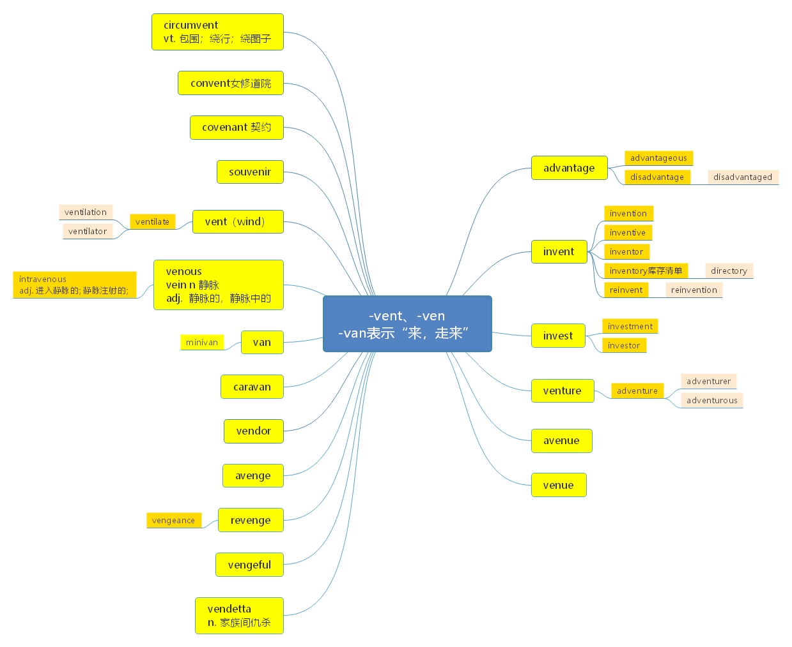

# 词根“-van, -ven, -vent”=come; go

***

> **一、本节课目标**
>
> **1、掌握词根-van， -ven， -vent 的含义**
>
> **2、掌握前缀 anc-， ant-的功能**
>
> **3、掌握新词 72 个**
>
> **4、复习本节课所有单词**

***

# 词根“-van, -ven, -vent”=come; go 表示“来、 走来”。

***

**advantage** \[əd'va\:ntidʒ] [英音](https://dict.youdao.com/dictvoice?audio=advantage\&type=1)  [美音](https://dict.youdao.com/dictvoice?audio=advantage\&type=2)  n. 优点、 优势、 好处 1308

\*\*	助记：\*\* ad-(=to； 去) + vant (走) + age （ 名词后缀） →能够一直让人向前走的东西→优点= -anc (前)

\*\*	例句：\*\* The benefits of broadband to the occasional home worker are that they can access email inreal time, and take full 				advantage of services such as internet-based backup or eveninternet-based phone services.

&#x20;				对于那些偶尔在家工作的员工来说，宽带的好处是他们能够及时地查收邮件， 充分利用网络备份甚至是电话服务。

\*\*	仿写例句：\*\*对于那些没空去书店的人来说，电子图书的好处就是能够随时随地阅读， 充分利用时间。

The benefits of E-book to those who have no time to bookstores are that they can read it anytime and anywhere, and take full advantage of every minute.

**双语例句:** His height gives him a clear advantage. [播放](https://dict.youdao.com/dictvoice?audio=His+height+gives+him+a+clear+advantage.&le=eng&le=eng&type=2)

他的身高使他具有明显的优势。 

**双语例句:** Being tall gave Tony a distinct advantage. [播放](https://dict.youdao.com/dictvoice?audio=Being+tall+gave+Tony+a+distinct+advantage.&le=eng&le=eng&type=2)

托尼个子高是个明显的优势。 

**双语例句:** His height was a decided advantage in the job. [播放](https://dict.youdao.com/dictvoice?audio=His+height+was+a+decided+advantage+in+the+job.&le=eng&le=eng&type=2)

干这项工作，他的身高是明显优势。 

**原声例句:** \"He was one of the first individuals to take **advantage** of the new rules. [播放](https://dict.youdao.com/pureaudio?docid=7352571741691847494)

**原声例句:** \"Public education is our greatest tool - arming people with knowledge about the ways in which common criminal enterprises have tried to take **advantage** of them.\" [播放](https://dict.youdao.com/pureaudio?docid=1042859379506761083)

**原声例句:** \"The hotline has given us an opportunity to take **advantage** of cell phone technology, to reach people outside of our intervention zone with family planning messaging. [播放](https://dict.youdao.com/pureaudio?docid=-201965990348353749)

**权威例句:** The overseas bonds' **advantage** lies in the weak dollar, which magnifies your return in America.  [播放](https://dict.youdao.com/dictvoice?audio=The+overseas+bonds%27+advantage+lies+in+the+weak+dollar%2C+which+magnifies+your+return+in+America.+&le=eng&type=2)

**权威例句:** Obviously the owners would have been psycho not to take **advantage** of this angle.  [播放](https://dict.youdao.com/dictvoice?audio=Obviously+the+owners+would+have+been+psycho+not+to+take+advantage+of+this+angle.+&le=eng&type=2)

**权威例句:** Well, its competitors have a complaint: that its tax-exempt status gives it an unfair **advantage**.  [播放](https://dict.youdao.com/dictvoice?audio=Well%2C+its+competitors+have+a+complaint%3A+that+its+tax-exempt+status+gives+it+an+unfair+advantage.+&le=eng&type=2)

***

**advantageous** \[ædvən'teɪdʒəs] [英音](https://dict.youdao.com/dictvoice?audio=advantageous\&type=1)  [美音](https://dict.youdao.com/dictvoice?audio=advantageous\&type=2)  adj. 有利的；有益的 14583

> **【 课堂笔记】：**-ous 形容词后缀
>
> 1）表示大/多 如： famous； spacious
>
> 2） …的

**双语例句:** Free exchange of goods was advantageous to all. [播放](https://dict.youdao.com/dictvoice?audio=Free+exchange+of+goods+was+advantageous+to+all.&le=eng&le=eng&type=2)

自由商品交易对大家都有利。 

**双语例句:** A free trade agreement would be advantageous to both countries. [播放](https://dict.youdao.com/dictvoice?audio=A+free+trade+agreement+would+be+advantageous+to+both+countries.&le=eng&le=eng&type=2)

自由贸易协定对两国都会有利。 

**双语例句:** Meteorite impacts can be advantageous for some species, which thrive, and disastrous for other species, which become extinct. [播放](https://dict.youdao.com/dictvoice?audio=Meteorite+impacts+can+be+advantageous+for+some+species%2C+which+thrive%2C+and+disastrous+for+other+species%2C+which+become+extinct.&le=eng&le=eng&type=2)

陨石的撞击对某些物种是有利的，它们会茁壮成长；而对其他物种则是灾难性的，它们会灭绝。 

**原声例句:** Lender attorney Christopher Denardo says given the number of mortgage defaults that banks face, restructuring the loans is **advantageous** for everyone involved. [播放](https://dict.youdao.com/pureaudio?docid=-5546653830955983370)

**原声例句:** Here he is in his paper and says at that time I decided that it was **advantageous** to find a more general system of the elements and here is my attempt.

**原声例句:** And he has left blanks here, question marks here and says it is **advantageous** to put them in rows and to form a table.

**权威例句:** In theory, Ferrari could use Raikkonen to \"back up\" Hamilton in a way that is **advantageous** for Massa.  [播放](https://dict.youdao.com/dictvoice?audio=In+theory%2C+Ferrari+could+use+Raikkonen+to+%22back+up%22+Hamilton+in+a+way+that+is+advantageous+for+Massa.+&le=eng&type=2)

**权威例句:** From the perspective of displacing fossil-fuel use, solar thermal water heater systems are even more **advantageous**.  [播放](https://dict.youdao.com/dictvoice?audio=From+the+perspective+of+displacing+fossil-fuel+use%2C+solar+thermal+water+heater+systems+are+even+more+advantageous.+&le=eng&type=2)

**权威例句:** Yet the red ink continues because the parties find it **advantageous** for it to continue.  [播放](https://dict.youdao.com/dictvoice?audio=Yet+the+red+ink+continues+because+the+parties+find+it+advantageous+for+it+to+continue.+&le=eng&type=2)

***

**disadvantage** \[dɪsəd'vɑ\:ntɪdʒ] [英音](https://dict.youdao.com/dictvoice?audio=disadvantage\&type=1)  [美音](https://dict.youdao.com/dictvoice?audio=disadvantage\&type=2)  n. 不利条件； 缺点； 损失 6383

> **【 课堂笔记】：**
>
> dis-
>
> 1） 相反 able（ 可以…的） →disable 使不能…
>
> 2\) 分开

**双语例句:** What's the main disadvantage ? [播放](https://dict.youdao.com/dictvoice?audio=What%27s+the+main+disadvantage+%3F&le=eng&le=eng&type=2)

主要的不利条件是什么？ 

**双语例句:** We're labouring under an unfair disadvantage. [播放](https://dict.youdao.com/dictvoice?audio=We%27re+labouring+under+an+unfair+disadvantage.&le=eng&le=eng&type=2)

我们在不公平的劣势下艰难地工作。 

**双语例句:** My lack of practical experience was a disadvantage. [播放](https://dict.youdao.com/dictvoice?audio=My+lack+of+practical+experience+was+a+disadvantage.&le=eng&le=eng&type=2)

我缺少实际经验是个不利条件。 

**原声例句:** Despite that **disadvantage**, the United States won and maintained a 53-game winning streak at home against regional opponents that started in 2001, when they lost to Honduras. [播放](https://dict.youdao.com/pureaudio?docid=-7425090203408943103)

**原声例句:** The Satellites followed with an hour and a half of inspired play defending as a unit and attackingwhen merited, and holding the feared Brazilian attack despite their numerical **disadvantage**. [播放](https://dict.youdao.com/pureaudio?docid=1100494982198064358)

**原声例句:** But Hawkings said the Tea Party victories could actually turn out to be a **disadvantage** for Republicans in the November general elections, because Tea Party candidates tend to be viewed as too far to the right ideologically by moderate voters. [播放](https://dict.youdao.com/pureaudio?docid=-6241462735541603188)

**权威例句:** Ms. CHANG: Well, women of color actually face a double **disadvantage** with respect to wealth.  [播放](https://dict.youdao.com/dictvoice?audio=Ms.+CHANG%3A+Well%2C+women+of+color+actually+face+a+double+disadvantage+with+respect+to+wealth.+&le=eng&type=2)

**权威例句:** That puts it at a permanent **disadvantage** as a holiday destination to nearby Turkey, for example.  [播放](https://dict.youdao.com/dictvoice?audio=That+puts+it+at+a+permanent+disadvantage+as+a+holiday+destination+to+nearby+Turkey%2C+for+example.+&le=eng&type=2)

**权威例句:** Company B is at a **disadvantage** because it cannot offer the full range of products.  [播放](https://dict.youdao.com/dictvoice?audio=Company+B+is+at+a+disadvantage+because+it+cannot+offer+the+full+range+of+products.+&le=eng&type=2)

***

**disadvantaged** \[dɪsəd'vɑ\:ntɪdʒd] [英音](https://dict.youdao.com/dictvoice?audio=disadvantaged\&type=1)  [美音](https://dict.youdao.com/dictvoice?audio=disadvantaged\&type=2)  adj. 处于不利地位的； n. 不利条件 9105

> 【 **课堂笔记**】：the + 形容词 表示一类人，如：
>
> the poor 穷人
>
> the rich 富人
>
> the disadvantaged 弱势群体

**双语例句:** Children living in inner-city areas may be educationally disadvantaged. [播放](https://dict.youdao.com/dictvoice?audio=Children+living+in+inner-city+areas+may+be+educationally+disadvantaged.&le=eng&le=eng&type=2)

居住在市中心贫民区的孩子在教育方面可能处于不利的地位。 

**双语例句:** The same is not certain when it comes to students from more disadvantaged backgrounds. [播放](https://dict.youdao.com/dictvoice?audio=The+same+is+not+certain+when+it+comes+to+students+from+more+disadvantaged+backgrounds.&le=eng&le=eng&type=2)

对于家庭背景更贫困的学生来说，情况就不一定了。 

**双语例句:** He hopes he will be an inspiration for other young people from disadvantaged backgrounds. [播放](https://dict.youdao.com/dictvoice?audio=He+hopes+he+will+be+an+inspiration+for+other+young+people+from+disadvantaged+backgrounds.&le=eng&le=eng&type=2)

他希望自己能激励其他来自贫困家庭的年轻人。 

**原声例句:** He's also running Sophia's Heart, a charitable foundation for **disadvantaged** children, which Danny created to keep his late wife's legacy alive. [播放](https://dict.youdao.com/pureaudio?docid=-1042276226318495252)

**原声例句:** It seeks to attract **disadvantaged** young people through football to promote education on health and children's rights, peace building,anti-discrimination and the environment. [播放](https://dict.youdao.com/pureaudio?docid=972710671306819761)

**原声例句:** Born into a wealthy Irish-Catholic family, Edward Kennedy had a passion for helping the poor, disabled and **disadvantaged**, as President Obama remembered. [播放](https://dict.youdao.com/pureaudio?docid=-4385219582304642945)

**权威例句:** According to the Guttmacher Institute, 69% of women having abortions are economically **disadvantaged**.  [播放](https://dict.youdao.com/dictvoice?audio=According+to+the+Guttmacher+Institute%2C+69%25+of+women+having+abortions+are+economically+disadvantaged.+&le=eng&type=2)

**权威例句:** Rodriguez is keenly aware of the importance of college for kids from **disadvantaged** backgrounds.  [播放](https://dict.youdao.com/dictvoice?audio=Rodriguez+is+keenly+aware+of+the+importance+of+college+for+kids+from+disadvantaged+backgrounds.+&le=eng&type=2)

**权威例句:** \"No students will be **disadvantaged** because of Pearson's errors, \" schools spokeswoman Erin Hughes said.  [播放](https://dict.youdao.com/dictvoice?audio=%22No+students+will+be+disadvantaged+because+of+Pearson%27s+errors%2C+%22+schools+spokeswoman+Erin+Hughes+said.+&le=eng&type=2)

***

**invent** \[in'vent] [英音](https://dict.youdao.com/dictvoice?audio=invent\&type=1)  [美音](https://dict.youdao.com/dictvoice?audio=invent\&type=2)  v. 发明、创造 3426

**助记：** in（加强语气） +vent（来临、 出现） →出现→发明（即： “发明”某物即某物“出现”）

**双语例句:** The U.S. needs the new companies that will invent them. [播放](https://dict.youdao.com/dictvoice?audio=The+U.S.+needs+the+new+companies+that+will+invent+them.&le=eng&le=eng&type=2)

美国需要能发明这些产品的新公司。 

**双语例句:** How did we ever invent \"unnatural\" numbers in the first place? [播放](https://dict.youdao.com/dictvoice?audio=How+did+we+ever+invent+%22unnatural%22+numbers+in+the+first+place%3F&le=eng&le=eng&type=2)

我们最初是如何发明“非自然”数字的呢？ 

**双语例句:** I learned that different inventors often invent similar things. [播放](https://dict.youdao.com/dictvoice?audio=I+learned+that+different+inventors+often+invent+similar+things.&le=eng&le=eng&type=2)

我了解到不同的发明家经常发明类似的东西。 

**权威例句:** Instead, he firmly believes Skyhook should fight to stay in the space it helped **invent**.  [播放](https://dict.youdao.com/dictvoice?audio=Instead%2C+he+firmly+believes+Skyhook+should+fight+to+stay+in+the+space+it+helped+invent.+&le=eng&type=2)

**权威例句:** The wizards of Silicon Valley constantly **invent** new ways for people to communicate and connect.  [播放](https://dict.youdao.com/dictvoice?audio=The+wizards+of+Silicon+Valley+constantly+invent+new+ways+for+people+to+communicate+and+connect.+&le=eng&type=2)

**权威例句:** But the drug's success highlights how difficult it is for pharmaceutical firms to **invent** new medicines.  [播放](https://dict.youdao.com/dictvoice?audio=But+the+drug%27s+success+highlights+how+difficult+it+is+for+pharmaceutical+firms+to+invent+new+medicines.+&le=eng&type=2)

***

**invention** \[in'venʃən] [英音](https://dict.youdao.com/dictvoice?audio=invention\&type=1)  [美音](https://dict.youdao.com/dictvoice?audio=invention\&type=2)  n. 发明、 创造 4828

> **【 课堂笔记】：**
>
> \-ion 99.9%情况下，为名词后缀；
>
> 极少数情况下，为动词后缀，如 mention n/v. 提及/提到 worth mentioning 值得一提的

**双语例句:** The spinning wheel was a Chinese invention. [播放](https://dict.youdao.com/dictvoice?audio=The+spinning+wheel+was+a+Chinese+invention.&le=eng&le=eng&type=2)

纺车是中国人的一项发明。 

**双语例句:** You can't fault them for lack of invention. [播放](https://dict.youdao.com/dictvoice?audio=You+can%27t+fault+them+for+lack+of+invention.&le=eng&le=eng&type=2)

你不能因为他们没有发明而加以批评他们。 

**双语例句:** His invention was not commercially successful. [播放](https://dict.youdao.com/dictvoice?audio=His+invention+was+not+commercially+successful.&le=eng&le=eng&type=2)

他的发明从赢利角度看并不成功。 

**原声例句:** The government gave a patent to Edward J.Claghorn of New York City so that others would not copy his **invention**. [播放](https://dict.youdao.com/pureaudio?docid=-4295068160296374349)

**原声例句:** A patent forbids others from copying an **invention** and makes the **invention** valuable in the world of business. [播放](https://dict.youdao.com/pureaudio?docid=-5933679418935352751)

**原声例句:** His **invention** contained a cloth strap that was placed across the chest and another strap across the hips. [播放](https://dict.youdao.com/pureaudio?docid=-2971576825358149721)

**权威例句:** With the **invention** of indoor plumbing, outhouses have mostly become a thing of the past.  [播放](https://dict.youdao.com/dictvoice?audio=With+the+invention+of+indoor+plumbing%2C+outhouses+have+mostly+become+a+thing+of+the+past.+&le=eng&type=2)

**权威例句:** In order to win over manufacturers, Fenelon had to test his **invention** seven ways to Sunday.  [播放](https://dict.youdao.com/dictvoice?audio=In+order+to+win+over+manufacturers%2C+Fenelon+had+to+test+his+invention+seven+ways+to+Sunday.+&le=eng&type=2)

**权威例句:** The job of **invention** does not complete the cycle of disruption that advances our world.  [播放](https://dict.youdao.com/dictvoice?audio=The+job+of+invention+does+not+complete+the+cycle+of+disruption+that+advances+our+world.+&le=eng&type=2)

***

**inventive** \[ɪn'ventɪv] [英音](https://dict.youdao.com/dictvoice?audio=inventive\&type=1)  [美音](https://dict.youdao.com/dictvoice?audio=inventive\&type=2)  adj. 发明的； 有发明才能的； 独出心裁的 12610

**双语例句:** He was amazingly inventive and resourceful, and played a major role in my career. [播放](https://dict.youdao.com/dictvoice?audio=He+was+amazingly+inventive+and+resourceful%2C+and+played+a+major+role+in+my+career.&le=eng&le=eng&type=2)

他极具创造力又足智多谋，在我的职业生涯中起了重要的作用。 

**双语例句:** She has a highly inventive mind. [播放](https://dict.youdao.com/dictvoice?audio=She+has+a+highly+inventive+mind.&le=eng&le=eng&type=2)

她的头脑非常善于创新。 

**双语例句:** It inspired me to be more inventive with my own cooking. [播放](https://dict.youdao.com/dictvoice?audio=It+inspired+me+to+be+more+inventive+with+my+own+cooking.&le=eng&le=eng&type=2)

它激励我在自己烹饪时更具创造力。 

**权威例句:** The curated collections and individual items on view run the gamut from random to **inventive** to obsessive.  [播放](https://dict.youdao.com/dictvoice?audio=The+curated+collections+and+individual+items+on+view+run+the+gamut+from+random+to+inventive+to+obsessive.+&le=eng&type=2)

**权威例句:** Advertising should be **inventive** and wonderful and memorable, not to mention worthy of sharing.  [播放](https://dict.youdao.com/dictvoice?audio=Advertising+should+be+inventive+and+wonderful+and+memorable%2C+not+to+mention+worthy+of+sharing.+&le=eng&type=2)

**权威例句:** He is among the artists using the Pledge Music website to sell **inventive** experiences and merchandise.  [播放](https://dict.youdao.com/dictvoice?audio=He+is+among+the+artists+using+the+Pledge+Music+website+to+sell+inventive+experiences+and+merchandise.+&le=eng&type=2)

***

**inventor** \[ɪn'ventə] [英音](https://dict.youdao.com/dictvoice?audio=inventor\&type=1)  [美音](https://dict.youdao.com/dictvoice?audio=inventor\&type=2)  n. 发明家；发明人；创造者 8346

> **【 课堂笔记】：**
>
> \-or -ar -er -ur
>
> 1） 做名词后缀 人 物：机/器 tractor
>
> 2\) 做形容词后缀，表示…的
>
> 3）少数情况下： 做动词后缀

**双语例句:** In my youth my ambition had been to be an inventor. [播放](https://dict.youdao.com/dictvoice?audio=In+my+youth+my+ambition+had+been+to+be+an+inventor.&le=eng&le=eng&type=2)

在我年轻时我的抱负曾是当一名发明家。 

**双语例句:** The royalties enabled the inventor to re-establish himself in business. [播放](https://dict.youdao.com/dictvoice?audio=The+royalties+enabled+the+inventor+to+re-establish+himself+in+business.&le=eng&le=eng&type=2)

这些使用费使这名发明者能再次立足商界。 

**双语例句:** Do you want to be an inventor? [播放](https://dict.youdao.com/dictvoice?audio=Do+you+want+to+be+an+inventor%3F&le=eng&le=eng&type=2)

你想成为一个发明家吗？ 

**原声例句:** American **inventor** Dean Kamen started FIRST in nineteen eighty-nine to increase young people's interest in science and technology. [播放](https://dict.youdao.com/pureaudio?docid=-5991026398638990175)

**原声例句:** American **inventor** Thomas Edison began making short motion pictures at the turn of the century. [播放](https://dict.youdao.com/pureaudio?docid=-438451089945269741)

**原声例句:** He was also an **inventor**. The electric guitar and recording devices he created changed the sound of popular music and greatly influenced rock and roll. [播放](https://dict.youdao.com/pureaudio?docid=4937642725513375050)

**权威例句:** Lucent An awfully close second for the owner of Bell Labs, **inventor** of the laser.  [播放](https://dict.youdao.com/dictvoice?audio=Lucent+An+awfully+close+second+for+the+owner+of+Bell+Labs%2C+inventor+of+the+laser.+&le=eng&type=2)

**权威例句:** Some plans succeed garnering profits for the **inventor**, employees and those providing the necessary capital.  [播放](https://dict.youdao.com/dictvoice?audio=Some+plans+succeed+garnering+profits+for+the+inventor%2C+employees+and+those+providing+the+necessary+capital.+&le=eng&type=2)

**权威例句:** Toys \"R\" Us, the **inventor** of chain-store toy discounting, is being run ragged by Wal-Mart.  [播放](https://dict.youdao.com/dictvoice?audio=Toys+%22R%22+Us%2C+the+inventor+of+chain-store+toy+discounting%2C+is+being+run+ragged+by+Wal-Mart.+&le=eng&type=2)

***

**inventory** \['invəntəri,] [英音](https://dict.youdao.com/dictvoice?audio=inventory\&type=1)  [美音](https://dict.youdao.com/dictvoice?audio=inventory\&type=2)  n. 存货清单、 详细目录 4005

**搭配：** huge inventories（考）：大量的库存

> **【 课堂笔记】**：
>
> 1\. invent 1） 发明 2）发现/找到
>
> 2\. inventory n. 存货清单、详细目录
>
> **助记：** invent（ 发现/找到） + ory（ 名词后缀） →方便你去发现/找到物品的清单
>
> 如： directory n. 电话通讯录；通讯清单
>
> &#x9;direct（ 指导/引导） + ory（ 名词后缀） →指导你去寻找某人的清单→电话通讯录

**双语例句:** They're likely to hold big fire sales to liquidate their inventory. [播放](https://dict.youdao.com/dictvoice?audio=They%27re+likely+to+hold+big+fire+sales+to+liquidate+their+inventory.&le=eng&le=eng&type=2)

为了盘活库存，他们很可能会进行大甩卖。 

**双语例句:** I did all of the ordering for the store, and I kept track of the inventory. [播放](https://dict.youdao.com/dictvoice?audio=I+did+all+of+the+ordering+for+the+store%2C+and+I+kept+track+of+the+inventory.&le=eng&le=eng&type=2)

我为店里做了所有的订单，并记录了库存情况。 

**双语例句:** This concept appears in manufacturing where they count both scrap and inventory. [播放](https://dict.youdao.com/dictvoice?audio=This+concept+appears+in+manufacturing+where+they+count+both+scrap+and+inventory.&le=eng&le=eng&type=2)

这一概念出现在制造业中，在其中计算废料和库存。 

**原声例句:** We're fixing up the classrooms, painting and doing **inventory**.\" [播放](https://dict.youdao.com/pureaudio?docid=-2834660181785846949)

**原声例句:** He and his wife had to lay off workers, reduce **inventory** and stay open longer hours just to remain in business. [播放](https://dict.youdao.com/pureaudio?docid=-580087476369697382)

**原声例句:** In fact,the manufacturers who are filling **inventory** levels are telling us that inventories were at unsustainably-low levels, and so business is  better. [播放](https://dict.youdao.com/pureaudio?docid=-4383424809666704684)

**权威例句:** Quick to adjust, the company refreshed **inventory** and began an earnings recovery later in the year.  [播放](https://dict.youdao.com/dictvoice?audio=Quick+to+adjust%2C+the+company+refreshed+inventory+and+began+an+earnings+recovery+later+in+the+year.+&le=eng&type=2)

**权威例句:** One sunny afternoon my entire **inventory** was bought out by a single customer: Cher.  [播放](https://dict.youdao.com/dictvoice?audio=One+sunny+afternoon+my+entire+inventory+was+bought+out+by+a+single+customer%3A+Cher.+&le=eng&type=2)

**权威例句:** **Inventory** is also abnormally constricted because many prospective sellers cannot yet afford to do so.  [播放](https://dict.youdao.com/dictvoice?audio=Inventory+is+also+abnormally+constricted+because+many+prospective+sellers+cannot+yet+afford+to+do+so.+&le=eng&type=2)

***

**reinvent** \[ˌri:ɪnˈvent] [英音](https://dict.youdao.com/dictvoice?audio=reinvent\&type=1)  [美音](https://dict.youdao.com/dictvoice?audio=reinvent\&type=2)  vt. 重新使用； 重复发明（在不知他人已发明的情况下） 8350

**双语例句:** To be successful, you have to reinvent something, or a process, or have a point of differentiation. [播放](https://dict.youdao.com/dictvoice?audio=To+be+successful%2C+you+have+to+reinvent+something%2C+or+a+process%2C+or+have+a+point+of+differentiation.&le=eng&le=eng&type=2)

要想成功，你要彻底改造一些东西，或一个过程，或者就要有一个不同的点。 

**双语例句:** They have tried to reinvent their retail stores. [播放](https://dict.youdao.com/dictvoice?audio=They+have+tried+to+reinvent+their+retail+stores.&le=eng&le=eng&type=2)

他们一直在尝试改造他们的零售店。 

**双语例句:** He was determined to reinvent himself as a poet and writer. [播放](https://dict.youdao.com/dictvoice?audio=He+was+determined+to+reinvent+himself+as+a+poet+and+writer.&le=eng&le=eng&type=2)

他下决心把自己重塑成一个诗人兼作家。 

**原声例句:** Newspapers are looking for new ways to **reinvent** themselves, new ways to earn money. [播放](https://dict.youdao.com/pureaudio?docid=-2394310043778261907)

**原声例句:** Critics say the show has helped **reinvent** HBO. [播放](https://dict.youdao.com/pureaudio?docid=-7232053540483677817)

**原声例句:** President Obama will try to rally public support for his proposal to **reinvent** the way Americans pay for health care. [播放](https://dict.youdao.com/pureaudio?docid=-1496479388289176356)

**权威例句:** Because the city that still wears its history on its sleeve continues to **reinvent** itself.  [播放](https://dict.youdao.com/dictvoice?audio=Because+the+city+that+still+wears+its+history+on+its+sleeve+continues+to+reinvent+itself.+&le=eng&type=2)

**权威例句:** Men need to **reinvent** themselves, to reconsider what it means to be a dad and a partner.  [播放](https://dict.youdao.com/dictvoice?audio=Men+need+to+reinvent+themselves%2C+to+reconsider+what+it+means+to+be+a+dad+and+a+partner.+&le=eng&type=2)

**权威例句:** Can they **reinvent** the car for a congested, urbanized world with vexing climate and energy problems?  [播放](https://dict.youdao.com/dictvoice?audio=Can+they+reinvent+the+car+for+a+congested%2C+urbanized+world+with+vexing+climate+and+energy+problems%3F+&le=eng&type=2)

***

**reinvention** \[,riːɪn'venʃən] [英音](https://dict.youdao.com/dictvoice?audio=reinvention\&type=1)  [美音](https://dict.youdao.com/dictvoice?audio=reinvention\&type=2)  n. 重新使用； 彻底改造； 重复发明 20087

**双语例句:** Even if your personal reinvention is less drastic, we think there are lessons from her experience that apply. [播放](https://dict.youdao.com/dictvoice?audio=Even+if+your+personal+reinvention+is+less+drastic%2C+we+think+there+are+lessons+from+her+experience+that+apply.&le=eng&le=eng&type=2)

即使你的个人重塑计划没有那么夸张，我们认为，从她的经验中可以学到一些有用的东西。 

**双语例句:** The rise of the mobile phone has recently added a new level of complexity to the process of retail reinvention. [播放](https://dict.youdao.com/dictvoice?audio=The+rise+of+the+mobile+phone+has+recently+added+a+new+level+of+complexity+to+the+process+of+retail+reinvention.&le=eng&le=eng&type=2)

最近，手机的兴起使零售业的再创造过程变得更加复杂。 

**双语例句:** Retail reinvention is not a simple process, and it's also not happening on what used to be called \"Internet Time\". [播放](https://dict.youdao.com/dictvoice?audio=Retail+reinvention+is+not+a+simple+process%2C+and+it%27s+also+not+happening+on+what+used+to+be+called+%22Internet+Time%22.&le=eng&le=eng&type=2)

零售的再创造并不是一种简单的过程，它也不是在过去被称为的“互联网时代”发生。 

**原声例句:** If anything defines American music, he says, it is a spirit of redefinition and **reinvention**. [播放](https://dict.youdao.com/pureaudio?docid=-8820305046399271484)

**原声例句:** And the **reinvention** in the nineteenth century of British identity will also have a lot to do with fear of the Irish, \"The enemy within,\" As they were perceived.

**权威例句:** Storytelling is how people locate themselves in your message, especially during times of **reinvention**.  [播放](https://dict.youdao.com/dictvoice?audio=Storytelling+is+how+people+locate+themselves+in+your+message%2C+especially+during+times+of+reinvention.+&le=eng&type=2)

**权威例句:** This will lead us into a renaissance period of exciting change, spiritual awakening, rebirth and **reinvention**.  [播放](https://dict.youdao.com/dictvoice?audio=This+will+lead+us+into+a+renaissance+period+of+exciting+change%2C+spiritual+awakening%2C+rebirth+and+reinvention.+&le=eng&type=2)

**权威例句:** One component of this **reinvention** has been a new series of celebrity clothing collections.  [播放](https://dict.youdao.com/dictvoice?audio=One+component+of+this+reinvention+has+been+a+new+series+of+celebrity+clothing+collections.+&le=eng&type=2)

***

**venture** \['ventʃə] [英音](https://dict.youdao.com/dictvoice?audio=venture\&type=1)  [美音](https://dict.youdao.com/dictvoice?audio=venture\&type=2)  n. 风险、 冒险； 企业 3322

**助记：** vent（来， 另外， vent 还在刻意模仿单词“chance： 冒险） →来冒险→风险， 冒险；（有风险） 企业

**搭配：** venture capitalists（考）：风险投资家 space venture（考）：太空探险

**双语例句:** Grace was flushed with the success of the venture. [播放](https://dict.youdao.com/dictvoice?audio=Grace+was+flushed+with+the+success+of+the+venture.&le=eng&le=eng&type=2)

格雷斯为这次成功冒险感到兴奋。 

**双语例句:** People are afraid to venture out for fear of sniper attacks. [播放](https://dict.youdao.com/dictvoice?audio=People+are+afraid+to+venture+out+for+fear+of+sniper+attacks.&le=eng&le=eng&type=2)

人们不敢冒险外出，害怕狙击手的袭击。 

**双语例句:** I was still uncommitted to the venture when we reached Kanpur. [播放](https://dict.youdao.com/dictvoice?audio=I+was+still+uncommitted+to+the+venture+when+we+reached+Kanpur.&le=eng&le=eng&type=2)

直到我们到达坎普尔时，我还是不太支持这次冒险。 

**原声例句:** He and others examined more than seven hundred requests made to an American **venture** capital firm. [播放](https://dict.youdao.com/pureaudio?docid=-6140017723828812089)

**原声例句:** Each year, entrepreneurs with ideas for the \"next big thing\" flood **venture** capitalists with business plans. [播放](https://dict.youdao.com/pureaudio?docid=-7405916864623596198)

**原声例句:** Professor Kirsch tells us that **venture** capitalists instead talk to people who know the entrepreneur. [播放](https://dict.youdao.com/pureaudio?docid=-7798443085342630313)

**权威例句:** **Venture** folks have seen a market across the board turn sour on them before.  [播放](https://dict.youdao.com/dictvoice?audio=Venture+folks+have+seen+a+market+across+the+board+turn+sour+on+them+before.+&le=eng&type=2)

**权威例句:** Despite the success of this first substantial **venture** into literary criticism, or what F.  [播放](https://dict.youdao.com/dictvoice?audio=Despite+the+success+of+this+first+substantial+venture+into+literary+criticism%2C+or+what+F.+&le=eng&type=2)

**权威例句:** Saban and News Corp. each got 49.5%, but Saban chaired and ran the **venture**.  [播放](https://dict.youdao.com/dictvoice?audio=Saban+and+News+Corp.+each+got+49.5%25%2C+but+Saban+chaired+and+ran+the+venture.+&le=eng&type=2)

***

**adventure** \[əd'ventʃə] [英音](https://dict.youdao.com/dictvoice?audio=adventure\&type=1)  [美音](https://dict.youdao.com/dictvoice?audio=adventure\&type=2)  n. 冒险；冒险精神；投机活动 2885

> **【 课堂笔记】：**
>
> ad/ac+ 名词 （ 该名词的） 动词形式
>
> 如： venture → adventure
>
> company (公司/陪伴) → accompany （v. 陪伴）

**双语例句:** He set off in quest of adventure. [播放](https://dict.youdao.com/dictvoice?audio=He+set+off+in+quest+of+adventure.&le=eng&le=eng&type=2)

他出行探险去了。 

**双语例句:** Few can resist the lure of adventure. [播放](https://dict.youdao.com/dictvoice?audio=Few+can+resist+the+lure+of+adventure.&le=eng&le=eng&type=2)

很少有人能抵御历险的诱惑力。 

**双语例句:** Age hadn't blunted his passion for adventure. [播放](https://dict.youdao.com/dictvoice?audio=Age+hadn%27t+blunted+his+passion+for+adventure.&le=eng&le=eng&type=2)

岁月没有冲淡他的冒险激情。 

**原声例句:** Her travel writing showed a sense of **adventure** and love of the art and traditions of other cultures. [播放](https://dict.youdao.com/pureaudio?docid=9215493732841440382)

**原声例句:** Her life was full of **adventure**. She was one of the most important photographers of the twentieth century. [播放](https://dict.youdao.com/pureaudio?docid=3493313615462518409)

**原声例句:** Many years later, Mr. Fulton said this dinner party was the beginning of an 18 month **adventure**. [播放](https://dict.youdao.com/pureaudio?docid=1266556779043650509)

**权威例句:** Along with her good career sense, Dowd started off with a healthy sense of **adventure**.  [播放](https://dict.youdao.com/dictvoice?audio=Along+with+her+good+career+sense%2C+Dowd+started+off+with+a+healthy+sense+of+adventure.+&le=eng&type=2)

**权威例句:** For dining with a dash of **adventure**, try the Secret Foodies and Piper-Heidsieck Christmas in July dinner.  [播放](https://dict.youdao.com/dictvoice?audio=For+dining+with+a+dash+of+adventure%2C+try+the+Secret+Foodies+and+Piper-Heidsieck+Christmas+in+July+dinner.+&le=eng&type=2)

**权威例句:** Every time I step onto a Virgin Airplane, I get a sense of whimsy and **adventure**.  [播放](https://dict.youdao.com/dictvoice?audio=Every+time+I+step+onto+a+Virgin+Airplane%2C+I+get+a+sense+of+whimsy+and+adventure.+&le=eng&type=2)

***

**adventurer** \[əd'ventʃ(ə)rə] [英音](https://dict.youdao.com/dictvoice?audio=adventurer\&type=1)  [美音](https://dict.youdao.com/dictvoice?audio=adventurer\&type=2)  n. 冒险家；投机商人 13796

**双语例句:** Her most famous adventure was taking part in the hunt for famous adventurer Roald Amundsen. [播放](https://dict.youdao.com/dictvoice?audio=Her+most+famous+adventure+was+taking+part+in+the+hunt+for+famous+adventurer+Roald+Amundsen.&le=eng&le=eng&type=2)

她最著名的冒险活动是参加寻找著名冒险家罗尔德·阿蒙森的活动。 

**双语例句:** Thor Heyerdahl, the Norwegian ethnographer and adventurer, thought the statues had been created by pre-Inca peoples from Peru. [播放](https://dict.youdao.com/dictvoice?audio=Thor+Heyerdahl%2C+the+Norwegian+ethnographer+and+adventurer%2C+thought+the+statues+had+been+created+by+pre-Inca+peoples+from+Peru.&le=eng&le=eng&type=2)

挪威民族志学者、冒险家托尔·海尔达尔认为，这些雕像是由来自秘鲁的前印加人创造的。 

**双语例句:** Each embraces New York with the intense excitement of first love, each absorbs New York with the fresh eyes of an adventurer, each generates heat and light to dwarf the Consolidated Edison Company. [播放](https://dict.youdao.com/dictvoice?audio=Each+embraces+New+York+with+the+intense+excitement+of+first+love%2C+each+absorbs+New+York+with+the+fresh+eyes+of+an+adventurer%2C+each+generates+heat+and+light+to+dwarf+the+Consolidated+Edison+Company.&le=eng&le=eng&type=2)

每个人都以初恋般的强烈兴奋拥抱纽约，每个人都以冒险家的新鲜目光看着纽约，每个人都产生热量和光，使合并后的爱迪生公司相形见绌。 

**原声例句:** Australian authorities originally said about 30 tons of oil were lost when 31 containers of fertilizer slipped from the Hong Kong-flagged \"Pacific **Adventurer**\" ship and punctured fuel tanks in the hull as the ship was battered in cyclone-stirred waters. [播放](https://dict.youdao.com/pureaudio?docid=-5572840115377909428)

**权威例句:** Prince Philip presented Royal Aero Club's award to the **adventurer** from Box, Wiltshire, at Buckingham Palace.  [播放](https://dict.youdao.com/dictvoice?audio=Prince+Philip+presented+Royal+Aero+Club%27s+award+to+the+adventurer+from+Box%2C+Wiltshire%2C+at+Buckingham+Palace.+&le=eng&type=2)

**权威例句:** The 38-year-old **adventurer** said he was \"super excited\" to visit Scouts in the Isle of Man.  [播放](https://dict.youdao.com/dictvoice?audio=The+38-year-old+adventurer+said+he+was+%22super+excited%22+to+visit+Scouts+in+the+Isle+of+Man.+&le=eng&type=2)

**权威例句:** In the process, she created a dream career for herself as a globe-trotting journalist-adventurer.  [播放](https://dict.youdao.com/dictvoice?audio=In+the+process%2C+she+created+a+dream+career+for+herself+as+a+globe-trotting+journalist-adventurer.+&le=eng&type=2)

***

**adventurous** \[əd'ventʃ(ə)rəs] [英音](https://dict.youdao.com/dictvoice?audio=adventurous\&type=1)  [美音](https://dict.youdao.com/dictvoice?audio=adventurous\&type=2)  adj. 爱冒险的；大胆的；充满危险的 11153

**双语例句:** Warren was an adventurous businessman. [播放](https://dict.youdao.com/dictvoice?audio=Warren+was+an+adventurous+businessman.&le=eng&le=eng&type=2)

沃伦是一位有冒险精神的商人。 

**双语例句:** He had always wanted an adventurous life in the tropics. [播放](https://dict.youdao.com/dictvoice?audio=He+had+always+wanted+an+adventurous+life+in+the+tropics.&le=eng&le=eng&type=2)

他一直都想要一种在热带丛林里的冒险生活。 

**双语例句:** This isn't highfalutin art-about-art. It's marvellous and adventurous stuff. [播放](https://dict.youdao.com/dictvoice?audio=This+isn%27t+highfalutin+art-about-art.+It%27s+marvellous+and+adventurous+stuff.&le=eng&le=eng&type=2)

这不是为艺术而艺术的华而不实的东西，而是有所大胆创新的非凡作品。 

**原声例句:** Capital Fringe describes itself as rebellious and **adventurous**, alive in the present moment. [播放](https://dict.youdao.com/pureaudio?docid=712598584170443838)

**原声例句:** Growing up with an **adventurous** father who loved to explore the world beneath the waves was exciting. [播放](https://dict.youdao.com/pureaudio?docid=922371357431171269)

**原声例句:** It's wonderful. And one of the things that we have going for us is that people are becoming a lot more food-savvy these days and are willing to be a little more **adventurous**.\" [播放](https://dict.youdao.com/pureaudio?docid=4851151315471975333)

**权威例句:** For a more **adventurous** meal, venture to Moyo in the Melrose Arch neighbourhood.  [播放](https://dict.youdao.com/dictvoice?audio=For+a+more+adventurous+meal%2C+venture+to+Moyo+in+the+Melrose+Arch+neighbourhood.+&le=eng&type=2)

**权威例句:** Pierre-Laurent Aimard is one of the most **adventurous** and versatile pianists on today's concert scene.  [播放](https://dict.youdao.com/dictvoice?audio=Pierre-Laurent+Aimard+is+one+of+the+most+adventurous+and+versatile+pianists+on+today%27s+concert+scene.+&le=eng&type=2)

**权威例句:** If you are **adventurous** about your wine consumption then you should consider joining a wine club.  [播放](https://dict.youdao.com/dictvoice?audio=If+you+are+adventurous+about+your+wine+consumption+then+you+should+consider+joining+a+wine+club.+&le=eng&type=2)

***

**avenue** \['æv(ə)njuː] [英音](https://dict.youdao.com/dictvoice?audio=avenue\&type=1)  [美音](https://dict.youdao.com/dictvoice?audio=avenue\&type=2)  n. 林荫大道； 大街 6178

> &#x20;**【 课堂笔记】**：&#x20;
>
> **助记：** a（ 一个） + ven（ 走； 走来） + ue (名词后缀) → 一个/一条用来走的东西→ 大道； 大街
>
> 如： the Fifth Avenue 第 5 大道

**双语例句:** He walked up Fifth Avenue to clear his head. [播放](https://dict.youdao.com/dictvoice?audio=He+walked+up+Fifth+Avenue+to+clear+his+head.&le=eng&le=eng&type=2)

他在第五大街上走，让头脑清醒清醒。 

**双语例句:** Lily lives in a penthouse just off Park Avenue. [播放](https://dict.youdao.com/dictvoice?audio=Lily+lives+in+a+penthouse+just+off+Park+Avenue.&le=eng&le=eng&type=2)

莉莉住在离公园大街不远的一处顶层公寓里。 

**双语例句:** Bergdorf Goodman has opened a men's shop on Fifth Avenue. [播放](https://dict.youdao.com/dictvoice?audio=Bergdorf+Goodman+has+opened+a+men%27s+shop+on+Fifth+Avenue.&le=eng&le=eng&type=2)

伯格多夫·古德曼在第五大道上开了一家男装店。 

**原声例句:** In the future, other works by female artists will be shown as part of the museum's \"New York **Avenue** Sculpture Project\". [播放](https://dict.youdao.com/pureaudio?docid=1946715678607064692)

**原声例句:** This will be followed by the inaugural parade with marching bands and floats along Pennsylvania **Avenue** to the White House. [播放](https://dict.youdao.com/pureaudio?docid=-1751182226955964406)

**原声例句:** He got into a taxi and told the driver to take him for a ride along Fifth **Avenue**. [播放](https://dict.youdao.com/pureaudio?docid=-7247698730655378085)

**权威例句:** Madison **Avenue** giants are scrambling to find new ways to deliver their products to ad-drenched consumers.  [播放](https://dict.youdao.com/dictvoice?audio=Madison+Avenue+giants+are+scrambling+to+find+new+ways+to+deliver+their+products+to+ad-drenched+consumers.+&le=eng&type=2)

**权威例句:** The regular Sunday concerts start at 4 pm at 555 Edgecombe **Avenue**, apt 3F.  [播放](https://dict.youdao.com/dictvoice?audio=The+regular+Sunday+concerts+start+at+4+pm+at+555+Edgecombe+Avenue%2C+apt+3F.+&le=eng&type=2)

**权威例句:** In the next phase, currently under planning, the path will extend another half-mile north to Mack **Avenue**.  [播放](https://dict.youdao.com/dictvoice?audio=In+the+next+phase%2C+currently+under+planning%2C+the+path+will+extend+another+half-mile+north+to+Mack+Avenue.+&le=eng&type=2)

***

**invest** \[in'vest] [英音](https://dict.youdao.com/dictvoice?audio=invest\&type=1)  [美音](https://dict.youdao.com/dictvoice?audio=invest\&type=2)  v. 投资 2015

**助记：** in (进入) + vest（ 马甲/内衣/内裤/背心） →把内衣内裤都放进去的→下大注→投资

**双语例句:** It would be hazardous to invest so much. [播放](https://dict.youdao.com/dictvoice?audio=It+would+be+hazardous+to+invest+so+much.&le=eng&le=eng&type=2)

投资这么多会有风险。 

**双语例句:** Many people don't like to invest in stocks. [播放](https://dict.youdao.com/dictvoice?audio=Many+people+don%27t+like+to+invest+in+stocks.&le=eng&le=eng&type=2)

许多人不喜欢投资股票。 

**双语例句:** They had the foresight to invest in new technology. [播放](https://dict.youdao.com/dictvoice?audio=They+had+the+foresight+to+invest+in+new+technology.&le=eng&le=eng&type=2)

他们有投资新技术的先见之明。 

**原声例句:** Some years earlier, he had asked several people to **invest** in a gold mine he had in Death Valley. [播放](https://dict.youdao.com/pureaudio?docid=5213850146323690727)

**原声例句:** You can be in deep water, for example, if you **invest** in stocks without knowing anything about the stock market. [播放](https://dict.youdao.com/pureaudio?docid=-3211853413918855817)

**原声例句:** But he needs to be faithful and true, can take care of property and **invest** money with good judgment. [播放](https://dict.youdao.com/pureaudio?docid=-1927562429603482970)

**权威例句:** This year's show had plenty of examples of how schools might **invest** their ICT money.  [播放](https://dict.youdao.com/dictvoice?audio=This+year%27s+show+had+plenty+of+examples+of+how+schools+might+invest+their+ICT+money.+&le=eng&type=2)

**权威例句:** We can also give you some perspective that will help you **invest** for the long term.  [播放](https://dict.youdao.com/dictvoice?audio=We+can+also+give+you+some+perspective+that+will+help+you+invest+for+the+long+term.+&le=eng&type=2)

**权威例句:** That was when McGeorge Bundy of the Ford Foundation famously decreed that endowments should **invest** for total return.  [播放](https://dict.youdao.com/dictvoice?audio=That+was+when+McGeorge+Bundy+of+the+Ford+Foundation+famously+decreed+that+endowments+should+invest+for+total+return.+&le=eng&type=2)

***

**investment** \[in'vestmənt] [英音](https://dict.youdao.com/dictvoice?audio=investment\&type=1)  [美音](https://dict.youdao.com/dictvoice?audio=investment\&type=2)  n. 投资、 投入 1044

**搭配：** the scale of investment（考）：投资规模real estate investment（考）：房地产投资

**双语例句:** Training is an investment not a cost. [播放](https://dict.youdao.com/dictvoice?audio=Training+is+an+investment+not+a+cost.&le=eng&le=eng&type=2)

培训是一种投资而不是一种花费。 

**双语例句:** Investment is all about running risks. [播放](https://dict.youdao.com/dictvoice?audio=Investment+is+all+about+running+risks.&le=eng&le=eng&type=2)

投资就是要冒风险。 

**双语例句:** Investment is becoming a chancy business. [播放](https://dict.youdao.com/dictvoice?audio=Investment+is+becoming+a+chancy+business.&le=eng&le=eng&type=2)

投资正在成为一项冒险的事业。 

**原声例句:** But he says **investment** has risen from four percent of national budgets to probably five and a half percent today. [播放](https://dict.youdao.com/pureaudio?docid=-1083651270262462835)

**原声例句:** Last week, the government lost its case against two managers at Bear Stearns, the first **investment** bank to fail last year. [播放](https://dict.youdao.com/pureaudio?docid=-2335180776311204128)

**原声例句:** The World Economic Forum will also discuss global warming, **investment** in low-carbon forms of energy in developing countries and other issues. [播放](https://dict.youdao.com/pureaudio?docid=-1902165608649916264)

**权威例句:** It also identifies key priorities for further **investment** and stronger commitment in the future.  [播放](https://dict.youdao.com/dictvoice?audio=It+also+identifies+key+priorities+for+further+investment+and+stronger+commitment+in+the+future.+&le=eng&type=2)

**权威例句:** Morgan Stanley chief **investment** strategist Byron Wien rode retailer Target to a 23% increase.  [播放](https://dict.youdao.com/dictvoice?audio=Morgan+Stanley+chief+investment+strategist+Byron+Wien+rode+retailer+Target+to+a+23%25+increase.+&le=eng&type=2)

**权威例句:** The disappointing export figures, however, were partly offset by strong **investment** data released the same day.  [播放](https://dict.youdao.com/dictvoice?audio=The+disappointing+export+figures%2C+however%2C+were+partly+offset+by+strong+investment+data+released+the+same+day.+&le=eng&type=2)

***

**investor** \[ɪn'vestə] [英音](https://dict.youdao.com/dictvoice?audio=investor\&type=1)  [美音](https://dict.youdao.com/dictvoice?audio=investor\&type=2)  n. 投资者 1714

**双语例句:** A very good investor will outguess the market. [播放](https://dict.youdao.com/dictvoice?audio=A+very+good+investor+will+outguess+the+market.&le=eng&le=eng&type=2)

一名优秀的投资者将准确预测市场。 

**双语例句:** The way a good investor does really well is by engaging in successful futurology. [播放](https://dict.youdao.com/dictvoice?audio=The+way+a+good+investor+does+really+well+is+by+engaging+in+successful+futurology.&le=eng&le=eng&type=2)

对未来成功的预测是一个好的投资人的取胜之道。 

**双语例句:** My nephew is a cautious investor. [播放](https://dict.youdao.com/dictvoice?audio=My+nephew+is+a+cautious+investor.&le=eng&le=eng&type=2)

我侄子是个小心谨慎的投资者。 

**原声例句:** Day trading companies provide a desk and a computer system to an **investor** who wants to trade. [播放](https://dict.youdao.com/pureaudio?docid=-9103610596765165196)

**原声例句:** Steve Hess at Moody's **Investor** Service says if lenders were really worried, they would raise the interest rates they charge on loans to the government. [播放](https://dict.youdao.com/pureaudio?docid=-5641909426198399241)

**原声例句:** \"This notion of an angel **investor** seemed just that to us. It seemed miraculous.\" [播放](https://dict.youdao.com/pureaudio?docid=2025226299859682673)

**权威例句:** Sentiment remains grumpy and cautious, and as a value-oriented **investor** I am thankful for this, too.  [播放](https://dict.youdao.com/dictvoice?audio=Sentiment+remains+grumpy+and+cautious%2C+and+as+a+value-oriented+investor+I+am+thankful+for+this%2C+too.+&le=eng&type=2)

**权威例句:** As a value **investor**, Miller likes to accumulate stocks that have fallen to new lows.  [播放](https://dict.youdao.com/dictvoice?audio=As+a+value+investor%2C+Miller+likes+to+accumulate+stocks+that+have+fallen+to+new+lows.+&le=eng&type=2)

**权威例句:** Mr. JOHN LEE **(Investo**r): People are realizing that they have to take control of their money.  [播放](https://dict.youdao.com/dictvoice?audio=Mr.+JOHN+LEE+%28Investor%29%3A+People+are+realizing+that+they+have+to+take+control+of+their+money.+&le=eng&type=2)

***

# 高难度词汇：

***

**venue** \['venjuː] [英音](https://dict.youdao.com/dictvoice?audio=venue\&type=1)  [美音](https://dict.youdao.com/dictvoice?audio=venue\&type=2)  n. 审判地； 犯罪地点； 发生地点； 集合地点 5460

> &#x20;**【 课堂笔记】： 词源：** c. 1300,&#x20;
>
> "a coming for the purpose of attack," from Old French venue coming" (12c.), from fem. past participle of venir "to come," from Latin venire "to come," from PIE root \*gwa- "to go, come." The sense of "place where a case in law is tried" is first recorded 1530s. Extended to locality in general, especially "site of aconcert or sporting event" (1857). Change of venue is from Blackstone (1768).
>
> 一个让大家来参与活动的地方
>
> a venue for sports meeting 场地、场馆、举办场所
>
> a venue for sentencing 审判地

**双语例句:** We're still trying to decide on a venue. [播放](https://dict.youdao.com/dictvoice?audio=We%27re+still+trying+to+decide+on+a+venue.&le=eng&le=eng&type=2)

我们仍然在设法选定一个会场。 

**双语例句:** The venue was packed with 3 000 clubbers. [播放](https://dict.youdao.com/dictvoice?audio=The+venue+was+packed+with+3+000+clubbers.&le=eng&le=eng&type=2)

会场被3 000名俱乐部会员挤得满满的。 

**双语例句:** The venue for the World Cup remains undecided. [播放](https://dict.youdao.com/dictvoice?audio=The+venue+for+the+World+Cup+remains+undecided.&le=eng&le=eng&type=2)

世界杯的举办地点尚未确定。 

**原声例句:** This **venue** in Florida is one of several places where Gypsy jazz fans in the United States can enjoy the music. [播放](https://dict.youdao.com/pureaudio?docid=-5595190306891803259)

**原声例句:** It's located near the Olympics **venue** for long track speed skating in Richmond, about a 30-minute drive south from downtown Vancouver. [播放](https://dict.youdao.com/pureaudio?docid=1378288950039671227)

**原声例句:** But some say the convergence of popular culture into one giant **venue** is not such a bad thing. [播放](https://dict.youdao.com/pureaudio?docid=-4076470329645270672)

**权威例句:** The Palm House is not the only festival **venue** with an unusual architectural history.  [播放](https://dict.youdao.com/dictvoice?audio=The+Palm+House+is+not+the+only+festival+venue+with+an+unusual+architectural+history.+&le=eng&type=2)

**权威例句:** The **venue** too was the most disappointing of the three that England supporters have visited.  [播放](https://dict.youdao.com/dictvoice?audio=The+venue+too+was+the+most+disappointing+of+the+three+that+England+supporters+have+visited.+&le=eng&type=2)

**权威例句:** The **venue** makes its money by selling food and drink to players or by soliciting donations.  [播放](https://dict.youdao.com/dictvoice?audio=The+venue+makes+its+money+by+selling+food+and+drink+to+players+or+by+soliciting+donations.+&le=eng&type=2)

***

**circumvent** \[sɜːkəm'vent] [英音](https://dict.youdao.com/dictvoice?audio=circumvent\&type=1)  [美音](https://dict.youdao.com/dictvoice?audio=circumvent\&type=2)  vt. 包围；绕行；绕圈子；回避 12251

> **【 课堂笔记】：**
>
> 1\. 词根-circ 表示圈/环-circum
>
> 2\. circle = circ（ 圈/环） + le (名词后缀)
>
> 3\. circumstance =circ（ 圈/环） + um (后缀， 没有实际含义) n. 环境
>
> 4\. circumvent vt. 包围；绕行；绕圈子助记： circum (环) + vent（ 走； 走来） →围绕着圈/环来走→包围； 绕行； 绕圈子
>
> 5\. circulate = circ (圈/环) + -ul-（ 连接符号） + ate （ 动词后缀， 表示使…） →使循环，使传播，使流通
>
> &#x9; circulation n. 流通、循环、传播
>
> 6\. circus n. 马戏团 （ 马戏团最经典项目：跳火圈；由此造出 circus 一词）circ (圈/环) + -us （ 名词后缀） → 马戏团
>
> run a circus 运营一个马戏团
>
> run a company 运营一个公司

**双语例句:** They should know their merits and demerits and their choices must give play to their strengths whilst circumvent weaknesses. [播放](https://dict.youdao.com/dictvoice?audio=They+should+know+their+merits+and+demerits+and+their+choices+must+give+play+to+their+strengths+whilst+circumvent+weaknesses.&le=eng&le=eng&type=2)

他们应该知道自己的长处和短处，做出的选择要扬长避短。 

**双语例句:** That is to say, they should know their merits and demerits and their choices must give play to their strengths whilst circumvent weaknesses. [播放](https://dict.youdao.com/dictvoice?audio=That+is+to+say%2C+they+should+know+their+merits+and+demerits+and+their+choices+must+give+play+to+their+strengths+whilst+circumvent+weaknesses.&le=eng&le=eng&type=2)

也就是说，要知道自己的长处和短处，做出的选择要扬长避短。 

**双语例句:** Military planners tried to circumvent the treaty. [播放](https://dict.youdao.com/dictvoice?audio=Military+planners+tried+to+circumvent+the+treaty.&le=eng&le=eng&type=2)

军事计划员们试图避开此条约。 

**权威例句:** Wall Street then comes up with ways to **circumvent** the new regulations and the cycle repeats.  [播放](https://dict.youdao.com/dictvoice?audio=Wall+Street+then+comes+up+with+ways+to+circumvent+the+new+regulations+and+the+cycle+repeats.+&le=eng&type=2)

**权威例句:** Providing wireless networks would allow Google to **circumvent** incumbent cable companies and wireless carriers.  [播放](https://dict.youdao.com/dictvoice?audio=Providing+wireless+networks+would+allow+Google+to+circumvent+incumbent+cable+companies+and+wireless+carriers.+&le=eng&type=2)

**权威例句:** Not the hardest restriction to **circumvent**, many motorists bought an old banger with the other plate.  [播放](https://dict.youdao.com/dictvoice?audio=Not+the+hardest+restriction+to+circumvent%2C+many+motorists+bought+an+old+banger+with+the+other+plate.+&le=eng&type=2)

***

**convent** \['kɒnv(ə)nt] [英音](https://dict.youdao.com/dictvoice?audio=convent\&type=1)  [美音](https://dict.youdao.com/dictvoice?audio=convent\&type=2)  n. 女修道院 11560

> **词源：** c. 1200, covent , cuvent, "association or community of persons devoted to religious life,"from Anglo-French covent, from Old French convent, covent "monastery, religious community,"from Latin conventus "assembly," used in Medieval Latin for "religious house," originally past participle of convenire "to come together, meet together, assemble; unite, join, combine; agree with, accord; be suitable or proper (to)," from assimilated form of com "with, together" (see con-)+ venire "to come" (from PIE root \*gwa- "to go, come").

> **【 课堂笔记】：**（ 语境） 为宗教目的来到一起（ 地点）
>
> **助记：** con（ 一起） + vent（ 来） →为了某个宗教目的而来到一起→修道

**双语例句:** She attended a convent school and went to Mass each day. [播放](https://dict.youdao.com/dictvoice?audio=She+attended+a+convent+school+and+went+to+Mass+each+day.&le=eng&le=eng&type=2)

她上了一所女修道院设立的学校，每天都去作弥撒。 

**双语例句:** This abbreviation had been adopted in the convent. [播放](https://dict.youdao.com/dictvoice?audio=This+abbreviation+had+been+adopted+in+the+convent.&le=eng&le=eng&type=2)

这个简称是在那修院里用惯了的。 

**双语例句:** You stop me and exclaim, \"But that is the ideal convent!\" [播放](https://dict.youdao.com/dictvoice?audio=You+stop+me+and+exclaim%2C+%22But+that+is+the+ideal+convent%21%22&le=eng&le=eng&type=2)

你拖住我，兴奋地说：“这才真是理想的修院呢！” 

**原声例句:** There's a **convent**, church that's going to go.

**权威例句:** The feast would follow three Christmas Masses in the **convent** chapel starting at midnight Christmas Eve.  [播放](https://dict.youdao.com/dictvoice?audio=The+feast+would+follow+three+Christmas+Masses+in+the+convent+chapel+starting+at+midnight+Christmas+Eve.+&le=eng&type=2)

**权威例句:** Cantin suddenly became ill, went to the bathroom and ran out the convent's front door.  [播放](https://dict.youdao.com/dictvoice?audio=Cantin+suddenly+became+ill%2C+went+to+the+bathroom+and+ran+out+the+convent%27s+front+door.+&le=eng&type=2)

**权威例句:** The last laundry - in a Dublin **convent** - closed as late as 1996.  [播放](https://dict.youdao.com/dictvoice?audio=The+last+laundry+-+in+a+Dublin+convent+-+closed+as+late+as+1996.+&le=eng&type=2)

***

**covenant** \['kʌv(ə)nənt] [英音](https://dict.youdao.com/dictvoice?audio=covenant\&type=1)  [美音](https://dict.youdao.com/dictvoice?audio=covenant\&type=2)  n. 契约，盟约；合同；（定期付款的）书面承诺 11548

> &#x20;**【 课堂笔记】：**&#x20;
>
> **助记：** co（ 一起） + ven（ 来） + ant（ 名词后缀， 表示物） →甲乙双方或几方来到一起去签订一份合同或协议→契约， 盟约； 合同（ 受法律约束的） 协约； 契约； 合同&#x20;
>
> A covenant is a formal written agreement between two or more people or groups of people which is recognized in law.
>
> (定期付款的)书面承诺； (尤指向慈善机构定期捐款的)契约
>
> &#x20;A covenant is a formalwritten promise to pay a sum of money each year for a fixed period, especially to a charity.
>
> contract n. 合同

**双语例句:** By the law of England may a child enter into covenant and sell itself, my lord? [播放](https://dict.youdao.com/dictvoice?audio=By+the+law+of+England+may+a+child+enter+into+covenant+and+sell+itself%2C+my+lord%3F&le=eng&le=eng&type=2)

根据英国的法律，一个孩子可以订立契约并出卖自己吗，法官大人？ 

**双语例句:** We share an eternal covenant. [播放](https://dict.youdao.com/dictvoice?audio=We+share+an+eternal+covenant.&le=eng&le=eng&type=2)

我们共有一个永恒的要约。 

**双语例句:** The two of them made a covenant before the LORD. [播放](https://dict.youdao.com/dictvoice?audio=The+two+of+them+made+a+covenant+before+the+LORD.&le=eng&le=eng&type=2)

于是二人在耶和华面前立约。 

**原声例句:** She lived on the streets. She is glad not only for the warmth and shelter of **Covenant** House. [播放](https://dict.youdao.com/pureaudio?docid=-2638334468364135178)

**原声例句:** Around three hundred fifty teenage mothers graduate from **Covenant** House's Mommy and Me class every year. [播放](https://dict.youdao.com/pureaudio?docid=2913735642126364655)

**原声例句:** The government has ratified that **covenant**, so it has the responsibility to ensure that people are not denied their right to food.\" [播放](https://dict.youdao.com/pureaudio?docid=-8422256088826408894)

**权威例句:** As a veteran of the 2007-2008 turmoil, I am focused on one in particular: \"covenant-lite\" loans.  [播放](https://dict.youdao.com/dictvoice?audio=As+a+veteran+of+the+2007-2008+turmoil%2C+I+am+focused+on+one+in+particular%3A+%22covenant-lite%22+loans.+&le=eng&type=2)

**权威例句:** This **covenant** fulfilled the two great demands of the agricultural order: land and paternally certain offspring.  [播放](https://dict.youdao.com/dictvoice?audio=This+covenant+fulfilled+the+two+great+demands+of+the+agricultural+order%3A+land+and+paternally+certain+offspring.+&le=eng&type=2)

**权威例句:** The \"Halo\" series chronicles an interstellar war between humans and aliens known as the **Covenant**.  [播放](https://dict.youdao.com/dictvoice?audio=The+%22Halo%22+series+chronicles+an+interstellar+war+between+humans+and+aliens+known+as+the+Covenant.+&le=eng&type=2)

***

**souvenir** \[,suːvə'nɪə] [英音](https://dict.youdao.com/dictvoice?audio=souvenir\&type=1)  [美音](https://dict.youdao.com/dictvoice?audio=souvenir\&type=2)  n. 纪念品；礼物 8210

**助记：** sou（=sub， 自下而上） + ven（来） →某种回忆或某种东西自下而上突然涌上心头→想起； 记起→纪念品； 礼物

> 词源： 1775, "a remembrance or memory," from French souvenir (12c.), from Old French noun useof souvenir (v.) "to remember, come to mind," from Latin subvenire "come to mind," from sub "upfrom below" (see sub-) + venire "to come," from a suffixed form of PIE root \*gwa- "to go, come."Meaning "token of remembrance, memento" is first recorded 1782

&#x20;

**双语例句:** I bought the ring as a souvenir of Greece. [播放](https://dict.youdao.com/dictvoice?audio=I+bought+the+ring+as+a+souvenir+of+Greece.&le=eng&le=eng&type=2)

我买了一枚戒指，留作对希腊的纪念。 

**双语例句:** Please accept this little gift as a souvenir. [播放](https://dict.youdao.com/dictvoice?audio=Please+accept+this+little+gift+as+a+souvenir.&le=eng&le=eng&type=2)

请接受这个小礼物作为纪念品。 

**双语例句:** You can keep that for a souvenir if you'd like. [播放](https://dict.youdao.com/dictvoice?audio=You+can+keep+that+for+a+souvenir+if+you%27d+like.&le=eng&le=eng&type=2)

如果你们喜欢，你们可以把那个当做一个纪念品。 

**原声例句:** The word '**souvenir**' comes from a Latin word that mean's to bring to mind. [播放](https://dict.youdao.com/pureaudio?docid=-1443768983486937982)

**原声例句:** But in **souvenir** photos of those days, more than a few metal flasks, no doubt containing something stronger than Bubble-Up, can be seen on the floor beneath the tables. [播放](https://dict.youdao.com/pureaudio?docid=6218801832035911290)

**原声例句:** And with the gift, novelty and **souvenir** industry generating billions of dollars in revenue each year, marketing Olympic memories gives a whole new meaning to the phrase go for the gold. [播放](https://dict.youdao.com/pureaudio?docid=-6292546088349843178)

**权威例句:** And even if you can't find the perfect **souvenir**, then no woman, no cry.  [播放](https://dict.youdao.com/dictvoice?audio=And+even+if+you+can%27t+find+the+perfect+souvenir%2C+then+no+woman%2C+no+cry.+&le=eng&type=2)

**权威例句:** **Souvenir** baseball bats, golf clubs and other sports equipment also will be permitted starting next month.  [播放](https://dict.youdao.com/dictvoice?audio=Souvenir+baseball+bats%2C+golf+clubs+and+other+sports+equipment+also+will+be+permitted+starting+next+month.+&le=eng&type=2)

**权威例句:** But this is just a **souvenir** T-shirt, something to take home and show friends.  [播放](https://dict.youdao.com/dictvoice?audio=But+this+is+just+a+souvenir+T-shirt%2C+something+to+take+home+and+show+friends.+&le=eng&type=2)

***

**vent** \[vent] [英音](https://dict.youdao.com/dictvoice?audio=vent\&type=1)  [美音](https://dict.youdao.com/dictvoice?audio=vent\&type=2)  n. 出口；通风孔；（感情的）发泄 11270

> **词源**： late 14c., "emit from a confined space," probably a shortening of aventer "expose oneself tothe air" (c. 1300), from Old French eventer "let out, expose to air," from Vulgar Latin \*exventare,from Latin ex "out" + ventus "wind" (from PIE \*wē-nt-o- "blowing," suffixed (participial) form ofroot \*we- "to blow"). Sense of "express freely" first recorded 1590s. Sense of "divulge, publish"(1590s) is behind phrase vent one's spleen (see spleen). Related: Vented; venting

> **【课堂笔记】**
>
> exventare 简写后 vent n. 出口；通风孔；（感情的） 发泄
>
> exventare = ex（向外） + vent（走； 走来） + are（后缀） →让风走出去的东西→通风孔
>
> wind（v 和 w； t 和 d； 读音相似，相互转换，词义不变）
>
> ➢ v 和 w 读音相似，发生转换的情况， 如： win 胜利， 引申出词根-vin
>
> &#x20;   invincible 不可战胜的

**双语例句:** She gave vent to her anger and jealousy. [播放](https://dict.youdao.com/dictvoice?audio=She+gave+vent+to+her+anger+and+jealousy.&le=eng&le=eng&type=2)

她发泄了自己的怒意和嫉妒。 

**双语例句:** She telephoned her best friend to vent her frustration. [播放](https://dict.youdao.com/dictvoice?audio=She+telephoned+her+best+friend+to+vent+her+frustration.&le=eng&le=eng&type=2)

她打电话给自己最好的朋友来发泄她的沮丧。 

**双语例句:** She gave full vent to her feelings in a violent outburst. [播放](https://dict.youdao.com/dictvoice?audio=She+gave+full+vent+to+her+feelings+in+a+violent+outburst.&le=eng&le=eng&type=2)

她大发脾气以宣泄情绪。 

**权威例句:** But others use it to **vent** the bitterness and frustration that they have against women.  [播放](https://dict.youdao.com/dictvoice?audio=But+others+use+it+to+vent+the+bitterness+and+frustration+that+they+have+against+women.+&le=eng&type=2)

**权威例句:** The disruption prompted angry BlackBerry users to **vent** their frustrations on social networking sites like Twitter.  [播放](https://dict.youdao.com/dictvoice?audio=The+disruption+prompted+angry+BlackBerry+users+to+vent+their+frustrations+on+social+networking+sites+like+Twitter.+&le=eng&type=2)

**权威例句:** The tattooing became a way to **\"ven**t, \" he said, in his offseasons a few years ago.  [播放](https://dict.youdao.com/dictvoice?audio=The+tattooing+became+a+way+to+%22vent%2C+%22+he+said%2C+in+his+offseasons+a+few+years+ago.+&le=eng&type=2)

***

**ventilation** \[,ventɪ'leɪʃ(ə)n] [英音](https://dict.youdao.com/dictvoice?audio=ventilation\&type=1)  [美音](https://dict.youdao.com/dictvoice?audio=ventilation\&type=2)  n. 空气流通；通风设备 10030

**双语例句:** The only ventilation comes from tiny sliding windows. [播放](https://dict.youdao.com/dictvoice?audio=The+only+ventilation+comes+from+tiny+sliding+windows.&le=eng&le=eng&type=2)

惟一的通风来自几扇小小的推拉窗。 

**双语例句:** One method is invasive ventilation. A second method involves blowing oxygen into the lungs through a mask. [播放](https://dict.youdao.com/dictvoice?audio=One+method+is+invasive+ventilation.+A+second+method+involves+blowing+oxygen+into+the+lungs+through+a+mask.&le=eng&le=eng&type=2)

一种方法是有创通气。第二种方法是通过面罩将氧气吹入肺部。 

**双语例句:** The high speed development of heating ventilation and air condition technique injected vital force and energy for modem architecture. [播放](https://dict.youdao.com/dictvoice?audio=The+high+speed+development+of+heating+ventilation+and+air+condition+technique+injected+vital+force+and+energy+for+modem+architecture.&le=eng&le=eng&type=2)

暖通空调技术的高速发展为现代建筑注入了生命力和能量。 

**原声例句:** But then farms began to use new **ventilation** systems. [播放](https://dict.youdao.com/pureaudio?docid=-3327067959773171136)

**原声例句:** You handle them very special in terms of being extra careful in a very high **ventilation** area, in hoods is how you handle them.

**权威例句:** He also plans to transform the 28m-long **ventilation** shaft into a subterranean climbing wall.  [播放](https://dict.youdao.com/dictvoice?audio=He+also+plans+to+transform+the+28m-long+ventilation+shaft+into+a+subterranean+climbing+wall.+&le=eng&type=2)

**权威例句:** Activists say they believe the incidents are caused by heat, bad **ventilation** and poor nutrition.  [播放](https://dict.youdao.com/dictvoice?audio=Activists+say+they+believe+the+incidents+are+caused+by+heat%2C+bad+ventilation+and+poor+nutrition.+&le=eng&type=2)

**权威例句:** All units feature large openings equipped with prefabricated balcony units for generous open-air **ventilation**.  [播放](https://dict.youdao.com/dictvoice?audio=All+units+feature+large+openings+equipped+with+prefabricated+balcony+units+for+generous+open-air+ventilation.+&le=eng&type=2)

***

**ventilator** \['ventɪleɪtə] [英音](https://dict.youdao.com/dictvoice?audio=ventilator\&type=1)  [美音](https://dict.youdao.com/dictvoice?audio=ventilator\&type=2)  n. 通风设备；通风口；通气机；呼吸器 16818

**双语例句:** He was put on a ventilator. [播放](https://dict.youdao.com/dictvoice?audio=He+was+put+on+a+ventilator.&le=eng&le=eng&type=2)

给他戴上了呼吸器。 

**双语例句:** After three days she was taken off the ventilator. [播放](https://dict.youdao.com/dictvoice?audio=After+three+days+she+was+taken+off+the+ventilator.&le=eng&le=eng&type=2)

三天之后给她摘掉了呼吸器。 

**双语例句:** He was breathing only with the aid of a ventilator. [播放](https://dict.youdao.com/dictvoice?audio=He+was+breathing+only+with+the+aid+of+a+ventilator.&le=eng&le=eng&type=2)

他只有靠呼吸器呼吸。 

**原声例句:** Patients transferred from the ICU to skilled nursing facilities, and who needed a **ventilator** to breathe,faced the highest risk. [播放](https://dict.youdao.com/pureaudio?docid=-571173901198673676)

**原声例句:** I don't think it very relevant whether the death comes about because you withdraw life support, like a **ventilator**, or because you actually decide to end that child's life by giving the child a lethal injection.

**权威例句:** The victim, who was on a **ventilator**, died about two weeks after the police interview.  [播放](https://dict.youdao.com/dictvoice?audio=The+victim%2C+who+was+on+a+ventilator%2C+died+about+two+weeks+after+the+police+interview.+&le=eng&type=2)

**权威例句:** The medical team had only one option left: to put her on a **ventilator**.  [播放](https://dict.youdao.com/dictvoice?audio=The+medical+team+had+only+one+option+left%3A+to+put+her+on+a+ventilator.+&le=eng&type=2)

**权威例句:** He spent two days on a **ventilator** in intensive care at Ninewells Hospital after the attack.  [播放](https://dict.youdao.com/dictvoice?audio=He+spent+two+days+on+a+ventilator+in+intensive+care+at+Ninewells+Hospital+after+the+attack.+&le=eng&type=2)

***

**intravenous** \[,ɪntrə'viːnəs] [英音](https://dict.youdao.com/dictvoice?audio=intravenous\&type=1)  [美音](https://dict.youdao.com/dictvoice?audio=intravenous\&type=2)  adj. 进入静脉的; 静脉注射的; 13184

&#x20;**助记：**

intra（=enter； 进入） + ven（走） + ous（形容词后缀） →走进入到静脉里面的→进入静脉的

\= vein 静脉

**双语例句:** The patient is sedated with intravenous use of sedative drugs. [播放](https://dict.youdao.com/dictvoice?audio=The+patient+is+sedated+with+intravenous+use+of+sedative+drugs.&le=eng&le=eng&type=2)

这名患者在静脉注射了镇静剂后镇静了下来。 

**双语例句:** She would thrash around in her hospital bed and remove her intravenous line. [播放](https://dict.youdao.com/dictvoice?audio=She+would+thrash+around+in+her+hospital+bed+and+remove+her+intravenous+line.&le=eng&le=eng&type=2)

她会在医院的病床上剧烈扭动并拔掉静脉注射管。 

**双语例句:** He was put on intravenous drip to treat his dehydration. [播放](https://dict.youdao.com/dictvoice?audio=He+was+put+on+intravenous+drip+to+treat+his+dehydration.&le=eng&le=eng&type=2)

他打点滴来治疗脱水。 

**权威例句:** The procedure is generally done with **intravenous** sedation initially during actual placement of the implant.  [播放](https://dict.youdao.com/dictvoice?audio=The+procedure+is+generally+done+with+intravenous+sedation+initially+during+actual+placement+of+the+implant.+&le=eng&type=2)

**权威例句:** She was hooked to a monitor and had an **intravenous** drip in her left arm.  [播放](https://dict.youdao.com/dictvoice?audio=She+was+hooked+to+a+monitor+and+had+an+intravenous+drip+in+her+left+arm.+&le=eng&type=2)

**权威例句:** The medical team started Sara on **intravenous** antibiotics and high-flow oxygen through a mask.  [播放](https://dict.youdao.com/dictvoice?audio=The+medical+team+started+Sara+on+intravenous+antibiotics+and+high-flow+oxygen+through+a+mask.+&le=eng&type=2)

***

**venous** \['viːnəs] [英音](https://dict.youdao.com/dictvoice?audio=venous\&type=1)  [美音](https://dict.youdao.com/dictvoice?audio=venous\&type=2)  adj. 静脉的， 静脉中的; 19933

> 【**课堂笔记**】
>
> &#x20;venous ≠ venus （金星） ： 静脉的， 静脉中的
>
> **助记：** ven（=vein， 静脉） + ous（形容词后缀） →静脉的

**双语例句:** Umbilical vein, ductus venosus and venous ligament and ligamentum teres hepatis were anatomized, observed and measured. [播放](https://dict.youdao.com/dictvoice?audio=Umbilical+vein%2C+ductus+venosus+and+venous+ligament+and+ligamentum+teres+hepatis+were+anatomized%2C+observed+and+measured.&le=eng&le=eng&type=2)

解剖观测脐静脉、静脉导管及肝圆韧带、静脉韧带等。 

**双语例句:** A venous reflux occurring in congestive heart failure. [播放](https://dict.youdao.com/dictvoice?audio=A+venous+reflux+occurring+in+congestive+heart+failure.&le=eng&le=eng&type=2)

静脉回流出现在充血性心力衰竭。 

**双语例句:** The same applies to venous and cancellous pelvic bleeds. [播放](https://dict.youdao.com/dictvoice?audio=The+same+applies+to+venous+and+cancellous+pelvic+bleeds.&le=eng&le=eng&type=2)

这同样适用于骨盆腔的静脉和松质骨出血。 

**权威例句:** We regulated his intravenous fluids according to venous-pressure measurements from his jugular line.  [播放](https://dict.youdao.com/dictvoice?audio=We+regulated+his+intravenous+fluids+according+to+venous-pressure+measurements+from+his+jugular+line.+&le=eng&type=2)

**权威例句:** The recent arrival of novel oral anticoagulants has provided important new options for **venous** thromboembolism (VTE) treatment and prevention.  [播放](https://dict.youdao.com/dictvoice?audio=The+recent+arrival+of+novel+oral+anticoagulants+has+provided+important+new+options+for+venous+thromboembolism+%28VTE%29+treatment+and+prevention.+&le=eng&type=2)

**权威例句:** In September HGS disclosed that its wound-healing agent, repifermin, had failed to heal **venous** ulcers in a trial of 352 patients.  [播放](https://dict.youdao.com/dictvoice?audio=In+September+HGS+disclosed+that+its+wound-healing+agent%2C+repifermin%2C+had+failed+to+heal+venous+ulcers+in+a+trial+of+352+patients.+&le=eng&type=2)

***

**vend** \[vend] [英音](https://dict.youdao.com/dictvoice?audio=vend\&type=1)  [美音](https://dict.youdao.com/dictvoice?audio=vend\&type=2)  vi. 出售、贩卖 18563

&#x20; **助记：** ven（走） +d（后缀） →边走边喊叫着卖→贩卖

**双语例句:** Do you vend magazines here? [播放](https://dict.youdao.com/dictvoice?audio=Do+you+vend+magazines+here%3F&le=eng&le=eng&type=2)

你们这儿卖杂志吗？ 

**双语例句:** \"Vending\" comes from the verb \"to vend,\" which means to sell. [播放](https://dict.youdao.com/dictvoice?audio=%22Vending%22+comes+from+the+verb+%22to+vend%2C%22+which+means+to+sell.&le=eng&le=eng&type=2)

“自动售货”来自动词“售卖”这意味着出售。 

**双语例句:** Hardware Malfunction, call your hardware vend or for support. [播放](https://dict.youdao.com/dictvoice?audio=Hardware+Malfunction%2C+call+your+hardware+vend+or+for+support.&le=eng&le=eng&type=2)

硬件故障，请让你的硬件提供商提供技术支持。 

**权威例句:** Look to see more combined solutions that help you **vend** apps and desktops from a cloud in the future.  [播放](https://dict.youdao.com/dictvoice?audio=Look+to+see+more+combined+solutions+that+help+you+vend+apps+and+desktops+from+a+cloud+in+the+future.+&le=eng&type=2)

**权威例句:** VMware is best known for helping corporations and tech companies reduce the number of servers they own and **vend** by offering virtualization technologies.  [播放](https://dict.youdao.com/dictvoice?audio=VMware+is+best+known+for+helping+corporations+and+tech+companies+reduce+the+number+of+servers+they+own+and+vend+by+offering+virtualization+technologies.+&le=eng&type=2)

**权威例句:** Content will help NFLX **vend** off competitors, particularly on-demand offerings because two on-demand movies have the same cost as a monthly streaming subscription.  [播放](https://dict.youdao.com/dictvoice?audio=Content+will+help+NFLX+vend+off+competitors%2C+particularly+on-demand+offerings+because+two+on-demand+movies+have+the+same+cost+as+a+monthly+streaming+subscription.+&le=eng&type=2)

***

**vendor** \['vendə; 'vendɔː] [英音](https://dict.youdao.com/dictvoice?audio=vendor\&type=1)  [美音](https://dict.youdao.com/dictvoice?audio=vendor\&type=2)  n. 小贩； 卖主； 自动售货机 4680

**双语例句:** She stopped at one vendor, flashed her badge, and picked a handful of mushrooms. [播放](https://dict.youdao.com/dictvoice?audio=She+stopped+at+one+vendor%2C+flashed+her+badge%2C+and+picked+a+handful+of+mushrooms.&le=eng&le=eng&type=2)

她在一个小贩跟前停住了，亮了亮徽章，然后抓起一把蘑菇。 

**双语例句:** The new security, taking him for a beggar or a vendor, didn't allow the dean to enter the building. [播放](https://dict.youdao.com/dictvoice?audio=The+new+security%2C+taking+him+for+a+beggar+or+a+vendor%2C+didn%27t+allow+the+dean+to+enter+the+building.&le=eng&le=eng&type=2)

新的保安把院长当成乞丐或小贩，不允许他进入大楼。 

**双语例句:** We watched locals beginning their day: some eating bowls of spicy noodles for breakfast; a vendor grating green papaya into a salad. [播放](https://dict.youdao.com/dictvoice?audio=We+watched+locals+beginning+their+day%3A+some+eating+bowls+of+spicy+noodles+for+breakfast%3B+a+vendor+grating+green+papaya+into+a+salad.&le=eng&le=eng&type=2)

我们看见居民们开始新的一天：有些人吃碗麻辣面当早饭,一个小贩把木瓜拌入沙拉。 

**权威例句:** This means that the **vendor** has to have a staff with the right skills.  [播放](https://dict.youdao.com/dictvoice?audio=This+means+that+the+vendor+has+to+have+a+staff+with+the+right+skills.+&le=eng&type=2)

**权威例句:** Suddenly, in the corner of his eye he caught the face of the **vendor**.  [播放](https://dict.youdao.com/dictvoice?audio=Suddenly%2C+in+the+corner+of+his+eye+he+caught+the+face+of+the+vendor.+&le=eng&type=2)

**权威例句:** Hewlett-Packard remains the largest **vendor**, with 17.7% market share, up from 17.3% a year ago.  [播放](https://dict.youdao.com/dictvoice?audio=Hewlett-Packard+remains+the+largest+vendor%2C+with+17.7%25+market+share%2C+up+from+17.3%25+a+year+ago.+&le=eng&type=2)

***

**minivan** \['mɪnɪvæn] [英音](https://dict.youdao.com/dictvoice?audio=minivan\&type=1)  [美音](https://dict.youdao.com/dictvoice?audio=minivan\&type=2)  n. 小型货车 10498

&#x20;**助记：** mini（=-mini=small； 小的； 微型的） + -van（货车） →小型货车

**双语例句:** A minivan drove by, five faces peering at the window. [播放](https://dict.youdao.com/dictvoice?audio=A+minivan+drove+by%2C+five+faces+peering+at+the+window.&le=eng&le=eng&type=2)

一辆小型货车驶过，五个人盯着车窗看。 

**双语例句:** I could set something up so that she could exercise the privilege of driving only between home and school, and only in the minivan (not the sport sedan). [播放](https://dict.youdao.com/dictvoice?audio=I+could+set+something+up+so+that+she+could+exercise+the+privilege+of+driving+only+between+home+and+school%2C+and+only+in+the+minivan+%28not+the+sport+sedan%29.&le=eng&le=eng&type=2)

我可以做些安排，这样她就可以享受开车往返家和学校的特权，而且只能开小型货车（不是运动型轿车）。 

**双语例句:** For me, a mid-life crisis is a red minivan. [播放](https://dict.youdao.com/dictvoice?audio=For+me%2C+a+mid-life+crisis+is+a+red+minivan.&le=eng&le=eng&type=2)

对于我来说，中年危机就是我买了一辆红色的商务车。 

**权威例句:** With no **minivan** blocking your garage, you have room for that Corvette convertible.  [播放](https://dict.youdao.com/dictvoice?audio=With+no+minivan+blocking+your+garage%2C+you+have+room+for+that+Corvette+convertible.+&le=eng&type=2)

**权威例句:** ' Settler Yanon Netonel(ph) stopped his **minivan** to pick up one of the hitchhikers.  [播放](https://dict.youdao.com/dictvoice?audio=%27+Settler+Yanon+Netonel%28ph%29+stopped+his+minivan+to+pick+up+one+of+the+hitchhikers.+&le=eng&type=2)

**权威例句:** You might have a **minivan** body for Saturday afternoon and a sports car body for Saturday night.  [播放](https://dict.youdao.com/dictvoice?audio=You+might+have+a+minivan+body+for+Saturday+afternoon+and+a+sports+car+body+for+Saturday+night.+&le=eng&type=2)

***

**van** \[væn] [英音](https://dict.youdao.com/dictvoice?audio=van\&type=1)  [美音](https://dict.youdao.com/dictvoice?audio=van\&type=2)  n. 先锋；厢式货车； \[计]增值网 3559

> **【课堂笔记】**
>
> **助记：** -van -vanc 前/先 如： advance
>
> &#x20;         \-van 既可以表示“走”， 也可以表示“前”

**双语例句:** The driver got out of his van. [播放](https://dict.youdao.com/dictvoice?audio=The+driver+got+out+of+his+van.&le=eng&le=eng&type=2)

司机从货车里下来。 

**双语例句:** I drove cross-country in his van. [播放](https://dict.youdao.com/dictvoice?audio=I+drove+cross-country+in+his+van.&le=eng&le=eng&type=2)

我开着他的货车横穿了全国。 

**双语例句:** He inched the van forward. [播放](https://dict.youdao.com/dictvoice?audio=He+inched+the+van+forward.&le=eng&le=eng&type=2)

他驾着厢式货车缓缓前行。 

**原声例句:** In his inaugural speech, **Van** Buren noted that he was the first American born after the revolution to become president. [播放](https://dict.youdao.com/pureaudio?docid=147638538465118331)

**原声例句:** Painters like Edgar Degas and Vincent **Van** Gogh used the sharp lines and off-centered look of these prints in their paintings. [播放](https://dict.youdao.com/pureaudio?docid=2392492471826954741)

**原声例句:** By this time, Jackson had decided that **Van** Buren would be the best man to follow him as president. [播放](https://dict.youdao.com/pureaudio?docid=-7065124284389212031)

**权威例句:** The council's professional conduct committee will now begin an investigation into Professor **van** Velzen's work.  [播放](https://dict.youdao.com/dictvoice?audio=The+council%27s+professional+conduct+committee+will+now+begin+an+investigation+into+Professor+van+Velzen%27s+work.+&le=eng&type=2)

**权威例句:** **Van** Niekerk dived over in the corner for Toulon's second try with six minutes remaining.  [播放](https://dict.youdao.com/dictvoice?audio=Van+Niekerk+dived+over+in+the+corner+for+Toulon%27s+second+try+with+six+minutes+remaining.+&le=eng&type=2)

**权威例句:** In another incident, the driver of a **van** carrying Coeur employees was stopped at gunpoint.  [播放](https://dict.youdao.com/dictvoice?audio=In+another+incident%2C+the+driver+of+a+van+carrying+Coeur+employees+was+stopped+at+gunpoint.+&le=eng&type=2)

***

**caravan** \['kærəvæn; kærə'væn] [英音](https://dict.youdao.com/dictvoice?audio=caravan\&type=1)  [美音](https://dict.youdao.com/dictvoice?audio=caravan\&type=2)  n. 旅行拖车；大篷车；房车 10442

释义： A caravan is a vehicle without an engine that can be pulled by a car or van. It contains beds

and cooking equipment so that people can live or spend their holidays in it.

**助记：** cara-（=carry； 携带 ） + van （货车） →可以携带很多东西的货车→旅行拖车；大篷车

**双语例句:** There were forty camels in the caravan, and the mules were twice forty in number. [播放](https://dict.youdao.com/dictvoice?audio=There+were+forty+camels+in+the+caravan%2C+and+the+mules+were+twice+forty+in+number.&le=eng&le=eng&type=2)

商队有四十匹骆驼，骡子的数量则是骆驼的两倍。 

**双语例句:** I invite them back to my caravan instead to have homemade cider around the campfire. [播放](https://dict.youdao.com/dictvoice?audio=I+invite+them+back+to+my+caravan+instead+to+have+homemade+cider+around+the+campfire.&le=eng&le=eng&type=2)

我邀请他们回到我的大篷车，而不是围绕着篝火饮家酿的苹果酒。 

**双语例句:** Her landlocked country is a desert land that was once a hub for ancient Saharan caravan routes. [播放](https://dict.youdao.com/dictvoice?audio=Her+landlocked+country+is+a+desert+land+that+was+once+a+hub+for+ancient+Saharan+caravan+routes.&le=eng&le=eng&type=2)

她居住的内陆国家是一片沙漠地，曾是古代撒哈拉商队路线的枢纽。 

**权威例句:** Police said the thieves forced the doors of the locked **caravan** and opened sealed bags.  [播放](https://dict.youdao.com/dictvoice?audio=Police+said+the+thieves+forced+the+doors+of+the+locked+caravan+and+opened+sealed+bags.+&le=eng&type=2)

**权威例句:** \"There was even somebody trying to back a **caravan** up the slip road, \" she said.  [播放](https://dict.youdao.com/dictvoice?audio=%22There+was+even+somebody+trying+to+back+a+caravan+up+the+slip+road%2C+%22+she+said.+&le=eng&type=2)

**权威例句:** \"This is a spacecraft but it feels like a **caravan**, \" Paul told his fellow astronauts.  [播放](https://dict.youdao.com/dictvoice?audio=%22This+is+a+spacecraft+but+it+feels+like+a+caravan%2C+%22+Paul+told+his+fellow+astronauts.+&le=eng&type=2)

***

**avenge** \[ə'ven(d)ʒ] [英音](https://dict.youdao.com/dictvoice?audio=avenge\&type=1)  [美音](https://dict.youdao.com/dictvoice?audio=avenge\&type=2)  vt. 替…报仇 15827

&#x20;**助记：** a-（加强语气 ） + veng（报仇； 复仇） + e（后缀） →报仇； 复仇veng≠vent

**双语例句:** She vowed to avenge her brother's death. [播放](https://dict.youdao.com/dictvoice?audio=She+vowed+to+avenge+her+brother%27s+death.&le=eng&le=eng&type=2)

她发誓要为哥哥之死报仇。 

**双语例句:** Adonis was later killed by a wild boar – an attack that may have been arranged to avenge another of Adonis' romantic intrigues. [播放](https://dict.youdao.com/dictvoice?audio=Adonis+was+later+killed+by+a+wild+boar+%E2%80%93+an+attack+that+may+have+been+arranged+to+avenge+another+of+Adonis%27+romantic+intrigues.&le=eng&le=eng&type=2)

Adonis 后来被一头野猪杀死——一次袭击可能被安排来报复 Adonis 的另一个浪漫的阴谋。 

**双语例句:** He promised to avenge his father's murder. [播放](https://dict.youdao.com/dictvoice?audio=He+promised+to+avenge+his+father%27s+murder.&le=eng&le=eng&type=2)

他发誓要报杀父之仇。 

**权威例句:** Its statement called the Shiites \"satanic\" and vowed to **avenge** losses suffered by Sunnis in Iraq.  [播放](https://dict.youdao.com/dictvoice?audio=Its+statement+called+the+Shiites+%22satanic%22+and+vowed+to+avenge+losses+suffered+by+Sunnis+in+Iraq.+&le=eng&type=2)

**权威例句:** The hosts hope to **avenge** the league double Munster did on them last term.  [播放](https://dict.youdao.com/dictvoice?audio=The+hosts+hope+to+avenge+the+league+double+Munster+did+on+them+last+term.+&le=eng&type=2)

**权威例句:** The Serbian will be looking to **avenge** his defeat to Rafael Nadal in the 2012 final.  [播放](https://dict.youdao.com/dictvoice?audio=The+Serbian+will+be+looking+to+avenge+his+defeat+to+Rafael+Nadal+in+the+2012+final.+&le=eng&type=2)

***

**revenge** \[rɪ'ven(d)ʒ] [英音](https://dict.youdao.com/dictvoice?audio=revenge\&type=1)  [美音](https://dict.youdao.com/dictvoice?audio=revenge\&type=2)  n. 复仇；报复 5351

> **【 课堂笔记】：**
>
> **词义辨析：**
>
> avenge 为他人伸张正义
>
> revenge 替自己报仇
>
> 【 复仇者联盟： Avengers】

**双语例句:** They were meditating revenge. [播放](https://dict.youdao.com/dictvoice?audio=They+were+meditating+revenge.&le=eng&le=eng&type=2)

他们在谋划进行报复。 

**双语例句:** The crime had revenge stamped all over it. [播放](https://dict.youdao.com/dictvoice?audio=The+crime+had+revenge+stamped+all+over+it.&le=eng&le=eng&type=2)

从各方面看这次犯罪都是复仇行为。 

**双语例句:** The desire for revenge can be overpowering. [播放](https://dict.youdao.com/dictvoice?audio=The+desire+for+revenge+can+be+overpowering.&le=eng&le=eng&type=2)

复仇的愿望会是抵挡不住的。 

**原声例句:** One of Blackbeard's ships, Queen Anne's **Revenge**, was discovered under seven meters of water near Beaufort fifteen years ago. [播放](https://dict.youdao.com/pureaudio?docid=-3151093902783002299)

**原声例句:** Hundreds of the things Blackbeard used on Queen Anne's **Revenge** can be seen at the North Carolina Maritime Museum. [播放](https://dict.youdao.com/pureaudio?docid=751812942129354418)

**原声例句:** Late Thursday, fighters loyal to Commander Karey carried out a **revenge** attack on an al-Shabab stronghold in the capital. [播放](https://dict.youdao.com/pureaudio?docid=7599466153068070896)

**权威例句:** Steve Claridge, Paul Ifill and Reid all went close for the home side before Wise's **revenge**.  [播放](https://dict.youdao.com/dictvoice?audio=Steve+Claridge%2C+Paul+Ifill+and+Reid+all+went+close+for+the+home+side+before+Wise%27s+revenge.+&le=eng&type=2)

**权威例句:** What better **revenge** than to fail to fully stand up for her to posterity?  [播放](https://dict.youdao.com/dictvoice?audio=What+better+revenge+than+to+fail+to+fully+stand+up+for+her+to+posterity%3F+&le=eng&type=2)

**权威例句:** It said the Kenyan incursion was an act of war and it would take **revenge**.  [播放](https://dict.youdao.com/dictvoice?audio=It+said+the+Kenyan+incursion+was+an+act+of+war+and+it+would+take+revenge.+&le=eng&type=2)

***

**vengeance** \['ven(d)ʒ(ə)ns] [英音](https://dict.youdao.com/dictvoice?audio=vengeance\&type=1)  [美音](https://dict.youdao.com/dictvoice?audio=vengeance\&type=2)  n. 复仇；报仇；报复 8745

**双语例句:** He swore vengeance on his child's killer. [播放](https://dict.youdao.com/dictvoice?audio=He+swore+vengeance+on+his+child%27s+killer.&le=eng&le=eng&type=2)

他发誓要找杀害他孩子的凶手报仇。 

**双语例句:** He swore to wreak vengeance on those who had betrayed him. [播放](https://dict.youdao.com/dictvoice?audio=He+swore+to+wreak+vengeance+on+those+who+had+betrayed+him.&le=eng&le=eng&type=2)

他发誓要对背叛他的人进行报复。 

**双语例句:** He vowed to wreak vengeance on his unfaithful, thieving wife. [播放](https://dict.youdao.com/dictvoice?audio=He+vowed+to+wreak+vengeance+on+his+unfaithful%2C+thieving+wife.&le=eng&le=eng&type=2)

他发誓要报复对自己不忠、爱偷东西的妻子。 

**原声例句:** Smith believes a victory for what he calls \"the culture of resistance\" would enshrine violence and **vengeance** as the manner in which all grievances, real and imagined, are routinely addressed. [播放](https://dict.youdao.com/pureaudio?docid=-7941896437220494400)

**原声例句:** The law of talion, which is essentially the principle that a person should be punished according to the injury they inflicted, it's been decried as a primitive, archaic reflex of the **vengeance** or vendetta principle.

**权威例句:** But maybe an angry car-buying public wants more **vengeance** against the people who sold lemons.  [播放](https://dict.youdao.com/dictvoice?audio=But+maybe+an+angry+car-buying+public+wants+more+vengeance+against+the+people+who+sold+lemons.+&le=eng&type=2)

**权威例句:** When the inevitable occurs, and pressure hits with a **vengeance**, many leaders simply find themselves overwhelmed.  [播放](https://dict.youdao.com/dictvoice?audio=When+the+inevitable+occurs%2C+and+pressure+hits+with+a+vengeance%2C+many+leaders+simply+find+themselves+overwhelmed.+&le=eng&type=2)

**权威例句:** When the race at last begins, violence may return with a **vengeance** to Jakarta.  [播放](https://dict.youdao.com/dictvoice?audio=When+the+race+at+last+begins%2C+violence+may+return+with+a+vengeance+to+Jakarta.+&le=eng&type=2)

***

**vengeful** \['ven(d)ʒfʊl; -f(ə)l] [英音](https://dict.youdao.com/dictvoice?audio=vengeful\&type=1)  [美音](https://dict.youdao.com/dictvoice?audio=vengeful\&type=2)  adj. 复仇的，报复的；复仇心重的 19075

**双语例句:** He is puzzled, rather than vengeful when other children snatch things from him or push him around. [播放](https://dict.youdao.com/dictvoice?audio=He+is+puzzled%2C+rather+than+vengeful+when+other+children+snatch+things+from+him+or+push+him+around.&le=eng&le=eng&type=2)

当其他孩子从他手里抢东西或把他推来推去时，他感到困惑，而不是报复。 

**双语例句:** The morning after that combat, Hugo got up with a heart filled with vengeful purposes against the King. [播放](https://dict.youdao.com/dictvoice?audio=The+morning+after+that+combat%2C+Hugo+got+up+with+a+heart+filled+with+vengeful+purposes+against+the+King.&le=eng&le=eng&type=2)

在那次决斗后的早晨，雨果怀着对国王复仇的心起床了。 

**双语例句:** He was stabbed to death by his vengeful wife. [播放](https://dict.youdao.com/dictvoice?audio=He+was+stabbed+to+death+by+his+vengeful+wife.&le=eng&le=eng&type=2)

他被他的一心复仇的妻子用刀捅死了。 

**原声例句:** The notion of \"an eye for an eye\" is usually cited or held up as typical of the harsh and cruel standards of the **vengeful** Old Testament God.

**权威例句:** It's harder still to find any grounding in contemporary life for the **vengeful** anarchists.  [播放](https://dict.youdao.com/dictvoice?audio=It%27s+harder+still+to+find+any+grounding+in+contemporary+life+for+the+vengeful+anarchists.+&le=eng&type=2)

**权威例句:** Playing opposite Nick Nolte and taking on a corrupt, **vengeful** character, Hoffman is poised to shine.  [播放](https://dict.youdao.com/dictvoice?audio=Playing+opposite+Nick+Nolte+and+taking+on+a+corrupt%2C+vengeful+character%2C+Hoffman+is+poised+to+shine.+&le=eng&type=2)

**权威例句:** Then their parents died, their houses were burned down by **vengeful** neighbors, and the land was sold.  [播放](https://dict.youdao.com/dictvoice?audio=Then+their+parents+died%2C+their+houses+were+burned+down+by+vengeful+neighbors%2C+and+the+land+was+sold.+&le=eng&type=2)

***

**vendetta** \[ven'detə] [英音](https://dict.youdao.com/dictvoice?audio=vendetta\&type=1)  [美音](https://dict.youdao.com/dictvoice?audio=vendetta\&type=2)  n. （尤指族间或血亲间的）仇杀；深仇 19882

**双语例句:** She conducted a personal vendetta against me. [播放](https://dict.youdao.com/dictvoice?audio=She+conducted+a+personal+vendetta+against+me.&le=eng&le=eng&type=2)

她对我有宿仇。 

**双语例句:** He has accused the media of pursuing a vendetta against him. [播放](https://dict.youdao.com/dictvoice?audio=He+has+accused+the+media+of+pursuing+a+vendetta+against+him.&le=eng&le=eng&type=2)

他指责媒体长期跟他过不去。 

**双语例句:** The vice president said the cartoonist has a personal vendetta against him. [播放](https://dict.youdao.com/dictvoice?audio=The+vice+president+said+the+cartoonist+has+a+personal+vendetta+against+him.&le=eng&le=eng&type=2)

这位副总统说那个漫画家同他有个人宿怨。 

**原声例句:** The law of talion, which is essentially the principle that a person should be punished according to the injury they inflicted, it's been decried as a primitive, archaic reflex of the vengeance or **vendetta** principle.

**权威例句:** She has disrupted the lives of scores of folks for her own personal **vendetta**.  [播放](https://dict.youdao.com/dictvoice?audio=She+has+disrupted+the+lives+of+scores+of+folks+for+her+own+personal+vendetta.+&le=eng&type=2)

**权威例句:** The National Black Police Association (NBPA) questioned whether Scotland Yard had a **\"vendett**a\" against Mr Dizaei.  [播放](https://dict.youdao.com/dictvoice?audio=The+National+Black+Police+Association+%28NBPA%29+questioned+whether+Scotland+Yard+had+a+%22vendetta%22+against+Mr+Dizaei.+&le=eng&type=2)

**权威例句:** In the end, the Senators were motivated by an ideological **vendetta** against a superbly qualified man.  [播放](https://dict.youdao.com/dictvoice?audio=In+the+end%2C+the+Senators+were+motivated+by+an+ideological+vendetta+against+a+superbly+qualified+man.+&le=eng&type=2)

***

# 思维导图

***

***

## 单词列表

***

**advantage** \[əd'va\:ntidʒ] [英音](https://dict.youdao.com/dictvoice?audio=advantage\&type=1)  [美音](https://dict.youdao.com/dictvoice?audio=advantage\&type=2)  n. 优点、 优势、 好处 1308

**advantageous** \[ædvən'teɪdʒəs] [英音](https://dict.youdao.com/dictvoice?audio=advantageous\&type=1)  [美音](https://dict.youdao.com/dictvoice?audio=advantageous\&type=2)  adj. 有利的；有益的 14583

**disadvantage** \[dɪsəd'vɑ\:ntɪdʒ] [英音](https://dict.youdao.com/dictvoice?audio=disadvantage\&type=1)  [美音](https://dict.youdao.com/dictvoice?audio=disadvantage\&type=2)  n. 不利条件； 缺点； 损失 6383

**disadvantaged** \[dɪsəd'vɑ\:ntɪdʒd] [英音](https://dict.youdao.com/dictvoice?audio=disadvantaged\&type=1)  [美音](https://dict.youdao.com/dictvoice?audio=disadvantaged\&type=2)  adj. 处于不利地位的； n. 不利条件 9105

**invent** \[in'vent] [英音](https://dict.youdao.com/dictvoice?audio=invent\&type=1)  [美音](https://dict.youdao.com/dictvoice?audio=invent\&type=2)  v. 发明、创造 3426

**invention** \[in'venʃən] [英音](https://dict.youdao.com/dictvoice?audio=invention\&type=1)  [美音](https://dict.youdao.com/dictvoice?audio=invention\&type=2)  n. 发明、 创造 4828

**inventive** \[ɪn'ventɪv] [英音](https://dict.youdao.com/dictvoice?audio=inventive\&type=1)  [美音](https://dict.youdao.com/dictvoice?audio=inventive\&type=2)  adj. 发明的； 有发明才能的； 独出心裁的 12610

**inventor** \[ɪn'ventə] [英音](https://dict.youdao.com/dictvoice?audio=inventor\&type=1)  [美音](https://dict.youdao.com/dictvoice?audio=inventor\&type=2)  n. 发明家；发明人；创造者 8346

**inventory** \['invəntəri,] [英音](https://dict.youdao.com/dictvoice?audio=inventory\&type=1)  [美音](https://dict.youdao.com/dictvoice?audio=inventory\&type=2)  n. 存货清单、 详细目录 4005

**reinvent** \[ˌri:ɪnˈvent] [英音](https://dict.youdao.com/dictvoice?audio=reinvent\&type=1)  [美音](https://dict.youdao.com/dictvoice?audio=reinvent\&type=2)  vt. 重新使用； 重复发明（在不知他人已发明的情况下） 8350

**reinvention** \[,riːɪn'venʃən] [英音](https://dict.youdao.com/dictvoice?audio=reinvention\&type=1)  [美音](https://dict.youdao.com/dictvoice?audio=reinvention\&type=2)  n. 重新使用； 彻底改造； 重复发明 20087

**venture** \['ventʃə] [英音](https://dict.youdao.com/dictvoice?audio=venture\&type=1)  [美音](https://dict.youdao.com/dictvoice?audio=venture\&type=2)  n. 风险、 冒险； 企业 3322

**adventure** \[əd'ventʃə] [英音](https://dict.youdao.com/dictvoice?audio=adventure\&type=1)  [美音](https://dict.youdao.com/dictvoice?audio=adventure\&type=2)  n. 冒险；冒险精神；投机活动 2885

**adventurer** \[əd'ventʃ(ə)rə] [英音](https://dict.youdao.com/dictvoice?audio=adventurer\&type=1)  [美音](https://dict.youdao.com/dictvoice?audio=adventurer\&type=2)  n. 冒险家；投机商人 13796

**adventurous** \[əd'ventʃ(ə)rəs] [英音](https://dict.youdao.com/dictvoice?audio=adventurous\&type=1)  [美音](https://dict.youdao.com/dictvoice?audio=adventurous\&type=2)  adj. 爱冒险的；大胆的；充满危险的 11153

**avenue** \['æv(ə)njuː] [英音](https://dict.youdao.com/dictvoice?audio=avenue\&type=1)  [美音](https://dict.youdao.com/dictvoice?audio=avenue\&type=2)  n. 林荫大道； 大街 6178

**invest** \[in'vest] [英音](https://dict.youdao.com/dictvoice?audio=invest\&type=1)  [美音](https://dict.youdao.com/dictvoice?audio=invest\&type=2)  v. 投资 2015

**investment** \[in'vestmənt] [英音](https://dict.youdao.com/dictvoice?audio=investment\&type=1)  [美音](https://dict.youdao.com/dictvoice?audio=investment\&type=2)  n. 投资、 投入 1044

**investor** \[ɪn'vestə] [英音](https://dict.youdao.com/dictvoice?audio=investor\&type=1)  [美音](https://dict.youdao.com/dictvoice?audio=investor\&type=2)  n. 投资者 1714

**venue** \['venjuː] [英音](https://dict.youdao.com/dictvoice?audio=venue\&type=1)  [美音](https://dict.youdao.com/dictvoice?audio=venue\&type=2)  n. 审判地； 犯罪地点； 发生地点； 集合地点 5460

**circumvent** \[sɜːkəm'vent] [英音](https://dict.youdao.com/dictvoice?audio=circumvent\&type=1)  [美音](https://dict.youdao.com/dictvoice?audio=circumvent\&type=2)  vt. 包围；绕行；绕圈子；回避 12251

**convent** \['kɒnv(ə)nt] [英音](https://dict.youdao.com/dictvoice?audio=convent\&type=1)  [美音](https://dict.youdao.com/dictvoice?audio=convent\&type=2)  n. 女修道院 11560

**covenant** \['kʌv(ə)nənt] [英音](https://dict.youdao.com/dictvoice?audio=covenant\&type=1)  [美音](https://dict.youdao.com/dictvoice?audio=covenant\&type=2)  n. 契约，盟约；合同；（定期付款的）书面承诺 11548

**souvenir** \[,suːvə'nɪə] [英音](https://dict.youdao.com/dictvoice?audio=souvenir\&type=1)  [美音](https://dict.youdao.com/dictvoice?audio=souvenir\&type=2)  n. 纪念品；礼物 8210

**vent** \[vent] [英音](https://dict.youdao.com/dictvoice?audio=vent\&type=1)  [美音](https://dict.youdao.com/dictvoice?audio=vent\&type=2)  n. 出口；通风孔；（感情的）发泄 11270

**ventilation** \[,ventɪ'leɪʃ(ə)n] [英音](https://dict.youdao.com/dictvoice?audio=ventilation\&type=1)  [美音](https://dict.youdao.com/dictvoice?audio=ventilation\&type=2)  n. 空气流通；通风设备 10030

**ventilator** \['ventɪleɪtə] [英音](https://dict.youdao.com/dictvoice?audio=ventilator\&type=1)  [美音](https://dict.youdao.com/dictvoice?audio=ventilator\&type=2)  n. 通风设备；通风口；通气机；呼吸器 16818

**intravenous** \[,ɪntrə'viːnəs] [英音](https://dict.youdao.com/dictvoice?audio=intravenous\&type=1)  [美音](https://dict.youdao.com/dictvoice?audio=intravenous\&type=2)  adj. 进入静脉的; 静脉注射的; 13184

**venous** \['viːnəs] [英音](https://dict.youdao.com/dictvoice?audio=venous\&type=1)  [美音](https://dict.youdao.com/dictvoice?audio=venous\&type=2)  adj. 静脉的， 静脉中的; 19933

**vend** \[vend] [英音](https://dict.youdao.com/dictvoice?audio=vend\&type=1)  [美音](https://dict.youdao.com/dictvoice?audio=vend\&type=2)  vi. 出售、贩卖 18563

**vendor** \['vendə; 'vendɔː] [英音](https://dict.youdao.com/dictvoice?audio=vendor\&type=1)  [美音](https://dict.youdao.com/dictvoice?audio=vendor\&type=2)  n. 小贩； 卖主； 自动售货机 4680

**minivan** \['mɪnɪvæn] [英音](https://dict.youdao.com/dictvoice?audio=minivan\&type=1)  [美音](https://dict.youdao.com/dictvoice?audio=minivan\&type=2)  n. 小型货车 10498

**van** \[væn] [英音](https://dict.youdao.com/dictvoice?audio=van\&type=1)  [美音](https://dict.youdao.com/dictvoice?audio=van\&type=2)  n. 先锋；厢式货车； \[计]增值网 3559

**caravan** \['kærəvæn; kærə'væn] [英音](https://dict.youdao.com/dictvoice?audio=caravan\&type=1)  [美音](https://dict.youdao.com/dictvoice?audio=caravan\&type=2)  n. 旅行拖车；大篷车；房车 10442

**avenge** \[ə'ven(d)ʒ] [英音](https://dict.youdao.com/dictvoice?audio=avenge\&type=1)  [美音](https://dict.youdao.com/dictvoice?audio=avenge\&type=2)  vt. 替…报仇 15827

**revenge** \[rɪ'ven(d)ʒ] [英音](https://dict.youdao.com/dictvoice?audio=revenge\&type=1)  [美音](https://dict.youdao.com/dictvoice?audio=revenge\&type=2)  n. 复仇；报复 5351

**vengeance** \['ven(d)ʒ(ə)ns] [英音](https://dict.youdao.com/dictvoice?audio=vengeance\&type=1)  [美音](https://dict.youdao.com/dictvoice?audio=vengeance\&type=2)  n. 复仇；报仇；报复 8745

**vengeful** \['ven(d)ʒfʊl; -f(ə)l] [英音](https://dict.youdao.com/dictvoice?audio=vengeful\&type=1)  [美音](https://dict.youdao.com/dictvoice?audio=vengeful\&type=2)  adj. 复仇的，报复的；复仇心重的 19075

**vendetta** \[ven'detə] [英音](https://dict.youdao.com/dictvoice?audio=vendetta\&type=1)  [美音](https://dict.youdao.com/dictvoice?audio=vendetta\&type=2)  n. （尤指族间或血亲间的）仇杀；深仇 19882